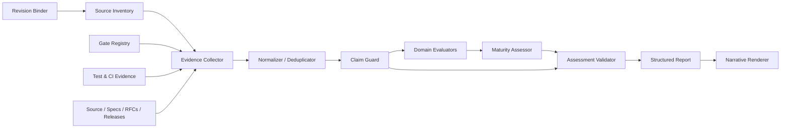
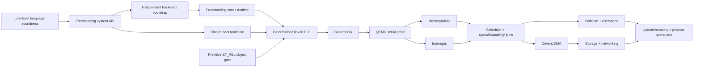

# Design Document: Nebula Universe OS Gap Analysis

## Overview

本设计定义一个只读、仓库内、证据优先的评估流水线，用于回答 Nebula 当前可证明能力、到 Universe OS 六级目标的剩余差距，以及解除阻塞所需的 Hard Gate 顺序。它不修改编译器、运行时或产品代码；未来实现应把评估逻辑放在独立脚本/工具层，并把版本化报告作为普通审阅产物。

核心原则是“声明不强于证据”：每个当前时态结论必须追溯到同一 `Assessment_Revision` 下的源码、可执行测试或发布资产；RFC、ROADMAP 和未来 gate 只能证明计划存在。成熟度是逐域 0–5 序数值，不能求和、平均、转成百分比或工期。

### Research Summary and Repository Basis

设计采用以下仓库内可验证发现：

- `README.md`（“Current Boundary”“Host compiler requirement”）、`AGENTS.md`（“Repository Baseline”）和 `spec/compiler_pipeline.md`（“Current supported production pipeline”）一致表明生产链为 Nebula → NIR/分析 → C++23 → 外部 `clang++`；`codegen/backend.hpp` 只是边界，尚无独立生产后端。
- `spec/language_core.md`、`spec/abi_layout.md` 与 `spec/interop_c_abi.md` 证明当前语言、Rep × Owner、unsafe 和窄 hosted C ABI 的实现范围，也明确记录深层模式、完整系统 ABI、聚合布局和低层语义缺口。
- `docs/system_profile.md`、`spec/library_layers.md` 与 `docs/universeos/no_std_runtime.md` 将 system/no-std 拒绝规则、future `core/std/system` 分层和 freestanding runtime 明确分开；`core::`、`system::`、启动、分配和 panic runtime 仍未实现。
- `docs/universeos/gate_registry.md` 的版本化 JSON 是 UOS gate、依赖、证据 case 与 non-claim 的权威结构化来源；`TST-329` 校验其引用，但 gate 文档本身不等于运行时实现。
- `spec/compiler_pipeline.md`（“Experimental Freestanding Object Slice”）、`spec/abi_layout.md`（“Experimental Primitive Freestanding Representation”）及 `tests/README.md` 的 `BLD-017`–`BLD-020` 只证明 macOS/Linux 主机上的 clang-backed ELF64 `ET_REL` 原始类型子集，不证明 direct backend、链接、runtime 或 boot。
- `docs/universeos/qemu_boot_hello.md` 将协议/工具链、linked ELF、boot media 与 QEMU serial 分为 `UOS-BOOT-001`、`003`、`004`、`005`；`docs/universeos/kernel_boundary.md` 明确 kernel、MMU、interrupt、scheduler、syscall、driver 和 isolation 均不存在。
- `RELEASE_NOTES_v1.0.0.md`、`docs/stability_policy.md`、`docs/official_package_tiering.md` 与 `docs/support_matrix.md` 区分 compiler/tooling GA、Linux backend SDK GA、installed preview、repo preview 与 experimental；这些 hosted 资产不能提升 OS substrate。
- `.github/workflows/contract-tests.yml`、`.github/workflows/release.yml`、`CMakeLists.txt` 和 `tests/README.md` 提供四平台严格构建、contract、sanitizer、发布 smoke、SBOM/provenance 证据，但其适用范围必须按 job、case 和资产边界记录。
- 当前检查绑定到 commit `0a1429a9a596ce8fc9d6681bdfaac30435059231`、branch `improve/review-gap-fixes`，且工作树存在大量 tracked/untracked 修改；因此设计强制区分 tagged release、commit snapshot 与 current worktree。实际报告仍须在生成时重新采集，不能复用本段快照。

### Scope and Target Model

`Universe_OS` 被操作化为 Nebula 自有的启动链、freestanding runtime、系统 ABI、内核资源管理、硬件/驱动抽象、隔离用户态、系统服务、应用生命周期、安全、可观测性、更新与恢复能力。目标严格分层：

1. `T0_Hosted_Adjacency`：宿主 OS 上的 CLI、服务、控制平面与 thin-host app core；仅降低未来移植成本。
2. `T1_Independent_Language_Platform`：语言、编译器、包、调试、兼容性与可复现独立后端足以持续脱离 host-language 开发。
3. `T2_Freestanding_Substrate`：system ABI、freestanding core/runtime、target/link inputs、panic/allocation policy 与硬件安全原语不依赖 hosted runtime。
4. `T3_Boot_And_Kernel_Foundation`：可复现 boot、内存、interrupt、scheduler、syscall/capability、driver、storage 与 network 基础。
5. `T4_Isolated_Userspace_Platform`：进程隔离、user runtime、system services、IPC、install/update/recovery、应用 API 与 shell。
6. `T5_Operable_Universe_OS`：受支持硬件、安全运营、可观测性、分发、升级、恢复、兼容性与持续生态证据。
## Architecture

评估采用确定性批处理架构。所有采集器只读仓库；外部命令执行默认关闭，开启时只能执行 allowlist 中的本地 gate/test，并记录命令、退出码、环境摘要和未验证原因。网络内容不能成为当前实现证据。



处理分六步：

1. **冻结身份**：Revision Binder 读取 commit、branch、`VERSION`、tag/describe、timestamp 与 cleanliness，并计算工作树指纹。
2. **清单化采集**：Source Inventory 按必查类别枚举源码、README/ROADMAP/changelog/全部 release notes、spec/RFC、tests、build/CI/release、`runtime/`、`std/`、`official/`、examples 与 UniverseOS 文档，记录 inspected/validated/skipped。
3. **证据规范化**：Evidence Collector 将 source/test/release/plan/non-claim 变成 `Evidence_Record`，按稳定 claim key 去重但保留所有来源。
4. **声明治理**：Claim Guard 计算允许措辞、状态、冲突、排除项和 trust assumptions；有冲突时不选赢家。
5. **逐域评估**：Domain Evaluators 生成能力、gap 和 gate 候选；Maturity Assessor 先给 raw ordinal score，再按依赖图降帽得到 effective score。
6. **先验证后渲染**：Validator 对 schema、枚举、引用、图、trust assumptions 与需求覆盖 fail closed；结构化模型通过后，叙事报告只能做无损投影。

### Assessment Revision and Worktree Fingerprint

`Assessment_Revision` 同时保存三条不能互换的证据轴：

- **Tagged release**：tag、peeled commit、release note、发布 workflow/asset metadata；只支撑该 tag 的发布范围。
- **Committed revision**：当前 `HEAD` 的不可变 blob/tree 内容；不包含本地修改。
- **Current worktree**：当前 tracked 修改及 non-ignored untracked 文件；用于本次观察，禁止写成 tagged-release 事实。

工作树指纹算法为 `SHA-256`：对 `git ls-files -co --exclude-standard` 的 UTF-8 字节序排序结果，逐项编码 `path length + path bytes + file kind + executable/mode bits + content length + content SHA-256`，再哈希整个 length-prefixed stream。符号链接哈希 link bytes，不跟随；读取失败使评估失败。为避免自引用，输出目录可排除，但每个排除路径、原因与规则版本必须写入 revision；产品源码不可排除。另存 `HEAD`、`git diff --binary` 摘要 hash 与 untracked path 集 hash，便于区分“同 commit、不同工作树”。

## Components and Interfaces

### Revision Binder

```text
bind(repoRoot, assessmentOutputPaths, clock) -> AssessmentRevision
```

职责：规范化仓库根、读取 Git/version 身份、检测 dirty 状态、计算指纹、记录算法版本和排除清单。timestamp 只进入元数据，不进入内容指纹，确保相同工作树重复采集得到同一 fingerprint。

### Evidence Collector

```text
collect(revision, inventory, executionPolicy) -> EvidenceBundle
```

职责：

- 以 source category adapter 读取 Markdown heading、代码 symbol、manifest key、case ID、workflow job 和 artifact metadata；
- 对每个 accepted claim 生成字段完整的 `Evidence_Record`；
- 将同一 claim 的多来源组成 evidence set，不把文档计数当成实现强度；
- 对不兼容 claim 生成 `EvidenceConflict`，保留双方位置且 `winner = null`；
- RFC、ROADMAP、future test name、planned gate 只生成 `Planned` 证据；
- 记录文件已检查但命令未执行、平台不可用或 artifact 不可得的原因。

Collector 不负责决定成熟度，也不得把“不搜索到”单独当作 `Unsupported`。`Unsupported` 需要显式 non-claim/negative gate，或完整 inventory + 对应实现入口缺失 + Claim Guard 审核。

### Claim Guard

```text
guard(bundle, statusPolicy, claimRules) -> GuardedEvidence
validateTrustAssumptions(guardedEvidence) -> ValidationFindings
```

职责：

- 当前时态 implementation claim 必须有当前 revision 的 source 或 executable implementation evidence；
- 强制唯一 `Evidence_Status`，保留 package tier 与 gate status，不允许 summary 升级；
- 把 hosted example 标成 `T0_Hosted_Adjacency`，把 external host compiler 标成生产依赖；
- 将 primitive object 固定描述为 “clang-backed ELF64 relocatable-object emission”；
- 对 kernel、driver、interrupt、MMU、scheduler、syscall ABI、freestanding runtime、bootability、backend independence 保持显式 non-claim，直到对应 accepted evidence 出现；
- 将 opaque/dynamic/FFI/unsafe 排除项，以及 trusted tool、cooperative descendant、caller-controlled directory、host security service 等信任假设写入 limitations；漏记任一已检测 trust assumption 立即失败；
- source/test/docs 冲突时强制 `Low` confidence 并建立 conflict；无可验证路径时状态为 `Unknown`。

### Domain Evaluators

```text
evaluate(domainDefinition, guardedEvidence) -> DomainDraft
```

Evaluator 采用声明式 checklist：每个检查项含 capability key、目标层、允许证据类型、实现入口、测试/gate、已知 non-claim、gap 分类规则和 acceptance evidence 模板。评估方法如下：

| 域 | 必查内容 | 主要仓库依据 | 判定重点 |
| --- | --- | --- | --- |
| Language & Safety | lexical/control flow/function/module/visibility/generics/trait/closure/pattern/error/reflection/macro；宽度、pointer/ref/slice/collection/null/aggregate/enum/callable/variance/lifetime/dynamic dispatch；storage/ownership/concurrency/unsafe | `spec/grammar.ebnf`, `spec/language_core.md`, `spec/generics_policy.md`, `spec/region_semantics.md`, `spec/rep_owner_model.md`, `spec/safety_contract.md`, `frontend/`, `passes/` | parser/typechecker evidence与规范稳定性分开；Rep × Owner/borrow assist 不等于 normative move/borrow/lifetime/alias model；hosted async 不等于 scheduler-independent concurrency。 |
| ABI & Backend | extern/export C ABI、calling convention、symbol/layout/alignment/versioning；frontend/NIR/analysis/optimization/debug/native backend/assembler/linker/bootstrap | `spec/abi_layout.md`, `spec/interop_c_abi.md`, `spec/compiler_pipeline.md`, `codegen/`, `cli/`, `ABI-*`, `BLD-017`–`020` | hosted ABI、compiler ABI、runtime ABI、boot ABI、syscall ABI、driver ABI、package ABI 分行；generated C++ 或 external clang 存在即阻断 T1。 |
| Freestanding Runtime | startup/static init/panic/allocation/termination/unwind/runtime ABI；future core/hosted std/future system；raw pointer/volatile/atomic/intrinsic | `docs/system_profile.md`, `spec/library_layers.md`, `docs/universeos/no_std_runtime.md`, `runtime/`, `std/` | CLI no-std 拒绝和 primitive object 都不是 runtime；resolver 或 implementation 任一缺失时 `core::`/`system::` 为 Planned。 |
| Boot | target、protocol、entry、linker script、relocation、startup object、linked ELF、media、QEMU execution | `docs/universeos/gate_registry.md`, `docs/universeos/qemu_boot_hello.md`, `boot/`, `BLD-017`–`020` | object/link/media/execute 四证据不可合并；每步独立 hard gate 且无 fallback。 |
| Kernel | early console/timer/trap/CPU/MMU/page/physical+virtual memory/power；entry/panic/sync/scheduler/context switch/syscall/capability/IPC/process/thread/accounting | `docs/universeos/kernel_boundary.md`, `docs/universeos/readiness_assessment.md` | 无 direct implementation 一律 0；QEMU hello 未来即使通过也不能提升各 kernel 子系统。 |
| Drivers & Hardware | discovery/bus/lifecycle/isolation/IRQ/DMA/IOMMU/storage/network/input/display/audio/qualification | `docs/universeos/kernel_boundary.md` 的 Driver Boundary、gate registry、源码/测试入口 | 每类设备与安全边界独立 domain/gap；driver、IRQ、DMA、MMIO 不能由 boot 证据推断。 |
| Userspace | isolation/user runtime/services/IPC/filesystem/network/service manager/identity/policy/time/config/install/update/rollback/backup/recovery/shell/app model/sandbox/SDK | kernel boundary、`docs/universeos/architecture.md`、hosted examples/official packages | host-owned 服务和 thin-host bridge 只进 T0；没有 Nebula-owned process/syscall boundary 时 T4 行为 0。 |
| Operations & Ecosystem | diagnostics/LSP/debug/crash/profiling/tracing/metrics/log correlation；supply chain/package trust/security/update/recovery；docs/adoption/LTS；build matrix/contract/sanitizer/SBOM/provenance/installers | `tests/README.md`, workflows, release docs, stability/tiering/support matrix | compiler/hosted service operations 与 OS operations 分开；release scope 不能提升 OS substrate；preview security package产生维护、认证、部署、漏洞响应 gap。 |

Application platform 证据作为横切视图，逐项标记 `NebulaOwned | HostOwned | OperationsOwned`，覆盖 CLI/backend/control plane/data/auth/jobs/TLS/crypto/UI semantics/thin-host/native adapter；renderer、accessibility、signing、notarization、install/update/distribution/crash reporting 必须按实际 owner 归属。

### Maturity Assessor

```text
assess(domainDrafts, hardGateGraph) -> CapabilityAssessments
```

每个 domain 先按直接证据得 `rawScore`：0 无实现；1 窄实验；2 可重复 repo-local；3 跨支持主机候选契约并有迁移/回滚；4 受支持生产；5 成熟独立生态。随后按拓扑序计算：

```text
effectiveScore(domain) = min(rawScore(domain),
                             score(each blocking dependency/gate))
```

每条依赖边必须声明为何其成熟度可作为上限；非 blocking 关联不得参与 cap。gate score 使用同一 0–5 rubric 从其实际证据推导，而不是把 `experimental` 文本机械映射成分数。缺失、越界、重复、未知或循环依赖在计算前失败。没有实现证据时 raw/effective 都是 0，计划和相邻资产不能补偿。

Target level 仅在该层全部 mandatory domains 达到各自门槛、全部 hard gates 满足、且无 blocking conflict/validation failure 时标为 achieved；不生成总分。报告展示 capability matrix、未满足 gate frontier 和 dependency-ordered path。

### Assessment Validator and Report Renderer

Validator 是唯一发布闸门，检查：schema/enum/范围、Evidence_Record 完整性、每域 assessment、每 gap primary category、所有引用可解析、需求覆盖、DAG、trust assumptions、status/wording policy、structured/narrative 同源。任何错误都返回 requirement refs 和 record/domain IDs，不输出“有效报告”。Renderer 从一个 canonical `AssessmentModel` 生成 JSON、CSV/表格和 Markdown；推荐段落与 observed facts 分区，叙事不得引入结构化模型中不存在的事实。

## Data Models

以下为语言无关的逻辑 schema；实现可使用 JSON Schema 加 typed Python/TypeScript model，但序列化必须稳定排序。

```text
AssessmentRevision {
  schemaVersion, commitId, branch, version, describe, tags[],
  worktreeClean: bool, assessedAtUtc, fingerprintAlgorithm,
  worktreeFingerprint, trackedDiffHash, untrackedPathSetHash,
  excludedPaths[{path, reason}], repositoryRootId
}

SourceInventoryEntry {
  id, category, path, revisionOrigin,
  inspected: bool, executionState: Validated|NotRun|Unavailable|Failed,
  executionDetail?, contentHash, stableAnchors[]
}

EvidenceRecord {
  id, claimKey, claim, status: EvidenceStatus,
  sourcePath, location: {kind: LineRange|Heading|Symbol|CaseId|ManifestKey|WorkflowJob, value},
  revisionRef, origin: TaggedRelease|CommittedRevision|CurrentWorktree|ExecutionArtifact,
  evidenceKind: Source|TestDefinition|TestExecution|Specification|RFC|Release|Workflow|Artifact|Example|NonClaim,
  confidence: High|Medium|Low,
  scope: {capabilityIds[], targetLevels[], platforms[], ownership?},
  limitations[], trustAssumptions[], verificationState, relatedEvidenceIds[]
}

EvidenceConflict {
  id, claimKey, evidenceIds[2+], incompatibleValues[],
  locations[], winner: null, confidence: Low, blocking: bool
}
```

`Evidence_Status` 恰为 `Compiler_Tooling_GA | Backend_SDK_GA | Installed_Preview | Repo_Preview | Experimental | Planned | Unsupported | Unknown`。状态决策顺序为：可验证发布契约 → 明确 package tier → 当前实现+experimental gate → 仅未来文本 → 显式/审计后的缺失 → 无法判定。不同 scope 可有不同 record（例如同一 package 的 repo preview 与 Linux installed preview），但单条 record 只能有一个 status。

```text
CapabilityDomain {
  id, name, parentId?, targetLevel,
  description, mandatoryForTarget: bool,
  checklistIds[], evidenceIds[], gapIds[], dependencyGateIds[]
}

CapabilityAssessment {
  domainId, rawScore: 0..5, effectiveScore: 0..5,
  confidence, evidenceStatus, evidenceIds[],
  limitations[], nextHardGateId, blockingDependencyIds[], rationale
}

GapEntry {
  id, title, primaryCategory: Language_Gap|Implementation_Gap|Verification_Gap|Ecosystem_Gap,
  secondaryCategories[], domainIds[], currentStatus, targetLevel,
  severity: Critical|High|Medium|Low,
  dependencies[], acceptanceEvidence[], recommendedOwnerArea,
  dependencyCriticality, safetyImpact, claimRisk, targetUnblockValue,
  observedFact, recommendation
}

HardGate {
  id, title, targetLevel, status, maturityScore: 0..5,
  dependencyIds[], blockingDomainIds[], evidenceIds[],
  acceptanceEvidence[], nonClaims[], ownerArea,
  parallelBranch?, joinGateIds[]
}
```

Gap 的 primary category 必须唯一；secondary 去重且不能重复 primary。优先级使用词典序 tuple `(dependencyCriticality, safetyImpact, claimRisk, targetUnblockValue, stableId)`，不把异质值相加。并行 workstream 显式使用 branch/join：如 `UOS-ABI-002` 后 backend/runtime lane 与 boot-toolchain lane 可并行，最终在 linked ELF gate 合流。

```text
AssessmentModel {
  revision, sourceInventory[], evidenceRecords[], conflicts[],
  targetLevels[6], domains[], assessments[], gaps[], hardGates[],
  assumptions[], nonClaims[], observedConclusions[], recommendations[],
  validation: {valid, findings[{severity, code, requirementRefs[], objectRefs[]}]}
}
```

结构化输出至少包括 `assessment.json`、capability matrix 和 gap register；叙事 `assessment.md` 包含 executive conclusion、revision、inventory、baseline、target、rubric、matrix、gaps、graph、roadmap、conflicts、assumptions、non-claims 与未执行证据。所有 material conclusion 引用 repo-relative path 加最小稳定 anchor/case/gate ID。
### Initial Evidence-Backed Conclusion Contract

在未发现比本设计 research snapshot 更新且可验证的证据时，报告必须得出以下受限结论：Nebula 是有前景的 hosted language/compiler/tooling、Linux backend service 与 thin-host app-core 基础；生产编译仍经 generated C++ 和外部 host toolchain，故 `T1` 未达成；`T2`–`T5` 未达成。language/tooling 的最强 repo-local 行不高于 2；freestanding runtime、linked/bootable chain、kernel 和 UniverseOS userspace 为 0。Hosted adjacency 可复用，但不属于 OS substrate critical path。

最短证据路径不是总工期，而是 DAG frontier：



其中 memory、interrupt、scheduler、syscall/capability、drivers/DMA、storage、network、isolation、userspace、update/recovery 和 shell 各自保留独立 gate；未来 QEMU hello 不得折叠这些差距。

## Correctness Properties

*A property is a characteristic or behavior that should hold true across all valid executions of a system-essentially, a formal statement about what the system should do. Properties serve as the bridge between human-readable specifications and machine-verifiable correctness guarantees.*

性质反思将同义规则合并为复合不变量：状态唯一性与 record schema 合并；dependency cap 与 DAG 合法性合并；hosted example、hosted observability 和 scoped release 的“不传播”合并；无实现即 0 覆盖全部 substrate；结构化表、引用与叙事同源合并。每条保留性质提供独立故障信号。

### Property 1: Revision-origin isolation

For all evidence sets and dirty/clean revision states, evidence read from `Current_Worktree` remains distinguishable from `TaggedRelease` and cannot be rendered as tagged-release evidence.

**Validates: Requirements 1.2**

### Property 2: Accepted evidence is complete and singly classified

For all accepted claims, serialization produces a schema-valid `Evidence_Record` with every required glossary field, exactly one allowed `Evidence_Status`, valid references, and a stable source location.

**Validates: Requirements 1.4, 4.1, 4.2**

### Property 3: Conflicts are symmetric, lossless, and winner-free

For all incompatible evidence sets and all permutations of their input order, conflict detection preserves every conflicting record and source location, assigns no inferred winner, and forces `Confidence_Rating = Low`.

**Validates: Requirements 1.5, 13.4**

### Property 4: Plans never become implementation

For all claims supported only by roadmap, RFC, proposed-test, planned-gate, or other future prose evidence, classification is `Planned`, wording is future tense, and no implemented status or maturity credit is granted.

**Validates: Requirements 1.6, 13.2**

### Property 5: Target hierarchy and hosted-adjacency isolation

For all valid target models and hosted-adjacency evidence additions, the model contains exactly the six ordered target levels, hosted evidence maps to `T0_Hosted_Adjacency`, and T1–T5 substrate achievement and critical-path scores remain unchanged.

**Validates: Requirements 2.2, 2.3, 15.6**

### Property 6: Domain assessments are complete, ordinal, and non-additive

For all capability-domain sets, there is exactly one assessment per domain containing score, confidence, status, evidence, limitations, next gate, and dependencies; every score is an integer in 0..5 and no aggregate percentage, average, or schedule estimate is produced.

**Validates: Requirements 3.1, 3.2, 3.7**

### Property 7: Dependency validation precedes maturity capping

For all proposed hard-gate graphs, missing/out-of-range scores, unknown nodes, duplicate edges, self-edges, or cycles invalidate the assessment before dependent scores are computed; for every valid DAG, each effective score is no greater than its raw score or any blocking dependency score, and independent branches converge only through explicit join gates.

**Validates: Requirements 3.4, 3.5, 12.7**

### Property 8: No direct implementation evidence means zero

For all capability domains, including every OS-substrate domain, if direct implementation evidence is absent then raw and effective maturity are 0 regardless of plans, prerequisites, examples, or adjacent capabilities.

**Validates: Requirements 3.6, 10.6, 15.5**

### Property 9: Hosted and scoped-release evidence cannot propagate into OS substrate

For all hosted examples, compiler/service observability records, compiler/tooling releases, and Linux backend SDK releases, adding those records may affect only their declared hosted scopes and cannot increase boot, kernel, driver, userspace, or OS-operations maturity.

**Validates: Requirements 4.6, 9.2, 11.6**

### Property 10: Semantic evidence creates the correct gap kind

For all documented language features, a `Language_Gap` references the authoritative source and direct implementation evidence; if parser/typechecker support exists but compatibility policy does not, an additional or primary `Verification_Gap` records semantic-stability risk according to the one-primary-category rule.

**Validates: Requirements 5.3, 5.4**

### Property 11: Safety assistance and hosted async stay bounded

For all evidence bundles, Rep × Owner inference or borrow assistance without normative move/borrow/lifetime/alias rules cannot satisfy the normative safety capability; hosted cooperative async without scheduler-independent implementation creates an `Implementation_Gap`; and every opaque, dynamic, FFI, or unsafe exclusion is present in limitations.

**Validates: Requirements 6.2, 6.4, 6.6**

### Property 12: ABI evidence is scope-isolated and production dependencies block T1

For all evidence sets, hosted C ABI records cannot satisfy compiler/runtime/boot/syscall/driver/package ABI domains; while production paths retain generated C++, external clang, an incomplete dependency inventory, or lack an accepted independent bootstrap, `T1_Independent_Language_Platform` remains unachieved.

**Validates: Requirements 7.2, 7.4, 7.5**

### Property 13: Primitive-object proof and boot gates remain decomposed

For all passing primitive object gates, allowed wording is limited to clang-backed ELF relocatable-object emission and excludes direct backend, linked image, runtime, and boot claims; target specification, linker inputs/scripts, relocation/startup, deterministic linking, boot media, and boot execution remain separate ordered hard gates.

**Validates: Requirements 7.6, 7.7**

### Property 14: Library layers and preview statuses do not collapse

For all library/package evidence, future `core`, hosted `std`, and future `system` remain separate domains; missing resolver or implementation support makes `core::`/`system::` imports `Planned`; and `Installed_Preview`/`Repo_Preview` survive all summaries and target calculations unchanged.

**Validates: Requirements 8.3, 8.4, 8.6**

### Property 15: Trust assumptions are complete or validation fails

For all evidence records, every detected trusted-tool, cooperative-descendant, caller-controlled-directory, host-security-service, or equivalent assumption appears in limitations; any set difference between detected and recorded assumptions invalidates the assessment and cites affected records.

**Validates: Requirements 9.5, 9.6**

### Property 16: Required assessment objects fail closed

For all otherwise valid assessment models, removing or corrupting any required `Evidence_Record` or `CapabilityDomain` makes validation fail with the affected object IDs and requirement references, rather than producing a partial valid report.

**Validates: Requirements 9.7**

### Property 17: Preview security packages create ecosystem obligations

For all security-sensitive packages whose status is preview, the gap register contains ecosystem gaps covering maintenance, certification, deployment, and vulnerability response unless direct evidence independently closes each obligation.

**Validates: Requirements 9.8**

### Property 18: A boot hello does not imply an operating system

For all assessment models, adding only a passing QEMU serial-hello record leaves driver, interrupt, MMU, scheduler, syscall, isolation, storage, networking, userspace, and operations gaps and scores unchanged.

**Validates: Requirements 10.7**

### Property 19: Application responsibility ownership is exclusive

For all application-platform evidence records, each responsibility is assigned exactly one of `NebulaOwned`, `HostOwned`, or `OperationsOwned`; ownership does not imply maturity outside that owner’s capability domain.

**Validates: Requirements 11.2**

### Property 20: Gap register classification and ranking are deterministic

For all gap sets, each gap has exactly one primary category and all required fields; secondary categories are unique and exclude the primary; sorting follows dependency criticality, safety impact, claim risk, target-level unblock value, then stable ID, independent of input order.

**Validates: Requirements 12.1, 12.2, 12.3, 12.4**

### Property 21: Present-tense claims require direct current evidence

For all claims, present-tense implementation wording is permitted only with implementation evidence from the bound revision; docs/examples cannot exceed their strongest direct scoped status, pathless claims are `Unknown`, and explicit non-claims persist until their own accepted gate exists.

**Validates: Requirements 13.1, 13.3, 13.5, 13.6**

### Property 22: Structured and narrative outputs are lossless projections

For all valid canonical assessment models, the capability table has exactly one matching row per domain, the gap register exactly one matching row per gap, every material conclusion has a repository-relative stable anchor, every unexecuted source is disclosed, and observed facts and recommendations remain in separate typed sections.

**Validates: Requirements 14.2, 14.3, 14.4, 14.5, 14.6, 14.7**

### Property 23: Candidate evidence is required to exceed repository-local maturity 2

For all language/tooling assessments lacking cross-supported-host candidate contract, migration/rollback, and release-review evidence, maturity cannot exceed 2; only evidence satisfying all score-3 conditions may remove that cap.

**Validates: Requirements 15.4**
## Error Handling

评估遵循 fail-closed 原则：不能证明时降级为 `Unknown`/0 或使报告无效，绝不猜测、静默 fallback 或选择有利证据。

### Confidence and Conflict Rules

| Confidence | 适用条件 |
| --- | --- |
| `High` | 同一 revision 的 direct source/implementation 与已执行 gate/test 一致，scope 清楚且无冲突；或权威发布资产明确证明发布范围。 |
| `Medium` | 有 direct source 或稳定 test definition，但执行证据缺失、仅覆盖部分平台、工作树 dirty、或兼容/运营证据不完整。 |
| `Low` | source/test/docs 不一致、claim scope 模糊、仅间接推断，或无法复现。冲突强制 Low。 |

置信度描述“该结论被证据支持的强度”，不提升 status/maturity。例如可对“某项仍是 Planned”有 High confidence，但其实现成熟度仍为 0。`Unknown` 通常为 Low，除非只是明确标记“未检查”。冲突记录双方且无 winner；受冲突影响的 current implementation claim 默认 blocking，直到 reviewer 提供新证据或明确缩小 scope。

### Validation Failures

| Code family | Failure | Handling |
| --- | --- | --- |
| `REV-*` | Git/version 读取失败、文件漂移、指纹读取失败 | 中止；不得把部分 snapshot 与旧 revision 混合。 |
| `INV-*` | 必查 source category 缺失或 inventory adapter 失败 | 中止；输出缺失类别与 Requirement 1.3。 |
| `EVD-*` | record 缺字段、路径/anchor 不存在、执行结果不可解析 | required evidence 时中止；否则记录 `Unknown` 与 limitation。 |
| `CLM-*` | present-tense 越权、status 升级、漏 trust assumption、scope 泄漏 | 立即中止并引用 record/requirement；不自动改写后继续。 |
| `CNF-*` | incompatible evidence | 保留冲突、Low confidence、winner null；若影响 mandatory domain 则 target 不得 achieved。 |
| `GRF-*` | unknown/duplicate/self/cyclic dependency 或非法 join | 在 maturity 计算前中止。 |
| `MAT-*` | score 缺失/越界、无实现却非 0、dependency cap 违规 | 中止并引用 domain/gate。 |
| `RPT-*` | structured/narrative 行数、引用或事实不一致 | 拒绝发布全部输出，避免留下看似有效的部分报告。 |

执行型证据必须保存 command ID、环境/平台摘要、exit status、stdout/stderr artifact reference 和运行 revision fingerprint。命令超时、缺工具或平台不可用不是能力通过；分别记 `Failed`/`Unavailable`。如果采集前后 fingerprint 不同，全部 execution evidence 作废并要求重跑。

## Testing Strategy

设计适合对纯分类、图算法、schema 与 renderer 使用 property-based testing；仓库遍历、Git、实际 gate 和 CI/release artifact 则使用 integration/smoke tests。两者互补，不能用随机模型测试替代真实仓库证据。

### Property-Based Tests

目标实现语言选 Python，使用成熟库 **Hypothesis**，不自建生成器框架。每个 Correctness Property 恰对应一个 property test，至少 `max_examples=100`；复杂 DAG/status 组合可提高到 300。每个测试带以下注释：

```text
Feature: nebula-universe-os-gap-analysis, Property <number>: <property title/body summary>
```

生成器覆盖：合法/非法 EvidenceRecord、状态证据组合、scope、dirty origins、conflict permutations、domain sets、0..5/非法 scores、DAG/cycle/parallel join、gap labels/priorities、trust-assumption set difference、path/anchor availability 和 structured report models。失败时保留 Hypothesis 最小反例与 seed；不把 timestamp 放进确定性比较。

### Unit and Example Tests

- 固定检查 Universe OS 定义、T0–T5 文本、maturity rubric、non-additive 声明和初始 conclusion contract。
- 对 status decision table 的边界例（GA 与 preview 同时有文档、RFC 与 source 并存、explicit non-claim）做少量可读 examples。
- 对 renderer 做 golden tests，验证 executive conclusion、所有必需章节、Mermaid/DAG、stable anchors、observed/recommendation 分区。
- 对 invalid score、missing record、unknown dependency、cycle、漏 trust assumption 和 fingerprint drift 做 fail-closed edge tests。

### Integration Tests

- 在临时 Git 仓库构造 clean/dirty/tagged/untracked/symlink/permission 场景，验证 `AssessmentRevision` 与指纹重现性。
- 对本仓库运行 read-only inventory dry run，确认 README、ROADMAP、changelog、全部 release notes、spec/RFC、source、tests、CMake、workflows、runtime/std/official/examples 与 UniverseOS docs 均被覆盖。
- 解析 `docs/universeos/gate_registry.md` JSON，解析 `tests/cases/**/case.toml`，验证 gate ID、case ID、dependency 与 non-claim 引用。
- 将 `README.md`、`spec/compiler_pipeline.md`、`spec/abi_layout.md`、`docs/system_profile.md`、`docs/support_matrix.md`、package tiering 与 release notes 作为 curated fixture，验证当前 baseline status 与外部 host compiler limitation。
- 选择性执行允许的快速 docs/gate contract（例如 `TST-280`, `TST-282`, `TST-329`, `TST-331`）并绑定执行 fingerprint；未执行的 `BLD-017`–`020` 只能作为 test-definition evidence，不得伪装为本次通过。
- Schema-validate `assessment.json`，再与 capability/gap tables 和 Markdown 做双向 ID/reference parity 检查。

### Repository and Release Validation

完整产品 build/contract suite 对本次“只写设计文档”没有必要，也不能证明分析器尚未实现。未来实现完成时，应先跑分析器单元/PBT，再跑 inventory integration；只有评估声称某 gate 在本次工作树通过时，才执行对应 targeted gate，必要时再执行仓库要求的 strict/full suite。CI 历史或 release note 只能证明其绑定 revision 的结果。

### Requirements Traceability

| Requirement | Design coverage |
| --- | --- |
| 1 | Revision Binder、fingerprint、Source Inventory、Evidence Collector、Properties 1–4 |
| 2 | Scope and Target Model、Property 5 |
| 3 | Maturity Assessor、Properties 6–8 |
| 4 | Claim Guard status policy、domain methods、Properties 2, 9, 13–14 |
| 5 | Language & Safety evaluator、Property 10 |
| 6 | Language & Safety evaluator、Property 11 |
| 7 | ABI & Backend evaluator、Properties 12–13 |
| 8 | Freestanding Runtime evaluator、Property 14 |
| 9 | Operations evaluator、Error Handling、Properties 9, 15–17 |
| 10 | Boot/Kernel/Drivers/Userspace evaluators、Properties 8, 18 |
| 11 | Application ownership view、Operations evaluator、Properties 9, 19 |
| 12 | GapEntry/HardGate models、Properties 7, 20、initial DAG |
| 13 | Claim Guard、confidence/conflict rules、Properties 3–4, 13, 21 |
| 14 | AssessmentModel、Validator/Renderer、Property 22 |
| 15 | Initial Evidence-Backed Conclusion Contract、Properties 5, 8, 12, 23 |
