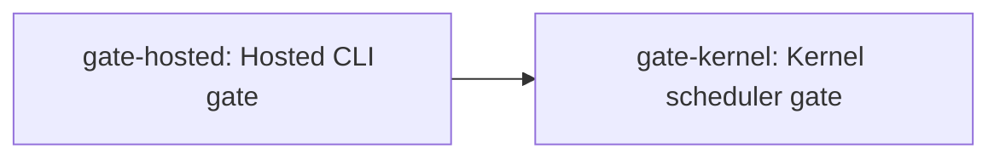

# Nebula Universe OS Gap Analysis

> Capability maturity scores are non-additive ordinal values; they must not be summed, averaged, converted to percentages, or interpreted as schedule estimates. A capability score measures demonstrated capability at the bound revision; it is **not** a progress indicator and **not** a schedule or effort estimate. A passing prerequisite gate proves only that named gate's scope.

Observed current facts and recommendations are kept in separate, clearly labelled sections throughout this report.

## 1. Executive Conclusion

### Observed facts

- Nebula is a hosted language and tooling foundation. [ev-hosted: `README.md` (heading "Current Boundary")]

### Recommendations

- Publish a compatibility policy before depending on the CLI. (related gaps: gap-hosted)

## 2. Assessment Revision

The three evidence axes below are distinct and must never be substituted for one another.

| Field | Value |
| --- | --- |
| Repository root | repo-root |
| Schema version | 1 |
| Commit | 0000000000000000000000000000000000000000 |
| Branch | main |
| Version | 1.0.0 |
| Describe | v1.0.0 |
| Tags | (none) |
| Worktree clean | yes |
| Assessed at (UTC) | 2024-01-01T00:00:00+00:00 |
| Fingerprint algorithm | sha256-length-prefixed |
| Worktree fingerprint | ffffffffffffffffffffffffffffffffffffffffffffffffffffffffffffffff |
| Tracked diff hash | 0000000000000000000000000000000000000000000000000000000000000000 |
| Untracked path-set hash | 0000000000000000000000000000000000000000000000000000000000000000 |

- **Tagged release axis:** describe `v1.0.0`, 0 tag(s); proves only the tagged release scope.
- **Committed revision axis:** commit `0000000000000000000000000000000000000000` on branch `main`; immutable committed content only.
- **Current worktree axis:** based on commit `0000000000000000000000000000000000000000`, worktree clean; used for this observation and never rendered as tagged-release fact.

Excluded paths (never product source):
- `out/assessment.json` -- assessment output directory (rule 1)

## 3. Source Inventory

| Entry | Category | Path | Origin | Inspected | Execution | Anchors |
| --- | --- | --- | --- | --- | --- | --- |
| inv-0 | BuildConfiguration | `inv/entry_0.txt` | CommittedRevision | yes | NotRun | anchor-0 |
| inv-1 | CIWorkflow | `inv/entry_1.txt` | CommittedRevision | yes | NotRun | anchor-1 |
| inv-10 | Roadmap | `inv/entry_10.txt` | CommittedRevision | yes | NotRun | anchor-10 |
| inv-11 | Runtime | `inv/entry_11.txt` | CommittedRevision | yes | NotRun | anchor-11 |
| inv-12 | SourceCode | `inv/entry_12.txt` | CommittedRevision | yes | NotRun | anchor-12 |
| inv-13 | Specification | `spec/language_core.md` | CommittedRevision | yes | NotRun | Overview |
| inv-14 | StandardLibrary | `inv/entry_14.txt` | CommittedRevision | yes | NotRun | anchor-14 |
| inv-15 | Test | `inv/entry_15.txt` | CommittedRevision | yes | NotRun | anchor-15 |
| inv-16 | UniverseOSDocument | `inv/entry_16.txt` | CommittedRevision | yes | NotRun | anchor-16 |
| inv-2 | Changelog | `inv/entry_2.txt` | CommittedRevision | yes | NotRun | anchor-2 |
| inv-3 | Example | `inv/entry_3.txt` | CommittedRevision | yes | NotRun | anchor-3 |
| inv-4 | GateRegistry | `inv/entry_4.txt` | CommittedRevision | yes | NotRun | anchor-4 |
| inv-5 | OfficialPackage | `inv/entry_5.txt` | CommittedRevision | yes | NotRun | anchor-5 |
| inv-6 | README | `README.md` | CommittedRevision | yes | NotRun | Current Boundary |
| inv-7 | RFC | `inv/entry_7.txt` | CommittedRevision | yes | NotRun | anchor-7 |
| inv-8 | ReleaseNotes | `inv/entry_8.txt` | CommittedRevision | yes | NotRun | anchor-8 |
| inv-9 | ReleaseWorkflow | `inv/entry_9.txt` | CommittedRevision | yes | NotRun | anchor-9 |

## 4. Current Baseline

Each accepted claim carries exactly one evidence status. Statuses are grouped below; every claim cites a repository-relative path and its smallest stable anchor.

### Compiler_Tooling_GA

- **ev-hosted** (Source, confidence High): The hosted CLI builds and runs on supported hosts. -- `README.md` (heading "Current Boundary")
- **ev-spec** (Source, confidence High): The language core specification documents the current pipeline. -- `spec/language_core.md` (heading "Overview")

## 5. Target Model (T0-T5)

**Universe OS.** The complete Nebula-owned independent system platform: boot chain, freestanding runtime, system ABI, kernel resource management, hardware and driver abstractions, isolated userspace, system services, application lifecycle, security, observability, update, and recovery. The six target levels are strictly ordered; hosted adjacency (T0) never counts as OS substrate completion.

| Level | Title | Boundary | Definition |
| --- | --- | --- | --- |
| T0_Hosted_Adjacency | Hosted adjacency | Hosted_Adjacency | CLI tools, services, control planes, and thin-host application cores running on an existing host OS; this level reduces porting effort but does not complete OS substrate work. |
| T1_Independent_Language_Platform | Independent language platform | OS_Substrate | Language, compiler, package, debugger, compatibility, and reproducible-backend independence sufficient for sustained development without a host language. |
| T2_Freestanding_Substrate | Freestanding substrate | OS_Substrate | System ABI, freestanding core and runtime, target model, linker inputs, panic and allocation policy, and hardware-safe primitives without hosted runtime dependency. |
| T3_Boot_And_Kernel_Foundation | Boot and kernel foundation | OS_Substrate | Reproducible boot, memory management, interrupts, scheduling, syscalls, capabilities, drivers, storage, and networking foundations. |
| T4_Isolated_Userspace_Platform | Isolated userspace platform | OS_Substrate | Process isolation, user runtime, system services, IPC, install and update, recovery, application APIs, and platform shell foundations. |
| T5_Operable_Universe_OS | Operable Universe OS | OS_Substrate | Supported hardware, security operations, observability, packaging, upgrades, recovery, application distribution, compatibility, and sustained ecosystem evidence. |

## 6. Maturity Rubric

| Score | Meaning |
| --- | --- |
| 0 | No implementation evidence. |
| 1 | Narrow experimental implementation. |
| 2 | Repeatable repository-local implementation. |
| 3 | Candidate contract verified across supported hosts, with migration and rollback evidence. |
| 4 | Supported production capability. |
| 5 | Mature independent ecosystem capability. |

> Capability maturity scores are non-additive ordinal values; they must not be summed, averaged, converted to percentages, or interpreted as schedule estimates. A capability score measures demonstrated capability at the bound revision; it is **not** a progress indicator and **not** a schedule or effort estimate. A passing prerequisite gate proves only that named gate's scope.

## 7. Capability Matrix

One row per capability domain. Scores are ordinal 0-5 and non-additive.

| Domain | Target | Raw | Effective | Confidence | Status | Evidence | Next Hard-Gate |
| --- | --- | --- | --- | --- | --- | --- | --- |
| Hosted CLI (domain-hosted) | T0_Hosted_Adjacency | 2 | 2 | High | Compiler_Tooling_GA | ev-hosted | gate-hosted |
| Kernel scheduler (domain-kernel) | T3_Boot_And_Kernel_Foundation | 0 | 0 | Low | Unsupported | (none) | gate-kernel |

## 8. Gap Register

### Observed facts

| Gap | Title | Primary | Secondary | Domains | Status | Target | Severity | Priority | Observed fact |
| --- | --- | --- | --- | --- | --- | --- | --- | --- | --- |
| gap-hosted | Hosted CLI compatibility governance gap | Verification_Gap | (none) | Hosted CLI (domain-hosted) | Compiler_Tooling_GA | T1_Independent_Language_Platform | Medium | 1/0/1/1 | The hosted CLI has no compatibility policy. |

Priority is `dependency criticality / safety impact / claim risk / target-unblock value`, compared lexicographically then by stable id; the dimensions are never summed.

### Recommendations

- **gap-hosted** (owner: Tooling): Publish and verify a compatibility policy. Acceptance evidence: A published compatibility policy..

## 9. Hard-Gate Dependency Graph

Directed dependency DAG over Hard-Gates; an arrow `A --> B` means gate `B` depends on (is blocked by) gate `A`.

## 10. Prioritized Parallel Roadmap

The roadmap is a dependency frontier ordering of Hard-Gates, not a schedule. Independent workstreams are parallel branches that converge on explicit join gates.

### Observed facts

| Order | Gate | Target | Status | Maturity | Branch | Join gates | Depends on |
| --- | --- | --- | --- | --- | --- | --- | --- |
| 0 | gate-hosted | T0_Hosted_Adjacency | Compiler_Tooling_GA | 2 | (none) | (none) | (none) |
| 1 | gate-kernel | T3_Boot_And_Kernel_Foundation | Unsupported | 0 | (none) | (none) | gate-hosted |

### Recommendations

- **gate-hosted** (owner: Tooling, target T0_Hosted_Adjacency): satisfy Hosted CLI gate. Acceptance evidence: Hosted CLI builds on supported hosts..
- **gate-kernel** (owner: Kernel, target T3_Boot_And_Kernel_Foundation): satisfy Kernel scheduler gate. Acceptance evidence: A reproducible kernel scheduler..

## 11. Evidence Conflicts

Conflicts are recorded losslessly with no inferred winner; every conflict forces low confidence.

- **conflict-1** (non-blocking, claim `pipeline description`): records ev-hosted, ev-spec; incompatible values: freestanding, hosted; locations: heading "Current Boundary"; heading "Overview"; winner: none.

## 12. Trust Assumptions

- The host toolchain is a production dependency.

## 13. Non-Claims

These capabilities are explicitly **not** claimed; they persist until a corresponding accepted gate exists.

- No kernel, driver, or freestanding runtime exists.

## 14. Unvalidated / Unexecuted Evidence

Sources inspected but not validated by execution at the bound revision. An unexecuted source is disclosed here and never presented as a passing result.

| Entry | Path | Execution state | Detail |
| --- | --- | --- | --- |
| inv-0 | `inv/entry_0.txt` | NotRun | (none) |
| inv-1 | `inv/entry_1.txt` | NotRun | (none) |
| inv-10 | `inv/entry_10.txt` | NotRun | (none) |
| inv-11 | `inv/entry_11.txt` | NotRun | (none) |
| inv-12 | `inv/entry_12.txt` | NotRun | (none) |
| inv-13 | `spec/language_core.md` | NotRun | (none) |
| inv-14 | `inv/entry_14.txt` | NotRun | (none) |
| inv-15 | `inv/entry_15.txt` | NotRun | (none) |
| inv-16 | `inv/entry_16.txt` | NotRun | (none) |
| inv-2 | `inv/entry_2.txt` | NotRun | (none) |
| inv-3 | `inv/entry_3.txt` | NotRun | (none) |
| inv-4 | `inv/entry_4.txt` | NotRun | (none) |
| inv-5 | `inv/entry_5.txt` | NotRun | (none) |
| inv-6 | `README.md` | NotRun | (none) |
| inv-7 | `inv/entry_7.txt` | NotRun | (none) |
| inv-8 | `inv/entry_8.txt` | NotRun | (none) |
| inv-9 | `inv/entry_9.txt` | NotRun | (none) |
