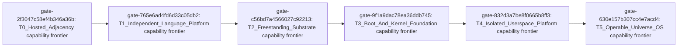

# Nebula Universe OS Gap Analysis

> Capability maturity scores are non-additive ordinal values; they must not be summed, averaged, converted to percentages, or interpreted as schedule estimates. A capability score measures demonstrated capability at the bound revision; it is **not** a progress indicator and **not** a schedule or effort estimate. A passing prerequisite gate proves only that named gate's scope.

Observed current facts and recommendations are kept in separate, clearly labelled sections throughout this report.

## 1. Executive Conclusion

### Observed facts

- T1_Independent_Language_Platform is materially unachieved because production compilation still depends on generated C++ and external host tooling. [evidence-be77bec85da05dccba62: `README.md` (heading "Artifact Policy")]
- T2_Freestanding_Substrate through T5_Operable_Universe_OS are unachieved under current evidence. [evidence-be77bec85da05dccba62: `README.md` (heading "Artifact Policy")]
- The strongest repository-local language/tooling capabilities have maturity no higher than 2 without cross-supported-host candidate evidence. [evidence-be77bec85da05dccba62: `README.md` (heading "Artifact Policy")]
- Hosted Adjacency can reduce future application-porting effort but remains separate from every OS Substrate critical-path dependency and hard gate. [evidence-be77bec85da05dccba62: `README.md` (heading "Artifact Policy")]
- Freestanding runtime, linked or bootable chain, kernel subsystems, and Universe OS userspace have maturity 0 without direct implementation evidence. [evidence-be77bec85da05dccba62: `README.md` (heading "Artifact Policy")]
- Nebula is a promising hosted language, compiler/tooling, backend-service, and thin-host application-core foundation. [evidence-be77bec85da05dccba62: `README.md` (heading "Artifact Policy")]
- The shortest evidence-backed path runs from low-level language soundness to system ABI, independent backend and freestanding runtime, then a complete boot toolchain and linked/bootable proof, followed by separately gated kernel and userspace subsystems. [evidence-be77bec85da05dccba62: `README.md` (heading "Artifact Policy")]

### Recommendations

- Follow the dependency-ordered Hard-Gate path: establish low-level language soundness and a freestanding system ABI, then an independent backend and freestanding runtime, then a complete boot toolchain and linked/bootable proof, before separately gated kernel and userspace subsystems. This is a dependency order, not a schedule. (related gaps: gap-00cf9c01c13ff0c15b51)

## 2. Assessment Revision

The three evidence axes below are distinct and must never be substituted for one another.

| Field | Value |
| --- | --- |
| Repository root | repository-root-f7e136ef86a9c010c2e9 |
| Schema version | 1.0 |
| Commit | 0a1429a9a596ce8fc9d6681bdfaac30435059231 |
| Branch | improve/review-gap-fixes |
| Version | 1.0.0 |
| Describe | 0a1429a |
| Tags | (none) |
| Worktree clean | no |
| Assessed at (UTC) | 2026-07-24T15:51:52.554920+00:00 |
| Fingerprint algorithm | sha256-length-prefixed-worktree-v1 |
| Worktree fingerprint | bb43e3033a4a87bd9578a79e23439224c200652fc3cdc84be523a23ae27d53c4 |
| Tracked diff hash | 1fc6a28cbca08d5862366f1a1402b69728f13ffd5c0055751701b388b0bca02b |
| Untracked path-set hash | 67066c4a9533b1522edb03cef4ae60745ebfc85a4c62be51e43d4d8f004669cd |

- **Tagged release axis:** describe `0a1429a`, 0 tag(s); proves only the tagged release scope.
- **Committed revision axis:** commit `0a1429a9a596ce8fc9d6681bdfaac30435059231` on branch `improve/review-gap-fixes`; immutable committed content only.
- **Current worktree axis:** based on commit `0a1429a9a596ce8fc9d6681bdfaac30435059231`, worktree dirty; used for this observation and never rendered as tagged-release fact.

Excluded paths (never product source):
- `tools/universe_os_gap_analysis/artifacts` -- explicit assessment output excluded to prevent fingerprint self-reference (rule assessment-output-exclusion-v1)

## 3. Source Inventory

| Entry | Category | Path | Origin | Inspected | Execution | Anchors |
| --- | --- | --- | --- | --- | --- | --- |
| inventory-0033d336e5b77d620952 | Test | `tests/cpp/host_process_test.cpp` | CurrentWorktree | yes | Validated | File:tests/cpp/host_process_test.cpp, Symbol:child_main, Symbol:chunk, Symbol:expect, Symbol:injected_child_is_reaped, Symbol:interrupter, Symbol:main, Symbol:marker, Symbol:nebula::cli::host_process_testing, Symbol:run_live_cleanup_retry_case, Symbol:run_parent_stdin_endpoint_close_error_case, Symbol:run_post_cleanup_diagnostic_throw_case, Symbol:run_post_spawn_exception_case, Symbol:run_termination_failure_classification_case, Symbol:sigaction, Symbol:split_environment_block |
| inventory-0051bd9cde1859db9fe2 | Test | `tests/cases/check/CHK-138-grouped-r001-transitive-priority-chain/case.toml` | CurrentWorktree | yes | Validated | CHK-138-grouped-r001-transitive-priority-chain, CaseId:CHK-138-grouped-r001-transitive-priority-chain, File:tests/cases/check/CHK-138-grouped-r001-transitive-priority-chain/case.toml, ManifestKey:args, ManifestKey:command, ManifestKey:expect_rc, ManifestKey:expect_stdout_regex, ManifestKey:id, ManifestKey:source, ManifestKey:suite |
| inventory-005767325e61b1017cbb | Artifact | `artifacts/backend-gui-closure-nebula-service-resultset.json` | CurrentWorktree | yes | Validated | ArtifactMetadata:kind=app_platform_nebula_results, ArtifactMetadata:schema_version=1, ArtifactMetadataKey:kind, ArtifactMetadataKey:machine, ArtifactMetadataKey:repo_version, ArtifactMetadataKey:results, ArtifactMetadataKey:schema_version, ArtifactMetadataKey:toolchains, File:artifacts/backend-gui-closure-nebula-service-resultset.json |
| inventory-0076bd9d9d4992285135 | SourceCode | `benchmarks/backend_crypto/reference/cpp/hash_throughput/main.cpp` | CurrentWorktree | yes | Validated | File:benchmarks/backend_crypto/reference/cpp/hash_throughput/main.cpp, Symbol:main, Symbol:payload, Symbol:workload, main |
| inventory-00816bb94aeaeed58791 | OfficialPackage | `official/nebula-app-local/src/lib.nb` | CurrentWorktree | yes | Validated | File:official/nebula-app-local/src/lib.nb |
| inventory-00a83a4b5d3e3f7b3b62 | Test | `tests/fixtures/project_cycle/src/app/a.nb` | CurrentWorktree | yes | Validated | File:tests/fixtures/project_cycle/src/app/a.nb, Symbol:run |
| inventory-00b0dda71f8c0f57d0c5 | OfficialPackage | `official/nebula-tls/native/vendor/mbedtls/library/bignum_mod_raw.h` | CurrentWorktree | yes | Validated | File:official/nebula-tls/native/vendor/mbedtls/library/bignum_mod_raw.h, Symbol:avoids, Symbol:generates, Symbol:mbedtls_mpi_mod_raw_add, Symbol:mbedtls_mpi_mod_raw_canonical_to_modulus_rep, Symbol:mbedtls_mpi_mod_raw_cond_assign, Symbol:mbedtls_mpi_mod_raw_cond_swap, Symbol:mbedtls_mpi_mod_raw_from_mont_rep, Symbol:mbedtls_mpi_mod_raw_inv_prime, Symbol:mbedtls_mpi_mod_raw_inv_prime_working_limbs, Symbol:mbedtls_mpi_mod_raw_modulus_to_canonical_rep, Symbol:mbedtls_mpi_mod_raw_mul, Symbol:mbedtls_mpi_mod_raw_neg, Symbol:mbedtls_mpi_mod_raw_random, Symbol:mbedtls_mpi_mod_raw_read, Symbol:mbedtls_mpi_mod_raw_sub, Symbol:mbedtls_mpi_mod_raw_to_mont_rep, Symbol:mbedtls_mpi_mod_raw_write, Symbol:returns, Symbol:should, Symbol:that, Symbol:to, avoids |
| inventory-00d0dd488144393cdd4d | Example | `examples/release_control_plane_workspace/apps/service/src/workflow_store.nb` | CurrentWorktree | yes | Validated | ApplyRunnerCompatOutcome, File:examples/release_control_plane_workspace/apps/service/src/workflow_store.nb, Symbol:ApplyRunnerCompatOutcome, Symbol:ExpiredLeaseStage, Symbol:ReadyStageSelection, Symbol:WorkerLeaseContext, Symbol:WorkerLeaseLookup, Symbol:WorkflowDefinitionIdentityFields, Symbol:WorkflowDefinitionLookup, Symbol:WorkflowDefinitionRowFields, Symbol:WorkflowDefinitionStateFields, Symbol:WorkflowRunIdentityFields, Symbol:WorkflowRunLookup, Symbol:WorkflowRunRowFields, Symbol:WorkflowRunStateFields, Symbol:WorkflowScope, Symbol:WorkflowStageRunIdentityFields, Symbol:WorkflowStageRunLeaseFields, Symbol:WorkflowStageRunResultFields, Symbol:WorkflowStageRunRowFields, Symbol:WorkflowStageRunStateFields, Symbol:append_created_workflow_side_effects_tx, Symbol:append_workflow_run_creation_audits_tx, Symbol:apply_completed_audit_if_needed_tx, Symbol:apply_started_audit_if_needed_tx, Symbol:approval_decision_for_release_tx, Symbol:backfill_release_revisions_sql, Symbol:blocked_workflow_run_tx, Symbol:builder_with_workflow_definition_identity, Symbol:builder_with_workflow_definition_state, Symbol:builder_with_workflow_run_identity, Symbol:builder_with_workflow_run_state, Symbol:builder_with_workflow_stage_identity, Symbol:builder_with_workflow_stage_state, Symbol:claim_ready_workflow_stage_run_sql, Symbol:claim_ready_workflow_stage_run_tx, Symbol:claim_selected_stage_tx, Symbol:claim_worker_lease, Symbol:claim_worker_lease_scoped, Symbol:claim_worker_lease_tx, Symbol:complete_worker_lease, Symbol:complete_worker_lease_context_tx, Symbol:complete_worker_lease_scoped, Symbol:complete_worker_lease_scoped_tx, Symbol:complete_worker_lease_tx, Symbol:completed_approval_stage_tx, Symbol:completed_stage_count, Symbol:completed_workflow_run_tx, Symbol:create_workflow_definition_tx, Symbol:create_workflow_run_tx, Symbol:created_workflow_definition, Symbol:default_workflow_definition, Symbol:default_workflow_event_payload, Symbol:default_workflow_stage_specs_json, Symbol:deploy_preview_enabled, Symbol:ensure_default_workflow_definition, Symbol:ensure_default_workflow_definition_tx, Symbol:event_receipt_run_id_tx, Symbol:existing_release_apply_outcome, Symbol:expired_lease_params, Symbol:expired_lease_run_id_tx, Symbol:expired_lease_run_ids_tx, Symbol:expired_lease_stage_from_row, Symbol:fail_exhausted_worker_lease_context_tx, Symbol:fail_expired_lease_stage_tx, Symbol:fail_or_retry_worker_lease_context_tx, Symbol:failed_stage_result_message, Symbol:failed_workflow_run_tx, Symbol:finalized_completed_stage, Symbol:first_stage_with_status, Symbol:handle_expired_lease_stage_tx, Symbol:heartbeat_worker_lease, Symbol:heartbeat_worker_lease_context_tx, Symbol:heartbeat_worker_lease_scoped, Symbol:heartbeat_worker_lease_scoped_tx, Symbol:heartbeat_worker_lease_tx, Symbol:initial_workflow_stage_run, Symbol:initialize_workflow_store, Symbol:insert_event_receipt_sql, Symbol:insert_initial_workflow_stage_runs_tx, Symbol:insert_workflow_definition_sql, Symbol:insert_workflow_run_sql, Symbol:insert_workflow_stage_run_sql, Symbol:latest_release_apply_run_tx, Symbol:lease_expiration_unix_ms, Symbol:lease_id_for_stage, Symbol:leased_run_context_tx, Symbol:leased_stage_context_tx, Symbol:leased_stage_for_context, Symbol:leased_stage_update_tx, Symbol:leased_workflow_run_tx, Symbol:list_active_release_run_ids_sql, Symbol:list_active_run_ids_sql, Symbol:list_expired_leases_sql, Symbol:list_workflow_runs_sql, Symbol:list_workflow_stage_runs_sql, Symbol:load_active_worker_lease_context_tx, Symbol:load_release_revision_entry_tx, Symbol:load_workflow_definition, Symbol:load_workflow_run, Symbol:load_workflow_runs, Symbol:load_workflow_runs_tx, Symbol:lock_workflow_run_sql, Symbol:lock_workflow_run_tx, Symbol:one_int_param, Symbol:open_workflow_tx, Symbol:queue_release_apply_workflow_tx, Symbol:ready_blocked_stage_tx, Symbol:ready_stage_claim_rows_tx, Symbol:ready_stage_claim_sql, Symbol:ready_stage_claim_with_task_sql, Symbol:ready_stage_selection_from_row_tx, Symbol:ready_workflow_run_tx, Symbol:reconcile_workflow_runs_for_release, Symbol:refresh_known_workflow_scope_row, Symbol:refresh_known_workflow_scopes, Symbol:refresh_readyable_approval_stage_tx, Symbol:refresh_readyable_leased_stage_tx, Symbol:refresh_readyable_stage_tx, Symbol:refresh_readyable_stages_pass_tx, Symbol:refresh_readyable_stages_tx, Symbol:refresh_run_ids_tx, Symbol:refresh_workflow_run_tx, Symbol:refresh_workflow_scope, Symbol:refresh_workflow_scope_tx, Symbol:refreshed_active_workflow_run_state_tx, Symbol:refreshed_failed_workflow_run_state_tx, Symbol:refreshed_workflow_run_state_tx, Symbol:refreshed_workflow_run_tx, Symbol:rejected_approval_stage_tx, Symbol:release_apply_compat_event_id, Symbol:release_apply_compat_outcome, Symbol:release_apply_workflow_queue_outcome, Symbol:request_release_apply_workflow, Symbol:request_release_apply_workflow_outcome_tx, Symbol:requeue_expired_lease_stage_tx, Symbol:requeue_failed_worker_lease_context_tx, Symbol:required_event_submit_definition_tx, Symbol:run_apply_once_outcome_from_lease, Symbol:run_apply_once_via_workflow, Symbol:scoped_ready_stage_selection_tx, Symbol:seed_workflow_run_tx, Symbol:select_event_receipt_payload_sql, Symbol:select_event_receipt_sql, Symbol:select_latest_release_apply_run_sql, Symbol:select_worker_lease_sql, Symbol:select_workflow_definition_sql, Symbol:select_workflow_run_by_id_sql, Symbol:select_workflow_run_sql, Symbol:select_workflow_stage_run_sql, Symbol:selected_ready_stage_tx, Symbol:shell_tasks_preview_enabled, Symbol:shell_workflow_event_payload, Symbol:submit_workflow_event, Symbol:submit_workflow_event_tx, Symbol:succeed_worker_lease_context_tx, Symbol:three_workflow_text_params, Symbol:update_active_workflow_stage_run_expected_tx, Symbol:update_active_workflow_stage_run_sql, Symbol:update_active_workflow_stage_run_tx, Symbol:update_workflow_definition_sql, Symbol:update_workflow_definition_tx, Symbol:update_workflow_run_sql, Symbol:update_workflow_run_tx, Symbol:update_workflow_stage_run_sql, Symbol:update_workflow_stage_run_tx, Symbol:updated_workflow_definition, Symbol:upsert_workflow_stage_result_payload_sql, Symbol:validate_claim_worker_lease_request, Symbol:validate_complete_worker_lease_request, Symbol:validate_deploy_event_enabled, Symbol:validate_deploy_payload_shape, Symbol:validate_scoped_claim_worker_lease_request, Symbol:validate_scoped_complete_worker_lease_request, Symbol:validate_scoped_worker_lease_actor_request, Symbol:validate_shell_command_args, Symbol:validate_shell_command_event_payload, Symbol:validate_shell_task_claim_enabled, Symbol:validate_shell_task_definition_enabled, Symbol:validate_shell_task_event_enabled, Symbol:validate_worker_lease_actor_request, Symbol:validate_workflow_definition_write_request, Symbol:validate_workflow_event_submit_call, Symbol:validate_workflow_scope, Symbol:worker_claim_outcome, Symbol:worker_complete_outcome, Symbol:worker_heartbeat_outcome, Symbol:worker_lease_for_stage_tx, Symbol:worker_lease_selection_tx, Symbol:worker_stage_attempts_exhausted_tx, Symbol:workflow_definition_applied_outcome, Symbol:workflow_definition_conflict_outcome, Symbol:workflow_definition_from_row, Symbol:workflow_definition_identity_fields, Symbol:workflow_definition_lookup_tx, Symbol:workflow_definition_params, Symbol:workflow_definition_placeholder, Symbol:workflow_definition_precondition_required_outcome, Symbol:workflow_definition_required_tx, Symbol:workflow_definition_row_fields, Symbol:workflow_definition_state_fields, Symbol:workflow_definition_update_params, Symbol:workflow_definition_write_outcome_tx, Symbol:workflow_event_payload_tx, Symbol:workflow_event_receipt_params, Symbol:workflow_event_received_audit_event, Symbol:workflow_event_run_lookup_tx, Symbol:workflow_event_submit_outcome, Symbol:workflow_event_submit_outcome_tx, Symbol:workflow_idle_claim_outcome, Symbol:workflow_migrations, Symbol:workflow_run_blocked, Symbol:workflow_run_completed, Symbol:workflow_run_completed_audit_event, Symbol:workflow_run_created_audit_event, Symbol:workflow_run_failed, Symbol:workflow_run_failed_audit_event, Symbol:workflow_run_from_row_tx, Symbol:workflow_run_identity_fields, Symbol:workflow_run_ids_for_release_json_tx, Symbol:workflow_run_ids_json_tx, Symbol:workflow_run_leased, Symbol:workflow_run_lookup_by_id_tx, Symbol:workflow_run_lookup_tx, Symbol:workflow_run_not_found, Symbol:workflow_run_params, Symbol:workflow_run_projection, Symbol:workflow_run_ready, Symbol:workflow_run_required_by_id_tx, Symbol:workflow_run_required_in_scope_tx, Symbol:workflow_run_row_fields, Symbol:workflow_run_seed, Symbol:workflow_run_stage_count, Symbol:workflow_run_state_fields, Symbol:workflow_run_to_apply_run, Symbol:workflow_run_update_params, Symbol:workflow_run_with_status, Symbol:workflow_runs_json, Symbol:workflow_scope_from_row, Symbol:workflow_scope_matches, Symbol:workflow_scope_refresh_sql, Symbol:workflow_stage_completed, Symbol:workflow_stage_completed_audit_event, Symbol:workflow_stage_completed_with_payload, Symbol:workflow_stage_dependencies_completed, Symbol:workflow_stage_dependency_completed, Symbol:workflow_stage_event_payload, Symbol:workflow_stage_failed, Symbol:workflow_stage_failed_with_payload, Symbol:workflow_stage_heartbeat, Symbol:workflow_stage_heartbeat_audit_event, Symbol:workflow_stage_join_sql, Symbol:workflow_stage_leased, Symbol:workflow_stage_leased_audit_event, Symbol:workflow_stage_ready, Symbol:workflow_stage_ready_audit_event, Symbol:workflow_stage_requeued, Symbol:workflow_stage_requeued_audit_event, Symbol:workflow_stage_requeued_with_payload, Symbol:workflow_stage_result_payload_params, Symbol:workflow_stage_run_active_update_expected_params, Symbol:workflow_stage_run_active_update_params, Symbol:workflow_stage_run_at, Symbol:workflow_stage_run_claim_params, Symbol:workflow_stage_run_from_row, Symbol:workflow_stage_run_identity_fields, Symbol:workflow_stage_run_insert_params, Symbol:workflow_stage_run_lease_fields, Symbol:workflow_stage_run_result_fields, Symbol:workflow_stage_run_row_fields, Symbol:workflow_stage_run_state_fields, Symbol:workflow_stage_run_tx, Symbol:workflow_stage_run_update_params, Symbol:workflow_stage_runs_json_tx, Symbol:workflow_stage_select_columns, Symbol:workflow_stage_spec_at, Symbol:workflow_stage_specs_count, Symbol:workflow_stage_status_by_name, Symbol:workflow_stages_contain_task_kind, Symbol:workflow_state_store_path, Symbol:workflow_text_json, Symbol:write_workflow_definition |
| inventory-01095e6656e53341fb14 | OfficialPackage | `official/nebula-crypto/native/vendor/mbedtls/include/mbedtls/block_cipher.h` | CurrentWorktree | yes | Validated | File:official/nebula-crypto/native/vendor/mbedtls/include/mbedtls/block_cipher.h, MBEDTLS_PRIVATE, Symbol:MBEDTLS_PRIVATE |
| inventory-011b2ce8004835097fbc | Artifact | `artifacts/host-snapshot-readiness-focused-317.json` | CurrentWorktree | yes | Validated | File:artifacts/host-snapshot-readiness-focused-317.json |
| inventory-01213b57189bb9a91a93 | Test | `tests/cases/test/TST-329-universeos-gate-registry-docs-contract/case.toml` | CurrentWorktree | yes | Validated | CaseId:TST-329-universeos-gate-registry-docs-contract, File:tests/cases/test/TST-329-universeos-gate-registry-docs-contract/case.toml, ManifestKey:id, ManifestKey:steps, ManifestKey:steps.encoding, ManifestKey:steps.expect_rc, ManifestKey:steps.expect_stdout_contains, ManifestKey:steps.kind, ManifestKey:steps.known, ManifestKey:steps.needle, ManifestKey:steps.path, ManifestKey:steps.repo, ManifestKey:steps.row, ManifestKey:steps.run, ManifestKey:steps.source, ManifestKey:steps.unknown, ManifestKey:suite, TST-329-universeos-gate-registry-docs-contract |
| inventory-0128849bdcdc5711d28a | Test | `tests/cases/run/RUN-012-no-build-reuse-conflict/case.toml` | CurrentWorktree | yes | Validated | CaseId:RUN-012-no-build-reuse-conflict, File:tests/cases/run/RUN-012-no-build-reuse-conflict/case.toml, ManifestKey:args, ManifestKey:command, ManifestKey:expect_diag, ManifestKey:expect_diag.code, ManifestKey:expect_rc, ManifestKey:id, ManifestKey:source, ManifestKey:suite, RUN-012-no-build-reuse-conflict |
| inventory-012de3a11bdba640e2aa | Test | `tests/fixtures/ref_field_refref_conflict.nb` | CurrentWorktree | yes | Validated | File:tests/fixtures/ref_field_refref_conflict.nb, Symbol:Pair, Symbol:ref_field_refref_conflict, Symbol:touch_two |
| inventory-012fd2a94d0e357aec47 | OfficialPackage | `official/nebula-crypto/native/vendor/mbedtls/include/psa/crypto_builtin_composites.h` | CurrentWorktree | yes | Validated | File:official/nebula-crypto/native/vendor/mbedtls/include/psa/crypto_builtin_composites.h, MBEDTLS_PRIVATE, Symbol:MBEDTLS_PRIVATE, Symbol:has, Symbol:non, Symbol:psa_hash_operation_s |
| inventory-014091d5c51f5b90263f | OfficialPackage | `official/nebula-thin-host-bridge/native/bridge.cpp` | CurrentWorktree | yes | Validated | FieldSpan, File:official/nebula-thin-host-bridge/native/bridge.cpp, Symbol:FieldSpan, Symbol:GeneratedCommandCache, Symbol:GeneratedCommandView, Symbol:__nebula_thin_host_encode_command_payload_text, Symbol:__nebula_thin_host_encode_command_text, Symbol:__nebula_thin_host_encode_event_payload_text, Symbol:__nebula_thin_host_encode_event_text, Symbol:__nebula_thin_host_encode_snapshot_payload_text, Symbol:__nebula_thin_host_encode_snapshot_text, Symbol:append_json_int_text_field, Symbol:append_json_string, Symbol:append_json_string_field, Symbol:append_literal, Symbol:append_thin_host_schema, Symbol:cached_generated_command, Symbol:consume_int_field, Symbol:consume_json_value_field, Symbol:consume_unescaped_string_field, Symbol:cursor, Symbol:field_key_equals, Symbol:find_payload_field, Symbol:int_field, Symbol:nebula::rt::json_indexed_subvalue, Symbol:nebula::rt::json_stringify, Symbol:nebula::rt::ok_result, Symbol:parse_generated_command_view, Symbol:payload_bool_field, Symbol:payload_int_field, Symbol:payload_string_field, Symbol:relative_array_index, Symbol:relative_child_view, Symbol:relative_object_index, Symbol:string_field, Symbol:stringify_json_payload |
| inventory-014314ca6897fd60af54 | OfficialPackage | `official/nebula-crypto/native/vendor/oqs_mini/mldsa65_ref/polyvec.h` | CurrentWorktree | yes | Validated | File:official/nebula-crypto/native/vendor/oqs_mini/mldsa65_ref/polyvec.h, Symbol:polyvec_matrix_expand, Symbol:polyvec_matrix_pointwise_montgomery, Symbol:polyveck_add, Symbol:polyveck_caddq, Symbol:polyveck_chknorm, Symbol:polyveck_decompose, Symbol:polyveck_invntt_tomont, Symbol:polyveck_ntt, Symbol:polyveck_pack_w1, Symbol:polyveck_pointwise_poly_montgomery, Symbol:polyveck_power2round, Symbol:polyveck_reduce, Symbol:polyveck_shiftl, Symbol:polyveck_sub, Symbol:polyveck_uniform_eta, Symbol:polyveck_use_hint, Symbol:polyvecl_add, Symbol:polyvecl_chknorm, Symbol:polyvecl_invntt_tomont, Symbol:polyvecl_ntt, Symbol:polyvecl_pointwise_acc_montgomery, Symbol:polyvecl_pointwise_poly_montgomery, Symbol:polyvecl_reduce, Symbol:polyvecl_uniform_eta, Symbol:polyvecl_uniform_gamma1, polyvec_matrix_expand |
| inventory-0145fd35cbdc297d7283 | Artifact | `artifacts/thin-host-opt-tst286.json` | CurrentWorktree | yes | Validated | File:artifacts/thin-host-opt-tst286.json |
| inventory-0148e4c5b0c6bdc94477 | Test | `tests/cases/check/CHK-210-target-none-triple-forbids-std/case.toml` | CurrentWorktree | yes | Validated | CHK-210-target-none-triple-forbids-std, CaseId:CHK-210-target-none-triple-forbids-std, File:tests/cases/check/CHK-210-target-none-triple-forbids-std/case.toml, ManifestKey:args, ManifestKey:command, ManifestKey:expect_diag, ManifestKey:expect_diag.code, ManifestKey:expect_diag.severity, ManifestKey:expect_diag.stage, ManifestKey:expect_rc, ManifestKey:expect_stdout_contains, ManifestKey:id, ManifestKey:source, ManifestKey:suite |
| inventory-016ab5066a3d1a21254d | Test | `tests/cases/check/CHK-142-region-escape-return-path-alias-fanout-owner-reason/case.toml` | CurrentWorktree | yes | Validated | CHK-142-region-escape-return-path-alias-fanout-owner-reason, CaseId:CHK-142-region-escape-return-path-alias-fanout-owner-reason, File:tests/cases/check/CHK-142-region-escape-return-path-alias-fanout-owner-reason/case.toml, ManifestKey:args, ManifestKey:command, ManifestKey:expect_diag, ManifestKey:expect_diag.code, ManifestKey:expect_diag.machine_detail, ManifestKey:expect_diag.machine_owner, ManifestKey:expect_diag.machine_owner_reason, ManifestKey:expect_diag.machine_reason, ManifestKey:expect_diag.machine_subreason, ManifestKey:expect_rc, ManifestKey:expect_stdout_regex, ManifestKey:id, ManifestKey:source, ManifestKey:suite |
| inventory-01806373882b5bbd853c | OfficialPackage | `official/nebula-crypto/native/vendor/mbedtls/include/psa/crypto_driver_contexts_key_derivation.h` | CurrentWorktree | yes | Validated | File:official/nebula-crypto/native/vendor/mbedtls/include/psa/crypto_driver_contexts_key_derivation.h, MBEDTLS_PRIVATE, Symbol:MBEDTLS_PRIVATE |
| inventory-01849e8f84accadb2d63 | Test | `tests/cases/test/TST-138-gitignore-build-variants-and-artifacts/case.toml` | CurrentWorktree | yes | Validated | CaseId:TST-138-gitignore-build-variants-and-artifacts, File:tests/cases/test/TST-138-gitignore-build-variants-and-artifacts/case.toml, ManifestKey:id, ManifestKey:steps, ManifestKey:steps.expect_rc, ManifestKey:steps.kind, ManifestKey:steps.run, ManifestKey:suite, TST-138-gitignore-build-variants-and-artifacts |
| inventory-0185527a18fc4a252cec | Artifact | `artifacts/app-platform-ui-patch-codegen-compare.json` | CurrentWorktree | yes | Validated | ArtifactMetadata:kind=app_platform_comparison_results, ArtifactMetadata:schema_version=1, ArtifactMetadataKey:claim_policy, ArtifactMetadataKey:kind, ArtifactMetadataKey:machine, ArtifactMetadataKey:matrix, ArtifactMetadataKey:repo_version, ArtifactMetadataKey:results, ArtifactMetadataKey:schema_version, ArtifactMetadataKey:stack, ArtifactMetadataKey:toolchains, File:artifacts/app-platform-ui-patch-codegen-compare.json |
| inventory-01ad88ed27a8c96d5931 | OfficialPackage | `official/nebula-crypto/native/vendor/mbedtls/library/psa_crypto_mac.c` | CurrentWorktree | yes | Validated | File:official/nebula-crypto/native/vendor/mbedtls/library/psa_crypto_mac.c, PSA_ALG_HMAC_GET_HASH, Symbol:PSA_ALG_HMAC_GET_HASH, Symbol:cmac_setup, Symbol:has, Symbol:if, Symbol:mac_init, Symbol:mbedtls_platform_zeroize, Symbol:mbedtls_psa_mac_abort, Symbol:mbedtls_psa_mac_compute, Symbol:mbedtls_psa_mac_sign_finish, Symbol:mbedtls_psa_mac_sign_setup, Symbol:mbedtls_psa_mac_update, Symbol:mbedtls_psa_mac_verify_finish, Symbol:mbedtls_psa_mac_verify_setup, Symbol:mbedtls_to_psa_error, Symbol:psa_get_key_bits, Symbol:psa_get_key_type, Symbol:psa_hash_abort, Symbol:psa_hash_update, Symbol:psa_hmac_abort_internal, Symbol:psa_hmac_finish_internal, Symbol:psa_hmac_setup_internal, Symbol:psa_hmac_update_internal, Symbol:psa_mac_finish_internal, Symbol:psa_mac_setup, Symbol:sizeof |
| inventory-01c59f11c3e95106a8cb | Example | `examples/cli_service_workspace/apps/ctl/src/ctl.nb` | CurrentWorktree | yes | Validated | File:examples/cli_service_workspace/apps/ctl/src/ctl.nb, Symbol:build_status_summary, Symbol:build_status_summary_from_replies, Symbol:fetch_service_info, Symbol:fetch_status_summary, Symbol:fetch_status_summary_normalized, Symbol:parse_echo_response_reply, Symbol:parse_service_info_reply, Symbol:parse_status_field, Symbol:print_error, Symbol:print_usage_error, Symbol:run, Symbol:run_command, Symbol:run_config_validate, Symbol:run_info, Symbol:run_ping, Symbol:run_status, Symbol:send_ping, Symbol:unexpected_status, build_status_summary |
| inventory-01fbfd0971699353236c | OfficialPackage | `official/nebula-crypto/native/vendor/mbedtls/include/mbedtls/ecjpake.h` | CurrentWorktree | yes | Validated | File:official/nebula-crypto/native/vendor/mbedtls/include/mbedtls/ecjpake.h, MBEDTLS_PRIVATE, Symbol:MBEDTLS_PRIVATE, Symbol:does, Symbol:mbedtls_ecjpake_check, Symbol:mbedtls_ecjpake_context, Symbol:mbedtls_ecjpake_derive_secret, Symbol:mbedtls_ecjpake_free, Symbol:mbedtls_ecjpake_init, Symbol:mbedtls_ecjpake_read_round_one, Symbol:mbedtls_ecjpake_read_round_two, Symbol:mbedtls_ecjpake_self_test, Symbol:mbedtls_ecjpake_set_point_format, Symbol:mbedtls_ecjpake_setup, Symbol:mbedtls_ecjpake_write_round_one, Symbol:mbedtls_ecjpake_write_round_two, Symbol:mbedtls_ecjpake_write_shared_key, Symbol:to |
| inventory-0223cb6f91ca8cef91b6 | Artifact | `artifacts/app-platform-backend-full.perf.json` | CurrentWorktree | yes | Validated | ArtifactMetadata:schema_version=1, ArtifactMetadataKey:by_suite, ArtifactMetadataKey:cross_stage_signals, ArtifactMetadataKey:disk_cache_signals, ArtifactMetadataKey:generated_at_utc, ArtifactMetadataKey:grouped_diagnostic_signals, ArtifactMetadataKey:non_gating, ArtifactMetadataKey:schema_version, ArtifactMetadataKey:slowest_cases, ArtifactMetadataKey:summary, File:artifacts/app-platform-backend-full.perf.json |
| inventory-023e4c0b83aefafa7e7b | OfficialPackage | `official/nebula-tls/native/vendor/mbedtls/library/cmac.c` | CurrentWorktree | yes | Validated | File:official/nebula-tls/native/vendor/mbedtls/library/cmac.c, Symbol:cmac_generate_subkeys, Symbol:cmac_multiply_by_u, Symbol:cmac_pad, Symbol:cmac_test_subkeys, Symbol:cmac_test_wth_cipher, Symbol:if, Symbol:mbedtls_aes_cmac_prf_128, Symbol:mbedtls_cipher_cmac, Symbol:mbedtls_cipher_cmac_finish, Symbol:mbedtls_cipher_cmac_reset, Symbol:mbedtls_cipher_cmac_starts, Symbol:mbedtls_cipher_cmac_update, Symbol:mbedtls_cipher_free, Symbol:mbedtls_cmac_self_test, Symbol:mbedtls_platform_zeroize, Symbol:test_aes128_cmac_prf, Symbol:to, cmac_generate_subkeys |
| inventory-024266ede397f784fa4d | Test | `tests/cases/check/CHK-129-region-promotion-shared-cross-function-return-path/case.toml` | CurrentWorktree | yes | Validated | CHK-129-region-promotion-shared-cross-function-return-path, CaseId:CHK-129-region-promotion-shared-cross-function-return-path, File:tests/cases/check/CHK-129-region-promotion-shared-cross-function-return-path/case.toml, ManifestKey:args, ManifestKey:command, ManifestKey:expect_diag, ManifestKey:expect_diag.code, ManifestKey:expect_diag.machine_detail, ManifestKey:expect_diag.machine_owner, ManifestKey:expect_diag.machine_owner_reason, ManifestKey:expect_diag.machine_reason, ManifestKey:expect_diag.machine_subreason, ManifestKey:expect_rc, ManifestKey:expect_stdout_regex, ManifestKey:id, ManifestKey:source, ManifestKey:suite |
| inventory-025ce42485dd7f3b3cf6 | Test | `tests/lib/cli_service_workspace.py` | CurrentWorktree | yes | Validated | File:tests/lib/cli_service_workspace.py, Symbol:build_service_binary, Symbol:copy_example, Symbol:fetch_workspace, Symbol:http_request, Symbol:json_request, Symbol:nebula, Symbol:print_completed, Symbol:require_success, Symbol:run_ctl, Symbol:start_service, Symbol:terminate_process, Symbol:wait_until_health_ok, Symbol:wait_until_ready_status |
| inventory-0288ed03cb86a2d46c2c | SourceCode | `tools/universe_os_gap_analysis/fingerprint.py` | CurrentWorktree | yes | Validated | File:tools/universe_os_gap_analysis/fingerprint.py, Symbol:WorktreeFingerprintProvider:, Symbol:_EntrySnapshot:, Symbol:_GitState:, Symbol:__init__, Symbol:_drift, Symbol:_fail, Symbol:_git, Symbol:_git_state, Symbol:_identity, Symbol:_included_state, Symbol:_normalize_exclusions, Symbol:_parse_paths, Symbol:_path_set_hash, Symbol:_read_entry, Symbol:_read_regular, Symbol:_read_symlink, Symbol:_snapshot, Symbol:_under, Symbol:_validate_root, Symbol:_worktree_hash, Symbol:capture, Symbol:included, WorktreeFingerprintProvider: |
| inventory-02aad5f16d0e75ab6ffc | Test | `tests/cases/test/TST-021-add-path-dependency-and-fetch/case.toml` | CurrentWorktree | yes | Validated | CaseId:TST-021-add-path-dependency-and-fetch, File:tests/cases/test/TST-021-add-path-dependency-and-fetch/case.toml, ManifestKey:id, ManifestKey:steps, ManifestKey:steps.args, ManifestKey:steps.command, ManifestKey:steps.expect_rc, ManifestKey:steps.expect_stdout_contains, ManifestKey:steps.kind, ManifestKey:steps.must_exist, ManifestKey:steps.run, ManifestKey:steps.source, ManifestKey:suite, TST-021-add-path-dependency-and-fetch |
| inventory-02b8c0f280da7f2ea78d | Test | `tests/universe_os_gap_analysis/test_revision.py` | CurrentWorktree | yes | Validated | File:tests/universe_os_gap_analysis/test_revision.py, Symbol:MutatingProvider, Symbol:RevisionBinderIntegrationTests, Symbol:RevisionBinderUnitTests, Symbol:WorktreeFingerprintIntegrationTests, Symbol:_DriftingFingerprintProvider:, Symbol:_FixedFingerprintProvider:, Symbol:__init__, Symbol:_create_repository, Symbol:_git, Symbol:_snapshot, Symbol:capture, Symbol:fail_tracked, Symbol:test_assessment_timestamp_does_not_affect_content_fingerprints, Symbol:test_binds_clean_tagged_repository_and_separates_evidence_axes, Symbol:test_collection_drift_fails_closed, Symbol:test_deferred_fingerprint_explicitly_reserves_task_2_2, Symbol:test_dirty_tracked_and_untracked_files_only_mark_current_worktree, Symbol:test_explicit_output_is_excluded_and_records_rule_path_and_reason, Symbol:test_file_read_failure_is_a_structured_rev_error, Symbol:test_injected_fingerprint_provider_is_preserved, Symbol:test_missing_git_executable_returns_structured_rev_failure, Symbol:test_missing_version_returns_structured_rev_failure, Symbol:test_mode_bits_participate_in_worktree_fingerprint, Symbol:test_output_exclusion_cannot_hide_tracked_product_content, Symbol:test_output_symlink_cannot_hide_in_repository_content, Symbol:test_output_symlink_escape_fails_closed, Symbol:test_repository_root_identity_is_stable_per_root_and_differs_across_roots, Symbol:test_repository_root_identity_read_failure_is_structured, Symbol:test_symlink_hashes_link_bytes_without_following_target, Symbol:test_tag_parser_handles_lightweight_and_annotated_tags, Symbol:test_tag_parser_returns_structured_rev_error_for_malformed_output, Symbol:test_tracked_and_untracked_hashes_are_independent, Symbol:test_untracked_path_set_uses_utf8_byte_order_and_length_prefixes, Symbol:test_version_or_git_drift_fails_closed_without_partial_revision, Symbol:test_version_symlink_is_rejected_without_following_it |
| inventory-02bb756ddfc7c3fb3333 | Artifact | `artifacts/plan-next-nebula.json` | CurrentWorktree | yes | Validated | ArtifactMetadata:kind=app_platform_nebula_results, ArtifactMetadata:schema_version=1, ArtifactMetadataKey:kind, ArtifactMetadataKey:machine, ArtifactMetadataKey:repo_version, ArtifactMetadataKey:results, ArtifactMetadataKey:schema_version, ArtifactMetadataKey:toolchains, File:artifacts/plan-next-nebula.json |
| inventory-02e2af835b929adb2948 | OfficialPackage | `official/nebula-crypto/native/vendor/mbedtls/library/rsa_alt_helpers.c` | CurrentWorktree | yes | Validated | File:official/nebula-crypto/native/vendor/mbedtls/library/rsa_alt_helpers.c, Symbol:mbedtls_mpi_free, Symbol:mbedtls_rsa_deduce_crt, Symbol:mbedtls_rsa_deduce_primes, Symbol:mbedtls_rsa_deduce_private_exponent, Symbol:mbedtls_rsa_validate_crt, Symbol:mbedtls_rsa_validate_params, mbedtls_mpi_free |
| inventory-032f4f91a88d2ff7c8a7 | Example | `examples/release_control_plane_workspace/deploy/systemd/release-control-plane.service` | CurrentWorktree | yes | Validated | File:examples/release_control_plane_workspace/deploy/systemd/release-control-plane.service |
| inventory-03662c75848f19c18e99 | Test | `tests/cases/test/TST-209-example-cli-service-workspace-drain-status-smoke/case.toml` | CurrentWorktree | yes | Validated | CaseId:TST-209-example-cli-service-workspace-drain-status-smoke, File:tests/cases/test/TST-209-example-cli-service-workspace-drain-status-smoke/case.toml, ManifestKey:id, ManifestKey:steps, ManifestKey:steps.base_url, ManifestKey:steps.binary, ManifestKey:steps.ctl_out_dir, ManifestKey:steps.deadline, ManifestKey:steps.degraded, ManifestKey:steps.drain_file, ManifestKey:steps.else, ManifestKey:steps.expect_rc, ManifestKey:steps.expect_stdout_contains, ManifestKey:steps.finally, ManifestKey:steps.healthy, ManifestKey:steps.kind, ManifestKey:steps.prewarm, ManifestKey:steps.repo_root, ManifestKey:steps.root, ManifestKey:steps.run, ManifestKey:steps.try, ManifestKey:suite, TST-209-example-cli-service-workspace-drain-status-smoke |
| inventory-0378931d553a327c8c7d | Example | `examples/release_control_plane_workspace/apps/service/src/postgres_backend.nb` | CurrentWorktree | yes | Validated | File:examples/release_control_plane_workspace/apps/service/src/postgres_backend.nb, PostgresConnection, Symbol:PostgresConnection, Symbol:PostgresConnection_begin_transaction, Symbol:PostgresConnection_close, Symbol:PostgresConnection_execute, Symbol:PostgresConnection_execute0, Symbol:PostgresConnection_query, Symbol:PostgresConnection_query0, Symbol:PostgresConnection_run_migrations, Symbol:PostgresResultSet, Symbol:PostgresResultSet_len, Symbol:PostgresResultSet_row, Symbol:PostgresRow, Symbol:PostgresRow_get_bool, Symbol:PostgresRow_get_int, Symbol:PostgresRow_get_json, Symbol:PostgresRow_get_string, Symbol:PostgresTransaction, Symbol:PostgresTransaction_commit, Symbol:PostgresTransaction_execute, Symbol:PostgresTransaction_execute0, Symbol:PostgresTransaction_query, Symbol:PostgresTransaction_query0, Symbol:PostgresTransaction_rollback, Symbol:postgres_dsn, Symbol:postgres_migration, Symbol:postgres_no_params, Symbol:postgres_open |
| inventory-038643cae4b43edc908a | OfficialPackage | `official/nebula-crypto/native/vendor/mbedtls/include/mbedtls/psa_util.h` | CurrentWorktree | yes | Validated | File:official/nebula-crypto/native/vendor/mbedtls/include/mbedtls/psa_util.h, Symbol:after, Symbol:depends, Symbol:does, Symbol:for, Symbol:is, Symbol:may, Symbol:mbedtls_ecc_group_from_psa, Symbol:mbedtls_ecc_group_to_psa, Symbol:mbedtls_ecdsa_der_to_raw, Symbol:mbedtls_ecdsa_raw_to_der, Symbol:mbedtls_md_psa_alg_from_type, Symbol:mbedtls_md_type_from_psa_alg, Symbol:mbedtls_psa_get_random, Symbol:returns, Symbol:will, after |
| inventory-03c5fa56bdbaa73bfa79 | Test | `tests/universe_os_gap_analysis/test_roadmap.py` | CurrentWorktree | yes | Validated | File:tests/universe_os_gap_analysis/test_roadmap.py, Symbol:GapPriorityRankingTests, Symbol:GapRoadmapTests, Symbol:ParallelRoadmapStructureTests, Symbol:RoadmapFailClosedTests, Symbol:_gap, Symbol:_ws, Symbol:setUp, Symbol:test_build_gap_roadmap_combines_ranking_and_roadmap, Symbol:test_cycle_fails_closed, Symbol:test_dependency_order_places_prerequisites_first, Symbol:test_dimensions_are_compared_in_order_not_summed, Symbol:test_duplicate_workstream_fails_closed, Symbol:test_explicit_join_gates_converge_multiple_branches, Symbol:test_gate_frontier_advances_as_prerequisites_are_satisfied, Symbol:test_gate_frontier_rejects_unknown_satisfied_id, Symbol:test_gate_frontier_starts_at_roots, Symbol:test_higher_dimension_ranks_first_lexicographically, Symbol:test_illegal_join_fails_closed, Symbol:test_missing_narrative_fails_closed, Symbol:test_observed_facts_and_recommendations_are_separate, Symbol:test_parallel_branches_declared, Symbol:test_post_boot_gates_present, Symbol:test_pre_kernel_sequence_present, Symbol:test_priority_key_shape_and_negation, Symbol:test_rank_gap_register_and_rank_of, Symbol:test_ranking_facts_and_recommendations_are_separate, Symbol:test_ranking_is_independent_of_input_order, Symbol:test_self_dependency_fails_closed, Symbol:test_ties_broken_by_stable_id_ascending, Symbol:test_two_independent_lanes_are_populated, Symbol:test_unknown_dependency_fails_closed |
| inventory-03d7d692de176071d5b7 | Artifact | `artifacts/linux-proof-local-TST-243.json` | CurrentWorktree | yes | Validated | File:artifacts/linux-proof-local-TST-243.json |
| inventory-03f5fc92bbff3bf482a9 | OfficialPackage | `official/nebula-tls/native/vendor/mbedtls/include/mbedtls/mbedtls_config.h` | CurrentWorktree | yes | Validated | File:official/nebula-tls/native/vendor/mbedtls/include/mbedtls/mbedtls_config.h |
| inventory-0426f8e617c73c39c47b | Test | `tests/cases/check/CHK-195-c-abi-generic-export-rejected/case.toml` | CurrentWorktree | yes | Validated | CHK-195-c-abi-generic-export-rejected, CaseId:CHK-195-c-abi-generic-export-rejected, File:tests/cases/check/CHK-195-c-abi-generic-export-rejected/case.toml, ManifestKey:args, ManifestKey:command, ManifestKey:expect_diagnostics, ManifestKey:expect_diagnostics.code, ManifestKey:expect_diagnostics.severity, ManifestKey:expect_rc, ManifestKey:id, ManifestKey:source, ManifestKey:suite |
| inventory-04a81658038df0c0168f | Test | `tests/cases/safety/SAF-004-unsafe-block-allows-call/case.toml` | CurrentWorktree | yes | Validated | CaseId:SAF-004-unsafe-block-allows-call, File:tests/cases/safety/SAF-004-unsafe-block-allows-call/case.toml, ManifestKey:args, ManifestKey:command, ManifestKey:expect_rc, ManifestKey:forbid_diag, ManifestKey:forbid_diag.code, ManifestKey:id, ManifestKey:source, ManifestKey:suite, SAF-004-unsafe-block-allows-call |
| inventory-04b111316c5c23904750 | Test | `tests/cases/run/RUN-011-no-build-ambiguous/case.toml` | CurrentWorktree | yes | Validated | CaseId:RUN-011-no-build-ambiguous, File:tests/cases/run/RUN-011-no-build-ambiguous/case.toml, ManifestKey:id, ManifestKey:steps, ManifestKey:steps.args, ManifestKey:steps.command, ManifestKey:steps.expect_diag, ManifestKey:steps.expect_diag.code, ManifestKey:steps.expect_rc, ManifestKey:steps.kind, ManifestKey:steps.run, ManifestKey:steps.source, ManifestKey:suite, RUN-011-no-build-ambiguous |
| inventory-04b686e0f3c1c593acec | README | `benchmarks/backend_crypto/README.md` | CurrentWorktree | yes | Validated | Backend + Crypto Competitive Matrix, File:benchmarks/backend_crypto/README.md, Heading:Backend + Crypto Competitive Matrix, Heading:Claim Gates, Heading:Current Repo State, Heading:Fixed Workloads, Heading:Useful Commands |
| inventory-04bc1f2f72b1280c1bd1 | Artifact | `artifacts/media-player-regression-TST-317.json` | CurrentWorktree | yes | Validated | File:artifacts/media-player-regression-TST-317.json |
| inventory-04c8781b3fc5d1d1ba84 | OfficialPackage | `official/nebula-observe/src/metrics.nb` | CurrentWorktree | yes | Validated | File:official/nebula-observe/src/metrics.nb, Symbol:count, Symbol:delta_counter, count |
| inventory-04c8a4a9b66825799642 | Artifact | `artifacts/app-platform-compare-host-snapshot-readiness.json` | CurrentWorktree | yes | Validated | ArtifactMetadata:kind=app_platform_comparison_results, ArtifactMetadata:schema_version=1, ArtifactMetadataKey:claim_policy, ArtifactMetadataKey:kind, ArtifactMetadataKey:machine, ArtifactMetadataKey:matrix, ArtifactMetadataKey:repo_version, ArtifactMetadataKey:results, ArtifactMetadataKey:schema_version, ArtifactMetadataKey:stack, ArtifactMetadataKey:toolchains, File:artifacts/app-platform-compare-host-snapshot-readiness.json |
| inventory-04cfb977eced947e248a | OfficialPackage | `official/nebula-ui/nebula.lock` | CurrentWorktree | yes | Validated | File:official/nebula-ui/nebula.lock |
| inventory-04f31abc03c49abe607a | Artifact | `artifacts/extern-builder-run073.json` | CurrentWorktree | yes | Validated | File:artifacts/extern-builder-run073.json |
| inventory-0501e4a97f03b055e4af | OfficialPackage | `official/nebula-crypto/THIRD_PARTY.md` | CurrentWorktree | yes | Validated | BLAKE3, File:official/nebula-crypto/THIRD_PARTY.md, Heading:BLAKE3, Heading:OQS Mini / PQC Slice, Heading:Third-Party Components, Heading:mbedTLS ChaCha20-Poly1305 Subset |
| inventory-0502801a8525391cb6c3 | Artifact | `artifacts/http-fast-path-backend-competitive.json` | CurrentWorktree | yes | Validated | ArtifactMetadata:kind=backend_crypto_competitive_results, ArtifactMetadata:schema_version=1, ArtifactMetadataKey:generated_at, ArtifactMetadataKey:kind, ArtifactMetadataKey:machine, ArtifactMetadataKey:matrix, ArtifactMetadataKey:repo_version, ArtifactMetadataKey:schema_version, ArtifactMetadataKey:summary, ArtifactMetadataKey:thresholds, ArtifactMetadataKey:toolchains, ArtifactMetadataKey:workloads, File:artifacts/http-fast-path-backend-competitive.json |
| inventory-05313a1902587e812f63 | Test | `tests/fixtures/for_break_continue_run.nb` | CurrentWorktree | yes | Validated | File:tests/fixtures/for_break_continue_run.nb, Symbol:main |
| inventory-054ef477360274bad4e2 | Test | `tests/cases/test/TST-240-lsp-workspace-edit-quickfix-smoke/case.toml` | CurrentWorktree | yes | Validated | CaseId:TST-240-lsp-workspace-edit-quickfix-smoke, File:tests/cases/test/TST-240-lsp-workspace-edit-quickfix-smoke/case.toml, ManifestKey:id, ManifestKey:steps, ManifestKey:steps.expect_rc, ManifestKey:steps.expect_stdout_contains, ManifestKey:steps.kind, ManifestKey:steps.run, ManifestKey:suite, TST-240-lsp-workspace-edit-quickfix-smoke |
| inventory-0566a9ab95748d368e8e | OfficialPackage | `official/nebula-tls/native/vendor/mbedtls/library/net_sockets.c` | CurrentWorktree | yes | Validated | File:official/nebula-tls/native/vendor/mbedtls/library/net_sockets.c, Symbol:addrinfo, Symbol:always, Symbol:check_fd, Symbol:fcntl, Symbol:ioctlsocket, Symbol:mbedtls_net_accept, Symbol:mbedtls_net_bind, Symbol:mbedtls_net_close, Symbol:mbedtls_net_connect, Symbol:mbedtls_net_free, Symbol:mbedtls_net_init, Symbol:mbedtls_net_poll, Symbol:mbedtls_net_recv, Symbol:mbedtls_net_recv_timeout, Symbol:mbedtls_net_send, Symbol:mbedtls_net_set_block, Symbol:mbedtls_net_set_nonblock, Symbol:mbedtls_net_usleep, Symbol:net_prepare, Symbol:net_would_block, Symbol:sockaddr, Symbol:sockaddr_in, Symbol:sockaddr_in6, Symbol:sockaddr_storage, Symbol:timeval, addrinfo |
| inventory-057bd6c3741980294386 | Test | `tests/cases/check/CHK-173-match-struct-payload-duplicate-binding/case.toml` | CurrentWorktree | yes | Validated | CHK-173-match-struct-payload-duplicate-binding, CaseId:CHK-173-match-struct-payload-duplicate-binding, File:tests/cases/check/CHK-173-match-struct-payload-duplicate-binding/case.toml, ManifestKey:args, ManifestKey:command, ManifestKey:expect_diag, ManifestKey:expect_diag.code, ManifestKey:expect_diag.stage, ManifestKey:expect_rc, ManifestKey:id, ManifestKey:source, ManifestKey:suite |
| inventory-058010e5434691770e6b | OfficialPackage | `official/nebula-tls/native/vendor/mbedtls/library/cipher_invasive.h` | CurrentWorktree | yes | Validated | File:official/nebula-tls/native/vendor/mbedtls/library/cipher_invasive.h |
| inventory-0594c7e4656b1e94e92d | Test | `tests/cases/check/CHK-159-project-dependency-lock-required/case.toml` | CurrentWorktree | yes | Validated | CHK-159-project-dependency-lock-required, CaseId:CHK-159-project-dependency-lock-required, File:tests/cases/check/CHK-159-project-dependency-lock-required/case.toml, ManifestKey:args, ManifestKey:command, ManifestKey:expect_diag, ManifestKey:expect_diag.category, ManifestKey:expect_diag.code, ManifestKey:expect_diag.stage, ManifestKey:expect_rc, ManifestKey:id, ManifestKey:source, ManifestKey:suite |
| inventory-05b17687cfcad648c205 | Artifact | `artifacts/media-player-regression-TST-307.json` | CurrentWorktree | yes | Validated | File:artifacts/media-player-regression-TST-307.json |
| inventory-05b48ab335c047975970 | SourceCode | `codegen/cpp_backend.hpp` | CurrentWorktree | yes | Validated | File:codegen/cpp_backend.hpp, Symbol:collect_c_abi_functions, Symbol:emit_c_abi_header, Symbol:nebula::codegen, collect_c_abi_functions |
| inventory-0609fea6730b1c04380b | Artifact | `artifacts/qkd-gui-backend-focused/TST_29_.json` | CurrentWorktree | yes | Validated | File:artifacts/qkd-gui-backend-focused/TST_29_.json |
| inventory-061a8caac88efeeba740 | Artifact | `artifacts/qkd-gui-backend-focused/TST_242.json` | CurrentWorktree | yes | Validated | File:artifacts/qkd-gui-backend-focused/TST_242.json |
| inventory-061b95465d91dd057006 | Test | `tests/cases/build/BLD-024-hosted-signal-transaction-cleanup/case.toml` | CurrentWorktree | yes | Validated | BLD-024-hosted-signal-transaction-cleanup, CaseId:BLD-024-hosted-signal-transaction-cleanup, File:tests/cases/build/BLD-024-hosted-signal-transaction-cleanup/case.toml, ManifestKey:id, ManifestKey:steps, ManifestKey:steps.actual, ManifestKey:steps.command, ManifestKey:steps.compiler_pid, ManifestKey:steps.deadline, ManifestKey:steps.else, ManifestKey:steps.env, ManifestKey:steps.environment, ManifestKey:steps.expect_rc, ManifestKey:steps.expect_stdout_contains, ManifestKey:steps.expected, ManifestKey:steps.is_compile, ManifestKey:steps.is_probe, ManifestKey:steps.kind, ManifestKey:steps.marker, ManifestKey:steps.payload, ManifestKey:steps.process, ManifestKey:steps.return_code, ManifestKey:steps.root, ManifestKey:steps.run, ManifestKey:steps.stderr, ManifestKey:steps.stdout, ManifestKey:steps.try, ManifestKey:steps.wrapper, ManifestKey:suite |
| inventory-06511f8fd226406bc4fa | Test | `tests/fixtures/generic_empty_construct.nb` | CurrentWorktree | yes | Validated | File:tests/fixtures/generic_empty_construct.nb, Symbol:Holder, Symbol:empty_bools, Symbol:empty_ints, Symbol:main |
| inventory-0670e9cc8569fc8cb753 | Artifact | `artifacts/result-helper-naming-TST-113.json` | CurrentWorktree | yes | Validated | File:artifacts/result-helper-naming-TST-113.json |
| inventory-0675a317accecd93129a | OfficialPackage | `official/nebula-tls/native/vendor/mbedtls/library/sha1.c` | CurrentWorktree | yes | Validated | File:official/nebula-tls/native/vendor/mbedtls/library/sha1.c, Symbol:if, Symbol:mbedtls_internal_sha1_process, Symbol:mbedtls_sha1, Symbol:mbedtls_sha1_clone, Symbol:mbedtls_sha1_finish, Symbol:mbedtls_sha1_free, Symbol:mbedtls_sha1_init, Symbol:mbedtls_sha1_self_test, Symbol:mbedtls_sha1_starts, Symbol:mbedtls_sha1_update, if |
| inventory-067b4326a58db04180ae | Test | `tests/cases/check/CHK-184-match-expr-type-mismatch/case.toml` | CurrentWorktree | yes | Validated | CHK-184-match-expr-type-mismatch, CaseId:CHK-184-match-expr-type-mismatch, File:tests/cases/check/CHK-184-match-expr-type-mismatch/case.toml, ManifestKey:args, ManifestKey:command, ManifestKey:expect_diagnostics, ManifestKey:expect_diagnostics.code, ManifestKey:expect_diagnostics.severity, ManifestKey:expect_rc, ManifestKey:id, ManifestKey:source, ManifestKey:suite |
| inventory-069516334985a659f50f | Test | `tests/universe_os_gap_analysis/test_abi_backend_evaluator.py` | CurrentWorktree | yes | Validated | File:tests/universe_os_gap_analysis/test_abi_backend_evaluator.py, Symbol:CoverageAndDeterminismTests, Symbol:PipelineStageTests, Symbol:PrimitiveObjectWordingTests, Symbol:ScopeIsolationTests, Symbol:T1IndependenceTests, Symbol:_bundle, Symbol:_hosted_c_abi_record, Symbol:_record, Symbol:layout, Symbol:test_all_seven_abi_scopes_are_present, Symbol:test_complete_inventory_and_accepted_bootstrap_achieves_t1, Symbol:test_documentation_only_freestanding_abi_is_a_gap, Symbol:test_evaluation_is_order_independent, Symbol:test_every_checklist_capability_is_drafted, Symbol:test_freestanding_abi_needs_current_in_scope_implementation, Symbol:test_frontend_implementation_satisfies, Symbol:test_generated_cpp_and_clang_block_t1, Symbol:test_generated_cpp_with_accepted_bootstrap_does_not_block_t1, Symbol:test_hosted_c_abi_evidence_satisfies_only_hosted_domain, Symbol:test_incomplete_inventory_blocks_t1_even_without_cpp_or_clang, Symbol:test_native_codegen_not_satisfied_by_primitive_object_evidence, Symbol:test_native_codegen_satisfied_by_independent_backend, Symbol:test_primitive_wording_flags_forbidden_terms, Symbol:test_scope_lookup_returns_expected_domain, Symbol:test_uses_provided_guarded_evidence, Symbol:test_validated_primitive_object_gate_marks_passed |
| inventory-06953a9b9b1088ec6a07 | OfficialPackage | `official/nebula-tls/native/vendor/mbedtls/include/mbedtls/ssl_ciphersuites.h` | CurrentWorktree | yes | Validated | File:official/nebula-tls/native/vendor/mbedtls/include/mbedtls/ssl_ciphersuites.h, MBEDTLS_PRIVATE, Symbol:MBEDTLS_PRIVATE, Symbol:mbedtls_ssl_ciphersuite_get_cipher_key_bitlen, Symbol:mbedtls_ssl_ciphersuite_get_id, Symbol:mbedtls_ssl_ciphersuite_t |
| inventory-06abc14a84487a08d7b1 | Test | `tests/universe_os_gap_analysis/test_property_safety_bounds.py` | CurrentWorktree | yes | Validated | File:tests/universe_os_gap_analysis/test_property_safety_bounds.py, Symbol:_bundle, Symbol:_concurrency_aspect, Symbol:_exclusion_aspect, Symbol:_ownership_aspect, Symbol:_record, Symbol:test_disclosed_exclusions_are_carried_into_the_unsafe_gap, Symbol:test_safety_assistance_and_hosted_async_stay_bounded |
| inventory-06cb61b2d148e502cfaf | Test | `tests/cases/test/TST-295-official-qkd-provider-contract-smoke/case.toml` | CurrentWorktree | yes | Validated | CaseId:TST-295-official-qkd-provider-contract-smoke, File:tests/cases/test/TST-295-official-qkd-provider-contract-smoke/case.toml, ManifestKey:dependencies, ManifestKey:dependencies.body, ManifestKey:dependencies.expect_rc, ManifestKey:dependencies.expect_stdout_contains, ManifestKey:dependencies.finally, ManifestKey:dependencies.ids, ManifestKey:dependencies.length, ManifestKey:dependencies.parsed, ManifestKey:dependencies.port, ManifestKey:dependencies.qkd, ManifestKey:dependencies.run, ManifestKey:dependencies.server, ManifestKey:dependencies.thread, ManifestKey:dependencies.try, ManifestKey:description, ManifestKey:id, ManifestKey:package, ManifestKey:package.entry, ManifestKey:package.name, ManifestKey:package.src_dir, ManifestKey:package.version, ManifestKey:steps, ManifestKey:steps.app, ManifestKey:steps.binary, ManifestKey:steps.kind, ManifestKey:steps.repo_root, ManifestKey:steps.root, ManifestKey:steps.run, ManifestKey:suite, TST-295-official-qkd-provider-contract-smoke |
| inventory-0730ff08b0c19947a7e2 | Test | `tests/cases/test/TST-154-official-pqc-channel-tamper-rejected/case.toml` | CurrentWorktree | yes | Validated | CaseId:TST-154-official-pqc-channel-tamper-rejected, File:tests/cases/test/TST-154-official-pqc-channel-tamper-rejected/case.toml, ManifestKey:id, ManifestKey:steps, ManifestKey:steps.args, ManifestKey:steps.command, ManifestKey:steps.expect_rc, ManifestKey:steps.expect_stdout_contains, ManifestKey:steps.kind, ManifestKey:steps.run, ManifestKey:steps.source, ManifestKey:suite, TST-154-official-pqc-channel-tamper-rejected |
| inventory-074c212241e2584b27cd | Test | `tests/cases/check/CHK-025-ref-stmt-indirect-binary/case.toml` | CurrentWorktree | yes | Validated | CHK-025-ref-stmt-indirect-binary, CaseId:CHK-025-ref-stmt-indirect-binary, File:tests/cases/check/CHK-025-ref-stmt-indirect-binary/case.toml, ManifestKey:args, ManifestKey:command, ManifestKey:expect_diag, ManifestKey:expect_diag.category, ManifestKey:expect_diag.code, ManifestKey:expect_diag.risk, ManifestKey:expect_diag.severity, ManifestKey:expect_rc, ManifestKey:id, ManifestKey:source, ManifestKey:suite |
| inventory-074e5e1df2f762bc6b2d | Artifact | `artifacts/extern-builder-tst293-final.json` | CurrentWorktree | yes | Validated | File:artifacts/extern-builder-tst293-final.json |
| inventory-075dac2bc4559f59671a | Artifact | `artifacts/json-wire-action-summary-cpp2.json` | CurrentWorktree | yes | Validated | ArtifactMetadata:kind=app_platform_reference_results, ArtifactMetadata:schema_version=1, ArtifactMetadataKey:kind, ArtifactMetadataKey:machine, ArtifactMetadataKey:matrix, ArtifactMetadataKey:repo_version, ArtifactMetadataKey:results, ArtifactMetadataKey:schema_version, ArtifactMetadataKey:stack, ArtifactMetadataKey:toolchains, File:artifacts/json-wire-action-summary-cpp2.json |
| inventory-076ac0da55053229d13f | OfficialPackage | `official/nebula-auth/src/jwt.nb` | CurrentWorktree | yes | Validated | File:official/nebula-auth/src/jwt.nb, JwtClaimTextFields, Symbol:JwtClaimTextFields, Symbol:JwtClaimTimeFields, Symbol:JwtClaims, Symbol:JwtClaims_as_json, Symbol:JwtValidationConfig, Symbol:JwtValidationConfig_as_json, Symbol:__nebula_auth_validate_rs256_jwks, Symbol:__nebula_auth_verify_rs256_authorization_header, Symbol:__nebula_auth_verify_rs256_jwt, Symbol:jwt_claim_text_fields_from_json, Symbol:jwt_claim_time_fields_from_json, Symbol:jwt_claims_from_json, Symbol:validate_rs256_jwks, Symbol:verify_rs256_authorization_header, Symbol:verify_rs256_jwt |
| inventory-0793d6084206f44c5304 | OfficialPackage | `official/nebula-ui/src/lib.nb` | CurrentWorktree | yes | Validated | File:official/nebula-ui/src/lib.nb |
| inventory-07a7c36759e2d02c9187 | Test | `tests/lib/posix_exec_gate.py` | CurrentWorktree | yes | Validated | File:tests/lib/posix_exec_gate.py, Symbol:_write_all, Symbol:_write_error, Symbol:main |
| inventory-07a8651c81a065e100da | Test | `tests/cases/run/RUN-016-unknown-option-rejected/case.toml` | CurrentWorktree | yes | Validated | CaseId:RUN-016-unknown-option-rejected, File:tests/cases/run/RUN-016-unknown-option-rejected/case.toml, ManifestKey:args, ManifestKey:command, ManifestKey:expect_rc, ManifestKey:expect_stdout_contains, ManifestKey:id, ManifestKey:source, ManifestKey:suite, RUN-016-unknown-option-rejected |
| inventory-07d5d59d2db2aa748ae8 | Test | `tests/cases/check/CHK-188-try-requires-result-return/case.toml` | CurrentWorktree | yes | Validated | CHK-188-try-requires-result-return, CaseId:CHK-188-try-requires-result-return, File:tests/cases/check/CHK-188-try-requires-result-return/case.toml, ManifestKey:args, ManifestKey:command, ManifestKey:expect_diagnostics, ManifestKey:expect_diagnostics.code, ManifestKey:expect_diagnostics.severity, ManifestKey:expect_rc, ManifestKey:id, ManifestKey:source, ManifestKey:suite |
| inventory-07e1f3896c77a4aa446a | Example | `examples/cli_service_workspace/apps/ctl/src/config.nb` | CurrentWorktree | yes | Validated | File:examples/cli_service_workspace/apps/ctl/src/config.nb, Symbol:build_config_put_request, Symbol:config_history_path, Symbol:config_item_path, Symbol:config_list_path, Symbol:config_target, Symbol:config_value_from_args, Symbol:config_value_text, Symbol:delete_config_entry, Symbol:emit_config_delete, Symbol:emit_config_entry_get, Symbol:emit_config_entry_put, Symbol:emit_config_history, Symbol:emit_config_list, Symbol:fetch_config_entry, Symbol:fetch_config_history, Symbol:fetch_config_list, Symbol:if_match_header_value, Symbol:parse_bool_flag, Symbol:parse_config_delete_envelope_reply, Symbol:parse_config_entry_envelope_reply, Symbol:parse_config_history_envelope_reply, Symbol:parse_config_list_envelope_reply, Symbol:parse_int_flag, Symbol:print_config_entry_details, Symbol:print_config_entry_identity, Symbol:print_config_entry_state, Symbol:print_config_history_text, Symbol:print_config_list_entry, Symbol:print_config_list_text, Symbol:print_config_revision_entry, Symbol:print_error_exit, Symbol:put_config_entry, Symbol:revision_etag, Symbol:run_config_command, Symbol:run_config_delete, Symbol:run_config_get, Symbol:run_config_history, Symbol:run_config_list, Symbol:run_config_put, Symbol:validate_config_identity_args, Symbol:validate_config_scope_args, Symbol:validate_entry_etag, build_config_put_request |
| inventory-07e970213d7d7c4e2946 | Test | `tests/cases/test/TST-086-project-std-async-run-smoke/case.toml` | CurrentWorktree | yes | Validated | CaseId:TST-086-project-std-async-run-smoke, File:tests/cases/test/TST-086-project-std-async-run-smoke/case.toml, ManifestKey:id, ManifestKey:steps, ManifestKey:steps.args, ManifestKey:steps.command, ManifestKey:steps.expect_rc, ManifestKey:steps.expect_stdout_contains, ManifestKey:steps.kind, ManifestKey:steps.run, ManifestKey:steps.source, ManifestKey:suite, TST-086-project-std-async-run-smoke |
| inventory-0817cccf376cff44d33a | Test | `tests/cases/check/CHK-151-extern-ref-opaque-external-conservative/case.toml` | CurrentWorktree | yes | Validated | CHK-151-extern-ref-opaque-external-conservative, CaseId:CHK-151-extern-ref-opaque-external-conservative, File:tests/cases/check/CHK-151-extern-ref-opaque-external-conservative/case.toml, ManifestKey:args, ManifestKey:command, ManifestKey:expect_diag, ManifestKey:expect_diag.category, ManifestKey:expect_diag.code, ManifestKey:expect_diag.risk, ManifestKey:expect_diag.severity, ManifestKey:expect_rc, ManifestKey:id, ManifestKey:source, ManifestKey:suite |
| inventory-082a9ecb819b556e3b96 | Test | `tests/cases/build/BLD-025-hosted-precommit-signal-linearization/case.toml` | CurrentWorktree | yes | Validated | BLD-025-hosted-precommit-signal-linearization, CaseId:BLD-025-hosted-precommit-signal-linearization, File:tests/cases/build/BLD-025-hosted-precommit-signal-linearization/case.toml, ManifestKey:id, ManifestKey:steps, ManifestKey:steps.actual, ManifestKey:steps.after, ManifestKey:steps.before, ManifestKey:steps.command, ManifestKey:steps.deadline, ManifestKey:steps.encoding, ManifestKey:steps.entry, ManifestKey:steps.env, ManifestKey:steps.environment, ManifestKey:steps.expect_rc, ManifestKey:steps.expect_stdout_contains, ManifestKey:steps.expected, ManifestKey:steps.has_object, ManifestKey:steps.host_cxx, ManifestKey:steps.include_lines, ManifestKey:steps.is_link, ManifestKey:steps.kind, ManifestKey:steps.linker_pid, ManifestKey:steps.marker, ManifestKey:steps.name, ManifestKey:steps.payload, ManifestKey:steps.process, ManifestKey:steps.return_code, ManifestKey:steps.root, ManifestKey:steps.run, ManifestKey:steps.source, ManifestKey:steps.stderr, ManifestKey:steps.stdout, ManifestKey:steps.try, ManifestKey:steps.wrapper, ManifestKey:suite, ManifestKey:timeout |
| inventory-082dd34f9621747127de | Example | `examples/cli_service_workspace/packages/core/src/lib.nb` | CurrentWorktree | yes | Validated | File:examples/cli_service_workspace/packages/core/src/lib.nb |
| inventory-084a7e9bce6ba5888b07 | OfficialPackage | `official/nebula-crypto/native/vendor/oqs_mini/mlkem-native_ml-kem-768_ref/mlkem/poly.h` | CurrentWorktree | yes | Validated | File:official/nebula-crypto/native/vendor/oqs_mini/mlkem-native_ml-kem-768_ref/mlkem/poly.h, Symbol:and, Symbol:is, Symbol:mlk_poly_add, Symbol:mlk_poly_invntt_tomont, Symbol:mlk_poly_mulcache_compute, Symbol:mlk_poly_ntt, Symbol:mlk_poly_reduce, Symbol:mlk_poly_sub, Symbol:mlk_poly_tomont, Symbol:populates, and |
| inventory-0854779ead291d98da4e | OfficialPackage | `official/nebula-crypto/native/vendor/mbedtls/include/psa/crypto.h` | CurrentWorktree | yes | Validated | File:official/nebula-crypto/native/vendor/mbedtls/include/psa/crypto.h, PSA_AEAD_OPERATION_INIT, Symbol:PSA_AEAD_OPERATION_INIT, Symbol:PSA_CIPHER_OPERATION_INIT, Symbol:PSA_HASH_OPERATION_INIT, Symbol:PSA_KEY_ATTRIBUTES_INIT, Symbol:PSA_KEY_DERIVATION_OPERATION_INIT, Symbol:PSA_MAC_OPERATION_INIT, Symbol:after, Symbol:again, Symbol:allows, Symbol:also, Symbol:always, Symbol:any, Symbol:at, Symbol:before, Symbol:calculates, Symbol:call, Symbol:can, Symbol:combined, Symbol:copies, Symbol:decrypts, Symbol:destroys, Symbol:destructively, Symbol:determines, Symbol:does, Symbol:draws, Symbol:encrypts, Symbol:finishes, Symbol:first, Symbol:frees, Symbol:generates, Symbol:has, Symbol:if, Symbol:in, Symbol:is, Symbol:may, Symbol:mbedtls_set_key_owner_id, Symbol:more, Symbol:multiple, Symbol:obtains, Symbol:on, Symbol:outputs, Symbol:overwrites, Symbol:passes, Symbol:performing, Symbol:performs, Symbol:psa_aead_abort, Symbol:psa_aead_decrypt, Symbol:psa_aead_decrypt_setup, Symbol:psa_aead_encrypt, Symbol:psa_aead_encrypt_setup, Symbol:psa_aead_finish, Symbol:psa_aead_generate_nonce, Symbol:psa_aead_operation_init, Symbol:psa_aead_operation_s, Symbol:psa_aead_set_lengths, Symbol:psa_aead_set_nonce, Symbol:psa_aead_update, Symbol:psa_aead_update_ad, Symbol:psa_aead_verify, Symbol:psa_asymmetric_decrypt, Symbol:psa_asymmetric_encrypt, Symbol:psa_cipher_abort, Symbol:psa_cipher_decrypt, Symbol:psa_cipher_decrypt_setup, Symbol:psa_cipher_encrypt, Symbol:psa_cipher_encrypt_setup, Symbol:psa_cipher_finish, Symbol:psa_cipher_generate_iv, Symbol:psa_cipher_operation_init, Symbol:psa_cipher_operation_s, Symbol:psa_cipher_set_iv, Symbol:psa_cipher_update, Symbol:psa_copy_key, Symbol:psa_crypto_init, Symbol:psa_destroy_key, Symbol:psa_export_key, Symbol:psa_export_public_key, Symbol:psa_generate_key, Symbol:psa_generate_key_custom, Symbol:psa_generate_key_ext, Symbol:psa_generate_random, Symbol:psa_get_key_algorithm, Symbol:psa_get_key_attributes, Symbol:psa_get_key_bits, Symbol:psa_get_key_id, Symbol:psa_get_key_lifetime, Symbol:psa_get_key_type, Symbol:psa_get_key_usage_flags, Symbol:psa_hash_abort, Symbol:psa_hash_clone, Symbol:psa_hash_compare, Symbol:psa_hash_compute, Symbol:psa_hash_finish, Symbol:psa_hash_operation_init, Symbol:psa_hash_operation_s, Symbol:psa_hash_setup, Symbol:psa_hash_update, Symbol:psa_hash_verify, Symbol:psa_import_key, Symbol:psa_interruptible_get_max_ops, Symbol:psa_interruptible_set_max_ops, Symbol:psa_key_attributes_init, Symbol:psa_key_derivation_abort, Symbol:psa_key_derivation_get_capacity, Symbol:psa_key_derivation_input_bytes, Symbol:psa_key_derivation_input_integer, Symbol:psa_key_derivation_input_key, Symbol:psa_key_derivation_key_agreement, Symbol:psa_key_derivation_operation_init, Symbol:psa_key_derivation_output_bytes, Symbol:psa_key_derivation_output_key, Symbol:psa_key_derivation_output_key_custom, Symbol:psa_key_derivation_output_key_ext, Symbol:psa_key_derivation_s, Symbol:psa_key_derivation_set_capacity, Symbol:psa_key_derivation_setup, Symbol:psa_key_derivation_verify_bytes, Symbol:psa_key_derivation_verify_key, Symbol:psa_mac_abort, Symbol:psa_mac_compute, Symbol:psa_mac_operation_init, Symbol:psa_mac_operation_s, Symbol:psa_mac_sign_finish, Symbol:psa_mac_sign_setup, Symbol:psa_mac_update, Symbol:psa_mac_verify, Symbol:psa_mac_verify_finish, Symbol:psa_mac_verify_setup, Symbol:psa_purge_key, Symbol:psa_raw_key_agreement, Symbol:psa_reset_key_attributes, Symbol:psa_set_key_algorithm, Symbol:psa_set_key_bits, Symbol:psa_set_key_id, Symbol:psa_set_key_lifetime, Symbol:psa_set_key_type, Symbol:psa_set_key_usage_flags, Symbol:psa_sign_hash, Symbol:psa_sign_hash_abort, Symbol:psa_sign_hash_complete, Symbol:psa_sign_hash_get_num_ops, Symbol:psa_sign_hash_interruptible_operation_s, Symbol:psa_sign_hash_start, Symbol:psa_sign_message, Symbol:psa_verify_hash, Symbol:psa_verify_hash_abort, Symbol:psa_verify_hash_complete, Symbol:psa_verify_hash_get_num_ops, Symbol:psa_verify_hash_interruptible_operation_s, Symbol:psa_verify_hash_start, Symbol:psa_verify_message, Symbol:returns, Symbol:sets, Symbol:stability, Symbol:such, Symbol:supports, Symbol:that, Symbol:to, Symbol:until, Symbol:will, Symbol:with, Symbol:you |
| inventory-08721f4f639e2b445b96 | Test | `tests/fixtures/region_escape_reason_breakdown.nb` | CurrentWorktree | yes | Validated | File:tests/fixtures/region_escape_reason_breakdown.nb, Symbol:Foo, Symbol:call_escape_only, Symbol:field_escape_only, Symbol:passthrough, Symbol:return_escape_only |
| inventory-0886c3dc19ae10d9704d | Specification | `spec/language_core.md` | CurrentWorktree | yes | Validated | 1. Syntax surface, File:spec/language_core.md, Heading:1. Syntax surface, Heading:2. Type and unsafe boundary, Heading:3. Region model, Heading:4. Rep x Owner model, Heading:5. Language core identity, Heading:Language Core |
| inventory-088745d1a5f4dc80a79e | Example | `examples/release_control_plane_workspace/packages/core/src/schedule_contracts.nb` | CurrentWorktree | yes | Validated | File:examples/release_control_plane_workspace/packages/core/src/schedule_contracts.nb, ScheduleDefinition, Symbol:ScheduleDefinition, Symbol:ScheduleDefinitionEnvelope, Symbol:ScheduleDefinitionEnvelope_as_json, Symbol:ScheduleDefinitionFields, Symbol:ScheduleDefinitionMeta, Symbol:ScheduleDefinition_as_json, Symbol:SchedulePutRequest, Symbol:SchedulePutRequest_as_json, Symbol:ScheduleTickEnvelope, Symbol:ScheduleTickEnvelope_as_json, Symbol:ScheduleTickRequest, Symbol:ScheduleTickRequest_as_json, Symbol:TickedSchedule, Symbol:TickedSchedule_as_json, Symbol:schedule_definition_envelope_from_json, Symbol:schedule_definition_fields_from_json, Symbol:schedule_definition_from_json, Symbol:schedule_definition_meta_from_json, Symbol:schedule_definition_put_request, Symbol:schedule_put_request_from_json, Symbol:schedule_tick_envelope_from_json, Symbol:schedule_tick_request_from_json, Symbol:test_schedule_definition_envelope_roundtrip, Symbol:test_schedule_tick_envelope_roundtrip, Symbol:ticked_schedule_from_json, Symbol:validate_schedule_definition, Symbol:validate_schedule_definition_envelope, Symbol:validate_schedule_definition_identity, Symbol:validate_schedule_definition_meta, Symbol:validate_schedule_id, Symbol:validate_schedule_put_request, Symbol:validate_schedule_tick_envelope, Symbol:validate_schedule_tick_request, Symbol:validate_ticked_schedule, Symbol:validate_ticked_schedules_array |
| inventory-08892a1af8afd4b5288e | OfficialPackage | `official/nebula-tls/native/vendor/mbedtls/library/ecp_internal_alt.h` | CurrentWorktree | yes | Validated | File:official/nebula-tls/native/vendor/mbedtls/library/ecp_internal_alt.h, Symbol:has, Symbol:is, Symbol:mbedtls_internal_ecp_add_mixed, Symbol:mbedtls_internal_ecp_double_add_mxz, Symbol:mbedtls_internal_ecp_double_jac, Symbol:mbedtls_internal_ecp_free, Symbol:mbedtls_internal_ecp_init, Symbol:mbedtls_internal_ecp_normalize_jac, Symbol:mbedtls_internal_ecp_normalize_jac_many, Symbol:mbedtls_internal_ecp_normalize_mxz, Symbol:mbedtls_internal_ecp_randomize_jac, Symbol:mbedtls_internal_ecp_randomize_mxz, Symbol:pointer, has |
| inventory-088adec673e86306d712 | Specification | `spec/grammar.ebnf` | CurrentWorktree | yes | Validated | File:spec/grammar.ebnf |
| inventory-089f6660f61e63ab3731 | SourceCode | `cli/host_process_test_hooks.hpp` | CurrentWorktree | yes | Validated | File:cli/host_process_test_hooks.hpp, Symbol:inject_parent_stdin_endpoint_close_error_once, Symbol:inject_post_cleanup_diagnostic_exception_once, Symbol:inject_post_spawn_exception_once, Symbol:inject_unbounded_post_spawn_termination_failure_once, Symbol:nebula::cli::host_process_testing, inject_parent_stdin_endpoint_close_error_once |
| inventory-08a7fae22bbff92f9c05 | OfficialPackage | `official/nebula-tls/native/vendor/mbedtls/library/ssl_ciphersuites.c` | CurrentWorktree | yes | Validated | File:official/nebula-tls/native/vendor/mbedtls/library/ssl_ciphersuites.c, PSA_ALG_ECDSA, Symbol:PSA_ALG_ECDSA, Symbol:PSA_ALG_RSA_PKCS1V15_SIGN, Symbol:ciphersuite_is_removed, Symbol:mbedtls_cipher_info_get_key_bitlen, Symbol:mbedtls_ssl_ciphersuite_get_cipher_key_bitlen, Symbol:mbedtls_ssl_ciphersuite_uses_ec, Symbol:mbedtls_ssl_ciphersuite_uses_psk, Symbol:mbedtls_ssl_get_ciphersuite_id, Symbol:mbedtls_ssl_get_ciphersuite_sig_alg, Symbol:mbedtls_ssl_get_ciphersuite_sig_pk_alg, Symbol:mbedtls_ssl_get_ciphersuite_sig_pk_psa_alg, Symbol:mbedtls_ssl_get_ciphersuite_sig_pk_psa_usage, Symbol:used |
| inventory-08adddf74a31c3bcde35 | OfficialPackage | `official/nebula-crypto/native/vendor/mbedtls/library/chachapoly.c` | CurrentWorktree | yes | Validated | File:official/nebula-crypto/native/vendor/mbedtls/library/chachapoly.c, Symbol:chachapoly_crypt_and_tag, Symbol:chachapoly_pad_aad, Symbol:chachapoly_pad_ciphertext, Symbol:mbedtls_chachapoly_auth_decrypt, Symbol:mbedtls_chachapoly_encrypt_and_tag, Symbol:mbedtls_chachapoly_finish, Symbol:mbedtls_chachapoly_free, Symbol:mbedtls_chachapoly_init, Symbol:mbedtls_chachapoly_self_test, Symbol:mbedtls_chachapoly_setkey, Symbol:mbedtls_chachapoly_starts, Symbol:mbedtls_chachapoly_update, Symbol:mbedtls_chachapoly_update_aad, Symbol:mbedtls_platform_zeroize, Symbol:mbedtls_poly1305_update, chachapoly_crypt_and_tag |
| inventory-08bbb660980c7bcb2561 | OfficialPackage | `official/nebula-tls/native/vendor/mbedtls/library/pkwrite.h` | CurrentWorktree | yes | Validated | File:official/nebula-tls/native/vendor/mbedtls/library/pkwrite.h |
| inventory-08bc21ecf627d48c76c3 | OfficialPackage | `official/nebula-crypto/src/pqc/kem.nb` | CurrentWorktree | yes | Validated | File:official/nebula-crypto/src/pqc/kem.nb, MlKem768Ciphertext, Symbol:MlKem768Ciphertext, Symbol:MlKem768Ciphertext_to_bytes, Symbol:MlKem768Encapsulation, Symbol:MlKem768Encapsulation_ciphertext, Symbol:MlKem768Encapsulation_shared_secret, Symbol:MlKem768Encapsulation_to_bytes, Symbol:MlKem768KeyPair, Symbol:MlKem768KeyPair_public_key, Symbol:MlKem768KeyPair_secret_key, Symbol:MlKem768KeyPair_to_bytes, Symbol:MlKem768PublicKey, Symbol:MlKem768PublicKey_to_bytes, Symbol:MlKem768SecretKey, Symbol:MlKem768SecretKey_to_bytes, Symbol:MlKem768SharedSecret, Symbol:MlKem768SharedSecret_equal, Symbol:MlKem768SharedSecret_to_bytes, Symbol:__nebula_crypto_ml_kem_768_ciphertext_from_bytes, Symbol:__nebula_crypto_ml_kem_768_ciphertext_to_bytes, Symbol:__nebula_crypto_ml_kem_768_decapsulate, Symbol:__nebula_crypto_ml_kem_768_encapsulate, Symbol:__nebula_crypto_ml_kem_768_encapsulation_ciphertext, Symbol:__nebula_crypto_ml_kem_768_encapsulation_from_bytes, Symbol:__nebula_crypto_ml_kem_768_encapsulation_shared_secret, Symbol:__nebula_crypto_ml_kem_768_encapsulation_to_bytes, Symbol:__nebula_crypto_ml_kem_768_keypair, Symbol:__nebula_crypto_ml_kem_768_keypair_from_bytes, Symbol:__nebula_crypto_ml_kem_768_keypair_public_key, Symbol:__nebula_crypto_ml_kem_768_keypair_secret_key, Symbol:__nebula_crypto_ml_kem_768_keypair_to_bytes, Symbol:__nebula_crypto_ml_kem_768_public_key_from_bytes, Symbol:__nebula_crypto_ml_kem_768_public_key_to_bytes, Symbol:__nebula_crypto_ml_kem_768_secret_key_from_bytes, Symbol:__nebula_crypto_ml_kem_768_secret_key_to_bytes, Symbol:__nebula_crypto_ml_kem_768_shared_secret_equal, Symbol:__nebula_crypto_ml_kem_768_shared_secret_from_bytes, Symbol:__nebula_crypto_ml_kem_768_shared_secret_to_bytes, Symbol:decapsulate, Symbol:encapsulate, Symbol:ml_kem_768_ciphertext_from_bytes, Symbol:ml_kem_768_encapsulation_from_bytes, Symbol:ml_kem_768_keypair, Symbol:ml_kem_768_keypair_from_bytes, Symbol:ml_kem_768_public_key_from_bytes, Symbol:ml_kem_768_secret_key_from_bytes, Symbol:ml_kem_768_shared_secret_from_bytes |
| inventory-08bd9f9518d0608c58df | Test | `tests/cases/run/RUN-023-invalid-cross-stage-reuse-value/case.toml` | CurrentWorktree | yes | Validated | CaseId:RUN-023-invalid-cross-stage-reuse-value, File:tests/cases/run/RUN-023-invalid-cross-stage-reuse-value/case.toml, ManifestKey:args, ManifestKey:command, ManifestKey:expect_rc, ManifestKey:expect_stdout_contains, ManifestKey:id, ManifestKey:source, ManifestKey:suite, RUN-023-invalid-cross-stage-reuse-value |
| inventory-08c19231dfbae4cccf47 | Test | `tests/cases/test/TST-201-competitive-benchmark-matrix-crypto-smoke/case.toml` | CurrentWorktree | yes | Validated | CaseId:TST-201-competitive-benchmark-matrix-crypto-smoke, File:tests/cases/test/TST-201-competitive-benchmark-matrix-crypto-smoke/case.toml, ManifestKey:id, ManifestKey:steps, ManifestKey:steps.expect_rc, ManifestKey:steps.expect_stdout_contains, ManifestKey:steps.kind, ManifestKey:steps.run, ManifestKey:suite, TST-201-competitive-benchmark-matrix-crypto-smoke |
| inventory-08d92f0f0a28644c1ed4 | Artifact | `artifacts/typed-ui-model-cpp.json` | CurrentWorktree | yes | Validated | ArtifactMetadata:kind=app_platform_reference_results, ArtifactMetadata:schema_version=1, ArtifactMetadataKey:kind, ArtifactMetadataKey:machine, ArtifactMetadataKey:matrix, ArtifactMetadataKey:repo_version, ArtifactMetadataKey:results, ArtifactMetadataKey:schema_version, ArtifactMetadataKey:stack, ArtifactMetadataKey:toolchains, File:artifacts/typed-ui-model-cpp.json |
| inventory-08dc4d6bfd9504fbba8a | Test | `tests/cases/check/CHK-111-unary-sign-type-mismatch/case.toml` | CurrentWorktree | yes | Validated | CHK-111-unary-sign-type-mismatch, CaseId:CHK-111-unary-sign-type-mismatch, File:tests/cases/check/CHK-111-unary-sign-type-mismatch/case.toml, ManifestKey:args, ManifestKey:command, ManifestKey:expect_diag, ManifestKey:expect_diag.category, ManifestKey:expect_diag.code, ManifestKey:expect_diag.risk, ManifestKey:expect_diag.severity, ManifestKey:expect_rc, ManifestKey:id, ManifestKey:source, ManifestKey:suite |
| inventory-08e74d115e3694934968 | SourceCode | `cli/artifact_digest.cpp` | CurrentWorktree | yes | Validated | DirectoryEntryIdentity, File:cli/artifact_digest.cpp, Symbol:DirectoryEntryIdentity, Symbol:DirectoryFileDigestPass, Symbol:ScopedPrefixFile, Symbol:Sha256Digest::finish_hex, Symbol:Sha256Digest::process_block, Symbol:Sha256Digest::update, Symbol:digest_directory_files, Symbol:digest_error, Symbol:directory_content_digest, Symbol:directory_digest_error, Symbol:directory_membership_digest, Symbol:directory_snapshot_error, Symbol:enumerate_directory_tree, Symbol:fail, Symbol:file, Symbol:fs, Symbol:hex_digit, Symbol:iterator, Symbol:nebula::cli, Symbol:output, Symbol:read_stable_file_prefix, Symbol:relative, Symbol:same_file_state, Symbol:sha256_directory_tree, Symbol:sha256_file, Symbol:sha256_hex, Symbol:snapshot_directory_tree, Symbol:stable_prefix_error, Symbol:stat, Symbol:std::length_error, Symbol:std::logic_error, Symbol:std::system_category, Symbol:update_length_delimited_text, Symbol:update_u64_be, Symbol:windows_error_message |
| inventory-08ee10d36ded98e30c66 | OfficialPackage | `official/nebula-crypto/native/vendor/mbedtls/library/bignum_mod.h` | CurrentWorktree | yes | Validated | File:official/nebula-crypto/native/vendor/mbedtls/library/bignum_mod.h, Symbol:does, Symbol:frees, Symbol:generates, Symbol:int, Symbol:invalidates, Symbol:mbedtls_mpi_mod_add, Symbol:mbedtls_mpi_mod_inv, Symbol:mbedtls_mpi_mod_modulus_free, Symbol:mbedtls_mpi_mod_modulus_init, Symbol:mbedtls_mpi_mod_modulus_setup, Symbol:mbedtls_mpi_mod_mul, Symbol:mbedtls_mpi_mod_optred_modulus_setup, Symbol:mbedtls_mpi_mod_random, Symbol:mbedtls_mpi_mod_read, Symbol:mbedtls_mpi_mod_residue_release, Symbol:mbedtls_mpi_mod_residue_setup, Symbol:mbedtls_mpi_mod_sub, Symbol:mbedtls_mpi_mod_write, Symbol:pointer, Symbol:removes, Symbol:returns, Symbol:to, does |
| inventory-08f6d289e3d1cb04b6a7 | Test | `tests/cases/test/TST-025-lock-stale-on-source-fingerprint-change/case.toml` | CurrentWorktree | yes | Validated | CaseId:TST-025-lock-stale-on-source-fingerprint-change, File:tests/cases/test/TST-025-lock-stale-on-source-fingerprint-change/case.toml, ManifestKey:id, ManifestKey:steps, ManifestKey:steps.args, ManifestKey:steps.command, ManifestKey:steps.expect_rc, ManifestKey:steps.kind, ManifestKey:steps.run, ManifestKey:suite, TST-025-lock-stale-on-source-fingerprint-change |
| inventory-09046d558004e2ee7697 | Test | `tests/cases/test/TST-168-official-service-request-header-policy-local-only/case.toml` | CurrentWorktree | yes | Validated | CaseId:TST-168-official-service-request-header-policy-local-only, File:tests/cases/test/TST-168-official-service-request-header-policy-local-only/case.toml, ManifestKey:id, ManifestKey:steps, ManifestKey:steps.expect_rc, ManifestKey:steps.expect_stdout_contains, ManifestKey:steps.kind, ManifestKey:steps.run, ManifestKey:suite, TST-168-official-service-request-header-policy-local-only |
| inventory-09056f8e0fb06e30ae0c | Test | `tests/fixtures/ref_chained_field_lvalue_ok.nb` | CurrentWorktree | yes | Validated | File:tests/fixtures/ref_chained_field_lvalue_ok.nb, Symbol:Inner, Symbol:Outer, Symbol:bump, Symbol:ref_chained_field_lvalue_ok |
| inventory-09155184fc67fe0f7f09 | SourceCode | `artifacts/backend-sdk-preview-package-check/nebula-backend-sdk-v1.0.0-linux-x86_64/share/nebula/sdk/backend/nebula-auth/native/bridge.cpp` | CurrentWorktree | yes | Validated | BigInt, File:artifacts/backend-sdk-preview-package-check/nebula-backend-sdk-v1.0.0-linux-x86_64/share/nebula/sdk/backend/nebula-auth/native/bridge.cpp, Symbol:BigInt, Symbol:CompactJwt, Symbol:RsaJwk, Symbol:__nebula_auth_validate_rs256_jwks, Symbol:__nebula_auth_verify_rs256_authorization_header, Symbol:__nebula_auth_verify_rs256_jwt, Symbol:audience_matches_string_or_array, Symbol:base64url_decode, Symbol:base64url_decode_text, Symbol:base64url_value, Symbol:bearer_from_authorization_header, Symbol:big_add, Symbol:big_add_mod, Symbol:big_compare, Symbol:big_from_be_bytes, Symbol:big_from_u32, Symbol:big_is_odd, Symbol:big_is_zero, Symbol:big_mod_from_be_bytes, Symbol:big_mul_mod, Symbol:big_pow_mod, Symbol:big_shift_right_one, Symbol:big_subtract, Symbol:big_to_fixed_be_bytes, Symbol:find_jwk, Symbol:json_int_field, Symbol:json_optional_string_field, Symbol:json_string_field, Symbol:json_value_field, Symbol:jwk_from_json, Symbol:jwks_keys, Symbol:make_err, Symbol:make_ok, Symbol:nebula::rt::ok_result, Symbol:nebula::rt::result_err_ref, Symbol:nebula::rt::result_is_err, Symbol:nebula::rt::result_ok_ref, Symbol:normalize, Symbol:out, Symbol:parse_json, Symbol:roles_array_from_payload, Symbol:rt_err, Symbol:rt_is_err, Symbol:sha256_load_be32, Symbol:sha256_process_block, Symbol:sha256_rotr, Symbol:sha256_store_be32, Symbol:sha256_store_be64, Symbol:split_jwt, Symbol:trim_ascii_ws, Symbol:validate_jwks, Symbol:verify_jwt_claims, Symbol:verify_pkcs1_sha256_block, Symbol:verify_rs256_signature, Symbol:verify_token |
| inventory-0935d1a8a55d6d99109f | Test | `tests/fixtures/ref_xstmt_same_stmt_still_t092.nb` | CurrentWorktree | yes | Validated | File:tests/fixtures/ref_xstmt_same_stmt_still_t092.nb, Symbol:bump, Symbol:id, Symbol:ref_xstmt_same_stmt_still_t092 |
| inventory-094364604bf2ece0653d | OfficialPackage | `official/nebula-crypto/native/vendor/mbedtls/library/psa_crypto_slot_management.h` | CurrentWorktree | yes | Validated | File:official/nebula-crypto/native/vendor/mbedtls/library/psa_crypto_slot_management.h, Symbol:always, Symbol:attempted, Symbol:changes, Symbol:checks, Symbol:decrements, Symbol:finds, Symbol:increments, Symbol:is, Symbol:loads, Symbol:psa_free_key_slot, Symbol:psa_get_and_lock_key_slot, Symbol:psa_initialize_key_slots, Symbol:psa_is_valid_key_id, Symbol:psa_key_id_is_volatile, Symbol:psa_key_lifetime_is_external, Symbol:psa_key_slot_state_transition, Symbol:psa_key_slot_volatile_slice_count, Symbol:psa_register_read, Symbol:psa_reserve_free_key_slot, Symbol:psa_unregister_read, Symbol:psa_unregister_read_under_mutex, Symbol:psa_validate_key_location, Symbol:psa_validate_key_persistence, Symbol:psa_wipe_all_key_slots, Symbol:returns, Symbol:size_t, Symbol:table, Symbol:when, Symbol:will, always |
| inventory-09b545ea6b99f972a18a | SourceCode | `benchmarks/app_platform/reference/cpp/state_sync_latency/main.cpp` | CurrentWorktree | yes | Validated | File:benchmarks/app_platform/reference/cpp/state_sync_latency/main.cpp, Symbol:app_platform_cpp::run_benchmark, Symbol:main, app_platform_cpp::run_benchmark |
| inventory-09d38805b41f2b9419d6 | README | `examples/hello_api/README.md` | CurrentWorktree | yes | Validated | File:examples/hello_api/README.md, Heading:Hello API, Hello API |
| inventory-09f6bb405da1ca95f610 | Artifact | `artifacts/tst312-debug.json` | CurrentWorktree | yes | Validated | File:artifacts/tst312-debug.json |
| inventory-09fd0c12b6cef7ff10c6 | Artifact | `artifacts/app-platform-thin-host-opt-compare-final.json` | CurrentWorktree | yes | Validated | ArtifactMetadata:kind=app_platform_comparison_results, ArtifactMetadata:schema_version=1, ArtifactMetadataKey:claim_policy, ArtifactMetadataKey:kind, ArtifactMetadataKey:machine, ArtifactMetadataKey:matrix, ArtifactMetadataKey:repo_version, ArtifactMetadataKey:results, ArtifactMetadataKey:schema_version, ArtifactMetadataKey:stack, ArtifactMetadataKey:toolchains, File:artifacts/app-platform-thin-host-opt-compare-final.json |
| inventory-0a10f142982966fd08d1 | Test | `tests/cases/check/CHK-121-octal-integer-literals-invalid-digit/case.toml` | CurrentWorktree | yes | Validated | CHK-121-octal-integer-literals-invalid-digit, CaseId:CHK-121-octal-integer-literals-invalid-digit, File:tests/cases/check/CHK-121-octal-integer-literals-invalid-digit/case.toml, ManifestKey:args, ManifestKey:command, ManifestKey:expect_rc, ManifestKey:expect_substrings, ManifestKey:id, ManifestKey:source, ManifestKey:suite |
| inventory-0a2eece9bc7877ff4f3b | Test | `tests/fixtures/ref_field_overlap.nb` | CurrentWorktree | yes | Validated | File:tests/fixtures/ref_field_overlap.nb, Symbol:Box, Symbol:ref_field_overlap, Symbol:touch |
| inventory-0a30ab1265d9d534951a | OfficialPackage | `official/nebula-tls/native/vendor/mbedtls/library/bn_mul.h` | CurrentWorktree | yes | Validated | File:official/nebula-tls/native/vendor/mbedtls/library/bn_mul.h, Symbol:volatile, volatile |
| inventory-0a3c6f52434958675a05 | Test | `tests/cases/test/TST-196-timeout-abandoned-task-safety/case.toml` | CurrentWorktree | yes | Validated | CaseId:TST-196-timeout-abandoned-task-safety, File:tests/cases/test/TST-196-timeout-abandoned-task-safety/case.toml, ManifestKey:id, ManifestKey:steps, ManifestKey:steps.expect_rc, ManifestKey:steps.expect_stdout_contains, ManifestKey:steps.kind, ManifestKey:steps.run, ManifestKey:suite, TST-196-timeout-abandoned-task-safety |
| inventory-0a6b5467c7d4c8ca7a5e | Test | `tests/cases/build/BLD-014-backend-default-cpp23-build-unchanged/case.toml` | CurrentWorktree | yes | Validated | BLD-014-backend-default-cpp23-build-unchanged, CaseId:BLD-014-backend-default-cpp23-build-unchanged, File:tests/cases/build/BLD-014-backend-default-cpp23-build-unchanged/case.toml, ManifestKey:id, ManifestKey:steps, ManifestKey:steps.expect_rc, ManifestKey:steps.expect_stdout_contains, ManifestKey:steps.kind, ManifestKey:steps.run, ManifestKey:suite |
| inventory-0a6bd65b90571bf33f80 | Example | `examples/http_route_param_once/src/server.nb` | CurrentWorktree | yes | Validated | File:examples/http_route_param_once/src/server.nb, Symbol:handle_hello, Symbol:handle_request, Symbol:serve_once, handle_hello |
| inventory-0a725242ddf03a846aef | SourceCode | `tools/universe_os_gap_analysis/evaluators/userspace_services_shell.py` | CurrentWorktree | yes | Validated | CapabilityKind, File:tools/universe_os_gap_analysis/evaluators/userspace_services_shell.py, Symbol:CapabilityKind, Symbol:ProcessBoundaryStrength, Symbol:UserspaceChecklistItem:, Symbol:UserspaceDomainDraft:, Symbol:UserspaceEvaluation:, Symbol:UserspaceGateGroup, Symbol:UserspaceServicesShellEvaluator:, Symbol:__post_init__, Symbol:_assess_item, Symbol:_build_gap, Symbol:_contains, Symbol:_dependency_criticality, Symbol:_has_current_implementation, Symbol:_is_host_owned, Symbol:_limitations, Symbol:_narrative, Symbol:_process_boundary_strength, Symbol:_record_text, Symbol:_safety_impact, Symbol:_severity, Symbol:_strongest_status, Symbol:draft_for, Symbol:drafts_for_gate, Symbol:evaluate, Symbol:evaluate_userspace_services_shell, Symbol:gap_for, Symbol:gate_id, Symbol:gate_ids, Symbol:import, Symbol:target_level |
| inventory-0a78748ed25589b13299 | OfficialPackage | `official/nebula-tls/native/vendor/mbedtls/include/mbedtls/ccm.h` | CurrentWorktree | yes | Validated | File:official/nebula-tls/native/vendor/mbedtls/include/mbedtls/ccm.h, MBEDTLS_PRIVATE, Symbol:MBEDTLS_PRIVATE, Symbol:after, Symbol:and, Symbol:as, Symbol:can, Symbol:declares, Symbol:description, Symbol:during, Symbol:encrypts, Symbol:feeds, Symbol:finishes, Symbol:in, Symbol:initializes, Symbol:is, Symbol:may, Symbol:mbedtls_ccm_auth_decrypt, Symbol:mbedtls_ccm_context, Symbol:mbedtls_ccm_encrypt_and_tag, Symbol:mbedtls_ccm_finish, Symbol:mbedtls_ccm_free, Symbol:mbedtls_ccm_init, Symbol:mbedtls_ccm_self_test, Symbol:mbedtls_ccm_set_lengths, Symbol:mbedtls_ccm_setkey, Symbol:mbedtls_ccm_star_auth_decrypt, Symbol:mbedtls_ccm_star_encrypt_and_tag, Symbol:mbedtls_ccm_starts, Symbol:mbedtls_ccm_update, Symbol:mbedtls_ccm_update_ad, Symbol:performs, Symbol:processed, Symbol:releases, Symbol:starts, Symbol:uses, Symbol:with, Symbol:zero |
| inventory-0aaf87f198e1a9e78fc3 | Artifact | `artifacts/backend-sdk-preview-tst173.json` | CurrentWorktree | yes | Validated | File:artifacts/backend-sdk-preview-tst173.json |
| inventory-0ac13d0b6f60935bc84f | OfficialPackage | `official/nebula-tls/native/vendor/mbedtls/library/psa_crypto_rsa.c` | CurrentWorktree | yes | Validated | File:official/nebula-tls/native/vendor/mbedtls/library/psa_crypto_rsa.c, Symbol:if, Symbol:mbedtls_psa_asymmetric_decrypt, Symbol:mbedtls_psa_asymmetric_encrypt, Symbol:mbedtls_psa_rsa_export_key, Symbol:mbedtls_psa_rsa_export_public_key, Symbol:mbedtls_psa_rsa_generate_key, Symbol:mbedtls_psa_rsa_import_key, Symbol:mbedtls_psa_rsa_load_representation, Symbol:mbedtls_psa_rsa_sign_hash, Symbol:mbedtls_psa_rsa_verify_hash, Symbol:mbedtls_rsa_free, Symbol:mbedtls_rsa_set_padding, Symbol:mbedtls_to_psa_error, Symbol:psa_check_rsa_key_byte_aligned, Symbol:psa_rsa_decode_md_type, Symbol:psa_rsa_oaep_set_padding_mode, Symbol:psa_rsa_read_exponent, Symbol:rsa_pss_expected_salt_len, if |
| inventory-0ac1ff6eb4b119cebae9 | SourceCode | `artifacts/backend-sdk-preview-package-check/nebula-backend-sdk-v1.0.0-linux-x86_64/share/nebula/sdk/backend/nebula-config/src/lib.nb` | CurrentWorktree | yes | Validated | File:artifacts/backend-sdk-preview-package-check/nebula-backend-sdk-v1.0.0-linux-x86_64/share/nebula/sdk/backend/nebula-config/src/lib.nb |
| inventory-0ad7806525a06170cdf4 | OfficialPackage | `official/nebula-thin-host-bridge/src/host_bridge.nb` | CurrentWorktree | yes | Validated | File:official/nebula-thin-host-bridge/src/host_bridge.nb, Symbol:ThinHostCommand, Symbol:ThinHostCommand_correlation_id, Symbol:ThinHostCommand_kind, Symbol:ThinHostCommand_state_revision, Symbol:ThinHostEvent, Symbol:ThinHostEventMeta, Symbol:ThinHostEvent_correlation_id, Symbol:ThinHostEvent_kind, Symbol:ThinHostEvent_payload, Symbol:ThinHostEvent_state_revision, Symbol:ThinHostEvent_terminal, Symbol:ThinHostSnapshot, Symbol:ThinHostSnapshot_payload, Symbol:ThinHostSnapshot_screen, Symbol:ThinHostSnapshot_state_revision, Symbol:__nebula_thin_host_encode_command_payload_text, Symbol:__nebula_thin_host_encode_command_text, Symbol:__nebula_thin_host_encode_event_payload_text, Symbol:__nebula_thin_host_encode_event_text, Symbol:__nebula_thin_host_encode_snapshot_payload_text, Symbol:__nebula_thin_host_encode_snapshot_text, Symbol:__nebula_thin_host_generated_command_correlation_id, Symbol:__nebula_thin_host_generated_command_kind, Symbol:__nebula_thin_host_generated_command_payload, Symbol:__nebula_thin_host_generated_command_payload_bool, Symbol:__nebula_thin_host_generated_command_payload_int, Symbol:__nebula_thin_host_generated_command_payload_string, Symbol:__nebula_thin_host_generated_command_state_revision, Symbol:__nebula_thin_host_parse_generated_command_text, Symbol:command_correlation_id_or, Symbol:command_from_json, Symbol:command_payload_bool, Symbol:command_payload_int, Symbol:command_payload_or_empty, Symbol:command_payload_string, Symbol:command_schema, Symbol:decode_command_kind, Symbol:decode_command_text, Symbol:decode_event_text, Symbol:decode_snapshot_text, Symbol:encode_command_payload_text_unchecked_with_context, Symbol:encode_command_text, Symbol:encode_command_text_with_context, Symbol:encode_event_payload_text_unchecked_with_context, Symbol:encode_event_text, Symbol:encode_event_text_with_context, Symbol:encode_snapshot_payload_text_unchecked_with_revision, Symbol:encode_snapshot_text, Symbol:encode_snapshot_text_with_revision, Symbol:event_from_json, Symbol:event_meta_from_json, Symbol:event_schema, Symbol:expect_bool_field, Symbol:expect_int_field, Symbol:expect_schema, Symbol:expect_string_field, Symbol:expect_value_field, Symbol:snapshot_from_json, Symbol:snapshot_schema, ThinHostCommand |
| inventory-0adb21068118ea380a24 | Artifact | `artifacts/backend-gui-closure-tst300-resultset.json` | CurrentWorktree | yes | Validated | File:artifacts/backend-gui-closure-tst300-resultset.json |
| inventory-0b0cdfb6062045291246 | SourceCode | `tools/universe_os_gap_analysis/identifiers.py` | CurrentWorktree | yes | Validated | File:tools/universe_os_gap_analysis/identifiers.py, ReferenceId, Symbol:ReferenceId, Symbol:RepositoryPath, Symbol:StableId, Symbol:__new__, Symbol:_unsupported_component, Symbol:reference, Symbol:repository_path, Symbol:stable_id |
| inventory-0b1c93bb1618b9909435 | SourceCode | `benchmarks/backend_crypto/nebula/bytes_frame_hotpath/generated_cpp/main_bench.cpp` | CurrentWorktree | yes | Validated | File:benchmarks/backend_crypto/nebula/bytes_frame_hotpath/generated_cpp/main_bench.cpp, Symbol:__nebula_fn_2f8c8a9f9413d9ad_is_empty, Symbol:__nebula_fn_3b5f07f07b45e267_concat, Symbol:__nebula_fn_41360a67309b9c25_payload, Symbol:__nebula_fn_9f827e52f3aee9a0_bench_bytes_frame_hotpath, Symbol:__nebula_fn_b876d7f42031c9f2_to_string, Symbol:__nebula_fn_bb10b7e217820a3d_from_string, Symbol:__nebula_fn_bd8077afba268408_main, Symbol:__nebula_fn_bfbb2065a9382666_len, Symbol:__nebula_fn_eec9d9e05c9d2fd_equal, Symbol:__nebula_rt_bytes_concat, Symbol:__nebula_rt_bytes_equal, Symbol:__nebula_rt_bytes_from_string, Symbol:__nebula_rt_bytes_is_empty, Symbol:__nebula_rt_bytes_len, Symbol:__nebula_rt_bytes_to_string, Symbol:assert, Symbol:expect_eq, Symbol:main, __nebula_fn_2f8c8a9f9413d9ad_is_empty |
| inventory-0b280d3e0fc9e307cf45 | Test | `tests/cases/test/TST-192-service-operator-docs-contract/case.toml` | CurrentWorktree | yes | Validated | CaseId:TST-192-service-operator-docs-contract, File:tests/cases/test/TST-192-service-operator-docs-contract/case.toml, ManifestKey:id, ManifestKey:steps, ManifestKey:steps.expect_rc, ManifestKey:steps.kind, ManifestKey:steps.run, ManifestKey:suite, TST-192-service-operator-docs-contract |
| inventory-0b5dc56b484a2e7a0046 | README | `official/nebula-ui/README.md` | CurrentWorktree | yes | Validated | File:official/nebula-ui/README.md, Heading:nebula-ui, nebula-ui |
| inventory-0b814b0ab50ce2b1df67 | SourceCode | `tools/universe_os_gap_analysis/baseline.py` | CurrentWorktree | yes | Validated | File:tools/universe_os_gap_analysis/baseline.py, Symbol:_anchor_evidence_id, Symbol:_assess_domain, Symbol:_collect_domains_and_gaps, Symbol:_curated_hard_gates, Symbol:_dedupe_by_id, Symbol:_disclosure_for, Symbol:_observed_conclusions, Symbol:_recommendations, Symbol:_reconcile_domains, Symbol:_reconcile_inventory_anchors, Symbol:_reconcile_trust_disclosures, Symbol:_strongest_status, Symbol:build_curated_model, _anchor_evidence_id |
| inventory-0b896486e28afdf456e2 | OfficialPackage | `official/nebula-crypto/native/vendor/mbedtls/library/x509_crl.c` | CurrentWorktree | yes | Validated | File:official/nebula-crypto/native/vendor/mbedtls/library/x509_crl.c, MBEDTLS_ERROR_ADD, Symbol:MBEDTLS_ERROR_ADD, Symbol:mbedtls_x509_crl_free, Symbol:mbedtls_x509_crl_info, Symbol:mbedtls_x509_crl_init, Symbol:mbedtls_x509_crl_parse, Symbol:mbedtls_x509_crl_parse_der, Symbol:mbedtls_x509_crl_parse_file, Symbol:x509_crl_get_version, Symbol:x509_get_crl_entry_ext, Symbol:x509_get_crl_ext, Symbol:x509_get_entries |
| inventory-0bbb8a60259e290fd134 | Artifact | `artifacts/codegen-result-move-TST-253.json` | CurrentWorktree | yes | Validated | File:artifacts/codegen-result-move-TST-253.json |
| inventory-0bd40831bc2f1aacbb9d | Test | `tests/cases/run/RUN-003-gate-none-allows-warning/case.toml` | CurrentWorktree | yes | Validated | CaseId:RUN-003-gate-none-allows-warning, File:tests/cases/run/RUN-003-gate-none-allows-warning/case.toml, ManifestKey:args, ManifestKey:command, ManifestKey:expect_diag, ManifestKey:expect_diag.code, ManifestKey:expect_diag.stage, ManifestKey:expect_rc, ManifestKey:forbid_diag, ManifestKey:forbid_diag.code, ManifestKey:forbid_diag.stage, ManifestKey:id, ManifestKey:source, ManifestKey:suite, RUN-003-gate-none-allows-warning |
| inventory-0c0d5a500d31cc7aa649 | Test | `tests/cases/test/TST-112-official-crypto-opaque-construct-rejected/case.toml` | CurrentWorktree | yes | Validated | CaseId:TST-112-official-crypto-opaque-construct-rejected, File:tests/cases/test/TST-112-official-crypto-opaque-construct-rejected/case.toml, ManifestKey:id, ManifestKey:steps, ManifestKey:steps.args, ManifestKey:steps.command, ManifestKey:steps.expect_rc, ManifestKey:steps.kind, ManifestKey:steps.run, ManifestKey:suite, TST-112-official-crypto-opaque-construct-rejected |
| inventory-0c1f6150b876be263f98 | OfficialPackage | `official/nebula-qkd/nebula.toml` | CurrentWorktree | yes | Validated | File:official/nebula-qkd/nebula.toml, ManifestKey:dependencies, ManifestKey:dependencies.tls, ManifestKey:native, ManifestKey:native.cxx_sources, ManifestKey:package, ManifestKey:package.entry, ManifestKey:package.name, ManifestKey:package.src_dir, ManifestKey:package.version, ManifestKey:schema_version, dependencies |
| inventory-0c2191db03b63c969e87 | OfficialPackage | `official/nebula-crypto/THIRD_PARTY_BLAKE3_LICENSE_CC0` | CurrentWorktree | yes | Validated | File:official/nebula-crypto/THIRD_PARTY_BLAKE3_LICENSE_CC0 |
| inventory-0c31d812394eacd8ff1d | Test | `tests/cases/test/TST-189-official-crypto-secret-owner-seam-contract/case.toml` | CurrentWorktree | yes | Validated | CaseId:TST-189-official-crypto-secret-owner-seam-contract, File:tests/cases/test/TST-189-official-crypto-secret-owner-seam-contract/case.toml, ManifestKey:id, ManifestKey:steps, ManifestKey:steps.expect_rc, ManifestKey:steps.kind, ManifestKey:steps.run, ManifestKey:suite, TST-189-official-crypto-secret-owner-seam-contract |
| inventory-0c3d711bb8e3ac4eecd8 | Example | `examples/cli_service_workspace/apps/service/src/db.nb` | CurrentWorktree | yes | Validated | File:examples/cli_service_workspace/apps/service/src/db.nb, Symbol:__cli_service_db_delete_entry_outcome_json, Symbol:__cli_service_db_get_entry_json, Symbol:__cli_service_db_initialize, Symbol:__cli_service_db_list_entries_json, Symbol:__cli_service_db_list_history_json, Symbol:__cli_service_db_put_entry_outcome_json, Symbol:delete_entry_outcome_json, Symbol:get_entry_json, Symbol:initialize_catalog_store, Symbol:list_entries_json, Symbol:list_history_json, Symbol:put_entry_outcome_json, __cli_service_db_delete_entry_outcome_json |
| inventory-0c645bd712d93dec4baa | Example | `examples/pqc_secure_service/nebula.toml` | CurrentWorktree | yes | Validated | File:examples/pqc_secure_service/nebula.toml, ManifestKey:dependencies, ManifestKey:dependencies.crypto, ManifestKey:dependencies.pqc, ManifestKey:dependencies.service, ManifestKey:package, ManifestKey:package.entry, ManifestKey:package.name, ManifestKey:package.src_dir, ManifestKey:package.version, ManifestKey:schema_version, dependencies |
| inventory-0c6f2eee7a10e035f468 | OfficialPackage | `official/nebula-crypto/native/vendor/oqs_mini/integration/nebula/config.h` | CurrentWorktree | yes | Validated | File:official/nebula-crypto/native/vendor/oqs_mini/integration/nebula/config.h |
| inventory-0c74165dc9e7b45daa0e | Artifact | `artifacts/codegen-extern-builder-tst304-tight.json` | CurrentWorktree | yes | Validated | File:artifacts/codegen-extern-builder-tst304-tight.json |
| inventory-0c7b8345f8672eddb58c | Example | `examples/cli_service_workspace/apps/ctl/src/main.nb` | CurrentWorktree | yes | Validated | File:examples/cli_service_workspace/apps/ctl/src/main.nb, Symbol:main, main |
| inventory-0caad6995047256667f8 | OfficialPackage | `official/nebula-crypto/native/vendor/oqs_mini/integration/nebula/fips202_glue.h` | CurrentWorktree | yes | Validated | File:official/nebula-crypto/native/vendor/oqs_mini/integration/nebula/fips202_glue.h |
| inventory-0cacadbe72df8ceca999 | Test | `tests/cases/test/TST-038-fmt-comment-idempotent/case.toml` | CurrentWorktree | yes | Validated | CaseId:TST-038-fmt-comment-idempotent, File:tests/cases/test/TST-038-fmt-comment-idempotent/case.toml, ManifestKey:id, ManifestKey:steps, ManifestKey:steps.expect_rc, ManifestKey:steps.kind, ManifestKey:steps.run, ManifestKey:suite, TST-038-fmt-comment-idempotent |
| inventory-0cad1d306986d406e817 | Test | `tests/cases/test/TST-174-lsp-extended-features-smoke/case.toml` | CurrentWorktree | yes | Validated | CaseId:TST-174-lsp-extended-features-smoke, File:tests/cases/test/TST-174-lsp-extended-features-smoke/case.toml, ManifestKey:id, ManifestKey:steps, ManifestKey:steps.expect_rc, ManifestKey:steps.expect_stdout_contains, ManifestKey:steps.kind, ManifestKey:steps.run, ManifestKey:suite, TST-174-lsp-extended-features-smoke |
| inventory-0cafb959d088d69892fd | Example | `examples/thin_host_app_core/nebula.lock` | CurrentWorktree | yes | Validated | File:examples/thin_host_app_core/nebula.lock |
| inventory-0cb712cc7d8c6b7bd5c0 | OfficialPackage | `official/nebula-crypto/native/vendor/mbedtls/library/version_features.c` | CurrentWorktree | yes | Validated | File:official/nebula-crypto/native/vendor/mbedtls/library/version_features.c, Symbol:mbedtls_version_check_feature, mbedtls_version_check_feature |
| inventory-0cbbf247d29f2a477138 | Test | `tests/cases/run/RUN-075-std-http-json-helpers/case.toml` | CurrentWorktree | yes | Validated | CaseId:RUN-075-std-http-json-helpers, File:tests/cases/run/RUN-075-std-http-json-helpers/case.toml, ManifestKey:args, ManifestKey:command, ManifestKey:expect_rc, ManifestKey:expect_stdout_contains, ManifestKey:id, ManifestKey:source, ManifestKey:suite, RUN-075-std-http-json-helpers |
| inventory-0ced19c3daea22fa7fa1 | Artifact | `artifacts/media-player-feasibility-tst319.json` | CurrentWorktree | yes | Validated | File:artifacts/media-player-feasibility-tst319.json |
| inventory-0cefff1537d6751e03a6 | Artifact | `artifacts/config-tst266.json` | CurrentWorktree | yes | Validated | File:artifacts/config-tst266.json |
| inventory-0cf194dbbbaa8012af77 | Artifact | `artifacts/linux-proof-repair3-TST-194.json` | CurrentWorktree | yes | Validated | File:artifacts/linux-proof-repair3-TST-194.json |
| inventory-0cfe62244886d589b1bc | Example | `examples/thin_host_bridge_contract/nebula.lock` | CurrentWorktree | yes | Validated | File:examples/thin_host_bridge_contract/nebula.lock |
| inventory-0d019cfef9fed6fbf60c | Test | `tests/fixtures/bare_zero_payload_no_context.nb` | CurrentWorktree | yes | Validated | File:tests/fixtures/bare_zero_payload_no_context.nb, Symbol:Option, Symbol:main |
| inventory-0d1e157f1f31e397ef58 | Test | `tests/cases/check/CHK-085-invalid-max-root-causes-value/case.toml` | CurrentWorktree | yes | Validated | CHK-085-invalid-max-root-causes-value, CaseId:CHK-085-invalid-max-root-causes-value, File:tests/cases/check/CHK-085-invalid-max-root-causes-value/case.toml, ManifestKey:args, ManifestKey:command, ManifestKey:expect_rc, ManifestKey:expect_stdout_contains, ManifestKey:id, ManifestKey:source, ManifestKey:suite |
| inventory-0d2f1989efdc0ac0ae51 | Test | `tests/cases/run/RUN-056-temp-postfix-ok/case.toml` | CurrentWorktree | yes | Validated | CaseId:RUN-056-temp-postfix-ok, File:tests/cases/run/RUN-056-temp-postfix-ok/case.toml, ManifestKey:args, ManifestKey:command, ManifestKey:expect_rc, ManifestKey:expect_stdout_contains, ManifestKey:id, ManifestKey:source, ManifestKey:suite, RUN-056-temp-postfix-ok |
| inventory-0d4e3c2821e606092f08 | BuildConfiguration | `CMakeLists.txt` | CurrentWorktree | yes | Validated | File:CMakeLists.txt, Symbol:nebula, Symbol:nebula-artifact-metadata-tests, Symbol:nebula-boot-contract, Symbol:nebula-cli-support, Symbol:nebula-compiler-process-containment-tests, Symbol:nebula-freestanding-support, Symbol:nebula-freestanding-support-tests, Symbol:nebula-freestanding-toolchain-signal-tests, Symbol:nebula-freestanding-transaction, Symbol:nebula-freestanding-transaction-tests, Symbol:nebula-host-process-tests, Symbol:nebula-hosted-artifact-transaction-tests, Symbol:nebula-hosted-native-dependencies-tests, Symbol:nebula-hosted-object-workspace-tests, Symbol:nebula-hosted-toolchain-tests, Symbol:nebula-protocol-abi-contract-tests, Symbol:nebula-protocol-abi-validator, Symbol:nebula-runtime-result-tests, Symbol:nebula-termination-signal-tests, Symbol:nebula-verified-executable-lease-tests, Symbol:nebula_enable_project_warnings, Symbol:snapshot, nebula |
| inventory-0d5cd7884df7006b9542 | OfficialPackage | `official/nebula-crypto/native/vendor/mbedtls/library/ssl_tls13_keys.c` | CurrentWorktree | yes | Validated | File:official/nebula-crypto/native/vendor/mbedtls/library/ssl_tls13_keys.c, HkdfLabel, Symbol:HkdfLabel, Symbol:MBEDTLS_SSL_TLS1_3_LBL_WITH_LEN, Symbol:PSA_BITS_TO_BYTES, Symbol:PSA_HASH_LENGTH, Symbol:PSA_TO_MBEDTLS_ERR, Symbol:call, Symbol:caller, Symbol:creates, Symbol:if, Symbol:is, Symbol:local_err_translation, Symbol:mbedtls_platform_zeroize, Symbol:mbedtls_ssl_tls13_calculate_verify_data, Symbol:mbedtls_ssl_tls13_compute_application_transform, Symbol:mbedtls_ssl_tls13_compute_early_transform, Symbol:mbedtls_ssl_tls13_compute_handshake_transform, Symbol:mbedtls_ssl_tls13_compute_resumption_master_secret, Symbol:mbedtls_ssl_tls13_create_psk_binder, Symbol:mbedtls_ssl_tls13_derive_application_secrets, Symbol:mbedtls_ssl_tls13_derive_early_secrets, Symbol:mbedtls_ssl_tls13_derive_handshake_secrets, Symbol:mbedtls_ssl_tls13_derive_resumption_master_secret, Symbol:mbedtls_ssl_tls13_derive_secret, Symbol:mbedtls_ssl_tls13_evolve_secret, Symbol:mbedtls_ssl_tls13_export_handshake_psk, Symbol:mbedtls_ssl_tls13_exporter, Symbol:mbedtls_ssl_tls13_hkdf_expand_label, Symbol:mbedtls_ssl_tls13_key_schedule_stage_early, Symbol:mbedtls_ssl_tls13_labels_struct, Symbol:mbedtls_ssl_tls13_make_traffic_keys, Symbol:mbedtls_ssl_tls13_populate_transform, Symbol:psa_status_to_mbedtls, Symbol:represents, Symbol:sizeof, Symbol:ssl_tls13_calc_finished_core, Symbol:ssl_tls13_generate_application_keys, Symbol:ssl_tls13_generate_early_key, Symbol:ssl_tls13_generate_handshake_keys, Symbol:ssl_tls13_get_cipher_key_info, Symbol:ssl_tls13_hkdf_encode_label, Symbol:ssl_tls13_key_schedule_stage_application, Symbol:ssl_tls13_key_schedule_stage_handshake, Symbol:ssl_tls13_make_traffic_key, Symbol:to, Symbol:with |
| inventory-0d837db59102a3fdfe22 | OfficialPackage | `official/nebula-crypto/native/vendor/mbedtls/include/psa/crypto_legacy.h` | CurrentWorktree | yes | Validated | File:official/nebula-crypto/native/vendor/mbedtls/include/psa/crypto_legacy.h |
| inventory-0da6eed33d1489c0c88d | OfficialPackage | `official/nebula-tls/native/vendor/mbedtls/include/mbedtls/check_config.h` | CurrentWorktree | yes | Validated | File:official/nebula-tls/native/vendor/mbedtls/include/mbedtls/check_config.h, Symbol:are, are |
| inventory-0db82d667a2171831f3a | OfficialPackage | `official/nebula-crypto/native/vendor/mbedtls/library/bn_mul.h` | CurrentWorktree | yes | Validated | File:official/nebula-crypto/native/vendor/mbedtls/library/bn_mul.h, Symbol:volatile, volatile |
| inventory-0dba5c05fd823f5a68db | Artifact | `artifacts/result-access-TST-124.json` | CurrentWorktree | yes | Validated | File:artifacts/result-access-TST-124.json |
| inventory-0de4855d1f14569aec2a | Test | `tests/cases/test/TST-175-explain-async-metadata-smoke/case.toml` | CurrentWorktree | yes | Validated | CaseId:TST-175-explain-async-metadata-smoke, File:tests/cases/test/TST-175-explain-async-metadata-smoke/case.toml, ManifestKey:id, ManifestKey:steps, ManifestKey:steps.expect_rc, ManifestKey:steps.expect_stdout_contains, ManifestKey:steps.kind, ManifestKey:steps.must_exist, ManifestKey:steps.run, ManifestKey:suite, TST-175-explain-async-metadata-smoke |
| inventory-0de65b091b527c55f5c9 | Test | `tests/cases/test/TST-252-nebula-ui-preview-smoke/case.toml` | CurrentWorktree | yes | Validated | CaseId:TST-252-nebula-ui-preview-smoke, File:tests/cases/test/TST-252-nebula-ui-preview-smoke/case.toml, ManifestKey:id, ManifestKey:steps, ManifestKey:steps.app, ManifestKey:steps.binary, ManifestKey:steps.expect_rc, ManifestKey:steps.expect_stdout_contains, ManifestKey:steps.kind, ManifestKey:steps.repo, ManifestKey:steps.result, ManifestKey:steps.run, ManifestKey:suite, TST-252-nebula-ui-preview-smoke |
| inventory-0e12249b9da1054492ab | Artifact | `artifacts/backend-gui-closure-tst198-199.json` | CurrentWorktree | yes | Validated | File:artifacts/backend-gui-closure-tst198-199.json |
| inventory-0e290981b9fb5f74138b | SourceCode | `benchmarks/backend_crypto/reference/cpp/aead_pqc_core/main.cpp` | CurrentWorktree | yes | Validated | File:benchmarks/backend_crypto/reference/cpp/aead_pqc_core/main.cpp, Symbol:main, Symbol:workload, main |
| inventory-0e2f3170263c36454d71 | Test | `tests/fixtures/format_unformatted.nb` | CurrentWorktree | yes | Validated | File:tests/fixtures/format_unformatted.nb, Symbol:main |
| inventory-0e3e4b6cd758ac85300a | Artifact | `artifacts/qkd-gui-backend-focused/TST_25_2_5__.json` | CurrentWorktree | yes | Validated | File:artifacts/qkd-gui-backend-focused/TST_25_2_5__.json |
| inventory-0e4be2c592ebb71b7f98 | Artifact | `artifacts/json-wire-next-before-nebula.json` | CurrentWorktree | yes | Validated | ArtifactMetadata:kind=app_platform_nebula_results, ArtifactMetadata:schema_version=1, ArtifactMetadataKey:kind, ArtifactMetadataKey:machine, ArtifactMetadataKey:repo_version, ArtifactMetadataKey:results, ArtifactMetadataKey:schema_version, ArtifactMetadataKey:toolchains, File:artifacts/json-wire-next-before-nebula.json |
| inventory-0e5a8e12e69c1eeb91d7 | OfficialPackage | `official/nebula-crypto/native/vendor/oqs_mini/mldsa65_ref/ntt.c` | CurrentWorktree | yes | Validated | File:official/nebula-crypto/native/vendor/oqs_mini/mldsa65_ref/ntt.c, Symbol:invntt_tomont, Symbol:ntt, invntt_tomont |
| inventory-0e5d46a8cd7dc2c6ae31 | Test | `tests/fixtures/await_non_future.nb` | CurrentWorktree | yes | Validated | File:tests/fixtures/await_non_future.nb, Symbol:main |
| inventory-0e6a788548006393db00 | OfficialPackage | `official/nebula-crypto/native/vendor/mbedtls/include/mbedtls/config_adjust_x509.h` | CurrentWorktree | yes | Validated | File:official/nebula-crypto/native/vendor/mbedtls/include/mbedtls/config_adjust_x509.h |
| inventory-0e90897fb15a9fceb346 | Test | `tests/cases/build/BLD-010-invalid-smart-value/case.toml` | CurrentWorktree | yes | Validated | BLD-010-invalid-smart-value, CaseId:BLD-010-invalid-smart-value, File:tests/cases/build/BLD-010-invalid-smart-value/case.toml, ManifestKey:args, ManifestKey:command, ManifestKey:expect_rc, ManifestKey:expect_stdout_contains, ManifestKey:id, ManifestKey:source, ManifestKey:suite |
| inventory-0e9985aae5b6d5865e0d | Test | `tests/cases/test/TST-064-lsp-method-semantic-definition/case.toml` | CurrentWorktree | yes | Validated | CaseId:TST-064-lsp-method-semantic-definition, File:tests/cases/test/TST-064-lsp-method-semantic-definition/case.toml, ManifestKey:id, ManifestKey:steps, ManifestKey:steps.expect_rc, ManifestKey:steps.kind, ManifestKey:steps.run, ManifestKey:suite, TST-064-lsp-method-semantic-definition |
| inventory-0ea918f2b9966ce0cdff | Test | `tests/fixtures/region_escape_field.nb` | CurrentWorktree | yes | Validated | File:tests/fixtures/region_escape_field.nb, Symbol:Foo, Symbol:field_escape_only |
| inventory-0ebc8b86ff462076a0e1 | Artifact | `artifacts/tst285-bridge-regression.json` | CurrentWorktree | yes | Validated | File:artifacts/tst285-bridge-regression.json |
| inventory-0ebf3e4f04077b7f09eb | OfficialPackage | `official/nebula-tls/native/vendor/mbedtls/library/rsa_alt_helpers.h` | CurrentWorktree | yes | Validated | File:official/nebula-tls/native/vendor/mbedtls/library/rsa_alt_helpers.h, Symbol:can, Symbol:does, Symbol:mbedtls_rsa_deduce_crt, Symbol:mbedtls_rsa_deduce_primes, Symbol:mbedtls_rsa_deduce_private_exponent, Symbol:mbedtls_rsa_validate_crt, Symbol:mbedtls_rsa_validate_params, Symbol:not, Symbol:of, Symbol:provided, can |
| inventory-0ed03aefba39c8cb73dd | Artifact | `artifacts/tst297.json` | CurrentWorktree | yes | Validated | File:artifacts/tst297.json |
| inventory-0f04a3b6ded0156b5a6f | Test | `tests/cases/check/CHK-185-generic-missing-type-args-rejected/case.toml` | CurrentWorktree | yes | Validated | CHK-185-generic-missing-type-args-rejected, CaseId:CHK-185-generic-missing-type-args-rejected, File:tests/cases/check/CHK-185-generic-missing-type-args-rejected/case.toml, ManifestKey:args, ManifestKey:command, ManifestKey:expect_diagnostics, ManifestKey:expect_diagnostics.code, ManifestKey:expect_diagnostics.severity, ManifestKey:expect_rc, ManifestKey:id, ManifestKey:source, ManifestKey:suite |
| inventory-0f09d30877e6c7b254f0 | OfficialPackage | `official/nebula-crypto/native/vendor/oqs_mini/mldsa65_ref/polyvec.c` | CurrentWorktree | yes | Validated | File:official/nebula-crypto/native/vendor/oqs_mini/mldsa65_ref/polyvec.c, Symbol:polyvec_matrix_expand, Symbol:polyvec_matrix_pointwise_montgomery, Symbol:polyveck_add, Symbol:polyveck_caddq, Symbol:polyveck_chknorm, Symbol:polyveck_decompose, Symbol:polyveck_invntt_tomont, Symbol:polyveck_ntt, Symbol:polyveck_pack_w1, Symbol:polyveck_pointwise_poly_montgomery, Symbol:polyveck_power2round, Symbol:polyveck_reduce, Symbol:polyveck_shiftl, Symbol:polyveck_sub, Symbol:polyveck_uniform_eta, Symbol:polyveck_use_hint, Symbol:polyvecl_add, Symbol:polyvecl_chknorm, Symbol:polyvecl_invntt_tomont, Symbol:polyvecl_ntt, Symbol:polyvecl_pointwise_acc_montgomery, Symbol:polyvecl_pointwise_poly_montgomery, Symbol:polyvecl_reduce, Symbol:polyvecl_uniform_eta, Symbol:polyvecl_uniform_gamma1, polyvec_matrix_expand |
| inventory-0f451aaec387d135b1f6 | SourceCode | `artifacts/control-plane-preview-package-check/nebula-backend-sdk-v1.0.0-linux-x86_64/share/nebula/sdk/backend/nebula-auth/src/jwt.nb` | CurrentWorktree | yes | Validated | File:artifacts/control-plane-preview-package-check/nebula-backend-sdk-v1.0.0-linux-x86_64/share/nebula/sdk/backend/nebula-auth/src/jwt.nb, JwtClaimTextFields, Symbol:JwtClaimTextFields, Symbol:JwtClaimTimeFields, Symbol:JwtClaims, Symbol:JwtClaims_as_json, Symbol:JwtValidationConfig, Symbol:JwtValidationConfig_as_json, Symbol:__nebula_auth_validate_rs256_jwks, Symbol:__nebula_auth_verify_rs256_authorization_header, Symbol:__nebula_auth_verify_rs256_jwt, Symbol:jwt_claim_text_fields_from_json, Symbol:jwt_claim_time_fields_from_json, Symbol:jwt_claims_from_json, Symbol:validate_rs256_jwks, Symbol:verify_rs256_authorization_header, Symbol:verify_rs256_jwt |
| inventory-0f4b5e7b846128dd5c62 | Test | `tests/fixtures/ref_stmt_assign_overlap.nb` | CurrentWorktree | yes | Validated | File:tests/fixtures/ref_stmt_assign_overlap.nb, Symbol:bump, Symbol:ref_stmt_assign_overlap |
| inventory-0f6b8e069384a8860557 | Test | `tests/cases/test/TST-148-official-tls-split-brain-server-name-rejected/case.toml` | CurrentWorktree | yes | Validated | CaseId:TST-148-official-tls-split-brain-server-name-rejected, File:tests/cases/test/TST-148-official-tls-split-brain-server-name-rejected/case.toml, ManifestKey:id, ManifestKey:steps, ManifestKey:steps.expect_rc, ManifestKey:steps.kind, ManifestKey:steps.run, ManifestKey:suite, TST-148-official-tls-split-brain-server-name-rejected |
| inventory-0f8a60204d355b279fae | Test | `tests/artifacts/.gitkeep` | CurrentWorktree | yes | Validated | File:tests/artifacts/.gitkeep |
| inventory-0fab7f3bcdcf39b71b9d | Test | `tests/cases/test/TST-335-rfc-0003-traits-protocols-contract/case.toml` | CurrentWorktree | yes | Validated | CaseId:TST-335-rfc-0003-traits-protocols-contract, File:tests/cases/test/TST-335-rfc-0003-traits-protocols-contract/case.toml, ManifestKey:description, ManifestKey:id, ManifestKey:steps, ManifestKey:steps.expect_rc, ManifestKey:steps.expect_stdout_contains, ManifestKey:steps.future_tests, ManifestKey:steps.kind, ManifestKey:steps.repo_root, ManifestKey:steps.required, ManifestKey:steps.rfc, ManifestKey:steps.run, ManifestKey:steps.text, ManifestKey:suite, TST-335-rfc-0003-traits-protocols-contract |
| inventory-0fd037d2e6fe071dd10b | Test | `tests/cases/check/CHK-216-profile-system-forces-strict-region/case.toml` | CurrentWorktree | yes | Validated | CHK-216-profile-system-forces-strict-region, CaseId:CHK-216-profile-system-forces-strict-region, File:tests/cases/check/CHK-216-profile-system-forces-strict-region/case.toml, ManifestKey:args, ManifestKey:command, ManifestKey:expect_diag, ManifestKey:expect_diag.code, ManifestKey:expect_diag.severity, ManifestKey:expect_diag.stage, ManifestKey:expect_rc, ManifestKey:expect_stdout_contains, ManifestKey:forbid_stdout_contains, ManifestKey:id, ManifestKey:source, ManifestKey:suite |
| inventory-0ffb5a8f3b4f154e7e0c | Artifact | `artifacts/result-helper-naming-TST-118.json` | CurrentWorktree | yes | Validated | File:artifacts/result-helper-naming-TST-118.json |
| inventory-1007b02920cb4160928b | Test | `tests/cases/test/TST-182-official-service-routing-middleware-smoke/case.toml` | CurrentWorktree | yes | Validated | CaseId:TST-182-official-service-routing-middleware-smoke, File:tests/cases/test/TST-182-official-service-routing-middleware-smoke/case.toml, ManifestKey:id, ManifestKey:steps, ManifestKey:steps.expect_rc, ManifestKey:steps.expect_stdout_contains, ManifestKey:steps.kind, ManifestKey:steps.run, ManifestKey:suite, TST-182-official-service-routing-middleware-smoke |
| inventory-101ff4324449605dedbb | Artifact | `artifacts/qkd-tst295.json` | CurrentWorktree | yes | Validated | File:artifacts/qkd-tst295.json |
| inventory-104eb38dde67a97d31d8 | Example | `examples/release_control_plane_workspace/apps/service/src/config_server.nb` | CurrentWorktree | yes | Validated | ConfigMutationInput, File:examples/release_control_plane_workspace/apps/service/src/config_server.nb, Symbol:ConfigMutationInput, Symbol:ConfigPutInput, Symbol:ConfigSnapshotInput, Symbol:config_conflict_outcome_response, Symbol:config_delete_outcome_response, Symbol:config_delete_response, Symbol:config_deleted_outcome_response, Symbol:config_entry_etag, Symbol:config_entry_response, Symbol:config_expected_revision_from_request, Symbol:config_history_pattern, Symbol:config_history_response, Symbol:config_if_match_header_missing_text, Symbol:config_item_identity_from_request, Symbol:config_item_pattern, Symbol:config_list_pattern, Symbol:config_list_response, Symbol:config_method_not_allowed, Symbol:config_mutation_input_from_request, Symbol:config_parse_if_match_value, Symbol:config_precondition_outcome_response, Symbol:config_precondition_required, Symbol:config_put_applied_response, Symbol:config_put_input_from_request, Symbol:config_put_outcome_response, Symbol:config_put_request_from_http, Symbol:config_require_revision_id, Symbol:config_revision_conflict, Symbol:config_snapshot_input_from_request, Symbol:config_snapshot_pattern, Symbol:config_snapshot_revision_from_text, Symbol:ensure_config_permission_scope, Symbol:handle_config_delete_route, Symbol:handle_config_delete_route_authorized, Symbol:handle_config_delete_route_inner, Symbol:handle_config_get_route, Symbol:handle_config_get_route_authorized, Symbol:handle_config_get_route_inner, Symbol:handle_config_history_route, Symbol:handle_config_history_route_authorized, Symbol:handle_config_history_route_inner, Symbol:handle_config_list_route, Symbol:handle_config_list_route_authorized, Symbol:handle_config_list_route_inner, Symbol:handle_config_put_route, Symbol:handle_config_put_route_authorized, Symbol:handle_config_put_route_inner, Symbol:handle_config_route, Symbol:handle_config_snapshot_route, Symbol:handle_config_snapshot_route_authorized, Symbol:handle_config_snapshot_route_inner, Symbol:invalid_config_request, Symbol:is_config_route, Symbol:missing_config_entry, Symbol:missing_config_snapshot, Symbol:outcome_kind, Symbol:validate_config_identity, Symbol:validate_config_scope |
| inventory-1053aef10d09ecc13f4b | SourceCode | `boot/protocol_abi_contract.cpp` | CurrentWorktree | yes | Validated | ABI, File:boot/protocol_abi_contract.cpp, Symbol:ABI, Symbol:Field, Symbol:ParsedManifestLine, Symbol:base_revision_support_check_name, Symbol:boot_protocol_name, Symbol:canonical_contract, Symbol:data_encoding_name, Symbol:decimal_string, Symbol:entry_calling_convention_name, Symbol:field_index, Symbol:find_field, Symbol:gate_status_name, Symbol:image_format_name, Symbol:is_boolean_field, Symbol:is_canonical_git_object_id, Symbol:is_canonical_relative_path, Symbol:is_canonical_sha256, Symbol:is_decimal_field, Symbol:is_digest_field, Symbol:is_git_object_field, Symbol:is_lower_hex, Symbol:is_path_field, Symbol:is_qword_field, Symbol:line_for_offset, Symbol:machine_name, Symbol:make_error, Symbol:nebula::boot, Symbol:panic_policy_name, Symbol:parse_canonical_qword, Symbol:parse_error, Symbol:parse_manifest_line, Symbol:parse_protocol_abi_contract, Symbol:protocol_license_name, Symbol:qword_string, Symbol:render_contract_fields, Symbol:render_contract_values, Symbol:render_manifest, Symbol:result, Symbol:scope_name, Symbol:serialization_error, Symbol:serialize_protocol_abi_contract, Symbol:std::string, Symbol:validate_lexical_value, Symbol:value |
| inventory-10652fb3ad5c4f18cadb | SourceCode | `frontend/typecheck.hpp` | CurrentWorktree | yes | Validated | CompilationUnit, File:frontend/typecheck.hpp, Symbol:CompilationUnit, Symbol:TypecheckOptions, Symbol:TypecheckResult, Symbol:TypecheckUnitsResult, Symbol:nebula::frontend |
| inventory-10830d4a0e1ee072aaf7 | SourceCode | `tools/universe_os_gap_analysis/hard_gate_graph.py` | CurrentWorktree | yes | Validated | File:tools/universe_os_gap_analysis/hard_gate_graph.py, GateDependencyEdge:, Symbol:GateDependencyEdge:, Symbol:GateEdge:, Symbol:HardGateGraph:, Symbol:HardGateGraphError, Symbol:__init__, Symbol:__post_init__, Symbol:_default_cap_rationale, Symbol:_reject_cycles, Symbol:_resolve_score, Symbol:_validate_branches_and_joins, Symbol:blocking_dependencies_of, Symbol:branch_of, Symbol:build_hard_gate_graph, Symbol:cap_rationale, Symbol:dependencies_of, Symbol:dependency_ordered_path, Symbol:dependents_of, Symbol:edge, Symbol:gate, Symbol:gate_ids, Symbol:is_join_gate, Symbol:join_gate_ids, Symbol:key, Symbol:parallel_branches, Symbol:score_of, Symbol:unmet_gate_frontier, Symbol:visit |
| inventory-1088db738b6aef54f0a2 | Example | `examples/release_control_plane_workspace/apps/ctl/src/errors.nb` | CurrentWorktree | yes | Validated | File:examples/release_control_plane_workspace/apps/ctl/src/errors.nb, Symbol:payload_text, Symbol:reply_error, Symbol:reply_error_text, payload_text |
| inventory-10a2bd7948db610f99bb | Example | `examples/cli_service_workspace/apps/service/src/startup.nb` | CurrentWorktree | yes | Validated | File:examples/cli_service_workspace/apps/service/src/startup.nb, Symbol:config_catalog_db_path, Symbol:config_state_dir, Symbol:preflight, config_catalog_db_path |
| inventory-10ef012ba68aef6e3923 | OfficialPackage | `official/nebula-crypto/native/vendor/mbedtls/library/poly1305.c` | CurrentWorktree | yes | Validated | File:official/nebula-crypto/native/vendor/mbedtls/library/poly1305.c, Symbol:mbedtls_poly1305_finish, Symbol:mbedtls_poly1305_free, Symbol:mbedtls_poly1305_init, Symbol:mbedtls_poly1305_mac, Symbol:mbedtls_poly1305_self_test, Symbol:mbedtls_poly1305_starts, Symbol:mbedtls_poly1305_update, Symbol:mul64, Symbol:only, Symbol:poly1305_compute_mac, Symbol:poly1305_process, mbedtls_poly1305_finish |
| inventory-1117205e44f08027c02b | Artifact | `artifacts/toolchain-install-focused-b.json` | CurrentWorktree | yes | Validated | File:artifacts/toolchain-install-focused-b.json |
| inventory-111d08d251bbcf38f47a | Test | `tests/fixtures/ref_field_distinct_ok.nb` | CurrentWorktree | yes | Validated | File:tests/fixtures/ref_field_distinct_ok.nb, Symbol:Pair, Symbol:bump, Symbol:ref_field_distinct_ok |
| inventory-112bfee5cee6e2f14ec8 | README | `benchmarks/app_platform/README.md` | CurrentWorktree | yes | Validated | App Platform Convergence Matrix, File:benchmarks/app_platform/README.md, Heading:App Platform Convergence Matrix, Heading:Current Repo State, Heading:Fixed Workloads, Heading:Reference Stacks, Heading:Responsibility Split, Heading:Useful Commands |
| inventory-112e0f0ff161150413e7 | Example | `examples/thin_host_gui_host_shell/host.cpp` | CurrentWorktree | yes | Validated | File:examples/thin_host_gui_host_shell/host.cpp, Symbol:command_text, Symbol:decode_tree_or_exit, Symbol:dispatch_or_exit, Symbol:host_shell_begin, Symbol:host_shell_end, Symbol:host_shell_next_command_text, Symbol:host_shell_open, Symbol:host_shell_publish_event, Symbol:host_shell_publish_snapshot, Symbol:host_shell_render_tree, Symbol:make_commands, command_text |
| inventory-113714fc7d55940013ef | Example | `examples/release_control_plane_workspace/packages/core/src/workflow_validate.nb` | CurrentWorktree | yes | Validated | File:examples/release_control_plane_workspace/packages/core/src/workflow_validate.nb, Symbol:assert_workflow_stages_rejected, Symbol:dependency_first_index, Symbol:dependency_reaches_target, Symbol:empty_dependency_array, Symbol:single_dependency_array, Symbol:test_dag_stage_specs, Symbol:test_depends_on, Symbol:test_stage_spec_json, Symbol:test_worker_claim_idle_contract, Symbol:test_worker_complete_contract, Symbol:test_workflow_dag_dependency_validation_contract, Symbol:test_workflow_dag_rejects_mixed_or_duplicate_dependencies, Symbol:test_workflow_definition_validation_contract, Symbol:test_workflow_event_submit_contract, Symbol:test_workflow_event_submit_existing_contract, Symbol:validate_active_worker_lease, Symbol:validate_approval_gate_stage, Symbol:validate_dependency_cycles, Symbol:validate_explicit_depends_on_completeness, Symbol:validate_idle_worker_lease, Symbol:validate_jobs_stage_dependency_graph, Symbol:validate_leased_task_stage, Symbol:validate_stage_dependency_name, Symbol:validate_stage_dependency_name_at, Symbol:validate_stage_dependency_names, Symbol:validate_stage_dependency_names_for, Symbol:validate_stage_dependency_unique, Symbol:validate_unique_stage_names, Symbol:validate_worker_claim_envelope, Symbol:validate_worker_claim_outcome, Symbol:validate_worker_claim_request, Symbol:validate_worker_complete_envelope, Symbol:validate_worker_complete_request, Symbol:validate_worker_complete_request_for_lease, Symbol:validate_worker_complete_status, Symbol:validate_worker_heartbeat_envelope, Symbol:validate_worker_heartbeat_request, Symbol:validate_worker_lease, Symbol:validate_worker_lease_identity, Symbol:validate_worker_lease_state, Symbol:validate_workflow_definition, Symbol:validate_workflow_definition_envelope, Symbol:validate_workflow_definition_identity, Symbol:validate_workflow_definition_state, Symbol:validate_workflow_event_kind, Symbol:validate_workflow_event_submit_envelope, Symbol:validate_workflow_event_submit_outcome, Symbol:validate_workflow_event_submit_request, Symbol:validate_workflow_put_request, Symbol:validate_workflow_run, Symbol:validate_workflow_run_envelope, Symbol:validate_workflow_run_identity, Symbol:validate_workflow_run_list_envelope, Symbol:validate_workflow_run_state, Symbol:validate_workflow_run_status, Symbol:validate_workflow_runs_array, Symbol:validate_workflow_stage_dependency_graph, Symbol:validate_workflow_stage_dependency_names, Symbol:validate_workflow_stage_kind, Symbol:validate_workflow_stage_name, Symbol:validate_workflow_stage_run, Symbol:validate_workflow_stage_run_identity, Symbol:validate_workflow_stage_run_payload, Symbol:validate_workflow_stage_run_status, Symbol:validate_workflow_stage_run_timing, Symbol:validate_workflow_stage_runs_array, Symbol:validate_workflow_stage_spec, Symbol:validate_workflow_stage_specs_array, Symbol:validate_workflow_task_kind, Symbol:validate_workflow_trigger_kind, Symbol:workflow_dependency_reaches, Symbol:workflow_jobs_graph_json, Symbol:workflow_stage_any_explicit_depends_on, Symbol:workflow_stage_depends_on, Symbol:workflow_stage_for_jobs_graph_json, Symbol:workflow_stage_has_explicit_depends_on, Symbol:workflow_stage_index_by_name, Symbol:workflow_stage_json_at, Symbol:workflow_stage_name_at, Symbol:workflow_stage_specs_leased_task_count, assert_workflow_stages_rejected |
| inventory-1155fb72403befa2e481 | OfficialPackage | `official/nebula-tls/native/vendor/mbedtls/library/hkdf.c` | CurrentWorktree | yes | Validated | File:official/nebula-tls/native/vendor/mbedtls/library/hkdf.c, Symbol:mbedtls_hkdf, Symbol:mbedtls_hkdf_expand, Symbol:mbedtls_hkdf_extract, Symbol:mbedtls_md_free, Symbol:mbedtls_md_hmac, mbedtls_hkdf |
| inventory-118cb3f5177ee2a405d4 | OfficialPackage | `official/nebula-service/src/headers.nb` | CurrentWorktree | yes | Validated | File:official/nebula-service/src/headers.nb, RequestHeaderPolicy, Symbol:RequestHeaderPolicy, Symbol:RequestHeaderPolicy_as_json, Symbol:RequestIdentity, Symbol:default_request_header_policy, Symbol:local_request_id_only, Symbol:local_request_id_text, Symbol:request_header_policy, Symbol:resolve_request_identity, Symbol:with_request_id_header, Symbol:with_request_id_max_bytes, Symbol:with_trusted_request_id |
| inventory-118faebeff255d4c484d | Artifact | `artifacts/tst320-media.perf.json` | CurrentWorktree | yes | Validated | ArtifactMetadata:schema_version=1, ArtifactMetadataKey:by_suite, ArtifactMetadataKey:cross_stage_signals, ArtifactMetadataKey:disk_cache_signals, ArtifactMetadataKey:generated_at_utc, ArtifactMetadataKey:grouped_diagnostic_signals, ArtifactMetadataKey:non_gating, ArtifactMetadataKey:schema_version, ArtifactMetadataKey:slowest_cases, ArtifactMetadataKey:summary, File:artifacts/tst320-media.perf.json |
| inventory-11b32ee0ce4fdb0953d9 | SourceCode | `boot/protocol_abi_contract_configure_validator.cpp` | CurrentWorktree | yes | Validated | File:boot/protocol_abi_contract_configure_validator.cpp |
| inventory-11bba4897bbeabdcc87a | Example | `examples/cli_service_workspace/packages/core/host.cpp` | CurrentWorktree | yes | Validated | File:examples/cli_service_workspace/packages/core/host.cpp, ParsedBaseUrl, Symbol:ParsedBaseUrl, Symbol:nebula::rt::ok_result, Symbol:remainder, Symbol:validate_path_segment |
| inventory-11bf559b4ddd2073fb9d | Example | `examples/interop_project/nebula.toml` | CurrentWorktree | yes | Validated | File:examples/interop_project/nebula.toml, ManifestKey:package, ManifestKey:package.entry, ManifestKey:package.host_cxx, ManifestKey:package.name, ManifestKey:package.src_dir, ManifestKey:package.version, ManifestKey:schema_version, package |
| inventory-11ec2e8dabf0a7a6a892 | OfficialPackage | `official/nebula-ui/nebula.toml` | CurrentWorktree | yes | Validated | File:official/nebula-ui/nebula.toml, ManifestKey:native, ManifestKey:native.cxx_sources, ManifestKey:package, ManifestKey:package.entry, ManifestKey:package.name, ManifestKey:package.src_dir, ManifestKey:package.version, ManifestKey:schema_version, native |
| inventory-11eef95b2e44f137ab7d | OfficialPackage | `official/nebula-crypto/native/vendor/oqs_mini/mlkem-native_ml-kem-768_ref/mlkem/zetas.inc` | CurrentWorktree | yes | Validated | File:official/nebula-crypto/native/vendor/oqs_mini/mlkem-native_ml-kem-768_ref/mlkem/zetas.inc |
| inventory-11f002109f6f44ec90c6 | OfficialPackage | `official/nebula-crypto/native/vendor/mbedtls/include/mbedtls/ssl_ticket.h` | CurrentWorktree | yes | Validated | File:official/nebula-crypto/native/vendor/mbedtls/include/mbedtls/ssl_ticket.h, MBEDTLS_PRIVATE, Symbol:MBEDTLS_PRIVATE, Symbol:is, Symbol:mbedtls_ssl_ticket_context, Symbol:mbedtls_ssl_ticket_free, Symbol:mbedtls_ssl_ticket_init, Symbol:mbedtls_ssl_ticket_key, Symbol:mbedtls_ssl_ticket_rotate, Symbol:mbedtls_ssl_ticket_setup |
| inventory-11f286568e2f22d6ea4c | Test | `tests/cases/check/CHK-069-scc-profile-split-guard/case.toml` | CurrentWorktree | yes | Validated | CHK-069-scc-profile-split-guard, CaseId:CHK-069-scc-profile-split-guard, File:tests/cases/check/CHK-069-scc-profile-split-guard/case.toml, ManifestKey:id, ManifestKey:steps, ManifestKey:steps.args, ManifestKey:steps.command, ManifestKey:steps.expect_diag, ManifestKey:steps.expect_diag.category, ManifestKey:steps.expect_diag.code, ManifestKey:steps.expect_diag.risk, ManifestKey:steps.expect_diag.severity, ManifestKey:steps.expect_rc, ManifestKey:steps.forbid_diag, ManifestKey:steps.forbid_diag.code, ManifestKey:steps.kind, ManifestKey:steps.require_diag_keys, ManifestKey:steps.source, ManifestKey:suite |
| inventory-11f959fce402b1374da2 | Test | `tests/cpp/hosted_object_workspace_test.cpp` | CurrentWorktree | yes | Validated | File:tests/cpp/hosted_object_workspace_test.cpp, Symbol:WorkspaceAclExpectation, Symbol:append_detail, Symbol:blocked_rename, Symbol:expect, Symbol:has_private_workspace_acl, Symbol:main, Symbol:object, Symbol:read_process_user_sid, Symbol:release_descriptor, Symbol:std::system_category, Symbol:windows_error |
| inventory-1214930294022e02d8d4 | OfficialPackage | `official/nebula-tls/native/vendor/mbedtls/include/mbedtls/gcm.h` | CurrentWorktree | yes | Validated | File:official/nebula-tls/native/vendor/mbedtls/include/mbedtls/gcm.h, MBEDTLS_PRIVATE, Symbol:MBEDTLS_PRIVATE, Symbol:after, Symbol:associates, Symbol:clears, Symbol:description, Symbol:does, Symbol:during, Symbol:feeds, Symbol:finishes, Symbol:in, Symbol:initializes, Symbol:may, Symbol:mbedtls_gcm_auth_decrypt, Symbol:mbedtls_gcm_context, Symbol:mbedtls_gcm_crypt_and_tag, Symbol:mbedtls_gcm_finish, Symbol:mbedtls_gcm_free, Symbol:mbedtls_gcm_init, Symbol:mbedtls_gcm_self_test, Symbol:mbedtls_gcm_setkey, Symbol:mbedtls_gcm_starts, Symbol:mbedtls_gcm_update, Symbol:mbedtls_gcm_update_ad, Symbol:performs, Symbol:starts, Symbol:to, Symbol:with, Symbol:zero |
| inventory-12289b64d5f0a136512d | Example | `examples/http_hello_once/src/server.nb` | CurrentWorktree | yes | Validated | File:examples/http_hello_once/src/server.nb, Symbol:handle_echo, Symbol:handle_hello, Symbol:handle_request, Symbol:serve_once, handle_echo |
| inventory-122c2580ccaaf92b3672 | Artifact | `artifacts/plan-next-compare.json` | CurrentWorktree | yes | Validated | ArtifactMetadata:kind=app_platform_comparison_results, ArtifactMetadata:schema_version=1, ArtifactMetadataKey:claim_policy, ArtifactMetadataKey:kind, ArtifactMetadataKey:machine, ArtifactMetadataKey:matrix, ArtifactMetadataKey:repo_version, ArtifactMetadataKey:results, ArtifactMetadataKey:schema_version, ArtifactMetadataKey:stack, ArtifactMetadataKey:toolchains, File:artifacts/plan-next-compare.json |
| inventory-124aa20cb7d162621305 | OfficialPackage | `official/nebula-crypto/native/vendor/mbedtls/library/ssl_cookie.c` | CurrentWorktree | yes | Validated | File:official/nebula-crypto/native/vendor/mbedtls/library/ssl_cookie.c, MBEDTLS_ERROR_ADD, Symbol:MBEDTLS_ERROR_ADD, Symbol:PSA_TO_MBEDTLS_ERR, Symbol:local_err_translation, Symbol:mbedtls_ssl_cookie_check, Symbol:mbedtls_ssl_cookie_free, Symbol:mbedtls_ssl_cookie_init, Symbol:mbedtls_ssl_cookie_set_timeout, Symbol:mbedtls_ssl_cookie_setup, Symbol:mbedtls_ssl_cookie_write, Symbol:psa_status_to_mbedtls, Symbol:ssl_cookie_hmac, Symbol:to |
| inventory-12529a548fa175226d2b | Test | `tests/cases/test/TST-128-project-std-http-request-transfer-encoding-rejected/case.toml` | CurrentWorktree | yes | Validated | CaseId:TST-128-project-std-http-request-transfer-encoding-rejected, File:tests/cases/test/TST-128-project-std-http-request-transfer-encoding-rejected/case.toml, ManifestKey:id, ManifestKey:steps, ManifestKey:steps.expect_rc, ManifestKey:steps.kind, ManifestKey:steps.run, ManifestKey:suite, TST-128-project-std-http-request-transfer-encoding-rejected |
| inventory-12560e3b98bef2d614d5 | Test | `tests/cases/run/RUN-045-gate-profile-balanced-allows-midweight-c010/case.toml` | CurrentWorktree | yes | Validated | CaseId:RUN-045-gate-profile-balanced-allows-midweight-c010, File:tests/cases/run/RUN-045-gate-profile-balanced-allows-midweight-c010/case.toml, ManifestKey:args, ManifestKey:command, ManifestKey:expect_diag, ManifestKey:expect_diag.code, ManifestKey:expect_diag.gate_weight, ManifestKey:expect_diag.stage, ManifestKey:expect_diag.warning_dimension, ManifestKey:expect_diag.warning_reason, ManifestKey:expect_rc, ManifestKey:forbid_stdout_contains, ManifestKey:id, ManifestKey:source, ManifestKey:suite, RUN-045-gate-profile-balanced-allows-midweight-c010 |
| inventory-125e422a04a3ded9a0fa | SourceCode | `tooling/registry/client.py` | CurrentWorktree | yes | Validated | File:tooling/registry/client.py, Symbol:collect_version_dependencies, Symbol:command_fetch, Symbol:command_list, Symbol:command_mirror, Symbol:command_push, Symbol:command_search, Symbol:compare_trees, Symbol:default_timeout_seconds, Symbol:http_download, Symbol:http_json, Symbol:http_put_archive, Symbol:main, Symbol:manifest_path_for, Symbol:mirror_dependency_closure, Symbol:mirror_package, Symbol:nebula_child_environment, Symbol:package_identity, Symbol:parse_args, Symbol:read_toml, Symbol:registry_headers, Symbol:registry_root_for, Symbol:run_nebula, Symbol:validate_archive_members, collect_version_dependencies |
| inventory-129af7d741f1a29f1a4f | Test | `tests/cases/check/CHK-086-invalid-cache-report-format-value/case.toml` | CurrentWorktree | yes | Validated | CHK-086-invalid-cache-report-format-value, CaseId:CHK-086-invalid-cache-report-format-value, File:tests/cases/check/CHK-086-invalid-cache-report-format-value/case.toml, ManifestKey:args, ManifestKey:command, ManifestKey:expect_rc, ManifestKey:expect_stdout_contains, ManifestKey:id, ManifestKey:source, ManifestKey:suite |
| inventory-12aeff4de7cc1fa558b1 | OfficialPackage | `official/nebula-crypto/native/vendor/mbedtls/include/mbedtls/platform_time.h` | CurrentWorktree | yes | Validated | File:official/nebula-crypto/native/vendor/mbedtls/include/mbedtls/platform_time.h, Symbol:implementation, Symbol:mbedtls_ms_time, Symbol:mbedtls_platform_set_time, Symbol:mbedtls_time_t, Symbol:pointer, Symbol:pointers, Symbol:returns, implementation |
| inventory-12c318731dddc5baab8a | SourceCode | `artifacts/backend-sdk-preview-package-check/nebula-backend-sdk-v1.0.0-linux-x86_64/share/nebula/sdk/backend/examples/hello_api/src/server.nb` | CurrentWorktree | yes | Validated | File:artifacts/backend-sdk-preview-package-check/nebula-backend-sdk-v1.0.0-linux-x86_64/share/nebula/sdk/backend/examples/hello_api/src/server.nb, Symbol:handle_health_route, Symbol:handle_hello_route, Symbol:handle_hello_route_inner, Symbol:handle_ready_route, Symbol:handle_request, Symbol:service_name, handle_health_route |
| inventory-12dba76573f15b91cc7c | Test | `tests/cases/check/CHK-114-modulo-ok/case.toml` | CurrentWorktree | yes | Validated | CHK-114-modulo-ok, CaseId:CHK-114-modulo-ok, File:tests/cases/check/CHK-114-modulo-ok/case.toml, ManifestKey:args, ManifestKey:command, ManifestKey:expect_rc, ManifestKey:id, ManifestKey:source, ManifestKey:suite |
| inventory-12e2a8681f88fc57de70 | OfficialPackage | `official/nebula-crypto/native/vendor/mbedtls/library/timing.c` | CurrentWorktree | yes | Validated | File:official/nebula-crypto/native/vendor/mbedtls/library/timing.c, Symbol:_hr_time, Symbol:mbedtls_timing_get_delay, Symbol:mbedtls_timing_get_final_delay, Symbol:mbedtls_timing_hr_time, Symbol:mbedtls_timing_set_delay, Symbol:timeval, Symbol:to, Symbol:with, _hr_time |
| inventory-12efd83f10e9d094b265 | OfficialPackage | `official/nebula-crypto/native/mbedtls_private_chachapoly.c` | CurrentWorktree | yes | Validated | File:official/nebula-crypto/native/mbedtls_private_chachapoly.c |
| inventory-12f7e51655d9e1e0bbd1 | Test | `tests/fixtures/float_scientific_literals_invalid_exponent.nb` | CurrentWorktree | yes | Validated | File:tests/fixtures/float_scientific_literals_invalid_exponent.nb, Symbol:main |
| inventory-130693346a69db2277b6 | Test | `tests/cases/check/CHK-009-field-read-ok/case.toml` | CurrentWorktree | yes | Validated | CHK-009-field-read-ok, CaseId:CHK-009-field-read-ok, File:tests/cases/check/CHK-009-field-read-ok/case.toml, ManifestKey:args, ManifestKey:command, ManifestKey:expect_rc, ManifestKey:id, ManifestKey:source, ManifestKey:suite |
| inventory-132406505e7a9295023d | README | `examples/release_control_plane_workspace/deploy/secrets/README.md` | CurrentWorktree | yes | Validated | File:examples/release_control_plane_workspace/deploy/secrets/README.md, Heading:Mounted Secret Files, Mounted Secret Files |
| inventory-1339638a3a5dddc9a095 | SourceCode | `artifacts/jobs-installed-preview-sdk-check/nebula-backend-sdk-v1.0.0-linux-x86_64/share/nebula/sdk/backend/nebula-auth/native/bridge.cpp` | CurrentWorktree | yes | Validated | BigInt, File:artifacts/jobs-installed-preview-sdk-check/nebula-backend-sdk-v1.0.0-linux-x86_64/share/nebula/sdk/backend/nebula-auth/native/bridge.cpp, Symbol:BigInt, Symbol:CompactJwt, Symbol:RsaJwk, Symbol:__nebula_auth_validate_rs256_jwks, Symbol:__nebula_auth_verify_rs256_authorization_header, Symbol:__nebula_auth_verify_rs256_jwt, Symbol:audience_matches_string_or_array, Symbol:base64url_decode, Symbol:base64url_decode_text, Symbol:base64url_value, Symbol:bearer_from_authorization_header, Symbol:big_add, Symbol:big_add_mod, Symbol:big_compare, Symbol:big_from_be_bytes, Symbol:big_from_u32, Symbol:big_is_odd, Symbol:big_is_zero, Symbol:big_mod_from_be_bytes, Symbol:big_mul_mod, Symbol:big_pow_mod, Symbol:big_shift_right_one, Symbol:big_subtract, Symbol:big_to_fixed_be_bytes, Symbol:find_jwk, Symbol:json_int_field, Symbol:json_optional_string_field, Symbol:json_string_field, Symbol:json_value_field, Symbol:jwk_from_json, Symbol:jwks_keys, Symbol:make_err, Symbol:make_ok, Symbol:nebula::rt::ok_result, Symbol:nebula::rt::result_err_ref, Symbol:nebula::rt::result_is_err, Symbol:nebula::rt::result_ok_ref, Symbol:normalize, Symbol:out, Symbol:parse_json, Symbol:roles_array_from_payload, Symbol:rt_err, Symbol:rt_is_err, Symbol:sha256_load_be32, Symbol:sha256_process_block, Symbol:sha256_rotr, Symbol:sha256_store_be32, Symbol:sha256_store_be64, Symbol:split_jwt, Symbol:trim_ascii_ws, Symbol:validate_jwks, Symbol:verify_jwt_claims, Symbol:verify_pkcs1_sha256_block, Symbol:verify_rs256_signature, Symbol:verify_token |
| inventory-1356ff4fd4431a46b5a2 | SourceCode | `tools/universe_os_gap_analysis/evaluators/kernel_hardware_driver.py` | CurrentWorktree | yes | Validated | CapabilityAspect, File:tools/universe_os_gap_analysis/evaluators/kernel_hardware_driver.py, Symbol:CapabilityAspect, Symbol:KernelHardwareDriverEvaluation:, Symbol:KernelHardwareDriverEvaluator:, Symbol:SubsystemChecklistItem:, Symbol:SubsystemDomainDraft:, Symbol:__post_init__, Symbol:_assess_item, Symbol:_build_gap, Symbol:_contains, Symbol:_has_direct_implementation, Symbol:_record_text, Symbol:_severity, Symbol:_strongest_status, Symbol:draft_for, Symbol:drafts_for_aspect, Symbol:evaluate, Symbol:evaluate_kernel_hardware_driver, Symbol:gap_for, Symbol:import |
| inventory-135f0c5a1a8bf9105a53 | Test | `tests/fixtures/ref_summary_resolved_indirect_unsafe.nb` | CurrentWorktree | yes | Validated | File:tests/fixtures/ref_summary_resolved_indirect_unsafe.nb, Symbol:raw_touch, Symbol:ref_summary_resolved_indirect_unsafe |
| inventory-13685075ceb34f5656f1 | SourceCode | `scripts/perf_baseline_diff.py` | CurrentWorktree | yes | Validated | File:scripts/perf_baseline_diff.py, PerfDiffError, Symbol:PerfDiffError, Symbol:_ensure_dict, Symbol:_ensure_list, Symbol:_format_pct, Symbol:_mode_on, Symbol:_parse_args, Symbol:_pct_delta, Symbol:_read_json, Symbol:_render_markdown, Symbol:_signal_int, Symbol:_to_int, Symbol:_to_nonneg_int, Symbol:_validate_report, Symbol:_write_text, Symbol:main |
| inventory-1368dd481b1a4727ff16 | Test | `tests/fixtures/match_struct_payload_nonstruct.nb` | CurrentWorktree | yes | Validated | File:tests/fixtures/match_struct_payload_nonstruct.nb, Symbol:Boxed, Symbol:main |
| inventory-136cc212bdab8ab6bce4 | OfficialPackage | `official/nebula-crypto/native/vendor/oqs_mini/mlkem-native_ml-kem-768_ref/mlkem/params.h` | CurrentWorktree | yes | Validated | File:official/nebula-crypto/native/vendor/oqs_mini/mlkem-native_ml-kem-768_ref/mlkem/params.h |
| inventory-138707e32cc709b9737c | Test | `tests/lib/case_loader.py` | CurrentWorktree | yes | Validated | File:tests/lib/case_loader.py, Symbol:CaseLoadError, Symbol:_as_list, Symbol:_get_alias_value, Symbol:_normalize_case, Symbol:_normalize_step, Symbol:_read_toml, Symbol:load_cases |
| inventory-139fb4f8c9b622eb6ef3 | Specification | `spec/library_layers.md` | CurrentWorktree | yes | Validated | Current Release Non-Goals, File:spec/library_layers.md, Heading:Current Release Non-Goals, Heading:Existing Bundled Module Map, Heading:Future `core`, Heading:Future `std`, Heading:Future `system`, Heading:Layer Definitions, Heading:Library Layers, Heading:Migration Plan, UOS-CORE-001, UOS-CORE-002 |
| inventory-13b039a655a1110ab7f3 | Test | `tests/cases/test/TST-279-release-control-plane-background-scope-authz-smoke/case.toml` | CurrentWorktree | yes | Validated | CaseId:TST-279-release-control-plane-background-scope-authz-smoke, File:tests/cases/test/TST-279-release-control-plane-background-scope-authz-smoke/case.toml, ManifestKey:description, ManifestKey:id, ManifestKey:steps, ManifestKey:steps.admin_token, ManifestKey:steps.approval, ManifestKey:steps.base_service_env, ManifestKey:steps.base_url, ManifestKey:steps.binary, ManifestKey:steps.broker_claim, ManifestKey:steps.broker_message, ManifestKey:steps.config_put, ManifestKey:steps.config_revision, ManifestKey:steps.ctl_out, ManifestKey:steps.encoding, ManifestKey:steps.expect_rc, ManifestKey:steps.expect_stdout_contains, ManifestKey:steps.finally, ManifestKey:steps.kind, ManifestKey:steps.no_build, ManifestKey:steps.out_dir, ManifestKey:steps.prewarm, ManifestKey:steps.prod_broker_claim, ManifestKey:steps.prod_lease, ManifestKey:steps.prod_message, ManifestKey:steps.prod_worker_claim, ManifestKey:steps.reader_token, ManifestKey:steps.release_put, ManifestKey:steps.release_revision, ManifestKey:steps.repo_root, ManifestKey:steps.root, ManifestKey:steps.run, ManifestKey:steps.scope_file, ManifestKey:steps.scoped_env, ManifestKey:steps.stage_broker_complete, ManifestKey:steps.stage_broker_get, ManifestKey:steps.stage_broker_lease_id, ManifestKey:steps.stage_broker_message_id, ManifestKey:steps.stage_complete, ManifestKey:steps.stage_heartbeat, ManifestKey:steps.stage_worker_lease, ManifestKey:steps.stage_worker_lease_id, ManifestKey:steps.state_dir, ManifestKey:steps.submit, ManifestKey:steps.timeout, ManifestKey:steps.try, ManifestKey:steps.worker_claim, ManifestKey:steps.worker_token, ManifestKey:steps.writer_token, ManifestKey:suite, TST-279-release-control-plane-background-scope-authz-smoke |
| inventory-13b69d4dfbcc93c4b197 | OfficialPackage | `official/nebula-crypto/native/vendor/oqs_mini/pqclean_shims/fips202x4.h` | CurrentWorktree | yes | Validated | File:official/nebula-crypto/native/vendor/oqs_mini/pqclean_shims/fips202x4.h, Symbol:shake128x4_absorb_once, Symbol:shake128x4_inc_ctx_release, Symbol:shake128x4_inc_init, Symbol:shake128x4_squeezeblocks, Symbol:shake256x4, shake128x4_absorb_once |
| inventory-13ea0077caa427e9759e | Test | `tests/cases/check/CHK-201-manifest-dependency-alias-std-rejected/case.toml` | CurrentWorktree | yes | Validated | CHK-201-manifest-dependency-alias-std-rejected, CaseId:CHK-201-manifest-dependency-alias-std-rejected, File:tests/cases/check/CHK-201-manifest-dependency-alias-std-rejected/case.toml, ManifestKey:args, ManifestKey:command, ManifestKey:expect_diag, ManifestKey:expect_diag.category, ManifestKey:expect_diag.code, ManifestKey:expect_diag.stage, ManifestKey:expect_rc, ManifestKey:id, ManifestKey:source, ManifestKey:suite |
| inventory-13f6952e016a0e149e08 | BuildConfiguration | `tests/cmake/protocol_install_snapshot_fixture/CMakeLists.txt` | CurrentWorktree | yes | Validated | File:tests/cmake/protocol_install_snapshot_fixture/CMakeLists.txt, Symbol:fixture-protocol-validator, fixture-protocol-validator |
| inventory-14110134078cbff94761 | README | `examples/thin_host_app_core/README.md` | CurrentWorktree | yes | Validated | File:examples/thin_host_app_core/README.md, Heading:Thin Host + App Core, Thin Host + App Core |
| inventory-1435b44a3b7d4f5734ad | Test | `tests/cases/check/CHK-021-ref-nonref-overlap/case.toml` | CurrentWorktree | yes | Validated | CHK-021-ref-nonref-overlap, CaseId:CHK-021-ref-nonref-overlap, File:tests/cases/check/CHK-021-ref-nonref-overlap/case.toml, ManifestKey:args, ManifestKey:command, ManifestKey:expect_diag, ManifestKey:expect_diag.category, ManifestKey:expect_diag.code, ManifestKey:expect_diag.risk, ManifestKey:expect_diag.severity, ManifestKey:expect_rc, ManifestKey:id, ManifestKey:source, ManifestKey:suite |
| inventory-146c22733afd9ab605f4 | Artifact | `artifacts/tst153-pqc-fix.perf.json` | CurrentWorktree | yes | Validated | ArtifactMetadata:schema_version=1, ArtifactMetadataKey:by_suite, ArtifactMetadataKey:cross_stage_signals, ArtifactMetadataKey:disk_cache_signals, ArtifactMetadataKey:generated_at_utc, ArtifactMetadataKey:grouped_diagnostic_signals, ArtifactMetadataKey:non_gating, ArtifactMetadataKey:schema_version, ArtifactMetadataKey:slowest_cases, ArtifactMetadataKey:summary, File:artifacts/tst153-pqc-fix.perf.json |
| inventory-14774012398493b72707 | Test | `tests/fixtures/callable_type_mismatch.nb` | CurrentWorktree | yes | Validated | File:tests/fixtures/callable_type_mismatch.nb, Symbol:inc, Symbol:main, Symbol:raw_unsafe, Symbol:takes_safe |
| inventory-147871a422dac24c9215 | Artifact | `artifacts/thin-host-contract-full.perf.json` | CurrentWorktree | yes | Validated | ArtifactMetadata:schema_version=1, ArtifactMetadataKey:by_suite, ArtifactMetadataKey:cross_stage_signals, ArtifactMetadataKey:disk_cache_signals, ArtifactMetadataKey:generated_at_utc, ArtifactMetadataKey:grouped_diagnostic_signals, ArtifactMetadataKey:non_gating, ArtifactMetadataKey:schema_version, ArtifactMetadataKey:slowest_cases, ArtifactMetadataKey:summary, File:artifacts/thin-host-contract-full.perf.json |
| inventory-147a4c3591e75f43a7ce | Test | `tests/cases/test/TST-186-official-service-header-auth-authorize-smoke/case.toml` | CurrentWorktree | yes | Validated | CaseId:TST-186-official-service-header-auth-authorize-smoke, File:tests/cases/test/TST-186-official-service-header-auth-authorize-smoke/case.toml, ManifestKey:id, ManifestKey:steps, ManifestKey:steps.expect_rc, ManifestKey:steps.expect_stdout_contains, ManifestKey:steps.kind, ManifestKey:steps.run, ManifestKey:suite, TST-186-official-service-header-auth-authorize-smoke |
| inventory-14867f73ca4ad0708bee | Test | `tests/cases/run/RUN-052-match-bool-exhaustive/case.toml` | CurrentWorktree | yes | Validated | CaseId:RUN-052-match-bool-exhaustive, File:tests/cases/run/RUN-052-match-bool-exhaustive/case.toml, ManifestKey:args, ManifestKey:command, ManifestKey:expect_rc, ManifestKey:expect_stdout_contains, ManifestKey:id, ManifestKey:source, ManifestKey:suite, RUN-052-match-bool-exhaustive |
| inventory-1490855b6bd52b36d1ae | Artifact | `artifacts/app-platform-backend-tst244.json` | CurrentWorktree | yes | Validated | File:artifacts/app-platform-backend-tst244.json |
| inventory-149905b18add298afadd | Artifact | `artifacts/app-platform-nebula-thin-host-opt-final.json` | CurrentWorktree | yes | Validated | ArtifactMetadata:kind=app_platform_nebula_results, ArtifactMetadata:schema_version=1, ArtifactMetadataKey:kind, ArtifactMetadataKey:machine, ArtifactMetadataKey:repo_version, ArtifactMetadataKey:results, ArtifactMetadataKey:schema_version, ArtifactMetadataKey:toolchains, File:artifacts/app-platform-nebula-thin-host-opt-final.json |
| inventory-149deb27a17710f1369e | Test | `tests/cases/test/TST-184-official-service-one-request-per-connection/case.toml` | CurrentWorktree | yes | Validated | CaseId:TST-184-official-service-one-request-per-connection, File:tests/cases/test/TST-184-official-service-one-request-per-connection/case.toml, ManifestKey:dependencies, ManifestKey:dependencies.check, ManifestKey:dependencies.chunk, ManifestKey:dependencies.client, ManifestKey:dependencies.content_length, ManifestKey:dependencies.data, ManifestKey:dependencies.deadline, ManifestKey:dependencies.env, ManifestKey:dependencies.expect_rc, ManifestKey:dependencies.expect_stdout_contains, ManifestKey:dependencies.finally, ManifestKey:dependencies.first, ManifestKey:dependencies.response, ManifestKey:dependencies.service, ManifestKey:dependencies.stderr, ManifestKey:dependencies.stdout, ManifestKey:dependencies.try, ManifestKey:id, ManifestKey:package, ManifestKey:package.entry, ManifestKey:package.name, ManifestKey:package.src_dir, ManifestKey:package.version, ManifestKey:steps, ManifestKey:steps.kind, ManifestKey:steps.repo_root, ManifestKey:steps.root, ManifestKey:steps.run, ManifestKey:suite, TST-184-official-service-one-request-per-connection |
| inventory-14af1b687f9d3e4e66a6 | README | `artifacts/control-plane-preview-package-check/nebula-backend-sdk-v1.0.0-linux-x86_64/share/nebula/sdk/backend/nebula-observe/README.md` | CurrentWorktree | yes | Validated | File:artifacts/control-plane-preview-package-check/nebula-backend-sdk-v1.0.0-linux-x86_64/share/nebula/sdk/backend/nebula-observe/README.md, Heading:nebula-observe, nebula-observe |
| inventory-14f1ee9ace47225f70a2 | Artifact | `artifacts/app-platform-payload-nebula-rerun.json` | CurrentWorktree | yes | Validated | ArtifactMetadata:kind=app_platform_nebula_results, ArtifactMetadata:schema_version=1, ArtifactMetadataKey:kind, ArtifactMetadataKey:machine, ArtifactMetadataKey:repo_version, ArtifactMetadataKey:results, ArtifactMetadataKey:schema_version, ArtifactMetadataKey:toolchains, File:artifacts/app-platform-payload-nebula-rerun.json |
| inventory-1516434391502f9b3fc8 | Test | `tests/cases/check/CHK-068-scc-same-stmt-priority-guard/case.toml` | CurrentWorktree | yes | Validated | CHK-068-scc-same-stmt-priority-guard, CaseId:CHK-068-scc-same-stmt-priority-guard, File:tests/cases/check/CHK-068-scc-same-stmt-priority-guard/case.toml, ManifestKey:id, ManifestKey:steps, ManifestKey:steps.args, ManifestKey:steps.command, ManifestKey:steps.expect_diag, ManifestKey:steps.expect_diag.category, ManifestKey:steps.expect_diag.code, ManifestKey:steps.expect_diag.risk, ManifestKey:steps.expect_diag.severity, ManifestKey:steps.expect_rc, ManifestKey:steps.forbid_diag, ManifestKey:steps.forbid_diag.code, ManifestKey:steps.kind, ManifestKey:steps.require_diag_keys, ManifestKey:steps.source, ManifestKey:suite |
| inventory-1526b182d73b87fed578 | Example | `examples/thin_host_app_core/host.cpp` | CurrentWorktree | yes | Validated | File:examples/thin_host_app_core/host.cpp, Symbol:command_text, Symbol:host_shell_begin, Symbol:host_shell_end, Symbol:host_shell_next_command_text, Symbol:host_shell_open, Symbol:host_shell_publish_event, Symbol:host_shell_render_snapshot, command_text |
| inventory-1543aca2220236471c28 | Test | `tests/cases/test/TST-317-app-local-host-snapshot-readiness-smoke/case.toml` | CurrentWorktree | yes | Validated | CaseId:TST-317-app-local-host-snapshot-readiness-smoke, File:tests/cases/test/TST-317-app-local-host-snapshot-readiness-smoke/case.toml, ManifestKey:dependencies, ManifestKey:dependencies.app_local, ManifestKey:dependencies.check, ManifestKey:dependencies.counts, ManifestKey:dependencies.expect_rc, ManifestKey:dependencies.expect_stdout_contains, ManifestKey:dependencies.policy.reason, ManifestKey:dependencies.readiness, ManifestKey:dependencies.run, ManifestKey:description, ManifestKey:id, ManifestKey:package, ManifestKey:package.entry, ManifestKey:package.name, ManifestKey:package.src_dir, ManifestKey:package.version, ManifestKey:steps, ManifestKey:steps.app, ManifestKey:steps.binary, ManifestKey:steps.db_path, ManifestKey:steps.doc, ManifestKey:steps.expect_rc, ManifestKey:steps.expect_stdout_contains, ManifestKey:steps.kind, ManifestKey:steps.readme, ManifestKey:steps.repo, ManifestKey:steps.root, ManifestKey:steps.run, ManifestKey:suite, TST-317-app-local-host-snapshot-readiness-smoke |
| inventory-1555869ca41bbe26199d | GateRegistry | `docs/universeos/gate_registry.md` | CurrentWorktree | yes | Validated | File:docs/universeos/gate_registry.md, Heading:UniverseOS Gate Registry, UOS-ABI-001, UOS-ABI-001.non_claim, UOS-ABI-002, UOS-ABI-002.non_claim, UOS-BE-001, UOS-BE-001.non_claim, UOS-BE-002, UOS-BE-002.non_claim, UOS-BOOT-001, UOS-BOOT-001.non_claim, UOS-BOOT-002, UOS-BOOT-002.non_claim, UOS-BOOT-003, UOS-BOOT-003.non_claim, UOS-BOOT-004, UOS-BOOT-004.non_claim, UOS-BOOT-005, UOS-BOOT-005.non_claim, UOS-CLI-001, UOS-CLI-001.non_claim, UOS-CLI-002, UOS-CLI-002.non_claim, UOS-CORE-001, UOS-CORE-001.non_claim, UOS-CORE-002, UOS-CORE-002.non_claim, UOS-DOC-001, UOS-DOC-001.non_claim, UOS-LANG-001, UOS-LANG-001.non_claim, UniverseOS Gate Registry |
| inventory-155eb02a2b58f8f4d7b3 | Test | `tests/fixtures/while_break_continue_run.nb` | CurrentWorktree | yes | Validated | File:tests/fixtures/while_break_continue_run.nb, Symbol:main |
| inventory-1562af2391d1a89e399e | OfficialPackage | `official/nebula-crypto/native/vendor/mbedtls/library/bignum.c` | CurrentWorktree | yes | Validated | File:official/nebula-crypto/native/vendor/mbedtls/library/bignum.c, Symbol:add_sub_mpi, Symbol:for, Symbol:if, Symbol:is, Symbol:mbedtls_int_div_int, Symbol:mbedtls_mpi_add_abs, Symbol:mbedtls_mpi_add_int, Symbol:mbedtls_mpi_add_mpi, Symbol:mbedtls_mpi_bitlen, Symbol:mbedtls_mpi_cmp_abs, Symbol:mbedtls_mpi_cmp_int, Symbol:mbedtls_mpi_cmp_mpi, Symbol:mbedtls_mpi_copy, Symbol:mbedtls_mpi_core_bitlen, Symbol:mbedtls_mpi_core_random, Symbol:mbedtls_mpi_core_write_be, Symbol:mbedtls_mpi_core_write_le, Symbol:mbedtls_mpi_div_int, Symbol:mbedtls_mpi_div_mpi, Symbol:mbedtls_mpi_exp_mod, Symbol:mbedtls_mpi_exp_mod_optionally_safe, Symbol:mbedtls_mpi_exp_mod_unsafe, Symbol:mbedtls_mpi_fill_random, Symbol:mbedtls_mpi_free, Symbol:mbedtls_mpi_gcd, Symbol:mbedtls_mpi_gen_prime, Symbol:mbedtls_mpi_get_bit, Symbol:mbedtls_mpi_grow, Symbol:mbedtls_mpi_init, Symbol:mbedtls_mpi_inv_mod, Symbol:mbedtls_mpi_is_prime_ext, Symbol:mbedtls_mpi_lsb, Symbol:mbedtls_mpi_lset, Symbol:mbedtls_mpi_lt_mpi_ct, Symbol:mbedtls_mpi_mod_int, Symbol:mbedtls_mpi_mod_mpi, Symbol:mbedtls_mpi_mul_int, Symbol:mbedtls_mpi_mul_mpi, Symbol:mbedtls_mpi_random, Symbol:mbedtls_mpi_read_binary, Symbol:mbedtls_mpi_read_binary_le, Symbol:mbedtls_mpi_read_file, Symbol:mbedtls_mpi_read_string, Symbol:mbedtls_mpi_resize_clear, Symbol:mbedtls_mpi_safe_cond_assign, Symbol:mbedtls_mpi_safe_cond_swap, Symbol:mbedtls_mpi_self_test, Symbol:mbedtls_mpi_set_bit, Symbol:mbedtls_mpi_shift_l, Symbol:mbedtls_mpi_shift_r, Symbol:mbedtls_mpi_shrink, Symbol:mbedtls_mpi_size, Symbol:mbedtls_mpi_sub_abs, Symbol:mbedtls_mpi_sub_int, Symbol:mbedtls_mpi_sub_mpi, Symbol:mbedtls_mpi_swap, Symbol:mbedtls_mpi_write_binary, Symbol:mbedtls_mpi_write_binary_le, Symbol:mbedtls_mpi_write_file, Symbol:mbedtls_mpi_write_string, Symbol:mbedtls_mpi_zeroize_and_free, Symbol:mpi_check_small_factors, Symbol:mpi_get_digit, Symbol:mpi_miller_rabin, Symbol:mpi_sint_abs, Symbol:mpi_write_hlp, add_sub_mpi |
| inventory-159384dc2002cd3b8319 | OfficialPackage | `official/nebula-crypto/native/vendor/mbedtls/library/ssl_tls.c` | CurrentWorktree | yes | Validated | File:official/nebula-crypto/native/vendor/mbedtls/library/ssl_tls.c, PSA_BITS_TO_BYTES, Symbol:PSA_BITS_TO_BYTES, Symbol:PSA_TO_MBEDTLS_ERR, Symbol:and, Symbol:as, Symbol:assumes, Symbol:can, Symbol:get_hostname_for_verification, Symbol:had, Symbol:handle_buffer_resizing, Symbol:has, Symbol:if, Symbol:int, Symbol:list, Symbol:local_err_translation, Symbol:may, Symbol:mbedtls_ecjpake_setup, Symbol:mbedtls_free, Symbol:mbedtls_md_error_from_psa, Symbol:mbedtls_md_free, Symbol:mbedtls_md_update, Symbol:mbedtls_platform_zeroize, Symbol:mbedtls_psa_ecjpake_read_round, Symbol:mbedtls_psa_ecjpake_write_round, Symbol:mbedtls_ssl_add_hs_hdr_to_checksum, Symbol:mbedtls_ssl_add_hs_msg_to_checksum, Symbol:mbedtls_ssl_check_cert_usage, Symbol:mbedtls_ssl_check_curve, Symbol:mbedtls_ssl_check_curve_tls_id, Symbol:mbedtls_ssl_cipher_to_psa, Symbol:mbedtls_ssl_cmp_chk_buf_ptr_fail_args, Symbol:mbedtls_ssl_conf_alpn_protocols, Symbol:mbedtls_ssl_conf_async_private_cb, Symbol:mbedtls_ssl_conf_authmode, Symbol:mbedtls_ssl_conf_ca_cb, Symbol:mbedtls_ssl_conf_ca_chain, Symbol:mbedtls_ssl_conf_cert_profile, Symbol:mbedtls_ssl_conf_cert_req_ca_list, Symbol:mbedtls_ssl_conf_cid, Symbol:mbedtls_ssl_conf_ciphersuites, Symbol:mbedtls_ssl_conf_curves, Symbol:mbedtls_ssl_conf_dbg, Symbol:mbedtls_ssl_conf_dh_param_bin, Symbol:mbedtls_ssl_conf_dh_param_ctx, Symbol:mbedtls_ssl_conf_dhm_min_bitlen, Symbol:mbedtls_ssl_conf_dtls_anti_replay, Symbol:mbedtls_ssl_conf_dtls_badmac_limit, Symbol:mbedtls_ssl_conf_dtls_srtp_protection_profiles, Symbol:mbedtls_ssl_conf_early_data, Symbol:mbedtls_ssl_conf_encrypt_then_mac, Symbol:mbedtls_ssl_conf_endpoint, Symbol:mbedtls_ssl_conf_extended_master_secret, Symbol:mbedtls_ssl_conf_groups, Symbol:mbedtls_ssl_conf_handshake_timeout, Symbol:mbedtls_ssl_conf_has_static_psk, Symbol:mbedtls_ssl_conf_legacy_renegotiation, Symbol:mbedtls_ssl_conf_max_early_data_size, Symbol:mbedtls_ssl_conf_max_frag_len, Symbol:mbedtls_ssl_conf_max_version, Symbol:mbedtls_ssl_conf_min_version, Symbol:mbedtls_ssl_conf_new_session_tickets, Symbol:mbedtls_ssl_conf_own_cert, Symbol:mbedtls_ssl_conf_psk, Symbol:mbedtls_ssl_conf_psk_cb, Symbol:mbedtls_ssl_conf_psk_opaque, Symbol:mbedtls_ssl_conf_read_timeout, Symbol:mbedtls_ssl_conf_renegotiation, Symbol:mbedtls_ssl_conf_renegotiation_enforced, Symbol:mbedtls_ssl_conf_renegotiation_period, Symbol:mbedtls_ssl_conf_rng, Symbol:mbedtls_ssl_conf_session_cache, Symbol:mbedtls_ssl_conf_session_tickets, Symbol:mbedtls_ssl_conf_session_tickets_cb, Symbol:mbedtls_ssl_conf_sig_algs, Symbol:mbedtls_ssl_conf_sig_hashes, Symbol:mbedtls_ssl_conf_sni, Symbol:mbedtls_ssl_conf_srtp_mki_value_supported, Symbol:mbedtls_ssl_conf_tls13_enable_signal_new_session_tickets, Symbol:mbedtls_ssl_conf_tls13_key_exchange_modes, Symbol:mbedtls_ssl_conf_transport, Symbol:mbedtls_ssl_conf_verify, Symbol:mbedtls_ssl_config_defaults, Symbol:mbedtls_ssl_config_free, Symbol:mbedtls_ssl_config_init, Symbol:mbedtls_ssl_context_load, Symbol:mbedtls_ssl_context_save, Symbol:mbedtls_ssl_derive_keys, Symbol:mbedtls_ssl_dtls_srtp_set_mki_value, Symbol:mbedtls_ssl_export_keying_material, Symbol:mbedtls_ssl_flush_output, Symbol:mbedtls_ssl_free, Symbol:mbedtls_ssl_free_hostname, Symbol:mbedtls_ssl_get_actual_mode, Symbol:mbedtls_ssl_get_base_mode, Symbol:mbedtls_ssl_get_ciphersuite_id_from_ssl, Symbol:mbedtls_ssl_get_ciphersuite_name, Symbol:mbedtls_ssl_get_current_mtu, Symbol:mbedtls_ssl_get_dtls_srtp_negotiation_result, Symbol:mbedtls_ssl_get_ecp_group_id_from_tls_id, Symbol:mbedtls_ssl_get_extension_id, Symbol:mbedtls_ssl_get_extension_mask, Symbol:mbedtls_ssl_get_handshake_transcript, Symbol:mbedtls_ssl_get_input_max_frag_len, Symbol:mbedtls_ssl_get_key_exchange_md_tls1_2, Symbol:mbedtls_ssl_get_max_in_record_payload, Symbol:mbedtls_ssl_get_max_out_record_payload, Symbol:mbedtls_ssl_get_mode_from_ciphersuite, Symbol:mbedtls_ssl_get_mode_from_transform, Symbol:mbedtls_ssl_get_output_max_frag_len, Symbol:mbedtls_ssl_get_output_record_size_limit, Symbol:mbedtls_ssl_get_own_cid, Symbol:mbedtls_ssl_get_peer_cid, Symbol:mbedtls_ssl_get_psa_curve_info_from_tls_id, Symbol:mbedtls_ssl_get_session, Symbol:mbedtls_ssl_get_tls_id_from_ecp_group_id, Symbol:mbedtls_ssl_get_verify_result, Symbol:mbedtls_ssl_handshake, Symbol:mbedtls_ssl_handshake_free, Symbol:mbedtls_ssl_handshake_step, Symbol:mbedtls_ssl_handshake_wrapup, Symbol:mbedtls_ssl_handshake_wrapup_free_hs_transform, Symbol:mbedtls_ssl_has_set_hostname_been_called, Symbol:mbedtls_ssl_init, Symbol:mbedtls_ssl_md_alg_from_hash, Symbol:mbedtls_ssl_optimize_checksum, Symbol:mbedtls_ssl_parse_alpn_ext, Symbol:mbedtls_ssl_parse_certificate, Symbol:mbedtls_ssl_parse_finished, Symbol:mbedtls_ssl_parse_server_name_ext, Symbol:mbedtls_ssl_parse_sig_alg_ext, Symbol:mbedtls_ssl_pk_alg_from_sig, Symbol:mbedtls_ssl_print_extension, Symbol:mbedtls_ssl_print_extensions, Symbol:mbedtls_ssl_print_ticket_flags, Symbol:mbedtls_ssl_psk_derive_premaster, Symbol:mbedtls_ssl_renegotiate, Symbol:mbedtls_ssl_resend_hello_request, Symbol:mbedtls_ssl_reset_checksum, Symbol:mbedtls_ssl_reset_chk_buf_ptr_fail_args, Symbol:mbedtls_ssl_send_alert_message, Symbol:mbedtls_ssl_session_copy, Symbol:mbedtls_ssl_session_free, Symbol:mbedtls_ssl_session_init, Symbol:mbedtls_ssl_session_load, Symbol:mbedtls_ssl_session_reset, Symbol:mbedtls_ssl_session_reset_int, Symbol:mbedtls_ssl_session_reset_msg_layer, Symbol:mbedtls_ssl_session_save, Symbol:mbedtls_ssl_session_set_hostname, Symbol:mbedtls_ssl_session_set_ticket_alpn, Symbol:mbedtls_ssl_set_async_operation_data, Symbol:mbedtls_ssl_set_bio, Symbol:mbedtls_ssl_set_calc_verify_md, Symbol:mbedtls_ssl_set_chk_buf_ptr_fail_args, Symbol:mbedtls_ssl_set_cid, Symbol:mbedtls_ssl_set_datagram_packing, Symbol:mbedtls_ssl_set_export_keys_cb, Symbol:mbedtls_ssl_set_hostname, Symbol:mbedtls_ssl_set_hs_authmode, Symbol:mbedtls_ssl_set_hs_ca_chain, Symbol:mbedtls_ssl_set_hs_dn_hints, Symbol:mbedtls_ssl_set_hs_ecjpake_password, Symbol:mbedtls_ssl_set_hs_ecjpake_password_common, Symbol:mbedtls_ssl_set_hs_ecjpake_password_opaque, Symbol:mbedtls_ssl_set_hs_own_cert, Symbol:mbedtls_ssl_set_hs_psk, Symbol:mbedtls_ssl_set_hs_psk_opaque, Symbol:mbedtls_ssl_set_mtu, Symbol:mbedtls_ssl_set_session, Symbol:mbedtls_ssl_set_timer_cb, Symbol:mbedtls_ssl_set_verify, Symbol:mbedtls_ssl_setup, Symbol:mbedtls_ssl_sig_alg_to_str, Symbol:mbedtls_ssl_start_renegotiation, Symbol:mbedtls_ssl_tls12_export_keying_material, Symbol:mbedtls_ssl_tls13_export_keying_material, Symbol:mbedtls_ssl_tls13_exporter, Symbol:mbedtls_ssl_tls_prf, Symbol:mbedtls_ssl_transform_init, Symbol:mbedtls_ssl_validate_ciphersuite, Symbol:mbedtls_ssl_verify_certificate, Symbol:mbedtls_ssl_write_alpn_ext, Symbol:mbedtls_ssl_write_certificate, Symbol:mbedtls_ssl_write_finished, Symbol:mbedtls_ssl_write_sig_alg_ext, Symbol:memcmp, Symbol:name, Symbol:pointers, Symbol:psa_hash_abort, Symbol:psa_status_to_mbedtls, Symbol:resize_buffer, Symbol:setup_psa_key_derivation, Symbol:sizeof, Symbol:ssl_append_key_cert, Symbol:ssl_calc_finished_tls_generic, Symbol:ssl_calc_finished_tls_sha256, Symbol:ssl_calc_finished_tls_sha384, Symbol:ssl_calc_verify_tls_legacy, Symbol:ssl_calc_verify_tls_psa, Symbol:ssl_calc_verify_tls_sha256, Symbol:ssl_calc_verify_tls_sha384, Symbol:ssl_check_no_sig_alg_duplication, Symbol:ssl_check_peer_crt_unchanged, Symbol:ssl_clear_peer_cert, Symbol:ssl_compute_master, Symbol:ssl_conf_check, Symbol:ssl_conf_remove_psk, Symbol:ssl_conf_set_psk_identity, Symbol:ssl_conf_version_check, Symbol:ssl_context_load, Symbol:ssl_cookie_check_dummy, Symbol:ssl_cookie_write_dummy, Symbol:ssl_get_handshake_transcript_sha256, Symbol:ssl_get_handshake_transcript_sha384, Symbol:ssl_handshake_init, Symbol:ssl_handshake_params_init, Symbol:ssl_key_cert_free, Symbol:ssl_mfl_code_to_length, Symbol:ssl_parse_certificate_chain, Symbol:ssl_parse_certificate_coordinate, Symbol:ssl_prepare_handshake_step, Symbol:ssl_remember_peer_crt_digest, Symbol:ssl_remember_peer_pubkey, Symbol:ssl_remove_psk, Symbol:ssl_session_load, Symbol:ssl_session_save, Symbol:ssl_set_handshake_prfs, Symbol:ssl_srv_check_client_no_crt_notification, Symbol:ssl_tls12_populate_transform, Symbol:ssl_tls12_session_load, Symbol:ssl_tls12_session_save, Symbol:ssl_tls12prf_from_cs, Symbol:ssl_tls13_session_load, Symbol:ssl_tls13_session_save, Symbol:ssl_update_checksum_sha256, Symbol:ssl_update_checksum_sha384, Symbol:ssl_update_checksum_start, Symbol:ssl_write_hello_request, Symbol:that, Symbol:tls_prf, Symbol:tls_prf_generic, Symbol:tls_prf_get_type, Symbol:tls_prf_sha256, Symbol:tls_prf_sha384 |
| inventory-15b663423e360af3d731 | Artifact | `artifacts/nebula-ui-focused-293.json` | CurrentWorktree | yes | Validated | File:artifacts/nebula-ui-focused-293.json |
| inventory-15bb1459ac6aeb5dfa9c | SourceCode | `artifacts/control-plane-preview-package-check/nebula-backend-sdk-v1.0.0-linux-x86_64/share/nebula/sdk/backend/nebula-service/src/config.nb` | CurrentWorktree | yes | Validated | EnvFeatureFlags, File:artifacts/control-plane-preview-package-check/nebula-backend-sdk-v1.0.0-linux-x86_64/share/nebula/sdk/backend/nebula-service/src/config.nb, Symbol:EnvFeatureFlags, Symbol:EnvHeaderPolicySettings, Symbol:EnvKeepAliveLimits, Symbol:EnvLimits, Symbol:EnvTimeouts, Symbol:ResolvedServiceEnvCore, Symbol:ResolvedServiceEnvSizing, Symbol:ServiceConfig, Symbol:bool_env_or, Symbol:config, Symbol:config_from_env, Symbol:config_from_env_with_core_and_sizing, Symbol:default_config, Symbol:env_feature_flags_from_env, Symbol:env_header_policy_settings_from_env, Symbol:env_keep_alive_limits_from_env, Symbol:env_limits_from_env, Symbol:env_timeouts_from_env, Symbol:header_policy_from_env_fields, Symbol:non_negative_env_or, Symbol:port_from_env, Symbol:positive_env_or, Symbol:request_id_header_name_from_env, Symbol:resolved_service_env_core, Symbol:resolved_service_env_sizing, Symbol:service_config_from_env_fields, Symbol:with_bind, Symbol:with_keep_alive, Symbol:with_keep_alive_policy, Symbol:with_limits, Symbol:with_panic_to_500, Symbol:with_request_header_policy, Symbol:with_timeouts |
| inventory-1631d3bfce384d44ce0b | Artifact | `artifacts/fix-TST-153.json` | CurrentWorktree | yes | Validated | File:artifacts/fix-TST-153.json |
| inventory-164bc9bd71d6d6b16004 | OfficialPackage | `official/nebula-tls/native/vendor/mbedtls/library/x509_crt.c` | CurrentWorktree | yes | Validated | File:official/nebula-tls/native/vendor/mbedtls/library/x509_crt.c, FindClose, Symbol:FindClose, Symbol:MBEDTLS_ERROR_ADD, Symbol:closedir, Symbol:copy, Symbol:dirent, Symbol:mbedtls_pk_verify_ext, Symbol:mbedtls_pk_verify_restartable, Symbol:mbedtls_x509_crt_check_extended_key_usage, Symbol:mbedtls_x509_crt_check_key_usage, Symbol:mbedtls_x509_crt_free, Symbol:mbedtls_x509_crt_get_ca_istrue, Symbol:mbedtls_x509_crt_info, Symbol:mbedtls_x509_crt_init, Symbol:mbedtls_x509_crt_is_revoked, Symbol:mbedtls_x509_crt_parse, Symbol:mbedtls_x509_crt_parse_cn_inet_pton, Symbol:mbedtls_x509_crt_parse_der, Symbol:mbedtls_x509_crt_parse_der_internal, Symbol:mbedtls_x509_crt_parse_der_nocopy, Symbol:mbedtls_x509_crt_parse_der_with_ext_cb, Symbol:mbedtls_x509_crt_parse_file, Symbol:mbedtls_x509_crt_parse_path, Symbol:mbedtls_x509_crt_restart_free, Symbol:mbedtls_x509_crt_restart_init, Symbol:mbedtls_x509_crt_verify, Symbol:mbedtls_x509_crt_verify_info, Symbol:mbedtls_x509_crt_verify_restartable, Symbol:mbedtls_x509_crt_verify_with_ca_cb, Symbol:mbedtls_x509_crt_verify_with_profile, Symbol:should, Symbol:sizeof, Symbol:stat, Symbol:tag, Symbol:uses, Symbol:x509_check_wildcard, Symbol:x509_crt_check_cn, Symbol:x509_crt_check_ee_locally_trusted, Symbol:x509_crt_check_parent, Symbol:x509_crt_check_san, Symbol:x509_crt_check_san_ip, Symbol:x509_crt_check_san_uri, Symbol:x509_crt_check_signature, Symbol:x509_crt_find_parent, Symbol:x509_crt_find_parent_in, Symbol:x509_crt_merge_flags_with_cb, Symbol:x509_crt_parse_der_core, Symbol:x509_crt_verify_chain, Symbol:x509_crt_verify_chain_reset, Symbol:x509_crt_verify_name, Symbol:x509_crt_verify_restartable_ca_cb, Symbol:x509_crt_verify_string, Symbol:x509_crt_verifycrl, Symbol:x509_get_authority_key_id, Symbol:x509_get_basic_constraints, Symbol:x509_get_certificate_policies, Symbol:x509_get_crt_ext, Symbol:x509_get_dates, Symbol:x509_get_ext_key_usage, Symbol:x509_get_subject_key_id, Symbol:x509_get_uid, Symbol:x509_get_version, Symbol:x509_inet_pton_ipv4, Symbol:x509_inet_pton_ipv6, Symbol:x509_info_cert_policies, Symbol:x509_info_ext_key_usage, Symbol:x509_memcasecmp, Symbol:x509_name_cmp, Symbol:x509_profile_check_key, Symbol:x509_profile_check_md_alg, Symbol:x509_profile_check_pk_alg, Symbol:x509_string_cmp |
| inventory-164f8dc97b2453f6d882 | Test | `tests/universe_os_gap_analysis/test_property_required_objects_fail_closed.py` | CurrentWorktree | yes | Validated | File:tests/universe_os_gap_analysis/test_property_required_objects_fail_closed.py, Symbol:_broken_models, Symbol:_corrupt_domain, Symbol:_corrupt_evidence, Symbol:_drop_domain, Symbol:_drop_evidence, Symbol:_object_refs, Symbol:_report_renderer, Symbol:test_required_objects_fail_closed |
| inventory-166fb3cf6134cb3827ce | Test | `tests/cases/test/TST-326-toolchain-profile-contract/case.toml` | CurrentWorktree | yes | Validated | CaseId:TST-326-toolchain-profile-contract, File:tests/cases/test/TST-326-toolchain-profile-contract/case.toml, ManifestKey:description, ManifestKey:id, ManifestKey:steps, ManifestKey:steps.expect_rc, ManifestKey:steps.expect_stdout_contains, ManifestKey:steps.kind, ManifestKey:steps.run, ManifestKey:suite, TST-326-toolchain-profile-contract |
| inventory-1676b1bbb8c9cdebed7c | SourceCode | `artifacts/jobs-installed-preview-sdk-check/nebula-backend-sdk-v1.0.0-linux-x86_64/share/nebula/sdk/backend/nebula-auth/src/lib.nb` | CurrentWorktree | yes | Validated | File:artifacts/jobs-installed-preview-sdk-check/nebula-backend-sdk-v1.0.0-linux-x86_64/share/nebula/sdk/backend/nebula-auth/src/lib.nb |
| inventory-168504720b1579be034e | Test | `tests/cases/check/CHK-055-ref-summary-indirect-fallback-guard/case.toml` | CurrentWorktree | yes | Validated | CHK-055-ref-summary-indirect-fallback-guard, CaseId:CHK-055-ref-summary-indirect-fallback-guard, File:tests/cases/check/CHK-055-ref-summary-indirect-fallback-guard/case.toml, ManifestKey:args, ManifestKey:command, ManifestKey:expect_diag, ManifestKey:expect_diag.category, ManifestKey:expect_diag.code, ManifestKey:expect_diag.risk, ManifestKey:expect_diag.severity, ManifestKey:expect_rc, ManifestKey:id, ManifestKey:require_diag_keys, ManifestKey:source, ManifestKey:suite |
| inventory-16a3323fa7abfa8bfb50 | README | `artifacts/control-plane-preview-package-check/nebula-backend-sdk-v1.0.0-linux-x86_64/share/nebula/sdk/backend/docs/README.md` | CurrentWorktree | yes | Validated | Artifact Policy, File:artifacts/control-plane-preview-package-check/nebula-backend-sdk-v1.0.0-linux-x86_64/share/nebula/sdk/backend/docs/README.md, Heading:Artifact Policy, Heading:Backend Service Profile, Heading:Build, Heading:C ABI Export, Heading:CLI, Heading:Contract Tests, Heading:Cross-stage baseline, Heading:Current Boundary, Heading:Install, Heading:Nebula, Heading:Perf baseline diff, Heading:Project quick start, Heading:Release metadata |
| inventory-16a4db4253bc20b74759 | Test | `tests/cases/check/CHK-031-ref-field-same-conflict/case.toml` | CurrentWorktree | yes | Validated | CHK-031-ref-field-same-conflict, CaseId:CHK-031-ref-field-same-conflict, File:tests/cases/check/CHK-031-ref-field-same-conflict/case.toml, ManifestKey:args, ManifestKey:command, ManifestKey:expect_diag, ManifestKey:expect_diag.category, ManifestKey:expect_diag.code, ManifestKey:expect_diag.risk, ManifestKey:expect_diag.severity, ManifestKey:expect_rc, ManifestKey:forbid_diag, ManifestKey:forbid_diag.code, ManifestKey:id, ManifestKey:require_diag_keys, ManifestKey:source, ManifestKey:suite |
| inventory-16aeeca573bf5773ac97 | Runtime | `runtime/region_allocator.hpp` | CurrentWorktree | yes | Validated | Block, File:runtime/region_allocator.hpp, Symbol:Block, Symbol:DtorRecord, Symbol:Region, Symbol:alloc, Symbol:constexpr, Symbol:make, Symbol:register_dtor |
| inventory-16d64a72f1d1ebfabe97 | Test | `tests/fixtures/ref_alias_indirect.nb` | CurrentWorktree | yes | Validated | File:tests/fixtures/ref_alias_indirect.nb, Symbol:ref_alias_indirect, Symbol:twin |
| inventory-16f3f24f878b6ef9600f | OfficialPackage | `official/nebula-tls/native/vendor/mbedtls/include/mbedtls/lms.h` | CurrentWorktree | yes | Validated | File:official/nebula-tls/native/vendor/mbedtls/include/mbedtls/lms.h, MBEDTLS_PRIVATE, Symbol:MBEDTLS_PRIVATE, Symbol:calculates, Symbol:creates, Symbol:exports, Symbol:generates, Symbol:imports, Symbol:initializes, Symbol:is, Symbol:mbedtls_lms_calculate_public_key, Symbol:mbedtls_lms_export_public_key, Symbol:mbedtls_lms_generate_private_key, Symbol:mbedtls_lms_import_public_key, Symbol:mbedtls_lms_private_free, Symbol:mbedtls_lms_private_init, Symbol:mbedtls_lms_public_free, Symbol:mbedtls_lms_public_init, Symbol:mbedtls_lms_sign, Symbol:mbedtls_lms_verify, Symbol:to, Symbol:uninitializes, Symbol:verifies |
| inventory-16fbbbb49d72bdb49354 | OfficialPackage | `official/nebula-crypto/native/vendor/mbedtls/library/ripemd160.c` | CurrentWorktree | yes | Validated | File:official/nebula-crypto/native/vendor/mbedtls/library/ripemd160.c, Symbol:if, Symbol:mbedtls_internal_ripemd160_process, Symbol:mbedtls_ripemd160, Symbol:mbedtls_ripemd160_clone, Symbol:mbedtls_ripemd160_finish, Symbol:mbedtls_ripemd160_free, Symbol:mbedtls_ripemd160_init, Symbol:mbedtls_ripemd160_self_test, Symbol:mbedtls_ripemd160_starts, Symbol:mbedtls_ripemd160_update, if |
| inventory-1704848e5c81547e506e | Test | `tests/artifacts/native_profile.out.nebula.lock` | CurrentWorktree | yes | Validated | File:tests/artifacts/native_profile.out.nebula.lock |
| inventory-170646a9f58d923a9cfd | OfficialPackage | `official/nebula-crypto/native/vendor/mbedtls/library/ssl_misc.h` | CurrentWorktree | yes | Validated | File:official/nebula-crypto/native/vendor/mbedtls/library/ssl_misc.h, Symbol:always, Symbol:before, Symbol:below, Symbol:call, Symbol:can, Symbol:checks, Symbol:computes, Symbol:int, Symbol:mbedtls_ct_hmac, Symbol:mbedtls_psa_ecjpake_read_round, Symbol:mbedtls_psa_ecjpake_write_round, Symbol:mbedtls_ssl_add_hs_hdr_to_checksum, Symbol:mbedtls_ssl_add_hs_msg_to_checksum, Symbol:mbedtls_ssl_buffering_free, Symbol:mbedtls_ssl_check_cert_usage, Symbol:mbedtls_ssl_check_curve, Symbol:mbedtls_ssl_check_curve_tls_id, Symbol:mbedtls_ssl_check_dtls_clihlo_cookie, Symbol:mbedtls_ssl_check_srtp_profile_value, Symbol:mbedtls_ssl_check_timer, Symbol:mbedtls_ssl_chk_buf_ptr, Symbol:mbedtls_ssl_cipher_to_psa, Symbol:mbedtls_ssl_cmp_chk_buf_ptr_fail_args, Symbol:mbedtls_ssl_conf_get_session_tickets, Symbol:mbedtls_ssl_conf_has_static_psk, Symbol:mbedtls_ssl_conf_is_hybrid_tls12_tls13, Symbol:mbedtls_ssl_conf_is_signal_new_session_tickets_enabled, Symbol:mbedtls_ssl_conf_is_tls12_enabled, Symbol:mbedtls_ssl_conf_is_tls12_only, Symbol:mbedtls_ssl_conf_is_tls13_enabled, Symbol:mbedtls_ssl_conf_is_tls13_only, Symbol:mbedtls_ssl_conf_tls13_is_ephemeral_enabled, Symbol:mbedtls_ssl_conf_tls13_is_kex_mode_enabled, Symbol:mbedtls_ssl_conf_tls13_is_psk_enabled, Symbol:mbedtls_ssl_conf_tls13_is_psk_ephemeral_enabled, Symbol:mbedtls_ssl_conf_tls13_is_some_ephemeral_enabled, Symbol:mbedtls_ssl_conf_tls13_is_some_psk_enabled, Symbol:mbedtls_ssl_decrypt_buf, Symbol:mbedtls_ssl_derive_keys, Symbol:mbedtls_ssl_dtls_replay_check, Symbol:mbedtls_ssl_dtls_replay_reset, Symbol:mbedtls_ssl_dtls_replay_update, Symbol:mbedtls_ssl_encrypt_buf, Symbol:mbedtls_ssl_ep_len, Symbol:mbedtls_ssl_fetch_input, Symbol:mbedtls_ssl_finish_handshake_msg, Symbol:mbedtls_ssl_flight_free, Symbol:mbedtls_ssl_flight_item, Symbol:mbedtls_ssl_flight_transmit, Symbol:mbedtls_ssl_flush_output, Symbol:mbedtls_ssl_get_current_mtu, Symbol:mbedtls_ssl_get_ecp_group_id_from_tls_id, Symbol:mbedtls_ssl_get_extension_id, Symbol:mbedtls_ssl_get_extension_mask, Symbol:mbedtls_ssl_get_handshake_transcript, Symbol:mbedtls_ssl_get_input_buflen, Symbol:mbedtls_ssl_get_input_max_frag_len, Symbol:mbedtls_ssl_get_key_exchange_md_tls1_2, Symbol:mbedtls_ssl_get_mode_from_ciphersuite, Symbol:mbedtls_ssl_get_mode_from_transform, Symbol:mbedtls_ssl_get_opaque_psk, Symbol:mbedtls_ssl_get_output_buflen, Symbol:mbedtls_ssl_get_output_max_frag_len, Symbol:mbedtls_ssl_get_output_record_size_limit, Symbol:mbedtls_ssl_get_pk_type_and_md_alg_from_sig_alg, Symbol:mbedtls_ssl_get_psa_curve_info_from_tls_id, Symbol:mbedtls_ssl_get_psk, Symbol:mbedtls_ssl_get_tls_id_from_ecp_group_id, Symbol:mbedtls_ssl_handle_message_type, Symbol:mbedtls_ssl_handle_pending_alert, Symbol:mbedtls_ssl_handshake_client_step, Symbol:mbedtls_ssl_handshake_free, Symbol:mbedtls_ssl_handshake_increment_state, Symbol:mbedtls_ssl_handshake_params, Symbol:mbedtls_ssl_handshake_server_step, Symbol:mbedtls_ssl_handshake_set_state, Symbol:mbedtls_ssl_handshake_wrapup, Symbol:mbedtls_ssl_handshake_wrapup_free_hs_transform, Symbol:mbedtls_ssl_hs_buffer, Symbol:mbedtls_ssl_hs_hdr_len, Symbol:mbedtls_ssl_in_hdr_len, Symbol:mbedtls_ssl_key_cert, Symbol:mbedtls_ssl_key_set, Symbol:mbedtls_ssl_md_alg_from_hash, Symbol:mbedtls_ssl_named_group_is_offered, Symbol:mbedtls_ssl_named_group_is_supported, Symbol:mbedtls_ssl_optimize_checksum, Symbol:mbedtls_ssl_out_hdr_len, Symbol:mbedtls_ssl_parse_alpn_ext, Symbol:mbedtls_ssl_parse_certificate, Symbol:mbedtls_ssl_parse_change_cipher_spec, Symbol:mbedtls_ssl_parse_finished, Symbol:mbedtls_ssl_parse_server_name_ext, Symbol:mbedtls_ssl_parse_sig_alg_ext, Symbol:mbedtls_ssl_pend_fatal_alert, Symbol:mbedtls_ssl_pk_alg_from_sig, Symbol:mbedtls_ssl_prepare_handshake_record, Symbol:mbedtls_ssl_psk_derive_premaster, Symbol:mbedtls_ssl_read, Symbol:mbedtls_ssl_read_record, Symbol:mbedtls_ssl_read_version, Symbol:mbedtls_ssl_recv_flight_completed, Symbol:mbedtls_ssl_resend, Symbol:mbedtls_ssl_resend_hello_request, Symbol:mbedtls_ssl_reset_checksum, Symbol:mbedtls_ssl_reset_chk_buf_ptr_fail_args, Symbol:mbedtls_ssl_reset_in_pointers, Symbol:mbedtls_ssl_reset_out_pointers, Symbol:mbedtls_ssl_reset_transcript_for_hrr, Symbol:mbedtls_ssl_send_fatal_handshake_failure, Symbol:mbedtls_ssl_send_flight_completed, Symbol:mbedtls_ssl_session_copy, Symbol:mbedtls_ssl_session_reset_int, Symbol:mbedtls_ssl_session_reset_msg_layer, Symbol:mbedtls_ssl_session_set_hostname, Symbol:mbedtls_ssl_session_set_ticket_alpn, Symbol:mbedtls_ssl_set_calc_verify_md, Symbol:mbedtls_ssl_set_chk_buf_ptr_fail_args, Symbol:mbedtls_ssl_set_inbound_transform, Symbol:mbedtls_ssl_set_outbound_transform, Symbol:mbedtls_ssl_set_timer, Symbol:mbedtls_ssl_sig_alg_is_offered, Symbol:mbedtls_ssl_sig_alg_is_received, Symbol:mbedtls_ssl_sig_alg_is_supported, Symbol:mbedtls_ssl_start_handshake_msg, Symbol:mbedtls_ssl_start_renegotiation, Symbol:mbedtls_ssl_tls12_named_group_is_ecdhe, Symbol:mbedtls_ssl_tls12_sig_alg_is_supported, Symbol:mbedtls_ssl_tls12_write_client_hello_exts, Symbol:mbedtls_ssl_tls13_check_early_data_len, Symbol:mbedtls_ssl_tls13_check_received_extension, Symbol:mbedtls_ssl_tls13_check_sig_alg_cert_key_match, Symbol:mbedtls_ssl_tls13_cipher_suite_is_offered, Symbol:mbedtls_ssl_tls13_crypto_init, Symbol:mbedtls_ssl_tls13_fetch_handshake_msg, Symbol:mbedtls_ssl_tls13_finalize_client_hello, Symbol:mbedtls_ssl_tls13_generate_and_write_xxdh_key_exchange, Symbol:mbedtls_ssl_tls13_handshake_client_step, Symbol:mbedtls_ssl_tls13_handshake_server_step, Symbol:mbedtls_ssl_tls13_handshake_wrapup, Symbol:mbedtls_ssl_tls13_is_ephemeral_supported, Symbol:mbedtls_ssl_tls13_is_kex_mode_supported, Symbol:mbedtls_ssl_tls13_is_psk_ephemeral_supported, Symbol:mbedtls_ssl_tls13_is_psk_supported, Symbol:mbedtls_ssl_tls13_is_some_ephemeral_supported, Symbol:mbedtls_ssl_tls13_is_some_psk_supported, Symbol:mbedtls_ssl_tls13_is_supported_versions_ext_present_in_exts, Symbol:mbedtls_ssl_tls13_key_exchange_mode_check, Symbol:mbedtls_ssl_tls13_key_exchange_mode_with_ephemeral, Symbol:mbedtls_ssl_tls13_key_exchange_mode_with_psk, Symbol:mbedtls_ssl_tls13_named_group_is_ecdhe, Symbol:mbedtls_ssl_tls13_named_group_is_ffdh, Symbol:mbedtls_ssl_tls13_parse_record_size_limit_ext, Symbol:mbedtls_ssl_tls13_process_certificate, Symbol:mbedtls_ssl_tls13_process_certificate_verify, Symbol:mbedtls_ssl_tls13_process_finished_message, Symbol:mbedtls_ssl_tls13_read_public_xxdhe_share, Symbol:mbedtls_ssl_tls13_session_clear_ticket_flags, Symbol:mbedtls_ssl_tls13_session_set_ticket_flags, Symbol:mbedtls_ssl_tls13_session_ticket_allow_psk, Symbol:mbedtls_ssl_tls13_session_ticket_allow_psk_ephemeral, Symbol:mbedtls_ssl_tls13_session_ticket_has_flags, Symbol:mbedtls_ssl_tls13_set_hs_sent_ext_mask, Symbol:mbedtls_ssl_tls13_sig_alg_for_cert_verify_is_supported, Symbol:mbedtls_ssl_tls13_sig_alg_is_supported, Symbol:mbedtls_ssl_tls13_write_binders_of_pre_shared_key_ext, Symbol:mbedtls_ssl_tls13_write_certificate, Symbol:mbedtls_ssl_tls13_write_certificate_verify, Symbol:mbedtls_ssl_tls13_write_change_cipher_spec, Symbol:mbedtls_ssl_tls13_write_client_hello_exts, Symbol:mbedtls_ssl_tls13_write_early_data_ext, Symbol:mbedtls_ssl_tls13_write_finished_message, Symbol:mbedtls_ssl_tls13_write_identities_of_pre_shared_key_ext, Symbol:mbedtls_ssl_tls13_write_record_size_limit_ext, Symbol:mbedtls_ssl_transform, Symbol:mbedtls_ssl_transform_free, Symbol:mbedtls_ssl_transform_init, Symbol:mbedtls_ssl_transform_uses_aead, Symbol:mbedtls_ssl_update_handshake_status, Symbol:mbedtls_ssl_update_in_pointers, Symbol:mbedtls_ssl_update_out_pointers, Symbol:mbedtls_ssl_validate_ciphersuite, Symbol:mbedtls_ssl_verify_certificate, Symbol:mbedtls_ssl_write_alpn_ext, Symbol:mbedtls_ssl_write_certificate, Symbol:mbedtls_ssl_write_change_cipher_spec, Symbol:mbedtls_ssl_write_finished, Symbol:mbedtls_ssl_write_handshake_msg, Symbol:mbedtls_ssl_write_handshake_msg_ext, Symbol:mbedtls_ssl_write_record, Symbol:mbedtls_ssl_write_sig_alg_ext, Symbol:mbedtls_ssl_write_version, Symbol:plus, Symbol:roughly, Symbol:to, Symbol:version, always |
| inventory-174c4449cba9dfd7261a | OfficialPackage | `official/nebula-tls/native/vendor/mbedtls/include/mbedtls/sha512.h` | CurrentWorktree | yes | Validated | File:official/nebula-tls/native/vendor/mbedtls/include/mbedtls/sha512.h, MBEDTLS_PRIVATE, Symbol:MBEDTLS_PRIVATE, Symbol:allocates, Symbol:calculates, Symbol:clears, Symbol:clones, Symbol:does, Symbol:feeds, Symbol:finishes, Symbol:initializes, Symbol:is, Symbol:mbedtls_internal_sha512_process, Symbol:mbedtls_sha384_self_test, Symbol:mbedtls_sha512, Symbol:mbedtls_sha512_clone, Symbol:mbedtls_sha512_context, Symbol:mbedtls_sha512_finish, Symbol:mbedtls_sha512_free, Symbol:mbedtls_sha512_init, Symbol:mbedtls_sha512_self_test, Symbol:mbedtls_sha512_starts, Symbol:mbedtls_sha512_update, Symbol:processes, Symbol:starts, Symbol:to, Symbol:will |
| inventory-1753a5d982d7710456a6 | SourceCode | `tools/universe_os_gap_analysis/cli.py` | CurrentWorktree | yes | Validated | File:tools/universe_os_gap_analysis/cli.py, Symbol:_summary, Symbol:build_parser, Symbol:main, Symbol:validated_paths, _summary |
| inventory-175675e08b85af0f1928 | Test | `tests/fixtures/project_hello/nebula.toml` | CurrentWorktree | yes | Validated | File:tests/fixtures/project_hello/nebula.toml, ManifestKey:entry, ManifestKey:name |
| inventory-1775b628d00429bb6872 | Test | `tests/fixtures/generic_recursive_list.nb` | CurrentWorktree | yes | Validated | File:tests/fixtures/generic_recursive_list.nb, Symbol:Cell, Symbol:List, Symbol:cons, Symbol:inside, Symbol:len, Symbol:main, Symbol:make, Symbol:payload, Symbol:sum |
| inventory-178e820eaa422a7aed83 | Example | `examples/release_control_plane_workspace/packages/core/src/app.nb` | CurrentWorktree | yes | Validated | File:examples/release_control_plane_workspace/packages/core/src/app.nb, Symbol:default_base_url, Symbol:default_port, Symbol:default_state_dir, Symbol:service_name, Symbol:service_version, Symbol:test_default_base_url_contract, default_base_url |
| inventory-17d3f1a135834a2ddfef | Test | `tests/cases/check/CHK-030-ref-field-lvalue-ok/case.toml` | CurrentWorktree | yes | Validated | CHK-030-ref-field-lvalue-ok, CaseId:CHK-030-ref-field-lvalue-ok, File:tests/cases/check/CHK-030-ref-field-lvalue-ok/case.toml, ManifestKey:args, ManifestKey:command, ManifestKey:expect_rc, ManifestKey:forbid_diag, ManifestKey:forbid_diag.code, ManifestKey:id, ManifestKey:source, ManifestKey:suite |
| inventory-17dc42a40ceab304eb82 | Artifact | `artifacts/linux-proof-local-TST-198.json` | CurrentWorktree | yes | Validated | File:artifacts/linux-proof-local-TST-198.json |
| inventory-17dd1ed9218a3289be11 | Artifact | `artifacts/qkd-gui-backend-focused/app-platform-cpp.json` | CurrentWorktree | yes | Validated | ArtifactMetadata:kind=app_platform_reference_results, ArtifactMetadata:schema_version=1, ArtifactMetadataKey:kind, ArtifactMetadataKey:machine, ArtifactMetadataKey:matrix, ArtifactMetadataKey:repo_version, ArtifactMetadataKey:results, ArtifactMetadataKey:schema_version, ArtifactMetadataKey:stack, ArtifactMetadataKey:toolchains, File:artifacts/qkd-gui-backend-focused/app-platform-cpp.json |
| inventory-17e44a47d62bbc022d6f | Test | `tests/fixtures/extern_ref_opaque_external.nb` | CurrentWorktree | yes | Validated | File:tests/fixtures/extern_ref_opaque_external.nb, Symbol:Box, Symbol:extern_ref_opaque_external, Symbol:sink |
| inventory-1801d6a1afd63a18cba5 | Test | `tests/lib/local_ops_ui_workspace.py` | CurrentWorktree | yes | Validated | File:tests/lib/local_ops_ui_workspace.py, Symbol:copy_local_ops_console_ui |
| inventory-18168559f3e5bf8ab069 | Artifact | `artifacts/backend-gui-closure-tst244-final.json` | CurrentWorktree | yes | Validated | File:artifacts/backend-gui-closure-tst244-final.json |
| inventory-1842410a24ff892712ec | SourceCode | `cli/artifact_metadata.hpp` | CurrentWorktree | yes | Validated | ArtifactBuildKey, File:cli/artifact_metadata.hpp, Symbol:ArtifactBuildKey, Symbol:ArtifactBuildKeyComparison, Symbol:ArtifactBuildKeyComparisonStatus, Symbol:ArtifactContentIdentity, Symbol:ArtifactMetadata, Symbol:ArtifactMetadataError, Symbol:ArtifactMetadataErrorCode, Symbol:ArtifactMetadataResult, Symbol:ArtifactMetadataSerializationResult, Symbol:ArtifactReuseAssessment, Symbol:ArtifactReuseDisposition, Symbol:ArtifactReuseReason, Symbol:write_artifact_metadata |
| inventory-184ae63ab45ce4d6f6b2 | OfficialPackage | `official/nebula-crypto/native/vendor/oqs_mini/mlkem-native_ml-kem-768_ref/mlkem/indcpa.c` | CurrentWorktree | yes | Validated | File:official/nebula-crypto/native/vendor/oqs_mini/mlkem-native_ml-kem-768_ref/mlkem/indcpa.c, Symbol:contracts, Symbol:mlk_gen_matrix, Symbol:mlk_indcpa_dec, Symbol:mlk_indcpa_enc, Symbol:mlk_indcpa_keypair_derand, Symbol:mlk_matvec_mul, Symbol:mlk_pack_ciphertext, Symbol:mlk_pack_pk, Symbol:mlk_pack_sk, Symbol:mlk_unpack_ciphertext, Symbol:mlk_unpack_pk, Symbol:mlk_unpack_sk, contracts |
| inventory-1867d50422f72ea07469 | Test | `tests/cases/test/TST-007-cross-stage-baseline-script-outputs/case.toml` | CurrentWorktree | yes | Validated | CaseId:TST-007-cross-stage-baseline-script-outputs, File:tests/cases/test/TST-007-cross-stage-baseline-script-outputs/case.toml, ManifestKey:id, ManifestKey:steps, ManifestKey:steps.expect_rc, ManifestKey:steps.expect_stdout_contains, ManifestKey:steps.kind, ManifestKey:steps.must_exist, ManifestKey:steps.run, ManifestKey:suite, TST-007-cross-stage-baseline-script-outputs |
| inventory-18747df664b01cc6f8eb | Test | `tests/fixtures/ref_scc_recursive_mayescape_read.nb` | CurrentWorktree | yes | Validated | File:tests/fixtures/ref_scc_recursive_mayescape_read.nb, Symbol:Box, Symbol:rec_mayescape, Symbol:ref_scc_recursive_mayescape_read |
| inventory-1877f0c07e91b70130c5 | Artifact | `artifacts/tst285-lock-fix.perf.json` | CurrentWorktree | yes | Validated | ArtifactMetadata:schema_version=1, ArtifactMetadataKey:by_suite, ArtifactMetadataKey:cross_stage_signals, ArtifactMetadataKey:disk_cache_signals, ArtifactMetadataKey:generated_at_utc, ArtifactMetadataKey:grouped_diagnostic_signals, ArtifactMetadataKey:non_gating, ArtifactMetadataKey:schema_version, ArtifactMetadataKey:slowest_cases, ArtifactMetadataKey:summary, File:artifacts/tst285-lock-fix.perf.json |
| inventory-18f039f7b847c1afa76d | OfficialPackage | `official/nebula-tls/native/vendor/mbedtls/include/mbedtls/cipher.h` | CurrentWorktree | yes | Validated | File:official/nebula-tls/native/vendor/mbedtls/include/mbedtls/cipher.h, MBEDTLS_PRIVATE, Symbol:MBEDTLS_PRIVATE, Symbol:adds, Symbol:checks, Symbol:for, Symbol:frees, Symbol:has, Symbol:initializes, Symbol:is, Symbol:mbedtls_cipher_auth_decrypt_ext, Symbol:mbedtls_cipher_auth_encrypt_ext, Symbol:mbedtls_cipher_base_t, Symbol:mbedtls_cipher_check_tag, Symbol:mbedtls_cipher_context_t, Symbol:mbedtls_cipher_crypt, Symbol:mbedtls_cipher_finish, Symbol:mbedtls_cipher_free, Symbol:mbedtls_cipher_get_cipher_mode, Symbol:mbedtls_cipher_get_iv_size, Symbol:mbedtls_cipher_get_key_bitlen, Symbol:mbedtls_cipher_get_operation, Symbol:mbedtls_cipher_get_type, Symbol:mbedtls_cipher_info_get_block_size, Symbol:mbedtls_cipher_info_get_iv_size, Symbol:mbedtls_cipher_info_get_key_bitlen, Symbol:mbedtls_cipher_info_get_mode, Symbol:mbedtls_cipher_info_get_type, Symbol:mbedtls_cipher_info_has_variable_iv_size, Symbol:mbedtls_cipher_info_has_variable_key_bitlen, Symbol:mbedtls_cipher_info_t, Symbol:mbedtls_cipher_init, Symbol:mbedtls_cipher_reset, Symbol:mbedtls_cipher_set_iv, Symbol:mbedtls_cipher_set_padding_mode, Symbol:mbedtls_cipher_setkey, Symbol:mbedtls_cipher_setup, Symbol:mbedtls_cipher_update, Symbol:mbedtls_cipher_update_ad, Symbol:mbedtls_cipher_write_tag, Symbol:mbedtls_cmac_context_t, Symbol:prepares, Symbol:resets, Symbol:retrieves, Symbol:returns, Symbol:safer, Symbol:sets, Symbol:to, Symbol:writes |
| inventory-19127d26aa3e3377414e | Test | `tests/cases/test/TST-312-app-local-startup-recovery-policy-smoke/case.toml` | CurrentWorktree | yes | Validated | CaseId:TST-312-app-local-startup-recovery-policy-smoke, File:tests/cases/test/TST-312-app-local-startup-recovery-policy-smoke/case.toml, ManifestKey:dependencies, ManifestKey:dependencies.app_local, ManifestKey:dependencies.check, ManifestKey:dependencies.expect_rc, ManifestKey:dependencies.expect_stdout_contains, ManifestKey:dependencies.policy.action_owner, ManifestKey:dependencies.policy.latest_correlation_id, ManifestKey:dependencies.policy.latest_state_revision, ManifestKey:dependencies.policy.reason, ManifestKey:dependencies.policy.revision_confidence, ManifestKey:dependencies.policy.revision_source, ManifestKey:dependencies.policy.trace.latest_state_revision, ManifestKey:dependencies.run, ManifestKey:description, ManifestKey:id, ManifestKey:package, ManifestKey:package.entry, ManifestKey:package.name, ManifestKey:package.src_dir, ManifestKey:package.version, ManifestKey:steps, ManifestKey:steps.app, ManifestKey:steps.binary, ManifestKey:steps.doc, ManifestKey:steps.expect_rc, ManifestKey:steps.expect_stdout_contains, ManifestKey:steps.kind, ManifestKey:steps.readme, ManifestKey:steps.repo, ManifestKey:steps.root, ManifestKey:steps.run, ManifestKey:suite, TST-312-app-local-startup-recovery-policy-smoke |
| inventory-1912a13e9b9f6d2e52d9 | Test | `tests/cases/check/CHK-099-raw-json-hides-root-cause-v2-fields/case.toml` | CurrentWorktree | yes | Validated | CHK-099-raw-json-hides-root-cause-v2-fields, CaseId:CHK-099-raw-json-hides-root-cause-v2-fields, File:tests/cases/check/CHK-099-raw-json-hides-root-cause-v2-fields/case.toml, ManifestKey:args, ManifestKey:command, ManifestKey:expect_rc, ManifestKey:expect_stdout_contains, ManifestKey:forbid_stdout_contains, ManifestKey:id, ManifestKey:source, ManifestKey:suite |
| inventory-19217eede6f240589d8c | Artifact | `artifacts/config-tst268.json` | CurrentWorktree | yes | Validated | File:artifacts/config-tst268.json |
| inventory-1937a6bcd644ba03e716 | SourceCode | `cli/freestanding_toolchain.cpp` | CurrentWorktree | yes | Validated | File:cli/freestanding_toolchain.cpp, InjectedQuery, Symbol:InjectedQuery, Symbol:QueryResult, Symbol:ResolvedFreestandingToolchain::cleanup_compiler_snapshot, Symbol:ResolvedFreestandingToolchain::close_session, Symbol:ResolvedFreestandingToolchain::execute_compiler, Symbol:ResolvedFreestandingToolchain::finalize_session_close, Symbol:ResolvedFreestandingToolchain::mark_signal_redelivery_unsafe, Symbol:ResolvedFreestandingToolchain::prepare_session_close, Symbol:ResolvedFreestandingToolchain::provenance_identity, Symbol:ResolvedFreestandingToolchain::revalidate, Symbol:ResolverExceptionSignalGuard, Symbol:append_detail, Symbol:append_length_delimited, Symbol:append_redelivery_disabled, Symbol:append_redelivery_suppressed, Symbol:canonicalize_root, Symbol:compiler_snapshot_cleanup_failure_injection_pending, Symbol:disarm, Symbol:failure, Symbol:finalize_session_close, Symbol:finish, Symbol:finish_without_snapshot, Symbol:freestanding_toolchain_testing, Symbol:inject_compiler_snapshot_cleanup_failure_once, Symbol:inject_query_result_once, Symbol:inject_resolver_exception_after_lease_once, Symbol:nebula::cli, Symbol:query_result_injection_pending, Symbol:resolve_freestanding_toolchain, Symbol:resolve_identity, Symbol:resolved, Symbol:resolver_exception_guard, Symbol:resolver_exception_injection_pending, Symbol:revalidate_tool, Symbol:run_query, Symbol:std::runtime_error, Symbol:take_injected_compiler_snapshot_cleanup_failure, Symbol:take_injected_query, Symbol:take_injected_resolver_exception_setup, Symbol:trim_ascii |
| inventory-197908afa3aad824fbca | Test | `tests/cpp/verified_executable_lease_test.cpp` | CurrentWorktree | yes | Validated | File:tests/cpp/verified_executable_lease_test.cpp, Symbol:blocked_rename, Symbol:contents, Symbol:expect, Symbol:fs, Symbol:fs::temp_directory_path, Symbol:has_private_lease_file, Symbol:main, Symbol:nebula::cli, Symbol:nebula::cli::verified_executable_lease_testing, Symbol:private_lease_files, Symbol:process_summary, Symbol:replace_deleted_lease_before_absence_check, Symbol:replace_private_lease_before_rollback, Symbol:replacement, Symbol:run_injected_acquisition_exception, Symbol:sizeof, Symbol:unique_test_root, Symbol:zone_identifier |
| inventory-19864ba51ec105ca8415 | SourceCode | `artifacts/backend-sdk-preview-package-check/nebula-backend-sdk-v1.0.0-linux-x86_64/share/nebula/sdk/backend/nebula-observe/src/lib.nb` | CurrentWorktree | yes | Validated | File:artifacts/backend-sdk-preview-package-check/nebula-backend-sdk-v1.0.0-linux-x86_64/share/nebula/sdk/backend/nebula-observe/src/lib.nb |
| inventory-199f6b8b335bf3b17aa1 | OfficialPackage | `official/nebula-crypto/native/vendor/oqs_mini/mldsa65_ref/api.h` | CurrentWorktree | yes | Validated | File:official/nebula-crypto/native/vendor/oqs_mini/mldsa65_ref/api.h, Symbol:pqcrystals_dilithium2_ref, Symbol:pqcrystals_dilithium2_ref_keypair, Symbol:pqcrystals_dilithium2_ref_open, Symbol:pqcrystals_dilithium2_ref_signature, Symbol:pqcrystals_dilithium2_ref_verify, Symbol:pqcrystals_dilithium3_ref, Symbol:pqcrystals_dilithium3_ref_keypair, Symbol:pqcrystals_dilithium3_ref_open, Symbol:pqcrystals_dilithium3_ref_signature, Symbol:pqcrystals_dilithium3_ref_verify, Symbol:pqcrystals_dilithium5_ref, Symbol:pqcrystals_dilithium5_ref_keypair, Symbol:pqcrystals_dilithium5_ref_open, Symbol:pqcrystals_dilithium5_ref_signature, Symbol:pqcrystals_dilithium5_ref_verify, pqcrystals_dilithium2_ref |
| inventory-19c30b514826edc9ae7d | Artifact | `artifacts/media-player-regression-TST-313.json` | CurrentWorktree | yes | Validated | File:artifacts/media-player-regression-TST-313.json |
| inventory-19d58f7e7405a96d9635 | StandardLibrary | `std/fs.nb` | CurrentWorktree | yes | Validated | File:std/fs.nb, Symbol:__nebula_rt_fs_create_dir_all, Symbol:__nebula_rt_fs_exists, Symbol:__nebula_rt_fs_is_dir, Symbol:__nebula_rt_fs_is_file, Symbol:__nebula_rt_fs_list_dir, Symbol:__nebula_rt_fs_read_bytes, Symbol:__nebula_rt_fs_read_string, Symbol:__nebula_rt_fs_remove_file, Symbol:__nebula_rt_fs_write_bytes, Symbol:__nebula_rt_fs_write_bytes_atomic, Symbol:__nebula_rt_fs_write_string, Symbol:__nebula_rt_fs_write_string_atomic, Symbol:create_dir_all, Symbol:exists, Symbol:is_dir, Symbol:is_file, Symbol:list_dir, Symbol:read_bytes, Symbol:read_string, Symbol:remove_file, Symbol:write_bytes, Symbol:write_bytes_atomic, Symbol:write_string, Symbol:write_string_atomic, __nebula_rt_fs_create_dir_all |
| inventory-19dea9af97441934d1f3 | OfficialPackage | `official/nebula-crypto/src/pqc/sign.nb` | CurrentWorktree | yes | Validated | File:official/nebula-crypto/src/pqc/sign.nb, MlDsa65KeyPair, Symbol:MlDsa65KeyPair, Symbol:MlDsa65KeyPair_public_key, Symbol:MlDsa65KeyPair_secret_key, Symbol:MlDsa65KeyPair_to_bytes, Symbol:MlDsa65PublicKey, Symbol:MlDsa65PublicKey_to_bytes, Symbol:MlDsa65SecretKey, Symbol:MlDsa65SecretKey_to_bytes, Symbol:MlDsa65Signature, Symbol:MlDsa65Signature_to_bytes, Symbol:__nebula_crypto_ml_dsa_65_keypair, Symbol:__nebula_crypto_ml_dsa_65_keypair_from_bytes, Symbol:__nebula_crypto_ml_dsa_65_keypair_public_key, Symbol:__nebula_crypto_ml_dsa_65_keypair_secret_key, Symbol:__nebula_crypto_ml_dsa_65_keypair_to_bytes, Symbol:__nebula_crypto_ml_dsa_65_public_key_from_bytes, Symbol:__nebula_crypto_ml_dsa_65_public_key_to_bytes, Symbol:__nebula_crypto_ml_dsa_65_secret_key_from_bytes, Symbol:__nebula_crypto_ml_dsa_65_secret_key_to_bytes, Symbol:__nebula_crypto_ml_dsa_65_sign, Symbol:__nebula_crypto_ml_dsa_65_signature_from_bytes, Symbol:__nebula_crypto_ml_dsa_65_signature_to_bytes, Symbol:__nebula_crypto_ml_dsa_65_verify, Symbol:ml_dsa_65_keypair, Symbol:ml_dsa_65_keypair_from_bytes, Symbol:ml_dsa_65_public_key_from_bytes, Symbol:ml_dsa_65_secret_key_from_bytes, Symbol:ml_dsa_65_signature_from_bytes, Symbol:sign, Symbol:verify |
| inventory-19e746b37452c8ff79b3 | OfficialPackage | `official/nebula-jobs/src/request_validate.nb` | CurrentWorktree | yes | Validated | File:official/nebula-jobs/src/request_validate.nb, Symbol:validate_approval_gate_resolve_request_shape, Symbol:validate_outbox_claim_request_shape, Symbol:validate_outbox_complete_request_shape, Symbol:validate_worker_claim_request_shape, Symbol:validate_worker_complete_request_shape, validate_approval_gate_resolve_request_shape |
| inventory-19f88a523cd1d32f1b7d | SourceCode | `benchmarks/app_platform/reference/cpp/thin_host_bridge_roundtrip/main.cpp` | CurrentWorktree | yes | Validated | File:benchmarks/app_platform/reference/cpp/thin_host_bridge_roundtrip/main.cpp, Symbol:app_platform_cpp::run_benchmark, Symbol:main, app_platform_cpp::run_benchmark |
| inventory-19fd6599267e9149e325 | Test | `tests/lib/process_containment.py` | CurrentWorktree | yes | Validated | File:tests/lib/process_containment.py, Symbol:BoundedOutputCollector:, Symbol:ContainedCommandResult:, Symbol:InvocationError, Symbol:LongLivedProcess:, Symbol:ProcessContainmentPolicy, Symbol:_CapturedStreams:, Symbol:_DarwinPipeFdInfo, Symbol:_DarwinPipeInfo, Symbol:_DarwinProcBsdInfo, Symbol:_DarwinProcFdInfo, Symbol:_DarwinProcFileInfo, Symbol:_DarwinProcessInfoError, Symbol:_DarwinVinfoStat, Symbol:_DescendantOwnershipError, Symbol:_IoCounters, Symbol:_JobObjectBasicAccountingInformation, Symbol:_JobObjectBasicLimitInformation, Symbol:_JobObjectExtendedLimitInformation, Symbol:_PosixDescendantDomain:, Symbol:_PosixDescendantTracker:, Symbol:_PosixExecGate:, Symbol:_PosixProcessIdentity:, Symbol:_PosixProcessRecord:, Symbol:_ProcessOwnershipError, Symbol:_ThreadEntry32, Symbol:_WindowsJob:, Symbol:__init__, Symbol:_audit_loop, Symbol:_capture_posix_descendant_domain, Symbol:_cleanup_partial_launch, Symbol:_cleanup_windows_failure, Symbol:_close_fd, Symbol:_close_posix_anchor, Symbol:_close_windows_handle, Symbol:_converge_posix_descendant_signal, Symbol:_darwin_group_has_only_zombies, Symbol:_darwin_info_identity, Symbol:_darwin_libproc, Symbol:_darwin_list_process_ids, Symbol:_darwin_pipe_end_handles, Symbol:_darwin_pipe_fd_info, Symbol:_darwin_process_group_state, Symbol:_darwin_process_has_pipe_anchor, Symbol:_darwin_process_table, Symbol:_darwin_read_bsd_info, Symbol:_darwin_read_bsd_info_for_stable_audit, Symbol:_darwin_read_process_record, Symbol:_describe_windows_failure, Symbol:_drain, Symbol:_environment_records_have_containment_token, Symbol:_extend_posix_descendant_domain, Symbol:_finish_long_lived_posix_process, Symbol:_finish_long_lived_windows_process, Symbol:_finish_reaped_process, Symbol:_force_posix_cleanup, Symbol:_kill_posix_descendant_domain, Symbol:_linux_process_group_has_live_members, Symbol:_linux_process_has_containment_token, Symbol:_linux_process_table, Symbol:_linux_read_process_record, Symbol:_output_with_marker, Symbol:_parse_linux_process_record, Symbol:_parse_posix_containment_token_stack, Symbol:_posix_anchor_has_writers, Symbol:_posix_cooperative_member_identities, Symbol:_posix_leader_exit_observed, Symbol:_posix_leader_status, Symbol:_posix_process_group_has_live_members, Symbol:_posix_target_argv, Symbol:_prepare_posix_containment_environment, Symbol:_prepare_posix_exec_gate, Symbol:_raise_if_failed_locked, Symbol:_read_posix_process_record, Symbol:_read_windows_pipe_chunk, Symbol:_refresh_locked, Symbol:_refresh_posix_descendant_domain, Symbol:_require_containment_policy, Symbol:_require_darwin_pipe_layout, Symbol:_require_posix_primitives, Symbol:_resume_windows_process, Symbol:_retain, Symbol:_returncode_from_waitid, Symbol:_run_posix_process, Symbol:_run_windows_process, Symbol:_signal_posix_descendant_groups, Symbol:_signal_posix_process_group, Symbol:_snapshot_posix_processes, Symbol:_terminate_posix_descendant_domain, Symbol:_validated_posix_anchor_fd_stack, Symbol:_wait_for_posix_leader_exit, Symbol:_windows_error, Symbol:_windows_error_from_code, Symbol:abort, Symbol:active_processes, Symbol:all_finished, Symbol:assign, Symbol:cancel, Symbol:close, Symbol:closed, Symbol:combined_snapshot, Symbol:containment_complete, Symbol:containment_policy, Symbol:containment_sealed, Symbol:cooperative_anchor_fd, Symbol:cooperative_posix_spawn_pass_fds, Symbol:detach_posix_anchor, Symbol:finish, Symbol:import, Symbol:is_finished, Symbol:is_live, Symbol:kill, Symbol:parent_after_launch, Symbol:pid, Symbol:poll, Symbol:raise_if_failed, Symbol:release_and_verify_exec, Symbol:retained_bytes, Symbol:returncode, Symbol:run_contained_command, Symbol:sealed, Symbol:snapshot, Symbol:snapshots, Symbol:start, Symbol:start_long_lived_process, Symbol:stderr_collector, Symbol:stdout_collector, Symbol:stop_and_audit, Symbol:terminate, Symbol:total_bytes, Symbol:wait, Symbol:wait_until_empty |
| inventory-19fe8f537c68d0d49f45 | Test | `tests/cases/test/TST-033-fetch-registry-env-override/case.toml` | CurrentWorktree | yes | Validated | CaseId:TST-033-fetch-registry-env-override, File:tests/cases/test/TST-033-fetch-registry-env-override/case.toml, ManifestKey:id, ManifestKey:steps, ManifestKey:steps.args, ManifestKey:steps.command, ManifestKey:steps.expect_rc, ManifestKey:steps.expect_stdout_contains, ManifestKey:steps.kind, ManifestKey:steps.run, ManifestKey:steps.source, ManifestKey:suite, TST-033-fetch-registry-env-override |
| inventory-1a26b41eed77ae028894 | Example | `examples/tcp_loopback_echo/nebula.toml` | CurrentWorktree | yes | Validated | File:examples/tcp_loopback_echo/nebula.toml, ManifestKey:package, ManifestKey:package.entry, ManifestKey:package.name, ManifestKey:package.src_dir, ManifestKey:package.version, ManifestKey:schema_version, package |
| inventory-1a38b93ca38ad76a9a07 | Example | `examples/thin_host_app_core/nebula.toml` | CurrentWorktree | yes | Validated | File:examples/thin_host_app_core/nebula.toml, ManifestKey:dependencies, ManifestKey:dependencies.bridge, ManifestKey:dependencies.counter, ManifestKey:package, ManifestKey:package.entry, ManifestKey:package.host_cxx, ManifestKey:package.name, ManifestKey:package.src_dir, ManifestKey:package.version, ManifestKey:schema_version, dependencies |
| inventory-1a878b97597f9d416089 | Artifact | `artifacts/tst320-media-regression.perf.json` | CurrentWorktree | yes | Validated | ArtifactMetadata:schema_version=1, ArtifactMetadataKey:by_suite, ArtifactMetadataKey:cross_stage_signals, ArtifactMetadataKey:disk_cache_signals, ArtifactMetadataKey:generated_at_utc, ArtifactMetadataKey:grouped_diagnostic_signals, ArtifactMetadataKey:non_gating, ArtifactMetadataKey:schema_version, ArtifactMetadataKey:slowest_cases, ArtifactMetadataKey:summary, File:artifacts/tst320-media-regression.perf.json |
| inventory-1a912ccf1958ee38d8a8 | Artifact | `artifacts/tst305-media-docs.perf.json` | CurrentWorktree | yes | Validated | ArtifactMetadata:schema_version=1, ArtifactMetadataKey:by_suite, ArtifactMetadataKey:cross_stage_signals, ArtifactMetadataKey:disk_cache_signals, ArtifactMetadataKey:generated_at_utc, ArtifactMetadataKey:grouped_diagnostic_signals, ArtifactMetadataKey:non_gating, ArtifactMetadataKey:schema_version, ArtifactMetadataKey:slowest_cases, ArtifactMetadataKey:summary, File:artifacts/tst305-media-docs.perf.json |
| inventory-1a9c221bb2931cb76d61 | Test | `tests/cases/test/TST-029-qualified-type-identity-across-deps/case.toml` | CurrentWorktree | yes | Validated | CaseId:TST-029-qualified-type-identity-across-deps, File:tests/cases/test/TST-029-qualified-type-identity-across-deps/case.toml, ManifestKey:id, ManifestKey:steps, ManifestKey:steps.args, ManifestKey:steps.command, ManifestKey:steps.expect_rc, ManifestKey:steps.kind, ManifestKey:steps.run, ManifestKey:steps.source, ManifestKey:suite, TST-029-qualified-type-identity-across-deps |
| inventory-1aa01d7d554e6cd170ca | Example | `examples/release_control_plane_workspace/apps/ctl/nebula.toml` | CurrentWorktree | yes | Validated | File:examples/release_control_plane_workspace/apps/ctl/nebula.toml, ManifestKey:dependencies, ManifestKey:dependencies.auth_pkg, ManifestKey:dependencies.core, ManifestKey:dependencies.crypto, ManifestKey:dependencies.tls, ManifestKey:package, ManifestKey:package.entry, ManifestKey:package.name, ManifestKey:package.src_dir, ManifestKey:package.version, ManifestKey:schema_version, dependencies |
| inventory-1abcacb21f0ba8cde514 | Test | `tests/fixtures/c_abi_export_missing_pair.nb` | CurrentWorktree | yes | Validated | File:tests/fixtures/c_abi_export_missing_pair.nb, Symbol:add |
| inventory-1acc4b88c5385f5b5c80 | Artifact | `artifacts/linux-proof-final-TST-287.json` | CurrentWorktree | yes | Validated | File:artifacts/linux-proof-final-TST-287.json |
| inventory-1af28f75befc956bea9e | Artifact | `artifacts/app-platform-backend-tst287.json` | CurrentWorktree | yes | Validated | File:artifacts/app-platform-backend-tst287.json |
| inventory-1b0478711354d8e563f2 | OfficialPackage | `official/nebula-crypto/native/vendor/oqs_mini/mldsa65_ref/rounding.h` | CurrentWorktree | yes | Validated | File:official/nebula-crypto/native/vendor/oqs_mini/mldsa65_ref/rounding.h, Symbol:decompose, Symbol:power2round, Symbol:use_hint, decompose |
| inventory-1b1f8636143f8ba0a75e | Test | `tests/fixtures/region_escape.nb` | CurrentWorktree | yes | Validated | File:tests/fixtures/region_escape.nb, Symbol:Foo, Symbol:bad |
| inventory-1b262e0b49bd44e0fd4d | Example | `examples/release_control_plane_workspace/apps/ctl/src/render.nb` | CurrentWorktree | yes | Validated | File:examples/release_control_plane_workspace/apps/ctl/src/render.nb, StatusSummary, Symbol:StatusSummary, Symbol:StatusSummary_as_json, Symbol:control_plane_validate_payload, Symbol:emit_control_plane_validate, Symbol:emit_service_info, Symbol:emit_status, Symbol:exit_code_from_status, Symbol:print_service_info_text, Symbol:print_status_text |
| inventory-1b377b5d6c60336d29ba | Artifact | `artifacts/typed-ui-model-compare.json` | CurrentWorktree | yes | Validated | ArtifactMetadata:kind=app_platform_comparison_results, ArtifactMetadata:schema_version=1, ArtifactMetadataKey:claim_policy, ArtifactMetadataKey:kind, ArtifactMetadataKey:machine, ArtifactMetadataKey:matrix, ArtifactMetadataKey:repo_version, ArtifactMetadataKey:results, ArtifactMetadataKey:schema_version, ArtifactMetadataKey:stack, ArtifactMetadataKey:toolchains, File:artifacts/typed-ui-model-compare.json |
| inventory-1b3d622fde76b5229fda | Test | `tests/cases/check/CHK-002-profile-fast-override/case.toml` | CurrentWorktree | yes | Validated | CHK-002-profile-fast-override, CaseId:CHK-002-profile-fast-override, File:tests/cases/check/CHK-002-profile-fast-override/case.toml, ManifestKey:args, ManifestKey:command, ManifestKey:expect_rc, ManifestKey:forbid_diag, ManifestKey:forbid_diag.code, ManifestKey:id, ManifestKey:source, ManifestKey:suite |
| inventory-1b443ae69aa372ecffec | SourceCode | `scripts/verify_toolchain_profile.py` | CurrentWorktree | yes | Validated | File:scripts/verify_toolchain_profile.py, Symbol:assert_archive_contract, Symbol:assert_doc_contract, Symbol:assert_ok, Symbol:fail, Symbol:find_member, Symbol:host_target, Symbol:main, Symbol:package_release, Symbol:repo_root, Symbol:run_command, Symbol:tar_members, Symbol:zip_members, assert_archive_contract |
| inventory-1b44791b8719c4499c7e | OfficialPackage | `official/nebula-service/src/tls.nb` | CurrentWorktree | yes | Validated | File:official/nebula-service/src/tls.nb, Symbol:TlsAcceptLoopOutcome, Symbol:TlsConnectionLoopState, Symbol:TlsConnectionOutcome, Symbol:TlsConnectionReadOutcome, Symbol:TlsDrainAcceptResolution, Symbol:TlsDrainServeState, Symbol:TlsRequestReadFailure, Symbol:TlsRequestReadReady, Symbol:TlsRequestSpan, Symbol:TlsServeGoal, Symbol:announce_tls_listener_bound, Symbol:authorize_mtls, Symbol:authorize_mtls_result, Symbol:bind_tls_listener, Symbol:continue_tls_connection, Symbol:continue_tls_drain_serve_state, Symbol:handle_accepted_tls_stream_result_with_context, Symbol:mtls_denied_response, Symbol:mtls_principal, Symbol:mtls_principal_claims_with_identity, Symbol:serve_requests_n_result_with_context_tls, Symbol:serve_requests_result_until_drained_tls, Symbol:serve_requests_result_with_context_tls, Symbol:serve_tls_request_once_result_with_context, Symbol:serve_tls_result_with_context_goal, Symbol:stop_tls_connection, Symbol:stop_tls_drain_serve_state, Symbol:tls_accept_next, Symbol:tls_accept_next_with_drain, Symbol:tls_accept_next_without_drain, Symbol:tls_advance_connection_before_read, Symbol:tls_applied_connection_outcome, Symbol:tls_bad_request_connection_state, Symbol:tls_close_after_next_response, Symbol:tls_continue_drain_serve_state_from_connection, Symbol:tls_drain_accept_resolution, Symbol:tls_drain_serve_state_from_connection_result, Symbol:tls_error_event_request_with_debug, Symbol:tls_finish_reply, Symbol:tls_finite_serve_goal, Symbol:tls_handler_error_connection_state, Symbol:tls_handler_panic_response, Symbol:tls_handler_timeout_connection_state, Symbol:tls_http2_debug_state_value, Symbol:tls_idle_drain_serve_state, Symbol:tls_keep_alive_idle_timeout_connection_state, Symbol:tls_listener_bound_address, Symbol:tls_listener_closed_drain_serve_state, Symbol:tls_next_reply_context, Symbol:tls_non_ready_connection_state, Symbol:tls_panic_reply_connection_state_with_policy, Symbol:tls_peer_fingerprint_sha256_text, Symbol:tls_peer_identity_debug_value, Symbol:tls_peer_san_claims_value, Symbol:tls_peer_subject_text, Symbol:tls_read_connection_request, Symbol:tls_ready_request, Symbol:tls_ready_result_with_context_connection_state, Symbol:tls_request_context, Symbol:tls_request_count_result, Symbol:tls_request_read_failure, Symbol:tls_request_timeout_connection_state, Symbol:tls_result_drain_serve_iteration_state, Symbol:tls_result_with_context_connection_iteration_state, Symbol:tls_run_forever_serve_goal, Symbol:tls_serve_goal_complete, Symbol:tls_serve_goal_invalid_message, Symbol:tls_serve_goal_reached_limit, Symbol:tls_serve_goal_step_failed, Symbol:tls_start_request_span, Symbol:tls_stop_drained_listener, Symbol:tls_stream_read_request_limited, Symbol:tls_stream_uses_http2, Symbol:tls_successful_reply_connection_state, Symbol:tls_transport_debug_value, Symbol:tls_transport_phase_classification, Symbol:tls_write_and_close, Symbol:tls_write_and_close_with_timeout, Symbol:tls_write_bad_request, Symbol:tls_write_reply, Symbol:tls_write_request_reply_with_timeout, Symbol:tls_write_request_timeout, Symbol:verify_mtls_principal, TlsAcceptLoopOutcome |
| inventory-1b6a8886958665fbcce7 | SourceCode | `scripts/release_signoff.py` | CurrentWorktree | yes | Validated | CheckResult:, File:scripts/release_signoff.py, Symbol:CheckResult:, Symbol:_archive_members, Symbol:_canonical_manifest_sha, Symbol:_collect_git_state, Symbol:_expected_release_files, Symbol:_render_manifest, Symbol:_render_markdown, Symbol:_run_git, Symbol:_verify_archive_layout, Symbol:_verify_attestations, Symbol:_verify_formula, Symbol:_verify_manifest, Symbol:_verify_required_files, Symbol:main, Symbol:parse_args, Symbol:run_verify, Symbol:sha256_text |
| inventory-1b6fd367690b3bfffdbc | Test | `tests/cases/test/TST-041-release-helpers-render-metadata/case.toml` | CurrentWorktree | yes | Validated | CaseId:TST-041-release-helpers-render-metadata, File:tests/cases/test/TST-041-release-helpers-render-metadata/case.toml, ManifestKey:id, ManifestKey:steps, ManifestKey:steps.asset, ManifestKey:steps.else, ManifestKey:steps.expect_rc, ManifestKey:steps.expect_stdout_contains, ManifestKey:steps.host_target, ManifestKey:steps.kind, ManifestKey:steps.machine, ManifestKey:steps.missing, ManifestKey:steps.names, ManifestKey:steps.prefix, ManifestKey:steps.repo_root, ManifestKey:steps.required, ManifestKey:steps.root, ManifestKey:steps.run, ManifestKey:steps.system, ManifestKey:steps.version, ManifestKey:suite, TST-041-release-helpers-render-metadata |
| inventory-1b8a97e5aa35f6a7bb81 | README | `examples/release_control_plane_workspace/deploy/k8s/README.md` | CurrentWorktree | yes | Validated | Apply Order, File:examples/release_control_plane_workspace/deploy/k8s/README.md, Heading:Apply Order, Heading:Kubernetes Assets, Heading:Rollout And Secret Rotation |
| inventory-1b91d5e190c827a025d2 | Artifact | `artifacts/control-plane-preview-tst161.json` | CurrentWorktree | yes | Validated | File:artifacts/control-plane-preview-tst161.json |
| inventory-1b9ccd8c4a02d80a42bf | OfficialPackage | `official/nebula-tls/native/vendor/mbedtls/library/psa_crypto_invasive.h` | CurrentWorktree | yes | Validated | File:official/nebula-tls/native/vendor/mbedtls/library/psa_crypto_invasive.h, Symbol:cannot, Symbol:is, Symbol:may, Symbol:mbedtls_psa_crypto_configure_entropy_sources, Symbol:psa_crypto_copy_input, Symbol:psa_crypto_copy_output, Symbol:psa_mac_key_can_do, Symbol:void, cannot |
| inventory-1ba62a412633122f1424 | Artifact | `artifacts/qkd-gui-backend-focused/TST_198_.json` | CurrentWorktree | yes | Validated | File:artifacts/qkd-gui-backend-focused/TST_198_.json |
| inventory-1ba8fc844f5b9a9dfdd0 | Artifact | `artifacts/tst318-media.json` | CurrentWorktree | yes | Validated | File:artifacts/tst318-media.json |
| inventory-1bdc37553663abdcbdda | Artifact | `artifacts/linux-proof-repair2-TST-002.json` | CurrentWorktree | yes | Validated | File:artifacts/linux-proof-repair2-TST-002.json |
| inventory-1beb4b5e3c8d688278ab | Example | `examples/c_abi_export/consumer.cpp` | CurrentWorktree | yes | Validated | File:examples/c_abi_export/consumer.cpp, Symbol:main, main |
| inventory-1c0d81cb68375cba976e | Test | `tests/cases/check/CHK-197-await-outside-async-rejected/case.toml` | CurrentWorktree | yes | Validated | CHK-197-await-outside-async-rejected, CaseId:CHK-197-await-outside-async-rejected, File:tests/cases/check/CHK-197-await-outside-async-rejected/case.toml, ManifestKey:args, ManifestKey:command, ManifestKey:expect_diagnostics, ManifestKey:expect_diagnostics.code, ManifestKey:expect_diagnostics.severity, ManifestKey:expect_rc, ManifestKey:id, ManifestKey:source, ManifestKey:suite |
| inventory-1c33eb3b3604911fbcc1 | Test | `tests/cases/test/TST-220-backend-first-data-plane-docs-contract/case.toml` | CurrentWorktree | yes | Validated | CaseId:TST-220-backend-first-data-plane-docs-contract, File:tests/cases/test/TST-220-backend-first-data-plane-docs-contract/case.toml, ManifestKey:id, ManifestKey:steps, ManifestKey:steps.expect_rc, ManifestKey:steps.expect_stdout_contains, ManifestKey:steps.kind, ManifestKey:steps.run, ManifestKey:suite, TST-220-backend-first-data-plane-docs-contract |
| inventory-1c6856598e6c3f1d23f0 | OfficialPackage | `official/nebula-service/src/lib.nb` | CurrentWorktree | yes | Validated | File:official/nebula-service/src/lib.nb |
| inventory-1c86eceb8f8496094db3 | OfficialPackage | `official/nebula-tls/native/vendor/mbedtls/library/pk_wrap.h` | CurrentWorktree | yes | Validated | File:official/nebula-tls/native/vendor/mbedtls/library/pk_wrap.h, Symbol:mbedtls_pk_info_t, Symbol:mbedtls_pk_psa_rsa_sign_ext, mbedtls_pk_info_t |
| inventory-1ca52410996064a4ad62 | Test | `tests/universe_os_gap_analysis/test_property_revision_origin.py` | CurrentWorktree | yes | Validated | File:tests/universe_os_gap_analysis/test_property_revision_origin.py, Symbol:_evidence, Symbol:_revision, Symbol:test_current_worktree_never_serializes_as_tagged_release |
| inventory-1cc6a25e32a76dcde472 | SourceCode | `artifacts/jobs-installed-preview-sdk-check/nebula-backend-sdk-v1.0.0-linux-x86_64/share/nebula/sdk/backend/nebula-service/src/middleware.nb` | CurrentWorktree | yes | Validated | AuthDecision, File:artifacts/jobs-installed-preview-sdk-check/nebula-backend-sdk-v1.0.0-linux-x86_64/share/nebula/sdk/backend/nebula-service/src/middleware.nb, Symbol:AuthDecision, Symbol:allow, Symbol:allow_principal, Symbol:auth_verifier_failed, Symbol:authorize, Symbol:authorize_result, Symbol:deny, Symbol:reject, Symbol:reject_result, Symbol:reject_when_draining, Symbol:reject_when_draining_result |
| inventory-1ccbddd23058d828d876 | README | `official/nebula-pqc-protocols/README.md` | CurrentWorktree | yes | Validated | File:official/nebula-pqc-protocols/README.md, Heading:nebula-pqc-protocols, nebula-pqc-protocols |
| inventory-1cdfc7e929ab8a328665 | Test | `tests/cases/test/TST-332-universeos-hosted-architecture-docs-contract/case.toml` | CurrentWorktree | yes | Validated | CaseId:TST-332-universeos-hosted-architecture-docs-contract, File:tests/cases/test/TST-332-universeos-hosted-architecture-docs-contract/case.toml, ManifestKey:id, ManifestKey:steps, ManifestKey:steps.expect_rc, ManifestKey:steps.expect_stdout_contains, ManifestKey:steps.kind, ManifestKey:steps.run, ManifestKey:suite, TST-332-universeos-hosted-architecture-docs-contract |
| inventory-1cf48e2a49e624008506 | Test | `tests/artifacts/method_call_sugar_ok.out.dSYM/Contents/Info.plist` | CurrentWorktree | yes | Validated | File:tests/artifacts/method_call_sugar_ok.out.dSYM/Contents/Info.plist |
| inventory-1d070973c0ad51e5659e | Test | `tests/fixtures/numeric_separator_invalid.nb` | CurrentWorktree | yes | Validated | File:tests/fixtures/numeric_separator_invalid.nb, Symbol:main |
| inventory-1d142dccbd73ebc576e6 | Artifact | `artifacts/backend-sdk-preview-tst272.json` | CurrentWorktree | yes | Validated | File:artifacts/backend-sdk-preview-tst272.json |
| inventory-1d1f9c5ad0475cbf20f8 | Specification | `spec/static_analysis.md` | CurrentWorktree | yes | Validated | 1. Escape analysis, File:spec/static_analysis.md, Heading:1. Escape analysis, Heading:2. Region escape diagnostics, Heading:3. Exclusivity and borrow checks (assist layer), Heading:4. Epistemic lint minimal loop, Heading:Static Analysis |
| inventory-1d2a5fecee15739b1811 | BuildConfiguration | `official/nebula-tls/native/vendor/mbedtls/include/CMakeLists.txt` | CurrentWorktree | yes | Validated | File:official/nebula-tls/native/vendor/mbedtls/include/CMakeLists.txt |
| inventory-1d40fffba769fbc32fff | OfficialPackage | `official/nebula-tls/native/vendor/mbedtls/library/threading.c` | CurrentWorktree | yes | Validated | File:official/nebula-tls/native/vendor/mbedtls/library/threading.c, Symbol:mbedtls_threading_free_alt, Symbol:mbedtls_threading_set_alt, Symbol:threading_mutex_dummy, Symbol:threading_mutex_fail, Symbol:threading_mutex_free_pthread, Symbol:threading_mutex_init_pthread, Symbol:threading_mutex_lock_pthread, Symbol:threading_mutex_unlock_pthread, mbedtls_threading_free_alt |
| inventory-1d48098839332bbf319e | Test | `tests/fixtures/zero_payload_contextual_run.nb` | CurrentWorktree | yes | Validated | File:tests/fixtures/zero_payload_contextual_run.nb, Symbol:Option, Symbol:keep, Symbol:main, Symbol:make_none |
| inventory-1d480e4f1ec1dc6e8a5d | SourceCode | `artifacts/jobs-installed-preview-sdk-check/nebula-backend-sdk-v1.0.0-linux-x86_64/share/nebula/sdk/backend/nebula-jobs/src/sqlite.nb` | CurrentWorktree | yes | Validated | DefinitionRowCore, File:artifacts/jobs-installed-preview-sdk-check/nebula-backend-sdk-v1.0.0-linux-x86_64/share/nebula/sdk/backend/nebula-jobs/src/sqlite.nb, Symbol:DefinitionRowCore, Symbol:DefinitionRowMeta, Symbol:JobDefinitionLookup, Symbol:JobRunLookup, Symbol:OutboxLookup, Symbol:OutboxRowCore, Symbol:OutboxRowIdentity, Symbol:OutboxRowLease, Symbol:OutboxRowMeta, Symbol:OutboxRowState, Symbol:OutboxRowTiming, Symbol:RunRowCore, Symbol:RunRowMeta, Symbol:StageRowCore, Symbol:StageRowLease, Symbol:StageRowMeta, Symbol:StageRowResult, Symbol:StageSelection, Symbol:all_stages_completed_tx, Symbol:approval_gate_resolve_params, Symbol:approval_gate_result_payload, Symbol:claim_outbox, Symbol:claim_outbox_message_tx, Symbol:claim_outbox_tx, Symbol:claim_stage_cas_params, Symbol:claim_stage_params, Symbol:claim_stage_state_params, Symbol:claim_stage_tx, Symbol:claim_stage_update_tx, Symbol:claim_worker, Symbol:claim_worker_tx, Symbol:claimed_worker_envelope_tx, Symbol:complete_active_outbox_tx, Symbol:complete_active_worker_stage_tx, Symbol:complete_outbox, Symbol:complete_outbox_tx, Symbol:complete_stage_cas_params, Symbol:complete_stage_params, Symbol:complete_stage_state_params, Symbol:complete_worker, Symbol:complete_worker_tx, Symbol:create_new_run_tx, Symbol:create_run, Symbol:create_run_tx, Symbol:definition_from_row, Symbol:definition_params, Symbol:definition_params_core, Symbol:definition_params_meta, Symbol:definition_row_core, Symbol:definition_row_meta, Symbol:enqueue_outbox, Symbol:enqueue_outbox_tx, Symbol:event_receipt_run_id_tx, Symbol:fail_exhausted_stage_tx, Symbol:first_stage_index_with_status_tx, Symbol:heartbeat_params, Symbol:heartbeat_worker, Symbol:heartbeat_worker_tx, Symbol:initialize, Symbol:insert_event_receipt_tx, Symbol:insert_stage_runs_tx, Symbol:int_text, Symbol:last_insert_id, Symbol:lease_id_for_stage, Symbol:load_definition, Symbol:load_definition_tx, Symbol:load_outbox, Symbol:load_outbox_by_id_tx, Symbol:load_run, Symbol:load_run_tx, Symbol:mark_stage_ready_tx, Symbol:migrations, Symbol:one_int_param, Symbol:one_string_param, Symbol:open_tx, Symbol:outbox_claim_params, Symbol:outbox_claim_query, Symbol:outbox_columns, Symbol:outbox_complete_cas_params, Symbol:outbox_complete_next_attempt, Symbol:outbox_complete_params, Symbol:outbox_complete_state_params, Symbol:outbox_complete_status, Symbol:outbox_from_row, Symbol:outbox_insert_identity_params, Symbol:outbox_insert_lease_params, Symbol:outbox_insert_params, Symbol:outbox_insert_state_params, Symbol:outbox_insert_timing_params, Symbol:outbox_lease_cas_params, Symbol:outbox_lease_id, Symbol:outbox_lease_params, Symbol:outbox_lease_state_params, Symbol:outbox_row_core, Symbol:outbox_row_identity, Symbol:outbox_row_lease, Symbol:outbox_row_meta, Symbol:outbox_row_state, Symbol:outbox_row_timing, Symbol:pending_outbox_tx, Symbol:ready_refresh_stage_rows_tx, Symbol:ready_stage_params, Symbol:ready_stage_query, Symbol:ready_stage_selection_tx, Symbol:refresh_readyable_stage_row_tx, Symbol:refresh_readyable_stage_tx, Symbol:refresh_readyable_stages_pass_tx, Symbol:refresh_readyable_stages_tx, Symbol:requeue_expired_outbox_tx, Symbol:requeue_expired_worker_leases_tx, Symbol:requeue_failed_stage_tx, Symbol:requeue_or_fail_stage_tx, Symbol:resolve_approval_gate, Symbol:resolve_approval_gate_stage_tx, Symbol:resolve_approval_gate_tx, Symbol:run_from_row_tx, Symbol:run_insert_identity_params, Symbol:run_insert_params, Symbol:run_insert_state_params, Symbol:run_row_core, Symbol:run_row_meta, Symbol:run_status_after_success_tx, Symbol:run_status_params, Symbol:sqlite_text_concat, Symbol:stage_by_lease_tx, Symbol:stage_by_run_index_tx, Symbol:stage_by_run_name_tx, Symbol:stage_dependencies_completed_tx, Symbol:stage_dependency_completed_tx, Symbol:stage_for_approval_gate_request_tx, Symbol:stage_initial_status, Symbol:stage_insert_empty_result_params, Symbol:stage_insert_identity_params, Symbol:stage_insert_params, Symbol:stage_insert_state_params, Symbol:stage_row_core, Symbol:stage_row_lease, Symbol:stage_row_meta, Symbol:stage_row_result, Symbol:stage_run_from_row, Symbol:stage_spec_for_run_stage, Symbol:stage_status_by_name_tx, Symbol:stage_timeout_ms_tx, Symbol:stages_for_run_tx, Symbol:succeed_worker_stage_tx, Symbol:text_concat3, Symbol:two_int_params, Symbol:two_string_params, Symbol:update_approval_gate_stage_tx, Symbol:update_heartbeat_tx, Symbol:update_run_after_approval_gate_tx, Symbol:update_run_after_success_tx, Symbol:update_run_status_tx, Symbol:validate_enqueue_outbox, Symbol:worker_lease_for_stage_tx, Symbol:write_definition |
| inventory-1d528a50703915e399fa | Test | `tests/cases/test/TST-063-lsp-broken-target-definition-still-works/case.toml` | CurrentWorktree | yes | Validated | CaseId:TST-063-lsp-broken-target-definition-still-works, File:tests/cases/test/TST-063-lsp-broken-target-definition-still-works/case.toml, ManifestKey:id, ManifestKey:steps, ManifestKey:steps.expect_rc, ManifestKey:steps.kind, ManifestKey:steps.run, ManifestKey:suite, TST-063-lsp-broken-target-definition-still-works |
| inventory-1d739ed2e03470cd5b1c | Artifact | `artifacts/qkd-gui-backend-focused/TST_287_.json` | CurrentWorktree | yes | Validated | File:artifacts/qkd-gui-backend-focused/TST_287_.json |
| inventory-1d87ff6cd25356a19813 | Test | `tests/cases/build/BLD-019-freestanding-nir-allowlist/case.toml` | CurrentWorktree | yes | Validated | BLD-019-freestanding-nir-allowlist, CaseId:BLD-019-freestanding-nir-allowlist, File:tests/cases/build/BLD-019-freestanding-nir-allowlist/case.toml, ManifestKey:dependencies, ManifestKey:dependencies.dep, ManifestKey:dependencies.expect_rc, ManifestKey:dependencies.expect_stdout_contains, ManifestKey:dependencies.reachable_entry_rc, ManifestKey:id, ManifestKey:package, ManifestKey:package.entry, ManifestKey:package.host_cxx, ManifestKey:package.host_cxx_rc, ManifestKey:package.name, ManifestKey:package.schema_version, ManifestKey:package.src_dir, ManifestKey:package.version, ManifestKey:steps, ManifestKey:steps.code, ManifestKey:steps.encoding, ManifestKey:steps.i, ManifestKey:steps.kind, ManifestKey:steps.name, ManifestKey:steps.out, ManifestKey:steps.rc, ManifestKey:steps.root, ManifestKey:steps.run, ManifestKey:steps.schema_version, ManifestKey:steps.toolchain_root, ManifestKey:suite |
| inventory-1d8ad3f88c7cea143bc1 | Test | `tests/cpp/termination_signal_test.cpp` | CurrentWorktree | yes | Validated | File:tests/cpp/termination_signal_test.cpp, Symbol:block_signal, Symbol:expect, Symbol:install_handler, Symbol:main, Symbol:record_delivered_signal, Symbol:restore_handler, Symbol:sigaction, Symbol:signal_is_pending, Symbol:test_caller_blocked_pending_signal_is_preserved, Symbol:test_emergency_restore_consumes_suppressed_pending_signal, Symbol:test_post_freeze_signal_is_handed_to_caller, Symbol:test_suppressed_pending_signal_is_consumed |
| inventory-1dce7620fe5c0fc8ac19 | OfficialPackage | `official/nebula-tls/native/vendor/mbedtls/include/mbedtls/rsa.h` | CurrentWorktree | yes | Validated | File:official/nebula-tls/native/vendor/mbedtls/include/mbedtls/rsa.h, MBEDTLS_PRIVATE, Symbol:MBEDTLS_PRIVATE, Symbol:adds, Symbol:always, Symbol:as, Symbol:based, Symbol:but, Symbol:can, Symbol:checks, Symbol:completes, Symbol:copies, Symbol:does, Symbol:enforces, Symbol:exports, Symbol:fails, Symbol:frees, Symbol:generates, Symbol:imports, Symbol:initializes, Symbol:is, Symbol:mbedtls_rsa_check_privkey, Symbol:mbedtls_rsa_check_pub_priv, Symbol:mbedtls_rsa_check_pubkey, Symbol:mbedtls_rsa_complete, Symbol:mbedtls_rsa_context, Symbol:mbedtls_rsa_copy, Symbol:mbedtls_rsa_export, Symbol:mbedtls_rsa_export_crt, Symbol:mbedtls_rsa_export_raw, Symbol:mbedtls_rsa_free, Symbol:mbedtls_rsa_gen_key, Symbol:mbedtls_rsa_get_bitlen, Symbol:mbedtls_rsa_get_len, Symbol:mbedtls_rsa_get_md_alg, Symbol:mbedtls_rsa_get_padding_mode, Symbol:mbedtls_rsa_import, Symbol:mbedtls_rsa_import_raw, Symbol:mbedtls_rsa_init, Symbol:mbedtls_rsa_pkcs1_decrypt, Symbol:mbedtls_rsa_pkcs1_encrypt, Symbol:mbedtls_rsa_pkcs1_sign, Symbol:mbedtls_rsa_pkcs1_verify, Symbol:mbedtls_rsa_private, Symbol:mbedtls_rsa_public, Symbol:mbedtls_rsa_rsaes_oaep_decrypt, Symbol:mbedtls_rsa_rsaes_oaep_encrypt, Symbol:mbedtls_rsa_rsaes_pkcs1_v15_decrypt, Symbol:mbedtls_rsa_rsaes_pkcs1_v15_encrypt, Symbol:mbedtls_rsa_rsassa_pkcs1_v15_sign, Symbol:mbedtls_rsa_rsassa_pkcs1_v15_verify, Symbol:mbedtls_rsa_rsassa_pss_sign, Symbol:mbedtls_rsa_rsassa_pss_sign_ext, Symbol:mbedtls_rsa_rsassa_pss_verify, Symbol:mbedtls_rsa_rsassa_pss_verify_ext, Symbol:mbedtls_rsa_self_test, Symbol:mbedtls_rsa_set_padding, Symbol:need, Symbol:not, Symbol:performs, Symbol:retrieves, Symbol:returns, Symbol:runs, Symbol:sets, Symbol:should, Symbol:to, Symbol:used, Symbol:will |
| inventory-1de8559bb91b41003bb3 | Artifact | `artifacts/tst322-media.json` | CurrentWorktree | yes | Validated | File:artifacts/tst322-media.json |
| inventory-1df0d74f82fe41efa810 | Test | `tests/fixtures/ref_nonref_overlap.nb` | CurrentWorktree | yes | Validated | File:tests/fixtures/ref_nonref_overlap.nb, Symbol:read_then_mut, Symbol:ref_nonref_overlap |
| inventory-1dfef1a09a148df2de14 | Example | `examples/smoke.nb` | CurrentWorktree | yes | Validated | File:examples/smoke.nb, Foo, Symbol:Foo, Symbol:add, Symbol:bench_region_alloc, Symbol:test_add |
| inventory-1e1ae49af8b192d4cb05 | Test | `tests/fixtures/float_scientific_literals_ok.nb` | CurrentWorktree | yes | Validated | File:tests/fixtures/float_scientific_literals_ok.nb, Symbol:main |
| inventory-1e2adc2f67351237ade2 | SourceCode | `tools/universe_os_gap_analysis/gate_execution.py` | CurrentWorktree | yes | Validated | AllowlistedFastGateRunner:, File:tools/universe_os_gap_analysis/gate_execution.py, Symbol:AllowlistedFastGateRunner:, Symbol:GateCommandRunner, Symbol:GateContract:, Symbol:GateEvidenceKind, Symbol:GateExecutionReport:, Symbol:GateExecutionResult:, Symbol:__init__, Symbol:__post_init__, Symbol:_contract, Symbol:_definition_only, Symbol:_run_fast_gate, Symbol:documentation, Symbol:enforces, Symbol:execute, Symbol:executed, Symbol:execution_evidence, Symbol:passed_gate_ids, Symbol:results, Symbol:run, Symbol:run_allowlisted_fast_gates |
| inventory-1e31edfe3179b8221093 | Artifact | `artifacts/config-secrets-full.json` | CurrentWorktree | yes | NotRun | File:artifacts/config-secrets-full.json |
| inventory-1e48a80e86aa03ae977a | OfficialPackage | `official/nebula-ui/adapters/metal/submit_smoke.mm` | CurrentWorktree | yes | Validated | File:official/nebula-ui/adapters/metal/submit_smoke.mm |
| inventory-1e7fc8af1109f09dde30 | Test | `tests/fixtures/match_struct_payload_empty.nb` | CurrentWorktree | yes | Validated | File:tests/fixtures/match_struct_payload_empty.nb, Symbol:MaybePair, Symbol:Pair, Symbol:main |
| inventory-1e86db23a9b20b78f3e0 | OfficialPackage | `official/nebula-tls/native/vendor/mbedtls/library/pkwrite.c` | CurrentWorktree | yes | Validated | File:official/nebula-tls/native/vendor/mbedtls/library/pkwrite.c, Symbol:mbedtls_free, Symbol:mbedtls_pk_write_key_der, Symbol:mbedtls_pk_write_key_pem, Symbol:mbedtls_pk_write_pubkey, Symbol:mbedtls_pk_write_pubkey_der, Symbol:mbedtls_pk_write_pubkey_pem, Symbol:mbedtls_platform_zeroize, Symbol:mbedtls_rsa_write_key, Symbol:mbedtls_zeroize_and_free, Symbol:pk_get_type_ext, Symbol:pk_write_ec_der, Symbol:pk_write_ec_param, Symbol:pk_write_ec_private, Symbol:pk_write_ec_pubkey, Symbol:pk_write_ec_rfc8410_der, Symbol:pk_write_opaque_pubkey, Symbol:pk_write_rsa_der, mbedtls_free |
| inventory-1eb38ce2bfb08874133c | SourceCode | `benchmarks/app_platform/reference/cpp/ui_action_roundtrip/main.cpp` | CurrentWorktree | yes | Validated | File:benchmarks/app_platform/reference/cpp/ui_action_roundtrip/main.cpp, Symbol:app_platform_cpp::run_benchmark, Symbol:main, app_platform_cpp::run_benchmark |
| inventory-1ed7b5fe66546725cb0b | SourceCode | `benchmarks/backend_crypto/reference/rust/json_payload_roundtrip/main.rs` | CurrentWorktree | yes | Validated | File:benchmarks/backend_crypto/reference/rust/json_payload_roundtrip/main.rs, Symbol:extract_bool, Symbol:extract_int, Symbol:extract_string, Symbol:main, Symbol:payload_json, Symbol:workload, extract_bool |
| inventory-1eeb269eb561b0d314b9 | OfficialPackage | `official/nebula-service/src/server.nb` | CurrentWorktree | yes | Validated | AcceptLoopOutcome, File:official/nebula-service/src/server.nb, Symbol:AcceptLoopOutcome, Symbol:ConnectionLoopState, Symbol:ConnectionOutcome, Symbol:ConnectionReadOutcome, Symbol:DrainAcceptResolution, Symbol:DrainServeState, Symbol:ListenerBoundAddress, Symbol:ReplyContextState, Symbol:RequestReadFailure, Symbol:RequestReadReady, Symbol:RequestSpan, Symbol:ServeGoal, Symbol:accept_next, Symbol:accept_next_with_drain, Symbol:accept_next_without_drain, Symbol:accept_stream, Symbol:advance_connection_before_read, Symbol:advance_listener_draining_mode_if_needed, Symbol:announce_listener_bound, Symbol:applied_connection_outcome, Symbol:applied_error_reply, Symbol:bad_request_connection_state, Symbol:bind_listener, Symbol:close_after_next_response, Symbol:close_connection_after_response, Symbol:configured_listener_bound_address, Symbol:continue_connection, Symbol:continue_drain_serve_state, Symbol:continue_drain_serve_state_from_connection, Symbol:drain_accept_resolution, Symbol:drain_serve_state_from_connection_result, Symbol:finish_reply, Symbol:finite_serve_goal, Symbol:handle_accepted_stream, Symbol:handle_accepted_stream_result, Symbol:handle_accepted_stream_result_with_context, Symbol:handle_accepted_stream_with_context, Symbol:handler_error_connection_state, Symbol:handler_panic_reply, Symbol:handler_timeout_connection_state, Symbol:idle_drain_serve_state, Symbol:is_timeout_error, Symbol:keep_alive_enabled, Symbol:keep_alive_idle_timeout_connection_state, Symbol:keep_alive_message, Symbol:listener_bound_address, Symbol:listener_closed_drain_serve_state, Symbol:next_draining_mode, Symbol:next_reply_context, Symbol:next_request_timeout_ms, Symbol:non_ready_connection_state, Symbol:panic_recovery_enabled, Symbol:panic_reply_connection_state_close, Symbol:panic_reply_connection_state_with_policy, Symbol:read_connection_request, Symbol:ready_request, Symbol:ready_response_connection_state, Symbol:ready_response_with_context_connection_state, Symbol:ready_result_connection_state, Symbol:ready_result_with_context_connection_state, Symbol:request_context, Symbol:request_count_result, Symbol:request_handler_classification, Symbol:request_read_failure, Symbol:request_rejected_classification, Symbol:request_timeout_classification, Symbol:request_timeout_connection_state, Symbol:response_connection_iteration_state, Symbol:response_drain_serve_iteration_state, Symbol:response_finished_classification, Symbol:response_handler_connection_state, Symbol:response_with_context_connection_iteration_state, Symbol:response_write_classification, Symbol:result_connection_iteration_state, Symbol:result_drain_serve_iteration_state, Symbol:result_handler_connection_state, Symbol:result_with_context_connection_iteration_state, Symbol:run_forever_serve_goal, Symbol:serve_goal_complete, Symbol:serve_goal_invalid_message, Symbol:serve_goal_reached_limit, Symbol:serve_goal_step_failed, Symbol:serve_request_once, Symbol:serve_request_once_result, Symbol:serve_request_once_result_with_context, Symbol:serve_request_once_with_context, Symbol:serve_requests, Symbol:serve_requests_n, Symbol:serve_requests_n_result, Symbol:serve_requests_n_result_with_context, Symbol:serve_requests_n_with_context, Symbol:serve_requests_result, Symbol:serve_requests_result_until_drained, Symbol:serve_requests_result_with_context, Symbol:serve_requests_until_drained, Symbol:serve_requests_with_context, Symbol:serve_response_goal, Symbol:serve_response_with_context_goal, Symbol:serve_result_goal, Symbol:serve_result_with_context_goal, Symbol:start_request_span, Symbol:stop_connection, Symbol:stop_drain_serve_state, Symbol:stop_drained_listener, Symbol:successful_reply_connection_state, Symbol:write_and_close, Symbol:write_and_close_with_timeout, Symbol:write_bad_request, Symbol:write_reply, Symbol:write_request_reply_with_timeout, Symbol:write_request_timeout |
| inventory-1eec1e91d14bdaa59681 | Test | `tests/fixtures/std_http_json_helpers.nb` | CurrentWorktree | yes | Validated | File:tests/fixtures/std_http_json_helpers.nb, Symbol:main, Symbol:make_post, Symbol:make_request |
| inventory-1eeeaee8bc0f953b46cf | OfficialPackage | `official/nebula-crypto/native/vendor/mbedtls/library/x509write_crt.c` | CurrentWorktree | yes | Validated | File:official/nebula-crypto/native/vendor/mbedtls/library/x509write_crt.c, Symbol:mbedtls_x509_set_extension, Symbol:mbedtls_x509_string_to_names, Symbol:mbedtls_x509_write_set_san_common, Symbol:mbedtls_x509write_crt_der, Symbol:mbedtls_x509write_crt_free, Symbol:mbedtls_x509write_crt_init, Symbol:mbedtls_x509write_crt_pem, Symbol:mbedtls_x509write_crt_set_authority_key_identifier, Symbol:mbedtls_x509write_crt_set_basic_constraints, Symbol:mbedtls_x509write_crt_set_ext_key_usage, Symbol:mbedtls_x509write_crt_set_extension, Symbol:mbedtls_x509write_crt_set_issuer_key, Symbol:mbedtls_x509write_crt_set_issuer_name, Symbol:mbedtls_x509write_crt_set_key_identifier, Symbol:mbedtls_x509write_crt_set_key_usage, Symbol:mbedtls_x509write_crt_set_md_alg, Symbol:mbedtls_x509write_crt_set_ns_cert_type, Symbol:mbedtls_x509write_crt_set_serial, Symbol:mbedtls_x509write_crt_set_serial_raw, Symbol:mbedtls_x509write_crt_set_subject_alternative_name, Symbol:mbedtls_x509write_crt_set_subject_key, Symbol:mbedtls_x509write_crt_set_subject_key_identifier, Symbol:mbedtls_x509write_crt_set_subject_name, Symbol:mbedtls_x509write_crt_set_validity, Symbol:mbedtls_x509write_crt_set_version, Symbol:sizeof, Symbol:strlen, Symbol:x509_write_time, mbedtls_x509_set_extension |
| inventory-1efbd81d4985752c9c6d | Example | `examples/c_abi_export/src/main.nb` | CurrentWorktree | yes | Validated | File:examples/c_abi_export/src/main.nb, Symbol:add, Symbol:answer, Symbol:flip, Symbol:half, Symbol:ping, add |
| inventory-1f1bd607ea682077435d | Artifact | `artifacts/json-wire-next-before-compare.json` | CurrentWorktree | yes | Validated | ArtifactMetadata:kind=app_platform_comparison_results, ArtifactMetadata:schema_version=1, ArtifactMetadataKey:claim_policy, ArtifactMetadataKey:kind, ArtifactMetadataKey:machine, ArtifactMetadataKey:matrix, ArtifactMetadataKey:repo_version, ArtifactMetadataKey:results, ArtifactMetadataKey:schema_version, ArtifactMetadataKey:stack, ArtifactMetadataKey:toolchains, File:artifacts/json-wire-next-before-compare.json |
| inventory-1f4036b811e7e20c4ef0 | Test | `tests/fixtures/ref_same_call_no_t095.nb` | CurrentWorktree | yes | Validated | File:tests/fixtures/ref_same_call_no_t095.nb, Symbol:ref_same_call_no_t095, Symbol:twin |
| inventory-1f423ec069921e11175b | Test | `tests/universe_os_gap_analysis/test_property_abi_scope_isolation.py` | CurrentWorktree | yes | Validated | File:tests/universe_os_gap_analysis/test_property_abi_scope_isolation.py, Symbol:_bundle, Symbol:_hosted_records, Symbol:_is_current_implementation, Symbol:_make_record, Symbol:_signal_records, Symbol:layout, Symbol:test_hosted_c_abi_never_satisfies_freestanding_domains, Symbol:test_production_dependencies_block_t1_independence |
| inventory-1f44c2e703753a424d52 | Example | `examples/cli_service_workspace/apps/service/src/main.nb` | CurrentWorktree | yes | Validated | File:examples/cli_service_workspace/apps/service/src/main.nb, Symbol:main, Symbol:preflight_failed, Symbol:run_service, Symbol:runtime_failed, main |
| inventory-1f46699798dec37ee139 | Artifact | `artifacts/codegen-result-move-nebula.json` | CurrentWorktree | yes | Validated | ArtifactMetadata:kind=app_platform_nebula_results, ArtifactMetadata:schema_version=1, ArtifactMetadataKey:kind, ArtifactMetadataKey:machine, ArtifactMetadataKey:repo_version, ArtifactMetadataKey:results, ArtifactMetadataKey:schema_version, ArtifactMetadataKey:toolchains, File:artifacts/codegen-result-move-nebula.json |
| inventory-1f5daeb872f55a191a9f | Artifact | `artifacts/thin-host-tst243.json` | CurrentWorktree | yes | Validated | File:artifacts/thin-host-tst243.json |
| inventory-1f6604be493a877a8895 | README | `artifacts/control-plane-preview-package-check/nebula-backend-sdk-v1.0.0-linux-x86_64/share/nebula/sdk/backend/nebula-db-sqlite/README.md` | CurrentWorktree | yes | Validated | File:artifacts/control-plane-preview-package-check/nebula-backend-sdk-v1.0.0-linux-x86_64/share/nebula/sdk/backend/nebula-db-sqlite/README.md, Heading:nebula-db-sqlite, nebula-db-sqlite |
| inventory-1f6c3a928981be39afdc | Test | `tests/cases/test/TST-313-thin-host-startup-recovery-policy-smoke/case.toml` | CurrentWorktree | yes | Validated | CaseId:TST-313-thin-host-startup-recovery-policy-smoke, File:tests/cases/test/TST-313-thin-host-startup-recovery-policy-smoke/case.toml, ManifestKey:description, ManifestKey:id, ManifestKey:steps, ManifestKey:steps.app, ManifestKey:steps.binary, ManifestKey:steps.build, ManifestKey:steps.check, ManifestKey:steps.commands, ManifestKey:steps.count, ManifestKey:steps.doc, ManifestKey:steps.entry, ManifestKey:steps.evidence, ManifestKey:steps.expect_rc, ManifestKey:steps.expect_stdout_contains, ManifestKey:steps.first, ManifestKey:steps.kind, ManifestKey:steps.kinds, ManifestKey:steps.last_readiness, ManifestKey:steps.latest, ManifestKey:steps.lifecycle, ManifestKey:steps.markers, ManifestKey:steps.policies, ManifestKey:steps.readme, ManifestKey:steps.receipt_db, ManifestKey:steps.repo, ManifestKey:steps.run, ManifestKey:steps.second, ManifestKey:steps.second_output, ManifestKey:steps.snapshot_readiness, ManifestKey:steps.stage, ManifestKey:suite, TST-313-thin-host-startup-recovery-policy-smoke |
| inventory-1f70fa9d1187724f0ce6 | OfficialPackage | `official/nebula-crypto/native/vendor/oqs_mini/sha3/xkcp_dispatch.h` | CurrentWorktree | yes | Validated | File:official/nebula-crypto/native/vendor/oqs_mini/sha3/xkcp_dispatch.h |
| inventory-1f755cefe4ec015c0688 | Example | `examples/cli_service_workspace/packages/core/src/validate.nb` | CurrentWorktree | yes | Validated | File:examples/cli_service_workspace/packages/core/src/validate.nb, Symbol:__ctl_service_core_base_url_authority, Symbol:__ctl_service_core_base_url_host, Symbol:__ctl_service_core_base_url_path_prefix, Symbol:__ctl_service_core_base_url_port, Symbol:__ctl_service_core_base_url_scheme, Symbol:__ctl_service_core_normalize_base_url, Symbol:__ctl_service_core_validate_path_segment, Symbol:base_url_authority, Symbol:base_url_host, Symbol:base_url_path_prefix, Symbol:base_url_port, Symbol:base_url_scheme, Symbol:bench_normalize_default_base_url, Symbol:bool_text, Symbol:int_text, Symbol:normalize_base_url, Symbol:text_concat, Symbol:text_concat3, Symbol:validate_actor_segment, Symbol:validate_config_delete_envelope, Symbol:validate_config_entry, Symbol:validate_config_entry_envelope, Symbol:validate_config_entry_identity, Symbol:validate_config_entry_state, Symbol:validate_config_history_envelope, Symbol:validate_config_list_envelope, Symbol:validate_config_put_request, Symbol:validate_config_revision, Symbol:validate_config_revision_action, Symbol:validate_config_revision_identity, Symbol:validate_config_value, Symbol:validate_echo_request, Symbol:validate_echo_response, Symbol:validate_environment_segment, Symbol:validate_key_segment, Symbol:validate_message, Symbol:validate_project_segment, Symbol:validate_role, Symbol:validate_service_info, Symbol:validate_whoami_envelope, __ctl_service_core_base_url_authority |
| inventory-1f88b01bc4a591cf7ce3 | SourceCode | `artifacts/control-plane-preview-package-check/nebula-backend-sdk-v1.0.0-linux-x86_64/share/nebula/sdk/backend/nebula-observe/src/log.nb` | CurrentWorktree | yes | Validated | File:artifacts/control-plane-preview-package-check/nebula-backend-sdk-v1.0.0-linux-x86_64/share/nebula/sdk/backend/nebula-observe/src/log.nb, Symbol:classification, Symbol:error_event, Symbol:error_event_request, Symbol:error_event_request_classified, Symbol:error_event_request_with_details, Symbol:error_event_request_with_details_classified, Symbol:error_event_request_with_text, Symbol:error_event_request_with_text_classified, Symbol:info_event, Symbol:lifecycle_drain_requested, Symbol:lifecycle_listener_bound, Symbol:lifecycle_listener_stopped, Symbol:lifecycle_listener_stopped_classification, Symbol:lifecycle_shutdown_requested, Symbol:request_finished, Symbol:request_finished_classified, Symbol:request_finished_with_text, Symbol:request_finished_with_text_classified, Symbol:request_started, Symbol:request_started_classified, Symbol:request_started_with_text, Symbol:request_started_with_text_classified, classification |
| inventory-1f9f526c7b4f7795b2b4 | Test | `tests/fixtures/ref_field_same_conflict.nb` | CurrentWorktree | yes | Validated | File:tests/fixtures/ref_field_same_conflict.nb, Symbol:Pair, Symbol:bump, Symbol:ref_field_same_conflict |
| inventory-1fa933412d1ca33084bc | OfficialPackage | `official/nebula-tls/native/vendor/mbedtls/library/psa_crypto_se.h` | CurrentWorktree | yes | Validated | File:official/nebula-tls/native/vendor/mbedtls/library/psa_crypto_se.h, Symbol:calls, Symbol:is, Symbol:psa_destroy_se_key, Symbol:psa_destroy_se_persistent_data, Symbol:psa_find_se_slot_for_key, Symbol:psa_get_se_driver, Symbol:psa_init_all_se_drivers, Symbol:psa_load_se_persistent_data, Symbol:psa_save_se_persistent_data, Symbol:psa_se_drv_table_entry_s, Symbol:psa_unregister_all_se_drivers, Symbol:while, calls |
| inventory-1fe5513457b0557438f2 | README | `examples/release_control_plane_workspace/README.md` | CurrentWorktree | yes | Validated | File:examples/release_control_plane_workspace/README.md, Heading:Platform Preview Boundaries, Heading:Release Control Plane Workspace, Heading:same lane, explicit workflow view:, Platform Preview Boundaries |
| inventory-1ff568739f30bdc8ff76 | SourceCode | `benchmarks/backend_crypto/reference/rust/crypto_ref.rs` | CurrentWorktree | yes | Validated | File:benchmarks/backend_crypto/reference/rust/crypto_ref.rs, Symbol:backend_crypto_ref_chacha20_poly1305_open, Symbol:backend_crypto_ref_chacha20_poly1305_seal, Symbol:nebula_crypto_blake3_digest, Symbol:nebula_crypto_ml_kem_768_decapsulate, Symbol:nebula_crypto_ml_kem_768_encapsulate, Symbol:nebula_crypto_ml_kem_768_keypair, Symbol:nebula_crypto_sha3_256_digest, backend_crypto_ref_chacha20_poly1305_open |
| inventory-1ffab579cacf43543ef2 | Test | `tests/universe_os_gap_analysis/test_property_no_evidence_zero.py` | CurrentWorktree | yes | Validated | File:tests/universe_os_gap_analysis/test_property_no_evidence_zero.py, Symbol:_did, Symbol:_gate, Symbol:_genuine_implementation_record, Symbol:_gid, Symbol:_is_direct_implementation, Symbol:_non_implementation_record, Symbol:_record, Symbol:test_no_direct_evidence_forces_zero, Symbol:test_os_substrate_domains_are_zero_without_evidence_but_live_with_it |
| inventory-200406002da42c078bce | Artifact | `artifacts/tst305-media-docs.json` | CurrentWorktree | yes | Validated | File:artifacts/tst305-media-docs.json |
| inventory-20042f22ca3405c1a8b0 | Test | `tests/cases/test/TST-013-perf-baseline-diff-grouped-signal-regression-fail/case.toml` | CurrentWorktree | yes | Validated | CaseId:TST-013-perf-baseline-diff-grouped-signal-regression-fail, File:tests/cases/test/TST-013-perf-baseline-diff-grouped-signal-regression-fail/case.toml, ManifestKey:id, ManifestKey:steps, ManifestKey:steps.expect_rc, ManifestKey:steps.expect_stdout_contains, ManifestKey:steps.kind, ManifestKey:steps.must_exist, ManifestKey:steps.run, ManifestKey:suite, TST-013-perf-baseline-diff-grouped-signal-regression-fail |
| inventory-203f26f6d0254f3ef905 | Test | `tests/cases/run/RUN-074-std-http-route-param/case.toml` | CurrentWorktree | yes | Validated | CaseId:RUN-074-std-http-route-param, File:tests/cases/run/RUN-074-std-http-route-param/case.toml, ManifestKey:args, ManifestKey:command, ManifestKey:expect_rc, ManifestKey:expect_stdout_contains, ManifestKey:id, ManifestKey:source, ManifestKey:suite, RUN-074-std-http-route-param |
| inventory-205e9e9292c724078d45 | Artifact | `artifacts/linux-proof-final-TST-198.json` | CurrentWorktree | yes | Validated | File:artifacts/linux-proof-final-TST-198.json |
| inventory-20896bff36cd70cc7590 | Test | `tests/cases/safety/SAF-007-unsafe-indirect-call-rejected/case.toml` | CurrentWorktree | yes | Validated | CaseId:SAF-007-unsafe-indirect-call-rejected, File:tests/cases/safety/SAF-007-unsafe-indirect-call-rejected/case.toml, ManifestKey:args, ManifestKey:command, ManifestKey:expect_diag, ManifestKey:expect_diag.category, ManifestKey:expect_diag.code, ManifestKey:expect_diag.risk, ManifestKey:expect_diag.severity, ManifestKey:expect_rc, ManifestKey:id, ManifestKey:source, ManifestKey:suite, SAF-007-unsafe-indirect-call-rejected |
| inventory-209022bc5a8a6be8246d | Test | `tests/cases/run/RUN-090-reuse-preserves-logical-argv0/case.toml` | CurrentWorktree | yes | Validated | CaseId:RUN-090-reuse-preserves-logical-argv0, File:tests/cases/run/RUN-090-reuse-preserves-logical-argv0/case.toml, ManifestKey:id, ManifestKey:steps, ManifestKey:steps.args, ManifestKey:steps.command, ManifestKey:steps.expect_rc, ManifestKey:steps.expect_stdout_contains, ManifestKey:steps.forbid_stdout_contains, ManifestKey:steps.kind, ManifestKey:steps.root, ManifestKey:steps.run, ManifestKey:steps.source, ManifestKey:suite, RUN-090-reuse-preserves-logical-argv0 |
| inventory-2092c7f7f9b303dfb1df | Test | `tests/fixtures/match_enum_payload_run.nb` | CurrentWorktree | yes | Validated | File:tests/fixtures/match_enum_payload_run.nb, Symbol:Sign, Symbol:abs_value, Symbol:main |
| inventory-209334f4bfc0d75add0b | Artifact | `artifacts/linux-proof-local-TST-239.json` | CurrentWorktree | yes | Validated | File:artifacts/linux-proof-local-TST-239.json |
| inventory-209438bb0aecf5cdbab1 | OfficialPackage | `official/nebula-crypto/native/vendor/oqs_mini/mlkem-native_ml-kem-768_ref/mlkem/kem.h` | CurrentWorktree | yes | Validated | File:official/nebula-crypto/native/vendor/oqs_mini/mlkem-native_ml-kem-768_ref/mlkem/kem.h, Symbol:crypto_kem_dec, Symbol:crypto_kem_enc, Symbol:crypto_kem_enc_derand, Symbol:crypto_kem_keypair, Symbol:crypto_kem_keypair_derand, crypto_kem_dec |
| inventory-20adbbaea805d9e6a371 | Artifact | `artifacts/backend-gui-closure-tst297-299-final.json` | CurrentWorktree | yes | Validated | File:artifacts/backend-gui-closure-tst297-299-final.json |
| inventory-20b0accfcdedf19e1a93 | Artifact | `artifacts/result-tag-TST-166.json` | CurrentWorktree | yes | Validated | File:artifacts/result-tag-TST-166.json |
| inventory-20c6eaf6a400f458030b | Artifact | `artifacts/qkd-regression-157.json` | CurrentWorktree | yes | Validated | File:artifacts/qkd-regression-157.json |
| inventory-20c94cbebcecd2ab0c12 | RFC | `rfcs/0001-traits-protocols.md` | CurrentWorktree | yes | Validated | Candidate Designs, File:rfcs/0001-traits-protocols.md, Heading:Candidate Designs, Heading:Current Baseline, Heading:Future Contract Test Names, Heading:Goals, Heading:Lowering Strategy, Heading:No-Std/System Rules, Heading:Non-Goals, Heading:Open Questions, Heading:Option A: Rust-Like Traits, Heading:Option B: Swift-Like Protocols, Heading:Option C: Minimal Constrained Generic Interfaces, Heading:Proposed Diagnostics, Heading:RFC 0001: Traits, Protocols, And Minimal Constrained Interfaces, Heading:Recommended MVP, Heading:Region And Ownership Rules, Heading:Summary |
| inventory-20ccde8042873c24d88b | Test | `tests/fixtures/chained_field_method_ok.nb` | CurrentWorktree | yes | Validated | File:tests/fixtures/chained_field_method_ok.nb, Symbol:Inner, Symbol:Inner_is_two, Symbol:Outer, Symbol:main |
| inventory-20cfb1a4434827f3164c | OfficialPackage | `official/nebula-tls/native/vendor/mbedtls/library/bignum_mod_raw.c` | CurrentWorktree | yes | Validated | File:official/nebula-tls/native/vendor/mbedtls/library/bignum_mod_raw.c, Symbol:mbedtls_mpi_core_write_be, Symbol:mbedtls_mpi_core_write_le, Symbol:mbedtls_mpi_mod_raw_add, Symbol:mbedtls_mpi_mod_raw_canonical_to_modulus_rep, Symbol:mbedtls_mpi_mod_raw_cond_assign, Symbol:mbedtls_mpi_mod_raw_cond_swap, Symbol:mbedtls_mpi_mod_raw_fix_quasi_reduction, Symbol:mbedtls_mpi_mod_raw_from_mont_rep, Symbol:mbedtls_mpi_mod_raw_inv_prime, Symbol:mbedtls_mpi_mod_raw_inv_prime_working_limbs, Symbol:mbedtls_mpi_mod_raw_modulus_to_canonical_rep, Symbol:mbedtls_mpi_mod_raw_mul, Symbol:mbedtls_mpi_mod_raw_neg, Symbol:mbedtls_mpi_mod_raw_random, Symbol:mbedtls_mpi_mod_raw_read, Symbol:mbedtls_mpi_mod_raw_sub, Symbol:mbedtls_mpi_mod_raw_to_mont_rep, Symbol:mbedtls_mpi_mod_raw_write, mbedtls_mpi_core_write_be |
| inventory-20d0eb864943898aa4da | SourceCode | `passes/borrow_xstmt.hpp` | CurrentWorktree | yes | Validated | BorrowXStmtResult, File:passes/borrow_xstmt.hpp, Symbol:BorrowXStmtResult, Symbol:nebula::passes, Symbol:run_borrow_xstmt |
| inventory-20d3cd64605bf6d41fb8 | Artifact | `artifacts/codegen-cost-cpp.json` | CurrentWorktree | yes | Validated | ArtifactMetadata:kind=app_platform_reference_results, ArtifactMetadata:schema_version=1, ArtifactMetadataKey:kind, ArtifactMetadataKey:machine, ArtifactMetadataKey:matrix, ArtifactMetadataKey:repo_version, ArtifactMetadataKey:results, ArtifactMetadataKey:schema_version, ArtifactMetadataKey:stack, ArtifactMetadataKey:toolchains, File:artifacts/codegen-cost-cpp.json |
| inventory-20e5da3b4d77fb03ae63 | Example | `examples/http_hello_once/src/main.nb` | CurrentWorktree | yes | Validated | File:examples/http_hello_once/src/main.nb, Symbol:main, main |
| inventory-2114cc05482b9048484c | Artifact | `artifacts/media-player-cpp-hotpaths-rerun.json` | CurrentWorktree | yes | Validated | ArtifactMetadata:kind=app_platform_reference_results, ArtifactMetadata:schema_version=1, ArtifactMetadataKey:kind, ArtifactMetadataKey:machine, ArtifactMetadataKey:matrix, ArtifactMetadataKey:repo_version, ArtifactMetadataKey:results, ArtifactMetadataKey:schema_version, ArtifactMetadataKey:stack, ArtifactMetadataKey:toolchains, File:artifacts/media-player-cpp-hotpaths-rerun.json |
| inventory-2116607f8d5912e1f3b1 | Test | `tests/cases/test/TST-066-lsp-variant-pattern-semantic-definition/case.toml` | CurrentWorktree | yes | Validated | CaseId:TST-066-lsp-variant-pattern-semantic-definition, File:tests/cases/test/TST-066-lsp-variant-pattern-semantic-definition/case.toml, ManifestKey:id, ManifestKey:steps, ManifestKey:steps.expect_rc, ManifestKey:steps.kind, ManifestKey:steps.run, ManifestKey:suite, TST-066-lsp-variant-pattern-semantic-definition |
| inventory-21786ab032fe10302074 | OfficialPackage | `official/nebula-crypto/native/mbedtls_private_prefix.h` | CurrentWorktree | yes | Validated | File:official/nebula-crypto/native/mbedtls_private_prefix.h |
| inventory-21865efec0997f1f04cf | Test | `tests/cases/test/TST-280-universeos-convergence-docs-contract/case.toml` | CurrentWorktree | yes | Validated | CaseId:TST-280-universeos-convergence-docs-contract, File:tests/cases/test/TST-280-universeos-convergence-docs-contract/case.toml, ManifestKey:id, ManifestKey:steps, ManifestKey:steps.app_platform, ManifestKey:steps.assessment, ManifestKey:steps.assessment_required, ManifestKey:steps.assessment_text, ManifestKey:steps.body, ManifestKey:steps.doc, ManifestKey:steps.expect_rc, ManifestKey:steps.expect_stdout_contains, ManifestKey:steps.kind, ManifestKey:steps.readme, ManifestKey:steps.repo, ManifestKey:steps.required, ManifestKey:steps.roadmap, ManifestKey:steps.run, ManifestKey:steps.text, ManifestKey:suite, TST-280-universeos-convergence-docs-contract |
| inventory-2186c3cae4705d7e2a36 | OfficialPackage | `official/nebula-crypto/native/vendor/mbedtls/library/alignment.h` | CurrentWorktree | yes | Validated | File:official/nebula-crypto/native/vendor/mbedtls/library/alignment.h, Symbol:mbedtls_bswap16, Symbol:mbedtls_bswap32, Symbol:mbedtls_bswap64, Symbol:mbedtls_get_unaligned_uint16, Symbol:mbedtls_get_unaligned_uint32, Symbol:mbedtls_get_unaligned_uint64, Symbol:mbedtls_put_unaligned_uint16, Symbol:mbedtls_put_unaligned_uint32, Symbol:mbedtls_put_unaligned_uint64, mbedtls_bswap16 |
| inventory-218f8229428192371d95 | Test | `tests/cases/bench/BEN-006-bench-csv-includes-platform-capability-columns/case.toml` | CurrentWorktree | yes | Validated | BEN-006-bench-csv-includes-platform-capability-columns, CaseId:BEN-006-bench-csv-includes-platform-capability-columns, File:tests/cases/bench/BEN-006-bench-csv-includes-platform-capability-columns/case.toml, ManifestKey:id, ManifestKey:steps, ManifestKey:steps.args, ManifestKey:steps.command, ManifestKey:steps.expect_rc, ManifestKey:steps.kind, ManifestKey:steps.run, ManifestKey:suite |
| inventory-21b5d6e678d6e3d68250 | Test | `tests/cases/test/TST-210-example-cli-service-workspace-reverse-proxy-smoke/case.toml` | CurrentWorktree | yes | Validated | CaseId:TST-210-example-cli-service-workspace-reverse-proxy-smoke, File:tests/cases/test/TST-210-example-cli-service-workspace-reverse-proxy-smoke/case.toml, ManifestKey:id, ManifestKey:steps, ManifestKey:steps.binary, ManifestKey:steps.body, ManifestKey:steps.conn, ManifestKey:steps.ctl_build, ManifestKey:steps.ctl_out_dir, ManifestKey:steps.expect_rc, ManifestKey:steps.expect_stdout_contains, ManifestKey:steps.finally, ManifestKey:steps.headers, ManifestKey:steps.info_result, ManifestKey:steps.kind, ManifestKey:steps.length, ManifestKey:steps.no_build, ManifestKey:steps.out_dir, ManifestKey:steps.payload, ManifestKey:steps.ping_payload, ManifestKey:steps.ping_result, ManifestKey:steps.proxied_base, ManifestKey:steps.proxy_port, ManifestKey:steps.repo_root, ManifestKey:steps.response, ManifestKey:steps.root, ManifestKey:steps.run, ManifestKey:steps.server, ManifestKey:steps.status_payload, ManifestKey:steps.status_result, ManifestKey:steps.thread, ManifestKey:steps.try, ManifestKey:steps.upstream_path, ManifestKey:suite, TST-210-example-cli-service-workspace-reverse-proxy-smoke |
| inventory-21cef7f447ba32583d41 | Test | `tests/universe_os_gap_analysis/test_property_plans.py` | CurrentWorktree | yes | Validated | File:tests/universe_os_gap_analysis/test_property_plans.py, Symbol:_claim_keys, Symbol:_repository_paths, Symbol:test_collector_emits_only_planned_future_records_for_plan_only_evidence, Symbol:test_decide_status_refuses_to_credit_plan_only_prose_as_implementation |
| inventory-21d4512a1895160f647d | Test | `tests/cases/build/BLD-018-freestanding-request-state-machine/case.toml` | CurrentWorktree | yes | Validated | BLD-018-freestanding-request-state-machine, CaseId:BLD-018-freestanding-request-state-machine, File:tests/cases/build/BLD-018-freestanding-request-state-machine/case.toml, ManifestKey:id, ManifestKey:steps, ManifestKey:steps.expect_rc, ManifestKey:steps.expect_stdout_contains, ManifestKey:steps.expected, ManifestKey:steps.kind, ManifestKey:steps.name, ManifestKey:steps.out, ManifestKey:steps.rc, ManifestKey:steps.root, ManifestKey:steps.run, ManifestKey:steps.run_rc, ManifestKey:steps.source, ManifestKey:suite |
| inventory-21de3cd317e640d688b6 | Test | `tests/cases/build/BLD-002-build-no-execute/case.toml` | CurrentWorktree | yes | Validated | BLD-002-build-no-execute, CaseId:BLD-002-build-no-execute, File:tests/cases/build/BLD-002-build-no-execute/case.toml, ManifestKey:args, ManifestKey:command, ManifestKey:expect_rc, ManifestKey:forbid_stdout_contains, ManifestKey:id, ManifestKey:must_exist, ManifestKey:source, ManifestKey:suite |
| inventory-21f0d29e7869db0171a9 | Test | `tests/cases/check/CHK-110-unary-sign-ok/case.toml` | CurrentWorktree | yes | Validated | CHK-110-unary-sign-ok, CaseId:CHK-110-unary-sign-ok, File:tests/cases/check/CHK-110-unary-sign-ok/case.toml, ManifestKey:args, ManifestKey:command, ManifestKey:expect_rc, ManifestKey:id, ManifestKey:source, ManifestKey:suite |
| inventory-220446f6e311eb27fc7c | OfficialPackage | `official/nebula-crypto/native/vendor/mbedtls/library/ecp_curves.c` | CurrentWorktree | yes | Validated | File:official/nebula-crypto/native/vendor/mbedtls/library/ecp_curves.c, LOAD_GROUP, Symbol:LOAD_GROUP, Symbol:LOAD_GROUP_A, Symbol:add32, Symbol:add64, Symbol:carry64, Symbol:ecp_group_load, Symbol:ecp_mod_koblitz, Symbol:ecp_mod_p192, Symbol:ecp_mod_p192k1, Symbol:ecp_mod_p224, Symbol:ecp_mod_p224k1, Symbol:ecp_mod_p255, Symbol:ecp_mod_p256, Symbol:ecp_mod_p256k1, Symbol:ecp_mod_p384, Symbol:ecp_mod_p448, Symbol:ecp_mod_p521, Symbol:ecp_mpi_load, Symbol:ecp_mpi_set1, Symbol:ecp_use_curve25519, Symbol:ecp_use_curve448, Symbol:for, Symbol:if, Symbol:mbedtls_ecp_fix_negative, Symbol:mbedtls_ecp_get_variant, Symbol:mbedtls_ecp_group_load, Symbol:mbedtls_mpi_free, Symbol:sizeof, Symbol:sub32 |
| inventory-2207e2fe61dee4a52c6c | OfficialPackage | `official/nebula-tls/native/vendor/mbedtls/library/psa_its_file.c` | CurrentWorktree | yes | Validated | File:official/nebula-tls/native/vendor/mbedtls/library/psa_its_file.c, Symbol:if, Symbol:psa_its_fill_filename, Symbol:psa_its_get, Symbol:psa_its_get_info, Symbol:psa_its_read_file, Symbol:psa_its_remove, Symbol:psa_its_set, Symbol:psa_storage_info_t, Symbol:succeeded, if |
| inventory-220b9dbe118301a98e3e | OfficialPackage | `official/nebula-crypto/native/vendor/mbedtls/library/md5.c` | CurrentWorktree | yes | Validated | File:official/nebula-crypto/native/vendor/mbedtls/library/md5.c, Symbol:if, Symbol:mbedtls_internal_md5_process, Symbol:mbedtls_md5, Symbol:mbedtls_md5_clone, Symbol:mbedtls_md5_finish, Symbol:mbedtls_md5_free, Symbol:mbedtls_md5_init, Symbol:mbedtls_md5_self_test, Symbol:mbedtls_md5_starts, Symbol:mbedtls_md5_update, if |
| inventory-22309d3ef30e7e507d5c | Artifact | `artifacts/codegen-result-move-TST-293.json` | CurrentWorktree | yes | Validated | File:artifacts/codegen-result-move-TST-293.json |
| inventory-223ef54c4f2c0535d773 | OfficialPackage | `official/nebula-tls-server/src/server.nb` | CurrentWorktree | yes | Validated | ClientAuthPolicy, File:official/nebula-tls-server/src/server.nb, Symbol:ClientAuthPolicy, Symbol:ServerConfig, Symbol:ServerIdentity, Symbol:TlsListener, Symbol:TlsListener_accept, Symbol:TlsListener_accept_timeout, Symbol:TlsListener_close, Symbol:TlsListener_local_addr, Symbol:TlsServerStream, Symbol:TlsServerStream_abort, Symbol:TlsServerStream_alpn_protocol, Symbol:TlsServerStream_close, Symbol:TlsServerStream_http2_debug_state, Symbol:TlsServerStream_local_addr, Symbol:TlsServerStream_peer_addr, Symbol:TlsServerStream_peer_fingerprint_sha256, Symbol:TlsServerStream_peer_identity_debug, Symbol:TlsServerStream_peer_present, Symbol:TlsServerStream_peer_san_claims, Symbol:TlsServerStream_peer_subject, Symbol:TlsServerStream_peer_verified, Symbol:TlsServerStream_read, Symbol:TlsServerStream_tls_version, Symbol:TlsServerStream_write, Symbol:TlsServerStream_write_all, Symbol:__nebula_tls_bind, Symbol:__nebula_tls_listener_accept, Symbol:__nebula_tls_listener_accept_timeout, Symbol:__nebula_tls_listener_close, Symbol:__nebula_tls_listener_local_addr, Symbol:__nebula_tls_server_config, Symbol:__nebula_tls_server_config_client_auth_disabled, Symbol:__nebula_tls_server_config_client_auth_optional, Symbol:__nebula_tls_server_config_client_auth_required, Symbol:__nebula_tls_server_config_with_alpn_policy, Symbol:__nebula_tls_server_config_with_version_policy, Symbol:__nebula_tls_server_identity_from_pem, Symbol:__nebula_tls_server_stream_abort, Symbol:__nebula_tls_server_stream_alpn_protocol, Symbol:__nebula_tls_server_stream_close, Symbol:__nebula_tls_server_stream_http2_debug_state, Symbol:__nebula_tls_server_stream_local_addr, Symbol:__nebula_tls_server_stream_peer_addr, Symbol:__nebula_tls_server_stream_peer_fingerprint_sha256, Symbol:__nebula_tls_server_stream_peer_identity_debug, Symbol:__nebula_tls_server_stream_peer_present, Symbol:__nebula_tls_server_stream_peer_san_claims, Symbol:__nebula_tls_server_stream_peer_subject, Symbol:__nebula_tls_server_stream_peer_verified, Symbol:__nebula_tls_server_stream_read, Symbol:__nebula_tls_server_stream_tls_version, Symbol:__nebula_tls_server_stream_write, Symbol:__nebula_tls_server_stream_write_all, Symbol:alpn_http11_only_policy, Symbol:alpn_http11_or_http2_policy, Symbol:alpn_http2_only_policy, Symbol:alpn_none_policy, Symbol:bind_host, Symbol:bind_tls, Symbol:disabled_client_auth, Symbol:optional_client_auth, Symbol:required_client_auth, Symbol:server_config, Symbol:server_identity_from_pem, Symbol:server_identity_from_pem_files, Symbol:server_identity_from_pem_text, Symbol:tls12_only_policy, Symbol:tls12_or_13_policy, Symbol:tls13_only_policy, Symbol:with_alpn_policy, Symbol:with_client_auth_policy, Symbol:with_version_policy |
| inventory-224c0b29cf56b1b662f8 | OfficialPackage | `official/nebula-tls/native/vendor/mbedtls/library/hmac_drbg.c` | CurrentWorktree | yes | Validated | File:official/nebula-tls/native/vendor/mbedtls/library/hmac_drbg.c, Symbol:fclose, Symbol:hmac_drbg_reseed_core, Symbol:hmac_drbg_self_test_entropy, Symbol:mbedtls_hmac_drbg_free, Symbol:mbedtls_hmac_drbg_init, Symbol:mbedtls_hmac_drbg_random, Symbol:mbedtls_hmac_drbg_random_with_add, Symbol:mbedtls_hmac_drbg_reseed, Symbol:mbedtls_hmac_drbg_seed, Symbol:mbedtls_hmac_drbg_seed_buf, Symbol:mbedtls_hmac_drbg_self_test, Symbol:mbedtls_hmac_drbg_set_entropy_len, Symbol:mbedtls_hmac_drbg_set_prediction_resistance, Symbol:mbedtls_hmac_drbg_set_reseed_interval, Symbol:mbedtls_hmac_drbg_update, Symbol:mbedtls_hmac_drbg_update_seed_file, Symbol:mbedtls_hmac_drbg_write_seed_file, Symbol:mbedtls_platform_zeroize, Symbol:resets, Symbol:used, Symbol:with, fclose |
| inventory-225bef5677e9ba625a69 | Test | `tests/cases/test/TST-125-project-std-http-head-get-fallback-smoke/case.toml` | CurrentWorktree | yes | Validated | CaseId:TST-125-project-std-http-head-get-fallback-smoke, File:tests/cases/test/TST-125-project-std-http-head-get-fallback-smoke/case.toml, ManifestKey:id, ManifestKey:steps, ManifestKey:steps.expect_rc, ManifestKey:steps.kind, ManifestKey:steps.run, ManifestKey:suite, TST-125-project-std-http-head-get-fallback-smoke |
| inventory-226987cf69ff1c90c139 | Artifact | `artifacts/app-readiness-nebula.json` | CurrentWorktree | yes | Validated | ArtifactMetadata:kind=app_platform_nebula_results, ArtifactMetadata:schema_version=1, ArtifactMetadataKey:kind, ArtifactMetadataKey:machine, ArtifactMetadataKey:repo_version, ArtifactMetadataKey:results, ArtifactMetadataKey:schema_version, ArtifactMetadataKey:toolchains, File:artifacts/app-readiness-nebula.json |
| inventory-22a1550fe54cc67814bb | OfficialPackage | `official/nebula-crypto/native/vendor/mbedtls/library/rsa_alt_helpers.h` | CurrentWorktree | yes | Validated | File:official/nebula-crypto/native/vendor/mbedtls/library/rsa_alt_helpers.h, Symbol:can, Symbol:does, Symbol:mbedtls_rsa_deduce_crt, Symbol:mbedtls_rsa_deduce_primes, Symbol:mbedtls_rsa_deduce_private_exponent, Symbol:mbedtls_rsa_validate_crt, Symbol:mbedtls_rsa_validate_params, Symbol:not, Symbol:of, Symbol:provided, can |
| inventory-22a238e1d440e9a1cda1 | OfficialPackage | `official/nebula-crypto/native/vendor/mbedtls/library/psa_crypto.c` | CurrentWorktree | yes | Validated | File:official/nebula-crypto/native/vendor/mbedtls/library/psa_crypto.c, LOCAL_INPUT_FREE, Symbol:LOCAL_INPUT_FREE, Symbol:LOCAL_OUTPUT_FREE, Symbol:PSA_ALG_AEAD_GET_TAG_LENGTH, Symbol:PSA_ALG_AEAD_WITH_AT_LEAST_THIS_LENGTH_TAG, Symbol:PSA_ALG_AEAD_WITH_DEFAULT_LENGTH_TAG, Symbol:PSA_ALG_AEAD_WITH_SHORTENED_TAG, Symbol:PSA_ALG_AT_LEAST_THIS_LENGTH_MAC, Symbol:PSA_ALG_KEY_AGREEMENT_GET_KDF, Symbol:PSA_ALG_TRUNCATED_MAC, Symbol:PSA_KEY_TYPE_IS_UNSTRUCTURED, Symbol:after, Symbol:allocates, Symbol:called, Symbol:can_do_interruptible_sign_verify, Symbol:convert_jpake_computation_stage_to_driver_step, Symbol:decides, Symbol:directly, Symbol:early, Symbol:fails, Symbol:for, Symbol:generates, Symbol:if, Symbol:ignores, Symbol:is, Symbol:is_hash_supported, Symbol:is_kdf_alg_supported, Symbol:key_type_is_raw_bytes, Symbol:loads, Symbol:may, Symbol:mbedtls_mpi_free, Symbol:mbedtls_platform_zeroize, Symbol:mbedtls_psa_crypto_configure_entropy_sources, Symbol:mbedtls_psa_crypto_free, Symbol:mbedtls_psa_crypto_init_subsystem, Symbol:mbedtls_psa_ecdsa_sign_hash, Symbol:mbedtls_psa_ecdsa_verify_hash, Symbol:mbedtls_psa_ecp_export_public_key, Symbol:mbedtls_psa_ecp_generate_key, Symbol:mbedtls_psa_ecp_import_key, Symbol:mbedtls_psa_ffdh_export_public_key, Symbol:mbedtls_psa_ffdh_generate_key, Symbol:mbedtls_psa_ffdh_import_key, Symbol:mbedtls_psa_ffdh_key_agreement, Symbol:mbedtls_psa_inject_entropy, Symbol:mbedtls_psa_interruptible_set_max_ops, Symbol:mbedtls_psa_key_agreement_ecdh, Symbol:mbedtls_psa_random_free, Symbol:mbedtls_psa_random_init, Symbol:mbedtls_psa_random_seed, Symbol:mbedtls_psa_register_se_key, Symbol:mbedtls_psa_rsa_export_public_key, Symbol:mbedtls_psa_rsa_generate_key, Symbol:mbedtls_psa_rsa_import_key, Symbol:mbedtls_psa_rsa_sign_hash, Symbol:mbedtls_psa_rsa_verify_hash, Symbol:mbedtls_psa_sign_hash_abort, Symbol:mbedtls_psa_sign_hash_complete, Symbol:mbedtls_psa_sign_hash_get_num_ops, Symbol:mbedtls_psa_sign_hash_start, Symbol:mbedtls_psa_storage_inject_entropy, Symbol:mbedtls_psa_verify_hash_abort, Symbol:mbedtls_psa_verify_hash_complete, Symbol:mbedtls_psa_verify_hash_get_num_ops, Symbol:mbedtls_psa_verify_hash_start, Symbol:mbedtls_to_psa_error, Symbol:mbedtls_zeroize_and_free, Symbol:members, Symbol:only, Symbol:psa_aead_abort, Symbol:psa_aead_check_algorithm, Symbol:psa_aead_check_nonce_length, Symbol:psa_aead_decrypt, Symbol:psa_aead_decrypt_setup, Symbol:psa_aead_encrypt, Symbol:psa_aead_encrypt_setup, Symbol:psa_aead_final_checks, Symbol:psa_aead_finish, Symbol:psa_aead_generate_nonce, Symbol:psa_aead_get_base_algorithm, Symbol:psa_aead_set_lengths, Symbol:psa_aead_set_nonce, Symbol:psa_aead_set_nonce_internal, Symbol:psa_aead_setup, Symbol:psa_aead_update, Symbol:psa_aead_update_ad, Symbol:psa_aead_verify, Symbol:psa_allocate_buffer_to_slot, Symbol:psa_asymmetric_decrypt, Symbol:psa_asymmetric_encrypt, Symbol:psa_can_do_cipher, Symbol:psa_can_do_hash, Symbol:psa_cipher_abort, Symbol:psa_cipher_decrypt, Symbol:psa_cipher_decrypt_setup, Symbol:psa_cipher_encrypt, Symbol:psa_cipher_encrypt_setup, Symbol:psa_cipher_finish, Symbol:psa_cipher_generate_iv, Symbol:psa_cipher_set_iv, Symbol:psa_cipher_setup, Symbol:psa_cipher_update, Symbol:psa_copy_key, Symbol:psa_copy_key_material_into_slot, Symbol:psa_crypto_copy_input, Symbol:psa_crypto_copy_output, Symbol:psa_crypto_driver_pake_get_cipher_suite, Symbol:psa_crypto_driver_pake_get_password, Symbol:psa_crypto_driver_pake_get_password_len, Symbol:psa_crypto_driver_pake_get_peer, Symbol:psa_crypto_driver_pake_get_peer_len, Symbol:psa_crypto_driver_pake_get_user, Symbol:psa_crypto_driver_pake_get_user_len, Symbol:psa_crypto_init, Symbol:psa_crypto_local_input_alloc, Symbol:psa_crypto_local_input_free, Symbol:psa_crypto_local_output_alloc, Symbol:psa_crypto_local_output_free, Symbol:psa_crypto_recover_transaction, Symbol:psa_custom_key_parameters_are_default, Symbol:psa_des_set_key_parity, Symbol:psa_destroy_key, Symbol:psa_driver_wrapper_key_agreement, Symbol:psa_driver_wrapper_sign_hash, Symbol:psa_driver_wrapper_verify_hash, Symbol:psa_export_key, Symbol:psa_export_key_buffer_internal, Symbol:psa_export_key_internal, Symbol:psa_export_public_key, Symbol:psa_export_public_key_internal, Symbol:psa_fail_key_creation, Symbol:psa_finish_key_creation, Symbol:psa_generate_derived_ecc_key_montgomery_helper, Symbol:psa_generate_derived_ecc_key_weierstrass_helper, Symbol:psa_generate_derived_key_internal, Symbol:psa_generate_key, Symbol:psa_generate_key_custom, Symbol:psa_generate_key_ext, Symbol:psa_generate_key_internal, Symbol:psa_generate_random, Symbol:psa_generate_random_internal, Symbol:psa_get_and_lock_key_slot_with_policy, Symbol:psa_get_and_lock_transparent_key_slot_with_policy, Symbol:psa_get_drivers_initialized, Symbol:psa_get_initialized, Symbol:psa_get_key_attributes, Symbol:psa_get_key_slot_number, Symbol:psa_hash_abort, Symbol:psa_hash_clone, Symbol:psa_hash_compare, Symbol:psa_hash_compute, Symbol:psa_hash_finish, Symbol:psa_hash_finish_internal, Symbol:psa_hash_setup, Symbol:psa_hash_try_support, Symbol:psa_hash_update, Symbol:psa_hash_verify, Symbol:psa_hkdf_input, Symbol:psa_import_key, Symbol:psa_import_key_into_slot, Symbol:psa_interruptible_get_max_ops, Symbol:psa_interruptible_set_max_ops, Symbol:psa_is_dh_key_size_valid, Symbol:psa_jpake_epilogue, Symbol:psa_jpake_prologue, Symbol:psa_key_agreement_internal, Symbol:psa_key_agreement_raw_builtin, Symbol:psa_key_agreement_raw_internal, Symbol:psa_key_agreement_try_support, Symbol:psa_key_algorithm_permits, Symbol:psa_key_derivation_abort, Symbol:psa_key_derivation_allows_free_form_secret_input, Symbol:psa_key_derivation_check_input_type, Symbol:psa_key_derivation_get_capacity, Symbol:psa_key_derivation_get_kdf_alg, Symbol:psa_key_derivation_hkdf_read, Symbol:psa_key_derivation_input_bytes, Symbol:psa_key_derivation_input_integer, Symbol:psa_key_derivation_input_integer_internal, Symbol:psa_key_derivation_input_internal, Symbol:psa_key_derivation_input_key, Symbol:psa_key_derivation_key_agreement, Symbol:psa_key_derivation_output_bytes, Symbol:psa_key_derivation_output_key, Symbol:psa_key_derivation_output_key_custom, Symbol:psa_key_derivation_output_key_ext, Symbol:psa_key_derivation_pbkdf2_generate_block, Symbol:psa_key_derivation_pbkdf2_read, Symbol:psa_key_derivation_set_capacity, Symbol:psa_key_derivation_set_maximum_capacity, Symbol:psa_key_derivation_setup, Symbol:psa_key_derivation_setup_kdf, Symbol:psa_key_derivation_start_hmac, Symbol:psa_key_derivation_tls12_ecjpake_to_pms_read, Symbol:psa_key_derivation_tls12_prf_generate_next_block, Symbol:psa_key_derivation_tls12_prf_read, Symbol:psa_key_policy_algorithm_intersection, Symbol:psa_key_policy_permits, Symbol:psa_mac_abort, Symbol:psa_mac_compute, Symbol:psa_mac_compute_internal, Symbol:psa_mac_finalize_alg_and_key_validation, Symbol:psa_mac_setup, Symbol:psa_mac_sign_finish, Symbol:psa_mac_sign_setup, Symbol:psa_mac_update, Symbol:psa_mac_verify, Symbol:psa_mac_verify_finish, Symbol:psa_mac_verify_setup, Symbol:psa_pake_abort, Symbol:psa_pake_complete_inputs, Symbol:psa_pake_get_implicit_key, Symbol:psa_pake_input, Symbol:psa_pake_output, Symbol:psa_pake_set_password_key, Symbol:psa_pake_set_peer, Symbol:psa_pake_set_role, Symbol:psa_pake_set_user, Symbol:psa_pake_setup, Symbol:psa_pbkdf2_cmac_set_password, Symbol:psa_pbkdf2_hmac_set_password, Symbol:psa_pbkdf2_input, Symbol:psa_pbkdf2_set_input_cost, Symbol:psa_pbkdf2_set_password, Symbol:psa_pbkdf2_set_salt, Symbol:psa_raw_key_agreement, Symbol:psa_remove_key_data_from_memory, Symbol:psa_restrict_key_policy, Symbol:psa_sign_hash, Symbol:psa_sign_hash_abort, Symbol:psa_sign_hash_abort_internal, Symbol:psa_sign_hash_builtin, Symbol:psa_sign_hash_complete, Symbol:psa_sign_hash_get_num_ops, Symbol:psa_sign_hash_start, Symbol:psa_sign_internal, Symbol:psa_sign_message, Symbol:psa_sign_message_builtin, Symbol:psa_sign_verify_check_alg, Symbol:psa_start_key_creation, Symbol:psa_tls12_ecjpake_to_pms_input, Symbol:psa_tls12_prf_input, Symbol:psa_tls12_prf_psk_to_ms_input, Symbol:psa_tls12_prf_psk_to_ms_set_key, Symbol:psa_tls12_prf_psk_to_ms_set_other_key, Symbol:psa_tls12_prf_set_key, Symbol:psa_tls12_prf_set_label, Symbol:psa_tls12_prf_set_seed, Symbol:psa_unregister_read_under_mutex, Symbol:psa_validate_key_attributes, Symbol:psa_validate_key_policy, Symbol:psa_validate_key_type_and_size_for_key_generation, Symbol:psa_validate_optional_attributes, Symbol:psa_validate_tag_length, Symbol:psa_validate_unstructured_key_bit_size, Symbol:psa_verify_hash, Symbol:psa_verify_hash_abort, Symbol:psa_verify_hash_abort_internal, Symbol:psa_verify_hash_builtin, Symbol:psa_verify_hash_complete, Symbol:psa_verify_hash_get_num_ops, Symbol:psa_verify_hash_start, Symbol:psa_verify_internal, Symbol:psa_verify_message, Symbol:psa_verify_message_builtin, Symbol:psa_wipe_key_slot, Symbol:psa_wipe_tag_output_buffer, Symbol:requires, Symbol:returns, Symbol:sets, Symbol:should, Symbol:sizeof, Symbol:that, Symbol:to, Symbol:works |
| inventory-22a8c6c8e9a1600ceb75 | Test | `tests/universe_os_gap_analysis/test_e2e_integration.py` | CurrentWorktree | yes | Validated | File:tests/universe_os_gap_analysis/test_e2e_integration.py, Symbol:AtomicPublishTests, Symbol:DefaultExecutionPolicyTests, Symbol:EndToEndFailClosedTests, Symbol:EndToEndSuccessTests, Symbol:_assert_fails_closed, Symbol:_model_cycle, Symbol:_model_invalid_score, Symbol:_model_missing_record, Symbol:_model_missing_trust_assumption, Symbol:_model_unknown_dependency, Symbol:_no_staging_left, Symbol:_real_repo_root, Symbol:_run_stable, Symbol:_static_assembler, Symbol:assemble, Symbol:boom, Symbol:broken, Symbol:foreign_fact, Symbol:test_assembler_failure_fails_closed, Symbol:test_cli_summary_reports_read_only_policy, Symbol:test_default_config_policy_is_disabled_with_no_allowlist, Symbol:test_dependency_cycle_fails_validation_and_writes_nothing, Symbol:test_dry_run_validates_and_renders_but_writes_nothing, Symbol:test_failed_publish_preserves_prior_assessment, Symbol:test_failed_render_preserves_prior_assessment, Symbol:test_fingerprint_drift_fails_closed_before_any_analysis, Symbol:test_invalid_score_fails_validation_and_writes_nothing, Symbol:test_manifest_digests_match_the_committed_bytes, Symbol:test_missing_record_fails_validation_and_writes_nothing, Symbol:test_missing_trust_assumption_fails_validation_and_writes_nothing, Symbol:test_pipeline_module_disables_network_and_commands, Symbol:test_renderer_emitting_a_foreign_fact_fails_parity, Symbol:test_renderer_that_raises_fails_closed, Symbol:test_successful_publish_leaves_no_staging_directory, Symbol:test_unknown_dependency_fails_validation_and_writes_nothing, Symbol:test_valid_fixture_publishes_all_artifacts_atomically, Symbol:test_validation_failure_carries_findings |
| inventory-22c1194758344188ba61 | Artifact | `artifacts/qkd-gui-backend-focused/TST_244_.json` | CurrentWorktree | yes | Validated | File:artifacts/qkd-gui-backend-focused/TST_244_.json |
| inventory-22c36f28155886759b51 | Test | `tests/fixtures/ref_summary_unsafe_direct_conservative.nb` | CurrentWorktree | yes | Validated | File:tests/fixtures/ref_summary_unsafe_direct_conservative.nb, Symbol:raw_touch, Symbol:ref_summary_unsafe_direct_conservative |
| inventory-2301b5e3a88441d4b7cd | Test | `tests/cases/build/BLD-021-hosted-metadata-conflict-preservation/case.toml` | CurrentWorktree | yes | Validated | BLD-021-hosted-metadata-conflict-preservation, CaseId:BLD-021-hosted-metadata-conflict-preservation, File:tests/cases/build/BLD-021-hosted-metadata-conflict-preservation/case.toml, ManifestKey:id, ManifestKey:steps, ManifestKey:steps.expect_rc, ManifestKey:steps.expect_stdout_contains, ManifestKey:steps.kind, ManifestKey:steps.rc, ManifestKey:steps.root, ManifestKey:steps.run, ManifestKey:suite |
| inventory-231cd04a5689d4a5b6cd | Test | `tests/cases/check/CHK-230-region-alias-construct-coescape-shared/case.toml` | CurrentWorktree | yes | Validated | CHK-230-region-alias-construct-coescape-shared, CaseId:CHK-230-region-alias-construct-coescape-shared, File:tests/cases/check/CHK-230-region-alias-construct-coescape-shared/case.toml, ManifestKey:args, ManifestKey:command, ManifestKey:expect_rc, ManifestKey:expect_stdout_contains, ManifestKey:expect_stdout_regex, ManifestKey:id, ManifestKey:source, ManifestKey:suite |
| inventory-233b29ea0c613b8a1739 | Artifact | `artifacts/jobs-productization-full.perf.json` | CurrentWorktree | yes | Validated | ArtifactMetadata:schema_version=1, ArtifactMetadataKey:by_suite, ArtifactMetadataKey:cross_stage_signals, ArtifactMetadataKey:disk_cache_signals, ArtifactMetadataKey:generated_at_utc, ArtifactMetadataKey:grouped_diagnostic_signals, ArtifactMetadataKey:non_gating, ArtifactMetadataKey:schema_version, ArtifactMetadataKey:slowest_cases, ArtifactMetadataKey:summary, File:artifacts/jobs-productization-full.perf.json |
| inventory-234af66c947bc5d6cceb | Test | `tests/fixtures/ref_summary_direct_mayescape_write.nb` | CurrentWorktree | yes | Validated | File:tests/fixtures/ref_summary_direct_mayescape_write.nb, Symbol:Box, Symbol:forward_box, Symbol:ref_summary_direct_mayescape_write |
| inventory-234c2d063aaf46ad68a3 | Test | `tests/cases/test/TST-239-app-platform-benchmark-plan-contract/case.toml` | CurrentWorktree | yes | Validated | CaseId:TST-239-app-platform-benchmark-plan-contract, File:tests/cases/test/TST-239-app-platform-benchmark-plan-contract/case.toml, ManifestKey:id, ManifestKey:steps, ManifestKey:steps.expect_rc, ManifestKey:steps.expect_stdout_contains, ManifestKey:steps.expected, ManifestKey:steps.expected_project, ManifestKey:steps.ids, ManifestKey:steps.kind, ManifestKey:steps.matrix, ManifestKey:steps.payload, ManifestKey:steps.plan_json, ManifestKey:steps.repo_root, ManifestKey:steps.run, ManifestKey:steps.script, ManifestKey:steps.workload, ManifestKey:steps.workloads, ManifestKey:suite, TST-239-app-platform-benchmark-plan-contract |
| inventory-234cd25de57d25cb70cc | OfficialPackage | `official/nebula-crypto/native/vendor/mbedtls/include/mbedtls/error.h` | CurrentWorktree | yes | Validated | File:official/nebula-crypto/native/vendor/mbedtls/include/mbedtls/error.h, Symbol:can, Symbol:for, Symbol:mbedtls_error_add, Symbol:mbedtls_strerror, Symbol:returns, Symbol:void, can |
| inventory-234d9cb48098ab874a2d | Test | `tests/cases/test/TST-254-nebula-ui-native-adapter-smoke/case.toml` | CurrentWorktree | yes | Validated | CaseId:TST-254-nebula-ui-native-adapter-smoke, File:tests/cases/test/TST-254-nebula-ui-native-adapter-smoke/case.toml, ManifestKey:id, ManifestKey:steps, ManifestKey:steps.cmd, ManifestKey:steps.common_flags, ManifestKey:steps.cxx, ManifestKey:steps.else, ManifestKey:steps.encoding, ManifestKey:steps.expect_rc, ManifestKey:steps.expect_stdout_contains, ManifestKey:steps.flags, ManifestKey:steps.kind, ManifestKey:steps.out, ManifestKey:steps.probe, ManifestKey:steps.repo, ManifestKey:steps.run, ManifestKey:steps.source, ManifestKey:steps.system, ManifestKey:steps.tree, ManifestKey:steps.work, ManifestKey:suite, TST-254-nebula-ui-native-adapter-smoke |
| inventory-235020315e1e6713741a | Artifact | `artifacts/media-player-real-app-full.json` | CurrentWorktree | yes | NotRun | File:artifacts/media-player-real-app-full.json |
| inventory-235341f15ca0db2c3aeb | OfficialPackage | `official/nebula-tls/native/vendor/mbedtls/include/psa/crypto_se_driver.h` | CurrentWorktree | yes | Validated | File:official/nebula-tls/native/vendor/mbedtls/include/psa/crypto_se_driver.h, MBEDTLS_PRIVATE, Symbol:MBEDTLS_PRIVATE, Symbol:call, Symbol:calls, Symbol:can, Symbol:containing, Symbol:destroys, Symbol:fails, Symbol:for, Symbol:in, Symbol:instead, Symbol:is, Symbol:may, Symbol:of, Symbol:pointers, Symbol:psa_register_se_driver, Symbol:psa_status_t, Symbol:returns, Symbol:should, Symbol:signatures, Symbol:that, Symbol:to, Symbol:was |
| inventory-2368d81ea292814f7f25 | Artifact | `artifacts/backend-gui-closure-nebula-final.json` | CurrentWorktree | yes | Validated | ArtifactMetadata:kind=app_platform_nebula_results, ArtifactMetadata:schema_version=1, ArtifactMetadataKey:kind, ArtifactMetadataKey:machine, ArtifactMetadataKey:repo_version, ArtifactMetadataKey:results, ArtifactMetadataKey:schema_version, ArtifactMetadataKey:toolchains, File:artifacts/backend-gui-closure-nebula-final.json |
| inventory-2371046b01fbb3bc0fcb | OfficialPackage | `official/nebula-crypto/native/vendor/mbedtls/library/entropy.c` | CurrentWorktree | yes | Validated | File:official/nebula-crypto/native/vendor/mbedtls/library/entropy.c, Symbol:entropy_dummy_source, Symbol:entropy_gather_internal, Symbol:entropy_update, Symbol:if, Symbol:mbedtls_entropy_add_source, Symbol:mbedtls_entropy_free, Symbol:mbedtls_entropy_func, Symbol:mbedtls_entropy_gather, Symbol:mbedtls_entropy_init, Symbol:mbedtls_entropy_self_test, Symbol:mbedtls_entropy_source_self_test, Symbol:mbedtls_entropy_source_self_test_check_bits, Symbol:mbedtls_entropy_source_self_test_gather, Symbol:mbedtls_entropy_update_manual, Symbol:mbedtls_entropy_update_nv_seed, Symbol:mbedtls_entropy_update_seed_file, Symbol:mbedtls_entropy_write_seed_file, Symbol:mbedtls_platform_zeroize, entropy_dummy_source |
| inventory-239205ab14a6a0f78479 | Artifact | `artifacts/app-platform-backend-compare.json` | CurrentWorktree | yes | Validated | ArtifactMetadata:kind=app_platform_comparison_results, ArtifactMetadata:schema_version=1, ArtifactMetadataKey:claim_policy, ArtifactMetadataKey:kind, ArtifactMetadataKey:machine, ArtifactMetadataKey:matrix, ArtifactMetadataKey:repo_version, ArtifactMetadataKey:results, ArtifactMetadataKey:schema_version, ArtifactMetadataKey:stack, ArtifactMetadataKey:toolchains, File:artifacts/app-platform-backend-compare.json |
| inventory-23a7b9c12a3e34d33252 | Test | `tests/fixtures/package_dep/nebula.toml` | CurrentWorktree | yes | Validated | File:tests/fixtures/package_dep/nebula.toml, ManifestKey:package, ManifestKey:package.entry, ManifestKey:package.name, ManifestKey:package.src_dir, ManifestKey:package.version, ManifestKey:schema_version |
| inventory-23bd358d8ed3833aab68 | Test | `tests/universe_os_gap_analysis/test_memory_concurrency_safety.py` | CurrentWorktree | yes | Validated | File:tests/universe_os_gap_analysis/test_memory_concurrency_safety.py, Symbol:ConcurrencyClassificationTests, Symbol:CoverageAndDeterminismTests, Symbol:ExclusionDisclosureTests, Symbol:SafetyModelClassificationTests, Symbol:_bundle, Symbol:_record, Symbol:test_absent_ownership_evidence_is_absent_strength, Symbol:test_all_six_domains_are_drafted, Symbol:test_assistance_only_does_not_satisfy_normative_safety, Symbol:test_evaluation_is_order_independent, Symbol:test_hardware_lowlevel_documented_gap_is_implementation_gap, Symbol:test_hosted_cooperative_async_creates_implementation_gap, Symbol:test_normative_specification_satisfies_ownership, Symbol:test_scheduler_independent_implementation_satisfies, Symbol:test_unsafe_ffi_gap_carries_disclosed_exclusions, Symbol:test_uses_provided_guarded_evidence |
| inventory-23f0d46d9038257e4362 | Test | `tests/cases/test/TST-070-lsp-match-expr-variant-definition/case.toml` | CurrentWorktree | yes | Validated | CaseId:TST-070-lsp-match-expr-variant-definition, File:tests/cases/test/TST-070-lsp-match-expr-variant-definition/case.toml, ManifestKey:id, ManifestKey:steps, ManifestKey:steps.expect_rc, ManifestKey:steps.kind, ManifestKey:steps.run, ManifestKey:suite, TST-070-lsp-match-expr-variant-definition |
| inventory-2410a9a47fd9a286b961 | Test | `tests/cases/check/CHK-177-match-unknown-subject-no-missing-return/case.toml` | CurrentWorktree | yes | Validated | CHK-177-match-unknown-subject-no-missing-return, CaseId:CHK-177-match-unknown-subject-no-missing-return, File:tests/cases/check/CHK-177-match-unknown-subject-no-missing-return/case.toml, ManifestKey:args, ManifestKey:command, ManifestKey:expect_diag, ManifestKey:expect_diag.code, ManifestKey:expect_diag.stage, ManifestKey:expect_rc, ManifestKey:forbid_diag, ManifestKey:forbid_diag.code, ManifestKey:forbid_diag.stage, ManifestKey:id, ManifestKey:source, ManifestKey:suite |
| inventory-2439ea792ad5b795afdc | Test | `tests/fixtures/unsafe_indirect_call_in_block.nb` | CurrentWorktree | yes | Validated | File:tests/fixtures/unsafe_indirect_call_in_block.nb, Symbol:main, Symbol:raw_unsafe |
| inventory-24727dbe95453fb1ac10 | Artifact | `artifacts/linux-proof-local-TST-200.json` | CurrentWorktree | yes | Validated | File:artifacts/linux-proof-local-TST-200.json |
| inventory-2490279d642c8e8f65eb | Test | `tests/fixtures/perf/baseline_perf.json` | CurrentWorktree | yes | Validated | File:tests/fixtures/perf/baseline_perf.json |
| inventory-249b3fa53bf074176704 | Test | `tests/cases/run/RUN-064-match-expr-zero-payload-contextual-ok/case.toml` | CurrentWorktree | yes | Validated | CaseId:RUN-064-match-expr-zero-payload-contextual-ok, File:tests/cases/run/RUN-064-match-expr-zero-payload-contextual-ok/case.toml, ManifestKey:args, ManifestKey:command, ManifestKey:expect_rc, ManifestKey:expect_stdout_contains, ManifestKey:id, ManifestKey:source, ManifestKey:suite, RUN-064-match-expr-zero-payload-contextual-ok |
| inventory-249ea993155b810857ec | OfficialPackage | `official/nebula-crypto/native/vendor/mbedtls/library/ssl_tls13_client.c` | CurrentWorktree | yes | Validated | File:official/nebula-crypto/native/vendor/mbedtls/library/ssl_tls13_client.c, MBEDTLS_SSL_DEBUG_MSG, Symbol:MBEDTLS_SSL_DEBUG_MSG, Symbol:MBEDTLS_SSL_PEND_FATAL_ALERT, Symbol:MBEDTLS_SSL_PRINT_EXT, Symbol:MBEDTLS_SSL_TLS1_3_LBL_WITH_LEN, Symbol:and, Symbol:has, Symbol:if, Symbol:local_err_translation, Symbol:mbedtls_md_psa_alg_from_type, Symbol:mbedtls_md_type_from_psa_alg, Symbol:mbedtls_ssl_get_early_data_status, Symbol:mbedtls_ssl_tls13_finalize_client_hello, Symbol:mbedtls_ssl_tls13_handshake_client_step, Symbol:mbedtls_ssl_tls13_is_supported_versions_ext_present_in_exts, Symbol:mbedtls_ssl_tls13_session_get_ticket_flags, Symbol:mbedtls_ssl_tls13_write_binders_of_pre_shared_key_ext, Symbol:mbedtls_ssl_tls13_write_client_hello_exts, Symbol:mbedtls_ssl_tls13_write_identities_of_pre_shared_key_ext, Symbol:psa_status_to_mbedtls, Symbol:sizeof, Symbol:ssl_server_hello_is_hrr, Symbol:ssl_tls13_certificate_request_coordinate, Symbol:ssl_tls13_check_server_hello_session_id_echo, Symbol:ssl_tls13_early_data_has_valid_ticket, Symbol:ssl_tls13_flush_buffers, Symbol:ssl_tls13_get_ciphersuite_hash_alg, Symbol:ssl_tls13_get_configured_psk_count, Symbol:ssl_tls13_get_default_group_id, Symbol:ssl_tls13_handshake_wrapup, Symbol:ssl_tls13_has_configured_ticket, Symbol:ssl_tls13_is_downgrade_negotiation, Symbol:ssl_tls13_is_supported_versions_ext_present, Symbol:ssl_tls13_parse_alpn_ext, Symbol:ssl_tls13_parse_certificate_request, Symbol:ssl_tls13_parse_cookie_ext, Symbol:ssl_tls13_parse_encrypted_extensions, Symbol:ssl_tls13_parse_hrr_key_share_ext, Symbol:ssl_tls13_parse_key_share_ext, Symbol:ssl_tls13_parse_new_session_ticket, Symbol:ssl_tls13_parse_new_session_ticket_early_data_ext, Symbol:ssl_tls13_parse_new_session_ticket_exts, Symbol:ssl_tls13_parse_server_hello, Symbol:ssl_tls13_parse_server_pre_shared_key_ext, Symbol:ssl_tls13_parse_supported_versions_ext, Symbol:ssl_tls13_postprocess_hrr, Symbol:ssl_tls13_postprocess_new_session_ticket, Symbol:ssl_tls13_postprocess_server_hello, Symbol:ssl_tls13_preprocess_server_hello, Symbol:ssl_tls13_process_certificate_request, Symbol:ssl_tls13_process_certificate_verify, Symbol:ssl_tls13_process_encrypted_extensions, Symbol:ssl_tls13_process_new_session_ticket, Symbol:ssl_tls13_process_server_certificate, Symbol:ssl_tls13_process_server_finished, Symbol:ssl_tls13_process_server_hello, Symbol:ssl_tls13_psk_get_identity, Symbol:ssl_tls13_psk_get_psk, Symbol:ssl_tls13_reset_key_share, Symbol:ssl_tls13_ticket_get_identity, Symbol:ssl_tls13_ticket_get_psk, Symbol:ssl_tls13_write_binder, Symbol:ssl_tls13_write_client_certificate, Symbol:ssl_tls13_write_client_certificate_verify, Symbol:ssl_tls13_write_client_finished, Symbol:ssl_tls13_write_cookie_ext, Symbol:ssl_tls13_write_end_of_early_data, Symbol:ssl_tls13_write_identity, Symbol:ssl_tls13_write_key_share_ext, Symbol:ssl_tls13_write_psk_key_exchange_modes_ext, Symbol:ssl_tls13_write_supported_versions_ext, Symbol:to, Symbol:was |
| inventory-24a05610520b8b32fb67 | SourceCode | `benchmarks/app_platform/reference/cpp/common/bench.hpp` | CurrentWorktree | yes | Validated | File:benchmarks/app_platform/reference/cpp/common/bench.hpp, Symbol:app_platform_cpp, Symbol:checksum_text, Symbol:expect_eq, Symbol:host_platform_tag, Symbol:percentile, Symbol:run_benchmark, app_platform_cpp |
| inventory-24d9d11652fcca2bc2d2 | OfficialPackage | `official/nebula-crypto/native/vendor/oqs_mini/mlkem-native_ml-kem-768_ref/mlkem/sampling.h` | CurrentWorktree | yes | Validated | File:official/nebula-crypto/native/vendor/oqs_mini/mlkem-native_ml-kem-768_ref/mlkem/sampling.h, Symbol:is, Symbol:mlk_poly_cbd2, Symbol:mlk_poly_cbd3, Symbol:mlk_poly_rej_uniform, Symbol:mlk_poly_rej_uniform_x4, is |
| inventory-24e8888025a180bfa305 | Test | `tests/cases/check/CHK-113-for-range-inclusive-ok/case.toml` | CurrentWorktree | yes | Validated | CHK-113-for-range-inclusive-ok, CaseId:CHK-113-for-range-inclusive-ok, File:tests/cases/check/CHK-113-for-range-inclusive-ok/case.toml, ManifestKey:args, ManifestKey:command, ManifestKey:expect_rc, ManifestKey:id, ManifestKey:source, ManifestKey:suite |
| inventory-24ef2bf979dfa6f089e8 | Test | `tests/cases/check/CHK-146-grouped-owner-plan-fanout-before-unknown/case.toml` | CurrentWorktree | yes | Validated | CHK-146-grouped-owner-plan-fanout-before-unknown, CaseId:CHK-146-grouped-owner-plan-fanout-before-unknown, File:tests/cases/check/CHK-146-grouped-owner-plan-fanout-before-unknown/case.toml, ManifestKey:args, ManifestKey:command, ManifestKey:expect_rc, ManifestKey:expect_stdout_regex, ManifestKey:id, ManifestKey:source, ManifestKey:suite |
| inventory-252d1643138b7268e90a | Test | `tests/fixtures/region_escape_return_path_alias_fanout_mixed.nb` | CurrentWorktree | yes | Validated | File:tests/fixtures/region_escape_return_path_alias_fanout_mixed.nb, Symbol:Foo, Symbol:merge_pair, Symbol:passthrough, Symbol:return_path_alias_fanout_mixed_escape |
| inventory-252f0b6dccdafba4b494 | Example | `examples/qcomm_bb84_lab/nebula.toml` | CurrentWorktree | yes | Validated | File:examples/qcomm_bb84_lab/nebula.toml, ManifestKey:dependencies, ManifestKey:dependencies.qcomm, ManifestKey:package, ManifestKey:package.entry, ManifestKey:package.name, ManifestKey:package.src_dir, ManifestKey:package.version, ManifestKey:schema_version, dependencies |
| inventory-253c558fafde2d76e35e | OfficialPackage | `official/nebula-crypto/native/vendor/mbedtls/include/mbedtls/cipher.h` | CurrentWorktree | yes | Validated | File:official/nebula-crypto/native/vendor/mbedtls/include/mbedtls/cipher.h, MBEDTLS_PRIVATE, Symbol:MBEDTLS_PRIVATE, Symbol:adds, Symbol:checks, Symbol:for, Symbol:frees, Symbol:has, Symbol:initializes, Symbol:is, Symbol:mbedtls_cipher_auth_decrypt_ext, Symbol:mbedtls_cipher_auth_encrypt_ext, Symbol:mbedtls_cipher_base_t, Symbol:mbedtls_cipher_check_tag, Symbol:mbedtls_cipher_context_t, Symbol:mbedtls_cipher_crypt, Symbol:mbedtls_cipher_finish, Symbol:mbedtls_cipher_free, Symbol:mbedtls_cipher_get_cipher_mode, Symbol:mbedtls_cipher_get_iv_size, Symbol:mbedtls_cipher_get_key_bitlen, Symbol:mbedtls_cipher_get_operation, Symbol:mbedtls_cipher_get_type, Symbol:mbedtls_cipher_info_get_block_size, Symbol:mbedtls_cipher_info_get_iv_size, Symbol:mbedtls_cipher_info_get_key_bitlen, Symbol:mbedtls_cipher_info_get_mode, Symbol:mbedtls_cipher_info_get_type, Symbol:mbedtls_cipher_info_has_variable_iv_size, Symbol:mbedtls_cipher_info_has_variable_key_bitlen, Symbol:mbedtls_cipher_info_t, Symbol:mbedtls_cipher_init, Symbol:mbedtls_cipher_reset, Symbol:mbedtls_cipher_set_iv, Symbol:mbedtls_cipher_set_padding_mode, Symbol:mbedtls_cipher_setkey, Symbol:mbedtls_cipher_setup, Symbol:mbedtls_cipher_update, Symbol:mbedtls_cipher_update_ad, Symbol:mbedtls_cipher_write_tag, Symbol:mbedtls_cmac_context_t, Symbol:prepares, Symbol:resets, Symbol:retrieves, Symbol:returns, Symbol:safer, Symbol:sets, Symbol:to, Symbol:writes |
| inventory-2546f8baf3c69cfc75ba | Artifact | `artifacts/thin-host-opt-tst285-final.json` | CurrentWorktree | yes | Validated | File:artifacts/thin-host-opt-tst285-final.json |
| inventory-25626b440ffffc546c69 | Artifact | `artifacts/linux-proof-repair-TST-085.json` | CurrentWorktree | yes | Validated | File:artifacts/linux-proof-repair-TST-085.json |
| inventory-25634bb873cb488c20fd | Artifact | `artifacts/backend-sdk-tst289.json` | CurrentWorktree | yes | Validated | File:artifacts/backend-sdk-tst289.json |
| inventory-258d894d5b85d91df559 | SourceCode | `tools/universe_os_gap_analysis/maturity.py` | CurrentWorktree | yes | Validated | CapStep:, File:tools/universe_os_gap_analysis/maturity.py, Symbol:CapStep:, Symbol:DomainClass, Symbol:DomainMaturityInput:, Symbol:DomainMaturityResult:, Symbol:MaturityAssessment:, Symbol:MaturityAssessmentError, Symbol:__init__, Symbol:__post_init__, Symbol:_build_limitations, Symbol:_build_rationale, Symbol:_direct_implementation_records, Symbol:_gate_effective_scores, Symbol:_is_repeatable, Symbol:assess_domains, Symbol:assessments, Symbol:compute_raw_score, Symbol:domain_id, Symbol:effective_score_of, Symbol:gate_effective_score_of, Symbol:import, Symbol:result_for, Symbol:score_three_ready |
| inventory-25c1724b96575047fefa | OfficialPackage | `official/nebula-tls/native/vendor/mbedtls/include/psa/crypto_driver_contexts_composites.h` | CurrentWorktree | yes | Validated | File:official/nebula-tls/native/vendor/mbedtls/include/psa/crypto_driver_contexts_composites.h |
| inventory-25c598fe9242228ab994 | SourceCode | `tools/universe_os_gap_analysis/evaluators/preview_security_obligations.py` | CurrentWorktree | yes | Validated | File:tools/universe_os_gap_analysis/evaluators/preview_security_obligations.py, ObligationSpec:, Symbol:ObligationSpec:, Symbol:PreviewSecurityObligationEvaluation:, Symbol:PreviewSecurityObligationGenerator:, Symbol:PreviewSecuritySubject:, Symbol:SecurityObligation, Symbol:SubjectKind, Symbol:__post_init__, Symbol:_build_gap, Symbol:_closed_obligations, Symbol:_gap_id, Symbol:_gaps_for_subject, Symbol:_record_text, Symbol:_subject_from_draft, Symbol:_subject_from_responsibility, Symbol:evaluate_preview_security_obligations, Symbol:gaps_for_subject, Symbol:generate, Symbol:obligation_gap, Symbol:subject_for |
| inventory-25ef586275918c07e1a4 | Test | `tests/cases/run/RUN-063-match-expr-struct-payload-ok/case.toml` | CurrentWorktree | yes | Validated | CaseId:RUN-063-match-expr-struct-payload-ok, File:tests/cases/run/RUN-063-match-expr-struct-payload-ok/case.toml, ManifestKey:args, ManifestKey:command, ManifestKey:expect_rc, ManifestKey:expect_stdout_contains, ManifestKey:id, ManifestKey:source, ManifestKey:suite, RUN-063-match-expr-struct-payload-ok |
| inventory-25f39c27f031cf3ad795 | Test | `tests/fixtures/c_abi_export_generic_fn.nb` | CurrentWorktree | yes | Validated | File:tests/fixtures/c_abi_export_generic_fn.nb, Symbol:id |
| inventory-260011e92800008becc2 | SourceCode | `benchmarks/backend_crypto/nebula/bytes_frame_hotpath/src/main.nb` | CurrentWorktree | yes | Validated | File:benchmarks/backend_crypto/nebula/bytes_frame_hotpath/src/main.nb, Symbol:bench_bytes_frame_hotpath, Symbol:main, Symbol:payload, bench_bytes_frame_hotpath |
| inventory-260b1c5869790c6e9e96 | Artifact | `artifacts/result-access-TST-229.json` | CurrentWorktree | yes | Validated | File:artifacts/result-access-TST-229.json |
| inventory-2649784292abefe39c9d | Test | `tests/cases/test/TST-291-backend-sdk-jobs-installed-preview-smoke/case.toml` | CurrentWorktree | yes | Validated | CaseId:TST-291-backend-sdk-jobs-installed-preview-smoke, File:tests/cases/test/TST-291-backend-sdk-jobs-installed-preview-smoke/case.toml, ManifestKey:dependencies, ManifestKey:dependencies.blocks, ManifestKey:dependencies.expect_rc, ManifestKey:dependencies.expect_stdout_contains, ManifestKey:dependencies.jobs, ManifestKey:dependencies.lock_text, ManifestKey:dependencies.run, ManifestKey:dependencies.sdk_env, ManifestKey:dependencies.stages, ManifestKey:description, ManifestKey:id, ManifestKey:package, ManifestKey:package.entry, ManifestKey:package.name, ManifestKey:package.src_dir, ManifestKey:package.version, ManifestKey:steps, ManifestKey:steps.app, ManifestKey:steps.backend_sdk_root, ManifestKey:steps.binary, ManifestKey:steps.jobs_manifest, ManifestKey:steps.jobs_manifest_text, ManifestKey:steps.kind, ManifestKey:steps.repo_root, ManifestKey:steps.root, ManifestKey:steps.run, ManifestKey:steps.sdk_dist, ManifestKey:steps.sqlite_manifest, ManifestKey:steps.timeout, ManifestKey:steps.version, ManifestKey:suite, TST-291-backend-sdk-jobs-installed-preview-smoke |
| inventory-265046e5b45d3ccba506 | OfficialPackage | `official/nebula-crypto/native/vendor/mbedtls/include/mbedtls/ecdh.h` | CurrentWorktree | yes | Validated | File:official/nebula-crypto/native/vendor/mbedtls/include/mbedtls/ecdh.h, MBEDTLS_PRIVATE, Symbol:MBEDTLS_PRIVATE, Symbol:allowing, Symbol:before, Symbol:computes, Symbol:derives, Symbol:does, Symbol:enables, Symbol:frees, Symbol:generates, Symbol:initializes, Symbol:is, Symbol:mbedtls_ecdh_calc_secret, Symbol:mbedtls_ecdh_can_do, Symbol:mbedtls_ecdh_compute_shared, Symbol:mbedtls_ecdh_context, Symbol:mbedtls_ecdh_context_mbed, Symbol:mbedtls_ecdh_enable_restart, Symbol:mbedtls_ecdh_free, Symbol:mbedtls_ecdh_gen_public, Symbol:mbedtls_ecdh_get_grp_id, Symbol:mbedtls_ecdh_get_params, Symbol:mbedtls_ecdh_init, Symbol:mbedtls_ecdh_make_params, Symbol:mbedtls_ecdh_make_public, Symbol:mbedtls_ecdh_read_params, Symbol:mbedtls_ecdh_read_public, Symbol:mbedtls_ecdh_setup, Symbol:parses, Symbol:performs, Symbol:sets, Symbol:should, Symbol:to, Symbol:used |
| inventory-265c649ec2d7aff10f3f | Test | `tests/cases/check/CHK-010-field-write-ok/case.toml` | CurrentWorktree | yes | Validated | CHK-010-field-write-ok, CaseId:CHK-010-field-write-ok, File:tests/cases/check/CHK-010-field-write-ok/case.toml, ManifestKey:args, ManifestKey:command, ManifestKey:expect_rc, ManifestKey:id, ManifestKey:source, ManifestKey:suite |
| inventory-2677ce72a781a4d98aee | SourceCode | `benchmarks/app_platform/reference/cpp/ui_layout_pass/main.cpp` | CurrentWorktree | yes | Validated | File:benchmarks/app_platform/reference/cpp/ui_layout_pass/main.cpp, Symbol:app_platform_cpp::run_benchmark, Symbol:main, app_platform_cpp::run_benchmark |
| inventory-268f53348fb915a1d11d | OfficialPackage | `official/nebula-tls/native/vendor/mbedtls/library/psa_crypto_mac.h` | CurrentWorktree | yes | Validated | File:official/nebula-tls/native/vendor/mbedtls/library/psa_crypto_mac.h, Symbol:any, Symbol:behaves, Symbol:calculates, Symbol:is, Symbol:mbedtls_psa_mac_abort, Symbol:mbedtls_psa_mac_compute, Symbol:mbedtls_psa_mac_sign_finish, Symbol:mbedtls_psa_mac_sign_setup, Symbol:mbedtls_psa_mac_update, Symbol:mbedtls_psa_mac_verify_finish, Symbol:mbedtls_psa_mac_verify_setup, Symbol:returns, Symbol:specification, any |
| inventory-268faec2f698071b0ed5 | Test | `tests/cases/check/CHK-153-region-escape-extern-return-external-opaque/case.toml` | CurrentWorktree | yes | Validated | CHK-153-region-escape-extern-return-external-opaque, CaseId:CHK-153-region-escape-extern-return-external-opaque, File:tests/cases/check/CHK-153-region-escape-extern-return-external-opaque/case.toml, ManifestKey:args, ManifestKey:command, ManifestKey:expect_diag, ManifestKey:expect_diag.code, ManifestKey:expect_diag.machine_detail, ManifestKey:expect_diag.machine_owner, ManifestKey:expect_diag.machine_owner_reason, ManifestKey:expect_diag.machine_reason, ManifestKey:expect_diag.machine_subreason, ManifestKey:expect_rc, ManifestKey:expect_stdout_regex, ManifestKey:id, ManifestKey:source, ManifestKey:suite |
| inventory-26abf1a3319bb04a2294 | OfficialPackage | `official/nebula-crypto/native/vendor/mbedtls/library/debug_internal.h` | CurrentWorktree | yes | Validated | File:official/nebula-crypto/native/vendor/mbedtls/library/debug_internal.h, Symbol:is, Symbol:mbedtls_debug_print_buf, Symbol:mbedtls_debug_print_crt, Symbol:mbedtls_debug_print_ecp, Symbol:mbedtls_debug_print_mpi, Symbol:mbedtls_debug_print_msg, Symbol:mbedtls_debug_print_ret, Symbol:mbedtls_debug_printf_ecdh, Symbol:that, Symbol:to, is |
| inventory-26b6ef73c547a5a8b84d | Test | `tests/fixtures/modulo_ok.nb` | CurrentWorktree | yes | Validated | File:tests/fixtures/modulo_ok.nb, Symbol:main |
| inventory-26c19a7580459893fa39 | OfficialPackage | `official/nebula-qcomm-sim/src/lib.nb` | CurrentWorktree | yes | Validated | File:official/nebula-qcomm-sim/src/lib.nb |
| inventory-26d145e9d86e377b3487 | Test | `tests/cases/check/CHK-199-async-ref-await-rejected/case.toml` | CurrentWorktree | yes | Validated | CHK-199-async-ref-await-rejected, CaseId:CHK-199-async-ref-await-rejected, File:tests/cases/check/CHK-199-async-ref-await-rejected/case.toml, ManifestKey:args, ManifestKey:command, ManifestKey:expect_diagnostics, ManifestKey:expect_diagnostics.code, ManifestKey:expect_diagnostics.severity, ManifestKey:expect_rc, ManifestKey:id, ManifestKey:source, ManifestKey:suite |
| inventory-26e0faccc664a71ef4c1 | Test | `tests/cases/check/CHK-131-region-promotion-unique-cross-function-same-root/case.toml` | CurrentWorktree | yes | Validated | CHK-131-region-promotion-unique-cross-function-same-root, CaseId:CHK-131-region-promotion-unique-cross-function-same-root, File:tests/cases/check/CHK-131-region-promotion-unique-cross-function-same-root/case.toml, ManifestKey:args, ManifestKey:command, ManifestKey:expect_diag, ManifestKey:expect_diag.code, ManifestKey:expect_diag.machine_detail, ManifestKey:expect_diag.machine_owner, ManifestKey:expect_diag.machine_owner_reason, ManifestKey:expect_diag.machine_reason, ManifestKey:expect_diag.machine_subreason, ManifestKey:expect_rc, ManifestKey:expect_stdout_regex, ManifestKey:id, ManifestKey:source, ManifestKey:suite |
| inventory-26fd7c6996bacc1ef3db | OfficialPackage | `official/nebula-crypto/native/vendor/mbedtls/LICENSE` | CurrentWorktree | yes | Validated | File:official/nebula-crypto/native/vendor/mbedtls/LICENSE |
| inventory-2723786ef83538dfe02e | SourceCode | `tools/universe_os_gap_analysis/trust_audit.py` | CurrentWorktree | yes | Validated | AssumptionCategory, File:tools/universe_os_gap_analysis/trust_audit.py, Symbol:AssumptionCategory, Symbol:AssumptionKind, Symbol:RecordAssumptionAudit:, Symbol:TrustAssumptionAuditError, Symbol:TrustAssumptionAuditor:, Symbol:TrustAuditReport:, Symbol:_CategorySpec:, Symbol:__init__, Symbol:__post_init__, Symbol:_detect_categories, Symbol:_records, Symbol:audit, Symbol:audit_for, Symbol:audit_trust_assumptions, Symbol:enforce, Symbol:incomplete_audits, Symbol:interface, Symbol:is_complete, Symbol:to_dict, Symbol:unrecorded_evidence_refs, Symbol:validation_findings |
| inventory-2727d3a56e5f9de841b1 | OfficialPackage | `official/nebula-crypto/native/vendor/mbedtls/include/mbedtls/pkcs12.h` | CurrentWorktree | yes | Validated | File:official/nebula-crypto/native/vendor/mbedtls/include/mbedtls/pkcs12.h, Symbol:can, Symbol:does, Symbol:is, Symbol:mbedtls_pkcs12_derivation, Symbol:mbedtls_pkcs12_pbe_ext, Symbol:uses, Symbol:validates, can |
| inventory-27317421ba35c2db6dd2 | SourceCode | `artifacts/control-plane-preview-package-check/nebula-backend-sdk-v1.0.0-linux-x86_64/share/nebula/sdk/backend/nebula-service/src/middleware.nb` | CurrentWorktree | yes | Validated | AuthDecision, File:artifacts/control-plane-preview-package-check/nebula-backend-sdk-v1.0.0-linux-x86_64/share/nebula/sdk/backend/nebula-service/src/middleware.nb, Symbol:AuthDecision, Symbol:allow, Symbol:allow_principal, Symbol:auth_verifier_failed, Symbol:authorize, Symbol:authorize_result, Symbol:deny, Symbol:reject, Symbol:reject_result, Symbol:reject_when_draining, Symbol:reject_when_draining_result |
| inventory-273a963a91843677c18d | Changelog | `CHANGELOG.md` | CurrentWorktree | yes | Validated | Added, File:CHANGELOG.md, Heading:Added, Heading:Changed, Heading:Changelog, Heading:Earlier releases, Heading:Stability, Heading:[1.0.0] - 2026-04-08 |
| inventory-2741bcc1469ccaf9ff60 | SourceCode | `benchmarks/app_platform/reference/cpp/common/service_json_db_crud_model.hpp` | CurrentWorktree | yes | Validated | ConfigEntry, File:benchmarks/app_platform/reference/cpp/common/service_json_db_crud_model.hpp, Symbol:ConfigEntry, Symbol:ConfigRevision, Symbol:ConfigValue, Symbol:Identity, Symbol:Method, Symbol:PutRequest, Symbol:Request, Symbol:Response, Symbol:SqliteDb, Symbol:Statement, Symbol:app_platform_cpp::service_json_db_crud, Symbol:bind_int64, Symbol:bind_text, Symbol:checksum_text, Symbol:cleanup_db_files, Symbol:close, Symbol:column_int64, Symbol:column_text, Symbol:config_bool_value, Symbol:config_delete_request, Symbol:config_entry_json, Symbol:config_get_request, Symbol:config_history_request, Symbol:config_list_request, Symbol:config_request, Symbol:config_revision_json, Symbol:config_value_json, Symbol:count_occurrences, Symbol:create_step, Symbol:current_revision_id, Symbol:db, Symbol:db_path, Symbol:delete_entry, Symbol:delete_envelope_json, Symbol:delete_step, Symbol:entry_envelope_json, Symbol:exec, Symbol:extract_bool_field, Symbol:extract_int_field, Symbol:extract_string_field, Symbol:get, Symbol:handle_delete, Symbol:handle_get, Symbol:handle_history, Symbol:handle_list, Symbol:handle_put, Symbol:history_envelope_json, Symbol:if, Symbol:ignore_remove, Symbol:insert_revision, Symbol:json_escape, Symbol:json_string, Symbol:list_entries, Symbol:list_envelope_json, Symbol:list_history, Symbol:load_entry, Symbol:ok_json, Symbol:ok_json_with_etag, Symbol:open_catalog, Symbol:parse_history_path, Symbol:parse_item_path, Symbol:parse_list_path, Symbol:parse_put_request, Symbol:put_request_json, Symbol:response_checksum, Symbol:row_entry, Symbol:row_revision, Symbol:run_catalog_lifecycle, Symbol:run_workload_once, Symbol:split_path, Symbol:sqlite3_column_int64, Symbol:sqlite3_last_insert_rowid, Symbol:std::filesystem::temp_directory_path, Symbol:step_done, Symbol:step_row, Symbol:stmt, Symbol:update_step, Symbol:upsert_entry, Symbol:validate_config_value, Symbol:validate_identity, Symbol:validate_put_request, Symbol:validate_segment, Symbol:verify_get_step, Symbol:verify_history_step, Symbol:verify_list_step |
| inventory-274279713e9875471a50 | Test | `tests/cases/test/TST-123-std-http-client-100-continue-smoke/case.toml` | CurrentWorktree | yes | Validated | CaseId:TST-123-std-http-client-100-continue-smoke, File:tests/cases/test/TST-123-std-http-client-100-continue-smoke/case.toml, ManifestKey:id, ManifestKey:steps, ManifestKey:steps.expect_rc, ManifestKey:steps.kind, ManifestKey:steps.run, ManifestKey:suite, TST-123-std-http-client-100-continue-smoke |
| inventory-2746a2b7e8fa28c3a80f | Artifact | `artifacts/backend-gui-closure-tst091-092.json` | CurrentWorktree | yes | Validated | File:artifacts/backend-gui-closure-tst091-092.json |
| inventory-27683bc7d123a88e83ca | OfficialPackage | `official/nebula-tls/native/vendor/mbedtls/library/lmots.c` | CurrentWorktree | yes | Validated | File:official/nebula-tls/native/vendor/mbedtls/library/lmots.c, MBEDTLS_LMOTS_N_HASH_LEN, Symbol:MBEDTLS_LMOTS_N_HASH_LEN, Symbol:PSA_TO_MBEDTLS_ERR, Symbol:create_digit_array_with_checksum, Symbol:hash_digit_array, Symbol:local_err_translation, Symbol:mbedtls_lmots_calculate_public_key, Symbol:mbedtls_lmots_calculate_public_key_candidate, Symbol:mbedtls_lmots_export_public_key, Symbol:mbedtls_lmots_generate_private_key, Symbol:mbedtls_lmots_import_public_key, Symbol:mbedtls_lmots_private_free, Symbol:mbedtls_lmots_private_init, Symbol:mbedtls_lmots_public_free, Symbol:mbedtls_lmots_public_init, Symbol:mbedtls_lmots_sign, Symbol:mbedtls_lmots_verify, Symbol:mbedtls_lms_error_from_psa, Symbol:mbedtls_platform_zeroize, Symbol:psa_hash_abort, Symbol:psa_status_to_mbedtls, Symbol:public_key_from_hashed_digit_array, Symbol:sizeof, Symbol:to |
| inventory-27706af0b9457dd9d2e4 | OfficialPackage | `official/nebula-tls/native/vendor/mbedtls/library/bignum_mod.h` | CurrentWorktree | yes | Validated | File:official/nebula-tls/native/vendor/mbedtls/library/bignum_mod.h, Symbol:does, Symbol:frees, Symbol:generates, Symbol:int, Symbol:invalidates, Symbol:mbedtls_mpi_mod_add, Symbol:mbedtls_mpi_mod_inv, Symbol:mbedtls_mpi_mod_modulus_free, Symbol:mbedtls_mpi_mod_modulus_init, Symbol:mbedtls_mpi_mod_modulus_setup, Symbol:mbedtls_mpi_mod_mul, Symbol:mbedtls_mpi_mod_optred_modulus_setup, Symbol:mbedtls_mpi_mod_random, Symbol:mbedtls_mpi_mod_read, Symbol:mbedtls_mpi_mod_residue_release, Symbol:mbedtls_mpi_mod_residue_setup, Symbol:mbedtls_mpi_mod_sub, Symbol:mbedtls_mpi_mod_write, Symbol:pointer, Symbol:removes, Symbol:returns, Symbol:to, does |
| inventory-277b0b829c034fe7aea3 | SourceCode | `artifacts/jobs-installed-preview-sdk-check/nebula-backend-sdk-v1.0.0-linux-x86_64/share/nebula/sdk/backend/nebula-db-sqlite/src/lib.nb` | CurrentWorktree | yes | Validated | File:artifacts/jobs-installed-preview-sdk-check/nebula-backend-sdk-v1.0.0-linux-x86_64/share/nebula/sdk/backend/nebula-db-sqlite/src/lib.nb |
| inventory-277cd585ce0992c78011 | OfficialPackage | `official/nebula-crypto/native/vendor/mbedtls/include/mbedtls/md.h` | CurrentWorktree | yes | Validated | File:official/nebula-crypto/native/vendor/mbedtls/include/mbedtls/md.h, MBEDTLS_PRIVATE, Symbol:MBEDTLS_PRIVATE, Symbol:after, Symbol:allocates, Symbol:calculates, Symbol:clears, Symbol:clones, Symbol:extracts, Symbol:feeds, Symbol:finishes, Symbol:gives, Symbol:if, Symbol:initializes, Symbol:mbedtls_md, Symbol:mbedtls_md_clone, Symbol:mbedtls_md_context_t, Symbol:mbedtls_md_file, Symbol:mbedtls_md_finish, Symbol:mbedtls_md_free, Symbol:mbedtls_md_get_size, Symbol:mbedtls_md_get_type, Symbol:mbedtls_md_hmac, Symbol:mbedtls_md_hmac_finish, Symbol:mbedtls_md_hmac_reset, Symbol:mbedtls_md_hmac_starts, Symbol:mbedtls_md_hmac_update, Symbol:mbedtls_md_info_t, Symbol:mbedtls_md_init, Symbol:mbedtls_md_setup, Symbol:mbedtls_md_starts, Symbol:mbedtls_md_update, Symbol:multiple, Symbol:prepares, Symbol:returns, Symbol:selects, Symbol:sets, Symbol:should, Symbol:starts |
| inventory-27910cdac571f1f83c12 | Specification | `spec/escape_analysis.md` | CurrentWorktree | yes | Validated | CFG-based intraprocedural analysis, File:spec/escape_analysis.md, Heading:CFG-based intraprocedural analysis, Heading:Conservative interprocedural summaries, Heading:Escape analysis, Heading:External boundary contracts (v0.3-d), Heading:Limitations (v0.2.x), Heading:Profile split (hard contract), Heading:Region escape condition, Heading:Resolved indirect targets (v0.3-b), Heading:SCC recursive summaries (v0.3-c), Heading:Safe-subset boundary (v0.2), Heading:Summary precision compatibility (v0.3-a), Heading:Tri-state invariants (hard contract), Heading:Unsafe block handling (v0.2.x), Heading:Upgrade roadmap (post-v0.3-c) |
| inventory-27a23758dded91b6d8a7 | Test | `tests/cases/test/TST-002-sanitizer-flags-present/case.toml` | CurrentWorktree | yes | Validated | CaseId:TST-002-sanitizer-flags-present, File:tests/cases/test/TST-002-sanitizer-flags-present/case.toml, ManifestKey:id, ManifestKey:steps, ManifestKey:steps.args, ManifestKey:steps.artifact, ManifestKey:steps.command, ManifestKey:steps.expect_rc, ManifestKey:steps.expect_stdout_contains, ManifestKey:steps.image, ManifestKey:steps.kind, ManifestKey:steps.required_runtime_markers, ManifestKey:steps.run, ManifestKey:steps.size, ManifestKey:suite, TST-002-sanitizer-flags-present |
| inventory-27a53783d515e34146a3 | SourceCode | `scripts/check_universeos_gate_docs.py` | CurrentWorktree | yes | Validated | File:scripts/check_universeos_gate_docs.py, Symbol:discover_contract_case_ids, Symbol:extract_json_block, Symbol:find_dependency_cycle, Symbol:is_nonempty_string, Symbol:is_safe_source_doc_path, Symbol:main, Symbol:normalize_title, Symbol:repo_root_from_script, Symbol:validate_dependencies, Symbol:validate_registry, discover_contract_case_ids |
| inventory-27ae0ab8d153bd2d90c5 | Test | `tests/cases/check/CHK-041-ref-xstmt-loop-propagate/case.toml` | CurrentWorktree | yes | Validated | CHK-041-ref-xstmt-loop-propagate, CaseId:CHK-041-ref-xstmt-loop-propagate, File:tests/cases/check/CHK-041-ref-xstmt-loop-propagate/case.toml, ManifestKey:args, ManifestKey:command, ManifestKey:expect_diag, ManifestKey:expect_diag.category, ManifestKey:expect_diag.code, ManifestKey:expect_diag.risk, ManifestKey:expect_diag.severity, ManifestKey:expect_rc, ManifestKey:id, ManifestKey:require_diag_keys, ManifestKey:source, ManifestKey:suite |
| inventory-27b4b3a7075f8ddc6727 | Artifact | `artifacts/jobs-productization-tst283.json` | CurrentWorktree | yes | Validated | File:artifacts/jobs-productization-tst283.json |
| inventory-27b84791547e952a2f1e | Test | `tests/cases/check/CHK-027-ref-stmt-assign-overlap/case.toml` | CurrentWorktree | yes | Validated | CHK-027-ref-stmt-assign-overlap, CaseId:CHK-027-ref-stmt-assign-overlap, File:tests/cases/check/CHK-027-ref-stmt-assign-overlap/case.toml, ManifestKey:args, ManifestKey:command, ManifestKey:expect_diag, ManifestKey:expect_diag.category, ManifestKey:expect_diag.code, ManifestKey:expect_diag.risk, ManifestKey:expect_diag.severity, ManifestKey:expect_rc, ManifestKey:id, ManifestKey:source, ManifestKey:suite |
| inventory-27bdc73b85c76f92a8ee | OfficialPackage | `official/nebula-crypto/native/vendor/mbedtls/library/md.c` | CurrentWorktree | yes | Validated | File:official/nebula-crypto/native/vendor/mbedtls/library/md.c, PSA_TO_MBEDTLS_ERR_LIST, Symbol:PSA_TO_MBEDTLS_ERR_LIST, Symbol:mbedtls_md, Symbol:mbedtls_md5, Symbol:mbedtls_md5_finish, Symbol:mbedtls_md5_starts, Symbol:mbedtls_md5_update, Symbol:mbedtls_md_clone, Symbol:mbedtls_md_error_from_psa, Symbol:mbedtls_md_file, Symbol:mbedtls_md_finish, Symbol:mbedtls_md_free, Symbol:mbedtls_md_get_type, Symbol:mbedtls_md_hmac, Symbol:mbedtls_md_hmac_finish, Symbol:mbedtls_md_hmac_reset, Symbol:mbedtls_md_hmac_starts, Symbol:mbedtls_md_hmac_update, Symbol:mbedtls_md_info_from_type, Symbol:mbedtls_md_init, Symbol:mbedtls_md_setup, Symbol:mbedtls_md_starts, Symbol:mbedtls_md_update, Symbol:mbedtls_platform_zeroize, Symbol:mbedtls_ripemd160, Symbol:mbedtls_ripemd160_finish, Symbol:mbedtls_ripemd160_starts, Symbol:mbedtls_ripemd160_update, Symbol:mbedtls_sha1, Symbol:mbedtls_sha1_finish, Symbol:mbedtls_sha1_starts, Symbol:mbedtls_sha1_update, Symbol:mbedtls_sha256, Symbol:mbedtls_sha256_finish, Symbol:mbedtls_sha256_starts, Symbol:mbedtls_sha256_update, Symbol:mbedtls_sha3, Symbol:mbedtls_sha3_finish, Symbol:mbedtls_sha3_starts, Symbol:mbedtls_sha3_update, Symbol:mbedtls_sha512, Symbol:mbedtls_sha512_finish, Symbol:mbedtls_sha512_starts, Symbol:mbedtls_sha512_update, Symbol:md_can_use_psa, Symbol:psa_alg_of_md, Symbol:psa_can_do_hash |
| inventory-27c5021077d9cbb711bd | Artifact | `artifacts/json-wire-tst252.json` | CurrentWorktree | yes | Validated | File:artifacts/json-wire-tst252.json |
| inventory-27c8d560070cc2c675b6 | Test | `tests/cases/test/TST-026-explain-schema-query-and-machine-fields/case.toml` | CurrentWorktree | yes | Validated | CaseId:TST-026-explain-schema-query-and-machine-fields, File:tests/cases/test/TST-026-explain-schema-query-and-machine-fields/case.toml, ManifestKey:id, ManifestKey:steps, ManifestKey:steps.expect_rc, ManifestKey:steps.kind, ManifestKey:steps.run, ManifestKey:suite, TST-026-explain-schema-query-and-machine-fields |
| inventory-27eb8a289bd70434f8a5 | SourceCode | `benchmarks/backend_crypto/ref_support/crypto_ref_support.h` | CurrentWorktree | yes | Validated | File:benchmarks/backend_crypto/ref_support/crypto_ref_support.h, Symbol:backend_crypto_ref_chacha20_poly1305_open, Symbol:backend_crypto_ref_chacha20_poly1305_seal, backend_crypto_ref_chacha20_poly1305_open |
| inventory-27f30f0df8d8d37185e5 | Artifact | `artifacts/result-tag-TST-242.json` | CurrentWorktree | yes | Validated | File:artifacts/result-tag-TST-242.json |
| inventory-27f5257d978949d7bf93 | SourceCode | `tools/universe_os_gap_analysis/table_renderer.py` | CurrentWorktree | yes | Validated | File:tools/universe_os_gap_analysis/table_renderer.py, Symbol:_assessment_by_domain, Symbol:_check_one_table, Symbol:_collect_references, Symbol:_csv_cell, Symbol:_domain_ids, Symbol:_finding, Symbol:_gap_ids, Symbol:_parse_json_table, Symbol:_primitive, Symbol:_render_csv, Symbol:_render_json, Symbol:capability_matrix_rows, Symbol:check_table_parity, Symbol:gap_register_rows, Symbol:import, Symbol:render_capability_matrix_csv, Symbol:render_capability_matrix_json, Symbol:render_gap_register_csv, Symbol:render_gap_register_json, Symbol:render_tables, _assessment_by_domain |
| inventory-281a204a3e399de4f130 | Test | `tests/cases/test/TST-290-control-plane-installed-preview-platform-proof-smoke/case.toml` | CurrentWorktree | yes | Validated | CaseId:TST-290-control-plane-installed-preview-platform-proof-smoke, File:tests/cases/test/TST-290-control-plane-installed-preview-platform-proof-smoke/case.toml, ManifestKey:description, ManifestKey:id, ManifestKey:steps, ManifestKey:steps.backend_sdk_root, ManifestKey:steps.base_url, ManifestKey:steps.binary, ManifestKey:steps.blocks, ManifestKey:steps.build_env, ManifestKey:steps.capture_output, ManifestKey:steps.core_manifest, ManifestKey:steps.ctl_manifest, ManifestKey:steps.ctl_out_dir, ManifestKey:steps.current_revision_id, ManifestKey:steps.env, ManifestKey:steps.expect_rc, ManifestKey:steps.expect_stdout_contains, ManifestKey:steps.finally, ManifestKey:steps.jwt_paths, ManifestKey:steps.kind, ManifestKey:steps.lock_text, ManifestKey:steps.manifest, ManifestKey:steps.no_build, ManifestKey:steps.no_token, ManifestKey:steps.prewarm, ManifestKey:steps.reader_get, ManifestKey:steps.reader_put, ManifestKey:steps.reader_token, ManifestKey:steps.repo_root, ManifestKey:steps.root, ManifestKey:steps.run, ManifestKey:steps.sdk_dist, ManifestKey:steps.sdk_env, ManifestKey:steps.service_manifest, ManifestKey:steps.state_dir, ManifestKey:steps.text, ManifestKey:steps.timeout, ManifestKey:steps.try, ManifestKey:steps.validate, ManifestKey:steps.version, ManifestKey:steps.whoami, ManifestKey:steps.whoami_payload, ManifestKey:steps.workspace, ManifestKey:steps.writer_payload, ManifestKey:steps.writer_put, ManifestKey:steps.writer_token, ManifestKey:suite, TST-290-control-plane-installed-preview-platform-proof-smoke |
| inventory-282c51f88b81af21bba4 | OfficialPackage | `official/nebula-tls/native/vendor/mbedtls/include/mbedtls/hmac_drbg.h` | CurrentWorktree | yes | Validated | File:official/nebula-tls/native/vendor/mbedtls/include/mbedtls/hmac_drbg.h, MBEDTLS_PRIVATE, Symbol:MBEDTLS_PRIVATE, Symbol:automatically, Symbol:calls, Symbol:failed, Symbol:if, Symbol:is, Symbol:makes, Symbol:mbedtls_hmac_drbg_context, Symbol:mbedtls_hmac_drbg_free, Symbol:mbedtls_hmac_drbg_init, Symbol:mbedtls_hmac_drbg_random, Symbol:mbedtls_hmac_drbg_random_with_add, Symbol:mbedtls_hmac_drbg_reseed, Symbol:mbedtls_hmac_drbg_seed, Symbol:mbedtls_hmac_drbg_seed_buf, Symbol:mbedtls_hmac_drbg_self_test, Symbol:mbedtls_hmac_drbg_set_entropy_len, Symbol:mbedtls_hmac_drbg_set_prediction_resistance, Symbol:mbedtls_hmac_drbg_set_reseed_interval, Symbol:mbedtls_hmac_drbg_update, Symbol:mbedtls_hmac_drbg_update_seed_file, Symbol:mbedtls_hmac_drbg_write_seed_file, Symbol:reads, Symbol:reseeds, Symbol:resets, Symbol:returns, Symbol:sets, Symbol:turns, Symbol:updates, Symbol:uses, Symbol:writes |
| inventory-283b65bfabaec97ea0a5 | Artifact | `artifacts/json-wire-action-summary-tst299.json` | CurrentWorktree | yes | Validated | File:artifacts/json-wire-action-summary-tst299.json |
| inventory-2856485eb2ff934e9331 | Artifact | `artifacts/http-fast-path-app-platform-nebula-refset.json` | CurrentWorktree | yes | Validated | ArtifactMetadata:kind=app_platform_nebula_results, ArtifactMetadata:schema_version=1, ArtifactMetadataKey:kind, ArtifactMetadataKey:machine, ArtifactMetadataKey:repo_version, ArtifactMetadataKey:results, ArtifactMetadataKey:schema_version, ArtifactMetadataKey:toolchains, File:artifacts/http-fast-path-app-platform-nebula-refset.json |
| inventory-286b36defa0ec383e533 | Test | `tests/cases/test/TST-204-std-http-json-bytes-wrapper-smoke/case.toml` | CurrentWorktree | yes | Validated | CaseId:TST-204-std-http-json-bytes-wrapper-smoke, File:tests/cases/test/TST-204-std-http-json-bytes-wrapper-smoke/case.toml, ManifestKey:id, ManifestKey:steps, ManifestKey:steps.expect_rc, ManifestKey:steps.expect_stdout_contains, ManifestKey:steps.kind, ManifestKey:steps.run, ManifestKey:suite, TST-204-std-http-json-bytes-wrapper-smoke |
| inventory-288bf2d0b44d8c5b25c5 | SourceCode | `artifacts/backend-sdk-preview-package-check/nebula-backend-sdk-v1.0.0-linux-x86_64/share/nebula/sdk/backend/nebula-service/src/health.nb` | CurrentWorktree | yes | Validated | File:artifacts/backend-sdk-preview-package-check/nebula-backend-sdk-v1.0.0-linux-x86_64/share/nebula/sdk/backend/nebula-service/src/health.nb, Symbol:draining_response, Symbol:draining_response_with_context, Symbol:live_response, Symbol:live_response_with_context, Symbol:profile_status_payload, Symbol:profile_status_payload_with_context, Symbol:ready_response, Symbol:ready_response_with_context, Symbol:service_profile, Symbol:status_response, Symbol:status_response_with_context, draining_response |
| inventory-289124b5d6f4cae70906 | OfficialPackage | `official/nebula-crypto/native/vendor/mbedtls/library/x509.c` | CurrentWorktree | yes | Validated | File:official/nebula-crypto/native/vendor/mbedtls/library/x509.c, MBEDTLS_ERROR_ADD, Symbol:MBEDTLS_ERROR_ADD, Symbol:frees, Symbol:is, Symbol:may, Symbol:mbedtls_x509_dn_gets, Symbol:mbedtls_x509_free_subject_alt_name, Symbol:mbedtls_x509_get_alg, Symbol:mbedtls_x509_get_alg_null, Symbol:mbedtls_x509_get_ext, Symbol:mbedtls_x509_get_key_usage, Symbol:mbedtls_x509_get_name, Symbol:mbedtls_x509_get_ns_cert_type, Symbol:mbedtls_x509_get_rsassa_pss_params, Symbol:mbedtls_x509_get_serial, Symbol:mbedtls_x509_get_sig, Symbol:mbedtls_x509_get_sig_alg, Symbol:mbedtls_x509_get_subject_alt_name, Symbol:mbedtls_x509_get_subject_alt_name_ext, Symbol:mbedtls_x509_get_time, Symbol:mbedtls_x509_info_cert_type, Symbol:mbedtls_x509_info_key_usage, Symbol:mbedtls_x509_info_subject_alt_name, Symbol:mbedtls_x509_key_size_helper, Symbol:mbedtls_x509_parse_subject_alt_name, Symbol:mbedtls_x509_serial_gets, Symbol:mbedtls_x509_sig_alg_gets, Symbol:mbedtls_x509_time_cmp, Symbol:mbedtls_x509_time_gmtime, Symbol:mbedtls_x509_time_is_future, Symbol:mbedtls_x509_time_is_past, Symbol:nibble_to_hex_digit, Symbol:sizeof, Symbol:tm, Symbol:x509_date_is_valid, Symbol:x509_get_attr_type_value, Symbol:x509_get_current_time, Symbol:x509_get_hash_alg, Symbol:x509_get_other_name, Symbol:x509_parse2_int, Symbol:x509_parse_time |
| inventory-28ccff8748fdf441d0d0 | Test | `tests/cases/test/TST-331-backend-interface-docs-contract/case.toml` | CurrentWorktree | yes | Validated | CaseId:TST-331-backend-interface-docs-contract, File:tests/cases/test/TST-331-backend-interface-docs-contract/case.toml, ManifestKey:id, ManifestKey:steps, ManifestKey:steps.backend_binding, ManifestKey:steps.backend_h, ManifestKey:steps.backend_text, ManifestKey:steps.cli_joined, ManifestKey:steps.cli_sources, ManifestKey:steps.cmake_dir, ManifestKey:steps.compiler_pipeline, ManifestKey:steps.cpp_backend, ManifestKey:steps.cpp_backend_text, ManifestKey:steps.dep_files, ManifestKey:steps.emission_sites, ManifestKey:steps.expect_rc, ManifestKey:steps.expect_stdout_contains, ManifestKey:steps.help_text, ManifestKey:steps.kind, ManifestKey:steps.parse_cpp, ManifestKey:steps.parse_text, ManifestKey:steps.pipeline_text, ManifestKey:steps.repo, ManifestKey:steps.run, ManifestKey:steps.text, ManifestKey:suite, TST-331-backend-interface-docs-contract |
| inventory-28d25540d0ce8f4ac499 | Test | `tests/cases/test/TST-173-install-prefix-backend-sdk-opt-in-smoke/case.toml` | CurrentWorktree | yes | Validated | CaseId:TST-173-install-prefix-backend-sdk-opt-in-smoke, File:tests/cases/test/TST-173-install-prefix-backend-sdk-opt-in-smoke/case.toml, ManifestKey:id, ManifestKey:steps, ManifestKey:steps.expect_rc, ManifestKey:steps.kind, ManifestKey:steps.run, ManifestKey:suite, TST-173-install-prefix-backend-sdk-opt-in-smoke |
| inventory-290f333d5407d9999c5f | OfficialPackage | `official/nebula-tls/native/vendor/mbedtls/library/ctr.h` | CurrentWorktree | yes | Validated | File:official/nebula-tls/native/vendor/mbedtls/library/ctr.h, Symbol:mbedtls_ctr_increment_counter, mbedtls_ctr_increment_counter |
| inventory-294fb26472fe9ba06bc1 | Artifact | `artifacts/media-player-nebula-hotpaths.json` | CurrentWorktree | yes | Validated | ArtifactMetadata:kind=app_platform_nebula_results, ArtifactMetadata:schema_version=1, ArtifactMetadataKey:kind, ArtifactMetadataKey:machine, ArtifactMetadataKey:repo_version, ArtifactMetadataKey:results, ArtifactMetadataKey:schema_version, ArtifactMetadataKey:toolchains, File:artifacts/media-player-nebula-hotpaths.json |
| inventory-2955a186c4af11171666 | Example | `examples/c_abi_export/consumer.c` | CurrentWorktree | yes | Validated | File:examples/c_abi_export/consumer.c, Symbol:main, main |
| inventory-295ec5605f62cfe1112e | SourceCode | `scripts/run_cross_stage_baseline.sh` | CurrentWorktree | yes | Validated | File:scripts/run_cross_stage_baseline.sh |
| inventory-296c6aeafd8a95c2118f | OfficialPackage | `official/nebula-crypto/native/vendor/mbedtls/library/ecp_invasive.h` | CurrentWorktree | yes | Validated | File:official/nebula-crypto/native/vendor/mbedtls/library/ecp_invasive.h, Symbol:implements, Symbol:mbedtls_ecp_gen_privkey_mx, Symbol:mbedtls_ecp_get_variant, Symbol:mbedtls_ecp_mod_p192_raw, Symbol:mbedtls_ecp_mod_p192k1_raw, Symbol:mbedtls_ecp_mod_p224_raw, Symbol:mbedtls_ecp_mod_p224k1_raw, Symbol:mbedtls_ecp_mod_p255_raw, Symbol:mbedtls_ecp_mod_p256_raw, Symbol:mbedtls_ecp_mod_p256k1_raw, Symbol:mbedtls_ecp_mod_p384_raw, Symbol:mbedtls_ecp_mod_p448_raw, Symbol:mbedtls_ecp_mod_p521_raw, Symbol:mbedtls_ecp_modulus_setup, implements |
| inventory-297485289132751c321c | SourceCode | `artifacts/backend-sdk-preview-package-check/nebula-backend-sdk-v1.0.0-linux-x86_64/share/nebula/sdk/backend/nebula-db-sqlite/native/bridge.cpp` | CurrentWorktree | yes | Validated | File:artifacts/backend-sdk-preview-package-check/nebula-backend-sdk-v1.0.0-linux-x86_64/share/nebula/sdk/backend/nebula-db-sqlite/native/bridge.cpp, Kind, Symbol:Kind, Symbol:MigrationSpec, Symbol:SqliteApi, Symbol:SqliteCell, Symbol:SqliteColumnValue, Symbol:SqliteConnectionState, Symbol:SqliteResultRowData, Symbol:SqliteResultSetState, Symbol:SqliteTransactionState, Symbol:Statement, Symbol:empty_params_json, Symbol:err_void_result, Symbol:execute_statement, Symbol:find_cell, Symbol:get, Symbol:message, Symbol:nebula::rt, Symbol:nebula::rt::err_void_result, Symbol:nebula::rt::json_array_build, Symbol:nebula::rt::json_parse, Symbol:nebula::rt::ok_result, Symbol:nebula::rt::ok_void_result, Symbol:ok_void_result, Symbol:query_statement, Symbol:require_connection_db, Symbol:require_row, Symbol:require_transaction_db, Symbol:reset, Symbol:safe_text_column, Symbol:sqlite3, Symbol:sqlite3_stmt, Symbol:sqlite_api, Symbol:sqlite_error_message, Symbol:std::string |
| inventory-2981e76987ba86fc6c65 | Test | `tests/cases/run/RUN-086-return-type-driven-generic-construct/case.toml` | CurrentWorktree | yes | Validated | CaseId:RUN-086-return-type-driven-generic-construct, File:tests/cases/run/RUN-086-return-type-driven-generic-construct/case.toml, ManifestKey:args, ManifestKey:command, ManifestKey:expect_rc, ManifestKey:expect_stdout_contains, ManifestKey:id, ManifestKey:source, ManifestKey:suite, RUN-086-return-type-driven-generic-construct |
| inventory-2987f0a66c37558d2178 | Artifact | `artifacts/media-player-compare-hotpaths.json` | CurrentWorktree | yes | Validated | ArtifactMetadata:kind=app_platform_comparison_results, ArtifactMetadata:schema_version=1, ArtifactMetadataKey:claim_policy, ArtifactMetadataKey:kind, ArtifactMetadataKey:machine, ArtifactMetadataKey:matrix, ArtifactMetadataKey:repo_version, ArtifactMetadataKey:results, ArtifactMetadataKey:schema_version, ArtifactMetadataKey:stack, ArtifactMetadataKey:toolchains, File:artifacts/media-player-compare-hotpaths.json |
| inventory-29bb267af1d668383193 | Artifact | `artifacts/media-player-regression-TST-308.json` | CurrentWorktree | yes | Validated | File:artifacts/media-player-regression-TST-308.json |
| inventory-29bb7aac62a388d3940f | OfficialPackage | `official/nebula-crypto/native/vendor/mbedtls/include/psa/crypto_adjust_config_synonyms.h` | CurrentWorktree | yes | Validated | File:official/nebula-crypto/native/vendor/mbedtls/include/psa/crypto_adjust_config_synonyms.h |
| inventory-2a165a3f8bb015d53b12 | Test | `tests/cases/check/CHK-206-system-forces-strict-region/case.toml` | CurrentWorktree | yes | Validated | CHK-206-system-forces-strict-region, CaseId:CHK-206-system-forces-strict-region, File:tests/cases/check/CHK-206-system-forces-strict-region/case.toml, ManifestKey:args, ManifestKey:command, ManifestKey:expect_diag, ManifestKey:expect_diag.code, ManifestKey:expect_diag.severity, ManifestKey:expect_diag.stage, ManifestKey:expect_rc, ManifestKey:expect_stdout_contains, ManifestKey:forbid_stdout_contains, ManifestKey:id, ManifestKey:source, ManifestKey:suite |
| inventory-2a1d2b1c78b2c053c511 | Artifact | `artifacts/nebula-ui-focused-252-255.json` | CurrentWorktree | yes | Validated | File:artifacts/nebula-ui-focused-252-255.json |
| inventory-2a1e187cd05106ea951d | SourceCode | `nir/lower.hpp` | CurrentWorktree | yes | Validated | File:nir/lower.hpp, Symbol:lower_to_nir, Symbol:nebula::nir, lower_to_nir |
| inventory-2a49c766c6f847b3f4e1 | OfficialPackage | `official/nebula-crypto/native/vendor/mbedtls/include/mbedtls/nist_kw.h` | CurrentWorktree | yes | Validated | File:official/nebula-crypto/native/vendor/mbedtls/include/mbedtls/nist_kw.h, MBEDTLS_PRIVATE, Symbol:MBEDTLS_PRIVATE, Symbol:decrypts, Symbol:encrypts, Symbol:initializes, Symbol:mbedtls_nist_kw_free, Symbol:mbedtls_nist_kw_init, Symbol:mbedtls_nist_kw_self_test, Symbol:mbedtls_nist_kw_setkey, Symbol:mbedtls_nist_kw_unwrap, Symbol:mbedtls_nist_kw_wrap, Symbol:releases |
| inventory-2a6270fe6c41126b5a37 | OfficialPackage | `official/nebula-crypto/native/vendor/mbedtls/include/mbedtls/mbedtls_config.h` | CurrentWorktree | yes | Validated | File:official/nebula-crypto/native/vendor/mbedtls/include/mbedtls/mbedtls_config.h |
| inventory-2a6b6262475d0d284c99 | Example | `examples/release_control_plane_workspace/deploy/secrets/.gitignore` | CurrentWorktree | yes | Validated | File:examples/release_control_plane_workspace/deploy/secrets/.gitignore |
| inventory-2a73d3a49f23d31014bb | Artifact | `artifacts/linux-proof-local-TST-081.json` | CurrentWorktree | yes | Validated | File:artifacts/linux-proof-local-TST-081.json |
| inventory-2a80806444a3c381e379 | OfficialPackage | `official/nebula-tls/native/vendor/mbedtls/include/mbedtls/entropy.h` | CurrentWorktree | yes | Validated | File:official/nebula-tls/native/vendor/mbedtls/include/mbedtls/entropy.h, MBEDTLS_PRIVATE, Symbol:MBEDTLS_PRIVATE, Symbol:int, Symbol:mbedtls_entropy_add_source, Symbol:mbedtls_entropy_context, Symbol:mbedtls_entropy_free, Symbol:mbedtls_entropy_func, Symbol:mbedtls_entropy_gather, Symbol:mbedtls_entropy_init, Symbol:mbedtls_entropy_self_test, Symbol:mbedtls_entropy_source_self_test, Symbol:mbedtls_entropy_source_state, Symbol:mbedtls_entropy_update_manual, Symbol:mbedtls_entropy_update_nv_seed, Symbol:mbedtls_entropy_update_seed_file, Symbol:mbedtls_entropy_write_seed_file, Symbol:mbedtls_platform_entropy_poll |
| inventory-2a830abb17bfe2dbaa9f | Test | `tests/cases/test/TST-315-app-local-lifecycle-marker-smoke/case.toml` | CurrentWorktree | yes | Validated | CaseId:TST-315-app-local-lifecycle-marker-smoke, File:tests/cases/test/TST-315-app-local-lifecycle-marker-smoke/case.toml, ManifestKey:dependencies, ManifestKey:dependencies.app_local, ManifestKey:dependencies.by_key.receipt_id, ManifestKey:dependencies.by_key.receipt_kind, ManifestKey:dependencies.check, ManifestKey:dependencies.expect_rc, ManifestKey:dependencies.expect_stdout_contains, ManifestKey:dependencies.expected_clean, ManifestKey:dependencies.expected_recommendation, ManifestKey:dependencies.policy.action_owner, ManifestKey:dependencies.policy.reason, ManifestKey:dependencies.policy.recommendation, ManifestKey:dependencies.rows, ManifestKey:dependencies.run, ManifestKey:description, ManifestKey:id, ManifestKey:package, ManifestKey:package.entry, ManifestKey:package.name, ManifestKey:package.src_dir, ManifestKey:package.version, ManifestKey:steps, ManifestKey:steps.app, ManifestKey:steps.binary, ManifestKey:steps.db_path, ManifestKey:steps.doc, ManifestKey:steps.expect_rc, ManifestKey:steps.expect_stdout_contains, ManifestKey:steps.kind, ManifestKey:steps.readme, ManifestKey:steps.repo, ManifestKey:steps.root, ManifestKey:steps.run, ManifestKey:suite, TST-315-app-local-lifecycle-marker-smoke |
| inventory-2aa22982f769cd1c5a04 | SourceCode | `cli/path_security.cpp` | CurrentWorktree | yes | Validated | File:cli/path_security.cpp, Symbol:group, Symbol:is_macos_administrator_group, Symbol:nebula::cli, Symbol:stat, Symbol:validate_owner_controlled_directory, Symbol:validate_owner_controlled_directory_chain, Symbol:validate_owner_controlled_directory_state, Symbol:validate_owner_controlled_executable, group |
| inventory-2aadc938fc7dac51a24f | OfficialPackage | `official/nebula-tls/native/vendor/mbedtls/library/debug_internal.h` | CurrentWorktree | yes | Validated | File:official/nebula-tls/native/vendor/mbedtls/library/debug_internal.h, Symbol:is, Symbol:mbedtls_debug_print_buf, Symbol:mbedtls_debug_print_crt, Symbol:mbedtls_debug_print_ecp, Symbol:mbedtls_debug_print_mpi, Symbol:mbedtls_debug_print_msg, Symbol:mbedtls_debug_print_ret, Symbol:mbedtls_debug_printf_ecdh, Symbol:that, Symbol:to, is |
| inventory-2ab18d5dc1d65aece4cb | Test | `tests/cases/test/TST-037-publish-idempotent-and-immutable/case.toml` | CurrentWorktree | yes | Validated | CaseId:TST-037-publish-idempotent-and-immutable, File:tests/cases/test/TST-037-publish-idempotent-and-immutable/case.toml, ManifestKey:id, ManifestKey:steps, ManifestKey:steps.expect_rc, ManifestKey:steps.expect_stdout_contains, ManifestKey:steps.kind, ManifestKey:steps.run, ManifestKey:suite, TST-037-publish-idempotent-and-immutable |
| inventory-2ab35dc7a314e16539f0 | SourceCode | `artifacts/control-plane-preview-package-check/nebula-backend-sdk-v1.0.0-linux-x86_64/share/nebula/sdk/backend/nebula-db-sqlite/src/lib.nb` | CurrentWorktree | yes | Validated | File:artifacts/control-plane-preview-package-check/nebula-backend-sdk-v1.0.0-linux-x86_64/share/nebula/sdk/backend/nebula-db-sqlite/src/lib.nb |
| inventory-2abcbdfc1c86d71395a7 | Test | `tests/cases/check/CHK-004-warnings-as-errors-risk-unchanged/case.toml` | CurrentWorktree | yes | Validated | CHK-004-warnings-as-errors-risk-unchanged, CaseId:CHK-004-warnings-as-errors-risk-unchanged, File:tests/cases/check/CHK-004-warnings-as-errors-risk-unchanged/case.toml, ManifestKey:args, ManifestKey:command, ManifestKey:expect_diag, ManifestKey:expect_diag.code, ManifestKey:expect_diag.risk, ManifestKey:expect_diag.severity, ManifestKey:expect_rc, ManifestKey:id, ManifestKey:source, ManifestKey:suite |
| inventory-2ac84a451c6354cbb7dc | Test | `tests/cases/test/TST-159-std-fs-roundtrip/case.toml` | CurrentWorktree | yes | Validated | CaseId:TST-159-std-fs-roundtrip, File:tests/cases/test/TST-159-std-fs-roundtrip/case.toml, ManifestKey:id, ManifestKey:steps, ManifestKey:steps.args, ManifestKey:steps.command, ManifestKey:steps.expect_rc, ManifestKey:steps.expect_stdout_contains, ManifestKey:steps.kind, ManifestKey:steps.run, ManifestKey:steps.source, ManifestKey:suite, TST-159-std-fs-roundtrip |
| inventory-2acab383563fcf3b0957 | Test | `tests/cases/test/TST-082-build-sharedlib-custom-out-dir/case.toml` | CurrentWorktree | yes | Validated | CaseId:TST-082-build-sharedlib-custom-out-dir, File:tests/cases/test/TST-082-build-sharedlib-custom-out-dir/case.toml, ManifestKey:id, ManifestKey:steps, ManifestKey:steps.expect_rc, ManifestKey:steps.expect_stdout_contains, ManifestKey:steps.kind, ManifestKey:steps.run, ManifestKey:suite, TST-082-build-sharedlib-custom-out-dir |
| inventory-2ae3c38d56d2fa0dbe24 | OfficialPackage | `official/nebula-crypto/native/vendor/mbedtls/include/psa/crypto_driver_contexts_primitives.h` | CurrentWorktree | yes | Validated | File:official/nebula-crypto/native/vendor/mbedtls/include/psa/crypto_driver_contexts_primitives.h |
| inventory-2af035cb665453769c36 | Artifact | `artifacts/json-wire-after-runtime-nebula.json` | CurrentWorktree | yes | Validated | ArtifactMetadata:kind=app_platform_nebula_results, ArtifactMetadata:schema_version=1, ArtifactMetadataKey:kind, ArtifactMetadataKey:machine, ArtifactMetadataKey:repo_version, ArtifactMetadataKey:results, ArtifactMetadataKey:schema_version, ArtifactMetadataKey:toolchains, File:artifacts/json-wire-after-runtime-nebula.json |
| inventory-2b05368552a3b167b0df | Test | `tests/fixtures/format_comments.nb` | CurrentWorktree | yes | Validated | File:tests/fixtures/format_comments.nb, Symbol:main |
| inventory-2b26bef2a5516ce23bc3 | Test | `tests/cases/test/TST-133-hosted-registry-immutable-rejects-drift/case.toml` | CurrentWorktree | yes | Validated | CaseId:TST-133-hosted-registry-immutable-rejects-drift, File:tests/cases/test/TST-133-hosted-registry-immutable-rejects-drift/case.toml, ManifestKey:id, ManifestKey:steps, ManifestKey:steps.command, ManifestKey:steps.expect_rc, ManifestKey:steps.kind, ManifestKey:steps.log_path, ManifestKey:steps.port, ManifestKey:steps.port_file, ManifestKey:steps.proc, ManifestKey:steps.repo_root, ManifestKey:steps.root, ManifestKey:steps.run, ManifestKey:steps.server_script, ManifestKey:steps.start_new_session, ManifestKey:steps.stderr, ManifestKey:steps.stdin, ManifestKey:steps.stdout, ManifestKey:steps.token, ManifestKey:steps.try, ManifestKey:suite, TST-133-hosted-registry-immutable-rejects-drift |
| inventory-2b2c0f56e5873f8c6afe | README | `artifacts/backend-sdk-preview-package-check/nebula-backend-sdk-v1.0.0-linux-x86_64/share/nebula/sdk/backend/nebula-auth/README.md` | CurrentWorktree | yes | Validated | File:artifacts/backend-sdk-preview-package-check/nebula-backend-sdk-v1.0.0-linux-x86_64/share/nebula/sdk/backend/nebula-auth/README.md, Heading:nebula-auth, nebula-auth |
| inventory-2b3e029289f0f1850b14 | Test | `tests/fixtures/system_main_exit_code_42.nb` | CurrentWorktree | yes | Validated | File:tests/fixtures/system_main_exit_code_42.nb, Symbol:main |
| inventory-2b481121bade748af01d | SourceCode | `benchmarks/app_platform/reference/cpp/service_json_db_crud/main.cpp` | CurrentWorktree | yes | Validated | File:benchmarks/app_platform/reference/cpp/service_json_db_crud/main.cpp, Symbol:app_platform_cpp::run_benchmark, Symbol:main, app_platform_cpp::run_benchmark |
| inventory-2b4a29d35a318699cc15 | README | `official/nebula-auth/README.md` | CurrentWorktree | yes | Validated | File:official/nebula-auth/README.md, Heading:nebula-auth, nebula-auth |
| inventory-2b7ab6509e5724acf3fe | OfficialPackage | `official/nebula-tls/native/vendor/cacert.pem` | CurrentWorktree | yes | Validated | File:official/nebula-tls/native/vendor/cacert.pem |
| inventory-2b7cbc622418b49fb716 | Test | `tests/cases/run/RUN-032-disk-cache-stage-separation/case.toml` | CurrentWorktree | yes | Validated | CaseId:RUN-032-disk-cache-stage-separation, File:tests/cases/run/RUN-032-disk-cache-stage-separation/case.toml, ManifestKey:id, ManifestKey:source, ManifestKey:steps, ManifestKey:steps.args, ManifestKey:steps.command, ManifestKey:steps.expect_rc, ManifestKey:steps.expect_stdout_contains, ManifestKey:steps.kind, ManifestKey:suite, RUN-032-disk-cache-stage-separation |
| inventory-2b7d11f6dbbf83c225e1 | Test | `tests/cases/check/CHK-125-region-promotion-shared-on-alias/case.toml` | CurrentWorktree | yes | Validated | CHK-125-region-promotion-shared-on-alias, CaseId:CHK-125-region-promotion-shared-on-alias, File:tests/cases/check/CHK-125-region-promotion-shared-on-alias/case.toml, ManifestKey:args, ManifestKey:command, ManifestKey:expect_rc, ManifestKey:expect_stdout_contains, ManifestKey:expect_stdout_regex, ManifestKey:id, ManifestKey:source, ManifestKey:suite |
| inventory-2b988431541281f23c63 | Test | `tests/cases/test/TST-111-official-crypto-invalid-bytes-rejected/case.toml` | CurrentWorktree | yes | Validated | CaseId:TST-111-official-crypto-invalid-bytes-rejected, File:tests/cases/test/TST-111-official-crypto-invalid-bytes-rejected/case.toml, ManifestKey:id, ManifestKey:steps, ManifestKey:steps.args, ManifestKey:steps.command, ManifestKey:steps.expect_rc, ManifestKey:steps.expect_stdout_contains, ManifestKey:steps.kind, ManifestKey:steps.run, ManifestKey:steps.source, ManifestKey:suite, TST-111-official-crypto-invalid-bytes-rejected |
| inventory-2ba953c90ef68c4bb18b | Test | `tests/universe_os_gap_analysis/test_application_ecosystem_release_evaluator.py` | CurrentWorktree | yes | Validated | File:tests/universe_os_gap_analysis/test_application_ecosystem_release_evaluator.py, Symbol:CoverageTests, Symbol:EcosystemAndReleaseGapTests, Symbol:OwnershipExclusivityTests, Symbol:ReusableOutputForTask75Tests, Symbol:ScopedReleaseIsolationTests, Symbol:_bundle, Symbol:_record, Symbol:test_all_requirement_11_1_and_11_3_responsibilities_present, Symbol:test_all_requirement_11_4_ecosystem_and_11_5_release_present, Symbol:test_compiler_tooling_release_marked_scoped, Symbol:test_conflicting_scope_ownership_falls_back_to_default, Symbol:test_contract_suite_gap_is_verification, Symbol:test_default_owner_used_without_evidence, Symbol:test_direct_current_implementation_satisfies_capability, Symbol:test_ecosystem_and_release_groups_are_consistent, Symbol:test_evaluation_is_order_independent_for_gaps, Symbol:test_every_responsibility_has_exactly_one_owner, Symbol:test_missing_ecosystem_capability_creates_gap, Symbol:test_ownership_is_order_independent, Symbol:test_planned_evidence_does_not_satisfy, Symbol:test_responsibilities_owned_by_partitions_all, Symbol:test_scope_ownership_overrides_default, Symbol:test_scoped_release_blocks_substrate_promotion, Symbol:test_security_maintenance_preview_adds_ecosystem_secondary, Symbol:test_security_sensitive_drafts_exposed, Symbol:test_security_sensitive_responsibilities_exposed, Symbol:test_text_marker_overrides_default_when_no_scope, Symbol:test_uses_provided_guarded_evidence |
| inventory-2bad758291040a636369 | Artifact | `artifacts/http-fast-path-app-platform-cpp.json` | CurrentWorktree | yes | Validated | ArtifactMetadata:kind=app_platform_reference_results, ArtifactMetadata:schema_version=1, ArtifactMetadataKey:kind, ArtifactMetadataKey:machine, ArtifactMetadataKey:matrix, ArtifactMetadataKey:repo_version, ArtifactMetadataKey:results, ArtifactMetadataKey:schema_version, ArtifactMetadataKey:stack, ArtifactMetadataKey:toolchains, File:artifacts/http-fast-path-app-platform-cpp.json |
| inventory-2bc9d9ad515501a82588 | StandardLibrary | `std/bytes.nb` | CurrentWorktree | yes | Validated | Bytes, File:std/bytes.nb, Symbol:Bytes, Symbol:__nebula_rt_bytes_concat, Symbol:__nebula_rt_bytes_equal, Symbol:__nebula_rt_bytes_from_string, Symbol:__nebula_rt_bytes_is_empty, Symbol:__nebula_rt_bytes_len, Symbol:__nebula_rt_bytes_to_string, Symbol:concat, Symbol:equal, Symbol:from_string, Symbol:is_empty, Symbol:len, Symbol:to_string |
| inventory-2bd4c9ec9b3922019112 | Test | `tests/cases/check/CHK-229-parser-recursion-depth-guard/case.toml` | CurrentWorktree | yes | Validated | CHK-229-parser-recursion-depth-guard, CaseId:CHK-229-parser-recursion-depth-guard, File:tests/cases/check/CHK-229-parser-recursion-depth-guard/case.toml, ManifestKey:id, ManifestKey:steps, ManifestKey:steps.close, ManifestKey:steps.expect_rc, ManifestKey:steps.expect_stdout_contains, ManifestKey:steps.f, ManifestKey:steps.forbid_stdout_contains, ManifestKey:steps.kind, ManifestKey:steps.n, ManifestKey:steps.open, ManifestKey:steps.out, ManifestKey:steps.rc, ManifestKey:steps.run, ManifestKey:suite |
| inventory-2bed4c29d2c7f0ce139b | OfficialPackage | `official/nebula-service/src/health.nb` | CurrentWorktree | yes | Validated | File:official/nebula-service/src/health.nb, Symbol:draining_response, Symbol:draining_response_with_context, Symbol:live_response, Symbol:live_response_with_context, Symbol:profile_status_payload, Symbol:profile_status_payload_with_context, Symbol:ready_response, Symbol:ready_response_with_context, Symbol:service_profile, Symbol:status_response, Symbol:status_response_with_context, draining_response |
| inventory-2bed80f13a9dbd820083 | Test | `tests/fixtures/project_diag_paths/src/main.nb` | CurrentWorktree | yes | Validated | File:tests/fixtures/project_diag_paths/src/main.nb, Symbol:main |
| inventory-2c115b81377930612972 | OfficialPackage | `official/nebula-crypto/native/vendor/mbedtls/include/mbedtls/compat-2.x.h` | CurrentWorktree | yes | Validated | File:official/nebula-crypto/native/vendor/mbedtls/include/mbedtls/compat-2.x.h |
| inventory-2c359ca15f159294706d | Artifact | `artifacts/toolchain-install-focused-b.perf.json` | CurrentWorktree | yes | Validated | ArtifactMetadata:schema_version=1, ArtifactMetadataKey:by_suite, ArtifactMetadataKey:cross_stage_signals, ArtifactMetadataKey:disk_cache_signals, ArtifactMetadataKey:generated_at_utc, ArtifactMetadataKey:grouped_diagnostic_signals, ArtifactMetadataKey:non_gating, ArtifactMetadataKey:schema_version, ArtifactMetadataKey:slowest_cases, ArtifactMetadataKey:summary, File:artifacts/toolchain-install-focused-b.perf.json |
| inventory-2c368174e8d3b69c020f | Example | `examples/local_ops_console_ui/nebula.toml` | CurrentWorktree | yes | Validated | File:examples/local_ops_console_ui/nebula.toml, ManifestKey:dependencies, ManifestKey:dependencies.ui, ManifestKey:package, ManifestKey:package.entry, ManifestKey:package.name, ManifestKey:package.src_dir, ManifestKey:package.version, ManifestKey:schema_version, dependencies |
| inventory-2c733d1d2389270eaed2 | Test | `tests/cases/check/CHK-037-ref-xstmt-unsafe-read-conflict/case.toml` | CurrentWorktree | yes | Validated | CHK-037-ref-xstmt-unsafe-read-conflict, CaseId:CHK-037-ref-xstmt-unsafe-read-conflict, File:tests/cases/check/CHK-037-ref-xstmt-unsafe-read-conflict/case.toml, ManifestKey:args, ManifestKey:command, ManifestKey:expect_diag, ManifestKey:expect_diag.category, ManifestKey:expect_diag.code, ManifestKey:expect_diag.risk, ManifestKey:expect_diag.severity, ManifestKey:expect_rc, ManifestKey:forbid_diag, ManifestKey:forbid_diag.code, ManifestKey:id, ManifestKey:require_diag_keys, ManifestKey:source, ManifestKey:suite |
| inventory-2c73a075dae0c72fc81f | OfficialPackage | `official/nebula-tls/native/vendor/mbedtls/include/mbedtls/ecdsa.h` | CurrentWorktree | yes | Validated | File:official/nebula-tls/native/vendor/mbedtls/include/mbedtls/ecdsa.h, MBEDTLS_PRIVATE, Symbol:MBEDTLS_PRIVATE, Symbol:checks, Symbol:computes, Symbol:does, Symbol:frees, Symbol:generates, Symbol:initializes, Symbol:is, Symbol:mbedtls_ecdsa_can_do, Symbol:mbedtls_ecdsa_free, Symbol:mbedtls_ecdsa_from_keypair, Symbol:mbedtls_ecdsa_genkey, Symbol:mbedtls_ecdsa_init, Symbol:mbedtls_ecdsa_read_signature, Symbol:mbedtls_ecdsa_read_signature_restartable, Symbol:mbedtls_ecdsa_restart_det, Symbol:mbedtls_ecdsa_restart_free, Symbol:mbedtls_ecdsa_restart_init, Symbol:mbedtls_ecdsa_restart_sig, Symbol:mbedtls_ecdsa_restart_ver, Symbol:mbedtls_ecdsa_sign, Symbol:mbedtls_ecdsa_sign_det_ext, Symbol:mbedtls_ecdsa_sign_det_restartable, Symbol:mbedtls_ecdsa_sign_restartable, Symbol:mbedtls_ecdsa_verify, Symbol:mbedtls_ecdsa_verify_restartable, Symbol:mbedtls_ecdsa_write_signature, Symbol:mbedtls_ecdsa_write_signature_restartable, Symbol:reads, Symbol:sets, Symbol:to, Symbol:used, Symbol:verifies |
| inventory-2ca4f4e4752940c49585 | Test | `tests/cases/test/TST-319-media-player-command-rejection-smoke/case.toml` | CurrentWorktree | yes | Validated | CaseId:TST-319-media-player-command-rejection-smoke, File:tests/cases/test/TST-319-media-player-command-rejection-smoke/case.toml, ManifestKey:description, ManifestKey:id, ManifestKey:steps, ManifestKey:steps.app, ManifestKey:steps.app_events, ManifestKey:steps.binary, ManifestKey:steps.boundary_db, ManifestKey:steps.boundary_env, ManifestKey:steps.boundary_events, ManifestKey:steps.boundary_rejections, ManifestKey:steps.boundary_run, ManifestKey:steps.check, ManifestKey:steps.entry, ManifestKey:steps.env, ManifestKey:steps.events, ManifestKey:steps.expect_rc, ManifestKey:steps.expect_stdout_contains, ManifestKey:steps.kind, ManifestKey:steps.payloads, ManifestKey:steps.receipt_db, ManifestKey:steps.rejections, ManifestKey:steps.repo, ManifestKey:steps.root, ManifestKey:steps.run, ManifestKey:suite, TST-319-media-player-command-rejection-smoke |
| inventory-2cabcd060a36cae64f5b | OfficialPackage | `official/nebula-crypto/native/vendor/mbedtls/include/mbedtls/x509_csr.h` | CurrentWorktree | yes | Validated | File:official/nebula-crypto/native/vendor/mbedtls/include/mbedtls/x509_csr.h, MBEDTLS_PRIVATE, Symbol:MBEDTLS_PRIVATE, Symbol:decides, Symbol:int, Symbol:mbedtls_x509_csr, Symbol:mbedtls_x509_csr_free, Symbol:mbedtls_x509_csr_info, Symbol:mbedtls_x509_csr_init, Symbol:mbedtls_x509_csr_parse, Symbol:mbedtls_x509_csr_parse_der, Symbol:mbedtls_x509_csr_parse_der_with_ext_cb, Symbol:mbedtls_x509_csr_parse_file, Symbol:mbedtls_x509write_csr, Symbol:mbedtls_x509write_csr_der, Symbol:mbedtls_x509write_csr_free, Symbol:mbedtls_x509write_csr_init, Symbol:mbedtls_x509write_csr_pem, Symbol:mbedtls_x509write_csr_set_extension, Symbol:mbedtls_x509write_csr_set_key, Symbol:mbedtls_x509write_csr_set_key_usage, Symbol:mbedtls_x509write_csr_set_md_alg, Symbol:mbedtls_x509write_csr_set_ns_cert_type, Symbol:mbedtls_x509write_csr_set_subject_alternative_name, Symbol:mbedtls_x509write_csr_set_subject_name, Symbol:to |
| inventory-2cc3a652b42ccdf6e872 | Artifact | `artifacts/tst285-bridge-payload-regression.json` | CurrentWorktree | yes | Validated | File:artifacts/tst285-bridge-payload-regression.json |
| inventory-2cc9ac2bcadcde88bcf7 | Test | `tests/cases/test/TST-018-fmt-rewrites-file/case.toml` | CurrentWorktree | yes | Validated | CaseId:TST-018-fmt-rewrites-file, File:tests/cases/test/TST-018-fmt-rewrites-file/case.toml, ManifestKey:id, ManifestKey:steps, ManifestKey:steps.expect_rc, ManifestKey:steps.kind, ManifestKey:steps.run, ManifestKey:suite, TST-018-fmt-rewrites-file |
| inventory-2d0cf49814662e838c3a | Test | `tests/fixtures/match_expr_type_mismatch.nb` | CurrentWorktree | yes | Validated | File:tests/fixtures/match_expr_type_mismatch.nb, Symbol:choose |
| inventory-2d49611f3faf8b554d37 | Artifact | `artifacts/json-wire-after-raw-nebula.json` | CurrentWorktree | yes | Validated | ArtifactMetadata:kind=app_platform_nebula_results, ArtifactMetadata:schema_version=1, ArtifactMetadataKey:kind, ArtifactMetadataKey:machine, ArtifactMetadataKey:repo_version, ArtifactMetadataKey:results, ArtifactMetadataKey:schema_version, ArtifactMetadataKey:toolchains, File:artifacts/json-wire-after-raw-nebula.json |
| inventory-2d4cceef07f652718133 | Test | `tests/cases/test/TST-126-std-http-client-response-te-cl-conflict-rejected/case.toml` | CurrentWorktree | yes | Validated | CaseId:TST-126-std-http-client-response-te-cl-conflict-rejected, File:tests/cases/test/TST-126-std-http-client-response-te-cl-conflict-rejected/case.toml, ManifestKey:id, ManifestKey:steps, ManifestKey:steps.expect_rc, ManifestKey:steps.kind, ManifestKey:steps.run, ManifestKey:suite, TST-126-std-http-client-response-te-cl-conflict-rejected |
| inventory-2d6f786426d5fff65b0e | Example | `examples/release_control_plane_workspace/apps/ctl/src/platform.nb` | CurrentWorktree | yes | Validated | File:examples/release_control_plane_workspace/apps/ctl/src/platform.nb, Symbol:emit_platform_capabilities, Symbol:emit_platform_capabilities_text, Symbol:parse_platform_capabilities_reply, Symbol:platform_arg_count, Symbol:platform_capabilities_path, Symbol:platform_subcommand, Symbol:print_platform_capability_text, Symbol:run_platform_capabilities, Symbol:run_platform_command, emit_platform_capabilities |
| inventory-2d85ba02f0ae4907a484 | Test | `tests/universe_os_gap_analysis/test_target_achievement.py` | CurrentWorktree | yes | Validated | File:tests/universe_os_gap_analysis/test_target_achievement.py, Symbol:AchievementDecisionTests, Symbol:FailClosedTests, Symbol:HostedAdjacencyIsolationTests, Symbol:ProductionBackendBlockerTests, Symbol:ReportingAndOrdinalTests, Symbol:_all_satisfied_t1, Symbol:_did, Symbol:_domain_input, Symbol:_gate, Symbol:_gid, Symbol:_graph_and_assessment, Symbol:_project, Symbol:_record, Symbol:_substrate_scenario, Symbol:_t1_scenario, Symbol:test_active_blocker_keeps_t1_unachieved, Symbol:test_adding_hosted_adjacency_evidence_does_not_change_substrate, Symbol:test_blocker_is_scoped_to_t1_only, Symbol:test_duplicate_requirement_fails_closed, Symbol:test_helper_accessors, Symbol:test_inactive_blocker_does_not_block, Symbol:test_level_achieved_when_all_conditions_met, Symbol:test_level_unachieved_when_blocking_conflict_touches_mandatory_domain, Symbol:test_level_unachieved_when_domain_below_threshold, Symbol:test_level_unachieved_when_gate_unsatisfied, Symbol:test_level_unachieved_when_validation_failed, Symbol:test_no_total_score_average_percentage_or_schedule, Symbol:test_non_blocking_conflict_does_not_block, Symbol:test_reports_next_gate_and_blocking_dependencies, Symbol:test_six_levels_present_and_ordered, Symbol:test_t0_result_flagged_hosted_and_isolated_in_rationale, Symbol:test_unknown_domain_fails_closed |
| inventory-2d912a9191f40e646829 | Test | `tests/cases/test/TST-238-app-platform-convergence-docs-contract/case.toml` | CurrentWorktree | yes | Validated | CaseId:TST-238-app-platform-convergence-docs-contract, File:tests/cases/test/TST-238-app-platform-convergence-docs-contract/case.toml, ManifestKey:id, ManifestKey:steps, ManifestKey:steps.expect_rc, ManifestKey:steps.expect_stdout_contains, ManifestKey:steps.kind, ManifestKey:steps.run, ManifestKey:suite, TST-238-app-platform-convergence-docs-contract |
| inventory-2dc8efdb8d0e955fa467 | Test | `tests/cases/check/CHK-024-ref-stmt-direct-nested/case.toml` | CurrentWorktree | yes | Validated | CHK-024-ref-stmt-direct-nested, CaseId:CHK-024-ref-stmt-direct-nested, File:tests/cases/check/CHK-024-ref-stmt-direct-nested/case.toml, ManifestKey:args, ManifestKey:command, ManifestKey:expect_diag, ManifestKey:expect_diag.category, ManifestKey:expect_diag.code, ManifestKey:expect_diag.risk, ManifestKey:expect_diag.severity, ManifestKey:expect_rc, ManifestKey:id, ManifestKey:source, ManifestKey:suite |
| inventory-2dc904c7b8cadf62f044 | OfficialPackage | `official/nebula-crypto/native/vendor/mbedtls/library/hkdf.c` | CurrentWorktree | yes | Validated | File:official/nebula-crypto/native/vendor/mbedtls/library/hkdf.c, Symbol:mbedtls_hkdf, Symbol:mbedtls_hkdf_expand, Symbol:mbedtls_hkdf_extract, Symbol:mbedtls_md_free, Symbol:mbedtls_md_hmac, mbedtls_hkdf |
| inventory-2dd3a1ac01a28ebb4190 | Artifact | `artifacts/media-player-regression-TST-311.json` | CurrentWorktree | yes | Validated | File:artifacts/media-player-regression-TST-311.json |
| inventory-2dd3dc8e5be8cbcba0cf | Test | `tests/cases/check/CHK-054-ref-summary-return-path-mayescape/case.toml` | CurrentWorktree | yes | Validated | CHK-054-ref-summary-return-path-mayescape, CaseId:CHK-054-ref-summary-return-path-mayescape, File:tests/cases/check/CHK-054-ref-summary-return-path-mayescape/case.toml, ManifestKey:args, ManifestKey:command, ManifestKey:expect_diag, ManifestKey:expect_diag.category, ManifestKey:expect_diag.code, ManifestKey:expect_diag.risk, ManifestKey:expect_diag.severity, ManifestKey:expect_rc, ManifestKey:id, ManifestKey:require_diag_keys, ManifestKey:source, ManifestKey:suite |
| inventory-2dde1b639f10dda68089 | Test | `tests/fixtures/match_struct_payload_nonstruct_no_unknown_name.nb` | CurrentWorktree | yes | Validated | File:tests/fixtures/match_struct_payload_nonstruct_no_unknown_name.nb, Symbol:Option, Symbol:main |
| inventory-2de2e764202f737b2c9f | Test | `tests/cases/test/TST-324-thin-host-bridge-payload-fast-path-smoke/case.toml` | CurrentWorktree | yes | Validated | CaseId:TST-324-thin-host-bridge-payload-fast-path-smoke, File:tests/cases/test/TST-324-thin-host-bridge-payload-fast-path-smoke/case.toml, ManifestKey:dependencies, ManifestKey:dependencies.bridge, ManifestKey:dependencies.check, ManifestKey:dependencies.expect_rc, ManifestKey:dependencies.expect_stdout_contains, ManifestKey:dependencies.run, ManifestKey:description, ManifestKey:id, ManifestKey:package, ManifestKey:package.entry, ManifestKey:package.name, ManifestKey:package.src_dir, ManifestKey:package.version, ManifestKey:steps, ManifestKey:steps.app, ManifestKey:steps.binary, ManifestKey:steps.kind, ManifestKey:steps.repo, ManifestKey:steps.root, ManifestKey:steps.run, ManifestKey:suite, TST-324-thin-host-bridge-payload-fast-path-smoke |
| inventory-2df5ce5df08bfc024851 | Test | `tests/cases/check/CHK-106-grouped-budget-fallback-text-stable/case.toml` | CurrentWorktree | yes | Validated | CHK-106-grouped-budget-fallback-text-stable, CaseId:CHK-106-grouped-budget-fallback-text-stable, File:tests/cases/check/CHK-106-grouped-budget-fallback-text-stable/case.toml, ManifestKey:args, ManifestKey:command, ManifestKey:expect_rc, ManifestKey:expect_stdout_contains, ManifestKey:id, ManifestKey:source, ManifestKey:suite |
| inventory-2e02903fbeac98b3cbc2 | Test | `tests/fixtures/region_escape_return_path_unknown_no_summary.nb` | CurrentWorktree | yes | Validated | File:tests/fixtures/region_escape_return_path_unknown_no_summary.nb, Symbol:Foo, Symbol:region_escape_return_path_unknown_no_summary, Symbol:relay_a, Symbol:relay_b |
| inventory-2e045036c79c809a57d2 | Artifact | `artifacts/app-platform-nebula-snapshot-state-opt.json` | CurrentWorktree | yes | Validated | ArtifactMetadata:kind=app_platform_nebula_results, ArtifactMetadata:schema_version=1, ArtifactMetadataKey:kind, ArtifactMetadataKey:machine, ArtifactMetadataKey:repo_version, ArtifactMetadataKey:results, ArtifactMetadataKey:schema_version, ArtifactMetadataKey:toolchains, File:artifacts/app-platform-nebula-snapshot-state-opt.json |
| inventory-2e09eeadac20e19a0e3e | SourceCode | `artifacts/backend-sdk-preview-package-check/nebula-backend-sdk-v1.0.0-linux-x86_64/share/nebula/sdk/backend/nebula-observe/prometheus_bridge.py` | CurrentWorktree | yes | Validated | File:artifacts/backend-sdk-preview-package-check/nebula-backend-sdk-v1.0.0-linux-x86_64/share/nebula/sdk/backend/nebula-observe/prometheus_bridge.py, MetricsHandler, Symbol:MetricsHandler, Symbol:MetricsServer, Symbol:__init__, Symbol:classification_fields, Symbol:do_GET, Symbol:escape_label_value, Symbol:load_samples, Symbol:log_message, Symbol:main, Symbol:parse_args, Symbol:render_metrics_text, Symbol:sanitize_metric_name |
| inventory-2e11d8b792e2bc4f32b3 | Artifact | `artifacts/app-platform-nebula-ui-fastpath.json` | CurrentWorktree | yes | Validated | ArtifactMetadata:kind=app_platform_nebula_results, ArtifactMetadata:schema_version=1, ArtifactMetadataKey:kind, ArtifactMetadataKey:machine, ArtifactMetadataKey:repo_version, ArtifactMetadataKey:results, ArtifactMetadataKey:schema_version, ArtifactMetadataKey:toolchains, File:artifacts/app-platform-nebula-ui-fastpath.json |
| inventory-2e17889d54a43eed003e | Test | `tests/fixtures/field_write_type_mismatch.nb` | CurrentWorktree | yes | Validated | File:tests/fixtures/field_write_type_mismatch.nb, Symbol:Box, Symbol:field_write_type_mismatch |
| inventory-2e1c21133a7fea397c2e | Test | `tests/cases/run/RUN-058-zero-payload-function-name-precedence/case.toml` | CurrentWorktree | yes | Validated | CaseId:RUN-058-zero-payload-function-name-precedence, File:tests/cases/run/RUN-058-zero-payload-function-name-precedence/case.toml, ManifestKey:args, ManifestKey:command, ManifestKey:expect_rc, ManifestKey:expect_stdout_contains, ManifestKey:id, ManifestKey:source, ManifestKey:suite, RUN-058-zero-payload-function-name-precedence |
| inventory-2e1e65134097282b2941 | OfficialPackage | `official/nebula-tls/native/vendor/mbedtls/include/mbedtls/psa_util.h` | CurrentWorktree | yes | Validated | File:official/nebula-tls/native/vendor/mbedtls/include/mbedtls/psa_util.h, Symbol:after, Symbol:depends, Symbol:does, Symbol:for, Symbol:is, Symbol:may, Symbol:mbedtls_ecc_group_from_psa, Symbol:mbedtls_ecc_group_to_psa, Symbol:mbedtls_ecdsa_der_to_raw, Symbol:mbedtls_ecdsa_raw_to_der, Symbol:mbedtls_md_psa_alg_from_type, Symbol:mbedtls_md_type_from_psa_alg, Symbol:mbedtls_psa_get_random, Symbol:returns, Symbol:will, after |
| inventory-2e2b499abb20221ed3e4 | Test | `tests/fixtures/ref_scc_recursive_reborrow.nb` | CurrentWorktree | yes | Validated | File:tests/fixtures/ref_scc_recursive_reborrow.nb, Symbol:Box, Symbol:rec_mayescape, Symbol:ref_scc_recursive_reborrow, Symbol:touch |
| inventory-2e8ace93cd8a01a22e3a | Artifact | `artifacts/result-access-TST-113.json` | CurrentWorktree | yes | Validated | File:artifacts/result-access-TST-113.json |
| inventory-2e9fdebdd56f614e14c1 | SourceCode | `benchmarks/backend_crypto/reference/rust/http_route_roundtrip/main.rs` | CurrentWorktree | yes | Validated | File:benchmarks/backend_crypto/reference/rust/http_route_roundtrip/main.rs, Response, Symbol:Response, Symbol:main, Symbol:workload |
| inventory-2ea78d7cf019af619e51 | Test | `tests/cases/check/CHK-005-strict-region-escalation/case.toml` | CurrentWorktree | yes | Validated | CHK-005-strict-region-escalation, CaseId:CHK-005-strict-region-escalation, File:tests/cases/check/CHK-005-strict-region-escalation/case.toml, ManifestKey:args, ManifestKey:command, ManifestKey:expect_diag, ManifestKey:expect_diag.code, ManifestKey:expect_diag.severity, ManifestKey:expect_diag.stage, ManifestKey:expect_rc, ManifestKey:expect_stdout_contains, ManifestKey:forbid_stdout_contains, ManifestKey:id, ManifestKey:source, ManifestKey:suite |
| inventory-2eca190842630b100318 | SourceCode | `benchmarks/backend_crypto/reference/rust/bytes_frame_hotpath/main.rs` | CurrentWorktree | yes | Validated | File:benchmarks/backend_crypto/reference/rust/bytes_frame_hotpath/main.rs, Symbol:main, Symbol:payload, Symbol:workload, main |
| inventory-2ecb8ea5a72bec2c6d1e | Test | `tests/cases/test/TST-092-project-std-http-json-service-smoke/case.toml` | CurrentWorktree | yes | Validated | CaseId:TST-092-project-std-http-json-service-smoke, File:tests/cases/test/TST-092-project-std-http-json-service-smoke/case.toml, ManifestKey:id, ManifestKey:steps, ManifestKey:steps.expect_rc, ManifestKey:steps.kind, ManifestKey:steps.run, ManifestKey:suite, TST-092-project-std-http-json-service-smoke |
| inventory-2f218a696d33d045741f | Artifact | `artifacts/linux-proof-repair-TST-069.json` | CurrentWorktree | yes | Validated | File:artifacts/linux-proof-repair-TST-069.json |
| inventory-2f23af4fac33528cdc4e | Test | `tests/cases/check/CHK-039-ref-xstmt-unsafe-reborrow-conflict/case.toml` | CurrentWorktree | yes | Validated | CHK-039-ref-xstmt-unsafe-reborrow-conflict, CaseId:CHK-039-ref-xstmt-unsafe-reborrow-conflict, File:tests/cases/check/CHK-039-ref-xstmt-unsafe-reborrow-conflict/case.toml, ManifestKey:args, ManifestKey:command, ManifestKey:expect_diag, ManifestKey:expect_diag.category, ManifestKey:expect_diag.code, ManifestKey:expect_diag.risk, ManifestKey:expect_diag.severity, ManifestKey:expect_rc, ManifestKey:id, ManifestKey:require_diag_keys, ManifestKey:source, ManifestKey:suite |
| inventory-2f27f269b07d73c94795 | Test | `tests/cases/build/BLD-009-build-rejects-run-only-options/case.toml` | CurrentWorktree | yes | Validated | BLD-009-build-rejects-run-only-options, CaseId:BLD-009-build-rejects-run-only-options, File:tests/cases/build/BLD-009-build-rejects-run-only-options/case.toml, ManifestKey:id, ManifestKey:steps, ManifestKey:steps.args, ManifestKey:steps.command, ManifestKey:steps.expect_rc, ManifestKey:steps.expect_stdout_contains, ManifestKey:steps.kind, ManifestKey:steps.source, ManifestKey:suite |
| inventory-2f49de9ebc2dfef97126 | Test | `tests/cases/test/TST-296-official-qkd-mtls-adapter-smoke/case.toml` | CurrentWorktree | yes | Validated | CaseId:TST-296-official-qkd-mtls-adapter-smoke, File:tests/cases/test/TST-296-official-qkd-mtls-adapter-smoke/case.toml, ManifestKey:alt_names, ManifestKey:alt_names.DNS.1, ManifestKey:alt_names.IP.1, ManifestKey:alt_names.distinguished_name, ManifestKey:alt_names.prompt, ManifestKey:alt_names.req_extensions, ManifestKey:dependencies, ManifestKey:dependencies.expect_rc, ManifestKey:dependencies.expect_stdout_contains, ManifestKey:dependencies.finally, ManifestKey:dependencies.qkd, ManifestKey:dependencies.run, ManifestKey:dependencies.try, ManifestKey:description, ManifestKey:dn, ManifestKey:dn.CN, ManifestKey:id, ManifestKey:package, ManifestKey:package.entry, ManifestKey:package.name, ManifestKey:package.src_dir, ManifestKey:package.version, ManifestKey:steps, ManifestKey:steps.app, ManifestKey:steps.binary, ManifestKey:steps.distinguished_name, ManifestKey:steps.kind, ManifestKey:steps.prompt, ManifestKey:steps.repo_root, ManifestKey:steps.root, ManifestKey:steps.run, ManifestKey:steps.system, ManifestKey:steps.x509_extensions, ManifestKey:suite, ManifestKey:v3_ca, ManifestKey:v3_ca.authorityKeyIdentifier, ManifestKey:v3_ca.basicConstraints, ManifestKey:v3_ca.distinguished_name, ManifestKey:v3_ca.keyUsage, ManifestKey:v3_ca.prompt, ManifestKey:v3_ca.req_extensions, ManifestKey:v3_ca.subjectKeyIdentifier, ManifestKey:v3_req, ManifestKey:v3_req.basicConstraints, ManifestKey:v3_req.body, ManifestKey:v3_req.ca_pem, ManifestKey:v3_req.client_cert, ManifestKey:v3_req.client_key, ManifestKey:v3_req.context, ManifestKey:v3_req.context.verify_mode, ManifestKey:v3_req.extendedKeyUsage, ManifestKey:v3_req.httpd, ManifestKey:v3_req.httpd.socket, ManifestKey:v3_req.ids, ManifestKey:v3_req.keyUsage, ManifestKey:v3_req.length, ManifestKey:v3_req.parsed, ManifestKey:v3_req.payload, ManifestKey:v3_req.port, ManifestKey:v3_req.status, ManifestKey:v3_req.subjectAltName, ManifestKey:v3_req.thread, TST-296-official-qkd-mtls-adapter-smoke |
| inventory-2f5990671f0543180085 | Example | `examples/universe_control_plane/packages/core/src/registry.nb` | CurrentWorktree | yes | Validated | File:examples/universe_control_plane/packages/core/src/registry.nb, ServiceRecord, Symbol:ServiceRecord, Symbol:__nebula_rt_string_len, Symbol:append_record_line, Symbol:desired_state_from_cli, Symbol:empty_registry_text, Symbol:service_record, Symbol:service_record_line, Symbol:state_desired_running, Symbol:state_desired_stopped, Symbol:state_observed_failed, Symbol:state_observed_running, Symbol:state_registered, Symbol:status_text, Symbol:test_desired_state_mapping, Symbol:test_service_name_rejects_reserved_path_segments, Symbol:test_service_record_line, Symbol:test_service_record_line_escapes_delimiters, Symbol:validate_service_name |
| inventory-2f6d27f34dcbc3da6820 | README | `artifacts/jobs-installed-preview-sdk-check/nebula-backend-sdk-v1.0.0-linux-x86_64/share/nebula/sdk/backend/nebula-service/README.md` | CurrentWorktree | yes | Validated | File:artifacts/jobs-installed-preview-sdk-check/nebula-backend-sdk-v1.0.0-linux-x86_64/share/nebula/sdk/backend/nebula-service/README.md, Heading:nebula-service, nebula-service |
| inventory-2f7479bfc3d08adb2868 | Test | `tests/cases/test/TST-311-app-local-recovery-replay-read-smoke/case.toml` | CurrentWorktree | yes | Validated | CaseId:TST-311-app-local-recovery-replay-read-smoke, File:tests/cases/test/TST-311-app-local-recovery-replay-read-smoke/case.toml, ManifestKey:dependencies, ManifestKey:dependencies.app_local, ManifestKey:dependencies.check, ManifestKey:dependencies.expect_rc, ManifestKey:dependencies.expect_stdout_contains, ManifestKey:dependencies.kinds, ManifestKey:dependencies.migration_tables, ManifestKey:dependencies.run, ManifestKey:description, ManifestKey:id, ManifestKey:package, ManifestKey:package.entry, ManifestKey:package.name, ManifestKey:package.src_dir, ManifestKey:package.version, ManifestKey:steps, ManifestKey:steps.app, ManifestKey:steps.binary, ManifestKey:steps.db_path, ManifestKey:steps.doc, ManifestKey:steps.expect_rc, ManifestKey:steps.expect_stdout_contains, ManifestKey:steps.kind, ManifestKey:steps.readme, ManifestKey:steps.repo, ManifestKey:steps.root, ManifestKey:steps.run, ManifestKey:suite, TST-311-app-local-recovery-replay-read-smoke |
| inventory-2f7f92462aaa2dcc5839 | Test | `tests/fixtures/await_outside_async.nb` | CurrentWorktree | yes | Validated | File:tests/fixtures/await_outside_async.nb, Symbol:main |
| inventory-2fa5ad91530a2cb7522e | OfficialPackage | `official/nebula-crypto/native/vendor/blake3/blake3_neon.c` | CurrentWorktree | yes | Validated | File:official/nebula-crypto/native/vendor/blake3/blake3_neon.c, Symbol:blake3_compress_in_place_portable, Symbol:blake3_hash4_neon, Symbol:blake3_hash_many_neon, Symbol:vaddq_u32, Symbol:veorq_u32, Symbol:vld1q_u32, Symbol:vreinterpretq_u32_u16, Symbol:vreinterpretq_u32_u8, Symbol:vsriq_n_u32, blake3_compress_in_place_portable |
| inventory-2fa6e05e002f671632b2 | Artifact | `artifacts/http-fast-path-route-only.json` | CurrentWorktree | yes | Validated | ArtifactMetadata:kind=backend_crypto_competitive_results, ArtifactMetadata:schema_version=1, ArtifactMetadataKey:generated_at, ArtifactMetadataKey:kind, ArtifactMetadataKey:machine, ArtifactMetadataKey:matrix, ArtifactMetadataKey:repo_version, ArtifactMetadataKey:schema_version, ArtifactMetadataKey:summary, ArtifactMetadataKey:thresholds, ArtifactMetadataKey:toolchains, ArtifactMetadataKey:workloads, File:artifacts/http-fast-path-route-only.json |
| inventory-2fba91f06e0a67824216 | Artifact | `artifacts/linux-proof-final-TST-081.json` | CurrentWorktree | yes | Validated | File:artifacts/linux-proof-final-TST-081.json |
| inventory-2fc697416f6418178917 | SourceCode | `artifacts/backend-sdk-preview-package-check/nebula-backend-sdk-v1.0.0-linux-x86_64/share/nebula/sdk/backend/nebula-service/src/context.nb` | CurrentWorktree | yes | Validated | File:artifacts/backend-sdk-preview-package-check/nebula-backend-sdk-v1.0.0-linux-x86_64/share/nebula/sdk/backend/nebula-service/src/context.nb, Principal, Symbol:Principal, Symbol:RequestContext, Symbol:RequestContext_as_json, Symbol:RequestContext_has_principal, Symbol:RequestContext_http2_debug_state, Symbol:RequestContext_is_draining, Symbol:RequestContext_principal, Symbol:RequestContext_principal_json, Symbol:RequestContext_tls_peer_fingerprint_sha256, Symbol:RequestContext_tls_peer_identity_debug, Symbol:RequestContext_tls_peer_present, Symbol:RequestContext_tls_peer_san_claims, Symbol:RequestContext_tls_peer_subject, Symbol:RequestContext_tls_peer_verified, Symbol:RequestContext_transport_debug, Symbol:RequestContext_transport_json, Symbol:RequestContext_with_principal, Symbol:latest_phase_classification_from_recent_events, Symbol:principal, Symbol:transport_debug_phase_classification, Symbol:transport_debug_phase_classification_or |
| inventory-2fd059633e53ffbc01a6 | Example | `examples/thin_host_app_core/packages/counter_core/nebula.toml` | CurrentWorktree | yes | Validated | File:examples/thin_host_app_core/packages/counter_core/nebula.toml, ManifestKey:dependencies, ManifestKey:dependencies.bridge, ManifestKey:package, ManifestKey:package.entry, ManifestKey:package.name, ManifestKey:package.src_dir, ManifestKey:package.version, ManifestKey:schema_version, dependencies |
| inventory-2fd567f03ea05adc9a09 | OfficialPackage | `official/nebula-auth/src/lib.nb` | CurrentWorktree | yes | Validated | File:official/nebula-auth/src/lib.nb |
| inventory-2fe1ea0f33c0c6c908fb | Test | `tests/cpp/artifact_metadata_test.cpp` | CurrentWorktree | yes | Validated | File:tests/cpp/artifact_metadata_test.cpp, Symbol:TemporaryDirectory, Symbol:boundary_input, Symbol:expect, Symbol:expect_parse_error, Symbol:fs, Symbol:main, Symbol:output, Symbol:remove_line, Symbol:replace_once, Symbol:sample_metadata, Symbol:test_directory_content_snapshot_contract, Symbol:test_file_and_reuse_contract, Symbol:test_schema, Symbol:test_sha256_incremental, Symbol:test_stable_file_prefix_contract, Symbol:write_binary |
| inventory-2ff4e874d2cb5d73d222 | Test | `tests/fixtures/match_struct_payload_duplicate_binding.nb` | CurrentWorktree | yes | Validated | File:tests/fixtures/match_struct_payload_duplicate_binding.nb, Symbol:MaybePair, Symbol:Pair, Symbol:main |
| inventory-2ff7b1c4388df96d3713 | SourceCode | `cli/hosted_toolchain.cpp` | CurrentWorktree | yes | Validated | EnvironmentSnapshotResult, File:cli/hosted_toolchain.cpp, Symbol:EnvironmentSnapshotResult, Symbol:Error, Symbol:ExecutablePathResolutionResult, Symbol:HostedToolchainResolverAccess, Symbol:ResolvedHostedToolchain, Symbol:ResolvedHostedToolchain::execute, Symbol:ResolvedHostedToolchain::provenance_identity, Symbol:ResolvedHostedToolchain::revalidate, Symbol:ToolQueryResult, Symbol:ToolResolutionResult, Symbol:aggregate_environment_identity, Symbol:append_length_delimited, Symbol:ascii_lower, Symbol:canonicalize_executable_candidate, Symbol:capture_execution_environment, Symbol:command_path, Symbol:create, Symbol:digest_text, Symbol:executable, Symbol:fail_with_cleanup, Symbol:is_space, Symbol:nebula::cli, Symbol:owned_name, Symbol:path_resolution_failure, Symbol:probe_archiver_capability, Symbol:probe_standard_flag, Symbol:resolution_failure, Symbol:resolve_compiler_dependencies, Symbol:resolve_executable_identity, Symbol:resolve_executable_identity_at_path, Symbol:resolve_executable_path, Symbol:resolve_hosted_tool_paths, Symbol:resolve_hosted_toolchain, Symbol:resolve_hosted_toolchain_from_paths, Symbol:revalidate_tool, Symbol:run_bounded_tool_query, Symbol:same_hosted_tool_paths, Symbol:select_standard_flag, Symbol:sha256_hex, Symbol:std::string, Symbol:trim_ascii_whitespace, Symbol:valid_standard_flag, Symbol:write_exclusive_probe_source |
| inventory-3072f8c1cb873fa0fcac | Artifact | `artifacts/result-access-TST-228.json` | CurrentWorktree | yes | Validated | File:artifacts/result-access-TST-228.json |
| inventory-308aeb4f57d012bfcaf2 | Artifact | `artifacts/control-plane-preview-tst223.json` | CurrentWorktree | yes | Validated | File:artifacts/control-plane-preview-tst223.json |
| inventory-3094f444476867ce6986 | Test | `tests/cases/test/TST-069-temp-postfix-nonstruct-diagnostic-labels/case.toml` | CurrentWorktree | yes | Validated | CaseId:TST-069-temp-postfix-nonstruct-diagnostic-labels, File:tests/cases/test/TST-069-temp-postfix-nonstruct-diagnostic-labels/case.toml, ManifestKey:id, ManifestKey:steps, ManifestKey:steps.expect_rc, ManifestKey:steps.kind, ManifestKey:steps.run, ManifestKey:suite, TST-069-temp-postfix-nonstruct-diagnostic-labels |
| inventory-30a956c4d3df4d41ac87 | README | `examples/qcomm_bb84_lab/README.md` | CurrentWorktree | yes | Validated | File:examples/qcomm_bb84_lab/README.md, Heading:qcomm_bb84_lab, qcomm_bb84_lab |
| inventory-30ba0becc63cfa7fc2a6 | Artifact | `artifacts/host-snapshot-readiness-focused-297.json` | CurrentWorktree | yes | Validated | File:artifacts/host-snapshot-readiness-focused-297.json |
| inventory-30c79e95a5c2d5441ce1 | OfficialPackage | `official/nebula-tls/native/vendor/mbedtls/library/constant_time_impl.h` | CurrentWorktree | yes | Validated | File:official/nebula-tls/native/vendor/mbedtls/library/constant_time_impl.h, Symbol:is, Symbol:mbedtls_ct_bool, Symbol:mbedtls_ct_bool_and, Symbol:mbedtls_ct_bool_if, Symbol:mbedtls_ct_bool_if_else_0, Symbol:mbedtls_ct_bool_ne, Symbol:mbedtls_ct_bool_not, Symbol:mbedtls_ct_bool_or, Symbol:mbedtls_ct_compiler_opaque, Symbol:mbedtls_ct_error_if, Symbol:mbedtls_ct_error_if_else_0, Symbol:mbedtls_ct_if, Symbol:mbedtls_ct_mpi_uint_if, Symbol:mbedtls_ct_mpi_uint_if_else_0, Symbol:mbedtls_ct_size_if, Symbol:mbedtls_ct_size_if_else_0, Symbol:mbedtls_ct_uint_eq, Symbol:mbedtls_ct_uint_ge, Symbol:mbedtls_ct_uint_gt, Symbol:mbedtls_ct_uint_if, Symbol:mbedtls_ct_uint_if_else_0, Symbol:mbedtls_ct_uint_le, Symbol:mbedtls_ct_uint_lt, Symbol:mbedtls_ct_uint_ne, Symbol:volatile, Symbol:~mbedtls_ct_uint_gt, Symbol:~mbedtls_ct_uint_lt, Symbol:~mbedtls_ct_uint_ne, is |
| inventory-30fc2316b5698b3b9568 | Test | `tests/fixtures/result_try_match_expr_arm_run.nb` | CurrentWorktree | yes | Validated | File:tests/fixtures/result_try_match_expr_arm_run.nb, Symbol:Flag, Symbol:Result, Symbol:compute, Symbol:get, Symbol:main |
| inventory-30ff93b628eb7cdc5b6f | Test | `tests/cases/test/TST-334-universe-control-plane-service-smoke/case.toml` | CurrentWorktree | yes | Validated | CaseId:TST-334-universe-control-plane-service-smoke, File:tests/cases/test/TST-334-universe-control-plane-service-smoke/case.toml, ManifestKey:description, ManifestKey:id, ManifestKey:steps, ManifestKey:steps.binary, ManifestKey:steps.encoding, ManifestKey:steps.env, ManifestKey:steps.expect_rc, ManifestKey:steps.expect_stdout_contains, ManifestKey:steps.finally, ManifestKey:steps.kind, ManifestKey:steps.lock_path, ManifestKey:steps.out_dir, ManifestKey:steps.payload, ManifestKey:steps.readme, ManifestKey:steps.registry, ManifestKey:steps.repo_root, ManifestKey:steps.root, ManifestKey:steps.run, ManifestKey:steps.service_binary, ManifestKey:steps.state_file, ManifestKey:steps.timeout, ManifestKey:steps.try, ManifestKey:suite, TST-334-universe-control-plane-service-smoke |
| inventory-30ffe6ed93d49bfc0897 | Artifact | `artifacts/backend-sdk-focused-a.perf.json` | CurrentWorktree | yes | Validated | ArtifactMetadata:schema_version=1, ArtifactMetadataKey:by_suite, ArtifactMetadataKey:cross_stage_signals, ArtifactMetadataKey:disk_cache_signals, ArtifactMetadataKey:generated_at_utc, ArtifactMetadataKey:grouped_diagnostic_signals, ArtifactMetadataKey:non_gating, ArtifactMetadataKey:schema_version, ArtifactMetadataKey:slowest_cases, ArtifactMetadataKey:summary, File:artifacts/backend-sdk-focused-a.perf.json |
| inventory-3136ae68c3fca9fda093 | Runtime | `runtime/nebula_runtime.hpp` | CurrentWorktree | yes | Validated | Awaiter, File:runtime/nebula_runtime.hpp, Symbol:Awaiter, Symbol:Bytes, Symbol:Delete, Symbol:Duration, Symbol:Err, Symbol:FinalAwaiter, Symbol:Future, Symbol:Get, Symbol:Head, Symbol:HttpChunkDecode, Symbol:HttpChunkedDecodeAction, Symbol:HttpChunkedDecodePhase, Symbol:HttpChunkedDecodeProgress, Symbol:HttpChunkedDecodeState, Symbol:HttpClientBodyMode, Symbol:HttpClientRequest, Symbol:HttpClientResponse, Symbol:HttpClientResponseHead, Symbol:HttpClientResponseReadAction, Symbol:HttpClientResponseReadResult, Symbol:HttpMethod, Symbol:HttpRequest, Symbol:HttpRequestFraming, Symbol:HttpResponse, Symbol:HttpRouteCaptureViews, Symbol:HttpRouteParams2, Symbol:HttpRouteParams3, Symbol:HttpRoutePattern, Symbol:HttpRoutePatternCacheEntry, Symbol:HttpRoutePatternSegment, Symbol:HttpSingleParamPattern, Symbol:Interest, Symbol:InterestMask, Symbol:IoAwaitable, Symbol:JsonArrayBuilder, Symbol:JsonArrayIndex, Symbol:JsonCursor, Symbol:JsonIndexedSlice, Symbol:JsonObjectField, Symbol:JsonObjectIndex, Symbol:JsonStructuredField, Symbol:JsonStructuredValue, Symbol:JsonValue, Symbol:JsonValueKind, Symbol:JsonValueView, Symbol:Ok, Symbol:Post, Symbol:PostgresConnection, Symbol:PostgresConnectionState, Symbol:PostgresResultSet, Symbol:PostgresResultSetState, Symbol:PostgresRow, Symbol:PostgresTransaction, Symbol:PostgresTransactionState, Symbol:ProcessCommand, Symbol:ProcessOutput, Symbol:ProcessPipeSet, Symbol:Put, Symbol:Reactor, Symbol:ResolveState, Symbol:Result, Symbol:Scheduler, Symbol:Scheduler::detach_task, Symbol:Scheduler::reap_detached_tasks, Symbol:SleepAwaitable, Symbol:SocketAddr, Symbol:SocketHandle, Symbol:SqliteConnection, Symbol:SqliteConnectionState, Symbol:SqliteResultSet, Symbol:SqliteResultSetState, Symbol:SqliteRow, Symbol:SqliteTransaction, Symbol:SqliteTransactionState, Symbol:T, Symbol:Task, Symbol:TaskStateBase, Symbol:TaskStateBase::schedule_waiters, Symbol:TaskStateImpl, Symbol:TcpListener, Symbol:TcpStream, Symbol:TestFailure, Symbol:TimerEntry, Symbol:TimerLater, Symbol:TlsAlpnPolicy, Symbol:TlsAlpnPolicyState, Symbol:TlsClientConfig, Symbol:TlsClientConfigState, Symbol:TlsClientIdentity, Symbol:TlsClientIdentityState, Symbol:TlsClientStream, Symbol:TlsClientStreamState, Symbol:TlsServerConfig, Symbol:TlsServerConfigState, Symbol:TlsServerIdentity, Symbol:TlsServerIdentityState, Symbol:TlsServerListener, Symbol:TlsServerListenerState, Symbol:TlsServerName, Symbol:TlsServerNameState, Symbol:TlsServerStream, Symbol:TlsServerStreamState, Symbol:TlsTrustStore, Symbol:TlsTrustStoreState, Symbol:TlsVersionPolicy, Symbol:TlsVersionPolicyState, Symbol:UserPanic, Symbol:Vec, Symbol:WSAGetLastError, Symbol:WaitSet, Symbol:WakeSocketPair, Symbol:YieldAwaitable, Symbol:__nebula_rt_bytes_concat, Symbol:__nebula_rt_bytes_equal, Symbol:__nebula_rt_bytes_from_string, Symbol:__nebula_rt_bytes_is_empty, Symbol:__nebula_rt_bytes_len, Symbol:__nebula_rt_bytes_to_string, Symbol:__nebula_rt_env_has, Symbol:__nebula_rt_env_or, Symbol:__nebula_rt_http_compiled_path_matches, Symbol:__nebula_rt_http_path_matches, Symbol:__nebula_rt_http_request_close_connection, Symbol:__nebula_rt_http_response_without_body, Symbol:__nebula_rt_json_array0, Symbol:__nebula_rt_json_array1, Symbol:__nebula_rt_json_array2, Symbol:__nebula_rt_json_array3, Symbol:__nebula_rt_json_array_build, Symbol:__nebula_rt_json_array_builder, Symbol:__nebula_rt_json_array_push, Symbol:__nebula_rt_json_bool_value, Symbol:__nebula_rt_json_int_value, Symbol:__nebula_rt_json_null_value, Symbol:__nebula_rt_json_object1, Symbol:__nebula_rt_json_object2, Symbol:__nebula_rt_json_object3, Symbol:__nebula_rt_json_object4, Symbol:__nebula_rt_json_object4_text, Symbol:__nebula_rt_json_object5, Symbol:__nebula_rt_json_object6, Symbol:__nebula_rt_json_object7, Symbol:__nebula_rt_json_object8, Symbol:__nebula_rt_json_object9, Symbol:__nebula_rt_json_string_value, Symbol:__nebula_rt_json_stringify, Symbol:__nebula_rt_log_error, Symbol:__nebula_rt_log_info, Symbol:__nebula_rt_string_len, Symbol:__nebula_rt_task_yield_now, Symbol:__nebula_rt_time_millis, Symbol:__nebula_rt_time_sleep, Symbol:__nebula_rt_time_steady_millis, Symbol:__nebula_rt_time_unix_millis, Symbol:abandon, Symbol:access_object, Symbol:add_waiter, Symbol:addrinfo_error_message, Symbol:analyze_http_single_param_pattern, Symbol:append_capped, Symbol:append_json_array_item, Symbol:append_json_object_field, Symbol:append_json_object_text_field, Symbol:append_utf8, Symbol:argc, Symbol:args_count, Symbol:args_get, Symbol:argv, Symbol:ascii_ieq, Symbol:ascii_lower, Symbol:ascii_lower_char, Symbol:ascii_lower_copy, Symbol:assert, Symbol:await_ready, Symbol:await_resume, Symbol:await_suspend, Symbol:black_box, Symbol:buffer, Symbol:build_http_response_message, Symbol:bytes_concat, Symbol:bytes_concat_all, Symbol:bytes_equal, Symbol:bytes_equal_string, Symbol:bytes_from_string, Symbol:bytes_is_empty, Symbol:bytes_len, Symbol:bytes_to_string, Symbol:cancel, Symbol:cancel_socket_waiters, Symbol:close_fd_if_open, Symbol:close_native_socket, Symbol:close_socket_handle, Symbol:configure_wake_socket, Symbol:constexpr, Symbol:consume, Symbol:consume_result, Symbol:current_scheduler, Symbol:cursor, Symbol:data, Symbol:decltype, Symbol:decode_json_string_content, Symbol:detach_task, Symbol:dir_path, Symbol:done, Symbol:ensure_socket_runtime_initialized, Symbol:entry, Symbol:env_get_int, Symbol:env_has, Symbol:env_or, Symbol:eof, Symbol:err_void_result, Symbol:error, Symbol:expect_eq_i64, Symbol:file_path, Symbol:final_suspend, Symbol:finish_json_array, Symbol:finish_json_object, Symbol:fire_due_timers, Symbol:fs_error, Symbol:get_return_object, Symbol:has_waiters, Symbol:hostfs, Symbol:http_bad_request_text, Symbol:http_compile_route_uncached, Symbol:http_compiled_path_matches, Symbol:http_compiled_route_param1, Symbol:http_compiled_route_params2, Symbol:http_compiled_route_params3, Symbol:http_content_type_is_valid, Symbol:http_header, Symbol:http_header_name_is_valid, Symbol:http_internal_error_text, Symbol:http_method_is_head, Symbol:http_method_not_allowed_text, Symbol:http_not_found_text, Symbol:http_ok_text, Symbol:http_path_matches, Symbol:http_path_matches_single_param, Symbol:http_path_matches_trailing_prefix, Symbol:http_reason_phrase, Symbol:http_request_authority_is_valid, Symbol:http_request_close_connection, Symbol:http_request_path_is_valid, Symbol:http_reserved_request_header, Symbol:http_reserved_response_header, Symbol:http_response_status_forbids_body, Symbol:http_response_status_is_informational, Symbol:http_response_without_body, Symbol:http_route_param1_single_param, Symbol:http_text_response, Symbol:http_value_has_forbidden_control, Symbol:if, Symbol:in, Symbol:info, Symbol:inherited_environment_with_overrides, Symbol:initial_suspend, Symbol:is_valid_utf8, Symbol:join, Symbol:join_http_header_tokens, Symbol:json_append_escaped_string, Symbol:json_array0, Symbol:json_array1, Symbol:json_array2, Symbol:json_array3, Symbol:json_array_build, Symbol:json_array_builder, Symbol:json_array_push, Symbol:json_bool_value, Symbol:json_escape_string, Symbol:json_int_value, Symbol:json_lookup_array_item_indexed, Symbol:json_lookup_array_item_text, Symbol:json_lookup_field_indexed, Symbol:json_lookup_field_text, Symbol:json_materialize_structured, Symbol:json_null_value, Symbol:json_object1, Symbol:json_object2, Symbol:json_object3, Symbol:json_object4, Symbol:json_object4_text, Symbol:json_object5, Symbol:json_object6, Symbol:json_object7, Symbol:json_object8, Symbol:json_object9, Symbol:json_object_field_key_equals, Symbol:json_parse, Symbol:json_relative_view, Symbol:json_shifted_view, Symbol:json_string_value, Symbol:json_stringify, Symbol:json_structured_object_push, Symbol:kevent, Symbol:key, Symbol:last_socket_error_code, Symbol:make_duration_millis, Symbol:make_socketaddr_ipv4, Symbol:make_structured_json_value, Symbol:mark_incomplete, Symbol:native_socket_valid, Symbol:nebula::rt, Symbol:nebula::rt::accept_stream, Symbol:nebula::rt::accept_stream_timeout, Symbol:nebula::rt::argc, Symbol:nebula::rt::argv, Symbol:nebula::rt::bind_listener, Symbol:nebula::rt::bytes_concat, Symbol:nebula::rt::bytes_equal, Symbol:nebula::rt::bytes_from_string, Symbol:nebula::rt::bytes_is_empty, Symbol:nebula::rt::bytes_len, Symbol:nebula::rt::bytes_to_string, Symbol:nebula::rt::connect_stream, Symbol:nebula::rt::connect_stream_host, Symbol:nebula::rt::env_get, Symbol:nebula::rt::env_get_int, Symbol:nebula::rt::env_get_int_or, Symbol:nebula::rt::env_has, Symbol:nebula::rt::env_or, Symbol:nebula::rt::fs_create_dir_all, Symbol:nebula::rt::fs_exists, Symbol:nebula::rt::fs_is_dir, Symbol:nebula::rt::fs_is_file, Symbol:nebula::rt::fs_list_dir, Symbol:nebula::rt::fs_read_bytes, Symbol:nebula::rt::fs_read_string, Symbol:nebula::rt::fs_remove_file, Symbol:nebula::rt::fs_write_bytes, Symbol:nebula::rt::fs_write_bytes_atomic, Symbol:nebula::rt::fs_write_string, Symbol:nebula::rt::fs_write_string_atomic, Symbol:nebula::rt::http_compile_route, Symbol:nebula::rt::http_compiled_path_matches, Symbol:nebula::rt::http_compiled_route_param1, Symbol:nebula::rt::http_compiled_route_params2, Symbol:nebula::rt::http_compiled_route_params3, Symbol:nebula::rt::http_content_type, Symbol:nebula::rt::http_header, Symbol:nebula::rt::http_path_matches, Symbol:nebula::rt::http_read_request, Symbol:nebula::rt::http_read_response, Symbol:nebula::rt::http_read_response_for, Symbol:nebula::rt::http_request1, Symbol:nebula::rt::http_request2, Symbol:nebula::rt::http_request3, Symbol:nebula::rt::http_request_close_connection, Symbol:nebula::rt::http_response1, Symbol:nebula::rt::http_response2, Symbol:nebula::rt::http_response3, Symbol:nebula::rt::http_response_header, Symbol:nebula::rt::http_response_with_header, Symbol:nebula::rt::http_response_without_body, Symbol:nebula::rt::http_route_param1, Symbol:nebula::rt::http_route_params2, Symbol:nebula::rt::http_route_params3, Symbol:nebula::rt::http_unique_header, Symbol:nebula::rt::http_write_request, Symbol:nebula::rt::http_write_response, Symbol:nebula::rt::http_write_response_with_connection, Symbol:nebula::rt::ipv4, Symbol:nebula::rt::json_array0, Symbol:nebula::rt::json_array1, Symbol:nebula::rt::json_array2, Symbol:nebula::rt::json_array3, Symbol:nebula::rt::json_array_build, Symbol:nebula::rt::json_array_builder, Symbol:nebula::rt::json_array_get, Symbol:nebula::rt::json_array_len, Symbol:nebula::rt::json_array_push, Symbol:nebula::rt::json_as_bool, Symbol:nebula::rt::json_as_int, Symbol:nebula::rt::json_as_string, Symbol:nebula::rt::json_bool_value, Symbol:nebula::rt::json_get_bool, Symbol:nebula::rt::json_get_int, Symbol:nebula::rt::json_get_string, Symbol:nebula::rt::json_get_value, Symbol:nebula::rt::json_int_value, Symbol:nebula::rt::json_null_value, Symbol:nebula::rt::json_object1, Symbol:nebula::rt::json_object2, Symbol:nebula::rt::json_object3, Symbol:nebula::rt::json_object4, Symbol:nebula::rt::json_object4_text, Symbol:nebula::rt::json_object5, Symbol:nebula::rt::json_object6, Symbol:nebula::rt::json_object7, Symbol:nebula::rt::json_object8, Symbol:nebula::rt::json_object9, Symbol:nebula::rt::json_parse, Symbol:nebula::rt::json_parse_bytes, Symbol:nebula::rt::json_string_value, Symbol:nebula::rt::json_stringify, Symbol:nebula::rt::listener_close, Symbol:nebula::rt::listener_local_addr, Symbol:nebula::rt::make_duration_millis, Symbol:nebula::rt::process_run, Symbol:nebula::rt::read_stream, Symbol:nebula::rt::resolve_socketaddr, Symbol:nebula::rt::sleep, Symbol:nebula::rt::socket_addr_host, Symbol:nebula::rt::socket_addr_port_value, Symbol:nebula::rt::steady_millis, Symbol:nebula::rt::stream_close, Symbol:nebula::rt::stream_local_addr, Symbol:nebula::rt::stream_peer_addr, Symbol:nebula::rt::unix_millis, Symbol:nebula::rt::write_stream, Symbol:nebula::rt::write_stream_all, Symbol:nebula::rt::yield_now, Symbol:next_http_path_segment, Symbol:notify_wake_socket, Symbol:ok_result, Symbol:ok_void_result, Symbol:operator, Symbol:out, Symbol:owned_body, Symbol:owned_headers, Symbol:owned_path, Symbol:parse_env_int, Symbol:parse_http_header_value, Symbol:parse_http_request_message, Symbol:parse_json_array, Symbol:parse_json_bool_literal, Symbol:parse_json_document, Symbol:parse_json_hex_quad, Symbol:parse_json_int_literal, Symbol:parse_json_null_literal, Symbol:parse_json_object, Symbol:parse_json_string_literal, Symbol:parse_json_value, Symbol:peek, Symbol:poll, Symbol:poll_epoll, Symbol:poll_kqueue, Symbol:poll_windows, Symbol:pos, Symbol:print, Symbol:process_args_storage, Symbol:process_child_exec, Symbol:process_close_all, Symbol:process_run_parent, Symbol:process_text_has_nul, Symbol:project_value, Symbol:promise_type, Symbol:pump_once, Symbol:push_back, Symbol:reactor, Symbol:read_process_pipe, Symbol:ready, Symbol:reap_detached_tasks, Symbol:release, Symbol:remaining, Symbol:render_http_method, Symbol:require_open_handle, Symbol:reserve_json_object_text, Symbol:reset, Symbol:result_err_ptr, Symbol:result_is_err, Symbol:result_is_ok, Symbol:result_ok_move, Symbol:result_ok_ptr, Symbol:result_ok_ref, Symbol:return_value, Symbol:return_void, Symbol:run_until, Symbol:scan_json_string_literal, Symbol:schedule_action, Symbol:schedule_after, Symbol:schedule_handle, Symbol:schedule_waiters, Symbol:set_pos, Symbol:set_process_args, Symbol:set_socket_nonblocking, Symbol:set_test_harness_active, Symbol:skip_ws, Symbol:sleep, Symbol:slice, Symbol:socket_addr_host_text, Symbol:socket_addr_port, Symbol:socket_error_is_interrupted, Symbol:socket_error_is_would_block, Symbol:socket_error_message, Symbol:socket_name_of, Symbol:socket_send_flags, Symbol:spawn, Symbol:start, Symbol:std::move, Symbol:std::string, Symbol:std::string_view, Symbol:std::system_category, Symbol:steady_millis, Symbol:take_result, Symbol:test_harness_active_storage, Symbol:trim_http_token, Symbol:trim_http_token_view, Symbol:unhandled_exception, Symbol:unix_millis, Symbol:update_registration, Symbol:utf8_continuation_byte, Symbol:valid, Symbol:vec_get_or, Symbol:vec_is_empty, Symbol:vec_len, Symbol:vec_push, Symbol:volatile, Symbol:write_process_stdin, Symbol:yield_now |
| inventory-3160d691f5edd716c82c | OfficialPackage | `official/nebula-pqc-protocols/src/kem.nb` | CurrentWorktree | yes | Validated | File:official/nebula-pqc-protocols/src/kem.nb, MlKem768CiphertextEnvelope, Symbol:MlKem768CiphertextEnvelope, Symbol:MlKem768CiphertextEnvelope_as_json, Symbol:MlKem768CiphertextEnvelope_ciphertext_hex, Symbol:MlKem768CiphertextEnvelope_format_version, Symbol:MlKem768CiphertextEnvelope_kem_algorithm, Symbol:MlKem768WireEncapsulation, Symbol:MlKem768WireEncapsulation_envelope, Symbol:MlKem768WireEncapsulation_shared_secret, Symbol:decapsulate_wire, Symbol:encapsulate_wire, Symbol:ml_kem_768_ciphertext_envelope, Symbol:ml_kem_768_ciphertext_envelope_from_json, Symbol:ml_kem_768_ciphertext_envelope_from_json_text, Symbol:ml_kem_768_envelope_algorithm, Symbol:ml_kem_768_envelope_format_version |
| inventory-316594cbf00435c83dc3 | Test | `tests/cases/test/TST-065-lsp-variant-semantic-definition/case.toml` | CurrentWorktree | yes | Validated | CaseId:TST-065-lsp-variant-semantic-definition, File:tests/cases/test/TST-065-lsp-variant-semantic-definition/case.toml, ManifestKey:id, ManifestKey:steps, ManifestKey:steps.expect_rc, ManifestKey:steps.kind, ManifestKey:steps.run, ManifestKey:suite, TST-065-lsp-variant-semantic-definition |
| inventory-316efd8bfe6791ecd4ce | Artifact | `artifacts/tst156-pqc-fix2.json` | CurrentWorktree | yes | Validated | File:artifacts/tst156-pqc-fix2.json |
| inventory-3199bfc423fd3602b8eb | README | `official/nebula-observe/README.md` | CurrentWorktree | yes | Validated | File:official/nebula-observe/README.md, Heading:nebula-observe, nebula-observe |
| inventory-31a474078a36515fa1af | Artifact | `artifacts/snapshot-state-opt-ui-252-255.json` | CurrentWorktree | yes | Validated | File:artifacts/snapshot-state-opt-ui-252-255.json |
| inventory-31c631519827f237461d | OfficialPackage | `official/nebula-crypto/native/vendor/oqs_mini/integration/nebula/fips202x4_glue.h` | CurrentWorktree | yes | Validated | File:official/nebula-crypto/native/vendor/oqs_mini/integration/nebula/fips202x4_glue.h |
| inventory-31cce00c61fead69578c | SourceCode | `passes/call_target_resolver.cpp` | CurrentWorktree | yes | Validated | File:passes/call_target_resolver.cpp, ResolvedTargetState::known, Symbol:ResolvedTargetState::known, Symbol:ResolvedTargetState::unknown, Symbol:analyze_expr, Symbol:callable_state_from_expr, Symbol:constexpr, Symbol:env_get, Symbol:in, Symbol:inited, Symbol:join_env, Symbol:join_state, Symbol:nebula::passes, Symbol:record_call_resolution, Symbol:resolve_function, Symbol:run_call_target_resolver, Symbol:same_state, Symbol:std::visit, Symbol:transfer_stmt |
| inventory-31e396a4a8746827cd98 | OfficialPackage | `official/nebula-tls/native/vendor/mbedtls/library/aesce.h` | CurrentWorktree | yes | Validated | File:official/nebula-tls/native/vendor/mbedtls/library/aesce.h, Symbol:computes, Symbol:is, Symbol:mbedtls_aesce_crypt_ecb, Symbol:mbedtls_aesce_gcm_mult, Symbol:mbedtls_aesce_has_support_impl, Symbol:mbedtls_aesce_inverse_key, Symbol:mbedtls_aesce_setkey_enc, Symbol:to, computes |
| inventory-31e4d15b61cf6185b9ec | OfficialPackage | `official/nebula-crypto/native/vendor/oqs_mini/mlkem-native_ml-kem-768_ref/mlkem/indcpa.h` | CurrentWorktree | yes | Validated | File:official/nebula-crypto/native/vendor/oqs_mini/mlkem-native_ml-kem-768_ref/mlkem/indcpa.h, Symbol:mlk_gen_matrix, Symbol:mlk_indcpa_dec, Symbol:mlk_indcpa_enc, Symbol:mlk_indcpa_keypair_derand, Symbol:of, mlk_gen_matrix |
| inventory-31edcc804e08ed326329 | OfficialPackage | `official/nebula-crypto/native/vendor/mbedtls/include/mbedtls/chachapoly.h` | CurrentWorktree | yes | Validated | File:official/nebula-crypto/native/vendor/mbedtls/include/mbedtls/chachapoly.h, MBEDTLS_PRIVATE, Symbol:MBEDTLS_PRIVATE, Symbol:cannot, Symbol:feeds, Symbol:finished, Symbol:initializes, Symbol:is, Symbol:mbedtls_chachapoly_auth_decrypt, Symbol:mbedtls_chachapoly_context, Symbol:mbedtls_chachapoly_encrypt_and_tag, Symbol:mbedtls_chachapoly_finish, Symbol:mbedtls_chachapoly_free, Symbol:mbedtls_chachapoly_init, Symbol:mbedtls_chachapoly_self_test, Symbol:mbedtls_chachapoly_setkey, Symbol:mbedtls_chachapoly_starts, Symbol:mbedtls_chachapoly_update, Symbol:mbedtls_chachapoly_update_aad, Symbol:multiple, Symbol:performs, Symbol:releases, Symbol:sets, Symbol:starts, Symbol:to |
| inventory-31f48ab9b62a2d7da097 | SourceCode | `cli/compiler_execution.hpp` | CurrentWorktree | yes | Validated | CommandExecutionResult, File:cli/compiler_execution.hpp, Symbol:CommandExecutionResult, Symbol:CompilerProcessContainment, Symbol:CompilerTerminationSignalScope, Symbol:ResolvedFreestandingToolchain, Symbol:nebula::cli, Symbol:run_command_with_environment |
| inventory-321c3c5ba9c9ea3cd7d8 | Artifact | `artifacts/result-access-RUN-067.json` | CurrentWorktree | yes | Validated | File:artifacts/result-access-RUN-067.json |
| inventory-321cc14d0593893dd859 | Test | `tests/cases/check/CHK-186-generic-fn-infer-fail/case.toml` | CurrentWorktree | yes | Validated | CHK-186-generic-fn-infer-fail, CaseId:CHK-186-generic-fn-infer-fail, File:tests/cases/check/CHK-186-generic-fn-infer-fail/case.toml, ManifestKey:args, ManifestKey:command, ManifestKey:expect_diagnostics, ManifestKey:expect_diagnostics.code, ManifestKey:expect_diagnostics.severity, ManifestKey:expect_rc, ManifestKey:id, ManifestKey:source, ManifestKey:suite |
| inventory-3220b974d6bb7b5ef90a | Test | `tests/cases/test/TST-136-install-sh-verify-attestations-success/case.toml` | CurrentWorktree | yes | Validated | CaseId:TST-136-install-sh-verify-attestations-success, File:tests/cases/test/TST-136-install-sh-verify-attestations-success/case.toml, ManifestKey:id, ManifestKey:steps, ManifestKey:steps.expect_rc, ManifestKey:steps.kind, ManifestKey:steps.run, ManifestKey:suite, TST-136-install-sh-verify-attestations-success |
| inventory-322a9cf91fb16f373687 | Test | `tests/cases/test/TST-024-fetch-lock-v2-relative-fingerprints/case.toml` | CurrentWorktree | yes | Validated | CaseId:TST-024-fetch-lock-v2-relative-fingerprints, File:tests/cases/test/TST-024-fetch-lock-v2-relative-fingerprints/case.toml, ManifestKey:id, ManifestKey:steps, ManifestKey:steps.args, ManifestKey:steps.command, ManifestKey:steps.expect_rc, ManifestKey:steps.kind, ManifestKey:steps.must_exist, ManifestKey:steps.run, ManifestKey:suite, TST-024-fetch-lock-v2-relative-fingerprints |
| inventory-32470d8591b27e8374d0 | OfficialPackage | `official/nebula-crypto/native/vendor/mbedtls/library/psa_crypto_rsa.c` | CurrentWorktree | yes | Validated | File:official/nebula-crypto/native/vendor/mbedtls/library/psa_crypto_rsa.c, Symbol:if, Symbol:mbedtls_psa_asymmetric_decrypt, Symbol:mbedtls_psa_asymmetric_encrypt, Symbol:mbedtls_psa_rsa_export_key, Symbol:mbedtls_psa_rsa_export_public_key, Symbol:mbedtls_psa_rsa_generate_key, Symbol:mbedtls_psa_rsa_import_key, Symbol:mbedtls_psa_rsa_load_representation, Symbol:mbedtls_psa_rsa_sign_hash, Symbol:mbedtls_psa_rsa_verify_hash, Symbol:mbedtls_rsa_free, Symbol:mbedtls_rsa_set_padding, Symbol:mbedtls_to_psa_error, Symbol:psa_check_rsa_key_byte_aligned, Symbol:psa_rsa_decode_md_type, Symbol:psa_rsa_oaep_set_padding_mode, Symbol:psa_rsa_read_exponent, Symbol:rsa_pss_expected_salt_len, if |
| inventory-3248f4f1560fa66ac53e | OfficialPackage | `official/nebula-tls/native/vendor/mbedtls/library/sha512.c` | CurrentWorktree | yes | Validated | File:official/nebula-tls/native/vendor/mbedtls/library/sha512.c, Symbol:if, Symbol:is, Symbol:mbedtls_a64_crypto_sha512_determine_support, Symbol:mbedtls_a64_crypto_sha512_has_support, Symbol:mbedtls_internal_sha512_process, Symbol:mbedtls_internal_sha512_process_a64_crypto, Symbol:mbedtls_internal_sha512_process_c, Symbol:mbedtls_internal_sha512_process_many, Symbol:mbedtls_internal_sha512_process_many_a64_crypto, Symbol:mbedtls_internal_sha512_process_many_c, Symbol:mbedtls_sha384_self_test, Symbol:mbedtls_sha512, Symbol:mbedtls_sha512_clone, Symbol:mbedtls_sha512_common_self_test, Symbol:mbedtls_sha512_finish, Symbol:mbedtls_sha512_free, Symbol:mbedtls_sha512_init, Symbol:mbedtls_sha512_self_test, Symbol:mbedtls_sha512_starts, Symbol:mbedtls_sha512_update, Symbol:sha512_put_uint64_be, Symbol:sigaction, Symbol:sigill_handler, Symbol:vsha512h2q_u64, Symbol:vsha512hq_u64, Symbol:vsha512su0q_u64, Symbol:vsha512su1q_u64, if |
| inventory-325aeb0db1841b407522 | Example | `examples/pqc_signed_service/src/main.nb` | CurrentWorktree | yes | Validated | File:examples/pqc_signed_service/src/main.nb, Symbol:app_service_name, Symbol:main, app_service_name |
| inventory-325cdf71683f87096c1b | Test | `tests/cases/check/CHK-231-region-alias-mutex-branch-conservative-shared/case.toml` | CurrentWorktree | yes | Validated | CHK-231-region-alias-mutex-branch-conservative-shared, CaseId:CHK-231-region-alias-mutex-branch-conservative-shared, File:tests/cases/check/CHK-231-region-alias-mutex-branch-conservative-shared/case.toml, ManifestKey:args, ManifestKey:command, ManifestKey:expect_rc, ManifestKey:expect_stdout_contains, ManifestKey:expect_stdout_regex, ManifestKey:id, ManifestKey:source, ManifestKey:suite |
| inventory-32859f439210134ca232 | OfficialPackage | `official/nebula-config/nebula.toml` | CurrentWorktree | yes | Validated | File:official/nebula-config/nebula.toml, ManifestKey:native, ManifestKey:native.cxx_sources, ManifestKey:package, ManifestKey:package.entry, ManifestKey:package.name, ManifestKey:package.src_dir, ManifestKey:package.version, ManifestKey:schema_version, native |
| inventory-32c5b252e93fe776f324 | OfficialPackage | `official/nebula-crypto/native/vendor/mbedtls/include/mbedtls/ssl_ciphersuites.h` | CurrentWorktree | yes | Validated | File:official/nebula-crypto/native/vendor/mbedtls/include/mbedtls/ssl_ciphersuites.h, MBEDTLS_PRIVATE, Symbol:MBEDTLS_PRIVATE, Symbol:mbedtls_ssl_ciphersuite_get_cipher_key_bitlen, Symbol:mbedtls_ssl_ciphersuite_get_id, Symbol:mbedtls_ssl_ciphersuite_t |
| inventory-32d130aba4a8866780bd | OfficialPackage | `official/nebula-crypto/native/vendor/mbedtls/library/debug.c` | CurrentWorktree | yes | Validated | File:official/nebula-crypto/native/vendor/mbedtls/library/debug.c, Symbol:debug_print_line_by_line, Symbol:debug_print_pk, Symbol:debug_send_line, Symbol:mbedtls_debug_print_buf, Symbol:mbedtls_debug_print_crt, Symbol:mbedtls_debug_print_ec_coord, Symbol:mbedtls_debug_print_ecp, Symbol:mbedtls_debug_print_mpi, Symbol:mbedtls_debug_print_msg, Symbol:mbedtls_debug_print_psa_ec, Symbol:mbedtls_debug_print_ret, Symbol:mbedtls_debug_printf_ecdh, Symbol:mbedtls_debug_printf_ecdh_internal, Symbol:mbedtls_debug_set_threshold, debug_print_line_by_line |
| inventory-32f1654d25394fabd312 | Test | `tests/fixtures/if_bool_ok.nb` | CurrentWorktree | yes | Validated | File:tests/fixtures/if_bool_ok.nb, Symbol:decide |
| inventory-32f3b54839dc37724f0b | SourceCode | `artifacts/jobs-installed-preview-sdk-check/nebula-backend-sdk-v1.0.0-linux-x86_64/share/nebula/sdk/backend/nebula-service/src/recover.nb` | CurrentWorktree | yes | Validated | File:artifacts/jobs-installed-preview-sdk-check/nebula-backend-sdk-v1.0.0-linux-x86_64/share/nebula/sdk/backend/nebula-service/src/recover.nb, Symbol:__nebula_service_catch_response_panic, Symbol:__nebula_service_catch_result_response_panic, __nebula_service_catch_response_panic |
| inventory-32f4550427e1441146b6 | Artifact | `artifacts/typed-ui-patch-cpp-after.json` | CurrentWorktree | yes | Validated | ArtifactMetadata:kind=app_platform_reference_results, ArtifactMetadata:schema_version=1, ArtifactMetadataKey:kind, ArtifactMetadataKey:machine, ArtifactMetadataKey:matrix, ArtifactMetadataKey:repo_version, ArtifactMetadataKey:results, ArtifactMetadataKey:schema_version, ArtifactMetadataKey:stack, ArtifactMetadataKey:toolchains, File:artifacts/typed-ui-patch-cpp-after.json |
| inventory-3311713535960b1b8ff5 | OfficialPackage | `official/nebula-tls/native/vendor/mbedtls/library/pkcs7.c` | CurrentWorktree | yes | Validated | File:official/nebula-tls/native/vendor/mbedtls/library/pkcs7.c, MBEDTLS_ERROR_ADD, Symbol:MBEDTLS_ERROR_ADD, Symbol:if, Symbol:mbedtls_pkcs7_data_or_hash_verify, Symbol:mbedtls_pkcs7_free, Symbol:mbedtls_pkcs7_init, Symbol:mbedtls_pkcs7_parse_der, Symbol:mbedtls_pkcs7_signed_data_verify, Symbol:mbedtls_pkcs7_signed_hash_verify, Symbol:pkcs7_free_signer_info, Symbol:pkcs7_get_certificates, Symbol:pkcs7_get_content_info_type, Symbol:pkcs7_get_digest_algorithm, Symbol:pkcs7_get_digest_algorithm_set, Symbol:pkcs7_get_next_content_len, Symbol:pkcs7_get_signature, Symbol:pkcs7_get_signed_data, Symbol:pkcs7_get_signer_info, Symbol:pkcs7_get_signers_info_set, Symbol:pkcs7_get_version |
| inventory-332f84c2cb13bf8eba22 | Test | `tests/cases/test/TST-274-official-jobs-sqlite-lease-smoke/case.toml` | CurrentWorktree | yes | Validated | CaseId:TST-274-official-jobs-sqlite-lease-smoke, File:tests/cases/test/TST-274-official-jobs-sqlite-lease-smoke/case.toml, ManifestKey:dependencies, ManifestKey:dependencies.conn, ManifestKey:dependencies.db_path, ManifestKey:dependencies.expect_rc, ManifestKey:dependencies.finally, ManifestKey:dependencies.jobs, ManifestKey:dependencies.legacy_stages, ManifestKey:dependencies.migrations, ManifestKey:dependencies.stages, ManifestKey:dependencies.try, ManifestKey:description, ManifestKey:id, ManifestKey:package, ManifestKey:package.entry, ManifestKey:package.name, ManifestKey:package.src_dir, ManifestKey:package.version, ManifestKey:steps, ManifestKey:steps.args, ManifestKey:steps.command, ManifestKey:steps.expect_rc, ManifestKey:steps.expect_stdout_contains, ManifestKey:steps.kind, ManifestKey:steps.run, ManifestKey:steps.schema_version, ManifestKey:steps.source, ManifestKey:suite, TST-274-official-jobs-sqlite-lease-smoke |
| inventory-333a7b48dc55e7f1e752 | Artifact | `artifacts/media-player-phase1-tst285.json` | CurrentWorktree | yes | Validated | File:artifacts/media-player-phase1-tst285.json |
| inventory-33634bcae5282968f4ad | SourceCode | `artifacts/jobs-installed-preview-sdk-check/nebula-backend-sdk-v1.0.0-linux-x86_64/share/nebula/sdk/backend/nebula-jobs/src/stage_state.nb` | CurrentWorktree | yes | Validated | File:artifacts/jobs-installed-preview-sdk-check/nebula-backend-sdk-v1.0.0-linux-x86_64/share/nebula/sdk/backend/nebula-jobs/src/stage_state.nb, Symbol:job_approval_gate_resolvable, Symbol:job_approval_gate_result_message, Symbol:job_approval_gate_status, Symbol:job_stage_claimable, Symbol:job_stage_complete_status, Symbol:job_stage_kind_approval_gate, Symbol:job_stage_kind_leased_task, Symbol:job_stage_result_message, job_approval_gate_resolvable |
| inventory-336a6abac3215708a9da | SourceCode | `frontend/token.hpp` | CurrentWorktree | yes | Validated | File:frontend/token.hpp, Symbol:Token, Symbol:TokenKind, Symbol:is, Symbol:is_keyword, Symbol:nebula::frontend, Symbol:token_kind_name, Token |
| inventory-337a977433eaa02ae3a8 | SourceCode | `tools/universe_os_gap_analysis/validator.py` | CurrentWorktree | yes | Validated | AssessmentValidator:, File:tools/universe_os_gap_analysis/validator.py, Symbol:AssessmentValidator:, Symbol:_FindingSink:, Symbol:_check_assessment_scores, Symbol:_check_assessments, Symbol:_check_conflicts, Symbol:_check_domains, Symbol:_check_evidence_records, Symbol:_check_gaps, Symbol:_check_hard_gate_graph, Symbol:_check_initial_conclusion_contract, Symbol:_check_inventory, Symbol:_check_observed_conclusions, Symbol:_check_recommendations, Symbol:_check_report_sections, Symbol:_check_revision, Symbol:_check_target_levels, Symbol:_check_trust_assumptions, Symbol:_safe_object_refs, Symbol:error, Symbol:result, Symbol:validate, Symbol:validate_assessment_model |
| inventory-33a1f3f0e2dc55f204a3 | Test | `tests/cases/test/TST-103-native-path-escape-rejected/case.toml` | CurrentWorktree | yes | Validated | CaseId:TST-103-native-path-escape-rejected, File:tests/cases/test/TST-103-native-path-escape-rejected/case.toml, ManifestKey:id, ManifestKey:steps, ManifestKey:steps.args, ManifestKey:steps.command, ManifestKey:steps.expect_rc, ManifestKey:steps.kind, ManifestKey:steps.run, ManifestKey:suite, TST-103-native-path-escape-rejected |
| inventory-33b0a8c9f3a909ae331c | OfficialPackage | `official/nebula-tls/native/vendor/mbedtls/library/sha256.c` | CurrentWorktree | yes | Validated | File:official/nebula-tls/native/vendor/mbedtls/library/sha256.c, Symbol:if, Symbol:is, Symbol:mbedtls_a64_crypto_sha256_determine_support, Symbol:mbedtls_a64_crypto_sha256_has_support, Symbol:mbedtls_internal_sha256_process, Symbol:mbedtls_internal_sha256_process_a64_crypto, Symbol:mbedtls_internal_sha256_process_c, Symbol:mbedtls_internal_sha256_process_many, Symbol:mbedtls_internal_sha256_process_many_a64_crypto, Symbol:mbedtls_internal_sha256_process_many_c, Symbol:mbedtls_sha224_self_test, Symbol:mbedtls_sha256, Symbol:mbedtls_sha256_clone, Symbol:mbedtls_sha256_common_self_test, Symbol:mbedtls_sha256_finish, Symbol:mbedtls_sha256_free, Symbol:mbedtls_sha256_init, Symbol:mbedtls_sha256_self_test, Symbol:mbedtls_sha256_starts, Symbol:mbedtls_sha256_update, Symbol:sigaction, Symbol:sigill_handler, Symbol:volatile, if |
| inventory-33bf425d4b5125ff6e89 | SourceCode | `cli/freestanding_object.cpp` | CurrentWorktree | yes | Validated | CompilerExecutionAssessment, File:cli/freestanding_object.cpp, Symbol:CompilerExecutionAssessment, Symbol:CompilerExecutionDisposition, Symbol:LockStatus, Symbol:OutputLock, Symbol:OutputLockAcquisitionResult, Symbol:OutputLockReleaseResult, Symbol:PosixPathIdentity, Symbol:PublicationRollbackFailure, Symbol:PublicationRollbackResult, Symbol:PublishedPath, Symbol:PublishedRollbackGuard, Symbol:StagingAcquisitionDisposition, Symbol:StagingAcquisitionResult, Symbol:StagingAllocationOwner, Symbol:StagingCleanupFailure, Symbol:StagingCleanupResult, Symbol:StagingDirectoryGuard, Symbol:StagingRollbackFailure, Symbol:StagingRollbackResult, Symbol:absolute_lexical_path, Symbol:acquire, Symbol:append_bounded_compiler_output, Symbol:assess_compiler_execution, Symbol:bind_identity, Symbol:build_freestanding_object, Symbol:bytes, Symbol:cleanup_staging, Symbol:clear_faults, Symbol:clear_phase_observer, Symbol:close_descriptor_with_context, Symbol:close_session_and_finish, Symbol:contains_forbidden_source_surface, Symbol:create_staging_directory, Symbol:describe_path_identity, Symbol:describe_staging_rollback, Symbol:fail_open_acquisition, Symbol:fail_this_publication, Symbol:fail_with_cleanup, Symbol:fault_bit, Symbol:fault_pending, Symbol:finish_locked, Symbol:finish_result, Symbol:fs, Symbol:inject_fault_once, Symbol:is_owned_termination_signal, Symbol:last_injected_output_lock_descriptor, Symbol:make_fs_diagnostic, Symbol:make_publication_rollback_diagnostic, Symbol:make_staging_cleanup_diagnostic, Symbol:nebula::cli::freestanding_transaction_testing, Symbol:notify_phase, Symbol:output, Symbol:path_is_absent, Symbol:publish_no_replace, Symbol:published_guard, Symbol:read_bounded_compiler_object, Symbol:record_injected_output_lock_descriptor, Symbol:release, Symbol:rollback, Symbol:rollback_published, Symbol:rollback_staging_allocation, Symbol:same_path_identity, Symbol:set_phase_observer, Symbol:staging_guard, Symbol:stat, Symbol:std::move, Symbol:std::runtime_error, Symbol:take_fault, Symbol:was, Symbol:write_checked_file, Symbol:write_exclusive_bytes |
| inventory-33c23d614e6a7c005175 | Artifact | `artifacts/result-tag-cpp.json` | CurrentWorktree | yes | Validated | ArtifactMetadata:kind=app_platform_reference_results, ArtifactMetadata:schema_version=1, ArtifactMetadataKey:kind, ArtifactMetadataKey:machine, ArtifactMetadataKey:matrix, ArtifactMetadataKey:repo_version, ArtifactMetadataKey:results, ArtifactMetadataKey:schema_version, ArtifactMetadataKey:stack, ArtifactMetadataKey:toolchains, File:artifacts/result-tag-cpp.json |
| inventory-340f077bb577f9477c4f | OfficialPackage | `official/nebula-crypto/native/vendor/mbedtls/library/psa_crypto_driver_wrappers.h` | CurrentWorktree | yes | Validated | File:official/nebula-crypto/native/vendor/mbedtls/library/psa_crypto_driver_wrappers.h, Symbol:first, Symbol:psa_driver_wrapper_aead_abort, Symbol:psa_driver_wrapper_aead_decrypt, Symbol:psa_driver_wrapper_aead_decrypt_setup, Symbol:psa_driver_wrapper_aead_encrypt, Symbol:psa_driver_wrapper_aead_encrypt_setup, Symbol:psa_driver_wrapper_aead_finish, Symbol:psa_driver_wrapper_aead_set_lengths, Symbol:psa_driver_wrapper_aead_set_nonce, Symbol:psa_driver_wrapper_aead_update, Symbol:psa_driver_wrapper_aead_update_ad, Symbol:psa_driver_wrapper_aead_verify, Symbol:psa_driver_wrapper_asymmetric_decrypt, Symbol:psa_driver_wrapper_asymmetric_encrypt, Symbol:psa_driver_wrapper_cipher_abort, Symbol:psa_driver_wrapper_cipher_decrypt, Symbol:psa_driver_wrapper_cipher_decrypt_setup, Symbol:psa_driver_wrapper_cipher_encrypt, Symbol:psa_driver_wrapper_cipher_encrypt_setup, Symbol:psa_driver_wrapper_cipher_finish, Symbol:psa_driver_wrapper_cipher_set_iv, Symbol:psa_driver_wrapper_cipher_update, Symbol:psa_driver_wrapper_copy_key, Symbol:psa_driver_wrapper_export_key, Symbol:psa_driver_wrapper_free, Symbol:psa_driver_wrapper_generate_key, Symbol:psa_driver_wrapper_get_key_buffer_size_from_key_data, Symbol:psa_driver_wrapper_hash_abort, Symbol:psa_driver_wrapper_hash_clone, Symbol:psa_driver_wrapper_hash_compute, Symbol:psa_driver_wrapper_hash_finish, Symbol:psa_driver_wrapper_hash_setup, Symbol:psa_driver_wrapper_hash_update, Symbol:psa_driver_wrapper_import_key, Symbol:psa_driver_wrapper_init, Symbol:psa_driver_wrapper_key_agreement, Symbol:psa_driver_wrapper_mac_abort, Symbol:psa_driver_wrapper_mac_compute, Symbol:psa_driver_wrapper_mac_sign_finish, Symbol:psa_driver_wrapper_mac_sign_setup, Symbol:psa_driver_wrapper_mac_update, Symbol:psa_driver_wrapper_mac_verify_finish, Symbol:psa_driver_wrapper_mac_verify_setup, Symbol:psa_driver_wrapper_pake_abort, Symbol:psa_driver_wrapper_pake_get_implicit_key, Symbol:psa_driver_wrapper_pake_input, Symbol:psa_driver_wrapper_pake_output, Symbol:psa_driver_wrapper_pake_setup, Symbol:psa_driver_wrapper_sign_hash, Symbol:psa_driver_wrapper_sign_hash_abort, Symbol:psa_driver_wrapper_sign_hash_complete, Symbol:psa_driver_wrapper_sign_hash_get_num_ops, Symbol:psa_driver_wrapper_sign_hash_start, Symbol:psa_driver_wrapper_sign_message, Symbol:psa_driver_wrapper_verify_hash, Symbol:psa_driver_wrapper_verify_hash_abort, Symbol:psa_driver_wrapper_verify_hash_complete, Symbol:psa_driver_wrapper_verify_hash_get_num_ops, Symbol:psa_driver_wrapper_verify_hash_start, Symbol:psa_driver_wrapper_verify_message, Symbol:return, Symbol:sizeof, Symbol:when, first |
| inventory-3420544030148a65eec8 | OfficialPackage | `official/nebula-crypto/native/vendor/mbedtls/library/psa_crypto_ecp.c` | CurrentWorktree | yes | Validated | File:official/nebula-crypto/native/vendor/mbedtls/library/psa_crypto_ecp.c, Symbol:check_ecc_parameters, Symbol:if, Symbol:mbedtls_ecp_keypair_free, Symbol:mbedtls_mpi_free, Symbol:mbedtls_psa_ecdsa_sign_hash, Symbol:mbedtls_psa_ecdsa_verify_hash, Symbol:mbedtls_psa_ecp_export_key, Symbol:mbedtls_psa_ecp_export_public_key, Symbol:mbedtls_psa_ecp_generate_key, Symbol:mbedtls_psa_ecp_import_key, Symbol:mbedtls_psa_ecp_load_public_part, Symbol:mbedtls_psa_ecp_load_representation, Symbol:mbedtls_psa_key_agreement_ecdh, Symbol:mbedtls_to_psa_error, Symbol:to, check_ecc_parameters |
| inventory-34497630cc54ae70b965 | Test | `tests/cases/check/CHK-227-uos-cli-002-system-strict-region-matrix/case.toml` | CurrentWorktree | yes | Validated | CHK-227-uos-cli-002-system-strict-region-matrix, CaseId:CHK-227-uos-cli-002-system-strict-region-matrix, File:tests/cases/check/CHK-227-uos-cli-002-system-strict-region-matrix/case.toml, ManifestKey:id, ManifestKey:steps, ManifestKey:steps.expect_diag, ManifestKey:steps.expect_diag.category, ManifestKey:steps.expect_diag.code, ManifestKey:steps.expect_diag.machine_owner, ManifestKey:steps.expect_diag.machine_owner_reason, ManifestKey:steps.expect_diag.machine_reason, ManifestKey:steps.expect_diag.machine_subreason, ManifestKey:steps.expect_diag.severity, ManifestKey:steps.expect_diag.stage, ManifestKey:steps.expect_rc, ManifestKey:steps.expect_stdout_contains, ManifestKey:steps.expect_stdout_regex, ManifestKey:steps.forbid_diag, ManifestKey:steps.forbid_diag.code, ManifestKey:steps.forbid_diag.severity, ManifestKey:steps.forbid_stdout_contains, ManifestKey:steps.kind, ManifestKey:steps.run, ManifestKey:suite, ManifestKey:timeout |
| inventory-344acde8126e5639c29c | Artifact | `artifacts/media-player-nebula-hotpaths-rerun.json` | CurrentWorktree | yes | Validated | ArtifactMetadata:kind=app_platform_nebula_results, ArtifactMetadata:schema_version=1, ArtifactMetadataKey:kind, ArtifactMetadataKey:machine, ArtifactMetadataKey:repo_version, ArtifactMetadataKey:results, ArtifactMetadataKey:schema_version, ArtifactMetadataKey:toolchains, File:artifacts/media-player-nebula-hotpaths-rerun.json |
| inventory-345104c6e20b8c4e8471 | Artifact | `artifacts/app-platform-cpp-opt-compare.json` | CurrentWorktree | yes | Validated | ArtifactMetadata:kind=app_platform_comparison_results, ArtifactMetadata:schema_version=1, ArtifactMetadataKey:claim_policy, ArtifactMetadataKey:kind, ArtifactMetadataKey:machine, ArtifactMetadataKey:matrix, ArtifactMetadataKey:repo_version, ArtifactMetadataKey:results, ArtifactMetadataKey:schema_version, ArtifactMetadataKey:stack, ArtifactMetadataKey:toolchains, File:artifacts/app-platform-cpp-opt-compare.json |
| inventory-3460a4309e8a9aaee054 | Example | `examples/owner_hot_path.nb` | CurrentWorktree | yes | Validated | File:examples/owner_hot_path.nb, Node, Symbol:Node, Symbol:owner_hot_path |
| inventory-34cc376a02d6fea95393 | Test | `tests/fixtures/field_read_ok.nb` | CurrentWorktree | yes | Validated | File:tests/fixtures/field_read_ok.nb, Symbol:Box, Symbol:field_read_ok |
| inventory-34e4d9b7e6614c31b27f | Test | `tests/fixtures/std_json_arrays_nested.nb` | CurrentWorktree | yes | Validated | File:tests/fixtures/std_json_arrays_nested.nb, Symbol:check_child_array, Symbol:check_object9_overflow_lookup, Symbol:main |
| inventory-34fda4e0dfac4b06b95f | Test | `tests/fixtures/cycle_struct.nb` | CurrentWorktree | yes | Validated | File:tests/fixtures/cycle_struct.nb, Symbol:Node, Symbol:noop |
| inventory-351852ceafa561539c3a | Test | `tests/cases/check/CHK-092-json-grouped-root-cause-v2-structure/case.toml` | CurrentWorktree | yes | Validated | CHK-092-json-grouped-root-cause-v2-structure, CaseId:CHK-092-json-grouped-root-cause-v2-structure, File:tests/cases/check/CHK-092-json-grouped-root-cause-v2-structure/case.toml, ManifestKey:args, ManifestKey:command, ManifestKey:expect_rc, ManifestKey:expect_stdout_contains, ManifestKey:id, ManifestKey:source, ManifestKey:suite |
| inventory-354ce9a397829c59c255 | Test | `tests/cases/check/CHK-017-invalid-assignment-target/case.toml` | CurrentWorktree | yes | Validated | CHK-017-invalid-assignment-target, CaseId:CHK-017-invalid-assignment-target, File:tests/cases/check/CHK-017-invalid-assignment-target/case.toml, ManifestKey:args, ManifestKey:command, ManifestKey:expect_diag, ManifestKey:expect_diag.category, ManifestKey:expect_diag.code, ManifestKey:expect_diag.risk, ManifestKey:expect_diag.severity, ManifestKey:expect_rc, ManifestKey:id, ManifestKey:source, ManifestKey:suite |
| inventory-355c402c8761ba2c4b46 | Test | `tests/fixtures/region_escape_mixed_trigger_family.nb` | CurrentWorktree | yes | Validated | File:tests/fixtures/region_escape_mixed_trigger_family.nb, Symbol:Foo, Symbol:mixed_trigger_family_escape, Symbol:passthrough |
| inventory-3562fdb5763161410996 | Specification | `spec/cli_contract.md` | CurrentWorktree | yes | Validated | CLI contract (compat entry), File:spec/cli_contract.md, Heading:CLI contract (compat entry), Heading:Canonical docs, Heading:Stable CLI shape (quick reminder) |
| inventory-357ca0dcec54c826d50c | Test | `tests/cases/test/TST-084-installed-binary-c-abi-staticlib-smoke/case.toml` | CurrentWorktree | yes | Validated | CaseId:TST-084-installed-binary-c-abi-staticlib-smoke, File:tests/cases/test/TST-084-installed-binary-c-abi-staticlib-smoke/case.toml, ManifestKey:id, ManifestKey:steps, ManifestKey:steps.expect_rc, ManifestKey:steps.expect_stdout_contains, ManifestKey:steps.kind, ManifestKey:steps.run, ManifestKey:suite, TST-084-installed-binary-c-abi-staticlib-smoke |
| inventory-35d539d41c69b0d76b2e | Test | `tests/universe_os_gap_analysis/requirements.txt` | CurrentWorktree | yes | Validated | File:tests/universe_os_gap_analysis/requirements.txt |
| inventory-3619ec667794050ec606 | Test | `tests/cases/test/TST-027-lsp-local-and-extern-definition/case.toml` | CurrentWorktree | yes | Validated | CaseId:TST-027-lsp-local-and-extern-definition, File:tests/cases/test/TST-027-lsp-local-and-extern-definition/case.toml, ManifestKey:id, ManifestKey:steps, ManifestKey:steps.expect_rc, ManifestKey:steps.kind, ManifestKey:steps.run, ManifestKey:suite, TST-027-lsp-local-and-extern-definition |
| inventory-362383b48d83cedae8c9 | Artifact | `artifacts/tst321-media-regression.perf.json` | CurrentWorktree | yes | Validated | ArtifactMetadata:schema_version=1, ArtifactMetadataKey:by_suite, ArtifactMetadataKey:cross_stage_signals, ArtifactMetadataKey:disk_cache_signals, ArtifactMetadataKey:generated_at_utc, ArtifactMetadataKey:grouped_diagnostic_signals, ArtifactMetadataKey:non_gating, ArtifactMetadataKey:schema_version, ArtifactMetadataKey:slowest_cases, ArtifactMetadataKey:summary, File:artifacts/tst321-media-regression.perf.json |
| inventory-36351644b2e069a96fb5 | Specification | `spec/SPEC.md` | CurrentWorktree | yes | Validated | 1. Read order, File:spec/SPEC.md, Heading:1. Read order, Heading:2. Layer map, Heading:3. Language center, Heading:4. Pipeline, Heading:5. Ownership of changes, Heading:Nebula Spec Index |
| inventory-3646661b79d64eabdea2 | BuildConfiguration | `tests/cmake/protocol_install_snapshot_test.cmake` | CurrentWorktree | yes | Validated | ABI, File:tests/cmake/protocol_install_snapshot_test.cmake, Symbol:ABI, Symbol:asset, Symbol:assets, Symbol:build_fixture_validator, Symbol:bundle, Symbol:configure_fixture, Symbol:destination, Symbol:install, Symbol:installs, Symbol:license, Symbol:prepare_fixture, Symbol:require_failure_containing, Symbol:require_snapshot_mutation_rejected, Symbol:require_success, Symbol:snapshot, Symbol:stage, Symbol:target |
| inventory-364de6e0943cdb797821 | OfficialPackage | `official/nebula-crypto/native/vendor/mbedtls/include/mbedtls/camellia.h` | CurrentWorktree | yes | Validated | File:official/nebula-crypto/native/vendor/mbedtls/include/mbedtls/camellia.h, MBEDTLS_PRIVATE, Symbol:MBEDTLS_PRIVATE, Symbol:again, Symbol:as, Symbol:internally, Symbol:mbedtls_camellia_context, Symbol:mbedtls_camellia_crypt_cbc, Symbol:mbedtls_camellia_crypt_cfb128, Symbol:mbedtls_camellia_crypt_ctr, Symbol:mbedtls_camellia_crypt_ecb, Symbol:mbedtls_camellia_free, Symbol:mbedtls_camellia_init, Symbol:mbedtls_camellia_self_test, Symbol:mbedtls_camellia_setkey_dec, Symbol:mbedtls_camellia_setkey_enc, Symbol:on, Symbol:returns, Symbol:same, Symbol:should |
| inventory-3654e6d6c58868f8b529 | Test | `tests/cases/test/TST-320-media-player-bundle-update-recovery-smoke/case.toml` | CurrentWorktree | yes | Validated | CaseId:TST-320-media-player-bundle-update-recovery-smoke, File:tests/cases/test/TST-320-media-player-bundle-update-recovery-smoke/case.toml, ManifestKey:description, ManifestKey:id, ManifestKey:steps, ManifestKey:steps.actual_update_sha, ManifestKey:steps.app, ManifestKey:steps.binary, ManifestKey:steps.bundle, ManifestKey:steps.bundle_path, ManifestKey:steps.check, ManifestKey:steps.entry, ManifestKey:steps.env, ManifestKey:steps.expect_rc, ManifestKey:steps.expect_stdout_contains, ManifestKey:steps.kind, ManifestKey:steps.output, ManifestKey:steps.receipt_db, ManifestKey:steps.repo, ManifestKey:steps.root, ManifestKey:steps.run, ManifestKey:steps.update_path, ManifestKey:steps.updates, ManifestKey:suite, TST-320-media-player-bundle-update-recovery-smoke |
| inventory-369b87fb1860bfc39d06 | Test | `tests/cases/build/BLD-004-build-out-path/case.toml` | CurrentWorktree | yes | Validated | BLD-004-build-out-path, CaseId:BLD-004-build-out-path, File:tests/cases/build/BLD-004-build-out-path/case.toml, ManifestKey:args, ManifestKey:command, ManifestKey:expect_rc, ManifestKey:id, ManifestKey:must_exist, ManifestKey:must_not_exist, ManifestKey:source, ManifestKey:suite |
| inventory-36cb4ca2ca1d27b89fca | Artifact | `artifacts/payload-command-tst285-final.json` | CurrentWorktree | yes | Validated | File:artifacts/payload-command-tst285-final.json |
| inventory-36d57d1eec4b350ee0c5 | README | `artifacts/control-plane-preview-package-check/nebula-backend-sdk-v1.0.0-linux-x86_64/share/nebula/sdk/backend/examples/hello_api/README.md` | CurrentWorktree | yes | Validated | File:artifacts/control-plane-preview-package-check/nebula-backend-sdk-v1.0.0-linux-x86_64/share/nebula/sdk/backend/examples/hello_api/README.md, Heading:Hello API, Hello API |
| inventory-36e4f8d6be17beaf50ce | SourceCode | `artifacts/control-plane-preview-package-check/nebula-backend-sdk-v1.0.0-linux-x86_64/share/nebula/sdk/backend/nebula-service/src/server.nb` | CurrentWorktree | yes | Validated | AcceptLoopOutcome, File:artifacts/control-plane-preview-package-check/nebula-backend-sdk-v1.0.0-linux-x86_64/share/nebula/sdk/backend/nebula-service/src/server.nb, Symbol:AcceptLoopOutcome, Symbol:ConnectionLoopState, Symbol:ConnectionOutcome, Symbol:ConnectionReadOutcome, Symbol:DrainAcceptResolution, Symbol:DrainServeState, Symbol:ListenerBoundAddress, Symbol:ReplyContextState, Symbol:RequestReadFailure, Symbol:RequestReadReady, Symbol:RequestSpan, Symbol:ServeGoal, Symbol:accept_next, Symbol:accept_next_with_drain, Symbol:accept_next_without_drain, Symbol:accept_stream, Symbol:advance_connection_before_read, Symbol:advance_listener_draining_mode_if_needed, Symbol:announce_listener_bound, Symbol:applied_connection_outcome, Symbol:applied_error_reply, Symbol:bad_request_connection_state, Symbol:bind_listener, Symbol:close_after_next_response, Symbol:close_connection_after_response, Symbol:configured_listener_bound_address, Symbol:continue_connection, Symbol:continue_drain_serve_state, Symbol:continue_drain_serve_state_from_connection, Symbol:drain_accept_resolution, Symbol:drain_serve_state_from_connection_result, Symbol:finish_reply, Symbol:finite_serve_goal, Symbol:handle_accepted_stream, Symbol:handle_accepted_stream_result, Symbol:handle_accepted_stream_result_with_context, Symbol:handle_accepted_stream_with_context, Symbol:handler_error_connection_state, Symbol:handler_panic_reply, Symbol:handler_timeout_connection_state, Symbol:idle_drain_serve_state, Symbol:is_timeout_error, Symbol:keep_alive_enabled, Symbol:keep_alive_idle_timeout_connection_state, Symbol:keep_alive_message, Symbol:listener_bound_address, Symbol:listener_closed_drain_serve_state, Symbol:next_draining_mode, Symbol:next_reply_context, Symbol:next_request_timeout_ms, Symbol:non_ready_connection_state, Symbol:panic_recovery_enabled, Symbol:panic_reply_connection_state_close, Symbol:panic_reply_connection_state_with_policy, Symbol:read_connection_request, Symbol:ready_request, Symbol:ready_response_connection_state, Symbol:ready_response_with_context_connection_state, Symbol:ready_result_connection_state, Symbol:ready_result_with_context_connection_state, Symbol:request_context, Symbol:request_count_result, Symbol:request_handler_classification, Symbol:request_read_failure, Symbol:request_rejected_classification, Symbol:request_timeout_classification, Symbol:request_timeout_connection_state, Symbol:response_connection_iteration_state, Symbol:response_drain_serve_iteration_state, Symbol:response_finished_classification, Symbol:response_handler_connection_state, Symbol:response_with_context_connection_iteration_state, Symbol:response_write_classification, Symbol:result_connection_iteration_state, Symbol:result_drain_serve_iteration_state, Symbol:result_handler_connection_state, Symbol:result_with_context_connection_iteration_state, Symbol:run_forever_serve_goal, Symbol:serve_goal_complete, Symbol:serve_goal_invalid_message, Symbol:serve_goal_reached_limit, Symbol:serve_goal_step_failed, Symbol:serve_request_once, Symbol:serve_request_once_result, Symbol:serve_request_once_result_with_context, Symbol:serve_request_once_with_context, Symbol:serve_requests, Symbol:serve_requests_n, Symbol:serve_requests_n_result, Symbol:serve_requests_n_result_with_context, Symbol:serve_requests_n_with_context, Symbol:serve_requests_result, Symbol:serve_requests_result_until_drained, Symbol:serve_requests_result_with_context, Symbol:serve_requests_until_drained, Symbol:serve_requests_with_context, Symbol:serve_response_goal, Symbol:serve_response_with_context_goal, Symbol:serve_result_goal, Symbol:serve_result_with_context_goal, Symbol:start_request_span, Symbol:stop_connection, Symbol:stop_drain_serve_state, Symbol:stop_drained_listener, Symbol:successful_reply_connection_state, Symbol:write_and_close, Symbol:write_and_close_with_timeout, Symbol:write_bad_request, Symbol:write_reply, Symbol:write_request_reply_with_timeout, Symbol:write_request_timeout |
| inventory-3721fcf7b39451271ac4 | Test | `tests/cases/test/TST-098-build-staticlib-native-dependency-rejected/case.toml` | CurrentWorktree | yes | Validated | CaseId:TST-098-build-staticlib-native-dependency-rejected, File:tests/cases/test/TST-098-build-staticlib-native-dependency-rejected/case.toml, ManifestKey:id, ManifestKey:steps, ManifestKey:steps.args, ManifestKey:steps.command, ManifestKey:steps.expect_rc, ManifestKey:steps.kind, ManifestKey:steps.run, ManifestKey:suite, TST-098-build-staticlib-native-dependency-rejected |
| inventory-373af926b7f73368312c | Test | `tests/fixtures/match_expr_bool_run.nb` | CurrentWorktree | yes | Validated | File:tests/fixtures/match_expr_bool_run.nb, Symbol:choose, Symbol:main |
| inventory-37597dd7f82c43b660b6 | Test | `tests/cases/run/RUN-033-disk-cache-ttl-expiry/case.toml` | CurrentWorktree | yes | Validated | CaseId:RUN-033-disk-cache-ttl-expiry, File:tests/cases/run/RUN-033-disk-cache-ttl-expiry/case.toml, ManifestKey:id, ManifestKey:source, ManifestKey:steps, ManifestKey:steps.args, ManifestKey:steps.command, ManifestKey:steps.expect_rc, ManifestKey:steps.expect_stdout_contains, ManifestKey:steps.kind, ManifestKey:steps.run, ManifestKey:suite, RUN-033-disk-cache-ttl-expiry |
| inventory-3773f01d7b9f0f843baa | SourceCode | `cli/parse.cpp` | CurrentWorktree | yes | Validated | File:cli/parse.cpp, Symbol:parse_analysis_tier, Symbol:parse_build_artifact_kind, Symbol:parse_cache_report_format, Symbol:parse_cli_options, Symbol:parse_cross_stage_reuse_mode, Symbol:parse_diag_format, Symbol:parse_diag_view, Symbol:parse_disk_cache_mode, Symbol:parse_gate_dimension, Symbol:parse_gate_profile, Symbol:parse_mode, Symbol:parse_panic_policy, Symbol:parse_positive_int, Symbol:parse_preflight_mode, Symbol:parse_profile, Symbol:parse_root_cause_v2_mode, Symbol:parse_run_gate, Symbol:parse_runtime_profile, Symbol:parse_warn_class, Symbol:parse_warn_policy, Symbol:print_usage, Symbol:print_version, Symbol:target_implies_system_profile, Symbol:value:, parse_analysis_tier |
| inventory-378a31d98fa39b0fd623 | SourceCode | `artifacts/jobs-installed-preview-sdk-check/nebula-backend-sdk-v1.0.0-linux-x86_64/share/nebula/sdk/backend/nebula-observe/prometheus_bridge.py` | CurrentWorktree | yes | Validated | File:artifacts/jobs-installed-preview-sdk-check/nebula-backend-sdk-v1.0.0-linux-x86_64/share/nebula/sdk/backend/nebula-observe/prometheus_bridge.py, MetricsHandler, Symbol:MetricsHandler, Symbol:MetricsServer, Symbol:__init__, Symbol:classification_fields, Symbol:do_GET, Symbol:escape_label_value, Symbol:load_samples, Symbol:log_message, Symbol:main, Symbol:parse_args, Symbol:render_metrics_text, Symbol:sanitize_metric_name |
| inventory-37c6b8d676397b4ea368 | Test | `tests/cases/check/CHK-123-float-scientific-literals-invalid-exponent/case.toml` | CurrentWorktree | yes | Validated | CHK-123-float-scientific-literals-invalid-exponent, CaseId:CHK-123-float-scientific-literals-invalid-exponent, File:tests/cases/check/CHK-123-float-scientific-literals-invalid-exponent/case.toml, ManifestKey:args, ManifestKey:command, ManifestKey:expect_rc, ManifestKey:expect_stdout_contains, ManifestKey:id, ManifestKey:source, ManifestKey:suite |
| inventory-380c2b227ea569ca249d | SourceCode | `tools/universe_os_gap_analysis/markdown_renderer.py` | CurrentWorktree | yes | Validated | File:tools/universe_os_gap_analysis/markdown_renderer.py, Symbol:_assessment_revision, Symbol:_capability_matrix, Symbol:_cell, Symbol:_citations_for, Symbol:_cite, Symbol:_current_baseline, Symbol:_dependency_ordered_gates, Symbol:_evidence_conflicts, Symbol:_executive_conclusion, Symbol:_gap_priority_key, Symbol:_gap_register, Symbol:_hard_gate_graph, Symbol:_inline, Symbol:_location_label, Symbol:_maturity_rubric, Symbol:_mermaid_label, Symbol:_non_claims, Symbol:_prioritized_roadmap, Symbol:_reference_tokens, Symbol:_source_inventory, Symbol:_target_model, Symbol:_trust_assumptions, Symbol:_unvalidated_evidence, Symbol:markdown_report, Symbol:orders, Symbol:render_markdown, _assessment_revision |
| inventory-38162fac8b62f104a7a5 | Example | `examples/release_control_plane_workspace/apps/ctl/src/releases.nb` | CurrentWorktree | yes | Validated | File:examples/release_control_plane_workspace/apps/ctl/src/releases.nb, Symbol:apply_release_entry, Symbol:build_release_put_request, Symbol:emit_apply_run, Symbol:emit_release_entry_get, Symbol:emit_release_entry_put, Symbol:emit_release_list, Symbol:empty_object, Symbol:fetch_release_entry, Symbol:fetch_release_list, Symbol:parse_apply_run_envelope_reply, Symbol:parse_release_entry_envelope_reply, Symbol:parse_release_list_envelope_reply, Symbol:print_apply_run_identity, Symbol:print_apply_run_text, Symbol:print_apply_run_timing, Symbol:print_release_entry_details, Symbol:print_release_error_exit, Symbol:print_release_list_entry, Symbol:print_release_list_text, Symbol:put_release_entry, Symbol:release_apply_path, Symbol:release_if_match_header_value, Symbol:release_item_path, Symbol:release_list_path, Symbol:release_revision_etag, Symbol:release_snapshot_parsed, Symbol:release_target, Symbol:run_release_apply_subcommand, Symbol:run_release_command, Symbol:run_release_get_command, Symbol:run_release_list_command, Symbol:run_release_put_command, Symbol:run_release_snapshot_command, Symbol:validate_release_app, Symbol:validate_release_entry_etag, Symbol:validate_release_identity, apply_release_entry |
| inventory-3880159a9e113f282d7c | Test | `tests/universe_os_gap_analysis/test_table_renderer.py` | CurrentWorktree | yes | Validated | File:tests/universe_os_gap_analysis/test_table_renderer.py, Symbol:BidirectionalParityTests, Symbol:CapabilityMatrixTests, Symbol:DeterminismTests, Symbol:GapRegisterTests, Symbol:PublishIntegrationTests, Symbol:_artifacts_by_name, Symbol:_csv_rows, Symbol:_json_rows, Symbol:test_all_four_table_artifacts_are_emitted, Symbol:test_all_referenced_ids_exist_in_canonical_model, Symbol:test_csv_header_and_row_count_match_domains, Symbol:test_csv_header_and_row_count_match_gaps, Symbol:test_exactly_one_row_per_domain, Symbol:test_exactly_one_row_per_gap, Symbol:test_foreign_domain_row_fails_closed, Symbol:test_foreign_reference_fails_closed, Symbol:test_identical_models_render_byte_identical_artifacts, Symbol:test_missing_domain_row_fails_closed, Symbol:test_missing_table_artifact_fails_closed, Symbol:test_no_aggregate_score_is_emitted, Symbol:test_publish_dry_run_accepts_table_renderers, Symbol:test_publish_enforces_exact_domain_projection, Symbol:test_required_columns_present_and_populated, Symbol:test_requirement_12_3_fields_present, Symbol:test_valid_model_tables_pass_parity |
| inventory-38948f0da249ed7c56d7 | Test | `tests/cpp/compiler_process_containment_test.cpp` | CurrentWorktree | yes | Validated | File:tests/cpp/compiler_process_containment_test.cpp, Symbol:ScriptedProcessControl, Symbol:SignalResult, Symbol:configure_grace_period, Symbol:contains, Symbol:expect, Symbol:expect_invalid_pid_rejected_without_calls, Symbol:expect_resource_state, Symbol:expect_unconfirmed_interruption, Symbol:main, Symbol:successful_group_cleanup_calls, Symbol:successful_immediate_cleanup_calls, Symbol:test_confirmed_interruption, Symbol:test_exited_leader_is_revalidated_before_cleanup, Symbol:test_grace_period_ownership_loss_stops_cleanup, Symbol:test_group_audit_failure, Symbol:test_group_kill_failure, Symbol:test_immediate_cleanup_anchor_observation_error, Symbol:test_immediate_cleanup_anchor_ownership_loss, Symbol:test_immediate_cleanup_direct_leader_kill_failure_loses_anchor, Symbol:test_immediate_cleanup_group_audit_failure, Symbol:test_immediate_cleanup_group_signal_failure, Symbol:test_immediate_cleanup_leader_reap_timeout, Symbol:test_initial_signal_failure_followed_by_complete_cleanup, Symbol:test_invalid_pids_issue_no_process_control_calls, Symbol:test_leader_ownership_loss, Symbol:test_leader_reap_ownership_loss_closes_authority, Symbol:test_leader_reap_timeout_retains_anchor |
| inventory-389863a8b05adfc03e47 | OfficialPackage | `official/nebula-crypto/native/vendor/mbedtls/include/mbedtls/pk.h` | CurrentWorktree | yes | Validated | File:official/nebula-crypto/native/vendor/mbedtls/include/mbedtls/pk.h, MBEDTLS_PRIVATE, Symbol:MBEDTLS_PRIVATE, Symbol:are, Symbol:calculates, Symbol:can, Symbol:creates, Symbol:does, Symbol:if, Symbol:int, Symbol:is, Symbol:is:, Symbol:mbedtls_pk_can_do, Symbol:mbedtls_pk_can_do_ext, Symbol:mbedtls_pk_check_pair, Symbol:mbedtls_pk_context, Symbol:mbedtls_pk_copy_from_psa, Symbol:mbedtls_pk_copy_public_from_psa, Symbol:mbedtls_pk_debug, Symbol:mbedtls_pk_debug_item, Symbol:mbedtls_pk_decrypt, Symbol:mbedtls_pk_encrypt, Symbol:mbedtls_pk_free, Symbol:mbedtls_pk_get_bitlen, Symbol:mbedtls_pk_get_len, Symbol:mbedtls_pk_get_psa_attributes, Symbol:mbedtls_pk_get_type, Symbol:mbedtls_pk_import_into_psa, Symbol:mbedtls_pk_info_t, Symbol:mbedtls_pk_init, Symbol:mbedtls_pk_parse_key, Symbol:mbedtls_pk_parse_keyfile, Symbol:mbedtls_pk_parse_public_key, Symbol:mbedtls_pk_parse_public_keyfile, Symbol:mbedtls_pk_parse_subpubkey, Symbol:mbedtls_pk_restart_free, Symbol:mbedtls_pk_restart_init, Symbol:mbedtls_pk_rsassa_pss_options, Symbol:mbedtls_pk_setup, Symbol:mbedtls_pk_setup_opaque, Symbol:mbedtls_pk_setup_rsa_alt, Symbol:mbedtls_pk_sign, Symbol:mbedtls_pk_sign_ext, Symbol:mbedtls_pk_sign_restartable, Symbol:mbedtls_pk_verify, Symbol:mbedtls_pk_verify_ext, Symbol:mbedtls_pk_verify_restartable, Symbol:mbedtls_pk_write_key_der, Symbol:mbedtls_pk_write_key_pem, Symbol:mbedtls_pk_write_pubkey, Symbol:mbedtls_pk_write_pubkey_der, Symbol:mbedtls_pk_write_pubkey_pem, Symbol:replaces, Symbol:returns, Symbol:size_t, Symbol:works |
| inventory-38a344a8838e8687affc | OfficialPackage | `official/nebula-tls/native/vendor/mbedtls/library/aria.c` | CurrentWorktree | yes | Validated | File:official/nebula-tls/native/vendor/mbedtls/library/aria.c, Symbol:aria_a, Symbol:aria_fe_xor, Symbol:aria_fo_xor, Symbol:aria_p1, Symbol:aria_rot128, Symbol:aria_sl, Symbol:mbedtls_aria_crypt_cbc, Symbol:mbedtls_aria_crypt_cfb128, Symbol:mbedtls_aria_crypt_ctr, Symbol:mbedtls_aria_crypt_ecb, Symbol:mbedtls_aria_free, Symbol:mbedtls_aria_init, Symbol:mbedtls_aria_self_test, Symbol:mbedtls_aria_setkey_dec, Symbol:mbedtls_aria_setkey_enc, aria_a |
| inventory-38b139c0a3012be07961 | SourceCode | `artifacts/jobs-installed-preview-sdk-check/nebula-backend-sdk-v1.0.0-linux-x86_64/share/nebula/sdk/backend/nebula-service/src/lib.nb` | CurrentWorktree | yes | Validated | File:artifacts/jobs-installed-preview-sdk-check/nebula-backend-sdk-v1.0.0-linux-x86_64/share/nebula/sdk/backend/nebula-service/src/lib.nb |
| inventory-38b3f976b0b16a52b488 | SourceCode | `cli/artifact_digest.hpp` | CurrentWorktree | yes | Validated | DirectoryTreeDigest, File:cli/artifact_digest.hpp, Symbol:DirectoryTreeDigest, Symbol:DirectoryTreeDigestResult, Symbol:DirectoryTreeFileSnapshot, Symbol:DirectoryTreeSnapshot, Symbol:DirectoryTreeSnapshotLimits, Symbol:DirectoryTreeSnapshotResult, Symbol:FileDigest, Symbol:FileDigestErrorCode, Symbol:FileDigestResult, Symbol:Sha256Digest, Symbol:StableFilePrefix, Symbol:StableFilePrefixResult, Symbol:nebula::cli, Symbol:process_block, Symbol:update |
| inventory-38bc1781e58358c93221 | UniverseOSDocument | `docs/universeos/readiness_assessment.md` | CurrentWorktree | yes | Validated | Decision Summary, File:docs/universeos/readiness_assessment.md, Heading:Decision Summary, Heading:Evidence Matrix, Heading:Reassessment Rules, Heading:Remaining Distance Ledger, Heading:Rubric, Heading:UniverseOS Readiness Assessment, UOS-ABI-001, UOS-ABI-002, UOS-BE-001, UOS-BE-002, UOS-BOOT-001, UOS-BOOT-002, UOS-BOOT-003, UOS-BOOT-004, UOS-BOOT-005, UOS-CLI-001, UOS-CLI-002, UOS-CORE-001, UOS-CORE-002, UOS-DOC-001, UOS-LANG-001 |
| inventory-38e66f8fd24d1af776eb | Artifact | `artifacts/json-wire-action-summary-tst293.json` | CurrentWorktree | yes | Validated | File:artifacts/json-wire-action-summary-tst293.json |
| inventory-38eb09e8e1f09ee1ca11 | Example | `examples/release_control_plane_workspace/deploy/caddy/Caddyfile` | CurrentWorktree | yes | Validated | File:examples/release_control_plane_workspace/deploy/caddy/Caddyfile |
| inventory-38efe47fe3a4075546c3 | OfficialPackage | `official/nebula-tls/native/vendor/mbedtls/library/chacha20.c` | CurrentWorktree | yes | Validated | File:official/nebula-tls/native/vendor/mbedtls/library/chacha20.c, Symbol:chacha20_block, Symbol:chacha20_inner_block, Symbol:chacha20_quarter_round, Symbol:mbedtls_chacha20_crypt, Symbol:mbedtls_chacha20_free, Symbol:mbedtls_chacha20_init, Symbol:mbedtls_chacha20_self_test, Symbol:mbedtls_chacha20_setkey, Symbol:mbedtls_chacha20_starts, Symbol:mbedtls_chacha20_update, Symbol:performs, chacha20_block |
| inventory-38fd205293e17d108b29 | Artifact | `artifacts/payload-command-tst242.json` | CurrentWorktree | yes | Validated | File:artifacts/payload-command-tst242.json |
| inventory-393af876e3d57401a0a5 | Test | `tests/cases/test/TST-316-app-local-runtime-session-summary-smoke/case.toml` | CurrentWorktree | yes | Validated | CaseId:TST-316-app-local-runtime-session-summary-smoke, File:tests/cases/test/TST-316-app-local-runtime-session-summary-smoke/case.toml, ManifestKey:dependencies, ManifestKey:dependencies.app_local, ManifestKey:dependencies.check, ManifestKey:dependencies.correlation_id, ManifestKey:dependencies.created_unix_ms, ManifestKey:dependencies.expect_rc, ManifestKey:dependencies.expect_stdout_contains, ManifestKey:dependencies.expected_completion, ManifestKey:dependencies.expected_revision, ManifestKey:dependencies.expected_status, ManifestKey:dependencies.reason, ManifestKey:dependencies.revision, ManifestKey:dependencies.run, ManifestKey:dependencies.status, ManifestKey:dependencies.summary.last_reason, ManifestKey:dependencies.summary.last_receipt_id, ManifestKey:dependencies.summary.last_status, ManifestKey:dependencies.summary.marker_count, ManifestKey:dependencies.value, ManifestKey:description, ManifestKey:id, ManifestKey:package, ManifestKey:package.entry, ManifestKey:package.name, ManifestKey:package.src_dir, ManifestKey:package.version, ManifestKey:steps, ManifestKey:steps.app, ManifestKey:steps.binary, ManifestKey:steps.doc, ManifestKey:steps.expect_rc, ManifestKey:steps.expect_stdout_contains, ManifestKey:steps.kind, ManifestKey:steps.readme, ManifestKey:steps.repo, ManifestKey:steps.root, ManifestKey:steps.run, ManifestKey:suite, TST-316-app-local-runtime-session-summary-smoke |
| inventory-3967508844becac0f7d9 | OfficialPackage | `official/nebula-tls/native/vendor/mbedtls/library/mps_error.h` | CurrentWorktree | yes | Validated | File:official/nebula-tls/native/vendor/mbedtls/library/mps_error.h |
| inventory-396b12827203b5d2e837 | OfficialPackage | `official/nebula-crypto/native/vendor/mbedtls/library/bignum_core.c` | CurrentWorktree | yes | Validated | File:official/nebula-crypto/native/vendor/mbedtls/library/bignum_core.c, Symbol:calculates, Symbol:does, Symbol:exp_mod_calc_first_bit_optionally_safe, Symbol:exp_mod_get_window_size, Symbol:exp_mod_precompute_window, Symbol:exp_mod_table_lookup_optionally_safe, Symbol:is, Symbol:mbedtls_ct_bool, Symbol:mbedtls_ct_bool_or, Symbol:mbedtls_mpi_core_add, Symbol:mbedtls_mpi_core_add_if, Symbol:mbedtls_mpi_core_bigendian_to_host, Symbol:mbedtls_mpi_core_bitlen, Symbol:mbedtls_mpi_core_check_zero_ct, Symbol:mbedtls_mpi_core_clz, Symbol:mbedtls_mpi_core_cond_assign, Symbol:mbedtls_mpi_core_cond_swap, Symbol:mbedtls_mpi_core_ct_uint_table_lookup, Symbol:mbedtls_mpi_core_exp_mod, Symbol:mbedtls_mpi_core_exp_mod_optionally_safe, Symbol:mbedtls_mpi_core_exp_mod_unsafe, Symbol:mbedtls_mpi_core_exp_mod_working_limbs, Symbol:mbedtls_mpi_core_fill_random, Symbol:mbedtls_mpi_core_from_mont_rep, Symbol:mbedtls_mpi_core_get_mont_r2_unsafe, Symbol:mbedtls_mpi_core_lt_ct, Symbol:mbedtls_mpi_core_mla, Symbol:mbedtls_mpi_core_montmul, Symbol:mbedtls_mpi_core_montmul_init, Symbol:mbedtls_mpi_core_mul, Symbol:mbedtls_mpi_core_random, Symbol:mbedtls_mpi_core_read_be, Symbol:mbedtls_mpi_core_read_le, Symbol:mbedtls_mpi_core_shift_l, Symbol:mbedtls_mpi_core_shift_r, Symbol:mbedtls_mpi_core_sub, Symbol:mbedtls_mpi_core_sub_int, Symbol:mbedtls_mpi_core_to_mont_rep, Symbol:mbedtls_mpi_core_uint_le_mpi, Symbol:mbedtls_mpi_core_write_be, Symbol:mbedtls_mpi_core_write_le, Symbol:mpi_bigendian_to_host, Symbol:sizeof, Symbol:that, calculates |
| inventory-397dfa1347e13891fed6 | Test | `tests/cases/check/CHK-035-ref-self-whole-still-conflict/case.toml` | CurrentWorktree | yes | Validated | CHK-035-ref-self-whole-still-conflict, CaseId:CHK-035-ref-self-whole-still-conflict, File:tests/cases/check/CHK-035-ref-self-whole-still-conflict/case.toml, ManifestKey:args, ManifestKey:command, ManifestKey:expect_diag, ManifestKey:expect_diag.category, ManifestKey:expect_diag.code, ManifestKey:expect_diag.risk, ManifestKey:expect_diag.severity, ManifestKey:expect_rc, ManifestKey:id, ManifestKey:require_diag_keys, ManifestKey:source, ManifestKey:suite |
| inventory-398ed3a4f47efa1badc8 | SourceCode | `tools/universe_os_gap_analysis/execution.py` | CurrentWorktree | yes | Validated | AllowlistedCommand:, File:tools/universe_os_gap_analysis/execution.py, Symbol:AllowlistedCommand:, Symbol:EnvironmentSummary:, Symbol:ExecutionArtifactReference:, Symbol:ExecutionEvidence:, Symbol:ExecutionOutcome, Symbol:ExecutionPolicy:, Symbol:ExecutionRevisionSnapshot:, Symbol:ExecutionSnapshotProvider, Symbol:ExecutionValidationState, Symbol:LocalExecutionRunner:, Symbol:PlatformSummary:, Symbol:RevisionExecutionSnapshotProvider:, Symbol:_CapturedStream:, Symbol:__init__, Symbol:__post_init__, Symbol:_artifact_reference, Symbol:_controlled_environment, Symbol:_digest, Symbol:_drain_stream, Symbol:_not_run, Symbol:_persist_artifacts, Symbol:_platform_summary, Symbol:_resolve_executable, Symbol:_result, Symbol:_run, Symbol:_sequence_digest, Symbol:_snapshot, Symbol:_terminate, Symbol:_text, Symbol:_unique_texts, Symbol:_utf8, Symbol:capture, Symbol:command, Symbol:execute, Symbol:execute_local_command, Symbol:from_revision, Symbol:redacted_command |
| inventory-39a8dc14dfc855fb2f76 | README | `examples/release_control_plane_workspace/deploy/container/README.md` | CurrentWorktree | yes | Validated | Container Assets, File:examples/release_control_plane_workspace/deploy/container/README.md, Heading:Container Assets |
| inventory-39c66b7713e53ab6324b | README | `official/nebula-config/README.md` | CurrentWorktree | yes | Validated | File:official/nebula-config/README.md, Heading:nebula-config, nebula-config |
| inventory-39d95ed7b3410e61ded4 | UniverseOSDocument | `docs/universeos/gates.md` | CurrentWorktree | yes | Validated | File:docs/universeos/gates.md, Gate Status Vocabulary, Heading:Gate Status Vocabulary, Heading:UOS-ABI-001: Layout Golden Tests, Heading:UOS-ABI-002: Freestanding System ABI Gate, Heading:UOS-BE-001: Backend Interface Boundary, Heading:UOS-BE-002: Independent Backend And Bootstrap Gate, Heading:UOS-BOOT-001: Boot Protocol, ABI, And Toolchain Contract, Heading:UOS-BOOT-002: Freestanding Object Emission Gate, Heading:UOS-BOOT-003: Deterministic Linked Kernel ELF Gate, Heading:UOS-BOOT-004: Version-Pinned Boot Media Assembly Gate, Heading:UOS-BOOT-005: QEMU Serial Hello Gate, Heading:UOS-CLI-001: System-Profile Std Import Rejection, Heading:UOS-CLI-002: Strict-Region System-Profile Gate, Heading:UOS-CORE-001: No-Std Smoke, Heading:UOS-CORE-002: Freestanding Core And Runtime Gate, Heading:UOS-DOC-001: Language And Specification Gate, Heading:UOS-LANG-001: Low-Level Language Soundness Gate, Heading:UniverseOS Gates |
| inventory-39e7b0767112a2ad57a6 | OfficialPackage | `official/nebula-jobs/src/sqlite.nb` | CurrentWorktree | yes | Validated | DefinitionRowCore, File:official/nebula-jobs/src/sqlite.nb, Symbol:DefinitionRowCore, Symbol:DefinitionRowMeta, Symbol:JobDefinitionLookup, Symbol:JobRunLookup, Symbol:OutboxLookup, Symbol:OutboxRowCore, Symbol:OutboxRowIdentity, Symbol:OutboxRowLease, Symbol:OutboxRowMeta, Symbol:OutboxRowState, Symbol:OutboxRowTiming, Symbol:RunRowCore, Symbol:RunRowMeta, Symbol:StageRowCore, Symbol:StageRowLease, Symbol:StageRowMeta, Symbol:StageRowResult, Symbol:StageSelection, Symbol:all_stages_completed_tx, Symbol:approval_gate_resolve_params, Symbol:approval_gate_result_payload, Symbol:claim_outbox, Symbol:claim_outbox_message_tx, Symbol:claim_outbox_tx, Symbol:claim_stage_cas_params, Symbol:claim_stage_params, Symbol:claim_stage_state_params, Symbol:claim_stage_tx, Symbol:claim_stage_update_tx, Symbol:claim_worker, Symbol:claim_worker_tx, Symbol:claimed_worker_envelope_tx, Symbol:complete_active_outbox_tx, Symbol:complete_active_worker_stage_tx, Symbol:complete_outbox, Symbol:complete_outbox_tx, Symbol:complete_stage_cas_params, Symbol:complete_stage_params, Symbol:complete_stage_state_params, Symbol:complete_worker, Symbol:complete_worker_tx, Symbol:create_new_run_tx, Symbol:create_run, Symbol:create_run_tx, Symbol:definition_from_row, Symbol:definition_params, Symbol:definition_params_core, Symbol:definition_params_meta, Symbol:definition_row_core, Symbol:definition_row_meta, Symbol:enqueue_outbox, Symbol:enqueue_outbox_tx, Symbol:event_receipt_run_id_tx, Symbol:fail_exhausted_stage_tx, Symbol:first_stage_index_with_status_tx, Symbol:heartbeat_params, Symbol:heartbeat_worker, Symbol:heartbeat_worker_tx, Symbol:initialize, Symbol:insert_event_receipt_tx, Symbol:insert_stage_runs_tx, Symbol:int_text, Symbol:last_insert_id, Symbol:lease_id_for_stage, Symbol:load_definition, Symbol:load_definition_tx, Symbol:load_outbox, Symbol:load_outbox_by_id_tx, Symbol:load_run, Symbol:load_run_tx, Symbol:mark_stage_ready_tx, Symbol:migrations, Symbol:one_int_param, Symbol:one_string_param, Symbol:open_tx, Symbol:outbox_claim_params, Symbol:outbox_claim_query, Symbol:outbox_columns, Symbol:outbox_complete_cas_params, Symbol:outbox_complete_next_attempt, Symbol:outbox_complete_params, Symbol:outbox_complete_state_params, Symbol:outbox_complete_status, Symbol:outbox_from_row, Symbol:outbox_insert_identity_params, Symbol:outbox_insert_lease_params, Symbol:outbox_insert_params, Symbol:outbox_insert_state_params, Symbol:outbox_insert_timing_params, Symbol:outbox_lease_cas_params, Symbol:outbox_lease_id, Symbol:outbox_lease_params, Symbol:outbox_lease_state_params, Symbol:outbox_row_core, Symbol:outbox_row_identity, Symbol:outbox_row_lease, Symbol:outbox_row_meta, Symbol:outbox_row_state, Symbol:outbox_row_timing, Symbol:pending_outbox_tx, Symbol:ready_refresh_stage_rows_tx, Symbol:ready_stage_params, Symbol:ready_stage_query, Symbol:ready_stage_selection_tx, Symbol:refresh_readyable_stage_row_tx, Symbol:refresh_readyable_stage_tx, Symbol:refresh_readyable_stages_pass_tx, Symbol:refresh_readyable_stages_tx, Symbol:requeue_expired_outbox_tx, Symbol:requeue_expired_worker_leases_tx, Symbol:requeue_failed_stage_tx, Symbol:requeue_or_fail_stage_tx, Symbol:resolve_approval_gate, Symbol:resolve_approval_gate_stage_tx, Symbol:resolve_approval_gate_tx, Symbol:run_from_row_tx, Symbol:run_insert_identity_params, Symbol:run_insert_params, Symbol:run_insert_state_params, Symbol:run_row_core, Symbol:run_row_meta, Symbol:run_status_after_success_tx, Symbol:run_status_params, Symbol:sqlite_text_concat, Symbol:stage_by_lease_tx, Symbol:stage_by_run_index_tx, Symbol:stage_by_run_name_tx, Symbol:stage_dependencies_completed_tx, Symbol:stage_dependency_completed_tx, Symbol:stage_for_approval_gate_request_tx, Symbol:stage_initial_status, Symbol:stage_insert_empty_result_params, Symbol:stage_insert_identity_params, Symbol:stage_insert_params, Symbol:stage_insert_state_params, Symbol:stage_row_core, Symbol:stage_row_lease, Symbol:stage_row_meta, Symbol:stage_row_result, Symbol:stage_run_from_row, Symbol:stage_spec_for_run_stage, Symbol:stage_status_by_name_tx, Symbol:stage_timeout_ms_tx, Symbol:stages_for_run_tx, Symbol:succeed_worker_stage_tx, Symbol:text_concat3, Symbol:two_int_params, Symbol:two_string_params, Symbol:update_approval_gate_stage_tx, Symbol:update_heartbeat_tx, Symbol:update_run_after_approval_gate_tx, Symbol:update_run_after_success_tx, Symbol:update_run_status_tx, Symbol:validate_enqueue_outbox, Symbol:worker_lease_for_stage_tx, Symbol:write_definition |
| inventory-3a0d7f74ec0afe43c727 | SourceCode | `cli/windows_private_security.hpp` | CurrentWorktree | yes | Validated | File:cli/windows_private_security.hpp, Symbol:WindowsPrivateObjectKind, Symbol:WindowsPrivateSecurityDescriptor, Symbol:nebula::cli, Symbol:prepare_windows_private_security, WindowsPrivateObjectKind |
| inventory-3a2a35fafb12be930f03 | Example | `examples/cli_service_workspace/nebula.lock` | CurrentWorktree | yes | Validated | File:examples/cli_service_workspace/nebula.lock |
| inventory-3a35c565e1b8b34af917 | Test | `tests/cases/test/TST-297-thin-host-gui-host-shell-pilot-smoke/case.toml` | CurrentWorktree | yes | Validated | CaseId:TST-297-thin-host-gui-host-shell-pilot-smoke, File:tests/cases/test/TST-297-thin-host-gui-host-shell-pilot-smoke/case.toml, ManifestKey:description, ManifestKey:id, ManifestKey:steps, ManifestKey:steps.app, ManifestKey:steps.app_contexts, ManifestKey:steps.app_events, ManifestKey:steps.app_lifecycle, ManifestKey:steps.app_preflights, ManifestKey:steps.app_recovery, ManifestKey:steps.app_startup_policies, ManifestKey:steps.app_updates, ManifestKey:steps.binary, ManifestKey:steps.capture_output, ManifestKey:steps.check, ManifestKey:steps.children, ManifestKey:steps.command_rows, ManifestKey:steps.env, ManifestKey:steps.events, ManifestKey:steps.expect_rc, ManifestKey:steps.expect_stdout_contains, ManifestKey:steps.host_close, ManifestKey:steps.host_close_counts, ManifestKey:steps.host_close_env, ManifestKey:steps.host_close_lifecycle, ManifestKey:steps.host_close_output, ManifestKey:steps.host_snapshot_rows, ManifestKey:steps.kind, ManifestKey:steps.output, ManifestKey:steps.payload, ManifestKey:steps.preflight, ManifestKey:steps.receipt_counts, ManifestKey:steps.receipt_db, ManifestKey:steps.receipt_rows, ManifestKey:steps.repo, ManifestKey:steps.required, ManifestKey:steps.run, ManifestKey:steps.snapshots, ManifestKey:steps.startup_policy, ManifestKey:steps.text, ManifestKey:suite, TST-297-thin-host-gui-host-shell-pilot-smoke |
| inventory-3a4c30046664e6c0b28e | Example | `examples/pqc_signed_service/nebula.lock` | CurrentWorktree | yes | Validated | File:examples/pqc_signed_service/nebula.lock |
| inventory-3a602536a8fe21b11c4e | OfficialPackage | `official/nebula-tls/native/vendor/mbedtls/library/psa_crypto_driver_wrappers_no_static.c` | CurrentWorktree | yes | Validated | File:official/nebula-tls/native/vendor/mbedtls/library/psa_crypto_driver_wrappers_no_static.c, Symbol:first, Symbol:psa_driver_wrapper_export_public_key, Symbol:psa_driver_wrapper_get_builtin_key, Symbol:psa_driver_wrapper_get_key_buffer_size, Symbol:when, first |
| inventory-3a622a3572b26ed01c1a | SourceCode | `artifacts/backend-sdk-preview-package-check/nebula-backend-sdk-v1.0.0-linux-x86_64/share/nebula/sdk/backend/nebula-auth/src/jwt.nb` | CurrentWorktree | yes | Validated | File:artifacts/backend-sdk-preview-package-check/nebula-backend-sdk-v1.0.0-linux-x86_64/share/nebula/sdk/backend/nebula-auth/src/jwt.nb, JwtClaimTextFields, Symbol:JwtClaimTextFields, Symbol:JwtClaimTimeFields, Symbol:JwtClaims, Symbol:JwtClaims_as_json, Symbol:JwtValidationConfig, Symbol:JwtValidationConfig_as_json, Symbol:__nebula_auth_validate_rs256_jwks, Symbol:__nebula_auth_verify_rs256_authorization_header, Symbol:__nebula_auth_verify_rs256_jwt, Symbol:jwt_claim_text_fields_from_json, Symbol:jwt_claim_time_fields_from_json, Symbol:jwt_claims_from_json, Symbol:validate_rs256_jwks, Symbol:verify_rs256_authorization_header, Symbol:verify_rs256_jwt |
| inventory-3a894f10a67384b8eb9b | SourceCode | `scripts/generate_release_sbom.py` | CurrentWorktree | yes | Validated | File:scripts/generate_release_sbom.py, Symbol:_spdx_file_id, Symbol:main, Symbol:parse_args, _spdx_file_id |
| inventory-3a8cb70e47820b8a05c3 | SourceCode | `artifacts/backend-sdk-preview-package-check/nebula-backend-sdk-v1.0.0-linux-x86_64/share/nebula/sdk/backend/nebula-observe/src/log.nb` | CurrentWorktree | yes | Validated | File:artifacts/backend-sdk-preview-package-check/nebula-backend-sdk-v1.0.0-linux-x86_64/share/nebula/sdk/backend/nebula-observe/src/log.nb, Symbol:classification, Symbol:error_event, Symbol:error_event_request, Symbol:error_event_request_classified, Symbol:error_event_request_with_details, Symbol:error_event_request_with_details_classified, Symbol:error_event_request_with_text, Symbol:error_event_request_with_text_classified, Symbol:info_event, Symbol:lifecycle_drain_requested, Symbol:lifecycle_listener_bound, Symbol:lifecycle_listener_stopped, Symbol:lifecycle_listener_stopped_classification, Symbol:lifecycle_shutdown_requested, Symbol:request_finished, Symbol:request_finished_classified, Symbol:request_finished_with_text, Symbol:request_finished_with_text_classified, Symbol:request_started, Symbol:request_started_classified, Symbol:request_started_with_text, Symbol:request_started_with_text_classified, classification |
| inventory-3aa4548e10386caaa633 | Test | `tests/cases/build/BLD-023-hosted-concurrent-output-transaction/case.toml` | CurrentWorktree | yes | Validated | BLD-023-hosted-concurrent-output-transaction, CaseId:BLD-023-hosted-concurrent-output-transaction, File:tests/cases/build/BLD-023-hosted-concurrent-output-transaction/case.toml, ManifestKey:id, ManifestKey:steps, ManifestKey:steps.artifact, ManifestKey:steps.expect_rc, ManifestKey:steps.expect_stdout_contains, ManifestKey:steps.fields, ManifestKey:steps.kind, ManifestKey:steps.lines, ManifestKey:steps.metadata, ManifestKey:steps.output, ManifestKey:steps.payload, ManifestKey:steps.pid_a, ManifestKey:steps.pid_b, ManifestKey:steps.rc_a, ManifestKey:steps.rc_b, ManifestKey:steps.root, ManifestKey:steps.run, ManifestKey:suite |
| inventory-3ac01d8eab6184533f86 | Test | `tests/cases/check/CHK-007-callable-arity-type-mismatch/case.toml` | CurrentWorktree | yes | Validated | CHK-007-callable-arity-type-mismatch, CaseId:CHK-007-callable-arity-type-mismatch, File:tests/cases/check/CHK-007-callable-arity-type-mismatch/case.toml, ManifestKey:args, ManifestKey:command, ManifestKey:expect_diag, ManifestKey:expect_diag.category, ManifestKey:expect_diag.code, ManifestKey:expect_diag.risk, ManifestKey:expect_diag.severity, ManifestKey:expect_rc, ManifestKey:id, ManifestKey:source, ManifestKey:suite |
| inventory-3acb73f9a2f227e438e3 | SourceCode | `benchmarks/app_platform/reference/cpp/ui_gpu_submit_smoke/main.cpp` | CurrentWorktree | yes | Validated | File:benchmarks/app_platform/reference/cpp/ui_gpu_submit_smoke/main.cpp, Symbol:app_platform_cpp::run_benchmark, Symbol:main, app_platform_cpp::run_benchmark |
| inventory-3ad1766c60705156243c | Example | `examples/cli_service_workspace/apps/ctl/src/errors.nb` | CurrentWorktree | yes | Validated | File:examples/cli_service_workspace/apps/ctl/src/errors.nb, Symbol:payload_text, Symbol:reply_error, Symbol:reply_error_text, payload_text |
| inventory-3adbfff84eb098b32a58 | Artifact | `artifacts/extern-builder-ui-nebula.json` | CurrentWorktree | yes | Validated | ArtifactMetadata:kind=app_platform_nebula_results, ArtifactMetadata:schema_version=1, ArtifactMetadataKey:kind, ArtifactMetadataKey:machine, ArtifactMetadataKey:repo_version, ArtifactMetadataKey:results, ArtifactMetadataKey:schema_version, ArtifactMetadataKey:toolchains, File:artifacts/extern-builder-ui-nebula.json |
| inventory-3af8b1dd2494feba8925 | Artifact | `artifacts/json-wire-run073.json` | CurrentWorktree | yes | Validated | File:artifacts/json-wire-run073.json |
| inventory-3afb4e7faa94fd67504d | Test | `tests/cases/check/CHK-194-c-abi-unsafe-type-rejected/case.toml` | CurrentWorktree | yes | Validated | CHK-194-c-abi-unsafe-type-rejected, CaseId:CHK-194-c-abi-unsafe-type-rejected, File:tests/cases/check/CHK-194-c-abi-unsafe-type-rejected/case.toml, ManifestKey:args, ManifestKey:command, ManifestKey:expect_diagnostics, ManifestKey:expect_diagnostics.code, ManifestKey:expect_diagnostics.severity, ManifestKey:expect_rc, ManifestKey:id, ManifestKey:source, ManifestKey:suite |
| inventory-3afdc4b49222681eee5e | Test | `tests/cases/check/CHK-065-scc-recursive-reborrow/case.toml` | CurrentWorktree | yes | Validated | CHK-065-scc-recursive-reborrow, CaseId:CHK-065-scc-recursive-reborrow, File:tests/cases/check/CHK-065-scc-recursive-reborrow/case.toml, ManifestKey:args, ManifestKey:command, ManifestKey:expect_diag, ManifestKey:expect_diag.category, ManifestKey:expect_diag.code, ManifestKey:expect_diag.risk, ManifestKey:expect_diag.severity, ManifestKey:expect_rc, ManifestKey:id, ManifestKey:require_diag_keys, ManifestKey:source, ManifestKey:suite |
| inventory-3b18fe268bef095ecfb4 | Test | `tests/cases/test/TST-058-lsp-control-char-diagnostics-json-valid/case.toml` | CurrentWorktree | yes | Validated | CaseId:TST-058-lsp-control-char-diagnostics-json-valid, File:tests/cases/test/TST-058-lsp-control-char-diagnostics-json-valid/case.toml, ManifestKey:id, ManifestKey:steps, ManifestKey:steps.expect_rc, ManifestKey:steps.kind, ManifestKey:steps.run, ManifestKey:suite, TST-058-lsp-control-char-diagnostics-json-valid |
| inventory-3b26803e0dd72a398f65 | SourceCode | `tools/universe_os_gap_analysis/json_renderer.py` | CurrentWorktree | yes | Validated | File:tools/universe_os_gap_analysis/json_renderer.py, Symbol:_add_edges, Symbol:_collect_nodes, Symbol:_reference_edges, Symbol:_reference_nodes, Symbol:assessment_json_schema, Symbol:build_assessment_document, Symbol:build_reference_graph, Symbol:render_assessment_json, Symbol:render_schema, Symbol:so, _add_edges |
| inventory-3b36a4043f8e936c6b45 | Test | `tests/fixtures/perf/invalid_perf_missing_summary.json` | CurrentWorktree | yes | Validated | File:tests/fixtures/perf/invalid_perf_missing_summary.json |
| inventory-3b3c8e7ae01fb5835be6 | Test | `tests/cases/test/TST-205-official-service-link-smoke/case.toml` | CurrentWorktree | yes | Validated | CaseId:TST-205-official-service-link-smoke, File:tests/cases/test/TST-205-official-service-link-smoke/case.toml, ManifestKey:id, ManifestKey:steps, ManifestKey:steps.expect_rc, ManifestKey:steps.expect_stdout_contains, ManifestKey:steps.kind, ManifestKey:steps.run, ManifestKey:suite, TST-205-official-service-link-smoke |
| inventory-3b4de3098c47a659037b | Artifact | `artifacts/control-plane-preview-tst220.json` | CurrentWorktree | yes | Validated | File:artifacts/control-plane-preview-tst220.json |
| inventory-3b5cbdeca8e930b67ed9 | Test | `tests/universe_os_gap_analysis/test_models.py` | CurrentWorktree | yes | Validated | File:tests/universe_os_gap_analysis/test_models.py, Symbol:ClosedEnumTests, Symbol:IdentifierTests, Symbol:TypedModelTests, Symbol:_assessment, Symbol:_domain, Symbol:_gap, Symbol:_gate, Symbol:_inventory, Symbol:setUp, Symbol:test_assessment_model_rejects_untyped_section_members, Symbol:test_assessment_model_sorts_id_collections_and_keeps_typed_sections, Symbol:test_conflict_forces_low_confidence_and_has_no_winner, Symbol:test_evidence_record_normalizes_references_and_set_like_fields, Symbol:test_evidence_status_is_the_required_closed_set, Symbol:test_gap_category_constraints_and_maturity_range_are_enforced, Symbol:test_ids_reject_empty_segments_and_non_string_references, Symbol:test_repository_path_accepts_only_normalized_relative_posix_paths, Symbol:test_serializer_canonicalizes_mappings_and_unordered_sets, Symbol:test_stable_id_is_order_independent_for_mapping_components, Symbol:test_target_levels_and_maturity_scores_are_closed_and_ordered, Symbol:test_traceable_sections_require_acceptance_or_related_gap_references, Symbol:test_validation_findings_are_typed_and_deterministically_sorted |
| inventory-3b7f0118c41c55b78805 | Test | `tests/fixtures/perf/current_perf_signals_regressed.json` | CurrentWorktree | yes | Validated | File:tests/fixtures/perf/current_perf_signals_regressed.json |
| inventory-3b9a24f4ff6be0f5043f | Artifact | `artifacts/codegen-result-move-TST-242.json` | CurrentWorktree | yes | Validated | File:artifacts/codegen-result-move-TST-242.json |
| inventory-3bb3d20506f2b08caa0c | Test | `tests/cases/check/CHK-152-region-escape-return-path-alias-fanout-mixed-owner-reason/case.toml` | CurrentWorktree | yes | Validated | CHK-152-region-escape-return-path-alias-fanout-mixed-owner-reason, CaseId:CHK-152-region-escape-return-path-alias-fanout-mixed-owner-reason, File:tests/cases/check/CHK-152-region-escape-return-path-alias-fanout-mixed-owner-reason/case.toml, ManifestKey:args, ManifestKey:command, ManifestKey:expect_diag, ManifestKey:expect_diag.code, ManifestKey:expect_diag.machine_detail, ManifestKey:expect_diag.machine_owner, ManifestKey:expect_diag.machine_owner_reason, ManifestKey:expect_diag.machine_reason, ManifestKey:expect_diag.machine_subreason, ManifestKey:expect_rc, ManifestKey:expect_stdout_regex, ManifestKey:id, ManifestKey:source, ManifestKey:suite |
| inventory-3be0ff8f7dd51c3b917d | Artifact | `artifacts/result-tag-TST-092.json` | CurrentWorktree | yes | Validated | File:artifacts/result-tag-TST-092.json |
| inventory-3bf3163002122f2298c1 | Test | `tests/cases/test/TST-075-build-c-abi-host-cxx-rejected/case.toml` | CurrentWorktree | yes | Validated | CaseId:TST-075-build-c-abi-host-cxx-rejected, File:tests/cases/test/TST-075-build-c-abi-host-cxx-rejected/case.toml, ManifestKey:id, ManifestKey:steps, ManifestKey:steps.expect_rc, ManifestKey:steps.kind, ManifestKey:steps.run, ManifestKey:suite, TST-075-build-c-abi-host-cxx-rejected |
| inventory-3bfaa5dbc1ea56d84703 | Example | `examples/release_control_plane_workspace/apps/service/src/preview.nb` | CurrentWorktree | yes | Validated | File:examples/release_control_plane_workspace/apps/service/src/preview.nb, Symbol:capability_preview_disabled, Symbol:capability_preview_flag, Symbol:capability_preview_invalid, Symbol:configured_data_backend, Symbol:ensure_capability_preview, Symbol:ensure_permission_capability, Symbol:postgres_backend_required, Symbol:preview_auth_required, Symbol:preview_env_enabled, Symbol:preview_required_env, Symbol:preview_required_secret, Symbol:require_postgres_preview_flag, Symbol:validate_distributed_deploy_preview, Symbol:validate_external_broker_preview, Symbol:validate_external_broker_url, Symbol:validate_integration_preview_configuration, Symbol:validate_postgres_preview, Symbol:validate_postgres_runtime, Symbol:validate_preview_configuration, Symbol:validate_preview_flag, Symbol:validate_public_webhooks_preview, Symbol:validate_risky_execution_preview_configuration, Symbol:validate_shell_tasks_preview, Symbol:validate_workflow_preview_configuration, capability_preview_disabled |
| inventory-3c08f4658ff6f6f71865 | Test | `tests/cases/check/CHK-014-method-not-found/case.toml` | CurrentWorktree | yes | Validated | CHK-014-method-not-found, CaseId:CHK-014-method-not-found, File:tests/cases/check/CHK-014-method-not-found/case.toml, ManifestKey:args, ManifestKey:command, ManifestKey:expect_diag, ManifestKey:expect_diag.category, ManifestKey:expect_diag.code, ManifestKey:expect_diag.risk, ManifestKey:expect_diag.severity, ManifestKey:expect_rc, ManifestKey:id, ManifestKey:source, ManifestKey:suite |
| inventory-3c229ec8d5198a94c9fc | OfficialPackage | `official/nebula-crypto/native/vendor/oqs_mini/sha3/xkcp_low/KeccakP-1600/plain-64bits/KeccakP-1600-opt64.c` | CurrentWorktree | yes | Validated | File:official/nebula-crypto/native/vendor/oqs_mini/sha3/xkcp_low/KeccakP-1600/plain-64bits/KeccakP-1600-opt64.c, KeccakF1600_FastLoop_Absorb, Symbol:KeccakF1600_FastLoop_Absorb, Symbol:KeccakP1600_12rounds_FastLoop_Absorb, Symbol:KeccakP1600_AddByte, Symbol:KeccakP1600_AddBytes, Symbol:KeccakP1600_AddBytesInLane, Symbol:KeccakP1600_AddLanes, Symbol:KeccakP1600_ExtractAndAddBytes, Symbol:KeccakP1600_ExtractAndAddBytesInLane, Symbol:KeccakP1600_ExtractAndAddLanes, Symbol:KeccakP1600_ExtractBytes, Symbol:KeccakP1600_ExtractBytesInLane, Symbol:KeccakP1600_ExtractLanes, Symbol:KeccakP1600_Initialize, Symbol:KeccakP1600_OverwriteBytes, Symbol:KeccakP1600_OverwriteBytesInLane, Symbol:KeccakP1600_OverwriteLanes, Symbol:KeccakP1600_OverwriteWithZeroes, Symbol:KeccakP1600_Permute_12rounds, Symbol:KeccakP1600_Permute_24rounds, Symbol:KeccakP1600_Permute_Nrounds, Symbol:KeccakP1600_StaticInitialize, Symbol:fromWordToBytes |
| inventory-3c4db6d9f8bc3ac86b3e | OfficialPackage | `official/nebula-tls/native/vendor/mbedtls/library/base64_internal.h` | CurrentWorktree | yes | Validated | File:official/nebula-tls/native/vendor/mbedtls/library/base64_internal.h |
| inventory-3c51a80066169abdb141 | README | `tools/universe_os_gap_analysis/README.md` | CurrentWorktree | yes | Validated | File:tools/universe_os_gap_analysis/README.md, Heading:Universe OS Gap Analysis Tool, Universe OS Gap Analysis Tool |
| inventory-3c5fcd3c669a17bbe0b3 | Artifact | `artifacts/codegen-result-move-TST-287.json` | CurrentWorktree | yes | Validated | File:artifacts/codegen-result-move-TST-287.json |
| inventory-3cd1181c47e488c01b06 | Example | `examples/system_no_std_smoke/src/main.nb` | CurrentWorktree | yes | Validated | Counter, File:examples/system_no_std_smoke/src/main.nb, Symbol:Counter, Symbol:bump, Symbol:main |
| inventory-3cd58922fccaa496cb2d | Artifact | `artifacts/qkd-tst155.json` | CurrentWorktree | yes | Validated | File:artifacts/qkd-tst155.json |
| inventory-3ce7ae3fb109b6d6e323 | SourceCode | `cli/freestanding_transaction_test_hooks.hpp` | CurrentWorktree | yes | Validated | Fault, File:cli/freestanding_transaction_test_hooks.hpp, Symbol:Fault, Symbol:Phase, Symbol:clear_faults, Symbol:clear_phase_observer, Symbol:inject_fault_once, Symbol:nebula::cli::freestanding_transaction_testing, Symbol:set_phase_observer |
| inventory-3ced842dc34c0b6a46d1 | Test | `tests/cases/test/TST-081-build-staticlib-single-file-out-path/case.toml` | CurrentWorktree | yes | Validated | CaseId:TST-081-build-staticlib-single-file-out-path, File:tests/cases/test/TST-081-build-staticlib-single-file-out-path/case.toml, ManifestKey:id, ManifestKey:steps, ManifestKey:steps.expect_rc, ManifestKey:steps.expect_stdout_contains, ManifestKey:steps.kind, ManifestKey:steps.run, ManifestKey:suite, TST-081-build-staticlib-single-file-out-path |
| inventory-3d006420d62ebbbcd6e7 | Test | `tests/cases/check/CHK-223-c-abi-enum-return-rejected/case.toml` | CurrentWorktree | yes | Validated | CHK-223-c-abi-enum-return-rejected, CaseId:CHK-223-c-abi-enum-return-rejected, File:tests/cases/check/CHK-223-c-abi-enum-return-rejected/case.toml, ManifestKey:args, ManifestKey:command, ManifestKey:expect_diagnostics, ManifestKey:expect_diagnostics.code, ManifestKey:expect_diagnostics.severity, ManifestKey:expect_rc, ManifestKey:id, ManifestKey:source, ManifestKey:suite |
| inventory-3d0f88c713aa2b52eb1e | OfficialPackage | `official/nebula-ui/adapters/common/ui_tree_preview.hpp` | CurrentWorktree | yes | Validated | AccessibilitySummary, File:official/nebula-ui/adapters/common/ui_tree_preview.hpp, Symbol:AccessibilitySummary, Symbol:ActionDispatchResult, Symbol:ButtonSummary, Symbol:InputSummary, Symbol:LoadResult, Symbol:TreeSummary, Symbol:WindowLifecycleSummary, Symbol:append_dispatch_result, Symbol:append_lifecycle_summary, Symbol:append_smoke_summary, Symbol:dispatch_action, Symbol:host_shell_lifecycle_summary, Symbol:in, Symbol:load_tree_json_file, Symbol:nebula::rt::result_ok_ref, Symbol:nebula::ui::adapter_preview, Symbol:require_node_props, Symbol:require_non_empty_prop, Symbol:require_non_empty_prop_from_props, Symbol:string_prop, Symbol:string_prop_from_props, Symbol:summarize_node, Symbol:validate_component_name, Symbol:validate_lifecycle_order, Symbol:validate_node_schema |
| inventory-3d4a9366668a6239ad44 | OfficialPackage | `official/nebula-crypto/native/vendor/oqs_mini/sha3/xkcp_sha3.c` | CurrentWorktree | yes | Validated | File:official/nebula-crypto/native/vendor/oqs_mini/sha3/xkcp_sha3.c, Keccak_Dispatch, Symbol:Keccak_Dispatch, Symbol:OQS_SHA3_callbacks, Symbol:SHA3_sha3_256, Symbol:SHA3_sha3_256_inc_absorb, Symbol:SHA3_sha3_256_inc_ctx_clone, Symbol:SHA3_sha3_256_inc_ctx_release, Symbol:SHA3_sha3_256_inc_ctx_reset, Symbol:SHA3_sha3_256_inc_finalize, Symbol:SHA3_sha3_256_inc_init, Symbol:SHA3_sha3_384, Symbol:SHA3_sha3_384_inc_absorb, Symbol:SHA3_sha3_384_inc_ctx_clone, Symbol:SHA3_sha3_384_inc_ctx_release, Symbol:SHA3_sha3_384_inc_ctx_reset, Symbol:SHA3_sha3_384_inc_finalize, Symbol:SHA3_sha3_384_inc_init, Symbol:SHA3_sha3_512, Symbol:SHA3_sha3_512_inc_absorb, Symbol:SHA3_sha3_512_inc_ctx_clone, Symbol:SHA3_sha3_512_inc_ctx_release, Symbol:SHA3_sha3_512_inc_ctx_reset, Symbol:SHA3_sha3_512_inc_finalize, Symbol:SHA3_sha3_512_inc_init, Symbol:SHA3_shake128, Symbol:SHA3_shake128_inc_absorb, Symbol:SHA3_shake128_inc_ctx_clone, Symbol:SHA3_shake128_inc_ctx_release, Symbol:SHA3_shake128_inc_ctx_reset, Symbol:SHA3_shake128_inc_finalize, Symbol:SHA3_shake128_inc_init, Symbol:SHA3_shake128_inc_squeeze, Symbol:SHA3_shake256, Symbol:SHA3_shake256_inc_absorb, Symbol:SHA3_shake256_inc_ctx_clone, Symbol:SHA3_shake256_inc_ctx_release, Symbol:SHA3_shake256_inc_ctx_reset, Symbol:SHA3_shake256_inc_finalize, Symbol:SHA3_shake256_inc_init, Symbol:SHA3_shake256_inc_squeeze, Symbol:keccak_inc_absorb, Symbol:keccak_inc_finalize, Symbol:keccak_inc_reset, Symbol:keccak_inc_squeeze |
| inventory-3d4c9c363cf68eefb5a1 | OfficialPackage | `official/nebula-tls/native/vendor/mbedtls/include/mbedtls/debug.h` | CurrentWorktree | yes | Validated | File:official/nebula-tls/native/vendor/mbedtls/include/mbedtls/debug.h, MBEDTLS_PRINTF_ATTRIBUTE, Symbol:MBEDTLS_PRINTF_ATTRIBUTE, Symbol:MBEDTLS_PRINTF_SIZET, Symbol:as, Symbol:mbedtls_debug_set_threshold |
| inventory-3d59babe5cfe962c6bcb | OfficialPackage | `official/nebula-tls/native/vendor/mbedtls/library/psa_crypto_storage.h` | CurrentWorktree | yes | Validated | File:official/nebula-tls/native/vendor/mbedtls/library/psa_crypto_storage.h, Symbol:allocates, Symbol:are, Symbol:at, Symbol:checks, Symbol:does, Symbol:erases, Symbol:for, Symbol:formats, Symbol:is, Symbol:mbedtls_psa_storage_inject_entropy, Symbol:multiple, Symbol:must, Symbol:psa_crypto_load_transaction, Symbol:psa_crypto_prepare_transaction, Symbol:psa_crypto_save_transaction, Symbol:psa_crypto_stop_transaction, Symbol:psa_crypto_transaction_key_s, Symbol:psa_crypto_transaction_unknown_s, Symbol:psa_destroy_persistent_key, Symbol:psa_format_key_data_for_storage, Symbol:psa_free_persistent_key_data, Symbol:psa_is_key_present_in_storage, Symbol:psa_load_persistent_key, Symbol:psa_parse_key_data_from_storage, Symbol:psa_save_persistent_key, Symbol:reads, Symbol:stores, Symbol:will, allocates |
| inventory-3d6338f11064d32986cb | Test | `tests/fixtures/ref_stmt_separate_ok.nb` | CurrentWorktree | yes | Validated | File:tests/fixtures/ref_stmt_separate_ok.nb, Symbol:bump, Symbol:ref_stmt_separate_ok |
| inventory-3d93199d86a4499bd0a6 | OfficialPackage | `official/nebula-crypto/native/vendor/mbedtls/include/mbedtls/config_adjust_legacy_crypto.h` | CurrentWorktree | yes | Validated | File:official/nebula-crypto/native/vendor/mbedtls/include/mbedtls/config_adjust_legacy_crypto.h |
| inventory-3d959669769cf515a2ec | Test | `tests/cases/test/TST-040-installed-binary-publish-consume-smoke/case.toml` | CurrentWorktree | yes | Validated | CaseId:TST-040-installed-binary-publish-consume-smoke, File:tests/cases/test/TST-040-installed-binary-publish-consume-smoke/case.toml, ManifestKey:id, ManifestKey:steps, ManifestKey:steps.expect_rc, ManifestKey:steps.expect_stdout_contains, ManifestKey:steps.kind, ManifestKey:steps.must_exist, ManifestKey:steps.run, ManifestKey:suite, TST-040-installed-binary-publish-consume-smoke |
| inventory-3d9f7976f1cda7f715e9 | OfficialPackage | `official/nebula-crypto/native/oqs_primitives.c` | CurrentWorktree | yes | Validated | File:official/nebula-crypto/native/oqs_primitives.c, Symbol:crypto_kem_dec, Symbol:crypto_kem_enc, Symbol:crypto_kem_keypair, Symbol:crypto_sign_keypair, Symbol:crypto_sign_signature, Symbol:crypto_sign_verify, Symbol:nebula_crypto_ml_dsa_65_keypair, Symbol:nebula_crypto_ml_dsa_65_sign, Symbol:nebula_crypto_ml_dsa_65_verify, Symbol:nebula_crypto_ml_kem_768_decapsulate, Symbol:nebula_crypto_ml_kem_768_encapsulate, Symbol:nebula_crypto_ml_kem_768_keypair, Symbol:nebula_crypto_sha3_256_digest, Symbol:nebula_crypto_sha3_512_digest, crypto_kem_dec |
| inventory-3da0e98a63c1f0bb3f25 | Test | `tests/cases/test/TST-032-fmt-preserves-comments/case.toml` | CurrentWorktree | yes | Validated | CaseId:TST-032-fmt-preserves-comments, File:tests/cases/test/TST-032-fmt-preserves-comments/case.toml, ManifestKey:id, ManifestKey:steps, ManifestKey:steps.expect_rc, ManifestKey:steps.kind, ManifestKey:steps.run, ManifestKey:suite, TST-032-fmt-preserves-comments |
| inventory-3da69d014c861e2c9c64 | OfficialPackage | `official/nebula-crypto/native/vendor/mbedtls/library/mps_trace.c` | CurrentWorktree | yes | Validated | File:official/nebula-crypto/native/vendor/mbedtls/library/mps_trace.c, Symbol:mbedtls_mps_trace_color, Symbol:mbedtls_mps_trace_dec_depth, Symbol:mbedtls_mps_trace_get_depth, Symbol:mbedtls_mps_trace_inc_depth, Symbol:mbedtls_mps_trace_indent, Symbol:mbedtls_mps_trace_print_msg, mbedtls_mps_trace_color |
| inventory-3db08bd542d3edcc6651 | Test | `tests/cases/build/BLD-003-build-run-rejected/case.toml` | CurrentWorktree | yes | Validated | BLD-003-build-run-rejected, CaseId:BLD-003-build-run-rejected, File:tests/cases/build/BLD-003-build-run-rejected/case.toml, ManifestKey:args, ManifestKey:command, ManifestKey:expect_rc, ManifestKey:expect_stdout_contains, ManifestKey:id, ManifestKey:source, ManifestKey:suite |
| inventory-3db3c486614529f74116 | SourceCode | `scripts/contract_failure_diagnostic.sh` | CurrentWorktree | yes | Validated | File:scripts/contract_failure_diagnostic.sh |
| inventory-3db4ba3f0e1ca7a47803 | Test | `tests/fixtures/temp_postfix_nonstruct_field_label.nb` | CurrentWorktree | yes | Validated | File:tests/fixtures/temp_postfix_nonstruct_field_label.nb, Symbol:main, Symbol:make_int |
| inventory-3ddf36c8665af6064790 | Test | `tests/cases/test/TST-137-install-sh-verify-attestations-fails-fast/case.toml` | CurrentWorktree | yes | Validated | CaseId:TST-137-install-sh-verify-attestations-fails-fast, File:tests/cases/test/TST-137-install-sh-verify-attestations-fails-fast/case.toml, ManifestKey:id, ManifestKey:steps, ManifestKey:steps.expect_rc, ManifestKey:steps.kind, ManifestKey:steps.run, ManifestKey:suite, TST-137-install-sh-verify-attestations-fails-fast |
| inventory-3de12be819583cfb66cd | OfficialPackage | `official/nebula-tls/native/vendor/mbedtls/include/mbedtls/timing.h` | CurrentWorktree | yes | Validated | File:official/nebula-tls/native/vendor/mbedtls/include/mbedtls/timing.h, MBEDTLS_PRIVATE, Symbol:MBEDTLS_PRIVATE, Symbol:mbedtls_timing_delay_context, Symbol:mbedtls_timing_get_delay, Symbol:mbedtls_timing_get_final_delay, Symbol:mbedtls_timing_hr_time, Symbol:mbedtls_timing_set_delay, Symbol:to, Symbol:with |
| inventory-3de338c998e794881e7f | README | `examples/pqc_secure_service/README.md` | CurrentWorktree | yes | Validated | File:examples/pqc_secure_service/README.md, Heading:pqc_secure_service, pqc_secure_service |
| inventory-3dffa167c474b8e7d151 | Artifact | `artifacts/config-tst238.json` | CurrentWorktree | yes | Validated | File:artifacts/config-tst238.json |
| inventory-3e033e2c4e6608ed16ab | OfficialPackage | `official/nebula-tls/native/vendor/mbedtls/library/cipher_wrap.c` | CurrentWorktree | yes | Validated | File:official/nebula-tls/native/vendor/mbedtls/library/cipher_wrap.c, Symbol:aes_crypt_cbc_wrap, Symbol:aes_crypt_cfb128_wrap, Symbol:aes_crypt_ctr_wrap, Symbol:aes_crypt_ecb_wrap, Symbol:aes_crypt_ofb_wrap, Symbol:aes_crypt_xts_wrap, Symbol:aes_ctx_free, Symbol:aes_setkey_dec_wrap, Symbol:aes_setkey_enc_wrap, Symbol:aria_crypt_cbc_wrap, Symbol:aria_crypt_cfb128_wrap, Symbol:aria_crypt_ctr_wrap, Symbol:aria_crypt_ecb_wrap, Symbol:aria_ctx_free, Symbol:aria_setkey_dec_wrap, Symbol:aria_setkey_enc_wrap, Symbol:camellia_crypt_cbc_wrap, Symbol:camellia_crypt_cfb128_wrap, Symbol:camellia_crypt_ctr_wrap, Symbol:camellia_crypt_ecb_wrap, Symbol:camellia_ctx_free, Symbol:camellia_setkey_dec_wrap, Symbol:camellia_setkey_enc_wrap, Symbol:ccm_aes_setkey_wrap, Symbol:ccm_aria_setkey_wrap, Symbol:ccm_camellia_setkey_wrap, Symbol:ccm_ctx_free, Symbol:chacha20_ctx_free, Symbol:chacha20_setkey_wrap, Symbol:chacha20_stream_wrap, Symbol:chachapoly_ctx_free, Symbol:chachapoly_setkey_wrap, Symbol:des3_crypt_cbc_wrap, Symbol:des3_crypt_ecb_wrap, Symbol:des3_ctx_free, Symbol:des3_set2key_dec_wrap, Symbol:des3_set2key_enc_wrap, Symbol:des3_set3key_dec_wrap, Symbol:des3_set3key_enc_wrap, Symbol:des_crypt_cbc_wrap, Symbol:des_crypt_ecb_wrap, Symbol:des_ctx_free, Symbol:des_setkey_dec_wrap, Symbol:des_setkey_enc_wrap, Symbol:gcm_aes_setkey_wrap, Symbol:gcm_aria_setkey_wrap, Symbol:gcm_camellia_setkey_wrap, Symbol:gcm_ctx_free, Symbol:kw_aes_setkey_unwrap, Symbol:kw_aes_setkey_wrap, Symbol:kw_ctx_free, Symbol:mbedtls_aes_crypt_cbc, Symbol:mbedtls_aes_crypt_cfb128, Symbol:mbedtls_aes_crypt_ctr, Symbol:mbedtls_aes_crypt_ecb, Symbol:mbedtls_aes_crypt_ofb, Symbol:mbedtls_aes_crypt_xts, Symbol:mbedtls_aes_setkey_dec, Symbol:mbedtls_aes_setkey_enc, Symbol:mbedtls_aes_xts_setkey_dec, Symbol:mbedtls_aes_xts_setkey_enc, Symbol:mbedtls_aria_crypt_cbc, Symbol:mbedtls_aria_crypt_cfb128, Symbol:mbedtls_aria_crypt_ctr, Symbol:mbedtls_aria_crypt_ecb, Symbol:mbedtls_aria_setkey_dec, Symbol:mbedtls_aria_setkey_enc, Symbol:mbedtls_camellia_crypt_cbc, Symbol:mbedtls_camellia_crypt_cfb128, Symbol:mbedtls_camellia_crypt_ctr, Symbol:mbedtls_camellia_crypt_ecb, Symbol:mbedtls_camellia_setkey_dec, Symbol:mbedtls_camellia_setkey_enc, Symbol:mbedtls_ccm_setkey, Symbol:mbedtls_cipher_base_index, Symbol:mbedtls_des3_crypt_cbc, Symbol:mbedtls_des3_crypt_ecb, Symbol:mbedtls_des3_set2key_dec, Symbol:mbedtls_des3_set2key_enc, Symbol:mbedtls_des3_set3key_dec, Symbol:mbedtls_des3_set3key_enc, Symbol:mbedtls_des_crypt_cbc, Symbol:mbedtls_des_crypt_ecb, Symbol:mbedtls_des_setkey_dec, Symbol:mbedtls_des_setkey_enc, Symbol:mbedtls_gcm_setkey, Symbol:mbedtls_nist_kw_setkey, Symbol:null_crypt_stream, Symbol:null_ctx_free, Symbol:null_setkey, Symbol:xts_aes_ctx_free, Symbol:xts_aes_setkey_dec_wrap, Symbol:xts_aes_setkey_enc_wrap, aes_crypt_cbc_wrap |
| inventory-3e4e7b55fe5cca34b5a7 | Test | `tests/universe_os_gap_analysis/test_repository_manifest.py` | CurrentWorktree | yes | Validated | File:tests/universe_os_gap_analysis/test_repository_manifest.py, Symbol:ManifestDeterminismAndIsolationTests, Symbol:RealRepositoryManifestTests, Symbol:_fixed_clock, Symbol:_real_repo_root, Symbol:_snapshot_tree, Symbol:setUpClass, Symbol:test_clean_revision_attributes_committed_origin, Symbol:test_execution_states_are_read_only_and_disclosed, Symbol:test_fixture_manifest_records_worktree_origin_and_resolves_gates, Symbol:test_gate_case_dependency_and_non_claim_references_resolve, Symbol:test_manifest_binds_to_current_revision_with_worktree_origin, Symbol:test_manifest_covers_every_required_category, Symbol:test_manifest_is_deterministic_and_read_only |
| inventory-3e507b883d74c1b6a6ff | Example | `examples/release_control_plane_workspace/deploy/k8s/persistentvolumeclaim.yaml` | CurrentWorktree | yes | Validated | File:examples/release_control_plane_workspace/deploy/k8s/persistentvolumeclaim.yaml, ManifestKey:apiVersion, ManifestKey:kind, ManifestKey:metadata, ManifestKey:metadata.name, ManifestKey:metadata.namespace, ManifestKey:spec, ManifestKey:spec.accessModes, ManifestKey:spec.resources, ManifestKey:spec.resources.requests, ManifestKey:spec.resources.requests.storage, apiVersion |
| inventory-3ea4ed2f3f95415e3ddf | Test | `tests/fixtures/for_range_operators_ok.nb` | CurrentWorktree | yes | Validated | File:tests/fixtures/for_range_operators_ok.nb, Symbol:main |
| inventory-3ef4b9bfcd2dcc40a891 | Test | `tests/cases/run/RUN-060-while-break-continue-run/case.toml` | CurrentWorktree | yes | Validated | CaseId:RUN-060-while-break-continue-run, File:tests/cases/run/RUN-060-while-break-continue-run/case.toml, ManifestKey:args, ManifestKey:command, ManifestKey:expect_rc, ManifestKey:expect_stdout_contains, ManifestKey:id, ManifestKey:source, ManifestKey:suite, RUN-060-while-break-continue-run |
| inventory-3f064db67bc032990ddb | Test | `tests/fixtures/generic_struct_fn_run.nb` | CurrentWorktree | yes | Validated | File:tests/fixtures/generic_struct_fn_run.nb, Symbol:Pair, Symbol:id, Symbol:main, Symbol:swap |
| inventory-3f1fbfd93092c7cc3fdc | Artifact | `artifacts/codegen-result-move-TST-254.json` | CurrentWorktree | yes | Validated | File:artifacts/codegen-result-move-TST-254.json |
| inventory-3f4c8a19944ea155b111 | Artifact | `artifacts/thin-host-opt-tst243.json` | CurrentWorktree | yes | Validated | File:artifacts/thin-host-opt-tst243.json |
| inventory-3f4ec3e01e2e4bc5b51c | Artifact | `artifacts/local-tst318.json` | CurrentWorktree | yes | Validated | File:artifacts/local-tst318.json |
| inventory-3f5c3c1dfb3dec1b766c | Artifact | `artifacts/tst319-media.json` | CurrentWorktree | yes | Validated | File:artifacts/tst319-media.json |
| inventory-3f861534f0052e39aff5 | Test | `tests/cases/build/BLD-015-dce-dead-region-alloc-eliminated/case.toml` | CurrentWorktree | yes | Validated | BLD-015-dce-dead-region-alloc-eliminated, CaseId:BLD-015-dce-dead-region-alloc-eliminated, File:tests/cases/build/BLD-015-dce-dead-region-alloc-eliminated/case.toml, ManifestKey:id, ManifestKey:steps, ManifestKey:steps.args, ManifestKey:steps.command, ManifestKey:steps.count, ManifestKey:steps.cpp, ManifestKey:steps.expect_rc, ManifestKey:steps.expect_stdout_contains, ManifestKey:steps.kind, ManifestKey:steps.run, ManifestKey:steps.source, ManifestKey:suite |
| inventory-3f8dc93b5893ccbc480e | OfficialPackage | `official/nebula-tls/native/vendor/mbedtls/include/mbedtls/pem.h` | CurrentWorktree | yes | Validated | File:official/nebula-tls/native/vendor/mbedtls/include/mbedtls/pem.h, MBEDTLS_PRIVATE, Symbol:MBEDTLS_PRIVATE, Symbol:may, Symbol:mbedtls_pem_context, Symbol:mbedtls_pem_free, Symbol:mbedtls_pem_init, Symbol:mbedtls_pem_read_buffer, Symbol:mbedtls_pem_write_buffer |
| inventory-3f91a2111b5ebeeab549 | Artifact | `artifacts/payload-command-run068.json` | CurrentWorktree | yes | Validated | File:artifacts/payload-command-run068.json |
| inventory-3fb7fac7aa70e12fd916 | README | `examples/cli_service_workspace/README.md` | CurrentWorktree | yes | Validated | CLI + Backend Service Workspace, File:examples/cli_service_workspace/README.md, Heading:CLI + Backend Service Workspace |
| inventory-3fbc21e3abbfb3ddea49 | Test | `tests/cases/check/CHK-192-c-abi-non-function-rejected/case.toml` | CurrentWorktree | yes | Validated | CHK-192-c-abi-non-function-rejected, CaseId:CHK-192-c-abi-non-function-rejected, File:tests/cases/check/CHK-192-c-abi-non-function-rejected/case.toml, ManifestKey:args, ManifestKey:command, ManifestKey:expect_diagnostics, ManifestKey:expect_diagnostics.code, ManifestKey:expect_diagnostics.severity, ManifestKey:expect_rc, ManifestKey:id, ManifestKey:source, ManifestKey:suite |
| inventory-3fd75397824861fbfcca | Test | `tests/cases/run/RUN-065-generic-struct-fn-ok/case.toml` | CurrentWorktree | yes | Validated | CaseId:RUN-065-generic-struct-fn-ok, File:tests/cases/run/RUN-065-generic-struct-fn-ok/case.toml, ManifestKey:args, ManifestKey:command, ManifestKey:expect_rc, ManifestKey:expect_stdout_contains, ManifestKey:id, ManifestKey:source, ManifestKey:suite, RUN-065-generic-struct-fn-ok |
| inventory-3fdce79124ab147ec6b8 | OfficialPackage | `official/nebula-crypto/native/vendor/oqs_mini/mldsa65_ref/packing.h` | CurrentWorktree | yes | Validated | File:official/nebula-crypto/native/vendor/oqs_mini/mldsa65_ref/packing.h, Symbol:pack_pk, Symbol:pack_sig, Symbol:pack_sk, Symbol:unpack_pk, Symbol:unpack_sig, Symbol:unpack_sk, pack_pk |
| inventory-3fe2c4d9dd6b84b91296 | Test | `tests/cases/test/TST-195-developer-guides-contract/case.toml` | CurrentWorktree | yes | Validated | CaseId:TST-195-developer-guides-contract, File:tests/cases/test/TST-195-developer-guides-contract/case.toml, ManifestKey:id, ManifestKey:steps, ManifestKey:steps.expect_rc, ManifestKey:steps.kind, ManifestKey:steps.run, ManifestKey:suite, TST-195-developer-guides-contract |
| inventory-3fe81aef8ee99dbfe81c | Example | `examples/release_control_plane_workspace/deploy/k8s/namespace.yaml` | CurrentWorktree | yes | Validated | File:examples/release_control_plane_workspace/deploy/k8s/namespace.yaml, ManifestKey:apiVersion, ManifestKey:kind, ManifestKey:metadata, ManifestKey:metadata.name, apiVersion |
| inventory-3ff9cfc0392d2163036f | Artifact | `artifacts/bridge-ui-before-nebula.json` | CurrentWorktree | yes | Validated | ArtifactMetadata:kind=app_platform_nebula_results, ArtifactMetadata:schema_version=1, ArtifactMetadataKey:kind, ArtifactMetadataKey:machine, ArtifactMetadataKey:repo_version, ArtifactMetadataKey:results, ArtifactMetadataKey:schema_version, ArtifactMetadataKey:toolchains, File:artifacts/bridge-ui-before-nebula.json |
| inventory-3ffaf33627b0ccef83e4 | SourceCode | `artifacts/backend-sdk-preview-package-check/nebula-backend-sdk-v1.0.0-linux-x86_64/share/nebula/sdk/backend/nebula-service/src/lib.nb` | CurrentWorktree | yes | Validated | File:artifacts/backend-sdk-preview-package-check/nebula-backend-sdk-v1.0.0-linux-x86_64/share/nebula/sdk/backend/nebula-service/src/lib.nb |
| inventory-4004d7460153f95c05ce | Artifact | `artifacts/tst321-media.json` | CurrentWorktree | yes | Validated | File:artifacts/tst321-media.json |
| inventory-4009e3a57e47a1af77dc | Artifact | `artifacts/result-tag-TST-091.json` | CurrentWorktree | yes | Validated | File:artifacts/result-tag-TST-091.json |
| inventory-401e2aeeaea86a1a4c92 | Artifact | `artifacts/app-platform-backend-full.json` | CurrentWorktree | yes | NotRun | File:artifacts/app-platform-backend-full.json |
| inventory-4020253afdc0019513e1 | README | `examples/release_control_plane_workspace/deploy/README.md` | CurrentWorktree | yes | Validated | File:examples/release_control_plane_workspace/deploy/README.md, Heading:Release Control Plane Deploy Assets, Release Control Plane Deploy Assets |
| inventory-40211f9f1433ff8602d0 | Test | `tests/cases/safety/SAF-001-safe-cycle-rejected/case.toml` | CurrentWorktree | yes | Validated | CaseId:SAF-001-safe-cycle-rejected, File:tests/cases/safety/SAF-001-safe-cycle-rejected/case.toml, ManifestKey:args, ManifestKey:command, ManifestKey:expect_diag, ManifestKey:expect_diag.code, ManifestKey:expect_diag.risk, ManifestKey:expect_diag.severity, ManifestKey:expect_rc, ManifestKey:id, ManifestKey:source, ManifestKey:suite, SAF-001-safe-cycle-rejected |
| inventory-40296e432486cbf72520 | Test | `tests/cases/check/CHK-134-region-escape-unknown-indirect-subreason/case.toml` | CurrentWorktree | yes | Validated | CHK-134-region-escape-unknown-indirect-subreason, CaseId:CHK-134-region-escape-unknown-indirect-subreason, File:tests/cases/check/CHK-134-region-escape-unknown-indirect-subreason/case.toml, ManifestKey:args, ManifestKey:command, ManifestKey:expect_diag, ManifestKey:expect_diag.code, ManifestKey:expect_diag.machine_detail, ManifestKey:expect_diag.machine_owner, ManifestKey:expect_diag.machine_owner_reason, ManifestKey:expect_diag.machine_reason, ManifestKey:expect_diag.machine_subreason, ManifestKey:expect_rc, ManifestKey:expect_stdout_regex, ManifestKey:id, ManifestKey:source, ManifestKey:suite |
| inventory-40456a2b23fb04c6084a | Artifact | `artifacts/app-platform-cpp-backend.json` | CurrentWorktree | yes | Validated | ArtifactMetadata:kind=app_platform_reference_results, ArtifactMetadata:schema_version=1, ArtifactMetadataKey:kind, ArtifactMetadataKey:machine, ArtifactMetadataKey:matrix, ArtifactMetadataKey:repo_version, ArtifactMetadataKey:results, ArtifactMetadataKey:schema_version, ArtifactMetadataKey:stack, ArtifactMetadataKey:toolchains, File:artifacts/app-platform-cpp-backend.json |
| inventory-4069835f163dd5767209 | Artifact | `artifacts/qkd-gui-backend-nebula.json` | CurrentWorktree | yes | Validated | ArtifactMetadata:kind=app_platform_nebula_results, ArtifactMetadata:schema_version=1, ArtifactMetadataKey:kind, ArtifactMetadataKey:machine, ArtifactMetadataKey:repo_version, ArtifactMetadataKey:results, ArtifactMetadataKey:schema_version, ArtifactMetadataKey:toolchains, File:artifacts/qkd-gui-backend-nebula.json |
| inventory-407c76727ed8453688f9 | OfficialPackage | `official/nebula-tls/native/vendor/mbedtls/library/x509write_crt.c` | CurrentWorktree | yes | Validated | File:official/nebula-tls/native/vendor/mbedtls/library/x509write_crt.c, Symbol:mbedtls_x509_set_extension, Symbol:mbedtls_x509_string_to_names, Symbol:mbedtls_x509_write_set_san_common, Symbol:mbedtls_x509write_crt_der, Symbol:mbedtls_x509write_crt_free, Symbol:mbedtls_x509write_crt_init, Symbol:mbedtls_x509write_crt_pem, Symbol:mbedtls_x509write_crt_set_authority_key_identifier, Symbol:mbedtls_x509write_crt_set_basic_constraints, Symbol:mbedtls_x509write_crt_set_ext_key_usage, Symbol:mbedtls_x509write_crt_set_extension, Symbol:mbedtls_x509write_crt_set_issuer_key, Symbol:mbedtls_x509write_crt_set_issuer_name, Symbol:mbedtls_x509write_crt_set_key_identifier, Symbol:mbedtls_x509write_crt_set_key_usage, Symbol:mbedtls_x509write_crt_set_md_alg, Symbol:mbedtls_x509write_crt_set_ns_cert_type, Symbol:mbedtls_x509write_crt_set_serial, Symbol:mbedtls_x509write_crt_set_serial_raw, Symbol:mbedtls_x509write_crt_set_subject_alternative_name, Symbol:mbedtls_x509write_crt_set_subject_key, Symbol:mbedtls_x509write_crt_set_subject_key_identifier, Symbol:mbedtls_x509write_crt_set_subject_name, Symbol:mbedtls_x509write_crt_set_validity, Symbol:mbedtls_x509write_crt_set_version, Symbol:sizeof, Symbol:strlen, Symbol:x509_write_time, mbedtls_x509_set_extension |
| inventory-4088b7ee3d4d33064ed4 | Test | `tests/cases/check/CHK-094-root-cause-top-k-limits-selection/case.toml` | CurrentWorktree | yes | Validated | CHK-094-root-cause-top-k-limits-selection, CaseId:CHK-094-root-cause-top-k-limits-selection, File:tests/cases/check/CHK-094-root-cause-top-k-limits-selection/case.toml, ManifestKey:args, ManifestKey:command, ManifestKey:expect_rc, ManifestKey:expect_stdout_contains, ManifestKey:id, ManifestKey:source, ManifestKey:suite |
| inventory-4096d29d9c538e549dc3 | Test | `tests/requirements.txt` | CurrentWorktree | yes | Validated | File:tests/requirements.txt |
| inventory-409ffe4d21ae29dc69d4 | StandardLibrary | `std/result.nb` | CurrentWorktree | yes | Validated | File:std/result.nb, Result, Symbol:Result |
| inventory-40a70cb47b68f02178e2 | Artifact | `artifacts/tst320-media-store-regression.json` | CurrentWorktree | yes | Validated | File:artifacts/tst320-media-store-regression.json |
| inventory-410da7fc1bcb11ddc876 | Test | `tests/cases/test/TST-048-installer-prunes-stale-managed-files/case.toml` | CurrentWorktree | yes | Validated | CaseId:TST-048-installer-prunes-stale-managed-files, File:tests/cases/test/TST-048-installer-prunes-stale-managed-files/case.toml, ManifestKey:id, ManifestKey:steps, ManifestKey:steps.expect_rc, ManifestKey:steps.kind, ManifestKey:steps.run, ManifestKey:suite, TST-048-installer-prunes-stale-managed-files |
| inventory-413e83277f2320d66cde | Test | `tests/fixtures/hot_loop.nb` | CurrentWorktree | yes | Validated | File:tests/fixtures/hot_loop.nb, Symbol:Foo, Symbol:bad_hot_loop |
| inventory-415a1c23fe69f7acffc0 | Test | `tests/cases/test/TST-266-release-control-plane-postgres-preview-preflight/case.toml` | CurrentWorktree | yes | Validated | CaseId:TST-266-release-control-plane-postgres-preview-preflight, File:tests/cases/test/TST-266-release-control-plane-postgres-preview-preflight/case.toml, ManifestKey:description, ManifestKey:id, ManifestKey:steps, ManifestKey:steps.admin_token, ManifestKey:steps.base_env, ManifestKey:steps.binary, ManifestKey:steps.deadline, ManifestKey:steps.else, ManifestKey:steps.env, ManifestKey:steps.expect_rc, ManifestKey:steps.expect_stdout_contains, ManifestKey:steps.finally, ManifestKey:steps.kind, ManifestKey:steps.missing_dsn, ManifestKey:steps.missing_dsn_env, ManifestKey:steps.reader_token, ManifestKey:steps.repo_root, ManifestKey:steps.root, ManifestKey:steps.run, ManifestKey:steps.runtime_env, ManifestKey:steps.service_binary, ManifestKey:steps.state_dir, ManifestKey:steps.text, ManifestKey:steps.try, ManifestKey:steps.worker_token, ManifestKey:steps.writer_token, ManifestKey:suite, TST-266-release-control-plane-postgres-preview-preflight |
| inventory-4189536eee570cb52646 | SourceCode | `cli/tooling.cpp` | CurrentWorktree | yes | Validated | AsyncFunctionFacts, File:cli/tooling.cpp, Symbol:AsyncFunctionFacts, Symbol:CallFrame, Symbol:ExplainSymbolMatch, Symbol:ExplainVar, Symbol:Formatter, Symbol:HostedRegistryPreviewOptions, Symbol:Kind, Symbol:LspDocumentState, Symbol:LspHeaderBlock, Symbol:LspHeaderParseResult, Symbol:LspRequest, Symbol:LspRequestParseResult, Symbol:LspRequestedRange, Symbol:LspSemanticTokenType, Symbol:LspTextChange, Symbol:NewProjectTemplateKind, Symbol:PreservedComment, Symbol:ScaffoldFile, Symbol:ScaffoldProject, Symbol:SemanticReferenceSite, Symbol:SemanticTarget, Symbol:SemanticTokenEntry, Symbol:SignatureHelpSite, Symbol:SymbolDefinition, Symbol:SymbolKind, Symbol:TransportExplainEntry, Symbol:TransportExplainSurfaceSpec, Symbol:Utf8Scalar, Symbol:align_original_tokens_to_formatted, Symbol:app_service_name, Symbol:append_fallback_symbol_definitions, Symbol:append_hover_markdown_section, Symbol:append_last_good_current_file_symbols, Symbol:append_local_reference_locations, Symbol:append_program_symbol_definitions, Symbol:append_recovered_current_file_symbols, Symbol:append_reference_location, Symbol:append_scaffold_files_from_directory, Symbol:append_semantic_token, Symbol:append_unique_rename_span, Symbol:apply_lsp_content_changes, Symbol:async_entry_at_position, Symbol:async_entry_markdown, Symbol:backend_sdk_ready, Symbol:bind_port, Symbol:body, Symbol:candidate, Symbol:carried_values_after_await, Symbol:cli_json, Symbol:cli_json::Value, Symbol:cli_json::object_get, Symbol:cli_json::render_compact, Symbol:cmd_add, Symbol:cmd_explain, Symbol:cmd_fetch, Symbol:cmd_fmt, Symbol:cmd_lsp, Symbol:cmd_new, Symbol:cmd_publish, Symbol:cmd_update, Symbol:code_actions_result_json, Symbol:collect_async_block_facts, Symbol:collect_async_explain_entries, Symbol:collect_async_explain_entries_for_source, Symbol:collect_async_expr_facts, Symbol:collect_block_symbols, Symbol:collect_current_file_symbols_from_text, Symbol:collect_expr_local_symbols, Symbol:collect_format_targets, Symbol:collect_lsp_workspace_sources, Symbol:collect_precise_rename_spans_for_symbol, Symbol:collect_preserved_comments, Symbol:collect_recovered_current_local_symbols, Symbol:collect_transport_explain_entries, Symbol:collect_transport_explain_entries_for_source, Symbol:collect_ui_node_symbols, Symbol:collect_ui_nodes_symbols, Symbol:compact_source_excerpt, Symbol:compile_lsp_document, Symbol:completion_result_json, Symbol:constexpr, Symbol:control_plane_template_ready, Symbol:control_plane_template_source_root, Symbol:copy_file, Symbol:decl_span, Symbol:decode_utf8_scalar, Symbol:document_symbols_result_json, Symbol:dp, Symbol:enum_variant_detail, Symbol:environment_value_or_empty, Symbol:fallback_function_detail, Symbol:fallback_variant_detail, Symbol:find_document_state, Symbol:find_local_binding_id_for_symbol, Symbol:find_local_binding_id_in_block, Symbol:find_local_binding_id_in_expr, Symbol:find_next_body_lbrace, Symbol:find_source_by_path, Symbol:find_source_text_by_path, Symbol:find_symbol_by_qualified_name, Symbol:find_symbol_definition_identifier_span, Symbol:find_typed_expr_by_span, Symbol:find_typed_program_by_path, Symbol:find_variant_symbol_definition, Symbol:format_block, Symbol:format_expr, Symbol:format_item, Symbol:format_pattern, Symbol:format_program, Symbol:format_program_preserving_comments, Symbol:format_stmt, Symbol:format_struct_binding_field, Symbol:format_type, Symbol:format_ui, Symbol:format_ui_node, Symbol:format_ui_nodes, Symbol:format_ui_prop, Symbol:fs::absolute, Symbol:fs::exists, Symbol:fs::path, Symbol:function_symbol_detail, Symbol:handle_health, Symbol:handle_health_route, Symbol:handle_hello, Symbol:handle_hello_route, Symbol:handle_hello_route_inner, Symbol:handle_ready_route, Symbol:handle_request, Symbol:hex, Symbol:hosted_registry_client_script, Symbol:hosted_registry_command_looks_like_path, Symbol:hosted_registry_enabled, Symbol:hosted_registry_python, Symbol:hosted_registry_python_executable, Symbol:if, Symbol:in, Symbol:installed_backend_package_ready, Symbol:is, Symbol:is_valid_lsp_identifier, Symbol:json_escape, Symbol:json_i64, Symbol:json_lsp_diagnostic, Symbol:json_position_value, Symbol:json_range_from_span, Symbol:json_range_value, Symbol:jsonrpc_base_object, Symbol:leading_indent, Symbol:lex, Symbol:lex_non_eof_tokens, Symbol:line_text_at, Symbol:lsp_ascii_lower, Symbol:lsp_ascii_lower_copy, Symbol:lsp_character_to_source_col_one_based, Symbol:lsp_completion_kind, Symbol:lsp_document_symbol_kind, Symbol:lsp_id_json, Symbol:lsp_position_to_byte_offset, Symbol:lsp_publish_diagnostics, Symbol:lsp_query_matches, Symbol:lsp_render_error, Symbol:lsp_render_notification, Symbol:lsp_render_response, Symbol:lsp_request_character, Symbol:lsp_request_code_action_only, Symbol:lsp_request_content_changes, Symbol:lsp_request_id, Symbol:lsp_request_line, Symbol:lsp_request_new_name, Symbol:lsp_request_open_text, Symbol:lsp_request_query, Symbol:lsp_request_range, Symbol:lsp_request_uri, Symbol:lsp_severity_for, Symbol:lsp_symbol_identity_matches, Symbol:lsp_symbol_supports_precise_rename, Symbol:lsp_write, Symbol:lsp_write_error, Symbol:lsp_write_notification, Symbol:lsp_write_response, Symbol:main, Symbol:make_flags, Symbol:make_scaffold_project, Symbol:manifest_path_from_input, Symbol:mapping, Symbol:merge_lsp_request_sources, Symbol:merge_workspace_source, Symbol:nebula::cli::host_process_compatible_exit_code, Symbol:nebula::frontend::Span, Symbol:new_project_template_names, Symbol:normalize_comment_lines, Symbol:normalized_path_string, Symbol:out, Symbol:overlay_compile_sources, Symbol:overlay_open_documents, Symbol:parse_hosted_registry_options, Symbol:parse_int_flag, Symbol:parse_lsp_program, Symbol:parse_lsp_request, Symbol:parse_new_project_template, Symbol:parse_positive_number_string, Symbol:parse_program_file, Symbol:parse_unsigned_size, Symbol:parser, Symbol:path_to_uri, Symbol:preceding_annotation_span, Symbol:prefix, Symbol:print_explain_usage, Symbol:print_fmt_usage, Symbol:print_new_usage, Symbol:process_stream, Symbol:push_local_symbol, Symbol:qualify_symbol, Symbol:quickfix_workspace_edit_json, Symbol:read_lsp_headers, Symbol:read_scaffold_text_file, Symbol:recover_block_local_symbols, Symbol:recover_match_local_symbols, Symbol:recover_struct_binding_locals, Symbol:reference_site_at_position, Symbol:references_result_json, Symbol:rename_result_json, Symbol:render_inline_string_map, Symbol:render_manifest, Symbol:render_native_language, Symbol:render_source_type, Symbol:render_string_list, Symbol:replace_all, Symbol:repo_preview_package_root, Symbol:resolve_semantic_reference, Symbol:resolve_semantic_symbol_definition, Symbol:resolve_symbol_definition, Symbol:run, Symbol:run_compile_pipeline, Symbol:run_hosted_registry_fetch_preview, Symbol:run_hosted_registry_publish_preview, Symbol:run_hosted_registry_quiet_command, Symbol:run_service, Symbol:scaffold_backend_service_readme, Symbol:scaffold_basic_readme, Symbol:scaffold_cli_readme, Symbol:scaffold_gitignore, Symbol:scaffold_http_service_readme, Symbol:scaffold_manifest, Symbol:scaffold_package_name, Symbol:scaffold_path_dependency, Symbol:scaffold_preview_package_dependency, Symbol:semantic_token_length_utf16, Symbol:semantic_tokens_result_json, Symbol:signature_help_result_json, Symbol:signature_help_site_at_position, Symbol:skip_balanced_tokens, Symbol:source_col_one_based_to_lsp_character, Symbol:source_pos_from_offset, Symbol:span_from_token_range, Symbol:spans_equal, Symbol:split_lines_preserve_empty, Symbol:split_signature_parameters, Symbol:std::max, Symbol:std::string, Symbol:std::to_string, Symbol:std::visit, Symbol:symbol_at_identifier_token, Symbol:tokens_equivalent, Symbol:transport_debug_contract_json, Symbol:transport_entry_at_position, Symbol:transport_entry_markdown, Symbol:transport_http2_debug_contract_json, Symbol:transport_http2_timeline_contract_json, Symbol:transport_identity_debug_contract_json, Symbol:transport_surface_spec_for_method, Symbol:transport_surface_spec_for_symbol, Symbol:trim, Symbol:trim_left, Symbol:trim_right, Symbol:ui_symbol_detail, Symbol:uri_char_is_unreserved, Symbol:uri_percent_decode, Symbol:uri_to_path, Symbol:usage, Symbol:utf16_units_for_codepoint, Symbol:validate_hosted_registry_client_script, Symbol:visit_source_block_exprs, Symbol:visit_source_exprs, Symbol:visit_source_stmt_exprs, Symbol:visit_typed_block_exprs, Symbol:visit_typed_exprs, Symbol:visit_typed_stmt_exprs, Symbol:with, Symbol:workspace_edit_replace_json, Symbol:workspace_symbols_result_json |
| inventory-41a2d39dce645b15f44e | OfficialPackage | `official/nebula-crypto/native/vendor/mbedtls/library/block_cipher_internal.h` | CurrentWorktree | yes | Validated | File:official/nebula-crypto/native/vendor/mbedtls/library/block_cipher_internal.h, Symbol:mbedtls_block_cipher_encrypt, Symbol:mbedtls_block_cipher_free, Symbol:mbedtls_block_cipher_init, Symbol:mbedtls_block_cipher_setkey, Symbol:mbedtls_block_cipher_setup, mbedtls_block_cipher_encrypt |
| inventory-41a8e326ec73afdfb80b | Artifact | `artifacts/full-contract-signal-recovery.json` | CurrentWorktree | yes | NotRun | File:artifacts/full-contract-signal-recovery.json |
| inventory-41aab824ade14de31801 | Artifact | `artifacts/tst323-media-phase1-store.perf.json` | CurrentWorktree | yes | Validated | ArtifactMetadata:schema_version=1, ArtifactMetadataKey:by_suite, ArtifactMetadataKey:cross_stage_signals, ArtifactMetadataKey:disk_cache_signals, ArtifactMetadataKey:generated_at_utc, ArtifactMetadataKey:grouped_diagnostic_signals, ArtifactMetadataKey:non_gating, ArtifactMetadataKey:schema_version, ArtifactMetadataKey:slowest_cases, ArtifactMetadataKey:summary, File:artifacts/tst323-media-phase1-store.perf.json |
| inventory-41acab2e953ed720f155 | SourceCode | `codegen/backend.hpp` | CurrentWorktree | yes | Validated | Backend, File:codegen/backend.hpp, Symbol:Backend, Symbol:CAbiFunction, Symbol:EmitOptions, Symbol:MainMode, Symbol:cpp23_backend, Symbol:default_backend, Symbol:nebula::codegen |
| inventory-41aee6b1d601b59399ba | Artifact | `artifacts/linux-proof-local-TST-199.json` | CurrentWorktree | yes | Validated | File:artifacts/linux-proof-local-TST-199.json |
| inventory-41ba3648bb02176e9436 | OfficialPackage | `official/nebula-tls/native/vendor/mbedtls/library/psa_crypto_cipher.h` | CurrentWorktree | yes | Validated | File:official/nebula-tls/native/vendor/mbedtls/library/psa_crypto_cipher.h, Symbol:behaves, Symbol:is, Symbol:mbedtls_cipher_values_from_psa, Symbol:mbedtls_psa_cipher_abort, Symbol:mbedtls_psa_cipher_decrypt, Symbol:mbedtls_psa_cipher_decrypt_setup, Symbol:mbedtls_psa_cipher_encrypt, Symbol:mbedtls_psa_cipher_encrypt_setup, Symbol:mbedtls_psa_cipher_finish, Symbol:mbedtls_psa_cipher_set_iv, Symbol:mbedtls_psa_cipher_update, Symbol:sets, Symbol:specification, behaves |
| inventory-41e49c6df5f4de3321cc | SourceCode | `cli/project.hpp` | CurrentWorktree | yes | Validated | File:cli/project.hpp, LoadCompileOptions, Symbol:LoadCompileOptions, Symbol:LoadedCompileInput, Symbol:LockedPackage, Symbol:LockedPackageDependency, Symbol:ManifestDependency, Symbol:ManifestDependencyKind, Symbol:PackageManifest, Symbol:ProjectLock, Symbol:PublishPackageResult, Symbol:load_compile_input, Symbol:load_compile_options_from_cli, Symbol:lockfile_path_for_manifest, Symbol:preflight_git_dependency_environment, Symbol:publish_package_to_local_registry, Symbol:read_package_manifest, Symbol:read_project_lock, Symbol:write_project_lock |
| inventory-41e815221c37a785f31e | Test | `tests/cases/check/CHK-084-max-root-causes-truncates-grouped/case.toml` | CurrentWorktree | yes | Validated | CHK-084-max-root-causes-truncates-grouped, CaseId:CHK-084-max-root-causes-truncates-grouped, File:tests/cases/check/CHK-084-max-root-causes-truncates-grouped/case.toml, ManifestKey:args, ManifestKey:command, ManifestKey:expect_rc, ManifestKey:expect_stdout_contains, ManifestKey:id, ManifestKey:source, ManifestKey:suite |
| inventory-420d64d04c99e42dae36 | SourceCode | `benchmarks/app_platform/nebula/ui_render_list_build/src/main.nb` | CurrentWorktree | yes | Validated | File:benchmarks/app_platform/nebula/ui_render_list_build/src/main.nb, Symbol:bench_ui_render_list_build, Symbol:main, bench_ui_render_list_build |
| inventory-42256ec772fcc7788b9d | Example | `examples/crypto_hash_cli/nebula.lock` | CurrentWorktree | yes | Validated | File:examples/crypto_hash_cli/nebula.lock |
| inventory-422c29872f8daae5661d | Example | `examples/release_control_plane_workspace/deploy/k8s/ingress-nginx.yaml` | CurrentWorktree | yes | Validated | File:examples/release_control_plane_workspace/deploy/k8s/ingress-nginx.yaml, ManifestKey:apiVersion, ManifestKey:kind, ManifestKey:metadata, ManifestKey:metadata.annotations, ManifestKey:metadata.name, ManifestKey:metadata.namespace, ManifestKey:spec, ManifestKey:spec.rules, ManifestKey:spec.rules.http, ManifestKey:spec.rules.http.paths, ManifestKey:spec.rules.http.paths.backend, ManifestKey:spec.rules.http.paths.backend.service, ManifestKey:spec.rules.http.paths.backend.service.name, ManifestKey:spec.rules.http.paths.backend.service.port, ManifestKey:spec.rules.http.paths.backend.service.port.name, ManifestKey:spec.rules.http.paths.pathType, ManifestKey:spec.tls, ManifestKey:spec.tls.secretName, apiVersion |
| inventory-425f93ecc75e7e5cb5db | Artifact | `artifacts/jobs-productization-tst273-275.json` | CurrentWorktree | yes | Validated | File:artifacts/jobs-productization-tst273-275.json |
| inventory-4277b57ae99bb431994a | SourceCode | `benchmarks/backend_crypto/nebula/http_route_roundtrip/src/main.nb` | CurrentWorktree | yes | Validated | File:benchmarks/backend_crypto/nebula/http_route_roundtrip/src/main.nb, Symbol:bench_http_route_roundtrip, Symbol:main, Symbol:make_get, Symbol:sample_request, bench_http_route_roundtrip |
| inventory-42b3dfb6c6bf5fc3c720 | OfficialPackage | `official/nebula-qkd/src/etsi014.nb` | CurrentWorktree | yes | Validated | File:official/nebula-qkd/src/etsi014.nb, QkdKeyBatch_key_at, Symbol:QkdKeyBatch_key_at, Symbol:StatusIds, Symbol:StatusLimits, Symbol:dec_keys_path, Symbol:dec_keys_request, Symbol:enc_keys_path, Symbol:enc_keys_request, Symbol:etsi_path, Symbol:key_batch_from_json, Symbol:key_batch_from_response, Symbol:key_from_json, Symbol:key_id_request_from_json, Symbol:key_id_text_at, Symbol:key_size_from_json, Symbol:parse_body_json, Symbol:qkd_array_get, Symbol:qkd_array_len, Symbol:qkd_get_int, Symbol:qkd_get_string, Symbol:qkd_get_value, Symbol:response_http_error, Symbol:source_from_json, Symbol:status_from_json, Symbol:status_from_response, Symbol:status_ids_from_json, Symbol:status_key_size, Symbol:status_limits_from_json, Symbol:status_path, Symbol:status_request, Symbol:validate_key_array, Symbol:validate_key_id_array |
| inventory-42c0fb0112d838be0aa0 | Test | `tests/cases/test/TST-223-new-control-plane-workspace-template-smoke/case.toml` | CurrentWorktree | yes | Validated | CaseId:TST-223-new-control-plane-workspace-template-smoke, File:tests/cases/test/TST-223-new-control-plane-workspace-template-smoke/case.toml, ManifestKey:id, ManifestKey:steps, ManifestKey:steps.binary, ManifestKey:steps.blocks, ManifestKey:steps.core_manifest, ManifestKey:steps.ctl_manifest, ManifestKey:steps.expect_rc, ManifestKey:steps.expect_stdout_contains, ManifestKey:steps.expected_assets, ManifestKey:steps.kind, ManifestKey:steps.lock_text, ManifestKey:steps.missing_assets, ManifestKey:steps.readme, ManifestKey:steps.root, ManifestKey:steps.run, ManifestKey:steps.service_manifest, ManifestKey:suite, TST-223-new-control-plane-workspace-template-smoke |
| inventory-42dea2f6e44429c72293 | Example | `examples/release_control_plane_workspace/apps/service/nebula.toml` | CurrentWorktree | yes | Validated | File:examples/release_control_plane_workspace/apps/service/nebula.toml, ManifestKey:dependencies, ManifestKey:dependencies.app_config, ManifestKey:dependencies.auth_pkg, ManifestKey:dependencies.core, ManifestKey:dependencies.crypto, ManifestKey:dependencies.db_postgres, ManifestKey:dependencies.db_sqlite, ManifestKey:dependencies.jobs_pkg, ManifestKey:dependencies.observe, ManifestKey:dependencies.service, ManifestKey:package, ManifestKey:package.entry, ManifestKey:package.name, ManifestKey:package.src_dir, ManifestKey:package.version, ManifestKey:schema_version, dependencies |
| inventory-433d32bd6652151ab51a | Artifact | `artifacts/linux-proof-final-TST-239.json` | CurrentWorktree | yes | Validated | File:artifacts/linux-proof-final-TST-239.json |
| inventory-437fe2192cfc6c822e7c | Test | `tests/fixtures/package_app/src/main.nb` | CurrentWorktree | yes | Validated | File:tests/fixtures/package_app/src/main.nb, Symbol:main |
| inventory-4387a8eb40d4ff5a6186 | Test | `tests/cases/check/CHK-056-ref-summary-token-let-alias/case.toml` | CurrentWorktree | yes | Validated | CHK-056-ref-summary-token-let-alias, CaseId:CHK-056-ref-summary-token-let-alias, File:tests/cases/check/CHK-056-ref-summary-token-let-alias/case.toml, ManifestKey:args, ManifestKey:command, ManifestKey:expect_diag, ManifestKey:expect_diag.category, ManifestKey:expect_diag.code, ManifestKey:expect_diag.risk, ManifestKey:expect_diag.severity, ManifestKey:expect_rc, ManifestKey:id, ManifestKey:require_diag_keys, ManifestKey:source, ManifestKey:suite |
| inventory-438aae8f51e96377b910 | OfficialPackage | `official/nebula-tls/native/vendor/mbedtls/library/gcm.c` | CurrentWorktree | yes | Validated | File:official/nebula-tls/native/vendor/mbedtls/library/gcm.c, Symbol:gcm_gen_table, Symbol:gcm_gen_table_rightshift, Symbol:gcm_incr, Symbol:gcm_mask, Symbol:gcm_mult, Symbol:gcm_mult_largetable, Symbol:gcm_mult_smalltable, Symbol:gcm_set_acceleration, Symbol:if, Symbol:mbedtls_gcm_auth_decrypt, Symbol:mbedtls_gcm_crypt_and_tag, Symbol:mbedtls_gcm_finish, Symbol:mbedtls_gcm_free, Symbol:mbedtls_gcm_init, Symbol:mbedtls_gcm_self_test, Symbol:mbedtls_gcm_setkey, Symbol:mbedtls_gcm_starts, Symbol:mbedtls_gcm_update, Symbol:mbedtls_gcm_update_ad, Symbol:sizeof, gcm_gen_table |
| inventory-438facb6bde72e3f8002 | Test | `tests/cases/check/CHK-061-ref-summary-loop-join-unknown/case.toml` | CurrentWorktree | yes | Validated | CHK-061-ref-summary-loop-join-unknown, CaseId:CHK-061-ref-summary-loop-join-unknown, File:tests/cases/check/CHK-061-ref-summary-loop-join-unknown/case.toml, ManifestKey:args, ManifestKey:command, ManifestKey:expect_diag, ManifestKey:expect_diag.category, ManifestKey:expect_diag.code, ManifestKey:expect_diag.risk, ManifestKey:expect_diag.severity, ManifestKey:expect_rc, ManifestKey:id, ManifestKey:require_diag_keys, ManifestKey:source, ManifestKey:suite |
| inventory-438fbfa73989878ef8e1 | OfficialPackage | `official/nebula-tls/native/vendor/mbedtls/library/sha3.c` | CurrentWorktree | yes | Validated | File:official/nebula-tls/native/vendor/mbedtls/library/sha3.c, Symbol:keccak_f1600, Symbol:mbedtls_sha3, Symbol:mbedtls_sha3_clone, Symbol:mbedtls_sha3_finish, Symbol:mbedtls_sha3_free, Symbol:mbedtls_sha3_init, Symbol:mbedtls_sha3_kat_test, Symbol:mbedtls_sha3_long_kat_test, Symbol:mbedtls_sha3_self_test, Symbol:mbedtls_sha3_starts, Symbol:mbedtls_sha3_update, Symbol:sizeof, keccak_f1600 |
| inventory-43a230bb4b09c37f0709 | Artifact | `artifacts/app-platform-backend-tst286.json` | CurrentWorktree | yes | Validated | File:artifacts/app-platform-backend-tst286.json |
| inventory-43c42df07322667933b2 | Test | `tests/cases/test/TST-219-official-db-sqlite-smoke/case.toml` | CurrentWorktree | yes | Validated | CaseId:TST-219-official-db-sqlite-smoke, File:tests/cases/test/TST-219-official-db-sqlite-smoke/case.toml, ManifestKey:id, ManifestKey:steps, ManifestKey:steps.expect_rc, ManifestKey:steps.expect_stdout_contains, ManifestKey:steps.kind, ManifestKey:steps.run, ManifestKey:suite, TST-219-official-db-sqlite-smoke |
| inventory-43df2c15e80db65161ef | Artifact | `artifacts/json-wire-before-nebula.json` | CurrentWorktree | yes | Validated | ArtifactMetadata:kind=app_platform_nebula_results, ArtifactMetadata:schema_version=1, ArtifactMetadataKey:kind, ArtifactMetadataKey:machine, ArtifactMetadataKey:repo_version, ArtifactMetadataKey:results, ArtifactMetadataKey:schema_version, ArtifactMetadataKey:toolchains, File:artifacts/json-wire-before-nebula.json |
| inventory-440ca2b1d4b89b055b40 | OfficialPackage | `official/nebula-crypto/native/vendor/mbedtls/library/constant_time.c` | CurrentWorktree | yes | Validated | File:official/nebula-crypto/native/vendor/mbedtls/library/constant_time.c, Symbol:is, Symbol:mbedtls_ct_memcmp, Symbol:mbedtls_ct_memcmp_partial, Symbol:mbedtls_ct_memcpy_if, Symbol:mbedtls_ct_memcpy_offset, Symbol:mbedtls_ct_memmove_left, Symbol:mbedtls_ct_zeroize_if, Symbol:mbedtls_get_unaligned_volatile_uint32, Symbol:volatile, is |
| inventory-441a31e4356f79287a90 | Test | `tests/cases/test/TST-255-nebula-ui-native-json-adapter-smoke/case.toml` | CurrentWorktree | yes | Validated | CaseId:TST-255-nebula-ui-native-json-adapter-smoke, File:tests/cases/test/TST-255-nebula-ui-native-json-adapter-smoke/case.toml, ManifestKey:id, ManifestKey:steps, ManifestKey:steps.bad_cases, ManifestKey:steps.compiler, ManifestKey:steps.example, ManifestKey:steps.expect_rc, ManifestKey:steps.expect_stdout_contains, ManifestKey:steps.failed, ManifestKey:steps.good, ManifestKey:steps.good_json, ManifestKey:steps.kind, ManifestKey:steps.nebula, ManifestKey:steps.out, ManifestKey:steps.path, ManifestKey:steps.probe, ManifestKey:steps.repo, ManifestKey:steps.run, ManifestKey:steps.std, ManifestKey:steps.work, ManifestKey:suite, TST-255-nebula-ui-native-json-adapter-smoke |
| inventory-44259e62a44a8ddb6773 | Artifact | `artifacts/result-tag-nebula.json` | CurrentWorktree | yes | Validated | ArtifactMetadata:kind=app_platform_nebula_results, ArtifactMetadata:schema_version=1, ArtifactMetadataKey:kind, ArtifactMetadataKey:machine, ArtifactMetadataKey:repo_version, ArtifactMetadataKey:results, ArtifactMetadataKey:schema_version, ArtifactMetadataKey:toolchains, File:artifacts/result-tag-nebula.json |
| inventory-442b913ecddff795ebc3 | Artifact | `artifacts/tst323-media-phase1.perf.json` | CurrentWorktree | yes | Validated | ArtifactMetadata:schema_version=1, ArtifactMetadataKey:by_suite, ArtifactMetadataKey:cross_stage_signals, ArtifactMetadataKey:disk_cache_signals, ArtifactMetadataKey:generated_at_utc, ArtifactMetadataKey:grouped_diagnostic_signals, ArtifactMetadataKey:non_gating, ArtifactMetadataKey:schema_version, ArtifactMetadataKey:slowest_cases, ArtifactMetadataKey:summary, File:artifacts/tst323-media-phase1.perf.json |
| inventory-442e81a4ffc9e0350a2c | Test | `tests/cases/test/TST-264-release-control-plane-deploy-sidecar-smoke/case.toml` | CurrentWorktree | yes | Validated | CaseId:TST-264-release-control-plane-deploy-sidecar-smoke, File:tests/cases/test/TST-264-release-control-plane-deploy-sidecar-smoke/case.toml, ManifestKey:description, ManifestKey:id, ManifestKey:steps, ManifestKey:steps.admin_token, ManifestKey:steps.base_url, ManifestKey:steps.binary, ManifestKey:steps.completed, ManifestKey:steps.ctl_out, ManifestKey:steps.deploy_stage, ManifestKey:steps.deploy_targets_path, ManifestKey:steps.expect_rc, ManifestKey:steps.expect_stdout_contains, ManifestKey:steps.failed_start, ManifestKey:steps.finally, ManifestKey:steps.kind, ManifestKey:steps.missing_env, ManifestKey:steps.payload_out, ManifestKey:steps.reader_token, ManifestKey:steps.repo_root, ManifestKey:steps.root, ManifestKey:steps.run, ManifestKey:steps.run_id, ManifestKey:steps.run_view, ManifestKey:steps.service_binary, ManifestKey:steps.service_env, ManifestKey:steps.shell_allowlist_path, ManifestKey:steps.sidecar, ManifestKey:steps.spec, ManifestKey:steps.stages, ManifestKey:steps.state_dir, ManifestKey:steps.submit, ManifestKey:steps.submit_payload, ManifestKey:steps.timeout, ManifestKey:steps.try, ManifestKey:steps.validate_targets, ManifestKey:steps.work_dir, ManifestKey:steps.worker_token, ManifestKey:steps.writer_token, ManifestKey:suite, TST-264-release-control-plane-deploy-sidecar-smoke |
| inventory-444b1da61dd06d2b0667 | Artifact | `artifacts/ui-action-fastpath-cpp.json` | CurrentWorktree | yes | Validated | ArtifactMetadata:kind=app_platform_reference_results, ArtifactMetadata:schema_version=1, ArtifactMetadataKey:kind, ArtifactMetadataKey:machine, ArtifactMetadataKey:matrix, ArtifactMetadataKey:repo_version, ArtifactMetadataKey:results, ArtifactMetadataKey:schema_version, ArtifactMetadataKey:stack, ArtifactMetadataKey:toolchains, File:artifacts/ui-action-fastpath-cpp.json |
| inventory-444c084e9eb396db30bf | Test | `tests/fixtures/match_expr_struct_payload_run.nb` | CurrentWorktree | yes | Validated | File:tests/fixtures/match_expr_struct_payload_run.nb, Symbol:Boxed, Symbol:Pair, Symbol:main, Symbol:sum_pair |
| inventory-44514ca676db4c02eac5 | Test | `tests/cases/test/TST-010-perf-baseline-diff-invalid-schema/case.toml` | CurrentWorktree | yes | Validated | CaseId:TST-010-perf-baseline-diff-invalid-schema, File:tests/cases/test/TST-010-perf-baseline-diff-invalid-schema/case.toml, ManifestKey:id, ManifestKey:steps, ManifestKey:steps.expect_rc, ManifestKey:steps.expect_stdout_contains, ManifestKey:steps.kind, ManifestKey:steps.must_not_exist, ManifestKey:steps.run, ManifestKey:suite, TST-010-perf-baseline-diff-invalid-schema |
| inventory-446a48b9be123419aac0 | Test | `tests/cases/run/RUN-081-backend-default-cpp23-run-unchanged/case.toml` | CurrentWorktree | yes | Validated | CaseId:RUN-081-backend-default-cpp23-run-unchanged, File:tests/cases/run/RUN-081-backend-default-cpp23-run-unchanged/case.toml, ManifestKey:args, ManifestKey:command, ManifestKey:expect_rc, ManifestKey:expect_stdout_contains, ManifestKey:id, ManifestKey:source, ManifestKey:suite, RUN-081-backend-default-cpp23-run-unchanged |
| inventory-448904c5baef2f41f213 | Test | `tests/cases/test/TST-165-official-service-request-context-smoke/case.toml` | CurrentWorktree | yes | Validated | CaseId:TST-165-official-service-request-context-smoke, File:tests/cases/test/TST-165-official-service-request-context-smoke/case.toml, ManifestKey:id, ManifestKey:steps, ManifestKey:steps.expect_rc, ManifestKey:steps.expect_stdout_contains, ManifestKey:steps.kind, ManifestKey:steps.run, ManifestKey:suite, TST-165-official-service-request-context-smoke |
| inventory-4499a0e799bd573fcaa9 | OfficialPackage | `official/nebula-crypto/native/vendor/mbedtls/library/memory_buffer_alloc.c` | CurrentWorktree | yes | Validated | File:official/nebula-crypto/native/vendor/mbedtls/library/memory_buffer_alloc.c, Symbol:_memory_header, Symbol:buffer_alloc_free, Symbol:buffer_alloc_free_mutexed, Symbol:check_all_free, Symbol:check_pointer, Symbol:debug_chain, Symbol:debug_header, Symbol:mbedtls_memory_buffer_alloc_count_get, Symbol:mbedtls_memory_buffer_alloc_cur_get, Symbol:mbedtls_memory_buffer_alloc_free, Symbol:mbedtls_memory_buffer_alloc_init, Symbol:mbedtls_memory_buffer_alloc_max_get, Symbol:mbedtls_memory_buffer_alloc_max_reset, Symbol:mbedtls_memory_buffer_alloc_self_test, Symbol:mbedtls_memory_buffer_alloc_status, Symbol:mbedtls_memory_buffer_alloc_verify, Symbol:mbedtls_memory_buffer_set_verify, Symbol:sizeof, Symbol:verify_chain, Symbol:verify_header, _memory_header |
| inventory-44f6afbc85d16de86057 | Artifact | `artifacts/backend-gui-closure-tst219-resultset.json` | CurrentWorktree | yes | Validated | File:artifacts/backend-gui-closure-tst219-resultset.json |
| inventory-44f85d6a727f2a396fa8 | Test | `tests/cases/check/CHK-052-ref-summary-direct-then-indirect-reborrow/case.toml` | CurrentWorktree | yes | Validated | CHK-052-ref-summary-direct-then-indirect-reborrow, CaseId:CHK-052-ref-summary-direct-then-indirect-reborrow, File:tests/cases/check/CHK-052-ref-summary-direct-then-indirect-reborrow/case.toml, ManifestKey:args, ManifestKey:command, ManifestKey:expect_diag, ManifestKey:expect_diag.category, ManifestKey:expect_diag.code, ManifestKey:expect_diag.risk, ManifestKey:expect_diag.severity, ManifestKey:expect_rc, ManifestKey:id, ManifestKey:require_diag_keys, ManifestKey:source, ManifestKey:suite |
| inventory-4500166b7587274e2ffa | README | `artifacts/backend-sdk-preview-package-check/nebula-backend-sdk-v1.0.0-linux-x86_64/share/nebula/sdk/backend/docs/README.md` | CurrentWorktree | yes | Validated | Artifact Policy, File:artifacts/backend-sdk-preview-package-check/nebula-backend-sdk-v1.0.0-linux-x86_64/share/nebula/sdk/backend/docs/README.md, Heading:Artifact Policy, Heading:Backend Service Profile, Heading:Build, Heading:C ABI Export, Heading:CLI, Heading:Contract Tests, Heading:Cross-stage baseline, Heading:Current Boundary, Heading:Install, Heading:Nebula, Heading:Perf baseline diff, Heading:Project quick start, Heading:Release metadata |
| inventory-452f4ec5d975d8ac5d50 | OfficialPackage | `official/nebula-db-postgres/nebula.toml` | CurrentWorktree | yes | Validated | File:official/nebula-db-postgres/nebula.toml, ManifestKey:native, ManifestKey:native.cxx_sources, ManifestKey:package, ManifestKey:package.entry, ManifestKey:package.name, ManifestKey:package.src_dir, ManifestKey:package.version, ManifestKey:schema_version, native |
| inventory-4549a8b1c658cbefb44f | OfficialPackage | `official/nebula-crypto/native/vendor/mbedtls/library/aes.c` | CurrentWorktree | yes | Validated | File:official/nebula-crypto/native/vendor/mbedtls/library/aes.c, Symbol:if, Symbol:mbedtls_aes_crypt_cbc, Symbol:mbedtls_aes_crypt_cfb128, Symbol:mbedtls_aes_crypt_cfb8, Symbol:mbedtls_aes_crypt_ctr, Symbol:mbedtls_aes_crypt_ecb, Symbol:mbedtls_aes_crypt_ofb, Symbol:mbedtls_aes_crypt_xts, Symbol:mbedtls_aes_free, Symbol:mbedtls_aes_init, Symbol:mbedtls_aes_self_test, Symbol:mbedtls_aes_setkey_dec, Symbol:mbedtls_aes_setkey_enc, Symbol:mbedtls_aes_xts_decode_keys, Symbol:mbedtls_aes_xts_free, Symbol:mbedtls_aes_xts_init, Symbol:mbedtls_aes_xts_setkey_dec, Symbol:mbedtls_aes_xts_setkey_enc, Symbol:mbedtls_aesce_crypt_ecb, Symbol:mbedtls_aesce_setkey_enc, Symbol:mbedtls_aesni_crypt_ecb, Symbol:mbedtls_aesni_setkey_enc, Symbol:mbedtls_gf128mul_x_ble, Symbol:mbedtls_internal_aes_decrypt, Symbol:mbedtls_internal_aes_encrypt, Symbol:mbedtls_padlock_xcryptecb, Symbol:multiplies, if |
| inventory-4557e913c05fa34b81aa | Test | `tests/cpp/hosted_native_dependencies_test.cpp` | CurrentWorktree | yes | Validated | File:tests/cpp/hosted_native_dependencies_test.cpp, Symbol:discovery_contract, Symbol:expect, Symbol:fs, Symbol:main, Symbol:output, Symbol:parser_contract, Symbol:require_canonical, Symbol:std::any_of, Symbol:std::runtime_error, Symbol:with_nul, Symbol:write_file |
| inventory-455950651d14bdf989d4 | Artifact | `artifacts/media-player-phase1-tst31.json` | CurrentWorktree | yes | Validated | File:artifacts/media-player-phase1-tst31.json |
| inventory-456ae144d6f2397c8436 | OfficialPackage | `official/nebula-tls/native/vendor/mbedtls/library/psa_crypto_aead.c` | CurrentWorktree | yes | Validated | File:official/nebula-tls/native/vendor/mbedtls/library/psa_crypto_aead.c, Symbol:mbedtls_psa_aead_abort, Symbol:mbedtls_psa_aead_decrypt, Symbol:mbedtls_psa_aead_decrypt_setup, Symbol:mbedtls_psa_aead_encrypt, Symbol:mbedtls_psa_aead_encrypt_setup, Symbol:mbedtls_psa_aead_finish, Symbol:mbedtls_psa_aead_set_lengths, Symbol:mbedtls_psa_aead_set_nonce, Symbol:mbedtls_psa_aead_update, Symbol:mbedtls_psa_aead_update_ad, Symbol:mbedtls_to_psa_error, Symbol:psa_aead_setup, Symbol:psa_aead_unpadded_locate_tag, mbedtls_psa_aead_abort |
| inventory-457042b5d90d491f562c | Example | `examples/hello_api/nebula.toml` | CurrentWorktree | yes | Validated | File:examples/hello_api/nebula.toml, ManifestKey:dependencies, ManifestKey:dependencies.service, ManifestKey:package, ManifestKey:package.entry, ManifestKey:package.name, ManifestKey:package.src_dir, ManifestKey:package.version, ManifestKey:schema_version, dependencies |
| inventory-458625abad9465fb847d | Test | `tests/universe_os_gap_analysis/test_property_preview_security_obligations.py` | CurrentWorktree | yes | Validated | File:tests/universe_os_gap_analysis/test_property_preview_security_obligations.py, Symbol:_assert_partition_and_gaps, Symbol:_bundle, Symbol:_non_ga_bundles, Symbol:_preview_security_bundles, Symbol:_record, Symbol:test_direct_ga_evidence_closes_every_obligation, Symbol:test_non_ga_evidence_never_closes_obligations, Symbol:test_preview_security_obligations_are_complete_partition |
| inventory-458a232ecb30c84a9372 | Artifact | `artifacts/result-access-state-sync.json` | CurrentWorktree | yes | Validated | ArtifactMetadata:kind=app_platform_nebula_results, ArtifactMetadata:schema_version=1, ArtifactMetadataKey:kind, ArtifactMetadataKey:machine, ArtifactMetadataKey:repo_version, ArtifactMetadataKey:results, ArtifactMetadataKey:schema_version, ArtifactMetadataKey:toolchains, File:artifacts/result-access-state-sync.json |
| inventory-458dcf05d3a6a46f2775 | Test | `tests/fixtures/while_condition_type_mismatch.nb` | CurrentWorktree | yes | Validated | File:tests/fixtures/while_condition_type_mismatch.nb, Symbol:main |
| inventory-45ca8dacbf1ef598583f | OfficialPackage | `official/nebula-crypto/native/vendor/oqs_mini/include/oqs/sha3.h` | CurrentWorktree | yes | Validated | File:official/nebula-crypto/native/vendor/oqs_mini/include/oqs/sha3.h, OQS_SHA3_sha3_256, Symbol:OQS_SHA3_sha3_256, Symbol:OQS_SHA3_sha3_256_inc_absorb, Symbol:OQS_SHA3_sha3_256_inc_ctx_clone, Symbol:OQS_SHA3_sha3_256_inc_ctx_release, Symbol:OQS_SHA3_sha3_256_inc_ctx_reset, Symbol:OQS_SHA3_sha3_256_inc_finalize, Symbol:OQS_SHA3_sha3_256_inc_init, Symbol:OQS_SHA3_sha3_384, Symbol:OQS_SHA3_sha3_384_inc_absorb, Symbol:OQS_SHA3_sha3_384_inc_ctx_clone, Symbol:OQS_SHA3_sha3_384_inc_ctx_release, Symbol:OQS_SHA3_sha3_384_inc_ctx_reset, Symbol:OQS_SHA3_sha3_384_inc_finalize, Symbol:OQS_SHA3_sha3_384_inc_init, Symbol:OQS_SHA3_sha3_512, Symbol:OQS_SHA3_sha3_512_inc_absorb, Symbol:OQS_SHA3_sha3_512_inc_ctx_clone, Symbol:OQS_SHA3_sha3_512_inc_ctx_release, Symbol:OQS_SHA3_sha3_512_inc_ctx_reset, Symbol:OQS_SHA3_sha3_512_inc_finalize, Symbol:OQS_SHA3_sha3_512_inc_init, Symbol:OQS_SHA3_shake128, Symbol:OQS_SHA3_shake128_inc_absorb, Symbol:OQS_SHA3_shake128_inc_ctx_clone, Symbol:OQS_SHA3_shake128_inc_ctx_release, Symbol:OQS_SHA3_shake128_inc_ctx_reset, Symbol:OQS_SHA3_shake128_inc_finalize, Symbol:OQS_SHA3_shake128_inc_init, Symbol:OQS_SHA3_shake128_inc_squeeze, Symbol:OQS_SHA3_shake256, Symbol:OQS_SHA3_shake256_inc_absorb, Symbol:OQS_SHA3_shake256_inc_ctx_clone, Symbol:OQS_SHA3_shake256_inc_ctx_release, Symbol:OQS_SHA3_shake256_inc_ctx_reset, Symbol:OQS_SHA3_shake256_inc_finalize, Symbol:OQS_SHA3_shake256_inc_init, Symbol:OQS_SHA3_shake256_inc_squeeze, Symbol:state |
| inventory-45d801dc6ab8a4aa8bfe | Test | `tests/cases/test/TST-241-lsp-code-action-filtering-smoke/case.toml` | CurrentWorktree | yes | Validated | CaseId:TST-241-lsp-code-action-filtering-smoke, File:tests/cases/test/TST-241-lsp-code-action-filtering-smoke/case.toml, ManifestKey:id, ManifestKey:steps, ManifestKey:steps.expect_rc, ManifestKey:steps.expect_stdout_contains, ManifestKey:steps.kind, ManifestKey:steps.run, ManifestKey:suite, TST-241-lsp-code-action-filtering-smoke |
| inventory-45edaebf778f7a462be3 | OfficialPackage | `official/nebula-tls/native/vendor/mbedtls/include/.gitignore` | CurrentWorktree | yes | Validated | File:official/nebula-tls/native/vendor/mbedtls/include/.gitignore |
| inventory-46008102518dcbdcc57b | Test | `tests/cases/run/RUN-004-gate-all-blocks-warning-not-note/case.toml` | CurrentWorktree | yes | Validated | CaseId:RUN-004-gate-all-blocks-warning-not-note, File:tests/cases/run/RUN-004-gate-all-blocks-warning-not-note/case.toml, ManifestKey:args, ManifestKey:command, ManifestKey:expect_diag, ManifestKey:expect_diag.code, ManifestKey:expect_diag.severity, ManifestKey:expect_diag.stage, ManifestKey:expect_rc, ManifestKey:expect_stdout_contains, ManifestKey:id, ManifestKey:source, ManifestKey:suite, RUN-004-gate-all-blocks-warning-not-note |
| inventory-460da733ca36fb0df18a | SourceCode | `artifacts/control-plane-preview-package-check/nebula-backend-sdk-v1.0.0-linux-x86_64/share/nebula/sdk/backend/examples/hello_api/src/main.nb` | CurrentWorktree | yes | Validated | File:artifacts/control-plane-preview-package-check/nebula-backend-sdk-v1.0.0-linux-x86_64/share/nebula/sdk/backend/examples/hello_api/src/main.nb, Symbol:app_service_name, Symbol:main, app_service_name |
| inventory-4620de5a8a2956b4fa1c | Artifact | `artifacts/json-wire-after-runtime-compare.json` | CurrentWorktree | yes | Validated | ArtifactMetadata:kind=app_platform_comparison_results, ArtifactMetadata:schema_version=1, ArtifactMetadataKey:claim_policy, ArtifactMetadataKey:kind, ArtifactMetadataKey:machine, ArtifactMetadataKey:matrix, ArtifactMetadataKey:repo_version, ArtifactMetadataKey:results, ArtifactMetadataKey:schema_version, ArtifactMetadataKey:stack, ArtifactMetadataKey:toolchains, File:artifacts/json-wire-after-runtime-compare.json |
| inventory-46218d6f3d7332fec86d | OfficialPackage | `official/nebula-crypto/native/vendor/mbedtls/library/constant_time_internal.h` | CurrentWorktree | yes | Validated | File:official/nebula-crypto/native/vendor/mbedtls/library/constant_time_internal.h, Symbol:copies, Symbol:mbedtls_ct_bool, Symbol:mbedtls_ct_bool_and, Symbol:mbedtls_ct_bool_if, Symbol:mbedtls_ct_bool_if_else_0, Symbol:mbedtls_ct_bool_ne, Symbol:mbedtls_ct_bool_not, Symbol:mbedtls_ct_bool_or, Symbol:mbedtls_ct_error_if, Symbol:mbedtls_ct_error_if_else_0, Symbol:mbedtls_ct_memcmp, Symbol:mbedtls_ct_memcmp_partial, Symbol:mbedtls_ct_memcpy_if, Symbol:mbedtls_ct_memcpy_offset, Symbol:mbedtls_ct_memmove_left, Symbol:mbedtls_ct_mpi_uint_if, Symbol:mbedtls_ct_mpi_uint_if_else_0, Symbol:mbedtls_ct_size_if, Symbol:mbedtls_ct_size_if_else_0, Symbol:mbedtls_ct_uint_eq, Symbol:mbedtls_ct_uint_ge, Symbol:mbedtls_ct_uint_gt, Symbol:mbedtls_ct_uint_if, Symbol:mbedtls_ct_uint_if_else_0, Symbol:mbedtls_ct_uint_le, Symbol:mbedtls_ct_uint_lt, Symbol:mbedtls_ct_uint_ne, Symbol:mbedtls_ct_zeroize_if, Symbol:provides, Symbol:reads, copies |
| inventory-4627e8adc639bb406011 | Artifact | `artifacts/codegen-result-move-TST-298.json` | CurrentWorktree | yes | Validated | File:artifacts/codegen-result-move-TST-298.json |
| inventory-462d79cd9ce375304322 | Test | `tests/cases/test/TST-129-project-std-http-request-conflicting-cl-rejected/case.toml` | CurrentWorktree | yes | Validated | CaseId:TST-129-project-std-http-request-conflicting-cl-rejected, File:tests/cases/test/TST-129-project-std-http-request-conflicting-cl-rejected/case.toml, ManifestKey:id, ManifestKey:steps, ManifestKey:steps.expect_rc, ManifestKey:steps.kind, ManifestKey:steps.run, ManifestKey:suite, TST-129-project-std-http-request-conflicting-cl-rejected |
| inventory-462f4b5edc408d4efa15 | SourceCode | `--help/src/main.nb` | CurrentWorktree | yes | Validated | File:--help/src/main.nb, Symbol:main, main |
| inventory-467dfd62fe9008125c5b | OfficialPackage | `official/nebula-tls/native/vendor/mbedtls/library/psa_crypto_hash.c` | CurrentWorktree | yes | Validated | File:official/nebula-tls/native/vendor/mbedtls/library/psa_crypto_hash.c, Symbol:if, Symbol:mbedtls_psa_hash_abort, Symbol:mbedtls_psa_hash_clone, Symbol:mbedtls_psa_hash_compute, Symbol:mbedtls_psa_hash_finish, Symbol:mbedtls_psa_hash_setup, Symbol:mbedtls_psa_hash_update, Symbol:mbedtls_to_psa_error, if |
| inventory-4686213942e1ae696b04 | SourceCode | `artifacts/jobs-installed-preview-sdk-check/nebula-backend-sdk-v1.0.0-linux-x86_64/share/nebula/sdk/backend/nebula-service/src/errors.nb` | CurrentWorktree | yes | Validated | File:artifacts/jobs-installed-preview-sdk-check/nebula-backend-sdk-v1.0.0-linux-x86_64/share/nebula/sdk/backend/nebula-service/src/errors.nb, Symbol:bad_request, Symbol:draining, Symbol:for_local_request, Symbol:for_request, Symbol:handler_timeout, Symbol:internal_error, Symbol:json_error, Symbol:request_timeout, bad_request |
| inventory-46966538855f30991816 | Artifact | `artifacts/jobs-productization-release-control-plane-focused.json` | CurrentWorktree | yes | Validated | File:artifacts/jobs-productization-release-control-plane-focused.json |
| inventory-46994bd728d37e32be1a | ReleaseNotes | `RELEASE_NOTES_v0.4.0.md` | CurrentWorktree | yes | Validated | File:RELEASE_NOTES_v0.4.0.md, Heading:Breaking changes, Heading:Command-specific option enforcement, Heading:Nebula v0.4.0 Release Notes, Heading:Overview, Heading:Removed compatibility behavior, Heading:Validation, ReleaseNote:0.4.0 |
| inventory-47046a7792ab23280a71 | Artifact | `artifacts/qkd-gui-backend-focused/TST_245.json` | CurrentWorktree | yes | Validated | File:artifacts/qkd-gui-backend-focused/TST_245.json |
| inventory-47481c352a2fc65888ab | Test | `tests/fixtures/project_hello/src/math.nb` | CurrentWorktree | yes | Validated | File:tests/fixtures/project_hello/src/math.nb, Symbol:choose |
| inventory-4764059bbee8e1ec1ae5 | SourceCode | `nir/lower.cpp` | CurrentWorktree | yes | Validated | Ctx, File:nir/lower.cpp, Symbol:Ctx, Symbol:append_lowered_program_items, Symbol:body, Symbol:call_expr, Symbol:constexpr, Symbol:declare, Symbol:is_json_ty, Symbol:json_call, Symbol:json_ty, Symbol:lookup, Symbol:lower_args, Symbol:lower_binop, Symbol:lower_block, Symbol:lower_call_kind, Symbol:lower_expr, Symbol:lower_prefix, Symbol:lower_stmt, Symbol:lower_to_nir, Symbol:lower_ui_children, Symbol:lower_ui_function, Symbol:lower_ui_node, Symbol:lower_ui_props, Symbol:lower_ui_root_view, Symbol:lower_ui_value_as_json, Symbol:lower_ui_view_node, Symbol:lower_unary_op, Symbol:nebula::nir, Symbol:nebula_ui_name, Symbol:pop, Symbol:push, Symbol:qualified_name, Symbol:std::visit, Symbol:std_json_name, Symbol:string_lit, Symbol:ui_json_call, Symbol:ui_view_call, Symbol:ui_view_ty |
| inventory-4768d8c8a2550acc3421 | SourceCode | `tools/universe_os_gap_analysis/evaluators/runtime_library_package.py` | CurrentWorktree | yes | Validated | CapabilityKind, File:tools/universe_os_gap_analysis/evaluators/runtime_library_package.py, Symbol:CapabilityKind, Symbol:LibraryLayer, Symbol:PackageFacet, Symbol:RuntimeAspect, Symbol:RuntimeLibraryChecklistItem:, Symbol:RuntimeLibraryDomainDraft:, Symbol:RuntimeLibraryEvaluation:, Symbol:RuntimeLibraryPackageEvaluator:, Symbol:StdAssessmentDimension, Symbol:__post_init__, Symbol:_assess_item, Symbol:_build_gap, Symbol:_contains, Symbol:_has_current_implementation, Symbol:_is_satisfied, Symbol:_package_item, Symbol:_record_text, Symbol:_runtime_item, Symbol:_strongest_status, Symbol:abi, Symbol:classify_core_system_import, Symbol:draft_for, Symbol:evaluate, Symbol:evaluate_runtime_library_package, Symbol:gap_for, Symbol:import, Symbol:layer_domain_ids |
| inventory-4769b474302ccd1db451 | SourceCode | `benchmarks/app_platform/reference/cpp/ui_patch_apply/main.cpp` | CurrentWorktree | yes | Validated | File:benchmarks/app_platform/reference/cpp/ui_patch_apply/main.cpp, Symbol:app_platform_cpp::run_benchmark, Symbol:main, app_platform_cpp::run_benchmark |
| inventory-47dc37d67d0162013abc | README | `official/nebula-service/README.md` | CurrentWorktree | yes | Validated | File:official/nebula-service/README.md, Heading:nebula-service, nebula-service |
| inventory-47e3284bbcf69491ab14 | SourceCode | `codegen/symbol_names.cpp` | CurrentWorktree | yes | Validated | File:codegen/symbol_names.cpp, Symbol:emitted_cpp_function_name, Symbol:nebula::codegen, Symbol:sanitize_cpp_identifier_piece, Symbol:stable_symbol_hash, emitted_cpp_function_name |
| inventory-47eecfe0aa926614b546 | SourceCode | `tools/universe_os_gap_analysis/gap_register.py` | CurrentWorktree | yes | Validated | File:tools/universe_os_gap_analysis/gap_register.py, GapRegister:, Symbol:GapRegister:, Symbol:GapRegisterError, Symbol:__init__, Symbol:__len__, Symbol:__post_init__, Symbol:_extract_gaps, Symbol:_validate_one_primary_category, Symbol:_validate_required_fields, Symbol:build_gap_register, Symbol:by_primary_category, Symbol:categories_present, Symbol:for_domain, Symbol:gap_for, Symbol:gap_ids, Symbol:gaps_from_sources, Symbol:primary_category_counts |
| inventory-4815a1a6f577c1a339b1 | Test | `tests/fixtures/generic_extern_rejected.nb` | CurrentWorktree | yes | Validated | File:tests/fixtures/generic_extern_rejected.nb, Symbol:host_id, Symbol:main |
| inventory-481bc3aa5639b7e01cdc | Artifact | `artifacts/app-platform-nebula-host-snapshot-readiness.json` | CurrentWorktree | yes | Validated | ArtifactMetadata:kind=app_platform_nebula_results, ArtifactMetadata:schema_version=1, ArtifactMetadataKey:kind, ArtifactMetadataKey:machine, ArtifactMetadataKey:repo_version, ArtifactMetadataKey:results, ArtifactMetadataKey:schema_version, ArtifactMetadataKey:toolchains, File:artifacts/app-platform-nebula-host-snapshot-readiness.json |
| inventory-48296336f73d801375c4 | Artifact | `artifacts/fix-tst239.json` | CurrentWorktree | yes | Validated | File:artifacts/fix-tst239.json |
| inventory-48308bb0e873fa8060ad | Example | `examples/release_control_plane_workspace/apps/ctl/src/ctl.nb` | CurrentWorktree | yes | Validated | File:examples/release_control_plane_workspace/apps/ctl/src/ctl.nb, Symbol:build_status_summary, Symbol:build_status_summary_from_replies, Symbol:fetch_service_info, Symbol:fetch_status_summary, Symbol:fetch_status_summary_normalized, Symbol:parse_service_info_reply, Symbol:parse_status_field, Symbol:print_error, Symbol:print_usage_error, Symbol:run, Symbol:run_command, Symbol:run_control_plane_validate, Symbol:run_info, Symbol:run_nested_command, Symbol:run_primary_nested_command, Symbol:run_status, Symbol:selected_command_base_url, Symbol:selected_command_options, build_status_summary |
| inventory-4830d09989e984a68551 | Artifact | `artifacts/full-contract-861e566.perf.json` | CurrentWorktree | yes | Validated | ArtifactMetadata:schema_version=1, ArtifactMetadataKey:by_suite, ArtifactMetadataKey:cross_stage_signals, ArtifactMetadataKey:disk_cache_signals, ArtifactMetadataKey:generated_at_utc, ArtifactMetadataKey:grouped_diagnostic_signals, ArtifactMetadataKey:non_gating, ArtifactMetadataKey:schema_version, ArtifactMetadataKey:slowest_cases, ArtifactMetadataKey:summary, File:artifacts/full-contract-861e566.perf.json |
| inventory-486f400c0d4136c22e83 | OfficialPackage | `official/nebula-tls/native/vendor/mbedtls/include/mbedtls/config_adjust_psa_superset_legacy.h` | CurrentWorktree | yes | Validated | File:official/nebula-tls/native/vendor/mbedtls/include/mbedtls/config_adjust_psa_superset_legacy.h |
| inventory-488c6917946d745fd51d | Artifact | `artifacts/app-platform-compare-snapshot-state-opt.json` | CurrentWorktree | yes | Validated | ArtifactMetadata:kind=app_platform_comparison_results, ArtifactMetadata:schema_version=1, ArtifactMetadataKey:claim_policy, ArtifactMetadataKey:kind, ArtifactMetadataKey:machine, ArtifactMetadataKey:matrix, ArtifactMetadataKey:repo_version, ArtifactMetadataKey:results, ArtifactMetadataKey:schema_version, ArtifactMetadataKey:stack, ArtifactMetadataKey:toolchains, File:artifacts/app-platform-compare-snapshot-state-opt.json |
| inventory-495042e10e9544eff0f1 | Test | `tests/cases/check/CHK-080-budget-skips-lint/case.toml` | CurrentWorktree | yes | Validated | CHK-080-budget-skips-lint, CaseId:CHK-080-budget-skips-lint, File:tests/cases/check/CHK-080-budget-skips-lint/case.toml, ManifestKey:args, ManifestKey:command, ManifestKey:expect_diag, ManifestKey:expect_diag.code, ManifestKey:expect_diag.severity, ManifestKey:expect_diag.stage, ManifestKey:expect_rc, ManifestKey:forbid_diag, ManifestKey:forbid_diag.code, ManifestKey:id, ManifestKey:source, ManifestKey:suite |
| inventory-497c4b98faed14992131 | OfficialPackage | `official/nebula-crypto/native/vendor/mbedtls/include/mbedtls/base64.h` | CurrentWorktree | yes | Validated | File:official/nebula-crypto/native/vendor/mbedtls/include/mbedtls/base64.h, Symbol:mbedtls_base64_decode, Symbol:mbedtls_base64_encode, Symbol:mbedtls_base64_self_test, Symbol:with, mbedtls_base64_decode |
| inventory-4999839dce4cbdd7f026 | Test | `tests/cases/check/CHK-219-target-freestanding-forces-strict-region/case.toml` | CurrentWorktree | yes | Validated | CHK-219-target-freestanding-forces-strict-region, CaseId:CHK-219-target-freestanding-forces-strict-region, File:tests/cases/check/CHK-219-target-freestanding-forces-strict-region/case.toml, ManifestKey:args, ManifestKey:command, ManifestKey:expect_diag, ManifestKey:expect_diag.code, ManifestKey:expect_diag.severity, ManifestKey:expect_diag.stage, ManifestKey:expect_rc, ManifestKey:expect_stdout_contains, ManifestKey:forbid_stdout_contains, ManifestKey:id, ManifestKey:source, ManifestKey:suite |
| inventory-49af1115d748ab226965 | OfficialPackage | `official/nebula-tls/native/vendor/mbedtls/library/ssl_cache.c` | CurrentWorktree | yes | Validated | File:official/nebula-tls/native/vendor/mbedtls/library/ssl_cache.c, Symbol:mbedtls_ssl_cache_free, Symbol:mbedtls_ssl_cache_get, Symbol:mbedtls_ssl_cache_init, Symbol:mbedtls_ssl_cache_remove, Symbol:mbedtls_ssl_cache_set, Symbol:mbedtls_ssl_cache_set_max_entries, Symbol:mbedtls_ssl_cache_set_timeout, Symbol:ssl_cache_entry_zeroize, Symbol:ssl_cache_find_entry, Symbol:ssl_cache_pick_writing_slot, mbedtls_ssl_cache_free |
| inventory-49e9b7bb2f2bb5529eef | OfficialPackage | `official/nebula-tls/native/vendor/mbedtls/library/ecdsa.c` | CurrentWorktree | yes | Validated | File:official/nebula-tls/native/vendor/mbedtls/library/ecdsa.c, Symbol:derive_mpi, Symbol:ecdsa_restart_det_free, Symbol:ecdsa_restart_det_init, Symbol:ecdsa_restart_sig_free, Symbol:ecdsa_restart_sig_init, Symbol:ecdsa_restart_ver_free, Symbol:ecdsa_restart_ver_init, Symbol:ecdsa_signature_to_asn1, Symbol:mbedtls_ecdsa_can_do, Symbol:mbedtls_ecdsa_free, Symbol:mbedtls_ecdsa_from_keypair, Symbol:mbedtls_ecdsa_genkey, Symbol:mbedtls_ecdsa_init, Symbol:mbedtls_ecdsa_read_signature, Symbol:mbedtls_ecdsa_read_signature_restartable, Symbol:mbedtls_ecdsa_restart_det, Symbol:mbedtls_ecdsa_restart_free, Symbol:mbedtls_ecdsa_restart_init, Symbol:mbedtls_ecdsa_restart_sig, Symbol:mbedtls_ecdsa_restart_ver, Symbol:mbedtls_ecdsa_sign, Symbol:mbedtls_ecdsa_sign_det_ext, Symbol:mbedtls_ecdsa_sign_det_restartable, Symbol:mbedtls_ecdsa_sign_restartable, Symbol:mbedtls_ecdsa_verify, Symbol:mbedtls_ecdsa_verify_restartable, Symbol:mbedtls_ecdsa_write_signature, Symbol:mbedtls_ecdsa_write_signature_restartable, Symbol:mbedtls_ecp_gen_keypair, Symbol:mbedtls_ecp_point_free, Symbol:mbedtls_hmac_drbg_free, Symbol:mbedtls_mpi_free, Symbol:that, derive_mpi |
| inventory-49eaaf3d71432d9dc2df | Test | `tests/fixtures/ref_xstmt_whole_field_conflict.nb` | CurrentWorktree | yes | Validated | File:tests/fixtures/ref_xstmt_whole_field_conflict.nb, Symbol:Pair, Symbol:ref_xstmt_whole_field_conflict, Symbol:touch |
| inventory-49f47158d958ecd4f6a5 | Artifact | `artifacts/tst322-media-store-regression.perf.json` | CurrentWorktree | yes | Validated | ArtifactMetadata:schema_version=1, ArtifactMetadataKey:by_suite, ArtifactMetadataKey:cross_stage_signals, ArtifactMetadataKey:disk_cache_signals, ArtifactMetadataKey:generated_at_utc, ArtifactMetadataKey:grouped_diagnostic_signals, ArtifactMetadataKey:non_gating, ArtifactMetadataKey:schema_version, ArtifactMetadataKey:slowest_cases, ArtifactMetadataKey:summary, File:artifacts/tst322-media-store-regression.perf.json |
| inventory-4a06dca5f226b8aa640e | Test | `tests/cases/build/BLD-008-missing-out-value/case.toml` | CurrentWorktree | yes | Validated | BLD-008-missing-out-value, CaseId:BLD-008-missing-out-value, File:tests/cases/build/BLD-008-missing-out-value/case.toml, ManifestKey:args, ManifestKey:command, ManifestKey:expect_rc, ManifestKey:expect_stdout_contains, ManifestKey:id, ManifestKey:source, ManifestKey:suite |
| inventory-4a183c983a5d23fcc4ce | Artifact | `artifacts/thin-host-contract-precommit-app-platform.json` | CurrentWorktree | yes | Validated | ArtifactMetadata:kind=app_platform_nebula_results, ArtifactMetadata:schema_version=1, ArtifactMetadataKey:kind, ArtifactMetadataKey:machine, ArtifactMetadataKey:repo_version, ArtifactMetadataKey:results, ArtifactMetadataKey:schema_version, ArtifactMetadataKey:toolchains, File:artifacts/thin-host-contract-precommit-app-platform.json |
| inventory-4a1c43c6d14cb0a55b35 | Artifact | `artifacts/app-platform-nebula-opt-baseline.json` | CurrentWorktree | yes | Validated | ArtifactMetadata:kind=app_platform_nebula_results, ArtifactMetadata:schema_version=1, ArtifactMetadataKey:kind, ArtifactMetadataKey:machine, ArtifactMetadataKey:repo_version, ArtifactMetadataKey:results, ArtifactMetadataKey:schema_version, ArtifactMetadataKey:toolchains, File:artifacts/app-platform-nebula-opt-baseline.json |
| inventory-4a1ffb48c5c2e79bc33b | Test | `tests/cases/build/BLD-013-system-no-std-smoke-build-policy-markers/case.toml` | CurrentWorktree | yes | Validated | BLD-013-system-no-std-smoke-build-policy-markers, CaseId:BLD-013-system-no-std-smoke-build-policy-markers, File:tests/cases/build/BLD-013-system-no-std-smoke-build-policy-markers/case.toml, ManifestKey:id, ManifestKey:steps, ManifestKey:steps.expect_rc, ManifestKey:steps.expect_stdout_contains, ManifestKey:steps.kind, ManifestKey:steps.out, ManifestKey:steps.panic, ManifestKey:steps.root, ManifestKey:steps.run, ManifestKey:steps.target, ManifestKey:suite |
| inventory-4a31b0be0f3ca99d38a6 | OfficialPackage | `official/nebula-tls/native/vendor/mbedtls/include/mbedtls/memory_buffer_alloc.h` | CurrentWorktree | yes | Validated | File:official/nebula-tls/native/vendor/mbedtls/include/mbedtls/memory_buffer_alloc.h, Symbol:mbedtls_memory_buffer_alloc_count_get, Symbol:mbedtls_memory_buffer_alloc_cur_get, Symbol:mbedtls_memory_buffer_alloc_free, Symbol:mbedtls_memory_buffer_alloc_init, Symbol:mbedtls_memory_buffer_alloc_max_get, Symbol:mbedtls_memory_buffer_alloc_max_reset, Symbol:mbedtls_memory_buffer_alloc_self_test, Symbol:mbedtls_memory_buffer_alloc_status, Symbol:mbedtls_memory_buffer_alloc_verify, Symbol:mbedtls_memory_buffer_set_verify, mbedtls_memory_buffer_alloc_count_get |
| inventory-4a32b9c3cfc5f58098c8 | Example | `examples/release_control_plane_workspace/apps/ctl/src/client.nb` | CurrentWorktree | yes | Validated | ClientOptions, File:examples/release_control_plane_workspace/apps/ctl/src/client.nb, Symbol:ClientOptions, Symbol:JsonResponse, Symbol:RequestTarget, Symbol:ResolvedBaseUrl, Symbol:authorization_value, Symbol:client_options, Symbol:delete_json, Symbol:dial_tls_target, Symbol:get_json, Symbol:parse_json_response, Symbol:post_body_with_headers2, Symbol:post_json, Symbol:post_json_with_header, Symbol:put_json, Symbol:request_path, Symbol:resolve_base_url, Symbol:resolve_base_url_authority, Symbol:resolve_base_url_host, Symbol:resolve_base_url_port, Symbol:resolve_request_target, Symbol:send_http_request_target, Symbol:send_http_request_target2, Symbol:send_https_request_target, Symbol:send_https_request_target2, Symbol:send_https_stream_request, Symbol:send_request, Symbol:send_request2, Symbol:tls_config, Symbol:wire_request, Symbol:wire_request_no_extra_header, Symbol:wire_request_two_extra_headers |
| inventory-4a380d2b150b60481494 | OfficialPackage | `official/nebula-tls/native/vendor/mbedtls/include/mbedtls/config_adjust_psa_from_legacy.h` | CurrentWorktree | yes | Validated | File:official/nebula-tls/native/vendor/mbedtls/include/mbedtls/config_adjust_psa_from_legacy.h, Symbol:when, when |
| inventory-4a4247149dcc39360cdc | Artifact | `artifacts/result-helper-naming-RUN-068.json` | CurrentWorktree | yes | Validated | File:artifacts/result-helper-naming-RUN-068.json |
| inventory-4a668e7405acd14e212f | Test | `tests/cases/bench/BEN-009-official-crypto-bench-parseable/case.toml` | CurrentWorktree | yes | Validated | BEN-009-official-crypto-bench-parseable, CaseId:BEN-009-official-crypto-bench-parseable, File:tests/cases/bench/BEN-009-official-crypto-bench-parseable/case.toml, ManifestKey:id, ManifestKey:steps, ManifestKey:steps.args, ManifestKey:steps.command, ManifestKey:steps.expect_rc, ManifestKey:steps.expect_stdout_regex, ManifestKey:steps.kind, ManifestKey:steps.run, ManifestKey:suite |
| inventory-4a985a6a587ea4f23923 | Artifact | `artifacts/app-platform-tst242.json` | CurrentWorktree | yes | Validated | File:artifacts/app-platform-tst242.json |
| inventory-4ab515b2f8482a7aaad1 | Example | `examples/release_control_plane_workspace/deploy/logrotate/release-control-plane.observe` | CurrentWorktree | yes | Validated | File:examples/release_control_plane_workspace/deploy/logrotate/release-control-plane.observe |
| inventory-4aeef31e949baabfa118 | SourceCode | `benchmarks/backend_crypto/nebula/json_payload_roundtrip/generated_cpp/main_bench.cpp` | CurrentWorktree | yes | Validated | File:benchmarks/backend_crypto/nebula/json_payload_roundtrip/generated_cpp/main_bench.cpp, Symbol:__nebula_fn_30f085e09723c825_null_value, Symbol:__nebula_fn_35a1d96d62c1cdf8_bool_value, Symbol:__nebula_fn_5719544ad9f73441_main, Symbol:__nebula_fn_5ba82707267fd9f4_get_int, Symbol:__nebula_fn_6152e538bd3932bd_int_value, Symbol:__nebula_fn_6d0fbfd6a607b02d_string_value, Symbol:__nebula_fn_7a75f461d43bac3f_get_bool, Symbol:__nebula_fn_841a9b6f09467578_bench_json_payload_roundtrip, Symbol:__nebula_fn_91fab0ec74961da3_stringify, Symbol:__nebula_fn_9509b27d9d680012_payload, Symbol:__nebula_fn_d4d7964702db1dfe_get_string, Symbol:__nebula_fn_e5b25a2167ed8c5d_parse, Symbol:__nebula_fn_ffd8e78ffc6d5d10_object1, Symbol:__nebula_fn_ffd8e98ffc6d6076_object3, Symbol:__nebula_fn_ffd8ea8ffc6d6229_object2, Symbol:__nebula_fn_ffd8eb8ffc6d63dc_object5, Symbol:__nebula_fn_ffd8ec8ffc6d658f_object4, Symbol:__nebula_fn_ffd8ed8ffc6d6742_object7, Symbol:__nebula_fn_ffd8ee8ffc6d68f5_object6, Symbol:__nebula_rt_json_bool_value, Symbol:__nebula_rt_json_get_bool, Symbol:__nebula_rt_json_get_int, Symbol:__nebula_rt_json_get_string, Symbol:__nebula_rt_json_int_value, Symbol:__nebula_rt_json_null_value, Symbol:__nebula_rt_json_object1, Symbol:__nebula_rt_json_object2, Symbol:__nebula_rt_json_object3, Symbol:__nebula_rt_json_object4, Symbol:__nebula_rt_json_object5, Symbol:__nebula_rt_json_object6, Symbol:__nebula_rt_json_object7, Symbol:__nebula_rt_json_parse, Symbol:__nebula_rt_json_string_value, Symbol:__nebula_rt_json_stringify, Symbol:assert, Symbol:expect_eq, Symbol:main, __nebula_fn_30f085e09723c825_null_value |
| inventory-4aeff498103aafb90946 | UniverseOSDocument | `docs/support_matrix.md` | CurrentWorktree | yes | Validated | File:docs/support_matrix.md, Heading:Support Matrix, Support Matrix, UOS-ABI-001, UOS-ABI-002, UOS-BE-001, UOS-BE-002, UOS-BOOT-001, UOS-BOOT-002, UOS-BOOT-003, UOS-BOOT-004, UOS-BOOT-005, UOS-CLI-001, UOS-CLI-002, UOS-CORE-001, UOS-CORE-002, UOS-DOC-001, UOS-LANG-001 |
| inventory-4af6b6db0f1be6980940 | SourceCode | `cli/cli_shared.hpp` | CurrentWorktree | yes | Validated | AnalysisProfile, File:cli/cli_shared.hpp, Symbol:AnalysisProfile, Symbol:AnalysisTier, Symbol:ArtifactBuildKeyResult, Symbol:ArtifactLookupResult, Symbol:BuildArtifactKind, Symbol:BuildInputDirectoryIdentity, Symbol:BuildInputFileIdentity, Symbol:CacheReportFormat, Symbol:CliCommandResult, Symbol:CliOptions, Symbol:CompileFlavor, Symbol:CompilePipelineCacheStats, Symbol:CompilePipelineOptions, Symbol:CompilePipelineResult, Symbol:CrossStageReuseMode, Symbol:DiagFormat, Symbol:DiagView, Symbol:DiskCacheMode, Symbol:GateProfile, Symbol:LoadedProjectInput, Symbol:NativeBuildConfig, Symbol:NativeBuildInputs, Symbol:NativeGeneratedHeaderConfig, Symbol:NativeSourceInput, Symbol:NativeSourceLanguage, Symbol:NativeSourceSpec, Symbol:PreflightMode, Symbol:RootCauseV2Mode, Symbol:RunGate, Symbol:RuntimeHeaderIdentityResult, Symbol:WarnPolicy, Symbol:chosen_artifact_path, Symbol:cmd_add, Symbol:cmd_bench, Symbol:cmd_build, Symbol:cmd_check, Symbol:cmd_explain, Symbol:cmd_fetch, Symbol:cmd_fmt, Symbol:cmd_lsp, Symbol:cmd_new, Symbol:cmd_publish, Symbol:cmd_run, Symbol:cmd_test, Symbol:cmd_update, Symbol:cpp_output_path, Symbol:derive_artifact_build_key_for, Symbol:derive_freestanding_artifact_build_key_for, Symbol:emit_cache_report, Symbol:emit_diagnostics, Symbol:fs, Symbol:get_compile_pipeline_cache_stats, Symbol:hash_source, Symbol:parse_cli_options, Symbol:plan_hosted_compile_units, Symbol:print_usage, Symbol:print_version, Symbol:read_source, Symbol:resolve_analysis_tier, Symbol:resolve_hosted_tool_paths_or_emit, Symbol:resolve_hosted_toolchain_or_emit, Symbol:resolve_no_build_artifact, Symbol:resolve_profile, Symbol:resolve_runtime_header_identities, Symbol:run_command, Symbol:run_compile_pipeline, Symbol:run_preflight_if_enabled, Symbol:should_include_lint_in_build_stage, Symbol:validate_runtime_include_root, Symbol:write_text_file |
| inventory-4b0a6abc7e7eb40620b2 | Test | `tests/fixtures/bool_if_ok.nb` | CurrentWorktree | yes | Validated | File:tests/fixtures/bool_if_ok.nb, Symbol:choose, Symbol:main |
| inventory-4b0c27b1d15c0367f8eb | Test | `tests/cases/test/TST-147-official-tls-hostname-mismatch-rejected/case.toml` | CurrentWorktree | yes | Validated | CaseId:TST-147-official-tls-hostname-mismatch-rejected, File:tests/cases/test/TST-147-official-tls-hostname-mismatch-rejected/case.toml, ManifestKey:id, ManifestKey:steps, ManifestKey:steps.expect_rc, ManifestKey:steps.kind, ManifestKey:steps.run, ManifestKey:suite, TST-147-official-tls-hostname-mismatch-rejected |
| inventory-4b0f16dabc45fae96fae | OfficialPackage | `official/nebula-crypto/native/vendor/mbedtls/library/ssl_tls12_client.c` | CurrentWorktree | yes | Validated | File:official/nebula-crypto/native/vendor/mbedtls/library/ssl_tls12_client.c, MBEDTLS_SSL_DEBUG_MSG, Symbol:MBEDTLS_SSL_DEBUG_MSG, Symbol:PSA_TO_MBEDTLS_ERR, Symbol:and, Symbol:if, Symbol:local_err_translation, Symbol:mbedtls_ssl_handshake_client_step, Symbol:mbedtls_ssl_handshake_increment_state, Symbol:mbedtls_ssl_tls12_write_client_hello_exts, Symbol:psa_status_to_mbedtls, Symbol:ssl_check_server_ecdh_params, Symbol:ssl_get_ecdh_params_from_cert, Symbol:ssl_parse_alpn_ext, Symbol:ssl_parse_certificate_request, Symbol:ssl_parse_cid_ext, Symbol:ssl_parse_ecjpake_kkpp, Symbol:ssl_parse_encrypt_then_mac_ext, Symbol:ssl_parse_extended_ms_ext, Symbol:ssl_parse_hello_verify_request, Symbol:ssl_parse_max_fragment_length_ext, Symbol:ssl_parse_new_session_ticket, Symbol:ssl_parse_renegotiation_info, Symbol:ssl_parse_server_dh_params, Symbol:ssl_parse_server_ecdh_params, Symbol:ssl_parse_server_hello, Symbol:ssl_parse_server_hello_done, Symbol:ssl_parse_server_key_exchange, Symbol:ssl_parse_server_psk_hint, Symbol:ssl_parse_session_ticket_ext, Symbol:ssl_parse_supported_point_formats_ext, Symbol:ssl_parse_use_srtp_ext, Symbol:ssl_write_certificate_verify, Symbol:ssl_write_cid_ext, Symbol:ssl_write_client_key_exchange, Symbol:ssl_write_ecjpake_kkpp_ext, Symbol:ssl_write_encrypt_then_mac_ext, Symbol:ssl_write_encrypted_pms, Symbol:ssl_write_extended_ms_ext, Symbol:ssl_write_max_fragment_length_ext, Symbol:ssl_write_renegotiation_ext, Symbol:ssl_write_session_ticket_ext, Symbol:ssl_write_supported_point_formats_ext, Symbol:ssl_write_use_srtp_ext, Symbol:to, Symbol:was |
| inventory-4b0fd9b4c37625c354e4 | Artifact | `artifacts/linux-proof-final-TST-073.json` | CurrentWorktree | yes | Validated | File:artifacts/linux-proof-final-TST-073.json |
| inventory-4b26cf5977fd36784adc | Test | `tests/cases/build/BLD-005-build-run-rejected-no-build-flag-irrelevant/case.toml` | CurrentWorktree | yes | Validated | BLD-005-build-run-rejected-no-build-flag-irrelevant, CaseId:BLD-005-build-run-rejected-no-build-flag-irrelevant, File:tests/cases/build/BLD-005-build-run-rejected-no-build-flag-irrelevant/case.toml, ManifestKey:id, ManifestKey:steps, ManifestKey:steps.args, ManifestKey:steps.command, ManifestKey:steps.expect_rc, ManifestKey:steps.expect_stdout_contains, ManifestKey:steps.kind, ManifestKey:steps.must_exist, ManifestKey:steps.run, ManifestKey:steps.source, ManifestKey:suite |
| inventory-4b2accb19033017bc3d5 | OfficialPackage | `official/nebula-observe/nebula.toml` | CurrentWorktree | yes | Validated | File:official/nebula-observe/nebula.toml, ManifestKey:package, ManifestKey:package.entry, ManifestKey:package.name, ManifestKey:package.src_dir, ManifestKey:package.version, ManifestKey:schema_version, package |
| inventory-4b3c42e0819f4012d469 | Test | `tests/fixtures/package_app/nebula.toml` | CurrentWorktree | yes | Validated | File:tests/fixtures/package_app/nebula.toml, ManifestKey:dependencies, ManifestKey:dependencies.dep, ManifestKey:package, ManifestKey:package.entry, ManifestKey:package.name, ManifestKey:package.src_dir, ManifestKey:package.version, ManifestKey:schema_version |
| inventory-4b3ccebeeea9b8eef0a1 | Example | `examples/release_control_plane_workspace/packages/core/host.cpp` | CurrentWorktree | yes | Validated | File:examples/release_control_plane_workspace/packages/core/host.cpp, ParsedBaseUrl, Symbol:ParsedBaseUrl, Symbol:SecretSnapshot, Symbol:cached_secret_value, Symbol:handle, Symbol:lock, Symbol:nebula::rt::ok_result, Symbol:remainder, Symbol:text, Symbol:trim_secret_text, Symbol:validate_path_segment |
| inventory-4b8ad0d2f1ed3dabaff9 | OfficialPackage | `official/nebula-tls/native/vendor/mbedtls/library/common.h` | CurrentWorktree | yes | Validated | ARRAY_LENGTH, File:official/nebula-tls/native/vendor/mbedtls/library/common.h, Symbol:ARRAY_LENGTH, Symbol:ISO_C_does_not_allow_extra_semicolon_outside_of_a_function, Symbol:also, Symbol:as, Symbol:declaration, Symbol:has, Symbol:is, Symbol:mbedtls_xor, Symbol:mbedtls_xor_no_simd, Symbol:mbedtls_zeroize_and_free, Symbol:void |
| inventory-4ba67dec5beadd1c44f7 | Test | `tests/cases/test/TST-101-official-crypto-package-smoke/case.toml` | CurrentWorktree | yes | Validated | CaseId:TST-101-official-crypto-package-smoke, File:tests/cases/test/TST-101-official-crypto-package-smoke/case.toml, ManifestKey:id, ManifestKey:steps, ManifestKey:steps.args, ManifestKey:steps.command, ManifestKey:steps.expect_rc, ManifestKey:steps.expect_stdout_contains, ManifestKey:steps.kind, ManifestKey:steps.run, ManifestKey:steps.source, ManifestKey:suite, TST-101-official-crypto-package-smoke |
| inventory-4bb347b64fea351440a4 | SourceCode | `tools/universe_os_gap_analysis/generate.py` | CurrentWorktree | yes | Validated | File:tools/universe_os_gap_analysis/generate.py, Symbol:_summary, Symbol:generate_assessment, Symbol:main, _summary |
| inventory-4bdcaab2c7c25defc447 | SourceCode | `benchmarks/app_platform/reference/cpp/ui_snapshot_render/main.cpp` | CurrentWorktree | yes | Validated | File:benchmarks/app_platform/reference/cpp/ui_snapshot_render/main.cpp, Symbol:app_platform_cpp::run_benchmark, Symbol:main, app_platform_cpp::run_benchmark |
| inventory-4bfbd64d9bb4de3cba06 | OfficialPackage | `official/nebula-crypto/native/vendor/oqs_mini/mlkem-native_ml-kem-768_ref/mlkem/sys.h` | CurrentWorktree | yes | Validated | File:official/nebula-crypto/native/vendor/oqs_mini/mlkem-native_ml-kem-768_ref/mlkem/sys.h |
| inventory-4c1d709e8c1ab46baabd | OfficialPackage | `official/nebula-tls/native/vendor/mbedtls/library/ssl_msg.c` | CurrentWorktree | yes | Validated | File:official/nebula-tls/native/vendor/mbedtls/library/ssl_msg.c, MBEDTLS_GET_UINT24_BE, Symbol:MBEDTLS_GET_UINT24_BE, Symbol:MBEDTLS_SSL_DEBUG_MSG, Symbol:PSA_TO_MBEDTLS_ERR, Symbol:allows, Symbol:and, Symbol:breaks, Symbol:has, Symbol:if, Symbol:in, Symbol:is, Symbol:local_err_translation, Symbol:mbedtls_ct_hmac, Symbol:mbedtls_md_free, Symbol:mbedtls_platform_zeroize, Symbol:mbedtls_ssl_buffering_free, Symbol:mbedtls_ssl_check_dtls_clihlo_cookie, Symbol:mbedtls_ssl_check_pending, Symbol:mbedtls_ssl_check_record, Symbol:mbedtls_ssl_check_timer, Symbol:mbedtls_ssl_close_notify, Symbol:mbedtls_ssl_config, Symbol:mbedtls_ssl_decrypt_buf, Symbol:mbedtls_ssl_dtls_record_replay_check, Symbol:mbedtls_ssl_dtls_replay_check, Symbol:mbedtls_ssl_dtls_replay_reset, Symbol:mbedtls_ssl_dtls_replay_update, Symbol:mbedtls_ssl_encrypt_buf, Symbol:mbedtls_ssl_fetch_input, Symbol:mbedtls_ssl_finish_handshake_msg, Symbol:mbedtls_ssl_flight_free, Symbol:mbedtls_ssl_flight_transmit, Symbol:mbedtls_ssl_flush_output, Symbol:mbedtls_ssl_get_bytes_avail, Symbol:mbedtls_ssl_get_record_expansion, Symbol:mbedtls_ssl_handle_message_type, Symbol:mbedtls_ssl_handle_pending_alert, Symbol:mbedtls_ssl_parse_change_cipher_spec, Symbol:mbedtls_ssl_pend_fatal_alert, Symbol:mbedtls_ssl_prepare_handshake_record, Symbol:mbedtls_ssl_read, Symbol:mbedtls_ssl_read_early_data, Symbol:mbedtls_ssl_read_record, Symbol:mbedtls_ssl_read_version, Symbol:mbedtls_ssl_recv_flight_completed, Symbol:mbedtls_ssl_renegotiate, Symbol:mbedtls_ssl_resend, Symbol:mbedtls_ssl_reset_in_pointers, Symbol:mbedtls_ssl_reset_out_pointers, Symbol:mbedtls_ssl_send_alert_message, Symbol:mbedtls_ssl_send_fatal_handshake_failure, Symbol:mbedtls_ssl_send_flight_completed, Symbol:mbedtls_ssl_set_inbound_transform, Symbol:mbedtls_ssl_set_outbound_transform, Symbol:mbedtls_ssl_set_timer, Symbol:mbedtls_ssl_start_handshake_msg, Symbol:mbedtls_ssl_transform_free, Symbol:mbedtls_ssl_update_handshake_status, Symbol:mbedtls_ssl_update_in_pointers, Symbol:mbedtls_ssl_update_out_pointers, Symbol:mbedtls_ssl_write, Symbol:mbedtls_ssl_write_change_cipher_spec, Symbol:mbedtls_ssl_write_early_data, Symbol:mbedtls_ssl_write_handshake_msg_ext, Symbol:mbedtls_ssl_write_record, Symbol:mbedtls_ssl_write_version, Symbol:must, Symbol:parses, Symbol:psa_status_to_mbedtls, Symbol:return, Symbol:returns, Symbol:sets, Symbol:ssl_bitmask_check, Symbol:ssl_bitmask_set, Symbol:ssl_buffer_future_record, Symbol:ssl_buffer_make_space, Symbol:ssl_buffer_message, Symbol:ssl_buffering_free_slot, Symbol:ssl_build_inner_plaintext, Symbol:ssl_build_record_nonce, Symbol:ssl_check_client_reconnect, Symbol:ssl_check_ctr_renegotiate, Symbol:ssl_check_hs_header, Symbol:ssl_check_record_type, Symbol:ssl_compute_padding_length, Symbol:ssl_consume_current_message, Symbol:ssl_double_retransmit_timeout, Symbol:ssl_extract_add_data_from_record, Symbol:ssl_flight_append, Symbol:ssl_free_buffered_record, Symbol:ssl_get_hs_frag_len, Symbol:ssl_get_hs_frag_off, Symbol:ssl_get_hs_total_len, Symbol:ssl_get_maximum_datagram_size, Symbol:ssl_get_next_record, Symbol:ssl_get_reassembly_buffer_size, Symbol:ssl_get_remaining_payload_in_datagram, Symbol:ssl_get_remaining_space_in_datagram, Symbol:ssl_handle_hs_message_post_handshake, Symbol:ssl_handle_possible_reconnect, Symbol:ssl_hs_is_proper_fragment, Symbol:ssl_load_buffered_message, Symbol:ssl_load_buffered_record, Symbol:ssl_load_six_bytes, Symbol:ssl_next_record_is_in_datagram, Symbol:ssl_parse_inner_plaintext, Symbol:ssl_parse_record_header, Symbol:ssl_prepare_record_content, Symbol:ssl_read_application_data, Symbol:ssl_record_is_in_progress, Symbol:ssl_reset_retransmit_timeout, Symbol:ssl_swap_epochs, Symbol:ssl_tls12_handle_hs_message_post_handshake, Symbol:ssl_tls13_handle_hs_message_post_handshake, Symbol:ssl_tls13_is_new_session_ticket, Symbol:ssl_transform_aead_dynamic_iv_is_explicit, Symbol:ssl_transform_get_explicit_iv_len, Symbol:ssl_write_real, Symbol:to, Symbol:updates, Symbol:version, Symbol:we |
| inventory-4c42dce69740ae133a03 | Test | `tests/universe_os_gap_analysis/test_model_builder.py` | CurrentWorktree | yes | Validated | File:tests/universe_os_gap_analysis/test_model_builder.py, Symbol:BuildAssessmentModelTests, Symbol:PublishAtomicCommitTests, Symbol:PublishParityTests, Symbol:PublishRenderFailureTests, Symbol:PublishValidationGateTests, Symbol:_codes, Symbol:_domain_row_ids, Symbol:_json_renderer, Symbol:_matrix_renderer, Symbol:boom, Symbol:foreign, Symbol:lossy_matrix, Symbol:test_aggregates_all_inputs_into_single_model, Symbol:test_attaches_validation_result_for_valid_model, Symbol:test_defaults_to_the_six_level_target_model, Symbol:test_duplicate_artifact_name_fails_closed, Symbol:test_failed_publish_preserves_prior_valid_assessment, Symbol:test_foreign_fact_reference_fails_closed, Symbol:test_incomplete_projection_fails_closed, Symbol:test_invalid_model_publishes_nothing, Symbol:test_rejects_non_revision_input, Symbol:test_renderer_that_raises_fails_closed, Symbol:test_valid_model_dry_run_buffers_without_writing, Symbol:test_valid_publish_commits_all_artifacts |
| inventory-4c45cf55395bda3be91f | OfficialPackage | `official/nebula-crypto/native/vendor/blake3/blake3_dispatch.c` | CurrentWorktree | yes | Validated | File:official/nebula-crypto/native/vendor/blake3/blake3_dispatch.c, Symbol:__volatile__, Symbol:_xgetbv, Symbol:blake3_compress_in_place, Symbol:blake3_compress_xof, Symbol:blake3_hash_many, Symbol:blake3_simd_degree, Symbol:blake3_xof_many, Symbol:cpu_feature, Symbol:cpuid, Symbol:cpuidex, Symbol:xgetbv, __volatile__ |
| inventory-4c4990bf4c9ddb897b02 | OfficialPackage | `official/nebula-crypto/native/vendor/mbedtls/include/mbedtls/debug.h` | CurrentWorktree | yes | Validated | File:official/nebula-crypto/native/vendor/mbedtls/include/mbedtls/debug.h, MBEDTLS_PRINTF_ATTRIBUTE, Symbol:MBEDTLS_PRINTF_ATTRIBUTE, Symbol:MBEDTLS_PRINTF_SIZET, Symbol:as, Symbol:mbedtls_debug_set_threshold |
| inventory-4c5c846d97b193fe2f3e | SourceCode | `cli/main.cpp` | CurrentWorktree | yes | Validated | CacheReportScope, File:cli/main.cpp, Symbol:CacheReportScope, Symbol:Candidate, Symbol:CompilePipelineCacheCounters, Symbol:DerivedEntry, Symbol:OwnerPriorityPlanStep, Symbol:PriorityFixPlanStep, Symbol:RootBucket, Symbol:RootCoverageStats, Symbol:SelectedCandidate, Symbol:TopRootCauseEntry, Symbol:analyze_loaded_project, Symbol:append_diag, Symbol:append_diags, Symbol:append_test_executable_link_flags, Symbol:artifact_build_key_failure, Symbol:artifact_build_key_from_identity, Symbol:base_gate_dimension_mask_for_profile, Symbol:base_warn_class_mask_for_policy, Symbol:boundaries, Symbol:cache_scope, Symbol:category_from_code, Symbol:chosen_artifact_path, Symbol:cmd_bench, Symbol:cmd_bench_project_target, Symbol:cmd_check, Symbol:cmd_test, Symbol:cmd_test_project_target, Symbol:compile_cpp, Symbol:compile_flags_for, Symbol:compile_pipeline_cache_key, Symbol:compile_pipeline_cache_key_with_stage, Symbol:constexpr, Symbol:count_disk_cache_entries, Symbol:counter_delta, Symbol:cpp_output_path, Symbol:csv, Symbol:declaration, Symbol:default_cache_artifact_path, Symbol:default_legacy_artifact_path, Symbol:default_risk_for_diag, Symbol:derive_artifact_build_key_for, Symbol:derive_freestanding_artifact_build_key_for, Symbol:disk_cache_entries_dir, Symbol:disk_cache_entry_id, Symbol:disk_cache_entry_path, Symbol:effective_gate_dimension_mask, Symbol:emit_cache_report, Symbol:emit_diagnostics, Symbol:emit_zero_test_summary, Symbol:enrich_diagnostic, Symbol:ensure_disk_cache_dirs, Symbol:escape, Symbol:finish_object_pipeline, Symbol:fs::current_path, Symbol:fs::exists, Symbol:fs::is_directory, Symbol:gate_dimension_bit_for_code, Symbol:gate_dimension_bit_for_name, Symbol:gate_threshold_for_profile, Symbol:gate_weight_for_warning, Symbol:get_compile_pipeline_cache_stats, Symbol:has_annotation, Symbol:has_preflight_blockers, Symbol:hash_source, Symbol:hosted_toolchain_request_for, Symbol:if, Symbol:in, Symbol:is_explicit_project_target, Symbol:item, Symbol:json_escape, Symbol:lex, Symbol:list_nb_files, Symbol:make_cli_diag, Symbol:maybe_dump_cfg_ir, Symbol:maybe_dump_ownership, Symbol:nebula::cli::sha256_hex, Symbol:nir_has_fn_with_ann, Symbol:out, Symbol:parse_bench_output, Symbol:parser, Symbol:plan_hosted_compile_units, Symbol:policy, Symbol:preflight_gate_blocks, Symbol:prune_disk_cache_entries, Symbol:read_diag_bin, Symbol:read_disk_cache_entry, Symbol:read_f64, Symbol:read_i32, Symbol:read_source, Symbol:read_span_bin, Symbol:read_string_bin, Symbol:read_u32, Symbol:read_u64, Symbol:read_u8, Symbol:reason, Symbol:refresh_disk_cache_entry_count, Symbol:resolve_analysis_tier, Symbol:resolve_hosted_tool_paths_or_emit, Symbol:resolve_hosted_toolchain_or_emit, Symbol:resolve_no_build_artifact, Symbol:resolve_profile, Symbol:resolve_runtime_header_identities, Symbol:retag_reused_diagnostics_for_stage, Symbol:risk_rank, Symbol:root_cause_v2_enabled, Symbol:root_coverage_stats, Symbol:root_followup_codes, Symbol:root_group_key, Symbol:run_bound_command, Symbol:run_capture, Symbol:run_command, Symbol:run_compile_pipeline, Symbol:run_preflight_if_enabled, Symbol:should_include_lint_in_build_stage, Symbol:sort_diagnostics_stable, Symbol:source_identity_seed, Symbol:span_close, Symbol:stage_bit, Symbol:stage_key_from_blind, Symbol:std::find, Symbol:std::move, Symbol:summarize_diag_levels, Symbol:to_escape_profile, Symbol:to_lint_profile, Symbol:validate_runtime_include_root, Symbol:warning_class_bit_for_code, Symbol:warning_class_bit_for_name, Symbol:with, Symbol:write_diag_bin, Symbol:write_disk_cache_entry, Symbol:write_f64, Symbol:write_i32, Symbol:write_span_bin, Symbol:write_string_bin, Symbol:write_text_file, Symbol:write_u32, Symbol:write_u64, Symbol:write_u8 |
| inventory-4c5fde68ed4472088b10 | OfficialPackage | `official/nebula-crypto/native/vendor/mbedtls/include/psa/crypto_adjust_auto_enabled.h` | CurrentWorktree | yes | Validated | File:official/nebula-crypto/native/vendor/mbedtls/include/psa/crypto_adjust_auto_enabled.h |
| inventory-4c676502f7a82ba5c01f | OfficialPackage | `official/nebula-crypto/native/vendor/mbedtls/library/mps_common.h` | CurrentWorktree | yes | Validated | File:official/nebula-crypto/native/vendor/mbedtls/library/mps_common.h, Symbol:assumes, assumes |
| inventory-4c910da61fe45db56876 | OfficialPackage | `official/nebula-crypto/native/vendor/mbedtls/include/mbedtls/aes.h` | CurrentWorktree | yes | Validated | File:official/nebula-crypto/native/vendor/mbedtls/include/mbedtls/aes.h, MBEDTLS_PRIVATE, Symbol:MBEDTLS_PRIVATE, Symbol:again, Symbol:as, Symbol:does, Symbol:initializes, Symbol:internally, Symbol:mbedtls_aes_context, Symbol:mbedtls_aes_crypt_cbc, Symbol:mbedtls_aes_crypt_cfb128, Symbol:mbedtls_aes_crypt_cfb8, Symbol:mbedtls_aes_crypt_ctr, Symbol:mbedtls_aes_crypt_ecb, Symbol:mbedtls_aes_crypt_ofb, Symbol:mbedtls_aes_crypt_xts, Symbol:mbedtls_aes_free, Symbol:mbedtls_aes_init, Symbol:mbedtls_aes_self_test, Symbol:mbedtls_aes_setkey_dec, Symbol:mbedtls_aes_setkey_enc, Symbol:mbedtls_aes_xts_context, Symbol:mbedtls_aes_xts_free, Symbol:mbedtls_aes_xts_init, Symbol:mbedtls_aes_xts_setkey_dec, Symbol:mbedtls_aes_xts_setkey_enc, Symbol:mbedtls_internal_aes_decrypt, Symbol:mbedtls_internal_aes_encrypt, Symbol:on, Symbol:operates, Symbol:performs, Symbol:prepares, Symbol:reads, Symbol:releases, Symbol:sets, Symbol:writes |
| inventory-4cd967f01c24487711d1 | Artifact | `artifacts/result-helper-naming-TST-152.json` | CurrentWorktree | yes | Validated | File:artifacts/result-helper-naming-TST-152.json |
| inventory-4d05c5fa5062c9d2bf33 | Artifact | `artifacts/tst321-media-store-regression.json` | CurrentWorktree | yes | Validated | File:artifacts/tst321-media-store-regression.json |
| inventory-4d2278209728c36b7b6a | Test | `tests/cases/test/TST-162-official-service-handler-error-500/case.toml` | CurrentWorktree | yes | Validated | CaseId:TST-162-official-service-handler-error-500, File:tests/cases/test/TST-162-official-service-handler-error-500/case.toml, ManifestKey:id, ManifestKey:steps, ManifestKey:steps.expect_rc, ManifestKey:steps.expect_stdout_contains, ManifestKey:steps.kind, ManifestKey:steps.run, ManifestKey:suite, TST-162-official-service-handler-error-500 |
| inventory-4d2fa4bd9c416935f131 | Test | `tests/cases/test/TST-328-nebula-test-rust-style-summary-smoke/case.toml` | CurrentWorktree | yes | Validated | CaseId:TST-328-nebula-test-rust-style-summary-smoke, File:tests/cases/test/TST-328-nebula-test-rust-style-summary-smoke/case.toml, ManifestKey:description, ManifestKey:id, ManifestKey:steps, ManifestKey:steps.args, ManifestKey:steps.command, ManifestKey:steps.expect_rc, ManifestKey:steps.expect_stdout_contains, ManifestKey:steps.kind, ManifestKey:steps.run, ManifestKey:suite, TST-328-nebula-test-rust-style-summary-smoke |
| inventory-4d369d60832600fd2852 | OfficialPackage | `official/nebula-tls/native/vendor/mbedtls/library/bignum_core.c` | CurrentWorktree | yes | Validated | File:official/nebula-tls/native/vendor/mbedtls/library/bignum_core.c, Symbol:calculates, Symbol:does, Symbol:exp_mod_calc_first_bit_optionally_safe, Symbol:exp_mod_get_window_size, Symbol:exp_mod_precompute_window, Symbol:exp_mod_table_lookup_optionally_safe, Symbol:is, Symbol:mbedtls_ct_bool, Symbol:mbedtls_ct_bool_or, Symbol:mbedtls_mpi_core_add, Symbol:mbedtls_mpi_core_add_if, Symbol:mbedtls_mpi_core_bigendian_to_host, Symbol:mbedtls_mpi_core_bitlen, Symbol:mbedtls_mpi_core_check_zero_ct, Symbol:mbedtls_mpi_core_clz, Symbol:mbedtls_mpi_core_cond_assign, Symbol:mbedtls_mpi_core_cond_swap, Symbol:mbedtls_mpi_core_ct_uint_table_lookup, Symbol:mbedtls_mpi_core_exp_mod, Symbol:mbedtls_mpi_core_exp_mod_optionally_safe, Symbol:mbedtls_mpi_core_exp_mod_unsafe, Symbol:mbedtls_mpi_core_exp_mod_working_limbs, Symbol:mbedtls_mpi_core_fill_random, Symbol:mbedtls_mpi_core_from_mont_rep, Symbol:mbedtls_mpi_core_get_mont_r2_unsafe, Symbol:mbedtls_mpi_core_lt_ct, Symbol:mbedtls_mpi_core_mla, Symbol:mbedtls_mpi_core_montmul, Symbol:mbedtls_mpi_core_montmul_init, Symbol:mbedtls_mpi_core_mul, Symbol:mbedtls_mpi_core_random, Symbol:mbedtls_mpi_core_read_be, Symbol:mbedtls_mpi_core_read_le, Symbol:mbedtls_mpi_core_shift_l, Symbol:mbedtls_mpi_core_shift_r, Symbol:mbedtls_mpi_core_sub, Symbol:mbedtls_mpi_core_sub_int, Symbol:mbedtls_mpi_core_to_mont_rep, Symbol:mbedtls_mpi_core_uint_le_mpi, Symbol:mbedtls_mpi_core_write_be, Symbol:mbedtls_mpi_core_write_le, Symbol:mpi_bigendian_to_host, Symbol:sizeof, Symbol:that, calculates |
| inventory-4d43dcedd548972b081c | README | `artifacts/backend-sdk-preview-package-check/nebula-backend-sdk-v1.0.0-linux-x86_64/share/nebula/sdk/backend/nebula-db-sqlite/README.md` | CurrentWorktree | yes | Validated | File:artifacts/backend-sdk-preview-package-check/nebula-backend-sdk-v1.0.0-linux-x86_64/share/nebula/sdk/backend/nebula-db-sqlite/README.md, Heading:nebula-db-sqlite, nebula-db-sqlite |
| inventory-4d5b153cde1e692f5cfd | OfficialPackage | `official/nebula-crypto/native/vendor/mbedtls/library/chacha20.c` | CurrentWorktree | yes | Validated | File:official/nebula-crypto/native/vendor/mbedtls/library/chacha20.c, Symbol:chacha20_block, Symbol:chacha20_inner_block, Symbol:chacha20_quarter_round, Symbol:mbedtls_chacha20_crypt, Symbol:mbedtls_chacha20_free, Symbol:mbedtls_chacha20_init, Symbol:mbedtls_chacha20_self_test, Symbol:mbedtls_chacha20_setkey, Symbol:mbedtls_chacha20_starts, Symbol:mbedtls_chacha20_update, Symbol:performs, chacha20_block |
| inventory-4db9b306826dd696f138 | Test | `tests/cases/test/TST-158-example-project-cli-file-copy/case.toml` | CurrentWorktree | yes | Validated | CaseId:TST-158-example-project-cli-file-copy, File:tests/cases/test/TST-158-example-project-cli-file-copy/case.toml, ManifestKey:id, ManifestKey:steps, ManifestKey:steps.expect_rc, ManifestKey:steps.expect_stdout_contains, ManifestKey:steps.kind, ManifestKey:steps.must_exist, ManifestKey:steps.run, ManifestKey:suite, TST-158-example-project-cli-file-copy |
| inventory-4dc9b321d179eee5001b | Test | `tests/fixtures/perf/baseline_perf_grouped_signals.json` | CurrentWorktree | yes | Validated | File:tests/fixtures/perf/baseline_perf_grouped_signals.json |
| inventory-4dcc782dcc7db2c46a3a | OfficialPackage | `official/nebula-crypto/native/vendor/mbedtls/library/psa_crypto_core_common.h` | CurrentWorktree | yes | Validated | File:official/nebula-crypto/native/vendor/mbedtls/library/psa_crypto_core_common.h, Symbol:also, also |
| inventory-4dd2fe44b8ba7b938e2e | Test | `tests/cases/test/TST-130-official-service-package-smoke/case.toml` | CurrentWorktree | yes | Validated | CaseId:TST-130-official-service-package-smoke, File:tests/cases/test/TST-130-official-service-package-smoke/case.toml, ManifestKey:id, ManifestKey:steps, ManifestKey:steps.expect_rc, ManifestKey:steps.expect_stdout_contains, ManifestKey:steps.kind, ManifestKey:steps.run, ManifestKey:suite, TST-130-official-service-package-smoke |
| inventory-4ddf351a628a9f67509e | OfficialPackage | `official/nebula-tls/native/vendor/mbedtls/library/check_crypto_config.h` | CurrentWorktree | yes | Validated | File:official/nebula-tls/native/vendor/mbedtls/library/check_crypto_config.h |
| inventory-4ddff46a5c871a6176fe | Test | `tests/cases/bench/BEN-008-async-bench-output-parseable/case.toml` | CurrentWorktree | yes | Validated | BEN-008-async-bench-output-parseable, CaseId:BEN-008-async-bench-output-parseable, File:tests/cases/bench/BEN-008-async-bench-output-parseable/case.toml, ManifestKey:id, ManifestKey:steps, ManifestKey:steps.args, ManifestKey:steps.command, ManifestKey:steps.expect_rc, ManifestKey:steps.expect_stdout_regex, ManifestKey:steps.kind, ManifestKey:steps.run, ManifestKey:suite |
| inventory-4de58cc925ab613dd0b5 | Test | `tests/cases/check/CHK-181-break-outside-loop-rejected/case.toml` | CurrentWorktree | yes | Validated | CHK-181-break-outside-loop-rejected, CaseId:CHK-181-break-outside-loop-rejected, File:tests/cases/check/CHK-181-break-outside-loop-rejected/case.toml, ManifestKey:args, ManifestKey:command, ManifestKey:expect_diagnostics, ManifestKey:expect_diagnostics.code, ManifestKey:expect_diagnostics.severity, ManifestKey:expect_rc, ManifestKey:id, ManifestKey:source, ManifestKey:suite |
| inventory-4df5283cc39499319782 | Test | `tests/cases/bench/BEN-003-unknown-option-rejected/case.toml` | CurrentWorktree | yes | Validated | BEN-003-unknown-option-rejected, CaseId:BEN-003-unknown-option-rejected, File:tests/cases/bench/BEN-003-unknown-option-rejected/case.toml, ManifestKey:args, ManifestKey:command, ManifestKey:expect_rc, ManifestKey:expect_stdout_contains, ManifestKey:id, ManifestKey:suite |
| inventory-4dff465cfec9166891a5 | SourceCode | `scripts/package_release.py` | CurrentWorktree | yes | Validated | File:scripts/package_release.py, Symbol:_copytree, Symbol:_replace_required, Symbol:ensure_no_preview_packages, Symbol:main, Symbol:make_executable, Symbol:package_backend_sdk, Symbol:parse_args, Symbol:render_installed_hello_api_manifest, Symbol:render_installed_hello_api_readme, _copytree |
| inventory-4e219264ec0ad702c9cb | Test | `tests/cases/test/TST-170-official-service-limits-preserve-policy/case.toml` | CurrentWorktree | yes | Validated | CaseId:TST-170-official-service-limits-preserve-policy, File:tests/cases/test/TST-170-official-service-limits-preserve-policy/case.toml, ManifestKey:id, ManifestKey:steps, ManifestKey:steps.expect_rc, ManifestKey:steps.expect_stdout_contains, ManifestKey:steps.kind, ManifestKey:steps.run, ManifestKey:suite, TST-170-official-service-limits-preserve-policy |
| inventory-4e28301f044c457bb548 | SourceCode | `tools/universe_os_gap_analysis/models.py` | CurrentWorktree | yes | Validated | AssessmentModel:, File:tools/universe_os_gap_analysis/models.py, Symbol:AssessmentModel:, Symbol:AssessmentRevision:, Symbol:CapabilityAssessment:, Symbol:CapabilityDomain:, Symbol:ClosedStrEnum, Symbol:CommittedRevisionAxis:, Symbol:ConfidenceRating, Symbol:CurrentWorktreeAxis:, Symbol:EvidenceConflict:, Symbol:EvidenceKind, Symbol:EvidenceRecord:, Symbol:EvidenceScope:, Symbol:EvidenceStatus, Symbol:ExcludedPath:, Symbol:ExecutionState, Symbol:FindingSeverity, Symbol:GapCategory, Symbol:GapEntry:, Symbol:HardGate:, Symbol:LocationKind, Symbol:MaturityScore, Symbol:ObservedConclusion:, Symbol:Ownership, Symbol:Recommendation:, Symbol:RevisionEvidenceAxes:, Symbol:RevisionOrigin, Symbol:Severity, Symbol:SourceCategory, Symbol:SourceInventoryEntry:, Symbol:SourceLocation:, Symbol:TagBinding:, Symbol:TaggedReleaseAxis:, Symbol:TargetLevel, Symbol:ValidationFinding:, Symbol:ValidationResult:, Symbol:VerificationState, Symbol:__post_init__, Symbol:_enum_values, Symbol:_normalize_id, Symbol:_references, Symbol:_require_enum, Symbol:_require_text, Symbol:_score, Symbol:_sorted_locations, Symbol:_sorted_models, Symbol:_strings, Symbol:import, Symbol:whose |
| inventory-4e3596eddfd9be79fdf8 | OfficialPackage | `official/nebula-crypto/native/vendor/mbedtls/library/ssl_debug_helpers_generated.c` | CurrentWorktree | yes | Validated | File:official/nebula-crypto/native/vendor/mbedtls/library/ssl_debug_helpers_generated.c |
| inventory-4e43e9636d2d8217c16e | OfficialPackage | `official/nebula-tls/native/vendor/mbedtls/include/mbedtls/x509_crt.h` | CurrentWorktree | yes | Validated | File:official/nebula-tls/native/vendor/mbedtls/include/mbedtls/x509_crt.h, MBEDTLS_PRIVATE, Symbol:MBEDTLS_PRIVATE, Symbol:avoids, Symbol:int, Symbol:is, Symbol:makes, Symbol:mbedtls_x509_crt, Symbol:mbedtls_x509_crt_check_extended_key_usage, Symbol:mbedtls_x509_crt_check_key_usage, Symbol:mbedtls_x509_crt_free, Symbol:mbedtls_x509_crt_get_ca_istrue, Symbol:mbedtls_x509_crt_has_ext_type, Symbol:mbedtls_x509_crt_info, Symbol:mbedtls_x509_crt_init, Symbol:mbedtls_x509_crt_is_revoked, Symbol:mbedtls_x509_crt_parse, Symbol:mbedtls_x509_crt_parse_der, Symbol:mbedtls_x509_crt_parse_der_nocopy, Symbol:mbedtls_x509_crt_parse_der_with_ext_cb, Symbol:mbedtls_x509_crt_parse_file, Symbol:mbedtls_x509_crt_parse_path, Symbol:mbedtls_x509_crt_profile, Symbol:mbedtls_x509_crt_restart_free, Symbol:mbedtls_x509_crt_restart_init, Symbol:mbedtls_x509_crt_verify, Symbol:mbedtls_x509_crt_verify_info, Symbol:mbedtls_x509_crt_verify_restartable, Symbol:mbedtls_x509_crt_verify_with_ca_cb, Symbol:mbedtls_x509_crt_verify_with_profile, Symbol:mbedtls_x509write_cert, Symbol:mbedtls_x509write_crt_der, Symbol:mbedtls_x509write_crt_free, Symbol:mbedtls_x509write_crt_init, Symbol:mbedtls_x509write_crt_pem, Symbol:mbedtls_x509write_crt_set_authority_key_identifier, Symbol:mbedtls_x509write_crt_set_basic_constraints, Symbol:mbedtls_x509write_crt_set_ext_key_usage, Symbol:mbedtls_x509write_crt_set_extension, Symbol:mbedtls_x509write_crt_set_issuer_key, Symbol:mbedtls_x509write_crt_set_issuer_name, Symbol:mbedtls_x509write_crt_set_key_usage, Symbol:mbedtls_x509write_crt_set_md_alg, Symbol:mbedtls_x509write_crt_set_ns_cert_type, Symbol:mbedtls_x509write_crt_set_serial_raw, Symbol:mbedtls_x509write_crt_set_subject_alternative_name, Symbol:mbedtls_x509write_crt_set_subject_key, Symbol:mbedtls_x509write_crt_set_subject_key_identifier, Symbol:mbedtls_x509write_crt_set_subject_name, Symbol:mbedtls_x509write_crt_set_validity, Symbol:mbedtls_x509write_crt_set_version, Symbol:on, Symbol:parses, Symbol:returns, Symbol:should, Symbol:to |
| inventory-4e747fe123d917cc5f4d | SourceCode | `artifacts/backend-sdk-preview-package-check/nebula-backend-sdk-v1.0.0-linux-x86_64/share/nebula/sdk/backend/nebula-service/src/server.nb` | CurrentWorktree | yes | Validated | AcceptLoopOutcome, File:artifacts/backend-sdk-preview-package-check/nebula-backend-sdk-v1.0.0-linux-x86_64/share/nebula/sdk/backend/nebula-service/src/server.nb, Symbol:AcceptLoopOutcome, Symbol:ConnectionLoopState, Symbol:ConnectionOutcome, Symbol:ConnectionReadOutcome, Symbol:DrainAcceptResolution, Symbol:DrainServeState, Symbol:ListenerBoundAddress, Symbol:ReplyContextState, Symbol:RequestReadFailure, Symbol:RequestReadReady, Symbol:RequestSpan, Symbol:ServeGoal, Symbol:accept_next, Symbol:accept_next_with_drain, Symbol:accept_next_without_drain, Symbol:accept_stream, Symbol:advance_connection_before_read, Symbol:advance_listener_draining_mode_if_needed, Symbol:announce_listener_bound, Symbol:applied_connection_outcome, Symbol:applied_error_reply, Symbol:bad_request_connection_state, Symbol:bind_listener, Symbol:close_after_next_response, Symbol:close_connection_after_response, Symbol:configured_listener_bound_address, Symbol:continue_connection, Symbol:continue_drain_serve_state, Symbol:continue_drain_serve_state_from_connection, Symbol:drain_accept_resolution, Symbol:drain_serve_state_from_connection_result, Symbol:finish_reply, Symbol:finite_serve_goal, Symbol:handle_accepted_stream, Symbol:handle_accepted_stream_result, Symbol:handle_accepted_stream_result_with_context, Symbol:handle_accepted_stream_with_context, Symbol:handler_error_connection_state, Symbol:handler_panic_reply, Symbol:handler_timeout_connection_state, Symbol:idle_drain_serve_state, Symbol:is_timeout_error, Symbol:keep_alive_enabled, Symbol:keep_alive_idle_timeout_connection_state, Symbol:keep_alive_message, Symbol:listener_bound_address, Symbol:listener_closed_drain_serve_state, Symbol:next_draining_mode, Symbol:next_reply_context, Symbol:next_request_timeout_ms, Symbol:non_ready_connection_state, Symbol:panic_recovery_enabled, Symbol:panic_reply_connection_state_close, Symbol:panic_reply_connection_state_with_policy, Symbol:read_connection_request, Symbol:ready_request, Symbol:ready_response_connection_state, Symbol:ready_response_with_context_connection_state, Symbol:ready_result_connection_state, Symbol:ready_result_with_context_connection_state, Symbol:request_context, Symbol:request_count_result, Symbol:request_handler_classification, Symbol:request_read_failure, Symbol:request_rejected_classification, Symbol:request_timeout_classification, Symbol:request_timeout_connection_state, Symbol:response_connection_iteration_state, Symbol:response_drain_serve_iteration_state, Symbol:response_finished_classification, Symbol:response_handler_connection_state, Symbol:response_with_context_connection_iteration_state, Symbol:response_write_classification, Symbol:result_connection_iteration_state, Symbol:result_drain_serve_iteration_state, Symbol:result_handler_connection_state, Symbol:result_with_context_connection_iteration_state, Symbol:run_forever_serve_goal, Symbol:serve_goal_complete, Symbol:serve_goal_invalid_message, Symbol:serve_goal_reached_limit, Symbol:serve_goal_step_failed, Symbol:serve_request_once, Symbol:serve_request_once_result, Symbol:serve_request_once_result_with_context, Symbol:serve_request_once_with_context, Symbol:serve_requests, Symbol:serve_requests_n, Symbol:serve_requests_n_result, Symbol:serve_requests_n_result_with_context, Symbol:serve_requests_n_with_context, Symbol:serve_requests_result, Symbol:serve_requests_result_until_drained, Symbol:serve_requests_result_with_context, Symbol:serve_requests_until_drained, Symbol:serve_requests_with_context, Symbol:serve_response_goal, Symbol:serve_response_with_context_goal, Symbol:serve_result_goal, Symbol:serve_result_with_context_goal, Symbol:start_request_span, Symbol:stop_connection, Symbol:stop_drain_serve_state, Symbol:stop_drained_listener, Symbol:successful_reply_connection_state, Symbol:write_and_close, Symbol:write_and_close_with_timeout, Symbol:write_bad_request, Symbol:write_reply, Symbol:write_request_reply_with_timeout, Symbol:write_request_timeout |
| inventory-4e86cfa5e4322ade7255 | Artifact | `artifacts/media-player-regression-TST-302.json` | CurrentWorktree | yes | Validated | File:artifacts/media-player-regression-TST-302.json |
| inventory-4ec551c4e8108fd66490 | README | `official/nebula-tls/README.md` | CurrentWorktree | yes | Validated | File:official/nebula-tls/README.md, Heading:nebula-tls, nebula-tls |
| inventory-4ecbae472e136b4fbc3f | OfficialPackage | `official/nebula-app-local/nebula.lock` | CurrentWorktree | yes | Validated | File:official/nebula-app-local/nebula.lock |
| inventory-4ecfbef6d9ac8786b610 | README | `official/nebula-app-local/README.md` | CurrentWorktree | yes | Validated | File:official/nebula-app-local/README.md, Heading:nebula-app-local, nebula-app-local |
| inventory-4ed8b564f7f1c2c75301 | Test | `tests/cases/test/TST-193-official-service-keep-alive-opt-in/case.toml` | CurrentWorktree | yes | Validated | CaseId:TST-193-official-service-keep-alive-opt-in, File:tests/cases/test/TST-193-official-service-keep-alive-opt-in/case.toml, ManifestKey:id, ManifestKey:steps, ManifestKey:steps.expect_rc, ManifestKey:steps.expect_stdout_contains, ManifestKey:steps.kind, ManifestKey:steps.run, ManifestKey:suite, TST-193-official-service-keep-alive-opt-in |
| inventory-4ee30ae58a17a25dacea | SourceCode | `scripts/verify_thin_host_media_player_app.py` | CurrentWorktree | yes | Validated | File:scripts/verify_thin_host_media_player_app.py, Symbol:assert_ok, Symbol:assert_warning_free, Symbol:build_app, Symbol:fail, Symbol:load_json_lines, Symbol:main, Symbol:query_all, Symbol:receipt_counts, Symbol:repo_root, Symbol:run_app, Symbol:run_command, Symbol:validate_boundary_rejection_mode, Symbol:validate_bundle, Symbol:validate_default_mode, Symbol:validate_phase1_mode, Symbol:validate_rehydration_mode, Symbol:validate_rejection_mode, assert_ok |
| inventory-4efbffa501cee31921af | OfficialPackage | `official/nebula-crypto/native/vendor/mbedtls/library/md_wrap.h` | CurrentWorktree | yes | Validated | File:official/nebula-crypto/native/vendor/mbedtls/library/md_wrap.h, Symbol:in, Symbol:mbedtls_md_info_t, in |
| inventory-4efcef9d7da272c97887 | Test | `tests/fixtures/compound_assign_ok.nb` | CurrentWorktree | yes | Validated | File:tests/fixtures/compound_assign_ok.nb, Symbol:Counter, Symbol:main |
| inventory-4efeccb6ddab038639c6 | Test | `tests/cases/test/TST-006-cache-report-json/case.toml` | CurrentWorktree | yes | Validated | CaseId:TST-006-cache-report-json, File:tests/cases/test/TST-006-cache-report-json/case.toml, ManifestKey:id, ManifestKey:steps, ManifestKey:steps.args, ManifestKey:steps.command, ManifestKey:steps.expect_rc, ManifestKey:steps.expect_stdout_contains, ManifestKey:steps.expect_stdout_regex, ManifestKey:steps.kind, ManifestKey:steps.run, ManifestKey:suite, TST-006-cache-report-json |
| inventory-4f0fe2ba3ae8c23c2cfe | Test | `tests/fixtures/c_abi_export_enum_return.nb` | CurrentWorktree | yes | Validated | File:tests/fixtures/c_abi_export_enum_return.nb, Symbol:Status, Symbol:bad |
| inventory-4f227a8ffec73ea04850 | OfficialPackage | `official/nebula-tls/native/vendor/mbedtls/library/entropy.c` | CurrentWorktree | yes | Validated | File:official/nebula-tls/native/vendor/mbedtls/library/entropy.c, Symbol:entropy_dummy_source, Symbol:entropy_gather_internal, Symbol:entropy_update, Symbol:if, Symbol:mbedtls_entropy_add_source, Symbol:mbedtls_entropy_free, Symbol:mbedtls_entropy_func, Symbol:mbedtls_entropy_gather, Symbol:mbedtls_entropy_init, Symbol:mbedtls_entropy_self_test, Symbol:mbedtls_entropy_source_self_test, Symbol:mbedtls_entropy_source_self_test_check_bits, Symbol:mbedtls_entropy_source_self_test_gather, Symbol:mbedtls_entropy_update_manual, Symbol:mbedtls_entropy_update_nv_seed, Symbol:mbedtls_entropy_update_seed_file, Symbol:mbedtls_entropy_write_seed_file, Symbol:mbedtls_platform_zeroize, entropy_dummy_source |
| inventory-4f39302e0f6f7f165648 | Artifact | `artifacts/result-access-TST-072.json` | CurrentWorktree | yes | Validated | File:artifacts/result-access-TST-072.json |
| inventory-4f3b518b84ab99cddb6c | Test | `tests/cases/test/TST-222-example-release-control-plane-workspace-release-smoke/case.toml` | CurrentWorktree | yes | Validated | CaseId:TST-222-example-release-control-plane-workspace-release-smoke, File:tests/cases/test/TST-222-example-release-control-plane-workspace-release-smoke/case.toml, ManifestKey:id, ManifestKey:steps, ManifestKey:steps.base_url, ManifestKey:steps.binary, ManifestKey:steps.config_create, ManifestKey:steps.config_create_payload, ManifestKey:steps.config_update, ManifestKey:steps.config_update_payload, ManifestKey:steps.create_config_revision, ManifestKey:steps.create_payload, ManifestKey:steps.create_result, ManifestKey:steps.ctl_out, ManifestKey:steps.entry, ManifestKey:steps.expect_rc, ManifestKey:steps.expect_stdout_contains, ManifestKey:steps.extra_env, ManifestKey:steps.finally, ManifestKey:steps.get_payload, ManifestKey:steps.get_result, ManifestKey:steps.invalid_snapshot_result, ManifestKey:steps.kind, ManifestKey:steps.list_payload, ManifestKey:steps.list_result, ManifestKey:steps.no_build, ManifestKey:steps.out_dir, ManifestKey:steps.release_snapshot, ManifestKey:steps.release_snapshot_payload, ManifestKey:steps.releases, ManifestKey:steps.repo_root, ManifestKey:steps.root, ManifestKey:steps.run, ManifestKey:steps.service_env, ManifestKey:steps.status_result, ManifestKey:steps.try, ManifestKey:steps.update_config_revision, ManifestKey:steps.update_payload, ManifestKey:steps.update_result, ManifestKey:steps.whoami_payload, ManifestKey:steps.whoami_result, ManifestKey:suite, TST-222-example-release-control-plane-workspace-release-smoke |
| inventory-4f583b740ff6df8049bc | Test | `tests/fixtures/style_drift.nb` | CurrentWorktree | yes | Validated | File:tests/fixtures/style_drift.nb, Symbol:style_drift_probe |
| inventory-4f7d45e563a9a8bcf558 | OfficialPackage | `official/nebula-tls/native/vendor/mbedtls/library/ccm.c` | CurrentWorktree | yes | Validated | File:official/nebula-tls/native/vendor/mbedtls/library/ccm.c, Symbol:ccm_auth_crypt, Symbol:ccm_auth_decrypt, Symbol:ccm_calculate_first_block_if_ready, Symbol:mbedtls_ccm_auth_decrypt, Symbol:mbedtls_ccm_clear_state, Symbol:mbedtls_ccm_compare_tags, Symbol:mbedtls_ccm_crypt, Symbol:mbedtls_ccm_encrypt_and_tag, Symbol:mbedtls_ccm_finish, Symbol:mbedtls_ccm_free, Symbol:mbedtls_ccm_init, Symbol:mbedtls_ccm_self_test, Symbol:mbedtls_ccm_set_lengths, Symbol:mbedtls_ccm_setkey, Symbol:mbedtls_ccm_star_auth_decrypt, Symbol:mbedtls_ccm_star_encrypt_and_tag, Symbol:mbedtls_ccm_starts, Symbol:mbedtls_ccm_update, Symbol:mbedtls_ccm_update_ad, Symbol:mbedtls_platform_zeroize, ccm_auth_crypt |
| inventory-4f99c83f03d9ff6a0d6b | Artifact | `artifacts/media-player-TST-318.json` | CurrentWorktree | yes | Validated | File:artifacts/media-player-TST-318.json |
| inventory-4f9e86c2579af137e99c | Artifact | `artifacts/backend-gui-closure-compare.json` | CurrentWorktree | yes | Validated | ArtifactMetadata:kind=app_platform_comparison_results, ArtifactMetadata:schema_version=1, ArtifactMetadataKey:claim_policy, ArtifactMetadataKey:kind, ArtifactMetadataKey:machine, ArtifactMetadataKey:matrix, ArtifactMetadataKey:repo_version, ArtifactMetadataKey:results, ArtifactMetadataKey:schema_version, ArtifactMetadataKey:stack, ArtifactMetadataKey:toolchains, File:artifacts/backend-gui-closure-compare.json |
| inventory-4fa5f6577ccdb3ece8aa | Test | `tests/cases/test/TST-135-new-http-service-template-smoke/case.toml` | CurrentWorktree | yes | Validated | CaseId:TST-135-new-http-service-template-smoke, File:tests/cases/test/TST-135-new-http-service-template-smoke/case.toml, ManifestKey:id, ManifestKey:steps, ManifestKey:steps.expect_rc, ManifestKey:steps.expect_stdout_contains, ManifestKey:steps.kind, ManifestKey:steps.must_exist, ManifestKey:steps.run, ManifestKey:suite, TST-135-new-http-service-template-smoke |
| inventory-4faf5a3de7f367a6dc20 | Artifact | `artifacts/thin-host-contract-full.json` | CurrentWorktree | yes | NotRun | File:artifacts/thin-host-contract-full.json |
| inventory-4ff60b8f611a1ddad35d | Test | `tests/cases/check/CHK-063-scc-recursive-mayescape-read/case.toml` | CurrentWorktree | yes | Validated | CHK-063-scc-recursive-mayescape-read, CaseId:CHK-063-scc-recursive-mayescape-read, File:tests/cases/check/CHK-063-scc-recursive-mayescape-read/case.toml, ManifestKey:args, ManifestKey:command, ManifestKey:expect_diag, ManifestKey:expect_diag.category, ManifestKey:expect_diag.code, ManifestKey:expect_diag.risk, ManifestKey:expect_diag.severity, ManifestKey:expect_rc, ManifestKey:id, ManifestKey:require_diag_keys, ManifestKey:source, ManifestKey:suite |
| inventory-50167833b179e483e6e7 | Test | `tests/cases/check/CHK-203-std-json-construct-rejected/case.toml` | CurrentWorktree | yes | Validated | CHK-203-std-json-construct-rejected, CaseId:CHK-203-std-json-construct-rejected, File:tests/cases/check/CHK-203-std-json-construct-rejected/case.toml, ManifestKey:args, ManifestKey:command, ManifestKey:expect_diag, ManifestKey:expect_diag.category, ManifestKey:expect_diag.code, ManifestKey:expect_diag.stage, ManifestKey:expect_rc, ManifestKey:id, ManifestKey:source, ManifestKey:suite |
| inventory-5046ff564c6e236cbef9 | SourceCode | `boot/protocol_abi_contract_validator_main.cpp` | CurrentWorktree | yes | Validated | File:boot/protocol_abi_contract_validator_main.cpp, Symbol:fs, Symbol:input, Symbol:main, Symbol:payload, Symbol:validate_manifest, fs |
| inventory-5052db8bd7e22f547a2b | SourceCode | `passes/async_explain.hpp` | CurrentWorktree | yes | Validated | AsyncExplainEntry, File:passes/async_explain.hpp, Symbol:AsyncExplainEntry, Symbol:AsyncExplainResult, Symbol:nebula::passes, Symbol:run_async_explain |
| inventory-5056d435a7547a8f7dec | Test | `tests/fixtures/ref_xstmt_field_distinct_ok.nb` | CurrentWorktree | yes | Validated | File:tests/fixtures/ref_xstmt_field_distinct_ok.nb, Symbol:Pair, Symbol:bump, Symbol:ref_xstmt_field_distinct_ok |
| inventory-5065ceb95e3cc9c762f7 | SourceCode | `codegen/cpp_backend.cpp` | CurrentWorktree | yes | Validated | BoxedGuard, File:codegen/cpp_backend.cpp, Symbol:BoxedGuard, Symbol:Cpp, Symbol:Cpp23Backend, Symbol:EmitCtx, Symbol:HttpSingleParamLiteralRoute, Symbol:blank, Symbol:block_reassigns_var, Symbol:block_uses_var_outside_parse_alias, Symbol:body, Symbol:boxed_variant_key, Symbol:bytes_to_string_inner_expr, Symbol:c_abi_cpp_type, Symbol:c_abi_export_name_for, Symbol:c_abi_header_type, Symbol:call_uses_var, Symbol:call_uses_var_outside_parse_alias, Symbol:collect_bytes_concat_terms, Symbol:collect_c_abi_functions, Symbol:collect_c_abi_functions_impl, Symbol:collect_calls_in_block, Symbol:collect_calls_in_expr, Symbol:collect_contained_type_identities, Symbol:compute_boxed_variant_payloads, Symbol:const_json_return_stmt, Symbol:constexpr, Symbol:contains, Symbol:cpp23_backend, Symbol:cpp_decl, Symbol:cpp_extern_param_decl, Symbol:cpp_param_decl, Symbol:cpp_storage_type, Symbol:cpp_type, Symbol:ctor_field_init_expr, Symbol:current_block_uses_var_after_current_stmt, Symbol:current_function_reassigns_var, Symbol:current_function_uses_var_outside_parse_alias, Symbol:decision_for_return_expr, Symbol:default_backend, Symbol:definitions, Symbol:emit_block, Symbol:emit_boxed_payload_forward_decls, Symbol:emit_bytes_concat_chain, Symbol:emit_c_abi_header, Symbol:emit_c_abi_wrapper_block, Symbol:emit_condition_expr, Symbol:emit_construct_arg_expr, Symbol:emit_construct_call, Symbol:emit_cpp23, Symbol:emit_enum_def, Symbol:emit_expr, Symbol:emit_function, Symbol:emit_function_forward_decl, Symbol:emit_heap_make, Symbol:emit_http_path_matches_exact, Symbol:emit_http_path_matches_exact_path, Symbol:emit_http_path_matches_fast, Symbol:emit_http_path_matches_fast_path, Symbol:emit_http_route_param1_fast, Symbol:emit_http_route_param1_fast_path, Symbol:emit_json_array_builder_self_push, Symbol:emit_let, Symbol:emit_match_enum_is_variant, Symbol:emit_match_enum_payload, Symbol:emit_match_enum_variant_ptr, Symbol:emit_match_enum_variant_ptr_projected, Symbol:emit_member_access, Symbol:emit_panic_policy, Symbol:emit_return, Symbol:emit_stmt, Symbol:emit_struct_def, Symbol:emit_temp_member_access, Symbol:emit_type_forward_decl, Symbol:emit_value_field_chain, Symbol:emit_variant_payload_arg, Symbol:emitted_cpp_name_for_identity, Symbol:emitted_cpp_type_name_for, Symbol:emitted_cpp_type_name_for_identity, Symbol:escape_string, Symbol:exact_route_literal, Symbol:expr_is_const_json_expr, Symbol:expr_is_synthetic_try_payload, Symbol:expr_last_use_movable_local_ref, Symbol:expr_uses_var, Symbol:expr_uses_var_outside_parse_alias, Symbol:extern_uses_hosted_const_ref_contract, Symbol:fields, Symbol:function_return_cpp_type, Symbol:future_cpp_type, Symbol:has_annotation, Symbol:has_single_wrapping_parens, Symbol:is, Symbol:is_boxed_variant_payload, Symbol:is_c_abi_annotation_set, Symbol:is_direct_std_call, Symbol:is_nebula_crypto_bytes_backed_struct_name, Symbol:is_nebula_db_postgres_handle_struct_name, Symbol:is_nebula_db_sqlite_handle_struct_name, Symbol:is_nebula_tls_handle_struct_name, Symbol:is_resolved_std_json_call, Symbol:is_std_bytes_call, Symbol:is_std_http_call, Symbol:is_std_http_json_call, Symbol:is_std_json_call, Symbol:is_std_result_enum, Symbol:is_synthetic_try_name, Symbol:it, Symbol:join_decision, Symbol:line, Symbol:lookup_decision, Symbol:make_header_guard, Symbol:match_variant_cpp_type, Symbol:matches_nebula_crypto_bytes_backed_type, Symbol:matches_nebula_db_postgres_handle_type, Symbol:matches_nebula_db_sqlite_handle_type, Symbol:matches_nebula_tls_handle_type, Symbol:matches_std_type, Symbol:member_access_uses_arrow, Symbol:nebula::codegen, Symbol:nebula::codegen::emit_c_abi_header, Symbol:nebula::nir::defined_type_identity, Symbol:op_to_cpp, Symbol:panic_policy_name, Symbol:return_is_direct_region_construct_escape, Symbol:runtime_profile_name, Symbol:scan_return_decisions, Symbol:should_bind_let_by_const_ref, Symbol:should_pass_param_by_const_ref, Symbol:sibling_construct_args_use_var, Symbol:single_param_route_literal, Symbol:split_field_path, Symbol:std::find, Symbol:std::string, Symbol:std::visit, Symbol:stmt_reassigns_var, Symbol:stmt_uses_var_outside_parse_alias, Symbol:string_lit_value, Symbol:task_cpp_type, Symbol:that, Symbol:ty_is_movable_value, Symbol:type, Symbol:type_item_identity, Symbol:variant |
| inventory-5076e7c2127c68185d0f | Test | `tests/cases/test/TST-090-binary-only-std-missing-fails-fast/case.toml` | CurrentWorktree | yes | Validated | CaseId:TST-090-binary-only-std-missing-fails-fast, File:tests/cases/test/TST-090-binary-only-std-missing-fails-fast/case.toml, ManifestKey:id, ManifestKey:steps, ManifestKey:steps.expect_rc, ManifestKey:steps.kind, ManifestKey:steps.run, ManifestKey:suite, TST-090-binary-only-std-missing-fails-fast |
| inventory-508fde44895a4f052a2c | Artifact | `artifacts/tst323-media-phase1-store.json` | CurrentWorktree | yes | Validated | File:artifacts/tst323-media-phase1-store.json |
| inventory-50b203230fa87407d9e7 | Test | `tests/universe_os_gap_analysis/test_boot_evaluator.py` | CurrentWorktree | yes | Validated | File:tests/universe_os_gap_analysis/test_boot_evaluator.py, Symbol:DecompositionTests, Symbol:DependencyChainTests, Symbol:DeterminismTests, Symbol:GapAndDomainTests, Symbol:PrimitiveObjectIsolationTests, Symbol:StageSatisfactionTests, Symbol:_bundle, Symbol:_record, Symbol:and, Symbol:gate_id, Symbol:handoff, Symbol:is, Symbol:test_all_gates_are_valid_hardgates, Symbol:test_boot_media_satisfied_only_by_direct_current_evidence, Symbol:test_boot_stage_gaps_are_high_severity_implementation_gaps, Symbol:test_candidate_chain_is_acyclic_and_reaches_qemu, Symbol:test_chain_order_soundness_to_qemu, Symbol:test_evaluation_is_order_independent, Symbol:test_join_gate_non_claim_rejects_primitive_object, Symbol:test_linked_elf_join_consumes_both_branches_and_object, Symbol:test_nine_boot_stages_have_separate_domains_and_gates, Symbol:test_parallel_branches_declare_join, Symbol:test_primitive_evidence_does_not_leak_into_relocation_stage, Symbol:test_primitive_object_does_not_satisfy_later_stages, Symbol:test_qemu_gate_retains_kernel_non_claims, Symbol:test_spec_kinds_partition_stages_and_upstream, Symbol:test_specification_only_evidence_does_not_satisfy_stage, Symbol:test_target_levels_split_toolchain_t2_and_chain_t3, Symbol:test_upstream_candidates_are_gates_only, Symbol:test_uses_provided_guarded_evidence |
| inventory-50b3caf2559e4d110347 | Test | `tests/cases/check/CHK-221-no-std-forces-strict-region/case.toml` | CurrentWorktree | yes | Validated | CHK-221-no-std-forces-strict-region, CaseId:CHK-221-no-std-forces-strict-region, File:tests/cases/check/CHK-221-no-std-forces-strict-region/case.toml, ManifestKey:args, ManifestKey:command, ManifestKey:expect_diag, ManifestKey:expect_diag.code, ManifestKey:expect_diag.severity, ManifestKey:expect_diag.stage, ManifestKey:expect_rc, ManifestKey:expect_stdout_contains, ManifestKey:forbid_stdout_contains, ManifestKey:id, ManifestKey:source, ManifestKey:suite |
| inventory-50be94c78346b6004805 | Example | `examples/release_control_plane_workspace/apps/service/src/schedule_server.nb` | CurrentWorktree | yes | Validated | File:examples/release_control_plane_workspace/apps/service/src/schedule_server.nb, ScheduleIdentity, Symbol:ScheduleIdentity, Symbol:SchedulePutInput, Symbol:ensure_schedule_permission_capability, Symbol:ensure_schedule_permission_scope, Symbol:handle_schedule_get_route, Symbol:handle_schedule_get_route_authorized, Symbol:handle_schedule_get_route_inner, Symbol:handle_schedule_put_route, Symbol:handle_schedule_put_route_authorized, Symbol:handle_schedule_put_route_inner, Symbol:handle_schedule_route, Symbol:handle_schedule_tick_route, Symbol:handle_schedule_tick_route_authorized, Symbol:handle_schedule_tick_route_inner, Symbol:invalid_schedule_request, Symbol:is_schedule_route, Symbol:missing_schedule_definition, Symbol:schedule_definition_etag, Symbol:schedule_definition_pattern, Symbol:schedule_definition_response, Symbol:schedule_identity_from_request, Symbol:schedule_json_body, Symbol:schedule_method_not_allowed, Symbol:schedule_put_input_from_request, Symbol:schedule_put_request_from_http, Symbol:schedule_put_request_from_payload, Symbol:schedule_tick_error_response, Symbol:schedule_tick_path, Symbol:schedule_tick_request_from_http, Symbol:schedule_tick_response |
| inventory-50fac1ee39c7a3f157a4 | BuildConfiguration | `official/nebula-crypto/native/vendor/mbedtls/include/CMakeLists.txt` | CurrentWorktree | yes | Validated | File:official/nebula-crypto/native/vendor/mbedtls/include/CMakeLists.txt |
| inventory-5105ce81ee8fb2a7e78d | Test | `tests/cases/test/TST-243-example-thin-host-bridge-replay-smoke/case.toml` | CurrentWorktree | yes | Validated | CaseId:TST-243-example-thin-host-bridge-replay-smoke, File:tests/cases/test/TST-243-example-thin-host-bridge-replay-smoke/case.toml, ManifestKey:id, ManifestKey:steps, ManifestKey:steps.expect_rc, ManifestKey:steps.expect_stdout_contains, ManifestKey:steps.kind, ManifestKey:steps.run, ManifestKey:suite, TST-243-example-thin-host-bridge-replay-smoke |
| inventory-510ec1941f1a31cd11ef | Artifact | `artifacts/app-platform-nebula-opt-command-fields.json` | CurrentWorktree | yes | Validated | ArtifactMetadata:kind=app_platform_nebula_results, ArtifactMetadata:schema_version=1, ArtifactMetadataKey:kind, ArtifactMetadataKey:machine, ArtifactMetadataKey:repo_version, ArtifactMetadataKey:results, ArtifactMetadataKey:schema_version, ArtifactMetadataKey:toolchains, File:artifacts/app-platform-nebula-opt-command-fields.json |
| inventory-51176f05cf246490fe20 | Artifact | `artifacts/pqc-tst153-rerun.perf.json` | CurrentWorktree | yes | Validated | ArtifactMetadata:schema_version=1, ArtifactMetadataKey:by_suite, ArtifactMetadataKey:cross_stage_signals, ArtifactMetadataKey:disk_cache_signals, ArtifactMetadataKey:generated_at_utc, ArtifactMetadataKey:grouped_diagnostic_signals, ArtifactMetadataKey:non_gating, ArtifactMetadataKey:schema_version, ArtifactMetadataKey:slowest_cases, ArtifactMetadataKey:summary, File:artifacts/pqc-tst153-rerun.perf.json |
| inventory-5119efb127b74fa4d73f | Test | `tests/cases/check/CHK-013-method-call-sugar-ok/case.toml` | CurrentWorktree | yes | Validated | CHK-013-method-call-sugar-ok, CaseId:CHK-013-method-call-sugar-ok, File:tests/cases/check/CHK-013-method-call-sugar-ok/case.toml, ManifestKey:args, ManifestKey:command, ManifestKey:expect_rc, ManifestKey:forbid_diag, ManifestKey:forbid_diag.code, ManifestKey:id, ManifestKey:source, ManifestKey:suite |
| inventory-5125914e8a4ad126eb85 | Test | `tests/fixtures/invalid_external_contract_on_defined_fn.nb` | CurrentWorktree | yes | Validated | File:tests/fixtures/invalid_external_contract_on_defined_fn.nb, Symbol:invalid_external_contract_on_defined_fn |
| inventory-5125bf0d205eb370efd3 | Artifact | `artifacts/tst322-media-regression.perf.json` | CurrentWorktree | yes | Validated | ArtifactMetadata:schema_version=1, ArtifactMetadataKey:by_suite, ArtifactMetadataKey:cross_stage_signals, ArtifactMetadataKey:disk_cache_signals, ArtifactMetadataKey:generated_at_utc, ArtifactMetadataKey:grouped_diagnostic_signals, ArtifactMetadataKey:non_gating, ArtifactMetadataKey:schema_version, ArtifactMetadataKey:slowest_cases, ArtifactMetadataKey:summary, File:artifacts/tst322-media-regression.perf.json |
| inventory-51337d7299cf98a7b541 | Test | `tests/fixtures/match_expr_non_exhaustive.nb` | CurrentWorktree | yes | Validated | File:tests/fixtures/match_expr_non_exhaustive.nb, Symbol:choose |
| inventory-5194a43cf70f1894788e | Test | `tests/fixtures/unsafe_call.nb` | CurrentWorktree | yes | Validated | File:tests/fixtures/unsafe_call.nb, Symbol:main, Symbol:raw_add |
| inventory-51c04be07e2fc13b14c0 | OfficialPackage | `official/nebula-crypto/native/vendor/oqs_mini/mlkem-native_ml-kem-768_ref/mlkem/compress.h` | CurrentWorktree | yes | Validated | File:official/nebula-crypto/native/vendor/oqs_mini/mlkem-native_ml-kem-768_ref/mlkem/compress.h, Symbol:mlk_poly_compress_d10, Symbol:mlk_poly_compress_d11, Symbol:mlk_poly_compress_d4, Symbol:mlk_poly_compress_d5, Symbol:mlk_poly_decompress_d10, Symbol:mlk_poly_decompress_d11, Symbol:mlk_poly_decompress_d4, Symbol:mlk_poly_decompress_d5, Symbol:mlk_poly_frombytes, Symbol:mlk_poly_frommsg, Symbol:mlk_poly_tobytes, Symbol:mlk_poly_tomsg, mlk_poly_compress_d10 |
| inventory-51dd3f8f77cac78ef1f5 | Example | `examples/http_hello_once/nebula.toml` | CurrentWorktree | yes | Validated | File:examples/http_hello_once/nebula.toml, ManifestKey:package, ManifestKey:package.entry, ManifestKey:package.name, ManifestKey:package.src_dir, ManifestKey:package.version, ManifestKey:schema_version, package |
| inventory-51e96f85296044aec30d | SourceCode | `benchmarks/backend_crypto/reference/rust/bench_runtime.rs` | CurrentWorktree | yes | Validated | BenchMetrics, File:benchmarks/backend_crypto/reference/rust/bench_runtime.rs, Symbol:BenchMetrics, Symbol:emit_metrics_json, Symbol:host_platform, Symbol:percentile, Symbol:run_bench |
| inventory-51f3b2d6858aa997614b | OfficialPackage | `official/nebula-crypto/native/vendor/oqs_mini/pqclean_shims/randombytes.h` | CurrentWorktree | yes | Validated | File:official/nebula-crypto/native/vendor/oqs_mini/pqclean_shims/randombytes.h |
| inventory-51f6ffcaeb539c948757 | Artifact | `artifacts/lock-refresh-tst157.json` | CurrentWorktree | yes | Validated | File:artifacts/lock-refresh-tst157.json |
| inventory-51fb61efc3623cb5d9c1 | Test | `tests/fixtures/field_access_non_struct.nb` | CurrentWorktree | yes | Validated | File:tests/fixtures/field_access_non_struct.nb, Symbol:field_access_non_struct |
| inventory-5201226cfc42d5c855ac | SourceCode | `cli/hosted_toolchain.hpp` | CurrentWorktree | yes | Validated | File:cli/hosted_toolchain.hpp, HostedToolPathFailureKind, Symbol:HostedToolPathFailureKind, Symbol:HostedToolPathResolutionResult, Symbol:HostedToolchainRequest, Symbol:HostedToolchainResolutionResult, Symbol:HostedToolchainResolverAccess, Symbol:ResolvedHostedToolPaths, Symbol:ResolvedHostedToolchain, Symbol:nebula::cli, Symbol:never, Symbol:resolve_hosted_toolchain |
| inventory-5227d7a4cae61aea3cbf | SourceCode | `tools/universe_os_gap_analysis/inventory.py` | CurrentWorktree | yes | Validated | File:tools/universe_os_gap_analysis/inventory.py, InventoryError, Symbol:InventoryError, Symbol:SourceInventoryDiscoverer:, Symbol:_ReadResult:, Symbol:__init__, Symbol:_anchors, Symbol:_artifact_metadata_anchors, Symbol:_case_anchors, Symbol:_identity, Symbol:_is_excluded, Symbol:_manifest_anchors, Symbol:_markdown_anchors, Symbol:_open_root, Symbol:_read, Symbol:_read_regular, Symbol:_read_symlink, Symbol:_skip_directory, Symbol:_symbol_anchors, Symbol:_validate_relative, Symbol:_validate_root, Symbol:_walk, Symbol:_workflow_job_anchors, Symbol:classify_source_path, Symbol:discover, Symbol:discover_source_inventory, Symbol:to_dict |
| inventory-522a5cb93d2575956bec | Test | `tests/lib/service_probe.py` | CurrentWorktree | yes | Validated | File:tests/lib/service_probe.py, Symbol:ObserveEventMonitor:, Symbol:PollableProcess, Symbol:ServiceProbeCleanupError, Symbol:ServiceProbeError, Symbol:ServiceProbeOutput:, Symbol:ServiceProbeSetupError, Symbol:ServiceProbeWaitError, Symbol:_ServiceLaunchInterrupted, Symbol:_ServiceLaunchSlot:, Symbol:__init__, Symbol:_abort_service_launch, Symbol:_begin_service_launch, Symbol:_cancel_registered_services, Symbol:_cancel_service_owner, Symbol:_complete_service_launch, Symbol:_deliver_original_service_signal, Symbol:_install_service_signal_handlers, Symbol:_managed_service_signal, Symbol:_print_process_output, Symbol:_raise_finished_collector_failure, Symbol:_record_cancel_failure, Symbol:_release_service_owner, Symbol:_require_service_owner_main_thread, Symbol:_restore_service_signal_handlers_if_idle, Symbol:_service_wait_timeout, Symbol:_validated_service_timeout, Symbol:_write_signal_cancel_failures, Symbol:await_listener_bound, Symbol:await_observe_event, Symbol:collect_observe_events, Symbol:fail_with_output, Symbol:failure, Symbol:feed, Symbol:finish, Symbol:finish_process_output, Symbol:payload, Symbol:poll, Symbol:service_start_timeout, Symbol:snapshots, Symbol:start_process, Symbol:stderr, Symbol:stdout, Symbol:terminate_process, Symbol:wait_for_listener_bound, Symbol:wait_for_observe_event, Symbol:wait_for_observe_event_in_file |
| inventory-523897271ef27642dcac | OfficialPackage | `official/nebula-crypto/native/vendor/mbedtls/library/psa_crypto_se.h` | CurrentWorktree | yes | Validated | File:official/nebula-crypto/native/vendor/mbedtls/library/psa_crypto_se.h, Symbol:calls, Symbol:is, Symbol:psa_destroy_se_key, Symbol:psa_destroy_se_persistent_data, Symbol:psa_find_se_slot_for_key, Symbol:psa_get_se_driver, Symbol:psa_init_all_se_drivers, Symbol:psa_load_se_persistent_data, Symbol:psa_save_se_persistent_data, Symbol:psa_se_drv_table_entry_s, Symbol:psa_unregister_all_se_drivers, Symbol:while, calls |
| inventory-526b7be24621c44a37d5 | Test | `tests/cases/check/CHK-096-root-cause-fix-order-stable/case.toml` | CurrentWorktree | yes | Validated | CHK-096-root-cause-fix-order-stable, CaseId:CHK-096-root-cause-fix-order-stable, File:tests/cases/check/CHK-096-root-cause-fix-order-stable/case.toml, ManifestKey:id, ManifestKey:steps, ManifestKey:steps.expect_rc, ManifestKey:steps.kind, ManifestKey:steps.must_exist, ManifestKey:steps.run, ManifestKey:suite |
| inventory-52a0104cc766da503952 | Artifact | `artifacts/media-player-tst305.json` | CurrentWorktree | yes | Validated | File:artifacts/media-player-tst305.json |
| inventory-52c1534f23d5258afed2 | OfficialPackage | `official/nebula-crypto/native/vendor/oqs_mini/mldsa65_ref/packing.c` | CurrentWorktree | yes | Validated | File:official/nebula-crypto/native/vendor/oqs_mini/mldsa65_ref/packing.c, Symbol:pack_pk, Symbol:pack_sig, Symbol:pack_sk, Symbol:unpack_pk, Symbol:unpack_sig, Symbol:unpack_sk, pack_pk |
| inventory-52d7aed49d27b44d05ef | OfficialPackage | `official/nebula-tls/native/vendor/mbedtls/include/psa/crypto_extra.h` | CurrentWorktree | yes | Validated | File:official/nebula-tls/native/vendor/mbedtls/include/psa/crypto_extra.h, MBEDTLS_PRIVATE, Symbol:MBEDTLS_PRIVATE, Symbol:PSA_PAKE_PRIMITIVE, Symbol:again, Symbol:can, Symbol:clears, Symbol:declares, Symbol:does, Symbol:for, Symbol:in, Symbol:injects, Symbol:is, Symbol:makes, Symbol:may, Symbol:mbedtls_psa_crypto_free, Symbol:mbedtls_psa_external_get_random, Symbol:mbedtls_psa_get_stats, Symbol:mbedtls_psa_inject_entropy, Symbol:mbedtls_psa_platform_get_builtin_key, Symbol:mbedtls_psa_register_se_key, Symbol:mbedtls_psa_stats_s, Symbol:must, Symbol:on, Symbol:only, Symbol:overwrites, Symbol:providers, Symbol:psa_can_do_hash, Symbol:psa_clear_key_slot_number, Symbol:psa_crypto_driver_pake_get_cipher_suite, Symbol:psa_crypto_driver_pake_get_password, Symbol:psa_crypto_driver_pake_get_password_len, Symbol:psa_crypto_driver_pake_get_peer, Symbol:psa_crypto_driver_pake_get_peer_len, Symbol:psa_crypto_driver_pake_get_user, Symbol:psa_crypto_driver_pake_get_user_len, Symbol:psa_crypto_driver_pake_inputs_s, Symbol:psa_crypto_driver_pake_step, Symbol:psa_get_key_enrollment_algorithm, Symbol:psa_get_key_slot_number, Symbol:psa_jpake_computation_stage_s, Symbol:psa_jpake_io_mode, Symbol:psa_jpake_round, Symbol:psa_key_id_is_builtin, Symbol:psa_pake_abort, Symbol:psa_pake_cipher_suite_init, Symbol:psa_pake_cipher_suite_s, Symbol:psa_pake_cs_get_algorithm, Symbol:psa_pake_cs_get_bits, Symbol:psa_pake_cs_get_family, Symbol:psa_pake_cs_get_hash, Symbol:psa_pake_cs_get_primitive, Symbol:psa_pake_cs_set_algorithm, Symbol:psa_pake_cs_set_hash, Symbol:psa_pake_cs_set_primitive, Symbol:psa_pake_get_implicit_key, Symbol:psa_pake_input, Symbol:psa_pake_operation_init, Symbol:psa_pake_operation_s, Symbol:psa_pake_output, Symbol:psa_pake_set_password_key, Symbol:psa_pake_set_peer, Symbol:psa_pake_set_role, Symbol:psa_pake_set_user, Symbol:psa_pake_setup, Symbol:psa_set_key_enrollment_algorithm, Symbol:psa_set_key_slot_number, Symbol:replaces, Symbol:returns, Symbol:several, Symbol:should, Symbol:that, Symbol:to, Symbol:undoes, Symbol:when |
| inventory-52d9a41f009e85b01661 | Artifact | `artifacts/tst319-media-store-regression.json` | CurrentWorktree | yes | Validated | File:artifacts/tst319-media-store-regression.json |
| inventory-52e69131664befbcd852 | Test | `tests/cases/run/RUN-047-run-grouped-json-summary-includes-grouping-perf/case.toml` | CurrentWorktree | yes | Validated | CaseId:RUN-047-run-grouped-json-summary-includes-grouping-perf, File:tests/cases/run/RUN-047-run-grouped-json-summary-includes-grouping-perf/case.toml, ManifestKey:args, ManifestKey:command, ManifestKey:expect_rc, ManifestKey:expect_stdout_contains, ManifestKey:id, ManifestKey:source, ManifestKey:suite, RUN-047-run-grouped-json-summary-includes-grouping-perf |
| inventory-53095c45dd07a72628f0 | OfficialPackage | `official/nebula-crypto/native/vendor/mbedtls/include/mbedtls/timing.h` | CurrentWorktree | yes | Validated | File:official/nebula-crypto/native/vendor/mbedtls/include/mbedtls/timing.h, MBEDTLS_PRIVATE, Symbol:MBEDTLS_PRIVATE, Symbol:mbedtls_timing_delay_context, Symbol:mbedtls_timing_get_delay, Symbol:mbedtls_timing_get_final_delay, Symbol:mbedtls_timing_hr_time, Symbol:mbedtls_timing_set_delay, Symbol:to, Symbol:with |
| inventory-531c19292dc1c7c54d93 | OfficialPackage | `official/nebula-crypto/native/vendor/mbedtls/include/mbedtls/config_adjust_legacy_from_psa.h` | CurrentWorktree | yes | Validated | File:official/nebula-crypto/native/vendor/mbedtls/include/mbedtls/config_adjust_legacy_from_psa.h |
| inventory-531e4eaee2fd36827637 | SourceCode | `artifacts/backend-sdk-preview-package-check/nebula-backend-sdk-v1.0.0-linux-x86_64/share/nebula/sdk/backend/nebula-service/src/config.nb` | CurrentWorktree | yes | Validated | EnvFeatureFlags, File:artifacts/backend-sdk-preview-package-check/nebula-backend-sdk-v1.0.0-linux-x86_64/share/nebula/sdk/backend/nebula-service/src/config.nb, Symbol:EnvFeatureFlags, Symbol:EnvHeaderPolicySettings, Symbol:EnvKeepAliveLimits, Symbol:EnvLimits, Symbol:EnvTimeouts, Symbol:ResolvedServiceEnvCore, Symbol:ResolvedServiceEnvSizing, Symbol:ServiceConfig, Symbol:bool_env_or, Symbol:config, Symbol:config_from_env, Symbol:config_from_env_with_core_and_sizing, Symbol:default_config, Symbol:env_feature_flags_from_env, Symbol:env_header_policy_settings_from_env, Symbol:env_keep_alive_limits_from_env, Symbol:env_limits_from_env, Symbol:env_timeouts_from_env, Symbol:header_policy_from_env_fields, Symbol:non_negative_env_or, Symbol:port_from_env, Symbol:positive_env_or, Symbol:request_id_header_name_from_env, Symbol:resolved_service_env_core, Symbol:resolved_service_env_sizing, Symbol:service_config_from_env_fields, Symbol:with_bind, Symbol:with_keep_alive, Symbol:with_keep_alive_policy, Symbol:with_limits, Symbol:with_panic_to_500, Symbol:with_request_header_policy, Symbol:with_timeouts |
| inventory-532062d132317bfa05cb | Example | `examples/release_control_plane_workspace/deploy/systemd/release-control-plane.env.example` | CurrentWorktree | yes | Validated | File:examples/release_control_plane_workspace/deploy/systemd/release-control-plane.env.example |
| inventory-532d01917a7973bb8f1b | Example | `examples/region_escape.nb` | CurrentWorktree | yes | Validated | File:examples/region_escape.nb, Foo, Symbol:Foo, Symbol:bad |
| inventory-5340f8cfd6d4a05824df | Test | `tests/universe_os_gap_analysis/test_property_primitive_object_boot_decomposition.py` | CurrentWorktree | yes | Validated | File:tests/universe_os_gap_analysis/test_property_primitive_object_boot_decomposition.py, Symbol:_bundle, Symbol:_is_primitive, Symbol:_oracle_forbidden_hits, Symbol:_oracle_gate_passed, Symbol:_predecessors, Symbol:_record, Symbol:test_boot_gates_remain_separate_and_ordered, Symbol:test_primitive_object_never_satisfies_later_boot_stages, Symbol:test_primitive_object_wording_is_bounded |
| inventory-5352ecd2cd7675dff11c | OfficialPackage | `official/nebula-tls/native/vendor/mbedtls/include/mbedtls/error.h` | CurrentWorktree | yes | Validated | File:official/nebula-tls/native/vendor/mbedtls/include/mbedtls/error.h, Symbol:can, Symbol:for, Symbol:mbedtls_error_add, Symbol:mbedtls_strerror, Symbol:returns, Symbol:void, can |
| inventory-535c09f3f9974eb7b272 | Test | `tests/cases/test/TST-071-lsp-match-expr-binder-definition/case.toml` | CurrentWorktree | yes | Validated | CaseId:TST-071-lsp-match-expr-binder-definition, File:tests/cases/test/TST-071-lsp-match-expr-binder-definition/case.toml, ManifestKey:id, ManifestKey:steps, ManifestKey:steps.expect_rc, ManifestKey:steps.kind, ManifestKey:steps.run, ManifestKey:suite, TST-071-lsp-match-expr-binder-definition |
| inventory-53621804d6528440285b | Example | `examples/release_control_plane_workspace/apps/ctl/src/deploy.nb` | CurrentWorktree | yes | Validated | DeployCliArgs, File:examples/release_control_plane_workspace/apps/ctl/src/deploy.nb, Symbol:DeployCliArgs, Symbol:DeployParseProgress, Symbol:DeployTargetEntry, Symbol:deploy_arg_count, Symbol:deploy_arg_text, Symbol:deploy_args, Symbol:deploy_argv, Symbol:deploy_event_payload, Symbol:deploy_event_request, Symbol:deploy_events_path, Symbol:deploy_next_value, Symbol:deploy_non_negative_int, Symbol:deploy_parse_current_arg, Symbol:deploy_parse_flag, Symbol:deploy_progress, Symbol:deploy_rebuild_args, Symbol:deploy_target_entry_from_json, Symbol:deploy_with_app, Symbol:deploy_with_channel, Symbol:deploy_with_command_id, Symbol:deploy_with_detail, Symbol:deploy_with_event_id, Symbol:deploy_with_file, Symbol:deploy_with_release_revision, Symbol:deploy_with_subcommand, Symbol:deploy_with_target, Symbol:deploy_with_target_file, Symbol:emit_deploy_event, Symbol:finalize_deploy_apply_args, Symbol:finalize_deploy_args, Symbol:finalize_deploy_target_args, Symbol:find_deploy_target_entry, Symbol:parse_deploy_cli_args, Symbol:parse_deploy_event_reply, Symbol:read_deploy_target_allowlist, Symbol:reject_deploy_event_flags, Symbol:reject_deploy_flag, Symbol:reject_deploy_resource_flags, Symbol:require_deploy_apply_event_args, Symbol:require_deploy_flag, Symbol:require_deploy_scope_args, Symbol:run_deploy_apply, Symbol:run_deploy_command, Symbol:run_deploy_target_validate, Symbol:selected_deploy_command_id, Symbol:selected_deploy_command_id_text, Symbol:submit_deploy_apply, Symbol:validate_deploy_string_array, Symbol:validate_deploy_target_allowlist, Symbol:validate_deploy_target_entries, Symbol:validate_deploy_target_entry |
| inventory-53745d0897fe78e36217 | Test | `tests/fixtures/qualified_dep_right/src/foo.nb` | CurrentWorktree | yes | Validated | File:tests/fixtures/qualified_dep_right/src/foo.nb, Symbol:collide, Symbol:right_value |
| inventory-5375f80d8bb18995c3bd | Test | `tests/cases/check/CHK-191-c-abi-missing-pair-rejected/case.toml` | CurrentWorktree | yes | Validated | CHK-191-c-abi-missing-pair-rejected, CaseId:CHK-191-c-abi-missing-pair-rejected, File:tests/cases/check/CHK-191-c-abi-missing-pair-rejected/case.toml, ManifestKey:args, ManifestKey:command, ManifestKey:expect_diagnostics, ManifestKey:expect_diagnostics.code, ManifestKey:expect_diagnostics.severity, ManifestKey:expect_rc, ManifestKey:id, ManifestKey:source, ManifestKey:suite |
| inventory-5376c88fbf8eba16b988 | Artifact | `artifacts/media-player-phase1-compare-hotpaths.json` | CurrentWorktree | yes | Validated | ArtifactMetadata:kind=app_platform_comparison_results, ArtifactMetadata:schema_version=1, ArtifactMetadataKey:claim_policy, ArtifactMetadataKey:kind, ArtifactMetadataKey:machine, ArtifactMetadataKey:matrix, ArtifactMetadataKey:repo_version, ArtifactMetadataKey:results, ArtifactMetadataKey:schema_version, ArtifactMetadataKey:stack, ArtifactMetadataKey:toolchains, File:artifacts/media-player-phase1-compare-hotpaths.json |
| inventory-538b73c8055c1c7daa15 | Test | `tests/fixtures/region_escape_call.nb` | CurrentWorktree | yes | Validated | File:tests/fixtures/region_escape_call.nb, Symbol:Foo, Symbol:call_escape_only, Symbol:passthrough |
| inventory-53ad49255c932b6f71c5 | Test | `tests/cases/test/TST-106-native-generated-header-smoke/case.toml` | CurrentWorktree | yes | Validated | CaseId:TST-106-native-generated-header-smoke, File:tests/cases/test/TST-106-native-generated-header-smoke/case.toml, ManifestKey:id, ManifestKey:steps, ManifestKey:steps.args, ManifestKey:steps.command, ManifestKey:steps.expect_rc, ManifestKey:steps.expect_stdout_contains, ManifestKey:steps.kind, ManifestKey:steps.run, ManifestKey:steps.source, ManifestKey:suite, TST-106-native-generated-header-smoke |
| inventory-53b82e95dff0d6eaf0a3 | OfficialPackage | `official/nebula-tls/native/vendor/mbedtls/library/error.c` | CurrentWorktree | yes | Validated | File:official/nebula-tls/native/vendor/mbedtls/library/error.c, Symbol:mbedtls_strerror, Symbol:not, Symbol:returned, Symbol:skipped, mbedtls_strerror |
| inventory-53c61f0656c772c08c9b | OfficialPackage | `official/nebula-tls/native/vendor/mbedtls/LICENSE` | CurrentWorktree | yes | Validated | File:official/nebula-tls/native/vendor/mbedtls/LICENSE |
| inventory-53ce6e101cdfcf3f017e | OfficialPackage | `official/nebula-crypto/native/vendor/mbedtls/library/ecp.c` | CurrentWorktree | yes | Validated | File:official/nebula-crypto/native/vendor/mbedtls/library/ecp.c, MBEDTLS_ECP_BUDGET, Symbol:MBEDTLS_ECP_BUDGET, Symbol:can, Symbol:currently, Symbol:ecp_add_mixed, Symbol:ecp_check_bad_points_mx, Symbol:ecp_check_pubkey_mx, Symbol:ecp_check_pubkey_sw, Symbol:ecp_comb_recode_core, Symbol:ecp_comb_recode_scalar, Symbol:ecp_double_add_mxz, Symbol:ecp_double_jac, Symbol:ecp_group_is_static_comb_table, Symbol:ecp_modp, Symbol:ecp_mul_comb, Symbol:ecp_mul_comb_after_precomp, Symbol:ecp_mul_comb_core, Symbol:ecp_mul_mxz, Symbol:ecp_mul_restartable_internal, Symbol:ecp_normalize_jac, Symbol:ecp_normalize_jac_many, Symbol:ecp_normalize_mxz, Symbol:ecp_precompute_comb, Symbol:ecp_randomize_jac, Symbol:ecp_randomize_mxz, Symbol:ecp_restart_ma_free, Symbol:ecp_restart_ma_init, Symbol:ecp_restart_rsm_free, Symbol:ecp_restart_rsm_init, Symbol:ecp_safe_invert_jac, Symbol:ecp_select_comb, Symbol:ecp_sw_rhs, Symbol:if, Symbol:is, Symbol:mbedtls_ecp_check_budget, Symbol:mbedtls_ecp_check_privkey, Symbol:mbedtls_ecp_check_pub_priv, Symbol:mbedtls_ecp_check_pubkey, Symbol:mbedtls_ecp_copy, Symbol:mbedtls_ecp_export, Symbol:mbedtls_ecp_gen_key, Symbol:mbedtls_ecp_gen_keypair, Symbol:mbedtls_ecp_gen_keypair_base, Symbol:mbedtls_ecp_gen_privkey, Symbol:mbedtls_ecp_gen_privkey_mx, Symbol:mbedtls_ecp_gen_privkey_sw, Symbol:mbedtls_ecp_get_type, Symbol:mbedtls_ecp_group, Symbol:mbedtls_ecp_group_copy, Symbol:mbedtls_ecp_group_free, Symbol:mbedtls_ecp_group_init, Symbol:mbedtls_ecp_group_load, Symbol:mbedtls_ecp_is_zero, Symbol:mbedtls_ecp_keypair_calc_public, Symbol:mbedtls_ecp_keypair_free, Symbol:mbedtls_ecp_keypair_get_group_id, Symbol:mbedtls_ecp_keypair_init, Symbol:mbedtls_ecp_mul, Symbol:mbedtls_ecp_mul_restartable, Symbol:mbedtls_ecp_mul_shortcuts, Symbol:mbedtls_ecp_muladd, Symbol:mbedtls_ecp_muladd_restartable, Symbol:mbedtls_ecp_point_cmp, Symbol:mbedtls_ecp_point_free, Symbol:mbedtls_ecp_point_init, Symbol:mbedtls_ecp_point_read_binary, Symbol:mbedtls_ecp_point_read_string, Symbol:mbedtls_ecp_point_write_binary, Symbol:mbedtls_ecp_read_key, Symbol:mbedtls_ecp_restart_free, Symbol:mbedtls_ecp_restart_init, Symbol:mbedtls_ecp_restart_is_enabled, Symbol:mbedtls_ecp_restart_mul, Symbol:mbedtls_ecp_restart_muladd, Symbol:mbedtls_ecp_self_test, Symbol:mbedtls_ecp_set_max_ops, Symbol:mbedtls_ecp_set_public_key, Symbol:mbedtls_ecp_set_zero, Symbol:mbedtls_ecp_sw_derive_y, Symbol:mbedtls_ecp_tls_read_group, Symbol:mbedtls_ecp_tls_read_group_id, Symbol:mbedtls_ecp_tls_read_point, Symbol:mbedtls_ecp_tls_write_group, Symbol:mbedtls_ecp_tls_write_point, Symbol:mbedtls_ecp_write_key, Symbol:mbedtls_ecp_write_key_ext, Symbol:mbedtls_ecp_write_public_key, Symbol:mbedtls_internal_ecp_add_mixed, Symbol:mbedtls_internal_ecp_double_add_mxz, Symbol:mbedtls_internal_ecp_double_jac, Symbol:mbedtls_internal_ecp_normalize_jac, Symbol:mbedtls_internal_ecp_normalize_jac_many, Symbol:mbedtls_internal_ecp_normalize_mxz, Symbol:mbedtls_internal_ecp_randomize_jac, Symbol:mbedtls_internal_ecp_randomize_mxz, Symbol:mbedtls_mpi_add_mod, Symbol:mbedtls_mpi_free, Symbol:mbedtls_mpi_mod_mpi, Symbol:mbedtls_mpi_mul_int_mod, Symbol:mbedtls_mpi_mul_mod, Symbol:mbedtls_mpi_read_binary, Symbol:mbedtls_mpi_shift_l_mod, Symbol:mbedtls_mpi_sub_int_mod, Symbol:mbedtls_mpi_sub_mod, Symbol:mbedtls_mpi_write_binary, Symbol:mbedtls_mpi_write_binary_le, Symbol:more, Symbol:mpi_free_many, Symbol:mpi_init_many, Symbol:self_test_adjust_exponent, Symbol:self_test_point, Symbol:self_test_rng, Symbol:sizeof, Symbol:that, Symbol:to, Symbol:will |
| inventory-53dbfbe1a16cd25ccef4 | Artifact | `artifacts/app-platform-payload-nebula.json` | CurrentWorktree | yes | Validated | ArtifactMetadata:kind=app_platform_nebula_results, ArtifactMetadata:schema_version=1, ArtifactMetadataKey:kind, ArtifactMetadataKey:machine, ArtifactMetadataKey:repo_version, ArtifactMetadataKey:results, ArtifactMetadataKey:schema_version, ArtifactMetadataKey:toolchains, File:artifacts/app-platform-payload-nebula.json |
| inventory-542d08c1810c26e79522 | Test | `tests/cases/test/TST-044-binary-only-copy-fails-fast/case.toml` | CurrentWorktree | yes | Validated | CaseId:TST-044-binary-only-copy-fails-fast, File:tests/cases/test/TST-044-binary-only-copy-fails-fast/case.toml, ManifestKey:id, ManifestKey:steps, ManifestKey:steps.expect_rc, ManifestKey:steps.kind, ManifestKey:steps.must_exist, ManifestKey:steps.run, ManifestKey:suite, TST-044-binary-only-copy-fails-fast |
| inventory-5459ec44bdaa9dbf45f2 | Test | `tests/cases/check/CHK-126-epistemic-inferred-shared-hot-note/case.toml` | CurrentWorktree | yes | Validated | CHK-126-epistemic-inferred-shared-hot-note, CaseId:CHK-126-epistemic-inferred-shared-hot-note, File:tests/cases/check/CHK-126-epistemic-inferred-shared-hot-note/case.toml, ManifestKey:args, ManifestKey:command, ManifestKey:expect_diag, ManifestKey:expect_diag.code, ManifestKey:expect_diag.machine_owner, ManifestKey:expect_diag.machine_owner_reason, ManifestKey:expect_diag.severity, ManifestKey:expect_diag.stage, ManifestKey:expect_rc, ManifestKey:id, ManifestKey:source, ManifestKey:suite |
| inventory-545afe7c0ad76e5c7eaa | Test | `tests/universe_os_gap_analysis/test_property_conflicts.py` | CurrentWorktree | yes | Validated | File:tests/universe_os_gap_analysis/test_property_conflicts.py, Symbol:_bundle, Symbol:_incompatible_records_and_permutation, Symbol:_polarity, Symbol:_record, Symbol:test_conflicts_are_symmetric_lossless_and_winner_free |
| inventory-545b473d7dc7fc37025a | Artifact | `artifacts/tst322-media-store-regression.json` | CurrentWorktree | yes | Validated | File:artifacts/tst322-media-store-regression.json |
| inventory-546eda22f0795e919beb | Test | `tests/cases/run/RUN-076-main-int-exit-code/case.toml` | CurrentWorktree | yes | Validated | CaseId:RUN-076-main-int-exit-code, File:tests/cases/run/RUN-076-main-int-exit-code/case.toml, ManifestKey:args, ManifestKey:command, ManifestKey:expect_rc, ManifestKey:id, ManifestKey:source, ManifestKey:suite, RUN-076-main-int-exit-code |
| inventory-54834db853e478a4234e | OfficialPackage | `official/nebula-crypto/native/vendor/oqs_mini/mlkem-native_ml-kem-768_ref/mlkem/native/api.h` | CurrentWorktree | yes | Validated | File:official/nebula-crypto/native/vendor/oqs_mini/mlkem-native_ml-kem-768_ref/mlkem/native/api.h, Symbol:allowing, Symbol:signatures, Symbol:to, allowing |
| inventory-54857da52f5163326af0 | SourceCode | `cli/path_security.hpp` | CurrentWorktree | yes | Validated | File:cli/path_security.hpp, Symbol:nebula::cli, nebula::cli |
| inventory-54b002aaf2cc65b2856a | OfficialPackage | `official/nebula-crypto/native/vendor/mbedtls/library/cipher.c` | CurrentWorktree | yes | Validated | File:official/nebula-crypto/native/vendor/mbedtls/library/cipher.c, PSA_ALG_AEAD_WITH_SHORTENED_TAG, Symbol:PSA_ALG_AEAD_WITH_SHORTENED_TAG, Symbol:add_one_and_zeros_padding, Symbol:add_pkcs_padding, Symbol:add_zeros_and_len_padding, Symbol:add_zeros_padding, Symbol:get_no_padding, Symbol:get_one_and_zeros_padding, Symbol:get_zeros_and_len_padding, Symbol:get_zeros_padding, Symbol:mbedtls_ccm_encrypt_and_tag, Symbol:mbedtls_ccm_starts, Symbol:mbedtls_ccm_update, Symbol:mbedtls_chachapoly_encrypt_and_tag, Symbol:mbedtls_chachapoly_finish, Symbol:mbedtls_chachapoly_update, Symbol:mbedtls_chachapoly_update_aad, Symbol:mbedtls_cipher_aead_decrypt, Symbol:mbedtls_cipher_aead_encrypt, Symbol:mbedtls_cipher_auth_decrypt_ext, Symbol:mbedtls_cipher_auth_encrypt_ext, Symbol:mbedtls_cipher_check_tag, Symbol:mbedtls_cipher_crypt, Symbol:mbedtls_cipher_finish, Symbol:mbedtls_cipher_free, Symbol:mbedtls_cipher_get_base, Symbol:mbedtls_cipher_init, Symbol:mbedtls_cipher_reset, Symbol:mbedtls_cipher_set_iv, Symbol:mbedtls_cipher_set_padding_mode, Symbol:mbedtls_cipher_setkey, Symbol:mbedtls_cipher_setup, Symbol:mbedtls_cipher_setup_psa, Symbol:mbedtls_cipher_update, Symbol:mbedtls_cipher_update_ad, Symbol:mbedtls_cipher_write_tag, Symbol:mbedtls_ct_error_if_else_0, Symbol:mbedtls_gcm_crypt_and_tag, Symbol:mbedtls_gcm_finish, Symbol:mbedtls_gcm_starts, Symbol:mbedtls_gcm_update, Symbol:mbedtls_gcm_update_ad, Symbol:mbedtls_nist_kw_unwrap, Symbol:mbedtls_nist_kw_wrap, Symbol:mbedtls_platform_zeroize, Symbol:mbedtls_psa_translate_cipher_mode, Symbol:mbedtls_psa_translate_cipher_type, Symbol:used |
| inventory-54b2338c5d7612a8b790 | Test | `tests/cases/test/TST-141-std-http-client-until-eof-limit-boundary/case.toml` | CurrentWorktree | yes | Validated | CaseId:TST-141-std-http-client-until-eof-limit-boundary, File:tests/cases/test/TST-141-std-http-client-until-eof-limit-boundary/case.toml, ManifestKey:id, ManifestKey:steps, ManifestKey:steps.expect_rc, ManifestKey:steps.kind, ManifestKey:steps.run, ManifestKey:suite, TST-141-std-http-client-until-eof-limit-boundary |
| inventory-54c1220216868229c1c3 | OfficialPackage | `official/nebula-tls/native/vendor/mbedtls/library/ssl_misc.h` | CurrentWorktree | yes | Validated | File:official/nebula-tls/native/vendor/mbedtls/library/ssl_misc.h, Symbol:always, Symbol:before, Symbol:below, Symbol:call, Symbol:can, Symbol:checks, Symbol:computes, Symbol:int, Symbol:mbedtls_ct_hmac, Symbol:mbedtls_psa_ecjpake_read_round, Symbol:mbedtls_psa_ecjpake_write_round, Symbol:mbedtls_ssl_add_hs_hdr_to_checksum, Symbol:mbedtls_ssl_add_hs_msg_to_checksum, Symbol:mbedtls_ssl_buffering_free, Symbol:mbedtls_ssl_check_cert_usage, Symbol:mbedtls_ssl_check_curve, Symbol:mbedtls_ssl_check_curve_tls_id, Symbol:mbedtls_ssl_check_dtls_clihlo_cookie, Symbol:mbedtls_ssl_check_srtp_profile_value, Symbol:mbedtls_ssl_check_timer, Symbol:mbedtls_ssl_chk_buf_ptr, Symbol:mbedtls_ssl_cipher_to_psa, Symbol:mbedtls_ssl_cmp_chk_buf_ptr_fail_args, Symbol:mbedtls_ssl_conf_get_session_tickets, Symbol:mbedtls_ssl_conf_has_static_psk, Symbol:mbedtls_ssl_conf_is_hybrid_tls12_tls13, Symbol:mbedtls_ssl_conf_is_signal_new_session_tickets_enabled, Symbol:mbedtls_ssl_conf_is_tls12_enabled, Symbol:mbedtls_ssl_conf_is_tls12_only, Symbol:mbedtls_ssl_conf_is_tls13_enabled, Symbol:mbedtls_ssl_conf_is_tls13_only, Symbol:mbedtls_ssl_conf_tls13_is_ephemeral_enabled, Symbol:mbedtls_ssl_conf_tls13_is_kex_mode_enabled, Symbol:mbedtls_ssl_conf_tls13_is_psk_enabled, Symbol:mbedtls_ssl_conf_tls13_is_psk_ephemeral_enabled, Symbol:mbedtls_ssl_conf_tls13_is_some_ephemeral_enabled, Symbol:mbedtls_ssl_conf_tls13_is_some_psk_enabled, Symbol:mbedtls_ssl_decrypt_buf, Symbol:mbedtls_ssl_derive_keys, Symbol:mbedtls_ssl_dtls_replay_check, Symbol:mbedtls_ssl_dtls_replay_reset, Symbol:mbedtls_ssl_dtls_replay_update, Symbol:mbedtls_ssl_encrypt_buf, Symbol:mbedtls_ssl_ep_len, Symbol:mbedtls_ssl_fetch_input, Symbol:mbedtls_ssl_finish_handshake_msg, Symbol:mbedtls_ssl_flight_free, Symbol:mbedtls_ssl_flight_item, Symbol:mbedtls_ssl_flight_transmit, Symbol:mbedtls_ssl_flush_output, Symbol:mbedtls_ssl_get_current_mtu, Symbol:mbedtls_ssl_get_ecp_group_id_from_tls_id, Symbol:mbedtls_ssl_get_extension_id, Symbol:mbedtls_ssl_get_extension_mask, Symbol:mbedtls_ssl_get_handshake_transcript, Symbol:mbedtls_ssl_get_input_buflen, Symbol:mbedtls_ssl_get_input_max_frag_len, Symbol:mbedtls_ssl_get_key_exchange_md_tls1_2, Symbol:mbedtls_ssl_get_mode_from_ciphersuite, Symbol:mbedtls_ssl_get_mode_from_transform, Symbol:mbedtls_ssl_get_opaque_psk, Symbol:mbedtls_ssl_get_output_buflen, Symbol:mbedtls_ssl_get_output_max_frag_len, Symbol:mbedtls_ssl_get_output_record_size_limit, Symbol:mbedtls_ssl_get_pk_type_and_md_alg_from_sig_alg, Symbol:mbedtls_ssl_get_psa_curve_info_from_tls_id, Symbol:mbedtls_ssl_get_psk, Symbol:mbedtls_ssl_get_tls_id_from_ecp_group_id, Symbol:mbedtls_ssl_handle_message_type, Symbol:mbedtls_ssl_handle_pending_alert, Symbol:mbedtls_ssl_handshake_client_step, Symbol:mbedtls_ssl_handshake_free, Symbol:mbedtls_ssl_handshake_increment_state, Symbol:mbedtls_ssl_handshake_params, Symbol:mbedtls_ssl_handshake_server_step, Symbol:mbedtls_ssl_handshake_set_state, Symbol:mbedtls_ssl_handshake_wrapup, Symbol:mbedtls_ssl_handshake_wrapup_free_hs_transform, Symbol:mbedtls_ssl_hs_buffer, Symbol:mbedtls_ssl_hs_hdr_len, Symbol:mbedtls_ssl_in_hdr_len, Symbol:mbedtls_ssl_key_cert, Symbol:mbedtls_ssl_key_set, Symbol:mbedtls_ssl_md_alg_from_hash, Symbol:mbedtls_ssl_named_group_is_offered, Symbol:mbedtls_ssl_named_group_is_supported, Symbol:mbedtls_ssl_optimize_checksum, Symbol:mbedtls_ssl_out_hdr_len, Symbol:mbedtls_ssl_parse_alpn_ext, Symbol:mbedtls_ssl_parse_certificate, Symbol:mbedtls_ssl_parse_change_cipher_spec, Symbol:mbedtls_ssl_parse_finished, Symbol:mbedtls_ssl_parse_server_name_ext, Symbol:mbedtls_ssl_parse_sig_alg_ext, Symbol:mbedtls_ssl_pend_fatal_alert, Symbol:mbedtls_ssl_pk_alg_from_sig, Symbol:mbedtls_ssl_prepare_handshake_record, Symbol:mbedtls_ssl_psk_derive_premaster, Symbol:mbedtls_ssl_read, Symbol:mbedtls_ssl_read_record, Symbol:mbedtls_ssl_read_version, Symbol:mbedtls_ssl_recv_flight_completed, Symbol:mbedtls_ssl_resend, Symbol:mbedtls_ssl_resend_hello_request, Symbol:mbedtls_ssl_reset_checksum, Symbol:mbedtls_ssl_reset_chk_buf_ptr_fail_args, Symbol:mbedtls_ssl_reset_in_pointers, Symbol:mbedtls_ssl_reset_out_pointers, Symbol:mbedtls_ssl_reset_transcript_for_hrr, Symbol:mbedtls_ssl_send_fatal_handshake_failure, Symbol:mbedtls_ssl_send_flight_completed, Symbol:mbedtls_ssl_session_copy, Symbol:mbedtls_ssl_session_reset_int, Symbol:mbedtls_ssl_session_reset_msg_layer, Symbol:mbedtls_ssl_session_set_hostname, Symbol:mbedtls_ssl_session_set_ticket_alpn, Symbol:mbedtls_ssl_set_calc_verify_md, Symbol:mbedtls_ssl_set_chk_buf_ptr_fail_args, Symbol:mbedtls_ssl_set_inbound_transform, Symbol:mbedtls_ssl_set_outbound_transform, Symbol:mbedtls_ssl_set_timer, Symbol:mbedtls_ssl_sig_alg_is_offered, Symbol:mbedtls_ssl_sig_alg_is_received, Symbol:mbedtls_ssl_sig_alg_is_supported, Symbol:mbedtls_ssl_start_handshake_msg, Symbol:mbedtls_ssl_start_renegotiation, Symbol:mbedtls_ssl_tls12_named_group_is_ecdhe, Symbol:mbedtls_ssl_tls12_sig_alg_is_supported, Symbol:mbedtls_ssl_tls12_write_client_hello_exts, Symbol:mbedtls_ssl_tls13_check_early_data_len, Symbol:mbedtls_ssl_tls13_check_received_extension, Symbol:mbedtls_ssl_tls13_check_sig_alg_cert_key_match, Symbol:mbedtls_ssl_tls13_cipher_suite_is_offered, Symbol:mbedtls_ssl_tls13_crypto_init, Symbol:mbedtls_ssl_tls13_fetch_handshake_msg, Symbol:mbedtls_ssl_tls13_finalize_client_hello, Symbol:mbedtls_ssl_tls13_generate_and_write_xxdh_key_exchange, Symbol:mbedtls_ssl_tls13_handshake_client_step, Symbol:mbedtls_ssl_tls13_handshake_server_step, Symbol:mbedtls_ssl_tls13_handshake_wrapup, Symbol:mbedtls_ssl_tls13_is_ephemeral_supported, Symbol:mbedtls_ssl_tls13_is_kex_mode_supported, Symbol:mbedtls_ssl_tls13_is_psk_ephemeral_supported, Symbol:mbedtls_ssl_tls13_is_psk_supported, Symbol:mbedtls_ssl_tls13_is_some_ephemeral_supported, Symbol:mbedtls_ssl_tls13_is_some_psk_supported, Symbol:mbedtls_ssl_tls13_is_supported_versions_ext_present_in_exts, Symbol:mbedtls_ssl_tls13_key_exchange_mode_check, Symbol:mbedtls_ssl_tls13_key_exchange_mode_with_ephemeral, Symbol:mbedtls_ssl_tls13_key_exchange_mode_with_psk, Symbol:mbedtls_ssl_tls13_named_group_is_ecdhe, Symbol:mbedtls_ssl_tls13_named_group_is_ffdh, Symbol:mbedtls_ssl_tls13_parse_record_size_limit_ext, Symbol:mbedtls_ssl_tls13_process_certificate, Symbol:mbedtls_ssl_tls13_process_certificate_verify, Symbol:mbedtls_ssl_tls13_process_finished_message, Symbol:mbedtls_ssl_tls13_read_public_xxdhe_share, Symbol:mbedtls_ssl_tls13_session_clear_ticket_flags, Symbol:mbedtls_ssl_tls13_session_set_ticket_flags, Symbol:mbedtls_ssl_tls13_session_ticket_allow_psk, Symbol:mbedtls_ssl_tls13_session_ticket_allow_psk_ephemeral, Symbol:mbedtls_ssl_tls13_session_ticket_has_flags, Symbol:mbedtls_ssl_tls13_set_hs_sent_ext_mask, Symbol:mbedtls_ssl_tls13_sig_alg_for_cert_verify_is_supported, Symbol:mbedtls_ssl_tls13_sig_alg_is_supported, Symbol:mbedtls_ssl_tls13_write_binders_of_pre_shared_key_ext, Symbol:mbedtls_ssl_tls13_write_certificate, Symbol:mbedtls_ssl_tls13_write_certificate_verify, Symbol:mbedtls_ssl_tls13_write_change_cipher_spec, Symbol:mbedtls_ssl_tls13_write_client_hello_exts, Symbol:mbedtls_ssl_tls13_write_early_data_ext, Symbol:mbedtls_ssl_tls13_write_finished_message, Symbol:mbedtls_ssl_tls13_write_identities_of_pre_shared_key_ext, Symbol:mbedtls_ssl_tls13_write_record_size_limit_ext, Symbol:mbedtls_ssl_transform, Symbol:mbedtls_ssl_transform_free, Symbol:mbedtls_ssl_transform_init, Symbol:mbedtls_ssl_transform_uses_aead, Symbol:mbedtls_ssl_update_handshake_status, Symbol:mbedtls_ssl_update_in_pointers, Symbol:mbedtls_ssl_update_out_pointers, Symbol:mbedtls_ssl_validate_ciphersuite, Symbol:mbedtls_ssl_verify_certificate, Symbol:mbedtls_ssl_write_alpn_ext, Symbol:mbedtls_ssl_write_certificate, Symbol:mbedtls_ssl_write_change_cipher_spec, Symbol:mbedtls_ssl_write_finished, Symbol:mbedtls_ssl_write_handshake_msg, Symbol:mbedtls_ssl_write_handshake_msg_ext, Symbol:mbedtls_ssl_write_record, Symbol:mbedtls_ssl_write_sig_alg_ext, Symbol:mbedtls_ssl_write_version, Symbol:plus, Symbol:roughly, Symbol:to, Symbol:version, always |
| inventory-54e3d94ddf313f1ab9a6 | Artifact | `artifacts/linux-proof-repair4-TST-194.json` | CurrentWorktree | yes | Validated | File:artifacts/linux-proof-repair4-TST-194.json |
| inventory-54e51068510d34c4fc68 | Example | `examples/universe_control_plane/apps/service/src/main.nb` | CurrentWorktree | yes | Validated | File:examples/universe_control_plane/apps/service/src/main.nb, Symbol:main, Symbol:run_service, Symbol:runtime_failed, main |
| inventory-54f4c9f78e8475f9f0b0 | OfficialPackage | `official/nebula-tls/native/vendor/mbedtls/include/psa/crypto_builtin_key_derivation.h` | CurrentWorktree | yes | Validated | File:official/nebula-tls/native/vendor/mbedtls/include/psa/crypto_builtin_key_derivation.h, MBEDTLS_PRIVATE, Symbol:MBEDTLS_PRIVATE, Symbol:psa_mac_operation_s, Symbol:psa_tls12_prf_key_derivation_s |
| inventory-54f7750ab75241751cde | OfficialPackage | `official/nebula-crypto/native/vendor/mbedtls/library/sha256.c` | CurrentWorktree | yes | Validated | File:official/nebula-crypto/native/vendor/mbedtls/library/sha256.c, Symbol:if, Symbol:is, Symbol:mbedtls_a64_crypto_sha256_determine_support, Symbol:mbedtls_a64_crypto_sha256_has_support, Symbol:mbedtls_internal_sha256_process, Symbol:mbedtls_internal_sha256_process_a64_crypto, Symbol:mbedtls_internal_sha256_process_c, Symbol:mbedtls_internal_sha256_process_many, Symbol:mbedtls_internal_sha256_process_many_a64_crypto, Symbol:mbedtls_internal_sha256_process_many_c, Symbol:mbedtls_sha224_self_test, Symbol:mbedtls_sha256, Symbol:mbedtls_sha256_clone, Symbol:mbedtls_sha256_common_self_test, Symbol:mbedtls_sha256_finish, Symbol:mbedtls_sha256_free, Symbol:mbedtls_sha256_init, Symbol:mbedtls_sha256_self_test, Symbol:mbedtls_sha256_starts, Symbol:mbedtls_sha256_update, Symbol:sigaction, Symbol:sigill_handler, Symbol:volatile, if |
| inventory-54fd924e5ca2c3276218 | Test | `tests/fixtures/continue_outside_loop.nb` | CurrentWorktree | yes | Validated | File:tests/fixtures/continue_outside_loop.nb, Symbol:main |
| inventory-5510cd7143c01761642a | Example | `examples/thin_host_gui_host_shell/nebula.lock` | CurrentWorktree | yes | Validated | File:examples/thin_host_gui_host_shell/nebula.lock |
| inventory-55204d806ba8c9d20eb8 | Artifact | `artifacts/toolchain-media-full-rerun.json` | CurrentWorktree | yes | NotRun | File:artifacts/toolchain-media-full-rerun.json |
| inventory-552c9a80544d10a647e4 | Artifact | `artifacts/json-wire-tst253.json` | CurrentWorktree | yes | Validated | File:artifacts/json-wire-tst253.json |
| inventory-5544fb7931e1fb7271e9 | Test | `tests/universe_os_gap_analysis/test_json_renderer.py` | CurrentWorktree | yes | Validated | File:tests/universe_os_gap_analysis/test_json_renderer.py, Symbol:DeterminismTests, Symbol:ProjectionParityTests, Symbol:PublishIntegrationTests, Symbol:ReferenceGraphTests, Symbol:RendererInterfaceTests, Symbol:SchemaTests, Symbol:_document, Symbol:test_document_carries_full_model_and_validation_state, Symbol:test_document_carries_the_schema_version, Symbol:test_ends_with_single_trailing_newline, Symbol:test_every_canonical_object_appears_as_a_node, Symbol:test_known_domain_edges_are_present, Symbol:test_no_foreign_facts_projected_ids_subset_of_canonical, Symbol:test_nodes_are_unique_and_carry_a_kind, Symbol:test_output_is_canonically_key_sorted, Symbol:test_produces_named_assessment_json_artifact, Symbol:test_projected_ids_are_exactly_the_canonical_ids, Symbol:test_projects_attached_valid_validation_state, Symbol:test_reference_graph_is_deterministic, Symbol:test_rejects_non_model_input, Symbol:test_rendered_document_validates_against_schema, Symbol:test_renderer_and_schema_publish_together, Symbol:test_renderer_publishes_in_dry_run, Symbol:test_resolved_edges_target_a_canonical_node, Symbol:test_same_model_renders_byte_for_byte_identical_output, Symbol:test_schema_artifact_renders_and_is_valid, Symbol:test_schema_itself_is_a_valid_draft_2020_12_schema |
| inventory-554879ef4ddc046dd298 | OfficialPackage | `official/nebula-crypto/native/vendor/oqs_mini/sha3/sha3.h` | CurrentWorktree | yes | Validated | File:official/nebula-crypto/native/vendor/oqs_mini/sha3/sha3.h, OQS_SHA3_sha3_256, Symbol:OQS_SHA3_sha3_256, Symbol:OQS_SHA3_sha3_256_inc_absorb, Symbol:OQS_SHA3_sha3_256_inc_ctx_clone, Symbol:OQS_SHA3_sha3_256_inc_ctx_release, Symbol:OQS_SHA3_sha3_256_inc_ctx_reset, Symbol:OQS_SHA3_sha3_256_inc_finalize, Symbol:OQS_SHA3_sha3_256_inc_init, Symbol:OQS_SHA3_sha3_384, Symbol:OQS_SHA3_sha3_384_inc_absorb, Symbol:OQS_SHA3_sha3_384_inc_ctx_clone, Symbol:OQS_SHA3_sha3_384_inc_ctx_release, Symbol:OQS_SHA3_sha3_384_inc_ctx_reset, Symbol:OQS_SHA3_sha3_384_inc_finalize, Symbol:OQS_SHA3_sha3_384_inc_init, Symbol:OQS_SHA3_sha3_512, Symbol:OQS_SHA3_sha3_512_inc_absorb, Symbol:OQS_SHA3_sha3_512_inc_ctx_clone, Symbol:OQS_SHA3_sha3_512_inc_ctx_release, Symbol:OQS_SHA3_sha3_512_inc_ctx_reset, Symbol:OQS_SHA3_sha3_512_inc_finalize, Symbol:OQS_SHA3_sha3_512_inc_init, Symbol:OQS_SHA3_shake128, Symbol:OQS_SHA3_shake128_inc_absorb, Symbol:OQS_SHA3_shake128_inc_ctx_clone, Symbol:OQS_SHA3_shake128_inc_ctx_release, Symbol:OQS_SHA3_shake128_inc_ctx_reset, Symbol:OQS_SHA3_shake128_inc_finalize, Symbol:OQS_SHA3_shake128_inc_init, Symbol:OQS_SHA3_shake128_inc_squeeze, Symbol:OQS_SHA3_shake256, Symbol:OQS_SHA3_shake256_inc_absorb, Symbol:OQS_SHA3_shake256_inc_ctx_clone, Symbol:OQS_SHA3_shake256_inc_ctx_release, Symbol:OQS_SHA3_shake256_inc_ctx_reset, Symbol:OQS_SHA3_shake256_inc_finalize, Symbol:OQS_SHA3_shake256_inc_init, Symbol:OQS_SHA3_shake256_inc_squeeze, Symbol:state |
| inventory-5592853210b61738cd78 | Test | `tests/cases/bench/BEN-004-invalid-profile-value/case.toml` | CurrentWorktree | yes | Validated | BEN-004-invalid-profile-value, CaseId:BEN-004-invalid-profile-value, File:tests/cases/bench/BEN-004-invalid-profile-value/case.toml, ManifestKey:args, ManifestKey:command, ManifestKey:expect_rc, ManifestKey:expect_stdout_contains, ManifestKey:id, ManifestKey:suite |
| inventory-55a23ba2a57c1f8c149f | Example | `examples/release_control_plane_workspace/deploy/k8s/service.yaml` | CurrentWorktree | yes | Validated | File:examples/release_control_plane_workspace/deploy/k8s/service.yaml, ManifestKey:apiVersion, ManifestKey:kind, ManifestKey:metadata, ManifestKey:metadata.name, ManifestKey:metadata.namespace, ManifestKey:spec, ManifestKey:spec.ports, ManifestKey:spec.ports.port, ManifestKey:spec.ports.targetPort, ManifestKey:spec.selector, ManifestKey:spec.selector.app, ManifestKey:spec.type, apiVersion |
| inventory-55b6fdec615d64d56365 | Test | `tests/cases/check/CHK-151-grouped-priority-fix-plan/case.toml` | CurrentWorktree | yes | Validated | CHK-151-grouped-priority-fix-plan, CaseId:CHK-151-grouped-priority-fix-plan, File:tests/cases/check/CHK-151-grouped-priority-fix-plan/case.toml, ManifestKey:args, ManifestKey:command, ManifestKey:expect_rc, ManifestKey:expect_stdout_regex, ManifestKey:id, ManifestKey:source, ManifestKey:suite |
| inventory-55daa2a52925c9f47616 | Artifact | `artifacts/qkd-tst153.json` | CurrentWorktree | yes | Validated | File:artifacts/qkd-tst153.json |
| inventory-56113ed92eaa031ed29b | OfficialPackage | `official/nebula-tls/native/vendor/mbedtls/library/psa_util.c` | CurrentWorktree | yes | Validated | File:official/nebula-tls/native/vendor/mbedtls/library/psa_util.c, Symbol:allowing, Symbol:convert_der_to_raw_single_int, Symbol:convert_raw_to_der_single_int, Symbol:fallback_f, Symbol:mbedtls_ecc_group_from_psa, Symbol:mbedtls_ecc_group_to_psa, Symbol:mbedtls_ecdsa_der_to_raw, Symbol:mbedtls_ecdsa_raw_to_der, Symbol:mbedtls_psa_get_random, Symbol:psa_generic_status_to_mbedtls, Symbol:psa_pk_status_to_mbedtls, Symbol:psa_status_to_mbedtls, Symbol:so, Symbol:takes, allowing |
| inventory-561c68f79c391d09493e | OfficialPackage | `official/nebula-service/src/drain.nb` | CurrentWorktree | yes | Validated | DrainConfig, File:official/nebula-service/src/drain.nb, Symbol:DrainConfig, Symbol:DrainConfig_enabled, Symbol:disabled, Symbol:drain_config, Symbol:from_env, Symbol:requested, Symbol:sentinel_file, Symbol:shutdown_file, Symbol:shutdown_requested, Symbol:with_poll_interval, Symbol:with_shutdown_file |
| inventory-562cac271f336665b801 | Example | `examples/universe_control_plane/apps/service/nebula.toml` | CurrentWorktree | yes | Validated | File:examples/universe_control_plane/apps/service/nebula.toml, ManifestKey:dependencies, ManifestKey:dependencies.core, ManifestKey:dependencies.observe, ManifestKey:dependencies.service, ManifestKey:package, ManifestKey:package.entry, ManifestKey:package.name, ManifestKey:package.src_dir, ManifestKey:package.version, ManifestKey:schema_version, dependencies |
| inventory-5667c04913968312b739 | Test | `tests/fixtures/region_escape_alias_chain_unique.nb` | CurrentWorktree | yes | Validated | File:tests/fixtures/region_escape_alias_chain_unique.nb, Symbol:Foo, Symbol:escaped_alias_chain_unique |
| inventory-566a1375dfc863741c4a | Test | `tests/lib/pqc_secure_service_smoke.py` | CurrentWorktree | yes | Validated | File:tests/lib/pqc_secure_service_smoke.py, Symbol:Bootstrap, Symbol:ClientOpen, Symbol:EchoCapture, Symbol:client_signer_from_fixture, Symbol:extract_client_lines, Symbol:extract_key_lines, Symbol:main, Symbol:open_channel, Symbol:request_json, Symbol:resolve_bootstrap, Symbol:rewrite_server_manifest, Symbol:roundtrip_secure_echo, Symbol:test_port, Symbol:write_client_project, Symbol:write_keygen_project |
| inventory-568957b3fb29e33f5b1e | Artifact | `artifacts/tst318-media-store-regression.perf.json` | CurrentWorktree | yes | Validated | ArtifactMetadata:schema_version=1, ArtifactMetadataKey:by_suite, ArtifactMetadataKey:cross_stage_signals, ArtifactMetadataKey:disk_cache_signals, ArtifactMetadataKey:generated_at_utc, ArtifactMetadataKey:grouped_diagnostic_signals, ArtifactMetadataKey:non_gating, ArtifactMetadataKey:schema_version, ArtifactMetadataKey:slowest_cases, ArtifactMetadataKey:summary, File:artifacts/tst318-media-store-regression.perf.json |
| inventory-56b72bd09b4fdf8180d1 | Artifact | `artifacts/thin-host-app-core-full-post-commits.perf.json` | CurrentWorktree | yes | Validated | ArtifactMetadata:schema_version=1, ArtifactMetadataKey:by_suite, ArtifactMetadataKey:cross_stage_signals, ArtifactMetadataKey:disk_cache_signals, ArtifactMetadataKey:generated_at_utc, ArtifactMetadataKey:grouped_diagnostic_signals, ArtifactMetadataKey:non_gating, ArtifactMetadataKey:schema_version, ArtifactMetadataKey:slowest_cases, ArtifactMetadataKey:summary, File:artifacts/thin-host-app-core-full-post-commits.perf.json |
| inventory-56c5cac991cabfe14704 | Test | `tests/cases/run/RUN-041-gate-dimension-perf-off-allows-high/case.toml` | CurrentWorktree | yes | Validated | CaseId:RUN-041-gate-dimension-perf-off-allows-high, File:tests/cases/run/RUN-041-gate-dimension-perf-off-allows-high/case.toml, ManifestKey:args, ManifestKey:command, ManifestKey:expect_diag, ManifestKey:expect_diag.code, ManifestKey:expect_diag.stage, ManifestKey:expect_diag.warning_dimension, ManifestKey:expect_diag.warning_reason, ManifestKey:expect_rc, ManifestKey:forbid_stdout_contains, ManifestKey:id, ManifestKey:source, ManifestKey:suite, RUN-041-gate-dimension-perf-off-allows-high |
| inventory-56cdf23cf36e28a33851 | OfficialPackage | `official/nebula-tls/native/vendor/mbedtls/library/ecp_curves_new.c` | CurrentWorktree | yes | Validated | File:official/nebula-tls/native/vendor/mbedtls/library/ecp_curves_new.c, LOAD_GROUP, Symbol:LOAD_GROUP, Symbol:LOAD_GROUP_A, Symbol:add64, Symbol:carry64, Symbol:ecp_group_load, Symbol:ecp_mod_koblitz, Symbol:ecp_mod_p192, Symbol:ecp_mod_p192k1, Symbol:ecp_mod_p224, Symbol:ecp_mod_p224k1, Symbol:ecp_mod_p255, Symbol:ecp_mod_p256, Symbol:ecp_mod_p256k1, Symbol:ecp_mod_p384, Symbol:ecp_mod_p448, Symbol:ecp_mod_p521, Symbol:ecp_mpi_load, Symbol:ecp_mpi_set1, Symbol:ecp_use_curve25519, Symbol:ecp_use_curve448, Symbol:extract_carry, Symbol:for, Symbol:if, Symbol:mbedtls_ecp_get_variant, Symbol:mbedtls_ecp_group_load, Symbol:mbedtls_ecp_mod_p192_raw, Symbol:mbedtls_ecp_mod_p192k1_raw, Symbol:mbedtls_ecp_mod_p224_raw, Symbol:mbedtls_ecp_mod_p224k1_raw, Symbol:mbedtls_ecp_mod_p255_raw, Symbol:mbedtls_ecp_mod_p256_raw, Symbol:mbedtls_ecp_mod_p256k1_raw, Symbol:mbedtls_ecp_mod_p384_raw, Symbol:mbedtls_ecp_mod_p448_raw, Symbol:mbedtls_ecp_mod_p521_raw, Symbol:mbedtls_ecp_modulus_setup, Symbol:mbedtls_free |
| inventory-56e800e409f214ff45b8 | Test | `tests/cases/check/CHK-143-grouped-owner-reason-priority-return-path-alias-fanout/case.toml` | CurrentWorktree | yes | Validated | CHK-143-grouped-owner-reason-priority-return-path-alias-fanout, CaseId:CHK-143-grouped-owner-reason-priority-return-path-alias-fanout, File:tests/cases/check/CHK-143-grouped-owner-reason-priority-return-path-alias-fanout/case.toml, ManifestKey:args, ManifestKey:command, ManifestKey:expect_rc, ManifestKey:expect_stdout_regex, ManifestKey:id, ManifestKey:source, ManifestKey:suite |
| inventory-56f0a91e3200eecfb4d8 | Example | `examples/thin_host_gui_host_shell/deploy/bundle/manifest.preview.json` | CurrentWorktree | yes | Validated | File:examples/thin_host_gui_host_shell/deploy/bundle/manifest.preview.json |
| inventory-5717f6e51c77fcadcff6 | SourceCode | `benchmarks/backend_crypto/reference/rust/hash_throughput/main.rs` | CurrentWorktree | yes | Validated | File:benchmarks/backend_crypto/reference/rust/hash_throughput/main.rs, Symbol:main, Symbol:payload, Symbol:workload, main |
| inventory-5757e4e9fa4ef3c9c8b2 | Test | `tests/cases/test/TST-281-runner-timeout-kills-process-group/case.toml` | CurrentWorktree | yes | Validated | CaseId:TST-281-runner-timeout-kills-process-group, File:tests/cases/test/TST-281-runner-timeout-kills-process-group/case.toml, ManifestKey:id, ManifestKey:steps, ManifestKey:steps.expect_rc, ManifestKey:steps.expect_stdout_contains, ManifestKey:steps.kind, ManifestKey:steps.run, ManifestKey:steps.timeout, ManifestKey:suite, TST-281-runner-timeout-kills-process-group |
| inventory-5767395b187ba6e108ca | OfficialPackage | `official/nebula-tls/native/vendor/mbedtls/library/x509.c` | CurrentWorktree | yes | Validated | File:official/nebula-tls/native/vendor/mbedtls/library/x509.c, MBEDTLS_ERROR_ADD, Symbol:MBEDTLS_ERROR_ADD, Symbol:frees, Symbol:is, Symbol:may, Symbol:mbedtls_x509_dn_gets, Symbol:mbedtls_x509_free_subject_alt_name, Symbol:mbedtls_x509_get_alg, Symbol:mbedtls_x509_get_alg_null, Symbol:mbedtls_x509_get_ext, Symbol:mbedtls_x509_get_key_usage, Symbol:mbedtls_x509_get_name, Symbol:mbedtls_x509_get_ns_cert_type, Symbol:mbedtls_x509_get_rsassa_pss_params, Symbol:mbedtls_x509_get_serial, Symbol:mbedtls_x509_get_sig, Symbol:mbedtls_x509_get_sig_alg, Symbol:mbedtls_x509_get_subject_alt_name, Symbol:mbedtls_x509_get_subject_alt_name_ext, Symbol:mbedtls_x509_get_time, Symbol:mbedtls_x509_info_cert_type, Symbol:mbedtls_x509_info_key_usage, Symbol:mbedtls_x509_info_subject_alt_name, Symbol:mbedtls_x509_key_size_helper, Symbol:mbedtls_x509_parse_subject_alt_name, Symbol:mbedtls_x509_serial_gets, Symbol:mbedtls_x509_sig_alg_gets, Symbol:mbedtls_x509_time_cmp, Symbol:mbedtls_x509_time_gmtime, Symbol:mbedtls_x509_time_is_future, Symbol:mbedtls_x509_time_is_past, Symbol:nibble_to_hex_digit, Symbol:sizeof, Symbol:tm, Symbol:x509_date_is_valid, Symbol:x509_get_attr_type_value, Symbol:x509_get_current_time, Symbol:x509_get_hash_alg, Symbol:x509_get_other_name, Symbol:x509_parse2_int, Symbol:x509_parse_time |
| inventory-5797cd1771d8aa1ea27f | OfficialPackage | `official/nebula-crypto/native/vendor/mbedtls/library/ecp_curves_new.c` | CurrentWorktree | yes | Validated | File:official/nebula-crypto/native/vendor/mbedtls/library/ecp_curves_new.c, LOAD_GROUP, Symbol:LOAD_GROUP, Symbol:LOAD_GROUP_A, Symbol:add64, Symbol:carry64, Symbol:ecp_group_load, Symbol:ecp_mod_koblitz, Symbol:ecp_mod_p192, Symbol:ecp_mod_p192k1, Symbol:ecp_mod_p224, Symbol:ecp_mod_p224k1, Symbol:ecp_mod_p255, Symbol:ecp_mod_p256, Symbol:ecp_mod_p256k1, Symbol:ecp_mod_p384, Symbol:ecp_mod_p448, Symbol:ecp_mod_p521, Symbol:ecp_mpi_load, Symbol:ecp_mpi_set1, Symbol:ecp_use_curve25519, Symbol:ecp_use_curve448, Symbol:extract_carry, Symbol:for, Symbol:if, Symbol:mbedtls_ecp_get_variant, Symbol:mbedtls_ecp_group_load, Symbol:mbedtls_ecp_mod_p192_raw, Symbol:mbedtls_ecp_mod_p192k1_raw, Symbol:mbedtls_ecp_mod_p224_raw, Symbol:mbedtls_ecp_mod_p224k1_raw, Symbol:mbedtls_ecp_mod_p255_raw, Symbol:mbedtls_ecp_mod_p256_raw, Symbol:mbedtls_ecp_mod_p256k1_raw, Symbol:mbedtls_ecp_mod_p384_raw, Symbol:mbedtls_ecp_mod_p448_raw, Symbol:mbedtls_ecp_mod_p521_raw, Symbol:mbedtls_ecp_modulus_setup, Symbol:mbedtls_free |
| inventory-57a8737c8351a2436379 | Test | `tests/universe_os_gap_analysis/test_gap_register.py` | CurrentWorktree | yes | Validated | File:tests/universe_os_gap_analysis/test_gap_register.py, Symbol:BuildGapRegisterTests, Symbol:GapsFromSourcesTests, Symbol:RegisterCoversEvaluatorGapsTests, Symbol:_Draft:, Symbol:_bundle, Symbol:_gap, Symbol:_make_bundle, Symbol:_record, Symbol:test_accessors_group_and_locate_gaps, Symbol:test_colliding_identifier_with_different_content_fails_closed, Symbol:test_empty_register_is_valid_and_exposes_all_category_keys, Symbol:test_every_gap_keeps_exactly_one_primary_and_records_all_fields, Symbol:test_extracts_bare_entries_iterables_and_gap_bearing_objects, Symbol:test_identical_duplicate_gaps_are_deduplicated, Symbol:test_register_aggregates_language_and_ecosystem_gaps, Symbol:test_register_is_order_independent_across_evaluators, Symbol:test_register_keeps_gaps_sorted_by_id_independent_of_order, Symbol:test_rejects_unsupported_source, Symbol:test_secondary_repeating_primary_is_rejected |
| inventory-57b3220ad30d0d894a6a | Test | `tests/cases/test/TST-047-host-cxx-explicit-path-with-spaces-works/case.toml` | CurrentWorktree | yes | Validated | CaseId:TST-047-host-cxx-explicit-path-with-spaces-works, File:tests/cases/test/TST-047-host-cxx-explicit-path-with-spaces-works/case.toml, ManifestKey:id, ManifestKey:steps, ManifestKey:steps.expect_rc, ManifestKey:steps.kind, ManifestKey:steps.run, ManifestKey:suite, TST-047-host-cxx-explicit-path-with-spaces-works |
| inventory-57bbae5279b6e998ad86 | SourceCode | `cli/tool_lookup.hpp` | CurrentWorktree | yes | Validated | File:cli/tool_lookup.hpp |
| inventory-57cf847a685770aebf3b | Test | `tests/fixtures/shared_zero_payload_run.nb` | CurrentWorktree | yes | Validated | File:tests/fixtures/shared_zero_payload_run.nb, Symbol:Option, Symbol:main, Symbol:make |
| inventory-57d37aa39a1f1e094b67 | ReleaseNotes | `RELEASE_NOTES_v1.0.0.md` | CurrentWorktree | yes | Validated | File:RELEASE_NOTES_v1.0.0.md, Heading:Compatibility notes, Heading:Highlights, Heading:Included release artifacts, Heading:Nebula v1.0.0, Heading:Verification baseline, ReleaseNote:1.0.0 |
| inventory-580af39e6d273ba96746 | OfficialPackage | `official/nebula-tls/native/vendor/mbedtls/library/asn1write.c` | CurrentWorktree | yes | Validated | File:official/nebula-tls/native/vendor/mbedtls/library/asn1write.c, Symbol:asn1_write_tagged_int, Symbol:mbedtls_asn1_find_named_data, Symbol:mbedtls_asn1_write_algorithm_identifier, Symbol:mbedtls_asn1_write_algorithm_identifier_ext, Symbol:mbedtls_asn1_write_bitstring, Symbol:mbedtls_asn1_write_bool, Symbol:mbedtls_asn1_write_enum, Symbol:mbedtls_asn1_write_ia5_string, Symbol:mbedtls_asn1_write_int, Symbol:mbedtls_asn1_write_len, Symbol:mbedtls_asn1_write_len_and_tag, Symbol:mbedtls_asn1_write_mpi, Symbol:mbedtls_asn1_write_named_bitstring, Symbol:mbedtls_asn1_write_null, Symbol:mbedtls_asn1_write_octet_string, Symbol:mbedtls_asn1_write_oid, Symbol:mbedtls_asn1_write_printable_string, Symbol:mbedtls_asn1_write_raw_buffer, Symbol:mbedtls_asn1_write_tag, Symbol:mbedtls_asn1_write_tagged_string, Symbol:mbedtls_asn1_write_utf8_string, asn1_write_tagged_int |
| inventory-580fb5d4904bf4f12bed | OfficialPackage | `official/nebula-tls/native/vendor/mbedtls/include/mbedtls/ripemd160.h` | CurrentWorktree | yes | Validated | File:official/nebula-tls/native/vendor/mbedtls/include/mbedtls/ripemd160.h, Symbol:mbedtls_internal_ripemd160_process, Symbol:mbedtls_ripemd160, Symbol:mbedtls_ripemd160_clone, Symbol:mbedtls_ripemd160_context, Symbol:mbedtls_ripemd160_finish, Symbol:mbedtls_ripemd160_free, Symbol:mbedtls_ripemd160_init, Symbol:mbedtls_ripemd160_self_test, Symbol:mbedtls_ripemd160_starts, Symbol:mbedtls_ripemd160_update, mbedtls_internal_ripemd160_process |
| inventory-5818bba3e8119a300a5c | Test | `tests/cases/check/CHK-018-ref-alias-direct/case.toml` | CurrentWorktree | yes | Validated | CHK-018-ref-alias-direct, CaseId:CHK-018-ref-alias-direct, File:tests/cases/check/CHK-018-ref-alias-direct/case.toml, ManifestKey:args, ManifestKey:command, ManifestKey:expect_diag, ManifestKey:expect_diag.category, ManifestKey:expect_diag.code, ManifestKey:expect_diag.risk, ManifestKey:expect_diag.severity, ManifestKey:expect_rc, ManifestKey:forbid_diag, ManifestKey:forbid_diag.code, ManifestKey:id, ManifestKey:source, ManifestKey:suite |
| inventory-581e8307a9a8eb8af8b2 | Artifact | `artifacts/linux-proof-local-TST-286.json` | CurrentWorktree | yes | Validated | File:artifacts/linux-proof-local-TST-286.json |
| inventory-581e9b9e97b88533cf4d | Test | `tests/fixtures/project_demo/src/app/main.nb` | CurrentWorktree | yes | Validated | File:tests/fixtures/project_demo/src/app/main.nb, Symbol:main, Symbol:print |
| inventory-586a40269ef84044c010 | Test | `tests/artifacts/field_write_ok.out.dSYM/Contents/Resources/DWARF/field_write_ok.out` | CurrentWorktree | yes | Validated | File:tests/artifacts/field_write_ok.out.dSYM/Contents/Resources/DWARF/field_write_ok.out |
| inventory-58c40c3d16df29e4fe6f | Test | `tests/cases/test/TST-034-registry-lock-stale-on-integrity-drift/case.toml` | CurrentWorktree | yes | Validated | CaseId:TST-034-registry-lock-stale-on-integrity-drift, File:tests/cases/test/TST-034-registry-lock-stale-on-integrity-drift/case.toml, ManifestKey:id, ManifestKey:steps, ManifestKey:steps.args, ManifestKey:steps.command, ManifestKey:steps.expect_rc, ManifestKey:steps.kind, ManifestKey:steps.run, ManifestKey:suite, TST-034-registry-lock-stale-on-integrity-drift |
| inventory-58c50c41cd032c61299c | Example | `examples/release_control_plane_workspace/apps/service/src/sqlite_backend.nb` | CurrentWorktree | yes | Validated | File:examples/release_control_plane_workspace/apps/service/src/sqlite_backend.nb, SqliteConnection, Symbol:SqliteConnection, Symbol:SqliteConnection_begin_transaction, Symbol:SqliteConnection_close, Symbol:SqliteConnection_execute, Symbol:SqliteConnection_execute0, Symbol:SqliteConnection_query, Symbol:SqliteConnection_query0, Symbol:SqliteConnection_run_migrations, Symbol:SqliteResultSet, Symbol:SqliteResultSet_len, Symbol:SqliteResultSet_row, Symbol:SqliteRow, Symbol:SqliteRow_get_bool, Symbol:SqliteRow_get_int, Symbol:SqliteRow_get_json, Symbol:SqliteRow_get_string, Symbol:SqliteTransaction, Symbol:SqliteTransaction_commit, Symbol:SqliteTransaction_execute, Symbol:SqliteTransaction_execute0, Symbol:SqliteTransaction_query, Symbol:SqliteTransaction_query0, Symbol:SqliteTransaction_rollback, Symbol:sqlite_migration, Symbol:sqlite_no_params, Symbol:sqlite_open |
| inventory-58ccf8df30d7f1d77ee8 | Artifact | `artifacts/linux-proof-final-TST-243.json` | CurrentWorktree | yes | Validated | File:artifacts/linux-proof-final-TST-243.json |
| inventory-58cde22617a302919b7d | Test | `tests/fixtures/ref_scc_same_stmt_priority_guard.nb` | CurrentWorktree | yes | Validated | File:tests/fixtures/ref_scc_same_stmt_priority_guard.nb, Symbol:id, Symbol:rec_noescape, Symbol:ref_scc_same_stmt_priority_guard |
| inventory-58dccf413d274e62230d | OfficialPackage | `official/nebula-tls/native/vendor/mbedtls/include/mbedtls/ssl_cache.h` | CurrentWorktree | yes | Validated | File:official/nebula-tls/native/vendor/mbedtls/include/mbedtls/ssl_cache.h, MBEDTLS_PRIVATE, Symbol:MBEDTLS_PRIVATE, Symbol:mbedtls_ssl_cache_context, Symbol:mbedtls_ssl_cache_entry, Symbol:mbedtls_ssl_cache_free, Symbol:mbedtls_ssl_cache_get, Symbol:mbedtls_ssl_cache_get_timeout, Symbol:mbedtls_ssl_cache_init, Symbol:mbedtls_ssl_cache_remove, Symbol:mbedtls_ssl_cache_set, Symbol:mbedtls_ssl_cache_set_max_entries, Symbol:mbedtls_ssl_cache_set_timeout |
| inventory-591b1c1b3458dda0f54d | Test | `tests/universe_os_gap_analysis/test_property_boot_hello_not_os.py` | CurrentWorktree | yes | Validated | File:tests/universe_os_gap_analysis/test_property_boot_hello_not_os.py, Symbol:_bundle, Symbol:_kernel_signature, Symbol:_operations_signature, Symbol:_qemu_serial_hello_record, Symbol:_record, Symbol:_userspace_signature, Symbol:test_boot_hello_does_not_imply_an_operating_system |
| inventory-592fb1c29270e0d4e82b | Artifact | `artifacts/thin-host-opt-tst242.json` | CurrentWorktree | yes | Validated | File:artifacts/thin-host-opt-tst242.json |
| inventory-59301700c43792dd3eec | Test | `tests/cases/abi/ABI-002-struct-field-order-codegen/case.toml` | CurrentWorktree | yes | Validated | ABI-002-struct-field-order-codegen, CaseId:ABI-002-struct-field-order-codegen, File:tests/cases/abi/ABI-002-struct-field-order-codegen/case.toml, ManifestKey:id, ManifestKey:steps, ManifestKey:steps.amount, ManifestKey:steps.cpp, ManifestKey:steps.ctor_pattern, ManifestKey:steps.expect_rc, ManifestKey:steps.expect_stdout_contains, ManifestKey:steps.field_pattern, ManifestKey:steps.flag, ManifestKey:steps.kind, ManifestKey:steps.left, ManifestKey:steps.root, ManifestKey:steps.run, ManifestKey:suite |
| inventory-593956b1b94e289bc116 | Test | `tests/cases/test/TST-339-abi-layout-evidence-contract/case.toml` | CurrentWorktree | yes | Validated | CaseId:TST-339-abi-layout-evidence-contract, File:tests/cases/test/TST-339-abi-layout-evidence-contract/case.toml, ManifestKey:id, ManifestKey:steps, ManifestKey:steps.abi_cases, ManifestKey:steps.abi_spec, ManifestKey:steps.abi_text, ManifestKey:steps.body, ManifestKey:steps.case_path, ManifestKey:steps.check_cases, ManifestKey:steps.expect_stdout_contains, ManifestKey:steps.gate_registry, ManifestKey:steps.gate_text, ManifestKey:steps.interop_spec, ManifestKey:steps.joined, ManifestKey:steps.kind, ManifestKey:steps.repo, ManifestKey:steps.run, ManifestKey:steps.support_matrix, ManifestKey:steps.support_text, ManifestKey:steps.unsupported_claims, ManifestKey:suite, TST-339-abi-layout-evidence-contract |
| inventory-5948031e51fed6e9ef9d | OfficialPackage | `official/nebula-crypto/native/vendor/mbedtls/library/x509_crt.c` | CurrentWorktree | yes | Validated | File:official/nebula-crypto/native/vendor/mbedtls/library/x509_crt.c, FindClose, Symbol:FindClose, Symbol:MBEDTLS_ERROR_ADD, Symbol:closedir, Symbol:copy, Symbol:dirent, Symbol:mbedtls_pk_verify_ext, Symbol:mbedtls_pk_verify_restartable, Symbol:mbedtls_x509_crt_check_extended_key_usage, Symbol:mbedtls_x509_crt_check_key_usage, Symbol:mbedtls_x509_crt_free, Symbol:mbedtls_x509_crt_get_ca_istrue, Symbol:mbedtls_x509_crt_info, Symbol:mbedtls_x509_crt_init, Symbol:mbedtls_x509_crt_is_revoked, Symbol:mbedtls_x509_crt_parse, Symbol:mbedtls_x509_crt_parse_cn_inet_pton, Symbol:mbedtls_x509_crt_parse_der, Symbol:mbedtls_x509_crt_parse_der_internal, Symbol:mbedtls_x509_crt_parse_der_nocopy, Symbol:mbedtls_x509_crt_parse_der_with_ext_cb, Symbol:mbedtls_x509_crt_parse_file, Symbol:mbedtls_x509_crt_parse_path, Symbol:mbedtls_x509_crt_restart_free, Symbol:mbedtls_x509_crt_restart_init, Symbol:mbedtls_x509_crt_verify, Symbol:mbedtls_x509_crt_verify_info, Symbol:mbedtls_x509_crt_verify_restartable, Symbol:mbedtls_x509_crt_verify_with_ca_cb, Symbol:mbedtls_x509_crt_verify_with_profile, Symbol:should, Symbol:sizeof, Symbol:stat, Symbol:tag, Symbol:uses, Symbol:x509_check_wildcard, Symbol:x509_crt_check_cn, Symbol:x509_crt_check_ee_locally_trusted, Symbol:x509_crt_check_parent, Symbol:x509_crt_check_san, Symbol:x509_crt_check_san_ip, Symbol:x509_crt_check_san_uri, Symbol:x509_crt_check_signature, Symbol:x509_crt_find_parent, Symbol:x509_crt_find_parent_in, Symbol:x509_crt_merge_flags_with_cb, Symbol:x509_crt_parse_der_core, Symbol:x509_crt_verify_chain, Symbol:x509_crt_verify_chain_reset, Symbol:x509_crt_verify_name, Symbol:x509_crt_verify_restartable_ca_cb, Symbol:x509_crt_verify_string, Symbol:x509_crt_verifycrl, Symbol:x509_get_authority_key_id, Symbol:x509_get_basic_constraints, Symbol:x509_get_certificate_policies, Symbol:x509_get_crt_ext, Symbol:x509_get_dates, Symbol:x509_get_ext_key_usage, Symbol:x509_get_subject_key_id, Symbol:x509_get_uid, Symbol:x509_get_version, Symbol:x509_inet_pton_ipv4, Symbol:x509_inet_pton_ipv6, Symbol:x509_info_cert_policies, Symbol:x509_info_ext_key_usage, Symbol:x509_memcasecmp, Symbol:x509_name_cmp, Symbol:x509_profile_check_key, Symbol:x509_profile_check_md_alg, Symbol:x509_profile_check_pk_alg, Symbol:x509_string_cmp |
| inventory-598e49f50f21570f6f16 | OfficialPackage | `official/nebula-crypto/native/vendor/mbedtls/include/mbedtls/config_adjust_ssl.h` | CurrentWorktree | yes | Validated | File:official/nebula-crypto/native/vendor/mbedtls/include/mbedtls/config_adjust_ssl.h |
| inventory-599200d7b642348ed9de | Test | `tests/fixtures/ref_summary_resolved_indirect_mayescape.nb` | CurrentWorktree | yes | Validated | File:tests/fixtures/ref_summary_resolved_indirect_mayescape.nb, Symbol:Box, Symbol:forward_box, Symbol:ref_summary_resolved_indirect_mayescape |
| inventory-599d7460ceae91aef772 | Artifact | `artifacts/media-player-phase1-nebula-hotpaths.json` | CurrentWorktree | yes | Validated | ArtifactMetadata:kind=app_platform_nebula_results, ArtifactMetadata:schema_version=1, ArtifactMetadataKey:kind, ArtifactMetadataKey:machine, ArtifactMetadataKey:repo_version, ArtifactMetadataKey:results, ArtifactMetadataKey:schema_version, ArtifactMetadataKey:toolchains, File:artifacts/media-player-phase1-nebula-hotpaths.json |
| inventory-59aafacbffa147831c6d | Test | `tests/cases/test/TST-318-thin-host-media-player-skeleton-smoke/case.toml` | CurrentWorktree | yes | Validated | CaseId:TST-318-thin-host-media-player-skeleton-smoke, File:tests/cases/test/TST-318-thin-host-media-player-skeleton-smoke/case.toml, ManifestKey:description, ManifestKey:id, ManifestKey:steps, ManifestKey:steps.app, ManifestKey:steps.binary, ManifestKey:steps.build, ManifestKey:steps.check, ManifestKey:steps.counts, ManifestKey:steps.entry, ManifestKey:steps.env, ManifestKey:steps.events, ManifestKey:steps.expect_rc, ManifestKey:steps.expect_stdout_contains, ManifestKey:steps.expected, ManifestKey:steps.expected_counts, ManifestKey:steps.final, ManifestKey:steps.jobs, ManifestKey:steps.jobs_dir, ManifestKey:steps.kind, ManifestKey:steps.kinds, ManifestKey:steps.lifecycle, ManifestKey:steps.output, ManifestKey:steps.receipt_db, ManifestKey:steps.repo, ManifestKey:steps.root, ManifestKey:steps.run, ManifestKey:steps.snapshots, ManifestKey:suite, TST-318-thin-host-media-player-skeleton-smoke |
| inventory-59ae50ccf8351a61bbfd | Test | `tests/cases/test/TST-043-missing-host-cxx-diagnostic/case.toml` | CurrentWorktree | yes | Validated | CaseId:TST-043-missing-host-cxx-diagnostic, File:tests/cases/test/TST-043-missing-host-cxx-diagnostic/case.toml, ManifestKey:id, ManifestKey:steps, ManifestKey:steps.expect_rc, ManifestKey:steps.kind, ManifestKey:steps.run, ManifestKey:suite, TST-043-missing-host-cxx-diagnostic |
| inventory-59af8b7a36f898307a7b | Test | `tests/cases/check/CHK-154-region-escape-machine-trigger-family-detail-mixed/case.toml` | CurrentWorktree | yes | Validated | CHK-154-region-escape-machine-trigger-family-detail-mixed, CaseId:CHK-154-region-escape-machine-trigger-family-detail-mixed, File:tests/cases/check/CHK-154-region-escape-machine-trigger-family-detail-mixed/case.toml, ManifestKey:args, ManifestKey:command, ManifestKey:expect_diag, ManifestKey:expect_diag.code, ManifestKey:expect_diag.machine_trigger_family, ManifestKey:expect_diag.machine_trigger_family_detail, ManifestKey:expect_rc, ManifestKey:id, ManifestKey:source, ManifestKey:suite |
| inventory-59c02ff32bb8e0d68457 | Artifact | `artifacts/tst285-lock-fix.json` | CurrentWorktree | yes | Validated | File:artifacts/tst285-lock-fix.json |
| inventory-59cd7a9b836277fde736 | Test | `tests/fixtures/unary_sign_ok.nb` | CurrentWorktree | yes | Validated | File:tests/fixtures/unary_sign_ok.nb, Symbol:main, Symbol:offset |
| inventory-59e94119f7b73d58344d | README | `examples/system_no_std_smoke/README.md` | CurrentWorktree | yes | Validated | File:examples/system_no_std_smoke/README.md, Heading:System No-Std Smoke Fixture, System No-Std Smoke Fixture |
| inventory-59ea6c8a770f306d7844 | Artifact | `artifacts/ui-tst255.json` | CurrentWorktree | yes | Validated | File:artifacts/ui-tst255.json |
| inventory-5a2889c0ffe7c6e6a6a4 | SourceCode | `artifacts/jobs-installed-preview-sdk-check/nebula-backend-sdk-v1.0.0-linux-x86_64/share/nebula/sdk/backend/nebula-jobs/src/outbox_state.nb` | CurrentWorktree | yes | Validated | File:artifacts/jobs-installed-preview-sdk-check/nebula-backend-sdk-v1.0.0-linux-x86_64/share/nebula/sdk/backend/nebula-jobs/src/outbox_state.nb, Symbol:completed_outbox_message, Symbol:failed_outbox_message, Symbol:failed_outbox_next_attempt, Symbol:failed_outbox_status, Symbol:leased_outbox_message, Symbol:outbox_int_text, Symbol:outbox_lease_id, Symbol:outbox_text_concat3, Symbol:published_outbox_message, Symbol:test_outbox_state_failed_status_contract, Symbol:validate_complete_outbox_call, completed_outbox_message |
| inventory-5a288a528b1f6fd4d737 | SourceCode | `artifacts/jobs-installed-preview-sdk-check/nebula-backend-sdk-v1.0.0-linux-x86_64/share/nebula/sdk/backend/nebula-service/src/headers.nb` | CurrentWorktree | yes | Validated | File:artifacts/jobs-installed-preview-sdk-check/nebula-backend-sdk-v1.0.0-linux-x86_64/share/nebula/sdk/backend/nebula-service/src/headers.nb, RequestHeaderPolicy, Symbol:RequestHeaderPolicy, Symbol:RequestHeaderPolicy_as_json, Symbol:RequestIdentity, Symbol:default_request_header_policy, Symbol:local_request_id_only, Symbol:local_request_id_text, Symbol:request_header_policy, Symbol:resolve_request_identity, Symbol:with_request_id_header, Symbol:with_request_id_max_bytes, Symbol:with_trusted_request_id |
| inventory-5a73f3a38d75ec0921d0 | Test | `tests/cases/check/CHK-135-grouped-owner-reason-priority/case.toml` | CurrentWorktree | yes | Validated | CHK-135-grouped-owner-reason-priority, CaseId:CHK-135-grouped-owner-reason-priority, File:tests/cases/check/CHK-135-grouped-owner-reason-priority/case.toml, ManifestKey:args, ManifestKey:command, ManifestKey:expect_rc, ManifestKey:expect_stdout_regex, ManifestKey:id, ManifestKey:source, ManifestKey:suite |
| inventory-5a81a3da1f11fb1345e0 | Example | `examples/thin_host_media_player/native/media_sidecar_probe.cpp` | CurrentWorktree | yes | Validated | File:examples/thin_host_media_player/native/media_sidecar_probe.cpp, Symbol:json_escape, Symbol:main, Symbol:mpv_error_text, Symbol:probe_libtorrent, Symbol:probe_mpv, Symbol:quoted, Symbol:session, json_escape |
| inventory-5a96c40161d93eb2b767 | OfficialPackage | `official/nebula-crypto/native/vendor/mbedtls/include/mbedtls/sha1.h` | CurrentWorktree | yes | Validated | File:official/nebula-crypto/native/vendor/mbedtls/include/mbedtls/sha1.h, Symbol:allocates, Symbol:calculates, Symbol:clears, Symbol:clones, Symbol:does, Symbol:feeds, Symbol:finishes, Symbol:initializes, Symbol:is, Symbol:mbedtls_internal_sha1_process, Symbol:mbedtls_sha1, Symbol:mbedtls_sha1_clone, Symbol:mbedtls_sha1_context, Symbol:mbedtls_sha1_finish, Symbol:mbedtls_sha1_free, Symbol:mbedtls_sha1_init, Symbol:mbedtls_sha1_self_test, Symbol:mbedtls_sha1_starts, Symbol:mbedtls_sha1_update, Symbol:starts, allocates |
| inventory-5aaeca17289806b8f7b6 | Test | `tests/fixtures/ref_scc_profile_split_guard.nb` | CurrentWorktree | yes | Validated | File:tests/fixtures/ref_scc_profile_split_guard.nb, Symbol:Box, Symbol:rec_noescape, Symbol:ref_scc_profile_split_guard |
| inventory-5aaf352d18143ca6f79a | Artifact | `artifacts/app-platform-tst239.json` | CurrentWorktree | yes | Validated | File:artifacts/app-platform-tst239.json |
| inventory-5abbaa003532d9239457 | Artifact | `artifacts/media-player-tst305.perf.json` | CurrentWorktree | yes | Validated | ArtifactMetadata:schema_version=1, ArtifactMetadataKey:by_suite, ArtifactMetadataKey:cross_stage_signals, ArtifactMetadataKey:disk_cache_signals, ArtifactMetadataKey:generated_at_utc, ArtifactMetadataKey:grouped_diagnostic_signals, ArtifactMetadataKey:non_gating, ArtifactMetadataKey:schema_version, ArtifactMetadataKey:slowest_cases, ArtifactMetadataKey:summary, File:artifacts/media-player-tst305.perf.json |
| inventory-5ac6978fb3b5ecfba7a9 | OfficialPackage | `official/nebula-crypto/native/vendor/oqs_mini/mldsa65_ref/symmetric-shake.c` | CurrentWorktree | yes | Validated | File:official/nebula-crypto/native/vendor/oqs_mini/mldsa65_ref/symmetric-shake.c, Symbol:dilithium_shake128_stream_init, Symbol:dilithium_shake256_stream_init, dilithium_shake128_stream_init |
| inventory-5acce96ed0c2a54a84d9 | OfficialPackage | `official/nebula-pqc-protocols/src/lib.nb` | CurrentWorktree | yes | Validated | File:official/nebula-pqc-protocols/src/lib.nb |
| inventory-5ad1460e6dc81be29138 | Example | `examples/release_control_plane_workspace/apps/service/src/server.nb` | CurrentWorktree | yes | Validated | ApprovalPutRouteInput, File:examples/release_control_plane_workspace/apps/service/src/server.nb, Symbol:ApprovalPutRouteInput, Symbol:ReleaseMutationInput, Symbol:ReleasePutRouteInput, Symbol:app_profile, Symbol:applied_release_outcome_response, Symbol:apply_pattern, Symbol:apply_run_conflict, Symbol:apply_run_response, Symbol:apply_runner_once_response, Symbol:approval_decision_request_from_http, Symbol:approval_decision_response, Symbol:approval_pattern, Symbol:approval_put_outcome_response, Symbol:approval_put_route_input_from_request, Symbol:audit_list_response, Symbol:audit_pattern, Symbol:config_snapshot_release_outcome_response, Symbol:conflict_release_outcome_response, Symbol:ensure_release_permission_scope, Symbol:entry_etag, Symbol:handle_approval_get_route, Symbol:handle_approval_get_route_authorized, Symbol:handle_approval_get_route_inner, Symbol:handle_approval_put_route, Symbol:handle_approval_put_route_authorized, Symbol:handle_approval_put_route_inner, Symbol:handle_approval_route_dispatch, Symbol:handle_audit_list_route, Symbol:handle_audit_list_route_authorized, Symbol:handle_audit_list_route_inner, Symbol:handle_audit_route_dispatch, Symbol:handle_builtin_route, Symbol:handle_health_route, Symbol:handle_info_route, Symbol:handle_ready_route, Symbol:handle_release_apply_route, Symbol:handle_release_apply_route_authorized, Symbol:handle_release_apply_route_dispatch, Symbol:handle_release_apply_route_inner, Symbol:handle_release_get_route, Symbol:handle_release_get_route_authorized, Symbol:handle_release_get_route_inner, Symbol:handle_release_list_route, Symbol:handle_release_list_route_authorized, Symbol:handle_release_list_route_inner, Symbol:handle_release_put_route, Symbol:handle_release_put_route_authorized, Symbol:handle_release_put_route_inner, Symbol:handle_release_route, Symbol:handle_release_state_route_dispatch, Symbol:handle_request, Symbol:handle_runner_apply_once_route, Symbol:handle_runner_apply_once_route_authorized, Symbol:handle_runner_apply_once_route_inner, Symbol:handle_runner_route, Symbol:handle_whoami_route, Symbol:handle_whoami_route_inner, Symbol:if_match_header_missing_text, Symbol:if_match_revision, Symbol:inflight_apply_outcome_response, Symbol:invalid_release_identity_response, Symbol:invalid_release_request, Symbol:is_builtin_route, Symbol:is_release_route, Symbol:is_runner_route, Symbol:method_not_allowed, Symbol:missing_release_entry, Symbol:not_approved_apply_outcome_response, Symbol:parse_if_match_value, Symbol:post_approval_put_outcome, Symbol:post_release_put_outcome, Symbol:precondition_release_outcome_response, Symbol:precondition_required, Symbol:queued_apply_outcome_response, Symbol:release_apply_outcome_response, Symbol:release_entry_response, Symbol:release_expected_revision_from_request, Symbol:release_identity_from_pattern, Symbol:release_identity_from_request, Symbol:release_item_pattern, Symbol:release_list_pattern, Symbol:release_list_response, Symbol:release_mutation_input_from_pattern, Symbol:release_mutation_input_from_request, Symbol:release_not_approved, Symbol:release_put_outcome_response, Symbol:release_put_request_from_http, Symbol:release_put_route_input_from_request, Symbol:require_revision_id, Symbol:revision_conflict, Symbol:route_info_path, Symbol:route_whoami_path, Symbol:runner_apply_once_path, Symbol:runner_outcome_response, Symbol:validated_release_identity |
| inventory-5ad3d556ffde813b0dcd | OfficialPackage | `official/nebula-crypto/native/vendor/mbedtls/library/psa_crypto_its.h` | CurrentWorktree | yes | Validated | File:official/nebula-crypto/native/vendor/mbedtls/library/psa_crypto_its.h, Symbol:psa_its_get, Symbol:psa_its_get_info, Symbol:psa_its_remove, Symbol:psa_its_set, Symbol:psa_storage_info_t, Symbol:that, psa_its_get |
| inventory-5ad6447d8565fdf744c8 | UniverseOSDocument | `docs/universeos/architecture.md` | CurrentWorktree | yes | Validated | Claim Gate Table, File:docs/universeos/architecture.md, Heading:Claim Gate Table, Heading:Current Anchor Documents, Heading:Current Package Mapping, Heading:Hosted MVP Shape, Heading:Hosted UniverseOS Architecture, Heading:Non-Goals For The Current Release, Heading:Product Layers, UOS-ABI-002, UOS-BE-001, UOS-BE-002, UOS-BOOT-001, UOS-BOOT-002, UOS-BOOT-003, UOS-BOOT-004, UOS-BOOT-005, UOS-CORE-002, UOS-DOC-001, UOS-LANG-001 |
| inventory-5aefea20da32e4c23566 | Example | `examples/release_control_plane_workspace/packages/core/src/platform_contracts.nb` | CurrentWorktree | yes | Validated | File:examples/release_control_plane_workspace/packages/core/src/platform_contracts.nb, PlatformCapability, Symbol:PlatformCapability, Symbol:PlatformCapabilityEnvelope, Symbol:PlatformCapabilityEnvelope_as_json, Symbol:PlatformCapability_as_json, Symbol:capability, Symbol:dag_capability, Symbol:distributed_deploy_capability, Symbol:external_broker_capability, Symbol:jwt_auth_capability, Symbol:platform_capabilities_json, Symbol:platform_capability_envelope_from_json, Symbol:platform_capability_from_json, Symbol:platform_integration_capabilities, Symbol:platform_risky_execution_capabilities, Symbol:platform_workflow_capabilities, Symbol:postgres_capability, Symbol:public_webhook_capability, Symbol:schedule_capability, Symbol:shell_task_capability, Symbol:test_platform_capability_envelope_roundtrip, Symbol:test_platform_capability_matrix_contract, Symbol:validate_capability_status, Symbol:validate_platform_capabilities_array, Symbol:validate_platform_capability, Symbol:validate_platform_capability_envelope |
| inventory-5af7be5853ba848085d7 | Artifact | `artifacts/media-player-regression-TST-316.json` | CurrentWorktree | yes | Validated | File:artifacts/media-player-regression-TST-316.json |
| inventory-5b0c78f6860afd84e0cb | Test | `tests/cases/test/TST-068-lsp-broken-current-match-binder-definition/case.toml` | CurrentWorktree | yes | Validated | CaseId:TST-068-lsp-broken-current-match-binder-definition, File:tests/cases/test/TST-068-lsp-broken-current-match-binder-definition/case.toml, ManifestKey:id, ManifestKey:steps, ManifestKey:steps.expect_rc, ManifestKey:steps.kind, ManifestKey:steps.run, ManifestKey:suite, TST-068-lsp-broken-current-match-binder-definition |
| inventory-5b1e1a2aa16c79bb36d7 | OfficialPackage | `official/nebula-tls/native/vendor/mbedtls/library/aesni.h` | CurrentWorktree | yes | Validated | File:official/nebula-tls/native/vendor/mbedtls/library/aesni.h, Symbol:computes, Symbol:is, Symbol:mbedtls_aesni_crypt_ecb, Symbol:mbedtls_aesni_gcm_mult, Symbol:mbedtls_aesni_has_support, Symbol:mbedtls_aesni_inverse_key, Symbol:mbedtls_aesni_setkey_enc, Symbol:to, computes |
| inventory-5b32987dd9a83f3c8283 | Test | `tests/universe_os_gap_analysis/test_property_dependency_capping.py` | CurrentWorktree | yes | Validated | File:tests/universe_os_gap_analysis/test_property_dependency_capping.py, Symbol:_blocking_effective_oracle, Symbol:_did, Symbol:_domain_input, Symbol:_gate, Symbol:_gid, Symbol:_invalid_graphs, Symbol:_record, Symbol:_valid_dags, Symbol:effective, Symbol:test_effective_score_is_capped_by_blocking_dependencies, Symbol:test_illegal_branch_or_join_fails_closed, Symbol:test_parallel_branches_converge_only_through_join, Symbol:test_structural_defects_fail_closed_before_capping |
| inventory-5b5870bbb9cf034888fb | Test | `tests/cases/check/CHK-057-ref-summary-resolved-indirect-mayescape/case.toml` | CurrentWorktree | yes | Validated | CHK-057-ref-summary-resolved-indirect-mayescape, CaseId:CHK-057-ref-summary-resolved-indirect-mayescape, File:tests/cases/check/CHK-057-ref-summary-resolved-indirect-mayescape/case.toml, ManifestKey:args, ManifestKey:command, ManifestKey:expect_diag, ManifestKey:expect_diag.category, ManifestKey:expect_diag.code, ManifestKey:expect_diag.risk, ManifestKey:expect_diag.severity, ManifestKey:expect_rc, ManifestKey:id, ManifestKey:require_diag_keys, ManifestKey:source, ManifestKey:suite |
| inventory-5b66ebef56aa9390e6a6 | OfficialPackage | `official/nebula-crypto/native/vendor/mbedtls/library/md_psa.h` | CurrentWorktree | yes | Validated | File:official/nebula-crypto/native/vendor/mbedtls/library/md_psa.h, Symbol:mbedtls_md_error_from_psa, mbedtls_md_error_from_psa |
| inventory-5b686a7b13030a22b456 | Example | `examples/release_control_plane_workspace/apps/ctl/src/config.nb` | CurrentWorktree | yes | Validated | File:examples/release_control_plane_workspace/apps/ctl/src/config.nb, Symbol:build_config_put_request, Symbol:config_history_path, Symbol:config_item_path, Symbol:config_list_path, Symbol:config_snapshot_path, Symbol:config_snapshot_revision_id, Symbol:config_target, Symbol:config_value_from_args, Symbol:config_value_text, Symbol:delete_config_entry_request, Symbol:emit_config_delete, Symbol:emit_config_delete_result, Symbol:emit_config_entry_get, Symbol:emit_config_entry_get_result, Symbol:emit_config_entry_put, Symbol:emit_config_entry_put_result, Symbol:emit_config_history, Symbol:emit_config_history_result, Symbol:emit_config_list, Symbol:emit_config_list_result, Symbol:fetch_config_entry, Symbol:fetch_config_history, Symbol:fetch_config_list, Symbol:fetch_config_snapshot, Symbol:if_match_header_value, Symbol:parse_bool_flag, Symbol:parse_config_delete_envelope_reply, Symbol:parse_config_entry_envelope_reply, Symbol:parse_config_history_envelope_reply, Symbol:parse_config_list_envelope_reply, Symbol:parse_int_flag, Symbol:print_config_entry_details, Symbol:print_config_entry_identity, Symbol:print_config_entry_state, Symbol:print_config_history_text, Symbol:print_config_list_entry, Symbol:print_config_list_text, Symbol:print_config_revision_entry, Symbol:print_error_exit, Symbol:put_config_entry, Symbol:revision_etag, Symbol:run_config_command, Symbol:validate_config_identity_args, Symbol:validate_config_scope_args, Symbol:validate_entry_etag, build_config_put_request |
| inventory-5b80b5c65d19626708a8 | Test | `tests/fixtures/ref_stmt_indirect_binary.nb` | CurrentWorktree | yes | Validated | File:tests/fixtures/ref_stmt_indirect_binary.nb, Symbol:id, Symbol:ref_stmt_indirect_binary, Symbol:use |
| inventory-5b901d68b401617ce529 | OfficialPackage | `official/nebula-crypto/native/vendor/mbedtls/library/psa_crypto_cipher.c` | CurrentWorktree | yes | Validated | File:official/nebula-crypto/native/vendor/mbedtls/library/psa_crypto_cipher.c, Symbol:if, Symbol:is, Symbol:mbedtls_cipher_info_from_values, Symbol:mbedtls_cipher_validate_values, Symbol:mbedtls_cipher_values_from_psa, Symbol:mbedtls_platform_zeroize, Symbol:mbedtls_psa_cipher_abort, Symbol:mbedtls_psa_cipher_decrypt, Symbol:mbedtls_psa_cipher_decrypt_setup, Symbol:mbedtls_psa_cipher_encrypt, Symbol:mbedtls_psa_cipher_encrypt_setup, Symbol:mbedtls_psa_cipher_finish, Symbol:mbedtls_psa_cipher_set_iv, Symbol:mbedtls_psa_cipher_update, Symbol:mbedtls_to_psa_error, Symbol:psa_cipher_setup, Symbol:psa_cipher_update_ecb, if |
| inventory-5b9c4535b29d1735f17d | README | `artifacts/backend-sdk-preview-package-check/nebula-backend-sdk-v1.0.0-linux-x86_64/share/nebula/sdk/backend/nebula-config/README.md` | CurrentWorktree | yes | Validated | File:artifacts/backend-sdk-preview-package-check/nebula-backend-sdk-v1.0.0-linux-x86_64/share/nebula/sdk/backend/nebula-config/README.md, Heading:nebula-config, nebula-config |
| inventory-5bb2fb7ee32126c960f9 | OfficialPackage | `official/nebula-tls/native/vendor/mbedtls/library/x509write.c` | CurrentWorktree | yes | Validated | File:official/nebula-tls/native/vendor/mbedtls/library/x509write.c, MBEDTLS_OID_SIZE, Symbol:MBEDTLS_OID_SIZE, Symbol:mbedtls_free, Symbol:mbedtls_x509_write_set_san_common |
| inventory-5bd09c27590e72e49df7 | Test | `tests/cases/test/TST-042-install-sh-verifies-checksum/case.toml` | CurrentWorktree | yes | Validated | CaseId:TST-042-install-sh-verifies-checksum, File:tests/cases/test/TST-042-install-sh-verifies-checksum/case.toml, ManifestKey:id, ManifestKey:steps, ManifestKey:steps.expect_rc, ManifestKey:steps.kind, ManifestKey:steps.run, ManifestKey:suite, TST-042-install-sh-verifies-checksum |
| inventory-5bd9a0dd0d6c610d18f4 | OfficialPackage | `official/nebula-crypto/native/vendor/mbedtls/library/ssl_tls13_invasive.h` | CurrentWorktree | yes | Validated | File:official/nebula-crypto/native/vendor/mbedtls/library/ssl_tls13_invasive.h, Symbol:mbedtls_ssl_tls13_parse_certificate, mbedtls_ssl_tls13_parse_certificate |
| inventory-5bdd28854d93f4b2afc7 | Test | `tests/cases/run/RUN-014-no-build-exit-code-propagation/case.toml` | CurrentWorktree | yes | Validated | CaseId:RUN-014-no-build-exit-code-propagation, File:tests/cases/run/RUN-014-no-build-exit-code-propagation/case.toml, ManifestKey:id, ManifestKey:steps, ManifestKey:steps.args, ManifestKey:steps.command, ManifestKey:steps.expect_rc, ManifestKey:steps.forbid_diag, ManifestKey:steps.kind, ManifestKey:steps.must_exist, ManifestKey:steps.run, ManifestKey:steps.source, ManifestKey:suite, RUN-014-no-build-exit-code-propagation |
| inventory-5bf30d1e0b46f1bc4c4f | Test | `tests/cases/test/TST-110-add-preserves-native-descriptors/case.toml` | CurrentWorktree | yes | Validated | CaseId:TST-110-add-preserves-native-descriptors, File:tests/cases/test/TST-110-add-preserves-native-descriptors/case.toml, ManifestKey:id, ManifestKey:steps, ManifestKey:steps.args, ManifestKey:steps.command, ManifestKey:steps.expect_rc, ManifestKey:steps.kind, ManifestKey:steps.run, ManifestKey:suite, TST-110-add-preserves-native-descriptors |
| inventory-5c07b08744ae1041ad1b | OfficialPackage | `official/nebula-service/nebula.lock` | CurrentWorktree | yes | Validated | File:official/nebula-service/nebula.lock |
| inventory-5c1e03a6c86eefa73bc7 | Artifact | `artifacts/snapshot-state-opt-thin-host-166.json` | CurrentWorktree | yes | Validated | File:artifacts/snapshot-state-opt-thin-host-166.json |
| inventory-5c2b15568bb6f93255e4 | SourceCode | `cli/hosted_artifact_transaction_test_hooks.hpp` | CurrentWorktree | yes | Validated | FaultPoint, File:cli/hosted_artifact_transaction_test_hooks.hpp, Symbol:FaultPoint, Symbol:inject_before_final_protected_input_revalidation_once, Symbol:inject_fault_once, Symbol:nebula::cli::hosted_artifact_transaction_testing |
| inventory-5c34188975b37751944b | Test | `tests/cases/test/TST-258-release-control-plane-schedule-tick-smoke/case.toml` | CurrentWorktree | yes | Validated | CaseId:TST-258-release-control-plane-schedule-tick-smoke, File:tests/cases/test/TST-258-release-control-plane-schedule-tick-smoke/case.toml, ManifestKey:id, ManifestKey:steps, ManifestKey:steps.admin_token, ManifestKey:steps.base_url, ManifestKey:steps.before_due, ManifestKey:steps.before_payload, ManifestKey:steps.binary, ManifestKey:steps.config_put, ManifestKey:steps.ctl_out, ManifestKey:steps.due, ManifestKey:steps.due_payload, ManifestKey:steps.expect_rc, ManifestKey:steps.expect_stdout_contains, ManifestKey:steps.fail_env, ManifestKey:steps.failed, ManifestKey:steps.finally, ManifestKey:steps.first, ManifestKey:steps.kind, ManifestKey:steps.no_build, ManifestKey:steps.out_dir, ManifestKey:steps.prewarm, ManifestKey:steps.put_payload, ManifestKey:steps.reader_token, ManifestKey:steps.release_put, ManifestKey:steps.replay, ManifestKey:steps.replay_payload, ManifestKey:steps.repo_root, ManifestKey:steps.root, ManifestKey:steps.run, ManifestKey:steps.runs, ManifestKey:steps.runs_payload, ManifestKey:steps.schedule_put, ManifestKey:steps.scheduled_runs, ManifestKey:steps.service_binary, ManifestKey:steps.service_env, ManifestKey:steps.state_dir, ManifestKey:steps.triggered, ManifestKey:steps.try, ManifestKey:steps.unauthorized, ManifestKey:steps.worker_token, ManifestKey:steps.writer_token, ManifestKey:suite, TST-258-release-control-plane-schedule-tick-smoke |
| inventory-5cb2eb29f8b4b5e9c335 | Test | `tests/fixtures/package_dep/src/math.nb` | CurrentWorktree | yes | Validated | File:tests/fixtures/package_dep/src/math.nb, Symbol:dep_answer |
| inventory-5cd628c5ecbe7c423369 | Test | `tests/cases/test/TST-307-app-local-substrate-contract-smoke/case.toml` | CurrentWorktree | yes | Validated | CaseId:TST-307-app-local-substrate-contract-smoke, File:tests/cases/test/TST-307-app-local-substrate-contract-smoke/case.toml, ManifestKey:dependencies, ManifestKey:dependencies.app_config, ManifestKey:dependencies.app_local, ManifestKey:dependencies.auth_pkg, ManifestKey:dependencies.builder, ManifestKey:dependencies.check, ManifestKey:dependencies.db_postgres, ManifestKey:dependencies.db_sqlite, ManifestKey:dependencies.env, ManifestKey:dependencies.expect_rc, ManifestKey:dependencies.expect_stdout_contains, ManifestKey:dependencies.jobs, ManifestKey:dependencies.observe, ManifestKey:dependencies.run, ManifestKey:dependencies.stages, ManifestKey:description, ManifestKey:id, ManifestKey:package, ManifestKey:package.entry, ManifestKey:package.name, ManifestKey:package.src_dir, ManifestKey:package.version, ManifestKey:steps, ManifestKey:steps.app, ManifestKey:steps.binary, ManifestKey:steps.doc, ManifestKey:steps.expect_rc, ManifestKey:steps.expect_stdout_contains, ManifestKey:steps.kind, ManifestKey:steps.media_doc, ManifestKey:steps.missing, ManifestKey:steps.package_tiering, ManifestKey:steps.repo, ManifestKey:steps.required, ManifestKey:steps.root, ManifestKey:steps.run, ManifestKey:steps.secret_file, ManifestKey:steps.shell_doc, ManifestKey:suite, TST-307-app-local-substrate-contract-smoke |
| inventory-5cd9533b9682e8bf83ac | Test | `tests/cases/run/RUN-024-cross-stage-reuse-off-no-reuse/case.toml` | CurrentWorktree | yes | Validated | CaseId:RUN-024-cross-stage-reuse-off-no-reuse, File:tests/cases/run/RUN-024-cross-stage-reuse-off-no-reuse/case.toml, ManifestKey:args, ManifestKey:command, ManifestKey:expect_rc, ManifestKey:expect_stdout_contains, ManifestKey:expect_stdout_regex, ManifestKey:id, ManifestKey:source, ManifestKey:suite, RUN-024-cross-stage-reuse-off-no-reuse |
| inventory-5ce8b66180766183fb6a | Artifact | `artifacts/tst322-media-regression.json` | CurrentWorktree | yes | Validated | File:artifacts/tst322-media-regression.json |
| inventory-5cf501118d5ab40f256c | Test | `tests/cases/run/RUN-025-cross-stage-baseline-off-vs-safe/case.toml` | CurrentWorktree | yes | Validated | CaseId:RUN-025-cross-stage-baseline-off-vs-safe, File:tests/cases/run/RUN-025-cross-stage-baseline-off-vs-safe/case.toml, ManifestKey:id, ManifestKey:source, ManifestKey:steps, ManifestKey:steps.args, ManifestKey:steps.command, ManifestKey:steps.expect_rc, ManifestKey:steps.expect_stdout_contains, ManifestKey:steps.expect_stdout_regex, ManifestKey:steps.kind, ManifestKey:suite, RUN-025-cross-stage-baseline-off-vs-safe |
| inventory-5d16db9ec031878a51d2 | Test | `tests/fixtures/assign_invalid_target.nb` | CurrentWorktree | yes | Validated | File:tests/fixtures/assign_invalid_target.nb, Symbol:assign_invalid_target |
| inventory-5d3741a597b31e52aecd | Test | `tests/cases/test/TST-271-release-control-plane-jwt-auth-smoke/case.toml` | CurrentWorktree | yes | Validated | CaseId:TST-271-release-control-plane-jwt-auth-smoke, File:tests/cases/test/TST-271-release-control-plane-jwt-auth-smoke/case.toml, ManifestKey:description, ManifestKey:id, ManifestKey:steps, ManifestKey:steps.admin_delete, ManifestKey:steps.admin_file, ManifestKey:steps.admin_token, ManifestKey:steps.base_env, ManifestKey:steps.base_url, ManifestKey:steps.binary, ManifestKey:steps.ctl_out_dir, ManifestKey:steps.current_revision_id, ManifestKey:steps.expect_rc, ManifestKey:steps.expect_stdout_contains, ManifestKey:steps.finally, ManifestKey:steps.jwks_file, ManifestKey:steps.jwt_paths, ManifestKey:steps.kind, ManifestKey:steps.local_payload, ManifestKey:steps.local_verify, ManifestKey:steps.missing_preview, ManifestKey:steps.no_auth, ManifestKey:steps.no_auth_env, ManifestKey:steps.no_build, ManifestKey:steps.no_token, ManifestKey:steps.out_dir, ManifestKey:steps.prewarm, ManifestKey:steps.reader_file, ManifestKey:steps.reader_put, ManifestKey:steps.reader_token, ManifestKey:steps.repo_root, ManifestKey:steps.root, ManifestKey:steps.run, ManifestKey:steps.secrets_dir, ManifestKey:steps.service_binary, ManifestKey:steps.state_dir, ManifestKey:steps.timeout, ManifestKey:steps.try, ManifestKey:steps.whoami, ManifestKey:steps.whoami_payload, ManifestKey:steps.worker_claim, ManifestKey:steps.worker_file, ManifestKey:steps.worker_payload, ManifestKey:steps.worker_token, ManifestKey:steps.writer_claim, ManifestKey:steps.writer_file, ManifestKey:steps.writer_payload, ManifestKey:steps.writer_put, ManifestKey:steps.writer_token, ManifestKey:suite, TST-271-release-control-plane-jwt-auth-smoke |
| inventory-5d387696e74e14169818 | Test | `tests/fixtures/ref_scc_recursive_noescape.nb` | CurrentWorktree | yes | Validated | File:tests/fixtures/ref_scc_recursive_noescape.nb, Symbol:rec_noescape, Symbol:ref_scc_recursive_noescape |
| inventory-5d43a73c6815f2f4a4c3 | Test | `tests/lib/resolve_freestanding_toolchain_root.sh` | CurrentWorktree | yes | Validated | File:tests/lib/resolve_freestanding_toolchain_root.sh |
| inventory-5d505a9f44ba78d5ae58 | Test | `tests/fixtures/service_probe_file_probe.py` | CurrentWorktree | yes | Validated | File:tests/fixtures/service_probe_file_probe.py, Symbol:ExitedProcess:, Symbol:FailedLaunchOwner:, Symbol:FakeHttpConnection:, Symbol:FakeHttpResponse:, Symbol:ReplayOwner:, Symbol:RestoreOwner:, Symbol:TraceOwner:, Symbol:__init__, Symbol:_ignore_termination_request, Symbol:_run_bounded_output_probe, Symbol:_run_pipe_probe, Symbol:_run_probe, Symbol:_run_signal_owner_probe, Symbol:_write_bounded_output, Symbol:_write_bounded_pipe_event, Symbol:_write_listener_then_exit, Symbol:_write_noise_then_exit, Symbol:_write_oversized_pipe, Symbol:_write_partial_pipe, Symbol:_write_port_event, Symbol:_write_process_tree, Symbol:_write_process_tree_descendant, Symbol:_write_split_event, Symbol:cancel, Symbol:capture_started_owner, Symbol:cleanup_from_worker, Symbol:close, Symbol:custom_term, Symbol:fail_await_listener_bound, Symbol:fail_finish_process_output, Symbol:fail_output_construction, Symbol:fail_probe_finish, Symbol:fail_replay_output_construction, Symbol:fail_retain, Symbol:fail_second_collector_start, Symbol:fail_sigint_restoration, Symbol:fake_build_service_binary, Symbol:fake_service_start, Symbol:finish, Symbol:getheaders, Symbol:getresponse, Symbol:inject_signal_between_launch_handoff_lines, Symbol:interrupt_before_thread_start, Symbol:launch_from_worker, Symbol:main, Symbol:poll, Symbol:process_exists, Symbol:raising_original_handler, Symbol:read, Symbol:recording_popen, Symbol:request, Symbol:signal_after_launch, Symbol:spawn, Symbol:start_then_interrupt, Symbol:start_with_pending_signal, Symbol:write_middle_event |
| inventory-5d5a5d6d964f78f7f4c6 | Artifact | `artifacts/media-player-feasibility-tst32.json` | CurrentWorktree | yes | Validated | File:artifacts/media-player-feasibility-tst32.json |
| inventory-5d65df34474a88a40fa8 | Test | `tests/universe_os_gap_analysis/test_validator.py` | CurrentWorktree | yes | Validated | File:tests/universe_os_gap_analysis/test_validator.py, Symbol:FailClosedCoverageTests, Symbol:FailClosedGraphTests, Symbol:FailClosedMaturityTests, Symbol:FailClosedReferenceTests, Symbol:FailClosedTrustTests, Symbol:ValidAssessmentModelTests, Symbol:_codes, Symbol:_gap, Symbol:_hosted_assessment, Symbol:_hosted_domain, Symbol:_hosted_gate, Symbol:_inventory, Symbol:_kernel_assessment, Symbol:_kernel_domain, Symbol:_kernel_gate, Symbol:_record, Symbol:_revision, Symbol:build_valid_model, Symbol:test_assessment_for_unknown_domain_fails_closed, Symbol:test_complete_model_is_valid_with_no_findings, Symbol:test_conflict_referencing_unknown_evidence_fails_closed, Symbol:test_convenience_and_class_entry_points_agree, Symbol:test_cyclic_hard_gate_graph_fails_closed, Symbol:test_evidence_path_absent_from_inventory_fails_closed, Symbol:test_incomplete_target_model_fails_closed, Symbol:test_missing_mandatory_section_fails_closed, Symbol:test_missing_referenced_evidence_record_fails_closed, Symbol:test_missing_required_source_category_fails_closed, Symbol:test_rejects_non_model_input, Symbol:test_substrate_domain_without_evidence_cannot_score_nonzero, Symbol:test_unrecorded_trust_assumption_fails_closed |
| inventory-5d6a09a2352889d5e01b | Test | `tests/cases/build/BLD-006-unknown-option-rejected/case.toml` | CurrentWorktree | yes | Validated | BLD-006-unknown-option-rejected, CaseId:BLD-006-unknown-option-rejected, File:tests/cases/build/BLD-006-unknown-option-rejected/case.toml, ManifestKey:args, ManifestKey:command, ManifestKey:expect_rc, ManifestKey:expect_stdout_contains, ManifestKey:id, ManifestKey:source, ManifestKey:suite |
| inventory-5da5fd6fbdd2562a353a | OfficialPackage | `official/nebula-tls/nebula.toml` | CurrentWorktree | yes | Validated | File:official/nebula-tls/nebula.toml, ManifestKey:native, ManifestKey:native.c_sources, ManifestKey:native.cxx_sources, ManifestKey:native.defines, ManifestKey:native.include_dirs, ManifestKey:package, ManifestKey:package.entry, ManifestKey:package.name, ManifestKey:package.src_dir, ManifestKey:package.version, ManifestKey:schema_version, native |
| inventory-5db84d962e6a3f891519 | SourceCode | `nir/cfg_ir.hpp` | CurrentWorktree | yes | Validated | AllocHint, File:nir/cfg_ir.hpp, Symbol:AllocHint, Symbol:BasicBlock, Symbol:Bin, Symbol:Branch, Symbol:Call, Symbol:CmpLt, Symbol:ConstBool, Symbol:ConstFloat, Symbol:ConstInt, Symbol:ConstString, Symbol:Construct, Symbol:EnumIsVariant, Symbol:EnumPayload, Symbol:FunctionCFG, Symbol:Instr, Symbol:Jump, Symbol:LoadField, Symbol:Op, Symbol:Param, Symbol:Phi, Symbol:Ret, Symbol:StoreField, Symbol:Terminator, Symbol:Unary, Symbol:Undef, Symbol:dump_cfg_ir, Symbol:lower_to_cfg_ir, Symbol:nebula::nir::cfgir |
| inventory-5dd18e6beb0727631a8e | OfficialPackage | `official/nebula-crypto/native/vendor/mbedtls/include/mbedtls/platform.h` | CurrentWorktree | yes | Validated | File:official/nebula-crypto/native/vendor/mbedtls/include/mbedtls/platform.h, MBEDTLS_PRIVATE, Symbol:MBEDTLS_PRIVATE, Symbol:allows, Symbol:dynamically, Symbol:for, Symbol:implementation, Symbol:int, Symbol:is, Symbol:mbedtls_free, Symbol:mbedtls_platform_context, Symbol:mbedtls_platform_set_calloc_free, Symbol:mbedtls_platform_set_exit, Symbol:mbedtls_platform_set_fprintf, Symbol:mbedtls_platform_set_nv_seed, Symbol:mbedtls_platform_set_printf, Symbol:mbedtls_platform_set_setbuf, Symbol:mbedtls_platform_set_snprintf, Symbol:mbedtls_platform_set_vsnprintf, Symbol:mbedtls_platform_setup, Symbol:mbedtls_platform_std_nv_seed_read, Symbol:mbedtls_platform_std_nv_seed_write, Symbol:mbedtls_platform_teardown, Symbol:mbedtls_platform_win32_snprintf, Symbol:mbedtls_platform_win32_vsnprintf, Symbol:names, Symbol:performs, Symbol:pointer, Symbol:pointers, Symbol:should, Symbol:that, Symbol:to, Symbol:void, Symbol:with |
| inventory-5dd625385d556140d7ff | OfficialPackage | `official/nebula-tls/native/vendor/mbedtls/include/psa/crypto_driver_common.h` | CurrentWorktree | yes | Validated | File:official/nebula-tls/native/vendor/mbedtls/include/psa/crypto_driver_common.h |
| inventory-5df54495ea90dbd705e0 | Specification | `spec/experimental_infra.md` | CurrentWorktree | yes | Validated | Current priorities (non-goal reminder), File:spec/experimental_infra.md, Heading:Current priorities (non-goal reminder), Heading:Experimental / Infra layer, Heading:Positioning, Heading:Scope, Heading:Stable user surface |
| inventory-5e06e152f305cbf84c46 | Artifact | `artifacts/qkd-gui-backend-competitive.json` | CurrentWorktree | yes | Validated | ArtifactMetadata:kind=backend_crypto_competitive_results, ArtifactMetadata:schema_version=1, ArtifactMetadataKey:generated_at, ArtifactMetadataKey:kind, ArtifactMetadataKey:machine, ArtifactMetadataKey:matrix, ArtifactMetadataKey:repo_version, ArtifactMetadataKey:schema_version, ArtifactMetadataKey:summary, ArtifactMetadataKey:thresholds, ArtifactMetadataKey:toolchains, ArtifactMetadataKey:workloads, File:artifacts/qkd-gui-backend-competitive.json |
| inventory-5e269d1202f05e988fe4 | SourceCode | `cli/hosted_object_workspace.hpp` | CurrentWorktree | yes | Validated | File:cli/hosted_object_workspace.hpp, HostedObjectWorkspace, Symbol:HostedObjectWorkspace, Symbol:HostedObjectWorkspaceCleanupResult, Symbol:HostedObjectWorkspaceCreationResult, Symbol:Impl, Symbol:create_hosted_object_workspace, Symbol:nebula::cli |
| inventory-5e4a0d6973ede53f7c7d | SourceCode | `artifacts/backend-sdk-preview-package-check/nebula-backend-sdk-v1.0.0-linux-x86_64/share/nebula/sdk/backend/nebula-auth/src/lib.nb` | CurrentWorktree | yes | Validated | File:artifacts/backend-sdk-preview-package-check/nebula-backend-sdk-v1.0.0-linux-x86_64/share/nebula/sdk/backend/nebula-auth/src/lib.nb |
| inventory-5e5298ee1f8899264e9d | Test | `tests/cases/test/TST-261-official-crypto-hmac-sha256-smoke/case.toml` | CurrentWorktree | yes | Validated | CaseId:TST-261-official-crypto-hmac-sha256-smoke, File:tests/cases/test/TST-261-official-crypto-hmac-sha256-smoke/case.toml, ManifestKey:id, ManifestKey:steps, ManifestKey:steps.args, ManifestKey:steps.command, ManifestKey:steps.expect_rc, ManifestKey:steps.expect_stdout_contains, ManifestKey:steps.kind, ManifestKey:steps.run, ManifestKey:steps.source, ManifestKey:suite, TST-261-official-crypto-hmac-sha256-smoke |
| inventory-5e64888cc557f795c11f | Test | `tests/universe_os_gap_analysis/test_maturity.py` | CurrentWorktree | yes | Validated | File:tests/universe_os_gap_analysis/test_maturity.py, Symbol:AssessmentShapeTests, Symbol:EffectiveScoreTests, Symbol:FailClosedTests, Symbol:MaturityPropertyTests, Symbol:RawScoreTests, Symbol:_did, Symbol:_gate, Symbol:_gid, Symbol:_input_for_raw, Symbol:_record, Symbol:test_capped_at_two_without_score_three_conditions, Symbol:test_duplicate_domain_fails_closed, Symbol:test_ecosystem_without_production_stays_at_three, Symbol:test_effective_capped_by_blocking_dependency, Symbol:test_effective_is_min_of_raw_and_blocking_dependencies, Symbol:test_experimental_source_is_narrow_experiment, Symbol:test_language_tooling_cap_recorded_in_limitations, Symbol:test_next_hard_gate_defaults_to_domain_gate, Symbol:test_no_direct_implementation_is_zero, Symbol:test_no_evidence_is_zero, Symbol:test_no_implementation_fixes_effective_at_zero, Symbol:test_non_blocking_edge_does_not_cap, Symbol:test_one_ordinal_assessment_per_domain_with_all_fields, Symbol:test_preview_status_is_repeatable, Symbol:test_production_and_ecosystem_climb_to_four_and_five, Symbol:test_score_three_requires_all_three_conditions, Symbol:test_test_execution_is_repeatable, Symbol:test_transitive_cap_propagates_through_chain, Symbol:test_unknown_gate_fails_closed |
| inventory-5e6fae274570da6c3b43 | Test | `tests/fixtures/result_try_err_mismatch.nb` | CurrentWorktree | yes | Validated | File:tests/fixtures/result_try_err_mismatch.nb, Symbol:Result, Symbol:main, Symbol:wrong |
| inventory-5e722688a3317c0b7aca | SourceCode | `scripts/run_bench.sh` | CurrentWorktree | yes | Validated | File:scripts/run_bench.sh |
| inventory-5e7bb369e5fec59aa7bb | Artifact | `artifacts/app-platform-cpp-parity-full.perf.json` | CurrentWorktree | yes | Validated | ArtifactMetadata:schema_version=1, ArtifactMetadataKey:by_suite, ArtifactMetadataKey:cross_stage_signals, ArtifactMetadataKey:disk_cache_signals, ArtifactMetadataKey:generated_at_utc, ArtifactMetadataKey:grouped_diagnostic_signals, ArtifactMetadataKey:non_gating, ArtifactMetadataKey:schema_version, ArtifactMetadataKey:slowest_cases, ArtifactMetadataKey:summary, File:artifacts/app-platform-cpp-parity-full.perf.json |
| inventory-5eb69f86ab8ddaf35e48 | Artifact | `artifacts/control-plane-preview-tst288.json` | CurrentWorktree | yes | Validated | File:artifacts/control-plane-preview-tst288.json |
| inventory-5ef89a637ffebe2aebb7 | SourceCode | `frontend/errors.hpp` | CurrentWorktree | yes | Validated | File:frontend/errors.hpp, FrontendError, Symbol:FrontendError, Symbol:LexError, Symbol:ParseError, Symbol:nebula::frontend |
| inventory-5f07f815d5374014380d | OfficialPackage | `official/nebula-tls/native/vendor/mbedtls/library/lms.c` | CurrentWorktree | yes | Validated | File:official/nebula-tls/native/vendor/mbedtls/library/lms.c, MBEDTLS_LMS_M_NODE_BYTES, Symbol:MBEDTLS_LMS_M_NODE_BYTES, Symbol:MERKLE_TREE_INTERNAL_NODE_AM, Symbol:PSA_TO_MBEDTLS_ERR, Symbol:calculate_merkle_tree, Symbol:create_merkle_internal_value, Symbol:create_merkle_leaf_value, Symbol:get_merkle_path, Symbol:if, Symbol:implements, Symbol:local_err_translation, Symbol:mbedtls_lms_calculate_public_key, Symbol:mbedtls_lms_export_public_key, Symbol:mbedtls_lms_generate_private_key, Symbol:mbedtls_lms_import_public_key, Symbol:mbedtls_lms_private_free, Symbol:mbedtls_lms_private_init, Symbol:mbedtls_lms_public_free, Symbol:mbedtls_lms_public_init, Symbol:mbedtls_lms_sign, Symbol:mbedtls_lms_verify, Symbol:mbedtls_zeroize_and_free, Symbol:psa_hash_abort, Symbol:psa_status_to_mbedtls, Symbol:sizeof, Symbol:to |
| inventory-5f0d1f7fe7cd3c0e11e8 | OfficialPackage | `official/nebula-crypto/native/vendor/mbedtls/library/aesce.c` | CurrentWorktree | yes | Validated | File:official/nebula-crypto/native/vendor/mbedtls/library/aesce.c, Symbol:aes_rot_word, Symbol:aes_sub_word, Symbol:aesce_decrypt_block, Symbol:aesce_encrypt_block, Symbol:aesce_setkey_enc, Symbol:mbedtls_aesce_crypt_ecb, Symbol:mbedtls_aesce_gcm_mult, Symbol:mbedtls_aesce_has_support_impl, Symbol:mbedtls_aesce_inverse_key, Symbol:mbedtls_aesce_setkey_enc, Symbol:pmull_high, Symbol:pmull_low, Symbol:poly_mult_128, Symbol:poly_mult_reduce, Symbol:veorq_u8, Symbol:vget_low_p64, Symbol:vgetq_lane_u32, Symbol:vmull_high_p64, Symbol:vmull_p64, Symbol:volatile, Symbol:vrbitq_u8, Symbol:vreinterpretq_u8_p128, aes_rot_word |
| inventory-5f0f29b699a70f041473 | OfficialPackage | `official/nebula-auth/nebula.toml` | CurrentWorktree | yes | Validated | File:official/nebula-auth/nebula.toml, ManifestKey:native, ManifestKey:native.cxx_sources, ManifestKey:package, ManifestKey:package.entry, ManifestKey:package.name, ManifestKey:package.src_dir, ManifestKey:package.version, ManifestKey:schema_version, native |
| inventory-5f24ebd789637a081234 | Artifact | `artifacts/linux-proof-final-TST-286.json` | CurrentWorktree | yes | Validated | File:artifacts/linux-proof-final-TST-286.json |
| inventory-5f2892180f23578944e5 | StandardLibrary | `std/task.nb` | CurrentWorktree | yes | Validated | File:std/task.nb, Future, Symbol:Future, Symbol:Task, Symbol:__nebula_rt_task_yield_now, Symbol:yield_now |
| inventory-5f2c896bb2671ab4d3f6 | README | `examples/release_control_plane_workspace/deploy/operations/README.md` | CurrentWorktree | yes | Validated | Common Failure Triage, File:examples/release_control_plane_workspace/deploy/operations/README.md, Heading:Common Failure Triage, Heading:Data Plane Selection, Heading:Drain, Health, And Logs, Heading:Non-Claims, Heading:Operations Runbook, Heading:Or prefer APP_POSTGRES_DSN_FILE=/run/release-control-plane-secrets/postgres.dsn, Heading:Postgres Backup, Heading:Postgres Restore, Heading:Publishable Internal-App Verification, Heading:SQLite Backup, Heading:SQLite Restore, Heading:Take a storage-provider VolumeSnapshot of the release-control-plane-state PVC here., Heading:Upgrade And Migration |
| inventory-5f5777c4135aed83e00a | Test | `tests/cases/check/CHK-161-ref-chained-field-lvalue-ok/case.toml` | CurrentWorktree | yes | Validated | CHK-161-ref-chained-field-lvalue-ok, CaseId:CHK-161-ref-chained-field-lvalue-ok, File:tests/cases/check/CHK-161-ref-chained-field-lvalue-ok/case.toml, ManifestKey:args, ManifestKey:command, ManifestKey:expect_rc, ManifestKey:forbid_diag, ManifestKey:forbid_diag.code, ManifestKey:id, ManifestKey:source, ManifestKey:suite |
| inventory-5f5cfa7601f19afb618f | Test | `tests/cases/check/CHK-087-grouped-json-causal-graph/case.toml` | CurrentWorktree | yes | Validated | CHK-087-grouped-json-causal-graph, CaseId:CHK-087-grouped-json-causal-graph, File:tests/cases/check/CHK-087-grouped-json-causal-graph/case.toml, ManifestKey:args, ManifestKey:command, ManifestKey:expect_rc, ManifestKey:expect_stdout_contains, ManifestKey:id, ManifestKey:source, ManifestKey:suite |
| inventory-5f7df7bff0e6dd4b7f98 | README | `tooling/registry/README.md` | CurrentWorktree | yes | Validated | Assume NEBULA_REGISTRY_TOKEN was injected by a credential manager or CI secret store., File:tooling/registry/README.md, Heading:Assume NEBULA_REGISTRY_TOKEN was injected by a credential manager or CI secret store., Heading:Assume NEBULA_REGISTRY_TOKEN was injected without placing its value in shell history., Heading:Nebula Hosted Registry |
| inventory-5fc442880a898da21d06 | Artifact | `artifacts/json-wire-raw-tst255-rerun.json` | CurrentWorktree | yes | Validated | File:artifacts/json-wire-raw-tst255-rerun.json |
| inventory-5fc8f05e6794d577d95c | OfficialPackage | `official/nebula-tls/native/vendor/mbedtls/include/mbedtls/poly1305.h` | CurrentWorktree | yes | Validated | File:official/nebula-tls/native/vendor/mbedtls/include/mbedtls/poly1305.h, MBEDTLS_PRIVATE, Symbol:MBEDTLS_PRIVATE, Symbol:calculates, Symbol:generates, Symbol:initializes, Symbol:is, Symbol:mbedtls_poly1305_context, Symbol:mbedtls_poly1305_finish, Symbol:mbedtls_poly1305_free, Symbol:mbedtls_poly1305_init, Symbol:mbedtls_poly1305_mac, Symbol:mbedtls_poly1305_self_test, Symbol:mbedtls_poly1305_starts, Symbol:mbedtls_poly1305_update, Symbol:releases, Symbol:sets |
| inventory-5ff014a4b42f92fb8e63 | OfficialPackage | `official/nebula-tls/native/vendor/mbedtls/library/bignum.c` | CurrentWorktree | yes | Validated | File:official/nebula-tls/native/vendor/mbedtls/library/bignum.c, Symbol:add_sub_mpi, Symbol:for, Symbol:if, Symbol:is, Symbol:mbedtls_int_div_int, Symbol:mbedtls_mpi_add_abs, Symbol:mbedtls_mpi_add_int, Symbol:mbedtls_mpi_add_mpi, Symbol:mbedtls_mpi_bitlen, Symbol:mbedtls_mpi_cmp_abs, Symbol:mbedtls_mpi_cmp_int, Symbol:mbedtls_mpi_cmp_mpi, Symbol:mbedtls_mpi_copy, Symbol:mbedtls_mpi_core_bitlen, Symbol:mbedtls_mpi_core_random, Symbol:mbedtls_mpi_core_write_be, Symbol:mbedtls_mpi_core_write_le, Symbol:mbedtls_mpi_div_int, Symbol:mbedtls_mpi_div_mpi, Symbol:mbedtls_mpi_exp_mod, Symbol:mbedtls_mpi_exp_mod_optionally_safe, Symbol:mbedtls_mpi_exp_mod_unsafe, Symbol:mbedtls_mpi_fill_random, Symbol:mbedtls_mpi_free, Symbol:mbedtls_mpi_gcd, Symbol:mbedtls_mpi_gen_prime, Symbol:mbedtls_mpi_get_bit, Symbol:mbedtls_mpi_grow, Symbol:mbedtls_mpi_init, Symbol:mbedtls_mpi_inv_mod, Symbol:mbedtls_mpi_is_prime_ext, Symbol:mbedtls_mpi_lsb, Symbol:mbedtls_mpi_lset, Symbol:mbedtls_mpi_lt_mpi_ct, Symbol:mbedtls_mpi_mod_int, Symbol:mbedtls_mpi_mod_mpi, Symbol:mbedtls_mpi_mul_int, Symbol:mbedtls_mpi_mul_mpi, Symbol:mbedtls_mpi_random, Symbol:mbedtls_mpi_read_binary, Symbol:mbedtls_mpi_read_binary_le, Symbol:mbedtls_mpi_read_file, Symbol:mbedtls_mpi_read_string, Symbol:mbedtls_mpi_resize_clear, Symbol:mbedtls_mpi_safe_cond_assign, Symbol:mbedtls_mpi_safe_cond_swap, Symbol:mbedtls_mpi_self_test, Symbol:mbedtls_mpi_set_bit, Symbol:mbedtls_mpi_shift_l, Symbol:mbedtls_mpi_shift_r, Symbol:mbedtls_mpi_shrink, Symbol:mbedtls_mpi_size, Symbol:mbedtls_mpi_sub_abs, Symbol:mbedtls_mpi_sub_int, Symbol:mbedtls_mpi_sub_mpi, Symbol:mbedtls_mpi_swap, Symbol:mbedtls_mpi_write_binary, Symbol:mbedtls_mpi_write_binary_le, Symbol:mbedtls_mpi_write_file, Symbol:mbedtls_mpi_write_string, Symbol:mbedtls_mpi_zeroize_and_free, Symbol:mpi_check_small_factors, Symbol:mpi_get_digit, Symbol:mpi_miller_rabin, Symbol:mpi_sint_abs, Symbol:mpi_write_hlp, add_sub_mpi |
| inventory-5ff1a3c4c3ebe6ccb1e1 | SourceCode | `tools/__init__.py` | CurrentWorktree | yes | Validated | File:tools/__init__.py |
| inventory-5ffd2fdcab471c89c548 | SourceCode | `artifacts/control-plane-preview-package-check/nebula-backend-sdk-v1.0.0-linux-x86_64/share/nebula/sdk/backend/nebula-service/src/drain.nb` | CurrentWorktree | yes | Validated | DrainConfig, File:artifacts/control-plane-preview-package-check/nebula-backend-sdk-v1.0.0-linux-x86_64/share/nebula/sdk/backend/nebula-service/src/drain.nb, Symbol:DrainConfig, Symbol:DrainConfig_enabled, Symbol:disabled, Symbol:drain_config, Symbol:from_env, Symbol:requested, Symbol:sentinel_file, Symbol:shutdown_file, Symbol:shutdown_requested, Symbol:with_poll_interval, Symbol:with_shutdown_file |
| inventory-600ac49226a1346c26ca | OfficialPackage | `official/nebula-crypto/native/vendor/mbedtls/library/mps_reader.h` | CurrentWorktree | yes | Validated | File:official/nebula-crypto/native/vendor/mbedtls/library/mps_reader.h, Symbol:and, Symbol:has, Symbol:implementation, Symbol:mbedtls_mps_reader, Symbol:mbedtls_mps_reader_commit, Symbol:mbedtls_mps_reader_feed, Symbol:mbedtls_mps_reader_free, Symbol:mbedtls_mps_reader_get, Symbol:mbedtls_mps_reader_init, Symbol:mbedtls_mps_reader_reclaim, and |
| inventory-6012f414e976396362da | Artifact | `artifacts/extern-builder-ui-final-compare.json` | CurrentWorktree | yes | Validated | ArtifactMetadata:kind=app_platform_comparison_results, ArtifactMetadata:schema_version=1, ArtifactMetadataKey:claim_policy, ArtifactMetadataKey:kind, ArtifactMetadataKey:machine, ArtifactMetadataKey:matrix, ArtifactMetadataKey:repo_version, ArtifactMetadataKey:results, ArtifactMetadataKey:schema_version, ArtifactMetadataKey:stack, ArtifactMetadataKey:toolchains, File:artifacts/extern-builder-ui-final-compare.json |
| inventory-6013f0a4bde0b1e5e48f | OfficialPackage | `official/nebula-crypto/native/vendor/mbedtls/include/mbedtls/pkcs5.h` | CurrentWorktree | yes | Validated | File:official/nebula-crypto/native/vendor/mbedtls/include/mbedtls/pkcs5.h, Symbol:does, Symbol:is, Symbol:mbedtls_pkcs5_pbes2_ext, Symbol:mbedtls_pkcs5_pbkdf2_hmac_ext, Symbol:mbedtls_pkcs5_self_test, Symbol:validates, does |
| inventory-60161dd2993e674a231f | Test | `tests/universe_os_gap_analysis/test_baseline.py` | CurrentWorktree | yes | Validated | File:tests/universe_os_gap_analysis/test_baseline.py, Symbol:CuratedBaselinePublishTests, Symbol:CuratedBaselineValidityTests, Symbol:EvidenceDisciplineTests, Symbol:_dry_run_model, Symbol:_real_repo_root, Symbol:setUp, Symbol:test_curated_baseline_reaches_exit_ok, Symbol:test_curated_model_is_valid, Symbol:test_default_assembler_is_the_curated_baseline, Symbol:test_dry_run_publishes_nothing, Symbol:test_every_domain_has_exactly_one_assessment, Symbol:test_hosted_domains_reflect_evidenced_maturity, Symbol:test_no_capability_exceeds_repository_local_two, Symbol:test_no_capability_inferred_from_plans, Symbol:test_real_repo_publish_writes_all_artifacts, Symbol:test_six_target_levels_present, Symbol:test_substrate_domains_stay_zero_without_evidence, Symbol:test_substrate_non_claims_present |
| inventory-60256bc5714692363517 | OfficialPackage | `official/nebula-tls/native/vendor/mbedtls/include/mbedtls/x509_csr.h` | CurrentWorktree | yes | Validated | File:official/nebula-tls/native/vendor/mbedtls/include/mbedtls/x509_csr.h, MBEDTLS_PRIVATE, Symbol:MBEDTLS_PRIVATE, Symbol:decides, Symbol:int, Symbol:mbedtls_x509_csr, Symbol:mbedtls_x509_csr_free, Symbol:mbedtls_x509_csr_info, Symbol:mbedtls_x509_csr_init, Symbol:mbedtls_x509_csr_parse, Symbol:mbedtls_x509_csr_parse_der, Symbol:mbedtls_x509_csr_parse_der_with_ext_cb, Symbol:mbedtls_x509_csr_parse_file, Symbol:mbedtls_x509write_csr, Symbol:mbedtls_x509write_csr_der, Symbol:mbedtls_x509write_csr_free, Symbol:mbedtls_x509write_csr_init, Symbol:mbedtls_x509write_csr_pem, Symbol:mbedtls_x509write_csr_set_extension, Symbol:mbedtls_x509write_csr_set_key, Symbol:mbedtls_x509write_csr_set_key_usage, Symbol:mbedtls_x509write_csr_set_md_alg, Symbol:mbedtls_x509write_csr_set_ns_cert_type, Symbol:mbedtls_x509write_csr_set_subject_alternative_name, Symbol:mbedtls_x509write_csr_set_subject_name, Symbol:to |
| inventory-60413829af82efd84c38 | OfficialPackage | `official/nebula-crypto/native/vendor/mbedtls/include/mbedtls/threading.h` | CurrentWorktree | yes | Validated | File:official/nebula-crypto/native/vendor/mbedtls/include/mbedtls/threading.h, MBEDTLS_PRIVATE, Symbol:MBEDTLS_PRIVATE, Symbol:implementation, Symbol:int, Symbol:is, Symbol:mbedtls_threading_free_alt, Symbol:mbedtls_threading_mutex_t, Symbol:mbedtls_threading_set_alt, Symbol:members, Symbol:must, Symbol:pointers, Symbol:void |
| inventory-608d74033305ba4d8e78 | Test | `tests/cases/test/TST-009-perf-baseline-diff-fail-on-regression/case.toml` | CurrentWorktree | yes | Validated | CaseId:TST-009-perf-baseline-diff-fail-on-regression, File:tests/cases/test/TST-009-perf-baseline-diff-fail-on-regression/case.toml, ManifestKey:id, ManifestKey:steps, ManifestKey:steps.expect_rc, ManifestKey:steps.expect_stdout_contains, ManifestKey:steps.kind, ManifestKey:steps.must_exist, ManifestKey:steps.run, ManifestKey:suite, TST-009-perf-baseline-diff-fail-on-regression |
| inventory-60c8bd517d1dd208e99c | Test | `tests/cases/check/CHK-176-match-payload-nonstruct-no-cascade/case.toml` | CurrentWorktree | yes | Validated | CHK-176-match-payload-nonstruct-no-cascade, CaseId:CHK-176-match-payload-nonstruct-no-cascade, File:tests/cases/check/CHK-176-match-payload-nonstruct-no-cascade/case.toml, ManifestKey:args, ManifestKey:command, ManifestKey:expect_diag, ManifestKey:expect_diag.code, ManifestKey:expect_diag.stage, ManifestKey:expect_rc, ManifestKey:forbid_diag, ManifestKey:forbid_diag.code, ManifestKey:forbid_diag.stage, ManifestKey:id, ManifestKey:source, ManifestKey:suite |
| inventory-60dceeb919a032a87dea | Test | `tests/cases/check/CHK-179-temp-postfix-method-nonstruct-label/case.toml` | CurrentWorktree | yes | Validated | CHK-179-temp-postfix-method-nonstruct-label, CaseId:CHK-179-temp-postfix-method-nonstruct-label, File:tests/cases/check/CHK-179-temp-postfix-method-nonstruct-label/case.toml, ManifestKey:args, ManifestKey:command, ManifestKey:expect_diag, ManifestKey:expect_diag.code, ManifestKey:expect_diag.stage, ManifestKey:expect_rc, ManifestKey:id, ManifestKey:source, ManifestKey:suite |
| inventory-60e0b273d972ece62ebb | Artifact | `artifacts/result-helper-naming-TST-101.json` | CurrentWorktree | yes | Validated | File:artifacts/result-helper-naming-TST-101.json |
| inventory-60e5e372233de58dba73 | Artifact | `artifacts/json-wire-direct-builders-nebula.json` | CurrentWorktree | yes | Validated | ArtifactMetadata:kind=app_platform_nebula_results, ArtifactMetadata:schema_version=1, ArtifactMetadataKey:kind, ArtifactMetadataKey:machine, ArtifactMetadataKey:repo_version, ArtifactMetadataKey:results, ArtifactMetadataKey:schema_version, ArtifactMetadataKey:toolchains, File:artifacts/json-wire-direct-builders-nebula.json |
| inventory-60ff5b9a33d303e72f36 | Test | `tests/cases/test/TST-253-nebula-ui-tooling-smoke/case.toml` | CurrentWorktree | yes | Validated | CaseId:TST-253-nebula-ui-tooling-smoke, File:tests/cases/test/TST-253-nebula-ui-tooling-smoke/case.toml, ManifestKey:id, ManifestKey:steps, ManifestKey:steps.expect_rc, ManifestKey:steps.expect_stdout_contains, ManifestKey:steps.kind, ManifestKey:steps.run, ManifestKey:suite, TST-253-nebula-ui-tooling-smoke |
| inventory-611e3495688bf4cfa501 | Test | `tests/cases/test/TST-179-installed-binary-hosted-registry-smoke/case.toml` | CurrentWorktree | yes | Validated | CaseId:TST-179-installed-binary-hosted-registry-smoke, File:tests/cases/test/TST-179-installed-binary-hosted-registry-smoke/case.toml, ManifestKey:id, ManifestKey:steps, ManifestKey:steps.expect_rc, ManifestKey:steps.expect_stdout_contains, ManifestKey:steps.kind, ManifestKey:steps.run, ManifestKey:suite, TST-179-installed-binary-hosted-registry-smoke |
| inventory-612062593330296696f5 | Test | `tests/cases/test/TST-289-backend-sdk-config-auth-installed-preview-smoke/case.toml` | CurrentWorktree | yes | Validated | CaseId:TST-289-backend-sdk-config-auth-installed-preview-smoke, File:tests/cases/test/TST-289-backend-sdk-config-auth-installed-preview-smoke/case.toml, ManifestKey:dependencies, ManifestKey:dependencies.app_config, ManifestKey:dependencies.auth, ManifestKey:dependencies.auth_lock, ManifestKey:dependencies.auth_project, ManifestKey:dependencies.auth_run, ManifestKey:dependencies.capture_output, ManifestKey:dependencies.config_lock, ManifestKey:dependencies.config_run, ManifestKey:dependencies.env, ManifestKey:dependencies.expect_rc, ManifestKey:dependencies.jwks_text, ManifestKey:dependencies.secret_path, ManifestKey:dependencies.text, ManifestKey:description, ManifestKey:id, ManifestKey:package, ManifestKey:package.entry, ManifestKey:package.name, ManifestKey:package.src_dir, ManifestKey:package.version, ManifestKey:steps, ManifestKey:steps.backend_root, ManifestKey:steps.checksums, ManifestKey:steps.config_project, ManifestKey:steps.h, ManifestKey:steps.install_root, ManifestKey:steps.kind, ManifestKey:steps.manifest, ManifestKey:steps.nebula_bin, ManifestKey:steps.repo_root, ManifestKey:steps.root, ManifestKey:steps.run, ManifestKey:steps.version, ManifestKey:suite, TST-289-backend-sdk-config-auth-installed-preview-smoke |
| inventory-612c7b1e8c2c7e33c994 | Test | `tests/cases/check/CHK-100-invalid-root-cause-v2-value/case.toml` | CurrentWorktree | yes | Validated | CHK-100-invalid-root-cause-v2-value, CaseId:CHK-100-invalid-root-cause-v2-value, File:tests/cases/check/CHK-100-invalid-root-cause-v2-value/case.toml, ManifestKey:args, ManifestKey:command, ManifestKey:expect_rc, ManifestKey:expect_stdout_contains, ManifestKey:id, ManifestKey:source, ManifestKey:suite |
| inventory-61369fbd24d95900f742 | ReleaseNotes | `RELEASE_NOTES_v0.3.1.md` | CurrentWorktree | yes | Validated | File:RELEASE_NOTES_v0.3.1.md, Heading:Added/Updated Contract Cases, Heading:CLI Contract Notes, Heading:Exit-code propagation (unchanged from v0.3.0), Heading:Global flags (new in v0.3.1), Heading:Highlights, Heading:Nebula v0.3.1 Release Notes, Heading:Overview, Heading:Parse-stage errors (unchanged from v0.3.0, now better covered), Heading:`--san` migration status (unchanged), ReleaseNote:0.3.1 |
| inventory-61446d249ad644b9d1e6 | Test | `tests/cases/check/CHK-020-ref-alias-method-self/case.toml` | CurrentWorktree | yes | Validated | CHK-020-ref-alias-method-self, CaseId:CHK-020-ref-alias-method-self, File:tests/cases/check/CHK-020-ref-alias-method-self/case.toml, ManifestKey:args, ManifestKey:command, ManifestKey:expect_diag, ManifestKey:expect_diag.category, ManifestKey:expect_diag.code, ManifestKey:expect_diag.risk, ManifestKey:expect_diag.severity, ManifestKey:expect_rc, ManifestKey:forbid_diag, ManifestKey:forbid_diag.code, ManifestKey:id, ManifestKey:source, ManifestKey:suite |
| inventory-614833e941ba9013aef6 | Test | `tests/fixtures/match_expr_zero_payload_contextual_run.nb` | CurrentWorktree | yes | Validated | File:tests/fixtures/match_expr_zero_payload_contextual_run.nb, Symbol:Option, Symbol:choose, Symbol:main |
| inventory-614e8a19992e8fdc8bc0 | SourceCode | `artifacts/control-plane-preview-package-check/nebula-backend-sdk-v1.0.0-linux-x86_64/share/nebula/sdk/backend/nebula-observe/src/lib.nb` | CurrentWorktree | yes | Validated | File:artifacts/control-plane-preview-package-check/nebula-backend-sdk-v1.0.0-linux-x86_64/share/nebula/sdk/backend/nebula-observe/src/lib.nb |
| inventory-6152d5a4187c3bdef4fa | SourceCode | `artifacts/control-plane-preview-package-check/nebula-backend-sdk-v1.0.0-linux-x86_64/share/nebula/sdk/backend/nebula-service/src/headers.nb` | CurrentWorktree | yes | Validated | File:artifacts/control-plane-preview-package-check/nebula-backend-sdk-v1.0.0-linux-x86_64/share/nebula/sdk/backend/nebula-service/src/headers.nb, RequestHeaderPolicy, Symbol:RequestHeaderPolicy, Symbol:RequestHeaderPolicy_as_json, Symbol:RequestIdentity, Symbol:default_request_header_policy, Symbol:local_request_id_only, Symbol:local_request_id_text, Symbol:request_header_policy, Symbol:resolve_request_identity, Symbol:with_request_id_header, Symbol:with_request_id_max_bytes, Symbol:with_trusted_request_id |
| inventory-616bbb0165c6f5e08432 | Test | `tests/fixtures/field_sensitive_struct_escape.nb` | CurrentWorktree | yes | Validated | File:tests/fixtures/field_sensitive_struct_escape.nb, Symbol:Inner, Symbol:Outer, Symbol:build_in_region, Symbol:construction, Symbol:extract, Symbol:field, Symbol:main |
| inventory-618110d233f6f59d1c04 | Test | `tests/cases/check/CHK-047-ref-shadowing-loop-ok/case.toml` | CurrentWorktree | yes | Validated | CHK-047-ref-shadowing-loop-ok, CaseId:CHK-047-ref-shadowing-loop-ok, File:tests/cases/check/CHK-047-ref-shadowing-loop-ok/case.toml, ManifestKey:args, ManifestKey:command, ManifestKey:expect_rc, ManifestKey:forbid_diag, ManifestKey:forbid_diag.code, ManifestKey:id, ManifestKey:source, ManifestKey:suite |
| inventory-618aabb6ed4a790e554b | Artifact | `artifacts/app-platform-ui-all-compare.json` | CurrentWorktree | yes | Validated | ArtifactMetadata:kind=app_platform_comparison_results, ArtifactMetadata:schema_version=1, ArtifactMetadataKey:claim_policy, ArtifactMetadataKey:kind, ArtifactMetadataKey:machine, ArtifactMetadataKey:matrix, ArtifactMetadataKey:repo_version, ArtifactMetadataKey:results, ArtifactMetadataKey:schema_version, ArtifactMetadataKey:stack, ArtifactMetadataKey:toolchains, File:artifacts/app-platform-ui-all-compare.json |
| inventory-618af8829916ade478f8 | SourceCode | `cli/tool_identity.hpp` | CurrentWorktree | yes | Validated | File:cli/tool_identity.hpp, ResolvedToolDependency, Symbol:ResolvedToolDependency, Symbol:ResolvedToolIdentity, Symbol:nebula::cli |
| inventory-619b07348bcdcd09a6a9 | OfficialPackage | `official/nebula-service/native/bridge.cpp` | CurrentWorktree | yes | Validated | File:official/nebula-service/native/bridge.cpp, Symbol:__nebula_service_catch_response_panic, Symbol:__nebula_service_catch_result_response_panic, Symbol:describe_std_exception, Symbol:std::string, __nebula_service_catch_response_panic |
| inventory-61c1b4e6b92123c66340 | OfficialPackage | `official/nebula-tls/native/vendor/mbedtls/include/mbedtls/aria.h` | CurrentWorktree | yes | Validated | File:official/nebula-tls/native/vendor/mbedtls/include/mbedtls/aria.h, Symbol:again, Symbol:as, Symbol:initializes, Symbol:internally, Symbol:mbedtls_aria_context, Symbol:mbedtls_aria_crypt_cbc, Symbol:mbedtls_aria_crypt_cfb128, Symbol:mbedtls_aria_crypt_ctr, Symbol:mbedtls_aria_crypt_ecb, Symbol:mbedtls_aria_free, Symbol:mbedtls_aria_init, Symbol:mbedtls_aria_self_test, Symbol:mbedtls_aria_setkey_dec, Symbol:mbedtls_aria_setkey_enc, Symbol:on, Symbol:operates, Symbol:performs, Symbol:releases, Symbol:returns, Symbol:sets, again |
| inventory-61c1c66eae7d3eb84723 | OfficialPackage | `official/nebula-tls/native/vendor/mbedtls/library/ssl_tls13_invasive.h` | CurrentWorktree | yes | Validated | File:official/nebula-tls/native/vendor/mbedtls/library/ssl_tls13_invasive.h, Symbol:mbedtls_ssl_tls13_parse_certificate, mbedtls_ssl_tls13_parse_certificate |
| inventory-61e465768f87b14210e5 | SourceCode | `frontend/lexer.hpp` | CurrentWorktree | yes | Validated | File:frontend/lexer.hpp, Lexer, Symbol:Lexer, Symbol:bump, Symbol:eof, Symbol:lex_all, Symbol:lex_ident_or_keyword, Symbol:lex_number, Symbol:lex_punct, Symbol:lex_string, Symbol:match, Symbol:nebula::frontend, Symbol:peek, Symbol:skip_ws_and_comments, Symbol:span_from |
| inventory-61ee6e1dee646e48dab6 | OfficialPackage | `official/nebula-tls/native/vendor/mbedtls/library/entropy_poll.c` | CurrentWorktree | yes | Validated | File:official/nebula-tls/native/vendor/mbedtls/library/entropy_poll.c, Symbol:getrandom_wrapper, Symbol:mbedtls_nv_seed_poll, Symbol:mbedtls_platform_entropy_poll, Symbol:sysctl_arnd_wrapper, getrandom_wrapper |
| inventory-623013c27fcc841b8502 | Test | `tests/cases/run/RUN-079-std-http-put-delete-route-params/case.toml` | CurrentWorktree | yes | Validated | CaseId:RUN-079-std-http-put-delete-route-params, File:tests/cases/run/RUN-079-std-http-put-delete-route-params/case.toml, ManifestKey:args, ManifestKey:command, ManifestKey:expect_rc, ManifestKey:expect_stdout_contains, ManifestKey:id, ManifestKey:source, ManifestKey:suite, RUN-079-std-http-put-delete-route-params |
| inventory-626f8dc39d7be2dadb7e | Test | `tests/cases/check/CHK-163-match-bool-non-exhaustive/case.toml` | CurrentWorktree | yes | Validated | CHK-163-match-bool-non-exhaustive, CaseId:CHK-163-match-bool-non-exhaustive, File:tests/cases/check/CHK-163-match-bool-non-exhaustive/case.toml, ManifestKey:args, ManifestKey:command, ManifestKey:expect_diag, ManifestKey:expect_diag.code, ManifestKey:expect_diag.stage, ManifestKey:expect_rc, ManifestKey:id, ManifestKey:source, ManifestKey:suite |
| inventory-62a66e41ea2cedb9b78a | Test | `tests/cases/check/CHK-050-ref-summary-direct-mayescape-read/case.toml` | CurrentWorktree | yes | Validated | CHK-050-ref-summary-direct-mayescape-read, CaseId:CHK-050-ref-summary-direct-mayescape-read, File:tests/cases/check/CHK-050-ref-summary-direct-mayescape-read/case.toml, ManifestKey:args, ManifestKey:command, ManifestKey:expect_diag, ManifestKey:expect_diag.category, ManifestKey:expect_diag.code, ManifestKey:expect_diag.risk, ManifestKey:expect_diag.severity, ManifestKey:expect_rc, ManifestKey:forbid_diag, ManifestKey:forbid_diag.code, ManifestKey:id, ManifestKey:require_diag_keys, ManifestKey:source, ManifestKey:suite |
| inventory-62ced6cf012604b756c2 | OfficialPackage | `official/nebula-crypto/native/vendor/mbedtls/library/gcm.c` | CurrentWorktree | yes | Validated | File:official/nebula-crypto/native/vendor/mbedtls/library/gcm.c, Symbol:gcm_gen_table, Symbol:gcm_gen_table_rightshift, Symbol:gcm_incr, Symbol:gcm_mask, Symbol:gcm_mult, Symbol:gcm_mult_largetable, Symbol:gcm_mult_smalltable, Symbol:gcm_set_acceleration, Symbol:if, Symbol:mbedtls_gcm_auth_decrypt, Symbol:mbedtls_gcm_crypt_and_tag, Symbol:mbedtls_gcm_finish, Symbol:mbedtls_gcm_free, Symbol:mbedtls_gcm_init, Symbol:mbedtls_gcm_self_test, Symbol:mbedtls_gcm_setkey, Symbol:mbedtls_gcm_starts, Symbol:mbedtls_gcm_update, Symbol:mbedtls_gcm_update_ad, Symbol:sizeof, gcm_gen_table |
| inventory-62e42fb08ba82ef203c4 | Artifact | `artifacts/lock-refresh-tst244.json` | CurrentWorktree | yes | Validated | File:artifacts/lock-refresh-tst244.json |
| inventory-630b6126828444cf2ce0 | Example | `examples/thin_host_media_player/deploy/bundle/manifest.preview.json` | CurrentWorktree | yes | Validated | File:examples/thin_host_media_player/deploy/bundle/manifest.preview.json |
| inventory-630ee5af855e79856966 | Test | `tests/cases/run/RUN-042-gate-profile-balanced-blocks-p001/case.toml` | CurrentWorktree | yes | Validated | CaseId:RUN-042-gate-profile-balanced-blocks-p001, File:tests/cases/run/RUN-042-gate-profile-balanced-blocks-p001/case.toml, ManifestKey:args, ManifestKey:command, ManifestKey:expect_diag, ManifestKey:expect_diag.code, ManifestKey:expect_diag.gate_weight, ManifestKey:expect_diag.stage, ManifestKey:expect_diag.warning_dimension, ManifestKey:expect_diag.warning_reason, ManifestKey:expect_rc, ManifestKey:expect_stdout_contains, ManifestKey:forbid_diag, ManifestKey:forbid_diag.code, ManifestKey:forbid_diag.stage, ManifestKey:id, ManifestKey:source, ManifestKey:suite, RUN-042-gate-profile-balanced-blocks-p001 |
| inventory-6322d92433cbeabaf5dc | Test | `tests/universe_os_gap_analysis/test_hard_gate_graph.py` | CurrentWorktree | yes | Validated | File:tests/universe_os_gap_analysis/test_hard_gate_graph.py, Symbol:BranchJoinValidationTests, Symbol:BuildValidGraphTests, Symbol:CycleValidationTests, Symbol:EdgeValidationTests, Symbol:RealBootGraphTests, Symbol:ScoreValidationTests, Symbol:_gate, Symbol:_gid, Symbol:_linear_gates, Symbol:test_blocking_dependencies_and_cap_rationale, Symbol:test_boot_hard_gates_form_a_valid_graph, Symbol:test_dependency_ordered_path_places_dependencies_first, Symbol:test_duplicate_edge_fails_closed, Symbol:test_duplicate_node_fails_closed, Symbol:test_frontier_rejects_unknown_satisfied_id, Symbol:test_join_must_depend_on_declaring_gate, Symbol:test_join_reference_to_unknown_node_fails_closed, Symbol:test_join_with_single_dependency_is_illegal, Symbol:test_missing_cap_rationale_fails_closed, Symbol:test_missing_score_override_fails_closed, Symbol:test_only_blocking_edges_participate_in_capping, Symbol:test_out_of_range_score_fails_closed, Symbol:test_parallel_branch_without_join_is_illegal, Symbol:test_parallel_branches_and_join_gate_reported, Symbol:test_score_override_for_unknown_gate_fails_closed, Symbol:test_scores_default_from_gate_maturity, Symbol:test_self_dependency_via_model_is_a_cycle_free_dag, Symbol:test_self_edge_fails_closed, Symbol:test_self_join_fails_closed, Symbol:test_two_node_cycle_fails_closed, Symbol:test_unknown_dependency_node_fails_closed, Symbol:test_unmet_gate_frontier_advances_with_satisfied_set |
| inventory-63398e21b0ce772e452b | OfficialPackage | `official/nebula-tls/native/vendor/mbedtls/library/bignum_core.h` | CurrentWorktree | yes | Validated | File:official/nebula-tls/native/vendor/mbedtls/library/bignum_core.h, Symbol:avoids, Symbol:generates, Symbol:is, Symbol:mbedtls_mpi_core_add, Symbol:mbedtls_mpi_core_add_if, Symbol:mbedtls_mpi_core_bigendian_to_host, Symbol:mbedtls_mpi_core_bitlen, Symbol:mbedtls_mpi_core_check_zero_ct, Symbol:mbedtls_mpi_core_clz, Symbol:mbedtls_mpi_core_cond_assign, Symbol:mbedtls_mpi_core_cond_swap, Symbol:mbedtls_mpi_core_ct_uint_table_lookup, Symbol:mbedtls_mpi_core_exp_mod, Symbol:mbedtls_mpi_core_exp_mod_unsafe, Symbol:mbedtls_mpi_core_exp_mod_working_limbs, Symbol:mbedtls_mpi_core_fill_random, Symbol:mbedtls_mpi_core_from_mont_rep, Symbol:mbedtls_mpi_core_get_mont_r2_unsafe, Symbol:mbedtls_mpi_core_lt_ct, Symbol:mbedtls_mpi_core_mla, Symbol:mbedtls_mpi_core_montmul, Symbol:mbedtls_mpi_core_montmul_init, Symbol:mbedtls_mpi_core_montmul_working_limbs, Symbol:mbedtls_mpi_core_mul, Symbol:mbedtls_mpi_core_random, Symbol:mbedtls_mpi_core_read_be, Symbol:mbedtls_mpi_core_read_le, Symbol:mbedtls_mpi_core_shift_l, Symbol:mbedtls_mpi_core_shift_r, Symbol:mbedtls_mpi_core_sub, Symbol:mbedtls_mpi_core_sub_int, Symbol:mbedtls_mpi_core_to_mont_rep, Symbol:mbedtls_mpi_core_uint_le_mpi, Symbol:mbedtls_mpi_core_write_be, Symbol:mbedtls_mpi_core_write_le, Symbol:must, Symbol:operates, Symbol:returns, Symbol:should, Symbol:to, avoids |
| inventory-634cb87cdd5ad43b3326 | OfficialPackage | `official/nebula-tls/native/vendor/mbedtls/library/constant_time.c` | CurrentWorktree | yes | Validated | File:official/nebula-tls/native/vendor/mbedtls/library/constant_time.c, Symbol:is, Symbol:mbedtls_ct_memcmp, Symbol:mbedtls_ct_memcmp_partial, Symbol:mbedtls_ct_memcpy_if, Symbol:mbedtls_ct_memcpy_offset, Symbol:mbedtls_ct_memmove_left, Symbol:mbedtls_ct_zeroize_if, Symbol:mbedtls_get_unaligned_volatile_uint32, Symbol:volatile, is |
| inventory-63660c3a1d2e8f61c9ba | Test | `tests/cases/build/BLD-020-freestanding-transaction-and-toolchain/case.toml` | CurrentWorktree | yes | Validated | BLD-020-freestanding-transaction-and-toolchain, CaseId:BLD-020-freestanding-transaction-and-toolchain, File:tests/cases/build/BLD-020-freestanding-transaction-and-toolchain/case.toml, ManifestKey:id, ManifestKey:steps, ManifestKey:steps.CPATH, ManifestKey:steps.SDKROOT, ManifestKey:steps.active_exception, ManifestKey:steps.after, ManifestKey:steps.analysis_failure_rc, ManifestKey:steps.arguments, ManifestKey:steps.bad_rc, ManifestKey:steps.base_arguments, ManifestKey:steps.base_common, ManifestKey:steps.before, ManifestKey:steps.c1_path, ManifestKey:steps.candidate_session, ManifestKey:steps.capture_output, ManifestKey:steps.check, ManifestKey:steps.child_command, ManifestKey:steps.child_path, ManifestKey:steps.child_pid, ManifestKey:steps.cleanup_errors, ManifestKey:steps.cleanup_message, ManifestKey:steps.common, ManifestKey:steps.compiler, ManifestKey:steps.dangling_rc, ManifestKey:steps.data, ManifestKey:steps.deadline, ManifestKey:steps.descendant_candidates, ManifestKey:steps.descendant_without_anchor, ManifestKey:steps.else, ManifestKey:steps.encoding, ManifestKey:steps.env, ManifestKey:steps.environment, ManifestKey:steps.escaped_path, ManifestKey:steps.escaped_pid, ManifestKey:steps.exit_124_rc, ManifestKey:steps.exit_descendant_attempt, ManifestKey:steps.exit_descendant_pid, ManifestKey:steps.exit_descendant_rc, ManifestKey:steps.exit_descendant_state, ManifestKey:steps.expect_rc, ManifestKey:steps.expect_stdout_contains, ManifestKey:steps.expected_log, ManifestKey:steps.expected_session, ManifestKey:steps.fake, ManifestKey:steps.fifo_attempt, ManifestKey:steps.fifo_output_rc, ManifestKey:steps.fifo_pid, ManifestKey:steps.fifo_ready_attempt, ManifestKey:steps.finally, ManifestKey:steps.first_group, ManifestKey:steps.first_pid, ManifestKey:steps.fixture, ManifestKey:steps.hardlink_output_rc, ManifestKey:steps.hung_toolchain_rc, ManifestKey:steps.kind, ManifestKey:steps.leader_candidate, ManifestKey:steps.leader_path, ManifestKey:steps.leader_pid, ManifestKey:steps.leader_state, ManifestKey:steps.leaked_snapshots, ManifestKey:steps.log, ManifestKey:steps.log_path, ManifestKey:steps.log_text, ManifestKey:steps.marker, ManifestKey:steps.mode_check, ManifestKey:steps.mutation_body, ManifestKey:steps.mutation_code, ManifestKey:steps.mutation_fixture, ManifestKey:steps.mutation_output, ManifestKey:steps.mutation_result, ManifestKey:steps.mutation_snapshots, ManifestKey:steps.newline_path, ManifestKey:steps.orphan_attempt, ManifestKey:steps.orphan_pid, ManifestKey:steps.orphan_state, ManifestKey:steps.out, ManifestKey:steps.output, ManifestKey:steps.overflow_body, ManifestKey:steps.overflow_log, ManifestKey:steps.parsed_child, ManifestKey:steps.parsed_leader, ManifestKey:steps.process, ManifestKey:steps.public_compiler, ManifestKey:steps.query_dispatch, ManifestKey:steps.rc, ManifestKey:steps.ready, ManifestKey:steps.ready_attempt, ManifestKey:steps.ready_deadline, ManifestKey:steps.real_clang, ManifestKey:steps.real_ln, ManifestKey:steps.real_mkfifo, ManifestKey:steps.real_python, ManifestKey:steps.real_shell, ManifestKey:steps.real_sleep, ManifestKey:steps.real_toolchain_root, ManifestKey:steps.rebuild_rc, ManifestKey:steps.recorded_pids, ManifestKey:steps.result, ManifestKey:steps.return_code, ManifestKey:steps.rollback_pid, ManifestKey:steps.rollback_rc, ManifestKey:steps.rollback_ready_attempt, ManifestKey:steps.root, ManifestKey:steps.run, ManifestKey:steps.script, ManifestKey:steps.script_body, ManifestKey:steps.second_group, ManifestKey:steps.second_rc, ManifestKey:steps.sigchld_ignored_rc, ManifestKey:steps.source, ManifestKey:steps.start_new_session, ManifestKey:steps.state, ManifestKey:steps.stderr, ManifestKey:steps.stdout, ManifestKey:steps.symlink_output_rc, ManifestKey:steps.text, ManifestKey:steps.timeout, ManifestKey:steps.try, ManifestKey:steps.value, ManifestKey:steps.vanished_cwd, ManifestKey:steps.vanished_log, ManifestKey:steps.vanished_rc, ManifestKey:steps.version_prefix, ManifestKey:steps.weird, ManifestKey:suite, ManifestKey:timeout |
| inventory-6368078085eac062e8e9 | Test | `tests/fixtures/unsafe_bad_annotation.nb` | CurrentWorktree | yes | Validated | File:tests/fixtures/unsafe_bad_annotation.nb, Symbol:Bad |
| inventory-637a4559b302f8fc9f1d | Test | `tests/cases/test/TST-163-official-service-config-env-overrides/case.toml` | CurrentWorktree | yes | Validated | CaseId:TST-163-official-service-config-env-overrides, File:tests/cases/test/TST-163-official-service-config-env-overrides/case.toml, ManifestKey:id, ManifestKey:steps, ManifestKey:steps.expect_rc, ManifestKey:steps.expect_stdout_contains, ManifestKey:steps.kind, ManifestKey:steps.run, ManifestKey:suite, TST-163-official-service-config-env-overrides |
| inventory-6383499f50e142f67921 | Artifact | `artifacts/media-player-phase1-tst242.json` | CurrentWorktree | yes | Validated | File:artifacts/media-player-phase1-tst242.json |
| inventory-639ade52b6d75a696da8 | OfficialPackage | `official/nebula-tls/native/vendor/mbedtls/include/mbedtls/pkcs5.h` | CurrentWorktree | yes | Validated | File:official/nebula-tls/native/vendor/mbedtls/include/mbedtls/pkcs5.h, Symbol:does, Symbol:is, Symbol:mbedtls_pkcs5_pbes2_ext, Symbol:mbedtls_pkcs5_pbkdf2_hmac_ext, Symbol:mbedtls_pkcs5_self_test, Symbol:validates, does |
| inventory-63c7dfb5a84686ce72e5 | SourceCode | `tools/universe_os_gap_analysis/target_achievement.py` | CurrentWorktree | yes | Validated | ConflictImpact:, File:tools/universe_os_gap_analysis/target_achievement.py, Symbol:ConflictImpact:, Symbol:MandatoryDomainRequirement:, Symbol:ScopedBlocker:, Symbol:TargetAchievementError, Symbol:TargetAchievementReport:, Symbol:TargetLevelAchievement:, Symbol:UnmetDomain:, Symbol:__init__, Symbol:__post_init__, Symbol:_build_limitations, Symbol:_build_rationale, Symbol:_select_next_gate, Symbol:_transitive_blocking_prerequisites, Symbol:achieved_levels, Symbol:evaluate_target_achievement, Symbol:is_achieved, Symbol:production_backend_blocker, Symbol:result_for |
| inventory-63db84cad1b3f3102a14 | Artifact | `artifacts/json-wire-action-summary-cpp.json` | CurrentWorktree | yes | Validated | ArtifactMetadata:kind=app_platform_reference_results, ArtifactMetadata:schema_version=1, ArtifactMetadataKey:kind, ArtifactMetadataKey:machine, ArtifactMetadataKey:matrix, ArtifactMetadataKey:repo_version, ArtifactMetadataKey:results, ArtifactMetadataKey:schema_version, ArtifactMetadataKey:stack, ArtifactMetadataKey:toolchains, File:artifacts/json-wire-action-summary-cpp.json |
| inventory-63dc47d3ac4c47911594 | README | `examples/thin_host_media_player/README.md` | CurrentWorktree | yes | Validated | File:examples/thin_host_media_player/README.md, Heading:thin-host-media-player, thin-host-media-player |
| inventory-6429c5c2afb12cd990d9 | Test | `tests/cases/run/RUN-071-async-timeout-ok/case.toml` | CurrentWorktree | yes | Validated | CaseId:RUN-071-async-timeout-ok, File:tests/cases/run/RUN-071-async-timeout-ok/case.toml, ManifestKey:args, ManifestKey:command, ManifestKey:expect_rc, ManifestKey:expect_stdout_contains, ManifestKey:id, ManifestKey:source, ManifestKey:suite, RUN-071-async-timeout-ok |
| inventory-645a67d36832f93bbaeb | Test | `tests/cases/run/RUN-061-for-break-continue-run/case.toml` | CurrentWorktree | yes | Validated | CaseId:RUN-061-for-break-continue-run, File:tests/cases/run/RUN-061-for-break-continue-run/case.toml, ManifestKey:args, ManifestKey:command, ManifestKey:expect_rc, ManifestKey:expect_stdout_contains, ManifestKey:id, ManifestKey:source, ManifestKey:suite, RUN-061-for-break-continue-run |
| inventory-649797d9b8e19dc2b231 | SourceCode | `cli/elf_object.cpp` | CurrentWorktree | yes | Validated | File:cli/elf_object.cpp, Section, Symbol:Section, Symbol:StringTableReader, Symbol:SymbolTableInfo, Symbol:escaped_elf_name, Symbol:failure, Symbol:inspect_freestanding_elf64_x86_64, Symbol:is_allowed_section_type, Symbol:is_forbidden_section_name, Symbol:is_power_of_two, Symbol:name_and_validate_sections, Symbol:name_reader, Symbol:named, Symbol:nebula::cli, Symbol:parse_sections, Symbol:range_is_valid, Symbol:ranges_overlap, Symbol:read, Symbol:read_u16, Symbol:read_u32, Symbol:read_u64, Symbol:relocation_width, Symbol:std::string_view, Symbol:success, Symbol:to_size, Symbol:validate_relocations, Symbol:validate_symbols, Symbol:with |
| inventory-649bbfcb3a501a24e7fb | Artifact | `artifacts/json-wire-action-summary-final-compare.json` | CurrentWorktree | yes | Validated | ArtifactMetadata:kind=app_platform_comparison_results, ArtifactMetadata:schema_version=1, ArtifactMetadataKey:claim_policy, ArtifactMetadataKey:kind, ArtifactMetadataKey:machine, ArtifactMetadataKey:matrix, ArtifactMetadataKey:repo_version, ArtifactMetadataKey:results, ArtifactMetadataKey:schema_version, ArtifactMetadataKey:stack, ArtifactMetadataKey:toolchains, File:artifacts/json-wire-action-summary-final-compare.json |
| inventory-64bd200d2e0984c59966 | README | `examples/universe_control_plane/README.md` | CurrentWorktree | yes | Validated | Current Behavior, File:examples/universe_control_plane/README.md, Heading:Current Behavior, Heading:Layout, Heading:Limitations, Heading:Local Commands, Heading:Universe Control Plane Example |
| inventory-64bedd9b3cd1c9261c0e | Test | `tests/cases/check/CHK-019-ref-alias-indirect/case.toml` | CurrentWorktree | yes | Validated | CHK-019-ref-alias-indirect, CaseId:CHK-019-ref-alias-indirect, File:tests/cases/check/CHK-019-ref-alias-indirect/case.toml, ManifestKey:args, ManifestKey:command, ManifestKey:expect_diag, ManifestKey:expect_diag.category, ManifestKey:expect_diag.code, ManifestKey:expect_diag.risk, ManifestKey:expect_diag.severity, ManifestKey:expect_rc, ManifestKey:forbid_diag, ManifestKey:forbid_diag.code, ManifestKey:id, ManifestKey:source, ManifestKey:suite |
| inventory-64c8b9e75fde794a5224 | Test | `tests/cases/test/TST-309-app-local-runtime-context-contract-smoke/case.toml` | CurrentWorktree | yes | Validated | CaseId:TST-309-app-local-runtime-context-contract-smoke, File:tests/cases/test/TST-309-app-local-runtime-context-contract-smoke/case.toml, ManifestKey:dependencies, ManifestKey:dependencies.accepted, ManifestKey:dependencies.actor, ManifestKey:dependencies.app_id, ManifestKey:dependencies.app_local, ManifestKey:dependencies.check, ManifestKey:dependencies.checksum, ManifestKey:dependencies.command_id, ManifestKey:dependencies.correlation_id, ManifestKey:dependencies.expect_rc, ManifestKey:dependencies.expect_stdout_contains, ManifestKey:dependencies.kind, ManifestKey:dependencies.revision, ManifestKey:dependencies.run, ManifestKey:dependencies.status, ManifestKey:description, ManifestKey:id, ManifestKey:package, ManifestKey:package.entry, ManifestKey:package.name, ManifestKey:package.src_dir, ManifestKey:package.version, ManifestKey:steps, ManifestKey:steps.app, ManifestKey:steps.binary, ManifestKey:steps.doc, ManifestKey:steps.expect_rc, ManifestKey:steps.expect_stdout_contains, ManifestKey:steps.kind, ManifestKey:steps.readme, ManifestKey:steps.repo, ManifestKey:steps.root, ManifestKey:steps.run, ManifestKey:suite, TST-309-app-local-runtime-context-contract-smoke |
| inventory-64ddd0a3fe7fdf8abbe3 | Test | `tests/cases/test/TST-263-release-control-plane-shell-sidecar-smoke/case.toml` | CurrentWorktree | yes | Validated | CaseId:TST-263-release-control-plane-shell-sidecar-smoke, File:tests/cases/test/TST-263-release-control-plane-shell-sidecar-smoke/case.toml, ManifestKey:id, ManifestKey:steps, ManifestKey:steps.expect_rc, ManifestKey:steps.expect_stdout_contains, ManifestKey:steps.kind, ManifestKey:steps.run, ManifestKey:suite, ManifestKey:timeout, TST-263-release-control-plane-shell-sidecar-smoke |
| inventory-6502e190fdac4abaf687 | SourceCode | `tools/universe_os_gap_analysis/adapters.py` | CurrentWorktree | yes | Validated | AdapterBundle:, File:tools/universe_os_gap_analysis/adapters.py, Symbol:AdapterBundle:, Symbol:CaseManifest:, Symbol:GateDefinition:, Symbol:MetadataRecord:, Symbol:RepositoryEvidenceAdapter:, Symbol:SourceDocumentMapping:, Symbol:WorkflowArtifactDefinition:, Symbol:WorkflowJobDefinition:, Symbol:_artifact_records, Symbol:_dependency_cycle, Symbol:_fail, Symbol:_indent, Symbol:_metadata_candidate, Symbol:_parse_artifact_metadata, Symbol:_parse_case, Symbol:_parse_gate_registry, Symbol:_parse_workflow, Symbol:_read, Symbol:_reject_duplicate_values, Symbol:_release_manifest_record, Symbol:_release_records, Symbol:_required_string, Symbol:_root, Symbol:_spdx_record, Symbol:_stat_identity, Symbol:_strict_json, Symbol:_string_list, Symbol:_text, Symbol:_validate_inventory, Symbol:_workflow_artifacts, Symbol:_workflow_block_end, Symbol:_workflow_needs, Symbol:adapt, Symbol:adapt_repository_evidence, Symbol:reject_duplicates, Symbol:visit |
| inventory-651b58f26704a72c55dc | StandardLibrary | `std/env.nb` | CurrentWorktree | yes | Validated | File:std/env.nb, Symbol:__nebula_rt_env_get, Symbol:__nebula_rt_env_get_int, Symbol:__nebula_rt_env_get_int_or, Symbol:__nebula_rt_env_has, Symbol:__nebula_rt_env_or, Symbol:get, Symbol:get_int, Symbol:get_int_or, Symbol:get_or_default, Symbol:has, __nebula_rt_env_get |
| inventory-651bd61e882fc2881410 | Artifact | `artifacts/extern-builder-tst299-final.json` | CurrentWorktree | yes | Validated | File:artifacts/extern-builder-tst299-final.json |
| inventory-6521be333487f7a99307 | Test | `tests/lib/release_control_plane_jwt_fixtures.py` | CurrentWorktree | yes | Validated | File:tests/lib/release_control_plane_jwt_fixtures.py, Symbol:write_jwt_fixture_files |
| inventory-6531082c8a4c22083b21 | Test | `tests/fixtures/result_try_run.nb` | CurrentWorktree | yes | Validated | File:tests/fixtures/result_try_run.nb, Symbol:Box, Symbol:Result, Symbol:fail_box, Symbol:lift, Symbol:main, Symbol:make_box, Symbol:short |
| inventory-65319e364b0ca19b3a38 | SourceCode | `artifacts/jobs-installed-preview-sdk-check/nebula-backend-sdk-v1.0.0-linux-x86_64/share/nebula/sdk/backend/nebula-auth/src/jwt.nb` | CurrentWorktree | yes | Validated | File:artifacts/jobs-installed-preview-sdk-check/nebula-backend-sdk-v1.0.0-linux-x86_64/share/nebula/sdk/backend/nebula-auth/src/jwt.nb, JwtClaimTextFields, Symbol:JwtClaimTextFields, Symbol:JwtClaimTimeFields, Symbol:JwtClaims, Symbol:JwtClaims_as_json, Symbol:JwtValidationConfig, Symbol:JwtValidationConfig_as_json, Symbol:__nebula_auth_validate_rs256_jwks, Symbol:__nebula_auth_verify_rs256_authorization_header, Symbol:__nebula_auth_verify_rs256_jwt, Symbol:jwt_claim_text_fields_from_json, Symbol:jwt_claim_time_fields_from_json, Symbol:jwt_claims_from_json, Symbol:validate_rs256_jwks, Symbol:verify_rs256_authorization_header, Symbol:verify_rs256_jwt |
| inventory-659b47fff00515647a0a | Test | `tests/universe_os_gap_analysis/test_property_ownership_exclusive.py` | CurrentWorktree | yes | Validated | File:tests/universe_os_gap_analysis/test_property_ownership_exclusive.py, Symbol:_arbitrary_record, Symbol:_bundle, Symbol:_cli_signal_record, Symbol:_expected_owner, Symbol:_make_record, Symbol:_resolved_from_evidence, Symbol:_text_owner, Symbol:test_ownership_does_not_imply_capability_maturity, Symbol:test_ownership_is_exclusive_complete_and_order_independent, Symbol:test_ownership_resolution_matches_contract_oracle |
| inventory-65b15f17ad779e77e28f | Test | `tests/cases/check/CHK-160-project-diagnostic-paths-json/case.toml` | CurrentWorktree | yes | Validated | CHK-160-project-diagnostic-paths-json, CaseId:CHK-160-project-diagnostic-paths-json, File:tests/cases/check/CHK-160-project-diagnostic-paths-json/case.toml, ManifestKey:args, ManifestKey:command, ManifestKey:expect_diag, ManifestKey:expect_diag.code, ManifestKey:expect_rc, ManifestKey:expect_stdout_regex, ManifestKey:id, ManifestKey:source, ManifestKey:suite |
| inventory-65b3a58422f4db8e2b1d | Test | `tests/fixtures/ref_xstmt_unsafe_block_no_propagate.nb` | CurrentWorktree | yes | Validated | File:tests/fixtures/ref_xstmt_unsafe_block_no_propagate.nb, Symbol:bump, Symbol:ref_xstmt_unsafe_block_no_propagate |
| inventory-65cbd0c8b306a44bbc6e | OfficialPackage | `official/nebula-crypto/native/vendor/mbedtls/library/psa_crypto_hash.h` | CurrentWorktree | yes | Validated | File:official/nebula-crypto/native/vendor/mbedtls/library/psa_crypto_hash.h, Symbol:any, Symbol:behaves, Symbol:calculates, Symbol:copies, Symbol:is, Symbol:mbedtls_psa_hash_abort, Symbol:mbedtls_psa_hash_clone, Symbol:mbedtls_psa_hash_compute, Symbol:mbedtls_psa_hash_finish, Symbol:mbedtls_psa_hash_setup, Symbol:mbedtls_psa_hash_update, Symbol:returns, Symbol:specification, any |
| inventory-65cfd3424a30680d343c | Test | `tests/cases/check/CHK-051-ref-summary-direct-mayescape-write/case.toml` | CurrentWorktree | yes | Validated | CHK-051-ref-summary-direct-mayescape-write, CaseId:CHK-051-ref-summary-direct-mayescape-write, File:tests/cases/check/CHK-051-ref-summary-direct-mayescape-write/case.toml, ManifestKey:args, ManifestKey:command, ManifestKey:expect_diag, ManifestKey:expect_diag.category, ManifestKey:expect_diag.code, ManifestKey:expect_diag.risk, ManifestKey:expect_diag.severity, ManifestKey:expect_rc, ManifestKey:id, ManifestKey:require_diag_keys, ManifestKey:source, ManifestKey:suite |
| inventory-65dab7e287d450896655 | OfficialPackage | `official/nebula-tls/native/vendor/mbedtls/include/mbedtls/block_cipher.h` | CurrentWorktree | yes | Validated | File:official/nebula-tls/native/vendor/mbedtls/include/mbedtls/block_cipher.h, MBEDTLS_PRIVATE, Symbol:MBEDTLS_PRIVATE |
| inventory-65df6f25ae0961d42e12 | Example | `examples/crypto_pqc_cli/src/main.nb` | CurrentWorktree | yes | Validated | File:examples/crypto_pqc_cli/src/main.nb, Symbol:main, main |
| inventory-65eaec390c5164549973 | OfficialPackage | `official/nebula-crypto/native/vendor/mbedtls/include/mbedtls/oid.h` | CurrentWorktree | yes | Validated | File:official/nebula-crypto/native/vendor/mbedtls/include/mbedtls/oid.h, MBEDTLS_PRIVATE, Symbol:MBEDTLS_PRIVATE, Symbol:allocates, Symbol:fails, Symbol:mbedtls_oid_descriptor_t, Symbol:mbedtls_oid_from_numeric_string, Symbol:mbedtls_oid_get_attr_short_name, Symbol:mbedtls_oid_get_certificate_policies, Symbol:mbedtls_oid_get_cipher_alg, Symbol:mbedtls_oid_get_ec_grp, Symbol:mbedtls_oid_get_ec_grp_algid, Symbol:mbedtls_oid_get_extended_key_usage, Symbol:mbedtls_oid_get_md_alg, Symbol:mbedtls_oid_get_md_hmac, Symbol:mbedtls_oid_get_numeric_string, Symbol:mbedtls_oid_get_oid_by_ec_grp, Symbol:mbedtls_oid_get_oid_by_ec_grp_algid, Symbol:mbedtls_oid_get_oid_by_md, Symbol:mbedtls_oid_get_oid_by_pk_alg, Symbol:mbedtls_oid_get_oid_by_sig_alg, Symbol:mbedtls_oid_get_pk_alg, Symbol:mbedtls_oid_get_pkcs12_pbe_alg, Symbol:mbedtls_oid_get_sig_alg, Symbol:mbedtls_oid_get_sig_alg_desc, Symbol:mbedtls_oid_get_x509_ext_type |
| inventory-6600a18ae117efb787b2 | OfficialPackage | `official/nebula-pqc-protocols/nebula.lock` | CurrentWorktree | yes | Validated | File:official/nebula-pqc-protocols/nebula.lock |
| inventory-66030dc9cd808e274e4b | Test | `tests/cases/check/CHK-165-let-struct-destructure-nonstruct/case.toml` | CurrentWorktree | yes | Validated | CHK-165-let-struct-destructure-nonstruct, CaseId:CHK-165-let-struct-destructure-nonstruct, File:tests/cases/check/CHK-165-let-struct-destructure-nonstruct/case.toml, ManifestKey:args, ManifestKey:command, ManifestKey:expect_diag, ManifestKey:expect_diag.code, ManifestKey:expect_diag.stage, ManifestKey:expect_rc, ManifestKey:id, ManifestKey:source, ManifestKey:suite |
| inventory-663bdb9d0cfa3aca255b | Test | `tests/fixtures/match_bool_run.nb` | CurrentWorktree | yes | Validated | File:tests/fixtures/match_bool_run.nb, Symbol:main |
| inventory-6648b37af7f108222264 | Test | `tests/cases/check/CHK-042-ref-xstmt-unsafe-block-no-propagate/case.toml` | CurrentWorktree | yes | Validated | CHK-042-ref-xstmt-unsafe-block-no-propagate, CaseId:CHK-042-ref-xstmt-unsafe-block-no-propagate, File:tests/cases/check/CHK-042-ref-xstmt-unsafe-block-no-propagate/case.toml, ManifestKey:args, ManifestKey:command, ManifestKey:expect_rc, ManifestKey:forbid_diag, ManifestKey:forbid_diag.code, ManifestKey:id, ManifestKey:source, ManifestKey:suite |
| inventory-664f94adb51916f9b0dc | OfficialPackage | `official/nebula-crypto/native/vendor/mbedtls/library/psa_util_internal.h` | CurrentWorktree | yes | Validated | File:official/nebula-crypto/native/vendor/mbedtls/library/psa_util_internal.h, Symbol:for, Symbol:iterates, Symbol:psa_generic_status_to_mbedtls, Symbol:psa_pk_status_to_mbedtls, Symbol:psa_status_to_mbedtls, for |
| inventory-66964077983d3f11c273 | SourceCode | `passes/dead_code_elim.cpp` | CurrentWorktree | yes | Validated | File:passes/dead_code_elim.cpp, Symbol:all_pure, Symbol:constexpr, Symbol:count_block, Symbol:count_expr, Symbol:count_stmt, Symbol:elim_block, Symbol:is_pure, Symbol:nebula::nir, Symbol:nebula::passes, Symbol:run_dead_code_elim, Symbol:std::visit, all_pure |
| inventory-66d882bc555a88d881a7 | Test | `tests/cases/check/CHK-044-ref-xstmt-same-stmt-priority-guard/case.toml` | CurrentWorktree | yes | Validated | CHK-044-ref-xstmt-same-stmt-priority-guard, CaseId:CHK-044-ref-xstmt-same-stmt-priority-guard, File:tests/cases/check/CHK-044-ref-xstmt-same-stmt-priority-guard/case.toml, ManifestKey:id, ManifestKey:steps, ManifestKey:steps.args, ManifestKey:steps.command, ManifestKey:steps.expect_diag, ManifestKey:steps.expect_diag.category, ManifestKey:steps.expect_diag.code, ManifestKey:steps.expect_diag.risk, ManifestKey:steps.expect_diag.severity, ManifestKey:steps.expect_rc, ManifestKey:steps.forbid_diag, ManifestKey:steps.forbid_diag.code, ManifestKey:steps.kind, ManifestKey:steps.require_diag_keys, ManifestKey:steps.source, ManifestKey:suite |
| inventory-66e0ee1004c490c42bf3 | OfficialPackage | `official/nebula-tls/native/include/nebula_tls_default_roots.hpp` | CurrentWorktree | yes | Validated | File:official/nebula-tls/native/include/nebula_tls_default_roots.hpp, Symbol:nebula::rt, nebula::rt |
| inventory-66f5f11158fcb2888fa2 | Test | `tests/cases/bench/BEN-001-bench-output-parseable/case.toml` | CurrentWorktree | yes | Validated | BEN-001-bench-output-parseable, CaseId:BEN-001-bench-output-parseable, File:tests/cases/bench/BEN-001-bench-output-parseable/case.toml, ManifestKey:id, ManifestKey:steps, ManifestKey:steps.args, ManifestKey:steps.command, ManifestKey:steps.expect_rc, ManifestKey:steps.expect_stdout_regex, ManifestKey:steps.kind, ManifestKey:steps.run, ManifestKey:suite |
| inventory-671a37bce37cfaba9872 | Test | `tests/cpp/freestanding_transaction_test.cpp` | CurrentWorktree | yes | Validated | File:tests/cpp/freestanding_transaction_test.cpp, Symbol:EmptyUnconfirmedCompilerExecutor, Symbol:FixedCompilerExecutor, Symbol:SignalFixtureGuard, Symbol:TemporaryDirectory, Symbol:UnconfirmedCompilerExecutor, Symbol:case_executor, Symbol:compiler_command_matches, Symbol:compiler_environment_is_minimal_and_private, Symbol:compiler_lease_is_absent, Symbol:executor, Symbol:expect, Symbol:fs, Symbol:has_diagnostic, Symbol:install, Symbol:main, Symbol:output, Symbol:output_lock_is_available, Symbol:record_caller_signal, Symbol:restore, Symbol:restore_mask_after_setup_failure, Symbol:run_unconfirmed_transaction_test, Symbol:sigaction, Symbol:signal_is_pending, Symbol:staging_is_absent, Symbol:stat, Symbol:write_file |
| inventory-671dfa129f8e9091cd1e | OfficialPackage | `official/nebula-crypto/native/vendor/oqs_mini/include/oqs/oqsconfig.h` | CurrentWorktree | yes | Validated | File:official/nebula-crypto/native/vendor/oqs_mini/include/oqs/oqsconfig.h |
| inventory-671e666be8160fb0ffbf | SourceCode | `artifacts/backend-sdk-preview-package-check/nebula-backend-sdk-v1.0.0-linux-x86_64/share/nebula/sdk/backend/nebula-db-sqlite/src/sqlite.nb` | CurrentWorktree | yes | Validated | Connection, File:artifacts/backend-sdk-preview-package-check/nebula-backend-sdk-v1.0.0-linux-x86_64/share/nebula/sdk/backend/nebula-db-sqlite/src/sqlite.nb, Symbol:Connection, Symbol:Connection_begin_transaction, Symbol:Connection_close, Symbol:Connection_execute, Symbol:Connection_execute0, Symbol:Connection_query, Symbol:Connection_query0, Symbol:Connection_run_migrations, Symbol:ResultSet, Symbol:ResultSet_len, Symbol:ResultSet_row, Symbol:Row, Symbol:Row_get_bool, Symbol:Row_get_bytes, Symbol:Row_get_int, Symbol:Row_get_json, Symbol:Row_get_string, Symbol:Transaction, Symbol:Transaction_commit, Symbol:Transaction_execute, Symbol:Transaction_execute0, Symbol:Transaction_query, Symbol:Transaction_query0, Symbol:Transaction_rollback, Symbol:__nebula_sqlite_connection_begin_transaction, Symbol:__nebula_sqlite_connection_close, Symbol:__nebula_sqlite_connection_execute, Symbol:__nebula_sqlite_connection_query, Symbol:__nebula_sqlite_connection_run_migrations, Symbol:__nebula_sqlite_open, Symbol:__nebula_sqlite_result_set_len, Symbol:__nebula_sqlite_result_set_row, Symbol:__nebula_sqlite_row_get_bool, Symbol:__nebula_sqlite_row_get_bytes, Symbol:__nebula_sqlite_row_get_int, Symbol:__nebula_sqlite_row_get_json, Symbol:__nebula_sqlite_row_get_string, Symbol:__nebula_sqlite_transaction_commit, Symbol:__nebula_sqlite_transaction_execute, Symbol:__nebula_sqlite_transaction_query, Symbol:__nebula_sqlite_transaction_rollback, Symbol:migration, Symbol:no_params, Symbol:open |
| inventory-671ed157a75db58e6a12 | Test | `tests/cases/build/BLD-001-build-produces-artifact/case.toml` | CurrentWorktree | yes | Validated | BLD-001-build-produces-artifact, CaseId:BLD-001-build-produces-artifact, File:tests/cases/build/BLD-001-build-produces-artifact/case.toml, ManifestKey:args, ManifestKey:command, ManifestKey:expect_rc, ManifestKey:id, ManifestKey:must_exist, ManifestKey:source, ManifestKey:suite |
| inventory-67300e700d15e71a39dc | OfficialPackage | `official/nebula-crypto/native/vendor/mbedtls/library/entropy_poll.c` | CurrentWorktree | yes | Validated | File:official/nebula-crypto/native/vendor/mbedtls/library/entropy_poll.c, Symbol:getrandom_wrapper, Symbol:mbedtls_nv_seed_poll, Symbol:mbedtls_platform_entropy_poll, Symbol:sysctl_arnd_wrapper, getrandom_wrapper |
| inventory-6746c80ffb9268880742 | Artifact | `artifacts/config-tst239.json` | CurrentWorktree | yes | Validated | File:artifacts/config-tst239.json |
| inventory-675dcc03191b68bcf925 | Test | `tests/fixtures/qualified_dep_left/nebula.toml` | CurrentWorktree | yes | Validated | File:tests/fixtures/qualified_dep_left/nebula.toml, ManifestKey:package, ManifestKey:package.entry, ManifestKey:package.name, ManifestKey:package.src_dir, ManifestKey:schema_version |
| inventory-6775b30002a709e84597 | OfficialPackage | `official/nebula-crypto/native/vendor/oqs_mini/mldsa65_ref/params.h` | CurrentWorktree | yes | Validated | File:official/nebula-crypto/native/vendor/oqs_mini/mldsa65_ref/params.h |
| inventory-677e32ae7d1de13ac2ae | OfficialPackage | `official/nebula-tls/native/vendor/mbedtls/include/mbedtls/config_adjust_ssl.h` | CurrentWorktree | yes | Validated | File:official/nebula-tls/native/vendor/mbedtls/include/mbedtls/config_adjust_ssl.h |
| inventory-678726ae8f94d8f125de | Test | `tests/cases/test/TST-293-nebula-ui-headless-contract-smoke/case.toml` | CurrentWorktree | yes | Validated | CaseId:TST-293-nebula-ui-headless-contract-smoke, File:tests/cases/test/TST-293-nebula-ui-headless-contract-smoke/case.toml, ManifestKey:dependencies, ManifestKey:dependencies.bad_cases, ManifestKey:dependencies.expect_rc, ManifestKey:dependencies.expect_stdout_contains, ManifestKey:dependencies.out, ManifestKey:dependencies.patched, ManifestKey:dependencies.props_not_object_out, ManifestKey:dependencies.run, ManifestKey:dependencies.source_template, ManifestKey:dependencies.ui, ManifestKey:dependencies.valid, ManifestKey:dependencies.valid_next, ManifestKey:dependencies.valid_out, ManifestKey:dependencies.valid_unknown_fields, ManifestKey:dependencies.valid_unknown_out, ManifestKey:description, ManifestKey:id, ManifestKey:package, ManifestKey:package.entry, ManifestKey:package.name, ManifestKey:package.src_dir, ManifestKey:package.version, ManifestKey:steps, ManifestKey:steps.app, ManifestKey:steps.binary, ManifestKey:steps.kind, ManifestKey:steps.repo_root, ManifestKey:steps.root, ManifestKey:steps.run, ManifestKey:suite, TST-293-nebula-ui-headless-contract-smoke |
| inventory-6797273c9be0b41f66f9 | OfficialPackage | `official/nebula-crypto/native/vendor/mbedtls/library/sha512.c` | CurrentWorktree | yes | Validated | File:official/nebula-crypto/native/vendor/mbedtls/library/sha512.c, Symbol:if, Symbol:is, Symbol:mbedtls_a64_crypto_sha512_determine_support, Symbol:mbedtls_a64_crypto_sha512_has_support, Symbol:mbedtls_internal_sha512_process, Symbol:mbedtls_internal_sha512_process_a64_crypto, Symbol:mbedtls_internal_sha512_process_c, Symbol:mbedtls_internal_sha512_process_many, Symbol:mbedtls_internal_sha512_process_many_a64_crypto, Symbol:mbedtls_internal_sha512_process_many_c, Symbol:mbedtls_sha384_self_test, Symbol:mbedtls_sha512, Symbol:mbedtls_sha512_clone, Symbol:mbedtls_sha512_common_self_test, Symbol:mbedtls_sha512_finish, Symbol:mbedtls_sha512_free, Symbol:mbedtls_sha512_init, Symbol:mbedtls_sha512_self_test, Symbol:mbedtls_sha512_starts, Symbol:mbedtls_sha512_update, Symbol:sha512_put_uint64_be, Symbol:sigaction, Symbol:sigill_handler, Symbol:vsha512h2q_u64, Symbol:vsha512hq_u64, Symbol:vsha512su0q_u64, Symbol:vsha512su1q_u64, if |
| inventory-67c52e1c7c7f72084f3e | Artifact | `artifacts/full-contract-signal-recovery.perf.json` | CurrentWorktree | yes | Validated | ArtifactMetadata:schema_version=1, ArtifactMetadataKey:by_suite, ArtifactMetadataKey:cross_stage_signals, ArtifactMetadataKey:disk_cache_signals, ArtifactMetadataKey:generated_at_utc, ArtifactMetadataKey:grouped_diagnostic_signals, ArtifactMetadataKey:non_gating, ArtifactMetadataKey:schema_version, ArtifactMetadataKey:slowest_cases, ArtifactMetadataKey:summary, File:artifacts/full-contract-signal-recovery.perf.json |
| inventory-67d8caa9d52ef2978f87 | Artifact | `artifacts/json-wire-after-native-fair-compare.json` | CurrentWorktree | yes | Validated | ArtifactMetadata:kind=app_platform_comparison_results, ArtifactMetadata:schema_version=1, ArtifactMetadataKey:claim_policy, ArtifactMetadataKey:kind, ArtifactMetadataKey:machine, ArtifactMetadataKey:matrix, ArtifactMetadataKey:repo_version, ArtifactMetadataKey:results, ArtifactMetadataKey:schema_version, ArtifactMetadataKey:stack, ArtifactMetadataKey:toolchains, File:artifacts/json-wire-after-native-fair-compare.json |
| inventory-67ecc076ad9b430f7ad5 | SourceCode | `tools/universe_os_gap_analysis/evaluators/abi_backend.py` | CurrentWorktree | yes | Validated | AbiBackendCapabilityKind, File:tools/universe_os_gap_analysis/evaluators/abi_backend.py, Symbol:AbiBackendCapabilityKind, Symbol:AbiBackendChecklistItem:, Symbol:AbiBackendDomainDraft:, Symbol:AbiBackendEvaluation:, Symbol:AbiBackendEvaluator:, Symbol:AbiScope, Symbol:PrimitiveObjectFinding:, Symbol:T1IndependenceAssessment:, Symbol:__post_init__, Symbol:_assess_item, Symbol:_assess_primitive_object, Symbol:_assess_t1_independence, Symbol:_build_gap, Symbol:_build_t1_gap, Symbol:_contains, Symbol:_dependency_criticality, Symbol:_has_current_implementation, Symbol:_is_clang_or_primitive_backed, Symbol:_record_satisfies, Symbol:_record_text, Symbol:_severity, Symbol:_strongest_status, Symbol:draft_for, Symbol:draft_for_scope, Symbol:evaluate, Symbol:evaluate_abi_backend, Symbol:gap_for, Symbol:import, Symbol:layout, Symbol:t1_achieved, Symbol:wording_asserts_forbidden |
| inventory-67f55b59b0e2aa80466e | Test | `tests/cases/test/TST-212-example-cli-service-workspace-config-catalog-smoke/case.toml` | CurrentWorktree | yes | Validated | CaseId:TST-212-example-cli-service-workspace-config-catalog-smoke, File:tests/cases/test/TST-212-example-cli-service-workspace-config-catalog-smoke/case.toml, ManifestKey:id, ManifestKey:steps, ManifestKey:steps.base_url, ManifestKey:steps.binary, ManifestKey:steps.ctl_out_dir, ManifestKey:steps.database_file, ManifestKey:steps.delete_payload, ManifestKey:steps.delete_result, ManifestKey:steps.empty_list, ManifestKey:steps.empty_payload, ManifestKey:steps.entries, ManifestKey:steps.entry, ManifestKey:steps.expect_rc, ManifestKey:steps.expect_stdout_contains, ManifestKey:steps.extra_key, ManifestKey:steps.finally, ManifestKey:steps.get_payload, ManifestKey:steps.get_result, ManifestKey:steps.history_after_delete, ManifestKey:steps.history_after_delete_payload, ManifestKey:steps.history_payload, ManifestKey:steps.history_result, ManifestKey:steps.initial_revision_id, ManifestKey:steps.kind, ManifestKey:steps.list_payload, ManifestKey:steps.list_result, ManifestKey:steps.missing_delete_if_match, ManifestKey:steps.missing_get, ManifestKey:steps.missing_key, ManifestKey:steps.missing_precondition, ManifestKey:steps.missing_subcommand, ManifestKey:steps.missing_value, ManifestKey:steps.multiple_values, ManifestKey:steps.prewarm, ManifestKey:steps.put_payload, ManifestKey:steps.put_result, ManifestKey:steps.repo_root, ManifestKey:steps.revisions, ManifestKey:steps.root, ManifestKey:steps.run, ManifestKey:steps.stale_delete, ManifestKey:steps.stale_precondition, ManifestKey:steps.state_dir, ManifestKey:steps.try, ManifestKey:steps.update_payload, ManifestKey:steps.update_result, ManifestKey:steps.updated_entry, ManifestKey:steps.updated_revision_id, ManifestKey:suite, TST-212-example-cli-service-workspace-config-catalog-smoke |
| inventory-67ff0616e93e3a9fb155 | OfficialPackage | `official/nebula-thin-host-bridge/nebula.lock` | CurrentWorktree | yes | Validated | File:official/nebula-thin-host-bridge/nebula.lock |
| inventory-68256b82bffe350c2da8 | UniverseOSDocument | `docs/universeos/kernel_boundary.md` | CurrentWorktree | yes | Validated | Capability And Security Model, File:docs/universeos/kernel_boundary.md, Heading:Capability And Security Model, Heading:Current Posture, Heading:Driver Boundary, Heading:Implementation Boundary, Heading:Kernel Responsibilities, Heading:Memory Manager Assumptions, Heading:Non-Goals, Heading:Required Gate Dependencies, Heading:Scheduler Assumptions, Heading:Syscall ABI Boundary, Heading:UniverseOS Kernel Boundary, Heading:Unsupported Wording, Heading:Userspace Responsibilities, UOS-ABI-001, UOS-ABI-002, UOS-BE-001, UOS-BE-002, UOS-BOOT-001, UOS-BOOT-002, UOS-BOOT-003, UOS-BOOT-004, UOS-BOOT-005, UOS-CLI-001, UOS-CLI-002, UOS-CORE-001, UOS-CORE-002, UOS-DOC-001, UOS-LANG-001 |
| inventory-682a1fd3dc9880dfd495 | OfficialPackage | `official/nebula-crypto/native/vendor/mbedtls/library/psa_crypto_se.c` | CurrentWorktree | yes | Validated | File:official/nebula-crypto/native/vendor/mbedtls/library/psa_crypto_se.c, Symbol:memset, Symbol:psa_destroy_se_key, Symbol:psa_destroy_se_persistent_data, Symbol:psa_find_se_slot_for_key, Symbol:psa_get_se_driver, Symbol:psa_get_se_driver_its_file_uid, Symbol:psa_init_all_se_drivers, Symbol:psa_its_get, Symbol:psa_its_remove, Symbol:psa_its_set, Symbol:psa_load_se_persistent_data, Symbol:psa_register_se_driver, Symbol:psa_save_se_persistent_data, Symbol:psa_se_drv_table_entry_s, Symbol:psa_unregister_all_se_drivers, memset |
| inventory-684af4eb67b596940116 | Test | `tests/cases/check/CHK-156-project-import-cycle-rejected/case.toml` | CurrentWorktree | yes | Validated | CHK-156-project-import-cycle-rejected, CaseId:CHK-156-project-import-cycle-rejected, File:tests/cases/check/CHK-156-project-import-cycle-rejected/case.toml, ManifestKey:args, ManifestKey:command, ManifestKey:expect_diag, ManifestKey:expect_diag.category, ManifestKey:expect_diag.code, ManifestKey:expect_diag.stage, ManifestKey:expect_rc, ManifestKey:id, ManifestKey:source, ManifestKey:suite |
| inventory-6856e2215f60a27bea63 | Artifact | `artifacts/snapshot-state-opt-cpp-286-287.json` | CurrentWorktree | yes | Validated | File:artifacts/snapshot-state-opt-cpp-286-287.json |
| inventory-68671b506cc82a221b70 | OfficialPackage | `official/nebula-crypto/native/vendor/oqs_mini/mlkem-native_ml-kem-768_ref/mlkem/debug.c` | CurrentWorktree | yes | Validated | File:official/nebula-crypto/native/vendor/oqs_mini/mlkem-native_ml-kem-768_ref/mlkem/debug.c, Symbol:mlk_debug_check_assert, Symbol:mlk_debug_check_bounds, mlk_debug_check_assert |
| inventory-6871d261329612c0f381 | Artifact | `artifacts/app-platform-ui-fastpath-compare.json` | CurrentWorktree | yes | Validated | ArtifactMetadata:kind=app_platform_comparison_results, ArtifactMetadata:schema_version=1, ArtifactMetadataKey:claim_policy, ArtifactMetadataKey:kind, ArtifactMetadataKey:machine, ArtifactMetadataKey:matrix, ArtifactMetadataKey:repo_version, ArtifactMetadataKey:results, ArtifactMetadataKey:schema_version, ArtifactMetadataKey:stack, ArtifactMetadataKey:toolchains, File:artifacts/app-platform-ui-fastpath-compare.json |
| inventory-68883305311a6cd75c82 | Artifact | `artifacts/app-platform-thin-host-compare-final2.json` | CurrentWorktree | yes | Validated | ArtifactMetadata:kind=app_platform_comparison_results, ArtifactMetadata:schema_version=1, ArtifactMetadataKey:claim_policy, ArtifactMetadataKey:kind, ArtifactMetadataKey:machine, ArtifactMetadataKey:matrix, ArtifactMetadataKey:repo_version, ArtifactMetadataKey:results, ArtifactMetadataKey:schema_version, ArtifactMetadataKey:stack, ArtifactMetadataKey:toolchains, File:artifacts/app-platform-thin-host-compare-final2.json |
| inventory-689ab61c1893b39b3af9 | Test | `tests/cases/check/CHK-168-temp-postfix-assign-rejected/case.toml` | CurrentWorktree | yes | Validated | CHK-168-temp-postfix-assign-rejected, CaseId:CHK-168-temp-postfix-assign-rejected, File:tests/cases/check/CHK-168-temp-postfix-assign-rejected/case.toml, ManifestKey:args, ManifestKey:command, ManifestKey:expect_diag, ManifestKey:expect_diag.code, ManifestKey:expect_diag.stage, ManifestKey:expect_rc, ManifestKey:expect_stdout_contains, ManifestKey:id, ManifestKey:source, ManifestKey:suite |
| inventory-68a18f4aed9b50dfb4f8 | Artifact | `artifacts/linux-proof-local-TST-082.json` | CurrentWorktree | yes | Validated | File:artifacts/linux-proof-local-TST-082.json |
| inventory-68c8d47869d5bdf2b187 | Artifact | `artifacts/tst320-media.json` | CurrentWorktree | yes | Validated | File:artifacts/tst320-media.json |
| inventory-68e889af1ddb71f155c0 | SourceCode | `tools/universe_os_gap_analysis/manifest.py` | CurrentWorktree | yes | Validated | File:tools/universe_os_gap_analysis/manifest.py, Symbol:artifact_digest, Symbol:build_artifact_manifest, Symbol:build_manifest_document, artifact_digest |
| inventory-690001cfc510daf4fde8 | Example | `examples/http_json_echo_once/nebula.toml` | CurrentWorktree | yes | Validated | File:examples/http_json_echo_once/nebula.toml, ManifestKey:package, ManifestKey:package.entry, ManifestKey:package.name, ManifestKey:package.src_dir, ManifestKey:package.version, ManifestKey:schema_version, package |
| inventory-691ba776c2622bec9035 | Artifact | `artifacts/toolchain-profile-tst326.json` | CurrentWorktree | yes | Validated | File:artifacts/toolchain-profile-tst326.json |
| inventory-691d193cef34e3d9adfb | Example | `examples/universe_control_plane/apps/service/src/server.nb` | CurrentWorktree | yes | Validated | File:examples/universe_control_plane/apps/service/src/server.nb, Symbol:app_profile, Symbol:handle_health_route, Symbol:handle_ready_route, Symbol:handle_request, Symbol:handle_status_route, Symbol:method_not_allowed, Symbol:read_registry_snapshot, Symbol:route_status_path, Symbol:selected_state_path, app_profile |
| inventory-692061c3de370d10df7e | SourceCode | `artifacts/jobs-installed-preview-sdk-check/nebula-backend-sdk-v1.0.0-linux-x86_64/share/nebula/sdk/backend/nebula-config/src/config.nb` | CurrentWorktree | yes | Validated | File:artifacts/jobs-installed-preview-sdk-check/nebula-backend-sdk-v1.0.0-linux-x86_64/share/nebula/sdk/backend/nebula-config/src/config.nb, Symbol:__nebula_config_optional_secret_value, Symbol:__nebula_config_required_secret_value, Symbol:bool_env_or, Symbol:config_empty_text, Symbol:config_text_concat, Symbol:diagnostic_status, Symbol:diagnostic_value, Symbol:env_diagnostic, Symbol:int_env_or, Symbol:optional_env, Symbol:optional_secret_value, Symbol:parse_bool_value, Symbol:required_bool_env, Symbol:required_env, Symbol:required_int_env, Symbol:required_secret_value, Symbol:secret_diagnostic, Symbol:secret_source, __nebula_config_optional_secret_value |
| inventory-692ac3de4f9cd27965a5 | OfficialPackage | `official/nebula-crypto/native/vendor/mbedtls/library/psa_crypto_aead.c` | CurrentWorktree | yes | Validated | File:official/nebula-crypto/native/vendor/mbedtls/library/psa_crypto_aead.c, Symbol:mbedtls_psa_aead_abort, Symbol:mbedtls_psa_aead_decrypt, Symbol:mbedtls_psa_aead_decrypt_setup, Symbol:mbedtls_psa_aead_encrypt, Symbol:mbedtls_psa_aead_encrypt_setup, Symbol:mbedtls_psa_aead_finish, Symbol:mbedtls_psa_aead_set_lengths, Symbol:mbedtls_psa_aead_set_nonce, Symbol:mbedtls_psa_aead_update, Symbol:mbedtls_psa_aead_update_ad, Symbol:mbedtls_to_psa_error, Symbol:psa_aead_setup, Symbol:psa_aead_unpadded_locate_tag, mbedtls_psa_aead_abort |
| inventory-692ca4a874ebffb93322 | Artifact | `artifacts/linux-proof-final-TST-074.json` | CurrentWorktree | yes | Validated | File:artifacts/linux-proof-final-TST-074.json |
| inventory-6932b4543ddcb8bae0ef | OfficialPackage | `official/nebula-tls/native/vendor/mbedtls/library/x509_create.c` | CurrentWorktree | yes | Validated | File:official/nebula-tls/native/vendor/mbedtls/library/x509_create.c, Symbol:hex_to_int, Symbol:hexpair_to_int, Symbol:mbedtls_free, Symbol:mbedtls_x509_set_extension, Symbol:mbedtls_x509_string_to_names, Symbol:mbedtls_x509_write_extensions, Symbol:mbedtls_x509_write_names, Symbol:mbedtls_x509_write_sig, Symbol:parse_attribute_value_hex_der_encoded, Symbol:parse_attribute_value_string, Symbol:sizeof, Symbol:x509_write_extension, Symbol:x509_write_name, hex_to_int |
| inventory-6933aa2a158b10437177 | Artifact | `artifacts/result-tag-TST-130.json` | CurrentWorktree | yes | Validated | File:artifacts/result-tag-TST-130.json |
| inventory-694160f3bb5744cd262e | OfficialPackage | `official/nebula-crypto/native/vendor/mbedtls/include/psa/crypto_types.h` | CurrentWorktree | yes | Validated | File:official/nebula-crypto/native/vendor/mbedtls/include/psa/crypto_types.h, MBEDTLS_PRIVATE, Symbol:MBEDTLS_PRIVATE, Symbol:on, Symbol:psa_custom_key_parameters_s, Symbol:psa_key_attributes_init, Symbol:psa_key_attributes_s, Symbol:psa_key_production_parameters_s, Symbol:reads |
| inventory-6952ab7779fc5c2242ff | Test | `tests/fixtures/region_escape_priority_owner_reason.nb` | CurrentWorktree | yes | Validated | File:tests/fixtures/region_escape_priority_owner_reason.nb, Symbol:Foo, Symbol:alias_fanout_escape, Symbol:unknown_return_escape |
| inventory-6967e8d786a28b81d42c | Test | `tests/fixtures/region_alias_construct_coescape.nb` | CurrentWorktree | yes | Validated | File:tests/fixtures/region_alias_construct_coescape.nb, Symbol:Foo, Symbol:Pair, Symbol:coescape, Symbol:main |
| inventory-6978f151374a9b4c7aca | Artifact | `artifacts/qkd-provider-focused-295.json` | CurrentWorktree | yes | Validated | File:artifacts/qkd-provider-focused-295.json |
| inventory-697fff9f55a1c3ca3129 | Test | `tests/cases/check/CHK-171-match-struct-payload-nonstruct-rejected/case.toml` | CurrentWorktree | yes | Validated | CHK-171-match-struct-payload-nonstruct-rejected, CaseId:CHK-171-match-struct-payload-nonstruct-rejected, File:tests/cases/check/CHK-171-match-struct-payload-nonstruct-rejected/case.toml, ManifestKey:args, ManifestKey:command, ManifestKey:expect_diag, ManifestKey:expect_diag.code, ManifestKey:expect_diag.stage, ManifestKey:expect_rc, ManifestKey:id, ManifestKey:source, ManifestKey:suite |
| inventory-69930fe6adb3e948f789 | Test | `tests/cases/test/TST-221-example-release-control-plane-workspace-root-smoke/case.toml` | CurrentWorktree | yes | Validated | CaseId:TST-221-example-release-control-plane-workspace-root-smoke, File:tests/cases/test/TST-221-example-release-control-plane-workspace-root-smoke/case.toml, ManifestKey:id, ManifestKey:steps, ManifestKey:steps.bench, ManifestKey:steps.bench_output, ManifestKey:steps.binary, ManifestKey:steps.expect_rc, ManifestKey:steps.expect_stdout_contains, ManifestKey:steps.kind, ManifestKey:steps.latency_csv, ManifestKey:steps.lock_text, ManifestKey:steps.repo_root, ManifestKey:steps.root, ManifestKey:steps.root_run, ManifestKey:steps.run, ManifestKey:steps.tests, ManifestKey:steps.tests_output, ManifestKey:suite, ManifestKey:timeout, TST-221-example-release-control-plane-workspace-root-smoke |
| inventory-69bbb2d36c53a756613e | Artifact | `artifacts/fix-tst273.json` | CurrentWorktree | yes | Validated | File:artifacts/fix-tst273.json |
| inventory-69bc78a4bbae9969b0d9 | Example | `examples/crypto_hash_cli/src/main.nb` | CurrentWorktree | yes | Validated | File:examples/crypto_hash_cli/src/main.nb, Symbol:main, main |
| inventory-69c8f011c62f1fa91c0d | OfficialPackage | `official/nebula-tls/native/vendor/mbedtls/library/lmots.h` | CurrentWorktree | yes | Validated | File:official/nebula-tls/native/vendor/mbedtls/library/lmots.h, Symbol:calculates, Symbol:converts, Symbol:creates, Symbol:exports, Symbol:generates, Symbol:imports, Symbol:initializes, Symbol:int, Symbol:is, Symbol:mbedtls_lmots_calculate_public_key, Symbol:mbedtls_lmots_calculate_public_key_candidate, Symbol:mbedtls_lmots_export_public_key, Symbol:mbedtls_lmots_generate_private_key, Symbol:mbedtls_lmots_import_public_key, Symbol:mbedtls_lmots_private_free, Symbol:mbedtls_lmots_private_init, Symbol:mbedtls_lmots_public_free, Symbol:mbedtls_lmots_public_init, Symbol:mbedtls_lmots_sign, Symbol:mbedtls_lmots_verify, Symbol:to, Symbol:uninitializes, Symbol:verifies, calculates |
| inventory-69d9b4320ec7d478f0bf | Artifact | `artifacts/media-player-tst318-319.json` | CurrentWorktree | yes | Validated | File:artifacts/media-player-tst318-319.json |
| inventory-69f9d01755241498df97 | SourceCode | `tools/universe_os_gap_analysis/evaluators/application_ecosystem_release.py` | CurrentWorktree | yes | Validated | ApplicationEcosystemReleaseEvaluation:, File:tools/universe_os_gap_analysis/evaluators/application_ecosystem_release.py, Symbol:ApplicationEcosystemReleaseEvaluation:, Symbol:ApplicationEcosystemReleaseEvaluator:, Symbol:ApplicationResponsibilityDraft:, Symbol:ApplicationResponsibilityItem:, Symbol:CapabilityKind, Symbol:MaturityChecklistItem:, Symbol:MaturityDomainDraft:, Symbol:ResponsibilityGroup, Symbol:__post_init__, Symbol:_assess_maturity_item, Symbol:_assess_responsibility, Symbol:_build_gap, Symbol:_contains, Symbol:_determine_ownership, Symbol:_has_current_implementation, Symbol:_is_scoped_release, Symbol:_match, Symbol:_maturity_limitations, Symbol:_record_text, Symbol:_responsibility_limitations, Symbol:_severity, Symbol:_strongest_status, Symbol:_text_ownership, Symbol:ecosystem_draft_for, Symbol:evaluate, Symbol:evaluate_application_ecosystem_release, Symbol:gap_for, Symbol:import, Symbol:maturity_drafts, Symbol:ownership_for, Symbol:responsibilities_owned_by, Symbol:responsibility_for, Symbol:security_sensitive_drafts, Symbol:security_sensitive_responsibilities, Symbol:semantics |
| inventory-6a1442844fadce88894a | Test | `tests/cases/check/CHK-215-system-project-std-import-rejected/case.toml` | CurrentWorktree | yes | Validated | CHK-215-system-project-std-import-rejected, CaseId:CHK-215-system-project-std-import-rejected, File:tests/cases/check/CHK-215-system-project-std-import-rejected/case.toml, ManifestKey:id, ManifestKey:package, ManifestKey:package.entry, ManifestKey:package.expect_rc, ManifestKey:package.expect_stdout_contains, ManifestKey:package.name, ManifestKey:package.src_dir, ManifestKey:package.version, ManifestKey:steps, ManifestKey:steps.expect_diag, ManifestKey:steps.expect_diag.category, ManifestKey:steps.expect_diag.code, ManifestKey:steps.expect_diag.severity, ManifestKey:steps.expect_diag.stage, ManifestKey:steps.kind, ManifestKey:steps.root, ManifestKey:steps.run, ManifestKey:steps.schema_version, ManifestKey:suite |
| inventory-6a1df42b84dda55cef7d | SourceCode | `passes/dead_code_elim.hpp` | CurrentWorktree | yes | Validated | AND, File:passes/dead_code_elim.hpp, Symbol:AND, Symbol:DeadCodeElimResult, Symbol:construction, Symbol:nebula::passes, Symbol:run_dead_code_elim |
| inventory-6a5774bc7420279b6af7 | Test | `tests/cases/test/TST-053-release-contract-clang-default/case.toml` | CurrentWorktree | yes | Validated | CaseId:TST-053-release-contract-clang-default, File:tests/cases/test/TST-053-release-contract-clang-default/case.toml, ManifestKey:id, ManifestKey:steps, ManifestKey:steps.expect_rc, ManifestKey:steps.kind, ManifestKey:steps.run, ManifestKey:suite, TST-053-release-contract-clang-default |
| inventory-6a6b28d9bca11835ce4d | OfficialPackage | `official/nebula-db-postgres/src/lib.nb` | CurrentWorktree | yes | Validated | File:official/nebula-db-postgres/src/lib.nb |
| inventory-6a77e976b68bafa97473 | Test | `tests/artifacts/field_write_ok.out.dSYM/Contents/Resources/Relocations/aarch64/field_write_ok.out.yml` | CurrentWorktree | yes | Validated | File:tests/artifacts/field_write_ok.out.dSYM/Contents/Resources/Relocations/aarch64/field_write_ok.out.yml, ManifestKey:binary-path, ManifestKey:relocations, ManifestKey:triple |
| inventory-6a7f3aa88a490e467feb | OfficialPackage | `official/nebula-crypto/native/vendor/mbedtls/library/psa_crypto_ffdh.c` | CurrentWorktree | yes | Validated | File:official/nebula-crypto/native/vendor/mbedtls/library/psa_crypto_ffdh.c, Symbol:if, Symbol:mbedtls_mpi_free, Symbol:mbedtls_psa_ffdh_export_public_key, Symbol:mbedtls_psa_ffdh_generate_key, Symbol:mbedtls_psa_ffdh_import_key, Symbol:mbedtls_psa_ffdh_key_agreement, Symbol:mbedtls_psa_ffdh_set_prime_generator, Symbol:mbedtls_to_psa_error, if |
| inventory-6a83962b3dcfed227aec | Test | `tests/cases/run/RUN-043-gate-profile-lenient-allows-p001/case.toml` | CurrentWorktree | yes | Validated | CaseId:RUN-043-gate-profile-lenient-allows-p001, File:tests/cases/run/RUN-043-gate-profile-lenient-allows-p001/case.toml, ManifestKey:args, ManifestKey:command, ManifestKey:expect_diag, ManifestKey:expect_diag.code, ManifestKey:expect_diag.gate_weight, ManifestKey:expect_diag.stage, ManifestKey:expect_diag.warning_dimension, ManifestKey:expect_diag.warning_reason, ManifestKey:expect_rc, ManifestKey:forbid_diag, ManifestKey:forbid_diag.code, ManifestKey:forbid_diag.stage, ManifestKey:forbid_stdout_contains, ManifestKey:id, ManifestKey:source, ManifestKey:suite, RUN-043-gate-profile-lenient-allows-p001 |
| inventory-6a90e62a471020d01494 | StandardLibrary | `std/list.nb` | CurrentWorktree | yes | Validated | Cell, File:std/list.nb, Symbol:Cell, Symbol:List, Symbol:append, Symbol:append_onto, Symbol:cons, Symbol:head_or, Symbol:is_empty, Symbol:len, Symbol:reverse, Symbol:reverse_onto |
| inventory-6a9a076634be0e6a73f6 | Test | `tests/cases/run/RUN-068-result-try-control-flow-ok/case.toml` | CurrentWorktree | yes | Validated | CaseId:RUN-068-result-try-control-flow-ok, File:tests/cases/run/RUN-068-result-try-control-flow-ok/case.toml, ManifestKey:args, ManifestKey:command, ManifestKey:expect_rc, ManifestKey:expect_stdout_contains, ManifestKey:id, ManifestKey:source, ManifestKey:suite, RUN-068-result-try-control-flow-ok |
| inventory-6ab3bea1856c01969281 | Test | `tests/fixtures/field_write_ok.nb` | CurrentWorktree | yes | Validated | File:tests/fixtures/field_write_ok.nb, Symbol:Box, Symbol:field_write_ok |
| inventory-6abb96c0fe22657f39c7 | Test | `tests/cases/safety/SAF-011-unsafe-method-call-blocked/case.toml` | CurrentWorktree | yes | Validated | CaseId:SAF-011-unsafe-method-call-blocked, File:tests/cases/safety/SAF-011-unsafe-method-call-blocked/case.toml, ManifestKey:args, ManifestKey:command, ManifestKey:expect_diag, ManifestKey:expect_diag.category, ManifestKey:expect_diag.code, ManifestKey:expect_diag.risk, ManifestKey:expect_diag.severity, ManifestKey:expect_rc, ManifestKey:id, ManifestKey:source, ManifestKey:suite, SAF-011-unsafe-method-call-blocked |
| inventory-6ac411cef4e36c9f552d | Artifact | `artifacts/local-tst198-after-python-shim.json` | CurrentWorktree | yes | Validated | File:artifacts/local-tst198-after-python-shim.json |
| inventory-6acaede436fb3a16c5f2 | OfficialPackage | `official/nebula-tls/native/vendor/mbedtls/include/mbedtls/ssl_ticket.h` | CurrentWorktree | yes | Validated | File:official/nebula-tls/native/vendor/mbedtls/include/mbedtls/ssl_ticket.h, MBEDTLS_PRIVATE, Symbol:MBEDTLS_PRIVATE, Symbol:is, Symbol:mbedtls_ssl_ticket_context, Symbol:mbedtls_ssl_ticket_free, Symbol:mbedtls_ssl_ticket_init, Symbol:mbedtls_ssl_ticket_key, Symbol:mbedtls_ssl_ticket_rotate, Symbol:mbedtls_ssl_ticket_setup |
| inventory-6aff35f3562c66a4e973 | OfficialPackage | `official/nebula-crypto/native/include/nebula_crypto_native.h` | CurrentWorktree | yes | Validated | File:official/nebula-crypto/native/include/nebula_crypto_native.h, Symbol:nebula_crypto_blake3_digest, Symbol:nebula_crypto_ml_dsa_65_keypair, Symbol:nebula_crypto_ml_dsa_65_sign, Symbol:nebula_crypto_ml_dsa_65_verify, Symbol:nebula_crypto_ml_kem_768_decapsulate, Symbol:nebula_crypto_ml_kem_768_encapsulate, Symbol:nebula_crypto_ml_kem_768_keypair, Symbol:nebula_crypto_sha3_256_digest, Symbol:nebula_crypto_sha3_512_digest, nebula_crypto_blake3_digest |
| inventory-6b0842bd826338c82cb8 | Artifact | `artifacts/snapshot-state-opt-ui-293-299.json` | CurrentWorktree | yes | Validated | File:artifacts/snapshot-state-opt-ui-293-299.json |
| inventory-6b15bc81691a03251604 | Test | `tests/cases/test/TST-323-media-player-phase1-app-flow-smoke/case.toml` | CurrentWorktree | yes | Validated | CaseId:TST-323-media-player-phase1-app-flow-smoke, File:tests/cases/test/TST-323-media-player-phase1-app-flow-smoke/case.toml, ManifestKey:description, ManifestKey:id, ManifestKey:steps, ManifestKey:steps.app, ManifestKey:steps.binary, ManifestKey:steps.check, ManifestKey:steps.counts, ManifestKey:steps.diag, ManifestKey:steps.diagnostics, ManifestKey:steps.downloads, ManifestKey:steps.entry, ManifestKey:steps.env, ManifestKey:steps.events, ManifestKey:steps.expect_rc, ManifestKey:steps.expect_stdout_contains, ManifestKey:steps.expected, ManifestKey:steps.final, ManifestKey:steps.imports, ManifestKey:steps.jobs_dir, ManifestKey:steps.kind, ManifestKey:steps.kinds, ManifestKey:steps.library, ManifestKey:steps.media_db, ManifestKey:steps.output, ManifestKey:steps.receipt_db, ManifestKey:steps.recovery, ManifestKey:steps.repo, ManifestKey:steps.root, ManifestKey:steps.run, ManifestKey:steps.settings, ManifestKey:steps.snapshots, ManifestKey:suite, TST-323-media-player-phase1-app-flow-smoke |
| inventory-6b1db0c25af9525ec0cb | Test | `tests/cases/check/CHK-067-scc-resolved-indirect-noescape/case.toml` | CurrentWorktree | yes | Validated | CHK-067-scc-resolved-indirect-noescape, CaseId:CHK-067-scc-resolved-indirect-noescape, File:tests/cases/check/CHK-067-scc-resolved-indirect-noescape/case.toml, ManifestKey:args, ManifestKey:command, ManifestKey:expect_rc, ManifestKey:forbid_diag, ManifestKey:forbid_diag.code, ManifestKey:id, ManifestKey:source, ManifestKey:suite |
| inventory-6b24f202d7195d86907a | OfficialPackage | `official/nebula-tls/native/vendor/mbedtls/library/x509_crl.c` | CurrentWorktree | yes | Validated | File:official/nebula-tls/native/vendor/mbedtls/library/x509_crl.c, MBEDTLS_ERROR_ADD, Symbol:MBEDTLS_ERROR_ADD, Symbol:mbedtls_x509_crl_free, Symbol:mbedtls_x509_crl_info, Symbol:mbedtls_x509_crl_init, Symbol:mbedtls_x509_crl_parse, Symbol:mbedtls_x509_crl_parse_der, Symbol:mbedtls_x509_crl_parse_file, Symbol:x509_crl_get_version, Symbol:x509_get_crl_entry_ext, Symbol:x509_get_crl_ext, Symbol:x509_get_entries |
| inventory-6b2d9b24ec307eec83c6 | OfficialPackage | `official/nebula-crypto/native/vendor/mbedtls/include/psa/crypto_builtin_primitives.h` | CurrentWorktree | yes | Validated | File:official/nebula-crypto/native/vendor/mbedtls/include/psa/crypto_builtin_primitives.h, MBEDTLS_PRIVATE, Symbol:MBEDTLS_PRIVATE |
| inventory-6b36cd788ac6c59b62ec | Test | `tests/cases/run/RUN-085-field-sensitive-struct-escape/case.toml` | CurrentWorktree | yes | Validated | CaseId:RUN-085-field-sensitive-struct-escape, File:tests/cases/run/RUN-085-field-sensitive-struct-escape/case.toml, ManifestKey:args, ManifestKey:command, ManifestKey:expect_rc, ManifestKey:expect_stdout_contains, ManifestKey:id, ManifestKey:source, ManifestKey:suite, RUN-085-field-sensitive-struct-escape |
| inventory-6b42ad141170f56a4197 | OfficialPackage | `official/nebula-crypto/native/vendor/mbedtls/library/aesni.c` | CurrentWorktree | yes | Validated | File:official/nebula-crypto/native/vendor/mbedtls/library/aesni.c, Symbol:_mm_xor_si128, Symbol:aesni_set_rk_128, Symbol:aesni_set_rk_192, Symbol:aesni_set_rk_256, Symbol:aesni_setkey_enc_128, Symbol:aesni_setkey_enc_192, Symbol:aesni_setkey_enc_256, Symbol:gcm_clmul, Symbol:gcm_mix, Symbol:gcm_reduce, Symbol:gcm_shift, Symbol:mbedtls_aesni_crypt_ecb, Symbol:mbedtls_aesni_gcm_mult, Symbol:mbedtls_aesni_has_support, Symbol:mbedtls_aesni_inverse_key, Symbol:mbedtls_aesni_setkey_enc, _mm_xor_si128 |
| inventory-6b52fd1a265339a906fe | SourceCode | `tools/universe_os_gap_analysis/evaluators/observability_security_reliability.py` | CurrentWorktree | yes | Validated | AssessmentScope, File:tools/universe_os_gap_analysis/evaluators/observability_security_reliability.py, Symbol:AssessmentScope, Symbol:ObservabilitySecurityReliabilityEvaluator:, Symbol:OperationsChecklistItem:, Symbol:OperationsDomainDraft:, Symbol:OperationsEvaluation:, Symbol:OperationsGroup, Symbol:OperationsScopeStrength, Symbol:__init__, Symbol:__post_init__, Symbol:_assess_item, Symbol:_build_gap, Symbol:_contains, Symbol:_dependency_criticality, Symbol:_has_current_implementation, Symbol:_is_os_substrate_impl, Symbol:_limitations, Symbol:_narrative, Symbol:_os_substrate_strength, Symbol:_record_text, Symbol:_safety_impact, Symbol:_severity, Symbol:_strongest_status, Symbol:draft_for, Symbol:drafts_for_group, Symbol:evaluate, Symbol:evaluate_observability_security_reliability, Symbol:gap_for, Symbol:gate_id, Symbol:gate_ids, Symbol:import |
| inventory-6b622995fbbecccd7478 | Artifact | `artifacts/backend-gui-closure-nebula-service-fast.json` | CurrentWorktree | yes | Validated | ArtifactMetadata:kind=app_platform_nebula_results, ArtifactMetadata:schema_version=1, ArtifactMetadataKey:kind, ArtifactMetadataKey:machine, ArtifactMetadataKey:repo_version, ArtifactMetadataKey:results, ArtifactMetadataKey:schema_version, ArtifactMetadataKey:toolchains, File:artifacts/backend-gui-closure-nebula-service-fast.json |
| inventory-6bd531427715fe84537a | Test | `tests/cases/run/RUN-002-gate-high-blocks-high-risk/case.toml` | CurrentWorktree | yes | Validated | CaseId:RUN-002-gate-high-blocks-high-risk, File:tests/cases/run/RUN-002-gate-high-blocks-high-risk/case.toml, ManifestKey:args, ManifestKey:command, ManifestKey:expect_diag, ManifestKey:expect_diag.code, ManifestKey:expect_diag.risk, ManifestKey:expect_diag.stage, ManifestKey:expect_rc, ManifestKey:expect_stdout_contains, ManifestKey:id, ManifestKey:source, ManifestKey:suite, RUN-002-gate-high-blocks-high-risk |
| inventory-6bdd6ab6272f52b0b0d7 | Test | `tests/cases/check/CHK-147-grouped-owner-reason-priority-return-path-unknown-no-summary/case.toml` | CurrentWorktree | yes | Validated | CHK-147-grouped-owner-reason-priority-return-path-unknown-no-summary, CaseId:CHK-147-grouped-owner-reason-priority-return-path-unknown-no-summary, File:tests/cases/check/CHK-147-grouped-owner-reason-priority-return-path-unknown-no-summary/case.toml, ManifestKey:args, ManifestKey:command, ManifestKey:expect_rc, ManifestKey:expect_stdout_regex, ManifestKey:id, ManifestKey:source, ManifestKey:suite |
| inventory-6c00a5496e6160e6f825 | Test | `tests/cases/check/CHK-211-profile-hosted-allows-std/case.toml` | CurrentWorktree | yes | Validated | CHK-211-profile-hosted-allows-std, CaseId:CHK-211-profile-hosted-allows-std, File:tests/cases/check/CHK-211-profile-hosted-allows-std/case.toml, ManifestKey:args, ManifestKey:command, ManifestKey:expect_rc, ManifestKey:forbid_stdout_contains, ManifestKey:id, ManifestKey:source, ManifestKey:suite |
| inventory-6c08f198687c4c6a2b16 | OfficialPackage | `official/nebula-crypto/native/vendor/mbedtls/include/mbedtls/constant_time.h` | CurrentWorktree | yes | Validated | File:official/nebula-crypto/native/vendor/mbedtls/include/mbedtls/constant_time.h, Symbol:can, Symbol:mbedtls_ct_memcmp, can |
| inventory-6c099eb73f7a33801f10 | Test | `tests/cases/run/RUN-080-system-no-std-exit-code/case.toml` | CurrentWorktree | yes | Validated | CaseId:RUN-080-system-no-std-exit-code, File:tests/cases/run/RUN-080-system-no-std-exit-code/case.toml, ManifestKey:args, ManifestKey:command, ManifestKey:expect_rc, ManifestKey:id, ManifestKey:source, ManifestKey:suite, RUN-080-system-no-std-exit-code |
| inventory-6c1e4b4200cab0fadfc6 | Artifact | `artifacts/media-player-platform-nebula.json` | CurrentWorktree | yes | Validated | ArtifactMetadata:kind=app_platform_nebula_results, ArtifactMetadata:schema_version=1, ArtifactMetadataKey:kind, ArtifactMetadataKey:machine, ArtifactMetadataKey:repo_version, ArtifactMetadataKey:results, ArtifactMetadataKey:schema_version, ArtifactMetadataKey:toolchains, File:artifacts/media-player-platform-nebula.json |
| inventory-6c81cd866836df0e7e9e | Artifact | `artifacts/jobs-productization-tst270.json` | CurrentWorktree | yes | Validated | File:artifacts/jobs-productization-tst270.json |
| inventory-6cc82dc0713a92e5e59e | Artifact | `artifacts/local-media-player-focused.json` | CurrentWorktree | yes | Validated | File:artifacts/local-media-player-focused.json |
| inventory-6ce360580ecf7a487c35 | SourceCode | `scripts/generate_release_manifest.py` | CurrentWorktree | yes | Validated | File:scripts/generate_release_manifest.py, Symbol:_canonical_manifest_sha, Symbol:_manifest_sha_placeholder, Symbol:_render_manifest, Symbol:_stabilize_manifest_size, Symbol:main, Symbol:parse_args, _canonical_manifest_sha |
| inventory-6ce85cc3a63770ebcc6f | Artifact | `artifacts/app-platform-nebula-final.json` | CurrentWorktree | yes | Validated | ArtifactMetadata:kind=app_platform_nebula_results, ArtifactMetadata:schema_version=1, ArtifactMetadataKey:kind, ArtifactMetadataKey:machine, ArtifactMetadataKey:repo_version, ArtifactMetadataKey:results, ArtifactMetadataKey:schema_version, ArtifactMetadataKey:toolchains, File:artifacts/app-platform-nebula-final.json |
| inventory-6d350a60ed5e1a9f4ac3 | Test | `tests/fixtures/system_forbidden_std.nb` | CurrentWorktree | yes | Validated | File:tests/fixtures/system_forbidden_std.nb, Symbol:main |
| inventory-6d4a8cd5e7f34df66e38 | Example | `examples/cli_service_workspace/apps/ctl/src/auth.nb` | CurrentWorktree | yes | Validated | File:examples/cli_service_workspace/apps/ctl/src/auth.nb, Symbol:emit_whoami, Symbol:fetch_whoami, Symbol:parse_whoami_reply, Symbol:print_error_exit, Symbol:print_whoami_text, Symbol:run_auth_command, emit_whoami |
| inventory-6d8e64c63921e21c3e33 | OfficialPackage | `official/nebula-qkd/src/types.nb` | CurrentWorktree | yes | Validated | File:official/nebula-qkd/src/types.nb, QkdKey, Symbol:QkdKey, Symbol:QkdKeyBatch, Symbol:QkdKeyBatch_as_json, Symbol:QkdKeyIdRequest, Symbol:QkdKeyIdRequest_as_json, Symbol:QkdKeyRequest, Symbol:QkdKeyRequest_as_json, Symbol:QkdKey_as_json, Symbol:QkdKmeTarget, Symbol:QkdMtlsConfig, Symbol:QkdProviderConfig, Symbol:QkdProviderError, Symbol:QkdProviderError_as_json, Symbol:QkdProviderError_text, Symbol:QkdStatus, Symbol:QkdStatus_as_json, Symbol:qkd_error, Symbol:qkd_http_error, Symbol:qkd_key_id_request1, Symbol:qkd_key_request, Symbol:qkd_text_concat, Symbol:qkd_text_concat3 |
| inventory-6d8fb40a3f8fa7890f06 | SourceCode | `benchmarks/app_platform/nebula/thin_host_payload_command_roundtrip/src/main.nb` | CurrentWorktree | yes | Validated | File:benchmarks/app_platform/nebula/thin_host_payload_command_roundtrip/src/main.nb, Symbol:bench_thin_host_payload_command_roundtrip, Symbol:expect_text_eq, Symbol:main, Symbol:verify_snapshot_text, bench_thin_host_payload_command_roundtrip |
| inventory-6dabe4e96529450cdb63 | SourceCode | `passes/rep_owner_infer.cpp` | CurrentWorktree | yes | Validated | EscapeReason, File:passes/rep_owner_infer.cpp, Symbol:EscapeReason, Symbol:EscapeSeedInfo, Symbol:FuncCtx, Symbol:ReturnPathEvent, Symbol:RootEscapeInfo, Symbol:UnknownReturnPathSource, Symbol:VarMeta, Symbol:alias_root, Symbol:apply_warnings_as_errors, Symbol:classify_unknown_source, Symbol:collect_escaping_var_refs, Symbol:collect_var_refs, Symbol:collect_var_refs_impl, Symbol:compute_closure_from_seed, Symbol:constexpr, Symbol:decision_from_prefix_chain, Symbol:fields, Symbol:gather_escape_seeds, Symbol:gather_escape_seeds_in_stmt, Symbol:gather_meta_and_initial_decisions_in_block, Symbol:gather_meta_and_initial_decisions_in_stmt, Symbol:infer_expr_storage, Symbol:is_explicit_heap_override, Symbol:is_region_ptr, Symbol:is_value_copy_field_ty, Symbol:lookup_summary, Symbol:lookup_summary_for_call, Symbol:make_reason_detail, Symbol:mark_seed, Symbol:nebula::passes, Symbol:reason_bit, Symbol:region_escape_message, Symbol:results, Symbol:return, Symbol:run_rep_owner_infer, Symbol:scan_expr_for_calls_in_region, Symbol:strip_prefix_chain, Symbol:summary_param_unknown, Symbol:unknown_call_subreason, Symbol:unknown_owner_reason, Symbol:unknown_owner_reason_detail, Symbol:unknown_return_path_subreason, Symbol:unknown_source_bit |
| inventory-6de1335ca36890337184 | Test | `tests/cases/check/CHK-071-san-flag-removed/case.toml` | CurrentWorktree | yes | Validated | CHK-071-san-flag-removed, CaseId:CHK-071-san-flag-removed, File:tests/cases/check/CHK-071-san-flag-removed/case.toml, ManifestKey:args, ManifestKey:command, ManifestKey:expect_rc, ManifestKey:expect_stdout_contains, ManifestKey:id, ManifestKey:source, ManifestKey:suite |
| inventory-6de7abc20c0f3375b9b7 | OfficialPackage | `official/nebula-crypto/native/vendor/mbedtls/library/aesce.h` | CurrentWorktree | yes | Validated | File:official/nebula-crypto/native/vendor/mbedtls/library/aesce.h, Symbol:computes, Symbol:is, Symbol:mbedtls_aesce_crypt_ecb, Symbol:mbedtls_aesce_gcm_mult, Symbol:mbedtls_aesce_has_support_impl, Symbol:mbedtls_aesce_inverse_key, Symbol:mbedtls_aesce_setkey_enc, Symbol:to, computes |
| inventory-6df0abb06c4b200696d5 | Artifact | `artifacts/json-object-index-run078.json` | CurrentWorktree | yes | Validated | File:artifacts/json-object-index-run078.json |
| inventory-6dfdf132c3dbbc7466c2 | OfficialPackage | `official/nebula-crypto/native/vendor/oqs_mini/sha3/xkcp_low/KeccakP-1600/plain-64bits/KeccakP-1600-64.macros` | CurrentWorktree | yes | Validated | File:official/nebula-crypto/native/vendor/oqs_mini/sha3/xkcp_low/KeccakP-1600/plain-64bits/KeccakP-1600-64.macros |
| inventory-6e03efc214b89c209072 | OfficialPackage | `official/nebula-tls/native/vendor/mbedtls/library/memory_buffer_alloc.c` | CurrentWorktree | yes | Validated | File:official/nebula-tls/native/vendor/mbedtls/library/memory_buffer_alloc.c, Symbol:_memory_header, Symbol:buffer_alloc_free, Symbol:buffer_alloc_free_mutexed, Symbol:check_all_free, Symbol:check_pointer, Symbol:debug_chain, Symbol:debug_header, Symbol:mbedtls_memory_buffer_alloc_count_get, Symbol:mbedtls_memory_buffer_alloc_cur_get, Symbol:mbedtls_memory_buffer_alloc_free, Symbol:mbedtls_memory_buffer_alloc_init, Symbol:mbedtls_memory_buffer_alloc_max_get, Symbol:mbedtls_memory_buffer_alloc_max_reset, Symbol:mbedtls_memory_buffer_alloc_self_test, Symbol:mbedtls_memory_buffer_alloc_status, Symbol:mbedtls_memory_buffer_alloc_verify, Symbol:mbedtls_memory_buffer_set_verify, Symbol:sizeof, Symbol:verify_chain, Symbol:verify_header, _memory_header |
| inventory-6e04bf540b3c4d9c4255 | Test | `tests/fixtures/std_list_collection.nb` | CurrentWorktree | yes | Validated | File:tests/fixtures/std_list_collection.nb, Symbol:main |
| inventory-6e0f269aa1a8aeb3d855 | OfficialPackage | `official/nebula-crypto/native/vendor/mbedtls/include/mbedtls/sha256.h` | CurrentWorktree | yes | Validated | File:official/nebula-crypto/native/vendor/mbedtls/include/mbedtls/sha256.h, MBEDTLS_PRIVATE, Symbol:MBEDTLS_PRIVATE, Symbol:allocates, Symbol:calculates, Symbol:clears, Symbol:clones, Symbol:feeds, Symbol:finishes, Symbol:initializes, Symbol:is, Symbol:mbedtls_internal_sha256_process, Symbol:mbedtls_sha224_self_test, Symbol:mbedtls_sha256, Symbol:mbedtls_sha256_clone, Symbol:mbedtls_sha256_context, Symbol:mbedtls_sha256_finish, Symbol:mbedtls_sha256_free, Symbol:mbedtls_sha256_init, Symbol:mbedtls_sha256_self_test, Symbol:mbedtls_sha256_starts, Symbol:mbedtls_sha256_update, Symbol:processes, Symbol:returns, Symbol:starts, Symbol:to, Symbol:will |
| inventory-6e10bbd8e089dc34abaa | Example | `examples/release_control_plane_workspace/apps/service/src/platform_server.nb` | CurrentWorktree | yes | Validated | File:examples/release_control_plane_workspace/apps/service/src/platform_server.nb, Symbol:handle_platform_capabilities_route, Symbol:handle_platform_capabilities_route_inner, Symbol:handle_platform_route, Symbol:is_platform_route, Symbol:platform_capabilities_path, Symbol:platform_capabilities_response, Symbol:platform_method_not_allowed, handle_platform_capabilities_route |
| inventory-6e264d56a909247ff38e | OfficialPackage | `official/nebula-crypto/native/vendor/oqs_mini/mlkem-native_ml-kem-768_ref/mlkem/poly.c` | CurrentWorktree | yes | Validated | File:official/nebula-crypto/native/vendor/oqs_mini/mlkem-native_ml-kem-768_ref/mlkem/poly.c, Symbol:mlk_invntt_layer, Symbol:mlk_ntt_butterfly_block, Symbol:mlk_ntt_layer, Symbol:mlk_poly_add, Symbol:mlk_poly_invntt_tomont, Symbol:mlk_poly_mulcache_compute, Symbol:mlk_poly_ntt, Symbol:mlk_poly_reduce, Symbol:mlk_poly_sub, Symbol:mlk_poly_tomont, Symbol:returns, mlk_invntt_layer |
| inventory-6e29c0a74c9ec6d99b39 | Artifact | `artifacts/backend-gui-closure-tst286-287.json` | CurrentWorktree | yes | Validated | File:artifacts/backend-gui-closure-tst286-287.json |
| inventory-6e3c41ae92fbbdc59ae6 | Artifact | `artifacts/linux-proof-local-TST-002.json` | CurrentWorktree | yes | Validated | File:artifacts/linux-proof-local-TST-002.json |
| inventory-6e4830d1f2d0065f1e74 | OfficialPackage | `official/nebula-tls/native/vendor/mbedtls/library/version_features.c` | CurrentWorktree | yes | Validated | File:official/nebula-tls/native/vendor/mbedtls/library/version_features.c, Symbol:mbedtls_version_check_feature, mbedtls_version_check_feature |
| inventory-6e5f484d1adaec509ea5 | Artifact | `artifacts/tst292-pqc-fix.perf.json` | CurrentWorktree | yes | Validated | ArtifactMetadata:schema_version=1, ArtifactMetadataKey:by_suite, ArtifactMetadataKey:cross_stage_signals, ArtifactMetadataKey:disk_cache_signals, ArtifactMetadataKey:generated_at_utc, ArtifactMetadataKey:grouped_diagnostic_signals, ArtifactMetadataKey:non_gating, ArtifactMetadataKey:schema_version, ArtifactMetadataKey:slowest_cases, ArtifactMetadataKey:summary, File:artifacts/tst292-pqc-fix.perf.json |
| inventory-6ea7c01ad8c37e72951f | Artifact | `artifacts/control-plane-preview-tst251.json` | CurrentWorktree | yes | Validated | File:artifacts/control-plane-preview-tst251.json |
| inventory-6ecfefa302f81a86daa8 | Test | `tests/fixtures/ref_stmt_direct_nested.nb` | CurrentWorktree | yes | Validated | File:tests/fixtures/ref_stmt_direct_nested.nb, Symbol:id, Symbol:ref_stmt_direct_nested, Symbol:use |
| inventory-6ed5b16a56c0220b3e01 | Test | `tests/cases/test/TST-160-std-fs-invalid-utf8-rejected/case.toml` | CurrentWorktree | yes | Validated | CaseId:TST-160-std-fs-invalid-utf8-rejected, File:tests/cases/test/TST-160-std-fs-invalid-utf8-rejected/case.toml, ManifestKey:id, ManifestKey:steps, ManifestKey:steps.args, ManifestKey:steps.command, ManifestKey:steps.expect_rc, ManifestKey:steps.expect_stdout_contains, ManifestKey:steps.kind, ManifestKey:steps.must_exist, ManifestKey:steps.run, ManifestKey:steps.source, ManifestKey:suite, TST-160-std-fs-invalid-utf8-rejected |
| inventory-6ed5ee701e7494b1bd8d | OfficialPackage | `official/nebula-crypto/src/rand.nb` | CurrentWorktree | yes | Validated | File:official/nebula-crypto/src/rand.nb, Symbol:__nebula_crypto_random_bytes, Symbol:random_bytes, __nebula_crypto_random_bytes |
| inventory-6ed600a4a17a27863691 | OfficialPackage | `official/nebula-app-local/src/substrate.nb` | CurrentWorktree | yes | Validated | AppLocalCommandContext, File:official/nebula-app-local/src/substrate.nb, Symbol:AppLocalCommandContext, Symbol:AppLocalCommandContext_as_json, Symbol:AppLocalConfig, Symbol:AppLocalEvent, Symbol:AppLocalEvent_as_json, Symbol:AppLocalHostSnapshotReadiness, Symbol:AppLocalHostSnapshotReadiness_as_json, Symbol:AppLocalLifecycleMarker, Symbol:AppLocalLifecycleMarker_as_json, Symbol:AppLocalPreflight, Symbol:AppLocalPreflight_as_json, Symbol:AppLocalPrincipal, Symbol:AppLocalPrincipal_as_json, Symbol:AppLocalReceipt, Symbol:AppLocalReceiptData, Symbol:AppLocalReceiptIdentity, Symbol:AppLocalReceiptReplayBatch, Symbol:AppLocalReceiptReplayBatch_as_json, Symbol:AppLocalReceiptWrite, Symbol:AppLocalReceipt_as_json, Symbol:AppLocalRecoveryMarker, Symbol:AppLocalRecoveryMarker_as_json, Symbol:AppLocalReplayCursor, Symbol:AppLocalReplayTrace, Symbol:AppLocalReplayTraceEvidence, Symbol:AppLocalReplayTracePrimaryEvidence, Symbol:AppLocalReplayTraceSecondaryEvidence, Symbol:AppLocalReplayTrace_as_json, Symbol:AppLocalRuntimeSessionSummary, Symbol:AppLocalRuntimeSessionSummary_as_json, Symbol:AppLocalStartupRecoveryPolicy, Symbol:AppLocalStartupRecoveryPolicy_as_json, Symbol:AppLocalUpdateMarker, Symbol:AppLocalUpdateMarker_as_json, Symbol:app_local_config, Symbol:app_local_event, Symbol:app_local_text_concat, Symbol:app_local_text_concat3, Symbol:command_accepted_event, Symbol:command_context, Symbol:command_rejected_event, Symbol:config_from_env, Symbol:emit_preflight_observe, Symbol:ensure_receipt_schema, Symbol:event_receipt_accepted, Symbol:get_value_or_empty_payload, Symbol:get_value_or_empty_readiness, Symbol:host_snapshot_readiness, Symbol:host_snapshot_readiness_allowed, Symbol:host_snapshot_readiness_json, Symbol:host_snapshot_readiness_receipt_key, Symbol:host_snapshot_readiness_receipt_write, Symbol:initialize_receipts, Symbol:insert_receipt, Symbol:latest_app_receipt_conn, Symbol:latest_event_receipt_by_accepted, Symbol:latest_json_receipt, Symbol:latest_json_receipt_by_kind, Symbol:latest_lifecycle_receipt_by_status, Symbol:latest_receipt, Symbol:latest_receipt_conn, Symbol:latest_runtime_session_summary, Symbol:latest_runtime_session_summary_from_lifecycle_markers, Symbol:latest_snapshot_readiness_receipt_by_value, Symbol:lifecycle_marker, Symbol:lifecycle_receipt_key, Symbol:lifecycle_status_allowed, Symbol:load_host_snapshot_readiness_snapshot, Symbol:load_receipt_by_draft, Symbol:load_receipt_by_key, Symbol:next_state_revision, Symbol:open_receipt_store, Symbol:postgres_runtime_available_if_needed, Symbol:preflight, Symbol:preflight_diagnostic, Symbol:principal, Symbol:principal_from_claims, Symbol:receipt_app_params, Symbol:receipt_by_key, Symbol:receipt_count, Symbol:receipt_count_conn, Symbol:receipt_count_params, Symbol:receipt_data_from_row, Symbol:receipt_from_row, Symbol:receipt_identity_from_row, Symbol:receipt_identity_params, Symbol:receipt_json_correlation_id, Symbol:receipt_json_id, Symbol:receipt_json_kind_or, Symbol:receipt_json_revision, Symbol:receipt_kind_limit_params, Symbol:receipt_lifecycle_reason, Symbol:receipt_lifecycle_runtime_session_id, Symbol:receipt_lifecycle_status, Symbol:receipt_limit_params, Symbol:receipt_lookup_params, Symbol:receipt_params, Symbol:receipt_placeholder, Symbol:receipt_replay_params, Symbol:receipt_snapshot_readiness_value, Symbol:receipt_total_count_conn, Symbol:receipt_write, Symbol:receipts_from_rows, Symbol:recent_marker_receipts_conn, Symbol:recent_receipts, Symbol:recent_receipts_by_kind, Symbol:recent_receipts_by_kind_conn, Symbol:recent_receipts_conn, Symbol:record_command_context_receipt, Symbol:record_event_receipt, Symbol:record_host_snapshot_readiness_receipt, Symbol:record_lifecycle_marker_receipt, Symbol:record_receipt, Symbol:record_receipt_write, Symbol:record_recovery_marker_receipt, Symbol:record_snapshot_receipt, Symbol:record_update_marker_receipt, Symbol:recovery_marker, Symbol:recovery_replay_trace, Symbol:recovery_replay_trace_conn, Symbol:recovery_replay_trace_evidence_conn, Symbol:recovery_replay_trace_primary_evidence_conn, Symbol:recovery_replay_trace_secondary_evidence_conn, Symbol:replay_batch_from_rows, Symbol:replay_cursor_from_rows, Symbol:replay_next_after, Symbol:replay_receipts, Symbol:replay_receipts_conn, Symbol:replay_trace_trajectory_json, Symbol:runtime_session_completion, Symbol:runtime_session_first_receipt_id, Symbol:runtime_session_flags_json, Symbol:runtime_session_last_marker_json, Symbol:runtime_session_receipt_window_json, Symbol:runtime_session_summary, Symbol:runtime_session_summary_accept_receipt, Symbol:runtime_session_summary_from_lifecycle_markers, Symbol:runtime_session_summary_placeholder, Symbol:runtime_session_summary_with_receipt, Symbol:startup_command_evidence, Symbol:startup_has_lifecycle_marker, Symbol:startup_has_recovery_marker, Symbol:startup_has_snapshot, Symbol:startup_has_update_marker, Symbol:startup_last_accepted_event, Symbol:startup_last_event, Symbol:startup_last_host_snapshot_readiness, Symbol:startup_last_lifecycle_marker, Symbol:startup_last_recovery_marker, Symbol:startup_last_rejected_event, Symbol:startup_last_update_marker, Symbol:startup_latest_revision_json, Symbol:startup_latest_revision_receipt, Symbol:startup_lifecycle_evidence, Symbol:startup_marker_evidence, Symbol:startup_marker_reason, Symbol:startup_marker_recommendation, Symbol:startup_previous_session_incomplete, Symbol:startup_recovery_evidence, Symbol:startup_recovery_policy, Symbol:startup_recovery_policy_from_trace, Symbol:startup_recovery_reason, Symbol:startup_recovery_reason_from_evidence, Symbol:startup_recovery_recommendation, Symbol:startup_recovery_recommendation_from_evidence, Symbol:startup_rejected_after_accepted, Symbol:startup_resume_reason, Symbol:startup_resume_recommendation, Symbol:startup_revision_confidence, Symbol:startup_snapshot_readiness_evidence, Symbol:startup_snapshot_readiness_reason, Symbol:startup_snapshot_readiness_recommendation, Symbol:update_marker, Symbol:validate_auth_mode, Symbol:validate_background_stages, Symbol:validate_config, Symbol:validate_data_backend, Symbol:validate_host_snapshot_readiness_reference_path, Symbol:validate_postgres_gate, Symbol:validate_receipt_input, Symbol:validate_receipt_replay_request, Symbol:validate_receipt_scope, Symbol:validate_replay_request, Symbol:validate_runtime_session_summary_request |
| inventory-6ef8b8e482461e94dfe8 | OfficialPackage | `official/nebula-tls/native/vendor/mbedtls/library/psa_crypto_ecp.h` | CurrentWorktree | yes | Validated | File:official/nebula-tls/native/vendor/mbedtls/library/psa_crypto_ecp.h, Symbol:behaves, Symbol:is, Symbol:mbedtls_psa_ecdsa_sign_hash, Symbol:mbedtls_psa_ecdsa_verify_hash, Symbol:mbedtls_psa_ecp_export_key, Symbol:mbedtls_psa_ecp_export_public_key, Symbol:mbedtls_psa_ecp_generate_key, Symbol:mbedtls_psa_ecp_import_key, Symbol:mbedtls_psa_ecp_load_public_part, Symbol:mbedtls_psa_ecp_load_representation, Symbol:mbedtls_psa_key_agreement_ecdh, Symbol:specification, behaves |
| inventory-6efac3f82eec62520a13 | Artifact | `artifacts/snapshot-state-opt-thin-host-243.json` | CurrentWorktree | yes | Validated | File:artifacts/snapshot-state-opt-thin-host-243.json |
| inventory-6efde1bad61f2650543f | Test | `tests/cases/run/RUN-067-result-try-ok/case.toml` | CurrentWorktree | yes | Validated | CaseId:RUN-067-result-try-ok, File:tests/cases/run/RUN-067-result-try-ok/case.toml, ManifestKey:args, ManifestKey:command, ManifestKey:expect_rc, ManifestKey:expect_stdout_contains, ManifestKey:id, ManifestKey:source, ManifestKey:suite, RUN-067-result-try-ok |
| inventory-6f20b2e4ff407d295b44 | OfficialPackage | `official/nebula-db-sqlite/native/bridge.cpp` | CurrentWorktree | yes | Validated | File:official/nebula-db-sqlite/native/bridge.cpp, Kind, Symbol:Kind, Symbol:MigrationSpec, Symbol:SqliteApi, Symbol:SqliteCell, Symbol:SqliteConnectionState, Symbol:SqliteResultRowData, Symbol:SqliteResultSetState, Symbol:SqliteTransactionState, Symbol:Statement, Symbol:cell_at, Symbol:clear_statement_cache, Symbol:clear_statement_cache_locked, Symbol:collect_query_rows, Symbol:empty_params_json, Symbol:err_void_result, Symbol:execute_cached_statement, Symbol:execute_statement, Symbol:find_cell, Symbol:get, Symbol:is_cacheable_sql, Symbol:key, Symbol:leading_sql_token, Symbol:lock, Symbol:message, Symbol:nebula::rt, Symbol:nebula::rt::err_void_result, Symbol:nebula::rt::json_array_build, Symbol:nebula::rt::json_parse, Symbol:nebula::rt::ok_result, Symbol:nebula::rt::ok_void_result, Symbol:ok_void_result, Symbol:query_cached_statement, Symbol:query_statement, Symbol:require_connection_db, Symbol:require_connection_state, Symbol:require_row, Symbol:require_transaction_connection_state, Symbol:reset, Symbol:safe_text_column, Symbol:sqlite3, Symbol:sqlite3_stmt, Symbol:sqlite_api, Symbol:sqlite_error_message, Symbol:std::string |
| inventory-6f53e2d62ca837041f92 | OfficialPackage | `official/nebula-crypto/native/vendor/mbedtls/library/x509write_csr.c` | CurrentWorktree | yes | Validated | File:official/nebula-crypto/native/vendor/mbedtls/library/x509write_csr.c, Symbol:mbedtls_x509_set_extension, Symbol:mbedtls_x509_string_to_names, Symbol:mbedtls_x509_write_set_san_common, Symbol:mbedtls_x509write_csr_der, Symbol:mbedtls_x509write_csr_free, Symbol:mbedtls_x509write_csr_init, Symbol:mbedtls_x509write_csr_pem, Symbol:mbedtls_x509write_csr_set_extension, Symbol:mbedtls_x509write_csr_set_key, Symbol:mbedtls_x509write_csr_set_key_usage, Symbol:mbedtls_x509write_csr_set_md_alg, Symbol:mbedtls_x509write_csr_set_ns_cert_type, Symbol:mbedtls_x509write_csr_set_subject_alternative_name, Symbol:mbedtls_x509write_csr_set_subject_name, Symbol:sizeof, Symbol:x509write_csr_der_internal, mbedtls_x509_set_extension |
| inventory-6f82e012d4e9aebd2d86 | Artifact | `artifacts/payload-command-tst324.json` | CurrentWorktree | yes | Validated | File:artifacts/payload-command-tst324.json |
| inventory-6f8cba5d2278c68fe2c5 | Test | `tests/cases/test/TST-045-invalid-host-cxx-setting-diagnostic/case.toml` | CurrentWorktree | yes | Validated | CaseId:TST-045-invalid-host-cxx-setting-diagnostic, File:tests/cases/test/TST-045-invalid-host-cxx-setting-diagnostic/case.toml, ManifestKey:id, ManifestKey:steps, ManifestKey:steps.expect_rc, ManifestKey:steps.kind, ManifestKey:steps.run, ManifestKey:suite, TST-045-invalid-host-cxx-setting-diagnostic |
| inventory-6f9013225c2cee300a59 | Artifact | `artifacts/media-player-cpp-hotpaths.json` | CurrentWorktree | yes | Validated | ArtifactMetadata:kind=app_platform_reference_results, ArtifactMetadata:schema_version=1, ArtifactMetadataKey:kind, ArtifactMetadataKey:machine, ArtifactMetadataKey:matrix, ArtifactMetadataKey:repo_version, ArtifactMetadataKey:results, ArtifactMetadataKey:schema_version, ArtifactMetadataKey:stack, ArtifactMetadataKey:toolchains, File:artifacts/media-player-cpp-hotpaths.json |
| inventory-6f91f3d634b828fc30a5 | Artifact | `artifacts/ui-tst253.json` | CurrentWorktree | yes | Validated | File:artifacts/ui-tst253.json |
| inventory-6fa43e83d28985e49845 | Test | `tests/fixtures/unsafe_method_call_in_unsafe_ok.nb` | CurrentWorktree | yes | Validated | File:tests/fixtures/unsafe_method_call_in_unsafe_ok.nb, Symbol:Raw, Symbol:Raw_touch, Symbol:unsafe_method_call_in_unsafe_ok |
| inventory-6fabe3f279339e313b98 | Artifact | `artifacts/backend-gui-closure-cpp-service-safe.json` | CurrentWorktree | yes | Validated | ArtifactMetadata:kind=app_platform_reference_results, ArtifactMetadata:schema_version=1, ArtifactMetadataKey:kind, ArtifactMetadataKey:machine, ArtifactMetadataKey:matrix, ArtifactMetadataKey:repo_version, ArtifactMetadataKey:results, ArtifactMetadataKey:schema_version, ArtifactMetadataKey:stack, ArtifactMetadataKey:toolchains, File:artifacts/backend-gui-closure-cpp-service-safe.json |
| inventory-6fccac2ed481c5b5986b | Test | `tests/fixtures/ref_xstmt_unsafe_reborrow_conflict.nb` | CurrentWorktree | yes | Validated | File:tests/fixtures/ref_xstmt_unsafe_reborrow_conflict.nb, Symbol:bump, Symbol:raw_touch, Symbol:ref_xstmt_unsafe_reborrow_conflict |
| inventory-6fcd9020dbbfb4bd908b | SourceCode | `cli/windows_object_identity.cpp` | CurrentWorktree | yes | Validated | File:cli/windows_object_identity.cpp, Symbol:all_file_id_bytes, Symbol:nebula::cli, Symbol:read_windows_object_identity, Symbol:usable_file_id, all_file_id_bytes |
| inventory-6fe8f1e8d770ba69dabf | UniverseOSDocument | `docs/universeos/roadmap.md` | CurrentWorktree | yes | Validated | File:docs/universeos/roadmap.md, Heading:Hosted UniverseOS Roadmap, Heading:Phase 0: Current Baseline, Heading:Phase 1: Hosted Control-Plane Forcing App, Heading:Phase 2: Package, Build, Observe, Config, State, Heading:Phase 3: Thin-Host App Shell, Heading:Phase 4: Future Freestanding Substrate, Heading:Roadmap Gate Summary, Hosted UniverseOS Roadmap, UOS-ABI-002, UOS-BE-001, UOS-BE-002, UOS-BOOT-001, UOS-BOOT-002, UOS-BOOT-003, UOS-BOOT-004, UOS-BOOT-005, UOS-CORE-002, UOS-DOC-001, UOS-LANG-001 |
| inventory-6fea24f4c141d26f7647 | OfficialPackage | `official/nebula-crypto/native/vendor/mbedtls/library/psa_crypto_core.h` | CurrentWorktree | yes | Validated | File:official/nebula-crypto/native/vendor/mbedtls/library/psa_crypto_core.h, Symbol:again, Symbol:assumes, Symbol:behaves, Symbol:in, Symbol:is, Symbol:key_data, Symbol:mbedtls_psa_interruptible_get_max_ops, Symbol:mbedtls_psa_interruptible_set_max_ops, Symbol:mbedtls_psa_sign_hash_abort, Symbol:mbedtls_psa_sign_hash_complete, Symbol:mbedtls_psa_sign_hash_get_num_ops, Symbol:mbedtls_psa_sign_hash_start, Symbol:mbedtls_psa_verify_hash_abort, Symbol:mbedtls_psa_verify_hash_complete, Symbol:mbedtls_psa_verify_hash_get_num_ops, Symbol:mbedtls_psa_verify_hash_start, Symbol:mbedtls_to_psa_error, Symbol:must, Symbol:psa_allocate_buffer_to_slot, Symbol:psa_can_do_cipher, Symbol:psa_copy_key_material_into_slot, Symbol:psa_crypto_local_input_alloc, Symbol:psa_crypto_local_input_free, Symbol:psa_crypto_local_input_s, Symbol:psa_crypto_local_output_alloc, Symbol:psa_crypto_local_output_free, Symbol:psa_crypto_local_output_s, Symbol:psa_custom_key_parameters_are_default, Symbol:psa_export_key_internal, Symbol:psa_export_public_key_internal, Symbol:psa_generate_key_internal, Symbol:psa_import_key_into_slot, Symbol:psa_key_agreement_raw_builtin, Symbol:psa_key_slot_get_slot_number, Symbol:psa_key_slot_has_readers, Symbol:psa_remove_key_data_from_memory, Symbol:psa_sign_hash_builtin, Symbol:psa_sign_message_builtin, Symbol:psa_validate_unstructured_key_bit_size, Symbol:psa_verify_hash_builtin, Symbol:psa_verify_message_builtin, Symbol:psa_wipe_key_slot, Symbol:specification, Symbol:to, Symbol:will, again |
| inventory-700f20f6ef94729f62df | SourceCode | `scripts/sync_tls_root_bundle.py` | CurrentWorktree | yes | Validated | File:scripts/sync_tls_root_bundle.py, Symbol:extract_required, Symbol:main, Symbol:nebula::rt, Symbol:parse_args, Symbol:render_header, Symbol:repo_root_from, Symbol:rewrite_pinned_sha256, Symbol:sha256_file, extract_required |
| inventory-70104e14e28868fb8867 | Artifact | `artifacts/toolchain-media-full.json` | CurrentWorktree | yes | NotRun | File:artifacts/toolchain-media-full.json |
| inventory-70498b92c1db660cd4e4 | Test | `tests/universe_os_gap_analysis/test_catalog.py` | CurrentWorktree | yes | Validated | File:tests/universe_os_gap_analysis/test_catalog.py, Symbol:CatalogTests, Symbol:test_every_target_has_mandatory_capability_and_checklist_metadata, Symbol:test_initial_conclusion_contract_covers_all_requirement_15_clauses, Symbol:test_maturity_rubric_is_ordinal_zero_through_five_and_non_additive, Symbol:test_only_newer_direct_verified_accepted_same_scope_repository_evidence_overturns, Symbol:test_shortest_evidence_path_keeps_pre_kernel_and_post_boot_gates_separate, Symbol:test_universe_os_definition_and_target_order_are_fixed |
| inventory-70541191e45947825f6e | SourceCode | `nir/ir.hpp` | CurrentWorktree | yes | Validated | Arm, File:nir/ir.hpp, Symbol:Arm, Symbol:AssignField, Symbol:AssignVar, Symbol:Await, Symbol:BinOp, Symbol:Binary, Symbol:Binding, Symbol:Block, Symbol:BoolLit, Symbol:Break, Symbol:Call, Symbol:CallKind, Symbol:Construct, Symbol:Continue, Symbol:Declare, Symbol:EnumDef, Symbol:EnumIsVariant, Symbol:EnumPayload, Symbol:Expr, Symbol:ExprStmt, Symbol:Field, Symbol:FieldRef, Symbol:FloatLit, Symbol:For, Symbol:Function, Symbol:If, Symbol:IntLit, Symbol:Item, Symbol:Kind, Symbol:Let, Symbol:Match, Symbol:MatchExprArm, Symbol:Param, Symbol:Prefix, Symbol:PrefixKind, Symbol:Program, Symbol:Region, Symbol:Return, Symbol:Stmt, Symbol:StringLit, Symbol:StructBinding, Symbol:StructDef, Symbol:TempFieldRef, Symbol:Unary, Symbol:UnaryOp, Symbol:Unsafe, Symbol:VarRef, Symbol:Variant, Symbol:While, Symbol:call_target_identity, Symbol:construct_type_identity, Symbol:defined_type_identity, Symbol:function_identity, Symbol:nebula::nir, Symbol:qualified_identity, Symbol:std::string, Symbol:type_identity, Symbol:varref_target_identity |
| inventory-705a84089a1409473828 | Test | `tests/cases/check/CHK-095-root-cause-min-covered-filters/case.toml` | CurrentWorktree | yes | Validated | CHK-095-root-cause-min-covered-filters, CaseId:CHK-095-root-cause-min-covered-filters, File:tests/cases/check/CHK-095-root-cause-min-covered-filters/case.toml, ManifestKey:args, ManifestKey:command, ManifestKey:expect_rc, ManifestKey:expect_stdout_contains, ManifestKey:id, ManifestKey:source, ManifestKey:suite |
| inventory-7061d6d157e427820b8f | Test | `tests/fixtures/format_try_expr.nb` | CurrentWorktree | yes | Validated | File:tests/fixtures/format_try_expr.nb, Symbol:Result, Symbol:main, Symbol:make |
| inventory-70704e0017d35887090e | Artifact | `artifacts/app-platform-cpp-ui-fastpath.json` | CurrentWorktree | yes | Validated | ArtifactMetadata:kind=app_platform_reference_results, ArtifactMetadata:schema_version=1, ArtifactMetadataKey:kind, ArtifactMetadataKey:machine, ArtifactMetadataKey:matrix, ArtifactMetadataKey:repo_version, ArtifactMetadataKey:results, ArtifactMetadataKey:schema_version, ArtifactMetadataKey:stack, ArtifactMetadataKey:toolchains, File:artifacts/app-platform-cpp-ui-fastpath.json |
| inventory-7078ea683eed032489df | OfficialPackage | `official/nebula-tls/native/vendor/mbedtls/library/ecp.c` | CurrentWorktree | yes | Validated | File:official/nebula-tls/native/vendor/mbedtls/library/ecp.c, MBEDTLS_ECP_BUDGET, Symbol:MBEDTLS_ECP_BUDGET, Symbol:can, Symbol:currently, Symbol:ecp_add_mixed, Symbol:ecp_check_bad_points_mx, Symbol:ecp_check_pubkey_mx, Symbol:ecp_check_pubkey_sw, Symbol:ecp_comb_recode_core, Symbol:ecp_comb_recode_scalar, Symbol:ecp_double_add_mxz, Symbol:ecp_double_jac, Symbol:ecp_group_is_static_comb_table, Symbol:ecp_modp, Symbol:ecp_mul_comb, Symbol:ecp_mul_comb_after_precomp, Symbol:ecp_mul_comb_core, Symbol:ecp_mul_mxz, Symbol:ecp_mul_restartable_internal, Symbol:ecp_normalize_jac, Symbol:ecp_normalize_jac_many, Symbol:ecp_normalize_mxz, Symbol:ecp_precompute_comb, Symbol:ecp_randomize_jac, Symbol:ecp_randomize_mxz, Symbol:ecp_restart_ma_free, Symbol:ecp_restart_ma_init, Symbol:ecp_restart_rsm_free, Symbol:ecp_restart_rsm_init, Symbol:ecp_safe_invert_jac, Symbol:ecp_select_comb, Symbol:ecp_sw_rhs, Symbol:if, Symbol:is, Symbol:mbedtls_ecp_check_budget, Symbol:mbedtls_ecp_check_privkey, Symbol:mbedtls_ecp_check_pub_priv, Symbol:mbedtls_ecp_check_pubkey, Symbol:mbedtls_ecp_copy, Symbol:mbedtls_ecp_export, Symbol:mbedtls_ecp_gen_key, Symbol:mbedtls_ecp_gen_keypair, Symbol:mbedtls_ecp_gen_keypair_base, Symbol:mbedtls_ecp_gen_privkey, Symbol:mbedtls_ecp_gen_privkey_mx, Symbol:mbedtls_ecp_gen_privkey_sw, Symbol:mbedtls_ecp_get_type, Symbol:mbedtls_ecp_group, Symbol:mbedtls_ecp_group_copy, Symbol:mbedtls_ecp_group_free, Symbol:mbedtls_ecp_group_init, Symbol:mbedtls_ecp_group_load, Symbol:mbedtls_ecp_is_zero, Symbol:mbedtls_ecp_keypair_calc_public, Symbol:mbedtls_ecp_keypair_free, Symbol:mbedtls_ecp_keypair_get_group_id, Symbol:mbedtls_ecp_keypair_init, Symbol:mbedtls_ecp_mul, Symbol:mbedtls_ecp_mul_restartable, Symbol:mbedtls_ecp_mul_shortcuts, Symbol:mbedtls_ecp_muladd, Symbol:mbedtls_ecp_muladd_restartable, Symbol:mbedtls_ecp_point_cmp, Symbol:mbedtls_ecp_point_free, Symbol:mbedtls_ecp_point_init, Symbol:mbedtls_ecp_point_read_binary, Symbol:mbedtls_ecp_point_read_string, Symbol:mbedtls_ecp_point_write_binary, Symbol:mbedtls_ecp_read_key, Symbol:mbedtls_ecp_restart_free, Symbol:mbedtls_ecp_restart_init, Symbol:mbedtls_ecp_restart_is_enabled, Symbol:mbedtls_ecp_restart_mul, Symbol:mbedtls_ecp_restart_muladd, Symbol:mbedtls_ecp_self_test, Symbol:mbedtls_ecp_set_max_ops, Symbol:mbedtls_ecp_set_public_key, Symbol:mbedtls_ecp_set_zero, Symbol:mbedtls_ecp_sw_derive_y, Symbol:mbedtls_ecp_tls_read_group, Symbol:mbedtls_ecp_tls_read_group_id, Symbol:mbedtls_ecp_tls_read_point, Symbol:mbedtls_ecp_tls_write_group, Symbol:mbedtls_ecp_tls_write_point, Symbol:mbedtls_ecp_write_key, Symbol:mbedtls_ecp_write_key_ext, Symbol:mbedtls_ecp_write_public_key, Symbol:mbedtls_internal_ecp_add_mixed, Symbol:mbedtls_internal_ecp_double_add_mxz, Symbol:mbedtls_internal_ecp_double_jac, Symbol:mbedtls_internal_ecp_normalize_jac, Symbol:mbedtls_internal_ecp_normalize_jac_many, Symbol:mbedtls_internal_ecp_normalize_mxz, Symbol:mbedtls_internal_ecp_randomize_jac, Symbol:mbedtls_internal_ecp_randomize_mxz, Symbol:mbedtls_mpi_add_mod, Symbol:mbedtls_mpi_free, Symbol:mbedtls_mpi_mod_mpi, Symbol:mbedtls_mpi_mul_int_mod, Symbol:mbedtls_mpi_mul_mod, Symbol:mbedtls_mpi_read_binary, Symbol:mbedtls_mpi_shift_l_mod, Symbol:mbedtls_mpi_sub_int_mod, Symbol:mbedtls_mpi_sub_mod, Symbol:mbedtls_mpi_write_binary, Symbol:mbedtls_mpi_write_binary_le, Symbol:more, Symbol:mpi_free_many, Symbol:mpi_init_many, Symbol:self_test_adjust_exponent, Symbol:self_test_point, Symbol:self_test_rng, Symbol:sizeof, Symbol:that, Symbol:to, Symbol:will |
| inventory-70cfdee69822caeb3fab | Test | `tests/cases/check/CHK-136-region-promotion-unique-alias-chain/case.toml` | CurrentWorktree | yes | Validated | CHK-136-region-promotion-unique-alias-chain, CaseId:CHK-136-region-promotion-unique-alias-chain, File:tests/cases/check/CHK-136-region-promotion-unique-alias-chain/case.toml, ManifestKey:args, ManifestKey:command, ManifestKey:expect_diag, ManifestKey:expect_diag.code, ManifestKey:expect_diag.machine_owner, ManifestKey:expect_diag.machine_owner_reason, ManifestKey:expect_diag.machine_reason, ManifestKey:expect_diag.machine_subreason, ManifestKey:expect_rc, ManifestKey:expect_stdout_regex, ManifestKey:id, ManifestKey:source, ManifestKey:suite |
| inventory-70d9bd468046f3fe8e6c | Artifact | `artifacts/linux-proof-repair-TST-254.json` | CurrentWorktree | yes | Validated | File:artifacts/linux-proof-repair-TST-254.json |
| inventory-70ed9f2a4e1d22fb6498 | Test | `tests/cases/test/TST-132-hosted-registry-mvp-smoke/case.toml` | CurrentWorktree | yes | Validated | CaseId:TST-132-hosted-registry-mvp-smoke, File:tests/cases/test/TST-132-hosted-registry-mvp-smoke/case.toml, ManifestKey:id, ManifestKey:steps, ManifestKey:steps.command, ManifestKey:steps.expect_rc, ManifestKey:steps.expect_stdout_contains, ManifestKey:steps.kind, ManifestKey:steps.log_path, ManifestKey:steps.must_exist, ManifestKey:steps.port, ManifestKey:steps.port_file, ManifestKey:steps.proc, ManifestKey:steps.repo_root, ManifestKey:steps.root, ManifestKey:steps.run, ManifestKey:steps.server_script, ManifestKey:steps.start_new_session, ManifestKey:steps.stderr, ManifestKey:steps.stdin, ManifestKey:steps.stdout, ManifestKey:steps.token, ManifestKey:steps.try, ManifestKey:suite, TST-132-hosted-registry-mvp-smoke |
| inventory-71085878e45e126fa5e6 | OfficialPackage | `official/nebula-crypto/native/vendor/mbedtls/library/pkcs12.c` | CurrentWorktree | yes | Validated | File:official/nebula-crypto/native/vendor/mbedtls/library/pkcs12.c, MBEDTLS_ERROR_ADD, Symbol:MBEDTLS_ERROR_ADD, Symbol:calculate_hashes, Symbol:can, Symbol:is, Symbol:mbedtls_md_free, Symbol:mbedtls_pkcs12_derivation, Symbol:mbedtls_pkcs12_pbe, Symbol:mbedtls_pkcs12_pbe_ext, Symbol:mbedtls_platform_zeroize, Symbol:pkcs12_fill_buffer, Symbol:pkcs12_parse_pbe_params, Symbol:pkcs12_pbe_derive_key_iv, Symbol:should, Symbol:works |
| inventory-7113c83b9c547e22616b | Test | `tests/cases/test/TST-144-locked-git-project-cache-miss-without-git-tool/case.toml` | CurrentWorktree | yes | Validated | CaseId:TST-144-locked-git-project-cache-miss-without-git-tool, File:tests/cases/test/TST-144-locked-git-project-cache-miss-without-git-tool/case.toml, ManifestKey:id, ManifestKey:steps, ManifestKey:steps.expect_rc, ManifestKey:steps.kind, ManifestKey:steps.run, ManifestKey:suite, TST-144-locked-git-project-cache-miss-without-git-tool |
| inventory-711ddfaa2f8662c7f7a9 | Test | `tests/cases/check/CHK-166-temp-postfix-ref-self-rejected/case.toml` | CurrentWorktree | yes | Validated | CHK-166-temp-postfix-ref-self-rejected, CaseId:CHK-166-temp-postfix-ref-self-rejected, File:tests/cases/check/CHK-166-temp-postfix-ref-self-rejected/case.toml, ManifestKey:args, ManifestKey:command, ManifestKey:expect_diag, ManifestKey:expect_diag.code, ManifestKey:expect_diag.stage, ManifestKey:expect_rc, ManifestKey:id, ManifestKey:source, ManifestKey:suite |
| inventory-7146e7790730977152b4 | Test | `tests/cases/test/TST-052-add-git-dependency-preflight-unreachable-remote/case.toml` | CurrentWorktree | yes | Validated | CaseId:TST-052-add-git-dependency-preflight-unreachable-remote, File:tests/cases/test/TST-052-add-git-dependency-preflight-unreachable-remote/case.toml, ManifestKey:id, ManifestKey:steps, ManifestKey:steps.expect_rc, ManifestKey:steps.kind, ManifestKey:steps.run, ManifestKey:suite, TST-052-add-git-dependency-preflight-unreachable-remote |
| inventory-714d4cdaea93a112ea41 | Artifact | `artifacts/app-platform-backend-tst239.json` | CurrentWorktree | yes | Validated | File:artifacts/app-platform-backend-tst239.json |
| inventory-7153f59d235dbfbcdfc9 | Test | `tests/cases/check/CHK-058-ref-summary-resolved-indirect-unsafe/case.toml` | CurrentWorktree | yes | Validated | CHK-058-ref-summary-resolved-indirect-unsafe, CaseId:CHK-058-ref-summary-resolved-indirect-unsafe, File:tests/cases/check/CHK-058-ref-summary-resolved-indirect-unsafe/case.toml, ManifestKey:args, ManifestKey:command, ManifestKey:expect_diag, ManifestKey:expect_diag.category, ManifestKey:expect_diag.code, ManifestKey:expect_diag.risk, ManifestKey:expect_diag.severity, ManifestKey:expect_rc, ManifestKey:id, ManifestKey:require_diag_keys, ManifestKey:source, ManifestKey:suite |
| inventory-7155241d30d0bc0dd68d | Test | `tests/cases/test/TST-017-new-scaffolds-project/case.toml` | CurrentWorktree | yes | Validated | CaseId:TST-017-new-scaffolds-project, File:tests/cases/test/TST-017-new-scaffolds-project/case.toml, ManifestKey:id, ManifestKey:steps, ManifestKey:steps.args, ManifestKey:steps.command, ManifestKey:steps.expect_rc, ManifestKey:steps.expect_stdout_contains, ManifestKey:steps.kind, ManifestKey:steps.must_exist, ManifestKey:steps.run, ManifestKey:steps.source, ManifestKey:suite, TST-017-new-scaffolds-project |
| inventory-715b26d83f1bad66b9d4 | Test | `tests/cases/test/TST-012-perf-baseline-diff-signal-regression-fail/case.toml` | CurrentWorktree | yes | Validated | CaseId:TST-012-perf-baseline-diff-signal-regression-fail, File:tests/cases/test/TST-012-perf-baseline-diff-signal-regression-fail/case.toml, ManifestKey:id, ManifestKey:steps, ManifestKey:steps.expect_rc, ManifestKey:steps.expect_stdout_contains, ManifestKey:steps.kind, ManifestKey:steps.must_exist, ManifestKey:steps.run, ManifestKey:suite, TST-012-perf-baseline-diff-signal-regression-fail |
| inventory-7162e4025a2eb01aedaf | OfficialPackage | `official/nebula-tls/native/vendor/mbedtls/include/mbedtls/camellia.h` | CurrentWorktree | yes | Validated | File:official/nebula-tls/native/vendor/mbedtls/include/mbedtls/camellia.h, MBEDTLS_PRIVATE, Symbol:MBEDTLS_PRIVATE, Symbol:again, Symbol:as, Symbol:internally, Symbol:mbedtls_camellia_context, Symbol:mbedtls_camellia_crypt_cbc, Symbol:mbedtls_camellia_crypt_cfb128, Symbol:mbedtls_camellia_crypt_ctr, Symbol:mbedtls_camellia_crypt_ecb, Symbol:mbedtls_camellia_free, Symbol:mbedtls_camellia_init, Symbol:mbedtls_camellia_self_test, Symbol:mbedtls_camellia_setkey_dec, Symbol:mbedtls_camellia_setkey_enc, Symbol:on, Symbol:returns, Symbol:same, Symbol:should |
| inventory-716c16edfb79cca6fc84 | OfficialPackage | `official/nebula-crypto/native/vendor/mbedtls/library/pk_wrap.c` | CurrentWorktree | yes | Validated | File:official/nebula-crypto/native/vendor/mbedtls/library/pk_wrap.c, PSA_PK_ECDSA_TO_MBEDTLS_ERR, Symbol:PSA_PK_ECDSA_TO_MBEDTLS_ERR, Symbol:PSA_PK_RSA_TO_MBEDTLS_ERR, Symbol:PSA_PK_TO_MBEDTLS_ERR, Symbol:ecdsa_can_do, Symbol:ecdsa_opaque_can_do, Symbol:ecdsa_opaque_check_pair_wrap, Symbol:ecdsa_opaque_sign_wrap, Symbol:ecdsa_opaque_verify_wrap, Symbol:ecdsa_rs_free, Symbol:ecdsa_sign_psa, Symbol:ecdsa_sign_rs_wrap, Symbol:ecdsa_sign_wrap, Symbol:ecdsa_verify_psa, Symbol:ecdsa_verify_rs_wrap, Symbol:ecdsa_verify_wrap, Symbol:eckey_can_do, Symbol:eckey_check_pair_psa, Symbol:eckey_check_pair_wrap, Symbol:eckey_debug, Symbol:eckey_free_wrap, Symbol:eckey_get_bitlen, Symbol:eckey_rs_free, Symbol:eckey_sign_rs_wrap, Symbol:eckey_verify_rs_wrap, Symbol:eckeydh_can_do, Symbol:mbedtls_ecdsa_write_signature, Symbol:mbedtls_ecdsa_write_signature_restartable, Symbol:mbedtls_ecp_check_pub_priv, Symbol:mbedtls_free, Symbol:mbedtls_pk_psa_rsa_sign_ext, Symbol:mbedtls_platform_zeroize, Symbol:mbedtls_rsa_check_pub_priv, Symbol:mbedtls_rsa_get_bitlen, Symbol:mbedtls_rsa_pkcs1_decrypt, Symbol:mbedtls_rsa_pkcs1_encrypt, Symbol:mbedtls_rsa_pkcs1_sign, Symbol:opaque_get_bitlen, Symbol:rsa_alt_can_do, Symbol:rsa_alt_check_pair, Symbol:rsa_alt_decrypt_wrap, Symbol:rsa_alt_free_wrap, Symbol:rsa_alt_get_bitlen, Symbol:rsa_alt_sign_wrap, Symbol:rsa_can_do, Symbol:rsa_check_pair_wrap, Symbol:rsa_debug, Symbol:rsa_decrypt_wrap, Symbol:rsa_encrypt_wrap, Symbol:rsa_free_wrap, Symbol:rsa_get_bitlen, Symbol:rsa_opaque_can_do, Symbol:rsa_opaque_decrypt, Symbol:rsa_opaque_sign_wrap, Symbol:rsa_sign_wrap, Symbol:rsa_verify_wrap, Symbol:sizeof |
| inventory-717f7e93feabd2c0bf93 | Test | `tests/cases/run/RUN-020-cache-report-cross-stage-breakdown/case.toml` | CurrentWorktree | yes | Validated | CaseId:RUN-020-cache-report-cross-stage-breakdown, File:tests/cases/run/RUN-020-cache-report-cross-stage-breakdown/case.toml, ManifestKey:args, ManifestKey:command, ManifestKey:expect_rc, ManifestKey:expect_stdout_contains, ManifestKey:expect_stdout_regex, ManifestKey:id, ManifestKey:source, ManifestKey:suite, RUN-020-cache-report-cross-stage-breakdown |
| inventory-7198e5c6dd42d46ba558 | Test | `tests/fixtures/qualified_dep_left/src/foo.nb` | CurrentWorktree | yes | Validated | File:tests/fixtures/qualified_dep_left/src/foo.nb, Symbol:collide, Symbol:left_value |
| inventory-71c7775b5f3d45922e2d | Example | `examples/pqc_signed_service/nebula.toml` | CurrentWorktree | yes | Validated | File:examples/pqc_signed_service/nebula.toml, ManifestKey:dependencies, ManifestKey:dependencies.crypto, ManifestKey:dependencies.pqc, ManifestKey:dependencies.service, ManifestKey:package, ManifestKey:package.entry, ManifestKey:package.name, ManifestKey:package.src_dir, ManifestKey:package.version, ManifestKey:schema_version, dependencies |
| inventory-7205443a02c5ebd84e71 | Test | `tests/cases/test/TST-259-release-control-plane-broker-outbox-smoke/case.toml` | CurrentWorktree | yes | Validated | CaseId:TST-259-release-control-plane-broker-outbox-smoke, File:tests/cases/test/TST-259-release-control-plane-broker-outbox-smoke/case.toml, ManifestKey:id, ManifestKey:steps, ManifestKey:steps.admin_token, ManifestKey:steps.base_url, ManifestKey:steps.binary, ManifestKey:steps.claim, ManifestKey:steps.claim_payload, ManifestKey:steps.config_put, ManifestKey:steps.ctl_out, ManifestKey:steps.empty, ManifestKey:steps.expect_rc, ManifestKey:steps.expect_stdout_contains, ManifestKey:steps.fail_env, ManifestKey:steps.failed, ManifestKey:steps.failed_message, ManifestKey:steps.failed_start, ManifestKey:steps.finally, ManifestKey:steps.get_leased, ManifestKey:steps.kind, ManifestKey:steps.lease_id, ManifestKey:steps.message, ManifestKey:steps.message_id, ManifestKey:steps.meta, ManifestKey:steps.no_build, ManifestKey:steps.out_dir, ManifestKey:steps.prewarm, ManifestKey:steps.published, ManifestKey:steps.reader_claim, ManifestKey:steps.reader_token, ManifestKey:steps.release_put, ManifestKey:steps.repo_root, ManifestKey:steps.retry, ManifestKey:steps.retry_lease, ManifestKey:steps.retry_message, ManifestKey:steps.root, ManifestKey:steps.run, ManifestKey:steps.run_id, ManifestKey:steps.service_binary, ManifestKey:steps.service_env, ManifestKey:steps.state_dir, ManifestKey:steps.submit, ManifestKey:steps.terminal, ManifestKey:steps.try, ManifestKey:steps.worker_token, ManifestKey:steps.writer_token, ManifestKey:steps.wrong_worker, ManifestKey:suite, TST-259-release-control-plane-broker-outbox-smoke |
| inventory-720cc9f451f446f229b3 | Example | `examples/release_control_plane_workspace/packages/core/src/contracts.nb` | CurrentWorktree | yes | Validated | ApplyRun, File:examples/release_control_plane_workspace/packages/core/src/contracts.nb, Symbol:ApplyRun, Symbol:ApplyRunCoreFields, Symbol:ApplyRunEnvelope, Symbol:ApplyRunEnvelope_as_json, Symbol:ApplyRunTimingFields, Symbol:ApplyRun_as_json, Symbol:ApplyRunnerOnceEnvelope, Symbol:ApplyRunnerOnceEnvelope_as_json, Symbol:ApprovalDecision, Symbol:ApprovalDecisionBodyFields, Symbol:ApprovalDecisionEnvelope, Symbol:ApprovalDecisionEnvelope_as_json, Symbol:ApprovalDecisionMetaFields, Symbol:ApprovalDecisionRequest, Symbol:ApprovalDecisionRequest_as_json, Symbol:ApprovalDecision_as_json, Symbol:AuditEvent, Symbol:AuditEventCoreFields, Symbol:AuditEventMetaFields, Symbol:AuditEvent_as_json, Symbol:AuditListEnvelope, Symbol:AuditListEnvelope_as_json, Symbol:EnvelopeMetadata, Symbol:ReleaseEntry, Symbol:ReleaseEntryEnvelope, Symbol:ReleaseEntryEnvelope_as_json, Symbol:ReleaseEntry_as_json, Symbol:ReleaseIdentityFields, Symbol:ReleaseListEnvelope, Symbol:ReleaseListEnvelope_as_json, Symbol:ReleasePutRequest, Symbol:ReleasePutRequest_as_json, Symbol:ReleaseStateFields, Symbol:ServiceInfo, Symbol:ServiceInfo_as_json, Symbol:WhoAmIEnvelope, Symbol:WhoAmIEnvelope_as_json, Symbol:apply_run_core_fields_from_json, Symbol:apply_run_envelope_from_json, Symbol:apply_run_from_fields, Symbol:apply_run_from_json, Symbol:apply_run_timing_fields_from_json, Symbol:apply_run_timing_fields_from_meta, Symbol:apply_run_timing_meta_from_json, Symbol:apply_runner_once_envelope_from_json, Symbol:approval_decision_body_fields_from_json, Symbol:approval_decision_envelope_from_json, Symbol:approval_decision_from_fields, Symbol:approval_decision_from_json, Symbol:approval_decision_meta_fields_from_json, Symbol:approval_decision_request_from_json, Symbol:audit_event_core_fields_from_json, Symbol:audit_event_from_fields, Symbol:audit_event_from_json, Symbol:audit_event_meta_fields_from_json, Symbol:audit_list_envelope_from_json, Symbol:envelope_metadata_from_json, Symbol:release_entry_envelope_from_json, Symbol:release_entry_from_json, Symbol:release_identity_fields_from_json, Symbol:release_list_envelope_from_json, Symbol:release_put_request_from_json, Symbol:release_state_fields_from_json, Symbol:service_info_from_json, Symbol:test_apply_run_envelope_roundtrip, Symbol:test_approval_decision_envelope_roundtrip, Symbol:test_audit_list_envelope_roundtrip, Symbol:test_release_entry_envelope_roundtrip, Symbol:test_release_list_envelope_roundtrip, Symbol:whoami_envelope_from_json |
| inventory-721288e6504ecd0cab2e | Test | `tests/artifacts/field_write_ok.out.dSYM/Contents/Info.plist` | CurrentWorktree | yes | Validated | File:tests/artifacts/field_write_ok.out.dSYM/Contents/Info.plist |
| inventory-72151ac3fc85e176b23b | Test | `tests/cases/run/RUN-027-invalid-disk-cache-value/case.toml` | CurrentWorktree | yes | Validated | CaseId:RUN-027-invalid-disk-cache-value, File:tests/cases/run/RUN-027-invalid-disk-cache-value/case.toml, ManifestKey:args, ManifestKey:command, ManifestKey:expect_rc, ManifestKey:expect_stdout_contains, ManifestKey:id, ManifestKey:source, ManifestKey:suite, RUN-027-invalid-disk-cache-value |
| inventory-721dc67cad8cda4c2092 | Test | `tests/cases/check/CHK-091-invalid-warn-class-value/case.toml` | CurrentWorktree | yes | Validated | CHK-091-invalid-warn-class-value, CaseId:CHK-091-invalid-warn-class-value, File:tests/cases/check/CHK-091-invalid-warn-class-value/case.toml, ManifestKey:args, ManifestKey:command, ManifestKey:expect_rc, ManifestKey:expect_stdout_contains, ManifestKey:id, ManifestKey:source, ManifestKey:suite |
| inventory-722e2950e82ad34bb5d7 | Artifact | `artifacts/json-wire-before-compare.json` | CurrentWorktree | yes | Validated | ArtifactMetadata:kind=app_platform_comparison_results, ArtifactMetadata:schema_version=1, ArtifactMetadataKey:claim_policy, ArtifactMetadataKey:kind, ArtifactMetadataKey:machine, ArtifactMetadataKey:matrix, ArtifactMetadataKey:repo_version, ArtifactMetadataKey:results, ArtifactMetadataKey:schema_version, ArtifactMetadataKey:stack, ArtifactMetadataKey:toolchains, File:artifacts/json-wire-before-compare.json |
| inventory-7241513ed656c6c17ca9 | Example | `examples/pqc_secure_service/src/server.nb` | CurrentWorktree | yes | Validated | File:examples/pqc_secure_service/src/server.nb, SecureEchoRequest, Symbol:SecureEchoRequest, Symbol:accept_pinned_client_hello, Symbol:bootstrap_response, Symbol:demo_client_sign_public_key, Symbol:demo_server_signer, Symbol:handle_bootstrap, Symbol:handle_health, Symbol:handle_open, Symbol:handle_request, Symbol:handle_secure_echo, Symbol:hello_from_request, Symbol:load_hex_env, Symbol:load_kem_public_key_env, Symbol:load_kem_secret_key_env, Symbol:load_sign_public_key_env, Symbol:load_sign_secret_key_env, Symbol:open_channel_response, Symbol:secure_echo_http_response, Symbol:secure_echo_request_from_http, Symbol:secure_echo_response, Symbol:service_name |
| inventory-7247d71a0b385343ef88 | Artifact | `artifacts/linux-proof-local-TST-287.json` | CurrentWorktree | yes | Validated | File:artifacts/linux-proof-local-TST-287.json |
| inventory-72549f5f2c8806e8e9b1 | Test | `tests/cases/test/TST-003-unknown-option-rejected/case.toml` | CurrentWorktree | yes | Validated | CaseId:TST-003-unknown-option-rejected, File:tests/cases/test/TST-003-unknown-option-rejected/case.toml, ManifestKey:args, ManifestKey:command, ManifestKey:expect_rc, ManifestKey:expect_stdout_contains, ManifestKey:id, ManifestKey:suite, TST-003-unknown-option-rejected |
| inventory-7269890c35c17094c17f | Test | `tests/fixtures/main_exit_code_7.nb` | CurrentWorktree | yes | Validated | File:tests/fixtures/main_exit_code_7.nb, Symbol:main |
| inventory-726d03969d78b1c153ef | Test | `tests/cases/test/TST-325-thin-host-media-player-feasibility-smoke/case.toml` | CurrentWorktree | yes | Validated | CaseId:TST-325-thin-host-media-player-feasibility-smoke, File:tests/cases/test/TST-325-thin-host-media-player-feasibility-smoke/case.toml, ManifestKey:description, ManifestKey:id, ManifestKey:steps, ManifestKey:steps.expect_rc, ManifestKey:steps.expect_stdout_contains, ManifestKey:steps.kind, ManifestKey:steps.run, ManifestKey:suite, TST-325-thin-host-media-player-feasibility-smoke |
| inventory-7284ed11ded8c90a597e | SourceCode | `cli/windows_object_identity.hpp` | CurrentWorktree | yes | Validated | File:cli/windows_object_identity.hpp, Symbol:WindowsObjectIdentity, Symbol:nebula::cli, WindowsObjectIdentity |
| inventory-728793fee2ce813f5009 | OfficialPackage | `official/nebula-crypto/native/vendor/blake3/blake3.c` | CurrentWorktree | yes | Validated | File:official/nebula-crypto/native/vendor/blake3/blake3.c, Symbol:always, Symbol:blake3_compress_subtree_wide, Symbol:blake3_hasher_finalize, Symbol:blake3_hasher_finalize_seek, Symbol:blake3_hasher_init, Symbol:blake3_hasher_init_derive_key, Symbol:blake3_hasher_init_derive_key_raw, Symbol:blake3_hasher_init_keyed, Symbol:blake3_hasher_reset, Symbol:blake3_hasher_update, Symbol:blake3_hasher_update_tbb, Symbol:compress_chunks_parallel, Symbol:compress_parents_parallel, Symbol:doesn, Symbol:handles, Symbol:is, Symbol:make_output, Symbol:returns, Symbol:will, always |
| inventory-72a231331ea8bddc6d33 | Test | `tests/cpp/hosted_toolchain_test.cpp` | CurrentWorktree | yes | Validated | File:tests/cpp/hosted_toolchain_test.cpp, Symbol:ReadableStdinScope, Symbol:archive, Symbol:argument, Symbol:environment_value, Symbol:expect, Symbol:fake_tool_main, Symbol:main, Symbol:mutation, Symbol:object, Symbol:query_marker, Symbol:restore, Symbol:set_environment, Symbol:std::runtime_error, Symbol:std::string |
| inventory-72b660e1dfbd051972ef | Artifact | `artifacts/backend-gui-closure-tst130.json` | CurrentWorktree | yes | Validated | File:artifacts/backend-gui-closure-tst130.json |
| inventory-72be1cdf4c08759f14ad | Artifact | `artifacts/linux-proof-final-TST-199.json` | CurrentWorktree | yes | Validated | File:artifacts/linux-proof-final-TST-199.json |
| inventory-72d4acf1389e2d568dac | Test | `tests/cases/test/TST-310-app-local-sqlite-runtime-receipts-smoke/case.toml` | CurrentWorktree | yes | Validated | CaseId:TST-310-app-local-sqlite-runtime-receipts-smoke, File:tests/cases/test/TST-310-app-local-sqlite-runtime-receipts-smoke/case.toml, ManifestKey:dependencies, ManifestKey:dependencies.accepted, ManifestKey:dependencies.accepted_event, ManifestKey:dependencies.app_local, ManifestKey:dependencies.check, ManifestKey:dependencies.checksum, ManifestKey:dependencies.expect_rc, ManifestKey:dependencies.expect_stdout_contains, ManifestKey:dependencies.kind, ManifestKey:dependencies.manifest_path, ManifestKey:dependencies.receipt.correlation_id, ManifestKey:dependencies.receipt.receipt_key, ManifestKey:dependencies.receipt.receipt_kind, ManifestKey:dependencies.receipt.schema, ManifestKey:dependencies.receipt.state_revision, ManifestKey:dependencies.rejected_context, ManifestKey:dependencies.rejected_event, ManifestKey:dependencies.revision, ManifestKey:dependencies.rows, ManifestKey:dependencies.run, ManifestKey:description, ManifestKey:id, ManifestKey:package, ManifestKey:package.entry, ManifestKey:package.name, ManifestKey:package.src_dir, ManifestKey:package.version, ManifestKey:steps, ManifestKey:steps.app, ManifestKey:steps.binary, ManifestKey:steps.db_path, ManifestKey:steps.doc, ManifestKey:steps.expect_rc, ManifestKey:steps.expect_stdout_contains, ManifestKey:steps.kind, ManifestKey:steps.readme, ManifestKey:steps.repo, ManifestKey:steps.root, ManifestKey:steps.run, ManifestKey:suite, TST-310-app-local-sqlite-runtime-receipts-smoke |
| inventory-732d96dad14b1e4fe75e | Specification | `spec/region_semantics.md` | CurrentWorktree | yes | Validated | Escape policy, File:spec/region_semantics.md, Heading:Escape policy, Heading:Explicit override, Heading:Outliving rule, Heading:Region scope, Heading:Region semantics, Heading:Safe-subset leak boundary, Heading:Unsafe boundary interaction (v0.2.x) |
| inventory-7334d5b6a39704e0063a | Artifact | `artifacts/app-readiness-compare.json` | CurrentWorktree | yes | Validated | ArtifactMetadata:kind=app_platform_comparison_results, ArtifactMetadata:schema_version=1, ArtifactMetadataKey:claim_policy, ArtifactMetadataKey:kind, ArtifactMetadataKey:machine, ArtifactMetadataKey:matrix, ArtifactMetadataKey:repo_version, ArtifactMetadataKey:results, ArtifactMetadataKey:schema_version, ArtifactMetadataKey:stack, ArtifactMetadataKey:toolchains, File:artifacts/app-readiness-compare.json |
| inventory-735ac3f3df009169c8ba | Test | `tests/cases/test/TST-102-native-package-scope-isolation/case.toml` | CurrentWorktree | yes | Validated | CaseId:TST-102-native-package-scope-isolation, File:tests/cases/test/TST-102-native-package-scope-isolation/case.toml, ManifestKey:id, ManifestKey:steps, ManifestKey:steps.args, ManifestKey:steps.command, ManifestKey:steps.expect_rc, ManifestKey:steps.expect_stdout_contains, ManifestKey:steps.kind, ManifestKey:steps.run, ManifestKey:steps.source, ManifestKey:suite, TST-102-native-package-scope-isolation |
| inventory-735bb565bcbd80ac6a48 | OfficialPackage | `official/nebula-tls/native/vendor/mbedtls/include/mbedtls/constant_time.h` | CurrentWorktree | yes | Validated | File:official/nebula-tls/native/vendor/mbedtls/include/mbedtls/constant_time.h, Symbol:can, Symbol:mbedtls_ct_memcmp, can |
| inventory-736a644ce4cf63dec314 | OfficialPackage | `official/nebula-crypto/native/vendor/mbedtls/library/ssl_tls13_server.c` | CurrentWorktree | yes | Validated | File:official/nebula-crypto/native/vendor/mbedtls/library/ssl_tls13_server.c, MBEDTLS_SSL_DEBUG_MSG, Symbol:MBEDTLS_SSL_DEBUG_MSG, Symbol:MBEDTLS_SSL_DEBUG_RET, Symbol:MBEDTLS_SSL_PEND_FATAL_ALERT, Symbol:MBEDTLS_SSL_PRINT_EXT, Symbol:MBEDTLS_SSL_TLS1_3_LBL_WITH_LEN, Symbol:PSA_ALG_ECDSA, Symbol:PSA_ALG_RSA_PKCS1V15_SIGN, Symbol:PSA_ALG_RSA_PSS, Symbol:PSA_HASH_LENGTH, Symbol:as, Symbol:creates, Symbol:handles, Symbol:has, Symbol:if, Symbol:is, Symbol:mbedtls_md_type_from_psa_alg, Symbol:mbedtls_ssl_conf_tls13_is_ephemeral_enabled, Symbol:mbedtls_ssl_conf_tls13_is_psk_enabled, Symbol:mbedtls_ssl_conf_tls13_is_psk_ephemeral_enabled, Symbol:mbedtls_ssl_tls13_handshake_server_step, Symbol:multiple, Symbol:psk_attributes, Symbol:relies, Symbol:sizeof, Symbol:ssl_tls13_certificate_request_coordinate, Symbol:ssl_tls13_check_early_data_requirements, Symbol:ssl_tls13_client_hello_has_exts, Symbol:ssl_tls13_client_hello_has_exts_for_ephemeral_key_exchange, Symbol:ssl_tls13_client_hello_has_exts_for_psk_ephemeral_key_exchange, Symbol:ssl_tls13_client_hello_has_exts_for_psk_key_exchange, Symbol:ssl_tls13_end_of_early_data_coordinate, Symbol:ssl_tls13_finalize_server_hello, Symbol:ssl_tls13_generate_and_write_key_share, Symbol:ssl_tls13_handshake_wrapup, Symbol:ssl_tls13_iana_sig_alg_to_psa_alg, Symbol:ssl_tls13_key_exchange_is_ephemeral_available, Symbol:ssl_tls13_key_exchange_is_psk_available, Symbol:ssl_tls13_key_exchange_is_psk_ephemeral_available, Symbol:ssl_tls13_offered_psks_check_binder_match, Symbol:ssl_tls13_offered_psks_check_identity_match, Symbol:ssl_tls13_offered_psks_check_identity_match_ticket, Symbol:ssl_tls13_parse_client_hello, Symbol:ssl_tls13_parse_end_of_early_data, Symbol:ssl_tls13_parse_key_exchange_modes_ext, Symbol:ssl_tls13_parse_key_shares_ext, Symbol:ssl_tls13_parse_pre_shared_key_ext, Symbol:ssl_tls13_parse_supported_groups_ext, Symbol:ssl_tls13_parse_supported_versions_ext, Symbol:ssl_tls13_pick_key_cert, Symbol:ssl_tls13_postprocess_client_hello, Symbol:ssl_tls13_prepare_for_handshake_second_flight, Symbol:ssl_tls13_prepare_hello_retry_request, Symbol:ssl_tls13_prepare_new_session_ticket, Symbol:ssl_tls13_prepare_server_hello, Symbol:ssl_tls13_process_client_finished, Symbol:ssl_tls13_process_client_hello, Symbol:ssl_tls13_process_end_of_early_data, Symbol:ssl_tls13_select_ciphersuite, Symbol:ssl_tls13_session_copy_ticket, Symbol:ssl_tls13_write_certificate_request, Symbol:ssl_tls13_write_certificate_request_body, Symbol:ssl_tls13_write_certificate_verify, Symbol:ssl_tls13_write_encrypted_extensions, Symbol:ssl_tls13_write_encrypted_extensions_body, Symbol:ssl_tls13_write_hello_retry_request, Symbol:ssl_tls13_write_hrr_key_share_ext, Symbol:ssl_tls13_write_key_share_ext, Symbol:ssl_tls13_write_new_session_ticket, Symbol:ssl_tls13_write_new_session_ticket_body, Symbol:ssl_tls13_write_new_session_ticket_coordinate, Symbol:ssl_tls13_write_server_certificate, Symbol:ssl_tls13_write_server_finished, Symbol:ssl_tls13_write_server_hello, Symbol:ssl_tls13_write_server_hello_body, Symbol:ssl_tls13_write_server_hello_supported_versions_ext, Symbol:ssl_tls13_write_server_pre_shared_key_ext, Symbol:version |
| inventory-73739e2ee9f5e8fedf23 | Test | `tests/cases/test/TST-269-release-control-plane-data-plane-restart-migrations-smoke/case.toml` | CurrentWorktree | yes | Validated | CaseId:TST-269-release-control-plane-data-plane-restart-migrations-smoke, File:tests/cases/test/TST-269-release-control-plane-data-plane-restart-migrations-smoke/case.toml, ManifestKey:description, ManifestKey:id, ManifestKey:steps, ManifestKey:steps.binary, ManifestKey:steps.dsn, ManifestKey:steps.dsn_file, ManifestKey:steps.expect_rc, ManifestKey:steps.expect_stdout_contains, ManifestKey:steps.finally, ManifestKey:steps.kind, ManifestKey:steps.repo_root, ManifestKey:steps.root, ManifestKey:steps.run, ManifestKey:steps.state_dir, ManifestKey:steps.timeout, ManifestKey:steps.try, ManifestKey:suite, TST-269-release-control-plane-data-plane-restart-migrations-smoke |
| inventory-7382f0f35ad47905334a | Artifact | `artifacts/extern-builder-run078.json` | CurrentWorktree | yes | Validated | File:artifacts/extern-builder-run078.json |
| inventory-738bf7b79b49be71c3c5 | Artifact | `artifacts/media-player-feasibility-tst318.json` | CurrentWorktree | yes | Validated | File:artifacts/media-player-feasibility-tst318.json |
| inventory-73b0caaffe4c74f0cff2 | Test | `tests/fixtures/region_alias_mutex_branch.nb` | CurrentWorktree | yes | Validated | File:tests/fixtures/region_alias_mutex_branch.nb, Symbol:Foo, Symbol:main, Symbol:pick |
| inventory-73d7c49740b074b24cc3 | Test | `tests/cases/test/TST-206-hosted-registry-missing-python-diagnostic/case.toml` | CurrentWorktree | yes | Validated | CaseId:TST-206-hosted-registry-missing-python-diagnostic, File:tests/cases/test/TST-206-hosted-registry-missing-python-diagnostic/case.toml, ManifestKey:id, ManifestKey:steps, ManifestKey:steps.expect_rc, ManifestKey:steps.kind, ManifestKey:steps.run, ManifestKey:suite, TST-206-hosted-registry-missing-python-diagnostic |
| inventory-73e4009bf0294682ea90 | Artifact | `artifacts/payload-command-tst287.json` | CurrentWorktree | yes | Validated | File:artifacts/payload-command-tst287.json |
| inventory-745cc348511de8f23fa0 | SourceCode | `artifacts/jobs-installed-preview-sdk-check/nebula-backend-sdk-v1.0.0-linux-x86_64/share/nebula/sdk/backend/nebula-service/native/bridge.cpp` | CurrentWorktree | yes | Validated | File:artifacts/jobs-installed-preview-sdk-check/nebula-backend-sdk-v1.0.0-linux-x86_64/share/nebula/sdk/backend/nebula-service/native/bridge.cpp, Symbol:__nebula_service_catch_response_panic, Symbol:__nebula_service_catch_result_response_panic, Symbol:describe_std_exception, Symbol:std::string, __nebula_service_catch_response_panic |
| inventory-7475c4a0d520bee62a50 | Test | `tests/fixtures/ref_summary_direct_then_indirect_reborrow.nb` | CurrentWorktree | yes | Validated | File:tests/fixtures/ref_summary_direct_then_indirect_reborrow.nb, Symbol:Box, Symbol:forward_box, Symbol:ref_summary_direct_then_indirect_reborrow, Symbol:touch_box |
| inventory-74776a2a91b66a9b9234 | Test | `tests/cases/run/RUN-007-reuse-hit/case.toml` | CurrentWorktree | yes | Validated | CaseId:RUN-007-reuse-hit, File:tests/cases/run/RUN-007-reuse-hit/case.toml, ManifestKey:id, ManifestKey:steps, ManifestKey:steps.args, ManifestKey:steps.command, ManifestKey:steps.expect_rc, ManifestKey:steps.expect_stdout_contains, ManifestKey:steps.forbid_stdout_contains, ManifestKey:steps.kind, ManifestKey:steps.must_exist, ManifestKey:steps.source, ManifestKey:suite, RUN-007-reuse-hit |
| inventory-74992a64b71de9b83d2b | Example | `examples/release_control_plane_workspace/deploy/k8s/configmap.yaml` | CurrentWorktree | yes | Validated | File:examples/release_control_plane_workspace/deploy/k8s/configmap.yaml, ManifestKey:apiVersion, ManifestKey:data, ManifestKey:data.APP_ADMIN_TOKEN_FILE, ManifestKey:data.APP_AUTH_REQUIRED, ManifestKey:data.APP_DATA_BACKEND, ManifestKey:data.APP_POSTGRES_DSN_FILE, ManifestKey:data.APP_READ_TOKEN_FILE, ManifestKey:data.APP_STATE_DIR, ManifestKey:data.APP_WORKER_TOKEN_FILE, ManifestKey:data.APP_WRITE_TOKEN_FILE, ManifestKey:data.NEBULA_BIND_HOST, ManifestKey:data.NEBULA_HANDLER_TIMEOUT_MS, ManifestKey:data.NEBULA_KEEP_ALIVE, ManifestKey:data.NEBULA_KEEP_ALIVE_IDLE_TIMEOUT_MS, ManifestKey:data.NEBULA_KEEP_ALIVE_MAX_REQUESTS, ManifestKey:data.NEBULA_MAX_BODY_BYTES, ManifestKey:data.NEBULA_MAX_HEADER_BYTES, ManifestKey:data.NEBULA_PANIC_TO_500, ManifestKey:data.NEBULA_PORT, ManifestKey:data.NEBULA_REQUEST_TIMEOUT_MS, ManifestKey:data.NEBULA_WRITE_TIMEOUT_MS, ManifestKey:kind, ManifestKey:metadata, ManifestKey:metadata.name, ManifestKey:metadata.namespace, apiVersion |
| inventory-74e3124b6f971a2ccc77 | SourceCode | `frontend/diagnostic.hpp` | CurrentWorktree | yes | Validated | Diagnostic, File:frontend/diagnostic.hpp, Symbol:Diagnostic, Symbol:DiagnosticRisk, Symbol:DiagnosticStage, Symbol:Severity, Symbol:is_error, Symbol:is_note, Symbol:is_warning, Symbol:nebula::frontend, Symbol:print_diagnostic, Symbol:risk_name, Symbol:severity_name, Symbol:stage_name |
| inventory-74e4e51a22940dc0be38 | OfficialPackage | `official/nebula-crypto/native/vendor/oqs_mini/include/oqs/rand.h` | CurrentWorktree | yes | Validated | File:official/nebula-crypto/native/vendor/oqs_mini/include/oqs/rand.h, OQS_randombytes, Symbol:OQS_randombytes |
| inventory-74e7e541aa3de39cb1fe | Test | `tests/cases/test/TST-118-official-tls-http-client-smoke/case.toml` | CurrentWorktree | yes | Validated | CaseId:TST-118-official-tls-http-client-smoke, File:tests/cases/test/TST-118-official-tls-http-client-smoke/case.toml, ManifestKey:id, ManifestKey:steps, ManifestKey:steps.expect_rc, ManifestKey:steps.kind, ManifestKey:steps.run, ManifestKey:suite, TST-118-official-tls-http-client-smoke |
| inventory-74ec2c68c247bdbac759 | SourceCode | `cli/host_process.cpp` | CurrentWorktree | yes | Validated | EnvironmentBlockGuard, File:cli/host_process.cpp, Symbol:EnvironmentBlockGuard, Symbol:PosixChildEndpointCloseOutcome, Symbol:PosixChildOwnershipGuard, Symbol:PosixLeaderCleanupFailure, Symbol:PosixLeaderCleanupOutcome, Symbol:PosixOutputStream, Symbol:ProcessAttributeList, Symbol:State, Symbol:UniqueFd, Symbol:UniqueHandle, Symbol:WindowsChildCleanupOutcome, Symbol:WindowsChildEndpointCloseOutcome, Symbol:WindowsChildOwnershipGuard, Symbol:WindowsChildOwnershipPhase, Symbol:WindowsOutputStream, Symbol:acknowledge_cleanup_result, Symbol:add_posix_descriptor_boundary_action, Symbol:add_posix_inherit_action, Symbol:add_posix_input_action, Symbol:add_posix_stream_actions, Symbol:append_captured_bytes, Symbol:append_detail, Symbol:append_posix_child_endpoint_close_outcome, Symbol:append_posix_leader_cleanup_outcome, Symbol:append_posix_spawn_metadata_destroy_outcome, Symbol:append_windows_child_endpoint_close_outcome, Symbol:append_windows_cleanup_outcome, Symbol:ascii_alpha_or_underscore, Symbol:ascii_fold, Symbol:build_windows_environment_block, Symbol:child_ownership, Symbol:cleanup_now, Symbol:cleanup_posix_leader_noexcept, Symbol:cleanup_unbounded_now, Symbol:cleanup_windows_child_noexcept, Symbol:close_with_error, Symbol:contains_nul, Symbol:create_kill_on_close_job, Symbol:current_name, Symbol:detail, Symbol:duplicate_inheritable_handle, Symbol:enter_job, Symbol:environment_entry_has_name, Symbol:finalize_capture_limits, Symbol:host_process_compatible_exit_code, Symbol:host_process_testing, Symbol:inherited, Symbol:initialize, Symbol:inject_parent_stdin_endpoint_close_error_once, Symbol:inject_post_cleanup_diagnostic_exception_once, Symbol:inject_post_spawn_exception_once, Symbol:inject_unbounded_post_spawn_termination_failure_once, Symbol:last_injected_process_id, Symbol:move_fd_above_standard_streams, Symbol:mutable_command_line, Symbol:nebula::cli, Symbol:parent_stdin_endpoint_close_error_pending, Symbol:post_cleanup_diagnostic_exception_pending, Symbol:post_spawn_exception_pending, Symbol:prepare_posix_environment, Symbol:prepare_posix_input_stream, Symbol:prepare_posix_output_stream, Symbol:prepare_windows_input_stream, Symbol:prepare_windows_output_stream, Symbol:previous_name, Symbol:primary_thread, Symbol:process, Symbol:quote_windows_argument, Symbol:read_available_posix_pipe, Symbol:read_available_windows_pipe, Symbol:record_explicit_cleanup, Symbol:release, Symbol:reset, Symbol:run_host_process, Symbol:run_host_process_with_environment_override, Symbol:run_posix_host_process, Symbol:run_windows_host_process, Symbol:set_fd_flag, Symbol:set_handle_list, Symbol:sigaction, Symbol:std::all_of, Symbol:std::runtime_error, Symbol:std::system_category, Symbol:std::wstring, Symbol:take_cleanup_termination_failure, Symbol:take_parent_stdin_endpoint_close_error, Symbol:take_post_cleanup_diagnostic_exception, Symbol:take_post_spawn_exception, Symbol:take_unbounded_post_spawn_termination_failure, Symbol:unbounded_post_spawn_termination_failure_pending, Symbol:utf8_to_wide, Symbol:valid_environment_name, Symbol:validate_request, Symbol:wait_for_job_quiescence_noexcept, Symbol:windows_environment_entry_name, Symbol:windows_error_message, Symbol:windows_name_equal, Symbol:windows_text_less |
| inventory-7518a58943e7a46b0e8d | Example | `examples/project_cli/nebula.toml` | CurrentWorktree | yes | Validated | File:examples/project_cli/nebula.toml, ManifestKey:package, ManifestKey:package.entry, ManifestKey:package.name, ManifestKey:package.src_dir, ManifestKey:package.version, ManifestKey:schema_version, package |
| inventory-751db9a9182c355be606 | OfficialPackage | `official/nebula-crypto/SECURITY_CONTRACT.md` | CurrentWorktree | yes | Validated | Current Contract, File:official/nebula-crypto/SECURITY_CONTRACT.md, Heading:Current Contract, Heading:Secret Export Boundary, Heading:Secure-Memory Skeleton For Future Work, Heading:nebula-crypto Security Contract |
| inventory-7525eb5fece37bffdf4d | OfficialPackage | `official/nebula-tls/native/vendor/mbedtls/library/aes.c` | CurrentWorktree | yes | Validated | File:official/nebula-tls/native/vendor/mbedtls/library/aes.c, Symbol:if, Symbol:mbedtls_aes_crypt_cbc, Symbol:mbedtls_aes_crypt_cfb128, Symbol:mbedtls_aes_crypt_cfb8, Symbol:mbedtls_aes_crypt_ctr, Symbol:mbedtls_aes_crypt_ecb, Symbol:mbedtls_aes_crypt_ofb, Symbol:mbedtls_aes_crypt_xts, Symbol:mbedtls_aes_free, Symbol:mbedtls_aes_init, Symbol:mbedtls_aes_self_test, Symbol:mbedtls_aes_setkey_dec, Symbol:mbedtls_aes_setkey_enc, Symbol:mbedtls_aes_xts_decode_keys, Symbol:mbedtls_aes_xts_free, Symbol:mbedtls_aes_xts_init, Symbol:mbedtls_aes_xts_setkey_dec, Symbol:mbedtls_aes_xts_setkey_enc, Symbol:mbedtls_aesce_crypt_ecb, Symbol:mbedtls_aesce_setkey_enc, Symbol:mbedtls_aesni_crypt_ecb, Symbol:mbedtls_aesni_setkey_enc, Symbol:mbedtls_gf128mul_x_ble, Symbol:mbedtls_internal_aes_decrypt, Symbol:mbedtls_internal_aes_encrypt, Symbol:mbedtls_padlock_xcryptecb, Symbol:multiplies, if |
| inventory-7540342714e42fee4557 | Test | `tests/cases/test/TST-134-new-cli-template-runs/case.toml` | CurrentWorktree | yes | Validated | CaseId:TST-134-new-cli-template-runs, File:tests/cases/test/TST-134-new-cli-template-runs/case.toml, ManifestKey:id, ManifestKey:steps, ManifestKey:steps.args, ManifestKey:steps.command, ManifestKey:steps.expect_rc, ManifestKey:steps.expect_stdout_contains, ManifestKey:steps.kind, ManifestKey:steps.must_exist, ManifestKey:steps.run, ManifestKey:steps.source, ManifestKey:suite, TST-134-new-cli-template-runs |
| inventory-7543330032e24547fb17 | SourceCode | `artifacts/jobs-installed-preview-sdk-check/nebula-backend-sdk-v1.0.0-linux-x86_64/share/nebula/sdk/backend/nebula-jobs/src/request_validate.nb` | CurrentWorktree | yes | Validated | File:artifacts/jobs-installed-preview-sdk-check/nebula-backend-sdk-v1.0.0-linux-x86_64/share/nebula/sdk/backend/nebula-jobs/src/request_validate.nb, Symbol:validate_approval_gate_resolve_request_shape, Symbol:validate_outbox_claim_request_shape, Symbol:validate_outbox_complete_request_shape, Symbol:validate_worker_claim_request_shape, Symbol:validate_worker_complete_request_shape, validate_approval_gate_resolve_request_shape |
| inventory-754f1b7d021dc6928f3d | Test | `tests/cases/test/TST-049-installer-ignores-unsafe-manifest-entry/case.toml` | CurrentWorktree | yes | Validated | CaseId:TST-049-installer-ignores-unsafe-manifest-entry, File:tests/cases/test/TST-049-installer-ignores-unsafe-manifest-entry/case.toml, ManifestKey:id, ManifestKey:steps, ManifestKey:steps.expect_rc, ManifestKey:steps.kind, ManifestKey:steps.run, ManifestKey:suite, TST-049-installer-ignores-unsafe-manifest-entry |
| inventory-7557ffe9786c4c90d50e | Test | `tests/cases/test/TST-099-git-native-dependency-smoke/case.toml` | CurrentWorktree | yes | Validated | CaseId:TST-099-git-native-dependency-smoke, File:tests/cases/test/TST-099-git-native-dependency-smoke/case.toml, ManifestKey:id, ManifestKey:steps, ManifestKey:steps.args, ManifestKey:steps.command, ManifestKey:steps.expect_rc, ManifestKey:steps.expect_stdout_contains, ManifestKey:steps.kind, ManifestKey:steps.run, ManifestKey:steps.source, ManifestKey:suite, TST-099-git-native-dependency-smoke |
| inventory-75640256fd6bb64bcb3a | Artifact | `artifacts/linux-proof-repair-TST-289.json` | CurrentWorktree | yes | Validated | File:artifacts/linux-proof-repair-TST-289.json |
| inventory-75804d53ee7fd9f70f62 | SourceCode | `codegen/freestanding_cpp_emitter.hpp` | CurrentWorktree | yes | Validated | File:codegen/freestanding_cpp_emitter.hpp, FreestandingCppEmission, Symbol:FreestandingCppEmission, Symbol:FreestandingEmitOptions, Symbol:emit_freestanding_cpp, Symbol:nebula::codegen |
| inventory-75849aa82f35d1d8feec | Artifact | `artifacts/json-object-index-run073.json` | CurrentWorktree | yes | Validated | File:artifacts/json-object-index-run073.json |
| inventory-758dc0134c5d10c3dbb0 | README | `official/nebula-ui/adapters/appkit/README.md` | CurrentWorktree | yes | Validated | File:official/nebula-ui/adapters/appkit/README.md, Heading:Nebula UI AppKit Adapter Preview, Nebula UI AppKit Adapter Preview |
| inventory-75a9b8fac919127dc93f | Test | `tests/cases/check/CHK-075-invalid-diag-format/case.toml` | CurrentWorktree | yes | Validated | CHK-075-invalid-diag-format, CaseId:CHK-075-invalid-diag-format, File:tests/cases/check/CHK-075-invalid-diag-format/case.toml, ManifestKey:args, ManifestKey:command, ManifestKey:expect_rc, ManifestKey:expect_stdout_contains, ManifestKey:id, ManifestKey:source, ManifestKey:suite |
| inventory-75cd850cd7582601f484 | UniverseOSDocument | `docs/universeos/no_std_runtime.md` | CurrentWorktree | yes | Validated | Current Boundary, File:docs/universeos/no_std_runtime.md, Heading:Current Boundary, Heading:Entry Criteria, Heading:First Acceptable Evidence, Heading:No-Std Runtime Entry Criteria, Heading:Non-Goals For The Current Release |
| inventory-75f8c7e9207c05952c3c | OfficialPackage | `official/nebula-crypto/native/vendor/oqs_mini/mlkem-native_ml-kem-768_ref/mlkem/sampling.c` | CurrentWorktree | yes | Validated | File:official/nebula-crypto/native/vendor/oqs_mini/mlkem-native_ml-kem-768_ref/mlkem/sampling.c, Symbol:is, Symbol:mlk_load24_littleendian, Symbol:mlk_load32_littleendian, Symbol:mlk_poly_cbd2, Symbol:mlk_poly_cbd3, Symbol:mlk_poly_rej_uniform, Symbol:mlk_poly_rej_uniform_x4, Symbol:mlk_rej_uniform, Symbol:mlk_rej_uniform_scalar, is |
| inventory-761377e63e2ee88fef15 | OfficialPackage | `official/nebula-tls/native/vendor/mbedtls/library/timing.c` | CurrentWorktree | yes | Validated | File:official/nebula-tls/native/vendor/mbedtls/library/timing.c, Symbol:_hr_time, Symbol:mbedtls_timing_get_delay, Symbol:mbedtls_timing_get_final_delay, Symbol:mbedtls_timing_hr_time, Symbol:mbedtls_timing_set_delay, Symbol:timeval, Symbol:to, Symbol:with, _hr_time |
| inventory-762c880a271b13990442 | OfficialPackage | `official/nebula-tls/native/vendor/mbedtls/library/psa_crypto_driver_wrappers_no_static.h` | CurrentWorktree | yes | Validated | File:official/nebula-tls/native/vendor/mbedtls/library/psa_crypto_driver_wrappers_no_static.h, Symbol:psa_driver_wrapper_export_public_key, Symbol:psa_driver_wrapper_get_builtin_key, Symbol:psa_driver_wrapper_get_key_buffer_size, psa_driver_wrapper_export_public_key |
| inventory-76443e9511a0d39f369b | OfficialPackage | `official/nebula-crypto/native/vendor/mbedtls/library/hmac_drbg.c` | CurrentWorktree | yes | Validated | File:official/nebula-crypto/native/vendor/mbedtls/library/hmac_drbg.c, Symbol:fclose, Symbol:hmac_drbg_reseed_core, Symbol:hmac_drbg_self_test_entropy, Symbol:mbedtls_hmac_drbg_free, Symbol:mbedtls_hmac_drbg_init, Symbol:mbedtls_hmac_drbg_random, Symbol:mbedtls_hmac_drbg_random_with_add, Symbol:mbedtls_hmac_drbg_reseed, Symbol:mbedtls_hmac_drbg_seed, Symbol:mbedtls_hmac_drbg_seed_buf, Symbol:mbedtls_hmac_drbg_self_test, Symbol:mbedtls_hmac_drbg_set_entropy_len, Symbol:mbedtls_hmac_drbg_set_prediction_resistance, Symbol:mbedtls_hmac_drbg_set_reseed_interval, Symbol:mbedtls_hmac_drbg_update, Symbol:mbedtls_hmac_drbg_update_seed_file, Symbol:mbedtls_hmac_drbg_write_seed_file, Symbol:mbedtls_platform_zeroize, Symbol:resets, Symbol:used, Symbol:with, fclose |
| inventory-764fc6e40265347cd6cd | Artifact | `artifacts/codegen-cost-nebula.json` | CurrentWorktree | yes | Validated | ArtifactMetadata:kind=app_platform_nebula_results, ArtifactMetadata:schema_version=1, ArtifactMetadataKey:kind, ArtifactMetadataKey:machine, ArtifactMetadataKey:repo_version, ArtifactMetadataKey:results, ArtifactMetadataKey:schema_version, ArtifactMetadataKey:toolchains, File:artifacts/codegen-cost-nebula.json |
| inventory-7653ab3f1641db2da3f3 | Artifact | `artifacts/result-helper-naming-RUN-069.json` | CurrentWorktree | yes | Validated | File:artifacts/result-helper-naming-RUN-069.json |
| inventory-765dc4b917e548f950b1 | Artifact | `artifacts/linux-proof-repair-TST-002.json` | CurrentWorktree | yes | Validated | File:artifacts/linux-proof-repair-TST-002.json |
| inventory-7663767f40649b5fd889 | Test | `tests/cases/check/CHK-154-region-escape-extern-return-contract-param0/case.toml` | CurrentWorktree | yes | Validated | CHK-154-region-escape-extern-return-contract-param0, CaseId:CHK-154-region-escape-extern-return-contract-param0, File:tests/cases/check/CHK-154-region-escape-extern-return-contract-param0/case.toml, ManifestKey:args, ManifestKey:command, ManifestKey:expect_diag, ManifestKey:expect_diag.code, ManifestKey:expect_diag.machine_detail, ManifestKey:expect_diag.machine_owner, ManifestKey:expect_diag.machine_owner_reason, ManifestKey:expect_diag.machine_reason, ManifestKey:expect_diag.machine_subreason, ManifestKey:expect_rc, ManifestKey:expect_stdout_regex, ManifestKey:id, ManifestKey:source, ManifestKey:suite |
| inventory-7667123dcf6a2bd418d1 | Artifact | `artifacts/codegen-result-move-TST-166.json` | CurrentWorktree | yes | Validated | File:artifacts/codegen-result-move-TST-166.json |
| inventory-76698fdc247925ed2e86 | Artifact | `artifacts/toolchain-tst326-rerun.perf.json` | CurrentWorktree | yes | Validated | ArtifactMetadata:schema_version=1, ArtifactMetadataKey:by_suite, ArtifactMetadataKey:cross_stage_signals, ArtifactMetadataKey:disk_cache_signals, ArtifactMetadataKey:generated_at_utc, ArtifactMetadataKey:grouped_diagnostic_signals, ArtifactMetadataKey:non_gating, ArtifactMetadataKey:schema_version, ArtifactMetadataKey:slowest_cases, ArtifactMetadataKey:summary, File:artifacts/toolchain-tst326-rerun.perf.json |
| inventory-7688c2badb273ee3e0ab | SourceCode | `scripts/competitive_bench.py` | CurrentWorktree | yes | Validated | File:scripts/competitive_bench.py, Symbol:_capture_version, Symbol:aggregate_cpp_rust, Symbol:benchmark_build_root, Symbol:build_parser, Symbol:c_compiler_path, Symbol:classify_delta, Symbol:command_list, Symbol:command_plan, Symbol:command_run_matrix, Symbol:command_run_nebula, Symbol:command_run_reference, Symbol:command_verify, Symbol:compile_cpp_reference, Symbol:compile_rust_reference, Symbol:compile_swift_reference, Symbol:compute_language_comparison, Symbol:crypto_support_inputs, Symbol:cxx_standard_flag, Symbol:delta_pct, Symbol:detect_toolchains, Symbol:ensure_crypto_support_library, Symbol:host_platform_tag, Symbol:language_allowed, Symbol:load_matrix, Symbol:machine_info, Symbol:main, Symbol:matrix_path, Symbol:normalize_metrics, Symbol:parse_bench_kv_line, Symbol:parse_bench_output, Symbol:path_if_exists, Symbol:prepare_nebula_project, Symbol:record_skip, Symbol:repo_root, Symbol:repo_version, Symbol:run_command, Symbol:run_nebula_workload, Symbol:run_reference, Symbol:select_workloads, Symbol:static_archiver_path, Symbol:verify_matrix, Symbol:write_json, _capture_version |
| inventory-76a477104bbda4d319ee | Test | `tests/fixtures/std_net_handle_construct_rejected.nb` | CurrentWorktree | yes | Validated | File:tests/fixtures/std_net_handle_construct_rejected.nb, Symbol:main |
| inventory-76b863b64e11338c91a7 | OfficialPackage | `official/nebula-crypto/native/vendor/oqs_mini/mldsa65_ref/reduce.h` | CurrentWorktree | yes | Validated | File:official/nebula-crypto/native/vendor/oqs_mini/mldsa65_ref/reduce.h, Symbol:caddq, Symbol:freeze, Symbol:montgomery_reduce, Symbol:reduce32, caddq |
| inventory-76bd4b14a0a28a87fbd4 | OfficialPackage | `official/nebula-tls/native/vendor/mbedtls/library/poly1305.c` | CurrentWorktree | yes | Validated | File:official/nebula-tls/native/vendor/mbedtls/library/poly1305.c, Symbol:mbedtls_poly1305_finish, Symbol:mbedtls_poly1305_free, Symbol:mbedtls_poly1305_init, Symbol:mbedtls_poly1305_mac, Symbol:mbedtls_poly1305_self_test, Symbol:mbedtls_poly1305_starts, Symbol:mbedtls_poly1305_update, Symbol:mul64, Symbol:only, Symbol:poly1305_compute_mac, Symbol:poly1305_process, mbedtls_poly1305_finish |
| inventory-76d6ebd2413018f73a38 | Test | `tests/cases/test/TST-338-universeos-support-matrix-contract/case.toml` | CurrentWorktree | yes | Validated | CaseId:TST-338-universeos-support-matrix-contract, File:tests/cases/test/TST-338-universeos-support-matrix-contract/case.toml, ManifestKey:id, ManifestKey:steps, ManifestKey:steps.blocks, ManifestKey:steps.claim_surfaces, ManifestKey:steps.expect_stdout_contains, ManifestKey:steps.extra, ManifestKey:steps.gate_id, ManifestKey:steps.kind, ManifestKey:steps.missing, ManifestKey:steps.normalized_release_contract, ManifestKey:steps.normalized_release_verification, ManifestKey:steps.normalized_support, ManifestKey:steps.normalized_toolchain, ManifestKey:steps.parsed, ManifestKey:steps.parts, ManifestKey:steps.payload, ManifestKey:steps.posture, ManifestKey:steps.registry_statuses, ManifestKey:steps.registry_text, ManifestKey:steps.release_contract, ManifestKey:steps.release_doc_needles, ManifestKey:steps.release_verification, ManifestKey:steps.release_verification_needles, ManifestKey:steps.repo, ManifestKey:steps.required_support_text, ManifestKey:steps.rows, ManifestKey:steps.run, ManifestKey:steps.status, ManifestKey:steps.support, ManifestKey:steps.toolchain, ManifestKey:steps.toolchain_needles, ManifestKey:steps.unsupported_claims, ManifestKey:suite, TST-338-universeos-support-matrix-contract |
| inventory-76d999f1793cb57ef9ae | Test | `tests/cases/test/TST-079-build-c-abi-root-package-exports-only/case.toml` | CurrentWorktree | yes | Validated | CaseId:TST-079-build-c-abi-root-package-exports-only, File:tests/cases/test/TST-079-build-c-abi-root-package-exports-only/case.toml, ManifestKey:id, ManifestKey:steps, ManifestKey:steps.expect_rc, ManifestKey:steps.kind, ManifestKey:steps.run, ManifestKey:suite, TST-079-build-c-abi-root-package-exports-only |
| inventory-76e078e2ed6ac60bc4e4 | OfficialPackage | `official/nebula-crypto/native/vendor/mbedtls/library/bignum_core_invasive.h` | CurrentWorktree | yes | Validated | File:official/nebula-crypto/native/vendor/mbedtls/library/bignum_core_invasive.h, Symbol:void, void |
| inventory-76e9d38caa4ef6fdacfe | README | `examples/thin_host_bridge_contract/README.md` | CurrentWorktree | yes | Validated | File:examples/thin_host_bridge_contract/README.md, Heading:Thin Host Bridge Contract, Thin Host Bridge Contract |
| inventory-77024378e78d8b11d522 | OfficialPackage | `official/nebula-crypto/native/vendor/mbedtls/library/sha1.c` | CurrentWorktree | yes | Validated | File:official/nebula-crypto/native/vendor/mbedtls/library/sha1.c, Symbol:if, Symbol:mbedtls_internal_sha1_process, Symbol:mbedtls_sha1, Symbol:mbedtls_sha1_clone, Symbol:mbedtls_sha1_finish, Symbol:mbedtls_sha1_free, Symbol:mbedtls_sha1_init, Symbol:mbedtls_sha1_self_test, Symbol:mbedtls_sha1_starts, Symbol:mbedtls_sha1_update, if |
| inventory-7706c9d7b73413908490 | OfficialPackage | `official/nebula-crypto/native/vendor/mbedtls/include/mbedtls/build_info.h` | CurrentWorktree | yes | Validated | File:official/nebula-crypto/native/vendor/mbedtls/include/mbedtls/build_info.h |
| inventory-771cb0aaeb428352f770 | Artifact | `artifacts/linux-proof-repair2-TST-085.json` | CurrentWorktree | yes | Validated | File:artifacts/linux-proof-repair2-TST-085.json |
| inventory-771d076bc265882562a7 | Artifact | `artifacts/media-player-phase1-tst319.json` | CurrentWorktree | yes | Validated | File:artifacts/media-player-phase1-tst319.json |
| inventory-772196ecd776917238d9 | OfficialPackage | `official/nebula-tls/native/vendor/mbedtls/include/mbedtls/config_psa.h` | CurrentWorktree | yes | Validated | File:official/nebula-tls/native/vendor/mbedtls/include/mbedtls/config_psa.h |
| inventory-77355b9dffc530adc1f0 | Test | `tests/fixtures/project_extern/host.cpp` | CurrentWorktree | yes | Validated | File:tests/fixtures/project_extern/host.cpp, Symbol:host_answer |
| inventory-774f4dcf8add2d9d9c60 | Artifact | `artifacts/tst154-pqc-fix.perf.json` | CurrentWorktree | yes | Validated | ArtifactMetadata:schema_version=1, ArtifactMetadataKey:by_suite, ArtifactMetadataKey:cross_stage_signals, ArtifactMetadataKey:disk_cache_signals, ArtifactMetadataKey:generated_at_utc, ArtifactMetadataKey:grouped_diagnostic_signals, ArtifactMetadataKey:non_gating, ArtifactMetadataKey:schema_version, ArtifactMetadataKey:slowest_cases, ArtifactMetadataKey:summary, File:artifacts/tst154-pqc-fix.perf.json |
| inventory-776b3def5788f8c13750 | SourceCode | `artifacts/backend-sdk-preview-package-check/nebula-backend-sdk-v1.0.0-linux-x86_64/share/nebula/sdk/backend/nebula-service/src/drain.nb` | CurrentWorktree | yes | Validated | DrainConfig, File:artifacts/backend-sdk-preview-package-check/nebula-backend-sdk-v1.0.0-linux-x86_64/share/nebula/sdk/backend/nebula-service/src/drain.nb, Symbol:DrainConfig, Symbol:DrainConfig_enabled, Symbol:disabled, Symbol:drain_config, Symbol:from_env, Symbol:requested, Symbol:sentinel_file, Symbol:shutdown_file, Symbol:shutdown_requested, Symbol:with_poll_interval, Symbol:with_shutdown_file |
| inventory-7789fc50fadc4a443f28 | OfficialPackage | `official/nebula-crypto/native/vendor/mbedtls/library/pkparse.c` | CurrentWorktree | yes | Validated | File:official/nebula-crypto/native/vendor/mbedtls/library/pkparse.c, MBEDTLS_ERROR_ADD, Symbol:MBEDTLS_ERROR_ADD, Symbol:does, Symbol:is, Symbol:may, Symbol:mbedtls_ecp_group_free, Symbol:mbedtls_pk_ecc_set_group, Symbol:mbedtls_pk_load_file, Symbol:mbedtls_pk_parse_key, Symbol:mbedtls_pk_parse_keyfile, Symbol:mbedtls_pk_parse_public_key, Symbol:mbedtls_pk_parse_public_keyfile, Symbol:mbedtls_pk_parse_subpubkey, Symbol:parses, Symbol:pk_ecc_group_id_from_specified, Symbol:pk_ecc_tag_is_specified_ec_domain, Symbol:pk_get_ecparams, Symbol:pk_get_pk_alg, Symbol:pk_group_from_specified, Symbol:pk_group_id_from_group, Symbol:pk_parse_key_pkcs8_unencrypted_der, Symbol:pk_parse_key_rfc8410_der, Symbol:pk_parse_key_sec1_der, Symbol:pk_use_ecparams, Symbol:pk_use_ecparams_rfc8410 |
| inventory-7799eeb1356ae0949388 | Test | `tests/cpp/freestanding_support_test.cpp` | CurrentWorktree | yes | Validated | File:tests/cpp/freestanding_support_test.cpp, Symbol:bytes, Symbol:expect, Symbol:input, Symbol:kImageEntrySymbol, Symbol:kSectionNames, Symbol:main, Symbol:minimal_valid_object, Symbol:minimal_valid_object_with_relocation, Symbol:names, Symbol:object_with_relocation_to_metadata_symbol, Symbol:payload_symbol_names, Symbol:truncated, Symbol:write_section, Symbol:write_u16, Symbol:write_u32, Symbol:write_u64 |
| inventory-77acb6acbf30a0531672 | Artifact | `artifacts/qkd-gui-backend-compare.json` | CurrentWorktree | yes | Validated | ArtifactMetadata:kind=app_platform_comparison_results, ArtifactMetadata:schema_version=1, ArtifactMetadataKey:claim_policy, ArtifactMetadataKey:kind, ArtifactMetadataKey:machine, ArtifactMetadataKey:matrix, ArtifactMetadataKey:repo_version, ArtifactMetadataKey:results, ArtifactMetadataKey:schema_version, ArtifactMetadataKey:stack, ArtifactMetadataKey:toolchains, File:artifacts/qkd-gui-backend-compare.json |
| inventory-77b110d34fbe9cec5e83 | SourceCode | `tools/universe_os_gap_analysis/evaluators/memory_concurrency_safety.py` | CurrentWorktree | yes | Validated | CapabilityKind, File:tools/universe_os_gap_analysis/evaluators/memory_concurrency_safety.py, Symbol:CapabilityKind, Symbol:ConcurrencyModelStrength, Symbol:MemoryConcurrencySafetyEvaluator:, Symbol:MemorySafetyChecklistItem:, Symbol:MemorySafetyDomainDraft:, Symbol:MemorySafetyEvaluation:, Symbol:SafetyModelStrength, Symbol:__post_init__, Symbol:_assess_item, Symbol:_build_gap, Symbol:_concurrency_model_strength, Symbol:_contains, Symbol:_current_or_specified, Symbol:_dependency_criticality, Symbol:_exclusion_limitations, Symbol:_has_current_implementation, Symbol:_is_satisfied, Symbol:_narrative, Symbol:_record_text, Symbol:_safety_impact, Symbol:_safety_model_strength, Symbol:_severity, Symbol:_strongest_status, Symbol:draft_for, Symbol:evaluate, Symbol:evaluate_memory_concurrency_safety, Symbol:gap_for, Symbol:import |
| inventory-77b1fc98e51bf3c45227 | OfficialPackage | `official/nebula-crypto/native/vendor/mbedtls/library/psa_crypto_ecp.h` | CurrentWorktree | yes | Validated | File:official/nebula-crypto/native/vendor/mbedtls/library/psa_crypto_ecp.h, Symbol:behaves, Symbol:is, Symbol:mbedtls_psa_ecdsa_sign_hash, Symbol:mbedtls_psa_ecdsa_verify_hash, Symbol:mbedtls_psa_ecp_export_key, Symbol:mbedtls_psa_ecp_export_public_key, Symbol:mbedtls_psa_ecp_generate_key, Symbol:mbedtls_psa_ecp_import_key, Symbol:mbedtls_psa_ecp_load_public_part, Symbol:mbedtls_psa_ecp_load_representation, Symbol:mbedtls_psa_key_agreement_ecdh, Symbol:specification, behaves |
| inventory-77b7e5465b879d8e4bb2 | OfficialPackage | `official/nebula-tls/native/vendor/mbedtls/include/psa/crypto_types.h` | CurrentWorktree | yes | Validated | File:official/nebula-tls/native/vendor/mbedtls/include/psa/crypto_types.h, MBEDTLS_PRIVATE, Symbol:MBEDTLS_PRIVATE, Symbol:on, Symbol:psa_custom_key_parameters_s, Symbol:psa_key_attributes_init, Symbol:psa_key_attributes_s, Symbol:psa_key_production_parameters_s, Symbol:reads |
| inventory-77d4a0bb0c2c53b7c7f3 | Artifact | `artifacts/bridge-ui-after-compare.json` | CurrentWorktree | yes | Validated | ArtifactMetadata:kind=app_platform_comparison_results, ArtifactMetadata:schema_version=1, ArtifactMetadataKey:claim_policy, ArtifactMetadataKey:kind, ArtifactMetadataKey:machine, ArtifactMetadataKey:matrix, ArtifactMetadataKey:repo_version, ArtifactMetadataKey:results, ArtifactMetadataKey:schema_version, ArtifactMetadataKey:stack, ArtifactMetadataKey:toolchains, File:artifacts/bridge-ui-after-compare.json |
| inventory-77f5626a7a1affa57c98 | Artifact | `artifacts/qkd-gui-backend-focused/TST_15_.json` | CurrentWorktree | yes | Validated | File:artifacts/qkd-gui-backend-focused/TST_15_.json |
| inventory-77f82dac7f1d425dded9 | Artifact | `artifacts/tst319-media-store-regression.perf.json` | CurrentWorktree | yes | Validated | ArtifactMetadata:schema_version=1, ArtifactMetadataKey:by_suite, ArtifactMetadataKey:cross_stage_signals, ArtifactMetadataKey:disk_cache_signals, ArtifactMetadataKey:generated_at_utc, ArtifactMetadataKey:grouped_diagnostic_signals, ArtifactMetadataKey:non_gating, ArtifactMetadataKey:schema_version, ArtifactMetadataKey:slowest_cases, ArtifactMetadataKey:summary, File:artifacts/tst319-media-store-regression.perf.json |
| inventory-77f96d9a4280ca249469 | Test | `tests/cases/run/RUN-069-result-try-match-expr-arm-ok/case.toml` | CurrentWorktree | yes | Validated | CaseId:RUN-069-result-try-match-expr-arm-ok, File:tests/cases/run/RUN-069-result-try-match-expr-arm-ok/case.toml, ManifestKey:args, ManifestKey:command, ManifestKey:expect_rc, ManifestKey:expect_stdout_contains, ManifestKey:id, ManifestKey:source, ManifestKey:suite, RUN-069-result-try-match-expr-arm-ok |
| inventory-781996215a497dec14f7 | Artifact | `artifacts/qkd-gui-backend-focused/TST_199_.json` | CurrentWorktree | yes | Validated | File:artifacts/qkd-gui-backend-focused/TST_199_.json |
| inventory-781d54c9bb4a8ecf68fd | OfficialPackage | `official/nebula-crypto/native/vendor/mbedtls/library/psa_util.c` | CurrentWorktree | yes | Validated | File:official/nebula-crypto/native/vendor/mbedtls/library/psa_util.c, Symbol:allowing, Symbol:convert_der_to_raw_single_int, Symbol:convert_raw_to_der_single_int, Symbol:fallback_f, Symbol:mbedtls_ecc_group_from_psa, Symbol:mbedtls_ecc_group_to_psa, Symbol:mbedtls_ecdsa_der_to_raw, Symbol:mbedtls_ecdsa_raw_to_der, Symbol:mbedtls_psa_get_random, Symbol:psa_generic_status_to_mbedtls, Symbol:psa_pk_status_to_mbedtls, Symbol:psa_status_to_mbedtls, Symbol:so, Symbol:takes, allowing |
| inventory-78323c29836dd6dd0e01 | OfficialPackage | `official/nebula-crypto/native/vendor/mbedtls/include/psa/crypto_sizes.h` | CurrentWorktree | yes | Validated | File:official/nebula-crypto/native/vendor/mbedtls/include/psa/crypto_sizes.h, PSA_HASH_MAX_SIZE, Symbol:PSA_HASH_MAX_SIZE, Symbol:PSA_MAC_MAX_SIZE, Symbol:PSA_SIGNATURE_MAX_SIZE, Symbol:may, Symbol:only |
| inventory-7836bf396030ae6f69d3 | Example | `examples/release_control_plane_workspace/deploy/shell-allowlist.json` | CurrentWorktree | yes | Validated | File:examples/release_control_plane_workspace/deploy/shell-allowlist.json |
| inventory-78436d68d4d84a38cae1 | Example | `examples/release_control_plane_workspace/apps/ctl/src/auth.nb` | CurrentWorktree | yes | Validated | File:examples/release_control_plane_workspace/apps/ctl/src/auth.nb, JwtVerifyArgs, Symbol:JwtVerifyArgs, Symbol:apply_jwt_verify_flag, Symbol:emit_jwt_claims, Symbol:emit_whoami, Symbol:empty_jwt_verify_args, Symbol:fetch_whoami, Symbol:jwt_verify_arg_at, Symbol:jwt_verify_arg_value, Symbol:parse_jwt_verify_args, Symbol:parse_now_unix_s, Symbol:parse_whoami_reply, Symbol:print_error_exit, Symbol:print_jwt_claims_text, Symbol:print_whoami_text, Symbol:rebuild_jwt_verify_args, Symbol:reject_duplicate_arg, Symbol:require_jwt_verify_args, Symbol:run_auth_command, Symbol:run_jwt_verify, Symbol:verify_jwt_claims_from_args, Symbol:with_audience, Symbol:with_issuer, Symbol:with_jwks_file, Symbol:with_now_text, Symbol:with_token_file |
| inventory-7845e6e2591b773d9cd1 | Test | `tests/cases/build/BLD-022-hosted-output-transaction-path-safety/case.toml` | CurrentWorktree | yes | Validated | BLD-022-hosted-output-transaction-path-safety, CaseId:BLD-022-hosted-output-transaction-path-safety, File:tests/cases/build/BLD-022-hosted-output-transaction-path-safety/case.toml, ManifestKey:id, ManifestKey:steps, ManifestKey:steps.entry, ManifestKey:steps.expect_rc, ManifestKey:steps.expect_stdout_contains, ManifestKey:steps.kind, ManifestKey:steps.name, ManifestKey:steps.rc, ManifestKey:steps.root, ManifestKey:steps.run, ManifestKey:steps.try, ManifestKey:suite |
| inventory-785bfda180562476717b | Artifact | `artifacts/codegen-result-move-TST-243.json` | CurrentWorktree | yes | Validated | File:artifacts/codegen-result-move-TST-243.json |
| inventory-786149295cc7ddaa75f7 | Artifact | `artifacts/payload-command-run067.json` | CurrentWorktree | yes | Validated | File:artifacts/payload-command-run067.json |
| inventory-7865b81c20fc5eb234f7 | Test | `tests/cases/check/CHK-198-await-nonfuture-rejected/case.toml` | CurrentWorktree | yes | Validated | CHK-198-await-nonfuture-rejected, CaseId:CHK-198-await-nonfuture-rejected, File:tests/cases/check/CHK-198-await-nonfuture-rejected/case.toml, ManifestKey:args, ManifestKey:command, ManifestKey:expect_diagnostics, ManifestKey:expect_diagnostics.code, ManifestKey:expect_diagnostics.severity, ManifestKey:expect_rc, ManifestKey:id, ManifestKey:source, ManifestKey:suite |
| inventory-786ec6df47664be76d2e | Test | `tests/cases/run/RUN-005-preflight-off/case.toml` | CurrentWorktree | yes | Validated | CaseId:RUN-005-preflight-off, File:tests/cases/run/RUN-005-preflight-off/case.toml, ManifestKey:args, ManifestKey:command, ManifestKey:expect_rc, ManifestKey:forbid_diag, ManifestKey:forbid_diag.stage, ManifestKey:id, ManifestKey:source, ManifestKey:suite, RUN-005-preflight-off |
| inventory-788e444045928c482d0e | Test | `tests/cases/check/CHK-228-uos-library-layer-imports-unavailable/case.toml` | CurrentWorktree | yes | Validated | CHK-228-uos-library-layer-imports-unavailable, CaseId:CHK-228-uos-library-layer-imports-unavailable, File:tests/cases/check/CHK-228-uos-library-layer-imports-unavailable/case.toml, ManifestKey:id, ManifestKey:steps, ManifestKey:steps.args, ManifestKey:steps.command, ManifestKey:steps.expect_diag, ManifestKey:steps.expect_diag.category, ManifestKey:steps.expect_diag.code, ManifestKey:steps.expect_diag.severity, ManifestKey:steps.expect_diag.stage, ManifestKey:steps.expect_rc, ManifestKey:steps.expect_stdout_contains, ManifestKey:steps.forbid_diag, ManifestKey:steps.forbid_diag.code, ManifestKey:steps.forbid_stdout_contains, ManifestKey:steps.kind, ManifestKey:steps.source, ManifestKey:suite, ManifestKey:timeout |
| inventory-789b9f3588507fd95e73 | Example | `examples/release_control_plane_workspace/apps/service/src/workflow_server.nb` | CurrentWorktree | yes | Validated | File:examples/release_control_plane_workspace/apps/service/src/workflow_server.nb, Symbol:WorkerCompleteInput, Symbol:WorkerHeartbeatInput, Symbol:WorkflowDefinitionPutInput, Symbol:WorkflowEventSubmitInput, Symbol:WorkflowIdentity, Symbol:WorkflowRunIdentity, Symbol:conflicted_worker_lease, Symbol:ensure_workflow_permission_scope, Symbol:handle_worker_claim_route, Symbol:handle_worker_claim_route_authorized, Symbol:handle_worker_claim_route_inner, Symbol:handle_worker_complete_route, Symbol:handle_worker_complete_route_authorized, Symbol:handle_worker_complete_route_inner, Symbol:handle_worker_heartbeat_route, Symbol:handle_worker_heartbeat_route_authorized, Symbol:handle_worker_heartbeat_route_inner, Symbol:handle_worker_route, Symbol:handle_workflow_definition_get_route, Symbol:handle_workflow_definition_get_route_authorized, Symbol:handle_workflow_definition_get_route_inner, Symbol:handle_workflow_definition_put_route, Symbol:handle_workflow_definition_put_route_authorized, Symbol:handle_workflow_definition_put_route_inner, Symbol:handle_workflow_event_submit_route, Symbol:handle_workflow_event_submit_route_authorized, Symbol:handle_workflow_event_submit_route_inner, Symbol:handle_workflow_route, Symbol:handle_workflow_run_route, Symbol:handle_workflow_run_route_authorized, Symbol:handle_workflow_run_route_inner, Symbol:handle_workflow_runs_route, Symbol:handle_workflow_runs_route_authorized, Symbol:handle_workflow_runs_route_inner, Symbol:invalid_workflow_app_response, Symbol:invalid_workflow_channel_response, Symbol:invalid_workflow_request, Symbol:invalid_workflow_route_response, Symbol:invalid_workflow_run_id_response, Symbol:is_worker_route, Symbol:is_workflow_route, Symbol:lease_id_from_pattern, Symbol:missing_release_revision, Symbol:missing_worker_lease, Symbol:missing_workflow_definition, Symbol:missing_workflow_run, Symbol:positive_run_id, Symbol:validated_workflow_identity, Symbol:worker_claim_path, Symbol:worker_claim_request_from_http, Symbol:worker_claim_request_from_payload, Symbol:worker_claim_response, Symbol:worker_complete_input_from_request, Symbol:worker_complete_pattern, Symbol:worker_complete_request_from_http, Symbol:worker_complete_request_from_payload, Symbol:worker_complete_response, Symbol:worker_heartbeat_input_from_request, Symbol:worker_heartbeat_pattern, Symbol:worker_heartbeat_request_from_http, Symbol:worker_heartbeat_request_from_payload, Symbol:worker_heartbeat_response, Symbol:worker_lease_route_error_response, Symbol:workflow_applied_definition_outcome_response, Symbol:workflow_conflict_definition_outcome_response, Symbol:workflow_definition_etag, Symbol:workflow_definition_outcome_response, Symbol:workflow_definition_pattern, Symbol:workflow_definition_put_input_from_request, Symbol:workflow_definition_response, Symbol:workflow_event_submit_error_response, Symbol:workflow_event_submit_input_from_request, Symbol:workflow_event_submit_request_from_http, Symbol:workflow_event_submit_request_from_payload, Symbol:workflow_event_submit_response, Symbol:workflow_events_pattern, Symbol:workflow_expected_revision_from_request, Symbol:workflow_if_match_header_missing_text, Symbol:workflow_if_match_int_value, Symbol:workflow_if_match_value, Symbol:workflow_json_body, Symbol:workflow_method_not_allowed, Symbol:workflow_non_negative_revision_id, Symbol:workflow_precondition_definition_outcome_response, Symbol:workflow_precondition_required, Symbol:workflow_put_request_from_http, Symbol:workflow_put_request_from_payload, Symbol:workflow_revision_conflict, Symbol:workflow_run_identity_from_request, Symbol:workflow_run_list_response, Symbol:workflow_run_pattern, Symbol:workflow_run_response, Symbol:workflow_runs_pattern, Symbol:workflow_scope_identity_from_request, WorkerCompleteInput |
| inventory-78cb29dc7767ba137e39 | OfficialPackage | `official/nebula-jobs/src/stage_state.nb` | CurrentWorktree | yes | Validated | File:official/nebula-jobs/src/stage_state.nb, Symbol:job_approval_gate_resolvable, Symbol:job_approval_gate_result_message, Symbol:job_approval_gate_status, Symbol:job_stage_claimable, Symbol:job_stage_complete_status, Symbol:job_stage_kind_approval_gate, Symbol:job_stage_kind_leased_task, Symbol:job_stage_result_message, job_approval_gate_resolvable |
| inventory-78d04702fe01af91dbc6 | Artifact | `artifacts/result-tag-TST-293.json` | CurrentWorktree | yes | Validated | File:artifacts/result-tag-TST-293.json |
| inventory-78d1f6d7d8b450f465c9 | SourceCode | `frontend/runtime_profile.hpp` | CurrentWorktree | yes | Validated | File:frontend/runtime_profile.hpp, PanicPolicy, Symbol:PanicPolicy, Symbol:RuntimeProfile, Symbol:effective_no_std, Symbol:effective_strict_region, Symbol:is_system_profile, Symbol:nebula::frontend, Symbol:panic_policy_requires_host_unwind |
| inventory-790ffa932ce2232dc8d2 | Test | `tests/cases/check/CHK-169-empty-struct-destructure-rejected/case.toml` | CurrentWorktree | yes | Validated | CHK-169-empty-struct-destructure-rejected, CaseId:CHK-169-empty-struct-destructure-rejected, File:tests/cases/check/CHK-169-empty-struct-destructure-rejected/case.toml, ManifestKey:args, ManifestKey:command, ManifestKey:expect_diag, ManifestKey:expect_diag.code, ManifestKey:expect_diag.stage, ManifestKey:expect_rc, ManifestKey:expect_stdout_contains, ManifestKey:id, ManifestKey:source, ManifestKey:suite |
| inventory-7911530397bbf7b8346f | README | `artifacts/control-plane-preview-package-check/nebula-backend-sdk-v1.0.0-linux-x86_64/share/nebula/sdk/backend/nebula-auth/README.md` | CurrentWorktree | yes | Validated | File:artifacts/control-plane-preview-package-check/nebula-backend-sdk-v1.0.0-linux-x86_64/share/nebula/sdk/backend/nebula-auth/README.md, Heading:nebula-auth, nebula-auth |
| inventory-793dc16a46513c2c10ae | Artifact | `artifacts/tst321-media-regression.json` | CurrentWorktree | yes | Validated | File:artifacts/tst321-media-regression.json |
| inventory-794690f9236fae0e651d | Test | `tests/fixtures/ref_summary_return_path_mayescape.nb` | CurrentWorktree | yes | Validated | File:tests/fixtures/ref_summary_return_path_mayescape.nb, Symbol:Pair, Symbol:ref_summary_return_path_mayescape, Symbol:return_pair |
| inventory-7950c1a1d87a0b0bc79e | Test | `tests/cases/test/TST-036-local-registry-publish-and-consume/case.toml` | CurrentWorktree | yes | Validated | CaseId:TST-036-local-registry-publish-and-consume, File:tests/cases/test/TST-036-local-registry-publish-and-consume/case.toml, ManifestKey:id, ManifestKey:steps, ManifestKey:steps.expect_rc, ManifestKey:steps.expect_stdout_contains, ManifestKey:steps.kind, ManifestKey:steps.run, ManifestKey:suite, TST-036-local-registry-publish-and-consume |
| inventory-7951cd66a75911e251ef | OfficialPackage | `official/nebula-observe/src/log.nb` | CurrentWorktree | yes | Validated | File:official/nebula-observe/src/log.nb, Symbol:classification, Symbol:error_event, Symbol:error_event_request, Symbol:error_event_request_classified, Symbol:error_event_request_with_details, Symbol:error_event_request_with_details_classified, Symbol:error_event_request_with_text, Symbol:error_event_request_with_text_classified, Symbol:info_event, Symbol:lifecycle_drain_requested, Symbol:lifecycle_listener_bound, Symbol:lifecycle_listener_stopped, Symbol:lifecycle_listener_stopped_classification, Symbol:lifecycle_shutdown_requested, Symbol:request_finished, Symbol:request_finished_classified, Symbol:request_finished_with_text, Symbol:request_finished_with_text_classified, Symbol:request_started, Symbol:request_started_classified, Symbol:request_started_with_text, Symbol:request_started_with_text_classified, classification |
| inventory-79659de262a67f2fb14c | Example | `examples/tcp_loopback_echo/src/server.nb` | CurrentWorktree | yes | Validated | File:examples/tcp_loopback_echo/src/server.nb, Symbol:serve_once, serve_once |
| inventory-79aa2eb32ee125bb21e0 | Test | `tests/cpp/hosted_artifact_transaction_test.cpp` | CurrentWorktree | yes | Validated | File:tests/cpp/hosted_artifact_transaction_test.cpp, Symbol:FinalProtectedInputMutationContext, Symbol:TemporaryDirectory, Symbol:build_key, Symbol:expect, Symbol:expect_staging_directory_identity_lock, Symbol:fs, Symbol:input, Symbol:is_expected_windows_delete_denial, Symbol:main, Symbol:mutate_final_protected_input, Symbol:output, Symbol:read_file, Symbol:refresh_or_add_darwin_provenance, Symbol:run_additional_input_hardlink_transition_test, Symbol:run_additional_input_symlink_retarget_test, Symbol:run_conflict_tests, Symbol:run_darwin_metadata_security_transition_tests, Symbol:run_destination_snapshot_regression_tests, Symbol:run_explicit_failed_build_adoption_test, Symbol:run_fault_rollback_test, Symbol:run_final_protected_input_revalidation_test, Symbol:run_finish_lock_revalidation_test, Symbol:run_internal_name_collision_regression_test, Symbol:run_large_additional_input_index_test, Symbol:run_lock_entry_replacement_test, Symbol:run_lock_file_policy_test, Symbol:run_mutation_and_abort_test, Symbol:run_protected_content_mutation_test, Symbol:run_protected_directory_membership_test, Symbol:run_protected_swap_test, Symbol:run_successful_replacement_test, Symbol:run_unadopted_unknown_output_preservation_test, Symbol:run_untrusted_output_parent_test, Symbol:stat, Symbol:std::string, Symbol:transaction_lock_path, Symbol:transaction_lock_paths, Symbol:write_file |
| inventory-79b2eed66c295b925e9d | Specification | `spec/region_model.md` | CurrentWorktree | yes | Validated | Default Promotion Policy, File:spec/region_model.md, Heading:Default Promotion Policy, Heading:Open Design Questions, Heading:Outliving Rule, Heading:Region Model, Heading:Region Scope, Heading:Relationship To Ownership, Heading:Strict Region Policy, Heading:System Profile |
| inventory-79bd5046914712a07db3 | Test | `tests/cases/test/TST-142-official-tls-http-until-eof-limit-incremental/case.toml` | CurrentWorktree | yes | Validated | CaseId:TST-142-official-tls-http-until-eof-limit-incremental, File:tests/cases/test/TST-142-official-tls-http-until-eof-limit-incremental/case.toml, ManifestKey:id, ManifestKey:steps, ManifestKey:steps.expect_rc, ManifestKey:steps.kind, ManifestKey:steps.run, ManifestKey:suite, TST-142-official-tls-http-until-eof-limit-incremental |
| inventory-79d1a80db545bbc0741d | OfficialPackage | `official/nebula-crypto/native/vendor/mbedtls/include/psa/crypto_struct.h` | CurrentWorktree | yes | Validated | File:official/nebula-crypto/native/vendor/mbedtls/include/psa/crypto_struct.h, MBEDTLS_PRIVATE, Symbol:MBEDTLS_PRIVATE, Symbol:PSA_KEY_LIFETIME_GET_LOCATION, Symbol:mbedtls_set_key_owner_id, Symbol:psa_aead_operation_s, Symbol:psa_cipher_operation_s, Symbol:psa_custom_key_parameters_s, Symbol:psa_extend_key_usage_flags, Symbol:psa_get_key_algorithm, Symbol:psa_get_key_bits, Symbol:psa_get_key_id, Symbol:psa_get_key_lifetime, Symbol:psa_get_key_type, Symbol:psa_get_key_usage_flags, Symbol:psa_hash_operation_s, Symbol:psa_key_attributes_s, Symbol:psa_key_derivation_s, Symbol:psa_key_policy_s, Symbol:psa_key_production_parameters_s, Symbol:psa_mac_operation_s, Symbol:psa_set_key_algorithm, Symbol:psa_set_key_bits, Symbol:psa_set_key_id, Symbol:psa_set_key_lifetime, Symbol:psa_set_key_type, Symbol:psa_set_key_usage_flags, Symbol:psa_sign_hash_interruptible_operation_s, Symbol:psa_verify_hash_interruptible_operation_s, Symbol:returns, Symbol:that, Symbol:with |
| inventory-79e010a6748bfabc27d2 | Test | `tests/cases/run/RUN-072-std-bytes-roundtrip/case.toml` | CurrentWorktree | yes | Validated | CaseId:RUN-072-std-bytes-roundtrip, File:tests/cases/run/RUN-072-std-bytes-roundtrip/case.toml, ManifestKey:args, ManifestKey:command, ManifestKey:expect_rc, ManifestKey:expect_stdout_contains, ManifestKey:id, ManifestKey:source, ManifestKey:suite, RUN-072-std-bytes-roundtrip |
| inventory-79f1b0e4767bc754eb2f | Example | `examples/cli_service_workspace/apps/ctl/nebula.toml` | CurrentWorktree | yes | Validated | File:examples/cli_service_workspace/apps/ctl/nebula.toml, ManifestKey:dependencies, ManifestKey:dependencies.core, ManifestKey:dependencies.tls, ManifestKey:package, ManifestKey:package.entry, ManifestKey:package.name, ManifestKey:package.src_dir, ManifestKey:package.version, ManifestKey:schema_version, dependencies |
| inventory-7a18282645cfeee10cec | Artifact | `artifacts/ui-action-json-wire-nebula.json` | CurrentWorktree | yes | Validated | ArtifactMetadata:kind=app_platform_nebula_results, ArtifactMetadata:schema_version=1, ArtifactMetadataKey:kind, ArtifactMetadataKey:machine, ArtifactMetadataKey:repo_version, ArtifactMetadataKey:results, ArtifactMetadataKey:schema_version, ArtifactMetadataKey:toolchains, File:artifacts/ui-action-json-wire-nebula.json |
| inventory-7a18bf4790a331a03cb4 | OfficialPackage | `official/nebula-tls/native/vendor/mbedtls/library/oid.c` | CurrentWorktree | yes | Validated | File:official/nebula-tls/native/vendor/mbedtls/library/oid.c, Symbol:for, Symbol:mbedtls_free, Symbol:mbedtls_oid_from_numeric_string, Symbol:mbedtls_oid_get_numeric_string, Symbol:oid_parse_number, Symbol:oid_subidentifier_encode_into, Symbol:oid_subidentifier_num_bytes, for |
| inventory-7a18d2e6e69fbc5c8bdc | SourceCode | `benchmarks/app_platform/nebula/ui_gpu_submit_smoke/src/main.nb` | CurrentWorktree | yes | Validated | File:benchmarks/app_platform/nebula/ui_gpu_submit_smoke/src/main.nb, Symbol:bench_ui_gpu_submit_smoke, Symbol:main, bench_ui_gpu_submit_smoke |
| inventory-7a33663a4fa2e1e73506 | Artifact | `artifacts/ui-action-json-wire-compare.json` | CurrentWorktree | yes | Validated | ArtifactMetadata:kind=app_platform_comparison_results, ArtifactMetadata:schema_version=1, ArtifactMetadataKey:claim_policy, ArtifactMetadataKey:kind, ArtifactMetadataKey:machine, ArtifactMetadataKey:matrix, ArtifactMetadataKey:repo_version, ArtifactMetadataKey:results, ArtifactMetadataKey:schema_version, ArtifactMetadataKey:stack, ArtifactMetadataKey:toolchains, File:artifacts/ui-action-json-wire-compare.json |
| inventory-7a37bbb339de6b658feb | OfficialPackage | `official/nebula-tls/native/vendor/mbedtls/library/psa_crypto_ffdh.c` | CurrentWorktree | yes | Validated | File:official/nebula-tls/native/vendor/mbedtls/library/psa_crypto_ffdh.c, Symbol:if, Symbol:mbedtls_mpi_free, Symbol:mbedtls_psa_ffdh_export_public_key, Symbol:mbedtls_psa_ffdh_generate_key, Symbol:mbedtls_psa_ffdh_import_key, Symbol:mbedtls_psa_ffdh_key_agreement, Symbol:mbedtls_psa_ffdh_set_prime_generator, Symbol:mbedtls_to_psa_error, if |
| inventory-7a3dd71040b659065467 | OfficialPackage | `official/nebula-tls/native/vendor/mbedtls/include/mbedtls/bignum.h` | CurrentWorktree | yes | Validated | File:official/nebula-tls/native/vendor/mbedtls/include/mbedtls/bignum.h, Symbol:advances, Symbol:does, Symbol:frees, Symbol:generates, Symbol:is, Symbol:may, Symbol:mbedtls_mpi, Symbol:mbedtls_mpi_add_abs, Symbol:mbedtls_mpi_add_int, Symbol:mbedtls_mpi_add_mpi, Symbol:mbedtls_mpi_bitlen, Symbol:mbedtls_mpi_cmp_abs, Symbol:mbedtls_mpi_cmp_int, Symbol:mbedtls_mpi_cmp_mpi, Symbol:mbedtls_mpi_copy, Symbol:mbedtls_mpi_div_int, Symbol:mbedtls_mpi_div_mpi, Symbol:mbedtls_mpi_exp_mod, Symbol:mbedtls_mpi_fill_random, Symbol:mbedtls_mpi_free, Symbol:mbedtls_mpi_gcd, Symbol:mbedtls_mpi_gen_prime, Symbol:mbedtls_mpi_get_bit, Symbol:mbedtls_mpi_grow, Symbol:mbedtls_mpi_init, Symbol:mbedtls_mpi_inv_mod, Symbol:mbedtls_mpi_is_prime_ext, Symbol:mbedtls_mpi_lsb, Symbol:mbedtls_mpi_lset, Symbol:mbedtls_mpi_lt_mpi_ct, Symbol:mbedtls_mpi_mod_int, Symbol:mbedtls_mpi_mod_mpi, Symbol:mbedtls_mpi_mul_int, Symbol:mbedtls_mpi_mul_mpi, Symbol:mbedtls_mpi_random, Symbol:mbedtls_mpi_read_binary, Symbol:mbedtls_mpi_read_binary_le, Symbol:mbedtls_mpi_read_file, Symbol:mbedtls_mpi_read_string, Symbol:mbedtls_mpi_safe_cond_assign, Symbol:mbedtls_mpi_safe_cond_swap, Symbol:mbedtls_mpi_self_test, Symbol:mbedtls_mpi_set_bit, Symbol:mbedtls_mpi_shift_l, Symbol:mbedtls_mpi_shift_r, Symbol:mbedtls_mpi_shrink, Symbol:mbedtls_mpi_size, Symbol:mbedtls_mpi_sub_abs, Symbol:mbedtls_mpi_sub_int, Symbol:mbedtls_mpi_sub_mpi, Symbol:mbedtls_mpi_swap, Symbol:mbedtls_mpi_write_binary, Symbol:mbedtls_mpi_write_binary_le, Symbol:mbedtls_mpi_write_file, Symbol:mbedtls_mpi_write_string, Symbol:resizes, Symbol:returns, Symbol:to, Symbol:will, Symbol:with, advances |
| inventory-7a3e13acb2cde802776d | SourceCode | `benchmarks/backend_crypto/reference/cpp/json_payload_roundtrip/main.cpp` | CurrentWorktree | yes | Validated | File:benchmarks/backend_crypto/reference/cpp/json_payload_roundtrip/main.cpp, Symbol:extract_bool, Symbol:extract_int, Symbol:extract_string, Symbol:main, Symbol:payload_json, Symbol:std::stoi, Symbol:workload, extract_bool |
| inventory-7a723d34ce394ea226ca | Artifact | `artifacts/qkd-gui-backend-focused/TST_30_.json` | CurrentWorktree | yes | Validated | File:artifacts/qkd-gui-backend-focused/TST_30_.json |
| inventory-7a82445d6ea62a6679a4 | OfficialPackage | `official/nebula-tls/native/vendor/mbedtls/include/mbedtls/sha256.h` | CurrentWorktree | yes | Validated | File:official/nebula-tls/native/vendor/mbedtls/include/mbedtls/sha256.h, MBEDTLS_PRIVATE, Symbol:MBEDTLS_PRIVATE, Symbol:allocates, Symbol:calculates, Symbol:clears, Symbol:clones, Symbol:feeds, Symbol:finishes, Symbol:initializes, Symbol:is, Symbol:mbedtls_internal_sha256_process, Symbol:mbedtls_sha224_self_test, Symbol:mbedtls_sha256, Symbol:mbedtls_sha256_clone, Symbol:mbedtls_sha256_context, Symbol:mbedtls_sha256_finish, Symbol:mbedtls_sha256_free, Symbol:mbedtls_sha256_init, Symbol:mbedtls_sha256_self_test, Symbol:mbedtls_sha256_starts, Symbol:mbedtls_sha256_update, Symbol:processes, Symbol:returns, Symbol:starts, Symbol:to, Symbol:will |
| inventory-7a83a0f80794170aa765 | OfficialPackage | `official/nebula-db-sqlite/src/sqlite.nb` | CurrentWorktree | yes | Validated | Connection, File:official/nebula-db-sqlite/src/sqlite.nb, Symbol:Connection, Symbol:Connection_begin_transaction, Symbol:Connection_close, Symbol:Connection_execute, Symbol:Connection_execute0, Symbol:Connection_query, Symbol:Connection_query0, Symbol:Connection_run_migrations, Symbol:ResultSet, Symbol:ResultSet_len, Symbol:ResultSet_row, Symbol:Row, Symbol:Row_get_bool, Symbol:Row_get_bool_at, Symbol:Row_get_bytes, Symbol:Row_get_bytes_at, Symbol:Row_get_int, Symbol:Row_get_int_at, Symbol:Row_get_json, Symbol:Row_get_json_at, Symbol:Row_get_string, Symbol:Row_get_string_at, Symbol:Transaction, Symbol:Transaction_commit, Symbol:Transaction_execute, Symbol:Transaction_execute0, Symbol:Transaction_query, Symbol:Transaction_query0, Symbol:Transaction_rollback, Symbol:__nebula_sqlite_connection_begin_transaction, Symbol:__nebula_sqlite_connection_close, Symbol:__nebula_sqlite_connection_execute, Symbol:__nebula_sqlite_connection_query, Symbol:__nebula_sqlite_connection_run_migrations, Symbol:__nebula_sqlite_open, Symbol:__nebula_sqlite_result_set_len, Symbol:__nebula_sqlite_result_set_row, Symbol:__nebula_sqlite_row_get_bool, Symbol:__nebula_sqlite_row_get_bool_at, Symbol:__nebula_sqlite_row_get_bytes, Symbol:__nebula_sqlite_row_get_bytes_at, Symbol:__nebula_sqlite_row_get_int, Symbol:__nebula_sqlite_row_get_int_at, Symbol:__nebula_sqlite_row_get_json, Symbol:__nebula_sqlite_row_get_json_at, Symbol:__nebula_sqlite_row_get_string, Symbol:__nebula_sqlite_row_get_string_at, Symbol:__nebula_sqlite_transaction_commit, Symbol:__nebula_sqlite_transaction_execute, Symbol:__nebula_sqlite_transaction_query, Symbol:__nebula_sqlite_transaction_rollback, Symbol:migration, Symbol:no_params, Symbol:open |
| inventory-7aa2d16e6ff8b0cb2e02 | Artifact | `artifacts/payload-command-run069.json` | CurrentWorktree | yes | Validated | File:artifacts/payload-command-run069.json |
| inventory-7b22c21c5df52967bc24 | README | `examples/local_ops_console_ui/README.md` | CurrentWorktree | yes | Validated | File:examples/local_ops_console_ui/README.md, Heading:Local Ops Console UI, Local Ops Console UI |
| inventory-7b46f2d25d323e170faa | OfficialPackage | `official/nebula-jobs/src/lib.nb` | CurrentWorktree | yes | Validated | File:official/nebula-jobs/src/lib.nb |
| inventory-7b9af4daf90e3b568c8d | Artifact | `artifacts/jobs-productization-tst279.json` | CurrentWorktree | yes | Validated | File:artifacts/jobs-productization-tst279.json |
| inventory-7bb8007df2c0e701a690 | Test | `tests/cases/check/CHK-045-ref-xstmt-field-distinct-ok/case.toml` | CurrentWorktree | yes | Validated | CHK-045-ref-xstmt-field-distinct-ok, CaseId:CHK-045-ref-xstmt-field-distinct-ok, File:tests/cases/check/CHK-045-ref-xstmt-field-distinct-ok/case.toml, ManifestKey:args, ManifestKey:command, ManifestKey:expect_rc, ManifestKey:forbid_diag, ManifestKey:forbid_diag.code, ManifestKey:id, ManifestKey:source, ManifestKey:suite |
| inventory-7bcdee6df027c40a706f | OfficialPackage | `official/nebula-crypto/native/vendor/mbedtls/library/pkwrite.h` | CurrentWorktree | yes | Validated | File:official/nebula-crypto/native/vendor/mbedtls/library/pkwrite.h |
| inventory-7be026c6f6db2d80b036 | Example | `examples/thin_host_app_core/packages/counter_core/src/counter_core.nb` | CurrentWorktree | yes | Validated | CounterCommand, File:examples/thin_host_app_core/packages/counter_core/src/counter_core.nb, Symbol:CounterCommand, Symbol:CounterCommandCodeEnvelope, Symbol:CounterCommandEnvelope, Symbol:CounterPayloadDelta, Symbol:CounterState, Symbol:CounterState_revision, Symbol:CounterStep, Symbol:CounterStep_event_text, Symbol:CounterStep_should_exit_value, Symbol:CounterStep_state, Symbol:apply_command_code_envelope, Symbol:apply_command_code_state_envelope, Symbol:apply_command_envelope, Symbol:apply_command_text, Symbol:apply_payload_command_text_state, Symbol:boot_event_text, Symbol:command_at_revision, Symbol:command_code_at_revision, Symbol:command_rejected_event_text, Symbol:command_text_at_revision, Symbol:counter_payload, Symbol:counter_payload_text, Symbol:counter_status, Symbol:decode_command, Symbol:decrement_command_code, Symbol:decrement_command_text, Symbol:increment_command_code, Symbol:increment_command_text, Symbol:initial_state, Symbol:payload_command_envelope_for_state, Symbol:payload_delta_command_text_at_revision, Symbol:payload_delta_fields, Symbol:payload_delta_from_command, Symbol:query_snapshot_text, Symbol:quit_command_code, Symbol:quit_command_text, Symbol:reduce_command, Symbol:reduce_command_code_state, Symbol:reduce_command_code_with_correlation, Symbol:reduce_command_with_correlation, Symbol:reduce_payload_delta_state, Symbol:validate_payload_delta_contract |
| inventory-7bea7575c10931c13c7a | Artifact | `artifacts/tst320-media-store-regression.perf.json` | CurrentWorktree | yes | Validated | ArtifactMetadata:schema_version=1, ArtifactMetadataKey:by_suite, ArtifactMetadataKey:cross_stage_signals, ArtifactMetadataKey:disk_cache_signals, ArtifactMetadataKey:generated_at_utc, ArtifactMetadataKey:grouped_diagnostic_signals, ArtifactMetadataKey:non_gating, ArtifactMetadataKey:schema_version, ArtifactMetadataKey:slowest_cases, ArtifactMetadataKey:summary, File:artifacts/tst320-media-store-regression.perf.json |
| inventory-7c0e21708340eea8633f | SourceCode | `scripts/install.sh` | CurrentWorktree | yes | Validated | File:scripts/install.sh |
| inventory-7c4a94f2164779fed2c1 | Test | `tests/cases/check/CHK-208-no-std-forbids-std/case.toml` | CurrentWorktree | yes | Validated | CHK-208-no-std-forbids-std, CaseId:CHK-208-no-std-forbids-std, File:tests/cases/check/CHK-208-no-std-forbids-std/case.toml, ManifestKey:args, ManifestKey:command, ManifestKey:expect_diag, ManifestKey:expect_diag.code, ManifestKey:expect_diag.severity, ManifestKey:expect_diag.stage, ManifestKey:expect_rc, ManifestKey:expect_stdout_contains, ManifestKey:id, ManifestKey:source, ManifestKey:suite |
| inventory-7c5fd994405c5acb0923 | OfficialPackage | `official/nebula-tls/native/vendor/mbedtls/library/psa_crypto_pake.c` | CurrentWorktree | yes | Validated | File:official/nebula-tls/native/vendor/mbedtls/library/psa_crypto_pake.c, Symbol:mbedtls_ecjpake_to_psa_error, Symbol:mbedtls_free, Symbol:mbedtls_psa_pake_abort, Symbol:mbedtls_psa_pake_get_implicit_key, Symbol:mbedtls_psa_pake_input, Symbol:mbedtls_psa_pake_input_internal, Symbol:mbedtls_psa_pake_output, Symbol:mbedtls_psa_pake_output_internal, Symbol:mbedtls_psa_pake_setup, Symbol:psa_pake_ecjpake_setup, Symbol:sizeof, mbedtls_ecjpake_to_psa_error |
| inventory-7c7190110e1ea8a643fa | Artifact | `artifacts/payload-command-tst285.json` | CurrentWorktree | yes | Validated | File:artifacts/payload-command-tst285.json |
| inventory-7c7bbd943973784d4ba0 | ReleaseWorkflow | `.github/workflows/release.yml` | CurrentWorktree | yes | Validated | File:.github/workflows/release.yml, ManifestKey:jobs, ManifestKey:jobs.assemble-release, ManifestKey:jobs.assemble-release.needs, ManifestKey:jobs.assemble-release.permissions, ManifestKey:jobs.assemble-release.permissions.attestations, ManifestKey:jobs.assemble-release.permissions.contents, ManifestKey:jobs.assemble-release.permissions.id-token, ManifestKey:jobs.assemble-release.runs-on, ManifestKey:jobs.assemble-release.steps, ManifestKey:jobs.assemble-release.steps.env, ManifestKey:jobs.assemble-release.steps.env.GH_TOKEN, ManifestKey:jobs.assemble-release.steps.id, ManifestKey:jobs.assemble-release.steps.run, ManifestKey:jobs.assemble-release.steps.uses, ManifestKey:jobs.assemble-release.steps.with, ManifestKey:jobs.assemble-release.steps.with.merge-multiple, ManifestKey:jobs.assemble-release.steps.with.name, ManifestKey:jobs.assemble-release.steps.with.path, ManifestKey:jobs.assemble-release.steps.with.pattern, ManifestKey:jobs.assemble-release.steps.with.python-version, ManifestKey:jobs.assemble-release.steps.with.subject-path, ManifestKey:jobs.build-assets, ManifestKey:jobs.build-assets.needs, ManifestKey:jobs.build-assets.permissions, ManifestKey:jobs.build-assets.permissions.attestations, ManifestKey:jobs.build-assets.permissions.contents, ManifestKey:jobs.build-assets.permissions.id-token, ManifestKey:jobs.build-assets.runs-on, ManifestKey:jobs.build-assets.steps, ManifestKey:jobs.build-assets.steps.id, ManifestKey:jobs.build-assets.steps.if, ManifestKey:jobs.build-assets.steps.run, ManifestKey:jobs.build-assets.steps.shell, ManifestKey:jobs.build-assets.steps.uses, ManifestKey:jobs.build-assets.steps.with, ManifestKey:jobs.build-assets.steps.with.install, ManifestKey:jobs.build-assets.steps.with.msystem, ManifestKey:jobs.build-assets.steps.with.name, ManifestKey:jobs.build-assets.steps.with.path, ManifestKey:jobs.build-assets.steps.with.python-version, ManifestKey:jobs.build-assets.steps.with.sbom-path, ManifestKey:jobs.build-assets.steps.with.subject-path, ManifestKey:jobs.build-assets.steps.with.update, ManifestKey:jobs.build-assets.strategy, ManifestKey:jobs.build-assets.strategy.fail-fast, ManifestKey:jobs.build-assets.strategy.matrix, ManifestKey:jobs.build-assets.strategy.matrix.include, ManifestKey:jobs.build-assets.strategy.matrix.include.asset_suffix, ManifestKey:jobs.build-assets.strategy.matrix.include.binary, ManifestKey:jobs.build-assets.strategy.matrix.include.shell_kind, ManifestKey:jobs.build-assets.strategy.matrix.include.stage_suffix, ManifestKey:jobs.build-assets.strategy.matrix.include.target, ManifestKey:jobs.homebrew-smoke, ManifestKey:jobs.homebrew-smoke.needs, ManifestKey:jobs.homebrew-smoke.runs-on, ManifestKey:jobs.homebrew-smoke.steps, ManifestKey:jobs.homebrew-smoke.steps.if, ManifestKey:jobs.homebrew-smoke.steps.run, ManifestKey:jobs.homebrew-smoke.steps.uses, ManifestKey:jobs.homebrew-smoke.steps.with, ManifestKey:jobs.homebrew-smoke.steps.with.name, ManifestKey:jobs.homebrew-smoke.steps.with.path, ManifestKey:jobs.homebrew-smoke.steps.with.python-version, ManifestKey:jobs.homebrew-smoke.strategy, ManifestKey:jobs.homebrew-smoke.strategy.fail-fast, ManifestKey:jobs.homebrew-smoke.strategy.matrix, ManifestKey:jobs.homebrew-smoke.strategy.matrix.os, ManifestKey:jobs.meta, ManifestKey:jobs.meta.outputs, ManifestKey:jobs.meta.outputs.notes, ManifestKey:jobs.meta.outputs.repository, ManifestKey:jobs.meta.outputs.version, ManifestKey:jobs.meta.runs-on, ManifestKey:jobs.meta.steps, ManifestKey:jobs.meta.steps.if, ManifestKey:jobs.meta.steps.name, ManifestKey:jobs.meta.steps.run, ManifestKey:jobs.meta.steps.uses, ManifestKey:jobs.publish-release, ManifestKey:jobs.publish-release.if, ManifestKey:jobs.publish-release.needs, ManifestKey:jobs.publish-release.permissions, ManifestKey:jobs.publish-release.permissions.contents, ManifestKey:jobs.publish-release.runs-on, ManifestKey:jobs.publish-release.steps, ManifestKey:jobs.publish-release.steps.uses, ManifestKey:jobs.publish-release.steps.with, ManifestKey:jobs.publish-release.steps.with.body_path, ManifestKey:jobs.publish-release.steps.with.files, ManifestKey:jobs.publish-release.steps.with.name, ManifestKey:jobs.publish-release.steps.with.path, ManifestKey:jobs.publish-release.steps.with.tag_name, ManifestKey:name, ManifestKey:on, ManifestKey:on.push, ManifestKey:on.push.tags, ManifestKey:on.workflow_dispatch, ManifestKey:permissions, ManifestKey:permissions.contents, WorkflowArtifactDefinition:assemble-release:release-bundle, WorkflowArtifactDefinition:build-assets:release-asset-${{ matrix.target }}, WorkflowJob:assemble-release, WorkflowJob:build-assets, WorkflowJob:homebrew-smoke, WorkflowJob:meta, WorkflowJob:publish-release, assemble-release, build-assets, homebrew-smoke, meta, publish-release |
| inventory-7ca9e61e6cf9bd8153e2 | SourceCode | `artifacts/jobs-installed-preview-sdk-check/nebula-backend-sdk-v1.0.0-linux-x86_64/share/nebula/sdk/backend/nebula-db-sqlite/src/sqlite.nb` | CurrentWorktree | yes | Validated | Connection, File:artifacts/jobs-installed-preview-sdk-check/nebula-backend-sdk-v1.0.0-linux-x86_64/share/nebula/sdk/backend/nebula-db-sqlite/src/sqlite.nb, Symbol:Connection, Symbol:Connection_begin_transaction, Symbol:Connection_close, Symbol:Connection_execute, Symbol:Connection_execute0, Symbol:Connection_query, Symbol:Connection_query0, Symbol:Connection_run_migrations, Symbol:ResultSet, Symbol:ResultSet_len, Symbol:ResultSet_row, Symbol:Row, Symbol:Row_get_bool, Symbol:Row_get_bytes, Symbol:Row_get_int, Symbol:Row_get_json, Symbol:Row_get_string, Symbol:Transaction, Symbol:Transaction_commit, Symbol:Transaction_execute, Symbol:Transaction_execute0, Symbol:Transaction_query, Symbol:Transaction_query0, Symbol:Transaction_rollback, Symbol:__nebula_sqlite_connection_begin_transaction, Symbol:__nebula_sqlite_connection_close, Symbol:__nebula_sqlite_connection_execute, Symbol:__nebula_sqlite_connection_query, Symbol:__nebula_sqlite_connection_run_migrations, Symbol:__nebula_sqlite_open, Symbol:__nebula_sqlite_result_set_len, Symbol:__nebula_sqlite_result_set_row, Symbol:__nebula_sqlite_row_get_bool, Symbol:__nebula_sqlite_row_get_bytes, Symbol:__nebula_sqlite_row_get_int, Symbol:__nebula_sqlite_row_get_json, Symbol:__nebula_sqlite_row_get_string, Symbol:__nebula_sqlite_transaction_commit, Symbol:__nebula_sqlite_transaction_execute, Symbol:__nebula_sqlite_transaction_query, Symbol:__nebula_sqlite_transaction_rollback, Symbol:migration, Symbol:no_params, Symbol:open |
| inventory-7cacdf85d6311d552654 | OfficialPackage | `official/nebula-crypto/native/vendor/mbedtls/library/des.c` | CurrentWorktree | yes | Validated | File:official/nebula-crypto/native/vendor/mbedtls/library/des.c, Symbol:des3_set2key, Symbol:des3_set3key, Symbol:mbedtls_des3_crypt_cbc, Symbol:mbedtls_des3_crypt_ecb, Symbol:mbedtls_des3_free, Symbol:mbedtls_des3_init, Symbol:mbedtls_des3_set2key_dec, Symbol:mbedtls_des3_set2key_enc, Symbol:mbedtls_des3_set3key_dec, Symbol:mbedtls_des3_set3key_enc, Symbol:mbedtls_des_crypt_cbc, Symbol:mbedtls_des_crypt_ecb, Symbol:mbedtls_des_free, Symbol:mbedtls_des_init, Symbol:mbedtls_des_key_check_key_parity, Symbol:mbedtls_des_key_check_weak, Symbol:mbedtls_des_key_set_parity, Symbol:mbedtls_des_self_test, Symbol:mbedtls_des_setkey, Symbol:mbedtls_des_setkey_dec, Symbol:mbedtls_des_setkey_enc, des3_set2key |
| inventory-7cd4cd1af3e9cdf1b158 | OfficialPackage | `official/nebula-tls/native/vendor/mbedtls/library/psa_crypto_rsa.h` | CurrentWorktree | yes | Validated | File:official/nebula-tls/native/vendor/mbedtls/library/psa_crypto_rsa.h, Symbol:behaves, Symbol:is, Symbol:mbedtls_psa_asymmetric_decrypt, Symbol:mbedtls_psa_asymmetric_encrypt, Symbol:mbedtls_psa_rsa_export_key, Symbol:mbedtls_psa_rsa_export_public_key, Symbol:mbedtls_psa_rsa_generate_key, Symbol:mbedtls_psa_rsa_import_key, Symbol:mbedtls_psa_rsa_load_representation, Symbol:mbedtls_psa_rsa_sign_hash, Symbol:mbedtls_psa_rsa_verify_hash, Symbol:specification, behaves |
| inventory-7cef0728ff16c53bcf2e | Test | `tests/cases/test/TST-278-release-control-plane-jwt-scope-authz-smoke/case.toml` | CurrentWorktree | yes | Validated | CaseId:TST-278-release-control-plane-jwt-scope-authz-smoke, File:tests/cases/test/TST-278-release-control-plane-jwt-scope-authz-smoke/case.toml, ManifestKey:description, ManifestKey:id, ManifestKey:steps, ManifestKey:steps.ADMIN, ManifestKey:steps.JWKS, ManifestKey:steps.READER, ManifestKey:steps.WRITER, ManifestKey:steps.admin_file, ManifestKey:steps.admin_schedule_stage, ManifestKey:steps.admin_token, ManifestKey:steps.base_url, ManifestKey:steps.binary, ManifestKey:steps.ctl_out_dir, ManifestKey:steps.encoding, ManifestKey:steps.expect_rc, ManifestKey:steps.expect_stdout_contains, ManifestKey:steps.finally, ManifestKey:steps.jwks_file, ManifestKey:steps.kind, ManifestKey:steps.no_build, ManifestKey:steps.out_dir, ManifestKey:steps.prewarm, ManifestKey:steps.reader_file, ManifestKey:steps.reader_release_stage, ManifestKey:steps.reader_token, ManifestKey:steps.repo_root, ManifestKey:steps.root, ManifestKey:steps.run, ManifestKey:steps.scope_file, ManifestKey:steps.secrets_dir, ManifestKey:steps.state_dir, ManifestKey:steps.timeout, ManifestKey:steps.try, ManifestKey:steps.writer_file, ManifestKey:steps.writer_put_prod, ManifestKey:steps.writer_put_stage, ManifestKey:steps.writer_token, ManifestKey:suite, TST-278-release-control-plane-jwt-scope-authz-smoke |
| inventory-7cf7f9615e0674f8b8aa | Test | `tests/universe_os_gap_analysis/test_kernel_hardware_driver_evaluator.py` | CurrentWorktree | yes | Validated | File:tests/universe_os_gap_analysis/test_kernel_hardware_driver_evaluator.py, Symbol:CoverageAndIndependenceTests, Symbol:DeterminismTests, Symbol:DirectImplementationEvidenceTests, Symbol:GapContentTests, Symbol:NoImplementationMeansZeroTests, Symbol:QemuHelloDoesNotLiftSubsystemsTests, Symbol:_bundle, Symbol:_record, Symbol:test_absent_subsystem_gap_documents_zero_and_owner, Symbol:test_accepts_provided_guarded_evidence, Symbol:test_all_domains_target_t3, Symbol:test_boot_hello_execution_does_not_lift_kernel_or_driver_subsystems, Symbol:test_boundary_document_specification_does_not_count_as_implementation, Symbol:test_direct_implementation_evidence_raises_only_its_own_subsystem, Symbol:test_empty_evidence_scores_every_subsystem_zero, Symbol:test_evaluation_is_order_independent, Symbol:test_every_requirement_10_subsystem_is_independent, Symbol:test_gaps_carry_requirement_10_domains_only, Symbol:test_planned_gate_evidence_does_not_count_as_implementation, Symbol:test_specification_kind_with_implemented_status_is_not_implementation, Symbol:test_three_aspects_are_all_present |
| inventory-7d077d500d94196602a0 | Example | `examples/thin_host_gui_host_shell/deploy/macos/Info.plist.example` | CurrentWorktree | yes | Validated | File:examples/thin_host_gui_host_shell/deploy/macos/Info.plist.example |
| inventory-7d082e481f3b0c5e3c04 | Test | `tests/cases/test/TST-152-official-crypto-aead-known-answer/case.toml` | CurrentWorktree | yes | Validated | CaseId:TST-152-official-crypto-aead-known-answer, File:tests/cases/test/TST-152-official-crypto-aead-known-answer/case.toml, ManifestKey:id, ManifestKey:steps, ManifestKey:steps.args, ManifestKey:steps.command, ManifestKey:steps.expect_rc, ManifestKey:steps.expect_stdout_contains, ManifestKey:steps.kind, ManifestKey:steps.run, ManifestKey:steps.source, ManifestKey:suite, TST-152-official-crypto-aead-known-answer |
| inventory-7d234c77a276b77f2a09 | OfficialPackage | `official/nebula-tls/native/vendor/mbedtls/library/bignum_mod_raw_invasive.h` | CurrentWorktree | yes | Validated | File:official/nebula-tls/native/vendor/mbedtls/library/bignum_mod_raw_invasive.h, Symbol:mbedtls_mpi_mod_raw_fix_quasi_reduction, mbedtls_mpi_mod_raw_fix_quasi_reduction |
| inventory-7d30ffa34f163ca8e565 | OfficialPackage | `official/nebula-crypto/native/vendor/mbedtls/library/pk_internal.h` | CurrentWorktree | yes | Validated | File:official/nebula-crypto/native/vendor/mbedtls/library/pk_internal.h, MBEDTLS_PK_IS_RFC8410_GROUP_ID, Symbol:MBEDTLS_PK_IS_RFC8410_GROUP_ID, Symbol:and, Symbol:mbedtls_pk_ec, Symbol:mbedtls_pk_ecc_set_group, Symbol:mbedtls_pk_ecc_set_key, Symbol:mbedtls_pk_ecc_set_pubkey, Symbol:mbedtls_pk_ecc_set_pubkey_from_prv, Symbol:mbedtls_pk_get_ec_group_id, Symbol:mbedtls_pk_is_rfc8410, Symbol:mbedtls_pk_load_file |
| inventory-7d317120f27ac0ffca4e | OfficialPackage | `official/nebula-crypto/native/vendor/mbedtls/include/mbedtls/ssl_cookie.h` | CurrentWorktree | yes | Validated | File:official/nebula-crypto/native/vendor/mbedtls/include/mbedtls/ssl_cookie.h, MBEDTLS_PRIVATE, Symbol:MBEDTLS_PRIVATE, Symbol:mbedtls_ssl_cookie_ctx, Symbol:mbedtls_ssl_cookie_free, Symbol:mbedtls_ssl_cookie_init, Symbol:mbedtls_ssl_cookie_set_timeout, Symbol:mbedtls_ssl_cookie_setup |
| inventory-7d36b3c5ef2856d3257d | SourceCode | `artifacts/backend-sdk-preview-package-check/nebula-backend-sdk-v1.0.0-linux-x86_64/share/nebula/sdk/backend/nebula-service/src/routing.nb` | CurrentWorktree | yes | Validated | File:artifacts/backend-sdk-preview-package-check/nebula-backend-sdk-v1.0.0-linux-x86_64/share/nebula/sdk/backend/nebula-service/src/routing.nb, Symbol:dispatch_ctx1, Symbol:dispatch_ctx1_result, Symbol:dispatch_ctx2, Symbol:dispatch_ctx2_result, Symbol:dispatch_ctx3, Symbol:dispatch_ctx3_result, Symbol:dispatch_ctx4, Symbol:dispatch_ctx4_result, dispatch_ctx1 |
| inventory-7d371382374becf5e034 | Artifact | `artifacts/tst323-media-phase1.json` | CurrentWorktree | yes | Validated | File:artifacts/tst323-media-phase1.json |
| inventory-7d3b91cc8ef057b97bd8 | OfficialPackage | `official/nebula-tls/EVOLUTION_CONTRACT.md` | CurrentWorktree | yes | Validated | API Shape Guidance, File:official/nebula-tls/EVOLUTION_CONTRACT.md, Heading:API Shape Guidance, Heading:Current Transport Contract, Heading:Evolution Rules, Heading:Tested Boundary Today, Heading:nebula-tls Evolution Contract |
| inventory-7d6cb6d0bbd42256fcb8 | Test | `tests/universe_os_gap_analysis/test_property_trust_assumptions.py` | CurrentWorktree | yes | Validated | File:tests/universe_os_gap_analysis/test_property_trust_assumptions.py, Symbol:_build_claim, Symbol:_category_sets, Symbol:_record_specs, Symbol:test_single_unrecorded_trust_assumption_invalidates_and_cites_record, Symbol:test_trust_assumptions_are_complete_or_validation_fails |
| inventory-7d6d7e819a2de8426f40 | Artifact | `artifacts/media-player-regression-TST-305.json` | CurrentWorktree | yes | Validated | File:artifacts/media-player-regression-TST-305.json |
| inventory-7d83a8807c698e0c2521 | OfficialPackage | `official/nebula-tls/native/vendor/mbedtls/include/mbedtls/platform_util.h` | CurrentWorktree | yes | Validated | File:official/nebula-tls/native/vendor/mbedtls/include/mbedtls/platform_util.h, MBEDTLS_IGNORE_RETURN, Symbol:MBEDTLS_IGNORE_RETURN, Symbol:call, Symbol:from, Symbol:has, Symbol:is, Symbol:mbedtls_platform_zeroize, Symbol:must, Symbol:on, Symbol:should, Symbol:that, Symbol:tm |
| inventory-7d8808443140cb4c8fd6 | OfficialPackage | `official/nebula-tls/native/vendor/mbedtls/include/mbedtls/md.h` | CurrentWorktree | yes | Validated | File:official/nebula-tls/native/vendor/mbedtls/include/mbedtls/md.h, MBEDTLS_PRIVATE, Symbol:MBEDTLS_PRIVATE, Symbol:after, Symbol:allocates, Symbol:calculates, Symbol:clears, Symbol:clones, Symbol:extracts, Symbol:feeds, Symbol:finishes, Symbol:gives, Symbol:if, Symbol:initializes, Symbol:mbedtls_md, Symbol:mbedtls_md_clone, Symbol:mbedtls_md_context_t, Symbol:mbedtls_md_file, Symbol:mbedtls_md_finish, Symbol:mbedtls_md_free, Symbol:mbedtls_md_get_size, Symbol:mbedtls_md_get_type, Symbol:mbedtls_md_hmac, Symbol:mbedtls_md_hmac_finish, Symbol:mbedtls_md_hmac_reset, Symbol:mbedtls_md_hmac_starts, Symbol:mbedtls_md_hmac_update, Symbol:mbedtls_md_info_t, Symbol:mbedtls_md_init, Symbol:mbedtls_md_setup, Symbol:mbedtls_md_starts, Symbol:mbedtls_md_update, Symbol:multiple, Symbol:prepares, Symbol:returns, Symbol:selects, Symbol:sets, Symbol:should, Symbol:starts |
| inventory-7daf71bbeaf186237492 | Artifact | `artifacts/linux-proof-local-TST-074.json` | CurrentWorktree | yes | Validated | File:artifacts/linux-proof-local-TST-074.json |
| inventory-7ddeaaf5be68aac2970f | Test | `tests/cases/check/CHK-175-let-struct-unknown-field-no-cascade/case.toml` | CurrentWorktree | yes | Validated | CHK-175-let-struct-unknown-field-no-cascade, CaseId:CHK-175-let-struct-unknown-field-no-cascade, File:tests/cases/check/CHK-175-let-struct-unknown-field-no-cascade/case.toml, ManifestKey:args, ManifestKey:command, ManifestKey:expect_diag, ManifestKey:expect_diag.code, ManifestKey:expect_diag.stage, ManifestKey:expect_rc, ManifestKey:forbid_diag, ManifestKey:forbid_diag.code, ManifestKey:forbid_diag.stage, ManifestKey:id, ManifestKey:source, ManifestKey:suite |
| inventory-7dfcdff8c1ed00bd74a3 | Artifact | `artifacts/media-player-regression-TST-306.json` | CurrentWorktree | yes | Validated | File:artifacts/media-player-regression-TST-306.json |
| inventory-7e0a5d3d93fd7b846848 | SourceCode | `cli/freestanding_object_system.cpp` | CurrentWorktree | yes | Validated | File:cli/freestanding_object_system.cpp, Symbol:SystemFreestandingCompilerExecutor, Symbol:append_environment_override, Symbol:build_freestanding_object, Symbol:compiler_containment, Symbol:compiler_executor, Symbol:run_command_with_environment, SystemFreestandingCompilerExecutor |
| inventory-7e1cb7e6aee703d360d9 | OfficialPackage | `official/nebula-tls/native/vendor/mbedtls/library/rsa_internal.h` | CurrentWorktree | yes | Validated | File:official/nebula-tls/native/vendor/mbedtls/library/rsa_internal.h, Symbol:is, Symbol:mbedtls_rsa_parse_key, Symbol:mbedtls_rsa_parse_pubkey, Symbol:mbedtls_rsa_rsassa_pss_sign_no_mode_check, Symbol:mbedtls_rsa_write_key, Symbol:mbedtls_rsa_write_pubkey, is |
| inventory-7e3ad41f4edb53abba16 | Test | `tests/universe_os_gap_analysis/test_gate_execution.py` | CurrentWorktree | yes | Validated | File:tests/universe_os_gap_analysis/test_gate_execution.py, Symbol:GateExecutionDefaultPathTests, Symbol:GateExecutionOptInTests, Symbol:_FakeGateRunner:, Symbol:__init__, Symbol:_command, Symbol:_fake_evidence, Symbol:_git, Symbol:_repository, Symbol:execute, Symbol:test_build_gates_stay_test_definition_only_and_are_never_executed, Symbol:test_default_no_opt_in_yields_test_definition_not_run_and_runs_no_commands, Symbol:test_failing_timeout_and_unavailable_gates_are_never_presented_as_pass, Symbol:test_missing_policy_defaults_to_read_only_test_definition_evidence, Symbol:test_opt_in_passing_gate_binds_command_environment_fingerprint_and_artifacts |
| inventory-7e3dbb1f2554e6182536 | SourceCode | `passes/epistemic_lint.hpp` | CurrentWorktree | yes | Validated | EpistemicLintOptions, File:passes/epistemic_lint.hpp, Symbol:EpistemicLintOptions, Symbol:EpistemicLintProfile, Symbol:nebula::passes |
| inventory-7e4830dbc01c5dbdf36f | Example | `examples/release_control_plane_workspace/apps/ctl/src/args.nb` | CurrentWorktree | yes | Validated | File:examples/release_control_plane_workspace/apps/ctl/src/args.nb, ParseProgress, Symbol:ParseProgress, Symbol:ParsedArgs, Symbol:advance_parse_in, Symbol:argv_count, Symbol:argv_json_from_env, Symbol:argv_text, Symbol:config_typed_value_progress_in, Symbol:default_args, Symbol:empty_command_argv, Symbol:empty_text, Symbol:finalize_approval_args, Symbol:finalize_approval_decide_args, Symbol:finalize_approval_get_args, Symbol:finalize_args, Symbol:finalize_audit_args, Symbol:finalize_auth_args, Symbol:finalize_config_args, Symbol:finalize_config_delete_args, Symbol:finalize_config_get_args, Symbol:finalize_config_list_args, Symbol:finalize_config_put_args, Symbol:finalize_config_snapshot_args, Symbol:finalize_release_apply_args, Symbol:finalize_release_args, Symbol:finalize_release_list_args, Symbol:finalize_release_put_args, Symbol:finalize_release_read_args, Symbol:finalize_runner_args, Symbol:finalize_simple_command_args, Symbol:next_arg_value_in, Symbol:parse_args, Symbol:parse_argv_json, Symbol:parse_command_token, Symbol:parse_config_option_in, Symbol:parse_config_value_option_in, Symbol:parse_global_option_in, Symbol:parsed_progress, Symbol:rebuild_args, Symbol:reject_all_config_specific_flags, Symbol:reject_approval_flags, Symbol:reject_config_key_flag, Symbol:reject_config_read_flags, Symbol:reject_config_snapshot_domain_flags, Symbol:reject_config_snapshot_flags, Symbol:reject_config_snapshot_state_flags, Symbol:reject_config_value_flags, Symbol:reject_config_write_common_flags, Symbol:reject_flag_value, Symbol:reject_release_read_flags, Symbol:reject_release_resource_flags, Symbol:reject_release_state_flags, Symbol:reject_release_write_flags, Symbol:reject_simple_command_flags, Symbol:require_config_identity, Symbol:require_flag_value, Symbol:require_release_identity, Symbol:resource_flag_progress_in, Symbol:selected_base_url, Symbol:selected_ca_file, Symbol:selected_token, Symbol:usage, Symbol:with_app_name, Symbol:with_ca_file_override, Symbol:with_channel, Symbol:with_command, Symbol:with_command_arg, Symbol:with_config_revision_text, Symbol:with_decision_text, Symbol:with_description, Symbol:with_if_match_text, Symbol:with_json_mode, Symbol:with_key, Symbol:with_reason_text, Symbol:with_subcommand, Symbol:with_token_override, Symbol:with_url_override, Symbol:with_value, Symbol:with_version_text |
| inventory-7e4c80d506fa04c534dd | SourceCode | `artifacts/backend-sdk-preview-package-check/nebula-backend-sdk-v1.0.0-linux-x86_64/share/nebula/sdk/backend/nebula-db-sqlite/src/lib.nb` | CurrentWorktree | yes | Validated | File:artifacts/backend-sdk-preview-package-check/nebula-backend-sdk-v1.0.0-linux-x86_64/share/nebula/sdk/backend/nebula-db-sqlite/src/lib.nb |
| inventory-7e89db3505ea1a2e3907 | Test | `tests/cases/test/TST-333-example-universe-control-plane-smoke/case.toml` | CurrentWorktree | yes | Validated | CaseId:TST-333-example-universe-control-plane-smoke, File:tests/cases/test/TST-333-example-universe-control-plane-smoke/case.toml, ManifestKey:id, ManifestKey:steps, ManifestKey:steps.bad_name, ManifestKey:steps.binary, ManifestKey:steps.desired, ManifestKey:steps.env, ManifestKey:steps.expect_rc, ManifestKey:steps.expect_stdout_contains, ManifestKey:steps.finally, ManifestKey:steps.kind, ManifestKey:steps.listed, ManifestKey:steps.lock_path, ManifestKey:steps.payload, ManifestKey:steps.proc, ManifestKey:steps.register, ManifestKey:steps.repo_root, ManifestKey:steps.root, ManifestKey:steps.run, ManifestKey:steps.service_output, ManifestKey:steps.state_file, ManifestKey:steps.status, ManifestKey:steps.try, ManifestKey:suite, TST-333-example-universe-control-plane-smoke |
| inventory-7e919440b820f7c8d96e | SourceCode | `nir/cfg_ir.cpp` | CurrentWorktree | yes | Validated | Builder, File:nir/cfg_ir.cpp, Symbol:Builder, Symbol:LoopTargets, Symbol:add_edge, Symbol:bb, Symbol:binop_str, Symbol:constexpr, Symbol:dump_cfg_ir, Symbol:emit, Symbol:emit_undef, Symbol:falls, Symbol:frontend::ty_to_string, Symbol:lower_block, Symbol:lower_expr, Symbol:lower_stmt, Symbol:lower_to_cfg_ir, Symbol:nebula::nir::cfgir, Symbol:new_block, Symbol:op_name, Symbol:set_term, Symbol:split_field_path, Symbol:std::move, Symbol:std::visit, Symbol:terminated, Symbol:ty_short |
| inventory-7e9bdd82d96c9a36a7fa | Test | `tests/universe_os_gap_analysis/test_trust_audit.py` | CurrentWorktree | yes | Validated | File:tests/universe_os_gap_analysis/test_trust_audit.py, Symbol:ExclusionDetectionTests, Symbol:InputTypeTests, Symbol:NoAssumptionTests, Symbol:SetDifferenceInvariantTests, Symbol:TrustAssumptionDetectionTests, Symbol:ValidationFindingTests, Symbol:_bundle, Symbol:_record, Symbol:test_all_four_trust_assumptions_detected, Symbol:test_complete_report_has_no_findings, Symbol:test_empty_bundle_is_complete, Symbol:test_findings_are_emitted_per_unrecorded_category, Symbol:test_non_record_iterable_is_rejected, Symbol:test_opaque_and_dynamic_exclusions_detected, Symbol:test_order_independent_result, Symbol:test_partial_recording_leaves_set_difference, Symbol:test_record_without_assumptions_is_complete, Symbol:test_trust_assumption_recorded_in_trust_assumptions_field, Symbol:test_unrecorded_must_equal_detected_minus_recorded, Symbol:test_unrecorded_trust_assumption_fails_closed_with_9_5, Symbol:test_unrecorded_unsafe_exclusion_fails_closed, Symbol:test_unsafe_exclusion_recorded_in_limitations_is_complete |
| inventory-7e9c17d25b878b248d7b | Artifact | `artifacts/app-platform-cpp-snapshot-state-opt.json` | CurrentWorktree | yes | Validated | ArtifactMetadata:kind=app_platform_reference_results, ArtifactMetadata:schema_version=1, ArtifactMetadataKey:kind, ArtifactMetadataKey:machine, ArtifactMetadataKey:matrix, ArtifactMetadataKey:repo_version, ArtifactMetadataKey:results, ArtifactMetadataKey:schema_version, ArtifactMetadataKey:stack, ArtifactMetadataKey:toolchains, File:artifacts/app-platform-cpp-snapshot-state-opt.json |
| inventory-7ea24f0fb8fbab2d8144 | OfficialPackage | `official/nebula-crypto/native/vendor/mbedtls/library/psa_its_file.c` | CurrentWorktree | yes | Validated | File:official/nebula-crypto/native/vendor/mbedtls/library/psa_its_file.c, Symbol:if, Symbol:psa_its_fill_filename, Symbol:psa_its_get, Symbol:psa_its_get_info, Symbol:psa_its_read_file, Symbol:psa_its_remove, Symbol:psa_its_set, Symbol:psa_storage_info_t, Symbol:succeeded, if |
| inventory-7eb223d98a670cde1056 | OfficialPackage | `official/nebula-crypto/native/vendor/mbedtls/library/ecdsa.c` | CurrentWorktree | yes | Validated | File:official/nebula-crypto/native/vendor/mbedtls/library/ecdsa.c, Symbol:derive_mpi, Symbol:ecdsa_restart_det_free, Symbol:ecdsa_restart_det_init, Symbol:ecdsa_restart_sig_free, Symbol:ecdsa_restart_sig_init, Symbol:ecdsa_restart_ver_free, Symbol:ecdsa_restart_ver_init, Symbol:ecdsa_signature_to_asn1, Symbol:mbedtls_ecdsa_can_do, Symbol:mbedtls_ecdsa_free, Symbol:mbedtls_ecdsa_from_keypair, Symbol:mbedtls_ecdsa_genkey, Symbol:mbedtls_ecdsa_init, Symbol:mbedtls_ecdsa_read_signature, Symbol:mbedtls_ecdsa_read_signature_restartable, Symbol:mbedtls_ecdsa_restart_det, Symbol:mbedtls_ecdsa_restart_free, Symbol:mbedtls_ecdsa_restart_init, Symbol:mbedtls_ecdsa_restart_sig, Symbol:mbedtls_ecdsa_restart_ver, Symbol:mbedtls_ecdsa_sign, Symbol:mbedtls_ecdsa_sign_det_ext, Symbol:mbedtls_ecdsa_sign_det_restartable, Symbol:mbedtls_ecdsa_sign_restartable, Symbol:mbedtls_ecdsa_verify, Symbol:mbedtls_ecdsa_verify_restartable, Symbol:mbedtls_ecdsa_write_signature, Symbol:mbedtls_ecdsa_write_signature_restartable, Symbol:mbedtls_ecp_gen_keypair, Symbol:mbedtls_ecp_point_free, Symbol:mbedtls_hmac_drbg_free, Symbol:mbedtls_mpi_free, Symbol:that, derive_mpi |
| inventory-7ec9469dc11c81ec50a5 | SourceCode | `artifacts/jobs-installed-preview-sdk-check/nebula-backend-sdk-v1.0.0-linux-x86_64/share/nebula/sdk/backend/nebula-jobs/src/graph.nb` | CurrentWorktree | yes | Validated | File:artifacts/jobs-installed-preview-sdk-check/nebula-backend-sdk-v1.0.0-linux-x86_64/share/nebula/sdk/backend/nebula-jobs/src/graph.nb, Symbol:validate_stage_graph, validate_stage_graph |
| inventory-7ef2943f26f996e174f9 | OfficialPackage | `official/nebula-crypto/native/vendor/mbedtls/library/ssl_tls12_server.c` | CurrentWorktree | yes | Validated | File:official/nebula-crypto/native/vendor/mbedtls/library/ssl_tls12_server.c, MBEDTLS_SSL_DEBUG_MSG, Symbol:MBEDTLS_SSL_DEBUG_MSG, Symbol:MBEDTLS_SSL_DEBUG_RET, Symbol:PSA_TO_MBEDTLS_ERR, Symbol:doesn, Symbol:if, Symbol:local_err_translation, Symbol:mbedtls_ssl_conf_dtls_cookies, Symbol:mbedtls_ssl_conf_preference_order, Symbol:mbedtls_ssl_handshake_server_step, Symbol:mbedtls_ssl_session_free, Symbol:mbedtls_ssl_set_client_transport_id, Symbol:mbedtls_ssl_sig_from_pk_alg, Symbol:psa_reset_key_attributes, Symbol:psa_status_to_mbedtls, Symbol:sizeof, Symbol:ssl_check_key_curve, Symbol:ssl_ciphersuite_match, Symbol:ssl_conf_has_psk_or_cb, Symbol:ssl_decrypt_encrypted_pms, Symbol:ssl_get_ecdh_params_from_cert, Symbol:ssl_handle_id_based_session_resumption, Symbol:ssl_parse_certificate_verify, Symbol:ssl_parse_cid_ext, Symbol:ssl_parse_client_dh_public, Symbol:ssl_parse_client_hello, Symbol:ssl_parse_client_key_exchange, Symbol:ssl_parse_client_psk_identity, Symbol:ssl_parse_ecjpake_kkpp, Symbol:ssl_parse_encrypt_then_mac_ext, Symbol:ssl_parse_encrypted_pms, Symbol:ssl_parse_extended_ms_ext, Symbol:ssl_parse_max_fragment_length_ext, Symbol:ssl_parse_renegotiation_info, Symbol:ssl_parse_session_ticket_ext, Symbol:ssl_parse_supported_groups_ext, Symbol:ssl_parse_supported_point_formats, Symbol:ssl_parse_use_srtp_ext, Symbol:ssl_pick_cert, Symbol:ssl_prepare_server_key_exchange, Symbol:ssl_resume_decrypt_pms, Symbol:ssl_resume_server_key_exchange, Symbol:ssl_write_certificate_request, Symbol:ssl_write_cid_ext, Symbol:ssl_write_ecjpake_kkpp_ext, Symbol:ssl_write_encrypt_then_mac_ext, Symbol:ssl_write_extended_ms_ext, Symbol:ssl_write_hello_verify_request, Symbol:ssl_write_max_fragment_length_ext, Symbol:ssl_write_new_session_ticket, Symbol:ssl_write_renegotiation_ext, Symbol:ssl_write_server_hello, Symbol:ssl_write_server_hello_done, Symbol:ssl_write_server_key_exchange, Symbol:ssl_write_session_ticket_ext, Symbol:ssl_write_supported_point_formats_ext, Symbol:ssl_write_use_srtp_ext, Symbol:to, Symbol:version, Symbol:version: |
| inventory-7ef913a259b9576c947e | Test | `tests/fixtures/method_bad_self_sig.nb` | CurrentWorktree | yes | Validated | File:tests/fixtures/method_bad_self_sig.nb, Symbol:Counter, Symbol:Counter_inc, Symbol:method_bad_self_sig |
| inventory-7f18f5f15be0e88d0477 | Example | `examples/release_control_plane_workspace/apps/ctl/src/audit.nb` | CurrentWorktree | yes | Validated | File:examples/release_control_plane_workspace/apps/ctl/src/audit.nb, Symbol:audit_path, Symbol:decode_audit_event, Symbol:emit_audit, Symbol:emit_audit_events, Symbol:parse_audit_reply, Symbol:print_audit_event, Symbol:print_error_exit, Symbol:run_audit_command, audit_path |
| inventory-7f42e08ba65cd35be10a | OfficialPackage | `official/nebula-pqc-protocols/src/signed.nb` | CurrentWorktree | yes | Validated | File:official/nebula-pqc-protocols/src/signed.nb, SignedBody, Symbol:SignedBody, Symbol:SignedBody_as_json, Symbol:SignedBody_body_sha3_256_hex, Symbol:SignedBody_signature_hex, Symbol:sign_body, Symbol:signed_body, Symbol:signed_body_from_json, Symbol:signed_body_from_json_text, Symbol:verify_body, Symbol:verify_body_bytes, Symbol:verify_signed_body |
| inventory-7f63cde3d9051f4285d5 | Artifact | `artifacts/qkd-gui-backend-cpp.json` | CurrentWorktree | yes | Validated | ArtifactMetadata:kind=app_platform_reference_results, ArtifactMetadata:schema_version=1, ArtifactMetadataKey:kind, ArtifactMetadataKey:machine, ArtifactMetadataKey:matrix, ArtifactMetadataKey:repo_version, ArtifactMetadataKey:results, ArtifactMetadataKey:schema_version, ArtifactMetadataKey:stack, ArtifactMetadataKey:toolchains, File:artifacts/qkd-gui-backend-cpp.json |
| inventory-7f6baa7b34d575bad8bf | Test | `tests/fixtures/ref_scc_mutual_summary_unknown.nb` | CurrentWorktree | yes | Validated | File:tests/fixtures/ref_scc_mutual_summary_unknown.nb, Symbol:Box, Symbol:a, Symbol:b_step, Symbol:ref_scc_mutual_summary_unknown, Symbol:sink |
| inventory-7f6cf6551c28f3cc2763 | Test | `tests/fixtures/ref_scc_resolved_indirect_noescape.nb` | CurrentWorktree | yes | Validated | File:tests/fixtures/ref_scc_resolved_indirect_noescape.nb, Symbol:rec_noescape, Symbol:ref_scc_resolved_indirect_noescape |
| inventory-7f9e780f237d3651ec45 | SourceCode | `artifacts/control-plane-preview-package-check/nebula-backend-sdk-v1.0.0-linux-x86_64/share/nebula/sdk/backend/nebula-service/src/health.nb` | CurrentWorktree | yes | Validated | File:artifacts/control-plane-preview-package-check/nebula-backend-sdk-v1.0.0-linux-x86_64/share/nebula/sdk/backend/nebula-service/src/health.nb, Symbol:draining_response, Symbol:draining_response_with_context, Symbol:live_response, Symbol:live_response_with_context, Symbol:profile_status_payload, Symbol:profile_status_payload_with_context, Symbol:ready_response, Symbol:ready_response_with_context, Symbol:service_profile, Symbol:status_response, Symbol:status_response_with_context, draining_response |
| inventory-7fd9b2a09cf14efb7f8d | Artifact | `artifacts/config-tst220.json` | CurrentWorktree | yes | Validated | File:artifacts/config-tst220.json |
| inventory-7fdd9d11f40f12ded840 | OfficialPackage | `official/nebula-crypto/native/vendor/mbedtls/library/lms.c` | CurrentWorktree | yes | Validated | File:official/nebula-crypto/native/vendor/mbedtls/library/lms.c, MBEDTLS_LMS_M_NODE_BYTES, Symbol:MBEDTLS_LMS_M_NODE_BYTES, Symbol:MERKLE_TREE_INTERNAL_NODE_AM, Symbol:PSA_TO_MBEDTLS_ERR, Symbol:calculate_merkle_tree, Symbol:create_merkle_internal_value, Symbol:create_merkle_leaf_value, Symbol:get_merkle_path, Symbol:if, Symbol:implements, Symbol:local_err_translation, Symbol:mbedtls_lms_calculate_public_key, Symbol:mbedtls_lms_export_public_key, Symbol:mbedtls_lms_generate_private_key, Symbol:mbedtls_lms_import_public_key, Symbol:mbedtls_lms_private_free, Symbol:mbedtls_lms_private_init, Symbol:mbedtls_lms_public_free, Symbol:mbedtls_lms_public_init, Symbol:mbedtls_lms_sign, Symbol:mbedtls_lms_verify, Symbol:mbedtls_zeroize_and_free, Symbol:psa_hash_abort, Symbol:psa_status_to_mbedtls, Symbol:sizeof, Symbol:to |
| inventory-7fe07a42af8028111487 | SourceCode | `benchmarks/app_platform/nebula/ui_snapshot_render/src/main.nb` | CurrentWorktree | yes | Validated | File:benchmarks/app_platform/nebula/ui_snapshot_render/src/main.nb, Symbol:bench_ui_snapshot_render, Symbol:contains_schema, Symbol:main, bench_ui_snapshot_render |
| inventory-801029d655f3877ec740 | Artifact | `artifacts/backend-gui-closure-cpp-final.json` | CurrentWorktree | yes | Validated | ArtifactMetadata:kind=app_platform_reference_results, ArtifactMetadata:schema_version=1, ArtifactMetadataKey:kind, ArtifactMetadataKey:machine, ArtifactMetadataKey:matrix, ArtifactMetadataKey:repo_version, ArtifactMetadataKey:results, ArtifactMetadataKey:schema_version, ArtifactMetadataKey:stack, ArtifactMetadataKey:toolchains, File:artifacts/backend-gui-closure-cpp-final.json |
| inventory-803182b2c2fe33131dc7 | Test | `tests/fixtures/unsafe_callback_param.nb` | CurrentWorktree | yes | Validated | File:tests/fixtures/unsafe_callback_param.nb, Symbol:apply, Symbol:main, Symbol:raw_unsafe |
| inventory-804a3b24a4691b754fbe | OfficialPackage | `official/nebula-crypto/native/vendor/mbedtls/include/mbedtls/md5.h` | CurrentWorktree | yes | Validated | File:official/nebula-crypto/native/vendor/mbedtls/include/mbedtls/md5.h, Symbol:mbedtls_internal_md5_process, Symbol:mbedtls_md5, Symbol:mbedtls_md5_clone, Symbol:mbedtls_md5_context, Symbol:mbedtls_md5_finish, Symbol:mbedtls_md5_free, Symbol:mbedtls_md5_init, Symbol:mbedtls_md5_self_test, Symbol:mbedtls_md5_starts, Symbol:mbedtls_md5_update, mbedtls_internal_md5_process |
| inventory-8054e7372dfe502a2164 | SourceCode | `tools/universe_os_gap_analysis/evaluator.py` | CurrentWorktree | yes | Validated | ChecklistEvaluator:, File:tools/universe_os_gap_analysis/evaluator.py, Symbol:ChecklistEvaluator:, Symbol:ChecklistItem:, Symbol:ChecklistItemFinding:, Symbol:DeclarativeChecklist:, Symbol:DomainDraft:, Symbol:EvidenceLayer, Symbol:_MatchedLayers:, Symbol:__post_init__, Symbol:_current_status, Symbol:_language_observed_fact, Symbol:_match_item, Symbol:_path_entries, Symbol:_path_matches, Symbol:_severity, Symbol:_strings, Symbol:add, Symbol:all_ids, Symbol:classify_item_gaps, Symbol:domain_id, Symbol:evaluate, Symbol:finding_for, Symbol:frozen, Symbol:gaps_by_category, Symbol:item_id, Symbol:layer_ids, Symbol:matched_evidence_ids, Symbol:of |
| inventory-805f7f95f10f0169fc98 | Test | `tests/universe_os_gap_analysis/test_language_evaluator.py` | CurrentWorktree | yes | Validated | File:tests/universe_os_gap_analysis/test_language_evaluator.py, Symbol:ChecklistCoverageTests, Symbol:ChecklistValidationTests, Symbol:CurrentStatusTests, Symbol:DeterminismTests, Symbol:DomainDraftShapeTests, Symbol:LanguageGapTests, Symbol:SharedFrameworkReuseTests, Symbol:VerificationGapTests, Symbol:_bundle, Symbol:_keys_for_aspect, Symbol:_record, Symbol:_spec_only_bundle, Symbol:test_compatibility_policy_evidence_suppresses_verification_gap, Symbol:test_custom_checklist_produces_language_and_verification_gaps, Symbol:test_directory_prefix_entry_is_validated, Symbol:test_directory_prefix_only_matches_source_kinds, Symbol:test_documented_feature_creates_language_gap_with_source_and_impl, Symbol:test_documented_only_feature_has_no_verification_gap, Symbol:test_domain_is_built_with_checklist_and_gap_references, Symbol:test_domain_targets_the_independent_language_platform, Symbol:test_duplicate_item_keys_are_rejected, Symbol:test_every_gap_has_exactly_one_primary_category, Symbol:test_every_item_declares_an_authoritative_specification_path, Symbol:test_language_gap_references_the_domain, Symbol:test_language_semantics_features_are_covered, Symbol:test_low_level_prerequisites_are_covered, Symbol:test_parser_support_without_compat_policy_creates_verification_gap, Symbol:test_result_is_independent_of_evidence_order, Symbol:test_status_is_unknown_without_matching_evidence, Symbol:test_status_uses_strongest_matched_status, Symbol:test_type_system_features_are_covered |
| inventory-808eb2c460ec75ca4cdb | OfficialPackage | `official/nebula-tls/native/vendor/mbedtls/library/md.c` | CurrentWorktree | yes | Validated | File:official/nebula-tls/native/vendor/mbedtls/library/md.c, PSA_TO_MBEDTLS_ERR_LIST, Symbol:PSA_TO_MBEDTLS_ERR_LIST, Symbol:mbedtls_md, Symbol:mbedtls_md5, Symbol:mbedtls_md5_finish, Symbol:mbedtls_md5_starts, Symbol:mbedtls_md5_update, Symbol:mbedtls_md_clone, Symbol:mbedtls_md_error_from_psa, Symbol:mbedtls_md_file, Symbol:mbedtls_md_finish, Symbol:mbedtls_md_free, Symbol:mbedtls_md_get_type, Symbol:mbedtls_md_hmac, Symbol:mbedtls_md_hmac_finish, Symbol:mbedtls_md_hmac_reset, Symbol:mbedtls_md_hmac_starts, Symbol:mbedtls_md_hmac_update, Symbol:mbedtls_md_info_from_type, Symbol:mbedtls_md_init, Symbol:mbedtls_md_setup, Symbol:mbedtls_md_starts, Symbol:mbedtls_md_update, Symbol:mbedtls_platform_zeroize, Symbol:mbedtls_ripemd160, Symbol:mbedtls_ripemd160_finish, Symbol:mbedtls_ripemd160_starts, Symbol:mbedtls_ripemd160_update, Symbol:mbedtls_sha1, Symbol:mbedtls_sha1_finish, Symbol:mbedtls_sha1_starts, Symbol:mbedtls_sha1_update, Symbol:mbedtls_sha256, Symbol:mbedtls_sha256_finish, Symbol:mbedtls_sha256_starts, Symbol:mbedtls_sha256_update, Symbol:mbedtls_sha3, Symbol:mbedtls_sha3_finish, Symbol:mbedtls_sha3_starts, Symbol:mbedtls_sha3_update, Symbol:mbedtls_sha512, Symbol:mbedtls_sha512_finish, Symbol:mbedtls_sha512_starts, Symbol:mbedtls_sha512_update, Symbol:md_can_use_psa, Symbol:psa_alg_of_md, Symbol:psa_can_do_hash |
| inventory-8094307c2cd45b02211a | OfficialPackage | `official/nebula-tls/native/vendor/mbedtls/library/chachapoly.c` | CurrentWorktree | yes | Validated | File:official/nebula-tls/native/vendor/mbedtls/library/chachapoly.c, Symbol:chachapoly_crypt_and_tag, Symbol:chachapoly_pad_aad, Symbol:chachapoly_pad_ciphertext, Symbol:mbedtls_chachapoly_auth_decrypt, Symbol:mbedtls_chachapoly_encrypt_and_tag, Symbol:mbedtls_chachapoly_finish, Symbol:mbedtls_chachapoly_free, Symbol:mbedtls_chachapoly_init, Symbol:mbedtls_chachapoly_self_test, Symbol:mbedtls_chachapoly_setkey, Symbol:mbedtls_chachapoly_starts, Symbol:mbedtls_chachapoly_update, Symbol:mbedtls_chachapoly_update_aad, Symbol:mbedtls_platform_zeroize, Symbol:mbedtls_poly1305_update, chachapoly_crypt_and_tag |
| inventory-80aed4ea6eb6ea02c674 | OfficialPackage | `official/nebula-crypto/native/vendor/mbedtls/include/mbedtls/lms.h` | CurrentWorktree | yes | Validated | File:official/nebula-crypto/native/vendor/mbedtls/include/mbedtls/lms.h, MBEDTLS_PRIVATE, Symbol:MBEDTLS_PRIVATE, Symbol:calculates, Symbol:creates, Symbol:exports, Symbol:generates, Symbol:imports, Symbol:initializes, Symbol:is, Symbol:mbedtls_lms_calculate_public_key, Symbol:mbedtls_lms_export_public_key, Symbol:mbedtls_lms_generate_private_key, Symbol:mbedtls_lms_import_public_key, Symbol:mbedtls_lms_private_free, Symbol:mbedtls_lms_private_init, Symbol:mbedtls_lms_public_free, Symbol:mbedtls_lms_public_init, Symbol:mbedtls_lms_sign, Symbol:mbedtls_lms_verify, Symbol:to, Symbol:uninitializes, Symbol:verifies |
| inventory-80c05ca6828dc11d98b6 | SourceCode | `benchmarks/app_platform/nebula/ui_action_roundtrip/src/main.nb` | CurrentWorktree | yes | Validated | File:benchmarks/app_platform/nebula/ui_action_roundtrip/src/main.nb, Symbol:bench_ui_action_roundtrip, Symbol:local_ops_tree, Symbol:main, bench_ui_action_roundtrip |
| inventory-80e707345edb9eb323eb | Artifact | `artifacts/media-player-tst318-319.perf.json` | CurrentWorktree | yes | Validated | ArtifactMetadata:schema_version=1, ArtifactMetadataKey:by_suite, ArtifactMetadataKey:cross_stage_signals, ArtifactMetadataKey:disk_cache_signals, ArtifactMetadataKey:generated_at_utc, ArtifactMetadataKey:grouped_diagnostic_signals, ArtifactMetadataKey:non_gating, ArtifactMetadataKey:schema_version, ArtifactMetadataKey:slowest_cases, ArtifactMetadataKey:summary, File:artifacts/media-player-tst318-319.perf.json |
| inventory-80f52eac651a3d9a57e5 | Test | `tests/cases/check/CHK-182-continue-outside-loop-rejected/case.toml` | CurrentWorktree | yes | Validated | CHK-182-continue-outside-loop-rejected, CaseId:CHK-182-continue-outside-loop-rejected, File:tests/cases/check/CHK-182-continue-outside-loop-rejected/case.toml, ManifestKey:args, ManifestKey:command, ManifestKey:expect_diagnostics, ManifestKey:expect_diagnostics.code, ManifestKey:expect_diagnostics.severity, ManifestKey:expect_rc, ManifestKey:id, ManifestKey:source, ManifestKey:suite |
| inventory-810f08684e7704200eec | Test | `tests/fixtures/ref_alias_method_self.nb` | CurrentWorktree | yes | Validated | File:tests/fixtures/ref_alias_method_self.nb, Symbol:Counter, Symbol:Counter_merge, Symbol:ref_alias_method_self |
| inventory-8118e83ab878811a2ad0 | OfficialPackage | `official/nebula-tls/native/vendor/mbedtls/library/mps_trace.h` | CurrentWorktree | yes | Validated | File:official/nebula-tls/native/vendor/mbedtls/library/mps_trace.h, Symbol:mbedtls_mps_trace_color, Symbol:mbedtls_mps_trace_dec_depth, Symbol:mbedtls_mps_trace_get_depth, Symbol:mbedtls_mps_trace_inc_depth, Symbol:mbedtls_mps_trace_indent, Symbol:mbedtls_mps_trace_print_msg, mbedtls_mps_trace_color |
| inventory-811a734490832a83ec60 | Artifact | `artifacts/tst156-pqc-fix.perf.json` | CurrentWorktree | yes | Validated | ArtifactMetadata:schema_version=1, ArtifactMetadataKey:by_suite, ArtifactMetadataKey:cross_stage_signals, ArtifactMetadataKey:disk_cache_signals, ArtifactMetadataKey:generated_at_utc, ArtifactMetadataKey:grouped_diagnostic_signals, ArtifactMetadataKey:non_gating, ArtifactMetadataKey:schema_version, ArtifactMetadataKey:slowest_cases, ArtifactMetadataKey:summary, File:artifacts/tst156-pqc-fix.perf.json |
| inventory-813b83872efd1e5d6f50 | OfficialPackage | `official/nebula-tls/native/vendor/mbedtls/include/mbedtls/ecdh.h` | CurrentWorktree | yes | Validated | File:official/nebula-tls/native/vendor/mbedtls/include/mbedtls/ecdh.h, MBEDTLS_PRIVATE, Symbol:MBEDTLS_PRIVATE, Symbol:allowing, Symbol:before, Symbol:computes, Symbol:derives, Symbol:does, Symbol:enables, Symbol:frees, Symbol:generates, Symbol:initializes, Symbol:is, Symbol:mbedtls_ecdh_calc_secret, Symbol:mbedtls_ecdh_can_do, Symbol:mbedtls_ecdh_compute_shared, Symbol:mbedtls_ecdh_context, Symbol:mbedtls_ecdh_context_mbed, Symbol:mbedtls_ecdh_enable_restart, Symbol:mbedtls_ecdh_free, Symbol:mbedtls_ecdh_gen_public, Symbol:mbedtls_ecdh_get_grp_id, Symbol:mbedtls_ecdh_get_params, Symbol:mbedtls_ecdh_init, Symbol:mbedtls_ecdh_make_params, Symbol:mbedtls_ecdh_make_public, Symbol:mbedtls_ecdh_read_params, Symbol:mbedtls_ecdh_read_public, Symbol:mbedtls_ecdh_setup, Symbol:parses, Symbol:performs, Symbol:sets, Symbol:should, Symbol:to, Symbol:used |
| inventory-814befc20e99a5235eed | Artifact | `artifacts/qkd-gui-backend-focused/TST_201_.json` | CurrentWorktree | yes | Validated | File:artifacts/qkd-gui-backend-focused/TST_201_.json |
| inventory-8162bff7a1f70fcb8a81 | Test | `tests/cases/run/RUN-083-generic-recursive-list/case.toml` | CurrentWorktree | yes | Validated | CaseId:RUN-083-generic-recursive-list, File:tests/cases/run/RUN-083-generic-recursive-list/case.toml, ManifestKey:args, ManifestKey:command, ManifestKey:expect_rc, ManifestKey:expect_stdout_contains, ManifestKey:id, ManifestKey:source, ManifestKey:suite, RUN-083-generic-recursive-list |
| inventory-81678b8dedd90af1d540 | OfficialPackage | `official/nebula-observe/prometheus_bridge.py` | CurrentWorktree | yes | Validated | File:official/nebula-observe/prometheus_bridge.py, MetricsHandler, Symbol:MetricsHandler, Symbol:MetricsServer, Symbol:__init__, Symbol:classification_fields, Symbol:do_GET, Symbol:escape_label_value, Symbol:load_samples, Symbol:log_message, Symbol:main, Symbol:parse_args, Symbol:render_metrics_text, Symbol:sanitize_metric_name |
| inventory-81690f963a7c1caea8a8 | Test | `tests/cases/test/TST-300-official-db-sqlite-fast-path-smoke/case.toml` | CurrentWorktree | yes | Validated | CaseId:TST-300-official-db-sqlite-fast-path-smoke, File:tests/cases/test/TST-300-official-db-sqlite-fast-path-smoke/case.toml, ManifestKey:dependencies, ManifestKey:dependencies.db_sqlite, ManifestKey:dependencies.expect_rc, ManifestKey:dependencies.expect_stdout_contains, ManifestKey:description, ManifestKey:id, ManifestKey:package, ManifestKey:package.entry, ManifestKey:package.name, ManifestKey:package.src_dir, ManifestKey:package.version, ManifestKey:steps, ManifestKey:steps.kind, ManifestKey:steps.repo, ManifestKey:steps.root, ManifestKey:steps.run, ManifestKey:suite, TST-300-official-db-sqlite-fast-path-smoke |
| inventory-818525a17f4bcfe7ba8f | Test | `tests/cases/check/CHK-209-target-freestanding-forbids-std/case.toml` | CurrentWorktree | yes | Validated | CHK-209-target-freestanding-forbids-std, CaseId:CHK-209-target-freestanding-forbids-std, File:tests/cases/check/CHK-209-target-freestanding-forbids-std/case.toml, ManifestKey:args, ManifestKey:command, ManifestKey:expect_diag, ManifestKey:expect_diag.code, ManifestKey:expect_diag.severity, ManifestKey:expect_diag.stage, ManifestKey:expect_rc, ManifestKey:expect_stdout_contains, ManifestKey:id, ManifestKey:source, ManifestKey:suite |
| inventory-81a56138ce06c65d7fef | Test | `tests/cases/check/CHK-170-match-struct-payload-empty-rejected/case.toml` | CurrentWorktree | yes | Validated | CHK-170-match-struct-payload-empty-rejected, CaseId:CHK-170-match-struct-payload-empty-rejected, File:tests/cases/check/CHK-170-match-struct-payload-empty-rejected/case.toml, ManifestKey:args, ManifestKey:command, ManifestKey:expect_diag, ManifestKey:expect_diag.code, ManifestKey:expect_diag.stage, ManifestKey:expect_rc, ManifestKey:expect_stdout_contains, ManifestKey:id, ManifestKey:source, ManifestKey:suite |
| inventory-81a5f5063837a8e46766 | Artifact | `artifacts/payload-command-run078.json` | CurrentWorktree | yes | Validated | File:artifacts/payload-command-run078.json |
| inventory-81ac154a41dc76e2cd13 | OfficialPackage | `official/nebula-crypto/native/vendor/mbedtls/include/mbedtls/asn1write.h` | CurrentWorktree | yes | Validated | File:official/nebula-crypto/native/vendor/mbedtls/include/mbedtls/asn1write.h, Symbol:mbedtls_asn1_write_algorithm_identifier, Symbol:mbedtls_asn1_write_algorithm_identifier_ext, Symbol:mbedtls_asn1_write_bitstring, Symbol:mbedtls_asn1_write_bool, Symbol:mbedtls_asn1_write_enum, Symbol:mbedtls_asn1_write_ia5_string, Symbol:mbedtls_asn1_write_int, Symbol:mbedtls_asn1_write_len, Symbol:mbedtls_asn1_write_mpi, Symbol:mbedtls_asn1_write_named_bitstring, Symbol:mbedtls_asn1_write_null, Symbol:mbedtls_asn1_write_octet_string, Symbol:mbedtls_asn1_write_oid, Symbol:mbedtls_asn1_write_printable_string, Symbol:mbedtls_asn1_write_raw_buffer, Symbol:mbedtls_asn1_write_tag, Symbol:mbedtls_asn1_write_tagged_string, Symbol:mbedtls_asn1_write_utf8_string, Symbol:tag, Symbol:works, Symbol:writes, mbedtls_asn1_write_algorithm_identifier |
| inventory-81acc175f0c1aeec96e7 | OfficialPackage | `official/nebula-crypto/native/vendor/oqs_mini/mldsa65_ref/ntt.h` | CurrentWorktree | yes | Validated | File:official/nebula-crypto/native/vendor/oqs_mini/mldsa65_ref/ntt.h, Symbol:invntt_tomont, Symbol:ntt, invntt_tomont |
| inventory-81d457781f09d0527bca | OfficialPackage | `official/nebula-crypto/native/vendor/mbedtls/library/psa_crypto_pake.h` | CurrentWorktree | yes | Validated | File:official/nebula-crypto/native/vendor/mbedtls/library/psa_crypto_pake.h, Symbol:behaves, Symbol:is, Symbol:mbedtls_psa_pake_abort, Symbol:mbedtls_psa_pake_get_implicit_key, Symbol:mbedtls_psa_pake_input, Symbol:mbedtls_psa_pake_output, Symbol:mbedtls_psa_pake_setup, Symbol:specification, behaves |
| inventory-81dd955c1d7ea2ae49da | Artifact | `artifacts/control-plane-preview-tst271.json` | CurrentWorktree | yes | Validated | File:artifacts/control-plane-preview-tst271.json |
| inventory-822df5d52e8fc0206ee3 | Artifact | `artifacts/app-platform-cpp-host-snapshot-readiness.json` | CurrentWorktree | yes | Validated | ArtifactMetadata:kind=app_platform_reference_results, ArtifactMetadata:schema_version=1, ArtifactMetadataKey:kind, ArtifactMetadataKey:machine, ArtifactMetadataKey:matrix, ArtifactMetadataKey:repo_version, ArtifactMetadataKey:results, ArtifactMetadataKey:schema_version, ArtifactMetadataKey:stack, ArtifactMetadataKey:toolchains, File:artifacts/app-platform-cpp-host-snapshot-readiness.json |
| inventory-8244a1b98470121265ff | Test | `tests/cases/test/TST-131-official-pqc-protocols-package-smoke/case.toml` | CurrentWorktree | yes | Validated | CaseId:TST-131-official-pqc-protocols-package-smoke, File:tests/cases/test/TST-131-official-pqc-protocols-package-smoke/case.toml, ManifestKey:id, ManifestKey:steps, ManifestKey:steps.expect_rc, ManifestKey:steps.expect_stdout_contains, ManifestKey:steps.kind, ManifestKey:steps.run, ManifestKey:suite, TST-131-official-pqc-protocols-package-smoke |
| inventory-82599dcf22ccc3809996 | Test | `tests/cases/test/TST-282-system-profile-docs-contract/case.toml` | CurrentWorktree | yes | Validated | CaseId:TST-282-system-profile-docs-contract, File:tests/cases/test/TST-282-system-profile-docs-contract/case.toml, ManifestKey:id, ManifestKey:steps, ManifestKey:steps.body, ManifestKey:steps.expect_stdout_contains, ManifestKey:steps.kind, ManifestKey:steps.links, ManifestKey:steps.repo, ManifestKey:steps.required, ManifestKey:steps.run, ManifestKey:steps.system_profile, ManifestKey:steps.text, ManifestKey:suite, TST-282-system-profile-docs-contract |
| inventory-827145bac49a233cbbbf | Example | `examples/thin_host_media_player/nebula.lock` | CurrentWorktree | yes | Validated | File:examples/thin_host_media_player/nebula.lock |
| inventory-8272ffe9da08821f3269 | Artifact | `artifacts/bridge-ui-after-cpp.json` | CurrentWorktree | yes | Validated | ArtifactMetadata:kind=app_platform_reference_results, ArtifactMetadata:schema_version=1, ArtifactMetadataKey:kind, ArtifactMetadataKey:machine, ArtifactMetadataKey:matrix, ArtifactMetadataKey:repo_version, ArtifactMetadataKey:results, ArtifactMetadataKey:schema_version, ArtifactMetadataKey:stack, ArtifactMetadataKey:toolchains, File:artifacts/bridge-ui-after-cpp.json |
| inventory-82845570ccd21fffbc02 | Artifact | `artifacts/backend-gui-closure-tst244-postcleanup.json` | CurrentWorktree | yes | Validated | File:artifacts/backend-gui-closure-tst244-postcleanup.json |
| inventory-8291ed0a71878de71008 | Test | `tests/cases/test/TST-250-example-release-control-plane-workspace-config-catalog-smoke/case.toml` | CurrentWorktree | yes | Validated | CaseId:TST-250-example-release-control-plane-workspace-config-catalog-smoke, File:tests/cases/test/TST-250-example-release-control-plane-workspace-config-catalog-smoke/case.toml, ManifestKey:id, ManifestKey:steps, ManifestKey:steps.audit_payload, ManifestKey:steps.audit_result, ManifestKey:steps.base_url, ManifestKey:steps.binary, ManifestKey:steps.ctl_out_dir, ManifestKey:steps.database_file, ManifestKey:steps.delete_payload, ManifestKey:steps.delete_result, ManifestKey:steps.deleted_revision_id, ManifestKey:steps.empty_list, ManifestKey:steps.empty_payload, ManifestKey:steps.entry, ManifestKey:steps.event_kinds, ManifestKey:steps.events, ManifestKey:steps.expect_rc, ManifestKey:steps.expect_stdout_contains, ManifestKey:steps.finally, ManifestKey:steps.get_payload, ManifestKey:steps.get_result, ManifestKey:steps.history_after_delete, ManifestKey:steps.history_after_delete_payload, ManifestKey:steps.history_payload, ManifestKey:steps.history_result, ManifestKey:steps.initial_revision_id, ManifestKey:steps.kind, ManifestKey:steps.list_after_create, ManifestKey:steps.list_after_create_payload, ManifestKey:steps.list_after_delete, ManifestKey:steps.list_after_delete_payload, ManifestKey:steps.list_after_update, ManifestKey:steps.list_after_update_payload, ManifestKey:steps.missing_get, ManifestKey:steps.missing_precondition, ManifestKey:steps.missing_snapshot, ManifestKey:steps.prewarm, ManifestKey:steps.put_payload, ManifestKey:steps.put_result, ManifestKey:steps.repo_root, ManifestKey:steps.revisions, ManifestKey:steps.root, ManifestKey:steps.run, ManifestKey:steps.snapshot_after_create, ManifestKey:steps.snapshot_after_create_payload, ManifestKey:steps.snapshot_after_delete, ManifestKey:steps.snapshot_after_delete_payload, ManifestKey:steps.snapshot_after_update, ManifestKey:steps.snapshot_after_update_payload, ManifestKey:steps.snapshot_entries, ManifestKey:steps.stale_delete, ManifestKey:steps.stale_precondition, ManifestKey:steps.state_dir, ManifestKey:steps.try, ManifestKey:steps.update_payload, ManifestKey:steps.update_result, ManifestKey:steps.updated_entry, ManifestKey:steps.updated_revision_id, ManifestKey:suite, ManifestKey:timeout, TST-250-example-release-control-plane-workspace-config-catalog-smoke |
| inventory-82c1fd1e5555cfcf5d49 | Test | `tests/fixtures/project_demo/nebula.toml` | CurrentWorktree | yes | Validated | File:tests/fixtures/project_demo/nebula.toml, ManifestKey:project, ManifestKey:project.entry, ManifestKey:project.name, ManifestKey:project.src_dir |
| inventory-82cd49bd03309ecbb9ac | Test | `tests/fixtures/black_box_defeats_dce.nb` | CurrentWorktree | yes | Validated | File:tests/fixtures/black_box_defeats_dce.nb, Symbol:Box, Symbol:main |
| inventory-82e92fccef341a6e768e | Test | `tests/cases/test/TST-227-official-service-tls-mtls-principal-smoke/case.toml` | CurrentWorktree | yes | Validated | CaseId:TST-227-official-service-tls-mtls-principal-smoke, File:tests/cases/test/TST-227-official-service-tls-mtls-principal-smoke/case.toml, ManifestKey:id, ManifestKey:steps, ManifestKey:steps.expect_rc, ManifestKey:steps.kind, ManifestKey:steps.run, ManifestKey:suite, TST-227-official-service-tls-mtls-principal-smoke |
| inventory-82eed216d09327fd6d49 | Artifact | `artifacts/control-plane-preview-tst289.json` | CurrentWorktree | yes | Validated | File:artifacts/control-plane-preview-tst289.json |
| inventory-83121d8b4f4dfbfb35a1 | Specification | `spec/type_system.md` | CurrentWorktree | yes | Validated | Enums, File:spec/type_system.md, Heading:Enums, Heading:Functions, Methods, And Callables, Heading:Generics, Heading:Open Design Questions, Heading:Primitive And Literal Typing, Heading:Result And Async Types, Heading:Status, Heading:Structs, Heading:Type Names And Resolution, Heading:Type System |
| inventory-8391a28b6a45c764277d | Test | `tests/cases/test/TST-033-lsp-project-overlay-import-definition/case.toml` | CurrentWorktree | yes | Validated | CaseId:TST-033-lsp-project-overlay-import-definition, File:tests/cases/test/TST-033-lsp-project-overlay-import-definition/case.toml, ManifestKey:id, ManifestKey:steps, ManifestKey:steps.expect_rc, ManifestKey:steps.kind, ManifestKey:steps.run, ManifestKey:suite, TST-033-lsp-project-overlay-import-definition |
| inventory-83997fb600c419cc372d | Example | `examples/c_abi_export/nebula.toml` | CurrentWorktree | yes | Validated | File:examples/c_abi_export/nebula.toml, ManifestKey:package, ManifestKey:package.entry, ManifestKey:package.name, ManifestKey:package.src_dir, ManifestKey:package.version, ManifestKey:schema_version, package |
| inventory-83ad6a12730fa9fa3507 | Test | `tests/cases/test/TST-231-official-service-tls-mtls-peer-identity-smoke/case.toml` | CurrentWorktree | yes | Validated | CaseId:TST-231-official-service-tls-mtls-peer-identity-smoke, File:tests/cases/test/TST-231-official-service-tls-mtls-peer-identity-smoke/case.toml, ManifestKey:id, ManifestKey:steps, ManifestKey:steps.build_deadline, ManifestKey:steps.build_processes, ManifestKey:steps.build_specs, ManifestKey:steps.ca_pem, ManifestKey:steps.capture_output, ManifestKey:steps.chain, ManifestKey:steps.client, ManifestKey:steps.client_app, ManifestKey:steps.client_artifact, ManifestKey:steps.client_artifact_dir, ManifestKey:steps.client_cert, ManifestKey:steps.client_key, ManifestKey:steps.combine_stderr, ManifestKey:steps.containment_policy, ManifestKey:steps.cwd, ManifestKey:steps.end, ManifestKey:steps.env, ManifestKey:steps.expect_rc, ManifestKey:steps.file, ManifestKey:steps.finally, ManifestKey:steps.fingerprint, ManifestKey:steps.identity_debug, ManifestKey:steps.kind, ManifestKey:steps.leaf, ManifestKey:steps.lines, ManifestKey:steps.payload, ManifestKey:steps.principal, ManifestKey:steps.ready_deadline, ManifestKey:steps.ready_path, ManifestKey:steps.ready_state, ManifestKey:steps.remaining, ManifestKey:steps.repo_root, ManifestKey:steps.root, ManifestKey:steps.run, ManifestKey:steps.san_claims, ManifestKey:steps.server_app, ManifestKey:steps.server_artifact, ManifestKey:steps.server_artifact_dir, ManifestKey:steps.server_cert, ManifestKey:steps.server_key, ManifestKey:steps.shell, ManifestKey:steps.system, ManifestKey:steps.text, ManifestKey:steps.thread_name_prefix, ManifestKey:steps.timeout, ManifestKey:steps.timeout_mode, ManifestKey:steps.timeout_sec, ManifestKey:steps.try, ManifestKey:steps.update, ManifestKey:suite, TST-231-official-service-tls-mtls-peer-identity-smoke |
| inventory-83bdec9b8a087f778b8d | RFC | `rfcs/0002-freestanding-target.md` | CurrentWorktree | yes | Validated | Current Support, File:rfcs/0002-freestanding-target.md, Heading:Current Support, Heading:Diagnostics, Heading:Implemented Experimental Delta (2026-07-14), Heading:MVP Boundary, Heading:RFC 0002: Freestanding Target Support, Heading:Required Codegen Work, Heading:Required Compiler Behavior, Heading:Required Runtime Work, Heading:Required Test Gates, Heading:Rollback Strategy, Heading:Target Triple Strategy, UOS-ABI-001, UOS-ABI-002, UOS-BE-001, UOS-BE-002, UOS-BOOT-001, UOS-BOOT-002, UOS-BOOT-003, UOS-BOOT-004, UOS-BOOT-005, UOS-CLI-001, UOS-CORE-001, UOS-CORE-002, UOS-LANG-001 |
| inventory-840ffaef5985197fa2b4 | Artifact | `artifacts/app-platform-cpp.json` | CurrentWorktree | yes | Validated | ArtifactMetadata:kind=app_platform_reference_results, ArtifactMetadata:schema_version=1, ArtifactMetadataKey:kind, ArtifactMetadataKey:machine, ArtifactMetadataKey:matrix, ArtifactMetadataKey:repo_version, ArtifactMetadataKey:results, ArtifactMetadataKey:schema_version, ArtifactMetadataKey:stack, ArtifactMetadataKey:toolchains, File:artifacts/app-platform-cpp.json |
| inventory-8423ec2bffb668d346a0 | Test | `tests/cases/check/CHK-156-if-condition-bool-required/case.toml` | CurrentWorktree | yes | Validated | CHK-156-if-condition-bool-required, CaseId:CHK-156-if-condition-bool-required, File:tests/cases/check/CHK-156-if-condition-bool-required/case.toml, ManifestKey:args, ManifestKey:command, ManifestKey:expect_diag, ManifestKey:expect_diag.code, ManifestKey:expect_rc, ManifestKey:id, ManifestKey:source, ManifestKey:suite |
| inventory-845335ca902ae9fd6086 | SourceCode | `scripts/verify_linux_backend_ga_hardening.sh` | CurrentWorktree | yes | Validated | File:scripts/verify_linux_backend_ga_hardening.sh |
| inventory-845de4ae305de6a163b1 | Test | `tests/cases/test/TST-061-lsp-match-payload-definition/case.toml` | CurrentWorktree | yes | Validated | CaseId:TST-061-lsp-match-payload-definition, File:tests/cases/test/TST-061-lsp-match-payload-definition/case.toml, ManifestKey:id, ManifestKey:steps, ManifestKey:steps.expect_rc, ManifestKey:steps.kind, ManifestKey:steps.run, ManifestKey:suite, TST-061-lsp-match-payload-definition |
| inventory-846c0a669829608db98c | Artifact | `artifacts/json-wire-raw-tst255.json` | CurrentWorktree | yes | Validated | File:artifacts/json-wire-raw-tst255.json |
| inventory-847bad303ab8b7bfe97e | Test | `tests/cases/check/CHK-222-c-abi-struct-param-rejected/case.toml` | CurrentWorktree | yes | Validated | CHK-222-c-abi-struct-param-rejected, CaseId:CHK-222-c-abi-struct-param-rejected, File:tests/cases/check/CHK-222-c-abi-struct-param-rejected/case.toml, ManifestKey:args, ManifestKey:command, ManifestKey:expect_diagnostics, ManifestKey:expect_diagnostics.code, ManifestKey:expect_diagnostics.severity, ManifestKey:expect_rc, ManifestKey:id, ManifestKey:source, ManifestKey:suite |
| inventory-8484f5342cecb2770a28 | Test | `tests/fixtures/compound_assign_type_mismatch.nb` | CurrentWorktree | yes | Validated | File:tests/fixtures/compound_assign_type_mismatch.nb, Symbol:main |
| inventory-848ba567636e2c28e35b | Test | `tests/cases/test/TST-062-lsp-match-struct-payload-definition/case.toml` | CurrentWorktree | yes | Validated | CaseId:TST-062-lsp-match-struct-payload-definition, File:tests/cases/test/TST-062-lsp-match-struct-payload-definition/case.toml, ManifestKey:id, ManifestKey:steps, ManifestKey:steps.expect_rc, ManifestKey:steps.kind, ManifestKey:steps.run, ManifestKey:suite, TST-062-lsp-match-struct-payload-definition |
| inventory-84969768ff59a40a6721 | Test | `tests/cases/check/CHK-124-region-promotion-unique-no-alias/case.toml` | CurrentWorktree | yes | Validated | CHK-124-region-promotion-unique-no-alias, CaseId:CHK-124-region-promotion-unique-no-alias, File:tests/cases/check/CHK-124-region-promotion-unique-no-alias/case.toml, ManifestKey:args, ManifestKey:command, ManifestKey:expect_rc, ManifestKey:expect_stdout_contains, ManifestKey:expect_stdout_regex, ManifestKey:id, ManifestKey:source, ManifestKey:suite |
| inventory-84aa522f20c0bcefbfa6 | OfficialPackage | `official/nebula-crypto/native/vendor/mbedtls/library/padlock.c` | CurrentWorktree | yes | Validated | File:official/nebula-crypto/native/vendor/mbedtls/library/padlock.c, Symbol:mbedtls_padlock_has_support, Symbol:mbedtls_padlock_xcryptcbc, Symbol:mbedtls_padlock_xcryptecb, mbedtls_padlock_has_support |
| inventory-84c6f18f62ddd5a08235 | Artifact | `artifacts/backend-gui-closure-tst300-indexed.json` | CurrentWorktree | yes | Validated | File:artifacts/backend-gui-closure-tst300-indexed.json |
| inventory-84c6fb9e444418adeed7 | Test | `tests/cases/test/TST-217-official-service-panic-to-500-smoke/case.toml` | CurrentWorktree | yes | Validated | CaseId:TST-217-official-service-panic-to-500-smoke, File:tests/cases/test/TST-217-official-service-panic-to-500-smoke/case.toml, ManifestKey:dependencies, ManifestKey:dependencies.body, ManifestKey:dependencies.conn, ManifestKey:dependencies.deadline, ManifestKey:dependencies.encoding, ManifestKey:dependencies.env, ManifestKey:dependencies.expect_rc, ManifestKey:dependencies.expect_stdout_contains, ManifestKey:dependencies.finally, ManifestKey:dependencies.observe_events, ManifestKey:dependencies.out_dir, ManifestKey:dependencies.panic_classification, ManifestKey:dependencies.panic_events, ManifestKey:dependencies.panic_metrics, ManifestKey:dependencies.payload, ManifestKey:dependencies.ready, ManifestKey:dependencies.resp, ManifestKey:dependencies.service, ManifestKey:dependencies.try, ManifestKey:id, ManifestKey:package, ManifestKey:package.entry, ManifestKey:package.name, ManifestKey:package.src_dir, ManifestKey:package.version, ManifestKey:steps, ManifestKey:steps.kind, ManifestKey:steps.repo_root, ManifestKey:steps.root, ManifestKey:steps.run, ManifestKey:suite, TST-217-official-service-panic-to-500-smoke |
| inventory-84e01164400f19fb077a | Example | `examples/universe_control_plane/apps/ctl/src/main.nb` | CurrentWorktree | yes | Validated | File:examples/universe_control_plane/apps/ctl/src/main.nb, Symbol:main, main |
| inventory-84f7e3964406b1080dab | OfficialPackage | `official/nebula-tls/native/vendor/mbedtls/library/dhm.c` | CurrentWorktree | yes | Validated | File:official/nebula-tls/native/vendor/mbedtls/library/dhm.c, MBEDTLS_ERROR_ADD, Symbol:MBEDTLS_ERROR_ADD, Symbol:dhm_check_range, Symbol:dhm_make_common, Symbol:dhm_random_below, Symbol:dhm_read_bignum, Symbol:dhm_update_blinding, Symbol:if, Symbol:load_file, Symbol:mbedtls_dhm_calc_secret, Symbol:mbedtls_dhm_free, Symbol:mbedtls_dhm_get_bitlen, Symbol:mbedtls_dhm_get_len, Symbol:mbedtls_dhm_get_value, Symbol:mbedtls_dhm_init, Symbol:mbedtls_dhm_make_params, Symbol:mbedtls_dhm_make_public, Symbol:mbedtls_dhm_parse_dhm, Symbol:mbedtls_dhm_parse_dhmfile, Symbol:mbedtls_dhm_read_params, Symbol:mbedtls_dhm_read_public, Symbol:mbedtls_dhm_self_test, Symbol:mbedtls_dhm_set_group, Symbol:mbedtls_mpi_bitlen, Symbol:mbedtls_mpi_copy, Symbol:mbedtls_mpi_free, Symbol:mbedtls_mpi_size |
| inventory-851b6ef3ff20683f2347 | OfficialPackage | `official/nebula-qcomm-sim/nebula.toml` | CurrentWorktree | yes | Validated | File:official/nebula-qcomm-sim/nebula.toml, ManifestKey:dependencies, ManifestKey:dependencies.crypto, ManifestKey:dependencies.pqc, ManifestKey:native, ManifestKey:native.cxx_sources, ManifestKey:package, ManifestKey:package.entry, ManifestKey:package.name, ManifestKey:package.src_dir, ManifestKey:package.version, ManifestKey:schema_version, dependencies |
| inventory-852d56cc5dcb0f4a8569 | OfficialPackage | `official/nebula-tls/native/vendor/mbedtls/library/ssl_debug_helpers_generated.c` | CurrentWorktree | yes | Validated | File:official/nebula-tls/native/vendor/mbedtls/library/ssl_debug_helpers_generated.c |
| inventory-85360bad94c697bd189d | Test | `tests/fixtures/if_condition_type_mismatch.nb` | CurrentWorktree | yes | Validated | File:tests/fixtures/if_condition_type_mismatch.nb, Symbol:bad |
| inventory-85435ef0135585551f38 | OfficialPackage | `official/nebula-crypto/native/vendor/mbedtls/include/mbedtls/ripemd160.h` | CurrentWorktree | yes | Validated | File:official/nebula-crypto/native/vendor/mbedtls/include/mbedtls/ripemd160.h, Symbol:mbedtls_internal_ripemd160_process, Symbol:mbedtls_ripemd160, Symbol:mbedtls_ripemd160_clone, Symbol:mbedtls_ripemd160_context, Symbol:mbedtls_ripemd160_finish, Symbol:mbedtls_ripemd160_free, Symbol:mbedtls_ripemd160_init, Symbol:mbedtls_ripemd160_self_test, Symbol:mbedtls_ripemd160_starts, Symbol:mbedtls_ripemd160_update, mbedtls_internal_ripemd160_process |
| inventory-854c7a9624ce0bf84328 | Example | `examples/tcp_loopback_echo/src/main.nb` | CurrentWorktree | yes | Validated | File:examples/tcp_loopback_echo/src/main.nb, Symbol:main, main |
| inventory-854f0e512e274a6dd33d | Example | `examples/release_control_plane_workspace/packages/core/src/webhook_contracts.nb` | CurrentWorktree | yes | Validated | File:examples/release_control_plane_workspace/packages/core/src/webhook_contracts.nb, Symbol:WebhookSubmitEnvelope, Symbol:WebhookSubmitEnvelope_as_json, Symbol:WebhookSubmitRequest, Symbol:WebhookSubmitRequest_as_json, Symbol:WebhookVerificationResult, Symbol:WebhookVerificationResult_as_json, Symbol:test_webhook_submit_envelope_roundtrip, Symbol:test_webhook_verification_result_roundtrip, Symbol:validate_webhook_provider, Symbol:validate_webhook_submit_envelope, Symbol:validate_webhook_submit_outcome, Symbol:validate_webhook_submit_request, Symbol:validate_webhook_verification_result, Symbol:webhook_payload_from_json, Symbol:webhook_submit_envelope_from_json, Symbol:webhook_submit_request_from_json, Symbol:webhook_verification_result_from_json, WebhookSubmitEnvelope |
| inventory-855a2736269241edc86b | Test | `tests/cases/check/CHK-178-temp-postfix-field-nonstruct-label/case.toml` | CurrentWorktree | yes | Validated | CHK-178-temp-postfix-field-nonstruct-label, CaseId:CHK-178-temp-postfix-field-nonstruct-label, File:tests/cases/check/CHK-178-temp-postfix-field-nonstruct-label/case.toml, ManifestKey:args, ManifestKey:command, ManifestKey:expect_diag, ManifestKey:expect_diag.code, ManifestKey:expect_diag.stage, ManifestKey:expect_rc, ManifestKey:id, ManifestKey:source, ManifestKey:suite |
| inventory-85a4516853ebe2cfbe51 | SourceCode | `benchmarks/backend_crypto/reference/cpp/http_route_roundtrip/main.cpp` | CurrentWorktree | yes | Validated | File:benchmarks/backend_crypto/reference/cpp/http_route_roundtrip/main.cpp, Response, Symbol:Response, Symbol:main, Symbol:workload |
| inventory-85a90c3742cf5e98b420 | Test | `tests/fixtures/region_escape_return_path_unknown_mixed_hot.nb` | CurrentWorktree | yes | Validated | File:tests/fixtures/region_escape_return_path_unknown_mixed_hot.nb, Symbol:Foo, Symbol:region_escape_return_path_unknown_mixed_hot, Symbol:relay_a, Symbol:relay_b |
| inventory-85b7a72b657acf74c436 | Artifact | `artifacts/config-tst251.json` | CurrentWorktree | yes | Validated | File:artifacts/config-tst251.json |
| inventory-85cfa4c44faa476fcba7 | Example | `examples/cli_service_workspace/packages/core/src/app.nb` | CurrentWorktree | yes | Validated | File:examples/cli_service_workspace/packages/core/src/app.nb, Symbol:config_catalog_dir_name, Symbol:default_base_url, Symbol:default_port, Symbol:default_state_dir, Symbol:service_name, Symbol:service_version, Symbol:test_default_base_url_contract, config_catalog_dir_name |
| inventory-85dfefc41fe7206bb6bf | OfficialPackage | `official/nebula-db-postgres/native/bridge.cpp` | CurrentWorktree | yes | Validated | BoundParams, File:official/nebula-db-postgres/native/bridge.cpp, Symbol:BoundParams, Symbol:MigrationSpec, Symbol:PGconn, Symbol:PGresult, Symbol:PgResult, Symbol:PostgresApi, Symbol:PostgresCell, Symbol:PostgresColumnValue, Symbol:PostgresConnectionState, Symbol:PostgresResultRowData, Symbol:PostgresResultSetState, Symbol:PostgresTransactionState, Symbol:build_migration_status, Symbol:command_rows_changed, Symbol:ensure_postgres_loaded, Symbol:err_void_result, Symbol:find_cell, Symbol:get, Symbol:json_param_to_text, Symbol:json_parse, Symbol:materialize_query, Symbol:message, Symbol:migration_status_json, Symbol:migration_summary_json, Symbol:nebula::rt, Symbol:nebula::rt::err_void_result, Symbol:nebula::rt::json_array_build, Symbol:nebula::rt::json_object2, Symbol:nebula::rt::json_object8, Symbol:nebula::rt::json_stringify, Symbol:nebula::rt::ok_result, Symbol:nebula::rt::ok_void_result, Symbol:ok_result, Symbol:ok_void_result, Symbol:one_int_param, Symbol:postgres_api, Symbol:postgres_connection_error, Symbol:postgres_result_error, Symbol:query_single_int, Symbol:read_schema_version, Symbol:replace_all, Symbol:require_connection, Symbol:require_row, Symbol:require_transaction_connection, Symbol:reset, Symbol:result, Symbol:rewrite_insert_or_ignore, Symbol:rewrite_postgres_sql, Symbol:rewrite_question_placeholders |
| inventory-85f321b6bb5fefbd03fb | OfficialPackage | `official/nebula-db-sqlite/src/lib.nb` | CurrentWorktree | yes | Validated | File:official/nebula-db-sqlite/src/lib.nb |
| inventory-860b33ed7367fd316c4f | OfficialPackage | `official/nebula-observe/src/lib.nb` | CurrentWorktree | yes | Validated | File:official/nebula-observe/src/lib.nb |
| inventory-8639022d27d69547bcda | Example | `examples/release_control_plane_workspace/deploy/k8s/secret.example.yaml` | CurrentWorktree | yes | Validated | File:examples/release_control_plane_workspace/deploy/k8s/secret.example.yaml, ManifestKey:apiVersion, ManifestKey:kind, ManifestKey:metadata, ManifestKey:metadata.name, ManifestKey:metadata.namespace, ManifestKey:stringData, ManifestKey:stringData.admin.token, ManifestKey:stringData.postgres.dsn, ManifestKey:stringData.read.token, ManifestKey:stringData.worker.token, ManifestKey:stringData.write.token, ManifestKey:type, apiVersion |
| inventory-863958d8f7867105a331 | Test | `tests/fixtures/ref_summary_direct_noescape.nb` | CurrentWorktree | yes | Validated | File:tests/fixtures/ref_summary_direct_noescape.nb, Symbol:bump, Symbol:ref_summary_direct_noescape |
| inventory-863fee20e857119ba534 | SourceCode | `artifacts/jobs-installed-preview-sdk-check/nebula-backend-sdk-v1.0.0-linux-x86_64/share/nebula/sdk/backend/examples/hello_api/src/server.nb` | CurrentWorktree | yes | Validated | File:artifacts/jobs-installed-preview-sdk-check/nebula-backend-sdk-v1.0.0-linux-x86_64/share/nebula/sdk/backend/examples/hello_api/src/server.nb, Symbol:handle_health_route, Symbol:handle_hello_route, Symbol:handle_hello_route_inner, Symbol:handle_ready_route, Symbol:handle_request, Symbol:service_name, handle_health_route |
| inventory-864b2d3d9fa9772cc7bb | Test | `tests/cases/test/TST-100-add-preserves-native-section/case.toml` | CurrentWorktree | yes | Validated | CaseId:TST-100-add-preserves-native-section, File:tests/cases/test/TST-100-add-preserves-native-section/case.toml, ManifestKey:id, ManifestKey:steps, ManifestKey:steps.args, ManifestKey:steps.command, ManifestKey:steps.expect_rc, ManifestKey:steps.kind, ManifestKey:steps.run, ManifestKey:suite, TST-100-add-preserves-native-section |
| inventory-8656bfdcca5eb46523d0 | Artifact | `artifacts/qkd-gui-backend-focused/app-platform-compare.json` | CurrentWorktree | yes | Validated | ArtifactMetadata:kind=app_platform_comparison_results, ArtifactMetadata:schema_version=1, ArtifactMetadataKey:claim_policy, ArtifactMetadataKey:kind, ArtifactMetadataKey:machine, ArtifactMetadataKey:matrix, ArtifactMetadataKey:repo_version, ArtifactMetadataKey:results, ArtifactMetadataKey:schema_version, ArtifactMetadataKey:stack, ArtifactMetadataKey:toolchains, File:artifacts/qkd-gui-backend-focused/app-platform-compare.json |
| inventory-86629cd3f77a7a4bfacd | Artifact | `artifacts/media-player-compare-hotpaths-rerun.json` | CurrentWorktree | yes | Validated | ArtifactMetadata:kind=app_platform_comparison_results, ArtifactMetadata:schema_version=1, ArtifactMetadataKey:claim_policy, ArtifactMetadataKey:kind, ArtifactMetadataKey:machine, ArtifactMetadataKey:matrix, ArtifactMetadataKey:repo_version, ArtifactMetadataKey:results, ArtifactMetadataKey:schema_version, ArtifactMetadataKey:stack, ArtifactMetadataKey:toolchains, File:artifacts/media-player-compare-hotpaths-rerun.json |
| inventory-866e601bc6d4104e8614 | SourceCode | `artifacts/control-plane-preview-package-check/nebula-backend-sdk-v1.0.0-linux-x86_64/share/nebula/sdk/backend/nebula-auth/native/bridge.cpp` | CurrentWorktree | yes | Validated | BigInt, File:artifacts/control-plane-preview-package-check/nebula-backend-sdk-v1.0.0-linux-x86_64/share/nebula/sdk/backend/nebula-auth/native/bridge.cpp, Symbol:BigInt, Symbol:CompactJwt, Symbol:RsaJwk, Symbol:__nebula_auth_validate_rs256_jwks, Symbol:__nebula_auth_verify_rs256_authorization_header, Symbol:__nebula_auth_verify_rs256_jwt, Symbol:audience_matches_string_or_array, Symbol:base64url_decode, Symbol:base64url_decode_text, Symbol:base64url_value, Symbol:bearer_from_authorization_header, Symbol:big_add, Symbol:big_add_mod, Symbol:big_compare, Symbol:big_from_be_bytes, Symbol:big_from_u32, Symbol:big_is_odd, Symbol:big_is_zero, Symbol:big_mod_from_be_bytes, Symbol:big_mul_mod, Symbol:big_pow_mod, Symbol:big_shift_right_one, Symbol:big_subtract, Symbol:big_to_fixed_be_bytes, Symbol:find_jwk, Symbol:json_int_field, Symbol:json_optional_string_field, Symbol:json_string_field, Symbol:json_value_field, Symbol:jwk_from_json, Symbol:jwks_keys, Symbol:make_err, Symbol:make_ok, Symbol:nebula::rt::ok_result, Symbol:nebula::rt::result_err_ref, Symbol:nebula::rt::result_is_err, Symbol:nebula::rt::result_ok_ref, Symbol:normalize, Symbol:out, Symbol:parse_json, Symbol:roles_array_from_payload, Symbol:rt_err, Symbol:rt_is_err, Symbol:sha256_load_be32, Symbol:sha256_process_block, Symbol:sha256_rotr, Symbol:sha256_store_be32, Symbol:sha256_store_be64, Symbol:split_jwt, Symbol:trim_ascii_ws, Symbol:validate_jwks, Symbol:verify_jwt_claims, Symbol:verify_pkcs1_sha256_block, Symbol:verify_rs256_signature, Symbol:verify_token |
| inventory-8675174792985722132e | Example | `examples/release_control_plane_workspace/apps/ctl/src/webhook.nb` | CurrentWorktree | yes | Validated | File:examples/release_control_plane_workspace/apps/ctl/src/webhook.nb, Symbol:WebhookCliArgs, Symbol:WebhookParseProgress, Symbol:default_webhook_args, Symbol:emit_webhook_submit, Symbol:emit_webhook_verification, Symbol:finalize_webhook_args, Symbol:finalized_webhook_args, Symbol:parse_webhook_cli_args, Symbol:parse_webhook_flag, Symbol:parse_webhook_submit_reply, Symbol:rebuild_webhook_args, Symbol:reject_webhook_flag, Symbol:reject_webhook_verify_only_args, Symbol:require_webhook_flag, Symbol:require_webhook_submit_args, Symbol:require_webhook_verify_args, Symbol:run_webhook_command, Symbol:run_webhook_submit_local, Symbol:run_webhook_verify, Symbol:verified_webhook_signature_result, Symbol:verify_webhook_args, Symbol:webhook_arg_count, Symbol:webhook_arg_text, Symbol:webhook_argv, Symbol:webhook_body_request, Symbol:webhook_next_value, Symbol:webhook_non_negative_int, Symbol:webhook_path, Symbol:webhook_positive_int, Symbol:webhook_progress, Symbol:webhook_runtime_error, Symbol:webhook_secret, Symbol:webhook_signature_input, Symbol:webhook_usage_error, Symbol:webhook_with_action, Symbol:webhook_with_app, Symbol:webhook_with_body_file, Symbol:webhook_with_channel, Symbol:webhook_with_event_id, Symbol:webhook_with_event_kind, Symbol:webhook_with_provider, Symbol:webhook_with_release_revision, Symbol:webhook_with_signature, Symbol:webhook_with_timestamp, WebhookCliArgs |
| inventory-86849d6f877407b4840c | OfficialPackage | `official/nebula-tls/native/vendor/mbedtls/library/ssl_client.c` | CurrentWorktree | yes | Validated | File:official/nebula-tls/native/vendor/mbedtls/library/ssl_client.c, MBEDTLS_SSL_DEBUG_MSG, Symbol:MBEDTLS_SSL_DEBUG_MSG, Symbol:mbedtls_ssl_session_set_hostname, Symbol:mbedtls_ssl_write_client_hello, Symbol:names, Symbol:ssl_generate_random, Symbol:ssl_prepare_client_hello, Symbol:ssl_write_alpn_ext, Symbol:ssl_write_client_hello_body, Symbol:ssl_write_client_hello_cipher_suites, Symbol:ssl_write_hostname_ext, Symbol:ssl_write_supported_groups_ext |
| inventory-868d3619a10e2dad70cb | Test | `tests/cases/check/CHK-079-warn-policy-lenient-hides-best-practice/case.toml` | CurrentWorktree | yes | Validated | CHK-079-warn-policy-lenient-hides-best-practice, CaseId:CHK-079-warn-policy-lenient-hides-best-practice, File:tests/cases/check/CHK-079-warn-policy-lenient-hides-best-practice/case.toml, ManifestKey:args, ManifestKey:command, ManifestKey:expect_rc, ManifestKey:expect_stdout_contains, ManifestKey:forbid_stdout_contains, ManifestKey:id, ManifestKey:source, ManifestKey:suite |
| inventory-869c72704e995cbfd84b | SourceCode | `artifacts/jobs-installed-preview-sdk-check/nebula-backend-sdk-v1.0.0-linux-x86_64/share/nebula/sdk/backend/nebula-db-sqlite/native/bridge.cpp` | CurrentWorktree | yes | Validated | File:artifacts/jobs-installed-preview-sdk-check/nebula-backend-sdk-v1.0.0-linux-x86_64/share/nebula/sdk/backend/nebula-db-sqlite/native/bridge.cpp, Kind, Symbol:Kind, Symbol:MigrationSpec, Symbol:SqliteApi, Symbol:SqliteCell, Symbol:SqliteColumnValue, Symbol:SqliteConnectionState, Symbol:SqliteResultRowData, Symbol:SqliteResultSetState, Symbol:SqliteTransactionState, Symbol:Statement, Symbol:empty_params_json, Symbol:err_void_result, Symbol:execute_statement, Symbol:find_cell, Symbol:get, Symbol:message, Symbol:nebula::rt, Symbol:nebula::rt::err_void_result, Symbol:nebula::rt::json_array_build, Symbol:nebula::rt::json_parse, Symbol:nebula::rt::ok_result, Symbol:nebula::rt::ok_void_result, Symbol:ok_void_result, Symbol:query_statement, Symbol:require_connection_db, Symbol:require_row, Symbol:require_transaction_db, Symbol:reset, Symbol:safe_text_column, Symbol:sqlite3, Symbol:sqlite3_stmt, Symbol:sqlite_api, Symbol:sqlite_error_message, Symbol:std::string |
| inventory-869f6748823e1eafa8af | README | `tests/README.md` | CurrentWorktree | yes | Validated | CI usage, File:tests/README.md, Heading:CI usage, Heading:CLI contract (`spec/cli_contract.md`), Heading:Case format (`case.toml`), Heading:Contract coverage map, Heading:Debugging failures, Heading:Diagnostics contract (`spec/diagnostics.md`), Heading:Directory layout, Heading:Harness entrypoint, Heading:Nebula Contract Tests, Heading:Quick start |
| inventory-86b8b65ff68d739d0857 | Test | `tests/cases/test/TST-036-workspace-test-uses-project-graph/case.toml` | CurrentWorktree | yes | Validated | CaseId:TST-036-workspace-test-uses-project-graph, File:tests/cases/test/TST-036-workspace-test-uses-project-graph/case.toml, ManifestKey:id, ManifestKey:steps, ManifestKey:steps.args, ManifestKey:steps.command, ManifestKey:steps.expect_rc, ManifestKey:steps.expect_stdout_contains, ManifestKey:steps.kind, ManifestKey:steps.run, ManifestKey:suite, TST-036-workspace-test-uses-project-graph |
| inventory-86bffa2d689afd6d8dee | Artifact | `artifacts/codegen-extern-builder-tst304-final.json` | CurrentWorktree | yes | Validated | File:artifacts/codegen-extern-builder-tst304-final.json |
| inventory-86e4c3fb968942c0107c | OfficialPackage | `official/nebula-tls/native/vendor/mbedtls/library/block_cipher_internal.h` | CurrentWorktree | yes | Validated | File:official/nebula-tls/native/vendor/mbedtls/library/block_cipher_internal.h, Symbol:mbedtls_block_cipher_encrypt, Symbol:mbedtls_block_cipher_free, Symbol:mbedtls_block_cipher_init, Symbol:mbedtls_block_cipher_setkey, Symbol:mbedtls_block_cipher_setup, mbedtls_block_cipher_encrypt |
| inventory-870b0e066eaa9dc7734f | Example | `examples/release_control_plane_workspace/apps/ctl/src/broker.nb` | CurrentWorktree | yes | Validated | BrokerCliArgs, File:examples/release_control_plane_workspace/apps/ctl/src/broker.nb, Symbol:BrokerCliArgs, Symbol:BrokerParseProgress, Symbol:broker_arg_count, Symbol:broker_arg_text, Symbol:broker_argv, Symbol:broker_claim_request, Symbol:broker_complete_next_attempt, Symbol:broker_complete_request, Symbol:broker_next_value, Symbol:broker_non_negative_int, Symbol:broker_outbox_claim_path, Symbol:broker_outbox_complete_path, Symbol:broker_outbox_message_path, Symbol:broker_positive_int, Symbol:broker_progress, Symbol:broker_runtime_error, Symbol:broker_usage_error, Symbol:broker_with_action, Symbol:broker_with_area, Symbol:broker_with_lease_id, Symbol:broker_with_message, Symbol:broker_with_message_id, Symbol:broker_with_next_attempt_unix_ms, Symbol:broker_with_now_unix_ms, Symbol:broker_with_status, Symbol:broker_with_topic, Symbol:broker_with_worker_id, Symbol:default_broker_args, Symbol:emit_broker_claim, Symbol:emit_broker_message, Symbol:finalize_broker_args, Symbol:finalize_broker_claim_args, Symbol:finalize_broker_complete_args, Symbol:finalize_broker_get_args, Symbol:finalized_broker_args, Symbol:parse_broker_claim_reply, Symbol:parse_broker_cli_args, Symbol:parse_broker_current_arg, Symbol:parse_broker_flag, Symbol:parse_broker_message_reply, Symbol:parse_broker_positional, Symbol:print_broker_message, Symbol:rebuild_broker_args, Symbol:reject_broker_claim_only_flags, Symbol:reject_broker_complete_only_flags, Symbol:reject_broker_flag, Symbol:reject_broker_get_only_flags, Symbol:reject_broker_get_state_flags, Symbol:reject_broker_get_worker_flags, Symbol:require_broker_flag, Symbol:run_broker_claim, Symbol:run_broker_command, Symbol:run_broker_complete, Symbol:run_broker_get |
| inventory-874dc9b854ffec8d7d04 | Test | `tests/cases/check/CHK-036-ref-xstmt-safe-direct-ok/case.toml` | CurrentWorktree | yes | Validated | CHK-036-ref-xstmt-safe-direct-ok, CaseId:CHK-036-ref-xstmt-safe-direct-ok, File:tests/cases/check/CHK-036-ref-xstmt-safe-direct-ok/case.toml, ManifestKey:args, ManifestKey:command, ManifestKey:expect_rc, ManifestKey:forbid_diag, ManifestKey:forbid_diag.code, ManifestKey:id, ManifestKey:source, ManifestKey:suite |
| inventory-877e0e3257c15584f97e | Test | `tests/fixtures/project_cycle/src/app/b.nb` | CurrentWorktree | yes | Validated | File:tests/fixtures/project_cycle/src/app/b.nb, Symbol:bounce |
| inventory-8784d8d8b9949273cc65 | Test | `tests/fixtures/temp_postfix_assign_bad.nb` | CurrentWorktree | yes | Validated | File:tests/fixtures/temp_postfix_assign_bad.nb, Symbol:Box, Symbol:main, Symbol:make_box |
| inventory-8793a1d0d53ef16c45fa | Example | `examples/crypto_pqc_cli/nebula.lock` | CurrentWorktree | yes | Validated | File:examples/crypto_pqc_cli/nebula.lock |
| inventory-87aeb9bbcf1abab77f39 | Artifact | `artifacts/backend-sdk-preview-tst223.json` | CurrentWorktree | yes | Validated | File:artifacts/backend-sdk-preview-tst223.json |
| inventory-87b04d912b63b5978dd9 | OfficialPackage | `official/nebula-crypto/native/vendor/mbedtls/library/entropy_poll.h` | CurrentWorktree | yes | Validated | File:official/nebula-crypto/native/vendor/mbedtls/library/entropy_poll.h, Symbol:mbedtls_hardware_poll, Symbol:mbedtls_nv_seed_poll, Symbol:mbedtls_platform_entropy_poll, mbedtls_hardware_poll |
| inventory-87d5f62f1c257debf486 | SourceCode | `nir/cfg.hpp` | CurrentWorktree | yes | Validated | Cfg, File:nir/cfg.hpp, Symbol:Cfg, Symbol:CfgNode, Symbol:NodeKind, Symbol:build_cfg, Symbol:nebula::nir |
| inventory-87ea6f7b85271e9014a0 | OfficialPackage | `official/nebula-crypto/native/vendor/mbedtls/library/pem.c` | CurrentWorktree | yes | Validated | File:official/nebula-crypto/native/vendor/mbedtls/library/pem.c, MBEDTLS_ERROR_ADD, Symbol:MBEDTLS_ERROR_ADD, Symbol:mbedtls_aes_free, Symbol:mbedtls_des3_free, Symbol:mbedtls_des_free, Symbol:mbedtls_md_free, Symbol:mbedtls_pem_free, Symbol:mbedtls_pem_init, Symbol:mbedtls_pem_read_buffer, Symbol:mbedtls_pem_write_buffer, Symbol:pem_aes_decrypt, Symbol:pem_check_pkcs_padding, Symbol:pem_des3_decrypt, Symbol:pem_des_decrypt, Symbol:pem_get_iv, Symbol:pem_pbkdf1 |
| inventory-87ee1bc8579bd84b3ada | Artifact | `artifacts/ui-action-fastpath-compare.json` | CurrentWorktree | yes | Validated | ArtifactMetadata:kind=app_platform_comparison_results, ArtifactMetadata:schema_version=1, ArtifactMetadataKey:claim_policy, ArtifactMetadataKey:kind, ArtifactMetadataKey:machine, ArtifactMetadataKey:matrix, ArtifactMetadataKey:repo_version, ArtifactMetadataKey:results, ArtifactMetadataKey:schema_version, ArtifactMetadataKey:stack, ArtifactMetadataKey:toolchains, File:artifacts/ui-action-fastpath-compare.json |
| inventory-87fe885f0a3e2b03f61b | OfficialPackage | `official/nebula-tls/native/vendor/mbedtls/library/ctr_drbg.c` | CurrentWorktree | yes | Validated | File:official/nebula-tls/native/vendor/mbedtls/library/ctr_drbg.c, Symbol:block_cipher_df, Symbol:ctr_drbg_destroy_psa_contex, Symbol:ctr_drbg_self_test_entropy, Symbol:ctr_drbg_setup_psa_context, Symbol:ctr_drbg_update_internal, Symbol:does, Symbol:good_nonce_len, Symbol:mbedtls_ctr_drbg_free, Symbol:mbedtls_ctr_drbg_init, Symbol:mbedtls_ctr_drbg_random, Symbol:mbedtls_ctr_drbg_random_with_add, Symbol:mbedtls_ctr_drbg_reseed, Symbol:mbedtls_ctr_drbg_reseed_internal, Symbol:mbedtls_ctr_drbg_seed, Symbol:mbedtls_ctr_drbg_self_test, Symbol:mbedtls_ctr_drbg_set_entropy_len, Symbol:mbedtls_ctr_drbg_set_nonce_len, Symbol:mbedtls_ctr_drbg_set_prediction_resistance, Symbol:mbedtls_ctr_drbg_set_reseed_interval, Symbol:mbedtls_ctr_drbg_update, Symbol:mbedtls_ctr_drbg_update_seed_file, Symbol:mbedtls_ctr_drbg_write_seed_file, Symbol:mbedtls_platform_zeroize, Symbol:psa_reset_key_attributes, Symbol:resets, Symbol:to, block_cipher_df |
| inventory-883711aeac474f933ff7 | OfficialPackage | `official/nebula-pqc-protocols/nebula.toml` | CurrentWorktree | yes | Validated | File:official/nebula-pqc-protocols/nebula.toml, ManifestKey:dependencies, ManifestKey:dependencies.crypto, ManifestKey:package, ManifestKey:package.entry, ManifestKey:package.name, ManifestKey:package.src_dir, ManifestKey:package.version, ManifestKey:schema_version, dependencies |
| inventory-88b314643756b957c3a9 | Test | `tests/cases/test/TST-213-example-cli-service-workspace-config-persistence-smoke/case.toml` | CurrentWorktree | yes | Validated | CaseId:TST-213-example-cli-service-workspace-config-persistence-smoke, File:tests/cases/test/TST-213-example-cli-service-workspace-config-persistence-smoke/case.toml, ManifestKey:id, ManifestKey:steps, ManifestKey:steps.alpha_entry, ManifestKey:steps.alpha_get, ManifestKey:steps.alpha_payload, ManifestKey:steps.base_url, ManifestKey:steps.beta_payload, ManifestKey:steps.beta_put, ManifestKey:steps.beta_revision, ManifestKey:steps.binary, ManifestKey:steps.ctl_out_dir, ManifestKey:steps.entries, ManifestKey:steps.expect_rc, ManifestKey:steps.expect_stdout_contains, ManifestKey:steps.finally, ManifestKey:steps.first_payload, ManifestKey:steps.first_put, ManifestKey:steps.first_revision, ManifestKey:steps.first_updated, ManifestKey:steps.keys, ManifestKey:steps.kind, ManifestKey:steps.list_payload, ManifestKey:steps.list_result, ManifestKey:steps.prewarm, ManifestKey:steps.repo_root, ManifestKey:steps.root, ManifestKey:steps.run, ManifestKey:steps.second_payload, ManifestKey:steps.second_put, ManifestKey:steps.second_revision, ManifestKey:steps.second_updated, ManifestKey:steps.state_dir, ManifestKey:steps.try, ManifestKey:suite, TST-213-example-cli-service-workspace-config-persistence-smoke |
| inventory-88e211d81593d8a20dc2 | Test | `tests/cases/test/TST-330-language-reference-spec-index-contract/case.toml` | CurrentWorktree | yes | Validated | CaseId:TST-330-language-reference-spec-index-contract, File:tests/cases/test/TST-330-language-reference-spec-index-contract/case.toml, ManifestKey:id, ManifestKey:steps, ManifestKey:steps.expect_stdout_contains, ManifestKey:steps.joined, ManifestKey:steps.kind, ManifestKey:steps.no_std_runtime, ManifestKey:steps.ownership, ManifestKey:steps.path, ManifestKey:steps.reference, ManifestKey:steps.region, ManifestKey:steps.repo, ManifestKey:steps.required_files, ManifestKey:steps.required_reference_text, ManifestKey:steps.run, ManifestKey:steps.spec_index, ManifestKey:steps.text, ManifestKey:steps.unsupported_claim_needles, ManifestKey:suite, TST-330-language-reference-spec-index-contract |
| inventory-88eb3792f41a829129ce | Test | `tests/cases/run/RUN-035-disk-cache-prune-expired/case.toml` | CurrentWorktree | yes | Validated | CaseId:RUN-035-disk-cache-prune-expired, File:tests/cases/run/RUN-035-disk-cache-prune-expired/case.toml, ManifestKey:id, ManifestKey:steps, ManifestKey:steps.args, ManifestKey:steps.command, ManifestKey:steps.expect_rc, ManifestKey:steps.expect_stdout_contains, ManifestKey:steps.kind, ManifestKey:steps.run, ManifestKey:steps.source, ManifestKey:suite, RUN-035-disk-cache-prune-expired |
| inventory-88fcb4a01d99e2d171d1 | Test | `tests/cases/check/CHK-158-project-cycle-detected/case.toml` | CurrentWorktree | yes | Validated | CHK-158-project-cycle-detected, CaseId:CHK-158-project-cycle-detected, File:tests/cases/check/CHK-158-project-cycle-detected/case.toml, ManifestKey:args, ManifestKey:command, ManifestKey:expect_diag, ManifestKey:expect_diag.code, ManifestKey:expect_rc, ManifestKey:id, ManifestKey:source, ManifestKey:suite |
| inventory-8920ae46f51dc2e27b9e | OfficialPackage | `official/nebula-crypto/native/vendor/oqs_mini/mlkem-native_ml-kem-768_ref/mlkem/poly_k.c` | CurrentWorktree | yes | Validated | File:official/nebula-crypto/native/vendor/oqs_mini/mlkem-native_ml-kem-768_ref/mlkem/poly_k.c, Symbol:mlk_poly_getnoise_eta1122_4x, Symbol:mlk_poly_getnoise_eta1_4x, Symbol:mlk_poly_getnoise_eta2, Symbol:mlk_polyvec_add, Symbol:mlk_polyvec_basemul_acc_montgomery_cached, Symbol:mlk_polyvec_compress_du, Symbol:mlk_polyvec_decompress_du, Symbol:mlk_polyvec_frombytes, Symbol:mlk_polyvec_invntt_tomont, Symbol:mlk_polyvec_mulcache_compute, Symbol:mlk_polyvec_ntt, Symbol:mlk_polyvec_reduce, Symbol:mlk_polyvec_tobytes, Symbol:mlk_polyvec_tomont, mlk_poly_getnoise_eta1122_4x |
| inventory-8929c605b49564041250 | OfficialPackage | `official/nebula-crypto/native/vendor/mbedtls/include/mbedtls/entropy.h` | CurrentWorktree | yes | Validated | File:official/nebula-crypto/native/vendor/mbedtls/include/mbedtls/entropy.h, MBEDTLS_PRIVATE, Symbol:MBEDTLS_PRIVATE, Symbol:int, Symbol:mbedtls_entropy_add_source, Symbol:mbedtls_entropy_context, Symbol:mbedtls_entropy_free, Symbol:mbedtls_entropy_func, Symbol:mbedtls_entropy_gather, Symbol:mbedtls_entropy_init, Symbol:mbedtls_entropy_self_test, Symbol:mbedtls_entropy_source_self_test, Symbol:mbedtls_entropy_source_state, Symbol:mbedtls_entropy_update_manual, Symbol:mbedtls_entropy_update_nv_seed, Symbol:mbedtls_entropy_update_seed_file, Symbol:mbedtls_entropy_write_seed_file, Symbol:mbedtls_platform_entropy_poll |
| inventory-89367337c9fd878c1c43 | Test | `tests/cases/check/CHK-108-version-file-matches-cli-output/case.toml` | CurrentWorktree | yes | Validated | CHK-108-version-file-matches-cli-output, CaseId:CHK-108-version-file-matches-cli-output, File:tests/cases/check/CHK-108-version-file-matches-cli-output/case.toml, ManifestKey:id, ManifestKey:steps, ManifestKey:steps.expect_rc, ManifestKey:steps.kind, ManifestKey:steps.run, ManifestKey:suite |
| inventory-893b5569edaa873acd57 | Specification | `spec/rep_owner_model.md` | CurrentWorktree | yes | Validated | Compiler product model, File:spec/rep_owner_model.md, Heading:Compiler product model, Heading:Current contract scope, Heading:Ownership axis (heap-only), Heading:Representation axis, Heading:Representation × Ownership model, Heading:v0.2 safety policy |
| inventory-89431673e87e4fabe41f | Artifact | `artifacts/payload-command-tst239.json` | CurrentWorktree | yes | Validated | File:artifacts/payload-command-tst239.json |
| inventory-8975574a853738956360 | OfficialPackage | `official/nebula-tls/native/vendor/mbedtls/library/psa_crypto_slot_management.h` | CurrentWorktree | yes | Validated | File:official/nebula-tls/native/vendor/mbedtls/library/psa_crypto_slot_management.h, Symbol:always, Symbol:attempted, Symbol:changes, Symbol:checks, Symbol:decrements, Symbol:finds, Symbol:increments, Symbol:is, Symbol:loads, Symbol:psa_free_key_slot, Symbol:psa_get_and_lock_key_slot, Symbol:psa_initialize_key_slots, Symbol:psa_is_valid_key_id, Symbol:psa_key_id_is_volatile, Symbol:psa_key_lifetime_is_external, Symbol:psa_key_slot_state_transition, Symbol:psa_key_slot_volatile_slice_count, Symbol:psa_register_read, Symbol:psa_reserve_free_key_slot, Symbol:psa_unregister_read, Symbol:psa_unregister_read_under_mutex, Symbol:psa_validate_key_location, Symbol:psa_validate_key_persistence, Symbol:psa_wipe_all_key_slots, Symbol:returns, Symbol:size_t, Symbol:table, Symbol:when, Symbol:will, always |
| inventory-8987aac908f910599023 | Test | `tests/fixtures/method_not_found.nb` | CurrentWorktree | yes | Validated | File:tests/fixtures/method_not_found.nb, Symbol:Counter, Symbol:method_not_found |
| inventory-89b0470220831577fac7 | Test | `tests/cases/test/TST-180-official-observe-delta-counter-schema/case.toml` | CurrentWorktree | yes | Validated | CaseId:TST-180-official-observe-delta-counter-schema, File:tests/cases/test/TST-180-official-observe-delta-counter-schema/case.toml, ManifestKey:id, ManifestKey:steps, ManifestKey:steps.expect_rc, ManifestKey:steps.expect_stdout_contains, ManifestKey:steps.kind, ManifestKey:steps.run, ManifestKey:suite, TST-180-official-observe-delta-counter-schema |
| inventory-89d6f2bfd51e95107d40 | SourceCode | `scripts/verify_thin_host_media_player_native.py` | CurrentWorktree | yes | Validated | File:scripts/verify_thin_host_media_player_native.py, Symbol:candidate_pkg_config_paths, Symbol:compile_native_probe, Symbol:dependency_diagnostics, Symbol:main, Symbol:pkg_config, Symbol:pkg_env, Symbol:pkg_flags, Symbol:require_native_deps, Symbol:run_native_app, Symbol:run_native_probe, Symbol:validate_native_app_output, Symbol:write_fixture, candidate_pkg_config_paths |
| inventory-8a27aadae81629ed392a | Test | `tests/cases/check/CHK-011-field-write-type-mismatch/case.toml` | CurrentWorktree | yes | Validated | CHK-011-field-write-type-mismatch, CaseId:CHK-011-field-write-type-mismatch, File:tests/cases/check/CHK-011-field-write-type-mismatch/case.toml, ManifestKey:args, ManifestKey:command, ManifestKey:expect_diag, ManifestKey:expect_diag.category, ManifestKey:expect_diag.code, ManifestKey:expect_diag.risk, ManifestKey:expect_diag.severity, ManifestKey:expect_rc, ManifestKey:id, ManifestKey:source, ManifestKey:suite |
| inventory-8a34a9d8e3c0a47c6eb6 | Test | `tests/cases/check/CHK-150-epistemic-owner-reason-detail-mixed-unknown/case.toml` | CurrentWorktree | yes | Validated | CHK-150-epistemic-owner-reason-detail-mixed-unknown, CaseId:CHK-150-epistemic-owner-reason-detail-mixed-unknown, File:tests/cases/check/CHK-150-epistemic-owner-reason-detail-mixed-unknown/case.toml, ManifestKey:args, ManifestKey:command, ManifestKey:expect_diag, ManifestKey:expect_diag.code, ManifestKey:expect_diag.machine_owner, ManifestKey:expect_diag.machine_owner_reason, ManifestKey:expect_diag.machine_owner_reason_detail, ManifestKey:expect_diag.machine_trigger_family, ManifestKey:expect_diag.machine_trigger_family_detail, ManifestKey:expect_diag.machine_trigger_subreason, ManifestKey:expect_diag.severity, ManifestKey:expect_diag.stage, ManifestKey:expect_rc, ManifestKey:id, ManifestKey:source, ManifestKey:suite |
| inventory-8a43016543c70b16de71 | Artifact | `artifacts/tst285-bridge-payload-regression.perf.json` | CurrentWorktree | yes | Validated | ArtifactMetadata:schema_version=1, ArtifactMetadataKey:by_suite, ArtifactMetadataKey:cross_stage_signals, ArtifactMetadataKey:disk_cache_signals, ArtifactMetadataKey:generated_at_utc, ArtifactMetadataKey:grouped_diagnostic_signals, ArtifactMetadataKey:non_gating, ArtifactMetadataKey:schema_version, ArtifactMetadataKey:slowest_cases, ArtifactMetadataKey:summary, File:artifacts/tst285-bridge-payload-regression.perf.json |
| inventory-8a4f848230f3168cf6ad | SourceCode | `benchmarks/backend_crypto/nebula/hash_throughput/src/main.nb` | CurrentWorktree | yes | Validated | File:benchmarks/backend_crypto/nebula/hash_throughput/src/main.nb, Symbol:bench_hash_throughput, Symbol:main, Symbol:payload, bench_hash_throughput |
| inventory-8a6553a2f262d32a4d6d | SourceCode | `cli/compiler_process.hpp` | CurrentWorktree | yes | Validated | CompilerContainmentOutcome, File:cli/compiler_process.hpp, Symbol:CompilerContainmentOutcome, Symbol:CompilerInterruptionOutcome, Symbol:CompilerLeaderObservation, Symbol:CompilerLeaderReapOutcome, Symbol:CompilerLeaderReapState, Symbol:CompilerLeaderState, Symbol:CompilerProcessControl, Symbol:ResourceState, Symbol:SystemCompilerProcessControl, Symbol:emergency_process_group_cleanup |
| inventory-8a70e5081a9f83eea059 | Test | `tests/cases/test/TST-031-qualified-enum-identity-across-deps/case.toml` | CurrentWorktree | yes | Validated | CaseId:TST-031-qualified-enum-identity-across-deps, File:tests/cases/test/TST-031-qualified-enum-identity-across-deps/case.toml, ManifestKey:id, ManifestKey:steps, ManifestKey:steps.args, ManifestKey:steps.command, ManifestKey:steps.expect_rc, ManifestKey:steps.expect_stdout_contains, ManifestKey:steps.kind, ManifestKey:steps.run, ManifestKey:steps.source, ManifestKey:suite, TST-031-qualified-enum-identity-across-deps |
| inventory-8a8c665c7a3fd9b4f746 | SourceCode | `cli/hosted_artifact_transaction.hpp` | CurrentWorktree | yes | Validated | File:cli/hosted_artifact_transaction.hpp, HostedArtifactProtectedDirectory, Symbol:HostedArtifactProtectedDirectory, Symbol:HostedArtifactProtectedInput, Symbol:HostedArtifactStagingPaths, Symbol:HostedArtifactTransaction, Symbol:HostedArtifactTransactionBeginResult, Symbol:HostedArtifactTransactionError, Symbol:HostedArtifactTransactionErrorCode, Symbol:HostedArtifactTransactionPlan, Symbol:HostedArtifactTransactionResult, Symbol:HostedArtifactTransactionState, Symbol:Impl, Symbol:begin_hosted_artifact_transaction, Symbol:nebula::cli |
| inventory-8a9169dda1c308f6e2a9 | OfficialPackage | `official/nebula-crypto/native/vendor/mbedtls/include/mbedtls/net_sockets.h` | CurrentWorktree | yes | Validated | File:official/nebula-crypto/native/vendor/mbedtls/include/mbedtls/net_sockets.h, Symbol:blocks, Symbol:frees, Symbol:is, Symbol:mbedtls_net_accept, Symbol:mbedtls_net_bind, Symbol:mbedtls_net_close, Symbol:mbedtls_net_connect, Symbol:mbedtls_net_context, Symbol:mbedtls_net_free, Symbol:mbedtls_net_init, Symbol:mbedtls_net_poll, Symbol:mbedtls_net_recv, Symbol:mbedtls_net_recv_timeout, Symbol:mbedtls_net_send, Symbol:mbedtls_net_set_block, Symbol:mbedtls_net_set_nonblock, Symbol:mbedtls_net_usleep, Symbol:returns, Symbol:uses, Symbol:will, blocks |
| inventory-8a9a19643b980dd30f60 | Test | `tests/cases/test/TST-151-official-tls-root-bundle-sync-check/case.toml` | CurrentWorktree | yes | Validated | CaseId:TST-151-official-tls-root-bundle-sync-check, File:tests/cases/test/TST-151-official-tls-root-bundle-sync-check/case.toml, ManifestKey:id, ManifestKey:steps, ManifestKey:steps.expect_rc, ManifestKey:steps.kind, ManifestKey:steps.run, ManifestKey:suite, TST-151-official-tls-root-bundle-sync-check |
| inventory-8aace5a31b9b0776465e | Artifact | `artifacts/result-access-CHK-188.json` | CurrentWorktree | yes | Validated | File:artifacts/result-access-CHK-188.json |
| inventory-8ab591451c212eb93117 | Example | `examples/release_control_plane_workspace/apps/service/src/auth.nb` | CurrentWorktree | yes | Validated | AuthTokens, File:examples/release_control_plane_workspace/apps/service/src/auth.nb, Symbol:AuthTokens, Symbol:anonymous_admin_decision, Symbol:auth_enabled, Symbol:auth_mode_from_env, Symbol:auth_principal, Symbol:auth_principal_claims, Symbol:auth_required_from_env, Symbol:authorize_admin_result, Symbol:authorize_header_value, Symbol:authorize_header_value_permission, Symbol:authorize_jwt_header_value, Symbol:authorize_jwt_header_value_permission, Symbol:authorize_permission, Symbol:authorize_permission_result, Symbol:authorize_reader_result, Symbol:authorize_role, Symbol:authorize_token_header_value, Symbol:authorize_token_header_value_permission, Symbol:authorize_worker_result, Symbol:authorize_writer_result, Symbol:bearer_token_matches, Symbol:configured_admin_token, Symbol:configured_auth_principal, Symbol:configured_auth_scope_file, Symbol:configured_auth_tokens, Symbol:configured_jwks_file, Symbol:configured_jwks_text, Symbol:configured_jwt_audience, Symbol:configured_jwt_issuer, Symbol:configured_reader_token, Symbol:configured_resource_scope_policy, Symbol:configured_worker_token, Symbol:configured_writer_token, Symbol:empty_resource_scope_policy, Symbol:env_flag_enabled, Symbol:forbidden, Symbol:forbidden_permission, Symbol:forbidden_scoped_permission, Symbol:highest_role_from_jwt_claims, Symbol:jwt_now_unix_s, Symbol:jwt_principal_from_claims, Symbol:jwt_roles_contains, Symbol:jwt_validation_config_from_env, Symbol:match_header_token, Symbol:matched_principal_from_tokens, Symbol:permission_scope_allowed, Symbol:permission_scope_check_required, Symbol:permission_scope_denied_response, Symbol:permission_scope_target, Symbol:principal_actor, Symbol:principal_app_scope, Symbol:principal_app_scope_from_ctx, Symbol:principal_channel_scope, Symbol:principal_channel_scope_from_ctx, Symbol:principal_permission_allowed, Symbol:principal_permissions, Symbol:principal_role, Symbol:principal_scope_allows, Symbol:principal_scope_claim, Symbol:require_auth_tokens, Symbol:require_distinct_auth_tokens, Symbol:require_distinct_tokens, Symbol:require_optional_distinct_auth_tokens, Symbol:require_permission_scope, Symbol:require_token, Symbol:role_allows, Symbol:role_rank, Symbol:scope_check_invalid, Symbol:scoped_auth_principal, Symbol:unauthorized, Symbol:updated_by_actor, Symbol:validate_auth_configuration, Symbol:validate_jwt_auth_configuration, Symbol:validate_jwt_required_settings, Symbol:validate_token_auth_configuration, Symbol:verify_admin, Symbol:verify_reader, Symbol:verify_worker, Symbol:verify_writer, Symbol:whoami_response, Symbol:wildcard_auth_principal |
| inventory-8acd1aa424f7fc1b2773 | Artifact | `artifacts/thin-host-tst285.json` | CurrentWorktree | yes | Validated | File:artifacts/thin-host-tst285.json |
| inventory-8b194ec9b610cd700464 | Test | `tests/cases/check/CHK-098-grouped-json-backward-compat-roots-derived/case.toml` | CurrentWorktree | yes | Validated | CHK-098-grouped-json-backward-compat-roots-derived, CaseId:CHK-098-grouped-json-backward-compat-roots-derived, File:tests/cases/check/CHK-098-grouped-json-backward-compat-roots-derived/case.toml, ManifestKey:args, ManifestKey:command, ManifestKey:expect_rc, ManifestKey:expect_stdout_contains, ManifestKey:id, ManifestKey:source, ManifestKey:suite |
| inventory-8b4718cbc7b9aa9c5c8c | OfficialPackage | `official/nebula-tls/src/http.nb` | CurrentWorktree | yes | Validated | File:official/nebula-tls/src/http.nb, Symbol:TlsClientStream_read_response, Symbol:TlsClientStream_read_response_for, Symbol:TlsClientStream_read_response_limited, Symbol:TlsClientStream_read_response_limited_for, Symbol:TlsClientStream_write_request, Symbol:__nebula_tls_http_read_response, Symbol:__nebula_tls_http_read_response_for, Symbol:__nebula_tls_http_write_request, TlsClientStream_read_response |
| inventory-8b4a413742a55d9fc224 | SourceCode | `tools/universe_os_gap_analysis/serialization.py` | CurrentWorktree | yes | Validated | File:tools/universe_os_gap_analysis/serialization.py, Symbol:_canonical_sort_key, Symbol:_snake_to_camel, Symbol:import, Symbol:stable_json_bytes, Symbol:stable_json_dumps, Symbol:to_primitive, _canonical_sort_key |
| inventory-8b5c52a4650af3762c47 | Test | `tests/fixtures/async_main_run.nb` | CurrentWorktree | yes | Validated | File:tests/fixtures/async_main_run.nb, Symbol:main, Symbol:tick |
| inventory-8b6e195836782da5ae65 | Artifact | `artifacts/qkd-tst157.json` | CurrentWorktree | yes | Validated | File:artifacts/qkd-tst157.json |
| inventory-8b79d5f2b33a4a88ce55 | Test | `tests/cases/test/TST-104-official-crypto-random-bytes-huge-error/case.toml` | CurrentWorktree | yes | Validated | CaseId:TST-104-official-crypto-random-bytes-huge-error, File:tests/cases/test/TST-104-official-crypto-random-bytes-huge-error/case.toml, ManifestKey:id, ManifestKey:steps, ManifestKey:steps.args, ManifestKey:steps.command, ManifestKey:steps.expect_rc, ManifestKey:steps.expect_stdout_contains, ManifestKey:steps.kind, ManifestKey:steps.run, ManifestKey:steps.source, ManifestKey:suite, TST-104-official-crypto-random-bytes-huge-error |
| inventory-8b82df3db1718e54fc35 | Artifact | `artifacts/app-platform-nebula-one-shot-command.json` | CurrentWorktree | yes | Validated | ArtifactMetadata:kind=app_platform_nebula_results, ArtifactMetadata:schema_version=1, ArtifactMetadataKey:kind, ArtifactMetadataKey:machine, ArtifactMetadataKey:repo_version, ArtifactMetadataKey:results, ArtifactMetadataKey:schema_version, ArtifactMetadataKey:toolchains, File:artifacts/app-platform-nebula-one-shot-command.json |
| inventory-8b8787823713dfe2e8c3 | Test | `tests/cases/test/TST-308-app-local-env-preflight-contract-smoke/case.toml` | CurrentWorktree | yes | Validated | CaseId:TST-308-app-local-env-preflight-contract-smoke, File:tests/cases/test/TST-308-app-local-env-preflight-contract-smoke/case.toml, ManifestKey:dependencies, ManifestKey:dependencies.app_local, ManifestKey:dependencies.check, ManifestKey:dependencies.env, ManifestKey:dependencies.expect_rc, ManifestKey:dependencies.expect_stdout_contains, ManifestKey:dependencies.run, ManifestKey:description, ManifestKey:id, ManifestKey:package, ManifestKey:package.entry, ManifestKey:package.name, ManifestKey:package.src_dir, ManifestKey:package.version, ManifestKey:steps, ManifestKey:steps.app, ManifestKey:steps.binary, ManifestKey:steps.doc, ManifestKey:steps.expect_rc, ManifestKey:steps.expect_stdout_contains, ManifestKey:steps.kind, ManifestKey:steps.readme, ManifestKey:steps.repo, ManifestKey:steps.required, ManifestKey:steps.root, ManifestKey:steps.run, ManifestKey:steps.secret_file, ManifestKey:suite, TST-308-app-local-env-preflight-contract-smoke |
| inventory-8b9a3e37771dca36cdd8 | Artifact | `artifacts/json-wire-run075.json` | CurrentWorktree | yes | Validated | File:artifacts/json-wire-run075.json |
| inventory-8bb3d7b99a09101439c1 | Artifact | `artifacts/tst318-media-store-regression.json` | CurrentWorktree | yes | Validated | File:artifacts/tst318-media-store-regression.json |
| inventory-8bd0fbfd92232b3f3e2f | OfficialPackage | `official/nebula-ui/src/ui.nb` | CurrentWorktree | yes | Validated | File:official/nebula-ui/src/ui.nb, Symbol:UiTree, Symbol:UiTree_as_json, Symbol:View, Symbol:View_as_json, Symbol:button, Symbol:button_json, Symbol:child1, Symbol:child2, Symbol:child3, Symbol:column, Symbol:column_json, Symbol:empty_children, Symbol:input, Symbol:input_json, Symbol:row, Symbol:row_json, Symbol:schema, Symbol:spacer, Symbol:spacer_json, Symbol:text, Symbol:text_json, Symbol:tree, Symbol:view_node, Symbol:view_node_json, Symbol:window, Symbol:window_json, UiTree |
| inventory-8bed15a89c86cee3bb2a | SourceCode | `artifacts/backend-sdk-preview-package-check/nebula-backend-sdk-v1.0.0-linux-x86_64/share/nebula/sdk/backend/nebula-service/src/tls.nb` | CurrentWorktree | yes | Validated | File:artifacts/backend-sdk-preview-package-check/nebula-backend-sdk-v1.0.0-linux-x86_64/share/nebula/sdk/backend/nebula-service/src/tls.nb, Symbol:TlsAcceptLoopOutcome, Symbol:TlsConnectionLoopState, Symbol:TlsConnectionOutcome, Symbol:TlsConnectionReadOutcome, Symbol:TlsDrainAcceptResolution, Symbol:TlsDrainServeState, Symbol:TlsRequestReadFailure, Symbol:TlsRequestReadReady, Symbol:TlsRequestSpan, Symbol:TlsServeGoal, Symbol:announce_tls_listener_bound, Symbol:authorize_mtls, Symbol:authorize_mtls_result, Symbol:bind_tls_listener, Symbol:continue_tls_connection, Symbol:continue_tls_drain_serve_state, Symbol:handle_accepted_tls_stream_result_with_context, Symbol:mtls_denied_response, Symbol:mtls_principal, Symbol:mtls_principal_claims_with_identity, Symbol:serve_requests_n_result_with_context_tls, Symbol:serve_requests_result_until_drained_tls, Symbol:serve_requests_result_with_context_tls, Symbol:serve_tls_request_once_result_with_context, Symbol:serve_tls_result_with_context_goal, Symbol:stop_tls_connection, Symbol:stop_tls_drain_serve_state, Symbol:tls_accept_next, Symbol:tls_accept_next_with_drain, Symbol:tls_accept_next_without_drain, Symbol:tls_advance_connection_before_read, Symbol:tls_applied_connection_outcome, Symbol:tls_bad_request_connection_state, Symbol:tls_close_after_next_response, Symbol:tls_continue_drain_serve_state_from_connection, Symbol:tls_drain_accept_resolution, Symbol:tls_drain_serve_state_from_connection_result, Symbol:tls_error_event_request_with_debug, Symbol:tls_finish_reply, Symbol:tls_finite_serve_goal, Symbol:tls_handler_error_connection_state, Symbol:tls_handler_panic_response, Symbol:tls_handler_timeout_connection_state, Symbol:tls_http2_debug_state_value, Symbol:tls_idle_drain_serve_state, Symbol:tls_keep_alive_idle_timeout_connection_state, Symbol:tls_listener_bound_address, Symbol:tls_listener_closed_drain_serve_state, Symbol:tls_next_reply_context, Symbol:tls_non_ready_connection_state, Symbol:tls_panic_reply_connection_state_with_policy, Symbol:tls_peer_fingerprint_sha256_text, Symbol:tls_peer_identity_debug_value, Symbol:tls_peer_san_claims_value, Symbol:tls_peer_subject_text, Symbol:tls_read_connection_request, Symbol:tls_ready_request, Symbol:tls_ready_result_with_context_connection_state, Symbol:tls_request_context, Symbol:tls_request_count_result, Symbol:tls_request_read_failure, Symbol:tls_request_timeout_connection_state, Symbol:tls_result_drain_serve_iteration_state, Symbol:tls_result_with_context_connection_iteration_state, Symbol:tls_run_forever_serve_goal, Symbol:tls_serve_goal_complete, Symbol:tls_serve_goal_invalid_message, Symbol:tls_serve_goal_reached_limit, Symbol:tls_serve_goal_step_failed, Symbol:tls_start_request_span, Symbol:tls_stop_drained_listener, Symbol:tls_stream_read_request_limited, Symbol:tls_stream_uses_http2, Symbol:tls_successful_reply_connection_state, Symbol:tls_transport_debug_value, Symbol:tls_transport_phase_classification, Symbol:tls_write_and_close, Symbol:tls_write_and_close_with_timeout, Symbol:tls_write_bad_request, Symbol:tls_write_reply, Symbol:tls_write_request_reply_with_timeout, Symbol:tls_write_request_timeout, Symbol:verify_mtls_principal, TlsAcceptLoopOutcome |
| inventory-8c0ecf95b115297ffc46 | Test | `tests/fixtures/c_abi_export_result_return.nb` | CurrentWorktree | yes | Validated | File:tests/fixtures/c_abi_export_result_return.nb, Symbol:bad |
| inventory-8c3467f4ed107ec7a544 | Artifact | `artifacts/http-fast-path-app-platform-nebula.json` | CurrentWorktree | yes | Validated | ArtifactMetadata:kind=app_platform_nebula_results, ArtifactMetadata:schema_version=1, ArtifactMetadataKey:kind, ArtifactMetadataKey:machine, ArtifactMetadataKey:repo_version, ArtifactMetadataKey:results, ArtifactMetadataKey:schema_version, ArtifactMetadataKey:toolchains, File:artifacts/http-fast-path-app-platform-nebula.json |
| inventory-8c34b7c4b952a6cbec25 | Artifact | `artifacts/qkd-gui-backend-focused/TST_200_.json` | CurrentWorktree | yes | Validated | File:artifacts/qkd-gui-backend-focused/TST_200_.json |
| inventory-8c381599a4e747f77f46 | Test | `tests/cases/test/TST-060-install-ps1-help-surface/case.toml` | CurrentWorktree | yes | Validated | CaseId:TST-060-install-ps1-help-surface, File:tests/cases/test/TST-060-install-ps1-help-surface/case.toml, ManifestKey:id, ManifestKey:steps, ManifestKey:steps.expect_rc, ManifestKey:steps.kind, ManifestKey:steps.run, ManifestKey:suite, TST-060-install-ps1-help-surface |
| inventory-8c403f534124842b257e | SourceCode | `cli/verified_executable_lease.hpp` | CurrentWorktree | yes | Validated | File:cli/verified_executable_lease.hpp, Impl, Symbol:Impl, Symbol:VerifiedExecutableLease, Symbol:VerifiedExecutableLeaseBeginResult, Symbol:VerifiedExecutableLeaseCleanupDisposition, Symbol:VerifiedExecutableLeaseError, Symbol:VerifiedExecutableLeaseErrorCode, Symbol:VerifiedExecutableLeaseResult, Symbol:begin_verified_executable_lease, Symbol:nebula::cli |
| inventory-8c40f929ea2b9b4dc918 | Roadmap | `tools/universe_os_gap_analysis/roadmap.py` | CurrentWorktree | yes | Validated | File:tools/universe_os_gap_analysis/roadmap.py, GapRanking:, Symbol:GapRanking:, Symbol:GapRoadmap:, Symbol:ParallelRoadmap:, Symbol:RoadmapError, Symbol:RoadmapLane, Symbol:RoadmapWorkstream:, Symbol:__init__, Symbol:__len__, Symbol:__post_init__, Symbol:_reject_cycles, Symbol:build_gap_roadmap, Symbol:build_parallel_roadmap, Symbol:dependency_ordered_path, Symbol:dependents_of, Symbol:gap_ids, Symbol:gap_priority_key, Symbol:gate_frontier, Symbol:import, Symbol:join_workstream_ids, Symbol:lane, Symbol:observed_facts, Symbol:parallel_branches, Symbol:post_boot, Symbol:pre_kernel, Symbol:rank_gap_register, Symbol:rank_gaps, Symbol:rank_of, Symbol:recommendations, Symbol:visit, Symbol:workstream |
| inventory-8c4af83b310ae342782d | Test | `tests/cases/test/TST-262-std-process-preview-smoke/case.toml` | CurrentWorktree | yes | Validated | CaseId:TST-262-std-process-preview-smoke, File:tests/cases/test/TST-262-std-process-preview-smoke/case.toml, ManifestKey:id, ManifestKey:package, ManifestKey:package.entry, ManifestKey:package.expect_rc, ManifestKey:package.expect_stdout_contains, ManifestKey:package.name, ManifestKey:package.ok, ManifestKey:package.run, ManifestKey:package.src_dir, ManifestKey:package.update, ManifestKey:package.version, ManifestKey:steps, ManifestKey:steps.kind, ManifestKey:steps.root, ManifestKey:steps.run, ManifestKey:steps.system, ManifestKey:suite, TST-262-std-process-preview-smoke |
| inventory-8c56dd3ddc7f55fb2b2c | Test | `tests/universe_os_gap_analysis/test_property_lossless_projections.py` | CurrentWorktree | yes | Validated | File:tests/universe_os_gap_analysis/test_property_lossless_projections.py, Symbol:_extra_domain_and_assessment, Symbol:_extra_gap, Symbol:_json_row_ids, Symbol:test_structured_and_narrative_outputs_are_lossless_projections, Symbol:valid_models |
| inventory-8c57d73a7408456c2bed | OfficialPackage | `official/nebula-tls/native/vendor/mbedtls/include/psa/crypto_legacy.h` | CurrentWorktree | yes | Validated | File:official/nebula-tls/native/vendor/mbedtls/include/psa/crypto_legacy.h |
| inventory-8c5b191203f4ed4681ef | Test | `tests/cases/run/RUN-044-gate-profile-strict-blocks-midweight-c010/case.toml` | CurrentWorktree | yes | Validated | CaseId:RUN-044-gate-profile-strict-blocks-midweight-c010, File:tests/cases/run/RUN-044-gate-profile-strict-blocks-midweight-c010/case.toml, ManifestKey:args, ManifestKey:command, ManifestKey:expect_diag, ManifestKey:expect_diag.code, ManifestKey:expect_diag.gate_weight, ManifestKey:expect_diag.stage, ManifestKey:expect_diag.warning_dimension, ManifestKey:expect_diag.warning_reason, ManifestKey:expect_rc, ManifestKey:expect_stdout_contains, ManifestKey:id, ManifestKey:source, ManifestKey:suite, RUN-044-gate-profile-strict-blocks-midweight-c010 |
| inventory-8c68b183cbe1728a7a67 | Test | `tests/fixtures/match_struct_payload_run.nb` | CurrentWorktree | yes | Validated | File:tests/fixtures/match_struct_payload_run.nb, Symbol:MaybeTriple, Symbol:Triple, Symbol:main, Symbol:score |
| inventory-8ca913d73de5fa500d7a | Artifact | `artifacts/toolchain-tst039.perf.json` | CurrentWorktree | yes | Validated | ArtifactMetadata:schema_version=1, ArtifactMetadataKey:by_suite, ArtifactMetadataKey:cross_stage_signals, ArtifactMetadataKey:disk_cache_signals, ArtifactMetadataKey:generated_at_utc, ArtifactMetadataKey:grouped_diagnostic_signals, ArtifactMetadataKey:non_gating, ArtifactMetadataKey:schema_version, ArtifactMetadataKey:slowest_cases, ArtifactMetadataKey:summary, File:artifacts/toolchain-tst039.perf.json |
| inventory-8cc4effe82aa5ee732f6 | OfficialPackage | `official/nebula-tls/native/vendor/mbedtls/library/md_psa.h` | CurrentWorktree | yes | Validated | File:official/nebula-tls/native/vendor/mbedtls/library/md_psa.h, Symbol:mbedtls_md_error_from_psa, mbedtls_md_error_from_psa |
| inventory-8cc8f8bf430dcd7ed65d | Test | `tests/cases/test/TST-183-official-crypto-tls-contract-docs/case.toml` | CurrentWorktree | yes | Validated | CaseId:TST-183-official-crypto-tls-contract-docs, File:tests/cases/test/TST-183-official-crypto-tls-contract-docs/case.toml, ManifestKey:id, ManifestKey:steps, ManifestKey:steps.expect_rc, ManifestKey:steps.kind, ManifestKey:steps.run, ManifestKey:suite, TST-183-official-crypto-tls-contract-docs |
| inventory-8cd35e3e1384a3bc3855 | Artifact | `artifacts/extern-builder-tst299.json` | CurrentWorktree | yes | Validated | File:artifacts/extern-builder-tst299.json |
| inventory-8cdc362a15eafedb685b | README | `artifacts/jobs-installed-preview-sdk-check/nebula-backend-sdk-v1.0.0-linux-x86_64/share/nebula/sdk/backend/nebula-config/README.md` | CurrentWorktree | yes | Validated | File:artifacts/jobs-installed-preview-sdk-check/nebula-backend-sdk-v1.0.0-linux-x86_64/share/nebula/sdk/backend/nebula-config/README.md, Heading:nebula-config, nebula-config |
| inventory-8cdfe605f8a1569b6479 | OfficialPackage | `official/nebula-tls/native/vendor/mbedtls/include/mbedtls/config_adjust_legacy_from_psa.h` | CurrentWorktree | yes | Validated | File:official/nebula-tls/native/vendor/mbedtls/include/mbedtls/config_adjust_legacy_from_psa.h |
| inventory-8cf4a573a816fbadfa83 | Artifact | `artifacts/qkd-gui-backend-full.json` | CurrentWorktree | yes | NotRun | File:artifacts/qkd-gui-backend-full.json |
| inventory-8d1508ce29f28dae9da7 | Artifact | `artifacts/jobs-productization-tst257-259.json` | CurrentWorktree | yes | Validated | File:artifacts/jobs-productization-tst257-259.json |
| inventory-8d179c4cc8b512e2cb71 | Artifact | `artifacts/backend-gui-closure-compare-service-safe.json` | CurrentWorktree | yes | Validated | ArtifactMetadata:kind=app_platform_comparison_results, ArtifactMetadata:schema_version=1, ArtifactMetadataKey:claim_policy, ArtifactMetadataKey:kind, ArtifactMetadataKey:machine, ArtifactMetadataKey:matrix, ArtifactMetadataKey:repo_version, ArtifactMetadataKey:results, ArtifactMetadataKey:schema_version, ArtifactMetadataKey:stack, ArtifactMetadataKey:toolchains, File:artifacts/backend-gui-closure-compare-service-safe.json |
| inventory-8d1ddbe21a97ef5d1966 | OfficialPackage | `official/nebula-crypto/native/vendor/mbedtls/library/bignum_mod_raw.c` | CurrentWorktree | yes | Validated | File:official/nebula-crypto/native/vendor/mbedtls/library/bignum_mod_raw.c, Symbol:mbedtls_mpi_core_write_be, Symbol:mbedtls_mpi_core_write_le, Symbol:mbedtls_mpi_mod_raw_add, Symbol:mbedtls_mpi_mod_raw_canonical_to_modulus_rep, Symbol:mbedtls_mpi_mod_raw_cond_assign, Symbol:mbedtls_mpi_mod_raw_cond_swap, Symbol:mbedtls_mpi_mod_raw_fix_quasi_reduction, Symbol:mbedtls_mpi_mod_raw_from_mont_rep, Symbol:mbedtls_mpi_mod_raw_inv_prime, Symbol:mbedtls_mpi_mod_raw_inv_prime_working_limbs, Symbol:mbedtls_mpi_mod_raw_modulus_to_canonical_rep, Symbol:mbedtls_mpi_mod_raw_mul, Symbol:mbedtls_mpi_mod_raw_neg, Symbol:mbedtls_mpi_mod_raw_random, Symbol:mbedtls_mpi_mod_raw_read, Symbol:mbedtls_mpi_mod_raw_sub, Symbol:mbedtls_mpi_mod_raw_to_mont_rep, Symbol:mbedtls_mpi_mod_raw_write, mbedtls_mpi_core_write_be |
| inventory-8d1df53e9b299781b13e | SourceCode | `artifacts/jobs-installed-preview-sdk-check/nebula-backend-sdk-v1.0.0-linux-x86_64/share/nebula/sdk/backend/nebula-jobs/src/contracts.nb` | CurrentWorktree | yes | Validated | ApprovalGateResolveRequest, File:artifacts/jobs-installed-preview-sdk-check/nebula-backend-sdk-v1.0.0-linux-x86_64/share/nebula/sdk/backend/nebula-jobs/src/contracts.nb, Symbol:ApprovalGateResolveRequest, Symbol:ApprovalGateResolveRequest_as_json, Symbol:JobDefinition, Symbol:JobDefinition_as_json, Symbol:JobRun, Symbol:JobRun_as_json, Symbol:JobStageRun, Symbol:JobStageRun_as_json, Symbol:JobStageSpec, Symbol:JobStageSpec_as_json, Symbol:OutboxClaimEnvelope, Symbol:OutboxClaimEnvelope_as_json, Symbol:OutboxClaimRequest, Symbol:OutboxCompleteRequest, Symbol:OutboxMessage, Symbol:OutboxMessage_as_json, Symbol:WorkerClaimEnvelope, Symbol:WorkerClaimEnvelope_as_json, Symbol:WorkerClaimRequest, Symbol:WorkerCompleteRequest, Symbol:WorkerLease, Symbol:WorkerLeaseFields, Symbol:WorkerLeaseMeta, Symbol:WorkerLease_as_json, Symbol:approval_gate_resolve_request_from_json, Symbol:empty_json_array, Symbol:idle_outbox_message, Symbol:idle_worker_lease, Symbol:job_definition_from_json, Symbol:job_stage_kind_from_json, Symbol:job_stage_spec_from_json, Symbol:worker_lease_fields_from_json, Symbol:worker_lease_from_json, Symbol:worker_lease_meta_from_json |
| inventory-8d569ed7e72e6f07cd36 | Test | `tests/fixtures/callable_arity_type_mismatch.nb` | CurrentWorktree | yes | Validated | File:tests/fixtures/callable_arity_type_mismatch.nb, Symbol:inc, Symbol:main, Symbol:probe |
| inventory-8d9817682465b4bd87fd | Artifact | `artifacts/ui-tst254.json` | CurrentWorktree | yes | Validated | File:artifacts/ui-tst254.json |
| inventory-8da196726f5b4cd925e6 | SourceCode | `cli/verified_executable_lease.cpp` | CurrentWorktree | yes | Validated | AcquisitionRollbackFailure, File:cli/verified_executable_lease.cpp, Symbol:AcquisitionRollbackFailure, Symbol:AcquisitionRollbackResult, Symbol:ExecutableLeaseAcquisitionRollback, Symbol:InjectedAcquisitionException, Symbol:NormalizedExecutablePath, Symbol:UniqueFd, Symbol:UniqueHandle, Symbol:VerifiedExecutableLease, Symbol:VerifiedExecutableLease::Impl, Symbol:VerifiedExecutableLease::active, Symbol:VerifiedExecutableLease::cleanup, Symbol:VerifiedExecutableLease::execute, Symbol:VerifiedExecutableLease::execute_request, Symbol:VerifiedExecutableLease::revalidate, Symbol:WindowsFileIdentity, Symbol:WindowsFileInspection, Symbol:WindowsFileInspectionFailure, Symbol:WindowsLeaseHandlePhase, Symbol:acquisition_exception_injection_pending, Symbol:acquisition_failure_injection_pending, Symbol:acquisition_rollback_detail, Symbol:begin_failure, Symbol:begin_failure_after_snapshot_cleanup, Symbol:begin_verified_executable_lease, Symbol:cleanup_conflict_after_owned_cleanup, Symbol:cleanup_failure, Symbol:cleanup_failure_injection_pending, Symbol:deletion, Symbol:disarm, Symbol:executable_snapshot, Symbol:execute_request, Symbol:fail_after_snapshot_cleanup, Symbol:fs, Symbol:inject_acquisition_exception_once, Symbol:inject_acquisition_failure_once, Symbol:inject_cleanup_failure_once, Symbol:inject_post_deletion_cleanup_setup_once, Symbol:inject_post_rollback_diagnostic_exception_once, Symbol:inspect_windows_file, Symbol:inspect_windows_file_noexcept, Symbol:make_error, Symbol:mark_windows_file_for_deletion, Symbol:nebula::cli, Symbol:normalize_executable_path, Symbol:parent, Symbol:path_reader, Symbol:post_deletion_cleanup_setup_pending, Symbol:post_rollback_diagnostic_exception_pending, Symbol:random_nonce, Symbol:release, Symbol:reset, Symbol:rollback_acquired_snapshot, Symbol:rollback_guard, Symbol:rollback_parent, Symbol:run_host_process, Symbol:same_digest, Symbol:same_posix_object, Symbol:same_posix_source_state, Symbol:same_timespec, Symbol:same_windows_object, Symbol:source, Symbol:stat, Symbol:std::move, Symbol:std::runtime_error, Symbol:std::system_category, Symbol:take_acquisition_exception, Symbol:take_acquisition_failure, Symbol:take_cleanup_failure, Symbol:take_post_deletion_cleanup_setup, Symbol:take_post_rollback_diagnostic_exception, Symbol:throw_injected_acquisition_exception, Symbol:track, Symbol:transition, Symbol:validate_posix_execution_policy, Symbol:validate_windows_execution_policy, Symbol:verified_executable_lease_testing, Symbol:windows_error, Symbol:windows_path_is_absent, Symbol:write_all, Symbol:zone, Symbol:zone_identifier |
| inventory-8da2ea6cbe4f5078cca9 | Artifact | `artifacts/tst319-media.perf.json` | CurrentWorktree | yes | Validated | ArtifactMetadata:schema_version=1, ArtifactMetadataKey:by_suite, ArtifactMetadataKey:cross_stage_signals, ArtifactMetadataKey:disk_cache_signals, ArtifactMetadataKey:generated_at_utc, ArtifactMetadataKey:grouped_diagnostic_signals, ArtifactMetadataKey:non_gating, ArtifactMetadataKey:schema_version, ArtifactMetadataKey:slowest_cases, ArtifactMetadataKey:summary, File:artifacts/tst319-media.perf.json |
| inventory-8dace54cb2d89e5e2ad8 | Artifact | `artifacts/media-player-tst320-325.json` | CurrentWorktree | yes | Validated | File:artifacts/media-player-tst320-325.json |
| inventory-8dbe11fff34726ff2ec9 | SourceCode | `cli/compiler_process.cpp` | CurrentWorktree | yes | Validated | Clock::now, File:cli/compiler_process.cpp, Symbol:Clock::now, Symbol:SystemCompilerProcessControl::kill_leader, Symbol:SystemCompilerProcessControl::now, Symbol:SystemCompilerProcessControl::observe_leader, Symbol:SystemCompilerProcessControl::reap_leader, Symbol:SystemCompilerProcessControl::signal_group, Symbol:SystemCompilerProcessControl::sleep_for, Symbol:SystemCompilerProcessControl::wait_for_group_quiescence, Symbol:append_detail, Symbol:classify_compiler_interruption, Symbol:classify_leader_anchor, Symbol:clean_compiler_process_group, Symbol:darwin_process_group_has_only_zombies, Symbol:emergency_process_group_cleanup, Symbol:fields, Symbol:fs, Symbol:iterator, Symbol:linux_process_group_has_only_zombies, Symbol:make_containment_outcome, Symbol:observe_process_group_leader, Symbol:process_group_has_only_zombies, Symbol:processes, Symbol:reap_process_group_leader, Symbol:signal_owned_process_group, Symbol:stat_stream, Symbol:terminate_compiler_process_group, Symbol:wait_for_process_group_quiescence |
| inventory-8dd6a479ec2b1e7c089f | Test | `tests/cases/check/CHK-226-hosted-allows-system-forbidden-std-import/case.toml` | CurrentWorktree | yes | Validated | CHK-226-hosted-allows-system-forbidden-std-import, CaseId:CHK-226-hosted-allows-system-forbidden-std-import, File:tests/cases/check/CHK-226-hosted-allows-system-forbidden-std-import/case.toml, ManifestKey:args, ManifestKey:command, ManifestKey:expect_rc, ManifestKey:forbid_diag, ManifestKey:forbid_diag.code, ManifestKey:forbid_diag.severity, ManifestKey:forbid_stdout_contains, ManifestKey:id, ManifestKey:source, ManifestKey:suite |
| inventory-8ddd66954bfdae01adc0 | OfficialPackage | `official/nebula-config/src/config.nb` | CurrentWorktree | yes | Validated | File:official/nebula-config/src/config.nb, Symbol:__nebula_config_optional_secret_value, Symbol:__nebula_config_required_secret_value, Symbol:bool_env_or, Symbol:config_empty_text, Symbol:config_text_concat, Symbol:diagnostic_status, Symbol:diagnostic_value, Symbol:env_diagnostic, Symbol:int_env_or, Symbol:optional_env, Symbol:optional_secret_value, Symbol:parse_bool_value, Symbol:required_bool_env, Symbol:required_env, Symbol:required_int_env, Symbol:required_secret_value, Symbol:secret_diagnostic, Symbol:secret_source, __nebula_config_optional_secret_value |
| inventory-8e02b291d7456616f5f8 | Test | `tests/cases/abi/ABI-001-exported-scalar-function/case.toml` | CurrentWorktree | yes | Validated | ABI-001-exported-scalar-function, CaseId:ABI-001-exported-scalar-function, File:tests/cases/abi/ABI-001-exported-scalar-function/case.toml, ManifestKey:id, ManifestKey:package, ManifestKey:package.entry, ManifestKey:package.expect_rc, ManifestKey:package.expect_stdout_contains, ManifestKey:package.name, ManifestKey:package.src_dir, ManifestKey:package.version, ManifestKey:steps, ManifestKey:steps.kind, ManifestKey:steps.root, ManifestKey:steps.run, ManifestKey:steps.schema_version, ManifestKey:suite |
| inventory-8e16c18877ca0d64f76f | SourceCode | `benchmarks/backend_crypto/reference/cpp/bytes_frame_hotpath/main.cpp` | CurrentWorktree | yes | Validated | File:benchmarks/backend_crypto/reference/cpp/bytes_frame_hotpath/main.cpp, Symbol:main, Symbol:payload, Symbol:workload, main |
| inventory-8e1bbba54787d35df87b | Test | `tests/cases/run/RUN-008-reuse-miss-rebuild/case.toml` | CurrentWorktree | yes | Validated | CaseId:RUN-008-reuse-miss-rebuild, File:tests/cases/run/RUN-008-reuse-miss-rebuild/case.toml, ManifestKey:id, ManifestKey:steps, ManifestKey:steps.args, ManifestKey:steps.command, ManifestKey:steps.expect_rc, ManifestKey:steps.expect_stdout_contains, ManifestKey:steps.forbid_stdout_contains, ManifestKey:steps.kind, ManifestKey:steps.must_exist, ManifestKey:steps.run, ManifestKey:steps.source, ManifestKey:suite, RUN-008-reuse-miss-rebuild |
| inventory-8e2705bd09a7d4f0d674 | OfficialPackage | `official/nebula-tls/native/vendor/mbedtls/library/psa_crypto_core.h` | CurrentWorktree | yes | Validated | File:official/nebula-tls/native/vendor/mbedtls/library/psa_crypto_core.h, Symbol:again, Symbol:assumes, Symbol:behaves, Symbol:in, Symbol:is, Symbol:key_data, Symbol:mbedtls_psa_interruptible_get_max_ops, Symbol:mbedtls_psa_interruptible_set_max_ops, Symbol:mbedtls_psa_sign_hash_abort, Symbol:mbedtls_psa_sign_hash_complete, Symbol:mbedtls_psa_sign_hash_get_num_ops, Symbol:mbedtls_psa_sign_hash_start, Symbol:mbedtls_psa_verify_hash_abort, Symbol:mbedtls_psa_verify_hash_complete, Symbol:mbedtls_psa_verify_hash_get_num_ops, Symbol:mbedtls_psa_verify_hash_start, Symbol:mbedtls_to_psa_error, Symbol:must, Symbol:psa_allocate_buffer_to_slot, Symbol:psa_can_do_cipher, Symbol:psa_copy_key_material_into_slot, Symbol:psa_crypto_local_input_alloc, Symbol:psa_crypto_local_input_free, Symbol:psa_crypto_local_input_s, Symbol:psa_crypto_local_output_alloc, Symbol:psa_crypto_local_output_free, Symbol:psa_crypto_local_output_s, Symbol:psa_custom_key_parameters_are_default, Symbol:psa_export_key_internal, Symbol:psa_export_public_key_internal, Symbol:psa_generate_key_internal, Symbol:psa_import_key_into_slot, Symbol:psa_key_agreement_raw_builtin, Symbol:psa_key_slot_get_slot_number, Symbol:psa_key_slot_has_readers, Symbol:psa_remove_key_data_from_memory, Symbol:psa_sign_hash_builtin, Symbol:psa_sign_message_builtin, Symbol:psa_validate_unstructured_key_bit_size, Symbol:psa_verify_hash_builtin, Symbol:psa_verify_message_builtin, Symbol:psa_wipe_key_slot, Symbol:specification, Symbol:to, Symbol:will, again |
| inventory-8e2fc7afbf55bd3b5c88 | Test | `tests/cases/test/TST-249-release-control-plane-container-assets-contract/case.toml` | CurrentWorktree | yes | Validated | CaseId:TST-249-release-control-plane-container-assets-contract, File:tests/cases/test/TST-249-release-control-plane-container-assets-contract/case.toml, ManifestKey:id, ManifestKey:steps, ManifestKey:steps.dockerfile, ManifestKey:steps.expect_rc, ManifestKey:steps.expect_stdout_contains, ManifestKey:steps.kind, ManifestKey:steps.readme, ManifestKey:steps.repo_root, ManifestKey:steps.root, ManifestKey:steps.run, ManifestKey:suite, TST-249-release-control-plane-container-assets-contract |
| inventory-8e452101e6105c9c8dca | Artifact | `artifacts/ui-tst252.json` | CurrentWorktree | yes | Validated | File:artifacts/ui-tst252.json |
| inventory-8e98ea413a887ed4180f | Test | `tests/cases/test/TST-097-native-lock-stale-on-source-change/case.toml` | CurrentWorktree | yes | Validated | CaseId:TST-097-native-lock-stale-on-source-change, File:tests/cases/test/TST-097-native-lock-stale-on-source-change/case.toml, ManifestKey:id, ManifestKey:steps, ManifestKey:steps.args, ManifestKey:steps.command, ManifestKey:steps.expect_rc, ManifestKey:steps.kind, ManifestKey:steps.run, ManifestKey:suite, TST-097-native-lock-stale-on-source-change |
| inventory-8e9e7815c7c677316997 | OfficialPackage | `official/nebula-tls/native/vendor/mbedtls/include/mbedtls/md5.h` | CurrentWorktree | yes | Validated | File:official/nebula-tls/native/vendor/mbedtls/include/mbedtls/md5.h, Symbol:mbedtls_internal_md5_process, Symbol:mbedtls_md5, Symbol:mbedtls_md5_clone, Symbol:mbedtls_md5_context, Symbol:mbedtls_md5_finish, Symbol:mbedtls_md5_free, Symbol:mbedtls_md5_init, Symbol:mbedtls_md5_self_test, Symbol:mbedtls_md5_starts, Symbol:mbedtls_md5_update, mbedtls_internal_md5_process |
| inventory-8ea96a83eacd4f13b6c5 | Test | `tests/cases/run/RUN-046-run-grouped-auto-enables-root-cause-v2/case.toml` | CurrentWorktree | yes | Validated | CaseId:RUN-046-run-grouped-auto-enables-root-cause-v2, File:tests/cases/run/RUN-046-run-grouped-auto-enables-root-cause-v2/case.toml, ManifestKey:args, ManifestKey:command, ManifestKey:expect_rc, ManifestKey:expect_stdout_contains, ManifestKey:id, ManifestKey:source, ManifestKey:suite, RUN-046-run-grouped-auto-enables-root-cause-v2 |
| inventory-8ebbc58cac7d62b0f612 | OfficialPackage | `official/nebula-crypto/native/vendor/mbedtls/library/mps_trace.h` | CurrentWorktree | yes | Validated | File:official/nebula-crypto/native/vendor/mbedtls/library/mps_trace.h, Symbol:mbedtls_mps_trace_color, Symbol:mbedtls_mps_trace_dec_depth, Symbol:mbedtls_mps_trace_get_depth, Symbol:mbedtls_mps_trace_inc_depth, Symbol:mbedtls_mps_trace_indent, Symbol:mbedtls_mps_trace_print_msg, mbedtls_mps_trace_color |
| inventory-8ee7625d23e530c5c3dc | OfficialPackage | `official/nebula-crypto/native/vendor/mbedtls/library/bignum_mod.c` | CurrentWorktree | yes | Validated | File:official/nebula-crypto/native/vendor/mbedtls/library/bignum_mod.c, Symbol:if, Symbol:mbedtls_mpi_free, Symbol:mbedtls_mpi_mod_add, Symbol:mbedtls_mpi_mod_inv, Symbol:mbedtls_mpi_mod_inv_mont, Symbol:mbedtls_mpi_mod_inv_non_mont, Symbol:mbedtls_mpi_mod_modulus_free, Symbol:mbedtls_mpi_mod_modulus_init, Symbol:mbedtls_mpi_mod_modulus_setup, Symbol:mbedtls_mpi_mod_mul, Symbol:mbedtls_mpi_mod_optred_modulus_setup, Symbol:mbedtls_mpi_mod_random, Symbol:mbedtls_mpi_mod_raw_random, Symbol:mbedtls_mpi_mod_read, Symbol:mbedtls_mpi_mod_residue_release, Symbol:mbedtls_mpi_mod_residue_setup, Symbol:mbedtls_mpi_mod_sub, Symbol:mbedtls_mpi_mod_write, Symbol:set_mont_const_square, Symbol:sizeof, Symbol:standard_modulus_setup, if |
| inventory-8eea724fe2231aa4c72c | Artifact | `artifacts/extern-builder-ui-compare.json` | CurrentWorktree | yes | Validated | ArtifactMetadata:kind=app_platform_comparison_results, ArtifactMetadata:schema_version=1, ArtifactMetadataKey:claim_policy, ArtifactMetadataKey:kind, ArtifactMetadataKey:machine, ArtifactMetadataKey:matrix, ArtifactMetadataKey:repo_version, ArtifactMetadataKey:results, ArtifactMetadataKey:schema_version, ArtifactMetadataKey:stack, ArtifactMetadataKey:toolchains, File:artifacts/extern-builder-ui-compare.json |
| inventory-8eeb1710df37fd8ea5fb | OfficialPackage | `official/nebula-crypto/native/vendor/oqs_mini/mlkem-native_ml-kem-768_ref/mlkem/kem.c` | CurrentWorktree | yes | Validated | File:official/nebula-crypto/native/vendor/oqs_mini/mlkem-native_ml-kem-768_ref/mlkem/kem.c, Symbol:crypto_kem_dec, Symbol:crypto_kem_enc, Symbol:crypto_kem_enc_derand, Symbol:crypto_kem_keypair, Symbol:crypto_kem_keypair_derand, Symbol:memcmp, Symbol:mlk_check_pct, Symbol:mlk_check_pk, Symbol:mlk_check_sk, crypto_kem_dec |
| inventory-8eff2df3b77213dcf974 | Artifact | `artifacts/media-player-phase1-tst324.json` | CurrentWorktree | yes | Validated | File:artifacts/media-player-phase1-tst324.json |
| inventory-8f0ea36c3761366f8049 | SourceCode | `artifacts/backend-sdk-preview-package-check/nebula-backend-sdk-v1.0.0-linux-x86_64/share/nebula/sdk/backend/nebula-service/src/recover.nb` | CurrentWorktree | yes | Validated | File:artifacts/backend-sdk-preview-package-check/nebula-backend-sdk-v1.0.0-linux-x86_64/share/nebula/sdk/backend/nebula-service/src/recover.nb, Symbol:__nebula_service_catch_response_panic, Symbol:__nebula_service_catch_result_response_panic, __nebula_service_catch_response_panic |
| inventory-8f27c271ee42c5aba2b9 | OfficialPackage | `official/nebula-tls/native/vendor/mbedtls/include/psa/build_info.h` | CurrentWorktree | yes | Validated | File:official/nebula-tls/native/vendor/mbedtls/include/psa/build_info.h |
| inventory-8f2972ceb0e1f6b4f873 | SourceCode | `tools/universe_os_gap_analysis/__init__.py` | CurrentWorktree | yes | Validated | File:tools/universe_os_gap_analysis/__init__.py |
| inventory-8f3be0ca384f188f6910 | SourceCode | `tools/universe_os_gap_analysis/language_evaluator.py` | CurrentWorktree | yes | Validated | File:tools/universe_os_gap_analysis/language_evaluator.py, Symbol:_item, Symbol:evaluate_language_type_system, _item |
| inventory-8f5775534539bc831b4a | OfficialPackage | `official/nebula-crypto/native/include/mbedtls/mbedtls_config.h` | CurrentWorktree | yes | Validated | File:official/nebula-crypto/native/include/mbedtls/mbedtls_config.h |
| inventory-8fcbc6e28ea1793875c5 | Test | `tests/cases/run/RUN-087-std-vec-contiguous-collection/case.toml` | CurrentWorktree | yes | Validated | CaseId:RUN-087-std-vec-contiguous-collection, File:tests/cases/run/RUN-087-std-vec-contiguous-collection/case.toml, ManifestKey:args, ManifestKey:command, ManifestKey:expect_rc, ManifestKey:expect_stdout_contains, ManifestKey:id, ManifestKey:source, ManifestKey:suite, RUN-087-std-vec-contiguous-collection |
| inventory-8fd13786ae286b36bb32 | Example | `examples/release_control_plane_workspace/packages/core/src/secrets.nb` | CurrentWorktree | yes | Validated | File:examples/release_control_plane_workspace/packages/core/src/secrets.nb, Symbol:secret_value, secret_value |
| inventory-8fd8f1654a40e10a3683 | Example | `examples/pqc_signed_service/src/server.nb` | CurrentWorktree | yes | Validated | File:examples/pqc_signed_service/src/server.nb, Symbol:handle_health_route, Symbol:handle_request, Symbol:handle_sign_route, Symbol:handle_verify_route, Symbol:handle_verify_success, Symbol:service_name, Symbol:verify_signed_request, handle_health_route |
| inventory-8ff064749c51b990b2df | Test | `tests/cases/check/CHK-081-json-grouped-structure/case.toml` | CurrentWorktree | yes | Validated | CHK-081-json-grouped-structure, CaseId:CHK-081-json-grouped-structure, File:tests/cases/check/CHK-081-json-grouped-structure/case.toml, ManifestKey:args, ManifestKey:command, ManifestKey:expect_rc, ManifestKey:expect_stdout_contains, ManifestKey:id, ManifestKey:source, ManifestKey:suite |
| inventory-8ff1a67dc92c7a7286e5 | Artifact | `artifacts/tst321-media.perf.json` | CurrentWorktree | yes | Validated | ArtifactMetadata:schema_version=1, ArtifactMetadataKey:by_suite, ArtifactMetadataKey:cross_stage_signals, ArtifactMetadataKey:disk_cache_signals, ArtifactMetadataKey:generated_at_utc, ArtifactMetadataKey:grouped_diagnostic_signals, ArtifactMetadataKey:non_gating, ArtifactMetadataKey:schema_version, ArtifactMetadataKey:slowest_cases, ArtifactMetadataKey:summary, File:artifacts/tst321-media.perf.json |
| inventory-901af5678d6948a8c9b6 | Test | `tests/universe_os_gap_analysis/test_property_semantic_gap_kind.py` | CurrentWorktree | yes | Validated | File:tests/universe_os_gap_analysis/test_property_semantic_gap_kind.py, Symbol:_bundle, Symbol:_evidence_scenarios, Symbol:_language_gap_for, Symbol:_parser_layer, Symbol:_record, Symbol:_verification_gap_for, Symbol:close, Symbol:test_compatibility_policy_layer_governs_verification_gap_presence, Symbol:test_semantic_evidence_creates_the_correct_gap_kind |
| inventory-902d2d80bba547436c1a | OfficialPackage | `official/nebula-crypto/native/vendor/oqs_mini/mldsa65_ref/sign.h` | CurrentWorktree | yes | Validated | File:official/nebula-crypto/native/vendor/oqs_mini/mldsa65_ref/sign.h, Symbol:crypto_sign, Symbol:crypto_sign_keypair, Symbol:crypto_sign_open, Symbol:crypto_sign_signature, Symbol:crypto_sign_verify, crypto_sign |
| inventory-9032cd0a541df5a676a0 | Artifact | `artifacts/media-player-platform-compare.json` | CurrentWorktree | yes | Validated | ArtifactMetadata:kind=app_platform_comparison_results, ArtifactMetadata:schema_version=1, ArtifactMetadataKey:claim_policy, ArtifactMetadataKey:kind, ArtifactMetadataKey:machine, ArtifactMetadataKey:matrix, ArtifactMetadataKey:repo_version, ArtifactMetadataKey:results, ArtifactMetadataKey:schema_version, ArtifactMetadataKey:stack, ArtifactMetadataKey:toolchains, File:artifacts/media-player-platform-compare.json |
| inventory-903a6fdeead81d8dd864 | Test | `tests/fixtures/loop_heap.nb` | CurrentWorktree | yes | Validated | File:tests/fixtures/loop_heap.nb, Symbol:Foo, Symbol:loop_heap |
| inventory-9062592f35c221d5a200 | Artifact | `artifacts/fix-TST-285.json` | CurrentWorktree | yes | Validated | File:artifacts/fix-TST-285.json |
| inventory-90672aee51a64075273a | Test | `tests/cases/bench/BEN-007-workspace-bench-uses-project-graph/case.toml` | CurrentWorktree | yes | Validated | BEN-007-workspace-bench-uses-project-graph, CaseId:BEN-007-workspace-bench-uses-project-graph, File:tests/cases/bench/BEN-007-workspace-bench-uses-project-graph/case.toml, ManifestKey:id, ManifestKey:steps, ManifestKey:steps.args, ManifestKey:steps.command, ManifestKey:steps.expect_rc, ManifestKey:steps.expect_stdout_regex, ManifestKey:steps.kind, ManifestKey:steps.run, ManifestKey:suite |
| inventory-906adbb590ee7bdc765d | Specification | `spec/interop_c_abi.md` | CurrentWorktree | yes | Validated | C ABI Interop, File:spec/interop_c_abi.md, Heading:C ABI Interop, Heading:Current contract, Heading:First ABI-safe subset, Heading:Generated surface, Heading:Mixed-language positioning |
| inventory-907050eac7a57964be81 | OfficialPackage | `official/nebula-crypto/native/vendor/mbedtls/library/psa_crypto_driver_wrappers_no_static.c` | CurrentWorktree | yes | Validated | File:official/nebula-crypto/native/vendor/mbedtls/library/psa_crypto_driver_wrappers_no_static.c, Symbol:first, Symbol:psa_driver_wrapper_export_public_key, Symbol:psa_driver_wrapper_get_builtin_key, Symbol:psa_driver_wrapper_get_key_buffer_size, Symbol:when, first |
| inventory-907062f47c8fb306ce10 | OfficialPackage | `official/nebula-tls/native/vendor/mbedtls/include/psa/crypto.h` | CurrentWorktree | yes | Validated | File:official/nebula-tls/native/vendor/mbedtls/include/psa/crypto.h, PSA_AEAD_OPERATION_INIT, Symbol:PSA_AEAD_OPERATION_INIT, Symbol:PSA_CIPHER_OPERATION_INIT, Symbol:PSA_HASH_OPERATION_INIT, Symbol:PSA_KEY_ATTRIBUTES_INIT, Symbol:PSA_KEY_DERIVATION_OPERATION_INIT, Symbol:PSA_MAC_OPERATION_INIT, Symbol:after, Symbol:again, Symbol:allows, Symbol:also, Symbol:always, Symbol:any, Symbol:at, Symbol:before, Symbol:calculates, Symbol:call, Symbol:can, Symbol:combined, Symbol:copies, Symbol:decrypts, Symbol:destroys, Symbol:destructively, Symbol:determines, Symbol:does, Symbol:draws, Symbol:encrypts, Symbol:finishes, Symbol:first, Symbol:frees, Symbol:generates, Symbol:has, Symbol:if, Symbol:in, Symbol:is, Symbol:may, Symbol:mbedtls_set_key_owner_id, Symbol:more, Symbol:multiple, Symbol:obtains, Symbol:on, Symbol:outputs, Symbol:overwrites, Symbol:passes, Symbol:performing, Symbol:performs, Symbol:psa_aead_abort, Symbol:psa_aead_decrypt, Symbol:psa_aead_decrypt_setup, Symbol:psa_aead_encrypt, Symbol:psa_aead_encrypt_setup, Symbol:psa_aead_finish, Symbol:psa_aead_generate_nonce, Symbol:psa_aead_operation_init, Symbol:psa_aead_operation_s, Symbol:psa_aead_set_lengths, Symbol:psa_aead_set_nonce, Symbol:psa_aead_update, Symbol:psa_aead_update_ad, Symbol:psa_aead_verify, Symbol:psa_asymmetric_decrypt, Symbol:psa_asymmetric_encrypt, Symbol:psa_cipher_abort, Symbol:psa_cipher_decrypt, Symbol:psa_cipher_decrypt_setup, Symbol:psa_cipher_encrypt, Symbol:psa_cipher_encrypt_setup, Symbol:psa_cipher_finish, Symbol:psa_cipher_generate_iv, Symbol:psa_cipher_operation_init, Symbol:psa_cipher_operation_s, Symbol:psa_cipher_set_iv, Symbol:psa_cipher_update, Symbol:psa_copy_key, Symbol:psa_crypto_init, Symbol:psa_destroy_key, Symbol:psa_export_key, Symbol:psa_export_public_key, Symbol:psa_generate_key, Symbol:psa_generate_key_custom, Symbol:psa_generate_key_ext, Symbol:psa_generate_random, Symbol:psa_get_key_algorithm, Symbol:psa_get_key_attributes, Symbol:psa_get_key_bits, Symbol:psa_get_key_id, Symbol:psa_get_key_lifetime, Symbol:psa_get_key_type, Symbol:psa_get_key_usage_flags, Symbol:psa_hash_abort, Symbol:psa_hash_clone, Symbol:psa_hash_compare, Symbol:psa_hash_compute, Symbol:psa_hash_finish, Symbol:psa_hash_operation_init, Symbol:psa_hash_operation_s, Symbol:psa_hash_setup, Symbol:psa_hash_update, Symbol:psa_hash_verify, Symbol:psa_import_key, Symbol:psa_interruptible_get_max_ops, Symbol:psa_interruptible_set_max_ops, Symbol:psa_key_attributes_init, Symbol:psa_key_derivation_abort, Symbol:psa_key_derivation_get_capacity, Symbol:psa_key_derivation_input_bytes, Symbol:psa_key_derivation_input_integer, Symbol:psa_key_derivation_input_key, Symbol:psa_key_derivation_key_agreement, Symbol:psa_key_derivation_operation_init, Symbol:psa_key_derivation_output_bytes, Symbol:psa_key_derivation_output_key, Symbol:psa_key_derivation_output_key_custom, Symbol:psa_key_derivation_output_key_ext, Symbol:psa_key_derivation_s, Symbol:psa_key_derivation_set_capacity, Symbol:psa_key_derivation_setup, Symbol:psa_key_derivation_verify_bytes, Symbol:psa_key_derivation_verify_key, Symbol:psa_mac_abort, Symbol:psa_mac_compute, Symbol:psa_mac_operation_init, Symbol:psa_mac_operation_s, Symbol:psa_mac_sign_finish, Symbol:psa_mac_sign_setup, Symbol:psa_mac_update, Symbol:psa_mac_verify, Symbol:psa_mac_verify_finish, Symbol:psa_mac_verify_setup, Symbol:psa_purge_key, Symbol:psa_raw_key_agreement, Symbol:psa_reset_key_attributes, Symbol:psa_set_key_algorithm, Symbol:psa_set_key_bits, Symbol:psa_set_key_id, Symbol:psa_set_key_lifetime, Symbol:psa_set_key_type, Symbol:psa_set_key_usage_flags, Symbol:psa_sign_hash, Symbol:psa_sign_hash_abort, Symbol:psa_sign_hash_complete, Symbol:psa_sign_hash_get_num_ops, Symbol:psa_sign_hash_interruptible_operation_s, Symbol:psa_sign_hash_start, Symbol:psa_sign_message, Symbol:psa_verify_hash, Symbol:psa_verify_hash_abort, Symbol:psa_verify_hash_complete, Symbol:psa_verify_hash_get_num_ops, Symbol:psa_verify_hash_interruptible_operation_s, Symbol:psa_verify_hash_start, Symbol:psa_verify_message, Symbol:returns, Symbol:sets, Symbol:stability, Symbol:such, Symbol:supports, Symbol:that, Symbol:to, Symbol:until, Symbol:will, Symbol:with, Symbol:you |
| inventory-9080b759e60cd19e56cc | Test | `tests/cases/test/TST-230-official-tls-alpn-http11-fallback-smoke/case.toml` | CurrentWorktree | yes | Validated | CaseId:TST-230-official-tls-alpn-http11-fallback-smoke, File:tests/cases/test/TST-230-official-tls-alpn-http11-fallback-smoke/case.toml, ManifestKey:alt_names, ManifestKey:alt_names.DNS.1, ManifestKey:alt_names.IP.1, ManifestKey:alt_names.ca_pem, ManifestKey:alt_names.server_cert, ManifestKey:alt_names.server_key, ManifestKey:dependencies, ManifestKey:dependencies.actual_port, ManifestKey:dependencies.build_deadline, ManifestKey:dependencies.build_processes, ManifestKey:dependencies.build_specs, ManifestKey:dependencies.candidate, ManifestKey:dependencies.client, ManifestKey:dependencies.deadline, ManifestKey:dependencies.expect_rc, ManifestKey:dependencies.finally, ManifestKey:dependencies.lines, ManifestKey:dependencies.payload, ManifestKey:dependencies.remaining, ManifestKey:dependencies.response, ManifestKey:dependencies.tlsc, ManifestKey:dependencies.tlss, ManifestKey:dependencies.try, ManifestKey:dependencies.update, ManifestKey:dn, ManifestKey:dn.CN, ManifestKey:id, ManifestKey:package, ManifestKey:package.entry, ManifestKey:package.name, ManifestKey:package.src_dir, ManifestKey:package.version, ManifestKey:steps, ManifestKey:steps.client_app, ManifestKey:steps.client_artifact, ManifestKey:steps.client_artifact_dir, ManifestKey:steps.distinguished_name, ManifestKey:steps.kind, ManifestKey:steps.prompt, ManifestKey:steps.ready_path, ManifestKey:steps.repo_root, ManifestKey:steps.root, ManifestKey:steps.run, ManifestKey:steps.server_app, ManifestKey:steps.server_artifact, ManifestKey:steps.server_artifact_dir, ManifestKey:steps.system, ManifestKey:steps.x509_extensions, ManifestKey:suite, ManifestKey:v3_ca, ManifestKey:v3_ca.authorityKeyIdentifier, ManifestKey:v3_ca.basicConstraints, ManifestKey:v3_ca.distinguished_name, ManifestKey:v3_ca.keyUsage, ManifestKey:v3_ca.prompt, ManifestKey:v3_ca.req_extensions, ManifestKey:v3_ca.subjectKeyIdentifier, ManifestKey:v3_req, ManifestKey:v3_req.basicConstraints, ManifestKey:v3_req.extendedKeyUsage, ManifestKey:v3_req.keyUsage, ManifestKey:v3_req.subjectAltName, TST-230-official-tls-alpn-http11-fallback-smoke |
| inventory-908525afd74f597f2071 | Test | `tests/cases/test/TST-181-official-tls13-only-server-rejected/case.toml` | CurrentWorktree | yes | Validated | CaseId:TST-181-official-tls13-only-server-rejected, CaseId:TST-181-official-tls13-only-server-required, File:tests/cases/test/TST-181-official-tls13-only-server-rejected/case.toml, ManifestKey:id, ManifestKey:steps, ManifestKey:steps.expect_rc, ManifestKey:steps.kind, ManifestKey:steps.run, ManifestKey:suite, TST-181-official-tls13-only-server-required |
| inventory-90908b717e8f3e02ffe7 | Test | `tests/cases/check/CHK-167-bare-zero-payload-no-context/case.toml` | CurrentWorktree | yes | Validated | CHK-167-bare-zero-payload-no-context, CaseId:CHK-167-bare-zero-payload-no-context, File:tests/cases/check/CHK-167-bare-zero-payload-no-context/case.toml, ManifestKey:args, ManifestKey:command, ManifestKey:expect_diag, ManifestKey:expect_diag.code, ManifestKey:expect_diag.stage, ManifestKey:expect_rc, ManifestKey:id, ManifestKey:source, ManifestKey:suite |
| inventory-90a05c3ccc145c6cca3b | Artifact | `artifacts/media-player-regression-TST-309.json` | CurrentWorktree | yes | Validated | File:artifacts/media-player-regression-TST-309.json |
| inventory-90a76e839ecfc649ae5b | OfficialPackage | `official/nebula-tls/native/vendor/mbedtls/library/pk_ecc.c` | CurrentWorktree | yes | Validated | File:official/nebula-tls/native/vendor/mbedtls/library/pk_ecc.c, MBEDTLS_ERROR_ADD, Symbol:MBEDTLS_ERROR_ADD, Symbol:mbedtls_ecp_check_pubkey, Symbol:mbedtls_ecp_group_load, Symbol:mbedtls_ecp_keypair_free, Symbol:mbedtls_ecp_mul, Symbol:mbedtls_ecp_point_read_binary, Symbol:mbedtls_pk_ecc_set_group, Symbol:mbedtls_pk_ecc_set_key, Symbol:mbedtls_pk_ecc_set_pubkey, Symbol:mbedtls_pk_ecc_set_pubkey_from_prv, Symbol:pk_ecc_set_pubkey_psa_ecp_fallback, Symbol:psa_pk_status_to_mbedtls |
| inventory-90b30b83fedbc8b31f07 | Artifact | `artifacts/media-player-TST-319.json` | CurrentWorktree | yes | Validated | File:artifacts/media-player-TST-319.json |
| inventory-90c9d553b0d725df31fd | Test | `tests/cases/check/CHK-153-grouped-owner-reason-priority-return-path-alias-fanout-mixed/case.toml` | CurrentWorktree | yes | Validated | CHK-153-grouped-owner-reason-priority-return-path-alias-fanout-mixed, CaseId:CHK-153-grouped-owner-reason-priority-return-path-alias-fanout-mixed, File:tests/cases/check/CHK-153-grouped-owner-reason-priority-return-path-alias-fanout-mixed/case.toml, ManifestKey:args, ManifestKey:command, ManifestKey:expect_rc, ManifestKey:expect_stdout_regex, ManifestKey:id, ManifestKey:source, ManifestKey:suite |
| inventory-90cbce3081306d43c677 | OfficialPackage | `official/nebula-crypto/native/vendor/mbedtls/include/mbedtls/gcm.h` | CurrentWorktree | yes | Validated | File:official/nebula-crypto/native/vendor/mbedtls/include/mbedtls/gcm.h, MBEDTLS_PRIVATE, Symbol:MBEDTLS_PRIVATE, Symbol:after, Symbol:associates, Symbol:clears, Symbol:description, Symbol:does, Symbol:during, Symbol:feeds, Symbol:finishes, Symbol:in, Symbol:initializes, Symbol:may, Symbol:mbedtls_gcm_auth_decrypt, Symbol:mbedtls_gcm_context, Symbol:mbedtls_gcm_crypt_and_tag, Symbol:mbedtls_gcm_finish, Symbol:mbedtls_gcm_free, Symbol:mbedtls_gcm_init, Symbol:mbedtls_gcm_self_test, Symbol:mbedtls_gcm_setkey, Symbol:mbedtls_gcm_starts, Symbol:mbedtls_gcm_update, Symbol:mbedtls_gcm_update_ad, Symbol:performs, Symbol:starts, Symbol:to, Symbol:with, Symbol:zero |
| inventory-90f816c412d337526cab | Artifact | `artifacts/full-contract-861e566.json` | CurrentWorktree | yes | NotRun | File:artifacts/full-contract-861e566.json |
| inventory-90fd0ad4e1471a0b8189 | Test | `tests/cases/run/RUN-049-project-manifest-import-ok/case.toml` | CurrentWorktree | yes | Validated | CaseId:RUN-049-project-manifest-import-ok, File:tests/cases/run/RUN-049-project-manifest-import-ok/case.toml, ManifestKey:args, ManifestKey:command, ManifestKey:expect_rc, ManifestKey:expect_stdout_contains, ManifestKey:id, ManifestKey:source, ManifestKey:suite, RUN-049-project-manifest-import-ok |
| inventory-91290f3d7578d1fe3980 | Test | `tests/cases/run/RUN-078-std-json-arrays-nested/case.toml` | CurrentWorktree | yes | Validated | CaseId:RUN-078-std-json-arrays-nested, File:tests/cases/run/RUN-078-std-json-arrays-nested/case.toml, ManifestKey:args, ManifestKey:command, ManifestKey:expect_rc, ManifestKey:expect_stdout_contains, ManifestKey:id, ManifestKey:source, ManifestKey:suite, RUN-078-std-json-arrays-nested |
| inventory-9145fe9bd222dbedeac7 | Test | `tests/fixtures/uos_system_import_unavailable.nb` | CurrentWorktree | yes | Validated | File:tests/fixtures/uos_system_import_unavailable.nb, Symbol:main |
| inventory-914d36e642c91bdad440 | Test | `tests/fixtures/project_cycle/src/util.nb` | CurrentWorktree | yes | Validated | File:tests/fixtures/project_cycle/src/util.nb, Symbol:helper |
| inventory-915e901d0d8603627286 | Artifact | `artifacts/control-plane-preview-tst290.json` | CurrentWorktree | yes | Validated | File:artifacts/control-plane-preview-tst290.json |
| inventory-9165136dac3d3e729921 | Artifact | `artifacts/tst285-bridge-regression.perf.json` | CurrentWorktree | yes | Validated | ArtifactMetadata:schema_version=1, ArtifactMetadataKey:by_suite, ArtifactMetadataKey:cross_stage_signals, ArtifactMetadataKey:disk_cache_signals, ArtifactMetadataKey:generated_at_utc, ArtifactMetadataKey:grouped_diagnostic_signals, ArtifactMetadataKey:non_gating, ArtifactMetadataKey:schema_version, ArtifactMetadataKey:slowest_cases, ArtifactMetadataKey:summary, File:artifacts/tst285-bridge-regression.perf.json |
| inventory-9176192286768be73971 | Artifact | `artifacts/tst154-pqc-fix2.perf.json` | CurrentWorktree | yes | Validated | ArtifactMetadata:schema_version=1, ArtifactMetadataKey:by_suite, ArtifactMetadataKey:cross_stage_signals, ArtifactMetadataKey:disk_cache_signals, ArtifactMetadataKey:generated_at_utc, ArtifactMetadataKey:grouped_diagnostic_signals, ArtifactMetadataKey:non_gating, ArtifactMetadataKey:schema_version, ArtifactMetadataKey:slowest_cases, ArtifactMetadataKey:summary, File:artifacts/tst154-pqc-fix2.perf.json |
| inventory-91922dc5a4edc5eb0ab9 | Artifact | `artifacts/json-wire-tst255.json` | CurrentWorktree | yes | Validated | File:artifacts/json-wire-tst255.json |
| inventory-91a522fb8071084c170b | OfficialPackage | `official/nebula-pqc-protocols/src/channel.nb` | CurrentWorktree | yes | Validated | ChannelCiphertext, File:official/nebula-pqc-protocols/src/channel.nb, Symbol:ChannelCiphertext, Symbol:ChannelCiphertext_as_json, Symbol:ChannelSigner, Symbol:ClientHello, Symbol:ClientHello_as_json, Symbol:ClientHello_unsigned_bytes, Symbol:ClientInit, Symbol:ClientInit_hello, Symbol:OpenedMessage, Symbol:OpenedMessage_plaintext, Symbol:OpenedMessage_session, Symbol:Option, Symbol:SealedMessage, Symbol:SealedMessage_ciphertext, Symbol:SealedMessage_session, Symbol:ServerAccept, Symbol:ServerAcceptMessage, Symbol:ServerAcceptMessage_as_json, Symbol:ServerAcceptMessage_unsigned_bytes, Symbol:ServerAccept_message, Symbol:ServerAccept_session, Symbol:Session, Symbol:Session_open, Symbol:Session_receive_sequence, Symbol:Session_rekey, Symbol:Session_seal, Symbol:Session_send_sequence, Symbol:Session_transcript_sha3_256_hex, Symbol:TrafficState, Symbol:accept, Symbol:accept_pinned_initiator, Symbol:accept_session, Symbol:any_peer, Symbol:build_session, Symbol:channel_ciphertext_bytes, Symbol:channel_ciphertext_from_json, Symbol:channel_ciphertext_from_json_text, Symbol:channel_format_version, Symbol:channel_signer, Symbol:client_hello_from_json, Symbol:client_hello_from_json_text, Symbol:client_hello_unsigned_bytes, Symbol:client_hello_unsigned_json, Symbol:client_to_server_context, Symbol:client_to_server_rekey_context, Symbol:default_channel_suite, Symbol:derive_nonce, Symbol:derive_traffic_key, Symbol:finalize, Symbol:hello_shared_secret, Symbol:initiate, Symbol:ml_dsa_public_key_from_hex, Symbol:ml_dsa_signature_from_hex, Symbol:nonce_context, Symbol:open_channel_ciphertext, Symbol:open_next, Symbol:pinned_peer, Symbol:seal_next, Symbol:sequence_material, Symbol:server_accept_message_from_json, Symbol:server_accept_message_from_json_text, Symbol:server_accept_unsigned_json, Symbol:server_to_client_context, Symbol:server_to_client_rekey_context, Symbol:sign_bytes_if_present, Symbol:signed, Symbol:signed_accept_message, Symbol:signer_public_key_hex, Symbol:text_concat, Symbol:transcript_bytes, Symbol:transcript_sha3_256_hex, Symbol:unsigned, Symbol:unsigned_accept_for_hello, Symbol:unsigned_accept_from_message, Symbol:unsigned_accept_message, Symbol:validate_accept_hello, Symbol:validate_channel_ciphertext, Symbol:validate_channel_message, Symbol:validate_signed_fields, Symbol:verify_expected_responder, Symbol:verify_pinned_initiator_hello, Symbol:verify_pinned_signature, Symbol:verify_responder_for_finalize, Symbol:verify_signature_if_present |
| inventory-91a95dbadbe8daaf62ca | Test | `tests/cases/check/CHK-157-logical-operator-requires-bool/case.toml` | CurrentWorktree | yes | Validated | CHK-157-logical-operator-requires-bool, CaseId:CHK-157-logical-operator-requires-bool, File:tests/cases/check/CHK-157-logical-operator-requires-bool/case.toml, ManifestKey:args, ManifestKey:command, ManifestKey:expect_diag, ManifestKey:expect_diag.code, ManifestKey:expect_rc, ManifestKey:id, ManifestKey:source, ManifestKey:suite |
| inventory-91c56a103df0093f8f87 | OfficialPackage | `official/nebula-tls/native/vendor/mbedtls/library/ssl_tls13_keys.h` | CurrentWorktree | yes | Validated | File:official/nebula-tls/native/vendor/mbedtls/library/ssl_tls13_keys.h, Symbol:as, Symbol:computes, Symbol:defined, Symbol:does, Symbol:entry, Symbol:exit, Symbol:from, Symbol:implements, Symbol:is, Symbol:mbedtls_ssl_tls13_calculate_verify_data, Symbol:mbedtls_ssl_tls13_compute_application_transform, Symbol:mbedtls_ssl_tls13_compute_early_transform, Symbol:mbedtls_ssl_tls13_compute_handshake_transform, Symbol:mbedtls_ssl_tls13_compute_resumption_master_secret, Symbol:mbedtls_ssl_tls13_create_psk_binder, Symbol:mbedtls_ssl_tls13_derive_application_secrets, Symbol:mbedtls_ssl_tls13_derive_early_secrets, Symbol:mbedtls_ssl_tls13_derive_handshake_secrets, Symbol:mbedtls_ssl_tls13_derive_resumption_master_secret, Symbol:mbedtls_ssl_tls13_derive_secret, Symbol:mbedtls_ssl_tls13_evolve_secret, Symbol:mbedtls_ssl_tls13_export_handshake_psk, Symbol:mbedtls_ssl_tls13_exporter, Symbol:mbedtls_ssl_tls13_hkdf_expand_label, Symbol:mbedtls_ssl_tls13_key_schedule_stage_early, Symbol:mbedtls_ssl_tls13_labels_struct, Symbol:mbedtls_ssl_tls13_make_traffic_keys, Symbol:mbedtls_ssl_tls13_populate_transform, Symbol:need, Symbol:represented, Symbol:represents, Symbol:takes, Symbol:to, Symbol:twice, Symbol:used, as |
| inventory-91d21912b4bfaaa0b211 | SourceCode | `benchmarks/app_platform/reference/cpp/ui_render_list_build/main.cpp` | CurrentWorktree | yes | Validated | File:benchmarks/app_platform/reference/cpp/ui_render_list_build/main.cpp, Symbol:app_platform_cpp::run_benchmark, Symbol:main, app_platform_cpp::run_benchmark |
| inventory-91d3fe3c4ce94410ffd0 | OfficialPackage | `official/nebula-crypto/native/vendor/mbedtls/library/aesni.h` | CurrentWorktree | yes | Validated | File:official/nebula-crypto/native/vendor/mbedtls/library/aesni.h, Symbol:computes, Symbol:is, Symbol:mbedtls_aesni_crypt_ecb, Symbol:mbedtls_aesni_gcm_mult, Symbol:mbedtls_aesni_has_support, Symbol:mbedtls_aesni_inverse_key, Symbol:mbedtls_aesni_setkey_enc, Symbol:to, computes |
| inventory-91d55ed629f4fda8f5b9 | Example | `examples/release_control_plane_workspace/apps/ctl/src/worker.nb` | CurrentWorktree | yes | Validated | File:examples/release_control_plane_workspace/apps/ctl/src/worker.nb, Symbol:WorkerCliArgs, Symbol:WorkerParseProgress, Symbol:build_worker_claim_request, Symbol:build_worker_complete_request, Symbol:build_worker_heartbeat_request, Symbol:default_worker_args, Symbol:emit_worker_claim, Symbol:emit_worker_complete, Symbol:emit_worker_heartbeat, Symbol:finalize_worker_args, Symbol:finalized_worker_args, Symbol:parse_worker_claim_reply, Symbol:parse_worker_cli_args, Symbol:parse_worker_complete_reply, Symbol:parse_worker_flag, Symbol:parse_worker_heartbeat_reply, Symbol:rebuild_worker_args, Symbol:run_worker_claim_subcommand, Symbol:run_worker_command, Symbol:run_worker_complete_subcommand, Symbol:run_worker_heartbeat_subcommand, Symbol:with_lease_id, Symbol:with_message, Symbol:with_status, Symbol:with_task_kind, Symbol:with_worker_id, Symbol:with_worker_subcommand, Symbol:worker_arg_count, Symbol:worker_arg_text, Symbol:worker_argv, Symbol:worker_claim_path, Symbol:worker_complete_path, Symbol:worker_heartbeat_path, Symbol:worker_next_value, Symbol:worker_progress, Symbol:worker_runtime_error, Symbol:worker_usage_error, WorkerCliArgs |
| inventory-91e0df4717573bdd7764 | Test | `tests/fixtures/perf/current_perf_grouped_signals_regressed.json` | CurrentWorktree | yes | Validated | File:tests/fixtures/perf/current_perf_grouped_signals_regressed.json |
| inventory-91f17173e09f22098e6c | Test | `tests/cases/test/TST-121-std-net-invalid-host-rejected/case.toml` | CurrentWorktree | yes | Validated | CaseId:TST-121-std-net-invalid-host-rejected, File:tests/cases/test/TST-121-std-net-invalid-host-rejected/case.toml, ManifestKey:id, ManifestKey:steps, ManifestKey:steps.expect_rc, ManifestKey:steps.kind, ManifestKey:steps.run, ManifestKey:suite, TST-121-std-net-invalid-host-rejected |
| inventory-91fcbfa0b84cbc7f724e | OfficialPackage | `official/nebula-tls/native/vendor/mbedtls/library/des.c` | CurrentWorktree | yes | Validated | File:official/nebula-tls/native/vendor/mbedtls/library/des.c, Symbol:des3_set2key, Symbol:des3_set3key, Symbol:mbedtls_des3_crypt_cbc, Symbol:mbedtls_des3_crypt_ecb, Symbol:mbedtls_des3_free, Symbol:mbedtls_des3_init, Symbol:mbedtls_des3_set2key_dec, Symbol:mbedtls_des3_set2key_enc, Symbol:mbedtls_des3_set3key_dec, Symbol:mbedtls_des3_set3key_enc, Symbol:mbedtls_des_crypt_cbc, Symbol:mbedtls_des_crypt_ecb, Symbol:mbedtls_des_free, Symbol:mbedtls_des_init, Symbol:mbedtls_des_key_check_key_parity, Symbol:mbedtls_des_key_check_weak, Symbol:mbedtls_des_key_set_parity, Symbol:mbedtls_des_self_test, Symbol:mbedtls_des_setkey, Symbol:mbedtls_des_setkey_dec, Symbol:mbedtls_des_setkey_enc, des3_set2key |
| inventory-9218a6ea1c0a6ced5773 | OfficialPackage | `official/nebula-tls/native/vendor/mbedtls/library/ssl_tls13_server.c` | CurrentWorktree | yes | Validated | File:official/nebula-tls/native/vendor/mbedtls/library/ssl_tls13_server.c, MBEDTLS_SSL_DEBUG_MSG, Symbol:MBEDTLS_SSL_DEBUG_MSG, Symbol:MBEDTLS_SSL_DEBUG_RET, Symbol:MBEDTLS_SSL_PEND_FATAL_ALERT, Symbol:MBEDTLS_SSL_PRINT_EXT, Symbol:MBEDTLS_SSL_TLS1_3_LBL_WITH_LEN, Symbol:PSA_ALG_ECDSA, Symbol:PSA_ALG_RSA_PKCS1V15_SIGN, Symbol:PSA_ALG_RSA_PSS, Symbol:PSA_HASH_LENGTH, Symbol:as, Symbol:creates, Symbol:handles, Symbol:has, Symbol:if, Symbol:is, Symbol:mbedtls_md_type_from_psa_alg, Symbol:mbedtls_ssl_conf_tls13_is_ephemeral_enabled, Symbol:mbedtls_ssl_conf_tls13_is_psk_enabled, Symbol:mbedtls_ssl_conf_tls13_is_psk_ephemeral_enabled, Symbol:mbedtls_ssl_tls13_handshake_server_step, Symbol:multiple, Symbol:psk_attributes, Symbol:relies, Symbol:sizeof, Symbol:ssl_tls13_certificate_request_coordinate, Symbol:ssl_tls13_check_early_data_requirements, Symbol:ssl_tls13_client_hello_has_exts, Symbol:ssl_tls13_client_hello_has_exts_for_ephemeral_key_exchange, Symbol:ssl_tls13_client_hello_has_exts_for_psk_ephemeral_key_exchange, Symbol:ssl_tls13_client_hello_has_exts_for_psk_key_exchange, Symbol:ssl_tls13_end_of_early_data_coordinate, Symbol:ssl_tls13_finalize_server_hello, Symbol:ssl_tls13_generate_and_write_key_share, Symbol:ssl_tls13_handshake_wrapup, Symbol:ssl_tls13_iana_sig_alg_to_psa_alg, Symbol:ssl_tls13_key_exchange_is_ephemeral_available, Symbol:ssl_tls13_key_exchange_is_psk_available, Symbol:ssl_tls13_key_exchange_is_psk_ephemeral_available, Symbol:ssl_tls13_offered_psks_check_binder_match, Symbol:ssl_tls13_offered_psks_check_identity_match, Symbol:ssl_tls13_offered_psks_check_identity_match_ticket, Symbol:ssl_tls13_parse_client_hello, Symbol:ssl_tls13_parse_end_of_early_data, Symbol:ssl_tls13_parse_key_exchange_modes_ext, Symbol:ssl_tls13_parse_key_shares_ext, Symbol:ssl_tls13_parse_pre_shared_key_ext, Symbol:ssl_tls13_parse_supported_groups_ext, Symbol:ssl_tls13_parse_supported_versions_ext, Symbol:ssl_tls13_pick_key_cert, Symbol:ssl_tls13_postprocess_client_hello, Symbol:ssl_tls13_prepare_for_handshake_second_flight, Symbol:ssl_tls13_prepare_hello_retry_request, Symbol:ssl_tls13_prepare_new_session_ticket, Symbol:ssl_tls13_prepare_server_hello, Symbol:ssl_tls13_process_client_finished, Symbol:ssl_tls13_process_client_hello, Symbol:ssl_tls13_process_end_of_early_data, Symbol:ssl_tls13_select_ciphersuite, Symbol:ssl_tls13_session_copy_ticket, Symbol:ssl_tls13_write_certificate_request, Symbol:ssl_tls13_write_certificate_request_body, Symbol:ssl_tls13_write_certificate_verify, Symbol:ssl_tls13_write_encrypted_extensions, Symbol:ssl_tls13_write_encrypted_extensions_body, Symbol:ssl_tls13_write_hello_retry_request, Symbol:ssl_tls13_write_hrr_key_share_ext, Symbol:ssl_tls13_write_key_share_ext, Symbol:ssl_tls13_write_new_session_ticket, Symbol:ssl_tls13_write_new_session_ticket_body, Symbol:ssl_tls13_write_new_session_ticket_coordinate, Symbol:ssl_tls13_write_server_certificate, Symbol:ssl_tls13_write_server_finished, Symbol:ssl_tls13_write_server_hello, Symbol:ssl_tls13_write_server_hello_body, Symbol:ssl_tls13_write_server_hello_supported_versions_ext, Symbol:ssl_tls13_write_server_pre_shared_key_ext, Symbol:version |
| inventory-923a73bd3be5f7b2b612 | Artifact | `artifacts/result-tag-TST-287.json` | CurrentWorktree | yes | Validated | File:artifacts/result-tag-TST-287.json |
| inventory-924b5295edcd3bb887c9 | OfficialPackage | `official/nebula-observe/nebula.lock` | CurrentWorktree | yes | Validated | File:official/nebula-observe/nebula.lock |
| inventory-926578cb471e37e71706 | SourceCode | `scripts/contract_baseline.sh` | CurrentWorktree | yes | Validated | File:scripts/contract_baseline.sh |
| inventory-928486000689407a1351 | OfficialPackage | `official/nebula-crypto/native/vendor/mbedtls/library/psa_crypto_slot_management.c` | CurrentWorktree | yes | Validated | ARRAY_LENGTH, File:official/nebula-crypto/native/vendor/mbedtls/library/psa_crypto_slot_management.c, Symbol:ARRAY_LENGTH, Symbol:assumes, Symbol:does, Symbol:if, Symbol:is, Symbol:key_slice_length, Symbol:locks, Symbol:mbedtls_psa_get_stats, Symbol:mbedtls_test_hook_psa_volatile_key_slice_length, Symbol:psa_allocate_volatile_key_slot, Symbol:psa_close_key, Symbol:psa_free_key_slot, Symbol:psa_free_persistent_key_data, Symbol:psa_get_and_lock_key_slot, Symbol:psa_get_and_lock_key_slot_in_memory, Symbol:psa_get_key_slots_initialized, Symbol:psa_initialize_key_slots, Symbol:psa_is_valid_key_id, Symbol:psa_key_slot_volatile_slice_count, Symbol:psa_load_builtin_key_into_slot, Symbol:psa_load_persistent_key_into_slot, Symbol:psa_open_key, Symbol:psa_purge_key, Symbol:psa_reserve_free_key_slot, Symbol:psa_unregister_read, Symbol:psa_unregister_read_under_mutex, Symbol:psa_validate_key_location, Symbol:psa_validate_key_persistence, Symbol:psa_wipe_all_key_slots, Symbol:psa_wipe_key_slot, Symbol:returns, Symbol:searches, Symbol:slice_index_of_volatile_key_id, Symbol:slot_index_of_volatile_key_id, Symbol:to, Symbol:volatile_key_id_of_index |
| inventory-929c86d99f70f6788ec5 | Artifact | `artifacts/toolchain-tst326-rerun.json` | CurrentWorktree | yes | Validated | File:artifacts/toolchain-tst326-rerun.json |
| inventory-92b1301cf22b1f3901c3 | Artifact | `artifacts/backend-gui-closure-tst219.json` | CurrentWorktree | yes | Validated | File:artifacts/backend-gui-closure-tst219.json |
| inventory-92bbc9f3cb10d0003b0e | Test | `tests/fixtures/numeric_separator_ok.nb` | CurrentWorktree | yes | Validated | File:tests/fixtures/numeric_separator_ok.nb, Symbol:main |
| inventory-92c8a367a0e2751223ca | Example | `examples/http_route_param_once/src/main.nb` | CurrentWorktree | yes | Validated | File:examples/http_route_param_once/src/main.nb, Symbol:main, main |
| inventory-92e95cfc54d71db81371 | Artifact | `artifacts/json-wire-tst299.json` | CurrentWorktree | yes | Validated | File:artifacts/json-wire-tst299.json |
| inventory-92ead148b4e481c31286 | Test | `tests/cases/check/CHK-217-system-host-cxx-rejected/case.toml` | CurrentWorktree | yes | Validated | CHK-217-system-host-cxx-rejected, CaseId:CHK-217-system-host-cxx-rejected, File:tests/cases/check/CHK-217-system-host-cxx-rejected/case.toml, ManifestKey:id, ManifestKey:package, ManifestKey:package.entry, ManifestKey:package.expect_rc, ManifestKey:package.host_cxx, ManifestKey:package.name, ManifestKey:package.src_dir, ManifestKey:package.std, ManifestKey:package.version, ManifestKey:steps, ManifestKey:steps.expect_diag, ManifestKey:steps.expect_diag.category, ManifestKey:steps.expect_diag.code, ManifestKey:steps.expect_diag.severity, ManifestKey:steps.expect_diag.stage, ManifestKey:steps.kind, ManifestKey:steps.root, ManifestKey:steps.run, ManifestKey:steps.schema_version, ManifestKey:suite |
| inventory-930d007c20ca4df3bc72 | Example | `examples/qcomm_bb84_lab/src/main.nb` | CurrentWorktree | yes | Validated | File:examples/qcomm_bb84_lab/src/main.nb, Symbol:main, main |
| inventory-931488c60f3a439e4dac | Test | `tests/universe_os_gap_analysis/test_baseline_integration.py` | CurrentWorktree | yes | Validated | File:tests/universe_os_gap_analysis/test_baseline_integration.py, Symbol:CompilerToolingGaBoundaryTests, Symbol:CuratedBaselineValidityTests, Symbol:ExternalHostCompilerLimitationTests, Symbol:InitialConclusionContractTests, Symbol:OsSubstrateUnsupportedTests, Symbol:PreviewExperimentalPlannedBoundaryTests, Symbol:ScopedReleaseIsolationTests, Symbol:_bind_stable, Symbol:_build_context_and_model, Symbol:_curated, Symbol:_real_repo_root, Symbol:_run_stable, Symbol:setUp, Symbol:shares, Symbol:test_backend_independence_is_an_explicit_non_claim, Symbol:test_curated_model_validates, Symbol:test_every_domain_has_exactly_one_assessment, Symbol:test_every_initial_conclusion_is_projected, Symbol:test_every_substrate_level_has_at_least_one_domain, Symbol:test_ga_frontiers_capped_at_repository_local_two, Symbol:test_ga_frontiers_exist_only_at_hosted_levels, Symbol:test_ga_status_assessments_stay_hosted_scoped, Symbol:test_host_compiler_production_dependency_is_an_assumption, Symbol:test_hosted_examples_cannot_propagate_into_substrate, Symbol:test_hosted_foundation_and_shortest_path_reported, Symbol:test_language_tooling_capped_and_adjacency_isolated, Symbol:test_no_assessment_exceeds_repository_local_two, Symbol:test_no_capability_is_inferred_from_plans, Symbol:test_planned_and_experimental_are_not_upgraded_to_ga, Symbol:test_planned_and_experimental_are_represented, Symbol:test_planned_and_unsupported_are_never_credited_as_implementation, Symbol:test_primitive_object_is_an_experimental_clang_relocatable_gate, Symbol:test_real_repo_run_pipeline_reaches_exit_ok, Symbol:test_scoped_evidence_does_not_lift_substrate_domains, Symbol:test_six_ordered_target_levels_present, Symbol:test_some_evidence_is_flagged_scoped_from_substrate, Symbol:test_statuses_are_a_subset_of_the_closed_enum, Symbol:test_substrate_domains_are_zero_unsupported_and_credit_no_evidence, Symbol:test_substrate_frontiers_are_unsupported_zero, Symbol:test_substrate_non_claims_are_present, Symbol:test_t1_and_t2_through_t5_reported_unachieved, Symbol:test_t1_independence_is_not_claimed |
| inventory-931ca36c6eaa16128562 | Artifact | `artifacts/backend-gui-closure-tst29.json` | CurrentWorktree | yes | Validated | File:artifacts/backend-gui-closure-tst29.json |
| inventory-932919d9c27d5e3e551b | Test | `tests/cases/test/TST-304-codegen-extern-const-ref-builder-move-smoke/case.toml` | CurrentWorktree | yes | Validated | CaseId:TST-304-codegen-extern-const-ref-builder-move-smoke, File:tests/cases/test/TST-304-codegen-extern-const-ref-builder-move-smoke/case.toml, ManifestKey:description, ManifestKey:id, ManifestKey:native, ManifestKey:native.cxx_sources, ManifestKey:native.echoed, ManifestKey:native.expect_rc, ManifestKey:native.guard, ManifestKey:native.items, ManifestKey:native.nebula, ManifestKey:native.original, ManifestKey:native.std, ManifestKey:package, ManifestKey:package.entry, ManifestKey:package.name, ManifestKey:package.src_dir, ManifestKey:package.version, ManifestKey:steps, ManifestKey:steps.args, ManifestKey:steps.command, ManifestKey:steps.expect_rc, ManifestKey:steps.expect_stdout_contains, ManifestKey:steps.expected_decl, ManifestKey:steps.host_decl, ManifestKey:steps.kind, ManifestKey:steps.move_pattern, ManifestKey:steps.root, ManifestKey:steps.run, ManifestKey:steps.source, ManifestKey:steps.text, ManifestKey:suite, TST-304-codegen-extern-const-ref-builder-move-smoke |
| inventory-9329a7d73cf7b6222dce | Artifact | `artifacts/result-access-TST-233.json` | CurrentWorktree | yes | Validated | File:artifacts/result-access-TST-233.json |
| inventory-9365418c6291da168779 | Test | `tests/artifacts/method_call_sugar_ok.out.dSYM/Contents/Resources/DWARF/method_call_sugar_ok.out` | CurrentWorktree | yes | Validated | File:tests/artifacts/method_call_sugar_ok.out.dSYM/Contents/Resources/DWARF/method_call_sugar_ok.out |
| inventory-937aa32f720798f62c2e | Artifact | `artifacts/tst316-debug.json` | CurrentWorktree | yes | Validated | File:artifacts/tst316-debug.json |
| inventory-93923534cb360cadbbd1 | OfficialPackage | `official/nebula-tls/native/vendor/mbedtls/library/pk.c` | CurrentWorktree | yes | Validated | File:official/nebula-tls/native/vendor/mbedtls/library/pk.c, PSA_ALG_RSA_OAEP, Symbol:PSA_ALG_RSA_OAEP, Symbol:PSA_ALG_RSA_PKCS1V15_SIGN, Symbol:PSA_ALG_RSA_PSS_ANY_SALT, Symbol:PSA_PK_RSA_TO_MBEDTLS_ERR, Symbol:PSA_PK_TO_MBEDTLS_ERR, Symbol:copy_from_psa, Symbol:copy_into_psa, Symbol:export_import_into_psa, Symbol:import_pair_into_psa, Symbol:import_public_into_psa, Symbol:mbedtls_pk_can_do, Symbol:mbedtls_pk_can_do_ext, Symbol:mbedtls_pk_check_pair, Symbol:mbedtls_pk_copy_from_psa, Symbol:mbedtls_pk_copy_public_from_psa, Symbol:mbedtls_pk_debug, Symbol:mbedtls_pk_decrypt, Symbol:mbedtls_pk_encrypt, Symbol:mbedtls_pk_free, Symbol:mbedtls_pk_get_bitlen, Symbol:mbedtls_pk_get_psa_attributes, Symbol:mbedtls_pk_get_type, Symbol:mbedtls_pk_import_into_psa, Symbol:mbedtls_pk_init, Symbol:mbedtls_pk_psa_rsa_sign_ext, Symbol:mbedtls_pk_restart_free, Symbol:mbedtls_pk_restart_init, Symbol:mbedtls_pk_setup, Symbol:mbedtls_pk_setup_opaque, Symbol:mbedtls_pk_setup_rsa_alt, Symbol:mbedtls_pk_sign, Symbol:mbedtls_pk_sign_ext, Symbol:mbedtls_pk_sign_restartable, Symbol:mbedtls_pk_verify, Symbol:mbedtls_pk_verify_ext, Symbol:mbedtls_pk_verify_restartable, Symbol:pk_hashlen_helper, Symbol:pk_restart_setup, Symbol:psa_algorithm_for_rsa, Symbol:psa_reset_key_attributes, Symbol:requires, Symbol:sizeof |
| inventory-93b4d31f3f6fac5c28ee | OfficialPackage | `official/nebula-crypto/native/vendor/mbedtls/library/ssl_msg.c` | CurrentWorktree | yes | Validated | File:official/nebula-crypto/native/vendor/mbedtls/library/ssl_msg.c, MBEDTLS_GET_UINT24_BE, Symbol:MBEDTLS_GET_UINT24_BE, Symbol:MBEDTLS_SSL_DEBUG_MSG, Symbol:PSA_TO_MBEDTLS_ERR, Symbol:allows, Symbol:and, Symbol:breaks, Symbol:has, Symbol:if, Symbol:in, Symbol:is, Symbol:local_err_translation, Symbol:mbedtls_ct_hmac, Symbol:mbedtls_md_free, Symbol:mbedtls_platform_zeroize, Symbol:mbedtls_ssl_buffering_free, Symbol:mbedtls_ssl_check_dtls_clihlo_cookie, Symbol:mbedtls_ssl_check_pending, Symbol:mbedtls_ssl_check_record, Symbol:mbedtls_ssl_check_timer, Symbol:mbedtls_ssl_close_notify, Symbol:mbedtls_ssl_config, Symbol:mbedtls_ssl_decrypt_buf, Symbol:mbedtls_ssl_dtls_record_replay_check, Symbol:mbedtls_ssl_dtls_replay_check, Symbol:mbedtls_ssl_dtls_replay_reset, Symbol:mbedtls_ssl_dtls_replay_update, Symbol:mbedtls_ssl_encrypt_buf, Symbol:mbedtls_ssl_fetch_input, Symbol:mbedtls_ssl_finish_handshake_msg, Symbol:mbedtls_ssl_flight_free, Symbol:mbedtls_ssl_flight_transmit, Symbol:mbedtls_ssl_flush_output, Symbol:mbedtls_ssl_get_bytes_avail, Symbol:mbedtls_ssl_get_record_expansion, Symbol:mbedtls_ssl_handle_message_type, Symbol:mbedtls_ssl_handle_pending_alert, Symbol:mbedtls_ssl_parse_change_cipher_spec, Symbol:mbedtls_ssl_pend_fatal_alert, Symbol:mbedtls_ssl_prepare_handshake_record, Symbol:mbedtls_ssl_read, Symbol:mbedtls_ssl_read_early_data, Symbol:mbedtls_ssl_read_record, Symbol:mbedtls_ssl_read_version, Symbol:mbedtls_ssl_recv_flight_completed, Symbol:mbedtls_ssl_renegotiate, Symbol:mbedtls_ssl_resend, Symbol:mbedtls_ssl_reset_in_pointers, Symbol:mbedtls_ssl_reset_out_pointers, Symbol:mbedtls_ssl_send_alert_message, Symbol:mbedtls_ssl_send_fatal_handshake_failure, Symbol:mbedtls_ssl_send_flight_completed, Symbol:mbedtls_ssl_set_inbound_transform, Symbol:mbedtls_ssl_set_outbound_transform, Symbol:mbedtls_ssl_set_timer, Symbol:mbedtls_ssl_start_handshake_msg, Symbol:mbedtls_ssl_transform_free, Symbol:mbedtls_ssl_update_handshake_status, Symbol:mbedtls_ssl_update_in_pointers, Symbol:mbedtls_ssl_update_out_pointers, Symbol:mbedtls_ssl_write, Symbol:mbedtls_ssl_write_change_cipher_spec, Symbol:mbedtls_ssl_write_early_data, Symbol:mbedtls_ssl_write_handshake_msg_ext, Symbol:mbedtls_ssl_write_record, Symbol:mbedtls_ssl_write_version, Symbol:must, Symbol:parses, Symbol:psa_status_to_mbedtls, Symbol:return, Symbol:returns, Symbol:sets, Symbol:ssl_bitmask_check, Symbol:ssl_bitmask_set, Symbol:ssl_buffer_future_record, Symbol:ssl_buffer_make_space, Symbol:ssl_buffer_message, Symbol:ssl_buffering_free_slot, Symbol:ssl_build_inner_plaintext, Symbol:ssl_build_record_nonce, Symbol:ssl_check_client_reconnect, Symbol:ssl_check_ctr_renegotiate, Symbol:ssl_check_hs_header, Symbol:ssl_check_record_type, Symbol:ssl_compute_padding_length, Symbol:ssl_consume_current_message, Symbol:ssl_double_retransmit_timeout, Symbol:ssl_extract_add_data_from_record, Symbol:ssl_flight_append, Symbol:ssl_free_buffered_record, Symbol:ssl_get_hs_frag_len, Symbol:ssl_get_hs_frag_off, Symbol:ssl_get_hs_total_len, Symbol:ssl_get_maximum_datagram_size, Symbol:ssl_get_next_record, Symbol:ssl_get_reassembly_buffer_size, Symbol:ssl_get_remaining_payload_in_datagram, Symbol:ssl_get_remaining_space_in_datagram, Symbol:ssl_handle_hs_message_post_handshake, Symbol:ssl_handle_possible_reconnect, Symbol:ssl_hs_is_proper_fragment, Symbol:ssl_load_buffered_message, Symbol:ssl_load_buffered_record, Symbol:ssl_load_six_bytes, Symbol:ssl_next_record_is_in_datagram, Symbol:ssl_parse_inner_plaintext, Symbol:ssl_parse_record_header, Symbol:ssl_prepare_record_content, Symbol:ssl_read_application_data, Symbol:ssl_record_is_in_progress, Symbol:ssl_reset_retransmit_timeout, Symbol:ssl_swap_epochs, Symbol:ssl_tls12_handle_hs_message_post_handshake, Symbol:ssl_tls13_handle_hs_message_post_handshake, Symbol:ssl_tls13_is_new_session_ticket, Symbol:ssl_transform_aead_dynamic_iv_is_explicit, Symbol:ssl_transform_get_explicit_iv_len, Symbol:ssl_write_real, Symbol:to, Symbol:updates, Symbol:version, Symbol:we |
| inventory-93c797585ad8839c367e | Example | `examples/thin_host_gui_host_shell/nebula.toml` | CurrentWorktree | yes | Validated | File:examples/thin_host_gui_host_shell/nebula.toml, ManifestKey:dependencies, ManifestKey:dependencies.app_local, ManifestKey:dependencies.bridge, ManifestKey:dependencies.ui, ManifestKey:package, ManifestKey:package.entry, ManifestKey:package.host_cxx, ManifestKey:package.name, ManifestKey:package.src_dir, ManifestKey:package.version, ManifestKey:schema_version, dependencies |
| inventory-93da3b20c6ee63241886 | OfficialPackage | `official/nebula-tls/native/vendor/mbedtls/library/alignment.h` | CurrentWorktree | yes | Validated | File:official/nebula-tls/native/vendor/mbedtls/library/alignment.h, Symbol:mbedtls_bswap16, Symbol:mbedtls_bswap32, Symbol:mbedtls_bswap64, Symbol:mbedtls_get_unaligned_uint16, Symbol:mbedtls_get_unaligned_uint32, Symbol:mbedtls_get_unaligned_uint64, Symbol:mbedtls_put_unaligned_uint16, Symbol:mbedtls_put_unaligned_uint32, Symbol:mbedtls_put_unaligned_uint64, mbedtls_bswap16 |
| inventory-93ed32e125b5e24920e4 | Test | `tests/cases/test/TST-236-official-tls-http2-runtime-timeline-smoke/case.toml` | CurrentWorktree | yes | Validated | CaseId:TST-236-official-tls-http2-runtime-timeline-smoke, File:tests/cases/test/TST-236-official-tls-http2-runtime-timeline-smoke/case.toml, ManifestKey:id, ManifestKey:steps, ManifestKey:steps.expect_rc, ManifestKey:steps.kind, ManifestKey:steps.run, ManifestKey:suite, TST-236-official-tls-http2-runtime-timeline-smoke |
| inventory-93f88106c35fdebc7882 | Test | `tests/cases/run/RUN-037-cache-report-json-includes-disk-fields/case.toml` | CurrentWorktree | yes | Validated | CaseId:RUN-037-cache-report-json-includes-disk-fields, File:tests/cases/run/RUN-037-cache-report-json-includes-disk-fields/case.toml, ManifestKey:args, ManifestKey:command, ManifestKey:expect_rc, ManifestKey:expect_stdout_contains, ManifestKey:expect_stdout_regex, ManifestKey:id, ManifestKey:source, ManifestKey:suite, RUN-037-cache-report-json-includes-disk-fields |
| inventory-93f9d291498f3c900659 | Example | `examples/release_control_plane_workspace/apps/ctl/src/workflow.nb` | CurrentWorktree | yes | Validated | File:examples/release_control_plane_workspace/apps/ctl/src/workflow.nb, Symbol:WorkflowCliArgs, Symbol:WorkflowParseProgress, Symbol:emit_workflow_definition, Symbol:emit_workflow_event, Symbol:emit_workflow_run, Symbol:emit_workflow_runs, Symbol:finalize_workflow_cli_args, Symbol:finalize_workflow_event_args, Symbol:finalize_workflow_get_args, Symbol:finalize_workflow_put_args, Symbol:finalize_workflow_run_args, Symbol:finalize_workflow_runs_args, Symbol:finalized_workflow_args, Symbol:parse_workflow_cli_args, Symbol:parse_workflow_definition_reply, Symbol:parse_workflow_event_reply, Symbol:parse_workflow_run_reply, Symbol:parse_workflow_runs_reply, Symbol:print_workflow_definition_meta, Symbol:print_workflow_definition_text, Symbol:print_workflow_run_details, Symbol:print_workflow_run_identity, Symbol:print_workflow_run_line, Symbol:print_workflow_run_state, Symbol:print_workflow_runs_text, Symbol:print_workflow_stage_detail, Symbol:print_workflow_stage_details, Symbol:reject_named_workflow_flags, Symbol:reject_workflow_flag, Symbol:require_named_workflow_flag, Symbol:require_workflow_scope, Symbol:run_workflow_command, Symbol:run_workflow_event_subcommand, Symbol:run_workflow_get_subcommand, Symbol:run_workflow_put_subcommand, Symbol:run_workflow_run_subcommand, Symbol:run_workflow_runs_subcommand, Symbol:workflow_arg_count, Symbol:workflow_arg_text, Symbol:workflow_args, Symbol:workflow_argv, Symbol:workflow_definition_path, Symbol:workflow_event_request, Symbol:workflow_events_path, Symbol:workflow_flag_labels, Symbol:workflow_flag_text, Symbol:workflow_if_match_header, Symbol:workflow_next_value, Symbol:workflow_non_negative_int, Symbol:workflow_parse_current_arg, Symbol:workflow_parse_flag, Symbol:workflow_payload_json, Symbol:workflow_positive_int, Symbol:workflow_progress, Symbol:workflow_rebuild_args, Symbol:workflow_run_path, Symbol:workflow_runs_path, Symbol:workflow_runtime_error, Symbol:workflow_spec_request, Symbol:workflow_usage_error, Symbol:workflow_with_app, Symbol:workflow_with_channel, Symbol:workflow_with_detail_subcommand, Symbol:workflow_with_event_id, Symbol:workflow_with_event_kind, Symbol:workflow_with_if_match, Symbol:workflow_with_payload_file, Symbol:workflow_with_release_revision, Symbol:workflow_with_run_id, Symbol:workflow_with_spec_file, Symbol:workflow_with_subcommand, WorkflowCliArgs |
| inventory-940f1c81e90663249024 | OfficialPackage | `official/nebula-crypto/native/vendor/mbedtls/include/mbedtls/pem.h` | CurrentWorktree | yes | Validated | File:official/nebula-crypto/native/vendor/mbedtls/include/mbedtls/pem.h, MBEDTLS_PRIVATE, Symbol:MBEDTLS_PRIVATE, Symbol:may, Symbol:mbedtls_pem_context, Symbol:mbedtls_pem_free, Symbol:mbedtls_pem_init, Symbol:mbedtls_pem_read_buffer, Symbol:mbedtls_pem_write_buffer |
| inventory-9417732d23562ebe2686 | Artifact | `artifacts/media-player-full.json` | CurrentWorktree | yes | NotRun | File:artifacts/media-player-full.json |
| inventory-943a01b9ba12f82e42f1 | Test | `tests/fixtures/extern_return_contract_param0.nb` | CurrentWorktree | yes | Validated | File:tests/fixtures/extern_return_contract_param0.nb, Symbol:Foo, Symbol:extern_return_contract_param0, Symbol:relay |
| inventory-9458450d98af41979bf0 | OfficialPackage | `official/nebula-tls-server/src/lib.nb` | CurrentWorktree | yes | Validated | File:official/nebula-tls-server/src/lib.nb |
| inventory-945ea073f0adc6568c6e | Test | `tests/cases/test/TST-277-release-control-plane-token-scope-authz-smoke/case.toml` | CurrentWorktree | yes | Validated | CaseId:TST-277-release-control-plane-token-scope-authz-smoke, File:tests/cases/test/TST-277-release-control-plane-token-scope-authz-smoke/case.toml, ManifestKey:description, ManifestKey:id, ManifestKey:steps, ManifestKey:steps.admin_schedule_stage, ManifestKey:steps.base_url, ManifestKey:steps.binary, ManifestKey:steps.ctl_out_dir, ManifestKey:steps.encoding, ManifestKey:steps.expect_rc, ManifestKey:steps.expect_stdout_contains, ManifestKey:steps.finally, ManifestKey:steps.kind, ManifestKey:steps.no_build, ManifestKey:steps.out_dir, ManifestKey:steps.prewarm, ManifestKey:steps.reader_release_stage, ManifestKey:steps.repo_root, ManifestKey:steps.root, ManifestKey:steps.run, ManifestKey:steps.scope_file, ManifestKey:steps.state_dir, ManifestKey:steps.timeout, ManifestKey:steps.try, ManifestKey:steps.writer_put_prod, ManifestKey:steps.writer_put_stage, ManifestKey:steps.writer_workflow_stage, ManifestKey:suite, TST-277-release-control-plane-token-scope-authz-smoke |
| inventory-9467bf6407107c37122a | OfficialPackage | `official/nebula-crypto/native/vendor/mbedtls/library/psa_crypto_invasive.h` | CurrentWorktree | yes | Validated | File:official/nebula-crypto/native/vendor/mbedtls/library/psa_crypto_invasive.h, Symbol:cannot, Symbol:is, Symbol:may, Symbol:mbedtls_psa_crypto_configure_entropy_sources, Symbol:psa_crypto_copy_input, Symbol:psa_crypto_copy_output, Symbol:psa_mac_key_can_do, Symbol:void, cannot |
| inventory-946a714b54f2ddc319d5 | OfficialPackage | `official/nebula-crypto/native/vendor/mbedtls/include/mbedtls/ecp.h` | CurrentWorktree | yes | Validated | File:official/nebula-crypto/native/vendor/mbedtls/include/mbedtls/ecp.h, MBEDTLS_PRIVATE, Symbol:MBEDTLS_PRIVATE, Symbol:accepts, Symbol:checks, Symbol:compares, Symbol:copies, Symbol:does, Symbol:equivalent, Symbol:exports, Symbol:extracts, Symbol:finally, Symbol:for, Symbol:frees, Symbol:generates, Symbol:imports, Symbol:in, Symbol:initializes, Symbol:is, Symbol:mbedtls_ecp_check_budget, Symbol:mbedtls_ecp_check_privkey, Symbol:mbedtls_ecp_check_pub_priv, Symbol:mbedtls_ecp_check_pubkey, Symbol:mbedtls_ecp_copy, Symbol:mbedtls_ecp_curve_info, Symbol:mbedtls_ecp_export, Symbol:mbedtls_ecp_gen_key, Symbol:mbedtls_ecp_gen_keypair, Symbol:mbedtls_ecp_gen_keypair_base, Symbol:mbedtls_ecp_gen_privkey, Symbol:mbedtls_ecp_get_type, Symbol:mbedtls_ecp_group, Symbol:mbedtls_ecp_group_a_is_minus_3, Symbol:mbedtls_ecp_group_copy, Symbol:mbedtls_ecp_group_free, Symbol:mbedtls_ecp_group_init, Symbol:mbedtls_ecp_group_load, Symbol:mbedtls_ecp_is_zero, Symbol:mbedtls_ecp_keypair, Symbol:mbedtls_ecp_keypair_calc_public, Symbol:mbedtls_ecp_keypair_free, Symbol:mbedtls_ecp_keypair_get_group_id, Symbol:mbedtls_ecp_keypair_init, Symbol:mbedtls_ecp_mul, Symbol:mbedtls_ecp_mul_restartable, Symbol:mbedtls_ecp_muladd, Symbol:mbedtls_ecp_muladd_restartable, Symbol:mbedtls_ecp_point, Symbol:mbedtls_ecp_point_cmp, Symbol:mbedtls_ecp_point_free, Symbol:mbedtls_ecp_point_init, Symbol:mbedtls_ecp_point_read_binary, Symbol:mbedtls_ecp_point_read_string, Symbol:mbedtls_ecp_point_write_binary, Symbol:mbedtls_ecp_read_key, Symbol:mbedtls_ecp_restart_free, Symbol:mbedtls_ecp_restart_init, Symbol:mbedtls_ecp_restart_is_enabled, Symbol:mbedtls_ecp_restart_mul, Symbol:mbedtls_ecp_restart_muladd, Symbol:mbedtls_ecp_self_test, Symbol:mbedtls_ecp_set_max_ops, Symbol:mbedtls_ecp_set_public_key, Symbol:mbedtls_ecp_set_zero, Symbol:mbedtls_ecp_tls_read_group, Symbol:mbedtls_ecp_tls_read_group_id, Symbol:mbedtls_ecp_tls_read_point, Symbol:mbedtls_ecp_tls_write_group, Symbol:mbedtls_ecp_tls_write_point, Symbol:mbedtls_ecp_write_key_ext, Symbol:mbedtls_ecp_write_public_key, Symbol:performing, Symbol:performs, Symbol:reads, Symbol:retrieves, Symbol:return, Symbol:returns, Symbol:sets, Symbol:that, Symbol:to, Symbol:uses, Symbol:with, Symbol:works |
| inventory-947d0d2215213d5a4d99 | OfficialPackage | `official/nebula-crypto/native/vendor/blake3/blake3.h` | CurrentWorktree | yes | Validated | File:official/nebula-crypto/native/vendor/blake3/blake3.h, Symbol:is, is |
| inventory-947fea5bb7ab31e26b3d | OfficialPackage | `official/nebula-crypto/native/vendor/mbedtls/library/x509_create.c` | CurrentWorktree | yes | Validated | File:official/nebula-crypto/native/vendor/mbedtls/library/x509_create.c, Symbol:hex_to_int, Symbol:hexpair_to_int, Symbol:mbedtls_free, Symbol:mbedtls_x509_set_extension, Symbol:mbedtls_x509_string_to_names, Symbol:mbedtls_x509_write_extensions, Symbol:mbedtls_x509_write_names, Symbol:mbedtls_x509_write_sig, Symbol:parse_attribute_value_hex_der_encoded, Symbol:parse_attribute_value_string, Symbol:sizeof, Symbol:x509_write_extension, Symbol:x509_write_name, hex_to_int |
| inventory-94d0fd712220822c983d | StandardLibrary | `std/bench.nb` | CurrentWorktree | yes | Validated | File:std/bench.nb, Symbol:black_box, black_box |
| inventory-94de543f044d4f298615 | Test | `tests/cases/run/RUN-019-invalid-warn-policy-value/case.toml` | CurrentWorktree | yes | Validated | CaseId:RUN-019-invalid-warn-policy-value, File:tests/cases/run/RUN-019-invalid-warn-policy-value/case.toml, ManifestKey:args, ManifestKey:command, ManifestKey:expect_rc, ManifestKey:expect_stdout_contains, ManifestKey:id, ManifestKey:source, ManifestKey:suite, RUN-019-invalid-warn-policy-value |
| inventory-94f0fa3590d87a8d0250 | README | `examples/thin_host_bridge_replay/README.md` | CurrentWorktree | yes | Validated | File:examples/thin_host_bridge_replay/README.md, Heading:Thin Host Bridge Replay, Thin Host Bridge Replay |
| inventory-94ff1393051ff0a7dd9b | Test | `tests/cases/test/TST-305-media-player-validation-app-docs-contract/case.toml` | CurrentWorktree | yes | Validated | CaseId:TST-305-media-player-validation-app-docs-contract, File:tests/cases/test/TST-305-media-player-validation-app-docs-contract/case.toml, ManifestKey:description, ManifestKey:id, ManifestKey:steps, ManifestKey:steps.doc, ManifestKey:steps.expect_rc, ManifestKey:steps.expect_stdout_contains, ManifestKey:steps.kind, ManifestKey:steps.missing, ManifestKey:steps.repo, ManifestKey:steps.required, ManifestKey:steps.run, ManifestKey:steps.shell_doc, ManifestKey:steps.text, ManifestKey:suite, TST-305-media-player-validation-app-docs-contract |
| inventory-951bad9735af9fac65c8 | Test | `tests/cases/run/RUN-021-invalid-warn-class-value/case.toml` | CurrentWorktree | yes | Validated | CaseId:RUN-021-invalid-warn-class-value, File:tests/cases/run/RUN-021-invalid-warn-class-value/case.toml, ManifestKey:args, ManifestKey:command, ManifestKey:expect_rc, ManifestKey:expect_stdout_contains, ManifestKey:id, ManifestKey:source, ManifestKey:suite, RUN-021-invalid-warn-class-value |
| inventory-951eeb0d0dd5ce583e42 | Artifact | `artifacts/media-player-phase1-tst305.json` | CurrentWorktree | yes | Validated | File:artifacts/media-player-phase1-tst305.json |
| inventory-952aa38fbfd6354f9911 | Test | `tests/universe_os_gap_analysis/test_inventory.py` | CurrentWorktree | yes | Validated | File:tests/universe_os_gap_analysis/test_inventory.py, Symbol:Compiler, Symbol:InventoryFixtureTests, Symbol:InventoryRepositoryDryRunTests, Symbol:RuntimeState, Symbol:SourceClassificationTests, Symbol:_revision, Symbol:_write_fixture, Symbol:main, Symbol:outside_secret, Symbol:package_value, Symbol:print_line, Symbol:test_anchor_collection_is_lossless_for_large_anchor_sets, Symbol:test_classified_special_file_fails_closed, Symbol:test_clean_fixture_uses_committed_revision_origin, Symbol:test_fixture_discovers_all_required_categories_and_stable_anchor_types, Symbol:test_invalid_native_artifact_metadata_fails_closed, Symbol:test_inventory_ids_and_order_are_repeatable, Symbol:test_missing_required_category_fails_closed_with_structured_inv_error, Symbol:test_real_repository_dry_run_covers_every_required_category_without_commands, Symbol:test_required_path_classes_are_exclusive_and_explicit, Symbol:test_symlink_is_hashed_but_not_followed_and_directory_escape_is_skipped |
| inventory-952e345151ba94f31abf | Test | `tests/lib/runner.py` | CurrentWorktree | yes | Validated | File:tests/lib/runner.py, Symbol:RunnerConfig:, Symbol:__init__, Symbol:_python_shim_dir, Symbol:run_cases |
| inventory-95396370fe51dc47582b | OfficialPackage | `official/nebula-crypto/native/vendor/mbedtls/include/mbedtls/sha3.h` | CurrentWorktree | yes | Validated | File:official/nebula-crypto/native/vendor/mbedtls/include/mbedtls/sha3.h, MBEDTLS_PRIVATE, Symbol:MBEDTLS_PRIVATE, Symbol:allocates, Symbol:calculates, Symbol:clears, Symbol:clones, Symbol:feeds, Symbol:finishes, Symbol:initializes, Symbol:mbedtls_sha3, Symbol:mbedtls_sha3_clone, Symbol:mbedtls_sha3_finish, Symbol:mbedtls_sha3_free, Symbol:mbedtls_sha3_init, Symbol:mbedtls_sha3_self_test, Symbol:mbedtls_sha3_starts, Symbol:mbedtls_sha3_update, Symbol:returns, Symbol:starts |
| inventory-9545057ae4e4b86c43be | Test | `tests/cases/check/CHK-016-method-mut-self-requires-ref/case.toml` | CurrentWorktree | yes | Validated | CHK-016-method-mut-self-requires-ref, CaseId:CHK-016-method-mut-self-requires-ref, File:tests/cases/check/CHK-016-method-mut-self-requires-ref/case.toml, ManifestKey:args, ManifestKey:command, ManifestKey:expect_diag, ManifestKey:expect_diag.category, ManifestKey:expect_diag.code, ManifestKey:expect_diag.risk, ManifestKey:expect_diag.severity, ManifestKey:expect_rc, ManifestKey:id, ManifestKey:source, ManifestKey:suite |
| inventory-954f143ed6ae47b57a38 | Artifact | `artifacts/app-platform-ui-renderer-compare.json` | CurrentWorktree | yes | Validated | ArtifactMetadata:kind=app_platform_comparison_results, ArtifactMetadata:schema_version=1, ArtifactMetadataKey:claim_policy, ArtifactMetadataKey:kind, ArtifactMetadataKey:machine, ArtifactMetadataKey:matrix, ArtifactMetadataKey:repo_version, ArtifactMetadataKey:results, ArtifactMetadataKey:schema_version, ArtifactMetadataKey:stack, ArtifactMetadataKey:toolchains, File:artifacts/app-platform-ui-renderer-compare.json |
| inventory-9564353641da8bac9ab7 | OfficialPackage | `official/nebula-tls/native/vendor/mbedtls/include/mbedtls/pkcs12.h` | CurrentWorktree | yes | Validated | File:official/nebula-tls/native/vendor/mbedtls/include/mbedtls/pkcs12.h, Symbol:can, Symbol:does, Symbol:is, Symbol:mbedtls_pkcs12_derivation, Symbol:mbedtls_pkcs12_pbe_ext, Symbol:uses, Symbol:validates, can |
| inventory-957c0660f08588a17ce6 | Artifact | `artifacts/app-platform-nebula-opt-state-copy.json` | CurrentWorktree | yes | Validated | ArtifactMetadata:kind=app_platform_nebula_results, ArtifactMetadata:schema_version=1, ArtifactMetadataKey:kind, ArtifactMetadataKey:machine, ArtifactMetadataKey:repo_version, ArtifactMetadataKey:results, ArtifactMetadataKey:schema_version, ArtifactMetadataKey:toolchains, File:artifacts/app-platform-nebula-opt-state-copy.json |
| inventory-95c55175df15f9d213c0 | OfficialPackage | `official/nebula-crypto/native/vendor/mbedtls/include/mbedtls/config_adjust_psa_from_legacy.h` | CurrentWorktree | yes | Validated | File:official/nebula-crypto/native/vendor/mbedtls/include/mbedtls/config_adjust_psa_from_legacy.h, Symbol:when, when |
| inventory-95d962a886778fac4930 | SourceCode | `passes/escape_analysis.cpp` | CurrentWorktree | yes | Validated | CallGraph, File:passes/escape_analysis.cpp, Symbol:CallGraph, Symbol:DepSet, Symbol:EscapeState, Symbol:FunctionContext, Symbol:InternalFuncSummary, Symbol:SccResult, Symbol:analyze_function, Symbol:build_call_graph, Symbol:collect_call_edges_block, Symbol:collect_call_edges_expr, Symbol:collect_call_edges_stmt, Symbol:compute_scc, Symbol:constexpr, Symbol:d, Symbol:dedup, Symbol:dep_from_param, Symbol:dep_none, Symbol:escaped_states, Symbol:eval_expr, Symbol:export_summary, Symbol:has_valid_extern_contract, Symbol:in, Symbol:indegree, Symbol:index, Symbol:inited, Symbol:is_nontrivial_component, Symbol:join, Symbol:join_env, Symbol:join_escape, Symbol:low, Symbol:make_empty_summary, Symbol:make_extern_summary, Symbol:make_unknown_summary, Symbol:mark_state_from_dep, Symbol:merge_summary, Symbol:nebula::passes, Symbol:normalize_options, Symbol:on_stack, Symbol:resolve_call_target, Symbol:return_deps, Symbol:run_escape_analysis, Symbol:set, Symbol:std::visit, Symbol:summary_param_state |
| inventory-95da313deff46b185942 | Test | `tests/fixtures/ref_field_refref_distinct_ok.nb` | CurrentWorktree | yes | Validated | File:tests/fixtures/ref_field_refref_distinct_ok.nb, Symbol:Pair, Symbol:ref_field_refref_distinct_ok, Symbol:touch_two |
| inventory-95eae0c8f56c949e40d4 | Example | `examples/release_control_plane_workspace/apps/service/src/webhook_server.nb` | CurrentWorktree | yes | Validated | File:examples/release_control_plane_workspace/apps/service/src/webhook_server.nb, Symbol:WebhookIdentity, Symbol:ensure_webhook_preview, Symbol:handle_verified_webhook, Symbol:handle_webhook_route, Symbol:handle_webhook_route_inner, Symbol:is_webhook_route, Symbol:submit_verified_webhook, Symbol:validate_webhook_timestamp, Symbol:verified_webhook_timestamp, Symbol:verify_webhook_hmac, Symbol:verify_webhook_signature, Symbol:webhook_header_value, Symbol:webhook_identity_from_request, Symbol:webhook_method_not_allowed, Symbol:webhook_pattern, Symbol:webhook_secret, Symbol:webhook_signature_header_name, Symbol:webhook_signature_input, Symbol:webhook_submit_error_response, Symbol:webhook_submit_request_from_http, Symbol:webhook_submit_response, Symbol:webhook_timestamp_from_header, Symbol:webhook_timestamp_header_name, Symbol:workflow_request_from_webhook, WebhookIdentity |
| inventory-95ffc2ea10e5885edb8e | OfficialPackage | `official/nebula-crypto/native/vendor/oqs_mini/include/oqs/oqs.h` | CurrentWorktree | yes | Validated | File:official/nebula-crypto/native/vendor/oqs_mini/include/oqs/oqs.h |
| inventory-962cc3d014879fe57b85 | Test | `tests/artifacts/method_call_sugar_ok.out.dSYM/Contents/Resources/Relocations/aarch64/method_call_sugar_ok.out.yml` | CurrentWorktree | yes | Validated | File:tests/artifacts/method_call_sugar_ok.out.dSYM/Contents/Resources/Relocations/aarch64/method_call_sugar_ok.out.yml, ManifestKey:binary-path, ManifestKey:relocations, ManifestKey:triple |
| inventory-9650ffb4b1dc4a70f988 | OfficialPackage | `official/nebula-crypto/native/vendor/mbedtls/library/error.c` | CurrentWorktree | yes | Validated | File:official/nebula-crypto/native/vendor/mbedtls/library/error.c, Symbol:mbedtls_strerror, Symbol:not, Symbol:returned, Symbol:skipped, mbedtls_strerror |
| inventory-965e8f8bd2ea84c6d355 | Test | `tests/cases/run/RUN-059-match-struct-payload-destructure-ok/case.toml` | CurrentWorktree | yes | Validated | CaseId:RUN-059-match-struct-payload-destructure-ok, File:tests/cases/run/RUN-059-match-struct-payload-destructure-ok/case.toml, ManifestKey:args, ManifestKey:command, ManifestKey:expect_rc, ManifestKey:expect_stdout_contains, ManifestKey:id, ManifestKey:source, ManifestKey:suite, RUN-059-match-struct-payload-destructure-ok |
| inventory-96626a44abf01bbdebdd | SourceCode | `tools/universe_os_gap_analysis/evaluators/boot.py` | CurrentWorktree | yes | Validated | BootEvaluation:, File:tools/universe_os_gap_analysis/evaluators/boot.py, Symbol:BootEvaluation:, Symbol:BootEvaluator:, Symbol:BootGateSpec:, Symbol:BootStageAssessment:, Symbol:BootStageKind, Symbol:__post_init__, Symbol:_assess, Symbol:_build_domain, Symbol:_build_gap, Symbol:_build_gate, Symbol:_contains, Symbol:_record_text, Symbol:_strongest_status, Symbol:_validate_chain_against_template, Symbol:_validate_specs, Symbol:and, Symbol:assessment_for, Symbol:dependency_edges, Symbol:deps, Symbol:domain_for, Symbol:domain_id, Symbol:evaluate, Symbol:evaluate_boot, Symbol:gap_for, Symbol:gap_id, Symbol:gate_for, Symbol:gate_id, Symbol:import, Symbol:or, Symbol:visit |
| inventory-9675b0c65a7b638060b4 | Test | `tests/cases/test/TST-306-nebula-ui-typed-view-model-contract-smoke/case.toml` | CurrentWorktree | yes | Validated | CaseId:TST-306-nebula-ui-typed-view-model-contract-smoke, File:tests/cases/test/TST-306-nebula-ui-typed-view-model-contract-smoke/case.toml, ManifestKey:dependencies, ManifestKey:dependencies.check, ManifestKey:dependencies.expect_rc, ManifestKey:dependencies.expect_stdout_contains, ManifestKey:dependencies.primary_code, ManifestKey:dependencies.primary_id, ManifestKey:dependencies.run, ManifestKey:dependencies.secondary_code, ManifestKey:dependencies.secondary_id, ManifestKey:dependencies.ui, ManifestKey:description, ManifestKey:id, ManifestKey:package, ManifestKey:package.entry, ManifestKey:package.name, ManifestKey:package.src_dir, ManifestKey:package.version, ManifestKey:steps, ManifestKey:steps.app, ManifestKey:steps.binary, ManifestKey:steps.kind, ManifestKey:steps.repo, ManifestKey:steps.root, ManifestKey:steps.run, ManifestKey:suite, TST-306-nebula-ui-typed-view-model-contract-smoke |
| inventory-968954ab41b0d01c4b57 | SourceCode | `tooling/vscode/out/extension.js` | CurrentWorktree | yes | Validated | File:tooling/vscode/out/extension.js, Symbol:activate, Symbol:activeNebulaEditor, Symbol:createNewProject, Symbol:deactivate, Symbol:ensureOutputChannel, Symbol:explainSymbol, Symbol:formatNebulaDocument, Symbol:nebulaBinaryPath, Symbol:restartLanguageClient, Symbol:runNebula, Symbol:startLanguageClient, Symbol:wholeDocumentRange, activate |
| inventory-9693f3902343da452b4c | Test | `tests/cases/check/CHK-141-grouped-r001-transitive-chain-span-scoped/case.toml` | CurrentWorktree | yes | Validated | CHK-141-grouped-r001-transitive-chain-span-scoped, CaseId:CHK-141-grouped-r001-transitive-chain-span-scoped, File:tests/cases/check/CHK-141-grouped-r001-transitive-chain-span-scoped/case.toml, ManifestKey:args, ManifestKey:command, ManifestKey:expect_rc, ManifestKey:expect_stdout_regex, ManifestKey:id, ManifestKey:source, ManifestKey:suite |
| inventory-96a27b2496f477171869 | Test | `tests/cases/check/CHK-006-callable-type-parse-json/case.toml` | CurrentWorktree | yes | Validated | CHK-006-callable-type-parse-json, CaseId:CHK-006-callable-type-parse-json, File:tests/cases/check/CHK-006-callable-type-parse-json/case.toml, ManifestKey:args, ManifestKey:command, ManifestKey:expect_rc, ManifestKey:forbid_diag, ManifestKey:forbid_diag.code, ManifestKey:id, ManifestKey:source, ManifestKey:suite |
| inventory-96c64d1ae1bac38b638e | Test | `tests/cases/test/TST-340-service-probe-partial-record-contract/case.toml` | CurrentWorktree | yes | Validated | CaseId:TST-340-service-probe-partial-record-contract, File:tests/cases/test/TST-340-service-probe-partial-record-contract/case.toml, ManifestKey:id, ManifestKey:steps, ManifestKey:steps.expect_stdout_contains, ManifestKey:steps.kind, ManifestKey:steps.run, ManifestKey:steps.timeout, ManifestKey:suite, TST-340-service-probe-partial-record-contract |
| inventory-96ea1b8d502f8daef9c8 | Artifact | `artifacts/tst317-debug.json` | CurrentWorktree | yes | Validated | File:artifacts/tst317-debug.json |
| inventory-96f6b9c96b5f922e45e2 | OfficialPackage | `official/nebula-tls/native/vendor/mbedtls/library/psa_crypto.c` | CurrentWorktree | yes | Validated | File:official/nebula-tls/native/vendor/mbedtls/library/psa_crypto.c, LOCAL_INPUT_FREE, Symbol:LOCAL_INPUT_FREE, Symbol:LOCAL_OUTPUT_FREE, Symbol:PSA_ALG_AEAD_GET_TAG_LENGTH, Symbol:PSA_ALG_AEAD_WITH_AT_LEAST_THIS_LENGTH_TAG, Symbol:PSA_ALG_AEAD_WITH_DEFAULT_LENGTH_TAG, Symbol:PSA_ALG_AEAD_WITH_SHORTENED_TAG, Symbol:PSA_ALG_AT_LEAST_THIS_LENGTH_MAC, Symbol:PSA_ALG_KEY_AGREEMENT_GET_KDF, Symbol:PSA_ALG_TRUNCATED_MAC, Symbol:PSA_KEY_TYPE_IS_UNSTRUCTURED, Symbol:after, Symbol:allocates, Symbol:called, Symbol:can_do_interruptible_sign_verify, Symbol:convert_jpake_computation_stage_to_driver_step, Symbol:decides, Symbol:directly, Symbol:early, Symbol:fails, Symbol:for, Symbol:generates, Symbol:if, Symbol:ignores, Symbol:is, Symbol:is_hash_supported, Symbol:is_kdf_alg_supported, Symbol:key_type_is_raw_bytes, Symbol:loads, Symbol:may, Symbol:mbedtls_mpi_free, Symbol:mbedtls_platform_zeroize, Symbol:mbedtls_psa_crypto_configure_entropy_sources, Symbol:mbedtls_psa_crypto_free, Symbol:mbedtls_psa_crypto_init_subsystem, Symbol:mbedtls_psa_ecdsa_sign_hash, Symbol:mbedtls_psa_ecdsa_verify_hash, Symbol:mbedtls_psa_ecp_export_public_key, Symbol:mbedtls_psa_ecp_generate_key, Symbol:mbedtls_psa_ecp_import_key, Symbol:mbedtls_psa_ffdh_export_public_key, Symbol:mbedtls_psa_ffdh_generate_key, Symbol:mbedtls_psa_ffdh_import_key, Symbol:mbedtls_psa_ffdh_key_agreement, Symbol:mbedtls_psa_inject_entropy, Symbol:mbedtls_psa_interruptible_set_max_ops, Symbol:mbedtls_psa_key_agreement_ecdh, Symbol:mbedtls_psa_random_free, Symbol:mbedtls_psa_random_init, Symbol:mbedtls_psa_random_seed, Symbol:mbedtls_psa_register_se_key, Symbol:mbedtls_psa_rsa_export_public_key, Symbol:mbedtls_psa_rsa_generate_key, Symbol:mbedtls_psa_rsa_import_key, Symbol:mbedtls_psa_rsa_sign_hash, Symbol:mbedtls_psa_rsa_verify_hash, Symbol:mbedtls_psa_sign_hash_abort, Symbol:mbedtls_psa_sign_hash_complete, Symbol:mbedtls_psa_sign_hash_get_num_ops, Symbol:mbedtls_psa_sign_hash_start, Symbol:mbedtls_psa_storage_inject_entropy, Symbol:mbedtls_psa_verify_hash_abort, Symbol:mbedtls_psa_verify_hash_complete, Symbol:mbedtls_psa_verify_hash_get_num_ops, Symbol:mbedtls_psa_verify_hash_start, Symbol:mbedtls_to_psa_error, Symbol:mbedtls_zeroize_and_free, Symbol:members, Symbol:only, Symbol:psa_aead_abort, Symbol:psa_aead_check_algorithm, Symbol:psa_aead_check_nonce_length, Symbol:psa_aead_decrypt, Symbol:psa_aead_decrypt_setup, Symbol:psa_aead_encrypt, Symbol:psa_aead_encrypt_setup, Symbol:psa_aead_final_checks, Symbol:psa_aead_finish, Symbol:psa_aead_generate_nonce, Symbol:psa_aead_get_base_algorithm, Symbol:psa_aead_set_lengths, Symbol:psa_aead_set_nonce, Symbol:psa_aead_set_nonce_internal, Symbol:psa_aead_setup, Symbol:psa_aead_update, Symbol:psa_aead_update_ad, Symbol:psa_aead_verify, Symbol:psa_allocate_buffer_to_slot, Symbol:psa_asymmetric_decrypt, Symbol:psa_asymmetric_encrypt, Symbol:psa_can_do_cipher, Symbol:psa_can_do_hash, Symbol:psa_cipher_abort, Symbol:psa_cipher_decrypt, Symbol:psa_cipher_decrypt_setup, Symbol:psa_cipher_encrypt, Symbol:psa_cipher_encrypt_setup, Symbol:psa_cipher_finish, Symbol:psa_cipher_generate_iv, Symbol:psa_cipher_set_iv, Symbol:psa_cipher_setup, Symbol:psa_cipher_update, Symbol:psa_copy_key, Symbol:psa_copy_key_material_into_slot, Symbol:psa_crypto_copy_input, Symbol:psa_crypto_copy_output, Symbol:psa_crypto_driver_pake_get_cipher_suite, Symbol:psa_crypto_driver_pake_get_password, Symbol:psa_crypto_driver_pake_get_password_len, Symbol:psa_crypto_driver_pake_get_peer, Symbol:psa_crypto_driver_pake_get_peer_len, Symbol:psa_crypto_driver_pake_get_user, Symbol:psa_crypto_driver_pake_get_user_len, Symbol:psa_crypto_init, Symbol:psa_crypto_local_input_alloc, Symbol:psa_crypto_local_input_free, Symbol:psa_crypto_local_output_alloc, Symbol:psa_crypto_local_output_free, Symbol:psa_crypto_recover_transaction, Symbol:psa_custom_key_parameters_are_default, Symbol:psa_des_set_key_parity, Symbol:psa_destroy_key, Symbol:psa_driver_wrapper_key_agreement, Symbol:psa_driver_wrapper_sign_hash, Symbol:psa_driver_wrapper_verify_hash, Symbol:psa_export_key, Symbol:psa_export_key_buffer_internal, Symbol:psa_export_key_internal, Symbol:psa_export_public_key, Symbol:psa_export_public_key_internal, Symbol:psa_fail_key_creation, Symbol:psa_finish_key_creation, Symbol:psa_generate_derived_ecc_key_montgomery_helper, Symbol:psa_generate_derived_ecc_key_weierstrass_helper, Symbol:psa_generate_derived_key_internal, Symbol:psa_generate_key, Symbol:psa_generate_key_custom, Symbol:psa_generate_key_ext, Symbol:psa_generate_key_internal, Symbol:psa_generate_random, Symbol:psa_generate_random_internal, Symbol:psa_get_and_lock_key_slot_with_policy, Symbol:psa_get_and_lock_transparent_key_slot_with_policy, Symbol:psa_get_drivers_initialized, Symbol:psa_get_initialized, Symbol:psa_get_key_attributes, Symbol:psa_get_key_slot_number, Symbol:psa_hash_abort, Symbol:psa_hash_clone, Symbol:psa_hash_compare, Symbol:psa_hash_compute, Symbol:psa_hash_finish, Symbol:psa_hash_finish_internal, Symbol:psa_hash_setup, Symbol:psa_hash_try_support, Symbol:psa_hash_update, Symbol:psa_hash_verify, Symbol:psa_hkdf_input, Symbol:psa_import_key, Symbol:psa_import_key_into_slot, Symbol:psa_interruptible_get_max_ops, Symbol:psa_interruptible_set_max_ops, Symbol:psa_is_dh_key_size_valid, Symbol:psa_jpake_epilogue, Symbol:psa_jpake_prologue, Symbol:psa_key_agreement_internal, Symbol:psa_key_agreement_raw_builtin, Symbol:psa_key_agreement_raw_internal, Symbol:psa_key_agreement_try_support, Symbol:psa_key_algorithm_permits, Symbol:psa_key_derivation_abort, Symbol:psa_key_derivation_allows_free_form_secret_input, Symbol:psa_key_derivation_check_input_type, Symbol:psa_key_derivation_get_capacity, Symbol:psa_key_derivation_get_kdf_alg, Symbol:psa_key_derivation_hkdf_read, Symbol:psa_key_derivation_input_bytes, Symbol:psa_key_derivation_input_integer, Symbol:psa_key_derivation_input_integer_internal, Symbol:psa_key_derivation_input_internal, Symbol:psa_key_derivation_input_key, Symbol:psa_key_derivation_key_agreement, Symbol:psa_key_derivation_output_bytes, Symbol:psa_key_derivation_output_key, Symbol:psa_key_derivation_output_key_custom, Symbol:psa_key_derivation_output_key_ext, Symbol:psa_key_derivation_pbkdf2_generate_block, Symbol:psa_key_derivation_pbkdf2_read, Symbol:psa_key_derivation_set_capacity, Symbol:psa_key_derivation_set_maximum_capacity, Symbol:psa_key_derivation_setup, Symbol:psa_key_derivation_setup_kdf, Symbol:psa_key_derivation_start_hmac, Symbol:psa_key_derivation_tls12_ecjpake_to_pms_read, Symbol:psa_key_derivation_tls12_prf_generate_next_block, Symbol:psa_key_derivation_tls12_prf_read, Symbol:psa_key_policy_algorithm_intersection, Symbol:psa_key_policy_permits, Symbol:psa_mac_abort, Symbol:psa_mac_compute, Symbol:psa_mac_compute_internal, Symbol:psa_mac_finalize_alg_and_key_validation, Symbol:psa_mac_setup, Symbol:psa_mac_sign_finish, Symbol:psa_mac_sign_setup, Symbol:psa_mac_update, Symbol:psa_mac_verify, Symbol:psa_mac_verify_finish, Symbol:psa_mac_verify_setup, Symbol:psa_pake_abort, Symbol:psa_pake_complete_inputs, Symbol:psa_pake_get_implicit_key, Symbol:psa_pake_input, Symbol:psa_pake_output, Symbol:psa_pake_set_password_key, Symbol:psa_pake_set_peer, Symbol:psa_pake_set_role, Symbol:psa_pake_set_user, Symbol:psa_pake_setup, Symbol:psa_pbkdf2_cmac_set_password, Symbol:psa_pbkdf2_hmac_set_password, Symbol:psa_pbkdf2_input, Symbol:psa_pbkdf2_set_input_cost, Symbol:psa_pbkdf2_set_password, Symbol:psa_pbkdf2_set_salt, Symbol:psa_raw_key_agreement, Symbol:psa_remove_key_data_from_memory, Symbol:psa_restrict_key_policy, Symbol:psa_sign_hash, Symbol:psa_sign_hash_abort, Symbol:psa_sign_hash_abort_internal, Symbol:psa_sign_hash_builtin, Symbol:psa_sign_hash_complete, Symbol:psa_sign_hash_get_num_ops, Symbol:psa_sign_hash_start, Symbol:psa_sign_internal, Symbol:psa_sign_message, Symbol:psa_sign_message_builtin, Symbol:psa_sign_verify_check_alg, Symbol:psa_start_key_creation, Symbol:psa_tls12_ecjpake_to_pms_input, Symbol:psa_tls12_prf_input, Symbol:psa_tls12_prf_psk_to_ms_input, Symbol:psa_tls12_prf_psk_to_ms_set_key, Symbol:psa_tls12_prf_psk_to_ms_set_other_key, Symbol:psa_tls12_prf_set_key, Symbol:psa_tls12_prf_set_label, Symbol:psa_tls12_prf_set_seed, Symbol:psa_unregister_read_under_mutex, Symbol:psa_validate_key_attributes, Symbol:psa_validate_key_policy, Symbol:psa_validate_key_type_and_size_for_key_generation, Symbol:psa_validate_optional_attributes, Symbol:psa_validate_tag_length, Symbol:psa_validate_unstructured_key_bit_size, Symbol:psa_verify_hash, Symbol:psa_verify_hash_abort, Symbol:psa_verify_hash_abort_internal, Symbol:psa_verify_hash_builtin, Symbol:psa_verify_hash_complete, Symbol:psa_verify_hash_get_num_ops, Symbol:psa_verify_hash_start, Symbol:psa_verify_internal, Symbol:psa_verify_message, Symbol:psa_verify_message_builtin, Symbol:psa_wipe_key_slot, Symbol:psa_wipe_tag_output_buffer, Symbol:requires, Symbol:returns, Symbol:sets, Symbol:should, Symbol:sizeof, Symbol:that, Symbol:to, Symbol:works |
| inventory-9708e5662a50d0bc9ebd | Example | `examples/thin_host_media_player/deploy/macos/Info.plist.example` | CurrentWorktree | yes | Validated | File:examples/thin_host_media_player/deploy/macos/Info.plist.example |
| inventory-9712a1a9e1dab9212d26 | Artifact | `artifacts/extern-builder-ui-final-cpp.json` | CurrentWorktree | yes | Validated | ArtifactMetadata:kind=app_platform_reference_results, ArtifactMetadata:schema_version=1, ArtifactMetadataKey:kind, ArtifactMetadataKey:machine, ArtifactMetadataKey:matrix, ArtifactMetadataKey:repo_version, ArtifactMetadataKey:results, ArtifactMetadataKey:schema_version, ArtifactMetadataKey:stack, ArtifactMetadataKey:toolchains, File:artifacts/extern-builder-ui-final-cpp.json |
| inventory-9744dbf58919ef602be3 | Test | `tests/fixtures/std_json_roundtrip.nb` | CurrentWorktree | yes | Validated | File:tests/fixtures/std_json_roundtrip.nb, Symbol:main |
| inventory-9763f2cb82c258966158 | Example | `examples/cli_service_workspace/apps/service/nebula.toml` | CurrentWorktree | yes | Validated | File:examples/cli_service_workspace/apps/service/nebula.toml, ManifestKey:dependencies, ManifestKey:dependencies.core, ManifestKey:dependencies.observe, ManifestKey:dependencies.service, ManifestKey:package, ManifestKey:package.entry, ManifestKey:package.host_cxx, ManifestKey:package.name, ManifestKey:package.src_dir, ManifestKey:package.version, ManifestKey:schema_version, dependencies |
| inventory-9794d32773a14c00adae | Artifact | `artifacts/tst310.json` | CurrentWorktree | yes | Validated | File:artifacts/tst310.json |
| inventory-97bd0bb9f0cad3b78d8f | OfficialPackage | `official/nebula-tls/native/vendor/mbedtls/library/pk_internal.h` | CurrentWorktree | yes | Validated | File:official/nebula-tls/native/vendor/mbedtls/library/pk_internal.h, MBEDTLS_PK_IS_RFC8410_GROUP_ID, Symbol:MBEDTLS_PK_IS_RFC8410_GROUP_ID, Symbol:and, Symbol:mbedtls_pk_ec, Symbol:mbedtls_pk_ecc_set_group, Symbol:mbedtls_pk_ecc_set_key, Symbol:mbedtls_pk_ecc_set_pubkey, Symbol:mbedtls_pk_ecc_set_pubkey_from_prv, Symbol:mbedtls_pk_get_ec_group_id, Symbol:mbedtls_pk_is_rfc8410, Symbol:mbedtls_pk_load_file |
| inventory-97bf19064f9e7835f6f4 | Test | `tests/cases/test/TST-267-release-control-plane-postgres-data-plane-smoke/case.toml` | CurrentWorktree | yes | Validated | CaseId:TST-267-release-control-plane-postgres-data-plane-smoke, File:tests/cases/test/TST-267-release-control-plane-postgres-data-plane-smoke/case.toml, ManifestKey:description, ManifestKey:id, ManifestKey:steps, ManifestKey:steps.admin_token, ManifestKey:steps.app_name, ManifestKey:steps.audit, ManifestKey:steps.base_env, ManifestKey:steps.base_url, ManifestKey:steps.binary, ManifestKey:steps.claim, ManifestKey:steps.complete, ManifestKey:steps.completed, ManifestKey:steps.ctl_out, ManifestKey:steps.dsn, ManifestKey:steps.dsn_file, ManifestKey:steps.entries, ManifestKey:steps.expect_rc, ManifestKey:steps.expect_stdout_contains, ManifestKey:steps.finally, ManifestKey:steps.kind, ManifestKey:steps.lease_id, ManifestKey:steps.list_config, ManifestKey:steps.missing_auth, ManifestKey:steps.missing_dsn, ManifestKey:steps.missing_preview, ManifestKey:steps.reader_token, ManifestKey:steps.repo_root, ManifestKey:steps.root, ManifestKey:steps.run, ManifestKey:steps.run_id, ManifestKey:steps.run_id_suffix, ManifestKey:steps.service_binary, ManifestKey:steps.service_env, ManifestKey:steps.spec, ManifestKey:steps.state_dir, ManifestKey:steps.submit, ManifestKey:steps.timeout, ManifestKey:steps.try, ManifestKey:steps.worker_token, ManifestKey:steps.writer_token, ManifestKey:suite, TST-267-release-control-plane-postgres-data-plane-smoke |
| inventory-97bf2eaff57fad88b16b | OfficialPackage | `official/nebula-tls/native/vendor/mbedtls/include/mbedtls/config_adjust_legacy_crypto.h` | CurrentWorktree | yes | Validated | File:official/nebula-tls/native/vendor/mbedtls/include/mbedtls/config_adjust_legacy_crypto.h |
| inventory-97ee6db434422f0b0b37 | Test | `tests/fixtures/ref_xstmt_indirect_conflict.nb` | CurrentWorktree | yes | Validated | File:tests/fixtures/ref_xstmt_indirect_conflict.nb, Symbol:bump, Symbol:ref_xstmt_indirect_conflict |
| inventory-97f304cb8c7463f649a7 | Test | `tests/cases/check/CHK-078-release-default-smart-grouped/case.toml` | CurrentWorktree | yes | Validated | CHK-078-release-default-smart-grouped, CaseId:CHK-078-release-default-smart-grouped, File:tests/cases/check/CHK-078-release-default-smart-grouped/case.toml, ManifestKey:args, ManifestKey:command, ManifestKey:expect_rc, ManifestKey:expect_stdout_contains, ManifestKey:id, ManifestKey:source, ManifestKey:suite |
| inventory-97fba2934f1175c61f02 | Artifact | `artifacts/backend-sdk-preview-tst220.json` | CurrentWorktree | yes | Validated | File:artifacts/backend-sdk-preview-tst220.json |
| inventory-98017451755a29e60c0a | Test | `tests/fixtures/match_unknown_subject_no_missing_return.nb` | CurrentWorktree | yes | Validated | File:tests/fixtures/match_unknown_subject_no_missing_return.nb, Symbol:Option, Symbol:main |
| inventory-98052c2d1fd1bcb9b970 | Artifact | `artifacts/qkd-tst292.json` | CurrentWorktree | yes | Validated | File:artifacts/qkd-tst292.json |
| inventory-980a94a57a006e6adcc7 | OfficialPackage | `official/nebula-jobs/nebula.lock` | CurrentWorktree | yes | Validated | File:official/nebula-jobs/nebula.lock |
| inventory-980d9eecc03b02174682 | Test | `tests/cases/test/TST-302-thin-host-app-bundle-preview-smoke/case.toml` | CurrentWorktree | yes | Validated | CaseId:TST-302-thin-host-app-bundle-preview-smoke, File:tests/cases/test/TST-302-thin-host-app-bundle-preview-smoke/case.toml, ManifestKey:description, ManifestKey:id, ManifestKey:steps, ManifestKey:steps.app, ManifestKey:steps.app_events, ManifestKey:steps.app_lifecycle, ManifestKey:steps.app_preflights, ManifestKey:steps.app_recovery, ManifestKey:steps.app_startup_policies, ManifestKey:steps.app_updates, ManifestKey:steps.artifact_sha, ManifestKey:steps.asset_paths, ManifestKey:steps.binary, ManifestKey:steps.build, ManifestKey:steps.bundle_manifest, ManifestKey:steps.bundle_manifest_src, ManifestKey:steps.check, ManifestKey:steps.dst, ManifestKey:steps.entry, ManifestKey:steps.events, ManifestKey:steps.expect_rc, ManifestKey:steps.expect_stdout_contains, ManifestKey:steps.expected_assets, ManifestKey:steps.kind, ManifestKey:steps.output, ManifestKey:steps.recovery, ManifestKey:steps.repo, ManifestKey:steps.required, ManifestKey:steps.run, ManifestKey:steps.runtime, ManifestKey:steps.snapshots, ManifestKey:steps.src, ManifestKey:steps.stage, ManifestKey:steps.startup_policy, ManifestKey:steps.substrate, ManifestKey:steps.update_manifest, ManifestKey:steps.update_manifest_path, ManifestKey:steps.update_sha, ManifestKey:suite, TST-302-thin-host-app-bundle-preview-smoke |
| inventory-984000534c7f7ce58ed8 | Artifact | `artifacts/result-access-TST-101.json` | CurrentWorktree | yes | Validated | File:artifacts/result-access-TST-101.json |
| inventory-98441505181af3ec2288 | OfficialPackage | `official/nebula-tls/native/vendor/mbedtls/library/ssl_tls12_server.c` | CurrentWorktree | yes | Validated | File:official/nebula-tls/native/vendor/mbedtls/library/ssl_tls12_server.c, MBEDTLS_SSL_DEBUG_MSG, Symbol:MBEDTLS_SSL_DEBUG_MSG, Symbol:MBEDTLS_SSL_DEBUG_RET, Symbol:PSA_TO_MBEDTLS_ERR, Symbol:doesn, Symbol:if, Symbol:local_err_translation, Symbol:mbedtls_ssl_conf_dtls_cookies, Symbol:mbedtls_ssl_conf_preference_order, Symbol:mbedtls_ssl_handshake_server_step, Symbol:mbedtls_ssl_session_free, Symbol:mbedtls_ssl_set_client_transport_id, Symbol:mbedtls_ssl_sig_from_pk_alg, Symbol:psa_reset_key_attributes, Symbol:psa_status_to_mbedtls, Symbol:sizeof, Symbol:ssl_check_key_curve, Symbol:ssl_ciphersuite_match, Symbol:ssl_conf_has_psk_or_cb, Symbol:ssl_decrypt_encrypted_pms, Symbol:ssl_get_ecdh_params_from_cert, Symbol:ssl_handle_id_based_session_resumption, Symbol:ssl_parse_certificate_verify, Symbol:ssl_parse_cid_ext, Symbol:ssl_parse_client_dh_public, Symbol:ssl_parse_client_hello, Symbol:ssl_parse_client_key_exchange, Symbol:ssl_parse_client_psk_identity, Symbol:ssl_parse_ecjpake_kkpp, Symbol:ssl_parse_encrypt_then_mac_ext, Symbol:ssl_parse_encrypted_pms, Symbol:ssl_parse_extended_ms_ext, Symbol:ssl_parse_max_fragment_length_ext, Symbol:ssl_parse_renegotiation_info, Symbol:ssl_parse_session_ticket_ext, Symbol:ssl_parse_supported_groups_ext, Symbol:ssl_parse_supported_point_formats, Symbol:ssl_parse_use_srtp_ext, Symbol:ssl_pick_cert, Symbol:ssl_prepare_server_key_exchange, Symbol:ssl_resume_decrypt_pms, Symbol:ssl_resume_server_key_exchange, Symbol:ssl_write_certificate_request, Symbol:ssl_write_cid_ext, Symbol:ssl_write_ecjpake_kkpp_ext, Symbol:ssl_write_encrypt_then_mac_ext, Symbol:ssl_write_extended_ms_ext, Symbol:ssl_write_hello_verify_request, Symbol:ssl_write_max_fragment_length_ext, Symbol:ssl_write_new_session_ticket, Symbol:ssl_write_renegotiation_ext, Symbol:ssl_write_server_hello, Symbol:ssl_write_server_hello_done, Symbol:ssl_write_server_key_exchange, Symbol:ssl_write_session_ticket_ext, Symbol:ssl_write_supported_point_formats_ext, Symbol:ssl_write_use_srtp_ext, Symbol:to, Symbol:version, Symbol:version: |
| inventory-985349b8d47a4ce6a9c1 | Test | `tests/fixtures/match_struct_payload_duplicate_field.nb` | CurrentWorktree | yes | Validated | File:tests/fixtures/match_struct_payload_duplicate_field.nb, Symbol:MaybePair, Symbol:Pair, Symbol:main |
| inventory-986e50f70ebc9a06cc05 | Artifact | `artifacts/snapshot-state-opt-tst239.json` | CurrentWorktree | yes | Validated | File:artifacts/snapshot-state-opt-tst239.json |
| inventory-987473dc618f8ca4c7cd | SourceCode | `benchmarks/backend_crypto/nebula/aead_pqc_core/src/main.nb` | CurrentWorktree | yes | Validated | File:benchmarks/backend_crypto/nebula/aead_pqc_core/src/main.nb, Symbol:bench_aead_pqc_core, Symbol:main, Symbol:test_key_bytes, bench_aead_pqc_core |
| inventory-989911e38f50b13d580d | OfficialPackage | `official/nebula-crypto/native/vendor/mbedtls/library/.gitignore` | CurrentWorktree | yes | Validated | File:official/nebula-crypto/native/vendor/mbedtls/library/.gitignore |
| inventory-98a271320ab78d5df806 | Artifact | `artifacts/app-platform-cpp-parity-full-final.perf.json` | CurrentWorktree | yes | Validated | ArtifactMetadata:schema_version=1, ArtifactMetadataKey:by_suite, ArtifactMetadataKey:cross_stage_signals, ArtifactMetadataKey:disk_cache_signals, ArtifactMetadataKey:generated_at_utc, ArtifactMetadataKey:grouped_diagnostic_signals, ArtifactMetadataKey:non_gating, ArtifactMetadataKey:schema_version, ArtifactMetadataKey:slowest_cases, ArtifactMetadataKey:summary, File:artifacts/app-platform-cpp-parity-full-final.perf.json |
| inventory-98ac10c2dc598faa0781 | Test | `tests/cases/test/TST-088-project-std-net-tcp-smoke/case.toml` | CurrentWorktree | yes | Validated | CaseId:TST-088-project-std-net-tcp-smoke, File:tests/cases/test/TST-088-project-std-net-tcp-smoke/case.toml, ManifestKey:id, ManifestKey:steps, ManifestKey:steps.args, ManifestKey:steps.command, ManifestKey:steps.expect_rc, ManifestKey:steps.expect_stdout_contains, ManifestKey:steps.kind, ManifestKey:steps.run, ManifestKey:steps.source, ManifestKey:suite, TST-088-project-std-net-tcp-smoke |
| inventory-98aebd50195d0f8a20b7 | OfficialPackage | `official/nebula-crypto/native/vendor/mbedtls/library/bignum_core.h` | CurrentWorktree | yes | Validated | File:official/nebula-crypto/native/vendor/mbedtls/library/bignum_core.h, Symbol:avoids, Symbol:generates, Symbol:is, Symbol:mbedtls_mpi_core_add, Symbol:mbedtls_mpi_core_add_if, Symbol:mbedtls_mpi_core_bigendian_to_host, Symbol:mbedtls_mpi_core_bitlen, Symbol:mbedtls_mpi_core_check_zero_ct, Symbol:mbedtls_mpi_core_clz, Symbol:mbedtls_mpi_core_cond_assign, Symbol:mbedtls_mpi_core_cond_swap, Symbol:mbedtls_mpi_core_ct_uint_table_lookup, Symbol:mbedtls_mpi_core_exp_mod, Symbol:mbedtls_mpi_core_exp_mod_unsafe, Symbol:mbedtls_mpi_core_exp_mod_working_limbs, Symbol:mbedtls_mpi_core_fill_random, Symbol:mbedtls_mpi_core_from_mont_rep, Symbol:mbedtls_mpi_core_get_mont_r2_unsafe, Symbol:mbedtls_mpi_core_lt_ct, Symbol:mbedtls_mpi_core_mla, Symbol:mbedtls_mpi_core_montmul, Symbol:mbedtls_mpi_core_montmul_init, Symbol:mbedtls_mpi_core_montmul_working_limbs, Symbol:mbedtls_mpi_core_mul, Symbol:mbedtls_mpi_core_random, Symbol:mbedtls_mpi_core_read_be, Symbol:mbedtls_mpi_core_read_le, Symbol:mbedtls_mpi_core_shift_l, Symbol:mbedtls_mpi_core_shift_r, Symbol:mbedtls_mpi_core_sub, Symbol:mbedtls_mpi_core_sub_int, Symbol:mbedtls_mpi_core_to_mont_rep, Symbol:mbedtls_mpi_core_uint_le_mpi, Symbol:mbedtls_mpi_core_write_be, Symbol:mbedtls_mpi_core_write_le, Symbol:must, Symbol:operates, Symbol:returns, Symbol:should, Symbol:to, avoids |
| inventory-98b8e60ce9cc5c19cc8c | OfficialPackage | `official/nebula-crypto/native/vendor/mbedtls/library/bignum_internal.h` | CurrentWorktree | yes | Validated | File:official/nebula-crypto/native/vendor/mbedtls/library/bignum_internal.h, Symbol:is, Symbol:mbedtls_mpi_exp_mod_unsafe, Symbol:will, is |
| inventory-98c68a1b4ac4f64e0dee | Test | `tests/cases/run/RUN-050-project-extern-host-cxx/case.toml` | CurrentWorktree | yes | Validated | CaseId:RUN-050-project-extern-host-cxx, File:tests/cases/run/RUN-050-project-extern-host-cxx/case.toml, ManifestKey:args, ManifestKey:command, ManifestKey:expect_rc, ManifestKey:id, ManifestKey:source, ManifestKey:suite, RUN-050-project-extern-host-cxx |
| inventory-98cdb7c890c7268b3659 | Test | `tests/fixtures/uos_core_import_unavailable.nb` | CurrentWorktree | yes | Validated | File:tests/fixtures/uos_core_import_unavailable.nb, Symbol:main |
| inventory-98d6a05d570f50387b94 | OfficialPackage | `official/nebula-tls/native/vendor/mbedtls/include/psa/crypto_driver_contexts_key_derivation.h` | CurrentWorktree | yes | Validated | File:official/nebula-tls/native/vendor/mbedtls/include/psa/crypto_driver_contexts_key_derivation.h, MBEDTLS_PRIVATE, Symbol:MBEDTLS_PRIVATE |
| inventory-98eedb98ce9f9ccdb98b | OfficialPackage | `official/nebula-db-sqlite/nebula.toml` | CurrentWorktree | yes | Validated | File:official/nebula-db-sqlite/nebula.toml, ManifestKey:native, ManifestKey:native.cxx_sources, ManifestKey:package, ManifestKey:package.entry, ManifestKey:package.name, ManifestKey:package.src_dir, ManifestKey:package.version, ManifestKey:schema_version, native |
| inventory-98fd8dad7c684072b16b | Test | `tests/cases/check/CHK-200-manifest-package-name-std-rejected/case.toml` | CurrentWorktree | yes | Validated | CHK-200-manifest-package-name-std-rejected, CaseId:CHK-200-manifest-package-name-std-rejected, File:tests/cases/check/CHK-200-manifest-package-name-std-rejected/case.toml, ManifestKey:args, ManifestKey:command, ManifestKey:expect_diag, ManifestKey:expect_diag.category, ManifestKey:expect_diag.code, ManifestKey:expect_diag.stage, ManifestKey:expect_rc, ManifestKey:id, ManifestKey:source, ManifestKey:suite |
| inventory-990d5be0d0f4175835e5 | Test | `tests/universe_os_gap_analysis/test_preview_security_obligations.py` | CurrentWorktree | yes | Validated | File:tests/universe_os_gap_analysis/test_preview_security_obligations.py, Symbol:DeterminismAndReuseTests, Symbol:NoPreviewSecuritySubjectTests, Symbol:ObligationClosingTests, Symbol:PreviewSubjectObligationTests, Symbol:_bundle, Symbol:_crypto_preview, Symbol:_record, Symbol:test_all_four_obligations_closed_yields_no_gaps, Symbol:test_consumes_provided_task_74_evaluation, Symbol:test_each_obligation_has_a_distinct_gap, Symbol:test_experimental_evidence_does_not_close_obligation, Symbol:test_ga_evidence_closes_one_obligation, Symbol:test_ga_evidence_without_present_tense_does_not_close, Symbol:test_ga_security_subject_is_not_preview, Symbol:test_gap_ids_are_unique_across_subjects, Symbol:test_generation_is_order_independent, Symbol:test_no_preview_security_evidence_yields_no_gaps, Symbol:test_preview_evidence_does_not_close_obligation, Symbol:test_preview_security_capability_accrues_four_obligations, Symbol:test_preview_security_responsibility_accrues_obligations |
| inventory-991fab6ddfce5cacb051 | OfficialPackage | `official/nebula-tls/native/vendor/mbedtls/include/mbedtls/nist_kw.h` | CurrentWorktree | yes | Validated | File:official/nebula-tls/native/vendor/mbedtls/include/mbedtls/nist_kw.h, MBEDTLS_PRIVATE, Symbol:MBEDTLS_PRIVATE, Symbol:decrypts, Symbol:encrypts, Symbol:initializes, Symbol:mbedtls_nist_kw_free, Symbol:mbedtls_nist_kw_init, Symbol:mbedtls_nist_kw_self_test, Symbol:mbedtls_nist_kw_setkey, Symbol:mbedtls_nist_kw_unwrap, Symbol:mbedtls_nist_kw_wrap, Symbol:releases |
| inventory-992251f85fc8edbc107c | Artifact | `artifacts/config-catalog-focused.json` | CurrentWorktree | yes | Validated | File:artifacts/config-catalog-focused.json |
| inventory-9962449a09023075d138 | README | `official/nebula-tls-server/README.md` | CurrentWorktree | yes | Validated | File:official/nebula-tls-server/README.md, Heading:`official/nebula-tls-server`, `official/nebula-tls-server` |
| inventory-99629cf3875909e2f256 | Test | `tests/cases/test/TST-073-build-staticlib-c-abi-smoke/case.toml` | CurrentWorktree | yes | Validated | CaseId:TST-073-build-staticlib-c-abi-smoke, File:tests/cases/test/TST-073-build-staticlib-c-abi-smoke/case.toml, ManifestKey:id, ManifestKey:steps, ManifestKey:steps.expect_rc, ManifestKey:steps.expect_stdout_contains, ManifestKey:steps.kind, ManifestKey:steps.run, ManifestKey:suite, TST-073-build-staticlib-c-abi-smoke |
| inventory-996ca2be0655ddd0ef5f | Test | `tests/artifacts/native_profile.out.nebmeta.nebula.lock` | CurrentWorktree | yes | Validated | File:tests/artifacts/native_profile.out.nebmeta.nebula.lock |
| inventory-998c5a8c78502eb4f2ce | Test | `tests/cases/test/TST-108-native-asm-source-smoke/case.toml` | CurrentWorktree | yes | Validated | CaseId:TST-108-native-asm-source-smoke, File:tests/cases/test/TST-108-native-asm-source-smoke/case.toml, ManifestKey:id, ManifestKey:steps, ManifestKey:steps.args, ManifestKey:steps.command, ManifestKey:steps.expect_rc, ManifestKey:steps.expect_stdout_contains, ManifestKey:steps.kind, ManifestKey:steps.run, ManifestKey:steps.source, ManifestKey:suite, TST-108-native-asm-source-smoke |
| inventory-99ab01463e4edcf8cf36 | Artifact | `artifacts/qkd-tst294.json` | CurrentWorktree | yes | Validated | File:artifacts/qkd-tst294.json |
| inventory-99d0b16172f735b71bae | Artifact | `artifacts/extern-builder-ui-cpp.json` | CurrentWorktree | yes | Validated | ArtifactMetadata:kind=app_platform_reference_results, ArtifactMetadata:schema_version=1, ArtifactMetadataKey:kind, ArtifactMetadataKey:machine, ArtifactMetadataKey:matrix, ArtifactMetadataKey:repo_version, ArtifactMetadataKey:results, ArtifactMetadataKey:schema_version, ArtifactMetadataKey:stack, ArtifactMetadataKey:toolchains, File:artifacts/extern-builder-ui-cpp.json |
| inventory-99db9567713824502358 | Example | `examples/thin_host_media_player/nebula.toml` | CurrentWorktree | yes | Validated | File:examples/thin_host_media_player/nebula.toml, ManifestKey:dependencies, ManifestKey:dependencies.app_local, ManifestKey:dependencies.bridge, ManifestKey:dependencies.db_sqlite, ManifestKey:dependencies.jobs, ManifestKey:dependencies.ui, ManifestKey:package, ManifestKey:package.entry, ManifestKey:package.host_cxx, ManifestKey:package.name, ManifestKey:package.src_dir, ManifestKey:package.version, ManifestKey:schema_version, dependencies |
| inventory-99e9cedc23e010171281 | Artifact | `artifacts/backend-gui-closure-compare-final.json` | CurrentWorktree | yes | Validated | ArtifactMetadata:kind=app_platform_comparison_results, ArtifactMetadata:schema_version=1, ArtifactMetadataKey:claim_policy, ArtifactMetadataKey:kind, ArtifactMetadataKey:machine, ArtifactMetadataKey:matrix, ArtifactMetadataKey:repo_version, ArtifactMetadataKey:results, ArtifactMetadataKey:schema_version, ArtifactMetadataKey:stack, ArtifactMetadataKey:toolchains, File:artifacts/backend-gui-closure-compare-final.json |
| inventory-99eba4a791d5a13f6c7a | SourceCode | `artifacts/control-plane-preview-package-check/nebula-backend-sdk-v1.0.0-linux-x86_64/share/nebula/sdk/backend/examples/hello_api/src/server.nb` | CurrentWorktree | yes | Validated | File:artifacts/control-plane-preview-package-check/nebula-backend-sdk-v1.0.0-linux-x86_64/share/nebula/sdk/backend/examples/hello_api/src/server.nb, Symbol:handle_health_route, Symbol:handle_hello_route, Symbol:handle_hello_route_inner, Symbol:handle_ready_route, Symbol:handle_request, Symbol:service_name, handle_health_route |
| inventory-99f1fedfcd5c21d36bc6 | SourceCode | `tools/universe_os_gap_analysis/model_builder.py` | CurrentWorktree | yes | Validated | File:tools/universe_os_gap_analysis/model_builder.py, PublishResult:, Symbol:PublishResult:, Symbol:RenderedArtifact:, Symbol:__post_init__, Symbol:_atomic_commit, Symbol:_finding, Symbol:_ref_token, Symbol:_renderer_name, Symbol:_with_validation, Symbol:build_assessment_model, Symbol:canonical_reference_ids, Symbol:merges, Symbol:publish_assessment, Symbol:returns |
| inventory-9a0d806362fb7e668379 | OfficialPackage | `official/nebula-crypto/native/vendor/mbedtls/library/constant_time_impl.h` | CurrentWorktree | yes | Validated | File:official/nebula-crypto/native/vendor/mbedtls/library/constant_time_impl.h, Symbol:is, Symbol:mbedtls_ct_bool, Symbol:mbedtls_ct_bool_and, Symbol:mbedtls_ct_bool_if, Symbol:mbedtls_ct_bool_if_else_0, Symbol:mbedtls_ct_bool_ne, Symbol:mbedtls_ct_bool_not, Symbol:mbedtls_ct_bool_or, Symbol:mbedtls_ct_compiler_opaque, Symbol:mbedtls_ct_error_if, Symbol:mbedtls_ct_error_if_else_0, Symbol:mbedtls_ct_if, Symbol:mbedtls_ct_mpi_uint_if, Symbol:mbedtls_ct_mpi_uint_if_else_0, Symbol:mbedtls_ct_size_if, Symbol:mbedtls_ct_size_if_else_0, Symbol:mbedtls_ct_uint_eq, Symbol:mbedtls_ct_uint_ge, Symbol:mbedtls_ct_uint_gt, Symbol:mbedtls_ct_uint_if, Symbol:mbedtls_ct_uint_if_else_0, Symbol:mbedtls_ct_uint_le, Symbol:mbedtls_ct_uint_lt, Symbol:mbedtls_ct_uint_ne, Symbol:volatile, Symbol:~mbedtls_ct_uint_gt, Symbol:~mbedtls_ct_uint_lt, Symbol:~mbedtls_ct_uint_ne, is |
| inventory-9a0db2c6b946f46700e5 | Example | `examples/release_control_plane_workspace/packages/core/src/policy.nb` | CurrentWorktree | yes | Validated | File:examples/release_control_plane_workspace/packages/core/src/policy.nb, ResourceScopeBinding, Symbol:ResourceScopeBinding, Symbol:ResourceScopeBinding_as_json, Symbol:ResourceScopePolicy, Symbol:ResourceScopePolicy_as_json, Symbol:admin_permissions, Symbol:approval_decide_permission, Symbol:approval_read_permission, Symbol:audit_read_permission, Symbol:builder_with_admin_permissions, Symbol:builder_with_permission, Symbol:builder_with_read_permissions, Symbol:builder_with_read_permissions_head, Symbol:builder_with_read_permissions_tail, Symbol:builder_with_writer_permissions, Symbol:config_delete_permission, Symbol:config_read_permission, Symbol:config_write_permission, Symbol:empty_resource_scope_binding, Symbol:identity_read_permission, Symbol:jobs_definition_read_permission, Symbol:jobs_definition_write_permission, Symbol:jobs_outbox_read_permission, Symbol:jobs_outbox_relay_permission, Symbol:jobs_run_read_permission, Symbol:jobs_run_trigger_permission, Symbol:jobs_worker_execute_permission, Symbol:normalize_scope_json, Symbol:normalized_scope_array, Symbol:normalized_scope_array_item, Symbol:normalized_scope_contains, Symbol:ops_run_apply_once_permission, Symbol:permission_array_with, Symbol:permission_at, Symbol:permission_capability, Symbol:permission_in_array, Symbol:permission_is_admin_scope, Symbol:permission_is_read_scope, Symbol:permission_is_worker_scope, Symbol:permission_is_writer_scope, Symbol:permission_required_role, Symbol:permission_supports_resource_scope, Symbol:permissions_for_role, Symbol:platform_read_permission, Symbol:reader_permissions, Symbol:release_apply_permission, Symbol:release_read_permission, Symbol:release_write_permission, Symbol:resource_scope_binding, Symbol:resource_scope_binding_for_subject, Symbol:resource_scope_binding_from_bindings, Symbol:resource_scope_binding_from_json, Symbol:resource_scope_policy_from_json, Symbol:schedule_read_permission, Symbol:schedule_tick_permission, Symbol:schedule_write_permission, Symbol:scope_allows_app, Symbol:scope_allows_channel, Symbol:scope_item_array, Symbol:test_permission_capability_contract, Symbol:test_permission_required_role_contract, Symbol:test_permissions_for_role_contract, Symbol:test_resource_scope_policy_binding_found_contract, Symbol:test_resource_scope_policy_binding_missing_contract, Symbol:test_scope_normalization_array_contract, Symbol:test_scope_normalization_single_value_contract, Symbol:test_scope_normalization_wildcard_contract, Symbol:validate_app_scope, Symbol:validate_channel_scope, Symbol:validate_permission, Symbol:validate_permission_array, Symbol:validate_permission_array_item, Symbol:validate_resource_scope_binding, Symbol:validate_resource_scope_policy, Symbol:validate_scope_item, Symbol:validated_resource_scope_bindings, Symbol:wildcard_scope, Symbol:worker_permissions, Symbol:writer_permissions |
| inventory-9a1f356d1bcbc9d46e4c | OfficialPackage | `official/nebula-crypto/native/vendor/oqs_mini/mlkem-native_ml-kem-768_ref/mlkem/verify.c` | CurrentWorktree | yes | Validated | File:official/nebula-crypto/native/vendor/oqs_mini/mlkem-native_ml-kem-768_ref/mlkem/verify.c |
| inventory-9a33ba0be263f93716a0 | OfficialPackage | `official/nebula-crypto/native/vendor/oqs_mini/pqclean_shims/fips202.h` | CurrentWorktree | yes | Validated | File:official/nebula-crypto/native/vendor/oqs_mini/pqclean_shims/fips202.h, OQS_SHA3_shake128_absorb_once, Symbol:OQS_SHA3_shake128_absorb_once, Symbol:OQS_SHA3_shake256_absorb_once |
| inventory-9ab0c76a8aec4fa153ed | Test | `tests/cases/test/TST-078-run-rejects-emit-flag/case.toml` | CurrentWorktree | yes | Validated | CaseId:TST-078-run-rejects-emit-flag, File:tests/cases/test/TST-078-run-rejects-emit-flag/case.toml, ManifestKey:id, ManifestKey:steps, ManifestKey:steps.expect_rc, ManifestKey:steps.kind, ManifestKey:steps.run, ManifestKey:suite, TST-078-run-rejects-emit-flag |
| inventory-9adca08655ae2fa08ef3 | Artifact | `artifacts/control-plane-preview-tst041.json` | CurrentWorktree | yes | Validated | File:artifacts/control-plane-preview-tst041.json |
| inventory-9afc84fddf5b3157cf57 | OfficialPackage | `official/nebula-crypto/native/vendor/mbedtls/library/mps_error.h` | CurrentWorktree | yes | Validated | File:official/nebula-crypto/native/vendor/mbedtls/library/mps_error.h |
| inventory-9b146594d14d01a81264 | Test | `tests/cases/test/TST-286-app-platform-cpp-reference-bench-smoke/case.toml` | CurrentWorktree | yes | Validated | CaseId:TST-286-app-platform-cpp-reference-bench-smoke, File:tests/cases/test/TST-286-app-platform-cpp-reference-bench-smoke/case.toml, ManifestKey:id, ManifestKey:steps, ManifestKey:steps.expect_rc, ManifestKey:steps.expect_stdout_contains, ManifestKey:steps.item, ManifestKey:steps.kind, ManifestKey:steps.metrics, ManifestKey:steps.out_path, ManifestKey:steps.payload, ManifestKey:steps.repo_root, ManifestKey:steps.result, ManifestKey:steps.results, ManifestKey:steps.run, ManifestKey:steps.stderr, ManifestKey:suite, TST-286-app-platform-cpp-reference-bench-smoke |
| inventory-9b23bded0d1b8c6dea63 | Test | `tests/cases/check/CHK-097-check-grouped-auto-enables-root-cause-v2/case.toml` | CurrentWorktree | yes | Validated | CHK-097-check-grouped-auto-enables-root-cause-v2, CaseId:CHK-097-check-grouped-auto-enables-root-cause-v2, File:tests/cases/check/CHK-097-check-grouped-auto-enables-root-cause-v2/case.toml, ManifestKey:args, ManifestKey:command, ManifestKey:expect_rc, ManifestKey:expect_stdout_contains, ManifestKey:id, ManifestKey:source, ManifestKey:suite |
| inventory-9b25b32bdf1c0e21ffaa | OfficialPackage | `official/nebula-tls/native/vendor/mbedtls/include/mbedtls/platform_time.h` | CurrentWorktree | yes | Validated | File:official/nebula-tls/native/vendor/mbedtls/include/mbedtls/platform_time.h, Symbol:implementation, Symbol:mbedtls_ms_time, Symbol:mbedtls_platform_set_time, Symbol:mbedtls_time_t, Symbol:pointer, Symbol:pointers, Symbol:returns, implementation |
| inventory-9b45fe3456fa5e917beb | Test | `tests/cases/test/TST-004-missing-dir-value/case.toml` | CurrentWorktree | yes | Validated | CaseId:TST-004-missing-dir-value, File:tests/cases/test/TST-004-missing-dir-value/case.toml, ManifestKey:args, ManifestKey:command, ManifestKey:expect_rc, ManifestKey:expect_stdout_contains, ManifestKey:id, ManifestKey:suite, TST-004-missing-dir-value |
| inventory-9b5ffadf42f51807f2b4 | OfficialPackage | `official/nebula-tls/src/http2.nb` | CurrentWorktree | yes | Validated | File:official/nebula-tls/src/http2.nb, Symbol:TlsClientStream_read_response_for_h2, Symbol:TlsClientStream_read_response_h2, Symbol:TlsClientStream_read_response_limited_for_h2, Symbol:TlsClientStream_read_response_limited_h2, Symbol:TlsClientStream_write_request_h2, Symbol:__nebula_tls_http2_read_response, Symbol:__nebula_tls_http2_read_response_for, Symbol:__nebula_tls_http2_write_request, TlsClientStream_read_response_for_h2 |
| inventory-9b692e49e9fc0329241a | OfficialPackage | `official/nebula-crypto/native/vendor/oqs_mini/mlkem-native_ml-kem-768_ref/mlkem/LICENSE` | CurrentWorktree | yes | Validated | File:official/nebula-crypto/native/vendor/oqs_mini/mlkem-native_ml-kem-768_ref/mlkem/LICENSE |
| inventory-9b82f97630590a93ed49 | BuildConfiguration | `boot/prepare_protocol_asset_snapshot.cmake` | CurrentWorktree | yes | Validated | ABI, File:boot/prepare_protocol_asset_snapshot.cmake, Symbol:ABI, Symbol:SNAPSHOT_ROOT, Symbol:_nebula_protocol_manifest_field, Symbol:_nebula_protocol_resolve_asset, Symbol:_nebula_protocol_validate_canonical_contract, Symbol:_nebula_protocol_validate_decimal, Symbol:_nebula_protocol_validate_sha256, Symbol:_nebula_protocol_validate_snapshot_location, Symbol:_nebula_protocol_verify_asset, Symbol:configure, Symbol:contract, Symbol:header, Symbol:license, Symbol:manifest, Symbol:nebula_prepare_protocol_asset_snapshot, Symbol:snapshot |
| inventory-9ba1b5d54f60101619e4 | Test | `tests/cases/test/TST-214-example-cli-service-workspace-config-reverse-proxy-smoke/case.toml` | CurrentWorktree | yes | Validated | CaseId:TST-214-example-cli-service-workspace-config-reverse-proxy-smoke, File:tests/cases/test/TST-214-example-cli-service-workspace-config-reverse-proxy-smoke/case.toml, ManifestKey:id, ManifestKey:steps, ManifestKey:steps.binary, ManifestKey:steps.body, ManifestKey:steps.conn, ManifestKey:steps.ctl_out_dir, ManifestKey:steps.delete_payload, ManifestKey:steps.delete_result, ManifestKey:steps.expect_rc, ManifestKey:steps.expect_stdout_contains, ManifestKey:steps.finally, ManifestKey:steps.get_payload, ManifestKey:steps.get_result, ManifestKey:steps.headers, ManifestKey:steps.initial_revision_id, ManifestKey:steps.kind, ManifestKey:steps.length, ManifestKey:steps.list_payload, ManifestKey:steps.list_result, ManifestKey:steps.payload, ManifestKey:steps.prewarm, ManifestKey:steps.proxied_base, ManifestKey:steps.proxy_port, ManifestKey:steps.put_payload, ManifestKey:steps.put_result, ManifestKey:steps.repo_root, ManifestKey:steps.resp, ManifestKey:steps.root, ManifestKey:steps.run, ManifestKey:steps.seen_if_match, ManifestKey:steps.server, ManifestKey:steps.state_dir, ManifestKey:steps.thread, ManifestKey:steps.try, ManifestKey:steps.update_payload, ManifestKey:steps.update_result, ManifestKey:steps.updated_revision_id, ManifestKey:steps.upstream_path, ManifestKey:suite, TST-214-example-cli-service-workspace-config-reverse-proxy-smoke |
| inventory-9bce0e52b1a69cffcba5 | Artifact | `artifacts/payload-command-tst286.json` | CurrentWorktree | yes | Validated | File:artifacts/payload-command-tst286.json |
| inventory-9bd35401d4acc3d350d1 | OfficialPackage | `official/nebula-tls/native/vendor/mbedtls/library/psa_crypto_driver_wrappers.h` | CurrentWorktree | yes | Validated | File:official/nebula-tls/native/vendor/mbedtls/library/psa_crypto_driver_wrappers.h, Symbol:first, Symbol:psa_driver_wrapper_aead_abort, Symbol:psa_driver_wrapper_aead_decrypt, Symbol:psa_driver_wrapper_aead_decrypt_setup, Symbol:psa_driver_wrapper_aead_encrypt, Symbol:psa_driver_wrapper_aead_encrypt_setup, Symbol:psa_driver_wrapper_aead_finish, Symbol:psa_driver_wrapper_aead_set_lengths, Symbol:psa_driver_wrapper_aead_set_nonce, Symbol:psa_driver_wrapper_aead_update, Symbol:psa_driver_wrapper_aead_update_ad, Symbol:psa_driver_wrapper_aead_verify, Symbol:psa_driver_wrapper_asymmetric_decrypt, Symbol:psa_driver_wrapper_asymmetric_encrypt, Symbol:psa_driver_wrapper_cipher_abort, Symbol:psa_driver_wrapper_cipher_decrypt, Symbol:psa_driver_wrapper_cipher_decrypt_setup, Symbol:psa_driver_wrapper_cipher_encrypt, Symbol:psa_driver_wrapper_cipher_encrypt_setup, Symbol:psa_driver_wrapper_cipher_finish, Symbol:psa_driver_wrapper_cipher_set_iv, Symbol:psa_driver_wrapper_cipher_update, Symbol:psa_driver_wrapper_copy_key, Symbol:psa_driver_wrapper_export_key, Symbol:psa_driver_wrapper_free, Symbol:psa_driver_wrapper_generate_key, Symbol:psa_driver_wrapper_get_key_buffer_size_from_key_data, Symbol:psa_driver_wrapper_hash_abort, Symbol:psa_driver_wrapper_hash_clone, Symbol:psa_driver_wrapper_hash_compute, Symbol:psa_driver_wrapper_hash_finish, Symbol:psa_driver_wrapper_hash_setup, Symbol:psa_driver_wrapper_hash_update, Symbol:psa_driver_wrapper_import_key, Symbol:psa_driver_wrapper_init, Symbol:psa_driver_wrapper_key_agreement, Symbol:psa_driver_wrapper_mac_abort, Symbol:psa_driver_wrapper_mac_compute, Symbol:psa_driver_wrapper_mac_sign_finish, Symbol:psa_driver_wrapper_mac_sign_setup, Symbol:psa_driver_wrapper_mac_update, Symbol:psa_driver_wrapper_mac_verify_finish, Symbol:psa_driver_wrapper_mac_verify_setup, Symbol:psa_driver_wrapper_pake_abort, Symbol:psa_driver_wrapper_pake_get_implicit_key, Symbol:psa_driver_wrapper_pake_input, Symbol:psa_driver_wrapper_pake_output, Symbol:psa_driver_wrapper_pake_setup, Symbol:psa_driver_wrapper_sign_hash, Symbol:psa_driver_wrapper_sign_hash_abort, Symbol:psa_driver_wrapper_sign_hash_complete, Symbol:psa_driver_wrapper_sign_hash_get_num_ops, Symbol:psa_driver_wrapper_sign_hash_start, Symbol:psa_driver_wrapper_sign_message, Symbol:psa_driver_wrapper_verify_hash, Symbol:psa_driver_wrapper_verify_hash_abort, Symbol:psa_driver_wrapper_verify_hash_complete, Symbol:psa_driver_wrapper_verify_hash_get_num_ops, Symbol:psa_driver_wrapper_verify_hash_start, Symbol:psa_driver_wrapper_verify_message, Symbol:return, Symbol:sizeof, Symbol:when, first |
| inventory-9bdfa615877afbe5694d | Artifact | `artifacts/qkd-tst15x.json` | CurrentWorktree | yes | Validated | File:artifacts/qkd-tst15x.json |
| inventory-9bff906aa55b9b7746a0 | OfficialPackage | `official/nebula-crypto/native/vendor/mbedtls/library/psa_crypto_pake.c` | CurrentWorktree | yes | Validated | File:official/nebula-crypto/native/vendor/mbedtls/library/psa_crypto_pake.c, Symbol:mbedtls_ecjpake_to_psa_error, Symbol:mbedtls_free, Symbol:mbedtls_psa_pake_abort, Symbol:mbedtls_psa_pake_get_implicit_key, Symbol:mbedtls_psa_pake_input, Symbol:mbedtls_psa_pake_input_internal, Symbol:mbedtls_psa_pake_output, Symbol:mbedtls_psa_pake_output_internal, Symbol:mbedtls_psa_pake_setup, Symbol:psa_pake_ecjpake_setup, Symbol:sizeof, mbedtls_ecjpake_to_psa_error |
| inventory-9c0722124968ae556dca | Test | `tests/cases/check/CHK-012-field-access-non-struct/case.toml` | CurrentWorktree | yes | Validated | CHK-012-field-access-non-struct, CaseId:CHK-012-field-access-non-struct, File:tests/cases/check/CHK-012-field-access-non-struct/case.toml, ManifestKey:args, ManifestKey:command, ManifestKey:expect_diag, ManifestKey:expect_diag.category, ManifestKey:expect_diag.code, ManifestKey:expect_diag.risk, ManifestKey:expect_diag.severity, ManifestKey:expect_rc, ManifestKey:id, ManifestKey:source, ManifestKey:suite |
| inventory-9c1ab1210e8cce924e14 | Artifact | `artifacts/jobs-productization-tst224.json` | CurrentWorktree | yes | Validated | File:artifacts/jobs-productization-tst224.json |
| inventory-9c48caaa61d086d89190 | Example | `examples/release_control_plane_workspace/nebula.toml` | CurrentWorktree | yes | Validated | File:examples/release_control_plane_workspace/nebula.toml, ManifestKey:schema_version, ManifestKey:workspace, ManifestKey:workspace.members, schema_version |
| inventory-9c611d1c11418036da61 | OfficialPackage | `official/nebula-ui/native/headless_bridge.cpp` | CurrentWorktree | yes | Validated | ActionSummary, File:official/nebula-ui/native/headless_bridge.cpp, Symbol:ActionSummary, Symbol:__nebula_ui_headless_action_summary_wire, Symbol:__nebula_ui_headless_dispatch_action_summary_wire, Symbol:__nebula_ui_headless_dispatch_action_wire, Symbol:__nebula_ui_typed_snapshot_text, Symbol:action_summary_json, Symbol:add_button, Symbol:add_input, Symbol:append_json_int_text_field, Symbol:append_json_string, Symbol:append_json_string_field, Symbol:err_string, Symbol:get_required_json_field, Symbol:get_required_string_field, Symbol:nebula::rt::json_object6, Symbol:nebula::rt::ok_result, Symbol:ok_string, Symbol:set_error, Symbol:validate_action_node_value, Symbol:validate_children_value, Symbol:validate_component, Symbol:validate_props_value |
| inventory-9c73e5594b4d0648aae3 | OfficialPackage | `official/nebula-crypto/native/vendor/mbedtls/include/mbedtls/bignum.h` | CurrentWorktree | yes | Validated | File:official/nebula-crypto/native/vendor/mbedtls/include/mbedtls/bignum.h, Symbol:advances, Symbol:does, Symbol:frees, Symbol:generates, Symbol:is, Symbol:may, Symbol:mbedtls_mpi, Symbol:mbedtls_mpi_add_abs, Symbol:mbedtls_mpi_add_int, Symbol:mbedtls_mpi_add_mpi, Symbol:mbedtls_mpi_bitlen, Symbol:mbedtls_mpi_cmp_abs, Symbol:mbedtls_mpi_cmp_int, Symbol:mbedtls_mpi_cmp_mpi, Symbol:mbedtls_mpi_copy, Symbol:mbedtls_mpi_div_int, Symbol:mbedtls_mpi_div_mpi, Symbol:mbedtls_mpi_exp_mod, Symbol:mbedtls_mpi_fill_random, Symbol:mbedtls_mpi_free, Symbol:mbedtls_mpi_gcd, Symbol:mbedtls_mpi_gen_prime, Symbol:mbedtls_mpi_get_bit, Symbol:mbedtls_mpi_grow, Symbol:mbedtls_mpi_init, Symbol:mbedtls_mpi_inv_mod, Symbol:mbedtls_mpi_is_prime_ext, Symbol:mbedtls_mpi_lsb, Symbol:mbedtls_mpi_lset, Symbol:mbedtls_mpi_lt_mpi_ct, Symbol:mbedtls_mpi_mod_int, Symbol:mbedtls_mpi_mod_mpi, Symbol:mbedtls_mpi_mul_int, Symbol:mbedtls_mpi_mul_mpi, Symbol:mbedtls_mpi_random, Symbol:mbedtls_mpi_read_binary, Symbol:mbedtls_mpi_read_binary_le, Symbol:mbedtls_mpi_read_file, Symbol:mbedtls_mpi_read_string, Symbol:mbedtls_mpi_safe_cond_assign, Symbol:mbedtls_mpi_safe_cond_swap, Symbol:mbedtls_mpi_self_test, Symbol:mbedtls_mpi_set_bit, Symbol:mbedtls_mpi_shift_l, Symbol:mbedtls_mpi_shift_r, Symbol:mbedtls_mpi_shrink, Symbol:mbedtls_mpi_size, Symbol:mbedtls_mpi_sub_abs, Symbol:mbedtls_mpi_sub_int, Symbol:mbedtls_mpi_sub_mpi, Symbol:mbedtls_mpi_swap, Symbol:mbedtls_mpi_write_binary, Symbol:mbedtls_mpi_write_binary_le, Symbol:mbedtls_mpi_write_file, Symbol:mbedtls_mpi_write_string, Symbol:resizes, Symbol:returns, Symbol:to, Symbol:will, Symbol:with, advances |
| inventory-9c7bbd614e9288b3723e | Example | `examples/thin_host_media_player/deploy/update/manifest.preview.json` | CurrentWorktree | yes | Validated | File:examples/thin_host_media_player/deploy/update/manifest.preview.json |
| inventory-9c8e3501770d9693d547 | SourceCode | `tools/universe_os_gap_analysis/__main__.py` | CurrentWorktree | yes | Validated | File:tools/universe_os_gap_analysis/__main__.py |
| inventory-9c911fed9a47fdc91882 | SourceCode | `benchmarks/app_platform/reference/cpp/common/thin_host_model.hpp` | CurrentWorktree | yes | Validated | CommandCodeEnvelope, File:benchmarks/app_platform/reference/cpp/common/thin_host_model.hpp, Symbol:CommandCodeEnvelope, Symbol:CommandEnvelope, Symbol:State, Symbol:Step, Symbol:app_platform_cpp::thin_host, Symbol:apply_command_code_envelope, Symbol:apply_command_code_state_envelope, Symbol:apply_command_envelope, Symbol:apply_command_text, Symbol:apply_payload_command_text_state, Symbol:bool_field, Symbol:bool_text, Symbol:checksum_text, Symbol:command_at_revision, Symbol:command_code_at_revision, Symbol:counter_payload, Symbol:counter_status, Symbol:decrement_command_code, Symbol:encode_command, Symbol:encode_event, Symbol:encode_payload_command, Symbol:encode_snapshot, Symbol:event_text, Symbol:increment_command_code, Symbol:initial_state, Symbol:int_field, Symbol:payload_delta_command_text_at_revision, Symbol:payload_delta_text, Symbol:payload_object, Symbol:quit_command_code, Symbol:reduce_command, Symbol:reduce_command_code, Symbol:reduce_command_code_state, Symbol:reduce_payload_delta_state, Symbol:run_increment_roundtrip, Symbol:run_payload_command_roundtrip, Symbol:run_state_sync_tape, Symbol:snapshot_text, Symbol:std::stoi, Symbol:string_field |
| inventory-9c989f7a7631a62f462a | OfficialPackage | `official/nebula-app-local/src/postgres_probe.nb` | CurrentWorktree | yes | Validated | File:official/nebula-app-local/src/postgres_probe.nb, Symbol:postgres_probe_runtime, postgres_probe_runtime |
| inventory-9c9a14e91b122a1ff895 | Test | `tests/cases/check/CHK-015-method-bad-self-signature/case.toml` | CurrentWorktree | yes | Validated | CHK-015-method-bad-self-signature, CaseId:CHK-015-method-bad-self-signature, File:tests/cases/check/CHK-015-method-bad-self-signature/case.toml, ManifestKey:args, ManifestKey:command, ManifestKey:expect_diag, ManifestKey:expect_diag.category, ManifestKey:expect_diag.code, ManifestKey:expect_diag.risk, ManifestKey:expect_diag.severity, ManifestKey:expect_rc, ManifestKey:id, ManifestKey:source, ManifestKey:suite |
| inventory-9cbb76d412b8a296ae62 | OfficialPackage | `official/nebula-crypto/native/vendor/mbedtls/include/mbedtls/ccm.h` | CurrentWorktree | yes | Validated | File:official/nebula-crypto/native/vendor/mbedtls/include/mbedtls/ccm.h, MBEDTLS_PRIVATE, Symbol:MBEDTLS_PRIVATE, Symbol:after, Symbol:and, Symbol:as, Symbol:can, Symbol:declares, Symbol:description, Symbol:during, Symbol:encrypts, Symbol:feeds, Symbol:finishes, Symbol:in, Symbol:initializes, Symbol:is, Symbol:may, Symbol:mbedtls_ccm_auth_decrypt, Symbol:mbedtls_ccm_context, Symbol:mbedtls_ccm_encrypt_and_tag, Symbol:mbedtls_ccm_finish, Symbol:mbedtls_ccm_free, Symbol:mbedtls_ccm_init, Symbol:mbedtls_ccm_self_test, Symbol:mbedtls_ccm_set_lengths, Symbol:mbedtls_ccm_setkey, Symbol:mbedtls_ccm_star_auth_decrypt, Symbol:mbedtls_ccm_star_encrypt_and_tag, Symbol:mbedtls_ccm_starts, Symbol:mbedtls_ccm_update, Symbol:mbedtls_ccm_update_ad, Symbol:performs, Symbol:processed, Symbol:releases, Symbol:starts, Symbol:uses, Symbol:with, Symbol:zero |
| inventory-9cbc914ad0a81e6779ab | Test | `tests/cases/test/TST-011-cross-stage-baseline-with-perf-diff/case.toml` | CurrentWorktree | yes | Validated | CaseId:TST-011-cross-stage-baseline-with-perf-diff, File:tests/cases/test/TST-011-cross-stage-baseline-with-perf-diff/case.toml, ManifestKey:id, ManifestKey:steps, ManifestKey:steps.expect_rc, ManifestKey:steps.expect_stdout_contains, ManifestKey:steps.kind, ManifestKey:steps.must_exist, ManifestKey:steps.run, ManifestKey:suite, TST-011-cross-stage-baseline-with-perf-diff |
| inventory-9cc1ee1ec6af7c170bdd | Artifact | `artifacts/http-fast-path-app-platform-compare.json` | CurrentWorktree | yes | Validated | ArtifactMetadata:kind=app_platform_comparison_results, ArtifactMetadata:schema_version=1, ArtifactMetadataKey:claim_policy, ArtifactMetadataKey:kind, ArtifactMetadataKey:machine, ArtifactMetadataKey:matrix, ArtifactMetadataKey:repo_version, ArtifactMetadataKey:results, ArtifactMetadataKey:schema_version, ArtifactMetadataKey:stack, ArtifactMetadataKey:toolchains, File:artifacts/http-fast-path-app-platform-compare.json |
| inventory-9cd7d5596f8db4ba6cd8 | SourceCode | `artifacts/backend-sdk-preview-package-check/nebula-backend-sdk-v1.0.0-linux-x86_64/share/nebula/sdk/backend/nebula-service/src/headers.nb` | CurrentWorktree | yes | Validated | File:artifacts/backend-sdk-preview-package-check/nebula-backend-sdk-v1.0.0-linux-x86_64/share/nebula/sdk/backend/nebula-service/src/headers.nb, RequestHeaderPolicy, Symbol:RequestHeaderPolicy, Symbol:RequestHeaderPolicy_as_json, Symbol:RequestIdentity, Symbol:default_request_header_policy, Symbol:local_request_id_only, Symbol:local_request_id_text, Symbol:request_header_policy, Symbol:resolve_request_identity, Symbol:with_request_id_header, Symbol:with_request_id_max_bytes, Symbol:with_trusted_request_id |
| inventory-9cf4864c8fcce8b31018 | OfficialPackage | `official/nebula-crypto/src/aead.nb` | CurrentWorktree | yes | Validated | ChaCha20Poly1305Key, File:official/nebula-crypto/src/aead.nb, Symbol:ChaCha20Poly1305Key, Symbol:ChaCha20Poly1305Key_to_bytes, Symbol:__nebula_crypto_chacha20_poly1305_key_from_bytes, Symbol:__nebula_crypto_chacha20_poly1305_key_to_bytes, Symbol:__nebula_crypto_chacha20_poly1305_open, Symbol:__nebula_crypto_chacha20_poly1305_seal, Symbol:chacha20_poly1305_key_from_bytes, Symbol:open, Symbol:seal |
| inventory-9d0300a1c5f06aa6b522 | Artifact | `artifacts/result-access-TST-152.json` | CurrentWorktree | yes | Validated | File:artifacts/result-access-TST-152.json |
| inventory-9d05a9fc1dd1389a07d4 | OfficialPackage | `official/nebula-crypto/native/vendor/mbedtls/library/ssl_tls13_keys.h` | CurrentWorktree | yes | Validated | File:official/nebula-crypto/native/vendor/mbedtls/library/ssl_tls13_keys.h, Symbol:as, Symbol:computes, Symbol:defined, Symbol:does, Symbol:entry, Symbol:exit, Symbol:from, Symbol:implements, Symbol:is, Symbol:mbedtls_ssl_tls13_calculate_verify_data, Symbol:mbedtls_ssl_tls13_compute_application_transform, Symbol:mbedtls_ssl_tls13_compute_early_transform, Symbol:mbedtls_ssl_tls13_compute_handshake_transform, Symbol:mbedtls_ssl_tls13_compute_resumption_master_secret, Symbol:mbedtls_ssl_tls13_create_psk_binder, Symbol:mbedtls_ssl_tls13_derive_application_secrets, Symbol:mbedtls_ssl_tls13_derive_early_secrets, Symbol:mbedtls_ssl_tls13_derive_handshake_secrets, Symbol:mbedtls_ssl_tls13_derive_resumption_master_secret, Symbol:mbedtls_ssl_tls13_derive_secret, Symbol:mbedtls_ssl_tls13_evolve_secret, Symbol:mbedtls_ssl_tls13_export_handshake_psk, Symbol:mbedtls_ssl_tls13_exporter, Symbol:mbedtls_ssl_tls13_hkdf_expand_label, Symbol:mbedtls_ssl_tls13_key_schedule_stage_early, Symbol:mbedtls_ssl_tls13_labels_struct, Symbol:mbedtls_ssl_tls13_make_traffic_keys, Symbol:mbedtls_ssl_tls13_populate_transform, Symbol:need, Symbol:represented, Symbol:represents, Symbol:takes, Symbol:to, Symbol:twice, Symbol:used, as |
| inventory-9d09878393f7fa3a1999 | OfficialPackage | `official/nebula-tls/native/vendor/mbedtls/include/mbedtls/config_adjust_x509.h` | CurrentWorktree | yes | Validated | File:official/nebula-tls/native/vendor/mbedtls/include/mbedtls/config_adjust_x509.h |
| inventory-9d1a23459e851b36fc75 | Test | `tests/fixtures/freestanding_entry.nb` | CurrentWorktree | yes | Validated | File:tests/fixtures/freestanding_entry.nb, Symbol:bool_id, Symbol:checked_step, Symbol:hosted_only_unreachable, Symbol:kernel_entry |
| inventory-9d1d2f7d883d3515977a | Specification | `spec/abi_layout.md` | CurrentWorktree | yes | Validated | ABI And Layout, File:spec/abi_layout.md, Heading:ABI And Layout, Heading:C ABI Export Rules, Heading:Current Codegen Audit, Heading:Current Hosted C++23 Representation, Heading:Current Hosted Golden Evidence, Heading:Enum Layout, Heading:Experimental Primitive Freestanding Representation, Heading:No-Std And Freestanding Requirements, Heading:Struct Layout, Heading:Symbol Naming, UOS-ABI-001, UOS-ABI-002, UOS-BOOT-002 |
| inventory-9d30b375a73bfcbb01df | Test | `tests/cases/test/TST-046-public-docs-no-hardcoded-1-0-0/case.toml` | CurrentWorktree | yes | Validated | CaseId:TST-046-public-docs-no-hardcoded-1-0-0, File:tests/cases/test/TST-046-public-docs-no-hardcoded-1-0-0/case.toml, ManifestKey:id, ManifestKey:steps, ManifestKey:steps.expect_rc, ManifestKey:steps.kind, ManifestKey:steps.run, ManifestKey:suite, TST-046-public-docs-no-hardcoded-1-0-0 |
| inventory-9d3832aa0ce76b23913c | OfficialPackage | `official/nebula-tls/native/vendor/mbedtls/library/mps_reader.c` | CurrentWorktree | yes | Validated | File:official/nebula-tls/native/vendor/mbedtls/library/mps_reader.c, Symbol:mbedtls_mps_reader_commit, Symbol:mbedtls_mps_reader_feed, Symbol:mbedtls_mps_reader_free, Symbol:mbedtls_mps_reader_get, Symbol:mbedtls_mps_reader_init, Symbol:mbedtls_mps_reader_reclaim, Symbol:mps_reader_get_fragment_offset, Symbol:mps_reader_is_accumulating, Symbol:mps_reader_is_consuming, Symbol:mps_reader_is_producing, Symbol:mps_reader_serving_from_accumulator, Symbol:mps_reader_zero, mbedtls_mps_reader_commit |
| inventory-9d48e900a5f7983fb89d | OfficialPackage | `official/nebula-thin-host-bridge/nebula.toml` | CurrentWorktree | yes | Validated | File:official/nebula-thin-host-bridge/nebula.toml, ManifestKey:native, ManifestKey:native.cxx_sources, ManifestKey:package, ManifestKey:package.entry, ManifestKey:package.name, ManifestKey:package.src_dir, ManifestKey:package.version, ManifestKey:schema_version, native |
| inventory-9d576ce4da446120f71f | Example | `examples/release_control_plane_workspace/packages/core/src/config_validate.nb` | CurrentWorktree | yes | Validated | File:examples/release_control_plane_workspace/packages/core/src/config_validate.nb, Symbol:validate_config_delete_envelope, Symbol:validate_config_entry, Symbol:validate_config_entry_envelope, Symbol:validate_config_entry_identity, Symbol:validate_config_entry_state, Symbol:validate_config_history_envelope, Symbol:validate_config_key_segment, Symbol:validate_config_list_envelope, Symbol:validate_config_put_request, Symbol:validate_config_revision, Symbol:validate_config_revision_action, Symbol:validate_config_revision_identity, Symbol:validate_config_revisions_payload, Symbol:validate_config_value, validate_config_delete_envelope |
| inventory-9d70cec4ef42178ba951 | OfficialPackage | `official/nebula-crypto/native/vendor/mbedtls/library/net_sockets.c` | CurrentWorktree | yes | Validated | File:official/nebula-crypto/native/vendor/mbedtls/library/net_sockets.c, Symbol:addrinfo, Symbol:always, Symbol:check_fd, Symbol:fcntl, Symbol:ioctlsocket, Symbol:mbedtls_net_accept, Symbol:mbedtls_net_bind, Symbol:mbedtls_net_close, Symbol:mbedtls_net_connect, Symbol:mbedtls_net_free, Symbol:mbedtls_net_init, Symbol:mbedtls_net_poll, Symbol:mbedtls_net_recv, Symbol:mbedtls_net_recv_timeout, Symbol:mbedtls_net_send, Symbol:mbedtls_net_set_block, Symbol:mbedtls_net_set_nonblock, Symbol:mbedtls_net_usleep, Symbol:net_prepare, Symbol:net_would_block, Symbol:sockaddr, Symbol:sockaddr_in, Symbol:sockaddr_in6, Symbol:sockaddr_storage, Symbol:timeval, addrinfo |
| inventory-9d7721025d009f31b851 | Test | `tests/cases/safety/SAF-002-region-escape-diagnostic-shape/case.toml` | CurrentWorktree | yes | Validated | CaseId:SAF-002-region-escape-diagnostic-shape, File:tests/cases/safety/SAF-002-region-escape-diagnostic-shape/case.toml, ManifestKey:args, ManifestKey:command, ManifestKey:expect_diag, ManifestKey:expect_diag.code, ManifestKey:expect_diag.risk, ManifestKey:expect_diag.stage, ManifestKey:expect_rc, ManifestKey:id, ManifestKey:require_diag_keys, ManifestKey:source, ManifestKey:suite, SAF-002-region-escape-diagnostic-shape |
| inventory-9d822ff2111474c103c3 | OfficialPackage | `official/nebula-tls/native/vendor/mbedtls/include/mbedtls/oid.h` | CurrentWorktree | yes | Validated | File:official/nebula-tls/native/vendor/mbedtls/include/mbedtls/oid.h, MBEDTLS_PRIVATE, Symbol:MBEDTLS_PRIVATE, Symbol:allocates, Symbol:fails, Symbol:mbedtls_oid_descriptor_t, Symbol:mbedtls_oid_from_numeric_string, Symbol:mbedtls_oid_get_attr_short_name, Symbol:mbedtls_oid_get_certificate_policies, Symbol:mbedtls_oid_get_cipher_alg, Symbol:mbedtls_oid_get_ec_grp, Symbol:mbedtls_oid_get_ec_grp_algid, Symbol:mbedtls_oid_get_extended_key_usage, Symbol:mbedtls_oid_get_md_alg, Symbol:mbedtls_oid_get_md_hmac, Symbol:mbedtls_oid_get_numeric_string, Symbol:mbedtls_oid_get_oid_by_ec_grp, Symbol:mbedtls_oid_get_oid_by_ec_grp_algid, Symbol:mbedtls_oid_get_oid_by_md, Symbol:mbedtls_oid_get_oid_by_pk_alg, Symbol:mbedtls_oid_get_oid_by_sig_alg, Symbol:mbedtls_oid_get_pk_alg, Symbol:mbedtls_oid_get_pkcs12_pbe_alg, Symbol:mbedtls_oid_get_sig_alg, Symbol:mbedtls_oid_get_sig_alg_desc, Symbol:mbedtls_oid_get_x509_ext_type |
| inventory-9d8354ee99ce08dfd5e6 | Example | `examples/release_control_plane_workspace/apps/service/src/broker_outbox_store.nb` | CurrentWorktree | yes | Validated | BrokerMessageScope, File:examples/release_control_plane_workspace/apps/service/src/broker_outbox_store.nb, Symbol:BrokerMessageScope, Symbol:BrokerOutboxLookup, Symbol:BrokerRowCore, Symbol:BrokerRowIdentity, Symbol:BrokerRowLease, Symbol:BrokerRowMeta, Symbol:BrokerRowState, Symbol:BrokerRowTiming, Symbol:broker_insert_core_params, Symbol:broker_insert_meta_params, Symbol:broker_message_claim_scope_allowed, Symbol:broker_message_complete_params, Symbol:broker_message_from_parts, Symbol:broker_message_from_row, Symbol:broker_message_insert_params, Symbol:broker_message_lease_params, Symbol:broker_message_lookup_tx, Symbol:broker_message_scope, Symbol:broker_message_scope_matches, Symbol:broker_message_update_params, Symbol:broker_one_int_param, Symbol:broker_outbox_columns_sql, Symbol:broker_outbox_message_from_jobs, Symbol:broker_outbox_migrations, Symbol:broker_outbox_store_path, Symbol:broker_row_core, Symbol:broker_row_identity, Symbol:broker_row_lease, Symbol:broker_row_meta, Symbol:broker_row_state, Symbol:broker_row_timing, Symbol:broker_update_state_params, Symbol:claim_any_broker_message_sql, Symbol:claim_any_broker_messages_sql, Symbol:claim_any_params, Symbol:claim_broker_outbox_message, Symbol:claim_broker_outbox_message_scoped, Symbol:claim_broker_outbox_message_scoped_tx, Symbol:claim_broker_outbox_message_tx, Symbol:claim_candidates_sql, Symbol:claim_query_params, Symbol:claim_query_sql, Symbol:claim_topic_broker_message_sql, Symbol:claim_topic_broker_messages_sql, Symbol:claim_topic_params, Symbol:claimed_broker_outbox_envelope, Symbol:complete_broker_message_sql, Symbol:complete_broker_outbox_message, Symbol:complete_broker_outbox_message_scoped, Symbol:complete_broker_outbox_message_scoped_tx, Symbol:complete_broker_outbox_message_tx, Symbol:complete_loaded_broker_outbox_message_tx, Symbol:completed_broker_message, Symbol:confirmed_leased_message_tx, Symbol:due_broker_message_lookup_scoped_tx, Symbol:due_broker_message_lookup_tx, Symbol:empty_broker_outbox_envelope, Symbol:initialize_broker_outbox_store, Symbol:insert_broker_message_sql, Symbol:insert_broker_outbox_message_tx, Symbol:insert_workflow_run_created_outbox_tx, Symbol:jobs_outbox_message, Symbol:lease_broker_message_sql, Symbol:lease_broker_message_tx, Symbol:leased_broker_message, Symbol:load_broker_outbox_message, Symbol:load_broker_outbox_message_scoped, Symbol:open_broker_outbox_tx, Symbol:requeue_expired_broker_leases_sql, Symbol:requeue_expired_broker_leases_tx, Symbol:requeue_expired_params, Symbol:require_broker_message_tx, Symbol:require_scoped_broker_message_tx, Symbol:scoped_broker_message_lookup_from_rows, Symbol:select_broker_message_sql, Symbol:update_broker_message_sql, Symbol:validate_complete_broker_outbox_call, Symbol:validate_scoped_broker_outbox_claim_request, Symbol:validate_scoped_complete_broker_outbox_call, Symbol:workflow_run_broker_dedupe_key, Symbol:workflow_run_broker_key, Symbol:workflow_run_created_broker_message, Symbol:workflow_run_outbox_payload |
| inventory-9d89711fdf93290e0892 | Test | `tests/cases/test/TST-299-app-platform-cpp-ui-reference-smoke/case.toml` | CurrentWorktree | yes | Validated | CaseId:TST-299-app-platform-cpp-ui-reference-smoke, File:tests/cases/test/TST-299-app-platform-cpp-ui-reference-smoke/case.toml, ManifestKey:description, ManifestKey:id, ManifestKey:steps, ManifestKey:steps.cmd, ManifestKey:steps.compare, ManifestKey:steps.compare_json, ManifestKey:steps.cpp_json, ManifestKey:steps.expect_rc, ManifestKey:steps.expect_stdout_contains, ManifestKey:steps.item, ManifestKey:steps.kind, ManifestKey:steps.nebula, ManifestKey:steps.nebula_json, ManifestKey:steps.payload, ManifestKey:steps.ratios, ManifestKey:steps.reference, ManifestKey:steps.repo, ManifestKey:steps.results, ManifestKey:steps.run, ManifestKey:steps.script, ManifestKey:steps.work, ManifestKey:steps.workloads, ManifestKey:suite, TST-299-app-platform-cpp-ui-reference-smoke |
| inventory-9d9193de74a04656da5f | SourceCode | `tooling/vscode/src/extension.ts` | CurrentWorktree | yes | Validated | File:tooling/vscode/src/extension.ts, Symbol:activate, Symbol:activeNebulaEditor, Symbol:createNewProject, Symbol:deactivate, Symbol:ensureOutputChannel, Symbol:explainSymbol, Symbol:formatNebulaDocument, Symbol:nebulaBinaryPath, Symbol:restartLanguageClient, Symbol:runNebula, Symbol:startLanguageClient, Symbol:wholeDocumentRange, activate |
| inventory-9dad6033ccf69e07febe | SourceCode | `cli/log_value.hpp` | CurrentWorktree | yes | Validated | File:cli/log_value.hpp |
| inventory-9db0734c816f686df964 | Test | `tests/fixtures/qualified_app/nebula.toml` | CurrentWorktree | yes | Validated | File:tests/fixtures/qualified_app/nebula.toml, ManifestKey:dependencies, ManifestKey:dependencies.left, ManifestKey:dependencies.right, ManifestKey:package, ManifestKey:package.entry, ManifestKey:package.name, ManifestKey:package.src_dir, ManifestKey:schema_version |
| inventory-9db1fc6b40f16fffb568 | Example | `examples/http_json_echo_once/src/server.nb` | CurrentWorktree | yes | Validated | File:examples/http_json_echo_once/src/server.nb, Symbol:handle_echo, Symbol:handle_request, Symbol:serve_once, handle_echo |
| inventory-9de78f80efc401ad49e8 | Test | `tests/cases/check/CHK-038-ref-xstmt-unsafe-write-conflict/case.toml` | CurrentWorktree | yes | Validated | CHK-038-ref-xstmt-unsafe-write-conflict, CaseId:CHK-038-ref-xstmt-unsafe-write-conflict, File:tests/cases/check/CHK-038-ref-xstmt-unsafe-write-conflict/case.toml, ManifestKey:args, ManifestKey:command, ManifestKey:expect_diag, ManifestKey:expect_diag.category, ManifestKey:expect_diag.code, ManifestKey:expect_diag.risk, ManifestKey:expect_diag.severity, ManifestKey:expect_rc, ManifestKey:forbid_diag, ManifestKey:forbid_diag.code, ManifestKey:id, ManifestKey:require_diag_keys, ManifestKey:source, ManifestKey:suite |
| inventory-9df62e318bb722037eea | Example | `examples/local_ops_console_ui/nebula.lock` | CurrentWorktree | yes | Validated | File:examples/local_ops_console_ui/nebula.lock |
| inventory-9df8b1ceda824e613127 | Test | `tests/cases/test/TST-164-example-hello-api-smoke/case.toml` | CurrentWorktree | yes | Validated | CaseId:TST-164-example-hello-api-smoke, File:tests/cases/test/TST-164-example-hello-api-smoke/case.toml, ManifestKey:dependencies, ManifestKey:dependencies.body, ManifestKey:dependencies.conn, ManifestKey:dependencies.deadline, ManifestKey:dependencies.drain_file, ManifestKey:dependencies.draining, ManifestKey:dependencies.env, ManifestKey:dependencies.expect_rc, ManifestKey:dependencies.expect_stdout_contains, ManifestKey:dependencies.finally, ManifestKey:dependencies.ready, ManifestKey:dependencies.resp, ManifestKey:dependencies.service, ManifestKey:dependencies.try, ManifestKey:id, ManifestKey:package, ManifestKey:package.entry, ManifestKey:package.name, ManifestKey:package.src_dir, ManifestKey:package.version, ManifestKey:steps, ManifestKey:steps.kind, ManifestKey:steps.repo_root, ManifestKey:steps.root, ManifestKey:steps.run, ManifestKey:suite, TST-164-example-hello-api-smoke |
| inventory-9e17e9c461dd0419ee83 | SourceCode | `tools/universe_os_gap_analysis/catalog.py` | CurrentWorktree | yes | Validated | CapabilityBoundary, File:tools/universe_os_gap_analysis/catalog.py, Symbol:CapabilityBoundary, Symbol:CapabilityDefinition:, Symbol:ChecklistItemDefinition:, Symbol:ConclusionEvidence:, Symbol:EvidencePathNode:, Symbol:InitialConclusion:, Symbol:MaturityRubricEntry:, Symbol:TargetLevelDefinition:, Symbol:__post_init__, Symbol:_capability, Symbol:applicable_initial_conclusions, Symbol:import, Symbol:overturns, Symbol:validate_catalog, Symbol:visit |
| inventory-9e1c662fba513b71a716 | Artifact | `artifacts/config-tst246.json` | CurrentWorktree | yes | Validated | File:artifacts/config-tst246.json |
| inventory-9e1dad4667a34bfad972 | Test | `tests/cases/check/CHK-155-bool-if-comparisons-ok/case.toml` | CurrentWorktree | yes | Validated | CHK-155-bool-if-comparisons-ok, CaseId:CHK-155-bool-if-comparisons-ok, File:tests/cases/check/CHK-155-bool-if-comparisons-ok/case.toml, ManifestKey:command, ManifestKey:expect_rc, ManifestKey:forbid_stdout_contains, ManifestKey:id, ManifestKey:source, ManifestKey:suite |
| inventory-9e26df32e8bc490f8ff5 | Artifact | `artifacts/lock-refresh-tst201.json` | CurrentWorktree | yes | Validated | File:artifacts/lock-refresh-tst201.json |
| inventory-9e733f25363b9860a592 | OfficialPackage | `official/nebula-crypto/native/vendor/mbedtls/library/ssl_tls13_generic.c` | CurrentWorktree | yes | Validated | File:official/nebula-crypto/native/vendor/mbedtls/library/ssl_tls13_generic.c, MBEDTLS_SSL_DEBUG_MSG, Symbol:MBEDTLS_SSL_DEBUG_MSG, Symbol:MBEDTLS_SSL_PEND_FATAL_ALERT, Symbol:MBEDTLS_SSL_PRINT_EXT, Symbol:PSA_TO_MBEDTLS_ERR, Symbol:local_err_translation, Symbol:mbedtls_ssl_get_psa_ffdh_info_from_tls_id, Symbol:mbedtls_ssl_reset_transcript_for_hrr, Symbol:mbedtls_ssl_tls13_check_early_data_len, Symbol:mbedtls_ssl_tls13_check_received_extension, Symbol:mbedtls_ssl_tls13_check_sig_alg_cert_key_match, Symbol:mbedtls_ssl_tls13_crypto_init, Symbol:mbedtls_ssl_tls13_fetch_handshake_msg, Symbol:mbedtls_ssl_tls13_generate_and_write_xxdh_key_exchange, Symbol:mbedtls_ssl_tls13_handshake_wrapup, Symbol:mbedtls_ssl_tls13_is_supported_versions_ext_present_in_exts, Symbol:mbedtls_ssl_tls13_parse_certificate, Symbol:mbedtls_ssl_tls13_parse_record_size_limit_ext, Symbol:mbedtls_ssl_tls13_process_certificate, Symbol:mbedtls_ssl_tls13_process_certificate_verify, Symbol:mbedtls_ssl_tls13_process_finished_message, Symbol:mbedtls_ssl_tls13_read_public_xxdhe_share, Symbol:mbedtls_ssl_tls13_write_certificate, Symbol:mbedtls_ssl_tls13_write_certificate_verify, Symbol:mbedtls_ssl_tls13_write_change_cipher_spec, Symbol:mbedtls_ssl_tls13_write_early_data_ext, Symbol:mbedtls_ssl_tls13_write_finished_message, Symbol:mbedtls_ssl_tls13_write_record_size_limit_ext, Symbol:mbedtls_ssl_verify_certificate, Symbol:psa_status_to_mbedtls, Symbol:should, Symbol:sizeof, Symbol:ssl_tls13_create_verify_structure, Symbol:ssl_tls13_parse_certificate_verify, Symbol:ssl_tls13_parse_finished_message, Symbol:ssl_tls13_prepare_finished_message, Symbol:ssl_tls13_preprocess_finished_message, Symbol:ssl_tls13_validate_certificate, Symbol:ssl_tls13_write_certificate_body, Symbol:ssl_tls13_write_certificate_verify_body, Symbol:ssl_tls13_write_change_cipher_spec_body, Symbol:ssl_tls13_write_finished_message_body, Symbol:to |
| inventory-9e818b87b4c693beb2de | Test | `tests/cases/test/TST-178-lsp-local-callable-references-smoke/case.toml` | CurrentWorktree | yes | Validated | CaseId:TST-178-lsp-local-callable-references-smoke, File:tests/cases/test/TST-178-lsp-local-callable-references-smoke/case.toml, ManifestKey:id, ManifestKey:steps, ManifestKey:steps.expect_rc, ManifestKey:steps.expect_stdout_contains, ManifestKey:steps.kind, ManifestKey:steps.run, ManifestKey:suite, TST-178-lsp-local-callable-references-smoke |
| inventory-9ec081bab66b2ad891f3 | Test | `tests/cases/run/RUN-022-cross-stage-reuse-safe-reuses/case.toml` | CurrentWorktree | yes | Validated | CaseId:RUN-022-cross-stage-reuse-safe-reuses, File:tests/cases/run/RUN-022-cross-stage-reuse-safe-reuses/case.toml, ManifestKey:args, ManifestKey:command, ManifestKey:expect_rc, ManifestKey:expect_stdout_contains, ManifestKey:expect_stdout_regex, ManifestKey:id, ManifestKey:source, ManifestKey:suite, RUN-022-cross-stage-reuse-safe-reuses |
| inventory-9ec40d8546b18489a049 | Test | `tests/fixtures/region_escape_return_path_fanin.nb` | CurrentWorktree | yes | Validated | File:tests/fixtures/region_escape_return_path_fanin.nb, Symbol:Foo, Symbol:merge_pair, Symbol:return_path_fanin_escape |
| inventory-9ee8c879986ad6895b51 | SourceCode | `artifacts/control-plane-preview-package-check/nebula-backend-sdk-v1.0.0-linux-x86_64/share/nebula/sdk/backend/nebula-service/src/recover.nb` | CurrentWorktree | yes | Validated | File:artifacts/control-plane-preview-package-check/nebula-backend-sdk-v1.0.0-linux-x86_64/share/nebula/sdk/backend/nebula-service/src/recover.nb, Symbol:__nebula_service_catch_response_panic, Symbol:__nebula_service_catch_result_response_panic, __nebula_service_catch_response_panic |
| inventory-9f021d7f3ca7002dc1e7 | OfficialPackage | `official/nebula-tls/native/vendor/mbedtls/library/camellia.c` | CurrentWorktree | yes | Validated | File:official/nebula-tls/native/vendor/mbedtls/library/camellia.c, Symbol:camellia_feistel, Symbol:mbedtls_camellia_crypt_cbc, Symbol:mbedtls_camellia_crypt_cfb128, Symbol:mbedtls_camellia_crypt_ctr, Symbol:mbedtls_camellia_crypt_ecb, Symbol:mbedtls_camellia_free, Symbol:mbedtls_camellia_init, Symbol:mbedtls_camellia_self_test, Symbol:mbedtls_camellia_setkey_dec, Symbol:mbedtls_camellia_setkey_enc, camellia_feistel |
| inventory-9f04d33537b040754614 | Test | `tests/cases/test/TST-032-fetch-default-registry-dependency/case.toml` | CurrentWorktree | yes | Validated | CaseId:TST-032-fetch-default-registry-dependency, File:tests/cases/test/TST-032-fetch-default-registry-dependency/case.toml, ManifestKey:id, ManifestKey:steps, ManifestKey:steps.expect_rc, ManifestKey:steps.expect_stdout_contains, ManifestKey:steps.kind, ManifestKey:steps.must_exist, ManifestKey:steps.run, ManifestKey:suite, TST-032-fetch-default-registry-dependency |
| inventory-9f11272b2e4c4031fe5d | Artifact | `artifacts/backend-gui-closure-cpp.json` | CurrentWorktree | yes | Validated | ArtifactMetadata:kind=app_platform_reference_results, ArtifactMetadata:schema_version=1, ArtifactMetadataKey:kind, ArtifactMetadataKey:machine, ArtifactMetadataKey:matrix, ArtifactMetadataKey:repo_version, ArtifactMetadataKey:results, ArtifactMetadataKey:schema_version, ArtifactMetadataKey:stack, ArtifactMetadataKey:toolchains, File:artifacts/backend-gui-closure-cpp.json |
| inventory-9f203a3cc1010bfa5c58 | Test | `tests/fixtures/std_bytes_roundtrip.nb` | CurrentWorktree | yes | Validated | File:tests/fixtures/std_bytes_roundtrip.nb, Symbol:main |
| inventory-9f24f3b338914d2c117a | OfficialPackage | `official/nebula-tls/native/vendor/mbedtls/library/.gitignore` | CurrentWorktree | yes | Validated | File:official/nebula-tls/native/vendor/mbedtls/library/.gitignore |
| inventory-9f37101fb2e10d242869 | Test | `tests/fixtures/region_escape_return_path_alias_fanout_unknown_indirect.nb` | CurrentWorktree | yes | Validated | File:tests/fixtures/region_escape_return_path_alias_fanout_unknown_indirect.nb, Symbol:Foo, Symbol:region_escape_return_path_alias_fanout_unknown_indirect |
| inventory-9f5bcc0591d714062ff0 | Test | `tests/universe_os_gap_analysis/golden/assessment.md` | CurrentWorktree | yes | Validated | File:tests/universe_os_gap_analysis/golden/assessment.md, Heading:1. Executive Conclusion, Heading:10. Prioritized Parallel Roadmap, Heading:11. Evidence Conflicts, Heading:12. Trust Assumptions, Heading:13. Non-Claims, Heading:14. Unvalidated / Unexecuted Evidence, Heading:2. Assessment Revision, Heading:3. Source Inventory, Heading:4. Current Baseline, Heading:5. Target Model (T0-T5), Heading:6. Maturity Rubric, Heading:7. Capability Matrix, Heading:8. Gap Register, Heading:9. Hard-Gate Dependency Graph, Heading:Compiler_Tooling_GA, Heading:Nebula Universe OS Gap Analysis, Heading:Observed facts, Heading:Recommendations |
| inventory-9f61a190e54758e1018e | OfficialPackage | `official/nebula-crypto/native/vendor/mbedtls/library/rsa_internal.h` | CurrentWorktree | yes | Validated | File:official/nebula-crypto/native/vendor/mbedtls/library/rsa_internal.h, Symbol:is, Symbol:mbedtls_rsa_parse_key, Symbol:mbedtls_rsa_parse_pubkey, Symbol:mbedtls_rsa_rsassa_pss_sign_no_mode_check, Symbol:mbedtls_rsa_write_key, Symbol:mbedtls_rsa_write_pubkey, is |
| inventory-9f68c96b75fdce976e16 | SourceCode | `artifacts/jobs-installed-preview-sdk-check/nebula-backend-sdk-v1.0.0-linux-x86_64/share/nebula/sdk/backend/nebula-service/src/routing.nb` | CurrentWorktree | yes | Validated | File:artifacts/jobs-installed-preview-sdk-check/nebula-backend-sdk-v1.0.0-linux-x86_64/share/nebula/sdk/backend/nebula-service/src/routing.nb, Symbol:dispatch_ctx1, Symbol:dispatch_ctx1_result, Symbol:dispatch_ctx2, Symbol:dispatch_ctx2_result, Symbol:dispatch_ctx3, Symbol:dispatch_ctx3_result, Symbol:dispatch_ctx4, Symbol:dispatch_ctx4_result, dispatch_ctx1 |
| inventory-9f73b204f30f628353d4 | Artifact | `artifacts/payload-command-tst304.json` | CurrentWorktree | yes | Validated | File:artifacts/payload-command-tst304.json |
| inventory-9f90047c0a7ddbf93bdb | Artifact | `artifacts/control-plane-installed-preview-full.json` | CurrentWorktree | yes | NotRun | File:artifacts/control-plane-installed-preview-full.json |
| inventory-9f900ff98e1ffdb810aa | Test | `tests/cases/test/TST-292-official-pqc-channel-pinned-initiator-smoke/case.toml` | CurrentWorktree | yes | Validated | CaseId:TST-292-official-pqc-channel-pinned-initiator-smoke, File:tests/cases/test/TST-292-official-pqc-channel-pinned-initiator-smoke/case.toml, ManifestKey:description, ManifestKey:id, ManifestKey:steps, ManifestKey:steps.args, ManifestKey:steps.command, ManifestKey:steps.expect_rc, ManifestKey:steps.expect_stdout_contains, ManifestKey:steps.kind, ManifestKey:steps.run, ManifestKey:steps.source, ManifestKey:suite, TST-292-official-pqc-channel-pinned-initiator-smoke |
| inventory-9fa9d317db5233cec055 | Test | `tests/universe_os_gap_analysis/test_manifest.py` | CurrentWorktree | yes | Validated | File:tests/universe_os_gap_analysis/test_manifest.py, Symbol:AtomicPublishWithManifestTests, Symbol:ManifestDocumentTests, Symbol:ManifestFailClosedTests, Symbol:_codes, Symbol:_json_renderer, Symbol:_matrix_renderer, Symbol:_read_manifest, Symbol:boom, Symbol:collide, Symbol:foreign, Symbol:test_artifact_digest_matches_hashlib, Symbol:test_binds_revision_fingerprint, Symbol:test_builder_projects_only_the_repository_root, Symbol:test_dry_run_buffers_manifest_without_writing, Symbol:test_entries_are_sorted_by_name, Symbol:test_failed_publish_preserves_prior_manifest, Symbol:test_lists_all_artifacts_with_correct_digests, Symbol:test_manifest_absent_when_no_builder_supplied, Symbol:test_manifest_builder_that_raises_fails_closed, Symbol:test_manifest_foreign_fact_fails_closed, Symbol:test_manifest_name_collision_fails_closed, Symbol:test_manifest_never_digests_itself, Symbol:test_publish_writes_manifest_and_all_artifacts |
| inventory-9fb72daaedae1777e9bd | Example | `examples/crypto_pqc_cli/nebula.toml` | CurrentWorktree | yes | Validated | File:examples/crypto_pqc_cli/nebula.toml, ManifestKey:dependencies, ManifestKey:dependencies.crypto, ManifestKey:package, ManifestKey:package.entry, ManifestKey:package.name, ManifestKey:package.src_dir, ManifestKey:package.version, ManifestKey:schema_version, dependencies |
| inventory-9fbf11800c3a25314c23 | Test | `tests/cases/check/CHK-073-global-version-exit-zero/case.toml` | CurrentWorktree | yes | Validated | CHK-073-global-version-exit-zero, CaseId:CHK-073-global-version-exit-zero, File:tests/cases/check/CHK-073-global-version-exit-zero/case.toml, ManifestKey:id, ManifestKey:steps, ManifestKey:steps.expect_rc, ManifestKey:steps.kind, ManifestKey:steps.run, ManifestKey:suite |
| inventory-9fc1261b982ca7cf05fb | Artifact | `artifacts/app-platform-nebula-smoke.json` | CurrentWorktree | yes | Validated | ArtifactMetadata:kind=app_platform_nebula_results, ArtifactMetadata:schema_version=1, ArtifactMetadataKey:kind, ArtifactMetadataKey:machine, ArtifactMetadataKey:repo_version, ArtifactMetadataKey:results, ArtifactMetadataKey:schema_version, ArtifactMetadataKey:toolchains, File:artifacts/app-platform-nebula-smoke.json |
| inventory-9fc990186c6ea6557ea3 | OfficialPackage | `official/nebula-crypto/native/vendor/mbedtls/library/ccm.c` | CurrentWorktree | yes | Validated | File:official/nebula-crypto/native/vendor/mbedtls/library/ccm.c, Symbol:ccm_auth_crypt, Symbol:ccm_auth_decrypt, Symbol:ccm_calculate_first_block_if_ready, Symbol:mbedtls_ccm_auth_decrypt, Symbol:mbedtls_ccm_clear_state, Symbol:mbedtls_ccm_compare_tags, Symbol:mbedtls_ccm_crypt, Symbol:mbedtls_ccm_encrypt_and_tag, Symbol:mbedtls_ccm_finish, Symbol:mbedtls_ccm_free, Symbol:mbedtls_ccm_init, Symbol:mbedtls_ccm_self_test, Symbol:mbedtls_ccm_set_lengths, Symbol:mbedtls_ccm_setkey, Symbol:mbedtls_ccm_star_auth_decrypt, Symbol:mbedtls_ccm_star_encrypt_and_tag, Symbol:mbedtls_ccm_starts, Symbol:mbedtls_ccm_update, Symbol:mbedtls_ccm_update_ad, Symbol:mbedtls_platform_zeroize, ccm_auth_crypt |
| inventory-9fdd14c12f05f7394c01 | Test | `tests/fixtures/project_diag_paths/nebula.toml` | CurrentWorktree | yes | Validated | File:tests/fixtures/project_diag_paths/nebula.toml, ManifestKey:package, ManifestKey:package.entry, ManifestKey:package.name, ManifestKey:package.src_dir, ManifestKey:package.version, ManifestKey:schema_version |
| inventory-9fde6fab95c5faa0174a | Artifact | `artifacts/media-player-full-rerun.perf.json` | CurrentWorktree | yes | Validated | ArtifactMetadata:schema_version=1, ArtifactMetadataKey:by_suite, ArtifactMetadataKey:cross_stage_signals, ArtifactMetadataKey:disk_cache_signals, ArtifactMetadataKey:generated_at_utc, ArtifactMetadataKey:grouped_diagnostic_signals, ArtifactMetadataKey:non_gating, ArtifactMetadataKey:schema_version, ArtifactMetadataKey:slowest_cases, ArtifactMetadataKey:summary, File:artifacts/media-player-full-rerun.perf.json |
| inventory-a0144aeea1db749fdd70 | Test | `tests/fixtures/logical_operand_type_mismatch.nb` | CurrentWorktree | yes | Validated | File:tests/fixtures/logical_operand_type_mismatch.nb, Symbol:bad |
| inventory-a015e25ca07f73e7d708 | Artifact | `artifacts/app-platform-nebula-opt-native-decode.json` | CurrentWorktree | yes | Validated | ArtifactMetadata:kind=app_platform_nebula_results, ArtifactMetadata:schema_version=1, ArtifactMetadataKey:kind, ArtifactMetadataKey:machine, ArtifactMetadataKey:repo_version, ArtifactMetadataKey:results, ArtifactMetadataKey:schema_version, ArtifactMetadataKey:toolchains, File:artifacts/app-platform-nebula-opt-native-decode.json |
| inventory-a01b1b4c42e5ecdcf73f | UniverseOSDocument | `docs/universeos_convergence.md` | CurrentWorktree | yes | Validated | Claim Gate, File:docs/universeos_convergence.md, Heading:Claim Gate, Heading:Current Readiness, Heading:Execution Order, Heading:Parity Gaps, Heading:UniverseOS Convergence, UOS-ABI-001, UOS-ABI-002, UOS-BE-001, UOS-BE-002, UOS-BOOT-001, UOS-BOOT-002, UOS-CLI-001, UOS-CLI-002, UOS-CORE-001, UOS-CORE-002, UOS-DOC-001, UOS-LANG-001 |
| inventory-a01d7bd1937e9347b5bf | Artifact | `artifacts/lock-refresh-tst199.json` | CurrentWorktree | yes | Validated | File:artifacts/lock-refresh-tst199.json |
| inventory-a029763f868f2e2cec0f | SourceCode | `artifacts/backend-sdk-preview-package-check/nebula-backend-sdk-v1.0.0-linux-x86_64/share/nebula/sdk/backend/nebula-service/src/middleware.nb` | CurrentWorktree | yes | Validated | AuthDecision, File:artifacts/backend-sdk-preview-package-check/nebula-backend-sdk-v1.0.0-linux-x86_64/share/nebula/sdk/backend/nebula-service/src/middleware.nb, Symbol:AuthDecision, Symbol:allow, Symbol:allow_principal, Symbol:auth_verifier_failed, Symbol:authorize, Symbol:authorize_result, Symbol:deny, Symbol:reject, Symbol:reject_result, Symbol:reject_when_draining, Symbol:reject_when_draining_result |
| inventory-a07c06b8a4d8d71b83bc | Artifact | `artifacts/backend-sdk-preview-tst289.json` | CurrentWorktree | yes | Validated | File:artifacts/backend-sdk-preview-tst289.json |
| inventory-a0b006c3d70be9e3336e | Test | `tests/universe_os_gap_analysis/test_observability_security_reliability_evaluator.py` | CurrentWorktree | yes | Validated | File:tests/universe_os_gap_analysis/test_observability_security_reliability_evaluator.py, Symbol:CoverageAndDeterminismTests, Symbol:ScopeDistinctionTests, Symbol:SecurityAndReliabilityTests, Symbol:TrustAssumptionSurfacingTests, Symbol:_bundle, Symbol:_record, Symbol:test_absent_strength_without_os_evidence, Symbol:test_all_domains_drafted, Symbol:test_capability_enforcement_gap_is_implementation, Symbol:test_compiler_diagnostics_satisfied_by_hosted_ga, Symbol:test_crash_consistency_is_reliability_group, Symbol:test_deterministic_rebuild_records_trust_assumptions, Symbol:test_evaluation_is_order_independent, Symbol:test_hosted_ga_does_not_satisfy_kernel_observability, Symbol:test_hosted_only_strength_when_only_hosted_touches_os_topic, Symbol:test_os_substrate_satisfied_only_by_non_hosted_implementation, Symbol:test_records_without_trust_assumptions_do_not_add_limitations, Symbol:test_required_keywords_are_covered, Symbol:test_secure_boot_absent_without_implementation, Symbol:test_three_gate_groups_are_distinct, Symbol:test_uses_provided_guarded_evidence |
| inventory-a0b22afbd0cc98e9a2d1 | Test | `tests/cases/test/TST-030-enum-variant-run-opaque/case.toml` | CurrentWorktree | yes | Validated | CaseId:TST-030-enum-variant-run-opaque, File:tests/cases/test/TST-030-enum-variant-run-opaque/case.toml, ManifestKey:id, ManifestKey:steps, ManifestKey:steps.args, ManifestKey:steps.command, ManifestKey:steps.expect_rc, ManifestKey:steps.expect_stdout_contains, ManifestKey:steps.kind, ManifestKey:steps.run, ManifestKey:steps.source, ManifestKey:suite, TST-030-enum-variant-run-opaque |
| inventory-a0c840a9a9c996a15a1b | Example | `examples/release_control_plane_workspace/apps/service/src/broker_outbox_server.nb` | CurrentWorktree | yes | Validated | BrokerCompleteRouteRequest, File:examples/release_control_plane_workspace/apps/service/src/broker_outbox_server.nb, Symbol:BrokerCompleteRouteRequest, Symbol:broker_claim_request_from_http, Symbol:broker_claim_response, Symbol:broker_complete_error_response, Symbol:broker_complete_request_from_http, Symbol:broker_complete_route_request_from_http, Symbol:broker_json_body, Symbol:broker_message_id_from_pattern, Symbol:broker_message_id_from_text, Symbol:broker_message_response, Symbol:broker_method_not_allowed, Symbol:broker_outbox_claim_path, Symbol:broker_outbox_complete_pattern, Symbol:broker_outbox_message_pattern, Symbol:ensure_broker_permission_capability, Symbol:handle_broker_claim_route, Symbol:handle_broker_claim_route_authorized, Symbol:handle_broker_claim_route_inner, Symbol:handle_broker_complete_route, Symbol:handle_broker_complete_route_authorized, Symbol:handle_broker_complete_route_inner, Symbol:handle_broker_get_route, Symbol:handle_broker_get_route_authorized, Symbol:handle_broker_get_route_inner, Symbol:handle_broker_outbox_route, Symbol:is_broker_outbox_route, Symbol:missing_broker_message, Symbol:scoped_broker_complete_response, Symbol:scoped_broker_message_load_response |
| inventory-a0e9c944a41e6c58103d | Test | `tests/fixtures/uos_cli_002_region_escape.nb` | CurrentWorktree | yes | Validated | File:tests/fixtures/uos_cli_002_region_escape.nb, Symbol:UosCli002Box, Symbol:escapes_region |
| inventory-a107240354b8f014f63d | Test | `tests/universe_os_gap_analysis/test_property_library_layers.py` | CurrentWorktree | yes | Validated | File:tests/universe_os_gap_analysis/test_property_library_layers.py, Symbol:_arbitrary_evidence, Symbol:_bundle, Symbol:_preview_bundle, Symbol:_record, Symbol:test_core_system_import_planned_unless_both_supports_present, Symbol:test_library_layers_remain_three_separate_domains, Symbol:test_preview_statuses_survive_summaries_unchanged |
| inventory-a116d3b70cd2a8e15d35 | OfficialPackage | `official/nebula-crypto/native/vendor/mbedtls/library/asn1parse.c` | CurrentWorktree | yes | Validated | File:official/nebula-crypto/native/vendor/mbedtls/library/asn1parse.c, Symbol:asn1_get_sequence_of_cb, Symbol:asn1_get_tagged_int, Symbol:mbedtls_asn1_free_named_data, Symbol:mbedtls_asn1_free_named_data_list, Symbol:mbedtls_asn1_free_named_data_list_shallow, Symbol:mbedtls_asn1_get_alg, Symbol:mbedtls_asn1_get_alg_null, Symbol:mbedtls_asn1_get_bitstring, Symbol:mbedtls_asn1_get_bitstring_null, Symbol:mbedtls_asn1_get_bool, Symbol:mbedtls_asn1_get_enum, Symbol:mbedtls_asn1_get_int, Symbol:mbedtls_asn1_get_len, Symbol:mbedtls_asn1_get_mpi, Symbol:mbedtls_asn1_get_sequence_of, Symbol:mbedtls_asn1_get_tag, Symbol:mbedtls_asn1_sequence_free, Symbol:mbedtls_asn1_traverse_sequence_of, asn1_get_sequence_of_cb |
| inventory-a11ddce23d5fa869ac64 | Test | `tests/fixtures/std_http_route_param.nb` | CurrentWorktree | yes | Validated | File:tests/fixtures/std_http_route_param.nb, Symbol:main, Symbol:make_get, Symbol:make_request |
| inventory-a12caa3cfe5712d97d35 | README | `README.md` | CurrentWorktree | yes | Validated | Artifact Policy, File:README.md, Heading:Artifact Policy, Heading:Backend Service Profile, Heading:Build, Heading:C ABI Export, Heading:CLI, Heading:Contract Tests, Heading:Cross-stage baseline, Heading:Current Boundary, Heading:Install, Heading:Nebula, Heading:Perf baseline diff, Heading:Project quick start, Heading:Release metadata |
| inventory-a13ffa015aa8ba785f47 | Test | `tests/cases/check/CHK-102-invalid-root-cause-min-covered-value/case.toml` | CurrentWorktree | yes | Validated | CHK-102-invalid-root-cause-min-covered-value, CaseId:CHK-102-invalid-root-cause-min-covered-value, File:tests/cases/check/CHK-102-invalid-root-cause-min-covered-value/case.toml, ManifestKey:args, ManifestKey:command, ManifestKey:expect_rc, ManifestKey:expect_stdout_contains, ManifestKey:id, ManifestKey:source, ManifestKey:suite |
| inventory-a1508708445f53a06416 | Test | `tests/fixtures/build_no_execute.nb` | CurrentWorktree | yes | Validated | File:tests/fixtures/build_no_execute.nb, Symbol:main |
| inventory-a16ead5e5d0a31fd2337 | Example | `examples/cli_service_workspace/apps/service/src/server.nb` | CurrentWorktree | yes | Validated | File:examples/cli_service_workspace/apps/service/src/server.nb, Symbol:app_profile, Symbol:handle_builtin_route, Symbol:handle_config_route, Symbol:handle_echo_route, Symbol:handle_echo_route_inner, Symbol:handle_health_route, Symbol:handle_info_route, Symbol:handle_ready_route, Symbol:handle_request, Symbol:is_builtin_route, Symbol:is_config_route, Symbol:method_not_allowed, Symbol:route_echo_path, Symbol:route_info_path, app_profile |
| inventory-a16f45eff64fcf258bc3 | OfficialPackage | `official/nebula-tls/native/vendor/mbedtls/library/ssl_ciphersuites_internal.h` | CurrentWorktree | yes | Validated | File:official/nebula-tls/native/vendor/mbedtls/library/ssl_ciphersuites_internal.h, Symbol:mbedtls_ssl_ciphersuite_cert_req_allowed, Symbol:mbedtls_ssl_ciphersuite_has_pfs, Symbol:mbedtls_ssl_ciphersuite_no_pfs, Symbol:mbedtls_ssl_ciphersuite_uses_dhe, Symbol:mbedtls_ssl_ciphersuite_uses_ec, Symbol:mbedtls_ssl_ciphersuite_uses_ecdh, Symbol:mbedtls_ssl_ciphersuite_uses_ecdhe, Symbol:mbedtls_ssl_ciphersuite_uses_psk, Symbol:mbedtls_ssl_ciphersuite_uses_server_signature, Symbol:mbedtls_ssl_ciphersuite_uses_srv_cert, Symbol:mbedtls_ssl_get_ciphersuite_sig_alg, Symbol:mbedtls_ssl_get_ciphersuite_sig_pk_alg, Symbol:mbedtls_ssl_get_ciphersuite_sig_pk_psa_alg, Symbol:mbedtls_ssl_get_ciphersuite_sig_pk_psa_usage, mbedtls_ssl_ciphersuite_cert_req_allowed |
| inventory-a175b804627065974da3 | Test | `tests/fixtures/project_reserved_std_package/nebula.toml` | CurrentWorktree | yes | Validated | File:tests/fixtures/project_reserved_std_package/nebula.toml, ManifestKey:package, ManifestKey:package.entry, ManifestKey:package.name, ManifestKey:package.src_dir, ManifestKey:package.version, ManifestKey:schema_version |
| inventory-a187adf0220a456b7718 | OfficialPackage | `official/nebula-tls-server/src/http2.nb` | CurrentWorktree | yes | Validated | File:official/nebula-tls-server/src/http2.nb, Symbol:TlsServerStream_read_request_h2, Symbol:TlsServerStream_read_request_limited_h2, Symbol:TlsServerStream_write_response_h2, Symbol:TlsServerStream_write_response_with_connection_h2, Symbol:__nebula_tls_server_http2_read_request, Symbol:__nebula_tls_server_http2_write_response, Symbol:__nebula_tls_server_http2_write_response_with_connection, TlsServerStream_read_request_h2 |
| inventory-a18a3228683199193c15 | Artifact | `artifacts/control-plane-preview-tst272.json` | CurrentWorktree | yes | Validated | File:artifacts/control-plane-preview-tst272.json |
| inventory-a18b2922b18d7b871072 | Test | `tests/universe_os_gap_analysis/test_property_target_hierarchy.py` | CurrentWorktree | yes | Validated | File:tests/universe_os_gap_analysis/test_property_target_hierarchy.py, Symbol:_assert_six_ordered_levels, Symbol:_did, Symbol:_domain_input, Symbol:_gate, Symbol:_gid, Symbol:_record, Symbol:_substrate_projection, Symbol:_substrate_scenario, Symbol:build, Symbol:test_hosted_adjacency_addition_does_not_change_substrate, Symbol:test_substrate_projection_is_sensitive_to_substrate_change |
| inventory-a1c7ebeb85e398a6c930 | OfficialPackage | `official/nebula-crypto/src/lib.nb` | CurrentWorktree | yes | Validated | File:official/nebula-crypto/src/lib.nb |
| inventory-a1ce9cd78e151c71240f | Artifact | `artifacts/tst243-bridge-replay.perf.json` | CurrentWorktree | yes | Validated | ArtifactMetadata:schema_version=1, ArtifactMetadataKey:by_suite, ArtifactMetadataKey:cross_stage_signals, ArtifactMetadataKey:disk_cache_signals, ArtifactMetadataKey:generated_at_utc, ArtifactMetadataKey:grouped_diagnostic_signals, ArtifactMetadataKey:non_gating, ArtifactMetadataKey:schema_version, ArtifactMetadataKey:slowest_cases, ArtifactMetadataKey:summary, File:artifacts/tst243-bridge-replay.perf.json |
| inventory-a1f62990854170d737f6 | Test | `tests/cases/test/TST-056-lsp-utf16-position-and-uri-encoding/case.toml` | CurrentWorktree | yes | Validated | CaseId:TST-056-lsp-utf16-position-and-uri-encoding, File:tests/cases/test/TST-056-lsp-utf16-position-and-uri-encoding/case.toml, ManifestKey:id, ManifestKey:steps, ManifestKey:steps.expect_rc, ManifestKey:steps.kind, ManifestKey:steps.run, ManifestKey:suite, TST-056-lsp-utf16-position-and-uri-encoding |
| inventory-a21af6f5e699810f0094 | SourceCode | `passes/async_explain.cpp` | CurrentWorktree | yes | Validated | AsyncFunctionFacts, File:passes/async_explain.cpp, Symbol:AsyncFunctionFacts, Symbol:VarDeclInfo, Symbol:VarRefUse, Symbol:carried_values_after_await, Symbol:collect_block_facts, Symbol:collect_expr_facts, Symbol:constexpr, Symbol:is_user_visible_name, Symbol:make_async_call_entry, Symbol:nebula::passes, Symbol:record_declaration, Symbol:record_reference, Symbol:run_async_explain, Symbol:with |
| inventory-a21d053dafb37e331e41 | Test | `tests/cases/test/TST-014-perf-baseline-diff-grouped-signal-regression-warn/case.toml` | CurrentWorktree | yes | Validated | CaseId:TST-014-perf-baseline-diff-grouped-signal-regression-warn, File:tests/cases/test/TST-014-perf-baseline-diff-grouped-signal-regression-warn/case.toml, ManifestKey:id, ManifestKey:steps, ManifestKey:steps.expect_rc, ManifestKey:steps.expect_stdout_contains, ManifestKey:steps.kind, ManifestKey:steps.must_exist, ManifestKey:steps.run, ManifestKey:suite, TST-014-perf-baseline-diff-grouped-signal-regression-warn |
| inventory-a23cb3952cd2408ddc8c | OfficialPackage | `official/nebula-tls/native/vendor/mbedtls/library/ecdh.c` | CurrentWorktree | yes | Validated | File:official/nebula-tls/native/vendor/mbedtls/library/ecdh.c, Symbol:but, Symbol:ecdh_calc_secret_internal, Symbol:ecdh_compute_shared_restartable, Symbol:ecdh_free_internal, Symbol:ecdh_gen_public_restartable, Symbol:ecdh_get_params_internal, Symbol:ecdh_init_internal, Symbol:ecdh_make_params_internal, Symbol:ecdh_make_public_internal, Symbol:ecdh_read_params_internal, Symbol:ecdh_read_public_internal, Symbol:ecdh_setup_internal, Symbol:mbedtls_ecdh_calc_secret, Symbol:mbedtls_ecdh_can_do, Symbol:mbedtls_ecdh_compute_shared, Symbol:mbedtls_ecdh_enable_restart, Symbol:mbedtls_ecdh_free, Symbol:mbedtls_ecdh_gen_public, Symbol:mbedtls_ecdh_get_grp_id, Symbol:mbedtls_ecdh_get_params, Symbol:mbedtls_ecdh_grp_id, Symbol:mbedtls_ecdh_init, Symbol:mbedtls_ecdh_make_params, Symbol:mbedtls_ecdh_make_public, Symbol:mbedtls_ecdh_read_params, Symbol:mbedtls_ecdh_read_public, Symbol:mbedtls_ecdh_setup, Symbol:mbedtls_ecp_copy, Symbol:mbedtls_ecp_point_free, Symbol:mbedtls_ecp_tls_read_point, Symbol:mbedtls_ecp_tls_write_point, Symbol:mbedtls_everest_calc_secret, Symbol:mbedtls_everest_get_params, Symbol:mbedtls_everest_make_params, Symbol:mbedtls_everest_make_public, Symbol:mbedtls_everest_read_params, Symbol:mbedtls_everest_read_public, Symbol:mbedtls_everest_setup, Symbol:mbedtls_mpi_write_binary, Symbol:mbedtls_mpi_write_binary_le, Symbol:relies, but |
| inventory-a24ad52b0fe562b6b41b | Artifact | `artifacts/result-access-RUN-068.json` | CurrentWorktree | yes | Validated | File:artifacts/result-access-RUN-068.json |
| inventory-a24b43b7a05ce81768f2 | Test | `tests/cases/run/RUN-054-zero-payload-contextual-constructors/case.toml` | CurrentWorktree | yes | Validated | CaseId:RUN-054-zero-payload-contextual-constructors, File:tests/cases/run/RUN-054-zero-payload-contextual-constructors/case.toml, ManifestKey:args, ManifestKey:command, ManifestKey:expect_rc, ManifestKey:expect_stdout_contains, ManifestKey:id, ManifestKey:source, ManifestKey:suite, RUN-054-zero-payload-contextual-constructors |
| inventory-a2528f4e09b2cbef08dc | Test | `tests/fixtures/field_sensitive_scalar_escape.nb` | CurrentWorktree | yes | Validated | File:tests/fixtures/field_sensitive_scalar_escape.nb, Symbol:Box, Symbol:escapes_whole, Symbol:main, Symbol:read_scalar_fields |
| inventory-a2627ee312339b2dfc4b | Test | `tests/cases/test/TST-067-lsp-broken-current-local-definition/case.toml` | CurrentWorktree | yes | Validated | CaseId:TST-067-lsp-broken-current-local-definition, File:tests/cases/test/TST-067-lsp-broken-current-local-definition/case.toml, ManifestKey:id, ManifestKey:steps, ManifestKey:steps.expect_rc, ManifestKey:steps.kind, ManifestKey:steps.run, ManifestKey:suite, TST-067-lsp-broken-current-local-definition |
| inventory-a26ba757beef32ac3c14 | Test | `tests/cases/run/RUN-029-invalid-disk-cache-max-entries-value/case.toml` | CurrentWorktree | yes | Validated | CaseId:RUN-029-invalid-disk-cache-max-entries-value, File:tests/cases/run/RUN-029-invalid-disk-cache-max-entries-value/case.toml, ManifestKey:args, ManifestKey:command, ManifestKey:expect_rc, ManifestKey:expect_stdout_contains, ManifestKey:id, ManifestKey:source, ManifestKey:suite, RUN-029-invalid-disk-cache-max-entries-value |
| inventory-a276e422347813730a79 | Artifact | `artifacts/qkd-gui-backend-focused/TST_130_.json` | CurrentWorktree | yes | Validated | File:artifacts/qkd-gui-backend-focused/TST_130_.json |
| inventory-a27ad0de4a7d69cfb46a | OfficialPackage | `official/nebula-tls/native/vendor/mbedtls/library/mps_reader.h` | CurrentWorktree | yes | Validated | File:official/nebula-tls/native/vendor/mbedtls/library/mps_reader.h, Symbol:and, Symbol:has, Symbol:implementation, Symbol:mbedtls_mps_reader, Symbol:mbedtls_mps_reader_commit, Symbol:mbedtls_mps_reader_feed, Symbol:mbedtls_mps_reader_free, Symbol:mbedtls_mps_reader_get, Symbol:mbedtls_mps_reader_init, Symbol:mbedtls_mps_reader_reclaim, and |
| inventory-a28916b561831e7ad913 | Artifact | `artifacts/local-tst232.json` | CurrentWorktree | yes | Validated | File:artifacts/local-tst232.json |
| inventory-a2965dd1916b9ca466ec | Example | `examples/hello_api/nebula.lock` | CurrentWorktree | yes | Validated | File:examples/hello_api/nebula.lock |
| inventory-a2d3467cb9cfac2496b8 | OfficialPackage | `official/nebula-tls/native/vendor/mbedtls/library/ecp_invasive.h` | CurrentWorktree | yes | Validated | File:official/nebula-tls/native/vendor/mbedtls/library/ecp_invasive.h, Symbol:implements, Symbol:mbedtls_ecp_gen_privkey_mx, Symbol:mbedtls_ecp_get_variant, Symbol:mbedtls_ecp_mod_p192_raw, Symbol:mbedtls_ecp_mod_p192k1_raw, Symbol:mbedtls_ecp_mod_p224_raw, Symbol:mbedtls_ecp_mod_p224k1_raw, Symbol:mbedtls_ecp_mod_p255_raw, Symbol:mbedtls_ecp_mod_p256_raw, Symbol:mbedtls_ecp_mod_p256k1_raw, Symbol:mbedtls_ecp_mod_p384_raw, Symbol:mbedtls_ecp_mod_p448_raw, Symbol:mbedtls_ecp_mod_p521_raw, Symbol:mbedtls_ecp_modulus_setup, implements |
| inventory-a2d79cacbf7c6897b62a | SourceCode | `artifacts/jobs-installed-preview-sdk-check/nebula-backend-sdk-v1.0.0-linux-x86_64/share/nebula/sdk/backend/nebula-service/src/health.nb` | CurrentWorktree | yes | Validated | File:artifacts/jobs-installed-preview-sdk-check/nebula-backend-sdk-v1.0.0-linux-x86_64/share/nebula/sdk/backend/nebula-service/src/health.nb, Symbol:draining_response, Symbol:draining_response_with_context, Symbol:live_response, Symbol:live_response_with_context, Symbol:profile_status_payload, Symbol:profile_status_payload_with_context, Symbol:ready_response, Symbol:ready_response_with_context, Symbol:service_profile, Symbol:status_response, Symbol:status_response_with_context, draining_response |
| inventory-a2df3e7fdef55fa986ed | OfficialPackage | `official/nebula-crypto/native/vendor/mbedtls/library/nist_kw.c` | CurrentWorktree | yes | Validated | File:official/nebula-crypto/native/vendor/mbedtls/library/nist_kw.c, Symbol:W, Symbol:as, Symbol:assumes, Symbol:calc_a_xor_t, Symbol:for, Symbol:if, Symbol:mbedtls_nist_kw_free, Symbol:mbedtls_nist_kw_init, Symbol:mbedtls_nist_kw_self_test, Symbol:mbedtls_nist_kw_setkey, Symbol:mbedtls_nist_kw_unwrap, Symbol:mbedtls_nist_kw_wrap, Symbol:unwrap, W |
| inventory-a2fe98fd8e19ea8017e6 | Specification | `spec/generics_policy.md` | CurrentWorktree | yes | Validated | Current intentional restrictions, File:spec/generics_policy.md, Heading:Current intentional restrictions, Heading:Generics policy, Heading:Semantics (compiler contract), Heading:Surface syntax, Heading:Typechecker rules |
| inventory-a30d53de2900b80329a0 | SourceCode | `artifacts/jobs-installed-preview-sdk-check/nebula-backend-sdk-v1.0.0-linux-x86_64/share/nebula/sdk/backend/nebula-observe/src/lib.nb` | CurrentWorktree | yes | Validated | File:artifacts/jobs-installed-preview-sdk-check/nebula-backend-sdk-v1.0.0-linux-x86_64/share/nebula/sdk/backend/nebula-observe/src/lib.nb |
| inventory-a31528f783673eb4746a | Test | `tests/cases/check/CHK-127-region-escape-machine-reason-call/case.toml` | CurrentWorktree | yes | Validated | CHK-127-region-escape-machine-reason-call, CaseId:CHK-127-region-escape-machine-reason-call, File:tests/cases/check/CHK-127-region-escape-machine-reason-call/case.toml, ManifestKey:args, ManifestKey:command, ManifestKey:expect_diag, ManifestKey:expect_diag.code, ManifestKey:expect_diag.machine_detail, ManifestKey:expect_diag.machine_owner, ManifestKey:expect_diag.machine_owner_reason, ManifestKey:expect_diag.machine_reason, ManifestKey:expect_diag.machine_subreason, ManifestKey:expect_rc, ManifestKey:id, ManifestKey:source, ManifestKey:suite |
| inventory-a319c988dfad5d68d33f | OfficialPackage | `official/nebula-tls/native/vendor/mbedtls/library/asn1parse.c` | CurrentWorktree | yes | Validated | File:official/nebula-tls/native/vendor/mbedtls/library/asn1parse.c, Symbol:asn1_get_sequence_of_cb, Symbol:asn1_get_tagged_int, Symbol:mbedtls_asn1_free_named_data, Symbol:mbedtls_asn1_free_named_data_list, Symbol:mbedtls_asn1_free_named_data_list_shallow, Symbol:mbedtls_asn1_get_alg, Symbol:mbedtls_asn1_get_alg_null, Symbol:mbedtls_asn1_get_bitstring, Symbol:mbedtls_asn1_get_bitstring_null, Symbol:mbedtls_asn1_get_bool, Symbol:mbedtls_asn1_get_enum, Symbol:mbedtls_asn1_get_int, Symbol:mbedtls_asn1_get_len, Symbol:mbedtls_asn1_get_mpi, Symbol:mbedtls_asn1_get_sequence_of, Symbol:mbedtls_asn1_get_tag, Symbol:mbedtls_asn1_sequence_free, Symbol:mbedtls_asn1_traverse_sequence_of, asn1_get_sequence_of_cb |
| inventory-a32519c84abf4a34a82f | OfficialPackage | `official/nebula-crypto/native/vendor/mbedtls/include/mbedtls/check_config.h` | CurrentWorktree | yes | Validated | File:official/nebula-crypto/native/vendor/mbedtls/include/mbedtls/check_config.h, Symbol:are, are |
| inventory-a32d8d8f8c920ccada48 | Test | `tests/fixtures/ref_stmt_method_binary.nb` | CurrentWorktree | yes | Validated | File:tests/fixtures/ref_stmt_method_binary.nb, Symbol:Counter, Symbol:Counter_touch, Symbol:id, Symbol:ref_stmt_method_binary |
| inventory-a34cd75afa6abd70c654 | Test | `tests/cases/test/TST-199-competitive-benchmark-nebula-runner-smoke/case.toml` | CurrentWorktree | yes | Validated | CaseId:TST-199-competitive-benchmark-nebula-runner-smoke, File:tests/cases/test/TST-199-competitive-benchmark-nebula-runner-smoke/case.toml, ManifestKey:id, ManifestKey:steps, ManifestKey:steps.expect_rc, ManifestKey:steps.expect_stdout_contains, ManifestKey:steps.kind, ManifestKey:steps.run, ManifestKey:suite, TST-199-competitive-benchmark-nebula-runner-smoke |
| inventory-a378efc06cfe996a4c96 | OfficialPackage | `official/nebula-crypto/native/vendor/mbedtls/include/mbedtls/x509_crt.h` | CurrentWorktree | yes | Validated | File:official/nebula-crypto/native/vendor/mbedtls/include/mbedtls/x509_crt.h, MBEDTLS_PRIVATE, Symbol:MBEDTLS_PRIVATE, Symbol:avoids, Symbol:int, Symbol:is, Symbol:makes, Symbol:mbedtls_x509_crt, Symbol:mbedtls_x509_crt_check_extended_key_usage, Symbol:mbedtls_x509_crt_check_key_usage, Symbol:mbedtls_x509_crt_free, Symbol:mbedtls_x509_crt_get_ca_istrue, Symbol:mbedtls_x509_crt_has_ext_type, Symbol:mbedtls_x509_crt_info, Symbol:mbedtls_x509_crt_init, Symbol:mbedtls_x509_crt_is_revoked, Symbol:mbedtls_x509_crt_parse, Symbol:mbedtls_x509_crt_parse_der, Symbol:mbedtls_x509_crt_parse_der_nocopy, Symbol:mbedtls_x509_crt_parse_der_with_ext_cb, Symbol:mbedtls_x509_crt_parse_file, Symbol:mbedtls_x509_crt_parse_path, Symbol:mbedtls_x509_crt_profile, Symbol:mbedtls_x509_crt_restart_free, Symbol:mbedtls_x509_crt_restart_init, Symbol:mbedtls_x509_crt_verify, Symbol:mbedtls_x509_crt_verify_info, Symbol:mbedtls_x509_crt_verify_restartable, Symbol:mbedtls_x509_crt_verify_with_ca_cb, Symbol:mbedtls_x509_crt_verify_with_profile, Symbol:mbedtls_x509write_cert, Symbol:mbedtls_x509write_crt_der, Symbol:mbedtls_x509write_crt_free, Symbol:mbedtls_x509write_crt_init, Symbol:mbedtls_x509write_crt_pem, Symbol:mbedtls_x509write_crt_set_authority_key_identifier, Symbol:mbedtls_x509write_crt_set_basic_constraints, Symbol:mbedtls_x509write_crt_set_ext_key_usage, Symbol:mbedtls_x509write_crt_set_extension, Symbol:mbedtls_x509write_crt_set_issuer_key, Symbol:mbedtls_x509write_crt_set_issuer_name, Symbol:mbedtls_x509write_crt_set_key_usage, Symbol:mbedtls_x509write_crt_set_md_alg, Symbol:mbedtls_x509write_crt_set_ns_cert_type, Symbol:mbedtls_x509write_crt_set_serial_raw, Symbol:mbedtls_x509write_crt_set_subject_alternative_name, Symbol:mbedtls_x509write_crt_set_subject_key, Symbol:mbedtls_x509write_crt_set_subject_key_identifier, Symbol:mbedtls_x509write_crt_set_subject_name, Symbol:mbedtls_x509write_crt_set_validity, Symbol:mbedtls_x509write_crt_set_version, Symbol:on, Symbol:parses, Symbol:returns, Symbol:should, Symbol:to |
| inventory-a37ed53c1abceb773385 | SourceCode | `frontend/parser.cpp` | CurrentWorktree | yes | Validated | File:frontend/parser.cpp, ParseError, Symbol:ParseError, Symbol:Parser::at, Symbol:Parser::binop, Symbol:Parser::bump, Symbol:Parser::eof, Symbol:Parser::expect, Symbol:Parser::match, Symbol:Parser::parse_annotations, Symbol:Parser::parse_block, Symbol:Parser::parse_enum, Symbol:Parser::parse_expr, Symbol:Parser::parse_function, Symbol:Parser::parse_item, Symbol:Parser::parse_item_with_annotations, Symbol:Parser::parse_module_path, Symbol:Parser::parse_param, Symbol:Parser::parse_pattern, Symbol:Parser::parse_prefix, Symbol:Parser::parse_primary, Symbol:Parser::parse_program, Symbol:Parser::parse_stmt, Symbol:Parser::parse_stmt_with_annotations, Symbol:Parser::parse_struct, Symbol:Parser::parse_struct_binding_field, Symbol:Parser::parse_struct_binding_fields, Symbol:Parser::parse_type, Symbol:Parser::parse_type_param_names, Symbol:Parser::parse_ui, Symbol:Parser::parse_ui_for_node, Symbol:Parser::parse_ui_if_node, Symbol:Parser::parse_ui_node, Symbol:Parser::parse_ui_node_list, Symbol:Parser::parse_ui_prop, Symbol:Parser::parse_ui_view_node, Symbol:Parser::peek, Symbol:Parser::precedence, Symbol:compound_to_binop, Symbol:destructuring, Symbol:digit_value, Symbol:guard, Symbol:is_compound_assign_op, Symbol:join_dotted_path, Symbol:make_compound_rhs, Symbol:make_field_chain_expr, Symbol:make_field_expr, Symbol:make_inclusive_range_end, Symbol:make_int_lit_expr, Symbol:make_span, Symbol:make_var_name_expr, Symbol:name, Symbol:nebula::frontend, Symbol:parse_int_literal, Symbol:parse_item, Symbol:parse_prefix, Symbol:parse_stmt_with_annotations, Symbol:split_dotted_path |
| inventory-a42c77d928d01e600d15 | OfficialPackage | `official/nebula-crypto/native/secure_memory.hpp` | CurrentWorktree | yes | Validated | File:official/nebula-crypto/native/secure_memory.hpp, SecretBytesOwner, Symbol:SecretBytesOwner, Symbol:adopt_checked, Symbol:adopt_or_panic, Symbol:constant_time_equal, Symbol:copy_checked, Symbol:copy_from_raw_or_panic, Symbol:copy_or_panic, Symbol:data, Symbol:export_bytes, Symbol:export_slice_or_panic, Symbol:nebula::crypto_native, Symbol:rt::ok_result, Symbol:secure_zeroize, Symbol:size, Symbol:size_error |
| inventory-a43461a3cd30ab23048b | Test | `tests/fixtures/zero_payload_function_name_precedence.nb` | CurrentWorktree | yes | Validated | File:tests/fixtures/zero_payload_function_name_precedence.nb, Symbol:None, Symbol:Option, Symbol:main |
| inventory-a45504ec6cdce18e0a1d | Test | `tests/fixtures/project_cycle/nebula.toml` | CurrentWorktree | yes | Validated | File:tests/fixtures/project_cycle/nebula.toml, ManifestKey:project, ManifestKey:project.entry, ManifestKey:project.name, ManifestKey:project.src_dir |
| inventory-a45d2e0d496118a5cca4 | Test | `tests/universe_os_gap_analysis/test_property_evidence_complete.py` | CurrentWorktree | yes | Validated | File:tests/universe_os_gap_analysis/test_property_evidence_complete.py, Symbol:_accepted_evidence_records, Symbol:_evidence_scopes, Symbol:test_accepted_evidence_is_complete_and_singly_classified |
| inventory-a4653f347191fb6e588a | OfficialPackage | `official/nebula-ui/adapters/gtk4/minimal_window.cpp` | CurrentWorktree | yes | Validated | File:official/nebula-ui/adapters/gtk4/minimal_window.cpp, Symbol:activate, Symbol:arg_value, Symbol:has_arg, Symbol:main, Symbol:summary_from_args, activate |
| inventory-a466e035480a5bd6a724 | Artifact | `artifacts/thin-host-opt-tst287.json` | CurrentWorktree | yes | Validated | File:artifacts/thin-host-opt-tst287.json |
| inventory-a4994fc79ee07cb4988b | Test | `tests/fixtures/ref_alias_direct.nb` | CurrentWorktree | yes | Validated | File:tests/fixtures/ref_alias_direct.nb, Symbol:ref_alias_direct, Symbol:twin |
| inventory-a4a70d3459b059d24a5a | Artifact | `artifacts/media-player-phase1-tst32.json` | CurrentWorktree | yes | Validated | File:artifacts/media-player-phase1-tst32.json |
| inventory-a4f81221505f747f60a1 | Test | `tests/universe_os_gap_analysis/test_generate.py` | CurrentWorktree | yes | Validated | File:tests/universe_os_gap_analysis/test_generate.py, Symbol:DurableGenerationTests, Symbol:_real_repo_root, Symbol:test_dry_run_writes_nothing, Symbol:test_generation_publishes_all_artifacts_with_exit_ok, Symbol:test_manifest_digests_match_committed_bytes, Symbol:test_report_states_initial_evidence_backed_conclusions |
| inventory-a5286ea91a3b444a14bc | README | `artifacts/jobs-installed-preview-sdk-check/nebula-backend-sdk-v1.0.0-linux-x86_64/share/nebula/sdk/backend/nebula-auth/README.md` | CurrentWorktree | yes | Validated | File:artifacts/jobs-installed-preview-sdk-check/nebula-backend-sdk-v1.0.0-linux-x86_64/share/nebula/sdk/backend/nebula-auth/README.md, Heading:nebula-auth, nebula-auth |
| inventory-a53e9ec6beb70c3b2beb | OfficialPackage | `official/nebula-tls/src/lib.nb` | CurrentWorktree | yes | Validated | File:official/nebula-tls/src/lib.nb |
| inventory-a5474ec0c5637835462c | Test | `tests/cases/test/TST-089-installed-binary-std-net-tcp-smoke/case.toml` | CurrentWorktree | yes | Validated | CaseId:TST-089-installed-binary-std-net-tcp-smoke, File:tests/cases/test/TST-089-installed-binary-std-net-tcp-smoke/case.toml, ManifestKey:id, ManifestKey:steps, ManifestKey:steps.expect_rc, ManifestKey:steps.expect_stdout_contains, ManifestKey:steps.kind, ManifestKey:steps.run, ManifestKey:suite, TST-089-installed-binary-std-net-tcp-smoke |
| inventory-a54cc87d979eedac57d9 | Test | `tests/fixtures/complex_fn.nb` | CurrentWorktree | yes | Validated | File:tests/fixtures/complex_fn.nb, Symbol:heavy |
| inventory-a55b1e40c425405f9569 | Test | `tests/cases/test/TST-008-perf-baseline-diff-pass-output/case.toml` | CurrentWorktree | yes | Validated | CaseId:TST-008-perf-baseline-diff-pass-output, File:tests/cases/test/TST-008-perf-baseline-diff-pass-output/case.toml, ManifestKey:id, ManifestKey:steps, ManifestKey:steps.expect_rc, ManifestKey:steps.expect_stdout_contains, ManifestKey:steps.kind, ManifestKey:steps.must_exist, ManifestKey:steps.run, ManifestKey:suite, TST-008-perf-baseline-diff-pass-output |
| inventory-a55da0b0889767418bf5 | Example | `examples/thin_host_media_player/deploy/linux/dev.nebula.thin-host-media-player.desktop.example` | CurrentWorktree | yes | Validated | File:examples/thin_host_media_player/deploy/linux/dev.nebula.thin-host-media-player.desktop.example |
| inventory-a57ee0a21e7316b9d5dd | Artifact | `artifacts/app-platform-nebula-thin-host-final2.json` | CurrentWorktree | yes | Validated | ArtifactMetadata:kind=app_platform_nebula_results, ArtifactMetadata:schema_version=1, ArtifactMetadataKey:kind, ArtifactMetadataKey:machine, ArtifactMetadataKey:repo_version, ArtifactMetadataKey:results, ArtifactMetadataKey:schema_version, ArtifactMetadataKey:toolchains, File:artifacts/app-platform-nebula-thin-host-final2.json |
| inventory-a58ca58744f8a39f6b78 | Test | `tests/cases/test/TST-202-project-std-http-route-param-suffix-smoke/case.toml` | CurrentWorktree | yes | Validated | CaseId:TST-202-project-std-http-route-param-suffix-smoke, File:tests/cases/test/TST-202-project-std-http-route-param-suffix-smoke/case.toml, ManifestKey:id, ManifestKey:steps, ManifestKey:steps.expect_rc, ManifestKey:steps.kind, ManifestKey:steps.run, ManifestKey:suite, TST-202-project-std-http-route-param-suffix-smoke |
| inventory-a5927a6f81f6afab71db | Test | `tests/cases/run/RUN-082-recursive-types-codegen/case.toml` | CurrentWorktree | yes | Validated | CaseId:RUN-082-recursive-types-codegen, File:tests/cases/run/RUN-082-recursive-types-codegen/case.toml, ManifestKey:args, ManifestKey:command, ManifestKey:expect_rc, ManifestKey:expect_stdout_contains, ManifestKey:id, ManifestKey:source, ManifestKey:suite, RUN-082-recursive-types-codegen |
| inventory-a5d0af6dc7335d1e7d5b | Test | `tests/cases/check/CHK-088-warn-class-api-off-hides-deprecation/case.toml` | CurrentWorktree | yes | Validated | CHK-088-warn-class-api-off-hides-deprecation, CaseId:CHK-088-warn-class-api-off-hides-deprecation, File:tests/cases/check/CHK-088-warn-class-api-off-hides-deprecation/case.toml, ManifestKey:args, ManifestKey:command, ManifestKey:expect_rc, ManifestKey:expect_stdout_contains, ManifestKey:forbid_stdout_contains, ManifestKey:id, ManifestKey:source, ManifestKey:suite |
| inventory-a5ded4dd5eb901be2d06 | SourceCode | `benchmarks/backend_crypto/reference/rust/aead_pqc_core/main.rs` | CurrentWorktree | yes | Validated | File:benchmarks/backend_crypto/reference/rust/aead_pqc_core/main.rs, Symbol:main, Symbol:workload, main |
| inventory-a5eb2301049b6bb54457 | OfficialPackage | `official/nebula-crypto/native/vendor/mbedtls/library/base64_internal.h` | CurrentWorktree | yes | Validated | File:official/nebula-crypto/native/vendor/mbedtls/library/base64_internal.h |
| inventory-a6061b4fbdd5d65e6cb5 | README | `official/nebula-jobs/README.md` | CurrentWorktree | yes | Validated | File:official/nebula-jobs/README.md, Heading:nebula-jobs, nebula-jobs |
| inventory-a614c21ccb85dc48098f | Example | `examples/cli_service_workspace/apps/service/src/auth.nb` | CurrentWorktree | yes | Validated | File:examples/cli_service_workspace/apps/service/src/auth.nb, Symbol:anonymous_admin_decision, Symbol:auth_enabled, Symbol:auth_principal, Symbol:auth_required_from_env, Symbol:authorize_admin_result, Symbol:authorize_header_value, Symbol:authorize_reader_result, Symbol:authorize_role, Symbol:authorize_writer_result, Symbol:forbidden, Symbol:match_header_token, Symbol:principal_actor, Symbol:principal_role, Symbol:require_auth_tokens, Symbol:require_distinct_auth_tokens, Symbol:require_distinct_tokens, Symbol:require_token, Symbol:role_allows, Symbol:role_rank, Symbol:unauthorized, Symbol:updated_by_actor, Symbol:validate_auth_configuration, Symbol:verify_admin, Symbol:verify_reader, Symbol:verify_writer, Symbol:whoami_response, anonymous_admin_decision |
| inventory-a6175bd8772f5127a172 | README | `artifacts/jobs-installed-preview-sdk-check/nebula-backend-sdk-v1.0.0-linux-x86_64/share/nebula/sdk/backend/nebula-db-sqlite/README.md` | CurrentWorktree | yes | Validated | File:artifacts/jobs-installed-preview-sdk-check/nebula-backend-sdk-v1.0.0-linux-x86_64/share/nebula/sdk/backend/nebula-db-sqlite/README.md, Heading:nebula-db-sqlite, nebula-db-sqlite |
| inventory-a621932941431a666670 | OfficialPackage | `official/nebula-crypto/native/vendor/mbedtls/library/cipher_wrap.h` | CurrentWorktree | yes | Validated | File:official/nebula-crypto/native/vendor/mbedtls/library/cipher_wrap.h, Symbol:mbedtls_cipher_base_t, mbedtls_cipher_base_t |
| inventory-a62e3c1b345c59078c12 | SourceCode | `artifacts/backend-sdk-preview-package-check/nebula-backend-sdk-v1.0.0-linux-x86_64/share/nebula/sdk/backend/nebula-service/src/errors.nb` | CurrentWorktree | yes | Validated | File:artifacts/backend-sdk-preview-package-check/nebula-backend-sdk-v1.0.0-linux-x86_64/share/nebula/sdk/backend/nebula-service/src/errors.nb, Symbol:bad_request, Symbol:draining, Symbol:for_local_request, Symbol:for_request, Symbol:handler_timeout, Symbol:internal_error, Symbol:json_error, Symbol:request_timeout, bad_request |
| inventory-a636a5cc85f5b43fc791 | Artifact | `artifacts/qkd-gui-backend-focused/TST_286_.json` | CurrentWorktree | yes | Validated | File:artifacts/qkd-gui-backend-focused/TST_286_.json |
| inventory-a651e19a601490ee7976 | Artifact | `artifacts/json-wire-action-summary-compare.json` | CurrentWorktree | yes | Validated | ArtifactMetadata:kind=app_platform_comparison_results, ArtifactMetadata:schema_version=1, ArtifactMetadataKey:claim_policy, ArtifactMetadataKey:kind, ArtifactMetadataKey:machine, ArtifactMetadataKey:matrix, ArtifactMetadataKey:repo_version, ArtifactMetadataKey:results, ArtifactMetadataKey:schema_version, ArtifactMetadataKey:stack, ArtifactMetadataKey:toolchains, File:artifacts/json-wire-action-summary-compare.json |
| inventory-a6562415893f5de40310 | Test | `tests/fixtures/ref_summary_known_target_unknown_summary.nb` | CurrentWorktree | yes | Validated | File:tests/fixtures/ref_summary_known_target_unknown_summary.nb, Symbol:Box, Symbol:ref_summary_known_target_unknown_summary, Symbol:sink, Symbol:summary_unknown |
| inventory-a6572e5b4fbeb8cb4399 | Test | `tests/lib/nebula_invoker.py` | CurrentWorktree | yes | Validated | File:tests/lib/nebula_invoker.py, Symbol:_create_windows_shell_script, Symbol:_is_windows_host, Symbol:_normalize_windows_shell_environment, Symbol:_output_with_marker, Symbol:_remove_windows_shell_script, Symbol:_resolve_windows_bash, Symbol:_stringify_cmd, Symbol:_temporary_windows_shell_script, Symbol:_windows_interoperable_path, Symbol:_windows_shell_command, Symbol:run_step |
| inventory-a657e5b48287b6dc138c | Test | `tests/cases/test/TST-055-installer-prints-host-prereqs/case.toml` | CurrentWorktree | yes | Validated | CaseId:TST-055-installer-prints-host-prereqs, File:tests/cases/test/TST-055-installer-prints-host-prereqs/case.toml, ManifestKey:id, ManifestKey:steps, ManifestKey:steps.expect_rc, ManifestKey:steps.kind, ManifestKey:steps.run, ManifestKey:suite, TST-055-installer-prints-host-prereqs |
| inventory-a65869ba599794fa609d | Example | `examples/release_control_plane_workspace/packages/core/src/lib.nb` | CurrentWorktree | yes | Validated | File:examples/release_control_plane_workspace/packages/core/src/lib.nb |
| inventory-a66c79ffc1fa2af54cf6 | Test | `tests/fixtures/unsafe_indirect_call.nb` | CurrentWorktree | yes | Validated | File:tests/fixtures/unsafe_indirect_call.nb, Symbol:main, Symbol:raw_unsafe |
| inventory-a67dfe355ae10fe219fc | Example | `examples/hello_api/src/server.nb` | CurrentWorktree | yes | Validated | File:examples/hello_api/src/server.nb, Symbol:handle_health_route, Symbol:handle_hello_route, Symbol:handle_hello_route_inner, Symbol:handle_ready_route, Symbol:handle_request, Symbol:service_name, handle_health_route |
| inventory-a685052d2efab3cb60df | Test | `tests/universe_os_gap_analysis/test_property_scoped_release_isolation.py` | CurrentWorktree | yes | Validated | File:tests/universe_os_gap_analysis/test_property_scoped_release_isolation.py, Symbol:_baseline_record, Symbol:_bundle, Symbol:_guard_blocks_all, Symbol:_hosted_scoped_record, Symbol:_make_record, Symbol:_scoped_release_record, Symbol:test_hosted_evidence_is_observed_but_quarantined, Symbol:test_hosted_scoped_evidence_cannot_raise_os_substrate_maturity, Symbol:test_scoped_release_evidence_is_flagged_and_scope_isolated |
| inventory-a6aa995e48522c977a0c | Artifact | `artifacts/backend-sdk-focused-a.json` | CurrentWorktree | yes | Validated | File:artifacts/backend-sdk-focused-a.json |
| inventory-a6c1d7545c593d45cd9a | Artifact | `artifacts/json-wire-direct-builders-compare.json` | CurrentWorktree | yes | Validated | ArtifactMetadata:kind=app_platform_comparison_results, ArtifactMetadata:schema_version=1, ArtifactMetadataKey:claim_policy, ArtifactMetadataKey:kind, ArtifactMetadataKey:machine, ArtifactMetadataKey:matrix, ArtifactMetadataKey:repo_version, ArtifactMetadataKey:results, ArtifactMetadataKey:schema_version, ArtifactMetadataKey:stack, ArtifactMetadataKey:toolchains, File:artifacts/json-wire-direct-builders-compare.json |
| inventory-a6c738da006c50b797f6 | Artifact | `artifacts/tst156-pqc-fix2.perf.json` | CurrentWorktree | yes | Validated | ArtifactMetadata:schema_version=1, ArtifactMetadataKey:by_suite, ArtifactMetadataKey:cross_stage_signals, ArtifactMetadataKey:disk_cache_signals, ArtifactMetadataKey:generated_at_utc, ArtifactMetadataKey:grouped_diagnostic_signals, ArtifactMetadataKey:non_gating, ArtifactMetadataKey:schema_version, ArtifactMetadataKey:slowest_cases, ArtifactMetadataKey:summary, File:artifacts/tst156-pqc-fix2.perf.json |
| inventory-a6f0bba119999ff6e301 | Test | `tests/fixtures/c_abi_export_non_function.nb` | CurrentWorktree | yes | Validated | File:tests/fixtures/c_abi_export_non_function.nb, Symbol:Box |
| inventory-a72faf5f598b8c118631 | OfficialPackage | `official/nebula-tls/native/vendor/mbedtls/include/mbedtls/x509.h` | CurrentWorktree | yes | Validated | File:official/nebula-tls/native/vendor/mbedtls/include/mbedtls/x509.h, Symbol:allocates, Symbol:in_addr, Symbol:mbedtls_x509_authority, Symbol:mbedtls_x509_crt_parse_cn_inet_pton, Symbol:mbedtls_x509_dn_gets, Symbol:mbedtls_x509_free_subject_alt_name, Symbol:mbedtls_x509_parse_subject_alt_name, Symbol:mbedtls_x509_san_list, Symbol:mbedtls_x509_san_other_name, Symbol:mbedtls_x509_serial_gets, Symbol:mbedtls_x509_string_to_names, Symbol:mbedtls_x509_subject_alternative_name, Symbol:mbedtls_x509_time, Symbol:mbedtls_x509_time_cmp, Symbol:mbedtls_x509_time_gmtime, Symbol:mbedtls_x509_time_is_future, Symbol:mbedtls_x509_time_is_past, Symbol:might, Symbol:parses, Symbol:result, Symbol:should, allocates |
| inventory-a7404382687078317288 | Artifact | `artifacts/json-wire-action-summary-tst293-after-runtime.json` | CurrentWorktree | yes | Validated | File:artifacts/json-wire-action-summary-tst293-after-runtime.json |
| inventory-a767faf784f79a935337 | OfficialPackage | `official/nebula-tls/native/vendor/mbedtls/library/psa_crypto_aead.h` | CurrentWorktree | yes | Validated | File:official/nebula-tls/native/vendor/mbedtls/library/psa_crypto_aead.h, Symbol:after, Symbol:any, Symbol:before, Symbol:behaves, Symbol:does, Symbol:encrypts, Symbol:finishes, Symbol:has, Symbol:is, Symbol:mbedtls_psa_aead_abort, Symbol:mbedtls_psa_aead_decrypt, Symbol:mbedtls_psa_aead_decrypt_setup, Symbol:mbedtls_psa_aead_encrypt, Symbol:mbedtls_psa_aead_encrypt_setup, Symbol:mbedtls_psa_aead_finish, Symbol:mbedtls_psa_aead_set_lengths, Symbol:mbedtls_psa_aead_set_nonce, Symbol:mbedtls_psa_aead_update, Symbol:mbedtls_psa_aead_update_ad, Symbol:multiple, Symbol:returns, Symbol:sets, Symbol:specification, after |
| inventory-a777ed26b3b477ff2321 | Test | `tests/fixtures/ref_summary_ref_subset_guard.nb` | CurrentWorktree | yes | Validated | File:tests/fixtures/ref_summary_ref_subset_guard.nb, Symbol:Box, Symbol:mixed_escape, Symbol:ref_summary_ref_subset_guard |
| inventory-a792c99333b5dd8115f1 | OfficialPackage | `official/nebula-tls/native/vendor/mbedtls/include/mbedtls/aes.h` | CurrentWorktree | yes | Validated | File:official/nebula-tls/native/vendor/mbedtls/include/mbedtls/aes.h, MBEDTLS_PRIVATE, Symbol:MBEDTLS_PRIVATE, Symbol:again, Symbol:as, Symbol:does, Symbol:initializes, Symbol:internally, Symbol:mbedtls_aes_context, Symbol:mbedtls_aes_crypt_cbc, Symbol:mbedtls_aes_crypt_cfb128, Symbol:mbedtls_aes_crypt_cfb8, Symbol:mbedtls_aes_crypt_ctr, Symbol:mbedtls_aes_crypt_ecb, Symbol:mbedtls_aes_crypt_ofb, Symbol:mbedtls_aes_crypt_xts, Symbol:mbedtls_aes_free, Symbol:mbedtls_aes_init, Symbol:mbedtls_aes_self_test, Symbol:mbedtls_aes_setkey_dec, Symbol:mbedtls_aes_setkey_enc, Symbol:mbedtls_aes_xts_context, Symbol:mbedtls_aes_xts_free, Symbol:mbedtls_aes_xts_init, Symbol:mbedtls_aes_xts_setkey_dec, Symbol:mbedtls_aes_xts_setkey_enc, Symbol:mbedtls_internal_aes_decrypt, Symbol:mbedtls_internal_aes_encrypt, Symbol:on, Symbol:operates, Symbol:performs, Symbol:prepares, Symbol:reads, Symbol:releases, Symbol:sets, Symbol:writes |
| inventory-a7af7dd13c5604f84e22 | Test | `tests/fixtures/ref_chained_field_prefix_overlap.nb` | CurrentWorktree | yes | Validated | File:tests/fixtures/ref_chained_field_prefix_overlap.nb, Symbol:Inner, Symbol:Outer, Symbol:ref_chained_field_prefix_overlap, Symbol:touch |
| inventory-a7b4ade4a3303a63cd60 | README | `official/nebula-db-sqlite/README.md` | CurrentWorktree | yes | Validated | File:official/nebula-db-sqlite/README.md, Heading:nebula-db-sqlite, nebula-db-sqlite |
| inventory-a7b947b1fb718bab15c2 | Test | `tests/cases/test/TST-200-competitive-benchmark-matrix-backend-smoke/case.toml` | CurrentWorktree | yes | Validated | CaseId:TST-200-competitive-benchmark-matrix-backend-smoke, File:tests/cases/test/TST-200-competitive-benchmark-matrix-backend-smoke/case.toml, ManifestKey:id, ManifestKey:steps, ManifestKey:steps.expect_rc, ManifestKey:steps.expect_stdout_contains, ManifestKey:steps.kind, ManifestKey:steps.run, ManifestKey:suite, TST-200-competitive-benchmark-matrix-backend-smoke |
| inventory-a7d11bed5219f371e801 | BuildConfiguration | `official/nebula-tls/native/vendor/mbedtls/library/CMakeLists.txt` | CurrentWorktree | yes | Validated | ${mbedcrypto_static_target}, File:official/nebula-tls/native/vendor/mbedtls/library/CMakeLists.txt, Symbol:${mbedcrypto_static_target}, Symbol:${mbedcrypto_target}, Symbol:${mbedtls_static_target}, Symbol:${mbedtls_target}, Symbol:${mbedx509_static_target}, Symbol:${mbedx509_target}, Symbol:MbedTLS::${target} |
| inventory-a7d18a1e9df1cd12e0de | OfficialPackage | `official/nebula-crypto/native/vendor/mbedtls/library/cipher_wrap.c` | CurrentWorktree | yes | Validated | File:official/nebula-crypto/native/vendor/mbedtls/library/cipher_wrap.c, Symbol:aes_crypt_cbc_wrap, Symbol:aes_crypt_cfb128_wrap, Symbol:aes_crypt_ctr_wrap, Symbol:aes_crypt_ecb_wrap, Symbol:aes_crypt_ofb_wrap, Symbol:aes_crypt_xts_wrap, Symbol:aes_ctx_free, Symbol:aes_setkey_dec_wrap, Symbol:aes_setkey_enc_wrap, Symbol:aria_crypt_cbc_wrap, Symbol:aria_crypt_cfb128_wrap, Symbol:aria_crypt_ctr_wrap, Symbol:aria_crypt_ecb_wrap, Symbol:aria_ctx_free, Symbol:aria_setkey_dec_wrap, Symbol:aria_setkey_enc_wrap, Symbol:camellia_crypt_cbc_wrap, Symbol:camellia_crypt_cfb128_wrap, Symbol:camellia_crypt_ctr_wrap, Symbol:camellia_crypt_ecb_wrap, Symbol:camellia_ctx_free, Symbol:camellia_setkey_dec_wrap, Symbol:camellia_setkey_enc_wrap, Symbol:ccm_aes_setkey_wrap, Symbol:ccm_aria_setkey_wrap, Symbol:ccm_camellia_setkey_wrap, Symbol:ccm_ctx_free, Symbol:chacha20_ctx_free, Symbol:chacha20_setkey_wrap, Symbol:chacha20_stream_wrap, Symbol:chachapoly_ctx_free, Symbol:chachapoly_setkey_wrap, Symbol:des3_crypt_cbc_wrap, Symbol:des3_crypt_ecb_wrap, Symbol:des3_ctx_free, Symbol:des3_set2key_dec_wrap, Symbol:des3_set2key_enc_wrap, Symbol:des3_set3key_dec_wrap, Symbol:des3_set3key_enc_wrap, Symbol:des_crypt_cbc_wrap, Symbol:des_crypt_ecb_wrap, Symbol:des_ctx_free, Symbol:des_setkey_dec_wrap, Symbol:des_setkey_enc_wrap, Symbol:gcm_aes_setkey_wrap, Symbol:gcm_aria_setkey_wrap, Symbol:gcm_camellia_setkey_wrap, Symbol:gcm_ctx_free, Symbol:kw_aes_setkey_unwrap, Symbol:kw_aes_setkey_wrap, Symbol:kw_ctx_free, Symbol:mbedtls_aes_crypt_cbc, Symbol:mbedtls_aes_crypt_cfb128, Symbol:mbedtls_aes_crypt_ctr, Symbol:mbedtls_aes_crypt_ecb, Symbol:mbedtls_aes_crypt_ofb, Symbol:mbedtls_aes_crypt_xts, Symbol:mbedtls_aes_setkey_dec, Symbol:mbedtls_aes_setkey_enc, Symbol:mbedtls_aes_xts_setkey_dec, Symbol:mbedtls_aes_xts_setkey_enc, Symbol:mbedtls_aria_crypt_cbc, Symbol:mbedtls_aria_crypt_cfb128, Symbol:mbedtls_aria_crypt_ctr, Symbol:mbedtls_aria_crypt_ecb, Symbol:mbedtls_aria_setkey_dec, Symbol:mbedtls_aria_setkey_enc, Symbol:mbedtls_camellia_crypt_cbc, Symbol:mbedtls_camellia_crypt_cfb128, Symbol:mbedtls_camellia_crypt_ctr, Symbol:mbedtls_camellia_crypt_ecb, Symbol:mbedtls_camellia_setkey_dec, Symbol:mbedtls_camellia_setkey_enc, Symbol:mbedtls_ccm_setkey, Symbol:mbedtls_cipher_base_index, Symbol:mbedtls_des3_crypt_cbc, Symbol:mbedtls_des3_crypt_ecb, Symbol:mbedtls_des3_set2key_dec, Symbol:mbedtls_des3_set2key_enc, Symbol:mbedtls_des3_set3key_dec, Symbol:mbedtls_des3_set3key_enc, Symbol:mbedtls_des_crypt_cbc, Symbol:mbedtls_des_crypt_ecb, Symbol:mbedtls_des_setkey_dec, Symbol:mbedtls_des_setkey_enc, Symbol:mbedtls_gcm_setkey, Symbol:mbedtls_nist_kw_setkey, Symbol:null_crypt_stream, Symbol:null_ctx_free, Symbol:null_setkey, Symbol:xts_aes_ctx_free, Symbol:xts_aes_setkey_dec_wrap, Symbol:xts_aes_setkey_enc_wrap, aes_crypt_cbc_wrap |
| inventory-a7e4ca8948eabc73d855 | Test | `tests/fixtures/generic_expected_variant_run.nb` | CurrentWorktree | yes | Validated | File:tests/fixtures/generic_expected_variant_run.nb, Symbol:Either, Symbol:choose, Symbol:main |
| inventory-a7fc35091ac9ffe887ab | OfficialPackage | `official/nebula-tls/native/vendor/mbedtls/library/pkparse.c` | CurrentWorktree | yes | Validated | File:official/nebula-tls/native/vendor/mbedtls/library/pkparse.c, MBEDTLS_ERROR_ADD, Symbol:MBEDTLS_ERROR_ADD, Symbol:does, Symbol:is, Symbol:may, Symbol:mbedtls_ecp_group_free, Symbol:mbedtls_pk_ecc_set_group, Symbol:mbedtls_pk_load_file, Symbol:mbedtls_pk_parse_key, Symbol:mbedtls_pk_parse_keyfile, Symbol:mbedtls_pk_parse_public_key, Symbol:mbedtls_pk_parse_public_keyfile, Symbol:mbedtls_pk_parse_subpubkey, Symbol:parses, Symbol:pk_ecc_group_id_from_specified, Symbol:pk_ecc_tag_is_specified_ec_domain, Symbol:pk_get_ecparams, Symbol:pk_get_pk_alg, Symbol:pk_group_from_specified, Symbol:pk_group_id_from_group, Symbol:pk_parse_key_pkcs8_unencrypted_der, Symbol:pk_parse_key_rfc8410_der, Symbol:pk_parse_key_sec1_der, Symbol:pk_use_ecparams, Symbol:pk_use_ecparams_rfc8410 |
| inventory-a82352d65bd124844504 | OfficialPackage | `official/nebula-crypto/native/vendor/oqs_mini/mldsa65_ref/poly.c` | CurrentWorktree | yes | Validated | File:official/nebula-crypto/native/vendor/oqs_mini/mldsa65_ref/poly.c, Symbol:poly_add, Symbol:poly_caddq, Symbol:poly_challenge, Symbol:poly_chknorm, Symbol:poly_decompose, Symbol:poly_invntt_tomont, Symbol:poly_ntt, Symbol:poly_pointwise_montgomery, Symbol:poly_power2round, Symbol:poly_reduce, Symbol:poly_shiftl, Symbol:poly_sub, Symbol:poly_uniform, Symbol:poly_uniform_eta, Symbol:poly_uniform_gamma1, Symbol:poly_use_hint, Symbol:polyeta_pack, Symbol:polyeta_unpack, Symbol:polyt0_pack, Symbol:polyt0_unpack, Symbol:polyt1_pack, Symbol:polyt1_unpack, Symbol:polyw1_pack, Symbol:polyz_pack, Symbol:polyz_unpack, poly_add |
| inventory-a8750b3d1c69b807467d | Artifact | `artifacts/backend-sdk-focused-b.perf.json` | CurrentWorktree | yes | Validated | ArtifactMetadata:schema_version=1, ArtifactMetadataKey:by_suite, ArtifactMetadataKey:cross_stage_signals, ArtifactMetadataKey:disk_cache_signals, ArtifactMetadataKey:generated_at_utc, ArtifactMetadataKey:grouped_diagnostic_signals, ArtifactMetadataKey:non_gating, ArtifactMetadataKey:schema_version, ArtifactMetadataKey:slowest_cases, ArtifactMetadataKey:summary, File:artifacts/backend-sdk-focused-b.perf.json |
| inventory-a89715cbf10e3229a1af | OfficialPackage | `official/nebula-tls/native/vendor/mbedtls/library/padlock.h` | CurrentWorktree | yes | Validated | File:official/nebula-tls/native/vendor/mbedtls/library/padlock.h, Symbol:is, Symbol:mbedtls_padlock_has_support, Symbol:mbedtls_padlock_xcryptcbc, Symbol:mbedtls_padlock_xcryptecb, is |
| inventory-a8edfbfda44bfb27563a | Test | `tests/cases/test/TST-314-thin-host-app-runtime-preflight-smoke/case.toml` | CurrentWorktree | yes | Validated | CaseId:TST-314-thin-host-app-runtime-preflight-smoke, File:tests/cases/test/TST-314-thin-host-app-runtime-preflight-smoke/case.toml, ManifestKey:description, ManifestKey:id, ManifestKey:steps, ManifestKey:steps.app, ManifestKey:steps.binary, ManifestKey:steps.build, ManifestKey:steps.check, ManifestKey:steps.combined, ManifestKey:steps.contexts, ManifestKey:steps.counts, ManifestKey:steps.doc, ManifestKey:steps.entry, ManifestKey:steps.env, ManifestKey:steps.expect_rc, ManifestKey:steps.expect_stdout_contains, ManifestKey:steps.kind, ManifestKey:steps.lifecycle, ManifestKey:steps.output, ManifestKey:steps.policy, ManifestKey:steps.preflight, ManifestKey:steps.preflights, ManifestKey:steps.readme, ManifestKey:steps.receipt_db, ManifestKey:steps.repo, ManifestKey:steps.root, ManifestKey:steps.rows, ManifestKey:steps.run, ManifestKey:steps.secret_file, ManifestKey:steps.startup_policies, ManifestKey:suite, TST-314-thin-host-app-runtime-preflight-smoke |
| inventory-a8fbd25fe34000fb2be5 | OfficialPackage | `official/nebula-tls/native/vendor/mbedtls/include/mbedtls/asn1write.h` | CurrentWorktree | yes | Validated | File:official/nebula-tls/native/vendor/mbedtls/include/mbedtls/asn1write.h, Symbol:mbedtls_asn1_write_algorithm_identifier, Symbol:mbedtls_asn1_write_algorithm_identifier_ext, Symbol:mbedtls_asn1_write_bitstring, Symbol:mbedtls_asn1_write_bool, Symbol:mbedtls_asn1_write_enum, Symbol:mbedtls_asn1_write_ia5_string, Symbol:mbedtls_asn1_write_int, Symbol:mbedtls_asn1_write_len, Symbol:mbedtls_asn1_write_mpi, Symbol:mbedtls_asn1_write_named_bitstring, Symbol:mbedtls_asn1_write_null, Symbol:mbedtls_asn1_write_octet_string, Symbol:mbedtls_asn1_write_oid, Symbol:mbedtls_asn1_write_printable_string, Symbol:mbedtls_asn1_write_raw_buffer, Symbol:mbedtls_asn1_write_tag, Symbol:mbedtls_asn1_write_tagged_string, Symbol:mbedtls_asn1_write_utf8_string, Symbol:tag, Symbol:works, Symbol:writes, mbedtls_asn1_write_algorithm_identifier |
| inventory-a8fd8e8ce6ac20163b75 | Test | `tests/cases/run/RUN-018-invalid-preflight-value/case.toml` | CurrentWorktree | yes | Validated | CaseId:RUN-018-invalid-preflight-value, File:tests/cases/run/RUN-018-invalid-preflight-value/case.toml, ManifestKey:args, ManifestKey:command, ManifestKey:expect_rc, ManifestKey:expect_stdout_contains, ManifestKey:id, ManifestKey:source, ManifestKey:suite, RUN-018-invalid-preflight-value |
| inventory-a922343a9c6337e9feed | Artifact | `artifacts/media-player-phase1-tst243.json` | CurrentWorktree | yes | Validated | File:artifacts/media-player-phase1-tst243.json |
| inventory-a92b66da87bd98024cb0 | Test | `tests/fixtures/match_bool_non_exhaustive.nb` | CurrentWorktree | yes | Validated | File:tests/fixtures/match_bool_non_exhaustive.nb, Symbol:pick |
| inventory-a97ff7b3097c30fcc807 | Example | `examples/universe_control_plane/packages/core/src/lib.nb` | CurrentWorktree | yes | Validated | File:examples/universe_control_plane/packages/core/src/lib.nb |
| inventory-a980a0bf215b305bcd46 | OfficialPackage | `official/nebula-crypto/native/vendor/mbedtls/library/psa_crypto_client.c` | CurrentWorktree | yes | Validated | File:official/nebula-crypto/native/vendor/mbedtls/library/psa_crypto_client.c, Symbol:psa_reset_key_attributes, psa_reset_key_attributes |
| inventory-a984f02c882e6581cfd2 | Artifact | `artifacts/json-wire-tst239.json` | CurrentWorktree | yes | Validated | File:artifacts/json-wire-tst239.json |
| inventory-a998f65138820b3b819e | Artifact | `artifacts/media-player-TST-320.json` | CurrentWorktree | yes | Validated | File:artifacts/media-player-TST-320.json |
| inventory-a9bc4eaa1c100a1e93c0 | README | `examples/project_cli/README.md` | CurrentWorktree | yes | Validated | File:examples/project_cli/README.md, Heading:project_cli, project_cli |
| inventory-a9c001250dd6d10e14dc | OfficialPackage | `official/nebula-crypto/native/vendor/mbedtls/library/asn1write.c` | CurrentWorktree | yes | Validated | File:official/nebula-crypto/native/vendor/mbedtls/library/asn1write.c, Symbol:asn1_write_tagged_int, Symbol:mbedtls_asn1_find_named_data, Symbol:mbedtls_asn1_write_algorithm_identifier, Symbol:mbedtls_asn1_write_algorithm_identifier_ext, Symbol:mbedtls_asn1_write_bitstring, Symbol:mbedtls_asn1_write_bool, Symbol:mbedtls_asn1_write_enum, Symbol:mbedtls_asn1_write_ia5_string, Symbol:mbedtls_asn1_write_int, Symbol:mbedtls_asn1_write_len, Symbol:mbedtls_asn1_write_len_and_tag, Symbol:mbedtls_asn1_write_mpi, Symbol:mbedtls_asn1_write_named_bitstring, Symbol:mbedtls_asn1_write_null, Symbol:mbedtls_asn1_write_octet_string, Symbol:mbedtls_asn1_write_oid, Symbol:mbedtls_asn1_write_printable_string, Symbol:mbedtls_asn1_write_raw_buffer, Symbol:mbedtls_asn1_write_tag, Symbol:mbedtls_asn1_write_tagged_string, Symbol:mbedtls_asn1_write_utf8_string, asn1_write_tagged_int |
| inventory-a9d09666c1645eabdbc9 | Test | `tests/fixtures/method_mut_self_requires_ref.nb` | CurrentWorktree | yes | Validated | File:tests/fixtures/method_mut_self_requires_ref.nb, Symbol:Counter, Symbol:Counter_bump |
| inventory-aa1244885c7597dd88ee | Example | `examples/hot_loop.nb` | CurrentWorktree | yes | Validated | File:examples/hot_loop.nb, Foo, Symbol:Foo, Symbol:bad_hot_loop |
| inventory-aa2c99125ece2e3b6a15 | Example | `examples/thin_host_bridge_replay/src/main.nb` | CurrentWorktree | yes | Validated | File:examples/thin_host_bridge_replay/src/main.nb, Symbol:emit_boot, Symbol:emit_rejected, Symbol:emit_snapshot, Symbol:emit_step, Symbol:line, Symbol:main, Symbol:replay_command, Symbol:replay_host_prefix, Symbol:replay_host_suffix, Symbol:replay_host_tape, Symbol:replay_negative, Symbol:replay_negative_cases, emit_boot |
| inventory-aa2f5be1fd9fb2160c8f | Test | `tests/cases/test/TST-322-media-player-nebula-first-boundary-smoke/case.toml` | CurrentWorktree | yes | Validated | CaseId:TST-322-media-player-nebula-first-boundary-smoke, File:tests/cases/test/TST-322-media-player-nebula-first-boundary-smoke/case.toml, ManifestKey:description, ManifestKey:id, ManifestKey:steps, ManifestKey:steps.app, ManifestKey:steps.binary, ManifestKey:steps.check, ManifestKey:steps.doc, ManifestKey:steps.expect_rc, ManifestKey:steps.expect_stdout_contains, ManifestKey:steps.host_cpp, ManifestKey:steps.kind, ManifestKey:steps.main_nb, ManifestKey:steps.missing, ManifestKey:steps.readme, ManifestKey:steps.repo, ManifestKey:steps.required_nebula_markers, ManifestKey:steps.run, ManifestKey:suite, TST-322-media-player-nebula-first-boundary-smoke |
| inventory-aa3aac78d8fce7d07cf5 | SourceCode | `benchmarks/app_platform/reference/cpp/common/ui_model.hpp` | CurrentWorktree | yes | Validated | ActionSummary, File:benchmarks/app_platform/reference/cpp/common/ui_model.hpp, Symbol:ActionSummary, Symbol:FastActionIndex, Symbol:FastPatch, Symbol:FastPatchPlan, Symbol:FastPreviewLayout, Symbol:FastPreviewTree, Symbol:FastRect, Symbol:InputLookup, Symbol:LayoutNode, Symbol:Node, Symbol:Prop, Symbol:Rect, Symbol:RenderCommand, Symbol:TypedActionIndex, Symbol:TypedActionSlot, Symbol:TypedUiLayout, Symbol:TypedUiViewModel, Symbol:action_summary, Symbol:add_button, Symbol:add_input, Symbol:app_platform_cpp::ui, Symbol:append_json_string, Symbol:append_node_json, Symbol:append_render_commands, Symbol:checksum_text, Symbol:child_id, Symbol:collect_actions, Symbol:command_kind, Symbol:command_text, Symbol:contains, Symbol:dashboard_button_action, Symbol:dashboard_input_action, Symbol:dashboard_tree, Symbol:dispatch_action_summary, Symbol:fast_action_index, Symbol:fast_contains, Symbol:fast_dispatch_action_code, Symbol:fast_dispatch_action_index, Symbol:fast_hit_test, Symbol:fast_hit_test_action_code, Symbol:fast_patch, Symbol:fast_patch_code, Symbol:fast_patch_plan, Symbol:fast_preview_layout, Symbol:fast_preview_tree, Symbol:fast_rect, Symbol:first_input, Symbol:hit_test, Symbol:is_allowed_component, Symbol:layout_column_children, Symbol:layout_dashboard, Symbol:layout_node, Symbol:layout_row_children, Symbol:leaf_height, Symbol:leaf_width, Symbol:make_node, Symbol:patch_code_from_kind, Symbol:patch_kind, Symbol:prop_int_or, Symbol:prop_or, Symbol:prop_value, Symbol:render_list, Symbol:run_action_roundtrip, Symbol:run_gpu_submit_smoke, Symbol:run_hit_test_dispatch, Symbol:run_layout_pass, Symbol:run_patch_apply, Symbol:run_render_list_build, Symbol:run_snapshot_render, Symbol:std::max, Symbol:std::stoi, Symbol:stringify_dashboard, Symbol:text_width, Symbol:typed_action_index, Symbol:typed_action_slot, Symbol:typed_dispatch_action_code, Symbol:typed_dispatch_action_id, Symbol:typed_hit_test_action_code, Symbol:typed_hit_test_action_id, Symbol:typed_layout, Symbol:typed_patch_code, Symbol:typed_patch_kind_code, Symbol:typed_snapshot_text, Symbol:typed_snapshot_text_unchecked, Symbol:typed_view_model, Symbol:typed_view_model_from_fast, Symbol:validate_action_node, Symbol:validate_dispatch_action |
| inventory-aa457103c0c956e1c700 | Test | `tests/cases/test/TST-228-official-tls-http2-package-smoke/case.toml` | CurrentWorktree | yes | Validated | CaseId:TST-228-official-tls-http2-package-smoke, File:tests/cases/test/TST-228-official-tls-http2-package-smoke/case.toml, ManifestKey:id, ManifestKey:steps, ManifestKey:steps.expect_rc, ManifestKey:steps.kind, ManifestKey:steps.run, ManifestKey:suite, TST-228-official-tls-http2-package-smoke |
| inventory-aa48be4639d554fa419c | Test | `tests/fixtures/project_extern/nebula.toml` | CurrentWorktree | yes | Validated | File:tests/fixtures/project_extern/nebula.toml, ManifestKey:entry, ManifestKey:host_cxx, ManifestKey:name |
| inventory-aa56fd3ed76b652af0d8 | Test | `tests/cases/test/TST-074-build-sharedlib-c-abi-smoke/case.toml` | CurrentWorktree | yes | Validated | CaseId:TST-074-build-sharedlib-c-abi-smoke, File:tests/cases/test/TST-074-build-sharedlib-c-abi-smoke/case.toml, ManifestKey:id, ManifestKey:steps, ManifestKey:steps.expect_rc, ManifestKey:steps.expect_stdout_contains, ManifestKey:steps.kind, ManifestKey:steps.run, ManifestKey:suite, TST-074-build-sharedlib-c-abi-smoke |
| inventory-aa7010e3f1aa90eec3e0 | Artifact | `artifacts/json-wire-action-summary-final-nebula.json` | CurrentWorktree | yes | Validated | ArtifactMetadata:kind=app_platform_nebula_results, ArtifactMetadata:schema_version=1, ArtifactMetadataKey:kind, ArtifactMetadataKey:machine, ArtifactMetadataKey:repo_version, ArtifactMetadataKey:results, ArtifactMetadataKey:schema_version, ArtifactMetadataKey:toolchains, File:artifacts/json-wire-action-summary-final-nebula.json |
| inventory-aa70f706e2b0cd5706f0 | OfficialPackage | `official/nebula-crypto/native/vendor/mbedtls/include/mbedtls/ssl.h` | CurrentWorktree | yes | Validated | DOES, File:official/nebula-crypto/native/vendor/mbedtls/include/mbedtls/ssl.h, Symbol:DOES, Symbol:MBEDTLS_PRIVATE, Symbol:again, Symbol:allows, Symbol:and, Symbol:behaves, Symbol:can, Symbol:does, Symbol:exports, Symbol:first, Symbol:for, Symbol:handles, Symbol:has, Symbol:if, Symbol:int, Symbol:is, Symbol:later, Symbol:layers, Symbol:may, Symbol:mbedtls_dtls_srtp_info_t, Symbol:mbedtls_ssl_check_pending, Symbol:mbedtls_ssl_check_record, Symbol:mbedtls_ssl_close_notify, Symbol:mbedtls_ssl_conf_alpn_protocols, Symbol:mbedtls_ssl_conf_async_private_cb, Symbol:mbedtls_ssl_conf_authmode, Symbol:mbedtls_ssl_conf_ca_cb, Symbol:mbedtls_ssl_conf_ca_chain, Symbol:mbedtls_ssl_conf_cert_cb, Symbol:mbedtls_ssl_conf_cert_profile, Symbol:mbedtls_ssl_conf_cert_req_ca_list, Symbol:mbedtls_ssl_conf_cid, Symbol:mbedtls_ssl_conf_ciphersuites, Symbol:mbedtls_ssl_conf_dbg, Symbol:mbedtls_ssl_conf_dh_param_bin, Symbol:mbedtls_ssl_conf_dh_param_ctx, Symbol:mbedtls_ssl_conf_dhm_min_bitlen, Symbol:mbedtls_ssl_conf_dn_hints, Symbol:mbedtls_ssl_conf_dtls_anti_replay, Symbol:mbedtls_ssl_conf_dtls_badmac_limit, Symbol:mbedtls_ssl_conf_dtls_cookies, Symbol:mbedtls_ssl_conf_dtls_srtp_protection_profiles, Symbol:mbedtls_ssl_conf_early_data, Symbol:mbedtls_ssl_conf_encrypt_then_mac, Symbol:mbedtls_ssl_conf_endpoint, Symbol:mbedtls_ssl_conf_extended_master_secret, Symbol:mbedtls_ssl_conf_get_endpoint, Symbol:mbedtls_ssl_conf_get_user_data_n, Symbol:mbedtls_ssl_conf_groups, Symbol:mbedtls_ssl_conf_handshake_timeout, Symbol:mbedtls_ssl_conf_legacy_renegotiation, Symbol:mbedtls_ssl_conf_max_early_data_size, Symbol:mbedtls_ssl_conf_max_frag_len, Symbol:mbedtls_ssl_conf_max_tls_version, Symbol:mbedtls_ssl_conf_min_tls_version, Symbol:mbedtls_ssl_conf_new_session_tickets, Symbol:mbedtls_ssl_conf_own_cert, Symbol:mbedtls_ssl_conf_preference_order, Symbol:mbedtls_ssl_conf_psk, Symbol:mbedtls_ssl_conf_psk_cb, Symbol:mbedtls_ssl_conf_psk_opaque, Symbol:mbedtls_ssl_conf_read_timeout, Symbol:mbedtls_ssl_conf_renegotiation, Symbol:mbedtls_ssl_conf_renegotiation_enforced, Symbol:mbedtls_ssl_conf_renegotiation_period, Symbol:mbedtls_ssl_conf_rng, Symbol:mbedtls_ssl_conf_session_cache, Symbol:mbedtls_ssl_conf_session_tickets, Symbol:mbedtls_ssl_conf_session_tickets_cb, Symbol:mbedtls_ssl_conf_set_user_data_n, Symbol:mbedtls_ssl_conf_set_user_data_p, Symbol:mbedtls_ssl_conf_sig_algs, Symbol:mbedtls_ssl_conf_sni, Symbol:mbedtls_ssl_conf_srtp_mki_value_supported, Symbol:mbedtls_ssl_conf_tls13_enable_signal_new_session_tickets, Symbol:mbedtls_ssl_conf_tls13_key_exchange_modes, Symbol:mbedtls_ssl_conf_transport, Symbol:mbedtls_ssl_conf_verify, Symbol:mbedtls_ssl_config, Symbol:mbedtls_ssl_config_defaults, Symbol:mbedtls_ssl_config_free, Symbol:mbedtls_ssl_config_init, Symbol:mbedtls_ssl_context, Symbol:mbedtls_ssl_context_load, Symbol:mbedtls_ssl_context_save, Symbol:mbedtls_ssl_dtls_srtp_set_mki_value, Symbol:mbedtls_ssl_export_keying_material, Symbol:mbedtls_ssl_flight_item, Symbol:mbedtls_ssl_free, Symbol:mbedtls_ssl_get_bytes_avail, Symbol:mbedtls_ssl_get_ciphersuite_id, Symbol:mbedtls_ssl_get_ciphersuite_id_from_ssl, Symbol:mbedtls_ssl_get_dtls_srtp_negotiation_result, Symbol:mbedtls_ssl_get_early_data_status, Symbol:mbedtls_ssl_get_max_in_record_payload, Symbol:mbedtls_ssl_get_max_out_record_payload, Symbol:mbedtls_ssl_get_own_cid, Symbol:mbedtls_ssl_get_peer_cid, Symbol:mbedtls_ssl_get_record_expansion, Symbol:mbedtls_ssl_get_session, Symbol:mbedtls_ssl_get_user_data_n, Symbol:mbedtls_ssl_get_verify_result, Symbol:mbedtls_ssl_get_version_number, Symbol:mbedtls_ssl_handshake, Symbol:mbedtls_ssl_handshake_params, Symbol:mbedtls_ssl_handshake_step, Symbol:mbedtls_ssl_init, Symbol:mbedtls_ssl_is_handshake_over, Symbol:mbedtls_ssl_key_cert, Symbol:mbedtls_ssl_read, Symbol:mbedtls_ssl_read_early_data, Symbol:mbedtls_ssl_renegotiate, Symbol:mbedtls_ssl_send_alert_message, Symbol:mbedtls_ssl_session, Symbol:mbedtls_ssl_session_free, Symbol:mbedtls_ssl_session_get_ciphersuite_id, Symbol:mbedtls_ssl_session_get_id_len, Symbol:mbedtls_ssl_session_get_ticket_creation_time, Symbol:mbedtls_ssl_session_init, Symbol:mbedtls_ssl_session_load, Symbol:mbedtls_ssl_session_reset, Symbol:mbedtls_ssl_session_save, Symbol:mbedtls_ssl_set_async_operation_data, Symbol:mbedtls_ssl_set_bio, Symbol:mbedtls_ssl_set_cid, Symbol:mbedtls_ssl_set_client_transport_id, Symbol:mbedtls_ssl_set_datagram_packing, Symbol:mbedtls_ssl_set_export_keys_cb, Symbol:mbedtls_ssl_set_hostname, Symbol:mbedtls_ssl_set_hs_authmode, Symbol:mbedtls_ssl_set_hs_ca_chain, Symbol:mbedtls_ssl_set_hs_dn_hints, Symbol:mbedtls_ssl_set_hs_ecjpake_password, Symbol:mbedtls_ssl_set_hs_ecjpake_password_opaque, Symbol:mbedtls_ssl_set_hs_own_cert, Symbol:mbedtls_ssl_set_hs_psk, Symbol:mbedtls_ssl_set_hs_psk_opaque, Symbol:mbedtls_ssl_set_mtu, Symbol:mbedtls_ssl_set_session, Symbol:mbedtls_ssl_set_timer_cb, Symbol:mbedtls_ssl_set_user_data_n, Symbol:mbedtls_ssl_set_user_data_p, Symbol:mbedtls_ssl_set_verify, Symbol:mbedtls_ssl_setup, Symbol:mbedtls_ssl_sig_hash_set_t, Symbol:mbedtls_ssl_tls_prf, Symbol:mbedtls_ssl_transform, Symbol:mbedtls_ssl_write, Symbol:mbedtls_ssl_write_early_data, Symbol:modifies, Symbol:must, Symbol:name, Symbol:not, Symbol:numbers, Symbol:on, Symbol:overwrites, Symbol:passed, Symbol:relies, Symbol:replaces, Symbol:returned, Symbol:returns, Symbol:sets, Symbol:should, Symbol:skipped, Symbol:starts, Symbol:succeeds, Symbol:successfully, Symbol:takes, Symbol:timeout, Symbol:to, Symbol:too, Symbol:type, Symbol:typically, Symbol:version, Symbol:versions, Symbol:was, Symbol:while, Symbol:will, Symbol:would |
| inventory-aa76ba2631fd5c0aca52 | Artifact | `artifacts/media-player-phase1-cpp-hotpaths.json` | CurrentWorktree | yes | Validated | ArtifactMetadata:kind=app_platform_reference_results, ArtifactMetadata:schema_version=1, ArtifactMetadataKey:kind, ArtifactMetadataKey:machine, ArtifactMetadataKey:matrix, ArtifactMetadataKey:repo_version, ArtifactMetadataKey:results, ArtifactMetadataKey:schema_version, ArtifactMetadataKey:stack, ArtifactMetadataKey:toolchains, File:artifacts/media-player-phase1-cpp-hotpaths.json |
| inventory-aaa2158299f1024bd15a | Test | `tests/fixtures/region_escape_return_path_same_root.nb` | CurrentWorktree | yes | Validated | File:tests/fixtures/region_escape_return_path_same_root.nb, Symbol:Foo, Symbol:merge_pair, Symbol:return_path_same_root_escape |
| inventory-aae6ba22c2dd1ee4afd2 | Test | `tests/fixtures/c_abi_export_struct_param.nb` | CurrentWorktree | yes | Validated | File:tests/fixtures/c_abi_export_struct_param.nb, Symbol:Point, Symbol:bad |
| inventory-aae7ec9097d47e8ef728 | Test | `tests/cases/test/TST-095-installed-binary-std-http-service-smoke/case.toml` | CurrentWorktree | yes | Validated | CaseId:TST-095-installed-binary-std-http-service-smoke, File:tests/cases/test/TST-095-installed-binary-std-http-service-smoke/case.toml, ManifestKey:id, ManifestKey:steps, ManifestKey:steps.expect_rc, ManifestKey:steps.expect_stdout_contains, ManifestKey:steps.kind, ManifestKey:steps.run, ManifestKey:suite, TST-095-installed-binary-std-http-service-smoke |
| inventory-aaf82f775d2a6a92d173 | Test | `tests/cases/check/CHK-204-system-no-std-ok/case.toml` | CurrentWorktree | yes | Validated | CHK-204-system-no-std-ok, CaseId:CHK-204-system-no-std-ok, File:tests/cases/check/CHK-204-system-no-std-ok/case.toml, ManifestKey:args, ManifestKey:command, ManifestKey:expect_rc, ManifestKey:forbid_stdout_contains, ManifestKey:id, ManifestKey:source, ManifestKey:suite |
| inventory-ab225773ccaaf5d04d16 | README | `official/nebula-ui/adapters/README.md` | CurrentWorktree | yes | Validated | File:official/nebula-ui/adapters/README.md, Heading:Nebula UI Adapter Contract, Nebula UI Adapter Contract |
| inventory-ab34300adea660448dcf | OfficialPackage | `official/nebula-crypto/native/vendor/mbedtls/library/oid.c` | CurrentWorktree | yes | Validated | File:official/nebula-crypto/native/vendor/mbedtls/library/oid.c, Symbol:for, Symbol:mbedtls_free, Symbol:mbedtls_oid_from_numeric_string, Symbol:mbedtls_oid_get_numeric_string, Symbol:oid_parse_number, Symbol:oid_subidentifier_encode_into, Symbol:oid_subidentifier_num_bytes, for |
| inventory-ab398258b0c0f5172c42 | README | `official/nebula-qcomm-sim/README.md` | CurrentWorktree | yes | Validated | File:official/nebula-qcomm-sim/README.md, Heading:nebula-qcomm-sim, nebula-qcomm-sim |
| inventory-ab4770ff2cfb1be8e798 | Artifact | `artifacts/media-player-full.perf.json` | CurrentWorktree | yes | Validated | ArtifactMetadata:schema_version=1, ArtifactMetadataKey:by_suite, ArtifactMetadataKey:cross_stage_signals, ArtifactMetadataKey:disk_cache_signals, ArtifactMetadataKey:generated_at_utc, ArtifactMetadataKey:grouped_diagnostic_signals, ArtifactMetadataKey:non_gating, ArtifactMetadataKey:schema_version, ArtifactMetadataKey:slowest_cases, ArtifactMetadataKey:summary, File:artifacts/media-player-full.perf.json |
| inventory-ab5d77bcd79497b19358 | Artifact | `artifacts/qkd-regression-292.json` | CurrentWorktree | yes | Validated | File:artifacts/qkd-regression-292.json |
| inventory-ab6fe4b44ae3aa314235 | Test | `tests/cases/check/CHK-133-grouped-fix-priority-chain-summary/case.toml` | CurrentWorktree | yes | Validated | CHK-133-grouped-fix-priority-chain-summary, CaseId:CHK-133-grouped-fix-priority-chain-summary, File:tests/cases/check/CHK-133-grouped-fix-priority-chain-summary/case.toml, ManifestKey:args, ManifestKey:command, ManifestKey:expect_rc, ManifestKey:expect_stdout_contains, ManifestKey:id, ManifestKey:source, ManifestKey:suite |
| inventory-ab7929b41d01092e952c | Artifact | `artifacts/tst154-pqc-fix2.json` | CurrentWorktree | yes | Validated | File:artifacts/tst154-pqc-fix2.json |
| inventory-ab84a1d808ed1583701b | Artifact | `artifacts/app-platform-cpp-ui-patch-codegen.json` | CurrentWorktree | yes | Validated | ArtifactMetadata:kind=app_platform_reference_results, ArtifactMetadata:schema_version=1, ArtifactMetadataKey:kind, ArtifactMetadataKey:machine, ArtifactMetadataKey:matrix, ArtifactMetadataKey:repo_version, ArtifactMetadataKey:results, ArtifactMetadataKey:schema_version, ArtifactMetadataKey:stack, ArtifactMetadataKey:toolchains, File:artifacts/app-platform-cpp-ui-patch-codegen.json |
| inventory-abb6de5386ee06760d7b | Test | `tests/universe_os_gap_analysis/test_pipeline.py` | CurrentWorktree | yes | Validated | File:tests/universe_os_gap_analysis/test_pipeline.py, Symbol:DryRunTests, Symbol:ExecutionPolicyTests, Symbol:FailClosedTests, Symbol:PublishTests, Symbol:StageWiringTests, Symbol:_real_repo_root, Symbol:_valid_assembler, Symbol:assemble, Symbol:boom, Symbol:broken, Symbol:test_assembler_exception_fails_closed, Symbol:test_default_curated_baseline_publishes_on_real_repo, Symbol:test_dry_run_uses_the_read_only_policy_by_default, Symbol:test_module_flags_disable_network_and_commands, Symbol:test_read_only_policy_is_disabled_with_no_allowlist, Symbol:test_real_repository_dry_run_runs_every_stage_in_order, Symbol:test_render_failure_fails_closed, Symbol:test_repository_drift_fails_closed, Symbol:test_unbindable_repository_fails_closed, Symbol:test_valid_model_dry_run_publishes_nothing, Symbol:test_valid_model_publish_writes_all_artifacts |
| inventory-abf5cb83f780f96bf381 | Example | `examples/universe_control_plane/apps/ctl/nebula.toml` | CurrentWorktree | yes | Validated | File:examples/universe_control_plane/apps/ctl/nebula.toml, ManifestKey:dependencies, ManifestKey:dependencies.core, ManifestKey:package, ManifestKey:package.entry, ManifestKey:package.name, ManifestKey:package.src_dir, ManifestKey:package.version, ManifestKey:schema_version, dependencies |
| inventory-abfd25b268f7dcdcc69b | README | `tooling/vscode/README.md` | CurrentWorktree | yes | Validated | File:tooling/vscode/README.md, Heading:Nebula VS Code Extension, Nebula VS Code Extension |
| inventory-ac19b3eea22b96db0b0b | Test | `tests/fixtures/octal_integer_literals_invalid_digit.nb` | CurrentWorktree | yes | Validated | File:tests/fixtures/octal_integer_literals_invalid_digit.nb, Symbol:main |
| inventory-ac23294e05fbead0a26d | Artifact | `artifacts/tst321-media-store-regression.perf.json` | CurrentWorktree | yes | Validated | ArtifactMetadata:schema_version=1, ArtifactMetadataKey:by_suite, ArtifactMetadataKey:cross_stage_signals, ArtifactMetadataKey:disk_cache_signals, ArtifactMetadataKey:generated_at_utc, ArtifactMetadataKey:grouped_diagnostic_signals, ArtifactMetadataKey:non_gating, ArtifactMetadataKey:schema_version, ArtifactMetadataKey:slowest_cases, ArtifactMetadataKey:summary, File:artifacts/tst321-media-store-regression.perf.json |
| inventory-ac3826eeed610af80997 | Artifact | `artifacts/jobs-productization-tst263.json` | CurrentWorktree | yes | Validated | File:artifacts/jobs-productization-tst263.json |
| inventory-ac3ffdc69d8624b34924 | OfficialPackage | `official/nebula-ui/adapters/appkit/minimal_window.mm` | CurrentWorktree | yes | Validated | File:official/nebula-ui/adapters/appkit/minimal_window.mm |
| inventory-ac4fd51971ca1d7ba968 | OfficialPackage | `official/nebula-crypto/native/vendor/oqs_mini/mlkem-native_ml-kem-768_ref/mlkem/config.h` | CurrentWorktree | yes | Validated | File:official/nebula-crypto/native/vendor/oqs_mini/mlkem-native_ml-kem-768_ref/mlkem/config.h |
| inventory-ac5436f101671b254ae5 | OfficialPackage | `official/nebula-tls-server/nebula.lock` | CurrentWorktree | yes | Validated | File:official/nebula-tls-server/nebula.lock |
| inventory-ac7fbf6524260c372990 | Test | `tests/cases/check/CHK-077-grouped-view-summary/case.toml` | CurrentWorktree | yes | Validated | CHK-077-grouped-view-summary, CaseId:CHK-077-grouped-view-summary, File:tests/cases/check/CHK-077-grouped-view-summary/case.toml, ManifestKey:args, ManifestKey:command, ManifestKey:expect_rc, ManifestKey:expect_stdout_contains, ManifestKey:id, ManifestKey:source, ManifestKey:suite |
| inventory-ac8331b5f9b7da289edc | Test | `tests/cases/test/TST-167-official-service-request-id-header-propagates/case.toml` | CurrentWorktree | yes | Validated | CaseId:TST-167-official-service-request-id-header-propagates, File:tests/cases/test/TST-167-official-service-request-id-header-propagates/case.toml, ManifestKey:id, ManifestKey:steps, ManifestKey:steps.expect_rc, ManifestKey:steps.expect_stdout_contains, ManifestKey:steps.kind, ManifestKey:steps.run, ManifestKey:suite, TST-167-official-service-request-id-header-propagates |
| inventory-ac86789498eac1a9787a | Test | `tests/cases/test/TST-096-project-native-dependency-smoke/case.toml` | CurrentWorktree | yes | Validated | CaseId:TST-096-project-native-dependency-smoke, File:tests/cases/test/TST-096-project-native-dependency-smoke/case.toml, ManifestKey:id, ManifestKey:steps, ManifestKey:steps.args, ManifestKey:steps.command, ManifestKey:steps.expect_rc, ManifestKey:steps.expect_stdout_contains, ManifestKey:steps.kind, ManifestKey:steps.run, ManifestKey:steps.source, ManifestKey:suite, TST-096-project-native-dependency-smoke |
| inventory-ac922ae5750ad113ef00 | Test | `tests/cases/test/TST-015-cross-stage-baseline-grouped-threshold-fail/case.toml` | CurrentWorktree | yes | Validated | CaseId:TST-015-cross-stage-baseline-grouped-threshold-fail, File:tests/cases/test/TST-015-cross-stage-baseline-grouped-threshold-fail/case.toml, ManifestKey:id, ManifestKey:steps, ManifestKey:steps.expect_rc, ManifestKey:steps.expect_stdout_contains, ManifestKey:steps.kind, ManifestKey:steps.must_exist, ManifestKey:steps.run, ManifestKey:suite, TST-015-cross-stage-baseline-grouped-threshold-fail |
| inventory-acc7163d01445b1673c7 | Test | `tests/fixtures/ref_scc_recursive_mayescape_write.nb` | CurrentWorktree | yes | Validated | File:tests/fixtures/ref_scc_recursive_mayescape_write.nb, Symbol:Box, Symbol:rec_mayescape, Symbol:ref_scc_recursive_mayescape_write |
| inventory-acefa8ee518494e7ae4e | Artifact | `artifacts/json-wire-tst293.json` | CurrentWorktree | yes | Validated | File:artifacts/json-wire-tst293.json |
| inventory-ad1a89dccc4b87456593 | Example | `examples/cli_service_workspace/apps/service/host.cpp` | CurrentWorktree | yes | Validated | ConfigRecord, File:examples/cli_service_workspace/apps/service/host.cpp, Symbol:ConfigRecord, Symbol:Database, Symbol:RevisionRecord, Symbol:SqliteApi, Symbol:Statement, Symbol:Transaction, Symbol:close, Symbol:column_text_or_empty, Symbol:config_entry_json, Symbol:config_revision_json, Symbol:config_value_json, Symbol:configure_database, Symbol:database_path_from_state_dir, Symbol:db, Symbol:delete_entry_outcome_json_impl, Symbol:exec_sql, Symbol:get, Symbol:get_entry_json_impl, Symbol:if, Symbol:initialize_catalog_store_impl, Symbol:json_bool, Symbol:json_escape, Symbol:list_entries_json_impl, Symbol:list_history_json_impl, Symbol:message, Symbol:mutation_applied_json, Symbol:mutation_conflict_json, Symbol:mutation_deleted_json, Symbol:mutation_not_found_json, Symbol:mutation_precondition_required_json, Symbol:nebula::rt::ok_result, Symbol:prepare_statement, Symbol:put_entry_outcome_json_impl, Symbol:read_config_record, Symbol:read_revision_record, Symbol:sqlite3, Symbol:sqlite3_stmt, Symbol:sqlite_api, Symbol:sqlite_error_message, Symbol:std::string, Symbol:tx |
| inventory-ad1f7df8b77d090d6b8a | Test | `tests/cases/check/CHK-162-ref-chained-field-prefix-overlap/case.toml` | CurrentWorktree | yes | Validated | CHK-162-ref-chained-field-prefix-overlap, CaseId:CHK-162-ref-chained-field-prefix-overlap, File:tests/cases/check/CHK-162-ref-chained-field-prefix-overlap/case.toml, ManifestKey:args, ManifestKey:command, ManifestKey:expect_diag, ManifestKey:expect_diag.category, ManifestKey:expect_diag.code, ManifestKey:expect_diag.risk, ManifestKey:expect_diag.severity, ManifestKey:expect_rc, ManifestKey:id, ManifestKey:require_diag_keys, ManifestKey:source, ManifestKey:suite |
| inventory-ad3e5b24b4d87985ddf4 | Test | `tests/fixtures/unsafe_nested_ok.nb` | CurrentWorktree | yes | Validated | File:tests/fixtures/unsafe_nested_ok.nb, Symbol:main, Symbol:raw_op |
| inventory-ad43d3ff36c3ccb21557 | Test | `tests/fixtures/octal_integer_literals_ok.nb` | CurrentWorktree | yes | Validated | File:tests/fixtures/octal_integer_literals_ok.nb, Symbol:main |
| inventory-ad53c3642fd903699f83 | OfficialPackage | `official/nebula-crypto/native/vendor/oqs_mini/mlkem-native_ml-kem-768_ref/mlkem/common.h` | CurrentWorktree | yes | Validated | File:official/nebula-crypto/native/vendor/oqs_mini/mlkem-native_ml-kem-768_ref/mlkem/common.h, Symbol:wrapper, wrapper |
| inventory-ad6f56ac6458ed457e58 | Artifact | `artifacts/control-plane-installed-preview-full.perf.json` | CurrentWorktree | yes | Validated | ArtifactMetadata:schema_version=1, ArtifactMetadataKey:by_suite, ArtifactMetadataKey:cross_stage_signals, ArtifactMetadataKey:disk_cache_signals, ArtifactMetadataKey:generated_at_utc, ArtifactMetadataKey:grouped_diagnostic_signals, ArtifactMetadataKey:non_gating, ArtifactMetadataKey:schema_version, ArtifactMetadataKey:slowest_cases, ArtifactMetadataKey:summary, File:artifacts/control-plane-installed-preview-full.perf.json |
| inventory-adcf39bccbf9ab7c00bc | Test | `tests/fixtures/temp_postfix_run.nb` | CurrentWorktree | yes | Validated | File:tests/fixtures/temp_postfix_run.nb, Symbol:Point, Symbol:Point_twice, Symbol:Wrap, Symbol:main, Symbol:make_point, Symbol:make_wrap |
| inventory-ade41c2e120f8b0b7376 | OfficialPackage | `official/nebula-crypto/native/vendor/oqs_mini/mlkem-native_ml-kem-768_ref/mlkem/verify.h` | CurrentWorktree | yes | Validated | File:official/nebula-crypto/native/vendor/oqs_mini/mlkem-native_ml-kem-768_ref/mlkem/verify.h, Symbol:__volatile__, Symbol:below, Symbol:in, Symbol:returns, __volatile__ |
| inventory-ade6dbf55c306a84db91 | Example | `examples/release_control_plane_workspace/deploy/nginx/release-control-plane.conf` | CurrentWorktree | yes | Validated | File:examples/release_control_plane_workspace/deploy/nginx/release-control-plane.conf |
| inventory-ade92a5873ad35afb5f5 | Test | `tests/cases/check/CHK-139-region-escape-call-unknown-indirect-subreason/case.toml` | CurrentWorktree | yes | Validated | CHK-139-region-escape-call-unknown-indirect-subreason, CaseId:CHK-139-region-escape-call-unknown-indirect-subreason, File:tests/cases/check/CHK-139-region-escape-call-unknown-indirect-subreason/case.toml, ManifestKey:args, ManifestKey:command, ManifestKey:expect_diag, ManifestKey:expect_diag.code, ManifestKey:expect_diag.machine_detail, ManifestKey:expect_diag.machine_owner, ManifestKey:expect_diag.machine_owner_reason, ManifestKey:expect_diag.machine_reason, ManifestKey:expect_diag.machine_subreason, ManifestKey:expect_rc, ManifestKey:id, ManifestKey:source, ManifestKey:suite |
| inventory-ae2e621e6178bfd248d9 | OfficialPackage | `official/nebula-tls/native/vendor/mbedtls/library/Makefile` | CurrentWorktree | yes | Validated | File:official/nebula-tls/native/vendor/mbedtls/library/Makefile |
| inventory-ae4097a5f64d122dfc4c | OfficialPackage | `official/nebula-crypto/native/vendor/mbedtls/include/mbedtls/des.h` | CurrentWorktree | yes | Validated | File:official/nebula-crypto/native/vendor/mbedtls/include/mbedtls/des.h, Symbol:again, Symbol:for, Symbol:mbedtls_des3_context, Symbol:mbedtls_des3_crypt_cbc, Symbol:mbedtls_des3_crypt_ecb, Symbol:mbedtls_des3_free, Symbol:mbedtls_des3_init, Symbol:mbedtls_des3_set2key_dec, Symbol:mbedtls_des3_set2key_enc, Symbol:mbedtls_des3_set3key_dec, Symbol:mbedtls_des3_set3key_enc, Symbol:mbedtls_des_context, Symbol:mbedtls_des_crypt_cbc, Symbol:mbedtls_des_crypt_ecb, Symbol:mbedtls_des_free, Symbol:mbedtls_des_init, Symbol:mbedtls_des_key_check_key_parity, Symbol:mbedtls_des_key_check_weak, Symbol:mbedtls_des_key_set_parity, Symbol:mbedtls_des_self_test, Symbol:mbedtls_des_setkey, Symbol:mbedtls_des_setkey_dec, Symbol:mbedtls_des_setkey_enc, Symbol:same, again |
| inventory-ae4ff663489cf1f99663 | OfficialPackage | `official/nebula-crypto/native/vendor/oqs_mini/mldsa65_ref/rounding.c` | CurrentWorktree | yes | Validated | File:official/nebula-crypto/native/vendor/oqs_mini/mldsa65_ref/rounding.c, Symbol:decompose, Symbol:power2round, Symbol:use_hint, decompose |
| inventory-ae6cede93d4368204b10 | Test | `tests/fixtures/region_escape_call_unknown_indirect.nb` | CurrentWorktree | yes | Validated | File:tests/fixtures/region_escape_call_unknown_indirect.nb, Symbol:Foo, Symbol:call_escape_unknown_indirect |
| inventory-ae6d36cabc718aebbc20 | Example | `examples/interop_project/src/main.nb` | CurrentWorktree | yes | Validated | File:examples/interop_project/src/main.nb, Symbol:host_answer, Symbol:main, host_answer |
| inventory-ae6fcb4b08fd45cb214d | Artifact | `artifacts/qkd-regression-153-155.json` | CurrentWorktree | yes | Validated | File:artifacts/qkd-regression-153-155.json |
| inventory-ae700ddf414eef7f5d40 | OfficialPackage | `official/nebula-crypto/nebula.toml` | CurrentWorktree | yes | Validated | File:official/nebula-crypto/nebula.toml, ManifestKey:native, ManifestKey:native.c_sources, ManifestKey:native.cxx_sources, ManifestKey:native.include_dirs, ManifestKey:package, ManifestKey:package.entry, ManifestKey:package.name, ManifestKey:package.src_dir, ManifestKey:package.version, ManifestKey:schema_version, native |
| inventory-ae7c7b1cc7cf969e68c9 | Test | `tests/cases/test/TST-091-project-std-http-service-smoke/case.toml` | CurrentWorktree | yes | Validated | CaseId:TST-091-project-std-http-service-smoke, File:tests/cases/test/TST-091-project-std-http-service-smoke/case.toml, ManifestKey:id, ManifestKey:package, ManifestKey:package.entry, ManifestKey:package.expect_rc, ManifestKey:package.name, ManifestKey:package.src_dir, ManifestKey:package.version, ManifestKey:steps, ManifestKey:steps.artifact, ManifestKey:steps.artifact_dir, ManifestKey:steps.build, ManifestKey:steps.chunk, ManifestKey:steps.data, ManifestKey:steps.deadline, ManifestKey:steps.else, ManifestKey:steps.expect_rc, ManifestKey:steps.finally, ManifestKey:steps.kind, ManifestKey:steps.port, ManifestKey:steps.port_path, ManifestKey:steps.repo_root, ManifestKey:steps.root, ManifestKey:steps.run, ManifestKey:steps.try, ManifestKey:suite, TST-091-project-std-http-service-smoke |
| inventory-aeb2d6a6f6fc84a7f202 | Test | `tests/cases/test/TST-185-example-pqc-signed-service-verify-smoke/case.toml` | CurrentWorktree | yes | Validated | CaseId:TST-185-example-pqc-signed-service-verify-smoke, File:tests/cases/test/TST-185-example-pqc-signed-service-verify-smoke/case.toml, ManifestKey:id, ManifestKey:steps, ManifestKey:steps.expect_rc, ManifestKey:steps.expect_stdout_contains, ManifestKey:steps.kind, ManifestKey:steps.run, ManifestKey:suite, TST-185-example-pqc-signed-service-verify-smoke |
| inventory-aef3a10075aff8226bc3 | Test | `tests/cases/test/TST-251-example-release-control-plane-workspace-config-auth-smoke/case.toml` | CurrentWorktree | yes | Validated | CaseId:TST-251-example-release-control-plane-workspace-config-auth-smoke, File:tests/cases/test/TST-251-example-release-control-plane-workspace-config-auth-smoke/case.toml, ManifestKey:id, ManifestKey:steps, ManifestKey:steps.actors, ManifestKey:steps.admin_delete, ManifestKey:steps.admin_worker_claim, ManifestKey:steps.audit_payload, ManifestKey:steps.audit_result, ManifestKey:steps.base_url, ManifestKey:steps.binary, ManifestKey:steps.ctl_out_dir, ManifestKey:steps.current_revision_id, ManifestKey:steps.delete_payload, ManifestKey:steps.expect_rc, ManifestKey:steps.expect_stdout_contains, ManifestKey:steps.finally, ManifestKey:steps.history, ManifestKey:steps.history_payload, ManifestKey:steps.kind, ManifestKey:steps.no_build, ManifestKey:steps.out_dir, ManifestKey:steps.prewarm, ManifestKey:steps.reader_get, ManifestKey:steps.reader_put, ManifestKey:steps.reader_snapshot, ManifestKey:steps.reader_snapshot_payload, ManifestKey:steps.reader_workflow_submit, ManifestKey:steps.release_payload, ManifestKey:steps.release_put, ManifestKey:steps.repo_root, ManifestKey:steps.revisions, ManifestKey:steps.root, ManifestKey:steps.run, ManifestKey:steps.state_dir, ManifestKey:steps.try, ManifestKey:steps.writer_delete, ManifestKey:steps.writer_payload, ManifestKey:steps.writer_put, ManifestKey:steps.writer_workflow_payload, ManifestKey:steps.writer_workflow_submit, ManifestKey:suite, TST-251-example-release-control-plane-workspace-config-auth-smoke |
| inventory-af22c4d1f2704da68a7a | SourceCode | `frontend/external_contract.hpp` | CurrentWorktree | yes | Validated | ExternalEscapeContract, File:frontend/external_contract.hpp, Symbol:ExternalEscapeContract, Symbol:ExternalEscapeState, Symbol:is_external_escape_contract_annotation, Symbol:nebula::frontend, Symbol:parse_external_contract_index, Symbol:parse_external_contract_param_annotation, Symbol:parse_external_escape_contract |
| inventory-af547325bedf7787d772 | Artifact | `artifacts/tst319-media-regression.perf.json` | CurrentWorktree | yes | Validated | ArtifactMetadata:schema_version=1, ArtifactMetadataKey:by_suite, ArtifactMetadataKey:cross_stage_signals, ArtifactMetadataKey:disk_cache_signals, ArtifactMetadataKey:generated_at_utc, ArtifactMetadataKey:grouped_diagnostic_signals, ArtifactMetadataKey:non_gating, ArtifactMetadataKey:schema_version, ArtifactMetadataKey:slowest_cases, ArtifactMetadataKey:summary, File:artifacts/tst319-media-regression.perf.json |
| inventory-af59f1f53132bc650e22 | OfficialPackage | `official/nebula-crypto/native/vendor/mbedtls/include/psa/crypto_compat.h` | CurrentWorktree | yes | Validated | File:official/nebula-crypto/native/vendor/mbedtls/include/psa/crypto_compat.h, Symbol:alwaya, Symbol:mbedtls_svc_key_id_is_null, Symbol:only, Symbol:psa_close_key, Symbol:psa_key_handle_is_null, Symbol:psa_open_key, alwaya |
| inventory-af6be3569a11b70a9bbb | Artifact | `artifacts/result-tag-TST-286.json` | CurrentWorktree | yes | Validated | File:artifacts/result-tag-TST-286.json |
| inventory-af6e87eb40709a04f4ca | Test | `tests/cases/test/TST-171-official-service-request-id-duplicate-header-falls-back/case.toml` | CurrentWorktree | yes | Validated | CaseId:TST-171-official-service-request-id-duplicate-header-falls-back, File:tests/cases/test/TST-171-official-service-request-id-duplicate-header-falls-back/case.toml, ManifestKey:id, ManifestKey:steps, ManifestKey:steps.expect_rc, ManifestKey:steps.expect_stdout_contains, ManifestKey:steps.kind, ManifestKey:steps.run, ManifestKey:suite, TST-171-official-service-request-id-duplicate-header-falls-back |
| inventory-af923950ebdd7bb3ee78 | OfficialPackage | `official/nebula-tls/native/vendor/mbedtls/library/bignum_internal.h` | CurrentWorktree | yes | Validated | File:official/nebula-tls/native/vendor/mbedtls/library/bignum_internal.h, Symbol:is, Symbol:mbedtls_mpi_exp_mod_unsafe, Symbol:will, is |
| inventory-afa0d0973dd7a9546f6c | Artifact | `artifacts/qkd-gui-backend-full.perf.json` | CurrentWorktree | yes | Validated | ArtifactMetadata:schema_version=1, ArtifactMetadataKey:by_suite, ArtifactMetadataKey:cross_stage_signals, ArtifactMetadataKey:disk_cache_signals, ArtifactMetadataKey:generated_at_utc, ArtifactMetadataKey:grouped_diagnostic_signals, ArtifactMetadataKey:non_gating, ArtifactMetadataKey:schema_version, ArtifactMetadataKey:slowest_cases, ArtifactMetadataKey:summary, File:artifacts/qkd-gui-backend-full.perf.json |
| inventory-aff37c9059ca58fd5ea0 | OfficialPackage | `official/nebula-tls/native/vendor/mbedtls/library/ssl_tls13_keys.c` | CurrentWorktree | yes | Validated | File:official/nebula-tls/native/vendor/mbedtls/library/ssl_tls13_keys.c, HkdfLabel, Symbol:HkdfLabel, Symbol:MBEDTLS_SSL_TLS1_3_LBL_WITH_LEN, Symbol:PSA_BITS_TO_BYTES, Symbol:PSA_HASH_LENGTH, Symbol:PSA_TO_MBEDTLS_ERR, Symbol:call, Symbol:caller, Symbol:creates, Symbol:if, Symbol:is, Symbol:local_err_translation, Symbol:mbedtls_platform_zeroize, Symbol:mbedtls_ssl_tls13_calculate_verify_data, Symbol:mbedtls_ssl_tls13_compute_application_transform, Symbol:mbedtls_ssl_tls13_compute_early_transform, Symbol:mbedtls_ssl_tls13_compute_handshake_transform, Symbol:mbedtls_ssl_tls13_compute_resumption_master_secret, Symbol:mbedtls_ssl_tls13_create_psk_binder, Symbol:mbedtls_ssl_tls13_derive_application_secrets, Symbol:mbedtls_ssl_tls13_derive_early_secrets, Symbol:mbedtls_ssl_tls13_derive_handshake_secrets, Symbol:mbedtls_ssl_tls13_derive_resumption_master_secret, Symbol:mbedtls_ssl_tls13_derive_secret, Symbol:mbedtls_ssl_tls13_evolve_secret, Symbol:mbedtls_ssl_tls13_export_handshake_psk, Symbol:mbedtls_ssl_tls13_exporter, Symbol:mbedtls_ssl_tls13_hkdf_expand_label, Symbol:mbedtls_ssl_tls13_key_schedule_stage_early, Symbol:mbedtls_ssl_tls13_labels_struct, Symbol:mbedtls_ssl_tls13_make_traffic_keys, Symbol:mbedtls_ssl_tls13_populate_transform, Symbol:psa_status_to_mbedtls, Symbol:represents, Symbol:sizeof, Symbol:ssl_tls13_calc_finished_core, Symbol:ssl_tls13_generate_application_keys, Symbol:ssl_tls13_generate_early_key, Symbol:ssl_tls13_generate_handshake_keys, Symbol:ssl_tls13_get_cipher_key_info, Symbol:ssl_tls13_hkdf_encode_label, Symbol:ssl_tls13_key_schedule_stage_application, Symbol:ssl_tls13_key_schedule_stage_handshake, Symbol:ssl_tls13_make_traffic_key, Symbol:to, Symbol:with |
| inventory-afff966041ad37635826 | Example | `examples/release_control_plane_workspace/deploy/container/Dockerfile.runtime` | CurrentWorktree | yes | Validated | File:examples/release_control_plane_workspace/deploy/container/Dockerfile.runtime |
| inventory-b004e55ba3ffc5d882cc | Test | `tests/cases/check/CHK-122-float-scientific-literals-ok/case.toml` | CurrentWorktree | yes | Validated | CHK-122-float-scientific-literals-ok, CaseId:CHK-122-float-scientific-literals-ok, File:tests/cases/check/CHK-122-float-scientific-literals-ok/case.toml, ManifestKey:args, ManifestKey:command, ManifestKey:expect_rc, ManifestKey:id, ManifestKey:source, ManifestKey:suite |
| inventory-b05cf3da7360873a6e4f | Test | `tests/cpp/protocol_abi_contract_test.cpp` | CurrentWorktree | yes | Validated | File:tests/cpp/protocol_abi_contract_test.cpp, Symbol:ABI, Symbol:LICENSE, Symbol:bytes, Symbol:commit, Symbol:expect, Symbol:find_repository_root, Symbol:find_repository_root_from, Symbol:fs, Symbol:input, Symbol:join_manifest_lines, Symbol:main, Symbol:non_ascii, Symbol:nul, Symbol:read_bounded_file, Symbol:remove_line, Symbol:replace_once, Symbol:split_manifest_lines, Symbol:swap_adjacent_lines, Symbol:test_canonical_contract, Symbol:test_encoding_and_resource_bounds, Symbol:test_repository_vendor_assets, Symbol:test_schema_and_order_fail_closed, Symbol:test_serializer_rejects_invalid_struct, Symbol:test_value_and_path_validation |
| inventory-b077a02ecb0e418531ba | README | `artifacts/control-plane-preview-package-check/nebula-backend-sdk-v1.0.0-linux-x86_64/share/nebula/sdk/backend/nebula-config/README.md` | CurrentWorktree | yes | Validated | File:artifacts/control-plane-preview-package-check/nebula-backend-sdk-v1.0.0-linux-x86_64/share/nebula/sdk/backend/nebula-config/README.md, Heading:nebula-config, nebula-config |
| inventory-b0a326d1c1dc7e5a81c1 | OfficialPackage | `official/nebula-tls/native/vendor/mbedtls/library/psa_crypto_ffdh.h` | CurrentWorktree | yes | Validated | File:official/nebula-tls/native/vendor/mbedtls/library/psa_crypto_ffdh.h, Symbol:is, Symbol:mbedtls_psa_ffdh_export_public_key, Symbol:mbedtls_psa_ffdh_generate_key, Symbol:mbedtls_psa_ffdh_import_key, Symbol:mbedtls_psa_ffdh_key_agreement, is |
| inventory-b0ae64ec6d8555a1e1d7 | Test | `tests/cases/test/TST-143-locked-git-project-rehydrates-missing-checkout/case.toml` | CurrentWorktree | yes | Validated | CaseId:TST-143-locked-git-project-rehydrates-missing-checkout, File:tests/cases/test/TST-143-locked-git-project-rehydrates-missing-checkout/case.toml, ManifestKey:id, ManifestKey:steps, ManifestKey:steps.expect_rc, ManifestKey:steps.expect_stdout_contains, ManifestKey:steps.kind, ManifestKey:steps.run, ManifestKey:suite, TST-143-locked-git-project-rehydrates-missing-checkout |
| inventory-b0f0d7674160e016904d | OfficialPackage | `official/nebula-crypto/native/blake3_all.c` | CurrentWorktree | yes | Validated | File:official/nebula-crypto/native/blake3_all.c, Symbol:nebula_crypto_blake3_digest, nebula_crypto_blake3_digest |
| inventory-b0f718b2ee369619ffc1 | SourceCode | `benchmarks/app_platform/reference/cpp/thin_host_payload_command_roundtrip/main.cpp` | CurrentWorktree | yes | Validated | File:benchmarks/app_platform/reference/cpp/thin_host_payload_command_roundtrip/main.cpp, Symbol:app_platform_cpp::run_benchmark, Symbol:main, app_platform_cpp::run_benchmark |
| inventory-b118ecfa5cae8203522e | Example | `examples/thin_host_gui_host_shell/deploy/update/manifest.preview.json` | CurrentWorktree | yes | Validated | File:examples/thin_host_gui_host_shell/deploy/update/manifest.preview.json |
| inventory-b13388d3f5784d19192f | Test | `tests/cases/check/CHK-149-region-escape-owner-reason-detail-mixed-unknown/case.toml` | CurrentWorktree | yes | Validated | CHK-149-region-escape-owner-reason-detail-mixed-unknown, CaseId:CHK-149-region-escape-owner-reason-detail-mixed-unknown, File:tests/cases/check/CHK-149-region-escape-owner-reason-detail-mixed-unknown/case.toml, ManifestKey:args, ManifestKey:command, ManifestKey:expect_rc, ManifestKey:expect_stdout_regex, ManifestKey:id, ManifestKey:source, ManifestKey:suite |
| inventory-b151010d18dbf7b8a46d | OfficialPackage | `official/nebula-tls/native/vendor/mbedtls/include/mbedtls/ecjpake.h` | CurrentWorktree | yes | Validated | File:official/nebula-tls/native/vendor/mbedtls/include/mbedtls/ecjpake.h, MBEDTLS_PRIVATE, Symbol:MBEDTLS_PRIVATE, Symbol:does, Symbol:mbedtls_ecjpake_check, Symbol:mbedtls_ecjpake_context, Symbol:mbedtls_ecjpake_derive_secret, Symbol:mbedtls_ecjpake_free, Symbol:mbedtls_ecjpake_init, Symbol:mbedtls_ecjpake_read_round_one, Symbol:mbedtls_ecjpake_read_round_two, Symbol:mbedtls_ecjpake_self_test, Symbol:mbedtls_ecjpake_set_point_format, Symbol:mbedtls_ecjpake_setup, Symbol:mbedtls_ecjpake_write_round_one, Symbol:mbedtls_ecjpake_write_round_two, Symbol:mbedtls_ecjpake_write_shared_key, Symbol:to |
| inventory-b16d6f996bf9659ee731 | SourceCode | `tools/universe_os_gap_analysis/evidence.py` | CurrentWorktree | yes | Validated | ClaimInput:, File:tools/universe_os_gap_analysis/evidence.py, Symbol:ClaimInput:, Symbol:EvidenceBundle:, Symbol:EvidenceCollector:, Symbol:EvidenceConflictDetector:, Symbol:__post_init__, Symbol:_anchor_location, Symbol:_base_confidence, Symbol:_build_conflict, Symbol:_build_record, Symbol:_case_inputs, Symbol:_claim_polarity, Symbol:_execution_inputs, Symbol:_gate_inputs, Symbol:_inventory_inputs, Symbol:_mapping_inputs, Symbol:_metadata_inputs, Symbol:_normalize, Symbol:_record_id, Symbol:_source_role, Symbol:_workflow_inputs, Symbol:claim_keys, Symbol:collect, Symbol:collect_evidence, Symbol:decide_status, Symbol:detect, Symbol:detect_evidence_conflicts, Symbol:records_for, Symbol:status |
| inventory-b16e0023604b4c6140f2 | SourceCode | `cli/hosted_artifact_transaction.cpp` | CurrentWorktree | yes | Validated | AdoptedFile, File:cli/hosted_artifact_transaction.cpp, Symbol:AdoptedFile, Symbol:HostedArtifactTransaction, Symbol:HostedArtifactTransaction::Impl, Symbol:HostedArtifactTransaction::abort, Symbol:HostedArtifactTransaction::adopt_existing_staged_outputs_for_cleanup, Symbol:HostedArtifactTransaction::commit, Symbol:HostedArtifactTransaction::finish, Symbol:HostedArtifactTransaction::protect_additional_inputs, Symbol:HostedArtifactTransaction::revalidate_protected_inputs, Symbol:HostedArtifactTransaction::seal, Symbol:HostedArtifactTransaction::sealed_artifact_digest, Symbol:HostedArtifactTransaction::state, Symbol:InspectedPath, Symbol:InternalFaultPoint, Symbol:LockedPath, Symbol:NativeIdentity, Symbol:NativeObjectKey, Symbol:PlatformSecuritySnapshot, Symbol:PublicationEntry, Symbol:PublicationProgress, Symbol:SpellingPathLess, Symbol:StagingDirectory, Symbol:WindowsStagingDirectoryHandlePhase, Symbol:absolute_normalized, Symbol:acquire_lock, Symbol:adopt_closed_staging_directory_handle, Symbol:adopt_staged_file, Symbol:append_detail, Symbol:begin_hosted_artifact_transaction, Symbol:canonical_for_comparison, Symbol:capture_darwin_access_control_list, Symbol:capture_darwin_extended_attributes, Symbol:capture_platform_security, Symbol:cleanup_begin_resources, Symbol:close_descriptor_with_detail, Symbol:close_handle_with_detail, Symbol:close_staging_directory_handle, Symbol:consume_fault, Symbol:consume_test_fault, Symbol:create_staging_directory, Symbol:describe_snapshot_difference, Symbol:entries, Symbol:failure_result, Symbol:finish_empty_bound_staging_directory_deletion, Symbol:first, Symbol:flush_directory, Symbol:fs, Symbol:has_bounded_darwin_provenance, Symbol:has_reserved_lock_suffix, Symbol:hosted_artifact_transaction_testing, Symbol:hosted_artifact_transaction_testing::consume_fault, Symbol:identity_from_info, Symbol:identity_from_stat, Symbol:inject_before_final_protected_input_revalidation_once, Symbol:inject_fault_once, Symbol:inspect_path, Symbol:is_controlled_darwin_provenance_transition, Symbol:make_error, Symbol:move_no_replace, Symbol:name, Symbol:names, Symbol:native_object_key, Symbol:nebula::cli, Symbol:observe_regular_file, Symbol:operator, Symbol:path_is_within_or_equal, Symbol:process_id, Symbol:publish_no_replace, Symbol:read_staging_directory_identity, Symbol:reconcile_sealed_publication_entry, Symbol:release_lock, Symbol:remove_if_identity, Symbol:remove_staging_directory, Symbol:rename_to_backup, Symbol:restore_backup, Symbol:revalidate_lock, Symbol:revalidate_locks, Symbol:rollback_publication, Symbol:run_before_final_protected_input_revalidation_hook_once, Symbol:same_content_snapshot, Symbol:same_directory_digest, Symbol:same_file_digest, Symbol:same_object, Symbol:same_platform_security, Symbol:same_snapshot, Symbol:same_snapshot_except_change_time, Symbol:same_stable_security, Symbol:spelling_equal, Symbol:stat, Symbol:std::all_of, Symbol:std::move, Symbol:std::system_category, Symbol:std::tie, Symbol:success_result, Symbol:validate_posix_lock_status, Symbol:validate_sealed_metadata_policy, Symbol:validate_windows_private_object_security, Symbol:value, Symbol:windows_error, Symbol:write_staged_metadata |
| inventory-b18f3404bb3eb93047f4 | OfficialPackage | `official/nebula-crypto/native/vendor/mbedtls/library/ssl_cache.c` | CurrentWorktree | yes | Validated | File:official/nebula-crypto/native/vendor/mbedtls/library/ssl_cache.c, Symbol:mbedtls_ssl_cache_free, Symbol:mbedtls_ssl_cache_get, Symbol:mbedtls_ssl_cache_init, Symbol:mbedtls_ssl_cache_remove, Symbol:mbedtls_ssl_cache_set, Symbol:mbedtls_ssl_cache_set_max_entries, Symbol:mbedtls_ssl_cache_set_timeout, Symbol:ssl_cache_entry_zeroize, Symbol:ssl_cache_find_entry, Symbol:ssl_cache_pick_writing_slot, mbedtls_ssl_cache_free |
| inventory-b196affbf35276b5c6d2 | README | `official/nebula-db-postgres/README.md` | CurrentWorktree | yes | Validated | File:official/nebula-db-postgres/README.md, Heading:nebula-db-postgres, nebula-db-postgres |
| inventory-b1d1713cbd286ed503f7 | SourceCode | `artifacts/jobs-installed-preview-sdk-check/nebula-backend-sdk-v1.0.0-linux-x86_64/share/nebula/sdk/backend/nebula-jobs/src/validate.nb` | CurrentWorktree | yes | Validated | File:artifacts/jobs-installed-preview-sdk-check/nebula-backend-sdk-v1.0.0-linux-x86_64/share/nebula/sdk/backend/nebula-jobs/src/validate.nb, Symbol:dependency_array_reaches, Symbol:dependency_first_index, Symbol:dependency_reaches, Symbol:dependency_reaches_checked, Symbol:stage_at, Symbol:stage_index_by_name, Symbol:stage_name_at, Symbol:test_dag_validation_accepts_parallel_siblings, Symbol:test_dag_validation_rejects_cycle, Symbol:test_dag_validation_rejects_duplicate_dependency, Symbol:test_dag_validation_rejects_self_dependency, Symbol:test_dag_validation_rejects_unknown_dependency, Symbol:test_stage_kind_json_compatibility_contract, Symbol:test_stage_validation_accepts_approval_gate, Symbol:test_stage_validation_rejects_bad_approval_gate_shape, Symbol:text_concat, Symbol:validate_approval_gate_decision, Symbol:validate_approval_gate_resolve_request, Symbol:validate_approval_gate_stage, Symbol:validate_approval_gate_stage_selector, Symbol:validate_dependency_at, Symbol:validate_dependency_cycles, Symbol:validate_dependency_name, Symbol:validate_dependency_unique, Symbol:validate_each_stage_spec, Symbol:validate_job_definition, Symbol:validate_leased_task_stage, Symbol:validate_non_empty, Symbol:validate_outbox_claim_request, Symbol:validate_outbox_complete_request, Symbol:validate_stage_dependencies, Symbol:validate_stage_kind, Symbol:validate_stage_shape, Symbol:validate_stage_spec, Symbol:validate_stage_specs, Symbol:validate_unique_stage_name, Symbol:validate_worker_claim_request, Symbol:validate_worker_complete_request, dependency_array_reaches |
| inventory-b1d3c6e27ea0e60459d7 | Test | `tests/cases/check/CHK-060-ref-summary-known-target-summary-unknown/case.toml` | CurrentWorktree | yes | Validated | CHK-060-ref-summary-known-target-summary-unknown, CaseId:CHK-060-ref-summary-known-target-summary-unknown, File:tests/cases/check/CHK-060-ref-summary-known-target-summary-unknown/case.toml, ManifestKey:args, ManifestKey:command, ManifestKey:expect_diag, ManifestKey:expect_diag.category, ManifestKey:expect_diag.code, ManifestKey:expect_diag.risk, ManifestKey:expect_diag.severity, ManifestKey:expect_rc, ManifestKey:id, ManifestKey:require_diag_keys, ManifestKey:source, ManifestKey:suite |
| inventory-b1ea5abb19b79a43db12 | Test | `tests/cases/run/RUN-089-hosted-reuse-native-header-identity/case.toml` | CurrentWorktree | yes | Validated | CaseId:RUN-089-hosted-reuse-native-header-identity, File:tests/cases/run/RUN-089-hosted-reuse-native-header-identity/case.toml, ManifestKey:id, ManifestKey:steps, ManifestKey:steps.after, ManifestKey:steps.args, ManifestKey:steps.before, ManifestKey:steps.command, ManifestKey:steps.entry, ManifestKey:steps.expect_rc, ManifestKey:steps.expect_stdout_contains, ManifestKey:steps.forbid_stdout_contains, ManifestKey:steps.header, ManifestKey:steps.host_cxx, ManifestKey:steps.kind, ManifestKey:steps.must_exist, ManifestKey:steps.name, ManifestKey:steps.root, ManifestKey:steps.run, ManifestKey:steps.source, ManifestKey:steps.std, ManifestKey:suite, RUN-089-hosted-reuse-native-header-identity |
| inventory-b21f5311cd3ebdd224d1 | StandardLibrary | `std/http_json.nb` | CurrentWorktree | yes | Validated | File:std/http_json.nb, Symbol:__nebula_rt_json_parse_bytes, Symbol:json_response, Symbol:json_response1, Symbol:json_response_with_etag, Symbol:ok_json, Symbol:ok_json1, Symbol:ok_json_with_etag, Symbol:parse_json_body, __nebula_rt_json_parse_bytes |
| inventory-b22017f59ceeb7723b8d | Test | `tests/fixtures/c_abi_export_extern_fn.nb` | CurrentWorktree | yes | Validated | File:tests/fixtures/c_abi_export_extern_fn.nb, Symbol:host_add |
| inventory-b22a33088e2fcdf79f33 | Test | `tests/cases/test/TST-276-release-control-plane-policy-authz-smoke/case.toml` | CurrentWorktree | yes | Validated | CaseId:TST-276-release-control-plane-policy-authz-smoke, File:tests/cases/test/TST-276-release-control-plane-policy-authz-smoke/case.toml, ManifestKey:description, ManifestKey:id, ManifestKey:steps, ManifestKey:steps.base_url, ManifestKey:steps.binary, ManifestKey:steps.ctl_out_dir, ManifestKey:steps.expect_rc, ManifestKey:steps.expect_stdout_contains, ManifestKey:steps.finally, ManifestKey:steps.kind, ManifestKey:steps.no_build, ManifestKey:steps.out_dir, ManifestKey:steps.prewarm, ManifestKey:steps.reader_broker_claim, ManifestKey:steps.reader_put, ManifestKey:steps.reader_workflow_submit, ManifestKey:steps.repo_root, ManifestKey:steps.root, ManifestKey:steps.run, ManifestKey:steps.state_dir, ManifestKey:steps.timeout, ManifestKey:steps.try, ManifestKey:steps.worker_broker_get, ManifestKey:steps.writer_approval, ManifestKey:steps.writer_schedule_tick, ManifestKey:suite, TST-276-release-control-plane-policy-authz-smoke |
| inventory-b22f5fb3247f53db8a73 | Test | `tests/cases/test/TST-176-reverse-proxy-backend-service-smoke/case.toml` | CurrentWorktree | yes | Validated | CaseId:TST-176-reverse-proxy-backend-service-smoke, File:tests/cases/test/TST-176-reverse-proxy-backend-service-smoke/case.toml, ManifestKey:id, ManifestKey:steps, ManifestKey:steps.expect_rc, ManifestKey:steps.kind, ManifestKey:steps.run, ManifestKey:suite, TST-176-reverse-proxy-backend-service-smoke |
| inventory-b233da9a038626297fd7 | Test | `tests/cases/check/CHK-093-root-cause-v2-off-disables-selection/case.toml` | CurrentWorktree | yes | Validated | CHK-093-root-cause-v2-off-disables-selection, CaseId:CHK-093-root-cause-v2-off-disables-selection, File:tests/cases/check/CHK-093-root-cause-v2-off-disables-selection/case.toml, ManifestKey:args, ManifestKey:command, ManifestKey:expect_rc, ManifestKey:expect_stdout_contains, ManifestKey:id, ManifestKey:source, ManifestKey:suite |
| inventory-b244c2ce820aece00b6a | SourceCode | `frontend/parser.hpp` | CurrentWorktree | yes | Validated | File:frontend/parser.hpp, Parser, Symbol:Parser, Symbol:RecursionGuard, Symbol:at, Symbol:binop, Symbol:bump, Symbol:eof, Symbol:expect, Symbol:match, Symbol:nebula::frontend, Symbol:parse_annotations, Symbol:parse_block, Symbol:parse_enum, Symbol:parse_expr, Symbol:parse_function, Symbol:parse_item, Symbol:parse_item_with_annotations, Symbol:parse_module_path, Symbol:parse_param, Symbol:parse_pattern, Symbol:parse_prefix, Symbol:parse_primary, Symbol:parse_program, Symbol:parse_stmt, Symbol:parse_stmt_with_annotations, Symbol:parse_struct, Symbol:parse_struct_binding_field, Symbol:parse_struct_binding_fields, Symbol:parse_type, Symbol:parse_type_param_names, Symbol:parse_ui, Symbol:parse_ui_for_node, Symbol:parse_ui_if_node, Symbol:parse_ui_node, Symbol:parse_ui_node_list, Symbol:parse_ui_prop, Symbol:parse_ui_view_node, Symbol:peek, Symbol:precedence |
| inventory-b255816e548e30e33f8e | OfficialPackage | `official/nebula-crypto/native/vendor/mbedtls/library/sha3.c` | CurrentWorktree | yes | Validated | File:official/nebula-crypto/native/vendor/mbedtls/library/sha3.c, Symbol:keccak_f1600, Symbol:mbedtls_sha3, Symbol:mbedtls_sha3_clone, Symbol:mbedtls_sha3_finish, Symbol:mbedtls_sha3_free, Symbol:mbedtls_sha3_init, Symbol:mbedtls_sha3_kat_test, Symbol:mbedtls_sha3_long_kat_test, Symbol:mbedtls_sha3_self_test, Symbol:mbedtls_sha3_starts, Symbol:mbedtls_sha3_update, Symbol:sizeof, keccak_f1600 |
| inventory-b27f540b08879641c089 | Artifact | `artifacts/tst242-app-platform-thin-host.perf.json` | CurrentWorktree | yes | Validated | ArtifactMetadata:schema_version=1, ArtifactMetadataKey:by_suite, ArtifactMetadataKey:cross_stage_signals, ArtifactMetadataKey:disk_cache_signals, ArtifactMetadataKey:generated_at_utc, ArtifactMetadataKey:grouped_diagnostic_signals, ArtifactMetadataKey:non_gating, ArtifactMetadataKey:schema_version, ArtifactMetadataKey:slowest_cases, ArtifactMetadataKey:summary, File:artifacts/tst242-app-platform-thin-host.perf.json |
| inventory-b281f814f62fef2841c1 | Example | `examples/release_control_plane_workspace/apps/ctl/src/shell.nb` | CurrentWorktree | yes | Validated | File:examples/release_control_plane_workspace/apps/ctl/src/shell.nb, ShellAllowlistEntry, Symbol:ShellAllowlistEntry, Symbol:ShellCliArgs, Symbol:ShellParseProgress, Symbol:append_json_string_array, Symbol:claim_shell_lease, Symbol:complete_shell_error, Symbol:complete_shell_lease, Symbol:default_shell_args, Symbol:emit_shell_validate, Symbol:emit_shell_worker_complete, Symbol:emit_shell_worker_idle, Symbol:finalize_shell_allowlist_args, Symbol:finalize_shell_args, Symbol:finalize_shell_worker_args, Symbol:find_shell_allowlist_entry, Symbol:parse_shell_cli_args, Symbol:parse_shell_flag, Symbol:parse_shell_token, Symbol:read_allowlist, Symbol:read_valid_allowlist, Symbol:rebuild_shell_args, Symbol:run_claimed_shell_lease, Symbol:run_shell_allowlist_validate, Symbol:run_shell_command, Symbol:run_shell_command_args, Symbol:run_shell_process_command, Symbol:run_shell_process_for_lease, Symbol:run_shell_worker_once, Symbol:run_shell_worker_with_allowlist, Symbol:shell_allowlist_entry_from_json, Symbol:shell_arg_count, Symbol:shell_arg_text, Symbol:shell_argv, Symbol:shell_event_args, Symbol:shell_event_command, Symbol:shell_next_value, Symbol:shell_process_args, Symbol:shell_process_command, Symbol:shell_process_command_for_lease, Symbol:shell_progress, Symbol:shell_task_error_payload, Symbol:shell_task_result_payload, Symbol:shell_task_succeeded, Symbol:validate_shell_allowlist, Symbol:validate_shell_allowlist_commands, Symbol:validate_shell_allowlist_entry, Symbol:validate_string_array, Symbol:validate_work_dir, Symbol:with_shell_action, Symbol:with_shell_allowlist_file, Symbol:with_shell_file, Symbol:with_shell_group, Symbol:with_shell_work_dir, Symbol:with_shell_worker_id, Symbol:worker_claim_path, Symbol:worker_complete_path |
| inventory-b28a20df03443609ebb3 | Artifact | `artifacts/linux-proof-final-TST-285.json` | CurrentWorktree | yes | Validated | File:artifacts/linux-proof-final-TST-285.json |
| inventory-b28c68ca6a8faf5c1f52 | Test | `tests/cases/run/RUN-009-no-build-out-missing/case.toml` | CurrentWorktree | yes | Validated | CaseId:RUN-009-no-build-out-missing, File:tests/cases/run/RUN-009-no-build-out-missing/case.toml, ManifestKey:args, ManifestKey:command, ManifestKey:expect_diag, ManifestKey:expect_diag.code, ManifestKey:expect_diag.stage, ManifestKey:expect_rc, ManifestKey:id, ManifestKey:source, ManifestKey:suite, RUN-009-no-build-out-missing |
| inventory-b299e6ba8ec2d90b4fc8 | Artifact | `artifacts/tst-284.json` | CurrentWorktree | yes | Validated | File:artifacts/tst-284.json |
| inventory-b2a8da650344110da57e | Test | `tests/fixtures/perf/baseline_perf_signals.json` | CurrentWorktree | yes | Validated | File:tests/fixtures/perf/baseline_perf_signals.json |
| inventory-b2b7a2273093a94287b4 | Test | `tests/cases/test/TST-050-lsp-robust-jsonrpc-parser/case.toml` | CurrentWorktree | yes | Validated | CaseId:TST-050-lsp-robust-jsonrpc-parser, File:tests/cases/test/TST-050-lsp-robust-jsonrpc-parser/case.toml, ManifestKey:id, ManifestKey:steps, ManifestKey:steps.expect_rc, ManifestKey:steps.kind, ManifestKey:steps.run, ManifestKey:suite, TST-050-lsp-robust-jsonrpc-parser |
| inventory-b2bfc67593ee2f80465e | SourceCode | `frontend/source.hpp` | CurrentWorktree | yes | Validated | File:frontend/source.hpp, QualifiedName, Symbol:QualifiedName, Symbol:QualifiedNameHash, Symbol:SourceFile, Symbol:SourcePos, Symbol:Span, Symbol:display_name, Symbol:empty, Symbol:nebula::frontend, Symbol:operator, Symbol:view |
| inventory-b2d2c199133775115786 | OfficialPackage | `official/nebula-tls/native/bridge.cpp` | CurrentWorktree | yes | Validated | DecodedRequestHead, File:official/nebula-tls/native/bridge.cpp, Symbol:DecodedRequestHead, Symbol:DecodedResponseHead, Symbol:Frame, Symbol:FrameType, Symbol:HeaderField, Symbol:HpackStaticEntry, Symbol:Http2DebugEvent, Symbol:Http2SessionState, Symbol:ParsedFrame, Symbol:SettingsId, Symbol:TlsAlpnPolicyState, Symbol:TlsClientConfigState, Symbol:TlsClientIdentityState, Symbol:TlsClientStreamState, Symbol:TlsServerClientAuthMode, Symbol:TlsServerConfigState, Symbol:TlsServerHandshakeOutcome, Symbol:TlsServerHandshakeOutcomeKind, Symbol:TlsServerIdentityState, Symbol:TlsServerListenerState, Symbol:TlsServerNameState, Symbol:TlsServerStreamState, Symbol:TlsTransportInfo, Symbol:TlsTrustStoreState, Symbol:TlsVersionPolicyState, Symbol:__nebula_tls_alpn_http11_only, Symbol:__nebula_tls_alpn_http11_or_http2, Symbol:__nebula_tls_alpn_http2_only, Symbol:__nebula_tls_alpn_none, Symbol:__nebula_tls_client_config, Symbol:__nebula_tls_client_config_with_alpn_policy, Symbol:__nebula_tls_client_config_with_identity, Symbol:__nebula_tls_client_config_with_version_policy, Symbol:__nebula_tls_server_config, Symbol:__nebula_tls_server_config_client_auth_disabled, Symbol:__nebula_tls_server_config_client_auth_optional, Symbol:__nebula_tls_server_config_client_auth_required, Symbol:__nebula_tls_server_config_with_alpn_policy, Symbol:__nebula_tls_server_config_with_version_policy, Symbol:__nebula_tls_server_stream_alpn_protocol, Symbol:__nebula_tls_server_stream_peer_present, Symbol:__nebula_tls_server_stream_peer_verified, Symbol:__nebula_tls_server_stream_tls_version, Symbol:__nebula_tls_stream_alpn_protocol, Symbol:__nebula_tls_stream_peer_verified, Symbol:__nebula_tls_stream_tls_version, Symbol:__nebula_tls_tls12_only, Symbol:__nebula_tls_tls12_or_13, Symbol:__nebula_tls_tls13_only, Symbol:alpn_protocol_text, Symbol:append_hpack_string, Symbol:append_http2_debug_event, Symbol:append_http2_phase_event, Symbol:append_indexed_field, Symbol:append_literal_without_indexing, Symbol:append_prefixed_int, Symbol:apply_version_policy, Symbol:buffer, Symbol:build_frame, Symbol:build_headers_text, Symbol:build_response, Symbol:concurrent_stream_error, Symbol:data_or_null, Symbol:default_alpn_policy_state, Symbol:default_version_policy_state, Symbol:empty_peer_san_claims, Symbol:encode_header_block, Symbol:fill_transport_info, Symbol:find_exact_index, Symbol:find_name_index, Symbol:flow_control_wait_error, Symbol:frame_error_code, Symbol:frame_type_name, Symbol:h2, Symbol:h2_protocol_error, Symbol:header_list_has, Symbol:hex_encode_lower, Symbol:http2, Symbol:http2_debug_state_json, Symbol:http2_error_code_name, Symbol:http2_event_classification_json, Symbol:http2_event_flags_json, Symbol:http2_event_flow_control_json, Symbol:http2_event_has_classification, Symbol:http2_flow_control_debug_json, Symbol:http2_goaway_debug_json, Symbol:http2_preface_debug_json, Symbol:http2_reset_debug_json, Symbol:http2_settings_debug_json, Symbol:http2_streams_debug_json, Symbol:http2_timeline_debug_json, Symbol:http_over_tls_protocol_error, Symbol:is_connection_specific_header, Symbol:make_client_identity_from_pem, Symbol:make_server_identity_from_pem, Symbol:make_server_name, Symbol:make_trust_store_from_pem, Symbol:maybe_enable_tls_debug, Symbol:mbedtls_error_string, Symbol:nebula::rt, Symbol:nebula::rt::ascii_ieq, Symbol:nebula::rt::close_socket_handle, Symbol:nebula::rt::err_void_result, Symbol:nebula::rt::json_array_build, Symbol:nebula::rt::json_object2, Symbol:nebula::rt::json_object3, Symbol:nebula::rt::json_object4, Symbol:nebula::rt::json_object5, Symbol:nebula::rt::json_object6, Symbol:nebula::rt::json_object7, Symbol:nebula::rt::ok_result, Symbol:nebula::rt::ok_void_result, Symbol:nebula::rt::parse_http_header_value, Symbol:nebula::rt::parse_http_request_message, Symbol:nebula::rt::socket_error_message, Symbol:nebula::rt::socket_name_of, Symbol:out, Symbol:peer_cert_chain_debug_json, Symbol:peer_cert_validity_json, Symbol:peer_fingerprint_sha256_text, Symbol:peer_identity_debug_json, Symbol:peer_ip_san_text, Symbol:peer_issuer_text, Symbol:peer_san_claims_json, Symbol:peer_subject_text, Symbol:pem, Symbol:process_control_frame_async, Symbol:read_header_block_async, Symbol:rebuild, Symbol:result_err_variant_move, Symbol:result_ok_variant_move, Symbol:socket_error_indicates_peer_drop, Symbol:std::string, Symbol:tls_bio_recv, Symbol:tls_bio_send, Symbol:tls_debug_callback, Symbol:tls_debug_enabled, Symbol:tls_handshake_server_async, Symbol:tls_server_handshake_dropped_before_auth, Symbol:tls_stream_abort_result, Symbol:tls_stream_http2_debug_state_result, Symbol:tls_stream_local_addr_result, Symbol:tls_stream_peer_addr_result, Symbol:tls_stream_peer_fingerprint_sha256_result, Symbol:tls_stream_peer_identity_debug_result, Symbol:tls_stream_peer_san_claims_result, Symbol:tls_stream_peer_subject_result, Symbol:tls_version_text, Symbol:write_data_frames_async, Symbol:x509_name_text, Symbol:x509_serial_hex_text, Symbol:x509_time_text |
| inventory-b31b27f2dd2131d0c596 | Test | `tests/cases/check/CHK-193-c-abi-ref-param-rejected/case.toml` | CurrentWorktree | yes | Validated | CHK-193-c-abi-ref-param-rejected, CaseId:CHK-193-c-abi-ref-param-rejected, File:tests/cases/check/CHK-193-c-abi-ref-param-rejected/case.toml, ManifestKey:args, ManifestKey:command, ManifestKey:expect_diagnostics, ManifestKey:expect_diagnostics.code, ManifestKey:expect_diagnostics.severity, ManifestKey:expect_rc, ManifestKey:id, ManifestKey:source, ManifestKey:suite |
| inventory-b339a2ae693ace36b328 | Test | `tests/cases/test/TST-020-fetch-locks-path-dependency-and-run/case.toml` | CurrentWorktree | yes | Validated | CaseId:TST-020-fetch-locks-path-dependency-and-run, File:tests/cases/test/TST-020-fetch-locks-path-dependency-and-run/case.toml, ManifestKey:id, ManifestKey:steps, ManifestKey:steps.args, ManifestKey:steps.command, ManifestKey:steps.expect_rc, ManifestKey:steps.expect_stdout_contains, ManifestKey:steps.kind, ManifestKey:steps.must_exist, ManifestKey:steps.run, ManifestKey:steps.source, ManifestKey:suite, TST-020-fetch-locks-path-dependency-and-run |
| inventory-b351c8f3454be414a33c | Test | `tests/cases/test/TST-107-native-generated-header-lock-stale/case.toml` | CurrentWorktree | yes | Validated | CaseId:TST-107-native-generated-header-lock-stale, File:tests/cases/test/TST-107-native-generated-header-lock-stale/case.toml, ManifestKey:id, ManifestKey:steps, ManifestKey:steps.args, ManifestKey:steps.command, ManifestKey:steps.expect_rc, ManifestKey:steps.kind, ManifestKey:steps.run, ManifestKey:suite, TST-107-native-generated-header-lock-stale |
| inventory-b3b79b47ec0a8003b539 | Test | `tests/cases/test/TST-140-std-http-client-until-eof-limit-incremental/case.toml` | CurrentWorktree | yes | Validated | CaseId:TST-140-std-http-client-until-eof-limit-incremental, File:tests/cases/test/TST-140-std-http-client-until-eof-limit-incremental/case.toml, ManifestKey:id, ManifestKey:steps, ManifestKey:steps.expect_rc, ManifestKey:steps.kind, ManifestKey:steps.run, ManifestKey:suite, TST-140-std-http-client-until-eof-limit-incremental |
| inventory-b3ca61de12ce8deb01b2 | Test | `tests/cases/check/CHK-089-lenient-warn-class-best-on-restores-warning/case.toml` | CurrentWorktree | yes | Validated | CHK-089-lenient-warn-class-best-on-restores-warning, CaseId:CHK-089-lenient-warn-class-best-on-restores-warning, File:tests/cases/check/CHK-089-lenient-warn-class-best-on-restores-warning/case.toml, ManifestKey:args, ManifestKey:command, ManifestKey:expect_rc, ManifestKey:expect_stdout_contains, ManifestKey:forbid_stdout_contains, ManifestKey:id, ManifestKey:source, ManifestKey:suite |
| inventory-b3d7ec226fa3ed5c2ed2 | OfficialPackage | `official/nebula-tls/native/vendor/mbedtls/include/psa/crypto_adjust_config_dependencies.h` | CurrentWorktree | yes | Validated | File:official/nebula-tls/native/vendor/mbedtls/include/psa/crypto_adjust_config_dependencies.h |
| inventory-b3eff220f835587e1336 | SourceCode | `artifacts/control-plane-preview-package-check/nebula-backend-sdk-v1.0.0-linux-x86_64/share/nebula/sdk/backend/nebula-db-sqlite/src/sqlite.nb` | CurrentWorktree | yes | Validated | Connection, File:artifacts/control-plane-preview-package-check/nebula-backend-sdk-v1.0.0-linux-x86_64/share/nebula/sdk/backend/nebula-db-sqlite/src/sqlite.nb, Symbol:Connection, Symbol:Connection_begin_transaction, Symbol:Connection_close, Symbol:Connection_execute, Symbol:Connection_execute0, Symbol:Connection_query, Symbol:Connection_query0, Symbol:Connection_run_migrations, Symbol:ResultSet, Symbol:ResultSet_len, Symbol:ResultSet_row, Symbol:Row, Symbol:Row_get_bool, Symbol:Row_get_bytes, Symbol:Row_get_int, Symbol:Row_get_json, Symbol:Row_get_string, Symbol:Transaction, Symbol:Transaction_commit, Symbol:Transaction_execute, Symbol:Transaction_execute0, Symbol:Transaction_query, Symbol:Transaction_query0, Symbol:Transaction_rollback, Symbol:__nebula_sqlite_connection_begin_transaction, Symbol:__nebula_sqlite_connection_close, Symbol:__nebula_sqlite_connection_execute, Symbol:__nebula_sqlite_connection_query, Symbol:__nebula_sqlite_connection_run_migrations, Symbol:__nebula_sqlite_open, Symbol:__nebula_sqlite_result_set_len, Symbol:__nebula_sqlite_result_set_row, Symbol:__nebula_sqlite_row_get_bool, Symbol:__nebula_sqlite_row_get_bytes, Symbol:__nebula_sqlite_row_get_int, Symbol:__nebula_sqlite_row_get_json, Symbol:__nebula_sqlite_row_get_string, Symbol:__nebula_sqlite_transaction_commit, Symbol:__nebula_sqlite_transaction_execute, Symbol:__nebula_sqlite_transaction_query, Symbol:__nebula_sqlite_transaction_rollback, Symbol:migration, Symbol:no_params, Symbol:open |
| inventory-b3ff52c7ea3d2dbb8941 | Test | `tests/cases/test/TST-169-example-hello-api-shutdown-source-smoke/case.toml` | CurrentWorktree | yes | Validated | CaseId:TST-169-example-hello-api-shutdown-source-smoke, File:tests/cases/test/TST-169-example-hello-api-shutdown-source-smoke/case.toml, ManifestKey:id, ManifestKey:steps, ManifestKey:steps.expect_rc, ManifestKey:steps.expect_stdout_contains, ManifestKey:steps.kind, ManifestKey:steps.run, ManifestKey:suite, TST-169-example-hello-api-shutdown-source-smoke |
| inventory-b41dac0158cdc2f87d20 | Test | `tests/cases/test/TST-234-official-service-tls-http2-observe-debug-smoke/case.toml` | CurrentWorktree | yes | Validated | CaseId:TST-234-official-service-tls-http2-observe-debug-smoke, File:tests/cases/test/TST-234-official-service-tls-http2-observe-debug-smoke/case.toml, ManifestKey:dependencies, ManifestKey:dependencies.body, ManifestKey:dependencies.build_deadline, ManifestKey:dependencies.build_processes, ManifestKey:dependencies.build_specs, ManifestKey:dependencies.capture_output, ManifestKey:dependencies.classification, ManifestKey:dependencies.client, ManifestKey:dependencies.combine_stderr, ManifestKey:dependencies.containment_policy, ManifestKey:dependencies.cwd, ManifestKey:dependencies.details, ManifestKey:dependencies.end, ManifestKey:dependencies.env, ManifestKey:dependencies.event, ManifestKey:dependencies.expect_rc, ManifestKey:dependencies.expect_stdout_contains, ManifestKey:dependencies.file, ManifestKey:dependencies.finally, ManifestKey:dependencies.flow_control, ManifestKey:dependencies.goaway, ManifestKey:dependencies.http2, ManifestKey:dependencies.lines, ManifestKey:dependencies.observe_events, ManifestKey:dependencies.payload, ManifestKey:dependencies.remaining, ManifestKey:dependencies.service, ManifestKey:dependencies.shell, ManifestKey:dependencies.streams, ManifestKey:dependencies.text, ManifestKey:dependencies.thread_name_prefix, ManifestKey:dependencies.timeout, ManifestKey:dependencies.timeout_events, ManifestKey:dependencies.timeout_mode, ManifestKey:dependencies.timeout_sec, ManifestKey:dependencies.tlsc, ManifestKey:dependencies.tlss, ManifestKey:dependencies.try, ManifestKey:dependencies.update, ManifestKey:id, ManifestKey:package, ManifestKey:package.entry, ManifestKey:package.name, ManifestKey:package.src_dir, ManifestKey:package.version, ManifestKey:steps, ManifestKey:steps.ca_pem, ManifestKey:steps.client_app, ManifestKey:steps.client_artifact, ManifestKey:steps.client_artifact_dir, ManifestKey:steps.kind, ManifestKey:steps.repo_root, ManifestKey:steps.root, ManifestKey:steps.run, ManifestKey:steps.server_app, ManifestKey:steps.server_artifact, ManifestKey:steps.server_artifact_dir, ManifestKey:steps.server_cert, ManifestKey:steps.server_key, ManifestKey:steps.system, ManifestKey:steps.timeout, ManifestKey:suite, TST-234-official-service-tls-http2-observe-debug-smoke |
| inventory-b42cb6090828162c8e92 | Example | `examples/crypto_hash_cli/nebula.toml` | CurrentWorktree | yes | Validated | File:examples/crypto_hash_cli/nebula.toml, ManifestKey:dependencies, ManifestKey:dependencies.crypto, ManifestKey:package, ManifestKey:package.entry, ManifestKey:package.name, ManifestKey:package.src_dir, ManifestKey:package.version, ManifestKey:schema_version, dependencies |
| inventory-b437332061e2313bc678 | SourceCode | `frontend/types.hpp` | CurrentWorktree | yes | Validated | Bool, File:frontend/types.hpp, Symbol:Bool, Symbol:Float, Symbol:Int, Symbol:Kind, Symbol:String, Symbol:Ty, Symbol:TypeParam, Symbol:Unknown, Symbol:Void, Symbol:nebula::frontend, Symbol:ty_equal, Symbol:ty_to_string |
| inventory-b44e33234e39f021a273 | Test | `tests/fixtures/async_timeout_run.nb` | CurrentWorktree | yes | Validated | File:tests/fixtures/async_timeout_run.nb, Symbol:main, Symbol:slow |
| inventory-b451f2ba9991bb797dc9 | Artifact | `artifacts/local-media-player-focused-after-fix.json` | CurrentWorktree | yes | Validated | File:artifacts/local-media-player-focused-after-fix.json |
| inventory-b46c0db19c05b924c8fc | OfficialPackage | `official/nebula-crypto/native/vendor/oqs_mini/compat.c` | CurrentWorktree | yes | Validated | File:official/nebula-crypto/native/vendor/oqs_mini/compat.c, OQS_MEM_aligned_free, Symbol:OQS_MEM_aligned_free, Symbol:OQS_randombytes |
| inventory-b4765f2c1b7541a9c699 | Test | `tests/cases/safety/SAF-009-unsafe-block-indirect-call-ok/case.toml` | CurrentWorktree | yes | Validated | CaseId:SAF-009-unsafe-block-indirect-call-ok, File:tests/cases/safety/SAF-009-unsafe-block-indirect-call-ok/case.toml, ManifestKey:args, ManifestKey:command, ManifestKey:expect_rc, ManifestKey:forbid_diag, ManifestKey:forbid_diag.code, ManifestKey:id, ManifestKey:source, ManifestKey:suite, SAF-009-unsafe-block-indirect-call-ok |
| inventory-b4865f9954f52f5ba573 | Test | `tests/cases/test/TST-038-publish-path-deps-normalize-to-version/case.toml` | CurrentWorktree | yes | Validated | CaseId:TST-038-publish-path-deps-normalize-to-version, File:tests/cases/test/TST-038-publish-path-deps-normalize-to-version/case.toml, ManifestKey:id, ManifestKey:steps, ManifestKey:steps.expect_rc, ManifestKey:steps.expect_stdout_contains, ManifestKey:steps.kind, ManifestKey:steps.run, ManifestKey:suite, TST-038-publish-path-deps-normalize-to-version |
| inventory-b4e6b78232123cd9dcdf | OfficialPackage | `official/nebula-tls/native/vendor/mbedtls/library/ssl_ticket.c` | CurrentWorktree | yes | Validated | File:official/nebula-tls/native/vendor/mbedtls/library/ssl_ticket.c, PSA_TO_MBEDTLS_ERR, Symbol:PSA_TO_MBEDTLS_ERR, Symbol:local_err_translation, Symbol:mbedtls_ssl_ticket_free, Symbol:mbedtls_ssl_ticket_init, Symbol:mbedtls_ssl_ticket_parse, Symbol:mbedtls_ssl_ticket_rotate, Symbol:mbedtls_ssl_ticket_setup, Symbol:mbedtls_ssl_ticket_write, Symbol:psa_status_to_mbedtls, Symbol:ssl_ticket_gen_key, Symbol:ssl_ticket_update_keys, Symbol:to |
| inventory-b4f8814a6c3b73824d7e | Artifact | `artifacts/ui-tst293.json` | CurrentWorktree | yes | Validated | File:artifacts/ui-tst293.json |
| inventory-b513f915f1a620c5fe52 | Test | `tests/fixtures/unsafe_block_ok.nb` | CurrentWorktree | yes | Validated | File:tests/fixtures/unsafe_block_ok.nb, Symbol:main, Symbol:raw_add |
| inventory-b523393d4f856dd3e1d0 | OfficialPackage | `official/nebula-crypto/native/vendor/mbedtls/include/.gitignore` | CurrentWorktree | yes | Validated | File:official/nebula-crypto/native/vendor/mbedtls/include/.gitignore |
| inventory-b5665e20051fe2baf078 | SourceCode | `benchmarks/app_platform/nebula/ui_hit_test_dispatch/src/main.nb` | CurrentWorktree | yes | Validated | File:benchmarks/app_platform/nebula/ui_hit_test_dispatch/src/main.nb, Symbol:bench_ui_hit_test_dispatch, Symbol:main, bench_ui_hit_test_dispatch |
| inventory-b566c1efb301c6caba90 | SourceCode | `tools/universe_os_gap_analysis/revision.py` | CurrentWorktree | yes | Validated | File:tools/universe_os_gap_analysis/revision.py, FingerprintCapture:, Symbol:FingerprintCapture:, Symbol:FingerprintProvider, Symbol:RevisionBinder:, Symbol:RevisionBindingError, Symbol:_RepositoryState:, Symbol:_VersionRead:, Symbol:__init__, Symbol:__post_init__, Symbol:_capture_fingerprint, Symbol:_capture_state, Symbol:_discover_root, Symbol:_git, Symbol:_git_text, Symbol:_parse_tags, Symbol:_read_version, Symbol:_repository_root_id, Symbol:_utc_timestamp, Symbol:bind, Symbol:capture, Symbol:deferred, Symbol:for, Symbol:to_dict |
| inventory-b57b10db60c505d45de2 | OfficialPackage | `official/nebula-tls/native/vendor/mbedtls/include/mbedtls/base64.h` | CurrentWorktree | yes | Validated | File:official/nebula-tls/native/vendor/mbedtls/include/mbedtls/base64.h, Symbol:mbedtls_base64_decode, Symbol:mbedtls_base64_encode, Symbol:mbedtls_base64_self_test, Symbol:with, mbedtls_base64_decode |
| inventory-b583a45feb339d0b7527 | Example | `examples/hello_api/src/main.nb` | CurrentWorktree | yes | Validated | File:examples/hello_api/src/main.nb, Symbol:app_service_name, Symbol:main, app_service_name |
| inventory-b587ff961272c0cdab42 | Artifact | `artifacts/local-tst008-after-python-shim.json` | CurrentWorktree | yes | Validated | File:artifacts/local-tst008-after-python-shim.json |
| inventory-b5a650f367ddde6c9efd | Test | `tests/cases/check/CHK-190-try-error-type-mismatch/case.toml` | CurrentWorktree | yes | Validated | CHK-190-try-error-type-mismatch, CaseId:CHK-190-try-error-type-mismatch, File:tests/cases/check/CHK-190-try-error-type-mismatch/case.toml, ManifestKey:args, ManifestKey:command, ManifestKey:expect_diagnostics, ManifestKey:expect_diagnostics.code, ManifestKey:expect_diagnostics.severity, ManifestKey:expect_rc, ManifestKey:id, ManifestKey:source, ManifestKey:suite |
| inventory-b5cc919e919523ae6091 | OfficialPackage | `official/nebula-crypto/native/vendor/mbedtls/include/mbedtls/chacha20.h` | CurrentWorktree | yes | Validated | File:official/nebula-crypto/native/vendor/mbedtls/include/mbedtls/chacha20.h, MBEDTLS_PRIVATE, Symbol:MBEDTLS_PRIVATE, Symbol:can, Symbol:encrypts, Symbol:initializes, Symbol:is, Symbol:mbedtls_chacha20_context, Symbol:mbedtls_chacha20_crypt, Symbol:mbedtls_chacha20_free, Symbol:mbedtls_chacha20_init, Symbol:mbedtls_chacha20_self_test, Symbol:mbedtls_chacha20_setkey, Symbol:mbedtls_chacha20_starts, Symbol:mbedtls_chacha20_update, Symbol:releases, Symbol:sets, Symbol:to |
| inventory-b5f3c581f6f5a60ccf63 | OfficialPackage | `official/nebula-tls/native/vendor/mbedtls/library/pkcs5.c` | CurrentWorktree | yes | Validated | File:official/nebula-tls/native/vendor/mbedtls/library/pkcs5.c, MBEDTLS_ERROR_ADD, Symbol:MBEDTLS_ERROR_ADD, Symbol:is, Symbol:mbedtls_cipher_free, Symbol:mbedtls_md_free, Symbol:mbedtls_pkcs5_pbes2, Symbol:mbedtls_pkcs5_pbes2_ext, Symbol:mbedtls_pkcs5_pbkdf2_hmac, Symbol:mbedtls_pkcs5_pbkdf2_hmac_ext, Symbol:mbedtls_pkcs5_self_test, Symbol:pkcs5_parse_pbkdf2_params, Symbol:pkcs5_pbkdf2_hmac, Symbol:works |
| inventory-b6145ad2c034a0fc61c5 | SourceCode | `cli/hosted_native_dependencies.cpp` | CurrentWorktree | yes | Validated | DependencyPathPass, File:cli/hosted_native_dependencies.cpp, Symbol:DependencyPathPass, Symbol:DepfileReadResult, Symbol:canonical_regular_dependency, Symbol:cleanup_depfiles, Symbol:collect_compiled_hosted_native_dependencies, Symbol:detail, Symbol:discover_dependency_paths, Symbol:discover_dependency_snapshot_pass, Symbol:discover_hosted_native_dependencies, Symbol:discover_hosted_native_dependencies_once, Symbol:failure, Symbol:fs, Symbol:input, Symbol:is_forbidden_discovery_argument, Symbol:nebula::cli, Symbol:parse_make_dependency_rule, Symbol:read_stable_depfile, Symbol:snapshot_identity, Symbol:snapshot_paths, Symbol:stat, Symbol:update_text, Symbol:update_u64_be, Symbol:validate_private_scratch_directory, Symbol:validate_scratch_directory |
| inventory-b6156007dc2fbb864813 | OfficialPackage | `official/nebula-crypto/native/vendor/oqs_mini/mlkem-native_ml-kem-768_ref/mlkem/native/meta.h` | CurrentWorktree | yes | Validated | File:official/nebula-crypto/native/vendor/oqs_mini/mlkem-native_ml-kem-768_ref/mlkem/native/meta.h |
| inventory-b6217093e6a1d677bd59 | Test | `tests/lib/fs_sandbox.py` | CurrentWorktree | yes | Validated | File:tests/lib/fs_sandbox.py, Symbol:SandboxCreationError, Symbol:__init__, Symbol:cleanup_case_sandbox, Symbol:make_case_sandbox |
| inventory-b6354dc7c36c2dbbb2e5 | OfficialPackage | `official/nebula-tls/native/vendor/mbedtls/library/psa_crypto_se.c` | CurrentWorktree | yes | Validated | File:official/nebula-tls/native/vendor/mbedtls/library/psa_crypto_se.c, Symbol:memset, Symbol:psa_destroy_se_key, Symbol:psa_destroy_se_persistent_data, Symbol:psa_find_se_slot_for_key, Symbol:psa_get_se_driver, Symbol:psa_get_se_driver_its_file_uid, Symbol:psa_init_all_se_drivers, Symbol:psa_its_get, Symbol:psa_its_remove, Symbol:psa_its_set, Symbol:psa_load_se_persistent_data, Symbol:psa_register_se_driver, Symbol:psa_save_se_persistent_data, Symbol:psa_se_drv_table_entry_s, Symbol:psa_unregister_all_se_drivers, memset |
| inventory-b636dab4f71130f36a61 | Test | `tests/fixtures/dce_dead_region_alloc.nb` | CurrentWorktree | yes | Validated | File:tests/fixtures/dce_dead_region_alloc.nb, Symbol:Box, Symbol:main |
| inventory-b64c310fdc7309f44a2d | Artifact | `artifacts/ui-action-fastpath-nebula.json` | CurrentWorktree | yes | Validated | ArtifactMetadata:kind=app_platform_nebula_results, ArtifactMetadata:schema_version=1, ArtifactMetadataKey:kind, ArtifactMetadataKey:machine, ArtifactMetadataKey:repo_version, ArtifactMetadataKey:results, ArtifactMetadataKey:schema_version, ArtifactMetadataKey:toolchains, File:artifacts/ui-action-fastpath-nebula.json |
| inventory-b64e76ec610f23a22baa | Artifact | `artifacts/tst154-pqc-fix.json` | CurrentWorktree | yes | Validated | File:artifacts/tst154-pqc-fix.json |
| inventory-b66f2badb7892da6e177 | Test | `tests/cases/test/TST-218-example-cli-service-workspace-startup-preflight-smoke/case.toml` | CurrentWorktree | yes | Validated | CaseId:TST-218-example-cli-service-workspace-startup-preflight-smoke, File:tests/cases/test/TST-218-example-cli-service-workspace-startup-preflight-smoke/case.toml, ManifestKey:id, ManifestKey:steps, ManifestKey:steps.bad_state_dir, ManifestKey:steps.binary, ManifestKey:steps.capture_output, ManifestKey:steps.duplicate_tokens, ManifestKey:steps.env, ManifestKey:steps.expect_rc, ManifestKey:steps.expect_stdout_contains, ManifestKey:steps.invalid_bool, ManifestKey:steps.kind, ManifestKey:steps.merged, ManifestKey:steps.missing_admin, ManifestKey:steps.occupied_state_dir, ManifestKey:steps.repo_root, ManifestKey:steps.root, ManifestKey:steps.run, ManifestKey:steps.service_binary, ManifestKey:steps.text, ManifestKey:suite, TST-218-example-cli-service-workspace-startup-preflight-smoke |
| inventory-b67f069dbcd5d26ade97 | SourceCode | `artifacts/control-plane-preview-package-check/nebula-backend-sdk-v1.0.0-linux-x86_64/share/nebula/sdk/backend/nebula-config/src/lib.nb` | CurrentWorktree | yes | Validated | File:artifacts/control-plane-preview-package-check/nebula-backend-sdk-v1.0.0-linux-x86_64/share/nebula/sdk/backend/nebula-config/src/lib.nb |
| inventory-b68098ed674e51336745 | Test | `tests/fixtures/match_payload_missing.nb` | CurrentWorktree | yes | Validated | File:tests/fixtures/match_payload_missing.nb, Symbol:Sign, Symbol:unwrap |
| inventory-b6c755b53343f7602d60 | OfficialPackage | `official/nebula-tls/native/vendor/mbedtls/include/psa/crypto_adjust_config_key_pair_types.h` | CurrentWorktree | yes | Validated | File:official/nebula-tls/native/vendor/mbedtls/include/psa/crypto_adjust_config_key_pair_types.h |
| inventory-b6e72b20b029ca4abaee | Example | `examples/cli_service_workspace/apps/ctl/src/client.nb` | CurrentWorktree | yes | Validated | ClientOptions, File:examples/cli_service_workspace/apps/ctl/src/client.nb, Symbol:ClientOptions, Symbol:JsonResponse, Symbol:RequestTarget, Symbol:ResolvedBaseUrl, Symbol:authorization_value, Symbol:client_options, Symbol:delete_json, Symbol:dial_tls_target, Symbol:get_json, Symbol:parse_json_response, Symbol:post_json, Symbol:put_json, Symbol:request_path, Symbol:resolve_base_url, Symbol:resolve_base_url_authority, Symbol:resolve_base_url_host, Symbol:resolve_base_url_port, Symbol:resolve_request_target, Symbol:send_http_request_target, Symbol:send_https_request_target, Symbol:send_https_stream_request, Symbol:send_request, Symbol:tls_config, Symbol:wire_request, Symbol:wire_request_no_extra_header |
| inventory-b6e866eaf94e0a1c8da3 | Test | `tests/cases/check/CHK-109-compound-assign-type-mismatch/case.toml` | CurrentWorktree | yes | Validated | CHK-109-compound-assign-type-mismatch, CaseId:CHK-109-compound-assign-type-mismatch, File:tests/cases/check/CHK-109-compound-assign-type-mismatch/case.toml, ManifestKey:args, ManifestKey:command, ManifestKey:expect_diag, ManifestKey:expect_diag.category, ManifestKey:expect_diag.code, ManifestKey:expect_diag.risk, ManifestKey:expect_diag.severity, ManifestKey:expect_rc, ManifestKey:id, ManifestKey:source, ManifestKey:suite |
| inventory-b6f6b708a133c9524fe7 | SourceCode | `cli/host_process.hpp` | CurrentWorktree | yes | Validated | CompilerTerminationSignalScope, File:cli/host_process.hpp, Symbol:CompilerTerminationSignalScope, Symbol:HostEnvironmentOverride, Symbol:HostProcessContainment, Symbol:HostProcessInputMode, Symbol:HostProcessRequest, Symbol:HostProcessResult, Symbol:HostProcessStreamMode, Symbol:WindowsEnvironmentBlockResult, Symbol:detail, Symbol:nebula::cli, Symbol:run_host_process_with_environment_override |
| inventory-b707dae68f8ffdf2c692 | OfficialPackage | `official/nebula-crypto/THIRD_PARTY_BLAKE3_LICENSE_A2` | CurrentWorktree | yes | Validated | File:official/nebula-crypto/THIRD_PARTY_BLAKE3_LICENSE_A2 |
| inventory-b733b0eed6e891c4dc4c | Artifact | `artifacts/control-plane-preview-tst173.json` | CurrentWorktree | yes | Validated | File:artifacts/control-plane-preview-tst173.json |
| inventory-b74755d6a733495de0b9 | SourceCode | `cli/json.hpp` | CurrentWorktree | yes | Validated | File:cli/json.hpp, ParseError, Symbol:ParseError, Symbol:Value, Symbol:array_get, Symbol:as_array, Symbol:as_bool, Symbol:as_double, Symbol:as_int, Symbol:as_object, Symbol:as_string, Symbol:int_at, Symbol:is_array, Symbol:is_bool, Symbol:is_double, Symbol:is_int, Symbol:is_null, Symbol:is_object, Symbol:is_string, Symbol:nebula::cli::json, Symbol:object_get, Symbol:parse, Symbol:render_compact, Symbol:string_at, Symbol:value_at |
| inventory-b767b060439a579290c1 | Artifact | `artifacts/media-player-real-app-full.perf.json` | CurrentWorktree | yes | Validated | ArtifactMetadata:schema_version=1, ArtifactMetadataKey:by_suite, ArtifactMetadataKey:cross_stage_signals, ArtifactMetadataKey:disk_cache_signals, ArtifactMetadataKey:generated_at_utc, ArtifactMetadataKey:grouped_diagnostic_signals, ArtifactMetadataKey:non_gating, ArtifactMetadataKey:schema_version, ArtifactMetadataKey:slowest_cases, ArtifactMetadataKey:summary, File:artifacts/media-player-real-app-full.perf.json |
| inventory-b780dabada4eff4f0665 | Test | `tests/cases/check/CHK-003-json-schema-fields/case.toml` | CurrentWorktree | yes | Validated | CHK-003-json-schema-fields, CaseId:CHK-003-json-schema-fields, File:tests/cases/check/CHK-003-json-schema-fields/case.toml, ManifestKey:args, ManifestKey:command, ManifestKey:expect_diag, ManifestKey:expect_diag.code, ManifestKey:expect_diag.risk, ManifestKey:expect_diag.stage, ManifestKey:expect_rc, ManifestKey:id, ManifestKey:require_diag_keys, ManifestKey:source, ManifestKey:suite |
| inventory-b78dcf0e96cbf3debbc9 | OfficialPackage | `official/nebula-tls/native/vendor/mbedtls/include/mbedtls/dhm.h` | CurrentWorktree | yes | Validated | File:official/nebula-tls/native/vendor/mbedtls/include/mbedtls/dhm.h, MBEDTLS_PRIVATE, Symbol:MBEDTLS_PRIVATE, Symbol:assumes, Symbol:can, Symbol:copies, Symbol:creates, Symbol:derives, Symbol:frees, Symbol:generates, Symbol:imports, Symbol:initializes, Symbol:is, Symbol:loads, Symbol:mandates, Symbol:mbedtls_dhm_calc_secret, Symbol:mbedtls_dhm_context, Symbol:mbedtls_dhm_free, Symbol:mbedtls_dhm_get_bitlen, Symbol:mbedtls_dhm_get_len, Symbol:mbedtls_dhm_get_value, Symbol:mbedtls_dhm_init, Symbol:mbedtls_dhm_make_params, Symbol:mbedtls_dhm_make_public, Symbol:mbedtls_dhm_parse_dhm, Symbol:mbedtls_dhm_parse_dhmfile, Symbol:mbedtls_dhm_read_params, Symbol:mbedtls_dhm_read_public, Symbol:mbedtls_dhm_self_test, Symbol:mbedtls_dhm_set_group, Symbol:parses, Symbol:returns, Symbol:sets |
| inventory-b7a953cff85e5c414a08 | OfficialPackage | `official/nebula-tls/native/vendor/mbedtls/library/ssl_tls13_client.c` | CurrentWorktree | yes | Validated | File:official/nebula-tls/native/vendor/mbedtls/library/ssl_tls13_client.c, MBEDTLS_SSL_DEBUG_MSG, Symbol:MBEDTLS_SSL_DEBUG_MSG, Symbol:MBEDTLS_SSL_PEND_FATAL_ALERT, Symbol:MBEDTLS_SSL_PRINT_EXT, Symbol:MBEDTLS_SSL_TLS1_3_LBL_WITH_LEN, Symbol:and, Symbol:has, Symbol:if, Symbol:local_err_translation, Symbol:mbedtls_md_psa_alg_from_type, Symbol:mbedtls_md_type_from_psa_alg, Symbol:mbedtls_ssl_get_early_data_status, Symbol:mbedtls_ssl_tls13_finalize_client_hello, Symbol:mbedtls_ssl_tls13_handshake_client_step, Symbol:mbedtls_ssl_tls13_is_supported_versions_ext_present_in_exts, Symbol:mbedtls_ssl_tls13_session_get_ticket_flags, Symbol:mbedtls_ssl_tls13_write_binders_of_pre_shared_key_ext, Symbol:mbedtls_ssl_tls13_write_client_hello_exts, Symbol:mbedtls_ssl_tls13_write_identities_of_pre_shared_key_ext, Symbol:psa_status_to_mbedtls, Symbol:sizeof, Symbol:ssl_server_hello_is_hrr, Symbol:ssl_tls13_certificate_request_coordinate, Symbol:ssl_tls13_check_server_hello_session_id_echo, Symbol:ssl_tls13_early_data_has_valid_ticket, Symbol:ssl_tls13_flush_buffers, Symbol:ssl_tls13_get_ciphersuite_hash_alg, Symbol:ssl_tls13_get_configured_psk_count, Symbol:ssl_tls13_get_default_group_id, Symbol:ssl_tls13_handshake_wrapup, Symbol:ssl_tls13_has_configured_ticket, Symbol:ssl_tls13_is_downgrade_negotiation, Symbol:ssl_tls13_is_supported_versions_ext_present, Symbol:ssl_tls13_parse_alpn_ext, Symbol:ssl_tls13_parse_certificate_request, Symbol:ssl_tls13_parse_cookie_ext, Symbol:ssl_tls13_parse_encrypted_extensions, Symbol:ssl_tls13_parse_hrr_key_share_ext, Symbol:ssl_tls13_parse_key_share_ext, Symbol:ssl_tls13_parse_new_session_ticket, Symbol:ssl_tls13_parse_new_session_ticket_early_data_ext, Symbol:ssl_tls13_parse_new_session_ticket_exts, Symbol:ssl_tls13_parse_server_hello, Symbol:ssl_tls13_parse_server_pre_shared_key_ext, Symbol:ssl_tls13_parse_supported_versions_ext, Symbol:ssl_tls13_postprocess_hrr, Symbol:ssl_tls13_postprocess_new_session_ticket, Symbol:ssl_tls13_postprocess_server_hello, Symbol:ssl_tls13_preprocess_server_hello, Symbol:ssl_tls13_process_certificate_request, Symbol:ssl_tls13_process_certificate_verify, Symbol:ssl_tls13_process_encrypted_extensions, Symbol:ssl_tls13_process_new_session_ticket, Symbol:ssl_tls13_process_server_certificate, Symbol:ssl_tls13_process_server_finished, Symbol:ssl_tls13_process_server_hello, Symbol:ssl_tls13_psk_get_identity, Symbol:ssl_tls13_psk_get_psk, Symbol:ssl_tls13_reset_key_share, Symbol:ssl_tls13_ticket_get_identity, Symbol:ssl_tls13_ticket_get_psk, Symbol:ssl_tls13_write_binder, Symbol:ssl_tls13_write_client_certificate, Symbol:ssl_tls13_write_client_certificate_verify, Symbol:ssl_tls13_write_client_finished, Symbol:ssl_tls13_write_cookie_ext, Symbol:ssl_tls13_write_end_of_early_data, Symbol:ssl_tls13_write_identity, Symbol:ssl_tls13_write_key_share_ext, Symbol:ssl_tls13_write_psk_key_exchange_modes_ext, Symbol:ssl_tls13_write_supported_versions_ext, Symbol:to, Symbol:was |
| inventory-b7ade72e7d311a29319b | Artifact | `artifacts/media-player-TST-321.json` | CurrentWorktree | yes | Validated | File:artifacts/media-player-TST-321.json |
| inventory-b7e529cae0b27a1d4017 | Test | `tests/cases/test/TST-051-add-git-dependency-preflight-missing-git/case.toml` | CurrentWorktree | yes | Validated | CaseId:TST-051-add-git-dependency-preflight-missing-git, File:tests/cases/test/TST-051-add-git-dependency-preflight-missing-git/case.toml, ManifestKey:id, ManifestKey:steps, ManifestKey:steps.expect_rc, ManifestKey:steps.kind, ManifestKey:steps.run, ManifestKey:suite, TST-051-add-git-dependency-preflight-missing-git |
| inventory-b7ed16becf18a06e1c8d | Artifact | `artifacts/toolchain-media-full-rerun.perf.json` | CurrentWorktree | yes | Validated | ArtifactMetadata:schema_version=1, ArtifactMetadataKey:by_suite, ArtifactMetadataKey:cross_stage_signals, ArtifactMetadataKey:disk_cache_signals, ArtifactMetadataKey:generated_at_utc, ArtifactMetadataKey:grouped_diagnostic_signals, ArtifactMetadataKey:non_gating, ArtifactMetadataKey:schema_version, ArtifactMetadataKey:slowest_cases, ArtifactMetadataKey:summary, File:artifacts/toolchain-media-full-rerun.perf.json |
| inventory-b80a7f48ed2638c86829 | OfficialPackage | `official/nebula-tls/native/vendor/mbedtls/library/debug.c` | CurrentWorktree | yes | Validated | File:official/nebula-tls/native/vendor/mbedtls/library/debug.c, Symbol:debug_print_line_by_line, Symbol:debug_print_pk, Symbol:debug_send_line, Symbol:mbedtls_debug_print_buf, Symbol:mbedtls_debug_print_crt, Symbol:mbedtls_debug_print_ec_coord, Symbol:mbedtls_debug_print_ecp, Symbol:mbedtls_debug_print_mpi, Symbol:mbedtls_debug_print_msg, Symbol:mbedtls_debug_print_psa_ec, Symbol:mbedtls_debug_print_ret, Symbol:mbedtls_debug_printf_ecdh, Symbol:mbedtls_debug_printf_ecdh_internal, Symbol:mbedtls_debug_set_threshold, debug_print_line_by_line |
| inventory-b81019565790fe8ab2f2 | OfficialPackage | `official/nebula-crypto/native/vendor/mbedtls/include/mbedtls/ecdsa.h` | CurrentWorktree | yes | Validated | File:official/nebula-crypto/native/vendor/mbedtls/include/mbedtls/ecdsa.h, MBEDTLS_PRIVATE, Symbol:MBEDTLS_PRIVATE, Symbol:checks, Symbol:computes, Symbol:does, Symbol:frees, Symbol:generates, Symbol:initializes, Symbol:is, Symbol:mbedtls_ecdsa_can_do, Symbol:mbedtls_ecdsa_free, Symbol:mbedtls_ecdsa_from_keypair, Symbol:mbedtls_ecdsa_genkey, Symbol:mbedtls_ecdsa_init, Symbol:mbedtls_ecdsa_read_signature, Symbol:mbedtls_ecdsa_read_signature_restartable, Symbol:mbedtls_ecdsa_restart_det, Symbol:mbedtls_ecdsa_restart_free, Symbol:mbedtls_ecdsa_restart_init, Symbol:mbedtls_ecdsa_restart_sig, Symbol:mbedtls_ecdsa_restart_ver, Symbol:mbedtls_ecdsa_sign, Symbol:mbedtls_ecdsa_sign_det_ext, Symbol:mbedtls_ecdsa_sign_det_restartable, Symbol:mbedtls_ecdsa_sign_restartable, Symbol:mbedtls_ecdsa_verify, Symbol:mbedtls_ecdsa_verify_restartable, Symbol:mbedtls_ecdsa_write_signature, Symbol:mbedtls_ecdsa_write_signature_restartable, Symbol:reads, Symbol:sets, Symbol:to, Symbol:used, Symbol:verifies |
| inventory-b82c6cd49cc575248516 | SourceCode | `artifacts/control-plane-preview-package-check/nebula-backend-sdk-v1.0.0-linux-x86_64/share/nebula/sdk/backend/nebula-config/src/config.nb` | CurrentWorktree | yes | Validated | File:artifacts/control-plane-preview-package-check/nebula-backend-sdk-v1.0.0-linux-x86_64/share/nebula/sdk/backend/nebula-config/src/config.nb, Symbol:__nebula_config_optional_secret_value, Symbol:__nebula_config_required_secret_value, Symbol:bool_env_or, Symbol:config_empty_text, Symbol:config_text_concat, Symbol:diagnostic_status, Symbol:diagnostic_value, Symbol:env_diagnostic, Symbol:int_env_or, Symbol:optional_env, Symbol:optional_secret_value, Symbol:parse_bool_value, Symbol:required_bool_env, Symbol:required_env, Symbol:required_int_env, Symbol:required_secret_value, Symbol:secret_diagnostic, Symbol:secret_source, __nebula_config_optional_secret_value |
| inventory-b85bb830ce4b717d18c7 | OfficialPackage | `official/nebula-tls/native/vendor/mbedtls/library/psa_crypto_storage.c` | CurrentWorktree | yes | Validated | File:official/nebula-tls/native/vendor/mbedtls/library/psa_crypto_storage.c, Symbol:check_magic_header, Symbol:if, Symbol:mbedtls_psa_storage_inject_entropy, Symbol:mbedtls_zeroize_and_free, Symbol:psa_crypto_load_transaction, Symbol:psa_crypto_save_transaction, Symbol:psa_crypto_stop_transaction, Symbol:psa_crypto_storage_get_data_length, Symbol:psa_crypto_storage_load, Symbol:psa_crypto_storage_store, Symbol:psa_destroy_persistent_key, Symbol:psa_format_key_data_for_storage, Symbol:psa_free_persistent_key_data, Symbol:psa_is_key_present_in_storage, Symbol:psa_its_identifier_of_slot, Symbol:psa_its_set, Symbol:psa_load_persistent_key, Symbol:psa_parse_key_data_from_storage, Symbol:psa_save_persistent_key, Symbol:psa_storage_info_t, Symbol:reads, Symbol:stores, check_magic_header |
| inventory-b867253fbccac20e1658 | OfficialPackage | `official/nebula-tls/native/include/nebula_tls_native.h` | CurrentWorktree | yes | Validated | File:official/nebula-tls/native/include/nebula_tls_native.h |
| inventory-b87a446406bf6d384202 | SourceCode | `artifacts/control-plane-preview-package-check/nebula-backend-sdk-v1.0.0-linux-x86_64/share/nebula/sdk/backend/nebula-config/native/bridge.cpp` | CurrentWorktree | yes | Validated | File:artifacts/control-plane-preview-package-check/nebula-backend-sdk-v1.0.0-linux-x86_64/share/nebula/sdk/backend/nebula-config/native/bridge.cpp, SecretSnapshot, Symbol:SecretSnapshot, Symbol:cached_secret_value, Symbol:handle, Symbol:lock, Symbol:nebula::rt::ok_result, Symbol:read_secret_file, Symbol:trim_secret_text |
| inventory-b8829dafed16161b8564 | Artifact | `artifacts/local-tst289.json` | CurrentWorktree | yes | Validated | File:artifacts/local-tst289.json |
| inventory-b8892859da13d0f113ee | Test | `tests/fixtures/for_range_inclusive_ok.nb` | CurrentWorktree | yes | Validated | File:tests/fixtures/for_range_inclusive_ok.nb, Symbol:main |
| inventory-b88f8518f835943c705e | RFC | `rfcs/0003-traits-protocols.md` | CurrentWorktree | yes | Validated | C ABI Export Restrictions, File:rfcs/0003-traits-protocols.md, Heading:C ABI Export Restrictions, Heading:Candidate Designs, Heading:Codegen impact, Heading:Compiler Impact, Heading:Current Baseline, Heading:Diagnostics impact, Heading:Formatter impact, Heading:Future Backend Boundary, Heading:Goals, Heading:LSP impact, Heading:Minimal constrained generic interfaces, Heading:NIR impact, Heading:No-Std/System Profile, Heading:Non-Goals, Heading:Open Questions, Heading:Parser impact, Heading:Proposed Future Test Names, Heading:RFC 0003: Traits, Protocols, And Constrained Generics, Heading:Recommendation, Heading:Recommended Lowering Path, Heading:Recommended MVP Syntax, Heading:Region And Ownership Model, Heading:Rollback Strategy, Heading:Rust-like traits, Heading:Summary, Heading:Swift-like protocols, Heading:Testing impact, Heading:Typechecker impact |
| inventory-b8c22fd3b8440dd87e78 | OfficialPackage | `official/nebula-crypto/native/vendor/mbedtls/library/x509_internal.h` | CurrentWorktree | yes | Validated | File:official/nebula-crypto/native/vendor/mbedtls/library/x509_internal.h, Symbol:mbedtls_x509_get_alg, Symbol:mbedtls_x509_get_alg_null, Symbol:mbedtls_x509_get_ext, Symbol:mbedtls_x509_get_key_usage, Symbol:mbedtls_x509_get_name, Symbol:mbedtls_x509_get_ns_cert_type, Symbol:mbedtls_x509_get_rsassa_pss_params, Symbol:mbedtls_x509_get_serial, Symbol:mbedtls_x509_get_sig, Symbol:mbedtls_x509_get_sig_alg, Symbol:mbedtls_x509_get_subject_alt_name, Symbol:mbedtls_x509_get_subject_alt_name_ext, Symbol:mbedtls_x509_get_time, Symbol:mbedtls_x509_info_cert_type, Symbol:mbedtls_x509_info_key_usage, Symbol:mbedtls_x509_info_subject_alt_name, Symbol:mbedtls_x509_key_size_helper, Symbol:mbedtls_x509_set_extension, Symbol:mbedtls_x509_sig_alg_gets, Symbol:mbedtls_x509_write_extensions, Symbol:mbedtls_x509_write_names, Symbol:mbedtls_x509_write_set_san_common, Symbol:mbedtls_x509_write_sig, mbedtls_x509_get_alg |
| inventory-b8ee51857591e4b1772f | OfficialPackage | `official/nebula-crypto/native/vendor/blake3/blake3_portable.c` | CurrentWorktree | yes | Validated | File:official/nebula-crypto/native/vendor/blake3/blake3_portable.c, Symbol:blake3_compress_in_place_portable, Symbol:blake3_compress_xof_portable, Symbol:blake3_hash_many_portable, blake3_compress_in_place_portable |
| inventory-b8efe2205ba246fb7261 | Test | `tests/cases/check/CHK-072-global-help-exit-zero/case.toml` | CurrentWorktree | yes | Validated | CHK-072-global-help-exit-zero, CaseId:CHK-072-global-help-exit-zero, File:tests/cases/check/CHK-072-global-help-exit-zero/case.toml, ManifestKey:id, ManifestKey:steps, ManifestKey:steps.expect_rc, ManifestKey:steps.kind, ManifestKey:steps.run, ManifestKey:suite |
| inventory-b904c94c2aa54b9779c4 | Test | `tests/cases/check/CHK-225-uos-cli-001-system-std-rejection-matrix/case.toml` | CurrentWorktree | yes | Validated | CHK-225-uos-cli-001-system-std-rejection-matrix, CaseId:CHK-225-uos-cli-001-system-std-rejection-matrix, File:tests/cases/check/CHK-225-uos-cli-001-system-std-rejection-matrix/case.toml, ManifestKey:id, ManifestKey:steps, ManifestKey:steps.expect_diag, ManifestKey:steps.expect_diag.category, ManifestKey:steps.expect_diag.code, ManifestKey:steps.expect_diag.severity, ManifestKey:steps.expect_diag.stage, ManifestKey:steps.expect_rc, ManifestKey:steps.expect_stdout_contains, ManifestKey:steps.kind, ManifestKey:steps.run, ManifestKey:suite, ManifestKey:timeout |
| inventory-b92b1950aa3db35313be | Test | `tests/lib/diag_parser.py` | CurrentWorktree | yes | Validated | File:tests/lib/diag_parser.py, Symbol:_scan_json_array_segments, Symbol:extract_diagnostics |
| inventory-b958d035087367010672 | Example | `examples/release_control_plane_workspace/apps/service/src/startup.nb` | CurrentWorktree | yes | Validated | File:examples/release_control_plane_workspace/apps/service/src/startup.nb, Symbol:initialize_async_platform_stores, Symbol:initialize_startup_stores, Symbol:preflight, Symbol:validate_startup_contracts, initialize_async_platform_stores |
| inventory-b968bc6362b567aade1a | Test | `tests/cases/run/RUN-036-cache-report-text-includes-disk-fields/case.toml` | CurrentWorktree | yes | Validated | CaseId:RUN-036-cache-report-text-includes-disk-fields, File:tests/cases/run/RUN-036-cache-report-text-includes-disk-fields/case.toml, ManifestKey:args, ManifestKey:command, ManifestKey:expect_rc, ManifestKey:expect_stdout_contains, ManifestKey:id, ManifestKey:source, ManifestKey:suite, RUN-036-cache-report-text-includes-disk-fields |
| inventory-b9710615d54c95b2bddf | Test | `tests/fixtures/ref_summary_indirect_fallback_guard.nb` | CurrentWorktree | yes | Validated | File:tests/fixtures/ref_summary_indirect_fallback_guard.nb, Symbol:bump, Symbol:bump2, Symbol:ref_summary_indirect_fallback_guard |
| inventory-b9717b93304d648ac83b | Example | `examples/release_control_plane_workspace/apps/ctl/src/approval.nb` | CurrentWorktree | yes | Validated | File:examples/release_control_plane_workspace/apps/ctl/src/approval.nb, Symbol:approval_path, Symbol:build_approval_request, Symbol:decide_approval, Symbol:emit_approval, Symbol:fetch_approval, Symbol:if_match_header_value, Symbol:parse_approval_reply, Symbol:print_approval_text, Symbol:print_error_exit, Symbol:run_approval_command, approval_path |
| inventory-b98843e3e842f637462c | Test | `tests/cases/test/TST-273-official-jobs-dag-validation-smoke/case.toml` | CurrentWorktree | yes | Validated | CaseId:TST-273-official-jobs-dag-validation-smoke, File:tests/cases/test/TST-273-official-jobs-dag-validation-smoke/case.toml, ManifestKey:description, ManifestKey:id, ManifestKey:steps, ManifestKey:steps.expect_rc, ManifestKey:steps.expect_stdout_contains, ManifestKey:steps.kind, ManifestKey:steps.run, ManifestKey:suite, TST-273-official-jobs-dag-validation-smoke |
| inventory-b99b614edb6c93b809ee | OfficialPackage | `official/nebula-tls/native/vendor/mbedtls/library/psa_crypto_ecp.c` | CurrentWorktree | yes | Validated | File:official/nebula-tls/native/vendor/mbedtls/library/psa_crypto_ecp.c, Symbol:check_ecc_parameters, Symbol:if, Symbol:mbedtls_ecp_keypair_free, Symbol:mbedtls_mpi_free, Symbol:mbedtls_psa_ecdsa_sign_hash, Symbol:mbedtls_psa_ecdsa_verify_hash, Symbol:mbedtls_psa_ecp_export_key, Symbol:mbedtls_psa_ecp_export_public_key, Symbol:mbedtls_psa_ecp_generate_key, Symbol:mbedtls_psa_ecp_import_key, Symbol:mbedtls_psa_ecp_load_public_part, Symbol:mbedtls_psa_ecp_load_representation, Symbol:mbedtls_psa_key_agreement_ecdh, Symbol:mbedtls_to_psa_error, Symbol:to, check_ecc_parameters |
| inventory-b9ac37d0202777eb68bb | Example | `examples/universe_control_plane/nebula.lock` | CurrentWorktree | yes | Validated | File:examples/universe_control_plane/nebula.lock |
| inventory-b9ac7ac8db885d335ebc | Artifact | `artifacts/app-platform-cpp-final.json` | CurrentWorktree | yes | Validated | ArtifactMetadata:kind=app_platform_reference_results, ArtifactMetadata:schema_version=1, ArtifactMetadataKey:kind, ArtifactMetadataKey:machine, ArtifactMetadataKey:matrix, ArtifactMetadataKey:repo_version, ArtifactMetadataKey:results, ArtifactMetadataKey:schema_version, ArtifactMetadataKey:stack, ArtifactMetadataKey:toolchains, File:artifacts/app-platform-cpp-final.json |
| inventory-b9ad48288004052b924f | Artifact | `artifacts/media-player-regression-TST-310.json` | CurrentWorktree | yes | Validated | File:artifacts/media-player-regression-TST-310.json |
| inventory-b9c7d8df57f027365642 | OfficialPackage | `official/nebula-tls/native/vendor/mbedtls/include/mbedtls/compat-2.x.h` | CurrentWorktree | yes | Validated | File:official/nebula-tls/native/vendor/mbedtls/include/mbedtls/compat-2.x.h |
| inventory-b9cd649824cdad0294e0 | Test | `tests/cases/run/RUN-026-build-rejects-disk-cache-option/case.toml` | CurrentWorktree | yes | Validated | CaseId:RUN-026-build-rejects-disk-cache-option, File:tests/cases/run/RUN-026-build-rejects-disk-cache-option/case.toml, ManifestKey:id, ManifestKey:steps, ManifestKey:steps.expect_rc, ManifestKey:steps.expect_stdout_contains, ManifestKey:steps.kind, ManifestKey:steps.run, ManifestKey:suite, RUN-026-build-rejects-disk-cache-option |
| inventory-b9e3810a95e5a2597919 | Test | `tests/cases/run/RUN-031-disk-cache-source-change-miss/case.toml` | CurrentWorktree | yes | Validated | CaseId:RUN-031-disk-cache-source-change-miss, File:tests/cases/run/RUN-031-disk-cache-source-change-miss/case.toml, ManifestKey:id, ManifestKey:source, ManifestKey:steps, ManifestKey:steps.args, ManifestKey:steps.command, ManifestKey:steps.expect_rc, ManifestKey:steps.expect_stdout_contains, ManifestKey:steps.kind, ManifestKey:steps.run, ManifestKey:suite, RUN-031-disk-cache-source-change-miss |
| inventory-ba07e6b5ccb80c4233cc | Artifact | `artifacts/backend-gui-closure-tst300-final.json` | CurrentWorktree | yes | Validated | File:artifacts/backend-gui-closure-tst300-final.json |
| inventory-ba5ba006882dbd80ee67 | Artifact | `artifacts/app-platform-tst238.json` | CurrentWorktree | yes | Validated | File:artifacts/app-platform-tst238.json |
| inventory-ba7f3aae32746d057063 | Artifact | `artifacts/media-player-feasibility-tst305.json` | CurrentWorktree | yes | Validated | File:artifacts/media-player-feasibility-tst305.json |
| inventory-ba8266f1805b31055d59 | Artifact | `artifacts/json-wire-after-native-compare.json` | CurrentWorktree | yes | Validated | ArtifactMetadata:kind=app_platform_comparison_results, ArtifactMetadata:schema_version=1, ArtifactMetadataKey:claim_policy, ArtifactMetadataKey:kind, ArtifactMetadataKey:machine, ArtifactMetadataKey:matrix, ArtifactMetadataKey:repo_version, ArtifactMetadataKey:results, ArtifactMetadataKey:schema_version, ArtifactMetadataKey:stack, ArtifactMetadataKey:toolchains, File:artifacts/json-wire-after-native-compare.json |
| inventory-baa0b0aaedcc1b31691e | OfficialPackage | `official/nebula-crypto/native/vendor/mbedtls/library/aria.c` | CurrentWorktree | yes | Validated | File:official/nebula-crypto/native/vendor/mbedtls/library/aria.c, Symbol:aria_a, Symbol:aria_fe_xor, Symbol:aria_fo_xor, Symbol:aria_p1, Symbol:aria_rot128, Symbol:aria_sl, Symbol:mbedtls_aria_crypt_cbc, Symbol:mbedtls_aria_crypt_cfb128, Symbol:mbedtls_aria_crypt_ctr, Symbol:mbedtls_aria_crypt_ecb, Symbol:mbedtls_aria_free, Symbol:mbedtls_aria_init, Symbol:mbedtls_aria_self_test, Symbol:mbedtls_aria_setkey_dec, Symbol:mbedtls_aria_setkey_enc, aria_a |
| inventory-bab54c39f41baeda5219 | OfficialPackage | `official/nebula-crypto/native/vendor/mbedtls/library/ssl_ticket.c` | CurrentWorktree | yes | Validated | File:official/nebula-crypto/native/vendor/mbedtls/library/ssl_ticket.c, PSA_TO_MBEDTLS_ERR, Symbol:PSA_TO_MBEDTLS_ERR, Symbol:local_err_translation, Symbol:mbedtls_ssl_ticket_free, Symbol:mbedtls_ssl_ticket_init, Symbol:mbedtls_ssl_ticket_parse, Symbol:mbedtls_ssl_ticket_rotate, Symbol:mbedtls_ssl_ticket_setup, Symbol:mbedtls_ssl_ticket_write, Symbol:psa_status_to_mbedtls, Symbol:ssl_ticket_gen_key, Symbol:ssl_ticket_update_keys, Symbol:to |
| inventory-bb018a5e216894b4d7ba | Example | `examples/cli_service_workspace/nebula.toml` | CurrentWorktree | yes | Validated | File:examples/cli_service_workspace/nebula.toml, ManifestKey:schema_version, ManifestKey:workspace, ManifestKey:workspace.members, schema_version |
| inventory-bb01deb3e26b21e44931 | Test | `tests/fixtures/runner_process_tree_probe.py` | CurrentWorktree | yes | Validated | File:tests/fixtures/runner_process_tree_probe.py, Symbol:FinishedStreams:, Symbol:OwnershipLostProcess:, Symbol:SimulatedResult:, Symbol:_assert_immediate_probe_stopped, Symbol:_contained_heartbeat_child, Symbol:_cooperative_spawn_pass_fds, Symbol:_heartbeat_child, Symbol:_immediate_detached_child, Symbol:_nested_session_parent, Symbol:_path, Symbol:_prepare_immediate_probe, Symbol:_run_immediate_detached_oracle, Symbol:_run_long_lived_immediate_detached_oracle, Symbol:_run_long_lived_retry_oracle, Symbol:_run_native_anchor_oracle, Symbol:_run_sigterm_late_spawn_oracle, Symbol:_run_sigterm_late_spawn_target, Symbol:_start, Symbol:_start_contained_service_timeout, Symbol:_start_immediate_detached_exit, Symbol:_start_native_anchor_detached_exit, Symbol:_start_nested_session_exit, Symbol:_start_nested_session_timeout, Symbol:_verify_cooperative_capability_contract, Symbol:_verify_detached_stopped, Symbol:_verify_gate_error_protocol, Symbol:_verify_isolated_gate_environment, Symbol:_verify_pid_reuse_guard, Symbol:_verify_stopped, Symbol:_verify_structured_infrastructure_failure, Symbol:_verify_terminal_anchor_close_failure, Symbol:_verify_windows_shell_adapter, Symbol:_wait_for_child_ready_fd, Symbol:abort, Symbol:capture_native_identity, Symbol:capture_without_sitecustomize, Symbol:expect_adapter_failure, Symbol:fail_anchor_inheritance, Symbol:fail_cleanup, Symbol:fail_contained_command, Symbol:fail_convergence, Symbol:fail_copytree, Symbol:fail_first_anchor_close, Symbol:fail_partial_sandbox, Symbol:fail_rmtree, Symbol:fail_sandbox, Symbol:fail_shim, Symbol:fake_run_step, Symbol:finish, Symbol:kill, Symbol:lost, Symbol:main, Symbol:record_killpg, Symbol:recording_mkdtemp, Symbol:reused_reader, Symbol:simulate_contained_command, Symbol:spawn_detached_child, Symbol:successful_run_step, Symbol:verify_boundary_failure, Symbol:wait |
| inventory-bb25dc6949fc193e39f1 | OfficialPackage | `official/nebula-service/src/context.nb` | CurrentWorktree | yes | Validated | File:official/nebula-service/src/context.nb, Principal, Symbol:Principal, Symbol:RequestContext, Symbol:RequestContext_as_json, Symbol:RequestContext_has_principal, Symbol:RequestContext_http2_debug_state, Symbol:RequestContext_is_draining, Symbol:RequestContext_principal, Symbol:RequestContext_principal_json, Symbol:RequestContext_tls_peer_fingerprint_sha256, Symbol:RequestContext_tls_peer_identity_debug, Symbol:RequestContext_tls_peer_present, Symbol:RequestContext_tls_peer_san_claims, Symbol:RequestContext_tls_peer_subject, Symbol:RequestContext_tls_peer_verified, Symbol:RequestContext_transport_debug, Symbol:RequestContext_transport_json, Symbol:RequestContext_with_principal, Symbol:latest_phase_classification_from_recent_events, Symbol:principal, Symbol:transport_debug_phase_classification, Symbol:transport_debug_phase_classification_or |
| inventory-bb5f14ecb716fa427323 | BuildConfiguration | `official/nebula-crypto/native/vendor/mbedtls/library/CMakeLists.txt` | CurrentWorktree | yes | Validated | ${mbedcrypto_static_target}, File:official/nebula-crypto/native/vendor/mbedtls/library/CMakeLists.txt, Symbol:${mbedcrypto_static_target}, Symbol:${mbedcrypto_target}, Symbol:${mbedtls_static_target}, Symbol:${mbedtls_target}, Symbol:${mbedx509_static_target}, Symbol:${mbedx509_target}, Symbol:MbedTLS::${target} |
| inventory-bb64336730f742fbf3b7 | Artifact | `artifacts/backend-gui-closure-tst300.json` | CurrentWorktree | yes | Validated | File:artifacts/backend-gui-closure-tst300.json |
| inventory-bb6832278c6ea2e2ab52 | OfficialPackage | `official/nebula-crypto/native/vendor/oqs_mini/mldsa65_ref/poly.h` | CurrentWorktree | yes | Validated | File:official/nebula-crypto/native/vendor/oqs_mini/mldsa65_ref/poly.h, Symbol:poly_add, Symbol:poly_caddq, Symbol:poly_challenge, Symbol:poly_chknorm, Symbol:poly_decompose, Symbol:poly_invntt_tomont, Symbol:poly_ntt, Symbol:poly_pointwise_montgomery, Symbol:poly_power2round, Symbol:poly_reduce, Symbol:poly_shiftl, Symbol:poly_sub, Symbol:poly_uniform, Symbol:poly_uniform_eta, Symbol:poly_uniform_gamma1, Symbol:poly_use_hint, Symbol:polyeta_pack, Symbol:polyeta_unpack, Symbol:polyt0_pack, Symbol:polyt0_unpack, Symbol:polyt1_pack, Symbol:polyt1_unpack, Symbol:polyw1_pack, Symbol:polyz_pack, Symbol:polyz_unpack, poly_add |
| inventory-bb73d5a9e69a9b3a8ce3 | OfficialPackage | `official/nebula-tls/nebula.lock` | CurrentWorktree | yes | Validated | File:official/nebula-tls/nebula.lock |
| inventory-bb7d305ccf21b1ef387e | OfficialPackage | `official/nebula-ui/src/headless.nb` | CurrentWorktree | yes | Validated | FastActionIndex, File:official/nebula-ui/src/headless.nb, Symbol:FastActionIndex, Symbol:FastPatch, Symbol:FastPatchPlan, Symbol:FastPreviewLayout, Symbol:FastPreviewTree, Symbol:FastRect, Symbol:InputValueLookup, Symbol:LayoutBuild, Symbol:LayoutChildrenBuild, Symbol:LayoutStep, Symbol:RenderBuild, Symbol:TypedActionIndex, Symbol:TypedActionSlot, Symbol:TypedUiLayout, Symbol:TypedUiViewModel, Symbol:__nebula_rt_string_len, Symbol:__nebula_ui_headless_action_summary_wire, Symbol:__nebula_ui_headless_dispatch_action_summary_wire, Symbol:__nebula_ui_headless_dispatch_action_wire, Symbol:__nebula_ui_typed_snapshot_text, Symbol:action_exists_children, Symbol:action_exists_view, Symbol:action_summary, Symbol:allowed_component, Symbol:append_render_child, Symbol:append_render_children, Symbol:append_render_commands, Symbol:checked_component, Symbol:child_node_id, Symbol:dispatch_action, Symbol:dispatch_action_summary, Symbol:dispatch_marker, Symbol:empty_text, Symbol:fast_action_index, Symbol:fast_dispatch_action_code, Symbol:fast_dispatch_action_index, Symbol:fast_hit_test, Symbol:fast_hit_test_action_code, Symbol:fast_null_gpu_submit, Symbol:fast_patch, Symbol:fast_patch_code, Symbol:fast_patch_plan, Symbol:fast_point_inside, Symbol:fast_preview_layout, Symbol:fast_preview_tree, Symbol:fast_rect, Symbol:fast_render_command_count, Symbol:first_input_value_in_children, Symbol:first_input_value_internal, Symbol:hit_test, Symbol:hit_test_children, Symbol:hit_test_children_or_self, Symbol:hit_test_node, Symbol:hit_test_self_or_miss, Symbol:indented, Symbol:int_text, Symbol:known_props_text, Symbol:layout, Symbol:layout_children_column, Symbol:layout_children_row, Symbol:layout_children_row_loop, Symbol:layout_column_node, Symbol:layout_column_step, Symbol:layout_leaf_node, Symbol:layout_node_internal, Symbol:layout_node_json, Symbol:layout_node_rect, Symbol:layout_row_child_width, Symbol:layout_row_node, Symbol:layout_row_step, Symbol:layout_window_node, Symbol:leaf_height, Symbol:leaf_width, Symbol:max_int, Symbol:node_action, Symbol:node_action_matches, Symbol:patch, Symbol:patch_code_from_kind, Symbol:patch_input_diff_or_root, Symbol:patch_payload, Symbol:patch_replace_prop, Symbol:patch_replace_root, Symbol:point_inside_node, Symbol:prop_int_or, Symbol:prop_string_or, Symbol:prop_text, Symbol:props_action_matches, Symbol:rect_json, Symbol:render, Symbol:render_children, Symbol:render_command_action, Symbol:render_command_from_node, Symbol:render_command_kind, Symbol:render_command_object, Symbol:render_command_text, Symbol:render_list, Symbol:render_view, Symbol:render_view_line, Symbol:render_with_children, Symbol:require_children, Symbol:require_component, Symbol:require_layout_node_schema, Symbol:require_layout_schema, Symbol:require_non_empty_prop, Symbol:require_props, Symbol:require_schema, Symbol:smoke, Symbol:text_concat, Symbol:text_concat3, Symbol:text_measure_width, Symbol:typed_action_index, Symbol:typed_action_slot, Symbol:typed_action_slot_unchecked, Symbol:typed_dispatch_action_code, Symbol:typed_dispatch_action_id, Symbol:typed_hit_test_action_code, Symbol:typed_hit_test_action_id, Symbol:typed_layout, Symbol:typed_patch_code, Symbol:typed_patch_kind_code, Symbol:typed_patch_plan, Symbol:typed_snapshot_text, Symbol:typed_snapshot_text_unchecked, Symbol:typed_view_model, Symbol:typed_view_model_from_fast, Symbol:validate, Symbol:validate_action_children, Symbol:validate_action_view, Symbol:validate_children, Symbol:validate_component_props, Symbol:validate_view, Symbol:validate_view_children, Symbol:validate_view_component |
| inventory-bb7ebfd7eaccb224d5bf | Test | `tests/cases/test/TST-244-app-platform-nebula-cli-service-bench-smoke/case.toml` | CurrentWorktree | yes | Validated | CaseId:TST-244-app-platform-nebula-cli-service-bench-smoke, File:tests/cases/test/TST-244-app-platform-nebula-cli-service-bench-smoke/case.toml, ManifestKey:id, ManifestKey:steps, ManifestKey:steps.expect_rc, ManifestKey:steps.expect_stdout_contains, ManifestKey:steps.kind, ManifestKey:steps.run, ManifestKey:suite, TST-244-app-platform-nebula-cli-service-bench-smoke |
| inventory-bba0e206865789d29d85 | OfficialPackage | `official/nebula-crypto/native/vendor/mbedtls/library/pk.c` | CurrentWorktree | yes | Validated | File:official/nebula-crypto/native/vendor/mbedtls/library/pk.c, PSA_ALG_RSA_OAEP, Symbol:PSA_ALG_RSA_OAEP, Symbol:PSA_ALG_RSA_PKCS1V15_SIGN, Symbol:PSA_ALG_RSA_PSS_ANY_SALT, Symbol:PSA_PK_RSA_TO_MBEDTLS_ERR, Symbol:PSA_PK_TO_MBEDTLS_ERR, Symbol:copy_from_psa, Symbol:copy_into_psa, Symbol:export_import_into_psa, Symbol:import_pair_into_psa, Symbol:import_public_into_psa, Symbol:mbedtls_pk_can_do, Symbol:mbedtls_pk_can_do_ext, Symbol:mbedtls_pk_check_pair, Symbol:mbedtls_pk_copy_from_psa, Symbol:mbedtls_pk_copy_public_from_psa, Symbol:mbedtls_pk_debug, Symbol:mbedtls_pk_decrypt, Symbol:mbedtls_pk_encrypt, Symbol:mbedtls_pk_free, Symbol:mbedtls_pk_get_bitlen, Symbol:mbedtls_pk_get_psa_attributes, Symbol:mbedtls_pk_get_type, Symbol:mbedtls_pk_import_into_psa, Symbol:mbedtls_pk_init, Symbol:mbedtls_pk_psa_rsa_sign_ext, Symbol:mbedtls_pk_restart_free, Symbol:mbedtls_pk_restart_init, Symbol:mbedtls_pk_setup, Symbol:mbedtls_pk_setup_opaque, Symbol:mbedtls_pk_setup_rsa_alt, Symbol:mbedtls_pk_sign, Symbol:mbedtls_pk_sign_ext, Symbol:mbedtls_pk_sign_restartable, Symbol:mbedtls_pk_verify, Symbol:mbedtls_pk_verify_ext, Symbol:mbedtls_pk_verify_restartable, Symbol:pk_hashlen_helper, Symbol:pk_restart_setup, Symbol:psa_algorithm_for_rsa, Symbol:psa_reset_key_attributes, Symbol:requires, Symbol:sizeof |
| inventory-bc05bb762dec59147167 | README | `artifacts/backend-sdk-preview-package-check/nebula-backend-sdk-v1.0.0-linux-x86_64/share/nebula/sdk/backend/nebula-service/README.md` | CurrentWorktree | yes | Validated | File:artifacts/backend-sdk-preview-package-check/nebula-backend-sdk-v1.0.0-linux-x86_64/share/nebula/sdk/backend/nebula-service/README.md, Heading:nebula-service, nebula-service |
| inventory-bc37436ef46cb3d68de7 | Test | `tests/cases/test/TST-260-release-control-plane-webhook-ingress-smoke/case.toml` | CurrentWorktree | yes | Validated | CaseId:TST-260-release-control-plane-webhook-ingress-smoke, File:tests/cases/test/TST-260-release-control-plane-webhook-ingress-smoke/case.toml, ManifestKey:id, ManifestKey:steps, ManifestKey:steps.admin_token, ManifestKey:steps.bad_verify, ManifestKey:steps.base_url, ManifestKey:steps.binary, ManifestKey:steps.body_path, ManifestKey:steps.body_text, ManifestKey:steps.claim, ManifestKey:steps.claim_payload, ManifestKey:steps.cli_env, ManifestKey:steps.config_put, ManifestKey:steps.ctl_out, ManifestKey:steps.data, ManifestKey:steps.disabled, ManifestKey:steps.disabled_env, ManifestKey:steps.disabled_url, ManifestKey:steps.duplicate, ManifestKey:steps.env, ManifestKey:steps.expect_rc, ManifestKey:steps.expect_stdout_contains, ManifestKey:steps.fail_env, ManifestKey:steps.failed_start, ManifestKey:steps.finally, ManifestKey:steps.invalid_signature, ManifestKey:steps.kind, ManifestKey:steps.no_build, ManifestKey:steps.now_ms, ManifestKey:steps.out_dir, ManifestKey:steps.prewarm, ManifestKey:steps.reader_token, ManifestKey:steps.release_put, ManifestKey:steps.repo_root, ManifestKey:steps.root, ManifestKey:steps.run, ManifestKey:steps.secret, ManifestKey:steps.service_binary, ManifestKey:steps.service_env, ManifestKey:steps.signature, ManifestKey:steps.stale, ManifestKey:steps.stale_sig, ManifestKey:steps.stale_ts, ManifestKey:steps.state_dir, ManifestKey:steps.submit, ManifestKey:steps.submit_payload, ManifestKey:steps.text, ManifestKey:steps.try, ManifestKey:steps.unknown, ManifestKey:steps.unknown_path, ManifestKey:steps.unknown_sig, ManifestKey:steps.unknown_text, ManifestKey:steps.verify, ManifestKey:steps.worker_token, ManifestKey:steps.writer_token, ManifestKey:suite, ManifestKey:timeout, TST-260-release-control-plane-webhook-ingress-smoke |
| inventory-bc67e336629845316307 | Test | `tests/cases/check/CHK-062-scc-recursive-noescape/case.toml` | CurrentWorktree | yes | Validated | CHK-062-scc-recursive-noescape, CaseId:CHK-062-scc-recursive-noescape, File:tests/cases/check/CHK-062-scc-recursive-noescape/case.toml, ManifestKey:args, ManifestKey:command, ManifestKey:expect_rc, ManifestKey:forbid_diag, ManifestKey:forbid_diag.code, ManifestKey:id, ManifestKey:source, ManifestKey:suite |
| inventory-bc9fb54055af57412346 | Artifact | `artifacts/snapshot-state-opt-tst242.json` | CurrentWorktree | yes | Validated | File:artifacts/snapshot-state-opt-tst242.json |
| inventory-bcb8b3ee527cca25fbeb | Example | `examples/thin_host_gui_host_shell/src/main.nb` | CurrentWorktree | yes | Validated | File:examples/thin_host_gui_host_shell/src/main.nb, ShellCommandOutcome, Symbol:ShellCommandOutcome, Symbol:ShellRuntime, Symbol:ShellState, Symbol:ShellStep, Symbol:app_id, Symbol:app_local_command_id, Symbol:app_local_context, Symbol:app_local_snapshot_id, Symbol:applied_event_text, Symbol:apply_command, Symbol:boot_shell, Symbol:fail_app_local, Symbol:fail_app_local_runtime, Symbol:filter_step, Symbol:handle_applied_step, Symbol:handle_command, Symbol:handle_rejected_command, Symbol:host_shell_begin, Symbol:host_shell_end, Symbol:host_shell_next_command_text, Symbol:host_shell_open, Symbol:host_shell_publish_event, Symbol:host_shell_publish_snapshot, Symbol:host_shell_render_tree, Symbol:initial_state, Symbol:int_text, Symbol:main, Symbol:observe_service, Symbol:publish_app_local_accepted, Symbol:publish_app_local_context, Symbol:publish_app_local_error, Symbol:publish_app_local_event, Symbol:publish_app_local_lifecycle, Symbol:publish_app_local_preflight, Symbol:publish_app_local_recovery, Symbol:publish_app_local_rejected, Symbol:publish_app_local_shutdown, Symbol:publish_app_local_startup_policy, Symbol:publish_app_local_update, Symbol:publish_boot_event, Symbol:publish_lifecycle_marker, Symbol:publish_runtime_preflight, Symbol:publish_startup_diagnostics, Symbol:publish_startup_recovery_policy, Symbol:quit_step, Symbol:receipt_db_path, Symbol:record_bridge_snapshot, Symbol:record_host_snapshot_readiness_marker, Symbol:refresh_step, Symbol:rejected_event_text, Symbol:render_state, Symbol:run_command_loop, Symbol:run_shell, Symbol:runtime_session_id, Symbol:shell_principal, Symbol:shell_runtime, Symbol:shell_step, Symbol:state_payload, Symbol:text_join |
| inventory-bcd60d7bc419c7a21aa1 | Test | `tests/cases/check/CHK-049-ref-summary-direct-noescape/case.toml` | CurrentWorktree | yes | Validated | CHK-049-ref-summary-direct-noescape, CaseId:CHK-049-ref-summary-direct-noescape, File:tests/cases/check/CHK-049-ref-summary-direct-noescape/case.toml, ManifestKey:args, ManifestKey:command, ManifestKey:expect_rc, ManifestKey:forbid_diag, ManifestKey:forbid_diag.code, ManifestKey:id, ManifestKey:source, ManifestKey:suite |
| inventory-bcf8f43a986abec22b7a | SourceCode | `passes/escape_analysis.hpp` | CurrentWorktree | yes | Validated | EscapeAnalysisOptions, File:passes/escape_analysis.hpp, Symbol:EscapeAnalysisOptions, Symbol:EscapeAnalysisProfile, Symbol:EscapeAnalysisResult, Symbol:FuncEscapeSummary, Symbol:nebula::passes, Symbol:run_escape_analysis |
| inventory-bd0087dabe4066444e14 | OfficialPackage | `official/nebula-tls/native/vendor/mbedtls/library/base64.c` | CurrentWorktree | yes | Validated | File:official/nebula-tls/native/vendor/mbedtls/library/base64.c, Symbol:mbedtls_base64_decode, Symbol:mbedtls_base64_encode, Symbol:mbedtls_base64_self_test, mbedtls_base64_decode |
| inventory-bd0b4f56d7f080438b78 | Test | `tests/cases/test/TST-321-media-player-jobs-outbox-smoke/case.toml` | CurrentWorktree | yes | Validated | CaseId:TST-321-media-player-jobs-outbox-smoke, File:tests/cases/test/TST-321-media-player-jobs-outbox-smoke/case.toml, ManifestKey:description, ManifestKey:id, ManifestKey:steps, ManifestKey:steps.app, ManifestKey:steps.binary, ManifestKey:steps.check, ManifestKey:steps.entry, ManifestKey:steps.env, ManifestKey:steps.expect_rc, ManifestKey:steps.expect_stdout_contains, ManifestKey:steps.jobs_db, ManifestKey:steps.kind, ManifestKey:steps.marker, ManifestKey:steps.markers, ManifestKey:steps.outbox, ManifestKey:steps.receipt_db, ManifestKey:steps.repo, ManifestKey:steps.root, ManifestKey:steps.run, ManifestKey:steps.runs, ManifestKey:steps.stages, ManifestKey:suite, TST-321-media-player-jobs-outbox-smoke |
| inventory-bd1110b7dcea78cb0a7a | Artifact | `artifacts/tst292-pqc-fix2.perf.json` | CurrentWorktree | yes | Validated | ArtifactMetadata:schema_version=1, ArtifactMetadataKey:by_suite, ArtifactMetadataKey:cross_stage_signals, ArtifactMetadataKey:disk_cache_signals, ArtifactMetadataKey:generated_at_utc, ArtifactMetadataKey:grouped_diagnostic_signals, ArtifactMetadataKey:non_gating, ArtifactMetadataKey:schema_version, ArtifactMetadataKey:slowest_cases, ArtifactMetadataKey:summary, File:artifacts/tst292-pqc-fix2.perf.json |
| inventory-bd2aa285f6760fd7e039 | Test | `tests/cases/test/TST-116-std-http-client-content-length-smoke/case.toml` | CurrentWorktree | yes | Validated | CaseId:TST-116-std-http-client-content-length-smoke, File:tests/cases/test/TST-116-std-http-client-content-length-smoke/case.toml, ManifestKey:id, ManifestKey:steps, ManifestKey:steps.expect_rc, ManifestKey:steps.kind, ManifestKey:steps.run, ManifestKey:suite, TST-116-std-http-client-content-length-smoke |
| inventory-bd3f010959ac8742ecb8 | OfficialPackage | `official/nebula-tls/native/vendor/mbedtls/library/nist_kw.c` | CurrentWorktree | yes | Validated | File:official/nebula-tls/native/vendor/mbedtls/library/nist_kw.c, Symbol:W, Symbol:as, Symbol:assumes, Symbol:calc_a_xor_t, Symbol:for, Symbol:if, Symbol:mbedtls_nist_kw_free, Symbol:mbedtls_nist_kw_init, Symbol:mbedtls_nist_kw_self_test, Symbol:mbedtls_nist_kw_setkey, Symbol:mbedtls_nist_kw_unwrap, Symbol:mbedtls_nist_kw_wrap, Symbol:unwrap, W |
| inventory-bd9e99b4832f8c7bd087 | Test | `tests/cases/test/TST-283-release-control-plane-publishable-standard/case.toml` | CurrentWorktree | yes | Validated | CaseId:TST-283-release-control-plane-publishable-standard, File:tests/cases/test/TST-283-release-control-plane-publishable-standard/case.toml, ManifestKey:description, ManifestKey:id, ManifestKey:steps, ManifestKey:steps.expect_rc, ManifestKey:steps.expect_stdout_contains, ManifestKey:steps.kind, ManifestKey:steps.run, ManifestKey:steps.timeout, ManifestKey:suite, TST-283-release-control-plane-publishable-standard |
| inventory-bdb3558725b74236cace | OfficialPackage | `official/nebula-tls/THIRD_PARTY.md` | CurrentWorktree | yes | Validated | File:official/nebula-tls/THIRD_PARTY.md, Heading:Third-Party Components, Third-Party Components |
| inventory-bdb5791f478aa70b9458 | Test | `tests/fixtures/extern_return_external_opaque.nb` | CurrentWorktree | yes | Validated | File:tests/fixtures/extern_return_external_opaque.nb, Symbol:Foo, Symbol:extern_return_external_opaque, Symbol:relay |
| inventory-bdbbb9710089ba0fa849 | Example | `examples/pqc_secure_service/nebula.lock` | CurrentWorktree | yes | Validated | File:examples/pqc_secure_service/nebula.lock |
| inventory-bdc3c78afaa8982f64f6 | Artifact | `artifacts/config-tst223.json` | CurrentWorktree | yes | Validated | File:artifacts/config-tst223.json |
| inventory-bdd95f701ce8b72651fa | OfficialPackage | `official/nebula-app-local/nebula.toml` | CurrentWorktree | yes | Validated | File:official/nebula-app-local/nebula.toml, ManifestKey:dependencies, ManifestKey:dependencies.app_config, ManifestKey:dependencies.auth_pkg, ManifestKey:dependencies.db_postgres, ManifestKey:dependencies.db_sqlite, ManifestKey:dependencies.jobs, ManifestKey:dependencies.observe, ManifestKey:package, ManifestKey:package.entry, ManifestKey:package.name, ManifestKey:package.src_dir, ManifestKey:package.version, ManifestKey:schema_version, dependencies |
| inventory-be09a9c86704a557ad9d | Test | `tests/cases/test/TST-028-qualified-function-identity-across-deps/case.toml` | CurrentWorktree | yes | Validated | CaseId:TST-028-qualified-function-identity-across-deps, File:tests/cases/test/TST-028-qualified-function-identity-across-deps/case.toml, ManifestKey:id, ManifestKey:steps, ManifestKey:steps.args, ManifestKey:steps.command, ManifestKey:steps.expect_rc, ManifestKey:steps.expect_stdout_contains, ManifestKey:steps.kind, ManifestKey:steps.run, ManifestKey:steps.source, ManifestKey:suite, TST-028-qualified-function-identity-across-deps |
| inventory-be14232619afc54116e8 | Test | `tests/cases/check/CHK-128-region-escape-machine-reason-field/case.toml` | CurrentWorktree | yes | Validated | CHK-128-region-escape-machine-reason-field, CaseId:CHK-128-region-escape-machine-reason-field, File:tests/cases/check/CHK-128-region-escape-machine-reason-field/case.toml, ManifestKey:args, ManifestKey:command, ManifestKey:expect_diag, ManifestKey:expect_diag.code, ManifestKey:expect_diag.machine_detail, ManifestKey:expect_diag.machine_owner, ManifestKey:expect_diag.machine_owner_reason, ManifestKey:expect_diag.machine_reason, ManifestKey:expect_diag.machine_subreason, ManifestKey:expect_rc, ManifestKey:id, ManifestKey:source, ManifestKey:suite |
| inventory-be208b578e1491c8ef2b | SourceCode | `cli/tool_lookup.cpp` | CurrentWorktree | yes | Validated | File:cli/tool_lookup.cpp, Symbol:base, Symbol:candidate, Symbol:executable_probe_candidates, Symbol:find_executable_on_path, Symbol:is_executable_candidate, Symbol:std::filesystem::absolute, Symbol:stream, base |
| inventory-be222934a309434b11f2 | Test | `tests/cases/bench/BEN-002-latency-csv-generated/case.toml` | CurrentWorktree | yes | Validated | BEN-002-latency-csv-generated, CaseId:BEN-002-latency-csv-generated, File:tests/cases/bench/BEN-002-latency-csv-generated/case.toml, ManifestKey:id, ManifestKey:steps, ManifestKey:steps.args, ManifestKey:steps.command, ManifestKey:steps.expect_rc, ManifestKey:steps.kind, ManifestKey:steps.must_exist, ManifestKey:steps.run, ManifestKey:suite |
| inventory-be511289c1426fb92117 | Artifact | `artifacts/linux-proof-repair-TST-138.json` | CurrentWorktree | yes | Validated | File:artifacts/linux-proof-repair-TST-138.json |
| inventory-be6ba2642fce7654263f | Test | `tests/cases/test/TST-194-official-service-listener-bound-actual-port/case.toml` | CurrentWorktree | yes | Validated | CaseId:TST-194-official-service-listener-bound-actual-port, File:tests/cases/test/TST-194-official-service-listener-bound-actual-port/case.toml, ManifestKey:id, ManifestKey:steps, ManifestKey:steps.expect_rc, ManifestKey:steps.expect_stdout_contains, ManifestKey:steps.kind, ManifestKey:steps.run, ManifestKey:suite, TST-194-official-service-listener-bound-actual-port |
| inventory-be83dac23f54261f532e | README | `--help/README.md` | CurrentWorktree | yes | Validated | File:--help/README.md, Heading:Nebula App, Nebula App |
| inventory-beb496c08afda58ac166 | Test | `tests/fixtures/unary_sign_type_mismatch.nb` | CurrentWorktree | yes | Validated | File:tests/fixtures/unary_sign_type_mismatch.nb, Symbol:main |
| inventory-bee86c84fee03c3d37db | Example | `examples/release_control_plane_workspace/packages/core/nebula.toml` | CurrentWorktree | yes | Validated | File:examples/release_control_plane_workspace/packages/core/nebula.toml, ManifestKey:dependencies, ManifestKey:dependencies.app_config, ManifestKey:dependencies.jobs_pkg, ManifestKey:package, ManifestKey:package.entry, ManifestKey:package.host_cxx, ManifestKey:package.name, ManifestKey:package.src_dir, ManifestKey:package.version, ManifestKey:schema_version, dependencies |
| inventory-bf18ba046265ede72299 | Artifact | `artifacts/qkd-gui-backend-focused/TST_091_.json` | CurrentWorktree | yes | Validated | File:artifacts/qkd-gui-backend-focused/TST_091_.json |
| inventory-bf1a66dcd2558669fe57 | Test | `tests/cases/build/BLD-012-system-artifact-meta-policy/case.toml` | CurrentWorktree | yes | Validated | BLD-012-system-artifact-meta-policy, CaseId:BLD-012-system-artifact-meta-policy, File:tests/cases/build/BLD-012-system-artifact-meta-policy/case.toml, ManifestKey:id, ManifestKey:steps, ManifestKey:steps.expect_rc, ManifestKey:steps.expect_stdout_contains, ManifestKey:steps.kind, ManifestKey:steps.run, ManifestKey:suite |
| inventory-bf33087a644e98b179c2 | OfficialPackage | `official/nebula-crypto/native/vendor/mbedtls/library/psa_crypto_cipher.h` | CurrentWorktree | yes | Validated | File:official/nebula-crypto/native/vendor/mbedtls/library/psa_crypto_cipher.h, Symbol:behaves, Symbol:is, Symbol:mbedtls_cipher_values_from_psa, Symbol:mbedtls_psa_cipher_abort, Symbol:mbedtls_psa_cipher_decrypt, Symbol:mbedtls_psa_cipher_decrypt_setup, Symbol:mbedtls_psa_cipher_encrypt, Symbol:mbedtls_psa_cipher_encrypt_setup, Symbol:mbedtls_psa_cipher_finish, Symbol:mbedtls_psa_cipher_set_iv, Symbol:mbedtls_psa_cipher_update, Symbol:sets, Symbol:specification, behaves |
| inventory-bf3601b8fbedb2320282 | Test | `tests/cases/test/TST-182-official-tls-client-cert-required-rejected/case.toml` | CurrentWorktree | yes | Validated | CaseId:TST-182-official-tls-client-cert-required-rejected, File:tests/cases/test/TST-182-official-tls-client-cert-required-rejected/case.toml, ManifestKey:id, ManifestKey:steps, ManifestKey:steps.expect_rc, ManifestKey:steps.kind, ManifestKey:steps.run, ManifestKey:suite, TST-182-official-tls-client-cert-required-rejected |
| inventory-bf49cc2b5800c39349de | Artifact | `artifacts/result-access-TST-232.json` | CurrentWorktree | yes | Validated | File:artifacts/result-access-TST-232.json |
| inventory-bf5706a4607c5fc987d2 | SourceCode | `passes/borrow_xstmt.cpp` | CurrentWorktree | yes | Validated | AccessKind, File:passes/borrow_xstmt.cpp, Symbol:AccessKind, Symbol:AccessRef, Symbol:ActiveBorrow, Symbol:AliasKey, Symbol:BorrowOriginKind, Symbol:ConflictMatch, Symbol:DirectPersistDecision, Symbol:FunctionAnalyzer, Symbol:Kind, Symbol:ResolvedTargetState::known, Symbol:VarOrigin, Symbol:access_from_expr, Symbol:alias_for_field, Symbol:alias_for_var, Symbol:alias_from_expr, Symbol:alias_overlaps, Symbol:alias_to_string, Symbol:analyze_block, Symbol:analyze_call, Symbol:analyze_expr, Symbol:analyze_stmt, Symbol:analyzer, Symbol:check_conflict, Symbol:classify_call_persist, Symbol:commit_pending, Symbol:constexpr, Symbol:diag_code_for, Symbol:emit_conflict_diag, Symbol:field_path_overlaps, Symbol:find_conflict, Symbol:is_unsafe_function, Symbol:merge_origin, Symbol:nebula::passes, Symbol:origin_for_assignment_rhs, Symbol:origin_for_var, Symbol:origin_from_expr, Symbol:origin_reason, Symbol:overlap_label, Symbol:pop_frame, Symbol:push_frame, Symbol:resolve_call_target, Symbol:run, Symbol:run_borrow_xstmt, Symbol:std::find, Symbol:std::move, Symbol:std::visit |
| inventory-bf5b9925667103c66235 | Test | `tests/cases/check/CHK-187-generic-extern-rejected/case.toml` | CurrentWorktree | yes | Validated | CHK-187-generic-extern-rejected, CaseId:CHK-187-generic-extern-rejected, File:tests/cases/check/CHK-187-generic-extern-rejected/case.toml, ManifestKey:args, ManifestKey:command, ManifestKey:expect_diagnostics, ManifestKey:expect_diagnostics.code, ManifestKey:expect_diagnostics.severity, ManifestKey:expect_rc, ManifestKey:id, ManifestKey:source, ManifestKey:suite |
| inventory-bf7a3bb0a0c37444cc66 | Test | `tests/cases/check/CHK-120-octal-integer-literals-ok/case.toml` | CurrentWorktree | yes | Validated | CHK-120-octal-integer-literals-ok, CaseId:CHK-120-octal-integer-literals-ok, File:tests/cases/check/CHK-120-octal-integer-literals-ok/case.toml, ManifestKey:args, ManifestKey:command, ManifestKey:expect_rc, ManifestKey:id, ManifestKey:source, ManifestKey:suite |
| inventory-bf91c53a48128b0a10b0 | OfficialPackage | `official/nebula-qkd/src/mock.nb` | CurrentWorktree | yes | Validated | File:official/nebula-qkd/src/mock.nb, Symbol:key_id_at, Symbol:mock_dec_keys, Symbol:mock_enc_keys, Symbol:mock_key, Symbol:mock_key_id, Symbol:mock_key_material, Symbol:mock_status, key_id_at |
| inventory-bfbad4706fe29a251f03 | OfficialPackage | `official/nebula-crypto/native/vendor/mbedtls/include/mbedtls/ctr_drbg.h` | CurrentWorktree | yes | Validated | File:official/nebula-crypto/native/vendor/mbedtls/include/mbedtls/ctr_drbg.h, MBEDTLS_CTR_DRBG_ENTROPY_LEN, Symbol:MBEDTLS_CTR_DRBG_ENTROPY_LEN, Symbol:MBEDTLS_PRIVATE, Symbol:automatically, Symbol:before, Symbol:does, Symbol:for, Symbol:if, Symbol:in, Symbol:initializes, Symbol:is, Symbol:mbedtls_ctr_drbg_context, Symbol:mbedtls_ctr_drbg_free, Symbol:mbedtls_ctr_drbg_init, Symbol:mbedtls_ctr_drbg_psa_context, Symbol:mbedtls_ctr_drbg_random, Symbol:mbedtls_ctr_drbg_random_with_add, Symbol:mbedtls_ctr_drbg_reseed, Symbol:mbedtls_ctr_drbg_seed, Symbol:mbedtls_ctr_drbg_self_test, Symbol:mbedtls_ctr_drbg_set_entropy_len, Symbol:mbedtls_ctr_drbg_set_nonce_len, Symbol:mbedtls_ctr_drbg_set_prediction_resistance, Symbol:mbedtls_ctr_drbg_set_reseed_interval, Symbol:mbedtls_ctr_drbg_update, Symbol:mbedtls_ctr_drbg_update_seed_file, Symbol:mbedtls_ctr_drbg_write_seed_file, Symbol:reads, Symbol:reseeds, Symbol:resets, Symbol:returns, Symbol:seeds, Symbol:sets, Symbol:that, Symbol:turns, Symbol:updates, Symbol:uses, Symbol:writes |
| inventory-bfbbd516e04566390817 | OfficialPackage | `official/nebula-crypto/native/vendor/mbedtls/library/pk_ecc.c` | CurrentWorktree | yes | Validated | File:official/nebula-crypto/native/vendor/mbedtls/library/pk_ecc.c, MBEDTLS_ERROR_ADD, Symbol:MBEDTLS_ERROR_ADD, Symbol:mbedtls_ecp_check_pubkey, Symbol:mbedtls_ecp_group_load, Symbol:mbedtls_ecp_keypair_free, Symbol:mbedtls_ecp_mul, Symbol:mbedtls_ecp_point_read_binary, Symbol:mbedtls_pk_ecc_set_group, Symbol:mbedtls_pk_ecc_set_key, Symbol:mbedtls_pk_ecc_set_pubkey, Symbol:mbedtls_pk_ecc_set_pubkey_from_prv, Symbol:pk_ecc_set_pubkey_psa_ecp_fallback, Symbol:psa_pk_status_to_mbedtls |
| inventory-bfe992019a616eecd728 | Artifact | `artifacts/backend-gui-closure-tst200-201.json` | CurrentWorktree | yes | Validated | File:artifacts/backend-gui-closure-tst200-201.json |
| inventory-bff5c73112739e21c2b2 | OfficialPackage | `official/nebula-tls/native/vendor/mbedtls/include/mbedtls/asn1.h` | CurrentWorktree | yes | Validated | File:official/nebula-tls/native/vendor/mbedtls/include/mbedtls/asn1.h, Symbol:allocates, Symbol:calls, Symbol:checks, Symbol:does, Symbol:fills, Symbol:is, Symbol:may, Symbol:mbedtls_asn1_bitstring, Symbol:mbedtls_asn1_buf, Symbol:mbedtls_asn1_free_named_data_list, Symbol:mbedtls_asn1_free_named_data_list_shallow, Symbol:mbedtls_asn1_get_alg, Symbol:mbedtls_asn1_get_alg_null, Symbol:mbedtls_asn1_get_bitstring, Symbol:mbedtls_asn1_get_bitstring_null, Symbol:mbedtls_asn1_get_bool, Symbol:mbedtls_asn1_get_enum, Symbol:mbedtls_asn1_get_int, Symbol:mbedtls_asn1_get_len, Symbol:mbedtls_asn1_get_mpi, Symbol:mbedtls_asn1_get_sequence_of, Symbol:mbedtls_asn1_get_tag, Symbol:mbedtls_asn1_named_data, Symbol:mbedtls_asn1_sequence, Symbol:mbedtls_asn1_sequence_free, Symbol:mbedtls_asn1_traverse_sequence_of, Symbol:on, Symbol:returns, Symbol:sets, Symbol:stops, allocates |
| inventory-c002f2e083817670b46b | OfficialPackage | `official/nebula-tls/native/vendor/mbedtls/library/rsa_alt_helpers.c` | CurrentWorktree | yes | Validated | File:official/nebula-tls/native/vendor/mbedtls/library/rsa_alt_helpers.c, Symbol:mbedtls_mpi_free, Symbol:mbedtls_rsa_deduce_crt, Symbol:mbedtls_rsa_deduce_primes, Symbol:mbedtls_rsa_deduce_private_exponent, Symbol:mbedtls_rsa_validate_crt, Symbol:mbedtls_rsa_validate_params, mbedtls_mpi_free |
| inventory-c005b26c494b34a0f95d | Artifact | `artifacts/tst304-codegen-move.json` | CurrentWorktree | yes | Validated | File:artifacts/tst304-codegen-move.json |
| inventory-c00f4806a67f7fd0e52b | Example | `examples/project_cli/src/app.nb` | CurrentWorktree | yes | Validated | File:examples/project_cli/src/app.nb, Symbol:run, Symbol:usage, run |
| inventory-c017412f093d7e08897b | Artifact | `artifacts/media-player-regression-TST-312.json` | CurrentWorktree | yes | Validated | File:artifacts/media-player-regression-TST-312.json |
| inventory-c017ed651d2e4adccf06 | Artifact | `artifacts/media-player-phase1-tst30.json` | CurrentWorktree | yes | Validated | File:artifacts/media-player-phase1-tst30.json |
| inventory-c03e468b2ed983961f1c | Test | `tests/cases/test/TST-172-new-backend-service-template-smoke/case.toml` | CurrentWorktree | yes | Validated | CaseId:TST-172-new-backend-service-template-smoke, File:tests/cases/test/TST-172-new-backend-service-template-smoke/case.toml, ManifestKey:id, ManifestKey:steps, ManifestKey:steps.expect_rc, ManifestKey:steps.expect_stdout_contains, ManifestKey:steps.kind, ManifestKey:steps.run, ManifestKey:suite, TST-172-new-backend-service-template-smoke |
| inventory-c074f4513def823210f5 | OfficialPackage | `official/nebula-tls/native/vendor/mbedtls/library/constant_time_internal.h` | CurrentWorktree | yes | Validated | File:official/nebula-tls/native/vendor/mbedtls/library/constant_time_internal.h, Symbol:copies, Symbol:mbedtls_ct_bool, Symbol:mbedtls_ct_bool_and, Symbol:mbedtls_ct_bool_if, Symbol:mbedtls_ct_bool_if_else_0, Symbol:mbedtls_ct_bool_ne, Symbol:mbedtls_ct_bool_not, Symbol:mbedtls_ct_bool_or, Symbol:mbedtls_ct_error_if, Symbol:mbedtls_ct_error_if_else_0, Symbol:mbedtls_ct_memcmp, Symbol:mbedtls_ct_memcmp_partial, Symbol:mbedtls_ct_memcpy_if, Symbol:mbedtls_ct_memcpy_offset, Symbol:mbedtls_ct_memmove_left, Symbol:mbedtls_ct_mpi_uint_if, Symbol:mbedtls_ct_mpi_uint_if_else_0, Symbol:mbedtls_ct_size_if, Symbol:mbedtls_ct_size_if_else_0, Symbol:mbedtls_ct_uint_eq, Symbol:mbedtls_ct_uint_ge, Symbol:mbedtls_ct_uint_gt, Symbol:mbedtls_ct_uint_if, Symbol:mbedtls_ct_uint_if_else_0, Symbol:mbedtls_ct_uint_le, Symbol:mbedtls_ct_uint_lt, Symbol:mbedtls_ct_uint_ne, Symbol:mbedtls_ct_zeroize_if, Symbol:provides, Symbol:reads, copies |
| inventory-c08c53c021e66d079c67 | OfficialPackage | `official/nebula-crypto/native/vendor/mbedtls/library/psa_crypto_storage.c` | CurrentWorktree | yes | Validated | File:official/nebula-crypto/native/vendor/mbedtls/library/psa_crypto_storage.c, Symbol:check_magic_header, Symbol:if, Symbol:mbedtls_psa_storage_inject_entropy, Symbol:mbedtls_zeroize_and_free, Symbol:psa_crypto_load_transaction, Symbol:psa_crypto_save_transaction, Symbol:psa_crypto_stop_transaction, Symbol:psa_crypto_storage_get_data_length, Symbol:psa_crypto_storage_load, Symbol:psa_crypto_storage_store, Symbol:psa_destroy_persistent_key, Symbol:psa_format_key_data_for_storage, Symbol:psa_free_persistent_key_data, Symbol:psa_is_key_present_in_storage, Symbol:psa_its_identifier_of_slot, Symbol:psa_its_set, Symbol:psa_load_persistent_key, Symbol:psa_parse_key_data_from_storage, Symbol:psa_save_persistent_key, Symbol:psa_storage_info_t, Symbol:reads, Symbol:stores, check_magic_header |
| inventory-c09aee8e4d84d875e497 | OfficialPackage | `official/nebula-crypto/native/vendor/mbedtls/library/lmots.c` | CurrentWorktree | yes | Validated | File:official/nebula-crypto/native/vendor/mbedtls/library/lmots.c, MBEDTLS_LMOTS_N_HASH_LEN, Symbol:MBEDTLS_LMOTS_N_HASH_LEN, Symbol:PSA_TO_MBEDTLS_ERR, Symbol:create_digit_array_with_checksum, Symbol:hash_digit_array, Symbol:local_err_translation, Symbol:mbedtls_lmots_calculate_public_key, Symbol:mbedtls_lmots_calculate_public_key_candidate, Symbol:mbedtls_lmots_export_public_key, Symbol:mbedtls_lmots_generate_private_key, Symbol:mbedtls_lmots_import_public_key, Symbol:mbedtls_lmots_private_free, Symbol:mbedtls_lmots_private_init, Symbol:mbedtls_lmots_public_free, Symbol:mbedtls_lmots_public_init, Symbol:mbedtls_lmots_sign, Symbol:mbedtls_lmots_verify, Symbol:mbedtls_lms_error_from_psa, Symbol:mbedtls_platform_zeroize, Symbol:psa_hash_abort, Symbol:psa_status_to_mbedtls, Symbol:public_key_from_hashed_digit_array, Symbol:sizeof, Symbol:to |
| inventory-c0c3c0c0aba2f0e17602 | SourceCode | `artifacts/backend-sdk-preview-package-check/nebula-backend-sdk-v1.0.0-linux-x86_64/share/nebula/sdk/backend/nebula-service/native/bridge.cpp` | CurrentWorktree | yes | Validated | File:artifacts/backend-sdk-preview-package-check/nebula-backend-sdk-v1.0.0-linux-x86_64/share/nebula/sdk/backend/nebula-service/native/bridge.cpp, Symbol:__nebula_service_catch_response_panic, Symbol:__nebula_service_catch_result_response_panic, Symbol:describe_std_exception, Symbol:std::string, __nebula_service_catch_response_panic |
| inventory-c0d2f1efeec3ad34c1c0 | Artifact | `artifacts/json-wire-raw-tst293.json` | CurrentWorktree | yes | Validated | File:artifacts/json-wire-raw-tst293.json |
| inventory-c108835d4b773b3b0668 | Test | `tests/cases/test/TST-268-release-control-plane-operations-runbook-contract/case.toml` | CurrentWorktree | yes | Validated | CaseId:TST-268-release-control-plane-operations-runbook-contract, File:tests/cases/test/TST-268-release-control-plane-operations-runbook-contract/case.toml, ManifestKey:description, ManifestKey:id, ManifestKey:steps, ManifestKey:steps.container_readme, ManifestKey:steps.deploy_readme, ManifestKey:steps.deploy_root, ManifestKey:steps.expect_rc, ManifestKey:steps.expect_stdout_contains, ManifestKey:steps.k8s_configmap, ManifestKey:steps.k8s_readme, ManifestKey:steps.kind, ManifestKey:steps.operations, ManifestKey:steps.repo_root, ManifestKey:steps.run, ManifestKey:steps.systemd_env, ManifestKey:suite, TST-268-release-control-plane-operations-runbook-contract |
| inventory-c156fd32d0c8d263ca10 | Artifact | `artifacts/codegen-result-move-TST-297.json` | CurrentWorktree | yes | Validated | File:artifacts/codegen-result-move-TST-297.json |
| inventory-c15f8af1ba86fa0717f7 | Test | `tests/fixtures/project_hello/src/main.nb` | CurrentWorktree | yes | Validated | File:tests/fixtures/project_hello/src/main.nb, Symbol:main |
| inventory-c1700964efeb81d569a3 | SourceCode | `benchmarks/backend_crypto/nebula/http_route_roundtrip/generated_cpp/main_bench.cpp` | CurrentWorktree | yes | Validated | File:benchmarks/backend_crypto/nebula/http_route_roundtrip/generated_cpp/main_bench.cpp, Symbol:__nebula_fn_1084179f8791488e_TcpStream_read_request, Symbol:__nebula_fn_1975d07b22ff6e97_TcpListener_accept, Symbol:__nebula_fn_1b4caab6fe803423_TcpStream_read_response_limited, Symbol:__nebula_fn_2051be65fca1a3c0_TcpListener_local_addr, Symbol:__nebula_fn_29fd3ef8ca5978cb_TcpListener_accept_timeout, Symbol:__nebula_fn_2f8c8a9f9413d9ad_is_empty, Symbol:__nebula_fn_3268ea1d36a43766_serve_n, Symbol:__nebula_fn_32aac1d18cca31e3_connect, Symbol:__nebula_fn_379177f92fb89dec_not_found_text, Symbol:__nebula_fn_39c686d899b87195_response_header, Symbol:__nebula_fn_3b5f07f07b45e267_concat, Symbol:__nebula_fn_3bce37cd31de1055_TcpStream_close, Symbol:__nebula_fn_3f93b23b96be4741_TcpStream_write_response_with_connection, Symbol:__nebula_fn_41427145647a0a7e_get_request, Symbol:__nebula_fn_48521db9a1073c77_text_response, Symbol:__nebula_fn_554294bd9de5dbf5_bad_request_text, Symbol:__nebula_fn_568661c55ff1f2c8_SocketAddr_host, Symbol:__nebula_fn_5772a83cfc72b1ed_dispatch3_result, Symbol:__nebula_fn_5aaeff2b7d5e9278_head_request, Symbol:__nebula_fn_5b026708b4638870_dispatch2, Symbol:__nebula_fn_5b026808b4638a23_dispatch3, Symbol:__nebula_fn_5b026a08b4638d89_dispatch1, Symbol:__nebula_fn_5f9d6655398cd892_TcpStream_write, Symbol:__nebula_fn_674c299118af5489_yield_now, Symbol:__nebula_fn_6867944632b36c5c_TcpStream_local_addr, Symbol:__nebula_fn_690dbb189b10bdeb_Request_close_connection, Symbol:__nebula_fn_6d37f365644dc550_request1, Symbol:__nebula_fn_6d37f565644dc8b6_request3, Symbol:__nebula_fn_6d37f665644dca69_request2, Symbol:__nebula_fn_73e92c776e3f47b2_TcpStream_read_response, Symbol:__nebula_fn_73fd839ccac341d3_TcpStream_read, Symbol:__nebula_fn_7473f6afb3ee36bf_TcpStream_read_request_limited, Symbol:__nebula_fn_7ba1ef415dd2644c_dispatch2_result, Symbol:__nebula_fn_7fd7d9831c5e8b60_ok_text, Symbol:__nebula_fn_7ffe7b47ecc15d22_TcpStream_read_response_for, Symbol:__nebula_fn_81e97958f20eb5f9_TcpStream_write_request, Symbol:__nebula_fn_859fd9bebd71f3fc_ipv4, Symbol:__nebula_fn_8e25fa6b46e008c1_resolve_ipv4, Symbol:__nebula_fn_93dc5e8503e67130_post_request, Symbol:__nebula_fn_9832dff37a9c53_TcpStream_peer_addr, Symbol:__nebula_fn_99ca6fbd02eea4b0_bench_http_route_roundtrip, Symbol:__nebula_fn_9e828fe5c0155d41_request, Symbol:__nebula_fn_a03d0f69a208c4db_method_matches, Symbol:__nebula_fn_a7374244ff6052de_method_not_allowed_text, Symbol:__nebula_fn_b2af80165e5409b2_route_param1, Symbol:__nebula_fn_b33f4038fd8ecbdb_dispatch1_result, Symbol:__nebula_fn_b59fe0e90428d509_TcpListener_close, Symbol:__nebula_fn_b876d7f42031c9f2_to_string, Symbol:__nebula_fn_b8eb257a32715048_main, Symbol:__nebula_fn_b96838f7be8caa79_sample_request, Symbol:__nebula_fn_bab52a68db6423bb_serve, Symbol:__nebula_fn_bb10b7e217820a3d_from_string, Symbol:__nebula_fn_bc1bd42c154bb6ab_endpoint_matches, Symbol:__nebula_fn_bc962c8c64356f05_path_matches, Symbol:__nebula_fn_bfbb2065a9382666_len, Symbol:__nebula_fn_c10666b7876d999_method_is_head, Symbol:__nebula_fn_c14142fa2637ebb8_bind, Symbol:__nebula_fn_c3eaf8c1caa041e7_TcpStream_write_response, Symbol:__nebula_fn_c40c4393204fa93f_response, Symbol:__nebula_fn_c96010db854474ee_content_type, Symbol:__nebula_fn_cca1d3fad726685a_internal_error_text, Symbol:__nebula_fn_eb6d92ee264cf472_TcpStream_write_all, Symbol:__nebula_fn_ee462dffa7f21226_connect_host, Symbol:__nebula_fn_eec9d9e05c9d2fd_equal, Symbol:__nebula_fn_f12e5fd02776fba5_serve_once, Symbol:__nebula_fn_f26d99dab759f3ec_make_get, Symbol:__nebula_fn_f4c857839854e699_SocketAddr_port, Symbol:__nebula_fn_f503749965b091ab_TcpStream_read_response_limited_for, Symbol:__nebula_fn_f5d7917b5112087f_header_value, Symbol:__nebula_fn_f75145da07fb3177_header_value_unique, Symbol:__nebula_rt_bytes_concat, Symbol:__nebula_rt_bytes_equal, Symbol:__nebula_rt_bytes_from_string, Symbol:__nebula_rt_bytes_is_empty, Symbol:__nebula_rt_bytes_len, Symbol:__nebula_rt_bytes_to_string, Symbol:__nebula_rt_http_content_type, Symbol:__nebula_rt_http_header, Symbol:__nebula_rt_http_header_unique, Symbol:__nebula_rt_http_path_matches, Symbol:__nebula_rt_http_read_request, Symbol:__nebula_rt_http_read_response, Symbol:__nebula_rt_http_read_response_for, Symbol:__nebula_rt_http_request1, Symbol:__nebula_rt_http_request2, Symbol:__nebula_rt_http_request3, Symbol:__nebula_rt_http_request_close_connection, Symbol:__nebula_rt_http_response_header, Symbol:__nebula_rt_http_route_param1, Symbol:__nebula_rt_http_write_request, Symbol:__nebula_rt_http_write_response, Symbol:__nebula_rt_http_write_response_with_connection, Symbol:__nebula_rt_net_bind, Symbol:__nebula_rt_net_connect, Symbol:__nebula_rt_net_connect_host, Symbol:__nebula_rt_net_ipv4, Symbol:__nebula_rt_net_listener_accept, Symbol:__nebula_rt_net_listener_accept_timeout, Symbol:__nebula_rt_net_listener_close, Symbol:__nebula_rt_net_listener_local_addr, Symbol:__nebula_rt_net_resolve_ipv4, Symbol:__nebula_rt_net_socket_addr_host, Symbol:__nebula_rt_net_socket_addr_port, Symbol:__nebula_rt_net_stream_close, Symbol:__nebula_rt_net_stream_local_addr, Symbol:__nebula_rt_net_stream_peer_addr, Symbol:__nebula_rt_net_stream_read, Symbol:__nebula_rt_net_stream_write, Symbol:__nebula_rt_net_stream_write_all, Symbol:__nebula_rt_task_yield_now, Symbol:assert, Symbol:expect_eq, Symbol:main, Symbol:nebula::rt::HttpClientRequest, Symbol:nebula::rt::HttpRequest, Symbol:nebula::rt::HttpResponse, __nebula_fn_1084179f8791488e_TcpStream_read_request |
| inventory-c172a58704222ef3ae6f | Test | `tests/fixtures/result_try_control_flow_run.nb` | CurrentWorktree | yes | Validated | File:tests/fixtures/result_try_control_flow_run.nb, Symbol:Result, Symbol:drive, Symbol:main, Symbol:ok_true |
| inventory-c17b5c00dc8b1a500070 | Test | `tests/cases/check/CHK-224-c-abi-result-return-rejected/case.toml` | CurrentWorktree | yes | Validated | CHK-224-c-abi-result-return-rejected, CaseId:CHK-224-c-abi-result-return-rejected, File:tests/cases/check/CHK-224-c-abi-result-return-rejected/case.toml, ManifestKey:args, ManifestKey:command, ManifestKey:expect_diagnostics, ManifestKey:expect_diagnostics.code, ManifestKey:expect_diagnostics.severity, ManifestKey:expect_rc, ManifestKey:id, ManifestKey:source, ManifestKey:suite |
| inventory-c18f37131220fca1a21c | Test | `tests/cases/check/CHK-144-region-escape-return-path-unknown-no-summary/case.toml` | CurrentWorktree | yes | Validated | CHK-144-region-escape-return-path-unknown-no-summary, CaseId:CHK-144-region-escape-return-path-unknown-no-summary, File:tests/cases/check/CHK-144-region-escape-return-path-unknown-no-summary/case.toml, ManifestKey:args, ManifestKey:command, ManifestKey:expect_diag, ManifestKey:expect_diag.code, ManifestKey:expect_diag.machine_detail, ManifestKey:expect_diag.machine_owner, ManifestKey:expect_diag.machine_owner_reason, ManifestKey:expect_diag.machine_reason, ManifestKey:expect_diag.machine_subreason, ManifestKey:expect_rc, ManifestKey:expect_stdout_regex, ManifestKey:id, ManifestKey:source, ManifestKey:suite |
| inventory-c19c03384db027fbb048 | SourceCode | `cli/dispatch.cpp` | CurrentWorktree | yes | Validated | File:cli/dispatch.cpp, Symbol:buffer, Symbol:cmd_bench, Symbol:cmd_lsp, Symbol:cmd_run, Symbol:fs::absolute, Symbol:fs::weakly_canonical, Symbol:main, Symbol:run_cli, Symbol:self_executable_path, Symbol:write_cli_boundary_failure, buffer |
| inventory-c1aa921ff61f361ae59a | SourceCode | `artifacts/jobs-installed-preview-sdk-check/nebula-backend-sdk-v1.0.0-linux-x86_64/share/nebula/sdk/backend/nebula-service/src/context.nb` | CurrentWorktree | yes | Validated | File:artifacts/jobs-installed-preview-sdk-check/nebula-backend-sdk-v1.0.0-linux-x86_64/share/nebula/sdk/backend/nebula-service/src/context.nb, Principal, Symbol:Principal, Symbol:RequestContext, Symbol:RequestContext_as_json, Symbol:RequestContext_has_principal, Symbol:RequestContext_http2_debug_state, Symbol:RequestContext_is_draining, Symbol:RequestContext_principal, Symbol:RequestContext_principal_json, Symbol:RequestContext_tls_peer_fingerprint_sha256, Symbol:RequestContext_tls_peer_identity_debug, Symbol:RequestContext_tls_peer_present, Symbol:RequestContext_tls_peer_san_claims, Symbol:RequestContext_tls_peer_subject, Symbol:RequestContext_tls_peer_verified, Symbol:RequestContext_transport_debug, Symbol:RequestContext_transport_json, Symbol:RequestContext_with_principal, Symbol:latest_phase_classification_from_recent_events, Symbol:principal, Symbol:transport_debug_phase_classification, Symbol:transport_debug_phase_classification_or |
| inventory-c1c1fb378abb00a43898 | Test | `tests/fixtures/base_integer_literals_invalid_digit.nb` | CurrentWorktree | yes | Validated | File:tests/fixtures/base_integer_literals_invalid_digit.nb, Symbol:main |
| inventory-c1c3b80732cbabbcc61f | Example | `examples/release_control_plane_workspace/deploy/k8s/statefulset.yaml` | CurrentWorktree | yes | Validated | File:examples/release_control_plane_workspace/deploy/k8s/statefulset.yaml, ManifestKey:apiVersion, ManifestKey:kind, ManifestKey:metadata, ManifestKey:metadata.name, ManifestKey:metadata.namespace, ManifestKey:spec, ManifestKey:spec.replicas, ManifestKey:spec.selector, ManifestKey:spec.selector.matchLabels, ManifestKey:spec.selector.matchLabels.app, ManifestKey:spec.serviceName, ManifestKey:spec.template, ManifestKey:spec.template.metadata, ManifestKey:spec.template.metadata.labels, ManifestKey:spec.template.metadata.labels.app, ManifestKey:spec.template.spec, ManifestKey:spec.template.spec.containers, ManifestKey:spec.template.spec.containers.envFrom, ManifestKey:spec.template.spec.containers.envFrom.name, ManifestKey:spec.template.spec.containers.image, ManifestKey:spec.template.spec.containers.imagePullPolicy, ManifestKey:spec.template.spec.containers.livenessProbe, ManifestKey:spec.template.spec.containers.livenessProbe.httpGet, ManifestKey:spec.template.spec.containers.livenessProbe.httpGet.path, ManifestKey:spec.template.spec.containers.livenessProbe.httpGet.port, ManifestKey:spec.template.spec.containers.ports, ManifestKey:spec.template.spec.containers.ports.name, ManifestKey:spec.template.spec.containers.readinessProbe, ManifestKey:spec.template.spec.containers.readinessProbe.httpGet, ManifestKey:spec.template.spec.containers.readinessProbe.httpGet.path, ManifestKey:spec.template.spec.containers.readinessProbe.httpGet.port, ManifestKey:spec.template.spec.containers.volumeMounts, ManifestKey:spec.template.spec.containers.volumeMounts.mountPath, ManifestKey:spec.template.spec.containers.volumeMounts.readOnly, ManifestKey:spec.template.spec.volumes, ManifestKey:spec.template.spec.volumes.persistentVolumeClaim, ManifestKey:spec.template.spec.volumes.persistentVolumeClaim.claimName, ManifestKey:spec.template.spec.volumes.secret, ManifestKey:spec.template.spec.volumes.secret.secretName, apiVersion |
| inventory-c1c4dcc3d6c10d71060b | Test | `tests/cases/check/CHK-118-base-integer-literals-ok/case.toml` | CurrentWorktree | yes | Validated | CHK-118-base-integer-literals-ok, CaseId:CHK-118-base-integer-literals-ok, File:tests/cases/check/CHK-118-base-integer-literals-ok/case.toml, ManifestKey:args, ManifestKey:command, ManifestKey:expect_rc, ManifestKey:id, ManifestKey:source, ManifestKey:suite |
| inventory-c1dac4f137f3ad4a2872 | OfficialPackage | `official/nebula-tls/native/vendor/mbedtls/include/psa/crypto_builtin_composites.h` | CurrentWorktree | yes | Validated | File:official/nebula-tls/native/vendor/mbedtls/include/psa/crypto_builtin_composites.h, MBEDTLS_PRIVATE, Symbol:MBEDTLS_PRIVATE, Symbol:has, Symbol:non, Symbol:psa_hash_operation_s |
| inventory-c1f00cbc2a6f79a1dd75 | SourceCode | `benchmarks/app_platform/nebula/service_json_db_crud/src/main.nb` | CurrentWorktree | yes | Validated | ConfigEntryRowIdentity, File:benchmarks/app_platform/nebula/service_json_db_crud/src/main.nb, Symbol:ConfigEntryRowIdentity, Symbol:ConfigRevisionRowIdentity, Symbol:ConfigUpdatedMeta, Symbol:applied_delete_outcome, Symbol:applied_put_outcome, Symbol:bench_db_path, Symbol:bench_service_json_db_crud, Symbol:benchmark_context, Symbol:builder_with_identity, Symbol:builder_with_updated_meta, Symbol:builder_with_value, Symbol:cleanup_db_files, Symbol:config_delete_request, Symbol:config_delete_response, Symbol:config_entry_from_row, Symbol:config_entry_response, Symbol:config_entry_row_identity, Symbol:config_get_request, Symbol:config_history_pattern, Symbol:config_history_request, Symbol:config_history_response, Symbol:config_item_pattern, Symbol:config_list_pattern, Symbol:config_list_request, Symbol:config_list_response, Symbol:config_request, Symbol:config_revision_from_row, Symbol:config_revision_row_identity, Symbol:config_updated_meta_at, Symbol:config_value_from_row_at, Symbol:conflict_outcome, Symbol:create_entries_sql, Symbol:create_revisions_sql, Symbol:create_step, Symbol:current_revision_id, Symbol:delete_method, Symbol:delete_outcome, Symbol:delete_outcome_response, Symbol:delete_step, Symbol:entry_etag, Symbol:entry_upsert_params, Symbol:get_method, Symbol:handle_delete, Symbol:handle_get, Symbol:handle_history, Symbol:handle_list, Symbol:handle_put, Symbol:history_path, Symbol:ignore_remove, Symbol:insert_revision, Symbol:latest_revision_id, Symbol:list_entries, Symbol:list_history, Symbol:list_path, Symbol:load_entry, Symbol:main, Symbol:missing_outcome, Symbol:one_string_param, Symbol:open_catalog, Symbol:parse_delete_response, Symbol:parse_entry_response, Symbol:parse_history_response, Symbol:parse_list_response, Symbol:precondition_required_outcome, Symbol:put_method, Symbol:put_outcome, Symbol:put_outcome_response, Symbol:request_path, Symbol:require_int, Symbol:require_text, Symbol:require_true, Symbol:revision_insert_params, Symbol:run_catalog_lifecycle, Symbol:run_service_json_db_crud, Symbol:three_identity_params, Symbol:two_string_params, Symbol:update_step, Symbol:validate_mutation_identity, Symbol:verify_catalog_before_delete, Symbol:verify_get_step, Symbol:verify_history_step, Symbol:verify_list_step |
| inventory-c1f379ace05ceb386601 | SourceCode | `artifacts/control-plane-preview-package-check/nebula-backend-sdk-v1.0.0-linux-x86_64/share/nebula/sdk/backend/nebula-service/native/bridge.cpp` | CurrentWorktree | yes | Validated | File:artifacts/control-plane-preview-package-check/nebula-backend-sdk-v1.0.0-linux-x86_64/share/nebula/sdk/backend/nebula-service/native/bridge.cpp, Symbol:__nebula_service_catch_response_panic, Symbol:__nebula_service_catch_result_response_panic, Symbol:describe_std_exception, Symbol:std::string, __nebula_service_catch_response_panic |
| inventory-c1fada53491b47522b8d | OfficialPackage | `official/nebula-crypto/native/vendor/mbedtls/include/mbedtls/memory_buffer_alloc.h` | CurrentWorktree | yes | Validated | File:official/nebula-crypto/native/vendor/mbedtls/include/mbedtls/memory_buffer_alloc.h, Symbol:mbedtls_memory_buffer_alloc_count_get, Symbol:mbedtls_memory_buffer_alloc_cur_get, Symbol:mbedtls_memory_buffer_alloc_free, Symbol:mbedtls_memory_buffer_alloc_init, Symbol:mbedtls_memory_buffer_alloc_max_get, Symbol:mbedtls_memory_buffer_alloc_max_reset, Symbol:mbedtls_memory_buffer_alloc_self_test, Symbol:mbedtls_memory_buffer_alloc_status, Symbol:mbedtls_memory_buffer_alloc_verify, Symbol:mbedtls_memory_buffer_set_verify, mbedtls_memory_buffer_alloc_count_get |
| inventory-c203fd52d27e0efb5b94 | Artifact | `artifacts/media-player-TST-322.json` | CurrentWorktree | yes | Validated | File:artifacts/media-player-TST-322.json |
| inventory-c21af92f2bdeda8f26c4 | Test | `tests/cases/test/TST-226-official-service-tls-listener-smoke/case.toml` | CurrentWorktree | yes | Validated | CaseId:TST-226-official-service-tls-listener-smoke, File:tests/cases/test/TST-226-official-service-tls-listener-smoke/case.toml, ManifestKey:id, ManifestKey:steps, ManifestKey:steps.expect_rc, ManifestKey:steps.kind, ManifestKey:steps.run, ManifestKey:suite, TST-226-official-service-tls-listener-smoke |
| inventory-c22b414cc090d6d16649 | Artifact | `artifacts/tst318-media-regression.perf.json` | CurrentWorktree | yes | Validated | ArtifactMetadata:schema_version=1, ArtifactMetadataKey:by_suite, ArtifactMetadataKey:cross_stage_signals, ArtifactMetadataKey:disk_cache_signals, ArtifactMetadataKey:generated_at_utc, ArtifactMetadataKey:grouped_diagnostic_signals, ArtifactMetadataKey:non_gating, ArtifactMetadataKey:schema_version, ArtifactMetadataKey:slowest_cases, ArtifactMetadataKey:summary, File:artifacts/tst318-media-regression.perf.json |
| inventory-c263bf1c645b66c7794b | Example | `examples/release_control_plane_workspace/packages/core/src/validate.nb` | CurrentWorktree | yes | Validated | File:examples/release_control_plane_workspace/packages/core/src/validate.nb, Symbol:__release_control_plane_core_base_url_authority, Symbol:__release_control_plane_core_base_url_host, Symbol:__release_control_plane_core_base_url_path_prefix, Symbol:__release_control_plane_core_base_url_port, Symbol:__release_control_plane_core_base_url_scheme, Symbol:__release_control_plane_core_normalize_base_url, Symbol:__release_control_plane_core_validate_path_segment, Symbol:base_url_authority, Symbol:base_url_host, Symbol:base_url_path_prefix, Symbol:base_url_port, Symbol:base_url_scheme, Symbol:bench_normalize_default_base_url, Symbol:bool_text, Symbol:int_text, Symbol:normalize_base_url, Symbol:test_apply_runner_idle_validation_contract, Symbol:test_pending_approval_validation_contract, Symbol:test_release_entry_validation_contract, Symbol:text_concat, Symbol:text_concat3, Symbol:validate_actor_segment, Symbol:validate_app_segment, Symbol:validate_apply_run, Symbol:validate_apply_run_active, Symbol:validate_apply_run_envelope, Symbol:validate_apply_run_idle, Symbol:validate_apply_run_status, Symbol:validate_apply_run_timing, Symbol:validate_apply_runner_once_envelope, Symbol:validate_apply_runner_once_outcome, Symbol:validate_approval_decision, Symbol:validate_approval_decision_envelope, Symbol:validate_approval_decision_identity, Symbol:validate_approval_decision_request, Symbol:validate_approval_decision_request_value, Symbol:validate_approval_decision_state, Symbol:validate_audit_event, Symbol:validate_audit_event_identity, Symbol:validate_audit_event_kind, Symbol:validate_audit_event_references, Symbol:validate_audit_events_array, Symbol:validate_audit_list_envelope, Symbol:validate_channel_segment, Symbol:validate_final_approval_decision, Symbol:validate_pending_approval_decision, Symbol:validate_release_entries_array, Symbol:validate_release_entry, Symbol:validate_release_entry_envelope, Symbol:validate_release_entry_identity, Symbol:validate_release_entry_state, Symbol:validate_release_list_envelope, Symbol:validate_release_put_request, Symbol:validate_release_version, Symbol:validate_role, Symbol:validate_schedule_id_segment, Symbol:validate_service_info, Symbol:validate_webhook_provider_segment, Symbol:validate_whoami_envelope, __release_control_plane_core_base_url_authority |
| inventory-c29608d703819405920a | OfficialPackage | `official/nebula-crypto/native/vendor/mbedtls/library/common.h` | CurrentWorktree | yes | Validated | ARRAY_LENGTH, File:official/nebula-crypto/native/vendor/mbedtls/library/common.h, Symbol:ARRAY_LENGTH, Symbol:ISO_C_does_not_allow_extra_semicolon_outside_of_a_function, Symbol:also, Symbol:as, Symbol:declaration, Symbol:has, Symbol:is, Symbol:mbedtls_xor, Symbol:mbedtls_xor_no_simd, Symbol:mbedtls_zeroize_and_free, Symbol:void |
| inventory-c2a130ac0078765276fa | OfficialPackage | `official/nebula-crypto/native/vendor/mbedtls/library/padlock.h` | CurrentWorktree | yes | Validated | File:official/nebula-crypto/native/vendor/mbedtls/library/padlock.h, Symbol:is, Symbol:mbedtls_padlock_has_support, Symbol:mbedtls_padlock_xcryptcbc, Symbol:mbedtls_padlock_xcryptecb, is |
| inventory-c2a17420bb046d8b6f09 | Test | `tests/cases/test/TST-270-release-control-plane-lease-concurrency-smoke/case.toml` | CurrentWorktree | yes | Validated | CaseId:TST-270-release-control-plane-lease-concurrency-smoke, File:tests/cases/test/TST-270-release-control-plane-lease-concurrency-smoke/case.toml, ManifestKey:description, ManifestKey:id, ManifestKey:steps, ManifestKey:steps.admin_token, ManifestKey:steps.app_name, ManifestKey:steps.base_url, ManifestKey:steps.binary, ManifestKey:steps.body, ManifestKey:steps.claim_a, ManifestKey:steps.claim_b, ManifestKey:steps.claimed, ManifestKey:steps.claimed_indices, ManifestKey:steps.complete_payload, ManifestKey:steps.complete_payloads, ManifestKey:steps.completes, ManifestKey:steps.config_put, ManifestKey:steps.config_revision, ManifestKey:steps.conflicts, ManifestKey:steps.conn, ManifestKey:steps.ctl_out, ManifestKey:steps.dsn, ManifestKey:steps.dsn_file, ManifestKey:steps.else, ManifestKey:steps.empty, ManifestKey:steps.env, ManifestKey:steps.expect_rc, ManifestKey:steps.expect_stdout_contains, ManifestKey:steps.finally, ManifestKey:steps.futures, ManifestKey:steps.idle, ManifestKey:steps.kind, ManifestKey:steps.lease, ManifestKey:steps.lease_a, ManifestKey:steps.lease_b, ManifestKey:steps.lease_id, ManifestKey:steps.message, ManifestKey:steps.message_id, ManifestKey:steps.no_build, ManifestKey:steps.out_dir, ManifestKey:steps.parsed, ManifestKey:steps.payloads, ManifestKey:steps.reader_token, ManifestKey:steps.repo_root, ManifestKey:steps.resp, ManifestKey:steps.results, ManifestKey:steps.root, ManifestKey:steps.run, ManifestKey:steps.run_id, ManifestKey:steps.run_status, ManifestKey:steps.spec, ManifestKey:steps.state_dir, ManifestKey:steps.submit, ManifestKey:steps.success, ManifestKey:steps.text, ManifestKey:steps.try, ManifestKey:steps.view, ManifestKey:steps.worker_id, ManifestKey:steps.worker_token, ManifestKey:steps.writer_token, ManifestKey:suite, TST-270-release-control-plane-lease-concurrency-smoke |
| inventory-c2c09547ce6cdeec7724 | UniverseOSDocument | `docs/universeos/qemu_boot_hello.md` | CurrentWorktree | yes | Validated | Boot Path Options, File:docs/universeos/qemu_boot_hello.md, Heading:Boot Path Options, Heading:Future QEMU Command Shape, Heading:Gate Design, Heading:Non-Claims, Heading:Protocol And Supply-Chain Decision Boundary, Heading:QEMU Boot Hello Plan, Heading:Required Future Artifacts, UOS-ABI-002, UOS-BE-002, UOS-BOOT-001, UOS-BOOT-002, UOS-BOOT-003, UOS-BOOT-004, UOS-BOOT-005, UOS-CORE-002 |
| inventory-c2c73aa0794966c03260 | Test | `tests/cases/test/TST-109-native-arch-source-selection-smoke/case.toml` | CurrentWorktree | yes | Validated | CaseId:TST-109-native-arch-source-selection-smoke, File:tests/cases/test/TST-109-native-arch-source-selection-smoke/case.toml, ManifestKey:id, ManifestKey:steps, ManifestKey:steps.args, ManifestKey:steps.command, ManifestKey:steps.expect_rc, ManifestKey:steps.expect_stdout_contains, ManifestKey:steps.kind, ManifestKey:steps.run, ManifestKey:steps.source, ManifestKey:suite, TST-109-native-arch-source-selection-smoke |
| inventory-c2e66cf55b21ebe562ae | OfficialPackage | `official/nebula-tls/native/vendor/mbedtls/library/cipher_wrap.h` | CurrentWorktree | yes | Validated | File:official/nebula-tls/native/vendor/mbedtls/library/cipher_wrap.h, Symbol:mbedtls_cipher_base_t, mbedtls_cipher_base_t |
| inventory-c2f75f7e2ebabe730898 | OfficialPackage | `official/nebula-crypto/native/vendor/mbedtls/include/mbedtls/asn1.h` | CurrentWorktree | yes | Validated | File:official/nebula-crypto/native/vendor/mbedtls/include/mbedtls/asn1.h, Symbol:allocates, Symbol:calls, Symbol:checks, Symbol:does, Symbol:fills, Symbol:is, Symbol:may, Symbol:mbedtls_asn1_bitstring, Symbol:mbedtls_asn1_buf, Symbol:mbedtls_asn1_free_named_data_list, Symbol:mbedtls_asn1_free_named_data_list_shallow, Symbol:mbedtls_asn1_get_alg, Symbol:mbedtls_asn1_get_alg_null, Symbol:mbedtls_asn1_get_bitstring, Symbol:mbedtls_asn1_get_bitstring_null, Symbol:mbedtls_asn1_get_bool, Symbol:mbedtls_asn1_get_enum, Symbol:mbedtls_asn1_get_int, Symbol:mbedtls_asn1_get_len, Symbol:mbedtls_asn1_get_mpi, Symbol:mbedtls_asn1_get_sequence_of, Symbol:mbedtls_asn1_get_tag, Symbol:mbedtls_asn1_named_data, Symbol:mbedtls_asn1_sequence, Symbol:mbedtls_asn1_sequence_free, Symbol:mbedtls_asn1_traverse_sequence_of, Symbol:on, Symbol:returns, Symbol:sets, Symbol:stops, allocates |
| inventory-c2facd85f376dd85a85e | Test | `tests/cases/check/CHK-202-std-net-handle-construct-rejected/case.toml` | CurrentWorktree | yes | Validated | CHK-202-std-net-handle-construct-rejected, CaseId:CHK-202-std-net-handle-construct-rejected, File:tests/cases/check/CHK-202-std-net-handle-construct-rejected/case.toml, ManifestKey:args, ManifestKey:command, ManifestKey:expect_diag, ManifestKey:expect_diag.category, ManifestKey:expect_diag.code, ManifestKey:expect_diag.stage, ManifestKey:expect_rc, ManifestKey:id, ManifestKey:source, ManifestKey:suite |
| inventory-c3087330ac284306e197 | Test | `tests/fixtures/match_zero_payload_struct_pattern_bad.nb` | CurrentWorktree | yes | Validated | File:tests/fixtures/match_zero_payload_struct_pattern_bad.nb, Symbol:Option, Symbol:keep, Symbol:main |
| inventory-c313962606da82319702 | Test | `tests/fixtures/std_http_put_delete_route_params.nb` | CurrentWorktree | yes | Validated | File:tests/fixtures/std_http_put_delete_route_params.nb, Symbol:main, Symbol:make_delete, Symbol:make_get, Symbol:make_put |
| inventory-c3203848c6904060a53c | OfficialPackage | `official/nebula-qcomm-sim/THIRD_PARTY.md` | CurrentWorktree | yes | Validated | File:official/nebula-qcomm-sim/THIRD_PARTY.md, Heading:Third-Party Components, Third-Party Components |
| inventory-c326e8cd70ae91f838af | OfficialPackage | `official/nebula-tls/native/vendor/mbedtls/library/ssl_tls.c` | CurrentWorktree | yes | Validated | File:official/nebula-tls/native/vendor/mbedtls/library/ssl_tls.c, PSA_BITS_TO_BYTES, Symbol:PSA_BITS_TO_BYTES, Symbol:PSA_TO_MBEDTLS_ERR, Symbol:and, Symbol:as, Symbol:assumes, Symbol:can, Symbol:get_hostname_for_verification, Symbol:had, Symbol:handle_buffer_resizing, Symbol:has, Symbol:if, Symbol:int, Symbol:list, Symbol:local_err_translation, Symbol:may, Symbol:mbedtls_ecjpake_setup, Symbol:mbedtls_free, Symbol:mbedtls_md_error_from_psa, Symbol:mbedtls_md_free, Symbol:mbedtls_md_update, Symbol:mbedtls_platform_zeroize, Symbol:mbedtls_psa_ecjpake_read_round, Symbol:mbedtls_psa_ecjpake_write_round, Symbol:mbedtls_ssl_add_hs_hdr_to_checksum, Symbol:mbedtls_ssl_add_hs_msg_to_checksum, Symbol:mbedtls_ssl_check_cert_usage, Symbol:mbedtls_ssl_check_curve, Symbol:mbedtls_ssl_check_curve_tls_id, Symbol:mbedtls_ssl_cipher_to_psa, Symbol:mbedtls_ssl_cmp_chk_buf_ptr_fail_args, Symbol:mbedtls_ssl_conf_alpn_protocols, Symbol:mbedtls_ssl_conf_async_private_cb, Symbol:mbedtls_ssl_conf_authmode, Symbol:mbedtls_ssl_conf_ca_cb, Symbol:mbedtls_ssl_conf_ca_chain, Symbol:mbedtls_ssl_conf_cert_profile, Symbol:mbedtls_ssl_conf_cert_req_ca_list, Symbol:mbedtls_ssl_conf_cid, Symbol:mbedtls_ssl_conf_ciphersuites, Symbol:mbedtls_ssl_conf_curves, Symbol:mbedtls_ssl_conf_dbg, Symbol:mbedtls_ssl_conf_dh_param_bin, Symbol:mbedtls_ssl_conf_dh_param_ctx, Symbol:mbedtls_ssl_conf_dhm_min_bitlen, Symbol:mbedtls_ssl_conf_dtls_anti_replay, Symbol:mbedtls_ssl_conf_dtls_badmac_limit, Symbol:mbedtls_ssl_conf_dtls_srtp_protection_profiles, Symbol:mbedtls_ssl_conf_early_data, Symbol:mbedtls_ssl_conf_encrypt_then_mac, Symbol:mbedtls_ssl_conf_endpoint, Symbol:mbedtls_ssl_conf_extended_master_secret, Symbol:mbedtls_ssl_conf_groups, Symbol:mbedtls_ssl_conf_handshake_timeout, Symbol:mbedtls_ssl_conf_has_static_psk, Symbol:mbedtls_ssl_conf_legacy_renegotiation, Symbol:mbedtls_ssl_conf_max_early_data_size, Symbol:mbedtls_ssl_conf_max_frag_len, Symbol:mbedtls_ssl_conf_max_version, Symbol:mbedtls_ssl_conf_min_version, Symbol:mbedtls_ssl_conf_new_session_tickets, Symbol:mbedtls_ssl_conf_own_cert, Symbol:mbedtls_ssl_conf_psk, Symbol:mbedtls_ssl_conf_psk_cb, Symbol:mbedtls_ssl_conf_psk_opaque, Symbol:mbedtls_ssl_conf_read_timeout, Symbol:mbedtls_ssl_conf_renegotiation, Symbol:mbedtls_ssl_conf_renegotiation_enforced, Symbol:mbedtls_ssl_conf_renegotiation_period, Symbol:mbedtls_ssl_conf_rng, Symbol:mbedtls_ssl_conf_session_cache, Symbol:mbedtls_ssl_conf_session_tickets, Symbol:mbedtls_ssl_conf_session_tickets_cb, Symbol:mbedtls_ssl_conf_sig_algs, Symbol:mbedtls_ssl_conf_sig_hashes, Symbol:mbedtls_ssl_conf_sni, Symbol:mbedtls_ssl_conf_srtp_mki_value_supported, Symbol:mbedtls_ssl_conf_tls13_enable_signal_new_session_tickets, Symbol:mbedtls_ssl_conf_tls13_key_exchange_modes, Symbol:mbedtls_ssl_conf_transport, Symbol:mbedtls_ssl_conf_verify, Symbol:mbedtls_ssl_config_defaults, Symbol:mbedtls_ssl_config_free, Symbol:mbedtls_ssl_config_init, Symbol:mbedtls_ssl_context_load, Symbol:mbedtls_ssl_context_save, Symbol:mbedtls_ssl_derive_keys, Symbol:mbedtls_ssl_dtls_srtp_set_mki_value, Symbol:mbedtls_ssl_export_keying_material, Symbol:mbedtls_ssl_flush_output, Symbol:mbedtls_ssl_free, Symbol:mbedtls_ssl_free_hostname, Symbol:mbedtls_ssl_get_actual_mode, Symbol:mbedtls_ssl_get_base_mode, Symbol:mbedtls_ssl_get_ciphersuite_id_from_ssl, Symbol:mbedtls_ssl_get_ciphersuite_name, Symbol:mbedtls_ssl_get_current_mtu, Symbol:mbedtls_ssl_get_dtls_srtp_negotiation_result, Symbol:mbedtls_ssl_get_ecp_group_id_from_tls_id, Symbol:mbedtls_ssl_get_extension_id, Symbol:mbedtls_ssl_get_extension_mask, Symbol:mbedtls_ssl_get_handshake_transcript, Symbol:mbedtls_ssl_get_input_max_frag_len, Symbol:mbedtls_ssl_get_key_exchange_md_tls1_2, Symbol:mbedtls_ssl_get_max_in_record_payload, Symbol:mbedtls_ssl_get_max_out_record_payload, Symbol:mbedtls_ssl_get_mode_from_ciphersuite, Symbol:mbedtls_ssl_get_mode_from_transform, Symbol:mbedtls_ssl_get_output_max_frag_len, Symbol:mbedtls_ssl_get_output_record_size_limit, Symbol:mbedtls_ssl_get_own_cid, Symbol:mbedtls_ssl_get_peer_cid, Symbol:mbedtls_ssl_get_psa_curve_info_from_tls_id, Symbol:mbedtls_ssl_get_session, Symbol:mbedtls_ssl_get_tls_id_from_ecp_group_id, Symbol:mbedtls_ssl_get_verify_result, Symbol:mbedtls_ssl_handshake, Symbol:mbedtls_ssl_handshake_free, Symbol:mbedtls_ssl_handshake_step, Symbol:mbedtls_ssl_handshake_wrapup, Symbol:mbedtls_ssl_handshake_wrapup_free_hs_transform, Symbol:mbedtls_ssl_has_set_hostname_been_called, Symbol:mbedtls_ssl_init, Symbol:mbedtls_ssl_md_alg_from_hash, Symbol:mbedtls_ssl_optimize_checksum, Symbol:mbedtls_ssl_parse_alpn_ext, Symbol:mbedtls_ssl_parse_certificate, Symbol:mbedtls_ssl_parse_finished, Symbol:mbedtls_ssl_parse_server_name_ext, Symbol:mbedtls_ssl_parse_sig_alg_ext, Symbol:mbedtls_ssl_pk_alg_from_sig, Symbol:mbedtls_ssl_print_extension, Symbol:mbedtls_ssl_print_extensions, Symbol:mbedtls_ssl_print_ticket_flags, Symbol:mbedtls_ssl_psk_derive_premaster, Symbol:mbedtls_ssl_renegotiate, Symbol:mbedtls_ssl_resend_hello_request, Symbol:mbedtls_ssl_reset_checksum, Symbol:mbedtls_ssl_reset_chk_buf_ptr_fail_args, Symbol:mbedtls_ssl_send_alert_message, Symbol:mbedtls_ssl_session_copy, Symbol:mbedtls_ssl_session_free, Symbol:mbedtls_ssl_session_init, Symbol:mbedtls_ssl_session_load, Symbol:mbedtls_ssl_session_reset, Symbol:mbedtls_ssl_session_reset_int, Symbol:mbedtls_ssl_session_reset_msg_layer, Symbol:mbedtls_ssl_session_save, Symbol:mbedtls_ssl_session_set_hostname, Symbol:mbedtls_ssl_session_set_ticket_alpn, Symbol:mbedtls_ssl_set_async_operation_data, Symbol:mbedtls_ssl_set_bio, Symbol:mbedtls_ssl_set_calc_verify_md, Symbol:mbedtls_ssl_set_chk_buf_ptr_fail_args, Symbol:mbedtls_ssl_set_cid, Symbol:mbedtls_ssl_set_datagram_packing, Symbol:mbedtls_ssl_set_export_keys_cb, Symbol:mbedtls_ssl_set_hostname, Symbol:mbedtls_ssl_set_hs_authmode, Symbol:mbedtls_ssl_set_hs_ca_chain, Symbol:mbedtls_ssl_set_hs_dn_hints, Symbol:mbedtls_ssl_set_hs_ecjpake_password, Symbol:mbedtls_ssl_set_hs_ecjpake_password_common, Symbol:mbedtls_ssl_set_hs_ecjpake_password_opaque, Symbol:mbedtls_ssl_set_hs_own_cert, Symbol:mbedtls_ssl_set_hs_psk, Symbol:mbedtls_ssl_set_hs_psk_opaque, Symbol:mbedtls_ssl_set_mtu, Symbol:mbedtls_ssl_set_session, Symbol:mbedtls_ssl_set_timer_cb, Symbol:mbedtls_ssl_set_verify, Symbol:mbedtls_ssl_setup, Symbol:mbedtls_ssl_sig_alg_to_str, Symbol:mbedtls_ssl_start_renegotiation, Symbol:mbedtls_ssl_tls12_export_keying_material, Symbol:mbedtls_ssl_tls13_export_keying_material, Symbol:mbedtls_ssl_tls13_exporter, Symbol:mbedtls_ssl_tls_prf, Symbol:mbedtls_ssl_transform_init, Symbol:mbedtls_ssl_validate_ciphersuite, Symbol:mbedtls_ssl_verify_certificate, Symbol:mbedtls_ssl_write_alpn_ext, Symbol:mbedtls_ssl_write_certificate, Symbol:mbedtls_ssl_write_finished, Symbol:mbedtls_ssl_write_sig_alg_ext, Symbol:memcmp, Symbol:name, Symbol:pointers, Symbol:psa_hash_abort, Symbol:psa_status_to_mbedtls, Symbol:resize_buffer, Symbol:setup_psa_key_derivation, Symbol:sizeof, Symbol:ssl_append_key_cert, Symbol:ssl_calc_finished_tls_generic, Symbol:ssl_calc_finished_tls_sha256, Symbol:ssl_calc_finished_tls_sha384, Symbol:ssl_calc_verify_tls_legacy, Symbol:ssl_calc_verify_tls_psa, Symbol:ssl_calc_verify_tls_sha256, Symbol:ssl_calc_verify_tls_sha384, Symbol:ssl_check_no_sig_alg_duplication, Symbol:ssl_check_peer_crt_unchanged, Symbol:ssl_clear_peer_cert, Symbol:ssl_compute_master, Symbol:ssl_conf_check, Symbol:ssl_conf_remove_psk, Symbol:ssl_conf_set_psk_identity, Symbol:ssl_conf_version_check, Symbol:ssl_context_load, Symbol:ssl_cookie_check_dummy, Symbol:ssl_cookie_write_dummy, Symbol:ssl_get_handshake_transcript_sha256, Symbol:ssl_get_handshake_transcript_sha384, Symbol:ssl_handshake_init, Symbol:ssl_handshake_params_init, Symbol:ssl_key_cert_free, Symbol:ssl_mfl_code_to_length, Symbol:ssl_parse_certificate_chain, Symbol:ssl_parse_certificate_coordinate, Symbol:ssl_prepare_handshake_step, Symbol:ssl_remember_peer_crt_digest, Symbol:ssl_remember_peer_pubkey, Symbol:ssl_remove_psk, Symbol:ssl_session_load, Symbol:ssl_session_save, Symbol:ssl_set_handshake_prfs, Symbol:ssl_srv_check_client_no_crt_notification, Symbol:ssl_tls12_populate_transform, Symbol:ssl_tls12_session_load, Symbol:ssl_tls12_session_save, Symbol:ssl_tls12prf_from_cs, Symbol:ssl_tls13_session_load, Symbol:ssl_tls13_session_save, Symbol:ssl_update_checksum_sha256, Symbol:ssl_update_checksum_sha384, Symbol:ssl_update_checksum_start, Symbol:ssl_write_hello_request, Symbol:that, Symbol:tls_prf, Symbol:tls_prf_generic, Symbol:tls_prf_get_type, Symbol:tls_prf_sha256, Symbol:tls_prf_sha384 |
| inventory-c3381f354351f4fe9f5f | OfficialPackage | `official/nebula-tls/native/vendor/mbedtls/include/psa/crypto_struct.h` | CurrentWorktree | yes | Validated | File:official/nebula-tls/native/vendor/mbedtls/include/psa/crypto_struct.h, MBEDTLS_PRIVATE, Symbol:MBEDTLS_PRIVATE, Symbol:PSA_KEY_LIFETIME_GET_LOCATION, Symbol:mbedtls_set_key_owner_id, Symbol:psa_aead_operation_s, Symbol:psa_cipher_operation_s, Symbol:psa_custom_key_parameters_s, Symbol:psa_extend_key_usage_flags, Symbol:psa_get_key_algorithm, Symbol:psa_get_key_bits, Symbol:psa_get_key_id, Symbol:psa_get_key_lifetime, Symbol:psa_get_key_type, Symbol:psa_get_key_usage_flags, Symbol:psa_hash_operation_s, Symbol:psa_key_attributes_s, Symbol:psa_key_derivation_s, Symbol:psa_key_policy_s, Symbol:psa_key_production_parameters_s, Symbol:psa_mac_operation_s, Symbol:psa_set_key_algorithm, Symbol:psa_set_key_bits, Symbol:psa_set_key_id, Symbol:psa_set_key_lifetime, Symbol:psa_set_key_type, Symbol:psa_set_key_usage_flags, Symbol:psa_sign_hash_interruptible_operation_s, Symbol:psa_verify_hash_interruptible_operation_s, Symbol:returns, Symbol:that, Symbol:with |
| inventory-c33be98472a0393df7ab | Test | `tests/cases/check/CHK-116-numeric-separator-ok/case.toml` | CurrentWorktree | yes | Validated | CHK-116-numeric-separator-ok, CaseId:CHK-116-numeric-separator-ok, File:tests/cases/check/CHK-116-numeric-separator-ok/case.toml, ManifestKey:args, ManifestKey:command, ManifestKey:expect_rc, ManifestKey:id, ManifestKey:source, ManifestKey:suite |
| inventory-c370fd27253989a6078c | Test | `tests/cases/check/CHK-112-for-range-operators-ok/case.toml` | CurrentWorktree | yes | Validated | CHK-112-for-range-operators-ok, CaseId:CHK-112-for-range-operators-ok, File:tests/cases/check/CHK-112-for-range-operators-ok/case.toml, ManifestKey:args, ManifestKey:command, ManifestKey:expect_rc, ManifestKey:id, ManifestKey:source, ManifestKey:suite |
| inventory-c3977a9bbdcba0bcb8bf | README | `artifacts/jobs-installed-preview-sdk-check/nebula-backend-sdk-v1.0.0-linux-x86_64/share/nebula/sdk/backend/docs/README.md` | CurrentWorktree | yes | Validated | Artifact Policy, File:artifacts/jobs-installed-preview-sdk-check/nebula-backend-sdk-v1.0.0-linux-x86_64/share/nebula/sdk/backend/docs/README.md, Heading:Artifact Policy, Heading:Backend Service Profile, Heading:Build, Heading:C ABI Export, Heading:CLI, Heading:Contract Tests, Heading:Cross-stage baseline, Heading:Current Boundary, Heading:Install, Heading:Nebula, Heading:Perf baseline diff, Heading:Project quick start, Heading:Release metadata |
| inventory-c3e59c21ddacfa9f61e5 | SourceCode | `frontend/typecheck.cpp` | CurrentWorktree | yes | Validated | AliasKey, File:frontend/typecheck.cpp, Symbol:AliasKey, Symbol:BindingDecl, Symbol:BindingInfo, Symbol:BorrowAccessKind, Symbol:BorrowEntry, Symbol:EnumInfo, Symbol:ExpectedVariantMatch, Symbol:FuncSigInfo, Symbol:ImportRef, Symbol:Kind, Symbol:LoweredExpr, Symbol:MatchAnalysis, Symbol:MatchArmAnalysis, Symbol:MatchArmInput, Symbol:MatchedVariant, Symbol:ResultTyInfo, Symbol:RootedFieldAccess, Symbol:StmtBorrowState, Symbol:StructBindingAnalysis, Symbol:StructBindingPlan, Symbol:StructInfo, Symbol:Ty::Callable, Symbol:Ty::Enum, Symbol:Ty::Int, Symbol:Ty::Struct, Symbol:Ty::TypeParam, Symbol:Ty::Unknown, Symbol:TypeCandidate, Symbol:TypeDeclKind, Symbol:Typechecker, Symbol:UnitInfo, Symbol:VarInfo, Symbol:VariantCandidate, Symbol:ZeroPayloadVariantMatch, Symbol:add_diag, Symbol:alias_for_field_name, Symbol:alias_for_whole_name, Symbol:alias_overlaps, Symbol:alias_to_string, Symbol:all_type_params_inferred, Symbol:analyze_match_patterns, Symbol:analyze_struct_binding_fields, Symbol:append_field_path, Symbol:append_lowered_stmt, Symbol:append_stmt_vector, Symbol:append_typechecked_let_struct_stmt, Symbol:append_typechecked_match_stmt, Symbol:append_typechecked_stmt, Symbol:begin_stmt_borrow_scope, Symbol:block_guarantees_return, Symbol:boundaries, Symbol:build_unit_info, Symbol:callable_ty_from_sig, Symbol:check_borrow_access_conflict, Symbol:check_persistent_borrow_conflict, Symbol:check_ref_alias_conflicts, Symbol:check_stmt_borrow_access_conflict, Symbol:clear_persistent_borrow_state, Symbol:collect_function_sigs, Symbol:collect_struct_refs_from_ty, Symbol:collect_type_decls, Symbol:collect_ui_sigs, Symbol:commit_pending_persistent_ref_borrows, Symbol:constexpr, Symbol:declare_var, Symbol:decompose_result_ty, Symbol:describe_expr_brief, Symbol:describe_symbol, Symbol:destructuring, Symbol:destructuring:, Symbol:detect_safe_struct_cycles, Symbol:duration_ty, Symbol:emit_invalid_external_contract_annotation, Symbol:emit_invalid_unsafe_annotation, Symbol:emit_persistent_borrow_conflict, Symbol:emit_ref_alias_conflict, Symbol:emit_stmt_borrow_conflict, Symbol:emit_unsafe_call_required, Symbol:end_stmt_borrow_scope, Symbol:enforce_unsafe_call_context, Symbol:enqueue_pending_persistent_ref_borrow, Symbol:error, Symbol:extract_alias_key, Symbol:extract_rooted_field_access, Symbol:field_path_overlaps, Symbol:find_persistent_borrow_overlap, Symbol:find_struct_field, Symbol:fresh_binding_id, Symbol:fresh_synthetic_name, Symbol:future_inner_ty, Symbol:future_ty, Symbol:has_annotation, Symbol:has_errors, Symbol:has_local_type_name, Symbol:in_unsafe_context, Symbol:infer_type_args, Symbol:install_builtins, Symbol:install_std_symbols, Symbol:instantiate_struct_field_type, Symbol:is_c_abi_safe_scalar_ty, Symbol:is_duration_ty, Symbol:is_external_escape_contract_annotation, Symbol:is_future_ty, Symbol:is_json_ty, Symbol:is_non_constructible_runtime_backed_struct, Symbol:is_ref_lvalue, Symbol:is_scalar_ty, Symbol:is_task_ty, Symbol:is_ui_prop_ty, Symbol:is_visible_in_unit, Symbol:json_ty, Symbol:lookup_binding, Symbol:lookup_enum_info, Symbol:lookup_function_info, Symbol:lookup_struct_info, Symbol:lookup_var, Symbol:lower_effectful_block, Symbol:lower_expr_effects, Symbol:make_assign_var_stmt, Symbol:make_binary_expr, Symbol:make_binding_decl, Symbol:make_bool_lit_expr, Symbol:make_break_stmt, Symbol:make_construct_expr, Symbol:make_declare_stmt, Symbol:make_enum_is_variant_expr, Symbol:make_enum_payload_expr, Symbol:make_field_alias, Symbol:make_if_stmt, Symbol:make_int_lit_texpr, Symbol:make_let_stmt, Symbol:make_not_expr, Symbol:make_return_stmt, Symbol:make_rooted_field_ref_expr, Symbol:make_var_ref_expr, Symbol:make_whole_alias, Symbol:marked, Symbol:match, Symbol:matches_std_name, Symbol:module_name, Symbol:name, Symbol:name:, Symbol:nebula::frontend, Symbol:overlap_label, Symbol:package_name, Symbol:parse_import_ref, Symbol:payload, Symbol:pop_persistent_borrow_frame, Symbol:pop_scope, Symbol:push_persistent_borrow_frame, Symbol:push_scope, Symbol:qualify, Symbol:record_persistent_ref_borrow, Symbol:record_stmt_ref_borrow, Symbol:register_ref_borrow, Symbol:register_std_enum_result, Symbol:register_std_function, Symbol:register_std_struct, Symbol:resolve_field_path, Symbol:resolve_type, Symbol:resolve_visible_function, Symbol:resolve_visible_type, Symbol:result_ty, Symbol:returns, Symbol:run, Symbol:run_prepared_units, Symbol:runtime_backed_struct_kind_label, Symbol:split_field_path, Symbol:std::any_of, Symbol:std::find, Symbol:std::move, Symbol:std::to_string, Symbol:std::visit, Symbol:std_name, Symbol:stmt_guarantees_return, Symbol:subject, Symbol:substitute_type_params, Symbol:task_inner_ty, Symbol:task_ty, Symbol:tc, Symbol:that, Symbol:to, Symbol:try_resolve_expected_variant, Symbol:try_resolve_expected_zero_payload_variant, Symbol:ty_equal, Symbol:type, Symbol:type_param_set, Symbol:typecheck, Symbol:typecheck_await_expr, Symbol:typecheck_block, Symbol:typecheck_block_with_bindings, Symbol:typecheck_enum, Symbol:typecheck_expr, Symbol:typecheck_expr_for_ref_binding, Symbol:typecheck_expr_with_bindings, Symbol:typecheck_expr_with_expected, Symbol:typecheck_function, Symbol:typecheck_match_expr, Symbol:typecheck_stmt, Symbol:typecheck_struct, Symbol:typecheck_try_expr, Symbol:typecheck_type_bodies, Symbol:typecheck_ui, Symbol:typecheck_ui_node, Symbol:typecheck_ui_nodes, Symbol:typecheck_ui_prop, Symbol:upgrade_warnings_to_errors, Symbol:validate_c_abi_annotations, Symbol:validate_external_contract_annotations, Symbol:validate_unsafe_annotations, Symbol:value:, Symbol:variant, Symbol:variant_payload_is_zero_arg, Symbol:visible_function_candidates, Symbol:visible_type_candidates, Symbol:visible_variant_candidates, Symbol:warn, Symbol:with |
| inventory-c3eff695c9e3f176859d | Test | `tests/fixtures/system_no_std_ok.nb` | CurrentWorktree | yes | Validated | File:tests/fixtures/system_no_std_ok.nb, Symbol:main, Symbol:value |
| inventory-c3f25505e4bf7927243d | Test | `tests/cases/test/TST-059-lsp-localhost-uri-and-drive-normalization/case.toml` | CurrentWorktree | yes | Validated | CaseId:TST-059-lsp-localhost-uri-and-drive-normalization, File:tests/cases/test/TST-059-lsp-localhost-uri-and-drive-normalization/case.toml, ManifestKey:id, ManifestKey:steps, ManifestKey:steps.expect_rc, ManifestKey:steps.kind, ManifestKey:steps.run, ManifestKey:suite, TST-059-lsp-localhost-uri-and-drive-normalization |
| inventory-c3ff263726fd6ca34503 | Test | `tests/cases/build/BLD-017-freestanding-object-elf-contract/case.toml` | CurrentWorktree | yes | Validated | BLD-017-freestanding-object-elf-contract, CaseId:BLD-017-freestanding-object-elf-contract, File:tests/cases/build/BLD-017-freestanding-object-elf-contract/case.toml, ManifestKey:id, ManifestKey:steps, ManifestKey:steps.base, ManifestKey:steps.data, ManifestKey:steps.end, ManifestKey:steps.expect_rc, ManifestKey:steps.expect_stdout_contains, ManifestKey:steps.global_symbols, ManifestKey:steps.kind, ManifestKey:steps.meta, ManifestKey:steps.meta_lines, ManifestKey:steps.meta_path, ManifestKey:steps.name, ManifestKey:steps.names, ManifestKey:steps.obj, ManifestKey:steps.rc, ManifestKey:steps.root, ManifestKey:steps.run, ManifestKey:steps.sections, ManifestKey:steps.shstr, ManifestKey:steps.shstr_data, ManifestKey:steps.src, ManifestKey:steps.strings, ManifestKey:steps.strtab, ManifestKey:steps.symtabs, ManifestKey:steps.toolchain_root, ManifestKey:steps.undefined, ManifestKey:suite |
| inventory-c408ed65ce1dba86ef19 | Test | `tests/cases/check/CHK-064-scc-recursive-mayescape-write/case.toml` | CurrentWorktree | yes | Validated | CHK-064-scc-recursive-mayescape-write, CaseId:CHK-064-scc-recursive-mayescape-write, File:tests/cases/check/CHK-064-scc-recursive-mayescape-write/case.toml, ManifestKey:args, ManifestKey:command, ManifestKey:expect_diag, ManifestKey:expect_diag.category, ManifestKey:expect_diag.code, ManifestKey:expect_diag.risk, ManifestKey:expect_diag.severity, ManifestKey:expect_rc, ManifestKey:id, ManifestKey:require_diag_keys, ManifestKey:source, ManifestKey:suite |
| inventory-c40f05f2c74eaf30433f | OfficialPackage | `official/nebula-crypto/native/vendor/mbedtls/include/mbedtls/x509.h` | CurrentWorktree | yes | Validated | File:official/nebula-crypto/native/vendor/mbedtls/include/mbedtls/x509.h, Symbol:allocates, Symbol:in_addr, Symbol:mbedtls_x509_authority, Symbol:mbedtls_x509_crt_parse_cn_inet_pton, Symbol:mbedtls_x509_dn_gets, Symbol:mbedtls_x509_free_subject_alt_name, Symbol:mbedtls_x509_parse_subject_alt_name, Symbol:mbedtls_x509_san_list, Symbol:mbedtls_x509_san_other_name, Symbol:mbedtls_x509_serial_gets, Symbol:mbedtls_x509_string_to_names, Symbol:mbedtls_x509_subject_alternative_name, Symbol:mbedtls_x509_time, Symbol:mbedtls_x509_time_cmp, Symbol:mbedtls_x509_time_gmtime, Symbol:mbedtls_x509_time_is_future, Symbol:mbedtls_x509_time_is_past, Symbol:might, Symbol:parses, Symbol:result, Symbol:should, allocates |
| inventory-c41090b2d892f907b94b | Test | `tests/fixtures/temp_postfix_nonstruct_method_label.nb` | CurrentWorktree | yes | Validated | File:tests/fixtures/temp_postfix_nonstruct_method_label.nb, Symbol:main, Symbol:make_int |
| inventory-c4148dc928c47c068689 | OfficialPackage | `official/nebula-tls/native/vendor/mbedtls/include/mbedtls/hkdf.h` | CurrentWorktree | yes | Validated | File:official/nebula-tls/native/vendor/mbedtls/include/mbedtls/hkdf.h, Symbol:mbedtls_hkdf, Symbol:mbedtls_hkdf_expand, Symbol:mbedtls_hkdf_extract, Symbol:output, Symbol:should, mbedtls_hkdf |
| inventory-c41656b318be64b9ef1d | SourceCode | `passes/epistemic_lint.cpp` | CurrentWorktree | yes | Validated | File:passes/epistemic_lint.cpp, FunctionStats, Symbol:FunctionStats, Symbol:OwnerInferenceTrace, Symbol:before, Symbol:build_owner_trace_index, Symbol:complexity, Symbol:constexpr, Symbol:has_ann, Symbol:has_prefix_kind, Symbol:is, Symbol:is_construct_like, Symbol:is_deprecated_api_name, Symbol:lint_block, Symbol:lint_expr_calls, Symbol:lint_function, Symbol:lint_stmt, Symbol:lookup_decision, Symbol:lookup_owner_trace, Symbol:maybe_escalate, Symbol:merge_owner_reason_detail, Symbol:nebula::passes, Symbol:out, Symbol:owner_reason_rank, Symbol:part, Symbol:run_epistemic_lint, Symbol:span_key, Symbol:std::find, Symbol:strip_prefix, Symbol:strongest_owner_reason, Symbol:structure |
| inventory-c4519d7756b35eed37c8 | OfficialPackage | `official/nebula-crypto/native/vendor/mbedtls/library/psa_crypto_rsa.h` | CurrentWorktree | yes | Validated | File:official/nebula-crypto/native/vendor/mbedtls/library/psa_crypto_rsa.h, Symbol:behaves, Symbol:is, Symbol:mbedtls_psa_asymmetric_decrypt, Symbol:mbedtls_psa_asymmetric_encrypt, Symbol:mbedtls_psa_rsa_export_key, Symbol:mbedtls_psa_rsa_export_public_key, Symbol:mbedtls_psa_rsa_generate_key, Symbol:mbedtls_psa_rsa_import_key, Symbol:mbedtls_psa_rsa_load_representation, Symbol:mbedtls_psa_rsa_sign_hash, Symbol:mbedtls_psa_rsa_verify_hash, Symbol:specification, behaves |
| inventory-c46fb2dbd266d5f0236e | Artifact | `artifacts/payload-command-tst324-final.json` | CurrentWorktree | yes | Validated | File:artifacts/payload-command-tst324-final.json |
| inventory-c47a2f19a480e0a32af3 | OfficialPackage | `official/nebula-tls/native/vendor/mbedtls/library/psa_crypto_mac.c` | CurrentWorktree | yes | Validated | File:official/nebula-tls/native/vendor/mbedtls/library/psa_crypto_mac.c, PSA_ALG_HMAC_GET_HASH, Symbol:PSA_ALG_HMAC_GET_HASH, Symbol:cmac_setup, Symbol:has, Symbol:if, Symbol:mac_init, Symbol:mbedtls_platform_zeroize, Symbol:mbedtls_psa_mac_abort, Symbol:mbedtls_psa_mac_compute, Symbol:mbedtls_psa_mac_sign_finish, Symbol:mbedtls_psa_mac_sign_setup, Symbol:mbedtls_psa_mac_update, Symbol:mbedtls_psa_mac_verify_finish, Symbol:mbedtls_psa_mac_verify_setup, Symbol:mbedtls_to_psa_error, Symbol:psa_get_key_bits, Symbol:psa_get_key_type, Symbol:psa_hash_abort, Symbol:psa_hash_update, Symbol:psa_hmac_abort_internal, Symbol:psa_hmac_finish_internal, Symbol:psa_hmac_setup_internal, Symbol:psa_hmac_update_internal, Symbol:psa_mac_finish_internal, Symbol:psa_mac_setup, Symbol:sizeof |
| inventory-c486e3f4eb088b9e0beb | Example | `examples/thin_host_bridge_replay/nebula.toml` | CurrentWorktree | yes | Validated | File:examples/thin_host_bridge_replay/nebula.toml, ManifestKey:dependencies, ManifestKey:dependencies.bridge, ManifestKey:dependencies.counter, ManifestKey:package, ManifestKey:package.entry, ManifestKey:package.name, ManifestKey:package.src_dir, ManifestKey:package.version, ManifestKey:schema_version, dependencies |
| inventory-c4b2d0d13cce897fde4b | Example | `examples/system_no_std_smoke/nebula.toml` | CurrentWorktree | yes | Validated | File:examples/system_no_std_smoke/nebula.toml, ManifestKey:package, ManifestKey:package.entry, ManifestKey:package.name, ManifestKey:package.src_dir, ManifestKey:package.version, ManifestKey:schema_version, package |
| inventory-c4b7ad5ebd2406cad213 | Test | `tests/cases/test/TST-207-example-cli-service-workspace-root-smoke/case.toml` | CurrentWorktree | yes | Validated | CaseId:TST-207-example-cli-service-workspace-root-smoke, File:tests/cases/test/TST-207-example-cli-service-workspace-root-smoke/case.toml, ManifestKey:id, ManifestKey:steps, ManifestKey:steps.expect_rc, ManifestKey:steps.expect_stdout_contains, ManifestKey:steps.kind, ManifestKey:steps.run, ManifestKey:suite, ManifestKey:timeout, TST-207-example-cli-service-workspace-root-smoke |
| inventory-c4c34613d71fe1ea969b | Test | `tests/fixtures/ref_summary_token_let_alias.nb` | CurrentWorktree | yes | Validated | File:tests/fixtures/ref_summary_token_let_alias.nb, Symbol:Box, Symbol:forward_box, Symbol:ref_summary_token_let_alias |
| inventory-c4dcdf4e7c373e1e63ab | SourceCode | `cli/json.cpp` | CurrentWorktree | yes | Validated | File:cli/json.cpp, Parser, Symbol:Parser, Symbol:Value, Symbol:Value::as_array, Symbol:Value::as_bool, Symbol:Value::as_double, Symbol:Value::as_int, Symbol:Value::as_object, Symbol:Value::as_string, Symbol:Value::is_array, Symbol:Value::is_bool, Symbol:Value::is_double, Symbol:Value::is_int, Symbol:Value::is_null, Symbol:Value::is_object, Symbol:Value::is_string, Symbol:append_utf8, Symbol:array_get, Symbol:consume, Symbol:consume_literal, Symbol:escape_string, Symbol:fail, Symbol:hex_digit_value, Symbol:if, Symbol:int_at, Symbol:is_hex_digit, Symbol:nebula::cli::json, Symbol:object_get, Symbol:parse, Symbol:parse_array, Symbol:parse_number, Symbol:parse_object, Symbol:parse_root, Symbol:parse_string, Symbol:parse_unicode_escape_quad, Symbol:parse_value, Symbol:parser, Symbol:raw, Symbol:render_compact, Symbol:render_into, Symbol:skip_ws, Symbol:string_at, Symbol:value_at |
| inventory-c4e21c919656d9000aaa | Test | `tests/cases/run/RUN-006-build-warning-not-gating/case.toml` | CurrentWorktree | yes | Validated | CaseId:RUN-006-build-warning-not-gating, File:tests/cases/run/RUN-006-build-warning-not-gating/case.toml, ManifestKey:args, ManifestKey:command, ManifestKey:expect_diag, ManifestKey:expect_diag.code, ManifestKey:expect_diag.stage, ManifestKey:expect_rc, ManifestKey:forbid_diag, ManifestKey:forbid_diag.code, ManifestKey:forbid_diag.stage, ManifestKey:id, ManifestKey:source, ManifestKey:suite, RUN-006-build-warning-not-gating |
| inventory-c4e720c26fb3e0a4e1c0 | OfficialPackage | `official/nebula-tls/native/vendor/mbedtls/include/mbedtls/platform.h` | CurrentWorktree | yes | Validated | File:official/nebula-tls/native/vendor/mbedtls/include/mbedtls/platform.h, MBEDTLS_PRIVATE, Symbol:MBEDTLS_PRIVATE, Symbol:allows, Symbol:dynamically, Symbol:for, Symbol:implementation, Symbol:int, Symbol:is, Symbol:mbedtls_free, Symbol:mbedtls_platform_context, Symbol:mbedtls_platform_set_calloc_free, Symbol:mbedtls_platform_set_exit, Symbol:mbedtls_platform_set_fprintf, Symbol:mbedtls_platform_set_nv_seed, Symbol:mbedtls_platform_set_printf, Symbol:mbedtls_platform_set_setbuf, Symbol:mbedtls_platform_set_snprintf, Symbol:mbedtls_platform_set_vsnprintf, Symbol:mbedtls_platform_setup, Symbol:mbedtls_platform_std_nv_seed_read, Symbol:mbedtls_platform_std_nv_seed_write, Symbol:mbedtls_platform_teardown, Symbol:mbedtls_platform_win32_snprintf, Symbol:mbedtls_platform_win32_vsnprintf, Symbol:names, Symbol:performs, Symbol:pointer, Symbol:pointers, Symbol:should, Symbol:that, Symbol:to, Symbol:void, Symbol:with |
| inventory-c4e840fb12ef27ca1727 | OfficialPackage | `official/nebula-crypto/native/vendor/oqs_mini/include/oqs/sha3_ops.h` | CurrentWorktree | yes | Validated | File:official/nebula-crypto/native/vendor/oqs_mini/include/oqs/sha3_ops.h, OQS_SHA3_callbacks, Symbol:OQS_SHA3_callbacks, Symbol:OQS_SHA3_sha3_256, Symbol:OQS_SHA3_sha3_256_inc_absorb, Symbol:OQS_SHA3_sha3_256_inc_ctx_clone, Symbol:OQS_SHA3_sha3_256_inc_ctx_release, Symbol:OQS_SHA3_sha3_256_inc_ctx_reset, Symbol:OQS_SHA3_sha3_256_inc_finalize, Symbol:OQS_SHA3_sha3_256_inc_init, Symbol:OQS_SHA3_sha3_384, Symbol:OQS_SHA3_sha3_384_inc_absorb, Symbol:OQS_SHA3_sha3_384_inc_ctx_clone, Symbol:OQS_SHA3_sha3_384_inc_ctx_release, Symbol:OQS_SHA3_sha3_384_inc_ctx_reset, Symbol:OQS_SHA3_sha3_384_inc_finalize, Symbol:OQS_SHA3_sha3_384_inc_init, Symbol:OQS_SHA3_sha3_512, Symbol:OQS_SHA3_sha3_512_inc_absorb, Symbol:OQS_SHA3_sha3_512_inc_ctx_clone, Symbol:OQS_SHA3_sha3_512_inc_ctx_release, Symbol:OQS_SHA3_sha3_512_inc_ctx_reset, Symbol:OQS_SHA3_sha3_512_inc_finalize, Symbol:OQS_SHA3_sha3_512_inc_init, Symbol:OQS_SHA3_shake128, Symbol:OQS_SHA3_shake128_inc_absorb, Symbol:OQS_SHA3_shake128_inc_ctx_clone, Symbol:OQS_SHA3_shake128_inc_ctx_release, Symbol:OQS_SHA3_shake128_inc_ctx_reset, Symbol:OQS_SHA3_shake128_inc_finalize, Symbol:OQS_SHA3_shake128_inc_init, Symbol:OQS_SHA3_shake128_inc_squeeze, Symbol:OQS_SHA3_shake256, Symbol:OQS_SHA3_shake256_inc_absorb, Symbol:OQS_SHA3_shake256_inc_ctx_clone, Symbol:OQS_SHA3_shake256_inc_ctx_release, Symbol:OQS_SHA3_shake256_inc_ctx_reset, Symbol:OQS_SHA3_shake256_inc_finalize, Symbol:OQS_SHA3_shake256_inc_init, Symbol:OQS_SHA3_shake256_inc_squeeze, Symbol:may |
| inventory-c550df876893dcfab979 | Test | `tests/cases/test/TST-203-std-runtime-wrapper-contract/case.toml` | CurrentWorktree | yes | Validated | CaseId:TST-203-std-runtime-wrapper-contract, File:tests/cases/test/TST-203-std-runtime-wrapper-contract/case.toml, ManifestKey:id, ManifestKey:steps, ManifestKey:steps.expect_rc, ManifestKey:steps.expect_stdout_contains, ManifestKey:steps.kind, ManifestKey:steps.run, ManifestKey:suite, TST-203-std-runtime-wrapper-contract |
| inventory-c563417ea99f245477f0 | OfficialPackage | `official/nebula-crypto/native/vendor/oqs_mini/sha3/xkcp_low/KeccakP-1600/plain-64bits/KeccakP-1600-SnP.h` | CurrentWorktree | yes | Validated | File:official/nebula-crypto/native/vendor/oqs_mini/sha3/xkcp_low/KeccakP-1600/plain-64bits/KeccakP-1600-SnP.h, KeccakF1600_FastLoop_Absorb, Symbol:KeccakF1600_FastLoop_Absorb, Symbol:KeccakP1600_12rounds_FastLoop_Absorb, Symbol:KeccakP1600_AddByte, Symbol:KeccakP1600_AddBytes, Symbol:KeccakP1600_ExtractAndAddBytes, Symbol:KeccakP1600_ExtractBytes, Symbol:KeccakP1600_Initialize, Symbol:KeccakP1600_OverwriteBytes, Symbol:KeccakP1600_OverwriteWithZeroes, Symbol:KeccakP1600_Permute_12rounds, Symbol:KeccakP1600_Permute_24rounds, Symbol:KeccakP1600_Permute_Nrounds, Symbol:KeccakP1600_StaticInitialize |
| inventory-c578575951951ab32a52 | Test | `tests/cases/test/TST-094-project-std-http-serve-headers-smoke/case.toml` | CurrentWorktree | yes | Validated | CaseId:TST-094-project-std-http-serve-headers-smoke, File:tests/cases/test/TST-094-project-std-http-serve-headers-smoke/case.toml, ManifestKey:id, ManifestKey:steps, ManifestKey:steps.expect_rc, ManifestKey:steps.expect_stdout_contains, ManifestKey:steps.kind, ManifestKey:steps.run, ManifestKey:suite, TST-094-project-std-http-serve-headers-smoke |
| inventory-c583ac7ea7b78e277313 | Test | `tests/cases/check/CHK-066-scc-mutual-summary-unknown/case.toml` | CurrentWorktree | yes | Validated | CHK-066-scc-mutual-summary-unknown, CaseId:CHK-066-scc-mutual-summary-unknown, File:tests/cases/check/CHK-066-scc-mutual-summary-unknown/case.toml, ManifestKey:args, ManifestKey:command, ManifestKey:expect_diag, ManifestKey:expect_diag.category, ManifestKey:expect_diag.code, ManifestKey:expect_diag.risk, ManifestKey:expect_diag.severity, ManifestKey:expect_rc, ManifestKey:id, ManifestKey:require_diag_keys, ManifestKey:source, ManifestKey:suite |
| inventory-c59da787456a57cc8cfa | README | `artifacts/jobs-installed-preview-sdk-check/nebula-backend-sdk-v1.0.0-linux-x86_64/share/nebula/sdk/backend/nebula-jobs/README.md` | CurrentWorktree | yes | Validated | File:artifacts/jobs-installed-preview-sdk-check/nebula-backend-sdk-v1.0.0-linux-x86_64/share/nebula/sdk/backend/nebula-jobs/README.md, Heading:nebula-jobs, nebula-jobs |
| inventory-c5b135ab41e10bcd72c9 | Example | `examples/universe_control_plane/apps/ctl/src/args.nb` | CurrentWorktree | yes | Validated | File:examples/universe_control_plane/apps/ctl/src/args.nb, ParseProgress, Symbol:ParseProgress, Symbol:ParsedArgs, Symbol:advance_parse, Symbol:default_args, Symbol:empty_text, Symbol:finalize_args, Symbol:finalize_desired_command, Symbol:finalize_no_arg_command, Symbol:finalize_register_command, Symbol:parse_args, Symbol:parsed_progress, Symbol:rebuild_args, Symbol:reject_value, Symbol:require_value, Symbol:usage, Symbol:with_command, Symbol:with_desired, Symbol:with_name |
| inventory-c5baa2fddc7d6af8dc63 | Artifact | `artifacts/httpserve_dbg.out.nebmeta` | CurrentWorktree | yes | Validated | ArtifactMetadata:artifact_kind=executable, ArtifactMetadata:cache_schema_version=2, ArtifactMetadata:compiler_schema_version=1, ArtifactMetadata:mode=debug, ArtifactMetadata:profile=fast, ArtifactMetadata:version=3, ArtifactMetadataKey:artifact_kind, ArtifactMetadataKey:cache_schema_version, ArtifactMetadataKey:compiler_schema_version, ArtifactMetadataKey:mode, ArtifactMetadataKey:profile, ArtifactMetadataKey:source_hash, ArtifactMetadataKey:strict_region, ArtifactMetadataKey:version, ArtifactMetadataKey:warnings_as_errors, File:artifacts/httpserve_dbg.out.nebmeta, executable:httpserve_dbg.out.nebmeta |
| inventory-c6307dae01303e2c4036 | Test | `tests/fixtures/break_outside_loop.nb` | CurrentWorktree | yes | Validated | File:tests/fixtures/break_outside_loop.nb, Symbol:main |
| inventory-c6456f66e7631f98ea63 | OfficialPackage | `official/nebula-qkd/nebula.lock` | CurrentWorktree | yes | Validated | File:official/nebula-qkd/nebula.lock |
| inventory-c64834fc87b9317c0c5b | Test | `tests/cases/bench/BEN-005-bench-output-includes-statistics/case.toml` | CurrentWorktree | yes | Validated | BEN-005-bench-output-includes-statistics, CaseId:BEN-005-bench-output-includes-statistics, File:tests/cases/bench/BEN-005-bench-output-includes-statistics/case.toml, ManifestKey:id, ManifestKey:steps, ManifestKey:steps.args, ManifestKey:steps.command, ManifestKey:steps.expect_rc, ManifestKey:steps.expect_stdout_regex, ManifestKey:steps.kind, ManifestKey:steps.run, ManifestKey:suite |
| inventory-c67e3f8100ba712b70e6 | Test | `tests/cases/check/CHK-132-region-escape-machine-subreason-return-via-alias/case.toml` | CurrentWorktree | yes | Validated | CHK-132-region-escape-machine-subreason-return-via-alias, CaseId:CHK-132-region-escape-machine-subreason-return-via-alias, File:tests/cases/check/CHK-132-region-escape-machine-subreason-return-via-alias/case.toml, ManifestKey:args, ManifestKey:command, ManifestKey:expect_diag, ManifestKey:expect_diag.code, ManifestKey:expect_diag.machine_reason, ManifestKey:expect_diag.machine_subreason, ManifestKey:expect_rc, ManifestKey:id, ManifestKey:source, ManifestKey:suite |
| inventory-c68559b715b5179fe882 | Test | `tests/cases/run/RUN-039-invalid-gate-profile-value/case.toml` | CurrentWorktree | yes | Validated | CaseId:RUN-039-invalid-gate-profile-value, File:tests/cases/run/RUN-039-invalid-gate-profile-value/case.toml, ManifestKey:args, ManifestKey:command, ManifestKey:expect_rc, ManifestKey:expect_stdout_contains, ManifestKey:id, ManifestKey:source, ManifestKey:suite, RUN-039-invalid-gate-profile-value |
| inventory-c696dc930f5fbcc3f928 | Test | `tests/fixtures/perf/current_perf.json` | CurrentWorktree | yes | Validated | File:tests/fixtures/perf/current_perf.json |
| inventory-c6b4a26f735a87127438 | SourceCode | `artifacts/jobs-installed-preview-sdk-check/nebula-backend-sdk-v1.0.0-linux-x86_64/share/nebula/sdk/backend/nebula-observe/src/metrics.nb` | CurrentWorktree | yes | Validated | File:artifacts/jobs-installed-preview-sdk-check/nebula-backend-sdk-v1.0.0-linux-x86_64/share/nebula/sdk/backend/nebula-observe/src/metrics.nb, Symbol:count, Symbol:delta_counter, count |
| inventory-c6ca92aa2c57ad2cd0ca | Example | `examples/release_control_plane_workspace/packages/core/src/broker_contracts.nb` | CurrentWorktree | yes | Validated | BrokerOutboxClaimEnvelope, File:examples/release_control_plane_workspace/packages/core/src/broker_contracts.nb, Symbol:BrokerOutboxClaimEnvelope, Symbol:BrokerOutboxClaimEnvelope_as_json, Symbol:BrokerOutboxClaimRequest, Symbol:BrokerOutboxClaimRequest_as_json, Symbol:BrokerOutboxCompleteRequest, Symbol:BrokerOutboxCompleteRequest_as_json, Symbol:BrokerOutboxLeaseMeta, Symbol:BrokerOutboxMessage, Symbol:BrokerOutboxMessageEnvelope, Symbol:BrokerOutboxMessageEnvelope_as_json, Symbol:BrokerOutboxMessageFields, Symbol:BrokerOutboxMessageMeta, Symbol:BrokerOutboxMessage_as_json, Symbol:BrokerOutboxTimingMeta, Symbol:broker_outbox_claim_envelope_from_json, Symbol:broker_outbox_claim_request_from_json, Symbol:broker_outbox_complete_request_from_json, Symbol:broker_outbox_lease_meta_from_json, Symbol:broker_outbox_message_envelope_from_json, Symbol:broker_outbox_message_fields_from_json, Symbol:broker_outbox_message_from_json, Symbol:broker_outbox_message_meta_from_json, Symbol:broker_outbox_timing_meta_from_json, Symbol:idle_broker_outbox_message, Symbol:test_broker_outbox_claim_roundtrip, Symbol:test_broker_outbox_complete_request_roundtrip, Symbol:validate_broker_complete_status, Symbol:validate_broker_outbox_claim_envelope, Symbol:validate_broker_outbox_claim_request, Symbol:validate_broker_outbox_complete_request, Symbol:validate_broker_outbox_message, Symbol:validate_broker_outbox_message_envelope, Symbol:validate_broker_status, Symbol:validate_broker_topic |
| inventory-c6ffe5876b203e681062 | Test | `tests/cases/run/RUN-053-match-enum-payload-exhaustive/case.toml` | CurrentWorktree | yes | Validated | CaseId:RUN-053-match-enum-payload-exhaustive, File:tests/cases/run/RUN-053-match-enum-payload-exhaustive/case.toml, ManifestKey:args, ManifestKey:command, ManifestKey:expect_rc, ManifestKey:expect_stdout_contains, ManifestKey:id, ManifestKey:source, ManifestKey:suite, RUN-053-match-enum-payload-exhaustive |
| inventory-c72ae4555c0cd9a4f03b | SourceCode | `benchmarks/app_platform/nebula/ui_patch_apply/src/main.nb` | CurrentWorktree | yes | Validated | File:benchmarks/app_platform/nebula/ui_patch_apply/src/main.nb, Symbol:bench_ui_patch_apply, Symbol:main, bench_ui_patch_apply |
| inventory-c742d199c971570eccf7 | SourceCode | `benchmarks/app_platform/nebula/ui_layout_pass/src/main.nb` | CurrentWorktree | yes | Validated | File:benchmarks/app_platform/nebula/ui_layout_pass/src/main.nb, Symbol:bench_ui_layout_pass, Symbol:main, bench_ui_layout_pass |
| inventory-c745fae33becc7a9cd05 | SourceCode | `scripts/release_lib.py` | CurrentWorktree | yes | Validated | File:scripts/release_lib.py, ReleaseTarget:, Symbol:ReleaseTarget:, Symbol:_iter_windows_runtime_deps, Symbol:_normalize_windows_dependency_path, Symbol:_run_checked, Symbol:archive_extension, Symbol:archive_name, Symbol:archive_name_suffix, Symbol:backend_sdk_archive_name, Symbol:backend_sdk_stage_name, Symbol:binary_name, Symbol:bundle_windows_runtime_deps, Symbol:ensure_supported_target, Symbol:find_cmake_build_dir, Symbol:github_release_base_url, Symbol:read_release_repository, Symbol:read_repo_version, Symbol:release_doc_install_relpaths, Symbol:release_doc_tree_sources, Symbol:release_notes_name, Symbol:release_notes_path, Symbol:repo_root_from, Symbol:sha256_file, Symbol:staging_dir_name, Symbol:target, Symbol:utc_now_iso, Symbol:write_json |
| inventory-c755c29a60e23e8978b4 | Test | `tests/fixtures/empty_struct_destructure.nb` | CurrentWorktree | yes | Validated | File:tests/fixtures/empty_struct_destructure.nb, Symbol:Pair, Symbol:main |
| inventory-c76cd62733408a7bd5c7 | OfficialPackage | `official/nebula-crypto/native/vendor/mbedtls/library/psa_crypto_storage.h` | CurrentWorktree | yes | Validated | File:official/nebula-crypto/native/vendor/mbedtls/library/psa_crypto_storage.h, Symbol:allocates, Symbol:are, Symbol:at, Symbol:checks, Symbol:does, Symbol:erases, Symbol:for, Symbol:formats, Symbol:is, Symbol:mbedtls_psa_storage_inject_entropy, Symbol:multiple, Symbol:must, Symbol:psa_crypto_load_transaction, Symbol:psa_crypto_prepare_transaction, Symbol:psa_crypto_save_transaction, Symbol:psa_crypto_stop_transaction, Symbol:psa_crypto_transaction_key_s, Symbol:psa_crypto_transaction_unknown_s, Symbol:psa_destroy_persistent_key, Symbol:psa_format_key_data_for_storage, Symbol:psa_free_persistent_key_data, Symbol:psa_is_key_present_in_storage, Symbol:psa_load_persistent_key, Symbol:psa_parse_key_data_from_storage, Symbol:psa_save_persistent_key, Symbol:reads, Symbol:stores, Symbol:will, allocates |
| inventory-c78526a976de60c5f072 | Test | `tests/cases/test/TST-156-example-pqc-secure-service-e2e/case.toml` | CurrentWorktree | yes | Validated | CaseId:TST-156-example-pqc-secure-service-e2e, File:tests/cases/test/TST-156-example-pqc-secure-service-e2e/case.toml, ManifestKey:id, ManifestKey:steps, ManifestKey:steps.expect_rc, ManifestKey:steps.kind, ManifestKey:steps.run, ManifestKey:suite, TST-156-example-pqc-secure-service-e2e |
| inventory-c791580224ea7d3ee2d1 | UniverseOSDocument | `docs/system_profile.md` | CurrentWorktree | yes | Validated | CLI Gate Matrix, File:docs/system_profile.md, Heading:CLI Gate Matrix, Heading:Current Status, Heading:Entry Criteria, Heading:Non-Goals Today, Heading:Required Contract Areas, Heading:System Profile, UOS-BOOT-002, UOS-CLI-001, UOS-CLI-002, UOS-CORE-001, UOS-LANG-001 |
| inventory-c794c5216ee0ee34de1f | Artifact | `artifacts/control-plane-preview-tst238.json` | CurrentWorktree | yes | Validated | File:artifacts/control-plane-preview-tst238.json |
| inventory-c796431bf29a66ff1d62 | OfficialPackage | `official/nebula-crypto/native/vendor/mbedtls/library/cmac.c` | CurrentWorktree | yes | Validated | File:official/nebula-crypto/native/vendor/mbedtls/library/cmac.c, Symbol:cmac_generate_subkeys, Symbol:cmac_multiply_by_u, Symbol:cmac_pad, Symbol:cmac_test_subkeys, Symbol:cmac_test_wth_cipher, Symbol:if, Symbol:mbedtls_aes_cmac_prf_128, Symbol:mbedtls_cipher_cmac, Symbol:mbedtls_cipher_cmac_finish, Symbol:mbedtls_cipher_cmac_reset, Symbol:mbedtls_cipher_cmac_starts, Symbol:mbedtls_cipher_cmac_update, Symbol:mbedtls_cipher_free, Symbol:mbedtls_cmac_self_test, Symbol:mbedtls_platform_zeroize, Symbol:test_aes128_cmac_prf, Symbol:to, cmac_generate_subkeys |
| inventory-c7a0d07c32d7e4a84482 | Test | `tests/cases/test/TST-284-release-control-plane-jobs-kernel-apply-retry-smoke/case.toml` | CurrentWorktree | yes | Validated | CaseId:TST-284-release-control-plane-jobs-kernel-apply-retry-smoke, File:tests/cases/test/TST-284-release-control-plane-jobs-kernel-apply-retry-smoke/case.toml, ManifestKey:description, ManifestKey:id, ManifestKey:steps, ManifestKey:steps.apply_request, ManifestKey:steps.apply_stage, ManifestKey:steps.base_url, ManifestKey:steps.binary, ManifestKey:steps.config_put, ManifestKey:steps.ctl_out, ManifestKey:steps.exhausted, ManifestKey:steps.exhausted_meta, ManifestKey:steps.exhausted_run, ManifestKey:steps.exhausted_stage, ManifestKey:steps.expect_rc, ManifestKey:steps.expect_stdout_contains, ManifestKey:steps.finally, ManifestKey:steps.first_claim, ManifestKey:steps.first_failed, ManifestKey:steps.first_lease, ManifestKey:steps.first_lease_id, ManifestKey:steps.first_meta, ManifestKey:steps.first_run, ManifestKey:steps.first_stages, ManifestKey:steps.kind, ManifestKey:steps.no_build, ManifestKey:steps.out_dir, ManifestKey:steps.release_put, ManifestKey:steps.repo_root, ManifestKey:steps.root, ManifestKey:steps.run, ManifestKey:steps.run_id, ManifestKey:steps.run_view, ManifestKey:steps.second_claim, ManifestKey:steps.second_lease, ManifestKey:steps.second_lease_id, ManifestKey:steps.spec, ManifestKey:steps.state_dir, ManifestKey:steps.third_claim, ManifestKey:steps.timeout, ManifestKey:steps.try, ManifestKey:suite, TST-284-release-control-plane-jobs-kernel-apply-retry-smoke |
| inventory-c7d758b1f41718738a81 | Test | `tests/cases/test/TST-161-release-signoff-helper/case.toml` | CurrentWorktree | yes | Validated | CaseId:TST-161-release-signoff-helper, File:tests/cases/test/TST-161-release-signoff-helper/case.toml, ManifestKey:id, ManifestKey:steps, ManifestKey:steps.archive, ManifestKey:steps.archive_base, ManifestKey:steps.dest, ManifestKey:steps.doc_root, ManifestKey:steps.else, ManifestKey:steps.expect_rc, ManifestKey:steps.expect_stdout_contains, ManifestKey:steps.kind, ManifestKey:steps.missing_representative_docs, ManifestKey:steps.must_exist, ManifestKey:steps.rel, ManifestKey:steps.repo_root, ManifestKey:steps.required_docs, ManifestKey:steps.required_representative_docs, ManifestKey:steps.root, ManifestKey:steps.run, ManifestKey:steps.stage, ManifestKey:steps.targets, ManifestKey:steps.version, ManifestKey:suite, TST-161-release-signoff-helper |
| inventory-c7e308e650c1bd278260 | Test | `tests/cases/check/CHK-115-modulo-type-mismatch/case.toml` | CurrentWorktree | yes | Validated | CHK-115-modulo-type-mismatch, CaseId:CHK-115-modulo-type-mismatch, File:tests/cases/check/CHK-115-modulo-type-mismatch/case.toml, ManifestKey:args, ManifestKey:command, ManifestKey:expect_diag, ManifestKey:expect_diag.category, ManifestKey:expect_diag.code, ManifestKey:expect_diag.risk, ManifestKey:expect_diag.severity, ManifestKey:expect_rc, ManifestKey:id, ManifestKey:source, ManifestKey:suite |
| inventory-c7e33f4e2870b2e8f65b | Test | `tests/universe_os_gap_analysis/test_property_candidate_evidence_cap.py` | CurrentWorktree | yes | Validated | File:tests/universe_os_gap_analysis/test_property_candidate_evidence_cap.py, Symbol:_did, Symbol:_domain_input, Symbol:_evidence_record, Symbol:_gate, Symbol:_gid, Symbol:_record, Symbol:_score, Symbol:test_all_three_conditions_remove_the_cap_and_any_removal_restores_it, Symbol:test_maturity_cannot_exceed_two_without_all_score_three_conditions |
| inventory-c80655215408dd528258 | OfficialPackage | `official/nebula-tls/native/vendor/mbedtls/library/md5.c` | CurrentWorktree | yes | Validated | File:official/nebula-tls/native/vendor/mbedtls/library/md5.c, Symbol:if, Symbol:mbedtls_internal_md5_process, Symbol:mbedtls_md5, Symbol:mbedtls_md5_clone, Symbol:mbedtls_md5_finish, Symbol:mbedtls_md5_free, Symbol:mbedtls_md5_init, Symbol:mbedtls_md5_self_test, Symbol:mbedtls_md5_starts, Symbol:mbedtls_md5_update, if |
| inventory-c809ed0c41fee03143eb | SourceCode | `cli/freestanding_toolchain.hpp` | CurrentWorktree | yes | Validated | File:cli/freestanding_toolchain.hpp, FreestandingExternalCleanup, Symbol:FreestandingExternalCleanup, Symbol:FreestandingToolchainCloseResult, Symbol:FreestandingToolchainError, Symbol:FreestandingToolchainErrorCode, Symbol:FreestandingToolchainPrepareResult, Symbol:FreestandingToolchainRequest, Symbol:FreestandingToolchainResolutionResult, Symbol:FreestandingToolchainSessionState, Symbol:ResolvedFreestandingToolchain, Symbol:mark_signal_redelivery_unsafe, Symbol:nebula::cli, Symbol:resolve_freestanding_toolchain |
| inventory-c8a3d8783237ff0e0232 | OfficialPackage | `official/nebula-crypto/native/vendor/mbedtls/library/Makefile` | CurrentWorktree | yes | Validated | File:official/nebula-crypto/native/vendor/mbedtls/library/Makefile |
| inventory-c8b13721ab3d222e804c | README | `artifacts/jobs-installed-preview-sdk-check/nebula-backend-sdk-v1.0.0-linux-x86_64/share/nebula/sdk/backend/nebula-observe/README.md` | CurrentWorktree | yes | Validated | File:artifacts/jobs-installed-preview-sdk-check/nebula-backend-sdk-v1.0.0-linux-x86_64/share/nebula/sdk/backend/nebula-observe/README.md, Heading:nebula-observe, nebula-observe |
| inventory-c8ba249c76180754bcb4 | Test | `tests/cases/check/CHK-220-target-none-triple-forces-strict-region/case.toml` | CurrentWorktree | yes | Validated | CHK-220-target-none-triple-forces-strict-region, CaseId:CHK-220-target-none-triple-forces-strict-region, File:tests/cases/check/CHK-220-target-none-triple-forces-strict-region/case.toml, ManifestKey:args, ManifestKey:command, ManifestKey:expect_diag, ManifestKey:expect_diag.code, ManifestKey:expect_diag.severity, ManifestKey:expect_diag.stage, ManifestKey:expect_rc, ManifestKey:expect_stdout_contains, ManifestKey:forbid_stdout_contains, ManifestKey:id, ManifestKey:source, ManifestKey:suite |
| inventory-c8c30e4a82aa3fef41d6 | ReleaseNotes | `RELEASE_NOTES_v0.5.0.md` | CurrentWorktree | yes | Validated | File:RELEASE_NOTES_v0.5.0.md, Heading:Baseline regression additions, Heading:Cache report schema extensions, Heading:Diagnostics UX v2 (warning taxonomy + gate-aware run gate), Heading:Disk cache v1 (run-only), Heading:Highlights, Heading:Nebula v0.5.0 Release Notes, Heading:Overview, Heading:Root-cause compression v2 (grouped diagnostics), Heading:Root-cause graph v1 in grouped diagnostics, Heading:Run-stage cross-stage reuse experiment, Heading:Validation, Heading:Warning policy v2 with class overrides, ReleaseNote:0.5.0 |
| inventory-c8dd3bcf4470a74bdebf | OfficialPackage | `official/nebula-crypto/native/vendor/mbedtls/library/ctr.h` | CurrentWorktree | yes | Validated | File:official/nebula-crypto/native/vendor/mbedtls/library/ctr.h, Symbol:mbedtls_ctr_increment_counter, mbedtls_ctr_increment_counter |
| inventory-c8e17c8cba94e2f468ab | Specification | `spec/diagnostics.md` | CurrentWorktree | yes | Validated | Contract test mapping (v0.2), File:spec/diagnostics.md, Heading:Contract test mapping (v0.2), Heading:Core model, Heading:Diagnostics contract, Heading:Exit behavior, Heading:Output formats, Heading:Severity vs risk, Heading:Stable code families, Heading:Stage semantics, Heading:Unsafe boundary risk semantics, Heading:v0.2 baseline codes |
| inventory-c8f333aedef79425fc1e | Test | `tests/cases/run/RUN-088-hosted-reuse-content-identity/case.toml` | CurrentWorktree | yes | Validated | CaseId:RUN-088-hosted-reuse-content-identity, File:tests/cases/run/RUN-088-hosted-reuse-content-identity/case.toml, ManifestKey:id, ManifestKey:steps, ManifestKey:steps.args, ManifestKey:steps.command, ManifestKey:steps.expect_rc, ManifestKey:steps.expect_stdout_contains, ManifestKey:steps.forbid_stdout_contains, ManifestKey:steps.kind, ManifestKey:steps.must_exist, ManifestKey:steps.run, ManifestKey:steps.source, ManifestKey:suite, RUN-088-hosted-reuse-content-identity |
| inventory-c8f853e8fd68f28730f2 | Artifact | `artifacts/config-secrets-full.perf.json` | CurrentWorktree | yes | Validated | ArtifactMetadata:schema_version=1, ArtifactMetadataKey:by_suite, ArtifactMetadataKey:cross_stage_signals, ArtifactMetadataKey:disk_cache_signals, ArtifactMetadataKey:generated_at_utc, ArtifactMetadataKey:grouped_diagnostic_signals, ArtifactMetadataKey:non_gating, ArtifactMetadataKey:schema_version, ArtifactMetadataKey:slowest_cases, ArtifactMetadataKey:summary, File:artifacts/config-secrets-full.perf.json |
| inventory-c9204b8db9fc53ea6de0 | Test | `tests/cases/check/CHK-076-invalid-analysis-tier-value/case.toml` | CurrentWorktree | yes | Validated | CHK-076-invalid-analysis-tier-value, CaseId:CHK-076-invalid-analysis-tier-value, File:tests/cases/check/CHK-076-invalid-analysis-tier-value/case.toml, ManifestKey:args, ManifestKey:command, ManifestKey:expect_rc, ManifestKey:expect_stdout_contains, ManifestKey:id, ManifestKey:source, ManifestKey:suite |
| inventory-c92bf4352d6074bcdba6 | OfficialPackage | `official/nebula-tls/native/vendor/mbedtls/include/psa/crypto_adjust_auto_enabled.h` | CurrentWorktree | yes | Validated | File:official/nebula-tls/native/vendor/mbedtls/include/psa/crypto_adjust_auto_enabled.h |
| inventory-c92ed0a5c675755d6b82 | Artifact | `artifacts/backend-sdk-tst289.perf.json` | CurrentWorktree | yes | Validated | ArtifactMetadata:schema_version=1, ArtifactMetadataKey:by_suite, ArtifactMetadataKey:cross_stage_signals, ArtifactMetadataKey:disk_cache_signals, ArtifactMetadataKey:generated_at_utc, ArtifactMetadataKey:grouped_diagnostic_signals, ArtifactMetadataKey:non_gating, ArtifactMetadataKey:schema_version, ArtifactMetadataKey:slowest_cases, ArtifactMetadataKey:summary, File:artifacts/backend-sdk-tst289.perf.json |
| inventory-c972559c7db17732a045 | Example | `examples/thin_host_media_player/host.cpp` | CurrentWorktree | yes | Validated | File:examples/thin_host_media_player/host.cpp, Symbol:bare_command_text, Symbol:command_text, Symbol:decode_tree_or_exit, Symbol:default_commands, Symbol:dispatch_or_exit, Symbol:download_progress_payload, Symbol:env_enabled, Symbol:env_or, Symbol:escape_json, Symbol:file_payload, Symbol:forged_media_selection_payload, Symbol:host_player_begin, Symbol:host_player_end, Symbol:host_player_end_impl, Symbol:host_player_next_command_text, Symbol:host_player_open, Symbol:host_player_publish_event, Symbol:host_player_publish_snapshot, Symbol:host_player_render_tree, Symbol:host_player_sidecar_manifest_text, Symbol:json_quote, Symbol:make_commands, Symbol:media_selection_payload, Symbol:native_file_payload, Symbol:native_torrent_payload, Symbol:playback_progress_payload, Symbol:player_open_payload, Symbol:rejection_commands, Symbol:seek_payload, Symbol:text, Symbol:torrent_payload, Symbol:value_payload, bare_command_text |
| inventory-c9ab13a92d9f141f55a0 | OfficialPackage | `official/nebula-crypto/native/vendor/mbedtls/library/ecjpake.c` | CurrentWorktree | yes | Validated | File:official/nebula-crypto/native/vendor/mbedtls/library/ecjpake.c, Symbol:ecjpake_ecp_add3, Symbol:ecjpake_hash, Symbol:ecjpake_kkp_read, Symbol:ecjpake_kkp_write, Symbol:ecjpake_kkpp_read, Symbol:ecjpake_kkpp_write, Symbol:ecjpake_lgc, Symbol:ecjpake_mul_secret, Symbol:ecjpake_test_load, Symbol:ecjpake_write_len_point, Symbol:ecjpake_zkp_read, Symbol:ecjpake_zkp_write, Symbol:if, Symbol:mbedtls_ecjpake_check, Symbol:mbedtls_ecjpake_compute_hash, Symbol:mbedtls_ecjpake_derive_k, Symbol:mbedtls_ecjpake_derive_secret, Symbol:mbedtls_ecjpake_free, Symbol:mbedtls_ecjpake_init, Symbol:mbedtls_ecjpake_read_round_one, Symbol:mbedtls_ecjpake_read_round_two, Symbol:mbedtls_ecjpake_self_test, Symbol:mbedtls_ecjpake_set_point_format, Symbol:mbedtls_ecjpake_setup, Symbol:mbedtls_ecjpake_write_round_one, Symbol:mbedtls_ecjpake_write_round_two, Symbol:mbedtls_ecjpake_write_shared_key, Symbol:mbedtls_ecp_group_free, Symbol:mbedtls_ecp_point_free, Symbol:mbedtls_md, Symbol:mbedtls_mpi_free, Symbol:self_test_rng, Symbol:sizeof, ecjpake_ecp_add3 |
| inventory-c9b1f06a7c7f7dc96975 | Artifact | `artifacts/tst243-bridge-replay.json` | CurrentWorktree | yes | Validated | File:artifacts/tst243-bridge-replay.json |
| inventory-c9d8b0518e0f6bb9e67e | Example | `examples/cli_service_workspace/apps/service/src/config.nb` | CurrentWorktree | yes | Validated | ConfigMutationInput, File:examples/cli_service_workspace/apps/service/src/config.nb, Symbol:ConfigMutationInput, Symbol:config_conflict_outcome_response, Symbol:config_delete_outcome_response, Symbol:config_delete_response, Symbol:config_deleted_outcome_response, Symbol:config_entry_response, Symbol:config_expected_revision_from_request, Symbol:config_history_pattern, Symbol:config_item_identity_from_request, Symbol:config_item_pattern, Symbol:config_list_pattern, Symbol:config_mutation_input_from_request, Symbol:config_precondition_outcome_response, Symbol:config_put_applied_response, Symbol:config_put_outcome_response, Symbol:config_put_request_from_http, Symbol:delete_config_entry, Symbol:delete_config_entry_response, Symbol:entry_etag, Symbol:handle_config_delete_route, Symbol:handle_config_delete_route_authorized, Symbol:handle_config_delete_route_inner, Symbol:handle_config_get_route, Symbol:handle_config_get_route_authorized, Symbol:handle_config_get_route_inner, Symbol:handle_config_history_route, Symbol:handle_config_history_route_authorized, Symbol:handle_config_history_route_inner, Symbol:handle_config_list_route, Symbol:handle_config_list_route_authorized, Symbol:handle_config_list_route_inner, Symbol:handle_config_put_route, Symbol:handle_config_put_route_authorized, Symbol:handle_config_put_route_inner, Symbol:handle_whoami_route, Symbol:handle_whoami_route_inner, Symbol:if_match_header_missing_text, Symbol:if_match_revision, Symbol:invalid_config_request, Symbol:load_config_entries, Symbol:load_config_entry, Symbol:load_config_history, Symbol:missing_config_entry, Symbol:outcome_kind, Symbol:parse_if_match_value, Symbol:precondition_required, Symbol:require_revision_id, Symbol:revision_conflict, Symbol:route_whoami_path, Symbol:validate_config_identity, Symbol:validate_config_scope, Symbol:write_config_entry, Symbol:write_config_entry_response |
| inventory-c9e15d9f3d6d31b140d1 | Artifact | `artifacts/app-platform-nebula-opt-wire-exact.json` | CurrentWorktree | yes | Validated | ArtifactMetadata:kind=app_platform_nebula_results, ArtifactMetadata:schema_version=1, ArtifactMetadataKey:kind, ArtifactMetadataKey:machine, ArtifactMetadataKey:repo_version, ArtifactMetadataKey:results, ArtifactMetadataKey:schema_version, ArtifactMetadataKey:toolchains, File:artifacts/app-platform-nebula-opt-wire-exact.json |
| inventory-c9e519ee0cb36a61c8d6 | Test | `tests/fixtures/c_abi_export_string_param.nb` | CurrentWorktree | yes | Validated | File:tests/fixtures/c_abi_export_string_param.nb, Symbol:bad |
| inventory-c9e79cf55a38fc0a3835 | Artifact | `artifacts/json-wire-action-summary-nebula.json` | CurrentWorktree | yes | Validated | ArtifactMetadata:kind=app_platform_nebula_results, ArtifactMetadata:schema_version=1, ArtifactMetadataKey:kind, ArtifactMetadataKey:machine, ArtifactMetadataKey:repo_version, ArtifactMetadataKey:results, ArtifactMetadataKey:schema_version, ArtifactMetadataKey:toolchains, File:artifacts/json-wire-action-summary-nebula.json |
| inventory-c9edfb3239d75e414278 | OfficialPackage | `official/nebula-crypto/native/vendor/oqs_mini/mlkem-native_ml-kem-768_ref/mlkem/debug.h` | CurrentWorktree | yes | Validated | File:official/nebula-crypto/native/vendor/oqs_mini/mlkem-native_ml-kem-768_ref/mlkem/debug.h, Symbol:mlk_debug_check_assert, Symbol:mlk_debug_check_bounds, mlk_debug_check_assert |
| inventory-ca01e4c6ff554591c7de | OfficialPackage | `official/nebula-crypto/native/vendor/mbedtls/include/psa/crypto_adjust_config_key_pair_types.h` | CurrentWorktree | yes | Validated | File:official/nebula-crypto/native/vendor/mbedtls/include/psa/crypto_adjust_config_key_pair_types.h |
| inventory-ca142f118398f425e7ab | Test | `tests/cases/run/RUN-070-async-main-spawn-join-sleep-ok/case.toml` | CurrentWorktree | yes | Validated | CaseId:RUN-070-async-main-spawn-join-sleep-ok, File:tests/cases/run/RUN-070-async-main-spawn-join-sleep-ok/case.toml, ManifestKey:args, ManifestKey:command, ManifestKey:expect_rc, ManifestKey:expect_stdout_contains, ManifestKey:id, ManifestKey:source, ManifestKey:suite, RUN-070-async-main-spawn-join-sleep-ok |
| inventory-ca164a8b49a455088aa8 | Test | `tests/cases/test/TST-022-explain-file-filter-path/case.toml` | CurrentWorktree | yes | Validated | CaseId:TST-022-explain-file-filter-path, File:tests/cases/test/TST-022-explain-file-filter-path/case.toml, ManifestKey:id, ManifestKey:steps, ManifestKey:steps.expect_rc, ManifestKey:steps.kind, ManifestKey:steps.run, ManifestKey:suite, TST-022-explain-file-filter-path |
| inventory-ca2530cee9132663355c | OfficialPackage | `official/nebula-crypto/native/vendor/mbedtls/library/camellia.c` | CurrentWorktree | yes | Validated | File:official/nebula-crypto/native/vendor/mbedtls/library/camellia.c, Symbol:camellia_feistel, Symbol:mbedtls_camellia_crypt_cbc, Symbol:mbedtls_camellia_crypt_cfb128, Symbol:mbedtls_camellia_crypt_ctr, Symbol:mbedtls_camellia_crypt_ecb, Symbol:mbedtls_camellia_free, Symbol:mbedtls_camellia_init, Symbol:mbedtls_camellia_self_test, Symbol:mbedtls_camellia_setkey_dec, Symbol:mbedtls_camellia_setkey_enc, camellia_feistel |
| inventory-ca3003fdb69502137ad0 | Example | `examples/thin_host_gui_host_shell/deploy/linux/dev.nebula.thin-host-gui-host-shell.desktop.example` | CurrentWorktree | yes | Validated | File:examples/thin_host_gui_host_shell/deploy/linux/dev.nebula.thin-host-gui-host-shell.desktop.example |
| inventory-ca53f5b18d6ae465341c | OfficialPackage | `official/nebula-tls/native/vendor/mbedtls/library/cipher.c` | CurrentWorktree | yes | Validated | File:official/nebula-tls/native/vendor/mbedtls/library/cipher.c, PSA_ALG_AEAD_WITH_SHORTENED_TAG, Symbol:PSA_ALG_AEAD_WITH_SHORTENED_TAG, Symbol:add_one_and_zeros_padding, Symbol:add_pkcs_padding, Symbol:add_zeros_and_len_padding, Symbol:add_zeros_padding, Symbol:get_no_padding, Symbol:get_one_and_zeros_padding, Symbol:get_zeros_and_len_padding, Symbol:get_zeros_padding, Symbol:mbedtls_ccm_encrypt_and_tag, Symbol:mbedtls_ccm_starts, Symbol:mbedtls_ccm_update, Symbol:mbedtls_chachapoly_encrypt_and_tag, Symbol:mbedtls_chachapoly_finish, Symbol:mbedtls_chachapoly_update, Symbol:mbedtls_chachapoly_update_aad, Symbol:mbedtls_cipher_aead_decrypt, Symbol:mbedtls_cipher_aead_encrypt, Symbol:mbedtls_cipher_auth_decrypt_ext, Symbol:mbedtls_cipher_auth_encrypt_ext, Symbol:mbedtls_cipher_check_tag, Symbol:mbedtls_cipher_crypt, Symbol:mbedtls_cipher_finish, Symbol:mbedtls_cipher_free, Symbol:mbedtls_cipher_get_base, Symbol:mbedtls_cipher_init, Symbol:mbedtls_cipher_reset, Symbol:mbedtls_cipher_set_iv, Symbol:mbedtls_cipher_set_padding_mode, Symbol:mbedtls_cipher_setkey, Symbol:mbedtls_cipher_setup, Symbol:mbedtls_cipher_setup_psa, Symbol:mbedtls_cipher_update, Symbol:mbedtls_cipher_update_ad, Symbol:mbedtls_cipher_write_tag, Symbol:mbedtls_ct_error_if_else_0, Symbol:mbedtls_gcm_crypt_and_tag, Symbol:mbedtls_gcm_finish, Symbol:mbedtls_gcm_starts, Symbol:mbedtls_gcm_update, Symbol:mbedtls_gcm_update_ad, Symbol:mbedtls_nist_kw_unwrap, Symbol:mbedtls_nist_kw_wrap, Symbol:mbedtls_platform_zeroize, Symbol:mbedtls_psa_translate_cipher_mode, Symbol:mbedtls_psa_translate_cipher_type, Symbol:used |
| inventory-ca7660291bdf7cd80af2 | Artifact | `artifacts/result-helper-naming-RUN-067.json` | CurrentWorktree | yes | Validated | File:artifacts/result-helper-naming-RUN-067.json |
| inventory-ca78a782e07a76bde52a | Test | `tests/cases/check/CHK-046-ref-xstmt-whole-field-conflict/case.toml` | CurrentWorktree | yes | Validated | CHK-046-ref-xstmt-whole-field-conflict, CaseId:CHK-046-ref-xstmt-whole-field-conflict, File:tests/cases/check/CHK-046-ref-xstmt-whole-field-conflict/case.toml, ManifestKey:args, ManifestKey:command, ManifestKey:expect_diag, ManifestKey:expect_diag.category, ManifestKey:expect_diag.code, ManifestKey:expect_diag.risk, ManifestKey:expect_diag.severity, ManifestKey:expect_rc, ManifestKey:id, ManifestKey:require_diag_keys, ManifestKey:source, ManifestKey:suite |
| inventory-ca82f4e90a3dfc73fdd7 | Artifact | `artifacts/backend-gui-closure-nebula.json` | CurrentWorktree | yes | Validated | ArtifactMetadata:kind=app_platform_nebula_results, ArtifactMetadata:schema_version=1, ArtifactMetadataKey:kind, ArtifactMetadataKey:machine, ArtifactMetadataKey:repo_version, ArtifactMetadataKey:results, ArtifactMetadataKey:schema_version, ArtifactMetadataKey:toolchains, File:artifacts/backend-gui-closure-nebula.json |
| inventory-ca8c6aee5fef6287ac66 | OfficialPackage | `official/nebula-tls/native/vendor/mbedtls/library/aesce.c` | CurrentWorktree | yes | Validated | File:official/nebula-tls/native/vendor/mbedtls/library/aesce.c, Symbol:aes_rot_word, Symbol:aes_sub_word, Symbol:aesce_decrypt_block, Symbol:aesce_encrypt_block, Symbol:aesce_setkey_enc, Symbol:mbedtls_aesce_crypt_ecb, Symbol:mbedtls_aesce_gcm_mult, Symbol:mbedtls_aesce_has_support_impl, Symbol:mbedtls_aesce_inverse_key, Symbol:mbedtls_aesce_setkey_enc, Symbol:pmull_high, Symbol:pmull_low, Symbol:poly_mult_128, Symbol:poly_mult_reduce, Symbol:veorq_u8, Symbol:vget_low_p64, Symbol:vgetq_lane_u32, Symbol:vmull_high_p64, Symbol:vmull_p64, Symbol:volatile, Symbol:vrbitq_u8, Symbol:vreinterpretq_u8_p128, aes_rot_word |
| inventory-ca949f6c6cf3a0f32a5d | Artifact | `artifacts/backend-gui-closure-tst252-255.json` | CurrentWorktree | yes | Validated | File:artifacts/backend-gui-closure-tst252-255.json |
| inventory-caa08b7ec2a22151c087 | OfficialPackage | `official/nebula-tls/native/vendor/mbedtls/include/mbedtls/des.h` | CurrentWorktree | yes | Validated | File:official/nebula-tls/native/vendor/mbedtls/include/mbedtls/des.h, Symbol:again, Symbol:for, Symbol:mbedtls_des3_context, Symbol:mbedtls_des3_crypt_cbc, Symbol:mbedtls_des3_crypt_ecb, Symbol:mbedtls_des3_free, Symbol:mbedtls_des3_init, Symbol:mbedtls_des3_set2key_dec, Symbol:mbedtls_des3_set2key_enc, Symbol:mbedtls_des3_set3key_dec, Symbol:mbedtls_des3_set3key_enc, Symbol:mbedtls_des_context, Symbol:mbedtls_des_crypt_cbc, Symbol:mbedtls_des_crypt_ecb, Symbol:mbedtls_des_free, Symbol:mbedtls_des_init, Symbol:mbedtls_des_key_check_key_parity, Symbol:mbedtls_des_key_check_weak, Symbol:mbedtls_des_key_set_parity, Symbol:mbedtls_des_self_test, Symbol:mbedtls_des_setkey, Symbol:mbedtls_des_setkey_dec, Symbol:mbedtls_des_setkey_enc, Symbol:same, again |
| inventory-caa91d34afe8594faba2 | Artifact | `artifacts/json-wire-before-cpp.json` | CurrentWorktree | yes | Validated | ArtifactMetadata:kind=app_platform_reference_results, ArtifactMetadata:schema_version=1, ArtifactMetadataKey:kind, ArtifactMetadataKey:machine, ArtifactMetadataKey:matrix, ArtifactMetadataKey:repo_version, ArtifactMetadataKey:results, ArtifactMetadataKey:schema_version, ArtifactMetadataKey:stack, ArtifactMetadataKey:toolchains, File:artifacts/json-wire-before-cpp.json |
| inventory-cab80d4044ade803aa94 | SourceCode | `passes/rep_owner_infer.hpp` | CurrentWorktree | yes | Validated | File:passes/rep_owner_infer.hpp, FuncRepOwner, Symbol:FuncRepOwner, Symbol:OwnerKind, Symbol:RepKind, Symbol:RepOwnerOptions, Symbol:RepOwnerResult, Symbol:StorageDecision, Symbol:nebula::passes, Symbol:run_rep_owner_infer |
| inventory-cad4535fda2d1595aa30 | Test | `tests/cases/build/BLD-007-build-run-rejected-exit-code-not-forwarded/case.toml` | CurrentWorktree | yes | Validated | BLD-007-build-run-rejected-exit-code-not-forwarded, CaseId:BLD-007-build-run-rejected-exit-code-not-forwarded, File:tests/cases/build/BLD-007-build-run-rejected-exit-code-not-forwarded/case.toml, ManifestKey:id, ManifestKey:steps, ManifestKey:steps.args, ManifestKey:steps.command, ManifestKey:steps.expect_rc, ManifestKey:steps.expect_stdout_contains, ManifestKey:steps.kind, ManifestKey:steps.must_exist, ManifestKey:steps.run, ManifestKey:steps.source, ManifestKey:suite |
| inventory-cae049aa02106d44effc | Test | `tests/cases/test/TST-146-official-service-write-timeout/case.toml` | CurrentWorktree | yes | Validated | CaseId:TST-146-official-service-write-timeout, File:tests/cases/test/TST-146-official-service-write-timeout/case.toml, ManifestKey:id, ManifestKey:steps, ManifestKey:steps.expect_rc, ManifestKey:steps.kind, ManifestKey:steps.run, ManifestKey:suite, TST-146-official-service-write-timeout |
| inventory-caef89a2981919113e4d | Artifact | `artifacts/result-helper-naming-TST-189.json` | CurrentWorktree | yes | Validated | File:artifacts/result-helper-naming-TST-189.json |
| inventory-cb3fc5a076ac46f63d23 | Test | `tests/cases/test/TST-083-build-staticlib-missing-archiver-diagnostic/case.toml` | CurrentWorktree | yes | Validated | CaseId:TST-083-build-staticlib-missing-archiver-diagnostic, File:tests/cases/test/TST-083-build-staticlib-missing-archiver-diagnostic/case.toml, ManifestKey:id, ManifestKey:steps, ManifestKey:steps.expect_rc, ManifestKey:steps.kind, ManifestKey:steps.run, ManifestKey:suite, TST-083-build-staticlib-missing-archiver-diagnostic |
| inventory-cb5363ccae5ef64b9b19 | Test | `tests/cases/test/TST-153-official-pqc-channel-happy-path-replay-rekey/case.toml` | CurrentWorktree | yes | Validated | CaseId:TST-153-official-pqc-channel-happy-path-replay-rekey, File:tests/cases/test/TST-153-official-pqc-channel-happy-path-replay-rekey/case.toml, ManifestKey:id, ManifestKey:steps, ManifestKey:steps.args, ManifestKey:steps.command, ManifestKey:steps.expect_rc, ManifestKey:steps.expect_stdout_contains, ManifestKey:steps.kind, ManifestKey:steps.run, ManifestKey:steps.source, ManifestKey:suite, TST-153-official-pqc-channel-happy-path-replay-rekey |
| inventory-cb610759970e38ae5dfa | OfficialPackage | `official/nebula-tls/native/vendor/mbedtls/library/psa_crypto_its.h` | CurrentWorktree | yes | Validated | File:official/nebula-tls/native/vendor/mbedtls/library/psa_crypto_its.h, Symbol:psa_its_get, Symbol:psa_its_get_info, Symbol:psa_its_remove, Symbol:psa_its_set, Symbol:psa_storage_info_t, Symbol:that, psa_its_get |
| inventory-cb6157a42969972ba494 | SourceCode | `artifacts/backend-sdk-preview-package-check/nebula-backend-sdk-v1.0.0-linux-x86_64/share/nebula/sdk/backend/nebula-config/native/bridge.cpp` | CurrentWorktree | yes | Validated | File:artifacts/backend-sdk-preview-package-check/nebula-backend-sdk-v1.0.0-linux-x86_64/share/nebula/sdk/backend/nebula-config/native/bridge.cpp, SecretSnapshot, Symbol:SecretSnapshot, Symbol:cached_secret_value, Symbol:handle, Symbol:lock, Symbol:nebula::rt::ok_result, Symbol:read_secret_file, Symbol:trim_secret_text |
| inventory-cbd4b127ad2a94affa10 | Artifact | `artifacts/linux-proof-final-TST-002.json` | CurrentWorktree | yes | Validated | File:artifacts/linux-proof-final-TST-002.json |
| inventory-cbe3e8eef5f81af93457 | Artifact | `artifacts/debug-ui-snapshot-cpp.json` | CurrentWorktree | yes | Validated | ArtifactMetadata:kind=app_platform_reference_results, ArtifactMetadata:schema_version=1, ArtifactMetadataKey:kind, ArtifactMetadataKey:machine, ArtifactMetadataKey:matrix, ArtifactMetadataKey:repo_version, ArtifactMetadataKey:results, ArtifactMetadataKey:schema_version, ArtifactMetadataKey:stack, ArtifactMetadataKey:toolchains, File:artifacts/debug-ui-snapshot-cpp.json |
| inventory-cbe4c676bbc733cc1082 | Test | `tests/cases/check/CHK-196-c-abi-extern-export-rejected/case.toml` | CurrentWorktree | yes | Validated | CHK-196-c-abi-extern-export-rejected, CaseId:CHK-196-c-abi-extern-export-rejected, File:tests/cases/check/CHK-196-c-abi-extern-export-rejected/case.toml, ManifestKey:args, ManifestKey:command, ManifestKey:expect_diagnostics, ManifestKey:expect_diagnostics.code, ManifestKey:expect_diagnostics.severity, ManifestKey:expect_rc, ManifestKey:id, ManifestKey:source, ManifestKey:suite |
| inventory-cc1119a0ffd29a797ee3 | Example | `examples/http_json_echo_once/src/main.nb` | CurrentWorktree | yes | Validated | File:examples/http_json_echo_once/src/main.nb, Symbol:main, main |
| inventory-cc45c31ed0dd15c80d1c | OfficialPackage | `official/nebula-crypto/native/vendor/oqs_mini/mldsa65_ref/symmetric.h` | CurrentWorktree | yes | Validated | File:official/nebula-crypto/native/vendor/oqs_mini/mldsa65_ref/symmetric.h, Symbol:dilithium_shake128_stream_init, Symbol:dilithium_shake256_stream_init, dilithium_shake128_stream_init |
| inventory-cc7307c56119dd6a9df8 | OfficialPackage | `official/nebula-tls/native/vendor/mbedtls/library/mps_trace.c` | CurrentWorktree | yes | Validated | File:official/nebula-tls/native/vendor/mbedtls/library/mps_trace.c, Symbol:mbedtls_mps_trace_color, Symbol:mbedtls_mps_trace_dec_depth, Symbol:mbedtls_mps_trace_get_depth, Symbol:mbedtls_mps_trace_inc_depth, Symbol:mbedtls_mps_trace_indent, Symbol:mbedtls_mps_trace_print_msg, mbedtls_mps_trace_color |
| inventory-cc7465c4d329d0ba502f | OfficialPackage | `official/nebula-crypto/src/mac.nb` | CurrentWorktree | yes | Validated | File:official/nebula-crypto/src/mac.nb, Symbol:__nebula_crypto_constant_time_equal_text, Symbol:__nebula_crypto_hmac_sha256_hex, Symbol:constant_time_equal_text, Symbol:hmac_sha256_hex, Symbol:verify_hmac_sha256_hex, __nebula_crypto_constant_time_equal_text |
| inventory-cc79fdd18b9a5028006a | Test | `tests/fixtures/region_escape_return_path_unknown_indirect.nb` | CurrentWorktree | yes | Validated | File:tests/fixtures/region_escape_return_path_unknown_indirect.nb, Symbol:Foo, Symbol:region_escape_return_path_unknown_indirect |
| inventory-cc81af29007eb0d82e9d | Test | `tests/cases/run/RUN-077-run-argv-passthrough/case.toml` | CurrentWorktree | yes | Validated | CaseId:RUN-077-run-argv-passthrough, File:tests/cases/run/RUN-077-run-argv-passthrough/case.toml, ManifestKey:args, ManifestKey:command, ManifestKey:expect_rc, ManifestKey:expect_stdout_contains, ManifestKey:id, ManifestKey:source, ManifestKey:suite, RUN-077-run-argv-passthrough |
| inventory-cc8646250893fe5fa050 | Test | `tests/cases/test/TST-057-installed-binary-git-dependency-smoke/case.toml` | CurrentWorktree | yes | Validated | CaseId:TST-057-installed-binary-git-dependency-smoke, File:tests/cases/test/TST-057-installed-binary-git-dependency-smoke/case.toml, ManifestKey:id, ManifestKey:steps, ManifestKey:steps.expect_rc, ManifestKey:steps.expect_stdout_contains, ManifestKey:steps.kind, ManifestKey:steps.run, ManifestKey:suite, TST-057-installed-binary-git-dependency-smoke |
| inventory-ccaa7fe4c0002d5c2338 | Artifact | `artifacts/json-wire-run078.json` | CurrentWorktree | yes | Validated | File:artifacts/json-wire-run078.json |
| inventory-ccc34562df872115ffc3 | SourceCode | `frontend/typed_ast.hpp` | CurrentWorktree | yes | Validated | Arm, File:frontend/typed_ast.hpp, Symbol:Arm, Symbol:AssignField, Symbol:AssignVar, Symbol:Await, Symbol:Binary, Symbol:Binding, Symbol:BoolLit, Symbol:Break, Symbol:Call, Symbol:CallKind, Symbol:Construct, Symbol:Continue, Symbol:Declare, Symbol:EnumIsVariant, Symbol:EnumPayload, Symbol:ExprStmt, Symbol:FieldRef, Symbol:FloatLit, Symbol:For, Symbol:If, Symbol:IntLit, Symbol:Kind, Symbol:Let, Symbol:Match, Symbol:Prefix, Symbol:Region, Symbol:Return, Symbol:StringLit, Symbol:StructBinding, Symbol:TBlock, Symbol:TEnum, Symbol:TExpr, Symbol:TField, Symbol:TFunction, Symbol:TFunctionSig, Symbol:TItem, Symbol:TMatchExprArm, Symbol:TParam, Symbol:TProgram, Symbol:TStmt, Symbol:TStruct, Symbol:TUi, Symbol:TUiNode, Symbol:TUiProp, Symbol:TVariant, Symbol:TempFieldRef, Symbol:Try, Symbol:Unary, Symbol:UnaryOp, Symbol:Unsafe, Symbol:VarRef, Symbol:View, Symbol:While, Symbol:nebula::frontend |
| inventory-ccddf11ab094cb9669e6 | README | `official/nebula-qkd/README.md` | CurrentWorktree | yes | Validated | File:official/nebula-qkd/README.md, Heading:nebula-qkd, nebula-qkd |
| inventory-cce5e8a341917754eee8 | Artifact | `artifacts/qkd-tst296.json` | CurrentWorktree | yes | Validated | File:artifacts/qkd-tst296.json |
| inventory-cd05ff350b08d12c1d24 | Example | `examples/thin_host_media_player/src/media_store.nb` | CurrentWorktree | yes | Validated | File:examples/thin_host_media_player/src/media_store.nb, StoredMediaActivity, Symbol:StoredMediaActivity, Symbol:StoredMediaCounts, Symbol:StoredMediaProgress, Symbol:StoredMediaSelection, Symbol:StoredMediaSettings, Symbol:StoredMediaState, Symbol:close_store, Symbol:create_library_table, Symbol:create_playback_events_table, Symbol:create_primary_tables, Symbol:create_recovery_table, Symbol:create_runtime_state_table, Symbol:create_secondary_tables, Symbol:create_settings_table, Symbol:create_task_tables, Symbol:download_task_params, Symbol:import_task_params, Symbol:load_runtime_state, Symbol:media_item_params, Symbol:media_store_initialize, Symbol:no_params, Symbol:playback_event_params, Symbol:record_download_task, Symbol:record_import_task, Symbol:record_media_item, Symbol:record_playback_event, Symbol:record_playback_settings, Symbol:record_recovery_diagnostic, Symbol:record_runtime_state, Symbol:recovery_params, Symbol:runtime_activity_from_row, Symbol:runtime_counts_from_row, Symbol:runtime_progress_from_row, Symbol:runtime_selection_from_row, Symbol:runtime_settings_from_row, Symbol:runtime_state_from_row, Symbol:runtime_state_from_rows, Symbol:runtime_state_params, Symbol:runtime_state_params_activity, Symbol:runtime_state_params_base, Symbol:runtime_state_params_counts, Symbol:runtime_state_params_selection, Symbol:runtime_state_params_settings, Symbol:runtime_state_params_tail, Symbol:text_param, Symbol:text_text_int_params, Symbol:text_text_params, Symbol:upsert_setting |
| inventory-cd07412f6130acb98f8a | SourceCode | `scripts/render_homebrew_formula.py` | CurrentWorktree | yes | Validated | File:scripts/render_homebrew_formula.py, Symbol:main, Symbol:parse_args, main |
| inventory-cd2ecb6ccf4c5ed67dc6 | Example | `examples/project_cli/src/io.nb` | CurrentWorktree | yes | Validated | File:examples/project_cli/src/io.nb, Symbol:copy_file, copy_file |
| inventory-cd6aef4ca17b4460d3da | Artifact | `artifacts/host-snapshot-readiness-focused-31x.json` | CurrentWorktree | yes | Validated | File:artifacts/host-snapshot-readiness-focused-31x.json |
| inventory-cd7597392e173d050daa | Test | `tests/cases/build/BLD-016-black-box-defeats-dce/case.toml` | CurrentWorktree | yes | Validated | BLD-016-black-box-defeats-dce, CaseId:BLD-016-black-box-defeats-dce, File:tests/cases/build/BLD-016-black-box-defeats-dce/case.toml, ManifestKey:id, ManifestKey:steps, ManifestKey:steps.alloc, ManifestKey:steps.args, ManifestKey:steps.command, ManifestKey:steps.cpp, ManifestKey:steps.expect_rc, ManifestKey:steps.expect_stdout_contains, ManifestKey:steps.kind, ManifestKey:steps.run, ManifestKey:steps.source, ManifestKey:suite |
| inventory-cd7864683eaef8eceb66 | SourceCode | `nir/cfg.cpp` | CurrentWorktree | yes | Validated | Builder, File:nir/cfg.cpp, Symbol:Builder, Symbol:LoopTargets, Symbol:add_edge, Symbol:body, Symbol:build_block, Symbol:build_cfg, Symbol:build_stmt, Symbol:constexpr, Symbol:extend_ann, Symbol:nebula::nir, Symbol:new_node, Symbol:std::move, Symbol:std::visit |
| inventory-cd7eaac7a41c58c40d62 | Test | `tests/universe_os_gap_analysis/test_userspace_services_shell_evaluator.py` | CurrentWorktree | yes | Validated | File:tests/universe_os_gap_analysis/test_userspace_services_shell_evaluator.py, Symbol:CoverageAndDeterminismTests, Symbol:GapClassificationTests, Symbol:GateIndependenceTests, Symbol:ProcessBoundaryClassificationTests, Symbol:ZeroMaturityWithoutBoundaryTests, Symbol:_bundle, Symbol:_record, Symbol:test_all_t4_domains_zero_without_boundary, Symbol:test_all_thirteen_domains_are_drafted, Symbol:test_boundary_marker_without_implementation_stays_absent, Symbol:test_capability_without_direct_impl_stays_zero_even_with_boundary, Symbol:test_distribution_gap_is_ecosystem, Symbol:test_evaluation_is_order_independent, Symbol:test_four_independent_gate_groups_present, Symbol:test_gate_ids_are_distinct_per_group, Symbol:test_host_owned_ga_services_do_not_raise_t4_maturity, Symbol:test_host_owned_implemented_adds_verification_secondary, Symbol:test_host_owned_service_manager_is_host_owned_only, Symbol:test_nebula_owned_boundary_requires_direct_implementation, Symbol:test_no_evidence_is_absent_boundary, Symbol:test_required_domains_are_covered, Symbol:test_service_manager_gap_is_implementation, Symbol:test_update_recovery_and_shell_gates_are_separate, Symbol:test_uses_provided_guarded_evidence |
| inventory-cd9e7c4ca988ec18fa87 | OfficialPackage | `official/nebula-tls/native/vendor/mbedtls/library/entropy_poll.h` | CurrentWorktree | yes | Validated | File:official/nebula-tls/native/vendor/mbedtls/library/entropy_poll.h, Symbol:mbedtls_hardware_poll, Symbol:mbedtls_nv_seed_poll, Symbol:mbedtls_platform_entropy_poll, mbedtls_hardware_poll |
| inventory-cda5a1812a96767e4743 | OfficialPackage | `official/nebula-crypto/native/vendor/mbedtls/library/lmots.h` | CurrentWorktree | yes | Validated | File:official/nebula-crypto/native/vendor/mbedtls/library/lmots.h, Symbol:calculates, Symbol:converts, Symbol:creates, Symbol:exports, Symbol:generates, Symbol:imports, Symbol:initializes, Symbol:int, Symbol:is, Symbol:mbedtls_lmots_calculate_public_key, Symbol:mbedtls_lmots_calculate_public_key_candidate, Symbol:mbedtls_lmots_export_public_key, Symbol:mbedtls_lmots_generate_private_key, Symbol:mbedtls_lmots_import_public_key, Symbol:mbedtls_lmots_private_free, Symbol:mbedtls_lmots_private_init, Symbol:mbedtls_lmots_public_free, Symbol:mbedtls_lmots_public_init, Symbol:mbedtls_lmots_sign, Symbol:mbedtls_lmots_verify, Symbol:to, Symbol:uninitializes, Symbol:verifies, calculates |
| inventory-cda8303089eb011fb1e4 | Artifact | `artifacts/tst319-media-regression.json` | CurrentWorktree | yes | Validated | File:artifacts/tst319-media-regression.json |
| inventory-cdcce8e6801bddd59fb2 | Artifact | `artifacts/tst304-codegen-move.perf.json` | CurrentWorktree | yes | Validated | ArtifactMetadata:schema_version=1, ArtifactMetadataKey:by_suite, ArtifactMetadataKey:cross_stage_signals, ArtifactMetadataKey:disk_cache_signals, ArtifactMetadataKey:generated_at_utc, ArtifactMetadataKey:grouped_diagnostic_signals, ArtifactMetadataKey:non_gating, ArtifactMetadataKey:schema_version, ArtifactMetadataKey:slowest_cases, ArtifactMetadataKey:summary, File:artifacts/tst304-codegen-move.perf.json |
| inventory-cdd3b475d6c2d3847cc7 | OfficialPackage | `official/nebula-tls/native/vendor/mbedtls/include/mbedtls/chachapoly.h` | CurrentWorktree | yes | Validated | File:official/nebula-tls/native/vendor/mbedtls/include/mbedtls/chachapoly.h, MBEDTLS_PRIVATE, Symbol:MBEDTLS_PRIVATE, Symbol:cannot, Symbol:feeds, Symbol:finished, Symbol:initializes, Symbol:is, Symbol:mbedtls_chachapoly_auth_decrypt, Symbol:mbedtls_chachapoly_context, Symbol:mbedtls_chachapoly_encrypt_and_tag, Symbol:mbedtls_chachapoly_finish, Symbol:mbedtls_chachapoly_free, Symbol:mbedtls_chachapoly_init, Symbol:mbedtls_chachapoly_self_test, Symbol:mbedtls_chachapoly_setkey, Symbol:mbedtls_chachapoly_starts, Symbol:mbedtls_chachapoly_update, Symbol:mbedtls_chachapoly_update_aad, Symbol:multiple, Symbol:performs, Symbol:releases, Symbol:sets, Symbol:starts, Symbol:to |
| inventory-cdde1bb36b081662d254 | Test | `tests/cases/run/RUN-028-invalid-disk-cache-ttl-value/case.toml` | CurrentWorktree | yes | Validated | CaseId:RUN-028-invalid-disk-cache-ttl-value, File:tests/cases/run/RUN-028-invalid-disk-cache-ttl-value/case.toml, ManifestKey:args, ManifestKey:command, ManifestKey:expect_rc, ManifestKey:expect_stdout_contains, ManifestKey:id, ManifestKey:source, ManifestKey:suite, RUN-028-invalid-disk-cache-ttl-value |
| inventory-ce0c71f70651aef0453e | Test | `tests/cases/check/CHK-212-invalid-panic-value/case.toml` | CurrentWorktree | yes | Validated | CHK-212-invalid-panic-value, CaseId:CHK-212-invalid-panic-value, File:tests/cases/check/CHK-212-invalid-panic-value/case.toml, ManifestKey:args, ManifestKey:command, ManifestKey:expect_rc, ManifestKey:expect_stdout_contains, ManifestKey:id, ManifestKey:source, ManifestKey:suite |
| inventory-ce1e10ebb3dc7981b3f2 | ReleaseNotes | `RELEASE_NOTES_v0.3.0.md` | CurrentWorktree | yes | Validated | File:RELEASE_NOTES_v0.3.0.md, Heading:1) Unknown option handling, Heading:2) `--san` removal, Heading:3) Execution exit-code propagation, Heading:CLI Contract Changes, Heading:Compatibility Notes, Heading:Highlights, Heading:Nebula v0.3.0 Release Notes, Heading:Overview, Heading:Risk / Rollback, Heading:Validation Coverage Added, ReleaseNote:0.3.0 |
| inventory-ce8f0746517bec71b4f4 | Artifact | `artifacts/linux-proof-local-TST-073.json` | CurrentWorktree | yes | Validated | File:artifacts/linux-proof-local-TST-073.json |
| inventory-ce91cf584a8e4fcc211f | Test | `tests/cases/test/TST-155-official-qcomm-sim-bb84-smoke/case.toml` | CurrentWorktree | yes | Validated | CaseId:TST-155-official-qcomm-sim-bb84-smoke, File:tests/cases/test/TST-155-official-qcomm-sim-bb84-smoke/case.toml, ManifestKey:id, ManifestKey:steps, ManifestKey:steps.args, ManifestKey:steps.command, ManifestKey:steps.expect_rc, ManifestKey:steps.expect_stdout_contains, ManifestKey:steps.kind, ManifestKey:steps.run, ManifestKey:steps.source, ManifestKey:suite, TST-155-official-qcomm-sim-bb84-smoke |
| inventory-ce97af75863a838043e9 | Test | `tests/cases/check/CHK-029-ref-stmt-nested-ok/case.toml` | CurrentWorktree | yes | Validated | CHK-029-ref-stmt-nested-ok, CaseId:CHK-029-ref-stmt-nested-ok, File:tests/cases/check/CHK-029-ref-stmt-nested-ok/case.toml, ManifestKey:args, ManifestKey:command, ManifestKey:expect_rc, ManifestKey:forbid_diag, ManifestKey:forbid_diag.code, ManifestKey:id, ManifestKey:source, ManifestKey:suite |
| inventory-cea8051de1b4280c567b | OfficialPackage | `official/nebula-tls/native/vendor/mbedtls/library/platform.c` | CurrentWorktree | yes | Validated | File:official/nebula-tls/native/vendor/mbedtls/library/platform.c, Symbol:mbedtls_free, Symbol:mbedtls_platform_set_calloc_free, Symbol:mbedtls_platform_set_exit, Symbol:mbedtls_platform_set_fprintf, Symbol:mbedtls_platform_set_nv_seed, Symbol:mbedtls_platform_set_printf, Symbol:mbedtls_platform_set_setbuf, Symbol:mbedtls_platform_set_snprintf, Symbol:mbedtls_platform_set_time, Symbol:mbedtls_platform_set_vsnprintf, Symbol:mbedtls_platform_setup, Symbol:mbedtls_platform_std_nv_seed_read, Symbol:mbedtls_platform_std_nv_seed_write, Symbol:mbedtls_platform_teardown, Symbol:mbedtls_platform_win32_snprintf, Symbol:mbedtls_platform_win32_vsnprintf, Symbol:platform_exit_uninit, Symbol:platform_fprintf_uninit, Symbol:platform_free_uninit, Symbol:platform_nv_seed_read_uninit, Symbol:platform_nv_seed_write_uninit, Symbol:platform_printf_uninit, Symbol:platform_setbuf_uninit, Symbol:platform_snprintf_uninit, Symbol:platform_time_uninit, Symbol:platform_vsnprintf_uninit, Symbol:to, mbedtls_free |
| inventory-ceab4d9ffe3cb1a8dda5 | Example | `examples/thin_host_bridge_contract/nebula.toml` | CurrentWorktree | yes | Validated | File:examples/thin_host_bridge_contract/nebula.toml, ManifestKey:dependencies, ManifestKey:dependencies.bridge, ManifestKey:dependencies.counter, ManifestKey:package, ManifestKey:package.entry, ManifestKey:package.name, ManifestKey:package.src_dir, ManifestKey:package.version, ManifestKey:schema_version, dependencies |
| inventory-cebc6dfaed5d4f4af295 | OfficialPackage | `official/nebula-tls/native/vendor/mbedtls/library/pkcs12.c` | CurrentWorktree | yes | Validated | File:official/nebula-tls/native/vendor/mbedtls/library/pkcs12.c, MBEDTLS_ERROR_ADD, Symbol:MBEDTLS_ERROR_ADD, Symbol:calculate_hashes, Symbol:can, Symbol:is, Symbol:mbedtls_md_free, Symbol:mbedtls_pkcs12_derivation, Symbol:mbedtls_pkcs12_pbe, Symbol:mbedtls_pkcs12_pbe_ext, Symbol:mbedtls_platform_zeroize, Symbol:pkcs12_fill_buffer, Symbol:pkcs12_parse_pbe_params, Symbol:pkcs12_pbe_derive_key_iv, Symbol:should, Symbol:works |
| inventory-cec0b08cdf2c29b6dcd5 | OfficialPackage | `official/nebula-crypto/native/vendor/mbedtls/library/x509write.c` | CurrentWorktree | yes | Validated | File:official/nebula-crypto/native/vendor/mbedtls/library/x509write.c, MBEDTLS_OID_SIZE, Symbol:MBEDTLS_OID_SIZE, Symbol:mbedtls_free, Symbol:mbedtls_x509_write_set_san_common |
| inventory-cede1f72c58d8cd728e7 | Test | `tests/universe_os_gap_analysis/test_cli.py` | CurrentWorktree | yes | Validated | File:tests/universe_os_gap_analysis/test_cli.py, Symbol:CliTests, Symbol:test_default_policy_disables_network_and_external_commands, Symbol:test_dry_run_reports_policy_without_creating_output, Symbol:test_output_directory_is_required, Symbol:test_validated_paths_requires_distinct_explicit_output |
| inventory-cee226ee16b233378313 | OfficialPackage | `official/nebula-crypto/native/vendor/mbedtls/include/mbedtls/aria.h` | CurrentWorktree | yes | Validated | File:official/nebula-crypto/native/vendor/mbedtls/include/mbedtls/aria.h, Symbol:again, Symbol:as, Symbol:initializes, Symbol:internally, Symbol:mbedtls_aria_context, Symbol:mbedtls_aria_crypt_cbc, Symbol:mbedtls_aria_crypt_cfb128, Symbol:mbedtls_aria_crypt_ctr, Symbol:mbedtls_aria_crypt_ecb, Symbol:mbedtls_aria_free, Symbol:mbedtls_aria_init, Symbol:mbedtls_aria_self_test, Symbol:mbedtls_aria_setkey_dec, Symbol:mbedtls_aria_setkey_enc, Symbol:on, Symbol:operates, Symbol:performs, Symbol:releases, Symbol:returns, Symbol:sets, again |
| inventory-cefed1f180df05b6e13d | Artifact | `artifacts/thin-host-opt-tst242-final.json` | CurrentWorktree | yes | Validated | File:artifacts/thin-host-opt-tst242-final.json |
| inventory-cf22ff3f49efc0a1fad7 | Artifact | `artifacts/json-wire-action-summary-final-cpp.json` | CurrentWorktree | yes | Validated | ArtifactMetadata:kind=app_platform_reference_results, ArtifactMetadata:schema_version=1, ArtifactMetadataKey:kind, ArtifactMetadataKey:machine, ArtifactMetadataKey:matrix, ArtifactMetadataKey:repo_version, ArtifactMetadataKey:results, ArtifactMetadataKey:schema_version, ArtifactMetadataKey:stack, ArtifactMetadataKey:toolchains, File:artifacts/json-wire-action-summary-final-cpp.json |
| inventory-cf2dd6a50d897ff42532 | Test | `tests/universe_os_gap_analysis/test_cli_pipeline.py` | CurrentWorktree | yes | Validated | File:tests/universe_os_gap_analysis/test_cli_pipeline.py, Symbol:CliFailClosedTests, Symbol:CliPolicySummaryTests, Symbol:_real_repo_root, Symbol:_run, Symbol:test_dry_run_against_real_repo_is_deterministic_and_writes_nothing, Symbol:test_summary_reports_read_only_policy, Symbol:test_unbindable_repository_returns_nonzero_without_writing |
| inventory-cf2ff338195c650134eb | OfficialPackage | `official/nebula-crypto/native/vendor/mbedtls/include/mbedtls/sha512.h` | CurrentWorktree | yes | Validated | File:official/nebula-crypto/native/vendor/mbedtls/include/mbedtls/sha512.h, MBEDTLS_PRIVATE, Symbol:MBEDTLS_PRIVATE, Symbol:allocates, Symbol:calculates, Symbol:clears, Symbol:clones, Symbol:does, Symbol:feeds, Symbol:finishes, Symbol:initializes, Symbol:is, Symbol:mbedtls_internal_sha512_process, Symbol:mbedtls_sha384_self_test, Symbol:mbedtls_sha512, Symbol:mbedtls_sha512_clone, Symbol:mbedtls_sha512_context, Symbol:mbedtls_sha512_finish, Symbol:mbedtls_sha512_free, Symbol:mbedtls_sha512_init, Symbol:mbedtls_sha512_self_test, Symbol:mbedtls_sha512_starts, Symbol:mbedtls_sha512_update, Symbol:processes, Symbol:starts, Symbol:to, Symbol:will |
| inventory-cf374299c2880a7df64a | OfficialPackage | `official/nebula-crypto/native/vendor/blake3/blake3_impl.h` | CurrentWorktree | yes | Validated | File:official/nebula-crypto/native/vendor/blake3/blake3_impl.h, Symbol:blake3_compress_in_place, Symbol:blake3_compress_in_place_avx512, Symbol:blake3_compress_in_place_portable, Symbol:blake3_compress_in_place_sse2, Symbol:blake3_compress_in_place_sse41, Symbol:blake3_compress_xof, Symbol:blake3_compress_xof_avx512, Symbol:blake3_compress_xof_portable, Symbol:blake3_compress_xof_sse2, Symbol:blake3_compress_xof_sse41, Symbol:blake3_flags, Symbol:blake3_hash_many, Symbol:blake3_hash_many_avx2, Symbol:blake3_hash_many_avx512, Symbol:blake3_hash_many_neon, Symbol:blake3_hash_many_portable, Symbol:blake3_hash_many_sse2, Symbol:blake3_hash_many_sse41, Symbol:blake3_simd_degree, Symbol:blake3_xof_many, Symbol:blake3_xof_many_avx512, blake3_compress_in_place |
| inventory-cf383232fbd3ba208024 | Test | `tests/cases/check/CHK-145-grouped-followup-fix-hints/case.toml` | CurrentWorktree | yes | Validated | CHK-145-grouped-followup-fix-hints, CaseId:CHK-145-grouped-followup-fix-hints, File:tests/cases/check/CHK-145-grouped-followup-fix-hints/case.toml, ManifestKey:args, ManifestKey:command, ManifestKey:expect_rc, ManifestKey:expect_stdout_regex, ManifestKey:id, ManifestKey:source, ManifestKey:suite |
| inventory-cf4a4206c9f0d047eb7b | Example | `examples/thin_host_media_player/src/main.nb` | CurrentWorktree | yes | Validated | File:examples/thin_host_media_player/src/main.nb, MediaCommandOutcome, Symbol:MediaCommandOutcome, Symbol:MediaRuntime, Symbol:MediaState, Symbol:MediaStep, Symbol:active_downloads_after_progress, Symbol:app_id, Symbol:app_local_command_id, Symbol:app_local_context, Symbol:app_local_snapshot_id, Symbol:apply_command, Symbol:apply_command_kind, Symbol:apply_download_command, Symbol:apply_import_command, Symbol:apply_playback_command, Symbol:boot_correlation_id, Symbol:boot_player, Symbol:bridge_event_text, Symbol:claim_media_scan, Symbol:completed_downloads_after_progress, Symbol:download_progress_step, Symbol:download_status_after_progress, Symbol:download_status_step, Symbol:download_task_id, Symbol:fail_app_local, Symbol:fail_app_local_runtime, Symbol:fail_media_scan, Symbol:finish_terminal_step, Symbol:handle_applied_step, Symbol:handle_command, Symbol:handle_rejected_command, Symbol:host_player_begin, Symbol:host_player_end, Symbol:host_player_next_command_text, Symbol:host_player_open, Symbol:host_player_publish_event, Symbol:host_player_publish_snapshot, Symbol:host_player_render_tree, Symbol:host_player_sidecar_manifest_text, Symbol:import_file_step, Symbol:import_torrent_step, Symbol:initial_state, Symbol:is_download_command, Symbol:is_library_command, Symbol:is_playback_command, Symbol:is_playback_state_event, Symbol:jobs_db_path, Symbol:jobs_marker_json, Symbol:legal_torrent_policy, Symbol:lifecycle_correlation_id, Symbol:load_persisted_boot_state, Symbol:main, Symbol:media_event_json, Symbol:media_file_task_id, Symbol:media_job_definition, Symbol:media_job_event_id, Symbol:media_job_payload, Symbol:media_recovery_diagnostics, Symbol:media_runtime, Symbol:media_state_from_stored_state, Symbol:media_store_db_path, Symbol:observe_service, Symbol:open_selected_playback_step, Symbol:payload_bool_or, Symbol:payload_int_or, Symbol:payload_string_or, Symbol:payload_value, Symbol:persisted_state_matches_policy, Symbol:playback_pause_step, Symbol:playback_progress_step, Symbol:playback_resume_step, Symbol:playback_seek_step, Symbol:prepare_boot_state, Symbol:prepare_media_job_run, Symbol:publish_app_local_accepted, Symbol:publish_app_local_context, Symbol:publish_app_local_error, Symbol:publish_app_local_event, Symbol:publish_app_local_lifecycle, Symbol:publish_app_local_preflight, Symbol:publish_app_local_recovery, Symbol:publish_app_local_rejected, Symbol:publish_app_local_shutdown, Symbol:publish_app_local_startup_policy, Symbol:publish_app_local_update, Symbol:publish_boot_event, Symbol:publish_boot_ready, Symbol:publish_jobs_marker, Symbol:publish_lifecycle_marker, Symbol:publish_media_event, Symbol:publish_media_recovery_diagnostics, Symbol:publish_media_snapshot, Symbol:publish_runtime_preflight, Symbol:publish_startup_diagnostics, Symbol:publish_startup_recovery_policy, Symbol:quit_step, Symbol:receipt_db_path, Symbol:record_boot_media_store, Symbol:record_host_snapshot_readiness_marker, Symbol:record_media_download_state, Symbol:record_media_file_import, Symbol:record_media_playback_event_state, Symbol:record_media_store_for_step, Symbol:record_media_torrent_import, Symbol:rejected_state, Symbol:render_state, Symbol:require_active_download, Symbol:require_payload_int, Symbol:require_payload_string, Symbol:run_command_loop, Symbol:run_media_jobs_outbox_smoke, Symbol:run_media_outbox_dead_letter_smoke, Symbol:run_media_worker_retry_smoke, Symbol:run_player, Symbol:runtime_session_id, Symbol:select_media_step, Symbol:set_audio_quality_step, Symbol:set_bitrate_policy_step, Symbol:set_video_quality_step, Symbol:shell_principal, Symbol:sidecar_manifest, Symbol:sidecar_status_from_manifest, Symbol:state_downloads_payload, Symbol:state_library_payload, Symbol:state_payload, Symbol:state_playback_payload, Symbol:state_runtime_payload, Symbol:state_selection_payload, Symbol:state_with_startup_evidence, Symbol:step, Symbol:stored_state_from_media_state, Symbol:text_join, Symbol:torrent_task_id, Symbol:update_manifest_path, Symbol:update_manifest_sha256, Symbol:validate_file_payload, Symbol:validate_sidecar_manifest_fields, Symbol:validate_sidecar_manifest_schema, Symbol:validate_torrent_payload |
| inventory-cf51127e9232fb9471f2 | Test | `tests/cases/check/CHK-082-json-raw-compat/case.toml` | CurrentWorktree | yes | Validated | CHK-082-json-raw-compat, CaseId:CHK-082-json-raw-compat, File:tests/cases/check/CHK-082-json-raw-compat/case.toml, ManifestKey:args, ManifestKey:command, ManifestKey:expect_rc, ManifestKey:expect_stdout_contains, ManifestKey:forbid_stdout_contains, ManifestKey:id, ManifestKey:source, ManifestKey:suite |
| inventory-cf6f360c1ad66e720a95 | OfficialPackage | `official/nebula-tls/native/vendor/mbedtls/library/x509_csr.c` | CurrentWorktree | yes | Validated | File:official/nebula-tls/native/vendor/mbedtls/library/x509_csr.c, MBEDTLS_ERROR_ADD, Symbol:MBEDTLS_ERROR_ADD, Symbol:mbedtls_x509_csr_free, Symbol:mbedtls_x509_csr_info, Symbol:mbedtls_x509_csr_init, Symbol:mbedtls_x509_csr_parse, Symbol:mbedtls_x509_csr_parse_der, Symbol:mbedtls_x509_csr_parse_der_internal, Symbol:mbedtls_x509_csr_parse_der_with_ext_cb, Symbol:mbedtls_x509_csr_parse_file, Symbol:x509_csr_get_version, Symbol:x509_csr_parse_attributes, Symbol:x509_csr_parse_extensions |
| inventory-cf75bce6a29a2c18508e | Test | `tests/fixtures/region_escape_alias.nb` | CurrentWorktree | yes | Validated | File:tests/fixtures/region_escape_alias.nb, Symbol:Foo, Symbol:escaped_alias, Symbol:escaped_alias_hot |
| inventory-cfce76e2858a150d18e6 | Test | `tests/cases/test/TST-139-install-sh-help-surface/case.toml` | CurrentWorktree | yes | Validated | CaseId:TST-139-install-sh-help-surface, File:tests/cases/test/TST-139-install-sh-help-surface/case.toml, ManifestKey:id, ManifestKey:steps, ManifestKey:steps.expect_rc, ManifestKey:steps.kind, ManifestKey:steps.run, ManifestKey:suite, TST-139-install-sh-help-surface |
| inventory-cfcf1d4683639b1f8244 | OfficialPackage | `official/nebula-crypto/native/vendor/mbedtls/library/psa_crypto_hash.c` | CurrentWorktree | yes | Validated | File:official/nebula-crypto/native/vendor/mbedtls/library/psa_crypto_hash.c, Symbol:if, Symbol:mbedtls_psa_hash_abort, Symbol:mbedtls_psa_hash_clone, Symbol:mbedtls_psa_hash_compute, Symbol:mbedtls_psa_hash_finish, Symbol:mbedtls_psa_hash_setup, Symbol:mbedtls_psa_hash_update, Symbol:mbedtls_to_psa_error, if |
| inventory-cfd25b8f815806b4afc6 | OfficialPackage | `official/nebula-tls/native/vendor/mbedtls/include/mbedtls/pkcs7.h` | CurrentWorktree | yes | Validated | File:official/nebula-tls/native/vendor/mbedtls/include/mbedtls/pkcs7.h, MBEDTLS_PRIVATE, Symbol:MBEDTLS_PRIVATE, Symbol:computes, Symbol:does, Symbol:internally, Symbol:is, Symbol:makes, Symbol:mbedtls_pkcs7, Symbol:mbedtls_pkcs7_free, Symbol:mbedtls_pkcs7_init, Symbol:mbedtls_pkcs7_parse_der, Symbol:mbedtls_pkcs7_signed_data, Symbol:mbedtls_pkcs7_signed_data_verify, Symbol:mbedtls_pkcs7_signed_hash_verify, Symbol:mbedtls_pkcs7_signer_info |
| inventory-cfe04d7fc9227f42b396 | Test | `tests/cases/test/TST-016-cross-stage-baseline-grouped-threshold-warn/case.toml` | CurrentWorktree | yes | Validated | CaseId:TST-016-cross-stage-baseline-grouped-threshold-warn, File:tests/cases/test/TST-016-cross-stage-baseline-grouped-threshold-warn/case.toml, ManifestKey:id, ManifestKey:steps, ManifestKey:steps.expect_rc, ManifestKey:steps.expect_stdout_contains, ManifestKey:steps.kind, ManifestKey:steps.must_exist, ManifestKey:steps.run, ManifestKey:suite, TST-016-cross-stage-baseline-grouped-threshold-warn |
| inventory-cff1eefb982353d1ef72 | Artifact | `artifacts/config-tst283.json` | CurrentWorktree | yes | Validated | File:artifacts/config-tst283.json |
| inventory-cff279f84ac38c8da036 | Test | `tests/cases/test/TST-198-competitive-benchmark-plan-contract/case.toml` | CurrentWorktree | yes | Validated | CaseId:TST-198-competitive-benchmark-plan-contract, File:tests/cases/test/TST-198-competitive-benchmark-plan-contract/case.toml, ManifestKey:id, ManifestKey:steps, ManifestKey:steps.expect_rc, ManifestKey:steps.expect_stdout_contains, ManifestKey:steps.kind, ManifestKey:steps.run, ManifestKey:suite, TST-198-competitive-benchmark-plan-contract |
| inventory-cffd11209921102e1fa4 | OfficialPackage | `official/nebula-crypto/native/vendor/mbedtls/library/rsa.c` | CurrentWorktree | yes | Validated | File:official/nebula-crypto/native/vendor/mbedtls/library/rsa.c, MBEDTLS_ERROR_ADD, Symbol:MBEDTLS_ERROR_ADD, Symbol:asn1_get_nonzero_mpi, Symbol:compute_hash, Symbol:hash_mprime, Symbol:if, Symbol:is, Symbol:mbedtls_ct_error_if_else_0, Symbol:mbedtls_ct_rsaes_pkcs1_v15_unpadding, Symbol:mbedtls_md, Symbol:mbedtls_md_free, Symbol:mbedtls_mpi_bitlen, Symbol:mbedtls_mpi_free, Symbol:mbedtls_platform_zeroize, Symbol:mbedtls_rsa_check_privkey, Symbol:mbedtls_rsa_check_pub_priv, Symbol:mbedtls_rsa_check_pubkey, Symbol:mbedtls_rsa_complete, Symbol:mbedtls_rsa_copy, Symbol:mbedtls_rsa_deduce_crt, Symbol:mbedtls_rsa_export, Symbol:mbedtls_rsa_export_crt, Symbol:mbedtls_rsa_export_raw, Symbol:mbedtls_rsa_free, Symbol:mbedtls_rsa_gen_key, Symbol:mbedtls_rsa_get_bitlen, Symbol:mbedtls_rsa_get_len, Symbol:mbedtls_rsa_get_md_alg, Symbol:mbedtls_rsa_get_padding_mode, Symbol:mbedtls_rsa_import, Symbol:mbedtls_rsa_import_raw, Symbol:mbedtls_rsa_init, Symbol:mbedtls_rsa_parse_key, Symbol:mbedtls_rsa_parse_pubkey, Symbol:mbedtls_rsa_pkcs1_decrypt, Symbol:mbedtls_rsa_pkcs1_encrypt, Symbol:mbedtls_rsa_pkcs1_sign, Symbol:mbedtls_rsa_pkcs1_verify, Symbol:mbedtls_rsa_private, Symbol:mbedtls_rsa_public, Symbol:mbedtls_rsa_rsaes_oaep_decrypt, Symbol:mbedtls_rsa_rsaes_oaep_encrypt, Symbol:mbedtls_rsa_rsaes_pkcs1_v15_decrypt, Symbol:mbedtls_rsa_rsaes_pkcs1_v15_encrypt, Symbol:mbedtls_rsa_rsassa_pkcs1_v15_sign, Symbol:mbedtls_rsa_rsassa_pkcs1_v15_verify, Symbol:mbedtls_rsa_rsassa_pss_sign, Symbol:mbedtls_rsa_rsassa_pss_sign_ext, Symbol:mbedtls_rsa_rsassa_pss_sign_no_mode_check, Symbol:mbedtls_rsa_rsassa_pss_verify, Symbol:mbedtls_rsa_rsassa_pss_verify_ext, Symbol:mbedtls_rsa_self_test, Symbol:mbedtls_rsa_set_padding, Symbol:mbedtls_rsa_write_key, Symbol:mbedtls_rsa_write_pubkey, Symbol:mbedtls_zeroize_and_free, Symbol:mgf_mask, Symbol:myrand, Symbol:other, Symbol:parses, Symbol:performs, Symbol:returns, Symbol:rsa_check_context, Symbol:rsa_prepare_blinding, Symbol:rsa_rsassa_pkcs1_v15_encode, Symbol:rsa_rsassa_pss_sign, Symbol:rsa_rsassa_pss_sign_no_mode_check, Symbol:rsa_unblind, Symbol:to, Symbol:with |
| inventory-cfffc85f450fd4827eac | Artifact | `artifacts/tst318-media-regression.json` | CurrentWorktree | yes | Validated | File:artifacts/tst318-media-regression.json |
| inventory-d009113240c973dd5278 | OfficialPackage | `official/nebula-tls/native/vendor/mbedtls/library/block_cipher.c` | CurrentWorktree | yes | Validated | File:official/nebula-tls/native/vendor/mbedtls/library/block_cipher.c, PSA_TO_MBEDTLS_ERR_LIST, Symbol:PSA_TO_MBEDTLS_ERR_LIST, Symbol:mbedtls_aes_crypt_ecb, Symbol:mbedtls_aes_setkey_enc, Symbol:mbedtls_aria_crypt_ecb, Symbol:mbedtls_aria_setkey_enc, Symbol:mbedtls_block_cipher_encrypt, Symbol:mbedtls_block_cipher_free, Symbol:mbedtls_block_cipher_setkey, Symbol:mbedtls_block_cipher_setup, Symbol:mbedtls_camellia_crypt_ecb, Symbol:mbedtls_camellia_setkey_enc, Symbol:mbedtls_cipher_error_from_psa, Symbol:psa_key_type_from_block_cipher_id |
| inventory-d04b0f22cf8c3f2b3a7e | Test | `tests/universe_os_gap_analysis/__init__.py` | CurrentWorktree | yes | Validated | File:tests/universe_os_gap_analysis/__init__.py |
| inventory-d056ce9ed893d0262192 | Artifact | `artifacts/json-wire-after-native-nebula.json` | CurrentWorktree | yes | Validated | ArtifactMetadata:kind=app_platform_nebula_results, ArtifactMetadata:schema_version=1, ArtifactMetadataKey:kind, ArtifactMetadataKey:machine, ArtifactMetadataKey:repo_version, ArtifactMetadataKey:results, ArtifactMetadataKey:schema_version, ArtifactMetadataKey:toolchains, File:artifacts/json-wire-after-native-nebula.json |
| inventory-d059920c9908d75eed0c | Test | `tests/cases/test/TST-001-test-annotation-executes/case.toml` | CurrentWorktree | yes | Validated | CaseId:TST-001-test-annotation-executes, File:tests/cases/test/TST-001-test-annotation-executes/case.toml, ManifestKey:id, ManifestKey:steps, ManifestKey:steps.args, ManifestKey:steps.command, ManifestKey:steps.expect_rc, ManifestKey:steps.expect_stdout_contains, ManifestKey:steps.kind, ManifestKey:steps.run, ManifestKey:suite, TST-001-test-annotation-executes |
| inventory-d06d69fc25b5dd248a48 | Artifact | `artifacts/app-platform-cpp-ui-renderer-preview.json` | CurrentWorktree | yes | Validated | ArtifactMetadata:kind=app_platform_reference_results, ArtifactMetadata:schema_version=1, ArtifactMetadataKey:kind, ArtifactMetadataKey:machine, ArtifactMetadataKey:matrix, ArtifactMetadataKey:repo_version, ArtifactMetadataKey:results, ArtifactMetadataKey:schema_version, ArtifactMetadataKey:stack, ArtifactMetadataKey:toolchains, File:artifacts/app-platform-cpp-ui-renderer-preview.json |
| inventory-d09fd761612fe61bf207 | SourceCode | `cli/build_types.hpp` | CurrentWorktree | yes | Validated | BuildMode, File:cli/build_types.hpp, Symbol:BuildMode |
| inventory-d0a9ab78d6dea5e0005a | Test | `tests/cases/test/TST-087-installed-binary-async-std-smoke/case.toml` | CurrentWorktree | yes | Validated | CaseId:TST-087-installed-binary-async-std-smoke, File:tests/cases/test/TST-087-installed-binary-async-std-smoke/case.toml, ManifestKey:id, ManifestKey:steps, ManifestKey:steps.expect_rc, ManifestKey:steps.expect_stdout_contains, ManifestKey:steps.kind, ManifestKey:steps.run, ManifestKey:suite, TST-087-installed-binary-async-std-smoke |
| inventory-d0abacdb5e100c0b648f | OfficialPackage | `official/nebula-crypto/native/vendor/mbedtls/library/ctr_drbg.c` | CurrentWorktree | yes | Validated | File:official/nebula-crypto/native/vendor/mbedtls/library/ctr_drbg.c, Symbol:block_cipher_df, Symbol:ctr_drbg_destroy_psa_contex, Symbol:ctr_drbg_self_test_entropy, Symbol:ctr_drbg_setup_psa_context, Symbol:ctr_drbg_update_internal, Symbol:does, Symbol:good_nonce_len, Symbol:mbedtls_ctr_drbg_free, Symbol:mbedtls_ctr_drbg_init, Symbol:mbedtls_ctr_drbg_random, Symbol:mbedtls_ctr_drbg_random_with_add, Symbol:mbedtls_ctr_drbg_reseed, Symbol:mbedtls_ctr_drbg_reseed_internal, Symbol:mbedtls_ctr_drbg_seed, Symbol:mbedtls_ctr_drbg_self_test, Symbol:mbedtls_ctr_drbg_set_entropy_len, Symbol:mbedtls_ctr_drbg_set_nonce_len, Symbol:mbedtls_ctr_drbg_set_prediction_resistance, Symbol:mbedtls_ctr_drbg_set_reseed_interval, Symbol:mbedtls_ctr_drbg_update, Symbol:mbedtls_ctr_drbg_update_seed_file, Symbol:mbedtls_ctr_drbg_write_seed_file, Symbol:mbedtls_platform_zeroize, Symbol:psa_reset_key_attributes, Symbol:resets, Symbol:to, block_cipher_df |
| inventory-d0b8ef3ccce680fe3c30 | Example | `examples/release_control_plane_workspace/apps/ctl/src/schedule.nb` | CurrentWorktree | yes | Validated | File:examples/release_control_plane_workspace/apps/ctl/src/schedule.nb, ScheduleCliArgs, Symbol:ScheduleCliArgs, Symbol:ScheduleParseProgress, Symbol:default_schedule_args, Symbol:emit_schedule_definition, Symbol:emit_schedule_definition_json, Symbol:emit_schedule_tick, Symbol:emit_schedule_tick_text, Symbol:emit_ticked_schedule_line, Symbol:finalize_schedule_args, Symbol:finalize_schedule_get_args, Symbol:finalize_schedule_put_args, Symbol:finalize_schedule_tick_args, Symbol:finalized_schedule_args, Symbol:parse_schedule_cli_args, Symbol:parse_schedule_definition_reply, Symbol:parse_schedule_flag, Symbol:parse_schedule_tick_reply, Symbol:print_schedule_definition_identity, Symbol:print_schedule_definition_meta, Symbol:print_schedule_definition_text, Symbol:print_schedule_definition_timing, Symbol:rebuild_schedule_args, Symbol:reject_schedule_flag, Symbol:reject_schedule_put_flags, Symbol:reject_schedule_scope_flags, Symbol:require_schedule_put_flags, Symbol:require_schedule_scope, Symbol:run_schedule_command, Symbol:run_schedule_get_subcommand, Symbol:run_schedule_put_subcommand, Symbol:run_schedule_tick_subcommand, Symbol:schedule_arg_count, Symbol:schedule_arg_text, Symbol:schedule_argv, Symbol:schedule_definition_path, Symbol:schedule_definition_target_text, Symbol:schedule_next_value, Symbol:schedule_non_negative_int, Symbol:schedule_payload_json, Symbol:schedule_positive_int, Symbol:schedule_progress, Symbol:schedule_put_request, Symbol:schedule_runtime_error, Symbol:schedule_tick_path, Symbol:schedule_tick_request, Symbol:schedule_usage_error, Symbol:schedule_with_app, Symbol:schedule_with_channel, Symbol:schedule_with_event_kind, Symbol:schedule_with_interval_ms, Symbol:schedule_with_next_due_unix_ms, Symbol:schedule_with_now_unix_ms, Symbol:schedule_with_payload_file, Symbol:schedule_with_release_revision, Symbol:schedule_with_schedule_id, Symbol:schedule_with_subcommand |
| inventory-d0c3cc1ee910ccbad04f | Test | `tests/cases/test/TST-246-release-control-plane-secret-file-auth-smoke/case.toml` | CurrentWorktree | yes | Validated | CaseId:TST-246-release-control-plane-secret-file-auth-smoke, File:tests/cases/test/TST-246-release-control-plane-secret-file-auth-smoke/case.toml, ManifestKey:id, ManifestKey:steps, ManifestKey:steps.admin_file, ManifestKey:steps.admin_worker_claim, ManifestKey:steps.approval_decide, ManifestKey:steps.base_url, ManifestKey:steps.binary, ManifestKey:steps.capture_output, ManifestKey:steps.combined, ManifestKey:steps.config_payload, ManifestKey:steps.config_put, ManifestKey:steps.conflict, ManifestKey:steps.ctl_out_dir, ManifestKey:steps.env, ManifestKey:steps.expect_rc, ManifestKey:steps.expect_stdout_contains, ManifestKey:steps.finally, ManifestKey:steps.kind, ManifestKey:steps.lease, ManifestKey:steps.lease_id, ManifestKey:steps.payload, ManifestKey:steps.prewarm, ManifestKey:steps.reader_file, ManifestKey:steps.release_apply, ManifestKey:steps.release_put, ManifestKey:steps.repo_root, ManifestKey:steps.root, ManifestKey:steps.run, ManifestKey:steps.secrets_dir, ManifestKey:steps.service_binary, ManifestKey:steps.snapshot_new, ManifestKey:steps.snapshot_old, ManifestKey:steps.state_dir, ManifestKey:steps.text, ManifestKey:steps.timeout, ManifestKey:steps.try, ManifestKey:steps.whoami, ManifestKey:steps.worker_claim, ManifestKey:steps.worker_claim_payload, ManifestKey:steps.worker_combined, ManifestKey:steps.worker_conflict, ManifestKey:steps.worker_file, ManifestKey:steps.worker_heartbeat, ManifestKey:steps.worker_mutation, ManifestKey:steps.worker_snapshot_new, ManifestKey:steps.worker_snapshot_old, ManifestKey:steps.writer_file, ManifestKey:suite, ManifestKey:timeout, TST-246-release-control-plane-secret-file-auth-smoke |
| inventory-d0f4bb8316d41f684887 | OfficialPackage | `official/nebula-qkd/native/bridge.cpp` | CurrentWorktree | yes | Validated | File:official/nebula-qkd/native/bridge.cpp, ParsedBaseUrl, Symbol:ParsedBaseUrl, Symbol:base_url_component, Symbol:nebula::rt::ok_result, Symbol:remainder |
| inventory-d1024a3eef771925430d | Example | `examples/release_control_plane_workspace/apps/ctl/src/runner.nb` | CurrentWorktree | yes | Validated | File:examples/release_control_plane_workspace/apps/ctl/src/runner.nb, Symbol:emit_runner, Symbol:empty_object, Symbol:parse_runner_reply, Symbol:print_error_exit, Symbol:print_runner_text, Symbol:run_runner_command, Symbol:runner_apply_once_path, emit_runner |
| inventory-d11dea8016d9c0b31fea | Test | `tests/cases/check/CHK-152-extern-ref-contract-noescape/case.toml` | CurrentWorktree | yes | Validated | CHK-152-extern-ref-contract-noescape, CaseId:CHK-152-extern-ref-contract-noescape, File:tests/cases/check/CHK-152-extern-ref-contract-noescape/case.toml, ManifestKey:args, ManifestKey:command, ManifestKey:expect_rc, ManifestKey:forbid_diag, ManifestKey:forbid_diag.code, ManifestKey:id, ManifestKey:source, ManifestKey:suite |
| inventory-d120685e27a10a23d3f7 | Artifact | `artifacts/typed-ui-model-nebula.json` | CurrentWorktree | yes | Validated | ArtifactMetadata:kind=app_platform_nebula_results, ArtifactMetadata:schema_version=1, ArtifactMetadataKey:kind, ArtifactMetadataKey:machine, ArtifactMetadataKey:repo_version, ArtifactMetadataKey:results, ArtifactMetadataKey:schema_version, ArtifactMetadataKey:toolchains, File:artifacts/typed-ui-model-nebula.json |
| inventory-d13c02b80cd6cdecbba0 | Test | `tests/cases/test/TST-093-project-std-http-route-param-405-smoke/case.toml` | CurrentWorktree | yes | Validated | CaseId:TST-093-project-std-http-route-param-405-smoke, File:tests/cases/test/TST-093-project-std-http-route-param-405-smoke/case.toml, ManifestKey:id, ManifestKey:steps, ManifestKey:steps.expect_rc, ManifestKey:steps.kind, ManifestKey:steps.run, ManifestKey:suite, TST-093-project-std-http-route-param-405-smoke |
| inventory-d13cc8938f9629ea88e7 | Test | `tests/cases/check/CHK-207-profile-system-forbids-std/case.toml` | CurrentWorktree | yes | Validated | CHK-207-profile-system-forbids-std, CaseId:CHK-207-profile-system-forbids-std, File:tests/cases/check/CHK-207-profile-system-forbids-std/case.toml, ManifestKey:args, ManifestKey:command, ManifestKey:expect_diag, ManifestKey:expect_diag.code, ManifestKey:expect_diag.severity, ManifestKey:expect_diag.stage, ManifestKey:expect_rc, ManifestKey:expect_stdout_contains, ManifestKey:id, ManifestKey:source, ManifestKey:suite |
| inventory-d17d6dc0ba6fc71b3d19 | Test | `tests/cpp/freestanding_toolchain_signal_test.cpp` | CurrentWorktree | yes | Validated | File:tests/cpp/freestanding_toolchain_signal_test.cpp, Symbol:CallerSignalFixture, Symbol:TemporaryDirectory, Symbol:ValidObjectCompilerExecutor, Symbol:acquire_independent_output_lock, Symbol:acquisition_signal_observer, Symbol:bytes, Symbol:compiler_snapshot_absent, Symbol:contains, Symbol:executor, Symbol:expect, Symbol:find_staging_path, Symbol:fs, Symbol:has_diagnostic_code, Symbol:has_result_text, Symbol:input, Symbol:install, Symbol:interrupted_query_result, Symbol:kSectionNames, Symbol:main, Symbol:make_object_request, Symbol:minimal_valid_object, Symbol:moved, Symbol:nebula::cli, Symbol:nebula::cli::freestanding_toolchain_testing, Symbol:nebula::cli::freestanding_transaction_testing, Symbol:nebula::cli::verified_executable_lease_testing, Symbol:object_outputs_absent, Symbol:output, Symbol:prepare_resolver_exception_fixture, Symbol:record_caller_signal, Symbol:replacement, Symbol:restore, Symbol:run_acquisition_cleanup_incomplete, Symbol:run_active_session_exception_cleanup, Symbol:run_cleanup_phase_signal_barrier, Symbol:run_closing_state_retry, Symbol:run_committed_restore_failure, Symbol:run_explicit_close_restore_failure, Symbol:run_guard_disarm_failures, Symbol:run_incomplete_external_cleanup_signal_policy, Symbol:run_move_construction_lifecycle, Symbol:run_output_lock_acquisition_cleanup_failure, Symbol:run_output_lock_disposition_failure, Symbol:run_resolution_case, Symbol:run_resolver_exception_cleanup, Symbol:run_rolled_back_restore_failure, Symbol:run_session_state_machine, Symbol:run_staging_acquisition_cleanup_failure, Symbol:run_staging_ownership_transfer_exception, Symbol:run_transient_snapshot_cleanup_failure, Symbol:sigaction, Symbol:staging_path_exists, Symbol:std::any_of, Symbol:std::runtime_error, Symbol:symbol_names, Symbol:transaction_phase_observer, Symbol:write_executable, Symbol:write_section, Symbol:write_u16, Symbol:write_u32, Symbol:write_u64 |
| inventory-d1bf39bc3d77be027932 | SourceCode | `codegen/symbol_names.hpp` | CurrentWorktree | yes | Validated | File:codegen/symbol_names.hpp, Symbol:emitted_cpp_function_name, Symbol:nebula::codegen, Symbol:sanitize_cpp_identifier_piece, Symbol:stable_symbol_hash, emitted_cpp_function_name |
| inventory-d1c8022e3e6cb286fdcd | SourceCode | `tools/universe_os_gap_analysis/repository_manifest.py` | CurrentWorktree | yes | Validated | CategoryManifest:, File:tools/universe_os_gap_analysis/repository_manifest.py, Symbol:CategoryManifest:, Symbol:GateReference:, Symbol:RepositoryManifest:, Symbol:RevisionOriginSummary:, Symbol:_summarize_categories, Symbol:_summarize_gates, Symbol:available, Symbol:build_repository_manifest, Symbol:gate_references_resolved, Symbol:required_categories_covered, Symbol:resolved, Symbol:to_dict |
| inventory-d1fd7ce32a4a972567e4 | OfficialPackage | `official/nebula-tls-server/nebula.toml` | CurrentWorktree | yes | Validated | File:official/nebula-tls-server/nebula.toml, ManifestKey:dependencies, ManifestKey:dependencies.tls, ManifestKey:package, ManifestKey:package.entry, ManifestKey:package.name, ManifestKey:package.src_dir, ManifestKey:package.version, ManifestKey:schema_version, dependencies |
| inventory-d21b8cdf75c5ffd969ee | Test | `tests/cases/check/CHK-213-system-rejects-panic-unwind/case.toml` | CurrentWorktree | yes | Validated | CHK-213-system-rejects-panic-unwind, CaseId:CHK-213-system-rejects-panic-unwind, File:tests/cases/check/CHK-213-system-rejects-panic-unwind/case.toml, ManifestKey:args, ManifestKey:command, ManifestKey:expect_rc, ManifestKey:expect_stdout_contains, ManifestKey:id, ManifestKey:source, ManifestKey:suite |
| inventory-d22b53d2d4ece0049994 | OfficialPackage | `official/nebula-crypto/native/vendor/mbedtls/include/mbedtls/ssl_cache.h` | CurrentWorktree | yes | Validated | File:official/nebula-crypto/native/vendor/mbedtls/include/mbedtls/ssl_cache.h, MBEDTLS_PRIVATE, Symbol:MBEDTLS_PRIVATE, Symbol:mbedtls_ssl_cache_context, Symbol:mbedtls_ssl_cache_entry, Symbol:mbedtls_ssl_cache_free, Symbol:mbedtls_ssl_cache_get, Symbol:mbedtls_ssl_cache_get_timeout, Symbol:mbedtls_ssl_cache_init, Symbol:mbedtls_ssl_cache_remove, Symbol:mbedtls_ssl_cache_set, Symbol:mbedtls_ssl_cache_set_max_entries, Symbol:mbedtls_ssl_cache_set_timeout |
| inventory-d23c95822a5c2698fdd6 | OfficialPackage | `official/nebula-crypto/native/vendor/mbedtls/library/cipher_invasive.h` | CurrentWorktree | yes | Validated | File:official/nebula-crypto/native/vendor/mbedtls/library/cipher_invasive.h |
| inventory-d261a325da33ebd3a995 | Test | `tests/cases/abi/ABI-003-enum-payload-lowering-codegen/case.toml` | CurrentWorktree | yes | Validated | ABI-003-enum-payload-lowering-codegen, CaseId:ABI-003-enum-payload-lowering-codegen, File:tests/cases/abi/ABI-003-enum-payload-lowering-codegen/case.toml, ManifestKey:id, ManifestKey:steps, ManifestKey:steps.None, ManifestKey:steps.checks, ManifestKey:steps.cpp, ManifestKey:steps.expect_rc, ManifestKey:steps.expect_stdout_contains, ManifestKey:steps.kind, ManifestKey:steps.missing, ManifestKey:steps.root, ManifestKey:steps.run, ManifestKey:suite |
| inventory-d26989e729a05cced4ed | StandardLibrary | `std/http.nb` | CurrentWorktree | yes | Validated | ClientRequest, File:std/http.nb, Symbol:ClientRequest, Symbol:ClientResponse, Symbol:Method, Symbol:Request, Symbol:Request_close_connection, Symbol:Response, Symbol:RouteParams2, Symbol:RouteParams3, Symbol:RoutePattern, Symbol:TcpStream_read_request, Symbol:TcpStream_read_request_limited, Symbol:TcpStream_read_response, Symbol:TcpStream_read_response_for, Symbol:TcpStream_read_response_limited, Symbol:TcpStream_read_response_limited_for, Symbol:TcpStream_write_request, Symbol:TcpStream_write_response, Symbol:TcpStream_write_response_with_connection, Symbol:__nebula_rt_http_compile_route, Symbol:__nebula_rt_http_compiled_path_matches, Symbol:__nebula_rt_http_compiled_route_param1, Symbol:__nebula_rt_http_compiled_route_params2, Symbol:__nebula_rt_http_compiled_route_params3, Symbol:__nebula_rt_http_content_type, Symbol:__nebula_rt_http_header, Symbol:__nebula_rt_http_header_unique, Symbol:__nebula_rt_http_path_matches, Symbol:__nebula_rt_http_read_request, Symbol:__nebula_rt_http_read_response, Symbol:__nebula_rt_http_read_response_for, Symbol:__nebula_rt_http_request1, Symbol:__nebula_rt_http_request2, Symbol:__nebula_rt_http_request3, Symbol:__nebula_rt_http_request_close_connection, Symbol:__nebula_rt_http_response1, Symbol:__nebula_rt_http_response2, Symbol:__nebula_rt_http_response3, Symbol:__nebula_rt_http_response_header, Symbol:__nebula_rt_http_response_with_header, Symbol:__nebula_rt_http_response_without_body, Symbol:__nebula_rt_http_route_param1, Symbol:__nebula_rt_http_route_params2, Symbol:__nebula_rt_http_route_params3, Symbol:__nebula_rt_http_write_request, Symbol:__nebula_rt_http_write_response, Symbol:__nebula_rt_http_write_response_with_connection, Symbol:bad_request_text, Symbol:compile_route, Symbol:compiled_path_matches, Symbol:compiled_route_param1, Symbol:compiled_route_params2, Symbol:compiled_route_params3, Symbol:content_type, Symbol:delete_request, Symbol:dispatch1, Symbol:dispatch1_result, Symbol:dispatch2, Symbol:dispatch2_result, Symbol:dispatch3, Symbol:dispatch3_result, Symbol:endpoint_matches, Symbol:get_request, Symbol:head_request, Symbol:header_value, Symbol:header_value_unique, Symbol:internal_error_text, Symbol:method_code, Symbol:method_is_head, Symbol:method_matches, Symbol:method_not_allowed_text, Symbol:not_found_text, Symbol:ok_text, Symbol:path_matches, Symbol:post_request, Symbol:put_request, Symbol:request, Symbol:request1, Symbol:request2, Symbol:request3, Symbol:response, Symbol:response1, Symbol:response2, Symbol:response3, Symbol:response_header, Symbol:response_without_body, Symbol:route_param1, Symbol:route_params2, Symbol:route_params3, Symbol:serve, Symbol:serve_n, Symbol:serve_once, Symbol:text_response, Symbol:with_etag, Symbol:with_header |
| inventory-d293e93391c2500dfe3e | Test | `tests/cases/test/TST-197-import-library-performance-docs-contract/case.toml` | CurrentWorktree | yes | Validated | CaseId:TST-197-import-library-performance-docs-contract, File:tests/cases/test/TST-197-import-library-performance-docs-contract/case.toml, ManifestKey:id, ManifestKey:steps, ManifestKey:steps.expect_rc, ManifestKey:steps.expect_stdout_contains, ManifestKey:steps.kind, ManifestKey:steps.run, ManifestKey:suite, TST-197-import-library-performance-docs-contract |
| inventory-d298a8d86f67d6c27877 | Test | `tests/fixtures/project_extern/src/main.nb` | CurrentWorktree | yes | Validated | File:tests/fixtures/project_extern/src/main.nb, Symbol:host_answer, Symbol:main |
| inventory-d2a97eed35a21245a0bb | Test | `tests/run.py` | CurrentWorktree | yes | Validated | File:tests/run.py, Symbol:main, Symbol:parse_args, Symbol:repo_version, Symbol:write_report |
| inventory-d2ae782f8d785253187f | Artifact | `artifacts/app-readiness-cpp.json` | CurrentWorktree | yes | Validated | ArtifactMetadata:kind=app_platform_reference_results, ArtifactMetadata:schema_version=1, ArtifactMetadataKey:kind, ArtifactMetadataKey:machine, ArtifactMetadataKey:matrix, ArtifactMetadataKey:repo_version, ArtifactMetadataKey:results, ArtifactMetadataKey:schema_version, ArtifactMetadataKey:stack, ArtifactMetadataKey:toolchains, File:artifacts/app-readiness-cpp.json |
| inventory-d2d1b57d29766bbbbe79 | Example | `examples/thin_host_app_core/src/main.nb` | CurrentWorktree | yes | Validated | File:examples/thin_host_app_core/src/main.nb, Symbol:host_shell_begin, Symbol:host_shell_end, Symbol:host_shell_next_command_text, Symbol:host_shell_open, Symbol:host_shell_publish_event, Symbol:host_shell_render_snapshot, Symbol:main, Symbol:render_state, host_shell_begin |
| inventory-d2e421da24fb8dc9d64b | OfficialPackage | `official/nebula-tls/native/vendor/mbedtls/library/pem.c` | CurrentWorktree | yes | Validated | File:official/nebula-tls/native/vendor/mbedtls/library/pem.c, MBEDTLS_ERROR_ADD, Symbol:MBEDTLS_ERROR_ADD, Symbol:mbedtls_aes_free, Symbol:mbedtls_des3_free, Symbol:mbedtls_des_free, Symbol:mbedtls_md_free, Symbol:mbedtls_pem_free, Symbol:mbedtls_pem_init, Symbol:mbedtls_pem_read_buffer, Symbol:mbedtls_pem_write_buffer, Symbol:pem_aes_decrypt, Symbol:pem_check_pkcs_padding, Symbol:pem_des3_decrypt, Symbol:pem_des_decrypt, Symbol:pem_get_iv, Symbol:pem_pbkdf1 |
| inventory-d30da4a38c42fefc3215 | OfficialPackage | `official/nebula-tls/native/vendor/mbedtls/include/psa/crypto_compat.h` | CurrentWorktree | yes | Validated | File:official/nebula-tls/native/vendor/mbedtls/include/psa/crypto_compat.h, Symbol:alwaya, Symbol:mbedtls_svc_key_id_is_null, Symbol:only, Symbol:psa_close_key, Symbol:psa_key_handle_is_null, Symbol:psa_open_key, alwaya |
| inventory-d31e4fa57ee175a85b52 | Test | `tests/cases/test/TST-225-official-tls-server-package-smoke/case.toml` | CurrentWorktree | yes | Validated | CaseId:TST-225-official-tls-server-package-smoke, File:tests/cases/test/TST-225-official-tls-server-package-smoke/case.toml, ManifestKey:alt_names, ManifestKey:alt_names.DNS.1, ManifestKey:alt_names.IP.1, ManifestKey:alt_names.ca_pem, ManifestKey:alt_names.ready_literal, ManifestKey:alt_names.server_cert, ManifestKey:alt_names.server_cert_literal, ManifestKey:alt_names.server_key, ManifestKey:alt_names.server_key_literal, ManifestKey:dependencies, ManifestKey:dependencies.actual_port, ManifestKey:dependencies.body, ManifestKey:dependencies.build, ManifestKey:dependencies.candidate, ManifestKey:dependencies.chunk, ManifestKey:dependencies.ctx, ManifestKey:dependencies.ctx.check_hostname, ManifestKey:dependencies.ctx.verify_mode, ManifestKey:dependencies.data, ManifestKey:dependencies.deadline, ManifestKey:dependencies.expect_rc, ManifestKey:dependencies.finally, ManifestKey:dependencies.payload, ManifestKey:dependencies.request, ManifestKey:dependencies.source, ManifestKey:dependencies.tlss, ManifestKey:dependencies.try, ManifestKey:dependencies.update, ManifestKey:dn, ManifestKey:dn.CN, ManifestKey:id, ManifestKey:package, ManifestKey:package.entry, ManifestKey:package.name, ManifestKey:package.src_dir, ManifestKey:package.version, ManifestKey:steps, ManifestKey:steps.app, ManifestKey:steps.artifact, ManifestKey:steps.artifact_dir, ManifestKey:steps.distinguished_name, ManifestKey:steps.kind, ManifestKey:steps.prompt, ManifestKey:steps.ready_path, ManifestKey:steps.repo_root, ManifestKey:steps.root, ManifestKey:steps.run, ManifestKey:steps.system, ManifestKey:steps.x509_extensions, ManifestKey:suite, ManifestKey:v3_ca, ManifestKey:v3_ca.authorityKeyIdentifier, ManifestKey:v3_ca.basicConstraints, ManifestKey:v3_ca.distinguished_name, ManifestKey:v3_ca.keyUsage, ManifestKey:v3_ca.prompt, ManifestKey:v3_ca.req_extensions, ManifestKey:v3_ca.subjectKeyIdentifier, ManifestKey:v3_req, ManifestKey:v3_req.basicConstraints, ManifestKey:v3_req.extendedKeyUsage, ManifestKey:v3_req.keyUsage, ManifestKey:v3_req.subjectAltName, TST-225-official-tls-server-package-smoke |
| inventory-d355e88cccc512626d74 | Artifact | `artifacts/qkd-gui-backend-focused/TST_092_.json` | CurrentWorktree | yes | Validated | File:artifacts/qkd-gui-backend-focused/TST_092_.json |
| inventory-d36bb3bb711118f91262 | OfficialPackage | `official/nebula-crypto/native/vendor/mbedtls/library/block_cipher.c` | CurrentWorktree | yes | Validated | File:official/nebula-crypto/native/vendor/mbedtls/library/block_cipher.c, PSA_TO_MBEDTLS_ERR_LIST, Symbol:PSA_TO_MBEDTLS_ERR_LIST, Symbol:mbedtls_aes_crypt_ecb, Symbol:mbedtls_aes_setkey_enc, Symbol:mbedtls_aria_crypt_ecb, Symbol:mbedtls_aria_setkey_enc, Symbol:mbedtls_block_cipher_encrypt, Symbol:mbedtls_block_cipher_free, Symbol:mbedtls_block_cipher_setkey, Symbol:mbedtls_block_cipher_setup, Symbol:mbedtls_camellia_crypt_ecb, Symbol:mbedtls_camellia_setkey_enc, Symbol:mbedtls_cipher_error_from_psa, Symbol:psa_key_type_from_block_cipher_id |
| inventory-d39924b0bf77b7c11bba | OfficialPackage | `official/nebula-crypto/native/vendor/mbedtls/include/mbedtls/hkdf.h` | CurrentWorktree | yes | Validated | File:official/nebula-crypto/native/vendor/mbedtls/include/mbedtls/hkdf.h, Symbol:mbedtls_hkdf, Symbol:mbedtls_hkdf_expand, Symbol:mbedtls_hkdf_extract, Symbol:output, Symbol:should, mbedtls_hkdf |
| inventory-d3ab1f4b620053acfee2 | Artifact | `artifacts/app-platform-cpp-parity-full-final.json` | CurrentWorktree | yes | NotRun | File:artifacts/app-platform-cpp-parity-full-final.json |
| inventory-d3b3240542377d861cde | Artifact | `artifacts/config-catalog-focused.perf.json` | CurrentWorktree | yes | Validated | ArtifactMetadata:schema_version=1, ArtifactMetadataKey:by_suite, ArtifactMetadataKey:cross_stage_signals, ArtifactMetadataKey:disk_cache_signals, ArtifactMetadataKey:generated_at_utc, ArtifactMetadataKey:grouped_diagnostic_signals, ArtifactMetadataKey:non_gating, ArtifactMetadataKey:schema_version, ArtifactMetadataKey:slowest_cases, ArtifactMetadataKey:summary, File:artifacts/config-catalog-focused.perf.json |
| inventory-d3e45d5c925bc27f7739 | SourceCode | `cli/hosted_native_dependencies.hpp` | CurrentWorktree | yes | Validated | File:cli/hosted_native_dependencies.hpp, HostedNativeDependencyDepfile, Symbol:HostedNativeDependencyDepfile, Symbol:HostedNativeDependencyDiscoveryResult, Symbol:HostedNativeDependencyFile, Symbol:HostedNativeDependencyLimits, Symbol:HostedNativeDependencySnapshot, Symbol:HostedNativeDependencyUnit, Symbol:MakeDependencyParseResult, Symbol:detail, Symbol:nebula::cli, Symbol:returns |
| inventory-d3ec644d9dbaf110774c | Test | `tests/fixtures/std_vec_collection.nb` | CurrentWorktree | yes | Validated | File:tests/fixtures/std_vec_collection.nb, Symbol:ints, Symbol:main, Symbol:strs |
| inventory-d41757789d9505d1ca68 | Artifact | `artifacts/tst324-bridge-payload.json` | CurrentWorktree | yes | Validated | File:artifacts/tst324-bridge-payload.json |
| inventory-d41d0bb919c5c6ee2071 | SourceCode | `passes/call_target_resolver.hpp` | CurrentWorktree | yes | Validated | CallTargetResolution, File:passes/call_target_resolver.hpp, Symbol:CallTargetResolution, Symbol:FunctionCallTargetResolution, Symbol:Kind, Symbol:ResolvedTargetState, Symbol:is_known, Symbol:known, Symbol:nebula::passes, Symbol:resolve, Symbol:run_call_target_resolver, Symbol:unknown |
| inventory-d42c5b70af9acbb9f111 | OfficialPackage | `official/nebula-crypto/native/vendor/mbedtls/include/psa/crypto_values.h` | CurrentWorktree | yes | Validated | File:official/nebula-crypto/native/vendor/mbedtls/include/psa/crypto_values.h, MGF1, Symbol:MGF1, Symbol:again, Symbol:and, Symbol:are, Symbol:as, Symbol:based, Symbol:call, Symbol:can, Symbol:has, Symbol:in, Symbol:mbedtls_svc_key_id_equal, Symbol:mbedtls_svc_key_id_is_null, Symbol:mbedtls_svc_key_id_make, Symbol:returns, Symbol:takes, Symbol:that, Symbol:used |
| inventory-d45c34b166096ff6604a | OfficialPackage | `official/nebula-crypto/native/vendor/mbedtls/include/mbedtls/dhm.h` | CurrentWorktree | yes | Validated | File:official/nebula-crypto/native/vendor/mbedtls/include/mbedtls/dhm.h, MBEDTLS_PRIVATE, Symbol:MBEDTLS_PRIVATE, Symbol:assumes, Symbol:can, Symbol:copies, Symbol:creates, Symbol:derives, Symbol:frees, Symbol:generates, Symbol:imports, Symbol:initializes, Symbol:is, Symbol:loads, Symbol:mandates, Symbol:mbedtls_dhm_calc_secret, Symbol:mbedtls_dhm_context, Symbol:mbedtls_dhm_free, Symbol:mbedtls_dhm_get_bitlen, Symbol:mbedtls_dhm_get_len, Symbol:mbedtls_dhm_get_value, Symbol:mbedtls_dhm_init, Symbol:mbedtls_dhm_make_params, Symbol:mbedtls_dhm_make_public, Symbol:mbedtls_dhm_parse_dhm, Symbol:mbedtls_dhm_parse_dhmfile, Symbol:mbedtls_dhm_read_params, Symbol:mbedtls_dhm_read_public, Symbol:mbedtls_dhm_self_test, Symbol:mbedtls_dhm_set_group, Symbol:parses, Symbol:returns, Symbol:sets |
| inventory-d47bbdd52fc6d7973697 | SourceCode | `artifacts/control-plane-preview-package-check/nebula-backend-sdk-v1.0.0-linux-x86_64/share/nebula/sdk/backend/nebula-service/src/context.nb` | CurrentWorktree | yes | Validated | File:artifacts/control-plane-preview-package-check/nebula-backend-sdk-v1.0.0-linux-x86_64/share/nebula/sdk/backend/nebula-service/src/context.nb, Principal, Symbol:Principal, Symbol:RequestContext, Symbol:RequestContext_as_json, Symbol:RequestContext_has_principal, Symbol:RequestContext_http2_debug_state, Symbol:RequestContext_is_draining, Symbol:RequestContext_principal, Symbol:RequestContext_principal_json, Symbol:RequestContext_tls_peer_fingerprint_sha256, Symbol:RequestContext_tls_peer_identity_debug, Symbol:RequestContext_tls_peer_present, Symbol:RequestContext_tls_peer_san_claims, Symbol:RequestContext_tls_peer_subject, Symbol:RequestContext_tls_peer_verified, Symbol:RequestContext_transport_debug, Symbol:RequestContext_transport_json, Symbol:RequestContext_with_principal, Symbol:latest_phase_classification_from_recent_events, Symbol:principal, Symbol:transport_debug_phase_classification, Symbol:transport_debug_phase_classification_or |
| inventory-d4a6a443254c639f4cd9 | Artifact | `artifacts/pqc-tst153-rerun.json` | CurrentWorktree | yes | Validated | File:artifacts/pqc-tst153-rerun.json |
| inventory-d4a72d0ffff739b15797 | Test | `tests/cases/check/CHK-119-base-integer-literals-invalid-digit/case.toml` | CurrentWorktree | yes | Validated | CHK-119-base-integer-literals-invalid-digit, CaseId:CHK-119-base-integer-literals-invalid-digit, File:tests/cases/check/CHK-119-base-integer-literals-invalid-digit/case.toml, ManifestKey:args, ManifestKey:command, ManifestKey:expect_diag, ManifestKey:expect_diag.category, ManifestKey:expect_diag.code, ManifestKey:expect_diag.risk, ManifestKey:expect_diag.severity, ManifestKey:expect_rc, ManifestKey:expect_stdout_contains, ManifestKey:id, ManifestKey:source, ManifestKey:suite |
| inventory-d4dba64d1aabeb7fc3be | Test | `tests/cases/test/TST-336-system-no-std-smoke-docs-contract/case.toml` | CurrentWorktree | yes | Validated | CaseId:TST-336-system-no-std-smoke-docs-contract, File:tests/cases/test/TST-336-system-no-std-smoke-docs-contract/case.toml, ManifestKey:id, ManifestKey:steps, ManifestKey:steps.build_case, ManifestKey:steps.build_needles, ManifestKey:steps.build_text, ManifestKey:steps.check_case, ManifestKey:steps.check_needles, ManifestKey:steps.check_text, ManifestKey:steps.expect_stdout_contains, ManifestKey:steps.joined, ManifestKey:steps.kind, ManifestKey:steps.no_std_runtime, ManifestKey:steps.panic_policies, ManifestKey:steps.readme, ManifestKey:steps.readme_commands, ManifestKey:steps.readme_text, ManifestKey:steps.repo, ManifestKey:steps.run, ManifestKey:steps.runtime_needles, ManifestKey:steps.runtime_text, ManifestKey:steps.targets, ManifestKey:steps.unsupported_claims, ManifestKey:suite, TST-336-system-no-std-smoke-docs-contract |
| inventory-d52e7d9c511db718d0fe | Test | `tests/cases/test/TST-301-std-http-compiled-route-fast-path-smoke/case.toml` | CurrentWorktree | yes | Validated | CaseId:TST-301-std-http-compiled-route-fast-path-smoke, File:tests/cases/test/TST-301-std-http-compiled-route-fast-path-smoke/case.toml, ManifestKey:description, ManifestKey:id, ManifestKey:package, ManifestKey:package.capture_output, ManifestKey:package.check, ManifestKey:package.entry, ManifestKey:package.expect_rc, ManifestKey:package.expect_stdout_contains, ManifestKey:package.name, ManifestKey:package.required, ManifestKey:package.run, ManifestKey:package.src_dir, ManifestKey:package.text, ManifestKey:package.version, ManifestKey:steps, ManifestKey:steps.kind, ManifestKey:steps.root, ManifestKey:steps.run, ManifestKey:suite, TST-301-std-http-compiled-route-fast-path-smoke |
| inventory-d53f0db40ce0fcfec58a | Test | `tests/cases/test/TST-341-hosted-registry-token-process-boundary/case.toml` | CurrentWorktree | yes | Validated | CaseId:TST-341-hosted-registry-token-process-boundary, File:tests/cases/test/TST-341-hosted-registry-token-process-boundary/case.toml, ManifestKey:id, ManifestKey:steps, ManifestKey:steps.binary, ManifestKey:steps.command, ManifestKey:steps.else, ManifestKey:steps.encoding, ManifestKey:steps.env, ManifestKey:steps.expect_rc, ManifestKey:steps.expect_stdout_contains, ManifestKey:steps.fail, ManifestKey:steps.helper, ManifestKey:steps.kind, ManifestKey:steps.layout, ManifestKey:steps.name, ManifestKey:steps.payload, ManifestKey:steps.project, ManifestKey:steps.record, ManifestKey:steps.result, ManifestKey:steps.root, ManifestKey:steps.run, ManifestKey:steps.secret, ManifestKey:steps.token, ManifestKey:steps.token_from_environment, ManifestKey:suite, TST-341-hosted-registry-token-process-boundary |
| inventory-d547ea71471c99538a4b | OfficialPackage | `official/nebula-crypto/native/vendor/mbedtls/include/mbedtls/config_adjust_psa_superset_legacy.h` | CurrentWorktree | yes | Validated | File:official/nebula-crypto/native/vendor/mbedtls/include/mbedtls/config_adjust_psa_superset_legacy.h |
| inventory-d5809bfaae975756d999 | Test | `tests/fixtures/extern_ref_contract_noescape.nb` | CurrentWorktree | yes | Validated | File:tests/fixtures/extern_ref_contract_noescape.nb, Symbol:Box, Symbol:extern_ref_contract_noescape, Symbol:sink |
| inventory-d58a5277d11fd9431d5d | SourceCode | `artifacts/control-plane-preview-package-check/nebula-backend-sdk-v1.0.0-linux-x86_64/share/nebula/sdk/backend/nebula-service/src/errors.nb` | CurrentWorktree | yes | Validated | File:artifacts/control-plane-preview-package-check/nebula-backend-sdk-v1.0.0-linux-x86_64/share/nebula/sdk/backend/nebula-service/src/errors.nb, Symbol:bad_request, Symbol:draining, Symbol:for_local_request, Symbol:for_request, Symbol:handler_timeout, Symbol:internal_error, Symbol:json_error, Symbol:request_timeout, bad_request |
| inventory-d5aa2b9a0f8e5527ef89 | Test | `tests/cases/check/CHK-214-system-no-std-smoke-project-check/case.toml` | CurrentWorktree | yes | Validated | CHK-214-system-no-std-smoke-project-check, CaseId:CHK-214-system-no-std-smoke-project-check, File:tests/cases/check/CHK-214-system-no-std-smoke-project-check/case.toml, ManifestKey:id, ManifestKey:steps, ManifestKey:steps.expect_rc, ManifestKey:steps.forbid_stdout_contains, ManifestKey:steps.kind, ManifestKey:steps.panic, ManifestKey:steps.run, ManifestKey:steps.target, ManifestKey:suite |
| inventory-d5cd7252e3b7eaf894c0 | Artifact | `artifacts/qkd-provider-focused-294-295.json` | CurrentWorktree | yes | Validated | File:artifacts/qkd-provider-focused-294-295.json |
| inventory-d5d332a969c3702bff94 | Test | `tests/cases/test/TST-256-release-control-plane-platform-preview-smoke/case.toml` | CurrentWorktree | yes | Validated | CaseId:TST-256-release-control-plane-platform-preview-smoke, File:tests/cases/test/TST-256-release-control-plane-platform-preview-smoke/case.toml, ManifestKey:id, ManifestKey:steps, ManifestKey:steps.expect_rc, ManifestKey:steps.expect_stdout_contains, ManifestKey:steps.kind, ManifestKey:steps.run, ManifestKey:suite, ManifestKey:timeout, TST-256-release-control-plane-platform-preview-smoke |
| inventory-d5edb4a8ff8516bd66a3 | Test | `tests/lsp_smoke.py` | CurrentWorktree | yes | Validated | File:tests/lsp_smoke.py, Symbol:_msg, Symbol:bad, Symbol:helper, Symbol:main |
| inventory-d5ef0515f59e9c9642d0 | README | `official/nebula-crypto/README.md` | CurrentWorktree | yes | Validated | File:official/nebula-crypto/README.md, Heading:nebula-crypto, nebula-crypto |
| inventory-d5f7c666de685c7b7e45 | Artifact | `artifacts/qkd-gui-backend-focused/TST_239_.json` | CurrentWorktree | yes | Validated | File:artifacts/qkd-gui-backend-focused/TST_239_.json |
| inventory-d5fbaabe5ffabcef126a | Test | `tests/cases/safety/SAF-005-unsafe-fn-allows-call/case.toml` | CurrentWorktree | yes | Validated | CaseId:SAF-005-unsafe-fn-allows-call, File:tests/cases/safety/SAF-005-unsafe-fn-allows-call/case.toml, ManifestKey:args, ManifestKey:command, ManifestKey:expect_rc, ManifestKey:forbid_diag, ManifestKey:forbid_diag.code, ManifestKey:id, ManifestKey:source, ManifestKey:suite, SAF-005-unsafe-fn-allows-call |
| inventory-d614d293c6ea02a80c6e | Test | `tests/fixtures/qualified_dep_right/nebula.toml` | CurrentWorktree | yes | Validated | File:tests/fixtures/qualified_dep_right/nebula.toml, ManifestKey:package, ManifestKey:package.entry, ManifestKey:package.name, ManifestKey:package.src_dir, ManifestKey:schema_version |
| inventory-d66b26476979a1bcfda5 | Example | `examples/universe_control_plane/apps/ctl/src/store.nb` | CurrentWorktree | yes | Validated | File:examples/universe_control_plane/apps/ctl/src/store.nb, Symbol:append_registry_record, Symbol:persist_registry_snapshot, Symbol:read_registry_snapshot, Symbol:selected_state_path, append_registry_record |
| inventory-d671986a2ed5d9c9a8ad | Test | `tests/cases/test/TST-114-official-tls-partial-ca-bundle-rejected/case.toml` | CurrentWorktree | yes | Validated | CaseId:TST-114-official-tls-partial-ca-bundle-rejected, File:tests/cases/test/TST-114-official-tls-partial-ca-bundle-rejected/case.toml, ManifestKey:id, ManifestKey:steps, ManifestKey:steps.expect_rc, ManifestKey:steps.kind, ManifestKey:steps.run, ManifestKey:suite, TST-114-official-tls-partial-ca-bundle-rejected |
| inventory-d672f86cde4ffe2c81ee | Test | `tests/cases/run/RUN-084-std-list-collection/case.toml` | CurrentWorktree | yes | Validated | CaseId:RUN-084-std-list-collection, File:tests/cases/run/RUN-084-std-list-collection/case.toml, ManifestKey:args, ManifestKey:command, ManifestKey:expect_rc, ManifestKey:expect_stdout_contains, ManifestKey:id, ManifestKey:source, ManifestKey:suite, RUN-084-std-list-collection |
| inventory-d67ad64f9d7433fa1c66 | Test | `tests/cases/check/CHK-137-hot-shared-owner-trace-machine-fields/case.toml` | CurrentWorktree | yes | Validated | CHK-137-hot-shared-owner-trace-machine-fields, CaseId:CHK-137-hot-shared-owner-trace-machine-fields, File:tests/cases/check/CHK-137-hot-shared-owner-trace-machine-fields/case.toml, ManifestKey:args, ManifestKey:command, ManifestKey:expect_diag, ManifestKey:expect_diag.caused_by_code, ManifestKey:expect_diag.code, ManifestKey:expect_diag.machine_owner, ManifestKey:expect_diag.machine_owner_reason, ManifestKey:expect_diag.machine_reason, ManifestKey:expect_diag.severity, ManifestKey:expect_diag.stage, ManifestKey:expect_rc, ManifestKey:id, ManifestKey:source, ManifestKey:suite |
| inventory-d6b5bea6478da23c5b8d | Test | `tests/fixtures/result_try_nonresult_return.nb` | CurrentWorktree | yes | Validated | File:tests/fixtures/result_try_nonresult_return.nb, Symbol:Result, Symbol:main, Symbol:value |
| inventory-d6b9987719afea336447 | SourceCode | `benchmarks/app_platform/nebula/thin_host_bridge_roundtrip/src/main.nb` | CurrentWorktree | yes | Validated | File:benchmarks/app_platform/nebula/thin_host_bridge_roundtrip/src/main.nb, Symbol:bench_thin_host_bridge_roundtrip, Symbol:expect_text_eq, Symbol:main, Symbol:verify_event_text, Symbol:verify_snapshot_text, bench_thin_host_bridge_roundtrip |
| inventory-d6bcd47d396dced033b5 | Test | `tests/cases/test/TST-188-official-service-header-auth-authorize-result-smoke/case.toml` | CurrentWorktree | yes | Validated | CaseId:TST-188-official-service-header-auth-authorize-result-smoke, File:tests/cases/test/TST-188-official-service-header-auth-authorize-result-smoke/case.toml, ManifestKey:id, ManifestKey:steps, ManifestKey:steps.expect_rc, ManifestKey:steps.expect_stdout_contains, ManifestKey:steps.kind, ManifestKey:steps.run, ManifestKey:suite, TST-188-official-service-header-auth-authorize-result-smoke |
| inventory-d6c542c2cca315636fa6 | Test | `tests/cases/test/TST-076-build-staticlib-c-header-c-consumer/case.toml` | CurrentWorktree | yes | Validated | CaseId:TST-076-build-staticlib-c-header-c-consumer, File:tests/cases/test/TST-076-build-staticlib-c-header-c-consumer/case.toml, ManifestKey:id, ManifestKey:steps, ManifestKey:steps.expect_rc, ManifestKey:steps.expect_stdout_contains, ManifestKey:steps.kind, ManifestKey:steps.run, ManifestKey:suite, TST-076-build-staticlib-c-header-c-consumer |
| inventory-d6ce12fd14ce335acb0e | OfficialPackage | `official/nebula-service/src/errors.nb` | CurrentWorktree | yes | Validated | File:official/nebula-service/src/errors.nb, Symbol:bad_request, Symbol:draining, Symbol:for_local_request, Symbol:for_request, Symbol:handler_timeout, Symbol:internal_error, Symbol:json_error, Symbol:request_timeout, bad_request |
| inventory-d6d3a721c46dd29eb806 | Test | `tests/cases/safety/SAF-012-unsafe-method-call-in-unsafe-ok/case.toml` | CurrentWorktree | yes | Validated | CaseId:SAF-012-unsafe-method-call-in-unsafe-ok, File:tests/cases/safety/SAF-012-unsafe-method-call-in-unsafe-ok/case.toml, ManifestKey:args, ManifestKey:command, ManifestKey:expect_rc, ManifestKey:forbid_diag, ManifestKey:forbid_diag.code, ManifestKey:id, ManifestKey:source, ManifestKey:suite, SAF-012-unsafe-method-call-in-unsafe-ok |
| inventory-d6f8471a8d98b7cd169e | OfficialPackage | `official/nebula-crypto/native/vendor/mbedtls/include/psa/crypto_config.h` | CurrentWorktree | yes | Validated | File:official/nebula-crypto/native/vendor/mbedtls/include/psa/crypto_config.h |
| inventory-d6fa17d0029e8c3e9a89 | Test | `tests/cases/check/CHK-174-match-zero-payload-struct-pattern-rejected/case.toml` | CurrentWorktree | yes | Validated | CHK-174-match-zero-payload-struct-pattern-rejected, CaseId:CHK-174-match-zero-payload-struct-pattern-rejected, File:tests/cases/check/CHK-174-match-zero-payload-struct-pattern-rejected/case.toml, ManifestKey:args, ManifestKey:command, ManifestKey:expect_diag, ManifestKey:expect_diag.code, ManifestKey:expect_diag.stage, ManifestKey:expect_rc, ManifestKey:id, ManifestKey:source, ManifestKey:suite |
| inventory-d6fe1aa502fc0c57f2ef | SourceCode | `cli/termination_signal.hpp` | CurrentWorktree | yes | Validated | CompilerTerminationSignalScope, File:cli/termination_signal.hpp, Symbol:CompilerTerminationSignalScope, Symbol:arm, Symbol:freeze, Symbol:restore, Symbol:restore_after_setup_failure, Symbol:sigaction, Symbol:suppress_emergency_redelivery |
| inventory-d706b9b1664bed6bdc4d | Test | `tests/fixtures/run_args_passthrough.nb` | CurrentWorktree | yes | Validated | File:tests/fixtures/run_args_passthrough.nb, Symbol:main |
| inventory-d7408be1fc438a32c303 | OfficialPackage | `official/nebula-tls/native/vendor/mbedtls/library/x509write_csr.c` | CurrentWorktree | yes | Validated | File:official/nebula-tls/native/vendor/mbedtls/library/x509write_csr.c, Symbol:mbedtls_x509_set_extension, Symbol:mbedtls_x509_string_to_names, Symbol:mbedtls_x509_write_set_san_common, Symbol:mbedtls_x509write_csr_der, Symbol:mbedtls_x509write_csr_free, Symbol:mbedtls_x509write_csr_init, Symbol:mbedtls_x509write_csr_pem, Symbol:mbedtls_x509write_csr_set_extension, Symbol:mbedtls_x509write_csr_set_key, Symbol:mbedtls_x509write_csr_set_key_usage, Symbol:mbedtls_x509write_csr_set_md_alg, Symbol:mbedtls_x509write_csr_set_ns_cert_type, Symbol:mbedtls_x509write_csr_set_subject_alternative_name, Symbol:mbedtls_x509write_csr_set_subject_name, Symbol:sizeof, Symbol:x509write_csr_der_internal, mbedtls_x509_set_extension |
| inventory-d754dabb3e3beff15e68 | SourceCode | `cli/elf_object.hpp` | CurrentWorktree | yes | Validated | ElfInspectionResult, File:cli/elf_object.hpp, Symbol:ElfInspectionResult, Symbol:inspect_freestanding_elf64_x86_64, Symbol:nebula::cli |
| inventory-d755e113700ca6fc00cd | OfficialPackage | `official/nebula-service/src/config.nb` | CurrentWorktree | yes | Validated | EnvFeatureFlags, File:official/nebula-service/src/config.nb, Symbol:EnvFeatureFlags, Symbol:EnvHeaderPolicySettings, Symbol:EnvKeepAliveLimits, Symbol:EnvLimits, Symbol:EnvTimeouts, Symbol:ResolvedServiceEnvCore, Symbol:ResolvedServiceEnvSizing, Symbol:ServiceConfig, Symbol:bool_env_or, Symbol:config, Symbol:config_from_env, Symbol:config_from_env_with_core_and_sizing, Symbol:default_config, Symbol:env_feature_flags_from_env, Symbol:env_header_policy_settings_from_env, Symbol:env_keep_alive_limits_from_env, Symbol:env_limits_from_env, Symbol:env_timeouts_from_env, Symbol:header_policy_from_env_fields, Symbol:non_negative_env_or, Symbol:port_from_env, Symbol:positive_env_or, Symbol:request_id_header_name_from_env, Symbol:resolved_service_env_core, Symbol:resolved_service_env_sizing, Symbol:service_config_from_env_fields, Symbol:with_bind, Symbol:with_keep_alive, Symbol:with_keep_alive_policy, Symbol:with_limits, Symbol:with_panic_to_500, Symbol:with_request_header_policy, Symbol:with_timeouts |
| inventory-d7601bd8ee768dc08a8a | Artifact | `artifacts/extern-builder-ui-final-nebula.json` | CurrentWorktree | yes | Validated | ArtifactMetadata:kind=app_platform_nebula_results, ArtifactMetadata:schema_version=1, ArtifactMetadataKey:kind, ArtifactMetadataKey:machine, ArtifactMetadataKey:repo_version, ArtifactMetadataKey:results, ArtifactMetadataKey:schema_version, ArtifactMetadataKey:toolchains, File:artifacts/extern-builder-ui-final-nebula.json |
| inventory-d76252431d1c379dea82 | Artifact | `artifacts/tst292-pqc-fix2.json` | CurrentWorktree | yes | Validated | File:artifacts/tst292-pqc-fix2.json |
| inventory-d7666809b2857e8e3cf6 | Artifact | `artifacts/media-player-platform-cpp.json` | CurrentWorktree | yes | Validated | ArtifactMetadata:kind=app_platform_reference_results, ArtifactMetadata:schema_version=1, ArtifactMetadataKey:kind, ArtifactMetadataKey:machine, ArtifactMetadataKey:matrix, ArtifactMetadataKey:repo_version, ArtifactMetadataKey:results, ArtifactMetadataKey:schema_version, ArtifactMetadataKey:stack, ArtifactMetadataKey:toolchains, File:artifacts/media-player-platform-cpp.json |
| inventory-d76dfdd4228ee6636504 | OfficialPackage | `official/nebula-crypto/native/vendor/oqs_mini/sha3/sha3.c` | CurrentWorktree | yes | Validated | File:official/nebula-crypto/native/vendor/oqs_mini/sha3/sha3.c, OQS_SHA3_callbacks, Symbol:OQS_SHA3_callbacks, Symbol:OQS_SHA3_sha3_256, Symbol:OQS_SHA3_sha3_256_inc_absorb, Symbol:OQS_SHA3_sha3_256_inc_ctx_clone, Symbol:OQS_SHA3_sha3_256_inc_ctx_release, Symbol:OQS_SHA3_sha3_256_inc_ctx_reset, Symbol:OQS_SHA3_sha3_256_inc_finalize, Symbol:OQS_SHA3_sha3_256_inc_init, Symbol:OQS_SHA3_sha3_384, Symbol:OQS_SHA3_sha3_384_inc_absorb, Symbol:OQS_SHA3_sha3_384_inc_ctx_clone, Symbol:OQS_SHA3_sha3_384_inc_ctx_release, Symbol:OQS_SHA3_sha3_384_inc_ctx_reset, Symbol:OQS_SHA3_sha3_384_inc_finalize, Symbol:OQS_SHA3_sha3_384_inc_init, Symbol:OQS_SHA3_sha3_512, Symbol:OQS_SHA3_sha3_512_inc_absorb, Symbol:OQS_SHA3_sha3_512_inc_ctx_clone, Symbol:OQS_SHA3_sha3_512_inc_ctx_release, Symbol:OQS_SHA3_sha3_512_inc_ctx_reset, Symbol:OQS_SHA3_sha3_512_inc_finalize, Symbol:OQS_SHA3_sha3_512_inc_init, Symbol:OQS_SHA3_shake128, Symbol:OQS_SHA3_shake128_inc_absorb, Symbol:OQS_SHA3_shake128_inc_ctx_clone, Symbol:OQS_SHA3_shake128_inc_ctx_release, Symbol:OQS_SHA3_shake128_inc_ctx_reset, Symbol:OQS_SHA3_shake128_inc_finalize, Symbol:OQS_SHA3_shake128_inc_init, Symbol:OQS_SHA3_shake128_inc_squeeze, Symbol:OQS_SHA3_shake256, Symbol:OQS_SHA3_shake256_inc_absorb, Symbol:OQS_SHA3_shake256_inc_ctx_clone, Symbol:OQS_SHA3_shake256_inc_ctx_release, Symbol:OQS_SHA3_shake256_inc_ctx_reset, Symbol:OQS_SHA3_shake256_inc_finalize, Symbol:OQS_SHA3_shake256_inc_init, Symbol:OQS_SHA3_shake256_inc_squeeze |
| inventory-d77ffadba9643cfd8494 | OfficialPackage | `official/nebula-crypto/native/vendor/oqs_mini/mlkem-native_ml-kem-768_ref/mlkem/compress.c` | CurrentWorktree | yes | Validated | File:official/nebula-crypto/native/vendor/oqs_mini/mlkem-native_ml-kem-768_ref/mlkem/compress.c, Symbol:mlk_poly_compress_d10, Symbol:mlk_poly_compress_d11, Symbol:mlk_poly_compress_d4, Symbol:mlk_poly_compress_d5, Symbol:mlk_poly_decompress_d10, Symbol:mlk_poly_decompress_d11, Symbol:mlk_poly_decompress_d4, Symbol:mlk_poly_decompress_d5, Symbol:mlk_poly_frombytes, Symbol:mlk_poly_frommsg, Symbol:mlk_poly_tobytes, Symbol:mlk_poly_tomsg, mlk_poly_compress_d10 |
| inventory-d7b0a837770db8fc8efa | SourceCode | `benchmarks/backend_crypto/ref_support/crypto_ref_support.c` | CurrentWorktree | yes | Validated | File:benchmarks/backend_crypto/ref_support/crypto_ref_support.c, Symbol:backend_crypto_ref_chacha20_poly1305_open, Symbol:backend_crypto_ref_chacha20_poly1305_seal, backend_crypto_ref_chacha20_poly1305_open |
| inventory-d7b12d76e71a99432a24 | OfficialPackage | `official/nebula-crypto/native/vendor/mbedtls/library/ssl_debug_helpers.h` | CurrentWorktree | yes | Validated | File:official/nebula-crypto/native/vendor/mbedtls/library/ssl_debug_helpers.h, Symbol:mbedtls_ssl_print_extension, Symbol:mbedtls_ssl_print_extensions, Symbol:mbedtls_ssl_print_ticket_flags, mbedtls_ssl_print_extension |
| inventory-d7b9dafd9293bda2fe62 | README | `official/nebula-thin-host-bridge/README.md` | CurrentWorktree | yes | Validated | File:official/nebula-thin-host-bridge/README.md, Heading:nebula-thin-host-bridge, nebula-thin-host-bridge |
| inventory-d7c7c54eb210830fd0f4 | OfficialPackage | `official/nebula-crypto/native/vendor/oqs_mini/pqclean_shims/fips202.c` | CurrentWorktree | yes | Validated | File:official/nebula-crypto/native/vendor/oqs_mini/pqclean_shims/fips202.c, Symbol:shake128_absorb_once, Symbol:shake256_absorb_once, shake128_absorb_once |
| inventory-d7e872fb7451416ce405 | Specification | `spec/language_reference.md` | CurrentWorktree | yes | Validated | Async And Task Model, File:spec/language_reference.md, Heading:Async And Task Model, Heading:Extern And FFI, Heading:Functions And Methods, Heading:Generics, Heading:Lexical Model, Heading:Match And Control Flow, Heading:Modules, Imports, And Packages, Heading:Nebula Language Reference, Heading:Ownership And Promotion, Heading:Primitive Types, Heading:Regions, Heading:Related Specifications, Heading:Result And Error Propagation, Heading:Structs And Enums, Heading:System Profile Relationship, Heading:Unsafe Boundary |
| inventory-d7eb19d4971a2f455bac | OfficialPackage | `official/nebula-tls/native/vendor/mbedtls/library/psa_util_internal.h` | CurrentWorktree | yes | Validated | File:official/nebula-tls/native/vendor/mbedtls/library/psa_util_internal.h, Symbol:for, Symbol:iterates, Symbol:psa_generic_status_to_mbedtls, Symbol:psa_pk_status_to_mbedtls, Symbol:psa_status_to_mbedtls, for |
| inventory-d81b936af84b0cc30604 | Artifact | `artifacts/qkd-gui-backend-full-rerun.perf.json` | CurrentWorktree | yes | Validated | ArtifactMetadata:schema_version=1, ArtifactMetadataKey:by_suite, ArtifactMetadataKey:cross_stage_signals, ArtifactMetadataKey:disk_cache_signals, ArtifactMetadataKey:generated_at_utc, ArtifactMetadataKey:grouped_diagnostic_signals, ArtifactMetadataKey:non_gating, ArtifactMetadataKey:schema_version, ArtifactMetadataKey:slowest_cases, ArtifactMetadataKey:summary, File:artifacts/qkd-gui-backend-full-rerun.perf.json |
| inventory-d827691050e004234259 | Artifact | `artifacts/typed-ui-patch-compare-after.json` | CurrentWorktree | yes | Validated | ArtifactMetadata:kind=app_platform_comparison_results, ArtifactMetadata:schema_version=1, ArtifactMetadataKey:claim_policy, ArtifactMetadataKey:kind, ArtifactMetadataKey:machine, ArtifactMetadataKey:matrix, ArtifactMetadataKey:repo_version, ArtifactMetadataKey:results, ArtifactMetadataKey:schema_version, ArtifactMetadataKey:stack, ArtifactMetadataKey:toolchains, File:artifacts/typed-ui-patch-compare-after.json |
| inventory-d8719b87936ecddd61b0 | OfficialPackage | `official/nebula-crypto/native/vendor/mbedtls/include/mbedtls/private_access.h` | CurrentWorktree | yes | Validated | File:official/nebula-crypto/native/vendor/mbedtls/include/mbedtls/private_access.h |
| inventory-d871c227ab5ffcff9c6b | Test | `tests/cases/run/RUN-001-preflight-fixed-fast/case.toml` | CurrentWorktree | yes | Validated | CaseId:RUN-001-preflight-fixed-fast, File:tests/cases/run/RUN-001-preflight-fixed-fast/case.toml, ManifestKey:args, ManifestKey:command, ManifestKey:expect_diag, ManifestKey:expect_diag.code, ManifestKey:expect_diag.stage, ManifestKey:expect_rc, ManifestKey:forbid_diag, ManifestKey:forbid_diag.code, ManifestKey:forbid_diag.stage, ManifestKey:id, ManifestKey:source, ManifestKey:suite, RUN-001-preflight-fixed-fast |
| inventory-d8784057c016a3a2db09 | Artifact | `artifacts/json-wire-tst254.json` | CurrentWorktree | yes | Validated | File:artifacts/json-wire-tst254.json |
| inventory-d88fe84ad340193b725b | Test | `tests/cases/run/RUN-057-shared-zero-payload-match-ok/case.toml` | CurrentWorktree | yes | Validated | CaseId:RUN-057-shared-zero-payload-match-ok, File:tests/cases/run/RUN-057-shared-zero-payload-match-ok/case.toml, ManifestKey:args, ManifestKey:command, ManifestKey:expect_rc, ManifestKey:expect_stdout_contains, ManifestKey:id, ManifestKey:source, ManifestKey:suite, RUN-057-shared-zero-payload-match-ok |
| inventory-d8b8a735aef4b8403575 | OfficialPackage | `official/nebula-crypto/native/vendor/mbedtls/library/pk_wrap.h` | CurrentWorktree | yes | Validated | File:official/nebula-crypto/native/vendor/mbedtls/library/pk_wrap.h, Symbol:mbedtls_pk_info_t, Symbol:mbedtls_pk_psa_rsa_sign_ext, mbedtls_pk_info_t |
| inventory-d8ced7521232ae9ceb6d | Test | `tests/universe_os_gap_analysis/test_property_gap_register_ranking.py` | CurrentWorktree | yes | Validated | File:tests/universe_os_gap_analysis/test_property_gap_register_ranking.py, Symbol:_gap, Symbol:_gap_set, Symbol:_make_gap, Symbol:test_earlier_dimension_outranks_larger_later_dimension_sum, Symbol:test_gap_register_classification_invariants, Symbol:test_ranking_is_strict_total_order_independent_of_permutation, Symbol:test_register_is_independent_of_input_permutation, Symbol:test_secondary_labels_are_deduplicated, Symbol:test_stable_id_breaks_priority_ties |
| inventory-d8d4a07ddbc1d134636a | Test | `tests/cases/test/TST-177-lsp-local-references-shadowing-smoke/case.toml` | CurrentWorktree | yes | Validated | CaseId:TST-177-lsp-local-references-shadowing-smoke, File:tests/cases/test/TST-177-lsp-local-references-shadowing-smoke/case.toml, ManifestKey:id, ManifestKey:steps, ManifestKey:steps.expect_rc, ManifestKey:steps.expect_stdout_contains, ManifestKey:steps.kind, ManifestKey:steps.run, ManifestKey:suite, TST-177-lsp-local-references-shadowing-smoke |
| inventory-d9031966b5961936540c | Test | `tests/cases/test/TST-017-fmt-project-formats-files/case.toml` | CurrentWorktree | yes | Validated | CaseId:TST-017-fmt-project-formats-files, File:tests/cases/test/TST-017-fmt-project-formats-files/case.toml, ManifestKey:id, ManifestKey:steps, ManifestKey:steps.args, ManifestKey:steps.command, ManifestKey:steps.expect_rc, ManifestKey:steps.expect_stdout_contains, ManifestKey:steps.kind, ManifestKey:steps.run, ManifestKey:suite, TST-017-fmt-project-formats-files |
| inventory-d9372c2cec2dad3220e0 | OfficialPackage | `official/nebula-crypto/native/vendor/mbedtls/library/bignum_mod_raw_invasive.h` | CurrentWorktree | yes | Validated | File:official/nebula-crypto/native/vendor/mbedtls/library/bignum_mod_raw_invasive.h, Symbol:mbedtls_mpi_mod_raw_fix_quasi_reduction, mbedtls_mpi_mod_raw_fix_quasi_reduction |
| inventory-d946a5edb9bbd4d998e7 | Test | `tests/fixtures/project_cycle/src/main.nb` | CurrentWorktree | yes | Validated | File:tests/fixtures/project_cycle/src/main.nb, Symbol:main |
| inventory-d97bd3251b4e49a8b472 | OfficialPackage | `official/nebula-crypto/native/vendor/oqs_mini/mlkem-native_ml-kem-768_ref/mlkem/symmetric.h` | CurrentWorktree | yes | Validated | File:official/nebula-crypto/native/vendor/oqs_mini/mlkem-native_ml-kem-768_ref/mlkem/symmetric.h, G, Symbol:G, Symbol:H, Symbol:J |
| inventory-d9a17771c921fb761633 | Test | `tests/cases/test/TST-124-official-tls-http-head-no-body-smoke/case.toml` | CurrentWorktree | yes | Validated | CaseId:TST-124-official-tls-http-head-no-body-smoke, File:tests/cases/test/TST-124-official-tls-http-head-no-body-smoke/case.toml, ManifestKey:id, ManifestKey:steps, ManifestKey:steps.expect_rc, ManifestKey:steps.kind, ManifestKey:steps.run, ManifestKey:suite, TST-124-official-tls-http-head-no-body-smoke |
| inventory-d9ab8cf629d5b6916913 | SourceCode | `benchmarks/app_platform/reference/cpp/ui_hit_test_dispatch/main.cpp` | CurrentWorktree | yes | Validated | File:benchmarks/app_platform/reference/cpp/ui_hit_test_dispatch/main.cpp, Symbol:app_platform_cpp::run_benchmark, Symbol:main, app_platform_cpp::run_benchmark |
| inventory-d9b7b7a505e119250f2b | OfficialPackage | `official/nebula-service/src/routing.nb` | CurrentWorktree | yes | Validated | File:official/nebula-service/src/routing.nb, Symbol:dispatch_ctx1, Symbol:dispatch_ctx1_result, Symbol:dispatch_ctx2, Symbol:dispatch_ctx2_result, Symbol:dispatch_ctx3, Symbol:dispatch_ctx3_result, Symbol:dispatch_ctx4, Symbol:dispatch_ctx4_result, dispatch_ctx1 |
| inventory-d9c6c5a7fdc77a75244f | OfficialPackage | `official/nebula-auth/native/bridge.cpp` | CurrentWorktree | yes | Validated | BigInt, File:official/nebula-auth/native/bridge.cpp, Symbol:BigInt, Symbol:CompactJwt, Symbol:RsaJwk, Symbol:__nebula_auth_validate_rs256_jwks, Symbol:__nebula_auth_verify_rs256_authorization_header, Symbol:__nebula_auth_verify_rs256_jwt, Symbol:audience_matches_string_or_array, Symbol:base64url_decode, Symbol:base64url_decode_text, Symbol:base64url_value, Symbol:bearer_from_authorization_header, Symbol:big_add, Symbol:big_add_mod, Symbol:big_compare, Symbol:big_from_be_bytes, Symbol:big_from_u32, Symbol:big_is_odd, Symbol:big_is_zero, Symbol:big_mod_from_be_bytes, Symbol:big_mul_mod, Symbol:big_pow_mod, Symbol:big_shift_right_one, Symbol:big_subtract, Symbol:big_to_fixed_be_bytes, Symbol:find_jwk, Symbol:json_int_field, Symbol:json_optional_string_field, Symbol:json_string_field, Symbol:json_value_field, Symbol:jwk_from_json, Symbol:jwks_keys, Symbol:make_err, Symbol:make_ok, Symbol:nebula::rt::ok_result, Symbol:nebula::rt::result_err_ref, Symbol:nebula::rt::result_is_err, Symbol:nebula::rt::result_ok_ref, Symbol:normalize, Symbol:out, Symbol:parse_json, Symbol:roles_array_from_payload, Symbol:rt_err, Symbol:rt_is_err, Symbol:sha256_load_be32, Symbol:sha256_process_block, Symbol:sha256_rotr, Symbol:sha256_store_be32, Symbol:sha256_store_be64, Symbol:split_jwt, Symbol:trim_ascii_ws, Symbol:validate_jwks, Symbol:verify_jwt_claims, Symbol:verify_pkcs1_sha256_block, Symbol:verify_rs256_signature, Symbol:verify_token |
| inventory-d9d548e8bc55176e8aef | Artifact | `artifacts/toolchain-install-focused-a.json` | CurrentWorktree | yes | Validated | File:artifacts/toolchain-install-focused-a.json |
| inventory-d9f4d90eaa0fb4bef3c8 | SourceCode | `artifacts/jobs-installed-preview-sdk-check/nebula-backend-sdk-v1.0.0-linux-x86_64/share/nebula/sdk/backend/nebula-service/src/server.nb` | CurrentWorktree | yes | Validated | AcceptLoopOutcome, File:artifacts/jobs-installed-preview-sdk-check/nebula-backend-sdk-v1.0.0-linux-x86_64/share/nebula/sdk/backend/nebula-service/src/server.nb, Symbol:AcceptLoopOutcome, Symbol:ConnectionLoopState, Symbol:ConnectionOutcome, Symbol:ConnectionReadOutcome, Symbol:DrainAcceptResolution, Symbol:DrainServeState, Symbol:ListenerBoundAddress, Symbol:ReplyContextState, Symbol:RequestReadFailure, Symbol:RequestReadReady, Symbol:RequestSpan, Symbol:ServeGoal, Symbol:accept_next, Symbol:accept_next_with_drain, Symbol:accept_next_without_drain, Symbol:accept_stream, Symbol:advance_connection_before_read, Symbol:advance_listener_draining_mode_if_needed, Symbol:announce_listener_bound, Symbol:applied_connection_outcome, Symbol:applied_error_reply, Symbol:bad_request_connection_state, Symbol:bind_listener, Symbol:close_after_next_response, Symbol:close_connection_after_response, Symbol:configured_listener_bound_address, Symbol:continue_connection, Symbol:continue_drain_serve_state, Symbol:continue_drain_serve_state_from_connection, Symbol:drain_accept_resolution, Symbol:drain_serve_state_from_connection_result, Symbol:finish_reply, Symbol:finite_serve_goal, Symbol:handle_accepted_stream, Symbol:handle_accepted_stream_result, Symbol:handle_accepted_stream_result_with_context, Symbol:handle_accepted_stream_with_context, Symbol:handler_error_connection_state, Symbol:handler_panic_reply, Symbol:handler_timeout_connection_state, Symbol:idle_drain_serve_state, Symbol:is_timeout_error, Symbol:keep_alive_enabled, Symbol:keep_alive_idle_timeout_connection_state, Symbol:keep_alive_message, Symbol:listener_bound_address, Symbol:listener_closed_drain_serve_state, Symbol:next_draining_mode, Symbol:next_reply_context, Symbol:next_request_timeout_ms, Symbol:non_ready_connection_state, Symbol:panic_recovery_enabled, Symbol:panic_reply_connection_state_close, Symbol:panic_reply_connection_state_with_policy, Symbol:read_connection_request, Symbol:ready_request, Symbol:ready_response_connection_state, Symbol:ready_response_with_context_connection_state, Symbol:ready_result_connection_state, Symbol:ready_result_with_context_connection_state, Symbol:request_context, Symbol:request_count_result, Symbol:request_handler_classification, Symbol:request_read_failure, Symbol:request_rejected_classification, Symbol:request_timeout_classification, Symbol:request_timeout_connection_state, Symbol:response_connection_iteration_state, Symbol:response_drain_serve_iteration_state, Symbol:response_finished_classification, Symbol:response_handler_connection_state, Symbol:response_with_context_connection_iteration_state, Symbol:response_write_classification, Symbol:result_connection_iteration_state, Symbol:result_drain_serve_iteration_state, Symbol:result_handler_connection_state, Symbol:result_with_context_connection_iteration_state, Symbol:run_forever_serve_goal, Symbol:serve_goal_complete, Symbol:serve_goal_invalid_message, Symbol:serve_goal_reached_limit, Symbol:serve_goal_step_failed, Symbol:serve_request_once, Symbol:serve_request_once_result, Symbol:serve_request_once_result_with_context, Symbol:serve_request_once_with_context, Symbol:serve_requests, Symbol:serve_requests_n, Symbol:serve_requests_n_result, Symbol:serve_requests_n_result_with_context, Symbol:serve_requests_n_with_context, Symbol:serve_requests_result, Symbol:serve_requests_result_until_drained, Symbol:serve_requests_result_with_context, Symbol:serve_requests_until_drained, Symbol:serve_requests_with_context, Symbol:serve_response_goal, Symbol:serve_response_with_context_goal, Symbol:serve_result_goal, Symbol:serve_result_with_context_goal, Symbol:start_request_span, Symbol:stop_connection, Symbol:stop_drain_serve_state, Symbol:stop_drained_listener, Symbol:successful_reply_connection_state, Symbol:write_and_close, Symbol:write_and_close_with_timeout, Symbol:write_bad_request, Symbol:write_reply, Symbol:write_request_reply_with_timeout, Symbol:write_request_timeout |
| inventory-da1e7be4e8f73542b590 | Test | `tests/cases/test/TST-303-nebula-ui-renderer-pipeline-preview-smoke/case.toml` | CurrentWorktree | yes | Validated | CaseId:TST-303-nebula-ui-renderer-pipeline-preview-smoke, File:tests/cases/test/TST-303-nebula-ui-renderer-pipeline-preview-smoke/case.toml, ManifestKey:description, ManifestKey:id, ManifestKey:steps, ManifestKey:steps.app, ManifestKey:steps.binary, ManifestKey:steps.check, ManifestKey:steps.cxx, ManifestKey:steps.else, ManifestKey:steps.expect_rc, ManifestKey:steps.expect_stdout_contains, ManifestKey:steps.kind, ManifestKey:steps.metal, ManifestKey:steps.out, ManifestKey:steps.repo, ManifestKey:steps.result, ManifestKey:steps.run, ManifestKey:steps.source, ManifestKey:steps.tree_json, ManifestKey:steps.tree_path, ManifestKey:steps.work, ManifestKey:suite, TST-303-nebula-ui-renderer-pipeline-preview-smoke |
| inventory-da27e158144014476f3d | Test | `tests/cases/test/TST-119-std-net-resolve-ipv4-smoke/case.toml` | CurrentWorktree | yes | Validated | CaseId:TST-119-std-net-resolve-ipv4-smoke, File:tests/cases/test/TST-119-std-net-resolve-ipv4-smoke/case.toml, ManifestKey:id, ManifestKey:steps, ManifestKey:steps.expect_rc, ManifestKey:steps.kind, ManifestKey:steps.run, ManifestKey:suite, TST-119-std-net-resolve-ipv4-smoke |
| inventory-da42cd8a12a6d61eb23b | OfficialPackage | `official/nebula-qcomm-sim/native/bridge.cpp` | CurrentWorktree | yes | Validated | File:official/nebula-qcomm-sim/native/bridge.cpp, PcgState, Symbol:PcgState, Symbol:__nebula_qcomm_bb84_simulate, Symbol:bytes, Symbol:hex_encode_bits, Symbol:make_err, Symbol:make_ok, Symbol:nebula::rt::ok_result, Symbol:next_bit, Symbol:next_ppm, Symbol:next_u32, Symbol:out, Symbol:seed_state, Symbol:simulate_bb84 |
| inventory-da44ca73275867276e8f | SourceCode | `frontend/ast.hpp` | CurrentWorktree | yes | Validated | AssignField, File:frontend/ast.hpp, Symbol:AssignField, Symbol:AssignVar, Symbol:Await, Symbol:BinOp, Symbol:Binary, Symbol:BindingPayload, Symbol:Block, Symbol:BoolLit, Symbol:Break, Symbol:Call, Symbol:Continue, Symbol:EmptyPayload, Symbol:Enum, Symbol:Expr, Symbol:ExprStmt, Symbol:Field, Symbol:FloatLit, Symbol:For, Symbol:Function, Symbol:If, Symbol:IntLit, Symbol:Item, Symbol:Let, Symbol:LetStruct, Symbol:Match, Symbol:MatchArm, Symbol:MatchExprArm, Symbol:MethodCall, Symbol:Name, Symbol:Param, Symbol:Pattern, Symbol:Prefix, Symbol:PrefixKind, Symbol:Program, Symbol:Region, Symbol:Return, Symbol:Stmt, Symbol:StringLit, Symbol:Struct, Symbol:StructBindingField, Symbol:StructPayload, Symbol:Try, Symbol:Type, Symbol:Ui, Symbol:UiNode, Symbol:UiProp, Symbol:Unary, Symbol:UnaryOp, Symbol:Unsafe, Symbol:Variant, Symbol:View, Symbol:While, Symbol:Wildcard, Symbol:WildcardPayload, Symbol:nebula::frontend |
| inventory-da52acace8342483d391 | Test | `tests/fixtures/generic_missing_type_args.nb` | CurrentWorktree | yes | Validated | File:tests/fixtures/generic_missing_type_args.nb, Symbol:Box, Symbol:main |
| inventory-da8747ebf04fbc79b86b | OfficialPackage | `official/nebula-tls/native/vendor/mbedtls/include/psa/crypto_config.h` | CurrentWorktree | yes | Validated | File:official/nebula-tls/native/vendor/mbedtls/include/psa/crypto_config.h |
| inventory-da995529d1afae00e070 | Test | `tests/cases/test/TST-229-official-service-tls-http2-smoke/case.toml` | CurrentWorktree | yes | Validated | CaseId:TST-229-official-service-tls-http2-smoke, File:tests/cases/test/TST-229-official-service-tls-http2-smoke/case.toml, ManifestKey:id, ManifestKey:steps, ManifestKey:steps.expect_rc, ManifestKey:steps.kind, ManifestKey:steps.run, ManifestKey:suite, TST-229-official-service-tls-http2-smoke |
| inventory-daa883c9717cf7e985ba | StandardLibrary | `std/net.nb` | CurrentWorktree | yes | Validated | File:std/net.nb, SocketAddr, Symbol:SocketAddr, Symbol:SocketAddr_host, Symbol:SocketAddr_port, Symbol:TcpListener, Symbol:TcpListener_accept, Symbol:TcpListener_accept_timeout, Symbol:TcpListener_close, Symbol:TcpListener_local_addr, Symbol:TcpStream, Symbol:TcpStream_close, Symbol:TcpStream_local_addr, Symbol:TcpStream_peer_addr, Symbol:TcpStream_read, Symbol:TcpStream_write, Symbol:TcpStream_write_all, Symbol:__nebula_rt_net_bind, Symbol:__nebula_rt_net_connect, Symbol:__nebula_rt_net_connect_host, Symbol:__nebula_rt_net_ipv4, Symbol:__nebula_rt_net_listener_accept, Symbol:__nebula_rt_net_listener_accept_timeout, Symbol:__nebula_rt_net_listener_close, Symbol:__nebula_rt_net_listener_local_addr, Symbol:__nebula_rt_net_resolve_ipv4, Symbol:__nebula_rt_net_socket_addr_host, Symbol:__nebula_rt_net_socket_addr_port, Symbol:__nebula_rt_net_stream_close, Symbol:__nebula_rt_net_stream_local_addr, Symbol:__nebula_rt_net_stream_peer_addr, Symbol:__nebula_rt_net_stream_read, Symbol:__nebula_rt_net_stream_write, Symbol:__nebula_rt_net_stream_write_all, Symbol:bind, Symbol:connect, Symbol:connect_host, Symbol:ipv4, Symbol:resolve_ipv4 |
| inventory-daac1c067763bf88d29e | Artifact | `artifacts/toolchain-media-full.perf.json` | CurrentWorktree | yes | Validated | ArtifactMetadata:schema_version=1, ArtifactMetadataKey:by_suite, ArtifactMetadataKey:cross_stage_signals, ArtifactMetadataKey:disk_cache_signals, ArtifactMetadataKey:generated_at_utc, ArtifactMetadataKey:grouped_diagnostic_signals, ArtifactMetadataKey:non_gating, ArtifactMetadataKey:schema_version, ArtifactMetadataKey:slowest_cases, ArtifactMetadataKey:summary, File:artifacts/toolchain-media-full.perf.json |
| inventory-daf6e3dce5fdde70d514 | OfficialPackage | `official/nebula-tls/native/vendor/mbedtls/library/psa_crypto_hash.h` | CurrentWorktree | yes | Validated | File:official/nebula-tls/native/vendor/mbedtls/library/psa_crypto_hash.h, Symbol:any, Symbol:behaves, Symbol:calculates, Symbol:copies, Symbol:is, Symbol:mbedtls_psa_hash_abort, Symbol:mbedtls_psa_hash_clone, Symbol:mbedtls_psa_hash_compute, Symbol:mbedtls_psa_hash_finish, Symbol:mbedtls_psa_hash_setup, Symbol:mbedtls_psa_hash_update, Symbol:returns, Symbol:specification, any |
| inventory-db26f5330e312233f1fd | OfficialPackage | `official/nebula-crypto/native/vendor/mbedtls/library/threading.c` | CurrentWorktree | yes | Validated | File:official/nebula-crypto/native/vendor/mbedtls/library/threading.c, Symbol:mbedtls_threading_free_alt, Symbol:mbedtls_threading_set_alt, Symbol:threading_mutex_dummy, Symbol:threading_mutex_fail, Symbol:threading_mutex_free_pthread, Symbol:threading_mutex_init_pthread, Symbol:threading_mutex_lock_pthread, Symbol:threading_mutex_unlock_pthread, mbedtls_threading_free_alt |
| inventory-db325cb08de470218d1b | Artifact | `artifacts/tst242-app-platform-thin-host.json` | CurrentWorktree | yes | Validated | File:artifacts/tst242-app-platform-thin-host.json |
| inventory-db336bbcb14c5a537653 | Artifact | `artifacts/app-platform-cpp-smoke.json` | CurrentWorktree | yes | Validated | ArtifactMetadata:kind=app_platform_reference_results, ArtifactMetadata:schema_version=1, ArtifactMetadataKey:kind, ArtifactMetadataKey:machine, ArtifactMetadataKey:matrix, ArtifactMetadataKey:repo_version, ArtifactMetadataKey:results, ArtifactMetadataKey:schema_version, ArtifactMetadataKey:stack, ArtifactMetadataKey:toolchains, File:artifacts/app-platform-cpp-smoke.json |
| inventory-db49e5f8036b32a5f279 | OfficialPackage | `official/nebula-crypto/native/vendor/oqs_mini/sha3/xkcp_low/KeccakP-1600/plain-64bits/KeccakP-1600-unrolling.macros` | CurrentWorktree | yes | Validated | File:official/nebula-crypto/native/vendor/oqs_mini/sha3/xkcp_low/KeccakP-1600/plain-64bits/KeccakP-1600-unrolling.macros |
| inventory-db6849bc59cd113f7723 | README | `official/nebula-ui/adapters/gtk4/README.md` | CurrentWorktree | yes | Validated | File:official/nebula-ui/adapters/gtk4/README.md, Heading:Nebula UI GTK4 Adapter Preview, Nebula UI GTK4 Adapter Preview |
| inventory-db7a9b3ec852a1242c66 | Test | `tests/cases/run/RUN-040-invalid-gate-dimension-value/case.toml` | CurrentWorktree | yes | Validated | CaseId:RUN-040-invalid-gate-dimension-value, File:tests/cases/run/RUN-040-invalid-gate-dimension-value/case.toml, ManifestKey:args, ManifestKey:command, ManifestKey:expect_rc, ManifestKey:expect_stdout_contains, ManifestKey:id, ManifestKey:source, ManifestKey:suite, RUN-040-invalid-gate-dimension-value |
| inventory-db7e0d3d2c65947fa5b3 | Test | `tests/cases/test/TST-145-official-service-handler-timeout/case.toml` | CurrentWorktree | yes | Validated | CaseId:TST-145-official-service-handler-timeout, File:tests/cases/test/TST-145-official-service-handler-timeout/case.toml, ManifestKey:id, ManifestKey:steps, ManifestKey:steps.expect_rc, ManifestKey:steps.expect_stdout_contains, ManifestKey:steps.kind, ManifestKey:steps.run, ManifestKey:suite, TST-145-official-service-handler-timeout |
| inventory-db86c4b358512fd0f055 | OfficialPackage | `official/nebula-crypto/native/vendor/mbedtls/library/psa_crypto_ffdh.h` | CurrentWorktree | yes | Validated | File:official/nebula-crypto/native/vendor/mbedtls/library/psa_crypto_ffdh.h, Symbol:is, Symbol:mbedtls_psa_ffdh_export_public_key, Symbol:mbedtls_psa_ffdh_generate_key, Symbol:mbedtls_psa_ffdh_import_key, Symbol:mbedtls_psa_ffdh_key_agreement, is |
| inventory-dbc734122522dbbd5faf | SourceCode | `tools/universe_os_gap_analysis/evaluators/__init__.py` | CurrentWorktree | yes | Validated | File:tools/universe_os_gap_analysis/evaluators/__init__.py |
| inventory-dbd21aa81e803e97ec9a | Artifact | `artifacts/codegen-result-move-TST-286.json` | CurrentWorktree | yes | Validated | File:artifacts/codegen-result-move-TST-286.json |
| inventory-dbd47c07c62f5a2223fe | Test | `tests/cases/abi/ABI-004-duplicate-exported-symbol-diagnostic/case.toml` | CurrentWorktree | yes | Validated | ABI-004-duplicate-exported-symbol-diagnostic, CaseId:ABI-004-duplicate-exported-symbol-diagnostic, File:tests/cases/abi/ABI-004-duplicate-exported-symbol-diagnostic/case.toml, ManifestKey:id, ManifestKey:package, ManifestKey:package.entry, ManifestKey:package.expect_rc, ManifestKey:package.name, ManifestKey:package.src_dir, ManifestKey:package.version, ManifestKey:steps, ManifestKey:steps.expect_diag, ManifestKey:steps.expect_diag.category, ManifestKey:steps.expect_diag.code, ManifestKey:steps.expect_diag.severity, ManifestKey:steps.expect_diag.stage, ManifestKey:steps.kind, ManifestKey:steps.root, ManifestKey:steps.run, ManifestKey:steps.schema_version, ManifestKey:suite |
| inventory-dbdf9e4766db13e45f7e | README | `artifacts/jobs-installed-preview-sdk-check/nebula-backend-sdk-v1.0.0-linux-x86_64/share/nebula/sdk/backend/examples/hello_api/README.md` | CurrentWorktree | yes | Validated | File:artifacts/jobs-installed-preview-sdk-check/nebula-backend-sdk-v1.0.0-linux-x86_64/share/nebula/sdk/backend/examples/hello_api/README.md, Heading:Hello API, Hello API |
| inventory-dbf587361fa019225f78 | Test | `tests/cases/check/CHK-155-if-bool-ok/case.toml` | CurrentWorktree | yes | Validated | CHK-155-if-bool-ok, CaseId:CHK-155-if-bool-ok, File:tests/cases/check/CHK-155-if-bool-ok/case.toml, ManifestKey:args, ManifestKey:command, ManifestKey:expect_rc, ManifestKey:forbid_diag, ManifestKey:forbid_diag.code, ManifestKey:id, ManifestKey:source, ManifestKey:suite |
| inventory-dbf719137417a42eaf16 | SourceCode | `cli/artifact_metadata.cpp` | CurrentWorktree | yes | Validated | BoundedReadResult, File:cli/artifact_metadata.cpp, Symbol:BoundedReadResult, Symbol:MetadataField, Symbol:artifact_metadata_path, Symbol:assess_artifact_reuse, Symbol:compare_artifact_build_keys, Symbol:error_with_parse_line, Symbol:field_index, Symbol:find_key, Symbol:is_lower_sha256, Symbol:is_one_of, Symbol:is_target, Symbol:make_error, Symbol:parse_artifact_metadata, Symbol:parse_bool, Symbol:parse_error, Symbol:parse_positive_int, Symbol:parse_unsigned, Symbol:payload, Symbol:read_artifact_metadata, Symbol:read_metadata_file, Symbol:rebuild_assessment, Symbol:reject_assessment, Symbol:serialization_error, Symbol:serialize_artifact_metadata, Symbol:stat, Symbol:std::find, Symbol:std::system_category, Symbol:temporary_path, Symbol:validate_metadata, Symbol:write_artifact_metadata |
| inventory-dbf7fe9a948bf58aa877 | OfficialPackage | `official/nebula-tls/native/vendor/mbedtls/library/mps_common.h` | CurrentWorktree | yes | Validated | File:official/nebula-tls/native/vendor/mbedtls/library/mps_common.h, Symbol:assumes, assumes |
| inventory-dc08c69f6c7fdec899ec | OfficialPackage | `official/nebula-tls/native/vendor/mbedtls/include/mbedtls/ecp.h` | CurrentWorktree | yes | Validated | File:official/nebula-tls/native/vendor/mbedtls/include/mbedtls/ecp.h, MBEDTLS_PRIVATE, Symbol:MBEDTLS_PRIVATE, Symbol:accepts, Symbol:checks, Symbol:compares, Symbol:copies, Symbol:does, Symbol:equivalent, Symbol:exports, Symbol:extracts, Symbol:finally, Symbol:for, Symbol:frees, Symbol:generates, Symbol:imports, Symbol:in, Symbol:initializes, Symbol:is, Symbol:mbedtls_ecp_check_budget, Symbol:mbedtls_ecp_check_privkey, Symbol:mbedtls_ecp_check_pub_priv, Symbol:mbedtls_ecp_check_pubkey, Symbol:mbedtls_ecp_copy, Symbol:mbedtls_ecp_curve_info, Symbol:mbedtls_ecp_export, Symbol:mbedtls_ecp_gen_key, Symbol:mbedtls_ecp_gen_keypair, Symbol:mbedtls_ecp_gen_keypair_base, Symbol:mbedtls_ecp_gen_privkey, Symbol:mbedtls_ecp_get_type, Symbol:mbedtls_ecp_group, Symbol:mbedtls_ecp_group_a_is_minus_3, Symbol:mbedtls_ecp_group_copy, Symbol:mbedtls_ecp_group_free, Symbol:mbedtls_ecp_group_init, Symbol:mbedtls_ecp_group_load, Symbol:mbedtls_ecp_is_zero, Symbol:mbedtls_ecp_keypair, Symbol:mbedtls_ecp_keypair_calc_public, Symbol:mbedtls_ecp_keypair_free, Symbol:mbedtls_ecp_keypair_get_group_id, Symbol:mbedtls_ecp_keypair_init, Symbol:mbedtls_ecp_mul, Symbol:mbedtls_ecp_mul_restartable, Symbol:mbedtls_ecp_muladd, Symbol:mbedtls_ecp_muladd_restartable, Symbol:mbedtls_ecp_point, Symbol:mbedtls_ecp_point_cmp, Symbol:mbedtls_ecp_point_free, Symbol:mbedtls_ecp_point_init, Symbol:mbedtls_ecp_point_read_binary, Symbol:mbedtls_ecp_point_read_string, Symbol:mbedtls_ecp_point_write_binary, Symbol:mbedtls_ecp_read_key, Symbol:mbedtls_ecp_restart_free, Symbol:mbedtls_ecp_restart_init, Symbol:mbedtls_ecp_restart_is_enabled, Symbol:mbedtls_ecp_restart_mul, Symbol:mbedtls_ecp_restart_muladd, Symbol:mbedtls_ecp_self_test, Symbol:mbedtls_ecp_set_max_ops, Symbol:mbedtls_ecp_set_public_key, Symbol:mbedtls_ecp_set_zero, Symbol:mbedtls_ecp_tls_read_group, Symbol:mbedtls_ecp_tls_read_group_id, Symbol:mbedtls_ecp_tls_read_point, Symbol:mbedtls_ecp_tls_write_group, Symbol:mbedtls_ecp_tls_write_point, Symbol:mbedtls_ecp_write_key_ext, Symbol:mbedtls_ecp_write_public_key, Symbol:performing, Symbol:performs, Symbol:reads, Symbol:retrieves, Symbol:return, Symbol:returns, Symbol:sets, Symbol:that, Symbol:to, Symbol:uses, Symbol:with, Symbol:works |
| inventory-dc11f63f780b74b7ac73 | OfficialPackage | `official/nebula-crypto/native/vendor/oqs_mini/sha3/xkcp_low/KeccakP-1600/plain-64bits/SnP-Relaned.h` | CurrentWorktree | yes | Validated | File:official/nebula-crypto/native/vendor/oqs_mini/sha3/xkcp_low/KeccakP-1600/plain-64bits/SnP-Relaned.h |
| inventory-dc1ae415016f78ed53fc | Test | `tests/cases/check/CHK-090-warn-class-all-off-suppresses-warnings/case.toml` | CurrentWorktree | yes | Validated | CHK-090-warn-class-all-off-suppresses-warnings, CaseId:CHK-090-warn-class-all-off-suppresses-warnings, File:tests/cases/check/CHK-090-warn-class-all-off-suppresses-warnings/case.toml, ManifestKey:args, ManifestKey:command, ManifestKey:expect_rc, ManifestKey:expect_stdout_contains, ManifestKey:forbid_stdout_contains, ManifestKey:id, ManifestKey:source, ManifestKey:suite |
| inventory-dc1e80f72cfa6fb1e7b5 | Artifact | `artifacts/result-access-TST-118.json` | CurrentWorktree | yes | Validated | File:artifacts/result-access-TST-118.json |
| inventory-dc2960a2e312bd4c3093 | Artifact | `artifacts/config-secrets-tst288.json` | CurrentWorktree | yes | Validated | File:artifacts/config-secrets-tst288.json |
| inventory-dc40632c9a5d9003276a | OfficialPackage | `official/nebula-tls/native/vendor/mbedtls/library/pk_wrap.c` | CurrentWorktree | yes | Validated | File:official/nebula-tls/native/vendor/mbedtls/library/pk_wrap.c, PSA_PK_ECDSA_TO_MBEDTLS_ERR, Symbol:PSA_PK_ECDSA_TO_MBEDTLS_ERR, Symbol:PSA_PK_RSA_TO_MBEDTLS_ERR, Symbol:PSA_PK_TO_MBEDTLS_ERR, Symbol:ecdsa_can_do, Symbol:ecdsa_opaque_can_do, Symbol:ecdsa_opaque_check_pair_wrap, Symbol:ecdsa_opaque_sign_wrap, Symbol:ecdsa_opaque_verify_wrap, Symbol:ecdsa_rs_free, Symbol:ecdsa_sign_psa, Symbol:ecdsa_sign_rs_wrap, Symbol:ecdsa_sign_wrap, Symbol:ecdsa_verify_psa, Symbol:ecdsa_verify_rs_wrap, Symbol:ecdsa_verify_wrap, Symbol:eckey_can_do, Symbol:eckey_check_pair_psa, Symbol:eckey_check_pair_wrap, Symbol:eckey_debug, Symbol:eckey_free_wrap, Symbol:eckey_get_bitlen, Symbol:eckey_rs_free, Symbol:eckey_sign_rs_wrap, Symbol:eckey_verify_rs_wrap, Symbol:eckeydh_can_do, Symbol:mbedtls_ecdsa_write_signature, Symbol:mbedtls_ecdsa_write_signature_restartable, Symbol:mbedtls_ecp_check_pub_priv, Symbol:mbedtls_free, Symbol:mbedtls_pk_psa_rsa_sign_ext, Symbol:mbedtls_platform_zeroize, Symbol:mbedtls_rsa_check_pub_priv, Symbol:mbedtls_rsa_get_bitlen, Symbol:mbedtls_rsa_pkcs1_decrypt, Symbol:mbedtls_rsa_pkcs1_encrypt, Symbol:mbedtls_rsa_pkcs1_sign, Symbol:opaque_get_bitlen, Symbol:rsa_alt_can_do, Symbol:rsa_alt_check_pair, Symbol:rsa_alt_decrypt_wrap, Symbol:rsa_alt_free_wrap, Symbol:rsa_alt_get_bitlen, Symbol:rsa_alt_sign_wrap, Symbol:rsa_can_do, Symbol:rsa_check_pair_wrap, Symbol:rsa_debug, Symbol:rsa_decrypt_wrap, Symbol:rsa_encrypt_wrap, Symbol:rsa_free_wrap, Symbol:rsa_get_bitlen, Symbol:rsa_opaque_can_do, Symbol:rsa_opaque_decrypt, Symbol:rsa_opaque_sign_wrap, Symbol:rsa_sign_wrap, Symbol:rsa_verify_wrap, Symbol:sizeof |
| inventory-dc45cf35481db59f4c76 | SourceCode | `artifacts/backend-sdk-preview-package-check/nebula-backend-sdk-v1.0.0-linux-x86_64/share/nebula/sdk/backend/examples/hello_api/src/main.nb` | CurrentWorktree | yes | Validated | File:artifacts/backend-sdk-preview-package-check/nebula-backend-sdk-v1.0.0-linux-x86_64/share/nebula/sdk/backend/examples/hello_api/src/main.nb, Symbol:app_service_name, Symbol:main, app_service_name |
| inventory-dc70470e68d85143d43e | SourceCode | `artifacts/control-plane-preview-package-check/nebula-backend-sdk-v1.0.0-linux-x86_64/share/nebula/sdk/backend/nebula-service/src/lib.nb` | CurrentWorktree | yes | Validated | File:artifacts/control-plane-preview-package-check/nebula-backend-sdk-v1.0.0-linux-x86_64/share/nebula/sdk/backend/nebula-service/src/lib.nb |
| inventory-dc7ae13e4da8c690d3c6 | Test | `tests/cases/test/TST-023-lsp-hover-definition-non-null/case.toml` | CurrentWorktree | yes | Validated | CaseId:TST-023-lsp-hover-definition-non-null, File:tests/cases/test/TST-023-lsp-hover-definition-non-null/case.toml, ManifestKey:id, ManifestKey:steps, ManifestKey:steps.expect_rc, ManifestKey:steps.kind, ManifestKey:steps.run, ManifestKey:suite, TST-023-lsp-hover-definition-non-null |
| inventory-dc9f8811dcec18c4080f | Test | `tests/lib/__init__.py` | CurrentWorktree | yes | Validated | File:tests/lib/__init__.py |
| inventory-dcc1e02b3bdfbc1b68dd | Test | `tests/cases/check/CHK-001-profile-auto-deep/case.toml` | CurrentWorktree | yes | Validated | CHK-001-profile-auto-deep, CaseId:CHK-001-profile-auto-deep, File:tests/cases/check/CHK-001-profile-auto-deep/case.toml, ManifestKey:args, ManifestKey:command, ManifestKey:expect_diag, ManifestKey:expect_diag.code, ManifestKey:expect_diag.severity, ManifestKey:expect_diag.stage, ManifestKey:expect_rc, ManifestKey:id, ManifestKey:source, ManifestKey:suite |
| inventory-dcc86e45c40efe447070 | Test | `tests/cases/test/TST-287-app-platform-cpp-compare-smoke/case.toml` | CurrentWorktree | yes | Validated | CaseId:TST-287-app-platform-cpp-compare-smoke, File:tests/cases/test/TST-287-app-platform-cpp-compare-smoke/case.toml, ManifestKey:id, ManifestKey:steps, ManifestKey:steps.bad_compare, ManifestKey:steps.bad_compare_out, ManifestKey:steps.bad_item, ManifestKey:steps.bad_items, ManifestKey:steps.bad_payload, ManifestKey:steps.bad_reference, ManifestKey:steps.bad_reference_out, ManifestKey:steps.compare, ManifestKey:steps.compare_out, ManifestKey:steps.cpp_out, ManifestKey:steps.expect_rc, ManifestKey:steps.expect_stdout_contains, ManifestKey:steps.item, ManifestKey:steps.kind, ManifestKey:steps.nebula, ManifestKey:steps.nebula_out, ManifestKey:steps.payload, ManifestKey:steps.ratios, ManifestKey:steps.reference, ManifestKey:steps.repo_root, ManifestKey:steps.results, ManifestKey:steps.run, ManifestKey:steps.script, ManifestKey:steps.toolchains, ManifestKey:suite, TST-287-app-platform-cpp-compare-smoke |
| inventory-dcd2c33ffca6d718ebf3 | OfficialPackage | `official/nebula-tls/native/vendor/mbedtls/include/mbedtls/private_access.h` | CurrentWorktree | yes | Validated | File:official/nebula-tls/native/vendor/mbedtls/include/mbedtls/private_access.h |
| inventory-dd0dae7f363a63ad272d | OfficialPackage | `official/nebula-tls/native/vendor/mbedtls/include/mbedtls/chacha20.h` | CurrentWorktree | yes | Validated | File:official/nebula-tls/native/vendor/mbedtls/include/mbedtls/chacha20.h, MBEDTLS_PRIVATE, Symbol:MBEDTLS_PRIVATE, Symbol:can, Symbol:encrypts, Symbol:initializes, Symbol:is, Symbol:mbedtls_chacha20_context, Symbol:mbedtls_chacha20_crypt, Symbol:mbedtls_chacha20_free, Symbol:mbedtls_chacha20_init, Symbol:mbedtls_chacha20_self_test, Symbol:mbedtls_chacha20_setkey, Symbol:mbedtls_chacha20_starts, Symbol:mbedtls_chacha20_update, Symbol:releases, Symbol:sets, Symbol:to |
| inventory-dd2e632a84fe9091cae5 | Test | `tests/cases/check/CHK-070-unknown-option-rejected/case.toml` | CurrentWorktree | yes | Validated | CHK-070-unknown-option-rejected, CaseId:CHK-070-unknown-option-rejected, File:tests/cases/check/CHK-070-unknown-option-rejected/case.toml, ManifestKey:args, ManifestKey:command, ManifestKey:expect_rc, ManifestKey:expect_stdout_contains, ManifestKey:id, ManifestKey:source, ManifestKey:suite |
| inventory-dd360d49d50492db4b24 | Test | `tests/fixtures/ref_alias_ok.nb` | CurrentWorktree | yes | Validated | File:tests/fixtures/ref_alias_ok.nb, Symbol:ref_alias_ok, Symbol:twin |
| inventory-dd39c1b045405cdd0423 | Artifact | `artifacts/linux-proof-final-TST-082.json` | CurrentWorktree | yes | Validated | File:artifacts/linux-proof-final-TST-082.json |
| inventory-dd50fa9cc345c435994c | OfficialPackage | `official/nebula-tls/native/vendor/mbedtls/library/ssl_tls13_generic.c` | CurrentWorktree | yes | Validated | File:official/nebula-tls/native/vendor/mbedtls/library/ssl_tls13_generic.c, MBEDTLS_SSL_DEBUG_MSG, Symbol:MBEDTLS_SSL_DEBUG_MSG, Symbol:MBEDTLS_SSL_PEND_FATAL_ALERT, Symbol:MBEDTLS_SSL_PRINT_EXT, Symbol:PSA_TO_MBEDTLS_ERR, Symbol:local_err_translation, Symbol:mbedtls_ssl_get_psa_ffdh_info_from_tls_id, Symbol:mbedtls_ssl_reset_transcript_for_hrr, Symbol:mbedtls_ssl_tls13_check_early_data_len, Symbol:mbedtls_ssl_tls13_check_received_extension, Symbol:mbedtls_ssl_tls13_check_sig_alg_cert_key_match, Symbol:mbedtls_ssl_tls13_crypto_init, Symbol:mbedtls_ssl_tls13_fetch_handshake_msg, Symbol:mbedtls_ssl_tls13_generate_and_write_xxdh_key_exchange, Symbol:mbedtls_ssl_tls13_handshake_wrapup, Symbol:mbedtls_ssl_tls13_is_supported_versions_ext_present_in_exts, Symbol:mbedtls_ssl_tls13_parse_certificate, Symbol:mbedtls_ssl_tls13_parse_record_size_limit_ext, Symbol:mbedtls_ssl_tls13_process_certificate, Symbol:mbedtls_ssl_tls13_process_certificate_verify, Symbol:mbedtls_ssl_tls13_process_finished_message, Symbol:mbedtls_ssl_tls13_read_public_xxdhe_share, Symbol:mbedtls_ssl_tls13_write_certificate, Symbol:mbedtls_ssl_tls13_write_certificate_verify, Symbol:mbedtls_ssl_tls13_write_change_cipher_spec, Symbol:mbedtls_ssl_tls13_write_early_data_ext, Symbol:mbedtls_ssl_tls13_write_finished_message, Symbol:mbedtls_ssl_tls13_write_record_size_limit_ext, Symbol:mbedtls_ssl_verify_certificate, Symbol:psa_status_to_mbedtls, Symbol:should, Symbol:sizeof, Symbol:ssl_tls13_create_verify_structure, Symbol:ssl_tls13_parse_certificate_verify, Symbol:ssl_tls13_parse_finished_message, Symbol:ssl_tls13_prepare_finished_message, Symbol:ssl_tls13_preprocess_finished_message, Symbol:ssl_tls13_validate_certificate, Symbol:ssl_tls13_write_certificate_body, Symbol:ssl_tls13_write_certificate_verify_body, Symbol:ssl_tls13_write_change_cipher_spec_body, Symbol:ssl_tls13_write_finished_message_body, Symbol:to |
| inventory-dd5403b085c4b25dbe49 | Test | `tests/cases/test/TST-272-official-auth-jwt-rs256-smoke/case.toml` | CurrentWorktree | yes | Validated | CaseId:TST-272-official-auth-jwt-rs256-smoke, File:tests/cases/test/TST-272-official-auth-jwt-rs256-smoke/case.toml, ManifestKey:dependencies, ManifestKey:dependencies.auth, ManifestKey:dependencies.expect_rc, ManifestKey:dependencies.ok, ManifestKey:description, ManifestKey:id, ManifestKey:package, ManifestKey:package.entry, ManifestKey:package.name, ManifestKey:package.src_dir, ManifestKey:package.version, ManifestKey:steps, ManifestKey:steps.args, ManifestKey:steps.command, ManifestKey:steps.expect_rc, ManifestKey:steps.expect_stdout_contains, ManifestKey:steps.kind, ManifestKey:steps.run, ManifestKey:steps.schema_version, ManifestKey:steps.source, ManifestKey:suite, TST-272-official-auth-jwt-rs256-smoke |
| inventory-dd66cd6616e1347bd66d | Test | `tests/cases/test/TST-018-explain-json-variables/case.toml` | CurrentWorktree | yes | Validated | CaseId:TST-018-explain-json-variables, File:tests/cases/test/TST-018-explain-json-variables/case.toml, ManifestKey:args, ManifestKey:command, ManifestKey:expect_rc, ManifestKey:expect_stdout_contains, ManifestKey:id, ManifestKey:source, ManifestKey:suite, TST-018-explain-json-variables |
| inventory-dd713e3e2268ac2a2d64 | OfficialPackage | `official/nebula-tls/native/vendor/mbedtls/include/mbedtls/net_sockets.h` | CurrentWorktree | yes | Validated | File:official/nebula-tls/native/vendor/mbedtls/include/mbedtls/net_sockets.h, Symbol:blocks, Symbol:frees, Symbol:is, Symbol:mbedtls_net_accept, Symbol:mbedtls_net_bind, Symbol:mbedtls_net_close, Symbol:mbedtls_net_connect, Symbol:mbedtls_net_context, Symbol:mbedtls_net_free, Symbol:mbedtls_net_init, Symbol:mbedtls_net_poll, Symbol:mbedtls_net_recv, Symbol:mbedtls_net_recv_timeout, Symbol:mbedtls_net_send, Symbol:mbedtls_net_set_block, Symbol:mbedtls_net_set_nonblock, Symbol:mbedtls_net_usleep, Symbol:returns, Symbol:uses, Symbol:will, blocks |
| inventory-dda2039a1b5a52f23614 | Artifact | `artifacts/control-plane-preview-tst283.json` | CurrentWorktree | yes | Validated | File:artifacts/control-plane-preview-tst283.json |
| inventory-dda9ec404a80fda1ea6e | Artifact | `artifacts/typed-ui-patch-nebula-after.json` | CurrentWorktree | yes | Validated | ArtifactMetadata:kind=app_platform_nebula_results, ArtifactMetadata:schema_version=1, ArtifactMetadataKey:kind, ArtifactMetadataKey:machine, ArtifactMetadataKey:repo_version, ArtifactMetadataKey:results, ArtifactMetadataKey:schema_version, ArtifactMetadataKey:toolchains, File:artifacts/typed-ui-patch-nebula-after.json |
| inventory-ddaea160714547e35cb5 | OfficialPackage | `official/nebula-crypto/native/vendor/mbedtls/library/mps_reader.c` | CurrentWorktree | yes | Validated | File:official/nebula-crypto/native/vendor/mbedtls/library/mps_reader.c, Symbol:mbedtls_mps_reader_commit, Symbol:mbedtls_mps_reader_feed, Symbol:mbedtls_mps_reader_free, Symbol:mbedtls_mps_reader_get, Symbol:mbedtls_mps_reader_init, Symbol:mbedtls_mps_reader_reclaim, Symbol:mps_reader_get_fragment_offset, Symbol:mps_reader_is_accumulating, Symbol:mps_reader_is_consuming, Symbol:mps_reader_is_producing, Symbol:mps_reader_serving_from_accumulator, Symbol:mps_reader_zero, mbedtls_mps_reader_commit |
| inventory-dddf1bce092c90f759f9 | SourceCode | `artifacts/jobs-installed-preview-sdk-check/nebula-backend-sdk-v1.0.0-linux-x86_64/share/nebula/sdk/backend/nebula-service/src/drain.nb` | CurrentWorktree | yes | Validated | DrainConfig, File:artifacts/jobs-installed-preview-sdk-check/nebula-backend-sdk-v1.0.0-linux-x86_64/share/nebula/sdk/backend/nebula-service/src/drain.nb, Symbol:DrainConfig, Symbol:DrainConfig_enabled, Symbol:disabled, Symbol:drain_config, Symbol:from_env, Symbol:requested, Symbol:sentinel_file, Symbol:shutdown_file, Symbol:shutdown_requested, Symbol:with_poll_interval, Symbol:with_shutdown_file |
| inventory-dddf85e8427dc38bf284 | Test | `tests/cases/test/TST-080-build-c-abi-export-name-conflict/case.toml` | CurrentWorktree | yes | Validated | CaseId:TST-080-build-c-abi-export-name-conflict, File:tests/cases/test/TST-080-build-c-abi-export-name-conflict/case.toml, ManifestKey:id, ManifestKey:steps, ManifestKey:steps.expect_rc, ManifestKey:steps.kind, ManifestKey:steps.run, ManifestKey:suite, TST-080-build-c-abi-export-name-conflict |
| inventory-de072212f841a16aaf54 | Test | `tests/cases/check/CHK-205-system-forbids-hosted-std/case.toml` | CurrentWorktree | yes | Validated | CHK-205-system-forbids-hosted-std, CaseId:CHK-205-system-forbids-hosted-std, File:tests/cases/check/CHK-205-system-forbids-hosted-std/case.toml, ManifestKey:args, ManifestKey:command, ManifestKey:expect_diag, ManifestKey:expect_diag.code, ManifestKey:expect_diag.severity, ManifestKey:expect_diag.stage, ManifestKey:expect_rc, ManifestKey:expect_stdout_contains, ManifestKey:id, ManifestKey:source, ManifestKey:suite |
| inventory-de67adf95548f4b2b7a5 | Test | `tests/universe_os_gap_analysis/test_property_present_tense.py` | CurrentWorktree | yes | Validated | File:tests/universe_os_gap_analysis/test_property_present_tense.py, Symbol:_bundle, Symbol:_oracle_present_tense, Symbol:_records, Symbol:test_non_claims_persist_until_their_own_accepted_gate, Symbol:test_pathless_claims_are_unknown, Symbol:test_present_tense_only_for_direct_current_revision_evidence |
| inventory-de84dddd43ac8ca3937a | SourceCode | `tooling/registry/server.py` | CurrentWorktree | yes | Validated | File:tooling/registry/server.py, RegistryHandler, Symbol:RegistryHandler, Symbol:RegistryServer, Symbol:__init__, Symbol:_authorize, Symbol:_handle_archive, Symbol:_handle_list, Symbol:_handle_publish, Symbol:_handle_versions, Symbol:_package_root, Symbol:_write_port_file, Symbol:compare_trees, Symbol:do_GET, Symbol:do_PUT, Symbol:json_response, Symbol:log_message, Symbol:main, Symbol:read_manifest, Symbol:serve, Symbol:validate_archive_members |
| inventory-de99ecc1c0dedd5206e4 | Test | `tests/fixtures/ref_xstmt_region_no_propagate.nb` | CurrentWorktree | yes | Validated | File:tests/fixtures/ref_xstmt_region_no_propagate.nb, Symbol:bump, Symbol:ref_xstmt_region_no_propagate |
| inventory-de9d09acab49e5b2f67c | Artifact | `artifacts/app-platform-nebula-ui-patch-codegen.json` | CurrentWorktree | yes | Validated | ArtifactMetadata:kind=app_platform_nebula_results, ArtifactMetadata:schema_version=1, ArtifactMetadataKey:kind, ArtifactMetadataKey:machine, ArtifactMetadataKey:repo_version, ArtifactMetadataKey:results, ArtifactMetadataKey:schema_version, ArtifactMetadataKey:toolchains, File:artifacts/app-platform-nebula-ui-patch-codegen.json |
| inventory-ded30e232af739a63436 | Test | `tests/cases/check/CHK-189-try-operand-must-be-result/case.toml` | CurrentWorktree | yes | Validated | CHK-189-try-operand-must-be-result, CaseId:CHK-189-try-operand-must-be-result, File:tests/cases/check/CHK-189-try-operand-must-be-result/case.toml, ManifestKey:args, ManifestKey:command, ManifestKey:expect_diagnostics, ManifestKey:expect_diagnostics.code, ManifestKey:expect_diagnostics.severity, ManifestKey:expect_rc, ManifestKey:id, ManifestKey:source, ManifestKey:suite |
| inventory-dedd43080153298dc9b1 | OfficialPackage | `official/nebula-crypto/native/vendor/mbedtls/include/psa/crypto_platform.h` | CurrentWorktree | yes | Validated | File:official/nebula-crypto/native/vendor/mbedtls/include/psa/crypto_platform.h, Symbol:mbedtls_key_owner_id_equal, Symbol:psa_its_identifier_of_slot, Symbol:thus, mbedtls_key_owner_id_equal |
| inventory-dedfa3b7bfa60ae0ef81 | OfficialPackage | `official/nebula-tls/native/vendor/mbedtls/library/ecjpake.c` | CurrentWorktree | yes | Validated | File:official/nebula-tls/native/vendor/mbedtls/library/ecjpake.c, Symbol:ecjpake_ecp_add3, Symbol:ecjpake_hash, Symbol:ecjpake_kkp_read, Symbol:ecjpake_kkp_write, Symbol:ecjpake_kkpp_read, Symbol:ecjpake_kkpp_write, Symbol:ecjpake_lgc, Symbol:ecjpake_mul_secret, Symbol:ecjpake_test_load, Symbol:ecjpake_write_len_point, Symbol:ecjpake_zkp_read, Symbol:ecjpake_zkp_write, Symbol:if, Symbol:mbedtls_ecjpake_check, Symbol:mbedtls_ecjpake_compute_hash, Symbol:mbedtls_ecjpake_derive_k, Symbol:mbedtls_ecjpake_derive_secret, Symbol:mbedtls_ecjpake_free, Symbol:mbedtls_ecjpake_init, Symbol:mbedtls_ecjpake_read_round_one, Symbol:mbedtls_ecjpake_read_round_two, Symbol:mbedtls_ecjpake_self_test, Symbol:mbedtls_ecjpake_set_point_format, Symbol:mbedtls_ecjpake_setup, Symbol:mbedtls_ecjpake_write_round_one, Symbol:mbedtls_ecjpake_write_round_two, Symbol:mbedtls_ecjpake_write_shared_key, Symbol:mbedtls_ecp_group_free, Symbol:mbedtls_ecp_point_free, Symbol:mbedtls_md, Symbol:mbedtls_mpi_free, Symbol:self_test_rng, Symbol:sizeof, ecjpake_ecp_add3 |
| inventory-df0f198ca5d513821b53 | OfficialPackage | `official/nebula-crypto/native/vendor/mbedtls/include/mbedtls/version.h` | CurrentWorktree | yes | Validated | File:official/nebula-crypto/native/vendor/mbedtls/include/mbedtls/version.h, Symbol:mbedtls_version_check_feature, Symbol:mbedtls_version_get_string, Symbol:mbedtls_version_get_string_full, mbedtls_version_check_feature |
| inventory-df2bb9cc324dc6c89ea0 | Test | `tests/universe_os_gap_analysis/test_claim_guard.py` | CurrentWorktree | yes | Validated | File:tests/universe_os_gap_analysis/test_claim_guard.py, Symbol:GuardIntegrationTests, Symbol:HostCompilerAnnotationTests, Symbol:NonClaimAndScopeTests, Symbol:PresentTenseGatingTests, Symbol:PrimitiveObjectWordingTests, Symbol:StatusPreservationTests, Symbol:_bundle, Symbol:_guard, Symbol:_record, Symbol:test_accepted_gate_topic_releases_only_that_non_claim, Symbol:test_all_mandatory_non_claims_persist_by_default, Symbol:test_direct_current_source_implementation_permits_present_tense, Symbol:test_every_status_is_preserved_verbatim, Symbol:test_execution_artifact_permits_present_tense, Symbol:test_gate_record_gets_named_scope_note, Symbol:test_guard_output_is_deterministic, Symbol:test_guard_rejects_non_bundle_input, Symbol:test_guarding_the_fixture_bundle_covers_every_record, Symbol:test_host_compiler_record_is_annotated, Symbol:test_hosted_example_blocks_substrate_promotion, Symbol:test_non_primitive_record_keeps_normal_wording, Symbol:test_planned_is_future_and_unsupported_is_absent, Symbol:test_prerequisite_gate_scope_statement_is_emitted, Symbol:test_preview_statuses_block_os_substrate_promotion, Symbol:test_primitive_object_detected_by_explicit_claim_key, Symbol:test_primitive_object_wording_is_fixed_and_excludes_forbidden_terms, Symbol:test_scoped_release_evidence_blocks_substrate_promotion, Symbol:test_specification_evidence_does_not_license_present_tense, Symbol:test_tagged_release_ga_does_not_license_present_tense, Symbol:test_unknown_accepted_topic_is_rejected, Symbol:test_unrelated_record_has_no_production_note |
| inventory-df2e06f7be950f4a98d9 | OfficialPackage | `official/nebula-tls/src/client.nb` | CurrentWorktree | yes | Validated | ClientConfig, File:official/nebula-tls/src/client.nb, Symbol:ClientConfig, Symbol:TlsAlpnPolicy, Symbol:TlsClientIdentity, Symbol:TlsClientStream, Symbol:TlsClientStream_abort, Symbol:TlsClientStream_alpn_protocol, Symbol:TlsClientStream_close, Symbol:TlsClientStream_http2_debug_state, Symbol:TlsClientStream_local_addr, Symbol:TlsClientStream_peer_addr, Symbol:TlsClientStream_peer_identity_debug, Symbol:TlsClientStream_peer_subject, Symbol:TlsClientStream_peer_verified, Symbol:TlsClientStream_read, Symbol:TlsClientStream_tls_version, Symbol:TlsClientStream_write, Symbol:TlsClientStream_write_all, Symbol:TlsServerName, Symbol:TlsTrustStore, Symbol:TlsVersionPolicy, Symbol:__nebula_tls_alpn_http11_only, Symbol:__nebula_tls_alpn_http11_or_http2, Symbol:__nebula_tls_alpn_http2_only, Symbol:__nebula_tls_alpn_none, Symbol:__nebula_tls_client_config, Symbol:__nebula_tls_client_config_with_alpn_policy, Symbol:__nebula_tls_client_config_with_identity, Symbol:__nebula_tls_client_config_with_version_policy, Symbol:__nebula_tls_client_identity_from_pem, Symbol:__nebula_tls_handshake_named, Symbol:__nebula_tls_server_name, Symbol:__nebula_tls_stream_abort, Symbol:__nebula_tls_stream_alpn_protocol, Symbol:__nebula_tls_stream_close, Symbol:__nebula_tls_stream_http2_debug_state, Symbol:__nebula_tls_stream_local_addr, Symbol:__nebula_tls_stream_peer_addr, Symbol:__nebula_tls_stream_peer_identity_debug, Symbol:__nebula_tls_stream_peer_subject, Symbol:__nebula_tls_stream_peer_verified, Symbol:__nebula_tls_stream_read, Symbol:__nebula_tls_stream_tls_version, Symbol:__nebula_tls_stream_write, Symbol:__nebula_tls_stream_write_all, Symbol:__nebula_tls_tls12_only, Symbol:__nebula_tls_tls12_or_13, Symbol:__nebula_tls_tls13_only, Symbol:__nebula_tls_trust_store_default_roots, Symbol:__nebula_tls_trust_store_from_ca_pem, Symbol:alpn_http11_only, Symbol:alpn_http11_or_http2, Symbol:alpn_http2_only, Symbol:alpn_none, Symbol:client_config, Symbol:client_config_default_roots, Symbol:client_config_from_ca_pem, Symbol:client_config_from_ca_pem_text, Symbol:client_identity_from_pem, Symbol:client_identity_from_pem_files, Symbol:client_identity_from_pem_text, Symbol:dial, Symbol:dial_host, Symbol:dial_named, Symbol:handshake, Symbol:handshake_named, Symbol:server_name, Symbol:tls12_only, Symbol:tls12_or_13, Symbol:tls13_only, Symbol:trust_store_default_roots, Symbol:trust_store_from_ca_pem, Symbol:trust_store_from_ca_pem_text, Symbol:with_alpn_policy, Symbol:with_client_identity, Symbol:with_version_policy |
| inventory-df46efc3fb4f70f0f73e | Artifact | `artifacts/json-object-index-run078-final.json` | CurrentWorktree | yes | Validated | File:artifacts/json-object-index-run078-final.json |
| inventory-df53d25d082acff4932c | Artifact | `artifacts/tst320-media-regression.json` | CurrentWorktree | yes | Validated | File:artifacts/tst320-media-regression.json |
| inventory-df793d46a52b79a8c8c7 | Artifact | `artifacts/tst318-media.perf.json` | CurrentWorktree | yes | Validated | ArtifactMetadata:schema_version=1, ArtifactMetadataKey:by_suite, ArtifactMetadataKey:cross_stage_signals, ArtifactMetadataKey:disk_cache_signals, ArtifactMetadataKey:generated_at_utc, ArtifactMetadataKey:grouped_diagnostic_signals, ArtifactMetadataKey:non_gating, ArtifactMetadataKey:schema_version, ArtifactMetadataKey:slowest_cases, ArtifactMetadataKey:summary, File:artifacts/tst318-media.perf.json |
| inventory-df7f34e384906bf782d3 | SourceCode | `artifacts/control-plane-preview-package-check/nebula-backend-sdk-v1.0.0-linux-x86_64/share/nebula/sdk/backend/nebula-observe/prometheus_bridge.py` | CurrentWorktree | yes | Validated | File:artifacts/control-plane-preview-package-check/nebula-backend-sdk-v1.0.0-linux-x86_64/share/nebula/sdk/backend/nebula-observe/prometheus_bridge.py, MetricsHandler, Symbol:MetricsHandler, Symbol:MetricsServer, Symbol:__init__, Symbol:classification_fields, Symbol:do_GET, Symbol:escape_label_value, Symbol:load_samples, Symbol:log_message, Symbol:main, Symbol:parse_args, Symbol:render_metrics_text, Symbol:sanitize_metric_name |
| inventory-df808fbbcaef85153436 | Test | `tests/cases/run/RUN-015-out-path-special-chars/case.toml` | CurrentWorktree | yes | Validated | CaseId:RUN-015-out-path-special-chars, File:tests/cases/run/RUN-015-out-path-special-chars/case.toml, ManifestKey:args, ManifestKey:command, ManifestKey:expect_rc, ManifestKey:id, ManifestKey:must_exist, ManifestKey:source, ManifestKey:suite, RUN-015-out-path-special-chars |
| inventory-dfc378e4228c0f9b7cc0 | Test | `tests/fixtures/result_try_nonresult_operand.nb` | CurrentWorktree | yes | Validated | File:tests/fixtures/result_try_nonresult_operand.nb, Symbol:Result, Symbol:main |
| inventory-dfe9e41c4152dee5f82b | Artifact | `artifacts/tst153-pqc-fix2.json` | CurrentWorktree | yes | Validated | File:artifacts/tst153-pqc-fix2.json |
| inventory-dfeeb0381fea99bcca46 | Test | `tests/cases/test/TST-288-official-config-secrets-smoke/case.toml` | CurrentWorktree | yes | Validated | CaseId:TST-288-official-config-secrets-smoke, File:tests/cases/test/TST-288-official-config-secrets-smoke/case.toml, ManifestKey:dependencies, ManifestKey:dependencies.app_config, ManifestKey:dependencies.conflict_file, ManifestKey:dependencies.empty_file, ManifestKey:dependencies.env, ManifestKey:dependencies.expect_rc, ManifestKey:dependencies.expect_stdout_contains, ManifestKey:dependencies.expected, ManifestKey:dependencies.large_file, ManifestKey:dependencies.missing_file, ManifestKey:dependencies.run, ManifestKey:dependencies.scenarios, ManifestKey:dependencies.secret_file, ManifestKey:description, ManifestKey:id, ManifestKey:package, ManifestKey:package.entry, ManifestKey:package.name, ManifestKey:package.src_dir, ManifestKey:package.version, ManifestKey:steps, ManifestKey:steps.app, ManifestKey:steps.binary, ManifestKey:steps.kind, ManifestKey:steps.repo_root, ManifestKey:steps.root, ManifestKey:steps.run, ManifestKey:suite, TST-288-official-config-secrets-smoke |
| inventory-dff390d851170ece3268 | Test | `tests/cases/run/RUN-034-disk-cache-max-entries-eviction/case.toml` | CurrentWorktree | yes | Validated | CaseId:RUN-034-disk-cache-max-entries-eviction, File:tests/cases/run/RUN-034-disk-cache-max-entries-eviction/case.toml, ManifestKey:id, ManifestKey:source, ManifestKey:steps, ManifestKey:steps.args, ManifestKey:steps.command, ManifestKey:steps.expect_rc, ManifestKey:steps.expect_stdout_contains, ManifestKey:steps.kind, ManifestKey:steps.run, ManifestKey:steps.source, ManifestKey:suite, RUN-034-disk-cache-max-entries-eviction |
| inventory-dff3912ca72ec6245d4e | Artifact | `artifacts/thin-host-app-core-full-post-commits.json` | CurrentWorktree | yes | NotRun | File:artifacts/thin-host-app-core-full-post-commits.json |
| inventory-dff4ca99a1b8e310e04d | Test | `tests/cases/test/TST-242-app-platform-nebula-thin-host-bench-smoke/case.toml` | CurrentWorktree | yes | Validated | CaseId:TST-242-app-platform-nebula-thin-host-bench-smoke, File:tests/cases/test/TST-242-app-platform-nebula-thin-host-bench-smoke/case.toml, ManifestKey:id, ManifestKey:steps, ManifestKey:steps.expect_rc, ManifestKey:steps.expect_stdout_contains, ManifestKey:steps.item, ManifestKey:steps.kind, ManifestKey:steps.metrics, ManifestKey:steps.out_path, ManifestKey:steps.payload, ManifestKey:steps.repo_root, ManifestKey:steps.result, ManifestKey:steps.results, ManifestKey:steps.run, ManifestKey:suite, TST-242-app-platform-nebula-thin-host-bench-smoke |
| inventory-e00942e138517971b182 | Test | `tests/cases/test/TST-294-qkd-provider-contract-docs/case.toml` | CurrentWorktree | yes | Validated | CaseId:TST-294-qkd-provider-contract-docs, File:tests/cases/test/TST-294-qkd-provider-contract-docs/case.toml, ManifestKey:description, ManifestKey:id, ManifestKey:steps, ManifestKey:steps.combined, ManifestKey:steps.docs, ManifestKey:steps.expect_rc, ManifestKey:steps.expect_stdout_contains, ManifestKey:steps.kind, ManifestKey:steps.repo, ManifestKey:steps.required, ManifestKey:steps.run, ManifestKey:steps.texts, ManifestKey:suite, TST-294-qkd-provider-contract-docs |
| inventory-e014221a54139a8fa7d5 | Artifact | `artifacts/toolchain-profile-tst326.perf.json` | CurrentWorktree | yes | Validated | ArtifactMetadata:schema_version=1, ArtifactMetadataKey:by_suite, ArtifactMetadataKey:cross_stage_signals, ArtifactMetadataKey:disk_cache_signals, ArtifactMetadataKey:generated_at_utc, ArtifactMetadataKey:grouped_diagnostic_signals, ArtifactMetadataKey:non_gating, ArtifactMetadataKey:schema_version, ArtifactMetadataKey:slowest_cases, ArtifactMetadataKey:summary, File:artifacts/toolchain-profile-tst326.perf.json |
| inventory-e014ebcccdfd08b991ad | Test | `tests/cases/run/RUN-010-no-build-search-order/case.toml` | CurrentWorktree | yes | Validated | CaseId:RUN-010-no-build-search-order, File:tests/cases/run/RUN-010-no-build-search-order/case.toml, ManifestKey:id, ManifestKey:steps, ManifestKey:steps.args, ManifestKey:steps.command, ManifestKey:steps.expect_rc, ManifestKey:steps.expect_stdout_contains, ManifestKey:steps.forbid_diag, ManifestKey:steps.kind, ManifestKey:steps.must_exist, ManifestKey:steps.must_not_exist, ManifestKey:steps.run, ManifestKey:steps.source, ManifestKey:suite, RUN-010-no-build-search-order |
| inventory-e05d6d6e73593a7ccaec | SourceCode | `cli/build_run.cpp` | CurrentWorktree | yes | Validated | CacheReportScope, File:cli/build_run.cpp, Symbol:CacheReportScope, Symbol:HostedTerminationHandoff, Symbol:NativeDependencySnapshotResult, Symbol:abort_frozen_hosted_publication, Symbol:abort_transaction, Symbol:adopt_staged_outputs_and_abort, Symbol:arm_hosted_termination_boundary, Symbol:cache_scope, Symbol:cleanup_executable_lease, Symbol:cmd_build, Symbol:cmd_run, Symbol:default_build_artifact_path, Symbol:default_header_stem, Symbol:derive_build_key_or_emit, Symbol:discover_native_dependencies, Symbol:emit_executable_lease_error, Symbol:emit_native_dependency_error, Symbol:emit_transaction_error, Symbol:ensure_output_parents, Symbol:execute_verified_executable, Symbol:finish_hosted_run_termination_handoff, Symbol:freeze_before_hosted_publication, Symbol:header_output_path_for, Symbol:make_protected_directories, Symbol:make_protected_inputs, Symbol:names, Symbol:protect_native_dependencies, Symbol:protect_resolved_tool_dependencies, Symbol:restore_before_user_execution, Symbol:restore_hosted_termination_boundary, Symbol:runtime_headers_or_emit, Symbol:sanitize_artifact_stem, Symbol:std::move, Symbol:surface, Symbol:with |
| inventory-e0774e2d5494b12be62a | Test | `tests/fixtures/let_struct_unknown_field_no_unknown_name.nb` | CurrentWorktree | yes | Validated | File:tests/fixtures/let_struct_unknown_field_no_unknown_name.nb, Symbol:Point, Symbol:main |
| inventory-e085df47d976743243ef | Test | `tests/cases/check/CHK-155-invalid-external-contract-on-defined-fn/case.toml` | CurrentWorktree | yes | Validated | CHK-155-invalid-external-contract-on-defined-fn, CaseId:CHK-155-invalid-external-contract-on-defined-fn, File:tests/cases/check/CHK-155-invalid-external-contract-on-defined-fn/case.toml, ManifestKey:args, ManifestKey:command, ManifestKey:expect_diag, ManifestKey:expect_diag.category, ManifestKey:expect_diag.code, ManifestKey:expect_diag.risk, ManifestKey:expect_diag.severity, ManifestKey:expect_rc, ManifestKey:id, ManifestKey:source, ManifestKey:suite |
| inventory-e085f576d4b2a3afa0f9 | Artifact | `artifacts/linux-proof-repair2-TST-179.json` | CurrentWorktree | yes | Validated | File:artifacts/linux-proof-repair2-TST-179.json |
| inventory-e08b638f05c4936b731d | SourceCode | `cli/log_value.cpp` | CurrentWorktree | yes | Validated | File:cli/log_value.cpp, Symbol:quote_cli_log_value, quote_cli_log_value |
| inventory-e095718789de4724c479 | Artifact | `artifacts/http-fast-path-app-platform-cpp-refset.json` | CurrentWorktree | yes | Validated | ArtifactMetadata:kind=app_platform_reference_results, ArtifactMetadata:schema_version=1, ArtifactMetadataKey:kind, ArtifactMetadataKey:machine, ArtifactMetadataKey:matrix, ArtifactMetadataKey:repo_version, ArtifactMetadataKey:results, ArtifactMetadataKey:schema_version, ArtifactMetadataKey:stack, ArtifactMetadataKey:toolchains, File:artifacts/http-fast-path-app-platform-cpp-refset.json |
| inventory-e0b7be8420691cf958db | OfficialPackage | `official/nebula-tls/native/vendor/mbedtls/library/ssl_client.h` | CurrentWorktree | yes | Validated | File:official/nebula-tls/native/vendor/mbedtls/library/ssl_client.h, Symbol:mbedtls_ssl_write_client_hello, mbedtls_ssl_write_client_hello |
| inventory-e0c7fbefeff9ee4c08ef | OfficialPackage | `official/nebula-tls/native/vendor/mbedtls/library/bignum_core_invasive.h` | CurrentWorktree | yes | Validated | File:official/nebula-tls/native/vendor/mbedtls/library/bignum_core_invasive.h, Symbol:void, void |
| inventory-e108e5707c7fa80c73b7 | Test | `tests/cases/run/RUN-073-std-json-roundtrip/case.toml` | CurrentWorktree | yes | Validated | CaseId:RUN-073-std-json-roundtrip, File:tests/cases/run/RUN-073-std-json-roundtrip/case.toml, ManifestKey:args, ManifestKey:command, ManifestKey:expect_rc, ManifestKey:expect_stdout_contains, ManifestKey:id, ManifestKey:source, ManifestKey:suite, RUN-073-std-json-roundtrip |
| inventory-e109b4a63e1c3f76c8d1 | Example | `examples/release_control_plane_workspace/apps/service/src/workflow_payload_store.nb` | CurrentWorktree | yes | Validated | File:examples/release_control_plane_workspace/apps/service/src/workflow_payload_store.nb, Symbol:initialize_workflow_payload_store, Symbol:workflow_payload_migrations, Symbol:workflow_payload_store_path, initialize_workflow_payload_store |
| inventory-e115e045d627d7ff3674 | OfficialPackage | `official/nebula-config/native/bridge.cpp` | CurrentWorktree | yes | Validated | File:official/nebula-config/native/bridge.cpp, SecretSnapshot, Symbol:SecretSnapshot, Symbol:cached_secret_value, Symbol:handle, Symbol:lock, Symbol:nebula::rt::ok_result, Symbol:read_secret_file, Symbol:trim_secret_text |
| inventory-e1176094be862a7386f1 | OfficialPackage | `official/nebula-crypto/src/hash.nb` | CurrentWorktree | yes | Validated | File:official/nebula-crypto/src/hash.nb, Symbol:__nebula_crypto_blake3, Symbol:__nebula_crypto_from_hex, Symbol:__nebula_crypto_hex, Symbol:__nebula_crypto_sha3_256, Symbol:__nebula_crypto_sha3_512, Symbol:blake3, Symbol:from_hex, Symbol:hex, Symbol:sha3_256, Symbol:sha3_512, __nebula_crypto_blake3 |
| inventory-e12373f01e06591d6512 | Artifact | `artifacts/codegen-result-move-TST-255.json` | CurrentWorktree | yes | Validated | File:artifacts/codegen-result-move-TST-255.json |
| inventory-e149636448a52d18e226 | StandardLibrary | `std/process.nb` | CurrentWorktree | yes | Validated | File:std/process.nb, ProcessCommand, Symbol:ProcessCommand, Symbol:ProcessOutput, Symbol:__nebula_rt_process_run, Symbol:arg_list1, Symbol:arg_list2, Symbol:arg_list3, Symbol:command, Symbol:empty_args, Symbol:empty_env, Symbol:env_pair, Symbol:run |
| inventory-e15a8760c33fcb87d904 | SourceCode | `benchmarks/app_platform/nebula/cli_cold_start/src/main.nb` | CurrentWorktree | yes | Validated | File:benchmarks/app_platform/nebula/cli_cold_start/src/main.nb, Symbol:bench_cli_cold_start, Symbol:benchmark_argv, Symbol:main, Symbol:render_validate_json, Symbol:require_flag, Symbol:require_text, Symbol:run_cli_cold_start, Symbol:verify_parsed_args, bench_cli_cold_start |
| inventory-e16577f0da87e301a8c5 | Test | `tests/cases/test/TST-233-official-tls-http2-flow-control-diagnostic/case.toml` | CurrentWorktree | yes | Validated | CaseId:TST-233-official-tls-http2-flow-control-diagnostic, File:tests/cases/test/TST-233-official-tls-http2-flow-control-diagnostic/case.toml, ManifestKey:id, ManifestKey:steps, ManifestKey:steps.expect_rc, ManifestKey:steps.kind, ManifestKey:steps.run, ManifestKey:suite, TST-233-official-tls-http2-flow-control-diagnostic |
| inventory-e1a994cc00b89eb75d54 | Artifact | `artifacts/qkd-provider-focused-294.json` | CurrentWorktree | yes | Validated | File:artifacts/qkd-provider-focused-294.json |
| inventory-e1baa9ffd79c183527da | Example | `examples/universe_control_plane/apps/ctl/src/ctl.nb` | CurrentWorktree | yes | Validated | File:examples/universe_control_plane/apps/ctl/src/ctl.nb, Symbol:emit_snapshot, Symbol:print_error, Symbol:print_usage_error, Symbol:run, Symbol:run_command, Symbol:run_desired, Symbol:run_register, Symbol:run_status, emit_snapshot |
| inventory-e1e5f1456698f0cf400f | Test | `tests/cases/test/TST-224-example-release-control-plane-workspace-approval-runner-smoke/case.toml` | CurrentWorktree | yes | Validated | CaseId:TST-224-example-release-control-plane-workspace-approval-runner-smoke, File:tests/cases/test/TST-224-example-release-control-plane-workspace-approval-runner-smoke/case.toml, ManifestKey:id, ManifestKey:steps, ManifestKey:steps.apply_before_approval, ManifestKey:steps.apply_request, ManifestKey:steps.apply_request_payload, ManifestKey:steps.apply_run, ManifestKey:steps.apply_run_id, ManifestKey:steps.approval_after_update, ManifestKey:steps.approval_after_update_payload, ManifestKey:steps.approval_decide, ManifestKey:steps.approval_decide_payload, ManifestKey:steps.approval_get, ManifestKey:steps.approval_get_payload, ManifestKey:steps.approval_second, ManifestKey:steps.audit_list, ManifestKey:steps.audit_payload, ManifestKey:steps.base_url, ManifestKey:steps.binary, ManifestKey:steps.completed_meta, ManifestKey:steps.completed_stages, ManifestKey:steps.config_create, ManifestKey:steps.config_create_payload, ManifestKey:steps.config_update, ManifestKey:steps.config_update_payload, ManifestKey:steps.create_config_revision, ManifestKey:steps.create_payload, ManifestKey:steps.create_result, ManifestKey:steps.created_run_id, ManifestKey:steps.ctl_out, ManifestKey:steps.definition, ManifestKey:steps.event_kinds, ManifestKey:steps.existing_run_id, ManifestKey:steps.expect_rc, ManifestKey:steps.expect_stdout_contains, ManifestKey:steps.finally, ManifestKey:steps.kind, ManifestKey:steps.no_build, ManifestKey:steps.out_dir, ManifestKey:steps.ready_meta, ManifestKey:steps.ready_stages, ManifestKey:steps.repo_root, ManifestKey:steps.root, ManifestKey:steps.run, ManifestKey:steps.runner_once, ManifestKey:steps.runner_payload, ManifestKey:steps.service_env, ManifestKey:steps.timeout, ManifestKey:steps.try, ManifestKey:steps.update_config_revision, ManifestKey:steps.update_payload, ManifestKey:steps.update_result, ManifestKey:steps.workflow_get, ManifestKey:steps.workflow_get_payload, ManifestKey:steps.workflow_run_completed, ManifestKey:steps.workflow_run_completed_payload, ManifestKey:steps.workflow_run_ready, ManifestKey:steps.workflow_run_ready_payload, ManifestKey:steps.workflow_submit_created, ManifestKey:steps.workflow_submit_created_payload, ManifestKey:steps.workflow_submit_existing, ManifestKey:steps.workflow_submit_existing_payload, ManifestKey:suite, TST-224-example-release-control-plane-workspace-approval-runner-smoke |
| inventory-e1ff86ba59ee8602acbe | OfficialPackage | `official/nebula-config/src/lib.nb` | CurrentWorktree | yes | Validated | File:official/nebula-config/src/lib.nb |
| inventory-e210a6f1cbc4ff9ffa93 | Test | `tests/cases/check/CHK-023-ref-field-overlap/case.toml` | CurrentWorktree | yes | Validated | CHK-023-ref-field-overlap, CaseId:CHK-023-ref-field-overlap, File:tests/cases/check/CHK-023-ref-field-overlap/case.toml, ManifestKey:args, ManifestKey:command, ManifestKey:expect_diag, ManifestKey:expect_diag.category, ManifestKey:expect_diag.code, ManifestKey:expect_diag.risk, ManifestKey:expect_diag.severity, ManifestKey:expect_rc, ManifestKey:id, ManifestKey:source, ManifestKey:suite |
| inventory-e217fa72cd4d18252ff4 | Test | `tests/universe_os_gap_analysis/test_markdown_renderer.py` | CurrentWorktree | yes | Validated | File:tests/universe_os_gap_analysis/test_markdown_renderer.py, Symbol:CitationTests, Symbol:DeterminismTests, Symbol:FactsRecommendationsSeparationTests, Symbol:NonAdditiveDisclaimerTests, Symbol:ParityAndPublishTests, Symbol:RequiredSectionTests, Symbol:setUp, Symbol:test_all_required_sections_present, Symbol:test_artifact_name_and_type, Symbol:test_dry_run_publish_succeeds_with_markdown_renderer, Symbol:test_executive_conclusion_separates_facts_and_recommendations, Symbol:test_gap_register_separates_facts_and_recommendations, Symbol:test_material_conclusions_cite_path_and_anchor, Symbol:test_maturity_rubric_covers_zero_through_five, Symbol:test_mermaid_hard_gate_block_present, Symbol:test_projected_ids_are_a_subset_of_canonical_ids, Symbol:test_rejects_non_model_input, Symbol:test_render_is_byte_for_byte_deterministic, Symbol:test_roadmap_separates_facts_and_recommendations, Symbol:test_states_non_additive_non_progress_non_schedule, Symbol:test_target_model_lists_all_six_levels, Symbol:test_unvalidated_evidence_disclosed |
| inventory-e21ab57e42fcaa334d3c | Artifact | `artifacts/json-wire-after-native-cpp.json` | CurrentWorktree | yes | Validated | ArtifactMetadata:kind=app_platform_reference_results, ArtifactMetadata:schema_version=1, ArtifactMetadataKey:kind, ArtifactMetadataKey:machine, ArtifactMetadataKey:matrix, ArtifactMetadataKey:repo_version, ArtifactMetadataKey:results, ArtifactMetadataKey:schema_version, ArtifactMetadataKey:stack, ArtifactMetadataKey:toolchains, File:artifacts/json-wire-after-native-cpp.json |
| inventory-e23ef727bc0d4a9b3618 | OfficialPackage | `official/nebula-crypto/native/bridge.cpp` | CurrentWorktree | yes | Validated | File:official/nebula-crypto/native/bridge.cpp, SecretBytesOwner::adopt_or_panic, Symbol:SecretBytesOwner::adopt_or_panic, Symbol:StringZeroizer, Symbol:ZeroizingArray, Symbol:__nebula_crypto_blake3, Symbol:__nebula_crypto_blake3_derive_key, Symbol:__nebula_crypto_chacha20_poly1305_key_from_bytes, Symbol:__nebula_crypto_chacha20_poly1305_key_to_bytes, Symbol:__nebula_crypto_chacha20_poly1305_open, Symbol:__nebula_crypto_chacha20_poly1305_seal, Symbol:__nebula_crypto_constant_time_equal_text, Symbol:__nebula_crypto_from_hex, Symbol:__nebula_crypto_hex, Symbol:__nebula_crypto_hmac_sha256_hex, Symbol:__nebula_crypto_ml_dsa_65_keypair, Symbol:__nebula_crypto_ml_dsa_65_keypair_from_bytes, Symbol:__nebula_crypto_ml_dsa_65_keypair_public_key, Symbol:__nebula_crypto_ml_dsa_65_keypair_secret_key, Symbol:__nebula_crypto_ml_dsa_65_keypair_to_bytes, Symbol:__nebula_crypto_ml_dsa_65_public_key_from_bytes, Symbol:__nebula_crypto_ml_dsa_65_public_key_to_bytes, Symbol:__nebula_crypto_ml_dsa_65_secret_key_from_bytes, Symbol:__nebula_crypto_ml_dsa_65_secret_key_to_bytes, Symbol:__nebula_crypto_ml_dsa_65_sign, Symbol:__nebula_crypto_ml_dsa_65_signature_from_bytes, Symbol:__nebula_crypto_ml_dsa_65_signature_to_bytes, Symbol:__nebula_crypto_ml_dsa_65_verify, Symbol:__nebula_crypto_ml_kem_768_ciphertext_from_bytes, Symbol:__nebula_crypto_ml_kem_768_ciphertext_to_bytes, Symbol:__nebula_crypto_ml_kem_768_decapsulate, Symbol:__nebula_crypto_ml_kem_768_encapsulate, Symbol:__nebula_crypto_ml_kem_768_encapsulation_ciphertext, Symbol:__nebula_crypto_ml_kem_768_encapsulation_from_bytes, Symbol:__nebula_crypto_ml_kem_768_encapsulation_shared_secret, Symbol:__nebula_crypto_ml_kem_768_encapsulation_to_bytes, Symbol:__nebula_crypto_ml_kem_768_keypair, Symbol:__nebula_crypto_ml_kem_768_keypair_from_bytes, Symbol:__nebula_crypto_ml_kem_768_keypair_public_key, Symbol:__nebula_crypto_ml_kem_768_keypair_secret_key, Symbol:__nebula_crypto_ml_kem_768_keypair_to_bytes, Symbol:__nebula_crypto_ml_kem_768_public_key_from_bytes, Symbol:__nebula_crypto_ml_kem_768_public_key_to_bytes, Symbol:__nebula_crypto_ml_kem_768_secret_key_from_bytes, Symbol:__nebula_crypto_ml_kem_768_secret_key_to_bytes, Symbol:__nebula_crypto_ml_kem_768_shared_secret_equal, Symbol:__nebula_crypto_ml_kem_768_shared_secret_from_bytes, Symbol:__nebula_crypto_ml_kem_768_shared_secret_to_bytes, Symbol:__nebula_crypto_random_bytes, Symbol:__nebula_crypto_sha3_256, Symbol:__nebula_crypto_sha3_512, Symbol:blake3_derive_key_result, Symbol:bytes_to_hex, Symbol:bytes_to_hex_view, Symbol:chacha20_poly1305_open_result, Symbol:chacha20_poly1305_seal_result, Symbol:concat_secret_bytes_result, Symbol:constant_time_text_equal, Symbol:copy_bytes_or_panic, Symbol:digest, Symbol:export_secret_bytes_or_panic, Symbol:export_secret_owner_result, Symbol:hex_nibble, Symbol:hex_to_bytes, Symbol:hmac_sha256_hex_result, Symbol:inner_zeroizer, Symbol:make_err, Symbol:make_ok, Symbol:ml_dsa_keypair_public_key_or_panic, Symbol:ml_dsa_keypair_result, Symbol:ml_dsa_keypair_secret_key_or_panic, Symbol:ml_dsa_sign_result, Symbol:ml_kem_decapsulate_result, Symbol:ml_kem_encapsulate_result, Symbol:ml_kem_encapsulation_ciphertext_or_panic, Symbol:ml_kem_encapsulation_shared_secret_or_panic, Symbol:ml_kem_keypair_public_key_or_panic, Symbol:ml_kem_keypair_result, Symbol:ml_kem_keypair_secret_key_or_panic, Symbol:nebula::rt::ok_result, Symbol:outer_zeroizer, Symbol:owner, Symbol:require_exact_bytes_or_panic, Symbol:sha256_load_be32, Symbol:sha256_process_block, Symbol:sha256_rotr, Symbol:sha256_store_be32, Symbol:sha256_store_be64, Symbol:size, Symbol:sizeof, Symbol:slice_bytes_or_panic, Symbol:system_random_bytes, Symbol:validate_exact_bytes, Symbol:validate_exact_input_bytes, Symbol:validate_secret_bytes |
| inventory-e29207490b9b07bbda44 | Test | `tests/cases/check/CHK-108-compound-assign-ok/case.toml` | CurrentWorktree | yes | Validated | CHK-108-compound-assign-ok, CaseId:CHK-108-compound-assign-ok, File:tests/cases/check/CHK-108-compound-assign-ok/case.toml, ManifestKey:args, ManifestKey:command, ManifestKey:expect_rc, ManifestKey:id, ManifestKey:source, ManifestKey:suite |
| inventory-e296e19f51a782bb41c8 | Test | `tests/fixtures/let_struct_destructure_nonstruct.nb` | CurrentWorktree | yes | Validated | File:tests/fixtures/let_struct_destructure_nonstruct.nb, Symbol:main |
| inventory-e2ad96c3262e34260df8 | SourceCode | `artifacts/backend-sdk-preview-package-check/nebula-backend-sdk-v1.0.0-linux-x86_64/share/nebula/sdk/backend/nebula-observe/src/metrics.nb` | CurrentWorktree | yes | Validated | File:artifacts/backend-sdk-preview-package-check/nebula-backend-sdk-v1.0.0-linux-x86_64/share/nebula/sdk/backend/nebula-observe/src/metrics.nb, Symbol:count, Symbol:delta_counter, count |
| inventory-e2bc1afc858fbe63522c | Test | `tests/fixtures/temp_postfix_ref_self_bad.nb` | CurrentWorktree | yes | Validated | File:tests/fixtures/temp_postfix_ref_self_bad.nb, Symbol:Box, Symbol:Box_bump, Symbol:main, Symbol:make_box |
| inventory-e2fb78cbf4a82e8dc518 | Test | `tests/cases/test/TST-072-fmt-try-postfix/case.toml` | CurrentWorktree | yes | Validated | CaseId:TST-072-fmt-try-postfix, File:tests/cases/test/TST-072-fmt-try-postfix/case.toml, ManifestKey:id, ManifestKey:steps, ManifestKey:steps.expect_rc, ManifestKey:steps.kind, ManifestKey:steps.run, ManifestKey:suite, TST-072-fmt-try-postfix |
| inventory-e3120a0e3f1f8e83c545 | Example | `examples/local_ops_console_ui/src/main.nb` | CurrentWorktree | yes | Validated | Dashboard, File:examples/local_ops_console_ui/src/main.nb, Symbol:Dashboard, Symbol:DashboardState, Symbol:dashboard_body, Symbol:join_text, Symbol:main, Symbol:print_hit_marker, Symbol:print_layout_outputs, Symbol:print_result_json, Symbol:print_result_text |
| inventory-e31ab454e672f045c4f0 | Artifact | `artifacts/toolchain-install-focused-a.perf.json` | CurrentWorktree | yes | Validated | ArtifactMetadata:schema_version=1, ArtifactMetadataKey:by_suite, ArtifactMetadataKey:cross_stage_signals, ArtifactMetadataKey:disk_cache_signals, ArtifactMetadataKey:generated_at_utc, ArtifactMetadataKey:grouped_diagnostic_signals, ArtifactMetadataKey:non_gating, ArtifactMetadataKey:schema_version, ArtifactMetadataKey:slowest_cases, ArtifactMetadataKey:summary, File:artifacts/toolchain-install-focused-a.perf.json |
| inventory-e33bab6813d511ced740 | Artifact | `artifacts/backend-gui-closure-tst244.json` | CurrentWorktree | yes | Validated | File:artifacts/backend-gui-closure-tst244.json |
| inventory-e347ba1d66af88b0eb78 | Test | `tests/cases/check/CHK-140-grouped-r001-machine-reason-breakdown/case.toml` | CurrentWorktree | yes | Validated | CHK-140-grouped-r001-machine-reason-breakdown, CaseId:CHK-140-grouped-r001-machine-reason-breakdown, File:tests/cases/check/CHK-140-grouped-r001-machine-reason-breakdown/case.toml, ManifestKey:args, ManifestKey:command, ManifestKey:expect_rc, ManifestKey:expect_stdout_regex, ManifestKey:id, ManifestKey:source, ManifestKey:suite |
| inventory-e360a3b239c1bb00e54d | StandardLibrary | `std/time.nb` | CurrentWorktree | yes | Validated | Duration, File:std/time.nb, Symbol:Duration, Symbol:__nebula_rt_time_millis, Symbol:__nebula_rt_time_sleep, Symbol:__nebula_rt_time_steady_millis, Symbol:__nebula_rt_time_unix_millis, Symbol:millis, Symbol:sleep, Symbol:steady_millis, Symbol:unix_millis |
| inventory-e3683acc6863cefa0bf6 | README | `examples/pqc_signed_service/README.md` | CurrentWorktree | yes | Validated | File:examples/pqc_signed_service/README.md, Heading:pqc_signed_service, pqc_signed_service |
| inventory-e36a7caa03cc22dcfefc | Test | `tests/cases/test/TST-085-async-test-harness-smoke/case.toml` | CurrentWorktree | yes | Validated | CaseId:TST-085-async-test-harness-smoke, File:tests/cases/test/TST-085-async-test-harness-smoke/case.toml, ManifestKey:id, ManifestKey:steps, ManifestKey:steps.args, ManifestKey:steps.command, ManifestKey:steps.expect_rc, ManifestKey:steps.expect_stdout_contains, ManifestKey:steps.kind, ManifestKey:steps.run, ManifestKey:suite, TST-085-async-test-harness-smoke |
| inventory-e36f813edae7edfa4523 | README | `artifacts/control-plane-preview-package-check/nebula-backend-sdk-v1.0.0-linux-x86_64/share/nebula/sdk/backend/nebula-service/README.md` | CurrentWorktree | yes | Validated | File:artifacts/control-plane-preview-package-check/nebula-backend-sdk-v1.0.0-linux-x86_64/share/nebula/sdk/backend/nebula-service/README.md, Heading:nebula-service, nebula-service |
| inventory-e3a448d2fa3051c4480c | Test | `tests/cases/check/CHK-040-ref-xstmt-indirect-conflict/case.toml` | CurrentWorktree | yes | Validated | CHK-040-ref-xstmt-indirect-conflict, CaseId:CHK-040-ref-xstmt-indirect-conflict, File:tests/cases/check/CHK-040-ref-xstmt-indirect-conflict/case.toml, ManifestKey:args, ManifestKey:command, ManifestKey:expect_rc, ManifestKey:forbid_diag, ManifestKey:forbid_diag.code, ManifestKey:id, ManifestKey:source, ManifestKey:suite |
| inventory-e3b164a3202f743fa5e0 | OfficialPackage | `official/nebula-tls/native/vendor/mbedtls/include/mbedtls/version.h` | CurrentWorktree | yes | Validated | File:official/nebula-tls/native/vendor/mbedtls/include/mbedtls/version.h, Symbol:mbedtls_version_check_feature, Symbol:mbedtls_version_get_string, Symbol:mbedtls_version_get_string_full, mbedtls_version_check_feature |
| inventory-e3b2b080ff50ea5748ee | Test | `tests/fixtures/ref_summary_loop_join_unknown.nb` | CurrentWorktree | yes | Validated | File:tests/fixtures/ref_summary_loop_join_unknown.nb, Symbol:mayescape, Symbol:noescape, Symbol:ref_summary_loop_join_unknown |
| inventory-e3d83546414d1e8b469b | Test | `tests/lib/assertions.py` | CurrentWorktree | yes | Validated | File:tests/lib/assertions.py, Symbol:_diag_matches, Symbol:_directory_entry_exists, Symbol:_to_bool, Symbol:evaluate_step_assertions |
| inventory-e3e18212f6c09d99842d | Test | `tests/fixtures/generic_fn_infer_fail.nb` | CurrentWorktree | yes | Validated | File:tests/fixtures/generic_fn_infer_fail.nb, Symbol:main, Symbol:make_zero |
| inventory-e3fda27b1ce7591e62f4 | Test | `tests/cases/test/TST-077-build-invalid-emit-value/case.toml` | CurrentWorktree | yes | Validated | CaseId:TST-077-build-invalid-emit-value, File:tests/cases/test/TST-077-build-invalid-emit-value/case.toml, ManifestKey:id, ManifestKey:steps, ManifestKey:steps.expect_rc, ManifestKey:steps.kind, ManifestKey:steps.run, ManifestKey:suite, TST-077-build-invalid-emit-value |
| inventory-e404e6063f0e0d498814 | OfficialPackage | `official/nebula-tls/native/vendor/mbedtls/library/psa_crypto_core_common.h` | CurrentWorktree | yes | Validated | File:official/nebula-tls/native/vendor/mbedtls/library/psa_crypto_core_common.h, Symbol:also, also |
| inventory-e414c34341498e52085a | OfficialPackage | `official/nebula-crypto/native/vendor/mbedtls/library/ssl_client.c` | CurrentWorktree | yes | Validated | File:official/nebula-crypto/native/vendor/mbedtls/library/ssl_client.c, MBEDTLS_SSL_DEBUG_MSG, Symbol:MBEDTLS_SSL_DEBUG_MSG, Symbol:mbedtls_ssl_session_set_hostname, Symbol:mbedtls_ssl_write_client_hello, Symbol:names, Symbol:ssl_generate_random, Symbol:ssl_prepare_client_hello, Symbol:ssl_write_alpn_ext, Symbol:ssl_write_client_hello_body, Symbol:ssl_write_client_hello_cipher_suites, Symbol:ssl_write_hostname_ext, Symbol:ssl_write_supported_groups_ext |
| inventory-e42c63608958382c4fac | OfficialPackage | `official/nebula-tls-server/src/http.nb` | CurrentWorktree | yes | Validated | File:official/nebula-tls-server/src/http.nb, Symbol:TlsServerStream_read_request, Symbol:TlsServerStream_read_request_limited, Symbol:TlsServerStream_write_response, Symbol:TlsServerStream_write_response_with_connection, Symbol:__nebula_tls_server_http_read_request, Symbol:__nebula_tls_server_http_write_response, Symbol:__nebula_tls_server_http_write_response_with_connection, TlsServerStream_read_request |
| inventory-e43138a5382581cf7000 | Test | `tests/cases/check/CHK-117-numeric-separator-invalid/case.toml` | CurrentWorktree | yes | Validated | CHK-117-numeric-separator-invalid, CaseId:CHK-117-numeric-separator-invalid, File:tests/cases/check/CHK-117-numeric-separator-invalid/case.toml, ManifestKey:args, ManifestKey:command, ManifestKey:expect_diag, ManifestKey:expect_diag.category, ManifestKey:expect_diag.code, ManifestKey:expect_diag.risk, ManifestKey:expect_diag.severity, ManifestKey:expect_rc, ManifestKey:expect_stdout_contains, ManifestKey:id, ManifestKey:source, ManifestKey:suite |
| inventory-e439a0f918c02b0598ad | Artifact | `artifacts/qkd-gui-backend-full-rerun.json` | CurrentWorktree | yes | NotRun | File:artifacts/qkd-gui-backend-full-rerun.json |
| inventory-e4436b20ae84922510be | Test | `tests/fixtures/ref_field_lvalue_ok.nb` | CurrentWorktree | yes | Validated | File:tests/fixtures/ref_field_lvalue_ok.nb, Symbol:Pair, Symbol:bump, Symbol:ref_field_lvalue_ok |
| inventory-e44e5e880acac9ff9bc5 | Test | `tests/cases/check/CHK-103-grouped-json-summary-includes-grouping-perf/case.toml` | CurrentWorktree | yes | Validated | CHK-103-grouped-json-summary-includes-grouping-perf, CaseId:CHK-103-grouped-json-summary-includes-grouping-perf, File:tests/cases/check/CHK-103-grouped-json-summary-includes-grouping-perf/case.toml, ManifestKey:args, ManifestKey:command, ManifestKey:expect_rc, ManifestKey:expect_stdout_contains, ManifestKey:id, ManifestKey:source, ManifestKey:suite |
| inventory-e455e2effa7b1e4a244f | OfficialPackage | `official/nebula-crypto/native/vendor/mbedtls/library/platform.c` | CurrentWorktree | yes | Validated | File:official/nebula-crypto/native/vendor/mbedtls/library/platform.c, Symbol:mbedtls_free, Symbol:mbedtls_platform_set_calloc_free, Symbol:mbedtls_platform_set_exit, Symbol:mbedtls_platform_set_fprintf, Symbol:mbedtls_platform_set_nv_seed, Symbol:mbedtls_platform_set_printf, Symbol:mbedtls_platform_set_setbuf, Symbol:mbedtls_platform_set_snprintf, Symbol:mbedtls_platform_set_time, Symbol:mbedtls_platform_set_vsnprintf, Symbol:mbedtls_platform_setup, Symbol:mbedtls_platform_std_nv_seed_read, Symbol:mbedtls_platform_std_nv_seed_write, Symbol:mbedtls_platform_teardown, Symbol:mbedtls_platform_win32_snprintf, Symbol:mbedtls_platform_win32_vsnprintf, Symbol:platform_exit_uninit, Symbol:platform_fprintf_uninit, Symbol:platform_free_uninit, Symbol:platform_nv_seed_read_uninit, Symbol:platform_nv_seed_write_uninit, Symbol:platform_printf_uninit, Symbol:platform_setbuf_uninit, Symbol:platform_snprintf_uninit, Symbol:platform_time_uninit, Symbol:platform_vsnprintf_uninit, Symbol:to, mbedtls_free |
| inventory-e466b02d9ad8878b7388 | Example | `examples/universe_control_plane/packages/core/src/app.nb` | CurrentWorktree | yes | Validated | File:examples/universe_control_plane/packages/core/src/app.nb, Symbol:default_base_url, Symbol:default_port, Symbol:default_state_file, Symbol:service_name, Symbol:service_version, Symbol:test_universe_control_plane_defaults, default_base_url |
| inventory-e4b57f7bb273c72cf8b1 | Example | `examples/qcomm_bb84_lab/nebula.lock` | CurrentWorktree | yes | Validated | File:examples/qcomm_bb84_lab/nebula.lock |
| inventory-e4b76b6be8a4af4f91c1 | OfficialPackage | `official/nebula-crypto/native/vendor/mbedtls/library/bignum_mod_raw.h` | CurrentWorktree | yes | Validated | File:official/nebula-crypto/native/vendor/mbedtls/library/bignum_mod_raw.h, Symbol:avoids, Symbol:generates, Symbol:mbedtls_mpi_mod_raw_add, Symbol:mbedtls_mpi_mod_raw_canonical_to_modulus_rep, Symbol:mbedtls_mpi_mod_raw_cond_assign, Symbol:mbedtls_mpi_mod_raw_cond_swap, Symbol:mbedtls_mpi_mod_raw_from_mont_rep, Symbol:mbedtls_mpi_mod_raw_inv_prime, Symbol:mbedtls_mpi_mod_raw_inv_prime_working_limbs, Symbol:mbedtls_mpi_mod_raw_modulus_to_canonical_rep, Symbol:mbedtls_mpi_mod_raw_mul, Symbol:mbedtls_mpi_mod_raw_neg, Symbol:mbedtls_mpi_mod_raw_random, Symbol:mbedtls_mpi_mod_raw_read, Symbol:mbedtls_mpi_mod_raw_sub, Symbol:mbedtls_mpi_mod_raw_to_mont_rep, Symbol:mbedtls_mpi_mod_raw_write, Symbol:returns, Symbol:should, Symbol:that, Symbol:to, avoids |
| inventory-e4d429d9d85e3ed15499 | Artifact | `artifacts/backend-sdk-preview-tst283.json` | CurrentWorktree | yes | Validated | File:artifacts/backend-sdk-preview-tst283.json |
| inventory-e4da483807d4933cb24c | Test | `tests/fixtures/method_call_sugar_ok.nb` | CurrentWorktree | yes | Validated | File:tests/fixtures/method_call_sugar_ok.nb, Symbol:Counter, Symbol:Counter_inc, Symbol:method_call_sugar_ok |
| inventory-e4dcd4a19348557506bf | OfficialPackage | `official/nebula-crypto/native/vendor/mbedtls/include/mbedtls/pkcs7.h` | CurrentWorktree | yes | Validated | File:official/nebula-crypto/native/vendor/mbedtls/include/mbedtls/pkcs7.h, MBEDTLS_PRIVATE, Symbol:MBEDTLS_PRIVATE, Symbol:computes, Symbol:does, Symbol:internally, Symbol:is, Symbol:makes, Symbol:mbedtls_pkcs7, Symbol:mbedtls_pkcs7_free, Symbol:mbedtls_pkcs7_init, Symbol:mbedtls_pkcs7_parse_der, Symbol:mbedtls_pkcs7_signed_data, Symbol:mbedtls_pkcs7_signed_data_verify, Symbol:mbedtls_pkcs7_signed_hash_verify, Symbol:mbedtls_pkcs7_signer_info |
| inventory-e4f12cd3dad06d5a2589 | Test | `tests/fixtures/recursive_types.nb` | CurrentWorktree | yes | Validated | File:tests/fixtures/recursive_types.nb, Symbol:Branch, Symbol:IntCell, Symbol:IntList, Symbol:Tree, Symbol:cons, Symbol:empty_list, Symbol:leaf, Symbol:len, Symbol:main, Symbol:node, Symbol:sum, Symbol:total, Symbol:variant |
| inventory-e520ce2f2949ba13df24 | OfficialPackage | `official/nebula-tls/native/vendor/mbedtls/library/ecp_curves.c` | CurrentWorktree | yes | Validated | File:official/nebula-tls/native/vendor/mbedtls/library/ecp_curves.c, LOAD_GROUP, Symbol:LOAD_GROUP, Symbol:LOAD_GROUP_A, Symbol:add32, Symbol:add64, Symbol:carry64, Symbol:ecp_group_load, Symbol:ecp_mod_koblitz, Symbol:ecp_mod_p192, Symbol:ecp_mod_p192k1, Symbol:ecp_mod_p224, Symbol:ecp_mod_p224k1, Symbol:ecp_mod_p255, Symbol:ecp_mod_p256, Symbol:ecp_mod_p256k1, Symbol:ecp_mod_p384, Symbol:ecp_mod_p448, Symbol:ecp_mod_p521, Symbol:ecp_mpi_load, Symbol:ecp_mpi_set1, Symbol:ecp_use_curve25519, Symbol:ecp_use_curve448, Symbol:for, Symbol:if, Symbol:mbedtls_ecp_fix_negative, Symbol:mbedtls_ecp_get_variant, Symbol:mbedtls_ecp_group_load, Symbol:mbedtls_mpi_free, Symbol:sizeof, Symbol:sub32 |
| inventory-e5255b47c9184d7a130f | Test | `tests/fixtures/ref_shadowing_loop_ok.nb` | CurrentWorktree | yes | Validated | File:tests/fixtures/ref_shadowing_loop_ok.nb, Symbol:bump, Symbol:ref_shadowing_loop_ok |
| inventory-e541a1d5a8e5e4f1f793 | Test | `tests/cases/run/RUN-038-disk-cache-corrupt-entry-fallback/case.toml` | CurrentWorktree | yes | Validated | CaseId:RUN-038-disk-cache-corrupt-entry-fallback, File:tests/cases/run/RUN-038-disk-cache-corrupt-entry-fallback/case.toml, ManifestKey:id, ManifestKey:source, ManifestKey:steps, ManifestKey:steps.args, ManifestKey:steps.command, ManifestKey:steps.expect_rc, ManifestKey:steps.expect_stdout_contains, ManifestKey:steps.kind, ManifestKey:steps.run, ManifestKey:suite, RUN-038-disk-cache-corrupt-entry-fallback |
| inventory-e5628a221d336a27ec99 | Artifact | `artifacts/app-platform-cpp-parity-full.json` | CurrentWorktree | yes | NotRun | File:artifacts/app-platform-cpp-parity-full.json |
| inventory-e567bf34ffb045d655e8 | Artifact | `artifacts/toolchain-tst039.json` | CurrentWorktree | yes | Validated | File:artifacts/toolchain-tst039.json |
| inventory-e5b62b009257d06d63f3 | Test | `tests/cases/test/TST-019-explain-json-outputs-diagnostics/case.toml` | CurrentWorktree | yes | Validated | CaseId:TST-019-explain-json-outputs-diagnostics, File:tests/cases/test/TST-019-explain-json-outputs-diagnostics/case.toml, ManifestKey:id, ManifestKey:steps, ManifestKey:steps.expect_rc, ManifestKey:steps.kind, ManifestKey:steps.run, ManifestKey:suite, TST-019-explain-json-outputs-diagnostics |
| inventory-e5c7f4165c64ed6718a6 | OfficialPackage | `official/nebula-qkd/src/lib.nb` | CurrentWorktree | yes | Validated | File:official/nebula-qkd/src/lib.nb |
| inventory-e5ded494157ff1f429c0 | Test | `tests/fixtures/safe_callback_param_ok.nb` | CurrentWorktree | yes | Validated | File:tests/fixtures/safe_callback_param_ok.nb, Symbol:apply, Symbol:inc, Symbol:main |
| inventory-e6081f9c2ed04b337a75 | Artifact | `artifacts/app-platform-nebula-opt-payload-text.json` | CurrentWorktree | yes | Validated | ArtifactMetadata:kind=app_platform_nebula_results, ArtifactMetadata:schema_version=1, ArtifactMetadataKey:kind, ArtifactMetadataKey:machine, ArtifactMetadataKey:repo_version, ArtifactMetadataKey:results, ArtifactMetadataKey:schema_version, ArtifactMetadataKey:toolchains, File:artifacts/app-platform-nebula-opt-payload-text.json |
| inventory-e6330be9315461ed6f86 | Artifact | `artifacts/tst153-pqc-fix.json` | CurrentWorktree | yes | Validated | File:artifacts/tst153-pqc-fix.json |
| inventory-e636dce0dc9fdb6e60b3 | OfficialPackage | `official/nebula-crypto/native/vendor/mbedtls/include/psa/crypto_driver_common.h` | CurrentWorktree | yes | Validated | File:official/nebula-crypto/native/vendor/mbedtls/include/psa/crypto_driver_common.h |
| inventory-e64363a3837b873674f7 | Artifact | `artifacts/plan-next-cpp.json` | CurrentWorktree | yes | Validated | ArtifactMetadata:kind=app_platform_reference_results, ArtifactMetadata:schema_version=1, ArtifactMetadataKey:kind, ArtifactMetadataKey:machine, ArtifactMetadataKey:matrix, ArtifactMetadataKey:repo_version, ArtifactMetadataKey:results, ArtifactMetadataKey:schema_version, ArtifactMetadataKey:stack, ArtifactMetadataKey:toolchains, File:artifacts/plan-next-cpp.json |
| inventory-e6674adffadd2c44d391 | OfficialPackage | `official/nebula-crypto/native/vendor/mbedtls/library/base64.c` | CurrentWorktree | yes | Validated | File:official/nebula-crypto/native/vendor/mbedtls/library/base64.c, Symbol:mbedtls_base64_decode, Symbol:mbedtls_base64_encode, Symbol:mbedtls_base64_self_test, mbedtls_base64_decode |
| inventory-e683658b26bd36fef4e8 | Test | `tests/cases/run/RUN-051-chained-field-method-ok/case.toml` | CurrentWorktree | yes | Validated | CaseId:RUN-051-chained-field-method-ok, File:tests/cases/run/RUN-051-chained-field-method-ok/case.toml, ManifestKey:args, ManifestKey:command, ManifestKey:expect_rc, ManifestKey:expect_stdout_contains, ManifestKey:id, ManifestKey:source, ManifestKey:suite, RUN-051-chained-field-method-ok |
| inventory-e694f861ac8c9b8188ab | Test | `tests/cases/test/TST-117-std-http-client-chunked-response-smoke/case.toml` | CurrentWorktree | yes | Validated | CaseId:TST-117-std-http-client-chunked-response-smoke, File:tests/cases/test/TST-117-std-http-client-chunked-response-smoke/case.toml, ManifestKey:id, ManifestKey:steps, ManifestKey:steps.expect_rc, ManifestKey:steps.kind, ManifestKey:steps.run, ManifestKey:suite, TST-117-std-http-client-chunked-response-smoke |
| inventory-e69663801a275d40506c | Test | `tests/universe_os_gap_analysis/.python-version` | CurrentWorktree | yes | Validated | File:tests/universe_os_gap_analysis/.python-version |
| inventory-e69c68f877557da903cd | SourceCode | `artifacts/jobs-installed-preview-sdk-check/nebula-backend-sdk-v1.0.0-linux-x86_64/share/nebula/sdk/backend/examples/hello_api/src/main.nb` | CurrentWorktree | yes | Validated | File:artifacts/jobs-installed-preview-sdk-check/nebula-backend-sdk-v1.0.0-linux-x86_64/share/nebula/sdk/backend/examples/hello_api/src/main.nb, Symbol:app_service_name, Symbol:main, app_service_name |
| inventory-e69daf7b6aeb12a2053a | Test | `tests/cases/check/CHK-026-ref-stmt-method-binary/case.toml` | CurrentWorktree | yes | Validated | CHK-026-ref-stmt-method-binary, CaseId:CHK-026-ref-stmt-method-binary, File:tests/cases/check/CHK-026-ref-stmt-method-binary/case.toml, ManifestKey:args, ManifestKey:command, ManifestKey:expect_diag, ManifestKey:expect_diag.category, ManifestKey:expect_diag.code, ManifestKey:expect_diag.risk, ManifestKey:expect_diag.severity, ManifestKey:expect_rc, ManifestKey:id, ManifestKey:source, ManifestKey:suite |
| inventory-e6b5bd04c042afedf381 | OfficialPackage | `official/nebula-crypto/native/vendor/mbedtls/library/x509_csr.c` | CurrentWorktree | yes | Validated | File:official/nebula-crypto/native/vendor/mbedtls/library/x509_csr.c, MBEDTLS_ERROR_ADD, Symbol:MBEDTLS_ERROR_ADD, Symbol:mbedtls_x509_csr_free, Symbol:mbedtls_x509_csr_info, Symbol:mbedtls_x509_csr_init, Symbol:mbedtls_x509_csr_parse, Symbol:mbedtls_x509_csr_parse_der, Symbol:mbedtls_x509_csr_parse_der_internal, Symbol:mbedtls_x509_csr_parse_der_with_ext_cb, Symbol:mbedtls_x509_csr_parse_file, Symbol:x509_csr_get_version, Symbol:x509_csr_parse_attributes, Symbol:x509_csr_parse_extensions |
| inventory-e6c3bc765bca2098b6ad | OfficialPackage | `official/nebula-crypto/native/vendor/oqs_mini/mldsa65_ref/reduce.c` | CurrentWorktree | yes | Validated | File:official/nebula-crypto/native/vendor/oqs_mini/mldsa65_ref/reduce.c, Symbol:caddq, Symbol:freeze, Symbol:montgomery_reduce, Symbol:reduce32, caddq |
| inventory-e6c5c3fa3b168a7e2d60 | OfficialPackage | `official/nebula-tls/native/vendor/mbedtls/include/psa/crypto_builtin_primitives.h` | CurrentWorktree | yes | Validated | File:official/nebula-tls/native/vendor/mbedtls/include/psa/crypto_builtin_primitives.h, MBEDTLS_PRIVATE, Symbol:MBEDTLS_PRIVATE |
| inventory-e6c833f2cc65941b05e8 | Example | `examples/universe_control_plane/packages/core/nebula.toml` | CurrentWorktree | yes | Validated | File:examples/universe_control_plane/packages/core/nebula.toml, ManifestKey:package, ManifestKey:package.entry, ManifestKey:package.name, ManifestKey:package.src_dir, ManifestKey:package.version, ManifestKey:schema_version, package |
| inventory-e6c84383e11424544b69 | Example | `examples/release_control_plane_workspace/packages/core/src/workflow_contracts.nb` | CurrentWorktree | yes | Validated | File:examples/release_control_plane_workspace/packages/core/src/workflow_contracts.nb, Symbol:WorkerClaimEnvelope, Symbol:WorkerClaimEnvelope_as_json, Symbol:WorkerClaimRequest, Symbol:WorkerClaimRequest_as_json, Symbol:WorkerCompleteEnvelope, Symbol:WorkerCompleteEnvelope_as_json, Symbol:WorkerCompleteRequest, Symbol:WorkerCompleteRequest_as_json, Symbol:WorkerHeartbeatEnvelope, Symbol:WorkerHeartbeatEnvelope_as_json, Symbol:WorkerHeartbeatRequest, Symbol:WorkerHeartbeatRequest_as_json, Symbol:WorkerLease, Symbol:WorkerLeaseFields, Symbol:WorkerLeaseMetaFields, Symbol:WorkerLease_as_json, Symbol:WorkflowDefinition, Symbol:WorkflowDefinitionEnvelope, Symbol:WorkflowDefinitionEnvelope_as_json, Symbol:WorkflowDefinitionFields, Symbol:WorkflowDefinitionMetaFields, Symbol:WorkflowDefinition_as_json, Symbol:WorkflowEventSubmitEnvelope, Symbol:WorkflowEventSubmitEnvelope_as_json, Symbol:WorkflowEventSubmitRequest, Symbol:WorkflowEventSubmitRequest_as_json, Symbol:WorkflowPutRequest, Symbol:WorkflowPutRequest_as_json, Symbol:WorkflowRun, Symbol:WorkflowRunEnvelope, Symbol:WorkflowRunEnvelope_as_json, Symbol:WorkflowRunFields, Symbol:WorkflowRunListEnvelope, Symbol:WorkflowRunListEnvelope_as_json, Symbol:WorkflowRunMetaFields, Symbol:WorkflowRun_as_json, Symbol:WorkflowStageRun, Symbol:WorkflowStageRunFields, Symbol:WorkflowStageRunMetaFields, Symbol:WorkflowStageRun_as_json, Symbol:WorkflowStageSpec, Symbol:WorkflowStageSpec_as_json, Symbol:idle_worker_lease, Symbol:optional_result_payload, Symbol:test_worker_claim_envelope_roundtrip, Symbol:test_worker_complete_envelope_roundtrip, Symbol:test_workflow_definition_envelope_roundtrip, Symbol:test_workflow_event_submit_existing_roundtrip, Symbol:test_workflow_run_envelope_roundtrip, Symbol:worker_claim_envelope_from_json, Symbol:worker_claim_request_from_json, Symbol:worker_complete_envelope_from_json, Symbol:worker_complete_request_from_json, Symbol:worker_heartbeat_envelope_from_json, Symbol:worker_heartbeat_request_from_json, Symbol:worker_lease_fields_from_json, Symbol:worker_lease_from_json, Symbol:worker_lease_meta_from_json, Symbol:workflow_definition_envelope_from_json, Symbol:workflow_definition_fields_from_json, Symbol:workflow_definition_from_json, Symbol:workflow_definition_meta_from_json, Symbol:workflow_event_submit_envelope_from_json, Symbol:workflow_event_submit_request_from_json, Symbol:workflow_put_request_from_json, Symbol:workflow_run_envelope_from_json, Symbol:workflow_run_fields_from_json, Symbol:workflow_run_from_json, Symbol:workflow_run_list_envelope_from_json, Symbol:workflow_run_meta_from_json, Symbol:workflow_stage_run_fields_from_json, Symbol:workflow_stage_run_from_json, Symbol:workflow_stage_run_meta_from_json, Symbol:workflow_stage_spec_from_json, WorkerClaimEnvelope |
| inventory-e6c9218c8afc795b73c7 | Artifact | `artifacts/tst292-pqc-fix.json` | CurrentWorktree | yes | Validated | File:artifacts/tst292-pqc-fix.json |
| inventory-e6cb2fdacca50951218f | SourceCode | `artifacts/jobs-installed-preview-sdk-check/nebula-backend-sdk-v1.0.0-linux-x86_64/share/nebula/sdk/backend/nebula-service/src/config.nb` | CurrentWorktree | yes | Validated | EnvFeatureFlags, File:artifacts/jobs-installed-preview-sdk-check/nebula-backend-sdk-v1.0.0-linux-x86_64/share/nebula/sdk/backend/nebula-service/src/config.nb, Symbol:EnvFeatureFlags, Symbol:EnvHeaderPolicySettings, Symbol:EnvKeepAliveLimits, Symbol:EnvLimits, Symbol:EnvTimeouts, Symbol:ResolvedServiceEnvCore, Symbol:ResolvedServiceEnvSizing, Symbol:ServiceConfig, Symbol:bool_env_or, Symbol:config, Symbol:config_from_env, Symbol:config_from_env_with_core_and_sizing, Symbol:default_config, Symbol:env_feature_flags_from_env, Symbol:env_header_policy_settings_from_env, Symbol:env_keep_alive_limits_from_env, Symbol:env_limits_from_env, Symbol:env_timeouts_from_env, Symbol:header_policy_from_env_fields, Symbol:non_negative_env_or, Symbol:port_from_env, Symbol:positive_env_or, Symbol:request_id_header_name_from_env, Symbol:resolved_service_env_core, Symbol:resolved_service_env_sizing, Symbol:service_config_from_env_fields, Symbol:with_bind, Symbol:with_keep_alive, Symbol:with_keep_alive_policy, Symbol:with_limits, Symbol:with_panic_to_500, Symbol:with_request_header_policy, Symbol:with_timeouts |
| inventory-e6dd4de9883fed968aa5 | Artifact | `artifacts/result-access-CHK-189.json` | CurrentWorktree | yes | Validated | File:artifacts/result-access-CHK-189.json |
| inventory-e6fa6516e3a1b1af8846 | Test | `tests/cases/check/CHK-101-invalid-root-cause-top-k-value/case.toml` | CurrentWorktree | yes | Validated | CHK-101-invalid-root-cause-top-k-value, CaseId:CHK-101-invalid-root-cause-top-k-value, File:tests/cases/check/CHK-101-invalid-root-cause-top-k-value/case.toml, ManifestKey:args, ManifestKey:command, ManifestKey:expect_rc, ManifestKey:expect_stdout_contains, ManifestKey:id, ManifestKey:source, ManifestKey:suite |
| inventory-e721e04b0ef4f85e5c16 | Test | `tests/fixtures/ref_xstmt_safe_direct_ok.nb` | CurrentWorktree | yes | Validated | File:tests/fixtures/ref_xstmt_safe_direct_ok.nb, Symbol:bump, Symbol:ref_xstmt_safe_direct_ok |
| inventory-e72d887d22bff71d3341 | Test | `tests/cases/test/TST-248-release-control-plane-k8s-assets-contract/case.toml` | CurrentWorktree | yes | Validated | CaseId:TST-248-release-control-plane-k8s-assets-contract, File:tests/cases/test/TST-248-release-control-plane-k8s-assets-contract/case.toml, ManifestKey:id, ManifestKey:steps, ManifestKey:steps.configmap, ManifestKey:steps.expect_rc, ManifestKey:steps.expect_stdout_contains, ManifestKey:steps.ingress, ManifestKey:steps.kind, ManifestKey:steps.readme, ManifestKey:steps.repo_root, ManifestKey:steps.root, ManifestKey:steps.run, ManifestKey:steps.secret, ManifestKey:steps.service, ManifestKey:steps.statefulset, ManifestKey:suite, TST-248-release-control-plane-k8s-assets-contract |
| inventory-e739febf0a95e8a44e2b | OfficialPackage | `official/nebula-crypto/native/vendor/oqs_mini/sha3/xkcp_low/KeccakP-1600/plain-64bits/KeccakP-1600-opt64-config.h` | CurrentWorktree | yes | Validated | File:official/nebula-crypto/native/vendor/oqs_mini/sha3/xkcp_low/KeccakP-1600/plain-64bits/KeccakP-1600-opt64-config.h |
| inventory-e7492f71039af5df3153 | Artifact | `artifacts/app-platform-cpp-compare-final.json` | CurrentWorktree | yes | Validated | ArtifactMetadata:kind=app_platform_comparison_results, ArtifactMetadata:schema_version=1, ArtifactMetadataKey:claim_policy, ArtifactMetadataKey:kind, ArtifactMetadataKey:machine, ArtifactMetadataKey:matrix, ArtifactMetadataKey:repo_version, ArtifactMetadataKey:results, ArtifactMetadataKey:schema_version, ArtifactMetadataKey:stack, ArtifactMetadataKey:toolchains, File:artifacts/app-platform-cpp-compare-final.json |
| inventory-e749db2d11901a90763d | OfficialPackage | `official/nebula-jobs/src/contracts.nb` | CurrentWorktree | yes | Validated | ApprovalGateResolveRequest, File:official/nebula-jobs/src/contracts.nb, Symbol:ApprovalGateResolveRequest, Symbol:ApprovalGateResolveRequest_as_json, Symbol:JobDefinition, Symbol:JobDefinition_as_json, Symbol:JobRun, Symbol:JobRun_as_json, Symbol:JobStageRun, Symbol:JobStageRun_as_json, Symbol:JobStageSpec, Symbol:JobStageSpec_as_json, Symbol:OutboxClaimEnvelope, Symbol:OutboxClaimEnvelope_as_json, Symbol:OutboxClaimRequest, Symbol:OutboxCompleteRequest, Symbol:OutboxMessage, Symbol:OutboxMessage_as_json, Symbol:WorkerClaimEnvelope, Symbol:WorkerClaimEnvelope_as_json, Symbol:WorkerClaimRequest, Symbol:WorkerCompleteRequest, Symbol:WorkerLease, Symbol:WorkerLeaseFields, Symbol:WorkerLeaseMeta, Symbol:WorkerLease_as_json, Symbol:approval_gate_resolve_request_from_json, Symbol:empty_json_array, Symbol:idle_outbox_message, Symbol:idle_worker_lease, Symbol:job_definition_from_json, Symbol:job_stage_kind_from_json, Symbol:job_stage_spec_from_json, Symbol:worker_lease_fields_from_json, Symbol:worker_lease_from_json, Symbol:worker_lease_meta_from_json |
| inventory-e74e5bf4aff08a0cebba | Test | `tests/fixtures/region_escape_return_path_unknown_mixed_indirect_no_summary.nb` | CurrentWorktree | yes | Validated | File:tests/fixtures/region_escape_return_path_unknown_mixed_indirect_no_summary.nb, Symbol:Foo, Symbol:region_escape_return_path_unknown_mixed_indirect_no_summary, Symbol:relay_a, Symbol:relay_b |
| inventory-e751a4bfeae6095b847a | OfficialPackage | `official/nebula-crypto/native/vendor/oqs_mini/include/oqs/common.h` | CurrentWorktree | yes | Validated | File:official/nebula-crypto/native/vendor/oqs_mini/include/oqs/common.h, OQS_MEM_aligned_free, Symbol:OQS_MEM_aligned_free, Symbol:OQS_randombytes |
| inventory-e76c4bcbeb08852bf9ee | CIWorkflow | `.github/workflows/contract-tests.yml` | CurrentWorktree | yes | Validated | File:.github/workflows/contract-tests.yml, ManifestKey:jobs, ManifestKey:jobs.asan-ubsan-test-harness, ManifestKey:jobs.asan-ubsan-test-harness.env, ManifestKey:jobs.asan-ubsan-test-harness.env.ASAN_OPTIONS, ManifestKey:jobs.asan-ubsan-test-harness.env.UBSAN_OPTIONS, ManifestKey:jobs.asan-ubsan-test-harness.runs-on, ManifestKey:jobs.asan-ubsan-test-harness.steps, ManifestKey:jobs.asan-ubsan-test-harness.steps.run, ManifestKey:jobs.asan-ubsan-test-harness.steps.uses, ManifestKey:jobs.asan-ubsan-test-harness.steps.with, ManifestKey:jobs.asan-ubsan-test-harness.steps.with.python-version, ManifestKey:jobs.asan-ubsan-test-harness.timeout-minutes, ManifestKey:jobs.compiler-crash-diagnostic, ManifestKey:jobs.compiler-crash-diagnostic.continue-on-error, ManifestKey:jobs.compiler-crash-diagnostic.runs-on, ManifestKey:jobs.compiler-crash-diagnostic.steps, ManifestKey:jobs.compiler-crash-diagnostic.steps.if, ManifestKey:jobs.compiler-crash-diagnostic.steps.run, ManifestKey:jobs.compiler-crash-diagnostic.steps.uses, ManifestKey:jobs.compiler-crash-diagnostic.steps.with, ManifestKey:jobs.compiler-crash-diagnostic.steps.with.name, ManifestKey:jobs.compiler-crash-diagnostic.steps.with.path, ManifestKey:jobs.compiler-crash-diagnostic.steps.with.python-version, ManifestKey:jobs.compiler-crash-diagnostic.timeout-minutes, ManifestKey:jobs.contract-failure-diagnostic, ManifestKey:jobs.contract-failure-diagnostic.continue-on-error, ManifestKey:jobs.contract-failure-diagnostic.runs-on, ManifestKey:jobs.contract-failure-diagnostic.steps, ManifestKey:jobs.contract-failure-diagnostic.steps.if, ManifestKey:jobs.contract-failure-diagnostic.steps.run, ManifestKey:jobs.contract-failure-diagnostic.steps.uses, ManifestKey:jobs.contract-failure-diagnostic.steps.with, ManifestKey:jobs.contract-failure-diagnostic.steps.with.name, ManifestKey:jobs.contract-failure-diagnostic.steps.with.path, ManifestKey:jobs.contract-failure-diagnostic.steps.with.python-version, ManifestKey:jobs.contract-failure-diagnostic.timeout-minutes, ManifestKey:jobs.contract-tests, ManifestKey:jobs.contract-tests.runs-on, ManifestKey:jobs.contract-tests.steps, ManifestKey:jobs.contract-tests.steps.if, ManifestKey:jobs.contract-tests.steps.run, ManifestKey:jobs.contract-tests.steps.shell, ManifestKey:jobs.contract-tests.steps.uses, ManifestKey:jobs.contract-tests.steps.with, ManifestKey:jobs.contract-tests.steps.with.install, ManifestKey:jobs.contract-tests.steps.with.msystem, ManifestKey:jobs.contract-tests.steps.with.name, ManifestKey:jobs.contract-tests.steps.with.path, ManifestKey:jobs.contract-tests.steps.with.python-version, ManifestKey:jobs.contract-tests.steps.with.update, ManifestKey:jobs.contract-tests.strategy, ManifestKey:jobs.contract-tests.strategy.fail-fast, ManifestKey:jobs.contract-tests.strategy.matrix, ManifestKey:jobs.contract-tests.strategy.matrix.include, ManifestKey:jobs.contract-tests.strategy.matrix.include.binary, ManifestKey:jobs.contract-tests.strategy.matrix.include.shell_kind, ManifestKey:jobs.contract-tests.strategy.matrix.include.target, ManifestKey:jobs.contract-tests.strategy.matrix.os, ManifestKey:jobs.contract-tests.strategy.matrix.shard, ManifestKey:jobs.contract-tests.timeout-minutes, ManifestKey:jobs.linux-backend-ga-hardening, ManifestKey:jobs.linux-backend-ga-hardening.runs-on, ManifestKey:jobs.linux-backend-ga-hardening.steps, ManifestKey:jobs.linux-backend-ga-hardening.steps.run, ManifestKey:jobs.linux-backend-ga-hardening.steps.uses, ManifestKey:jobs.linux-backend-ga-hardening.steps.with, ManifestKey:jobs.linux-backend-ga-hardening.steps.with.python-version, ManifestKey:jobs.linux-backend-ga-hardening.timeout-minutes, ManifestKey:jobs.windows-python-containment, ManifestKey:jobs.windows-python-containment.env, ManifestKey:jobs.windows-python-containment.env.PYTHONUNBUFFERED, ManifestKey:jobs.windows-python-containment.env.PYTHONUTF8, ManifestKey:jobs.windows-python-containment.name, ManifestKey:jobs.windows-python-containment.permissions, ManifestKey:jobs.windows-python-containment.permissions.contents, ManifestKey:jobs.windows-python-containment.runs-on, ManifestKey:jobs.windows-python-containment.steps, ManifestKey:jobs.windows-python-containment.steps.if, ManifestKey:jobs.windows-python-containment.steps.run, ManifestKey:jobs.windows-python-containment.steps.shell, ManifestKey:jobs.windows-python-containment.steps.uses, ManifestKey:jobs.windows-python-containment.steps.with, ManifestKey:jobs.windows-python-containment.steps.with.if-no-files-found, ManifestKey:jobs.windows-python-containment.steps.with.msystem, ManifestKey:jobs.windows-python-containment.steps.with.name, ManifestKey:jobs.windows-python-containment.steps.with.path, ManifestKey:jobs.windows-python-containment.steps.with.path-type, ManifestKey:jobs.windows-python-containment.steps.with.persist-credentials, ManifestKey:jobs.windows-python-containment.steps.with.python-version, ManifestKey:jobs.windows-python-containment.steps.with.retention-days, ManifestKey:jobs.windows-python-containment.steps.with.update, ManifestKey:jobs.windows-python-containment.timeout-minutes, ManifestKey:name, ManifestKey:on, ManifestKey:on.pull_request, ManifestKey:on.push, ManifestKey:on.push.branches, WorkflowArtifactDefinition:compiler-crash-diagnostic:compiler-crash-diagnostic, WorkflowArtifactDefinition:contract-failure-diagnostic:contract-failure-diagnostic, WorkflowArtifactDefinition:contract-tests:contract-test-reports-${{ matrix.target }}-shard${{ matrix.shard }}, WorkflowArtifactDefinition:windows-python-containment:windows-python-containment-reports, WorkflowJob:asan-ubsan-test-harness, WorkflowJob:compiler-crash-diagnostic, WorkflowJob:contract-failure-diagnostic, WorkflowJob:contract-tests, WorkflowJob:linux-backend-ga-hardening, WorkflowJob:windows-python-containment, asan-ubsan-test-harness, compiler-crash-diagnostic, contract-failure-diagnostic, contract-tests, linux-backend-ga-hardening, windows-python-containment |
| inventory-e7a273b856e7ba85fdce | Example | `examples/release_control_plane_workspace/apps/service/src/main.nb` | CurrentWorktree | yes | Validated | File:examples/release_control_plane_workspace/apps/service/src/main.nb, Symbol:main, Symbol:preflight_failed, Symbol:run_service, Symbol:runtime_failed, main |
| inventory-e7ac94d11d7e7501db8c | Test | `tests/cases/check/CHK-032-ref-field-refref-conflict/case.toml` | CurrentWorktree | yes | Validated | CHK-032-ref-field-refref-conflict, CaseId:CHK-032-ref-field-refref-conflict, File:tests/cases/check/CHK-032-ref-field-refref-conflict/case.toml, ManifestKey:args, ManifestKey:command, ManifestKey:expect_diag, ManifestKey:expect_diag.category, ManifestKey:expect_diag.code, ManifestKey:expect_diag.risk, ManifestKey:expect_diag.severity, ManifestKey:expect_rc, ManifestKey:forbid_diag, ManifestKey:forbid_diag.code, ManifestKey:id, ManifestKey:require_diag_keys, ManifestKey:source, ManifestKey:suite |
| inventory-e7bb4464053ec21f40c5 | Example | `examples/project_cli/src/main.nb` | CurrentWorktree | yes | Validated | File:examples/project_cli/src/main.nb, Symbol:main, main |
| inventory-e7bf5a4629bb3cefe4b1 | SourceCode | `artifacts/control-plane-preview-package-check/nebula-backend-sdk-v1.0.0-linux-x86_64/share/nebula/sdk/backend/nebula-auth/src/lib.nb` | CurrentWorktree | yes | Validated | File:artifacts/control-plane-preview-package-check/nebula-backend-sdk-v1.0.0-linux-x86_64/share/nebula/sdk/backend/nebula-auth/src/lib.nb |
| inventory-e7d11b9eb130e9c88adc | Artifact | `artifacts/media-player-feasibility-tst325.json` | CurrentWorktree | yes | Validated | File:artifacts/media-player-feasibility-tst325.json |
| inventory-e7d994c7bfd02ad8d116 | Test | `tests/universe_os_gap_analysis/test_property_domain_assessments.py` | CurrentWorktree | yes | Validated | File:tests/universe_os_gap_analysis/test_property_domain_assessments.py, Symbol:_assert_no_aggregate, Symbol:_did, Symbol:_evidence_records, Symbol:_gate, Symbol:_gid, Symbol:_graph_and_domains, Symbol:_record, Symbol:test_assessor_is_live_and_non_tautological, Symbol:test_domain_assessments_are_complete_ordinal_and_non_additive |
| inventory-e7eae3101a84ee979285 | Specification | `spec/compiler_pipeline.md` | CurrentWorktree | yes | Validated | Backend Boundary, File:spec/compiler_pipeline.md, Heading:Backend Boundary, Heading:Compiler Pipeline, Heading:Current Non-Claims, Heading:Diagnostics Strategy, Heading:Experimental Freestanding Object Slice, Heading:Hosted Artifact Boundary, Heading:Lowering Strategy, Heading:Required Changes In This MVP, Heading:Stage Contract, Heading:Test Plan, UOS-BE-001, UOS-BE-002, UOS-BOOT-002 |
| inventory-e7f25ed48b366f4a7313 | Artifact | `artifacts/linux-proof-local-TST-244.json` | CurrentWorktree | yes | Validated | File:artifacts/linux-proof-local-TST-244.json |
| inventory-e80ac1534d9d7e707572 | OfficialPackage | `official/nebula-crypto/native/vendor/mbedtls/library/psa_crypto_aead.h` | CurrentWorktree | yes | Validated | File:official/nebula-crypto/native/vendor/mbedtls/library/psa_crypto_aead.h, Symbol:after, Symbol:any, Symbol:before, Symbol:behaves, Symbol:does, Symbol:encrypts, Symbol:finishes, Symbol:has, Symbol:is, Symbol:mbedtls_psa_aead_abort, Symbol:mbedtls_psa_aead_decrypt, Symbol:mbedtls_psa_aead_decrypt_setup, Symbol:mbedtls_psa_aead_encrypt, Symbol:mbedtls_psa_aead_encrypt_setup, Symbol:mbedtls_psa_aead_finish, Symbol:mbedtls_psa_aead_set_lengths, Symbol:mbedtls_psa_aead_set_nonce, Symbol:mbedtls_psa_aead_update, Symbol:mbedtls_psa_aead_update_ad, Symbol:multiple, Symbol:returns, Symbol:sets, Symbol:specification, after |
| inventory-e82d89f0d53ef919e701 | Test | `tests/universe_os_gap_analysis/test_evidence.py` | CurrentWorktree | yes | Validated | File:tests/universe_os_gap_analysis/test_evidence.py, Symbol:ClaimInputTests, Symbol:EvidenceCollectorFixtureTests, Symbol:EvidenceConflictDetectionTests, Symbol:EvidenceDeduplicationTests, Symbol:ExecutionEvidenceCollectionTests, Symbol:StatusDecisionOrderTests, Symbol:_bundle, Symbol:_collect, Symbol:_execution_evidence, Symbol:_record, Symbol:test_bare_unsupported_proposal_is_rejected, Symbol:test_collection_is_deterministic, Symbol:test_current_worktree_origin_is_preserved, Symbol:test_detection_is_order_independent_across_permutations, Symbol:test_detector_rejects_non_bundle_input, Symbol:test_disabled_or_not_run_execution_produces_no_record, Symbol:test_every_record_is_complete_and_singly_classified, Symbol:test_exact_duplicates_collapse_but_distinct_sources_are_linked, Symbol:test_example_evidence_is_hosted_adjacency, Symbol:test_execution_artifact_becomes_a_complete_record, Symbol:test_gate_and_mapping_share_claim_key_and_are_cross_linked, Symbol:test_gate_non_claim_is_unsupported, Symbol:test_implemented_versus_unsupported_is_a_symmetric_conflict, Symbol:test_pathless_candidate_status_is_unknown, Symbol:test_pathless_claim_is_unknown_even_when_plan_only, Symbol:test_plan_only_text_is_planned, Symbol:test_planned_versus_unsupported_conflict_is_not_blocking, Symbol:test_proposed_status_passes_through_and_defaults_to_unknown, Symbol:test_release_workflow_test_and_artifact_records_are_present, Symbol:test_roadmap_and_rfc_are_planned_with_paths, Symbol:test_same_polarity_tiers_do_not_conflict, Symbol:test_single_assertive_record_is_not_a_conflict, Symbol:test_status_property_uses_decision_order, Symbol:test_three_way_disagreement_is_lossless, Symbol:test_unknown_is_neutral_and_never_conflicts, Symbol:test_unsupported_only_from_negative_or_audited_absence |
| inventory-e8367e6491754806db10 | Test | `tests/cases/check/CHK-008-safe-unsafe-callable-strict-typing/case.toml` | CurrentWorktree | yes | Validated | CHK-008-safe-unsafe-callable-strict-typing, CaseId:CHK-008-safe-unsafe-callable-strict-typing, File:tests/cases/check/CHK-008-safe-unsafe-callable-strict-typing/case.toml, ManifestKey:args, ManifestKey:command, ManifestKey:expect_diag, ManifestKey:expect_diag.category, ManifestKey:expect_diag.code, ManifestKey:expect_diag.risk, ManifestKey:expect_diag.severity, ManifestKey:expect_rc, ManifestKey:id, ManifestKey:source, ManifestKey:suite |
| inventory-e83fd52b6d1d99671650 | OfficialPackage | `official/nebula-tls/native/vendor/mbedtls/include/mbedtls/pk.h` | CurrentWorktree | yes | Validated | File:official/nebula-tls/native/vendor/mbedtls/include/mbedtls/pk.h, MBEDTLS_PRIVATE, Symbol:MBEDTLS_PRIVATE, Symbol:are, Symbol:calculates, Symbol:can, Symbol:creates, Symbol:does, Symbol:if, Symbol:int, Symbol:is, Symbol:is:, Symbol:mbedtls_pk_can_do, Symbol:mbedtls_pk_can_do_ext, Symbol:mbedtls_pk_check_pair, Symbol:mbedtls_pk_context, Symbol:mbedtls_pk_copy_from_psa, Symbol:mbedtls_pk_copy_public_from_psa, Symbol:mbedtls_pk_debug, Symbol:mbedtls_pk_debug_item, Symbol:mbedtls_pk_decrypt, Symbol:mbedtls_pk_encrypt, Symbol:mbedtls_pk_free, Symbol:mbedtls_pk_get_bitlen, Symbol:mbedtls_pk_get_len, Symbol:mbedtls_pk_get_psa_attributes, Symbol:mbedtls_pk_get_type, Symbol:mbedtls_pk_import_into_psa, Symbol:mbedtls_pk_info_t, Symbol:mbedtls_pk_init, Symbol:mbedtls_pk_parse_key, Symbol:mbedtls_pk_parse_keyfile, Symbol:mbedtls_pk_parse_public_key, Symbol:mbedtls_pk_parse_public_keyfile, Symbol:mbedtls_pk_parse_subpubkey, Symbol:mbedtls_pk_restart_free, Symbol:mbedtls_pk_restart_init, Symbol:mbedtls_pk_rsassa_pss_options, Symbol:mbedtls_pk_setup, Symbol:mbedtls_pk_setup_opaque, Symbol:mbedtls_pk_setup_rsa_alt, Symbol:mbedtls_pk_sign, Symbol:mbedtls_pk_sign_ext, Symbol:mbedtls_pk_sign_restartable, Symbol:mbedtls_pk_verify, Symbol:mbedtls_pk_verify_ext, Symbol:mbedtls_pk_verify_restartable, Symbol:mbedtls_pk_write_key_der, Symbol:mbedtls_pk_write_key_pem, Symbol:mbedtls_pk_write_pubkey, Symbol:mbedtls_pk_write_pubkey_der, Symbol:mbedtls_pk_write_pubkey_pem, Symbol:replaces, Symbol:returns, Symbol:size_t, Symbol:works |
| inventory-e86c66c283d7ad2e0616 | Example | `examples/cli_service_workspace/apps/ctl/src/render.nb` | CurrentWorktree | yes | Validated | File:examples/cli_service_workspace/apps/ctl/src/render.nb, StatusSummary, Symbol:StatusSummary, Symbol:StatusSummary_as_json, Symbol:emit_config_validate, Symbol:emit_echo_response, Symbol:emit_service_info, Symbol:emit_status, Symbol:exit_code_from_status, Symbol:print_echo_response_text, Symbol:print_service_info_text, Symbol:print_status_text |
| inventory-e8765d96dcf6661c1906 | SourceCode | `boot/protocol_abi_contract.hpp` | CurrentWorktree | yes | Validated | BootProtocol, File:boot/protocol_abi_contract.hpp, Symbol:BootProtocol, Symbol:ElfDataEncoding, Symbol:ElfMachine, Symbol:KernelEntryCallingConvention, Symbol:KernelImageFormat, Symbol:KernelPanicPolicy, Symbol:LimineBaseRevisionSupportCheck, Symbol:LimineProtocolContract, Symbol:ProtocolAbiContract, Symbol:ProtocolAbiContractError, Symbol:ProtocolAbiContractErrorCode, Symbol:ProtocolAbiContractResult, Symbol:ProtocolAbiContractScope, Symbol:ProtocolAbiContractSerializationResult, Symbol:ProtocolAbiGateStatus, Symbol:ProtocolLicense, Symbol:VendoredProtocolAsset, Symbol:X86_64ProtocolAbi, Symbol:nebula::boot |
| inventory-e898b4e93b7a9b63527a | OfficialPackage | `official/nebula-crypto/native/vendor/mbedtls/library/pkwrite.c` | CurrentWorktree | yes | Validated | File:official/nebula-crypto/native/vendor/mbedtls/library/pkwrite.c, Symbol:mbedtls_free, Symbol:mbedtls_pk_write_key_der, Symbol:mbedtls_pk_write_key_pem, Symbol:mbedtls_pk_write_pubkey, Symbol:mbedtls_pk_write_pubkey_der, Symbol:mbedtls_pk_write_pubkey_pem, Symbol:mbedtls_platform_zeroize, Symbol:mbedtls_rsa_write_key, Symbol:mbedtls_zeroize_and_free, Symbol:pk_get_type_ext, Symbol:pk_write_ec_der, Symbol:pk_write_ec_param, Symbol:pk_write_ec_private, Symbol:pk_write_ec_pubkey, Symbol:pk_write_ec_rfc8410_der, Symbol:pk_write_opaque_pubkey, Symbol:pk_write_rsa_der, mbedtls_free |
| inventory-e8d3cfb01bc74635f142 | SourceCode | `cli/freestanding_toolchain_test_hooks.hpp` | CurrentWorktree | yes | Validated | File:cli/freestanding_toolchain_test_hooks.hpp, Symbol:inject_compiler_snapshot_cleanup_failure_once, Symbol:inject_query_result_once, Symbol:inject_resolver_exception_after_lease_once, Symbol:inject_signal_restore_failure_once, Symbol:nebula::cli::freestanding_toolchain_testing, inject_compiler_snapshot_cleanup_failure_once |
| inventory-e8f788af02a8a7e868eb | Test | `tests/fixtures/c_abi_single_file.nb` | CurrentWorktree | yes | Validated | File:tests/fixtures/c_abi_single_file.nb, Symbol:always, Symbol:triple |
| inventory-e902d33e051d8d049b7b | Artifact | `artifacts/local-tst228.json` | CurrentWorktree | yes | Validated | File:artifacts/local-tst228.json |
| inventory-e906389eec5e783a7e4f | Artifact | `artifacts/tst156-pqc-fix.json` | CurrentWorktree | yes | Validated | File:artifacts/tst156-pqc-fix.json |
| inventory-e91878862c88956031f7 | Test | `tests/fixtures/ref_xstmt_unsafe_read_conflict.nb` | CurrentWorktree | yes | Validated | File:tests/fixtures/ref_xstmt_unsafe_read_conflict.nb, Symbol:raw_touch, Symbol:ref_xstmt_unsafe_read_conflict |
| inventory-e9192c872d90f5ee799c | Example | `examples/cli_service_workspace/packages/core/src/contracts.nb` | CurrentWorktree | yes | Validated | ConfigDeleteEnvelope, File:examples/cli_service_workspace/packages/core/src/contracts.nb, Symbol:ConfigDeleteEnvelope, Symbol:ConfigDeleteEnvelope_as_json, Symbol:ConfigEntry, Symbol:ConfigEntryEnvelope, Symbol:ConfigEntryEnvelope_as_json, Symbol:ConfigEntryPayloadFields, Symbol:ConfigEntryStateFields, Symbol:ConfigEntry_as_json, Symbol:ConfigHistoryEnvelope, Symbol:ConfigHistoryEnvelope_as_json, Symbol:ConfigIdentityFields, Symbol:ConfigListEnvelope, Symbol:ConfigListEnvelope_as_json, Symbol:ConfigPutRequest, Symbol:ConfigPutRequest_as_json, Symbol:ConfigRevision, Symbol:ConfigRevisionPayloadFields, Symbol:ConfigRevision_as_json, Symbol:ConfigScopeFields, Symbol:ConfigValue, Symbol:ConfigValue_as_json, Symbol:EchoRequest, Symbol:EchoRequest_as_json, Symbol:EchoResponse, Symbol:EchoResponse_as_json, Symbol:EnvelopeMetadata, Symbol:ServiceInfo, Symbol:ServiceInfo_as_json, Symbol:WhoAmIEnvelope, Symbol:WhoAmIEnvelope_as_json, Symbol:config_bool_value, Symbol:config_delete_envelope_from_json, Symbol:config_entry_envelope_from_json, Symbol:config_entry_from_json, Symbol:config_entry_meta_fields_from_json, Symbol:config_entry_payload_fields_from_json, Symbol:config_history_envelope_from_json, Symbol:config_identity_fields_from_json, Symbol:config_int_value, Symbol:config_list_envelope_from_json, Symbol:config_put_request_from_json, Symbol:config_revision_from_json, Symbol:config_revision_metadata_from_payload, Symbol:config_revision_payload_fields_from_json, Symbol:config_revision_value_from_payload, Symbol:config_scope_fields_from_json, Symbol:config_string_value, Symbol:config_value_from_json, Symbol:echo_request_from_json, Symbol:echo_response_from_json, Symbol:envelope_metadata_from_json, Symbol:service_info_from_json, Symbol:test_config_delete_envelope_roundtrip, Symbol:test_config_entry_envelope_roundtrip, Symbol:test_config_entry_roundtrip, Symbol:test_config_history_envelope_roundtrip, Symbol:test_config_list_envelope_roundtrip, Symbol:test_config_put_request_roundtrip, Symbol:test_config_value_roundtrip, Symbol:test_echo_response_roundtrip, Symbol:test_service_info_roundtrip, Symbol:test_whoami_envelope_roundtrip, Symbol:validate_config_entries_array, Symbol:validate_config_revisions_array, Symbol:whoami_envelope_from_json |
| inventory-e9442bd4eb85f1979a87 | Test | `tests/cases/test/TST-113-official-tls-package-smoke/case.toml` | CurrentWorktree | yes | Validated | CaseId:TST-113-official-tls-package-smoke, File:tests/cases/test/TST-113-official-tls-package-smoke/case.toml, ManifestKey:id, ManifestKey:steps, ManifestKey:steps.expect_rc, ManifestKey:steps.kind, ManifestKey:steps.run, ManifestKey:suite, TST-113-official-tls-package-smoke |
| inventory-e94493db250d85142874 | Artifact | `artifacts/payload-command-run073.json` | CurrentWorktree | yes | Validated | File:artifacts/payload-command-run073.json |
| inventory-e9584736adb722259165 | OfficialPackage | `official/nebula-tls/native/vendor/mbedtls/include/mbedtls/x509_crl.h` | CurrentWorktree | yes | Validated | File:official/nebula-tls/native/vendor/mbedtls/include/mbedtls/x509_crl.h, MBEDTLS_PRIVATE, Symbol:MBEDTLS_PRIVATE, Symbol:mbedtls_x509_crl, Symbol:mbedtls_x509_crl_entry, Symbol:mbedtls_x509_crl_free, Symbol:mbedtls_x509_crl_info, Symbol:mbedtls_x509_crl_init, Symbol:mbedtls_x509_crl_parse, Symbol:mbedtls_x509_crl_parse_der, Symbol:mbedtls_x509_crl_parse_file |
| inventory-e9752c5e3ee1380740ea | Test | `tests/fixtures/unsafe_fn_ok.nb` | CurrentWorktree | yes | Validated | File:tests/fixtures/unsafe_fn_ok.nb, Symbol:raw_add, Symbol:wrapper |
| inventory-e97ee6fb91ac7a2f4064 | Artifact | `artifacts/app-platform-nebula-backend.json` | CurrentWorktree | yes | Validated | ArtifactMetadata:kind=app_platform_nebula_results, ArtifactMetadata:schema_version=1, ArtifactMetadataKey:kind, ArtifactMetadataKey:machine, ArtifactMetadataKey:repo_version, ArtifactMetadataKey:results, ArtifactMetadataKey:schema_version, ArtifactMetadataKey:toolchains, File:artifacts/app-platform-nebula-backend.json |
| inventory-e9825e5aeb4b1c1b2ad6 | OfficialPackage | `official/nebula-crypto/native/vendor/oqs_mini/mldsa65_ref/config.h` | CurrentWorktree | yes | Validated | File:official/nebula-crypto/native/vendor/oqs_mini/mldsa65_ref/config.h |
| inventory-e99183eef4511b199f8d | Artifact | `artifacts/backend-gui-closure-backend-competitive.json` | CurrentWorktree | yes | Validated | ArtifactMetadata:kind=backend_crypto_competitive_results, ArtifactMetadata:schema_version=1, ArtifactMetadataKey:generated_at, ArtifactMetadataKey:kind, ArtifactMetadataKey:machine, ArtifactMetadataKey:matrix, ArtifactMetadataKey:repo_version, ArtifactMetadataKey:schema_version, ArtifactMetadataKey:summary, ArtifactMetadataKey:thresholds, ArtifactMetadataKey:toolchains, ArtifactMetadataKey:workloads, File:artifacts/backend-gui-closure-backend-competitive.json |
| inventory-e995357fbb5a219a886c | OfficialPackage | `official/nebula-tls/native/vendor/mbedtls/library/rsa.c` | CurrentWorktree | yes | Validated | File:official/nebula-tls/native/vendor/mbedtls/library/rsa.c, MBEDTLS_ERROR_ADD, Symbol:MBEDTLS_ERROR_ADD, Symbol:asn1_get_nonzero_mpi, Symbol:compute_hash, Symbol:hash_mprime, Symbol:if, Symbol:is, Symbol:mbedtls_ct_error_if_else_0, Symbol:mbedtls_ct_rsaes_pkcs1_v15_unpadding, Symbol:mbedtls_md, Symbol:mbedtls_md_free, Symbol:mbedtls_mpi_bitlen, Symbol:mbedtls_mpi_free, Symbol:mbedtls_platform_zeroize, Symbol:mbedtls_rsa_check_privkey, Symbol:mbedtls_rsa_check_pub_priv, Symbol:mbedtls_rsa_check_pubkey, Symbol:mbedtls_rsa_complete, Symbol:mbedtls_rsa_copy, Symbol:mbedtls_rsa_deduce_crt, Symbol:mbedtls_rsa_export, Symbol:mbedtls_rsa_export_crt, Symbol:mbedtls_rsa_export_raw, Symbol:mbedtls_rsa_free, Symbol:mbedtls_rsa_gen_key, Symbol:mbedtls_rsa_get_bitlen, Symbol:mbedtls_rsa_get_len, Symbol:mbedtls_rsa_get_md_alg, Symbol:mbedtls_rsa_get_padding_mode, Symbol:mbedtls_rsa_import, Symbol:mbedtls_rsa_import_raw, Symbol:mbedtls_rsa_init, Symbol:mbedtls_rsa_parse_key, Symbol:mbedtls_rsa_parse_pubkey, Symbol:mbedtls_rsa_pkcs1_decrypt, Symbol:mbedtls_rsa_pkcs1_encrypt, Symbol:mbedtls_rsa_pkcs1_sign, Symbol:mbedtls_rsa_pkcs1_verify, Symbol:mbedtls_rsa_private, Symbol:mbedtls_rsa_public, Symbol:mbedtls_rsa_rsaes_oaep_decrypt, Symbol:mbedtls_rsa_rsaes_oaep_encrypt, Symbol:mbedtls_rsa_rsaes_pkcs1_v15_decrypt, Symbol:mbedtls_rsa_rsaes_pkcs1_v15_encrypt, Symbol:mbedtls_rsa_rsassa_pkcs1_v15_sign, Symbol:mbedtls_rsa_rsassa_pkcs1_v15_verify, Symbol:mbedtls_rsa_rsassa_pss_sign, Symbol:mbedtls_rsa_rsassa_pss_sign_ext, Symbol:mbedtls_rsa_rsassa_pss_sign_no_mode_check, Symbol:mbedtls_rsa_rsassa_pss_verify, Symbol:mbedtls_rsa_rsassa_pss_verify_ext, Symbol:mbedtls_rsa_self_test, Symbol:mbedtls_rsa_set_padding, Symbol:mbedtls_rsa_write_key, Symbol:mbedtls_rsa_write_pubkey, Symbol:mbedtls_zeroize_and_free, Symbol:mgf_mask, Symbol:myrand, Symbol:other, Symbol:parses, Symbol:performs, Symbol:returns, Symbol:rsa_check_context, Symbol:rsa_prepare_blinding, Symbol:rsa_rsassa_pkcs1_v15_encode, Symbol:rsa_rsassa_pss_sign, Symbol:rsa_rsassa_pss_sign_no_mode_check, Symbol:rsa_unblind, Symbol:to, Symbol:with |
| inventory-e99d216cf46d267fbb75 | Test | `tests/cases/run/RUN-062-match-expr-bool-ok/case.toml` | CurrentWorktree | yes | Validated | CaseId:RUN-062-match-expr-bool-ok, File:tests/cases/run/RUN-062-match-expr-bool-ok/case.toml, ManifestKey:args, ManifestKey:command, ManifestKey:expect_rc, ManifestKey:expect_stdout_contains, ManifestKey:id, ManifestKey:source, ManifestKey:suite, RUN-062-match-expr-bool-ok |
| inventory-e9af3518667c1ddeb001 | OfficialPackage | `official/nebula-crypto/native/vendor/mbedtls/library/ssl_ciphersuites.c` | CurrentWorktree | yes | Validated | File:official/nebula-crypto/native/vendor/mbedtls/library/ssl_ciphersuites.c, PSA_ALG_ECDSA, Symbol:PSA_ALG_ECDSA, Symbol:PSA_ALG_RSA_PKCS1V15_SIGN, Symbol:ciphersuite_is_removed, Symbol:mbedtls_cipher_info_get_key_bitlen, Symbol:mbedtls_ssl_ciphersuite_get_cipher_key_bitlen, Symbol:mbedtls_ssl_ciphersuite_uses_ec, Symbol:mbedtls_ssl_ciphersuite_uses_psk, Symbol:mbedtls_ssl_get_ciphersuite_id, Symbol:mbedtls_ssl_get_ciphersuite_sig_alg, Symbol:mbedtls_ssl_get_ciphersuite_sig_pk_alg, Symbol:mbedtls_ssl_get_ciphersuite_sig_pk_psa_alg, Symbol:mbedtls_ssl_get_ciphersuite_sig_pk_psa_usage, Symbol:used |
| inventory-e9cdbf8d29e28ab0fac4 | OfficialPackage | `official/nebula-service/nebula.toml` | CurrentWorktree | yes | Validated | File:official/nebula-service/nebula.toml, ManifestKey:dependencies, ManifestKey:dependencies.observe, ManifestKey:dependencies.tlss, ManifestKey:native, ManifestKey:native.cxx_sources, ManifestKey:package, ManifestKey:package.entry, ManifestKey:package.name, ManifestKey:package.src_dir, ManifestKey:package.version, ManifestKey:schema_version, dependencies |
| inventory-e9d5ef0421c256a3cb09 | OfficialPackage | `official/nebula-crypto/native/vendor/mbedtls/include/mbedtls/cmac.h` | CurrentWorktree | yes | Validated | File:official/nebula-crypto/native/vendor/mbedtls/include/mbedtls/cmac.h, MBEDTLS_PRIVATE, Symbol:MBEDTLS_PRIVATE, Symbol:allocates, Symbol:as, Symbol:calculates, Symbol:feeds, Symbol:finishes, Symbol:has, Symbol:implements, Symbol:mbedtls_aes_cmac_prf_128, Symbol:mbedtls_cipher_cmac, Symbol:mbedtls_cipher_cmac_finish, Symbol:mbedtls_cipher_cmac_reset, Symbol:mbedtls_cipher_cmac_starts, Symbol:mbedtls_cipher_cmac_update, Symbol:mbedtls_cmac_context_t, Symbol:mbedtls_cmac_self_test, Symbol:starts |
| inventory-e9e75780e7a3b74855e1 | Artifact | `artifacts/app-platform-payload-compare.json` | CurrentWorktree | yes | Validated | ArtifactMetadata:kind=app_platform_comparison_results, ArtifactMetadata:schema_version=1, ArtifactMetadataKey:claim_policy, ArtifactMetadataKey:kind, ArtifactMetadataKey:machine, ArtifactMetadataKey:matrix, ArtifactMetadataKey:repo_version, ArtifactMetadataKey:results, ArtifactMetadataKey:schema_version, ArtifactMetadataKey:stack, ArtifactMetadataKey:toolchains, File:artifacts/app-platform-payload-compare.json |
| inventory-e9faa870c085cefed2f8 | OfficialPackage | `official/nebula-crypto/native/vendor/mbedtls/include/psa/build_info.h` | CurrentWorktree | yes | Validated | File:official/nebula-crypto/native/vendor/mbedtls/include/psa/build_info.h |
| inventory-ea0d8abee52018da5bf6 | Test | `tests/cases/abi/ABI-005-library-without-export-diagnostic/case.toml` | CurrentWorktree | yes | Validated | ABI-005-library-without-export-diagnostic, CaseId:ABI-005-library-without-export-diagnostic, File:tests/cases/abi/ABI-005-library-without-export-diagnostic/case.toml, ManifestKey:id, ManifestKey:package, ManifestKey:package.entry, ManifestKey:package.expect_rc, ManifestKey:package.name, ManifestKey:package.src_dir, ManifestKey:package.version, ManifestKey:steps, ManifestKey:steps.expect_diag, ManifestKey:steps.expect_diag.category, ManifestKey:steps.expect_diag.code, ManifestKey:steps.expect_diag.severity, ManifestKey:steps.expect_diag.stage, ManifestKey:steps.kind, ManifestKey:steps.root, ManifestKey:steps.run, ManifestKey:steps.schema_version, ManifestKey:suite |
| inventory-ea13c25aa1e7ee6d2cc8 | Test | `tests/fixtures/std_json_construct_rejected.nb` | CurrentWorktree | yes | Validated | File:tests/fixtures/std_json_construct_rejected.nb, Symbol:main |
| inventory-ea3303640476195ef45c | Artifact | `artifacts/json-wire-tst302.json` | CurrentWorktree | yes | Validated | File:artifacts/json-wire-tst302.json |
| inventory-ea442de44d2a444f4133 | Artifact | `artifacts/qkd-gui-backend-focused/app-platform-nebula.json` | CurrentWorktree | yes | Validated | ArtifactMetadata:kind=app_platform_nebula_results, ArtifactMetadata:schema_version=1, ArtifactMetadataKey:kind, ArtifactMetadataKey:machine, ArtifactMetadataKey:repo_version, ArtifactMetadataKey:results, ArtifactMetadataKey:schema_version, ArtifactMetadataKey:toolchains, File:artifacts/qkd-gui-backend-focused/app-platform-nebula.json |
| inventory-ea6eb2d3b189d3e54e01 | Artifact | `artifacts/backend-sdk-focused-b.json` | CurrentWorktree | yes | Validated | File:artifacts/backend-sdk-focused-b.json |
| inventory-ea89f06dfa6950341733 | OfficialPackage | `official/nebula-tls/native/vendor/mbedtls/library/ssl_debug_helpers.h` | CurrentWorktree | yes | Validated | File:official/nebula-tls/native/vendor/mbedtls/library/ssl_debug_helpers.h, Symbol:mbedtls_ssl_print_extension, Symbol:mbedtls_ssl_print_extensions, Symbol:mbedtls_ssl_print_ticket_flags, mbedtls_ssl_print_extension |
| inventory-ea8d2d447eec124676af | Artifact | `artifacts/app-platform-cpp-thin-host-final2.json` | CurrentWorktree | yes | Validated | ArtifactMetadata:kind=app_platform_reference_results, ArtifactMetadata:schema_version=1, ArtifactMetadataKey:kind, ArtifactMetadataKey:machine, ArtifactMetadataKey:matrix, ArtifactMetadataKey:repo_version, ArtifactMetadataKey:results, ArtifactMetadataKey:schema_version, ArtifactMetadataKey:stack, ArtifactMetadataKey:toolchains, File:artifacts/app-platform-cpp-thin-host-final2.json |
| inventory-ea8e41961f9a5f2835a3 | Artifact | `artifacts/tst311.json` | CurrentWorktree | yes | Validated | File:artifacts/tst311.json |
| inventory-ea97e5081ec2acfbb3a0 | Test | `tests/fixtures/region_escape_return_path_alias_fanout.nb` | CurrentWorktree | yes | Validated | File:tests/fixtures/region_escape_return_path_alias_fanout.nb, Symbol:Foo, Symbol:merge_pair, Symbol:return_path_alias_fanout_escape |
| inventory-eab5f07c7d551bd6ae19 | SourceCode | `benchmarks/backend_crypto/reference/cpp/bench_runtime.hpp` | CurrentWorktree | yes | Validated | BenchMetrics, File:benchmarks/backend_crypto/reference/cpp/bench_runtime.hpp, Symbol:BenchMetrics, Symbol:backend_crypto_bench, Symbol:emit_metrics_json, Symbol:host_platform, Symbol:percentile, Symbol:run_bench |
| inventory-eab6ff3c78a40b4fcbfd | Artifact | `artifacts/app-platform-cpp-thin-host-opt-final.json` | CurrentWorktree | yes | Validated | ArtifactMetadata:kind=app_platform_reference_results, ArtifactMetadata:schema_version=1, ArtifactMetadataKey:kind, ArtifactMetadataKey:machine, ArtifactMetadataKey:matrix, ArtifactMetadataKey:repo_version, ArtifactMetadataKey:results, ArtifactMetadataKey:schema_version, ArtifactMetadataKey:stack, ArtifactMetadataKey:toolchains, File:artifacts/app-platform-cpp-thin-host-opt-final.json |
| inventory-eaca815789a1b97e65d4 | SourceCode | `artifacts/jobs-installed-preview-sdk-check/nebula-backend-sdk-v1.0.0-linux-x86_64/share/nebula/sdk/backend/nebula-observe/src/log.nb` | CurrentWorktree | yes | Validated | File:artifacts/jobs-installed-preview-sdk-check/nebula-backend-sdk-v1.0.0-linux-x86_64/share/nebula/sdk/backend/nebula-observe/src/log.nb, Symbol:classification, Symbol:error_event, Symbol:error_event_request, Symbol:error_event_request_classified, Symbol:error_event_request_with_details, Symbol:error_event_request_with_details_classified, Symbol:error_event_request_with_text, Symbol:error_event_request_with_text_classified, Symbol:info_event, Symbol:lifecycle_drain_requested, Symbol:lifecycle_listener_bound, Symbol:lifecycle_listener_stopped, Symbol:lifecycle_listener_stopped_classification, Symbol:lifecycle_shutdown_requested, Symbol:request_finished, Symbol:request_finished_classified, Symbol:request_finished_with_text, Symbol:request_finished_with_text_classified, Symbol:request_started, Symbol:request_started_classified, Symbol:request_started_with_text, Symbol:request_started_with_text_classified, classification |
| inventory-eacb1eb7c368b4587f2d | Test | `tests/lib/release_control_plane_workspace.py` | CurrentWorktree | yes | Validated | File:tests/lib/release_control_plane_workspace.py, Symbol:HttpResponseLimitError, Symbol:ServiceStartupError, Symbol:ServiceTerminationError, Symbol:WorkspaceCommandExecutionError, Symbol:WorkspaceCommandTimeout, Symbol:__init__, Symbol:_fail_with_service_output, Symbol:_print_service_capture, Symbol:_print_service_output, Symbol:_require_prebuilt_executable, Symbol:_rewrite_path_dependencies, Symbol:_start_service_binary, Symbol:_terminate_process_impl, Symbol:build_ctl_binary, Symbol:build_service_binary, Symbol:copy_example, Symbol:fetch_workspace, Symbol:http_request, Symbol:nebula, Symbol:print_completed, Symbol:require_success, Symbol:run_ctl, Symbol:start_prebuilt_service, Symbol:start_service, Symbol:terminate_process, Symbol:wait_until_health_ok |
| inventory-ead16aa160579e7f8ba0 | OfficialPackage | `official/nebula-tls/native/vendor/mbedtls/library/bignum_mod.c` | CurrentWorktree | yes | Validated | File:official/nebula-tls/native/vendor/mbedtls/library/bignum_mod.c, Symbol:if, Symbol:mbedtls_mpi_free, Symbol:mbedtls_mpi_mod_add, Symbol:mbedtls_mpi_mod_inv, Symbol:mbedtls_mpi_mod_inv_mont, Symbol:mbedtls_mpi_mod_inv_non_mont, Symbol:mbedtls_mpi_mod_modulus_free, Symbol:mbedtls_mpi_mod_modulus_init, Symbol:mbedtls_mpi_mod_modulus_setup, Symbol:mbedtls_mpi_mod_mul, Symbol:mbedtls_mpi_mod_optred_modulus_setup, Symbol:mbedtls_mpi_mod_random, Symbol:mbedtls_mpi_mod_raw_random, Symbol:mbedtls_mpi_mod_read, Symbol:mbedtls_mpi_mod_residue_release, Symbol:mbedtls_mpi_mod_residue_setup, Symbol:mbedtls_mpi_mod_sub, Symbol:mbedtls_mpi_mod_write, Symbol:set_mont_const_square, Symbol:sizeof, Symbol:standard_modulus_setup, if |
| inventory-ead6d672ff88723ff5b4 | Test | `tests/fixtures/async_ref_await_bad.nb` | CurrentWorktree | yes | Validated | File:tests/fixtures/async_ref_await_bad.nb, Symbol:bad |
| inventory-ead7eb077ad6416beb57 | OfficialPackage | `official/nebula-jobs/src/outbox_state.nb` | CurrentWorktree | yes | Validated | File:official/nebula-jobs/src/outbox_state.nb, Symbol:completed_outbox_message, Symbol:failed_outbox_message, Symbol:failed_outbox_next_attempt, Symbol:failed_outbox_status, Symbol:leased_outbox_message, Symbol:outbox_int_text, Symbol:outbox_lease_id, Symbol:outbox_text_concat3, Symbol:published_outbox_message, Symbol:test_outbox_state_failed_status_contract, Symbol:validate_complete_outbox_call, completed_outbox_message |
| inventory-eb05227a09953eec4a24 | OfficialPackage | `official/nebula-crypto/native/vendor/mbedtls/include/psa/crypto_builtin_key_derivation.h` | CurrentWorktree | yes | Validated | File:official/nebula-crypto/native/vendor/mbedtls/include/psa/crypto_builtin_key_derivation.h, MBEDTLS_PRIVATE, Symbol:MBEDTLS_PRIVATE, Symbol:psa_mac_operation_s, Symbol:psa_tls12_prf_key_derivation_s |
| inventory-eb0a6f9495220520ef84 | Test | `tests/cases/run/RUN-066-generic-expected-variant-ok/case.toml` | CurrentWorktree | yes | Validated | CaseId:RUN-066-generic-expected-variant-ok, File:tests/cases/run/RUN-066-generic-expected-variant-ok/case.toml, ManifestKey:args, ManifestKey:command, ManifestKey:expect_rc, ManifestKey:expect_stdout_contains, ManifestKey:id, ManifestKey:source, ManifestKey:suite, RUN-066-generic-expected-variant-ok |
| inventory-eb183dd95c20a0edde19 | SourceCode | `artifacts/jobs-installed-preview-sdk-check/nebula-backend-sdk-v1.0.0-linux-x86_64/share/nebula/sdk/backend/nebula-jobs/src/lib.nb` | CurrentWorktree | yes | Validated | File:artifacts/jobs-installed-preview-sdk-check/nebula-backend-sdk-v1.0.0-linux-x86_64/share/nebula/sdk/backend/nebula-jobs/src/lib.nb |
| inventory-eb25d25695463be8f646 | OfficialPackage | `official/nebula-crypto/native/vendor/mbedtls/include/psa/crypto_se_driver.h` | CurrentWorktree | yes | Validated | File:official/nebula-crypto/native/vendor/mbedtls/include/psa/crypto_se_driver.h, MBEDTLS_PRIVATE, Symbol:MBEDTLS_PRIVATE, Symbol:call, Symbol:calls, Symbol:can, Symbol:containing, Symbol:destroys, Symbol:fails, Symbol:for, Symbol:in, Symbol:instead, Symbol:is, Symbol:may, Symbol:of, Symbol:pointers, Symbol:psa_register_se_driver, Symbol:psa_status_t, Symbol:returns, Symbol:should, Symbol:signatures, Symbol:that, Symbol:to, Symbol:was |
| inventory-eb294482f73253f42685 | OfficialPackage | `official/nebula-crypto/native/vendor/mbedtls/library/ecdh.c` | CurrentWorktree | yes | Validated | File:official/nebula-crypto/native/vendor/mbedtls/library/ecdh.c, Symbol:but, Symbol:ecdh_calc_secret_internal, Symbol:ecdh_compute_shared_restartable, Symbol:ecdh_free_internal, Symbol:ecdh_gen_public_restartable, Symbol:ecdh_get_params_internal, Symbol:ecdh_init_internal, Symbol:ecdh_make_params_internal, Symbol:ecdh_make_public_internal, Symbol:ecdh_read_params_internal, Symbol:ecdh_read_public_internal, Symbol:ecdh_setup_internal, Symbol:mbedtls_ecdh_calc_secret, Symbol:mbedtls_ecdh_can_do, Symbol:mbedtls_ecdh_compute_shared, Symbol:mbedtls_ecdh_enable_restart, Symbol:mbedtls_ecdh_free, Symbol:mbedtls_ecdh_gen_public, Symbol:mbedtls_ecdh_get_grp_id, Symbol:mbedtls_ecdh_get_params, Symbol:mbedtls_ecdh_grp_id, Symbol:mbedtls_ecdh_init, Symbol:mbedtls_ecdh_make_params, Symbol:mbedtls_ecdh_make_public, Symbol:mbedtls_ecdh_read_params, Symbol:mbedtls_ecdh_read_public, Symbol:mbedtls_ecdh_setup, Symbol:mbedtls_ecp_copy, Symbol:mbedtls_ecp_point_free, Symbol:mbedtls_ecp_tls_read_point, Symbol:mbedtls_ecp_tls_write_point, Symbol:mbedtls_everest_calc_secret, Symbol:mbedtls_everest_get_params, Symbol:mbedtls_everest_make_params, Symbol:mbedtls_everest_make_public, Symbol:mbedtls_everest_read_params, Symbol:mbedtls_everest_read_public, Symbol:mbedtls_everest_setup, Symbol:mbedtls_mpi_write_binary, Symbol:mbedtls_mpi_write_binary_le, Symbol:relies, but |
| inventory-eb2d2e3ebc714fa1b35e | OfficialPackage | `official/nebula-tls/native/vendor/mbedtls/include/mbedtls/ctr_drbg.h` | CurrentWorktree | yes | Validated | File:official/nebula-tls/native/vendor/mbedtls/include/mbedtls/ctr_drbg.h, MBEDTLS_CTR_DRBG_ENTROPY_LEN, Symbol:MBEDTLS_CTR_DRBG_ENTROPY_LEN, Symbol:MBEDTLS_PRIVATE, Symbol:automatically, Symbol:before, Symbol:does, Symbol:for, Symbol:if, Symbol:in, Symbol:initializes, Symbol:is, Symbol:mbedtls_ctr_drbg_context, Symbol:mbedtls_ctr_drbg_free, Symbol:mbedtls_ctr_drbg_init, Symbol:mbedtls_ctr_drbg_psa_context, Symbol:mbedtls_ctr_drbg_random, Symbol:mbedtls_ctr_drbg_random_with_add, Symbol:mbedtls_ctr_drbg_reseed, Symbol:mbedtls_ctr_drbg_seed, Symbol:mbedtls_ctr_drbg_self_test, Symbol:mbedtls_ctr_drbg_set_entropy_len, Symbol:mbedtls_ctr_drbg_set_nonce_len, Symbol:mbedtls_ctr_drbg_set_prediction_resistance, Symbol:mbedtls_ctr_drbg_set_reseed_interval, Symbol:mbedtls_ctr_drbg_update, Symbol:mbedtls_ctr_drbg_update_seed_file, Symbol:mbedtls_ctr_drbg_write_seed_file, Symbol:reads, Symbol:reseeds, Symbol:resets, Symbol:returns, Symbol:seeds, Symbol:sets, Symbol:that, Symbol:turns, Symbol:updates, Symbol:uses, Symbol:writes |
| inventory-eb2fd4add8a5742096e5 | OfficialPackage | `official/nebula-crypto/native/vendor/mbedtls/library/psa_crypto_driver_wrappers_no_static.h` | CurrentWorktree | yes | Validated | File:official/nebula-crypto/native/vendor/mbedtls/library/psa_crypto_driver_wrappers_no_static.h, Symbol:psa_driver_wrapper_export_public_key, Symbol:psa_driver_wrapper_get_builtin_key, Symbol:psa_driver_wrapper_get_key_buffer_size, psa_driver_wrapper_export_public_key |
| inventory-eb3874e851006003ab48 | SourceCode | `cli/verified_executable_lease_test_hooks.hpp` | CurrentWorktree | yes | Validated | AcquisitionExceptionPoint, File:cli/verified_executable_lease_test_hooks.hpp, Symbol:AcquisitionExceptionPoint, Symbol:inject_acquisition_exception_once, Symbol:inject_acquisition_failure_once, Symbol:inject_cleanup_failure_once, Symbol:inject_post_deletion_cleanup_setup_once, Symbol:inject_post_rollback_diagnostic_exception_once, Symbol:nebula::cli::verified_executable_lease_testing |
| inventory-eb50993334d71d5dbe3f | Artifact | `artifacts/app-platform-payload-cpp.json` | CurrentWorktree | yes | Validated | ArtifactMetadata:kind=app_platform_reference_results, ArtifactMetadata:schema_version=1, ArtifactMetadataKey:kind, ArtifactMetadataKey:machine, ArtifactMetadataKey:matrix, ArtifactMetadataKey:repo_version, ArtifactMetadataKey:results, ArtifactMetadataKey:schema_version, ArtifactMetadataKey:stack, ArtifactMetadataKey:toolchains, File:artifacts/app-platform-payload-cpp.json |
| inventory-eb5825c660e2db9dfc4e | SourceCode | `benchmarks/backend_crypto/nebula/json_payload_roundtrip/src/main.nb` | CurrentWorktree | yes | Validated | File:benchmarks/backend_crypto/nebula/json_payload_roundtrip/src/main.nb, Symbol:bench_json_payload_roundtrip, Symbol:main, Symbol:payload, bench_json_payload_roundtrip |
| inventory-eb8652e895dd207953fc | Test | `tests/cases/check/CHK-148-grouped-epistemic-priority-chain/case.toml` | CurrentWorktree | yes | Validated | CHK-148-grouped-epistemic-priority-chain, CaseId:CHK-148-grouped-epistemic-priority-chain, File:tests/cases/check/CHK-148-grouped-epistemic-priority-chain/case.toml, ManifestKey:args, ManifestKey:command, ManifestKey:expect_rc, ManifestKey:expect_stdout_regex, ManifestKey:id, ManifestKey:source, ManifestKey:suite |
| inventory-eb995d10133a6366e2b7 | SourceCode | `tools/universe_os_gap_analysis/claim_guard.py` | CurrentWorktree | yes | Validated | ClaimGuard:, File:tools/universe_os_gap_analysis/claim_guard.py, Symbol:ClaimGuard:, Symbol:ClaimTense, Symbol:GuardedClaim:, Symbol:GuardedEvidence:, Symbol:GuardedNonClaim:, Symbol:__post_init__, Symbol:_blocks_substrate_promotion, Symbol:_gate_id, Symbol:_guard_record, Symbol:_is_host_compiler, Symbol:_is_primitive_object, Symbol:_non_claim_statement, Symbol:_present_tense_permitted, Symbol:_require_claim_key, Symbol:_require_topic, Symbol:_scope_note, Symbol:_tense, Symbol:_wording, Symbol:by_evidence_id, Symbol:claim_for, Symbol:guard, Symbol:guard_evidence |
| inventory-ebb46496274cfa72284d | Example | `examples/release_control_plane_workspace/nebula.lock` | CurrentWorktree | yes | Validated | File:examples/release_control_plane_workspace/nebula.lock |
| inventory-ebd7b71f1959eacc607e | OfficialPackage | `official/nebula-qkd/src/provider.nb` | CurrentWorktree | yes | Validated | File:official/nebula-qkd/src/provider.nb, Symbol:__nebula_qkd_base_url_authority, Symbol:__nebula_qkd_base_url_host, Symbol:__nebula_qkd_base_url_path_prefix, Symbol:__nebula_qkd_base_url_port, Symbol:__nebula_qkd_base_url_scheme, Symbol:__nebula_qkd_normalize_base_url, Symbol:dec_keys_client_request, Symbol:default_key_request, Symbol:enc_keys_client_request, Symbol:get_dec_keys_http_lab, Symbol:get_dec_keys_mtls, Symbol:get_enc_keys_http_lab, Symbol:get_enc_keys_mtls, Symbol:get_status_http_lab, Symbol:get_status_mtls, Symbol:http_lab_transport_allowed, Symbol:mock_get_dec_keys, Symbol:mock_get_enc_keys, Symbol:mock_get_status, Symbol:mtls_client_config, Symbol:mtls_config, Symbol:mtls_transport_allowed, Symbol:normalized_config_base_url, Symbol:provider_config, Symbol:qkd_base_url_authority, Symbol:qkd_base_url_error, Symbol:qkd_base_url_host, Symbol:qkd_base_url_path_prefix, Symbol:qkd_base_url_port, Symbol:qkd_base_url_scheme, Symbol:qkd_normalize_base_url, Symbol:qkd_tls_error, Symbol:read_http_lab_stream, Symbol:read_mtls_stream, Symbol:request_path_from_normalized, Symbol:resolve_kme_target, Symbol:resolved_config_host, Symbol:resolved_config_port, Symbol:resolved_config_scheme, Symbol:send_http_lab_request, Symbol:send_http_lab_stream, Symbol:send_mtls_request, Symbol:send_mtls_stream, Symbol:status_client_request, Symbol:validate_config, Symbol:validate_mtls_config, Symbol:validate_resolved_host, Symbol:validate_resolved_port, Symbol:validate_resolved_transport, __nebula_qkd_base_url_authority |
| inventory-ebdbab8a131fd47cb084 | Test | `tests/cases/test/TST-337-library-layers-docs-contract/case.toml` | CurrentWorktree | yes | Validated | CaseId:TST-337-library-layers-docs-contract, File:tests/cases/test/TST-337-library-layers-docs-contract/case.toml, ManifestKey:id, ManifestKey:steps, ManifestKey:steps.body, ManifestKey:steps.case_needles, ManifestKey:steps.case_text, ManifestKey:steps.core_fixture, ManifestKey:steps.cross_refs, ManifestKey:steps.expect_stdout_contains, ManifestKey:steps.fixture_expectations, ManifestKey:steps.gate_registry, ManifestKey:steps.gates, ManifestKey:steps.kind, ManifestKey:steps.library_layers, ManifestKey:steps.module_rows, ManifestKey:steps.negative_case, ManifestKey:steps.no_std_runtime, ManifestKey:steps.repo, ManifestKey:steps.required, ManifestKey:steps.run, ManifestKey:steps.spec_index, ManifestKey:steps.system_fixture, ManifestKey:steps.text, ManifestKey:steps.unsupported_claims, ManifestKey:suite, TST-337-library-layers-docs-contract |
| inventory-ec15f07f147f875e8416 | Specification | `spec/tooling_cli.md` | CurrentWorktree | yes | Validated | 1. Command model, File:spec/tooling_cli.md, Heading:1. Command model, Heading:2. Command responsibilities, Heading:3. Parsing and global flags, Heading:4. Run semantics, Heading:5. Diagnostics controls, Heading:6. Exit-code contract, Heading:7. Layer boundaries, Heading:Tooling and CLI |
| inventory-ec1b1ac882c3b4eb8369 | Test | `tests/cases/test/TST-257-release-control-plane-dag-worker-readiness-smoke/case.toml` | CurrentWorktree | yes | Validated | CaseId:TST-257-release-control-plane-dag-worker-readiness-smoke, File:tests/cases/test/TST-257-release-control-plane-dag-worker-readiness-smoke/case.toml, ManifestKey:id, ManifestKey:steps, ManifestKey:steps.approval, ManifestKey:steps.base_url, ManifestKey:steps.binary, ManifestKey:steps.claim_a, ManifestKey:steps.claim_a_payload, ManifestKey:steps.claim_b, ManifestKey:steps.claim_b_payload, ManifestKey:steps.claimed_names, ManifestKey:steps.complete_a, ManifestKey:steps.complete_b, ManifestKey:steps.completed, ManifestKey:steps.config_put, ManifestKey:steps.ctl_out, ManifestKey:steps.expect_rc, ManifestKey:steps.expect_stdout_contains, ManifestKey:steps.finally, ManifestKey:steps.kind, ManifestKey:steps.lease_a, ManifestKey:steps.lease_b, ManifestKey:steps.no_build, ManifestKey:steps.out_dir, ManifestKey:steps.prewarm, ManifestKey:steps.ready_names, ManifestKey:steps.release_put, ManifestKey:steps.repo_root, ManifestKey:steps.root, ManifestKey:steps.run, ManifestKey:steps.run_payload, ManifestKey:steps.spec, ManifestKey:steps.stages, ManifestKey:steps.state_dir, ManifestKey:steps.submit, ManifestKey:steps.try, ManifestKey:steps.workflow_put, ManifestKey:suite, TST-257-release-control-plane-dag-worker-readiness-smoke |
| inventory-ec3b516c33e2871ed425 | SourceCode | `artifacts/control-plane-preview-package-check/nebula-backend-sdk-v1.0.0-linux-x86_64/share/nebula/sdk/backend/nebula-service/src/routing.nb` | CurrentWorktree | yes | Validated | File:artifacts/control-plane-preview-package-check/nebula-backend-sdk-v1.0.0-linux-x86_64/share/nebula/sdk/backend/nebula-service/src/routing.nb, Symbol:dispatch_ctx1, Symbol:dispatch_ctx1_result, Symbol:dispatch_ctx2, Symbol:dispatch_ctx2_result, Symbol:dispatch_ctx3, Symbol:dispatch_ctx3_result, Symbol:dispatch_ctx4, Symbol:dispatch_ctx4_result, dispatch_ctx1 |
| inventory-ec686f59cfd240e8377b | Test | `tests/fixtures/deprecated_api.nb` | CurrentWorktree | yes | Validated | File:tests/fixtures/deprecated_api.nb, Symbol:legacy_hash, Symbol:main, Symbol:use_legacy |
| inventory-ec91ef5e96adcadfa963 | Test | `tests/cases/test/TST-216-example-cli-service-workspace-https-ctl-smoke/case.toml` | CurrentWorktree | yes | Validated | CaseId:TST-216-example-cli-service-workspace-https-ctl-smoke, File:tests/cases/test/TST-216-example-cli-service-workspace-https-ctl-smoke/case.toml, ManifestKey:alt_names, ManifestKey:alt_names.DNS.1, ManifestKey:alt_names.IP.1, ManifestKey:alt_names.base_url, ManifestKey:alt_names.body, ManifestKey:alt_names.ca_file, ManifestKey:alt_names.check, ManifestKey:alt_names.context, ManifestKey:alt_names.encoding, ManifestKey:alt_names.expect_rc, ManifestKey:alt_names.expect_stdout_contains, ManifestKey:alt_names.finally, ManifestKey:alt_names.info, ManifestKey:alt_names.info_payload, ManifestKey:alt_names.port, ManifestKey:alt_names.prewarm, ManifestKey:alt_names.protocol_version, ManifestKey:alt_names.server, ManifestKey:alt_names.server.socket, ManifestKey:alt_names.stderr, ManifestKey:alt_names.stdout, ManifestKey:alt_names.thread, ManifestKey:alt_names.try, ManifestKey:alt_names.whoami, ManifestKey:alt_names.whoami_payload, ManifestKey:dn, ManifestKey:dn.CN, ManifestKey:id, ManifestKey:req, ManifestKey:req.distinguished_name, ManifestKey:req.prompt, ManifestKey:req.req_extensions, ManifestKey:req.x509_extensions, ManifestKey:steps, ManifestKey:steps.binary, ManifestKey:steps.cert_dir, ManifestKey:steps.ctl_out_dir, ManifestKey:steps.kind, ManifestKey:steps.repo_root, ManifestKey:steps.root, ManifestKey:steps.run, ManifestKey:suite, ManifestKey:v3_ca, ManifestKey:v3_ca.basicConstraints, ManifestKey:v3_ca.encoding, ManifestKey:v3_ca.keyUsage, ManifestKey:v3_ca.subjectKeyIdentifier, ManifestKey:v3_req, ManifestKey:v3_req.basicConstraints, ManifestKey:v3_req.extendedKeyUsage, ManifestKey:v3_req.keyUsage, ManifestKey:v3_req.subjectAltName, TST-216-example-cli-service-workspace-https-ctl-smoke |
| inventory-ecc41c11d20236cecd0c | Artifact | `artifacts/ui-action-json-wire-cpp.json` | CurrentWorktree | yes | Validated | ArtifactMetadata:kind=app_platform_reference_results, ArtifactMetadata:schema_version=1, ArtifactMetadataKey:kind, ArtifactMetadataKey:machine, ArtifactMetadataKey:matrix, ArtifactMetadataKey:repo_version, ArtifactMetadataKey:results, ArtifactMetadataKey:schema_version, ArtifactMetadataKey:stack, ArtifactMetadataKey:toolchains, File:artifacts/ui-action-json-wire-cpp.json |
| inventory-ecc917ea3ca3e784f466 | Test | `tests/fixtures/ref_summary_direct_mayescape_read.nb` | CurrentWorktree | yes | Validated | File:tests/fixtures/ref_summary_direct_mayescape_read.nb, Symbol:Box, Symbol:forward_box, Symbol:ref_summary_direct_mayescape_read |
| inventory-ecd221dd75035db32c4b | OfficialPackage | `official/nebula-tls/native/vendor/mbedtls/library/ripemd160.c` | CurrentWorktree | yes | Validated | File:official/nebula-tls/native/vendor/mbedtls/library/ripemd160.c, Symbol:if, Symbol:mbedtls_internal_ripemd160_process, Symbol:mbedtls_ripemd160, Symbol:mbedtls_ripemd160_clone, Symbol:mbedtls_ripemd160_finish, Symbol:mbedtls_ripemd160_free, Symbol:mbedtls_ripemd160_init, Symbol:mbedtls_ripemd160_self_test, Symbol:mbedtls_ripemd160_starts, Symbol:mbedtls_ripemd160_update, if |
| inventory-ece9defe1d75980dd460 | Test | `tests/cases/test/TST-215-example-cli-service-workspace-auth-smoke/case.toml` | CurrentWorktree | yes | Validated | CaseId:TST-215-example-cli-service-workspace-auth-smoke, File:tests/cases/test/TST-215-example-cli-service-workspace-auth-smoke/case.toml, ManifestKey:id, ManifestKey:steps, ManifestKey:steps.admin_delete, ManifestKey:steps.base_url, ManifestKey:steps.binary, ManifestKey:steps.ctl_out_dir, ManifestKey:steps.current_revision_id, ManifestKey:steps.expect_rc, ManifestKey:steps.expect_stdout_contains, ManifestKey:steps.finally, ManifestKey:steps.history, ManifestKey:steps.history_payload, ManifestKey:steps.kind, ManifestKey:steps.prewarm, ManifestKey:steps.reader_get, ManifestKey:steps.reader_put, ManifestKey:steps.repo_root, ManifestKey:steps.revisions, ManifestKey:steps.root, ManifestKey:steps.run, ManifestKey:steps.state_dir, ManifestKey:steps.try, ManifestKey:steps.unauthorized, ManifestKey:steps.whoami, ManifestKey:steps.whoami_payload, ManifestKey:steps.writer_delete, ManifestKey:steps.writer_payload, ManifestKey:steps.writer_put, ManifestKey:suite, TST-215-example-cli-service-workspace-auth-smoke |
| inventory-ecebe9a0c2eabbd42ac6 | Test | `tests/cases/test/TST-105-installed-binary-official-crypto-git-smoke/case.toml` | CurrentWorktree | yes | Validated | CaseId:TST-105-installed-binary-official-crypto-git-smoke, File:tests/cases/test/TST-105-installed-binary-official-crypto-git-smoke/case.toml, ManifestKey:id, ManifestKey:steps, ManifestKey:steps.expect_rc, ManifestKey:steps.expect_stdout_contains, ManifestKey:steps.kind, ManifestKey:steps.run, ManifestKey:suite, TST-105-installed-binary-official-crypto-git-smoke |
| inventory-ecf06aaced5a81554d05 | README | `artifacts/backend-sdk-preview-package-check/nebula-backend-sdk-v1.0.0-linux-x86_64/share/nebula/sdk/backend/examples/hello_api/README.md` | CurrentWorktree | yes | Validated | File:artifacts/backend-sdk-preview-package-check/nebula-backend-sdk-v1.0.0-linux-x86_64/share/nebula/sdk/backend/examples/hello_api/README.md, Heading:Hello API, Hello API |
| inventory-ecf6f5b4aec7efa34926 | Artifact | `artifacts/linux-proof-final-TST-200.json` | CurrentWorktree | yes | Validated | File:artifacts/linux-proof-final-TST-200.json |
| inventory-ecfd88e8bb1712c6f321 | Artifact | `artifacts/linux-proof-final-TST-326.json` | CurrentWorktree | yes | Validated | File:artifacts/linux-proof-final-TST-326.json |
| inventory-ed0129631239b0674a4e | Artifact | `artifacts/json-wire-after-raw-compare.json` | CurrentWorktree | yes | Validated | ArtifactMetadata:kind=app_platform_comparison_results, ArtifactMetadata:schema_version=1, ArtifactMetadataKey:claim_policy, ArtifactMetadataKey:kind, ArtifactMetadataKey:machine, ArtifactMetadataKey:matrix, ArtifactMetadataKey:repo_version, ArtifactMetadataKey:results, ArtifactMetadataKey:schema_version, ArtifactMetadataKey:stack, ArtifactMetadataKey:toolchains, File:artifacts/json-wire-after-raw-compare.json |
| inventory-ed2f6a7a13ade785ca6e | Artifact | `artifacts/backend-sdk-preview-tst238.json` | CurrentWorktree | yes | Validated | File:artifacts/backend-sdk-preview-tst238.json |
| inventory-ed4589b1c10fd939ad6a | Test | `tests/cases/test/TST-191-cli-help-surface/case.toml` | CurrentWorktree | yes | Validated | CaseId:TST-191-cli-help-surface, File:tests/cases/test/TST-191-cli-help-surface/case.toml, ManifestKey:id, ManifestKey:steps, ManifestKey:steps.expect_rc, ManifestKey:steps.kind, ManifestKey:steps.run, ManifestKey:suite, TST-191-cli-help-surface |
| inventory-ed7ae9d640762b03a9c7 | SourceCode | `cli/windows_private_security.cpp` | CurrentWorktree | yes | Validated | File:cli/windows_private_security.cpp, Symbol:UniqueHandle, Symbol:UniqueLocalMemory, Symbol:WindowsPrivateSecurityDescriptor::release, Symbol:adopt, Symbol:append_detail, Symbol:fail_private_security_validation, Symbol:nebula::cli, Symbol:prepare_windows_private_security, Symbol:read_process_token_record, Symbol:release_validation_memory, Symbol:sid_text, Symbol:std::system_category, Symbol:token, Symbol:validate_windows_persistent_acl_support, Symbol:validate_windows_private_object_security, Symbol:volume_path, Symbol:windows_error, UniqueHandle |
| inventory-ed8825cd610fa51cfa84 | Artifact | `artifacts/backend-sdk-preview-tst288.json` | CurrentWorktree | yes | Validated | File:artifacts/backend-sdk-preview-tst288.json |
| inventory-ed9c5dce37380ece4e2f | Artifact | `artifacts/codegen-result-move-cpp.json` | CurrentWorktree | yes | Validated | ArtifactMetadata:kind=app_platform_reference_results, ArtifactMetadata:schema_version=1, ArtifactMetadataKey:kind, ArtifactMetadataKey:machine, ArtifactMetadataKey:matrix, ArtifactMetadataKey:repo_version, ArtifactMetadataKey:results, ArtifactMetadataKey:schema_version, ArtifactMetadataKey:stack, ArtifactMetadataKey:toolchains, File:artifacts/codegen-result-move-cpp.json |
| inventory-edb39f5b263a214787b5 | OfficialPackage | `official/nebula-tls/native/vendor/mbedtls/include/mbedtls/ssl.h` | CurrentWorktree | yes | Validated | DOES, File:official/nebula-tls/native/vendor/mbedtls/include/mbedtls/ssl.h, Symbol:DOES, Symbol:MBEDTLS_PRIVATE, Symbol:again, Symbol:allows, Symbol:and, Symbol:behaves, Symbol:can, Symbol:does, Symbol:exports, Symbol:first, Symbol:for, Symbol:handles, Symbol:has, Symbol:if, Symbol:int, Symbol:is, Symbol:later, Symbol:layers, Symbol:may, Symbol:mbedtls_dtls_srtp_info_t, Symbol:mbedtls_ssl_check_pending, Symbol:mbedtls_ssl_check_record, Symbol:mbedtls_ssl_close_notify, Symbol:mbedtls_ssl_conf_alpn_protocols, Symbol:mbedtls_ssl_conf_async_private_cb, Symbol:mbedtls_ssl_conf_authmode, Symbol:mbedtls_ssl_conf_ca_cb, Symbol:mbedtls_ssl_conf_ca_chain, Symbol:mbedtls_ssl_conf_cert_cb, Symbol:mbedtls_ssl_conf_cert_profile, Symbol:mbedtls_ssl_conf_cert_req_ca_list, Symbol:mbedtls_ssl_conf_cid, Symbol:mbedtls_ssl_conf_ciphersuites, Symbol:mbedtls_ssl_conf_dbg, Symbol:mbedtls_ssl_conf_dh_param_bin, Symbol:mbedtls_ssl_conf_dh_param_ctx, Symbol:mbedtls_ssl_conf_dhm_min_bitlen, Symbol:mbedtls_ssl_conf_dn_hints, Symbol:mbedtls_ssl_conf_dtls_anti_replay, Symbol:mbedtls_ssl_conf_dtls_badmac_limit, Symbol:mbedtls_ssl_conf_dtls_cookies, Symbol:mbedtls_ssl_conf_dtls_srtp_protection_profiles, Symbol:mbedtls_ssl_conf_early_data, Symbol:mbedtls_ssl_conf_encrypt_then_mac, Symbol:mbedtls_ssl_conf_endpoint, Symbol:mbedtls_ssl_conf_extended_master_secret, Symbol:mbedtls_ssl_conf_get_endpoint, Symbol:mbedtls_ssl_conf_get_user_data_n, Symbol:mbedtls_ssl_conf_groups, Symbol:mbedtls_ssl_conf_handshake_timeout, Symbol:mbedtls_ssl_conf_legacy_renegotiation, Symbol:mbedtls_ssl_conf_max_early_data_size, Symbol:mbedtls_ssl_conf_max_frag_len, Symbol:mbedtls_ssl_conf_max_tls_version, Symbol:mbedtls_ssl_conf_min_tls_version, Symbol:mbedtls_ssl_conf_new_session_tickets, Symbol:mbedtls_ssl_conf_own_cert, Symbol:mbedtls_ssl_conf_preference_order, Symbol:mbedtls_ssl_conf_psk, Symbol:mbedtls_ssl_conf_psk_cb, Symbol:mbedtls_ssl_conf_psk_opaque, Symbol:mbedtls_ssl_conf_read_timeout, Symbol:mbedtls_ssl_conf_renegotiation, Symbol:mbedtls_ssl_conf_renegotiation_enforced, Symbol:mbedtls_ssl_conf_renegotiation_period, Symbol:mbedtls_ssl_conf_rng, Symbol:mbedtls_ssl_conf_session_cache, Symbol:mbedtls_ssl_conf_session_tickets, Symbol:mbedtls_ssl_conf_session_tickets_cb, Symbol:mbedtls_ssl_conf_set_user_data_n, Symbol:mbedtls_ssl_conf_set_user_data_p, Symbol:mbedtls_ssl_conf_sig_algs, Symbol:mbedtls_ssl_conf_sni, Symbol:mbedtls_ssl_conf_srtp_mki_value_supported, Symbol:mbedtls_ssl_conf_tls13_enable_signal_new_session_tickets, Symbol:mbedtls_ssl_conf_tls13_key_exchange_modes, Symbol:mbedtls_ssl_conf_transport, Symbol:mbedtls_ssl_conf_verify, Symbol:mbedtls_ssl_config, Symbol:mbedtls_ssl_config_defaults, Symbol:mbedtls_ssl_config_free, Symbol:mbedtls_ssl_config_init, Symbol:mbedtls_ssl_context, Symbol:mbedtls_ssl_context_load, Symbol:mbedtls_ssl_context_save, Symbol:mbedtls_ssl_dtls_srtp_set_mki_value, Symbol:mbedtls_ssl_export_keying_material, Symbol:mbedtls_ssl_flight_item, Symbol:mbedtls_ssl_free, Symbol:mbedtls_ssl_get_bytes_avail, Symbol:mbedtls_ssl_get_ciphersuite_id, Symbol:mbedtls_ssl_get_ciphersuite_id_from_ssl, Symbol:mbedtls_ssl_get_dtls_srtp_negotiation_result, Symbol:mbedtls_ssl_get_early_data_status, Symbol:mbedtls_ssl_get_max_in_record_payload, Symbol:mbedtls_ssl_get_max_out_record_payload, Symbol:mbedtls_ssl_get_own_cid, Symbol:mbedtls_ssl_get_peer_cid, Symbol:mbedtls_ssl_get_record_expansion, Symbol:mbedtls_ssl_get_session, Symbol:mbedtls_ssl_get_user_data_n, Symbol:mbedtls_ssl_get_verify_result, Symbol:mbedtls_ssl_get_version_number, Symbol:mbedtls_ssl_handshake, Symbol:mbedtls_ssl_handshake_params, Symbol:mbedtls_ssl_handshake_step, Symbol:mbedtls_ssl_init, Symbol:mbedtls_ssl_is_handshake_over, Symbol:mbedtls_ssl_key_cert, Symbol:mbedtls_ssl_read, Symbol:mbedtls_ssl_read_early_data, Symbol:mbedtls_ssl_renegotiate, Symbol:mbedtls_ssl_send_alert_message, Symbol:mbedtls_ssl_session, Symbol:mbedtls_ssl_session_free, Symbol:mbedtls_ssl_session_get_ciphersuite_id, Symbol:mbedtls_ssl_session_get_id_len, Symbol:mbedtls_ssl_session_get_ticket_creation_time, Symbol:mbedtls_ssl_session_init, Symbol:mbedtls_ssl_session_load, Symbol:mbedtls_ssl_session_reset, Symbol:mbedtls_ssl_session_save, Symbol:mbedtls_ssl_set_async_operation_data, Symbol:mbedtls_ssl_set_bio, Symbol:mbedtls_ssl_set_cid, Symbol:mbedtls_ssl_set_client_transport_id, Symbol:mbedtls_ssl_set_datagram_packing, Symbol:mbedtls_ssl_set_export_keys_cb, Symbol:mbedtls_ssl_set_hostname, Symbol:mbedtls_ssl_set_hs_authmode, Symbol:mbedtls_ssl_set_hs_ca_chain, Symbol:mbedtls_ssl_set_hs_dn_hints, Symbol:mbedtls_ssl_set_hs_ecjpake_password, Symbol:mbedtls_ssl_set_hs_ecjpake_password_opaque, Symbol:mbedtls_ssl_set_hs_own_cert, Symbol:mbedtls_ssl_set_hs_psk, Symbol:mbedtls_ssl_set_hs_psk_opaque, Symbol:mbedtls_ssl_set_mtu, Symbol:mbedtls_ssl_set_session, Symbol:mbedtls_ssl_set_timer_cb, Symbol:mbedtls_ssl_set_user_data_n, Symbol:mbedtls_ssl_set_user_data_p, Symbol:mbedtls_ssl_set_verify, Symbol:mbedtls_ssl_setup, Symbol:mbedtls_ssl_sig_hash_set_t, Symbol:mbedtls_ssl_tls_prf, Symbol:mbedtls_ssl_transform, Symbol:mbedtls_ssl_write, Symbol:mbedtls_ssl_write_early_data, Symbol:modifies, Symbol:must, Symbol:name, Symbol:not, Symbol:numbers, Symbol:on, Symbol:overwrites, Symbol:passed, Symbol:relies, Symbol:replaces, Symbol:returned, Symbol:returns, Symbol:sets, Symbol:should, Symbol:skipped, Symbol:starts, Symbol:succeeds, Symbol:successfully, Symbol:takes, Symbol:timeout, Symbol:to, Symbol:too, Symbol:type, Symbol:typically, Symbol:version, Symbol:versions, Symbol:was, Symbol:while, Symbol:will, Symbol:would |
| inventory-edc61d2e87f1c6a7f98a | Test | `tests/fixtures/ref_self_whole_still_conflict.nb` | CurrentWorktree | yes | Validated | File:tests/fixtures/ref_self_whole_still_conflict.nb, Symbol:Counter, Symbol:Counter_bump, Symbol:ref_self_whole_still_conflict |
| inventory-ede640fd82b096d1b7d2 | Test | `tests/cases/test/TST-187-official-observe-prometheus-bridge-smoke/case.toml` | CurrentWorktree | yes | Validated | CaseId:TST-187-official-observe-prometheus-bridge-smoke, File:tests/cases/test/TST-187-official-observe-prometheus-bridge-smoke/case.toml, ManifestKey:id, ManifestKey:steps, ManifestKey:steps.expect_rc, ManifestKey:steps.expect_stdout_contains, ManifestKey:steps.kind, ManifestKey:steps.run, ManifestKey:suite, TST-187-official-observe-prometheus-bridge-smoke |
| inventory-ee3d81c929bd54d13a18 | OfficialPackage | `official/nebula-tls/native/vendor/mbedtls/include/psa/crypto_sizes.h` | CurrentWorktree | yes | Validated | File:official/nebula-tls/native/vendor/mbedtls/include/psa/crypto_sizes.h, PSA_HASH_MAX_SIZE, Symbol:PSA_HASH_MAX_SIZE, Symbol:PSA_MAC_MAX_SIZE, Symbol:PSA_SIGNATURE_MAX_SIZE, Symbol:may, Symbol:only |
| inventory-ee423a34e73511c636ac | OfficialPackage | `official/nebula-crypto/native/vendor/mbedtls/include/mbedtls/platform_util.h` | CurrentWorktree | yes | Validated | File:official/nebula-crypto/native/vendor/mbedtls/include/mbedtls/platform_util.h, MBEDTLS_IGNORE_RETURN, Symbol:MBEDTLS_IGNORE_RETURN, Symbol:call, Symbol:from, Symbol:has, Symbol:is, Symbol:mbedtls_platform_zeroize, Symbol:must, Symbol:on, Symbol:should, Symbol:that, Symbol:tm |
| inventory-ee5d43869ca9c4c9d1d7 | SourceCode | `boot/uos-x86_64-limine-v1/protocol/limine.h` | CurrentWorktree | yes | Validated | File:boot/uos-x86_64-limine-v1/protocol/limine.h, Symbol:limine_bootloader_info_request, Symbol:limine_bootloader_info_response, Symbol:limine_bootloader_performance_request, Symbol:limine_bootloader_performance_response, Symbol:limine_date_at_boot_request, Symbol:limine_date_at_boot_response, Symbol:limine_dtb_request, Symbol:limine_dtb_response, Symbol:limine_efi_memmap_request, Symbol:limine_efi_memmap_response, Symbol:limine_efi_system_table_request, Symbol:limine_efi_system_table_response, Symbol:limine_entry_point_request, Symbol:limine_entry_point_response, Symbol:limine_executable_address_request, Symbol:limine_executable_address_response, Symbol:limine_executable_cmdline_request, Symbol:limine_executable_cmdline_response, Symbol:limine_executable_file_request, Symbol:limine_executable_file_response, Symbol:limine_file, Symbol:limine_firmware_type_request, Symbol:limine_firmware_type_response, Symbol:limine_flanterm_fb_init_params, Symbol:limine_flanterm_fb_init_params_request, Symbol:limine_flanterm_fb_init_params_response, Symbol:limine_framebuffer, Symbol:limine_framebuffer_request, Symbol:limine_framebuffer_response, Symbol:limine_hhdm_request, Symbol:limine_hhdm_response, Symbol:limine_internal_module, Symbol:limine_memmap_entry, Symbol:limine_memmap_request, Symbol:limine_memmap_response, Symbol:limine_module_request, Symbol:limine_module_response, Symbol:limine_mp_info, Symbol:limine_mp_request, Symbol:limine_mp_response, Symbol:limine_paging_mode_request, Symbol:limine_paging_mode_response, Symbol:limine_riscv_bsp_hartid_request, Symbol:limine_riscv_bsp_hartid_response, Symbol:limine_rsdp_request, Symbol:limine_rsdp_response, Symbol:limine_smbios_request, Symbol:limine_smbios_response, Symbol:limine_stack_size_request, Symbol:limine_stack_size_response, Symbol:limine_tpm_event_log_request, Symbol:limine_tpm_event_log_response, Symbol:limine_tsc_frequency_request, Symbol:limine_tsc_frequency_response, Symbol:limine_uuid, Symbol:limine_video_mode, Symbol:limine_x86_64_keep_iommu_request, Symbol:limine_x86_64_keep_iommu_response, Symbol:void, limine_bootloader_info_request |
| inventory-ee7a551f4dc8e072e797 | OfficialPackage | `official/nebula-jobs/src/validate.nb` | CurrentWorktree | yes | Validated | File:official/nebula-jobs/src/validate.nb, Symbol:dependency_array_reaches, Symbol:dependency_first_index, Symbol:dependency_reaches, Symbol:dependency_reaches_checked, Symbol:stage_at, Symbol:stage_index_by_name, Symbol:stage_name_at, Symbol:test_dag_validation_accepts_parallel_siblings, Symbol:test_dag_validation_rejects_cycle, Symbol:test_dag_validation_rejects_duplicate_dependency, Symbol:test_dag_validation_rejects_self_dependency, Symbol:test_dag_validation_rejects_unknown_dependency, Symbol:test_stage_kind_json_compatibility_contract, Symbol:test_stage_validation_accepts_approval_gate, Symbol:test_stage_validation_rejects_bad_approval_gate_shape, Symbol:text_concat, Symbol:validate_approval_gate_decision, Symbol:validate_approval_gate_resolve_request, Symbol:validate_approval_gate_stage, Symbol:validate_approval_gate_stage_selector, Symbol:validate_dependency_at, Symbol:validate_dependency_cycles, Symbol:validate_dependency_name, Symbol:validate_dependency_unique, Symbol:validate_each_stage_spec, Symbol:validate_job_definition, Symbol:validate_leased_task_stage, Symbol:validate_non_empty, Symbol:validate_outbox_claim_request, Symbol:validate_outbox_complete_request, Symbol:validate_stage_dependencies, Symbol:validate_stage_kind, Symbol:validate_stage_shape, Symbol:validate_stage_spec, Symbol:validate_stage_specs, Symbol:validate_unique_stage_name, Symbol:validate_worker_claim_request, Symbol:validate_worker_complete_request, dependency_array_reaches |
| inventory-ee7d25d1e3a6c97dc57e | Artifact | `artifacts/result-access-RUN-069.json` | CurrentWorktree | yes | Validated | File:artifacts/result-access-RUN-069.json |
| inventory-ee7f1c7aaf7ad053e9a7 | OfficialPackage | `official/nebula-tls/native/vendor/mbedtls/include/mbedtls/sha3.h` | CurrentWorktree | yes | Validated | File:official/nebula-tls/native/vendor/mbedtls/include/mbedtls/sha3.h, MBEDTLS_PRIVATE, Symbol:MBEDTLS_PRIVATE, Symbol:allocates, Symbol:calculates, Symbol:clears, Symbol:clones, Symbol:feeds, Symbol:finishes, Symbol:initializes, Symbol:mbedtls_sha3, Symbol:mbedtls_sha3_clone, Symbol:mbedtls_sha3_finish, Symbol:mbedtls_sha3_free, Symbol:mbedtls_sha3_init, Symbol:mbedtls_sha3_self_test, Symbol:mbedtls_sha3_starts, Symbol:mbedtls_sha3_update, Symbol:returns, Symbol:starts |
| inventory-eec05893515b10282560 | OfficialPackage | `official/nebula-crypto/native/vendor/oqs_mini/mlkem-native_ml-kem-768_ref/mlkem/cbmc.h` | CurrentWorktree | yes | Validated | File:official/nebula-crypto/native/vendor/oqs_mini/mlkem-native_ml-kem-768_ref/mlkem/cbmc.h, Symbol:return, return |
| inventory-eef26095adb8e30d5a84 | Test | `tests/cases/check/CHK-107-invalid-diag-grouping-delay-ms-value/case.toml` | CurrentWorktree | yes | Validated | CHK-107-invalid-diag-grouping-delay-ms-value, CaseId:CHK-107-invalid-diag-grouping-delay-ms-value, File:tests/cases/check/CHK-107-invalid-diag-grouping-delay-ms-value/case.toml, ManifestKey:args, ManifestKey:command, ManifestKey:expect_rc, ManifestKey:expect_stdout_contains, ManifestKey:id, ManifestKey:source, ManifestKey:suite |
| inventory-ef066a669d51c867dc63 | Artifact | `artifacts/codegen-result-move-TST-252.json` | CurrentWorktree | yes | Validated | File:artifacts/codegen-result-move-TST-252.json |
| inventory-ef1086e246b4fd837982 | Test | `tests/fixtures/ref_xstmt_unsafe_write_conflict.nb` | CurrentWorktree | yes | Validated | File:tests/fixtures/ref_xstmt_unsafe_write_conflict.nb, Symbol:raw_touch, Symbol:ref_xstmt_unsafe_write_conflict |
| inventory-ef185b56af127273952d | Artifact | `artifacts/app-platform-cpp-compare-smoke.json` | CurrentWorktree | yes | Validated | ArtifactMetadata:kind=app_platform_comparison_results, ArtifactMetadata:schema_version=1, ArtifactMetadataKey:claim_policy, ArtifactMetadataKey:kind, ArtifactMetadataKey:machine, ArtifactMetadataKey:matrix, ArtifactMetadataKey:repo_version, ArtifactMetadataKey:results, ArtifactMetadataKey:schema_version, ArtifactMetadataKey:stack, File:artifacts/app-platform-cpp-compare-smoke.json |
| inventory-ef2caf9aacccde71320c | OfficialPackage | `official/nebula-tls/native/vendor/mbedtls/library/md_wrap.h` | CurrentWorktree | yes | Validated | File:official/nebula-tls/native/vendor/mbedtls/library/md_wrap.h, Symbol:in, Symbol:mbedtls_md_info_t, in |
| inventory-ef33ce1c6129ab7d33ff | OfficialPackage | `official/nebula-crypto/native/vendor/mbedtls/library/psa_crypto_mac.h` | CurrentWorktree | yes | Validated | File:official/nebula-crypto/native/vendor/mbedtls/library/psa_crypto_mac.h, Symbol:any, Symbol:behaves, Symbol:calculates, Symbol:is, Symbol:mbedtls_psa_mac_abort, Symbol:mbedtls_psa_mac_compute, Symbol:mbedtls_psa_mac_sign_finish, Symbol:mbedtls_psa_mac_sign_setup, Symbol:mbedtls_psa_mac_update, Symbol:mbedtls_psa_mac_verify_finish, Symbol:mbedtls_psa_mac_verify_setup, Symbol:returns, Symbol:specification, any |
| inventory-ef54702b68c5d3ae35ce | SourceCode | `nir/runtime_ops.hpp` | CurrentWorktree | yes | Validated | File:nir/runtime_ops.hpp, RuntimeAsyncCallKind, Symbol:RuntimeAsyncCallKind, Symbol:nebula::nir |
| inventory-ef5c1adeb34c4901b71e | OfficialPackage | `official/nebula-tls/native/vendor/mbedtls/library/ssl_tls12_client.c` | CurrentWorktree | yes | Validated | File:official/nebula-tls/native/vendor/mbedtls/library/ssl_tls12_client.c, MBEDTLS_SSL_DEBUG_MSG, Symbol:MBEDTLS_SSL_DEBUG_MSG, Symbol:PSA_TO_MBEDTLS_ERR, Symbol:and, Symbol:if, Symbol:local_err_translation, Symbol:mbedtls_ssl_handshake_client_step, Symbol:mbedtls_ssl_handshake_increment_state, Symbol:mbedtls_ssl_tls12_write_client_hello_exts, Symbol:psa_status_to_mbedtls, Symbol:ssl_check_server_ecdh_params, Symbol:ssl_get_ecdh_params_from_cert, Symbol:ssl_parse_alpn_ext, Symbol:ssl_parse_certificate_request, Symbol:ssl_parse_cid_ext, Symbol:ssl_parse_ecjpake_kkpp, Symbol:ssl_parse_encrypt_then_mac_ext, Symbol:ssl_parse_extended_ms_ext, Symbol:ssl_parse_hello_verify_request, Symbol:ssl_parse_max_fragment_length_ext, Symbol:ssl_parse_new_session_ticket, Symbol:ssl_parse_renegotiation_info, Symbol:ssl_parse_server_dh_params, Symbol:ssl_parse_server_ecdh_params, Symbol:ssl_parse_server_hello, Symbol:ssl_parse_server_hello_done, Symbol:ssl_parse_server_key_exchange, Symbol:ssl_parse_server_psk_hint, Symbol:ssl_parse_session_ticket_ext, Symbol:ssl_parse_supported_point_formats_ext, Symbol:ssl_parse_use_srtp_ext, Symbol:ssl_write_certificate_verify, Symbol:ssl_write_cid_ext, Symbol:ssl_write_client_key_exchange, Symbol:ssl_write_ecjpake_kkpp_ext, Symbol:ssl_write_encrypt_then_mac_ext, Symbol:ssl_write_encrypted_pms, Symbol:ssl_write_extended_ms_ext, Symbol:ssl_write_max_fragment_length_ext, Symbol:ssl_write_renegotiation_ext, Symbol:ssl_write_session_ticket_ext, Symbol:ssl_write_supported_point_formats_ext, Symbol:ssl_write_use_srtp_ext, Symbol:to, Symbol:was |
| inventory-ef7128dcf244735ddf89 | README | `artifacts/backend-sdk-preview-package-check/nebula-backend-sdk-v1.0.0-linux-x86_64/share/nebula/sdk/backend/nebula-observe/README.md` | CurrentWorktree | yes | Validated | File:artifacts/backend-sdk-preview-package-check/nebula-backend-sdk-v1.0.0-linux-x86_64/share/nebula/sdk/backend/nebula-observe/README.md, Heading:nebula-observe, nebula-observe |
| inventory-ef90a3f367481a83556a | Example | `examples/cli_service_workspace/apps/ctl/src/args.nb` | CurrentWorktree | yes | Validated | File:examples/cli_service_workspace/apps/ctl/src/args.nb, ParseProgress, Symbol:ParseProgress, Symbol:ParsedArgs, Symbol:advance_parse, Symbol:config_flag_progress, Symbol:config_typed_value_progress, Symbol:default_args, Symbol:empty_text, Symbol:finalize_args, Symbol:finalize_auth_args, Symbol:finalize_config_args, Symbol:finalize_config_delete_args, Symbol:finalize_config_get_args, Symbol:finalize_config_list_args, Symbol:finalize_config_put_args, Symbol:next_arg_value, Symbol:parse_args, Symbol:parse_command_token, Symbol:parse_config_option, Symbol:parse_config_value_option, Symbol:parse_global_option, Symbol:parsed_progress, Symbol:rebuild_args, Symbol:reject_config_optional_value, Symbol:reject_flag_value, Symbol:require_config_identity, Symbol:require_config_scope, Symbol:require_flag_value, Symbol:selected_base_url, Symbol:selected_ca_file, Symbol:selected_token, Symbol:usage, Symbol:with_ca_file_override, Symbol:with_command, Symbol:with_description, Symbol:with_environment, Symbol:with_if_match_text, Symbol:with_json_mode, Symbol:with_key, Symbol:with_ping_message, Symbol:with_project, Symbol:with_subcommand, Symbol:with_token_override, Symbol:with_url_override, Symbol:with_value |
| inventory-ef97ade86faa095ef567 | OfficialPackage | `official/nebula-tls/native/vendor/mbedtls/library/psa_crypto_client.c` | CurrentWorktree | yes | Validated | File:official/nebula-tls/native/vendor/mbedtls/library/psa_crypto_client.c, Symbol:psa_reset_key_attributes, psa_reset_key_attributes |
| inventory-ef9f36d69d3947477946 | OfficialPackage | `official/nebula-crypto/native/vendor/mbedtls/include/psa/crypto_driver_contexts_composites.h` | CurrentWorktree | yes | Validated | File:official/nebula-crypto/native/vendor/mbedtls/include/psa/crypto_driver_contexts_composites.h |
| inventory-effd17fc004c2902ca39 | Artifact | `artifacts/app-platform-nebula-opt-ref-getters.json` | CurrentWorktree | yes | Validated | ArtifactMetadata:kind=app_platform_nebula_results, ArtifactMetadata:schema_version=1, ArtifactMetadataKey:kind, ArtifactMetadataKey:machine, ArtifactMetadataKey:repo_version, ArtifactMetadataKey:results, ArtifactMetadataKey:schema_version, ArtifactMetadataKey:toolchains, File:artifacts/app-platform-nebula-opt-ref-getters.json |
| inventory-f007f9636e5a09f63b26 | Test | `tests/cases/test/TST-029-qualified-struct-identity-across-deps/case.toml` | CurrentWorktree | yes | Validated | CaseId:TST-029-qualified-struct-identity-across-deps, File:tests/cases/test/TST-029-qualified-struct-identity-across-deps/case.toml, ManifestKey:id, ManifestKey:steps, ManifestKey:steps.args, ManifestKey:steps.command, ManifestKey:steps.expect_rc, ManifestKey:steps.kind, ManifestKey:steps.run, ManifestKey:steps.source, ManifestKey:suite, TST-029-qualified-struct-identity-across-deps |
| inventory-f0173d58f7da43d81179 | OfficialPackage | `official/nebula-service/src/middleware.nb` | CurrentWorktree | yes | Validated | AuthDecision, File:official/nebula-service/src/middleware.nb, Symbol:AuthDecision, Symbol:allow, Symbol:allow_principal, Symbol:auth_verifier_failed, Symbol:authorize, Symbol:authorize_result, Symbol:deny, Symbol:reject, Symbol:reject_result, Symbol:reject_when_draining, Symbol:reject_when_draining_result |
| inventory-f0512df0a59fa99952be | OfficialPackage | `official/nebula-db-postgres/src/postgres.nb` | CurrentWorktree | yes | Validated | Connection, File:official/nebula-db-postgres/src/postgres.nb, Symbol:Connection, Symbol:Connection_begin_transaction, Symbol:Connection_close, Symbol:Connection_execute, Symbol:Connection_execute0, Symbol:Connection_migration_status, Symbol:Connection_query, Symbol:Connection_query0, Symbol:Connection_run_migrations, Symbol:ResultSet, Symbol:ResultSet_len, Symbol:ResultSet_row, Symbol:Row, Symbol:Row_get_bool, Symbol:Row_get_int, Symbol:Row_get_json, Symbol:Row_get_string, Symbol:Transaction, Symbol:Transaction_commit, Symbol:Transaction_execute, Symbol:Transaction_execute0, Symbol:Transaction_query, Symbol:Transaction_query0, Symbol:Transaction_rollback, Symbol:__nebula_postgres_connect, Symbol:__nebula_postgres_connection_begin_transaction, Symbol:__nebula_postgres_connection_close, Symbol:__nebula_postgres_connection_execute, Symbol:__nebula_postgres_connection_migration_status, Symbol:__nebula_postgres_connection_query, Symbol:__nebula_postgres_connection_run_migrations, Symbol:__nebula_postgres_probe_runtime, Symbol:__nebula_postgres_result_set_len, Symbol:__nebula_postgres_result_set_row, Symbol:__nebula_postgres_row_get_bool, Symbol:__nebula_postgres_row_get_int, Symbol:__nebula_postgres_row_get_json, Symbol:__nebula_postgres_row_get_string, Symbol:__nebula_postgres_transaction_commit, Symbol:__nebula_postgres_transaction_execute, Symbol:__nebula_postgres_transaction_query, Symbol:__nebula_postgres_transaction_rollback, Symbol:connect, Symbol:migration, Symbol:no_params, Symbol:probe_runtime |
| inventory-f0697911bf195d59c956 | Test | `tests/cases/test/TST-237-official-service-lifecycle-classification-smoke/case.toml` | CurrentWorktree | yes | Validated | CaseId:TST-237-official-service-lifecycle-classification-smoke, File:tests/cases/test/TST-237-official-service-lifecycle-classification-smoke/case.toml, ManifestKey:dependencies, ManifestKey:dependencies.drain_classification, ManifestKey:dependencies.drain_event, ManifestKey:dependencies.drain_events, ManifestKey:dependencies.expect_rc, ManifestKey:dependencies.expect_stdout_contains, ManifestKey:dependencies.finally, ManifestKey:dependencies.observe_events, ManifestKey:dependencies.service, ManifestKey:dependencies.stopped_classification, ManifestKey:dependencies.stopped_event, ManifestKey:dependencies.stopped_events, ManifestKey:dependencies.try, ManifestKey:id, ManifestKey:package, ManifestKey:package.entry, ManifestKey:package.name, ManifestKey:package.src_dir, ManifestKey:package.version, ManifestKey:steps, ManifestKey:steps.drain_file, ManifestKey:steps.kind, ManifestKey:steps.repo_root, ManifestKey:steps.root, ManifestKey:steps.run, ManifestKey:suite, TST-237-official-service-lifecycle-classification-smoke |
| inventory-f06a3638e4c4a75963f4 | OfficialPackage | `official/nebula-tls/native/vendor/mbedtls/include/mbedtls/threading.h` | CurrentWorktree | yes | Validated | File:official/nebula-tls/native/vendor/mbedtls/include/mbedtls/threading.h, MBEDTLS_PRIVATE, Symbol:MBEDTLS_PRIVATE, Symbol:implementation, Symbol:int, Symbol:is, Symbol:mbedtls_threading_free_alt, Symbol:mbedtls_threading_mutex_t, Symbol:mbedtls_threading_set_alt, Symbol:members, Symbol:must, Symbol:pointers, Symbol:void |
| inventory-f09a3b831e2273439f1d | OfficialPackage | `official/nebula-crypto/native/vendor/oqs_mini/mlkem-native_ml-kem-768_ref/mlkem/poly_k.h` | CurrentWorktree | yes | Validated | File:official/nebula-crypto/native/vendor/oqs_mini/mlkem-native_ml-kem-768_ref/mlkem/poly_k.h, Symbol:belong, Symbol:is, Symbol:mlk_poly_getnoise_eta1122_4x, Symbol:mlk_poly_getnoise_eta1_4x, Symbol:mlk_poly_getnoise_eta2, Symbol:mlk_polyvec_add, Symbol:mlk_polyvec_basemul_acc_montgomery_cached, Symbol:mlk_polyvec_compress_du, Symbol:mlk_polyvec_decompress_du, Symbol:mlk_polyvec_frombytes, Symbol:mlk_polyvec_invntt_tomont, Symbol:mlk_polyvec_mulcache_compute, Symbol:mlk_polyvec_ntt, Symbol:mlk_polyvec_reduce, Symbol:mlk_polyvec_tobytes, Symbol:mlk_polyvec_tomont, Symbol:populates, belong |
| inventory-f0afcdd8d1e936f6a4ce | Test | `tests/cases/check/CHK-048-ref-same-call-no-t095/case.toml` | CurrentWorktree | yes | Validated | CHK-048-ref-same-call-no-t095, CaseId:CHK-048-ref-same-call-no-t095, File:tests/cases/check/CHK-048-ref-same-call-no-t095/case.toml, ManifestKey:args, ManifestKey:command, ManifestKey:expect_diag, ManifestKey:expect_diag.category, ManifestKey:expect_diag.code, ManifestKey:expect_diag.risk, ManifestKey:expect_diag.severity, ManifestKey:expect_rc, ManifestKey:forbid_diag, ManifestKey:forbid_diag.code, ManifestKey:id, ManifestKey:source, ManifestKey:suite |
| inventory-f0ce0d402a5d84a0a960 | Test | `tests/cases/check/CHK-043-ref-xstmt-region-no-propagate/case.toml` | CurrentWorktree | yes | Validated | CHK-043-ref-xstmt-region-no-propagate, CaseId:CHK-043-ref-xstmt-region-no-propagate, File:tests/cases/check/CHK-043-ref-xstmt-region-no-propagate/case.toml, ManifestKey:args, ManifestKey:command, ManifestKey:expect_rc, ManifestKey:forbid_diag, ManifestKey:forbid_diag.code, ManifestKey:id, ManifestKey:source, ManifestKey:suite |
| inventory-f0dee3f3ca7ef52da1ce | Test | `tests/cases/check/CHK-130-grouped-x003-followup-chain/case.toml` | CurrentWorktree | yes | Validated | CHK-130-grouped-x003-followup-chain, CaseId:CHK-130-grouped-x003-followup-chain, File:tests/cases/check/CHK-130-grouped-x003-followup-chain/case.toml, ManifestKey:args, ManifestKey:command, ManifestKey:expect_rc, ManifestKey:expect_stdout_contains, ManifestKey:id, ManifestKey:source, ManifestKey:suite |
| inventory-f0fcef7ab6868c8f91f3 | Example | `examples/release_control_plane_workspace/deploy/deploy-targets.json` | CurrentWorktree | yes | Validated | File:examples/release_control_plane_workspace/deploy/deploy-targets.json |
| inventory-f10dc45fa39006e28a30 | Artifact | `artifacts/http-fast-path-app-platform-compare-refset.json` | CurrentWorktree | yes | Validated | ArtifactMetadata:kind=app_platform_comparison_results, ArtifactMetadata:schema_version=1, ArtifactMetadataKey:claim_policy, ArtifactMetadataKey:kind, ArtifactMetadataKey:machine, ArtifactMetadataKey:matrix, ArtifactMetadataKey:repo_version, ArtifactMetadataKey:results, ArtifactMetadataKey:schema_version, ArtifactMetadataKey:stack, ArtifactMetadataKey:toolchains, File:artifacts/http-fast-path-app-platform-compare-refset.json |
| inventory-f11d30ba7c565212c547 | Test | `tests/cases/check/CHK-180-while-condition-bool-required/case.toml` | CurrentWorktree | yes | Validated | CHK-180-while-condition-bool-required, CaseId:CHK-180-while-condition-bool-required, File:tests/cases/check/CHK-180-while-condition-bool-required/case.toml, ManifestKey:args, ManifestKey:command, ManifestKey:expect_diagnostics, ManifestKey:expect_diagnostics.code, ManifestKey:expect_diagnostics.severity, ManifestKey:expect_rc, ManifestKey:id, ManifestKey:source, ManifestKey:suite |
| inventory-f150bd146ba6c62922cd | OfficialPackage | `official/nebula-tls/native/vendor/mbedtls/include/mbedtls/cmac.h` | CurrentWorktree | yes | Validated | File:official/nebula-tls/native/vendor/mbedtls/include/mbedtls/cmac.h, MBEDTLS_PRIVATE, Symbol:MBEDTLS_PRIVATE, Symbol:allocates, Symbol:as, Symbol:calculates, Symbol:feeds, Symbol:finishes, Symbol:has, Symbol:implements, Symbol:mbedtls_aes_cmac_prf_128, Symbol:mbedtls_cipher_cmac, Symbol:mbedtls_cipher_cmac_finish, Symbol:mbedtls_cipher_cmac_reset, Symbol:mbedtls_cipher_cmac_starts, Symbol:mbedtls_cipher_cmac_update, Symbol:mbedtls_cmac_context_t, Symbol:mbedtls_cmac_self_test, Symbol:starts |
| inventory-f16433c2df25ea08e908 | Test | `tests/universe_os_gap_analysis/test_renderer_golden.py` | CurrentWorktree | yes | Validated | File:tests/universe_os_gap_analysis/test_renderer_golden.py, Symbol:ConflictRenderingTests, Symbol:InvalidModelFailClosedTests, Symbol:MarkdownGoldenTests, Symbol:MarkdownStructureInvariantTests, Symbol:StructuredArtifactGoldenTests, Symbol:UnknownStatusRenderingTests, Symbol:_invalid_model, Symbol:_model_with_unknown_record, Symbol:_regenerate_golden, Symbol:setUp, Symbol:test_absent_status_groups_are_not_emitted, Symbol:test_all_required_section_headings_present_in_order, Symbol:test_assessment_json_is_deterministic_and_structured, Symbol:test_blocking_conflict_labelled, Symbol:test_capability_matrix_has_exactly_one_row_per_domain, Symbol:test_executive_conclusion_content_pinned, Symbol:test_gap_register_has_exactly_one_row_per_gap, Symbol:test_golden_is_valid_utf8_and_matches_string_report, Symbol:test_invalid_model_rejected_across_all_renderers, Symbol:test_invalid_model_rejected_before_any_write, Symbol:test_markdown_matches_golden_bytes, Symbol:test_maturity_rubric_pins_rows_zero_through_five, Symbol:test_mermaid_hard_gate_block_pinned, Symbol:test_no_conflicts_message, Symbol:test_non_additive_non_progress_non_schedule_statement_pinned, Symbol:test_nonblocking_conflict_rendered_winner_free, Symbol:test_stable_anchor_citations_pinned, Symbol:test_target_model_lists_all_six_levels_in_order, Symbol:test_unknown_status_group_and_claim_rendered, Symbol:test_valid_model_publishes_markdown_matching_golden |
| inventory-f169e1cd7ea3e7286c71 | Artifact | `artifacts/thin-host-opt-tst166.json` | CurrentWorktree | yes | Validated | File:artifacts/thin-host-opt-tst166.json |
| inventory-f19dfb71e0dc36ced9ae | Test | `tests/cases/test/TST-208-example-cli-service-workspace-integration-smoke/case.toml` | CurrentWorktree | yes | Validated | CaseId:TST-208-example-cli-service-workspace-integration-smoke, File:tests/cases/test/TST-208-example-cli-service-workspace-integration-smoke/case.toml, ManifestKey:id, ManifestKey:steps, ManifestKey:steps.bad_payload, ManifestKey:steps.base_url, ManifestKey:steps.binary, ManifestKey:steps.ctl_out_dir, ManifestKey:steps.env_result, ManifestKey:steps.expect_rc, ManifestKey:steps.expect_stdout_contains, ManifestKey:steps.finally, ManifestKey:steps.info_result, ManifestKey:steps.kind, ManifestKey:steps.missing_ping, ManifestKey:steps.no_command, ManifestKey:steps.override_result, ManifestKey:steps.ping_payload, ManifestKey:steps.ping_result, ManifestKey:steps.prewarm, ManifestKey:steps.repo_root, ManifestKey:steps.root, ManifestKey:steps.run, ManifestKey:steps.status_payload, ManifestKey:steps.status_result, ManifestKey:steps.try, ManifestKey:steps.unknown, ManifestKey:suite, TST-208-example-cli-service-workspace-integration-smoke |
| inventory-f1b9ce6a4455d6eb3e91 | Example | `examples/pqc_secure_service/src/main.nb` | CurrentWorktree | yes | Validated | File:examples/pqc_secure_service/src/main.nb, Symbol:app_service_name, Symbol:main, app_service_name |
| inventory-f1c2b1235ba7a25ca48c | Test | `tests/fixtures/project_diag_paths/src/util.nb` | CurrentWorktree | yes | Validated | File:tests/fixtures/project_diag_paths/src/util.nb, Symbol:bad |
| inventory-f1d856552a703187f854 | Test | `tests/fixtures/c_abi_export_ref_param.nb` | CurrentWorktree | yes | Validated | File:tests/fixtures/c_abi_export_ref_param.nb, Symbol:bump |
| inventory-f1e26a577fc374c9b816 | Artifact | `artifacts/media-player-phase1-tst318.json` | CurrentWorktree | yes | Validated | File:artifacts/media-player-phase1-tst318.json |
| inventory-f1f6dc7af4842c5a52c7 | OfficialPackage | `official/nebula-tls/native/vendor/mbedtls/include/psa/crypto_driver_contexts_primitives.h` | CurrentWorktree | yes | Validated | File:official/nebula-tls/native/vendor/mbedtls/include/psa/crypto_driver_contexts_primitives.h |
| inventory-f1f7f92d509f4e49e820 | Example | `examples/thin_host_bridge_replay/nebula.lock` | CurrentWorktree | yes | Validated | File:examples/thin_host_bridge_replay/nebula.lock |
| inventory-f1ffd4e33a350faf3b2e | OfficialPackage | `official/nebula-tls/native/vendor/mbedtls/include/mbedtls/sha1.h` | CurrentWorktree | yes | Validated | File:official/nebula-tls/native/vendor/mbedtls/include/mbedtls/sha1.h, Symbol:allocates, Symbol:calculates, Symbol:clears, Symbol:clones, Symbol:does, Symbol:feeds, Symbol:finishes, Symbol:initializes, Symbol:is, Symbol:mbedtls_internal_sha1_process, Symbol:mbedtls_sha1, Symbol:mbedtls_sha1_clone, Symbol:mbedtls_sha1_context, Symbol:mbedtls_sha1_finish, Symbol:mbedtls_sha1_free, Symbol:mbedtls_sha1_init, Symbol:mbedtls_sha1_self_test, Symbol:mbedtls_sha1_starts, Symbol:mbedtls_sha1_update, Symbol:starts, allocates |
| inventory-f21bcad44f6e9b17c2fa | Artifact | `artifacts/json-wire-next-before-cpp.json` | CurrentWorktree | yes | Validated | ArtifactMetadata:kind=app_platform_reference_results, ArtifactMetadata:schema_version=1, ArtifactMetadataKey:kind, ArtifactMetadataKey:machine, ArtifactMetadataKey:matrix, ArtifactMetadataKey:repo_version, ArtifactMetadataKey:results, ArtifactMetadataKey:schema_version, ArtifactMetadataKey:stack, ArtifactMetadataKey:toolchains, File:artifacts/json-wire-next-before-cpp.json |
| inventory-f21e355c5f00546edc0d | Example | `examples/http_route_param_once/nebula.toml` | CurrentWorktree | yes | Validated | File:examples/http_route_param_once/nebula.toml, ManifestKey:package, ManifestKey:package.entry, ManifestKey:package.name, ManifestKey:package.src_dir, ManifestKey:package.version, ManifestKey:schema_version, package |
| inventory-f233d3863147939bad70 | Artifact | `artifacts/extern-builder-tst293.json` | CurrentWorktree | yes | Validated | File:artifacts/extern-builder-tst293.json |
| inventory-f25584ea429cc8aee1a0 | Example | `examples/release_control_plane_workspace/packages/core/src/workflow_jobs_adapter.nb` | CurrentWorktree | yes | Validated | File:examples/release_control_plane_workspace/packages/core/src/workflow_jobs_adapter.nb, Symbol:adapter_text_concat, Symbol:adapter_text_concat3, Symbol:expect_decoded_workflow_run, Symbol:expect_release_revision_payload, Symbol:expect_second_stage_depends_on, Symbol:job_run_as_workflow_run, Symbol:job_run_stage_as_workflow_stage_json, Symbol:job_run_stages_as_workflow_stages_json, Symbol:job_stage_run_as_workflow_stage_run, Symbol:test_workflow_definition_adapter_adds_job_name_and_dependencies, Symbol:test_workflow_run_adapter_roundtrip_keeps_release_fields_outside_job_core, Symbol:workflow_approval_gate_resolvable, Symbol:workflow_approval_gate_result_message, Symbol:workflow_approval_gate_status, Symbol:workflow_complete_result_message, Symbol:workflow_complete_stage_status, Symbol:workflow_definition_as_job_definition, Symbol:workflow_job_name, Symbol:workflow_jobs_empty_dependency_array, Symbol:workflow_jobs_single_dependency_array, Symbol:workflow_jobs_stage_depends_on, Symbol:workflow_jobs_stage_has_explicit_depends_on, Symbol:workflow_jobs_stage_json_at, Symbol:workflow_jobs_stage_name_at, Symbol:workflow_run_as_job_run, Symbol:workflow_run_release_payload, Symbol:workflow_run_stage_as_job_stage_json, Symbol:workflow_run_stages_as_job_stages_json, Symbol:workflow_stage_as_job_stage_json, Symbol:workflow_stage_as_job_stage_spec, Symbol:workflow_stage_claimable, Symbol:workflow_stage_run_as_job_stage_run, Symbol:workflow_stages_as_job_stages_json, adapter_text_concat |
| inventory-f272c80cd19926e5fde4 | OfficialPackage | `official/nebula-tls/native/vendor/mbedtls/library/platform_util.c` | CurrentWorktree | yes | Validated | File:official/nebula-tls/native/vendor/mbedtls/library/platform_util.c, Symbol:gmtime_r, Symbol:mbedtls_ms_time, Symbol:mbedtls_platform_zeroize, Symbol:mbedtls_zeroize_and_free, Symbol:pointer, Symbol:timespec, Symbol:tm, Symbol:volatile, gmtime_r |
| inventory-f27356ab4f6b165372e2 | Test | `tests/cases/check/CHK-033-ref-field-refref-distinct-ok/case.toml` | CurrentWorktree | yes | Validated | CHK-033-ref-field-refref-distinct-ok, CaseId:CHK-033-ref-field-refref-distinct-ok, File:tests/cases/check/CHK-033-ref-field-refref-distinct-ok/case.toml, ManifestKey:args, ManifestKey:command, ManifestKey:expect_rc, ManifestKey:forbid_diag, ManifestKey:forbid_diag.code, ManifestKey:id, ManifestKey:source, ManifestKey:suite |
| inventory-f27aa37afd21b7d6019a | SourceCode | `benchmarks/app_platform/nebula/state_sync_latency/src/main.nb` | CurrentWorktree | yes | Validated | File:benchmarks/app_platform/nebula/state_sync_latency/src/main.nb, Symbol:bench_state_sync_latency, Symbol:expect_text_eq, Symbol:main, Symbol:state_after_sync_tape, Symbol:verify_snapshot_text, bench_state_sync_latency |
| inventory-f28e4b2fbfb41f280e5c | Artifact | `artifacts/media-player-regression-TST-314.json` | CurrentWorktree | yes | Validated | File:artifacts/media-player-regression-TST-314.json |
| inventory-f29d77bb58dc2422e37b | SourceCode | `benchmarks/app_platform/nebula/nebula_ui_startup/src/main.nb` | CurrentWorktree | yes | Validated | DashboardState, File:benchmarks/app_platform/nebula/nebula_ui_startup/src/main.nb, Symbol:DashboardState, Symbol:bench_nebula_ui_startup, Symbol:main, Symbol:verify_tree |
| inventory-f29e368e0452f84b3a0a | Artifact | `artifacts/tst322-media.perf.json` | CurrentWorktree | yes | Validated | ArtifactMetadata:schema_version=1, ArtifactMetadataKey:by_suite, ArtifactMetadataKey:cross_stage_signals, ArtifactMetadataKey:disk_cache_signals, ArtifactMetadataKey:generated_at_utc, ArtifactMetadataKey:grouped_diagnostic_signals, ArtifactMetadataKey:non_gating, ArtifactMetadataKey:schema_version, ArtifactMetadataKey:slowest_cases, ArtifactMetadataKey:summary, File:artifacts/tst322-media.perf.json |
| inventory-f2aa39da5667c47f3c75 | Example | `examples/release_control_plane_workspace/apps/service/src/store.nb` | CurrentWorktree | yes | Validated | ApplyRunLookup, File:examples/release_control_plane_workspace/apps/service/src/store.nb, Symbol:ApplyRunLookup, Symbol:ApplyRunRequestCheck, Symbol:ApplyRunRowCoreFields, Symbol:AuditEventRowCoreFields, Symbol:AuditEventRowMetaFields, Symbol:ConfigSnapshotCheck, Symbol:ReleaseGate, Symbol:ReleaseLookup, Symbol:RevisionCheck, Symbol:allowed_apply_run_request_check, Symbol:allowed_release_gate, Symbol:append_audit_event_tx, Symbol:applied_runner_run, Symbol:apply_completed_audit_event, Symbol:apply_requested_audit_event, Symbol:apply_run_already_exists_outcome, Symbol:apply_run_core_from_row, Symbol:apply_run_from_row, Symbol:apply_run_insert_params, Symbol:apply_run_not_approved_outcome, Symbol:apply_run_queued_outcome, Symbol:apply_run_timing_from_row, Symbol:apply_run_update_params, Symbol:apply_started_audit_event, Symbol:approval_applied_outcome, Symbol:approval_decided_audit_event, Symbol:approval_decision_from_row, Symbol:approval_decision_record, Symbol:approval_insert_params, Symbol:audit_event_core_from_row, Symbol:audit_event_from_row, Symbol:audit_event_insert_params, Symbol:audit_event_meta_from_row, Symbol:audit_event_record, Symbol:audit_events_json, Symbol:blocked_release_gate, Symbol:builder_with_apply_run_identity, Symbol:builder_with_apply_run_timing, Symbol:builder_with_release_identity, Symbol:config_snapshot_exists_tx, Symbol:create_release_outcome, Symbol:created_release_entry, Symbol:current_approval_decision_conn, Symbol:current_approval_decision_tx, Symbol:current_config_snapshot_revision_tx, Symbol:first_release_entry, Symbol:idle_apply_run, Symbol:initialize_release_store, Symbol:insert_apply_run_sql, Symbol:insert_approval_decision_sql, Symbol:insert_audit_event_sql, Symbol:insert_release_revision_sql, Symbol:insert_release_state_sql, Symbol:last_insert_row_id, Symbol:latest_apply_run_for_revision_sql, Symbol:latest_apply_run_for_revision_tx, Symbol:latest_apply_run_request_check, Symbol:latest_approval_decision_sql, Symbol:latest_config_snapshot_sql, Symbol:list_audit_events_sql, Symbol:list_release_states_sql, Symbol:load_approval_decision, Symbol:load_audit_events, Symbol:load_release_entries, Symbol:load_release_entry, Symbol:load_release_revision_entry, Symbol:lookup_release_entry, Symbol:lookup_release_entry_required, Symbol:matched_config_snapshot_check, Symbol:matched_revision_check, Symbol:oldest_pending_apply_run_sql, Symbol:oldest_pending_apply_run_tx, Symbol:one_string_param, Symbol:pending_apply_run, Symbol:pending_approval_decision, Symbol:process_apply_run_tx, Symbol:queue_apply_run_tx, Symbol:queued_apply_run_with_id, Symbol:record_release_revision_tx, Symbol:release_applied_outcome, Symbol:release_apply_queue_outcome, Symbol:release_config_snapshot_mismatch_outcome, Symbol:release_conflict_outcome, Symbol:release_entries_json, Symbol:release_entry_from_fields, Symbol:release_entry_from_row, Symbol:release_entry_identity_from_row, Symbol:release_entry_state_from_row, Symbol:release_gate_from_tx, Symbol:release_insert_params, Symbol:release_migrations, Symbol:release_not_found_placeholder, Symbol:release_payload_from_row, Symbol:release_precondition_required_outcome, Symbol:release_revision_check, Symbol:release_store_path, Symbol:release_update_params, Symbol:release_upsert_audit_event, Symbol:request_apply_run, Symbol:run_apply_once, Symbol:runner_idle_outcome, Symbol:runner_processed_outcome, Symbol:select_config_snapshot_sql, Symbol:select_release_revision_sql, Symbol:select_release_state_sql, Symbol:store_apply_run_from_fields, Symbol:store_audit_event_from_fields, Symbol:three_release_params, Symbol:two_string_params, Symbol:update_apply_run_sql, Symbol:update_release_outcome, Symbol:update_release_state_sql, Symbol:updated_release_entry, Symbol:validate_apply_run_request, Symbol:validate_approval_write_request, Symbol:validate_release_config_snapshot_request, Symbol:validate_release_write_request, Symbol:write_approval_decision, Symbol:write_approval_decision_tx, Symbol:write_existing_release_entry, Symbol:write_missing_release_entry, Symbol:write_release_entry, Symbol:write_release_entry_tx |
| inventory-f2b09b61a046e9f53743 | Test | `tests/cases/test/TST-247-backend-operator-guide-install-steps-contract/case.toml` | CurrentWorktree | yes | Validated | CaseId:TST-247-backend-operator-guide-install-steps-contract, File:tests/cases/test/TST-247-backend-operator-guide-install-steps-contract/case.toml, ManifestKey:id, ManifestKey:steps, ManifestKey:steps.expect_rc, ManifestKey:steps.expect_stdout_contains, ManifestKey:steps.kind, ManifestKey:steps.run, ManifestKey:suite, TST-247-backend-operator-guide-install-steps-contract |
| inventory-f2b75900639850186d73 | Artifact | `artifacts/app-platform-cpp-ui-all.json` | CurrentWorktree | yes | Validated | ArtifactMetadata:kind=app_platform_reference_results, ArtifactMetadata:schema_version=1, ArtifactMetadataKey:kind, ArtifactMetadataKey:machine, ArtifactMetadataKey:matrix, ArtifactMetadataKey:repo_version, ArtifactMetadataKey:results, ArtifactMetadataKey:schema_version, ArtifactMetadataKey:stack, ArtifactMetadataKey:toolchains, File:artifacts/app-platform-cpp-ui-all.json |
| inventory-f2cb9782052c6b1007fc | Test | `tests/cases/check/CHK-083-invalid-cache-report-value/case.toml` | CurrentWorktree | yes | Validated | CHK-083-invalid-cache-report-value, CaseId:CHK-083-invalid-cache-report-value, File:tests/cases/check/CHK-083-invalid-cache-report-value/case.toml, ManifestKey:args, ManifestKey:command, ManifestKey:expect_rc, ManifestKey:expect_stdout_contains, ManifestKey:id, ManifestKey:source, ManifestKey:suite |
| inventory-f2ebb6c0784e1228f40b | Test | `tests/cases/check/CHK-059-ref-summary-ref-subset-guard/case.toml` | CurrentWorktree | yes | Validated | CHK-059-ref-summary-ref-subset-guard, CaseId:CHK-059-ref-summary-ref-subset-guard, File:tests/cases/check/CHK-059-ref-summary-ref-subset-guard/case.toml, ManifestKey:args, ManifestKey:command, ManifestKey:expect_rc, ManifestKey:forbid_diag, ManifestKey:forbid_diag.code, ManifestKey:id, ManifestKey:source, ManifestKey:suite |
| inventory-f2fb9f27064872cc6049 | Artifact | `artifacts/result-tag-compare.json` | CurrentWorktree | yes | Validated | ArtifactMetadata:kind=app_platform_comparison_results, ArtifactMetadata:schema_version=1, ArtifactMetadataKey:claim_policy, ArtifactMetadataKey:kind, ArtifactMetadataKey:machine, ArtifactMetadataKey:matrix, ArtifactMetadataKey:repo_version, ArtifactMetadataKey:results, ArtifactMetadataKey:schema_version, ArtifactMetadataKey:stack, ArtifactMetadataKey:toolchains, File:artifacts/result-tag-compare.json |
| inventory-f301ab3b1fc1cb07d1bc | OfficialPackage | `official/nebula-tls/native/vendor/mbedtls/include/psa/crypto_adjust_config_synonyms.h` | CurrentWorktree | yes | Validated | File:official/nebula-tls/native/vendor/mbedtls/include/psa/crypto_adjust_config_synonyms.h |
| inventory-f31209a84f253efcc8c2 | OfficialPackage | `official/nebula-tls/native/vendor/mbedtls/library/padlock.c` | CurrentWorktree | yes | Validated | File:official/nebula-tls/native/vendor/mbedtls/library/padlock.c, Symbol:mbedtls_padlock_has_support, Symbol:mbedtls_padlock_xcryptcbc, Symbol:mbedtls_padlock_xcryptecb, mbedtls_padlock_has_support |
| inventory-f33a5f15f8a6c6991e4a | Artifact | `artifacts/tst307.json` | CurrentWorktree | yes | Validated | File:artifacts/tst307.json |
| inventory-f34a9b3260334037a2f4 | Artifact | `artifacts/bridge-ui-after-nebula.json` | CurrentWorktree | yes | Validated | ArtifactMetadata:kind=app_platform_nebula_results, ArtifactMetadata:schema_version=1, ArtifactMetadataKey:kind, ArtifactMetadataKey:machine, ArtifactMetadataKey:repo_version, ArtifactMetadataKey:results, ArtifactMetadataKey:schema_version, ArtifactMetadataKey:toolchains, File:artifacts/bridge-ui-after-nebula.json |
| inventory-f37a8be56adda013c601 | Test | `tests/cases/test/TST-285-thin-host-bridge-contract-v1-smoke/case.toml` | CurrentWorktree | yes | Validated | CaseId:TST-285-thin-host-bridge-contract-v1-smoke, File:tests/cases/test/TST-285-thin-host-bridge-contract-v1-smoke/case.toml, ManifestKey:id, ManifestKey:steps, ManifestKey:steps.expect_rc, ManifestKey:steps.expect_stdout_contains, ManifestKey:steps.kind, ManifestKey:steps.run, ManifestKey:suite, TST-285-thin-host-bridge-contract-v1-smoke |
| inventory-f37aa6e59c375a9d53c6 | OfficialPackage | `official/nebula-crypto/native/vendor/oqs_mini/mlkem-native_ml-kem-768_ref/mlkem/arith_backend.h` | CurrentWorktree | yes | Validated | File:official/nebula-crypto/native/vendor/oqs_mini/mlkem-native_ml-kem-768_ref/mlkem/arith_backend.h |
| inventory-f395a5a3fdacd13a9b26 | Test | `tests/cases/test/TST-005-cache-report-hit/case.toml` | CurrentWorktree | yes | Validated | CaseId:TST-005-cache-report-hit, File:tests/cases/test/TST-005-cache-report-hit/case.toml, ManifestKey:id, ManifestKey:steps, ManifestKey:steps.args, ManifestKey:steps.command, ManifestKey:steps.expect_rc, ManifestKey:steps.expect_stdout_contains, ManifestKey:steps.kind, ManifestKey:steps.run, ManifestKey:suite, TST-005-cache-report-hit |
| inventory-f395bc86efa801a81986 | OfficialPackage | `official/nebula-jobs/src/graph.nb` | CurrentWorktree | yes | Validated | File:official/nebula-jobs/src/graph.nb, Symbol:validate_stage_graph, validate_stage_graph |
| inventory-f3ac781d0304c6c8c820 | Test | `tests/cases/safety/SAF-003-safe-call-unsafe-rejected/case.toml` | CurrentWorktree | yes | Validated | CaseId:SAF-003-safe-call-unsafe-rejected, File:tests/cases/safety/SAF-003-safe-call-unsafe-rejected/case.toml, ManifestKey:args, ManifestKey:command, ManifestKey:expect_diag, ManifestKey:expect_diag.category, ManifestKey:expect_diag.code, ManifestKey:expect_diag.risk, ManifestKey:expect_diag.severity, ManifestKey:expect_rc, ManifestKey:id, ManifestKey:require_diag_keys, ManifestKey:source, ManifestKey:suite, SAF-003-safe-call-unsafe-rejected |
| inventory-f3ae9496d265d1cb7c9b | Test | `tests/cases/test/TST-183-official-service-routing-middleware-smoke/case.toml` | CurrentWorktree | yes | Validated | CaseId:TST-183-official-service-routing-middleware-smoke, File:tests/cases/test/TST-183-official-service-routing-middleware-smoke/case.toml, ManifestKey:id, ManifestKey:steps, ManifestKey:steps.expect_rc, ManifestKey:steps.expect_stdout_contains, ManifestKey:steps.kind, ManifestKey:steps.run, ManifestKey:suite, TST-183-official-service-routing-middleware-smoke |
| inventory-f3b51e010afbc6fb2776 | Test | `tests/cases/test/TST-275-official-jobs-outbox-smoke/case.toml` | CurrentWorktree | yes | Validated | CaseId:TST-275-official-jobs-outbox-smoke, File:tests/cases/test/TST-275-official-jobs-outbox-smoke/case.toml, ManifestKey:dependencies, ManifestKey:dependencies.expect_rc, ManifestKey:dependencies.jobs, ManifestKey:description, ManifestKey:id, ManifestKey:package, ManifestKey:package.entry, ManifestKey:package.name, ManifestKey:package.src_dir, ManifestKey:package.version, ManifestKey:steps, ManifestKey:steps.args, ManifestKey:steps.command, ManifestKey:steps.expect_rc, ManifestKey:steps.expect_stdout_contains, ManifestKey:steps.kind, ManifestKey:steps.run, ManifestKey:steps.schema_version, ManifestKey:steps.source, ManifestKey:suite, TST-275-official-jobs-outbox-smoke |
| inventory-f3b7b707d7b9f98382c6 | Test | `tests/fixtures/modulo_type_mismatch.nb` | CurrentWorktree | yes | Validated | File:tests/fixtures/modulo_type_mismatch.nb, Symbol:main |
| inventory-f3c979316cbaecf68e44 | Test | `tests/fixtures/ref_stmt_nested_ok.nb` | CurrentWorktree | yes | Validated | File:tests/fixtures/ref_stmt_nested_ok.nb, Symbol:id, Symbol:ref_stmt_nested_ok, Symbol:use |
| inventory-f3cc68029c4351adbed6 | StandardLibrary | `std/json.nb` | CurrentWorktree | yes | Validated | File:std/json.nb, Json, Symbol:Json, Symbol:JsonArrayBuilder, Symbol:__nebula_rt_json_array0, Symbol:__nebula_rt_json_array1, Symbol:__nebula_rt_json_array2, Symbol:__nebula_rt_json_array3, Symbol:__nebula_rt_json_array_build, Symbol:__nebula_rt_json_array_builder, Symbol:__nebula_rt_json_array_get, Symbol:__nebula_rt_json_array_len, Symbol:__nebula_rt_json_array_push, Symbol:__nebula_rt_json_as_bool, Symbol:__nebula_rt_json_as_int, Symbol:__nebula_rt_json_as_string, Symbol:__nebula_rt_json_bool_value, Symbol:__nebula_rt_json_get_bool, Symbol:__nebula_rt_json_get_int, Symbol:__nebula_rt_json_get_string, Symbol:__nebula_rt_json_get_value, Symbol:__nebula_rt_json_int_value, Symbol:__nebula_rt_json_null_value, Symbol:__nebula_rt_json_object1, Symbol:__nebula_rt_json_object2, Symbol:__nebula_rt_json_object3, Symbol:__nebula_rt_json_object4, Symbol:__nebula_rt_json_object4_text, Symbol:__nebula_rt_json_object5, Symbol:__nebula_rt_json_object6, Symbol:__nebula_rt_json_object7, Symbol:__nebula_rt_json_object8, Symbol:__nebula_rt_json_object9, Symbol:__nebula_rt_json_parse, Symbol:__nebula_rt_json_string_value, Symbol:__nebula_rt_json_stringify, Symbol:array0, Symbol:array1, Symbol:array2, Symbol:array3, Symbol:array_build, Symbol:array_builder, Symbol:array_get, Symbol:array_len, Symbol:array_push, Symbol:as_bool, Symbol:as_int, Symbol:as_string, Symbol:bool_value, Symbol:get_bool, Symbol:get_int, Symbol:get_string, Symbol:get_value, Symbol:int_value, Symbol:null_value, Symbol:object1, Symbol:object2, Symbol:object3, Symbol:object4, Symbol:object4_text, Symbol:object5, Symbol:object6, Symbol:object7, Symbol:object8, Symbol:object9, Symbol:parse, Symbol:string_value, Symbol:stringify |
| inventory-f3cf179950ace3824911 | Test | `tests/lib/report.py` | CurrentWorktree | yes | Validated | File:tests/lib/report.py, Symbol:_extract_cache_reports, Symbol:_extract_grouping_reports, Symbol:_to_int, Symbol:render_json, Symbol:render_junit, Symbol:render_perf_json, Symbol:render_text |
| inventory-f3d55dd1212296dae074 | SourceCode | `artifacts/jobs-installed-preview-sdk-check/nebula-backend-sdk-v1.0.0-linux-x86_64/share/nebula/sdk/backend/nebula-config/src/lib.nb` | CurrentWorktree | yes | Validated | File:artifacts/jobs-installed-preview-sdk-check/nebula-backend-sdk-v1.0.0-linux-x86_64/share/nebula/sdk/backend/nebula-config/src/lib.nb |
| inventory-f3e677d69e55f2150efa | Test | `tests/fixtures/project_reserved_std_alias/nebula.toml` | CurrentWorktree | yes | Validated | File:tests/fixtures/project_reserved_std_alias/nebula.toml, ManifestKey:dependencies, ManifestKey:dependencies.std, ManifestKey:package, ManifestKey:package.entry, ManifestKey:package.name, ManifestKey:package.src_dir, ManifestKey:package.version, ManifestKey:schema_version |
| inventory-f3f06a60dc8d73476aba | Test | `tests/universe_os_gap_analysis/test_integration.py` | CurrentWorktree | yes | Validated | File:tests/universe_os_gap_analysis/test_integration.py, Symbol:AdapterMissingSourceFamilyTests, Symbol:InventoryAdapterCrossReferenceTests, Symbol:UnexecutedDisclosureIntegrationTests, Symbol:_adapt_without, Symbol:_real_repo_root, Symbol:test_absent_case_manifests_fail_closed, Symbol:test_absent_gate_registry_fails_closed, Symbol:test_absent_workflows_fail_closed, Symbol:test_real_repository_bundle_discloses_every_record_as_unexecuted, Symbol:test_real_repository_dry_run_covers_required_categories_for_adapter, Symbol:test_real_repository_gate_case_and_mapping_references_resolve |
| inventory-f3f1f0dd996ca7e30b81 | Example | `examples/release_control_plane_workspace/deploy/systemd/release-control-plane.tmpfiles.conf` | CurrentWorktree | yes | Validated | File:examples/release_control_plane_workspace/deploy/systemd/release-control-plane.tmpfiles.conf |
| inventory-f40e48b19813a6d72f9d | Test | `tests/fixtures/unsafe_method_call_blocked.nb` | CurrentWorktree | yes | Validated | File:tests/fixtures/unsafe_method_call_blocked.nb, Symbol:Raw, Symbol:Raw_touch, Symbol:unsafe_method_call_blocked |
| inventory-f449b0dd31c31ad63108 | OfficialPackage | `official/nebula-tls/native/vendor/mbedtls/include/psa/crypto_platform.h` | CurrentWorktree | yes | Validated | File:official/nebula-tls/native/vendor/mbedtls/include/psa/crypto_platform.h, Symbol:mbedtls_key_owner_id_equal, Symbol:psa_its_identifier_of_slot, Symbol:thus, mbedtls_key_owner_id_equal |
| inventory-f458ea90d6066a6a1423 | Artifact | `artifacts/json-wire-after-headless-nebula.json` | CurrentWorktree | yes | Validated | ArtifactMetadata:kind=app_platform_nebula_results, ArtifactMetadata:schema_version=1, ArtifactMetadataKey:kind, ArtifactMetadataKey:machine, ArtifactMetadataKey:repo_version, ArtifactMetadataKey:results, ArtifactMetadataKey:schema_version, ArtifactMetadataKey:toolchains, File:artifacts/json-wire-after-headless-nebula.json |
| inventory-f473ccc7d42f4b92bcc0 | OfficialPackage | `official/nebula-crypto/native/vendor/mbedtls/library/version.c` | CurrentWorktree | yes | Validated | File:official/nebula-crypto/native/vendor/mbedtls/library/version.c, Symbol:mbedtls_version_get_string, Symbol:mbedtls_version_get_string_full, mbedtls_version_get_string |
| inventory-f47e7eb637c0695be0c4 | OfficialPackage | `official/nebula-tls/native/vendor/mbedtls/include/psa/crypto_values.h` | CurrentWorktree | yes | Validated | File:official/nebula-tls/native/vendor/mbedtls/include/psa/crypto_values.h, MGF1, Symbol:MGF1, Symbol:again, Symbol:and, Symbol:are, Symbol:as, Symbol:based, Symbol:call, Symbol:can, Symbol:has, Symbol:in, Symbol:mbedtls_svc_key_id_equal, Symbol:mbedtls_svc_key_id_is_null, Symbol:mbedtls_svc_key_id_make, Symbol:returns, Symbol:takes, Symbol:that, Symbol:used |
| inventory-f4814fb1f5a1e01133fe | OfficialPackage | `official/nebula-crypto/native/vendor/mbedtls/include/mbedtls/x509_crl.h` | CurrentWorktree | yes | Validated | File:official/nebula-crypto/native/vendor/mbedtls/include/mbedtls/x509_crl.h, MBEDTLS_PRIVATE, Symbol:MBEDTLS_PRIVATE, Symbol:mbedtls_x509_crl, Symbol:mbedtls_x509_crl_entry, Symbol:mbedtls_x509_crl_free, Symbol:mbedtls_x509_crl_info, Symbol:mbedtls_x509_crl_init, Symbol:mbedtls_x509_crl_parse, Symbol:mbedtls_x509_crl_parse_der, Symbol:mbedtls_x509_crl_parse_file |
| inventory-f48504e77fdacc3d42a2 | Artifact | `artifacts/json-wire-after-headless-compare.json` | CurrentWorktree | yes | Validated | ArtifactMetadata:kind=app_platform_comparison_results, ArtifactMetadata:schema_version=1, ArtifactMetadataKey:claim_policy, ArtifactMetadataKey:kind, ArtifactMetadataKey:machine, ArtifactMetadataKey:matrix, ArtifactMetadataKey:repo_version, ArtifactMetadataKey:results, ArtifactMetadataKey:schema_version, ArtifactMetadataKey:stack, ArtifactMetadataKey:toolchains, File:artifacts/json-wire-after-headless-compare.json |
| inventory-f492379cb934db255f20 | Test | `tests/cases/check/CHK-172-match-struct-payload-duplicate-field/case.toml` | CurrentWorktree | yes | Validated | CHK-172-match-struct-payload-duplicate-field, CaseId:CHK-172-match-struct-payload-duplicate-field, File:tests/cases/check/CHK-172-match-struct-payload-duplicate-field/case.toml, ManifestKey:args, ManifestKey:command, ManifestKey:expect_diag, ManifestKey:expect_diag.code, ManifestKey:expect_diag.stage, ManifestKey:expect_rc, ManifestKey:id, ManifestKey:source, ManifestKey:suite |
| inventory-f4b1d5da652213c3b1aa | OfficialPackage | `official/nebula-tls/native/vendor/mbedtls/library/version.c` | CurrentWorktree | yes | Validated | File:official/nebula-tls/native/vendor/mbedtls/library/version.c, Symbol:mbedtls_version_get_string, Symbol:mbedtls_version_get_string_full, mbedtls_version_get_string |
| inventory-f4bb063b76921a502ff0 | Test | `tests/fixtures/project_cycle/src/app/main.nb` | CurrentWorktree | yes | Validated | File:tests/fixtures/project_cycle/src/app/main.nb, Symbol:main |
| inventory-f4d1e0488b52dfa585f1 | Test | `tests/cases/test/TST-232-official-tls-http2-concurrency-diagnostic/case.toml` | CurrentWorktree | yes | Validated | CaseId:TST-232-official-tls-http2-concurrency-diagnostic, File:tests/cases/test/TST-232-official-tls-http2-concurrency-diagnostic/case.toml, ManifestKey:id, ManifestKey:steps, ManifestKey:steps.expect_rc, ManifestKey:steps.kind, ManifestKey:steps.run, ManifestKey:suite, TST-232-official-tls-http2-concurrency-diagnostic |
| inventory-f4f0211bfc8a4876c663 | Artifact | `artifacts/thin-host-contract-app-platform.json` | CurrentWorktree | yes | Validated | ArtifactMetadata:kind=app_platform_nebula_results, ArtifactMetadata:schema_version=1, ArtifactMetadataKey:kind, ArtifactMetadataKey:machine, ArtifactMetadataKey:repo_version, ArtifactMetadataKey:results, ArtifactMetadataKey:schema_version, ArtifactMetadataKey:toolchains, File:artifacts/thin-host-contract-app-platform.json |
| inventory-f4f2b149c44534b2497b | Artifact | `artifacts/app-platform-nebula-ui-renderer-preview.json` | CurrentWorktree | yes | Validated | ArtifactMetadata:kind=app_platform_nebula_results, ArtifactMetadata:schema_version=1, ArtifactMetadataKey:kind, ArtifactMetadataKey:machine, ArtifactMetadataKey:repo_version, ArtifactMetadataKey:results, ArtifactMetadataKey:schema_version, ArtifactMetadataKey:toolchains, File:artifacts/app-platform-nebula-ui-renderer-preview.json |
| inventory-f4ff9ed5e5b8ab7a160f | SourceCode | `cli/project.cpp` | CurrentWorktree | yes | Validated | File:cli/project.cpp, LockedPackageWithManifest, Symbol:LockedPackageWithManifest, Symbol:VisitState, Symbol:WorkspaceVersionTarget, Symbol:absolute_normalized, Symbol:alias, Symbol:capture_command_output, Symbol:collect_package_source_files, Symbol:collect_registry_integrity_files, Symbol:default_registry_root_for_manifest, Symbol:default_workspace_member_manifest, Symbol:directory_tree_fingerprint, Symbol:ensure_git_checkout, Symbol:fs::absolute, Symbol:git_head_revision, Symbol:in, Symbol:is_hosted_std_module, Symbol:is_reserved_std_name, Symbol:is_tracked_package_source, Symbol:iterator, Symbol:lex, Symbol:lines, Symbol:load_compile_input, Symbol:load_project_input, Symbol:lock_relative_path_string, Symbol:locked_git_dependency_from_package, Symbol:lockfile_cache_root, Symbol:lockfile_is_stale, Symbol:lockfile_path_for_manifest, Symbol:manifest_fingerprint, Symbol:manifest_is_workspace_container, Symbol:module, Symbol:module_name_from_path, Symbol:native_language_name, Symbol:normalize_path_key, Symbol:ordered_loaded_packages, Symbol:ordered_reachable_packages, Symbol:package_integrity_fingerprint, Symbol:package_lock_source_fingerprint, Symbol:package_source_fingerprint, Symbol:parse_manifest_int, Symbol:parse_manifest_string, Symbol:parse_manifest_string_list, Symbol:parse_native_language, Symbol:parse_program_headers, Symbol:parser, Symbol:path_is_within, Symbol:preflight_git_dependency_environment, Symbol:preflight_git_dependency_environment_impl, Symbol:publish_package_to_local_registry, Symbol:quote_toml, Symbol:read_package_manifest, Symbol:read_project_lock, Symbol:read_text_file, Symbol:render_manifest_text, Symbol:render_publish_metadata, Symbol:render_toml_inline_string_map, Symbol:render_toml_string_list, Symbol:resolve_lock_path, Symbol:resolve_module_file, Symbol:resolve_project_lock, Symbol:resolve_project_lock_from_manifest, Symbol:resolve_root_manifest, Symbol:resolve_std_module_file, Symbol:restore_missing_locked_git_checkouts, Symbol:runtime_profile_name, Symbol:sorted_generic_paths, Symbol:source_root_for_package, Symbol:stable_hash_string, Symbol:std::make_pair, Symbol:std::stoi, Symbol:std::string, Symbol:strip_inline_comment, Symbol:synthesize_root_lock, Symbol:trim, Symbol:write_project_lock |
| inventory-f50ea73b7be7c6f238ea | Example | `examples/universe_control_plane/nebula.toml` | CurrentWorktree | yes | Validated | File:examples/universe_control_plane/nebula.toml, ManifestKey:schema_version, ManifestKey:workspace, ManifestKey:workspace.members, schema_version |
| inventory-f53786a7709b845413fe | Artifact | `artifacts/backend-gui-closure-nebula-service-indexed.json` | CurrentWorktree | yes | Validated | ArtifactMetadata:kind=app_platform_nebula_results, ArtifactMetadata:schema_version=1, ArtifactMetadataKey:kind, ArtifactMetadataKey:machine, ArtifactMetadataKey:repo_version, ArtifactMetadataKey:results, ArtifactMetadataKey:schema_version, ArtifactMetadataKey:toolchains, File:artifacts/backend-gui-closure-nebula-service-indexed.json |
| inventory-f540d91ffee80ff8535e | Test | `tests/cases/test/TST-245-app-platform-nebula-resident-memory-smoke/case.toml` | CurrentWorktree | yes | Validated | CaseId:TST-245-app-platform-nebula-resident-memory-smoke, File:tests/cases/test/TST-245-app-platform-nebula-resident-memory-smoke/case.toml, ManifestKey:id, ManifestKey:steps, ManifestKey:steps.expect_rc, ManifestKey:steps.expect_stdout_contains, ManifestKey:steps.kind, ManifestKey:steps.run, ManifestKey:suite, TST-245-app-platform-nebula-resident-memory-smoke |
| inventory-f5566276d5a95f5b84c3 | Artifact | `artifacts/thin-host-gui-tst297.json` | CurrentWorktree | yes | Validated | File:artifacts/thin-host-gui-tst297.json |
| inventory-f557e9db7a00055c4d33 | Test | `tests/fixtures/ref_xstmt_loop_propagate.nb` | CurrentWorktree | yes | Validated | File:tests/fixtures/ref_xstmt_loop_propagate.nb, Symbol:Box, Symbol:keep, Symbol:ref_xstmt_loop_propagate |
| inventory-f56cf6ec8f3aa3b73882 | Test | `tests/cases/test/TST-150-installed-binary-official-pqc-protocols-path-smoke/case.toml` | CurrentWorktree | yes | Validated | CaseId:TST-150-installed-binary-official-pqc-protocols-path-smoke, File:tests/cases/test/TST-150-installed-binary-official-pqc-protocols-path-smoke/case.toml, ManifestKey:id, ManifestKey:steps, ManifestKey:steps.expect_rc, ManifestKey:steps.kind, ManifestKey:steps.run, ManifestKey:suite, TST-150-installed-binary-official-pqc-protocols-path-smoke |
| inventory-f5799eac533555873282 | Test | `tests/cases/test/TST-235-lsp-explain-transport-debug-smoke/case.toml` | CurrentWorktree | yes | Validated | CaseId:TST-235-lsp-explain-transport-debug-smoke, File:tests/cases/test/TST-235-lsp-explain-transport-debug-smoke/case.toml, ManifestKey:id, ManifestKey:steps, ManifestKey:steps.expect_rc, ManifestKey:steps.expect_stdout_contains, ManifestKey:steps.kind, ManifestKey:steps.run, ManifestKey:suite, TST-235-lsp-explain-transport-debug-smoke |
| inventory-f590b37a45dfed5d7c27 | OfficialPackage | `official/nebula-crypto/native/vendor/mbedtls/library/ssl_ciphersuites_internal.h` | CurrentWorktree | yes | Validated | File:official/nebula-crypto/native/vendor/mbedtls/library/ssl_ciphersuites_internal.h, Symbol:mbedtls_ssl_ciphersuite_cert_req_allowed, Symbol:mbedtls_ssl_ciphersuite_has_pfs, Symbol:mbedtls_ssl_ciphersuite_no_pfs, Symbol:mbedtls_ssl_ciphersuite_uses_dhe, Symbol:mbedtls_ssl_ciphersuite_uses_ec, Symbol:mbedtls_ssl_ciphersuite_uses_ecdh, Symbol:mbedtls_ssl_ciphersuite_uses_ecdhe, Symbol:mbedtls_ssl_ciphersuite_uses_psk, Symbol:mbedtls_ssl_ciphersuite_uses_server_signature, Symbol:mbedtls_ssl_ciphersuite_uses_srv_cert, Symbol:mbedtls_ssl_get_ciphersuite_sig_alg, Symbol:mbedtls_ssl_get_ciphersuite_sig_pk_alg, Symbol:mbedtls_ssl_get_ciphersuite_sig_pk_psa_alg, Symbol:mbedtls_ssl_get_ciphersuite_sig_pk_psa_usage, mbedtls_ssl_ciphersuite_cert_req_allowed |
| inventory-f591892bc610331f13e0 | SourceCode | `artifacts/control-plane-preview-package-check/nebula-backend-sdk-v1.0.0-linux-x86_64/share/nebula/sdk/backend/nebula-observe/src/metrics.nb` | CurrentWorktree | yes | Validated | File:artifacts/control-plane-preview-package-check/nebula-backend-sdk-v1.0.0-linux-x86_64/share/nebula/sdk/backend/nebula-observe/src/metrics.nb, Symbol:count, Symbol:delta_counter, count |
| inventory-f5a11801c6390dd4bd80 | Test | `tests/cases/safety/SAF-008-nested-unsafe-blocks/case.toml` | CurrentWorktree | yes | Validated | CaseId:SAF-008-nested-unsafe-blocks, File:tests/cases/safety/SAF-008-nested-unsafe-blocks/case.toml, ManifestKey:args, ManifestKey:command, ManifestKey:expect_rc, ManifestKey:forbid_diag, ManifestKey:forbid_diag.code, ManifestKey:id, ManifestKey:source, ManifestKey:suite, SAF-008-nested-unsafe-blocks |
| inventory-f5bc2beeac67bbdfb8f4 | Test | `tests/cases/check/CHK-164-match-enum-payload-pattern-required/case.toml` | CurrentWorktree | yes | Validated | CHK-164-match-enum-payload-pattern-required, CaseId:CHK-164-match-enum-payload-pattern-required, File:tests/cases/check/CHK-164-match-enum-payload-pattern-required/case.toml, ManifestKey:args, ManifestKey:command, ManifestKey:expect_diag, ManifestKey:expect_diag.code, ManifestKey:expect_diag.stage, ManifestKey:expect_rc, ManifestKey:id, ManifestKey:source, ManifestKey:suite |
| inventory-f5e13cb5b342d6a92c10 | OfficialPackage | `official/nebula-crypto/native/vendor/mbedtls/include/psa/crypto_extra.h` | CurrentWorktree | yes | Validated | File:official/nebula-crypto/native/vendor/mbedtls/include/psa/crypto_extra.h, MBEDTLS_PRIVATE, Symbol:MBEDTLS_PRIVATE, Symbol:PSA_PAKE_PRIMITIVE, Symbol:again, Symbol:can, Symbol:clears, Symbol:declares, Symbol:does, Symbol:for, Symbol:in, Symbol:injects, Symbol:is, Symbol:makes, Symbol:may, Symbol:mbedtls_psa_crypto_free, Symbol:mbedtls_psa_external_get_random, Symbol:mbedtls_psa_get_stats, Symbol:mbedtls_psa_inject_entropy, Symbol:mbedtls_psa_platform_get_builtin_key, Symbol:mbedtls_psa_register_se_key, Symbol:mbedtls_psa_stats_s, Symbol:must, Symbol:on, Symbol:only, Symbol:overwrites, Symbol:providers, Symbol:psa_can_do_hash, Symbol:psa_clear_key_slot_number, Symbol:psa_crypto_driver_pake_get_cipher_suite, Symbol:psa_crypto_driver_pake_get_password, Symbol:psa_crypto_driver_pake_get_password_len, Symbol:psa_crypto_driver_pake_get_peer, Symbol:psa_crypto_driver_pake_get_peer_len, Symbol:psa_crypto_driver_pake_get_user, Symbol:psa_crypto_driver_pake_get_user_len, Symbol:psa_crypto_driver_pake_inputs_s, Symbol:psa_crypto_driver_pake_step, Symbol:psa_get_key_enrollment_algorithm, Symbol:psa_get_key_slot_number, Symbol:psa_jpake_computation_stage_s, Symbol:psa_jpake_io_mode, Symbol:psa_jpake_round, Symbol:psa_key_id_is_builtin, Symbol:psa_pake_abort, Symbol:psa_pake_cipher_suite_init, Symbol:psa_pake_cipher_suite_s, Symbol:psa_pake_cs_get_algorithm, Symbol:psa_pake_cs_get_bits, Symbol:psa_pake_cs_get_family, Symbol:psa_pake_cs_get_hash, Symbol:psa_pake_cs_get_primitive, Symbol:psa_pake_cs_set_algorithm, Symbol:psa_pake_cs_set_hash, Symbol:psa_pake_cs_set_primitive, Symbol:psa_pake_get_implicit_key, Symbol:psa_pake_input, Symbol:psa_pake_operation_init, Symbol:psa_pake_operation_s, Symbol:psa_pake_output, Symbol:psa_pake_set_password_key, Symbol:psa_pake_set_peer, Symbol:psa_pake_set_role, Symbol:psa_pake_set_user, Symbol:psa_pake_setup, Symbol:psa_set_key_enrollment_algorithm, Symbol:psa_set_key_slot_number, Symbol:replaces, Symbol:returns, Symbol:several, Symbol:should, Symbol:that, Symbol:to, Symbol:undoes, Symbol:when |
| inventory-f5e660fff55061c81801 | OfficialPackage | `official/nebula-crypto/native/vendor/oqs_mini/mldsa65_ref/LICENSE` | CurrentWorktree | yes | Validated | File:official/nebula-crypto/native/vendor/oqs_mini/mldsa65_ref/LICENSE |
| inventory-f5e7d4cb327778ff04d1 | Example | `examples/release_control_plane_workspace/apps/service/src/schedule_store.nb` | CurrentWorktree | yes | Validated | File:examples/release_control_plane_workspace/apps/service/src/schedule_store.nb, ScheduleDefinitionLookup, Symbol:ScheduleDefinitionLookup, Symbol:ScheduleDefinitionRow, Symbol:ScheduleRowIdentity, Symbol:ScheduleRowMeta, Symbol:ScheduleRowTiming, Symbol:builder_with_schedule_state, Symbol:bumped_schedule_definition, Symbol:created_schedule_definition, Symbol:due_schedule_params, Symbol:due_schedules_sql, Symbol:initialize_schedule_store, Symbol:insert_schedule_definition_sql, Symbol:load_schedule_definition, Symbol:next_due_after_tick, Symbol:open_schedule_tx, Symbol:schedule_definition_from_parts, Symbol:schedule_definition_from_row, Symbol:schedule_definition_lookup_tx, Symbol:schedule_definition_params, Symbol:schedule_definition_placeholder, Symbol:schedule_definition_update_params, Symbol:schedule_event_id, Symbol:schedule_identity_params, Symbol:schedule_migrations, Symbol:schedule_row_identity, Symbol:schedule_row_meta, Symbol:schedule_row_timing, Symbol:schedule_state_store_path, Symbol:select_schedule_definition_sql, Symbol:tick_due_schedule_row, Symbol:tick_due_schedule_rows, Symbol:tick_due_schedules_tx, Symbol:tick_one_schedule_tx, Symbol:tick_schedules, Symbol:ticked_schedule_array_append, Symbol:update_schedule_definition_sql, Symbol:updated_schedule_definition, Symbol:validate_schedule_scope, Symbol:validate_write_schedule_definition_call, Symbol:write_schedule_definition, Symbol:write_schedule_definition_committed, Symbol:write_schedule_definition_tx |
| inventory-f5ff627080bdd5dadc66 | Test | `tests/cases/run/RUN-055-let-struct-destructure-ok/case.toml` | CurrentWorktree | yes | Validated | CaseId:RUN-055-let-struct-destructure-ok, File:tests/cases/run/RUN-055-let-struct-destructure-ok/case.toml, ManifestKey:args, ManifestKey:command, ManifestKey:expect_rc, ManifestKey:expect_stdout_contains, ManifestKey:id, ManifestKey:source, ManifestKey:suite, RUN-055-let-struct-destructure-ok |
| inventory-f612fbb16dd603224eaa | README | `examples/thin_host_gui_host_shell/README.md` | CurrentWorktree | yes | Validated | File:examples/thin_host_gui_host_shell/README.md, Heading:thin-host-gui-host-shell, thin-host-gui-host-shell |
| inventory-f62ee0fd73591d0d41dd | Artifact | `artifacts/result-access-TST-189.json` | CurrentWorktree | yes | Validated | File:artifacts/result-access-TST-189.json |
| inventory-f631cd5b185c9af58d35 | Test | `tests/cases/check/CHK-022-ref-alias-ok/case.toml` | CurrentWorktree | yes | Validated | CHK-022-ref-alias-ok, CaseId:CHK-022-ref-alias-ok, File:tests/cases/check/CHK-022-ref-alias-ok/case.toml, ManifestKey:args, ManifestKey:command, ManifestKey:expect_rc, ManifestKey:forbid_diag, ManifestKey:forbid_diag.code, ManifestKey:id, ManifestKey:source, ManifestKey:suite |
| inventory-f6479ea74c2675122042 | Example | `examples/thin_host_bridge_contract/src/main.nb` | CurrentWorktree | yes | Validated | File:examples/thin_host_bridge_contract/src/main.nb, Symbol:expect_apply_error, Symbol:expect_bool_eq, Symbol:expect_command_decode, Symbol:expect_command_decode_error, Symbol:expect_event, Symbol:expect_event_decode_error, Symbol:expect_int_eq, Symbol:expect_payload_counter, Symbol:expect_snapshot, Symbol:expect_snapshot_decode_error, Symbol:expect_text_eq, Symbol:fail, Symbol:main, Symbol:verify_command_negative_contracts, Symbol:verify_event_snapshot_negative_contracts, Symbol:verify_valid_roundtrip, expect_apply_error |
| inventory-f6526dc05c1e4c4d142a | OfficialPackage | `official/nebula-crypto/native/vendor/mbedtls/library/ecp_internal_alt.h` | CurrentWorktree | yes | Validated | File:official/nebula-crypto/native/vendor/mbedtls/library/ecp_internal_alt.h, Symbol:has, Symbol:is, Symbol:mbedtls_internal_ecp_add_mixed, Symbol:mbedtls_internal_ecp_double_add_mxz, Symbol:mbedtls_internal_ecp_double_jac, Symbol:mbedtls_internal_ecp_free, Symbol:mbedtls_internal_ecp_init, Symbol:mbedtls_internal_ecp_normalize_jac, Symbol:mbedtls_internal_ecp_normalize_jac_many, Symbol:mbedtls_internal_ecp_normalize_mxz, Symbol:mbedtls_internal_ecp_randomize_jac, Symbol:mbedtls_internal_ecp_randomize_mxz, Symbol:pointer, has |
| inventory-f66bbd0800276a1c4c91 | Test | `tests/cases/test/TST-298-nebula-ui-window-lifecycle-preview-smoke/case.toml` | CurrentWorktree | yes | Validated | CaseId:TST-298-nebula-ui-window-lifecycle-preview-smoke, File:tests/cases/test/TST-298-nebula-ui-window-lifecycle-preview-smoke/case.toml, ManifestKey:description, ManifestKey:id, ManifestKey:steps, ManifestKey:steps.app, ManifestKey:steps.assets, ManifestKey:steps.bad.events, ManifestKey:steps.binary, ManifestKey:steps.check, ManifestKey:steps.compiler, ManifestKey:steps.desktop, ManifestKey:steps.expect_rc, ManifestKey:steps.expect_stdout_contains, ManifestKey:steps.kind, ManifestKey:steps.manifest, ManifestKey:steps.nebula, ManifestKey:steps.out, ManifestKey:steps.plist, ManifestKey:steps.probe, ManifestKey:steps.probe_run, ManifestKey:steps.repo, ManifestKey:steps.run, ManifestKey:steps.std, ManifestKey:steps.work, ManifestKey:suite, TST-298-nebula-ui-window-lifecycle-preview-smoke |
| inventory-f695b1b75ec2187e10b1 | Artifact | `artifacts/app-platform-nebula-opt-native-envelope.json` | CurrentWorktree | yes | Validated | ArtifactMetadata:kind=app_platform_nebula_results, ArtifactMetadata:schema_version=1, ArtifactMetadataKey:kind, ArtifactMetadataKey:machine, ArtifactMetadataKey:repo_version, ArtifactMetadataKey:results, ArtifactMetadataKey:schema_version, ArtifactMetadataKey:toolchains, File:artifacts/app-platform-nebula-opt-native-envelope.json |
| inventory-f6a6ae94f9b830f536da | Test | `tests/cases/check/CHK-104-grouped-text-summary-includes-grouping-perf/case.toml` | CurrentWorktree | yes | Validated | CHK-104-grouped-text-summary-includes-grouping-perf, CaseId:CHK-104-grouped-text-summary-includes-grouping-perf, File:tests/cases/check/CHK-104-grouped-text-summary-includes-grouping-perf/case.toml, ManifestKey:args, ManifestKey:command, ManifestKey:expect_rc, ManifestKey:expect_stdout_contains, ManifestKey:id, ManifestKey:source, ManifestKey:suite |
| inventory-f6e43f5b6d9f0b4684c1 | Test | `tests/cases/test/TST-122-std-http-client-204-no-body-smoke/case.toml` | CurrentWorktree | yes | Validated | CaseId:TST-122-std-http-client-204-no-body-smoke, File:tests/cases/test/TST-122-std-http-client-204-no-body-smoke/case.toml, ManifestKey:id, ManifestKey:steps, ManifestKey:steps.expect_rc, ManifestKey:steps.kind, ManifestKey:steps.run, ManifestKey:suite, TST-122-std-http-client-204-no-body-smoke |
| inventory-f6ef4e1dc97c08cb644e | Test | `tests/fixtures/let_struct_destructure_run.nb` | CurrentWorktree | yes | Validated | File:tests/fixtures/let_struct_destructure_run.nb, Symbol:Pair, Symbol:main, Symbol:make_pair |
| inventory-f6f8e5b2efdaa1f135cb | SourceCode | `cli/termination_signal.cpp` | CurrentWorktree | yes | Validated | CompilerTerminationSignalScope::arm, File:cli/termination_signal.cpp, Symbol:CompilerTerminationSignalScope::arm, Symbol:CompilerTerminationSignalScope::collect_owned_pending_signals, Symbol:CompilerTerminationSignalScope::emergency_restore, Symbol:CompilerTerminationSignalScope::freeze, Symbol:CompilerTerminationSignalScope::intercepted_signal, Symbol:CompilerTerminationSignalScope::ready_for_execution, Symbol:CompilerTerminationSignalScope::restore, Symbol:CompilerTerminationSignalScope::restore_after_setup_failure, Symbol:CompilerTerminationSignalScope::suppress_emergency_redelivery, Symbol:append_detail, Symbol:inject_signal_restore_failure_once, Symbol:nebula::cli::freestanding_toolchain_testing, Symbol:record_compiler_termination_signal, Symbol:restore_after_setup_failure, Symbol:sigaction, Symbol:signal_restore_failure_injection_pending, Symbol:take_injected_signal_restore_failure, Symbol:write_emergency_failure |
| inventory-f70774e2a36100a66dc4 | StandardLibrary | `std/vec.nb` | CurrentWorktree | yes | Validated | File:std/vec.nb, Symbol:Vec, Symbol:get_or, Symbol:ints, Symbol:is_empty, Symbol:len, Symbol:push, Vec |
| inventory-f712ee35ee43a0d5fe62 | Test | `tests/cases/test/TST-127-std-http-client-response-conflicting-cl-rejected/case.toml` | CurrentWorktree | yes | Validated | CaseId:TST-127-std-http-client-response-conflicting-cl-rejected, File:tests/cases/test/TST-127-std-http-client-response-conflicting-cl-rejected/case.toml, ManifestKey:id, ManifestKey:steps, ManifestKey:steps.expect_rc, ManifestKey:steps.kind, ManifestKey:steps.run, ManifestKey:suite, TST-127-std-http-client-response-conflicting-cl-rejected |
| inventory-f73db9afbe51fdf0d5b1 | Test | `tests/fixtures/project_demo/src/app/util.nb` | CurrentWorktree | yes | Validated | File:tests/fixtures/project_demo/src/app/util.nb, Symbol:greet |
| inventory-f75ae88360b99c55e56d | OfficialPackage | `official/nebula-tls/native/vendor/mbedtls/include/mbedtls/build_info.h` | CurrentWorktree | yes | Validated | File:official/nebula-tls/native/vendor/mbedtls/include/mbedtls/build_info.h |
| inventory-f769e8df316ad338056d | Artifact | `artifacts/tst324-bridge-payload.perf.json` | CurrentWorktree | yes | Validated | ArtifactMetadata:schema_version=1, ArtifactMetadataKey:by_suite, ArtifactMetadataKey:cross_stage_signals, ArtifactMetadataKey:disk_cache_signals, ArtifactMetadataKey:generated_at_utc, ArtifactMetadataKey:grouped_diagnostic_signals, ArtifactMetadataKey:non_gating, ArtifactMetadataKey:schema_version, ArtifactMetadataKey:slowest_cases, ArtifactMetadataKey:summary, File:artifacts/tst324-bridge-payload.perf.json |
| inventory-f794b8662423e94fa989 | Artifact | `artifacts/jobs-productization-full.json` | CurrentWorktree | yes | NotRun | File:artifacts/jobs-productization-full.json |
| inventory-f7983878391ab4a9f40a | OfficialPackage | `official/nebula-tls/native/vendor/mbedtls/library/psa_crypto_random_impl.h` | CurrentWorktree | yes | Validated | File:official/nebula-tls/native/vendor/mbedtls/library/psa_crypto_random_impl.h, Symbol:mbedtls_ctr_drbg_seed, Symbol:mbedtls_hmac_drbg_seed, Symbol:mbedtls_psa_drbg_free, Symbol:mbedtls_psa_drbg_init, Symbol:mbedtls_psa_drbg_seed, mbedtls_ctr_drbg_seed |
| inventory-f79bebadca95f36875ae | OfficialPackage | `official/nebula-crypto/src/kdf.nb` | CurrentWorktree | yes | Validated | File:official/nebula-crypto/src/kdf.nb, Symbol:__nebula_crypto_blake3_derive_key, Symbol:blake3_derive_key, __nebula_crypto_blake3_derive_key |
| inventory-f7c09997fa4ea4b5a230 | Artifact | `artifacts/media-player-tst320-325.perf.json` | CurrentWorktree | yes | Validated | ArtifactMetadata:schema_version=1, ArtifactMetadataKey:by_suite, ArtifactMetadataKey:cross_stage_signals, ArtifactMetadataKey:disk_cache_signals, ArtifactMetadataKey:generated_at_utc, ArtifactMetadataKey:grouped_diagnostic_signals, ArtifactMetadataKey:non_gating, ArtifactMetadataKey:schema_version, ArtifactMetadataKey:slowest_cases, ArtifactMetadataKey:summary, File:artifacts/media-player-tst320-325.perf.json |
| inventory-f7c9cab7c375470f1f2f | OfficialPackage | `official/nebula-crypto/native/vendor/mbedtls/library/pkcs7.c` | CurrentWorktree | yes | Validated | File:official/nebula-crypto/native/vendor/mbedtls/library/pkcs7.c, MBEDTLS_ERROR_ADD, Symbol:MBEDTLS_ERROR_ADD, Symbol:if, Symbol:mbedtls_pkcs7_data_or_hash_verify, Symbol:mbedtls_pkcs7_free, Symbol:mbedtls_pkcs7_init, Symbol:mbedtls_pkcs7_parse_der, Symbol:mbedtls_pkcs7_signed_data_verify, Symbol:mbedtls_pkcs7_signed_hash_verify, Symbol:pkcs7_free_signer_info, Symbol:pkcs7_get_certificates, Symbol:pkcs7_get_content_info_type, Symbol:pkcs7_get_digest_algorithm, Symbol:pkcs7_get_digest_algorithm_set, Symbol:pkcs7_get_next_content_len, Symbol:pkcs7_get_signature, Symbol:pkcs7_get_signed_data, Symbol:pkcs7_get_signer_info, Symbol:pkcs7_get_signers_info_set, Symbol:pkcs7_get_version |
| inventory-f7cbe5babb4e48a23c35 | OfficialPackage | `official/nebula-crypto/native/vendor/mbedtls/include/mbedtls/rsa.h` | CurrentWorktree | yes | Validated | File:official/nebula-crypto/native/vendor/mbedtls/include/mbedtls/rsa.h, MBEDTLS_PRIVATE, Symbol:MBEDTLS_PRIVATE, Symbol:adds, Symbol:always, Symbol:as, Symbol:based, Symbol:but, Symbol:can, Symbol:checks, Symbol:completes, Symbol:copies, Symbol:does, Symbol:enforces, Symbol:exports, Symbol:fails, Symbol:frees, Symbol:generates, Symbol:imports, Symbol:initializes, Symbol:is, Symbol:mbedtls_rsa_check_privkey, Symbol:mbedtls_rsa_check_pub_priv, Symbol:mbedtls_rsa_check_pubkey, Symbol:mbedtls_rsa_complete, Symbol:mbedtls_rsa_context, Symbol:mbedtls_rsa_copy, Symbol:mbedtls_rsa_export, Symbol:mbedtls_rsa_export_crt, Symbol:mbedtls_rsa_export_raw, Symbol:mbedtls_rsa_free, Symbol:mbedtls_rsa_gen_key, Symbol:mbedtls_rsa_get_bitlen, Symbol:mbedtls_rsa_get_len, Symbol:mbedtls_rsa_get_md_alg, Symbol:mbedtls_rsa_get_padding_mode, Symbol:mbedtls_rsa_import, Symbol:mbedtls_rsa_import_raw, Symbol:mbedtls_rsa_init, Symbol:mbedtls_rsa_pkcs1_decrypt, Symbol:mbedtls_rsa_pkcs1_encrypt, Symbol:mbedtls_rsa_pkcs1_sign, Symbol:mbedtls_rsa_pkcs1_verify, Symbol:mbedtls_rsa_private, Symbol:mbedtls_rsa_public, Symbol:mbedtls_rsa_rsaes_oaep_decrypt, Symbol:mbedtls_rsa_rsaes_oaep_encrypt, Symbol:mbedtls_rsa_rsaes_pkcs1_v15_decrypt, Symbol:mbedtls_rsa_rsaes_pkcs1_v15_encrypt, Symbol:mbedtls_rsa_rsassa_pkcs1_v15_sign, Symbol:mbedtls_rsa_rsassa_pkcs1_v15_verify, Symbol:mbedtls_rsa_rsassa_pss_sign, Symbol:mbedtls_rsa_rsassa_pss_sign_ext, Symbol:mbedtls_rsa_rsassa_pss_verify, Symbol:mbedtls_rsa_rsassa_pss_verify_ext, Symbol:mbedtls_rsa_self_test, Symbol:mbedtls_rsa_set_padding, Symbol:need, Symbol:not, Symbol:performs, Symbol:retrieves, Symbol:returns, Symbol:runs, Symbol:sets, Symbol:should, Symbol:to, Symbol:used, Symbol:will |
| inventory-f7e7d6a3e46452b491a7 | Test | `tests/cases/check/CHK-034-ref-whole-field-overlap/case.toml` | CurrentWorktree | yes | Validated | CHK-034-ref-whole-field-overlap, CaseId:CHK-034-ref-whole-field-overlap, File:tests/cases/check/CHK-034-ref-whole-field-overlap/case.toml, ManifestKey:args, ManifestKey:command, ManifestKey:expect_diag, ManifestKey:expect_diag.category, ManifestKey:expect_diag.code, ManifestKey:expect_diag.risk, ManifestKey:expect_diag.severity, ManifestKey:expect_rc, ManifestKey:id, ManifestKey:require_diag_keys, ManifestKey:source, ManifestKey:suite |
| inventory-f7efd5dcd89c4d8ecd6e | OfficialPackage | `official/nebula-crypto/native/vendor/oqs_mini/sha3/xkcp_low/KeccakP-1600/plain-64bits/brg_endian.h` | CurrentWorktree | yes | Validated | File:official/nebula-crypto/native/vendor/oqs_mini/sha3/xkcp_low/KeccakP-1600/plain-64bits/brg_endian.h |
| inventory-f8137d40db6adc07a4e8 | OfficialPackage | `official/nebula-crypto/native/vendor/oqs_mini/mlkem-native_ml-kem-768_ref/mlkem/mlkem_native.h` | CurrentWorktree | yes | Validated | File:official/nebula-crypto/native/vendor/oqs_mini/mlkem-native_ml-kem-768_ref/mlkem/mlkem_native.h, MLK_BUILD_INFO_NAMESPACE, Symbol:MLK_BUILD_INFO_NAMESPACE, Symbol:of |
| inventory-f822a36effb29890f4fb | Test | `tests/cases/check/CHK-074-missing-mode-value/case.toml` | CurrentWorktree | yes | Validated | CHK-074-missing-mode-value, CaseId:CHK-074-missing-mode-value, File:tests/cases/check/CHK-074-missing-mode-value/case.toml, ManifestKey:args, ManifestKey:command, ManifestKey:expect_rc, ManifestKey:expect_stdout_contains, ManifestKey:id, ManifestKey:source, ManifestKey:suite |
| inventory-f826b5981837b3fe35dd | Test | `tests/cpp/runtime_result_test.cpp` | CurrentWorktree | yes | Validated | File:tests/cpp/runtime_result_test.cpp, Symbol:main |
| inventory-f8310be079f388f90d9e | SourceCode | `scripts/app_platform_bench.py` | CurrentWorktree | yes | Validated | File:scripts/app_platform_bench.py, Symbol:benchmark_build_root, Symbol:bounded_output, Symbol:build_plan_payload, Symbol:capture_version, Symbol:collect_observe_events, Symbol:compare_payload, Symbol:cxx_standard_flag, Symbol:detect_toolchains, Symbol:fail_with_output, Symbol:finish_process_output, Symbol:host_platform_tag, Symbol:http_request, Symbol:load_json_payload, Symbol:load_matrix, Symbol:machine_info, Symbol:main, Symbol:matrix_path, Symbol:normalize_latency_metrics, Symbol:normalize_memory_metrics, Symbol:parse_bench_kv_line, Symbol:parse_bench_output, Symbol:percentile, Symbol:positive_metric, Symbol:render_text, Symbol:repo_root, Symbol:repo_version, Symbol:resident_memory_metrics, Symbol:rss_kib, Symbol:run_command, Symbol:run_cpp_reference_workload, Symbol:run_nebula_payload, Symbol:run_nebula_resident_memory_workload, Symbol:run_nebula_workload, Symbol:run_reference_payload, Symbol:select_reference_workloads, Symbol:select_workloads, Symbol:verify_matrix, Symbol:wait_for_http_status, Symbol:wait_for_listener_bound, Symbol:wait_for_observe_event, Symbol:write_json, benchmark_build_root |
| inventory-f8510c23c5f277236db9 | Artifact | `artifacts/media-player-full-rerun.json` | CurrentWorktree | yes | NotRun | File:artifacts/media-player-full-rerun.json |
| inventory-f8cbe3d722099b730777 | Artifact | `artifacts/thin-host-opt-tst285.json` | CurrentWorktree | yes | Validated | File:artifacts/thin-host-opt-tst285.json |
| inventory-f8fdb482baaae6107b51 | Artifact | `artifacts/thin-host-tst166.json` | CurrentWorktree | yes | Validated | File:artifacts/thin-host-tst166.json |
| inventory-f92b8d619381bc9b54d8 | Example | `examples/release_control_plane_workspace/apps/ctl/src/main.nb` | CurrentWorktree | yes | Validated | File:examples/release_control_plane_workspace/apps/ctl/src/main.nb, Symbol:main, main |
| inventory-f92f375d6d530cdb94b8 | Example | `examples/universe_control_plane/packages/core/src/text.nb` | CurrentWorktree | yes | Validated | File:examples/universe_control_plane/packages/core/src/text.nb, Symbol:text_concat, Symbol:text_concat3, text_concat |
| inventory-f930208cce054b62095a | OfficialPackage | `official/nebula-crypto/native/vendor/oqs_mini/mldsa65_ref/sign.c` | CurrentWorktree | yes | Validated | File:official/nebula-crypto/native/vendor/oqs_mini/mldsa65_ref/sign.c, Symbol:crypto_sign, Symbol:crypto_sign_keypair, Symbol:crypto_sign_open, Symbol:crypto_sign_signature, Symbol:crypto_sign_signature_internal, Symbol:crypto_sign_verify, Symbol:crypto_sign_verify_internal, crypto_sign |
| inventory-f945315fb63fdbd6153b | Test | `tests/cases/test/TST-039-install-prefix-binary-smoke/case.toml` | CurrentWorktree | yes | Validated | CaseId:TST-039-install-prefix-binary-smoke, File:tests/cases/test/TST-039-install-prefix-binary-smoke/case.toml, ManifestKey:id, ManifestKey:steps, ManifestKey:steps.expect_rc, ManifestKey:steps.expect_stdout_contains, ManifestKey:steps.install_root, ManifestKey:steps.kind, ManifestKey:steps.missing, ManifestKey:steps.must_exist, ManifestKey:steps.repo_root, ManifestKey:steps.required_nested_docs, ManifestKey:steps.run, ManifestKey:suite, TST-039-install-prefix-binary-smoke |
| inventory-f948026b83e56f6dd11b | OfficialPackage | `official/nebula-tls/native/vendor/mbedtls/library/psa_crypto_cipher.c` | CurrentWorktree | yes | Validated | File:official/nebula-tls/native/vendor/mbedtls/library/psa_crypto_cipher.c, Symbol:if, Symbol:is, Symbol:mbedtls_cipher_info_from_values, Symbol:mbedtls_cipher_validate_values, Symbol:mbedtls_cipher_values_from_psa, Symbol:mbedtls_platform_zeroize, Symbol:mbedtls_psa_cipher_abort, Symbol:mbedtls_psa_cipher_decrypt, Symbol:mbedtls_psa_cipher_decrypt_setup, Symbol:mbedtls_psa_cipher_encrypt, Symbol:mbedtls_psa_cipher_encrypt_setup, Symbol:mbedtls_psa_cipher_finish, Symbol:mbedtls_psa_cipher_set_iv, Symbol:mbedtls_psa_cipher_update, Symbol:mbedtls_to_psa_error, Symbol:psa_cipher_setup, Symbol:psa_cipher_update_ecb, if |
| inventory-f9491a1abec1f1f61577 | Test | `tests/cases/check/CHK-028-ref-stmt-separate-ok/case.toml` | CurrentWorktree | yes | Validated | CHK-028-ref-stmt-separate-ok, CaseId:CHK-028-ref-stmt-separate-ok, File:tests/cases/check/CHK-028-ref-stmt-separate-ok/case.toml, ManifestKey:args, ManifestKey:command, ManifestKey:expect_rc, ManifestKey:forbid_diag, ManifestKey:forbid_diag.code, ManifestKey:id, ManifestKey:source, ManifestKey:suite |
| inventory-f94b96ea158db91e3612 | Specification | `spec/ownership_model.md` | CurrentWorktree | yes | Validated | Borrow And Exclusivity Assist, File:spec/ownership_model.md, Heading:Borrow And Exclusivity Assist, Heading:Core Model, Heading:Explicit Directives, Heading:NBL-R001 Metadata, Heading:Open Design Questions, Heading:Ownership Model, Heading:Promotion, Heading:Relationship To Regions, Heading:Safe-Subset Boundaries |
| inventory-f94f0426b18131a08b5b | SourceCode | `frontend/lexer.cpp` | CurrentWorktree | yes | Validated | File:frontend/lexer.cpp, LexError, Symbol:LexError, Symbol:Lexer::bump, Symbol:Lexer::lex_all, Symbol:Lexer::lex_ident_or_keyword, Symbol:Lexer::lex_number, Symbol:Lexer::lex_punct, Symbol:Lexer::lex_string, Symbol:Lexer::match, Symbol:Lexer::peek, Symbol:Lexer::skip_ws_and_comments, Symbol:Lexer::span_from, Symbol:keyword_kind, Symbol:nebula::frontend, Symbol:std::isdigit |
| inventory-f95355d86fcf3a4f1df0 | Test | `tests/cases/test/TST-265-official-db-postgres-preview-smoke/case.toml` | CurrentWorktree | yes | Validated | CaseId:TST-265-official-db-postgres-preview-smoke, File:tests/cases/test/TST-265-official-db-postgres-preview-smoke/case.toml, ManifestKey:dependencies, ManifestKey:dependencies.db_postgres, ManifestKey:dependencies.expect_rc, ManifestKey:dependencies.expect_stdout_contains, ManifestKey:dependencies.msg, ManifestKey:dependencies.result, ManifestKey:description, ManifestKey:id, ManifestKey:package, ManifestKey:package.entry, ManifestKey:package.name, ManifestKey:package.src_dir, ManifestKey:package.version, ManifestKey:steps, ManifestKey:steps.kind, ManifestKey:steps.repo_root, ManifestKey:steps.root, ManifestKey:steps.run, ManifestKey:suite, TST-265-official-db-postgres-preview-smoke |
| inventory-f955fbaa5f70744925f0 | OfficialPackage | `official/nebula-crypto/native/vendor/mbedtls/library/platform_util.c` | CurrentWorktree | yes | Validated | File:official/nebula-crypto/native/vendor/mbedtls/library/platform_util.c, Symbol:gmtime_r, Symbol:mbedtls_ms_time, Symbol:mbedtls_platform_zeroize, Symbol:mbedtls_zeroize_and_free, Symbol:pointer, Symbol:timespec, Symbol:tm, Symbol:volatile, gmtime_r |
| inventory-f970e182bd8742db5611 | Example | `examples/release_control_plane_workspace/apps/service/src/db.nb` | CurrentWorktree | yes | Validated | Connection, File:examples/release_control_plane_workspace/apps/service/src/db.nb, Symbol:Connection, Symbol:ConnectionInner, Symbol:Connection_begin_transaction, Symbol:Connection_close, Symbol:Connection_execute, Symbol:Connection_execute0, Symbol:Connection_query, Symbol:Connection_query0, Symbol:Connection_run_migrations, Symbol:ResultSet, Symbol:ResultSetInner, Symbol:ResultSet_len, Symbol:ResultSet_row, Symbol:Row, Symbol:RowInner, Symbol:Row_get_bool, Symbol:Row_get_int, Symbol:Row_get_json, Symbol:Row_get_string, Symbol:Transaction, Symbol:TransactionInner, Symbol:Transaction_commit, Symbol:Transaction_execute, Symbol:Transaction_execute0, Symbol:Transaction_query, Symbol:Transaction_query0, Symbol:Transaction_rollback, Symbol:data_backend, Symbol:migration, Symbol:no_params, Symbol:open |
| inventory-f998516a255a954e72a8 | SourceCode | `cli/freestanding_object.hpp` | CurrentWorktree | yes | Validated | File:cli/freestanding_object.hpp, FreestandingArtifactDisposition, Symbol:FreestandingArtifactDisposition, Symbol:FreestandingCompilerExecutor, Symbol:FreestandingObjectFailure, Symbol:FreestandingObjectRequest, Symbol:FreestandingObjectResult, Symbol:build_freestanding_object |
| inventory-f9dba6daa315161444a5 | OfficialPackage | `official/nebula-crypto/native/vendor/mbedtls/library/dhm.c` | CurrentWorktree | yes | Validated | File:official/nebula-crypto/native/vendor/mbedtls/library/dhm.c, MBEDTLS_ERROR_ADD, Symbol:MBEDTLS_ERROR_ADD, Symbol:dhm_check_range, Symbol:dhm_make_common, Symbol:dhm_random_below, Symbol:dhm_read_bignum, Symbol:dhm_update_blinding, Symbol:if, Symbol:load_file, Symbol:mbedtls_dhm_calc_secret, Symbol:mbedtls_dhm_free, Symbol:mbedtls_dhm_get_bitlen, Symbol:mbedtls_dhm_get_len, Symbol:mbedtls_dhm_get_value, Symbol:mbedtls_dhm_init, Symbol:mbedtls_dhm_make_params, Symbol:mbedtls_dhm_make_public, Symbol:mbedtls_dhm_parse_dhm, Symbol:mbedtls_dhm_parse_dhmfile, Symbol:mbedtls_dhm_read_params, Symbol:mbedtls_dhm_read_public, Symbol:mbedtls_dhm_self_test, Symbol:mbedtls_dhm_set_group, Symbol:mbedtls_mpi_bitlen, Symbol:mbedtls_mpi_copy, Symbol:mbedtls_mpi_free, Symbol:mbedtls_mpi_size |
| inventory-f9e1ee6e33fcd351a474 | Roadmap | `ROADMAP.md` | CurrentWorktree | yes | Validated | File:ROADMAP.md, Heading:Public Roadmap, Public Roadmap |
| inventory-fa0371a96bdb79c05d00 | Test | `tests/universe_os_gap_analysis/test_adapters.py` | CurrentWorktree | yes | Validated | File:tests/universe_os_gap_analysis/test_adapters.py, Symbol:AdapterFixtureTests, Symbol:AdapterRepositoryDryRunTests, Symbol:_registry, Symbol:_write_adapter_fixture, Symbol:test_adapter_does_not_follow_manifest_replaced_by_symlink, Symbol:test_adapter_rejects_content_drift_after_inventory, Symbol:test_definitions_history_and_unavailable_assets_are_not_current_execution, Symbol:test_malformed_duplicate_and_unknown_gate_references_fail_closed, Symbol:test_real_repository_adapter_dry_run_executes_no_commands |
| inventory-fa1f3acf515249079cba | OfficialPackage | `official/nebula-crypto/native/vendor/mbedtls/include/mbedtls/poly1305.h` | CurrentWorktree | yes | Validated | File:official/nebula-crypto/native/vendor/mbedtls/include/mbedtls/poly1305.h, MBEDTLS_PRIVATE, Symbol:MBEDTLS_PRIVATE, Symbol:calculates, Symbol:generates, Symbol:initializes, Symbol:is, Symbol:mbedtls_poly1305_context, Symbol:mbedtls_poly1305_finish, Symbol:mbedtls_poly1305_free, Symbol:mbedtls_poly1305_init, Symbol:mbedtls_poly1305_mac, Symbol:mbedtls_poly1305_self_test, Symbol:mbedtls_poly1305_starts, Symbol:mbedtls_poly1305_update, Symbol:releases, Symbol:sets |
| inventory-fa23d0ec147f843ac8e2 | SourceCode | `artifacts/jobs-installed-preview-sdk-check/nebula-backend-sdk-v1.0.0-linux-x86_64/share/nebula/sdk/backend/nebula-config/native/bridge.cpp` | CurrentWorktree | yes | Validated | File:artifacts/jobs-installed-preview-sdk-check/nebula-backend-sdk-v1.0.0-linux-x86_64/share/nebula/sdk/backend/nebula-config/native/bridge.cpp, SecretSnapshot, Symbol:SecretSnapshot, Symbol:cached_secret_value, Symbol:handle, Symbol:lock, Symbol:nebula::rt::ok_result, Symbol:read_secret_file, Symbol:trim_secret_text |
| inventory-fa31bef1706b4a626a73 | SourceCode | `artifacts/control-plane-preview-package-check/nebula-backend-sdk-v1.0.0-linux-x86_64/share/nebula/sdk/backend/nebula-db-sqlite/native/bridge.cpp` | CurrentWorktree | yes | Validated | File:artifacts/control-plane-preview-package-check/nebula-backend-sdk-v1.0.0-linux-x86_64/share/nebula/sdk/backend/nebula-db-sqlite/native/bridge.cpp, Kind, Symbol:Kind, Symbol:MigrationSpec, Symbol:SqliteApi, Symbol:SqliteCell, Symbol:SqliteColumnValue, Symbol:SqliteConnectionState, Symbol:SqliteResultRowData, Symbol:SqliteResultSetState, Symbol:SqliteTransactionState, Symbol:Statement, Symbol:empty_params_json, Symbol:err_void_result, Symbol:execute_statement, Symbol:find_cell, Symbol:get, Symbol:message, Symbol:nebula::rt, Symbol:nebula::rt::err_void_result, Symbol:nebula::rt::json_array_build, Symbol:nebula::rt::json_parse, Symbol:nebula::rt::ok_result, Symbol:nebula::rt::ok_void_result, Symbol:ok_void_result, Symbol:query_statement, Symbol:require_connection_db, Symbol:require_row, Symbol:require_transaction_db, Symbol:reset, Symbol:safe_text_column, Symbol:sqlite3, Symbol:sqlite3_stmt, Symbol:sqlite_api, Symbol:sqlite_error_message, Symbol:std::string |
| inventory-fa3a2aea07163db4e95a | Artifact | `artifacts/config-tst247.json` | CurrentWorktree | yes | Validated | File:artifacts/config-tst247.json |
| inventory-fa3ec922e2f437453229 | Test | `tests/cases/check/CHK-218-system-native-sources-rejected/case.toml` | CurrentWorktree | yes | Validated | CHK-218-system-native-sources-rejected, CaseId:CHK-218-system-native-sources-rejected, File:tests/cases/check/CHK-218-system-native-sources-rejected/case.toml, ManifestKey:id, ManifestKey:native, ManifestKey:native.c_sources, ManifestKey:native.expect_rc, ManifestKey:package, ManifestKey:package.entry, ManifestKey:package.name, ManifestKey:package.src_dir, ManifestKey:package.version, ManifestKey:steps, ManifestKey:steps.expect_diag, ManifestKey:steps.expect_diag.category, ManifestKey:steps.expect_diag.code, ManifestKey:steps.expect_diag.severity, ManifestKey:steps.expect_diag.stage, ManifestKey:steps.kind, ManifestKey:steps.root, ManifestKey:steps.run, ManifestKey:steps.schema_version, ManifestKey:suite |
| inventory-fa506830e8e2d9859540 | Test | `tests/universe_os_gap_analysis/test_execution.py` | CurrentWorktree | yes | Validated | File:tests/universe_os_gap_analysis/test_execution.py, Symbol:ExecutionPolicyUnitTests, Symbol:LocalExecutionIntegrationTests, Symbol:_artifact, Symbol:_command, Symbol:_git, Symbol:_policy, Symbol:_repository, Symbol:setUp, Symbol:test_allowlisted_commands_require_absolute_executable_and_fixed_platforms, Symbol:test_artifacts_are_bounded_while_recording_the_complete_stream_digest, Symbol:test_default_policy_is_disabled_and_performs_no_repository_or_process_work, Symbol:test_enabled_policy_denies_non_allowlisted_command_id_without_running_any_command, Symbol:test_missing_executable_and_unsupported_platform_are_distinct_unavailable_states, Symbol:test_nonzero_exit_is_failed_evidence_and_never_gate_pass, Symbol:test_success_records_sanitized_context_artifacts_and_equal_revision_snapshots, Symbol:test_timeout_is_distinct_failed_evidence_with_partial_artifacts, Symbol:test_worktree_drift_invalidates_successful_process_evidence |
| inventory-fa5395fd047251dbf234 | OfficialPackage | `official/nebula-crypto/native/vendor/mbedtls/library/check_crypto_config.h` | CurrentWorktree | yes | Validated | File:official/nebula-crypto/native/vendor/mbedtls/library/check_crypto_config.h |
| inventory-fa849304ca429a0b6422 | Test | `tests/cases/test/TST-035-workspace-root-lock-drives-member-resolution/case.toml` | CurrentWorktree | yes | Validated | CaseId:TST-035-workspace-root-lock-drives-member-resolution, File:tests/cases/test/TST-035-workspace-root-lock-drives-member-resolution/case.toml, ManifestKey:id, ManifestKey:steps, ManifestKey:steps.args, ManifestKey:steps.command, ManifestKey:steps.expect_rc, ManifestKey:steps.expect_stdout_contains, ManifestKey:steps.kind, ManifestKey:steps.must_exist, ManifestKey:steps.must_not_exist, ManifestKey:steps.run, ManifestKey:steps.source, ManifestKey:suite, TST-035-workspace-root-lock-drives-member-resolution |
| inventory-fad1eddccc3a255e1ae9 | Example | `examples/release_control_plane_workspace/packages/core/src/config_contracts.nb` | CurrentWorktree | yes | Validated | ConfigDeleteEnvelope, File:examples/release_control_plane_workspace/packages/core/src/config_contracts.nb, Symbol:ConfigDeleteEnvelope, Symbol:ConfigDeleteEnvelope_as_json, Symbol:ConfigEntry, Symbol:ConfigEntryEnvelope, Symbol:ConfigEntryEnvelope_as_json, Symbol:ConfigEntryPayloadFields, Symbol:ConfigEntryStateFields, Symbol:ConfigEntry_as_json, Symbol:ConfigHistoryEnvelope, Symbol:ConfigHistoryEnvelope_as_json, Symbol:ConfigIdentityFields, Symbol:ConfigListEnvelope, Symbol:ConfigListEnvelope_as_json, Symbol:ConfigPutRequest, Symbol:ConfigPutRequest_as_json, Symbol:ConfigRevision, Symbol:ConfigRevisionPayloadFields, Symbol:ConfigRevision_as_json, Symbol:ConfigScopeFields, Symbol:ConfigValue, Symbol:ConfigValue_as_json, Symbol:config_bool_value, Symbol:config_delete_envelope_from_json, Symbol:config_entry_envelope_from_json, Symbol:config_entry_from_json, Symbol:config_entry_meta_fields_from_json, Symbol:config_entry_payload_fields_from_json, Symbol:config_history_envelope_from_json, Symbol:config_identity_fields_from_json, Symbol:config_int_value, Symbol:config_list_envelope_from_json, Symbol:config_put_request_from_json, Symbol:config_revision_from_json, Symbol:config_revision_metadata_from_payload, Symbol:config_revision_payload_fields_from_json, Symbol:config_revision_value_from_payload, Symbol:config_scope_fields_from_json, Symbol:config_string_value, Symbol:config_value_from_json, Symbol:validate_config_entries_array, Symbol:validate_config_revisions_array |
| inventory-fae1ae41c75ce33fdaeb | Test | `tests/cases/safety/SAF-013-field-sensitive-scalar-escape/case.toml` | CurrentWorktree | yes | Validated | CaseId:SAF-013-field-sensitive-scalar-escape, File:tests/cases/safety/SAF-013-field-sensitive-scalar-escape/case.toml, ManifestKey:id, ManifestKey:steps, ManifestKey:steps.args, ManifestKey:steps.command, ManifestKey:steps.expect_rc, ManifestKey:steps.expect_stdout_contains, ManifestKey:steps.forbid_stdout_contains, ManifestKey:steps.kind, ManifestKey:steps.out, ManifestKey:steps.run, ManifestKey:steps.source, ManifestKey:suite, SAF-013-field-sensitive-scalar-escape |
| inventory-fae3abbfa55227111278 | Artifact | `artifacts/result-access-CHK-190.json` | CurrentWorktree | yes | Validated | File:artifacts/result-access-CHK-190.json |
| inventory-fb0b9003f52a1b53c21c | OfficialPackage | `official/nebula-crypto/native/vendor/mbedtls/include/mbedtls/config_psa.h` | CurrentWorktree | yes | Validated | File:official/nebula-crypto/native/vendor/mbedtls/include/mbedtls/config_psa.h |
| inventory-fb217c3fd5ff21bdc80d | Test | `tests/universe_os_gap_analysis/test_runtime_library_package_evaluator.py` | CurrentWorktree | yes | Validated | File:tests/universe_os_gap_analysis/test_runtime_library_package_evaluator.py, Symbol:DeterminismTests, Symbol:ImportClassificationTests, Symbol:LibraryLayerTests, Symbol:PackageFacetTests, Symbol:PreviewPreservationTests, Symbol:RuntimeAspectTests, Symbol:StdAssessmentTests, Symbol:_bundle, Symbol:_record, Symbol:test_all_package_facets_are_drafted, Symbol:test_all_runtime_aspects_are_drafted, Symbol:test_both_present_is_not_planned, Symbol:test_checklist_capability_ids_are_unique, Symbol:test_evaluation_is_order_independent, Symbol:test_freestanding_implementation_satisfies_panic, Symbol:test_future_core_without_implementation_is_planned_gap, Symbol:test_hosted_runtime_does_not_satisfy_freestanding_startup, Symbol:test_hosted_runtime_evidence_satisfies_hosted_services_only, Symbol:test_hosted_std_without_verification_yields_verification_gap, Symbol:test_implemented_manifest_is_satisfied, Symbol:test_installed_preview_is_not_promoted, Symbol:test_missing_implementation_support_is_planned, Symbol:test_missing_resolver_support_is_planned, Symbol:test_non_core_system_import_is_rejected, Symbol:test_repo_preview_status_is_preserved_in_summary, Symbol:test_signing_without_evidence_is_ecosystem_gap, Symbol:test_std_with_cross_platform_verification_is_satisfied, Symbol:test_three_layers_are_distinct_domains, Symbol:test_uses_provided_guarded_evidence |
| inventory-fb3946b4eb55657aa75f | Example | `examples/interop_project/host.cpp` | CurrentWorktree | yes | Validated | File:examples/interop_project/host.cpp, Symbol:host_answer, host_answer |
| inventory-fb3cf4ecb24c95a15b63 | OfficialPackage | `official/nebula-crypto/native/vendor/mbedtls/include/mbedtls/hmac_drbg.h` | CurrentWorktree | yes | Validated | File:official/nebula-crypto/native/vendor/mbedtls/include/mbedtls/hmac_drbg.h, MBEDTLS_PRIVATE, Symbol:MBEDTLS_PRIVATE, Symbol:automatically, Symbol:calls, Symbol:failed, Symbol:if, Symbol:is, Symbol:makes, Symbol:mbedtls_hmac_drbg_context, Symbol:mbedtls_hmac_drbg_free, Symbol:mbedtls_hmac_drbg_init, Symbol:mbedtls_hmac_drbg_random, Symbol:mbedtls_hmac_drbg_random_with_add, Symbol:mbedtls_hmac_drbg_reseed, Symbol:mbedtls_hmac_drbg_seed, Symbol:mbedtls_hmac_drbg_seed_buf, Symbol:mbedtls_hmac_drbg_self_test, Symbol:mbedtls_hmac_drbg_set_entropy_len, Symbol:mbedtls_hmac_drbg_set_prediction_resistance, Symbol:mbedtls_hmac_drbg_set_reseed_interval, Symbol:mbedtls_hmac_drbg_update, Symbol:mbedtls_hmac_drbg_update_seed_file, Symbol:mbedtls_hmac_drbg_write_seed_file, Symbol:reads, Symbol:reseeds, Symbol:resets, Symbol:returns, Symbol:sets, Symbol:turns, Symbol:updates, Symbol:uses, Symbol:writes |
| inventory-fb4a482f383ed77ffb1c | Test | `tests/cases/safety/SAF-006-unsafe-annotation-non-function/case.toml` | CurrentWorktree | yes | Validated | CaseId:SAF-006-unsafe-annotation-non-function, File:tests/cases/safety/SAF-006-unsafe-annotation-non-function/case.toml, ManifestKey:args, ManifestKey:command, ManifestKey:expect_diag, ManifestKey:expect_diag.category, ManifestKey:expect_diag.code, ManifestKey:expect_diag.risk, ManifestKey:expect_diag.severity, ManifestKey:expect_rc, ManifestKey:id, ManifestKey:require_diag_keys, ManifestKey:source, ManifestKey:suite, SAF-006-unsafe-annotation-non-function |
| inventory-fb4f340bb822fa97e461 | Test | `tests/cases/test/TST-157-example-qcomm-bb84-lab-smoke/case.toml` | CurrentWorktree | yes | Validated | CaseId:TST-157-example-qcomm-bb84-lab-smoke, File:tests/cases/test/TST-157-example-qcomm-bb84-lab-smoke/case.toml, ManifestKey:id, ManifestKey:steps, ManifestKey:steps.expect_rc, ManifestKey:steps.expect_stdout_contains, ManifestKey:steps.kind, ManifestKey:steps.run, ManifestKey:suite, TST-157-example-qcomm-bb84-lab-smoke |
| inventory-fbad8ef59c9a64ce1241 | Test | `tests/cases/test/TST-054-locked-git-project-check-without-git-tool/case.toml` | CurrentWorktree | yes | Validated | CaseId:TST-054-locked-git-project-check-without-git-tool, File:tests/cases/test/TST-054-locked-git-project-check-without-git-tool/case.toml, ManifestKey:id, ManifestKey:steps, ManifestKey:steps.expect_rc, ManifestKey:steps.kind, ManifestKey:steps.run, ManifestKey:suite, TST-054-locked-git-project-check-without-git-tool |
| inventory-fbea24b037e48ae55982 | OfficialPackage | `official/nebula-crypto/native/vendor/mbedtls/library/ssl_client.h` | CurrentWorktree | yes | Validated | File:official/nebula-crypto/native/vendor/mbedtls/library/ssl_client.h, Symbol:mbedtls_ssl_write_client_hello, mbedtls_ssl_write_client_hello |
| inventory-fbfd99330db482f2eac0 | Example | `examples/interop_cli.nb` | CurrentWorktree | yes | Validated | File:examples/interop_cli.nb, Symbol:main, main |
| inventory-fc19acea1b873811a2c6 | OfficialPackage | `official/nebula-tls/native/vendor/mbedtls/library/aesni.c` | CurrentWorktree | yes | Validated | File:official/nebula-tls/native/vendor/mbedtls/library/aesni.c, Symbol:_mm_xor_si128, Symbol:aesni_set_rk_128, Symbol:aesni_set_rk_192, Symbol:aesni_set_rk_256, Symbol:aesni_setkey_enc_128, Symbol:aesni_setkey_enc_192, Symbol:aesni_setkey_enc_256, Symbol:gcm_clmul, Symbol:gcm_mix, Symbol:gcm_reduce, Symbol:gcm_shift, Symbol:mbedtls_aesni_crypt_ecb, Symbol:mbedtls_aesni_gcm_mult, Symbol:mbedtls_aesni_has_support, Symbol:mbedtls_aesni_inverse_key, Symbol:mbedtls_aesni_setkey_enc, _mm_xor_si128 |
| inventory-fc1c8946a9900b144778 | Example | `examples/release_control_plane_workspace/apps/service/src/config_store.nb` | CurrentWorktree | yes | Validated | ConfigListState, File:examples/release_control_plane_workspace/apps/service/src/config_store.nb, Symbol:ConfigListState, Symbol:ConfigLookup, Symbol:ConfigRevisionRowFields, Symbol:builder_with_config_identity, Symbol:builder_with_config_value, Symbol:config_applied_outcome, Symbol:config_conflict_outcome, Symbol:config_deleted_audit_event, Symbol:config_deleted_outcome, Symbol:config_entries_json, Symbol:config_entry_from_row, Symbol:config_entry_params, Symbol:config_entry_state_from_row, Symbol:config_entry_update_params, Symbol:config_identity_from_row, Symbol:config_key_params, Symbol:config_migrations, Symbol:config_not_found_outcome, Symbol:config_not_found_placeholder, Symbol:config_precondition_required_outcome, Symbol:config_revision_from_row, Symbol:config_revision_params, Symbol:config_revision_recorded, Symbol:config_revision_row_fields, Symbol:config_revisions_json, Symbol:config_snapshot_entries_sql, Symbol:config_snapshot_entry_params, Symbol:config_snapshot_exists, Symbol:config_snapshot_exists_rows, Symbol:config_snapshot_not_found, Symbol:config_upsert_audit_event, Symbol:config_value_from_row, Symbol:control_plane_store_path, Symbol:create_config_entry_outcome, Symbol:created_config_revision, Symbol:current_config_snapshot_revision, Symbol:current_config_snapshot_revision_rows, Symbol:delete_config_entry, Symbol:delete_config_entry_sql, Symbol:delete_existing_config_entry, Symbol:deleted_config_revision, Symbol:empty_config_entries, Symbol:empty_config_snapshot_state, Symbol:entry_from_revision, Symbol:initialize_config_store, Symbol:insert_config_entry_sql, Symbol:insert_config_revision_sql, Symbol:latest_config_list_snapshot_sql, Symbol:list_config_entries_sql, Symbol:list_config_revisions_sql, Symbol:load_config_entries, Symbol:load_config_entry, Symbol:load_config_history, Symbol:load_config_list_state, Symbol:load_config_snapshot_state, Symbol:load_recorded_config_snapshot_state, Symbol:lookup_config_entry, Symbol:missing_config_snapshot_exists, Symbol:require_config_snapshot_exists, Symbol:select_config_entry_sql, Symbol:select_config_snapshot_revision_sql, Symbol:update_config_entry_outcome, Symbol:update_config_entry_sql, Symbol:validate_config_delete_request, Symbol:validate_config_write_request, Symbol:write_config_entry, Symbol:write_existing_config_entry, Symbol:write_missing_config_entry |
| inventory-fc3cef70643a59f6b65b | Test | `tests/fixtures/smoke.nb` | CurrentWorktree | yes | Validated | File:tests/fixtures/smoke.nb, Symbol:Foo, Symbol:add, Symbol:bench_region_alloc, Symbol:test_add |
| inventory-fc4be8e3e302b4f3835c | Specification | `spec/safety_contract.md` | CurrentWorktree | yes | Validated | Callable safety metadata, File:spec/safety_contract.md, Heading:Callable safety metadata, Heading:Core rules, Heading:Diagnostic payload requirements, Heading:Examples, Heading:Goal, Heading:IR and lowering, Heading:JSON examples, Heading:Ref exclusivity boundary (v0.2.x), Heading:Safe-subset leak guarantee boundary, Heading:Safety contract, Heading:Unsafe context model |
| inventory-fc4c02f814f8c69465c6 | OfficialPackage | `official/nebula-service/src/recover.nb` | CurrentWorktree | yes | Validated | File:official/nebula-service/src/recover.nb, Symbol:__nebula_service_catch_response_panic, Symbol:__nebula_service_catch_result_response_panic, __nebula_service_catch_response_panic |
| inventory-fc776a6a29ea32c1cd8b | Test | `tests/cases/test/TST-166-example-thin-host-app-core-smoke/case.toml` | CurrentWorktree | yes | Validated | CaseId:TST-166-example-thin-host-app-core-smoke, File:tests/cases/test/TST-166-example-thin-host-app-core-smoke/case.toml, ManifestKey:id, ManifestKey:steps, ManifestKey:steps.expect_rc, ManifestKey:steps.expect_stdout_contains, ManifestKey:steps.kind, ManifestKey:steps.run, ManifestKey:suite, TST-166-example-thin-host-app-core-smoke |
| inventory-fc7f523d5955f84e618d | Test | `tests/cases/test/TST-211-std-fs-config-storage-helpers/case.toml` | CurrentWorktree | yes | Validated | CaseId:TST-211-std-fs-config-storage-helpers, File:tests/cases/test/TST-211-std-fs-config-storage-helpers/case.toml, ManifestKey:id, ManifestKey:steps, ManifestKey:steps.args, ManifestKey:steps.command, ManifestKey:steps.expect_rc, ManifestKey:steps.expect_stdout_contains, ManifestKey:steps.kind, ManifestKey:steps.run, ManifestKey:steps.source, ManifestKey:suite, TST-211-std-fs-config-storage-helpers |
| inventory-fc95ad00be46228d62e2 | SourceCode | `tools/universe_os_gap_analysis/pipeline.py` | CurrentWorktree | yes | Validated | EvaluatorOutput:, File:tools/universe_os_gap_analysis/pipeline.py, Symbol:EvaluatorOutput:, Symbol:PipelineConfig:, Symbol:PipelineContext:, Symbol:PipelineResult:, Symbol:StageOutcome:, Symbol:__post_init__, Symbol:_run_language_evaluator, Symbol:_run_memory_evaluator, Symbol:_stage_failure, Symbol:default_model_assembler, Symbol:ok, Symbol:read_only_execution_policy, Symbol:run_pipeline |
| inventory-fca3d46667a00d3f55f3 | Artifact | `artifacts/qkd-tst154.json` | CurrentWorktree | yes | Validated | File:artifacts/qkd-tst154.json |
| inventory-fcf754153d42d1fbcd3b | OfficialPackage | `official/nebula-tls/native/vendor/mbedtls/library/psa_crypto_pake.h` | CurrentWorktree | yes | Validated | File:official/nebula-tls/native/vendor/mbedtls/library/psa_crypto_pake.h, Symbol:behaves, Symbol:is, Symbol:mbedtls_psa_pake_abort, Symbol:mbedtls_psa_pake_get_implicit_key, Symbol:mbedtls_psa_pake_input, Symbol:mbedtls_psa_pake_output, Symbol:mbedtls_psa_pake_setup, Symbol:specification, behaves |
| inventory-fcf7c0ac5e608f83f66c | Test | `tests/cases/run/RUN-048-run-grouped-budget-fallback-json-stable/case.toml` | CurrentWorktree | yes | Validated | CaseId:RUN-048-run-grouped-budget-fallback-json-stable, File:tests/cases/run/RUN-048-run-grouped-budget-fallback-json-stable/case.toml, ManifestKey:args, ManifestKey:command, ManifestKey:expect_rc, ManifestKey:expect_stdout_contains, ManifestKey:id, ManifestKey:source, ManifestKey:suite, RUN-048-run-grouped-budget-fallback-json-stable |
| inventory-fd04f38750526d392e3f | OfficialPackage | `official/nebula-qcomm-sim/src/bb84.nb` | CurrentWorktree | yes | Validated | File:official/nebula-qcomm-sim/src/bb84.nb, SimulationConfig, Symbol:SimulationConfig, Symbol:SimulationReport, Symbol:SimulationReport_as_json, Symbol:__nebula_qcomm_bb84_simulate, Symbol:authenticate_report, Symbol:default_config, Symbol:report_auth_bytes, Symbol:shared_key_bytes, Symbol:simulate, Symbol:simulate_seeded, Symbol:simulation_report_from_json, Symbol:simulation_report_from_json_text, Symbol:with_channel_flip_ppm, Symbol:with_classical_auth_failure, Symbol:with_intercept_resend_ppm, Symbol:with_sample_reveal |
| inventory-fd1996e69b1f2aad2f15 | Test | `tests/cases/build/BLD-011-system-codegen-policy-visible/case.toml` | CurrentWorktree | yes | Validated | BLD-011-system-codegen-policy-visible, CaseId:BLD-011-system-codegen-policy-visible, File:tests/cases/build/BLD-011-system-codegen-policy-visible/case.toml, ManifestKey:id, ManifestKey:steps, ManifestKey:steps.expect_rc, ManifestKey:steps.expect_stdout_contains, ManifestKey:steps.kind, ManifestKey:steps.run, ManifestKey:suite |
| inventory-fd1d2a4f4e5bf150bfc2 | Artifact | `artifacts/codegen-extern-builder-tst304.json` | CurrentWorktree | yes | Validated | File:artifacts/codegen-extern-builder-tst304.json |
| inventory-fd30a73be07bbb49b981 | OfficialPackage | `official/nebula-jobs/nebula.toml` | CurrentWorktree | yes | Validated | File:official/nebula-jobs/nebula.toml, ManifestKey:dependencies, ManifestKey:dependencies.db_sqlite, ManifestKey:package, ManifestKey:package.entry, ManifestKey:package.name, ManifestKey:package.src_dir, ManifestKey:package.version, ManifestKey:schema_version, dependencies |
| inventory-fd426b0feeea5602401b | Test | `tests/cases/check/CHK-105-grouped-budget-fallback-json-stable/case.toml` | CurrentWorktree | yes | Validated | CHK-105-grouped-budget-fallback-json-stable, CaseId:CHK-105-grouped-budget-fallback-json-stable, File:tests/cases/check/CHK-105-grouped-budget-fallback-json-stable/case.toml, ManifestKey:args, ManifestKey:command, ManifestKey:expect_rc, ManifestKey:expect_stdout_contains, ManifestKey:forbid_stdout_contains, ManifestKey:id, ManifestKey:source, ManifestKey:suite |
| inventory-fd4bea9429b09e86b727 | OfficialPackage | `official/nebula-crypto/native/vendor/mbedtls/library/psa_crypto_random_impl.h` | CurrentWorktree | yes | Validated | File:official/nebula-crypto/native/vendor/mbedtls/library/psa_crypto_random_impl.h, Symbol:mbedtls_ctr_drbg_seed, Symbol:mbedtls_hmac_drbg_seed, Symbol:mbedtls_psa_drbg_free, Symbol:mbedtls_psa_drbg_init, Symbol:mbedtls_psa_drbg_seed, mbedtls_ctr_drbg_seed |
| inventory-fd5083311d1afbd4a9e5 | OfficialPackage | `official/nebula-tls/native/vendor/mbedtls/library/ssl_cookie.c` | CurrentWorktree | yes | Validated | File:official/nebula-tls/native/vendor/mbedtls/library/ssl_cookie.c, MBEDTLS_ERROR_ADD, Symbol:MBEDTLS_ERROR_ADD, Symbol:PSA_TO_MBEDTLS_ERR, Symbol:local_err_translation, Symbol:mbedtls_ssl_cookie_check, Symbol:mbedtls_ssl_cookie_free, Symbol:mbedtls_ssl_cookie_init, Symbol:mbedtls_ssl_cookie_set_timeout, Symbol:mbedtls_ssl_cookie_setup, Symbol:mbedtls_ssl_cookie_write, Symbol:psa_status_to_mbedtls, Symbol:ssl_cookie_hmac, Symbol:to |
| inventory-fd6a1221da3fc71ba345 | Test | `tests/cases/test/TST-019-new-project-scaffold-runs/case.toml` | CurrentWorktree | yes | Validated | CaseId:TST-019-new-project-scaffold-runs, File:tests/cases/test/TST-019-new-project-scaffold-runs/case.toml, ManifestKey:id, ManifestKey:steps, ManifestKey:steps.args, ManifestKey:steps.command, ManifestKey:steps.expect_rc, ManifestKey:steps.expect_stdout_contains, ManifestKey:steps.kind, ManifestKey:steps.must_exist, ManifestKey:steps.source, ManifestKey:suite, TST-019-new-project-scaffold-runs |
| inventory-fd7d7b97c0ec22bc2661 | OfficialPackage | `official/nebula-crypto/native/vendor/mbedtls/library/pkcs5.c` | CurrentWorktree | yes | Validated | File:official/nebula-crypto/native/vendor/mbedtls/library/pkcs5.c, MBEDTLS_ERROR_ADD, Symbol:MBEDTLS_ERROR_ADD, Symbol:is, Symbol:mbedtls_cipher_free, Symbol:mbedtls_md_free, Symbol:mbedtls_pkcs5_pbes2, Symbol:mbedtls_pkcs5_pbes2_ext, Symbol:mbedtls_pkcs5_pbkdf2_hmac, Symbol:mbedtls_pkcs5_pbkdf2_hmac_ext, Symbol:mbedtls_pkcs5_self_test, Symbol:pkcs5_parse_pbkdf2_params, Symbol:pkcs5_pbkdf2_hmac, Symbol:works |
| inventory-fd92d85e7164d49604ff | Artifact | `artifacts/backend-gui-closure-tst286-287-final.json` | CurrentWorktree | yes | Validated | File:artifacts/backend-gui-closure-tst286-287-final.json |
| inventory-fdcad0bf61c39bd75390 | Test | `tests/cases/test/TST-115-official-tls-default-roots-self-signed-rejected/case.toml` | CurrentWorktree | yes | Validated | CaseId:TST-115-official-tls-default-roots-self-signed-rejected, File:tests/cases/test/TST-115-official-tls-default-roots-self-signed-rejected/case.toml, ManifestKey:id, ManifestKey:steps, ManifestKey:steps.expect_rc, ManifestKey:steps.kind, ManifestKey:steps.run, ManifestKey:suite, TST-115-official-tls-default-roots-self-signed-rejected |
| inventory-fdd43d13057045c5c88f | StandardLibrary | `std/log.nb` | CurrentWorktree | yes | Validated | File:std/log.nb, Symbol:__nebula_rt_log_error, Symbol:__nebula_rt_log_info, Symbol:error, Symbol:info, __nebula_rt_log_error |
| inventory-fdde70636322ba08785e | Artifact | `artifacts/tst153-pqc-fix2.perf.json` | CurrentWorktree | yes | Validated | ArtifactMetadata:schema_version=1, ArtifactMetadataKey:by_suite, ArtifactMetadataKey:cross_stage_signals, ArtifactMetadataKey:disk_cache_signals, ArtifactMetadataKey:generated_at_utc, ArtifactMetadataKey:grouped_diagnostic_signals, ArtifactMetadataKey:non_gating, ArtifactMetadataKey:schema_version, ArtifactMetadataKey:slowest_cases, ArtifactMetadataKey:summary, File:artifacts/tst153-pqc-fix2.perf.json |
| inventory-fe5d208aa815befd5ef9 | Test | `tests/cases/run/RUN-017-no-build-exit-code-137/case.toml` | CurrentWorktree | yes | Validated | CaseId:RUN-017-no-build-exit-code-137, File:tests/cases/run/RUN-017-no-build-exit-code-137/case.toml, ManifestKey:id, ManifestKey:steps, ManifestKey:steps.args, ManifestKey:steps.command, ManifestKey:steps.expect_rc, ManifestKey:steps.forbid_diag, ManifestKey:steps.kind, ManifestKey:steps.must_exist, ManifestKey:steps.run, ManifestKey:steps.source, ManifestKey:suite, RUN-017-no-build-exit-code-137 |
| inventory-fe620921dc2317f376dc | Test | `tests/cases/test/TST-149-installed-binary-official-tls-path-smoke/case.toml` | CurrentWorktree | yes | Validated | CaseId:TST-149-installed-binary-official-tls-path-smoke, File:tests/cases/test/TST-149-installed-binary-official-tls-path-smoke/case.toml, ManifestKey:alt_names, ManifestKey:alt_names.DNS.1, ManifestKey:alt_names.IP.1, ManifestKey:alt_names.app, ManifestKey:alt_names.ca_literal, ManifestKey:alt_names.ca_pem, ManifestKey:alt_names.pkg, ManifestKey:alt_names.port, ManifestKey:dependencies, ManifestKey:dependencies.active_error, ManifestKey:dependencies.build, ManifestKey:dependencies.ctx, ManifestKey:dependencies.data, ManifestKey:dependencies.detail, ManifestKey:dependencies.done_q, ManifestKey:dependencies.else, ManifestKey:dependencies.expect_rc, ManifestKey:dependencies.finally, ManifestKey:dependencies.run, ManifestKey:dependencies.server_result, ManifestKey:dependencies.thread, ManifestKey:dependencies.tls, ManifestKey:dependencies.try, ManifestKey:dependencies.update, ManifestKey:dn, ManifestKey:dn.CN, ManifestKey:id, ManifestKey:package, ManifestKey:package.entry, ManifestKey:package.name, ManifestKey:package.src_dir, ManifestKey:package.version, ManifestKey:steps, ManifestKey:steps.artifact, ManifestKey:steps.artifact_dir, ManifestKey:steps.asset, ManifestKey:steps.distinguished_name, ManifestKey:steps.else, ManifestKey:steps.h, ManifestKey:steps.install_root, ManifestKey:steps.installed_nebula, ManifestKey:steps.kind, ManifestKey:steps.machine, ManifestKey:steps.prompt, ManifestKey:steps.release_root, ManifestKey:steps.repo_root, ManifestKey:steps.root, ManifestKey:steps.run, ManifestKey:steps.system, ManifestKey:steps.target, ManifestKey:steps.version, ManifestKey:steps.x509_extensions, ManifestKey:suite, ManifestKey:v3_ca, ManifestKey:v3_ca.authorityKeyIdentifier, ManifestKey:v3_ca.basicConstraints, ManifestKey:v3_ca.distinguished_name, ManifestKey:v3_ca.keyUsage, ManifestKey:v3_ca.prompt, ManifestKey:v3_ca.req_extensions, ManifestKey:v3_ca.subjectKeyIdentifier, ManifestKey:v3_req, ManifestKey:v3_req.basicConstraints, ManifestKey:v3_req.extendedKeyUsage, ManifestKey:v3_req.keyUsage, ManifestKey:v3_req.subjectAltName, TST-149-installed-binary-official-tls-path-smoke |
| inventory-fe7ad22cdc8aa87a18e3 | OfficialPackage | `official/nebula-crypto/native/vendor/mbedtls/include/psa/crypto_adjust_config_dependencies.h` | CurrentWorktree | yes | Validated | File:official/nebula-crypto/native/vendor/mbedtls/include/psa/crypto_adjust_config_dependencies.h |
| inventory-fe8a419ae19a5f4af098 | Artifact | `artifacts/app-platform-nebula-ui-all.json` | CurrentWorktree | yes | Validated | ArtifactMetadata:kind=app_platform_nebula_results, ArtifactMetadata:schema_version=1, ArtifactMetadataKey:kind, ArtifactMetadataKey:machine, ArtifactMetadataKey:repo_version, ArtifactMetadataKey:results, ArtifactMetadataKey:schema_version, ArtifactMetadataKey:toolchains, File:artifacts/app-platform-nebula-ui-all.json |
| inventory-fe8aee4adf2547b5871f | Test | `tests/cases/test/TST-327-thin-host-media-player-native-gate-smoke/case.toml` | CurrentWorktree | yes | Validated | CaseId:TST-327-thin-host-media-player-native-gate-smoke, File:tests/cases/test/TST-327-thin-host-media-player-native-gate-smoke/case.toml, ManifestKey:description, ManifestKey:id, ManifestKey:steps, ManifestKey:steps.bundle, ManifestKey:steps.capture_output, ManifestKey:steps.check, ManifestKey:steps.cwd, ManifestKey:steps.diag, ManifestKey:steps.doc, ManifestKey:steps.else, ManifestKey:steps.expect_rc, ManifestKey:steps.expect_stdout_contains, ManifestKey:steps.kind, ManifestKey:steps.native, ManifestKey:steps.probe, ManifestKey:steps.readme, ManifestKey:steps.repo, ManifestKey:steps.result, ManifestKey:steps.run, ManifestKey:steps.script, ManifestKey:steps.text, ManifestKey:suite, TST-327-thin-host-media-player-native-gate-smoke |
| inventory-fe8af2d3fb7fb20b09d9 | OfficialPackage | `official/nebula-tls/native/vendor/mbedtls/library/psa_crypto_slot_management.c` | CurrentWorktree | yes | Validated | ARRAY_LENGTH, File:official/nebula-tls/native/vendor/mbedtls/library/psa_crypto_slot_management.c, Symbol:ARRAY_LENGTH, Symbol:assumes, Symbol:does, Symbol:if, Symbol:is, Symbol:key_slice_length, Symbol:locks, Symbol:mbedtls_psa_get_stats, Symbol:mbedtls_test_hook_psa_volatile_key_slice_length, Symbol:psa_allocate_volatile_key_slot, Symbol:psa_close_key, Symbol:psa_free_key_slot, Symbol:psa_free_persistent_key_data, Symbol:psa_get_and_lock_key_slot, Symbol:psa_get_and_lock_key_slot_in_memory, Symbol:psa_get_key_slots_initialized, Symbol:psa_initialize_key_slots, Symbol:psa_is_valid_key_id, Symbol:psa_key_slot_volatile_slice_count, Symbol:psa_load_builtin_key_into_slot, Symbol:psa_load_persistent_key_into_slot, Symbol:psa_open_key, Symbol:psa_purge_key, Symbol:psa_reserve_free_key_slot, Symbol:psa_unregister_read, Symbol:psa_unregister_read_under_mutex, Symbol:psa_validate_key_location, Symbol:psa_validate_key_persistence, Symbol:psa_wipe_all_key_slots, Symbol:psa_wipe_key_slot, Symbol:returns, Symbol:searches, Symbol:slice_index_of_volatile_key_id, Symbol:slot_index_of_volatile_key_id, Symbol:to, Symbol:volatile_key_id_of_index |
| inventory-fedb3d7827e75b3bb389 | SourceCode | `scripts/verify_release_control_plane_standard.py` | CurrentWorktree | yes | Validated | File:scripts/verify_release_control_plane_standard.py, Symbol:collect_observe_events, Symbol:copy_example, Symbol:ctl, Symbol:ctl_json, Symbol:fail_with_process, Symbol:finish_process, Symbol:http_request, Symbol:main, Symbol:parse_args, Symbol:repo_root_from, Symbol:require_static_asset_contract, Symbol:run_checked, Symbol:start_service, Symbol:verify_publishable_standard, Symbol:wait_for_listener_bound, Symbol:wait_until_health_ok, Symbol:wait_until_ready_ok, collect_observe_events |
| inventory-fef02520e95f62d23174 | Test | `tests/cases/run/RUN-030-disk-cache-hit-second-run/case.toml` | CurrentWorktree | yes | Validated | CaseId:RUN-030-disk-cache-hit-second-run, File:tests/cases/run/RUN-030-disk-cache-hit-second-run/case.toml, ManifestKey:id, ManifestKey:source, ManifestKey:steps, ManifestKey:steps.args, ManifestKey:steps.command, ManifestKey:steps.expect_rc, ManifestKey:steps.expect_stdout_contains, ManifestKey:steps.kind, ManifestKey:suite, RUN-030-disk-cache-hit-second-run |
| inventory-ff24af913518c9d5027e | OfficialPackage | `official/nebula-tls/native/vendor/mbedtls/include/mbedtls/ssl_cookie.h` | CurrentWorktree | yes | Validated | File:official/nebula-tls/native/vendor/mbedtls/include/mbedtls/ssl_cookie.h, MBEDTLS_PRIVATE, Symbol:MBEDTLS_PRIVATE, Symbol:mbedtls_ssl_cookie_ctx, Symbol:mbedtls_ssl_cookie_free, Symbol:mbedtls_ssl_cookie_init, Symbol:mbedtls_ssl_cookie_set_timeout, Symbol:mbedtls_ssl_cookie_setup |
| inventory-ff39a168cb78f1b65d62 | Test | `tests/cases/test/TST-180-official-tls-server-name-contract/case.toml` | CurrentWorktree | yes | Validated | CaseId:TST-180-official-tls-server-name-contract, File:tests/cases/test/TST-180-official-tls-server-name-contract/case.toml, ManifestKey:dependencies, ManifestKey:dependencies.expect_rc, ManifestKey:dependencies.ok, ManifestKey:dependencies.run, ManifestKey:dependencies.tls, ManifestKey:dependencies.update, ManifestKey:dn, ManifestKey:dn.CN, ManifestKey:id, ManifestKey:package, ManifestKey:package.entry, ManifestKey:package.name, ManifestKey:package.src_dir, ManifestKey:package.version, ManifestKey:steps, ManifestKey:steps.app, ManifestKey:steps.distinguished_name, ManifestKey:steps.kind, ManifestKey:steps.prompt, ManifestKey:steps.root, ManifestKey:steps.run, ManifestKey:steps.system, ManifestKey:steps.x509_extensions, ManifestKey:suite, ManifestKey:v3_ca, ManifestKey:v3_ca.authorityKeyIdentifier, ManifestKey:v3_ca.basicConstraints, ManifestKey:v3_ca.ca_literal, ManifestKey:v3_ca.ca_pem, ManifestKey:v3_ca.keyUsage, ManifestKey:v3_ca.server_name_path, ManifestKey:v3_ca.subjectKeyIdentifier, TST-180-official-tls-server-name-contract |
| inventory-ff5d95753b2e4869b3e6 | Test | `tests/cases/test/TST-120-official-tls-dial-host-http-smoke/case.toml` | CurrentWorktree | yes | Validated | CaseId:TST-120-official-tls-dial-host-http-smoke, File:tests/cases/test/TST-120-official-tls-dial-host-http-smoke/case.toml, ManifestKey:id, ManifestKey:steps, ManifestKey:steps.expect_rc, ManifestKey:steps.kind, ManifestKey:steps.run, ManifestKey:suite, TST-120-official-tls-dial-host-http-smoke |
| inventory-ff60b4677d0e2d5a1267 | Test | `tests/fixtures/qualified_app/src/main.nb` | CurrentWorktree | yes | Validated | File:tests/fixtures/qualified_app/src/main.nb, Symbol:main |
| inventory-ff6c59776f7766004ae2 | SourceCode | `artifacts/backend-sdk-preview-package-check/nebula-backend-sdk-v1.0.0-linux-x86_64/share/nebula/sdk/backend/nebula-config/src/config.nb` | CurrentWorktree | yes | Validated | File:artifacts/backend-sdk-preview-package-check/nebula-backend-sdk-v1.0.0-linux-x86_64/share/nebula/sdk/backend/nebula-config/src/config.nb, Symbol:__nebula_config_optional_secret_value, Symbol:__nebula_config_required_secret_value, Symbol:bool_env_or, Symbol:config_empty_text, Symbol:config_text_concat, Symbol:diagnostic_status, Symbol:diagnostic_value, Symbol:env_diagnostic, Symbol:int_env_or, Symbol:optional_env, Symbol:optional_secret_value, Symbol:parse_bool_value, Symbol:required_bool_env, Symbol:required_env, Symbol:required_int_env, Symbol:required_secret_value, Symbol:secret_diagnostic, Symbol:secret_source, __nebula_config_optional_secret_value |
| inventory-ff6d38b05e9ecf0d44a2 | Test | `tests/cases/run/RUN-013-out-reuse-interaction/case.toml` | CurrentWorktree | yes | Validated | CaseId:RUN-013-out-reuse-interaction, File:tests/cases/run/RUN-013-out-reuse-interaction/case.toml, ManifestKey:id, ManifestKey:steps, ManifestKey:steps.args, ManifestKey:steps.command, ManifestKey:steps.expect_rc, ManifestKey:steps.expect_stdout_contains, ManifestKey:steps.forbid_stdout_contains, ManifestKey:steps.kind, ManifestKey:steps.must_exist, ManifestKey:steps.must_not_exist, ManifestKey:steps.source, ManifestKey:suite, RUN-013-out-reuse-interaction |
| inventory-ff83c2acf2a296f0cd41 | Test | `tests/fixtures/base_integer_literals_ok.nb` | CurrentWorktree | yes | Validated | File:tests/fixtures/base_integer_literals_ok.nb, Symbol:main |
| inventory-ff8a2811d133413ecf6e | OfficialPackage | `official/nebula-tls/native/vendor/mbedtls/library/x509_internal.h` | CurrentWorktree | yes | Validated | File:official/nebula-tls/native/vendor/mbedtls/library/x509_internal.h, Symbol:mbedtls_x509_get_alg, Symbol:mbedtls_x509_get_alg_null, Symbol:mbedtls_x509_get_ext, Symbol:mbedtls_x509_get_key_usage, Symbol:mbedtls_x509_get_name, Symbol:mbedtls_x509_get_ns_cert_type, Symbol:mbedtls_x509_get_rsassa_pss_params, Symbol:mbedtls_x509_get_serial, Symbol:mbedtls_x509_get_sig, Symbol:mbedtls_x509_get_sig_alg, Symbol:mbedtls_x509_get_subject_alt_name, Symbol:mbedtls_x509_get_subject_alt_name_ext, Symbol:mbedtls_x509_get_time, Symbol:mbedtls_x509_info_cert_type, Symbol:mbedtls_x509_info_key_usage, Symbol:mbedtls_x509_info_subject_alt_name, Symbol:mbedtls_x509_key_size_helper, Symbol:mbedtls_x509_set_extension, Symbol:mbedtls_x509_sig_alg_gets, Symbol:mbedtls_x509_write_extensions, Symbol:mbedtls_x509_write_names, Symbol:mbedtls_x509_write_set_san_common, Symbol:mbedtls_x509_write_sig, mbedtls_x509_get_alg |
| inventory-ff9027cb5fee4cd70e62 | Artifact | `artifacts/app-platform-nebula-opt-command-cache.json` | CurrentWorktree | yes | Validated | ArtifactMetadata:kind=app_platform_nebula_results, ArtifactMetadata:schema_version=1, ArtifactMetadataKey:kind, ArtifactMetadataKey:machine, ArtifactMetadataKey:repo_version, ArtifactMetadataKey:results, ArtifactMetadataKey:schema_version, ArtifactMetadataKey:toolchains, File:artifacts/app-platform-nebula-opt-command-cache.json |
| inventory-ff95432e87f17eaa8387 | SourceCode | `codegen/freestanding_cpp_emitter.cpp` | CurrentWorktree | yes | Validated | File:codegen/freestanding_cpp_emitter.cpp, Symbol:TextEmitter, Symbol:ValidatedProgram, Symbol:Validator, Symbol:annotation_count, Symbol:blank, Symbol:constexpr, Symbol:cpp_type, Symbol:emit_block, Symbol:emit_checked_arithmetic, Symbol:emit_expression, Symbol:emit_freestanding_cpp, Symbol:emit_function, Symbol:emit_function_declaration, Symbol:emit_statement, Symbol:emitter, Symbol:fail, Symbol:fail_type, Symbol:identities, Symbol:identity, Symbol:in, Symbol:index_functions, Symbol:is, Symbol:is_root_function, Symbol:is_scalar_value_type, Symbol:is_supported_return_type, Symbol:kernel_entry, Symbol:line, Symbol:name, Symbol:nebula::codegen, Symbol:nebula::nir::function_identity, Symbol:parameter, Symbol:register_variable, Symbol:require_expression_type, Symbol:return, Symbol:run, Symbol:signature, Symbol:std::visit, Symbol:symbol, Symbol:take_diagnostics, Symbol:type_name, Symbol:validate_active_variable, Symbol:validate_binary, Symbol:validate_block, Symbol:validate_call, Symbol:validate_expression, Symbol:validate_function, Symbol:validate_statement, Symbol:validate_storage, Symbol:validate_value, Symbol:validator, Symbol:values, Symbol:variable_name, Symbol:without, TextEmitter |
| inventory-ff98f80ca4ab16e775f8 | Test | `tests/cases/safety/SAF-010-unsafe-fn-callback-indirect-ok/case.toml` | CurrentWorktree | yes | Validated | CaseId:SAF-010-unsafe-fn-callback-indirect-ok, File:tests/cases/safety/SAF-010-unsafe-fn-callback-indirect-ok/case.toml, ManifestKey:args, ManifestKey:command, ManifestKey:expect_rc, ManifestKey:forbid_diag, ManifestKey:forbid_diag.code, ManifestKey:id, ManifestKey:source, ManifestKey:suite, SAF-010-unsafe-fn-callback-indirect-ok |
| inventory-ffa23b23accceea2dd7a | Test | `tests/cases/test/TST-190-backend-service-template-metrics-bridge-smoke/case.toml` | CurrentWorktree | yes | Validated | CaseId:TST-190-backend-service-template-metrics-bridge-smoke, File:tests/cases/test/TST-190-backend-service-template-metrics-bridge-smoke/case.toml, ManifestKey:id, ManifestKey:steps, ManifestKey:steps.expect_rc, ManifestKey:steps.expect_stdout_contains, ManifestKey:steps.kind, ManifestKey:steps.run, ManifestKey:suite, TST-190-backend-service-template-metrics-bridge-smoke |
| inventory-ffa2507e037057afd7b8 | Test | `tests/cases/check/CHK-183-match-expr-non-exhaustive/case.toml` | CurrentWorktree | yes | Validated | CHK-183-match-expr-non-exhaustive, CaseId:CHK-183-match-expr-non-exhaustive, File:tests/cases/check/CHK-183-match-expr-non-exhaustive/case.toml, ManifestKey:args, ManifestKey:command, ManifestKey:expect_diagnostics, ManifestKey:expect_diagnostics.code, ManifestKey:expect_diagnostics.severity, ManifestKey:expect_rc, ManifestKey:id, ManifestKey:source, ManifestKey:suite |
| inventory-ffc63d2cca30b1d0c727 | Test | `tests/cases/check/CHK-053-ref-summary-unsafe-direct-conservative/case.toml` | CurrentWorktree | yes | Validated | CHK-053-ref-summary-unsafe-direct-conservative, CaseId:CHK-053-ref-summary-unsafe-direct-conservative, File:tests/cases/check/CHK-053-ref-summary-unsafe-direct-conservative/case.toml, ManifestKey:args, ManifestKey:command, ManifestKey:expect_diag, ManifestKey:expect_diag.category, ManifestKey:expect_diag.code, ManifestKey:expect_diag.risk, ManifestKey:expect_diag.severity, ManifestKey:expect_rc, ManifestKey:id, ManifestKey:require_diag_keys, ManifestKey:source, ManifestKey:suite |
| inventory-ffcdc37fa5f8ba246683 | Example | `examples/cli_service_workspace/packages/core/nebula.toml` | CurrentWorktree | yes | Validated | File:examples/cli_service_workspace/packages/core/nebula.toml, ManifestKey:package, ManifestKey:package.entry, ManifestKey:package.host_cxx, ManifestKey:package.name, ManifestKey:package.src_dir, ManifestKey:package.version, ManifestKey:schema_version, package |
| inventory-fff23633e0d7c942f6d9 | SourceCode | `cli/hosted_object_workspace.cpp` | CurrentWorktree | yes | Validated | BoundDirectoryEntryState, File:cli/hosted_object_workspace.cpp, Symbol:BoundDirectoryEntryState, Symbol:HostedObjectWorkspace::Impl, Symbol:HostedObjectWorkspace::cleanup, Symbol:NativeDirectoryBinding, Symbol:WindowsDirectoryHandlePhase, Symbol:adopt_closed_binding, Symbol:bind_directory_identity, Symbol:bind_directory_identity_at, Symbol:close_binding, Symbol:create_hosted_object_workspace, Symbol:finish_empty_bound_directory_deletion, Symbol:inspect_bound_directory_entry, Symbol:mark_bound_directory_for_deletion, Symbol:name, Symbol:nebula::cli, Symbol:path_is_absent, Symbol:process_identifier, Symbol:read_windows_identity, Symbol:remove_bound_directory_contents, Symbol:remove_windows_directory_contents, Symbol:same_path_identity, Symbol:stat, Symbol:unique_workspace_name, Symbol:windows_error, Symbol:workspace |

## 4. Current Baseline

Each accepted claim carries exactly one evidence status. Statuses are grouped below; every claim cites a repository-relative path and its smallest stable anchor.

### Experimental

- **evidence-1f5ce62212081df9ec8f** (Specification, confidence Medium): Gate UOS-ABI-001: Layout golden tests -- `docs/universeos/gate_registry.md` (manifest key `UOS-ABI-001`)
- **evidence-3b13c720465418dc0aa6** (Specification, confidence Medium): Gate UOS-CLI-002: Strict-region system-profile gate -- `docs/universeos/gate_registry.md` (manifest key `UOS-CLI-002`)
- **evidence-3e4fc657764d058ad1e8** (Specification, confidence Medium): Gate UOS-CORE-001: No-std smoke -- `docs/universeos/gate_registry.md` (manifest key `UOS-CORE-001`)
- **evidence-3fe0f0884bbe101adbcf** (Specification, confidence Medium): Gate UOS-BE-001: Backend interface boundary -- `docs/universeos/gate_registry.md` (manifest key `UOS-BE-001`)
- **evidence-4c3874694cd3c6b83d59** (Specification, confidence Medium): Gate UOS-DOC-001: Language and specification gate -- `docs/universeos/gate_registry.md` (manifest key `UOS-DOC-001`)
- **evidence-4eebf90161420729e4c4** (Specification, confidence Medium): Gate UOS-CLI-001: System-profile std import rejection -- `docs/universeos/gate_registry.md` (manifest key `UOS-CLI-001`)
- **evidence-d1122070da1087e4d39b** (Specification, confidence Medium): Gate UOS-BOOT-002: Freestanding object emission gate -- `docs/universeos/gate_registry.md` (manifest key `UOS-BOOT-002`)

### Planned

- **evidence-18524b90c4c993b6e82a** (Specification, confidence Medium): Gate UOS-LANG-001: Low-level language soundness gate -- `docs/universeos/gate_registry.md` (manifest key `UOS-LANG-001`)
- **evidence-28ec3aeee61eaa1e7394** (Specification, confidence High): Roadmap plan at ROADMAP.md. -- `ROADMAP.md` (heading "Public Roadmap")
- **evidence-2bc6ea2dc82fe2ffd94f** (Specification, confidence Medium): Gate UOS-BOOT-005: QEMU serial hello gate -- `docs/universeos/gate_registry.md` (manifest key `UOS-BOOT-005`)
- **evidence-3ddcde00e412d45efd2b** (RFC, confidence High): RFC proposal at rfcs/0002-freestanding-target.md. -- `rfcs/0002-freestanding-target.md` (heading "Current Support")
- **evidence-686d8476bd1962661986** (Specification, confidence Medium): Gate UOS-BE-002: Independent backend and bootstrap gate -- `docs/universeos/gate_registry.md` (manifest key `UOS-BE-002`)
- **evidence-85d42fc0b63f154ad710** (Specification, confidence Medium): Gate UOS-ABI-002: Freestanding system ABI gate -- `docs/universeos/gate_registry.md` (manifest key `UOS-ABI-002`)
- **evidence-9ae87e45a5142666fa8e** (RFC, confidence High): RFC proposal at rfcs/0001-traits-protocols.md. -- `rfcs/0001-traits-protocols.md` (heading "Candidate Designs")
- **evidence-a9e9f6e21e39f687bb12** (RFC, confidence High): RFC proposal at rfcs/0003-traits-protocols.md. -- `rfcs/0003-traits-protocols.md` (heading "C ABI Export Restrictions")
- **evidence-aa9d121e5cdef99aac2b** (Specification, confidence Medium): Gate UOS-BOOT-004: Version-pinned boot media assembly gate -- `docs/universeos/gate_registry.md` (manifest key `UOS-BOOT-004`)
- **evidence-b13fb2e81120f5140296** (Specification, confidence High): Roadmap plan at tools/universe_os_gap_analysis/roadmap.py. -- `tools/universe_os_gap_analysis/roadmap.py` (symbol `GapRanking:`)
- **evidence-b40946766a0a6de372b4** (Specification, confidence Medium): Gate UOS-CORE-002: Freestanding core and runtime gate -- `docs/universeos/gate_registry.md` (manifest key `UOS-CORE-002`)
- **evidence-d50c6419a177796db62c** (Specification, confidence Medium): Gate UOS-BOOT-003: Deterministic linked kernel ELF gate -- `docs/universeos/gate_registry.md` (manifest key `UOS-BOOT-003`)
- **evidence-f6f771fa3bb504188583** (Specification, confidence Medium): Gate UOS-BOOT-001: Boot protocol, ABI, and toolchain contract -- `docs/universeos/gate_registry.md` (manifest key `UOS-BOOT-001`)

### Unsupported

- **evidence-0c8a8aaf00020a404353** (NonClaim, confidence Medium): A freestanding core and runtime does not prove a linked or bootable kernel, interrupts, MMU, scheduler, syscalls, drivers, process isolation, or userspace support. -- `docs/universeos/gate_registry.md` (manifest key `UOS-CORE-002.non_claim`)
- **evidence-26fb76735e839b771398** (NonClaim, confidence Medium): A boot protocol, ABI, and toolchain contract does not prove a linked kernel, boot medium, QEMU output, drivers, interrupts, MMU, scheduler, syscall ABI, process isolation, production kernel support, or freestanding runtime support. -- `docs/universeos/gate_registry.md` (manifest key `UOS-BOOT-001.non_claim`)
- **evidence-479ca10541e74743fa97** (NonClaim, confidence Medium): A freestanding system ABI contract does not prove a direct backend, linker, runtime, bootable artifact, syscall implementation, kernel, or userspace support. -- `docs/universeos/gate_registry.md` (manifest key `UOS-ABI-002.non_claim`)
- **evidence-6b811c08d3bda62ba0e1** (NonClaim, confidence Medium): Layout goldens do not prove a syscall ABI, calling-convention coverage, linker-script support, object backend, cross compilation, kernel target, or freestanding runtime. -- `docs/universeos/gate_registry.md` (manifest key `UOS-ABI-001.non_claim`)
- **evidence-6f5d12da1213ba465eac** (NonClaim, confidence Medium): Rejecting hosted std imports does not prove a freestanding standard library, kernel runtime, driver framework, hardware API, or bootable artifact. -- `docs/universeos/gate_registry.md` (manifest key `UOS-CLI-001.non_claim`)
- **evidence-70d8f54567bcde42269f** (NonClaim, confidence Medium): Defining a backend boundary does not prove LLVM support, Cranelift support, direct object output, backend independence, cross compilation, boot artifacts, kernel support, or freestanding runtime. -- `docs/universeos/gate_registry.md` (manifest key `UOS-BE-001.non_claim`)
- **evidence-8c1829052bcaf3173017** (NonClaim, confidence Medium): A specified low-level language contract does not prove implementation soundness, a system ABI, backend independence, a freestanding runtime, a kernel, or userspace support. -- `docs/universeos/gate_registry.md` (manifest key `UOS-LANG-001.non_claim`)
- **evidence-92f50b282fbfc1fdf335** (NonClaim, confidence Medium): An assembled boot medium does not prove that firmware or QEMU can execute it, serial output, drivers, interrupts, MMU, scheduler, syscall ABI, process isolation, production kernel support, or complete freestanding runtime support. -- `docs/universeos/gate_registry.md` (manifest key `UOS-BOOT-004.non_claim`)
- **evidence-b6c791764fbd2a709cde** (NonClaim, confidence Medium): An independent backend and bootstrap path does not prove a freestanding runtime, linked kernel, boot medium, kernel subsystems, or UniverseOS userspace. -- `docs/universeos/gate_registry.md` (manifest key `UOS-BE-002.non_claim`)
- **evidence-c1d94b67438d35444278** (NonClaim, confidence Medium): A no-std smoke does not prove a bootable binary, allocator, panic runtime, syscall layer, kernel mode, driver support, interrupt handling, MMU integration, scheduler, or freestanding standard library. -- `docs/universeos/gate_registry.md` (manifest key `UOS-CORE-001.non_claim`)
- **evidence-d2b95a83993040395a12** (NonClaim, confidence Medium): This gate does not prove a no-std build, freestanding runtime, kernel target, driver API, scheduler, interrupt model, MMU model, syscall ABI, or backend implementation. -- `docs/universeos/gate_registry.md` (manifest key `UOS-DOC-001.non_claim`)
- **evidence-d317e017757b53bead27** (NonClaim, confidence Medium): A freestanding object emission gate does not prove bootability, linker-script correctness, drivers, interrupts, MMU, scheduler, syscall ABI, process isolation, production kernel support, or complete freestanding runtime support. -- `docs/universeos/gate_registry.md` (manifest key `UOS-BOOT-002.non_claim`)
- **evidence-dea2d9c4aba8fa271e70** (NonClaim, confidence Medium): A QEMU serial hello gate does not prove drivers, interrupts, MMU, scheduler, syscall ABI, process isolation, production kernel support, or complete freestanding runtime support. -- `docs/universeos/gate_registry.md` (manifest key `UOS-BOOT-005.non_claim`)
- **evidence-e3a610b897321bed7d51** (NonClaim, confidence Medium): A linked kernel ELF is not a boot medium and does not prove bootloader integration, QEMU output, drivers, interrupts, MMU, scheduler, syscall ABI, process isolation, production kernel support, or complete freestanding runtime support. -- `docs/universeos/gate_registry.md` (manifest key `UOS-BOOT-003.non_claim`)
- **evidence-f7d0f0c0bb7190d5bc07** (NonClaim, confidence Medium): Strict region diagnostics do not prove a kernel memory model, allocator contract, MMU integration, interrupt-safety model, driver suitability, or scheduler support. -- `docs/universeos/gate_registry.md` (manifest key `UOS-CLI-002.non_claim`)

### Unknown

- **evidence-0020faf7c2496cb4d461** (Source, confidence Low): Source evidence at official/nebula-tls/native/vendor/mbedtls/library/debug_internal.h. -- `official/nebula-tls/native/vendor/mbedtls/library/debug_internal.h` (symbol `is`)
- **evidence-0049016a54fbf2ea16e3** (Example, confidence Low): Hosted example workflow at examples/universe_control_plane/apps/ctl/src/ctl.nb. -- `examples/universe_control_plane/apps/ctl/src/ctl.nb` (symbol `emit_snapshot`)
- **evidence-0055cfc1f3d3df7c2bc0** (TestDefinition, confidence Low): Test case CHK-073-global-version-exit-zero is defined in suite check. -- `tests/cases/check/CHK-073-global-version-exit-zero/case.toml` (case CHK-073-global-version-exit-zero)
- **evidence-007885ec08a4b7b23d5b** (Source, confidence Low): Source evidence at official/nebula-tls/native/vendor/mbedtls/include/mbedtls/aes.h. -- `official/nebula-tls/native/vendor/mbedtls/include/mbedtls/aes.h` (symbol `MBEDTLS_PRIVATE`)
- **evidence-00a22c1158c73b542044** (Source, confidence Low): Source evidence at std/log.nb. -- `std/log.nb` (symbol `__nebula_rt_log_error`)
- **evidence-00a7036ecb6b88bac8d3** (TestDefinition, confidence Low): Test case TST-033-lsp-project-overlay-import-definition is defined in suite test. -- `tests/cases/test/TST-033-lsp-project-overlay-import-definition/case.toml` (case TST-033-lsp-project-overlay-import-definition)
- **evidence-00d1d7e651a1e34e8113** (Source, confidence Low): Source evidence at official/nebula-crypto/native/vendor/mbedtls/library/ecjpake.c. -- `official/nebula-crypto/native/vendor/mbedtls/library/ecjpake.c` (symbol `ecjpake_ecp_add3`)
- **evidence-014dc6626985c2525732** (TestDefinition, confidence Low): Test case TST-223-new-control-plane-workspace-template-smoke is defined in suite test. -- `tests/cases/test/TST-223-new-control-plane-workspace-template-smoke/case.toml` (case TST-223-new-control-plane-workspace-template-smoke)
- **evidence-015b3ce1f4683db6a0ea** (TestDefinition, confidence Low): Test case RUN-036-cache-report-text-includes-disk-fields is defined in suite run. -- `tests/cases/run/RUN-036-cache-report-text-includes-disk-fields/case.toml` (case RUN-036-cache-report-text-includes-disk-fields)
- **evidence-018bbc031fccf3fa7007** (TestDefinition, confidence Low): Test case BLD-009-build-rejects-run-only-options is defined in suite build. -- `tests/cases/build/BLD-009-build-rejects-run-only-options/case.toml` (case BLD-009-build-rejects-run-only-options)
- **evidence-019b19c4bb53889943eb** (Source, confidence Low): Source evidence at official/nebula-crypto/native/vendor/mbedtls/include/mbedtls/ecp.h. -- `official/nebula-crypto/native/vendor/mbedtls/include/mbedtls/ecp.h` (symbol `MBEDTLS_PRIVATE`)
- **evidence-019b3e92b700b36bbe5b** (TestDefinition, confidence Low): Test case TST-179-installed-binary-hosted-registry-smoke is defined in suite test. -- `tests/cases/test/TST-179-installed-binary-hosted-registry-smoke/case.toml` (case TST-179-installed-binary-hosted-registry-smoke)
- **evidence-01a891397e8a07aff7a9** (Source, confidence Low): Source evidence at official/nebula-tls/native/vendor/mbedtls/include/mbedtls/hmac_drbg.h. -- `official/nebula-tls/native/vendor/mbedtls/include/mbedtls/hmac_drbg.h` (symbol `MBEDTLS_PRIVATE`)
- **evidence-01aad8653e1d320ff68f** (Source, confidence Low): Source evidence at official/nebula-tls/native/vendor/mbedtls/library/pkcs5.c. -- `official/nebula-tls/native/vendor/mbedtls/library/pkcs5.c` (symbol `MBEDTLS_ERROR_ADD`)
- **evidence-01d063352d89e938de5b** (Example, confidence Low): Hosted example workflow at examples/universe_control_plane/apps/service/nebula.toml. -- `examples/universe_control_plane/apps/service/nebula.toml` (manifest key `dependencies`)
- **evidence-01f2269fa98683908bb3** (Source, confidence Low): Source evidence at scripts/competitive_bench.py. -- `scripts/competitive_bench.py` (symbol `_capture_version`)
- **evidence-01f95ca18110bed0b3e2** (Source, confidence Low): Source evidence at cli/json.cpp. -- `cli/json.cpp` (symbol `Parser`)
- **evidence-0202eafc23d93eb5cb23** (Source, confidence Low): Source evidence at artifacts/control-plane-preview-package-check/nebula-backend-sdk-v1.0.0-linux-x86_64/share/nebula/sdk/backend/nebula-db-sqlite/native/bridge.cpp. -- `artifacts/control-plane-preview-package-check/nebula-backend-sdk-v1.0.0-linux-x86_64/share/nebula/sdk/backend/nebula-db-sqlite/native/bridge.cpp` (symbol `Kind`)
- **evidence-0209eff2b8bb1331527c** (TestDefinition, confidence Low): Test case CHK-141-grouped-r001-transitive-chain-span-scoped is defined in suite check. -- `tests/cases/check/CHK-141-grouped-r001-transitive-chain-span-scoped/case.toml` (case CHK-141-grouped-r001-transitive-chain-span-scoped)
- **evidence-02274adc22a30a2f300d** (Example, confidence Low): Hosted example workflow at examples/release_control_plane_workspace/apps/service/src/schedule_store.nb. -- `examples/release_control_plane_workspace/apps/service/src/schedule_store.nb` (symbol `ScheduleDefinitionLookup`)
- **evidence-024110c73cb27680aa43** (Example, confidence Low): Hosted example workflow at examples/release_control_plane_workspace/apps/service/src/config_server.nb. -- `examples/release_control_plane_workspace/apps/service/src/config_server.nb` (symbol `ConfigMutationInput`)
- **evidence-0245aec6acb595dcae6c** (Source, confidence Low): Source evidence at official/nebula-crypto/native/vendor/mbedtls/include/mbedtls/md.h. -- `official/nebula-crypto/native/vendor/mbedtls/include/mbedtls/md.h` (symbol `MBEDTLS_PRIVATE`)
- **evidence-024f16fd5d3853a25877** (TestDefinition, confidence Low): Test case TST-234-official-service-tls-http2-observe-debug-smoke is defined in suite test. -- `tests/cases/test/TST-234-official-service-tls-http2-observe-debug-smoke/case.toml` (case TST-234-official-service-tls-http2-observe-debug-smoke)
- **evidence-0265f218d922ac3e4e99** (Source, confidence Low): Support matrix documentation records every UniverseOS gate as experimental evidence-only or planned future-only work and prevents release/support posture from silently promoting OS/runtime support. (docs/support_matrix.md -> UOS-BOOT-001) -- `docs/support_matrix.md` (manifest key `UOS-BOOT-001`)
- **evidence-02750d49ae45ef1ee1ca** (Source, confidence Low): Source evidence at official/nebula-crypto/native/vendor/mbedtls/library/pk_wrap.c. -- `official/nebula-crypto/native/vendor/mbedtls/library/pk_wrap.c` (symbol `PSA_PK_ECDSA_TO_MBEDTLS_ERR`)
- **evidence-0285156e8885787708a1** (TestDefinition, confidence Low): Test case RUN-026-build-rejects-disk-cache-option is defined in suite run. -- `tests/cases/run/RUN-026-build-rejects-disk-cache-option/case.toml` (case RUN-026-build-rejects-disk-cache-option)
- **evidence-02b4e17cca8f7527ef72** (Example, confidence Low): Hosted example workflow at examples/release_control_plane_workspace/packages/core/src/platform_contracts.nb. -- `examples/release_control_plane_workspace/packages/core/src/platform_contracts.nb` (symbol `PlatformCapability`)
- **evidence-02c7afcb38ed209efce9** (Source, confidence Low): Source evidence at std/env.nb. -- `std/env.nb` (symbol `__nebula_rt_env_get`)
- **evidence-02d32e299dd81c4106b2** (TestDefinition, confidence Low): Test case RUN-012-no-build-reuse-conflict is defined in suite run. -- `tests/cases/run/RUN-012-no-build-reuse-conflict/case.toml` (case RUN-012-no-build-reuse-conflict)
- **evidence-02d46b1e6fa58f9eaeb0** (TestDefinition, confidence Low): Test case CHK-121-octal-integer-literals-invalid-digit is defined in suite check. -- `tests/cases/check/CHK-121-octal-integer-literals-invalid-digit/case.toml` (case CHK-121-octal-integer-literals-invalid-digit)
- **evidence-0335247e9b4639fb97a8** (TestDefinition, confidence Low): Test case TST-094-project-std-http-serve-headers-smoke is defined in suite test. -- `tests/cases/test/TST-094-project-std-http-serve-headers-smoke/case.toml` (case TST-094-project-std-http-serve-headers-smoke)
- **evidence-03450dc3e8192ef91cc3** (Source, confidence Low): Source evidence at artifacts/backend-sdk-preview-package-check/nebula-backend-sdk-v1.0.0-linux-x86_64/share/nebula/sdk/backend/nebula-auth/src/jwt.nb. -- `artifacts/backend-sdk-preview-package-check/nebula-backend-sdk-v1.0.0-linux-x86_64/share/nebula/sdk/backend/nebula-auth/src/jwt.nb` (symbol `JwtClaimTextFields`)
- **evidence-035a70d7eff3f6b0ded9** (Source, confidence Low): Source evidence at official/nebula-tls/native/vendor/mbedtls/library/ssl_debug_helpers.h. -- `official/nebula-tls/native/vendor/mbedtls/library/ssl_debug_helpers.h` (symbol `mbedtls_ssl_print_extension`)
- **evidence-0380e077bbaea6aef0ce** (TestDefinition, confidence Low): Test case TST-040-installed-binary-publish-consume-smoke is defined in suite test. -- `tests/cases/test/TST-040-installed-binary-publish-consume-smoke/case.toml` (case TST-040-installed-binary-publish-consume-smoke)
- **evidence-038de71fddb474724ee9** (Source, confidence Low): Source evidence at official/nebula-crypto/native/vendor/mbedtls/include/psa/crypto.h. -- `official/nebula-crypto/native/vendor/mbedtls/include/psa/crypto.h` (symbol `PSA_AEAD_OPERATION_INIT`)
- **evidence-039164aaacacae732c28** (Source, confidence Low): Source evidence at official/nebula-tls/native/vendor/mbedtls/library/aes.c. -- `official/nebula-tls/native/vendor/mbedtls/library/aes.c` (symbol `if`)
- **evidence-03a08bcf46957ff37f6c** (Source, confidence Low): Source evidence at official/nebula-crypto/native/vendor/oqs_mini/include/oqs/oqs.h. -- `official/nebula-crypto/native/vendor/oqs_mini/include/oqs/oqs.h` (heading "File:official/nebula-crypto/native/vendor/oqs_mini/include/oqs/oqs.h")
- **evidence-03bd21d81063c09d0f6e** (TestDefinition, confidence Low): Test case CHK-003-json-schema-fields is defined in suite check. -- `tests/cases/check/CHK-003-json-schema-fields/case.toml` (case CHK-003-json-schema-fields)
- **evidence-03d0a793e688a71c2cdf** (TestDefinition, confidence Low): Test case CHK-046-ref-xstmt-whole-field-conflict is defined in suite check. -- `tests/cases/check/CHK-046-ref-xstmt-whole-field-conflict/case.toml` (case CHK-046-ref-xstmt-whole-field-conflict)
- **evidence-03f7ea1f9d0e2d887e5e** (Source, confidence Low): Source evidence at official/nebula-crypto/native/vendor/oqs_mini/include/oqs/oqsconfig.h. -- `official/nebula-crypto/native/vendor/oqs_mini/include/oqs/oqsconfig.h` (heading "File:official/nebula-crypto/native/vendor/oqs_mini/include/oqs/oqsconfig.h")
- **evidence-043bc0534fe667421998** (TestDefinition, confidence Low): Test case CHK-147-grouped-owner-reason-priority-return-path-unknown-no-summary is defined in suite check. -- `tests/cases/check/CHK-147-grouped-owner-reason-priority-return-path-unknown-no-summary/case.toml` (case CHK-147-grouped-owner-reason-priority-return-path-unknown-no-summary)
- **evidence-044e537d707d5a75f581** (Source, confidence Low): Source evidence at artifacts/jobs-installed-preview-sdk-check/nebula-backend-sdk-v1.0.0-linux-x86_64/share/nebula/sdk/backend/nebula-db-sqlite/src/lib.nb. -- `artifacts/jobs-installed-preview-sdk-check/nebula-backend-sdk-v1.0.0-linux-x86_64/share/nebula/sdk/backend/nebula-db-sqlite/src/lib.nb` (heading "File:artifacts/jobs-installed-preview-sdk-check/nebula-backend-sdk-v1.0.0-linux-x86_64/share/nebula/sdk/backend/nebula-db-sqlite/src/lib.nb")
- **evidence-04610da6b9269a302840** (Source, confidence Low): Source evidence at official/nebula-crypto/native/vendor/mbedtls/include/psa/crypto_adjust_config_dependencies.h. -- `official/nebula-crypto/native/vendor/mbedtls/include/psa/crypto_adjust_config_dependencies.h` (heading "File:official/nebula-crypto/native/vendor/mbedtls/include/psa/crypto_adjust_config_dependencies.h")
- **evidence-046cbb55f618f91069aa** (TestDefinition, confidence Low): Test case RUN-001-preflight-fixed-fast is defined in suite run. -- `tests/cases/run/RUN-001-preflight-fixed-fast/case.toml` (case RUN-001-preflight-fixed-fast)
- **evidence-0491de98aded438d1513** (TestDefinition, confidence Low): Test case TST-056-lsp-utf16-position-and-uri-encoding is defined in suite test. -- `tests/cases/test/TST-056-lsp-utf16-position-and-uri-encoding/case.toml` (case TST-056-lsp-utf16-position-and-uri-encoding)
- **evidence-04c30f5e8af96e74b474** (Source, confidence Low): Source evidence at official/nebula-crypto/native/vendor/oqs_mini/sha3/xkcp_low/KeccakP-1600/plain-64bits/KeccakP-1600-unrolling.macros. -- `official/nebula-crypto/native/vendor/oqs_mini/sha3/xkcp_low/KeccakP-1600/plain-64bits/KeccakP-1600-unrolling.macros` (heading "File:official/nebula-crypto/native/vendor/oqs_mini/sha3/xkcp_low/KeccakP-1600/plain-64bits/KeccakP-1600-unrolling.macros")
- **evidence-04cecf33dd311c687f59** (TestDefinition, confidence Low): Test case BEN-002-latency-csv-generated is defined in suite bench. -- `tests/cases/bench/BEN-002-latency-csv-generated/case.toml` (case BEN-002-latency-csv-generated)
- **evidence-04d098fc0186af2c6e8f** (TestDefinition, confidence Low): Test case CHK-107-invalid-diag-grouping-delay-ms-value is defined in suite check. -- `tests/cases/check/CHK-107-invalid-diag-grouping-delay-ms-value/case.toml` (case CHK-107-invalid-diag-grouping-delay-ms-value)
- **evidence-04e303a392c9d7dea291** (TestDefinition, confidence Low): Test case CHK-021-ref-nonref-overlap is defined in suite check. -- `tests/cases/check/CHK-021-ref-nonref-overlap/case.toml` (case CHK-021-ref-nonref-overlap)
- **evidence-04faaad6b0e54c362ecf** (TestDefinition, confidence Low): Test case CHK-038-ref-xstmt-unsafe-write-conflict is defined in suite check. -- `tests/cases/check/CHK-038-ref-xstmt-unsafe-write-conflict/case.toml` (case CHK-038-ref-xstmt-unsafe-write-conflict)
- **evidence-0520fae25e304b7f72b5** (Source, confidence Low): Source evidence at official/nebula-crypto/native/vendor/mbedtls/library/pk_ecc.c. -- `official/nebula-crypto/native/vendor/mbedtls/library/pk_ecc.c` (symbol `MBEDTLS_ERROR_ADD`)
- **evidence-05642ef61e8057c78525** (TestDefinition, confidence Low): Test case TST-097-native-lock-stale-on-source-change is defined in suite test. -- `tests/cases/test/TST-097-native-lock-stale-on-source-change/case.toml` (case TST-097-native-lock-stale-on-source-change)
- **evidence-057f25db6b3142de353e** (Source, confidence Low): Source evidence at official/nebula-crypto/native/vendor/mbedtls/LICENSE. -- `official/nebula-crypto/native/vendor/mbedtls/LICENSE` (heading "File:official/nebula-crypto/native/vendor/mbedtls/LICENSE")
- **evidence-0639249818b5f21d5ea5** (Source, confidence Low): Source evidence at official/nebula-crypto/native/vendor/oqs_mini/mldsa65_ref/ntt.h. -- `official/nebula-crypto/native/vendor/oqs_mini/mldsa65_ref/ntt.h` (symbol `invntt_tomont`)
- **evidence-0645a664bf2cf5b31f8a** (Source, confidence Low): Source evidence at artifacts/backend-sdk-preview-package-check/nebula-backend-sdk-v1.0.0-linux-x86_64/share/nebula/sdk/backend/examples/hello_api/src/main.nb. -- `artifacts/backend-sdk-preview-package-check/nebula-backend-sdk-v1.0.0-linux-x86_64/share/nebula/sdk/backend/examples/hello_api/src/main.nb` (symbol `app_service_name`)
- **evidence-06a8cc03c87917165d4b** (Source, confidence Low): Source evidence at official/nebula-crypto/native/vendor/mbedtls/include/mbedtls/timing.h. -- `official/nebula-crypto/native/vendor/mbedtls/include/mbedtls/timing.h` (symbol `MBEDTLS_PRIVATE`)
- **evidence-06e99c05e508a2502fb2** (Source, confidence Low): Source evidence at official/nebula-tls/native/vendor/mbedtls/include/psa/crypto_config.h. -- `official/nebula-tls/native/vendor/mbedtls/include/psa/crypto_config.h` (heading "File:official/nebula-tls/native/vendor/mbedtls/include/psa/crypto_config.h")
- **evidence-0735b5b71368a65dd691** (TestDefinition, confidence Low): Test case TST-020-fetch-locks-path-dependency-and-run is defined in suite test. -- `tests/cases/test/TST-020-fetch-locks-path-dependency-and-run/case.toml` (case TST-020-fetch-locks-path-dependency-and-run)
- **evidence-07827b3d9255c387e344** (Source, confidence Low): Source evidence at CMakeLists.txt. -- `CMakeLists.txt` (symbol `nebula`)
- **evidence-07aaff0bd0ba602e6012** (TestDefinition, confidence Low): Test case RUN-071-async-timeout-ok is defined in suite run. -- `tests/cases/run/RUN-071-async-timeout-ok/case.toml` (case RUN-071-async-timeout-ok)
- **evidence-07af3dc6bb6b661a82c7** (Example, confidence Low): Hosted example workflow at examples/universe_control_plane/apps/service/src/server.nb. -- `examples/universe_control_plane/apps/service/src/server.nb` (symbol `app_profile`)
- **evidence-07cd5c51d541e75d80e1** (Source, confidence Low): Source evidence at official/nebula-tls/native/vendor/mbedtls/include/mbedtls/platform_util.h. -- `official/nebula-tls/native/vendor/mbedtls/include/mbedtls/platform_util.h` (symbol `MBEDTLS_IGNORE_RETURN`)
- **evidence-080040c62294965bd574** (Example, confidence Low): Hosted example workflow at examples/http_json_echo_once/src/main.nb. -- `examples/http_json_echo_once/src/main.nb` (symbol `main`)
- **evidence-0830e29ea65c0193ece5** (Source, confidence Low): QEMU boot hello plan separates the pinned protocol/toolchain, linked ELF, boot-media assembly, and serial-execution contracts. (docs/universeos/qemu_boot_hello.md -> UOS-ABI-002) -- `docs/universeos/qemu_boot_hello.md` (manifest key `UOS-ABI-002`)
- **evidence-0844090e81632eda59f5** (Source, confidence Low): Source evidence at official/nebula-crypto/native/vendor/mbedtls/library/rsa_alt_helpers.c. -- `official/nebula-crypto/native/vendor/mbedtls/library/rsa_alt_helpers.c` (symbol `mbedtls_mpi_free`)
- **evidence-0862aa65cca9aaa8a616** (Source, confidence Low): UniverseOS convergence documentation keeps the staged direction behind evidence gates and prevents broad OS-substrate positioning without named proof. (docs/universeos_convergence.md -> UOS-ABI-002) -- `docs/universeos_convergence.md` (manifest key `UOS-ABI-002`)
- **evidence-087e0577eb01e89eb8dc** (TestDefinition, confidence Low): Test case CHK-166-temp-postfix-ref-self-rejected is defined in suite check. -- `tests/cases/check/CHK-166-temp-postfix-ref-self-rejected/case.toml` (case CHK-166-temp-postfix-ref-self-rejected)
- **evidence-08ae00b5b0c095e1dccc** (TestDefinition, confidence Low): Test case TST-160-std-fs-invalid-utf8-rejected is defined in suite test. -- `tests/cases/test/TST-160-std-fs-invalid-utf8-rejected/case.toml` (case TST-160-std-fs-invalid-utf8-rejected)
- **evidence-08b8ada2f139be788c53** (Source, confidence Low): Source evidence at examples/release_control_plane_workspace/deploy/README.md. -- `examples/release_control_plane_workspace/deploy/README.md` (heading "Release Control Plane Deploy Assets")
- **evidence-08dfe2a8c14cc70613c0** (TestDefinition, confidence Low): Test case TST-139-install-sh-help-surface is defined in suite test. -- `tests/cases/test/TST-139-install-sh-help-surface/case.toml` (case TST-139-install-sh-help-surface)
- **evidence-08e2e4c2c04653d22e64** (Source, confidence Low): Source evidence at official/nebula-tls/native/vendor/mbedtls/library/psa_crypto_se.c. -- `official/nebula-tls/native/vendor/mbedtls/library/psa_crypto_se.c` (symbol `memset`)
- **evidence-08ef1d30032ce7ccdcaf** (Source, confidence Low): Source evidence at official/nebula-tls/native/vendor/mbedtls/library/psa_crypto_storage.h. -- `official/nebula-tls/native/vendor/mbedtls/library/psa_crypto_storage.h` (symbol `allocates`)
- **evidence-08f5966d27c0a74169f5** (TestDefinition, confidence Low): Test case TST-174-lsp-extended-features-smoke is defined in suite test. -- `tests/cases/test/TST-174-lsp-extended-features-smoke/case.toml` (case TST-174-lsp-extended-features-smoke)
- **evidence-08f9da427da67440a97a** (Source, confidence Low): Source evidence at official/nebula-crypto/native/vendor/mbedtls/library/psa_util.c. -- `official/nebula-crypto/native/vendor/mbedtls/library/psa_util.c` (symbol `allowing`)
- **evidence-0922225c47e6ad6d8371** (TestDefinition, confidence Low): Test case TST-162-official-service-handler-error-500 is defined in suite test. -- `tests/cases/test/TST-162-official-service-handler-error-500/case.toml` (case TST-162-official-service-handler-error-500)
- **evidence-0923067ce3b9f9e2c299** (Source, confidence Low): Source evidence at official/nebula-crypto/native/vendor/mbedtls/include/mbedtls/ssl_ticket.h. -- `official/nebula-crypto/native/vendor/mbedtls/include/mbedtls/ssl_ticket.h` (symbol `MBEDTLS_PRIVATE`)
- **evidence-0930aacd25e82c24d285** (Source, confidence Low): Source evidence at official/nebula-crypto/native/vendor/mbedtls/library/psa_crypto_invasive.h. -- `official/nebula-crypto/native/vendor/mbedtls/library/psa_crypto_invasive.h` (symbol `cannot`)
- **evidence-093c021be3d1da8a20ce** (Source, confidence Low): Hosted roadmap keeps product phases staged and separates hosted control-plane work from freestanding substrate work. (docs/universeos/roadmap.md -> UOS-BOOT-002) -- `docs/universeos/roadmap.md` (manifest key `UOS-BOOT-002`)
- **evidence-097445e11107f446ae26** (Source, confidence Low): Source evidence at official/nebula-tls/native/vendor/mbedtls/library/aesni.c. -- `official/nebula-tls/native/vendor/mbedtls/library/aesni.c` (symbol `_mm_xor_si128`)
- **evidence-0977b147a31a92932a3e** (Workflow, confidence Low): Workflow job homebrew-smoke is defined in .github/workflows/release.yml. -- `.github/workflows/release.yml` (workflow job homebrew-smoke)
- **evidence-097df0a81917b59cc5d8** (TestDefinition, confidence Low): Test case TST-026-explain-schema-query-and-machine-fields is defined in suite test. -- `tests/cases/test/TST-026-explain-schema-query-and-machine-fields/case.toml` (case TST-026-explain-schema-query-and-machine-fields)
- **evidence-09bf2539ea6eba703772** (Source, confidence Low): Source evidence at scripts/verify_linux_backend_ga_hardening.sh. -- `scripts/verify_linux_backend_ga_hardening.sh` (heading "File:scripts/verify_linux_backend_ga_hardening.sh")
- **evidence-09d46a926e9bac68cc52** (Source, confidence Low): Source evidence at official/nebula-crypto/native/vendor/mbedtls/library/psa_crypto.c. -- `official/nebula-crypto/native/vendor/mbedtls/library/psa_crypto.c` (symbol `LOCAL_INPUT_FREE`)
- **evidence-09d9d860c0b2bc5f69a8** (Source, confidence Low): Source evidence at official/nebula-tls/native/vendor/mbedtls/include/mbedtls/ecjpake.h. -- `official/nebula-tls/native/vendor/mbedtls/include/mbedtls/ecjpake.h` (symbol `MBEDTLS_PRIVATE`)
- **evidence-0a058af6a49f84deea50** (Source, confidence Low): Source evidence at artifacts/backend-sdk-preview-package-check/nebula-backend-sdk-v1.0.0-linux-x86_64/share/nebula/sdk/backend/docs/README.md. -- `artifacts/backend-sdk-preview-package-check/nebula-backend-sdk-v1.0.0-linux-x86_64/share/nebula/sdk/backend/docs/README.md` (heading "Artifact Policy")
- **evidence-0a3a4efd2e77cd77749a** (Source, confidence Low): Source evidence at benchmarks/backend_crypto/reference/rust/bench_runtime.rs. -- `benchmarks/backend_crypto/reference/rust/bench_runtime.rs` (symbol `BenchMetrics`)
- **evidence-0a3e11ad0805d97729d3** (Example, confidence Low): Hosted example workflow at examples/http_json_echo_once/nebula.toml. -- `examples/http_json_echo_once/nebula.toml` (manifest key `package`)
- **evidence-0a6e6bcdde570e8e450a** (TestDefinition, confidence Low): Test case TST-341-hosted-registry-token-process-boundary is defined in suite test. -- `tests/cases/test/TST-341-hosted-registry-token-process-boundary/case.toml` (case TST-341-hosted-registry-token-process-boundary)
- **evidence-0ad9030954ae4e5f5fe7** (Source, confidence Low): Hosted roadmap keeps product phases staged and separates hosted control-plane work from freestanding substrate work. (docs/universeos/roadmap.md -> UOS-BOOT-001) -- `docs/universeos/roadmap.md` (manifest key `UOS-BOOT-001`)
- **evidence-0af11fb0751669739c53** (Source, confidence Low): Source evidence at scripts/verify_release_control_plane_standard.py. -- `scripts/verify_release_control_plane_standard.py` (symbol `collect_observe_events`)
- **evidence-0b08035b62440b3d0083** (Source, confidence Low): Source evidence at official/nebula-thin-host-bridge/src/host_bridge.nb. -- `official/nebula-thin-host-bridge/src/host_bridge.nb` (symbol `ThinHostCommand`)
- **evidence-0b386e113d6950ae4208** (Source, confidence Low): Source evidence at official/nebula-app-local/src/postgres_probe.nb. -- `official/nebula-app-local/src/postgres_probe.nb` (symbol `postgres_probe_runtime`)
- **evidence-0b4ae3ba20f7cbf1c15f** (TestDefinition, confidence Low): Test case TST-212-example-cli-service-workspace-config-catalog-smoke is defined in suite test. -- `tests/cases/test/TST-212-example-cli-service-workspace-config-catalog-smoke/case.toml` (case TST-212-example-cli-service-workspace-config-catalog-smoke)
- **evidence-0b53352a560666d5dd69** (Source, confidence Low): Source evidence at official/nebula-tls/native/vendor/mbedtls/include/mbedtls/ssl_ciphersuites.h. -- `official/nebula-tls/native/vendor/mbedtls/include/mbedtls/ssl_ciphersuites.h` (symbol `MBEDTLS_PRIVATE`)
- **evidence-0b57cb6ba067fb6b54e0** (Example, confidence Low): Hosted example workflow at examples/thin_host_app_core/nebula.lock. -- `examples/thin_host_app_core/nebula.lock` (heading "File:examples/thin_host_app_core/nebula.lock")
- **evidence-0b599cbb3c54f4dc6a3c** (TestDefinition, confidence Low): Test case TST-084-installed-binary-c-abi-staticlib-smoke is defined in suite test. -- `tests/cases/test/TST-084-installed-binary-c-abi-staticlib-smoke/case.toml` (case TST-084-installed-binary-c-abi-staticlib-smoke)
- **evidence-0b69bfd1d20b34b85817** (TestDefinition, confidence Low): Test case CHK-025-ref-stmt-indirect-binary is defined in suite check. -- `tests/cases/check/CHK-025-ref-stmt-indirect-binary/case.toml` (case CHK-025-ref-stmt-indirect-binary)
- **evidence-0b70f9d2a62dbc6b024c** (TestDefinition, confidence Low): Test case CHK-071-san-flag-removed is defined in suite check. -- `tests/cases/check/CHK-071-san-flag-removed/case.toml` (case CHK-071-san-flag-removed)
- **evidence-0b92596bfbbae03574f5** (TestDefinition, confidence Low): Test case TST-033-fetch-registry-env-override is defined in suite test. -- `tests/cases/test/TST-033-fetch-registry-env-override/case.toml` (case TST-033-fetch-registry-env-override)
- **evidence-0b943cf33c36aac4f44c** (Example, confidence Low): Hosted example workflow at examples/cli_service_workspace/packages/core/src/app.nb. -- `examples/cli_service_workspace/packages/core/src/app.nb` (symbol `config_catalog_dir_name`)
- **evidence-0ba1e8b9d80691e76282** (Source, confidence Low): Source evidence at official/nebula-crypto/native/vendor/mbedtls/library/bignum_mod_raw.h. -- `official/nebula-crypto/native/vendor/mbedtls/library/bignum_mod_raw.h` (symbol `avoids`)
- **evidence-0ba4d05c782af2d910dc** (TestDefinition, confidence Low): Test case TST-260-release-control-plane-webhook-ingress-smoke is defined in suite test. -- `tests/cases/test/TST-260-release-control-plane-webhook-ingress-smoke/case.toml` (case TST-260-release-control-plane-webhook-ingress-smoke)
- **evidence-0bbf86c48fe7c9a2ee8b** (Source, confidence Low): Source evidence at official/nebula-tls/native/vendor/mbedtls/library/entropy_poll.h. -- `official/nebula-tls/native/vendor/mbedtls/library/entropy_poll.h` (symbol `mbedtls_hardware_poll`)
- **evidence-0bcf0307e2bae9c0e5fe** (Example, confidence Low): Hosted example workflow at examples/cli_service_workspace/nebula.toml. -- `examples/cli_service_workspace/nebula.toml` (manifest key `schema_version`)
- **evidence-0bd060af359a2a7c92a6** (Source, confidence Low): Source evidence at official/nebula-crypto/native/vendor/mbedtls/library/ssl_misc.h. -- `official/nebula-crypto/native/vendor/mbedtls/library/ssl_misc.h` (symbol `always`)
- **evidence-0bfa1295181ab49c967e** (Source, confidence Low): Source evidence at artifacts/jobs-installed-preview-sdk-check/nebula-backend-sdk-v1.0.0-linux-x86_64/share/nebula/sdk/backend/nebula-service/native/bridge.cpp. -- `artifacts/jobs-installed-preview-sdk-check/nebula-backend-sdk-v1.0.0-linux-x86_64/share/nebula/sdk/backend/nebula-service/native/bridge.cpp` (symbol `__nebula_service_catch_response_panic`)
- **evidence-0bfd44511757b909095e** (TestDefinition, confidence Low): Test case TST-019-new-project-scaffold-runs is defined in suite test. -- `tests/cases/test/TST-019-new-project-scaffold-runs/case.toml` (case TST-019-new-project-scaffold-runs)
- **evidence-0c16ffa46201e1cc0382** (TestDefinition, confidence Low): Test case TST-149-installed-binary-official-tls-path-smoke is defined in suite test. -- `tests/cases/test/TST-149-installed-binary-official-tls-path-smoke/case.toml` (case TST-149-installed-binary-official-tls-path-smoke)
- **evidence-0c24c1d5b12041292556** (Source, confidence Low): Source evidence at official/nebula-tls/native/vendor/mbedtls/library/rsa_alt_helpers.c. -- `official/nebula-tls/native/vendor/mbedtls/library/rsa_alt_helpers.c` (symbol `mbedtls_mpi_free`)
- **evidence-0c63c06eb3abfb796563** (Source, confidence Low): Source evidence at artifacts/jobs-installed-preview-sdk-check/nebula-backend-sdk-v1.0.0-linux-x86_64/share/nebula/sdk/backend/nebula-config/src/config.nb. -- `artifacts/jobs-installed-preview-sdk-check/nebula-backend-sdk-v1.0.0-linux-x86_64/share/nebula/sdk/backend/nebula-config/src/config.nb` (symbol `__nebula_config_optional_secret_value`)
- **evidence-0c6b4dd15b00cacd8b6c** (Source, confidence Low): Source evidence at official/nebula-crypto/native/vendor/oqs_mini/mlkem-native_ml-kem-768_ref/mlkem/common.h. -- `official/nebula-crypto/native/vendor/oqs_mini/mlkem-native_ml-kem-768_ref/mlkem/common.h` (symbol `wrapper`)
- **evidence-0c7ffb1845aa10304902** (TestDefinition, confidence Low): Test case CHK-150-epistemic-owner-reason-detail-mixed-unknown is defined in suite check. -- `tests/cases/check/CHK-150-epistemic-owner-reason-detail-mixed-unknown/case.toml` (case CHK-150-epistemic-owner-reason-detail-mixed-unknown)
- **evidence-0c8e48c1d0e7554dc533** (Source, confidence Low): Source evidence at scripts/verify_thin_host_media_player_native.py. -- `scripts/verify_thin_host_media_player_native.py` (symbol `candidate_pkg_config_paths`)
- **evidence-0ca018d3b7f0eb52fbba** (Source, confidence Low): Source evidence at cli/artifact_digest.cpp. -- `cli/artifact_digest.cpp` (symbol `DirectoryEntryIdentity`)
- **evidence-0cb0e1d7f834d5746f65** (TestDefinition, confidence Low): Test case TST-266-release-control-plane-postgres-preview-preflight is defined in suite test. -- `tests/cases/test/TST-266-release-control-plane-postgres-preview-preflight/case.toml` (case TST-266-release-control-plane-postgres-preview-preflight)
- **evidence-0cc81ae8eb83c98bbc4d** (Source, confidence Low): Source evidence at official/nebula-tls/native/vendor/mbedtls/library/bignum_mod_raw.h. -- `official/nebula-tls/native/vendor/mbedtls/library/bignum_mod_raw.h` (symbol `avoids`)
- **evidence-0cd69bd7867f8b86eb94** (Source, confidence Low): Source evidence at tools/universe_os_gap_analysis/generate.py. -- `tools/universe_os_gap_analysis/generate.py` (symbol `_summary`)
- **evidence-0ce221c689849de37969** (Source, confidence Low): Source evidence at official/nebula-tls/native/vendor/mbedtls/library/x509_crl.c. -- `official/nebula-tls/native/vendor/mbedtls/library/x509_crl.c` (symbol `MBEDTLS_ERROR_ADD`)
- **evidence-0d39b4f4e069dfb2e546** (Example, confidence Low): Hosted example workflow at examples/release_control_plane_workspace/packages/core/src/contracts.nb. -- `examples/release_control_plane_workspace/packages/core/src/contracts.nb` (symbol `ApplyRun`)
- **evidence-0d429184c9c930447b67** (TestDefinition, confidence Low): Test case TST-270-release-control-plane-lease-concurrency-smoke is defined in suite test. -- `tests/cases/test/TST-270-release-control-plane-lease-concurrency-smoke/case.toml` (case TST-270-release-control-plane-lease-concurrency-smoke)
- **evidence-0d43bbff836d6a7dffa7** (TestDefinition, confidence Low): Test case TST-142-official-tls-http-until-eof-limit-incremental is defined in suite test. -- `tests/cases/test/TST-142-official-tls-http-until-eof-limit-incremental/case.toml` (case TST-142-official-tls-http-until-eof-limit-incremental)
- **evidence-0d5d2a8cb761f78e1abe** (Source, confidence Low): UniverseOS convergence documentation keeps the staged direction behind evidence gates and prevents broad OS-substrate positioning without named proof. (docs/universeos_convergence.md -> UOS-LANG-001) -- `docs/universeos_convergence.md` (manifest key `UOS-LANG-001`)
- **evidence-0d6b774220b36d853d70** (Source, confidence Low): Source evidence at official/nebula-tls/native/vendor/mbedtls/library/pkwrite.h. -- `official/nebula-tls/native/vendor/mbedtls/library/pkwrite.h` (heading "File:official/nebula-tls/native/vendor/mbedtls/library/pkwrite.h")
- **evidence-0d7ade8cc6c7003764fd** (TestDefinition, confidence Low): Test case TST-284-release-control-plane-jobs-kernel-apply-retry-smoke is defined in suite test. -- `tests/cases/test/TST-284-release-control-plane-jobs-kernel-apply-retry-smoke/case.toml` (case TST-284-release-control-plane-jobs-kernel-apply-retry-smoke)
- **evidence-0dd05e2d8fc2975652ae** (TestDefinition, confidence Low): Test case TST-075-build-c-abi-host-cxx-rejected is defined in suite test. -- `tests/cases/test/TST-075-build-c-abi-host-cxx-rejected/case.toml` (case TST-075-build-c-abi-host-cxx-rejected)
- **evidence-0dd6436ed5bdb6512960** (Source, confidence Low): Compiler pipeline documentation names the backend boundary, keeps hosted C++23 as the only production backend, and records the isolated experimental freestanding object bootstrap path. (spec/compiler_pipeline.md -> UOS-BOOT-002) -- `spec/compiler_pipeline.md` (manifest key `UOS-BOOT-002`)
- **evidence-0ddcc407e480a7c9b6f7** (TestDefinition, confidence Low): Test case TST-178-lsp-local-callable-references-smoke is defined in suite test. -- `tests/cases/test/TST-178-lsp-local-callable-references-smoke/case.toml` (case TST-178-lsp-local-callable-references-smoke)
- **evidence-0def28833b213d5c13f4** (TestDefinition, confidence Low): Test case TST-173-install-prefix-backend-sdk-opt-in-smoke is defined in suite test. -- `tests/cases/test/TST-173-install-prefix-backend-sdk-opt-in-smoke/case.toml` (case TST-173-install-prefix-backend-sdk-opt-in-smoke)
- **evidence-0e1a32018b5c9b17ade0** (Source, confidence Low): Source evidence at official/nebula-tls/native/vendor/mbedtls/library/ssl_tls.c. -- `official/nebula-tls/native/vendor/mbedtls/library/ssl_tls.c` (symbol `PSA_BITS_TO_BYTES`)
- **evidence-0e50c8130b8d0d321036** (TestDefinition, confidence Low): Test case TST-112-official-crypto-opaque-construct-rejected is defined in suite test. -- `tests/cases/test/TST-112-official-crypto-opaque-construct-rejected/case.toml` (case TST-112-official-crypto-opaque-construct-rejected)
- **evidence-0e5dd97ec6dbf005ef77** (Source, confidence Low): Freestanding RFC defines future compiler, runtime, codegen, and test requirements without claiming implementation. (rfcs/0002-freestanding-target.md -> UOS-CORE-001) -- `rfcs/0002-freestanding-target.md` (manifest key `UOS-CORE-001`)
- **evidence-0e64c51b24c2f504b09f** (Source, confidence Low): Source evidence at official/nebula-crypto/native/vendor/mbedtls/library/psa_crypto_ffdh.h. -- `official/nebula-crypto/native/vendor/mbedtls/library/psa_crypto_ffdh.h` (symbol `is`)
- **evidence-0e7deaa00de8a973ad61** (TestDefinition, confidence Low): Test case CHK-127-region-escape-machine-reason-call is defined in suite check. -- `tests/cases/check/CHK-127-region-escape-machine-reason-call/case.toml` (case CHK-127-region-escape-machine-reason-call)
- **evidence-0e855e87958d53c7aaec** (Source, confidence Low): Source evidence at official/nebula-tls/native/vendor/mbedtls/library/psa_crypto_slot_management.h. -- `official/nebula-tls/native/vendor/mbedtls/library/psa_crypto_slot_management.h` (symbol `always`)
- **evidence-0e8e717b7b3092345e27** (Source, confidence Low): Source evidence at official/nebula-crypto/native/vendor/mbedtls/include/mbedtls/ssl.h. -- `official/nebula-crypto/native/vendor/mbedtls/include/mbedtls/ssl.h` (symbol `DOES`)
- **evidence-0eb2d01fed1a7ddbca49** (Source, confidence Low): Source evidence at official/nebula-crypto/native/vendor/oqs_mini/include/oqs/sha3.h. -- `official/nebula-crypto/native/vendor/oqs_mini/include/oqs/sha3.h` (symbol `OQS_SHA3_sha3_256`)
- **evidence-0ed34407611f4ea32468** (TestDefinition, confidence Low): Test case TST-231-official-service-tls-mtls-peer-identity-smoke is defined in suite test. -- `tests/cases/test/TST-231-official-service-tls-mtls-peer-identity-smoke/case.toml` (case TST-231-official-service-tls-mtls-peer-identity-smoke)
- **evidence-0ed65723216a2460c117** (Source, confidence Low): Source evidence at artifacts/control-plane-preview-package-check/nebula-backend-sdk-v1.0.0-linux-x86_64/share/nebula/sdk/backend/nebula-observe/src/log.nb. -- `artifacts/control-plane-preview-package-check/nebula-backend-sdk-v1.0.0-linux-x86_64/share/nebula/sdk/backend/nebula-observe/src/log.nb` (symbol `classification`)
- **evidence-0f0a78debe5657fed85f** (Source, confidence Low): Source evidence at official/nebula-crypto/native/vendor/oqs_mini/mlkem-native_ml-kem-768_ref/mlkem/sampling.h. -- `official/nebula-crypto/native/vendor/oqs_mini/mlkem-native_ml-kem-768_ref/mlkem/sampling.h` (symbol `is`)
- **evidence-0f4921f381f4d7d89f66** (Source, confidence Low): Source evidence at official/nebula-crypto/native/vendor/mbedtls/library/psa_crypto_mac.h. -- `official/nebula-crypto/native/vendor/mbedtls/library/psa_crypto_mac.h` (symbol `any`)
- **evidence-0f5b04033673b45c1d60** (TestDefinition, confidence Low): Test case TST-177-lsp-local-references-shadowing-smoke is defined in suite test. -- `tests/cases/test/TST-177-lsp-local-references-shadowing-smoke/case.toml` (case TST-177-lsp-local-references-shadowing-smoke)
- **evidence-0f625bd5de6340612b64** (TestDefinition, confidence Low): Test case CHK-189-try-operand-must-be-result is defined in suite check. -- `tests/cases/check/CHK-189-try-operand-must-be-result/case.toml` (case CHK-189-try-operand-must-be-result)
- **evidence-0f8365f5bb8d7f76f686** (TestDefinition, confidence Low): Test case CHK-106-grouped-budget-fallback-text-stable is defined in suite check. -- `tests/cases/check/CHK-106-grouped-budget-fallback-text-stable/case.toml` (case CHK-106-grouped-budget-fallback-text-stable)
- **evidence-0f8820871a1f3227a1cc** (Source, confidence Low): Source evidence at official/nebula-tls/native/vendor/mbedtls/include/mbedtls/poly1305.h. -- `official/nebula-tls/native/vendor/mbedtls/include/mbedtls/poly1305.h` (symbol `MBEDTLS_PRIVATE`)
- **evidence-0f9addf45f32866328a1** (TestDefinition, confidence Low): Test case CHK-231-region-alias-mutex-branch-conservative-shared is defined in suite check. -- `tests/cases/check/CHK-231-region-alias-mutex-branch-conservative-shared/case.toml` (case CHK-231-region-alias-mutex-branch-conservative-shared)
- **evidence-0fa1fb5b8cf901d37d27** (TestDefinition, confidence Low): Test case CHK-089-lenient-warn-class-best-on-restores-warning is defined in suite check. -- `tests/cases/check/CHK-089-lenient-warn-class-best-on-restores-warning/case.toml` (case CHK-089-lenient-warn-class-best-on-restores-warning)
- **evidence-0fe079f1563bd0d796dc** (TestDefinition, confidence Low): Test case TST-148-official-tls-split-brain-server-name-rejected is defined in suite test. -- `tests/cases/test/TST-148-official-tls-split-brain-server-name-rejected/case.toml` (case TST-148-official-tls-split-brain-server-name-rejected)
- **evidence-10172c599003ae4531bc** (TestDefinition, confidence Low): Test case TST-111-official-crypto-invalid-bytes-rejected is defined in suite test. -- `tests/cases/test/TST-111-official-crypto-invalid-bytes-rejected/case.toml` (case TST-111-official-crypto-invalid-bytes-rejected)
- **evidence-1020bb01e847963b08ac** (Source, confidence Low): Source evidence at artifacts/control-plane-preview-package-check/nebula-backend-sdk-v1.0.0-linux-x86_64/share/nebula/sdk/backend/nebula-db-sqlite/src/sqlite.nb. -- `artifacts/control-plane-preview-package-check/nebula-backend-sdk-v1.0.0-linux-x86_64/share/nebula/sdk/backend/nebula-db-sqlite/src/sqlite.nb` (symbol `Connection`)
- **evidence-102bb2188f8476db58d0** (Source, confidence Low): Source evidence at official/nebula-tls/native/vendor/mbedtls/include/mbedtls/sha256.h. -- `official/nebula-tls/native/vendor/mbedtls/include/mbedtls/sha256.h` (symbol `MBEDTLS_PRIVATE`)
- **evidence-1044c802628aca85978a** (Source, confidence Low): Source evidence at official/nebula-crypto/native/vendor/mbedtls/library/alignment.h. -- `official/nebula-crypto/native/vendor/mbedtls/library/alignment.h` (symbol `mbedtls_bswap16`)
- **evidence-10547139e24e4253f806** (Source, confidence Low): Compiler pipeline documentation names the backend boundary, keeps hosted C++23 as the only production backend, and records the isolated experimental freestanding object bootstrap path. (spec/compiler_pipeline.md -> UOS-BE-001) -- `spec/compiler_pipeline.md` (manifest key `UOS-BE-001`)
- **evidence-1068de81a491de5f65d6** (TestDefinition, confidence Low): Test case TST-248-release-control-plane-k8s-assets-contract is defined in suite test. -- `tests/cases/test/TST-248-release-control-plane-k8s-assets-contract/case.toml` (case TST-248-release-control-plane-k8s-assets-contract)
- **evidence-10775849a9f621f1e3e0** (TestDefinition, confidence Low): Test case TST-261-official-crypto-hmac-sha256-smoke is defined in suite test. -- `tests/cases/test/TST-261-official-crypto-hmac-sha256-smoke/case.toml` (case TST-261-official-crypto-hmac-sha256-smoke)
- **evidence-10cbd30ad0928b25bae2** (Source, confidence Low): Source evidence at official/nebula-tls/native/vendor/mbedtls/library/pk_internal.h. -- `official/nebula-tls/native/vendor/mbedtls/library/pk_internal.h` (symbol `MBEDTLS_PK_IS_RFC8410_GROUP_ID`)
- **evidence-1110e9acda8c5d897c9a** (Source, confidence Low): Source evidence at std/net.nb. -- `std/net.nb` (symbol `SocketAddr`)
- **evidence-1140e4e0f4e3dd4d4531** (Source, confidence Low): Source evidence at official/nebula-qcomm-sim/README.md. -- `official/nebula-qcomm-sim/README.md` (heading "nebula-qcomm-sim")
- **evidence-116acab87712974d21b7** (Source, confidence Low): Source evidence at official/nebula-qkd/src/lib.nb. -- `official/nebula-qkd/src/lib.nb` (heading "File:official/nebula-qkd/src/lib.nb")
- **evidence-11819f6ee58aca4eddfb** (Source, confidence Low): Source evidence at official/nebula-tls/native/vendor/mbedtls/library/gcm.c. -- `official/nebula-tls/native/vendor/mbedtls/library/gcm.c` (symbol `gcm_gen_table`)
- **evidence-11a4e9da79fa6671da27** (Source, confidence Low): Source evidence at official/nebula-tls/native/vendor/mbedtls/LICENSE. -- `official/nebula-tls/native/vendor/mbedtls/LICENSE` (heading "File:official/nebula-tls/native/vendor/mbedtls/LICENSE")
- **evidence-11f5365e645df1db9209** (Source, confidence Low): Source evidence at official/nebula-tls/native/vendor/mbedtls/library/.gitignore. -- `official/nebula-tls/native/vendor/mbedtls/library/.gitignore` (heading "File:official/nebula-tls/native/vendor/mbedtls/library/.gitignore")
- **evidence-1253f3a86a04331964e1** (Workflow, confidence Low): Workflow job meta is defined in .github/workflows/release.yml. -- `.github/workflows/release.yml` (workflow job meta)
- **evidence-1271e63bbcac35d47473** (TestDefinition, confidence Low): Test case TST-295-official-qkd-provider-contract-smoke is defined in suite test. -- `tests/cases/test/TST-295-official-qkd-provider-contract-smoke/case.toml` (case TST-295-official-qkd-provider-contract-smoke)
- **evidence-127542f16e52708b192d** (Source, confidence Low): Source evidence at tools/universe_os_gap_analysis/table_renderer.py. -- `tools/universe_os_gap_analysis/table_renderer.py` (symbol `_assessment_by_domain`)
- **evidence-127fc14f794d9fc3dfec** (TestDefinition, confidence Low): Test case TST-244-app-platform-nebula-cli-service-bench-smoke is defined in suite test. -- `tests/cases/test/TST-244-app-platform-nebula-cli-service-bench-smoke/case.toml` (case TST-244-app-platform-nebula-cli-service-bench-smoke)
- **evidence-128029db8059d5fa15e1** (Source, confidence Low): Source evidence at runtime/region_allocator.hpp. -- `runtime/region_allocator.hpp` (symbol `Block`)
- **evidence-12a72b5468cfeb88022d** (TestDefinition, confidence Low): Test case BLD-015-dce-dead-region-alloc-eliminated is defined in suite build. -- `tests/cases/build/BLD-015-dce-dead-region-alloc-eliminated/case.toml` (case BLD-015-dce-dead-region-alloc-eliminated)
- **evidence-12b34dfac1627756d41a** (Source, confidence Low): Source evidence at official/nebula-crypto/native/vendor/mbedtls/library/memory_buffer_alloc.c. -- `official/nebula-crypto/native/vendor/mbedtls/library/memory_buffer_alloc.c` (symbol `_memory_header`)
- **evidence-12b3b6296ef107008bed** (Source, confidence Low): Source evidence at benchmarks/app_platform/reference/cpp/thin_host_payload_command_roundtrip/main.cpp. -- `benchmarks/app_platform/reference/cpp/thin_host_payload_command_roundtrip/main.cpp` (symbol `app_platform_cpp::run_benchmark`)
- **evidence-12bc4dba69fa0c41bae3** (Source, confidence Low): Source evidence at benchmarks/backend_crypto/reference/cpp/bytes_frame_hotpath/main.cpp. -- `benchmarks/backend_crypto/reference/cpp/bytes_frame_hotpath/main.cpp` (symbol `main`)
- **evidence-12cc2a75054ec3d29162** (Source, confidence Low): UniverseOS convergence documentation keeps the staged direction behind evidence gates and prevents broad OS-substrate positioning without named proof. (docs/universeos_convergence.md -> UOS-DOC-001) -- `docs/universeos_convergence.md` (manifest key `UOS-DOC-001`)
- **evidence-1306c26f99af7c3615f1** (Source, confidence Low): Kernel boundary documentation ties future kernel, syscall, driver, scheduler, memory-manager, and security claims to existing gates while making current non-support explicit. (docs/universeos/kernel_boundary.md -> UOS-CLI-001) -- `docs/universeos/kernel_boundary.md` (manifest key `UOS-CLI-001`)
- **evidence-13088e0d584d46739c5b** (Source, confidence Low): Source evidence at benchmarks/app_platform/reference/cpp/ui_gpu_submit_smoke/main.cpp. -- `benchmarks/app_platform/reference/cpp/ui_gpu_submit_smoke/main.cpp` (symbol `app_platform_cpp::run_benchmark`)
- **evidence-13186eebd9ca881adf36** (TestDefinition, confidence Low): Test case RUN-080-system-no-std-exit-code is defined in suite run. -- `tests/cases/run/RUN-080-system-no-std-exit-code/case.toml` (case RUN-080-system-no-std-exit-code)
- **evidence-131c68084d22a96afc7e** (Source, confidence Low): Source evidence at official/nebula-tls/native/vendor/mbedtls/library/ssl_tls13_generic.c. -- `official/nebula-tls/native/vendor/mbedtls/library/ssl_tls13_generic.c` (symbol `MBEDTLS_SSL_DEBUG_MSG`)
- **evidence-131d405ae668a750246d** (Source, confidence Low): Source evidence at official/nebula-tls/native/vendor/mbedtls/include/mbedtls/gcm.h. -- `official/nebula-tls/native/vendor/mbedtls/include/mbedtls/gcm.h` (symbol `MBEDTLS_PRIVATE`)
- **evidence-131d94e68bffb0dfd8a5** (Source, confidence Low): Source evidence at cli/host_process_test_hooks.hpp. -- `cli/host_process_test_hooks.hpp` (symbol `inject_parent_stdin_endpoint_close_error_once`)
- **evidence-135430d9023fdaabd8f2** (Example, confidence Low): Hosted example workflow at examples/cli_service_workspace/apps/ctl/src/render.nb. -- `examples/cli_service_workspace/apps/ctl/src/render.nb` (symbol `StatusSummary`)
- **evidence-136e316abc59a5abe7bb** (Example, confidence Low): Hosted example workflow at examples/release_control_plane_workspace/apps/ctl/src/webhook.nb. -- `examples/release_control_plane_workspace/apps/ctl/src/webhook.nb` (symbol `WebhookCliArgs`)
- **evidence-13a6a89df28f6ee07f60** (Source, confidence Low): Support matrix documentation records every UniverseOS gate as experimental evidence-only or planned future-only work and prevents release/support posture from silently promoting OS/runtime support. (docs/support_matrix.md -> UOS-LANG-001) -- `docs/support_matrix.md` (manifest key `UOS-LANG-001`)
- **evidence-13aa76467b0ebd06a90c** (Source, confidence Low): Source evidence at official/nebula-crypto/native/vendor/mbedtls/include/psa/crypto_driver_contexts_key_derivation.h. -- `official/nebula-crypto/native/vendor/mbedtls/include/psa/crypto_driver_contexts_key_derivation.h` (symbol `MBEDTLS_PRIVATE`)
- **evidence-13d79a778260e1aa6721** (Source, confidence Low): Source evidence at official/nebula-service/nebula.lock. -- `official/nebula-service/nebula.lock` (heading "File:official/nebula-service/nebula.lock")
- **evidence-13e53436419f7bff3a13** (Source, confidence Low): Source evidence at cli/path_security.cpp. -- `cli/path_security.cpp` (symbol `group`)
- **evidence-13f4e004ad8c13c2bc83** (Source, confidence Low): Source evidence at benchmarks/app_platform/reference/cpp/common/ui_model.hpp. -- `benchmarks/app_platform/reference/cpp/common/ui_model.hpp` (symbol `ActionSummary`)
- **evidence-1401fb18655117e2213c** (Source, confidence Low): Source evidence at cli/hosted_object_workspace.cpp. -- `cli/hosted_object_workspace.cpp` (symbol `BoundDirectoryEntryState`)
- **evidence-140dce9d0944b60e5e05** (Source, confidence Low): Support matrix documentation records every UniverseOS gate as experimental evidence-only or planned future-only work and prevents release/support posture from silently promoting OS/runtime support. (docs/support_matrix.md -> UOS-BE-001) -- `docs/support_matrix.md` (manifest key `UOS-BE-001`)
- **evidence-1417fb929bfeaa71e29d** (TestDefinition, confidence Low): Test case TST-264-release-control-plane-deploy-sidecar-smoke is defined in suite test. -- `tests/cases/test/TST-264-release-control-plane-deploy-sidecar-smoke/case.toml` (case TST-264-release-control-plane-deploy-sidecar-smoke)
- **evidence-144d8c1ed5cd5ce830bf** (Source, confidence Low): Source evidence at frontend/ast.hpp. -- `frontend/ast.hpp` (symbol `AssignField`)
- **evidence-1470168d003f364665b7** (TestDefinition, confidence Low): Test case TST-310-app-local-sqlite-runtime-receipts-smoke is defined in suite test. -- `tests/cases/test/TST-310-app-local-sqlite-runtime-receipts-smoke/case.toml` (case TST-310-app-local-sqlite-runtime-receipts-smoke)
- **evidence-149afd251c74287a5d81** (TestDefinition, confidence Low): Test case TST-286-app-platform-cpp-reference-bench-smoke is defined in suite test. -- `tests/cases/test/TST-286-app-platform-cpp-reference-bench-smoke/case.toml` (case TST-286-app-platform-cpp-reference-bench-smoke)
- **evidence-14a2e98a3de55829d3d7** (Example, confidence Low): Hosted example workflow at examples/c_abi_export/src/main.nb. -- `examples/c_abi_export/src/main.nb` (symbol `add`)
- **evidence-14b27caf6fec88b8eb6f** (Source, confidence Low): Source evidence at official/nebula-tls/native/vendor/mbedtls/include/mbedtls/bignum.h. -- `official/nebula-tls/native/vendor/mbedtls/include/mbedtls/bignum.h` (symbol `advances`)
- **evidence-14c32d7e4aa031e87f48** (TestDefinition, confidence Low): Test case TST-064-lsp-method-semantic-definition is defined in suite test. -- `tests/cases/test/TST-064-lsp-method-semantic-definition/case.toml` (case TST-064-lsp-method-semantic-definition)
- **evidence-14db21098bef33826a41** (Source, confidence Low): Source evidence at --help/src/main.nb. -- `--help/src/main.nb` (symbol `main`)
- **evidence-14eaae8dc1d5e6d358f2** (Source, confidence Low): Source evidence at boot/uos-x86_64-limine-v1/protocol/limine.h. -- `boot/uos-x86_64-limine-v1/protocol/limine.h` (symbol `limine_bootloader_info_request`)
- **evidence-14eba1a3b99c98d484c7** (Source, confidence Low): Source evidence at official/nebula-crypto/native/vendor/mbedtls/include/mbedtls/lms.h. -- `official/nebula-crypto/native/vendor/mbedtls/include/mbedtls/lms.h` (symbol `MBEDTLS_PRIVATE`)
- **evidence-14fc53fae838b426e5a5** (Source, confidence Low): Source evidence at official/nebula-crypto/native/vendor/mbedtls/include/mbedtls/ssl_cache.h. -- `official/nebula-crypto/native/vendor/mbedtls/include/mbedtls/ssl_cache.h` (symbol `MBEDTLS_PRIVATE`)
- **evidence-153f6d7e32e7c7a03c16** (Source, confidence Low): Source evidence at official/nebula-tls/native/vendor/mbedtls/library/psa_crypto_aead.c. -- `official/nebula-tls/native/vendor/mbedtls/library/psa_crypto_aead.c` (symbol `mbedtls_psa_aead_abort`)
- **evidence-159cc829fd4d1959fa4b** (Workflow, confidence Low): Workflow job asan-ubsan-test-harness is defined in .github/workflows/contract-tests.yml. -- `.github/workflows/contract-tests.yml` (workflow job asan-ubsan-test-harness)
- **evidence-15b8e1fb04d906050818** (Specification, confidence Low): Specification evidence at spec/tooling_cli.md. -- `spec/tooling_cli.md` (heading "1. Command model")
- **evidence-15d8a250eca8096ce90b** (Source, confidence Low): Source evidence at official/nebula-crypto/native/vendor/blake3/blake3_impl.h. -- `official/nebula-crypto/native/vendor/blake3/blake3_impl.h` (symbol `blake3_compress_in_place`)
- **evidence-15e7c87b816b97086c16** (Source, confidence Low): Current system-profile documentation defines the experimental std-import rejection, strict-region behavior, no-std smoke boundary, primitive freestanding object slice, and explicit non-goals. (docs/system_profile.md -> UOS-BOOT-002) -- `docs/system_profile.md` (manifest key `UOS-BOOT-002`)
- **evidence-15ef6804913b44b70c0a** (Source, confidence Low): Source evidence at std/bytes.nb. -- `std/bytes.nb` (symbol `Bytes`)
- **evidence-15f3ddc23728e2c9471f** (Source, confidence Low): Source evidence at official/nebula-crypto/native/vendor/mbedtls/library/rsa.c. -- `official/nebula-crypto/native/vendor/mbedtls/library/rsa.c` (symbol `MBEDTLS_ERROR_ADD`)
- **evidence-16154a27599eae17ba06** (TestDefinition, confidence Low): Test case RUN-011-no-build-ambiguous is defined in suite run. -- `tests/cases/run/RUN-011-no-build-ambiguous/case.toml` (case RUN-011-no-build-ambiguous)
- **evidence-1625b6687174c85b6fc6** (TestDefinition, confidence Low): Test case TST-117-std-http-client-chunked-response-smoke is defined in suite test. -- `tests/cases/test/TST-117-std-http-client-chunked-response-smoke/case.toml` (case TST-117-std-http-client-chunked-response-smoke)
- **evidence-163e0bb7e467df4ac683** (TestDefinition, confidence Low): Test case CHK-126-epistemic-inferred-shared-hot-note is defined in suite check. -- `tests/cases/check/CHK-126-epistemic-inferred-shared-hot-note/case.toml` (case CHK-126-epistemic-inferred-shared-hot-note)
- **evidence-163f3218269b94fcd8e6** (TestDefinition, confidence Low): Test case CHK-117-numeric-separator-invalid is defined in suite check. -- `tests/cases/check/CHK-117-numeric-separator-invalid/case.toml` (case CHK-117-numeric-separator-invalid)
- **evidence-167c21108d516a0a4ac4** (Source, confidence Low): Source evidence at official/nebula-tls/native/vendor/mbedtls/include/mbedtls/ssl_cookie.h. -- `official/nebula-tls/native/vendor/mbedtls/include/mbedtls/ssl_cookie.h` (symbol `MBEDTLS_PRIVATE`)
- **evidence-174cc7d338ae2cb239fd** (TestDefinition, confidence Low): Test case CHK-123-float-scientific-literals-invalid-exponent is defined in suite check. -- `tests/cases/check/CHK-123-float-scientific-literals-invalid-exponent/case.toml` (case CHK-123-float-scientific-literals-invalid-exponent)
- **evidence-1758b8a2aec829252f90** (TestDefinition, confidence Low): Test case TST-029-qualified-type-identity-across-deps is defined in suite test. -- `tests/cases/test/TST-029-qualified-type-identity-across-deps/case.toml` (case TST-029-qualified-type-identity-across-deps)
- **evidence-176ad95cf317e862d110** (Source, confidence Low): Source evidence at artifacts/jobs-installed-preview-sdk-check/nebula-backend-sdk-v1.0.0-linux-x86_64/share/nebula/sdk/backend/nebula-service/src/context.nb. -- `artifacts/jobs-installed-preview-sdk-check/nebula-backend-sdk-v1.0.0-linux-x86_64/share/nebula/sdk/backend/nebula-service/src/context.nb` (symbol `Principal`)
- **evidence-177034672a7b7dae9653** (Source, confidence Low): Source evidence at official/nebula-crypto/native/vendor/mbedtls/include/psa/crypto_config.h. -- `official/nebula-crypto/native/vendor/mbedtls/include/psa/crypto_config.h` (heading "File:official/nebula-crypto/native/vendor/mbedtls/include/psa/crypto_config.h")
- **evidence-178ef43085126b897236** (TestDefinition, confidence Low): Test case TST-230-official-tls-alpn-http11-fallback-smoke is defined in suite test. -- `tests/cases/test/TST-230-official-tls-alpn-http11-fallback-smoke/case.toml` (case TST-230-official-tls-alpn-http11-fallback-smoke)
- **evidence-17a5cce8c3b685bc99c8** (Source, confidence Low): Source evidence at official/nebula-tls/native/vendor/mbedtls/include/mbedtls/config_adjust_psa_from_legacy.h. -- `official/nebula-tls/native/vendor/mbedtls/include/mbedtls/config_adjust_psa_from_legacy.h` (symbol `when`)
- **evidence-18016d7c3c564f798049** (TestDefinition, confidence Low): Test case CHK-140-grouped-r001-machine-reason-breakdown is defined in suite check. -- `tests/cases/check/CHK-140-grouped-r001-machine-reason-breakdown/case.toml` (case CHK-140-grouped-r001-machine-reason-breakdown)
- **evidence-18485411fdfb5df0574c** (Source, confidence Low): Source evidence at official/nebula-service/src/middleware.nb. -- `official/nebula-service/src/middleware.nb` (symbol `AuthDecision`)
- **evidence-185dd3a46a491d1aed36** (Source, confidence Low): Source evidence at official/nebula-crypto/native/vendor/mbedtls/library/bignum_core_invasive.h. -- `official/nebula-crypto/native/vendor/mbedtls/library/bignum_core_invasive.h` (symbol `void`)
- **evidence-186f492b80f747de5ea2** (Source, confidence Low): Source evidence at official/nebula-pqc-protocols/README.md. -- `official/nebula-pqc-protocols/README.md` (heading "nebula-pqc-protocols")
- **evidence-187c9f889627a4c14337** (TestDefinition, confidence Low): Test case TST-213-example-cli-service-workspace-config-persistence-smoke is defined in suite test. -- `tests/cases/test/TST-213-example-cli-service-workspace-config-persistence-smoke/case.toml` (case TST-213-example-cli-service-workspace-config-persistence-smoke)
- **evidence-18a30cf64f037b5a587c** (Example, confidence Low): Hosted example workflow at examples/universe_control_plane/apps/ctl/src/main.nb. -- `examples/universe_control_plane/apps/ctl/src/main.nb` (symbol `main`)
- **evidence-18e5c8ce6f30fc14bfe7** (Source, confidence Low): Source evidence at tools/universe_os_gap_analysis/markdown_renderer.py. -- `tools/universe_os_gap_analysis/markdown_renderer.py` (symbol `_assessment_revision`)
- **evidence-18ea54960f8aa9f72218** (TestDefinition, confidence Low): Test case CHK-165-let-struct-destructure-nonstruct is defined in suite check. -- `tests/cases/check/CHK-165-let-struct-destructure-nonstruct/case.toml` (case CHK-165-let-struct-destructure-nonstruct)
- **evidence-18fa10f5f9c55c494beb** (TestDefinition, confidence Low): Test case RUN-078-std-json-arrays-nested is defined in suite run. -- `tests/cases/run/RUN-078-std-json-arrays-nested/case.toml` (case RUN-078-std-json-arrays-nested)
- **evidence-18fa3e461d02b422ade1** (TestDefinition, confidence Low): Test case CHK-033-ref-field-refref-distinct-ok is defined in suite check. -- `tests/cases/check/CHK-033-ref-field-refref-distinct-ok/case.toml` (case CHK-033-ref-field-refref-distinct-ok)
- **evidence-1905aa3ffdde9d74009c** (TestDefinition, confidence Low): Test case TST-203-std-runtime-wrapper-contract is defined in suite test. -- `tests/cases/test/TST-203-std-runtime-wrapper-contract/case.toml` (case TST-203-std-runtime-wrapper-contract)
- **evidence-19429a0e9339edd0ae79** (Source, confidence Low): Source evidence at passes/async_explain.cpp. -- `passes/async_explain.cpp` (symbol `AsyncFunctionFacts`)
- **evidence-194378983183dfee111a** (Example, confidence Low): Hosted example workflow at examples/release_control_plane_workspace/packages/core/src/webhook_contracts.nb. -- `examples/release_control_plane_workspace/packages/core/src/webhook_contracts.nb` (symbol `WebhookSubmitEnvelope`)
- **evidence-195ae8515a7659caedbd** (TestDefinition, confidence Low): Test case CHK-225-uos-cli-001-system-std-rejection-matrix is defined in suite check. -- `tests/cases/check/CHK-225-uos-cli-001-system-std-rejection-matrix/case.toml` (case CHK-225-uos-cli-001-system-std-rejection-matrix)
- **evidence-196bbc89dd2955849371** (Example, confidence Low): Hosted example workflow at examples/thin_host_gui_host_shell/src/main.nb. -- `examples/thin_host_gui_host_shell/src/main.nb` (symbol `ShellCommandOutcome`)
- **evidence-1975121f6ee86e6465cb** (Source, confidence Low): Source evidence at benchmarks/backend_crypto/ref_support/crypto_ref_support.c. -- `benchmarks/backend_crypto/ref_support/crypto_ref_support.c` (symbol `backend_crypto_ref_chacha20_poly1305_open`)
- **evidence-198fd4b6593fc2fb9f1a** (TestDefinition, confidence Low): Test case TST-128-project-std-http-request-transfer-encoding-rejected is defined in suite test. -- `tests/cases/test/TST-128-project-std-http-request-transfer-encoding-rejected/case.toml` (case TST-128-project-std-http-request-transfer-encoding-rejected)
- **evidence-19a1ee45879fc8f69076** (Source, confidence Low): Source evidence at official/nebula-tls/native/vendor/mbedtls/library/ssl_client.c. -- `official/nebula-tls/native/vendor/mbedtls/library/ssl_client.c` (symbol `MBEDTLS_SSL_DEBUG_MSG`)
- **evidence-19b387f2a791dc0201dc** (TestDefinition, confidence Low): Test case TST-228-official-tls-http2-package-smoke is defined in suite test. -- `tests/cases/test/TST-228-official-tls-http2-package-smoke/case.toml` (case TST-228-official-tls-http2-package-smoke)
- **evidence-19b56a3a16fec734f676** (TestDefinition, confidence Low): Test case TST-207-example-cli-service-workspace-root-smoke is defined in suite test. -- `tests/cases/test/TST-207-example-cli-service-workspace-root-smoke/case.toml` (case TST-207-example-cli-service-workspace-root-smoke)
- **evidence-19bfb645b9fc7de96cd0** (TestDefinition, confidence Low): Test case TST-130-official-service-package-smoke is defined in suite test. -- `tests/cases/test/TST-130-official-service-package-smoke/case.toml` (case TST-130-official-service-package-smoke)
- **evidence-1a0de17747fc60ac2aa1** (Source, confidence Low): Support matrix documentation records every UniverseOS gate as experimental evidence-only or planned future-only work and prevents release/support posture from silently promoting OS/runtime support. (docs/support_matrix.md -> UOS-ABI-001) -- `docs/support_matrix.md` (manifest key `UOS-ABI-001`)
- **evidence-1a11a7278ca26b11619f** (Source, confidence Low): Source evidence at official/nebula-config/native/bridge.cpp. -- `official/nebula-config/native/bridge.cpp` (symbol `SecretSnapshot`)
- **evidence-1a234211c1c020430204** (Source, confidence Low): Source evidence at official/nebula-tls/native/vendor/mbedtls/library/ecp_curves_new.c. -- `official/nebula-tls/native/vendor/mbedtls/library/ecp_curves_new.c` (symbol `LOAD_GROUP`)
- **evidence-1a2bd80e304fdce4ad4b** (TestDefinition, confidence Low): Test case CHK-176-match-payload-nonstruct-no-cascade is defined in suite check. -- `tests/cases/check/CHK-176-match-payload-nonstruct-no-cascade/case.toml` (case CHK-176-match-payload-nonstruct-no-cascade)
- **evidence-1a42cb405da7ee5e29e2** (TestDefinition, confidence Low): Test case TST-317-app-local-host-snapshot-readiness-smoke is defined in suite test. -- `tests/cases/test/TST-317-app-local-host-snapshot-readiness-smoke/case.toml` (case TST-317-app-local-host-snapshot-readiness-smoke)
- **evidence-1a5ac5157603186d56a3** (Source, confidence Low): Source evidence at official/nebula-tls/native/vendor/mbedtls/library/ecp.c. -- `official/nebula-tls/native/vendor/mbedtls/library/ecp.c` (symbol `MBEDTLS_ECP_BUDGET`)
- **evidence-1a7b1606669654f4b6c2** (Source, confidence Low): Source evidence at official/nebula-tls/native/vendor/mbedtls/library/ssl_client.h. -- `official/nebula-tls/native/vendor/mbedtls/library/ssl_client.h` (symbol `mbedtls_ssl_write_client_hello`)
- **evidence-1a84e5d0abf0f12f6b1c** (Source, confidence Low): Source evidence at official/nebula-tls/native/vendor/mbedtls/library/ssl_tls13_client.c. -- `official/nebula-tls/native/vendor/mbedtls/library/ssl_tls13_client.c` (symbol `MBEDTLS_SSL_DEBUG_MSG`)
- **evidence-1ad0f4e2542b2effc9f6** (Source, confidence Low): Source evidence at official/nebula-crypto/native/vendor/mbedtls/library/x509.c. -- `official/nebula-crypto/native/vendor/mbedtls/library/x509.c` (symbol `MBEDTLS_ERROR_ADD`)
- **evidence-1ae157a5118ceb225012** (TestDefinition, confidence Low): Test case TST-204-std-http-json-bytes-wrapper-smoke is defined in suite test. -- `tests/cases/test/TST-204-std-http-json-bytes-wrapper-smoke/case.toml` (case TST-204-std-http-json-bytes-wrapper-smoke)
- **evidence-1b02e02ae3199b9d5308** (TestDefinition, confidence Low): Test case TST-036-local-registry-publish-and-consume is defined in suite test. -- `tests/cases/test/TST-036-local-registry-publish-and-consume/case.toml` (case TST-036-local-registry-publish-and-consume)
- **evidence-1b05dba0c2ee102ea80f** (Source, confidence Low): Source evidence at official/nebula-crypto/native/vendor/mbedtls/library/sha3.c. -- `official/nebula-crypto/native/vendor/mbedtls/library/sha3.c` (symbol `keccak_f1600`)
- **evidence-1b3131dae9a0c4ceeb4a** (Source, confidence Low): Source evidence at official/nebula-tls/native/include/nebula_tls_native.h. -- `official/nebula-tls/native/include/nebula_tls_native.h` (heading "File:official/nebula-tls/native/include/nebula_tls_native.h")
- **evidence-1b434c838c01ad61028b** (Source, confidence Low): Source evidence at artifacts/jobs-installed-preview-sdk-check/nebula-backend-sdk-v1.0.0-linux-x86_64/share/nebula/sdk/backend/nebula-auth/README.md. -- `artifacts/jobs-installed-preview-sdk-check/nebula-backend-sdk-v1.0.0-linux-x86_64/share/nebula/sdk/backend/nebula-auth/README.md` (heading "nebula-auth")
- **evidence-1b54fa2305c4c511322e** (Artifact, confidence Low): WorkflowArtifactDefinition metadata build-assets:release-asset-${{ matrix.target }} from .github/workflows/release.yml. -- `.github/workflows/release.yml` (manifest key `WorkflowArtifactDefinition:build-assets:release-asset-${{ matrix.target }}`)
- **evidence-1c22648a8cb64fc9656c** (TestDefinition, confidence Low): Test case TST-054-locked-git-project-check-without-git-tool is defined in suite test. -- `tests/cases/test/TST-054-locked-git-project-check-without-git-tool/case.toml` (case TST-054-locked-git-project-check-without-git-tool)
- **evidence-1c64b12ab64d61af87dc** (TestDefinition, confidence Low): Test case TST-306-nebula-ui-typed-view-model-contract-smoke is defined in suite test. -- `tests/cases/test/TST-306-nebula-ui-typed-view-model-contract-smoke/case.toml` (case TST-306-nebula-ui-typed-view-model-contract-smoke)
- **evidence-1c6b6989a922d26e602a** (Source, confidence Low): Kernel boundary documentation ties future kernel, syscall, driver, scheduler, memory-manager, and security claims to existing gates while making current non-support explicit. (docs/universeos/kernel_boundary.md -> UOS-BOOT-004) -- `docs/universeos/kernel_boundary.md` (manifest key `UOS-BOOT-004`)
- **evidence-1c842a766b0fc550d56b** (Source, confidence Low): Source evidence at official/nebula-tls-server/src/server.nb. -- `official/nebula-tls-server/src/server.nb` (symbol `ClientAuthPolicy`)
- **evidence-1c90a78187e1a1583b01** (Example, confidence Low): Hosted example workflow at examples/release_control_plane_workspace/packages/core/src/broker_contracts.nb. -- `examples/release_control_plane_workspace/packages/core/src/broker_contracts.nb` (symbol `BrokerOutboxClaimEnvelope`)
- **evidence-1c92f7359cf3cb43fe92** (TestDefinition, confidence Low): Test case TST-190-backend-service-template-metrics-bridge-smoke is defined in suite test. -- `tests/cases/test/TST-190-backend-service-template-metrics-bridge-smoke/case.toml` (case TST-190-backend-service-template-metrics-bridge-smoke)
- **evidence-1cb0b9bacce94edcd7f9** (Source, confidence Low): Source evidence at cli/artifact_metadata.cpp. -- `cli/artifact_metadata.cpp` (symbol `BoundedReadResult`)
- **evidence-1cc7b7493055dc01f8fe** (Source, confidence Low): Source evidence at official/nebula-crypto/native/vendor/mbedtls/library/x509_create.c. -- `official/nebula-crypto/native/vendor/mbedtls/library/x509_create.c` (symbol `hex_to_int`)
- **evidence-1ccd565dde024a2ccec4** (TestDefinition, confidence Low): Test case CHK-201-manifest-dependency-alias-std-rejected is defined in suite check. -- `tests/cases/check/CHK-201-manifest-dependency-alias-std-rejected/case.toml` (case CHK-201-manifest-dependency-alias-std-rejected)
- **evidence-1cd2124a3ab001429d6d** (TestDefinition, confidence Low): Test case TST-245-app-platform-nebula-resident-memory-smoke is defined in suite test. -- `tests/cases/test/TST-245-app-platform-nebula-resident-memory-smoke/case.toml` (case TST-245-app-platform-nebula-resident-memory-smoke)
- **evidence-1ce6f2523d2e247044c0** (Example, confidence Low): Hosted example workflow at examples/thin_host_media_player/nebula.lock. -- `examples/thin_host_media_player/nebula.lock` (heading "File:examples/thin_host_media_player/nebula.lock")
- **evidence-1d6788fd3912a9893e88** (Source, confidence Low): Source evidence at official/nebula-crypto/native/vendor/mbedtls/include/psa/crypto_driver_contexts_primitives.h. -- `official/nebula-crypto/native/vendor/mbedtls/include/psa/crypto_driver_contexts_primitives.h` (heading "File:official/nebula-crypto/native/vendor/mbedtls/include/psa/crypto_driver_contexts_primitives.h")
- **evidence-1d73ec45d2312d82b84b** (Source, confidence Low): Source evidence at official/nebula-crypto/native/vendor/mbedtls/include/psa/crypto_adjust_config_synonyms.h. -- `official/nebula-crypto/native/vendor/mbedtls/include/psa/crypto_adjust_config_synonyms.h` (heading "File:official/nebula-crypto/native/vendor/mbedtls/include/psa/crypto_adjust_config_synonyms.h")
- **evidence-1d828aa32726407d0f97** (Source, confidence Low): Source evidence at official/nebula-tls/native/vendor/mbedtls/library/constant_time_internal.h. -- `official/nebula-tls/native/vendor/mbedtls/library/constant_time_internal.h` (symbol `copies`)
- **evidence-1d873bffe3bb6ca5641c** (Source, confidence Low): Source evidence at official/nebula-crypto/native/vendor/mbedtls/include/psa/build_info.h. -- `official/nebula-crypto/native/vendor/mbedtls/include/psa/build_info.h` (heading "File:official/nebula-crypto/native/vendor/mbedtls/include/psa/build_info.h")
- **evidence-1d8e9fa33d6b51b1329f** (TestDefinition, confidence Low): Test case CHK-007-callable-arity-type-mismatch is defined in suite check. -- `tests/cases/check/CHK-007-callable-arity-type-mismatch/case.toml` (case CHK-007-callable-arity-type-mismatch)
- **evidence-1da33b48535aee270420** (Source, confidence Low): Source evidence at passes/dead_code_elim.cpp. -- `passes/dead_code_elim.cpp` (symbol `all_pure`)
- **evidence-1da4b974fc00a215f49b** (Source, confidence Low): Source evidence at official/nebula-crypto/native/vendor/oqs_mini/mlkem-native_ml-kem-768_ref/mlkem/indcpa.c. -- `official/nebula-crypto/native/vendor/oqs_mini/mlkem-native_ml-kem-768_ref/mlkem/indcpa.c` (symbol `contracts`)
- **evidence-1db019ba77ce571f5061** (TestDefinition, confidence Low): Test case TST-281-runner-timeout-kills-process-group is defined in suite test. -- `tests/cases/test/TST-281-runner-timeout-kills-process-group/case.toml` (case TST-281-runner-timeout-kills-process-group)
- **evidence-1dd92109c9e5215d4c87** (Source, confidence Low): Source evidence at benchmarks/backend_crypto/README.md. -- `benchmarks/backend_crypto/README.md` (heading "Backend + Crypto Competitive Matrix")
- **evidence-1de3c66c9b8d47eb4b6f** (Source, confidence Low): Source evidence at official/nebula-tls/native/bridge.cpp. -- `official/nebula-tls/native/bridge.cpp` (symbol `DecodedRequestHead`)
- **evidence-1de9792184c0898ff75d** (Source, confidence Low): Source evidence at official/nebula-db-sqlite/native/bridge.cpp. -- `official/nebula-db-sqlite/native/bridge.cpp` (symbol `Kind`)
- **evidence-1e1dd36d44ad9112b6b6** (TestDefinition, confidence Low): Test case TST-324-thin-host-bridge-payload-fast-path-smoke is defined in suite test. -- `tests/cases/test/TST-324-thin-host-bridge-payload-fast-path-smoke/case.toml` (case TST-324-thin-host-bridge-payload-fast-path-smoke)
- **evidence-1e409383bfbc6397e4cd** (TestDefinition, confidence Low): Test case CHK-219-target-freestanding-forces-strict-region is defined in suite check. -- `tests/cases/check/CHK-219-target-freestanding-forces-strict-region/case.toml` (case CHK-219-target-freestanding-forces-strict-region)
- **evidence-1e6d6be656ce35d011ba** (Source, confidence Low): Source evidence at tools/universe_os_gap_analysis/repository_manifest.py. -- `tools/universe_os_gap_analysis/repository_manifest.py` (symbol `CategoryManifest:`)
- **evidence-1e6f46409dbc1465f980** (Source, confidence Low): Source evidence at examples/release_control_plane_workspace/deploy/container/README.md. -- `examples/release_control_plane_workspace/deploy/container/README.md` (heading "Container Assets")
- **evidence-1e7ff2c5a9d386142c7a** (Source, confidence Low): Source evidence at official/nebula-tls/native/vendor/mbedtls/include/mbedtls/pk.h. -- `official/nebula-tls/native/vendor/mbedtls/include/mbedtls/pk.h` (symbol `MBEDTLS_PRIVATE`)
- **evidence-1e83e9f041bfcef007f8** (Source, confidence Low): Source evidence at official/nebula-tls/native/vendor/mbedtls/include/mbedtls/sha512.h. -- `official/nebula-tls/native/vendor/mbedtls/include/mbedtls/sha512.h` (symbol `MBEDTLS_PRIVATE`)
- **evidence-1eb1b5b8305590577e35** (TestDefinition, confidence Low): Test case CHK-179-temp-postfix-method-nonstruct-label is defined in suite check. -- `tests/cases/check/CHK-179-temp-postfix-method-nonstruct-label/case.toml` (case CHK-179-temp-postfix-method-nonstruct-label)
- **evidence-1ebd34f60babf295d7b9** (Source, confidence Low): Source evidence at official/nebula-crypto/native/vendor/mbedtls/library/ctr_drbg.c. -- `official/nebula-crypto/native/vendor/mbedtls/library/ctr_drbg.c` (symbol `block_cipher_df`)
- **evidence-1ebdb45d38e08c8024cf** (Source, confidence Low): Source evidence at tools/universe_os_gap_analysis/inventory.py. -- `tools/universe_os_gap_analysis/inventory.py` (symbol `InventoryError`)
- **evidence-1ed7a02d4931042db7ec** (Example, confidence Low): Hosted example workflow at examples/tcp_loopback_echo/nebula.toml. -- `examples/tcp_loopback_echo/nebula.toml` (manifest key `package`)
- **evidence-1f2764c28f206e1e6250** (TestDefinition, confidence Low): Test case BEN-008-async-bench-output-parseable is defined in suite bench. -- `tests/cases/bench/BEN-008-async-bench-output-parseable/case.toml` (case BEN-008-async-bench-output-parseable)
- **evidence-1f2a89d7728f07385b1b** (TestDefinition, confidence Low): Test case TST-332-universeos-hosted-architecture-docs-contract is defined in suite test. -- `tests/cases/test/TST-332-universeos-hosted-architecture-docs-contract/case.toml` (case TST-332-universeos-hosted-architecture-docs-contract)
- **evidence-1f9f8bcd29405dcf5a5c** (Source, confidence Low): Source evidence at official/nebula-tls/THIRD_PARTY.md. -- `official/nebula-tls/THIRD_PARTY.md` (heading "Third-Party Components")
- **evidence-1fe4fb9c69c7274d1c18** (TestDefinition, confidence Low): Test case CHK-223-c-abi-enum-return-rejected is defined in suite check. -- `tests/cases/check/CHK-223-c-abi-enum-return-rejected/case.toml` (case CHK-223-c-abi-enum-return-rejected)
- **evidence-200bff3843fd6e59cef5** (TestDefinition, confidence Low): Test case TST-168-official-service-request-header-policy-local-only is defined in suite test. -- `tests/cases/test/TST-168-official-service-request-header-policy-local-only/case.toml` (case TST-168-official-service-request-header-policy-local-only)
- **evidence-202c9863df9039dd8990** (Workflow, confidence Low): Workflow job compiler-crash-diagnostic is defined in .github/workflows/contract-tests.yml. -- `.github/workflows/contract-tests.yml` (workflow job compiler-crash-diagnostic)
- **evidence-2068f2ca96853b1f6ad2** (TestDefinition, confidence Low): Test case TST-037-publish-idempotent-and-immutable is defined in suite test. -- `tests/cases/test/TST-037-publish-idempotent-and-immutable/case.toml` (case TST-037-publish-idempotent-and-immutable)
- **evidence-2088fa3bfa0e5c1457d5** (Source, confidence Low): Source evidence at official/nebula-tls/native/vendor/mbedtls/library/timing.c. -- `official/nebula-tls/native/vendor/mbedtls/library/timing.c` (symbol `_hr_time`)
- **evidence-209e273de845b705c3c7** (TestDefinition, confidence Low): Test case SAF-010-unsafe-fn-callback-indirect-ok is defined in suite safety. -- `tests/cases/safety/SAF-010-unsafe-fn-callback-indirect-ok/case.toml` (case SAF-010-unsafe-fn-callback-indirect-ok)
- **evidence-20e71ac2492814417d09** (Example, confidence Low): Hosted example workflow at examples/crypto_pqc_cli/nebula.toml. -- `examples/crypto_pqc_cli/nebula.toml` (manifest key `dependencies`)
- **evidence-20ede79292f4a61da4d1** (Example, confidence Low): Hosted example workflow at examples/release_control_plane_workspace/apps/ctl/src/config.nb. -- `examples/release_control_plane_workspace/apps/ctl/src/config.nb` (symbol `build_config_put_request`)
- **evidence-20f46d91551ae4d2eb9e** (TestDefinition, confidence Low): Test case CHK-079-warn-policy-lenient-hides-best-practice is defined in suite check. -- `tests/cases/check/CHK-079-warn-policy-lenient-hides-best-practice/case.toml` (case CHK-079-warn-policy-lenient-hides-best-practice)
- **evidence-2138f316ccb1282f137a** (TestDefinition, confidence Low): Test case TST-091-project-std-http-service-smoke is defined in suite test. -- `tests/cases/test/TST-091-project-std-http-service-smoke/case.toml` (case TST-091-project-std-http-service-smoke)
- **evidence-21556b020dcc48fe6ca1** (Source, confidence Low): Source evidence at official/nebula-crypto/native/vendor/oqs_mini/include/oqs/sha3_ops.h. -- `official/nebula-crypto/native/vendor/oqs_mini/include/oqs/sha3_ops.h` (symbol `OQS_SHA3_callbacks`)
- **evidence-217f3d039e13f48e6b8b** (Example, confidence Low): Hosted example workflow at examples/hello_api/nebula.lock. -- `examples/hello_api/nebula.lock` (heading "File:examples/hello_api/nebula.lock")
- **evidence-21874d8d8deca8e947cb** (Example, confidence Low): Hosted example workflow at examples/thin_host_app_core/src/main.nb. -- `examples/thin_host_app_core/src/main.nb` (symbol `host_shell_begin`)
- **evidence-21b295eb8e5c03427c21** (Source, confidence Low): Source evidence at scripts/verify_toolchain_profile.py. -- `scripts/verify_toolchain_profile.py` (symbol `assert_archive_contract`)
- **evidence-21e234b66fcc195a91f5** (TestDefinition, confidence Low): Test case TST-251-example-release-control-plane-workspace-config-auth-smoke is defined in suite test. -- `tests/cases/test/TST-251-example-release-control-plane-workspace-config-auth-smoke/case.toml` (case TST-251-example-release-control-plane-workspace-config-auth-smoke)
- **evidence-2242e2484a9624566b2e** (TestDefinition, confidence Low): Test case CHK-196-c-abi-extern-export-rejected is defined in suite check. -- `tests/cases/check/CHK-196-c-abi-extern-export-rejected/case.toml` (case CHK-196-c-abi-extern-export-rejected)
- **evidence-227247b4e3a5f2025d39** (Source, confidence Low): Source evidence at official/nebula-crypto/THIRD_PARTY.md. -- `official/nebula-crypto/THIRD_PARTY.md` (heading "BLAKE3")
- **evidence-2272ab025a8d1edc16f7** (Example, confidence Low): Hosted example workflow at examples/release_control_plane_workspace/apps/ctl/src/audit.nb. -- `examples/release_control_plane_workspace/apps/ctl/src/audit.nb` (symbol `audit_path`)
- **evidence-2272c85668e9baa6362d** (Specification, confidence Low): Specification evidence at docs/universeos/gate_registry.md. -- `docs/universeos/gate_registry.md` (heading "UniverseOS Gate Registry")
- **evidence-2274d0884e4bb05a4b7b** (Source, confidence Low): Source evidence at frontend/typed_ast.hpp. -- `frontend/typed_ast.hpp` (symbol `Arm`)
- **evidence-227e6cd1656b234ca149** (Source, confidence Low): Source evidence at tooling/vscode/out/extension.js. -- `tooling/vscode/out/extension.js` (symbol `activate`)
- **evidence-228089b361b28cd49cfd** (Source, confidence Low): Source evidence at benchmarks/backend_crypto/nebula/bytes_frame_hotpath/generated_cpp/main_bench.cpp. -- `benchmarks/backend_crypto/nebula/bytes_frame_hotpath/generated_cpp/main_bench.cpp` (symbol `__nebula_fn_2f8c8a9f9413d9ad_is_empty`)
- **evidence-22cd1db70210cebdf769** (Example, confidence Low): Hosted example workflow at examples/release_control_plane_workspace/nebula.lock. -- `examples/release_control_plane_workspace/nebula.lock` (heading "File:examples/release_control_plane_workspace/nebula.lock")
- **evidence-230aa9f5aa36af8791d6** (Source, confidence Low): Source evidence at official/nebula-crypto/native/vendor/blake3/blake3_portable.c. -- `official/nebula-crypto/native/vendor/blake3/blake3_portable.c` (symbol `blake3_compress_in_place_portable`)
- **evidence-2332655357283f100a55** (TestDefinition, confidence Low): Test case CHK-062-scc-recursive-noescape is defined in suite check. -- `tests/cases/check/CHK-062-scc-recursive-noescape/case.toml` (case CHK-062-scc-recursive-noescape)
- **evidence-233f4c35d9bd40187e78** (TestDefinition, confidence Low): Test case TST-312-app-local-startup-recovery-policy-smoke is defined in suite test. -- `tests/cases/test/TST-312-app-local-startup-recovery-policy-smoke/case.toml` (case TST-312-app-local-startup-recovery-policy-smoke)
- **evidence-2345f9b30f705b7bb7ef** (Source, confidence Low): Source evidence at official/nebula-tls/native/include/nebula_tls_default_roots.hpp. -- `official/nebula-tls/native/include/nebula_tls_default_roots.hpp` (symbol `nebula::rt`)
- **evidence-235373a86a2958b6dda7** (TestDefinition, confidence Low): Test case CHK-020-ref-alias-method-self is defined in suite check. -- `tests/cases/check/CHK-020-ref-alias-method-self/case.toml` (case CHK-020-ref-alias-method-self)
- **evidence-238f2150c34de867d067** (Source, confidence Low): The revision-bound ordinal evidence ledger replaces unauditable product-completion percentages and keeps adjacent hosted work from inflating freestanding, boot, or kernel readiness. (docs/universeos/readiness_assessment.md -> UOS-BE-001) -- `docs/universeos/readiness_assessment.md` (manifest key `UOS-BE-001`)
- **evidence-23bfc0e26c9d4c2a759b** (Source, confidence Low): Source evidence at official/nebula-tls/native/vendor/mbedtls/library/ssl_tls12_server.c. -- `official/nebula-tls/native/vendor/mbedtls/library/ssl_tls12_server.c` (symbol `MBEDTLS_SSL_DEBUG_MSG`)
- **evidence-23db4ca5fa9fcb0fdb1b** (TestDefinition, confidence Low): Test case CHK-222-c-abi-struct-param-rejected is defined in suite check. -- `tests/cases/check/CHK-222-c-abi-struct-param-rejected/case.toml` (case CHK-222-c-abi-struct-param-rejected)
- **evidence-23eaa087129fb1f988ff** (Source, confidence Low): Source evidence at official/nebula-crypto/native/vendor/oqs_mini/pqclean_shims/randombytes.h. -- `official/nebula-crypto/native/vendor/oqs_mini/pqclean_shims/randombytes.h` (heading "File:official/nebula-crypto/native/vendor/oqs_mini/pqclean_shims/randombytes.h")
- **evidence-2404ef86631b42112e57** (Source, confidence Low): Source evidence at official/nebula-tls/native/vendor/mbedtls/library/ssl_ticket.c. -- `official/nebula-tls/native/vendor/mbedtls/library/ssl_ticket.c` (symbol `PSA_TO_MBEDTLS_ERR`)
- **evidence-2410a6570fa1af7bd4c1** (TestDefinition, confidence Low): Test case TST-225-official-tls-server-package-smoke is defined in suite test. -- `tests/cases/test/TST-225-official-tls-server-package-smoke/case.toml` (case TST-225-official-tls-server-package-smoke)
- **evidence-2419c56c60ef29d5ce72** (Source, confidence Low): Source evidence at official/nebula-jobs/README.md. -- `official/nebula-jobs/README.md` (heading "nebula-jobs")
- **evidence-245d37a8c8cd7542bd4d** (Example, confidence Low): Hosted example workflow at examples/crypto_pqc_cli/nebula.lock. -- `examples/crypto_pqc_cli/nebula.lock` (heading "File:examples/crypto_pqc_cli/nebula.lock")
- **evidence-2464da79ae0c6b44adc8** (Example, confidence Low): Hosted example workflow at examples/release_control_plane_workspace/packages/core/src/schedule_contracts.nb. -- `examples/release_control_plane_workspace/packages/core/src/schedule_contracts.nb` (symbol `ScheduleDefinition`)
- **evidence-248cd51435a186dc6ae9** (Source, confidence Low): Source evidence at official/nebula-crypto/native/vendor/mbedtls/library/entropy_poll.h. -- `official/nebula-crypto/native/vendor/mbedtls/library/entropy_poll.h` (symbol `mbedtls_hardware_poll`)
- **evidence-2499a64960702e8fe4a9** (Source, confidence Low): Source evidence at official/nebula-crypto/native/vendor/mbedtls/include/mbedtls/chachapoly.h. -- `official/nebula-crypto/native/vendor/mbedtls/include/mbedtls/chachapoly.h` (symbol `MBEDTLS_PRIVATE`)
- **evidence-24d010bdcab7982578a2** (TestDefinition, confidence Low): Test case BLD-017-freestanding-object-elf-contract is defined in suite build. -- `tests/cases/build/BLD-017-freestanding-object-elf-contract/case.toml` (case BLD-017-freestanding-object-elf-contract)
- **evidence-24fe96581ee6b66251f0** (Source, confidence Low): Source evidence at std/list.nb. -- `std/list.nb` (symbol `Cell`)
- **evidence-24feb95a1f67dd0d791f** (Example, confidence Low): Hosted example workflow at examples/cli_service_workspace/packages/core/src/lib.nb. -- `examples/cli_service_workspace/packages/core/src/lib.nb` (heading "File:examples/cli_service_workspace/packages/core/src/lib.nb")
- **evidence-25058b10b779782c4be8** (Source, confidence Low): Source evidence at tools/universe_os_gap_analysis/evaluators/abi_backend.py. -- `tools/universe_os_gap_analysis/evaluators/abi_backend.py` (symbol `AbiBackendCapabilityKind`)
- **evidence-25424cc82ce82871f581** (Source, confidence Low): Source evidence at official/nebula-crypto/SECURITY_CONTRACT.md. -- `official/nebula-crypto/SECURITY_CONTRACT.md` (heading "Current Contract")
- **evidence-255002321994598a4fb5** (TestDefinition, confidence Low): Test case CHK-163-match-bool-non-exhaustive is defined in suite check. -- `tests/cases/check/CHK-163-match-bool-non-exhaustive/case.toml` (case CHK-163-match-bool-non-exhaustive)
- **evidence-255a8145b4dcc20fd177** (Source, confidence Low): Compiler pipeline documentation names the backend boundary, keeps hosted C++23 as the only production backend, and records the isolated experimental freestanding object bootstrap path. (spec/compiler_pipeline.md -> UOS-BE-002) -- `spec/compiler_pipeline.md` (manifest key `UOS-BE-002`)
- **evidence-2578f2020be880aea124** (TestDefinition, confidence Low): Test case CHK-187-generic-extern-rejected is defined in suite check. -- `tests/cases/check/CHK-187-generic-extern-rejected/case.toml` (case CHK-187-generic-extern-rejected)
- **evidence-25b5b42a2633dcab6ead** (TestDefinition, confidence Low): Test case TST-015-cross-stage-baseline-grouped-threshold-fail is defined in suite test. -- `tests/cases/test/TST-015-cross-stage-baseline-grouped-threshold-fail/case.toml` (case TST-015-cross-stage-baseline-grouped-threshold-fail)
- **evidence-25b77afeedcdfc5bcf7f** (Source, confidence Low): Source evidence at official/nebula-tls/native/vendor/mbedtls/library/error.c. -- `official/nebula-tls/native/vendor/mbedtls/library/error.c` (symbol `mbedtls_strerror`)
- **evidence-25c11b530d6a2694e5d7** (Source, confidence Low): Source evidence at benchmarks/app_platform/nebula/thin_host_payload_command_roundtrip/src/main.nb. -- `benchmarks/app_platform/nebula/thin_host_payload_command_roundtrip/src/main.nb` (symbol `bench_thin_host_payload_command_roundtrip`)
- **evidence-25db9856388fa81ad588** (Example, confidence Low): Hosted example workflow at examples/cli_service_workspace/apps/ctl/src/main.nb. -- `examples/cli_service_workspace/apps/ctl/src/main.nb` (symbol `main`)
- **evidence-25dfdf839b20b6bdd996** (Source, confidence Low): Source evidence at official/nebula-crypto/native/vendor/mbedtls/library/ssl_tls13_invasive.h. -- `official/nebula-crypto/native/vendor/mbedtls/library/ssl_tls13_invasive.h` (symbol `mbedtls_ssl_tls13_parse_certificate`)
- **evidence-26060fba7a9ddc6e41c7** (TestDefinition, confidence Low): Test case CHK-181-break-outside-loop-rejected is defined in suite check. -- `tests/cases/check/CHK-181-break-outside-loop-rejected/case.toml` (case CHK-181-break-outside-loop-rejected)
- **evidence-261d86ae3c9734118520** (TestDefinition, confidence Low): Test case BLD-019-freestanding-nir-allowlist is defined in suite build. -- `tests/cases/build/BLD-019-freestanding-nir-allowlist/case.toml` (case BLD-019-freestanding-nir-allowlist)
- **evidence-2644475482f55c8b37c4** (TestDefinition, confidence Low): Test case TST-237-official-service-lifecycle-classification-smoke is defined in suite test. -- `tests/cases/test/TST-237-official-service-lifecycle-classification-smoke/case.toml` (case TST-237-official-service-lifecycle-classification-smoke)
- **evidence-264cb389032a05de0ddf** (Source, confidence Low): Source evidence at official/nebula-crypto/native/vendor/mbedtls/library/ssl_debug_helpers_generated.c. -- `official/nebula-crypto/native/vendor/mbedtls/library/ssl_debug_helpers_generated.c` (heading "File:official/nebula-crypto/native/vendor/mbedtls/library/ssl_debug_helpers_generated.c")
- **evidence-265039851ef0500d6298** (TestDefinition, confidence Low): Test case CHK-135-grouped-owner-reason-priority is defined in suite check. -- `tests/cases/check/CHK-135-grouped-owner-reason-priority/case.toml` (case CHK-135-grouped-owner-reason-priority)
- **evidence-265c3a2962ad0e62697f** (Example, confidence Low): Hosted example workflow at examples/release_control_plane_workspace/apps/ctl/src/render.nb. -- `examples/release_control_plane_workspace/apps/ctl/src/render.nb` (symbol `StatusSummary`)
- **evidence-266ba55839f9c45de597** (Source, confidence Low): Source evidence at official/nebula-db-sqlite/src/lib.nb. -- `official/nebula-db-sqlite/src/lib.nb` (heading "File:official/nebula-db-sqlite/src/lib.nb")
- **evidence-268264b031bca69dacf8** (Source, confidence Low): Source evidence at passes/dead_code_elim.hpp. -- `passes/dead_code_elim.hpp` (symbol `AND`)
- **evidence-269b23c6d21b5666bfc9** (Source, confidence Low): Source evidence at tools/universe_os_gap_analysis/evaluator.py. -- `tools/universe_os_gap_analysis/evaluator.py` (symbol `ChecklistEvaluator:`)
- **evidence-26a696d125cf1ff24458** (TestDefinition, confidence Low): Test case TST-258-release-control-plane-schedule-tick-smoke is defined in suite test. -- `tests/cases/test/TST-258-release-control-plane-schedule-tick-smoke/case.toml` (case TST-258-release-control-plane-schedule-tick-smoke)
- **evidence-26c2d2bb35e7d29a61df** (TestDefinition, confidence Low): Test case BLD-014-backend-default-cpp23-build-unchanged is defined in suite build. -- `tests/cases/build/BLD-014-backend-default-cpp23-build-unchanged/case.toml` (case BLD-014-backend-default-cpp23-build-unchanged)
- **evidence-2739c6dcd2bc297fb030** (Source, confidence Low): Source evidence at artifacts/control-plane-preview-package-check/nebula-backend-sdk-v1.0.0-linux-x86_64/share/nebula/sdk/backend/nebula-db-sqlite/README.md. -- `artifacts/control-plane-preview-package-check/nebula-backend-sdk-v1.0.0-linux-x86_64/share/nebula/sdk/backend/nebula-db-sqlite/README.md` (heading "nebula-db-sqlite")
- **evidence-2776c3fd4ee0b2189c53** (Source, confidence Low): Hosted UniverseOS architecture maps current packages to hosted layers and blocks kernel/driver claims behind named gates. (docs/universeos/architecture.md -> UOS-DOC-001) -- `docs/universeos/architecture.md` (manifest key `UOS-DOC-001`)
- **evidence-27e6adcd9fb1df72d064** (Source, confidence Low): Source evidence at tools/universe_os_gap_analysis/models.py. -- `tools/universe_os_gap_analysis/models.py` (symbol `AssessmentModel:`)
- **evidence-27ea49bb150938a41226** (TestDefinition, confidence Low): Test case CHK-093-root-cause-v2-off-disables-selection is defined in suite check. -- `tests/cases/check/CHK-093-root-cause-v2-off-disables-selection/case.toml` (case CHK-093-root-cause-v2-off-disables-selection)
- **evidence-27ebee282849e8585360** (TestDefinition, confidence Low): Test case TST-323-media-player-phase1-app-flow-smoke is defined in suite test. -- `tests/cases/test/TST-323-media-player-phase1-app-flow-smoke/case.toml` (case TST-323-media-player-phase1-app-flow-smoke)
- **evidence-27fba627dde9cff7545b** (Source, confidence Low): Source evidence at official/nebula-tls-server/nebula.lock. -- `official/nebula-tls-server/nebula.lock` (heading "File:official/nebula-tls-server/nebula.lock")
- **evidence-281618db05b9490540f0** (Source, confidence Low): Source evidence at official/nebula-crypto/native/vendor/oqs_mini/mldsa65_ref/rounding.h. -- `official/nebula-crypto/native/vendor/oqs_mini/mldsa65_ref/rounding.h` (symbol `decompose`)
- **evidence-285ef1e213ebf310d269** (TestDefinition, confidence Low): Test case CHK-030-ref-field-lvalue-ok is defined in suite check. -- `tests/cases/check/CHK-030-ref-field-lvalue-ok/case.toml` (case CHK-030-ref-field-lvalue-ok)
- **evidence-28677514b90d53958319** (TestDefinition, confidence Low): Test case TST-318-thin-host-media-player-skeleton-smoke is defined in suite test. -- `tests/cases/test/TST-318-thin-host-media-player-skeleton-smoke/case.toml` (case TST-318-thin-host-media-player-skeleton-smoke)
- **evidence-28960dc88d6c8ac7a15e** (Source, confidence Low): Source evidence at examples/pqc_secure_service/README.md. -- `examples/pqc_secure_service/README.md` (heading "pqc_secure_service")
- **evidence-28975e513646574d7e7f** (Source, confidence Low): Source evidence at cli/termination_signal.cpp. -- `cli/termination_signal.cpp` (symbol `CompilerTerminationSignalScope::arm`)
- **evidence-28a797e62815a7a79f9e** (Source, confidence Low): Source evidence at official/nebula-tls/native/vendor/mbedtls/library/md5.c. -- `official/nebula-tls/native/vendor/mbedtls/library/md5.c` (symbol `if`)
- **evidence-28f2b541c4fe271c7260** (Source, confidence Low): Source evidence at benchmarks/backend_crypto/reference/rust/crypto_ref.rs. -- `benchmarks/backend_crypto/reference/rust/crypto_ref.rs` (symbol `backend_crypto_ref_chacha20_poly1305_open`)
- **evidence-29042ee028b7631e8a24** (TestDefinition, confidence Low): Test case TST-088-project-std-net-tcp-smoke is defined in suite test. -- `tests/cases/test/TST-088-project-std-net-tcp-smoke/case.toml` (case TST-088-project-std-net-tcp-smoke)
- **evidence-2909c9f628a2edf7c87d** (Source, confidence Low): Source evidence at official/nebula-tls/native/vendor/mbedtls/library/base64.c. -- `official/nebula-tls/native/vendor/mbedtls/library/base64.c` (symbol `mbedtls_base64_decode`)
- **evidence-2918e542961189fffa3f** (TestDefinition, confidence Low): Test case TST-095-installed-binary-std-http-service-smoke is defined in suite test. -- `tests/cases/test/TST-095-installed-binary-std-http-service-smoke/case.toml` (case TST-095-installed-binary-std-http-service-smoke)
- **evidence-291b081b626ba4321207** (TestDefinition, confidence Low): Test case TST-100-add-preserves-native-section is defined in suite test. -- `tests/cases/test/TST-100-add-preserves-native-section/case.toml` (case TST-100-add-preserves-native-section)
- **evidence-291c9cb9798a2f5678af** (Example, confidence Low): Hosted example workflow at examples/cli_service_workspace/apps/ctl/src/config.nb. -- `examples/cli_service_workspace/apps/ctl/src/config.nb` (symbol `build_config_put_request`)
- **evidence-291ece0f971789ee0548** (Source, confidence Low): Source evidence at tools/universe_os_gap_analysis/language_evaluator.py. -- `tools/universe_os_gap_analysis/language_evaluator.py` (symbol `_item`)
- **evidence-293869cbd2a15cc1d9d8** (Source, confidence Low): Source evidence at artifacts/control-plane-preview-package-check/nebula-backend-sdk-v1.0.0-linux-x86_64/share/nebula/sdk/backend/examples/hello_api/README.md. -- `artifacts/control-plane-preview-package-check/nebula-backend-sdk-v1.0.0-linux-x86_64/share/nebula/sdk/backend/examples/hello_api/README.md` (heading "Hello API")
- **evidence-293f98eb42d8a399a7b9** (Source, confidence Low): Source evidence at artifacts/backend-sdk-preview-package-check/nebula-backend-sdk-v1.0.0-linux-x86_64/share/nebula/sdk/backend/nebula-observe/src/lib.nb. -- `artifacts/backend-sdk-preview-package-check/nebula-backend-sdk-v1.0.0-linux-x86_64/share/nebula/sdk/backend/nebula-observe/src/lib.nb` (heading "File:artifacts/backend-sdk-preview-package-check/nebula-backend-sdk-v1.0.0-linux-x86_64/share/nebula/sdk/backend/nebula-observe/src/lib.nb")
- **evidence-29699a4ce3d66bc039ea** (TestDefinition, confidence Low): Test case TST-235-lsp-explain-transport-debug-smoke is defined in suite test. -- `tests/cases/test/TST-235-lsp-explain-transport-debug-smoke/case.toml` (case TST-235-lsp-explain-transport-debug-smoke)
- **evidence-296c3a06022fae0bacf8** (Source, confidence Low): Source evidence at official/nebula-tls/native/vendor/mbedtls/library/threading.c. -- `official/nebula-tls/native/vendor/mbedtls/library/threading.c` (symbol `mbedtls_threading_free_alt`)
- **evidence-29c816ec2eae865e84c3** (Example, confidence Low): Hosted example workflow at examples/release_control_plane_workspace/apps/service/src/main.nb. -- `examples/release_control_plane_workspace/apps/service/src/main.nb` (symbol `main`)
- **evidence-29d0241650b38d10f258** (Source, confidence Low): Source evidence at official/nebula-ui/nebula.toml. -- `official/nebula-ui/nebula.toml` (manifest key `native`)
- **evidence-29d240cb243ca43f8dc1** (Source, confidence Low): Source evidence at official/nebula-crypto/native/vendor/mbedtls/library/aesce.c. -- `official/nebula-crypto/native/vendor/mbedtls/library/aesce.c` (symbol `aes_rot_word`)
- **evidence-29ff49fcc1668bb8c986** (Source, confidence Low): Source evidence at official/nebula-crypto/native/vendor/mbedtls/include/mbedtls/chacha20.h. -- `official/nebula-crypto/native/vendor/mbedtls/include/mbedtls/chacha20.h` (symbol `MBEDTLS_PRIVATE`)
- **evidence-2a040c067a02aa1c52ae** (Source, confidence Low): Hosted roadmap keeps product phases staged and separates hosted control-plane work from freestanding substrate work. (docs/universeos/roadmap.md -> UOS-BE-002) -- `docs/universeos/roadmap.md` (manifest key `UOS-BE-002`)
- **evidence-2a14a78dbc600e5e92af** (Source, confidence Low): Source evidence at cli/project.cpp. -- `cli/project.cpp` (symbol `LockedPackageWithManifest`)
- **evidence-2a15e9c7ee21ae850295** (Source, confidence Low): Source evidence at official/nebula-crypto/native/vendor/mbedtls/include/mbedtls/x509.h. -- `official/nebula-crypto/native/vendor/mbedtls/include/mbedtls/x509.h` (symbol `allocates`)
- **evidence-2a3f6e27061058ef79e2** (TestDefinition, confidence Low): Test case CHK-084-max-root-causes-truncates-grouped is defined in suite check. -- `tests/cases/check/CHK-084-max-root-causes-truncates-grouped/case.toml` (case CHK-084-max-root-causes-truncates-grouped)
- **evidence-2a4fce0f30788bc22b01** (Source, confidence Low): Source evidence at boot/protocol_abi_contract_configure_validator.cpp. -- `boot/protocol_abi_contract_configure_validator.cpp` (heading "File:boot/protocol_abi_contract_configure_validator.cpp")
- **evidence-2a737cde227075c2d63a** (Source, confidence Low): Source evidence at official/nebula-crypto/native/vendor/oqs_mini/integration/nebula/fips202x4_glue.h. -- `official/nebula-crypto/native/vendor/oqs_mini/integration/nebula/fips202x4_glue.h` (heading "File:official/nebula-crypto/native/vendor/oqs_mini/integration/nebula/fips202x4_glue.h")
- **evidence-2add3dd0feab627003d9** (TestDefinition, confidence Low): Test case TST-039-install-prefix-binary-smoke is defined in suite test. -- `tests/cases/test/TST-039-install-prefix-binary-smoke/case.toml` (case TST-039-install-prefix-binary-smoke)
- **evidence-2afaae0f2d4bcb809b5e** (Source, confidence Low): Source evidence at official/nebula-service/native/bridge.cpp. -- `official/nebula-service/native/bridge.cpp` (symbol `__nebula_service_catch_response_panic`)
- **evidence-2b10d7380baf0567676f** (Source, confidence Low): Source evidence at official/nebula-crypto/native/vendor/mbedtls/library/block_cipher.c. -- `official/nebula-crypto/native/vendor/mbedtls/library/block_cipher.c` (symbol `PSA_TO_MBEDTLS_ERR_LIST`)
- **evidence-2b4190f1839511de788b** (Artifact, confidence Low): WorkflowArtifactDefinition metadata contract-tests:contract-test-reports-${{ matrix.target }}-shard${{ matrix.shard }} from .github/workflows/contract-tests.yml. -- `.github/workflows/contract-tests.yml` (manifest key `WorkflowArtifactDefinition:contract-tests:contract-test-reports-${{ matrix.target }}-shard${{ matrix.shard }}`)
- **evidence-2b5ae5dbdd7132ac3ecb** (TestDefinition, confidence Low): Test case RUN-049-project-manifest-import-ok is defined in suite run. -- `tests/cases/run/RUN-049-project-manifest-import-ok/case.toml` (case RUN-049-project-manifest-import-ok)
- **evidence-2ba6e0f13818244f5a6e** (TestDefinition, confidence Low): Test case BLD-012-system-artifact-meta-policy is defined in suite build. -- `tests/cases/build/BLD-012-system-artifact-meta-policy/case.toml` (case BLD-012-system-artifact-meta-policy)
- **evidence-2be580e3a81399f19efa** (Source, confidence Low): Source evidence at cli/hosted_native_dependencies.cpp. -- `cli/hosted_native_dependencies.cpp` (symbol `DependencyPathPass`)
- **evidence-2beed2ae30680ea5be44** (TestDefinition, confidence Low): Test case CHK-192-c-abi-non-function-rejected is defined in suite check. -- `tests/cases/check/CHK-192-c-abi-non-function-rejected/case.toml` (case CHK-192-c-abi-non-function-rejected)
- **evidence-2bf669fcd20072cef19b** (TestDefinition, confidence Low): Test case CHK-214-system-no-std-smoke-project-check is defined in suite check. -- `tests/cases/check/CHK-214-system-no-std-smoke-project-check/case.toml` (case CHK-214-system-no-std-smoke-project-check)
- **evidence-2bf9a5843f352ab8ea95** (Source, confidence Low): Source evidence at official/nebula-tls/native/vendor/mbedtls/include/mbedtls/threading.h. -- `official/nebula-tls/native/vendor/mbedtls/include/mbedtls/threading.h` (symbol `MBEDTLS_PRIVATE`)
- **evidence-2c0ad09496cfb212393f** (TestDefinition, confidence Low): Test case TST-014-perf-baseline-diff-grouped-signal-regression-warn is defined in suite test. -- `tests/cases/test/TST-014-perf-baseline-diff-grouped-signal-regression-warn/case.toml` (case TST-014-perf-baseline-diff-grouped-signal-regression-warn)
- **evidence-2c4c1c3e80e06bbbb45c** (TestDefinition, confidence Low): Test case TST-050-lsp-robust-jsonrpc-parser is defined in suite test. -- `tests/cases/test/TST-050-lsp-robust-jsonrpc-parser/case.toml` (case TST-050-lsp-robust-jsonrpc-parser)
- **evidence-2c8b05fc8d241568599a** (Source, confidence Low): Source evidence at official/nebula-tls-server/src/lib.nb. -- `official/nebula-tls-server/src/lib.nb` (heading "File:official/nebula-tls-server/src/lib.nb")
- **evidence-2c8cc60d295cd4be78cf** (Specification, confidence Low): Specification evidence at docs/universeos/qemu_boot_hello.md. -- `docs/universeos/qemu_boot_hello.md` (heading "Boot Path Options")
- **evidence-2ccf7f6d76be8300a658** (TestDefinition, confidence Low): Test case CHK-075-invalid-diag-format is defined in suite check. -- `tests/cases/check/CHK-075-invalid-diag-format/case.toml` (case CHK-075-invalid-diag-format)
- **evidence-2d0b4e6e76d2fffcfc1b** (Source, confidence Low): Source evidence at official/nebula-tls/native/vendor/mbedtls/library/ecdsa.c. -- `official/nebula-tls/native/vendor/mbedtls/library/ecdsa.c` (symbol `derive_mpi`)
- **evidence-2d3be786e419dd145757** (Source, confidence Low): UniverseOS convergence documentation keeps the staged direction behind evidence gates and prevents broad OS-substrate positioning without named proof. (docs/universeos_convergence.md -> UOS-BOOT-002) -- `docs/universeos_convergence.md` (manifest key `UOS-BOOT-002`)
- **evidence-2d57bbb2b932277eafb5** (Example, confidence Low): Hosted example workflow at examples/cli_service_workspace/apps/ctl/src/auth.nb. -- `examples/cli_service_workspace/apps/ctl/src/auth.nb` (symbol `emit_whoami`)
- **evidence-2d6c9c654cb4b1a70ac0** (Source, confidence Low): Source evidence at official/nebula-crypto/native/vendor/mbedtls/include/mbedtls/ccm.h. -- `official/nebula-crypto/native/vendor/mbedtls/include/mbedtls/ccm.h` (symbol `MBEDTLS_PRIVATE`)
- **evidence-2d94de8695d64ed71edc** (Source, confidence Low): Source evidence at official/nebula-tls/native/vendor/mbedtls/library/psa_crypto_driver_wrappers.h. -- `official/nebula-tls/native/vendor/mbedtls/library/psa_crypto_driver_wrappers.h` (symbol `first`)
- **evidence-2dc8c8f0150b3e4d9baf** (TestDefinition, confidence Low): Test case RUN-029-invalid-disk-cache-max-entries-value is defined in suite run. -- `tests/cases/run/RUN-029-invalid-disk-cache-max-entries-value/case.toml` (case RUN-029-invalid-disk-cache-max-entries-value)
- **evidence-2e0bfbf17bab08aa3e0d** (Example, confidence Low): Hosted example workflow at examples/release_control_plane_workspace/apps/ctl/src/schedule.nb. -- `examples/release_control_plane_workspace/apps/ctl/src/schedule.nb` (symbol `ScheduleCliArgs`)
- **evidence-2e1b0ad7e57bd95291f2** (Source, confidence Low): Source evidence at cli/parse.cpp. -- `cli/parse.cpp` (symbol `parse_analysis_tier`)
- **evidence-2e243edbb150a70487e0** (TestDefinition, confidence Low): Test case CHK-112-for-range-operators-ok is defined in suite check. -- `tests/cases/check/CHK-112-for-range-operators-ok/case.toml` (case CHK-112-for-range-operators-ok)
- **evidence-2e490ff1aceeac1a1df9** (Source, confidence Low): Source evidence at official/nebula-crypto/native/vendor/mbedtls/library/ssl_cookie.c. -- `official/nebula-crypto/native/vendor/mbedtls/library/ssl_cookie.c` (symbol `MBEDTLS_ERROR_ADD`)
- **evidence-2e70548115220b87154e** (TestDefinition, confidence Low): Test case TST-032-fmt-preserves-comments is defined in suite test. -- `tests/cases/test/TST-032-fmt-preserves-comments/case.toml` (case TST-032-fmt-preserves-comments)
- **evidence-2eb465f2583cfcd78d00** (Source, confidence Low): Source evidence at official/nebula-tls/native/vendor/mbedtls/library/md_psa.h. -- `official/nebula-tls/native/vendor/mbedtls/library/md_psa.h` (symbol `mbedtls_md_error_from_psa`)
- **evidence-2ed20d400fb7e70116f9** (TestDefinition, confidence Low): Test case TST-041-release-helpers-render-metadata is defined in suite test. -- `tests/cases/test/TST-041-release-helpers-render-metadata/case.toml` (case TST-041-release-helpers-render-metadata)
- **evidence-2eeda1ed4d6bcbe8ba41** (Source, confidence Low): Source evidence at frontend/typecheck.hpp. -- `frontend/typecheck.hpp` (symbol `CompilationUnit`)
- **evidence-2f03cb6b395c52f6c367** (TestDefinition, confidence Low): Test case TST-124-official-tls-http-head-no-body-smoke is defined in suite test. -- `tests/cases/test/TST-124-official-tls-http-head-no-body-smoke/case.toml` (case TST-124-official-tls-http-head-no-body-smoke)
- **evidence-2f0489d5b015c2871718** (Source, confidence Low): Source evidence at official/nebula-service/README.md. -- `official/nebula-service/README.md` (heading "nebula-service")
- **evidence-2f09a32e89322fe91b64** (Source, confidence Low): Source evidence at artifacts/control-plane-preview-package-check/nebula-backend-sdk-v1.0.0-linux-x86_64/share/nebula/sdk/backend/nebula-service/src/context.nb. -- `artifacts/control-plane-preview-package-check/nebula-backend-sdk-v1.0.0-linux-x86_64/share/nebula/sdk/backend/nebula-service/src/context.nb` (symbol `Principal`)
- **evidence-2f32eff4a7bf991df9ff** (TestDefinition, confidence Low): Test case TST-155-official-qcomm-sim-bb84-smoke is defined in suite test. -- `tests/cases/test/TST-155-official-qcomm-sim-bb84-smoke/case.toml` (case TST-155-official-qcomm-sim-bb84-smoke)
- **evidence-2f3601b5671811d94baa** (Source, confidence Low): Source evidence at official/nebula-crypto/native/vendor/mbedtls/library/ssl_ticket.c. -- `official/nebula-crypto/native/vendor/mbedtls/library/ssl_ticket.c` (symbol `PSA_TO_MBEDTLS_ERR`)
- **evidence-2f4a345d6a9380f09c20** (Source, confidence Low): Source evidence at cli/tooling.cpp. -- `cli/tooling.cpp` (symbol `AsyncFunctionFacts`)
- **evidence-2f57b0430b73f3b0e5af** (Source, confidence Low): Source evidence at official/nebula-tls/native/vendor/mbedtls/library/asn1write.c. -- `official/nebula-tls/native/vendor/mbedtls/library/asn1write.c` (symbol `asn1_write_tagged_int`)
- **evidence-2fa73114c0183e9a2e77** (TestDefinition, confidence Low): Test case CHK-155-invalid-external-contract-on-defined-fn is defined in suite check. -- `tests/cases/check/CHK-155-invalid-external-contract-on-defined-fn/case.toml` (case CHK-155-invalid-external-contract-on-defined-fn)
- **evidence-2fab6b26be078a94ad83** (Source, confidence Low): Source evidence at official/nebula-crypto/src/kdf.nb. -- `official/nebula-crypto/src/kdf.nb` (symbol `__nebula_crypto_blake3_derive_key`)
- **evidence-2fbe59e02595b29260c6** (Source, confidence Low): Source evidence at official/nebula-tls/native/vendor/mbedtls/include/mbedtls/version.h. -- `official/nebula-tls/native/vendor/mbedtls/include/mbedtls/version.h` (symbol `mbedtls_version_check_feature`)
- **evidence-3004dd565ffc4518f218** (TestDefinition, confidence Low): Test case CHK-198-await-nonfuture-rejected is defined in suite check. -- `tests/cases/check/CHK-198-await-nonfuture-rejected/case.toml` (case CHK-198-await-nonfuture-rejected)
- **evidence-304c428a18a132525c60** (Source, confidence Low): Source evidence at official/nebula-crypto/native/vendor/mbedtls/include/mbedtls/config_adjust_psa_from_legacy.h. -- `official/nebula-crypto/native/vendor/mbedtls/include/mbedtls/config_adjust_psa_from_legacy.h` (symbol `when`)
- **evidence-30c830123f4f507ee55f** (Source, confidence Low): Source evidence at official/nebula-tls/native/vendor/mbedtls/library/psa_crypto_mac.c. -- `official/nebula-tls/native/vendor/mbedtls/library/psa_crypto_mac.c` (symbol `PSA_ALG_HMAC_GET_HASH`)
- **evidence-30e6d1e9e74594ae7d70** (TestDefinition, confidence Low): Test case CHK-104-grouped-text-summary-includes-grouping-perf is defined in suite check. -- `tests/cases/check/CHK-104-grouped-text-summary-includes-grouping-perf/case.toml` (case CHK-104-grouped-text-summary-includes-grouping-perf)
- **evidence-30fc43eb8280e2adc156** (TestDefinition, confidence Low): Test case TST-147-official-tls-hostname-mismatch-rejected is defined in suite test. -- `tests/cases/test/TST-147-official-tls-hostname-mismatch-rejected/case.toml` (case TST-147-official-tls-hostname-mismatch-rejected)
- **evidence-319e87ccd4ced93abc74** (TestDefinition, confidence Low): Test case CHK-063-scc-recursive-mayescape-read is defined in suite check. -- `tests/cases/check/CHK-063-scc-recursive-mayescape-read/case.toml` (case CHK-063-scc-recursive-mayescape-read)
- **evidence-32351a707b16160c710b** (Source, confidence Low): Source evidence at official/nebula-crypto/native/vendor/mbedtls/library/rsa_alt_helpers.h. -- `official/nebula-crypto/native/vendor/mbedtls/library/rsa_alt_helpers.h` (symbol `can`)
- **evidence-325b731d69f44b87bbc4** (TestDefinition, confidence Low): Test case CHK-045-ref-xstmt-field-distinct-ok is defined in suite check. -- `tests/cases/check/CHK-045-ref-xstmt-field-distinct-ok/case.toml` (case CHK-045-ref-xstmt-field-distinct-ok)
- **evidence-326990b026cbb0c57a21** (Source, confidence Low): Source evidence at tools/universe_os_gap_analysis/evaluators/application_ecosystem_release.py. -- `tools/universe_os_gap_analysis/evaluators/application_ecosystem_release.py` (symbol `ApplicationEcosystemReleaseEvaluation:`)
- **evidence-327e338ce48bf10489f7** (TestDefinition, confidence Low): Test case CHK-082-json-raw-compat is defined in suite check. -- `tests/cases/check/CHK-082-json-raw-compat/case.toml` (case CHK-082-json-raw-compat)
- **evidence-32bf348c9075e0a9b34b** (Example, confidence Low): Hosted example workflow at examples/release_control_plane_workspace/deploy/k8s/persistentvolumeclaim.yaml. -- `examples/release_control_plane_workspace/deploy/k8s/persistentvolumeclaim.yaml` (manifest key `apiVersion`)
- **evidence-32e3da496bb810758522** (TestDefinition, confidence Low): Test case CHK-023-ref-field-overlap is defined in suite check. -- `tests/cases/check/CHK-023-ref-field-overlap/case.toml` (case CHK-023-ref-field-overlap)
- **evidence-331eece1153a7f98e93a** (Source, confidence Low): Source evidence at official/nebula-tls/native/vendor/mbedtls/include/mbedtls/hkdf.h. -- `official/nebula-tls/native/vendor/mbedtls/include/mbedtls/hkdf.h` (symbol `mbedtls_hkdf`)
- **evidence-3328e6939324d1433841** (TestDefinition, confidence Low): Test case BLD-001-build-produces-artifact is defined in suite build. -- `tests/cases/build/BLD-001-build-produces-artifact/case.toml` (case BLD-001-build-produces-artifact)
- **evidence-332fc802a9227eccb212** (Source, confidence Low): Source evidence at official/nebula-crypto/native/vendor/mbedtls/library/x509write_csr.c. -- `official/nebula-crypto/native/vendor/mbedtls/library/x509write_csr.c` (symbol `mbedtls_x509_set_extension`)
- **evidence-335292450a5bb20350d8** (Source, confidence Low): Source evidence at official/nebula-tls/native/vendor/mbedtls/include/mbedtls/config_adjust_psa_superset_legacy.h. -- `official/nebula-tls/native/vendor/mbedtls/include/mbedtls/config_adjust_psa_superset_legacy.h` (heading "File:official/nebula-tls/native/vendor/mbedtls/include/mbedtls/config_adjust_psa_superset_legacy.h")
- **evidence-33545ac58c2ed9d4ea86** (TestDefinition, confidence Low): Test case TST-151-official-tls-root-bundle-sync-check is defined in suite test. -- `tests/cases/test/TST-151-official-tls-root-bundle-sync-check/case.toml` (case TST-151-official-tls-root-bundle-sync-check)
- **evidence-338c36d46b00c275e351** (Source, confidence Low): Source evidence at tools/universe_os_gap_analysis/catalog.py. -- `tools/universe_os_gap_analysis/catalog.py` (symbol `CapabilityBoundary`)
- **evidence-339b935b568a3c020af3** (TestDefinition, confidence Low): Test case CHK-209-target-freestanding-forbids-std is defined in suite check. -- `tests/cases/check/CHK-209-target-freestanding-forbids-std/case.toml` (case CHK-209-target-freestanding-forbids-std)
- **evidence-33cbba82b01b51644231** (Source, confidence Low): Source evidence at official/nebula-crypto/native/vendor/mbedtls/library/psa_crypto_core.h. -- `official/nebula-crypto/native/vendor/mbedtls/library/psa_crypto_core.h` (symbol `again`)
- **evidence-33d88d236dead6a2d8a8** (TestDefinition, confidence Low): Test case TST-043-missing-host-cxx-diagnostic is defined in suite test. -- `tests/cases/test/TST-043-missing-host-cxx-diagnostic/case.toml` (case TST-043-missing-host-cxx-diagnostic)
- **evidence-33f4e214171c209e7c3b** (Source, confidence Low): Source evidence at official/nebula-crypto/native/vendor/blake3/blake3.c. -- `official/nebula-crypto/native/vendor/blake3/blake3.c` (symbol `always`)
- **evidence-33fb41f562403ba5befa** (TestDefinition, confidence Low): Test case TST-275-official-jobs-outbox-smoke is defined in suite test. -- `tests/cases/test/TST-275-official-jobs-outbox-smoke/case.toml` (case TST-275-official-jobs-outbox-smoke)
- **evidence-34122adc691a661cd7d7** (TestDefinition, confidence Low): Test case RUN-082-recursive-types-codegen is defined in suite run. -- `tests/cases/run/RUN-082-recursive-types-codegen/case.toml` (case RUN-082-recursive-types-codegen)
- **evidence-342398c635d3c31f207c** (Source, confidence Low): Source evidence at boot/prepare_protocol_asset_snapshot.cmake. -- `boot/prepare_protocol_asset_snapshot.cmake` (symbol `ABI`)
- **evidence-343d88e2f952375b5105** (Source, confidence Low): Source evidence at official/nebula-tls/native/vendor/mbedtls/library/pkwrite.c. -- `official/nebula-tls/native/vendor/mbedtls/library/pkwrite.c` (symbol `mbedtls_free`)
- **evidence-343dafc95cf06aa8ddfd** (Source, confidence Low): Source evidence at official/nebula-crypto/native/vendor/mbedtls/library/bignum_core.h. -- `official/nebula-crypto/native/vendor/mbedtls/library/bignum_core.h` (symbol `avoids`)
- **evidence-3452c6c1f5e279c88dcd** (Artifact, confidence Low): executable metadata httpserve_dbg.out.nebmeta from artifacts/httpserve_dbg.out.nebmeta. -- `artifacts/httpserve_dbg.out.nebmeta` (manifest key `executable:httpserve_dbg.out.nebmeta`)
- **evidence-3490971f60adf390e9c3** (Source, confidence Low): Source evidence at benchmarks/app_platform/nebula/ui_gpu_submit_smoke/src/main.nb. -- `benchmarks/app_platform/nebula/ui_gpu_submit_smoke/src/main.nb` (symbol `bench_ui_gpu_submit_smoke`)
- **evidence-34965092e84c88ef5e6a** (TestDefinition, confidence Low): Test case TST-093-project-std-http-route-param-405-smoke is defined in suite test. -- `tests/cases/test/TST-093-project-std-http-route-param-405-smoke/case.toml` (case TST-093-project-std-http-route-param-405-smoke)
- **evidence-34a73d8e08803a4bf472** (TestDefinition, confidence Low): Test case TST-123-std-http-client-100-continue-smoke is defined in suite test. -- `tests/cases/test/TST-123-std-http-client-100-continue-smoke/case.toml` (case TST-123-std-http-client-100-continue-smoke)
- **evidence-34bea132b8fd5cb7442e** (Source, confidence Low): Source evidence at official/nebula-crypto/native/vendor/mbedtls/library/asn1parse.c. -- `official/nebula-crypto/native/vendor/mbedtls/library/asn1parse.c` (symbol `asn1_get_sequence_of_cb`)
- **evidence-34c560e30d8dccf72b47** (TestDefinition, confidence Low): Test case CHK-024-ref-stmt-direct-nested is defined in suite check. -- `tests/cases/check/CHK-024-ref-stmt-direct-nested/case.toml` (case CHK-024-ref-stmt-direct-nested)
- **evidence-34c601ade118cc2fb91e** (Source, confidence Low): Current system-profile documentation defines the experimental std-import rejection, strict-region behavior, no-std smoke boundary, primitive freestanding object slice, and explicit non-goals. (docs/system_profile.md -> UOS-CLI-001) -- `docs/system_profile.md` (manifest key `UOS-CLI-001`)
- **evidence-34f483b08a23a7ccb037** (Source, confidence Low): Source evidence at official/nebula-crypto/native/vendor/oqs_mini/mldsa65_ref/api.h. -- `official/nebula-crypto/native/vendor/oqs_mini/mldsa65_ref/api.h` (symbol `pqcrystals_dilithium2_ref`)
- **evidence-34fafbc7a71b3db48f3c** (TestDefinition, confidence Low): Test case BLD-005-build-run-rejected-no-build-flag-irrelevant is defined in suite build. -- `tests/cases/build/BLD-005-build-run-rejected-no-build-flag-irrelevant/case.toml` (case BLD-005-build-run-rejected-no-build-flag-irrelevant)
- **evidence-351127ca3bd288e671a6** (Source, confidence Low): Source evidence at cli/build_run.cpp. -- `cli/build_run.cpp` (symbol `CacheReportScope`)
- **evidence-3533ff88849f2e6b8e53** (Example, confidence Low): Hosted example workflow at examples/c_abi_export/consumer.c. -- `examples/c_abi_export/consumer.c` (symbol `main`)
- **evidence-353c5dcf027b65933dff** (Workflow, confidence Low): Workflow job windows-python-containment is defined in .github/workflows/contract-tests.yml. -- `.github/workflows/contract-tests.yml` (workflow job windows-python-containment)
- **evidence-353edf1984cf729a8acc** (Source, confidence Low): Source evidence at official/nebula-tls/native/vendor/mbedtls/include/mbedtls/chacha20.h. -- `official/nebula-tls/native/vendor/mbedtls/include/mbedtls/chacha20.h` (symbol `MBEDTLS_PRIVATE`)
- **evidence-3559040f83d75cde14ee** (Source, confidence Low): Source evidence at official/nebula-crypto/native/vendor/mbedtls/library/bignum_mod_raw_invasive.h. -- `official/nebula-crypto/native/vendor/mbedtls/library/bignum_mod_raw_invasive.h` (symbol `mbedtls_mpi_mod_raw_fix_quasi_reduction`)
- **evidence-357a52468c5f824199c4** (Source, confidence Low): Source evidence at artifacts/backend-sdk-preview-package-check/nebula-backend-sdk-v1.0.0-linux-x86_64/share/nebula/sdk/backend/nebula-service/src/context.nb. -- `artifacts/backend-sdk-preview-package-check/nebula-backend-sdk-v1.0.0-linux-x86_64/share/nebula/sdk/backend/nebula-service/src/context.nb` (symbol `Principal`)
- **evidence-359f3d2972d0222da46c** (TestDefinition, confidence Low): Test case CHK-118-base-integer-literals-ok is defined in suite check. -- `tests/cases/check/CHK-118-base-integer-literals-ok/case.toml` (case CHK-118-base-integer-literals-ok)
- **evidence-35ccbf767b3b2a612e5c** (Source, confidence Low): Source evidence at artifacts/control-plane-preview-package-check/nebula-backend-sdk-v1.0.0-linux-x86_64/share/nebula/sdk/backend/nebula-service/src/errors.nb. -- `artifacts/control-plane-preview-package-check/nebula-backend-sdk-v1.0.0-linux-x86_64/share/nebula/sdk/backend/nebula-service/src/errors.nb` (symbol `bad_request`)
- **evidence-35d5e5baca8504b1d415** (Source, confidence Low): Source evidence at benchmarks/app_platform/reference/cpp/ui_render_list_build/main.cpp. -- `benchmarks/app_platform/reference/cpp/ui_render_list_build/main.cpp` (symbol `app_platform_cpp::run_benchmark`)
- **evidence-35d9688879f9d5459b0d** (TestDefinition, confidence Low): Test case CHK-072-global-help-exit-zero is defined in suite check. -- `tests/cases/check/CHK-072-global-help-exit-zero/case.toml` (case CHK-072-global-help-exit-zero)
- **evidence-35e8efc6ef4d155bc11b** (TestDefinition, confidence Low): Test case RUN-013-out-reuse-interaction is defined in suite run. -- `tests/cases/run/RUN-013-out-reuse-interaction/case.toml` (case RUN-013-out-reuse-interaction)
- **evidence-3628b8a3325bf3b27920** (Source, confidence Low): The revision-bound ordinal evidence ledger replaces unauditable product-completion percentages and keeps adjacent hosted work from inflating freestanding, boot, or kernel readiness. (docs/universeos/readiness_assessment.md -> UOS-BOOT-003) -- `docs/universeos/readiness_assessment.md` (manifest key `UOS-BOOT-003`)
- **evidence-36510b73f83da25ec5e4** (Source, confidence Low): Source evidence at frontend/parser.cpp. -- `frontend/parser.cpp` (symbol `ParseError`)
- **evidence-366e354e3e5bd778d1f9** (Source, confidence Low): Source evidence at official/nebula-crypto/native/vendor/mbedtls/library/mps_common.h. -- `official/nebula-crypto/native/vendor/mbedtls/library/mps_common.h` (symbol `assumes`)
- **evidence-366fdbc8e949438563e0** (Example, confidence Low): Hosted example workflow at examples/thin_host_media_player/deploy/linux/dev.nebula.thin-host-media-player.desktop.example. -- `examples/thin_host_media_player/deploy/linux/dev.nebula.thin-host-media-player.desktop.example` (heading "File:examples/thin_host_media_player/deploy/linux/dev.nebula.thin-host-media-player.desktop.example")
- **evidence-3696a6fe75a5d959f9e1** (TestDefinition, confidence Low): Test case TST-063-lsp-broken-target-definition-still-works is defined in suite test. -- `tests/cases/test/TST-063-lsp-broken-target-definition-still-works/case.toml` (case TST-063-lsp-broken-target-definition-still-works)
- **evidence-36c0035e0835ee10180e** (TestDefinition, confidence Low): Test case TST-060-install-ps1-help-surface is defined in suite test. -- `tests/cases/test/TST-060-install-ps1-help-surface/case.toml` (case TST-060-install-ps1-help-surface)
- **evidence-37110d3b61fb47261dab** (Source, confidence Low): Source evidence at official/nebula-crypto/native/bridge.cpp. -- `official/nebula-crypto/native/bridge.cpp` (symbol `SecretBytesOwner::adopt_or_panic`)
- **evidence-376b40b7583aebd7e791** (Source, confidence Low): Source evidence at artifacts/backend-sdk-preview-package-check/nebula-backend-sdk-v1.0.0-linux-x86_64/share/nebula/sdk/backend/nebula-db-sqlite/src/lib.nb. -- `artifacts/backend-sdk-preview-package-check/nebula-backend-sdk-v1.0.0-linux-x86_64/share/nebula/sdk/backend/nebula-db-sqlite/src/lib.nb` (heading "File:artifacts/backend-sdk-preview-package-check/nebula-backend-sdk-v1.0.0-linux-x86_64/share/nebula/sdk/backend/nebula-db-sqlite/src/lib.nb")
- **evidence-3783b1a9c928efba6289** (Source, confidence Low): Source evidence at official/nebula-tls-server/src/http.nb. -- `official/nebula-tls-server/src/http.nb` (symbol `TlsServerStream_read_request`)
- **evidence-38055dd5de6e40078ad9** (Source, confidence Low): Source evidence at official/nebula-crypto/native/vendor/mbedtls/library/aes.c. -- `official/nebula-crypto/native/vendor/mbedtls/library/aes.c` (symbol `if`)
- **evidence-382933fed2dc232e9071** (Source, confidence Low): Source evidence at official/nebula-qcomm-sim/THIRD_PARTY.md. -- `official/nebula-qcomm-sim/THIRD_PARTY.md` (heading "Third-Party Components")
- **evidence-383372bbac5ecf984e2e** (TestDefinition, confidence Low): Test case CHK-022-ref-alias-ok is defined in suite check. -- `tests/cases/check/CHK-022-ref-alias-ok/case.toml` (case CHK-022-ref-alias-ok)
- **evidence-38394c5e99ee8e4c2c69** (TestDefinition, confidence Low): Test case CHK-130-grouped-x003-followup-chain is defined in suite check. -- `tests/cases/check/CHK-130-grouped-x003-followup-chain/case.toml` (case CHK-130-grouped-x003-followup-chain)
- **evidence-388f955cd3b06ae0d4d9** (Source, confidence Low): Source evidence at official/nebula-crypto/native/vendor/mbedtls/library/gcm.c. -- `official/nebula-crypto/native/vendor/mbedtls/library/gcm.c` (symbol `gcm_gen_table`)
- **evidence-38f51135bcc5cb0bae74** (Source, confidence Low): Source evidence at official/nebula-crypto/THIRD_PARTY_BLAKE3_LICENSE_A2. -- `official/nebula-crypto/THIRD_PARTY_BLAKE3_LICENSE_A2` (heading "File:official/nebula-crypto/THIRD_PARTY_BLAKE3_LICENSE_A2")
- **evidence-38f619129bee799b3c3f** (TestDefinition, confidence Low): Test case CHK-018-ref-alias-direct is defined in suite check. -- `tests/cases/check/CHK-018-ref-alias-direct/case.toml` (case CHK-018-ref-alias-direct)
- **evidence-39262defcf5b7fa157c2** (Source, confidence Low): Source evidence at official/nebula-crypto/native/vendor/mbedtls/library/cipher_invasive.h. -- `official/nebula-crypto/native/vendor/mbedtls/library/cipher_invasive.h` (heading "File:official/nebula-crypto/native/vendor/mbedtls/library/cipher_invasive.h")
- **evidence-3933bfa47551439c2881** (Source, confidence Low): Source evidence at official/nebula-crypto/native/vendor/oqs_mini/mldsa65_ref/polyvec.c. -- `official/nebula-crypto/native/vendor/oqs_mini/mldsa65_ref/polyvec.c` (symbol `polyvec_matrix_expand`)
- **evidence-39410eb8b6532b57791d** (Example, confidence Low): Hosted example workflow at examples/crypto_hash_cli/src/main.nb. -- `examples/crypto_hash_cli/src/main.nb` (symbol `main`)
- **evidence-394251a0f49e111cb4ee** (Source, confidence Low): Source evidence at official/nebula-ui/adapters/metal/submit_smoke.mm. -- `official/nebula-ui/adapters/metal/submit_smoke.mm` (heading "File:official/nebula-ui/adapters/metal/submit_smoke.mm")
- **evidence-3968f3114430b777b2a7** (Source, confidence Low): Source evidence at official/nebula-tls/native/vendor/mbedtls/library/cipher_wrap.h. -- `official/nebula-tls/native/vendor/mbedtls/library/cipher_wrap.h` (symbol `mbedtls_cipher_base_t`)
- **evidence-39736b53ffd587a2b914** (Source, confidence Low): Source evidence at official/nebula-tls/native/vendor/mbedtls/library/chacha20.c. -- `official/nebula-tls/native/vendor/mbedtls/library/chacha20.c` (symbol `chacha20_block`)
- **evidence-39abf5d19eaef47fad08** (Example, confidence Low): Hosted example workflow at examples/release_control_plane_workspace/packages/core/src/lib.nb. -- `examples/release_control_plane_workspace/packages/core/src/lib.nb` (heading "File:examples/release_control_plane_workspace/packages/core/src/lib.nb")
- **evidence-39b76acc14a133a6a72e** (Source, confidence Low): Source evidence at official/nebula-crypto/native/vendor/mbedtls/library/psa_crypto_its.h. -- `official/nebula-crypto/native/vendor/mbedtls/library/psa_crypto_its.h` (symbol `psa_its_get`)
- **evidence-39da6cc7390ee294e667** (Example, confidence Low): Hosted example workflow at examples/release_control_plane_workspace/apps/service/src/postgres_backend.nb. -- `examples/release_control_plane_workspace/apps/service/src/postgres_backend.nb` (symbol `PostgresConnection`)
- **evidence-39e1e128a1215fb3d6e4** (Source, confidence Low): Source evidence at official/nebula-tls/src/client.nb. -- `official/nebula-tls/src/client.nb` (symbol `ClientConfig`)
- **evidence-3a155299b4be040e9768** (Source, confidence Low): Source evidence at official/nebula-crypto/native/vendor/mbedtls/include/mbedtls/sha512.h. -- `official/nebula-crypto/native/vendor/mbedtls/include/mbedtls/sha512.h` (symbol `MBEDTLS_PRIVATE`)
- **evidence-3a3649fe2e986c6239e3** (Source, confidence Low): The revision-bound ordinal evidence ledger replaces unauditable product-completion percentages and keeps adjacent hosted work from inflating freestanding, boot, or kernel readiness. (docs/universeos/readiness_assessment.md -> UOS-LANG-001) -- `docs/universeos/readiness_assessment.md` (manifest key `UOS-LANG-001`)
- **evidence-3a36a899e5cd1a19fb7a** (TestDefinition, confidence Low): Test case CHK-213-system-rejects-panic-unwind is defined in suite check. -- `tests/cases/check/CHK-213-system-rejects-panic-unwind/case.toml` (case CHK-213-system-rejects-panic-unwind)
- **evidence-3a52150db3764fa074e7** (TestDefinition, confidence Low): Test case TST-291-backend-sdk-jobs-installed-preview-smoke is defined in suite test. -- `tests/cases/test/TST-291-backend-sdk-jobs-installed-preview-smoke/case.toml` (case TST-291-backend-sdk-jobs-installed-preview-smoke)
- **evidence-3a5623327fc1044dd502** (TestDefinition, confidence Low): Test case CHK-152-region-escape-return-path-alias-fanout-mixed-owner-reason is defined in suite check. -- `tests/cases/check/CHK-152-region-escape-return-path-alias-fanout-mixed-owner-reason/case.toml` (case CHK-152-region-escape-return-path-alias-fanout-mixed-owner-reason)
- **evidence-3aa112507b4fd320d0e8** (Source, confidence Low): Source evidence at official/nebula-crypto/native/vendor/mbedtls/include/mbedtls/config_adjust_legacy_crypto.h. -- `official/nebula-crypto/native/vendor/mbedtls/include/mbedtls/config_adjust_legacy_crypto.h` (heading "File:official/nebula-crypto/native/vendor/mbedtls/include/mbedtls/config_adjust_legacy_crypto.h")
- **evidence-3abf6dc3bb4e58edd4be** (Source, confidence Low): Source evidence at official/nebula-observe/src/log.nb. -- `official/nebula-observe/src/log.nb` (symbol `classification`)
- **evidence-3ad873d712b06001d4f4** (Source, confidence Low): Source evidence at official/nebula-ui/src/lib.nb. -- `official/nebula-ui/src/lib.nb` (heading "File:official/nebula-ui/src/lib.nb")
- **evidence-3adf420e70ca94d6b727** (Source, confidence Low): Source evidence at official/nebula-thin-host-bridge/README.md. -- `official/nebula-thin-host-bridge/README.md` (heading "nebula-thin-host-bridge")
- **evidence-3b1e4aba0860454a9274** (TestDefinition, confidence Low): Test case CHK-160-project-diagnostic-paths-json is defined in suite check. -- `tests/cases/check/CHK-160-project-diagnostic-paths-json/case.toml` (case CHK-160-project-diagnostic-paths-json)
- **evidence-3b2b2ba087f71764bf3e** (TestDefinition, confidence Low): Test case TST-294-qkd-provider-contract-docs is defined in suite test. -- `tests/cases/test/TST-294-qkd-provider-contract-docs/case.toml` (case TST-294-qkd-provider-contract-docs)
- **evidence-3b4d5e56e089ebeefc4d** (Source, confidence Low): Source evidence at official/nebula-observe/README.md. -- `official/nebula-observe/README.md` (heading "nebula-observe")
- **evidence-3b7a25ed4dace48c8dbf** (Source, confidence Low): Source evidence at official/nebula-tls/native/vendor/mbedtls/library/ssl_tls13_invasive.h. -- `official/nebula-tls/native/vendor/mbedtls/library/ssl_tls13_invasive.h` (symbol `mbedtls_ssl_tls13_parse_certificate`)
- **evidence-3b894f0a8bc6a8e4a123** (TestDefinition, confidence Low): Test case CHK-083-invalid-cache-report-value is defined in suite check. -- `tests/cases/check/CHK-083-invalid-cache-report-value/case.toml` (case CHK-083-invalid-cache-report-value)
- **evidence-3b9081f23934555d4140** (TestDefinition, confidence Low): Test case RUN-008-reuse-miss-rebuild is defined in suite run. -- `tests/cases/run/RUN-008-reuse-miss-rebuild/case.toml` (case RUN-008-reuse-miss-rebuild)
- **evidence-3b95240ce3da4c755d70** (Source, confidence Low): Source evidence at official/nebula-tls/native/vendor/mbedtls/include/psa/crypto_adjust_config_key_pair_types.h. -- `official/nebula-tls/native/vendor/mbedtls/include/psa/crypto_adjust_config_key_pair_types.h` (heading "File:official/nebula-tls/native/vendor/mbedtls/include/psa/crypto_adjust_config_key_pair_types.h")
- **evidence-3bc2b01a2a7930ccea39** (Source, confidence Low): Source evidence at official/nebula-crypto/native/vendor/mbedtls/library/bignum_core.c. -- `official/nebula-crypto/native/vendor/mbedtls/library/bignum_core.c` (symbol `calculates`)
- **evidence-3bd0262e1d4c67f14b35** (Source, confidence Low): Source evidence at benchmarks/app_platform/reference/cpp/ui_action_roundtrip/main.cpp. -- `benchmarks/app_platform/reference/cpp/ui_action_roundtrip/main.cpp` (symbol `app_platform_cpp::run_benchmark`)
- **evidence-3bd38b74eb0389103071** (Source, confidence Low): The revision-bound ordinal evidence ledger replaces unauditable product-completion percentages and keeps adjacent hosted work from inflating freestanding, boot, or kernel readiness. (docs/universeos/readiness_assessment.md -> UOS-BOOT-004) -- `docs/universeos/readiness_assessment.md` (manifest key `UOS-BOOT-004`)
- **evidence-3bef294faebf6452812b** (Example, confidence Low): Hosted example workflow at examples/http_hello_once/nebula.toml. -- `examples/http_hello_once/nebula.toml` (manifest key `package`)
- **evidence-3c23ab8e78b677ce71c1** (TestDefinition, confidence Low): Test case CHK-113-for-range-inclusive-ok is defined in suite check. -- `tests/cases/check/CHK-113-for-range-inclusive-ok/case.toml` (case CHK-113-for-range-inclusive-ok)
- **evidence-3c35089365c49f068e23** (Source, confidence Low): Source evidence at benchmarks/app_platform/nebula/ui_snapshot_render/src/main.nb. -- `benchmarks/app_platform/nebula/ui_snapshot_render/src/main.nb` (symbol `bench_ui_snapshot_render`)
- **evidence-3c3584280791d50c00e2** (Source, confidence Low): Source evidence at official/nebula-tls/native/vendor/mbedtls/library/ctr.h. -- `official/nebula-tls/native/vendor/mbedtls/library/ctr.h` (symbol `mbedtls_ctr_increment_counter`)
- **evidence-3c559e5c2106629c397c** (TestDefinition, confidence Low): Test case TST-185-example-pqc-signed-service-verify-smoke is defined in suite test. -- `tests/cases/test/TST-185-example-pqc-signed-service-verify-smoke/case.toml` (case TST-185-example-pqc-signed-service-verify-smoke)
- **evidence-3c5f1acebc3258b48730** (Source, confidence Low): Source evidence at official/nebula-observe/nebula.lock. -- `official/nebula-observe/nebula.lock` (heading "File:official/nebula-observe/nebula.lock")
- **evidence-3c65744fbfa37e0736a8** (Source, confidence Low): Source evidence at official/nebula-crypto/native/vendor/oqs_mini/mlkem-native_ml-kem-768_ref/mlkem/indcpa.h. -- `official/nebula-crypto/native/vendor/oqs_mini/mlkem-native_ml-kem-768_ref/mlkem/indcpa.h` (symbol `mlk_gen_matrix`)
- **evidence-3c74f1d831b318f737a2** (TestDefinition, confidence Low): Test case RUN-044-gate-profile-strict-blocks-midweight-c010 is defined in suite run. -- `tests/cases/run/RUN-044-gate-profile-strict-blocks-midweight-c010/case.toml` (case RUN-044-gate-profile-strict-blocks-midweight-c010)
- **evidence-3c757f7a75a3ea89ae4a** (TestDefinition, confidence Low): Test case RUN-087-std-vec-contiguous-collection is defined in suite run. -- `tests/cases/run/RUN-087-std-vec-contiguous-collection/case.toml` (case RUN-087-std-vec-contiguous-collection)
- **evidence-3cbb35439a9969f3fff8** (Source, confidence Low): Source evidence at official/nebula-crypto/native/vendor/mbedtls/include/mbedtls/dhm.h. -- `official/nebula-crypto/native/vendor/mbedtls/include/mbedtls/dhm.h` (symbol `MBEDTLS_PRIVATE`)
- **evidence-3cda6c20139f127e087a** (Source, confidence Low): Source evidence at official/nebula-crypto/native/vendor/oqs_mini/mldsa65_ref/polyvec.h. -- `official/nebula-crypto/native/vendor/oqs_mini/mldsa65_ref/polyvec.h` (symbol `polyvec_matrix_expand`)
- **evidence-3d0e6fba85cae2d8f644** (Source, confidence Low): Source evidence at official/nebula-tls/native/vendor/mbedtls/library/ssl_tls13_keys.c. -- `official/nebula-tls/native/vendor/mbedtls/library/ssl_tls13_keys.c` (symbol `HkdfLabel`)
- **evidence-3d2034061d3165b0d930** (TestDefinition, confidence Low): Test case TST-110-add-preserves-native-descriptors is defined in suite test. -- `tests/cases/test/TST-110-add-preserves-native-descriptors/case.toml` (case TST-110-add-preserves-native-descriptors)
- **evidence-3d21bfdcba66530bddb1** (Source, confidence Low): UniverseOS convergence documentation keeps the staged direction behind evidence gates and prevents broad OS-substrate positioning without named proof. (docs/universeos_convergence.md -> UOS-CORE-002) -- `docs/universeos_convergence.md` (manifest key `UOS-CORE-002`)
- **evidence-3d36314aa71e5cd48836** (Source, confidence Low): Source evidence at official/nebula-qkd/native/bridge.cpp. -- `official/nebula-qkd/native/bridge.cpp` (symbol `ParsedBaseUrl`)
- **evidence-3d4c728d52f6158b9fb9** (TestDefinition, confidence Low): Test case RUN-020-cache-report-cross-stage-breakdown is defined in suite run. -- `tests/cases/run/RUN-020-cache-report-cross-stage-breakdown/case.toml` (case RUN-020-cache-report-cross-stage-breakdown)
- **evidence-3d4da82bcaab540f8459** (Source, confidence Low): Source evidence at official/nebula-db-sqlite/README.md. -- `official/nebula-db-sqlite/README.md` (heading "nebula-db-sqlite")
- **evidence-3d6d621fefc20a5456a3** (Source, confidence Low): Source evidence at official/nebula-tls/native/vendor/mbedtls/library/psa_util_internal.h. -- `official/nebula-tls/native/vendor/mbedtls/library/psa_util_internal.h` (symbol `for`)
- **evidence-3d6fe925540118658260** (Source, confidence Low): Source evidence at official/nebula-crypto/native/vendor/mbedtls/library/block_cipher_internal.h. -- `official/nebula-crypto/native/vendor/mbedtls/library/block_cipher_internal.h` (symbol `mbedtls_block_cipher_encrypt`)
- **evidence-3d844adf57b0308bc640** (TestDefinition, confidence Low): Test case TST-136-install-sh-verify-attestations-success is defined in suite test. -- `tests/cases/test/TST-136-install-sh-verify-attestations-success/case.toml` (case TST-136-install-sh-verify-attestations-success)
- **evidence-3d9db3ed7ae41472bf54** (Source, confidence Low): Source evidence at official/nebula-tls/native/vendor/mbedtls/library/pem.c. -- `official/nebula-tls/native/vendor/mbedtls/library/pem.c` (symbol `MBEDTLS_ERROR_ADD`)
- **evidence-3db2ed92509c492efc3e** (Source, confidence Low): Source evidence at official/nebula-tls/native/vendor/mbedtls/include/mbedtls/net_sockets.h. -- `official/nebula-tls/native/vendor/mbedtls/include/mbedtls/net_sockets.h` (symbol `blocks`)
- **evidence-3dbdd2e98285f95b01a6** (Source, confidence Low): Source evidence at official/nebula-crypto/native/vendor/oqs_mini/mldsa65_ref/sign.h. -- `official/nebula-crypto/native/vendor/oqs_mini/mldsa65_ref/sign.h` (symbol `crypto_sign`)
- **evidence-3de068dc79035529803e** (Source, confidence Low): Kernel boundary documentation ties future kernel, syscall, driver, scheduler, memory-manager, and security claims to existing gates while making current non-support explicit. (docs/universeos/kernel_boundary.md -> UOS-ABI-002) -- `docs/universeos/kernel_boundary.md` (manifest key `UOS-ABI-002`)
- **evidence-3df569f22fd68079a92e** (Source, confidence Low): Source evidence at official/nebula-crypto/native/vendor/mbedtls/library/psa_crypto_ecp.c. -- `official/nebula-crypto/native/vendor/mbedtls/library/psa_crypto_ecp.c` (symbol `check_ecc_parameters`)
- **evidence-3df5dd8b8bc32be46df2** (TestDefinition, confidence Low): Test case TST-104-official-crypto-random-bytes-huge-error is defined in suite test. -- `tests/cases/test/TST-104-official-crypto-random-bytes-huge-error/case.toml` (case TST-104-official-crypto-random-bytes-huge-error)
- **evidence-3e56c9f8d3991f394285** (TestDefinition, confidence Low): Test case TST-272-official-auth-jwt-rs256-smoke is defined in suite test. -- `tests/cases/test/TST-272-official-auth-jwt-rs256-smoke/case.toml` (case TST-272-official-auth-jwt-rs256-smoke)
- **evidence-3e66f56bd74208c515d4** (Source, confidence Low): Source evidence at std/process.nb. -- `std/process.nb` (symbol `ProcessCommand`)
- **evidence-3e6f4e2dc5165a473cec** (TestDefinition, confidence Low): Test case CHK-202-std-net-handle-construct-rejected is defined in suite check. -- `tests/cases/check/CHK-202-std-net-handle-construct-rejected/case.toml` (case CHK-202-std-net-handle-construct-rejected)
- **evidence-3e86f526514761b15d37** (Source, confidence Low): Source evidence at official/nebula-crypto/native/vendor/oqs_mini/sha3/sha3.h. -- `official/nebula-crypto/native/vendor/oqs_mini/sha3/sha3.h` (symbol `OQS_SHA3_sha3_256`)
- **evidence-3e898d8823919eb286dc** (Source, confidence Low): Source evidence at official/nebula-crypto/native/vendor/mbedtls/library/pkcs7.c. -- `official/nebula-crypto/native/vendor/mbedtls/library/pkcs7.c` (symbol `MBEDTLS_ERROR_ADD`)
- **evidence-3e95915d3d632e0bcdb2** (TestDefinition, confidence Low): Test case TST-259-release-control-plane-broker-outbox-smoke is defined in suite test. -- `tests/cases/test/TST-259-release-control-plane-broker-outbox-smoke/case.toml` (case TST-259-release-control-plane-broker-outbox-smoke)
- **evidence-3e95943cc2bd0aa95f40** (Release, confidence Low): ReleaseNote metadata 0.4.0 from RELEASE_NOTES_v0.4.0.md. -- `RELEASE_NOTES_v0.4.0.md` (manifest key `ReleaseNote:0.4.0`)
- **evidence-3f0556ac6828400e8d59** (TestDefinition, confidence Low): Test case TST-227-official-service-tls-mtls-principal-smoke is defined in suite test. -- `tests/cases/test/TST-227-official-service-tls-mtls-principal-smoke/case.toml` (case TST-227-official-service-tls-mtls-principal-smoke)
- **evidence-3f24c30c6ceb8113f1e2** (Example, confidence Low): Hosted example workflow at examples/pqc_signed_service/nebula.lock. -- `examples/pqc_signed_service/nebula.lock` (heading "File:examples/pqc_signed_service/nebula.lock")
- **evidence-3f2a39a7fc464a302205** (Source, confidence Low): Source evidence at official/nebula-crypto/native/vendor/mbedtls/library/sha512.c. -- `official/nebula-crypto/native/vendor/mbedtls/library/sha512.c` (symbol `if`)
- **evidence-3f2a8dd0551bb0380845** (Example, confidence Low): Hosted example workflow at examples/thin_host_media_player/host.cpp. -- `examples/thin_host_media_player/host.cpp` (symbol `bare_command_text`)
- **evidence-3f302285b75af225c636** (Source, confidence Low): Source evidence at official/nebula-tls/native/vendor/mbedtls/include/psa/crypto_builtin_composites.h. -- `official/nebula-tls/native/vendor/mbedtls/include/psa/crypto_builtin_composites.h` (symbol `MBEDTLS_PRIVATE`)
- **evidence-3f399b658918cada3c48** (Source, confidence Low): Source evidence at artifacts/control-plane-preview-package-check/nebula-backend-sdk-v1.0.0-linux-x86_64/share/nebula/sdk/backend/nebula-config/src/config.nb. -- `artifacts/control-plane-preview-package-check/nebula-backend-sdk-v1.0.0-linux-x86_64/share/nebula/sdk/backend/nebula-config/src/config.nb` (symbol `__nebula_config_optional_secret_value`)
- **evidence-3f3b397c3765129b442b** (Source, confidence Low): Source evidence at tools/universe_os_gap_analysis/hard_gate_graph.py. -- `tools/universe_os_gap_analysis/hard_gate_graph.py` (symbol `GateDependencyEdge:`)
- **evidence-3f400c4c19749f8bd89a** (Source, confidence Low): Source evidence at official/nebula-crypto/src/rand.nb. -- `official/nebula-crypto/src/rand.nb` (symbol `__nebula_crypto_random_bytes`)
- **evidence-3f449c4ec8d7b93b94b8** (Source, confidence Low): Source evidence at official/nebula-crypto/native/vendor/mbedtls/library/pk.c. -- `official/nebula-crypto/native/vendor/mbedtls/library/pk.c` (symbol `PSA_ALG_RSA_OAEP`)
- **evidence-3f55ddbcda29c61a4a6d** (TestDefinition, confidence Low): Test case TST-131-official-pqc-protocols-package-smoke is defined in suite test. -- `tests/cases/test/TST-131-official-pqc-protocols-package-smoke/case.toml` (case TST-131-official-pqc-protocols-package-smoke)
- **evidence-3f8c9aed9316656a9a45** (TestDefinition, confidence Low): Test case TST-046-public-docs-no-hardcoded-1-0-0 is defined in suite test. -- `tests/cases/test/TST-046-public-docs-no-hardcoded-1-0-0/case.toml` (case TST-046-public-docs-no-hardcoded-1-0-0)
- **evidence-3f9917cdb2df87ec366f** (TestDefinition, confidence Low): Test case RUN-059-match-struct-payload-destructure-ok is defined in suite run. -- `tests/cases/run/RUN-059-match-struct-payload-destructure-ok/case.toml` (case RUN-059-match-struct-payload-destructure-ok)
- **evidence-3fb87cbe1d7ef2020f1c** (Source, confidence Low): Source evidence at examples/thin_host_app_core/README.md. -- `examples/thin_host_app_core/README.md` (heading "Thin Host + App Core")
- **evidence-3fd0ada311d7c0e360a1** (Source, confidence Low): QEMU boot hello plan separates the pinned protocol/toolchain, linked ELF, boot-media assembly, and serial-execution contracts. (docs/universeos/qemu_boot_hello.md -> UOS-BOOT-003) -- `docs/universeos/qemu_boot_hello.md` (manifest key `UOS-BOOT-003`)
- **evidence-3fef88bfc9586743699c** (Source, confidence Low): Source evidence at official/nebula-crypto/native/vendor/mbedtls/include/mbedtls/entropy.h. -- `official/nebula-crypto/native/vendor/mbedtls/include/mbedtls/entropy.h` (symbol `MBEDTLS_PRIVATE`)
- **evidence-40111045d8eca1065d83** (Source, confidence Low): Source evidence at artifacts/control-plane-preview-package-check/nebula-backend-sdk-v1.0.0-linux-x86_64/share/nebula/sdk/backend/nebula-service/src/recover.nb. -- `artifacts/control-plane-preview-package-check/nebula-backend-sdk-v1.0.0-linux-x86_64/share/nebula/sdk/backend/nebula-service/src/recover.nb` (symbol `__nebula_service_catch_response_panic`)
- **evidence-401838a7a4a2540597ed** (Source, confidence Low): Source evidence at artifacts/jobs-installed-preview-sdk-check/nebula-backend-sdk-v1.0.0-linux-x86_64/share/nebula/sdk/backend/nebula-auth/native/bridge.cpp. -- `artifacts/jobs-installed-preview-sdk-check/nebula-backend-sdk-v1.0.0-linux-x86_64/share/nebula/sdk/backend/nebula-auth/native/bridge.cpp` (symbol `BigInt`)
- **evidence-4028647118e373b2fde3** (Workflow, confidence Low): Workflow job build-assets is defined in .github/workflows/release.yml. -- `.github/workflows/release.yml` (workflow job build-assets)
- **evidence-40554233a9dd16c10630** (Source, confidence Low): Source evidence at benchmarks/app_platform/nebula/nebula_ui_startup/src/main.nb. -- `benchmarks/app_platform/nebula/nebula_ui_startup/src/main.nb` (symbol `DashboardState`)
- **evidence-40c06d0634110acb0974** (Source, confidence Low): Source evidence at official/nebula-service/src/context.nb. -- `official/nebula-service/src/context.nb` (symbol `Principal`)
- **evidence-40d070c2f01b535839f7** (Source, confidence Low): Source evidence at official/nebula-tls/native/vendor/mbedtls/library/bn_mul.h. -- `official/nebula-tls/native/vendor/mbedtls/library/bn_mul.h` (symbol `volatile`)
- **evidence-412b4c428a30308b5bf6** (Source, confidence Low): Source evidence at official/nebula-tls/native/vendor/mbedtls/library/lms.c. -- `official/nebula-tls/native/vendor/mbedtls/library/lms.c` (symbol `MBEDTLS_LMS_M_NODE_BYTES`)
- **evidence-41448f5ec6cf0cc0a950** (Source, confidence Low): Source evidence at artifacts/control-plane-preview-package-check/nebula-backend-sdk-v1.0.0-linux-x86_64/share/nebula/sdk/backend/nebula-db-sqlite/src/lib.nb. -- `artifacts/control-plane-preview-package-check/nebula-backend-sdk-v1.0.0-linux-x86_64/share/nebula/sdk/backend/nebula-db-sqlite/src/lib.nb` (heading "File:artifacts/control-plane-preview-package-check/nebula-backend-sdk-v1.0.0-linux-x86_64/share/nebula/sdk/backend/nebula-db-sqlite/src/lib.nb")
- **evidence-4145128b029d2b18f2aa** (Source, confidence Low): Source evidence at official/nebula-crypto/native/vendor/mbedtls/library/bignum_mod.c. -- `official/nebula-crypto/native/vendor/mbedtls/library/bignum_mod.c` (symbol `if`)
- **evidence-41465ab16be5b35c1f9e** (Source, confidence Low): Source evidence at official/nebula-tls/native/vendor/mbedtls/include/psa/crypto_adjust_config_synonyms.h. -- `official/nebula-tls/native/vendor/mbedtls/include/psa/crypto_adjust_config_synonyms.h` (heading "File:official/nebula-tls/native/vendor/mbedtls/include/psa/crypto_adjust_config_synonyms.h")
- **evidence-417d9d6a14fbc6519d43** (Example, confidence Low): Hosted example workflow at examples/release_control_plane_workspace/packages/core/src/secrets.nb. -- `examples/release_control_plane_workspace/packages/core/src/secrets.nb` (symbol `secret_value`)
- **evidence-4193701f3571678b5cb3** (Source, confidence Low): Source evidence at examples/thin_host_gui_host_shell/README.md. -- `examples/thin_host_gui_host_shell/README.md` (heading "thin-host-gui-host-shell")
- **evidence-41bc04feb7117e5cf3b0** (Example, confidence Low): Hosted example workflow at examples/pqc_secure_service/src/server.nb. -- `examples/pqc_secure_service/src/server.nb` (symbol `SecureEchoRequest`)
- **evidence-41bf851ab9b79fca2587** (TestDefinition, confidence Low): Test case TST-293-nebula-ui-headless-contract-smoke is defined in suite test. -- `tests/cases/test/TST-293-nebula-ui-headless-contract-smoke/case.toml` (case TST-293-nebula-ui-headless-contract-smoke)
- **evidence-41c5cae7452b76e3f132** (TestDefinition, confidence Low): Test case CHK-194-c-abi-unsafe-type-rejected is defined in suite check. -- `tests/cases/check/CHK-194-c-abi-unsafe-type-rejected/case.toml` (case CHK-194-c-abi-unsafe-type-rejected)
- **evidence-41d021a3d27cde7960b1** (TestDefinition, confidence Low): Test case CHK-086-invalid-cache-report-format-value is defined in suite check. -- `tests/cases/check/CHK-086-invalid-cache-report-format-value/case.toml` (case CHK-086-invalid-cache-report-format-value)
- **evidence-422017a5134455e5c039** (Example, confidence Low): Hosted example workflow at examples/hot_loop.nb. -- `examples/hot_loop.nb` (symbol `Foo`)
- **evidence-4249a95d5b770cb071c0** (Source, confidence Low): Source evidence at official/nebula-ui/src/headless.nb. -- `official/nebula-ui/src/headless.nb` (symbol `FastActionIndex`)
- **evidence-425da81fac2dd0dcc22c** (Source, confidence Low): Source evidence at official/nebula-crypto/native/vendor/mbedtls/include/mbedtls/pkcs7.h. -- `official/nebula-crypto/native/vendor/mbedtls/include/mbedtls/pkcs7.h` (symbol `MBEDTLS_PRIVATE`)
- **evidence-425df80c0f27dd5498f7** (TestDefinition, confidence Low): Test case CHK-207-profile-system-forbids-std is defined in suite check. -- `tests/cases/check/CHK-207-profile-system-forbids-std/case.toml` (case CHK-207-profile-system-forbids-std)
- **evidence-42886826c98a05be335a** (Source, confidence Low): Source evidence at official/nebula-service/src/routing.nb. -- `official/nebula-service/src/routing.nb` (symbol `dispatch_ctx1`)
- **evidence-42b458757a52047e5e24** (Source, confidence Low): Source evidence at artifacts/control-plane-preview-package-check/nebula-backend-sdk-v1.0.0-linux-x86_64/share/nebula/sdk/backend/docs/README.md. -- `artifacts/control-plane-preview-package-check/nebula-backend-sdk-v1.0.0-linux-x86_64/share/nebula/sdk/backend/docs/README.md` (heading "Artifact Policy")
- **evidence-42bf5d2385a76b25ac58** (Source, confidence Low): Source evidence at std/json.nb. -- `std/json.nb` (symbol `Json`)
- **evidence-42dd7ceb7f8922cc2506** (Specification, confidence Low): Specification evidence at spec/safety_contract.md. -- `spec/safety_contract.md` (heading "Callable safety metadata")
- **evidence-42df33b6ebc6af455a42** (Source, confidence Low): Source evidence at official/nebula-tls/native/vendor/mbedtls/include/mbedtls/ssl_ticket.h. -- `official/nebula-tls/native/vendor/mbedtls/include/mbedtls/ssl_ticket.h` (symbol `MBEDTLS_PRIVATE`)
- **evidence-42e8ef9d03f1554dba40** (Example, confidence Low): Hosted example workflow at examples/release_control_plane_workspace/deploy/k8s/statefulset.yaml. -- `examples/release_control_plane_workspace/deploy/k8s/statefulset.yaml` (manifest key `apiVersion`)
- **evidence-433d8cfd7bfa9c4b665d** (TestDefinition, confidence Low): Test case CHK-154-region-escape-extern-return-contract-param0 is defined in suite check. -- `tests/cases/check/CHK-154-region-escape-extern-return-contract-param0/case.toml` (case CHK-154-region-escape-extern-return-contract-param0)
- **evidence-4354c972559a82b6e0bd** (Source, confidence Low): Source evidence at official/nebula-crypto/native/vendor/mbedtls/library/platform.c. -- `official/nebula-crypto/native/vendor/mbedtls/library/platform.c` (symbol `mbedtls_free`)
- **evidence-438d325ff50659f9ae9b** (Source, confidence Low): Source evidence at official/nebula-tls/native/vendor/mbedtls/library/rsa_alt_helpers.h. -- `official/nebula-tls/native/vendor/mbedtls/library/rsa_alt_helpers.h` (symbol `can`)
- **evidence-439acc4d3756e41bb95b** (Source, confidence Low): Source evidence at tools/universe_os_gap_analysis/pipeline.py. -- `tools/universe_os_gap_analysis/pipeline.py` (symbol `EvaluatorOutput:`)
- **evidence-43ae3beaaff2e61178c8** (TestDefinition, confidence Low): Test case RUN-045-gate-profile-balanced-allows-midweight-c010 is defined in suite run. -- `tests/cases/run/RUN-045-gate-profile-balanced-allows-midweight-c010/case.toml` (case RUN-045-gate-profile-balanced-allows-midweight-c010)
- **evidence-43bb99a969425ec0e7bb** (Source, confidence Low): Kernel boundary documentation ties future kernel, syscall, driver, scheduler, memory-manager, and security claims to existing gates while making current non-support explicit. (docs/universeos/kernel_boundary.md -> UOS-CLI-002) -- `docs/universeos/kernel_boundary.md` (manifest key `UOS-CLI-002`)
- **evidence-43bba9b654d61e6a3ee7** (Source, confidence Low): Source evidence at official/nebula-crypto/native/vendor/mbedtls/library/pkcs12.c. -- `official/nebula-crypto/native/vendor/mbedtls/library/pkcs12.c` (symbol `MBEDTLS_ERROR_ADD`)
- **evidence-4400fe02b439fdae9f88** (Source, confidence Low): Freestanding RFC defines future compiler, runtime, codegen, and test requirements without claiming implementation. (rfcs/0002-freestanding-target.md -> UOS-BOOT-004) -- `rfcs/0002-freestanding-target.md` (manifest key `UOS-BOOT-004`)
- **evidence-440419c040e58a8cfb26** (Source, confidence Low): Source evidence at examples/pqc_signed_service/README.md. -- `examples/pqc_signed_service/README.md` (heading "pqc_signed_service")
- **evidence-44c09f83b61acea68f88** (TestDefinition, confidence Low): Test case CHK-034-ref-whole-field-overlap is defined in suite check. -- `tests/cases/check/CHK-034-ref-whole-field-overlap/case.toml` (case CHK-034-ref-whole-field-overlap)
- **evidence-44d0e9ce27da1c9d97f7** (Source, confidence Low): Source evidence at official/nebula-tls/native/vendor/mbedtls/library/constant_time_impl.h. -- `official/nebula-tls/native/vendor/mbedtls/library/constant_time_impl.h` (symbol `is`)
- **evidence-4517c7d45b42b961d2b0** (Source, confidence Low): Source evidence at official/nebula-crypto/native/vendor/mbedtls/include/mbedtls/build_info.h. -- `official/nebula-crypto/native/vendor/mbedtls/include/mbedtls/build_info.h` (heading "File:official/nebula-crypto/native/vendor/mbedtls/include/mbedtls/build_info.h")
- **evidence-4594557a15bd10d7c1ab** (Example, confidence Low): Hosted example workflow at examples/crypto_pqc_cli/src/main.nb. -- `examples/crypto_pqc_cli/src/main.nb` (symbol `main`)
- **evidence-459af47c2f9f31346c59** (Source, confidence Low): Source evidence at official/nebula-tls/native/vendor/mbedtls/include/mbedtls/pem.h. -- `official/nebula-tls/native/vendor/mbedtls/include/mbedtls/pem.h` (symbol `MBEDTLS_PRIVATE`)
- **evidence-45d90ae36508299e5fcb** (TestDefinition, confidence Low): Test case TST-249-release-control-plane-container-assets-contract is defined in suite test. -- `tests/cases/test/TST-249-release-control-plane-container-assets-contract/case.toml` (case TST-249-release-control-plane-container-assets-contract)
- **evidence-4606da7b169395295bc6** (Specification, confidence Low): Specification evidence at spec/language_reference.md. -- `spec/language_reference.md` (heading "Async And Task Model")
- **evidence-460f232dab738475d1fd** (Source, confidence Low): Source evidence at official/nebula-tls/native/vendor/mbedtls/library/x509write_csr.c. -- `official/nebula-tls/native/vendor/mbedtls/library/x509write_csr.c` (symbol `mbedtls_x509_set_extension`)
- **evidence-4635d09222269e495426** (Source, confidence Low): Source evidence at tools/universe_os_gap_analysis/gap_register.py. -- `tools/universe_os_gap_analysis/gap_register.py` (symbol `GapRegister:`)
- **evidence-463b41b1f9a7fd086691** (Source, confidence Low): Source evidence at official/nebula-tls/native/vendor/mbedtls/library/padlock.c. -- `official/nebula-tls/native/vendor/mbedtls/library/padlock.c` (symbol `mbedtls_padlock_has_support`)
- **evidence-46637b6c0ae4330d8b12** (Source, confidence Low): Source evidence at official/nebula-tls/native/vendor/mbedtls/library/alignment.h. -- `official/nebula-tls/native/vendor/mbedtls/library/alignment.h` (symbol `mbedtls_bswap16`)
- **evidence-466fa62dfe3b910db803** (Source, confidence Low): Source evidence at official/nebula-observe/src/metrics.nb. -- `official/nebula-observe/src/metrics.nb` (symbol `count`)
- **evidence-46960dec5fae691850ba** (TestDefinition, confidence Low): Test case SAF-002-region-escape-diagnostic-shape is defined in suite safety. -- `tests/cases/safety/SAF-002-region-escape-diagnostic-shape/case.toml` (case SAF-002-region-escape-diagnostic-shape)
- **evidence-469deeedb5f1425385f7** (TestDefinition, confidence Low): Test case TST-156-example-pqc-secure-service-e2e is defined in suite test. -- `tests/cases/test/TST-156-example-pqc-secure-service-e2e/case.toml` (case TST-156-example-pqc-secure-service-e2e)
- **evidence-46a6ff0897a70cd4e7f0** (TestDefinition, confidence Low): Test case CHK-005-strict-region-escalation is defined in suite check. -- `tests/cases/check/CHK-005-strict-region-escalation/case.toml` (case CHK-005-strict-region-escalation)
- **evidence-46bef8b706df2f74ec74** (Source, confidence Low): Source evidence at official/nebula-crypto/native/vendor/mbedtls/library/psa_crypto_slot_management.c. -- `official/nebula-crypto/native/vendor/mbedtls/library/psa_crypto_slot_management.c` (symbol `ARRAY_LENGTH`)
- **evidence-470e3a55927f1ac3b6b5** (Source, confidence Low): Source evidence at official/nebula-crypto/src/mac.nb. -- `official/nebula-crypto/src/mac.nb` (symbol `__nebula_crypto_constant_time_equal_text`)
- **evidence-473944f43d3601d318eb** (TestDefinition, confidence Low): Test case CHK-019-ref-alias-indirect is defined in suite check. -- `tests/cases/check/CHK-019-ref-alias-indirect/case.toml` (case CHK-019-ref-alias-indirect)
- **evidence-4743ad6709ef2bb544f8** (TestDefinition, confidence Low): Test case RUN-072-std-bytes-roundtrip is defined in suite run. -- `tests/cases/run/RUN-072-std-bytes-roundtrip/case.toml` (case RUN-072-std-bytes-roundtrip)
- **evidence-47ceca94dd7ecc511b33** (Source, confidence Low): Source evidence at official/nebula-crypto/native/vendor/mbedtls/library/oid.c. -- `official/nebula-crypto/native/vendor/mbedtls/library/oid.c` (symbol `for`)
- **evidence-47e2c47117642abb366f** (Example, confidence Low): Hosted example workflow at examples/system_no_std_smoke/src/main.nb. -- `examples/system_no_std_smoke/src/main.nb` (symbol `Counter`)
- **evidence-47e53517ca0b7e09f9d4** (Source, confidence Low): Source evidence at official/nebula-tls/native/vendor/mbedtls/library/block_cipher_internal.h. -- `official/nebula-tls/native/vendor/mbedtls/library/block_cipher_internal.h` (symbol `mbedtls_block_cipher_encrypt`)
- **evidence-47fc6ce2f5d2ab7c72d8** (Source, confidence Low): Hosted UniverseOS architecture maps current packages to hosted layers and blocks kernel/driver claims behind named gates. (docs/universeos/architecture.md -> UOS-BOOT-003) -- `docs/universeos/architecture.md` (manifest key `UOS-BOOT-003`)
- **evidence-47fca4f23ed46e47bc8f** (Source, confidence Low): Source evidence at official/nebula-crypto/native/vendor/mbedtls/include/mbedtls/check_config.h. -- `official/nebula-crypto/native/vendor/mbedtls/include/mbedtls/check_config.h` (symbol `are`)
- **evidence-4803f32f2bf652e8b019** (Source, confidence Low): Source evidence at benchmarks/backend_crypto/reference/rust/json_payload_roundtrip/main.rs. -- `benchmarks/backend_crypto/reference/rust/json_payload_roundtrip/main.rs` (symbol `extract_bool`)
- **evidence-4814ae8797daba1c33a5** (Source, confidence Low): Source evidence at std/result.nb. -- `std/result.nb` (symbol `Result`)
- **evidence-48212c84e928d3385d79** (Source, confidence Low): Source evidence at official/nebula-crypto/native/include/nebula_crypto_native.h. -- `official/nebula-crypto/native/include/nebula_crypto_native.h` (symbol `nebula_crypto_blake3_digest`)
- **evidence-4822e7b72ff168c3ed9b** (TestDefinition, confidence Low): Test case CHK-049-ref-summary-direct-noescape is defined in suite check. -- `tests/cases/check/CHK-049-ref-summary-direct-noescape/case.toml` (case CHK-049-ref-summary-direct-noescape)
- **evidence-48a77f0777f42f952c1b** (TestDefinition, confidence Low): Test case TST-288-official-config-secrets-smoke is defined in suite test. -- `tests/cases/test/TST-288-official-config-secrets-smoke/case.toml` (case TST-288-official-config-secrets-smoke)
- **evidence-48cbc3903ec6a76e2421** (TestDefinition, confidence Low): Test case RUN-019-invalid-warn-policy-value is defined in suite run. -- `tests/cases/run/RUN-019-invalid-warn-policy-value/case.toml` (case RUN-019-invalid-warn-policy-value)
- **evidence-48d868db966249b390f4** (TestDefinition, confidence Low): Test case BLD-020-freestanding-transaction-and-toolchain is defined in suite build. -- `tests/cases/build/BLD-020-freestanding-transaction-and-toolchain/case.toml` (case BLD-020-freestanding-transaction-and-toolchain)
- **evidence-4938fe460cf86f0f2eaa** (TestDefinition, confidence Low): Test case CHK-108-compound-assign-ok is defined in suite check. -- `tests/cases/check/CHK-108-compound-assign-ok/case.toml` (case CHK-108-compound-assign-ok)
- **evidence-4960ed8f3d2672ad25aa** (Source, confidence Low): The revision-bound ordinal evidence ledger replaces unauditable product-completion percentages and keeps adjacent hosted work from inflating freestanding, boot, or kernel readiness. (docs/universeos/readiness_assessment.md -> UOS-CORE-002) -- `docs/universeos/readiness_assessment.md` (manifest key `UOS-CORE-002`)
- **evidence-498ee14e0fb28c132f12** (TestDefinition, confidence Low): Test case CHK-139-region-escape-call-unknown-indirect-subreason is defined in suite check. -- `tests/cases/check/CHK-139-region-escape-call-unknown-indirect-subreason/case.toml` (case CHK-139-region-escape-call-unknown-indirect-subreason)
- **evidence-49b2d4f8953680626d8f** (Source, confidence Low): Source evidence at tools/universe_os_gap_analysis/__init__.py. -- `tools/universe_os_gap_analysis/__init__.py` (heading "File:tools/universe_os_gap_analysis/__init__.py")
- **evidence-49f9e6aaee4c491cb264** (Source, confidence Low): Source evidence at official/nebula-crypto/native/vendor/mbedtls/library/ssl_ciphersuites.c. -- `official/nebula-crypto/native/vendor/mbedtls/library/ssl_ciphersuites.c` (symbol `PSA_ALG_ECDSA`)
- **evidence-4a068620b7c6b1541fac** (Source, confidence Low): Source evidence at std/http.nb. -- `std/http.nb` (symbol `ClientRequest`)
- **evidence-4a159c58a5c6b6620ec7** (Source, confidence Low): Source evidence at official/nebula-crypto/native/vendor/mbedtls/include/mbedtls/x509_crt.h. -- `official/nebula-crypto/native/vendor/mbedtls/include/mbedtls/x509_crt.h` (symbol `MBEDTLS_PRIVATE`)
- **evidence-4a244727f1ee3d816215** (TestDefinition, confidence Low): Test case TST-081-build-staticlib-single-file-out-path is defined in suite test. -- `tests/cases/test/TST-081-build-staticlib-single-file-out-path/case.toml` (case TST-081-build-staticlib-single-file-out-path)
- **evidence-4a376e829790ee2e2173** (Source, confidence Low): Source evidence at official/nebula-crypto/native/vendor/oqs_mini/mlkem-native_ml-kem-768_ref/mlkem/poly_k.c. -- `official/nebula-crypto/native/vendor/oqs_mini/mlkem-native_ml-kem-768_ref/mlkem/poly_k.c` (symbol `mlk_poly_getnoise_eta1122_4x`)
- **evidence-4a37cfba1a421044b7ad** (Source, confidence Low): Source evidence at artifacts/jobs-installed-preview-sdk-check/nebula-backend-sdk-v1.0.0-linux-x86_64/share/nebula/sdk/backend/nebula-jobs/src/sqlite.nb. -- `artifacts/jobs-installed-preview-sdk-check/nebula-backend-sdk-v1.0.0-linux-x86_64/share/nebula/sdk/backend/nebula-jobs/src/sqlite.nb` (symbol `DefinitionRowCore`)
- **evidence-4a618b46b980820f5866** (TestDefinition, confidence Low): Test case TST-072-fmt-try-postfix is defined in suite test. -- `tests/cases/test/TST-072-fmt-try-postfix/case.toml` (case TST-072-fmt-try-postfix)
- **evidence-4a7e16f2bb35642c6798** (Source, confidence Low): Source evidence at tools/universe_os_gap_analysis/__main__.py. -- `tools/universe_os_gap_analysis/__main__.py` (heading "File:tools/universe_os_gap_analysis/__main__.py")
- **evidence-4a9a64a3fa8e39b7c10d** (Example, confidence Low): Hosted example workflow at examples/hello_api/nebula.toml. -- `examples/hello_api/nebula.toml` (manifest key `dependencies`)
- **evidence-4aadb5acc0ac2c1aa0a6** (Source, confidence Low): Source evidence at official/nebula-tls/native/vendor/mbedtls/include/mbedtls/cipher.h. -- `official/nebula-tls/native/vendor/mbedtls/include/mbedtls/cipher.h` (symbol `MBEDTLS_PRIVATE`)
- **evidence-4ad25b710698769a0e59** (Source, confidence Low): Source evidence at examples/hello_api/README.md. -- `examples/hello_api/README.md` (heading "Hello API")
- **evidence-4add4e785ea6afa3ba81** (Source, confidence Low): Source evidence at tools/universe_os_gap_analysis/json_renderer.py. -- `tools/universe_os_gap_analysis/json_renderer.py` (symbol `_add_edges`)
- **evidence-4ade4db52cd71e011bd9** (Specification, confidence Low): Specification evidence at spec/abi_layout.md. -- `spec/abi_layout.md` (heading "ABI And Layout")
- **evidence-4b07ee4c15d134e7dd34** (Source, confidence Low): Source evidence at official/nebula-crypto/native/vendor/mbedtls/library/lmots.c. -- `official/nebula-crypto/native/vendor/mbedtls/library/lmots.c` (symbol `MBEDTLS_LMOTS_N_HASH_LEN`)
- **evidence-4b25f87bfbf4a6328121** (Source, confidence Low): Source evidence at official/nebula-crypto/native/vendor/mbedtls/library/psa_crypto_hash.h. -- `official/nebula-crypto/native/vendor/mbedtls/library/psa_crypto_hash.h` (symbol `any`)
- **evidence-4b35d83742c37e42ff86** (Source, confidence Low): Source evidence at official/nebula-auth/README.md. -- `official/nebula-auth/README.md` (heading "nebula-auth")
- **evidence-4b3d5ac7f4bb706b5328** (Source, confidence Low): Source evidence at official/nebula-tls/native/vendor/mbedtls/library/camellia.c. -- `official/nebula-tls/native/vendor/mbedtls/library/camellia.c` (symbol `camellia_feistel`)
- **evidence-4b53674ab3aca416e2eb** (Source, confidence Low): Source evidence at official/nebula-crypto/native/vendor/mbedtls/library/psa_crypto_rsa.c. -- `official/nebula-crypto/native/vendor/mbedtls/library/psa_crypto_rsa.c` (symbol `if`)
- **evidence-4b97aeca09df7e852c0d** (Example, confidence Low): Hosted example workflow at examples/release_control_plane_workspace/deploy/systemd/release-control-plane.tmpfiles.conf. -- `examples/release_control_plane_workspace/deploy/systemd/release-control-plane.tmpfiles.conf` (heading "File:examples/release_control_plane_workspace/deploy/systemd/release-control-plane.tmpfiles.conf")
- **evidence-4ba3bfe40053d5da1e72** (TestDefinition, confidence Low): Test case TST-017-fmt-project-formats-files is defined in suite test. -- `tests/cases/test/TST-017-fmt-project-formats-files/case.toml` (case TST-017-fmt-project-formats-files)
- **evidence-4bb18c01f019067b5d76** (TestDefinition, confidence Low): Test case SAF-008-nested-unsafe-blocks is defined in suite safety. -- `tests/cases/safety/SAF-008-nested-unsafe-blocks/case.toml` (case SAF-008-nested-unsafe-blocks)
- **evidence-4bc1647dd5a3790f6a5c** (TestDefinition, confidence Low): Test case TST-222-example-release-control-plane-workspace-release-smoke is defined in suite test. -- `tests/cases/test/TST-222-example-release-control-plane-workspace-release-smoke/case.toml` (case TST-222-example-release-control-plane-workspace-release-smoke)
- **evidence-4bd93065f8231165cdd4** (Source, confidence Low): Source evidence at official/nebula-tls/native/vendor/mbedtls/library/pkcs12.c. -- `official/nebula-tls/native/vendor/mbedtls/library/pkcs12.c` (symbol `MBEDTLS_ERROR_ADD`)
- **evidence-4c5d6c4389da9ccd510b** (TestDefinition, confidence Low): Test case CHK-151-grouped-priority-fix-plan is defined in suite check. -- `tests/cases/check/CHK-151-grouped-priority-fix-plan/case.toml` (case CHK-151-grouped-priority-fix-plan)
- **evidence-4c687010443ec4965320** (TestDefinition, confidence Low): Test case CHK-162-ref-chained-field-prefix-overlap is defined in suite check. -- `tests/cases/check/CHK-162-ref-chained-field-prefix-overlap/case.toml` (case CHK-162-ref-chained-field-prefix-overlap)
- **evidence-4c8a7e80ac1449aac51f** (TestDefinition, confidence Low): Test case TST-308-app-local-env-preflight-contract-smoke is defined in suite test. -- `tests/cases/test/TST-308-app-local-env-preflight-contract-smoke/case.toml` (case TST-308-app-local-env-preflight-contract-smoke)
- **evidence-4c8bab5a2e5df28baa21** (Source, confidence Low): Source evidence at official/nebula-qkd/src/etsi014.nb. -- `official/nebula-qkd/src/etsi014.nb` (symbol `QkdKeyBatch_key_at`)
- **evidence-4c95d9a46c981f9959be** (Source, confidence Low): Source evidence at official/nebula-crypto/native/vendor/mbedtls/library/net_sockets.c. -- `official/nebula-crypto/native/vendor/mbedtls/library/net_sockets.c` (symbol `addrinfo`)
- **evidence-4caceefe76cd404c0835** (Example, confidence Low): Hosted example workflow at examples/release_control_plane_workspace/apps/ctl/src/broker.nb. -- `examples/release_control_plane_workspace/apps/ctl/src/broker.nb` (symbol `BrokerCliArgs`)
- **evidence-4cbf753539f6c9d7ba28** (Example, confidence Low): Hosted example workflow at examples/release_control_plane_workspace/apps/service/src/webhook_server.nb. -- `examples/release_control_plane_workspace/apps/service/src/webhook_server.nb` (symbol `WebhookIdentity`)
- **evidence-4cc9b4a46eabff12da02** (Example, confidence Low): Hosted example workflow at examples/thin_host_media_player/deploy/macos/Info.plist.example. -- `examples/thin_host_media_player/deploy/macos/Info.plist.example` (heading "File:examples/thin_host_media_player/deploy/macos/Info.plist.example")
- **evidence-4ccdb5fd44168db2f7c8** (Source, confidence Low): Source evidence at official/nebula-crypto/native/vendor/oqs_mini/mlkem-native_ml-kem-768_ref/mlkem/compress.c. -- `official/nebula-crypto/native/vendor/oqs_mini/mlkem-native_ml-kem-768_ref/mlkem/compress.c` (symbol `mlk_poly_compress_d10`)
- **evidence-4cd67dc175824a9d3a17** (TestDefinition, confidence Low): Test case TST-154-official-pqc-channel-tamper-rejected is defined in suite test. -- `tests/cases/test/TST-154-official-pqc-channel-tamper-rejected/case.toml` (case TST-154-official-pqc-channel-tamper-rejected)
- **evidence-4d1269d7b1e703ae2753** (Source, confidence Low): Source evidence at examples/thin_host_bridge_contract/README.md. -- `examples/thin_host_bridge_contract/README.md` (heading "Thin Host Bridge Contract")
- **evidence-4d325bbf72d06d4339df** (Source, confidence Low): Source evidence at official/nebula-crypto/native/vendor/oqs_mini/sha3/xkcp_low/KeccakP-1600/plain-64bits/KeccakP-1600-64.macros. -- `official/nebula-crypto/native/vendor/oqs_mini/sha3/xkcp_low/KeccakP-1600/plain-64bits/KeccakP-1600-64.macros` (heading "File:official/nebula-crypto/native/vendor/oqs_mini/sha3/xkcp_low/KeccakP-1600/plain-64bits/KeccakP-1600-64.macros")
- **evidence-4d4666c3826e9210c2ba** (Source, confidence Low): Source evidence at official/nebula-tls/native/vendor/mbedtls/include/mbedtls/ecdsa.h. -- `official/nebula-tls/native/vendor/mbedtls/include/mbedtls/ecdsa.h` (symbol `MBEDTLS_PRIVATE`)
- **evidence-4d68ff73a27844d37a8f** (Source, confidence Low): Source evidence at official/nebula-tls/native/vendor/mbedtls/library/ssl_debug_helpers_generated.c. -- `official/nebula-tls/native/vendor/mbedtls/library/ssl_debug_helpers_generated.c` (heading "File:official/nebula-tls/native/vendor/mbedtls/library/ssl_debug_helpers_generated.c")
- **evidence-4d6a1420a2bb327dfc24** (TestDefinition, confidence Low): Test case CHK-195-c-abi-generic-export-rejected is defined in suite check. -- `tests/cases/check/CHK-195-c-abi-generic-export-rejected/case.toml` (case CHK-195-c-abi-generic-export-rejected)
- **evidence-4d75c10e7effa620bc23** (TestDefinition, confidence Low): Test case CHK-173-match-struct-payload-duplicate-binding is defined in suite check. -- `tests/cases/check/CHK-173-match-struct-payload-duplicate-binding/case.toml` (case CHK-173-match-struct-payload-duplicate-binding)
- **evidence-4df26324a0d5ebf6a7f4** (Source, confidence Low): Source evidence at artifacts/control-plane-preview-package-check/nebula-backend-sdk-v1.0.0-linux-x86_64/share/nebula/sdk/backend/nebula-auth/src/lib.nb. -- `artifacts/control-plane-preview-package-check/nebula-backend-sdk-v1.0.0-linux-x86_64/share/nebula/sdk/backend/nebula-auth/src/lib.nb` (heading "File:artifacts/control-plane-preview-package-check/nebula-backend-sdk-v1.0.0-linux-x86_64/share/nebula/sdk/backend/nebula-auth/src/lib.nb")
- **evidence-4e71731cacc76592e160** (TestDefinition, confidence Low): Test case TST-282-system-profile-docs-contract is defined in suite test. -- `tests/cases/test/TST-282-system-profile-docs-contract/case.toml` (case TST-282-system-profile-docs-contract)
- **evidence-4eb23ed2278419bd19c4** (Source, confidence Low): Source evidence at official/nebula-tls/native/vendor/mbedtls/library/psa_crypto_invasive.h. -- `official/nebula-tls/native/vendor/mbedtls/library/psa_crypto_invasive.h` (symbol `cannot`)
- **evidence-4ecded8c15e0c4e94c8f** (TestDefinition, confidence Low): Test case TST-029-qualified-struct-identity-across-deps is defined in suite test. -- `tests/cases/test/TST-029-qualified-struct-identity-across-deps/case.toml` (case TST-029-qualified-struct-identity-across-deps)
- **evidence-4ed22e4c5acdc2bb834e** (Source, confidence Low): Source evidence at benchmarks/app_platform/nebula/ui_hit_test_dispatch/src/main.nb. -- `benchmarks/app_platform/nebula/ui_hit_test_dispatch/src/main.nb` (symbol `bench_ui_hit_test_dispatch`)
- **evidence-4ee383d2db7a30cc49db** (Source, confidence Low): Source evidence at official/nebula-tls/native/vendor/mbedtls/include/psa/crypto_driver_contexts_primitives.h. -- `official/nebula-tls/native/vendor/mbedtls/include/psa/crypto_driver_contexts_primitives.h` (heading "File:official/nebula-tls/native/vendor/mbedtls/include/psa/crypto_driver_contexts_primitives.h")
- **evidence-4ee3898f29ab4e817757** (Source, confidence Low): Source evidence at official/nebula-crypto/native/vendor/mbedtls/library/constant_time.c. -- `official/nebula-crypto/native/vendor/mbedtls/library/constant_time.c` (symbol `is`)
- **evidence-4ef0334b2265120493a3** (TestDefinition, confidence Low): Test case CHK-016-method-mut-self-requires-ref is defined in suite check. -- `tests/cases/check/CHK-016-method-mut-self-requires-ref/case.toml` (case CHK-016-method-mut-self-requires-ref)
- **evidence-4f16b0b995657ca14ccd** (Source, confidence Low): Source evidence at official/nebula-crypto/native/vendor/oqs_mini/mlkem-native_ml-kem-768_ref/mlkem/LICENSE. -- `official/nebula-crypto/native/vendor/oqs_mini/mlkem-native_ml-kem-768_ref/mlkem/LICENSE` (heading "File:official/nebula-crypto/native/vendor/oqs_mini/mlkem-native_ml-kem-768_ref/mlkem/LICENSE")
- **evidence-4f25431ff0ffeee9c84d** (TestDefinition, confidence Low): Test case BLD-013-system-no-std-smoke-build-policy-markers is defined in suite build. -- `tests/cases/build/BLD-013-system-no-std-smoke-build-policy-markers/case.toml` (case BLD-013-system-no-std-smoke-build-policy-markers)
- **evidence-4f3d0e2a944081176093** (Source, confidence Low): Source evidence at official/nebula-tls/native/vendor/mbedtls/include/mbedtls/asn1.h. -- `official/nebula-tls/native/vendor/mbedtls/include/mbedtls/asn1.h` (symbol `allocates`)
- **evidence-4f585bb485056c3870b2** (TestDefinition, confidence Low): Test case TST-299-app-platform-cpp-ui-reference-smoke is defined in suite test. -- `tests/cases/test/TST-299-app-platform-cpp-ui-reference-smoke/case.toml` (case TST-299-app-platform-cpp-ui-reference-smoke)
- **evidence-4f5ba355b341515fd949** (Source, confidence Low): Source evidence at official/nebula-crypto/native/vendor/mbedtls/library/ssl_tls13_generic.c. -- `official/nebula-crypto/native/vendor/mbedtls/library/ssl_tls13_generic.c` (symbol `MBEDTLS_SSL_DEBUG_MSG`)
- **evidence-4f632a89312ea1da62e6** (Source, confidence Low): Source evidence at official/nebula-jobs/src/lib.nb. -- `official/nebula-jobs/src/lib.nb` (heading "File:official/nebula-jobs/src/lib.nb")
- **evidence-4fa60aefde57abd12d84** (Source, confidence Low): Source evidence at official/nebula-tls/native/vendor/mbedtls/library/psa_crypto_its.h. -- `official/nebula-tls/native/vendor/mbedtls/library/psa_crypto_its.h` (symbol `psa_its_get`)
- **evidence-501bd1e9fb24b1867181** (Source, confidence Low): Source evidence at tooling/registry/README.md. -- `tooling/registry/README.md` (heading "Assume NEBULA_REGISTRY_TOKEN was injected by a credential manager or CI secret store.")
- **evidence-5069beaf02ad8b852269** (Source, confidence Low): Source evidence at official/nebula-qcomm-sim/native/bridge.cpp. -- `official/nebula-qcomm-sim/native/bridge.cpp` (symbol `PcgState`)
- **evidence-50a5c04314362f0b5fd3** (Source, confidence Low): Hosted roadmap keeps product phases staged and separates hosted control-plane work from freestanding substrate work. (docs/universeos/roadmap.md -> UOS-BOOT-003) -- `docs/universeos/roadmap.md` (manifest key `UOS-BOOT-003`)
- **evidence-50d6322b8e238e594aa2** (TestDefinition, confidence Low): Test case TST-200-competitive-benchmark-matrix-backend-smoke is defined in suite test. -- `tests/cases/test/TST-200-competitive-benchmark-matrix-backend-smoke/case.toml` (case TST-200-competitive-benchmark-matrix-backend-smoke)
- **evidence-50e52c1bcd00ea614798** (TestDefinition, confidence Low): Test case TST-206-hosted-registry-missing-python-diagnostic is defined in suite test. -- `tests/cases/test/TST-206-hosted-registry-missing-python-diagnostic/case.toml` (case TST-206-hosted-registry-missing-python-diagnostic)
- **evidence-510641f532ec2538e489** (TestDefinition, confidence Low): Test case CHK-197-await-outside-async-rejected is defined in suite check. -- `tests/cases/check/CHK-197-await-outside-async-rejected/case.toml` (case CHK-197-await-outside-async-rejected)
- **evidence-510a7bd6b71f062fc935** (Source, confidence Low): Source evidence at official/nebula-crypto/native/vendor/mbedtls/library/mps_reader.c. -- `official/nebula-crypto/native/vendor/mbedtls/library/mps_reader.c` (symbol `mbedtls_mps_reader_commit`)
- **evidence-5121d0b4d4a90fc43977** (Source, confidence Low): Source evidence at artifacts/jobs-installed-preview-sdk-check/nebula-backend-sdk-v1.0.0-linux-x86_64/share/nebula/sdk/backend/nebula-jobs/README.md. -- `artifacts/jobs-installed-preview-sdk-check/nebula-backend-sdk-v1.0.0-linux-x86_64/share/nebula/sdk/backend/nebula-jobs/README.md` (heading "nebula-jobs")
- **evidence-512a8582ccf70bef457f** (Source, confidence Low): Source evidence at artifacts/backend-sdk-preview-package-check/nebula-backend-sdk-v1.0.0-linux-x86_64/share/nebula/sdk/backend/nebula-service/src/recover.nb. -- `artifacts/backend-sdk-preview-package-check/nebula-backend-sdk-v1.0.0-linux-x86_64/share/nebula/sdk/backend/nebula-service/src/recover.nb` (symbol `__nebula_service_catch_response_panic`)
- **evidence-513c20f3da51267f75c4** (Source, confidence Low): Source evidence at official/nebula-crypto/native/vendor/mbedtls/library/check_crypto_config.h. -- `official/nebula-crypto/native/vendor/mbedtls/library/check_crypto_config.h` (heading "File:official/nebula-crypto/native/vendor/mbedtls/library/check_crypto_config.h")
- **evidence-5151bd67c3d4a752e681** (TestDefinition, confidence Low): Test case CHK-229-parser-recursion-depth-guard is defined in suite check. -- `tests/cases/check/CHK-229-parser-recursion-depth-guard/case.toml` (case CHK-229-parser-recursion-depth-guard)
- **evidence-51582b5cce01a6a7d01c** (TestDefinition, confidence Low): Test case CHK-142-region-escape-return-path-alias-fanout-owner-reason is defined in suite check. -- `tests/cases/check/CHK-142-region-escape-return-path-alias-fanout-owner-reason/case.toml` (case CHK-142-region-escape-return-path-alias-fanout-owner-reason)
- **evidence-517a3155921444727651** (TestDefinition, confidence Low): Test case RUN-084-std-list-collection is defined in suite run. -- `tests/cases/run/RUN-084-std-list-collection/case.toml` (case RUN-084-std-list-collection)
- **evidence-5193a483e31fd0dfed55** (TestDefinition, confidence Low): Test case BEN-004-invalid-profile-value is defined in suite bench. -- `tests/cases/bench/BEN-004-invalid-profile-value/case.toml` (case BEN-004-invalid-profile-value)
- **evidence-51cbd18924f3e2098304** (TestDefinition, confidence Low): Test case BEN-001-bench-output-parseable is defined in suite bench. -- `tests/cases/bench/BEN-001-bench-output-parseable/case.toml` (case BEN-001-bench-output-parseable)
- **evidence-52387c4f5ed4fe4f9010** (TestDefinition, confidence Low): Test case RUN-057-shared-zero-payload-match-ok is defined in suite run. -- `tests/cases/run/RUN-057-shared-zero-payload-match-ok/case.toml` (case RUN-057-shared-zero-payload-match-ok)
- **evidence-5251cb80cdaaed21e617** (Source, confidence Low): Hosted roadmap keeps product phases staged and separates hosted control-plane work from freestanding substrate work. (docs/universeos/roadmap.md -> UOS-CORE-002) -- `docs/universeos/roadmap.md` (manifest key `UOS-CORE-002`)
- **evidence-52586588529912c04688** (Source, confidence Low): Source evidence at tools/universe_os_gap_analysis/evaluators/observability_security_reliability.py. -- `tools/universe_os_gap_analysis/evaluators/observability_security_reliability.py` (symbol `AssessmentScope`)
- **evidence-52653c5d0351ce3ad94f** (Source, confidence Low): Source evidence at official/nebula-crypto/native/vendor/mbedtls/library/x509_csr.c. -- `official/nebula-crypto/native/vendor/mbedtls/library/x509_csr.c` (symbol `MBEDTLS_ERROR_ADD`)
- **evidence-52cb878969332e780004** (Source, confidence Low): Source evidence at artifacts/jobs-installed-preview-sdk-check/nebula-backend-sdk-v1.0.0-linux-x86_64/share/nebula/sdk/backend/nebula-service/src/headers.nb. -- `artifacts/jobs-installed-preview-sdk-check/nebula-backend-sdk-v1.0.0-linux-x86_64/share/nebula/sdk/backend/nebula-service/src/headers.nb` (symbol `RequestHeaderPolicy`)
- **evidence-52f6eb0562096eeaff93** (Source, confidence Low): Source evidence at official/nebula-crypto/native/vendor/mbedtls/library/psa_crypto_ecp.h. -- `official/nebula-crypto/native/vendor/mbedtls/library/psa_crypto_ecp.h` (symbol `behaves`)
- **evidence-52f88f4b959ce470bf55** (Source, confidence Low): Source evidence at official/nebula-crypto/native/vendor/mbedtls/library/threading.c. -- `official/nebula-crypto/native/vendor/mbedtls/library/threading.c` (symbol `mbedtls_threading_free_alt`)
- **evidence-5317af3da433c142afee** (TestDefinition, confidence Low): Test case TST-321-media-player-jobs-outbox-smoke is defined in suite test. -- `tests/cases/test/TST-321-media-player-jobs-outbox-smoke/case.toml` (case TST-321-media-player-jobs-outbox-smoke)
- **evidence-532a699aafacc1a73959** (Source, confidence Low): Source evidence at official/nebula-jobs/src/request_validate.nb. -- `official/nebula-jobs/src/request_validate.nb` (symbol `validate_approval_gate_resolve_request_shape`)
- **evidence-533ded16b7efa51a4074** (TestDefinition, confidence Low): Test case CHK-043-ref-xstmt-region-no-propagate is defined in suite check. -- `tests/cases/check/CHK-043-ref-xstmt-region-no-propagate/case.toml` (case CHK-043-ref-xstmt-region-no-propagate)
- **evidence-535ad156631b2f50f4a4** (Source, confidence Low): Source evidence at official/nebula-ui/adapters/common/ui_tree_preview.hpp. -- `official/nebula-ui/adapters/common/ui_tree_preview.hpp` (symbol `AccessibilitySummary`)
- **evidence-535b953ca4aca547a821** (TestDefinition, confidence Low): Test case TST-031-qualified-enum-identity-across-deps is defined in suite test. -- `tests/cases/test/TST-031-qualified-enum-identity-across-deps/case.toml` (case TST-031-qualified-enum-identity-across-deps)
- **evidence-536a09cac540a25eeaec** (Source, confidence Low): Source evidence at artifacts/control-plane-preview-package-check/nebula-backend-sdk-v1.0.0-linux-x86_64/share/nebula/sdk/backend/examples/hello_api/src/server.nb. -- `artifacts/control-plane-preview-package-check/nebula-backend-sdk-v1.0.0-linux-x86_64/share/nebula/sdk/backend/examples/hello_api/src/server.nb` (symbol `handle_health_route`)
- **evidence-5371e12322fa70a8f1ea** (TestDefinition, confidence Low): Test case TST-241-lsp-code-action-filtering-smoke is defined in suite test. -- `tests/cases/test/TST-241-lsp-code-action-filtering-smoke/case.toml` (case TST-241-lsp-code-action-filtering-smoke)
- **evidence-53a4d92a124f4d7a401e** (TestDefinition, confidence Low): Test case TST-311-app-local-recovery-replay-read-smoke is defined in suite test. -- `tests/cases/test/TST-311-app-local-recovery-replay-read-smoke/case.toml` (case TST-311-app-local-recovery-replay-read-smoke)
- **evidence-53bb2684b297dd0bd085** (TestDefinition, confidence Low): Test case TST-167-official-service-request-id-header-propagates is defined in suite test. -- `tests/cases/test/TST-167-official-service-request-id-header-propagates/case.toml` (case TST-167-official-service-request-id-header-propagates)
- **evidence-5427efba912237d7573e** (Source, confidence Low): Source evidence at official/nebula-crypto/native/vendor/mbedtls/library/sha256.c. -- `official/nebula-crypto/native/vendor/mbedtls/library/sha256.c` (symbol `if`)
- **evidence-543f28443ad433fe0802** (Source, confidence Low): Freestanding RFC defines future compiler, runtime, codegen, and test requirements without claiming implementation. (rfcs/0002-freestanding-target.md -> UOS-BOOT-003) -- `rfcs/0002-freestanding-target.md` (manifest key `UOS-BOOT-003`)
- **evidence-54a01f4970b203f9ff2a** (Source, confidence Low): Source evidence at artifacts/jobs-installed-preview-sdk-check/nebula-backend-sdk-v1.0.0-linux-x86_64/share/nebula/sdk/backend/docs/README.md. -- `artifacts/jobs-installed-preview-sdk-check/nebula-backend-sdk-v1.0.0-linux-x86_64/share/nebula/sdk/backend/docs/README.md` (heading "Artifact Policy")
- **evidence-54b274964b414955be46** (Source, confidence Low): Source evidence at official/nebula-jobs/nebula.toml. -- `official/nebula-jobs/nebula.toml` (manifest key `dependencies`)
- **evidence-54fea246244d5e2c6955** (Source, confidence Low): Source evidence at official/nebula-crypto/native/vendor/mbedtls/include/mbedtls/cmac.h. -- `official/nebula-crypto/native/vendor/mbedtls/include/mbedtls/cmac.h` (symbol `MBEDTLS_PRIVATE`)
- **evidence-55238759a01831f81318** (TestDefinition, confidence Low): Test case TST-290-control-plane-installed-preview-platform-proof-smoke is defined in suite test. -- `tests/cases/test/TST-290-control-plane-installed-preview-platform-proof-smoke/case.toml` (case TST-290-control-plane-installed-preview-platform-proof-smoke)
- **evidence-5536757820ce4ffea282** (TestDefinition, confidence Low): Test case TST-171-official-service-request-id-duplicate-header-falls-back is defined in suite test. -- `tests/cases/test/TST-171-official-service-request-id-duplicate-header-falls-back/case.toml` (case TST-171-official-service-request-id-duplicate-header-falls-back)
- **evidence-5538338db0e592417d2e** (Specification, confidence Low): Specification evidence at docs/support_matrix.md. -- `docs/support_matrix.md` (heading "Support Matrix")
- **evidence-55388d5112405580d3b9** (TestDefinition, confidence Low): Test case ABI-005-library-without-export-diagnostic is defined in suite abi. -- `tests/cases/abi/ABI-005-library-without-export-diagnostic/case.toml` (case ABI-005-library-without-export-diagnostic)
- **evidence-557c3034e88c56c98170** (Source, confidence Low): Source evidence at tests/cmake/protocol_install_snapshot_test.cmake. -- `tests/cmake/protocol_install_snapshot_test.cmake` (symbol `ABI`)
- **evidence-557e8a2e032ac820d0c2** (Source, confidence Low): Source evidence at official/nebula-tls/native/vendor/mbedtls/include/mbedtls/sha3.h. -- `official/nebula-tls/native/vendor/mbedtls/include/mbedtls/sha3.h` (symbol `MBEDTLS_PRIVATE`)
- **evidence-5616c27622b4debb17ae** (Source, confidence Low): Source evidence at official/nebula-tls/native/vendor/mbedtls/library/pkcs7.c. -- `official/nebula-tls/native/vendor/mbedtls/library/pkcs7.c` (symbol `MBEDTLS_ERROR_ADD`)
- **evidence-562e50425e6299a75860** (TestDefinition, confidence Low): Test case CHK-001-profile-auto-deep is defined in suite check. -- `tests/cases/check/CHK-001-profile-auto-deep/case.toml` (case CHK-001-profile-auto-deep)
- **evidence-56393339be52dbb5af58** (Source, confidence Low): Source evidence at official/nebula-crypto/native/vendor/mbedtls/library/ssl_client.c. -- `official/nebula-crypto/native/vendor/mbedtls/library/ssl_client.c` (symbol `MBEDTLS_SSL_DEBUG_MSG`)
- **evidence-565c20ace86cac354ce2** (TestDefinition, confidence Low): Test case TST-022-explain-file-filter-path is defined in suite test. -- `tests/cases/test/TST-022-explain-file-filter-path/case.toml` (case TST-022-explain-file-filter-path)
- **evidence-56b8941bea52d01e02d5** (TestDefinition, confidence Low): Test case CHK-220-target-none-triple-forces-strict-region is defined in suite check. -- `tests/cases/check/CHK-220-target-none-triple-forces-strict-region/case.toml` (case CHK-220-target-none-triple-forces-strict-region)
- **evidence-56eb3b8f97e79027a159** (TestDefinition, confidence Low): Test case CHK-156-project-import-cycle-rejected is defined in suite check. -- `tests/cases/check/CHK-156-project-import-cycle-rejected/case.toml` (case CHK-156-project-import-cycle-rejected)
- **evidence-571b1e44b475e604900e** (Source, confidence Low): Source evidence at official/nebula-tls/native/vendor/mbedtls/library/psa_crypto_rsa.c. -- `official/nebula-tls/native/vendor/mbedtls/library/psa_crypto_rsa.c` (symbol `if`)
- **evidence-5729e3e2f18545cc590f** (TestDefinition, confidence Low): Test case CHK-048-ref-same-call-no-t095 is defined in suite check. -- `tests/cases/check/CHK-048-ref-same-call-no-t095/case.toml` (case CHK-048-ref-same-call-no-t095)
- **evidence-572ba111b96c3b68aefa** (Source, confidence Low): Source evidence at cli/freestanding_object.hpp. -- `cli/freestanding_object.hpp` (symbol `FreestandingArtifactDisposition`)
- **evidence-573fa9e4d9284e65ef2e** (Source, confidence Low): Source evidence at official/nebula-crypto/native/vendor/mbedtls/include/CMakeLists.txt. -- `official/nebula-crypto/native/vendor/mbedtls/include/CMakeLists.txt` (heading "File:official/nebula-crypto/native/vendor/mbedtls/include/CMakeLists.txt")
- **evidence-574d0a252b5301753605** (Source, confidence Low): Source evidence at cli/main.cpp. -- `cli/main.cpp` (symbol `CacheReportScope`)
- **evidence-574fe5760037dbd212d6** (TestDefinition, confidence Low): Test case RUN-052-match-bool-exhaustive is defined in suite run. -- `tests/cases/run/RUN-052-match-bool-exhaustive/case.toml` (case RUN-052-match-bool-exhaustive)
- **evidence-5769ba1a1819f124b3fe** (Example, confidence Low): Hosted example workflow at examples/release_control_plane_workspace/nebula.toml. -- `examples/release_control_plane_workspace/nebula.toml` (manifest key `schema_version`)
- **evidence-57f10b0872ad4b646d6e** (TestDefinition, confidence Low): Test case TST-047-host-cxx-explicit-path-with-spaces-works is defined in suite test. -- `tests/cases/test/TST-047-host-cxx-explicit-path-with-spaces-works/case.toml` (case TST-047-host-cxx-explicit-path-with-spaces-works)
- **evidence-581563f353826c8a1614** (TestDefinition, confidence Low): Test case TST-053-release-contract-clang-default is defined in suite test. -- `tests/cases/test/TST-053-release-contract-clang-default/case.toml` (case TST-053-release-contract-clang-default)
- **evidence-58163202f86cdee7b3d8** (Specification, confidence Low): Specification evidence at spec/grammar.ebnf. -- `spec/grammar.ebnf` (heading "File:spec/grammar.ebnf")
- **evidence-583b65d18b7bb0eef99c** (Source, confidence Low): Source evidence at benchmarks/app_platform/reference/cpp/service_json_db_crud/main.cpp. -- `benchmarks/app_platform/reference/cpp/service_json_db_crud/main.cpp` (symbol `app_platform_cpp::run_benchmark`)
- **evidence-58518950ebeb7a1d84fd** (Source, confidence Low): Source evidence at official/nebula-crypto/native/vendor/mbedtls/library/padlock.c. -- `official/nebula-crypto/native/vendor/mbedtls/library/padlock.c` (symbol `mbedtls_padlock_has_support`)
- **evidence-58540e8fc6504d6198b6** (Source, confidence Low): Source evidence at official/nebula-crypto/native/vendor/mbedtls/include/mbedtls/sha256.h. -- `official/nebula-crypto/native/vendor/mbedtls/include/mbedtls/sha256.h` (symbol `MBEDTLS_PRIVATE`)
- **evidence-58575aef559e895638db** (Example, confidence Low): Hosted example workflow at examples/cli_service_workspace/apps/service/src/db.nb. -- `examples/cli_service_workspace/apps/service/src/db.nb` (symbol `__cli_service_db_delete_entry_outcome_json`)
- **evidence-58775e3815f9f8f6b420** (TestDefinition, confidence Low): Test case CHK-133-grouped-fix-priority-chain-summary is defined in suite check. -- `tests/cases/check/CHK-133-grouped-fix-priority-chain-summary/case.toml` (case CHK-133-grouped-fix-priority-chain-summary)
- **evidence-587bd7f31edc38c73649** (Source, confidence Low): Source evidence at tools/universe_os_gap_analysis/cli.py. -- `tools/universe_os_gap_analysis/cli.py` (symbol `_summary`)
- **evidence-588637a269b6497fbb2c** (Source, confidence Low): Source evidence at passes/rep_owner_infer.hpp. -- `passes/rep_owner_infer.hpp` (symbol `FuncRepOwner`)
- **evidence-58a5bacd677e3d0bca17** (Source, confidence Low): Source evidence at official/nebula-crypto/native/vendor/mbedtls/include/mbedtls/bignum.h. -- `official/nebula-crypto/native/vendor/mbedtls/include/mbedtls/bignum.h` (symbol `advances`)
- **evidence-58d1dd47df6b0a724efa** (Source, confidence Low): Source evidence at official/nebula-crypto/native/vendor/oqs_mini/mldsa65_ref/LICENSE. -- `official/nebula-crypto/native/vendor/oqs_mini/mldsa65_ref/LICENSE` (heading "File:official/nebula-crypto/native/vendor/oqs_mini/mldsa65_ref/LICENSE")
- **evidence-58f26a2007324f1ad0a5** (Source, confidence Low): Source evidence at official/nebula-crypto/native/vendor/oqs_mini/mldsa65_ref/config.h. -- `official/nebula-crypto/native/vendor/oqs_mini/mldsa65_ref/config.h` (heading "File:official/nebula-crypto/native/vendor/oqs_mini/mldsa65_ref/config.h")
- **evidence-592a27ae14e5b5226e7c** (TestDefinition, confidence Low): Test case CHK-008-safe-unsafe-callable-strict-typing is defined in suite check. -- `tests/cases/check/CHK-008-safe-unsafe-callable-strict-typing/case.toml` (case CHK-008-safe-unsafe-callable-strict-typing)
- **evidence-592f3544b8ab053bc67a** (Example, confidence Low): Hosted example workflow at examples/universe_control_plane/apps/ctl/src/args.nb. -- `examples/universe_control_plane/apps/ctl/src/args.nb` (symbol `ParseProgress`)
- **evidence-59444baa41dfb87d07c7** (Example, confidence Low): Hosted example workflow at examples/cli_service_workspace/nebula.lock. -- `examples/cli_service_workspace/nebula.lock` (heading "File:examples/cli_service_workspace/nebula.lock")
- **evidence-5951daf4031bde8b8e46** (Source, confidence Low): Source evidence at official/nebula-tls/native/vendor/mbedtls/include/psa/crypto_builtin_key_derivation.h. -- `official/nebula-tls/native/vendor/mbedtls/include/psa/crypto_builtin_key_derivation.h` (symbol `MBEDTLS_PRIVATE`)
- **evidence-596180100b8ea5237a02** (Source, confidence Low): Source evidence at official/nebula-crypto/native/vendor/mbedtls/library/platform_util.c. -- `official/nebula-crypto/native/vendor/mbedtls/library/platform_util.c` (symbol `gmtime_r`)
- **evidence-59627418731d6a471e07** (Source, confidence Low): Source evidence at artifacts/backend-sdk-preview-package-check/nebula-backend-sdk-v1.0.0-linux-x86_64/share/nebula/sdk/backend/nebula-db-sqlite/README.md. -- `artifacts/backend-sdk-preview-package-check/nebula-backend-sdk-v1.0.0-linux-x86_64/share/nebula/sdk/backend/nebula-db-sqlite/README.md` (heading "nebula-db-sqlite")
- **evidence-59b0b88f59a49db24247** (TestDefinition, confidence Low): Test case CHK-224-c-abi-result-return-rejected is defined in suite check. -- `tests/cases/check/CHK-224-c-abi-result-return-rejected/case.toml` (case CHK-224-c-abi-result-return-rejected)
- **evidence-59b5fe50354eb1b9c5c4** (Source, confidence Low): Source evidence at benchmarks/backend_crypto/nebula/json_payload_roundtrip/src/main.nb. -- `benchmarks/backend_crypto/nebula/json_payload_roundtrip/src/main.nb` (symbol `bench_json_payload_roundtrip`)
- **evidence-59d416d916d68dde6852** (TestDefinition, confidence Low): Test case TST-287-app-platform-cpp-compare-smoke is defined in suite test. -- `tests/cases/test/TST-287-app-platform-cpp-compare-smoke/case.toml` (case TST-287-app-platform-cpp-compare-smoke)
- **evidence-5a027518a620828a1bb5** (TestDefinition, confidence Low): Test case TST-028-qualified-function-identity-across-deps is defined in suite test. -- `tests/cases/test/TST-028-qualified-function-identity-across-deps/case.toml` (case TST-028-qualified-function-identity-across-deps)
- **evidence-5a04ac76151f708b1706** (TestDefinition, confidence Low): Test case TST-208-example-cli-service-workspace-integration-smoke is defined in suite test. -- `tests/cases/test/TST-208-example-cli-service-workspace-integration-smoke/case.toml` (case TST-208-example-cli-service-workspace-integration-smoke)
- **evidence-5a32ae1440444469d96d** (TestDefinition, confidence Low): Test case BLD-002-build-no-execute is defined in suite build. -- `tests/cases/build/BLD-002-build-no-execute/case.toml` (case BLD-002-build-no-execute)
- **evidence-5a38674873bb1331cca3** (TestDefinition, confidence Low): Test case TST-170-official-service-limits-preserve-policy is defined in suite test. -- `tests/cases/test/TST-170-official-service-limits-preserve-policy/case.toml` (case TST-170-official-service-limits-preserve-policy)
- **evidence-5a42209b077811d8baca** (Source, confidence Low): Source evidence at artifacts/backend-sdk-preview-package-check/nebula-backend-sdk-v1.0.0-linux-x86_64/share/nebula/sdk/backend/nebula-service/README.md. -- `artifacts/backend-sdk-preview-package-check/nebula-backend-sdk-v1.0.0-linux-x86_64/share/nebula/sdk/backend/nebula-service/README.md` (heading "nebula-service")
- **evidence-5a456c7fe696b7693b18** (TestDefinition, confidence Low): Test case TST-042-install-sh-verifies-checksum is defined in suite test. -- `tests/cases/test/TST-042-install-sh-verifies-checksum/case.toml` (case TST-042-install-sh-verifies-checksum)
- **evidence-5a8ee1293442e8c6264b** (Source, confidence Low): Source evidence at official/nebula-tls/native/vendor/mbedtls/library/psa_crypto_core.h. -- `official/nebula-tls/native/vendor/mbedtls/library/psa_crypto_core.h` (symbol `again`)
- **evidence-5a9d1fd2420462ccbbbe** (Source, confidence Low): Source evidence at benchmarks/app_platform/nebula/ui_render_list_build/src/main.nb. -- `benchmarks/app_platform/nebula/ui_render_list_build/src/main.nb` (symbol `bench_ui_render_list_build`)
- **evidence-5aa91b464ac0606febbe** (TestDefinition, confidence Low): Test case TST-058-lsp-control-char-diagnostics-json-valid is defined in suite test. -- `tests/cases/test/TST-058-lsp-control-char-diagnostics-json-valid/case.toml` (case TST-058-lsp-control-char-diagnostics-json-valid)
- **evidence-5af0f56bc69421ba5654** (TestDefinition, confidence Low): Test case TST-183-official-crypto-tls-contract-docs is defined in suite test. -- `tests/cases/test/TST-183-official-crypto-tls-contract-docs/case.toml` (case TST-183-official-crypto-tls-contract-docs)
- **evidence-5b11fe46322cdc49af3a** (TestDefinition, confidence Low): Test case TST-283-release-control-plane-publishable-standard is defined in suite test. -- `tests/cases/test/TST-283-release-control-plane-publishable-standard/case.toml` (case TST-283-release-control-plane-publishable-standard)
- **evidence-5b121233f82e78529e15** (Source, confidence Low): Source evidence at official/nebula-ui/nebula.lock. -- `official/nebula-ui/nebula.lock` (heading "File:official/nebula-ui/nebula.lock")
- **evidence-5b22483a0ddfb25a4250** (Example, confidence Low): Hosted example workflow at examples/universe_control_plane/apps/ctl/src/store.nb. -- `examples/universe_control_plane/apps/ctl/src/store.nb` (symbol `append_registry_record`)
- **evidence-5b4a6d10135647cae904** (TestDefinition, confidence Low): Test case TST-127-std-http-client-response-conflicting-cl-rejected is defined in suite test. -- `tests/cases/test/TST-127-std-http-client-response-conflicting-cl-rejected/case.toml` (case TST-127-std-http-client-response-conflicting-cl-rejected)
- **evidence-5b563a9df07c1c3a991e** (TestDefinition, confidence Low): Test case CHK-182-continue-outside-loop-rejected is defined in suite check. -- `tests/cases/check/CHK-182-continue-outside-loop-rejected/case.toml` (case CHK-182-continue-outside-loop-rejected)
- **evidence-5b5a50950b62f4a44d51** (Source, confidence Low): Source evidence at official/nebula-crypto/native/vendor/mbedtls/library/mps_trace.c. -- `official/nebula-crypto/native/vendor/mbedtls/library/mps_trace.c` (symbol `mbedtls_mps_trace_color`)
- **evidence-5b65a55c390da8570ce0** (Source, confidence Low): Source evidence at cli/build_types.hpp. -- `cli/build_types.hpp` (symbol `BuildMode`)
- **evidence-5b6f05b7624da6cdfa79** (Source, confidence Low): Source evidence at official/nebula-crypto/native/vendor/mbedtls/library/rsa_internal.h. -- `official/nebula-crypto/native/vendor/mbedtls/library/rsa_internal.h` (symbol `is`)
- **evidence-5baecea792411ede67b1** (TestDefinition, confidence Low): Test case CHK-174-match-zero-payload-struct-pattern-rejected is defined in suite check. -- `tests/cases/check/CHK-174-match-zero-payload-struct-pattern-rejected/case.toml` (case CHK-174-match-zero-payload-struct-pattern-rejected)
- **evidence-5bc55eb555730386a8f3** (Source, confidence Low): Source evidence at official/nebula-tls/native/vendor/mbedtls/include/psa/build_info.h. -- `official/nebula-tls/native/vendor/mbedtls/include/psa/build_info.h` (heading "File:official/nebula-tls/native/vendor/mbedtls/include/psa/build_info.h")
- **evidence-5bdb1b9e3355292566dd** (Source, confidence Low): Source evidence at official/nebula-tls/native/vendor/mbedtls/library/bignum_core_invasive.h. -- `official/nebula-tls/native/vendor/mbedtls/library/bignum_core_invasive.h` (symbol `void`)
- **evidence-5bf804b4a1ea05fc3c77** (Specification, confidence Low): Specification evidence at docs/system_profile.md. -- `docs/system_profile.md` (heading "CLI Gate Matrix")
- **evidence-5bff445416cd58bb5277** (Example, confidence Low): Hosted example workflow at examples/pqc_signed_service/src/server.nb. -- `examples/pqc_signed_service/src/server.nb` (symbol `handle_health_route`)
- **evidence-5c4fb2caf8b048ebdf08** (Source, confidence Low): Source evidence at official/nebula-tls/native/vendor/mbedtls/include/mbedtls/sha1.h. -- `official/nebula-tls/native/vendor/mbedtls/include/mbedtls/sha1.h` (symbol `allocates`)
- **evidence-5c62d2cbc6101e6c90ba** (Source, confidence Low): Source evidence at tools/universe_os_gap_analysis/evaluators/kernel_hardware_driver.py. -- `tools/universe_os_gap_analysis/evaluators/kernel_hardware_driver.py` (symbol `CapabilityAspect`)
- **evidence-5c6516d66da1ae2e5ad7** (Source, confidence Low): Source evidence at artifacts/backend-sdk-preview-package-check/nebula-backend-sdk-v1.0.0-linux-x86_64/share/nebula/sdk/backend/nebula-service/src/routing.nb. -- `artifacts/backend-sdk-preview-package-check/nebula-backend-sdk-v1.0.0-linux-x86_64/share/nebula/sdk/backend/nebula-service/src/routing.nb` (symbol `dispatch_ctx1`)
- **evidence-5c6abe420c5374ddd11e** (Source, confidence Low): Source evidence at official/nebula-tls/native/vendor/mbedtls/library/rsa_internal.h. -- `official/nebula-tls/native/vendor/mbedtls/library/rsa_internal.h` (symbol `is`)
- **evidence-5c6b8eb504112e23aae1** (TestDefinition, confidence Low): Test case TST-309-app-local-runtime-context-contract-smoke is defined in suite test. -- `tests/cases/test/TST-309-app-local-runtime-context-contract-smoke/case.toml` (case TST-309-app-local-runtime-context-contract-smoke)
- **evidence-5c71d39f4405e44ecdd9** (TestDefinition, confidence Low): Test case CHK-114-modulo-ok is defined in suite check. -- `tests/cases/check/CHK-114-modulo-ok/case.toml` (case CHK-114-modulo-ok)
- **evidence-5c90437e92bed4d46c41** (TestDefinition, confidence Low): Test case TST-334-universe-control-plane-service-smoke is defined in suite test. -- `tests/cases/test/TST-334-universe-control-plane-service-smoke/case.toml` (case TST-334-universe-control-plane-service-smoke)
- **evidence-5ca51f30caed51cff024** (Source, confidence Low): Source evidence at artifacts/jobs-installed-preview-sdk-check/nebula-backend-sdk-v1.0.0-linux-x86_64/share/nebula/sdk/backend/examples/hello_api/src/server.nb. -- `artifacts/jobs-installed-preview-sdk-check/nebula-backend-sdk-v1.0.0-linux-x86_64/share/nebula/sdk/backend/examples/hello_api/src/server.nb` (symbol `handle_health_route`)
- **evidence-5cf464b7d000a6de60c4** (TestDefinition, confidence Low): Test case TST-164-example-hello-api-smoke is defined in suite test. -- `tests/cases/test/TST-164-example-hello-api-smoke/case.toml` (case TST-164-example-hello-api-smoke)
- **evidence-5d0f411ec07d15f265ed** (Source, confidence Low): Source evidence at official/nebula-tls/native/vendor/mbedtls/library/oid.c. -- `official/nebula-tls/native/vendor/mbedtls/library/oid.c` (symbol `for`)
- **evidence-5d1f91d5d4b2c624ce0d** (Source, confidence Low): Source evidence at official/nebula-tls/native/vendor/mbedtls/include/mbedtls/compat-2.x.h. -- `official/nebula-tls/native/vendor/mbedtls/include/mbedtls/compat-2.x.h` (heading "File:official/nebula-tls/native/vendor/mbedtls/include/mbedtls/compat-2.x.h")
- **evidence-5d49510df6e18cf97d15** (Source, confidence Low): Source evidence at official/nebula-app-local/src/lib.nb. -- `official/nebula-app-local/src/lib.nb` (heading "File:official/nebula-app-local/src/lib.nb")
- **evidence-5d5cd59a415a1cbdc29f** (Source, confidence Low): Source evidence at scripts/release_lib.py. -- `scripts/release_lib.py` (symbol `ReleaseTarget:`)
- **evidence-5d7afea87284b71aa116** (Source, confidence Low): Source evidence at official/nebula-crypto/native/vendor/mbedtls/include/mbedtls/platform_util.h. -- `official/nebula-crypto/native/vendor/mbedtls/include/mbedtls/platform_util.h` (symbol `MBEDTLS_IGNORE_RETURN`)
- **evidence-5de918d90bccc7289533** (Source, confidence Low): Source evidence at artifacts/control-plane-preview-package-check/nebula-backend-sdk-v1.0.0-linux-x86_64/share/nebula/sdk/backend/nebula-service/src/routing.nb. -- `artifacts/control-plane-preview-package-check/nebula-backend-sdk-v1.0.0-linux-x86_64/share/nebula/sdk/backend/nebula-service/src/routing.nb` (symbol `dispatch_ctx1`)
- **evidence-5df702b73f91a96cfe4f** (Source, confidence Low): Source evidence at official/nebula-crypto/native/vendor/mbedtls/library/md_wrap.h. -- `official/nebula-crypto/native/vendor/mbedtls/library/md_wrap.h` (symbol `in`)
- **evidence-5e1d44d74cc19dca69ab** (Source, confidence Low): Source evidence at artifacts/backend-sdk-preview-package-check/nebula-backend-sdk-v1.0.0-linux-x86_64/share/nebula/sdk/backend/nebula-db-sqlite/native/bridge.cpp. -- `artifacts/backend-sdk-preview-package-check/nebula-backend-sdk-v1.0.0-linux-x86_64/share/nebula/sdk/backend/nebula-db-sqlite/native/bridge.cpp` (symbol `Kind`)
- **evidence-5e45125da4ea9dafdcb8** (Source, confidence Low): Hosted roadmap keeps product phases staged and separates hosted control-plane work from freestanding substrate work. (docs/universeos/roadmap.md -> UOS-BOOT-004) -- `docs/universeos/roadmap.md` (manifest key `UOS-BOOT-004`)
- **evidence-5e9356cb17ef95d4be12** (Source, confidence Low): Source evidence at frontend/types.hpp. -- `frontend/types.hpp` (symbol `Bool`)
- **evidence-5ea178c4c639c5c5b857** (Source, confidence Low): Source evidence at official/nebula-config/nebula.toml. -- `official/nebula-config/nebula.toml` (manifest key `native`)
- **evidence-5eb2ae5512e46861816d** (TestDefinition, confidence Low): Test case TST-061-lsp-match-payload-definition is defined in suite test. -- `tests/cases/test/TST-061-lsp-match-payload-definition/case.toml` (case TST-061-lsp-match-payload-definition)
- **evidence-5edd70753e933db5ce78** (Source, confidence Low): Source evidence at artifacts/backend-sdk-preview-package-check/nebula-backend-sdk-v1.0.0-linux-x86_64/share/nebula/sdk/backend/nebula-observe/src/metrics.nb. -- `artifacts/backend-sdk-preview-package-check/nebula-backend-sdk-v1.0.0-linux-x86_64/share/nebula/sdk/backend/nebula-observe/src/metrics.nb` (symbol `count`)
- **evidence-5efaa7e10e515bf1a5a2** (TestDefinition, confidence Low): Test case CHK-217-system-host-cxx-rejected is defined in suite check. -- `tests/cases/check/CHK-217-system-host-cxx-rejected/case.toml` (case CHK-217-system-host-cxx-rejected)
- **evidence-5f10f0883259537600bb** (Source, confidence Low): Source evidence at benchmarks/backend_crypto/reference/rust/hash_throughput/main.rs. -- `benchmarks/backend_crypto/reference/rust/hash_throughput/main.rs` (symbol `main`)
- **evidence-5f138a6c33a099242313** (Source, confidence Low): Source evidence at official/nebula-crypto/native/vendor/oqs_mini/mlkem-native_ml-kem-768_ref/mlkem/kem.c. -- `official/nebula-crypto/native/vendor/oqs_mini/mlkem-native_ml-kem-768_ref/mlkem/kem.c` (symbol `crypto_kem_dec`)
- **evidence-5f1b08650cc0d6aa2afe** (Source, confidence Low): Source evidence at official/nebula-crypto/native/vendor/mbedtls/library/common.h. -- `official/nebula-crypto/native/vendor/mbedtls/library/common.h` (symbol `ARRAY_LENGTH`)
- **evidence-5f8c1c9d549b7b382b99** (Source, confidence Low): Source evidence at cli/log_value.cpp. -- `cli/log_value.cpp` (symbol `quote_cli_log_value`)
- **evidence-6033cf9424949d282305** (Source, confidence Low): Source evidence at official/nebula-tls/native/vendor/mbedtls/library/aesce.c. -- `official/nebula-tls/native/vendor/mbedtls/library/aesce.c` (symbol `aes_rot_word`)
- **evidence-605090a416158595756f** (Example, confidence Low): Hosted example workflow at examples/release_control_plane_workspace/apps/ctl/src/args.nb. -- `examples/release_control_plane_workspace/apps/ctl/src/args.nb` (symbol `ParseProgress`)
- **evidence-60626f2a933b3fc47617** (Source, confidence Low): Source evidence at official/nebula-tls/native/vendor/mbedtls/include/mbedtls/nist_kw.h. -- `official/nebula-tls/native/vendor/mbedtls/include/mbedtls/nist_kw.h` (symbol `MBEDTLS_PRIVATE`)
- **evidence-6066df2a107373ff6d42** (TestDefinition, confidence Low): Test case RUN-048-run-grouped-budget-fallback-json-stable is defined in suite run. -- `tests/cases/run/RUN-048-run-grouped-budget-fallback-json-stable/case.toml` (case RUN-048-run-grouped-budget-fallback-json-stable)
- **evidence-608203d22648e1a79597** (TestDefinition, confidence Low): Test case BLD-023-hosted-concurrent-output-transaction is defined in suite build. -- `tests/cases/build/BLD-023-hosted-concurrent-output-transaction/case.toml` (case BLD-023-hosted-concurrent-output-transaction)
- **evidence-608600d3e86053e57312** (Source, confidence Low): Source evidence at artifacts/backend-sdk-preview-package-check/nebula-backend-sdk-v1.0.0-linux-x86_64/share/nebula/sdk/backend/nebula-service/src/middleware.nb. -- `artifacts/backend-sdk-preview-package-check/nebula-backend-sdk-v1.0.0-linux-x86_64/share/nebula/sdk/backend/nebula-service/src/middleware.nb` (symbol `AuthDecision`)
- **evidence-60be975b34613f873e43** (TestDefinition, confidence Low): Test case CHK-094-root-cause-top-k-limits-selection is defined in suite check. -- `tests/cases/check/CHK-094-root-cause-top-k-limits-selection/case.toml` (case CHK-094-root-cause-top-k-limits-selection)
- **evidence-60bece5aa8e8096d8c19** (Source, confidence Low): Source evidence at official/nebula-crypto/native/vendor/mbedtls/include/mbedtls/psa_util.h. -- `official/nebula-crypto/native/vendor/mbedtls/include/mbedtls/psa_util.h` (symbol `after`)
- **evidence-60ddb026a0114a6ecd67** (Example, confidence Low): Hosted example workflow at examples/thin_host_bridge_contract/nebula.lock. -- `examples/thin_host_bridge_contract/nebula.lock` (heading "File:examples/thin_host_bridge_contract/nebula.lock")
- **evidence-60de00314948ec934938** (TestDefinition, confidence Low): Test case CHK-052-ref-summary-direct-then-indirect-reborrow is defined in suite check. -- `tests/cases/check/CHK-052-ref-summary-direct-then-indirect-reborrow/case.toml` (case CHK-052-ref-summary-direct-then-indirect-reborrow)
- **evidence-610444df8ee767107a7d** (Source, confidence Low): Source evidence at official/nebula-qcomm-sim/src/bb84.nb. -- `official/nebula-qcomm-sim/src/bb84.nb` (symbol `SimulationConfig`)
- **evidence-610d62a3e551f615106b** (TestDefinition, confidence Low): Test case CHK-026-ref-stmt-method-binary is defined in suite check. -- `tests/cases/check/CHK-026-ref-stmt-method-binary/case.toml` (case CHK-026-ref-stmt-method-binary)
- **evidence-6110f29481c92c341d08** (Artifact, confidence Low): WorkflowArtifactDefinition metadata assemble-release:release-bundle from .github/workflows/release.yml. -- `.github/workflows/release.yml` (manifest key `WorkflowArtifactDefinition:assemble-release:release-bundle`)
- **evidence-61197bae231bfb3e4b7d** (Source, confidence Low): Source evidence at benchmarks/backend_crypto/reference/rust/aead_pqc_core/main.rs. -- `benchmarks/backend_crypto/reference/rust/aead_pqc_core/main.rs` (symbol `main`)
- **evidence-61269aea07c2f5b93532** (Example, confidence Low): Hosted example workflow at examples/crypto_hash_cli/nebula.toml. -- `examples/crypto_hash_cli/nebula.toml` (manifest key `dependencies`)
- **evidence-61b9731194d720131825** (Source, confidence Low): Source evidence at scripts/run_bench.sh. -- `scripts/run_bench.sh` (heading "File:scripts/run_bench.sh")
- **evidence-61dcabb8ace74d19bc5a** (Source, confidence Low): Source evidence at official/nebula-crypto/native/vendor/oqs_mini/mlkem-native_ml-kem-768_ref/mlkem/arith_backend.h. -- `official/nebula-crypto/native/vendor/oqs_mini/mlkem-native_ml-kem-768_ref/mlkem/arith_backend.h` (heading "File:official/nebula-crypto/native/vendor/oqs_mini/mlkem-native_ml-kem-768_ref/mlkem/arith_backend.h")
- **evidence-61f09f40c6f1fdaaa835** (Source, confidence Low): Source evidence at official/nebula-crypto/native/vendor/mbedtls/include/mbedtls/constant_time.h. -- `official/nebula-crypto/native/vendor/mbedtls/include/mbedtls/constant_time.h` (symbol `can`)
- **evidence-61fa5e8ce3f4f1c2215d** (Source, confidence Low): Source evidence at nir/cfg.cpp. -- `nir/cfg.cpp` (symbol `Builder`)
- **evidence-621db393e3c85ebefb00** (TestDefinition, confidence Low): Test case TST-224-example-release-control-plane-workspace-approval-runner-smoke is defined in suite test. -- `tests/cases/test/TST-224-example-release-control-plane-workspace-approval-runner-smoke/case.toml` (case TST-224-example-release-control-plane-workspace-approval-runner-smoke)
- **evidence-623fd75a36f072504068** (TestDefinition, confidence Low): Test case BEN-003-unknown-option-rejected is defined in suite bench. -- `tests/cases/bench/BEN-003-unknown-option-rejected/case.toml` (case BEN-003-unknown-option-rejected)
- **evidence-6244ce4e825528ccaf68** (Example, confidence Low): Hosted example workflow at examples/tcp_loopback_echo/src/main.nb. -- `examples/tcp_loopback_echo/src/main.nb` (symbol `main`)
- **evidence-62abd421a05af820b726** (Specification, confidence Low): Specification evidence at docs/universeos/readiness_assessment.md. -- `docs/universeos/readiness_assessment.md` (heading "Decision Summary")
- **evidence-62f2e3479a291776c08e** (Source, confidence Low): Freestanding RFC defines future compiler, runtime, codegen, and test requirements without claiming implementation. (rfcs/0002-freestanding-target.md -> UOS-BOOT-002) -- `rfcs/0002-freestanding-target.md` (manifest key `UOS-BOOT-002`)
- **evidence-6300b3d6004c6538a651** (TestDefinition, confidence Low): Test case CHK-151-extern-ref-opaque-external-conservative is defined in suite check. -- `tests/cases/check/CHK-151-extern-ref-opaque-external-conservative/case.toml` (case CHK-151-extern-ref-opaque-external-conservative)
- **evidence-632b4881d43d51286da9** (Workflow, confidence Low): Workflow job assemble-release is defined in .github/workflows/release.yml. -- `.github/workflows/release.yml` (workflow job assemble-release)
- **evidence-6343cab6530c8d79166c** (Source, confidence Low): Source evidence at official/nebula-crypto/native/vendor/mbedtls/library/bignum_mod_raw.c. -- `official/nebula-crypto/native/vendor/mbedtls/library/bignum_mod_raw.c` (symbol `mbedtls_mpi_core_write_be`)
- **evidence-634f6b5fdf6fa05b74d0** (Source, confidence Low): Source evidence at official/nebula-crypto/native/vendor/mbedtls/library/mps_error.h. -- `official/nebula-crypto/native/vendor/mbedtls/library/mps_error.h` (heading "File:official/nebula-crypto/native/vendor/mbedtls/library/mps_error.h")
- **evidence-63a1786bb6d6ca085534** (TestDefinition, confidence Low): Test case CHK-067-scc-resolved-indirect-noescape is defined in suite check. -- `tests/cases/check/CHK-067-scc-resolved-indirect-noescape/case.toml` (case CHK-067-scc-resolved-indirect-noescape)
- **evidence-63dab1802afc6cb19b2f** (TestDefinition, confidence Low): Test case TST-001-test-annotation-executes is defined in suite test. -- `tests/cases/test/TST-001-test-annotation-executes/case.toml` (case TST-001-test-annotation-executes)
- **evidence-6404f4559ad3f417c336** (Source, confidence Low): Source evidence at official/nebula-tls/native/vendor/mbedtls/library/des.c. -- `official/nebula-tls/native/vendor/mbedtls/library/des.c` (symbol `des3_set2key`)
- **evidence-642c5760af116598272f** (Example, confidence Low): Hosted example workflow at examples/release_control_plane_workspace/deploy/k8s/namespace.yaml. -- `examples/release_control_plane_workspace/deploy/k8s/namespace.yaml` (manifest key `apiVersion`)
- **evidence-64310f1197194d4821fe** (Source, confidence Low): Source evidence at official/nebula-tls/native/vendor/mbedtls/library/ecp_invasive.h. -- `official/nebula-tls/native/vendor/mbedtls/library/ecp_invasive.h` (symbol `implements`)
- **evidence-646cd3e1c23aae3866a3** (Specification, confidence Low): Specification evidence at spec/compiler_pipeline.md. -- `spec/compiler_pipeline.md` (heading "Backend Boundary")
- **evidence-64a6a19fc94b9e60f708** (Source, confidence Low): Source evidence at tools/__init__.py. -- `tools/__init__.py` (heading "File:tools/__init__.py")
- **evidence-64bece4cc18508fe729c** (Source, confidence Low): Source evidence at passes/call_target_resolver.cpp. -- `passes/call_target_resolver.cpp` (symbol `ResolvedTargetState::known`)
- **evidence-64e4eafcc3baedcd853e** (Source, confidence Low): Freestanding RFC defines future compiler, runtime, codegen, and test requirements without claiming implementation. (rfcs/0002-freestanding-target.md -> UOS-BE-002) -- `rfcs/0002-freestanding-target.md` (manifest key `UOS-BE-002`)
- **evidence-64f8966ffcf7455cadcd** (Source, confidence Low): Source evidence at tools/universe_os_gap_analysis/serialization.py. -- `tools/universe_os_gap_analysis/serialization.py` (symbol `_canonical_sort_key`)
- **evidence-650a5e03af525a50ddf1** (Example, confidence Low): Hosted example workflow at examples/thin_host_gui_host_shell/deploy/macos/Info.plist.example. -- `examples/thin_host_gui_host_shell/deploy/macos/Info.plist.example` (heading "File:examples/thin_host_gui_host_shell/deploy/macos/Info.plist.example")
- **evidence-652a22350a8c6697b9ca** (Source, confidence Low): Source evidence at benchmarks/app_platform/reference/cpp/ui_patch_apply/main.cpp. -- `benchmarks/app_platform/reference/cpp/ui_patch_apply/main.cpp` (symbol `app_platform_cpp::run_benchmark`)
- **evidence-6533d01ce138bd20fd8f** (TestDefinition, confidence Low): Test case TST-278-release-control-plane-jwt-scope-authz-smoke is defined in suite test. -- `tests/cases/test/TST-278-release-control-plane-jwt-scope-authz-smoke/case.toml` (case TST-278-release-control-plane-jwt-scope-authz-smoke)
- **evidence-65476099b0da705ba523** (TestDefinition, confidence Low): Test case CHK-157-logical-operator-requires-bool is defined in suite check. -- `tests/cases/check/CHK-157-logical-operator-requires-bool/case.toml` (case CHK-157-logical-operator-requires-bool)
- **evidence-6592da887cb6a443aff3** (TestDefinition, confidence Low): Test case TST-201-competitive-benchmark-matrix-crypto-smoke is defined in suite test. -- `tests/cases/test/TST-201-competitive-benchmark-matrix-crypto-smoke/case.toml` (case TST-201-competitive-benchmark-matrix-crypto-smoke)
- **evidence-6593093d34e526128256** (Source, confidence Low): Source evidence at official/nebula-tls/native/vendor/mbedtls/library/x509.c. -- `official/nebula-tls/native/vendor/mbedtls/library/x509.c` (symbol `MBEDTLS_ERROR_ADD`)
- **evidence-65a5c10009515a03359e** (Source, confidence Low): Source evidence at official/nebula-crypto/native/vendor/mbedtls/include/mbedtls/camellia.h. -- `official/nebula-crypto/native/vendor/mbedtls/include/mbedtls/camellia.h` (symbol `MBEDTLS_PRIVATE`)
- **evidence-65b3ac94303f90246504** (Source, confidence Low): Freestanding RFC defines future compiler, runtime, codegen, and test requirements without claiming implementation. (rfcs/0002-freestanding-target.md -> UOS-BE-001) -- `rfcs/0002-freestanding-target.md` (manifest key `UOS-BE-001`)
- **evidence-65c914c611b10a310195** (Source, confidence Low): Source evidence at scripts/verify_thin_host_media_player_app.py. -- `scripts/verify_thin_host_media_player_app.py` (symbol `assert_ok`)
- **evidence-65e6568d885a90e67aeb** (Source, confidence Low): Source evidence at official/nebula-tls/native/vendor/mbedtls/library/bignum_mod_raw.c. -- `official/nebula-tls/native/vendor/mbedtls/library/bignum_mod_raw.c` (symbol `mbedtls_mpi_core_write_be`)
- **evidence-65f1a035a04ab0580db7** (Source, confidence Low): Source evidence at official/nebula-crypto/native/vendor/mbedtls/library/.gitignore. -- `official/nebula-crypto/native/vendor/mbedtls/library/.gitignore` (heading "File:official/nebula-crypto/native/vendor/mbedtls/library/.gitignore")
- **evidence-65f4480090d35ef424b8** (Source, confidence Low): Source evidence at cli/compiler_process.cpp. -- `cli/compiler_process.cpp` (symbol `Clock::now`)
- **evidence-65fcbeeec09304f778d1** (Source, confidence Low): Source evidence at official/nebula-qkd/src/mock.nb. -- `official/nebula-qkd/src/mock.nb` (symbol `key_id_at`)
- **evidence-6605c45b1f7253d726e7** (Source, confidence Low): Freestanding RFC defines future compiler, runtime, codegen, and test requirements without claiming implementation. (rfcs/0002-freestanding-target.md -> UOS-BOOT-005) -- `rfcs/0002-freestanding-target.md` (manifest key `UOS-BOOT-005`)
- **evidence-6608b6a6799d33a66809** (TestDefinition, confidence Low): Test case TST-188-official-service-header-auth-authorize-result-smoke is defined in suite test. -- `tests/cases/test/TST-188-official-service-header-auth-authorize-result-smoke/case.toml` (case TST-188-official-service-header-auth-authorize-result-smoke)
- **evidence-661e012e14137f72e880** (Source, confidence Low): Source evidence at official/nebula-tls/native/vendor/mbedtls/library/CMakeLists.txt. -- `official/nebula-tls/native/vendor/mbedtls/library/CMakeLists.txt` (symbol `${mbedcrypto_static_target}`)
- **evidence-666505f16f9ea8af24d5** (TestDefinition, confidence Low): Test case CHK-010-field-write-ok is defined in suite check. -- `tests/cases/check/CHK-010-field-write-ok/case.toml` (case CHK-010-field-write-ok)
- **evidence-6667fc697ee0726a495a** (TestDefinition, confidence Low): Test case TST-122-std-http-client-204-no-body-smoke is defined in suite test. -- `tests/cases/test/TST-122-std-http-client-204-no-body-smoke/case.toml` (case TST-122-std-http-client-204-no-body-smoke)
- **evidence-667ffb647de9ff322042** (Source, confidence Low): Source evidence at official/nebula-tls/native/vendor/mbedtls/library/psa_util.c. -- `official/nebula-tls/native/vendor/mbedtls/library/psa_util.c` (symbol `allowing`)
- **evidence-66a2df6ad882a4d8957c** (Source, confidence Low): Source evidence at official/nebula-crypto/native/vendor/mbedtls/include/mbedtls/block_cipher.h. -- `official/nebula-crypto/native/vendor/mbedtls/include/mbedtls/block_cipher.h` (symbol `MBEDTLS_PRIVATE`)
- **evidence-66ccbe1fa7719d55ed35** (TestDefinition, confidence Low): Test case CHK-061-ref-summary-loop-join-unknown is defined in suite check. -- `tests/cases/check/CHK-061-ref-summary-loop-join-unknown/case.toml` (case CHK-061-ref-summary-loop-join-unknown)
- **evidence-66d1211478de917513ad** (TestDefinition, confidence Low): Test case CHK-120-octal-integer-literals-ok is defined in suite check. -- `tests/cases/check/CHK-120-octal-integer-literals-ok/case.toml` (case CHK-120-octal-integer-literals-ok)
- **evidence-66d4cb8d71960626c31d** (TestDefinition, confidence Low): Test case TST-018-fmt-rewrites-file is defined in suite test. -- `tests/cases/test/TST-018-fmt-rewrites-file/case.toml` (case TST-018-fmt-rewrites-file)
- **evidence-66e0754510911435d27b** (Source, confidence Low): Source evidence at official/nebula-crypto/native/vendor/mbedtls/library/psa_crypto_slot_management.h. -- `official/nebula-crypto/native/vendor/mbedtls/library/psa_crypto_slot_management.h` (symbol `always`)
- **evidence-66e3e05b46326612033f** (TestDefinition, confidence Low): Test case TST-004-missing-dir-value is defined in suite test. -- `tests/cases/test/TST-004-missing-dir-value/case.toml` (case TST-004-missing-dir-value)
- **evidence-67004ad81341d49a500b** (Source, confidence Low): Source evidence at artifacts/control-plane-preview-package-check/nebula-backend-sdk-v1.0.0-linux-x86_64/share/nebula/sdk/backend/nebula-auth/src/jwt.nb. -- `artifacts/control-plane-preview-package-check/nebula-backend-sdk-v1.0.0-linux-x86_64/share/nebula/sdk/backend/nebula-auth/src/jwt.nb` (symbol `JwtClaimTextFields`)
- **evidence-671e810b7e2ffe60fbb3** (Source, confidence Low): Source evidence at frontend/typecheck.cpp. -- `frontend/typecheck.cpp` (symbol `AliasKey`)
- **evidence-67f889abc5d13b422e89** (TestDefinition, confidence Low): Test case TST-326-toolchain-profile-contract is defined in suite test. -- `tests/cases/test/TST-326-toolchain-profile-contract/case.toml` (case TST-326-toolchain-profile-contract)
- **evidence-68080de68f5e7ea9dd78** (TestDefinition, confidence Low): Test case TST-256-release-control-plane-platform-preview-smoke is defined in suite test. -- `tests/cases/test/TST-256-release-control-plane-platform-preview-smoke/case.toml` (case TST-256-release-control-plane-platform-preview-smoke)
- **evidence-68570a715eeeb1dc9b21** (TestDefinition, confidence Low): Test case TST-333-example-universe-control-plane-smoke is defined in suite test. -- `tests/cases/test/TST-333-example-universe-control-plane-smoke/case.toml` (case TST-333-example-universe-control-plane-smoke)
- **evidence-685be8c196b93c299e1f** (TestDefinition, confidence Low): Test case CHK-100-invalid-root-cause-v2-value is defined in suite check. -- `tests/cases/check/CHK-100-invalid-root-cause-v2-value/case.toml` (case CHK-100-invalid-root-cause-v2-value)
- **evidence-687b43f49488807ac8dc** (TestDefinition, confidence Low): Test case RUN-021-invalid-warn-class-value is defined in suite run. -- `tests/cases/run/RUN-021-invalid-warn-class-value/case.toml` (case RUN-021-invalid-warn-class-value)
- **evidence-68b562db7cbf0e9ec084** (Source, confidence Low): Source evidence at official/nebula-tls/native/vendor/mbedtls/library/debug.c. -- `official/nebula-tls/native/vendor/mbedtls/library/debug.c` (symbol `debug_print_line_by_line`)
- **evidence-68d588d7531b8d30c7f4** (Example, confidence Low): Hosted example workflow at examples/thin_host_bridge_contract/nebula.toml. -- `examples/thin_host_bridge_contract/nebula.toml` (manifest key `dependencies`)
- **evidence-68de496d987a9a9bda2d** (Example, confidence Low): Hosted example workflow at examples/release_control_plane_workspace/deploy/k8s/service.yaml. -- `examples/release_control_plane_workspace/deploy/k8s/service.yaml` (manifest key `apiVersion`)
- **evidence-68e828911cd89b9d000e** (Source, confidence Low): Source evidence at official/nebula-crypto/native/vendor/mbedtls/library/ssl_msg.c. -- `official/nebula-crypto/native/vendor/mbedtls/library/ssl_msg.c` (symbol `MBEDTLS_GET_UINT24_BE`)
- **evidence-6904679e25ead01cda55** (Source, confidence Low): Source evidence at artifacts/jobs-installed-preview-sdk-check/nebula-backend-sdk-v1.0.0-linux-x86_64/share/nebula/sdk/backend/nebula-jobs/src/outbox_state.nb. -- `artifacts/jobs-installed-preview-sdk-check/nebula-backend-sdk-v1.0.0-linux-x86_64/share/nebula/sdk/backend/nebula-jobs/src/outbox_state.nb` (symbol `completed_outbox_message`)
- **evidence-6906469698a8ac64d0f2** (Source, confidence Low): Kernel boundary documentation ties future kernel, syscall, driver, scheduler, memory-manager, and security claims to existing gates while making current non-support explicit. (docs/universeos/kernel_boundary.md -> UOS-CORE-001) -- `docs/universeos/kernel_boundary.md` (manifest key `UOS-CORE-001`)
- **evidence-690b8da737e5d80eb93f** (TestDefinition, confidence Low): Test case RUN-063-match-expr-struct-payload-ok is defined in suite run. -- `tests/cases/run/RUN-063-match-expr-struct-payload-ok/case.toml` (case RUN-063-match-expr-struct-payload-ok)
- **evidence-69154cc254f817271acb** (Source, confidence Low): Source evidence at official/nebula-crypto/native/vendor/oqs_mini/integration/nebula/config.h. -- `official/nebula-crypto/native/vendor/oqs_mini/integration/nebula/config.h` (heading "File:official/nebula-crypto/native/vendor/oqs_mini/integration/nebula/config.h")
- **evidence-6918f8483e35077d63f7** (TestDefinition, confidence Low): Test case CHK-109-compound-assign-type-mismatch is defined in suite check. -- `tests/cases/check/CHK-109-compound-assign-type-mismatch/case.toml` (case CHK-109-compound-assign-type-mismatch)
- **evidence-692a237c254e8f6cfdd2** (Source, confidence Low): Support matrix documentation records every UniverseOS gate as experimental evidence-only or planned future-only work and prevents release/support posture from silently promoting OS/runtime support. (docs/support_matrix.md -> UOS-BE-002) -- `docs/support_matrix.md` (manifest key `UOS-BE-002`)
- **evidence-693f7636f102909b367b** (TestDefinition, confidence Low): Test case SAF-009-unsafe-block-indirect-call-ok is defined in suite safety. -- `tests/cases/safety/SAF-009-unsafe-block-indirect-call-ok/case.toml` (case SAF-009-unsafe-block-indirect-call-ok)
- **evidence-6957c07a0ffb86bfb18c** (TestDefinition, confidence Low): Test case TST-297-thin-host-gui-host-shell-pilot-smoke is defined in suite test. -- `tests/cases/test/TST-297-thin-host-gui-host-shell-pilot-smoke/case.toml` (case TST-297-thin-host-gui-host-shell-pilot-smoke)
- **evidence-69639cfbb7ce2b6e9401** (Source, confidence Low): Source evidence at artifacts/backend-sdk-preview-package-check/nebula-backend-sdk-v1.0.0-linux-x86_64/share/nebula/sdk/backend/examples/hello_api/README.md. -- `artifacts/backend-sdk-preview-package-check/nebula-backend-sdk-v1.0.0-linux-x86_64/share/nebula/sdk/backend/examples/hello_api/README.md` (heading "Hello API")
- **evidence-69695de7765541dd7df5** (Source, confidence Low): Source evidence at tools/universe_os_gap_analysis/evaluators/userspace_services_shell.py. -- `tools/universe_os_gap_analysis/evaluators/userspace_services_shell.py` (symbol `CapabilityKind`)
- **evidence-6988aa389d81112c36e5** (Source, confidence Low): Kernel boundary documentation ties future kernel, syscall, driver, scheduler, memory-manager, and security claims to existing gates while making current non-support explicit. (docs/universeos/kernel_boundary.md -> UOS-LANG-001) -- `docs/universeos/kernel_boundary.md` (manifest key `UOS-LANG-001`)
- **evidence-698d2cd08b9aee80830b** (Source, confidence Low): Source evidence at scripts/perf_baseline_diff.py. -- `scripts/perf_baseline_diff.py` (symbol `PerfDiffError`)
- **evidence-69f4ecb68ef1b87a4341** (Source, confidence Low): Source evidence at official/nebula-crypto/native/vendor/mbedtls/include/psa/crypto_driver_common.h. -- `official/nebula-crypto/native/vendor/mbedtls/include/psa/crypto_driver_common.h` (heading "File:official/nebula-crypto/native/vendor/mbedtls/include/psa/crypto_driver_common.h")
- **evidence-6a15bf0a7edf7104d3a1** (Source, confidence Low): Source evidence at official/nebula-tls/native/vendor/mbedtls/library/constant_time.c. -- `official/nebula-tls/native/vendor/mbedtls/library/constant_time.c` (symbol `is`)
- **evidence-6a3036e732313003538b** (Source, confidence Low): Source evidence at official/nebula-tls/native/vendor/mbedtls/library/ecp_internal_alt.h. -- `official/nebula-tls/native/vendor/mbedtls/library/ecp_internal_alt.h` (symbol `has`)
- **evidence-6a325e617bb7346d2bd0** (Specification, confidence Low): Specification evidence at spec/diagnostics.md. -- `spec/diagnostics.md` (heading "Contract test mapping (v0.2)")
- **evidence-6a73d5e412f1331a0db6** (Source, confidence Low): Source evidence at examples/local_ops_console_ui/README.md. -- `examples/local_ops_console_ui/README.md` (heading "Local Ops Console UI")
- **evidence-6a7b95f01bd1e13eff68** (Source, confidence Low): Source evidence at official/nebula-crypto/native/vendor/mbedtls/include/mbedtls/cipher.h. -- `official/nebula-crypto/native/vendor/mbedtls/include/mbedtls/cipher.h` (symbol `MBEDTLS_PRIVATE`)
- **evidence-6a7dcfe366c5c42fcc93** (Source, confidence Low): Source evidence at codegen/freestanding_cpp_emitter.cpp. -- `codegen/freestanding_cpp_emitter.cpp` (symbol `TextEmitter`)
- **evidence-6a9068bd2d1a3040e503** (Source, confidence Low): Source evidence at official/nebula-tls/native/vendor/mbedtls/library/psa_crypto_cipher.h. -- `official/nebula-tls/native/vendor/mbedtls/library/psa_crypto_cipher.h` (symbol `behaves`)
- **evidence-6a9d3e38fac21bf99d9c** (Example, confidence Low): Hosted example workflow at examples/thin_host_media_player/nebula.toml. -- `examples/thin_host_media_player/nebula.toml` (manifest key `dependencies`)
- **evidence-6ac9c558feb429b63679** (TestDefinition, confidence Low): Test case CHK-040-ref-xstmt-indirect-conflict is defined in suite check. -- `tests/cases/check/CHK-040-ref-xstmt-indirect-conflict/case.toml` (case CHK-040-ref-xstmt-indirect-conflict)
- **evidence-6ad70181ae93b3d7e238** (TestDefinition, confidence Low): Test case CHK-131-region-promotion-unique-cross-function-same-root is defined in suite check. -- `tests/cases/check/CHK-131-region-promotion-unique-cross-function-same-root/case.toml` (case CHK-131-region-promotion-unique-cross-function-same-root)
- **evidence-6af5bf26db234eb12205** (TestDefinition, confidence Low): Test case SAF-006-unsafe-annotation-non-function is defined in suite safety. -- `tests/cases/safety/SAF-006-unsafe-annotation-non-function/case.toml` (case SAF-006-unsafe-annotation-non-function)
- **evidence-6b0688423a86f6e0db36** (Source, confidence Low): Source evidence at official/nebula-jobs/src/outbox_state.nb. -- `official/nebula-jobs/src/outbox_state.nb` (symbol `completed_outbox_message`)
- **evidence-6b0c331f56dbbe31d9b8** (TestDefinition, confidence Low): Test case CHK-064-scc-recursive-mayescape-write is defined in suite check. -- `tests/cases/check/CHK-064-scc-recursive-mayescape-write/case.toml` (case CHK-064-scc-recursive-mayescape-write)
- **evidence-6b2ae992152c089bfb99** (TestDefinition, confidence Low): Test case RUN-067-result-try-ok is defined in suite run. -- `tests/cases/run/RUN-067-result-try-ok/case.toml` (case RUN-067-result-try-ok)
- **evidence-6b3a4ababd48e13e2e05** (TestDefinition, confidence Low): Test case CHK-096-root-cause-fix-order-stable is defined in suite check. -- `tests/cases/check/CHK-096-root-cause-fix-order-stable/case.toml` (case CHK-096-root-cause-fix-order-stable)
- **evidence-6b44813ea62e2ae26cc4** (Source, confidence Low): Source evidence at tooling/registry/client.py. -- `tooling/registry/client.py` (symbol `collect_version_dependencies`)
- **evidence-6b4efd5215aa26398702** (Source, confidence Low): Source evidence at official/nebula-tls/native/vendor/mbedtls/library/x509_csr.c. -- `official/nebula-tls/native/vendor/mbedtls/library/x509_csr.c` (symbol `MBEDTLS_ERROR_ADD`)
- **evidence-6b96bcdb1ccfa93303e0** (Source, confidence Low): Source evidence at official/nebula-tls/native/vendor/mbedtls/include/mbedtls/mbedtls_config.h. -- `official/nebula-tls/native/vendor/mbedtls/include/mbedtls/mbedtls_config.h` (heading "File:official/nebula-tls/native/vendor/mbedtls/include/mbedtls/mbedtls_config.h")
- **evidence-6b9f32d32db2ea3cb430** (Source, confidence Low): Source evidence at benchmarks/backend_crypto/reference/rust/bytes_frame_hotpath/main.rs. -- `benchmarks/backend_crypto/reference/rust/bytes_frame_hotpath/main.rs` (symbol `main`)
- **evidence-6bddf0dd10d3f0f44bfc** (TestDefinition, confidence Low): Test case SAF-004-unsafe-block-allows-call is defined in suite safety. -- `tests/cases/safety/SAF-004-unsafe-block-allows-call/case.toml` (case SAF-004-unsafe-block-allows-call)
- **evidence-6bf08788ce1fc143891b** (TestDefinition, confidence Low): Test case CHK-068-scc-same-stmt-priority-guard is defined in suite check. -- `tests/cases/check/CHK-068-scc-same-stmt-priority-guard/case.toml` (case CHK-068-scc-same-stmt-priority-guard)
- **evidence-6bf90f7bb6a28d393325** (Source, confidence Low): The revision-bound ordinal evidence ledger replaces unauditable product-completion percentages and keeps adjacent hosted work from inflating freestanding, boot, or kernel readiness. (docs/universeos/readiness_assessment.md -> UOS-DOC-001) -- `docs/universeos/readiness_assessment.md` (manifest key `UOS-DOC-001`)
- **evidence-6c1c8c6dea4ad0bdfbb3** (Source, confidence Low): Source evidence at tooling/registry/server.py. -- `tooling/registry/server.py` (symbol `RegistryHandler`)
- **evidence-6c227a734b9efb8796be** (TestDefinition, confidence Low): Test case RUN-050-project-extern-host-cxx is defined in suite run. -- `tests/cases/run/RUN-050-project-extern-host-cxx/case.toml` (case RUN-050-project-extern-host-cxx)
- **evidence-6c2b8a11b7cef157e944** (Example, confidence Low): Hosted example workflow at examples/cli_service_workspace/packages/core/nebula.toml. -- `examples/cli_service_workspace/packages/core/nebula.toml` (manifest key `package`)
- **evidence-6c3e25b5f1a433ffc0fb** (Source, confidence Low): Source evidence at official/nebula-tls/native/vendor/mbedtls/include/mbedtls/camellia.h. -- `official/nebula-tls/native/vendor/mbedtls/include/mbedtls/camellia.h` (symbol `MBEDTLS_PRIVATE`)
- **evidence-6c5890f03b15744325c5** (Example, confidence Low): Hosted example workflow at examples/universe_control_plane/packages/core/src/text.nb. -- `examples/universe_control_plane/packages/core/src/text.nb` (symbol `text_concat`)
- **evidence-6c6cc06f5044f1329752** (TestDefinition, confidence Low): Test case TST-098-build-staticlib-native-dependency-rejected is defined in suite test. -- `tests/cases/test/TST-098-build-staticlib-native-dependency-rejected/case.toml` (case TST-098-build-staticlib-native-dependency-rejected)
- **evidence-6c7ba018baa0dc871abc** (Source, confidence Low): Source evidence at official/nebula-crypto/src/hash.nb. -- `official/nebula-crypto/src/hash.nb` (symbol `__nebula_crypto_blake3`)
- **evidence-6c86ff2e0b172aff60a9** (TestDefinition, confidence Low): Test case RUN-062-match-expr-bool-ok is defined in suite run. -- `tests/cases/run/RUN-062-match-expr-bool-ok/case.toml` (case RUN-062-match-expr-bool-ok)
- **evidence-6c925e9a884fa0ae4800** (Source, confidence Low): Source evidence at official/nebula-jobs/src/contracts.nb. -- `official/nebula-jobs/src/contracts.nb` (symbol `ApprovalGateResolveRequest`)
- **evidence-6cac092de3dfc73d88bc** (Source, confidence Low): Source evidence at tools/universe_os_gap_analysis/gate_execution.py. -- `tools/universe_os_gap_analysis/gate_execution.py` (symbol `AllowlistedFastGateRunner:`)
- **evidence-6ccb68b631cbc6ab34b0** (Source, confidence Low): Kernel boundary documentation ties future kernel, syscall, driver, scheduler, memory-manager, and security claims to existing gates while making current non-support explicit. (docs/universeos/kernel_boundary.md -> UOS-ABI-001) -- `docs/universeos/kernel_boundary.md` (manifest key `UOS-ABI-001`)
- **evidence-6cf788ad5bee53ef454f** (Source, confidence Low): Source evidence at artifacts/backend-sdk-preview-package-check/nebula-backend-sdk-v1.0.0-linux-x86_64/share/nebula/sdk/backend/nebula-config/src/lib.nb. -- `artifacts/backend-sdk-preview-package-check/nebula-backend-sdk-v1.0.0-linux-x86_64/share/nebula/sdk/backend/nebula-config/src/lib.nb` (heading "File:artifacts/backend-sdk-preview-package-check/nebula-backend-sdk-v1.0.0-linux-x86_64/share/nebula/sdk/backend/nebula-config/src/lib.nb")
- **evidence-6d0abb7ca718ab710c69** (Source, confidence Low): Source evidence at official/nebula-crypto/native/vendor/mbedtls/library/ecp_curves.c. -- `official/nebula-crypto/native/vendor/mbedtls/library/ecp_curves.c` (symbol `LOAD_GROUP`)
- **evidence-6d1383d593f45cff7626** (Source, confidence Low): Source evidence at official/nebula-auth/native/bridge.cpp. -- `official/nebula-auth/native/bridge.cpp` (symbol `BigInt`)
- **evidence-6d14557ba2c0a677f605** (TestDefinition, confidence Low): Test case TST-335-rfc-0003-traits-protocols-contract is defined in suite test. -- `tests/cases/test/TST-335-rfc-0003-traits-protocols-contract/case.toml` (case TST-335-rfc-0003-traits-protocols-contract)
- **evidence-6d32883a5d78739592eb** (Source, confidence Low): Source evidence at artifacts/backend-sdk-preview-package-check/nebula-backend-sdk-v1.0.0-linux-x86_64/share/nebula/sdk/backend/nebula-service/src/headers.nb. -- `artifacts/backend-sdk-preview-package-check/nebula-backend-sdk-v1.0.0-linux-x86_64/share/nebula/sdk/backend/nebula-service/src/headers.nb` (symbol `RequestHeaderPolicy`)
- **evidence-6d7d3014cacd610bce1f** (Source, confidence Low): Source evidence at tools/universe_os_gap_analysis/identifiers.py. -- `tools/universe_os_gap_analysis/identifiers.py` (symbol `ReferenceId`)
- **evidence-6d8898dba93c653e9891** (TestDefinition, confidence Low): Test case RUN-053-match-enum-payload-exhaustive is defined in suite run. -- `tests/cases/run/RUN-053-match-enum-payload-exhaustive/case.toml` (case RUN-053-match-enum-payload-exhaustive)
- **evidence-6da110c06db69e975725** (Source, confidence Low): Source evidence at official/nebula-crypto/native/vendor/oqs_mini/mlkem-native_ml-kem-768_ref/mlkem/verify.h. -- `official/nebula-crypto/native/vendor/oqs_mini/mlkem-native_ml-kem-768_ref/mlkem/verify.h` (symbol `__volatile__`)
- **evidence-6dabb959e992ff42d80e** (Source, confidence Low): Source evidence at official/nebula-tls/native/vendor/mbedtls/include/.gitignore. -- `official/nebula-tls/native/vendor/mbedtls/include/.gitignore` (heading "File:official/nebula-tls/native/vendor/mbedtls/include/.gitignore")
- **evidence-6e24e8bd3da4b9f17c98** (Source, confidence Low): Source evidence at artifacts/backend-sdk-preview-package-check/nebula-backend-sdk-v1.0.0-linux-x86_64/share/nebula/sdk/backend/nebula-observe/src/log.nb. -- `artifacts/backend-sdk-preview-package-check/nebula-backend-sdk-v1.0.0-linux-x86_64/share/nebula/sdk/backend/nebula-observe/src/log.nb` (symbol `classification`)
- **evidence-6ea51c16e7c8df5701a1** (TestDefinition, confidence Low): Test case CHK-051-ref-summary-direct-mayescape-write is defined in suite check. -- `tests/cases/check/CHK-051-ref-summary-direct-mayescape-write/case.toml` (case CHK-051-ref-summary-direct-mayescape-write)
- **evidence-6ea79de6db420f4cc2c3** (Source, confidence Low): Source evidence at official/nebula-crypto/native/vendor/oqs_mini/mlkem-native_ml-kem-768_ref/mlkem/debug.c. -- `official/nebula-crypto/native/vendor/oqs_mini/mlkem-native_ml-kem-768_ref/mlkem/debug.c` (symbol `mlk_debug_check_assert`)
- **evidence-6eb4ac24c6f64a89a41d** (Source, confidence Low): Source evidence at artifacts/backend-sdk-preview-package-check/nebula-backend-sdk-v1.0.0-linux-x86_64/share/nebula/sdk/backend/nebula-auth/src/lib.nb. -- `artifacts/backend-sdk-preview-package-check/nebula-backend-sdk-v1.0.0-linux-x86_64/share/nebula/sdk/backend/nebula-auth/src/lib.nb` (heading "File:artifacts/backend-sdk-preview-package-check/nebula-backend-sdk-v1.0.0-linux-x86_64/share/nebula/sdk/backend/nebula-auth/src/lib.nb")
- **evidence-6ecdd7098eded02508e2** (Source, confidence Low): Source evidence at official/nebula-crypto/native/vendor/mbedtls/include/mbedtls/pkcs5.h. -- `official/nebula-crypto/native/vendor/mbedtls/include/mbedtls/pkcs5.h` (symbol `does`)
- **evidence-6ed331cb3c4cdbe6dc83** (Source, confidence Low): Source evidence at official/nebula-crypto/native/vendor/mbedtls/include/mbedtls/nist_kw.h. -- `official/nebula-crypto/native/vendor/mbedtls/include/mbedtls/nist_kw.h` (symbol `MBEDTLS_PRIVATE`)
- **evidence-6eedb06f9e01430ad429** (Source, confidence Low): Source evidence at benchmarks/app_platform/reference/cpp/common/service_json_db_crud_model.hpp. -- `benchmarks/app_platform/reference/cpp/common/service_json_db_crud_model.hpp` (symbol `ConfigEntry`)
- **evidence-6efe17934fa118da588e** (Source, confidence Low): Source evidence at official/nebula-tls/native/vendor/mbedtls/library/psa_crypto_driver_wrappers_no_static.h. -- `official/nebula-tls/native/vendor/mbedtls/library/psa_crypto_driver_wrappers_no_static.h` (symbol `psa_driver_wrapper_export_public_key`)
- **evidence-6f4e5f3903e24fb4f1a7** (Source, confidence Low): Source evidence at official/nebula-jobs/src/validate.nb. -- `official/nebula-jobs/src/validate.nb` (symbol `dependency_array_reaches`)
- **evidence-6f615e2be15a5bc6fa57** (Source, confidence Low): Source evidence at official/nebula-tls/native/vendor/mbedtls/library/bignum_core.h. -- `official/nebula-tls/native/vendor/mbedtls/library/bignum_core.h` (symbol `avoids`)
- **evidence-6f71b70a33bd2ea85b83** (Source, confidence Low): Source evidence at official/nebula-crypto/native/vendor/mbedtls/library/x509_internal.h. -- `official/nebula-crypto/native/vendor/mbedtls/library/x509_internal.h` (symbol `mbedtls_x509_get_alg`)
- **evidence-6f9a9c2cdd822782d75f** (Source, confidence Low): Source evidence at std/bench.nb. -- `std/bench.nb` (symbol `black_box`)
- **evidence-6f9ca479a387c7bb10c8** (Specification, confidence Low): Specification evidence at spec/static_analysis.md. -- `spec/static_analysis.md` (heading "1. Escape analysis")
- **evidence-6fcc0b5a78cd040a3e28** (Source, confidence Low): Source evidence at official/nebula-tls/native/vendor/mbedtls/library/ssl_ciphersuites_internal.h. -- `official/nebula-tls/native/vendor/mbedtls/library/ssl_ciphersuites_internal.h` (symbol `mbedtls_ssl_ciphersuite_cert_req_allowed`)
- **evidence-7013e8c7803e1628dc3f** (Source, confidence Low): Source evidence at official/nebula-thin-host-bridge/nebula.toml. -- `official/nebula-thin-host-bridge/nebula.toml` (manifest key `native`)
- **evidence-70166991780e641e5071** (TestDefinition, confidence Low): Test case TST-221-example-release-control-plane-workspace-root-smoke is defined in suite test. -- `tests/cases/test/TST-221-example-release-control-plane-workspace-root-smoke/case.toml` (case TST-221-example-release-control-plane-workspace-root-smoke)
- **evidence-7019757df5158344e535** (TestDefinition, confidence Low): Test case SAF-011-unsafe-method-call-blocked is defined in suite safety. -- `tests/cases/safety/SAF-011-unsafe-method-call-blocked/case.toml` (case SAF-011-unsafe-method-call-blocked)
- **evidence-701e375ae6999fb28307** (Source, confidence Low): Source evidence at official/nebula-service/src/recover.nb. -- `official/nebula-service/src/recover.nb` (symbol `__nebula_service_catch_response_panic`)
- **evidence-701f2a51444df018fe02** (Source, confidence Low): Source evidence at official/nebula-crypto/native/vendor/mbedtls/include/mbedtls/oid.h. -- `official/nebula-crypto/native/vendor/mbedtls/include/mbedtls/oid.h` (symbol `MBEDTLS_PRIVATE`)
- **evidence-70320fbe631bf499f28f** (TestDefinition, confidence Low): Test case TST-096-project-native-dependency-smoke is defined in suite test. -- `tests/cases/test/TST-096-project-native-dependency-smoke/case.toml` (case TST-096-project-native-dependency-smoke)
- **evidence-70446f8d864b765a9cc9** (Source, confidence Low): Source evidence at artifacts/backend-sdk-preview-package-check/nebula-backend-sdk-v1.0.0-linux-x86_64/share/nebula/sdk/backend/nebula-observe/README.md. -- `artifacts/backend-sdk-preview-package-check/nebula-backend-sdk-v1.0.0-linux-x86_64/share/nebula/sdk/backend/nebula-observe/README.md` (heading "nebula-observe")
- **evidence-7045858ea8edf9500615** (Example, confidence Low): Hosted example workflow at examples/project_cli/src/io.nb. -- `examples/project_cli/src/io.nb` (symbol `copy_file`)
- **evidence-709d983d9cb0db6dcdef** (Example, confidence Low): Hosted example workflow at examples/release_control_plane_workspace/deploy/shell-allowlist.json. -- `examples/release_control_plane_workspace/deploy/shell-allowlist.json` (heading "File:examples/release_control_plane_workspace/deploy/shell-allowlist.json")
- **evidence-70a0bc3674d8b640ad3b** (TestDefinition, confidence Low): Test case CHK-119-base-integer-literals-invalid-digit is defined in suite check. -- `tests/cases/check/CHK-119-base-integer-literals-invalid-digit/case.toml` (case CHK-119-base-integer-literals-invalid-digit)
- **evidence-70dc2e5adc39eeee334e** (TestDefinition, confidence Low): Test case RUN-085-field-sensitive-struct-escape is defined in suite run. -- `tests/cases/run/RUN-085-field-sensitive-struct-escape/case.toml` (case RUN-085-field-sensitive-struct-escape)
- **evidence-70ec2bd294d27d9fe510** (TestDefinition, confidence Low): Test case BLD-007-build-run-rejected-exit-code-not-forwarded is defined in suite build. -- `tests/cases/build/BLD-007-build-run-rejected-exit-code-not-forwarded/case.toml` (case BLD-007-build-run-rejected-exit-code-not-forwarded)
- **evidence-710f014eee648f0fa1dc** (TestDefinition, confidence Low): Test case TST-322-media-player-nebula-first-boundary-smoke is defined in suite test. -- `tests/cases/test/TST-322-media-player-nebula-first-boundary-smoke/case.toml` (case TST-322-media-player-nebula-first-boundary-smoke)
- **evidence-711b0308155afeecb4a6** (Source, confidence Low): Source evidence at official/nebula-crypto/native/vendor/mbedtls/library/pkparse.c. -- `official/nebula-crypto/native/vendor/mbedtls/library/pkparse.c` (symbol `MBEDTLS_ERROR_ADD`)
- **evidence-712e3d44faabbe980d4c** (Example, confidence Low): Hosted example workflow at examples/http_json_echo_once/src/server.nb. -- `examples/http_json_echo_once/src/server.nb` (symbol `handle_echo`)
- **evidence-713a0964299762fec26e** (Source, confidence Low): Source evidence at official/nebula-db-postgres/native/bridge.cpp. -- `official/nebula-db-postgres/native/bridge.cpp` (symbol `BoundParams`)
- **evidence-7173bfb24f463762d453** (Source, confidence Low): Source evidence at official/nebula-tls/native/vendor/mbedtls/library/sha1.c. -- `official/nebula-tls/native/vendor/mbedtls/library/sha1.c` (symbol `if`)
- **evidence-717ca459e49c3f69acd1** (Source, confidence Low): Source evidence at official/nebula-crypto/native/vendor/mbedtls/library/base64.c. -- `official/nebula-crypto/native/vendor/mbedtls/library/base64.c` (symbol `mbedtls_base64_decode`)
- **evidence-71c9da8d575b347702d1** (Source, confidence Low): Current system-profile documentation defines the experimental std-import rejection, strict-region behavior, no-std smoke boundary, primitive freestanding object slice, and explicit non-goals. (docs/system_profile.md -> UOS-CLI-002) -- `docs/system_profile.md` (manifest key `UOS-CLI-002`)
- **evidence-71e0d1347c12239d9257** (TestDefinition, confidence Low): Test case CHK-012-field-access-non-struct is defined in suite check. -- `tests/cases/check/CHK-012-field-access-non-struct/case.toml` (case CHK-012-field-access-non-struct)
- **evidence-71f87020a35e4984a041** (Example, confidence Low): Hosted example workflow at examples/qcomm_bb84_lab/nebula.lock. -- `examples/qcomm_bb84_lab/nebula.lock` (heading "File:examples/qcomm_bb84_lab/nebula.lock")
- **evidence-721a31f2a19f968dcee2** (Source, confidence Low): Source evidence at official/nebula-tls/native/vendor/mbedtls/include/CMakeLists.txt. -- `official/nebula-tls/native/vendor/mbedtls/include/CMakeLists.txt` (heading "File:official/nebula-tls/native/vendor/mbedtls/include/CMakeLists.txt")
- **evidence-7251bafab17f3ffe806a** (TestDefinition, confidence Low): Test case RUN-035-disk-cache-prune-expired is defined in suite run. -- `tests/cases/run/RUN-035-disk-cache-prune-expired/case.toml` (case RUN-035-disk-cache-prune-expired)
- **evidence-7262b1a25ee57981f498** (TestDefinition, confidence Low): Test case CHK-183-match-expr-non-exhaustive is defined in suite check. -- `tests/cases/check/CHK-183-match-expr-non-exhaustive/case.toml` (case CHK-183-match-expr-non-exhaustive)
- **evidence-726c11a8300dc5d94aab** (TestDefinition, confidence Low): Test case CHK-218-system-native-sources-rejected is defined in suite check. -- `tests/cases/check/CHK-218-system-native-sources-rejected/case.toml` (case CHK-218-system-native-sources-rejected)
- **evidence-727d05893ccfd0360182** (TestDefinition, confidence Low): Test case CHK-144-region-escape-return-path-unknown-no-summary is defined in suite check. -- `tests/cases/check/CHK-144-region-escape-return-path-unknown-no-summary/case.toml` (case CHK-144-region-escape-return-path-unknown-no-summary)
- **evidence-728fa66f193ca3e4e506** (TestDefinition, confidence Low): Test case TST-217-official-service-panic-to-500-smoke is defined in suite test. -- `tests/cases/test/TST-217-official-service-panic-to-500-smoke/case.toml` (case TST-217-official-service-panic-to-500-smoke)
- **evidence-72a55e54c91b6592da05** (TestDefinition, confidence Low): Test case CHK-177-match-unknown-subject-no-missing-return is defined in suite check. -- `tests/cases/check/CHK-177-match-unknown-subject-no-missing-return/case.toml` (case CHK-177-match-unknown-subject-no-missing-return)
- **evidence-72aaacb675c09d54477a** (Source, confidence Low): Source evidence at official/nebula-crypto/native/vendor/mbedtls/include/mbedtls/sha3.h. -- `official/nebula-crypto/native/vendor/mbedtls/include/mbedtls/sha3.h` (symbol `MBEDTLS_PRIVATE`)
- **evidence-72acd2d57ab2846785b9** (Source, confidence Low): Source evidence at official/nebula-crypto/native/vendor/oqs_mini/sha3/xkcp_low/KeccakP-1600/plain-64bits/KeccakP-1600-opt64.c. -- `official/nebula-crypto/native/vendor/oqs_mini/sha3/xkcp_low/KeccakP-1600/plain-64bits/KeccakP-1600-opt64.c` (symbol `KeccakF1600_FastLoop_Absorb`)
- **evidence-72ae9fe0071090b01107** (Source, confidence Low): Source evidence at official/nebula-crypto/native/vendor/mbedtls/include/mbedtls/base64.h. -- `official/nebula-crypto/native/vendor/mbedtls/include/mbedtls/base64.h` (symbol `mbedtls_base64_decode`)
- **evidence-72c1964d43a711ae407c** (Source, confidence Low): Source evidence at benchmarks/backend_crypto/ref_support/crypto_ref_support.h. -- `benchmarks/backend_crypto/ref_support/crypto_ref_support.h` (symbol `backend_crypto_ref_chacha20_poly1305_open`)
- **evidence-72f39d410cc4233bb96a** (TestDefinition, confidence Low): Test case ABI-003-enum-payload-lowering-codegen is defined in suite abi. -- `tests/cases/abi/ABI-003-enum-payload-lowering-codegen/case.toml` (case ABI-003-enum-payload-lowering-codegen)
- **evidence-732e4be07d1a7e37dcec** (Source, confidence Low): Source evidence at official/nebula-tls/native/vendor/mbedtls/include/mbedtls/rsa.h. -- `official/nebula-tls/native/vendor/mbedtls/include/mbedtls/rsa.h` (symbol `MBEDTLS_PRIVATE`)
- **evidence-739ba1db6b7394cffe66** (Source, confidence Low): Source evidence at official/nebula-crypto/native/vendor/oqs_mini/pqclean_shims/fips202.c. -- `official/nebula-crypto/native/vendor/oqs_mini/pqclean_shims/fips202.c` (symbol `shake128_absorb_once`)
- **evidence-739e7d243cfd76c6cde6** (Example, confidence Low): Hosted example workflow at examples/release_control_plane_workspace/apps/service/src/broker_outbox_server.nb. -- `examples/release_control_plane_workspace/apps/service/src/broker_outbox_server.nb` (symbol `BrokerCompleteRouteRequest`)
- **evidence-7405fe9236064e1321d0** (Source, confidence Low): Source evidence at official/nebula-crypto/native/vendor/oqs_mini/mlkem-native_ml-kem-768_ref/mlkem/sys.h. -- `official/nebula-crypto/native/vendor/oqs_mini/mlkem-native_ml-kem-768_ref/mlkem/sys.h` (heading "File:official/nebula-crypto/native/vendor/oqs_mini/mlkem-native_ml-kem-768_ref/mlkem/sys.h")
- **evidence-7454ce71d503982412b6** (Source, confidence Low): Source evidence at official/nebula-crypto/native/vendor/mbedtls/include/mbedtls/aria.h. -- `official/nebula-crypto/native/vendor/mbedtls/include/mbedtls/aria.h` (symbol `again`)
- **evidence-7455df74c9991a706ab1** (Source, confidence Low): Source evidence at official/nebula-tls/native/vendor/mbedtls/include/mbedtls/psa_util.h. -- `official/nebula-tls/native/vendor/mbedtls/include/mbedtls/psa_util.h` (symbol `after`)
- **evidence-745e2b03857c05e0f175** (TestDefinition, confidence Low): Test case TST-085-async-test-harness-smoke is defined in suite test. -- `tests/cases/test/TST-085-async-test-harness-smoke/case.toml` (case TST-085-async-test-harness-smoke)
- **evidence-746fa22c0c765a2eb094** (Source, confidence Low): Source evidence at official/nebula-tls/native/vendor/mbedtls/library/x509write.c. -- `official/nebula-tls/native/vendor/mbedtls/library/x509write.c` (symbol `MBEDTLS_OID_SIZE`)
- **evidence-74716f7375ca5d1fd191** (Source, confidence Low): Source evidence at artifacts/backend-sdk-preview-package-check/nebula-backend-sdk-v1.0.0-linux-x86_64/share/nebula/sdk/backend/nebula-service/src/config.nb. -- `artifacts/backend-sdk-preview-package-check/nebula-backend-sdk-v1.0.0-linux-x86_64/share/nebula/sdk/backend/nebula-service/src/config.nb` (symbol `EnvFeatureFlags`)
- **evidence-7475b8d6b239cc865ba7** (Source, confidence Low): Source evidence at scripts/sync_tls_root_bundle.py. -- `scripts/sync_tls_root_bundle.py` (symbol `extract_required`)
- **evidence-749247be8d825baa7006** (TestDefinition, confidence Low): Test case CHK-161-ref-chained-field-lvalue-ok is defined in suite check. -- `tests/cases/check/CHK-161-ref-chained-field-lvalue-ok/case.toml` (case CHK-161-ref-chained-field-lvalue-ok)
- **evidence-7495edfe335c64112a4b** (Source, confidence Low): Source evidence at artifacts/control-plane-preview-package-check/nebula-backend-sdk-v1.0.0-linux-x86_64/share/nebula/sdk/backend/nebula-service/src/drain.nb. -- `artifacts/control-plane-preview-package-check/nebula-backend-sdk-v1.0.0-linux-x86_64/share/nebula/sdk/backend/nebula-service/src/drain.nb` (symbol `DrainConfig`)
- **evidence-74d81be5b98297417051** (TestDefinition, confidence Low): Test case TST-202-project-std-http-route-param-suffix-smoke is defined in suite test. -- `tests/cases/test/TST-202-project-std-http-route-param-suffix-smoke/case.toml` (case TST-202-project-std-http-route-param-suffix-smoke)
- **evidence-75235b88730dc0abdbba** (Source, confidence Low): Source evidence at official/nebula-tls/nebula.lock. -- `official/nebula-tls/nebula.lock` (heading "File:official/nebula-tls/nebula.lock")
- **evidence-753dbeb7f01e83dd2246** (Example, confidence Low): Hosted example workflow at examples/thin_host_bridge_replay/nebula.toml. -- `examples/thin_host_bridge_replay/nebula.toml` (manifest key `dependencies`)
- **evidence-75609f49b8ead76e56d7** (Source, confidence Low): Source evidence at official/nebula-crypto/native/vendor/mbedtls/library/des.c. -- `official/nebula-crypto/native/vendor/mbedtls/library/des.c` (symbol `des3_set2key`)
- **evidence-7568d5c18c7cc6eff72c** (Source, confidence Low): Support matrix documentation records every UniverseOS gate as experimental evidence-only or planned future-only work and prevents release/support posture from silently promoting OS/runtime support. (docs/support_matrix.md -> UOS-CLI-001) -- `docs/support_matrix.md` (manifest key `UOS-CLI-001`)
- **evidence-7583ae3ee1d0d704c218** (Source, confidence Low): Source evidence at official/nebula-pqc-protocols/src/lib.nb. -- `official/nebula-pqc-protocols/src/lib.nb` (heading "File:official/nebula-pqc-protocols/src/lib.nb")
- **evidence-7584e1e775c6c5c9c039** (TestDefinition, confidence Low): Test case CHK-058-ref-summary-resolved-indirect-unsafe is defined in suite check. -- `tests/cases/check/CHK-058-ref-summary-resolved-indirect-unsafe/case.toml` (case CHK-058-ref-summary-resolved-indirect-unsafe)
- **evidence-758e7d18bc5688a2bdec** (Source, confidence Low): Source evidence at cli/tool_lookup.hpp. -- `cli/tool_lookup.hpp` (heading "File:cli/tool_lookup.hpp")
- **evidence-75983ebeac083b707b6c** (Source, confidence Low): Source evidence at official/nebula-crypto/native/vendor/mbedtls/library/ecdsa.c. -- `official/nebula-crypto/native/vendor/mbedtls/library/ecdsa.c` (symbol `derive_mpi`)
- **evidence-75ac336af80be9f7a0d1** (Source, confidence Low): Source evidence at official/nebula-tls/native/vendor/mbedtls/include/mbedtls/private_access.h. -- `official/nebula-tls/native/vendor/mbedtls/include/mbedtls/private_access.h` (heading "File:official/nebula-tls/native/vendor/mbedtls/include/mbedtls/private_access.h")
- **evidence-75c58472ef481f97a55b** (TestDefinition, confidence Low): Test case TST-007-cross-stage-baseline-script-outputs is defined in suite test. -- `tests/cases/test/TST-007-cross-stage-baseline-script-outputs/case.toml` (case TST-007-cross-stage-baseline-script-outputs)
- **evidence-75e1ab5848df15d611f9** (Source, confidence Low): Source evidence at passes/call_target_resolver.hpp. -- `passes/call_target_resolver.hpp` (symbol `CallTargetResolution`)
- **evidence-7611d78ba8f776964054** (Example, confidence Low): Hosted example workflow at examples/cli_service_workspace/apps/service/src/startup.nb. -- `examples/cli_service_workspace/apps/service/src/startup.nb` (symbol `config_catalog_db_path`)
- **evidence-763b37c3ecdad1750d3b** (Source, confidence Low): Source evidence at official/nebula-crypto/native/vendor/oqs_mini/mlkem-native_ml-kem-768_ref/mlkem/native/api.h. -- `official/nebula-crypto/native/vendor/oqs_mini/mlkem-native_ml-kem-768_ref/mlkem/native/api.h` (symbol `allowing`)
- **evidence-763e801c5c25721aae9b** (Example, confidence Low): Hosted example workflow at examples/hello_api/src/main.nb. -- `examples/hello_api/src/main.nb` (symbol `app_service_name`)
- **evidence-767b79077542de1f1548** (Source, confidence Low): Source evidence at official/nebula-tls/native/vendor/mbedtls/include/mbedtls/config_adjust_legacy_from_psa.h. -- `official/nebula-tls/native/vendor/mbedtls/include/mbedtls/config_adjust_legacy_from_psa.h` (heading "File:official/nebula-tls/native/vendor/mbedtls/include/mbedtls/config_adjust_legacy_from_psa.h")
- **evidence-767cb69aee6ee75bd776** (Source, confidence Low): Source evidence at official/nebula-crypto/native/vendor/oqs_mini/mldsa65_ref/ntt.c. -- `official/nebula-crypto/native/vendor/oqs_mini/mldsa65_ref/ntt.c` (symbol `invntt_tomont`)
- **evidence-76a7df715b6dcfa85b6b** (TestDefinition, confidence Low): Test case TST-067-lsp-broken-current-local-definition is defined in suite test. -- `tests/cases/test/TST-067-lsp-broken-current-local-definition/case.toml` (case TST-067-lsp-broken-current-local-definition)
- **evidence-76b19f5a6d078f77003f** (TestDefinition, confidence Low): Test case TST-012-perf-baseline-diff-signal-regression-fail is defined in suite test. -- `tests/cases/test/TST-012-perf-baseline-diff-signal-regression-fail/case.toml` (case TST-012-perf-baseline-diff-signal-regression-fail)
- **evidence-76c0f8c99b2da23bbfea** (TestDefinition, confidence Low): Test case CHK-155-if-bool-ok is defined in suite check. -- `tests/cases/check/CHK-155-if-bool-ok/case.toml` (case CHK-155-if-bool-ok)
- **evidence-76f8d8207796b1ea9f27** (Source, confidence Low): Source evidence at official/nebula-crypto/native/vendor/oqs_mini/sha3/xkcp_low/KeccakP-1600/plain-64bits/SnP-Relaned.h. -- `official/nebula-crypto/native/vendor/oqs_mini/sha3/xkcp_low/KeccakP-1600/plain-64bits/SnP-Relaned.h` (heading "File:official/nebula-crypto/native/vendor/oqs_mini/sha3/xkcp_low/KeccakP-1600/plain-64bits/SnP-Relaned.h")
- **evidence-76fd70850799eb25ebe6** (Example, confidence Low): Hosted example workflow at examples/owner_hot_path.nb. -- `examples/owner_hot_path.nb` (symbol `Node`)
- **evidence-7701689f36b4c55b0db8** (TestDefinition, confidence Low): Test case CHK-184-match-expr-type-mismatch is defined in suite check. -- `tests/cases/check/CHK-184-match-expr-type-mismatch/case.toml` (case CHK-184-match-expr-type-mismatch)
- **evidence-771051422b423d45b5ff** (Specification, confidence Low): Specification evidence at docs/universeos/roadmap.md. -- `docs/universeos/roadmap.md` (heading "Hosted UniverseOS Roadmap")
- **evidence-771ea598a291b7006f47** (Source, confidence Low): Source evidence at tools/universe_os_gap_analysis/model_builder.py. -- `tools/universe_os_gap_analysis/model_builder.py` (symbol `PublishResult:`)
- **evidence-7733365c792a1aa2b145** (Source, confidence Low): ABI layout documentation records the current hosted C++23 representation, C ABI export restrictions, primitive freestanding object representation, golden test coverage, and future-only system ABI requirements. (spec/abi_layout.md -> UOS-BOOT-002) -- `spec/abi_layout.md` (manifest key `UOS-BOOT-002`)
- **evidence-778599327619440e5919** (TestDefinition, confidence Low): Test case TST-242-app-platform-nebula-thin-host-bench-smoke is defined in suite test. -- `tests/cases/test/TST-242-app-platform-nebula-thin-host-bench-smoke/case.toml` (case TST-242-app-platform-nebula-thin-host-bench-smoke)
- **evidence-779db5ef4542e3b0d0e9** (TestDefinition, confidence Low): Test case CHK-215-system-project-std-import-rejected is defined in suite check. -- `tests/cases/check/CHK-215-system-project-std-import-rejected/case.toml` (case CHK-215-system-project-std-import-rejected)
- **evidence-77dff4c708bc92d268c9** (TestDefinition, confidence Low): Test case RUN-006-build-warning-not-gating is defined in suite run. -- `tests/cases/run/RUN-006-build-warning-not-gating/case.toml` (case RUN-006-build-warning-not-gating)
- **evidence-7814093b868b298c8525** (Source, confidence Low): Source evidence at official/nebula-tls/native/vendor/mbedtls/include/mbedtls/error.h. -- `official/nebula-tls/native/vendor/mbedtls/include/mbedtls/error.h` (symbol `can`)
- **evidence-781b177a756cad0f1984** (Source, confidence Low): Support matrix documentation records every UniverseOS gate as experimental evidence-only or planned future-only work and prevents release/support posture from silently promoting OS/runtime support. (docs/support_matrix.md -> UOS-BOOT-002) -- `docs/support_matrix.md` (manifest key `UOS-BOOT-002`)
- **evidence-782b33b41bb393af1e74** (TestDefinition, confidence Low): Test case TST-105-installed-binary-official-crypto-git-smoke is defined in suite test. -- `tests/cases/test/TST-105-installed-binary-official-crypto-git-smoke/case.toml` (case TST-105-installed-binary-official-crypto-git-smoke)
- **evidence-785aed627f62dbbfd122** (Source, confidence Low): Source evidence at official/nebula-qkd/src/types.nb. -- `official/nebula-qkd/src/types.nb` (symbol `QkdKey`)
- **evidence-78afabcd1b702bb36010** (Source, confidence Low): Source evidence at official/nebula-crypto/native/vendor/mbedtls/library/x509_crt.c. -- `official/nebula-crypto/native/vendor/mbedtls/library/x509_crt.c` (symbol `FindClose`)
- **evidence-78b2736e8e75d24f299b** (Example, confidence Low): Hosted example workflow at examples/release_control_plane_workspace/packages/core/src/policy.nb. -- `examples/release_control_plane_workspace/packages/core/src/policy.nb` (symbol `ResourceScopeBinding`)
- **evidence-78b27c2e40d9382ba5e6** (TestDefinition, confidence Low): Test case TST-119-std-net-resolve-ipv4-smoke is defined in suite test. -- `tests/cases/test/TST-119-std-net-resolve-ipv4-smoke/case.toml` (case TST-119-std-net-resolve-ipv4-smoke)
- **evidence-78b9a00ebb3d319907c6** (Example, confidence Low): Hosted example workflow at examples/release_control_plane_workspace/apps/service/src/schedule_server.nb. -- `examples/release_control_plane_workspace/apps/service/src/schedule_server.nb` (symbol `ScheduleIdentity`)
- **evidence-78c04be8a873d27d854c** (Source, confidence Low): Source evidence at official/nebula-crypto/native/vendor/blake3/blake3.h. -- `official/nebula-crypto/native/vendor/blake3/blake3.h` (symbol `is`)
- **evidence-78cca9dad0d68a961602** (Source, confidence Low): Hosted roadmap keeps product phases staged and separates hosted control-plane work from freestanding substrate work. (docs/universeos/roadmap.md -> UOS-DOC-001) -- `docs/universeos/roadmap.md` (manifest key `UOS-DOC-001`)
- **evidence-78dd1adb6789406547d5** (Source, confidence Low): Source evidence at official/nebula-tls/native/vendor/mbedtls/include/mbedtls/config_adjust_legacy_crypto.h. -- `official/nebula-tls/native/vendor/mbedtls/include/mbedtls/config_adjust_legacy_crypto.h` (heading "File:official/nebula-tls/native/vendor/mbedtls/include/mbedtls/config_adjust_legacy_crypto.h")
- **evidence-78fa07bc75e8447237d6** (Example, confidence Low): Hosted example workflow at examples/thin_host_media_player/src/main.nb. -- `examples/thin_host_media_player/src/main.nb` (symbol `MediaCommandOutcome`)
- **evidence-7909211c1d1c41952dee** (Example, confidence Low): Hosted example workflow at examples/http_route_param_once/src/main.nb. -- `examples/http_route_param_once/src/main.nb` (symbol `main`)
- **evidence-79181bbc9159a5e1cc09** (Source, confidence Low): Source evidence at scripts/release_signoff.py. -- `scripts/release_signoff.py` (symbol `CheckResult:`)
- **evidence-791d8dd603eadbb6b78f** (Source, confidence Low): Source evidence at official/nebula-crypto/native/vendor/mbedtls/library/x509write_crt.c. -- `official/nebula-crypto/native/vendor/mbedtls/library/x509write_crt.c` (symbol `mbedtls_x509_set_extension`)
- **evidence-793b1f6161d7a620046e** (TestDefinition, confidence Low): Test case RUN-015-out-path-special-chars is defined in suite run. -- `tests/cases/run/RUN-015-out-path-special-chars/case.toml` (case RUN-015-out-path-special-chars)
- **evidence-79560dc3463b69b2c20f** (TestDefinition, confidence Low): Test case CHK-054-ref-summary-return-path-mayescape is defined in suite check. -- `tests/cases/check/CHK-054-ref-summary-return-path-mayescape/case.toml` (case CHK-054-ref-summary-return-path-mayescape)
- **evidence-795beb9172bfeeca2625** (Source, confidence Low): Source evidence at artifacts/control-plane-preview-package-check/nebula-backend-sdk-v1.0.0-linux-x86_64/share/nebula/sdk/backend/nebula-service/README.md. -- `artifacts/control-plane-preview-package-check/nebula-backend-sdk-v1.0.0-linux-x86_64/share/nebula/sdk/backend/nebula-service/README.md` (heading "nebula-service")
- **evidence-79b279e4441e9c911a74** (TestDefinition, confidence Low): Test case TST-035-workspace-root-lock-drives-member-resolution is defined in suite test. -- `tests/cases/test/TST-035-workspace-root-lock-drives-member-resolution/case.toml` (case TST-035-workspace-root-lock-drives-member-resolution)
- **evidence-79b9d6879057e80d6a09** (Source, confidence Low): Source evidence at official/nebula-crypto/native/secure_memory.hpp. -- `official/nebula-crypto/native/secure_memory.hpp` (symbol `SecretBytesOwner`)
- **evidence-79ddb9a755c1d776f20a** (TestDefinition, confidence Low): Test case TST-273-official-jobs-dag-validation-smoke is defined in suite test. -- `tests/cases/test/TST-273-official-jobs-dag-validation-smoke/case.toml` (case TST-273-official-jobs-dag-validation-smoke)
- **evidence-79de6efbb34a505b1ae5** (Source, confidence Low): Source evidence at official/nebula-tls/native/vendor/mbedtls/include/mbedtls/platform.h. -- `official/nebula-tls/native/vendor/mbedtls/include/mbedtls/platform.h` (symbol `MBEDTLS_PRIVATE`)
- **evidence-7a062e93d5061af43c6d** (Example, confidence Low): Hosted example workflow at examples/release_control_plane_workspace/apps/ctl/src/runner.nb. -- `examples/release_control_plane_workspace/apps/ctl/src/runner.nb` (symbol `emit_runner`)
- **evidence-7a3059fc0cba2c171521** (Source, confidence Low): Source evidence at official/nebula-tls/native/vendor/mbedtls/library/common.h. -- `official/nebula-tls/native/vendor/mbedtls/library/common.h` (symbol `ARRAY_LENGTH`)
- **evidence-7a4ea33ce083f0861648** (Source, confidence Low): Source evidence at official/nebula-crypto/native/vendor/mbedtls/library/aesce.h. -- `official/nebula-crypto/native/vendor/mbedtls/library/aesce.h` (symbol `computes`)
- **evidence-7a6a9055d0eeead9e68b** (TestDefinition, confidence Low): Test case TST-176-reverse-proxy-backend-service-smoke is defined in suite test. -- `tests/cases/test/TST-176-reverse-proxy-backend-service-smoke/case.toml` (case TST-176-reverse-proxy-backend-service-smoke)
- **evidence-7a7b2d4623d559444ba8** (TestDefinition, confidence Low): Test case RUN-088-hosted-reuse-content-identity is defined in suite run. -- `tests/cases/run/RUN-088-hosted-reuse-content-identity/case.toml` (case RUN-088-hosted-reuse-content-identity)
- **evidence-7ac05e1fbda7c0ae30f7** (Source, confidence Low): Source evidence at tools/universe_os_gap_analysis/evaluators/__init__.py. -- `tools/universe_os_gap_analysis/evaluators/__init__.py` (heading "File:tools/universe_os_gap_analysis/evaluators/__init__.py")
- **evidence-7ae53255dfb166111751** (Source, confidence Low): Source evidence at official/nebula-tls/native/vendor/mbedtls/library/bignum_core.c. -- `official/nebula-tls/native/vendor/mbedtls/library/bignum_core.c` (symbol `calculates`)
- **evidence-7b089a1a1df4c4c76736** (Example, confidence Low): Hosted example workflow at examples/thin_host_gui_host_shell/deploy/bundle/manifest.preview.json. -- `examples/thin_host_gui_host_shell/deploy/bundle/manifest.preview.json` (heading "File:examples/thin_host_gui_host_shell/deploy/bundle/manifest.preview.json")
- **evidence-7b08e947fb2022326ff7** (Source, confidence Low): Source evidence at official/nebula-crypto/native/vendor/oqs_mini/sha3/xkcp_dispatch.h. -- `official/nebula-crypto/native/vendor/oqs_mini/sha3/xkcp_dispatch.h` (heading "File:official/nebula-crypto/native/vendor/oqs_mini/sha3/xkcp_dispatch.h")
- **evidence-7b2b0f5e832a94cccc82** (TestDefinition, confidence Low): Test case CHK-190-try-error-type-mismatch is defined in suite check. -- `tests/cases/check/CHK-190-try-error-type-mismatch/case.toml` (case CHK-190-try-error-type-mismatch)
- **evidence-7b36428f892fa30bab08** (Source, confidence Low): Source evidence at artifacts/control-plane-preview-package-check/nebula-backend-sdk-v1.0.0-linux-x86_64/share/nebula/sdk/backend/nebula-auth/README.md. -- `artifacts/control-plane-preview-package-check/nebula-backend-sdk-v1.0.0-linux-x86_64/share/nebula/sdk/backend/nebula-auth/README.md` (heading "nebula-auth")
- **evidence-7b46b8bcdec50115d70a** (Source, confidence Low): Source evidence at tools/universe_os_gap_analysis/maturity.py. -- `tools/universe_os_gap_analysis/maturity.py` (symbol `CapStep:`)
- **evidence-7b5427ed7a65408cb3a8** (TestDefinition, confidence Low): Test case TST-036-workspace-test-uses-project-graph is defined in suite test. -- `tests/cases/test/TST-036-workspace-test-uses-project-graph/case.toml` (case TST-036-workspace-test-uses-project-graph)
- **evidence-7b575a88078ae820428c** (TestDefinition, confidence Low): Test case CHK-105-grouped-budget-fallback-json-stable is defined in suite check. -- `tests/cases/check/CHK-105-grouped-budget-fallback-json-stable/case.toml` (case CHK-105-grouped-budget-fallback-json-stable)
- **evidence-7b9949ad00340eab9dff** (Specification, confidence Low): Specification evidence at docs/universeos/kernel_boundary.md. -- `docs/universeos/kernel_boundary.md` (heading "Capability And Security Model")
- **evidence-7bb498255f1879b0289c** (Source, confidence Low): Source evidence at official/nebula-observe/prometheus_bridge.py. -- `official/nebula-observe/prometheus_bridge.py` (symbol `MetricsHandler`)
- **evidence-7bc04b7fec595e039aa3** (TestDefinition, confidence Low): Test case CHK-205-system-forbids-hosted-std is defined in suite check. -- `tests/cases/check/CHK-205-system-forbids-hosted-std/case.toml` (case CHK-205-system-forbids-hosted-std)
- **evidence-7bca772a95d7be020c90** (TestDefinition, confidence Low): Test case TST-120-official-tls-dial-host-http-smoke is defined in suite test. -- `tests/cases/test/TST-120-official-tls-dial-host-http-smoke/case.toml` (case TST-120-official-tls-dial-host-http-smoke)
- **evidence-7bddf29856b567a21dc4** (Source, confidence Low): Source evidence at official/nebula-crypto/native/vendor/mbedtls/library/poly1305.c. -- `official/nebula-crypto/native/vendor/mbedtls/library/poly1305.c` (symbol `mbedtls_poly1305_finish`)
- **evidence-7bf343ffcf77becb0f44** (Source, confidence Low): Source evidence at official/nebula-tls/native/vendor/mbedtls/include/psa/crypto_se_driver.h. -- `official/nebula-tls/native/vendor/mbedtls/include/psa/crypto_se_driver.h` (symbol `MBEDTLS_PRIVATE`)
- **evidence-7c0ca746a601b7486f5e** (Source, confidence Low): Source evidence at codegen/cpp_backend.cpp. -- `codegen/cpp_backend.cpp` (symbol `BoxedGuard`)
- **evidence-7c12d9c1ff782af2f797** (Example, confidence Low): Hosted example workflow at examples/release_control_plane_workspace/apps/service/src/sqlite_backend.nb. -- `examples/release_control_plane_workspace/apps/service/src/sqlite_backend.nb` (symbol `SqliteConnection`)
- **evidence-7c161aae398fe57a5b2f** (Source, confidence Low): Source evidence at cli/windows_private_security.cpp. -- `cli/windows_private_security.cpp` (symbol `UniqueHandle`)
- **evidence-7c32c73c08cff84e757c** (Source, confidence Low): Source evidence at official/nebula-crypto/native/vendor/mbedtls/include/mbedtls/hmac_drbg.h. -- `official/nebula-crypto/native/vendor/mbedtls/include/mbedtls/hmac_drbg.h` (symbol `MBEDTLS_PRIVATE`)
- **evidence-7c4493818b96d1b8c80d** (TestDefinition, confidence Low): Test case TST-250-example-release-control-plane-workspace-config-catalog-smoke is defined in suite test. -- `tests/cases/test/TST-250-example-release-control-plane-workspace-config-catalog-smoke/case.toml` (case TST-250-example-release-control-plane-workspace-config-catalog-smoke)
- **evidence-7cdcb3fbe2b277b1570f** (Source, confidence Low): Source evidence at official/nebula-crypto/native/vendor/mbedtls/library/psa_crypto_driver_wrappers_no_static.c. -- `official/nebula-crypto/native/vendor/mbedtls/library/psa_crypto_driver_wrappers_no_static.c` (symbol `first`)
- **evidence-7ce70d2b55616b435b0b** (Example, confidence Low): Hosted example workflow at examples/release_control_plane_workspace/deploy/deploy-targets.json. -- `examples/release_control_plane_workspace/deploy/deploy-targets.json` (heading "File:examples/release_control_plane_workspace/deploy/deploy-targets.json")
- **evidence-7d0495329cbb3d85500a** (Source, confidence Low): Kernel boundary documentation ties future kernel, syscall, driver, scheduler, memory-manager, and security claims to existing gates while making current non-support explicit. (docs/universeos/kernel_boundary.md -> UOS-BOOT-003) -- `docs/universeos/kernel_boundary.md` (manifest key `UOS-BOOT-003`)
- **evidence-7d19a84d9b587ebbe7dc** (Source, confidence Low): Source evidence at official/nebula-ui/adapters/appkit/minimal_window.mm. -- `official/nebula-ui/adapters/appkit/minimal_window.mm` (heading "File:official/nebula-ui/adapters/appkit/minimal_window.mm")
- **evidence-7d42a8164d0938176eb5** (Example, confidence Low): Hosted example workflow at examples/release_control_plane_workspace/apps/ctl/src/worker.nb. -- `examples/release_control_plane_workspace/apps/ctl/src/worker.nb` (symbol `WorkerCliArgs`)
- **evidence-7d466f56d4fd76ecf450** (TestDefinition, confidence Low): Test case TST-269-release-control-plane-data-plane-restart-migrations-smoke is defined in suite test. -- `tests/cases/test/TST-269-release-control-plane-data-plane-restart-migrations-smoke/case.toml` (case TST-269-release-control-plane-data-plane-restart-migrations-smoke)
- **evidence-7d5d025f742fd4831961** (Source, confidence Low): Source evidence at official/nebula-crypto/native/vendor/mbedtls/library/psa_crypto_cipher.h. -- `official/nebula-crypto/native/vendor/mbedtls/library/psa_crypto_cipher.h` (symbol `behaves`)
- **evidence-7d6610de578e92e02f43** (Example, confidence Low): Hosted example workflow at examples/release_control_plane_workspace/apps/service/src/workflow_server.nb. -- `examples/release_control_plane_workspace/apps/service/src/workflow_server.nb` (symbol `WorkerCompleteInput`)
- **evidence-7da64c87b85242bfc6d1** (TestDefinition, confidence Low): Test case CHK-066-scc-mutual-summary-unknown is defined in suite check. -- `tests/cases/check/CHK-066-scc-mutual-summary-unknown/case.toml` (case CHK-066-scc-mutual-summary-unknown)
- **evidence-7db700e9efc2828c6554** (Source, confidence Low): Source evidence at official/nebula-tls/native/vendor/mbedtls/include/mbedtls/aria.h. -- `official/nebula-tls/native/vendor/mbedtls/include/mbedtls/aria.h` (symbol `again`)
- **evidence-7db8f312d686ee011f2f** (Example, confidence Low): Hosted example workflow at examples/release_control_plane_workspace/packages/core/src/app.nb. -- `examples/release_control_plane_workspace/packages/core/src/app.nb` (symbol `default_base_url`)
- **evidence-7e11a58b24f23413e350** (Source, confidence Low): Source evidence at official/nebula-thin-host-bridge/nebula.lock. -- `official/nebula-thin-host-bridge/nebula.lock` (heading "File:official/nebula-thin-host-bridge/nebula.lock")
- **evidence-7e229068f7eb7f794ed7** (TestDefinition, confidence Low): Test case RUN-068-result-try-control-flow-ok is defined in suite run. -- `tests/cases/run/RUN-068-result-try-control-flow-ok/case.toml` (case RUN-068-result-try-control-flow-ok)
- **evidence-7e23fa7d97f1f95ae9a4** (TestDefinition, confidence Low): Test case TST-002-sanitizer-flags-present is defined in suite test. -- `tests/cases/test/TST-002-sanitizer-flags-present/case.toml` (case TST-002-sanitizer-flags-present)
- **evidence-7e30758e3c1f503d494e** (Source, confidence Low): Source evidence at official/nebula-crypto/src/pqc/kem.nb. -- `official/nebula-crypto/src/pqc/kem.nb` (symbol `MlKem768Ciphertext`)
- **evidence-7e41301b966397b609f2** (Source, confidence Low): Source evidence at official/nebula-service/src/headers.nb. -- `official/nebula-service/src/headers.nb` (symbol `RequestHeaderPolicy`)
- **evidence-7e491cf0e658c3af392d** (TestDefinition, confidence Low): Test case BLD-025-hosted-precommit-signal-linearization is defined in suite build. -- `tests/cases/build/BLD-025-hosted-precommit-signal-linearization/case.toml` (case BLD-025-hosted-precommit-signal-linearization)
- **evidence-7e78644c86c49d2e6efc** (Source, confidence Low): Library layering documentation separates future core, hosted std, and future system APIs while keeping current core/system import support explicitly unclaimed. (spec/library_layers.md -> UOS-CORE-002) -- `spec/library_layers.md` (manifest key `UOS-CORE-002`)
- **evidence-7e78ba0995968ec5f9a3** (Source, confidence Low): Source evidence at official/nebula-db-sqlite/src/sqlite.nb. -- `official/nebula-db-sqlite/src/sqlite.nb` (symbol `Connection`)
- **evidence-7e913bfa445f2719f0b6** (Source, confidence Low): Source evidence at official/nebula-tls/native/vendor/mbedtls/include/mbedtls/ripemd160.h. -- `official/nebula-tls/native/vendor/mbedtls/include/mbedtls/ripemd160.h` (symbol `mbedtls_internal_ripemd160_process`)
- **evidence-7e99554e6f6f676231a7** (Example, confidence Low): Hosted example workflow at examples/release_control_plane_workspace/packages/core/src/config_validate.nb. -- `examples/release_control_plane_workspace/packages/core/src/config_validate.nb` (symbol `validate_config_delete_envelope`)
- **evidence-7ea3ff83f73b68b5f5e7** (Source, confidence Low): Source evidence at artifacts/control-plane-preview-package-check/nebula-backend-sdk-v1.0.0-linux-x86_64/share/nebula/sdk/backend/nebula-observe/src/metrics.nb. -- `artifacts/control-plane-preview-package-check/nebula-backend-sdk-v1.0.0-linux-x86_64/share/nebula/sdk/backend/nebula-observe/src/metrics.nb` (symbol `count`)
- **evidence-7ee6c491dd7465b8265d** (Source, confidence Low): Support matrix documentation records every UniverseOS gate as experimental evidence-only or planned future-only work and prevents release/support posture from silently promoting OS/runtime support. (docs/support_matrix.md -> UOS-BOOT-003) -- `docs/support_matrix.md` (manifest key `UOS-BOOT-003`)
- **evidence-7f3491e035807c3c318f** (Example, confidence Low): Hosted example workflow at examples/universe_control_plane/packages/core/nebula.toml. -- `examples/universe_control_plane/packages/core/nebula.toml` (manifest key `package`)
- **evidence-7f517a71ed3b4c99241d** (TestDefinition, confidence Low): Test case CHK-041-ref-xstmt-loop-propagate is defined in suite check. -- `tests/cases/check/CHK-041-ref-xstmt-loop-propagate/case.toml` (case CHK-041-ref-xstmt-loop-propagate)
- **evidence-7f6ce774296e179de90f** (Source, confidence Low): Source evidence at tools/universe_os_gap_analysis/evaluators/preview_security_obligations.py. -- `tools/universe_os_gap_analysis/evaluators/preview_security_obligations.py` (symbol `ObligationSpec:`)
- **evidence-7fdb61439242f68ed1ec** (TestDefinition, confidence Low): Test case TST-296-official-qkd-mtls-adapter-smoke is defined in suite test. -- `tests/cases/test/TST-296-official-qkd-mtls-adapter-smoke/case.toml` (case TST-296-official-qkd-mtls-adapter-smoke)
- **evidence-7fe79471783a7e341417** (Source, confidence Low): Source evidence at official/nebula-tls/native/vendor/mbedtls/library/block_cipher.c. -- `official/nebula-tls/native/vendor/mbedtls/library/block_cipher.c` (symbol `PSA_TO_MBEDTLS_ERR_LIST`)
- **evidence-8028df316f59a1dcb06e** (Example, confidence Low): Hosted example workflow at examples/http_hello_once/src/server.nb. -- `examples/http_hello_once/src/server.nb` (symbol `handle_echo`)
- **evidence-8041054c7fdb068cfa33** (Source, confidence Low): Source evidence at official/nebula-service/src/server.nb. -- `official/nebula-service/src/server.nb` (symbol `AcceptLoopOutcome`)
- **evidence-805eb86bba65141cfc59** (Source, confidence Low): Source evidence at examples/thin_host_bridge_replay/README.md. -- `examples/thin_host_bridge_replay/README.md` (heading "Thin Host Bridge Replay")
- **evidence-8064881d1af606056cef** (Source, confidence Low): Source evidence at official/nebula-tls/native/vendor/mbedtls/include/mbedtls/config_adjust_x509.h. -- `official/nebula-tls/native/vendor/mbedtls/include/mbedtls/config_adjust_x509.h` (heading "File:official/nebula-tls/native/vendor/mbedtls/include/mbedtls/config_adjust_x509.h")
- **evidence-8069a03563f4e151561e** (Source, confidence Low): Source evidence at boot/protocol_abi_contract.cpp. -- `boot/protocol_abi_contract.cpp` (symbol `ABI`)
- **evidence-807aabb994068280e3f7** (TestDefinition, confidence Low): Test case CHK-065-scc-recursive-reborrow is defined in suite check. -- `tests/cases/check/CHK-065-scc-recursive-reborrow/case.toml` (case CHK-065-scc-recursive-reborrow)
- **evidence-8088e8c70def0809f4cf** (Source, confidence Low): Source evidence at official/nebula-crypto/native/vendor/mbedtls/library/ssl_tls13_client.c. -- `official/nebula-crypto/native/vendor/mbedtls/library/ssl_tls13_client.c` (symbol `MBEDTLS_SSL_DEBUG_MSG`)
- **evidence-80a47778f9b3928c2d27** (Source, confidence Low): Source evidence at official/nebula-tls/native/vendor/mbedtls/library/psa_crypto_ecp.h. -- `official/nebula-tls/native/vendor/mbedtls/library/psa_crypto_ecp.h` (symbol `behaves`)
- **evidence-80afb8f106b209ce0464** (Source, confidence Low): Source evidence at official/nebula-crypto/native/vendor/mbedtls/library/pk_internal.h. -- `official/nebula-crypto/native/vendor/mbedtls/library/pk_internal.h` (symbol `MBEDTLS_PK_IS_RFC8410_GROUP_ID`)
- **evidence-80b7135d3c969f205f4d** (TestDefinition, confidence Low): Test case TST-277-release-control-plane-token-scope-authz-smoke is defined in suite test. -- `tests/cases/test/TST-277-release-control-plane-token-scope-authz-smoke/case.toml` (case TST-277-release-control-plane-token-scope-authz-smoke)
- **evidence-80b7d7c277860f957f54** (TestDefinition, confidence Low): Test case RUN-014-no-build-exit-code-propagation is defined in suite run. -- `tests/cases/run/RUN-014-no-build-exit-code-propagation/case.toml` (case RUN-014-no-build-exit-code-propagation)
- **evidence-81021b1a73d8ef6a97be** (Example, confidence Low): Hosted example workflow at examples/system_no_std_smoke/nebula.toml. -- `examples/system_no_std_smoke/nebula.toml` (manifest key `package`)
- **evidence-8134bb444b9ff6c2a6c3** (Source, confidence Low): Source evidence at nir/runtime_ops.hpp. -- `nir/runtime_ops.hpp` (symbol `RuntimeAsyncCallKind`)
- **evidence-8136fa2dd1c37a753621** (TestDefinition, confidence Low): Test case TST-303-nebula-ui-renderer-pipeline-preview-smoke is defined in suite test. -- `tests/cases/test/TST-303-nebula-ui-renderer-pipeline-preview-smoke/case.toml` (case TST-303-nebula-ui-renderer-pipeline-preview-smoke)
- **evidence-813eb8d244f8fe587139** (Specification, confidence Low): Specification evidence at spec/region_model.md. -- `spec/region_model.md` (heading "Default Promotion Policy")
- **evidence-81561faee609ab52174b** (Source, confidence Low): Source evidence at artifacts/control-plane-preview-package-check/nebula-backend-sdk-v1.0.0-linux-x86_64/share/nebula/sdk/backend/nebula-service/src/middleware.nb. -- `artifacts/control-plane-preview-package-check/nebula-backend-sdk-v1.0.0-linux-x86_64/share/nebula/sdk/backend/nebula-service/src/middleware.nb` (symbol `AuthDecision`)
- **evidence-8157dd27980465dcd425** (Source, confidence Low): Source evidence at official/nebula-crypto/native/vendor/mbedtls/library/x509_crl.c. -- `official/nebula-crypto/native/vendor/mbedtls/library/x509_crl.c` (symbol `MBEDTLS_ERROR_ADD`)
- **evidence-81ad8b44f790d7665f2e** (TestDefinition, confidence Low): Test case TST-082-build-sharedlib-custom-out-dir is defined in suite test. -- `tests/cases/test/TST-082-build-sharedlib-custom-out-dir/case.toml` (case TST-082-build-sharedlib-custom-out-dir)
- **evidence-81b08366a544fd5187d2** (TestDefinition, confidence Low): Test case TST-236-official-tls-http2-runtime-timeline-smoke is defined in suite test. -- `tests/cases/test/TST-236-official-tls-http2-runtime-timeline-smoke/case.toml` (case TST-236-official-tls-http2-runtime-timeline-smoke)
- **evidence-81e64ea0079ad83f36aa** (Source, confidence Low): Source evidence at official/nebula-tls/native/vendor/mbedtls/library/memory_buffer_alloc.c. -- `official/nebula-tls/native/vendor/mbedtls/library/memory_buffer_alloc.c` (symbol `_memory_header`)
- **evidence-81ed5e7789ffab2469cd** (Source, confidence Low): Source evidence at official/nebula-service/src/health.nb. -- `official/nebula-service/src/health.nb` (symbol `draining_response`)
- **evidence-81efbad0de8446d45c80** (TestDefinition, confidence Low): Test case TST-008-perf-baseline-diff-pass-output is defined in suite test. -- `tests/cases/test/TST-008-perf-baseline-diff-pass-output/case.toml` (case TST-008-perf-baseline-diff-pass-output)
- **evidence-824280ed8352db6cb495** (TestDefinition, confidence Low): Test case BLD-021-hosted-metadata-conflict-preservation is defined in suite build. -- `tests/cases/build/BLD-021-hosted-metadata-conflict-preservation/case.toml` (case BLD-021-hosted-metadata-conflict-preservation)
- **evidence-8251d5f13d2b8eeed15b** (Source, confidence Low): Source evidence at cli/hosted_artifact_transaction_test_hooks.hpp. -- `cli/hosted_artifact_transaction_test_hooks.hpp` (symbol `FaultPoint`)
- **evidence-829f38abb6ebea08e815** (TestDefinition, confidence Low): Test case TST-005-cache-report-hit is defined in suite test. -- `tests/cases/test/TST-005-cache-report-hit/case.toml` (case TST-005-cache-report-hit)
- **evidence-82bda796602994a5eccd** (Source, confidence Low): Source evidence at official/nebula-crypto/native/vendor/mbedtls/library/bignum_internal.h. -- `official/nebula-crypto/native/vendor/mbedtls/library/bignum_internal.h` (symbol `is`)
- **evidence-830686066521ecfabd74** (Source, confidence Low): Source evidence at official/nebula-tls/native/vendor/mbedtls/include/psa/crypto_types.h. -- `official/nebula-tls/native/vendor/mbedtls/include/psa/crypto_types.h` (symbol `MBEDTLS_PRIVATE`)
- **evidence-8310c57e5a6c835af1ea** (Source, confidence Low): Source evidence at official/nebula-crypto/native/vendor/mbedtls/include/.gitignore. -- `official/nebula-crypto/native/vendor/mbedtls/include/.gitignore` (heading "File:official/nebula-crypto/native/vendor/mbedtls/include/.gitignore")
- **evidence-8360df1fb6bb3bd27aed** (Source, confidence Low): Source evidence at cli/host_process.cpp. -- `cli/host_process.cpp` (symbol `EnvironmentBlockGuard`)
- **evidence-83802ffd615d4775a4bb** (Example, confidence Low): Hosted example workflow at examples/thin_host_app_core/packages/counter_core/nebula.toml. -- `examples/thin_host_app_core/packages/counter_core/nebula.toml` (manifest key `dependencies`)
- **evidence-839bb97c822b90c39220** (TestDefinition, confidence Low): Test case CHK-095-root-cause-min-covered-filters is defined in suite check. -- `tests/cases/check/CHK-095-root-cause-min-covered-filters/case.toml` (case CHK-095-root-cause-min-covered-filters)
- **evidence-83ad6a641d421e2038a3** (Source, confidence Low): Source evidence at official/nebula-crypto/native/vendor/oqs_mini/mldsa65_ref/symmetric-shake.c. -- `official/nebula-crypto/native/vendor/oqs_mini/mldsa65_ref/symmetric-shake.c` (symbol `dilithium_shake128_stream_init`)
- **evidence-83f3e0bb55ccdfbe3b22** (TestDefinition, confidence Low): Test case TST-298-nebula-ui-window-lifecycle-preview-smoke is defined in suite test. -- `tests/cases/test/TST-298-nebula-ui-window-lifecycle-preview-smoke/case.toml` (case TST-298-nebula-ui-window-lifecycle-preview-smoke)
- **evidence-8421a459ef0ca7ab9886** (Source, confidence Low): Support matrix documentation records every UniverseOS gate as experimental evidence-only or planned future-only work and prevents release/support posture from silently promoting OS/runtime support. (docs/support_matrix.md -> UOS-CORE-002) -- `docs/support_matrix.md` (manifest key `UOS-CORE-002`)
- **evidence-84282b934efb5c1e32b2** (TestDefinition, confidence Low): Test case TST-307-app-local-substrate-contract-smoke is defined in suite test. -- `tests/cases/test/TST-307-app-local-substrate-contract-smoke/case.toml` (case TST-307-app-local-substrate-contract-smoke)
- **evidence-842f11d33a611e9431ba** (TestDefinition, confidence Low): Test case CHK-172-match-struct-payload-duplicate-field is defined in suite check. -- `tests/cases/check/CHK-172-match-struct-payload-duplicate-field/case.toml` (case CHK-172-match-struct-payload-duplicate-field)
- **evidence-844740ff0ddce337bc95** (Specification, confidence Low): Specification evidence at spec/library_layers.md. -- `spec/library_layers.md` (heading "Current Release Non-Goals")
- **evidence-844db8614d9bcafb9db3** (TestDefinition, confidence Low): Test case RUN-083-generic-recursive-list is defined in suite run. -- `tests/cases/run/RUN-083-generic-recursive-list/case.toml` (case RUN-083-generic-recursive-list)
- **evidence-846c3b22613e739c4f61** (Source, confidence Low): Source evidence at cli/artifact_digest.hpp. -- `cli/artifact_digest.hpp` (symbol `DirectoryTreeDigest`)
- **evidence-849b449dcbc46d499b41** (TestDefinition, confidence Low): Test case CHK-228-uos-library-layer-imports-unavailable is defined in suite check. -- `tests/cases/check/CHK-228-uos-library-layer-imports-unavailable/case.toml` (case CHK-228-uos-library-layer-imports-unavailable)
- **evidence-849e86b3a72d368e7f56** (Source, confidence Low): Hosted roadmap keeps product phases staged and separates hosted control-plane work from freestanding substrate work. (docs/universeos/roadmap.md -> UOS-ABI-002) -- `docs/universeos/roadmap.md` (manifest key `UOS-ABI-002`)
- **evidence-84cbfd4d24095672459e** (TestDefinition, confidence Low): Test case TST-327-thin-host-media-player-native-gate-smoke is defined in suite test. -- `tests/cases/test/TST-327-thin-host-media-player-native-gate-smoke/case.toml` (case TST-327-thin-host-media-player-native-gate-smoke)
- **evidence-84ea5382d576add7aa86** (TestDefinition, confidence Low): Test case TST-229-official-service-tls-http2-smoke is defined in suite test. -- `tests/cases/test/TST-229-official-service-tls-http2-smoke/case.toml` (case TST-229-official-service-tls-http2-smoke)
- **evidence-84f65efdf4de7dde6060** (TestDefinition, confidence Low): Test case CHK-200-manifest-package-name-std-rejected is defined in suite check. -- `tests/cases/check/CHK-200-manifest-package-name-std-rejected/case.toml` (case CHK-200-manifest-package-name-std-rejected)
- **evidence-8516dddf695741171c89** (Source, confidence Low): Source evidence at official/nebula-tls/native/vendor/mbedtls/library/cmac.c. -- `official/nebula-tls/native/vendor/mbedtls/library/cmac.c` (symbol `cmac_generate_subkeys`)
- **evidence-852d03e7454a4d2946bb** (TestDefinition, confidence Low): Test case CHK-015-method-bad-self-signature is defined in suite check. -- `tests/cases/check/CHK-015-method-bad-self-signature/case.toml` (case CHK-015-method-bad-self-signature)
- **evidence-856906801a5991d2de93** (Source, confidence Low): Source evidence at artifacts/backend-sdk-preview-package-check/nebula-backend-sdk-v1.0.0-linux-x86_64/share/nebula/sdk/backend/nebula-observe/prometheus_bridge.py. -- `artifacts/backend-sdk-preview-package-check/nebula-backend-sdk-v1.0.0-linux-x86_64/share/nebula/sdk/backend/nebula-observe/prometheus_bridge.py` (symbol `MetricsHandler`)
- **evidence-8599ee9ceec185ffa018** (TestDefinition, confidence Low): Test case TST-271-release-control-plane-jwt-auth-smoke is defined in suite test. -- `tests/cases/test/TST-271-release-control-plane-jwt-auth-smoke/case.toml` (case TST-271-release-control-plane-jwt-auth-smoke)
- **evidence-85b76f4ff73a2e2e11ff** (TestDefinition, confidence Low): Test case TST-253-nebula-ui-tooling-smoke is defined in suite test. -- `tests/cases/test/TST-253-nebula-ui-tooling-smoke/case.toml` (case TST-253-nebula-ui-tooling-smoke)
- **evidence-85b9f17b90d35227b97f** (Source, confidence Low): Source evidence at tools/universe_os_gap_analysis/adapters.py. -- `tools/universe_os_gap_analysis/adapters.py` (symbol `AdapterBundle:`)
- **evidence-8604feb8a30377ba1b1c** (Source, confidence Low): Source evidence at official/nebula-crypto/native/vendor/mbedtls/library/hmac_drbg.c. -- `official/nebula-crypto/native/vendor/mbedtls/library/hmac_drbg.c` (symbol `fclose`)
- **evidence-86444c7d63a92fe51dfa** (Source, confidence Low): Source evidence at official/nebula-tls/native/vendor/mbedtls/include/mbedtls/pkcs7.h. -- `official/nebula-tls/native/vendor/mbedtls/include/mbedtls/pkcs7.h` (symbol `MBEDTLS_PRIVATE`)
- **evidence-867e5eada696a1f431a1** (Example, confidence Low): Hosted example workflow at examples/release_control_plane_workspace/apps/service/src/workflow_payload_store.nb. -- `examples/release_control_plane_workspace/apps/service/src/workflow_payload_store.nb` (symbol `initialize_workflow_payload_store`)
- **evidence-8696674f91d6560fa0d5** (Source, confidence Low): Source evidence at official/nebula-tls/native/vendor/mbedtls/library/mps_reader.h. -- `official/nebula-tls/native/vendor/mbedtls/library/mps_reader.h` (symbol `and`)
- **evidence-86b255a39310ab81daa3** (TestDefinition, confidence Low): Test case TST-199-competitive-benchmark-nebula-runner-smoke is defined in suite test. -- `tests/cases/test/TST-199-competitive-benchmark-nebula-runner-smoke/case.toml` (case TST-199-competitive-benchmark-nebula-runner-smoke)
- **evidence-86c1afc0fc420f47cfda** (Source, confidence Low): Source evidence at official/nebula-crypto/native/vendor/mbedtls/library/aesni.c. -- `official/nebula-crypto/native/vendor/mbedtls/library/aesni.c` (symbol `_mm_xor_si128`)
- **evidence-870e0561b1611191b59f** (Source, confidence Low): Source evidence at cli/hosted_object_workspace.hpp. -- `cli/hosted_object_workspace.hpp` (symbol `HostedObjectWorkspace`)
- **evidence-8716975ad8a758f043c0** (Source, confidence Low): Source evidence at official/nebula-config/README.md. -- `official/nebula-config/README.md` (heading "nebula-config")
- **evidence-87181626ef549a536b3e** (Source, confidence Low): Support matrix documentation records every UniverseOS gate as experimental evidence-only or planned future-only work and prevents release/support posture from silently promoting OS/runtime support. (docs/support_matrix.md -> UOS-CLI-002) -- `docs/support_matrix.md` (manifest key `UOS-CLI-002`)
- **evidence-8726baa99595ff473e62** (Source, confidence Low): Source evidence at cli/tool_identity.hpp. -- `cli/tool_identity.hpp` (symbol `ResolvedToolDependency`)
- **evidence-872baaf8e1e9772d6102** (TestDefinition, confidence Low): Test case CHK-159-project-dependency-lock-required is defined in suite check. -- `tests/cases/check/CHK-159-project-dependency-lock-required/case.toml` (case CHK-159-project-dependency-lock-required)
- **evidence-87333f6570ab2ee9b878** (Source, confidence Low): Source evidence at official/nebula-tls/native/vendor/mbedtls/include/mbedtls/platform_time.h. -- `official/nebula-tls/native/vendor/mbedtls/include/mbedtls/platform_time.h` (symbol `implementation`)
- **evidence-878c838da07a347d2fe3** (TestDefinition, confidence Low): Test case RUN-055-let-struct-destructure-ok is defined in suite run. -- `tests/cases/run/RUN-055-let-struct-destructure-ok/case.toml` (case RUN-055-let-struct-destructure-ok)
- **evidence-87a4c2ae23e7af6b4e8e** (Source, confidence Low): The revision-bound ordinal evidence ledger replaces unauditable product-completion percentages and keeps adjacent hosted work from inflating freestanding, boot, or kernel readiness. (docs/universeos/readiness_assessment.md -> UOS-BOOT-001) -- `docs/universeos/readiness_assessment.md` (manifest key `UOS-BOOT-001`)
- **evidence-87b54d24f32d21c96866** (Source, confidence Low): Source evidence at official/nebula-crypto/native/vendor/mbedtls/library/ripemd160.c. -- `official/nebula-crypto/native/vendor/mbedtls/library/ripemd160.c` (symbol `if`)
- **evidence-87c40b221b9a5431111c** (Source, confidence Low): Hosted roadmap keeps product phases staged and separates hosted control-plane work from freestanding substrate work. (docs/universeos/roadmap.md -> UOS-BE-001) -- `docs/universeos/roadmap.md` (manifest key `UOS-BE-001`)
- **evidence-87dca92510040cf8aff0** (Source, confidence Low): Source evidence at tools/universe_os_gap_analysis/execution.py. -- `tools/universe_os_gap_analysis/execution.py` (symbol `AllowlistedCommand:`)
- **evidence-8802eef89279fd46c5a4** (Source, confidence Low): Source evidence at artifacts/jobs-installed-preview-sdk-check/nebula-backend-sdk-v1.0.0-linux-x86_64/share/nebula/sdk/backend/nebula-db-sqlite/README.md. -- `artifacts/jobs-installed-preview-sdk-check/nebula-backend-sdk-v1.0.0-linux-x86_64/share/nebula/sdk/backend/nebula-db-sqlite/README.md` (heading "nebula-db-sqlite")
- **evidence-880fee01876c3c692315** (Source, confidence Low): Source evidence at artifacts/jobs-installed-preview-sdk-check/nebula-backend-sdk-v1.0.0-linux-x86_64/share/nebula/sdk/backend/nebula-config/native/bridge.cpp. -- `artifacts/jobs-installed-preview-sdk-check/nebula-backend-sdk-v1.0.0-linux-x86_64/share/nebula/sdk/backend/nebula-config/native/bridge.cpp` (symbol `SecretSnapshot`)
- **evidence-8888ccc277968f38b426** (Source, confidence Low): Source evidence at official/nebula-tls/native/vendor/mbedtls/library/pk.c. -- `official/nebula-tls/native/vendor/mbedtls/library/pk.c` (symbol `PSA_ALG_RSA_OAEP`)
- **evidence-8889817ae5b7f07ed7d7** (Source, confidence Low): Source evidence at official/nebula-ui/adapters/gtk4/README.md. -- `official/nebula-ui/adapters/gtk4/README.md` (heading "Nebula UI GTK4 Adapter Preview")
- **evidence-88a02569094258bbced3** (Source, confidence Low): Source evidence at cli/hosted_toolchain.cpp. -- `cli/hosted_toolchain.cpp` (symbol `EnvironmentSnapshotResult`)
- **evidence-88bbe3d464c8aef42b92** (Source, confidence Low): Source evidence at official/nebula-crypto/native/vendor/mbedtls/library/aesni.h. -- `official/nebula-crypto/native/vendor/mbedtls/library/aesni.h` (symbol `computes`)
- **evidence-890ce2611820815efb58** (Source, confidence Low): Source evidence at official/nebula-crypto/native/vendor/oqs_mini/mlkem-native_ml-kem-768_ref/mlkem/poly.h. -- `official/nebula-crypto/native/vendor/oqs_mini/mlkem-native_ml-kem-768_ref/mlkem/poly.h` (symbol `and`)
- **evidence-891a211de7f9a692afe0** (Example, confidence Low): Hosted example workflow at examples/release_control_plane_workspace/apps/service/src/auth.nb. -- `examples/release_control_plane_workspace/apps/service/src/auth.nb` (symbol `AuthTokens`)
- **evidence-8955598b27291da7e3ae** (Source, confidence Low): Source evidence at official/nebula-tls/native/vendor/mbedtls/library/psa_crypto_aead.h. -- `official/nebula-tls/native/vendor/mbedtls/library/psa_crypto_aead.h` (symbol `after`)
- **evidence-899a26f489cd5a3f8acb** (Example, confidence Low): Hosted example workflow at examples/release_control_plane_workspace/apps/ctl/src/ctl.nb. -- `examples/release_control_plane_workspace/apps/ctl/src/ctl.nb` (symbol `build_status_summary`)
- **evidence-89d9ef73c3ff13ec8e6d** (Example, confidence Low): Hosted example workflow at examples/pqc_secure_service/nebula.toml. -- `examples/pqc_secure_service/nebula.toml` (manifest key `dependencies`)
- **evidence-89dd0bcdb2dd3c6d6a0d** (Source, confidence Low): Source evidence at official/nebula-crypto/native/vendor/oqs_mini/mlkem-native_ml-kem-768_ref/mlkem/sampling.c. -- `official/nebula-crypto/native/vendor/oqs_mini/mlkem-native_ml-kem-768_ref/mlkem/sampling.c` (symbol `is`)
- **evidence-8a1609f59e77545dd9c3** (Example, confidence Low): Hosted example workflow at examples/release_control_plane_workspace/packages/core/host.cpp. -- `examples/release_control_plane_workspace/packages/core/host.cpp` (symbol `ParsedBaseUrl`)
- **evidence-8a176b25d54bd4d98784** (Source, confidence Low): Source evidence at official/nebula-tls/native/vendor/mbedtls/library/mps_trace.c. -- `official/nebula-tls/native/vendor/mbedtls/library/mps_trace.c` (symbol `mbedtls_mps_trace_color`)
- **evidence-8a203e0c0dd665937ed7** (Source, confidence Low): Source evidence at official/nebula-tls/native/vendor/mbedtls/include/mbedtls/config_adjust_ssl.h. -- `official/nebula-tls/native/vendor/mbedtls/include/mbedtls/config_adjust_ssl.h` (heading "File:official/nebula-tls/native/vendor/mbedtls/include/mbedtls/config_adjust_ssl.h")
- **evidence-8a2cb4b943445debda94** (TestDefinition, confidence Low): Test case CHK-170-match-struct-payload-empty-rejected is defined in suite check. -- `tests/cases/check/CHK-170-match-struct-payload-empty-rejected/case.toml` (case CHK-170-match-struct-payload-empty-rejected)
- **evidence-8a3121c1d20d925af9bf** (Source, confidence Low): Source evidence at official/nebula-crypto/native/vendor/mbedtls/library/nist_kw.c. -- `official/nebula-crypto/native/vendor/mbedtls/library/nist_kw.c` (symbol `W`)
- **evidence-8a4da2ddaabc9a47974d** (Source, confidence Low): Source evidence at artifacts/jobs-installed-preview-sdk-check/nebula-backend-sdk-v1.0.0-linux-x86_64/share/nebula/sdk/backend/nebula-observe/src/metrics.nb. -- `artifacts/jobs-installed-preview-sdk-check/nebula-backend-sdk-v1.0.0-linux-x86_64/share/nebula/sdk/backend/nebula-observe/src/metrics.nb` (symbol `count`)
- **evidence-8a660fe001174985548f** (Example, confidence Low): Hosted example workflow at examples/release_control_plane_workspace/deploy/k8s/secret.example.yaml. -- `examples/release_control_plane_workspace/deploy/k8s/secret.example.yaml` (manifest key `apiVersion`)
- **evidence-8a742db1afe6a8243616** (Source, confidence Low): Source evidence at official/nebula-pqc-protocols/src/signed.nb. -- `official/nebula-pqc-protocols/src/signed.nb` (symbol `SignedBody`)
- **evidence-8a77393f257a26fd37ae** (TestDefinition, confidence Low): Test case TST-107-native-generated-header-lock-stale is defined in suite test. -- `tests/cases/test/TST-107-native-generated-header-lock-stale/case.toml` (case TST-107-native-generated-header-lock-stale)
- **evidence-8aa126fc5a8341b82d96** (TestDefinition, confidence Low): Test case TST-319-media-player-command-rejection-smoke is defined in suite test. -- `tests/cases/test/TST-319-media-player-command-rejection-smoke/case.toml` (case TST-319-media-player-command-rejection-smoke)
- **evidence-8aaf49520855cdb2dcf3** (Specification, confidence Low): Specification evidence at spec/type_system.md. -- `spec/type_system.md` (heading "Enums")
- **evidence-8ab5e8dbf43d024179fa** (Source, confidence Low): Source evidence at artifacts/control-plane-preview-package-check/nebula-backend-sdk-v1.0.0-linux-x86_64/share/nebula/sdk/backend/examples/hello_api/src/main.nb. -- `artifacts/control-plane-preview-package-check/nebula-backend-sdk-v1.0.0-linux-x86_64/share/nebula/sdk/backend/examples/hello_api/src/main.nb` (symbol `app_service_name`)
- **evidence-8ac587d688ccc43bef8e** (Source, confidence Low): Source evidence at official/nebula-crypto/native/vendor/mbedtls/library/pkwrite.c. -- `official/nebula-crypto/native/vendor/mbedtls/library/pkwrite.c` (symbol `mbedtls_free`)
- **evidence-8ae67b4b7637000bf4ad** (Source, confidence Low): Hosted UniverseOS architecture maps current packages to hosted layers and blocks kernel/driver claims behind named gates. (docs/universeos/architecture.md -> UOS-BOOT-001) -- `docs/universeos/architecture.md` (manifest key `UOS-BOOT-001`)
- **evidence-8b17e41a83af2859edb4** (TestDefinition, confidence Low): Test case TST-180-official-observe-delta-counter-schema is defined in suite test. -- `tests/cases/test/TST-180-official-observe-delta-counter-schema/case.toml` (case TST-180-official-observe-delta-counter-schema)
- **evidence-8b1998f983d73baa251d** (Source, confidence Low): Source evidence at official/nebula-tls/native/vendor/mbedtls/include/mbedtls/dhm.h. -- `official/nebula-tls/native/vendor/mbedtls/include/mbedtls/dhm.h` (symbol `MBEDTLS_PRIVATE`)
- **evidence-8b1b815fa7791a06871c** (TestDefinition, confidence Low): Test case TST-304-codegen-extern-const-ref-builder-move-smoke is defined in suite test. -- `tests/cases/test/TST-304-codegen-extern-const-ref-builder-move-smoke/case.toml` (case TST-304-codegen-extern-const-ref-builder-move-smoke)
- **evidence-8b62021f7b7194c547cf** (Source, confidence Low): Source evidence at official/nebula-tls/native/vendor/mbedtls/library/ssl_ciphersuites.c. -- `official/nebula-tls/native/vendor/mbedtls/library/ssl_ciphersuites.c` (symbol `PSA_ALG_ECDSA`)
- **evidence-8b6eda3fc9ea365c17cb** (TestDefinition, confidence Low): Test case TST-157-example-qcomm-bb84-lab-smoke is defined in suite test. -- `tests/cases/test/TST-157-example-qcomm-bb84-lab-smoke/case.toml` (case TST-157-example-qcomm-bb84-lab-smoke)
- **evidence-8b73c5439289e5e441e0** (Source, confidence Low): Source evidence at official/nebula-tls/native/vendor/mbedtls/include/mbedtls/debug.h. -- `official/nebula-tls/native/vendor/mbedtls/include/mbedtls/debug.h` (symbol `MBEDTLS_PRINTF_ATTRIBUTE`)
- **evidence-8bb3e514a17ba7a6f13d** (Source, confidence Low): Source evidence at tools/universe_os_gap_analysis/evaluators/boot.py. -- `tools/universe_os_gap_analysis/evaluators/boot.py` (symbol `BootEvaluation:`)
- **evidence-8bb7809d6a8ffb9aec95** (Source, confidence Low): Source evidence at official/nebula-crypto/native/vendor/mbedtls/include/mbedtls/ripemd160.h. -- `official/nebula-crypto/native/vendor/mbedtls/include/mbedtls/ripemd160.h` (symbol `mbedtls_internal_ripemd160_process`)
- **evidence-8bc73cacb69429dcd11d** (Source, confidence Low): Source evidence at official/nebula-crypto/native/vendor/oqs_mini/mldsa65_ref/reduce.h. -- `official/nebula-crypto/native/vendor/oqs_mini/mldsa65_ref/reduce.h` (symbol `caddq`)
- **evidence-8bcadddb13e02eeb4b1b** (Source, confidence Low): Source evidence at official/nebula-tls/native/vendor/mbedtls/library/hkdf.c. -- `official/nebula-tls/native/vendor/mbedtls/library/hkdf.c` (symbol `mbedtls_hkdf`)
- **evidence-8bce6cdd95ce49bdd47d** (Source, confidence Low): Source evidence at official/nebula-crypto/native/vendor/oqs_mini/integration/nebula/fips202_glue.h. -- `official/nebula-crypto/native/vendor/oqs_mini/integration/nebula/fips202_glue.h` (heading "File:official/nebula-crypto/native/vendor/oqs_mini/integration/nebula/fips202_glue.h")
- **evidence-8bd5e12031a5677cc9d1** (Source, confidence Low): Source evidence at benchmarks/backend_crypto/reference/cpp/hash_throughput/main.cpp. -- `benchmarks/backend_crypto/reference/cpp/hash_throughput/main.cpp` (symbol `main`)
- **evidence-8bddd30b3d42157075ca** (Source, confidence Low): Source evidence at official/nebula-jobs/src/stage_state.nb. -- `official/nebula-jobs/src/stage_state.nb` (symbol `job_approval_gate_resolvable`)
- **evidence-8bf40674e69c07504fc7** (TestDefinition, confidence Low): Test case CHK-180-while-condition-bool-required is defined in suite check. -- `tests/cases/check/CHK-180-while-condition-bool-required/case.toml` (case CHK-180-while-condition-bool-required)
- **evidence-8bffd1312343267fb80e** (Source, confidence Low): Hosted UniverseOS architecture maps current packages to hosted layers and blocks kernel/driver claims behind named gates. (docs/universeos/architecture.md -> UOS-CORE-002) -- `docs/universeos/architecture.md` (manifest key `UOS-CORE-002`)
- **evidence-8c16e25ef2c0ceb62acf** (Example, confidence Low): Hosted example workflow at examples/release_control_plane_workspace/apps/ctl/src/platform.nb. -- `examples/release_control_plane_workspace/apps/ctl/src/platform.nb` (symbol `emit_platform_capabilities`)
- **evidence-8c2c9a515bd14d4d0623** (Example, confidence Low): Hosted example workflow at examples/universe_control_plane/packages/core/src/app.nb. -- `examples/universe_control_plane/packages/core/src/app.nb` (symbol `default_base_url`)
- **evidence-8c3b6aaa1815556fdb4f** (TestDefinition, confidence Low): Test case TST-044-binary-only-copy-fails-fast is defined in suite test. -- `tests/cases/test/TST-044-binary-only-copy-fails-fast/case.toml` (case TST-044-binary-only-copy-fails-fast)
- **evidence-8c3c4565d3838d7fce6e** (TestDefinition, confidence Low): Test case TST-071-lsp-match-expr-binder-definition is defined in suite test. -- `tests/cases/test/TST-071-lsp-match-expr-binder-definition/case.toml` (case TST-071-lsp-match-expr-binder-definition)
- **evidence-8c481c17c4b6b5000f6b** (TestDefinition, confidence Low): Test case TST-305-media-player-validation-app-docs-contract is defined in suite test. -- `tests/cases/test/TST-305-media-player-validation-app-docs-contract/case.toml` (case TST-305-media-player-validation-app-docs-contract)
- **evidence-8c5c3632831bcb0727b5** (TestDefinition, confidence Low): Test case BLD-024-hosted-signal-transaction-cleanup is defined in suite build. -- `tests/cases/build/BLD-024-hosted-signal-transaction-cleanup/case.toml` (case BLD-024-hosted-signal-transaction-cleanup)
- **evidence-8c8f3898eb120d0676b3** (TestDefinition, confidence Low): Test case RUN-032-disk-cache-stage-separation is defined in suite run. -- `tests/cases/run/RUN-032-disk-cache-stage-separation/case.toml` (case RUN-032-disk-cache-stage-separation)
- **evidence-8ce145d176950d6fd6d6** (Example, confidence Low): Hosted example workflow at examples/release_control_plane_workspace/apps/ctl/src/shell.nb. -- `examples/release_control_plane_workspace/apps/ctl/src/shell.nb` (symbol `ShellAllowlistEntry`)
- **evidence-8ce72e7c08882a02222c** (Source, confidence Low): Source evidence at cli/verified_executable_lease_test_hooks.hpp. -- `cli/verified_executable_lease_test_hooks.hpp` (symbol `AcquisitionExceptionPoint`)
- **evidence-8cef7f73453f2565d967** (Source, confidence Low): Source evidence at boot/protocol_abi_contract.hpp. -- `boot/protocol_abi_contract.hpp` (symbol `BootProtocol`)
- **evidence-8cf043a7313335c8dd34** (Source, confidence Low): Source evidence at artifacts/jobs-installed-preview-sdk-check/nebula-backend-sdk-v1.0.0-linux-x86_64/share/nebula/sdk/backend/nebula-service/src/errors.nb. -- `artifacts/jobs-installed-preview-sdk-check/nebula-backend-sdk-v1.0.0-linux-x86_64/share/nebula/sdk/backend/nebula-service/src/errors.nb` (symbol `bad_request`)
- **evidence-8d08a6086a26ecfe0a41** (Source, confidence Low): Source evidence at artifacts/control-plane-preview-package-check/nebula-backend-sdk-v1.0.0-linux-x86_64/share/nebula/sdk/backend/nebula-service/src/server.nb. -- `artifacts/control-plane-preview-package-check/nebula-backend-sdk-v1.0.0-linux-x86_64/share/nebula/sdk/backend/nebula-service/src/server.nb` (symbol `AcceptLoopOutcome`)
- **evidence-8d0a7aa8f75633f74647** (Source, confidence Low): Source evidence at official/nebula-tls/native/vendor/mbedtls/include/psa/crypto.h. -- `official/nebula-tls/native/vendor/mbedtls/include/psa/crypto.h` (symbol `PSA_AEAD_OPERATION_INIT`)
- **evidence-8d10227a4cfba87e1812** (Source, confidence Low): QEMU boot hello plan separates the pinned protocol/toolchain, linked ELF, boot-media assembly, and serial-execution contracts. (docs/universeos/qemu_boot_hello.md -> UOS-BOOT-001) -- `docs/universeos/qemu_boot_hello.md` (manifest key `UOS-BOOT-001`)
- **evidence-8d2836dab3a9d8dec834** (Source, confidence Low): Source evidence at official/nebula-config/src/lib.nb. -- `official/nebula-config/src/lib.nb` (heading "File:official/nebula-config/src/lib.nb")
- **evidence-8d66b90d66f63e66cae7** (TestDefinition, confidence Low): Test case CHK-053-ref-summary-unsafe-direct-conservative is defined in suite check. -- `tests/cases/check/CHK-053-ref-summary-unsafe-direct-conservative/case.toml` (case CHK-053-ref-summary-unsafe-direct-conservative)
- **evidence-8d68b2a79b74203650d2** (Source, confidence Low): Source evidence at official/nebula-tls/native/vendor/mbedtls/library/cipher_invasive.h. -- `official/nebula-tls/native/vendor/mbedtls/library/cipher_invasive.h` (heading "File:official/nebula-tls/native/vendor/mbedtls/library/cipher_invasive.h")
- **evidence-8dc63bd5aa2da8fda82f** (Source, confidence Low): Source evidence at official/nebula-crypto/native/vendor/mbedtls/include/mbedtls/ssl_cookie.h. -- `official/nebula-crypto/native/vendor/mbedtls/include/mbedtls/ssl_cookie.h` (symbol `MBEDTLS_PRIVATE`)
- **evidence-8dc946593e283fc80692** (Source, confidence Low): Source evidence at official/nebula-tls/native/vendor/mbedtls/library/ccm.c. -- `official/nebula-tls/native/vendor/mbedtls/library/ccm.c` (symbol `ccm_auth_crypt`)
- **evidence-8dd59b7c8e9678f7b965** (Source, confidence Low): Source evidence at cli/freestanding_transaction_test_hooks.hpp. -- `cli/freestanding_transaction_test_hooks.hpp` (symbol `Fault`)
- **evidence-8ddf1cb0615cffd047d5** (Source, confidence Low): Source evidence at artifacts/jobs-installed-preview-sdk-check/nebula-backend-sdk-v1.0.0-linux-x86_64/share/nebula/sdk/backend/nebula-observe/src/lib.nb. -- `artifacts/jobs-installed-preview-sdk-check/nebula-backend-sdk-v1.0.0-linux-x86_64/share/nebula/sdk/backend/nebula-observe/src/lib.nb` (heading "File:artifacts/jobs-installed-preview-sdk-check/nebula-backend-sdk-v1.0.0-linux-x86_64/share/nebula/sdk/backend/nebula-observe/src/lib.nb")
- **evidence-8e5e351fa36295262144** (Source, confidence Low): Source evidence at official/nebula-crypto/native/vendor/mbedtls/include/mbedtls/net_sockets.h. -- `official/nebula-crypto/native/vendor/mbedtls/include/mbedtls/net_sockets.h` (symbol `blocks`)
- **evidence-8ea53037533bd2502eab** (Source, confidence Low): Source evidence at official/nebula-auth/src/jwt.nb. -- `official/nebula-auth/src/jwt.nb` (symbol `JwtClaimTextFields`)
- **evidence-8ebde31a5b08532330a0** (Example, confidence Low): Hosted example workflow at examples/cli_service_workspace/apps/ctl/src/ctl.nb. -- `examples/cli_service_workspace/apps/ctl/src/ctl.nb` (symbol `build_status_summary`)
- **evidence-8ec11a711de0d76f4224** (TestDefinition, confidence Low): Test case CHK-078-release-default-smart-grouped is defined in suite check. -- `tests/cases/check/CHK-078-release-default-smart-grouped/case.toml` (case CHK-078-release-default-smart-grouped)
- **evidence-8ee743b22289647f965b** (Source, confidence Low): Source evidence at official/nebula-tls/native/vendor/mbedtls/library/Makefile. -- `official/nebula-tls/native/vendor/mbedtls/library/Makefile` (heading "File:official/nebula-tls/native/vendor/mbedtls/library/Makefile")
- **evidence-8ef4ab52cf602f33a7f8** (Source, confidence Low): Source evidence at official/nebula-crypto/native/vendor/mbedtls/include/psa/crypto_sizes.h. -- `official/nebula-crypto/native/vendor/mbedtls/include/psa/crypto_sizes.h` (symbol `PSA_HASH_MAX_SIZE`)
- **evidence-8f1233b052f87e9c020e** (Source, confidence Low): Source evidence at official/nebula-crypto/native/vendor/mbedtls/library/psa_its_file.c. -- `official/nebula-crypto/native/vendor/mbedtls/library/psa_its_file.c` (symbol `if`)
- **evidence-8f1ff1a34ee4041cc941** (Source, confidence Low): The revision-bound ordinal evidence ledger replaces unauditable product-completion percentages and keeps adjacent hosted work from inflating freestanding, boot, or kernel readiness. (docs/universeos/readiness_assessment.md -> UOS-BOOT-002) -- `docs/universeos/readiness_assessment.md` (manifest key `UOS-BOOT-002`)
- **evidence-8f248b470edf3d165768** (TestDefinition, confidence Low): Test case TST-214-example-cli-service-workspace-config-reverse-proxy-smoke is defined in suite test. -- `tests/cases/test/TST-214-example-cli-service-workspace-config-reverse-proxy-smoke/case.toml` (case TST-214-example-cli-service-workspace-config-reverse-proxy-smoke)
- **evidence-8f2e346141aec941eb03** (TestDefinition, confidence Low): Test case CHK-158-project-cycle-detected is defined in suite check. -- `tests/cases/check/CHK-158-project-cycle-detected/case.toml` (case CHK-158-project-cycle-detected)
- **evidence-8f5a9fed3d2f5340b0a6** (Workflow, confidence Low): Workflow job contract-failure-diagnostic is defined in .github/workflows/contract-tests.yml. -- `.github/workflows/contract-tests.yml` (workflow job contract-failure-diagnostic)
- **evidence-8fc121ce8fd11127251b** (TestDefinition, confidence Low): Test case TST-180-official-tls-server-name-contract is defined in suite test. -- `tests/cases/test/TST-180-official-tls-server-name-contract/case.toml` (case TST-180-official-tls-server-name-contract)
- **evidence-90189f4f54fa4a366cba** (TestDefinition, confidence Low): Test case CHK-154-region-escape-machine-trigger-family-detail-mixed is defined in suite check. -- `tests/cases/check/CHK-154-region-escape-machine-trigger-family-detail-mixed/case.toml` (case CHK-154-region-escape-machine-trigger-family-detail-mixed)
- **evidence-902d94ade7265c9bc914** (TestDefinition, confidence Low): Test case RUN-018-invalid-preflight-value is defined in suite run. -- `tests/cases/run/RUN-018-invalid-preflight-value/case.toml` (case RUN-018-invalid-preflight-value)
- **evidence-90306b5cf962455be6c3** (TestDefinition, confidence Low): Test case TST-013-perf-baseline-diff-grouped-signal-regression-fail is defined in suite test. -- `tests/cases/test/TST-013-perf-baseline-diff-grouped-signal-regression-fail/case.toml` (case TST-013-perf-baseline-diff-grouped-signal-regression-fail)
- **evidence-903ca3234e12070ba7ec** (TestDefinition, confidence Low): Test case TST-314-thin-host-app-runtime-preflight-smoke is defined in suite test. -- `tests/cases/test/TST-314-thin-host-app-runtime-preflight-smoke/case.toml` (case TST-314-thin-host-app-runtime-preflight-smoke)
- **evidence-9091792ac4da7e951e5b** (Source, confidence Low): Source evidence at official/nebula-crypto/native/vendor/mbedtls/include/psa/crypto_adjust_config_key_pair_types.h. -- `official/nebula-crypto/native/vendor/mbedtls/include/psa/crypto_adjust_config_key_pair_types.h` (heading "File:official/nebula-crypto/native/vendor/mbedtls/include/psa/crypto_adjust_config_key_pair_types.h")
- **evidence-90c03d498ba403cd4071** (TestDefinition, confidence Low): Test case RUN-066-generic-expected-variant-ok is defined in suite run. -- `tests/cases/run/RUN-066-generic-expected-variant-ok/case.toml` (case RUN-066-generic-expected-variant-ok)
- **evidence-90cc50f3d70732016d5a** (Source, confidence Low): Source evidence at official/nebula-crypto/native/vendor/mbedtls/include/mbedtls/ctr_drbg.h. -- `official/nebula-crypto/native/vendor/mbedtls/include/mbedtls/ctr_drbg.h` (symbol `MBEDTLS_CTR_DRBG_ENTROPY_LEN`)
- **evidence-90ceaee5df769b7d5bd6** (TestDefinition, confidence Low): Test case TST-140-std-http-client-until-eof-limit-incremental is defined in suite test. -- `tests/cases/test/TST-140-std-http-client-until-eof-limit-incremental/case.toml` (case TST-140-std-http-client-until-eof-limit-incremental)
- **evidence-90f36850e2578c746164** (Source, confidence Low): Source evidence at official/nebula-tls/native/vendor/mbedtls/library/platform_util.c. -- `official/nebula-tls/native/vendor/mbedtls/library/platform_util.c` (symbol `gmtime_r`)
- **evidence-91059ac02919f5ccda5e** (TestDefinition, confidence Low): Test case BLD-011-system-codegen-policy-visible is defined in suite build. -- `tests/cases/build/BLD-011-system-codegen-policy-visible/case.toml` (case BLD-011-system-codegen-policy-visible)
- **evidence-913720f2e62e8a36efd5** (Source, confidence Low): Source evidence at official/nebula-ui/src/ui.nb. -- `official/nebula-ui/src/ui.nb` (symbol `UiTree`)
- **evidence-9148bfac57e32a4cadf4** (Source, confidence Low): Source evidence at std/http_json.nb. -- `std/http_json.nb` (symbol `__nebula_rt_json_parse_bytes`)
- **evidence-914d897b165b73e06a57** (TestDefinition, confidence Low): Test case CHK-156-if-condition-bool-required is defined in suite check. -- `tests/cases/check/CHK-156-if-condition-bool-required/case.toml` (case CHK-156-if-condition-bool-required)
- **evidence-916ef7253775f1a13fbb** (Source, confidence Low): Source evidence at cli/freestanding_object.cpp. -- `cli/freestanding_object.cpp` (symbol `CompilerExecutionAssessment`)
- **evidence-91df1bbdb7b7cd15af03** (TestDefinition, confidence Low): Test case TST-339-abi-layout-evidence-contract is defined in suite test. -- `tests/cases/test/TST-339-abi-layout-evidence-contract/case.toml` (case TST-339-abi-layout-evidence-contract)
- **evidence-91fc7c080f5beea46766** (TestDefinition, confidence Low): Test case CHK-169-empty-struct-destructure-rejected is defined in suite check. -- `tests/cases/check/CHK-169-empty-struct-destructure-rejected/case.toml` (case CHK-169-empty-struct-destructure-rejected)
- **evidence-92087039ad8179cb46f1** (Source, confidence Low): Source evidence at official/nebula-qcomm-sim/nebula.toml. -- `official/nebula-qcomm-sim/nebula.toml` (manifest key `dependencies`)
- **evidence-920c4ae4e7ecc99bed67** (Source, confidence Low): Source evidence at official/nebula-qkd/README.md. -- `official/nebula-qkd/README.md` (heading "nebula-qkd")
- **evidence-9223029676b1f0da8599** (Source, confidence Low): Source evidence at official/nebula-ui/native/headless_bridge.cpp. -- `official/nebula-ui/native/headless_bridge.cpp` (symbol `ActionSummary`)
- **evidence-927e058adce08f8b04cc** (Source, confidence Low): Source evidence at official/nebula-qkd/src/provider.nb. -- `official/nebula-qkd/src/provider.nb` (symbol `__nebula_qkd_base_url_authority`)
- **evidence-928729ff7a71f3fbd543** (TestDefinition, confidence Low): Test case CHK-076-invalid-analysis-tier-value is defined in suite check. -- `tests/cases/check/CHK-076-invalid-analysis-tier-value/case.toml` (case CHK-076-invalid-analysis-tier-value)
- **evidence-92ad5b7de1eaa2f7ab7a** (Example, confidence Low): Hosted example workflow at examples/thin_host_app_core/packages/counter_core/src/counter_core.nb. -- `examples/thin_host_app_core/packages/counter_core/src/counter_core.nb` (symbol `CounterCommand`)
- **evidence-92c3c661e31c4ca5813a** (Source, confidence Low): Kernel boundary documentation ties future kernel, syscall, driver, scheduler, memory-manager, and security claims to existing gates while making current non-support explicit. (docs/universeos/kernel_boundary.md -> UOS-BOOT-002) -- `docs/universeos/kernel_boundary.md` (manifest key `UOS-BOOT-002`)
- **evidence-92e2c111b6a52ce487d6** (Source, confidence Low): Hosted roadmap keeps product phases staged and separates hosted control-plane work from freestanding substrate work. (docs/universeos/roadmap.md -> UOS-LANG-001) -- `docs/universeos/roadmap.md` (manifest key `UOS-LANG-001`)
- **evidence-9312606e6c58d373bd79** (TestDefinition, confidence Low): Test case TST-181-official-tls13-only-server-required is defined in suite test. -- `tests/cases/test/TST-181-official-tls13-only-server-rejected/case.toml` (case TST-181-official-tls13-only-server-required)
- **evidence-93474c2170b1ecf2b8eb** (TestDefinition, confidence Low): Test case TST-133-hosted-registry-immutable-rejects-drift is defined in suite test. -- `tests/cases/test/TST-133-hosted-registry-immutable-rejects-drift/case.toml` (case TST-133-hosted-registry-immutable-rejects-drift)
- **evidence-9363948840f1428a18bb** (TestDefinition, confidence Low): Test case CHK-027-ref-stmt-assign-overlap is defined in suite check. -- `tests/cases/check/CHK-027-ref-stmt-assign-overlap/case.toml` (case CHK-027-ref-stmt-assign-overlap)
- **evidence-939e2180dc5b764ba9e8** (Source, confidence Low): Source evidence at cli/cli_shared.hpp. -- `cli/cli_shared.hpp` (symbol `AnalysisProfile`)
- **evidence-939ef6eb9a9c98ea047f** (Source, confidence Low): Source evidence at benchmarks/backend_crypto/nebula/aead_pqc_core/src/main.nb. -- `benchmarks/backend_crypto/nebula/aead_pqc_core/src/main.nb` (symbol `bench_aead_pqc_core`)
- **evidence-93b6716add92bbe4f099** (Source, confidence Low): Source evidence at official/nebula-app-local/nebula.lock. -- `official/nebula-app-local/nebula.lock` (heading "File:official/nebula-app-local/nebula.lock")
- **evidence-93c2398d4507e5eccd60** (Source, confidence Low): Source evidence at tools/universe_os_gap_analysis/target_achievement.py. -- `tools/universe_os_gap_analysis/target_achievement.py` (symbol `ConflictImpact:`)
- **evidence-940735b8ef8c5f66a96f** (Source, confidence Low): Source evidence at official/nebula-crypto/native/vendor/mbedtls/include/mbedtls/ssl_ciphersuites.h. -- `official/nebula-crypto/native/vendor/mbedtls/include/mbedtls/ssl_ciphersuites.h` (symbol `MBEDTLS_PRIVATE`)
- **evidence-9408b281da0d62925c50** (TestDefinition, confidence Low): Test case TST-302-thin-host-app-bundle-preview-smoke is defined in suite test. -- `tests/cases/test/TST-302-thin-host-app-bundle-preview-smoke/case.toml` (case TST-302-thin-host-app-bundle-preview-smoke)
- **evidence-943703d5c240bd31c434** (Source, confidence Low): Source evidence at artifacts/backend-sdk-preview-package-check/nebula-backend-sdk-v1.0.0-linux-x86_64/share/nebula/sdk/backend/nebula-auth/native/bridge.cpp. -- `artifacts/backend-sdk-preview-package-check/nebula-backend-sdk-v1.0.0-linux-x86_64/share/nebula/sdk/backend/nebula-auth/native/bridge.cpp` (symbol `BigInt`)
- **evidence-94483bca1d5360ac1c86** (TestDefinition, confidence Low): Test case CHK-208-no-std-forbids-std is defined in suite check. -- `tests/cases/check/CHK-208-no-std-forbids-std/case.toml` (case CHK-208-no-std-forbids-std)
- **evidence-94538e975905d24b579a** (Source, confidence Low): Source evidence at official/nebula-crypto/native/vendor/mbedtls/library/mps_reader.h. -- `official/nebula-crypto/native/vendor/mbedtls/library/mps_reader.h` (symbol `and`)
- **evidence-94553a077c8cd657d0d4** (Source, confidence Low): Source evidence at official/nebula-crypto/native/vendor/oqs_mini/mldsa65_ref/params.h. -- `official/nebula-crypto/native/vendor/oqs_mini/mldsa65_ref/params.h` (heading "File:official/nebula-crypto/native/vendor/oqs_mini/mldsa65_ref/params.h")
- **evidence-94586871145ed4ed9edb** (Source, confidence Low): Source evidence at codegen/cpp_backend.hpp. -- `codegen/cpp_backend.hpp` (symbol `collect_c_abi_functions`)
- **evidence-945f89dd4b20b89bf77c** (Source, confidence Low): Source evidence at cli/elf_object.cpp. -- `cli/elf_object.cpp` (symbol `Section`)
- **evidence-947146de1f3d64a3c20e** (TestDefinition, confidence Low): Test case RUN-037-cache-report-json-includes-disk-fields is defined in suite run. -- `tests/cases/run/RUN-037-cache-report-json-includes-disk-fields/case.toml` (case RUN-037-cache-report-json-includes-disk-fields)
- **evidence-948fb24a10c0f1b97e57** (Example, confidence Low): Hosted example workflow at examples/cli_service_workspace/apps/service/src/auth.nb. -- `examples/cli_service_workspace/apps/service/src/auth.nb` (symbol `anonymous_admin_decision`)
- **evidence-95054f0a370522db4fcf** (TestDefinition, confidence Low): Test case TST-182-official-service-routing-middleware-smoke is defined in suite test. -- `tests/cases/test/TST-182-official-service-routing-middleware-smoke/case.toml` (case TST-182-official-service-routing-middleware-smoke)
- **evidence-95253de8ea8a9dc16ee0** (Source, confidence Low): Source evidence at official/nebula-crypto/native/vendor/mbedtls/library/Makefile. -- `official/nebula-crypto/native/vendor/mbedtls/library/Makefile` (heading "File:official/nebula-crypto/native/vendor/mbedtls/library/Makefile")
- **evidence-9528744a471b6e52a121** (Source, confidence Low): Source evidence at official/nebula-tls/native/vendor/mbedtls/include/mbedtls/md.h. -- `official/nebula-tls/native/vendor/mbedtls/include/mbedtls/md.h` (symbol `MBEDTLS_PRIVATE`)
- **evidence-957f1d6d8ac7763b9f96** (TestDefinition, confidence Low): Test case TST-145-official-service-handler-timeout is defined in suite test. -- `tests/cases/test/TST-145-official-service-handler-timeout/case.toml` (case TST-145-official-service-handler-timeout)
- **evidence-9590cac46c0ee80276c5** (Source, confidence Low): Source evidence at nir/lower.hpp. -- `nir/lower.hpp` (symbol `lower_to_nir`)
- **evidence-95a41af333da784d1f6b** (Source, confidence Low): Kernel boundary documentation ties future kernel, syscall, driver, scheduler, memory-manager, and security claims to existing gates while making current non-support explicit. (docs/universeos/kernel_boundary.md -> UOS-CORE-002) -- `docs/universeos/kernel_boundary.md` (manifest key `UOS-CORE-002`)
- **evidence-95b41416d4093c431a92** (Source, confidence Low): Source evidence at official/nebula-tls/native/vendor/mbedtls/include/mbedtls/entropy.h. -- `official/nebula-tls/native/vendor/mbedtls/include/mbedtls/entropy.h` (symbol `MBEDTLS_PRIVATE`)
- **evidence-95b59e9da219231ba2f7** (TestDefinition, confidence Low): Test case TST-146-official-service-write-timeout is defined in suite test. -- `tests/cases/test/TST-146-official-service-write-timeout/case.toml` (case TST-146-official-service-write-timeout)
- **evidence-95c319cea762d4a4a98b** (Example, confidence Low): Hosted example workflow at examples/region_escape.nb. -- `examples/region_escape.nb` (symbol `Foo`)
- **evidence-95f717e8f85f265e2e16** (Source, confidence Low): Source evidence at official/nebula-tls/native/vendor/mbedtls/include/psa/crypto_values.h. -- `official/nebula-tls/native/vendor/mbedtls/include/psa/crypto_values.h` (symbol `MGF1`)
- **evidence-960b42c6b28504a5cea3** (TestDefinition, confidence Low): Test case TST-267-release-control-plane-postgres-data-plane-smoke is defined in suite test. -- `tests/cases/test/TST-267-release-control-plane-postgres-data-plane-smoke/case.toml` (case TST-267-release-control-plane-postgres-data-plane-smoke)
- **evidence-96233f9b5a194d12e2e8** (Source, confidence Low): Source evidence at official/nebula-auth/src/lib.nb. -- `official/nebula-auth/src/lib.nb` (heading "File:official/nebula-auth/src/lib.nb")
- **evidence-967e928f793b3a9b01f1** (TestDefinition, confidence Low): Test case CHK-004-warnings-as-errors-risk-unchanged is defined in suite check. -- `tests/cases/check/CHK-004-warnings-as-errors-risk-unchanged/case.toml` (case CHK-004-warnings-as-errors-risk-unchanged)
- **evidence-969c3f1e3516a766754d** (Example, confidence Low): Hosted example workflow at examples/release_control_plane_workspace/packages/core/src/workflow_contracts.nb. -- `examples/release_control_plane_workspace/packages/core/src/workflow_contracts.nb` (symbol `WorkerClaimEnvelope`)
- **evidence-96cbc5b450c70bcfc876** (Workflow, confidence Low): Workflow job publish-release is defined in .github/workflows/release.yml. -- `.github/workflows/release.yml` (workflow job publish-release)
- **evidence-96f0a87a0613ce072424** (Specification, confidence Low): Specification evidence at spec/cli_contract.md. -- `spec/cli_contract.md` (heading "CLI contract (compat entry)")
- **evidence-970a0afc3b33822c6a54** (Source, confidence Low): Source evidence at benchmarks/backend_crypto/nebula/hash_throughput/src/main.nb. -- `benchmarks/backend_crypto/nebula/hash_throughput/src/main.nb` (symbol `bench_hash_throughput`)
- **evidence-97289ad8ec896544a4c3** (Source, confidence Low): Source evidence at official/nebula-crypto/native/vendor/mbedtls/library/psa_util_internal.h. -- `official/nebula-crypto/native/vendor/mbedtls/library/psa_util_internal.h` (symbol `for`)
- **evidence-9731ec94ecf59a9ef656** (TestDefinition, confidence Low): Test case RUN-017-no-build-exit-code-137 is defined in suite run. -- `tests/cases/run/RUN-017-no-build-exit-code-137/case.toml` (case RUN-017-no-build-exit-code-137)
- **evidence-973d8a393a872ab85392** (TestDefinition, confidence Low): Test case CHK-092-json-grouped-root-cause-v2-structure is defined in suite check. -- `tests/cases/check/CHK-092-json-grouped-root-cause-v2-structure/case.toml` (case CHK-092-json-grouped-root-cause-v2-structure)
- **evidence-97561e377ec42945832c** (Source, confidence Low): Source evidence at cli/hosted_toolchain.hpp. -- `cli/hosted_toolchain.hpp` (symbol `HostedToolPathFailureKind`)
- **evidence-97c104b7ce08d6342b7e** (Source, confidence Low): Source evidence at official/nebula-crypto/native/vendor/mbedtls/include/mbedtls/x509_crl.h. -- `official/nebula-crypto/native/vendor/mbedtls/include/mbedtls/x509_crl.h` (symbol `MBEDTLS_PRIVATE`)
- **evidence-97ef66f4caccdcf57663** (Example, confidence Low): Hosted example workflow at examples/thin_host_app_core/nebula.toml. -- `examples/thin_host_app_core/nebula.toml` (manifest key `dependencies`)
- **evidence-982198268b9020eb8629** (Source, confidence Low): Source evidence at cli/dispatch.cpp. -- `cli/dispatch.cpp` (symbol `buffer`)
- **evidence-98689305c202af5784b2** (Source, confidence Low): Source evidence at official/nebula-crypto/native/vendor/oqs_mini/mlkem-native_ml-kem-768_ref/mlkem/compress.h. -- `official/nebula-crypto/native/vendor/oqs_mini/mlkem-native_ml-kem-768_ref/mlkem/compress.h` (symbol `mlk_poly_compress_d10`)
- **evidence-98859ec4d3959c3eb1b0** (Source, confidence Low): Source evidence at runtime/nebula_runtime.hpp. -- `runtime/nebula_runtime.hpp` (symbol `Awaiter`)
- **evidence-98af41070abce482fa27** (Specification, confidence Low): Specification evidence at spec/generics_policy.md. -- `spec/generics_policy.md` (heading "Current intentional restrictions")
- **evidence-99326daa4c91b2567f9b** (Source, confidence Low): Hosted UniverseOS architecture maps current packages to hosted layers and blocks kernel/driver claims behind named gates. (docs/universeos/architecture.md -> UOS-BOOT-004) -- `docs/universeos/architecture.md` (manifest key `UOS-BOOT-004`)
- **evidence-9939e9233e1cc5cfeda0** (Source, confidence Low): Source evidence at official/nebula-crypto/native/oqs_primitives.c. -- `official/nebula-crypto/native/oqs_primitives.c` (symbol `crypto_kem_dec`)
- **evidence-9954e737842e879d154f** (Specification, confidence Low): Specification evidence at spec/escape_analysis.md. -- `spec/escape_analysis.md` (heading "CFG-based intraprocedural analysis")
- **evidence-996fc0ad2ec10beaa297** (TestDefinition, confidence Low): Test case TST-103-native-path-escape-rejected is defined in suite test. -- `tests/cases/test/TST-103-native-path-escape-rejected/case.toml` (case TST-103-native-path-escape-rejected)
- **evidence-997e66cee0fa58184cb4** (TestDefinition, confidence Low): Test case TST-232-official-tls-http2-concurrency-diagnostic is defined in suite test. -- `tests/cases/test/TST-232-official-tls-http2-concurrency-diagnostic/case.toml` (case TST-232-official-tls-http2-concurrency-diagnostic)
- **evidence-999f68d22e9acfb18f51** (Source, confidence Low): Source evidence at official/nebula-crypto/native/vendor/oqs_mini/mlkem-native_ml-kem-768_ref/mlkem/cbmc.h. -- `official/nebula-crypto/native/vendor/oqs_mini/mlkem-native_ml-kem-768_ref/mlkem/cbmc.h` (symbol `return`)
- **evidence-99be683c955ede9d2421** (TestDefinition, confidence Low): Test case TST-211-std-fs-config-storage-helpers is defined in suite test. -- `tests/cases/test/TST-211-std-fs-config-storage-helpers/case.toml` (case TST-211-std-fs-config-storage-helpers)
- **evidence-9a0ac3273d99db290aa3** (Source, confidence Low): Source evidence at official/nebula-crypto/native/vendor/mbedtls/library/pem.c. -- `official/nebula-crypto/native/vendor/mbedtls/library/pem.c` (symbol `MBEDTLS_ERROR_ADD`)
- **evidence-9a148f9ae6d8946d3e93** (Source, confidence Low): Source evidence at official/nebula-tls/native/vendor/mbedtls/library/x509_create.c. -- `official/nebula-tls/native/vendor/mbedtls/library/x509_create.c` (symbol `hex_to_int`)
- **evidence-9a57b1ef04c07a8d48c3** (Source, confidence Low): Source evidence at official/nebula-tls/native/vendor/mbedtls/library/md_wrap.h. -- `official/nebula-tls/native/vendor/mbedtls/library/md_wrap.h` (symbol `in`)
- **evidence-9a5f0a3e2f4061b4968e** (Source, confidence Low): Source evidence at benchmarks/backend_crypto/nebula/bytes_frame_hotpath/src/main.nb. -- `benchmarks/backend_crypto/nebula/bytes_frame_hotpath/src/main.nb` (symbol `bench_bytes_frame_hotpath`)
- **evidence-9a9c71922bbca03cd4db** (TestDefinition, confidence Low): Test case TST-315-app-local-lifecycle-marker-smoke is defined in suite test. -- `tests/cases/test/TST-315-app-local-lifecycle-marker-smoke/case.toml` (case TST-315-app-local-lifecycle-marker-smoke)
- **evidence-9ab7f928bee049314fd7** (TestDefinition, confidence Low): Test case TST-320-media-player-bundle-update-recovery-smoke is defined in suite test. -- `tests/cases/test/TST-320-media-player-bundle-update-recovery-smoke/case.toml` (case TST-320-media-player-bundle-update-recovery-smoke)
- **evidence-9abf7403a17113166ce6** (Source, confidence Low): Source evidence at benchmarks/app_platform/nebula/service_json_db_crud/src/main.nb. -- `benchmarks/app_platform/nebula/service_json_db_crud/src/main.nb` (symbol `ConfigEntryRowIdentity`)
- **evidence-9ac6cccbe9d34594699b** (TestDefinition, confidence Low): Test case TST-150-installed-binary-official-pqc-protocols-path-smoke is defined in suite test. -- `tests/cases/test/TST-150-installed-binary-official-pqc-protocols-path-smoke/case.toml` (case TST-150-installed-binary-official-pqc-protocols-path-smoke)
- **evidence-9ace0205cd1a81debe06** (Source, confidence Low): Source evidence at official/nebula-tls/native/vendor/mbedtls/library/x509_internal.h. -- `official/nebula-tls/native/vendor/mbedtls/library/x509_internal.h` (symbol `mbedtls_x509_get_alg`)
- **evidence-9af875e7f6e98cb82d61** (Source, confidence Low): Source evidence at official/nebula-tls/native/vendor/mbedtls/include/psa/crypto_legacy.h. -- `official/nebula-tls/native/vendor/mbedtls/include/psa/crypto_legacy.h` (heading "File:official/nebula-tls/native/vendor/mbedtls/include/psa/crypto_legacy.h")
- **evidence-9b102c5b0a2990241017** (TestDefinition, confidence Low): Test case TST-077-build-invalid-emit-value is defined in suite test. -- `tests/cases/test/TST-077-build-invalid-emit-value/case.toml` (case TST-077-build-invalid-emit-value)
- **evidence-9b10c29282a5bf504146** (Source, confidence Low): Source evidence at official/nebula-crypto/native/vendor/mbedtls/include/mbedtls/config_adjust_ssl.h. -- `official/nebula-crypto/native/vendor/mbedtls/include/mbedtls/config_adjust_ssl.h` (heading "File:official/nebula-crypto/native/vendor/mbedtls/include/mbedtls/config_adjust_ssl.h")
- **evidence-9b3e898d1200c0d07fc1** (TestDefinition, confidence Low): Test case TST-280-universeos-convergence-docs-contract is defined in suite test. -- `tests/cases/test/TST-280-universeos-convergence-docs-contract/case.toml` (case TST-280-universeos-convergence-docs-contract)
- **evidence-9b575fe5446c84958896** (Source, confidence Low): Source evidence at official/nebula-tls/native/vendor/mbedtls/library/ecdh.c. -- `official/nebula-tls/native/vendor/mbedtls/library/ecdh.c` (symbol `but`)
- **evidence-9b60106df4b593097328** (TestDefinition, confidence Low): Test case TST-066-lsp-variant-pattern-semantic-definition is defined in suite test. -- `tests/cases/test/TST-066-lsp-variant-pattern-semantic-definition/case.toml` (case TST-066-lsp-variant-pattern-semantic-definition)
- **evidence-9b786a32b11aca1b8450** (TestDefinition, confidence Low): Test case CHK-186-generic-fn-infer-fail is defined in suite check. -- `tests/cases/check/CHK-186-generic-fn-infer-fail/case.toml` (case CHK-186-generic-fn-infer-fail)
- **evidence-9bb8ddcd347b3f3aab7e** (Example, confidence Low): Hosted example workflow at examples/universe_control_plane/nebula.lock. -- `examples/universe_control_plane/nebula.lock` (heading "File:examples/universe_control_plane/nebula.lock")
- **evidence-9bbc831ab761803a6a50** (Source, confidence Low): Source evidence at artifacts/control-plane-preview-package-check/nebula-backend-sdk-v1.0.0-linux-x86_64/share/nebula/sdk/backend/nebula-service/src/health.nb. -- `artifacts/control-plane-preview-package-check/nebula-backend-sdk-v1.0.0-linux-x86_64/share/nebula/sdk/backend/nebula-service/src/health.nb` (symbol `draining_response`)
- **evidence-9bc63ebd7d46255bd1c6** (TestDefinition, confidence Low): Test case RUN-061-for-break-continue-run is defined in suite run. -- `tests/cases/run/RUN-061-for-break-continue-run/case.toml` (case RUN-061-for-break-continue-run)
- **evidence-9bdf1416b74c3b7e4440** (Source, confidence Low): Source evidence at tools/universe_os_gap_analysis/evidence.py. -- `tools/universe_os_gap_analysis/evidence.py` (symbol `ClaimInput:`)
- **evidence-9be8113c906d1509f6c4** (TestDefinition, confidence Low): Test case TST-194-official-service-listener-bound-actual-port is defined in suite test. -- `tests/cases/test/TST-194-official-service-listener-bound-actual-port/case.toml` (case TST-194-official-service-listener-bound-actual-port)
- **evidence-9bf51b2178bf54e2906b** (Source, confidence Low): Source evidence at official/nebula-tls/native/vendor/mbedtls/library/ssl_cookie.c. -- `official/nebula-tls/native/vendor/mbedtls/library/ssl_cookie.c` (symbol `MBEDTLS_ERROR_ADD`)
- **evidence-9c4afa31a16b9e410677** (Example, confidence Low): Hosted example workflow at examples/http_route_param_once/src/server.nb. -- `examples/http_route_param_once/src/server.nb` (symbol `handle_hello`)
- **evidence-9c6b57aba85285d87a1c** (Source, confidence Low): UniverseOS convergence documentation keeps the staged direction behind evidence gates and prevents broad OS-substrate positioning without named proof. (docs/universeos_convergence.md -> UOS-ABI-001) -- `docs/universeos_convergence.md` (manifest key `UOS-ABI-001`)
- **evidence-9cca1aa94dd467c45673** (Source, confidence Low): Source evidence at official/nebula-tls/native/vendor/mbedtls/library/ssl_tls12_client.c. -- `official/nebula-tls/native/vendor/mbedtls/library/ssl_tls12_client.c` (symbol `MBEDTLS_SSL_DEBUG_MSG`)
- **evidence-9cf621979adf2d79714c** (Source, confidence Low): Source evidence at official/nebula-crypto/native/vendor/mbedtls/include/mbedtls/ecdh.h. -- `official/nebula-crypto/native/vendor/mbedtls/include/mbedtls/ecdh.h` (symbol `MBEDTLS_PRIVATE`)
- **evidence-9cfe4b247307d20ddd13** (Source, confidence Low): Source evidence at official/nebula-crypto/native/vendor/mbedtls/include/mbedtls/ecjpake.h. -- `official/nebula-crypto/native/vendor/mbedtls/include/mbedtls/ecjpake.h` (symbol `MBEDTLS_PRIVATE`)
- **evidence-9d1a282d8d79ef7ceade** (Source, confidence Low): Source evidence at official/nebula-crypto/native/vendor/mbedtls/include/psa/crypto_legacy.h. -- `official/nebula-crypto/native/vendor/mbedtls/include/psa/crypto_legacy.h` (heading "File:official/nebula-crypto/native/vendor/mbedtls/include/psa/crypto_legacy.h")
- **evidence-9d6c649a6f4ef1735807** (Example, confidence Low): Hosted example workflow at examples/c_abi_export/nebula.toml. -- `examples/c_abi_export/nebula.toml` (manifest key `package`)
- **evidence-9d7d2cb8b4ef93702c6f** (Source, confidence Low): Source evidence at cli/freestanding_toolchain.cpp. -- `cli/freestanding_toolchain.cpp` (symbol `InjectedQuery`)
- **evidence-9d9096c7a0d8d9491a12** (Source, confidence Low): Source evidence at official/nebula-crypto/native/mbedtls_private_prefix.h. -- `official/nebula-crypto/native/mbedtls_private_prefix.h` (heading "File:official/nebula-crypto/native/mbedtls_private_prefix.h")
- **evidence-9d99337637ae103a2e52** (TestDefinition, confidence Low): Test case RUN-046-run-grouped-auto-enables-root-cause-v2 is defined in suite run. -- `tests/cases/run/RUN-046-run-grouped-auto-enables-root-cause-v2/case.toml` (case RUN-046-run-grouped-auto-enables-root-cause-v2)
- **evidence-9dc0379c9cee144d2108** (TestDefinition, confidence Low): Test case RUN-022-cross-stage-reuse-safe-reuses is defined in suite run. -- `tests/cases/run/RUN-022-cross-stage-reuse-safe-reuses/case.toml` (case RUN-022-cross-stage-reuse-safe-reuses)
- **evidence-9de3f0cb5b635ab12926** (TestDefinition, confidence Low): Test case TST-161-release-signoff-helper is defined in suite test. -- `tests/cases/test/TST-161-release-signoff-helper/case.toml` (case TST-161-release-signoff-helper)
- **evidence-9dee8b7fdd8556019b5b** (TestDefinition, confidence Low): Test case RUN-076-main-int-exit-code is defined in suite run. -- `tests/cases/run/RUN-076-main-int-exit-code/case.toml` (case RUN-076-main-int-exit-code)
- **evidence-9dfeb4895229dffb658d** (TestDefinition, confidence Low): Test case CHK-014-method-not-found is defined in suite check. -- `tests/cases/check/CHK-014-method-not-found/case.toml` (case CHK-014-method-not-found)
- **evidence-9e0dd21a9b893decddd8** (TestDefinition, confidence Low): Test case TST-192-service-operator-docs-contract is defined in suite test. -- `tests/cases/test/TST-192-service-operator-docs-contract/case.toml` (case TST-192-service-operator-docs-contract)
- **evidence-9e22a13b50b83644467c** (Source, confidence Low): Source evidence at std/fs.nb. -- `std/fs.nb` (symbol `__nebula_rt_fs_create_dir_all`)
- **evidence-9e28b7778a2ee2590e52** (Source, confidence Low): Source evidence at official/nebula-crypto/native/vendor/mbedtls/library/entropy_poll.c. -- `official/nebula-crypto/native/vendor/mbedtls/library/entropy_poll.c` (symbol `getrandom_wrapper`)
- **evidence-9e7b953601dde28c1256** (Source, confidence Low): Source evidence at official/nebula-crypto/native/vendor/mbedtls/include/mbedtls/rsa.h. -- `official/nebula-crypto/native/vendor/mbedtls/include/mbedtls/rsa.h` (symbol `MBEDTLS_PRIVATE`)
- **evidence-9e8c63d6e92e79dd9608** (TestDefinition, confidence Low): Test case TST-016-cross-stage-baseline-grouped-threshold-warn is defined in suite test. -- `tests/cases/test/TST-016-cross-stage-baseline-grouped-threshold-warn/case.toml` (case TST-016-cross-stage-baseline-grouped-threshold-warn)
- **evidence-9e91b4e64fe8531d8a0b** (TestDefinition, confidence Low): Test case RUN-016-unknown-option-rejected is defined in suite run. -- `tests/cases/run/RUN-016-unknown-option-rejected/case.toml` (case RUN-016-unknown-option-rejected)
- **evidence-9f0a71526d6199ca62fe** (Source, confidence Low): Source evidence at official/nebula-crypto/native/vendor/mbedtls/include/mbedtls/poly1305.h. -- `official/nebula-crypto/native/vendor/mbedtls/include/mbedtls/poly1305.h` (symbol `MBEDTLS_PRIVATE`)
- **evidence-9f19a8b6186a4a0ac4a4** (Source, confidence Low): Source evidence at official/nebula-tls/native/vendor/mbedtls/library/psa_crypto_ffdh.c. -- `official/nebula-tls/native/vendor/mbedtls/library/psa_crypto_ffdh.c` (symbol `if`)
- **evidence-9f38a78f7755d601abfc** (Source, confidence Low): Source evidence at official/nebula-crypto/native/vendor/oqs_mini/sha3/xkcp_low/KeccakP-1600/plain-64bits/brg_endian.h. -- `official/nebula-crypto/native/vendor/oqs_mini/sha3/xkcp_low/KeccakP-1600/plain-64bits/brg_endian.h` (heading "File:official/nebula-crypto/native/vendor/oqs_mini/sha3/xkcp_low/KeccakP-1600/plain-64bits/brg_endian.h")
- **evidence-9f5649d58b6b0a875add** (Source, confidence Low): Source evidence at nir/cfg_ir.cpp. -- `nir/cfg_ir.cpp` (symbol `Builder`)
- **evidence-9f6368d24cfe5724e832** (Source, confidence Low): Source evidence at official/nebula-crypto/native/vendor/mbedtls/include/mbedtls/sha1.h. -- `official/nebula-crypto/native/vendor/mbedtls/include/mbedtls/sha1.h` (symbol `allocates`)
- **evidence-9f87a7fb29042b6c6c4d** (Source, confidence Low): Source evidence at official/nebula-crypto/native/vendor/mbedtls/library/pkcs5.c. -- `official/nebula-crypto/native/vendor/mbedtls/library/pkcs5.c` (symbol `MBEDTLS_ERROR_ADD`)
- **evidence-9fd41ddbced96b3be904** (TestDefinition, confidence Low): Test case CHK-203-std-json-construct-rejected is defined in suite check. -- `tests/cases/check/CHK-203-std-json-construct-rejected/case.toml` (case CHK-203-std-json-construct-rejected)
- **evidence-a000418d6744bd044451** (Source, confidence Low): Source evidence at official/nebula-tls/native/vendor/mbedtls/library/nist_kw.c. -- `official/nebula-tls/native/vendor/mbedtls/library/nist_kw.c` (symbol `W`)
- **evidence-a0102e7c88ddefcea842** (Source, confidence Low): Source evidence at boot/protocol_abi_contract_validator_main.cpp. -- `boot/protocol_abi_contract_validator_main.cpp` (symbol `fs`)
- **evidence-a014616f02ad43c66703** (Source, confidence Low): Library layering documentation separates future core, hosted std, and future system APIs while keeping current core/system import support explicitly unclaimed. (spec/library_layers.md -> UOS-CORE-001) -- `spec/library_layers.md` (manifest key `UOS-CORE-001`)
- **evidence-a021a70b7c48d8d25906** (Source, confidence Low): Source evidence at official/nebula-tls/native/vendor/mbedtls/library/psa_crypto_se.h. -- `official/nebula-tls/native/vendor/mbedtls/library/psa_crypto_se.h` (symbol `calls`)
- **evidence-a022f5ced2dddfd6c1d1** (Source, confidence Low): Hosted UniverseOS architecture maps current packages to hosted layers and blocks kernel/driver claims behind named gates. (docs/universeos/architecture.md -> UOS-BE-002) -- `docs/universeos/architecture.md` (manifest key `UOS-BE-002`)
- **evidence-a02e97966707f70d6f4e** (TestDefinition, confidence Low): Test case TST-102-native-package-scope-isolation is defined in suite test. -- `tests/cases/test/TST-102-native-package-scope-isolation/case.toml` (case TST-102-native-package-scope-isolation)
- **evidence-a0436a97dc7fdaf16853** (TestDefinition, confidence Low): Test case RUN-051-chained-field-method-ok is defined in suite run. -- `tests/cases/run/RUN-051-chained-field-method-ok/case.toml` (case RUN-051-chained-field-method-ok)
- **evidence-a04f4b4c901ad54b3b1f** (TestDefinition, confidence Low): Test case TST-038-publish-path-deps-normalize-to-version is defined in suite test. -- `tests/cases/test/TST-038-publish-path-deps-normalize-to-version/case.toml` (case TST-038-publish-path-deps-normalize-to-version)
- **evidence-a0975209968b6a8d783b** (Source, confidence Low): Source evidence at official/nebula-crypto/native/vendor/mbedtls/library/psa_crypto_ffdh.c. -- `official/nebula-crypto/native/vendor/mbedtls/library/psa_crypto_ffdh.c` (symbol `if`)
- **evidence-a0b280fcfa4612418c7f** (Example, confidence Low): Hosted example workflow at examples/cli_service_workspace/apps/service/src/config.nb. -- `examples/cli_service_workspace/apps/service/src/config.nb` (symbol `ConfigMutationInput`)
- **evidence-a0b9035ccaf7d47018c3** (TestDefinition, confidence Low): Test case CHK-039-ref-xstmt-unsafe-reborrow-conflict is defined in suite check. -- `tests/cases/check/CHK-039-ref-xstmt-unsafe-reborrow-conflict/case.toml` (case CHK-039-ref-xstmt-unsafe-reborrow-conflict)
- **evidence-a0e8393da7bee4f0ea4d** (Source, confidence Low): Source evidence at official/nebula-crypto/native/vendor/mbedtls/include/psa/crypto_builtin_key_derivation.h. -- `official/nebula-crypto/native/vendor/mbedtls/include/psa/crypto_builtin_key_derivation.h` (symbol `MBEDTLS_PRIVATE`)
- **evidence-a0f60de8c128c5d4c259** (Source, confidence Low): Source evidence at artifacts/control-plane-preview-package-check/nebula-backend-sdk-v1.0.0-linux-x86_64/share/nebula/sdk/backend/nebula-config/src/lib.nb. -- `artifacts/control-plane-preview-package-check/nebula-backend-sdk-v1.0.0-linux-x86_64/share/nebula/sdk/backend/nebula-config/src/lib.nb` (heading "File:artifacts/control-plane-preview-package-check/nebula-backend-sdk-v1.0.0-linux-x86_64/share/nebula/sdk/backend/nebula-config/src/lib.nb")
- **evidence-a0fa9840d9b2a4f3d616** (TestDefinition, confidence Low): Test case RUN-077-run-argv-passthrough is defined in suite run. -- `tests/cases/run/RUN-077-run-argv-passthrough/case.toml` (case RUN-077-run-argv-passthrough)
- **evidence-a107985b5a76399a7e82** (Source, confidence Low): Source evidence at official/nebula-tls/native/vendor/mbedtls/include/psa/crypto_sizes.h. -- `official/nebula-tls/native/vendor/mbedtls/include/psa/crypto_sizes.h` (symbol `PSA_HASH_MAX_SIZE`)
- **evidence-a10b446a3f3d523345ce** (Source, confidence Low): Source evidence at artifacts/jobs-installed-preview-sdk-check/nebula-backend-sdk-v1.0.0-linux-x86_64/share/nebula/sdk/backend/nebula-service/src/server.nb. -- `artifacts/jobs-installed-preview-sdk-check/nebula-backend-sdk-v1.0.0-linux-x86_64/share/nebula/sdk/backend/nebula-service/src/server.nb` (symbol `AcceptLoopOutcome`)
- **evidence-a116a6e980fd765d712f** (Source, confidence Low): Source evidence at artifacts/control-plane-preview-package-check/nebula-backend-sdk-v1.0.0-linux-x86_64/share/nebula/sdk/backend/nebula-config/README.md. -- `artifacts/control-plane-preview-package-check/nebula-backend-sdk-v1.0.0-linux-x86_64/share/nebula/sdk/backend/nebula-config/README.md` (heading "nebula-config")
- **evidence-a1266490782673358a78** (Source, confidence Low): Source evidence at official/nebula-tls/native/vendor/mbedtls/library/psa_crypto_ffdh.h. -- `official/nebula-tls/native/vendor/mbedtls/library/psa_crypto_ffdh.h` (symbol `is`)
- **evidence-a161e7e02d04f1b94fe6** (Source, confidence Low): Source evidence at nir/cfg.hpp. -- `nir/cfg.hpp` (symbol `Cfg`)
- **evidence-a18bc68a18965859ace4** (TestDefinition, confidence Low): Test case RUN-065-generic-struct-fn-ok is defined in suite run. -- `tests/cases/run/RUN-065-generic-struct-fn-ok/case.toml` (case RUN-065-generic-struct-fn-ok)
- **evidence-a18fd963ddaa60dab88f** (Source, confidence Low): Source evidence at official/nebula-service/nebula.toml. -- `official/nebula-service/nebula.toml` (manifest key `dependencies`)
- **evidence-a1b2ce652bc427f736cb** (Source, confidence Low): Source evidence at official/nebula-tls/native/vendor/mbedtls/library/psa_crypto_cipher.c. -- `official/nebula-tls/native/vendor/mbedtls/library/psa_crypto_cipher.c` (symbol `if`)
- **evidence-a1caa7e4d029049e38a9** (Source, confidence Low): Source evidence at official/nebula-crypto/native/vendor/mbedtls/include/mbedtls/private_access.h. -- `official/nebula-crypto/native/vendor/mbedtls/include/mbedtls/private_access.h` (heading "File:official/nebula-crypto/native/vendor/mbedtls/include/mbedtls/private_access.h")
- **evidence-a1cb5dbe12ee657aff40** (TestDefinition, confidence Low): Test case TST-137-install-sh-verify-attestations-fails-fast is defined in suite test. -- `tests/cases/test/TST-137-install-sh-verify-attestations-fails-fast/case.toml` (case TST-137-install-sh-verify-attestations-fails-fast)
- **evidence-a1d8910fd72df65cdf8c** (Source, confidence Low): Source evidence at official/nebula-db-sqlite/nebula.toml. -- `official/nebula-db-sqlite/nebula.toml` (manifest key `native`)
- **evidence-a1fe2a951b40dabf4809** (TestDefinition, confidence Low): Test case RUN-079-std-http-put-delete-route-params is defined in suite run. -- `tests/cases/run/RUN-079-std-http-put-delete-route-params/case.toml` (case RUN-079-std-http-put-delete-route-params)
- **evidence-a2065ded9675dfd98b58** (Source, confidence Low): Freestanding RFC defines future compiler, runtime, codegen, and test requirements without claiming implementation. (rfcs/0002-freestanding-target.md -> UOS-ABI-002) -- `rfcs/0002-freestanding-target.md` (manifest key `UOS-ABI-002`)
- **evidence-a22bfcd09f46bf952ddb** (TestDefinition, confidence Low): Test case RUN-007-reuse-hit is defined in suite run. -- `tests/cases/run/RUN-007-reuse-hit/case.toml` (case RUN-007-reuse-hit)
- **evidence-a234a87d44e3442cdcf2** (Source, confidence Low): Source evidence at official/nebula-app-local/README.md. -- `official/nebula-app-local/README.md` (heading "nebula-app-local")
- **evidence-a2389617cbe587c2af18** (TestDefinition, confidence Low): Test case RUN-025-cross-stage-baseline-off-vs-safe is defined in suite run. -- `tests/cases/run/RUN-025-cross-stage-baseline-off-vs-safe/case.toml` (case RUN-025-cross-stage-baseline-off-vs-safe)
- **evidence-a23974952ed3c5e7658a** (TestDefinition, confidence Low): Test case TST-070-lsp-match-expr-variant-definition is defined in suite test. -- `tests/cases/test/TST-070-lsp-match-expr-variant-definition/case.toml` (case TST-070-lsp-match-expr-variant-definition)
- **evidence-a25564bd870060ab9fd6** (Source, confidence Low): Source evidence at official/nebula-qkd/nebula.lock. -- `official/nebula-qkd/nebula.lock` (heading "File:official/nebula-qkd/nebula.lock")
- **evidence-a2754ea415ca04a5ba6b** (Example, confidence Low): Hosted example workflow at examples/thin_host_gui_host_shell/deploy/update/manifest.preview.json. -- `examples/thin_host_gui_host_shell/deploy/update/manifest.preview.json` (heading "File:examples/thin_host_gui_host_shell/deploy/update/manifest.preview.json")
- **evidence-a28c6432a56c67c0826c** (Example, confidence Low): Hosted example workflow at examples/release_control_plane_workspace/apps/service/src/db.nb. -- `examples/release_control_plane_workspace/apps/service/src/db.nb` (symbol `Connection`)
- **evidence-a2b69dbf98537c7824ff** (Source, confidence Low): Source evidence at official/nebula-crypto/native/vendor/mbedtls/include/mbedtls/asn1write.h. -- `official/nebula-crypto/native/vendor/mbedtls/include/mbedtls/asn1write.h` (symbol `mbedtls_asn1_write_algorithm_identifier`)
- **evidence-a2ebef143e2951cfa508** (Source, confidence Low): ABI layout documentation records the current hosted C++23 representation, C ABI export restrictions, primitive freestanding object representation, golden test coverage, and future-only system ABI requirements. (spec/abi_layout.md -> UOS-ABI-002) -- `spec/abi_layout.md` (manifest key `UOS-ABI-002`)
- **evidence-a2ec5acb54d74bf10441** (TestDefinition, confidence Low): Test case TST-106-native-generated-header-smoke is defined in suite test. -- `tests/cases/test/TST-106-native-generated-header-smoke/case.toml` (case TST-106-native-generated-header-smoke)
- **evidence-a301765d7177977080fd** (Source, confidence Low): Source evidence at artifacts/jobs-installed-preview-sdk-check/nebula-backend-sdk-v1.0.0-linux-x86_64/share/nebula/sdk/backend/nebula-config/README.md. -- `artifacts/jobs-installed-preview-sdk-check/nebula-backend-sdk-v1.0.0-linux-x86_64/share/nebula/sdk/backend/nebula-config/README.md` (heading "nebula-config")
- **evidence-a30cc1270f54189b1ecd** (TestDefinition, confidence Low): Test case TST-073-build-staticlib-c-abi-smoke is defined in suite test. -- `tests/cases/test/TST-073-build-staticlib-c-abi-smoke/case.toml` (case TST-073-build-staticlib-c-abi-smoke)
- **evidence-a31eef2ec2b4091fa643** (Source, confidence Low): Source evidence at official/nebula-tls/native/vendor/mbedtls/include/mbedtls/x509_csr.h. -- `official/nebula-tls/native/vendor/mbedtls/include/mbedtls/x509_csr.h` (symbol `MBEDTLS_PRIVATE`)
- **evidence-a325cecc0a8909b220d6** (Source, confidence Low): Source evidence at official/nebula-crypto/src/lib.nb. -- `official/nebula-crypto/src/lib.nb` (heading "File:official/nebula-crypto/src/lib.nb")
- **evidence-a3691af62b5b681b3b2e** (Source, confidence Low): Source evidence at artifacts/backend-sdk-preview-package-check/nebula-backend-sdk-v1.0.0-linux-x86_64/share/nebula/sdk/backend/nebula-service/native/bridge.cpp. -- `artifacts/backend-sdk-preview-package-check/nebula-backend-sdk-v1.0.0-linux-x86_64/share/nebula/sdk/backend/nebula-service/native/bridge.cpp` (symbol `__nebula_service_catch_response_panic`)
- **evidence-a37d4fc31e9aa3240a1c** (Source, confidence Low): Source evidence at official/nebula-crypto/native/vendor/mbedtls/library/cipher_wrap.c. -- `official/nebula-crypto/native/vendor/mbedtls/library/cipher_wrap.c` (symbol `aes_crypt_cbc_wrap`)
- **evidence-a3909e1ab96d17f70b0e** (Source, confidence Low): Source evidence at scripts/app_platform_bench.py. -- `scripts/app_platform_bench.py` (symbol `benchmark_build_root`)
- **evidence-a3a41766a35be84b4c17** (Source, confidence Low): Source evidence at benchmarks/app_platform/reference/cpp/ui_layout_pass/main.cpp. -- `benchmarks/app_platform/reference/cpp/ui_layout_pass/main.cpp` (symbol `app_platform_cpp::run_benchmark`)
- **evidence-a3f045fac87b9dbf0463** (Source, confidence Low): Source evidence at cli/compiler_execution.hpp. -- `cli/compiler_execution.hpp` (symbol `CommandExecutionResult`)
- **evidence-a404e2238983d4c7b3a4** (Source, confidence Low): Source evidence at official/nebula-tls/native/vendor/mbedtls/include/psa/crypto_compat.h. -- `official/nebula-tls/native/vendor/mbedtls/include/psa/crypto_compat.h` (symbol `alwaya`)
- **evidence-a417afb9221e84cb2c56** (TestDefinition, confidence Low): Test case RUN-064-match-expr-zero-payload-contextual-ok is defined in suite run. -- `tests/cases/run/RUN-064-match-expr-zero-payload-contextual-ok/case.toml` (case RUN-064-match-expr-zero-payload-contextual-ok)
- **evidence-a42c1d0c8ba505ffdd63** (Source, confidence Low): Kernel boundary documentation ties future kernel, syscall, driver, scheduler, memory-manager, and security claims to existing gates while making current non-support explicit. (docs/universeos/kernel_boundary.md -> UOS-BE-002) -- `docs/universeos/kernel_boundary.md` (manifest key `UOS-BE-002`)
- **evidence-a4413f597bfb85e6a26f** (Example, confidence Low): Hosted example workflow at examples/universe_control_plane/nebula.toml. -- `examples/universe_control_plane/nebula.toml` (manifest key `schema_version`)
- **evidence-a4c3c22b7b56d5434fdc** (Source, confidence Low): Source evidence at official/nebula-tls/native/vendor/mbedtls/include/mbedtls/config_psa.h. -- `official/nebula-tls/native/vendor/mbedtls/include/mbedtls/config_psa.h` (heading "File:official/nebula-tls/native/vendor/mbedtls/include/mbedtls/config_psa.h")
- **evidence-a4c6fc2d027d6cd0b7f0** (TestDefinition, confidence Low): Test case RUN-005-preflight-off is defined in suite run. -- `tests/cases/run/RUN-005-preflight-off/case.toml` (case RUN-005-preflight-off)
- **evidence-a4cbd1652cdca68f3490** (Example, confidence Low): Hosted example workflow at examples/release_control_plane_workspace/apps/ctl/src/auth.nb. -- `examples/release_control_plane_workspace/apps/ctl/src/auth.nb` (symbol `JwtVerifyArgs`)
- **evidence-a5443b6220d59afc68e5** (Source, confidence Low): Source evidence at official/nebula-crypto/native/vendor/mbedtls/include/mbedtls/memory_buffer_alloc.h. -- `official/nebula-crypto/native/vendor/mbedtls/include/mbedtls/memory_buffer_alloc.h` (symbol `mbedtls_memory_buffer_alloc_count_get`)
- **evidence-a5590c9863527bd7f093** (Release, confidence Low): ReleaseNote metadata 1.0.0 from RELEASE_NOTES_v1.0.0.md. -- `RELEASE_NOTES_v1.0.0.md` (manifest key `ReleaseNote:1.0.0`)
- **evidence-a5b548826750cabfb985** (Example, confidence Low): Hosted example workflow at examples/local_ops_console_ui/nebula.lock. -- `examples/local_ops_console_ui/nebula.lock` (heading "File:examples/local_ops_console_ui/nebula.lock")
- **evidence-a5bfe138d3a9435048b6** (Source, confidence Low): Source evidence at official/nebula-crypto/native/vendor/mbedtls/include/mbedtls/platform_time.h. -- `official/nebula-crypto/native/vendor/mbedtls/include/mbedtls/platform_time.h` (symbol `implementation`)
- **evidence-a5da8ea26a53b12faff5** (TestDefinition, confidence Low): Test case RUN-033-disk-cache-ttl-expiry is defined in suite run. -- `tests/cases/run/RUN-033-disk-cache-ttl-expiry/case.toml` (case RUN-033-disk-cache-ttl-expiry)
- **evidence-a5e3e79b28345f62fe01** (TestDefinition, confidence Low): Test case SAF-013-field-sensitive-scalar-escape is defined in suite safety. -- `tests/cases/safety/SAF-013-field-sensitive-scalar-escape/case.toml` (case SAF-013-field-sensitive-scalar-escape)
- **evidence-a637e628820cb4068699** (Source, confidence Low): Source evidence at artifacts/jobs-installed-preview-sdk-check/nebula-backend-sdk-v1.0.0-linux-x86_64/share/nebula/sdk/backend/nebula-auth/src/lib.nb. -- `artifacts/jobs-installed-preview-sdk-check/nebula-backend-sdk-v1.0.0-linux-x86_64/share/nebula/sdk/backend/nebula-auth/src/lib.nb` (heading "File:artifacts/jobs-installed-preview-sdk-check/nebula-backend-sdk-v1.0.0-linux-x86_64/share/nebula/sdk/backend/nebula-auth/src/lib.nb")
- **evidence-a64d5dd4e4102a6c5802** (Source, confidence Low): Source evidence at benchmarks/backend_crypto/reference/cpp/aead_pqc_core/main.cpp. -- `benchmarks/backend_crypto/reference/cpp/aead_pqc_core/main.cpp` (symbol `main`)
- **evidence-a660714c9e2ab8094d94** (Source, confidence Low): Source evidence at official/nebula-crypto/native/vendor/mbedtls/include/mbedtls/version.h. -- `official/nebula-crypto/native/vendor/mbedtls/include/mbedtls/version.h` (symbol `mbedtls_version_check_feature`)
- **evidence-a695fdb6e4ff063b1643** (TestDefinition, confidence Low): Test case TST-289-backend-sdk-config-auth-installed-preview-smoke is defined in suite test. -- `tests/cases/test/TST-289-backend-sdk-config-auth-installed-preview-smoke/case.toml` (case TST-289-backend-sdk-config-auth-installed-preview-smoke)
- **evidence-a6c8938beea8c7a15182** (Source, confidence Low): Source evidence at official/nebula-tls/native/vendor/mbedtls/library/version.c. -- `official/nebula-tls/native/vendor/mbedtls/library/version.c` (symbol `mbedtls_version_get_string`)
- **evidence-a6ccde1ff10664c893b5** (Example, confidence Low): Hosted example workflow at examples/release_control_plane_workspace/packages/core/src/workflow_validate.nb. -- `examples/release_control_plane_workspace/packages/core/src/workflow_validate.nb` (symbol `assert_workflow_stages_rejected`)
- **evidence-a6cd68cde4fa89775d73** (Source, confidence Low): Source evidence at cli/compiler_process.hpp. -- `cli/compiler_process.hpp` (symbol `CompilerContainmentOutcome`)
- **evidence-a6ce963a38067a75f02b** (TestDefinition, confidence Low): Test case RUN-054-zero-payload-contextual-constructors is defined in suite run. -- `tests/cases/run/RUN-054-zero-payload-contextual-constructors/case.toml` (case RUN-054-zero-payload-contextual-constructors)
- **evidence-a702cc1f400205ee6323** (Source, confidence Low): Source evidence at official/nebula-crypto/native/vendor/mbedtls/include/psa/crypto_types.h. -- `official/nebula-crypto/native/vendor/mbedtls/include/psa/crypto_types.h` (symbol `MBEDTLS_PRIVATE`)
- **evidence-a7072f450e4014720f59** (Source, confidence Low): Source evidence at official/nebula-crypto/native/vendor/mbedtls/library/ssl_tls13_keys.h. -- `official/nebula-crypto/native/vendor/mbedtls/library/ssl_tls13_keys.h` (symbol `as`)
- **evidence-a7089991d4a4037d9b94** (Source, confidence Low): Source evidence at official/nebula-crypto/native/vendor/mbedtls/library/debug_internal.h. -- `official/nebula-crypto/native/vendor/mbedtls/library/debug_internal.h` (symbol `is`)
- **evidence-a70e2e1531b09418ce79** (Example, confidence Low): Hosted example workflow at examples/cli_service_workspace/apps/ctl/src/args.nb. -- `examples/cli_service_workspace/apps/ctl/src/args.nb` (symbol `ParseProgress`)
- **evidence-a713f7dfcc91d8ecdd31** (Example, confidence Low): Hosted example workflow at examples/interop_project/src/main.nb. -- `examples/interop_project/src/main.nb` (symbol `host_answer`)
- **evidence-a71e95b6d912d4debd4c** (Source, confidence Low): Source evidence at official/nebula-tls/native/vendor/mbedtls/library/mps_reader.c. -- `official/nebula-tls/native/vendor/mbedtls/library/mps_reader.c` (symbol `mbedtls_mps_reader_commit`)
- **evidence-a73a357f046c8e27b559** (Source, confidence Low): Source evidence at official/nebula-crypto/native/vendor/mbedtls/library/constant_time_impl.h. -- `official/nebula-crypto/native/vendor/mbedtls/library/constant_time_impl.h` (symbol `is`)
- **evidence-a742cbb15999e2445388** (Source, confidence Low): The revision-bound ordinal evidence ledger replaces unauditable product-completion percentages and keeps adjacent hosted work from inflating freestanding, boot, or kernel readiness. (docs/universeos/readiness_assessment.md -> UOS-CORE-001) -- `docs/universeos/readiness_assessment.md` (manifest key `UOS-CORE-001`)
- **evidence-a763442e7bb6042eb119** (TestDefinition, confidence Low): Test case TST-233-official-tls-http2-flow-control-diagnostic is defined in suite test. -- `tests/cases/test/TST-233-official-tls-http2-flow-control-diagnostic/case.toml` (case TST-233-official-tls-http2-flow-control-diagnostic)
- **evidence-a799eb645c5084377c25** (Source, confidence Low): Source evidence at official/nebula-tls/native/vendor/mbedtls/library/ssl_cache.c. -- `official/nebula-tls/native/vendor/mbedtls/library/ssl_cache.c` (symbol `mbedtls_ssl_cache_free`)
- **evidence-a7a53938949399ba86d3** (TestDefinition, confidence Low): Test case CHK-171-match-struct-payload-nonstruct-rejected is defined in suite check. -- `tests/cases/check/CHK-171-match-struct-payload-nonstruct-rejected/case.toml` (case CHK-171-match-struct-payload-nonstruct-rejected)
- **evidence-a7c9a65d00140bdf7008** (Source, confidence Low): Source evidence at official/nebula-tls/native/vendor/mbedtls/library/x509_crt.c. -- `official/nebula-tls/native/vendor/mbedtls/library/x509_crt.c` (symbol `FindClose`)
- **evidence-a7d8b6a7908d42521db0** (TestDefinition, confidence Low): Test case TST-129-project-std-http-request-conflicting-cl-rejected is defined in suite test. -- `tests/cases/test/TST-129-project-std-http-request-conflicting-cl-rejected/case.toml` (case TST-129-project-std-http-request-conflicting-cl-rejected)
- **evidence-a7f62331332bcd0f7618** (Source, confidence Low): Source evidence at codegen/symbol_names.hpp. -- `codegen/symbol_names.hpp` (symbol `emitted_cpp_function_name`)
- **evidence-a7fd6c74054d3d586556** (Specification, confidence Low): Specification evidence at docs/universeos_convergence.md. -- `docs/universeos_convergence.md` (heading "Claim Gate")
- **evidence-a805cdc6b2a4d47969a5** (Source, confidence Low): The revision-bound ordinal evidence ledger replaces unauditable product-completion percentages and keeps adjacent hosted work from inflating freestanding, boot, or kernel readiness. (docs/universeos/readiness_assessment.md -> UOS-BOOT-005) -- `docs/universeos/readiness_assessment.md` (manifest key `UOS-BOOT-005`)
- **evidence-a806adc48a2b440e2518** (Source, confidence Low): Source evidence at artifacts/control-plane-preview-package-check/nebula-backend-sdk-v1.0.0-linux-x86_64/share/nebula/sdk/backend/nebula-observe/src/lib.nb. -- `artifacts/control-plane-preview-package-check/nebula-backend-sdk-v1.0.0-linux-x86_64/share/nebula/sdk/backend/nebula-observe/src/lib.nb` (heading "File:artifacts/control-plane-preview-package-check/nebula-backend-sdk-v1.0.0-linux-x86_64/share/nebula/sdk/backend/nebula-observe/src/lib.nb")
- **evidence-a84f5842f741ec91994d** (Example, confidence Low): Hosted example workflow at examples/release_control_plane_workspace/packages/core/src/config_contracts.nb. -- `examples/release_control_plane_workspace/packages/core/src/config_contracts.nb` (symbol `ConfigDeleteEnvelope`)
- **evidence-a85da861608d0baaabb3** (Source, confidence Low): Source evidence at official/nebula-tls-server/src/http2.nb. -- `official/nebula-tls-server/src/http2.nb` (symbol `TlsServerStream_read_request_h2`)
- **evidence-a85db4cc818ad2e0c55f** (Source, confidence Low): Source evidence at official/nebula-crypto/native/vendor/mbedtls/library/ssl_tls12_client.c. -- `official/nebula-crypto/native/vendor/mbedtls/library/ssl_tls12_client.c` (symbol `MBEDTLS_SSL_DEBUG_MSG`)
- **evidence-a891d226fef2aa094f12** (Source, confidence Low): Source evidence at official/nebula-tls/native/vendor/mbedtls/library/sha3.c. -- `official/nebula-tls/native/vendor/mbedtls/library/sha3.c` (symbol `keccak_f1600`)
- **evidence-a8ff231438092d8c9c20** (TestDefinition, confidence Low): Test case TST-049-installer-ignores-unsafe-manifest-entry is defined in suite test. -- `tests/cases/test/TST-049-installer-ignores-unsafe-manifest-entry/case.toml` (case TST-049-installer-ignores-unsafe-manifest-entry)
- **evidence-a914cdacac8fb1460d2d** (TestDefinition, confidence Low): Test case TST-003-unknown-option-rejected is defined in suite test. -- `tests/cases/test/TST-003-unknown-option-rejected/case.toml` (case TST-003-unknown-option-rejected)
- **evidence-a91dc5206ccdf6387392** (Source, confidence Low): Source evidence at official/nebula-pqc-protocols/nebula.toml. -- `official/nebula-pqc-protocols/nebula.toml` (manifest key `dependencies`)
- **evidence-a94857a95286fbf6876c** (Source, confidence Low): Source evidence at official/nebula-crypto/native/vendor/mbedtls/library/sha1.c. -- `official/nebula-crypto/native/vendor/mbedtls/library/sha1.c` (symbol `if`)
- **evidence-a94a894d328f81e38d32** (Example, confidence Low): Hosted example workflow at examples/c_abi_export/consumer.cpp. -- `examples/c_abi_export/consumer.cpp` (symbol `main`)
- **evidence-a9586310b374b13b70bc** (Example, confidence Low): Hosted example workflow at examples/universe_control_plane/apps/service/src/main.nb. -- `examples/universe_control_plane/apps/service/src/main.nb` (symbol `main`)
- **evidence-a9765b89162f0d150476** (Source, confidence Low): Source evidence at official/nebula-tls/native/vendor/mbedtls/include/mbedtls/ecdh.h. -- `official/nebula-tls/native/vendor/mbedtls/include/mbedtls/ecdh.h` (symbol `MBEDTLS_PRIVATE`)
- **evidence-a9922399f899da3770cf** (Source, confidence Low): Source evidence at nir/lower.cpp. -- `nir/lower.cpp` (symbol `Ctx`)
- **evidence-a993e756a6d4702ad620** (Specification, confidence Low): Specification evidence at docs/universeos/gates.md. -- `docs/universeos/gates.md` (heading "Gate Status Vocabulary")
- **evidence-a9d594ae2d85ed66d428** (Source, confidence Low): Source evidence at official/nebula-db-postgres/src/postgres.nb. -- `official/nebula-db-postgres/src/postgres.nb` (symbol `Connection`)
- **evidence-a9dbb225aada6d5e9ab2** (Source, confidence Low): Support matrix documentation records every UniverseOS gate as experimental evidence-only or planned future-only work and prevents release/support posture from silently promoting OS/runtime support. (docs/support_matrix.md -> UOS-DOC-001) -- `docs/support_matrix.md` (manifest key `UOS-DOC-001`)
- **evidence-a9e06036eb0f5896a7a2** (Source, confidence Low): Source evidence at official/nebula-crypto/native/vendor/mbedtls/include/mbedtls/des.h. -- `official/nebula-crypto/native/vendor/mbedtls/include/mbedtls/des.h` (symbol `again`)
- **evidence-a9e956636d72ad251574** (Source, confidence Low): Source evidence at tools/universe_os_gap_analysis/evaluators/memory_concurrency_safety.py. -- `tools/universe_os_gap_analysis/evaluators/memory_concurrency_safety.py` (symbol `CapabilityKind`)
- **evidence-aa09da0a723928b2c10a** (Source, confidence Low): Source evidence at official/nebula-jobs/src/graph.nb. -- `official/nebula-jobs/src/graph.nb` (symbol `validate_stage_graph`)
- **evidence-aa249fe3a67dfd7852ff** (TestDefinition, confidence Low): Test case CHK-191-c-abi-missing-pair-rejected is defined in suite check. -- `tests/cases/check/CHK-191-c-abi-missing-pair-rejected/case.toml` (case CHK-191-c-abi-missing-pair-rejected)
- **evidence-aa2d4787c8181f73c865** (Example, confidence Low): Hosted example workflow at examples/release_control_plane_workspace/apps/ctl/src/client.nb. -- `examples/release_control_plane_workspace/apps/ctl/src/client.nb` (symbol `ClientOptions`)
- **evidence-aa6e6deb2fd9db942d87** (Source, confidence Low): Source evidence at official/nebula-tls/native/vendor/mbedtls/library/pk_wrap.h. -- `official/nebula-tls/native/vendor/mbedtls/library/pk_wrap.h` (symbol `mbedtls_pk_info_t`)
- **evidence-aa8671125448560bd326** (TestDefinition, confidence Low): Test case TST-239-app-platform-benchmark-plan-contract is defined in suite test. -- `tests/cases/test/TST-239-app-platform-benchmark-plan-contract/case.toml` (case TST-239-app-platform-benchmark-plan-contract)
- **evidence-aa94bc3d4f213c2cb043** (Source, confidence Low): Source evidence at artifacts/jobs-installed-preview-sdk-check/nebula-backend-sdk-v1.0.0-linux-x86_64/share/nebula/sdk/backend/nebula-observe/README.md. -- `artifacts/jobs-installed-preview-sdk-check/nebula-backend-sdk-v1.0.0-linux-x86_64/share/nebula/sdk/backend/nebula-observe/README.md` (heading "nebula-observe")
- **evidence-aaa4bf102425cc1d9c1a** (Source, confidence Low): Source evidence at official/nebula-crypto/native/vendor/mbedtls/include/mbedtls/gcm.h. -- `official/nebula-crypto/native/vendor/mbedtls/include/mbedtls/gcm.h` (symbol `MBEDTLS_PRIVATE`)
- **evidence-aac0daf153d945e20bfc** (Source, confidence Low): Source evidence at official/nebula-crypto/native/vendor/mbedtls/include/mbedtls/asn1.h. -- `official/nebula-crypto/native/vendor/mbedtls/include/mbedtls/asn1.h` (symbol `allocates`)
- **evidence-aac8743f2ac97547d5af** (TestDefinition, confidence Low): Test case BEN-007-workspace-bench-uses-project-graph is defined in suite bench. -- `tests/cases/bench/BEN-007-workspace-bench-uses-project-graph/case.toml` (case BEN-007-workspace-bench-uses-project-graph)
- **evidence-aacf38da82714c4f99d4** (Source, confidence Low): Source evidence at official/nebula-tls/native/vendor/mbedtls/library/psa_crypto_core_common.h. -- `official/nebula-tls/native/vendor/mbedtls/library/psa_crypto_core_common.h` (symbol `also`)
- **evidence-aaf9ca02ab2fa31d8501** (TestDefinition, confidence Low): Test case CHK-153-grouped-owner-reason-priority-return-path-alias-fanout-mixed is defined in suite check. -- `tests/cases/check/CHK-153-grouped-owner-reason-priority-return-path-alias-fanout-mixed/case.toml` (case CHK-153-grouped-owner-reason-priority-return-path-alias-fanout-mixed)
- **evidence-ab1211a8f56a35c0eb97** (Source, confidence Low): Source evidence at frontend/lexer.hpp. -- `frontend/lexer.hpp` (symbol `Lexer`)
- **evidence-ab242b303fe30c297f1f** (Source, confidence Low): Source evidence at artifacts/jobs-installed-preview-sdk-check/nebula-backend-sdk-v1.0.0-linux-x86_64/share/nebula/sdk/backend/nebula-service/src/middleware.nb. -- `artifacts/jobs-installed-preview-sdk-check/nebula-backend-sdk-v1.0.0-linux-x86_64/share/nebula/sdk/backend/nebula-service/src/middleware.nb` (symbol `AuthDecision`)
- **evidence-ab39639c54643803d037** (Source, confidence Low): Source evidence at official/nebula-tls/native/vendor/mbedtls/library/padlock.h. -- `official/nebula-tls/native/vendor/mbedtls/library/padlock.h` (symbol `is`)
- **evidence-ab42846f342a8bba4988** (Source, confidence Low): Source evidence at official/nebula-tls/EVOLUTION_CONTRACT.md. -- `official/nebula-tls/EVOLUTION_CONTRACT.md` (heading "API Shape Guidance")
- **evidence-ab6b53f8cec7bfba32e5** (Source, confidence Low): Source evidence at official/nebula-tls/native/vendor/mbedtls/library/psa_crypto_hash.c. -- `official/nebula-tls/native/vendor/mbedtls/library/psa_crypto_hash.c` (symbol `if`)
- **evidence-ab6c95feb0d8da44be51** (Source, confidence Low): QEMU boot hello plan separates the pinned protocol/toolchain, linked ELF, boot-media assembly, and serial-execution contracts. (docs/universeos/qemu_boot_hello.md -> UOS-CORE-002) -- `docs/universeos/qemu_boot_hello.md` (manifest key `UOS-CORE-002`)
- **evidence-ab74d2ab2c2c9ee6fde0** (Source, confidence Low): Source evidence at official/nebula-crypto/native/vendor/mbedtls/include/mbedtls/md5.h. -- `official/nebula-crypto/native/vendor/mbedtls/include/mbedtls/md5.h` (symbol `mbedtls_internal_md5_process`)
- **evidence-ab82d5ef8823953db6ff** (Source, confidence Low): Source evidence at artifacts/backend-sdk-preview-package-check/nebula-backend-sdk-v1.0.0-linux-x86_64/share/nebula/sdk/backend/nebula-config/src/config.nb. -- `artifacts/backend-sdk-preview-package-check/nebula-backend-sdk-v1.0.0-linux-x86_64/share/nebula/sdk/backend/nebula-config/src/config.nb` (symbol `__nebula_config_optional_secret_value`)
- **evidence-ab873a1b4ea4db902083** (TestDefinition, confidence Low): Test case TST-205-official-service-link-smoke is defined in suite test. -- `tests/cases/test/TST-205-official-service-link-smoke/case.toml` (case TST-205-official-service-link-smoke)
- **evidence-ab90c12434b4db36a3e7** (Example, confidence Low): Hosted example workflow at examples/pqc_secure_service/src/main.nb. -- `examples/pqc_secure_service/src/main.nb` (symbol `app_service_name`)
- **evidence-aba6325bb3629d3de529** (TestDefinition, confidence Low): Test case SAF-003-safe-call-unsafe-rejected is defined in suite safety. -- `tests/cases/safety/SAF-003-safe-call-unsafe-rejected/case.toml` (case SAF-003-safe-call-unsafe-rejected)
- **evidence-abaca399ec79c2d26f87** (Example, confidence Low): Hosted example workflow at examples/thin_host_gui_host_shell/deploy/linux/dev.nebula.thin-host-gui-host-shell.desktop.example. -- `examples/thin_host_gui_host_shell/deploy/linux/dev.nebula.thin-host-gui-host-shell.desktop.example` (heading "File:examples/thin_host_gui_host_shell/deploy/linux/dev.nebula.thin-host-gui-host-shell.desktop.example")
- **evidence-abbabb5995945f6d817f** (Source, confidence Low): Source evidence at official/nebula-tls/native/vendor/mbedtls/include/mbedtls/timing.h. -- `official/nebula-tls/native/vendor/mbedtls/include/mbedtls/timing.h` (symbol `MBEDTLS_PRIVATE`)
- **evidence-ac03941b40bd1d1f2179** (TestDefinition, confidence Low): Test case CHK-080-budget-skips-lint is defined in suite check. -- `tests/cases/check/CHK-080-budget-skips-lint/case.toml` (case CHK-080-budget-skips-lint)
- **evidence-ac121f2d9d46fddb20ed** (Source, confidence Low): Source evidence at codegen/backend.hpp. -- `codegen/backend.hpp` (symbol `Backend`)
- **evidence-ac1db6a50d2ca9814a3b** (Example, confidence Low): Hosted example workflow at examples/cli_service_workspace/packages/core/host.cpp. -- `examples/cli_service_workspace/packages/core/host.cpp` (symbol `ParsedBaseUrl`)
- **evidence-ac3b97518f459f2e9864** (Source, confidence Low): Support matrix documentation records every UniverseOS gate as experimental evidence-only or planned future-only work and prevents release/support posture from silently promoting OS/runtime support. (docs/support_matrix.md -> UOS-BOOT-004) -- `docs/support_matrix.md` (manifest key `UOS-BOOT-004`)
- **evidence-ac4f65d6db677994d3aa** (Source, confidence Low): Support matrix documentation records every UniverseOS gate as experimental evidence-only or planned future-only work and prevents release/support posture from silently promoting OS/runtime support. (docs/support_matrix.md -> UOS-BOOT-005) -- `docs/support_matrix.md` (manifest key `UOS-BOOT-005`)
- **evidence-ac5dafe0eeeffd6fb403** (Source, confidence Low): Source evidence at official/nebula-crypto/native/vendor/mbedtls/library/hkdf.c. -- `official/nebula-crypto/native/vendor/mbedtls/library/hkdf.c` (symbol `mbedtls_hkdf`)
- **evidence-ac6b95eb9d1a9abd97c1** (TestDefinition, confidence Low): Test case CHK-115-modulo-type-mismatch is defined in suite check. -- `tests/cases/check/CHK-115-modulo-type-mismatch/case.toml` (case CHK-115-modulo-type-mismatch)
- **evidence-aca027ab391545eff41d** (Source, confidence Low): Source evidence at official/nebula-crypto/native/vendor/oqs_mini/mlkem-native_ml-kem-768_ref/mlkem/native/meta.h. -- `official/nebula-crypto/native/vendor/oqs_mini/mlkem-native_ml-kem-768_ref/mlkem/native/meta.h` (heading "File:official/nebula-crypto/native/vendor/oqs_mini/mlkem-native_ml-kem-768_ref/mlkem/native/meta.h")
- **evidence-acacb785f6276b36b119** (Example, confidence Low): Hosted example workflow at examples/release_control_plane_workspace/packages/core/nebula.toml. -- `examples/release_control_plane_workspace/packages/core/nebula.toml` (manifest key `dependencies`)
- **evidence-acdfbcadaa2462a2b194** (Source, confidence Low): Source evidence at official/nebula-crypto/native/vendor/mbedtls/library/dhm.c. -- `official/nebula-crypto/native/vendor/mbedtls/library/dhm.c` (symbol `MBEDTLS_ERROR_ADD`)
- **evidence-ad01e39f731a480d328f** (Source, confidence Low): Source evidence at official/nebula-tls/native/vendor/mbedtls/include/mbedtls/ssl.h. -- `official/nebula-tls/native/vendor/mbedtls/include/mbedtls/ssl.h` (symbol `DOES`)
- **evidence-ad0ec7ab27727a72085a** (TestDefinition, confidence Low): Test case CHK-055-ref-summary-indirect-fallback-guard is defined in suite check. -- `tests/cases/check/CHK-055-ref-summary-indirect-fallback-guard/case.toml` (case CHK-055-ref-summary-indirect-fallback-guard)
- **evidence-ad716c473bef1885ec64** (Example, confidence Low): Hosted example workflow at examples/pqc_secure_service/nebula.lock. -- `examples/pqc_secure_service/nebula.lock` (heading "File:examples/pqc_secure_service/nebula.lock")
- **evidence-ad86dfd44134244baf63** (TestDefinition, confidence Low): Test case TST-019-explain-json-outputs-diagnostics is defined in suite test. -- `tests/cases/test/TST-019-explain-json-outputs-diagnostics/case.toml` (case TST-019-explain-json-outputs-diagnostics)
- **evidence-ade466570f5068e5bfd6** (TestDefinition, confidence Low): Test case TST-262-std-process-preview-smoke is defined in suite test. -- `tests/cases/test/TST-262-std-process-preview-smoke/case.toml` (case TST-262-std-process-preview-smoke)
- **evidence-ade75a0fd152fa83f31e** (TestDefinition, confidence Low): Test case CHK-230-region-alias-construct-coescape-shared is defined in suite check. -- `tests/cases/check/CHK-230-region-alias-construct-coescape-shared/case.toml` (case CHK-230-region-alias-construct-coescape-shared)
- **evidence-adf13c076c47e70e45d3** (Example, confidence Low): Hosted example workflow at examples/release_control_plane_workspace/apps/service/src/startup.nb. -- `examples/release_control_plane_workspace/apps/service/src/startup.nb` (symbol `initialize_async_platform_stores`)
- **evidence-ae007f2fb227b343aae0** (Source, confidence Low): Source evidence at passes/escape_analysis.cpp. -- `passes/escape_analysis.cpp` (symbol `CallGraph`)
- **evidence-ae0dc80fc92dd13ba289** (Source, confidence Low): Source evidence at official/nebula-tls/native/vendor/mbedtls/include/mbedtls/constant_time.h. -- `official/nebula-tls/native/vendor/mbedtls/include/mbedtls/constant_time.h` (symbol `can`)
- **evidence-ae2b6f584342b158f476** (Source, confidence Low): Source evidence at artifacts/jobs-installed-preview-sdk-check/nebula-backend-sdk-v1.0.0-linux-x86_64/share/nebula/sdk/backend/nebula-service/src/config.nb. -- `artifacts/jobs-installed-preview-sdk-check/nebula-backend-sdk-v1.0.0-linux-x86_64/share/nebula/sdk/backend/nebula-service/src/config.nb` (symbol `EnvFeatureFlags`)
- **evidence-ae3a657b5b877b80500a** (Source, confidence Low): Source evidence at artifacts/control-plane-preview-package-check/nebula-backend-sdk-v1.0.0-linux-x86_64/share/nebula/sdk/backend/nebula-config/native/bridge.cpp. -- `artifacts/control-plane-preview-package-check/nebula-backend-sdk-v1.0.0-linux-x86_64/share/nebula/sdk/backend/nebula-config/native/bridge.cpp` (symbol `SecretSnapshot`)
- **evidence-ae66623c2bca4a8c52a4** (Source, confidence Low): Source evidence at official/nebula-crypto/native/vendor/oqs_mini/mldsa65_ref/symmetric.h. -- `official/nebula-crypto/native/vendor/oqs_mini/mldsa65_ref/symmetric.h` (symbol `dilithium_shake128_stream_init`)
- **evidence-ae737dbd96d1eb5e5828** (TestDefinition, confidence Low): Test case CHK-028-ref-stmt-separate-ok is defined in suite check. -- `tests/cases/check/CHK-028-ref-stmt-separate-ok/case.toml` (case CHK-028-ref-stmt-separate-ok)
- **evidence-ae9a7946fa2eada43a2a** (TestDefinition, confidence Low): Test case TST-184-official-service-one-request-per-connection is defined in suite test. -- `tests/cases/test/TST-184-official-service-one-request-per-connection/case.toml` (case TST-184-official-service-one-request-per-connection)
- **evidence-aeb0ced844881283fae1** (Source, confidence Low): UniverseOS convergence documentation keeps the staged direction behind evidence gates and prevents broad OS-substrate positioning without named proof. (docs/universeos_convergence.md -> UOS-CLI-001) -- `docs/universeos_convergence.md` (manifest key `UOS-CLI-001`)
- **evidence-aecd6e5d0758120d1e4f** (Source, confidence Low): Source evidence at official/nebula-crypto/native/vendor/mbedtls/library/psa_crypto_aead.c. -- `official/nebula-crypto/native/vendor/mbedtls/library/psa_crypto_aead.c` (symbol `mbedtls_psa_aead_abort`)
- **evidence-aeda7ee5443349dc5a62** (Source, confidence Low): Source evidence at passes/async_explain.hpp. -- `passes/async_explain.hpp` (symbol `AsyncExplainEntry`)
- **evidence-aee6a92ef44a383034c7** (Source, confidence Low): Source evidence at official/nebula-tls/native/vendor/mbedtls/library/psa_crypto_hash.h. -- `official/nebula-tls/native/vendor/mbedtls/library/psa_crypto_hash.h` (symbol `any`)
- **evidence-aeedf9f6189b9588f485** (Source, confidence Low): The revision-bound ordinal evidence ledger replaces unauditable product-completion percentages and keeps adjacent hosted work from inflating freestanding, boot, or kernel readiness. (docs/universeos/readiness_assessment.md -> UOS-ABI-002) -- `docs/universeos/readiness_assessment.md` (manifest key `UOS-ABI-002`)
- **evidence-aef3fe606288121e96f1** (Source, confidence Low): Source evidence at scripts/run_cross_stage_baseline.sh. -- `scripts/run_cross_stage_baseline.sh` (heading "File:scripts/run_cross_stage_baseline.sh")
- **evidence-af154d7e5f7465f6c865** (Source, confidence Low): Source evidence at scripts/package_release.py. -- `scripts/package_release.py` (symbol `_copytree`)
- **evidence-af17beda5a8fd3cf51aa** (TestDefinition, confidence Low): Test case SAF-007-unsafe-indirect-call-rejected is defined in suite safety. -- `tests/cases/safety/SAF-007-unsafe-indirect-call-rejected/case.toml` (case SAF-007-unsafe-indirect-call-rejected)
- **evidence-af21ea73c12acd22f077** (Source, confidence Low): Source evidence at benchmarks/app_platform/reference/cpp/thin_host_bridge_roundtrip/main.cpp. -- `benchmarks/app_platform/reference/cpp/thin_host_bridge_roundtrip/main.cpp` (symbol `app_platform_cpp::run_benchmark`)
- **evidence-af45f545cd2678d59ba2** (Source, confidence Low): Source evidence at official/nebula-tls/native/vendor/cacert.pem. -- `official/nebula-tls/native/vendor/cacert.pem` (heading "File:official/nebula-tls/native/vendor/cacert.pem")
- **evidence-af643bc6e366896633b0** (Source, confidence Low): Source evidence at examples/universe_control_plane/README.md. -- `examples/universe_control_plane/README.md` (heading "Current Behavior")
- **evidence-af814908a2bbfe5d3df9** (Source, confidence Low): Source evidence at benchmarks/backend_crypto/reference/cpp/bench_runtime.hpp. -- `benchmarks/backend_crypto/reference/cpp/bench_runtime.hpp` (symbol `BenchMetrics`)
- **evidence-af848224fa8a323d7be2** (Specification, confidence Low): Specification evidence at spec/interop_c_abi.md. -- `spec/interop_c_abi.md` (heading "C ABI Interop")
- **evidence-af87a38fdb77aa14827c** (Artifact, confidence Low): WorkflowArtifactDefinition metadata compiler-crash-diagnostic:compiler-crash-diagnostic from .github/workflows/contract-tests.yml. -- `.github/workflows/contract-tests.yml` (manifest key `WorkflowArtifactDefinition:compiler-crash-diagnostic:compiler-crash-diagnostic`)
- **evidence-af8a3b701129712b2883** (Example, confidence Low): Hosted example workflow at examples/thin_host_bridge_replay/src/main.nb. -- `examples/thin_host_bridge_replay/src/main.nb` (symbol `emit_boot`)
- **evidence-af97018f6cac503ad7f7** (TestDefinition, confidence Low): Test case CHK-111-unary-sign-type-mismatch is defined in suite check. -- `tests/cases/check/CHK-111-unary-sign-type-mismatch/case.toml` (case CHK-111-unary-sign-type-mismatch)
- **evidence-afb5558dd7c3273d1ed8** (Example, confidence Low): Hosted example workflow at examples/release_control_plane_workspace/apps/ctl/src/releases.nb. -- `examples/release_control_plane_workspace/apps/ctl/src/releases.nb` (symbol `apply_release_entry`)
- **evidence-afc5ebcfa5fa70afe759** (TestDefinition, confidence Low): Test case TST-292-official-pqc-channel-pinned-initiator-smoke is defined in suite test. -- `tests/cases/test/TST-292-official-pqc-channel-pinned-initiator-smoke/case.toml` (case TST-292-official-pqc-channel-pinned-initiator-smoke)
- **evidence-b0081dfa568b63ad6277** (Source, confidence Low): Source evidence at benchmarks/backend_crypto/nebula/http_route_roundtrip/generated_cpp/main_bench.cpp. -- `benchmarks/backend_crypto/nebula/http_route_roundtrip/generated_cpp/main_bench.cpp` (symbol `__nebula_fn_1084179f8791488e_TcpStream_read_request`)
- **evidence-b07c6273f29ef521970a** (TestDefinition, confidence Low): Test case TST-057-installed-binary-git-dependency-smoke is defined in suite test. -- `tests/cases/test/TST-057-installed-binary-git-dependency-smoke/case.toml` (case TST-057-installed-binary-git-dependency-smoke)
- **evidence-b07e7e681891967341e9** (TestDefinition, confidence Low): Test case TST-138-gitignore-build-variants-and-artifacts is defined in suite test. -- `tests/cases/test/TST-138-gitignore-build-variants-and-artifacts/case.toml` (case TST-138-gitignore-build-variants-and-artifacts)
- **evidence-b0a7c9154d43bec5e910** (Example, confidence Low): Hosted example workflow at examples/pqc_signed_service/src/main.nb. -- `examples/pqc_signed_service/src/main.nb` (symbol `app_service_name`)
- **evidence-b0ac8d778db192f16f39** (Source, confidence Low): Source evidence at official/nebula-crypto/native/vendor/mbedtls/library/psa_crypto_driver_wrappers.h. -- `official/nebula-crypto/native/vendor/mbedtls/library/psa_crypto_driver_wrappers.h` (symbol `first`)
- **evidence-b0b2ea16957eddd28af0** (Source, confidence Low): Source evidence at official/nebula-tls/native/vendor/mbedtls/library/md.c. -- `official/nebula-tls/native/vendor/mbedtls/library/md.c` (symbol `PSA_TO_MBEDTLS_ERR_LIST`)
- **evidence-b0bd2906cdb414dea6d7** (TestDefinition, confidence Low): Test case TST-089-installed-binary-std-net-tcp-smoke is defined in suite test. -- `tests/cases/test/TST-089-installed-binary-std-net-tcp-smoke/case.toml` (case TST-089-installed-binary-std-net-tcp-smoke)
- **evidence-b0c2aec57a322e55d6c6** (Source, confidence Low): Source evidence at official/nebula-crypto/native/vendor/mbedtls/library/ssl_cache.c. -- `official/nebula-crypto/native/vendor/mbedtls/library/ssl_cache.c` (symbol `mbedtls_ssl_cache_free`)
- **evidence-b0f0d29223788c94ea2c** (Source, confidence Low): Source evidence at benchmarks/app_platform/nebula/ui_action_roundtrip/src/main.nb. -- `benchmarks/app_platform/nebula/ui_action_roundtrip/src/main.nb` (symbol `bench_ui_action_roundtrip`)
- **evidence-b152efca950bce74d1e4** (TestDefinition, confidence Low): Test case TST-163-official-service-config-env-overrides is defined in suite test. -- `tests/cases/test/TST-163-official-service-config-env-overrides/case.toml` (case TST-163-official-service-config-env-overrides)
- **evidence-b16f42145171722d473c** (Source, confidence Low): The revision-bound ordinal evidence ledger replaces unauditable product-completion percentages and keeps adjacent hosted work from inflating freestanding, boot, or kernel readiness. (docs/universeos/readiness_assessment.md -> UOS-CLI-002) -- `docs/universeos/readiness_assessment.md` (manifest key `UOS-CLI-002`)
- **evidence-b198f168ec696248733d** (TestDefinition, confidence Low): Test case TST-108-native-asm-source-smoke is defined in suite test. -- `tests/cases/test/TST-108-native-asm-source-smoke/case.toml` (case TST-108-native-asm-source-smoke)
- **evidence-b1c36da5bef135717e28** (Source, confidence Low): Source evidence at official/nebula-tls/native/vendor/mbedtls/library/psa_crypto_storage.c. -- `official/nebula-tls/native/vendor/mbedtls/library/psa_crypto_storage.c` (symbol `check_magic_header`)
- **evidence-b202e27219b4753e7444** (Source, confidence Low): Source evidence at std/task.nb. -- `std/task.nb` (symbol `Future`)
- **evidence-b238d288f4d7761e50e6** (Source, confidence Low): Source evidence at official/nebula-crypto/native/vendor/mbedtls/include/mbedtls/threading.h. -- `official/nebula-crypto/native/vendor/mbedtls/include/mbedtls/threading.h` (symbol `MBEDTLS_PRIVATE`)
- **evidence-b2549069d4935045ec9c** (Example, confidence Low): Hosted example workflow at examples/tcp_loopback_echo/src/server.nb. -- `examples/tcp_loopback_echo/src/server.nb` (symbol `serve_once`)
- **evidence-b284074c67f3f2fab2f3** (Source, confidence Low): Source evidence at benchmarks/backend_crypto/nebula/json_payload_roundtrip/generated_cpp/main_bench.cpp. -- `benchmarks/backend_crypto/nebula/json_payload_roundtrip/generated_cpp/main_bench.cpp` (symbol `__nebula_fn_30f085e09723c825_null_value`)
- **evidence-b31bdafbe49211a5fbb8** (Source, confidence Low): Source evidence at CHANGELOG.md. -- `CHANGELOG.md` (heading "Added")
- **evidence-b36b288a1b992f91425b** (Source, confidence Low): Kernel boundary documentation ties future kernel, syscall, driver, scheduler, memory-manager, and security claims to existing gates while making current non-support explicit. (docs/universeos/kernel_boundary.md -> UOS-DOC-001) -- `docs/universeos/kernel_boundary.md` (manifest key `UOS-DOC-001`)
- **evidence-b374568e8493f02766f2** (Source, confidence Low): Source evidence at artifacts/jobs-installed-preview-sdk-check/nebula-backend-sdk-v1.0.0-linux-x86_64/share/nebula/sdk/backend/nebula-jobs/src/validate.nb. -- `artifacts/jobs-installed-preview-sdk-check/nebula-backend-sdk-v1.0.0-linux-x86_64/share/nebula/sdk/backend/nebula-jobs/src/validate.nb` (symbol `dependency_array_reaches`)
- **evidence-b3852c7ae9666be25261** (Source, confidence Low): Source evidence at official/nebula-tls/native/vendor/mbedtls/library/poly1305.c. -- `official/nebula-tls/native/vendor/mbedtls/library/poly1305.c` (symbol `mbedtls_poly1305_finish`)
- **evidence-b386cd84910253b207d6** (TestDefinition, confidence Low): Test case TST-032-fetch-default-registry-dependency is defined in suite test. -- `tests/cases/test/TST-032-fetch-default-registry-dependency/case.toml` (case TST-032-fetch-default-registry-dependency)
- **evidence-b3a41f21c2b618b6eb2f** (Source, confidence Low): Source evidence at artifacts/control-plane-preview-package-check/nebula-backend-sdk-v1.0.0-linux-x86_64/share/nebula/sdk/backend/nebula-service/native/bridge.cpp. -- `artifacts/control-plane-preview-package-check/nebula-backend-sdk-v1.0.0-linux-x86_64/share/nebula/sdk/backend/nebula-service/native/bridge.cpp` (symbol `__nebula_service_catch_response_panic`)
- **evidence-b3c8ec1f11148d906dad** (TestDefinition, confidence Low): Test case TST-196-timeout-abandoned-task-safety is defined in suite test. -- `tests/cases/test/TST-196-timeout-abandoned-task-safety/case.toml` (case TST-196-timeout-abandoned-task-safety)
- **evidence-b3cd5653c0a19a4816fe** (Source, confidence Low): Source evidence at cli/json.hpp. -- `cli/json.hpp` (symbol `ParseError`)
- **evidence-b3fa1c8326f1dd0a1400** (Source, confidence Low): Hosted UniverseOS architecture maps current packages to hosted layers and blocks kernel/driver claims behind named gates. (docs/universeos/architecture.md -> UOS-BOOT-005) -- `docs/universeos/architecture.md` (manifest key `UOS-BOOT-005`)
- **evidence-b44d66d02e278bcda011** (Source, confidence Low): Support matrix documentation records every UniverseOS gate as experimental evidence-only or planned future-only work and prevents release/support posture from silently promoting OS/runtime support. (docs/support_matrix.md -> UOS-CORE-001) -- `docs/support_matrix.md` (manifest key `UOS-CORE-001`)
- **evidence-b483d4070813b9f03f2c** (Source, confidence Low): Source evidence at official/nebula-tls/native/vendor/mbedtls/include/mbedtls/ccm.h. -- `official/nebula-tls/native/vendor/mbedtls/include/mbedtls/ccm.h` (symbol `MBEDTLS_PRIVATE`)
- **evidence-b49b36fda0f261fd0d51** (TestDefinition, confidence Low): Test case TST-198-competitive-benchmark-plan-contract is defined in suite test. -- `tests/cases/test/TST-198-competitive-benchmark-plan-contract/case.toml` (case TST-198-competitive-benchmark-plan-contract)
- **evidence-b4a9cac7ab1597997067** (TestDefinition, confidence Low): Test case SAF-001-safe-cycle-rejected is defined in suite safety. -- `tests/cases/safety/SAF-001-safe-cycle-rejected/case.toml` (case SAF-001-safe-cycle-rejected)
- **evidence-b4bcc46ab468891f7deb** (TestDefinition, confidence Low): Test case RUN-042-gate-profile-balanced-blocks-p001 is defined in suite run. -- `tests/cases/run/RUN-042-gate-profile-balanced-blocks-p001/case.toml` (case RUN-042-gate-profile-balanced-blocks-p001)
- **evidence-b4ee31db24bac65b6d01** (Source, confidence Low): Source evidence at official/nebula-tls/native/vendor/mbedtls/library/ssl_msg.c. -- `official/nebula-tls/native/vendor/mbedtls/library/ssl_msg.c` (symbol `MBEDTLS_GET_UINT24_BE`)
- **evidence-b4f933817388d54ad656** (Source, confidence Low): Source evidence at official/nebula-tls/README.md. -- `official/nebula-tls/README.md` (heading "nebula-tls")
- **evidence-b4f94eb811a46e7530af** (Release, confidence Low): ReleaseNote metadata 0.3.0 from RELEASE_NOTES_v0.3.0.md. -- `RELEASE_NOTES_v0.3.0.md` (manifest key `ReleaseNote:0.3.0`)
- **evidence-b502327c468f253d661e** (Source, confidence Low): Source evidence at official/nebula-db-postgres/src/lib.nb. -- `official/nebula-db-postgres/src/lib.nb` (heading "File:official/nebula-db-postgres/src/lib.nb")
- **evidence-b5169458cd2a58824df9** (Source, confidence Low): Source evidence at official/nebula-crypto/native/vendor/mbedtls/library/lmots.h. -- `official/nebula-crypto/native/vendor/mbedtls/library/lmots.h` (symbol `calculates`)
- **evidence-b5298007c87f8513a5ac** (Example, confidence Low): Hosted example workflow at examples/cli_service_workspace/packages/core/src/validate.nb. -- `examples/cli_service_workspace/packages/core/src/validate.nb` (symbol `__ctl_service_core_base_url_authority`)
- **evidence-b53a7433a61c91d5187a** (TestDefinition, confidence Low): Test case TST-078-run-rejects-emit-flag is defined in suite test. -- `tests/cases/test/TST-078-run-rejects-emit-flag/case.toml` (case TST-078-run-rejects-emit-flag)
- **evidence-b54704a2709ac94bfaa6** (Example, confidence Low): Hosted example workflow at examples/release_control_plane_workspace/deploy/secrets/.gitignore. -- `examples/release_control_plane_workspace/deploy/secrets/.gitignore` (heading "File:examples/release_control_plane_workspace/deploy/secrets/.gitignore")
- **evidence-b55bf1aafa8c35f67d82** (Source, confidence Low): Kernel boundary documentation ties future kernel, syscall, driver, scheduler, memory-manager, and security claims to existing gates while making current non-support explicit. (docs/universeos/kernel_boundary.md -> UOS-BE-001) -- `docs/universeos/kernel_boundary.md` (manifest key `UOS-BE-001`)
- **evidence-b5608cec08641bf2d04e** (Source, confidence Low): Source evidence at official/nebula-crypto/native/vendor/mbedtls/library/ccm.c. -- `official/nebula-crypto/native/vendor/mbedtls/library/ccm.c` (symbol `ccm_auth_crypt`)
- **evidence-b57b54d309a4ee5857e2** (Source, confidence Low): Source evidence at benchmarks/backend_crypto/nebula/http_route_roundtrip/src/main.nb. -- `benchmarks/backend_crypto/nebula/http_route_roundtrip/src/main.nb` (symbol `bench_http_route_roundtrip`)
- **evidence-b5f6c70ed068ab4ca3e7** (TestDefinition, confidence Low): Test case BLD-003-build-run-rejected is defined in suite build. -- `tests/cases/build/BLD-003-build-run-rejected/case.toml` (case BLD-003-build-run-rejected)
- **evidence-b63ce0554734c72cb58c** (TestDefinition, confidence Low): Test case BLD-006-unknown-option-rejected is defined in suite build. -- `tests/cases/build/BLD-006-unknown-option-rejected/case.toml` (case BLD-006-unknown-option-rejected)
- **evidence-b644d949a49a5337b870** (Source, confidence Low): Source evidence at artifacts/jobs-installed-preview-sdk-check/nebula-backend-sdk-v1.0.0-linux-x86_64/share/nebula/sdk/backend/examples/hello_api/README.md. -- `artifacts/jobs-installed-preview-sdk-check/nebula-backend-sdk-v1.0.0-linux-x86_64/share/nebula/sdk/backend/examples/hello_api/README.md` (heading "Hello API")
- **evidence-b65e21b8e34fca3bf17d** (Source, confidence Low): Source evidence at official/nebula-crypto/native/vendor/mbedtls/library/cmac.c. -- `official/nebula-crypto/native/vendor/mbedtls/library/cmac.c` (symbol `cmac_generate_subkeys`)
- **evidence-b66846411093939a2c72** (TestDefinition, confidence Low): Test case ABI-002-struct-field-order-codegen is defined in suite abi. -- `tests/cases/abi/ABI-002-struct-field-order-codegen/case.toml` (case ABI-002-struct-field-order-codegen)
- **evidence-b67272e807f6fb6dd300** (TestDefinition, confidence Low): Test case CHK-087-grouped-json-causal-graph is defined in suite check. -- `tests/cases/check/CHK-087-grouped-json-causal-graph/case.toml` (case CHK-087-grouped-json-causal-graph)
- **evidence-b67be251417590543b01** (Source, confidence Low): Source evidence at official/nebula-tls/native/vendor/mbedtls/include/mbedtls/pkcs5.h. -- `official/nebula-tls/native/vendor/mbedtls/include/mbedtls/pkcs5.h` (symbol `does`)
- **evidence-b68189a7c07f4cd66690** (Source, confidence Low): Source evidence at official/nebula-thin-host-bridge/native/bridge.cpp. -- `official/nebula-thin-host-bridge/native/bridge.cpp` (symbol `FieldSpan`)
- **evidence-b68ddf605d5ec8cbe243** (Source, confidence Low): Source evidence at benchmarks/app_platform/nebula/ui_layout_pass/src/main.nb. -- `benchmarks/app_platform/nebula/ui_layout_pass/src/main.nb` (symbol `bench_ui_layout_pass`)
- **evidence-b6dcbb83568a899bbc27** (TestDefinition, confidence Low): Test case CHK-175-let-struct-unknown-field-no-cascade is defined in suite check. -- `tests/cases/check/CHK-175-let-struct-unknown-field-no-cascade/case.toml` (case CHK-175-let-struct-unknown-field-no-cascade)
- **evidence-b6fcb6d1608f58f7b92c** (Source, confidence Low): Source evidence at official/nebula-tls/native/vendor/mbedtls/library/mps_trace.h. -- `official/nebula-tls/native/vendor/mbedtls/library/mps_trace.h` (symbol `mbedtls_mps_trace_color`)
- **evidence-b70b1e744508176f338c** (Source, confidence Low): Source evidence at official/nebula-crypto/src/aead.nb. -- `official/nebula-crypto/src/aead.nb` (symbol `ChaCha20Poly1305Key`)
- **evidence-b7123e55bf3f439d8144** (Source, confidence Low): Source evidence at official/nebula-tls/native/vendor/mbedtls/library/psa_crypto_rsa.h. -- `official/nebula-tls/native/vendor/mbedtls/library/psa_crypto_rsa.h` (symbol `behaves`)
- **evidence-b74adc84891ce848da45** (Source, confidence Low): Source evidence at official/nebula-crypto/native/vendor/mbedtls/include/psa/crypto_compat.h. -- `official/nebula-crypto/native/vendor/mbedtls/include/psa/crypto_compat.h` (symbol `alwaya`)
- **evidence-b76417841dcb3d0481d3** (Source, confidence Low): Source evidence at official/nebula-crypto/native/vendor/mbedtls/library/psa_crypto_storage.h. -- `official/nebula-crypto/native/vendor/mbedtls/library/psa_crypto_storage.h` (symbol `allocates`)
- **evidence-b764bbfc46973a89ad19** (Source, confidence Low): Source evidence at official/nebula-crypto/native/vendor/mbedtls/library/x509write.c. -- `official/nebula-crypto/native/vendor/mbedtls/library/x509write.c` (symbol `MBEDTLS_OID_SIZE`)
- **evidence-b773b42d9d2e5cc9c359** (Source, confidence Low): Current system-profile documentation defines the experimental std-import rejection, strict-region behavior, no-std smoke boundary, primitive freestanding object slice, and explicit non-goals. (docs/system_profile.md -> UOS-CORE-001) -- `docs/system_profile.md` (manifest key `UOS-CORE-001`)
- **evidence-b789df43e6f1c88b625e** (Source, confidence Low): Source evidence at frontend/runtime_profile.hpp. -- `frontend/runtime_profile.hpp` (symbol `PanicPolicy`)
- **evidence-b7a9cd756f323eb4797d** (Source, confidence Low): Source evidence at artifacts/jobs-installed-preview-sdk-check/nebula-backend-sdk-v1.0.0-linux-x86_64/share/nebula/sdk/backend/nebula-config/src/lib.nb. -- `artifacts/jobs-installed-preview-sdk-check/nebula-backend-sdk-v1.0.0-linux-x86_64/share/nebula/sdk/backend/nebula-config/src/lib.nb` (heading "File:artifacts/jobs-installed-preview-sdk-check/nebula-backend-sdk-v1.0.0-linux-x86_64/share/nebula/sdk/backend/nebula-config/src/lib.nb")
- **evidence-b7de680b06b1b0d9281a** (TestDefinition, confidence Low): Test case TST-009-perf-baseline-diff-fail-on-regression is defined in suite test. -- `tests/cases/test/TST-009-perf-baseline-diff-fail-on-regression/case.toml` (case TST-009-perf-baseline-diff-fail-on-regression)
- **evidence-b7e07c981bb39cd1cf9d** (TestDefinition, confidence Low): Test case TST-215-example-cli-service-workspace-auth-smoke is defined in suite test. -- `tests/cases/test/TST-215-example-cli-service-workspace-auth-smoke/case.toml` (case TST-215-example-cli-service-workspace-auth-smoke)
- **evidence-b836be318b00efe6343b** (Source, confidence Low): Source evidence at official/nebula-crypto/native/vendor/mbedtls/library/md.c. -- `official/nebula-crypto/native/vendor/mbedtls/library/md.c` (symbol `PSA_TO_MBEDTLS_ERR_LIST`)
- **evidence-b880e01d634869267868** (Source, confidence Low): Source evidence at official/nebula-crypto/native/vendor/mbedtls/library/ssl_ciphersuites_internal.h. -- `official/nebula-crypto/native/vendor/mbedtls/library/ssl_ciphersuites_internal.h` (symbol `mbedtls_ssl_ciphersuite_cert_req_allowed`)
- **evidence-b8854a774e407c8bc9a3** (Source, confidence Low): Source evidence at cli/artifact_metadata.hpp. -- `cli/artifact_metadata.hpp` (symbol `ArtifactBuildKey`)
- **evidence-b8938d1fded4b29b3824** (TestDefinition, confidence Low): Test case CHK-101-invalid-root-cause-top-k-value is defined in suite check. -- `tests/cases/check/CHK-101-invalid-root-cause-top-k-value/case.toml` (case CHK-101-invalid-root-cause-top-k-value)
- **evidence-b8a619f43e56aa8e4372** (Source, confidence Low): Source evidence at official/nebula-crypto/native/vendor/mbedtls/library/error.c. -- `official/nebula-crypto/native/vendor/mbedtls/library/error.c` (symbol `mbedtls_strerror`)
- **evidence-b8b2439dea27e7cd3d66** (Source, confidence Low): Source evidence at official/nebula-crypto/native/blake3_all.c. -- `official/nebula-crypto/native/blake3_all.c` (symbol `nebula_crypto_blake3_digest`)
- **evidence-b8b819e74e73d3999545** (TestDefinition, confidence Low): Test case BLD-010-invalid-smart-value is defined in suite build. -- `tests/cases/build/BLD-010-invalid-smart-value/case.toml` (case BLD-010-invalid-smart-value)
- **evidence-b8cc72f33f6f661b41a3** (Source, confidence Low): Source evidence at --help/README.md. -- `--help/README.md` (heading "Nebula App")
- **evidence-b93c43c8bb286db004d8** (Source, confidence Low): Source evidence at official/nebula-crypto/native/vendor/mbedtls/library/mps_trace.h. -- `official/nebula-crypto/native/vendor/mbedtls/library/mps_trace.h` (symbol `mbedtls_mps_trace_color`)
- **evidence-b9443c29926648622173** (TestDefinition, confidence Low): Test case CHK-103-grouped-json-summary-includes-grouping-perf is defined in suite check. -- `tests/cases/check/CHK-103-grouped-json-summary-includes-grouping-perf/case.toml` (case CHK-103-grouped-json-summary-includes-grouping-perf)
- **evidence-b953368c149d6d373032** (Source, confidence Low): Source evidence at passes/epistemic_lint.hpp. -- `passes/epistemic_lint.hpp` (symbol `EpistemicLintOptions`)
- **evidence-b95f0a37f2df409bd13a** (Source, confidence Low): Source evidence at cli/tool_lookup.cpp. -- `cli/tool_lookup.cpp` (symbol `base`)
- **evidence-b9a84909d3d9ec9410aa** (Source, confidence Low): Source evidence at codegen/symbol_names.cpp. -- `codegen/symbol_names.cpp` (symbol `emitted_cpp_function_name`)
- **evidence-b9f710fe20997e652868** (TestDefinition, confidence Low): Test case TST-115-official-tls-default-roots-self-signed-rejected is defined in suite test. -- `tests/cases/test/TST-115-official-tls-default-roots-self-signed-rejected/case.toml` (case TST-115-official-tls-default-roots-self-signed-rejected)
- **evidence-ba07861730d24df90a7a** (Source, confidence Low): Source evidence at tools/universe_os_gap_analysis/README.md. -- `tools/universe_os_gap_analysis/README.md` (heading "Universe OS Gap Analysis Tool")
- **evidence-ba08fe8b476bb8b7f07e** (Source, confidence Low): Source evidence at examples/thin_host_media_player/README.md. -- `examples/thin_host_media_player/README.md` (heading "thin-host-media-player")
- **evidence-ba4fddc6ac16b2b46f1b** (Source, confidence Low): Source evidence at benchmarks/app_platform/README.md. -- `benchmarks/app_platform/README.md` (heading "App Platform Convergence Matrix")
- **evidence-ba695ee9c0d06381dd14** (Source, confidence Low): Source evidence at official/nebula-tls/native/vendor/mbedtls/include/mbedtls/asn1write.h. -- `official/nebula-tls/native/vendor/mbedtls/include/mbedtls/asn1write.h` (symbol `mbedtls_asn1_write_algorithm_identifier`)
- **evidence-ba90467026c2dd488ed2** (Example, confidence Low): Hosted example workflow at examples/hello_api/src/server.nb. -- `examples/hello_api/src/server.nb` (symbol `handle_health_route`)
- **evidence-bab659e473600ff8401a** (TestDefinition, confidence Low): Test case TST-135-new-http-service-template-smoke is defined in suite test. -- `tests/cases/test/TST-135-new-http-service-template-smoke/case.toml` (case TST-135-new-http-service-template-smoke)
- **evidence-bacc034e19d1dcec6451** (TestDefinition, confidence Low): Test case BLD-004-build-out-path is defined in suite build. -- `tests/cases/build/BLD-004-build-out-path/case.toml` (case BLD-004-build-out-path)
- **evidence-baf1456b10ae03004b43** (TestDefinition, confidence Low): Test case RUN-073-std-json-roundtrip is defined in suite run. -- `tests/cases/run/RUN-073-std-json-roundtrip/case.toml` (case RUN-073-std-json-roundtrip)
- **evidence-bb2350e1a75fbdf2849a** (Example, confidence Low): Hosted example workflow at examples/cli_service_workspace/apps/service/src/main.nb. -- `examples/cli_service_workspace/apps/service/src/main.nb` (symbol `main`)
- **evidence-bb30729bdc90efc91640** (TestDefinition, confidence Low): Test case TST-172-new-backend-service-template-smoke is defined in suite test. -- `tests/cases/test/TST-172-new-backend-service-template-smoke/case.toml` (case TST-172-new-backend-service-template-smoke)
- **evidence-bb40a11684beb544ff6e** (Source, confidence Low): Source evidence at official/nebula-crypto/native/vendor/oqs_mini/mldsa65_ref/packing.h. -- `official/nebula-crypto/native/vendor/oqs_mini/mldsa65_ref/packing.h` (symbol `pack_pk`)
- **evidence-bb40f16eb714599cbbf0** (Source, confidence Low): Source evidence at examples/project_cli/README.md. -- `examples/project_cli/README.md` (heading "project_cli")
- **evidence-bb4172ed4e761c2d7d81** (TestDefinition, confidence Low): Test case TST-255-nebula-ui-native-json-adapter-smoke is defined in suite test. -- `tests/cases/test/TST-255-nebula-ui-native-json-adapter-smoke/case.toml` (case TST-255-nebula-ui-native-json-adapter-smoke)
- **evidence-bb857e6e25d2149bd9aa** (TestDefinition, confidence Low): Test case CHK-056-ref-summary-token-let-alias is defined in suite check. -- `tests/cases/check/CHK-056-ref-summary-token-let-alias/case.toml` (case CHK-056-ref-summary-token-let-alias)
- **evidence-bbbb1cde9232a35e6d3b** (Example, confidence Low): Hosted example workflow at examples/qcomm_bb84_lab/nebula.toml. -- `examples/qcomm_bb84_lab/nebula.toml` (manifest key `dependencies`)
- **evidence-bbcd6edc92f458e15f8e** (TestDefinition, confidence Low): Test case CHK-044-ref-xstmt-same-stmt-priority-guard is defined in suite check. -- `tests/cases/check/CHK-044-ref-xstmt-same-stmt-priority-guard/case.toml` (case CHK-044-ref-xstmt-same-stmt-priority-guard)
- **evidence-bbe362025c4b8638c265** (Source, confidence Low): Source evidence at official/nebula-crypto/native/vendor/mbedtls/include/mbedtls/x509_csr.h. -- `official/nebula-crypto/native/vendor/mbedtls/include/mbedtls/x509_csr.h` (symbol `MBEDTLS_PRIVATE`)
- **evidence-bc5f9ddcb3789e64a002** (TestDefinition, confidence Low): Test case TST-143-locked-git-project-rehydrates-missing-checkout is defined in suite test. -- `tests/cases/test/TST-143-locked-git-project-rehydrates-missing-checkout/case.toml` (case TST-143-locked-git-project-rehydrates-missing-checkout)
- **evidence-bc683fdb0bfde7860c02** (TestDefinition, confidence Low): Test case RUN-003-gate-none-allows-warning is defined in suite run. -- `tests/cases/run/RUN-003-gate-none-allows-warning/case.toml` (case RUN-003-gate-none-allows-warning)
- **evidence-bc6f47607712353985f2** (Source, confidence Low): Source evidence at benchmarks/backend_crypto/reference/cpp/json_payload_roundtrip/main.cpp. -- `benchmarks/backend_crypto/reference/cpp/json_payload_roundtrip/main.cpp` (symbol `extract_bool`)
- **evidence-bc6f76b521ce97d9c9f9** (Example, confidence Low): Hosted example workflow at examples/cli_service_workspace/apps/service/nebula.toml. -- `examples/cli_service_workspace/apps/service/nebula.toml` (manifest key `dependencies`)
- **evidence-bc82e4b4b81630d53ca9** (Source, confidence Low): Source evidence at official/nebula-crypto/native/vendor/mbedtls/library/lms.c. -- `official/nebula-crypto/native/vendor/mbedtls/library/lms.c` (symbol `MBEDTLS_LMS_M_NODE_BYTES`)
- **evidence-bc84c721de9bc9159ee8** (Source, confidence Low): Source evidence at official/nebula-crypto/native/vendor/mbedtls/library/psa_crypto_random_impl.h. -- `official/nebula-crypto/native/vendor/mbedtls/library/psa_crypto_random_impl.h` (symbol `mbedtls_ctr_drbg_seed`)
- **evidence-bcedcfa165974cdfeed6** (Example, confidence Low): Hosted example workflow at examples/thin_host_gui_host_shell/nebula.lock. -- `examples/thin_host_gui_host_shell/nebula.lock` (heading "File:examples/thin_host_gui_host_shell/nebula.lock")
- **evidence-bcfad1f3c7fc6fd993a9** (Source, confidence Low): Source evidence at official/nebula-tls/native/vendor/mbedtls/library/ripemd160.c. -- `official/nebula-tls/native/vendor/mbedtls/library/ripemd160.c` (symbol `if`)
- **evidence-bcfebcac66bb9398f400** (Source, confidence Low): Source evidence at benchmarks/app_platform/reference/cpp/common/thin_host_model.hpp. -- `benchmarks/app_platform/reference/cpp/common/thin_host_model.hpp` (symbol `CommandCodeEnvelope`)
- **evidence-bd0de547ea4e6ff0e589** (TestDefinition, confidence Low): Test case TST-325-thin-host-media-player-feasibility-smoke is defined in suite test. -- `tests/cases/test/TST-325-thin-host-media-player-feasibility-smoke/case.toml` (case TST-325-thin-host-media-player-feasibility-smoke)
- **evidence-bd38d9d842ece1f3f19b** (TestDefinition, confidence Low): Test case TST-080-build-c-abi-export-name-conflict is defined in suite test. -- `tests/cases/test/TST-080-build-c-abi-export-name-conflict/case.toml` (case TST-080-build-c-abi-export-name-conflict)
- **evidence-bd3e483a14f0a6704519** (Source, confidence Low): Source evidence at official/nebula-jobs/nebula.lock. -- `official/nebula-jobs/nebula.lock` (heading "File:official/nebula-jobs/nebula.lock")
- **evidence-bd6968defbe4744d697f** (Source, confidence Low): Source evidence at official/nebula-crypto/native/vendor/mbedtls/include/mbedtls/mbedtls_config.h. -- `official/nebula-crypto/native/vendor/mbedtls/include/mbedtls/mbedtls_config.h` (heading "File:official/nebula-crypto/native/vendor/mbedtls/include/mbedtls/mbedtls_config.h")
- **evidence-bdba5ae4fd2bd582f695** (TestDefinition, confidence Low): Test case RUN-070-async-main-spawn-join-sleep-ok is defined in suite run. -- `tests/cases/run/RUN-070-async-main-spawn-join-sleep-ok/case.toml` (case RUN-070-async-main-spawn-join-sleep-ok)
- **evidence-bdbd5912359d57ad34c0** (TestDefinition, confidence Low): Test case RUN-034-disk-cache-max-entries-eviction is defined in suite run. -- `tests/cases/run/RUN-034-disk-cache-max-entries-eviction/case.toml` (case RUN-034-disk-cache-max-entries-eviction)
- **evidence-bdc26ed92f56be2051b4** (TestDefinition, confidence Low): Test case CHK-145-grouped-followup-fix-hints is defined in suite check. -- `tests/cases/check/CHK-145-grouped-followup-fix-hints/case.toml` (case CHK-145-grouped-followup-fix-hints)
- **evidence-bdebb9c6eb55aabeeb2b** (TestDefinition, confidence Low): Test case TST-134-new-cli-template-runs is defined in suite test. -- `tests/cases/test/TST-134-new-cli-template-runs/case.toml` (case TST-134-new-cli-template-runs)
- **evidence-bdf1722759e9daf8f227** (TestDefinition, confidence Low): Test case TST-246-release-control-plane-secret-file-auth-smoke is defined in suite test. -- `tests/cases/test/TST-246-release-control-plane-secret-file-auth-smoke/case.toml` (case TST-246-release-control-plane-secret-file-auth-smoke)
- **evidence-be179797a8074684de22** (Source, confidence Low): Source evidence at official/nebula-crypto/native/vendor/mbedtls/include/mbedtls/config_adjust_legacy_from_psa.h. -- `official/nebula-crypto/native/vendor/mbedtls/include/mbedtls/config_adjust_legacy_from_psa.h` (heading "File:official/nebula-crypto/native/vendor/mbedtls/include/mbedtls/config_adjust_legacy_from_psa.h")
- **evidence-be1f926290a4a1a8ae9b** (Source, confidence Low): Source evidence at official/nebula-crypto/native/vendor/mbedtls/library/timing.c. -- `official/nebula-crypto/native/vendor/mbedtls/library/timing.c` (symbol `_hr_time`)
- **evidence-be3edad2bca7c302dbdf** (TestDefinition, confidence Low): Test case TST-023-lsp-hover-definition-non-null is defined in suite test. -- `tests/cases/test/TST-023-lsp-hover-definition-non-null/case.toml` (case TST-023-lsp-hover-definition-non-null)
- **evidence-be77bec85da05dccba62** (Source, confidence Low): Source evidence at README.md. -- `README.md` (heading "Artifact Policy")
- **evidence-bea5d16716582e7712bb** (Source, confidence Low): Source evidence at official/nebula-tls/src/http2.nb. -- `official/nebula-tls/src/http2.nb` (symbol `TlsClientStream_read_response_for_h2`)
- **evidence-beb312ff4931b6919ebb** (Source, confidence Low): Source evidence at official/nebula-crypto/native/vendor/oqs_mini/include/oqs/common.h. -- `official/nebula-crypto/native/vendor/oqs_mini/include/oqs/common.h` (symbol `OQS_MEM_aligned_free`)
- **evidence-bee0bbe7c3d24223df28** (Source, confidence Low): Source evidence at official/nebula-tls/native/vendor/mbedtls/include/mbedtls/lms.h. -- `official/nebula-tls/native/vendor/mbedtls/include/mbedtls/lms.h` (symbol `MBEDTLS_PRIVATE`)
- **evidence-beed662ff49ff65c9113** (Source, confidence Low): Source evidence at official/nebula-crypto/native/vendor/oqs_mini/mlkem-native_ml-kem-768_ref/mlkem/symmetric.h. -- `official/nebula-crypto/native/vendor/oqs_mini/mlkem-native_ml-kem-768_ref/mlkem/symmetric.h` (symbol `G`)
- **evidence-bf03825797f107520eea** (TestDefinition, confidence Low): Test case CHK-017-invalid-assignment-target is defined in suite check. -- `tests/cases/check/CHK-017-invalid-assignment-target/case.toml` (case CHK-017-invalid-assignment-target)
- **evidence-bf0b140f773b5637887e** (TestDefinition, confidence Low): Test case RUN-027-invalid-disk-cache-value is defined in suite run. -- `tests/cases/run/RUN-027-invalid-disk-cache-value/case.toml` (case RUN-027-invalid-disk-cache-value)
- **evidence-bf20302c1c749e06f1e2** (TestDefinition, confidence Low): Test case RUN-090-reuse-preserves-logical-argv0 is defined in suite run. -- `tests/cases/run/RUN-090-reuse-preserves-logical-argv0/case.toml` (case RUN-090-reuse-preserves-logical-argv0)
- **evidence-bf414c1280b09c71a2b3** (Source, confidence Low): Source evidence at official/nebula-crypto/native/vendor/mbedtls/include/psa/crypto_struct.h. -- `official/nebula-crypto/native/vendor/mbedtls/include/psa/crypto_struct.h` (symbol `MBEDTLS_PRIVATE`)
- **evidence-bf60ba1e33594d146237** (Source, confidence Low): Source evidence at official/nebula-db-postgres/README.md. -- `official/nebula-db-postgres/README.md` (heading "nebula-db-postgres")
- **evidence-bf8f98dcf02e939c5535** (Source, confidence Low): Source evidence at examples/release_control_plane_workspace/README.md. -- `examples/release_control_plane_workspace/README.md` (heading "Platform Preview Boundaries")
- **evidence-bfc004628c40f84ef1f7** (Source, confidence Low): Source evidence at artifacts/jobs-installed-preview-sdk-check/nebula-backend-sdk-v1.0.0-linux-x86_64/share/nebula/sdk/backend/nebula-db-sqlite/native/bridge.cpp. -- `artifacts/jobs-installed-preview-sdk-check/nebula-backend-sdk-v1.0.0-linux-x86_64/share/nebula/sdk/backend/nebula-db-sqlite/native/bridge.cpp` (symbol `Kind`)
- **evidence-bfc16aa9c1033bb68637** (Source, confidence Low): Source evidence at scripts/contract_failure_diagnostic.sh. -- `scripts/contract_failure_diagnostic.sh` (heading "File:scripts/contract_failure_diagnostic.sh")
- **evidence-bfe02d37dc6a544f5ae9** (TestDefinition, confidence Low): Test case TST-068-lsp-broken-current-match-binder-definition is defined in suite test. -- `tests/cases/test/TST-068-lsp-broken-current-match-binder-definition/case.toml` (case TST-068-lsp-broken-current-match-binder-definition)
- **evidence-c00569c7ab30a0b95ae9** (Example, confidence Low): Hosted example workflow at examples/universe_control_plane/packages/core/src/lib.nb. -- `examples/universe_control_plane/packages/core/src/lib.nb` (heading "File:examples/universe_control_plane/packages/core/src/lib.nb")
- **evidence-c007c524075342eddb30** (Example, confidence Low): Hosted example workflow at examples/local_ops_console_ui/src/main.nb. -- `examples/local_ops_console_ui/src/main.nb` (symbol `Dashboard`)
- **evidence-c0134f6ed1a94fece429** (Example, confidence Low): Hosted example workflow at examples/release_control_plane_workspace/deploy/systemd/release-control-plane.env.example. -- `examples/release_control_plane_workspace/deploy/systemd/release-control-plane.env.example` (heading "File:examples/release_control_plane_workspace/deploy/systemd/release-control-plane.env.example")
- **evidence-c01b74df292f69f692e3** (TestDefinition, confidence Low): Test case SAF-005-unsafe-fn-allows-call is defined in suite safety. -- `tests/cases/safety/SAF-005-unsafe-fn-allows-call/case.toml` (case SAF-005-unsafe-fn-allows-call)
- **evidence-c01cb9c53370708d262a** (Source, confidence Low): QEMU boot hello plan separates the pinned protocol/toolchain, linked ELF, boot-media assembly, and serial-execution contracts. (docs/universeos/qemu_boot_hello.md -> UOS-BOOT-002) -- `docs/universeos/qemu_boot_hello.md` (manifest key `UOS-BOOT-002`)
- **evidence-c03af3e131d57ba87966** (Source, confidence Low): Source evidence at official/nebula-crypto/native/vendor/mbedtls/include/psa/crypto_extra.h. -- `official/nebula-crypto/native/vendor/mbedtls/include/psa/crypto_extra.h` (symbol `MBEDTLS_PRIVATE`)
- **evidence-c03bf0e923d0c167577e** (Source, confidence Low): Source evidence at artifacts/backend-sdk-preview-package-check/nebula-backend-sdk-v1.0.0-linux-x86_64/share/nebula/sdk/backend/nebula-config/native/bridge.cpp. -- `artifacts/backend-sdk-preview-package-check/nebula-backend-sdk-v1.0.0-linux-x86_64/share/nebula/sdk/backend/nebula-config/native/bridge.cpp` (symbol `SecretSnapshot`)
- **evidence-c03dad4e6b563bfce471** (TestDefinition, confidence Low): Test case TST-034-registry-lock-stale-on-integrity-drift is defined in suite test. -- `tests/cases/test/TST-034-registry-lock-stale-on-integrity-drift/case.toml` (case TST-034-registry-lock-stale-on-integrity-drift)
- **evidence-c04f71e2dd5b7a46eb07** (TestDefinition, confidence Low): Test case TST-268-release-control-plane-operations-runbook-contract is defined in suite test. -- `tests/cases/test/TST-268-release-control-plane-operations-runbook-contract/case.toml` (case TST-268-release-control-plane-operations-runbook-contract)
- **evidence-c0519eb53cc20f1c0dc1** (Source, confidence Low): Source evidence at official/nebula-crypto/native/vendor/mbedtls/library/ssl_debug_helpers.h. -- `official/nebula-crypto/native/vendor/mbedtls/library/ssl_debug_helpers.h` (symbol `mbedtls_ssl_print_extension`)
- **evidence-c05481966b1e08a67364** (Example, confidence Low): Hosted example workflow at examples/thin_host_media_player/deploy/bundle/manifest.preview.json. -- `examples/thin_host_media_player/deploy/bundle/manifest.preview.json` (heading "File:examples/thin_host_media_player/deploy/bundle/manifest.preview.json")
- **evidence-c0885292580508cb0dc1** (Source, confidence Low): Source evidence at artifacts/jobs-installed-preview-sdk-check/nebula-backend-sdk-v1.0.0-linux-x86_64/share/nebula/sdk/backend/nebula-observe/src/log.nb. -- `artifacts/jobs-installed-preview-sdk-check/nebula-backend-sdk-v1.0.0-linux-x86_64/share/nebula/sdk/backend/nebula-observe/src/log.nb` (symbol `classification`)
- **evidence-c0a5db0047d0f4fe87a3** (Example, confidence Low): Hosted example workflow at examples/release_control_plane_workspace/deploy/systemd/release-control-plane.service. -- `examples/release_control_plane_workspace/deploy/systemd/release-control-plane.service` (heading "File:examples/release_control_plane_workspace/deploy/systemd/release-control-plane.service")
- **evidence-c0a9196a9a621c11412f** (Source, confidence Low): Source evidence at official/nebula-crypto/native/vendor/mbedtls/include/mbedtls/compat-2.x.h. -- `official/nebula-crypto/native/vendor/mbedtls/include/mbedtls/compat-2.x.h` (heading "File:official/nebula-crypto/native/vendor/mbedtls/include/mbedtls/compat-2.x.h")
- **evidence-c0d673ad95cf23f60562** (Example, confidence Low): Hosted example workflow at examples/universe_control_plane/packages/core/src/registry.nb. -- `examples/universe_control_plane/packages/core/src/registry.nb` (symbol `ServiceRecord`)
- **evidence-c0f0a77beae75147b2e5** (Source, confidence Low): Source evidence at official/nebula-crypto/native/vendor/mbedtls/library/version_features.c. -- `official/nebula-crypto/native/vendor/mbedtls/library/version_features.c` (symbol `mbedtls_version_check_feature`)
- **evidence-c10f3d0dca998ee507ad** (Example, confidence Low): Hosted example workflow at examples/release_control_plane_workspace/apps/service/src/platform_server.nb. -- `examples/release_control_plane_workspace/apps/service/src/platform_server.nb` (symbol `handle_platform_capabilities_route`)
- **evidence-c11528bb42afadadb318** (Source, confidence Low): Source evidence at nir/ir.hpp. -- `nir/ir.hpp` (symbol `Arm`)
- **evidence-c119c8ee4115b16db648** (Example, confidence Low): Hosted example workflow at examples/pqc_signed_service/nebula.toml. -- `examples/pqc_signed_service/nebula.toml` (manifest key `dependencies`)
- **evidence-c11bc5ce1f6a61b93d01** (Source, confidence Low): Source evidence at official/nebula-auth/nebula.toml. -- `official/nebula-auth/nebula.toml` (manifest key `native`)
- **evidence-c12f9f97a46f8418b1b2** (Example, confidence Low): Hosted example workflow at examples/thin_host_gui_host_shell/host.cpp. -- `examples/thin_host_gui_host_shell/host.cpp` (symbol `command_text`)
- **evidence-c1824920643cbce8f2cb** (Source, confidence Low): Source evidence at official/nebula-crypto/native/vendor/mbedtls/library/psa_crypto_pake.c. -- `official/nebula-crypto/native/vendor/mbedtls/library/psa_crypto_pake.c` (symbol `mbedtls_ecjpake_to_psa_error`)
- **evidence-c1b80246c1c75266f069** (TestDefinition, confidence Low): Test case TST-195-developer-guides-contract is defined in suite test. -- `tests/cases/test/TST-195-developer-guides-contract/case.toml` (case TST-195-developer-guides-contract)
- **evidence-c20d12c6f62d3fc4d83b** (Source, confidence Low): Source evidence at artifacts/jobs-installed-preview-sdk-check/nebula-backend-sdk-v1.0.0-linux-x86_64/share/nebula/sdk/backend/nebula-service/src/routing.nb. -- `artifacts/jobs-installed-preview-sdk-check/nebula-backend-sdk-v1.0.0-linux-x86_64/share/nebula/sdk/backend/nebula-service/src/routing.nb` (symbol `dispatch_ctx1`)
- **evidence-c222864392950e61a357** (TestDefinition, confidence Low): Test case TST-074-build-sharedlib-c-abi-smoke is defined in suite test. -- `tests/cases/test/TST-074-build-sharedlib-c-abi-smoke/case.toml` (case TST-074-build-sharedlib-c-abi-smoke)
- **evidence-c22a53fa87bbedebd3bc** (Example, confidence Low): Hosted example workflow at examples/release_control_plane_workspace/packages/core/src/workflow_jobs_adapter.nb. -- `examples/release_control_plane_workspace/packages/core/src/workflow_jobs_adapter.nb` (symbol `adapter_text_concat`)
- **evidence-c23f50c90ad6b5995d22** (Source, confidence Low): Source evidence at official/nebula-tls/native/vendor/mbedtls/library/aesce.h. -- `official/nebula-tls/native/vendor/mbedtls/library/aesce.h` (symbol `computes`)
- **evidence-c248e09684ee1dd3c8ef** (TestDefinition, confidence Low): Test case TST-218-example-cli-service-workspace-startup-preflight-smoke is defined in suite test. -- `tests/cases/test/TST-218-example-cli-service-workspace-startup-preflight-smoke/case.toml` (case TST-218-example-cli-service-workspace-startup-preflight-smoke)
- **evidence-c26208dbf9d09e1469fd** (Source, confidence Low): Kernel boundary documentation ties future kernel, syscall, driver, scheduler, memory-manager, and security claims to existing gates while making current non-support explicit. (docs/universeos/kernel_boundary.md -> UOS-BOOT-005) -- `docs/universeos/kernel_boundary.md` (manifest key `UOS-BOOT-005`)
- **evidence-c2667d435d23f2701505** (Source, confidence Low): Source evidence at official/nebula-crypto/native/vendor/mbedtls/library/bignum.c. -- `official/nebula-crypto/native/vendor/mbedtls/library/bignum.c` (symbol `add_sub_mpi`)
- **evidence-c2b68500cdb21f02235d** (TestDefinition, confidence Low): Test case SAF-012-unsafe-method-call-in-unsafe-ok is defined in suite safety. -- `tests/cases/safety/SAF-012-unsafe-method-call-in-unsafe-ok/case.toml` (case SAF-012-unsafe-method-call-in-unsafe-ok)
- **evidence-c2c23629fb85e448d117** (Source, confidence Low): Source evidence at tooling/vscode/README.md. -- `tooling/vscode/README.md` (heading "Nebula VS Code Extension")
- **evidence-c34658dae0f5bc0bd903** (Example, confidence Low): Hosted example workflow at examples/universe_control_plane/apps/ctl/nebula.toml. -- `examples/universe_control_plane/apps/ctl/nebula.toml` (manifest key `dependencies`)
- **evidence-c369f5f576de367abd16** (TestDefinition, confidence Low): Test case TST-118-official-tls-http-client-smoke is defined in suite test. -- `tests/cases/test/TST-118-official-tls-http-client-smoke/case.toml` (case TST-118-official-tls-http-client-smoke)
- **evidence-c3a09eb1f972b4671605** (TestDefinition, confidence Low): Test case CHK-029-ref-stmt-nested-ok is defined in suite check. -- `tests/cases/check/CHK-029-ref-stmt-nested-ok/case.toml` (case CHK-029-ref-stmt-nested-ok)
- **evidence-c3b813539a12531e9784** (Source, confidence Low): Source evidence at official/nebula-crypto/native/vendor/oqs_mini/mlkem-native_ml-kem-768_ref/mlkem/kem.h. -- `official/nebula-crypto/native/vendor/oqs_mini/mlkem-native_ml-kem-768_ref/mlkem/kem.h` (symbol `crypto_kem_dec`)
- **evidence-c3c84b407c0efd053379** (Example, confidence Low): Hosted example workflow at examples/release_control_plane_workspace/deploy/logrotate/release-control-plane.observe. -- `examples/release_control_plane_workspace/deploy/logrotate/release-control-plane.observe` (heading "File:examples/release_control_plane_workspace/deploy/logrotate/release-control-plane.observe")
- **evidence-c3d41896e550b8e7a4ef** (TestDefinition, confidence Low): Test case RUN-056-temp-postfix-ok is defined in suite run. -- `tests/cases/run/RUN-056-temp-postfix-ok/case.toml` (case RUN-056-temp-postfix-ok)
- **evidence-c3de295a0c748c293313** (Source, confidence Low): Source evidence at official/nebula-ui/README.md. -- `official/nebula-ui/README.md` (heading "nebula-ui")
- **evidence-c3f558a56e7cf33081ae** (Source, confidence Low): Source evidence at official/nebula-crypto/native/vendor/mbedtls/include/mbedtls/platform.h. -- `official/nebula-crypto/native/vendor/mbedtls/include/mbedtls/platform.h` (symbol `MBEDTLS_PRIVATE`)
- **evidence-c40bede39ddc0edf3a03** (Source, confidence Low): Source evidence at official/nebula-tls/native/vendor/mbedtls/library/psa_crypto_pake.c. -- `official/nebula-tls/native/vendor/mbedtls/library/psa_crypto_pake.c` (symbol `mbedtls_ecjpake_to_psa_error`)
- **evidence-c40c5898e401427724b8** (Source, confidence Low): Source evidence at artifacts/jobs-installed-preview-sdk-check/nebula-backend-sdk-v1.0.0-linux-x86_64/share/nebula/sdk/backend/nebula-auth/src/jwt.nb. -- `artifacts/jobs-installed-preview-sdk-check/nebula-backend-sdk-v1.0.0-linux-x86_64/share/nebula/sdk/backend/nebula-auth/src/jwt.nb` (symbol `JwtClaimTextFields`)
- **evidence-c41efc81899f63252781** (Example, confidence Low): Hosted example workflow at examples/release_control_plane_workspace/apps/ctl/src/approval.nb. -- `examples/release_control_plane_workspace/apps/ctl/src/approval.nb` (symbol `approval_path`)
- **evidence-c437a92a6ad00a31d59b** (Source, confidence Low): Source evidence at official/nebula-crypto/native/vendor/mbedtls/library/psa_crypto_mac.c. -- `official/nebula-crypto/native/vendor/mbedtls/library/psa_crypto_mac.c` (symbol `PSA_ALG_HMAC_GET_HASH`)
- **evidence-c45848cd6f05755514cf** (Source, confidence Low): Source evidence at official/nebula-tls/nebula.toml. -- `official/nebula-tls/nebula.toml` (manifest key `native`)
- **evidence-c45c274f8c46c21cec7c** (Source, confidence Low): QEMU boot hello plan separates the pinned protocol/toolchain, linked ELF, boot-media assembly, and serial-execution contracts. (docs/universeos/qemu_boot_hello.md -> UOS-BOOT-004) -- `docs/universeos/qemu_boot_hello.md` (manifest key `UOS-BOOT-004`)
- **evidence-c47ebdbe2d96459bf706** (TestDefinition, confidence Low): Test case TST-152-official-crypto-aead-known-answer is defined in suite test. -- `tests/cases/test/TST-152-official-crypto-aead-known-answer/case.toml` (case TST-152-official-crypto-aead-known-answer)
- **evidence-c48d330d91a1c571cee6** (Source, confidence Low): Source evidence at frontend/source.hpp. -- `frontend/source.hpp` (symbol `QualifiedName`)
- **evidence-c4cbde58bc4d2fe87ca9** (Source, confidence Low): Source evidence at official/nebula-tls/native/vendor/mbedtls/library/bignum_internal.h. -- `official/nebula-tls/native/vendor/mbedtls/library/bignum_internal.h` (symbol `is`)
- **evidence-c4cd2a3acabe5b0c0577** (Example, confidence Low): Hosted example workflow at examples/cli_service_workspace/apps/service/src/server.nb. -- `examples/cli_service_workspace/apps/service/src/server.nb` (symbol `app_profile`)
- **evidence-c4db109cb0d1b9f8174c** (Source, confidence Low): Source evidence at official/nebula-crypto/native/vendor/mbedtls/library/pkwrite.h. -- `official/nebula-crypto/native/vendor/mbedtls/library/pkwrite.h` (heading "File:official/nebula-crypto/native/vendor/mbedtls/library/pkwrite.h")
- **evidence-c4dedc07f21c93750fd6** (TestDefinition, confidence Low): Test case TST-018-explain-json-variables is defined in suite test. -- `tests/cases/test/TST-018-explain-json-variables/case.toml` (case TST-018-explain-json-variables)
- **evidence-c4f36db679fc8667e4f0** (Source, confidence Low): Source evidence at official/nebula-tls-server/nebula.toml. -- `official/nebula-tls-server/nebula.toml` (manifest key `dependencies`)
- **evidence-c50256362454297e1f4e** (TestDefinition, confidence Low): Test case TST-169-example-hello-api-shutdown-source-smoke is defined in suite test. -- `tests/cases/test/TST-169-example-hello-api-shutdown-source-smoke/case.toml` (case TST-169-example-hello-api-shutdown-source-smoke)
- **evidence-c547e0656fcd3bcaef9c** (Source, confidence Low): Source evidence at cli/freestanding_toolchain_test_hooks.hpp. -- `cli/freestanding_toolchain_test_hooks.hpp` (symbol `inject_compiler_snapshot_cleanup_failure_once`)
- **evidence-c549a8745e963d5a4c31** (TestDefinition, confidence Low): Test case CHK-211-profile-hosted-allows-std is defined in suite check. -- `tests/cases/check/CHK-211-profile-hosted-allows-std/case.toml` (case CHK-211-profile-hosted-allows-std)
- **evidence-c5858db85e8688dfffd8** (Source, confidence Low): Source evidence at official/nebula-crypto/native/vendor/mbedtls/include/mbedtls/debug.h. -- `official/nebula-crypto/native/vendor/mbedtls/include/mbedtls/debug.h` (symbol `MBEDTLS_PRINTF_ATTRIBUTE`)
- **evidence-c5b103ac4b688dcdc4cb** (Source, confidence Low): Source evidence at examples/release_control_plane_workspace/deploy/operations/README.md. -- `examples/release_control_plane_workspace/deploy/operations/README.md` (heading "Common Failure Triage")
- **evidence-c5cd71dafc0ba9cb96e2** (Example, confidence Low): Hosted example workflow at examples/release_control_plane_workspace/apps/ctl/nebula.toml. -- `examples/release_control_plane_workspace/apps/ctl/nebula.toml` (manifest key `dependencies`)
- **evidence-c63ec37efdab5b557df5** (Source, confidence Low): UniverseOS convergence documentation keeps the staged direction behind evidence gates and prevents broad OS-substrate positioning without named proof. (docs/universeos_convergence.md -> UOS-BE-002) -- `docs/universeos_convergence.md` (manifest key `UOS-BE-002`)
- **evidence-c642f86966d1111c94a2** (TestDefinition, confidence Low): Test case TST-045-invalid-host-cxx-setting-diagnostic is defined in suite test. -- `tests/cases/test/TST-045-invalid-host-cxx-setting-diagnostic/case.toml` (case TST-045-invalid-host-cxx-setting-diagnostic)
- **evidence-c660a27ccb343a817e9c** (Source, confidence Low): Hosted UniverseOS architecture maps current packages to hosted layers and blocks kernel/driver claims behind named gates. (docs/universeos/architecture.md -> UOS-BE-001) -- `docs/universeos/architecture.md` (manifest key `UOS-BE-001`)
- **evidence-c67ef848b3006fca1ff2** (Source, confidence Low): Source evidence at artifacts/backend-sdk-preview-package-check/nebula-backend-sdk-v1.0.0-linux-x86_64/share/nebula/sdk/backend/nebula-service/src/server.nb. -- `artifacts/backend-sdk-preview-package-check/nebula-backend-sdk-v1.0.0-linux-x86_64/share/nebula/sdk/backend/nebula-service/src/server.nb` (symbol `AcceptLoopOutcome`)
- **evidence-c681aa5d9be32800c215** (Source, confidence Low): Source evidence at tests/cmake/protocol_install_snapshot_fixture/CMakeLists.txt. -- `tests/cmake/protocol_install_snapshot_fixture/CMakeLists.txt` (symbol `fixture-protocol-validator`)
- **evidence-c6c7ec570c9c67257f4f** (TestDefinition, confidence Low): Test case RUN-010-no-build-search-order is defined in suite run. -- `tests/cases/run/RUN-010-no-build-search-order/case.toml` (case RUN-010-no-build-search-order)
- **evidence-c6ccc96be7d720622b86** (Source, confidence Low): Source evidence at artifacts/backend-sdk-preview-package-check/nebula-backend-sdk-v1.0.0-linux-x86_64/share/nebula/sdk/backend/nebula-db-sqlite/src/sqlite.nb. -- `artifacts/backend-sdk-preview-package-check/nebula-backend-sdk-v1.0.0-linux-x86_64/share/nebula/sdk/backend/nebula-db-sqlite/src/sqlite.nb` (symbol `Connection`)
- **evidence-c6f477b13b9345f90393** (Source, confidence Low): Source evidence at official/nebula-crypto/native/vendor/mbedtls/library/debug.c. -- `official/nebula-crypto/native/vendor/mbedtls/library/debug.c` (symbol `debug_print_line_by_line`)
- **evidence-c703e2a84932dc2c31cf** (Example, confidence Low): Hosted example workflow at examples/thin_host_bridge_replay/nebula.lock. -- `examples/thin_host_bridge_replay/nebula.lock` (heading "File:examples/thin_host_bridge_replay/nebula.lock")
- **evidence-c7114cb6c1fd64ae49e5** (Source, confidence Low): Source evidence at official/nebula-crypto/native/vendor/oqs_mini/mldsa65_ref/poly.c. -- `official/nebula-crypto/native/vendor/oqs_mini/mldsa65_ref/poly.c` (symbol `poly_add`)
- **evidence-c760ab00876f4ac38cb4** (TestDefinition, confidence Low): Test case TST-165-official-service-request-context-smoke is defined in suite test. -- `tests/cases/test/TST-165-official-service-request-context-smoke/case.toml` (case TST-165-official-service-request-context-smoke)
- **evidence-c79ceda34fd4137276cd** (Source, confidence Low): Source evidence at frontend/token.hpp. -- `frontend/token.hpp` (symbol `Token`)
- **evidence-c7aa8740b580126c162d** (TestDefinition, confidence Low): Test case CHK-059-ref-summary-ref-subset-guard is defined in suite check. -- `tests/cases/check/CHK-059-ref-summary-ref-subset-guard/case.toml` (case CHK-059-ref-summary-ref-subset-guard)
- **evidence-c7acc61d59ac6ba3f577** (Source, confidence Low): Source evidence at official/nebula-tls/native/vendor/mbedtls/include/mbedtls/ssl_cache.h. -- `official/nebula-tls/native/vendor/mbedtls/include/mbedtls/ssl_cache.h` (symbol `MBEDTLS_PRIVATE`)
- **evidence-c7ad1600553d6079f3d8** (Workflow, confidence Low): Workflow job linux-backend-ga-hardening is defined in .github/workflows/contract-tests.yml. -- `.github/workflows/contract-tests.yml` (workflow job linux-backend-ga-hardening)
- **evidence-c7b8208a569a59852da9** (Source, confidence Low): Source evidence at official/nebula-crypto/native/vendor/blake3/blake3_dispatch.c. -- `official/nebula-crypto/native/vendor/blake3/blake3_dispatch.c` (symbol `__volatile__`)
- **evidence-c80fd8ea25ce10daa1ab** (TestDefinition, confidence Low): Test case CHK-098-grouped-json-backward-compat-roots-derived is defined in suite check. -- `tests/cases/check/CHK-098-grouped-json-backward-compat-roots-derived/case.toml` (case CHK-098-grouped-json-backward-compat-roots-derived)
- **evidence-c82600ef6efa452afaf5** (TestDefinition, confidence Low): Test case RUN-060-while-break-continue-run is defined in suite run. -- `tests/cases/run/RUN-060-while-break-continue-run/case.toml` (case RUN-060-while-break-continue-run)
- **evidence-c82f04976192fd17f48d** (Source, confidence Low): Source evidence at official/nebula-tls/native/vendor/mbedtls/library/bignum_mod.h. -- `official/nebula-tls/native/vendor/mbedtls/library/bignum_mod.h` (symbol `does`)
- **evidence-c86e09574675f43c125b** (TestDefinition, confidence Low): Test case TST-240-lsp-workspace-edit-quickfix-smoke is defined in suite test. -- `tests/cases/test/TST-240-lsp-workspace-edit-quickfix-smoke/case.toml` (case TST-240-lsp-workspace-edit-quickfix-smoke)
- **evidence-c873a213d6465b9eee1f** (Source, confidence Low): Source evidence at official/nebula-crypto/nebula.toml. -- `official/nebula-crypto/nebula.toml` (manifest key `native`)
- **evidence-c87cc60664179ec0fd31** (TestDefinition, confidence Low): Test case TST-219-official-db-sqlite-smoke is defined in suite test. -- `tests/cases/test/TST-219-official-db-sqlite-smoke/case.toml` (case TST-219-official-db-sqlite-smoke)
- **evidence-c88307b3d4e3f1dbe30a** (TestDefinition, confidence Low): Test case TST-209-example-cli-service-workspace-drain-status-smoke is defined in suite test. -- `tests/cases/test/TST-209-example-cli-service-workspace-drain-status-smoke/case.toml` (case TST-209-example-cli-service-workspace-drain-status-smoke)
- **evidence-c89d74e0fe73f767f437** (Source, confidence Low): Source evidence at official/nebula-crypto/native/vendor/mbedtls/library/psa_crypto_hash.c. -- `official/nebula-crypto/native/vendor/mbedtls/library/psa_crypto_hash.c` (symbol `if`)
- **evidence-c8dbcd04dbfafaee566d** (Source, confidence Low): Source evidence at std/vec.nb. -- `std/vec.nb` (symbol `Vec`)
- **evidence-c8dca25fa226736d8e7f** (Source, confidence Low): Source evidence at official/nebula-crypto/native/vendor/mbedtls/library/ssl_tls13_server.c. -- `official/nebula-crypto/native/vendor/mbedtls/library/ssl_tls13_server.c` (symbol `MBEDTLS_SSL_DEBUG_MSG`)
- **evidence-c92113e4634fcd37ae32** (Example, confidence Low): Hosted example workflow at examples/release_control_plane_workspace/apps/service/src/server.nb. -- `examples/release_control_plane_workspace/apps/service/src/server.nb` (symbol `ApprovalPutRouteInput`)
- **evidence-c942326cfd888c41676f** (Source, confidence Low): Source evidence at official/nebula-crypto/native/vendor/mbedtls/library/psa_crypto_client.c. -- `official/nebula-crypto/native/vendor/mbedtls/library/psa_crypto_client.c` (symbol `psa_reset_key_attributes`)
- **evidence-c952f83e98c6a682d76a** (Source, confidence Low): Source evidence at artifacts/jobs-installed-preview-sdk-check/nebula-backend-sdk-v1.0.0-linux-x86_64/share/nebula/sdk/backend/nebula-service/src/recover.nb. -- `artifacts/jobs-installed-preview-sdk-check/nebula-backend-sdk-v1.0.0-linux-x86_64/share/nebula/sdk/backend/nebula-service/src/recover.nb` (symbol `__nebula_service_catch_response_panic`)
- **evidence-c9783576a041d6035ad0** (Source, confidence Low): Freestanding RFC defines future compiler, runtime, codegen, and test requirements without claiming implementation. (rfcs/0002-freestanding-target.md -> UOS-BOOT-001) -- `rfcs/0002-freestanding-target.md` (manifest key `UOS-BOOT-001`)
- **evidence-c982670b245c19a32687** (Example, confidence Low): Hosted example workflow at examples/release_control_plane_workspace/deploy/k8s/configmap.yaml. -- `examples/release_control_plane_workspace/deploy/k8s/configmap.yaml` (manifest key `apiVersion`)
- **evidence-c9c5071c4b6cba0ea14f** (Source, confidence Low): Source evidence at official/nebula-crypto/native/vendor/mbedtls/library/ssl_tls13_keys.c. -- `official/nebula-crypto/native/vendor/mbedtls/library/ssl_tls13_keys.c` (symbol `HkdfLabel`)
- **evidence-c9e2d9e513ce61d36ee5** (TestDefinition, confidence Low): Test case BEN-005-bench-output-includes-statistics is defined in suite bench. -- `tests/cases/bench/BEN-005-bench-output-includes-statistics/case.toml` (case BEN-005-bench-output-includes-statistics)
- **evidence-c9f36d3cadaa653e1358** (TestDefinition, confidence Low): Test case CHK-122-float-scientific-literals-ok is defined in suite check. -- `tests/cases/check/CHK-122-float-scientific-literals-ok/case.toml` (case CHK-122-float-scientific-literals-ok)
- **evidence-c9f8870504b52b473193** (Specification, confidence Low): Specification evidence at spec/region_semantics.md. -- `spec/region_semantics.md` (heading "Escape policy")
- **evidence-ca29861eb6838006df51** (Source, confidence Low): Source evidence at artifacts/control-plane-preview-package-check/nebula-backend-sdk-v1.0.0-linux-x86_64/share/nebula/sdk/backend/nebula-observe/README.md. -- `artifacts/control-plane-preview-package-check/nebula-backend-sdk-v1.0.0-linux-x86_64/share/nebula/sdk/backend/nebula-observe/README.md` (heading "nebula-observe")
- **evidence-ca3bdd8bd93149f1a2f1** (TestDefinition, confidence Low): Test case TST-331-backend-interface-docs-contract is defined in suite test. -- `tests/cases/test/TST-331-backend-interface-docs-contract/case.toml` (case TST-331-backend-interface-docs-contract)
- **evidence-ca881c3805061e1f1278** (Example, confidence Low): Hosted example workflow at examples/local_ops_console_ui/nebula.toml. -- `examples/local_ops_console_ui/nebula.toml` (manifest key `dependencies`)
- **evidence-caa70f7e0233722e5c39** (Example, confidence Low): Hosted example workflow at examples/release_control_plane_workspace/apps/ctl/src/main.nb. -- `examples/release_control_plane_workspace/apps/ctl/src/main.nb` (symbol `main`)
- **evidence-caadceae8ce08cae181d** (Source, confidence Low): Source evidence at official/nebula-service/src/lib.nb. -- `official/nebula-service/src/lib.nb` (heading "File:official/nebula-service/src/lib.nb")
- **evidence-cab3c561edfcba782107** (Source, confidence Low): Source evidence at official/nebula-tls/native/vendor/mbedtls/library/version_features.c. -- `official/nebula-tls/native/vendor/mbedtls/library/version_features.c` (symbol `mbedtls_version_check_feature`)
- **evidence-cab95df062554f6f9310** (Source, confidence Low): Source evidence at official/nebula-crypto/native/vendor/mbedtls/include/mbedtls/pk.h. -- `official/nebula-crypto/native/vendor/mbedtls/include/mbedtls/pk.h` (symbol `MBEDTLS_PRIVATE`)
- **evidence-cae1e2fdeba53e241c39** (Example, confidence Low): Hosted example workflow at examples/thin_host_gui_host_shell/nebula.toml. -- `examples/thin_host_gui_host_shell/nebula.toml` (manifest key `dependencies`)
- **evidence-cbb2662e8497792f06f5** (Source, confidence Low): Source evidence at benchmarks/backend_crypto/reference/rust/http_route_roundtrip/main.rs. -- `benchmarks/backend_crypto/reference/rust/http_route_roundtrip/main.rs` (symbol `Response`)
- **evidence-cbca9eb8772787477bb2** (Specification, confidence Low): Specification evidence at spec/experimental_infra.md. -- `spec/experimental_infra.md` (heading "Current priorities (non-goal reminder)")
- **evidence-cbeee7c906e568ad120b** (Source, confidence Low): Source evidence at passes/rep_owner_infer.cpp. -- `passes/rep_owner_infer.cpp` (symbol `EscapeReason`)
- **evidence-cc07a20f94ad7928e477** (Source, confidence Low): Source evidence at official/nebula-crypto/native/vendor/oqs_mini/sha3/xkcp_low/KeccakP-1600/plain-64bits/KeccakP-1600-opt64-config.h. -- `official/nebula-crypto/native/vendor/oqs_mini/sha3/xkcp_low/KeccakP-1600/plain-64bits/KeccakP-1600-opt64-config.h` (heading "File:official/nebula-crypto/native/vendor/oqs_mini/sha3/xkcp_low/KeccakP-1600/plain-64bits/KeccakP-1600-opt64-config.h")
- **evidence-cc0d41a9ebb98de877c2** (Source, confidence Low): The revision-bound ordinal evidence ledger replaces unauditable product-completion percentages and keeps adjacent hosted work from inflating freestanding, boot, or kernel readiness. (docs/universeos/readiness_assessment.md -> UOS-ABI-001) -- `docs/universeos/readiness_assessment.md` (manifest key `UOS-ABI-001`)
- **evidence-cc27fb34ffadd8ca4d88** (Source, confidence Low): Source evidence at official/nebula-tls/native/vendor/mbedtls/library/hmac_drbg.c. -- `official/nebula-tls/native/vendor/mbedtls/library/hmac_drbg.c` (symbol `fclose`)
- **evidence-cc4832b683c07c30ea30** (TestDefinition, confidence Low): Test case TST-183-official-service-routing-middleware-smoke is defined in suite test. -- `tests/cases/test/TST-183-official-service-routing-middleware-smoke/case.toml` (case TST-183-official-service-routing-middleware-smoke)
- **evidence-cc4de681d84441fccac9** (TestDefinition, confidence Low): Test case TST-337-library-layers-docs-contract is defined in suite test. -- `tests/cases/test/TST-337-library-layers-docs-contract/case.toml` (case TST-337-library-layers-docs-contract)
- **evidence-cca88f0c60b9acad3405** (Source, confidence Low): Source evidence at official/nebula-tls/native/vendor/mbedtls/library/pk_wrap.c. -- `official/nebula-tls/native/vendor/mbedtls/library/pk_wrap.c` (symbol `PSA_PK_ECDSA_TO_MBEDTLS_ERR`)
- **evidence-ccb7d6888cc6c410f617** (Source, confidence Low): Source evidence at official/nebula-crypto/native/vendor/mbedtls/include/mbedtls/error.h. -- `official/nebula-crypto/native/vendor/mbedtls/include/mbedtls/error.h` (symbol `can`)
- **evidence-ccbe839da67a36757cd4** (Source, confidence Low): Source evidence at passes/epistemic_lint.cpp. -- `passes/epistemic_lint.cpp` (symbol `FunctionStats`)
- **evidence-ccc98a35c4eb2d59854d** (Source, confidence Low): Source evidence at artifacts/control-plane-preview-package-check/nebula-backend-sdk-v1.0.0-linux-x86_64/share/nebula/sdk/backend/nebula-service/src/headers.nb. -- `artifacts/control-plane-preview-package-check/nebula-backend-sdk-v1.0.0-linux-x86_64/share/nebula/sdk/backend/nebula-service/src/headers.nb` (symbol `RequestHeaderPolicy`)
- **evidence-cd4a204352033f6934e6** (TestDefinition, confidence Low): Test case CHK-074-missing-mode-value is defined in suite check. -- `tests/cases/check/CHK-074-missing-mode-value/case.toml` (case CHK-074-missing-mode-value)
- **evidence-cd84ca11a682a32b864a** (TestDefinition, confidence Low): Test case CHK-138-grouped-r001-transitive-priority-chain is defined in suite check. -- `tests/cases/check/CHK-138-grouped-r001-transitive-priority-chain/case.toml` (case CHK-138-grouped-r001-transitive-priority-chain)
- **evidence-cdbb962ca6af46a48f43** (TestDefinition, confidence Low): Test case TST-276-release-control-plane-policy-authz-smoke is defined in suite test. -- `tests/cases/test/TST-276-release-control-plane-policy-authz-smoke/case.toml` (case TST-276-release-control-plane-policy-authz-smoke)
- **evidence-cdbd9410a4ee32b07872** (Source, confidence Low): UniverseOS convergence documentation keeps the staged direction behind evidence gates and prevents broad OS-substrate positioning without named proof. (docs/universeos_convergence.md -> UOS-CORE-001) -- `docs/universeos_convergence.md` (manifest key `UOS-CORE-001`)
- **evidence-cdc064b90faf53e63faf** (Source, confidence Low): Source evidence at official/nebula-tls/native/vendor/mbedtls/library/mps_common.h. -- `official/nebula-tls/native/vendor/mbedtls/library/mps_common.h` (symbol `assumes`)
- **evidence-cde94bb08f950471e41c** (TestDefinition, confidence Low): Test case CHK-188-try-requires-result-return is defined in suite check. -- `tests/cases/check/CHK-188-try-requires-result-return/case.toml` (case CHK-188-try-requires-result-return)
- **evidence-ce710bf7c6ee396d6a6a** (Source, confidence Low): Source evidence at official/nebula-tls/native/vendor/mbedtls/library/psa_crypto_pake.h. -- `official/nebula-tls/native/vendor/mbedtls/library/psa_crypto_pake.h` (symbol `behaves`)
- **evidence-ce9cf527608c46e4d219** (Example, confidence Low): Hosted example workflow at examples/release_control_plane_workspace/apps/ctl/src/errors.nb. -- `examples/release_control_plane_workspace/apps/ctl/src/errors.nb` (symbol `payload_text`)
- **evidence-ce9f4c9b93f45b414541** (Source, confidence Low): Source evidence at official/nebula-tls/native/vendor/mbedtls/library/psa_crypto_ecp.c. -- `official/nebula-tls/native/vendor/mbedtls/library/psa_crypto_ecp.c` (symbol `check_ecc_parameters`)
- **evidence-ced0617c0994ad27f609** (Source, confidence Low): Source evidence at tools/universe_os_gap_analysis/revision.py. -- `tools/universe_os_gap_analysis/revision.py` (symbol `FingerprintCapture:`)
- **evidence-cee3082421994117f4ff** (Source, confidence Low): Source evidence at official/nebula-tls/native/vendor/mbedtls/library/x509write_crt.c. -- `official/nebula-tls/native/vendor/mbedtls/library/x509write_crt.c` (symbol `mbedtls_x509_set_extension`)
- **evidence-cf0f9c75ee39fdc3e8da** (Example, confidence Low): Hosted example workflow at examples/cli_service_workspace/apps/service/host.cpp. -- `examples/cli_service_workspace/apps/service/host.cpp` (symbol `ConfigRecord`)
- **evidence-cf19565166fcebe7bb16** (Source, confidence Low): Source evidence at tools/universe_os_gap_analysis/trust_audit.py. -- `tools/universe_os_gap_analysis/trust_audit.py` (symbol `AssumptionCategory`)
- **evidence-cf49950e8782337c39e4** (TestDefinition, confidence Low): Test case CHK-085-invalid-max-root-causes-value is defined in suite check. -- `tests/cases/check/CHK-085-invalid-max-root-causes-value/case.toml` (case CHK-085-invalid-max-root-causes-value)
- **evidence-cf90c8a989e61bfe8bb2** (Source, confidence Low): Source evidence at official/nebula-tls/native/vendor/mbedtls/include/mbedtls/memory_buffer_alloc.h. -- `official/nebula-tls/native/vendor/mbedtls/include/mbedtls/memory_buffer_alloc.h` (symbol `mbedtls_memory_buffer_alloc_count_get`)
- **evidence-cfc5a9ffb2f8db92e5da** (Source, confidence Low): Source evidence at official/nebula-tls/native/vendor/mbedtls/library/ecjpake.c. -- `official/nebula-tls/native/vendor/mbedtls/library/ecjpake.c` (symbol `ecjpake_ecp_add3`)
- **evidence-cfc9c61bc43bb8b60f02** (Source, confidence Low): ABI layout documentation records the current hosted C++23 representation, C ABI export restrictions, primitive freestanding object representation, golden test coverage, and future-only system ABI requirements. (spec/abi_layout.md -> UOS-ABI-001) -- `spec/abi_layout.md` (manifest key `UOS-ABI-001`)
- **evidence-cfebde87f6bcb467daf1** (TestDefinition, confidence Low): Test case TST-099-git-native-dependency-smoke is defined in suite test. -- `tests/cases/test/TST-099-git-native-dependency-smoke/case.toml` (case TST-099-git-native-dependency-smoke)
- **evidence-cfed8cf5e5576464fb70** (Source, confidence Low): Source evidence at official/nebula-crypto/native/vendor/oqs_mini/mlkem-native_ml-kem-768_ref/mlkem/debug.h. -- `official/nebula-crypto/native/vendor/oqs_mini/mlkem-native_ml-kem-768_ref/mlkem/debug.h` (symbol `mlk_debug_check_assert`)
- **evidence-d001fcfb17ecf31dbf2f** (Source, confidence Low): Source evidence at official/nebula-tls/native/vendor/mbedtls/library/bignum_mod_raw_invasive.h. -- `official/nebula-tls/native/vendor/mbedtls/library/bignum_mod_raw_invasive.h` (symbol `mbedtls_mpi_mod_raw_fix_quasi_reduction`)
- **evidence-d008a5606b93932532cb** (Source, confidence Low): Source evidence at official/nebula-tls/native/vendor/mbedtls/library/chachapoly.c. -- `official/nebula-tls/native/vendor/mbedtls/library/chachapoly.c` (symbol `chachapoly_crypt_and_tag`)
- **evidence-d020113a8b3298e695d3** (Example, confidence Low): Hosted example workflow at examples/http_hello_once/src/main.nb. -- `examples/http_hello_once/src/main.nb` (symbol `main`)
- **evidence-d0426333d3cc83933e25** (TestDefinition, confidence Low): Test case TST-316-app-local-runtime-session-summary-smoke is defined in suite test. -- `tests/cases/test/TST-316-app-local-runtime-session-summary-smoke/case.toml` (case TST-316-app-local-runtime-session-summary-smoke)
- **evidence-d05e8ce99831d5b01cae** (Source, confidence Low): Source evidence at examples/system_no_std_smoke/README.md. -- `examples/system_no_std_smoke/README.md` (heading "System No-Std Smoke Fixture")
- **evidence-d060d01f827ea5fd09c2** (TestDefinition, confidence Low): Test case TST-051-add-git-dependency-preflight-missing-git is defined in suite test. -- `tests/cases/test/TST-051-add-git-dependency-preflight-missing-git/case.toml` (case TST-051-add-git-dependency-preflight-missing-git)
- **evidence-d0670b1d30e1f20dd7e8** (TestDefinition, confidence Low): Test case TST-263-release-control-plane-shell-sidecar-smoke is defined in suite test. -- `tests/cases/test/TST-263-release-control-plane-shell-sidecar-smoke/case.toml` (case TST-263-release-control-plane-shell-sidecar-smoke)
- **evidence-d0926323b73d69bba617** (Source, confidence Low): Source evidence at official/nebula-crypto/native/vendor/mbedtls/include/psa/crypto_driver_contexts_composites.h. -- `official/nebula-crypto/native/vendor/mbedtls/include/psa/crypto_driver_contexts_composites.h` (heading "File:official/nebula-crypto/native/vendor/mbedtls/include/psa/crypto_driver_contexts_composites.h")
- **evidence-d0c35a62a27c026244f7** (Source, confidence Low): Source evidence at official/nebula-crypto/native/vendor/oqs_mini/mldsa65_ref/poly.h. -- `official/nebula-crypto/native/vendor/oqs_mini/mldsa65_ref/poly.h` (symbol `poly_add`)
- **evidence-d0e348d6c9f0f1d1a51d** (TestDefinition, confidence Low): Test case CHK-216-profile-system-forces-strict-region is defined in suite check. -- `tests/cases/check/CHK-216-profile-system-forces-strict-region/case.toml` (case CHK-216-profile-system-forces-strict-region)
- **evidence-d0ea9b7a7a62e43ef865** (Specification, confidence Low): Specification evidence at docs/universeos/architecture.md. -- `docs/universeos/architecture.md` (heading "Claim Gate Table")
- **evidence-d11678877ba41c4d74e0** (Source, confidence Low): Source evidence at official/nebula-tls/native/vendor/mbedtls/include/mbedtls/chachapoly.h. -- `official/nebula-tls/native/vendor/mbedtls/include/mbedtls/chachapoly.h` (symbol `MBEDTLS_PRIVATE`)
- **evidence-d15de6354a5987f5eda4** (TestDefinition, confidence Low): Test case TST-114-official-tls-partial-ca-bundle-rejected is defined in suite test. -- `tests/cases/test/TST-114-official-tls-partial-ca-bundle-rejected/case.toml` (case TST-114-official-tls-partial-ca-bundle-rejected)
- **evidence-d17bb123a76170726600** (Source, confidence Low): Source evidence at official/nebula-crypto/native/vendor/mbedtls/library/bn_mul.h. -- `official/nebula-crypto/native/vendor/mbedtls/library/bn_mul.h` (symbol `volatile`)
- **evidence-d17d075753e328207e3f** (TestDefinition, confidence Low): Test case TST-069-temp-postfix-nonstruct-diagnostic-labels is defined in suite test. -- `tests/cases/test/TST-069-temp-postfix-nonstruct-diagnostic-labels/case.toml` (case TST-069-temp-postfix-nonstruct-diagnostic-labels)
- **evidence-d185cf9a5b8a85772946** (Example, confidence Low): Hosted example workflow at examples/interop_cli.nb. -- `examples/interop_cli.nb` (symbol `main`)
- **evidence-d192b439236cf5769373** (TestDefinition, confidence Low): Test case RUN-047-run-grouped-json-summary-includes-grouping-perf is defined in suite run. -- `tests/cases/run/RUN-047-run-grouped-json-summary-includes-grouping-perf/case.toml` (case RUN-047-run-grouped-json-summary-includes-grouping-perf)
- **evidence-d1b5cea00ffe3c99c14a** (Source, confidence Low): Source evidence at official/nebula-crypto/native/vendor/mbedtls/library/psa_crypto_rsa.h. -- `official/nebula-crypto/native/vendor/mbedtls/library/psa_crypto_rsa.h` (symbol `behaves`)
- **evidence-d1fe291e3ce419d879cc** (TestDefinition, confidence Low): Test case CHK-212-invalid-panic-value is defined in suite check. -- `tests/cases/check/CHK-212-invalid-panic-value/case.toml` (case CHK-212-invalid-panic-value)
- **evidence-d20d3de62e2abafe2880** (TestDefinition, confidence Low): Test case CHK-167-bare-zero-payload-no-context is defined in suite check. -- `tests/cases/check/CHK-167-bare-zero-payload-no-context/case.toml` (case CHK-167-bare-zero-payload-no-context)
- **evidence-d2247fa5571d36102b45** (Source, confidence Low): Source evidence at official/nebula-crypto/native/vendor/mbedtls/library/psa_crypto_driver_wrappers_no_static.h. -- `official/nebula-crypto/native/vendor/mbedtls/library/psa_crypto_driver_wrappers_no_static.h` (symbol `psa_driver_wrapper_export_public_key`)
- **evidence-d28237f38a66ff80b0f7** (Source, confidence Low): Source evidence at official/nebula-tls/native/vendor/mbedtls/library/aria.c. -- `official/nebula-tls/native/vendor/mbedtls/library/aria.c` (symbol `aria_a`)
- **evidence-d28cfe600b7c6d27e103** (Source, confidence Low): Source evidence at artifacts/backend-sdk-preview-package-check/nebula-backend-sdk-v1.0.0-linux-x86_64/share/nebula/sdk/backend/examples/hello_api/src/server.nb. -- `artifacts/backend-sdk-preview-package-check/nebula-backend-sdk-v1.0.0-linux-x86_64/share/nebula/sdk/backend/examples/hello_api/src/server.nb` (symbol `handle_health_route`)
- **evidence-d2a8d759900186fb3b9c** (Source, confidence Low): Source evidence at official/nebula-tls/native/vendor/mbedtls/include/mbedtls/check_config.h. -- `official/nebula-tls/native/vendor/mbedtls/include/mbedtls/check_config.h` (symbol `are`)
- **evidence-d2c9de9ea2f9c363f7bb** (Source, confidence Low): Source evidence at benchmarks/backend_crypto/reference/cpp/http_route_roundtrip/main.cpp. -- `benchmarks/backend_crypto/reference/cpp/http_route_roundtrip/main.cpp` (symbol `Response`)
- **evidence-d2cc2a8cc293eb1f94cb** (TestDefinition, confidence Low): Test case BEN-009-official-crypto-bench-parseable is defined in suite bench. -- `tests/cases/bench/BEN-009-official-crypto-bench-parseable/case.toml` (case BEN-009-official-crypto-bench-parseable)
- **evidence-d2e0f4d52b50b3bcdfc3** (TestDefinition, confidence Low): Test case TST-279-release-control-plane-background-scope-authz-smoke is defined in suite test. -- `tests/cases/test/TST-279-release-control-plane-background-scope-authz-smoke/case.toml` (case TST-279-release-control-plane-background-scope-authz-smoke)
- **evidence-d2e31a3838a94bb56e80** (Source, confidence Low): Source evidence at official/nebula-tls/native/vendor/mbedtls/include/mbedtls/pkcs12.h. -- `official/nebula-tls/native/vendor/mbedtls/include/mbedtls/pkcs12.h` (symbol `can`)
- **evidence-d2e7ee78c796d3ca1382** (TestDefinition, confidence Low): Test case RUN-041-gate-dimension-perf-off-allows-high is defined in suite run. -- `tests/cases/run/RUN-041-gate-dimension-perf-off-allows-high/case.toml` (case RUN-041-gate-dimension-perf-off-allows-high)
- **evidence-d304b44d6ce1431eec5c** (Example, confidence Low): Hosted example workflow at examples/crypto_hash_cli/nebula.lock. -- `examples/crypto_hash_cli/nebula.lock` (heading "File:examples/crypto_hash_cli/nebula.lock")
- **evidence-d32d590640ecfe945589** (Source, confidence Low): Source evidence at artifacts/jobs-installed-preview-sdk-check/nebula-backend-sdk-v1.0.0-linux-x86_64/share/nebula/sdk/backend/examples/hello_api/src/main.nb. -- `artifacts/jobs-installed-preview-sdk-check/nebula-backend-sdk-v1.0.0-linux-x86_64/share/nebula/sdk/backend/examples/hello_api/src/main.nb` (symbol `app_service_name`)
- **evidence-d3323f5ce6dfe753dd04** (Source, confidence Low): Source evidence at scripts/generate_release_manifest.py. -- `scripts/generate_release_manifest.py` (symbol `_canonical_manifest_sha`)
- **evidence-d34fbc5bd0ac3ab36857** (Source, confidence Low): Source evidence at official/nebula-tls/native/vendor/mbedtls/library/psa_crypto_client.c. -- `official/nebula-tls/native/vendor/mbedtls/library/psa_crypto_client.c` (symbol `psa_reset_key_attributes`)
- **evidence-d393a2697e37fc21e670** (Source, confidence Low): Source evidence at artifacts/backend-sdk-preview-package-check/nebula-backend-sdk-v1.0.0-linux-x86_64/share/nebula/sdk/backend/nebula-service/src/tls.nb. -- `artifacts/backend-sdk-preview-package-check/nebula-backend-sdk-v1.0.0-linux-x86_64/share/nebula/sdk/backend/nebula-service/src/tls.nb` (symbol `TlsAcceptLoopOutcome`)
- **evidence-d395f149f88e730584ec** (Source, confidence Low): Source evidence at official/nebula-crypto/native/vendor/oqs_mini/sha3/sha3.c. -- `official/nebula-crypto/native/vendor/oqs_mini/sha3/sha3.c` (symbol `OQS_SHA3_callbacks`)
- **evidence-d3a00ae5d7177c0d5f4e** (TestDefinition, confidence Low): Test case CHK-221-no-std-forces-strict-region is defined in suite check. -- `tests/cases/check/CHK-221-no-std-forces-strict-region/case.toml` (case CHK-221-no-std-forces-strict-region)
- **evidence-d3a0361c2cb6852454b1** (Source, confidence Low): Source evidence at benchmarks/app_platform/nebula/state_sync_latency/src/main.nb. -- `benchmarks/app_platform/nebula/state_sync_latency/src/main.nb` (symbol `bench_state_sync_latency`)
- **evidence-d3b57385e218dbc64f58** (Source, confidence Low): Source evidence at cli/hosted_artifact_transaction.cpp. -- `cli/hosted_artifact_transaction.cpp` (symbol `AdoptedFile`)
- **evidence-d3e541493cbf7df0ad0d** (Release, confidence Low): ReleaseNote metadata 0.3.1 from RELEASE_NOTES_v0.3.1.md. -- `RELEASE_NOTES_v0.3.1.md` (manifest key `ReleaseNote:0.3.1`)
- **evidence-d41279b7b333db173044** (Example, confidence Low): Hosted example workflow at examples/release_control_plane_workspace/apps/service/src/workflow_store.nb. -- `examples/release_control_plane_workspace/apps/service/src/workflow_store.nb` (symbol `ApplyRunnerCompatOutcome`)
- **evidence-d414e4893ddd406430a6** (Source, confidence Low): Source evidence at official/nebula-tls/native/vendor/mbedtls/include/mbedtls/base64.h. -- `official/nebula-tls/native/vendor/mbedtls/include/mbedtls/base64.h` (symbol `mbedtls_base64_decode`)
- **evidence-d428765092a5ada16676** (TestDefinition, confidence Low): Test case TST-254-nebula-ui-native-adapter-smoke is defined in suite test. -- `tests/cases/test/TST-254-nebula-ui-native-adapter-smoke/case.toml` (case TST-254-nebula-ui-native-adapter-smoke)
- **evidence-d4312ba2e6dd92c8bdf5** (TestDefinition, confidence Low): Test case TST-210-example-cli-service-workspace-reverse-proxy-smoke is defined in suite test. -- `tests/cases/test/TST-210-example-cli-service-workspace-reverse-proxy-smoke/case.toml` (case TST-210-example-cli-service-workspace-reverse-proxy-smoke)
- **evidence-d448e2420aab4a4aad63** (Example, confidence Low): Hosted example workflow at examples/interop_project/host.cpp. -- `examples/interop_project/host.cpp` (symbol `host_answer`)
- **evidence-d475bd6f86aeee7917c4** (Source, confidence Low): Source evidence at official/nebula-crypto/native/vendor/mbedtls/library/padlock.h. -- `official/nebula-crypto/native/vendor/mbedtls/library/padlock.h` (symbol `is`)
- **evidence-d47c7d891288cfd505b7** (Source, confidence Low): Source evidence at official/nebula-observe/src/lib.nb. -- `official/nebula-observe/src/lib.nb` (heading "File:official/nebula-observe/src/lib.nb")
- **evidence-d48ded42e3ccf7e8c1cb** (TestDefinition, confidence Low): Test case TST-186-official-service-header-auth-authorize-smoke is defined in suite test. -- `tests/cases/test/TST-186-official-service-header-auth-authorize-smoke/case.toml` (case TST-186-official-service-header-auth-authorize-smoke)
- **evidence-d49de12070529bfb97af** (TestDefinition, confidence Low): Test case CHK-206-system-forces-strict-region is defined in suite check. -- `tests/cases/check/CHK-206-system-forces-strict-region/case.toml` (case CHK-206-system-forces-strict-region)
- **evidence-d4c774be959cfec261d0** (TestDefinition, confidence Low): Test case TST-121-std-net-invalid-host-rejected is defined in suite test. -- `tests/cases/test/TST-121-std-net-invalid-host-rejected/case.toml` (case TST-121-std-net-invalid-host-rejected)
- **evidence-d4cee0b20827bddb11bf** (TestDefinition, confidence Low): Test case CHK-137-hot-shared-owner-trace-machine-fields is defined in suite check. -- `tests/cases/check/CHK-137-hot-shared-owner-trace-machine-fields/case.toml` (case CHK-137-hot-shared-owner-trace-machine-fields)
- **evidence-d4e18d2bb27a03d9b58c** (TestDefinition, confidence Low): Test case CHK-009-field-read-ok is defined in suite check. -- `tests/cases/check/CHK-009-field-read-ok/case.toml` (case CHK-009-field-read-ok)
- **evidence-d4efed46e67c2994503f** (Source, confidence Low): Source evidence at official/nebula-crypto/native/vendor/mbedtls/library/ecp.c. -- `official/nebula-crypto/native/vendor/mbedtls/library/ecp.c` (symbol `MBEDTLS_ECP_BUDGET`)
- **evidence-d53618927980a48481cb** (TestDefinition, confidence Low): Test case CHK-032-ref-field-refref-conflict is defined in suite check. -- `tests/cases/check/CHK-032-ref-field-refref-conflict/case.toml` (case CHK-032-ref-field-refref-conflict)
- **evidence-d542a49be2e0af85f81d** (Source, confidence Low): Source evidence at cli/hosted_native_dependencies.hpp. -- `cli/hosted_native_dependencies.hpp` (symbol `HostedNativeDependencyDepfile`)
- **evidence-d55a3317045952ea45a3** (Source, confidence Low): Source evidence at official/nebula-tls/native/vendor/mbedtls/library/sha256.c. -- `official/nebula-tls/native/vendor/mbedtls/library/sha256.c` (symbol `if`)
- **evidence-d58ce2e92e7a46934f51** (Source, confidence Low): Source evidence at official/nebula-pqc-protocols/src/kem.nb. -- `official/nebula-pqc-protocols/src/kem.nb` (symbol `MlKem768CiphertextEnvelope`)
- **evidence-d594d98c669cd6ea363e** (TestDefinition, confidence Low): Test case TST-038-fmt-comment-idempotent is defined in suite test. -- `tests/cases/test/TST-038-fmt-comment-idempotent/case.toml` (case TST-038-fmt-comment-idempotent)
- **evidence-d5a0732eaf49b577fc92** (TestDefinition, confidence Low): Test case TST-243-example-thin-host-bridge-replay-smoke is defined in suite test. -- `tests/cases/test/TST-243-example-thin-host-bridge-replay-smoke/case.toml` (case TST-243-example-thin-host-bridge-replay-smoke)
- **evidence-d636e3583195dc53a853** (TestDefinition, confidence Low): Test case TST-079-build-c-abi-root-package-exports-only is defined in suite test. -- `tests/cases/test/TST-079-build-c-abi-root-package-exports-only/case.toml` (case TST-079-build-c-abi-root-package-exports-only)
- **evidence-d65b6d837f20cd827c3c** (TestDefinition, confidence Low): Test case TST-048-installer-prunes-stale-managed-files is defined in suite test. -- `tests/cases/test/TST-048-installer-prunes-stale-managed-files/case.toml` (case TST-048-installer-prunes-stale-managed-files)
- **evidence-d670cfa2df6e659cac78** (Example, confidence Low): Hosted example workflow at examples/qcomm_bb84_lab/src/main.nb. -- `examples/qcomm_bb84_lab/src/main.nb` (symbol `main`)
- **evidence-d69cf52f5e1a0f29dd38** (Source, confidence Low): Source evidence at official/nebula-pqc-protocols/nebula.lock. -- `official/nebula-pqc-protocols/nebula.lock` (heading "File:official/nebula-pqc-protocols/nebula.lock")
- **evidence-d6a91cf8dabd1f0a11e9** (TestDefinition, confidence Low): Test case TST-087-installed-binary-async-std-smoke is defined in suite test. -- `tests/cases/test/TST-087-installed-binary-async-std-smoke/case.toml` (case TST-087-installed-binary-async-std-smoke)
- **evidence-d6b746de2572481dd947** (Source, confidence Low): Source evidence at official/nebula-tls/src/lib.nb. -- `official/nebula-tls/src/lib.nb` (heading "File:official/nebula-tls/src/lib.nb")
- **evidence-d6bbfe00e2b81bfee725** (Source, confidence Low): Source evidence at official/nebula-crypto/native/vendor/oqs_mini/mlkem-native_ml-kem-768_ref/mlkem/config.h. -- `official/nebula-crypto/native/vendor/oqs_mini/mlkem-native_ml-kem-768_ref/mlkem/config.h` (heading "File:official/nebula-crypto/native/vendor/oqs_mini/mlkem-native_ml-kem-768_ref/mlkem/config.h")
- **evidence-d6fcd45a2b3a689fe4d6** (TestDefinition, confidence Low): Test case BLD-016-black-box-defeats-dce is defined in suite build. -- `tests/cases/build/BLD-016-black-box-defeats-dce/case.toml` (case BLD-016-black-box-defeats-dce)
- **evidence-d70bf1fb4475f6e507ed** (Source, confidence Low): Source evidence at official/nebula-app-local/src/substrate.nb. -- `official/nebula-app-local/src/substrate.nb` (symbol `AppLocalCommandContext`)
- **evidence-d732411983a80ce993d8** (TestDefinition, confidence Low): Test case CHK-128-region-escape-machine-reason-field is defined in suite check. -- `tests/cases/check/CHK-128-region-escape-machine-reason-field/case.toml` (case CHK-128-region-escape-machine-reason-field)
- **evidence-d73e0016152e339e0288** (TestDefinition, confidence Low): Test case CHK-011-field-write-type-mismatch is defined in suite check. -- `tests/cases/check/CHK-011-field-write-type-mismatch/case.toml` (case CHK-011-field-write-type-mismatch)
- **evidence-d770ab13fd3e4a26c433** (Source, confidence Low): Source evidence at official/nebula-tls/native/vendor/mbedtls/library/lmots.c. -- `official/nebula-tls/native/vendor/mbedtls/library/lmots.c` (symbol `MBEDTLS_LMOTS_N_HASH_LEN`)
- **evidence-d77f40d637d28bfee32f** (Source, confidence Low): Source evidence at scripts/render_homebrew_formula.py. -- `scripts/render_homebrew_formula.py` (symbol `main`)
- **evidence-d7a93e43ecaef5fa789c** (TestDefinition, confidence Low): Test case TST-175-explain-async-metadata-smoke is defined in suite test. -- `tests/cases/test/TST-175-explain-async-metadata-smoke/case.toml` (case TST-175-explain-async-metadata-smoke)
- **evidence-d7ab39d21bbb7899d8dc** (TestDefinition, confidence Low): Test case CHK-002-profile-fast-override is defined in suite check. -- `tests/cases/check/CHK-002-profile-fast-override/case.toml` (case CHK-002-profile-fast-override)
- **evidence-d7cb59b1ecc3af63002f** (Source, confidence Low): Source evidence at tools/universe_os_gap_analysis/evaluators/runtime_library_package.py. -- `tools/universe_os_gap_analysis/evaluators/runtime_library_package.py` (symbol `CapabilityKind`)
- **evidence-d7e1028f8efc53d82bef** (TestDefinition, confidence Low): Test case CHK-110-unary-sign-ok is defined in suite check. -- `tests/cases/check/CHK-110-unary-sign-ok/case.toml` (case CHK-110-unary-sign-ok)
- **evidence-d7f28d3bc3d87850ccd5** (Source, confidence Low): Source evidence at examples/release_control_plane_workspace/deploy/k8s/README.md. -- `examples/release_control_plane_workspace/deploy/k8s/README.md` (heading "Apply Order")
- **evidence-d82cb9ee1175a01a641b** (Source, confidence Low): Source evidence at tools/universe_os_gap_analysis/manifest.py. -- `tools/universe_os_gap_analysis/manifest.py` (symbol `artifact_digest`)
- **evidence-d833fda80e55a6eb0282** (Source, confidence Low): Source evidence at official/nebula-crypto/native/vendor/mbedtls/include/psa/crypto_adjust_auto_enabled.h. -- `official/nebula-crypto/native/vendor/mbedtls/include/psa/crypto_adjust_auto_enabled.h` (heading "File:official/nebula-crypto/native/vendor/mbedtls/include/psa/crypto_adjust_auto_enabled.h")
- **evidence-d83582f9f698b9a2ca21** (Source, confidence Low): Source evidence at artifacts/jobs-installed-preview-sdk-check/nebula-backend-sdk-v1.0.0-linux-x86_64/share/nebula/sdk/backend/nebula-service/src/lib.nb. -- `artifacts/jobs-installed-preview-sdk-check/nebula-backend-sdk-v1.0.0-linux-x86_64/share/nebula/sdk/backend/nebula-service/src/lib.nb` (heading "File:artifacts/jobs-installed-preview-sdk-check/nebula-backend-sdk-v1.0.0-linux-x86_64/share/nebula/sdk/backend/nebula-service/src/lib.nb")
- **evidence-d8368598aa8be40d6557** (Example, confidence Low): Hosted example workflow at examples/http_route_param_once/nebula.toml. -- `examples/http_route_param_once/nebula.toml` (manifest key `package`)
- **evidence-d84d6b8e09c76d5b2046** (Source, confidence Low): Source evidence at official/nebula-tls/src/http.nb. -- `official/nebula-tls/src/http.nb` (symbol `TlsClientStream_read_response`)
- **evidence-d88e5add209f4c82be8b** (Source, confidence Low): Source evidence at official/nebula-crypto/native/vendor/mbedtls/library/pk_wrap.h. -- `official/nebula-crypto/native/vendor/mbedtls/library/pk_wrap.h` (symbol `mbedtls_pk_info_t`)
- **evidence-d894db5c860e35e306f7** (Source, confidence Low): Source evidence at benchmarks/app_platform/nebula/thin_host_bridge_roundtrip/src/main.nb. -- `benchmarks/app_platform/nebula/thin_host_bridge_roundtrip/src/main.nb` (symbol `bench_thin_host_bridge_roundtrip`)
- **evidence-d8a4d8d26f08afe9f80a** (Source, confidence Low): Source evidence at artifacts/jobs-installed-preview-sdk-check/nebula-backend-sdk-v1.0.0-linux-x86_64/share/nebula/sdk/backend/nebula-jobs/src/graph.nb. -- `artifacts/jobs-installed-preview-sdk-check/nebula-backend-sdk-v1.0.0-linux-x86_64/share/nebula/sdk/backend/nebula-jobs/src/graph.nb` (symbol `validate_stage_graph`)
- **evidence-d8c27457bdee4cd763c8** (Source, confidence Low): Source evidence at artifacts/backend-sdk-preview-package-check/nebula-backend-sdk-v1.0.0-linux-x86_64/share/nebula/sdk/backend/nebula-service/src/errors.nb. -- `artifacts/backend-sdk-preview-package-check/nebula-backend-sdk-v1.0.0-linux-x86_64/share/nebula/sdk/backend/nebula-service/src/errors.nb` (symbol `bad_request`)
- **evidence-d9316d21516b084fe76d** (Source, confidence Low): Source evidence at official/nebula-crypto/native/vendor/mbedtls/library/ssl_tls12_server.c. -- `official/nebula-crypto/native/vendor/mbedtls/library/ssl_tls12_server.c` (symbol `MBEDTLS_SSL_DEBUG_MSG`)
- **evidence-d93a131611a4715c8bca** (TestDefinition, confidence Low): Test case CHK-013-method-call-sugar-ok is defined in suite check. -- `tests/cases/check/CHK-013-method-call-sugar-ok/case.toml` (case CHK-013-method-call-sugar-ok)
- **evidence-d95d97ea5ff661997c6b** (TestDefinition, confidence Low): Test case RUN-002-gate-high-blocks-high-risk is defined in suite run. -- `tests/cases/run/RUN-002-gate-high-blocks-high-risk/case.toml` (case RUN-002-gate-high-blocks-high-risk)
- **evidence-d96719a44a40b67f004c** (Source, confidence Low): Source evidence at official/nebula-tls/native/vendor/mbedtls/library/asn1parse.c. -- `official/nebula-tls/native/vendor/mbedtls/library/asn1parse.c` (symbol `asn1_get_sequence_of_cb`)
- **evidence-d9748e6dd362857686f6** (Example, confidence Low): Hosted example workflow at examples/project_cli/src/main.nb. -- `examples/project_cli/src/main.nb` (symbol `main`)
- **evidence-d998f53bf4aa95e6d1ca** (Specification, confidence Low): Specification evidence at spec/ownership_model.md. -- `spec/ownership_model.md` (heading "Borrow And Exclusivity Assist")
- **evidence-d9a024552e1069807d14** (Source, confidence Low): Source evidence at official/nebula-observe/nebula.toml. -- `official/nebula-observe/nebula.toml` (manifest key `package`)
- **evidence-d9a8b92095b130e22484** (TestDefinition, confidence Low): Test case CHK-227-uos-cli-002-system-strict-region-matrix is defined in suite check. -- `tests/cases/check/CHK-227-uos-cli-002-system-strict-region-matrix/case.toml` (case CHK-227-uos-cli-002-system-strict-region-matrix)
- **evidence-d9c82b5f42e64fa9d069** (TestDefinition, confidence Low): Test case TST-021-add-path-dependency-and-fetch is defined in suite test. -- `tests/cases/test/TST-021-add-path-dependency-and-fetch/case.toml` (case TST-021-add-path-dependency-and-fetch)
- **evidence-d9cdd35bed6c96dda377** (Example, confidence Low): Hosted example workflow at examples/release_control_plane_workspace/packages/core/src/validate.nb. -- `examples/release_control_plane_workspace/packages/core/src/validate.nb` (symbol `__release_control_plane_core_base_url_authority`)
- **evidence-d9d12c9f01613beb254a** (TestDefinition, confidence Low): Test case CHK-077-grouped-view-summary is defined in suite check. -- `tests/cases/check/CHK-077-grouped-view-summary/case.toml` (case CHK-077-grouped-view-summary)
- **evidence-d9e3c472a1b0f46e5087** (TestDefinition, confidence Low): Test case CHK-136-region-promotion-unique-alias-chain is defined in suite check. -- `tests/cases/check/CHK-136-region-promotion-unique-alias-chain/case.toml` (case CHK-136-region-promotion-unique-alias-chain)
- **evidence-d9f1d6bee53b8f3cbd1e** (Source, confidence Low): Source evidence at tooling/vscode/src/extension.ts. -- `tooling/vscode/src/extension.ts` (symbol `activate`)
- **evidence-da0977645ec1f91de905** (TestDefinition, confidence Low): Test case TST-025-lock-stale-on-source-fingerprint-change is defined in suite test. -- `tests/cases/test/TST-025-lock-stale-on-source-fingerprint-change/case.toml` (case TST-025-lock-stale-on-source-fingerprint-change)
- **evidence-da2365dbdeeb694f8c42** (TestDefinition, confidence Low): Test case CHK-134-region-escape-unknown-indirect-subreason is defined in suite check. -- `tests/cases/check/CHK-134-region-escape-unknown-indirect-subreason/case.toml` (case CHK-134-region-escape-unknown-indirect-subreason)
- **evidence-da27110f12a890018879** (Source, confidence Low): Source evidence at artifacts/jobs-installed-preview-sdk-check/nebula-backend-sdk-v1.0.0-linux-x86_64/share/nebula/sdk/backend/nebula-observe/prometheus_bridge.py. -- `artifacts/jobs-installed-preview-sdk-check/nebula-backend-sdk-v1.0.0-linux-x86_64/share/nebula/sdk/backend/nebula-observe/prometheus_bridge.py` (symbol `MetricsHandler`)
- **evidence-daf40238f06f1b567baf** (TestDefinition, confidence Low): Test case CHK-116-numeric-separator-ok is defined in suite check. -- `tests/cases/check/CHK-116-numeric-separator-ok/case.toml` (case CHK-116-numeric-separator-ok)
- **evidence-db2d7db49c7578a77778** (Source, confidence Low): Source evidence at benchmarks/app_platform/reference/cpp/ui_snapshot_render/main.cpp. -- `benchmarks/app_platform/reference/cpp/ui_snapshot_render/main.cpp` (symbol `app_platform_cpp::run_benchmark`)
- **evidence-db399833641b3f1ea6eb** (Source, confidence Low): Source evidence at artifacts/control-plane-preview-package-check/nebula-backend-sdk-v1.0.0-linux-x86_64/share/nebula/sdk/backend/nebula-service/src/lib.nb. -- `artifacts/control-plane-preview-package-check/nebula-backend-sdk-v1.0.0-linux-x86_64/share/nebula/sdk/backend/nebula-service/src/lib.nb` (heading "File:artifacts/control-plane-preview-package-check/nebula-backend-sdk-v1.0.0-linux-x86_64/share/nebula/sdk/backend/nebula-service/src/lib.nb")
- **evidence-db3c0a09951af561d53c** (TestDefinition, confidence Low): Test case TST-182-official-tls-client-cert-required-rejected is defined in suite test. -- `tests/cases/test/TST-182-official-tls-client-cert-required-rejected/case.toml` (case TST-182-official-tls-client-cert-required-rejected)
- **evidence-db437e442ca43fcd90c8** (Source, confidence Low): Source evidence at official/nebula-tls/native/vendor/mbedtls/include/psa/crypto_driver_contexts_composites.h. -- `official/nebula-tls/native/vendor/mbedtls/include/psa/crypto_driver_contexts_composites.h` (heading "File:official/nebula-tls/native/vendor/mbedtls/include/psa/crypto_driver_contexts_composites.h")
- **evidence-db5199fd34edbee14d99** (Source, confidence Low): Source evidence at cli/host_process.hpp. -- `cli/host_process.hpp` (symbol `CompilerTerminationSignalScope`)
- **evidence-db5a299884358d9dddea** (TestDefinition, confidence Low): Test case RUN-069-result-try-match-expr-arm-ok is defined in suite run. -- `tests/cases/run/RUN-069-result-try-match-expr-arm-ok/case.toml` (case RUN-069-result-try-match-expr-arm-ok)
- **evidence-db9c6429c7dd37bd328e** (Source, confidence Low): Source evidence at official/nebula-tls/native/vendor/mbedtls/library/psa_crypto.c. -- `official/nebula-tls/native/vendor/mbedtls/library/psa_crypto.c` (symbol `LOCAL_INPUT_FREE`)
- **evidence-dbac4087a201a50e1137** (TestDefinition, confidence Low): Test case CHK-006-callable-type-parse-json is defined in suite check. -- `tests/cases/check/CHK-006-callable-type-parse-json/case.toml` (case CHK-006-callable-type-parse-json)
- **evidence-dbb2ecc4fe4be1b10d90** (TestDefinition, confidence Low): Test case CHK-185-generic-missing-type-args-rejected is defined in suite check. -- `tests/cases/check/CHK-185-generic-missing-type-args-rejected/case.toml` (case CHK-185-generic-missing-type-args-rejected)
- **evidence-dbb591fbb400f88e9af8** (Source, confidence Low): Source evidence at cli/path_security.hpp. -- `cli/path_security.hpp` (symbol `nebula::cli`)
- **evidence-dbc77918c00b8b685dcc** (Source, confidence Low): Source evidence at cli/termination_signal.hpp. -- `cli/termination_signal.hpp` (symbol `CompilerTerminationSignalScope`)
- **evidence-dbdedf81dd0fcd5214d3** (Source, confidence Low): Source evidence at official/nebula-crypto/native/vendor/oqs_mini/pqclean_shims/fips202x4.h. -- `official/nebula-crypto/native/vendor/oqs_mini/pqclean_shims/fips202x4.h` (symbol `shake128x4_absorb_once`)
- **evidence-dc03a61b98aa64ac1d5e** (TestDefinition, confidence Low): Test case TST-285-thin-host-bridge-contract-v1-smoke is defined in suite test. -- `tests/cases/test/TST-285-thin-host-bridge-contract-v1-smoke/case.toml` (case TST-285-thin-host-bridge-contract-v1-smoke)
- **evidence-dc0c668c7d9fe105a408** (Source, confidence Low): Source evidence at cli/windows_object_identity.cpp. -- `cli/windows_object_identity.cpp` (symbol `all_file_id_bytes`)
- **evidence-dc1f1a2b6cedec6742ad** (TestDefinition, confidence Low): Test case RUN-058-zero-payload-function-name-precedence is defined in suite run. -- `tests/cases/run/RUN-058-zero-payload-function-name-precedence/case.toml` (case RUN-058-zero-payload-function-name-precedence)
- **evidence-dc289ebfe7391e05adc4** (TestDefinition, confidence Low): Test case CHK-042-ref-xstmt-unsafe-block-no-propagate is defined in suite check. -- `tests/cases/check/CHK-042-ref-xstmt-unsafe-block-no-propagate/case.toml` (case CHK-042-ref-xstmt-unsafe-block-no-propagate)
- **evidence-dc37bd59727d06ff8364** (Source, confidence Low): Source evidence at official/nebula-tls/native/vendor/mbedtls/include/mbedtls/ctr_drbg.h. -- `official/nebula-tls/native/vendor/mbedtls/include/mbedtls/ctr_drbg.h` (symbol `MBEDTLS_CTR_DRBG_ENTROPY_LEN`)
- **evidence-dc58dc677a6440a3bec4** (Example, confidence Low): Hosted example workflow at examples/release_control_plane_workspace/apps/service/src/config_store.nb. -- `examples/release_control_plane_workspace/apps/service/src/config_store.nb` (symbol `ConfigListState`)
- **evidence-dc6e00f7a02d173fe94b** (Source, confidence Low): Source evidence at official/nebula-crypto/native/vendor/oqs_mini/sha3/xkcp_sha3.c. -- `official/nebula-crypto/native/vendor/oqs_mini/sha3/xkcp_sha3.c` (symbol `Keccak_Dispatch`)
- **evidence-dc70e285d0075572b080** (Release, confidence Low): ReleaseNote metadata 0.5.0 from RELEASE_NOTES_v0.5.0.md. -- `RELEASE_NOTES_v0.5.0.md` (manifest key `ReleaseNote:0.5.0`)
- **evidence-dc788692fca95d006725** (TestDefinition, confidence Low): Test case RUN-004-gate-all-blocks-warning-not-note is defined in suite run. -- `tests/cases/run/RUN-004-gate-all-blocks-warning-not-note/case.toml` (case RUN-004-gate-all-blocks-warning-not-note)
- **evidence-dc79e30a8407a76ec960** (Source, confidence Low): Source evidence at official/nebula-tls/native/vendor/mbedtls/include/mbedtls/build_info.h. -- `official/nebula-tls/native/vendor/mbedtls/include/mbedtls/build_info.h` (heading "File:official/nebula-tls/native/vendor/mbedtls/include/mbedtls/build_info.h")
- **evidence-dc9698bef687970737d6** (Source, confidence Low): Source evidence at official/nebula-crypto/native/vendor/mbedtls/library/camellia.c. -- `official/nebula-crypto/native/vendor/mbedtls/library/camellia.c` (symbol `camellia_feistel`)
- **evidence-dcc57d1b9fb5d3ab5895** (TestDefinition, confidence Low): Test case TST-238-app-platform-convergence-docs-contract is defined in suite test. -- `tests/cases/test/TST-238-app-platform-convergence-docs-contract/case.toml` (case TST-238-app-platform-convergence-docs-contract)
- **evidence-dcd75f876cf370ba8803** (TestDefinition, confidence Low): Test case CHK-125-region-promotion-shared-on-alias is defined in suite check. -- `tests/cases/check/CHK-125-region-promotion-shared-on-alias/case.toml` (case CHK-125-region-promotion-shared-on-alias)
- **evidence-dce9a16603d1e1793d4d** (Source, confidence Low): Source evidence at official/nebula-tls/native/vendor/mbedtls/library/psa_crypto_slot_management.c. -- `official/nebula-tls/native/vendor/mbedtls/library/psa_crypto_slot_management.c` (symbol `ARRAY_LENGTH`)
- **evidence-dd0101276bed91eb071a** (Source, confidence Low): Source evidence at official/nebula-crypto/native/vendor/mbedtls/include/psa/crypto_builtin_composites.h. -- `official/nebula-crypto/native/vendor/mbedtls/include/psa/crypto_builtin_composites.h` (symbol `MBEDTLS_PRIVATE`)
- **evidence-dd0661def19c0f58ee25** (Source, confidence Low): Source evidence at official/nebula-tls/native/vendor/mbedtls/include/psa/crypto_adjust_config_dependencies.h. -- `official/nebula-tls/native/vendor/mbedtls/include/psa/crypto_adjust_config_dependencies.h` (heading "File:official/nebula-tls/native/vendor/mbedtls/include/psa/crypto_adjust_config_dependencies.h")
- **evidence-dd282ac22cd0e59062f2** (Source, confidence Low): Source evidence at frontend/diagnostic.hpp. -- `frontend/diagnostic.hpp` (symbol `Diagnostic`)
- **evidence-dd6d5a01d6ab5b1c886e** (TestDefinition, confidence Low): Test case TST-090-binary-only-std-missing-fails-fast is defined in suite test. -- `tests/cases/test/TST-090-binary-only-std-missing-fails-fast/case.toml` (case TST-090-binary-only-std-missing-fails-fast)
- **evidence-dd7ae4f4fe5d8f391d9f** (Source, confidence Low): Source evidence at official/nebula-crypto/native/vendor/mbedtls/include/mbedtls/pem.h. -- `official/nebula-crypto/native/vendor/mbedtls/include/mbedtls/pem.h` (symbol `MBEDTLS_PRIVATE`)
- **evidence-dd7c96be10a34fab3988** (Source, confidence Low): Source evidence at official/nebula-crypto/native/vendor/oqs_mini/compat.c. -- `official/nebula-crypto/native/vendor/oqs_mini/compat.c` (symbol `OQS_MEM_aligned_free`)
- **evidence-dd8aef2bdedf427cffa0** (Source, confidence Low): Source evidence at artifacts/backend-sdk-preview-package-check/nebula-backend-sdk-v1.0.0-linux-x86_64/share/nebula/sdk/backend/nebula-service/src/health.nb. -- `artifacts/backend-sdk-preview-package-check/nebula-backend-sdk-v1.0.0-linux-x86_64/share/nebula/sdk/backend/nebula-service/src/health.nb` (symbol `draining_response`)
- **evidence-dd9f4e618d9922000a48** (Source, confidence Low): Source evidence at official/nebula-tls/native/vendor/mbedtls/library/bignum_mod.c. -- `official/nebula-tls/native/vendor/mbedtls/library/bignum_mod.c` (symbol `if`)
- **evidence-ddb201ce84fcd8f11fbb** (Specification, confidence Low): Specification evidence at docs/universeos/no_std_runtime.md. -- `docs/universeos/no_std_runtime.md` (heading "Current Boundary")
- **evidence-de0c882ea6982baaba1e** (Source, confidence Low): Source evidence at official/nebula-tls/native/vendor/mbedtls/include/psa/crypto_builtin_primitives.h. -- `official/nebula-tls/native/vendor/mbedtls/include/psa/crypto_builtin_primitives.h` (symbol `MBEDTLS_PRIVATE`)
- **evidence-de0dc7a43902b907c1a0** (Source, confidence Low): Source evidence at official/nebula-service/src/tls.nb. -- `official/nebula-service/src/tls.nb` (symbol `TlsAcceptLoopOutcome`)
- **evidence-de58d2657b09d911718b** (TestDefinition, confidence Low): Test case TST-113-official-tls-package-smoke is defined in suite test. -- `tests/cases/test/TST-113-official-tls-package-smoke/case.toml` (case TST-113-official-tls-package-smoke)
- **evidence-de6d3c8828510da9dff0** (Source, confidence Low): Source evidence at official/nebula-tls/native/vendor/mbedtls/library/base64_internal.h. -- `official/nebula-tls/native/vendor/mbedtls/library/base64_internal.h` (heading "File:official/nebula-tls/native/vendor/mbedtls/library/base64_internal.h")
- **evidence-de7d3b79edae811569b5** (Source, confidence Low): Source evidence at official/nebula-tls/native/vendor/mbedtls/include/mbedtls/x509.h. -- `official/nebula-tls/native/vendor/mbedtls/include/mbedtls/x509.h` (symbol `allocates`)
- **evidence-de95fbeef943e1c0f865** (Source, confidence Low): Source evidence at official/nebula-tls/native/vendor/mbedtls/include/psa/crypto_extra.h. -- `official/nebula-tls/native/vendor/mbedtls/include/psa/crypto_extra.h` (symbol `MBEDTLS_PRIVATE`)
- **evidence-de9b10828c5ec2a1811b** (Source, confidence Low): Freestanding RFC defines future compiler, runtime, codegen, and test requirements without claiming implementation. (rfcs/0002-freestanding-target.md -> UOS-CORE-002) -- `rfcs/0002-freestanding-target.md` (manifest key `UOS-CORE-002`)
- **evidence-debb4bb7d488b9a8a0ce** (Source, confidence Low): Source evidence at official/nebula-crypto/native/vendor/oqs_mini/include/oqs/rand.h. -- `official/nebula-crypto/native/vendor/oqs_mini/include/oqs/rand.h` (symbol `OQS_randombytes`)
- **evidence-decfa3a7e9f053aaea57** (TestDefinition, confidence Low): Test case TST-062-lsp-match-struct-payload-definition is defined in suite test. -- `tests/cases/test/TST-062-lsp-match-struct-payload-definition/case.toml` (case TST-062-lsp-match-struct-payload-definition)
- **evidence-dedc480d5cf941422237** (Source, confidence Low): Source evidence at official/nebula-crypto/native/vendor/mbedtls/library/md5.c. -- `official/nebula-crypto/native/vendor/mbedtls/library/md5.c` (symbol `if`)
- **evidence-def8cafbe8b708887dac** (Source, confidence Low): Source evidence at official/nebula-tls/native/vendor/mbedtls/library/entropy.c. -- `official/nebula-tls/native/vendor/mbedtls/library/entropy.c` (symbol `entropy_dummy_source`)
- **evidence-df057da12bdbe32b341b** (TestDefinition, confidence Low): Test case CHK-081-json-grouped-structure is defined in suite check. -- `tests/cases/check/CHK-081-json-grouped-structure/case.toml` (case CHK-081-json-grouped-structure)
- **evidence-df77b0983da5364df97d** (Source, confidence Low): Source evidence at cli/log_value.hpp. -- `cli/log_value.hpp` (heading "File:cli/log_value.hpp")
- **evidence-df8df362ab160aacf0aa** (TestDefinition, confidence Low): Test case RUN-081-backend-default-cpp23-run-unchanged is defined in suite run. -- `tests/cases/run/RUN-081-backend-default-cpp23-run-unchanged/case.toml` (case RUN-081-backend-default-cpp23-run-unchanged)
- **evidence-dfa8c7e0ced834b0ccaa** (Source, confidence Low): Source evidence at official/nebula-crypto/native/vendor/oqs_mini/mldsa65_ref/rounding.c. -- `official/nebula-crypto/native/vendor/oqs_mini/mldsa65_ref/rounding.c` (symbol `decompose`)
- **evidence-dfb12e5b7374c4f2161d** (Source, confidence Low): Source evidence at official/nebula-tls/native/vendor/mbedtls/library/cipher_wrap.c. -- `official/nebula-tls/native/vendor/mbedtls/library/cipher_wrap.c` (symbol `aes_crypt_cbc_wrap`)
- **evidence-dfee266f05fddf8d52c2** (Source, confidence Low): Source evidence at cli/freestanding_object_system.cpp. -- `cli/freestanding_object_system.cpp` (symbol `SystemFreestandingCompilerExecutor`)
- **evidence-e0313d8641d384548f3c** (TestDefinition, confidence Low): Test case TST-193-official-service-keep-alive-opt-in is defined in suite test. -- `tests/cases/test/TST-193-official-service-keep-alive-opt-in/case.toml` (case TST-193-official-service-keep-alive-opt-in)
- **evidence-e03d3851931cd97d686c** (TestDefinition, confidence Low): Test case TST-313-thin-host-startup-recovery-policy-smoke is defined in suite test. -- `tests/cases/test/TST-313-thin-host-startup-recovery-policy-smoke/case.toml` (case TST-313-thin-host-startup-recovery-policy-smoke)
- **evidence-e040f524e368226d0fa4** (Source, confidence Low): Source evidence at benchmarks/app_platform/reference/cpp/common/bench.hpp. -- `benchmarks/app_platform/reference/cpp/common/bench.hpp` (symbol `app_platform_cpp`)
- **evidence-e0487d6b4c5f63c84c0e** (TestDefinition, confidence Low): Test case RUN-089-hosted-reuse-native-header-identity is defined in suite run. -- `tests/cases/run/RUN-089-hosted-reuse-native-header-identity/case.toml` (case RUN-089-hosted-reuse-native-header-identity)
- **evidence-e091615ba361541e633d** (Source, confidence Low): Source evidence at tools/universe_os_gap_analysis/baseline.py. -- `tools/universe_os_gap_analysis/baseline.py` (symbol `_anchor_evidence_id`)
- **evidence-e12f7fe9b02d3437269c** (TestDefinition, confidence Low): Test case TST-252-nebula-ui-preview-smoke is defined in suite test. -- `tests/cases/test/TST-252-nebula-ui-preview-smoke/case.toml` (case TST-252-nebula-ui-preview-smoke)
- **evidence-e14184e0f470bcfc9db7** (TestDefinition, confidence Low): Test case RUN-028-invalid-disk-cache-ttl-value is defined in suite run. -- `tests/cases/run/RUN-028-invalid-disk-cache-ttl-value/case.toml` (case RUN-028-invalid-disk-cache-ttl-value)
- **evidence-e149bc35d2a1f492764d** (Source, confidence Low): Source evidence at cli/windows_object_identity.hpp. -- `cli/windows_object_identity.hpp` (symbol `WindowsObjectIdentity`)
- **evidence-e18a1e27af9856f0f3f9** (Source, confidence Low): Source evidence at official/nebula-tls/native/vendor/mbedtls/library/ecp_curves.c. -- `official/nebula-tls/native/vendor/mbedtls/library/ecp_curves.c` (symbol `LOAD_GROUP`)
- **evidence-e1ab2ed4e17eaa2dab8e** (Source, confidence Low): Source evidence at official/nebula-tls/native/vendor/mbedtls/library/psa_crypto_mac.h. -- `official/nebula-tls/native/vendor/mbedtls/library/psa_crypto_mac.h` (symbol `any`)
- **evidence-e1aecf4cf88ba0556493** (Source, confidence Low): Source evidence at official/nebula-crypto/native/vendor/blake3/blake3_neon.c. -- `official/nebula-crypto/native/vendor/blake3/blake3_neon.c` (symbol `blake3_compress_in_place_portable`)
- **evidence-e1d292eb0add1f2bc4e6** (TestDefinition, confidence Low): Test case TST-336-system-no-std-smoke-docs-contract is defined in suite test. -- `tests/cases/test/TST-336-system-no-std-smoke-docs-contract/case.toml` (case TST-336-system-no-std-smoke-docs-contract)
- **evidence-e1d7b8f5eb1afdef9b81** (Source, confidence Low): Source evidence at artifacts/control-plane-preview-package-check/nebula-backend-sdk-v1.0.0-linux-x86_64/share/nebula/sdk/backend/nebula-auth/native/bridge.cpp. -- `artifacts/control-plane-preview-package-check/nebula-backend-sdk-v1.0.0-linux-x86_64/share/nebula/sdk/backend/nebula-auth/native/bridge.cpp` (symbol `BigInt`)
- **evidence-e21adfef6fcb87cd3311** (TestDefinition, confidence Low): Test case ABI-004-duplicate-exported-symbol-diagnostic is defined in suite abi. -- `tests/cases/abi/ABI-004-duplicate-exported-symbol-diagnostic/case.toml` (case ABI-004-duplicate-exported-symbol-diagnostic)
- **evidence-e246a98e2ab7be5f48f0** (Source, confidence Low): Source evidence at official/nebula-qkd/nebula.toml. -- `official/nebula-qkd/nebula.toml` (manifest key `dependencies`)
- **evidence-e27bc534f68d24aae444** (Source, confidence Low): Source evidence at scripts/generate_release_sbom.py. -- `scripts/generate_release_sbom.py` (symbol `_spdx_file_id`)
- **evidence-e286c289a81d0910774c** (TestDefinition, confidence Low): Test case TST-030-enum-variant-run-opaque is defined in suite test. -- `tests/cases/test/TST-030-enum-variant-run-opaque/case.toml` (case TST-030-enum-variant-run-opaque)
- **evidence-e28a80a37b5648aa5424** (Source, confidence Low): Source evidence at official/nebula-crypto/native/vendor/mbedtls/library/ecp_internal_alt.h. -- `official/nebula-crypto/native/vendor/mbedtls/library/ecp_internal_alt.h` (symbol `has`)
- **evidence-e2916a0dd360a74364b6** (Source, confidence Low): Source evidence at artifacts/jobs-installed-preview-sdk-check/nebula-backend-sdk-v1.0.0-linux-x86_64/share/nebula/sdk/backend/nebula-jobs/src/lib.nb. -- `artifacts/jobs-installed-preview-sdk-check/nebula-backend-sdk-v1.0.0-linux-x86_64/share/nebula/sdk/backend/nebula-jobs/src/lib.nb` (heading "File:artifacts/jobs-installed-preview-sdk-check/nebula-backend-sdk-v1.0.0-linux-x86_64/share/nebula/sdk/backend/nebula-jobs/src/lib.nb")
- **evidence-e299dfdd76d8fec8f6d7** (TestDefinition, confidence Low): Test case TST-055-installer-prints-host-prereqs is defined in suite test. -- `tests/cases/test/TST-055-installer-prints-host-prereqs/case.toml` (case TST-055-installer-prints-host-prereqs)
- **evidence-e2a3462a79e0899eb927** (TestDefinition, confidence Low): Test case TST-027-lsp-local-and-extern-definition is defined in suite test. -- `tests/cases/test/TST-027-lsp-local-and-extern-definition/case.toml` (case TST-027-lsp-local-and-extern-definition)
- **evidence-e2b824221dfd48cd792a** (TestDefinition, confidence Low): Test case CHK-149-region-escape-owner-reason-detail-mixed-unknown is defined in suite check. -- `tests/cases/check/CHK-149-region-escape-owner-reason-detail-mixed-unknown/case.toml` (case CHK-149-region-escape-owner-reason-detail-mixed-unknown)
- **evidence-e2d34769118fa4066569** (TestDefinition, confidence Low): Test case RUN-039-invalid-gate-profile-value is defined in suite run. -- `tests/cases/run/RUN-039-invalid-gate-profile-value/case.toml` (case RUN-039-invalid-gate-profile-value)
- **evidence-e2e30f3e14fe94bb77ed** (Source, confidence Low): Source evidence at cli/windows_private_security.hpp. -- `cli/windows_private_security.hpp` (symbol `WindowsPrivateObjectKind`)
- **evidence-e3378306ccaf6a4e7ab1** (Source, confidence Low): Source evidence at official/nebula-service/src/errors.nb. -- `official/nebula-service/src/errors.nb` (symbol `bad_request`)
- **evidence-e3445a2fbd3e43fc6aef** (Source, confidence Low): Source evidence at std/time.nb. -- `std/time.nb` (symbol `Duration`)
- **evidence-e344b8c3a99d86a10053** (Source, confidence Low): Source evidence at official/nebula-tls/native/vendor/mbedtls/include/mbedtls/cmac.h. -- `official/nebula-tls/native/vendor/mbedtls/include/mbedtls/cmac.h` (symbol `MBEDTLS_PRIVATE`)
- **evidence-e35e7cea8304589729ac** (TestDefinition, confidence Low): Test case CHK-069-scc-profile-split-guard is defined in suite check. -- `tests/cases/check/CHK-069-scc-profile-split-guard/case.toml` (case CHK-069-scc-profile-split-guard)
- **evidence-e37495f3db242d7da026** (Source, confidence Low): Source evidence at official/nebula-tls/native/vendor/mbedtls/include/psa/crypto_struct.h. -- `official/nebula-tls/native/vendor/mbedtls/include/psa/crypto_struct.h` (symbol `MBEDTLS_PRIVATE`)
- **evidence-e377258e0e256a3ba229** (Source, confidence Low): Source evidence at official/nebula-tls/native/vendor/mbedtls/library/pk_ecc.c. -- `official/nebula-tls/native/vendor/mbedtls/library/pk_ecc.c` (symbol `MBEDTLS_ERROR_ADD`)
- **evidence-e37dec4c618eab36d61b** (Example, confidence Low): Hosted example workflow at examples/release_control_plane_workspace/apps/service/src/broker_outbox_store.nb. -- `examples/release_control_plane_workspace/apps/service/src/broker_outbox_store.nb` (symbol `BrokerMessageScope`)
- **evidence-e38a33d53ec16f4b7e38** (Source, confidence Low): Source evidence at official/nebula-tls/native/vendor/mbedtls/library/bignum.c. -- `official/nebula-tls/native/vendor/mbedtls/library/bignum.c` (symbol `add_sub_mpi`)
- **evidence-e39a8d1c49d928c92fc3** (TestDefinition, confidence Low): Test case TST-220-backend-first-data-plane-docs-contract is defined in suite test. -- `tests/cases/test/TST-220-backend-first-data-plane-docs-contract/case.toml` (case TST-220-backend-first-data-plane-docs-contract)
- **evidence-e3cb3144ef204a651b8a** (Source, confidence Low): Source evidence at artifacts/control-plane-preview-package-check/nebula-backend-sdk-v1.0.0-linux-x86_64/share/nebula/sdk/backend/nebula-observe/prometheus_bridge.py. -- `artifacts/control-plane-preview-package-check/nebula-backend-sdk-v1.0.0-linux-x86_64/share/nebula/sdk/backend/nebula-observe/prometheus_bridge.py` (symbol `MetricsHandler`)
- **evidence-e3fc2bc69d630d8b556f** (TestDefinition, confidence Low): Test case CHK-102-invalid-root-cause-min-covered-value is defined in suite check. -- `tests/cases/check/CHK-102-invalid-root-cause-min-covered-value/case.toml` (case CHK-102-invalid-root-cause-min-covered-value)
- **evidence-e40f24aee44b1d656a54** (Source, confidence Low): Source evidence at benchmarks/app_platform/nebula/cli_cold_start/src/main.nb. -- `benchmarks/app_platform/nebula/cli_cold_start/src/main.nb` (symbol `bench_cli_cold_start`)
- **evidence-e415f1bc27d7c53cd50c** (Source, confidence Low): Source evidence at official/nebula-crypto/README.md. -- `official/nebula-crypto/README.md` (heading "nebula-crypto")
- **evidence-e431b2eb27422b4eb6ba** (Source, confidence Low): Source evidence at examples/qcomm_bb84_lab/README.md. -- `examples/qcomm_bb84_lab/README.md` (heading "qcomm_bb84_lab")
- **evidence-e44306c8d3d3ace6b13c** (Source, confidence Low): Source evidence at official/nebula-db-postgres/nebula.toml. -- `official/nebula-db-postgres/nebula.toml` (manifest key `native`)
- **evidence-e44c8f6a596ef6ffef2d** (TestDefinition, confidence Low): Test case CHK-168-temp-postfix-assign-rejected is defined in suite check. -- `tests/cases/check/CHK-168-temp-postfix-assign-rejected/case.toml` (case CHK-168-temp-postfix-assign-rejected)
- **evidence-e4793eab0947294e1c08** (TestDefinition, confidence Low): Test case BLD-008-missing-out-value is defined in suite build. -- `tests/cases/build/BLD-008-missing-out-value/case.toml` (case BLD-008-missing-out-value)
- **evidence-e4873a1a83cae98b371f** (Source, confidence Low): Source evidence at official/nebula-jobs/src/sqlite.nb. -- `official/nebula-jobs/src/sqlite.nb` (symbol `DefinitionRowCore`)
- **evidence-e49820e64b61c820802e** (Source, confidence Low): Source evidence at artifacts/jobs-installed-preview-sdk-check/nebula-backend-sdk-v1.0.0-linux-x86_64/share/nebula/sdk/backend/nebula-jobs/src/request_validate.nb. -- `artifacts/jobs-installed-preview-sdk-check/nebula-backend-sdk-v1.0.0-linux-x86_64/share/nebula/sdk/backend/nebula-jobs/src/request_validate.nb` (symbol `validate_approval_gate_resolve_request_shape`)
- **evidence-e4a6df983ece88ac0e3f** (TestDefinition, confidence Low): Test case TST-109-native-arch-source-selection-smoke is defined in suite test. -- `tests/cases/test/TST-109-native-arch-source-selection-smoke/case.toml` (case TST-109-native-arch-source-selection-smoke)
- **evidence-e4f363c8e9f6a9316bd0** (Source, confidence Low): Source evidence at official/nebula-crypto/native/vendor/mbedtls/library/psa_crypto_cipher.c. -- `official/nebula-crypto/native/vendor/mbedtls/library/psa_crypto_cipher.c` (symbol `if`)
- **evidence-e4ff2dabc53c6922b890** (Source, confidence Low): Source evidence at official/nebula-crypto/native/vendor/mbedtls/library/CMakeLists.txt. -- `official/nebula-crypto/native/vendor/mbedtls/library/CMakeLists.txt` (symbol `${mbedcrypto_static_target}`)
- **evidence-e50613047a8297594023** (Artifact, confidence Low): WorkflowArtifactDefinition metadata windows-python-containment:windows-python-containment-reports from .github/workflows/contract-tests.yml. -- `.github/workflows/contract-tests.yml` (manifest key `WorkflowArtifactDefinition:windows-python-containment:windows-python-containment-reports`)
- **evidence-e506ac320ebb9b9acb5e** (Source, confidence Low): Source evidence at official/nebula-crypto/native/vendor/mbedtls/include/mbedtls/aes.h. -- `official/nebula-crypto/native/vendor/mbedtls/include/mbedtls/aes.h` (symbol `MBEDTLS_PRIVATE`)
- **evidence-e5557cdb5d41ff120bb3** (Source, confidence Low): Source evidence at official/nebula-crypto/native/vendor/oqs_mini/mldsa65_ref/packing.c. -- `official/nebula-crypto/native/vendor/oqs_mini/mldsa65_ref/packing.c` (symbol `pack_pk`)
- **evidence-e555d1936189fe0916e5** (Source, confidence Low): Source evidence at official/nebula-crypto/native/vendor/mbedtls/library/constant_time_internal.h. -- `official/nebula-crypto/native/vendor/mbedtls/library/constant_time_internal.h` (symbol `copies`)
- **evidence-e57d8f78ebd922b1a1ce** (TestDefinition, confidence Low): Test case TST-086-project-std-async-run-smoke is defined in suite test. -- `tests/cases/test/TST-086-project-std-async-run-smoke/case.toml` (case TST-086-project-std-async-run-smoke)
- **evidence-e5d8e6c57d5b1db75e96** (Artifact, confidence Low): WorkflowArtifactDefinition metadata contract-failure-diagnostic:contract-failure-diagnostic from .github/workflows/contract-tests.yml. -- `.github/workflows/contract-tests.yml` (manifest key `WorkflowArtifactDefinition:contract-failure-diagnostic:contract-failure-diagnostic`)
- **evidence-e5f8f203953618854e71** (Source, confidence Low): Source evidence at official/nebula-app-local/nebula.toml. -- `official/nebula-app-local/nebula.toml` (manifest key `dependencies`)
- **evidence-e612f1183f43fad0288c** (Example, confidence Low): Hosted example workflow at examples/release_control_plane_workspace/deploy/k8s/ingress-nginx.yaml. -- `examples/release_control_plane_workspace/deploy/k8s/ingress-nginx.yaml` (manifest key `apiVersion`)
- **evidence-e6223298ba076ee47d7d** (Source, confidence Low): Hosted roadmap keeps product phases staged and separates hosted control-plane work from freestanding substrate work. (docs/universeos/roadmap.md -> UOS-BOOT-005) -- `docs/universeos/roadmap.md` (manifest key `UOS-BOOT-005`)
- **evidence-e62d3b036df63536f02f** (Source, confidence Low): Source evidence at official/nebula-crypto/native/vendor/mbedtls/library/ctr.h. -- `official/nebula-crypto/native/vendor/mbedtls/library/ctr.h` (symbol `mbedtls_ctr_increment_counter`)
- **evidence-e6439619312895c11da8** (Example, confidence Low): Hosted example workflow at examples/thin_host_media_player/native/media_sidecar_probe.cpp. -- `examples/thin_host_media_player/native/media_sidecar_probe.cpp` (symbol `json_escape`)
- **evidence-e65dd3e43a8fc3ae362d** (Source, confidence Low): Source evidence at official/nebula-tls/native/vendor/mbedtls/library/ssl_tls13_keys.h. -- `official/nebula-tls/native/vendor/mbedtls/library/ssl_tls13_keys.h` (symbol `as`)
- **evidence-e678624d77b0901b873f** (Source, confidence Low): Source evidence at official/nebula-crypto/native/vendor/mbedtls/include/psa/crypto_builtin_primitives.h. -- `official/nebula-crypto/native/vendor/mbedtls/include/psa/crypto_builtin_primitives.h` (symbol `MBEDTLS_PRIVATE`)
- **evidence-e67eed220d2c48ee199b** (Source, confidence Low): Source evidence at frontend/lexer.cpp. -- `frontend/lexer.cpp` (symbol `LexError`)
- **evidence-e6bf2ba9d18620ef144a** (TestDefinition, confidence Low): Test case TST-166-example-thin-host-app-core-smoke is defined in suite test. -- `tests/cases/test/TST-166-example-thin-host-app-core-smoke/case.toml` (case TST-166-example-thin-host-app-core-smoke)
- **evidence-e6c815a5f4468c215a5c** (Source, confidence Low): Source evidence at official/nebula-crypto/native/vendor/mbedtls/include/mbedtls/pkcs12.h. -- `official/nebula-crypto/native/vendor/mbedtls/include/mbedtls/pkcs12.h` (symbol `can`)
- **evidence-e6ee556178a8200115d3** (TestDefinition, confidence Low): Test case TST-092-project-std-http-json-service-smoke is defined in suite test. -- `tests/cases/test/TST-092-project-std-http-json-service-smoke/case.toml` (case TST-092-project-std-http-json-service-smoke)
- **evidence-e72c7cd8d17b426d5523** (Source, confidence Low): Source evidence at artifacts/backend-sdk-preview-package-check/nebula-backend-sdk-v1.0.0-linux-x86_64/share/nebula/sdk/backend/nebula-service/src/drain.nb. -- `artifacts/backend-sdk-preview-package-check/nebula-backend-sdk-v1.0.0-linux-x86_64/share/nebula/sdk/backend/nebula-service/src/drain.nb` (symbol `DrainConfig`)
- **evidence-e736f629a1cea5123c1a** (TestDefinition, confidence Low): Test case CHK-090-warn-class-all-off-suppresses-warnings is defined in suite check. -- `tests/cases/check/CHK-090-warn-class-all-off-suppresses-warnings/case.toml` (case CHK-090-warn-class-all-off-suppresses-warnings)
- **evidence-e751e948767b5243a9c6** (TestDefinition, confidence Low): Test case CHK-155-bool-if-comparisons-ok is defined in suite check. -- `tests/cases/check/CHK-155-bool-if-comparisons-ok/case.toml` (case CHK-155-bool-if-comparisons-ok)
- **evidence-e78df246efa7ac24eeb1** (TestDefinition, confidence Low): Test case RUN-009-no-build-out-missing is defined in suite run. -- `tests/cases/run/RUN-009-no-build-out-missing/case.toml` (case RUN-009-no-build-out-missing)
- **evidence-e7966c43aa80009391c2** (Source, confidence Low): UniverseOS convergence documentation keeps the staged direction behind evidence gates and prevents broad OS-substrate positioning without named proof. (docs/universeos_convergence.md -> UOS-BOOT-001) -- `docs/universeos_convergence.md` (manifest key `UOS-BOOT-001`)
- **evidence-e7a46fdbc31ce398272e** (TestDefinition, confidence Low): Test case CHK-070-unknown-option-rejected is defined in suite check. -- `tests/cases/check/CHK-070-unknown-option-rejected/case.toml` (case CHK-070-unknown-option-rejected)
- **evidence-e7c26f02f79727c9cb15** (TestDefinition, confidence Low): Test case CHK-132-region-escape-machine-subreason-return-via-alias is defined in suite check. -- `tests/cases/check/CHK-132-region-escape-machine-subreason-return-via-alias/case.toml` (case CHK-132-region-escape-machine-subreason-return-via-alias)
- **evidence-e7c364d15675432c6aa4** (Source, confidence Low): Source evidence at artifacts/control-plane-preview-package-check/nebula-backend-sdk-v1.0.0-linux-x86_64/share/nebula/sdk/backend/nebula-service/src/config.nb. -- `artifacts/control-plane-preview-package-check/nebula-backend-sdk-v1.0.0-linux-x86_64/share/nebula/sdk/backend/nebula-service/src/config.nb` (symbol `EnvFeatureFlags`)
- **evidence-e7eafb6be9e65703f458** (Source, confidence Low): Source evidence at official/nebula-crypto/native/vendor/mbedtls/library/psa_crypto_core_common.h. -- `official/nebula-crypto/native/vendor/mbedtls/library/psa_crypto_core_common.h` (symbol `also`)
- **evidence-e7ef586a90fc2886c50c** (TestDefinition, confidence Low): Test case TST-338-universeos-support-matrix-contract is defined in suite test. -- `tests/cases/test/TST-338-universeos-support-matrix-contract/case.toml` (case TST-338-universeos-support-matrix-contract)
- **evidence-e83a8de09e45c41d559d** (TestDefinition, confidence Low): Test case CHK-152-extern-ref-contract-noescape is defined in suite check. -- `tests/cases/check/CHK-152-extern-ref-contract-noescape/case.toml` (case CHK-152-extern-ref-contract-noescape)
- **evidence-e844323ac768daf2b93f** (Source, confidence Low): Source evidence at official/nebula-crypto/native/vendor/mbedtls/library/md_psa.h. -- `official/nebula-crypto/native/vendor/mbedtls/library/md_psa.h` (symbol `mbedtls_md_error_from_psa`)
- **evidence-e858aa3cc9881f906df5** (Example, confidence Low): Hosted example workflow at examples/cli_service_workspace/apps/ctl/src/errors.nb. -- `examples/cli_service_workspace/apps/ctl/src/errors.nb` (symbol `payload_text`)
- **evidence-e86af56592db3b1e0148** (Source, confidence Low): Source evidence at official/nebula-tls/native/vendor/mbedtls/include/mbedtls/x509_crl.h. -- `official/nebula-tls/native/vendor/mbedtls/include/mbedtls/x509_crl.h` (symbol `MBEDTLS_PRIVATE`)
- **evidence-e873354f593f0a877c3e** (Source, confidence Low): Freestanding RFC defines future compiler, runtime, codegen, and test requirements without claiming implementation. (rfcs/0002-freestanding-target.md -> UOS-LANG-001) -- `rfcs/0002-freestanding-target.md` (manifest key `UOS-LANG-001`)
- **evidence-e8791167430ff9ab0251** (TestDefinition, confidence Low): Test case RUN-031-disk-cache-source-change-miss is defined in suite run. -- `tests/cases/run/RUN-031-disk-cache-source-change-miss/case.toml` (case RUN-031-disk-cache-source-change-miss)
- **evidence-e89621d3a711d4fbbde7** (Source, confidence Low): QEMU boot hello plan separates the pinned protocol/toolchain, linked ELF, boot-media assembly, and serial-execution contracts. (docs/universeos/qemu_boot_hello.md -> UOS-BOOT-005) -- `docs/universeos/qemu_boot_hello.md` (manifest key `UOS-BOOT-005`)
- **evidence-e8a22c059cdfa92938b2** (TestDefinition, confidence Low): Test case BEN-006-bench-csv-includes-platform-capability-columns is defined in suite bench. -- `tests/cases/bench/BEN-006-bench-csv-includes-platform-capability-columns/case.toml` (case BEN-006-bench-csv-includes-platform-capability-columns)
- **evidence-e8a652aa4c40bda6a24c** (Source, confidence Low): Source evidence at benchmarks/app_platform/nebula/ui_patch_apply/src/main.nb. -- `benchmarks/app_platform/nebula/ui_patch_apply/src/main.nb` (symbol `bench_ui_patch_apply`)
- **evidence-e8bf1f168675a91abd76** (Source, confidence Low): Freestanding RFC defines future compiler, runtime, codegen, and test requirements without claiming implementation. (rfcs/0002-freestanding-target.md -> UOS-ABI-001) -- `rfcs/0002-freestanding-target.md` (manifest key `UOS-ABI-001`)
- **evidence-e902eff611bc699e069c** (Source, confidence Low): Source evidence at cli/elf_object.hpp. -- `cli/elf_object.hpp` (symbol `ElfInspectionResult`)
- **evidence-e91b14655a988815e08a** (Source, confidence Low): Source evidence at official/nebula-crypto/native/vendor/oqs_mini/mlkem-native_ml-kem-768_ref/mlkem/poly.c. -- `official/nebula-crypto/native/vendor/oqs_mini/mlkem-native_ml-kem-768_ref/mlkem/poly.c` (symbol `mlk_invntt_layer`)
- **evidence-e923ec3302833d3785f5** (TestDefinition, confidence Low): Test case TST-329-universeos-gate-registry-docs-contract is defined in suite test. -- `tests/cases/test/TST-329-universeos-gate-registry-docs-contract/case.toml` (case TST-329-universeos-gate-registry-docs-contract)
- **evidence-e95e0b65a3aeca16a0e2** (TestDefinition, confidence Low): Test case CHK-057-ref-summary-resolved-indirect-mayescape is defined in suite check. -- `tests/cases/check/CHK-057-ref-summary-resolved-indirect-mayescape/case.toml` (case CHK-057-ref-summary-resolved-indirect-mayescape)
- **evidence-e962303d60036e9f9c84** (Source, confidence Low): Source evidence at official/nebula-pqc-protocols/src/channel.nb. -- `official/nebula-pqc-protocols/src/channel.nb` (symbol `ChannelCiphertext`)
- **evidence-e96eef3fdbfddbfc2bd7** (Source, confidence Low): Source evidence at official/nebula-tls/native/vendor/mbedtls/library/cipher.c. -- `official/nebula-tls/native/vendor/mbedtls/library/cipher.c` (symbol `PSA_ALG_AEAD_WITH_SHORTENED_TAG`)
- **evidence-e9852ee0f8c190eba892** (TestDefinition, confidence Low): Test case CHK-178-temp-postfix-field-nonstruct-label is defined in suite check. -- `tests/cases/check/CHK-178-temp-postfix-field-nonstruct-label/case.toml` (case CHK-178-temp-postfix-field-nonstruct-label)
- **evidence-e98999068ad4ad120a1a** (Source, confidence Low): UniverseOS convergence documentation keeps the staged direction behind evidence gates and prevents broad OS-substrate positioning without named proof. (docs/universeos_convergence.md -> UOS-BE-001) -- `docs/universeos_convergence.md` (manifest key `UOS-BE-001`)
- **evidence-e9b2a325d16a257da729** (Source, confidence Low): Source evidence at official/nebula-crypto/native/vendor/mbedtls/library/ssl_client.h. -- `official/nebula-crypto/native/vendor/mbedtls/library/ssl_client.h` (symbol `mbedtls_ssl_write_client_hello`)
- **evidence-e9ca42022f330b607b8e** (TestDefinition, confidence Low): Test case TST-024-fetch-lock-v2-relative-fingerprints is defined in suite test. -- `tests/cases/test/TST-024-fetch-lock-v2-relative-fingerprints/case.toml` (case TST-024-fetch-lock-v2-relative-fingerprints)
- **evidence-e9ce1e9be955bc9c91ed** (Source, confidence Low): Source evidence at benchmarks/app_platform/reference/cpp/ui_hit_test_dispatch/main.cpp. -- `benchmarks/app_platform/reference/cpp/ui_hit_test_dispatch/main.cpp` (symbol `app_platform_cpp::run_benchmark`)
- **evidence-e9d5c5053224a9995dca** (TestDefinition, confidence Low): Test case TST-083-build-staticlib-missing-archiver-diagnostic is defined in suite test. -- `tests/cases/test/TST-083-build-staticlib-missing-archiver-diagnostic/case.toml` (case TST-083-build-staticlib-missing-archiver-diagnostic)
- **evidence-e9dbfc86dbb75550d572** (TestDefinition, confidence Low): Test case ABI-001-exported-scalar-function is defined in suite abi. -- `tests/cases/abi/ABI-001-exported-scalar-function/case.toml` (case ABI-001-exported-scalar-function)
- **evidence-e9eb97c423269b96a4f8** (Source, confidence Low): Source evidence at official/nebula-crypto/native/vendor/mbedtls/include/mbedtls/config_adjust_x509.h. -- `official/nebula-crypto/native/vendor/mbedtls/include/mbedtls/config_adjust_x509.h` (heading "File:official/nebula-crypto/native/vendor/mbedtls/include/mbedtls/config_adjust_x509.h")
- **evidence-ea27fbde318d0a3f4558** (TestDefinition, confidence Low): Test case CHK-199-async-ref-await-rejected is defined in suite check. -- `tests/cases/check/CHK-199-async-ref-await-rejected/case.toml` (case CHK-199-async-ref-await-rejected)
- **evidence-ea3c26f9132340dae530** (Specification, confidence Low): Specification evidence at spec/language_core.md. -- `spec/language_core.md` (heading "1. Syntax surface")
- **evidence-ea3cd81be0a4f1a65a25** (Source, confidence Low): The revision-bound ordinal evidence ledger replaces unauditable product-completion percentages and keeps adjacent hosted work from inflating freestanding, boot, or kernel readiness. (docs/universeos/readiness_assessment.md -> UOS-CLI-001) -- `docs/universeos/readiness_assessment.md` (manifest key `UOS-CLI-001`)
- **evidence-ea41c06ad02f9b13b52f** (Source, confidence Low): Source evidence at official/nebula-crypto/native/vendor/mbedtls/library/version.c. -- `official/nebula-crypto/native/vendor/mbedtls/library/version.c` (symbol `mbedtls_version_get_string`)
- **evidence-ea6fcc8f20e900c01dcc** (TestDefinition, confidence Low): Test case TST-116-std-http-client-content-length-smoke is defined in suite test. -- `tests/cases/test/TST-116-std-http-client-content-length-smoke/case.toml` (case TST-116-std-http-client-content-length-smoke)
- **evidence-ea81f001736780d48d16** (Source, confidence Low): Source evidence at official/nebula-crypto/native/vendor/mbedtls/include/mbedtls/ecdsa.h. -- `official/nebula-crypto/native/vendor/mbedtls/include/mbedtls/ecdsa.h` (symbol `MBEDTLS_PRIVATE`)
- **evidence-eb0dc658acc1ce5ece7d** (TestDefinition, confidence Low): Test case CHK-148-grouped-epistemic-priority-chain is defined in suite check. -- `tests/cases/check/CHK-148-grouped-epistemic-priority-chain/case.toml` (case CHK-148-grouped-epistemic-priority-chain)
- **evidence-eb2939aa5196e1bcb1d6** (Source, confidence Low): Source evidence at artifacts/backend-sdk-preview-package-check/nebula-backend-sdk-v1.0.0-linux-x86_64/share/nebula/sdk/backend/nebula-service/src/lib.nb. -- `artifacts/backend-sdk-preview-package-check/nebula-backend-sdk-v1.0.0-linux-x86_64/share/nebula/sdk/backend/nebula-service/src/lib.nb` (heading "File:artifacts/backend-sdk-preview-package-check/nebula-backend-sdk-v1.0.0-linux-x86_64/share/nebula/sdk/backend/nebula-service/src/lib.nb")
- **evidence-eb296c5555e4be103ea3** (Source, confidence Low): Source evidence at official/nebula-crypto/native/vendor/mbedtls/include/mbedtls/config_adjust_psa_superset_legacy.h. -- `official/nebula-crypto/native/vendor/mbedtls/include/mbedtls/config_adjust_psa_superset_legacy.h` (heading "File:official/nebula-crypto/native/vendor/mbedtls/include/mbedtls/config_adjust_psa_superset_legacy.h")
- **evidence-eb6b6353e9ab1b9f45d5** (Source, confidence Low): Source evidence at official/nebula-crypto/native/vendor/mbedtls/library/ssl_tls.c. -- `official/nebula-crypto/native/vendor/mbedtls/library/ssl_tls.c` (symbol `PSA_BITS_TO_BYTES`)
- **evidence-eb76bd662e8fc1aae54e** (TestDefinition, confidence Low): Test case CHK-153-region-escape-extern-return-external-opaque is defined in suite check. -- `tests/cases/check/CHK-153-region-escape-extern-return-external-opaque/case.toml` (case CHK-153-region-escape-extern-return-external-opaque)
- **evidence-eba409b05c0143459a03** (TestDefinition, confidence Low): Test case CHK-124-region-promotion-unique-no-alias is defined in suite check. -- `tests/cases/check/CHK-124-region-promotion-unique-no-alias/case.toml` (case CHK-124-region-promotion-unique-no-alias)
- **evidence-ebb5ebdb49d900e3ae1c** (Example, confidence Low): Hosted example workflow at examples/thin_host_media_player/deploy/update/manifest.preview.json. -- `examples/thin_host_media_player/deploy/update/manifest.preview.json` (heading "File:examples/thin_host_media_player/deploy/update/manifest.preview.json")
- **evidence-ebee7b9f678c574d5f20** (Source, confidence Low): Current system-profile documentation defines the experimental std-import rejection, strict-region behavior, no-std smoke boundary, primitive freestanding object slice, and explicit non-goals. (docs/system_profile.md -> UOS-LANG-001) -- `docs/system_profile.md` (manifest key `UOS-LANG-001`)
- **evidence-ec6c7e82be336dcbf741** (Source, confidence Low): Source evidence at artifacts/backend-sdk-preview-package-check/nebula-backend-sdk-v1.0.0-linux-x86_64/share/nebula/sdk/backend/nebula-auth/README.md. -- `artifacts/backend-sdk-preview-package-check/nebula-backend-sdk-v1.0.0-linux-x86_64/share/nebula/sdk/backend/nebula-auth/README.md` (heading "nebula-auth")
- **evidence-ec91ba371bb7b1739de5** (Source, confidence Low): Source evidence at passes/escape_analysis.hpp. -- `passes/escape_analysis.hpp` (symbol `EscapeAnalysisOptions`)
- **evidence-eca5eec4f2c84f52d7df** (Source, confidence Low): Source evidence at official/nebula-crypto/native/vendor/mbedtls/library/aria.c. -- `official/nebula-crypto/native/vendor/mbedtls/library/aria.c` (symbol `aria_a`)
- **evidence-ece0212b14eca0e0d3fa** (TestDefinition, confidence Low): Test case TST-065-lsp-variant-semantic-definition is defined in suite test. -- `tests/cases/test/TST-065-lsp-variant-semantic-definition/case.toml` (case TST-065-lsp-variant-semantic-definition)
- **evidence-ece3fe3b8d8a6d0c901f** (TestDefinition, confidence Low): Test case TST-330-language-reference-spec-index-contract is defined in suite test. -- `tests/cases/test/TST-330-language-reference-spec-index-contract/case.toml` (case TST-330-language-reference-spec-index-contract)
- **evidence-ece9839131470e123e94** (Source, confidence Low): Source evidence at official/nebula-crypto/native/vendor/mbedtls/library/bignum_mod.h. -- `official/nebula-crypto/native/vendor/mbedtls/library/bignum_mod.h` (symbol `does`)
- **evidence-ed1f32ee26b18239a7be** (Source, confidence Low): Source evidence at official/nebula-crypto/native/vendor/mbedtls/library/chachapoly.c. -- `official/nebula-crypto/native/vendor/mbedtls/library/chachapoly.c` (symbol `chachapoly_crypt_and_tag`)
- **evidence-ed228f941089538c7080** (Source, confidence Low): Source evidence at tests/README.md. -- `tests/README.md` (heading "CI usage")
- **evidence-ed70d0e7f36a461583a0** (Example, confidence Low): Hosted example workflow at examples/release_control_plane_workspace/apps/service/src/preview.nb. -- `examples/release_control_plane_workspace/apps/service/src/preview.nb` (symbol `capability_preview_disabled`)
- **evidence-edb7e8fe887b5a77e94f** (TestDefinition, confidence Low): Test case TST-144-locked-git-project-cache-miss-without-git-tool is defined in suite test. -- `tests/cases/test/TST-144-locked-git-project-cache-miss-without-git-tool/case.toml` (case TST-144-locked-git-project-cache-miss-without-git-tool)
- **evidence-ee117f1a2f75adbbf8e1** (Source, confidence Low): Source evidence at official/nebula-tls/native/vendor/mbedtls/library/entropy_poll.c. -- `official/nebula-tls/native/vendor/mbedtls/library/entropy_poll.c` (symbol `getrandom_wrapper`)
- **evidence-ee51709e3001af5c527f** (Source, confidence Low): Source evidence at official/nebula-crypto/native/vendor/mbedtls/library/base64_internal.h. -- `official/nebula-crypto/native/vendor/mbedtls/library/base64_internal.h` (heading "File:official/nebula-crypto/native/vendor/mbedtls/library/base64_internal.h")
- **evidence-ee61f66544528c0801e1** (TestDefinition, confidence Low): Test case TST-159-std-fs-roundtrip is defined in suite test. -- `tests/cases/test/TST-159-std-fs-roundtrip/case.toml` (case TST-159-std-fs-roundtrip)
- **evidence-ee68a50129b6ed0f4473** (Source, confidence Low): Source evidence at official/nebula-ui/adapters/gtk4/minimal_window.cpp. -- `official/nebula-ui/adapters/gtk4/minimal_window.cpp` (symbol `activate`)
- **evidence-ee7468c32a8ec67108d5** (Source, confidence Low): UniverseOS convergence documentation keeps the staged direction behind evidence gates and prevents broad OS-substrate positioning without named proof. (docs/universeos_convergence.md -> UOS-CLI-002) -- `docs/universeos_convergence.md` (manifest key `UOS-CLI-002`)
- **evidence-eea019ecbb8a6549eb3d** (TestDefinition, confidence Low): Test case TST-153-official-pqc-channel-happy-path-replay-rekey is defined in suite test. -- `tests/cases/test/TST-153-official-pqc-channel-happy-path-replay-rekey/case.toml` (case TST-153-official-pqc-channel-happy-path-replay-rekey)
- **evidence-eeb30f74b42aedfc64c3** (TestDefinition, confidence Low): Test case TST-076-build-staticlib-c-header-c-consumer is defined in suite test. -- `tests/cases/test/TST-076-build-staticlib-c-header-c-consumer/case.toml` (case TST-076-build-staticlib-c-header-c-consumer)
- **evidence-eeddf7489a0ac12a5276** (TestDefinition, confidence Low): Test case CHK-226-hosted-allows-system-forbidden-std-import is defined in suite check. -- `tests/cases/check/CHK-226-hosted-allows-system-forbidden-std-import/case.toml` (case CHK-226-hosted-allows-system-forbidden-std-import)
- **evidence-eeea7e59c3cd4dfad822** (TestDefinition, confidence Low): Test case TST-126-std-http-client-response-te-cl-conflict-rejected is defined in suite test. -- `tests/cases/test/TST-126-std-http-client-response-te-cl-conflict-rejected/case.toml` (case TST-126-std-http-client-response-te-cl-conflict-rejected)
- **evidence-eef18fc7c42706188586** (Source, confidence Low): Source evidence at official/nebula-tls/native/vendor/mbedtls/include/mbedtls/x509_crt.h. -- `official/nebula-tls/native/vendor/mbedtls/include/mbedtls/x509_crt.h` (symbol `MBEDTLS_PRIVATE`)
- **evidence-ef1c4e667efebbcec40c** (Source, confidence Low): Source evidence at official/nebula-crypto/src/pqc/sign.nb. -- `official/nebula-crypto/src/pqc/sign.nb` (symbol `MlDsa65KeyPair`)
- **evidence-ef5dfbb77471f53db4d6** (TestDefinition, confidence Low): Test case CHK-031-ref-field-same-conflict is defined in suite check. -- `tests/cases/check/CHK-031-ref-field-same-conflict/case.toml` (case CHK-031-ref-field-same-conflict)
- **evidence-ef5f8090fccf968cb01d** (TestDefinition, confidence Low): Test case CHK-210-target-none-triple-forbids-std is defined in suite check. -- `tests/cases/check/CHK-210-target-none-triple-forbids-std/case.toml` (case CHK-210-target-none-triple-forbids-std)
- **evidence-ef5fc27bb5d98626346e** (Source, confidence Low): Source evidence at official/nebula-crypto/native/vendor/mbedtls/library/asn1write.c. -- `official/nebula-crypto/native/vendor/mbedtls/library/asn1write.c` (symbol `asn1_write_tagged_int`)
- **evidence-ef9f59703ee730b676ae** (TestDefinition, confidence Low): Test case CHK-129-region-promotion-shared-cross-function-return-path is defined in suite check. -- `tests/cases/check/CHK-129-region-promotion-shared-cross-function-return-path/case.toml` (case CHK-129-region-promotion-shared-cross-function-return-path)
- **evidence-efb3f9adec4a1c735fee** (Source, confidence Low): Source evidence at frontend/parser.hpp. -- `frontend/parser.hpp` (symbol `Parser`)
- **evidence-efbcf9abe735b2dd4bd8** (Source, confidence Low): Source evidence at official/nebula-crypto/native/vendor/mbedtls/library/psa_crypto_pake.h. -- `official/nebula-crypto/native/vendor/mbedtls/library/psa_crypto_pake.h` (symbol `behaves`)
- **evidence-efd11f58a30350f94e3d** (Source, confidence Low): Source evidence at official/nebula-crypto/native/vendor/oqs_mini/mlkem-native_ml-kem-768_ref/mlkem/params.h. -- `official/nebula-crypto/native/vendor/oqs_mini/mlkem-native_ml-kem-768_ref/mlkem/params.h` (heading "File:official/nebula-crypto/native/vendor/oqs_mini/mlkem-native_ml-kem-768_ref/mlkem/params.h")
- **evidence-efd292e303d07317e824** (Source, confidence Low): Source evidence at official/nebula-tls/native/vendor/mbedtls/library/aesni.h. -- `official/nebula-tls/native/vendor/mbedtls/library/aesni.h` (symbol `computes`)
- **evidence-efde1da3055539eb4ecc** (Source, confidence Low): Source evidence at cli/hosted_artifact_transaction.hpp. -- `cli/hosted_artifact_transaction.hpp` (symbol `HostedArtifactProtectedDirectory`)
- **evidence-eff422c574088a2e2d4c** (Source, confidence Low): The revision-bound ordinal evidence ledger replaces unauditable product-completion percentages and keeps adjacent hosted work from inflating freestanding, boot, or kernel readiness. (docs/universeos/readiness_assessment.md -> UOS-BE-002) -- `docs/universeos/readiness_assessment.md` (manifest key `UOS-BE-002`)
- **evidence-f046e6aa6a2d784bce17** (Source, confidence Low): Source evidence at official/nebula-tls/native/vendor/mbedtls/library/dhm.c. -- `official/nebula-tls/native/vendor/mbedtls/library/dhm.c` (symbol `MBEDTLS_ERROR_ADD`)
- **evidence-f0549d9494ae1a935c10** (TestDefinition, confidence Low): Test case TST-059-lsp-localhost-uri-and-drive-normalization is defined in suite test. -- `tests/cases/test/TST-059-lsp-localhost-uri-and-drive-normalization/case.toml` (case TST-059-lsp-localhost-uri-and-drive-normalization)
- **evidence-f0578353d16786cda29f** (Example, confidence Low): Hosted example workflow at examples/release_control_plane_workspace/apps/ctl/src/workflow.nb. -- `examples/release_control_plane_workspace/apps/ctl/src/workflow.nb` (symbol `WorkflowCliArgs`)
- **evidence-f06038b4e747192b2a31** (Example, confidence Low): Hosted example workflow at examples/cli_service_workspace/apps/ctl/nebula.toml. -- `examples/cli_service_workspace/apps/ctl/nebula.toml` (manifest key `dependencies`)
- **evidence-f064698535d8069c4fe1** (Source, confidence Low): Source evidence at official/nebula-crypto/native/vendor/mbedtls/library/psa_crypto_storage.c. -- `official/nebula-crypto/native/vendor/mbedtls/library/psa_crypto_storage.c` (symbol `check_magic_header`)
- **evidence-f06bf8d7233ffeaaa263** (TestDefinition, confidence Low): Test case CHK-037-ref-xstmt-unsafe-read-conflict is defined in suite check. -- `tests/cases/check/CHK-037-ref-xstmt-unsafe-read-conflict/case.toml` (case CHK-037-ref-xstmt-unsafe-read-conflict)
- **evidence-f06d3131c9fee14d3f8a** (Example, confidence Low): Hosted example workflow at examples/cli_service_workspace/apps/ctl/src/client.nb. -- `examples/cli_service_workspace/apps/ctl/src/client.nb` (symbol `ClientOptions`)
- **evidence-f087e43ff5966921880a** (TestDefinition, confidence Low): Test case CHK-108-version-file-matches-cli-output is defined in suite check. -- `tests/cases/check/CHK-108-version-file-matches-cli-output/case.toml` (case CHK-108-version-file-matches-cli-output)
- **evidence-f09923d70b5b0d19130e** (TestDefinition, confidence Low): Test case TST-226-official-service-tls-listener-smoke is defined in suite test. -- `tests/cases/test/TST-226-official-service-tls-listener-smoke/case.toml` (case TST-226-official-service-tls-listener-smoke)
- **evidence-f0b54c0cb765af1e7583** (Source, confidence Low): Freestanding RFC defines future compiler, runtime, codegen, and test requirements without claiming implementation. (rfcs/0002-freestanding-target.md -> UOS-CLI-001) -- `rfcs/0002-freestanding-target.md` (manifest key `UOS-CLI-001`)
- **evidence-f0c4f6918d6ad69acee9** (Source, confidence Low): Source evidence at official/nebula-ui/adapters/appkit/README.md. -- `official/nebula-ui/adapters/appkit/README.md` (heading "Nebula UI AppKit Adapter Preview")
- **evidence-f0dbac063c2b3bacd813** (TestDefinition, confidence Low): Test case TST-274-official-jobs-sqlite-lease-smoke is defined in suite test. -- `tests/cases/test/TST-274-official-jobs-sqlite-lease-smoke/case.toml` (case TST-274-official-jobs-sqlite-lease-smoke)
- **evidence-f0f819ecfca99ab5126e** (Source, confidence Low): Source evidence at official/nebula-crypto/native/vendor/mbedtls/library/chacha20.c. -- `official/nebula-crypto/native/vendor/mbedtls/library/chacha20.c` (symbol `chacha20_block`)
- **evidence-f119a6eab94186f2f7b7** (Source, confidence Low): Source evidence at official/nebula-tls/native/vendor/mbedtls/include/mbedtls/md5.h. -- `official/nebula-tls/native/vendor/mbedtls/include/mbedtls/md5.h` (symbol `mbedtls_internal_md5_process`)
- **evidence-f122c647012fb2d90657** (Source, confidence Low): Source evidence at examples/cli_service_workspace/README.md. -- `examples/cli_service_workspace/README.md` (heading "CLI + Backend Service Workspace")
- **evidence-f125c8274cf4eb785b42** (Source, confidence Low): Source evidence at official/nebula-crypto/native/vendor/mbedtls/include/psa/crypto_se_driver.h. -- `official/nebula-crypto/native/vendor/mbedtls/include/psa/crypto_se_driver.h` (symbol `MBEDTLS_PRIVATE`)
- **evidence-f1536cea1418a7f8e2df** (Source, confidence Low): Source evidence at official/nebula-tls/native/vendor/mbedtls/library/ssl_misc.h. -- `official/nebula-tls/native/vendor/mbedtls/library/ssl_misc.h` (symbol `always`)
- **evidence-f15e38e5461618e046c7** (TestDefinition, confidence Low): Test case CHK-146-grouped-owner-plan-fanout-before-unknown is defined in suite check. -- `tests/cases/check/CHK-146-grouped-owner-plan-fanout-before-unknown/case.toml` (case CHK-146-grouped-owner-plan-fanout-before-unknown)
- **evidence-f186416655b4cf3d777c** (TestDefinition, confidence Low): Test case TST-052-add-git-dependency-preflight-unreachable-remote is defined in suite test. -- `tests/cases/test/TST-052-add-git-dependency-preflight-unreachable-remote/case.toml` (case TST-052-add-git-dependency-preflight-unreachable-remote)
- **evidence-f18b0e69eb5a516ef839** (Source, confidence Low): Source evidence at official/nebula-ui/adapters/README.md. -- `official/nebula-ui/adapters/README.md` (heading "Nebula UI Adapter Contract")
- **evidence-f19d5c1a095c7d315769** (Source, confidence Low): Kernel boundary documentation ties future kernel, syscall, driver, scheduler, memory-manager, and security claims to existing gates while making current non-support explicit. (docs/universeos/kernel_boundary.md -> UOS-BOOT-001) -- `docs/universeos/kernel_boundary.md` (manifest key `UOS-BOOT-001`)
- **evidence-f1ba1a49ff3e526f119e** (Source, confidence Low): Source evidence at passes/borrow_xstmt.cpp. -- `passes/borrow_xstmt.cpp` (symbol `AccessKind`)
- **evidence-f21933cd03637650f92a** (TestDefinition, confidence Low): Test case BLD-018-freestanding-request-state-machine is defined in suite build. -- `tests/cases/build/BLD-018-freestanding-request-state-machine/case.toml` (case BLD-018-freestanding-request-state-machine)
- **evidence-f2264f93aebf00bacc5b** (TestDefinition, confidence Low): Test case TST-191-cli-help-surface is defined in suite test. -- `tests/cases/test/TST-191-cli-help-surface/case.toml` (case TST-191-cli-help-surface)
- **evidence-f2465cc317bcd1ce0d60** (Source, confidence Low): Source evidence at official/nebula-tls/native/vendor/mbedtls/include/mbedtls/des.h. -- `official/nebula-tls/native/vendor/mbedtls/include/mbedtls/des.h` (symbol `again`)
- **evidence-f25628029b994015120a** (Source, confidence Low): Hosted UniverseOS architecture maps current packages to hosted layers and blocks kernel/driver claims behind named gates. (docs/universeos/architecture.md -> UOS-LANG-001) -- `docs/universeos/architecture.md` (manifest key `UOS-LANG-001`)
- **evidence-f25c8ca202f5c252a399** (Source, confidence Low): Source evidence at official/nebula-crypto/native/vendor/mbedtls/include/psa/crypto_platform.h. -- `official/nebula-crypto/native/vendor/mbedtls/include/psa/crypto_platform.h` (symbol `mbedtls_key_owner_id_equal`)
- **evidence-f27ea72b21412ef339ab** (TestDefinition, confidence Low): Test case TST-216-example-cli-service-workspace-https-ctl-smoke is defined in suite test. -- `tests/cases/test/TST-216-example-cli-service-workspace-https-ctl-smoke/case.toml` (case TST-216-example-cli-service-workspace-https-ctl-smoke)
- **evidence-f2a2511344eb709990e0** (Source, confidence Low): Source evidence at official/nebula-service/src/drain.nb. -- `official/nebula-service/src/drain.nb` (symbol `DrainConfig`)
- **evidence-f2a70980f24a9a8e5e2f** (Source, confidence Low): Source evidence at official/nebula-crypto/native/vendor/mbedtls/library/psa_crypto_se.c. -- `official/nebula-crypto/native/vendor/mbedtls/library/psa_crypto_se.c` (symbol `memset`)
- **evidence-f2a7eb42e811119af1ed** (Source, confidence Low): Source evidence at official/nebula-service/src/config.nb. -- `official/nebula-service/src/config.nb` (symbol `EnvFeatureFlags`)
- **evidence-f2c7847ef6cbb0f3db4f** (TestDefinition, confidence Low): Test case TST-189-official-crypto-secret-owner-seam-contract is defined in suite test. -- `tests/cases/test/TST-189-official-crypto-secret-owner-seam-contract/case.toml` (case TST-189-official-crypto-secret-owner-seam-contract)
- **evidence-f2ccd1488c4934c24d22** (Example, confidence Low): Hosted example workflow at examples/thin_host_app_core/host.cpp. -- `examples/thin_host_app_core/host.cpp` (symbol `command_text`)
- **evidence-f2d3039ea0dddb816821** (TestDefinition, confidence Low): Test case TST-247-backend-operator-guide-install-steps-contract is defined in suite test. -- `tests/cases/test/TST-247-backend-operator-guide-install-steps-contract/case.toml` (case TST-247-backend-operator-guide-install-steps-contract)
- **evidence-f2d6760b6daabfcf38ec** (Source, confidence Low): Source evidence at official/nebula-crypto/native/vendor/oqs_mini/sha3/xkcp_low/KeccakP-1600/plain-64bits/KeccakP-1600-SnP.h. -- `official/nebula-crypto/native/vendor/oqs_mini/sha3/xkcp_low/KeccakP-1600/plain-64bits/KeccakP-1600-SnP.h` (symbol `KeccakF1600_FastLoop_Absorb`)
- **evidence-f320f7b14c114ef5f21e** (Source, confidence Low): Source evidence at official/nebula-qcomm-sim/src/lib.nb. -- `official/nebula-qcomm-sim/src/lib.nb` (heading "File:official/nebula-qcomm-sim/src/lib.nb")
- **evidence-f32f6be58b43b5f3770c** (Source, confidence Low): Source evidence at official/nebula-tls/native/vendor/mbedtls/include/psa/crypto_driver_common.h. -- `official/nebula-tls/native/vendor/mbedtls/include/psa/crypto_driver_common.h` (heading "File:official/nebula-tls/native/vendor/mbedtls/include/psa/crypto_driver_common.h")
- **evidence-f338a9e38e9ab9f57fd2** (Source, confidence Low): Source evidence at artifacts/backend-sdk-preview-package-check/nebula-backend-sdk-v1.0.0-linux-x86_64/share/nebula/sdk/backend/nebula-config/README.md. -- `artifacts/backend-sdk-preview-package-check/nebula-backend-sdk-v1.0.0-linux-x86_64/share/nebula/sdk/backend/nebula-config/README.md` (heading "nebula-config")
- **evidence-f3471291cec7a6f5089f** (Source, confidence Low): Hosted UniverseOS architecture maps current packages to hosted layers and blocks kernel/driver claims behind named gates. (docs/universeos/architecture.md -> UOS-BOOT-002) -- `docs/universeos/architecture.md` (manifest key `UOS-BOOT-002`)
- **evidence-f38a3a198868ffa45ac8** (Source, confidence Low): Source evidence at official/nebula-tls/native/vendor/mbedtls/library/net_sockets.c. -- `official/nebula-tls/native/vendor/mbedtls/library/net_sockets.c` (symbol `addrinfo`)
- **evidence-f3952aea5b9abe1e6872** (Source, confidence Low): Source evidence at official/nebula-tls-server/README.md. -- `official/nebula-tls-server/README.md` (heading "`official/nebula-tls-server`")
- **evidence-f39a1d867812462db7a9** (TestDefinition, confidence Low): Test case RUN-074-std-http-route-param is defined in suite run. -- `tests/cases/run/RUN-074-std-http-route-param/case.toml` (case RUN-074-std-http-route-param)
- **evidence-f3ab7ee045acf4cf7344** (Source, confidence Low): Source evidence at artifacts/jobs-installed-preview-sdk-check/nebula-backend-sdk-v1.0.0-linux-x86_64/share/nebula/sdk/backend/nebula-db-sqlite/src/sqlite.nb. -- `artifacts/jobs-installed-preview-sdk-check/nebula-backend-sdk-v1.0.0-linux-x86_64/share/nebula/sdk/backend/nebula-db-sqlite/src/sqlite.nb` (symbol `Connection`)
- **evidence-f40184b742596b6ccbc0** (Source, confidence Low): Source evidence at official/nebula-crypto/native/vendor/oqs_mini/mlkem-native_ml-kem-768_ref/mlkem/mlkem_native.h. -- `official/nebula-crypto/native/vendor/oqs_mini/mlkem-native_ml-kem-768_ref/mlkem/mlkem_native.h` (symbol `MLK_BUILD_INFO_NAMESPACE`)
- **evidence-f419932ff57d2015d911** (TestDefinition, confidence Low): Test case CHK-091-invalid-warn-class-value is defined in suite check. -- `tests/cases/check/CHK-091-invalid-warn-class-value/case.toml` (case CHK-091-invalid-warn-class-value)
- **evidence-f435fe68ab4c753d2af5** (Source, confidence Low): QEMU boot hello plan separates the pinned protocol/toolchain, linked ELF, boot-media assembly, and serial-execution contracts. (docs/universeos/qemu_boot_hello.md -> UOS-BE-002) -- `docs/universeos/qemu_boot_hello.md` (manifest key `UOS-BE-002`)
- **evidence-f436823fa42a97de4955** (TestDefinition, confidence Low): Test case TST-017-new-scaffolds-project is defined in suite test. -- `tests/cases/test/TST-017-new-scaffolds-project/case.toml` (case TST-017-new-scaffolds-project)
- **evidence-f438b50b93f0fc264912** (Example, confidence Low): Hosted example workflow at examples/project_cli/nebula.toml. -- `examples/project_cli/nebula.toml` (manifest key `package`)
- **evidence-f4526abec11b386a5608** (TestDefinition, confidence Low): Test case TST-141-std-http-client-until-eof-limit-boundary is defined in suite test. -- `tests/cases/test/TST-141-std-http-client-until-eof-limit-boundary/case.toml` (case TST-141-std-http-client-until-eof-limit-boundary)
- **evidence-f49d9eeded04ec2f4499** (TestDefinition, confidence Low): Test case BLD-022-hosted-output-transaction-path-safety is defined in suite build. -- `tests/cases/build/BLD-022-hosted-output-transaction-path-safety/case.toml` (case BLD-022-hosted-output-transaction-path-safety)
- **evidence-f4a7ea13fb622da72091** (Specification, confidence Low): Specification evidence at spec/SPEC.md. -- `spec/SPEC.md` (heading "1. Read order")
- **evidence-f4b53e8b713bec28350a** (TestDefinition, confidence Low): Test case RUN-030-disk-cache-hit-second-run is defined in suite run. -- `tests/cases/run/RUN-030-disk-cache-hit-second-run/case.toml` (case RUN-030-disk-cache-hit-second-run)
- **evidence-f4b7988eedf0bbec4011** (Source, confidence Low): Source evidence at official/nebula-tls/native/vendor/mbedtls/library/pkparse.c. -- `official/nebula-tls/native/vendor/mbedtls/library/pkparse.c` (symbol `MBEDTLS_ERROR_ADD`)
- **evidence-f4d8f2a54e40c070cd3e** (TestDefinition, confidence Low): Test case CHK-099-raw-json-hides-root-cause-v2-fields is defined in suite check. -- `tests/cases/check/CHK-099-raw-json-hides-root-cause-v2-fields/case.toml` (case CHK-099-raw-json-hides-root-cause-v2-fields)
- **evidence-f4f5bfa9b9af95750586** (Source, confidence Low): Source evidence at artifacts/jobs-installed-preview-sdk-check/nebula-backend-sdk-v1.0.0-linux-x86_64/share/nebula/sdk/backend/nebula-service/src/drain.nb. -- `artifacts/jobs-installed-preview-sdk-check/nebula-backend-sdk-v1.0.0-linux-x86_64/share/nebula/sdk/backend/nebula-service/src/drain.nb` (symbol `DrainConfig`)
- **evidence-f5232641c74d1ca2753c** (Source, confidence Low): Source evidence at official/nebula-tls/native/vendor/mbedtls/include/psa/crypto_driver_contexts_key_derivation.h. -- `official/nebula-tls/native/vendor/mbedtls/include/psa/crypto_driver_contexts_key_derivation.h` (symbol `MBEDTLS_PRIVATE`)
- **evidence-f53d9e7ed720ad8240b5** (Example, confidence Low): Hosted example workflow at examples/release_control_plane_workspace/deploy/caddy/Caddyfile. -- `examples/release_control_plane_workspace/deploy/caddy/Caddyfile` (heading "File:examples/release_control_plane_workspace/deploy/caddy/Caddyfile")
- **evidence-f555812900f4499d8221** (Source, confidence Low): Source evidence at official/nebula-tls/native/vendor/mbedtls/library/ssl_tls13_server.c. -- `official/nebula-tls/native/vendor/mbedtls/library/ssl_tls13_server.c` (symbol `MBEDTLS_SSL_DEBUG_MSG`)
- **evidence-f56677a9272e9a3b26f0** (Example, confidence Low): Hosted example workflow at examples/interop_project/nebula.toml. -- `examples/interop_project/nebula.toml` (manifest key `package`)
- **evidence-f56822f31f07b14a93fb** (Source, confidence Low): Source evidence at artifacts/jobs-installed-preview-sdk-check/nebula-backend-sdk-v1.0.0-linux-x86_64/share/nebula/sdk/backend/nebula-service/src/health.nb. -- `artifacts/jobs-installed-preview-sdk-check/nebula-backend-sdk-v1.0.0-linux-x86_64/share/nebula/sdk/backend/nebula-service/src/health.nb` (symbol `draining_response`)
- **evidence-f593ee618807cc73636c** (TestDefinition, confidence Low): Test case TST-301-std-http-compiled-route-fast-path-smoke is defined in suite test. -- `tests/cases/test/TST-301-std-http-compiled-route-fast-path-smoke/case.toml` (case TST-301-std-http-compiled-route-fast-path-smoke)
- **evidence-f59ddbd02cb8ab219fd5** (TestDefinition, confidence Low): Test case TST-010-perf-baseline-diff-invalid-schema is defined in suite test. -- `tests/cases/test/TST-010-perf-baseline-diff-invalid-schema/case.toml` (case TST-010-perf-baseline-diff-invalid-schema)
- **evidence-f5b6d2b22d51a5235769** (TestDefinition, confidence Low): Test case RUN-086-return-type-driven-generic-construct is defined in suite run. -- `tests/cases/run/RUN-086-return-type-driven-generic-construct/case.toml` (case RUN-086-return-type-driven-generic-construct)
- **evidence-f5cc87adfd8660816fc4** (Source, confidence Low): Source evidence at tools/universe_os_gap_analysis/validator.py. -- `tools/universe_os_gap_analysis/validator.py` (symbol `AssessmentValidator:`)
- **evidence-f5d4a3938d93beed6e8d** (Source, confidence Low): Source evidence at examples/release_control_plane_workspace/deploy/secrets/README.md. -- `examples/release_control_plane_workspace/deploy/secrets/README.md` (heading "Mounted Secret Files")
- **evidence-f5d66ebe696fc04fa013** (Example, confidence Low): Hosted example workflow at examples/release_control_plane_workspace/deploy/container/Dockerfile.runtime. -- `examples/release_control_plane_workspace/deploy/container/Dockerfile.runtime` (heading "File:examples/release_control_plane_workspace/deploy/container/Dockerfile.runtime")
- **evidence-f5f850d21b4a79940bff** (Source, confidence Low): Source evidence at cli/freestanding_toolchain.hpp. -- `cli/freestanding_toolchain.hpp` (symbol `FreestandingExternalCleanup`)
- **evidence-f5ffcc87d7801fafc65d** (Source, confidence Low): Source evidence at official/nebula-crypto/native/mbedtls_private_chachapoly.c. -- `official/nebula-crypto/native/mbedtls_private_chachapoly.c` (heading "File:official/nebula-crypto/native/mbedtls_private_chachapoly.c")
- **evidence-f61bdc04b519ce54dd1e** (Source, confidence Low): Source evidence at official/nebula-crypto/native/vendor/mbedtls/library/ecp_curves_new.c. -- `official/nebula-crypto/native/vendor/mbedtls/library/ecp_curves_new.c` (symbol `LOAD_GROUP`)
- **evidence-f68570808ed0befe1ed3** (TestDefinition, confidence Low): Test case TST-158-example-project-cli-file-copy is defined in suite test. -- `tests/cases/test/TST-158-example-project-cli-file-copy/case.toml` (case TST-158-example-project-cli-file-copy)
- **evidence-f6b5bb9b93680c3cfb50** (Source, confidence Low): Source evidence at official/nebula-crypto/native/vendor/mbedtls/include/psa/crypto_values.h. -- `official/nebula-crypto/native/vendor/mbedtls/include/psa/crypto_values.h` (symbol `MGF1`)
- **evidence-f6b632949b4c74d1f02d** (TestDefinition, confidence Low): Test case RUN-023-invalid-cross-stage-reuse-value is defined in suite run. -- `tests/cases/run/RUN-023-invalid-cross-stage-reuse-value/case.toml` (case RUN-023-invalid-cross-stage-reuse-value)
- **evidence-f6cb9a35abeb78f54589** (Source, confidence Low): Source evidence at official/nebula-tls/native/vendor/mbedtls/library/sha512.c. -- `official/nebula-tls/native/vendor/mbedtls/library/sha512.c` (symbol `if`)
- **evidence-f6e2fffbc042fd84d3c5** (Source, confidence Low): Source evidence at nir/cfg_ir.hpp. -- `nir/cfg_ir.hpp` (symbol `AllocHint`)
- **evidence-f70424b064339af167a1** (Example, confidence Low): Hosted example workflow at examples/thin_host_media_player/src/media_store.nb. -- `examples/thin_host_media_player/src/media_store.nb` (symbol `StoredMediaActivity`)
- **evidence-f7133a6c23a51ebcdc4f** (Source, confidence Low): Source evidence at cli/verified_executable_lease.hpp. -- `cli/verified_executable_lease.hpp` (symbol `Impl`)
- **evidence-f7239eb7806b0117fc4d** (Source, confidence Low): Source evidence at official/nebula-tls/native/vendor/mbedtls/library/lmots.h. -- `official/nebula-tls/native/vendor/mbedtls/library/lmots.h` (symbol `calculates`)
- **evidence-f727251f9fa66cb37de2** (TestDefinition, confidence Low): Test case CHK-035-ref-self-whole-still-conflict is defined in suite check. -- `tests/cases/check/CHK-035-ref-self-whole-still-conflict/case.toml` (case CHK-035-ref-self-whole-still-conflict)
- **evidence-f744d6ba93a0819675a1** (Source, confidence Low): Source evidence at cli/verified_executable_lease.cpp. -- `cli/verified_executable_lease.cpp` (symbol `AcquisitionRollbackFailure`)
- **evidence-f748aab8a95a986a688f** (Source, confidence Low): Source evidence at official/nebula-crypto/native/include/mbedtls/mbedtls_config.h. -- `official/nebula-crypto/native/include/mbedtls/mbedtls_config.h` (heading "File:official/nebula-crypto/native/include/mbedtls/mbedtls_config.h")
- **evidence-f74ed309fe60d446baf6** (Source, confidence Low): Source evidence at official/nebula-tls/native/vendor/mbedtls/library/ctr_drbg.c. -- `official/nebula-tls/native/vendor/mbedtls/library/ctr_drbg.c` (symbol `block_cipher_df`)
- **evidence-f778910a21d9c90bdc5f** (Source, confidence Low): Source evidence at benchmarks/app_platform/reference/cpp/state_sync_latency/main.cpp. -- `benchmarks/app_platform/reference/cpp/state_sync_latency/main.cpp` (symbol `app_platform_cpp::run_benchmark`)
- **evidence-f80a83e472cd51f609e1** (TestDefinition, confidence Low): Test case CHK-097-check-grouped-auto-enables-root-cause-v2 is defined in suite check. -- `tests/cases/check/CHK-097-check-grouped-auto-enables-root-cause-v2/case.toml` (case CHK-097-check-grouped-auto-enables-root-cause-v2)
- **evidence-f88260d87b92f08e9d60** (TestDefinition, confidence Low): Test case TST-328-nebula-test-rust-style-summary-smoke is defined in suite test. -- `tests/cases/test/TST-328-nebula-test-rust-style-summary-smoke/case.toml` (case TST-328-nebula-test-rust-style-summary-smoke)
- **evidence-f887064d20b5cc6e412f** (Source, confidence Low): Source evidence at official/nebula-tls/native/vendor/mbedtls/include/mbedtls/ecp.h. -- `official/nebula-tls/native/vendor/mbedtls/include/mbedtls/ecp.h` (symbol `MBEDTLS_PRIVATE`)
- **evidence-f9220a849adedf76a3ea** (TestDefinition, confidence Low): Test case RUN-038-disk-cache-corrupt-entry-fallback is defined in suite run. -- `tests/cases/run/RUN-038-disk-cache-corrupt-entry-fallback/case.toml` (case RUN-038-disk-cache-corrupt-entry-fallback)
- **evidence-f9264d1570eeccbc545c** (Source, confidence Low): Source evidence at official/nebula-crypto/native/vendor/oqs_mini/mlkem-native_ml-kem-768_ref/mlkem/poly_k.h. -- `official/nebula-crypto/native/vendor/oqs_mini/mlkem-native_ml-kem-768_ref/mlkem/poly_k.h` (symbol `belong`)
- **evidence-f946de142a5f8d6a227a** (TestDefinition, confidence Low): Test case TST-006-cache-report-json is defined in suite test. -- `tests/cases/test/TST-006-cache-report-json/case.toml` (case TST-006-cache-report-json)
- **evidence-f94e63e63d275a722bd9** (TestDefinition, confidence Low): Test case TST-265-official-db-postgres-preview-smoke is defined in suite test. -- `tests/cases/test/TST-265-official-db-postgres-preview-smoke/case.toml` (case TST-265-official-db-postgres-preview-smoke)
- **evidence-f94fbcee6170807d1392** (Source, confidence Low): Source evidence at official/nebula-tls/native/vendor/mbedtls/library/rsa.c. -- `official/nebula-tls/native/vendor/mbedtls/library/rsa.c` (symbol `MBEDTLS_ERROR_ADD`)
- **evidence-f9768e7c3e3707b22dd9** (Source, confidence Low): Source evidence at official/nebula-crypto/native/vendor/mbedtls/library/cipher_wrap.h. -- `official/nebula-crypto/native/vendor/mbedtls/library/cipher_wrap.h` (symbol `mbedtls_cipher_base_t`)
- **evidence-f9831733fd3c3f47e50f** (Source, confidence Low): Hosted UniverseOS architecture maps current packages to hosted layers and blocks kernel/driver claims behind named gates. (docs/universeos/architecture.md -> UOS-ABI-002) -- `docs/universeos/architecture.md` (manifest key `UOS-ABI-002`)
- **evidence-f985c3799c9ed57abeef** (Example, confidence Low): Hosted example workflow at examples/release_control_plane_workspace/apps/service/nebula.toml. -- `examples/release_control_plane_workspace/apps/service/nebula.toml` (manifest key `dependencies`)
- **evidence-f98d992e289134e97450** (Source, confidence Low): Support matrix documentation records every UniverseOS gate as experimental evidence-only or planned future-only work and prevents release/support posture from silently promoting OS/runtime support. (docs/support_matrix.md -> UOS-ABI-002) -- `docs/support_matrix.md` (manifest key `UOS-ABI-002`)
- **evidence-fa04fbf950bafd559f10** (TestDefinition, confidence Low): Test case TST-340-service-probe-partial-record-contract is defined in suite test. -- `tests/cases/test/TST-340-service-probe-partial-record-contract/case.toml` (case TST-340-service-probe-partial-record-contract)
- **evidence-fa24081b8871953bc1c7** (Source, confidence Low): Source evidence at official/nebula-tls/native/vendor/mbedtls/library/platform.c. -- `official/nebula-tls/native/vendor/mbedtls/library/platform.c` (symbol `mbedtls_free`)
- **evidence-fa3528e906fe2663191e** (Source, confidence Low): Source evidence at official/nebula-crypto/native/vendor/mbedtls/library/cipher.c. -- `official/nebula-crypto/native/vendor/mbedtls/library/cipher.c` (symbol `PSA_ALG_AEAD_WITH_SHORTENED_TAG`)
- **evidence-fa3d99c7fadfc26015d3** (TestDefinition, confidence Low): Test case CHK-143-grouped-owner-reason-priority-return-path-alias-fanout is defined in suite check. -- `tests/cases/check/CHK-143-grouped-owner-reason-priority-return-path-alias-fanout/case.toml` (case CHK-143-grouped-owner-reason-priority-return-path-alias-fanout)
- **evidence-fa5c0519d03221f5faaf** (Source, confidence Low): Source evidence at scripts/contract_baseline.sh. -- `scripts/contract_baseline.sh` (heading "File:scripts/contract_baseline.sh")
- **evidence-fa82138b7b171c6c8b08** (TestDefinition, confidence Low): Test case TST-187-official-observe-prometheus-bridge-smoke is defined in suite test. -- `tests/cases/test/TST-187-official-observe-prometheus-bridge-smoke/case.toml` (case TST-187-official-observe-prometheus-bridge-smoke)
- **evidence-fa9036c21263055575b7** (Source, confidence Low): Source evidence at tools/universe_os_gap_analysis/claim_guard.py. -- `tools/universe_os_gap_analysis/claim_guard.py` (symbol `ClaimGuard:`)
- **evidence-fac28875513f9baf990a** (Example, confidence Low): Hosted example workflow at examples/cli_service_workspace/packages/core/src/contracts.nb. -- `examples/cli_service_workspace/packages/core/src/contracts.nb` (symbol `ConfigDeleteEnvelope`)
- **evidence-fac55f632645cc588263** (TestDefinition, confidence Low): Test case TST-257-release-control-plane-dag-worker-readiness-smoke is defined in suite test. -- `tests/cases/test/TST-257-release-control-plane-dag-worker-readiness-smoke/case.toml` (case TST-257-release-control-plane-dag-worker-readiness-smoke)
- **evidence-faef3d72b4ff2c729537** (Example, confidence Low): Hosted example workflow at examples/project_cli/src/app.nb. -- `examples/project_cli/src/app.nb` (symbol `run`)
- **evidence-faf22f44ff5d2883aa3e** (Source, confidence Low): Source evidence at artifacts/jobs-installed-preview-sdk-check/nebula-backend-sdk-v1.0.0-linux-x86_64/share/nebula/sdk/backend/nebula-jobs/src/contracts.nb. -- `artifacts/jobs-installed-preview-sdk-check/nebula-backend-sdk-v1.0.0-linux-x86_64/share/nebula/sdk/backend/nebula-jobs/src/contracts.nb` (symbol `ApprovalGateResolveRequest`)
- **evidence-fafe10670f5fb3d4156f** (Source, confidence Low): Source evidence at scripts/install.sh. -- `scripts/install.sh` (heading "File:scripts/install.sh")
- **evidence-fb197b693252737d9eee** (Source, confidence Low): Source evidence at frontend/external_contract.hpp. -- `frontend/external_contract.hpp` (symbol `ExternalEscapeContract`)
- **evidence-fb1b5d6981051ec01488** (TestDefinition, confidence Low): Test case CHK-088-warn-class-api-off-hides-deprecation is defined in suite check. -- `tests/cases/check/CHK-088-warn-class-api-off-hides-deprecation/case.toml` (case CHK-088-warn-class-api-off-hides-deprecation)
- **evidence-fb20c07ec8af9062f902** (Source, confidence Low): Source evidence at official/nebula-tls/native/vendor/mbedtls/library/psa_crypto_driver_wrappers_no_static.c. -- `official/nebula-tls/native/vendor/mbedtls/library/psa_crypto_driver_wrappers_no_static.c` (symbol `first`)
- **evidence-fb321c00c5e6d21aa169** (Source, confidence Low): Source evidence at official/nebula-crypto/native/vendor/mbedtls/library/ecdh.c. -- `official/nebula-crypto/native/vendor/mbedtls/library/ecdh.c` (symbol `but`)
- **evidence-fb3b99361260bfe222c0** (Source, confidence Low): Source evidence at passes/borrow_xstmt.hpp. -- `passes/borrow_xstmt.hpp` (symbol `BorrowXStmtResult`)
- **evidence-fb61e42d66bcc3fa1d30** (Source, confidence Low): Source evidence at tools/universe_os_gap_analysis/fingerprint.py. -- `tools/universe_os_gap_analysis/fingerprint.py` (symbol `WorktreeFingerprintProvider:`)
- **evidence-fb733e9bfb50bb9285de** (Example, confidence Low): Hosted example workflow at examples/smoke.nb. -- `examples/smoke.nb` (symbol `Foo`)
- **evidence-fb759872da31254c1e08** (Source, confidence Low): Source evidence at official/nebula-tls/native/vendor/mbedtls/library/psa_its_file.c. -- `official/nebula-tls/native/vendor/mbedtls/library/psa_its_file.c` (symbol `if`)
- **evidence-fb78370024aa23c620b0** (Source, confidence Low): Source evidence at official/nebula-tls/native/vendor/mbedtls/include/psa/crypto_adjust_auto_enabled.h. -- `official/nebula-tls/native/vendor/mbedtls/include/psa/crypto_adjust_auto_enabled.h` (heading "File:official/nebula-tls/native/vendor/mbedtls/include/psa/crypto_adjust_auto_enabled.h")
- **evidence-fb7d452fb37176641a23** (Source, confidence Low): Source evidence at official/nebula-tls/native/vendor/mbedtls/library/check_crypto_config.h. -- `official/nebula-tls/native/vendor/mbedtls/library/check_crypto_config.h` (heading "File:official/nebula-tls/native/vendor/mbedtls/library/check_crypto_config.h")
- **evidence-fb7fb2ecf12ce997137c** (Source, confidence Low): Source evidence at cli/project.hpp. -- `cli/project.hpp` (symbol `LoadCompileOptions`)
- **evidence-fb8034f75a92e9cae103** (Source, confidence Low): Source evidence at official/nebula-tls/native/vendor/mbedtls/library/psa_crypto_random_impl.h. -- `official/nebula-tls/native/vendor/mbedtls/library/psa_crypto_random_impl.h` (symbol `mbedtls_ctr_drbg_seed`)
- **evidence-fb943b0e05c9c31b14f5** (TestDefinition, confidence Low): Test case CHK-193-c-abi-ref-param-rejected is defined in suite check. -- `tests/cases/check/CHK-193-c-abi-ref-param-rejected/case.toml` (case CHK-193-c-abi-ref-param-rejected)
- **evidence-fb9880aedba36266c992** (Source, confidence Low): Source evidence at official/nebula-crypto/native/vendor/mbedtls/library/psa_crypto_se.h. -- `official/nebula-crypto/native/vendor/mbedtls/library/psa_crypto_se.h` (symbol `calls`)
- **evidence-fb9b0ac51467c04b5001** (Source, confidence Low): Source evidence at artifacts/jobs-installed-preview-sdk-check/nebula-backend-sdk-v1.0.0-linux-x86_64/share/nebula/sdk/backend/nebula-service/README.md. -- `artifacts/jobs-installed-preview-sdk-check/nebula-backend-sdk-v1.0.0-linux-x86_64/share/nebula/sdk/backend/nebula-service/README.md` (heading "nebula-service")
- **evidence-fbccc5557e3623c6a3b0** (Source, confidence Low): Source evidence at official/nebula-crypto/native/vendor/oqs_mini/pqclean_shims/fips202.h. -- `official/nebula-crypto/native/vendor/oqs_mini/pqclean_shims/fips202.h` (symbol `OQS_SHA3_shake128_absorb_once`)
- **evidence-fbdf7b25cf368ee92c9e** (Source, confidence Low): Source evidence at official/nebula-crypto/native/vendor/mbedtls/library/ecp_invasive.h. -- `official/nebula-crypto/native/vendor/mbedtls/library/ecp_invasive.h` (symbol `implements`)
- **evidence-fbe6a244b5a62a6f174f** (TestDefinition, confidence Low): Test case TST-101-official-crypto-package-smoke is defined in suite test. -- `tests/cases/test/TST-101-official-crypto-package-smoke/case.toml` (case TST-101-official-crypto-package-smoke)
- **evidence-fc1879a9f011f2a3daf6** (Source, confidence Low): Source evidence at official/nebula-crypto/THIRD_PARTY_BLAKE3_LICENSE_CC0. -- `official/nebula-crypto/THIRD_PARTY_BLAKE3_LICENSE_CC0` (heading "File:official/nebula-crypto/THIRD_PARTY_BLAKE3_LICENSE_CC0")
- **evidence-fc1eb2cab515cba438aa** (TestDefinition, confidence Low): Test case CHK-036-ref-xstmt-safe-direct-ok is defined in suite check. -- `tests/cases/check/CHK-036-ref-xstmt-safe-direct-ok/case.toml` (case CHK-036-ref-xstmt-safe-direct-ok)
- **evidence-fc1fe7108bdecb8750e1** (Source, confidence Low): Source evidence at official/nebula-crypto/native/vendor/oqs_mini/mldsa65_ref/reduce.c. -- `official/nebula-crypto/native/vendor/oqs_mini/mldsa65_ref/reduce.c` (symbol `caddq`)
- **evidence-fc44cd0a00beb8a6243d** (Example, confidence Low): Hosted example workflow at examples/release_control_plane_workspace/deploy/nginx/release-control-plane.conf. -- `examples/release_control_plane_workspace/deploy/nginx/release-control-plane.conf` (heading "File:examples/release_control_plane_workspace/deploy/nginx/release-control-plane.conf")
- **evidence-fc6fc0c55d41f471871b** (TestDefinition, confidence Low): Test case RUN-075-std-http-json-helpers is defined in suite run. -- `tests/cases/run/RUN-075-std-http-json-helpers/case.toml` (case RUN-075-std-http-json-helpers)
- **evidence-fc7ebad5dfa09000fa90** (TestDefinition, confidence Low): Test case CHK-204-system-no-std-ok is defined in suite check. -- `tests/cases/check/CHK-204-system-no-std-ok/case.toml` (case CHK-204-system-no-std-ok)
- **evidence-fc9b3000fae4e3340603** (Source, confidence Low): Source evidence at official/nebula-tls/native/vendor/mbedtls/include/psa/crypto_platform.h. -- `official/nebula-tls/native/vendor/mbedtls/include/psa/crypto_platform.h` (symbol `mbedtls_key_owner_id_equal`)
- **evidence-fca8d45b623b1ec293c6** (Source, confidence Low): Source evidence at official/nebula-config/src/config.nb. -- `official/nebula-config/src/config.nb` (symbol `__nebula_config_optional_secret_value`)
- **evidence-fcae03fcc7235008ac6d** (Source, confidence Low): Source evidence at official/nebula-crypto/native/vendor/oqs_mini/mldsa65_ref/sign.c. -- `official/nebula-crypto/native/vendor/oqs_mini/mldsa65_ref/sign.c` (symbol `crypto_sign`)
- **evidence-fcd168c21cc8f4296783** (TestDefinition, confidence Low): Test case RUN-040-invalid-gate-dimension-value is defined in suite run. -- `tests/cases/run/RUN-040-invalid-gate-dimension-value/case.toml` (case RUN-040-invalid-gate-dimension-value)
- **evidence-fce99b271183c13b6a55** (Source, confidence Low): Source evidence at official/nebula-tls/native/vendor/mbedtls/include/mbedtls/oid.h. -- `official/nebula-tls/native/vendor/mbedtls/include/mbedtls/oid.h` (symbol `MBEDTLS_PRIVATE`)
- **evidence-fcf554b62fabe757f29d** (TestDefinition, confidence Low): Test case CHK-060-ref-summary-known-target-summary-unknown is defined in suite check. -- `tests/cases/check/CHK-060-ref-summary-known-target-summary-unknown/case.toml` (case CHK-060-ref-summary-known-target-summary-unknown)
- **evidence-fd151d6a08894aa62485** (Workflow, confidence Low): Workflow job contract-tests is defined in .github/workflows/contract-tests.yml. -- `.github/workflows/contract-tests.yml` (workflow job contract-tests)
- **evidence-fd1e5f9ad00f83513f29** (Example, confidence Low): Hosted example workflow at examples/thin_host_bridge_contract/src/main.nb. -- `examples/thin_host_bridge_contract/src/main.nb` (symbol `expect_apply_error`)
- **evidence-fd26fe3362c028cb0b1a** (Specification, confidence Low): Specification evidence at spec/rep_owner_model.md. -- `spec/rep_owner_model.md` (heading "Compiler product model")
- **evidence-fd317127c0bf4a61cc97** (TestDefinition, confidence Low): Test case TST-197-import-library-performance-docs-contract is defined in suite test. -- `tests/cases/test/TST-197-import-library-performance-docs-contract/case.toml` (case TST-197-import-library-performance-docs-contract)
- **evidence-fd40dbb57eb9f6d97022** (Source, confidence Low): Source evidence at official/nebula-crypto/native/vendor/mbedtls/include/mbedtls/hkdf.h. -- `official/nebula-crypto/native/vendor/mbedtls/include/mbedtls/hkdf.h` (symbol `mbedtls_hkdf`)
- **evidence-fd437c737cdc2e93da54** (Source, confidence Low): Source evidence at official/nebula-tls/native/vendor/mbedtls/library/mps_error.h. -- `official/nebula-tls/native/vendor/mbedtls/library/mps_error.h` (heading "File:official/nebula-tls/native/vendor/mbedtls/library/mps_error.h")
- **evidence-fd6963aef2cb15ef0d00** (Source, confidence Low): Source evidence at artifacts/jobs-installed-preview-sdk-check/nebula-backend-sdk-v1.0.0-linux-x86_64/share/nebula/sdk/backend/nebula-jobs/src/stage_state.nb. -- `artifacts/jobs-installed-preview-sdk-check/nebula-backend-sdk-v1.0.0-linux-x86_64/share/nebula/sdk/backend/nebula-jobs/src/stage_state.nb` (symbol `job_approval_gate_resolvable`)
- **evidence-fd6d40195b77b377f3a5** (TestDefinition, confidence Low): Test case RUN-043-gate-profile-lenient-allows-p001 is defined in suite run. -- `tests/cases/run/RUN-043-gate-profile-lenient-allows-p001/case.toml` (case RUN-043-gate-profile-lenient-allows-p001)
- **evidence-fd709315a1650215cf99** (Example, confidence Low): Hosted example workflow at examples/release_control_plane_workspace/apps/service/src/store.nb. -- `examples/release_control_plane_workspace/apps/service/src/store.nb` (symbol `ApplyRunLookup`)
- **evidence-fd7690bde9d45885c5b0** (TestDefinition, confidence Low): Test case TST-132-hosted-registry-mvp-smoke is defined in suite test. -- `tests/cases/test/TST-132-hosted-registry-mvp-smoke/case.toml` (case TST-132-hosted-registry-mvp-smoke)
- **evidence-fdc28c748c85ca51cf5f** (Example, confidence Low): Hosted example workflow at examples/release_control_plane_workspace/apps/ctl/src/deploy.nb. -- `examples/release_control_plane_workspace/apps/ctl/src/deploy.nb` (symbol `DeployCliArgs`)
- **evidence-fde43a645b4778a24f32** (TestDefinition, confidence Low): Test case RUN-024-cross-stage-reuse-off-no-reuse is defined in suite run. -- `tests/cases/run/RUN-024-cross-stage-reuse-off-no-reuse/case.toml` (case RUN-024-cross-stage-reuse-off-no-reuse)
- **evidence-fe4d0e2eb510dd1f4c4c** (TestDefinition, confidence Low): Test case CHK-047-ref-shadowing-loop-ok is defined in suite check. -- `tests/cases/check/CHK-047-ref-shadowing-loop-ok/case.toml` (case CHK-047-ref-shadowing-loop-ok)
- **evidence-fe785777e70b75b5fafd** (Source, confidence Low): Source evidence at official/nebula-crypto/native/vendor/oqs_mini/mlkem-native_ml-kem-768_ref/mlkem/verify.c. -- `official/nebula-crypto/native/vendor/oqs_mini/mlkem-native_ml-kem-768_ref/mlkem/verify.c` (heading "File:official/nebula-crypto/native/vendor/oqs_mini/mlkem-native_ml-kem-768_ref/mlkem/verify.c")
- **evidence-fe9434b1d261cf98536f** (TestDefinition, confidence Low): Test case TST-125-project-std-http-head-get-fallback-smoke is defined in suite test. -- `tests/cases/test/TST-125-project-std-http-head-get-fallback-smoke/case.toml` (case TST-125-project-std-http-head-get-fallback-smoke)
- **evidence-fef5253c3306b04cd542** (Source, confidence Low): Source evidence at official/nebula-crypto/native/vendor/mbedtls/include/mbedtls/config_psa.h. -- `official/nebula-crypto/native/vendor/mbedtls/include/mbedtls/config_psa.h` (heading "File:official/nebula-crypto/native/vendor/mbedtls/include/mbedtls/config_psa.h")
- **evidence-ff22e3f74a4847053da2** (Source, confidence Low): Source evidence at codegen/freestanding_cpp_emitter.hpp. -- `codegen/freestanding_cpp_emitter.hpp` (symbol `FreestandingCppEmission`)
- **evidence-ff58d3d120ed3d828ce9** (Source, confidence Low): Source evidence at scripts/check_universeos_gate_docs.py. -- `scripts/check_universeos_gate_docs.py` (symbol `discover_contract_case_ids`)
- **evidence-ff7b2957bfcd8575cade** (TestDefinition, confidence Low): Test case CHK-050-ref-summary-direct-mayescape-read is defined in suite check. -- `tests/cases/check/CHK-050-ref-summary-direct-mayescape-read/case.toml` (case CHK-050-ref-summary-direct-mayescape-read)
- **evidence-ff8cfb030a4aa4047c17** (Source, confidence Low): Source evidence at official/nebula-crypto/native/vendor/mbedtls/library/entropy.c. -- `official/nebula-crypto/native/vendor/mbedtls/library/entropy.c` (symbol `entropy_dummy_source`)
- **evidence-ff95cc9a7b8b9e774357** (TestDefinition, confidence Low): Test case CHK-164-match-enum-payload-pattern-required is defined in suite check. -- `tests/cases/check/CHK-164-match-enum-payload-pattern-required/case.toml` (case CHK-164-match-enum-payload-pattern-required)
- **evidence-ff9712eef1c5bca7c351** (Source, confidence Low): Source evidence at official/nebula-crypto/native/vendor/mbedtls/library/psa_crypto_aead.h. -- `official/nebula-crypto/native/vendor/mbedtls/library/psa_crypto_aead.h` (symbol `after`)
- **evidence-ffb3f25a094b5a0f3b03** (TestDefinition, confidence Low): Test case TST-300-official-db-sqlite-fast-path-smoke is defined in suite test. -- `tests/cases/test/TST-300-official-db-sqlite-fast-path-smoke/case.toml` (case TST-300-official-db-sqlite-fast-path-smoke)
- **evidence-ffb56fc69a5f146c0d0f** (Source, confidence Low): Source evidence at official/nebula-tls/native/vendor/mbedtls/include/mbedtls/block_cipher.h. -- `official/nebula-tls/native/vendor/mbedtls/include/mbedtls/block_cipher.h` (symbol `MBEDTLS_PRIVATE`)
- **evidence-ffbb3db4908fb1e3a846** (TestDefinition, confidence Low): Test case TST-011-cross-stage-baseline-with-perf-diff is defined in suite test. -- `tests/cases/test/TST-011-cross-stage-baseline-with-perf-diff/case.toml` (case TST-011-cross-stage-baseline-with-perf-diff)
- **evidence-fff732ee55ed07e03ac6** (Source, confidence Low): Source evidence at official/nebula-crypto/native/vendor/oqs_mini/mlkem-native_ml-kem-768_ref/mlkem/zetas.inc. -- `official/nebula-crypto/native/vendor/oqs_mini/mlkem-native_ml-kem-768_ref/mlkem/zetas.inc` (heading "File:official/nebula-crypto/native/vendor/oqs_mini/mlkem-native_ml-kem-768_ref/mlkem/zetas.inc")
- **evidence-fffdbd2d9a627d7fd662** (Source, confidence Low): Source evidence at frontend/errors.hpp. -- `frontend/errors.hpp` (symbol `FrontendError`)

## 5. Target Model (T0-T5)

**Universe OS.** The complete Nebula-owned independent system platform: boot chain, freestanding runtime, system ABI, kernel resource management, hardware and driver abstractions, isolated userspace, system services, application lifecycle, security, observability, update, and recovery. The six target levels are strictly ordered; hosted adjacency (T0) never counts as OS substrate completion.

| Level | Title | Boundary | Definition |
| --- | --- | --- | --- |
| T0_Hosted_Adjacency | Hosted adjacency | Hosted_Adjacency | CLI tools, services, control planes, and thin-host application cores running on an existing host OS; this level reduces porting effort but does not complete OS substrate work. |
| T1_Independent_Language_Platform | Independent language platform | OS_Substrate | Language, compiler, package, debugger, compatibility, and reproducible-backend independence sufficient for sustained development without a host language. |
| T2_Freestanding_Substrate | Freestanding substrate | OS_Substrate | System ABI, freestanding core and runtime, target model, linker inputs, panic and allocation policy, and hardware-safe primitives without hosted runtime dependency. |
| T3_Boot_And_Kernel_Foundation | Boot and kernel foundation | OS_Substrate | Reproducible boot, memory management, interrupts, scheduling, syscalls, capabilities, drivers, storage, and networking foundations. |
| T4_Isolated_Userspace_Platform | Isolated userspace platform | OS_Substrate | Process isolation, user runtime, system services, IPC, install and update, recovery, application APIs, and platform shell foundations. |
| T5_Operable_Universe_OS | Operable Universe OS | OS_Substrate | Supported hardware, security operations, observability, packaging, upgrades, recovery, application distribution, compatibility, and sustained ecosystem evidence. |

## 6. Maturity Rubric

| Score | Meaning |
| --- | --- |
| 0 | No implementation evidence. |
| 1 | Narrow experimental implementation. |
| 2 | Repeatable repository-local implementation. |
| 3 | Candidate contract verified across supported hosts, with migration and rollback evidence. |
| 4 | Supported production capability. |
| 5 | Mature independent ecosystem capability. |

> Capability maturity scores are non-additive ordinal values; they must not be summed, averaged, converted to percentages, or interpreted as schedule estimates. A capability score measures demonstrated capability at the bound revision; it is **not** a progress indicator and **not** a schedule or effort estimate. A passing prerequisite gate proves only that named gate's scope.

## 7. Capability Matrix

One row per capability domain. Scores are ordinal 0-5 and non-additive.

| Domain | Target | Raw | Effective | Confidence | Status | Evidence | Next Hard-Gate |
| --- | --- | --- | --- | --- | --- | --- | --- |
| Boot ABI (capability-boot-abi) | T2_Freestanding_Substrate | 0 | 0 | Low | Unsupported | (none) | gate-c56bd7a4566027c92213 |
| Freestanding compiler ABI (capability-compiler-abi) | T1_Independent_Language_Platform | 0 | 0 | Low | Unknown | (none) | gate-765e6ad4fd6d33c05db2 |
| Concurrency, atomics, ordering, and data-race model (capability-concurrency-model) | T1_Independent_Language_Platform | 2 | 2 | High | Unknown | evidence-296c3a06022fae0bacf8, evidence-2bf9a5843f352ab8ea95, evidence-52f88f4b959ce470bf55, evidence-b202e27219b4753e7444, evidence-b238d288f4d7761e50e6 | gate-765e6ad4fd6d33c05db2 |
| Driver ABI (capability-driver-abi) | T3_Boot_And_Kernel_Foundation | 0 | 0 | Low | Unsupported | (none) | gate-9f1a9dac78ea36ddb745 |
| Audio devices (capability-driver-audio) | T3_Boot_And_Kernel_Foundation | 0 | 0 | Low | Unsupported | (none) | gate-9f1a9dac78ea36ddb745 |
| Bus abstractions (capability-driver-bus-abstraction) | T3_Boot_And_Kernel_Foundation | 0 | 0 | Low | Unsupported | (none) | gate-9f1a9dac78ea36ddb745 |
| Device discovery (capability-driver-device-discovery) | T3_Boot_And_Kernel_Foundation | 0 | 0 | Low | Unsupported | (none) | gate-9f1a9dac78ea36ddb745 |
| Display devices (capability-driver-display) | T3_Boot_And_Kernel_Foundation | 0 | 0 | Low | Unsupported | (none) | gate-9f1a9dac78ea36ddb745 |
| DMA safety (capability-driver-dma-safety) | T3_Boot_And_Kernel_Foundation | 0 | 0 | Low | Unsupported | (none) | gate-9f1a9dac78ea36ddb745 |
| Hardware qualification (capability-driver-hardware-qualification) | T3_Boot_And_Kernel_Foundation | 0 | 0 | Low | Unsupported | (none) | gate-9f1a9dac78ea36ddb745 |
| Input devices (capability-driver-input) | T3_Boot_And_Kernel_Foundation | 0 | 0 | Low | Unsupported | (none) | gate-9f1a9dac78ea36ddb745 |
| Interrupt routing (capability-driver-interrupt-routing) | T3_Boot_And_Kernel_Foundation | 0 | 0 | Low | Unsupported | (none) | gate-9f1a9dac78ea36ddb745 |
| Driver isolation (capability-driver-isolation) | T3_Boot_And_Kernel_Foundation | 0 | 0 | Low | Unsupported | (none) | gate-9f1a9dac78ea36ddb745 |
| Driver lifecycle (capability-driver-lifecycle) | T3_Boot_And_Kernel_Foundation | 0 | 0 | Low | Unsupported | (none) | gate-9f1a9dac78ea36ddb745 |
| Network devices (capability-driver-network-devices) | T3_Boot_And_Kernel_Foundation | 0 | 0 | Low | Unsupported | (none) | gate-9f1a9dac78ea36ddb745 |
| Storage devices (capability-driver-storage-devices) | T3_Boot_And_Kernel_Foundation | 0 | 0 | Low | Unsupported | (none) | gate-9f1a9dac78ea36ddb745 |
| Compatibility governance (capability-ecosystem-compatibility-governance) | T1_Independent_Language_Platform | 0 | 0 | Low | Unknown | (none) | gate-765e6ad4fd6d33c05db2 |
| Contributor workflow (capability-ecosystem-contributor-workflow) | T1_Independent_Language_Platform | 0 | 0 | Low | Unknown | (none) | gate-765e6ad4fd6d33c05db2 |
| Documentation (capability-ecosystem-documentation) | T1_Independent_Language_Platform | 2 | 2 | High | Unknown | evidence-0265f218d922ac3e4e99, evidence-0862aa65cca9aaa8a616, evidence-0d5d2a8cb761f78e1abe, evidence-0dd6436ed5bdb6512960, evidence-10547139e24e4253f806, evidence-12cc2a75054ec3d29162, evidence-1306c26f99af7c3615f1, evidence-13a6a89df28f6ee07f60, evidence-140dce9d0944b60e5e05, evidence-15e7c87b816b97086c16, evidence-1a0de17747fc60ac2aa1, evidence-1c6b6989a922d26e602a, evidence-255a8145b4dcc20fd177, evidence-2d3be786e419dd145757, evidence-34c601ade118cc2fb91e, evidence-3d21bfdcba66530bddb1, evidence-3de068dc79035529803e, evidence-43bb99a969425ec0e7bb, evidence-6906469698a8ac64d0f2, evidence-692a237c254e8f6cfdd2, evidence-6988aa389d81112c36e5, evidence-6ccb68b631cbc6ab34b0, evidence-71c9da8d575b347702d1, evidence-7568d5c18c7cc6eff72c, evidence-7733365c792a1aa2b145, evidence-781b177a756cad0f1984, evidence-7d0495329cbb3d85500a, evidence-7e78644c86c49d2e6efc, evidence-7ee6c491dd7465b8265d, evidence-8421a459ef0ca7ab9886, evidence-87181626ef549a536b3e, evidence-92c3c661e31c4ca5813a, evidence-95a41af333da784d1f6b, evidence-9c6b57aba85285d87a1c, evidence-a014616f02ad43c66703, evidence-a2ebef143e2951cfa508, evidence-a42c1d0c8ba505ffdd63, evidence-a9dbb225aada6d5e9ab2, evidence-ac3b97518f459f2e9864, evidence-ac4f65d6db677994d3aa, evidence-aeb0ced844881283fae1, evidence-b36b288a1b992f91425b, evidence-b44d66d02e278bcda011, evidence-b55bf1aafa8c35f67d82, evidence-b773b42d9d2e5cc9c359, evidence-c26208dbf9d09e1469fd, evidence-c63ec37efdab5b557df5, evidence-cdbd9410a4ee32b07872, evidence-cfc9c61bc43bb8b60f02, evidence-e7966c43aa80009391c2, evidence-e98999068ad4ad120a1a, evidence-ebee7b9f678c574d5f20, evidence-ee7468c32a8ec67108d5, evidence-f19d5c1a095c7d315769, evidence-f98d992e289134e97450 | gate-765e6ad4fd6d33c05db2 |
| Long-term support (capability-ecosystem-long-term-support) | T1_Independent_Language_Platform | 0 | 0 | Low | Unknown | (none) | gate-765e6ad4fd6d33c05db2 |
| Package breadth (capability-ecosystem-package-breadth) | T1_Independent_Language_Platform | 0 | 0 | Low | Unknown | (none) | gate-765e6ad4fd6d33c05db2 |
| Security maintenance (capability-ecosystem-security-maintenance) | T1_Independent_Language_Platform | 0 | 0 | Low | Unknown | (none) | gate-765e6ad4fd6d33c05db2 |
| Starter projects (capability-ecosystem-starter-projects) | T1_Independent_Language_Platform | 0 | 0 | Low | Unknown | (none) | gate-765e6ad4fd6d33c05db2 |
| Third-party adoption (capability-ecosystem-third-party-adoption) | T1_Independent_Language_Platform | 0 | 0 | Low | Unknown | (none) | gate-765e6ad4fd6d33c05db2 |
| Volatile, MMIO, intrinsic, and inline-assembly primitives (capability-hardware-lowlevel-primitives) | T2_Freestanding_Substrate | 0 | 0 | Low | Unsupported | (none) | gate-c56bd7a4566027c92213 |
| Hosted C ABI surface (extern/export, calling convention, layout, versioning) (capability-hosted-c-abi) | T1_Independent_Language_Platform | 2 | 2 | High | Unknown | evidence-7733365c792a1aa2b145, evidence-a2ebef143e2951cfa508, evidence-cfc9c61bc43bb8b60f02 | gate-765e6ad4fd6d33c05db2 |
| Boot protocol (capability-hw-boot-protocol) | T3_Boot_And_Kernel_Foundation | 0 | 0 | Low | Unsupported | (none) | gate-9f1a9dac78ea36ddb745 |
| CPU state management (capability-hw-cpu-state) | T3_Boot_And_Kernel_Foundation | 0 | 0 | Low | Unsupported | (none) | gate-9f1a9dac78ea36ddb745 |
| DMA (capability-hw-dma) | T3_Boot_And_Kernel_Foundation | 0 | 0 | Low | Unsupported | (none) | gate-9f1a9dac78ea36ddb745 |
| Early console (capability-hw-early-console) | T3_Boot_And_Kernel_Foundation | 0 | 0 | Low | Unsupported | (none) | gate-9f1a9dac78ea36ddb745 |
| Interrupts (capability-hw-interrupts) | T3_Boot_And_Kernel_Foundation | 0 | 0 | Low | Unsupported | (none) | gate-9f1a9dac78ea36ddb745 |
| IOMMU (capability-hw-iommu) | T3_Boot_And_Kernel_Foundation | 0 | 0 | Low | Unsupported | (none) | gate-9f1a9dac78ea36ddb745 |
| MMU (capability-hw-mmu) | T3_Boot_And_Kernel_Foundation | 0 | 0 | Low | Unsupported | (none) | gate-9f1a9dac78ea36ddb745 |
| Page tables (capability-hw-page-tables) | T3_Boot_And_Kernel_Foundation | 0 | 0 | Low | Unsupported | (none) | gate-9f1a9dac78ea36ddb745 |
| Physical memory management (capability-hw-physical-memory) | T3_Boot_And_Kernel_Foundation | 0 | 0 | Low | Unsupported | (none) | gate-9f1a9dac78ea36ddb745 |
| Power management (capability-hw-power-management) | T3_Boot_And_Kernel_Foundation | 0 | 0 | Low | Unsupported | (none) | gate-9f1a9dac78ea36ddb745 |
| Target discovery and firmware (capability-hw-target-firmware) | T3_Boot_And_Kernel_Foundation | 0 | 0 | Low | Unsupported | (none) | gate-9f1a9dac78ea36ddb745 |
| Timers (capability-hw-timers) | T3_Boot_And_Kernel_Foundation | 0 | 0 | Low | Unsupported | (none) | gate-9f1a9dac78ea36ddb745 |
| Traps and exceptions (capability-hw-traps) | T3_Boot_And_Kernel_Foundation | 0 | 0 | Low | Unsupported | (none) | gate-9f1a9dac78ea36ddb745 |
| Virtual memory management (capability-hw-virtual-memory) | T3_Boot_And_Kernel_Foundation | 0 | 0 | Low | Unsupported | (none) | gate-9f1a9dac78ea36ddb745 |
| Address-space isolation (capability-kernel-address-space-isolation) | T3_Boot_And_Kernel_Foundation | 0 | 0 | Low | Unsupported | (none) | gate-9f1a9dac78ea36ddb745 |
| Capability enforcement (capability-kernel-capability-enforcement) | T3_Boot_And_Kernel_Foundation | 0 | 0 | Low | Unsupported | (none) | gate-9f1a9dac78ea36ddb745 |
| Context switching (capability-kernel-context-switch) | T3_Boot_And_Kernel_Foundation | 0 | 0 | Low | Unsupported | (none) | gate-9f1a9dac78ea36ddb745 |
| Kernel entry (capability-kernel-entry) | T3_Boot_And_Kernel_Foundation | 0 | 0 | Low | Unsupported | (none) | gate-9f1a9dac78ea36ddb745 |
| IPC (capability-kernel-ipc) | T3_Boot_And_Kernel_Foundation | 0 | 0 | Low | Unsupported | (none) | gate-9f1a9dac78ea36ddb745 |
| Kernel panic path (capability-kernel-panic) | T3_Boot_And_Kernel_Foundation | 0 | 0 | Low | Unsupported | (none) | gate-9f1a9dac78ea36ddb745 |
| Process model (capability-kernel-process-model) | T3_Boot_And_Kernel_Foundation | 0 | 0 | Low | Unsupported | (none) | gate-9f1a9dac78ea36ddb745 |
| Resource accounting (capability-kernel-resource-accounting) | T3_Boot_And_Kernel_Foundation | 0 | 0 | Low | Unsupported | (none) | gate-9f1a9dac78ea36ddb745 |
| Scheduler (capability-kernel-scheduler) | T3_Boot_And_Kernel_Foundation | 0 | 0 | Low | Unsupported | (none) | gate-9f1a9dac78ea36ddb745 |
| Kernel synchronization (capability-kernel-synchronization) | T3_Boot_And_Kernel_Foundation | 0 | 0 | Low | Unsupported | (none) | gate-9f1a9dac78ea36ddb745 |
| Syscall dispatch (capability-kernel-syscall-dispatch) | T3_Boot_And_Kernel_Foundation | 0 | 0 | Low | Unsupported | (none) | gate-9f1a9dac78ea36ddb745 |
| Thread model (capability-kernel-thread-model) | T3_Boot_And_Kernel_Foundation | 0 | 0 | Low | Unsupported | (none) | gate-9f1a9dac78ea36ddb745 |
| Future core library layer (capability-library-layer-future-core) | T2_Freestanding_Substrate | 0 | 0 | Low | Unsupported | (none) | gate-c56bd7a4566027c92213 |
| Future system library layer (capability-library-layer-future-system) | T2_Freestanding_Substrate | 0 | 0 | Low | Unsupported | (none) | gate-c56bd7a4566027c92213 |
| Hosted std library layer (capability-library-layer-hosted-std) | T1_Independent_Language_Platform | 2 | 2 | High | Unknown | evidence-7e78644c86c49d2e6efc, evidence-a014616f02ad43c66703 | gate-765e6ad4fd6d33c05db2 |
| Memory storage, lifetime, and allocation-failure semantics (capability-memory-storage-model) | T1_Independent_Language_Platform | 2 | 2 | High | Unknown | evidence-128029db8059d5fa15e1, evidence-15e7c87b816b97086c16, evidence-34c601ade118cc2fb91e, evidence-71c9da8d575b347702d1, evidence-b773b42d9d2e5cc9c359, evidence-ebee7b9f678c574d5f20 | gate-765e6ad4fd6d33c05db2 |
| Boot observability (capability-observability-boot) | T3_Boot_And_Kernel_Foundation | 0 | 0 | Low | Unsupported | (none) | gate-9f1a9dac78ea36ddb745 |
| Compiler diagnostics, LSP, formatter, and explain data (capability-observability-compiler-diagnostics) | T1_Independent_Language_Platform | 2 | 2 | High | Unknown | evidence-af87a38fdb77aa14827c, evidence-bfc16aa9c1033bb68637, evidence-dd282ac22cd0e59062f2, evidence-e5d8e6c57d5b1db75e96 | gate-765e6ad4fd6d33c05db2 |
| Debugger integration, stack traces, symbols, and crash dumps (capability-observability-debug-symbols) | T1_Independent_Language_Platform | 2 | 2 | High | Unknown | evidence-a7f62331332bcd0f7618, evidence-b9a84909d3d9ec9410aa | gate-765e6ad4fd6d33c05db2 |
| Driver observability (capability-observability-driver) | T3_Boot_And_Kernel_Foundation | 0 | 0 | Low | Unsupported | (none) | gate-9f1a9dac78ea36ddb745 |
| Hosted-service profiling, tracing, metrics, and logs (capability-observability-hosted-telemetry) | T0_Hosted_Adjacency | 2 | 2 | High | Unknown | evidence-466fa62dfe3b910db803, evidence-5edd70753e933db5ce78, evidence-7ea3ff83f73b68b5f5e7, evidence-83ad6a641d421e2038a3, evidence-8a4da2ddaabc9a47974d, evidence-ae66623c2bca4a8c52a4, evidence-beed662ff49ff65c9113 | gate-2f3047c58ef4b346a36b |
| Kernel observability (capability-observability-kernel) | T3_Boot_And_Kernel_Foundation | 0 | 0 | Low | Unsupported | (none) | gate-9f1a9dac78ea36ddb745 |
| Kernel/user log and event correlation (capability-observability-kernel-user-correlation) | T5_Operable_Universe_OS | 0 | 0 | Low | Unsupported | (none) | gate-630e157b307cc4e7acd4 |
| Userspace observability (capability-observability-userspace) | T4_Isolated_Userspace_Platform | 0 | 0 | Low | Unsupported | (none) | gate-832d3a7be8f0665b8ff3 |
| Normative move, borrow, lifetime, and aliasing model (capability-ownership-borrow-model) | T1_Independent_Language_Platform | 2 | 2 | High | Unknown | evidence-f1ba1a49ff3e526f119e, evidence-fb3b99361260bfe222c0 | gate-765e6ad4fd6d33c05db2 |
| Package ABI (capability-package-abi) | T1_Independent_Language_Platform | 0 | 0 | Low | Unknown | (none) | gate-765e6ad4fd6d33c05db2 |
| Package compatibility governance (capability-package-compatibility) | T1_Independent_Language_Platform | 0 | 0 | Low | Unknown | (none) | gate-765e6ad4fd6d33c05db2 |
| Git dependencies (capability-package-git-dependency) | T1_Independent_Language_Platform | 0 | 0 | Low | Unknown | (none) | gate-765e6ad4fd6d33c05db2 |
| Hosted registry helpers (capability-package-hosted-registry) | T1_Independent_Language_Platform | 0 | 0 | Low | Unknown | (none) | gate-765e6ad4fd6d33c05db2 |
| Local registry (capability-package-local-registry) | T1_Independent_Language_Platform | 0 | 0 | Low | Unknown | (none) | gate-765e6ad4fd6d33c05db2 |
| Lock file (capability-package-lock) | T1_Independent_Language_Platform | 2 | 2 | High | Unknown | evidence-13d79a778260e1aa6721, evidence-27fba627dde9cff7545b, evidence-3c5f1acebc3258b48730, evidence-5b121233f82e78529e15, evidence-75235b88730dc0abdbba, evidence-7e11a58b24f23413e350, evidence-93b6716add92bbe4f099, evidence-a25564bd870060ab9fd6, evidence-bd3e483a14f0a6704519, evidence-d69cf52f5e1a0f29dd38 | gate-765e6ad4fd6d33c05db2 |
| Package manifest (capability-package-manifest) | T1_Independent_Language_Platform | 2 | 2 | High | Unknown | evidence-1e6d6be656ce35d011ba, evidence-29d0241650b38d10f258, evidence-54b274964b414955be46, evidence-5ea178c4c639c5c5b857, evidence-7013e8c7803e1628dc3f, evidence-92087039ad8179cb46f1, evidence-a18fd963ddaa60dab88f, evidence-a1d8910fd72df65cdf8c, evidence-a91dc5206ccdf6387392, evidence-c11bc5ce1f6a61b93d01, evidence-c45848cd6f05755514cf, evidence-c4f36db679fc8667e4f0, evidence-c873a213d6465b9eee1f, evidence-d3323f5ce6dfe753dd04, evidence-d82cb9ee1175a01a641b, evidence-d9a024552e1069807d14, evidence-e246a98e2ab7be5f48f0, evidence-e44306c8d3d3ace6b13c, evidence-e5f8f203953618854e71 | gate-765e6ad4fd6d33c05db2 |
| Native dependencies (capability-package-native-dependency) | T1_Independent_Language_Platform | 0 | 0 | Low | Unknown | (none) | gate-765e6ad4fd6d33c05db2 |
| Offline operation (capability-package-offline) | T1_Independent_Language_Platform | 0 | 0 | Low | Unknown | (none) | gate-765e6ad4fd6d33c05db2 |
| Reproducible builds (capability-package-reproducibility) | T1_Independent_Language_Platform | 0 | 0 | Low | Unknown | (none) | gate-765e6ad4fd6d33c05db2 |
| Package signing (capability-package-signing) | T1_Independent_Language_Platform | 0 | 0 | Low | Unknown | (none) | gate-765e6ad4fd6d33c05db2 |
| Vulnerability response (capability-package-vulnerability-response) | T1_Independent_Language_Platform | 0 | 0 | Low | Unknown | (none) | gate-765e6ad4fd6d33c05db2 |
| Workspace support (capability-package-workspace) | T1_Independent_Language_Platform | 2 | 2 | High | Unknown | evidence-08b8ada2f139be788c53, evidence-1401fb18655117e2213c, evidence-1e6f46409dbc1465f980, evidence-870e0561b1611191b59f, evidence-bf8f98dcf02e939c5535, evidence-c5b103ac4b688dcdc4cb, evidence-d7f28d3bc3d87850ccd5, evidence-f122c647012fb2d90657, evidence-f5d4a3938d93beed6e8d | gate-765e6ad4fd6d33c05db2 |
| Analyses (capability-pipeline-analyses) | T1_Independent_Language_Platform | 0 | 0 | Low | Unknown | (none) | gate-765e6ad4fd6d33c05db2 |
| Assembler integration (capability-pipeline-assembler) | T1_Independent_Language_Platform | 0 | 0 | Low | Unknown | (none) | gate-765e6ad4fd6d33c05db2 |
| Bootstrap reproducibility (capability-pipeline-bootstrap) | T1_Independent_Language_Platform | 0 | 0 | Low | Unknown | (none) | gate-765e6ad4fd6d33c05db2 |
| Debug information (capability-pipeline-debug-info) | T1_Independent_Language_Platform | 0 | 0 | Low | Unknown | (none) | gate-765e6ad4fd6d33c05db2 |
| Frontend completeness (capability-pipeline-frontend) | T1_Independent_Language_Platform | 2 | 2 | High | Unknown | evidence-144d8c1ed5cd5ce830bf, evidence-2274d0884e4bb05a4b7b, evidence-2eeda1ed4d6bcbe8ba41, evidence-36510b73f83da25ec5e4, evidence-5e9356cb17ef95d4be12, evidence-671e810b7e2ffe60fbb3, evidence-ab1211a8f56a35c0eb97, evidence-b789df43e6f1c88b625e, evidence-c48d330d91a1c571cee6, evidence-c79ceda34fd4137276cd, evidence-dd282ac22cd0e59062f2, evidence-e67eed220d2c48ee199b, evidence-efb3f9adec4a1c735fee, evidence-fb197b693252737d9eee, evidence-fffdbd2d9a627d7fd662 | gate-765e6ad4fd6d33c05db2 |
| Incremental compilation (capability-pipeline-incremental) | T1_Independent_Language_Platform | 0 | 0 | Low | Unknown | (none) | gate-765e6ad4fd6d33c05db2 |
| Linker integration (capability-pipeline-linker) | T1_Independent_Language_Platform | 0 | 0 | Low | Unsupported | (none) | gate-765e6ad4fd6d33c05db2 |
| Native code generation (independent backend) (capability-pipeline-native-codegen) | T1_Independent_Language_Platform | 0 | 0 | Low | Unsupported | (none) | gate-765e6ad4fd6d33c05db2 |
| NIR and control-flow graph (capability-pipeline-nir-cfg) | T1_Independent_Language_Platform | 2 | 2 | High | Unknown | evidence-61fa5e8ce3f4f1c2215d, evidence-8134bb444b9ff6c2a6c3, evidence-9590cac46c0ee80276c5, evidence-9f5649d58b6b0a875add, evidence-a161e7e02d04f1b94fe6, evidence-a9922399f899da3770cf, evidence-c11528bb42afadadb318, evidence-f6e2fffbc042fd84d3c5 | gate-765e6ad4fd6d33c05db2 |
| Optimization (capability-pipeline-optimization) | T1_Independent_Language_Platform | 0 | 0 | Low | Unknown | (none) | gate-765e6ad4fd6d33c05db2 |
| Attestations (capability-release-attestations) | T1_Independent_Language_Platform | 0 | 0 | Low | Unknown | (none) | gate-765e6ad4fd6d33c05db2 |
| Contract suites (capability-release-contract-suites) | T1_Independent_Language_Platform | 2 | 2 | High | Unknown | evidence-2b4190f1839511de788b, evidence-af87a38fdb77aa14827c, evidence-e50613047a8297594023, evidence-e5d8e6c57d5b1db75e96 | gate-765e6ad4fd6d33c05db2 |
| Installers (capability-release-installers) | T1_Independent_Language_Platform | 0 | 0 | Low | Unknown | (none) | gate-765e6ad4fd6d33c05db2 |
| Cross-platform qualification (capability-release-platform-qualification) | T1_Independent_Language_Platform | 0 | 0 | Low | Unknown | (none) | gate-765e6ad4fd6d33c05db2 |
| Provenance (capability-release-provenance) | T1_Independent_Language_Platform | 0 | 0 | Low | Unknown | (none) | gate-765e6ad4fd6d33c05db2 |
| Release smoke (capability-release-release-smoke) | T1_Independent_Language_Platform | 0 | 0 | Low | Unknown | (none) | gate-765e6ad4fd6d33c05db2 |
| Rollback (capability-release-rollback) | T1_Independent_Language_Platform | 0 | 0 | Low | Unknown | (none) | gate-765e6ad4fd6d33c05db2 |
| Sanitizer lanes (capability-release-sanitizer-lanes) | T1_Independent_Language_Platform | 0 | 0 | Low | Unknown | (none) | gate-765e6ad4fd6d33c05db2 |
| SBOM (capability-release-sbom) | T1_Independent_Language_Platform | 2 | 2 | High | Unknown | evidence-e27bc534f68d24aae444 | gate-765e6ad4fd6d33c05db2 |
| Strict build matrices (capability-release-strict-build-matrix) | T1_Independent_Language_Platform | 0 | 0 | Low | Unknown | (none) | gate-765e6ad4fd6d33c05db2 |
| Bounded execution (capability-reliability-bounded-execution) | T2_Freestanding_Substrate | 0 | 0 | Low | Unsupported | (none) | gate-c56bd7a4566027c92213 |
| Fault containment (capability-reliability-containment) | T4_Isolated_Userspace_Platform | 0 | 0 | Low | Unsupported | (none) | gate-832d3a7be8f0665b8ff3 |
| Crash consistency (capability-reliability-crash-consistency) | T4_Isolated_Userspace_Platform | 0 | 0 | Low | Unsupported | (none) | gate-832d3a7be8f0665b8ff3 |
| Deterministic / reproducible rebuild (capability-reliability-deterministic-rebuild) | T1_Independent_Language_Platform | 0 | 0 | Low | Unknown | (none) | gate-765e6ad4fd6d33c05db2 |
| Power-loss durability (capability-reliability-power-loss) | T4_Isolated_Userspace_Platform | 0 | 0 | Low | Unsupported | (none) | gate-832d3a7be8f0665b8ff3 |
| Recovery behavior (capability-reliability-recovery) | T5_Operable_Universe_OS | 0 | 0 | Low | Unsupported | (none) | gate-630e157b307cc4e7acd4 |
| Transactionality (capability-reliability-transactionality) | T4_Isolated_Userspace_Platform | 0 | 0 | Low | Unsupported | (none) | gate-832d3a7be8f0665b8ff3 |
| Runtime ABI (capability-runtime-abi) | T2_Freestanding_Substrate | 0 | 0 | Low | Unsupported | (none) | gate-c56bd7a4566027c92213 |
| Freestanding allocation hooks (capability-runtime-allocation-hooks) | T2_Freestanding_Substrate | 0 | 0 | Low | Unsupported | (none) | gate-c56bd7a4566027c92213 |
| Freestanding exception policy (capability-runtime-exception-policy) | T2_Freestanding_Substrate | 0 | 0 | Low | Unsupported | (none) | gate-c56bd7a4566027c92213 |
| Freestanding startup sequence (capability-runtime-freestanding-startup) | T2_Freestanding_Substrate | 0 | 0 | Low | Unsupported | (none) | gate-c56bd7a4566027c92213 |
| Hosted runtime services (capability-runtime-hosted-services) | T1_Independent_Language_Platform | 0 | 0 | Low | Unknown | (none) | gate-765e6ad4fd6d33c05db2 |
| Freestanding panic behavior (capability-runtime-panic) | T2_Freestanding_Substrate | 0 | 0 | Low | Unsupported | (none) | gate-c56bd7a4566027c92213 |
| Freestanding runtime ABI (capability-runtime-runtime-abi) | T2_Freestanding_Substrate | 0 | 0 | Low | Unsupported | (none) | gate-c56bd7a4566027c92213 |
| Freestanding static initialization (capability-runtime-static-init) | T2_Freestanding_Substrate | 0 | 0 | Low | Unsupported | (none) | gate-c56bd7a4566027c92213 |
| Freestanding termination (capability-runtime-termination) | T2_Freestanding_Substrate | 0 | 0 | Low | Unsupported | (none) | gate-c56bd7a4566027c92213 |
| Freestanding unwinding (capability-runtime-unwinding) | T2_Freestanding_Substrate | 0 | 0 | Low | Unsupported | (none) | gate-c56bd7a4566027c92213 |
| Scheduler-independent concurrency implementation (capability-scheduler-independent-concurrency) | T2_Freestanding_Substrate | 0 | 0 | Low | Unsupported | (none) | gate-c56bd7a4566027c92213 |
| Capability-based security enforcement (capability-security-capability-enforcement) | T3_Boot_And_Kernel_Foundation | 0 | 0 | Low | Unsupported | (none) | gate-9f1a9dac78ea36ddb745 |
| Compiler supply chain and artifact integrity (capability-security-compiler-supply-chain) | T1_Independent_Language_Platform | 2 | 2 | High | Unknown | evidence-e27bc534f68d24aae444 | gate-765e6ad4fd6d33c05db2 |
| Incident response (capability-security-incident-response) | T5_Operable_Universe_OS | 0 | 0 | Low | Unsupported | (none) | gate-630e157b307cc4e7acd4 |
| Process isolation and privilege separation (capability-security-isolation-privilege) | T4_Isolated_Userspace_Platform | 0 | 0 | Low | Unsupported | (none) | gate-832d3a7be8f0665b8ff3 |
| Package trust and signing (capability-security-package-trust) | T1_Independent_Language_Platform | 0 | 0 | Low | Unknown | (none) | gate-765e6ad4fd6d33c05db2 |
| Secret and cryptographic key lifecycle (capability-security-secret-crypto-lifecycle) | T5_Operable_Universe_OS | 0 | 0 | Low | Unsupported | (none) | gate-630e157b307cc4e7acd4 |
| Secure / verified boot (capability-security-secure-boot) | T3_Boot_And_Kernel_Foundation | 0 | 0 | Low | Unsupported | (none) | gate-9f1a9dac78ea36ddb745 |
| Unsafe-usage audit (capability-security-unsafe-audit) | T1_Independent_Language_Platform | 0 | 0 | Low | Unknown | (none) | gate-765e6ad4fd6d33c05db2 |
| Secure update and rollback protection (capability-security-update-rollback) | T5_Operable_Universe_OS | 0 | 0 | Low | Unsupported | (none) | gate-630e157b307cc4e7acd4 |
| Current std library assessment (capability-std-library-assessment) | T1_Independent_Language_Platform | 0 | 0 | Low | Unsupported | (none) | gate-765e6ad4fd6d33c05db2 |
| Syscall ABI (capability-syscall-abi) | T3_Boot_And_Kernel_Foundation | 0 | 0 | Low | Unsupported | (none) | gate-9f1a9dac78ea36ddb745 |
| Unsafe, FFI, and raw-pointer boundary semantics (capability-unsafe-ffi-boundary) | T1_Independent_Language_Platform | 2 | 2 | High | Unknown | evidence-0020faf7c2496cb4d461, evidence-007885ec08a4b7b23d5b, evidence-00d1d7e651a1e34e8113, evidence-019b19c4bb53889943eb, evidence-01a891397e8a07aff7a9, evidence-01aad8653e1d320ff68f, evidence-0245aec6acb595dcae6c, evidence-02750d49ae45ef1ee1ca, evidence-035a70d7eff3f6b0ded9, evidence-038de71fddb474724ee9, evidence-039164aaacacae732c28, evidence-03a08bcf46957ff37f6c, evidence-03f7ea1f9d0e2d887e5e, evidence-04610da6b9269a302840, evidence-04c30f5e8af96e74b474, evidence-0520fae25e304b7f72b5, evidence-057f25db6b3142de353e, evidence-0639249818b5f21d5ea5, evidence-06a8cc03c87917165d4b, evidence-06e99c05e508a2502fb2, evidence-07cd5c51d541e75d80e1, evidence-0844090e81632eda59f5, evidence-08e2e4c2c04653d22e64, evidence-08ef1d30032ce7ccdcaf, evidence-08f9da427da67440a97a, evidence-0923067ce3b9f9e2c299, evidence-0930aacd25e82c24d285, evidence-097445e11107f446ae26, evidence-09d46a926e9bac68cc52, evidence-09d9d860c0b2bc5f69a8, evidence-0b08035b62440b3d0083, evidence-0b386e113d6950ae4208, evidence-0b53352a560666d5dd69, evidence-0ba1e8b9d80691e76282, evidence-0bbf86c48fe7c9a2ee8b, evidence-0bd060af359a2a7c92a6, evidence-0c24c1d5b12041292556, evidence-0c6b4dd15b00cacd8b6c, evidence-0cc81ae8eb83c98bbc4d, evidence-0ce221c689849de37969, evidence-0d6b774220b36d853d70, evidence-0e1a32018b5c9b17ade0, evidence-0e64c51b24c2f504b09f, evidence-0e855e87958d53c7aaec, evidence-0e8e717b7b3092345e27, evidence-0eb2d01fed1a7ddbca49, evidence-0f0a78debe5657fed85f, evidence-0f4921f381f4d7d89f66, evidence-0f8820871a1f3227a1cc, evidence-102bb2188f8476db58d0, evidence-1044c802628aca85978a, evidence-10cbd30ad0928b25bae2, evidence-1140e4e0f4e3dd4d4531, evidence-116acab87712974d21b7, evidence-11819f6ee58aca4eddfb, evidence-11a4e9da79fa6671da27, evidence-11f5365e645df1db9209, evidence-12b34dfac1627756d41a, evidence-131c68084d22a96afc7e, evidence-131d405ae668a750246d, evidence-13aa76467b0ebd06a90c, evidence-13d79a778260e1aa6721, evidence-14b27caf6fec88b8eb6f, evidence-14eba1a3b99c98d484c7, evidence-14fc53fae838b426e5a5, evidence-153f6d7e32e7c7a03c16, evidence-15d8a250eca8096ce90b, evidence-15f3ddc23728e2c9471f, evidence-167c21108d516a0a4ac4, evidence-177034672a7b7dae9653, evidence-17a5cce8c3b685bc99c8, evidence-18485411fdfb5df0574c, evidence-185dd3a46a491d1aed36, evidence-186f492b80f747de5ea2, evidence-19a1ee45879fc8f69076, evidence-1a11a7278ca26b11619f, evidence-1a234211c1c020430204, evidence-1a5ac5157603186d56a3, evidence-1a7b1606669654f4b6c2, evidence-1a84e5d0abf0f12f6b1c, evidence-1ad0f4e2542b2effc9f6, evidence-1b05dba0c2ee102ea80f, evidence-1b3131dae9a0c4ceeb4a, evidence-1c842a766b0fc550d56b, evidence-1cc7b7493055dc01f8fe, evidence-1d6788fd3912a9893e88, evidence-1d73ec45d2312d82b84b, evidence-1d828aa32726407d0f97, evidence-1d873bffe3bb6ca5641c, evidence-1da4b974fc00a215f49b, evidence-1de3c66c9b8d47eb4b6f, evidence-1de9792184c0898ff75d, evidence-1e7ff2c5a9d386142c7a, evidence-1e83e9f041bfcef007f8, evidence-1ebd34f60babf295d7b9, evidence-1f9f8bcd29405dcf5a5c, evidence-2088fa3bfa0e5c1457d5, evidence-21556b020dcc48fe6ca1, evidence-227247b4e3a5f2025d39, evidence-230aa9f5aa36af8791d6, evidence-2345f9b30f705b7bb7ef, evidence-23bfc0e26c9d4c2a759b, evidence-23eaa087129fb1f988ff, evidence-2404ef86631b42112e57, evidence-2419c56c60ef29d5ce72, evidence-248cd51435a186dc6ae9, evidence-2499a64960702e8fe4a9, evidence-25424cc82ce82871f581, evidence-25b77afeedcdfc5bcf7f, evidence-25dfdf839b20b6bdd996, evidence-264cb389032a05de0ddf, evidence-266ba55839f9c45de597, evidence-27fba627dde9cff7545b, evidence-281618db05b9490540f0, evidence-28a797e62815a7a79f9e, evidence-2909c9f628a2edf7c87d, evidence-296c3a06022fae0bacf8, evidence-29d0241650b38d10f258, evidence-29d240cb243ca43f8dc1, evidence-29ff49fcc1668bb8c986, evidence-2a15e9c7ee21ae850295, evidence-2a737cde227075c2d63a, evidence-2afaae0f2d4bcb809b5e, evidence-2b10d7380baf0567676f, evidence-2bf9a5843f352ab8ea95, evidence-2c8b05fc8d241568599a, evidence-2d0b4e6e76d2fffcfc1b, evidence-2d6c9c654cb4b1a70ac0, evidence-2d94de8695d64ed71edc, evidence-2e490ff1aceeac1a1df9, evidence-2eb465f2583cfcd78d00, evidence-2f0489d5b015c2871718, evidence-2f3601b5671811d94baa, evidence-2f57b0430b73f3b0e5af, evidence-2fab6b26be078a94ad83, evidence-2fbe59e02595b29260c6, evidence-304c428a18a132525c60, evidence-30c830123f4f507ee55f, evidence-32351a707b16160c710b, evidence-331eece1153a7f98e93a, evidence-332fc802a9227eccb212, evidence-335292450a5bb20350d8, evidence-33cbba82b01b51644231, evidence-33f4e214171c209e7c3b, evidence-343d88e2f952375b5105, evidence-343dafc95cf06aa8ddfd, evidence-34bea132b8fd5cb7442e, evidence-34f483b08a23a7ccb037, evidence-353edf1984cf729a8acc, evidence-3559040f83d75cde14ee, evidence-366e354e3e5bd778d1f9, evidence-37110d3b61fb47261dab, evidence-3783b1a9c928efba6289, evidence-38055dd5de6e40078ad9, evidence-382933fed2dc232e9071, evidence-388f955cd3b06ae0d4d9, evidence-38f51135bcc5cb0bae74, evidence-39262defcf5b7fa157c2, evidence-3933bfa47551439c2881, evidence-394251a0f49e111cb4ee, evidence-3968f3114430b777b2a7, evidence-39736b53ffd587a2b914, evidence-39b76acc14a133a6a72e, evidence-39e1e128a1215fb3d6e4, evidence-3a155299b4be040e9768, evidence-3aa112507b4fd320d0e8, evidence-3abf6dc3bb4e58edd4be, evidence-3ad873d712b06001d4f4, evidence-3adf420e70ca94d6b727, evidence-3b4d5e56e089ebeefc4d, evidence-3b7a25ed4dace48c8dbf, evidence-3b95240ce3da4c755d70, evidence-3bc2b01a2a7930ccea39, evidence-3c3584280791d50c00e2, evidence-3c5f1acebc3258b48730, evidence-3c65744fbfa37e0736a8, evidence-3cbb35439a9969f3fff8, evidence-3cda6c20139f127e087a, evidence-3d0e6fba85cae2d8f644, evidence-3d36314aa71e5cd48836, evidence-3d4da82bcaab540f8459, evidence-3d6d621fefc20a5456a3, evidence-3d6fe925540118658260, evidence-3d9db3ed7ae41472bf54, evidence-3db2ed92509c492efc3e, evidence-3dbdd2e98285f95b01a6, evidence-3df569f22fd68079a92e, evidence-3e86f526514761b15d37, evidence-3e898d8823919eb286dc, evidence-3f2a39a7fc464a302205, evidence-3f302285b75af225c636, evidence-3f400c4c19749f8bd89a, evidence-3f449c4ec8d7b93b94b8, evidence-3fef88bfc9586743699c, evidence-40c06d0634110acb0974, evidence-40d070c2f01b535839f7, evidence-412b4c428a30308b5bf6, evidence-4145128b029d2b18f2aa, evidence-41465ab16be5b35c1f9e, evidence-4249a95d5b770cb071c0, evidence-425da81fac2dd0dcc22c, evidence-42886826c98a05be335a, evidence-42df33b6ebc6af455a42, evidence-4354c972559a82b6e0bd, evidence-438d325ff50659f9ae9b, evidence-43bba9b654d61e6a3ee7, evidence-44d0e9ce27da1c9d97f7, evidence-4517c7d45b42b961d2b0, evidence-459af47c2f9f31346c59, evidence-460f232dab738475d1fd, evidence-463b41b1f9a7fd086691, evidence-46637b6c0ae4330d8b12, evidence-466fa62dfe3b910db803, evidence-46bef8b706df2f74ec74, evidence-470e3a55927f1ac3b6b5, evidence-47ceca94dd7ecc511b33, evidence-47e53517ca0b7e09f9d4, evidence-47fca4f23ed46e47bc8f, evidence-48212c84e928d3385d79, evidence-49f9e6aaee4c491cb264, evidence-4a159c58a5c6b6620ec7, evidence-4a376e829790ee2e2173, evidence-4aadb5acc0ac2c1aa0a6, evidence-4b07ee4c15d134e7dd34, evidence-4b25f87bfbf4a6328121, evidence-4b35d83742c37e42ff86, evidence-4b3d5ac7f4bb706b5328, evidence-4b53674ab3aca416e2eb, evidence-4bd93065f8231165cdd4, evidence-4c8bab5a2e5df28baa21, evidence-4c95d9a46c981f9959be, evidence-4ccdb5fd44168db2f7c8, evidence-4d325bbf72d06d4339df, evidence-4d4666c3826e9210c2ba, evidence-4d68ff73a27844d37a8f, evidence-4eb23ed2278419bd19c4, evidence-4ee383d2db7a30cc49db, evidence-4ee3898f29ab4e817757, evidence-4f16b0b995657ca14ccd, evidence-4f3d0e2a944081176093, evidence-4f5ba355b341515fd949, evidence-4f632a89312ea1da62e6, evidence-4fa60aefde57abd12d84, evidence-5069beaf02ad8b852269, evidence-510a7bd6b71f062fc935, evidence-513c20f3da51267f75c4, evidence-52653c5d0351ce3ad94f, evidence-52f6eb0562096eeaff93, evidence-52f88f4b959ce470bf55, evidence-532a699aafacc1a73959, evidence-535ad156631b2f50f4a4, evidence-5427efba912237d7573e, evidence-54b274964b414955be46, evidence-54fea246244d5e2c6955, evidence-557e8a2e032ac820d0c2, evidence-5616c27622b4debb17ae, evidence-56393339be52dbb5af58, evidence-571b1e44b475e604900e, evidence-573fa9e4d9284e65ef2e, evidence-58518950ebeb7a1d84fd, evidence-58540e8fc6504d6198b6, evidence-58a5bacd677e3d0bca17, evidence-58d1dd47df6b0a724efa, evidence-58f26a2007324f1ad0a5, evidence-5951daf4031bde8b8e46, evidence-596180100b8ea5237a02, evidence-5a8ee1293442e8c6264b, evidence-5b121233f82e78529e15, evidence-5b5a50950b62f4a44d51, evidence-5b6f05b7624da6cdfa79, evidence-5bc55eb555730386a8f3, evidence-5bdb1b9e3355292566dd, evidence-5c4fb2caf8b048ebdf08, evidence-5c6abe420c5374ddd11e, evidence-5d0f411ec07d15f265ed, evidence-5d1f91d5d4b2c624ce0d, evidence-5d49510df6e18cf97d15, evidence-5d7afea87284b71aa116, evidence-5df702b73f91a96cfe4f, evidence-5ea178c4c639c5c5b857, evidence-5f138a6c33a099242313, evidence-5f1b08650cc0d6aa2afe, evidence-6033cf9424949d282305, evidence-60626f2a933b3fc47617, evidence-60bece5aa8e8096d8c19, evidence-610444df8ee767107a7d, evidence-61dcabb8ace74d19bc5a, evidence-61f09f40c6f1fdaaa835, evidence-6343cab6530c8d79166c, evidence-634f6b5fdf6fa05b74d0, evidence-6404f4559ad3f417c336, evidence-64310f1197194d4821fe, evidence-6593093d34e526128256, evidence-65a5c10009515a03359e, evidence-65e6568d885a90e67aeb, evidence-65f1a035a04ab0580db7, evidence-65fcbeeec09304f778d1, evidence-661e012e14137f72e880, evidence-667ffb647de9ff322042, evidence-66a2df6ad882a4d8957c, evidence-66e0754510911435d27b, evidence-68b562db7cbf0e9ec084, evidence-68e828911cd89b9d000e, evidence-69154cc254f817271acb, evidence-69f4ecb68ef1b87a4341, evidence-6a15bf0a7edf7104d3a1, evidence-6a3036e732313003538b, evidence-6a7b95f01bd1e13eff68, evidence-6a9068bd2d1a3040e503, evidence-6b0688423a86f6e0db36, evidence-6b4efd5215aa26398702, evidence-6b96bcdb1ccfa93303e0, evidence-6c3e25b5f1a433ffc0fb, evidence-6c7ba018baa0dc871abc, evidence-6c925e9a884fa0ae4800, evidence-6d0abb7ca718ab710c69, evidence-6d1383d593f45cff7626, evidence-6da110c06db69e975725, evidence-6dabb959e992ff42d80e, evidence-6ea79de6db420f4cc2c3, evidence-6ecdd7098eded02508e2, evidence-6ed331cb3c4cdbe6dc83, evidence-6efe17934fa118da588e, evidence-6f4e5f3903e24fb4f1a7, evidence-6f615e2be15a5bc6fa57, evidence-6f71b70a33bd2ea85b83, evidence-6fcc0b5a78cd040a3e28, evidence-7013e8c7803e1628dc3f, evidence-701e375ae6999fb28307, evidence-701f2a51444df018fe02, evidence-711b0308155afeecb4a6, evidence-713a0964299762fec26e, evidence-7173bfb24f463762d453, evidence-717ca459e49c3f69acd1, evidence-721a31f2a19f968dcee2, evidence-72aaacb675c09d54477a, evidence-72acd2d57ab2846785b9, evidence-72ae9fe0071090b01107, evidence-732e4be07d1a7e37dcec, evidence-739ba1db6b7394cffe66, evidence-7405fe9236064e1321d0, evidence-7454ce71d503982412b6, evidence-7455df74c9991a706ab1, evidence-746fa22c0c765a2eb094, evidence-75235b88730dc0abdbba, evidence-75609f49b8ead76e56d7, evidence-7583ae3ee1d0d704c218, evidence-75983ebeac083b707b6c, evidence-75ac336af80be9f7a0d1, evidence-763b37c3ecdad1750d3b, evidence-767b79077542de1f1548, evidence-767cb69aee6ee75bd776, evidence-76f8d8207796b1ea9f27, evidence-7814093b868b298c8525, evidence-785aed627f62dbbfd122, evidence-78afabcd1b702bb36010, evidence-78c04be8a873d27d854c, evidence-78dd1adb6789406547d5, evidence-791d8dd603eadbb6b78f, evidence-79b9d6879057e80d6a09, evidence-79de6efbb34a505b1ae5, evidence-7a3059fc0cba2c171521, evidence-7a4ea33ce083f0861648, evidence-7ae53255dfb166111751, evidence-7b08e947fb2022326ff7, evidence-7bb498255f1879b0289c, evidence-7bddf29856b567a21dc4, evidence-7bf343ffcf77becb0f44, evidence-7c32c73c08cff84e757c, evidence-7cdcb3fbe2b277b1570f, evidence-7d19a84d9b587ebbe7dc, evidence-7d5d025f742fd4831961, evidence-7db700e9efc2828c6554, evidence-7e11a58b24f23413e350, evidence-7e30758e3c1f503d494e, evidence-7e41301b966397b609f2, evidence-7e78ba0995968ec5f9a3, evidence-7e913bfa445f2719f0b6, evidence-7fe79471783a7e341417, evidence-8041054c7fdb068cfa33, evidence-8064881d1af606056cef, evidence-8088e8c70def0809f4cf, evidence-80a47778f9b3928c2d27, evidence-80afb8f106b209ce0464, evidence-8157dd27980465dcd425, evidence-81e64ea0079ad83f36aa, evidence-81ed5e7789ffab2469cd, evidence-82bda796602994a5eccd, evidence-830686066521ecfabd74, evidence-8310c57e5a6c835af1ea, evidence-83ad6a641d421e2038a3, evidence-8516dddf695741171c89, evidence-8604feb8a30377ba1b1c, evidence-86444c7d63a92fe51dfa, evidence-8696674f91d6560fa0d5, evidence-86c1afc0fc420f47cfda, evidence-8716975ad8a758f043c0, evidence-87333f6570ab2ee9b878, evidence-87b54d24f32d21c96866, evidence-8888ccc277968f38b426, evidence-8889817ae5b7f07ed7d7, evidence-88bbe3d464c8aef42b92, evidence-890ce2611820815efb58, evidence-8955598b27291da7e3ae, evidence-89dd0bcdb2dd3c6d6a0d, evidence-8a176b25d54bd4d98784, evidence-8a203e0c0dd665937ed7, evidence-8a3121c1d20d925af9bf, evidence-8a742db1afe6a8243616, evidence-8ac587d688ccc43bef8e, evidence-8b1998f983d73baa251d, evidence-8b62021f7b7194c547cf, evidence-8b73c5439289e5e441e0, evidence-8bb7809d6a8ffb9aec95, evidence-8bc73cacb69429dcd11d, evidence-8bcadddb13e02eeb4b1b, evidence-8bce6cdd95ce49bdd47d, evidence-8bddd30b3d42157075ca, evidence-8d0a7aa8f75633f74647, evidence-8d2836dab3a9d8dec834, evidence-8d68b2a79b74203650d2, evidence-8dc63bd5aa2da8fda82f, evidence-8dc946593e283fc80692, evidence-8e5e351fa36295262144, evidence-8ea53037533bd2502eab, evidence-8ee743b22289647f965b, evidence-8ef4ab52cf602f33a7f8, evidence-8f1233b052f87e9c020e, evidence-9091792ac4da7e951e5b, evidence-90cc50f3d70732016d5a, evidence-90f36850e2578c746164, evidence-913720f2e62e8a36efd5, evidence-92087039ad8179cb46f1, evidence-920c4ae4e7ecc99bed67, evidence-9223029676b1f0da8599, evidence-927e058adce08f8b04cc, evidence-93b6716add92bbe4f099, evidence-940735b8ef8c5f66a96f, evidence-94538e975905d24b579a, evidence-94553a077c8cd657d0d4, evidence-95253de8ea8a9dc16ee0, evidence-9528744a471b6e52a121, evidence-95b41416d4093c431a92, evidence-95f717e8f85f265e2e16, evidence-96233f9b5a194d12e2e8, evidence-97289ad8ec896544a4c3, evidence-97c104b7ce08d6342b7e, evidence-98689305c202af5784b2, evidence-9939e9233e1cc5cfeda0, evidence-999f68d22e9acfb18f51, evidence-9a0ac3273d99db290aa3, evidence-9a148f9ae6d8946d3e93, evidence-9a57b1ef04c07a8d48c3, evidence-9ace0205cd1a81debe06, evidence-9af875e7f6e98cb82d61, evidence-9b10c29282a5bf504146, evidence-9b575fe5446c84958896, evidence-9bf51b2178bf54e2906b, evidence-9cca1aa94dd467c45673, evidence-9cf621979adf2d79714c, evidence-9cfe4b247307d20ddd13, evidence-9d1a282d8d79ef7ceade, evidence-9d9096c7a0d8d9491a12, evidence-9e28b7778a2ee2590e52, evidence-9e7b953601dde28c1256, evidence-9f0a71526d6199ca62fe, evidence-9f19a8b6186a4a0ac4a4, evidence-9f38a78f7755d601abfc, evidence-9f6368d24cfe5724e832, evidence-9f87a7fb29042b6c6c4d, evidence-a000418d6744bd044451, evidence-a021a70b7c48d8d25906, evidence-a0975209968b6a8d783b, evidence-a0e8393da7bee4f0ea4d, evidence-a107985b5a76399a7e82, evidence-a1266490782673358a78, evidence-a18fd963ddaa60dab88f, evidence-a1b2ce652bc427f736cb, evidence-a1caa7e4d029049e38a9, evidence-a1d8910fd72df65cdf8c, evidence-a234a87d44e3442cdcf2, evidence-a25564bd870060ab9fd6, evidence-a2b69dbf98537c7824ff, evidence-a31eef2ec2b4091fa643, evidence-a325cecc0a8909b220d6, evidence-a37d4fc31e9aa3240a1c, evidence-a404e2238983d4c7b3a4, evidence-a4c3c22b7b56d5434fdc, evidence-a5443b6220d59afc68e5, evidence-a5bfe138d3a9435048b6, evidence-a660714c9e2ab8094d94, evidence-a6c8938beea8c7a15182, evidence-a702cc1f400205ee6323, evidence-a7072f450e4014720f59, evidence-a7089991d4a4037d9b94, evidence-a71e95b6d912d4debd4c, evidence-a73a357f046c8e27b559, evidence-a799eb645c5084377c25, evidence-a7c9a65d00140bdf7008, evidence-a85da861608d0baaabb3, evidence-a85db4cc818ad2e0c55f, evidence-a891d226fef2aa094f12, evidence-a91dc5206ccdf6387392, evidence-a94857a95286fbf6876c, evidence-a9765b89162f0d150476, evidence-a9d594ae2d85ed66d428, evidence-a9e06036eb0f5896a7a2, evidence-aa09da0a723928b2c10a, evidence-aa6e6deb2fd9db942d87, evidence-aaa4bf102425cc1d9c1a, evidence-aac0daf153d945e20bfc, evidence-aacf38da82714c4f99d4, evidence-ab39639c54643803d037, evidence-ab42846f342a8bba4988, evidence-ab6b53f8cec7bfba32e5, evidence-ab74d2ab2c2c9ee6fde0, evidence-abbabb5995945f6d817f, evidence-ac5dafe0eeeffd6fb403, evidence-aca027ab391545eff41d, evidence-acdfbcadaa2462a2b194, evidence-ad01e39f731a480d328f, evidence-ae0dc80fc92dd13ba289, evidence-ae66623c2bca4a8c52a4, evidence-aecd6e5d0758120d1e4f, evidence-aee6a92ef44a383034c7, evidence-af45f545cd2678d59ba2, evidence-b0ac8d778db192f16f39, evidence-b0b2ea16957eddd28af0, evidence-b0c2aec57a322e55d6c6, evidence-b1c36da5bef135717e28, evidence-b238d288f4d7761e50e6, evidence-b3852c7ae9666be25261, evidence-b483d4070813b9f03f2c, evidence-b4ee31db24bac65b6d01, evidence-b4f933817388d54ad656, evidence-b502327c468f253d661e, evidence-b5169458cd2a58824df9, evidence-b5608cec08641bf2d04e, evidence-b65e21b8e34fca3bf17d, evidence-b67be251417590543b01, evidence-b68189a7c07f4cd66690, evidence-b6fcb6d1608f58f7b92c, evidence-b70b1e744508176f338c, evidence-b7123e55bf3f439d8144, evidence-b74adc84891ce848da45, evidence-b76417841dcb3d0481d3, evidence-b764bbfc46973a89ad19, evidence-b836be318b00efe6343b, evidence-b880e01d634869267868, evidence-b8a619f43e56aa8e4372, evidence-b8b2439dea27e7cd3d66, evidence-b93c43c8bb286db004d8, evidence-ba695ee9c0d06381dd14, evidence-bb40a11684beb544ff6e, evidence-bbe362025c4b8638c265, evidence-bc82e4b4b81630d53ca9, evidence-bc84c721de9bc9159ee8, evidence-bcfad1f3c7fc6fd993a9, evidence-bd3e483a14f0a6704519, evidence-bd6968defbe4744d697f, evidence-be179797a8074684de22, evidence-be1f926290a4a1a8ae9b, evidence-bea5d16716582e7712bb, evidence-beb312ff4931b6919ebb, evidence-bee0bbe7c3d24223df28, evidence-beed662ff49ff65c9113, evidence-bf414c1280b09c71a2b3, evidence-bf60ba1e33594d146237, evidence-c03af3e131d57ba87966, evidence-c0519eb53cc20f1c0dc1, evidence-c0a9196a9a621c11412f, evidence-c0f0a77beae75147b2e5, evidence-c11bc5ce1f6a61b93d01, evidence-c1824920643cbce8f2cb, evidence-c23f50c90ad6b5995d22, evidence-c2667d435d23f2701505, evidence-c3b813539a12531e9784, evidence-c3de295a0c748c293313, evidence-c3f558a56e7cf33081ae, evidence-c40bede39ddc0edf3a03, evidence-c437a92a6ad00a31d59b, evidence-c45848cd6f05755514cf, evidence-c4cbde58bc4d2fe87ca9, evidence-c4db109cb0d1b9f8174c, evidence-c4f36db679fc8667e4f0, evidence-c5858db85e8688dfffd8, evidence-c6f477b13b9345f90393, evidence-c7114cb6c1fd64ae49e5, evidence-c7acc61d59ac6ba3f577, evidence-c7b8208a569a59852da9, evidence-c82f04976192fd17f48d, evidence-c873a213d6465b9eee1f, evidence-c89d74e0fe73f767f437, evidence-c8dca25fa226736d8e7f, evidence-c942326cfd888c41676f, evidence-c9c5071c4b6cba0ea14f, evidence-caadceae8ce08cae181d, evidence-cab3c561edfcba782107, evidence-cab95df062554f6f9310, evidence-cc07a20f94ad7928e477, evidence-cc27fb34ffadd8ca4d88, evidence-cca88f0c60b9acad3405, evidence-ccb7d6888cc6c410f617, evidence-cdc064b90faf53e63faf, evidence-ce710bf7c6ee396d6a6a, evidence-ce9f4c9b93f45b414541, evidence-cee3082421994117f4ff, evidence-cf90c8a989e61bfe8bb2, evidence-cfc5a9ffb2f8db92e5da, evidence-cfed8cf5e5576464fb70, evidence-d001fcfb17ecf31dbf2f, evidence-d008a5606b93932532cb, evidence-d0926323b73d69bba617, evidence-d0c35a62a27c026244f7, evidence-d11678877ba41c4d74e0, evidence-d17bb123a76170726600, evidence-d1b5cea00ffe3c99c14a, evidence-d2247fa5571d36102b45, evidence-d28237f38a66ff80b0f7, evidence-d2a8d759900186fb3b9c, evidence-d2e31a3838a94bb56e80, evidence-d34fbc5bd0ac3ab36857, evidence-d395f149f88e730584ec, evidence-d414e4893ddd406430a6, evidence-d475bd6f86aeee7917c4, evidence-d47c7d891288cfd505b7, evidence-d4efed46e67c2994503f, evidence-d55a3317045952ea45a3, evidence-d58ce2e92e7a46934f51, evidence-d69cf52f5e1a0f29dd38, evidence-d6b746de2572481dd947, evidence-d6bbfe00e2b81bfee725, evidence-d70bf1fb4475f6e507ed, evidence-d770ab13fd3e4a26c433, evidence-d833fda80e55a6eb0282, evidence-d84d6b8e09c76d5b2046, evidence-d88e5add209f4c82be8b, evidence-d9316d21516b084fe76d, evidence-d96719a44a40b67f004c, evidence-d9a024552e1069807d14, evidence-db437e442ca43fcd90c8, evidence-db9c6429c7dd37bd328e, evidence-dbdedf81dd0fcd5214d3, evidence-dc37bd59727d06ff8364, evidence-dc6e00f7a02d173fe94b, evidence-dc79e30a8407a76ec960, evidence-dc9698bef687970737d6, evidence-dce9a16603d1e1793d4d, evidence-dd0101276bed91eb071a, evidence-dd0661def19c0f58ee25, evidence-dd7ae4f4fe5d8f391d9f, evidence-dd7c96be10a34fab3988, evidence-dd9f4e618d9922000a48, evidence-de0c882ea6982baaba1e, evidence-de0dc7a43902b907c1a0, evidence-de6d3c8828510da9dff0, evidence-de7d3b79edae811569b5, evidence-de95fbeef943e1c0f865, evidence-debb4bb7d488b9a8a0ce, evidence-dedc480d5cf941422237, evidence-def8cafbe8b708887dac, evidence-dfa8c7e0ced834b0ccaa, evidence-dfb12e5b7374c4f2161d, evidence-e18a1e27af9856f0f3f9, evidence-e1ab2ed4e17eaa2dab8e, evidence-e1aecf4cf88ba0556493, evidence-e246a98e2ab7be5f48f0, evidence-e28a80a37b5648aa5424, evidence-e3378306ccaf6a4e7ab1, evidence-e344b8c3a99d86a10053, evidence-e37495f3db242d7da026, evidence-e377258e0e256a3ba229, evidence-e38a33d53ec16f4b7e38, evidence-e415f1bc27d7c53cd50c, evidence-e44306c8d3d3ace6b13c, evidence-e4873a1a83cae98b371f, evidence-e4f363c8e9f6a9316bd0, evidence-e4ff2dabc53c6922b890, evidence-e506ac320ebb9b9acb5e, evidence-e5557cdb5d41ff120bb3, evidence-e555d1936189fe0916e5, evidence-e5f8f203953618854e71, evidence-e62d3b036df63536f02f, evidence-e65dd3e43a8fc3ae362d, evidence-e678624d77b0901b873f, evidence-e6c815a5f4468c215a5c, evidence-e7eafb6be9e65703f458, evidence-e844323ac768daf2b93f, evidence-e86af56592db3b1e0148, evidence-e91b14655a988815e08a, evidence-e962303d60036e9f9c84, evidence-e96eef3fdbfddbfc2bd7, evidence-e9b2a325d16a257da729, evidence-e9eb97c423269b96a4f8, evidence-ea41c06ad02f9b13b52f, evidence-ea81f001736780d48d16, evidence-eb296c5555e4be103ea3, evidence-eb6b6353e9ab1b9f45d5, evidence-eca5eec4f2c84f52d7df, evidence-ece9839131470e123e94, evidence-ed1f32ee26b18239a7be, evidence-ee117f1a2f75adbbf8e1, evidence-ee51709e3001af5c527f, evidence-ee68a50129b6ed0f4473, evidence-eef18fc7c42706188586, evidence-ef1c4e667efebbcec40c, evidence-ef5fc27bb5d98626346e, evidence-efbcf9abe735b2dd4bd8, evidence-efd11f58a30350f94e3d, evidence-efd292e303d07317e824, evidence-f046e6aa6a2d784bce17, evidence-f064698535d8069c4fe1, evidence-f0c4f6918d6ad69acee9, evidence-f0f819ecfca99ab5126e, evidence-f119a6eab94186f2f7b7, evidence-f125c8274cf4eb785b42, evidence-f1536cea1418a7f8e2df, evidence-f18b0e69eb5a516ef839, evidence-f2465cc317bcd1ce0d60, evidence-f25c8ca202f5c252a399, evidence-f2a2511344eb709990e0, evidence-f2a70980f24a9a8e5e2f, evidence-f2a7eb42e811119af1ed, evidence-f2d6760b6daabfcf38ec, evidence-f320f7b14c114ef5f21e, evidence-f32f6be58b43b5f3770c, evidence-f38a3a198868ffa45ac8, evidence-f3952aea5b9abe1e6872, evidence-f40184b742596b6ccbc0, evidence-f4b7988eedf0bbec4011, evidence-f5232641c74d1ca2753c, evidence-f555812900f4499d8221, evidence-f5ffcc87d7801fafc65d, evidence-f61bdc04b519ce54dd1e, evidence-f6b5bb9b93680c3cfb50, evidence-f6cb9a35abeb78f54589, evidence-f7239eb7806b0117fc4d, evidence-f748aab8a95a986a688f, evidence-f74ed309fe60d446baf6, evidence-f887064d20b5cc6e412f, evidence-f9264d1570eeccbc545c, evidence-f94fbcee6170807d1392, evidence-f9768e7c3e3707b22dd9, evidence-fa24081b8871953bc1c7, evidence-fa3528e906fe2663191e, evidence-fb197b693252737d9eee, evidence-fb20c07ec8af9062f902, evidence-fb321c00c5e6d21aa169, evidence-fb759872da31254c1e08, evidence-fb78370024aa23c620b0, evidence-fb7d452fb37176641a23, evidence-fb8034f75a92e9cae103, evidence-fb9880aedba36266c992, evidence-fbccc5557e3623c6a3b0, evidence-fbdf7b25cf368ee92c9e, evidence-fc1879a9f011f2a3daf6, evidence-fc1fe7108bdecb8750e1, evidence-fc9b3000fae4e3340603, evidence-fca8d45b623b1ec293c6, evidence-fcae03fcc7235008ac6d, evidence-fce99b271183c13b6a55, evidence-fd40dbb57eb9f6d97022, evidence-fd437c737cdc2e93da54, evidence-fe785777e70b75b5fafd, evidence-fef5253c3306b04cd542, evidence-ff8cfb030a4aa4047c17, evidence-ff9712eef1c5bca7c351, evidence-ffb56fc69a5f146c0d0f, evidence-fff732ee55ed07e03ac6 | gate-765e6ad4fd6d33c05db2 |
| Application distribution (capability-userspace-app-distribution) | T4_Isolated_Userspace_Platform | 0 | 0 | Low | Unsupported | (none) | gate-832d3a7be8f0665b8ff3 |
| Application model and developer SDK (capability-userspace-app-model-sdk) | T4_Isolated_Userspace_Platform | 0 | 0 | Low | Unsupported | (none) | gate-832d3a7be8f0665b8ff3 |
| Backup and recovery (capability-userspace-backup-recovery) | T4_Isolated_Userspace_Platform | 0 | 0 | Low | Unsupported | (none) | gate-832d3a7be8f0665b8ff3 |
| Filesystem and storage stack (capability-userspace-filesystem-storage) | T4_Isolated_Userspace_Platform | 0 | 0 | Low | Unsupported | (none) | gate-832d3a7be8f0665b8ff3 |
| Identity, policy, time, and configuration services (capability-userspace-identity-policy-time-config) | T4_Isolated_Userspace_Platform | 0 | 0 | Low | Unsupported | (none) | gate-832d3a7be8f0665b8ff3 |
| Package installation, updates, and rollback (capability-userspace-install-update-rollback) | T4_Isolated_Userspace_Platform | 0 | 0 | Low | Unsupported | (none) | gate-832d3a7be8f0665b8ff3 |
| Inter-process communication (capability-userspace-ipc) | T4_Isolated_Userspace_Platform | 0 | 0 | Low | Unsupported | (none) | gate-832d3a7be8f0665b8ff3 |
| Network stack (capability-userspace-network-stack) | T4_Isolated_Userspace_Platform | 0 | 0 | Low | Unsupported | (none) | gate-832d3a7be8f0665b8ff3 |
| Nebula-owned process and address-space isolation (capability-userspace-process-isolation) | T4_Isolated_Userspace_Platform | 0 | 0 | Low | Unsupported | (none) | gate-832d3a7be8f0665b8ff3 |
| Application sandboxing and confinement (capability-userspace-sandbox) | T4_Isolated_Userspace_Platform | 0 | 0 | Low | Unsupported | (none) | gate-832d3a7be8f0665b8ff3 |
| Service manager and supervision (capability-userspace-service-manager) | T4_Isolated_Userspace_Platform | 0 | 0 | Low | Unsupported | (none) | gate-832d3a7be8f0665b8ff3 |
| GUI, accessibility, and command shell foundations (capability-userspace-shell) | T4_Isolated_Userspace_Platform | 0 | 0 | Low | Unsupported | (none) | gate-832d3a7be8f0665b8ff3 |
| User runtime and command environment (capability-userspace-user-runtime-command) | T4_Isolated_Userspace_Platform | 0 | 0 | Low | Unsupported | (none) | gate-832d3a7be8f0665b8ff3 |
| Boot protocol and firmware handoff (domain-3cdbc7218ca2523cadbd) | T2_Freestanding_Substrate | 0 | 0 | Low | Unsupported | (none) | gate-c56bd7a4566027c92213 |
| Relocation support (domain-709cdd4152e94efc6856) | T2_Freestanding_Substrate | 0 | 0 | Low | Unsupported | (none) | gate-c56bd7a4566027c92213 |
| Linker script / linker inputs (domain-77a89e738c9cac3c0548) | T2_Freestanding_Substrate | 0 | 0 | Low | Unsupported | (none) | gate-c56bd7a4566027c92213 |
| Startup object (domain-8120376d2b033b030606) | T2_Freestanding_Substrate | 0 | 0 | Low | Unsupported | (none) | gate-c56bd7a4566027c92213 |
| Boot entry point (domain-89778a6ef0d7de321ce0) | T2_Freestanding_Substrate | 0 | 0 | Low | Unsupported | (none) | gate-c56bd7a4566027c92213 |
| Boot target specification (domain-89c34604230c670b8d6f) | T2_Freestanding_Substrate | 0 | 0 | Low | Unsupported | (none) | gate-c56bd7a4566027c92213 |
| Boot media assembly (domain-ce795912402f0eae3d2e) | T3_Boot_And_Kernel_Foundation | 0 | 0 | Low | Unsupported | (none) | gate-9f1a9dac78ea36ddb745 |
| Deterministic linked ELF (domain-f40b1ce59c20802b2f2b) | T3_Boot_And_Kernel_Foundation | 0 | 0 | Low | Unsupported | (none) | gate-9f1a9dac78ea36ddb745 |
| Language semantics and type system (domain-fbe7266f95fc90d9eac1) | T1_Independent_Language_Platform | 2 | 2 | High | Unknown | evidence-144d8c1ed5cd5ce830bf, evidence-19429a0e9339edd0ae79, evidence-1da33b48535aee270420, evidence-2274d0884e4bb05a4b7b, evidence-268264b031bca69dacf8, evidence-2eeda1ed4d6bcbe8ba41, evidence-36510b73f83da25ec5e4, evidence-588637a269b6497fbb2c, evidence-5e9356cb17ef95d4be12, evidence-61fa5e8ce3f4f1c2215d, evidence-64bece4cc18508fe729c, evidence-671e810b7e2ffe60fbb3, evidence-75e1ab5848df15d611f9, evidence-7733365c792a1aa2b145, evidence-8134bb444b9ff6c2a6c3, evidence-9590cac46c0ee80276c5, evidence-9f5649d58b6b0a875add, evidence-a161e7e02d04f1b94fe6, evidence-a2ebef143e2951cfa508, evidence-a9922399f899da3770cf, evidence-ab1211a8f56a35c0eb97, evidence-ae007f2fb227b343aae0, evidence-aeda7ee5443349dc5a62, evidence-b789df43e6f1c88b625e, evidence-b953368c149d6d373032, evidence-c11528bb42afadadb318, evidence-c48d330d91a1c571cee6, evidence-c79ceda34fd4137276cd, evidence-cbeee7c906e568ad120b, evidence-ccbe839da67a36757cd4, evidence-cfc9c61bc43bb8b60f02, evidence-dd282ac22cd0e59062f2, evidence-e67eed220d2c48ee199b, evidence-ec91ba371bb7b1739de5, evidence-efb3f9adec4a1c735fee, evidence-f1ba1a49ff3e526f119e, evidence-f6e2fffbc042fd84d3c5, evidence-fb197b693252737d9eee, evidence-fb3b99361260bfe222c0, evidence-fffdbd2d9a627d7fd662 | gate-765e6ad4fd6d33c05db2 |
| QEMU serial execution proof (domain-fdf59070edb4cbe0969c) | T3_Boot_And_Kernel_Foundation | 0 | 0 | Low | Unsupported | (none) | gate-9f1a9dac78ea36ddb745 |

## 8. Gap Register

### Observed facts

| Gap | Title | Primary | Secondary | Domains | Status | Target | Severity | Priority | Observed fact |
| --- | --- | --- | --- | --- | --- | --- | --- | --- | --- |
| gap-0b0dd6cf2f0eac434133 | Nebula-owned process and address-space isolation gap | Implementation_Gap | (none) | Nebula-owned process and address-space isolation (capability-userspace-process-isolation) | Unsupported | T4_Isolated_Userspace_Platform | Critical | 4/3/0/4 | Nebula-owned process and address-space isolation: only host-owned / thin-host adjacency exists (T0), so this T4 capability stays Maturity_Score 0 (authoritative source docs/universeos/kernel_boundary.md). |
| gap-5358923beca02112e5d2 | Application sandboxing and confinement gap | Implementation_Gap | (none) | Application sandboxing and confinement (capability-userspace-sandbox) | Unknown | T4_Isolated_Userspace_Platform | High | 3/3/0/3 | Application sandboxing and confinement: only host-owned / thin-host adjacency exists (T0), so this T4 capability stays Maturity_Score 0 (authoritative source docs/universeos/kernel_boundary.md). |
| gap-5d2dfdc7fda1518c10a4 | Inter-process communication gap | Implementation_Gap | (none) | Inter-process communication (capability-userspace-ipc) | Unknown | T4_Isolated_Userspace_Platform | High | 3/3/0/3 | Inter-process communication: only host-owned / thin-host adjacency exists (T0), so this T4 capability stays Maturity_Score 0 (authoritative source docs/universeos/kernel_boundary.md). |
| gap-6cf1c220937cb21006cc | Secure update and rollback protection gap | Implementation_Gap | (none) | Secure update and rollback protection (capability-security-update-rollback) | Unknown | T5_Operable_Universe_OS | High | 3/3/0/3 | Secure update and rollback protection: no OS-substrate implementation evidence exists (authoritative source docs/universeos/architecture.md). |
| gap-72208157b2ab3824703d | Volatile, MMIO, intrinsic, and inline-assembly primitives gap | Implementation_Gap | (none) | Volatile, MMIO, intrinsic, and inline-assembly primitives (capability-hardware-lowlevel-primitives) | Unknown | T2_Freestanding_Substrate | Medium | 3/3/0/3 | No normative, implemented contract was found for this capability; strongest observed evidence status is Unknown (authoritative source spec/abi_layout.md). |
| gap-7445f244e3e2ff3a4d65 | Incident response gap | Ecosystem_Gap | (none) | Incident response (capability-security-incident-response) | Unknown | T5_Operable_Universe_OS | High | 3/3/0/3 | Incident response: no OS-substrate implementation evidence exists (authoritative source docs/universeos/architecture.md). |
| gap-86af38717331f9b9fd76 | Secure / verified boot gap | Implementation_Gap | (none) | Secure / verified boot (capability-security-secure-boot) | Unknown | T3_Boot_And_Kernel_Foundation | High | 3/3/0/3 | Secure / verified boot: no OS-substrate implementation evidence exists (authoritative source docs/universeos/qemu_boot_hello.md). |
| gap-958c641562616fe9d7a1 | Capability-based security enforcement gap | Implementation_Gap | (none) | Capability-based security enforcement (capability-security-capability-enforcement) | Unknown | T3_Boot_And_Kernel_Foundation | High | 3/3/0/3 | Capability-based security enforcement: no OS-substrate implementation evidence exists (authoritative source docs/universeos/kernel_boundary.md). |
| gap-9a09dd752fe5ef07fe5a | Secret and cryptographic key lifecycle gap | Implementation_Gap | (none) | Secret and cryptographic key lifecycle (capability-security-secret-crypto-lifecycle) | Unknown | T5_Operable_Universe_OS | High | 3/3/0/3 | Secret and cryptographic key lifecycle: no OS-substrate implementation evidence exists (authoritative source docs/universeos/architecture.md). |
| gap-bb4629ee2226a11f19ee | Process isolation and privilege separation gap | Implementation_Gap | (none) | Process isolation and privilege separation (capability-security-isolation-privilege) | Unsupported | T4_Isolated_Userspace_Platform | High | 3/3/0/3 | Process isolation and privilege separation: no OS-substrate implementation evidence exists (authoritative source docs/universeos/kernel_boundary.md). |
| gap-27bbafc3f46e5382904a | OS-substrate subsystem: Scheduler | Implementation_Gap | (none) | Scheduler (capability-kernel-scheduler) | Unsupported | T3_Boot_And_Kernel_Foundation | Critical | 3/2/2/2 | Scheduler has no direct implementation evidence (matched evidence evidence-0c8a8aaf00020a404353, evidence-1306c26f99af7c3615f1, evidence-1c6b6989a922d26e602a, evidence-26fb76735e839b771398, evidence-3de068dc79035529803e, evidence-43bb99a969425ec0e7bb, evidence-6906469698a8ac64d0f2, evidence-6988aa389d81112c36e5, evidence-6ccb68b631cbc6ab34b0, evidence-7d0495329cbb3d85500a, evidence-92c3c661e31c4ca5813a, evidence-92f50b282fbfc1fdf335, evidence-95a41af333da784d1f6b, evidence-a42c1d0c8ba505ffdd63, evidence-b36b288a1b992f91425b, evidence-b55bf1aafa8c35f67d82, evidence-c1d94b67438d35444278, evidence-c26208dbf9d09e1469fd, evidence-d2b95a83993040395a12, evidence-d317e017757b53bead27, evidence-dea2d9c4aba8fa271e70, evidence-e3a610b897321bed7d51, evidence-f19d5c1a095c7d315769, evidence-f7d0f0c0bb7190d5bc07); per Requirement 10.6 its Maturity_Score is 0 (absent). No kernel scheduler exists; hosted service-manager examples are not scheduler evidence. |
| gap-41dde442fea44b72abdd | OS-substrate subsystem: MMU | Implementation_Gap | (none) | MMU (capability-hw-mmu) | Unsupported | T3_Boot_And_Kernel_Foundation | Critical | 3/2/2/2 | MMU has no direct implementation evidence (matched evidence evidence-0c8a8aaf00020a404353, evidence-2068f2ca96853b1f6ad2, evidence-26fb76735e839b771398, evidence-92f50b282fbfc1fdf335, evidence-93474c2170b1ecf2b8eb, evidence-c1d94b67438d35444278, evidence-d2b95a83993040395a12, evidence-d317e017757b53bead27, evidence-dea2d9c4aba8fa271e70, evidence-e3a610b897321bed7d51, evidence-f7d0f0c0bb7190d5bc07); per Requirement 10.6 its Maturity_Score is 0 (absent). No MMU implementation exists. |
| gap-68de97f68405e9e92b74 | OS-substrate subsystem: Interrupts | Implementation_Gap | (none) | Interrupts (capability-hw-interrupts) | Unsupported | T3_Boot_And_Kernel_Foundation | Critical | 3/2/2/2 | Interrupts has no direct implementation evidence (matched evidence evidence-0c8a8aaf00020a404353, evidence-26fb76735e839b771398, evidence-65476099b0da705ba523, evidence-92f50b282fbfc1fdf335, evidence-bf20302c1c749e06f1e2, evidence-c1d94b67438d35444278, evidence-d2b95a83993040395a12, evidence-d317e017757b53bead27, evidence-dea2d9c4aba8fa271e70, evidence-e3a610b897321bed7d51, evidence-f7d0f0c0bb7190d5bc07); per Requirement 10.6 its Maturity_Score is 0 (absent). No interrupt model or interrupt-controller implementation exists. |
| gap-7e50739f62b7b2cbc51c | OS-substrate subsystem: Address-space isolation | Implementation_Gap | (none) | Address-space isolation (capability-kernel-address-space-isolation) | Unsupported | T3_Boot_And_Kernel_Foundation | Critical | 3/2/2/2 | Address-space isolation has no direct implementation evidence (matched evidence evidence-0c8a8aaf00020a404353, evidence-26fb76735e839b771398, evidence-92f50b282fbfc1fdf335, evidence-d317e017757b53bead27, evidence-dea2d9c4aba8fa271e70, evidence-e3a610b897321bed7d51); per Requirement 10.6 its Maturity_Score is 0 (absent). No address-space isolation implementation exists. |
| gap-8ec47c1ed509f0804306 | OS-substrate subsystem: Syscall dispatch | Implementation_Gap | (none) | Syscall dispatch (capability-kernel-syscall-dispatch) | Unsupported | T3_Boot_And_Kernel_Foundation | Critical | 3/2/2/2 | Syscall dispatch has no direct implementation evidence (matched evidence evidence-0c8a8aaf00020a404353, evidence-1306c26f99af7c3615f1, evidence-1c6b6989a922d26e602a, evidence-26fb76735e839b771398, evidence-3de068dc79035529803e, evidence-43bb99a969425ec0e7bb, evidence-479ca10541e74743fa97, evidence-6906469698a8ac64d0f2, evidence-6988aa389d81112c36e5, evidence-6b811c08d3bda62ba0e1, evidence-6ccb68b631cbc6ab34b0, evidence-7d0495329cbb3d85500a, evidence-92c3c661e31c4ca5813a, evidence-92f50b282fbfc1fdf335, evidence-95a41af333da784d1f6b, evidence-a42c1d0c8ba505ffdd63, evidence-b36b288a1b992f91425b, evidence-b55bf1aafa8c35f67d82, evidence-c1d94b67438d35444278, evidence-c26208dbf9d09e1469fd, evidence-d2b95a83993040395a12, evidence-d317e017757b53bead27, evidence-dea2d9c4aba8fa271e70, evidence-e3a610b897321bed7d51, evidence-f19d5c1a095c7d315769); per Requirement 10.6 its Maturity_Score is 0 (absent). No syscall ABI or dispatch implementation exists. |
| gap-e109294b32c11d104703 | OS-substrate subsystem: Kernel entry | Implementation_Gap | (none) | Kernel entry (capability-kernel-entry) | Unknown | T3_Boot_And_Kernel_Foundation | Critical | 3/2/2/2 | Kernel entry has no direct implementation evidence (no matching evidence); per Requirement 10.6 its Maturity_Score is 0 (absent). No kernel entry path exists. |
| gap-ea723a30a2bca2c55f6d | OS-substrate subsystem: Target discovery and firmware | Implementation_Gap | (none) | Target discovery and firmware (capability-hw-target-firmware) | Unsupported | T3_Boot_And_Kernel_Foundation | Critical | 3/2/2/2 | Target discovery and firmware has no direct implementation evidence (matched evidence evidence-92f50b282fbfc1fdf335); per Requirement 10.6 its Maturity_Score is 0 (absent). No target-discovery or firmware-handoff implementation exists; the boundary document only describes future responsibilities. |
| gap-33da1b3145f0078b4493 | OS-substrate subsystem: Physical memory management | Implementation_Gap | (none) | Physical memory management (capability-hw-physical-memory) | Unknown | T3_Boot_And_Kernel_Foundation | Critical | 3/2/1/2 | Physical memory management has no direct implementation evidence (no matching evidence); per Requirement 10.6 its Maturity_Score is 0 (absent). No physical memory manager or frame allocator implementation exists. |
| gap-61423bd579be52b74430 | OS-substrate subsystem: Virtual memory management | Implementation_Gap | (none) | Virtual memory management (capability-hw-virtual-memory) | Unknown | T3_Boot_And_Kernel_Foundation | Critical | 3/2/1/2 | Virtual memory management has no direct implementation evidence (no matching evidence); per Requirement 10.6 its Maturity_Score is 0 (absent). No virtual memory manager implementation exists. |
| gap-8d5910dc01c8dff99175 | OS-substrate subsystem: Page tables | Implementation_Gap | (none) | Page tables (capability-hw-page-tables) | Unknown | T3_Boot_And_Kernel_Foundation | Critical | 3/2/1/2 | Page tables has no direct implementation evidence (matched evidence evidence-394251a0f49e111cb4ee, evidence-535ad156631b2f50f4a4, evidence-7d19a84d9b587ebbe7dc, evidence-7fdb61439242f68ed1ec, evidence-85b9f17b90d35227b97f, evidence-8889817ae5b7f07ed7d7, evidence-bb4172ed4e761c2d7d81, evidence-c22a53fa87bbedebd3bc, evidence-d428765092a5ada16676, evidence-ee68a50129b6ed0f4473, evidence-f0c4f6918d6ad69acee9, evidence-f18b0e69eb5a516ef839); per Requirement 10.6 its Maturity_Score is 0 (absent). No page-table implementation exists. |
| gap-c302952c605145061e96 | Normative language contract: System-call boundaries | Language_Gap | (none) | Language semantics and type system (domain-fbe7266f95fc90d9eac1) | Unknown | T1_Independent_Language_Platform | Critical | 3/2/1/2 | System-call boundaries is documented in spec/abi_layout.md, spec/interop_c_abi.md with no direct implementation evidence; current classified status is Unknown. |
| gap-8baac1565f2e5983d6ea | OS-substrate subsystem: Traps and exceptions | Implementation_Gap | (none) | Traps and exceptions (capability-hw-traps) | Planned | T3_Boot_And_Kernel_Foundation | Critical | 3/2/1/1 | Traps and exceptions has no direct implementation evidence (matched evidence evidence-0dd6436ed5bdb6512960, evidence-10547139e24e4253f806, evidence-255a8145b4dcc20fd177, evidence-686d8476bd1962661986, evidence-b6c791764fbd2a709cde); per Requirement 10.6 its Maturity_Score is 0 (absent). No trap/exception handling implementation exists. |
| gap-97642b5a461ced9e8e37 | OS-substrate subsystem: Context switching | Implementation_Gap | (none) | Context switching (capability-kernel-context-switch) | Unknown | T3_Boot_And_Kernel_Foundation | Critical | 3/2/1/1 | Context switching has no direct implementation evidence (no matching evidence); per Requirement 10.6 its Maturity_Score is 0 (absent). No context-switching implementation exists. |
| gap-3ea5b20a703b580acb22 | Scheduler-independent concurrency implementation gap | Implementation_Gap | (none) | Scheduler-independent concurrency implementation (capability-scheduler-independent-concurrency) | Unsupported | T2_Freestanding_Substrate | High | 3/2/0/3 | No scheduler-independent concurrency implementation exists (authoritative source runtime/nebula_runtime.hpp). |
| gap-f40b1ce59c20802b2f2b | Deterministic linked ELF gap | Implementation_Gap | Verification_Gap | Deterministic linked ELF (domain-f40b1ce59c20802b2f2b) | Planned | T3_Boot_And_Kernel_Foundation | High | 3/1/2/3 | Deterministic linked ELF has no direct implementation evidence; strongest observed status is Planned. It remains a separate, unmerged pre-kernel Hard-Gate candidate. |
| gap-2070dba366da08e32da4 | OS-substrate subsystem: Boot protocol | Implementation_Gap | (none) | Boot protocol (capability-hw-boot-protocol) | Planned | T3_Boot_And_Kernel_Foundation | High | 3/1/2/2 | Boot protocol has no direct implementation evidence (matched evidence evidence-14eaae8dc1d5e6d358f2, evidence-26fb76735e839b771398, evidence-f6f771fa3bb504188583); per Requirement 10.6 its Maturity_Score is 0 (absent). A boot protocol/ABI candidate is documented but no implementation honors it; UOS-BOOT-001 remains planned. |
| gap-b3af7bcec6349ef8c630 | Semantic stability: Target layout | Verification_Gap | (none) | Language semantics and type system (domain-fbe7266f95fc90d9eac1) | Unknown | T1_Independent_Language_Platform | High | 3/1/2/2 | Target layout has parser/typechecker implementation evidence (evidence-61fa5e8ce3f4f1c2215d, evidence-8134bb444b9ff6c2a6c3, evidence-9590cac46c0ee80276c5, evidence-9f5649d58b6b0a875add, evidence-a161e7e02d04f1b94fe6, evidence-a9922399f899da3770cf, evidence-c11528bb42afadadb318, evidence-f6e2fffbc042fd84d3c5) but no compatibility policy, so its semantics are not yet stable across revisions. |
| gap-ce795912402f0eae3d2e | Boot media assembly gap | Implementation_Gap | Verification_Gap | Boot media assembly (domain-ce795912402f0eae3d2e) | Planned | T3_Boot_And_Kernel_Foundation | High | 3/1/1/3 | Boot media assembly has no direct implementation evidence; strongest observed status is Planned. It remains a separate, unmerged pre-kernel Hard-Gate candidate. |
| gap-fdf59070edb4cbe0969c | QEMU serial execution proof gap | Implementation_Gap | Verification_Gap | QEMU serial execution proof (domain-fdf59070edb4cbe0969c) | Planned | T3_Boot_And_Kernel_Foundation | High | 3/1/1/3 | QEMU serial execution proof has no direct implementation evidence; strongest observed status is Planned. It remains a separate, unmerged pre-kernel Hard-Gate candidate. |
| gap-a546f1e7134fe6ec90c4 | Normative language contract: Target layout | Language_Gap | (none) | Language semantics and type system (domain-fbe7266f95fc90d9eac1) | Unknown | T1_Independent_Language_Platform | High | 3/1/1/2 | Target layout is documented in spec/abi_layout.md with direct implementation evidence evidence-61fa5e8ce3f4f1c2215d, evidence-8134bb444b9ff6c2a6c3, evidence-9590cac46c0ee80276c5, evidence-9f5649d58b6b0a875add, evidence-a161e7e02d04f1b94fe6, evidence-a9922399f899da3770cf, evidence-c11528bb42afadadb318, evidence-f6e2fffbc042fd84d3c5; current classified status is Unknown. |
| gap-4836d25d4e7f20ce4022 | Runtime ABI gap | Implementation_Gap | (none) | Runtime ABI (capability-runtime-abi) | Unknown | T2_Freestanding_Substrate | High | 3/0/1/3 | No normative, in-scope, independent implementation was found for Runtime ABI; strongest observed evidence status is Unknown (authoritative source spec/abi_layout.md). |
| gap-5fddfb2cdbbb5e689d23 | Driver ABI gap | Implementation_Gap | (none) | Driver ABI (capability-driver-abi) | Unknown | T3_Boot_And_Kernel_Foundation | High | 3/0/1/3 | No normative, in-scope, independent implementation was found for Driver ABI; strongest observed evidence status is Unknown (authoritative source docs/universeos/kernel_boundary.md). |
| gap-6178c46bbd3e459a1519 | Syscall ABI gap | Implementation_Gap | (none) | Syscall ABI (capability-syscall-abi) | Unsupported | T3_Boot_And_Kernel_Foundation | High | 3/0/1/3 | No normative, in-scope, independent implementation was found for Syscall ABI; strongest observed evidence status is Unsupported (authoritative source docs/universeos/kernel_boundary.md). |
| gap-c6aa0d23f35248def2a3 | Boot ABI gap | Implementation_Gap | (none) | Boot ABI (capability-boot-abi) | Unknown | T2_Freestanding_Substrate | High | 3/0/1/3 | No normative, in-scope, independent implementation was found for Boot ABI; strongest observed evidence status is Unknown (authoritative source docs/universeos/qemu_boot_hello.md). |
| gap-25f7a29878ca19d9bc88 | Concurrency, atomics, ordering, and data-race model gap | Language_Gap | (none) | Concurrency, atomics, ordering, and data-race model (capability-concurrency-model) | Unknown | T1_Independent_Language_Platform | Medium | 2/3/0/2 | No normative, implemented contract was found for this capability; strongest observed evidence status is Unknown (authoritative source spec/language_core.md). |
| gap-e072c2a651c76a0c2da5 | Unsafe, FFI, and raw-pointer boundary semantics gap | Language_Gap | (none) | Unsafe, FFI, and raw-pointer boundary semantics (capability-unsafe-ffi-boundary) | Unknown | T1_Independent_Language_Platform | High | 2/3/0/2 | No normative, implemented contract was found for this capability; strongest observed evidence status is Unknown (authoritative source spec/safety_contract.md). |
| gap-efef276926c501156d9c | Normative move, borrow, lifetime, and aliasing model gap | Language_Gap | (none) | Normative move, borrow, lifetime, and aliasing model (capability-ownership-borrow-model) | Unknown | T1_Independent_Language_Platform | High | 2/3/0/2 | Current evidence provides Rep x Owner inference and conservative borrow assistance, not a normative move/borrow/lifetime/aliasing model (authoritative source spec/rep_owner_model.md). |
| gap-1a3187763f7d38ec3274 | OS-substrate subsystem: Capability enforcement | Implementation_Gap | (none) | Capability enforcement (capability-kernel-capability-enforcement) | Unknown | T3_Boot_And_Kernel_Foundation | Critical | 2/2/2/1 | Capability enforcement has no direct implementation evidence (no matching evidence); per Requirement 10.6 its Maturity_Score is 0 (absent). No kernel capability model or enforcement exists. |
| gap-9ea097673faded84fabe | Semantic stability: Aliasing | Verification_Gap | (none) | Language semantics and type system (domain-fbe7266f95fc90d9eac1) | Unknown | T1_Independent_Language_Platform | Critical | 2/2/2/1 | Aliasing has parser/typechecker implementation evidence (evidence-19429a0e9339edd0ae79, evidence-1da33b48535aee270420, evidence-268264b031bca69dacf8, evidence-588637a269b6497fbb2c, evidence-64bece4cc18508fe729c, evidence-75e1ab5848df15d611f9, evidence-ae007f2fb227b343aae0, evidence-aeda7ee5443349dc5a62, evidence-b953368c149d6d373032, evidence-cbeee7c906e568ad120b, evidence-ccbe839da67a36757cd4, evidence-ec91ba371bb7b1739de5, evidence-f1ba1a49ff3e526f119e, evidence-fb3b99361260bfe222c0) but no compatibility policy, so its semantics are not yet stable across revisions. |
| gap-dd60319bff38ce7da17e | Memory storage, lifetime, and allocation-failure semantics gap | Language_Gap | Verification_Gap | Memory storage, lifetime, and allocation-failure semantics (capability-memory-storage-model) | Experimental | T1_Independent_Language_Platform | Medium | 2/2/1/2 | No normative, implemented contract was found for this capability; strongest observed evidence status is Experimental (authoritative source spec/region_semantics.md). |
| gap-1c64819653d90702d6a1 | OS-substrate subsystem: Interrupt routing | Implementation_Gap | (none) | Interrupt routing (capability-driver-interrupt-routing) | Unknown | T3_Boot_And_Kernel_Foundation | Critical | 2/2/1/1 | Interrupt routing has no direct implementation evidence (no matching evidence); per Requirement 10.6 its Maturity_Score is 0 (absent). No interrupt-routing implementation exists; it cannot be inferred from boot evidence. |
| gap-656b5f58f3f0c6c34156 | OS-substrate subsystem: DMA | Implementation_Gap | (none) | DMA (capability-hw-dma) | Planned | T3_Boot_And_Kernel_Foundation | Critical | 2/2/1/1 | DMA has no direct implementation evidence (matched evidence evidence-093c021be3d1da8a20ce, evidence-0ad9030954ae4e5f5fe7, evidence-28ec3aeee61eaa1e7394, evidence-2a040c067a02aa1c52ae, evidence-50a5c04314362f0b5fd3, evidence-5251cb80cdaaed21e617, evidence-5e45125da4ea9dafdcb8, evidence-771051422b423d45b5ff, evidence-78cca9dad0d68a961602, evidence-849e86b3a72d368e7f56, evidence-87c40b221b9a5431111c, evidence-92e2c111b6a52ce487d6, evidence-b13fb2e81120f5140296, evidence-e6223298ba076ee47d7d); per Requirement 10.6 its Maturity_Score is 0 (absent). No DMA implementation exists. |
| gap-8c97b780ba412025cbf3 | Normative language contract: Aliasing | Language_Gap | (none) | Language semantics and type system (domain-fbe7266f95fc90d9eac1) | Unknown | T1_Independent_Language_Platform | Critical | 2/2/1/1 | Aliasing is documented in spec/rep_owner_model.md, spec/safety_contract.md with direct implementation evidence evidence-19429a0e9339edd0ae79, evidence-1da33b48535aee270420, evidence-268264b031bca69dacf8, evidence-588637a269b6497fbb2c, evidence-64bece4cc18508fe729c, evidence-75e1ab5848df15d611f9, evidence-ae007f2fb227b343aae0, evidence-aeda7ee5443349dc5a62, evidence-b953368c149d6d373032, evidence-cbeee7c906e568ad120b, evidence-ccbe839da67a36757cd4, evidence-ec91ba371bb7b1739de5, evidence-f1ba1a49ff3e526f119e, evidence-fb3b99361260bfe222c0; current classified status is Unknown. |
| gap-94e5ba902e0afac8b4a5 | OS-substrate subsystem: Kernel panic path | Implementation_Gap | (none) | Kernel panic path (capability-kernel-panic) | Unknown | T3_Boot_And_Kernel_Foundation | Critical | 2/2/1/1 | Kernel panic path has no direct implementation evidence (no matching evidence); per Requirement 10.6 its Maturity_Score is 0 (absent). No freestanding kernel panic path exists. |
| gap-acfca146fb0baf1a5abd | OS-substrate subsystem: CPU state management | Implementation_Gap | (none) | CPU state management (capability-hw-cpu-state) | Unknown | T3_Boot_And_Kernel_Foundation | Critical | 2/2/1/1 | CPU state management has no direct implementation evidence (no matching evidence); per Requirement 10.6 its Maturity_Score is 0 (absent). No CPU-state or privilege-level management implementation exists. |
| gap-c4944dfbdf314f7ba52b | OS-substrate subsystem: DMA safety | Implementation_Gap | (none) | DMA safety (capability-driver-dma-safety) | Unknown | T3_Boot_And_Kernel_Foundation | Critical | 2/2/1/1 | DMA safety has no direct implementation evidence (no matching evidence); per Requirement 10.6 its Maturity_Score is 0 (absent). No DMA-safety implementation exists; it cannot be inferred from boot evidence. |
| gap-d0a7a46b1187a457c643 | OS-substrate subsystem: IOMMU | Implementation_Gap | (none) | IOMMU (capability-hw-iommu) | Unknown | T3_Boot_And_Kernel_Foundation | Critical | 2/2/1/1 | IOMMU has no direct implementation evidence (no matching evidence); per Requirement 10.6 its Maturity_Score is 0 (absent). No IOMMU implementation exists. |
| gap-e7078f6103911cc99615 | OS-substrate subsystem: Driver isolation | Implementation_Gap | (none) | Driver isolation (capability-driver-isolation) | Unknown | T3_Boot_And_Kernel_Foundation | Critical | 2/2/1/1 | Driver isolation has no direct implementation evidence (no matching evidence); per Requirement 10.6 its Maturity_Score is 0 (absent). No driver isolation implementation exists. |
| gap-fc00b60534278bb97090 | OS-substrate subsystem: Kernel synchronization | Implementation_Gap | (none) | Kernel synchronization (capability-kernel-synchronization) | Unknown | T3_Boot_And_Kernel_Foundation | Critical | 2/2/1/1 | Kernel synchronization has no direct implementation evidence (no matching evidence); per Requirement 10.6 its Maturity_Score is 0 (absent). No kernel synchronization primitives exist. |
| gap-10827d75ea63c0b792ca | Crash consistency gap | Implementation_Gap | (none) | Crash consistency (capability-reliability-crash-consistency) | Unknown | T4_Isolated_Userspace_Platform | Medium | 2/2/0/2 | Crash consistency: no OS-substrate implementation evidence exists (authoritative source docs/universeos/architecture.md). |
| gap-15d5b58da94ae0e8f489 | Power-loss durability gap | Implementation_Gap | (none) | Power-loss durability (capability-reliability-power-loss) | Unknown | T4_Isolated_Userspace_Platform | Medium | 2/2/0/2 | Power-loss durability: no OS-substrate implementation evidence exists (authoritative source docs/universeos/architecture.md). |
| gap-4af9ae09f55639ec353c | Backup and recovery gap | Implementation_Gap | (none) | Backup and recovery (capability-userspace-backup-recovery) | Unknown | T4_Isolated_Userspace_Platform | High | 2/2/0/2 | Backup and recovery: only host-owned / thin-host adjacency exists (T0), so this T4 capability stays Maturity_Score 0 (authoritative source docs/universeos/architecture.md). |
| gap-67fcfaf763e3e0237a3b | Transactionality gap | Implementation_Gap | (none) | Transactionality (capability-reliability-transactionality) | Unknown | T4_Isolated_Userspace_Platform | Medium | 2/2/0/2 | Transactionality: no OS-substrate implementation evidence exists (authoritative source docs/universeos/architecture.md). |
| gap-7c1ce3e9c88c11b463cb | Recovery behavior gap | Implementation_Gap | (none) | Recovery behavior (capability-reliability-recovery) | Unknown | T5_Operable_Universe_OS | Medium | 2/2/0/2 | Recovery behavior: no OS-substrate implementation evidence exists (authoritative source docs/universeos/architecture.md). |
| gap-963c81b847f8372e6a45 | Package installation, updates, and rollback gap | Implementation_Gap | (none) | Package installation, updates, and rollback (capability-userspace-install-update-rollback) | Unknown | T4_Isolated_Userspace_Platform | High | 2/2/0/2 | Package installation, updates, and rollback: only host-owned / thin-host adjacency exists (T0), so this T4 capability stays Maturity_Score 0 (authoritative source docs/universeos/architecture.md). |
| gap-daac141bf1ec45fd1b48 | Bounded execution gap | Implementation_Gap | (none) | Bounded execution (capability-reliability-bounded-execution) | Unknown | T2_Freestanding_Substrate | Medium | 2/2/0/2 | Bounded execution: no OS-substrate implementation evidence exists (authoritative source docs/universeos/no_std_runtime.md). |
| gap-df299b1fe9e3bbbcf4b6 | Fault containment gap | Implementation_Gap | (none) | Fault containment (capability-reliability-containment) | Unknown | T4_Isolated_Userspace_Platform | Medium | 2/2/0/2 | Fault containment: no OS-substrate implementation evidence exists (authoritative source docs/universeos/kernel_boundary.md). |
| gap-00f7b615a57984d7b9b0 | Semantic stability: Initialization | Verification_Gap | (none) | Language semantics and type system (domain-fbe7266f95fc90d9eac1) | Unknown | T1_Independent_Language_Platform | High | 2/1/2/1 | Initialization has parser/typechecker implementation evidence (evidence-19429a0e9339edd0ae79, evidence-1da33b48535aee270420, evidence-268264b031bca69dacf8, evidence-588637a269b6497fbb2c, evidence-64bece4cc18508fe729c, evidence-75e1ab5848df15d611f9, evidence-ae007f2fb227b343aae0, evidence-aeda7ee5443349dc5a62, evidence-b953368c149d6d373032, evidence-cbeee7c906e568ad120b, evidence-ccbe839da67a36757cd4, evidence-ec91ba371bb7b1739de5, evidence-f1ba1a49ff3e526f119e, evidence-fb3b99361260bfe222c0) but no compatibility policy, so its semantics are not yet stable across revisions. |
| gap-bd62ae5dd271c69c48dd | Semantic stability: Destruction | Verification_Gap | (none) | Language semantics and type system (domain-fbe7266f95fc90d9eac1) | Unknown | T1_Independent_Language_Platform | High | 2/1/2/1 | Destruction has parser/typechecker implementation evidence (evidence-19429a0e9339edd0ae79, evidence-1da33b48535aee270420, evidence-268264b031bca69dacf8, evidence-588637a269b6497fbb2c, evidence-64bece4cc18508fe729c, evidence-75e1ab5848df15d611f9, evidence-ae007f2fb227b343aae0, evidence-aeda7ee5443349dc5a62, evidence-b953368c149d6d373032, evidence-cbeee7c906e568ad120b, evidence-ccbe839da67a36757cd4, evidence-ec91ba371bb7b1739de5, evidence-f1ba1a49ff3e526f119e, evidence-fb3b99361260bfe222c0) but no compatibility policy, so its semantics are not yet stable across revisions. |
| gap-3cdbc7218ca2523cadbd | Boot protocol and firmware handoff gap | Implementation_Gap | Verification_Gap | Boot protocol and firmware handoff (domain-3cdbc7218ca2523cadbd) | Planned | T2_Freestanding_Substrate | High | 2/1/1/2 | Boot protocol and firmware handoff has no direct implementation evidence; strongest observed status is Planned. It remains a separate, unmerged pre-kernel Hard-Gate candidate. |
| gap-709cdd4152e94efc6856 | Relocation support gap | Implementation_Gap | Verification_Gap | Relocation support (domain-709cdd4152e94efc6856) | Unsupported | T2_Freestanding_Substrate | High | 2/1/1/2 | Relocation support has no direct implementation evidence; strongest observed status is Unsupported. It remains a separate, unmerged pre-kernel Hard-Gate candidate. |
| gap-77a89e738c9cac3c0548 | Linker script / linker inputs gap | Implementation_Gap | Verification_Gap | Linker script / linker inputs (domain-77a89e738c9cac3c0548) | Unsupported | T2_Freestanding_Substrate | High | 2/1/1/2 | Linker script / linker inputs has no direct implementation evidence; strongest observed status is Unsupported. It remains a separate, unmerged pre-kernel Hard-Gate candidate. |
| gap-8120376d2b033b030606 | Startup object gap | Implementation_Gap | Verification_Gap | Startup object (domain-8120376d2b033b030606) | Unsupported | T2_Freestanding_Substrate | High | 2/1/1/2 | Startup object has no direct implementation evidence; strongest observed status is Unsupported. It remains a separate, unmerged pre-kernel Hard-Gate candidate. |
| gap-89778a6ef0d7de321ce0 | Boot entry point gap | Implementation_Gap | Verification_Gap | Boot entry point (domain-89778a6ef0d7de321ce0) | Unsupported | T2_Freestanding_Substrate | High | 2/1/1/2 | Boot entry point has no direct implementation evidence; strongest observed status is Unsupported. It remains a separate, unmerged pre-kernel Hard-Gate candidate. |
| gap-89c34604230c670b8d6f | Boot target specification gap | Implementation_Gap | Verification_Gap | Boot target specification (domain-89c34604230c670b8d6f) | Unsupported | T2_Freestanding_Substrate | High | 2/1/1/2 | Boot target specification has no direct implementation evidence; strongest observed status is Unsupported. It remains a separate, unmerged pre-kernel Hard-Gate candidate. |
| gap-149950b4b39140a89f95 | OS-substrate subsystem: Process model | Implementation_Gap | (none) | Process model (capability-kernel-process-model) | Unknown | T3_Boot_And_Kernel_Foundation | High | 2/1/1/1 | Process model has no direct implementation evidence (no matching evidence); per Requirement 10.6 its Maturity_Score is 0 (absent). No kernel process model exists. |
| gap-170e852861cc1fee5aee | OS-substrate subsystem: Driver lifecycle | Implementation_Gap | (none) | Driver lifecycle (capability-driver-lifecycle) | Unknown | T3_Boot_And_Kernel_Foundation | High | 2/1/1/1 | Driver lifecycle has no direct implementation evidence (no matching evidence); per Requirement 10.6 its Maturity_Score is 0 (absent). No driver lifecycle implementation exists. |
| gap-1e64d807393a185be911 | OS-substrate subsystem: Network devices | Implementation_Gap | (none) | Network devices (capability-driver-network-devices) | Unsupported | T3_Boot_And_Kernel_Foundation | High | 2/1/1/1 | Network devices has no direct implementation evidence (matched evidence evidence-3a36a899e5cd1a19fb7a, evidence-728fa66f193ca3e4e506, evidence-c1d94b67438d35444278, evidence-d1fe291e3ce419d879cc); per Requirement 10.6 its Maturity_Score is 0 (absent). No network device driver exists. |
| gap-44e70fa0a92d5c143830 | OS-substrate subsystem: Bus abstractions | Implementation_Gap | (none) | Bus abstractions (capability-driver-bus-abstraction) | Unknown | T3_Boot_And_Kernel_Foundation | High | 2/1/1/1 | Bus abstractions has no direct implementation evidence (no matching evidence); per Requirement 10.6 its Maturity_Score is 0 (absent). No bus-abstraction implementation exists. |
| gap-4dab7e389c9b59aa2550 | OS-substrate subsystem: Device discovery | Implementation_Gap | (none) | Device discovery (capability-driver-device-discovery) | Unknown | T3_Boot_And_Kernel_Foundation | High | 2/1/1/1 | Device discovery has no direct implementation evidence (no matching evidence); per Requirement 10.6 its Maturity_Score is 0 (absent). No device-discovery implementation exists; the gate registry has no driver gate. |
| gap-525059aa6d1465e6f187 | OS-substrate subsystem: Timers | Implementation_Gap | (none) | Timers (capability-hw-timers) | Unknown | T3_Boot_And_Kernel_Foundation | High | 2/1/1/1 | Timers has no direct implementation evidence (matched evidence evidence-0923067ce3b9f9e2c299, evidence-2404ef86631b42112e57, evidence-26a696d125cf1ff24458, evidence-2f3601b5671811d94baa, evidence-42df33b6ebc6af455a42); per Requirement 10.6 its Maturity_Score is 0 (absent). No timer or clock-source implementation exists. |
| gap-57d415d9e6b46c5c1b7f | OS-substrate subsystem: Storage devices | Implementation_Gap | (none) | Storage devices (capability-driver-storage-devices) | Unknown | T3_Boot_And_Kernel_Foundation | High | 2/1/1/1 | Storage devices has no direct implementation evidence (no matching evidence); per Requirement 10.6 its Maturity_Score is 0 (absent). No storage device driver exists. |
| gap-6be90f6253c8bf211725 | OS-substrate subsystem: IPC | Implementation_Gap | (none) | IPC (capability-kernel-ipc) | Unknown | T3_Boot_And_Kernel_Foundation | High | 2/1/1/1 | IPC has no direct implementation evidence (no matching evidence); per Requirement 10.6 its Maturity_Score is 0 (absent). No kernel IPC implementation exists. |
| gap-72a1ffe59010a13a224a | Semantic stability: Primitive widths | Verification_Gap | (none) | Language semantics and type system (domain-fbe7266f95fc90d9eac1) | Unknown | T1_Independent_Language_Platform | High | 2/1/1/1 | Primitive widths has parser/typechecker implementation evidence (evidence-144d8c1ed5cd5ce830bf, evidence-2274d0884e4bb05a4b7b, evidence-2eeda1ed4d6bcbe8ba41, evidence-36510b73f83da25ec5e4, evidence-5e9356cb17ef95d4be12, evidence-61fa5e8ce3f4f1c2215d, evidence-671e810b7e2ffe60fbb3, evidence-8134bb444b9ff6c2a6c3, evidence-9590cac46c0ee80276c5, evidence-9f5649d58b6b0a875add, evidence-a161e7e02d04f1b94fe6, evidence-a9922399f899da3770cf, evidence-ab1211a8f56a35c0eb97, evidence-b789df43e6f1c88b625e, evidence-c11528bb42afadadb318, evidence-c48d330d91a1c571cee6, evidence-c79ceda34fd4137276cd, evidence-dd282ac22cd0e59062f2, evidence-e67eed220d2c48ee199b, evidence-efb3f9adec4a1c735fee, evidence-f6e2fffbc042fd84d3c5, evidence-fb197b693252737d9eee, evidence-fffdbd2d9a627d7fd662) but no compatibility policy, so its semantics are not yet stable across revisions. |
| gap-785387b5e61c95d42fba | Normative language contract: Destruction | Language_Gap | (none) | Language semantics and type system (domain-fbe7266f95fc90d9eac1) | Unknown | T1_Independent_Language_Platform | High | 2/1/1/1 | Destruction is documented in spec/ownership_model.md, spec/region_semantics.md with direct implementation evidence evidence-19429a0e9339edd0ae79, evidence-1da33b48535aee270420, evidence-268264b031bca69dacf8, evidence-588637a269b6497fbb2c, evidence-64bece4cc18508fe729c, evidence-75e1ab5848df15d611f9, evidence-ae007f2fb227b343aae0, evidence-aeda7ee5443349dc5a62, evidence-b953368c149d6d373032, evidence-cbeee7c906e568ad120b, evidence-ccbe839da67a36757cd4, evidence-ec91ba371bb7b1739de5, evidence-f1ba1a49ff3e526f119e, evidence-fb3b99361260bfe222c0; current classified status is Unknown. |
| gap-7d521b06d3a15576aa88 | Normative language contract: Initialization | Language_Gap | (none) | Language semantics and type system (domain-fbe7266f95fc90d9eac1) | Unknown | T1_Independent_Language_Platform | High | 2/1/1/1 | Initialization is documented in spec/ownership_model.md, spec/region_semantics.md with direct implementation evidence evidence-19429a0e9339edd0ae79, evidence-1da33b48535aee270420, evidence-268264b031bca69dacf8, evidence-588637a269b6497fbb2c, evidence-64bece4cc18508fe729c, evidence-75e1ab5848df15d611f9, evidence-ae007f2fb227b343aae0, evidence-aeda7ee5443349dc5a62, evidence-b953368c149d6d373032, evidence-cbeee7c906e568ad120b, evidence-ccbe839da67a36757cd4, evidence-ec91ba371bb7b1739de5, evidence-f1ba1a49ff3e526f119e, evidence-fb3b99361260bfe222c0; current classified status is Unknown. |
| gap-a2a138d50fb55f9f277f | OS-substrate subsystem: Thread model | Implementation_Gap | (none) | Thread model (capability-kernel-thread-model) | Unknown | T3_Boot_And_Kernel_Foundation | High | 2/1/1/1 | Thread model has no direct implementation evidence (no matching evidence); per Requirement 10.6 its Maturity_Score is 0 (absent). No kernel thread model exists. |
| gap-a5654e1d64059f716f4f | OS-substrate subsystem: Early console | Implementation_Gap | (none) | Early console (capability-hw-early-console) | Unsupported | T3_Boot_And_Kernel_Foundation | High | 2/1/1/1 | Early console has no direct implementation evidence (matched evidence evidence-92f50b282fbfc1fdf335); per Requirement 10.6 its Maturity_Score is 0 (absent). No early console implementation exists. |
| gap-01f77d1a57f0041a5d3f | Userspace observability gap | Implementation_Gap | (none) | Userspace observability (capability-observability-userspace) | Unknown | T4_Isolated_Userspace_Platform | Medium | 2/1/0/2 | Userspace observability: no OS-substrate implementation evidence exists (authoritative source docs/universeos/architecture.md). |
| gap-103c21dd7f9678e8ddbf | Identity, policy, time, and configuration services gap | Implementation_Gap | (none) | Identity, policy, time, and configuration services (capability-userspace-identity-policy-time-config) | Unknown | T4_Isolated_Userspace_Platform | Medium | 2/1/0/2 | Identity, policy, time, and configuration services: only host-owned / thin-host adjacency exists (T0), so this T4 capability stays Maturity_Score 0 (authoritative source docs/universeos/kernel_boundary.md). |
| gap-11e2af7ca4e5035a1c70 | Driver observability gap | Implementation_Gap | (none) | Driver observability (capability-observability-driver) | Unknown | T3_Boot_And_Kernel_Foundation | Medium | 2/1/0/2 | Driver observability: no OS-substrate implementation evidence exists (authoritative source docs/universeos/kernel_boundary.md). |
| gap-13f6c693265806e1ab32 | GUI, accessibility, and command shell foundations gap | Implementation_Gap | (none) | GUI, accessibility, and command shell foundations (capability-userspace-shell) | Unknown | T4_Isolated_Userspace_Platform | Medium | 2/1/0/2 | GUI, accessibility, and command shell foundations: only host-owned / thin-host adjacency exists (T0), so this T4 capability stays Maturity_Score 0 (authoritative source docs/universeos/architecture.md). |
| gap-299e425f9919bcbc3dda | Kernel/user log and event correlation gap | Implementation_Gap | (none) | Kernel/user log and event correlation (capability-observability-kernel-user-correlation) | Unknown | T5_Operable_Universe_OS | Medium | 2/1/0/2 | Kernel/user log and event correlation: no OS-substrate implementation evidence exists (authoritative source docs/universeos/architecture.md). |
| gap-40575077041f38f474d9 | Application distribution gap | Ecosystem_Gap | (none) | Application distribution (capability-userspace-app-distribution) | Unknown | T4_Isolated_Userspace_Platform | Medium | 2/1/0/2 | Application distribution: only host-owned / thin-host adjacency exists (T0), so this T4 capability stays Maturity_Score 0 (authoritative source docs/universeos/architecture.md). |
| gap-5c797240518ddb34640e | Kernel observability gap | Implementation_Gap | (none) | Kernel observability (capability-observability-kernel) | Unknown | T3_Boot_And_Kernel_Foundation | Medium | 2/1/0/2 | Kernel observability: no OS-substrate implementation evidence exists (authoritative source docs/universeos/kernel_boundary.md). |
| gap-5ea5bc2ff7470fa55b23 | Service manager and supervision gap | Implementation_Gap | (none) | Service manager and supervision (capability-userspace-service-manager) | Unknown | T4_Isolated_Userspace_Platform | Medium | 2/1/0/2 | Service manager and supervision: only host-owned / thin-host adjacency exists (T0), so this T4 capability stays Maturity_Score 0 (authoritative source docs/universeos/kernel_boundary.md). |
| gap-61f475590d08431d7f8e | User runtime and command environment gap | Implementation_Gap | (none) | User runtime and command environment (capability-userspace-user-runtime-command) | Unknown | T4_Isolated_Userspace_Platform | Medium | 2/1/0/2 | User runtime and command environment: only host-owned / thin-host adjacency exists (T0), so this T4 capability stays Maturity_Score 0 (authoritative source docs/universeos/architecture.md). |
| gap-7a7a14c2587b4e087649 | Boot observability gap | Implementation_Gap | (none) | Boot observability (capability-observability-boot) | Unknown | T3_Boot_And_Kernel_Foundation | Medium | 2/1/0/2 | Boot observability: no OS-substrate implementation evidence exists (authoritative source docs/universeos/kernel_boundary.md). |
| gap-89a2ed539b7dc5713ccf | Filesystem and storage stack gap | Implementation_Gap | (none) | Filesystem and storage stack (capability-userspace-filesystem-storage) | Unknown | T4_Isolated_Userspace_Platform | Medium | 2/1/0/2 | Filesystem and storage stack: only host-owned / thin-host adjacency exists (T0), so this T4 capability stays Maturity_Score 0 (authoritative source docs/universeos/kernel_boundary.md). |
| gap-d0cd8773f68531fccb17 | Application model and developer SDK gap | Implementation_Gap | (none) | Application model and developer SDK (capability-userspace-app-model-sdk) | Unknown | T4_Isolated_Userspace_Platform | Medium | 2/1/0/2 | Application model and developer SDK: only host-owned / thin-host adjacency exists (T0), so this T4 capability stays Maturity_Score 0 (authoritative source docs/universeos/architecture.md). |
| gap-f4e79bfc4e99e892b95d | Network stack gap | Implementation_Gap | (none) | Network stack (capability-userspace-network-stack) | Unknown | T4_Isolated_Userspace_Platform | Medium | 2/1/0/2 | Network stack: only host-owned / thin-host adjacency exists (T0), so this T4 capability stays Maturity_Score 0 (authoritative source docs/universeos/kernel_boundary.md). |
| gap-a9ef3eb15eec04782f41 | Normative language contract: Primitive widths | Language_Gap | (none) | Language semantics and type system (domain-fbe7266f95fc90d9eac1) | Unknown | T1_Independent_Language_Platform | High | 2/1/0/1 | Primitive widths is documented in spec/abi_layout.md, spec/type_system.md with direct implementation evidence evidence-144d8c1ed5cd5ce830bf, evidence-2274d0884e4bb05a4b7b, evidence-2eeda1ed4d6bcbe8ba41, evidence-36510b73f83da25ec5e4, evidence-5e9356cb17ef95d4be12, evidence-61fa5e8ce3f4f1c2215d, evidence-671e810b7e2ffe60fbb3, evidence-8134bb444b9ff6c2a6c3, evidence-9590cac46c0ee80276c5, evidence-9f5649d58b6b0a875add, evidence-a161e7e02d04f1b94fe6, evidence-a9922399f899da3770cf, evidence-ab1211a8f56a35c0eb97, evidence-b789df43e6f1c88b625e, evidence-c11528bb42afadadb318, evidence-c48d330d91a1c571cee6, evidence-c79ceda34fd4137276cd, evidence-dd282ac22cd0e59062f2, evidence-e67eed220d2c48ee199b, evidence-efb3f9adec4a1c735fee, evidence-f6e2fffbc042fd84d3c5, evidence-fb197b693252737d9eee, evidence-fffdbd2d9a627d7fd662; current classified status is Unknown. |
| gap-408518c1c42b652b0c2e | Linker integration gap | Implementation_Gap | (none) | Linker integration (capability-pipeline-linker) | Unsupported | T1_Independent_Language_Platform | High | 2/0/2/2 | No normative, in-scope, independent implementation was found for Linker integration; strongest observed evidence status is Unsupported (authoritative source spec/compiler_pipeline.md). |
| gap-adb4ae22fa17655d4f43 | Bootstrap reproducibility gap | Implementation_Gap | (none) | Bootstrap reproducibility (capability-pipeline-bootstrap) | Unknown | T1_Independent_Language_Platform | High | 2/0/2/2 | No normative, in-scope, independent implementation was found for Bootstrap reproducibility; strongest observed evidence status is Unknown (authoritative source spec/compiler_pipeline.md). |
| gap-b6b718d7d0d506fb492a | Native code generation (independent backend) gap | Implementation_Gap | (none) | Native code generation (independent backend) (capability-pipeline-native-codegen) | Unsupported | T1_Independent_Language_Platform | High | 2/0/2/2 | No normative, in-scope, independent implementation was found for Native code generation (independent backend); strongest observed evidence status is Unsupported (authoritative source spec/compiler_pipeline.md). |
| gap-bc9cbd7288852562a3c9 | Assembler integration gap | Implementation_Gap | (none) | Assembler integration (capability-pipeline-assembler) | Unknown | T1_Independent_Language_Platform | High | 2/0/2/2 | No normative, in-scope, independent implementation was found for Assembler integration; strongest observed evidence status is Unknown (authoritative source spec/compiler_pipeline.md). |
| gap-322f39da36fa0b765c5a | Semantic stability: Aggregates | Verification_Gap | (none) | Language semantics and type system (domain-fbe7266f95fc90d9eac1) | Unknown | T1_Independent_Language_Platform | High | 2/0/2/1 | Aggregates has parser/typechecker implementation evidence (evidence-144d8c1ed5cd5ce830bf, evidence-2274d0884e4bb05a4b7b, evidence-2eeda1ed4d6bcbe8ba41, evidence-36510b73f83da25ec5e4, evidence-5e9356cb17ef95d4be12, evidence-61fa5e8ce3f4f1c2215d, evidence-671e810b7e2ffe60fbb3, evidence-8134bb444b9ff6c2a6c3, evidence-9590cac46c0ee80276c5, evidence-9f5649d58b6b0a875add, evidence-a161e7e02d04f1b94fe6, evidence-a9922399f899da3770cf, evidence-ab1211a8f56a35c0eb97, evidence-b789df43e6f1c88b625e, evidence-c11528bb42afadadb318, evidence-c48d330d91a1c571cee6, evidence-c79ceda34fd4137276cd, evidence-dd282ac22cd0e59062f2, evidence-e67eed220d2c48ee199b, evidence-efb3f9adec4a1c735fee, evidence-f6e2fffbc042fd84d3c5, evidence-fb197b693252737d9eee, evidence-fffdbd2d9a627d7fd662) but no compatibility policy, so its semantics are not yet stable across revisions. |
| gap-3fc021aad2aceecdf327 | Semantic stability: Traits or protocols | Verification_Gap | (none) | Language semantics and type system (domain-fbe7266f95fc90d9eac1) | Unknown | T1_Independent_Language_Platform | High | 2/0/2/1 | Traits or protocols has parser/typechecker implementation evidence (evidence-19429a0e9339edd0ae79, evidence-1da33b48535aee270420, evidence-268264b031bca69dacf8, evidence-588637a269b6497fbb2c, evidence-64bece4cc18508fe729c, evidence-75e1ab5848df15d611f9, evidence-ae007f2fb227b343aae0, evidence-aeda7ee5443349dc5a62, evidence-b953368c149d6d373032, evidence-cbeee7c906e568ad120b, evidence-ccbe839da67a36757cd4, evidence-ec91ba371bb7b1739de5, evidence-f1ba1a49ff3e526f119e, evidence-fb3b99361260bfe222c0) but no compatibility policy, so its semantics are not yet stable across revisions. |
| gap-b9c31a53a4f25e9eba93 | Semantic stability: Generics | Verification_Gap | (none) | Language semantics and type system (domain-fbe7266f95fc90d9eac1) | Unknown | T1_Independent_Language_Platform | High | 2/0/2/1 | Generics has parser/typechecker implementation evidence (evidence-144d8c1ed5cd5ce830bf, evidence-19429a0e9339edd0ae79, evidence-1da33b48535aee270420, evidence-2274d0884e4bb05a4b7b, evidence-268264b031bca69dacf8, evidence-2eeda1ed4d6bcbe8ba41, evidence-36510b73f83da25ec5e4, evidence-588637a269b6497fbb2c, evidence-5e9356cb17ef95d4be12, evidence-64bece4cc18508fe729c, evidence-671e810b7e2ffe60fbb3, evidence-75e1ab5848df15d611f9, evidence-ab1211a8f56a35c0eb97, evidence-ae007f2fb227b343aae0, evidence-aeda7ee5443349dc5a62, evidence-b789df43e6f1c88b625e, evidence-b953368c149d6d373032, evidence-c48d330d91a1c571cee6, evidence-c79ceda34fd4137276cd, evidence-cbeee7c906e568ad120b, evidence-ccbe839da67a36757cd4, evidence-dd282ac22cd0e59062f2, evidence-e67eed220d2c48ee199b, evidence-ec91ba371bb7b1739de5, evidence-efb3f9adec4a1c735fee, evidence-f1ba1a49ff3e526f119e, evidence-fb197b693252737d9eee, evidence-fb3b99361260bfe222c0, evidence-fffdbd2d9a627d7fd662) but no compatibility policy, so its semantics are not yet stable across revisions. |
| gap-e18fce6c96557d8ed534 | Semantic stability: Constrained generics | Verification_Gap | (none) | Language semantics and type system (domain-fbe7266f95fc90d9eac1) | Unknown | T1_Independent_Language_Platform | High | 2/0/2/1 | Constrained generics has parser/typechecker implementation evidence (evidence-19429a0e9339edd0ae79, evidence-1da33b48535aee270420, evidence-268264b031bca69dacf8, evidence-588637a269b6497fbb2c, evidence-64bece4cc18508fe729c, evidence-75e1ab5848df15d611f9, evidence-ae007f2fb227b343aae0, evidence-aeda7ee5443349dc5a62, evidence-b953368c149d6d373032, evidence-cbeee7c906e568ad120b, evidence-ccbe839da67a36757cd4, evidence-ec91ba371bb7b1739de5, evidence-f1ba1a49ff3e526f119e, evidence-fb3b99361260bfe222c0) but no compatibility policy, so its semantics are not yet stable across revisions. |
| gap-1c184ae82a11fb4a190d | Freestanding compiler ABI gap | Implementation_Gap | (none) | Freestanding compiler ABI (capability-compiler-abi) | Unknown | T1_Independent_Language_Platform | High | 2/0/1/2 | No normative, in-scope, independent implementation was found for Freestanding compiler ABI; strongest observed evidence status is Unknown (authoritative source spec/abi_layout.md). |
| gap-2b0308c0972072891347 | Runtime/library/package gap: Freestanding exception policy | Implementation_Gap | (none) | Freestanding exception policy (capability-runtime-exception-policy) | Unknown | T2_Freestanding_Substrate | High | 2/0/1/2 | Freestanding exception policy has no accepted current implementation satisfying Requirement 8.1; strongest observed status is Unknown (no matching evidence found). |
| gap-450ef42e5161888b60d5 | Package ABI gap | Implementation_Gap | (none) | Package ABI (capability-package-abi) | Unknown | T1_Independent_Language_Platform | High | 2/0/1/2 | No normative, in-scope, independent implementation was found for Package ABI; strongest observed evidence status is Unknown (authoritative source spec/abi_layout.md). |
| gap-54320425ec94c88a720e | Frontend completeness gap | Implementation_Gap | (none) | Frontend completeness (capability-pipeline-frontend) | Unknown | T1_Independent_Language_Platform | Medium | 2/0/1/2 | No normative, in-scope, independent implementation was found for Frontend completeness; strongest observed evidence status is Unknown (authoritative source spec/compiler_pipeline.md). |
| gap-59bbdd1b7f1d366de40f | Debug information gap | Implementation_Gap | (none) | Debug information (capability-pipeline-debug-info) | Unknown | T1_Independent_Language_Platform | Medium | 2/0/1/2 | No normative, in-scope, independent implementation was found for Debug information; strongest observed evidence status is Unknown (authoritative source spec/compiler_pipeline.md). |
| gap-5b7ab17d08b5f4a8221c | Runtime/library/package gap: Future system library layer | Implementation_Gap | (none) | Future system library layer (capability-library-layer-future-system) | Planned | T2_Freestanding_Substrate | High | 2/0/1/2 | Future system library layer has no accepted current implementation satisfying Requirement 8.3, 8.4; strongest observed status is Unknown (matched evidence: evidence-7e78644c86c49d2e6efc, evidence-a014616f02ad43c66703). |
| gap-64895061a02213911099 | Runtime/library/package gap: Freestanding panic behavior | Implementation_Gap | (none) | Freestanding panic behavior (capability-runtime-panic) | Unsupported | T2_Freestanding_Substrate | High | 2/0/1/2 | Freestanding panic behavior has no accepted current implementation satisfying Requirement 8.1; strongest observed status is Unsupported (matched evidence: evidence-3a36a899e5cd1a19fb7a, evidence-728fa66f193ca3e4e506, evidence-c1d94b67438d35444278, evidence-d1fe291e3ce419d879cc). |
| gap-6a9ca7b7c44943db08c6 | Runtime/library/package gap: Freestanding termination | Implementation_Gap | (none) | Freestanding termination (capability-runtime-termination) | Unknown | T2_Freestanding_Substrate | High | 2/0/1/2 | Freestanding termination has no accepted current implementation satisfying Requirement 8.1; strongest observed status is Unknown (matched evidence: evidence-28975e513646574d7e7f, evidence-dbc77918c00b8b685dcc). |
| gap-787536d117c42c806481 | Incremental compilation gap | Implementation_Gap | (none) | Incremental compilation (capability-pipeline-incremental) | Unknown | T1_Independent_Language_Platform | Medium | 2/0/1/2 | No normative, in-scope, independent implementation was found for Incremental compilation; strongest observed evidence status is Unknown (authoritative source spec/compiler_pipeline.md). |
| gap-7b5e6d141ef3320be2c4 | Runtime/library/package gap: Freestanding allocation hooks | Implementation_Gap | (none) | Freestanding allocation hooks (capability-runtime-allocation-hooks) | Unknown | T2_Freestanding_Substrate | High | 2/0/1/2 | Freestanding allocation hooks has no accepted current implementation satisfying Requirement 8.1; strongest observed status is Unknown (no matching evidence found). |
| gap-854677d728fd645cd0cf | Analyses gap | Implementation_Gap | (none) | Analyses (capability-pipeline-analyses) | Unknown | T1_Independent_Language_Platform | Medium | 2/0/1/2 | No normative, in-scope, independent implementation was found for Analyses; strongest observed evidence status is Unknown (authoritative source spec/compiler_pipeline.md). |
| gap-9be37983330c0579a580 | Optimization gap | Implementation_Gap | (none) | Optimization (capability-pipeline-optimization) | Unknown | T1_Independent_Language_Platform | Medium | 2/0/1/2 | No normative, in-scope, independent implementation was found for Optimization; strongest observed evidence status is Unknown (authoritative source spec/compiler_pipeline.md). |
| gap-a5e90e7b781d765fba3f | NIR and control-flow graph gap | Implementation_Gap | (none) | NIR and control-flow graph (capability-pipeline-nir-cfg) | Unknown | T1_Independent_Language_Platform | Medium | 2/0/1/2 | No normative, in-scope, independent implementation was found for NIR and control-flow graph; strongest observed evidence status is Unknown (authoritative source spec/compiler_pipeline.md). |
| gap-aa076fcf860035b8d724 | Runtime/library/package gap: Freestanding startup sequence | Implementation_Gap | (none) | Freestanding startup sequence (capability-runtime-freestanding-startup) | Unknown | T2_Freestanding_Substrate | High | 2/0/1/2 | Freestanding startup sequence has no accepted current implementation satisfying Requirement 8.1; strongest observed status is Unknown (matched evidence: evidence-233f4c35d9bd40187e78, evidence-40554233a9dd16c10630, evidence-7611d78ba8f776964054, evidence-adf13c076c47e70e45d3, evidence-c248e09684ee1dd3c8ef, evidence-e03d3851931cd97d686c, evidence-e40f24aee44b1d656a54). |
| gap-b64c7091d12fde31846a | Runtime/library/package gap: Freestanding unwinding | Implementation_Gap | (none) | Freestanding unwinding (capability-runtime-unwinding) | Unknown | T2_Freestanding_Substrate | High | 2/0/1/2 | Freestanding unwinding has no accepted current implementation satisfying Requirement 8.1; strongest observed status is Unknown (matched evidence: evidence-3a36a899e5cd1a19fb7a). |
| gap-d7ba51bf8be257861b79 | Runtime/library/package gap: Freestanding static initialization | Implementation_Gap | (none) | Freestanding static initialization (capability-runtime-static-init) | Unknown | T2_Freestanding_Substrate | High | 2/0/1/2 | Freestanding static initialization has no accepted current implementation satisfying Requirement 8.1; strongest observed status is Unknown (matched evidence: evidence-a6ce963a38067a75f02b). |
| gap-e9a5c25021fcaa70d120 | Runtime/library/package gap: Future core library layer | Implementation_Gap | (none) | Future core library layer (capability-library-layer-future-core) | Planned | T2_Freestanding_Substrate | High | 2/0/1/2 | Future core library layer has no accepted current implementation satisfying Requirement 8.3, 8.4; strongest observed status is Planned (matched evidence: evidence-0c8a8aaf00020a404353, evidence-7e78644c86c49d2e6efc, evidence-a014616f02ad43c66703, evidence-b40946766a0a6de372b4). |
| gap-ee411132db18ecfd2527 | Runtime/library/package gap: Freestanding runtime ABI | Implementation_Gap | (none) | Freestanding runtime ABI (capability-runtime-runtime-abi) | Unknown | T2_Freestanding_Substrate | High | 2/0/1/2 | Freestanding runtime ABI has no accepted current implementation satisfying Requirement 8.1; strongest observed status is Unknown (no matching evidence found). |
| gap-24bd737adfafee216f74 | Normative language contract: Generics | Language_Gap | (none) | Language semantics and type system (domain-fbe7266f95fc90d9eac1) | Unknown | T1_Independent_Language_Platform | High | 2/0/1/1 | Generics is documented in spec/generics_policy.md, spec/type_system.md with direct implementation evidence evidence-144d8c1ed5cd5ce830bf, evidence-19429a0e9339edd0ae79, evidence-1da33b48535aee270420, evidence-2274d0884e4bb05a4b7b, evidence-268264b031bca69dacf8, evidence-2eeda1ed4d6bcbe8ba41, evidence-36510b73f83da25ec5e4, evidence-588637a269b6497fbb2c, evidence-5e9356cb17ef95d4be12, evidence-64bece4cc18508fe729c, evidence-671e810b7e2ffe60fbb3, evidence-75e1ab5848df15d611f9, evidence-ab1211a8f56a35c0eb97, evidence-ae007f2fb227b343aae0, evidence-aeda7ee5443349dc5a62, evidence-b789df43e6f1c88b625e, evidence-b953368c149d6d373032, evidence-c48d330d91a1c571cee6, evidence-c79ceda34fd4137276cd, evidence-cbeee7c906e568ad120b, evidence-ccbe839da67a36757cd4, evidence-dd282ac22cd0e59062f2, evidence-e67eed220d2c48ee199b, evidence-ec91ba371bb7b1739de5, evidence-efb3f9adec4a1c735fee, evidence-f1ba1a49ff3e526f119e, evidence-fb197b693252737d9eee, evidence-fb3b99361260bfe222c0, evidence-fffdbd2d9a627d7fd662; current classified status is Unknown. |
| gap-397e6b151f8ea156f074 | Normative language contract: Traits or protocols | Language_Gap | (none) | Language semantics and type system (domain-fbe7266f95fc90d9eac1) | Unknown | T1_Independent_Language_Platform | High | 2/0/1/1 | Traits or protocols is documented in spec/language_reference.md, spec/type_system.md with direct implementation evidence evidence-19429a0e9339edd0ae79, evidence-1da33b48535aee270420, evidence-268264b031bca69dacf8, evidence-588637a269b6497fbb2c, evidence-64bece4cc18508fe729c, evidence-75e1ab5848df15d611f9, evidence-ae007f2fb227b343aae0, evidence-aeda7ee5443349dc5a62, evidence-b953368c149d6d373032, evidence-cbeee7c906e568ad120b, evidence-ccbe839da67a36757cd4, evidence-ec91ba371bb7b1739de5, evidence-f1ba1a49ff3e526f119e, evidence-fb3b99361260bfe222c0; current classified status is Unknown. |
| gap-507ff057036b66847758 | Normative language contract: Aggregates | Language_Gap | (none) | Language semantics and type system (domain-fbe7266f95fc90d9eac1) | Unknown | T1_Independent_Language_Platform | High | 2/0/1/1 | Aggregates is documented in spec/abi_layout.md, spec/type_system.md with direct implementation evidence evidence-144d8c1ed5cd5ce830bf, evidence-2274d0884e4bb05a4b7b, evidence-2eeda1ed4d6bcbe8ba41, evidence-36510b73f83da25ec5e4, evidence-5e9356cb17ef95d4be12, evidence-61fa5e8ce3f4f1c2215d, evidence-671e810b7e2ffe60fbb3, evidence-8134bb444b9ff6c2a6c3, evidence-9590cac46c0ee80276c5, evidence-9f5649d58b6b0a875add, evidence-a161e7e02d04f1b94fe6, evidence-a9922399f899da3770cf, evidence-ab1211a8f56a35c0eb97, evidence-b789df43e6f1c88b625e, evidence-c11528bb42afadadb318, evidence-c48d330d91a1c571cee6, evidence-c79ceda34fd4137276cd, evidence-dd282ac22cd0e59062f2, evidence-e67eed220d2c48ee199b, evidence-efb3f9adec4a1c735fee, evidence-f6e2fffbc042fd84d3c5, evidence-fb197b693252737d9eee, evidence-fffdbd2d9a627d7fd662; current classified status is Unknown. |
| gap-512b698906d1d17c0c4f | Normative language contract: Constrained generics | Language_Gap | (none) | Language semantics and type system (domain-fbe7266f95fc90d9eac1) | Unknown | T1_Independent_Language_Platform | High | 2/0/1/1 | Constrained generics is documented in spec/generics_policy.md with direct implementation evidence evidence-19429a0e9339edd0ae79, evidence-1da33b48535aee270420, evidence-268264b031bca69dacf8, evidence-588637a269b6497fbb2c, evidence-64bece4cc18508fe729c, evidence-75e1ab5848df15d611f9, evidence-ae007f2fb227b343aae0, evidence-aeda7ee5443349dc5a62, evidence-b953368c149d6d373032, evidence-cbeee7c906e568ad120b, evidence-ccbe839da67a36757cd4, evidence-ec91ba371bb7b1739de5, evidence-f1ba1a49ff3e526f119e, evidence-fb3b99361260bfe222c0; current classified status is Unknown. |
| gap-2ca42303b8c13fe382f1 | Compiler supply chain and artifact integrity gap | Verification_Gap | (none) | Compiler supply chain and artifact integrity (capability-security-compiler-supply-chain) | Unknown | T1_Independent_Language_Platform | Medium | 1/3/0/1 | Compiler supply chain and artifact integrity: no direct current implementation evidence for this hosted tooling capability (authoritative source .github/workflows/release.yml). |
| gap-56217900d22d6a01b9f6 | Unsafe-usage audit gap | Verification_Gap | (none) | Unsafe-usage audit (capability-security-unsafe-audit) | Unknown | T1_Independent_Language_Platform | Medium | 1/3/0/1 | Unsafe-usage audit: no direct current implementation evidence for this hosted tooling capability (authoritative source spec/safety_contract.md). |
| gap-a2894341b0d39a428add | Package trust and signing gap | Ecosystem_Gap | (none) | Package trust and signing (capability-security-package-trust) | Unknown | T1_Independent_Language_Platform | Medium | 1/3/0/1 | Package trust and signing: no direct current implementation evidence for this hosted tooling capability (authoritative source docs/official_package_tiering.md). |
| gap-25069ee03468caec0619 | Semantic stability: Lifetimes | Verification_Gap | (none) | Language semantics and type system (domain-fbe7266f95fc90d9eac1) | Unknown | T1_Independent_Language_Platform | Critical | 1/2/2/1 | Lifetimes has parser/typechecker implementation evidence (evidence-19429a0e9339edd0ae79, evidence-1da33b48535aee270420, evidence-268264b031bca69dacf8, evidence-588637a269b6497fbb2c, evidence-64bece4cc18508fe729c, evidence-75e1ab5848df15d611f9, evidence-ae007f2fb227b343aae0, evidence-aeda7ee5443349dc5a62, evidence-b953368c149d6d373032, evidence-cbeee7c906e568ad120b, evidence-ccbe839da67a36757cd4, evidence-ec91ba371bb7b1739de5, evidence-f1ba1a49ff3e526f119e, evidence-fb3b99361260bfe222c0) but no compatibility policy, so its semantics are not yet stable across revisions. |
| gap-2ea71d1b6ef8e7a227b1 | Semantic stability: Pointers | Verification_Gap | (none) | Language semantics and type system (domain-fbe7266f95fc90d9eac1) | Unknown | T1_Independent_Language_Platform | Critical | 1/2/2/1 | Pointers has parser/typechecker implementation evidence (evidence-144d8c1ed5cd5ce830bf, evidence-2274d0884e4bb05a4b7b, evidence-2eeda1ed4d6bcbe8ba41, evidence-36510b73f83da25ec5e4, evidence-5e9356cb17ef95d4be12, evidence-671e810b7e2ffe60fbb3, evidence-ab1211a8f56a35c0eb97, evidence-b789df43e6f1c88b625e, evidence-c48d330d91a1c571cee6, evidence-c79ceda34fd4137276cd, evidence-dd282ac22cd0e59062f2, evidence-e67eed220d2c48ee199b, evidence-efb3f9adec4a1c735fee, evidence-fb197b693252737d9eee, evidence-fffdbd2d9a627d7fd662) but no compatibility policy, so its semantics are not yet stable across revisions. |
| gap-a6f33ad557cb0cbfec88 | Normative language contract: Pointers | Language_Gap | (none) | Language semantics and type system (domain-fbe7266f95fc90d9eac1) | Unknown | T1_Independent_Language_Platform | Critical | 1/2/1/1 | Pointers is documented in spec/safety_contract.md, spec/type_system.md with direct implementation evidence evidence-144d8c1ed5cd5ce830bf, evidence-2274d0884e4bb05a4b7b, evidence-2eeda1ed4d6bcbe8ba41, evidence-36510b73f83da25ec5e4, evidence-5e9356cb17ef95d4be12, evidence-671e810b7e2ffe60fbb3, evidence-ab1211a8f56a35c0eb97, evidence-b789df43e6f1c88b625e, evidence-c48d330d91a1c571cee6, evidence-c79ceda34fd4137276cd, evidence-dd282ac22cd0e59062f2, evidence-e67eed220d2c48ee199b, evidence-efb3f9adec4a1c735fee, evidence-fb197b693252737d9eee, evidence-fffdbd2d9a627d7fd662; current classified status is Unknown. |
| gap-cc0da58275f40e3b2cec | Normative language contract: Lifetimes | Language_Gap | (none) | Language semantics and type system (domain-fbe7266f95fc90d9eac1) | Unknown | T1_Independent_Language_Platform | Critical | 1/2/1/1 | Lifetimes is documented in spec/ownership_model.md, spec/type_system.md with direct implementation evidence evidence-19429a0e9339edd0ae79, evidence-1da33b48535aee270420, evidence-268264b031bca69dacf8, evidence-588637a269b6497fbb2c, evidence-64bece4cc18508fe729c, evidence-75e1ab5848df15d611f9, evidence-ae007f2fb227b343aae0, evidence-aeda7ee5443349dc5a62, evidence-b953368c149d6d373032, evidence-cbeee7c906e568ad120b, evidence-ccbe839da67a36757cd4, evidence-ec91ba371bb7b1739de5, evidence-f1ba1a49ff3e526f119e, evidence-fb3b99361260bfe222c0; current classified status is Unknown. |
| gap-8aa2264ac07698e67123 | Deterministic / reproducible rebuild gap | Verification_Gap | (none) | Deterministic / reproducible rebuild (capability-reliability-deterministic-rebuild) | Unknown | T1_Independent_Language_Platform | Medium | 1/2/0/1 | Deterministic / reproducible rebuild: no direct current implementation evidence for this hosted tooling capability (authoritative source tests/README.md). |
| gap-2701769020110a39e951 | Semantic stability: Nullable values | Verification_Gap | (none) | Language semantics and type system (domain-fbe7266f95fc90d9eac1) | Unknown | T1_Independent_Language_Platform | High | 1/1/2/1 | Nullable values has parser/typechecker implementation evidence (evidence-144d8c1ed5cd5ce830bf, evidence-2274d0884e4bb05a4b7b, evidence-2eeda1ed4d6bcbe8ba41, evidence-36510b73f83da25ec5e4, evidence-5e9356cb17ef95d4be12, evidence-671e810b7e2ffe60fbb3, evidence-ab1211a8f56a35c0eb97, evidence-b789df43e6f1c88b625e, evidence-c48d330d91a1c571cee6, evidence-c79ceda34fd4137276cd, evidence-dd282ac22cd0e59062f2, evidence-e67eed220d2c48ee199b, evidence-efb3f9adec4a1c735fee, evidence-fb197b693252737d9eee, evidence-fffdbd2d9a627d7fd662) but no compatibility policy, so its semantics are not yet stable across revisions. |
| gap-d095b175834857fe8f04 | Semantic stability: Error effects | Verification_Gap | (none) | Language semantics and type system (domain-fbe7266f95fc90d9eac1) | Unknown | T1_Independent_Language_Platform | High | 1/1/2/1 | Error effects has parser/typechecker implementation evidence (evidence-144d8c1ed5cd5ce830bf, evidence-19429a0e9339edd0ae79, evidence-1da33b48535aee270420, evidence-2274d0884e4bb05a4b7b, evidence-268264b031bca69dacf8, evidence-2eeda1ed4d6bcbe8ba41, evidence-36510b73f83da25ec5e4, evidence-588637a269b6497fbb2c, evidence-5e9356cb17ef95d4be12, evidence-64bece4cc18508fe729c, evidence-671e810b7e2ffe60fbb3, evidence-75e1ab5848df15d611f9, evidence-ab1211a8f56a35c0eb97, evidence-ae007f2fb227b343aae0, evidence-aeda7ee5443349dc5a62, evidence-b789df43e6f1c88b625e, evidence-b953368c149d6d373032, evidence-c48d330d91a1c571cee6, evidence-c79ceda34fd4137276cd, evidence-cbeee7c906e568ad120b, evidence-ccbe839da67a36757cd4, evidence-dd282ac22cd0e59062f2, evidence-e67eed220d2c48ee199b, evidence-ec91ba371bb7b1739de5, evidence-efb3f9adec4a1c735fee, evidence-f1ba1a49ff3e526f119e, evidence-fb197b693252737d9eee, evidence-fb3b99361260bfe222c0, evidence-fffdbd2d9a627d7fd662) but no compatibility policy, so its semantics are not yet stable across revisions. |
| gap-e5b8e2be8c0611337f82 | Semantic stability: References | Verification_Gap | (none) | Language semantics and type system (domain-fbe7266f95fc90d9eac1) | Unknown | T1_Independent_Language_Platform | High | 1/1/2/1 | References has parser/typechecker implementation evidence (evidence-144d8c1ed5cd5ce830bf, evidence-19429a0e9339edd0ae79, evidence-1da33b48535aee270420, evidence-2274d0884e4bb05a4b7b, evidence-268264b031bca69dacf8, evidence-2eeda1ed4d6bcbe8ba41, evidence-36510b73f83da25ec5e4, evidence-588637a269b6497fbb2c, evidence-5e9356cb17ef95d4be12, evidence-64bece4cc18508fe729c, evidence-671e810b7e2ffe60fbb3, evidence-75e1ab5848df15d611f9, evidence-ab1211a8f56a35c0eb97, evidence-ae007f2fb227b343aae0, evidence-aeda7ee5443349dc5a62, evidence-b789df43e6f1c88b625e, evidence-b953368c149d6d373032, evidence-c48d330d91a1c571cee6, evidence-c79ceda34fd4137276cd, evidence-cbeee7c906e568ad120b, evidence-ccbe839da67a36757cd4, evidence-dd282ac22cd0e59062f2, evidence-e67eed220d2c48ee199b, evidence-ec91ba371bb7b1739de5, evidence-efb3f9adec4a1c735fee, evidence-f1ba1a49ff3e526f119e, evidence-fb197b693252737d9eee, evidence-fb3b99361260bfe222c0, evidence-fffdbd2d9a627d7fd662) but no compatibility policy, so its semantics are not yet stable across revisions. |
| gap-03d3dac86df625f40d8e | Normative language contract: Error effects | Language_Gap | (none) | Language semantics and type system (domain-fbe7266f95fc90d9eac1) | Unknown | T1_Independent_Language_Platform | High | 1/1/1/1 | Error effects is documented in spec/language_core.md with direct implementation evidence evidence-144d8c1ed5cd5ce830bf, evidence-19429a0e9339edd0ae79, evidence-1da33b48535aee270420, evidence-2274d0884e4bb05a4b7b, evidence-268264b031bca69dacf8, evidence-2eeda1ed4d6bcbe8ba41, evidence-36510b73f83da25ec5e4, evidence-588637a269b6497fbb2c, evidence-5e9356cb17ef95d4be12, evidence-64bece4cc18508fe729c, evidence-671e810b7e2ffe60fbb3, evidence-75e1ab5848df15d611f9, evidence-ab1211a8f56a35c0eb97, evidence-ae007f2fb227b343aae0, evidence-aeda7ee5443349dc5a62, evidence-b789df43e6f1c88b625e, evidence-b953368c149d6d373032, evidence-c48d330d91a1c571cee6, evidence-c79ceda34fd4137276cd, evidence-cbeee7c906e568ad120b, evidence-ccbe839da67a36757cd4, evidence-dd282ac22cd0e59062f2, evidence-e67eed220d2c48ee199b, evidence-ec91ba371bb7b1739de5, evidence-efb3f9adec4a1c735fee, evidence-f1ba1a49ff3e526f119e, evidence-fb197b693252737d9eee, evidence-fb3b99361260bfe222c0, evidence-fffdbd2d9a627d7fd662; current classified status is Unknown. |
| gap-0ca11dda5d7d370af4a8 | Provenance gap | Verification_Gap | (none) | Provenance (capability-release-provenance) | Unknown | T1_Independent_Language_Platform | High | 1/1/1/1 | Provenance: no direct current implementation evidence (strongest observed status Unknown); authoritative source .github/workflows/release.yml. |
| gap-1de4289ed0583dd796d3 | OS-substrate subsystem: Power management | Implementation_Gap | (none) | Power management (capability-hw-power-management) | Unknown | T3_Boot_And_Kernel_Foundation | High | 1/1/1/1 | Power management has no direct implementation evidence (no matching evidence); per Requirement 10.6 its Maturity_Score is 0 (absent). No power-management implementation exists. |
| gap-2f240b74dd3338a6e621 | OS-substrate subsystem: Audio devices | Implementation_Gap | (none) | Audio devices (capability-driver-audio) | Unknown | T3_Boot_And_Kernel_Foundation | High | 1/1/1/1 | Audio devices has no direct implementation evidence (no matching evidence); per Requirement 10.6 its Maturity_Score is 0 (absent). No audio device driver exists. |
| gap-5b962b37385e009086c6 | Attestations gap | Verification_Gap | (none) | Attestations (capability-release-attestations) | Unknown | T1_Independent_Language_Platform | High | 1/1/1/1 | Attestations: no direct current implementation evidence (strongest observed status Unknown); authoritative source .github/workflows/release.yml. |
| gap-5cb3dec71d549fa51c38 | OS-substrate subsystem: Input devices | Implementation_Gap | (none) | Input devices (capability-driver-input) | Unknown | T3_Boot_And_Kernel_Foundation | High | 1/1/1/1 | Input devices has no direct implementation evidence (matched evidence evidence-20f46d91551ae4d2eb9e, evidence-f4d8f2a54e40c070cd3e, evidence-fb1b5d6981051ec01488); per Requirement 10.6 its Maturity_Score is 0 (absent). No input device driver exists. |
| gap-6bda0d94096e1a599622 | OS-substrate subsystem: Hardware qualification | Implementation_Gap | (none) | Hardware qualification (capability-driver-hardware-qualification) | Unknown | T3_Boot_And_Kernel_Foundation | High | 1/1/1/1 | Hardware qualification has no direct implementation evidence (no matching evidence); per Requirement 10.6 its Maturity_Score is 0 (absent). No hardware qualification process or evidence exists. |
| gap-8890ff4453bb56ac6946 | SBOM gap | Verification_Gap | (none) | SBOM (capability-release-sbom) | Unknown | T1_Independent_Language_Platform | High | 1/1/1/1 | SBOM: no direct current implementation evidence (strongest observed status Unknown); authoritative source .github/workflows/release.yml. |
| gap-9ca89cebb918e77955cd | OS-substrate subsystem: Resource accounting | Implementation_Gap | (none) | Resource accounting (capability-kernel-resource-accounting) | Unknown | T3_Boot_And_Kernel_Foundation | High | 1/1/1/1 | Resource accounting has no direct implementation evidence (no matching evidence); per Requirement 10.6 its Maturity_Score is 0 (absent). No kernel resource accounting implementation exists. |
| gap-c868d9ad7be03162374b | Normative language contract: References | Language_Gap | (none) | Language semantics and type system (domain-fbe7266f95fc90d9eac1) | Unknown | T1_Independent_Language_Platform | High | 1/1/1/1 | References is documented in spec/ownership_model.md, spec/type_system.md with direct implementation evidence evidence-144d8c1ed5cd5ce830bf, evidence-19429a0e9339edd0ae79, evidence-1da33b48535aee270420, evidence-2274d0884e4bb05a4b7b, evidence-268264b031bca69dacf8, evidence-2eeda1ed4d6bcbe8ba41, evidence-36510b73f83da25ec5e4, evidence-588637a269b6497fbb2c, evidence-5e9356cb17ef95d4be12, evidence-64bece4cc18508fe729c, evidence-671e810b7e2ffe60fbb3, evidence-75e1ab5848df15d611f9, evidence-ab1211a8f56a35c0eb97, evidence-ae007f2fb227b343aae0, evidence-aeda7ee5443349dc5a62, evidence-b789df43e6f1c88b625e, evidence-b953368c149d6d373032, evidence-c48d330d91a1c571cee6, evidence-c79ceda34fd4137276cd, evidence-cbeee7c906e568ad120b, evidence-ccbe839da67a36757cd4, evidence-dd282ac22cd0e59062f2, evidence-e67eed220d2c48ee199b, evidence-ec91ba371bb7b1739de5, evidence-efb3f9adec4a1c735fee, evidence-f1ba1a49ff3e526f119e, evidence-fb197b693252737d9eee, evidence-fb3b99361260bfe222c0, evidence-fffdbd2d9a627d7fd662; current classified status is Unknown. |
| gap-cba730cb579099de4582 | Normative language contract: Nullable values | Language_Gap | (none) | Language semantics and type system (domain-fbe7266f95fc90d9eac1) | Unknown | T1_Independent_Language_Platform | High | 1/1/1/1 | Nullable values is documented in spec/language_core.md, spec/type_system.md with direct implementation evidence evidence-144d8c1ed5cd5ce830bf, evidence-2274d0884e4bb05a4b7b, evidence-2eeda1ed4d6bcbe8ba41, evidence-36510b73f83da25ec5e4, evidence-5e9356cb17ef95d4be12, evidence-671e810b7e2ffe60fbb3, evidence-ab1211a8f56a35c0eb97, evidence-b789df43e6f1c88b625e, evidence-c48d330d91a1c571cee6, evidence-c79ceda34fd4137276cd, evidence-dd282ac22cd0e59062f2, evidence-e67eed220d2c48ee199b, evidence-efb3f9adec4a1c735fee, evidence-fb197b693252737d9eee, evidence-fffdbd2d9a627d7fd662; current classified status is Unknown. |
| gap-d7528f3d36466a6b52f6 | OS-substrate subsystem: Display devices | Implementation_Gap | (none) | Display devices (capability-driver-display) | Unknown | T3_Boot_And_Kernel_Foundation | High | 1/1/1/1 | Display devices has no direct implementation evidence (no matching evidence); per Requirement 10.6 its Maturity_Score is 0 (absent). No display device driver exists. |
| gap-edc34061e4097f98931e | Security maintenance gap | Ecosystem_Gap | (none) | Security maintenance (capability-ecosystem-security-maintenance) | Unknown | T1_Independent_Language_Platform | High | 1/1/1/1 | Security maintenance: no direct current implementation evidence (strongest observed status Unknown); authoritative source docs/official_package_tiering.md. |
| gap-2a9540d5e4e435b7fc95 | Debugger integration, stack traces, symbols, and crash dumps gap | Verification_Gap | (none) | Debugger integration, stack traces, symbols, and crash dumps (capability-observability-debug-symbols) | Unknown | T1_Independent_Language_Platform | Medium | 1/1/0/1 | Debugger integration, stack traces, symbols, and crash dumps: no direct current implementation evidence for this hosted tooling capability (authoritative source spec/compiler_pipeline.md). |
| gap-4db178460bc95e2bc423 | Compiler diagnostics, LSP, formatter, and explain data gap | Verification_Gap | (none) | Compiler diagnostics, LSP, formatter, and explain data (capability-observability-compiler-diagnostics) | Unsupported | T1_Independent_Language_Platform | Medium | 1/1/0/1 | Compiler diagnostics, LSP, formatter, and explain data: no direct current implementation evidence for this hosted tooling capability (authoritative source spec/compiler_pipeline.md). |
| gap-9b675d3c6f1ec084ea8a | Hosted-service profiling, tracing, metrics, and logs gap | Verification_Gap | (none) | Hosted-service profiling, tracing, metrics, and logs (capability-observability-hosted-telemetry) | Unknown | T0_Hosted_Adjacency | Medium | 1/1/0/1 | Hosted-service profiling, tracing, metrics, and logs: no direct current implementation evidence for this hosted tooling capability (authoritative source docs/support_matrix.md). |
| gap-00cf9c01c13ff0c15b51 | Semantic stability: Methods | Verification_Gap | (none) | Language semantics and type system (domain-fbe7266f95fc90d9eac1) | Unknown | T1_Independent_Language_Platform | Medium | 1/0/2/1 | Methods has parser/typechecker implementation evidence (evidence-144d8c1ed5cd5ce830bf, evidence-19429a0e9339edd0ae79, evidence-1da33b48535aee270420, evidence-2274d0884e4bb05a4b7b, evidence-268264b031bca69dacf8, evidence-2eeda1ed4d6bcbe8ba41, evidence-36510b73f83da25ec5e4, evidence-588637a269b6497fbb2c, evidence-5e9356cb17ef95d4be12, evidence-64bece4cc18508fe729c, evidence-671e810b7e2ffe60fbb3, evidence-75e1ab5848df15d611f9, evidence-ab1211a8f56a35c0eb97, evidence-ae007f2fb227b343aae0, evidence-aeda7ee5443349dc5a62, evidence-b789df43e6f1c88b625e, evidence-b953368c149d6d373032, evidence-c48d330d91a1c571cee6, evidence-c79ceda34fd4137276cd, evidence-cbeee7c906e568ad120b, evidence-ccbe839da67a36757cd4, evidence-dd282ac22cd0e59062f2, evidence-e67eed220d2c48ee199b, evidence-ec91ba371bb7b1739de5, evidence-efb3f9adec4a1c735fee, evidence-f1ba1a49ff3e526f119e, evidence-fb197b693252737d9eee, evidence-fb3b99361260bfe222c0, evidence-fffdbd2d9a627d7fd662) but no compatibility policy, so its semantics are not yet stable across revisions. |
| gap-21541beabcab27b697f6 | Semantic stability: Visibility | Verification_Gap | (none) | Language semantics and type system (domain-fbe7266f95fc90d9eac1) | Unknown | T1_Independent_Language_Platform | Medium | 1/0/2/1 | Visibility has parser/typechecker implementation evidence (evidence-144d8c1ed5cd5ce830bf, evidence-2274d0884e4bb05a4b7b, evidence-2eeda1ed4d6bcbe8ba41, evidence-36510b73f83da25ec5e4, evidence-5e9356cb17ef95d4be12, evidence-671e810b7e2ffe60fbb3, evidence-ab1211a8f56a35c0eb97, evidence-b789df43e6f1c88b625e, evidence-c48d330d91a1c571cee6, evidence-c79ceda34fd4137276cd, evidence-dd282ac22cd0e59062f2, evidence-e67eed220d2c48ee199b, evidence-efb3f9adec4a1c735fee, evidence-fb197b693252737d9eee, evidence-fffdbd2d9a627d7fd662) but no compatibility policy, so its semantics are not yet stable across revisions. |
| gap-2d5e1574b4c56848461d | Semantic stability: Control flow | Verification_Gap | (none) | Language semantics and type system (domain-fbe7266f95fc90d9eac1) | Unknown | T1_Independent_Language_Platform | Medium | 1/0/2/1 | Control flow has parser/typechecker implementation evidence (evidence-144d8c1ed5cd5ce830bf, evidence-19429a0e9339edd0ae79, evidence-1da33b48535aee270420, evidence-2274d0884e4bb05a4b7b, evidence-268264b031bca69dacf8, evidence-2eeda1ed4d6bcbe8ba41, evidence-36510b73f83da25ec5e4, evidence-588637a269b6497fbb2c, evidence-5e9356cb17ef95d4be12, evidence-64bece4cc18508fe729c, evidence-671e810b7e2ffe60fbb3, evidence-75e1ab5848df15d611f9, evidence-ab1211a8f56a35c0eb97, evidence-ae007f2fb227b343aae0, evidence-aeda7ee5443349dc5a62, evidence-b789df43e6f1c88b625e, evidence-b953368c149d6d373032, evidence-c48d330d91a1c571cee6, evidence-c79ceda34fd4137276cd, evidence-cbeee7c906e568ad120b, evidence-ccbe839da67a36757cd4, evidence-dd282ac22cd0e59062f2, evidence-e67eed220d2c48ee199b, evidence-ec91ba371bb7b1739de5, evidence-efb3f9adec4a1c735fee, evidence-f1ba1a49ff3e526f119e, evidence-fb197b693252737d9eee, evidence-fb3b99361260bfe222c0, evidence-fffdbd2d9a627d7fd662) but no compatibility policy, so its semantics are not yet stable across revisions. |
| gap-60e6a08d429833d54463 | Normative language contract: Variance | Language_Gap | (none) | Language semantics and type system (domain-fbe7266f95fc90d9eac1) | Unknown | T1_Independent_Language_Platform | Medium | 1/0/2/1 | Variance is documented in spec/generics_policy.md, spec/type_system.md with no direct implementation evidence; current classified status is Unknown. |
| gap-627e5336128c9890466e | Semantic stability: Enums | Verification_Gap | (none) | Language semantics and type system (domain-fbe7266f95fc90d9eac1) | Unknown | T1_Independent_Language_Platform | Medium | 1/0/2/1 | Enums has parser/typechecker implementation evidence (evidence-144d8c1ed5cd5ce830bf, evidence-2274d0884e4bb05a4b7b, evidence-2eeda1ed4d6bcbe8ba41, evidence-36510b73f83da25ec5e4, evidence-5e9356cb17ef95d4be12, evidence-61fa5e8ce3f4f1c2215d, evidence-671e810b7e2ffe60fbb3, evidence-8134bb444b9ff6c2a6c3, evidence-9590cac46c0ee80276c5, evidence-9f5649d58b6b0a875add, evidence-a161e7e02d04f1b94fe6, evidence-a9922399f899da3770cf, evidence-ab1211a8f56a35c0eb97, evidence-b789df43e6f1c88b625e, evidence-c11528bb42afadadb318, evidence-c48d330d91a1c571cee6, evidence-c79ceda34fd4137276cd, evidence-dd282ac22cd0e59062f2, evidence-e67eed220d2c48ee199b, evidence-efb3f9adec4a1c735fee, evidence-f6e2fffbc042fd84d3c5, evidence-fb197b693252737d9eee, evidence-fffdbd2d9a627d7fd662) but no compatibility policy, so its semantics are not yet stable across revisions. |
| gap-664ae5d377ec22bca24f | Semantic stability: Callable types | Verification_Gap | (none) | Language semantics and type system (domain-fbe7266f95fc90d9eac1) | Unknown | T1_Independent_Language_Platform | Medium | 1/0/2/1 | Callable types has parser/typechecker implementation evidence (evidence-144d8c1ed5cd5ce830bf, evidence-19429a0e9339edd0ae79, evidence-1da33b48535aee270420, evidence-2274d0884e4bb05a4b7b, evidence-268264b031bca69dacf8, evidence-2eeda1ed4d6bcbe8ba41, evidence-36510b73f83da25ec5e4, evidence-588637a269b6497fbb2c, evidence-5e9356cb17ef95d4be12, evidence-64bece4cc18508fe729c, evidence-671e810b7e2ffe60fbb3, evidence-75e1ab5848df15d611f9, evidence-ab1211a8f56a35c0eb97, evidence-ae007f2fb227b343aae0, evidence-aeda7ee5443349dc5a62, evidence-b789df43e6f1c88b625e, evidence-b953368c149d6d373032, evidence-c48d330d91a1c571cee6, evidence-c79ceda34fd4137276cd, evidence-cbeee7c906e568ad120b, evidence-ccbe839da67a36757cd4, evidence-dd282ac22cd0e59062f2, evidence-e67eed220d2c48ee199b, evidence-ec91ba371bb7b1739de5, evidence-efb3f9adec4a1c735fee, evidence-f1ba1a49ff3e526f119e, evidence-fb197b693252737d9eee, evidence-fb3b99361260bfe222c0, evidence-fffdbd2d9a627d7fd662) but no compatibility policy, so its semantics are not yet stable across revisions. |
| gap-8949f0a27f7c0cda294a | Normative language contract: Dynamic dispatch | Language_Gap | (none) | Language semantics and type system (domain-fbe7266f95fc90d9eac1) | Unknown | T1_Independent_Language_Platform | Medium | 1/0/2/1 | Dynamic dispatch is documented in spec/language_reference.md, spec/type_system.md with no direct implementation evidence; current classified status is Unknown. |
| gap-9dcff9ff848430203ae8 | Semantic stability: Closures | Verification_Gap | (none) | Language semantics and type system (domain-fbe7266f95fc90d9eac1) | Unknown | T1_Independent_Language_Platform | Medium | 1/0/2/1 | Closures has parser/typechecker implementation evidence (evidence-144d8c1ed5cd5ce830bf, evidence-19429a0e9339edd0ae79, evidence-1da33b48535aee270420, evidence-2274d0884e4bb05a4b7b, evidence-268264b031bca69dacf8, evidence-2eeda1ed4d6bcbe8ba41, evidence-36510b73f83da25ec5e4, evidence-588637a269b6497fbb2c, evidence-5e9356cb17ef95d4be12, evidence-64bece4cc18508fe729c, evidence-671e810b7e2ffe60fbb3, evidence-75e1ab5848df15d611f9, evidence-ab1211a8f56a35c0eb97, evidence-ae007f2fb227b343aae0, evidence-aeda7ee5443349dc5a62, evidence-b789df43e6f1c88b625e, evidence-b953368c149d6d373032, evidence-c48d330d91a1c571cee6, evidence-c79ceda34fd4137276cd, evidence-cbeee7c906e568ad120b, evidence-ccbe839da67a36757cd4, evidence-dd282ac22cd0e59062f2, evidence-e67eed220d2c48ee199b, evidence-ec91ba371bb7b1739de5, evidence-efb3f9adec4a1c735fee, evidence-f1ba1a49ff3e526f119e, evidence-fb197b693252737d9eee, evidence-fb3b99361260bfe222c0, evidence-fffdbd2d9a627d7fd662) but no compatibility policy, so its semantics are not yet stable across revisions. |
| gap-a992eeb2e41b55081d1d | Semantic stability: Patterns | Verification_Gap | (none) | Language semantics and type system (domain-fbe7266f95fc90d9eac1) | Unknown | T1_Independent_Language_Platform | Medium | 1/0/2/1 | Patterns has parser/typechecker implementation evidence (evidence-144d8c1ed5cd5ce830bf, evidence-2274d0884e4bb05a4b7b, evidence-2eeda1ed4d6bcbe8ba41, evidence-36510b73f83da25ec5e4, evidence-5e9356cb17ef95d4be12, evidence-671e810b7e2ffe60fbb3, evidence-ab1211a8f56a35c0eb97, evidence-b789df43e6f1c88b625e, evidence-c48d330d91a1c571cee6, evidence-c79ceda34fd4137276cd, evidence-dd282ac22cd0e59062f2, evidence-e67eed220d2c48ee199b, evidence-efb3f9adec4a1c735fee, evidence-fb197b693252737d9eee, evidence-fffdbd2d9a627d7fd662) but no compatibility policy, so its semantics are not yet stable across revisions. |
| gap-ab613a9ad880ff9cf3e1 | Semantic stability: Slices | Verification_Gap | (none) | Language semantics and type system (domain-fbe7266f95fc90d9eac1) | Unknown | T1_Independent_Language_Platform | Medium | 1/0/2/1 | Slices has parser/typechecker implementation evidence (evidence-144d8c1ed5cd5ce830bf, evidence-2274d0884e4bb05a4b7b, evidence-2eeda1ed4d6bcbe8ba41, evidence-36510b73f83da25ec5e4, evidence-5e9356cb17ef95d4be12, evidence-671e810b7e2ffe60fbb3, evidence-ab1211a8f56a35c0eb97, evidence-b789df43e6f1c88b625e, evidence-c48d330d91a1c571cee6, evidence-c79ceda34fd4137276cd, evidence-dd282ac22cd0e59062f2, evidence-e67eed220d2c48ee199b, evidence-efb3f9adec4a1c735fee, evidence-fb197b693252737d9eee, evidence-fffdbd2d9a627d7fd662) but no compatibility policy, so its semantics are not yet stable across revisions. |
| gap-c86daf9cb10736120547 | Semantic stability: Functions | Verification_Gap | (none) | Language semantics and type system (domain-fbe7266f95fc90d9eac1) | Unknown | T1_Independent_Language_Platform | Medium | 1/0/2/1 | Functions has parser/typechecker implementation evidence (evidence-144d8c1ed5cd5ce830bf, evidence-19429a0e9339edd0ae79, evidence-1da33b48535aee270420, evidence-2274d0884e4bb05a4b7b, evidence-268264b031bca69dacf8, evidence-2eeda1ed4d6bcbe8ba41, evidence-36510b73f83da25ec5e4, evidence-588637a269b6497fbb2c, evidence-5e9356cb17ef95d4be12, evidence-64bece4cc18508fe729c, evidence-671e810b7e2ffe60fbb3, evidence-75e1ab5848df15d611f9, evidence-ab1211a8f56a35c0eb97, evidence-ae007f2fb227b343aae0, evidence-aeda7ee5443349dc5a62, evidence-b789df43e6f1c88b625e, evidence-b953368c149d6d373032, evidence-c48d330d91a1c571cee6, evidence-c79ceda34fd4137276cd, evidence-cbeee7c906e568ad120b, evidence-ccbe839da67a36757cd4, evidence-dd282ac22cd0e59062f2, evidence-e67eed220d2c48ee199b, evidence-ec91ba371bb7b1739de5, evidence-efb3f9adec4a1c735fee, evidence-f1ba1a49ff3e526f119e, evidence-fb197b693252737d9eee, evidence-fb3b99361260bfe222c0, evidence-fffdbd2d9a627d7fd662) but no compatibility policy, so its semantics are not yet stable across revisions. |
| gap-d780aa0d2b5447323126 | Semantic stability: Modules | Verification_Gap | (none) | Language semantics and type system (domain-fbe7266f95fc90d9eac1) | Unknown | T1_Independent_Language_Platform | Medium | 1/0/2/1 | Modules has parser/typechecker implementation evidence (evidence-144d8c1ed5cd5ce830bf, evidence-2274d0884e4bb05a4b7b, evidence-2eeda1ed4d6bcbe8ba41, evidence-36510b73f83da25ec5e4, evidence-5e9356cb17ef95d4be12, evidence-671e810b7e2ffe60fbb3, evidence-ab1211a8f56a35c0eb97, evidence-b789df43e6f1c88b625e, evidence-c48d330d91a1c571cee6, evidence-c79ceda34fd4137276cd, evidence-dd282ac22cd0e59062f2, evidence-e67eed220d2c48ee199b, evidence-efb3f9adec4a1c735fee, evidence-fb197b693252737d9eee, evidence-fffdbd2d9a627d7fd662) but no compatibility policy, so its semantics are not yet stable across revisions. |
| gap-fd4475c400d74b5b4247 | Semantic stability: Arrays | Verification_Gap | (none) | Language semantics and type system (domain-fbe7266f95fc90d9eac1) | Unknown | T1_Independent_Language_Platform | Medium | 1/0/2/1 | Arrays has parser/typechecker implementation evidence (evidence-144d8c1ed5cd5ce830bf, evidence-2274d0884e4bb05a4b7b, evidence-2eeda1ed4d6bcbe8ba41, evidence-36510b73f83da25ec5e4, evidence-5e9356cb17ef95d4be12, evidence-61fa5e8ce3f4f1c2215d, evidence-671e810b7e2ffe60fbb3, evidence-8134bb444b9ff6c2a6c3, evidence-9590cac46c0ee80276c5, evidence-9f5649d58b6b0a875add, evidence-a161e7e02d04f1b94fe6, evidence-a9922399f899da3770cf, evidence-ab1211a8f56a35c0eb97, evidence-b789df43e6f1c88b625e, evidence-c11528bb42afadadb318, evidence-c48d330d91a1c571cee6, evidence-c79ceda34fd4137276cd, evidence-dd282ac22cd0e59062f2, evidence-e67eed220d2c48ee199b, evidence-efb3f9adec4a1c735fee, evidence-f6e2fffbc042fd84d3c5, evidence-fb197b693252737d9eee, evidence-fffdbd2d9a627d7fd662) but no compatibility policy, so its semantics are not yet stable across revisions. |
| gap-64ba057a1adab27a8853 | Normative language contract: Reflection | Language_Gap | (none) | Language semantics and type system (domain-fbe7266f95fc90d9eac1) | Unknown | T1_Independent_Language_Platform | Medium | 1/0/2/0 | Reflection is documented in spec/language_reference.md with no direct implementation evidence; current classified status is Unknown. |
| gap-68b74aec1474c228976e | Normative language contract: Macros | Language_Gap | (none) | Language semantics and type system (domain-fbe7266f95fc90d9eac1) | Unknown | T1_Independent_Language_Platform | Medium | 1/0/2/0 | Macros is documented in spec/language_reference.md with no direct implementation evidence; current classified status is Unknown. |
| gap-8911802f385ee97bb391 | Normative language contract: Metaprogramming | Language_Gap | (none) | Language semantics and type system (domain-fbe7266f95fc90d9eac1) | Unknown | T1_Independent_Language_Platform | Medium | 1/0/2/0 | Metaprogramming is documented in spec/language_reference.md with no direct implementation evidence; current classified status is Unknown. |
| gap-01281b71e72983262888 | Runtime/library/package gap: Hosted runtime services | Implementation_Gap | (none) | Hosted runtime services (capability-runtime-hosted-services) | Unknown | T1_Independent_Language_Platform | Medium | 1/0/1/1 | Hosted runtime services has no accepted current implementation satisfying Requirement 8.1; strongest observed status is Unknown (no matching evidence found). |
| gap-01a36d88848621ea016d | Runtime/library/package gap: Package compatibility governance | Ecosystem_Gap | (none) | Package compatibility governance (capability-package-compatibility) | Unknown | T1_Independent_Language_Platform | Medium | 1/0/1/1 | Package compatibility governance has no accepted current implementation satisfying Requirement 8.5; strongest observed status is Unknown (no matching evidence found). |
| gap-116a5fb9e83149fd782a | Normative language contract: Methods | Language_Gap | (none) | Language semantics and type system (domain-fbe7266f95fc90d9eac1) | Unknown | T1_Independent_Language_Platform | Medium | 1/0/1/1 | Methods is documented in spec/language_core.md, spec/type_system.md with direct implementation evidence evidence-144d8c1ed5cd5ce830bf, evidence-19429a0e9339edd0ae79, evidence-1da33b48535aee270420, evidence-2274d0884e4bb05a4b7b, evidence-268264b031bca69dacf8, evidence-2eeda1ed4d6bcbe8ba41, evidence-36510b73f83da25ec5e4, evidence-588637a269b6497fbb2c, evidence-5e9356cb17ef95d4be12, evidence-64bece4cc18508fe729c, evidence-671e810b7e2ffe60fbb3, evidence-75e1ab5848df15d611f9, evidence-ab1211a8f56a35c0eb97, evidence-ae007f2fb227b343aae0, evidence-aeda7ee5443349dc5a62, evidence-b789df43e6f1c88b625e, evidence-b953368c149d6d373032, evidence-c48d330d91a1c571cee6, evidence-c79ceda34fd4137276cd, evidence-cbeee7c906e568ad120b, evidence-ccbe839da67a36757cd4, evidence-dd282ac22cd0e59062f2, evidence-e67eed220d2c48ee199b, evidence-ec91ba371bb7b1739de5, evidence-efb3f9adec4a1c735fee, evidence-f1ba1a49ff3e526f119e, evidence-fb197b693252737d9eee, evidence-fb3b99361260bfe222c0, evidence-fffdbd2d9a627d7fd662; current classified status is Unknown. |
| gap-11d12a65ebd8ed057afa | Normative language contract: Visibility | Language_Gap | (none) | Language semantics and type system (domain-fbe7266f95fc90d9eac1) | Unknown | T1_Independent_Language_Platform | Medium | 1/0/1/1 | Visibility is documented in spec/language_core.md, spec/language_reference.md with direct implementation evidence evidence-144d8c1ed5cd5ce830bf, evidence-2274d0884e4bb05a4b7b, evidence-2eeda1ed4d6bcbe8ba41, evidence-36510b73f83da25ec5e4, evidence-5e9356cb17ef95d4be12, evidence-671e810b7e2ffe60fbb3, evidence-ab1211a8f56a35c0eb97, evidence-b789df43e6f1c88b625e, evidence-c48d330d91a1c571cee6, evidence-c79ceda34fd4137276cd, evidence-dd282ac22cd0e59062f2, evidence-e67eed220d2c48ee199b, evidence-efb3f9adec4a1c735fee, evidence-fb197b693252737d9eee, evidence-fffdbd2d9a627d7fd662; current classified status is Unknown. |
| gap-132821e31a82452d307b | Normative language contract: Modules | Language_Gap | (none) | Language semantics and type system (domain-fbe7266f95fc90d9eac1) | Unknown | T1_Independent_Language_Platform | Medium | 1/0/1/1 | Modules is documented in spec/language_core.md, spec/language_reference.md with direct implementation evidence evidence-144d8c1ed5cd5ce830bf, evidence-2274d0884e4bb05a4b7b, evidence-2eeda1ed4d6bcbe8ba41, evidence-36510b73f83da25ec5e4, evidence-5e9356cb17ef95d4be12, evidence-671e810b7e2ffe60fbb3, evidence-ab1211a8f56a35c0eb97, evidence-b789df43e6f1c88b625e, evidence-c48d330d91a1c571cee6, evidence-c79ceda34fd4137276cd, evidence-dd282ac22cd0e59062f2, evidence-e67eed220d2c48ee199b, evidence-efb3f9adec4a1c735fee, evidence-fb197b693252737d9eee, evidence-fffdbd2d9a627d7fd662; current classified status is Unknown. |
| gap-1d124ca3450c9facbe1f | Runtime/library/package gap: Reproducible builds | Verification_Gap | (none) | Reproducible builds (capability-package-reproducibility) | Unknown | T1_Independent_Language_Platform | Medium | 1/0/1/1 | Reproducible builds has no accepted current implementation satisfying Requirement 8.5; strongest observed status is Unknown (no matching evidence found). |
| gap-458182cf909a2fb50b37 | Normative language contract: Closures | Language_Gap | (none) | Language semantics and type system (domain-fbe7266f95fc90d9eac1) | Unknown | T1_Independent_Language_Platform | Medium | 1/0/1/1 | Closures is documented in spec/language_core.md, spec/type_system.md with direct implementation evidence evidence-144d8c1ed5cd5ce830bf, evidence-19429a0e9339edd0ae79, evidence-1da33b48535aee270420, evidence-2274d0884e4bb05a4b7b, evidence-268264b031bca69dacf8, evidence-2eeda1ed4d6bcbe8ba41, evidence-36510b73f83da25ec5e4, evidence-588637a269b6497fbb2c, evidence-5e9356cb17ef95d4be12, evidence-64bece4cc18508fe729c, evidence-671e810b7e2ffe60fbb3, evidence-75e1ab5848df15d611f9, evidence-ab1211a8f56a35c0eb97, evidence-ae007f2fb227b343aae0, evidence-aeda7ee5443349dc5a62, evidence-b789df43e6f1c88b625e, evidence-b953368c149d6d373032, evidence-c48d330d91a1c571cee6, evidence-c79ceda34fd4137276cd, evidence-cbeee7c906e568ad120b, evidence-ccbe839da67a36757cd4, evidence-dd282ac22cd0e59062f2, evidence-e67eed220d2c48ee199b, evidence-ec91ba371bb7b1739de5, evidence-efb3f9adec4a1c735fee, evidence-f1ba1a49ff3e526f119e, evidence-fb197b693252737d9eee, evidence-fb3b99361260bfe222c0, evidence-fffdbd2d9a627d7fd662; current classified status is Unknown. |
| gap-50f53b51b1aadea901fd | Runtime/library/package gap: Lock file | Implementation_Gap | (none) | Lock file (capability-package-lock) | Unknown | T1_Independent_Language_Platform | Medium | 1/0/1/1 | Lock file has no accepted current implementation satisfying Requirement 8.5; strongest observed status is Unknown (matched evidence: evidence-0b57cb6ba067fb6b54e0, evidence-13d79a778260e1aa6721, evidence-1ce6f2523d2e247044c0, evidence-217f3d039e13f48e6b8b, evidence-22cd1db70210cebdf769, evidence-245d37a8c8cd7542bd4d, evidence-27fba627dde9cff7545b, evidence-3c5f1acebc3258b48730, evidence-3f24c30c6ceb8113f1e2, evidence-59444baa41dfb87d07c7, evidence-5b121233f82e78529e15, evidence-60ddb026a0114a6ecd67, evidence-71f87020a35e4984a041, evidence-75235b88730dc0abdbba, evidence-7e11a58b24f23413e350, evidence-93b6716add92bbe4f099, evidence-9bb8ddcd347b3f3aab7e, evidence-a25564bd870060ab9fd6, evidence-a5b548826750cabfb985, evidence-ad716c473bef1885ec64, evidence-bcedcfa165974cdfeed6, evidence-bd3e483a14f0a6704519, evidence-c703e2a84932dc2c31cf, evidence-d304b44d6ce1431eec5c, evidence-d69cf52f5e1a0f29dd38). |
| gap-5495a3220948698d81c5 | Runtime/library/package gap: Offline operation | Ecosystem_Gap | (none) | Offline operation (capability-package-offline) | Unknown | T1_Independent_Language_Platform | Medium | 1/0/1/1 | Offline operation has no accepted current implementation satisfying Requirement 8.5; strongest observed status is Unknown (no matching evidence found). |
| gap-55ad963067c1ba451d67 | Normative language contract: Arrays | Language_Gap | (none) | Language semantics and type system (domain-fbe7266f95fc90d9eac1) | Unknown | T1_Independent_Language_Platform | Medium | 1/0/1/1 | Arrays is documented in spec/abi_layout.md, spec/type_system.md with direct implementation evidence evidence-144d8c1ed5cd5ce830bf, evidence-2274d0884e4bb05a4b7b, evidence-2eeda1ed4d6bcbe8ba41, evidence-36510b73f83da25ec5e4, evidence-5e9356cb17ef95d4be12, evidence-61fa5e8ce3f4f1c2215d, evidence-671e810b7e2ffe60fbb3, evidence-8134bb444b9ff6c2a6c3, evidence-9590cac46c0ee80276c5, evidence-9f5649d58b6b0a875add, evidence-a161e7e02d04f1b94fe6, evidence-a9922399f899da3770cf, evidence-ab1211a8f56a35c0eb97, evidence-b789df43e6f1c88b625e, evidence-c11528bb42afadadb318, evidence-c48d330d91a1c571cee6, evidence-c79ceda34fd4137276cd, evidence-dd282ac22cd0e59062f2, evidence-e67eed220d2c48ee199b, evidence-efb3f9adec4a1c735fee, evidence-f6e2fffbc042fd84d3c5, evidence-fb197b693252737d9eee, evidence-fffdbd2d9a627d7fd662; current classified status is Unknown. |
| gap-5af5013dc75ad6158af8 | Runtime/library/package gap: Local registry | Ecosystem_Gap | (none) | Local registry (capability-package-local-registry) | Unknown | T1_Independent_Language_Platform | Medium | 1/0/1/1 | Local registry has no accepted current implementation satisfying Requirement 8.5; strongest observed status is Unknown (no matching evidence found). |
| gap-679f711a70a2ed6e324b | Runtime/library/package gap: Vulnerability response | Ecosystem_Gap | (none) | Vulnerability response (capability-package-vulnerability-response) | Unknown | T1_Independent_Language_Platform | Medium | 1/0/1/1 | Vulnerability response has no accepted current implementation satisfying Requirement 8.5; strongest observed status is Unknown (no matching evidence found). |
| gap-69e51899801b7ea90425 | Runtime/library/package gap: Hosted registry helpers | Ecosystem_Gap | (none) | Hosted registry helpers (capability-package-hosted-registry) | Unknown | T1_Independent_Language_Platform | Medium | 1/0/1/1 | Hosted registry helpers has no accepted current implementation satisfying Requirement 8.5; strongest observed status is Unknown (no matching evidence found). |
| gap-7b16360696f9456e3a9b | Normative language contract: Collections | Language_Gap | (none) | Language semantics and type system (domain-fbe7266f95fc90d9eac1) | Unknown | T1_Independent_Language_Platform | Medium | 1/0/1/1 | Collections is documented in spec/type_system.md with no direct implementation evidence; current classified status is Unknown. |
| gap-7f2c1e65a4df7d0e5f63 | Runtime/library/package gap: Native dependencies | Implementation_Gap | (none) | Native dependencies (capability-package-native-dependency) | Unknown | T1_Independent_Language_Platform | Medium | 1/0/1/1 | Native dependencies has no accepted current implementation satisfying Requirement 8.5; strongest observed status is Unknown (no matching evidence found). |
| gap-7f99be63c99f7760148e | Normative language contract: Callable types | Language_Gap | (none) | Language semantics and type system (domain-fbe7266f95fc90d9eac1) | Unknown | T1_Independent_Language_Platform | Medium | 1/0/1/1 | Callable types is documented in spec/type_system.md with direct implementation evidence evidence-144d8c1ed5cd5ce830bf, evidence-19429a0e9339edd0ae79, evidence-1da33b48535aee270420, evidence-2274d0884e4bb05a4b7b, evidence-268264b031bca69dacf8, evidence-2eeda1ed4d6bcbe8ba41, evidence-36510b73f83da25ec5e4, evidence-588637a269b6497fbb2c, evidence-5e9356cb17ef95d4be12, evidence-64bece4cc18508fe729c, evidence-671e810b7e2ffe60fbb3, evidence-75e1ab5848df15d611f9, evidence-ab1211a8f56a35c0eb97, evidence-ae007f2fb227b343aae0, evidence-aeda7ee5443349dc5a62, evidence-b789df43e6f1c88b625e, evidence-b953368c149d6d373032, evidence-c48d330d91a1c571cee6, evidence-c79ceda34fd4137276cd, evidence-cbeee7c906e568ad120b, evidence-ccbe839da67a36757cd4, evidence-dd282ac22cd0e59062f2, evidence-e67eed220d2c48ee199b, evidence-ec91ba371bb7b1739de5, evidence-efb3f9adec4a1c735fee, evidence-f1ba1a49ff3e526f119e, evidence-fb197b693252737d9eee, evidence-fb3b99361260bfe222c0, evidence-fffdbd2d9a627d7fd662; current classified status is Unknown. |
| gap-9848e84bf45543d21d83 | Runtime/library/package gap: Workspace support | Implementation_Gap | (none) | Workspace support (capability-package-workspace) | Unknown | T1_Independent_Language_Platform | Medium | 1/0/1/1 | Workspace support has no accepted current implementation satisfying Requirement 8.5; strongest observed status is Unknown (matched evidence: evidence-014dc6626985c2525732, evidence-02274adc22a30a2f300d, evidence-024110c73cb27680aa43, evidence-02b4e17cca8f7527ef72, evidence-08b8ada2f139be788c53, evidence-0b4ae3ba20f7cbf1c15f, evidence-0b943cf33c36aac4f44c, evidence-0bcf0307e2bae9c0e5fe, evidence-0d39b4f4e069dfb2e546, evidence-135430d9023fdaabd8f2, evidence-136e316abc59a5abe7bb, evidence-1401fb18655117e2213c, evidence-187c9f889627a4c14337, evidence-194378983183dfee111a, evidence-19b56a3a16fec734f676, evidence-1c90a78187e1a1583b01, evidence-1e6f46409dbc1465f980, evidence-20ede79292f4a61da4d1, evidence-21e234b66fcc195a91f5, evidence-2272ab025a8d1edc16f7, evidence-22cd1db70210cebdf769, evidence-2464da79ae0c6b44adc8, evidence-24feb95a1f67dd0d791f, evidence-25db9856388fa81ad588, evidence-265c3a2962ad0e62697f, evidence-291c9cb9798a2f5678af, evidence-29c816ec2eae865e84c3, evidence-2d57bbb2b932277eafb5, evidence-2e0bfbf17bab08aa3e0d, evidence-32bf348c9075e0a9b34b, evidence-39abf5d19eaef47fad08, evidence-39da6cc7390ee294e667, evidence-417d9d6a14fbc6519d43, evidence-42e8ef9d03f1554dba40, evidence-4b97aeca09df7e852c0d, evidence-4bc1647dd5a3790f6a5c, evidence-4caceefe76cd404c0835, evidence-4cbf753539f6c9d7ba28, evidence-5769ba1a1819f124b3fe, evidence-58575aef559e895638db, evidence-59444baa41dfb87d07c7, evidence-5a04ac76151f708b1706, evidence-605090a416158595756f, evidence-621db393e3c85ebefb00, evidence-642c5760af116598272f, evidence-68de496d987a9a9bda2d, evidence-6c2b8a11b7cef157e944, evidence-70166991780e641e5071, evidence-709d983d9cb0db6dcdef, evidence-739e7d243cfd76c6cde6, evidence-7611d78ba8f776964054, evidence-78b2736e8e75d24f299b, evidence-78b9a00ebb3d319907c6, evidence-79b279e4441e9c911a74, evidence-7a062e93d5061af43c6d, evidence-7b5427ed7a65408cb3a8, evidence-7c12d9c1ff782af2f797, evidence-7c4493818b96d1b8c80d, evidence-7ce70d2b55616b435b0b, evidence-7d42a8164d0938176eb5, evidence-7d6610de578e92e02f43, evidence-7db8f312d686ee011f2f, evidence-7e99554e6f6f676231a7, evidence-867e5eada696a1f431a1, evidence-870e0561b1611191b59f, evidence-891a211de7f9a692afe0, evidence-899a26f489cd5a3f8acb, evidence-8a1609f59e77545dd9c3, evidence-8a660fe001174985548f, evidence-8c16e25ef2c0ceb62acf, evidence-8ce145d176950d6fd6d6, evidence-8ebde31a5b08532330a0, evidence-8f248b470edf3d165768, evidence-948fb24a10c0f1b97e57, evidence-969c3f1e3516a766754d, evidence-a0b280fcfa4612418c7f, evidence-a28c6432a56c67c0826c, evidence-a4cbd1652cdca68f3490, evidence-a6ccde1ff10664c893b5, evidence-a70e2e1531b09418ce79, evidence-a84f5842f741ec91994d, evidence-aa2d4787c8181f73c865, evidence-aac8743f2ac97547d5af, evidence-ac1db6a50d2ca9814a3b, evidence-acacb785f6276b36b119, evidence-adf13c076c47e70e45d3, evidence-afb5558dd7c3273d1ed8, evidence-b5298007c87f8513a5ac, evidence-b54704a2709ac94bfaa6, evidence-b7e07c981bb39cd1cf9d, evidence-bb2350e1a75fbdf2849a, evidence-bc6f76b521ce97d9c9f9, evidence-bf8f98dcf02e939c5535, evidence-c0134f6ed1a94fece429, evidence-c0a5db0047d0f4fe87a3, evidence-c10f3d0dca998ee507ad, evidence-c22a53fa87bbedebd3bc, evidence-c248e09684ee1dd3c8ef, evidence-c3c84b407c0efd053379, evidence-c41efc81899f63252781, evidence-c4cd2a3acabe5b0c0577, evidence-c5b103ac4b688dcdc4cb, evidence-c5cd71dafc0ba9cb96e2, evidence-c86e09574675f43c125b, evidence-c88307b3d4e3f1dbe30a, evidence-c92113e4634fcd37ae32, evidence-c982670b245c19a32687, evidence-caa70f7e0233722e5c39, evidence-ce9cf527608c46e4d219, evidence-cf0f9c75ee39fdc3e8da, evidence-d41279b7b333db173044, evidence-d4312ba2e6dd92c8bdf5, evidence-d7f28d3bc3d87850ccd5, evidence-d9cdd35bed6c96dda377, evidence-dc58dc677a6440a3bec4, evidence-e37dec4c618eab36d61b, evidence-e612f1183f43fad0288c, evidence-e858aa3cc9881f906df5, evidence-ed70d0e7f36a461583a0, evidence-f0578353d16786cda29f, evidence-f06038b4e747192b2a31, evidence-f06d3131c9fee14d3f8a, evidence-f122c647012fb2d90657, evidence-f27ea72b21412ef339ab, evidence-f53d9e7ed720ad8240b5, evidence-f5d4a3938d93beed6e8d, evidence-f5d66ebe696fc04fa013, evidence-f985c3799c9ed57abeef, evidence-fac28875513f9baf990a, evidence-fc44cd0a00beb8a6243d, evidence-fd709315a1650215cf99, evidence-fdc28c748c85ca51cf5f). |
| gap-a016bff260c81e6a66ae | Normative language contract: Control flow | Language_Gap | (none) | Language semantics and type system (domain-fbe7266f95fc90d9eac1) | Unknown | T1_Independent_Language_Platform | Medium | 1/0/1/1 | Control flow is documented in spec/grammar.ebnf, spec/language_core.md with direct implementation evidence evidence-144d8c1ed5cd5ce830bf, evidence-19429a0e9339edd0ae79, evidence-1da33b48535aee270420, evidence-2274d0884e4bb05a4b7b, evidence-268264b031bca69dacf8, evidence-2eeda1ed4d6bcbe8ba41, evidence-36510b73f83da25ec5e4, evidence-588637a269b6497fbb2c, evidence-5e9356cb17ef95d4be12, evidence-64bece4cc18508fe729c, evidence-671e810b7e2ffe60fbb3, evidence-75e1ab5848df15d611f9, evidence-ab1211a8f56a35c0eb97, evidence-ae007f2fb227b343aae0, evidence-aeda7ee5443349dc5a62, evidence-b789df43e6f1c88b625e, evidence-b953368c149d6d373032, evidence-c48d330d91a1c571cee6, evidence-c79ceda34fd4137276cd, evidence-cbeee7c906e568ad120b, evidence-ccbe839da67a36757cd4, evidence-dd282ac22cd0e59062f2, evidence-e67eed220d2c48ee199b, evidence-ec91ba371bb7b1739de5, evidence-efb3f9adec4a1c735fee, evidence-f1ba1a49ff3e526f119e, evidence-fb197b693252737d9eee, evidence-fb3b99361260bfe222c0, evidence-fffdbd2d9a627d7fd662; current classified status is Unknown. |
| gap-a1160adb162498c92bae | Runtime/library/package gap: Git dependencies | Implementation_Gap | (none) | Git dependencies (capability-package-git-dependency) | Unknown | T1_Independent_Language_Platform | Medium | 1/0/1/1 | Git dependencies has no accepted current implementation satisfying Requirement 8.5; strongest observed status is Unknown (no matching evidence found). |
| gap-b4f082b2bc447989b1dc | Normative language contract: Slices | Language_Gap | (none) | Language semantics and type system (domain-fbe7266f95fc90d9eac1) | Unknown | T1_Independent_Language_Platform | Medium | 1/0/1/1 | Slices is documented in spec/type_system.md with direct implementation evidence evidence-144d8c1ed5cd5ce830bf, evidence-2274d0884e4bb05a4b7b, evidence-2eeda1ed4d6bcbe8ba41, evidence-36510b73f83da25ec5e4, evidence-5e9356cb17ef95d4be12, evidence-671e810b7e2ffe60fbb3, evidence-ab1211a8f56a35c0eb97, evidence-b789df43e6f1c88b625e, evidence-c48d330d91a1c571cee6, evidence-c79ceda34fd4137276cd, evidence-dd282ac22cd0e59062f2, evidence-e67eed220d2c48ee199b, evidence-efb3f9adec4a1c735fee, evidence-fb197b693252737d9eee, evidence-fffdbd2d9a627d7fd662; current classified status is Unknown. |
| gap-bc3bea66dcaad1a5f7a0 | Runtime/library/package gap: Current std library assessment | Verification_Gap | (none) | Current std library assessment (capability-std-library-assessment) | Unsupported | T1_Independent_Language_Platform | Medium | 1/0/1/1 | Current std library assessment has no accepted current implementation satisfying Requirement 8.2; strongest observed status is Unsupported (matched evidence: evidence-6f5d12da1213ba465eac, evidence-c1d94b67438d35444278). |
| gap-c9f7b6b427ef444a6016 | Normative language contract: Functions | Language_Gap | (none) | Language semantics and type system (domain-fbe7266f95fc90d9eac1) | Unknown | T1_Independent_Language_Platform | Medium | 1/0/1/1 | Functions is documented in spec/language_core.md with direct implementation evidence evidence-144d8c1ed5cd5ce830bf, evidence-19429a0e9339edd0ae79, evidence-1da33b48535aee270420, evidence-2274d0884e4bb05a4b7b, evidence-268264b031bca69dacf8, evidence-2eeda1ed4d6bcbe8ba41, evidence-36510b73f83da25ec5e4, evidence-588637a269b6497fbb2c, evidence-5e9356cb17ef95d4be12, evidence-64bece4cc18508fe729c, evidence-671e810b7e2ffe60fbb3, evidence-75e1ab5848df15d611f9, evidence-ab1211a8f56a35c0eb97, evidence-ae007f2fb227b343aae0, evidence-aeda7ee5443349dc5a62, evidence-b789df43e6f1c88b625e, evidence-b953368c149d6d373032, evidence-c48d330d91a1c571cee6, evidence-c79ceda34fd4137276cd, evidence-cbeee7c906e568ad120b, evidence-ccbe839da67a36757cd4, evidence-dd282ac22cd0e59062f2, evidence-e67eed220d2c48ee199b, evidence-ec91ba371bb7b1739de5, evidence-efb3f9adec4a1c735fee, evidence-f1ba1a49ff3e526f119e, evidence-fb197b693252737d9eee, evidence-fb3b99361260bfe222c0, evidence-fffdbd2d9a627d7fd662; current classified status is Unknown. |
| gap-d10e4ed00c27c67c22c0 | Normative language contract: Patterns | Language_Gap | (none) | Language semantics and type system (domain-fbe7266f95fc90d9eac1) | Unknown | T1_Independent_Language_Platform | Medium | 1/0/1/1 | Patterns is documented in spec/grammar.ebnf, spec/language_core.md with direct implementation evidence evidence-144d8c1ed5cd5ce830bf, evidence-2274d0884e4bb05a4b7b, evidence-2eeda1ed4d6bcbe8ba41, evidence-36510b73f83da25ec5e4, evidence-5e9356cb17ef95d4be12, evidence-671e810b7e2ffe60fbb3, evidence-ab1211a8f56a35c0eb97, evidence-b789df43e6f1c88b625e, evidence-c48d330d91a1c571cee6, evidence-c79ceda34fd4137276cd, evidence-dd282ac22cd0e59062f2, evidence-e67eed220d2c48ee199b, evidence-efb3f9adec4a1c735fee, evidence-fb197b693252737d9eee, evidence-fffdbd2d9a627d7fd662; current classified status is Unknown. |
| gap-da5452587b2d91188618 | Runtime/library/package gap: Package manifest | Implementation_Gap | (none) | Package manifest (capability-package-manifest) | Unknown | T1_Independent_Language_Platform | Medium | 1/0/1/1 | Package manifest has no accepted current implementation satisfying Requirement 8.5; strongest observed status is Unknown (matched evidence: evidence-01d063352d89e938de5b, evidence-0a3e11ad0805d97729d3, evidence-0bcf0307e2bae9c0e5fe, evidence-1ccd565dde024a2ccec4, evidence-1e6d6be656ce35d011ba, evidence-1ed7a02d4931042db7ec, evidence-20e71ac2492814417d09, evidence-29d0241650b38d10f258, evidence-2b5ae5dbdd7132ac3ecb, evidence-3bef294faebf6452812b, evidence-4a9a64a3fa8e39b7c10d, evidence-54b274964b414955be46, evidence-5769ba1a1819f124b3fe, evidence-5ea178c4c639c5c5b857, evidence-61269aea07c2f5b93532, evidence-68d588d7531b8d30c7f4, evidence-6a9d3e38fac21bf99d9c, evidence-6c2b8a11b7cef157e944, evidence-7013e8c7803e1628dc3f, evidence-753dbeb7f01e83dd2246, evidence-7b089a1a1df4c4c76736, evidence-7f3491e035807c3c318f, evidence-81021b1a73d8ef6a97be, evidence-83802ffd615d4775a4bb, evidence-84f65efdf4de7dde6060, evidence-89d9ef73c3ff13ec8e6d, evidence-92087039ad8179cb46f1, evidence-97ef66f4caccdcf57663, evidence-9d6c649a6f4ef1735807, evidence-a18fd963ddaa60dab88f, evidence-a1d8910fd72df65cdf8c, evidence-a2754ea415ca04a5ba6b, evidence-a4413f597bfb85e6a26f, evidence-a8ff231438092d8c9c20, evidence-a91dc5206ccdf6387392, evidence-acacb785f6276b36b119, evidence-bbbb1cde9232a35e6d3b, evidence-bc6f76b521ce97d9c9f9, evidence-c05481966b1e08a67364, evidence-c119c8ee4115b16db648, evidence-c11bc5ce1f6a61b93d01, evidence-c34658dae0f5bc0bd903, evidence-c45848cd6f05755514cf, evidence-c4f36db679fc8667e4f0, evidence-c5cd71dafc0ba9cb96e2, evidence-c873a213d6465b9eee1f, evidence-ca881c3805061e1f1278, evidence-cae1e2fdeba53e241c39, evidence-d3323f5ce6dfe753dd04, evidence-d82cb9ee1175a01a641b, evidence-d8368598aa8be40d6557, evidence-d9a024552e1069807d14, evidence-e246a98e2ab7be5f48f0, evidence-e44306c8d3d3ace6b13c, evidence-e5f8f203953618854e71, evidence-ebb5ebdb49d900e3ae1c, evidence-f06038b4e747192b2a31, evidence-f438b50b93f0fc264912, evidence-f56677a9272e9a3b26f0, evidence-f985c3799c9ed57abeef). |
| gap-e81dd65c3f9e563a1634 | Runtime/library/package gap: Package signing | Ecosystem_Gap | (none) | Package signing (capability-package-signing) | Unknown | T1_Independent_Language_Platform | Medium | 1/0/1/1 | Package signing has no accepted current implementation satisfying Requirement 8.5; strongest observed status is Unknown (matched evidence: evidence-852d03e7454a4d2946bb). |
| gap-efd756610a32e3629cd4 | Normative language contract: Enums | Language_Gap | (none) | Language semantics and type system (domain-fbe7266f95fc90d9eac1) | Unknown | T1_Independent_Language_Platform | Medium | 1/0/1/1 | Enums is documented in spec/abi_layout.md, spec/type_system.md with direct implementation evidence evidence-144d8c1ed5cd5ce830bf, evidence-2274d0884e4bb05a4b7b, evidence-2eeda1ed4d6bcbe8ba41, evidence-36510b73f83da25ec5e4, evidence-5e9356cb17ef95d4be12, evidence-61fa5e8ce3f4f1c2215d, evidence-671e810b7e2ffe60fbb3, evidence-8134bb444b9ff6c2a6c3, evidence-9590cac46c0ee80276c5, evidence-9f5649d58b6b0a875add, evidence-a161e7e02d04f1b94fe6, evidence-a9922399f899da3770cf, evidence-ab1211a8f56a35c0eb97, evidence-b789df43e6f1c88b625e, evidence-c11528bb42afadadb318, evidence-c48d330d91a1c571cee6, evidence-c79ceda34fd4137276cd, evidence-dd282ac22cd0e59062f2, evidence-e67eed220d2c48ee199b, evidence-efb3f9adec4a1c735fee, evidence-f6e2fffbc042fd84d3c5, evidence-fb197b693252737d9eee, evidence-fffdbd2d9a627d7fd662; current classified status is Unknown. |
| gap-fa1c609d7c4f0820a0cf | Runtime/library/package gap: Hosted std library layer | Implementation_Gap | (none) | Hosted std library layer (capability-library-layer-hosted-std) | Unsupported | T1_Independent_Language_Platform | Medium | 1/0/1/1 | Hosted std library layer has no accepted current implementation satisfying Requirement 8.3; strongest observed status is Unsupported (matched evidence: evidence-6f5d12da1213ba465eac, evidence-7e78644c86c49d2e6efc, evidence-a014616f02ad43c66703). |
| gap-fdb80b8f352b413bbe1a | Semantic stability: Lexical rules | Verification_Gap | (none) | Language semantics and type system (domain-fbe7266f95fc90d9eac1) | Unknown | T1_Independent_Language_Platform | Medium | 1/0/1/1 | Lexical rules has parser/typechecker implementation evidence (evidence-144d8c1ed5cd5ce830bf, evidence-2274d0884e4bb05a4b7b, evidence-2eeda1ed4d6bcbe8ba41, evidence-36510b73f83da25ec5e4, evidence-5e9356cb17ef95d4be12, evidence-671e810b7e2ffe60fbb3, evidence-ab1211a8f56a35c0eb97, evidence-b789df43e6f1c88b625e, evidence-c48d330d91a1c571cee6, evidence-c79ceda34fd4137276cd, evidence-dd282ac22cd0e59062f2, evidence-e67eed220d2c48ee199b, evidence-efb3f9adec4a1c735fee, evidence-fb197b693252737d9eee, evidence-fffdbd2d9a627d7fd662) but no compatibility policy, so its semantics are not yet stable across revisions. |
| gap-14d61a30dc57852f1300 | Installers gap | Ecosystem_Gap | (none) | Installers (capability-release-installers) | Unknown | T1_Independent_Language_Platform | Medium | 1/0/0/1 | Installers: no direct current implementation evidence (strongest observed status Unknown); authoritative source .github/workflows/release.yml. |
| gap-17d3c0a7c7274827db5a | Normative language contract: Lexical rules | Language_Gap | (none) | Language semantics and type system (domain-fbe7266f95fc90d9eac1) | Unknown | T1_Independent_Language_Platform | Medium | 1/0/0/1 | Lexical rules is documented in spec/grammar.ebnf, spec/language_core.md with direct implementation evidence evidence-144d8c1ed5cd5ce830bf, evidence-2274d0884e4bb05a4b7b, evidence-2eeda1ed4d6bcbe8ba41, evidence-36510b73f83da25ec5e4, evidence-5e9356cb17ef95d4be12, evidence-671e810b7e2ffe60fbb3, evidence-ab1211a8f56a35c0eb97, evidence-b789df43e6f1c88b625e, evidence-c48d330d91a1c571cee6, evidence-c79ceda34fd4137276cd, evidence-dd282ac22cd0e59062f2, evidence-e67eed220d2c48ee199b, evidence-efb3f9adec4a1c735fee, evidence-fb197b693252737d9eee, evidence-fffdbd2d9a627d7fd662; current classified status is Unknown. |
| gap-26c6b76c0f75a98fc83c | Strict build matrices gap | Verification_Gap | (none) | Strict build matrices (capability-release-strict-build-matrix) | Unknown | T1_Independent_Language_Platform | Medium | 1/0/0/1 | Strict build matrices: no direct current implementation evidence (strongest observed status Unknown); authoritative source CMakeLists.txt. |
| gap-598f6677c9ffb870a90a | Sanitizer lanes gap | Verification_Gap | (none) | Sanitizer lanes (capability-release-sanitizer-lanes) | Unknown | T1_Independent_Language_Platform | Medium | 1/0/0/1 | Sanitizer lanes: no direct current implementation evidence (strongest observed status Unknown); authoritative source .github/workflows/contract-tests.yml. |
| gap-652a6672b7978a497eb9 | Rollback gap | Ecosystem_Gap | (none) | Rollback (capability-release-rollback) | Unknown | T1_Independent_Language_Platform | Medium | 1/0/0/1 | Rollback: no direct current implementation evidence (strongest observed status Unknown); authoritative source .github/workflows/release.yml. |
| gap-8247a9ffe6ebccdcbab1 | Release smoke gap | Verification_Gap | (none) | Release smoke (capability-release-release-smoke) | Unknown | T1_Independent_Language_Platform | Medium | 1/0/0/1 | Release smoke: no direct current implementation evidence (strongest observed status Unknown); authoritative source .github/workflows/release.yml. |
| gap-a87e445e315b31835d18 | Contract suites gap | Verification_Gap | (none) | Contract suites (capability-release-contract-suites) | Unknown | T1_Independent_Language_Platform | Medium | 1/0/0/1 | Contract suites: no direct current implementation evidence (strongest observed status Unknown); authoritative source .github/workflows/contract-tests.yml. |
| gap-c423f76d6f49a1dd4677 | Package breadth gap | Ecosystem_Gap | (none) | Package breadth (capability-ecosystem-package-breadth) | Unknown | T1_Independent_Language_Platform | Medium | 1/0/0/1 | Package breadth: no direct current implementation evidence (strongest observed status Unknown); authoritative source docs/official_package_tiering.md. |
| gap-c6bb237c87814164f5bd | Starter projects gap | Ecosystem_Gap | (none) | Starter projects (capability-ecosystem-starter-projects) | Unknown | T1_Independent_Language_Platform | Medium | 1/0/0/1 | Starter projects: no direct current implementation evidence (strongest observed status Unknown); authoritative source README.md. |
| gap-cccf0795a0b87d1e3e18 | Third-party adoption gap | Ecosystem_Gap | (none) | Third-party adoption (capability-ecosystem-third-party-adoption) | Unknown | T1_Independent_Language_Platform | Medium | 1/0/0/1 | Third-party adoption: no direct current implementation evidence (strongest observed status Unknown); authoritative source README.md. |
| gap-ce9966899156b39c3eb4 | Long-term support gap | Ecosystem_Gap | (none) | Long-term support (capability-ecosystem-long-term-support) | Unknown | T1_Independent_Language_Platform | Medium | 1/0/0/1 | Long-term support: no direct current implementation evidence (strongest observed status Unknown); authoritative source docs/support_matrix.md. |
| gap-e7b8a9774021f3c65e1d | Documentation gap | Ecosystem_Gap | (none) | Documentation (capability-ecosystem-documentation) | Unknown | T1_Independent_Language_Platform | Medium | 1/0/0/1 | Documentation: no direct current implementation evidence (strongest observed status Unknown); authoritative source README.md. |
| gap-f06842ff63c0beb140be | Contributor workflow gap | Ecosystem_Gap | (none) | Contributor workflow (capability-ecosystem-contributor-workflow) | Unknown | T1_Independent_Language_Platform | Medium | 1/0/0/1 | Contributor workflow: no direct current implementation evidence (strongest observed status Unknown); authoritative source CONTRIBUTING.md. |
| gap-f2058190047a12139406 | Compatibility governance gap | Ecosystem_Gap | (none) | Compatibility governance (capability-ecosystem-compatibility-governance) | Unknown | T1_Independent_Language_Platform | Medium | 1/0/0/1 | Compatibility governance: no direct current implementation evidence (strongest observed status Unknown); authoritative source docs/stability_policy.md. |
| gap-fd8fa86ed5ad3a46befe | Cross-platform qualification gap | Verification_Gap | (none) | Cross-platform qualification (capability-release-platform-qualification) | Unknown | T1_Independent_Language_Platform | Medium | 1/0/0/1 | Cross-platform qualification: no direct current implementation evidence (strongest observed status Unknown); authoritative source docs/support_matrix.md. |

Priority is `dependency criticality / safety impact / claim risk / target-unblock value`, compared lexicographically then by stable id; the dimensions are never summed.

### Recommendations

- **gap-0b0dd6cf2f0eac434133** (owner: Userspace & Isolation): Establish a Nebula-owned process/syscall boundary with address-space isolation before any T4 userspace capability can exceed Maturity_Score 0. Acceptance evidence: A Nebula-owned process/syscall boundary with address-space isolation and direct current implementation evidence, not a hosted control plane.; Disclosed limitations must remain recorded: Host-owned / thin-host adjacency belongs to T0 and cannot raise this T4 capability's maturity above 0.; No Nebula-owned process/syscall boundary exists; hosted service-manager examples are not an OS process supervisor..
- **gap-5358923beca02112e5d2** (owner: Userspace & Isolation): Implement Application sandboxing and confinement above a Nebula-owned process/syscall boundary; host-owned adjacency cannot raise this T4 capability's maturity. Acceptance evidence: An implemented sandbox/confinement mechanism enforced by the Nebula-owned process/capability boundary.; Disclosed limitations must remain recorded: Host-owned / thin-host adjacency belongs to T0 and cannot raise this T4 capability's maturity above 0.; No application sandboxing or confinement mechanism exists..
- **gap-5d2dfdc7fda1518c10a4** (owner: Userspace & Isolation): Implement Inter-process communication above a Nebula-owned process/syscall boundary; host-owned adjacency cannot raise this T4 capability's maturity. Acceptance evidence: An implemented IPC mechanism mediated by the Nebula-owned process and capability boundary.; Disclosed limitations must remain recorded: Host-owned / thin-host adjacency belongs to T0 and cannot raise this T4 capability's maturity above 0.; No Nebula-owned inter-process communication mechanism exists..
- **gap-6cf1c220937cb21006cc** (owner: Security Operations): Implement Secure update and rollback protection in a Nebula-owned OS substrate; compiler or hosted-service operations evidence cannot raise this capability's maturity. Acceptance evidence: A Nebula-owned secure update mechanism with rollback protection and direct implementation evidence.; Disclosed limitations must remain recorded: No Nebula-owned OS secure-update or rollback-protection mechanism exists..
- **gap-72208157b2ab3824703d** (owner: Freestanding Runtime): Define the normative semantics and provide direct implementation evidence before relying on this capability for system-level code. Acceptance evidence: Implemented volatile access, MMIO, intrinsics, inline assembly, and privilege-transition primitives suitable for hardware-safe code..
- **gap-7445f244e3e2ff3a4d65** (owner: Security Operations): Implement Incident response in a Nebula-owned OS substrate; compiler or hosted-service operations evidence cannot raise this capability's maturity. Acceptance evidence: An operable incident-response capability for the OS platform with direct implementation/process evidence.; Disclosed limitations must remain recorded: No OS-platform incident-response capability is demonstrated for a Nebula-owned substrate..
- **gap-86af38717331f9b9fd76** (owner: Boot & Kernel): Implement Secure / verified boot in a Nebula-owned OS substrate; compiler or hosted-service operations evidence cannot raise this capability's maturity. Acceptance evidence: A secure/verified boot chain owned by Nebula with direct implementation evidence.; Disclosed limitations must remain recorded: No linked, bootable image exists, so no secure/verified boot exists..
- **gap-958c641562616fe9d7a1** (owner: Boot & Kernel): Implement Capability-based security enforcement in a Nebula-owned OS substrate; compiler or hosted-service operations evidence cannot raise this capability's maturity. Acceptance evidence: A Nebula-owned capability-based security enforcement mechanism with direct implementation evidence.; Disclosed limitations must remain recorded: No Nebula-owned capability enforcement mechanism exists..
- **gap-9a09dd752fe5ef07fe5a** (owner: Security Operations): Implement Secret and cryptographic key lifecycle in a Nebula-owned OS substrate; compiler or hosted-service operations evidence cannot raise this capability's maturity. Acceptance evidence: A Nebula-owned secret and cryptographic key lifecycle (provisioning, rotation, revocation) with direct implementation evidence.; Disclosed limitations must remain recorded: No Nebula-owned OS secret or cryptographic key lifecycle exists..
- **gap-bb4629ee2226a11f19ee** (owner: Userspace & Isolation): Implement Process isolation and privilege separation in a Nebula-owned OS substrate; compiler or hosted-service operations evidence cannot raise this capability's maturity. Acceptance evidence: Disclosed limitations must remain recorded: No Nebula-owned process isolation or privilege-separation boundary exists.; Nebula-owned process isolation and privilege separation enforced by an OS boundary with direct implementation evidence..
- **gap-27bbafc3f46e5382904a** (owner: Kernel): Register a positive implementation gate for Scheduler and produce direct implementation evidence before claiming any maturity; boot or prerequisite gates do not lift this subsystem. Acceptance evidence: Direct implementation evidence of a kernel scheduler selecting execution contexts, backed by timer and context-switch support..
- **gap-41dde442fea44b72abdd** (owner: Kernel & Hardware): Register a positive implementation gate for MMU and produce direct implementation evidence before claiming any maturity; boot or prerequisite gates do not lift this subsystem. Acceptance evidence: Direct implementation evidence of MMU configuration and address translation control..
- **gap-68de97f68405e9e92b74** (owner: Kernel & Hardware): Register a positive implementation gate for Interrupts and produce direct implementation evidence before claiming any maturity; boot or prerequisite gates do not lift this subsystem. Acceptance evidence: Direct implementation evidence of interrupt-controller programming and an interrupt entry/dispatch path..
- **gap-7e50739f62b7b2cbc51c** (owner: Kernel): Register a positive implementation gate for Address-space isolation and produce direct implementation evidence before claiming any maturity; boot or prerequisite gates do not lift this subsystem. Acceptance evidence: Direct implementation evidence of enforced address-space isolation between kernel and user contexts..
- **gap-8ec47c1ed509f0804306** (owner: Kernel): Register a positive implementation gate for Syscall dispatch and produce direct implementation evidence before claiming any maturity; boot or prerequisite gates do not lift this subsystem. Acceptance evidence: Direct implementation evidence of a syscall dispatch path validating syscall numbers, ABI version, and argument layout..
- **gap-e109294b32c11d104703** (owner: Kernel): Register a positive implementation gate for Kernel entry and produce direct implementation evidence before claiming any maturity; boot or prerequisite gates do not lift this subsystem. Acceptance evidence: Direct implementation evidence of a kernel entry path that receives control and establishes early runtime invariants..
- **gap-ea723a30a2bca2c55f6d** (owner: Kernel & Hardware): Register a positive implementation gate for Target discovery and firmware and produce direct implementation evidence before claiming any maturity; boot or prerequisite gates do not lift this subsystem. Acceptance evidence: Direct implementation evidence for target discovery and firmware handoff parsing (boot memory map, platform tables) in a freestanding artifact, not a boundary document..
- **gap-33da1b3145f0078b4493** (owner: Kernel & Hardware): Register a positive implementation gate for Physical memory management and produce direct implementation evidence before claiming any maturity; boot or prerequisite gates do not lift this subsystem. Acceptance evidence: Direct implementation evidence of a physical frame allocator over a parsed boot memory map..
- **gap-61423bd579be52b74430** (owner: Kernel & Hardware): Register a positive implementation gate for Virtual memory management and produce direct implementation evidence before claiming any maturity; boot or prerequisite gates do not lift this subsystem. Acceptance evidence: Direct implementation evidence of a virtual memory manager governing address-space mappings..
- **gap-8d5910dc01c8dff99175** (owner: Kernel & Hardware): Register a positive implementation gate for Page tables and produce direct implementation evidence before claiming any maturity; boot or prerequisite gates do not lift this subsystem. Acceptance evidence: Direct implementation evidence of page-table construction and mapping management..
- **gap-c302952c605145061e96** (owner: Language & type system): Publish and freeze the normative semantics for System-call boundaries with a versioned compatibility contract before depending on it for system-level work. Acceptance evidence: A normative specification for System-call boundaries with cross-revision compatibility guarantees and matching parser/typechecker evidence..
- **gap-8baac1565f2e5983d6ea** (owner: Kernel & Hardware): Register a positive implementation gate for Traps and exceptions and produce direct implementation evidence before claiming any maturity; boot or prerequisite gates do not lift this subsystem. Acceptance evidence: Direct implementation evidence of a trap/exception vector table with fault handlers and defined return contracts..
- **gap-97642b5a461ced9e8e37** (owner: Kernel): Register a positive implementation gate for Context switching and produce direct implementation evidence before claiming any maturity; boot or prerequisite gates do not lift this subsystem. Acceptance evidence: Direct implementation evidence of context-frame save/restore and context switching between execution contexts..
- **gap-3ea5b20a703b580acb22** (owner: Runtime & Concurrency): Implement scheduler-independent concurrency that does not depend on the hosted cooperative runtime. Acceptance evidence: A scheduler-independent concurrency implementation that does not depend on the hosted cooperative runtime..
- **gap-f40b1ce59c20802b2f2b** (owner: Boot Chain): Implement Deterministic linked ELF as an independent gate with direct evidence; it must not be satisfied by upstream or primitive relocatable-object proofs. Acceptance evidence: A deterministic, fully linked ELF image produced from the freestanding runtime and the complete boot toolchain, reproducible across builds..
- **gap-2070dba366da08e32da4** (owner: Kernel & Hardware): Register a positive implementation gate for Boot protocol and produce direct implementation evidence before claiming any maturity; boot or prerequisite gates do not lift this subsystem. Acceptance evidence: Direct implementation evidence that a pinned boot protocol/ABI is honored by a linked, bootable kernel artifact..
- **gap-b3af7bcec6349ef8c630** (owner: Language & type system): Define a compatibility policy for Target layout so implemented behavior cannot silently change between revisions. Acceptance evidence: A published compatibility/stability policy governing Target layout with cross-revision guarantees and a negative-change process..
- **gap-ce795912402f0eae3d2e** (owner: Boot Chain): Implement Boot media assembly as an independent gate with direct evidence; it must not be satisfied by upstream or primitive relocatable-object proofs. Acceptance evidence: A bootable media artifact assembled from the deterministic linked ELF image (disk/ISO image) suitable for a supported target..
- **gap-fdf59070edb4cbe0969c** (owner: Boot Chain): Implement QEMU serial execution proof as an independent gate with direct evidence; it must not be satisfied by upstream or primitive relocatable-object proofs. Acceptance evidence: A reproducible QEMU boot that executes the boot media and emits the expected serial output for a supported target..
- **gap-a546f1e7134fe6ec90c4** (owner: Language & type system): Publish and freeze the normative semantics for Target layout with a versioned compatibility contract before depending on it for system-level work. Acceptance evidence: A normative specification for Target layout with cross-revision compatibility guarantees and matching parser/typechecker evidence..
- **gap-4836d25d4e7f20ce4022** (owner: Freestanding Runtime): Define and implement Runtime ABI within its own scope; hosted C ABI, generated C++, clang-backed, or primitive relocatable-object evidence cannot satisfy it. Acceptance evidence: A freestanding runtime ABI defined and implemented without a hosted runtime dependency..
- **gap-5fddfb2cdbbb5e689d23** (owner: Drivers & Hardware): Define and implement Driver ABI within its own scope; hosted C ABI, generated C++, clang-backed, or primitive relocatable-object evidence cannot satisfy it. Acceptance evidence: A driver ABI defined and implemented for a driver model..
- **gap-6178c46bbd3e459a1519** (owner: Kernel): Define and implement Syscall ABI within its own scope; hosted C ABI, generated C++, clang-backed, or primitive relocatable-object evidence cannot satisfy it. Acceptance evidence: A syscall ABI defined and implemented with a capability boundary..
- **gap-c6aa0d23f35248def2a3** (owner: Boot & Toolchain): Define and implement Boot ABI within its own scope; hosted C ABI, generated C++, clang-backed, or primitive relocatable-object evidence cannot satisfy it. Acceptance evidence: A boot ABI defined and implemented for a reproducible boot handoff..
- **gap-25f7a29878ca19d9bc88** (owner: Language & Safety): Define the normative semantics and provide direct implementation evidence before relying on this capability for system-level code. Acceptance evidence: A normative concurrency model covering threads, tasks, actors, structured concurrency, interruption, atomics, memory ordering, data-race freedom, interrupt safety, and synchronization primitives..
- **gap-e072c2a651c76a0c2da5** (owner: Language & Safety): Define the normative semantics and provide direct implementation evidence before relying on this capability for system-level code. Acceptance evidence: Normative unsafe-block/function, FFI-boundary, raw-pointer, and privilege-transition semantics with direct implementation evidence, including every disclosed opaque/dynamic/FFI/unsafe exclusion..
- **gap-efef276926c501156d9c** (owner: Language & Safety): Specify and implement a normative move/borrow/lifetime/aliasing model; borrow assistance cannot satisfy the normative safety capability. Acceptance evidence: A normative move/borrow/lifetime/aliasing model, not merely Rep x Owner inference or conservative borrow assistance, with direct implementation evidence..
- **gap-1a3187763f7d38ec3274** (owner: Kernel): Register a positive implementation gate for Capability enforcement and produce direct implementation evidence before claiming any maturity; boot or prerequisite gates do not lift this subsystem. Acceptance evidence: Direct implementation evidence of capability handles mediating access to kernel objects and privileged operations..
- **gap-9ea097673faded84fabe** (owner: Language & type system): Define a compatibility policy for Aliasing so implemented behavior cannot silently change between revisions. Acceptance evidence: A published compatibility/stability policy governing Aliasing with cross-revision guarantees and a negative-change process..
- **gap-dd60319bff38ce7da17e** (owner: Language & Safety): Define the normative semantics and provide direct implementation evidence before relying on this capability for system-level code. Acceptance evidence: A normative specification of stack/region/heap/static storage, promotion, initialization, destruction, allocator-failure, raw-memory, and resource-lifetime semantics with direct implementation evidence..
- **gap-1c64819653d90702d6a1** (owner: Drivers & Hardware): Register a positive implementation gate for Interrupt routing and produce direct implementation evidence before claiming any maturity; boot or prerequisite gates do not lift this subsystem. Acceptance evidence: Direct implementation evidence of device interrupt routing to driver handlers..
- **gap-656b5f58f3f0c6c34156** (owner: Kernel & Hardware): Register a positive implementation gate for DMA and produce direct implementation evidence before claiming any maturity; boot or prerequisite gates do not lift this subsystem. Acceptance evidence: Direct implementation evidence of DMA programming and DMA-safe memory policy..
- **gap-8c97b780ba412025cbf3** (owner: Language & type system): Publish and freeze the normative semantics for Aliasing with a versioned compatibility contract before depending on it for system-level work. Acceptance evidence: A normative specification for Aliasing with cross-revision compatibility guarantees and matching parser/typechecker evidence..
- **gap-94e5ba902e0afac8b4a5** (owner: Kernel): Register a positive implementation gate for Kernel panic path and produce direct implementation evidence before claiming any maturity; boot or prerequisite gates do not lift this subsystem. Acceptance evidence: Direct implementation evidence of a freestanding panic/abort path without hosted unwind or C++ runtime dependencies..
- **gap-acfca146fb0baf1a5abd** (owner: Kernel & Hardware): Register a positive implementation gate for CPU state management and produce direct implementation evidence before claiming any maturity; boot or prerequisite gates do not lift this subsystem. Acceptance evidence: Direct implementation evidence of CPU state and privilege-level management (control registers, mode transitions)..
- **gap-c4944dfbdf314f7ba52b** (owner: Drivers & Hardware): Register a positive implementation gate for DMA safety and produce direct implementation evidence before claiming any maturity; boot or prerequisite gates do not lift this subsystem. Acceptance evidence: Direct implementation evidence of DMA-safe memory policy enforced for drivers..
- **gap-d0a7a46b1187a457c643** (owner: Kernel & Hardware): Register a positive implementation gate for IOMMU and produce direct implementation evidence before claiming any maturity; boot or prerequisite gates do not lift this subsystem. Acceptance evidence: Direct implementation evidence of IOMMU configuration for device address isolation..
- **gap-e7078f6103911cc99615** (owner: Drivers & Hardware): Register a positive implementation gate for Driver isolation and produce direct implementation evidence before claiming any maturity; boot or prerequisite gates do not lift this subsystem. Acceptance evidence: Direct implementation evidence of driver isolation/containment with capability-checked hardware access..
- **gap-fc00b60534278bb97090** (owner: Kernel): Register a positive implementation gate for Kernel synchronization and produce direct implementation evidence before claiming any maturity; boot or prerequisite gates do not lift this subsystem. Acceptance evidence: Direct implementation evidence of kernel synchronization primitives (spinlocks/locks) safe for interrupt and multiprocessor contexts..
- **gap-10827d75ea63c0b792ca** (owner: System Services): Implement Crash consistency in a Nebula-owned OS substrate; compiler or hosted-service operations evidence cannot raise this capability's maturity. Acceptance evidence: A crash-consistency guarantee for OS storage/state with direct implementation evidence.; Disclosed limitations must remain recorded: No Nebula-owned crash-consistency guarantee exists..
- **gap-15d5b58da94ae0e8f489** (owner: System Services): Implement Power-loss durability in a Nebula-owned OS substrate; compiler or hosted-service operations evidence cannot raise this capability's maturity. Acceptance evidence: A power-loss durability guarantee for OS storage with direct implementation evidence.; Disclosed limitations must remain recorded: No Nebula-owned power-loss durability guarantee exists..
- **gap-4af9ae09f55639ec353c** (owner: Update & Recovery): Implement Backup and recovery above a Nebula-owned process/syscall boundary; host-owned adjacency cannot raise this T4 capability's maturity. Acceptance evidence: A Nebula-owned backup and recovery mechanism for the OS platform with direct implementation evidence.; Disclosed limitations must remain recorded: Host-owned / thin-host adjacency belongs to T0 and cannot raise this T4 capability's maturity above 0.; No Nebula-owned backup or recovery mechanism exists..
- **gap-67fcfaf763e3e0237a3b** (owner: System Services): Implement Transactionality in a Nebula-owned OS substrate; compiler or hosted-service operations evidence cannot raise this capability's maturity. Acceptance evidence: Disclosed limitations must remain recorded: No Nebula-owned transactional state mechanism exists.; Transactional state updates for OS storage/state with direct implementation evidence..
- **gap-7c1ce3e9c88c11b463cb** (owner: Operations): Implement Recovery behavior in a Nebula-owned OS substrate; compiler or hosted-service operations evidence cannot raise this capability's maturity. Acceptance evidence: Disclosed limitations must remain recorded: No Nebula-owned OS recovery behavior exists.; Operable recovery behavior for the OS platform with direct implementation evidence..
- **gap-963c81b847f8372e6a45** (owner: Update & Recovery): Implement Package installation, updates, and rollback above a Nebula-owned process/syscall boundary; host-owned adjacency cannot raise this T4 capability's maturity. Acceptance evidence: A Nebula-owned install/update/rollback mechanism for the OS platform with direct implementation evidence.; Disclosed limitations must remain recorded: Host-owned / thin-host adjacency belongs to T0 and cannot raise this T4 capability's maturity above 0.; No Nebula-owned OS install, update, or rollback mechanism exists..
- **gap-daac141bf1ec45fd1b48** (owner: Freestanding Runtime): Implement Bounded execution in a Nebula-owned OS substrate; compiler or hosted-service operations evidence cannot raise this capability's maturity. Acceptance evidence: A bounded-execution guarantee for the freestanding substrate with direct implementation evidence.; Disclosed limitations must remain recorded: No bounded-execution guarantee exists for a freestanding substrate..
- **gap-df299b1fe9e3bbbcf4b6** (owner: Userspace & Isolation): Implement Fault containment in a Nebula-owned OS substrate; compiler or hosted-service operations evidence cannot raise this capability's maturity. Acceptance evidence: A fault-containment mechanism enforced by an OS isolation boundary with direct implementation evidence.; Disclosed limitations must remain recorded: No OS-enforced fault-containment mechanism exists..
- **gap-00f7b615a57984d7b9b0** (owner: Language & type system): Define a compatibility policy for Initialization so implemented behavior cannot silently change between revisions. Acceptance evidence: A published compatibility/stability policy governing Initialization with cross-revision guarantees and a negative-change process..
- **gap-bd62ae5dd271c69c48dd** (owner: Language & type system): Define a compatibility policy for Destruction so implemented behavior cannot silently change between revisions. Acceptance evidence: A published compatibility/stability policy governing Destruction with cross-revision guarantees and a negative-change process..
- **gap-3cdbc7218ca2523cadbd** (owner: Boot Toolchain): Implement Boot protocol and firmware handoff as an independent gate with direct evidence; it must not be satisfied by upstream or primitive relocatable-object proofs. Acceptance evidence: An implemented boot protocol / firmware handoff contract (entry state, memory map, and hand-off registers) for a supported target..
- **gap-709cdd4152e94efc6856** (owner: Boot Toolchain): Implement Relocation support as an independent gate with direct evidence; it must not be satisfied by upstream or primitive relocatable-object proofs. Acceptance evidence: Implemented relocation processing that resolves relocation entries during linking for a freestanding image..
- **gap-77a89e738c9cac3c0548** (owner: Boot Toolchain): Implement Linker script / linker inputs as an independent gate with direct evidence; it must not be satisfied by upstream or primitive relocatable-object proofs. Acceptance evidence: Implemented linker scripts and linker inputs that place sections and symbols deterministically for a freestanding image..
- **gap-8120376d2b033b030606** (owner: Boot Toolchain): Implement Startup object as an independent gate with direct evidence; it must not be satisfied by upstream or primitive relocatable-object proofs. Acceptance evidence: An implemented startup object (crt-equivalent) that prepares the environment and transfers control to the freestanding entry point..
- **gap-89778a6ef0d7de321ce0** (owner: Boot Toolchain): Implement Boot entry point as an independent gate with direct evidence; it must not be satisfied by upstream or primitive relocatable-object proofs. Acceptance evidence: An implemented freestanding entry point that establishes an initial execution environment before runtime startup..
- **gap-89c34604230c670b8d6f** (owner: Boot Toolchain): Implement Boot target specification as an independent gate with direct evidence; it must not be satisfied by upstream or primitive relocatable-object proofs. Acceptance evidence: A reproducible target specification (architecture, data layout, and code model) with direct implementation evidence..
- **gap-149950b4b39140a89f95** (owner: Kernel): Register a positive implementation gate for Process model and produce direct implementation evidence before claiming any maturity; boot or prerequisite gates do not lift this subsystem. Acceptance evidence: Direct implementation evidence of a kernel process model with process lifecycle management..
- **gap-170e852861cc1fee5aee** (owner: Drivers & Hardware): Register a positive implementation gate for Driver lifecycle and produce direct implementation evidence before claiming any maturity; boot or prerequisite gates do not lift this subsystem. Acceptance evidence: Direct implementation evidence of a driver lifecycle (registration, bind, unload) in a kernel-owned framework..
- **gap-1e64d807393a185be911** (owner: Drivers & Hardware): Register a positive implementation gate for Network devices and produce direct implementation evidence before claiming any maturity; boot or prerequisite gates do not lift this subsystem. Acceptance evidence: Direct implementation evidence of a network device driver..
- **gap-44e70fa0a92d5c143830** (owner: Drivers & Hardware): Register a positive implementation gate for Bus abstractions and produce direct implementation evidence before claiming any maturity; boot or prerequisite gates do not lift this subsystem. Acceptance evidence: Direct implementation evidence of a bus abstraction (e.g. PCI/USB) used by drivers..
- **gap-4dab7e389c9b59aa2550** (owner: Drivers & Hardware): Register a positive implementation gate for Device discovery and produce direct implementation evidence before claiming any maturity; boot or prerequisite gates do not lift this subsystem. Acceptance evidence: Direct implementation evidence of device discovery/enumeration in a kernel-owned driver framework..
- **gap-525059aa6d1465e6f187** (owner: Kernel & Hardware): Register a positive implementation gate for Timers and produce direct implementation evidence before claiming any maturity; boot or prerequisite gates do not lift this subsystem. Acceptance evidence: Direct implementation evidence of a hardware timer/clock-source driver usable for scheduling and timekeeping..
- **gap-57d415d9e6b46c5c1b7f** (owner: Drivers & Hardware): Register a positive implementation gate for Storage devices and produce direct implementation evidence before claiming any maturity; boot or prerequisite gates do not lift this subsystem. Acceptance evidence: Direct implementation evidence of a storage/block device driver..
- **gap-6be90f6253c8bf211725** (owner: Kernel): Register a positive implementation gate for IPC and produce direct implementation evidence before claiming any maturity; boot or prerequisite gates do not lift this subsystem. Acceptance evidence: Direct implementation evidence of a kernel IPC mechanism between isolated contexts..
- **gap-72a1ffe59010a13a224a** (owner: Language & type system): Define a compatibility policy for Primitive widths so implemented behavior cannot silently change between revisions. Acceptance evidence: A published compatibility/stability policy governing Primitive widths with cross-revision guarantees and a negative-change process..
- **gap-785387b5e61c95d42fba** (owner: Language & type system): Publish and freeze the normative semantics for Destruction with a versioned compatibility contract before depending on it for system-level work. Acceptance evidence: A normative specification for Destruction with cross-revision compatibility guarantees and matching parser/typechecker evidence..
- **gap-7d521b06d3a15576aa88** (owner: Language & type system): Publish and freeze the normative semantics for Initialization with a versioned compatibility contract before depending on it for system-level work. Acceptance evidence: A normative specification for Initialization with cross-revision compatibility guarantees and matching parser/typechecker evidence..
- **gap-a2a138d50fb55f9f277f** (owner: Kernel): Register a positive implementation gate for Thread model and produce direct implementation evidence before claiming any maturity; boot or prerequisite gates do not lift this subsystem. Acceptance evidence: Direct implementation evidence of a kernel thread model with thread lifecycle management..
- **gap-a5654e1d64059f716f4f** (owner: Kernel & Hardware): Register a positive implementation gate for Early console and produce direct implementation evidence before claiming any maturity; boot or prerequisite gates do not lift this subsystem. Acceptance evidence: Direct implementation evidence of an early console (e.g. serial/UART) driven by kernel code, proven by execution..
- **gap-01f77d1a57f0041a5d3f** (owner: Userspace & Isolation): Implement Userspace observability in a Nebula-owned OS substrate; compiler or hosted-service operations evidence cannot raise this capability's maturity. Acceptance evidence: Disclosed limitations must remain recorded: No Nebula-owned isolated userspace exists, so no userspace observability exists.; Userspace observability owned by a Nebula isolated-userspace platform with direct implementation evidence..
- **gap-103c21dd7f9678e8ddbf** (owner: System Services): Implement Identity, policy, time, and configuration services above a Nebula-owned process/syscall boundary; host-owned adjacency cannot raise this T4 capability's maturity. Acceptance evidence: Disclosed limitations must remain recorded: Host-owned / thin-host adjacency belongs to T0 and cannot raise this T4 capability's maturity above 0.; No Nebula-owned identity, policy, time, or configuration services exist.; Nebula-owned identity, policy, time, and configuration services with direct implementation evidence..
- **gap-11e2af7ca4e5035a1c70** (owner: Drivers & Hardware): Implement Driver observability in a Nebula-owned OS substrate; compiler or hosted-service operations evidence cannot raise this capability's maturity. Acceptance evidence: Disclosed limitations must remain recorded: No Nebula driver model exists, so no driver observability exists.; Driver observability owned by a Nebula driver model with direct implementation evidence..
- **gap-13f6c693265806e1ab32** (owner: Product Shell): Implement GUI, accessibility, and command shell foundations above a Nebula-owned process/syscall boundary; host-owned adjacency cannot raise this T4 capability's maturity. Acceptance evidence: A Nebula-owned GUI/accessibility/command shell for the isolated userspace platform with direct implementation evidence.; Disclosed limitations must remain recorded: Host-owned / thin-host adjacency belongs to T0 and cannot raise this T4 capability's maturity above 0.; No Nebula-owned GUI, accessibility, or command shell for an isolated userspace platform exists..
- **gap-299e425f9919bcbc3dda** (owner: Operations): Implement Kernel/user log and event correlation in a Nebula-owned OS substrate; compiler or hosted-service operations evidence cannot raise this capability's maturity. Acceptance evidence: Correlated kernel and userspace observability across an operable Universe OS with direct implementation evidence.; Disclosed limitations must remain recorded: No kernel or userspace layers exist, so no kernel/user observability correlation exists..
- **gap-40575077041f38f474d9** (owner: Ecosystem): Implement Application distribution above a Nebula-owned process/syscall boundary; host-owned adjacency cannot raise this T4 capability's maturity. Acceptance evidence: A Nebula-owned application distribution mechanism for the isolated userspace platform with direct implementation evidence.; Disclosed limitations must remain recorded: Host-owned / thin-host adjacency belongs to T0 and cannot raise this T4 capability's maturity above 0.; No Nebula-owned application distribution mechanism for an isolated userspace platform exists..
- **gap-5c797240518ddb34640e** (owner: Boot & Kernel): Implement Kernel observability in a Nebula-owned OS substrate; compiler or hosted-service operations evidence cannot raise this capability's maturity. Acceptance evidence: Disclosed limitations must remain recorded: No Nebula kernel exists, so no kernel observability exists.; Kernel observability (logging, tracing, metrics) owned by a Nebula kernel with direct implementation evidence..
- **gap-5ea5bc2ff7470fa55b23** (owner: System Services): Implement Service manager and supervision above a Nebula-owned process/syscall boundary; host-owned adjacency cannot raise this T4 capability's maturity. Acceptance evidence: A Nebula-owned service manager that supervises isolated OS services, not a hosted service-manager example.; Disclosed limitations must remain recorded: Host-owned / thin-host adjacency belongs to T0 and cannot raise this T4 capability's maturity above 0.; Hosted service-manager examples are userspace control-plane examples, not an OS process supervisor or service isolation manager..
- **gap-61f475590d08431d7f8e** (owner: Userspace Runtime): Implement User runtime and command environment above a Nebula-owned process/syscall boundary; host-owned adjacency cannot raise this T4 capability's maturity. Acceptance evidence: A Nebula-owned user runtime and command environment running above the process/syscall boundary with direct implementation evidence.; Disclosed limitations must remain recorded: Host-owned / thin-host adjacency belongs to T0 and cannot raise this T4 capability's maturity above 0.; No Nebula-owned user runtime or command environment exists; current CLI tools run on the host OS..
- **gap-7a7a14c2587b4e087649** (owner: Boot & Kernel): Implement Boot observability in a Nebula-owned OS substrate; compiler or hosted-service operations evidence cannot raise this capability's maturity. Acceptance evidence: Boot-stage observability owned by the Nebula boot chain with direct implementation evidence.; Disclosed limitations must remain recorded: No Nebula-owned boot observability exists..
- **gap-89a2ed539b7dc5713ccf** (owner: System Services): Implement Filesystem and storage stack above a Nebula-owned process/syscall boundary; host-owned adjacency cannot raise this T4 capability's maturity. Acceptance evidence: A Nebula-owned filesystem and storage stack with direct implementation evidence.; Disclosed limitations must remain recorded: Host-owned / thin-host adjacency belongs to T0 and cannot raise this T4 capability's maturity above 0.; No Nebula-owned filesystem or storage stack exists..
- **gap-d0cd8773f68531fccb17** (owner: Userspace Runtime): Implement Application model and developer SDK above a Nebula-owned process/syscall boundary; host-owned adjacency cannot raise this T4 capability's maturity. Acceptance evidence: A Nebula-owned application model and developer SDK targeting the isolated userspace platform with direct implementation evidence.; Disclosed limitations must remain recorded: Host-owned / thin-host adjacency belongs to T0 and cannot raise this T4 capability's maturity above 0.; No Nebula-owned application model or developer SDK for an isolated userspace platform exists..
- **gap-f4e79bfc4e99e892b95d** (owner: System Services): Implement Network stack above a Nebula-owned process/syscall boundary; host-owned adjacency cannot raise this T4 capability's maturity. Acceptance evidence: A Nebula-owned network stack with direct implementation evidence.; Disclosed limitations must remain recorded: Host-owned / thin-host adjacency belongs to T0 and cannot raise this T4 capability's maturity above 0.; No Nebula-owned network stack exists..
- **gap-a9ef3eb15eec04782f41** (owner: Language & type system): Publish and freeze the normative semantics for Primitive widths with a versioned compatibility contract before depending on it for system-level work. Acceptance evidence: A normative specification for Primitive widths with cross-revision compatibility guarantees and matching parser/typechecker evidence..
- **gap-408518c1c42b652b0c2e** (owner: Compiler & ABI): Define and implement Linker integration within its own scope; hosted C ABI, generated C++, clang-backed, or primitive relocatable-object evidence cannot satisfy it. Acceptance evidence: Linker integration that produces linked images without a host toolchain dependency..
- **gap-adb4ae22fa17655d4f43** (owner: Compiler & ABI): Define and implement Bootstrap reproducibility within its own scope; hosted C ABI, generated C++, clang-backed, or primitive relocatable-object evidence cannot satisfy it. Acceptance evidence: An accepted, reproducible independent bootstrap path with no generated C++ or external clang dependency..
- **gap-b6b718d7d0d506fb492a** (owner: Compiler & ABI): Define and implement Native code generation (independent backend) within its own scope; hosted C ABI, generated C++, clang-backed, or primitive relocatable-object evidence cannot satisfy it. Acceptance evidence: A Nebula-owned native code generator that does not depend on generated C++ or an external clang toolchain..
- **gap-bc9cbd7288852562a3c9** (owner: Compiler & ABI): Define and implement Assembler integration within its own scope; hosted C ABI, generated C++, clang-backed, or primitive relocatable-object evidence cannot satisfy it. Acceptance evidence: Assembler integration that emits machine code without a host toolchain dependency..
- **gap-322f39da36fa0b765c5a** (owner: Language & type system): Define a compatibility policy for Aggregates so implemented behavior cannot silently change between revisions. Acceptance evidence: A published compatibility/stability policy governing Aggregates with cross-revision guarantees and a negative-change process..
- **gap-3fc021aad2aceecdf327** (owner: Language & type system): Define a compatibility policy for Traits or protocols so implemented behavior cannot silently change between revisions. Acceptance evidence: A published compatibility/stability policy governing Traits or protocols with cross-revision guarantees and a negative-change process..
- **gap-b9c31a53a4f25e9eba93** (owner: Language & type system): Define a compatibility policy for Generics so implemented behavior cannot silently change between revisions. Acceptance evidence: A published compatibility/stability policy governing Generics with cross-revision guarantees and a negative-change process..
- **gap-e18fce6c96557d8ed534** (owner: Language & type system): Define a compatibility policy for Constrained generics so implemented behavior cannot silently change between revisions. Acceptance evidence: A published compatibility/stability policy governing Constrained generics with cross-revision guarantees and a negative-change process..
- **gap-1c184ae82a11fb4a190d** (owner: Compiler & ABI): Define and implement Freestanding compiler ABI within its own scope; hosted C ABI, generated C++, clang-backed, or primitive relocatable-object evidence cannot satisfy it. Acceptance evidence: A freestanding compiler ABI defined and implemented independently of the hosted C ABI and the host C++ toolchain..
- **gap-2b0308c0972072891347** (owner: Freestanding Runtime): Implement and verify Freestanding exception policy before depending on it for freestanding or ecosystem work. Acceptance evidence: A freestanding exception policy with implementation evidence.; Freestanding exception policy is unspecified and unimplemented..
- **gap-450ef42e5161888b60d5** (owner: Compiler & ABI): Define and implement Package ABI within its own scope; hosted C ABI, generated C++, clang-backed, or primitive relocatable-object evidence cannot satisfy it. Acceptance evidence: A package ABI defined and implemented for cross-package binary compatibility..
- **gap-54320425ec94c88a720e** (owner: Compiler & ABI): Define and implement Frontend completeness within its own scope; hosted C ABI, generated C++, clang-backed, or primitive relocatable-object evidence cannot satisfy it. Acceptance evidence: Frontend (lexer/parser/typechecker) implementation evidence for the supported language surface..
- **gap-59bbdd1b7f1d366de40f** (owner: Compiler & ABI): Define and implement Debug information within its own scope; hosted C ABI, generated C++, clang-backed, or primitive relocatable-object evidence cannot satisfy it. Acceptance evidence: Debug-information generation implementation evidence..
- **gap-5b7ab17d08b5f4a8221c** (owner: Freestanding Runtime): Implement and verify Future system library layer before depending on it for freestanding or ecosystem work. Acceptance evidence: A freestanding system library with resolver and implementation support and direct implementation evidence.; The future system layer is planned; system:: imports without resolver and implementation support are Planned..
- **gap-64895061a02213911099** (owner: Freestanding Runtime): Implement and verify Freestanding panic behavior before depending on it for freestanding or ecosystem work. Acceptance evidence: A freestanding panic policy and handler with implementation evidence.; Freestanding panic behavior is unspecified and unimplemented..
- **gap-6a9ca7b7c44943db08c6** (owner: Freestanding Runtime): Implement and verify Freestanding termination before depending on it for freestanding or ecosystem work. Acceptance evidence: A freestanding termination path with implementation evidence.; Freestanding termination is unspecified and unimplemented..
- **gap-787536d117c42c806481** (owner: Compiler & ABI): Define and implement Incremental compilation within its own scope; hosted C ABI, generated C++, clang-backed, or primitive relocatable-object evidence cannot satisfy it. Acceptance evidence: Incremental compilation implementation evidence..
- **gap-7b5e6d141ef3320be2c4** (owner: Freestanding Runtime): Implement and verify Freestanding allocation hooks before depending on it for freestanding or ecosystem work. Acceptance evidence: Freestanding allocation hooks and an allocator-failure policy with implementation evidence.; Freestanding allocation hooks are unspecified and unimplemented..
- **gap-854677d728fd645cd0cf** (owner: Compiler & ABI): Define and implement Analyses within its own scope; hosted C ABI, generated C++, clang-backed, or primitive relocatable-object evidence cannot satisfy it. Acceptance evidence: Analysis-pass implementation evidence..
- **gap-9be37983330c0579a580** (owner: Compiler & ABI): Define and implement Optimization within its own scope; hosted C ABI, generated C++, clang-backed, or primitive relocatable-object evidence cannot satisfy it. Acceptance evidence: Optimization-pass implementation evidence..
- **gap-a5e90e7b781d765fba3f** (owner: Compiler & ABI): Define and implement NIR and control-flow graph within its own scope; hosted C ABI, generated C++, clang-backed, or primitive relocatable-object evidence cannot satisfy it. Acceptance evidence: NIR and CFG lowering implementation evidence..
- **gap-aa076fcf860035b8d724** (owner: Freestanding Runtime): Implement and verify Freestanding startup sequence before depending on it for freestanding or ecosystem work. Acceptance evidence: A freestanding startup sequence that runs without a hosted runtime.; There is no freestanding startup runtime; the CLI no-std rejection and the primitive object path are not a runtime..
- **gap-b64c7091d12fde31846a** (owner: Freestanding Runtime): Implement and verify Freestanding unwinding before depending on it for freestanding or ecosystem work. Acceptance evidence: A freestanding stack-unwinding mechanism with implementation evidence.; Freestanding unwinding is unspecified and unimplemented..
- **gap-d7ba51bf8be257861b79** (owner: Freestanding Runtime): Implement and verify Freestanding static initialization before depending on it for freestanding or ecosystem work. Acceptance evidence: A freestanding static-initialization order and mechanism with implementation evidence.; Freestanding static initialization is unspecified and unimplemented..
- **gap-e9a5c25021fcaa70d120** (owner: Freestanding Runtime): Implement and verify Future core library layer before depending on it for freestanding or ecosystem work. Acceptance evidence: A freestanding core library with resolver and implementation support and direct implementation evidence.; The future core layer is planned; core:: imports without resolver and implementation support are Planned..
- **gap-ee411132db18ecfd2527** (owner: Freestanding Runtime): Implement and verify Freestanding runtime ABI before depending on it for freestanding or ecosystem work. Acceptance evidence: A freestanding runtime ABI contract with implementation evidence.; A freestanding runtime ABI is unspecified and unimplemented..
- **gap-24bd737adfafee216f74** (owner: Language & type system): Publish and freeze the normative semantics for Generics with a versioned compatibility contract before depending on it for system-level work. Acceptance evidence: A normative specification for Generics with cross-revision compatibility guarantees and matching parser/typechecker evidence..
- **gap-397e6b151f8ea156f074** (owner: Language & type system): Publish and freeze the normative semantics for Traits or protocols with a versioned compatibility contract before depending on it for system-level work. Acceptance evidence: A normative specification for Traits or protocols with cross-revision compatibility guarantees and matching parser/typechecker evidence..
- **gap-507ff057036b66847758** (owner: Language & type system): Publish and freeze the normative semantics for Aggregates with a versioned compatibility contract before depending on it for system-level work. Acceptance evidence: A normative specification for Aggregates with cross-revision compatibility guarantees and matching parser/typechecker evidence..
- **gap-512b698906d1d17c0c4f** (owner: Language & type system): Publish and freeze the normative semantics for Constrained generics with a versioned compatibility contract before depending on it for system-level work. Acceptance evidence: A normative specification for Constrained generics with cross-revision compatibility guarantees and matching parser/typechecker evidence..
- **gap-2ca42303b8c13fe382f1** (owner: Release Engineering): Provide direct current implementation evidence for Compiler supply chain and artifact integrity in the hosted toolchain/service scope. Acceptance evidence: Compiler supply-chain controls and artifact-integrity evidence (SBOM, provenance, attestation) with direct current implementation evidence.; Disclosed limitations must remain recorded: Compiler supply-chain evidence is scoped to hosted tooling releases and cannot raise OS-substrate security maturity..
- **gap-56217900d22d6a01b9f6** (owner: Language & Safety): Provide direct current implementation evidence for Unsafe-usage audit in the hosted toolchain/service scope. Acceptance evidence: An unsafe-usage audit that enumerates and reviews unsafe boundaries with direct current implementation evidence.; Disclosed limitations must remain recorded: No systematic unsafe-usage audit is demonstrated for the toolchain..
- **gap-a2894341b0d39a428add** (owner: Ecosystem): Provide direct current implementation evidence for Package trust and signing in the hosted toolchain/service scope. Acceptance evidence: Disclosed limitations must remain recorded: Package trust controls are scoped to the hosted package ecosystem.; Package trust and signature-verification controls with direct current implementation evidence..
- **gap-25069ee03468caec0619** (owner: Language & type system): Define a compatibility policy for Lifetimes so implemented behavior cannot silently change between revisions. Acceptance evidence: A published compatibility/stability policy governing Lifetimes with cross-revision guarantees and a negative-change process..
- **gap-2ea71d1b6ef8e7a227b1** (owner: Language & type system): Define a compatibility policy for Pointers so implemented behavior cannot silently change between revisions. Acceptance evidence: A published compatibility/stability policy governing Pointers with cross-revision guarantees and a negative-change process..
- **gap-a6f33ad557cb0cbfec88** (owner: Language & type system): Publish and freeze the normative semantics for Pointers with a versioned compatibility contract before depending on it for system-level work. Acceptance evidence: A normative specification for Pointers with cross-revision compatibility guarantees and matching parser/typechecker evidence..
- **gap-cc0da58275f40e3b2cec** (owner: Language & type system): Publish and freeze the normative semantics for Lifetimes with a versioned compatibility contract before depending on it for system-level work. Acceptance evidence: A normative specification for Lifetimes with cross-revision compatibility guarantees and matching parser/typechecker evidence..
- **gap-8aa2264ac07698e67123** (owner: Release Engineering): Provide direct current implementation evidence for Deterministic / reproducible rebuild in the hosted toolchain/service scope. Acceptance evidence: A deterministic/reproducible rebuild with direct current implementation evidence, and every trust assumption (trusted tools, cooperative descendants, caller-controlled directories, host security services) recorded as a limitation.; Disclosed limitations must remain recorded: Reproducible-build evidence is scoped to the hosted toolchain and depends on its recorded trust assumptions..
- **gap-2701769020110a39e951** (owner: Language & type system): Define a compatibility policy for Nullable values so implemented behavior cannot silently change between revisions. Acceptance evidence: A published compatibility/stability policy governing Nullable values with cross-revision guarantees and a negative-change process..
- **gap-d095b175834857fe8f04** (owner: Language & type system): Define a compatibility policy for Error effects so implemented behavior cannot silently change between revisions. Acceptance evidence: A published compatibility/stability policy governing Error effects with cross-revision guarantees and a negative-change process..
- **gap-e5b8e2be8c0611337f82** (owner: Language & type system): Define a compatibility policy for References so implemented behavior cannot silently change between revisions. Acceptance evidence: A published compatibility/stability policy governing References with cross-revision guarantees and a negative-change process..
- **gap-03d3dac86df625f40d8e** (owner: Language & type system): Publish and freeze the normative semantics for Error effects with a versioned compatibility contract before depending on it for system-level work. Acceptance evidence: A normative specification for Error effects with cross-revision compatibility guarantees and matching parser/typechecker evidence..
- **gap-0ca11dda5d7d370af4a8** (owner: Release Engineering): Provide direct implementation/execution evidence for Provenance; scoped compiler/tooling or Linux backend SDK release evidence cannot raise OS-substrate maturity. Acceptance evidence: Generated build provenance attestations with direct evidence..
- **gap-1de4289ed0583dd796d3** (owner: Kernel & Hardware): Register a positive implementation gate for Power management and produce direct implementation evidence before claiming any maturity; boot or prerequisite gates do not lift this subsystem. Acceptance evidence: Direct implementation evidence of power-state and CPU idle management..
- **gap-2f240b74dd3338a6e621** (owner: Drivers & Hardware): Register a positive implementation gate for Audio devices and produce direct implementation evidence before claiming any maturity; boot or prerequisite gates do not lift this subsystem. Acceptance evidence: Direct implementation evidence of an audio device driver..
- **gap-5b962b37385e009086c6** (owner: Release Engineering): Provide direct implementation/execution evidence for Attestations; scoped compiler/tooling or Linux backend SDK release evidence cannot raise OS-substrate maturity. Acceptance evidence: Signed release attestations with direct evidence..
- **gap-5cb3dec71d549fa51c38** (owner: Drivers & Hardware): Register a positive implementation gate for Input devices and produce direct implementation evidence before claiming any maturity; boot or prerequisite gates do not lift this subsystem. Acceptance evidence: Direct implementation evidence of an input device driver..
- **gap-6bda0d94096e1a599622** (owner: Drivers & Hardware): Register a positive implementation gate for Hardware qualification and produce direct implementation evidence before claiming any maturity; boot or prerequisite gates do not lift this subsystem. Acceptance evidence: Direct implementation and process evidence qualifying supported hardware for the driver framework..
- **gap-8890ff4453bb56ac6946** (owner: Release Engineering): Provide direct implementation/execution evidence for SBOM; scoped compiler/tooling or Linux backend SDK release evidence cannot raise OS-substrate maturity. Acceptance evidence: Generated and published SBOM artifacts with direct evidence..
- **gap-9ca89cebb918e77955cd** (owner: Kernel): Register a positive implementation gate for Resource accounting and produce direct implementation evidence before claiming any maturity; boot or prerequisite gates do not lift this subsystem. Acceptance evidence: Direct implementation evidence of kernel resource accounting and quota enforcement..
- **gap-c868d9ad7be03162374b** (owner: Language & type system): Publish and freeze the normative semantics for References with a versioned compatibility contract before depending on it for system-level work. Acceptance evidence: A normative specification for References with cross-revision compatibility guarantees and matching parser/typechecker evidence..
- **gap-cba730cb579099de4582** (owner: Language & type system): Publish and freeze the normative semantics for Nullable values with a versioned compatibility contract before depending on it for system-level work. Acceptance evidence: A normative specification for Nullable values with cross-revision compatibility guarantees and matching parser/typechecker evidence..
- **gap-d7528f3d36466a6b52f6** (owner: Drivers & Hardware): Register a positive implementation gate for Display devices and produce direct implementation evidence before claiming any maturity; boot or prerequisite gates do not lift this subsystem. Acceptance evidence: Direct implementation evidence of a display/framebuffer device driver..
- **gap-edc34061e4097f98931e** (owner: Security): Provide direct implementation/execution evidence for Security maintenance; scoped compiler/tooling or Linux backend SDK release evidence cannot raise OS-substrate maturity. Acceptance evidence: A sustained security-maintenance process with vulnerability response and direct implementation evidence.; Disclosed limitations must remain recorded: Security-sensitive packages remain preview without a proven vulnerability-response process..
- **gap-2a9540d5e4e435b7fc95** (owner: Developer Tooling): Provide direct current implementation evidence for Debugger integration, stack traces, symbols, and crash dumps in the hosted toolchain/service scope. Acceptance evidence: Debugger integration, stack traces, symbol resolution, and crash-dump support with direct current implementation evidence in the hosted toolchain.; Disclosed limitations must remain recorded: Hosted debug tooling does not provide kernel or userspace crash observability for an OS substrate..
- **gap-4db178460bc95e2bc423** (owner: Developer Tooling): Provide direct current implementation evidence for Compiler diagnostics, LSP, formatter, and explain data in the hosted toolchain/service scope. Acceptance evidence: Compiler diagnostics, LSP, formatter, and explain-data tooling with direct current implementation evidence; scoped to hosted developer tooling, not OS observability.; Disclosed limitations must remain recorded: Compiler diagnostics and hosted developer tooling are not boot, kernel, driver, or userspace observability..
- **gap-9b675d3c6f1ec084ea8a** (owner: Backend & Observability): Provide direct current implementation evidence for Hosted-service profiling, tracing, metrics, and logs in the hosted toolchain/service scope. Acceptance evidence: Disclosed limitations must remain recorded: Hosted-service observability runs on the host OS and is not OS-substrate observability.; Hosted-service profiling, tracing, metrics, and log tooling with direct current implementation evidence; scoped to hosted adjacency..
- **gap-00cf9c01c13ff0c15b51** (owner: Language & type system): Define a compatibility policy for Methods so implemented behavior cannot silently change between revisions. Acceptance evidence: A published compatibility/stability policy governing Methods with cross-revision guarantees and a negative-change process..
- **gap-21541beabcab27b697f6** (owner: Language & type system): Define a compatibility policy for Visibility so implemented behavior cannot silently change between revisions. Acceptance evidence: A published compatibility/stability policy governing Visibility with cross-revision guarantees and a negative-change process..
- **gap-2d5e1574b4c56848461d** (owner: Language & type system): Define a compatibility policy for Control flow so implemented behavior cannot silently change between revisions. Acceptance evidence: A published compatibility/stability policy governing Control flow with cross-revision guarantees and a negative-change process..
- **gap-60e6a08d429833d54463** (owner: Language & type system): Publish and freeze the normative semantics for Variance with a versioned compatibility contract before depending on it for system-level work. Acceptance evidence: A normative specification for Variance with cross-revision compatibility guarantees and matching parser/typechecker evidence..
- **gap-627e5336128c9890466e** (owner: Language & type system): Define a compatibility policy for Enums so implemented behavior cannot silently change between revisions. Acceptance evidence: A published compatibility/stability policy governing Enums with cross-revision guarantees and a negative-change process..
- **gap-664ae5d377ec22bca24f** (owner: Language & type system): Define a compatibility policy for Callable types so implemented behavior cannot silently change between revisions. Acceptance evidence: A published compatibility/stability policy governing Callable types with cross-revision guarantees and a negative-change process..
- **gap-8949f0a27f7c0cda294a** (owner: Language & type system): Publish and freeze the normative semantics for Dynamic dispatch with a versioned compatibility contract before depending on it for system-level work. Acceptance evidence: A normative specification for Dynamic dispatch with cross-revision compatibility guarantees and matching parser/typechecker evidence..
- **gap-9dcff9ff848430203ae8** (owner: Language & type system): Define a compatibility policy for Closures so implemented behavior cannot silently change between revisions. Acceptance evidence: A published compatibility/stability policy governing Closures with cross-revision guarantees and a negative-change process..
- **gap-a992eeb2e41b55081d1d** (owner: Language & type system): Define a compatibility policy for Patterns so implemented behavior cannot silently change between revisions. Acceptance evidence: A published compatibility/stability policy governing Patterns with cross-revision guarantees and a negative-change process..
- **gap-ab613a9ad880ff9cf3e1** (owner: Language & type system): Define a compatibility policy for Slices so implemented behavior cannot silently change between revisions. Acceptance evidence: A published compatibility/stability policy governing Slices with cross-revision guarantees and a negative-change process..
- **gap-c86daf9cb10736120547** (owner: Language & type system): Define a compatibility policy for Functions so implemented behavior cannot silently change between revisions. Acceptance evidence: A published compatibility/stability policy governing Functions with cross-revision guarantees and a negative-change process..
- **gap-d780aa0d2b5447323126** (owner: Language & type system): Define a compatibility policy for Modules so implemented behavior cannot silently change between revisions. Acceptance evidence: A published compatibility/stability policy governing Modules with cross-revision guarantees and a negative-change process..
- **gap-fd4475c400d74b5b4247** (owner: Language & type system): Define a compatibility policy for Arrays so implemented behavior cannot silently change between revisions. Acceptance evidence: A published compatibility/stability policy governing Arrays with cross-revision guarantees and a negative-change process..
- **gap-64ba057a1adab27a8853** (owner: Language & type system): Publish and freeze the normative semantics for Reflection with a versioned compatibility contract before depending on it for system-level work. Acceptance evidence: A normative specification for Reflection with cross-revision compatibility guarantees and matching parser/typechecker evidence..
- **gap-68b74aec1474c228976e** (owner: Language & type system): Publish and freeze the normative semantics for Macros with a versioned compatibility contract before depending on it for system-level work. Acceptance evidence: A normative specification for Macros with cross-revision compatibility guarantees and matching parser/typechecker evidence..
- **gap-8911802f385ee97bb391** (owner: Language & type system): Publish and freeze the normative semantics for Metaprogramming with a versioned compatibility contract before depending on it for system-level work. Acceptance evidence: A normative specification for Metaprogramming with cross-revision compatibility guarantees and matching parser/typechecker evidence..
- **gap-01281b71e72983262888** (owner: Freestanding Runtime): Implement and verify Hosted runtime services before depending on it for freestanding or ecosystem work. Acceptance evidence: Current hosted runtime services implemented on the host OS and C++ runtime.; Hosted runtime services depend on the host OS and are not a freestanding runtime..
- **gap-01a36d88848621ea016d** (owner: Package & Ecosystem): Implement and verify Package compatibility governance before depending on it for freestanding or ecosystem work. Acceptance evidence: Implemented package compatibility governance support with direct implementation evidence.; Package compatibility governance has no accepted implementation evidence..
- **gap-116a5fb9e83149fd782a** (owner: Language & type system): Publish and freeze the normative semantics for Methods with a versioned compatibility contract before depending on it for system-level work. Acceptance evidence: A normative specification for Methods with cross-revision compatibility guarantees and matching parser/typechecker evidence..
- **gap-11d12a65ebd8ed057afa** (owner: Language & type system): Publish and freeze the normative semantics for Visibility with a versioned compatibility contract before depending on it for system-level work. Acceptance evidence: A normative specification for Visibility with cross-revision compatibility guarantees and matching parser/typechecker evidence..
- **gap-132821e31a82452d307b** (owner: Language & type system): Publish and freeze the normative semantics for Modules with a versioned compatibility contract before depending on it for system-level work. Acceptance evidence: A normative specification for Modules with cross-revision compatibility guarantees and matching parser/typechecker evidence..
- **gap-1d124ca3450c9facbe1f** (owner: Package & Ecosystem): Implement and verify Reproducible builds before depending on it for freestanding or ecosystem work. Acceptance evidence: Implemented reproducible builds support with direct implementation evidence.; Reproducible builds has no accepted implementation evidence..
- **gap-458182cf909a2fb50b37** (owner: Language & type system): Publish and freeze the normative semantics for Closures with a versioned compatibility contract before depending on it for system-level work. Acceptance evidence: A normative specification for Closures with cross-revision compatibility guarantees and matching parser/typechecker evidence..
- **gap-50f53b51b1aadea901fd** (owner: Package & Ecosystem): Implement and verify Lock file before depending on it for freestanding or ecosystem work. Acceptance evidence: Implemented lock file support with direct implementation evidence.; Lock file has no accepted implementation evidence..
- **gap-5495a3220948698d81c5** (owner: Package & Ecosystem): Implement and verify Offline operation before depending on it for freestanding or ecosystem work. Acceptance evidence: Implemented offline operation support with direct implementation evidence.; Offline operation has no accepted implementation evidence..
- **gap-55ad963067c1ba451d67** (owner: Language & type system): Publish and freeze the normative semantics for Arrays with a versioned compatibility contract before depending on it for system-level work. Acceptance evidence: A normative specification for Arrays with cross-revision compatibility guarantees and matching parser/typechecker evidence..
- **gap-5af5013dc75ad6158af8** (owner: Package & Ecosystem): Implement and verify Local registry before depending on it for freestanding or ecosystem work. Acceptance evidence: Implemented local registry support with direct implementation evidence.; Local registry has no accepted implementation evidence..
- **gap-679f711a70a2ed6e324b** (owner: Package & Ecosystem): Implement and verify Vulnerability response before depending on it for freestanding or ecosystem work. Acceptance evidence: Implemented vulnerability response support with direct implementation evidence.; Vulnerability response has no accepted implementation evidence..
- **gap-69e51899801b7ea90425** (owner: Package & Ecosystem): Implement and verify Hosted registry helpers before depending on it for freestanding or ecosystem work. Acceptance evidence: Hosted registry helpers has no accepted implementation evidence.; Implemented hosted registry helpers support with direct implementation evidence..
- **gap-7b16360696f9456e3a9b** (owner: Language & type system): Publish and freeze the normative semantics for Collections with a versioned compatibility contract before depending on it for system-level work. Acceptance evidence: A normative specification for Collections with cross-revision compatibility guarantees and matching parser/typechecker evidence..
- **gap-7f2c1e65a4df7d0e5f63** (owner: Package & Ecosystem): Implement and verify Native dependencies before depending on it for freestanding or ecosystem work. Acceptance evidence: Implemented native dependencies support with direct implementation evidence.; Native dependencies has no accepted implementation evidence..
- **gap-7f99be63c99f7760148e** (owner: Language & type system): Publish and freeze the normative semantics for Callable types with a versioned compatibility contract before depending on it for system-level work. Acceptance evidence: A normative specification for Callable types with cross-revision compatibility guarantees and matching parser/typechecker evidence..
- **gap-9848e84bf45543d21d83** (owner: Package & Ecosystem): Implement and verify Workspace support before depending on it for freestanding or ecosystem work. Acceptance evidence: Implemented workspace support support with direct implementation evidence.; Workspace support has no accepted implementation evidence..
- **gap-a016bff260c81e6a66ae** (owner: Language & type system): Publish and freeze the normative semantics for Control flow with a versioned compatibility contract before depending on it for system-level work. Acceptance evidence: A normative specification for Control flow with cross-revision compatibility guarantees and matching parser/typechecker evidence..
- **gap-a1160adb162498c92bae** (owner: Package & Ecosystem): Implement and verify Git dependencies before depending on it for freestanding or ecosystem work. Acceptance evidence: Git dependencies has no accepted implementation evidence.; Implemented git dependencies support with direct implementation evidence..
- **gap-b4f082b2bc447989b1dc** (owner: Language & type system): Publish and freeze the normative semantics for Slices with a versioned compatibility contract before depending on it for system-level work. Acceptance evidence: A normative specification for Slices with cross-revision compatibility guarantees and matching parser/typechecker evidence..
- **gap-bc3bea66dcaad1a5f7a0** (owner: Standard Library): Implement and verify Current std library assessment before depending on it for freestanding or ecosystem work. Acceptance evidence: A std assessment covering API coverage, host dependency, allocation behavior, platform coverage, stability, and verification, with a compatibility/stability policy and cross-platform verification evidence.; The current std is hosted: it depends on the host OS and C++ standard library and is not verified as a freestanding, cross-platform stable API..
- **gap-c9f7b6b427ef444a6016** (owner: Language & type system): Publish and freeze the normative semantics for Functions with a versioned compatibility contract before depending on it for system-level work. Acceptance evidence: A normative specification for Functions with cross-revision compatibility guarantees and matching parser/typechecker evidence..
- **gap-d10e4ed00c27c67c22c0** (owner: Language & type system): Publish and freeze the normative semantics for Patterns with a versioned compatibility contract before depending on it for system-level work. Acceptance evidence: A normative specification for Patterns with cross-revision compatibility guarantees and matching parser/typechecker evidence..
- **gap-da5452587b2d91188618** (owner: Package & Ecosystem): Implement and verify Package manifest before depending on it for freestanding or ecosystem work. Acceptance evidence: Implemented package manifest support with direct implementation evidence.; Package manifest has no accepted implementation evidence..
- **gap-e81dd65c3f9e563a1634** (owner: Package & Ecosystem): Implement and verify Package signing before depending on it for freestanding or ecosystem work. Acceptance evidence: Implemented package signing support with direct implementation evidence.; Package signing has no accepted implementation evidence..
- **gap-efd756610a32e3629cd4** (owner: Language & type system): Publish and freeze the normative semantics for Enums with a versioned compatibility contract before depending on it for system-level work. Acceptance evidence: A normative specification for Enums with cross-revision compatibility guarantees and matching parser/typechecker evidence..
- **gap-fa1c609d7c4f0820a0cf** (owner: Standard Library): Implement and verify Hosted std library layer before depending on it for freestanding or ecosystem work. Acceptance evidence: A current hosted std layer implemented on the host OS with direct implementation evidence.; The hosted std layer is a separate domain from future core and future system and cannot promote freestanding maturity..
- **gap-fdb80b8f352b413bbe1a** (owner: Language & type system): Define a compatibility policy for Lexical rules so implemented behavior cannot silently change between revisions. Acceptance evidence: A published compatibility/stability policy governing Lexical rules with cross-revision guarantees and a negative-change process..
- **gap-14d61a30dc57852f1300** (owner: Release Engineering): Provide direct implementation/execution evidence for Installers; scoped compiler/tooling or Linux backend SDK release evidence cannot raise OS-substrate maturity. Acceptance evidence: Published installers with direct implementation evidence..
- **gap-17d3c0a7c7274827db5a** (owner: Language & type system): Publish and freeze the normative semantics for Lexical rules with a versioned compatibility contract before depending on it for system-level work. Acceptance evidence: A normative specification for Lexical rules with cross-revision compatibility guarantees and matching parser/typechecker evidence..
- **gap-26c6b76c0f75a98fc83c** (owner: Release Engineering): Provide direct implementation/execution evidence for Strict build matrices; scoped compiler/tooling or Linux backend SDK release evidence cannot raise OS-substrate maturity. Acceptance evidence: A strict multi-platform build matrix with direct execution evidence..
- **gap-598f6677c9ffb870a90a** (owner: Release Engineering): Provide direct implementation/execution evidence for Sanitizer lanes; scoped compiler/tooling or Linux backend SDK release evidence cannot raise OS-substrate maturity. Acceptance evidence: Executed sanitizer lanes with direct execution evidence..
- **gap-652a6672b7978a497eb9** (owner: Release Engineering): Provide direct implementation/execution evidence for Rollback; scoped compiler/tooling or Linux backend SDK release evidence cannot raise OS-substrate maturity. Acceptance evidence: A proven release rollback mechanism with direct implementation evidence..
- **gap-8247a9ffe6ebccdcbab1** (owner: Release Engineering): Provide direct implementation/execution evidence for Release smoke; scoped compiler/tooling or Linux backend SDK release evidence cannot raise OS-substrate maturity. Acceptance evidence: Executed release smoke verification with direct execution evidence..
- **gap-a87e445e315b31835d18** (owner: Release Engineering): Provide direct implementation/execution evidence for Contract suites; scoped compiler/tooling or Linux backend SDK release evidence cannot raise OS-substrate maturity. Acceptance evidence: An executed contract test suite with direct execution evidence..
- **gap-c423f76d6f49a1dd4677** (owner: Ecosystem): Provide direct implementation/execution evidence for Package breadth; scoped compiler/tooling or Linux backend SDK release evidence cannot raise OS-substrate maturity. Acceptance evidence: A broad, maintained package ecosystem with direct implementation evidence beyond preview tiers.; Disclosed limitations must remain recorded: Current official packages are largely installed/repo preview and do not constitute a broad independent package ecosystem..
- **gap-c6bb237c87814164f5bd** (owner: Ecosystem): Provide direct implementation/execution evidence for Starter projects; scoped compiler/tooling or Linux backend SDK release evidence cannot raise OS-substrate maturity. Acceptance evidence: Maintained starter projects and templates for common application shapes with direct implementation evidence..
- **gap-cccf0795a0b87d1e3e18** (owner: Ecosystem): Provide direct implementation/execution evidence for Third-party adoption; scoped compiler/tooling or Linux backend SDK release evidence cannot raise OS-substrate maturity. Acceptance evidence: Direct evidence of sustained third-party production adoption..
- **gap-ce9966899156b39c3eb4** (owner: Ecosystem): Provide direct implementation/execution evidence for Long-term support; scoped compiler/tooling or Linux backend SDK release evidence cannot raise OS-substrate maturity. Acceptance evidence: A committed long-term support lifecycle with direct implementation evidence..
- **gap-e7b8a9774021f3c65e1d** (owner: Ecosystem): Provide direct implementation/execution evidence for Documentation; scoped compiler/tooling or Linux backend SDK release evidence cannot raise OS-substrate maturity. Acceptance evidence: Comprehensive, maintained documentation covering the supported language, tooling, and package surface..
- **gap-f06842ff63c0beb140be** (owner: Ecosystem): Provide direct implementation/execution evidence for Contributor workflow; scoped compiler/tooling or Linux backend SDK release evidence cannot raise OS-substrate maturity. Acceptance evidence: A documented, active contributor workflow with direct evidence of sustained external contribution..
- **gap-f2058190047a12139406** (owner: Ecosystem): Provide direct implementation/execution evidence for Compatibility governance; scoped compiler/tooling or Linux backend SDK release evidence cannot raise OS-substrate maturity. Acceptance evidence: A governed compatibility policy with enforced backward-compatibility guarantees and direct implementation evidence..
- **gap-fd8fa86ed5ad3a46befe** (owner: Release Engineering): Provide direct implementation/execution evidence for Cross-platform qualification; scoped compiler/tooling or Linux backend SDK release evidence cannot raise OS-substrate maturity. Acceptance evidence: Executed cross-platform qualification with direct execution evidence..

## 9. Hard-Gate Dependency Graph

Directed dependency DAG over Hard-Gates; an arrow `A --> B` means gate `B` depends on (is blocked by) gate `A`.

## 10. Prioritized Parallel Roadmap

The roadmap is a dependency frontier ordering of Hard-Gates, not a schedule. Independent workstreams are parallel branches that converge on explicit join gates.

### Observed facts

| Order | Gate | Target | Status | Maturity | Branch | Join gates | Depends on |
| --- | --- | --- | --- | --- | --- | --- | --- |
| 0 | gate-2f3047c58ef4b346a36b | T0_Hosted_Adjacency | Compiler_Tooling_GA | 2 | (none) | (none) | (none) |
| 1 | gate-765e6ad4fd6d33c05db2 | T1_Independent_Language_Platform | Compiler_Tooling_GA | 2 | (none) | (none) | gate-2f3047c58ef4b346a36b |
| 2 | gate-c56bd7a4566027c92213 | T2_Freestanding_Substrate | Unsupported | 0 | (none) | (none) | gate-765e6ad4fd6d33c05db2 |
| 3 | gate-9f1a9dac78ea36ddb745 | T3_Boot_And_Kernel_Foundation | Unsupported | 0 | (none) | (none) | gate-c56bd7a4566027c92213 |
| 4 | gate-832d3a7be8f0665b8ff3 | T4_Isolated_Userspace_Platform | Unsupported | 0 | (none) | (none) | gate-9f1a9dac78ea36ddb745 |
| 5 | gate-630e157b307cc4e7acd4 | T5_Operable_Universe_OS | Unsupported | 0 | (none) | (none) | gate-832d3a7be8f0665b8ff3 |

### Recommendations

- **gate-2f3047c58ef4b346a36b** (owner: Universe OS gap analysis, target T0_Hosted_Adjacency): satisfy T0_Hosted_Adjacency capability frontier. Acceptance evidence: All mandatory T0_Hosted_Adjacency capabilities reach their target maturity with direct, verified evidence..
- **gate-765e6ad4fd6d33c05db2** (owner: Universe OS gap analysis, target T1_Independent_Language_Platform): satisfy T1_Independent_Language_Platform capability frontier. Acceptance evidence: All mandatory T1_Independent_Language_Platform capabilities reach their target maturity with direct, verified evidence..
- **gate-c56bd7a4566027c92213** (owner: Universe OS gap analysis, target T2_Freestanding_Substrate): satisfy T2_Freestanding_Substrate capability frontier. Acceptance evidence: All mandatory T2_Freestanding_Substrate capabilities reach their target maturity with direct, verified evidence..
- **gate-9f1a9dac78ea36ddb745** (owner: Universe OS gap analysis, target T3_Boot_And_Kernel_Foundation): satisfy T3_Boot_And_Kernel_Foundation capability frontier. Acceptance evidence: All mandatory T3_Boot_And_Kernel_Foundation capabilities reach their target maturity with direct, verified evidence..
- **gate-832d3a7be8f0665b8ff3** (owner: Universe OS gap analysis, target T4_Isolated_Userspace_Platform): satisfy T4_Isolated_Userspace_Platform capability frontier. Acceptance evidence: All mandatory T4_Isolated_Userspace_Platform capabilities reach their target maturity with direct, verified evidence..
- **gate-630e157b307cc4e7acd4** (owner: Universe OS gap analysis, target T5_Operable_Universe_OS): satisfy T5_Operable_Universe_OS capability frontier. Acceptance evidence: All mandatory T5_Operable_Universe_OS capabilities reach their target maturity with direct, verified evidence..

## 11. Evidence Conflicts

No evidence conflicts were recorded.

## 12. Trust Assumptions

- Capability maturity scores are non-additive ordinal values; they must not be summed, averaged, converted to percentages, or interpreted as schedule estimates.
- Hosted runtime and standard-library behavior depend on the host OS and C++ standard library.
- The external host C++ compiler (clang++) is a production dependency of the hosted compilation pipeline.

## 13. Non-Claims

These capabilities are explicitly **not** claimed; they persist until a corresponding accepted gate exists.

- Backend independence is not achieved; production compilation still depends on generated C++ and an external host compiler.
- No Nebula-owned kernel entry, panic path, or kernel synchronization exists.
- No UniverseOS userspace, system services, or product shell exists.
- No device drivers, driver model, DMA/IOMMU safety, or hardware qualification exists.
- No freestanding runtime (startup, allocation, panic runtime) exists; the runtime depends on the host OS and C++ standard library.
- No interrupt, trap, MMU, page-table, or scheduler implementation exists.
- No linked or bootable image, boot media, or QEMU execution proof exists; the primitive object path emits clang-backed ELF64 relocatable objects only.
- No syscall ABI, capability enforcement, or process isolation exists.

## 14. Unvalidated / Unexecuted Evidence

Sources inspected but not validated by execution at the bound revision. An unexecuted source is disclosed here and never presented as a passing result.

| Entry | Path | Execution state | Detail |
| --- | --- | --- | --- |
| inventory-1e31edfe3179b8221093 | `artifacts/config-secrets-full.json` | NotRun | content hash inspected; stable-anchor adapter skipped above 2097152 bytes |
| inventory-235020315e1e6713741a | `artifacts/media-player-real-app-full.json` | NotRun | content hash inspected; stable-anchor adapter skipped above 2097152 bytes |
| inventory-401e2aeeaea86a1a4c92 | `artifacts/app-platform-backend-full.json` | NotRun | content hash inspected; stable-anchor adapter skipped above 2097152 bytes |
| inventory-41a8e326ec73afdfb80b | `artifacts/full-contract-signal-recovery.json` | NotRun | content hash inspected; stable-anchor adapter skipped above 2097152 bytes |
| inventory-4faf5a3de7f367a6dc20 | `artifacts/thin-host-contract-full.json` | NotRun | content hash inspected; stable-anchor adapter skipped above 2097152 bytes |
| inventory-55204d806ba8c9d20eb8 | `artifacts/toolchain-media-full-rerun.json` | NotRun | content hash inspected; stable-anchor adapter skipped above 2097152 bytes |
| inventory-70104e14e28868fb8867 | `artifacts/toolchain-media-full.json` | NotRun | content hash inspected; stable-anchor adapter skipped above 2097152 bytes |
| inventory-8cf4a573a816fbadfa83 | `artifacts/qkd-gui-backend-full.json` | NotRun | content hash inspected; stable-anchor adapter skipped above 2097152 bytes |
| inventory-90f816c412d337526cab | `artifacts/full-contract-861e566.json` | NotRun | content hash inspected; stable-anchor adapter skipped above 2097152 bytes |
| inventory-9417732d23562ebe2686 | `artifacts/media-player-full.json` | NotRun | content hash inspected; stable-anchor adapter skipped above 2097152 bytes |
| inventory-9f90047c0a7ddbf93bdb | `artifacts/control-plane-installed-preview-full.json` | NotRun | content hash inspected; stable-anchor adapter skipped above 2097152 bytes |
| inventory-d3ab1f4b620053acfee2 | `artifacts/app-platform-cpp-parity-full-final.json` | NotRun | content hash inspected; stable-anchor adapter skipped above 2097152 bytes |
| inventory-dff3912ca72ec6245d4e | `artifacts/thin-host-app-core-full-post-commits.json` | NotRun | content hash inspected; stable-anchor adapter skipped above 2097152 bytes |
| inventory-e439a0f918c02b0598ad | `artifacts/qkd-gui-backend-full-rerun.json` | NotRun | content hash inspected; stable-anchor adapter skipped above 2097152 bytes |
| inventory-e5628a221d336a27ec99 | `artifacts/app-platform-cpp-parity-full.json` | NotRun | content hash inspected; stable-anchor adapter skipped above 2097152 bytes |
| inventory-f794b8662423e94fa989 | `artifacts/jobs-productization-full.json` | NotRun | content hash inspected; stable-anchor adapter skipped above 2097152 bytes |
| inventory-f8510c23c5f277236db9 | `artifacts/media-player-full-rerun.json` | NotRun | content hash inspected; stable-anchor adapter skipped above 2097152 bytes |
